1------------------------------------------------

THE FIELD MUSEUM LIBRARY

A standard linear barcode used for library inventory tracking.

3 5711 00043 1180

Field Museum of Natural History

**LIBRARY**

Chicago

From \_\_\_\_\_

Class 380.86 Book L.33

2------------------------------------------------

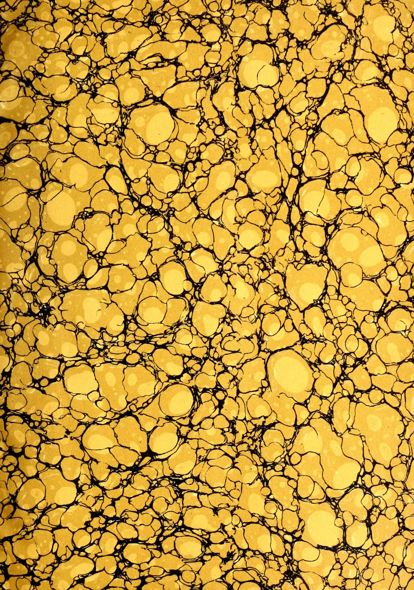This image displays a classic marbled pattern, often referred to as 'stone' or 'shell' marble. The composition is dominated by large, irregular, and somewhat rounded shapes in a warm, golden-yellow hue. These shapes vary in size and are distributed across the entire frame. They are separated by a complex network of thin, dark, and slightly irregular lines that create a sense of depth and texture, similar to the veins in natural stone or the cells in a biological structure. The overall effect is one of organic complexity and natural beauty.

3------------------------------------------------

This image shows a blank, aged page with a light beige or cream color. The surface has a subtle texture and a few small, dark spots or blemishes, characteristic of old paper. There is no text or other content on the page.

4------------------------------------------------

Digitized by the Internet Archive  
in 2014

<https://archive.org/details/tropicalagricul271906ceyl>

5------------------------------------------------

This image shows a blank, aged page with a light beige or cream color. The surface has a subtle texture and some minor blemishes or discolorations, typical of old paper. There is no text or other content on the page.

6------------------------------------------------

# The Tropical Agriculturist

AND

## Magazine of the Ceylon Agricultural Society.

---

**FOUNDED BY JOHN FERGUSON, C.M.G., 1881.**

---

EDITED BY

**J. C. WILLIS. Sc.D., F.L.S.,**

*Director, Royal Botanic Gardens, Peradeniya.*

---

**Vol. XXVII.**

Containing Numbers I to VI, July to December, 1906.

---

32226

A. M. & J. FERGUSON,

**COLOMBO, CEYLON.**

---

1907.

7------------------------------------------------

# THE CEYLON BOARD OF AGRICULTURE.

**President:**

HIS EXCELLENCY THE GOVERNOR.

**Vice-Presidents:**

<table><tr><td>The Hon'ble Mr. H. C. NICOLLE, Colonial Treasurer</td><td>Sir WILLIAM TWYNAM, K.C.M.G.</td></tr><tr><td>The Hon'ble Mr. JOHN FERGUSON, C.M.G.</td><td>Mr H. T. S. WARD, Director of Irrigation</td></tr><tr><td>The Hon'ble Mr. S. C. OBEYESEKERE</td><td>Mr. W. FORSYTHE</td></tr><tr><td>The Hon'ble Mr. FRANCIS BEVEN</td><td>Mr. W. D. GIBBON</td></tr><tr><td></td><td>Mr. C. P. HAYLEY</td></tr></table>

Dr. W. G. ROCKWOOD, M.D.

**Members of the Board:**

*Ex-Officio.*—Members of the Executive and Legislative Councils  
The Government Agents of Provinces  
The Director, Royal Botanic Gardens  
The Controller, Experiment Station, Peradeniya  
The Government Entomologist  
The Government Mycologist  
The Director of the Museum  
The Director of Public Instruction  
The Government Veterinary Surgeon  
The Superintendent of School Gardens  
The Conservator of Forests

**Nominated Members:**

*Western Province.*

*Eastern Province.*

Mr. R. Morison  
" M. Kelway Bamber  
" L. W. Booth, C.C.S.  
" E. B. Denham, C.C.S.  
" Solomon Seneviratne, Atapattu Mudaliyar and J.P.  
" Don Solomon Dias Bandaranaike, C.M.G.  
Maha Mudaliyar

Mr. Varitambi Kurunathapillai  
" C. A. Lienard

*North-Western Province.*

Mr. E. Scott  
" J. Clovis de Silva  
" G. W. Dodanwela  
" S. N. W. Hulugalle, Adigar

Dr. H. M. Fernando, M.D.  
Mr. W. N. S. Aserappa  
" W. Jardine

*North-Central Province.*

Mr. C. J. C. Mee  
" S. Sampander  
" C. Valoopillai  
" G. W. Jayawardene, Mudaliyar and J.P.  
" C. Taldena, R.M.

*Central Province.*

Mr. R. E. Paranagama, R.M.  
" Daniel Joseph  
" W. Dunuwille, Disava  
Dr. Valentine de S. Duke

*Province of Uva.*

*Northern Province.*  
Mr. V. Casipillai  
" V. Vraspillai, Adigar and J.P.  
" K. U. Tampaiya, District Mudaliyar.

Mr. A. T. Rettie  
" James Duncan  
" H. O. Hoseason, J.P.  
" T. B. Katugaha, R.M.

*Southern Province.*

Mr. C. G. Simmonds  
" E. R. Gooneratne, Gate Mudaliyar  
" D. A. Gooneratne, Gate Mudaliyar  
" B. T. Doole, Gate Mudaliyar

*Province of Sabaragamuwa.*

Mr. W. Forsythe  
" Dan. J. Jayatileke  
" J. H. Meedeniya, R.M.

**Secretary:**

MR. A. N. GALBRAITH, C.C.S.

8------------------------------------------------

281  
T 77

# INDEX.

<table border="0" style="width: 100%; border-collapse: collapse;">
<thead>
<tr>
<th style="text-align: left;"></th>
<th style="text-align: right;">PAGE.</th>
<th style="text-align: left;"></th>
<th style="text-align: right;">PAGE.</th>
</tr>
</thead>
<tbody>
<tr>
<td colspan="2"><b>Editorials, Lectures, Original Articles, etc:—</b></td>
<td>Tobacco Cultivation in Jaffna .. 245, 315</td>
<td></td>
</tr>
<tr>
<td>Agricultural Banks for Ceylon ... 268, 325</td>
<td></td>
<td>Village Agriculture, Possibilities of Improvement in ... 119</td>
<td></td>
</tr>
<tr>
<td>" Society Progress Report, 116, 198, 351, 434, 437, 516</td>
<td></td>
<td colspan="2"><b>Gums, Resins, Saps and Exudations:—</b></td>
</tr>
<tr>
<td>" Societies, Use and Objects of ... 500</td>
<td></td>
<td>Achres or Chicle Gum ... 229</td>
<td></td>
</tr>
<tr>
<td>Agriculture, Possibilities of Improvement in Village ... 1, 119</td>
<td></td>
<td>Camphor Cultivation in Southern India ... 378</td>
<td></td>
</tr>
<tr>
<td>Agri-Horticultural Show, Kegalle... 339</td>
<td></td>
<td>" Ceylon Industry ... 475</td>
<td></td>
</tr>
<tr>
<td>" " Kelani Valley 337</td>
<td></td>
<td>" Cultural Directions ... 34</td>
<td></td>
</tr>
<tr>
<td>" " Kurunegala 335</td>
<td></td>
<td>" Industry, 1905, The Chinese ... 377</td>
<td></td>
</tr>
<tr>
<td>Area under Rubber in Ceylon ... 121</td>
<td></td>
<td>Chicle Gum, Tapping and Preparing 229</td>
<td></td>
</tr>
<tr>
<td>Board of Agriculture, Ceylon 115, 197, 350, 433, 436, 513</td>
<td></td>
<td>Zapote Tree (<i>Achres sapota</i>) in Mexico 229</td>
<td></td>
</tr>
<tr>
<td>Botany, Lessons in Elementary 97, 191, 277, 340, 413, 505</td>
<td></td>
<td colspan="2"><b>RUBBER:—</b></td>
</tr>
<tr>
<td>Brand Marks on Kandyan Cattle ... 253</td>
<td></td>
<td><i>Castilloa Elastica:</i></td>
<td></td>
</tr>
<tr>
<td>Cacao, Cultivation in Ceylon, 73, 144, 311, 380, 480</td>
<td></td>
<td>Black Water of Castilloa ... 128</td>
<td></td>
</tr>
<tr>
<td>Camphor Industry, Ceylon ... 475</td>
<td></td>
<td>Coagulation of Latex by Chemicals 21</td>
<td></td>
</tr>
<tr>
<td>Castilloa Elastica, Introduction to the East of ... 206</td>
<td></td>
<td>Cultivation in Nicaragua ... 17, 126</td>
<td></td>
</tr>
<tr>
<td>Coconut Germination of the ... 232</td>
<td></td>
<td>Fungi on Trees ... 86</td>
<td></td>
</tr>
<tr>
<td>" Cultivation of the ... 318</td>
<td></td>
<td>Introduction to the East ... 206</td>
<td></td>
</tr>
<tr>
<td>" Diseases of the... 489</td>
<td></td>
<td>Latex Coagulating ... 20</td>
<td></td>
</tr>
<tr>
<td>Cotton in Ceylon ... 231</td>
<td></td>
<td>" Manipulation of ... 19</td>
<td></td>
</tr>
<tr>
<td>Crushing of Cattle by the Kandyan 407</td>
<td></td>
<td>" Treatment after Coagulation 126</td>
<td></td>
</tr>
<tr>
<td>Dry Grains of Ceylon ... 486</td>
<td></td>
<td>Nicaragua, Cultivation in ... 17, 126</td>
<td></td>
</tr>
<tr>
<td>Encouragement of Arts and Crafts in Ceylon ... 497</td>
<td></td>
<td>Resin in Young Trees ... 128</td>
<td></td>
</tr>
<tr>
<td>Entomological Notes 82, 193, 248, 394, 492</td>
<td></td>
<td>Tapping Methods ... 17</td>
<td></td>
</tr>
<tr>
<td>Improvement of Local Varieties of Plants ... 203</td>
<td></td>
<td>Yields in Mexico ... 123</td>
<td></td>
</tr>
<tr>
<td>Irrigation in Arizona, Notes on .. 271, 323</td>
<td></td>
<td>" of Castilloa ... 128</td>
<td></td>
</tr>
<tr>
<td>Lemongrass and Citronella in Ceylon 140</td>
<td></td>
<td>Cultivation in Colombia ... 471</td>
<td></td>
</tr>
<tr>
<td>Lessons in Elementary Botany 97, 191, 277, 340, 413, 505</td>
<td></td>
<td><i>Guayule</i>, Use of .. 457</td>
<td></td>
</tr>
<tr>
<td>Literature of Economic Botany and Agriculture... 98, 179, 276, 342, 422, 504</td>
<td></td>
<td><i>Hevea Brasiliensis</i> or <i>Para</i> :</td>
<td></td>
</tr>
<tr>
<td>Market Gardening in Nuwara Eliya 88</td>
<td></td>
<td>Bark Renewal ... 467</td>
<td></td>
</tr>
<tr>
<td>Mycological Notes ... 86</td>
<td></td>
<td>" Varieties of ... 12</td>
<td></td>
</tr>
<tr>
<td>Nature of the Para Rubber Tree and Latex Extraction .. 214</td>
<td></td>
<td>Block Para, Preparation of ... 469</td>
<td></td>
</tr>
<tr>
<td>Poultry Notes... 95, 250, 406, 495</td>
<td></td>
<td>Canker Fungus ... 86</td>
<td></td>
</tr>
<tr>
<td>Rubber and Cotton in Ceylon .. 299</td>
<td></td>
<td>Caoutchouc in Brazil Rubber ... 281</td>
<td></td>
</tr>
<tr>
<td>" Cultivation and Manufacture, Notes on ... 22</td>
<td></td>
<td>" in Latex, Proportions of ... 452</td>
<td></td>
</tr>
<tr>
<td>" Cultivation and the Future Production ... 442</td>
<td></td>
<td>Characters of Hevea ... 443</td>
<td></td>
</tr>
<tr>
<td>" Cultivation, The Science of 3</td>
<td></td>
<td>Cultivation in Malay Peninsula ... 22</td>
<td></td>
</tr>
<tr>
<td>" Exhibition, Ceylon ... 280</td>
<td></td>
<td>" Science of ... 3</td>
<td></td>
</tr>
<tr>
<td>" in London ... 367</td>
<td></td>
<td>Disease, Spread of ... 5</td>
<td></td>
</tr>
<tr>
<td>" Overproduction in .. 441</td>
<td></td>
<td>Drying Rubber, Points in ... 24</td>
<td></td>
</tr>
<tr>
<td>" Preparation of Block ... 469</td>
<td></td>
<td>Foliage, Development of ... 4</td>
<td></td>
</tr>
<tr>
<td>" Price of ... 357</td>
<td></td>
<td>" Effect of Increased ... 8</td>
<td></td>
</tr>
<tr>
<td>" Shipment to London 358</td>
<td></td>
<td>Forking, Effect of ... 6</td>
<td></td>
</tr>
<tr>
<td>" Tapping Demonstration at Henarategoda ... 460</td>
<td></td>
<td>Fungi on Rubber ... 86</td>
<td></td>
</tr>
<tr>
<td>" Vulcanisation ... 281</td>
<td></td>
<td>Inter-crops v. Clean-weeding ... 8</td>
<td></td>
</tr>
<tr>
<td>Sanitation on Estates ... 506</td>
<td></td>
<td>Irrigation, Cultivation under ... 301</td>
<td></td>
</tr>
<tr>
<td>Termes Gestroi, the Hevea Rubber Termite ... 85</td>
<td></td>
<td>Latex, Chemical Composition of ... 281</td>
<td></td>
</tr>
<tr>
<td></td>
<td></td>
<td>" Coagulation of .. 468</td>
<td></td>
</tr>
<tr>
<td></td>
<td></td>
<td>" Effect of Removing .. 217</td>
<td></td>
</tr>
<tr>
<td></td>
<td></td>
<td>" Extraction .. 214</td>
<td></td>
</tr>
<tr>
<td></td>
<td></td>
<td>" from Seed .. 223</td>
<td></td>
</tr>
<tr>
<td></td>
<td></td>
<td>" Manuring for ... 216</td>
<td></td>
</tr>
<tr>
<td></td>
<td></td>
<td>" Trees without ... 226</td>
<td></td>
</tr>
<tr>
<td></td>
<td></td>
<td>" Tubes Drying up... 216</td>
<td></td>
</tr>
<tr>
<td></td>
<td></td>
<td>" without Rubber ... 461</td>
<td></td>
</tr>
<tr>
<td></td>
<td></td>
<td>Laticiferous Cells, Origin and Formation of .. 215</td>
<td></td>
</tr>
</tbody>
</table>

9------------------------------------------------

iiINDEX.

<table border="0">
<thead>
<tr>
<th></th>
<th style="text-align: right;">PAGE.</th>
<th></th>
<th style="text-align: right;">PAGE.</th>
</tr>
</thead>
<tbody>
<tr>
<td>Manuring for Latex ... ..</td>
<td style="text-align: right;">216</td>
<td>Plantation Rubber, Preferred</td>
<td style="text-align: right;">216</td>
</tr>
<tr>
<td>" Hevea Trees ... ..</td>
<td style="text-align: right;">449</td>
<td>    Forms of ... ..</td>
<td style="text-align: right;">369</td>
</tr>
<tr>
<td>Nature of Para Tree and Latex</td>
<td></td>
<td>    Smoking ... ..</td>
<td style="text-align: right;">208</td>
</tr>
<tr>
<td>    Extraction ... ..</td>
<td style="text-align: right;">214</td>
<td>    Supply ... ..</td>
<td style="text-align: right;">447</td>
</tr>
<tr>
<td>Pest, White Ant ... ..</td>
<td style="text-align: right;">85</td>
<td>Price of Rubber ... ..</td>
<td style="text-align: right;">357</td>
</tr>
<tr>
<td>Planting Close, Advantages of ..</td>
<td style="text-align: right;">5</td>
<td>Pure Rubber, Value of Chemically</td>
<td style="text-align: right;">454</td>
</tr>
<tr>
<td>    Distance in ... ..</td>
<td style="text-align: right;">3</td>
<td>Ratnapura, Suitability for Rubber</td>
<td></td>
</tr>
<tr>
<td>Pruning Young Trees .. ..</td>
<td style="text-align: right;">6</td>
<td>    Growing of ... ..</td>
<td style="text-align: right;">225</td>
</tr>
<tr>
<td>Root Disease .. ..</td>
<td style="text-align: right;">10, 86</td>
<td>Raw Rubber, Preparation of ... ..</td>
<td style="text-align: right;">209</td>
</tr>
<tr>
<td>    Growth ... ..</td>
<td style="text-align: right;">4</td>
<td>Rubber Formation in Bark ... ..</td>
<td style="text-align: right;">215</td>
</tr>
<tr>
<td>Rubber and Cotton, Ceylon ... ..</td>
<td style="text-align: right;">299</td>
<td>    in Malaya ... ..</td>
<td style="text-align: right;">27, 373</td>
</tr>
<tr>
<td>Seed, Exports from Malaya ... ..</td>
<td style="text-align: right;">129</td>
<td>    Samoa ... ..</td>
<td style="text-align: right;">375</td>
</tr>
<tr>
<td>    Packing and Exporting ... ..</td>
<td style="text-align: right;">24</td>
<td>    Manufacture .. ..</td>
<td style="text-align: right;">292</td>
</tr>
<tr>
<td>Tapping Demonstration at Henarat-</td>
<td></td>
<td>Sabaragamuwa, Suitability for</td>
<td></td>
</tr>
<tr>
<td>    goda ... ..</td>
<td style="text-align: right;">460</td>
<td>    Rubber Growing of ... ..</td>
<td style="text-align: right;">225</td>
</tr>
<tr>
<td>    During Flowering Period ..</td>
<td style="text-align: right;">11</td>
<td>Samoa, Rubber in ... ..</td>
<td style="text-align: right;">375</td>
</tr>
<tr>
<td>    Frequency of ... ..</td>
<td style="text-align: right;">218, 466</td>
<td>Sampling in London .. ..</td>
<td style="text-align: right;">361</td>
</tr>
<tr>
<td>    High... ..</td>
<td style="text-align: right;">461, 465</td>
<td>Seed-bearing and Overtapping ... ..</td>
<td style="text-align: right;">224</td>
</tr>
<tr>
<td>Termes Gestroi, the Hevea Termite</td>
<td style="text-align: right;">85</td>
<td>    Parents, Selection of .. ..</td>
<td style="text-align: right;">226</td>
</tr>
<tr>
<td>Weeding Clean <i>v.</i> Inter-crops ... ..</td>
<td style="text-align: right;">8</td>
<td>Separating Strong and Weak</td>
<td></td>
</tr>
<tr>
<td>Yields at Henaratgoda ... ..</td>
<td style="text-align: right;">462</td>
<td>    Rubber .. ..</td>
<td style="text-align: right;">363</td>
</tr>
<tr>
<td><b>General :—</b></td>
<td></td>
<td>    Shipment to London .. ..</td>
<td style="text-align: right;">358</td>
</tr>
<tr>
<td>Acid in Rubber Coagulation ... ..</td>
<td style="text-align: right;">209</td>
<td>    Smoking Plantation Rubber ..</td>
<td style="text-align: right;">208</td>
</tr>
<tr>
<td>Ammonia on Latex, Action of ..</td>
<td style="text-align: right;">291</td>
<td>    Solution Making ... ..</td>
<td style="text-align: right;">293</td>
</tr>
<tr>
<td>Area in Ceylon under Cultivation...</td>
<td style="text-align: right;">121</td>
<td>    Sulphurising Rubber in Ceylon ..</td>
<td style="text-align: right;">285</td>
</tr>
<tr>
<td>Burgess on the Industry in</td>
<td></td>
<td>    Tapping Methods .. ..</td>
<td style="text-align: right;">260, 345</td>
</tr>
<tr>
<td>    Britain ... ..</td>
<td style="text-align: right;">131, 209, 292</td>
<td>    Vulcanising Methods and Ingre-</td>
<td></td>
</tr>
<tr>
<td>Boom, The Rubber ... ..</td>
<td style="text-align: right;">213</td>
<td>        dients .. ..</td>
<td style="text-align: right;">282</td>
</tr>
<tr>
<td>Caoutchouc Contents of Brazil</td>
<td></td>
<td>    Vulcanisation... ..</td>
<td style="text-align: right;">281</td>
</tr>
<tr>
<td>    Rubber ... ..</td>
<td style="text-align: right;">281</td>
<td>    Washing Raw Rubber .. ..</td>
<td style="text-align: right;">211</td>
</tr>
<tr>
<td>    Formation in Bark ... ..</td>
<td style="text-align: right;">215</td>
<td>    Yields in 1905, Comparison of Plan-</td>
<td></td>
</tr>
<tr>
<td>Comparative Value of Plantation</td>
<td></td>
<td>        tation .. ..</td>
<td style="text-align: right;">445</td>
</tr>
<tr>
<td>    Rubbers ... ..</td>
<td style="text-align: right;">444</td>
<td>    of Plantations, Future ..</td>
<td style="text-align: right;">448</td>
</tr>
<tr>
<td>Consumption in America ... ..</td>
<td style="text-align: right;">137</td>
<td><b>Oils and Fats :—</b></td>
<td></td>
</tr>
<tr>
<td>Cre in London Market ... ..</td>
<td style="text-align: right;">33</td>
<td>    Citronella in Ceylon ... ..</td>
<td style="text-align: right;">140</td>
</tr>
<tr>
<td>    Rubber ... ..</td>
<td style="text-align: right;">371</td>
<td>    " Oil, Ceylon .. ..</td>
<td style="text-align: right;">142</td>
</tr>
<tr>
<td>Cultivation and Future Production</td>
<td style="text-align: right;">442</td>
<td>    " Test, Schimmel's ... ..</td>
<td style="text-align: right;">142</td>
</tr>
<tr>
<td>Culture, Truth about Rubber ... ..</td>
<td style="text-align: right;">121</td>
<td>    Lemongrass in Ceylon ... ..</td>
<td style="text-align: right;">140</td>
</tr>
<tr>
<td>Dock Labourer and Rubber in</td>
<td></td>
<td>    " Oil, Ceylon ... ..</td>
<td style="text-align: right;">142</td>
</tr>
<tr>
<td>    London ... ..</td>
<td style="text-align: right;">363</td>
<td>    " Refined in Ceylon .. ..</td>
<td style="text-align: right;">140</td>
</tr>
<tr>
<td>Drying Rubber ... ..</td>
<td style="text-align: right;">210</td>
<td>    Schimmel's Citronella Test, Sage and</td>
<td style="text-align: right;">142</td>
</tr>
<tr>
<td>Extracting Rubber, Methods of ... ..</td>
<td style="text-align: right;">445</td>
<td>    Schleichera or Kusam Oil and Fat...</td>
<td style="text-align: right;">309</td>
</tr>
<tr>
<td>Extraction, New Era in Rubber ..</td>
<td style="text-align: right;">135</td>
<td><b>Fibres :—</b></td>
<td></td>
</tr>
<tr>
<td>Formalin on Latex, Action of ..</td>
<td style="text-align: right;">291</td>
<td>    Bamboo for Paper-making ... ..</td>
<td style="text-align: right;">379</td>
</tr>
<tr>
<td>Grades of Rubber, Qualities of Dif-</td>
<td></td>
<td>    Bark Fibre from Calotropis ... ..</td>
<td style="text-align: right;">42</td>
</tr>
<tr>
<td>    ferent ... ..</td>
<td style="text-align: right;">367</td>
<td>    Calotropis or Madar Floss ... ..</td>
<td style="text-align: right;">44</td>
</tr>
<tr>
<td>Industrial Demand, The ... ..</td>
<td style="text-align: right;">29</td>
<td>    Cotton Deterioration in Ceylon ... ..</td>
<td style="text-align: right;">204</td>
</tr>
<tr>
<td>Industry in Ceylon and America,</td>
<td></td>
<td>        Growing Notes .. ..</td>
<td style="text-align: right;">41</td>
</tr>
<tr>
<td>    Plantation .. ..</td>
<td style="text-align: right;">26</td>
<td>    " Improvement by Seed Selection</td>
<td style="text-align: right;">171</td>
</tr>
<tr>
<td>    in Great Britain, Burgess</td>
<td></td>
<td>        in Ceylon ... ..</td>
<td style="text-align: right;">231</td>
</tr>
<tr>
<td>        on ... ..</td>
<td style="text-align: right;">131, 209, 292</td>
<td>    " Seed Selection ... ..</td>
<td style="text-align: right;">171, 203, 479</td>
</tr>
<tr>
<td>In Malay Peninsula ... ..</td>
<td style="text-align: right;">27, 373</td>
<td>    Madar Fibre Plant ... ..</td>
<td style="text-align: right;">42</td>
</tr>
<tr>
<td>In Samoa ... ..</td>
<td style="text-align: right;">375</td>
<td><b>Dye Stuffs and Tanning Substances :—</b></td>
<td></td>
</tr>
<tr>
<td>Land in the Tropics, Rubber ..</td>
<td style="text-align: right;">446</td>
<td>    Mangrove Bark, Collection and Ex-</td>
<td></td>
</tr>
<tr>
<td>Latex, Action of Ammonia and For-</td>
<td></td>
<td>        port of ... ..</td>
<td style="text-align: right;">37</td>
</tr>
<tr>
<td>    malin on .. ..</td>
<td style="text-align: right;">291</td>
<td>    " Leather Produced</td>
<td></td>
</tr>
<tr>
<td>    Chemical Composition of ..</td>
<td style="text-align: right;">281</td>
<td>        from .. ..</td>
<td style="text-align: right;">39</td>
</tr>
<tr>
<td>    Sulphurising and Colouring</td>
<td style="text-align: right;">285</td>
<td>    " Trade .. ..</td>
<td style="text-align: right;">39</td>
</tr>
<tr>
<td>London, Rubber in .. ..</td>
<td style="text-align: right;">367</td>
<td>    " Utilisation of ... ..</td>
<td style="text-align: right;">36</td>
</tr>
<tr>
<td>Malaya, Rubber in ... ..</td>
<td style="text-align: right;">27, 373</td>
<td>    " Barks, Varieties of ... ..</td>
<td style="text-align: right;">36</td>
</tr>
<tr>
<td>Manuring Rubber ... ..</td>
<td style="text-align: right;">449</td>
<td>    " Extract, Manufacture of</td>
<td style="text-align: right;">38</td>
</tr>
<tr>
<td>Market, London Rubber.. 31, 137, 227, 304,</td>
<td style="text-align: right;">376, 471</td>
<td>    " in Africa ... ..</td>
<td style="text-align: right;">36</td>
</tr>
<tr>
<td>Masticating Rubber .. ..</td>
<td style="text-align: right;">212</td>
<td>    " East Indies .. ..</td>
<td style="text-align: right;">37</td>
</tr>
<tr>
<td>Mixing Rubber ... ..</td>
<td style="text-align: right;">213</td>
<td><b>Drugs and Medicinal Plants :—</b></td>
<td></td>
</tr>
<tr>
<td>Nerve in Rubber, Lack of ..</td>
<td style="text-align: right;">373</td>
<td>    Cinchona Barks and Cultivation..</td>
<td style="text-align: right;">46</td>
</tr>
<tr>
<td>Olsson-Seffer on Rubber ..</td>
<td style="text-align: right;">121</td>
<td>    " Formation of Alkaloid in</td>
<td style="text-align: right;">47</td>
</tr>
<tr>
<td>Overproduction in Rubber ... ..</td>
<td style="text-align: right;">441</td>
<td>    " Growth of Bark in ... ..</td>
<td style="text-align: right;">47</td>
</tr>
<tr>
<td>Physical Properties and Chemical</td>
<td></td>
<td>    Drugs, Cultivation in German East</td>
<td></td>
</tr>
<tr>
<td>    Composition of Rubber, Relation</td>
<td></td>
<td>        Africa of .. ..</td>
<td style="text-align: right;">50</td>
</tr>
<tr>
<td>    of ... ..</td>
<td style="text-align: right;">364</td>
<td>    Quinine in Cinchona Bark .. ..</td>
<td style="text-align: right;">47</td>
</tr>
<tr>
<td>Plantation Industry in Ceylon and</td>
<td></td>
<td></td>
<td></td>
</tr>
<tr>
<td>    America ... ..</td>
<td style="text-align: right;">26</td>
<td></td>
<td></td>
</tr>
</tbody>
</table>

10------------------------------------------------

INDEX.iii**Edible Products:—**

<table border="0">
<thead>
<tr>
<th></th>
<th style="text-align: right;">PAGE.</th>
</tr>
</thead>
<tbody>
<tr>
<td>Cacao Characters of Varieties ...</td>
<td style="text-align: right;">144</td>
</tr>
<tr>
<td>" Cultivation in Ceylon ...</td>
<td style="text-align: right;">73, 144</td>
</tr>
<tr>
<td>" ... in Gold Coast ...</td>
<td style="text-align: right;">311, 380, 480, 146</td>
</tr>
<tr>
<td>" Exportations from Ceylon, (1875-1905) ...</td>
<td style="text-align: right;">73</td>
</tr>
<tr>
<td>" Fermentation ...</td>
<td style="text-align: right;">380</td>
</tr>
<tr>
<td>" Length of ...</td>
<td style="text-align: right;">385</td>
</tr>
<tr>
<td>" Object of ...</td>
<td style="text-align: right;">380</td>
</tr>
<tr>
<td>" Fermenting Chambers ...</td>
<td style="text-align: right;">381</td>
</tr>
<tr>
<td>" in Africa ...</td>
<td style="text-align: right;">384</td>
</tr>
<tr>
<td>" in Java ...</td>
<td style="text-align: right;">382</td>
</tr>
<tr>
<td>" in Surinam ...</td>
<td style="text-align: right;">382</td>
</tr>
<tr>
<td>" in Trinidad ...</td>
<td style="text-align: right;">384</td>
</tr>
<tr>
<td>" in Venezuela ...</td>
<td style="text-align: right;">382</td>
</tr>
<tr>
<td>" in West Indies ...</td>
<td style="text-align: right;">383</td>
</tr>
<tr>
<td>" Flower Periodicity ...</td>
<td style="text-align: right;">480</td>
</tr>
<tr>
<td>" Flowers on a Tree, Number of ...</td>
<td style="text-align: right;">483</td>
</tr>
<tr>
<td>" Foliar Periodicity ...</td>
<td style="text-align: right;">480</td>
</tr>
<tr>
<td>" Fruit Characters ...</td>
<td style="text-align: right;">145</td>
</tr>
<tr>
<td>" Colours of Varieties... ..</td>
<td style="text-align: right;">145</td>
</tr>
<tr>
<td>" Wall, Differences in... ..</td>
<td style="text-align: right;">145</td>
</tr>
<tr>
<td>" in Gold Coast ...</td>
<td style="text-align: right;">146</td>
</tr>
<tr>
<td>" Root Periodicity ...</td>
<td style="text-align: right;">480</td>
</tr>
<tr>
<td>" Seed Characteristics ...</td>
<td style="text-align: right;">311</td>
</tr>
<tr>
<td>" Seeds in Fruit, Number of... ..</td>
<td style="text-align: right;">313</td>
</tr>
<tr>
<td>" Tree, Periodicity of ...</td>
<td style="text-align: right;">480</td>
</tr>
<tr>
<td>" Varieties, Classification of... ..</td>
<td style="text-align: right;">144</td>
</tr>
<tr>
<td>Cardamoms in the Seychelles ...</td>
<td style="text-align: right;">322</td>
</tr>
<tr>
<td>Citrate of Lime ...</td>
<td style="text-align: right;">386</td>
</tr>
<tr>
<td>Coconut Bud Rot of ...</td>
<td style="text-align: right;">491</td>
</tr>
<tr>
<td>" Cultivation in Trinidad... ..</td>
<td style="text-align: right;">155</td>
</tr>
<tr>
<td>" Germination of the ...</td>
<td style="text-align: right;">232</td>
</tr>
<tr>
<td>" Industry of Trinidad ...</td>
<td style="text-align: right;">155</td>
</tr>
<tr>
<td>" Notes on ..</td>
<td style="text-align: right;">318</td>
</tr>
<tr>
<td>" Oil Manufacture in Trinidad ..</td>
<td style="text-align: right;">157</td>
</tr>
<tr>
<td>Coconuts, Diseases of ...</td>
<td style="text-align: right;">489</td>
</tr>
<tr>
<td>" Pests of ...</td>
<td style="text-align: right;">83, 492</td>
</tr>
<tr>
<td>Coffee Cultivation in Brazil ..</td>
<td style="text-align: right;">74</td>
</tr>
<tr>
<td>" Industry in Brazil ..</td>
<td style="text-align: right;">154</td>
</tr>
<tr>
<td>Cola in Gold Coast ..</td>
<td style="text-align: right;">148</td>
</tr>
<tr>
<td>Copra Drying in Trinidad ..</td>
<td style="text-align: right;">157</td>
</tr>
<tr>
<td>Cotton Seed Meal and Oil as Human Food ..</td>
<td style="text-align: right;">388</td>
</tr>
<tr>
<td>Dry Grains Cultivated in Ceylon 391,</td>
<td style="text-align: right;">486</td>
</tr>
<tr>
<td>Ginger Cultivation ..</td>
<td style="text-align: right;">80</td>
</tr>
<tr>
<td>Guava Fruit Pulp ...</td>
<td style="text-align: right;">168</td>
</tr>
<tr>
<td>Maté or Paraguay Tea ...</td>
<td style="text-align: right;">234</td>
</tr>
<tr>
<td>Shamshu (Chinese Spirit) from Sorghum ...</td>
<td style="text-align: right;">169</td>
</tr>
<tr>
<td>Spices in London Market ...</td>
<td style="text-align: right;">170</td>
</tr>
<tr>
<td>Sugar Cane Growing in Trinidad... ..</td>
<td style="text-align: right;">167</td>
</tr>
<tr>
<td>" Industry of Philippines ...</td>
<td style="text-align: right;">166</td>
</tr>
<tr>
<td>" Making in South India ...</td>
<td style="text-align: right;">78</td>
</tr>
<tr>
<td>Tea, Ceylon Import Duty on ...</td>
<td style="text-align: right;">66, 153</td>
</tr>
<tr>
<td>" " "Thirty Committee" ...</td>
<td style="text-align: right;">68</td>
</tr>
<tr>
<td>" " "Resumé" ...</td>
<td style="text-align: right;">69</td>
</tr>
<tr>
<td>" of Work of ...</td>
<td style="text-align: right;">69</td>
</tr>
<tr>
<td>" in Ceylon, The Oldest ..</td>
<td style="text-align: right;">150</td>
</tr>
<tr>
<td>" Industry, China ...</td>
<td style="text-align: right;">485</td>
</tr>
<tr>
<td>" in Foochow, 1905 ...</td>
<td style="text-align: right;">386</td>
</tr>
<tr>
<td>" Deteriorated, Renovation of ...</td>
<td style="text-align: right;">57</td>
</tr>
<tr>
<td>" Deterioration, Causes of ..</td>
<td style="text-align: right;">60</td>
</tr>
<tr>
<td>" Signs of ...</td>
<td style="text-align: right;">59</td>
</tr>
<tr>
<td>" Green Manures for ..</td>
<td style="text-align: right;">63</td>
</tr>
<tr>
<td>" Maté or Paraguay... ..</td>
<td style="text-align: right;">234</td>
</tr>
<tr>
<td>" Pests ...</td>
<td style="text-align: right;">194, 394, 492</td>
</tr>
<tr>
<td>" Pruning Deteriorated ...</td>
<td style="text-align: right;">64</td>
</tr>
<tr>
<td>" Renovation of Deteriorated... ..</td>
<td style="text-align: right;">57</td>
</tr>
<tr>
<td>Teas, Indian Varieties of ...</td>
<td style="text-align: right;">150, 483</td>
</tr>
<tr>
<td>" Leading, The World's ..</td>
<td style="text-align: right;">150, 482</td>
</tr>
</tbody>
</table>

PAGE.PAGE.**Tobacco Cultivation and Curing**

<table border="0">
<tbody>
<tr>
<td></td>
<td style="text-align: right;">51, 158, 236</td>
</tr>
<tr>
<td>" " in Jaffna, Ceylon ...</td>
<td style="text-align: right;">245, 315</td>
</tr>
<tr>
<td>" Curing ...</td>
<td style="text-align: right;">158, 161, 236, 239</td>
</tr>
<tr>
<td>" Experiments in Madras... ..</td>
<td style="text-align: right;">56</td>
</tr>
<tr>
<td>" House ...</td>
<td style="text-align: right;">158</td>
</tr>
<tr>
<td>" Growing in West Indies ..</td>
<td style="text-align: right;">51</td>
</tr>
<tr>
<td>" in Jamaica ...</td>
<td style="text-align: right;">237, 242</td>
</tr>
<tr>
<td>" Pressing and Curing ...</td>
<td style="text-align: right;">158</td>
</tr>
<tr>
<td>" Ratoons ..</td>
<td style="text-align: right;">56</td>
</tr>
<tr>
<td>" Shade-Grown ..</td>
<td style="text-align: right;">236</td>
</tr>
<tr>
<td>" Soils... ..</td>
<td style="text-align: right;">243</td>
</tr>
<tr>
<td>" Topping Young Plants ..</td>
<td style="text-align: right;">55</td>
</tr>
<tr>
<td>Vanilla Industry in Seychelles ..</td>
<td style="text-align: right;">320</td>
</tr>
</tbody>
</table>

**Scientific Agriculture:—**

<table border="0">
<tbody>
<tr>
<td>Carbonate of Lime in Soil, Effect of Manures on ..</td>
<td style="text-align: right;">178</td>
</tr>
<tr>
<td>Cattle Manure, Conservation of ..</td>
<td style="text-align: right;">344</td>
</tr>
<tr>
<td>Cotton Improvement by Seed Selection</td>
<td style="text-align: right;">171</td>
</tr>
<tr>
<td>Seed Selection, Importance and Necessity of ..</td>
<td style="text-align: right;">171</td>
</tr>
</tbody>
</table>

**Horticulture:—**

<table border="0">
<tbody>
<tr>
<td>Cabbage Club-root in Ceylon ..</td>
<td style="text-align: right;">91</td>
</tr>
<tr>
<td>Crop Diseases in Ceylon, Vegetable Cut Flowers, How to Keep ..</td>
<td style="text-align: right;">92</td>
</tr>
<tr>
<td>Manures for Nuwara Eliya Gardens</td>
<td style="text-align: right;">90</td>
</tr>
<tr>
<td>Market Gardening in Nuwara Eliya, Ceylon ...</td>
<td style="text-align: right;">88</td>
</tr>
<tr>
<td>Rotation of Crops ..</td>
<td style="text-align: right;">113</td>
</tr>
</tbody>
</table>

**Plant Sanitation:—**

<table border="0">
<tbody>
<tr>
<td>Coconut Palm, Bud Rot of ...</td>
<td style="text-align: right;">491</td>
</tr>
<tr>
<td>" Diseases of the ...</td>
<td style="text-align: right;">489</td>
</tr>
<tr>
<td>" Rhinoceros Beetle on ..</td>
<td style="text-align: right;">492</td>
</tr>
<tr>
<td>Jungle Stumps, Uprooting ..</td>
<td style="text-align: right;">491</td>
</tr>
</tbody>
</table>

**Entomology:**

<table border="0">
<tbody>
<tr>
<td>Bees Boring in Rubber ...</td>
<td style="text-align: right;">193</td>
</tr>
<tr>
<td>Black Beetle on Coconuts ..</td>
<td style="text-align: right;">83</td>
</tr>
<tr>
<td>Black-headed Caterpillar on Coconuts ..</td>
<td style="text-align: right;">83</td>
</tr>
<tr>
<td>Brown Moth (<i>Oxyodes scrobiculata</i>) in Flight ..</td>
<td style="text-align: right;">494</td>
</tr>
<tr>
<td>Cacao Thrips (<i>Physopus rubrocincta</i>)</td>
<td style="text-align: right;">248</td>
</tr>
<tr>
<td>Camphor Wood attacked by Beetle</td>
<td style="text-align: right;">492</td>
</tr>
<tr>
<td>Case Worms on Tea... ..</td>
<td style="text-align: right;">195</td>
</tr>
<tr>
<td>Cinnamon Pest (<i>Euproctis fraterna</i>)</td>
<td style="text-align: right;">248</td>
</tr>
<tr>
<td>Cockchafer Grub, Cure for ...</td>
<td style="text-align: right;">249</td>
</tr>
<tr>
<td>Coconut Pests in Ceylon ...</td>
<td style="text-align: right;">83</td>
</tr>
<tr>
<td>Cotton Worn, The Egyptian</td>
<td style="text-align: right;">396</td>
</tr>
<tr>
<td>Cucumber Fly (<i>Dacus sp.</i>) ...</td>
<td style="text-align: right;">493</td>
</tr>
<tr>
<td>Entomological Notes 82, 193, 248</td>
<td style="text-align: right;">394</td>
</tr>
<tr>
<td>Flea Beetle, to Destroy the ..</td>
<td style="text-align: right;">195</td>
</tr>
<tr>
<td>Lac Insect on Amherstia ..</td>
<td style="text-align: right;">195</td>
</tr>
<tr>
<td>Lamp Traps for Insect Pests ..</td>
<td style="text-align: right;">82</td>
</tr>
<tr>
<td>Longicorn Beetle ...</td>
<td style="text-align: right;">193</td>
</tr>
<tr>
<td>Mealy Bug (<i>Phenacoccus ornatus</i>), A New ..</td>
<td style="text-align: right;">82</td>
</tr>
<tr>
<td>Mosquitoes in Batticaloa, Ceylon ..</td>
<td style="text-align: right;">84</td>
</tr>
<tr>
<td>Nettle Grubs (<i>Thosea</i>) in Ceylon ..</td>
<td style="text-align: right;">82</td>
</tr>
<tr>
<td>Pyralid Moth on Millet ...</td>
<td style="text-align: right;">195</td>
</tr>
<tr>
<td>Rubber, Boring Bees and Wasps in Cockchafer (<i>Lepidiota pin-guis</i>) Attacking ..</td>
<td style="text-align: right;">194</td>
</tr>
<tr>
<td>" Fungus Parasite (<i>Botryodiplodia elasticae</i>) ..</td>
<td style="text-align: right;">193</td>
</tr>
<tr>
<td>" Horned Termite Attacking ..</td>
<td style="text-align: right;">194</td>
</tr>
<tr>
<td>Red Weevil on Coconuts ..</td>
<td style="text-align: right;">83</td>
</tr>
</tbody>
</table>

11------------------------------------------------

ivINDEX.

<table border="0">
<thead>
<tr>
<th></th>
<th style="text-align: right;">PAGE.</th>
<th></th>
<th style="text-align: right;">PAGE.</th>
</tr>
</thead>
<tbody>
<tr>
<td>Rhinoceros Beetle on Coconut s...</td>
<td style="text-align: right;">492</td>
<td>Agri-Horticultural Show, Kegalle</td>
<td style="text-align: right;">339</td>
</tr>
<tr>
<td>Sand Fly, Remedy for the</td>
<td style="text-align: right;">85</td>
<td>" " " Kelani Valley</td>
<td style="text-align: right;">337</td>
</tr>
<tr>
<td>Scale Bugs on Coconuts</td>
<td style="text-align: right;">84</td>
<td>" " " Kurunegala</td>
<td style="text-align: right;">335</td>
</tr>
<tr>
<td>" Insects on Coconuts</td>
<td style="text-align: right;">83</td>
<td>Alcohol for Running Estate Engines</td>
<td style="text-align: right;">425</td>
</tr>
<tr>
<td>Shot Hole Borer (<i>Xyleborus form-</i> <i>catus</i>) in Tea</td>
<td style="text-align: right;">394, 492</td>
<td>Arts and Crafts in Ceylon, To En-</td>
<td></td>
</tr>
<tr>
<td>" " on Shade Trees</td>
<td style="text-align: right;">194</td>
<td>courage .. ..</td>
<td style="text-align: right;">497</td>
</tr>
<tr>
<td>Sparrow Pest in Ceylon</td>
<td style="text-align: right;">85</td>
<td>Board of Agriculture, Ceylon</td>
<td></td>
</tr>
<tr>
<td>Termes Gestroi, the Hevea Rubber</td>
<td></td>
<td>115, 197, 359, 433, 436, 513</td>
<td></td>
</tr>
<tr>
<td>Termite</td>
<td style="text-align: right;">85</td>
<td>Botany, Lessons in Elementary</td>
<td></td>
</tr>
<tr>
<td>Termite on Rubber, The Horned</td>
<td></td>
<td>97, 191, 277, 340, 413, 505</td>
<td></td>
</tr>
<tr>
<td>(<i>Termes inanis</i>)</td>
<td style="text-align: right;">194</td>
<td>" Literature of Economic</td>
<td style="text-align: right;">98, 179,</td>
</tr>
<tr>
<td>Tobacco Pest (<i>Prodenia tilitoralis</i>)</td>
<td style="text-align: right;">493</td>
<td>276, 342, 422, 504</td>
<td></td>
</tr>
<tr>
<td>Wasps Boring in Rubber</td>
<td style="text-align: right;">193</td>
<td>Co-operative Credit in Bengal</td>
<td style="text-align: right;">419</td>
</tr>
<tr>
<td><b>Mycology :</b></td>
<td></td>
<td>" " in the United</td>
<td></td>
</tr>
<tr>
<td>Botryodiplodia <i>Elastica</i> on Rubber</td>
<td style="text-align: right;">86</td>
<td>Provinces, India .. ..</td>
<td style="text-align: right;">330, 415</td>
</tr>
<tr>
<td>"Canker" Fungus on Rubber (<i>Cotic-</i> <i>ium javanicum</i>)</td>
<td style="text-align: right;">86</td>
<td>Cotton Meal and Seed as Fertilizers</td>
<td style="text-align: right;">425</td>
</tr>
<tr>
<td>Fungi on Rubber Trees...</td>
<td style="text-align: right;">86</td>
<td>Education in America, Industrial</td>
<td style="text-align: right;">423</td>
</tr>
<tr>
<td>Fusarium on Rubber</td>
<td style="text-align: right;">87</td>
<td>Hindoo Labour in British Guiana</td>
<td style="text-align: right;">423</td>
</tr>
<tr>
<td>Javanese Fungi on Castilloa</td>
<td style="text-align: right;">86</td>
<td>Irrigation Methods in Arizona</td>
<td style="text-align: right;">271, 323</td>
</tr>
<tr>
<td>Mycological Notes</td>
<td style="text-align: right;">86</td>
<td>Literature of Economic Botany and</td>
<td></td>
</tr>
<tr>
<td>Root Disease of Rubber</td>
<td style="text-align: right;">86</td>
<td>Agriculture</td>
<td style="text-align: right;">98, 179, 276, 342, 422, 504</td>
</tr>
<tr>
<td>Rubber Fungus Parasite (<i>Botryo-</i> <i>diploidia elasticae</i>)</td>
<td style="text-align: right;">193</td>
<td>Mosquitoes and Anti-Malaria Cam-</td>
<td></td>
</tr>
<tr>
<td><b>Live Stock:—</b></td>
<td></td>
<td>paign .. ..</td>
<td style="text-align: right;">274</td>
</tr>
<tr>
<td><i>Cattle :</i></td>
<td></td>
<td>Sanitation on Estates</td>
<td style="text-align: right;">506</td>
</tr>
<tr>
<td>Brandmarks on Kandy Cattle</td>
<td style="text-align: right;">253</td>
<td><b>Correspondence:—</b></td>
<td></td>
</tr>
<tr>
<td>Cattle Crushing by Kandyans</td>
<td style="text-align: right;">407</td>
<td>Adhatoda <i>Vasica</i> as a Green Man-</td>
<td></td>
</tr>
<tr>
<td>" Cure for Ticks in...</td>
<td style="text-align: right;">258</td>
<td>ure .. ..</td>
<td style="text-align: right;">266</td>
</tr>
<tr>
<td>Crushing of Cattle by Kandyans...</td>
<td style="text-align: right;">407</td>
<td>Ant Hill Earth</td>
<td style="text-align: right;">347, 510</td>
</tr>
<tr>
<td>" vs. Castration in Ceylon</td>
<td style="text-align: right;">496</td>
<td>Beekeeping in Ceylon</td>
<td style="text-align: right;">114</td>
</tr>
<tr>
<td>Kandy Cattle Brandmarks</td>
<td style="text-align: right;">253</td>
<td>Capillary Tubes</td>
<td style="text-align: right;">510</td>
</tr>
<tr>
<td>Live Stock Shows, Value of</td>
<td style="text-align: right;">408</td>
<td>Cotton in India, "Spence"</td>
<td style="text-align: right;">346</td>
</tr>
<tr>
<td>Mulling or Crushing of Cattle</td>
<td style="text-align: right;">407</td>
<td>Datura Stramonium in Assam</td>
<td style="text-align: right;">113</td>
</tr>
<tr>
<td>Ticks in Cattle, Cure for</td>
<td style="text-align: right;">258</td>
<td>Eucalyptus, Swamp Gum</td>
<td style="text-align: right;">196</td>
</tr>
<tr>
<td><b>Poultry :</b></td>
<td></td>
<td>Febrifuge Plants</td>
<td style="text-align: right;">266</td>
</tr>
<tr>
<td>Consumption in Poultry</td>
<td style="text-align: right;">95</td>
<td>Ginseng Seed .. ..</td>
<td style="text-align: right;">431</td>
</tr>
<tr>
<td>Cramp in Chickens</td>
<td style="text-align: right;">95</td>
<td>Honey Production in Europe</td>
<td style="text-align: right;">267</td>
</tr>
<tr>
<td>Crop Bound Fowls</td>
<td style="text-align: right;">95</td>
<td>Interesting Trees of North Ceylon</td>
<td style="text-align: right;">508</td>
</tr>
<tr>
<td>Debility in Poultry</td>
<td style="text-align: right;">250</td>
<td>Ipecacuanha .. ..</td>
<td style="text-align: right;">113</td>
</tr>
<tr>
<td>Diarrhoea in Poultry</td>
<td style="text-align: right;">250</td>
<td>Lemongrass Oil Extraction</td>
<td style="text-align: right;">266</td>
</tr>
<tr>
<td>Diphtheria in Poultry</td>
<td style="text-align: right;">250, 406</td>
<td>Mosquitoes and Anti-malaria Cam-</td>
<td></td>
</tr>
<tr>
<td>Diseases of Poultry</td>
<td style="text-align: right;">95, 250, 406, 495</td>
<td>paigns .. ..</td>
<td style="text-align: right;">503</td>
</tr>
<tr>
<td>Dropsy in Poultry</td>
<td style="text-align: right;">495</td>
<td>Mosquito Nettings and Muslins</td>
<td style="text-align: right;">267</td>
</tr>
<tr>
<td>Dysentery, Fowl</td>
<td style="text-align: right;">250</td>
<td>Noria Pump, The</td>
<td style="text-align: right;">507</td>
</tr>
<tr>
<td>Eggs and Overfeeding</td>
<td style="text-align: right;">252</td>
<td>Paddy Reaping Machine</td>
<td style="text-align: right;">513</td>
</tr>
<tr>
<td>" Study on Fowls"</td>
<td style="text-align: right;">251</td>
<td>Peas, Improved Ceylon Native</td>
<td style="text-align: right;">431</td>
</tr>
<tr>
<td>Soft or Pendulous Crop in Fowls</td>
<td style="text-align: right;">96</td>
<td>Plaintain Growing in S. India</td>
<td style="text-align: right;">511</td>
</tr>
<tr>
<td>" Shelled Eggs</td>
<td style="text-align: right;">495</td>
<td>Pruning Hevea and Cacao Trees...</td>
<td style="text-align: right;">507</td>
</tr>
<tr>
<td>SERICULTURE—in Ceylon 1905-6</td>
<td style="text-align: right;">409</td>
<td>Rotation of Crops</td>
<td style="text-align: right;">113</td>
</tr>
<tr>
<td><b>Education :</b></td>
<td></td>
<td>Rubber Growing</td>
<td style="text-align: right;">265</td>
</tr>
<tr>
<td>Agricultural Education in Jamaica</td>
<td style="text-align: right;">401</td>
<td>" Tapping Methods</td>
<td style="text-align: right;">260, 345</td>
</tr>
<tr>
<td><b>Miscellaneous:—</b></td>
<td></td>
<td>Sarsaparilla .. ..</td>
<td style="text-align: right;">196</td>
</tr>
<tr>
<td>Agricultural Banks for Ceylon</td>
<td style="text-align: right;">181,</td>
<td>Swamp Gum .. ..</td>
<td style="text-align: right;">196</td>
</tr>
<tr>
<td>" Society Progress Re-</td>
<td style="text-align: right;">268, 325</td>
<td>Tea Planting Industry in Natal</td>
<td style="text-align: right;">263</td>
</tr>
<tr>
<td>port 116, 198, 351, 434,</td>
<td></td>
<td></td>
<td></td>
</tr>
<tr>
<td>437, 516</td>
<td></td>
<td></td>
<td></td>
</tr>
<tr>
<td>" Societies, Use and</td>
<td></td>
<td></td>
<td></td>
</tr>
<tr>
<td>Objects of</td>
<td style="text-align: right;">500</td>
<td></td>
<td></td>
</tr>
<tr>
<td>Agriculture, Literature of Economic</td>
<td></td>
<td></td>
<td></td>
</tr>
<tr>
<td>Botany and, 98, 179, 276, 342,</td>
<td></td>
<td></td>
<td></td>
</tr>
<tr>
<td>422, 504</td>
<td></td>
<td></td>
<td></td>
</tr>
<tr>
<td>" in the Kadawatta and</td>
<td></td>
<td></td>
<td></td>
</tr>
<tr>
<td>Meda Korles</td>
<td style="text-align: right;">185</td>
<td></td>
<td></td>
</tr>
</tbody>
</table>

12------------------------------------------------

# RULES OF THE Agricultural Society of Ceylon.

---

1. 1. The Society shall be called "**THE AGRICULTURAL SOCIETY OF CEYLON.**"
2. 2. The business of the General Society shall be conducted through the **Board of Agriculture of Ceylon.**
3. 3. The Board shall meet for despatch of business on the first Monday of each month at 2-30 p.m. Seven members shall form a quorum.
4. 4. Notices of motions or questions shall be sent to the Secretary at least one week before the meeting of the Board.
5. 5. All motions will require to be seconded and will be circulated before the Board meets.
6. 6. A General Meeting of the Society may be called by the President at any time and may be held at any place to be fixed by him.
7. 7. All Members of the Board will be nominated by the President.
8. 8. Candidates for Membership of the Society must be proposed by a Member of the Board for the district in which the Candidate resides or owns landed property.
9. 9. Members of the Society shall pay a subscription of Rs. 5 per annum.
10. 10. Payment of the subscription in advance will entitle a Member to receive all publications of the Society. All subscriptions shall be paid to the Secretary of the Board.
11. 11. Lists of Members will be published annually in the *Government Gazette* and in the Journal of the Society.
12. 12. Local Societies may be formed with a Membership of not less than twelve Members.
13. 13. Each Local Society should be represented by a Secretary, through whom correspondence with the Board can be conducted.
14. 14. All Local Societies will be registered at the Local Kachcheri and by the Secretary of the Board.
15. 15. The Revenue Officers of the Province and District shall be *ex-officio* Members of the Local Societies within the Province.
16. 16. Local Societies are empowered to make their own rules.
17. 17. All Local Societies will be entitled to receive all publications of the Society on payment of an individual subscription.
18. 18. The funds of the Agricultural Society will be lodged in the Bank of Madras in the name of the Agricultural Society of Ceylon. The Secretary will be responsible for the accounts, and all cheques will be signed by him and the President or Vice-President of the Board of Agriculture.
19. 19. A statement of Expenditure incurred, &c., shall be tabled at each meeting of the Board.
20. 20. All grants-in-aid of Local Societies or special experiment must be approved by the Board.
21. 21. All accounts will be audited annually.

13------------------------------------------------

This image is a scan of a blank page. The paper has a light beige or cream-colored tint. There are a few very small, dark specks scattered across the surface, which appear to be scanning artifacts or dust particles. No text, lines, or other markings are present on the page.

14------------------------------------------------

THE  
**TROPICAL AGRICULTURIST**  
AND  
MAGAZINE OF THE  
**CEYLON AGRICULTURAL SOCIETY.**

---

VOL. XXVII.

COLOMBO, JULY 15TH, 1906.

No. 1.

---

**Some Possibilities of Improvement in Village Agriculture.**

**III.**

---

The next point to be considered is the possibility of improving native methods in agriculture. There can be no reasonable doubt that such improvement is possible, but here above all it is very important to know exactly what we are doing, and to be very careful to test things thoroughly and to be quite sure of their advantages before recommending or attempting to introduce them among the natives. Agriculture is a complicated art, and a change in any one item of a cultivation-process may bring entirely unforeseen and perhaps disastrous changes in other items in its train. To take a concrete illustration. A planter living near Peradeniya suggested to the neighbouring villagers that a little manure would greatly improve their paddy-field, and offered, as they could not afford to buy it, to provide them with it free of cost. This was accepted the manure was applied, the crop grew magnificently, the planter was delighted. But when harvest approached, it was found that the ears had been completely destroyed by the paddy-fly, the more rapid growth having perhaps rendered them a trifle less resistant. There is very little doubt that suitable manuring, with improved precautions against fly, might be attended by good results, but the whole matter should have been tested thoroughly on an Experiment Station first; as it is the villagers in the district in question have acquired a prejudice against manuring which may last a century.

Another formidable obstacle to any change in methods is custom. The native is very conservative, and objects to any interference with his time-honoured ways. Thus, for instance, among the Javanese and the Malays, one sees side by side the comparatively advanced method of transplanting the rice (as opposed to the broadcasting of Ceylon and some other places) and the inefficient method of harvesting it by cutting each ear separately with a knife. Yet even in Java the latter is tenaciously adhered to, on account of the fact that the harvesting time is the great festive season, when all the young folk turn out into the fields, and engagements are mostly contracted. In some parts of Southern India the ryots plant their cotton with a drill, in rows; in others they sow it broadcast, getting a less result from more seed and labour. If a

2432865

15------------------------------------------------

2

ryot in the latter districts be questioned, he will often admit that the former method is the better, but "it is not the custom" is his reply to the natural inquiry why he does not adopt it.

Another great obstacle is the indolence of the villager. He may know quite well that a particular method is better than his own, and that it will cost him nothing to adopt it, but if it involve more labour than the existing system, or an unaccustomed form of labour, then he will have none of it. Against this rock all attempts to introduce transplanting in place of broadcasting rice have hitherto been shattered in Ceylon. Though the yield is so much better in proportion to the seed and the labour used, the villager objects to the labour of stooping to do the transplanting work. Of course custom has a great deal to do with this result also.

Yet another obstacle, and perhaps the greatest of all, is the poverty of the small village cultivator. This has been fully dealt with elsewhere, and only needs mention here.

There are many other obstacles in the way of progress in village agricultural methods, but the last that need be specially dealt with here is ignorance. There can be little doubt that simple want of knowledge is at the bottom of much that is bad, wasteful, or inefficient. But to remove this ignorance is more easily said than done. It is often suggested that agriculture and horticulture should be definitely taught as such in the schools, and probably some good may be effected in this way, but there is one very great difficulty in this work, that of getting the teachers. The ordinary school teacher is incapable of teaching practical agriculture, knowing less about it than the villagers around him. The teacher who has been to an Agricultural College has usually the characteristic faults of the college-trained native of Southern Asia. He has learnt a great deal of book-knowledge on many topics connected with agriculture, but has little or no notion of how to apply any of it practically or suit it to local needs. If he is sent to teach, he is often dogmatic in the lecture room, and a failure in the field. If he is provided with an Experimental Garden for actual demonstration purposes, he is liable to make a still worse exhibition of incompetence, or to fall under temptation to misappropriate the produce. A scheme of this kind was tried some years ago in Ceylon, and its epitaph was written by Mr. F. R. Ellis in 1899 in the words "Government has not very long ago got rid of the last of a happy band of youths who for a series of years received a good salary for cultivating Crown land with cattle supplied by Government, and appropriating the produce to their own use."

The system of School Gardens is free from many of the objections and difficulties attaching to definite teaching of agriculture in the villages. The masters teach the general principles of agriculture and horticulture by means of plants which are in general unfamiliar to the villagers, and in which, consequently, they do not at once invite comparison and contrast with work going on elsewhere in the village. And there is no doubt that the general principles can be equally as well taught with such plants as with rice, coconuts, or cassava. At the same time, the School Garden practically forms an Experimental Garden for the village, in which the villager can see various "new products," and from which he can get samples for trial, or seeds to cultivate.

There are innumerable directions in which native agricultural methods can be improved, and we can only give a few suggestions here. Thus the tillage of the ground is by rude implements and by a great expenditure of physical labour in proportion to the result achieved. Vast improvements are possible, but we have already dealt with this subject. (See number of "*T. A.*" for April, 1906, page 199.)

16------------------------------------------------

3

## GUMS, RESINS, SAPS AND EXUDATIONS.

### The Science of Para Rubber Cultivation.

A LECTURE BY HERBERT WRIGHT.

[ILLUSTRATED.]

Mr. Herbert Wright, A.R.C.S., F.L.S., Controller of the Government Experimental Station at Peradeniya and author of *Hevea Brasiliensis*, delivered a lecture on the Science of Para Rubber Cultivation in the Public Hall, at Kegalle, on June 9th, under the auspices of the Kegalle Planters' Association. Keen interest was evinced in the event, and the local planters mustered in force, some riding as much as 16 and 20 miles to be present. This is the first lecture on Para Rubber that has been delivered in Ceylon, and is in all probability the commencement of a series. Mr. Wright confined his remarks to "Distance and Pruning," the initial operations; and under these heads discussed exhaustively the principles of planting and the treatment of young plants. He allowed himself half-an-hour and stopped precisely to the minute; but he was able to compress into 30 minutes an amazing amount of useful information. At the close of the lecture Mr. Wright invited questions, and of these there was no lack. Information was adduced which will be read with interest and be found useful to rubber planters all over the island. Mr. Edgar Smith, Chairman of the Kegalle Planters' Association, presided, and there were also present:—Messrs. B. H. Jenkyns, Hon. Secretary, Kegalle P.A., P. T. L. Weatherall, T. R. Walker, A. A. Franklin, C. D. Hunt, Edward Hawkins, G. Hawkins, J. M. Power, A. E. Barrs, A. H. C. Luschiwitz, Philip F. Ondaatje, G. Harries and R. Tait, a young Scotch botanist from Edinburgh on his way to Christmas Island to enquire into the agricultural resources and possibilities of the island which is in the hands of the Christmas Island Phosphates Company.

#### THE LECTURE.

The CHAIRMAN:—I have much pleasure, gentlemen, in introducing Mr. Herbert Wright, who has come to give us a lecture on the Science of Para Rubber.

Mr. WRIGHT was received with applause on rising to speak. He said:—

Mr. Chairman and Gentlemen.—When I yielded to the fourth "dun" from your persevering Secretary and promised to lecture on the subject of Para Rubber, I found myself in an awkward position and wondered what subject to take up which would be of importance to you as practical men. There are so many details connected with the development of rubber plants from the nursery to maturity, and such an abundance of schemes regarding the collection of latex and its conversion into rubber, that I found it most difficult to make a selection which would, without doubt, prove interesting to your Association. I finally resolved, as this is our first lecture on Para Rubber, to begin at the beginning and to discuss with you some of the principles of ordinary planting operations and the treatment of the young plants. If we have time to touch on matters of interest to planters with mature rubber, we will do so, but these can perhaps be brought forward in the form of questions.

#### DISTANCE IN PLANTING.

The first subject for discussion is the distance at which Para rubber trees should be planted. At the present time, Para rubber is planted at distances varying from 10 to 25 feet apart, and it is obvious that such a variation speaks volumes for our ignorance of the principles of this subject. I do not profess to understand the principles better than anyone else, but I think you will agree with me that the distance adopted should be one which will allow free development of all parts of

17------------------------------------------------

Gums, Resins,4

the plant, and such as to allow one to collect the latex with ease and to successfully operate against diseases when they arise. Generally speaking, close planting is associated with interference of root growth, production of tall trees, and with the rapid spread of disease; to counterbalance these, we have the protection against exposure and wash, and an increased tapping area. Now let us take each of these questions and see what understanding we can arrive at.

#### ROOT GROWTH.

We all know how rapidly the superficial roots of Para rubber trees grow, and what a compact mass they form when mature. The lateral roots grow at varying rates according to the conditions prevailing, but if grown on moderately good land, an incremental yearly increase in radius of about 10 to 12 inches may be allowed for. In some districts where the soil and climatic conditions are very favourable, the root growth is more rapid than this, and in others, particularly at high elevations, the growth is not as fast. If such a rate obtains for your estates, it means that it will take five years for the roots of trees planted ten feet apart to completely ramify the whole of the soil, and a proportionately longer period if the trees are more widely planted. If the trees are distanced more than ten feet from one another, there is ample soil in the middle of the lines for the roots of shade trees green manures or catch crops, during the first few years—though ultimately these should be uprooted and only the rubber roots allowed to remain in possession of the soil. If, therefore, you are prepared to tap some of your trees to death at the end of the fourth or fifth year, there is no very serious objection to originally planting the trees ten feet apart, as far as root development is concerned.

#### DEVELOPMENT OF FOLIAGE.

Naturally one must also consider the rate of development of the foliage as well as the roots. The lateral spread of the foliage depends upon whether the tree is allowed to form a straight stem, as it will do if left alone, or whether it is made to fork and to develop lateral branches instead. Under normal conditions one may expect that the lateral branches of trees planted ten feet apart will have met by the end of the fifth year, and if pruning has been carried out there is generally a considerable overlapping of the foliage from adjacent trees, and the soil is partly covered by that time. The advantages of quickly covering the soil in the tropics are only too well-known and the protection of the soil by any means should be seriously considered. The disadvantages of overlapping foliage are that disease might spread more rapidly and that the functions of the leaves may be impaired. As far as the theory of the interference of foliar functions is concerned, I think it can be dismissed. The leaves are the organs wherein the food of the tree is manufactured; and in order to accomplish this they must, of course, have some light. But it is a very disputed question as to whether the leaves of Para Rubber require all the light which they can get in the tropics, and we all know the beneficial results obtained by growing other plants under shade in Ceylon. The overlapping of foliage consequent on close planting constitutes a self-shade and from considerations regarding the increase in the flow of latex when light is less intense, we may yet find that a moderate amount of overlapping of foliage may be very beneficial for Para Rubber. From the results of experiments, I am convinced that many plants, even in Europe where the light is never intense, do not require constant strong light, but are able to carry on their work when supplied with light intermittently. Intermittent light has been as effective as continuous light, with certain plants, and from these considerations and remembering that light often retards growth, I do not apprehend much interference in the functions of the leaves of Para Rubber trees by a moderate amount of overlapping.

18------------------------------------------------

5Saps and Excudations.

We may, therefore, conclude that as far as the root and foliar developments are concerned, there are no serious objections to the original planting of Para rubber trees, ten feet apart. But such a distance is far too close for mature trees and can only be recommended on the understanding that the estates will be thinned-out after the fourth or fifth year. I must, however, remind you that many of our 30-year-old trees are growing well, though they are only eight to ten feet apart.

#### SPREADING OF DISEASES.

When, however, we come to the question of the spreading of diseases, a subject on which I would prefer the entomologist or mycologist to inform you, I think we are all prepared to admit that an epidemic would spread much more rapidly on a densely planted estate than on one with fewer trees; no matter whether the disease was on the leaves, stems, fruits or roots. Furthermore, the close planting of trees is only possible when thinning-out is intended; this means killing the trees; and if dead stumps are left behind, perhaps assisting in the spread of root disease. The Para root disease, as most of you already know, commences as a fungus on the stumps of trees in your clearings, and by means of slender threads spreads along dead roots, through the soil, to the living roots of the rubber trees. It may be argued that the differences in distance between trees planted ten and twenty feet apart are so insignificant when one considers the vitality of the diseases and their power to spread, that it may be disregarded as an objection to close planting; while I am prepared to admit that there seems some reason in this, I cannot omit to emphasise the necessity to uproot all dead stumps, whenever possible, on estates where closely planted trees have been purposely killed by tapping. It should be remembered that no matter how far apart your trees are planted, the same root disease may appear on stumps left during clearing operations and even widely-planted estates be seriously affected. The disease appears on most rubber properties which have been planted on virgin land on account of the abundance of large tree stumps, and is therefore not confined to closely-planted estates.

#### ADVANTAGES OF CLOSE PLANTING.

So much then for the arguments against close planting. Now let us consider the other side. The advantages of preventing wash and exposure of our Ceylon soils are only too fully recognised, and I propose to consider a more serious point, *i.e.*, the available tapping area. Every tree, having a circumference of twenty inches at five feet from the base, presents an available tapping area of 1,200 square inches. If you work out this point in connection with the number of trees per acre, when planted from ten to twenty feet apart, you will find that at the end of the fourth or fifth year, an estate planted 10×10 feet has an available tapping area of 522,000 square inches, per acre, whereas one planted 20×20 feet apart has only 130,800 square inches, or approximately only one-quarter of the closely-planted one. This is the great outstanding advantage of close planting, and I would ask you to fully consider what it means during the fourth, fifth, and sixth years. It is, as you know with tea and coconuts, much easier to thin out a closely-planted area than to subsequently interplant a widely-planted one; and when one considers the results obtained with other plants, I do not see why the remaining Para rubber trees should not ultimately make satisfactory progress on closely planted estates which have been systematically thinned out. On any rubber property there is always a proportion of the trees which do not thrive as well as the others, and this is the more serious the fewer the trees on the estate. On an estate closely-planted, the intermediate trees could be killed out in a definite manner until 200 or 250 trees per acre remain after the 8th year. It is almost certain that the yield of rubber obtained by making rubber its own catch crop will pay for the complete removal of all dead stumps and leave a balance of profit worth considering.

19------------------------------------------------

Gums, Resins,6PRUNING AND HASTENING MATURITY.

Another subject which is of importance to planters with young clearings, and directly connected with distance in planting, is pruning. We all know how Para rubber plants, closely or widely planted, tend to produce long whippy stems with single whorls of leaves, and that when thirty years old they may consist of gigantic forest trees, nearly 100 feet in height, such as can be seen at Henaratgoda. We also know, from our experience on estates with large acreages of rubber in bearing, that the labour supply necessary for tapping the trees from the base to a height of six to ten feet is very considerable. It must also be remembered that the complete removal of the bark tissues from the base to 6 or 10 feet is an operation which will tax the powers of the tree, and if repeated too frequently may be the cause of premature death. From these considerations, ever though I have obtained tremendous yields from the upper parts of the giants at our Henaratgoda gardens I cannot help but think that it would be unwise for planters to speculate on the rubber they are going to obtain, ten years hence, from the long stems of their Para trees. The production of 3, 5, 10 and 25 lbs. of rubber per year from individual trees tapped mainly from the base to ten feet will more than satisfy most planter, when they have to find the coolies to tap the clearings they are now planting. In my opinion—and I do hope you will correct me today if I am wrong—the question for planters to consider is how soon can tapping operations be commenced in order to shorten the long years of waiting, and to place the rubber on the market while the price is high. Remember that by the time the pet clearings you have just planted are in bearing, Ceylon will have 60,000 acres of such trees on the tap, the Straits considerably more, and that India, Java, Africa, Borneo, Sumatra, Samoa, Brazil, and the West Indies are also in the race. I mention this merely to draw attention to the fact that the supplies for the future are rapidly increasing, and it is just as well that every effort should be made to bring the trees to a tappable size and to obtain and sell your rubber while the price is over 5s. per lb. When the price drops to what it was ten years ago, viz., about 3s. per lb., then you can perhaps give your trees a rest and let them grow, uninterrupted, as nature may determine.

WHEN TO TAP, AND PRUNING.

Our subject is closely associated with the production of trees of a tappable size, and we must, therefore, discuss this question. Opinion seems divided as to whether age or size should form the criterion in deciding when trees should first be tapped; but I am of the opinion that, given a minimum age of four years, size is the consideration of most importance. Trees younger than four years can usually be disregarded because the rubber from them is invariably poor in quality and quantity, and the removal of bark from them would probably appreciably affect their health and future vigour. Trees, when four years of age or more, vary considerably in size; but if they have a circumference of much less than 20 inches a yard from the ground, systematic tapping cannot be confidently recommended. If the trees have this circumference, tapping can be commenced, and we have now to consider what means are at hand which will affect the acquiring of the required dimensions. Of course, good tillage and manuring will always be a great help, but I propose today to discuss another question, namely, the production of increased foliage by careful pruning.

EFFECT OF FORKING.

You have been previously treated to a general discussion on this subject by correspondents to the Press; but as most of the points have been inadequately touched upon, and my original suggestions more often than not grossly misinterpreted, I think it will be as well if we can clear the air at this meeting. Since I first suggested the experiment of pruning whippy Para trees, I have obtained numerous letters quoting the dimensions of straight-stemmed and forked trees of the same

20------------------------------------------------

PLATE A.

A black and white photograph showing two young Para rubber plants in a field. The plant on the left is straight-stemmed, and the plant on the right is forked. The background shows a dense forest or grove. The photo is signed 'S. E. & Co.' in the bottom right corner.

*Photo by Ivor Etherington.*

PRUNING YOUNG PARA RUBBER PLANTS.

1.  
STRAIGHT-STEMMED.

2.  
THREE MONTHS AFTER PRUNING.

STRAIGHT-STEMMED AND FORKED PLANTS 20 MONTHS OLD.

21------------------------------------------------

This image is a scan of a blank page. The paper has a light cream or off-white color with a subtle texture. There are a few very small, faint dark spots scattered across the surface, which appear to be scanning artifacts or minor imperfections in the paper. No text, lines, or other markings are present.

22------------------------------------------------

7Saps and Exudations.

age, and the results from Monaragala, Dumbara, Kalutara, and Matale do, I am glad to say, support the original idea. In the first place I want to remind you of the tendency of Para rubber plants to produce tall, woody stems with whorls of foliage one above the other and to impress upon you the fact, known to all horticulturists, that growth in height may be checked and that in girth increased. The energy of the plant, used in the production of high, bulky, woody tissues, may be directed to the production of the same material in the base of the stem and to that of branches bearing foliage. The success of the pruning experiment depends upon checking the formation of high wood and increasing the foliage. The leaves of a plant are of vital importance and are the organs wherein the food supplies are elaborated. If you repeatedly remove the leaves or diminish their numbers the production of food supplies is seriously affected and the increase in circumference of the stem is reduced. We have some cuttings of Dadap, planted two years ago, which, on account of the leaves having been hand-pruned every month, are of the same thickness today as when they were first planted. In the same way one may state that an increase in foliage increases the rate of food manufacture and therefore provides the materials necessary for the stem to grow at a quicker rate.

#### FORKING AND FOLIAGE.

It is necessary to first prove what happens when the terminal bud is removed by the thumb-nail or the knife. If you examine a Para rubber plant, ten to fifteen feet high, you will notice that the upper part of the stem is green; this is the part which will throw out numerous lateral branches if the growth in height is stopped by removal of the terminal bud. If, as has often been done in the Straits and Ceylon, the whole of the green wood and foliage is cut away, the probability is that the remaining stump will only throw out a single shoot and you will be no better off. The result which follows careful removal of the terminal bud is best seen in the photograph I have here. (*See plate A.*) This photograph shows two plants of exactly the same age, grown from seeds from the same parent. In one case the plant has been allowed to grow into the usual long and slender stem, and, when I left Peradeniya, had only three whorls of foliage. The other tree, about four months ago, had its terminal bud removed by thumb-nail pruning, and being unable to grow in height, has thrown out ten lateral branches. The result is the straight-stemmed tree has still only one growing point at the apex of the stem, whereas the pruned one has ten, and from each are produced whorls of foliage. Though the pruning was only done recently, the plant so treated has no less than 200 fully-developed leaves, whereas the one which has been allowed to grow in its own way has only about 50 leaves. That, gentlemen, is within four months. The food-producing capacity of the pruned tree, as far as the foliage alone is concerned, is now four times as great as that of the straight-stemmed one, and it stands to reason that the basal part of the pruned tree will grow at a quicker rate. The operation itself is a gentle one and does not partake of anything so drastic as the cutting away of the upper part of young or old trees. The lateral branches each produce their own whorls of foliage as though they were members of separate trees, and as they tend to grow more or less upwards may themselves require pruning at intervals of three or six months. If there is anyone who doubts the effect of pruning the terminal bud, I need only ask him to consider what happens when he prunes his tea bushes for the first time. As an example of a system of pruning the following will serve our purpose; the tree may be thumb-nail pruned when twelve feet high and two branches allowed to develop, one on either side; in about one-and-a-half month's time those two lateral shoots will be a little over a foot each in length, and can be again pruned and half-a-dozen shoots allowed to grow from each; in four or five months' time these shoots will be from four to six feet in length and may be finally pruned at the apex and allowed to develop as many branches as they

23------------------------------------------------

Gums, Resins,8

care to. The result of this will be that the tree, which has been pruned three times in a period extending a little over six months possesses a main stem ten feet in height, and twelve branches; each of the dozen branches have their own growing point and produce as many leaves as the single growing point at the apex of the stem of the unbranched tree. By this means the food-producing power of the tree which has been pruned will be about twelve times that of the single-stemmed one. If such conditions do not result in an increased rate of growth for the basal ten feet of stem, I shall have no hesitation in throwing up the sponge.

#### EFFECT OF INCREASED FOLIAGE.

I think you will now all admit that it is possible to lead to the production of a large number of branches, and we have next to enquire how soon the effect is obvious in the girth of the stem. The two plants in the photograph I have here (*see plate A.*) are over one-and-a-half years old from stumps, and the forked one shows a circumference of 4 4-5th inches as against 4 inches for the straight-stemmed tree; this means an increase of over half-an-inch within six months of the pruning operation. The young trees on various estates in Ceylon and the old trees at Henaratgoda (*see plate B.*) indicate that an average increase of about one inch per year may be obtained by making them fork at the proper height. I cannot guarantee to convert your young clearings into "baobab" plantations, but if you will measure your forked and straight trees which are of the same age, and which have been grown under identical conditions; I think you will soon have sufficient figures to convince you of the increased circumferential rate of growth, which is likely to follow careful pruning. If you can obtain an average increase of one inch per year, it means that you gain a year in the first four or five years and the minimum tapping size of 20 inches will be attained in the fourth year. The only disadvantage which I have heard urged against this system is that it may be followed by too much overlapping of the foliage, necessitating that the trees be planted at greater distances. This, in my opinion, may be an advantage instead of a disadvantage during the first few years, and I cannot think that it constitutes a serious argument against the experiments I have placed before you. Now, gentlemen, I have had my say, and as I am here today more to promote or aggravate discussion than to give information, I hope your remarks will not lack in eloquence or vitality, and that you may at least be induced to try your own experiments on the rubber clearings you are now planting. (Applause.)

---

### THE DISCUSSION.

#### CLEAN WEDDING *v.* INTER-CROPS.

On questions being invited,

Mr. EDGAR SMITH asked:—What is your opinion about clean weeding on rubber estates?

Mr. WRIGHT:—Ceylon is unique in so far as that most of the estates are clean weeded; but providing the roots of the weeds or whatever plants are grown in addition to the rubber, do not interfere with the root development of the Para rubber trees, there is no disadvantage, but a great advantage in having the ground covered.

Mr. SMITH:—What about ordinary grass?

Mr. WRIGHT:—I recently heard of an experiment which had been carried out by a prominent member of the planting community whom you all know. He assured me that purely as an experiment he had the ground under Para rubber trees covered with ordinary turf. The rubber trees, protected in this way by the grass, did wonderfully.

24------------------------------------------------

PLATE B

A black and white photograph showing two rubber trees in a plantation. The tree on the left is a 'Forked Tree' with a thick, gnarled trunk that splits into two main branches. The tree on the right is a 'Straight-Stemmed Tree' with a single, tall, straight trunk. The ground is covered in low-lying vegetation and there are other trees in the background.

Skeen & Co

Photo by H. F. Macmillan.

THIRTY YEAR OLD PARA RUBBER TREES IN CEYLON.

2.  
STRAIGHT-STEMMED TREE.

1.  
FORKED TREE.

25------------------------------------------------

This image is a scan of a blank page. The paper has a light cream or off-white color with a subtle texture. There are a few very small, dark specks scattered across the surface, which appear to be scanning artifacts or dust particles. No text, lines, or other markings are present on the page.

26------------------------------------------------

9*Saps and Exudations.*

Mr. SMITH :—I tried grass.

Mr. WRIGHT :—The gentleman referred to had the ground under certain trees turfed, and he said that if it was practicable to turf an estate it would be a very good thing. There is one advantage about grass; the root system is not as penetrating as the root system of many other plants. If you grow plants which throw out their roots at such a rate and in such a manner as to interfere with the root development of the rubber, then harm may be done.

Mr. WALKER :—The trees at Henaratgoda are planted through grass. They are unweeded?

Mr. WRIGHT :—I understand that they were attended to for the first few years; when a rubber estate is 5 years old, weeding is negligible.

Mr. SMITH :—Coconut estates have grass and cattle are put in to feed on it. Why should not the same be the case in rubber? Why not let the grass grow and keep cattle?

Mr. WRIGHT :—Once a rubber estate is matured you cannot grow anything under the rubber.

Mr. SMITH :—The estate I am thinking of is three years old.

Mr. WRIGHT :—I think that encouraging cattle on rubber places is not a very commendable thing. The cattle will probably do more damage than anything else. At the same time the protection of the soil by any means is a consideration which should not be lost sight of. I cannot say I think grass as good as some plants that might be used. What I should like to see growing is some plant of low habit that would give a lot of organic matter.

Mr. FRANKLAND :—Would the sensitive plant do?

Mr. WRIGHT :—It would be beneficial, although my opinion on this question of growing crops of any kind in rubber is that they must either be considered as crops or green manures, or you must make up your mind to let the estate be clean weeded. The former is often a difficult system to work.

Mr. FRANKLAND :—But for protection of the soil?

Mr. WRIGHT :—On some estates, where Albizzias have been used and lopped when less than two years old, you can see the two-year-old Para rubber trees quite 10 feet above the level of the Albizzia plants, protecting the soil, all over the place.

#### “THE FIRST PINCH.”

Mr. WALKER :—What height would you recommend for the first pinch of the plant?

Mr. WRIGHT :—I think planters will be content to tap plants from the base to 10 feet. I do not think they will ever want to tap to 30 feet as we have done at Henaratgoda. Therefore, if they prune so as to leave a stem 10 feet from the base and allow it to remain I think it will be quite sufficient.

Mr. WALKER :—Then you prune again at 15 feet?

Mr. WRIGHT :—Then let the branches grow out, one on either side; when a foot-and-a-half long prune again and let the next shoots grow until they are 5 feet long and make your final pruning and leave the tree to itself.

Mr. WALKER :—The branches will be very thick if you prune over 10 feet.

Mr. WRIGHT :—No: I do not think so. I do not really see your objection.

2

27------------------------------------------------

Gums, Resins,10THE QUESTION OF WIND.

Mr. C. D. HUNT :—How does the question of wind enter into the argument ? If you increase the foliage of the tree, it is liable to be blown over.

Mr. WRIGHT :—Do you think a properly established rubber tree would be easily blown over ?

Mr. C. D. HUNT :—I have seen a good many.

Mr. WRIGHT :—A good many Para trees have been blown over, but that was not due to wind alone. On one estate, I believe, about 200 went down in a day, but that was due to diseases affecting the roots. The manager did not know what was wrong until he pushed one of the erect trees, and down it went. However, that is an interesting question as to the effect of wind raised by Mr. Hunt.

Mr. HUNT :—We do not, of course, admit we have wind here. (Laughter.)

Mr. WRIGHT :—Would you consider that the increased foliage would tend to make the tree liable to be blown down on an average estate ?

Mr. HUNT :—I have seen young trees blown over, and especially young trees grown in paddy lands. They seem not to be able to grow down as fast as they do above.

Mr. WRIGHT :—The Para rubber tree has a well-developed and magnificent system of lateral roots and also a long tap root. I should say that if a well-developed Para rubber tree on good soil could be blown over many strong trees of other kinds might be blown over.

ROOT DISEASE.

Mr. HUNT :—Does this root disease not affect tea ?

Mr. WRIGHT :—Of course that is a thing for Mr. Petch to reply to. It behaves to a certain extent in the same way and the treatment is somewhat similar. In the one case it is usually due to *Rosselinia* and in the other to a fungus called *Fomes semitostus*—a different fungus altogether. Mr. Petch can give you some interesting information on that point.

Mr. HUNT was understood to say that he had seen rubber planted among tea become absolutely black and die from disease beginning at the top. The rubber was five years old. The tea was perfectly healthy, but the rubber tree was dead.

Mr. WRIGHT :—If it died from a disease beginning at the top, the cause may be different from root disease.

Mr. HUNT :—Well, if you scraped away the earth, you would find a lot of greasy matter about the roots.

Mr. WRIGHT :—In root disease the decay would tend to be from below upwards.

Mr. HUNT :—The tree was practically dead all the way up. There were some good branches 10 feet high, but over that the main branches had lost the leaves and branches too.

THE PERIODICITY OF THE PLANT.

Mr. SMITH :—Have you noticed in your travels that on some places the trees are flowering now ?

Mr. WRIGHT :—On estates which have been tapped rather severely the periodicity of the plant is all upside down. I mean to say there is a tremendous variation. On some estates you will find the trees just putting on their new foliage, on others the trees are leafless, and others have not shed their leaves ; you will find flowers on those which have recently regained new foliage.

Mr. SMITH :—I have seen a tree in flower with ripe seed. Does that not mean death ?

28------------------------------------------------

11*Saps and Exudations.*

Mr. W :—If you attempt to kill most trees you usually get a copious blossom which does not usually seed; it is the last effort to reproduce seed, and there is no doubt that the removal of the bark, very frequently, upsets the natural periodicity of the plant. The bark is the means whereby the materials in the leaves are conducted from above downwards and on which the tree feeds; if you cut that away, it may become a very serious matter if done too often.

SHOULD A FLOWERING TREE BE TAPPED?

Mr. SMITH:—Is it right to tap a tree when it is flowering?

Mr. WRIGHT:—That is a difficult question to decide as far as the yield obtainable during that season is concerned.

Mr. SMITH:—Does it affect the seed?

Mr. WRIGHT:—Any treatment will affect the seed in some way or other if it is severe enough. The effect of tapping upon seed is a rather complicated one. It is possible to imagine, should you tap trees, you may induce favourable characteristics in the seed; if you train a tree up to give plenty of bark and produce distended latex tubes, it may lead to a similar formation in the seed and it may be an advantage to have seeds from tapped trees. But on the other hand if the ordinary tapping operation is conducted in a manner which threatens the life of the tree, it may lead to deterioration of the seed. It brings up the whole subject of whether you can induce characters which can be transmitted by seed, a difficult question to settle off-hand.

Mr. HARRIES:—During February and March I noticed flowers on 4-year-old trees, but they never came to anything. They all fell off.

Mr. WRIGHT:—I think trees have been known to flower and seed when  $2\frac{1}{2}$  years old in the Straits; when they are 4 to 5 years old in Ceylon, flowering frequently occurs.

Mr. HARRIES:—But why February and March?

Mr. WRIGHT:—That is to some extent irregular if it occurs in February in Ceylon. The flowers usually come out a month or so after the new leaves on a young tree.

Mr. HARRIES:—But this was a 4-year-old tree.

Mr. WEATHERALL:—Are you sure it was a rubber tree? (Laughter.)

INCREASE OF GIRTH AND BARK.

Mr. B. H. JENKYNS:—Does this increase in the circumference of a tree lead to an increased thickness in the bark of the younger tree? It is a physical impossibility to tap a young tree. The bark is not thick enough and you go into the cambium every time. What I want to know is whether, by increasing the girth of the tree as you suggest, you increase the thickness of the bark?

Mr. WRIGHT:—It is rather a complicated and technical point. The cambium produces wood internally and bark externally; these tissues are formed in a regular manner, so many wood cells being produced for a definite number of bark cells. If the cambium produces more wood, it must necessarily produce more bark, because the two tissues are produced in definite proportions. That is why—in valuing different estates—you can approximately judge the thickness of the bark by examining the rings in the wood of the stem. The broader the rings of growth in the wood, the thicker the bark. Any increase in growth almost invariably means an increase in wood and bark; it is unusual to get one growth without the other.

Mr. JENKYNS:—In a pruned tree of four years old, you would have a sufficiently great thickness of bark to get a cut into it, while in an unpruned tree of the same age you probably would not.

29------------------------------------------------

Gums, Resins,12

Mr. WRIGHT:—A tree having a circumference of 20 inches would have a bark representing to some extent the development of other parts of the tree; and if you tap trees much under 20 inches, although many estates are doing this, it is hard on the bark and the rest of the tree and must affect its future health.

Mr. SMITH:—And bring on disease?

Mr. WRIGHT:—That is a disputed question.

Mr. SMITH:—But it is more liable to it?

Mr. WRIGHT:—That is so in some cases.

#### THE AGE FOR PRUNING.

Mr. FRANKLIN:—At what age would you recommend pruning?

Mr. WRIGHT:—I would rather not consider age. The size of trees of the same age varies so much. I would first prune at 10 to 15 feet—prune to such a level that it will allow you 10 feet to tap. I do not believe that high tapping can be considered in the future.

#### VARIETIES OF BARK ON PARA TREES.

Mr. HUNT:—What accounts for the absolutely different bark on the trees? Some have a polished plain and pink colour and others have a very sawdusty and very crumbly bark. They seem to be distinct trees to cut. Is there any particular reason for this?

Mr. WRIGHT:—It is only what occurs in most plants. You are dealing with one species, and when you have two million plants it is only natural to expect that there should be some variation.

Mr. HUNT:—The pink bark is a very thin and a high-yielding one?

Mr. WRIGHT:—Jumelle, Ule and other botanists have made or recorded observations conducted in the forests of the Amazon valley. Like others they concluded that the seedlings from five hundred seeds from the same tree might produce more varieties than can be detected in the average forest. It is a natural variation and nothing more. Two species of *Hevea* have been introduced to Ceylon, but only *Hevea brasiliensis* has survived.

Mr. HUNT:—A gentleman was visiting me, and as far as the growth and yield of my rubber was concerned, it compared very favourably with other places, but the characteristic that struck him was the smallness of the leaves compared with the trees on other estates. Even on big trees as well as on saplings the leaves were all very small.

Mr. WRIGHT:—You did not think you had got the wrong variety did you?

Mr. HUNT:—My yield compared very favourably.

Mr. WRIGHT:—With a tree it is very difficult to make selection experiments. You have to let it grow into a tree, and by the time you find out its real value it is 8 years old, and it is then time to take a rest.

#### TAPPING ALL THE YEAR ROUND.

Mr. SMITH:—Do you believe in tapping all the year round?

Mr. WRIGHT:—That is a difficult question to answer right away. We have been conducting experiments to determine the best frequency for tapping, and it is rather curious that tapping every day has given less rubber than tapping every alternate day from trees tapped at Henaratgoda from 26th September up to date. The trees tapped every alternate day gave something over 10 lb.

30------------------------------------------------

13*Saps and Exudations.*

per tree; those tapped every day gave far less. But the worst feature of this is that the trees tapped every day have hardly any bark left, and even if such frequent tapping had given as much rubber as tapping every alternate day, the loss of bark alone would have been against tapping every day.

#### THE PRICKING SYSTEM.

Mr. HUNT:—Don't you think the pricking system is the best thing in cutting open the wounds?

Mr. WRIGHT:—It is a difficult question. I am a strong believer in incision instead of excision. The extraction of latex has very little effect on the trees. In fact the majority of the plants grow well without any latex. It is the paring away of the bark that does the damage. It is only when we cannot get more milk by pricking that we pare away the bark.

Mr. HUNT:—The question of cost per lb. comes in with us.

Mr. WRIGHT:—That may be so; but I think the consideration should be how much you can get per square foot from the bark.

Mr. HUNT:—Three lb. in 6 months would be better than 6 lb. in 9 months to us.

Mr. WRIGHT:—In some of the experiments we have got approximately one ounce of rubber per square inch of bark removed, but we only get such high yields when the bark is removed slowly. We get it by incision not excision. By paring instead of pricking we have got in some cases yields nearer one ounce per square foot instead of one ounce per square inch. It is better to allow the bark to remain on the tree for as long a period as possible rather than manufacture large yields of rubber from shavings.

#### PRICKING *versus* PARING.

Mr. WRIGHT—replying to Mr. Jenkyns:—You are the persons to decide whether a system of pricking or paring is best.

Mr. SMITH:—If I do not pare, when I put on the pricker, it simply sticks.

Mr. WRIGHT:—I was over an estate last week where they have these drip tins. The Superintendent tapped some trees without using the tins, and nearly the whole of the rubber coagulated in the cuts. Where the tins were used at the end of two hours the water coming out was milky showing that the latex had not stopped. There was no scrap in the cut and I was interested, in speaking to the gentleman, to hear that he had reduced his scrap 75 per cent by using them.

Mr. SMITH:—It is a very big order to put them on.

#### THE LEFT-HAND AND RIGHT-HAND CUT.

Mr. HUNT:—Can you tell me if there is any difference between the left-hand and the right-hand cut?

Mr. WRIGHT:—I have recognised no difference whatever, so far as the yield of rubber per square inch of bark is concerned. I think most people said they got less by the left than by the right.

Mr. HUNT:—Yes.

Mr. WRIGHT:—It is perhaps more difficult to cut that way. There is a tremendous variation per square inch over every tree.

#### THE VARIETIES OF PARA RUBBER TREES.

Mr. HUNT:—Did not the man, who introduced Para rubber to Ceylon, bring six different varieties?

31------------------------------------------------

Gums, Resins,14

Mr. WRIGHT :—I have never seen correspondence to that effect. The plants were sent on to Peradeniya. Some were *Hevea Brasiliensis* and others *Hevea Spruciana*. The latter was tried and proved to be a failure at that time. I hear that sometimes in the Amazon district they tap both and mix the two of them with *Sapium aucuparium*.

#### CLOVER GRASS IN PLANTATIONS.

Mr. FRANKLIN :—Can you tell us whether the small native clover grass would do any harm if it was allowed to grow?

Mr. WRIGHT :—The clover you mention, if it is the same as I am thinking of, is really a useful manure and is moderately rich in nitrogen.

Mr. FRANKLIN :—If the rubber is clean weeded and it is allowed to grow in lines, would it be a good thing?

Mr. HARRIES :—I think it is the same weed as grows in the Kurunegala district coconut estates.

Mr. WRIGHT :—As long as it does not get round the rubber trees and make a mess, it is all right.

Mr. JENKYNS :—Is it not more like a violet than a clover leaf?

Mr. HARRIES :—It grows along the ground.

#### WHAT IS THE BEST SYSTEM OF TAPPING?

Mr. HUNT :—Can you tell us which is the best system of tapping as regards the future vitality of the tree; the herring bone, spiral, semi-spiral or V systems of tapping—which do you think the best to do?

Mr. WRIGHT :—Presuming that each system is carried out properly? It is rather an interesting point. If you work out the rubber obtained by tapping, you find the maximum yield in the same period of time is given by the full spiral. You get more rubber in a given period of time from the full spiral than from the herring bone or by the half-spiral; but when you come to work out the weight of rubber obtained per unit of bark excised you find the full spiral gives you the minimum of rubber per square inch of bark cut away, and it may be considered the best system for places requiring thinning out. The half-spiral, though it gives a low yield in a given time, gives the maximum per unit of bark cut away.

#### THE BEST PART TO PRACTISE TAPPING ON.

Mr. HUNT :—Suppose you are going to do bad tapping—everyone must do a certain amount in teaching coolies and so on—is it better that the cambium should be cut near the ground or further up; or would it be better to erect staging and let them cut further up?

Mr. WRIGHT :—I am inclined to think that where you think there is very much risk you should give them a branch—the first branch you can get—rather than give them any part of the main stem. After all is said and done, the tree itself is a moderately hardy one.

Mr. HUNT :—You would get no rubber there, the bark is so small.

Mr. WRIGHT :—If anything I would put them on the upper part above 6 or 10 feet. I think you will have quite enough to do to attend to the first 6 feet when you have a few thousand acres going. I do not think it matters very much what part of the tree you damage; it is so hardy. We have rather

#### AN INTERESTING TREE IN HENARATGODA.

In January, 1902, it was killed by some means or other and was cut off, about four feet from the ground. It is waterlogged and seems quite rotten, but if you tap that bark which has shown no signs of life for three solid years you will get rubber.

32------------------------------------------------

15*Saps and Exudations.*

We are tapping that apparently dead stem every alternate day and preparing biscuits from the latex. It is a very hardy tree and I would recommend putting the cooly on the top part of it. Of course, the cooly can practise on jak trees until he gets into the habit of feeling the wood.

A MEMBER :—They use an axe in the Amazon.

Mr. WRIGHT :—That is the native method. They don't cover the same parts every day. They go to a group of trees and work that and then go to another group, for three months at a time, and then go back.

Mr. HUNT :—I do not see how we are going to be able in the future to do more than work patches for six months at a time.

Mr. WRIGHT :—I am glad to hear you say that. People think it is going to be an advantage to let their trees grow up to a huge height, but you will never be able to tap above six feet when you have got 60,000 acres in bearing in Ceylon. That is one of the greatest points to consider. Ten feet at the outside will be quite enough.

Mr. HUNT :—That would be a stunted tree.

Mr. WRIGHT :—All the branches tend to grow upwards and not horizontally.

THE MOST EVEN RENEWAL OF THE BARK.

Mr. JENKYNs :—Which system of tapping will give the most even renewal of bark without any pits or hollows?

Mr. WRIGHT :—Naturally the full spiral will give the most even stem, but I do not think there is such a great advantage in having an even stem except from an artistic standpoint.

Mr. JENKYNs :—For instance in the herring-bone system there must be some of the original bark left and you cannot get a perfectly even bark.

Mr. WRIGHT :—I would not recommend the spiral system simply because it gives an even bark.

Mr. JENKYNs :—But you want an even bark for the second tapping.

Mr. WRIGHT :—You want to get a system which allows you to cut in a definite system from above downwards through all parts of the trunk. The half spiral does that; so does the herring-bone and the full spiral, but, of course, in all other systems except the full spiral you are apt to get one side cut and the other side not cut.

“WARTY” TRUNKS.

Mr. JENKYNs :—I have seen old rubber trees so knotted with lumps as big as your fist that you could not get any surface to cut on.

Mr. WRIGHT :—Once these are produced, it is difficult to do anything.

Mr. JENKYNs :—The idea in my mind was what is the best system to avoid that and produce an even renewal of bark.

Mr. WRIGHT :—The best thing where the tree is knotted or warty is to leave it alone and tap a higher part. These knots often work themselves out.

Mr. HARRIES—referring to the illustration in Mr. Wright's book of Tapping on Arampola estate, Kurunegala—asked if after the Vs had been healed over they could not extract more latex by pricking them?

Mr. WRIGHT :—If you allow too long a period between the paring and the pricking to elapse, you lose all the value. After the first cut the wound response is developed and the milk flows to heal up the wound, and when you prick you cut the inflated laticiferous tubes and get a larger flow.

33------------------------------------------------

Gums, Resins,16

Mr. HARRIES :—You get a second lot by pricking ?

Mr. WRIGHT :—Yes.

Mr. HUNT :—What is the actual function of latex in rubber ?

Mr. WRIGHT :—Ask me another. (Laughter.)

Mr. HUNT :—Why does it rush to the wound ?

Mr. WRIGHT :—It has been suggested that it may prevent insects getting in. It is, however, a minor point. Think how many plants at home and abroad grow without laticiferous tubes ? Most people have concluded that latex acts more as a water storehouse than anything else. If it had any important functions, you would expect that after you had taken 25 lb. of rubber from one tree, it would show some bad signs.

#### THE QUALITY OF RUBBER.

Mr. Hunt—asked if they tapped every third day, although they might not get the same quantity, did he think they would get a better quality ? Did not the extra time allow the latex to mature ?

Mr. WRIGHT :—It would not be sufficiently prominent to influence the present market value of rubber. I do not think any difference would occur which would be capable of being detected by the man who buys the rubber.

Mr. HUNT :—The injured rubber would travel up slower through the bark than if you were tapping every day. You would get a bigger percentage of rubber than water ?

Mr. WRIGHT :—We have been working out the quantity of rubber per known volume of latex from trees tapped for the first time, and more often than not the first tapping gives 50 per cent of water. In some case tapping the renewed bark we have got 90 per cent of water, and in most places—in the areas most frequently tapped—the percentage of water increased. You would expect that the water simply filters through one cell to another. Our experiments prove, as far as we have gone—they may be entirely contradicted afterwards—that we have got better results in weight of rubber for a given time and for a unit of excision by tapping every alternate day.

Mr. HUNT :—By tapping, you mean any method of extracting rubber.

Mr. WRIGHT :—It is merely a question of opening the milk tubes. We have up to the present got the best results from tapping every alternate day.

#### A POINT ON PRUNING.

The CHAIRMAN :—How would you prune a tree 18 months old and 20 feet high ?

Mr. WRIGHT :—We are using American pruners. The length of the pruner is about the same as the wall of this building. The cooly reaches to the top of the 20 feet and he just cuts off the top. You cannot do the real true thumb-nail pruning in that way.

Mr. SMITH :—Would you cut it down to 15 feet ?

Mr. WRIGHT :—No. You want to leave plenty of green stem so that lateral branches may arise. It is too late to prune if you let the trees grow to a certain height without sacrificing the whole principle. In your case I should be inclined to cut the terminal part away with just a few leaves.

Mr. SMITH :—I have pleasure in proposing a hearty vote of thanks to Mr. Wright for the most interesting lecture he has given us today. Mr. Wright is, unfortunately, unable to come round our estates this visit ; but I hope he will be down again shortly and spend two or three days in the district. We will be able to show him some very fine properties, I think. (Applause.)

The vote of thanks was accorded with much heartiness.—*Ceylon Observer*.

34------------------------------------------------

17Saps and Exudations.

## The Cultivation of the *Castilloa* Rubber Tree.

### THE METHODS EMPLOYED ON A NICARAGUA PLANTATION. II.

Another point in the number of cuts is the time and labour in making the cuts. Six cuts to a tree is twice as much labour as three cuts, but if it does not give twice as much rubber it would be cheaper to make three cuts and tap a large number of trees in a day. The tapping is now being done with only three cuts per tree : one at the base, one at five feet from the ground, and one half-way between these. Tapping above five feet necessitates the use of ladders, and this would mean more labour and would hardly pay with young trees. I believe the making of four cuts, the top one six feet from the ground, would give enough more than three cuts to pay if it is not too great an injury to the tree.

Three methods of tapping have been used by planters around here. The first is the native method of tapping with a machete. Many wild trees have been killed by this method, and for that reason it was condemned at the beginning. I do not think the method is as bad as it has been considered. I believe the wild trees died because of the number of cuts, the short distance between them, the tapping of roots and spurs, etc., rather than owing to the depth of single cuts. Of course, the cuts are crude, and often expose too much wood, but the method is not so bad as it has been considered, and if in the future when the trees are large and the bark very thick and tough, it is found that the tapping tool cannot be used, there would be no great danger in using the machete.

The second method is the single incision method. This method is founded on the belief that it is dangerous to remove any bark from the tree. In order not to dig out a channel for the latex to run in, the cuts are made short enough to collect all the latex from each cut in one cup. The tapping is done with a chisel a little over an inch long, and a ring of cuts of this length is made around the tree in place of one cut. This method has a number of disadvantages. It involves a lot of labour to make the cuts and place the cups on the tree, etc. It requires a large number of cups, and these cups must afterwards be washed. The number of cups which must be placed on the trees is so great that the men cannot place them carefully, therefore they frequently do not fit on the trees, and the chink between must be filled with a bit of mud, which gets into the latex and makes it much harder to manipulate. This last objection can be remedied by a different form of cup.

The third method of tapping is with a tool. This method makes the same sort of incision as the machete, but makes it much more neatly, and no particular skill is necessary to do it. The tool cuts out a V-shaped piece of bark, leaving a groove in which the latex can flow. The cut is made somewhat obliquely, and the latex runs out at the lower end where the cups are placed. Generally two cuts overlapping at their lower end, and each passing halfway round the tree are made. The cuts have been generally made nearly halfway round, but a small space between the two left at the upper ends, so as to be sure that the tree would not be greatly injured. I do not think this is necessary, as the trees are apparently not injured if the cuts overlap at each end. I do not think that the herringbone method is necessary or advisable for *Castilloa*. The vertical channel leading all of the latex into one cup at the base I should imagine would be injurious, and the yield of *Castilloa* is so great that a very large cup would be necessary. The cups now being used are filled, or nearly filled, by the two cuts. The cups at the bottom cuts sometimes run over.

The healing of the cut is another matter which must be considered. The general idea has been that the cut must not be made too deeply, and this is true to a certain extent. Trees here show, also, that it must not be made

3

35------------------------------------------------

Gums, Resins,18

too shallow. Between the bark and the wood is the growing part of the tree known as cambium. This part alone has the power of forming new bast and new wood. If a cut is made which does not go into the cambium, the cut will not heal over with new material. Of course it will dry up and turn black, and in this way protect the tissue under it, but the piece of bark taken out is gone for ever. On the other hand a cut made just to the cambium will heal quickly. The first signs of healing appear between one and two weeks after the cut is made, and in two months at the latest the cut is well healed. In time the whole cut will fill with new material which contains latex, and can be tapped again if necessary.

Another strong reason why the tool should cut to the cambium is that not only does the shallow cut miss cutting some "milk tubes," but it misses a very large proportion of the "milk tubes." The "milk tubes" are formed by the cambium in layers. The ones closest to the outside bark were formed when the tree was very young, and small in circumference, say eighteen or twenty inches. The spaces between these tubes are filled by medullary rays which run from the pith outward through the wood to the outside bark. Therefore the outermost layers contain very few milk tubes, the next more, etc., until the innermost layer has the most, since it was formed when the circumference was greatest. This is borne out by facts. A much larger yield is actually obtained by cutting into the cambium than by cutting almost into it.

Another thing to be avoided is cutting too deeply. When a cut goes through the cambium into the wood, the healing commences at the edges of the cut cambium and has to spread slowly, making new cambium before it can make new bark or wood. If too much wood is exposed in this case it will often dry up before the cambium can heal over, and in that case it never heals. I have seen an old machete cut with half-an-inch of wood exposed, the bark thoroughly healed all around it. I was told that it had been that way without healing for two years.

The shape of the groove cut in the tree is a case for investigation. Whether the V-shape should be wide or narrow is under dispute. Those who do not believe in taking away bark would argue that it should be as narrow as possible, and yet hold the milk. At least one planter here thinks that the wider cuts yield better. I see no reason why they should except that possibly the flow would be checked in a narrower cut by its becoming blocked with rubber. I am inclined to think that the narrower the cut the better, and that it might be possible to have such a tool that the groove would be cut entirely in the outer half of the bark, the inner tubes being cut by a single blade cutting to the cambium. Such a blade could hardly cut the wood, but could cut all milk tubes. A pocket knife cut heals more quickly than any other, but of course makes no groove for the milk to flow in.

#### WHEN TO TAP.

The time to tap is another point. There appears to be no reason why the trees should not be tapped at any time during the rainy season. I should imagine that the driest season, in March and April, would be a poor time, but I have not been here during that season. Rain generally makes the milk rather watery, and makes it flow more freely, but I have never seen it so watery that it would not pay to tap, except in a tree which had been recently tapped. Tapping in heavy rain would not do, as it would wash the latex, which does not flow into the cups, and might fill up the cups and spill the latex in them.

Temperature affects the flow of latex very noticeably. The yield of rubber is much greater in the early morning than at any other time of the day, and always decreases towards noon and increases towards night. This is not so noticeable on cool cloudy days. It would probably not be so noticeable in a shady

36------------------------------------------------

19*Saps and Exudations.*

plantation, and for this reason some people have claimed that shade-grown trees yield more. I believe that the reason temperature affects the flow is because a large amount of the water is evaporated, and the latex is more solid and does not flow so freely.

#### COLLECTING CUPS.

In gathering the latex the first consideration is the cups. The cups now used are made of sheet-tin cut to the right shape, bent round, and soldered on one edge. The side which goes against the tree is cut in a curve which can be made to fit any sized tree by slightly changing the angle against the tree. On each side of the curve is a pin which is driven into the tree to hold it. These cups are cone shaped, and on this account poor, as the latex coagulates in the point, and is hard to wash out. A round base would be an improvement. A second improvement would be to do away with the pins, make the cup of somewhat stiffer material, sharpen the curved edge, and fasten it to the tree by pushing the edge under the bark. This leaves no space between cup and tree for the latex to run through. The cups now employed can be used this way when the pins come off, as they frequently do, and if they were somewhat stiffer would be all right in that respect. The cups now in use are rather small. Their capacity is about sixty cc., or half a gill. A cup with a capacity of one gill should be sufficient for trees up to nine or ten years old unless the yield increases unexpectedly.

COLLECTING THE SCRAP.—Gathering of latex consists not only of taking what runs into the cup, but also what remains on the tree. The first latex to flow is rather watery, and runs into the cups. This flows only a short time, giving nearly a cupful with the best-yielding six-years-old trees sometimes giving more at the base of the tree. This latex flows slowly and for some time, but has ceased in about fifteen minutes after tapping. This latex can be removed with a spoon or with the fingers. A small amount is always left in the cut which cannot be removed as latex, and when coagulated there is too little of it to be worth removing. The only way to get this latex is not to do any spooning, but to allow the latex to coagulate in the cuts and remove it in a few days. Rubber coagulated in this way is very clean if the trees have not too much moss on them. The objection to this is that if a heavy rain comes before the latex is coagulated it is all lost. It might be a good plan to gather in this manner in the dryer times.

#### THE MANIPULATION OF THE LATEX OF CASTILLOA.

WASHING.—When the latex is brought in from the field it contains small pieces of bark and moss (also mud in the single incision method) which must be got rid of. The bark and moss can be strained away. A certain amount of the bark, however, is very small and will go through a fine sieve. This bark can be taken out by straining through cheese-cloth, but the cloth does not last long and often breaks through the straining. Practically all the fine bark can be removed in the washing, and so it is not necessary to strain it out. It is hard to strain pure latex, and generally water must be added to it first. It can be strained pure by working it through the sieve with the fingers, but this breaks up the bark, and much more goes through than ordinarily would do so. It might prove desirable not to add any water to the latex during its manipulation, as a small amount of latex is unavoidably lost by washing, but this would not make much difference in only one washing.

Washing when mud is in the latex and when it is not are two different things. The globules of rubber will not rise to the top nearly as quickly when mud is in it as when there is no mud. The first washing takes two or three hours with mud, and about fifteen minutes without. In either case a black water forms and must be run off. There seems to be no limit to the number of times which the latex can be washed and still give a dark-coloured water, but there is a limit to the rising

37------------------------------------------------

Gums, Resins,20

of the rubber globules. When the latex comes from the tree the rubber globules are in masses. These masses get broken up by the straining, and still further broken up by the washing until by the third washing nearly all the globules are separated. These single globules become water-soaked and get heavier. Each washing settles more slowly. The single globule, being microscopic, cannot be seen, and is lost if widely separated. Sometimes the third washing refuses to settle at all. Besides all these, there is a danger of coagulation if latex is washed too much. The latex behaves very irregularly in this respect. Apparently the temperature affects it as much as anything else. On a warm day it sometimes coagulates at the first washing. The rubber coagulated in this manner forms in a large cake at the top of the washing can, and must be cut up and the water squeezed out by a clothes wringer or rolling pin. This rubber is strong, clean and fairly dry, but is not uniform, and never can be as dry as thinner strips coagulated regularly by the blotter method.

Coagulation can be avoided by washing the latex carefully stirring it pretty often, and not letting it stand long after it has settled. It also might be prevented by the addition of some chemical, such as formaldehyde or ammonia. Formaldehyde is placed in the latex in the field to keep it from coagulating. I have never observed anything which proved that it did this, and I have sometimes seen latex brought in with small pieces of rubber floating in it. All these things go to show that too much washing is bad. Whether the black water is harmful to rubber or not, I cannot determine. Pieces of rubber washed once, twice, and three times all have the same strength, elasticity, and cleanliness from bark. There is a difference in the colour; that washed most being lightest, the unwashed rubber being almost black. There is also a difference in stickiness. Unwashed rubber loses its stickiness if dried long enough. Rubber which is unwashed or washed very slightly resembles most nearly in colour a piece of Ceylon Para.

As stated before, the fine bark can nearly all be got rid of by washing. This is due to the fact that the bark is heavy, and settles in the bottom of the washing can and runs out with the first rush of black water. The latex may be stirred and allowed to settle for a few minutes, and then the first black water be run off, carrying the bark that has settled with it. It is then stirred again, etc., each stirring loosening more bark from the latex and allowing it to settle, until practically all is gone.

#### COAGULATION—WET AND DRY METHODS.

There appear to me to be two general classes of coagulation, which I call wet coagulation and dry coagulation. Dry coagulation is the taking away of water in some manner, leaving the solid parts of the latex globules, which are nothing more or less than rubber. Wet coagulation is the process of addition of some chemical, or of boiling or some similar method which causes the albumin to coagulate, drawing the latex globules together while still wet. The rubber formed by dry coagulation should be free from moisture, and generally is so, because the rubber is formed when still wet. Unless it is in a thin sheet, however, moisture is shut inside of it where it cannot be easily got out. Wet coagulation has not always this objection, for the methods used in Ceylon would be classed as wet coagulation, and yet they make very good dry rubber.

Of dry coagulation the simplest method is to allow the latex to remain on the tree until coagulated. This makes good rubber, which is pretty clean unless trees have made moss on them. This rubber is not always dry if it rains between the time of coagulation and time of gathering. If allowed to stay on the tree very long it becomes very sticky, which I believe is due to getting wet and drying out again many times. I think this is the reason why people state that sun-dried rubber is sticky. It has been my experience that rubber dried in the sun is not stickier than other rubber if it is not in the sun too

38------------------------------------------------

21*Saps and Exudations.*

long, when it is likely to be in the rain also. I believe that rubber could be easily sun-dried through glass without its becoming sticky. Another way is to drain off the surplus water and to dry the latex globules remaining until they coagulate. This is the blotting paper method. Blotting paper hastens the draining by soaking up a good deal of water, but there is no reason why this method could not be employed with any other paper through which water would drain, such as chemical filter paper. The question of durability and cost of the papers would come in here. Some objections have been made to the blotting paper on the ground of expense. It is thought that every sheet of rubber means a sheet of blotting paper of the same size. This is not so, as every sheet of blotter will coagulate, eight, ten, or even more sheets of rubber before it is used up. It must be remembered that there are two processes in dry coagulation. First the surplus water drains off and the globules are left; each globule contains water which must be got rid of before coagulation takes place unless the albumins are coagulated, when it becomes a wet coagulation. The blotter will not soak up this water in the globule, but it can be got rid of by slow drying in the air or by artificial heat of the sun's rays. In the case of a porous tile the water is apparently soaked out of the globule immediately the rubber coagulates. I have not examined this rubber microscopically, and cannot be sure that the globules are free from water. Pressure will also take away the water from the globules. Pressing between two blotters makes good rubber, and pressing between two porcelain tiles still better, because the tile is more durable. Another pressure method is to hang the latex up in a cloth bag, allowing all the surplus water to drain off, and then to exert pressure on the outside of the bag. This would not make uniform rubber, and it would be likely to be thick. The objection to blotting paper has been that the paper adheres to the rubber. Most of this can be scrubbed off with a brush, but this necessitates a good deal of labour. However, very little rubber will come off on the paper if it is watched carefully and taken off at the right moment.

#### COAGULATION BY CHEMICALS AND HEAT.

Wet coagulations are of two sorts: coagulation by chemicals, and coagulation by physical forces, such as heat. In the last category there is only one certain way that I know of, that of boiling. Coagulation by the boiling takes place differently at different times. Sometimes the latex coagulates before reaching the boiling point, and at other times not until the water is half boiled away. What makes this difference I do not know. Boiled rubber is full of moisture, is irregular in shape, and appears to me to be weaker than other rubbers. It appears that the more boiling necessary, the weaker the rubber. I have not been able to coagulate by simply adding boiling water to the latex and leaving it to stand, as Dr. Weber recommended. The coagulation of latex before it is thoroughly washed is probably a heat coagulation. It is possible that cold, vacuum, electricity, etc., might be outside influences that could affect coagulation.

COAGULATION BY CHEMICALS has some drawbacks. Most chemicals appear to weaken rubber. Chemicals are likely to be costly, and many chemical coagulations are uncertain, and depend on other conditions, such as temperature, age of latex, etc. Latex which has been a day or two out of the trees will coagulate by chemicals much more more quickly than fresh latex.

ALCOHOL, of all chemicals I have used, makes the strongest rubber, and coagulates the most quickly. It appears to have no other action, and to produce no colour change on the latex or black water. The objection to alcohol is the expense, as the duty on it is heavy. The preparation known as sulpho-naphthol is a quick coagulant, but it takes some quantity of it to coagulate, and it makes

39------------------------------------------------

Gums, Resins,22

a very weak rubber. The coal-tar which is in it seems to enter into some sort of union with the rubber, making it sticky and destroying its strength and elasticity. If an excess of strong sulpho-naphthol is used, a black pitchy substance with the consistency of chewing-gum is formed.

ACID will coagulate to a certain extent. Sulphuric acid when strong will coagulate immediately; when weak it does not coagulate at all. Rubber coagulated by it is generally weak in proportion to the strength of the acid. Even the strongest rubber formed by this means is eaten on the surface. Limejuice will coagulate under certain conditions, but just what these conditions are I do not know. I have not been able to coagulate by any other acids. No other chemicals that I know of give certain coagulations.

Sodium carbonate and calcium chloride have coagulated on certain occasions, but this could not be repeated. There appears to be sometimes a sort of half-coagulation. The latex rises to the surface, forming a thick sheet which cannot be blown apart like ordinary latex, but which is not sufficiently solid to pick up. This half-coagulation is affected by weak solutions of acid; sulphuric, hydrochloric, nitric and lime juice; by calcium chloride, sodium hydroxide, and sodium carbonate. No matter how long such latex stands, it will not become rubber until something further is done to it. On the whole, dry coagulation is better than wet. I am of opinion that the best coagulation will be found to be pressure between porous tiles. This would make dry uniform rubber. It could be done mechanically, and the tile could be made so as to print a plantation name or letter on the rubber. —*The Quarterly Journal, Liverpool. Institute of Tropical Research.*

(To be concluded.)

## Notes on the Cultivation and Manufacture of Rubber.

### OBSERVATIONS IN THE MALAY PENINSULA.

PLANTING.—Even taking into consideration the increased expense, baskets are distinctly preferable to stumps.

DISTANCES FOR PLANTING.—Opinion still varies greatly as to what is the best distance to plant. Observations made on some of the principal estates on the Malay Peninsula lead to the belief that anything less than 100 trees to the acre is an extravagance, which present experience does not warrant. Anything more than 400 to the acre has not been attempted so far as is known, though the gardens at Singapore may be quoted as an exception.

It remains to be proved whether or no close planting will ultimately give a larger yield per acre than wide. That the yield will be largely in favour of close planting during the first two or three years of tapping there can be no doubt, but how long this advantage will last has yet to be ascertained. It has been advocated that the trees should be planted close at first and subsequently thinned; though it is open to doubt if in the case of a field planted, say 10 x 10 ft., and thinned to 20 x 20 ft., the yield after the thinning will ever be as good as that from a field planted at the wider distance.

In view of the percentage of trees of comparatively poor growth that occurs under all systems of planting, it seems advisable to plant at first such a number as will provide a margin sufficient to maintain the number of trees to the acre at not less than that desired when these failures have been cut out. In cases where wide planting has been supplemented at a later date by intermediate rows of trees, these appear to have universally failed.

Everything considered it would seem 30 x 10 ft., representing about 144 trees to the acre, is the distance which offers the greatest advantages, giving as it does a sufficient margin for cutting out a few weak trees, while the 30 feet between the

40------------------------------------------------

23Saps and Exudations.

rows should give them all the space they are likely to need, and when the trees are tapped is a more convenient arrangement than one where they are further apart in the rows.

**SOIL AND DRAINAGE.**—Experience has not as yet taught us what soil or situation best suits the *Hevea Brasiliensis* both with respect to growth and yield of latex. Undoubtedly the most rapid growth of young trees is to be found on the alluvial lands of the Peninsula. That this advantage will be permanently maintained we have no proof. On the other hand, it may be found that the higher land where the roots can go down to a greater depth—a tap-root being the *Hevea*'s most characteristic point—will compensate the tree for the poorer quality of the soil by affording it a much larger cubic space to draw upon. Since in the alluvial land the tree frequently reaches water at a depth of two or three feet, while in the higher land unlimited depth is available, every foot by which the mean water level is lowered gives 400 additional cubic feet of feeding space to each tree, supposing them planted 20 x 20 feet.

**CULTIVATION.**—There is a very wide difference of opinion with regard to the mode of cultivation, many people preferring to have no other crop on the ground with the rubber, while others consider that such a sacrifice, where a catch crop is remunerative is not warranted by the advantage that may possibly accrue to the rubber.

Coffee, tapioca and sugar represent the three principal catch crops in use in the peninsula; and in almost all cases where they occur, the land has been under that cultivation before the rubber was planted. The two latter have been made the object of much undeserved abuse, chiefly at the hands of people who have had no experience of them. Any damage the trees may suffer may with certainty be attributed to want of care in the methods of cultivation required by these crops, rather than to any loss the soil may suffer by their presence, while the thorough tillage incidental to their cultivation must be of great benefit to the soil. Numerous other catch crops are to be seen, but only on a small scale, and in no instance do the rubber trees appear to be harmed by their presence.

Where there is no catch crop, there is also a difference of opinion as to the advisability of keeping the ground absolutely clean or otherwise. Where jungle has been felled for planting rubber, it is no doubt an economy never to let weeds or grass take firm hold; but in the case of land already under grass, no harm can be done—provided that a space near the root of the tree be kept clear and the whole occasionally mown down by the scythe, and in this way even Lalang will die out when the trees shade the ground.

**PRUNING, &c.**—As yet very little has been done in this direction, but it would seem from experiments made recently that trees topped at the age of about nine months show a marked advantage over trees that have not been so treated.

**TAPPING.**—There is still a lack of knowledge and diversity of practice with regard to tapping throughout the day as against morning and evening only. It may be found that the loss that is undoubtedly sustained by the former practice is counterbalanced by its convenience.

As regards the methods of tapping there seems to be a consensus of opinion, and rightly so, that the half herring-bone is best for the tree and most convenient for the tapper, and in all probability this method will be generally adopted.

As to the age when tapping should begin there is no hard-and-fast rule, but when the trees have a girth of 20 inches at 3 feet from the ground there is not the slightest reason to delay the extraction of whatever latex they will yield by judicious tapping. It is a fallacy to delay tapping after trees have attained that girth, on the score of their being too young, and much valuable rubber throughout

41------------------------------------------------

Gums, Resins,24

the Malay Peninsula is being left ungathered for that reason, as also in many instances for want of experienced labour for tapping. This loss will in no way be compensated for by any superiority in yield in the future of the trees left untapped; rather the contrary.

MANUFACTURE.—As in everything connected with the cultivation of the rubber tree there is still much to be learned in the conversion of latex into dry rubber. Much has been done during the last two years in this direction, but there is no doubt that as yet plantation rubber does not attain the standard of strength set by the wild product. This may be entirely accounted for by the youth of the trees; but, on the other hand, the method of curing may be partially to blame and no way has as yet been found of in any way impregnating the latex with an antiseptic agent to obtain the results attained in the case of the wild Para by the use of the smoke of the manioc nut.

DRYING.—It seems certain that with an atmosphere which, as a rule, so nearly approaches saturation, drying without artificial aid can never be satisfactory—on the other hand, anything much over 110 Fahrenheit must be regarded as dangerous to the rubber—which leaves us very small scope for increasing the moisture-absorbing power of the air by heating it. Drying the rubber by means of Calcium Chloride does not seem a satisfactory solution. What is wanted, it would seem, is some process—both continuous and efficient—of drying the rubber at a moderate temperature.

Another point, wherein the planters are at a great advantage, is that there is no standard or test for their product which they can apply. The buyers are understood to price the rubber simply by its appearance and feel, and to pay no attention to any test or analysis that may be put before them. If there was some standard of strength or elasticity for the rubber, the planters would have something to which they could work.

J. F. R.

Penang, 15th May, 1906.

---

## THE EXPORTATION AND PACKING OF HEVEA SEEDS.

Under this heading some notes have been published in the "Journal d'Agriculture Tropicale" by Monsieur Ulysse Bernard. On account of the fine quality of the rubber from *Hevea brasiliensis* it is not surprising, he remarks, that those countries owning colonies sufficiently hot and moist for the cultivation of the tree have made numerous efforts to take away Brazil's monopoly of the production which that country has held up to the present.

Two factors, however, prevent the rapid extension of *Hevea* cultivation in the colonies; one is the difficulty foreign countries have in procuring *Hevea* seeds (Brazil having interdicted the export of plants and seeds from the country); the other is the ease with which the seeds lose their germinating powers when long distance transport is necessary.

### PROHIBITIVE DUTY ON CEYLON SEED.

The writer then refers to the suggested prohibitive export duty on rubber seeds in Ceylon and the Malay States, which happily was not carried through, and proceeds:—

This project is now a dead letter, the Government not approving of the proposition of the planters. We know that the English Government in general has a certain repugnance to such prohibitive taxes which never succeed in preventing the propagation of any cultivation while constituting a very great inconvenience to the commercial transactions of the country. Besides, it seems

42------------------------------------------------

25Saps and Exudations.

—according to Berkhout—that Brazil is thinking of withdrawing the prohibitive export duties which were levied on Para seed; which indeed have only succeeded in losing for them the price of the seed sold by the English while the cultivation has developed just the same. Further, by the mere fact of this exaggerated protection a dangerous illusion of a non-existent security has been given to the people, while in reality the Far East has become a terrible menace to the future rubber export industry of Brazil. There may well be in Brazil a repetition of what occurred in the South America Republics in connection with quinine; the formal prohibition did not prevent the secret export of seeds which were the origin of the magnificent cultivations in Java, which, after a short time, have ruined the exploitation of the tree in its native countries.

#### DIFFICULTIES IN SEED TRANSPORT.

We have said that the germination of *Hevea* seeds, after a long voyage, presents numerous deceptions. The Dutch East Indies have had experience of this. In September, 1904, 50,000 *Hevea* seeds were ordered from Ceylon by the Forest Department; not a single seed germinated. An identical result followed an order for 25,000 seeds made on a plantation in the island of Malacca by Dr. Treub, of the Buitenzorg garden, now Director of Agriculture of the Dutch Indies.

During last year M. Van Den Bussche was commissioned by the Dutch Government to proceed to the Malay States for the purpose of studying the cultivation of the *Hevea*. Previous to his departure M. Berkhout had asked him to send him *Hevea* seed packed in different ways and to try, besides, the effect of an anesthetic such as ether on preserving the germinative faculty. To obtain the same results benzine was substituted for ether, and this had the effect of burning the seeds; none of those which came in contact with the benzine germinated.

A package despatched from Penang on September 18, 1905, arrived on November 1st at Wageningen (Holland) the seat of the Colonial School of Agriculture at which M. Berkhout occupies one of the principal chairs. The seeds were packed as follows:—

- No. 1 and 2, wood charcoal soaked with benzine.
- No. 3, wood charcoal not soaked with benzine.
- No. 4, dried leaves.
- No. 5, seeds dried very carefully and packed in sand.
- No. 6, wood sawdust.
- No. 7, wood sawdust soaked with benzine.

The seeds were sown, on arrival, in a small bed traversed by the pipes which heated the green-house, which produced a uniform and sustained degree of heat; the seeds were covered with 1 cm 5, of sand to give them sufficient moisture.

They were examined every two days, and as they germinated were transplanted into small pots. The following table shows the observations made during the course of the germination, from 1st to 27th November. The result was a total of 63 germinations out of 189 seeds sown, making 33 per cent; the rates of partial success given by each kind of packing were:—

<table>
<tbody>
<tr>
<td>No. 1 and 2 nil</td>
<td>No. 5 46%</td>
</tr>
<tr>
<td>No. 3 66%</td>
<td>No. 6 25%</td>
</tr>
<tr>
<td>No. 4 46%</td>
<td>No. 7 nil</td>
</tr>
</tbody>
</table>

This indicates that packing in dry layers may give satisfactory results if the transport does not exceed a longer period than 6 weeks. For a voyage of much longer duration packing in a moist medium will be preferable; in this case the seeds must not be too tightly packed so that the rootlets may not get interlaced and so be broken when taken out for the seed bed.

4

43------------------------------------------------

Gums, Resins,26

The price of Hevea seed has gone up considerably during late years, and in Ceylon last year went up to Rs5 per 1,000. On the other hand according to Mr. Van Den Bussche, the price in the F.M.S. was 11.5 florins (24 francs) per 1,000, that is much less than in Ceylon. When it is realised that one rubber plantation in the Malay States has sold 1,000,000 seeds to a single German Company it can be calculated of what great importance to the English planters the sale of their seed is, and the economic danger that would be offered them if a prohibitive export duty were levied.—*Translated from the French.*

## Kinds of Rubber.

### PLANTATION RUBBER IN CEYLON AND AMERICA.

Ceylon, thanks to the excellence of the work of its Scientific Department and the character and enterprise of the planters, is held as an example for tropical planting throughout the world. In the latest planting product, rubber, the Ceylon industry is the world's criterion, and yet there is much that Ceylon may learn from other countries in connection with the industry, and information of what men in other lands are doing is always of service to planters of this Colony. We need, therefore, put forth no other reason for having accorded considerable space during the past week to the subject of *Castilloa* rubber cultivation in Nicaragua. The writer of that article put forth a number of original views and had evidently studied the subject carefully; and not the least interesting paragraphs were those in which he compared the *Castilloa elastica* with *Hevea brasiliensis*, preferring the former, at all events for cultivation in Central America.

In Mexico considerable planting is going on as we have pointed out on several occasions. Today, by courtesy of a Colombo gentleman, we have before us a report on the La Junta plantation of the Mexican Mutual Planters' Co. This is the report on the estate to the shareholders by Dr. Henkel and Mr. Augustus Curtis, who were elected at a meeting of the shareholders to visit the place and report. The report is a handsomely got up booklet, 10 by 8 in., containing a number of plates from photographs taken on the property, which seems to be a flourishing and very promising concern. *Castilloa elastica* is the cultivated tree, and the conditions of growth and cultivation there are utterly different from the East. From figures given they have some 700 trees per acre. In 1905 the seed for planting was thought to be poor, and over the 741 acres then planted "as an extra precaution six seeds were planted at each stake instead of the usual four. . . . The vast surplusage of plants is available for us elsewhere on the property or for sale." The Company started planting in 1901 when 455 acres were planted, and they have gone on each year, 851 acres being put out in 1904 and 741 in 1905, and now the total acreage under rubber is 3,298 acres! Besides this the Company has over 450 acres in coffee and 249 in cacao. The growth of the rubber seems excellent, although the girth is not so great as might be expected; this is owing probably to the close planting adopted. Trees  $4\frac{1}{2}$  years old, of an average height of 20 ft., girth 11 6-10 inches; and ten trees near the road averaged 14 inches; while ten others along a road averaged 13 7-10 inches in girth. Young seedlings seem to grow rapidly, those of 7 months being as high as a man's shoulder and well covered with foliage. But when it comes to cost of labour, we notice an immense difference between Mexico and Ceylon. There they pay  $1\frac{1}{2}$  dollar Mexican per day, or the equivalent of 75 cts. gold American, which is over Rs. 2.20; and even at this high rate they only work for a task which takes the best men from 1 to 3 o'clock in the afternoon. This is not mentioned in the report under notice, but the information is given to us, and

44------------------------------------------------

27Saps and Exudations,

our correspondent remarks:—"Yet they expect, as you will see, to pay £25 an acre profit"! Nothing like this elegant report is produced by Ceylon Planting Companies, for no extra enticement is needed to draw capital to Ceylon and the East; and if these expectations come to pass, the assurance for Ceylon is all the greater.

As regards up-to-date information of Ceylon methods we need only refer the reader to the important interview with Mr. Herbert Wright recorded in our columns yesterday; where the latest details are given of the use of single and—for the first time—of multiple drip tins, economic tapping, and the quality and yield of rubber from high parts of trees.

Today we publish an interesting article\* giving an epitome of rubber cultivation in the Malay Peninsula. The writer takes a very keen interest in everything connected with rubber, and he has a larger interest in the industry than perhaps any individual proprietor in the Malay Peninsula. His remarks are concise and to the point, and will be read with interest by planters.—*Ceylon Observer*.

## The World's Rubber.

### RUBBER IN THE MALAY PENINSULA.

Mr. A. O. Devitt, who is known to the majority of rubber planters in Ceylon, through his lengthy visit to the Colony recently, has put in a couple of days here on his return from the Malay Peninsula homeward bound. From what he had heard previous to his visit Mr. Devitt had expected great things of the F. M. S., and was a little disappointed. Rubber, he says, is grown there to a larger extent than in Ceylon; that is, you see greater continuous blocks of rubber trees and larger clearings, but Ceylon need not fear competition; there are certain advantages over there, but these are counter-balanced by certain disadvantages; certainly in the Peninsula things are being done on a large scale.

Large individual estates are able to turn out big lots of rubber of the same quality and grade and similar in appearance; whereas, in dealing with Ceylon rubber, to get a large stock together of similar rubber it has to be made up with samples from all over the place. This, of course, is merely a matter for time to make good for Ceylon.

On the majority of plantations washing machines are employed and crêpe rubber turned out. One of the specially interesting observations Mr. Devitt made was that on so many estates the parings or shavings taken off in tapping are collected and put through the rollers of the washing machine, and that this operation pays for the tapping!

"On a great many estates they pay for the entire tapping by putting the parings through the crêpe machine rollers," he says. Even on the best tapped trees, Mr. Devitt remarks, some rubber will be found on the shavings, not *in* the shavings, but sticking to them either as small scrap or drops which have oozed out, after the latex has ceased to run, and all these should be saved, passed through the machine and turned out as crêpe. It is quite unnecessary, says Mr. Devitt, when shipping the rubber to mention that it is scrap from shavings; but the crêpe should be piled in lots according to colour as pale, dark or darkish, and black crêpe. Mr. Devitt highly recommends this method of treating the shavings from the tapping operations to all Ceylon planters as an economic operation. Sheet rubber is, however, still the more attractive form in which to make it. It looks very strong and well coloured and is very attractive to buyers; and run through the rollers with water playing on it, as is done on Lowlands and some other estates, the sheet turned out is excellent.

\* See "*T.A.*" this month, page 22.

45------------------------------------------------

Gums, Resins,28

"The growth of the trees out there is in many cases a year ahead of Ceylon ; but in my opinion," Mr. Devitt remarks, "after the first year of tapping there is very little difference in the yield of the trees, but I have no statistics to go upon. It is in getting the trees into bearing a year younger that they have the pull over there. But I saw many instances of backward trees (in girth) giving more rubber than surrounding trees that had gone ahead."

Herring-bone tapping seemed to be the favourite method of extracting latex. While talking on this subject of tapping mention was made of the Seremban estate, which has been under a bit of a cloud lately. The estate is now evidently under the right man in Mr. Mansergh, and we are pleased to hear that he will no doubt give the directors a different story to tell at the next annual meeting. "Under great difficulties," Mr. Devitt remarks, "through mutilation of the trees in tapping, he has put the first series of new cuts on most successfully ; and I think that after the first two or three months of tapping they will get into order and the trees give as good yields as any others properly tapped from the beginning. The rubber turned out is of excellent quality and should hold its own with the best marks on the market. Mr. Mansergh has a tight hand on the coolies who are shaping well under him and the labour difficulty should now be at an end."

Mr. Devitt went through a large part of the Malay Peninsula, but unfortunately was prevented by the quarantine regulations, owing to the cholera outbreak, from visiting certain estates he would like to have seen in Perak, Province Wellesley, etc.

The Bukit Asahan estate was among those he visited. The estate was somewhat famous recently on account of the bad report on it published in its prospectus ; that report, Mr. Devitt thinks, was very hard on the estate. Mr. P. J. Burgess is now pulling the place round, and under European control a very appreciable difference is already seen in the working of the estate, and it should prove a fine paying property.

Johore State pleased Mr. Devitt greatly. He thinks it a most promising district with a beautiful soil. Lavadron estate is a very good example of what can be done there.

At Singapore Mr. Devitt visited the Botanical Gardens but was disappointed to miss Mr. H. N. Ridley there. On Jugra estate he saw a plantation of the finest coconuts he has seen, showing immense growth, and the success is encouraging further planting of this product, which from all accounts should pay well.

#### MOISTURE IN RUBBER.

Regarding the recent letter to the *Ceylon Observer* on the marketing of Ceylon rubber in a moist condition from Messrs. Lewis & Peat, (see *T.A.*, May, 1905, page 272) Mr. Devitt says the opinions in that letter were given as those of a private individual—not those of the firm. Messrs. Lewis & Peat's desire was to have the matter brought to the notice of planters and discussed, with a view to finding out the best method of curing the rubber and marketing it ; and in this their letter was very successful.

"We know," says Mr. Devitt, "that Brazil Para Rubber will keep good for 60 years, whereas Ceylon will not keep like that ; and we want to find out why it is, and how its qualities can be improved upon, and to get the planters to adopt the best method of curing and packing."

46------------------------------------------------

29*Saps and Exudations.*

## THE INDUSTRIAL DEMAND.

### POSSIBLE EFFECTS UPON THE RUBBER PLANTING BUSINESS.

The question as to whether plantation rubber companies are likely to suffer from the evils attendant on the over-production of the commodity is one which has been incidental referred to in these columns during the past few months. It has been pointed out that so long as the world's consumption of rubber is more than equal to the available supply there is very little danger of any material falling off in the market prices which the commodity consistently commands in London and other centres. But this very demand and the consequent high price of the better-grade rubber make it possible for the wild rubber collector to compete, and compete successfully, with the plantation owner. As our readers are by this time aware, the present margin of profit to the planter is a very considerable one, and even when an extravagant allowance for working expenses and interest upon capital has been made, this profit is anything between 3s. and 4s. per pound. The wild rubber collectors or middlemen agencies, on the other hand, can never hope to keep their expenses down to the same equal level as the planter. The latter, as a matter of fact, can reasonably hope to make considerable reductions under this heading as years go on, and the use of machinery adapted to the rapid curing of the latex becomes more general. Those interested in the collection of wild rubber, on the other hand, have to face the fact that year after year greater distances have to be travelled to obtain sufficient supplies to make their industry a profitable one, while they also know that the manufacturer who must use rubber in his business prefers (other things being equal) to pay a slightly higher price for plantation rubber owing to its greater purity. The best grade Para, from the Middle East, may be said to average over 95 per cent. pure rubber; the best grades from the Amazon work out at something like 83 per cent. of pure rubber. The difference in these percentages is practically represented by the difference between the prices in the world's markets, and goes far to confirm the contention that the manufacturer prefers and will naturally support the product of the plantations, provided he can be reasonably sure of obtaining fairly continuous supplies.

This, as we all know, will be the case in a very few years' time. But provided something resembling the present prices obtain it will still pay to collect wild rubber, so that the manufacturer will be able at least to await the most favourable markets (from his standpoint), and not be compelled, as he is at present, to buy in an almost hand-to-mouth fashion. But there is no reason to believe that the market will be glutted with rubber in the not far distant future.

For not only are the recognised rubber industries using more and more of the commodity every year, but there are many others which, apart altogether from the selling price of rubber, are languishing or are being neglected simply on account of the uncertainty of the supply. There are also still further industries which are at the moment non-existent, but which, were rubber to cheapen in price, would speedily become large and steady consumers. This is a point which those about to embark in rubber plantation exploitation might do well to bear in mind. For although there is no reason to anticipate any marked decline in the market price for years to come, yet the period must arrive when the price will react in obedience to the law of supply and demand. At the present moment, were plantation rubber fetching only, say, 4s. per lb., and the supply from such sources fairly large, much of the wild rubber which is now being marketed at a profit would not be collected at all, or, if so, at very little profit.

No one anticipates that the six-shilling level for plantation rubber will be maintained for an indefinite period, but, on the other hand, when the supply

47------------------------------------------------

Gums, Resins, &c.30

from such sources has materially increased the price is bound to react. If a planter only obtained 2s. per lb. for his rubber he would still be making a very respectable profit, while, with the exception of some very low grades, wild rubber would not pay to collect at such a selling price. It will be seen, therefore, that whatever happens, the planter will be practically master of the situation, and that even if the world's output were to be increased to say, 100,000 tons per annum. For he has not only the certainty of a sure market for as much as he and his neighbours can produce each year, but he can, by agreeing to accept a low, though to him still profitable, price for his product, squeeze the wild rubber out of competition with himself.

It has not been necessary for the planter, as yet, to look so far ahead and to study the possibilities of the market, say ten years hence. But the manufacturers and users of the material are, it would seem, quite alive to these possibilities, and as many of the articles they produce are more or less necessities for the richer section of the community, they fancy that they will always be in a position to prevent anything resembling a corner in rubber. In other words, they can, by bidding prices for wild rubber of the better grades which enables that commodity to be collected at a profit, practically guarantee themselves with assured supplies, equal at least to their ordinary requirements—and the actual consumers of the products of their factories will have to pay the price. That it will ever be necessary to face such a contingency is decidedly questionable. For one thing, the danger of any combine among the world's rubber plantation owners to squeeze out the wild rubber collectors by reducing the price of the commodity is quite outside the range of practical commercial politics.

At the same time, in the years to come the supply from the rubber plantations might easily equal, and possibly overtake, the world's consumption, and then prices for this commodity would inevitably fall, and possibly fall to the level when it would be impossible to market wild rubber at a profit. But the manufacturers would not suffer—indeed, they would be the gainers, since they would obtain what is admittedly a better article than the wild product at a figure possibly much below that which obtains at the moment for low-grade wild rubber, and at the same time the plantations would not be worked at a loss.

One or two manufacturers of rubber seem to incline to the belief that in the comparatively near future rubber will be selling in the market at considerably below current quotations. But there is nothing to warrant such an assumption, any more than there is anything to lead to the belief that the price will go higher either from natural causes or from the operations of any corner. Well-informed men in this business incline to the opinion that for some years to come, even with materially increased supplies, the price will fluctuate within narrow limits round the current quotations, and that unless marked improvements take place in the preparation of wild rubber for the market, this article will be gradually ousted by the better and purer qualities obtainable from the plantations. It would seem, then, that while the manufacturers of rubber are not likely to suffer any hardships through scarcity of supplies or dearness in price, neither are the planters to toil without a sufficient reward for their labours. The folk who may suffer—and even this, be it noted, is by no means more than a mere possibility—are those interested in the collection of wild rubber, especially when great distances have to be travelled, in the first instance, and the entrepots are far removed from the manufacturing centres of the world.—*Financier*.

48------------------------------------------------

31Saps and Exudations.THE LONDON RUBBER MARKET.

LONDON, May 11th, 1906.—At to-day's auction, 342 packages of Ceylon and Straits Settlements Plantation grown rubber were under offer. The total weight amounted to about 15 tons, Ceylon contributing 3 and Straits Settlements 12. Though this was a large offering which included several attractive parcels of fine quality sheet and biscuits, orders were rather scarce, and consequently prices marked some irregularity. Where sales were effected, the price generally realised for fine biscuits and sheet was 6s. 1½*d.*, but several parcels were withdrawn from sale for lack of support. For scrap grades also competition was less animated than at the last auction, though for the finer qualities about last rates were obtained. There was a large consignment of fine sheet and other grades from Bukit Rajah amounting to 2¼ tons, and the finer qualities met with good attention, realising up to 6s. 2¼*d.* per lb. Owing to the increase in the size of the sales lately, it has been decided in the interests of the trade generally, that the auctions shall in future be held at the Commercial Sale Rooms, and this new arrangement was inaugurated to-day. Quotations for Plantation Biscuits and Sheet to-day.—6s. 1½*d.* to 6s. 2¼*d.*, same period last year, 6s. 6½*d.* to 6s. 8½*d.* Plantation Scrap.—4s. to 5s. 3½*d.*, same period last year, 4s. 6*d.* to 5s. Fine Hard Para (South American).—5s. 3½*d.*, same period last year, 5s. 7½*d.* Average price of Ceylon and Straits Settlements Plantation Rubber.—212 packages at 5s. 9¼*d.* per lb., against 227 packages at 5s. 11¼*d.* per lb. at last auction.

Particulars and prices as follows:—

CEYLON.

<table border="1">
<thead>
<tr>
<th>MARK.</th>
<th>QUANTITY, DESCRIPTION AND PRICE PER LB.</th>
</tr>
</thead>
<tbody>
<tr>
<td>Culloden</td>
<td>6 cases darkish pressed crêpe, 6s. 1½<i>d.</i>; 2 cases dark, 5s.</td>
</tr>
<tr>
<td>F.B.</td>
<td>1 do scrap and pieces, 4s. 6<i>d.</i></td>
</tr>
<tr>
<td>Tallagalla</td>
<td>1 do fine darkish biscuits, 6s. 1½<i>d.</i>; 1 case fine scrap, 5s. 3½<i>d.</i>; 2 cases dark low scrap, 2s.</td>
</tr>
<tr>
<td>Warriapolla</td>
<td>4 do fine very pale to darkish biscuits, 6s. 1½<i>d.</i>; 1 case darker, 6s. 1½<i>d.</i>; 1 case good scrap 5s. 3½<i>d.</i></td>
</tr>
<tr>
<td>Gikiyanakande</td>
<td>2 do fine pale worm, 6s. 2<i>d.</i>; 2 cases fine darkish crêpe, 5s. 11<i>d.</i>; 1 case dark, 5s.</td>
</tr>
<tr>
<td>Densworth</td>
<td>3 do fine darkish biscuits, 6s. 1½<i>d.</i>; 1 case darker, 6s. 1½<i>d.</i>; 1 case fine palish scrap, 5s. 3½<i>d.</i></td>
</tr>
<tr>
<td>Doranakande</td>
<td>2 do dark cloudy biscuits, 6s. 1½<i>d.</i>; 1 case rough sheet, 5s. 10<i>d.</i>; 2 cases fine palish scrap, 5s. 3½<i>d.</i>; 1 case good dark scrap, 4s. 9<i>d.</i></td>
</tr>
<tr>
<td>Ambattenne</td>
<td>2 do fine palish biscuits, 6s. 1½<i>d.</i>; 2 cases dark biscuits, 6s. 1½<i>d.</i>; 1 case dark biscuits (mouldy), 6s.; 2 cases pieces, 5s. 6<i>d.</i>; 1 do good pale scrap, 5s. 3½<i>d.</i>; 1 case darker, 5s. 3½<i>d.</i>; 1 bag dark 5s. 3½<i>d.</i>; 1 case dark pressed, 4s.</td>
</tr>
<tr>
<td>Duckwari</td>
<td>1 do fine pale to dark biscuits, 6s. 1½<i>d.</i>; 1 bag fine pale scrap, 4s. 8<i>d.</i>; 1 package good rejected biscuits, 4s. 8<i>d.</i></td>
</tr>
<tr>
<td>Halgolle</td>
<td>1 do palish mixed scrap, 4s. 6<i>d.</i></td>
</tr>
</tbody>
</table>

STRAITS SETTLEMENTS.

<table border="1">
<tbody>
<tr>
<td>Jebong</td>
<td>1 case scrappy sheet, 5s. 0¼<i>d.</i>; 1 case fine scrap, 5s. 3½<i>d.</i></td>
</tr>
<tr>
<td>G.M. S.B.</td>
<td>1 do fine pale scrap, 5s. 2½<i>d.</i>; 1 case pressed scrappy sheet, 4s. 8½<i>d.</i></td>
</tr>
<tr>
<td>K.K.</td>
<td>1 do fine pale sheet, 6s. 1½<i>d.</i>; 1 case fine Rambong ball, 4s. 3½<i>d.</i>; 1 box scrap, etc., 4s. 9<i>d.</i></td>
</tr>
<tr>
<td>Beverlac</td>
<td>4 do fine dark biscuits, 6s. 1½<i>d.</i> bid.; 8 cases fine dark sheet, 6s. 1½<i>d.</i> bid.; 1 case sheet, 6s. 1½<i>d.</i> bid.; 14 cases fine palish to darkish sheet, 6s. 1½<i>d.</i> bid.; 6 cases darkish cloudy biscuits, 6s. 1½<i>d.</i> bid.</td>
</tr>
</tbody>
</table>

49------------------------------------------------

Gums, Resins,32

<table border="1">
<thead>
<tr>
<th>MARK.</th>
<th>QUANTITY, DESCRIPTION AND PRICE PER LB.</th>
</tr>
</thead>
<tbody>
<tr>
<td>P.S. P.R. Highland</td>
<td>12 cases fine pale crpe, 6s. 2d.; 1 case fine palish crpe, 6s. 7 do fine palish crpe, 5s. 11½d.; 8 cases darkish, 5s. 1¼d.; 4 cases dark, brownish, 5s. 3¼d.</td>
</tr>
<tr>
<td>B. (in diamond)</td>
<td>1 do good rejections, 4s. 10½d.; 9 cases scrappy sheet, etc., 5s 1d.; 4 cases sheet, 5s. 1½d.</td>
</tr>
<tr>
<td>L.E.A.</td>
<td>7 do fine pale crpe, 6s. 2¼d.</td>
</tr>
<tr>
<td>L.E.B.</td>
<td>1 do fine scrap, 5s. 0½d.; 1 case rejected biscuits, etc., 5s. 1½d.</td>
</tr>
<tr>
<td>L. E. (Muar in tri- angle) Straits</td>
<td>8 do fine pale ribbon, 6s. 2d.; 1 case dark, 5s. 3d.; 1 case darker, 5s. 5d.</td>
</tr>
<tr>
<td>W. P. M.</td>
<td>4 do fine amber sheet, 6s. 1½d.; 2 cases darker, 6s. 1½d.; 2 cases fine palish scrap, 5s. 3¼d.</td>
</tr>
<tr>
<td>Tiger Asahan</td>
<td>4 do fine amber biscuits, 6s. 1½d.; 4 cases dark biscuits, 6s. 1½d.</td>
</tr>
<tr>
<td>Bukit Lintang</td>
<td>4 do fine palish biscuits, 6s. 1½d.</td>
</tr>
<tr>
<td>D.W.H.S.</td>
<td>2 do fine darkish washed sheet, 6s. 1½d.; 1 case good palish to dark washed sheet, 6s. 1½d.</td>
</tr>
<tr>
<td>B.R.R. Co., Ltd.</td>
<td>29 do very fine large amber sheet, 6s. 2d. to 6s. 2¼d.; 6 cases little darker, 6s. 1½d. to 6s. 1¼d.; 7 cases paler bubbled, 6s. 1d.; 5 cases good darkish scrappy sheet, 5s. 3½d.; 9 cases good scrap, 5s. 1d. to 5s. 3½d.; 1 case good rejections, 5s. 3½d.; 3 cases good cuttings, 5s. 4½d.; 4 cases fine sheet rejections, 5s. 10d.; 2 cases good scrap, 5s. 2d.</td>
</tr>
</tbody>
</table>

LONDON, May 25th.—At to-days auction, 159 packages of Ceylon and Straits Settlements Plantation grown rubber were under offer. The total weight amounted to nearly 10 tons, Ceylon contributing nearly 1 and Straits Settlements 8½. Since the last auction the market has maintained the quiet tone then prevailing, and except for fine biscuit and sheet qualities, demand was not very keen, and consequently the scrap grades were in many cases somewhat neglected, and here and there showed a decline on last rates. The bulk of the offerings was from the Straits and included one or two large invoices. Amongst these were several parcels of crpe, and the darker lots proved difficult to quit, buyers being prejudiced against the darker colours. For fine pale crpe, however, there is a strong demand, and a parcel of this to-day realised ½d. per lb. more than fine sheet. A small lot of very fine pressed worm rubber was also keenly competed for and sold at 6s. 2¼d. per lb. Quotations for Plantation Biscuits and Sheet to-day.—6s. 1d. to 6s. 1½d., same period last year, 6s. 5d. to 6s. 9¼d. Plantation Scrap.—4s. to 5s. 3d., same period last year, 4s. 6d. to 5s. 5d. Fine Hard Para (South American).—5s. 3¼d., same period last year, 5s. 8½d. Average price of Ceylon and Straits Settlements Plantation Rubber.—106 packages at 5s. 9½d. per lb., against 212 packages at 5s. 9¼d. per lb. at last auction.

Particulars and prices as follows:—

CEYLON.

<table border="1">
<thead>
<tr>
<th>MARK.</th>
<th>QUANTITY, DESCRIPTION AND PRICE PER LB.</th>
</tr>
</thead>
<tbody>
<tr>
<td>Gikiyanakande</td>
<td>2 cases fine palish rolled crpe, 5s. 6¼d.</td>
</tr>
<tr>
<td>Ambatenne</td>
<td>2 do good dark cloudy biscuits, 6s. 1d.; 1 bag rougher, 6s. 1d.</td>
</tr>
<tr>
<td>S. A. (M. M. in es- tate mark)</td>
<td>1 do small palish Ceara biscuits, 6s. 1d.</td>
</tr>
<tr>
<td>Rangbodde</td>
<td>1 do exceptionally fine very pale biscuits, 6s. 1½d.</td>
</tr>
<tr>
<td>F.J.W.</td>
<td>2 do fine pale pressed worm, 6s. 2¼d.</td>
</tr>
<tr>
<td>O. B. E. C. (in dia- mond) Kondegalla</td>
<td>4 do fine amber sheet, 6s. 1d.; 1 case scrappy sheet, 5s.</td>
</tr>
<tr>
<td>New Rasagalla</td>
<td>1 do fine large palish to dark biscuits, 6s. 1d.</td>
</tr>
<tr>
<td>Hapugastenne</td>
<td>2 do good palish to dark biscuits, 6s. 1d.; 1 case good pale to darkish scrap, 5s. 2½d.</td>
</tr>
<tr>
<td>D. (in diamond)</td>
<td>1 do small palish biscuits, heated, 5s. 6d.; 1 bag small lumps, 4s</td>
</tr>
</tbody>
</table>

50------------------------------------------------

33Saps and Exudations.STRAITS SETTLEMENTS.

<table border="1">
<thead>
<tr>
<th>MARK.</th>
<th>QUANTITY,</th>
<th>DESCRIPTION AND PRICE PER LB.</th>
</tr>
</thead>
<tbody>
<tr>
<td>P.R. (in triangle) H.</td>
<td>2 cases</td>
<td>scrappy sheet, 5s. 1d.; 1 bag pale scrappy sheet, 5s. 0<math>\frac{1}{4}</math>d.; 1 case palish scrap, 4s.</td>
</tr>
<tr>
<td>M.I. (in diamond)</td>
<td>2 do</td>
<td>fine large palish to dark biscuits, 6s. 1d.; 1 case fine pale scrap, 5s. 3<math>\frac{1}{4}</math>d.</td>
</tr>
<tr>
<td>B.L.C.</td>
<td>1 do</td>
<td>rough palish to dark crpe, 5s.</td>
</tr>
<tr>
<td>L. E. (Muar in triangle) Straits</td>
<td>8 do</td>
<td>fine pale crpe, 6s. 1<math>\frac{1}{2}</math>d.; 1 case good darkish crpe, 5s. 3d.; 1 case dark, 5s.</td>
</tr>
<tr>
<td>P.S.E. (in diamond)</td>
<td>2 do</td>
<td>good amber sheet, 6s. 1d.</td>
</tr>
<tr>
<td>T.O.P.</td>
<td>1 do</td>
<td>good rough sheet, 6s. 1d.</td>
</tr>
<tr>
<td>C.R. (R. W. and Co. in triangle) E.</td>
<td>12 do</td>
<td>fine amber sheet, 6s. 1d.; 2 cases good darkish scrap, 4s. 8<math>\frac{1}{2}</math>d.; 1 case dark scrap and pieces, 5s.</td>
</tr>
<tr>
<td>V.R.Co.Ltd. Klang F.M.S. (in triangle)</td>
<td>21 do</td>
<td>fine washed scored sheet, 6s. 1d.</td>
</tr>
<tr>
<td>Gula (in diamond)</td>
<td>1 do</td>
<td>good rough sheet, 6s. 1d.; 1 case pressed scrappy sheet, 5s. 2<math>\frac{1}{4}</math>d.</td>
</tr>
<tr>
<td>S. R.C. (in triangle)</td>
<td>9 do</td>
<td>good palish to darkish crpe, 5s. 6<math>\frac{1}{4}</math>d.</td>
</tr>
<tr>
<td>P.R. S.B.</td>
<td>6 do</td>
<td>fine large amber sheet, 6s. 1d.; 2 cases darkish scrap, 4s. 8d.; 1 case pressed scrappy sheet, 4s. 7<math>\frac{1}{2}</math>d.</td>
</tr>
<tr>
<td>G.M. S.B.</td>
<td>4 do</td>
<td>scrappy sheet and scrap, 4s. 10d.; 1 case fine amber sheet, 6s. 1d.; 1 case fine palish scrap, 5s. 3d.</td>
</tr>
<tr>
<td>K. M. (in diamond) P.R.</td>
<td>1 case</td>
<td>rough sheet, part uncured, 5s. 4d.</td>
</tr>
<tr>
<td>S. (in diamond) S.R.</td>
<td>1 do</td>
<td>low scrap, 3s.</td>
</tr>
</tbody>
</table>

W. J. & H. THOMPSON.

CREPE RUBBER IN THE LONDON MARKET.

LONDON, May 25th.—Since our last there has been a fair demand for Plantation sorts and sales have been made at 6s. 1d. to 6s. 2d. for both pancakes and crpe. We are glad to notice more inclination on the part of buyers to take crpe and lace, and there is no doubt plantation biscuits and sheets, as well as crpe are being taken, although in small lots, by fresh buyers who have not tried it before, as well as by those who have already tried it and are now using it regularly for various and sundry purposes, which is decidedly encouraging. Parcels were offered at auctions today, amounting to about 8 $\frac{1}{2}$  tons Straits and Malay States; and only about 13 cwts. of Ceylon.

LEWIS & PEAT.

LONDON, 25th May, 1906.—Plantation Ceylon—25 cases (1 ton) offered and sold, fine biscuits 6s. 1d. to 6s. 1 $\frac{1}{2}$ d., fine pale worms 6s. 2 $\frac{1}{4}$ d., fine scrap 5s. 1d. to 5s. 2 $\frac{1}{2}$ d., good 5s. 0 $\frac{1}{4}$ d., ordinary 4s., fair crepe 5s. 6 $\frac{1}{4}$ d., common dark 4s. Straits—134 cases (8 $\frac{1}{2}$  tons) offered and 78 sold, fine biscuit and sheet 6s. 1d., fine crepe 6s. 1 $\frac{1}{2}$ d., fair 5s. 3d., ordinary dark 5s., common 4s., fine scrap 5s. 2 $\frac{1}{4}$ d. to 5s. 3 $\frac{1}{4}$ d., good 4s. 8d. to 5s., common dark 3s. Next Public Auction will be held on 8th June.

CEYLON.

<table border="1">
<tbody>
<tr>
<td>Ambattenne</td>
<td>3 cases</td>
<td>fine biscuits, 6s. 1d.</td>
</tr>
<tr>
<td>Gikiyanakande</td>
<td>5 do</td>
<td>offered and 3 sold, light roll crpe, 5s. 6<math>\frac{1}{4}</math>d.; dark 4s.</td>
</tr>
<tr>
<td>P.R. (in triangle) H.</td>
<td>4 packages</td>
<td>fair to good scrap 4s. to 5s. 1d.</td>
</tr>
<tr>
<td>M.M. (in estate mark)</td>
<td>2 do</td>
<td>offered and 1 sold, fine biscuits, 6s. 1d.</td>
</tr>
<tr>
<td>Rangbodde</td>
<td>1 case</td>
<td>fine biscuits, 6s. 1<math>\frac{1}{2}</math>d.</td>
</tr>
<tr>
<td>F. J. W.</td>
<td>2 do</td>
<td>fine pale pressed worms, 6s. 2<math>\frac{1}{4}</math>d.</td>
</tr>
<tr>
<td>New Rasagalla</td>
<td>2 do</td>
<td>offered and 1 sold, fine biscuits, 6s. 1d.</td>
</tr>
<tr>
<td>Hapugastenne</td>
<td>3 do</td>
<td>fine biscuits, 6s. 1d.; fine scrap, 5s. 2<math>\frac{1}{4}</math>d.</td>
</tr>
</tbody>
</table>

STRAITS SETTLEMENTS.

<table border="1">
<tbody>
<tr>
<td>M.I. (in diamond)</td>
<td>3 do</td>
<td>fine biscuits, 6s. 1d.; fine scrap 5s. 3<math>\frac{1}{4}</math>d.</td>
</tr>
<tr>
<td>L. E. (Muar in triangle)</td>
<td>10 do</td>
<td>fine pale crpe 6s. 1<math>\frac{1}{2}</math>d.; dark 5s. to 5s. 3d.</td>
</tr>
</tbody>
</table>

5

51------------------------------------------------

Gums, Reins,34

<table border="1">
<thead>
<tr>
<th>MARK.</th>
<th>QUANTITY,</th>
<th>DESCRIPTION AND PRICE PER LB.</th>
</tr>
</thead>
<tbody>
<tr>
<td>P.S.E. (in diamond)</td>
<td>2 cases</td>
<td>fine sheet, 6s. 1d.</td>
</tr>
<tr>
<td>C. R. (R. W. &amp; C in triangle)</td>
<td>15 do</td>
<td>fine sheet, 6s. 1d.; good scrap 4s. 8½d. to 5s.</td>
</tr>
<tr>
<td>V.R.C. Ltd. Klang</td>
<td></td>
<td></td>
</tr>
<tr>
<td>F.M.S. (in triangle)</td>
<td>32 do</td>
<td>offered and 21 sold, fine sheet, 6s. 1d.</td>
</tr>
<tr>
<td>Gula (in diamond)</td>
<td>2 do</td>
<td>fine sheet 6s. 1d.; fine scrap 5s. 2½d.</td>
</tr>
<tr>
<td>S. R.C. (in triangle)</td>
<td>25 do</td>
<td>offered and 10 sold, mixed crêpe, 5s. 6¾d.; poor crêpe, 4s.</td>
</tr>
<tr>
<td>P.R. S.B.</td>
<td>8 do</td>
<td>fine sheet 6s. 1d.; good scrap 4s. 8d.</td>
</tr>
<tr>
<td>G.M. S.B.</td>
<td>6 do</td>
<td>fine sheet 6s. 1d.; fair to fine scrap 4s. 6d. to 5s. 3d.</td>
</tr>
<tr>
<td>OBEC. (in diamond)</td>
<td>5 do</td>
<td>fine sheet 6s. 1d.; good scrap, 5s.</td>
</tr>
<tr>
<td>S. (in diamond)</td>
<td>S.R. 1 do</td>
<td>poor scrap, 3s.</td>
</tr>
</tbody>
</table>

### SHIPMENTS OF PLANTATION RUBBER.

<table border="1">
<thead>
<tr>
<th colspan="3">FROM COLOMBO AND GALLE.</th>
<th colspan="3">FROM SINGAPORE.</th>
</tr>
</thead>
<tbody>
<tr>
<td>1906</td>
<td>...</td>
<td>First three months ... 31 tons.</td>
<td>1906</td>
<td>...</td>
<td>First three months ... 47 tons.</td>
</tr>
<tr>
<td>1905</td>
<td>...</td>
<td>...</td>
<td>...</td>
<td>...</td>
<td>...</td>
</tr>
<tr>
<td>1904</td>
<td>...</td>
<td>...</td>
<td>...</td>
<td>...</td>
<td>...</td>
</tr>
<tr>
<td>1903</td>
<td>...</td>
<td>...</td>
<td>...</td>
<td>...</td>
<td>...</td>
</tr>
<tr>
<td colspan="3">Total Exports from Ceylon and the Straits Settlements for first three months, 1906, 87 tons.</td>
<td colspan="3">FROM PENANG.</td>
</tr>
<tr>
<td>1906</td>
<td>...</td>
<td>First three months ... 9 "</td>
<td colspan="3"></td>
</tr>
</tbody>
</table>

### SHIPMENTS OF PLANTATION RUBBER.

<table border="1">
<thead>
<tr>
<th colspan="3">Total Exports from Colombo and Galle from 1st January to 23rd April:</th>
</tr>
</thead>
<tbody>
<tr>
<td>1906</td>
<td>...</td>
<td>...</td>
</tr>
<tr>
<td>1904</td>
<td>...</td>
<td>...</td>
</tr>
<tr>
<td>1906</td>
<td>...</td>
<td>...</td>
</tr>
<tr>
<td>1903</td>
<td>...</td>
<td>...</td>
</tr>
<tr>
<td colspan="3">Total Exports from Singapore from 1st January to 6th April, 1906, 48½ tons.</td>
</tr>
</tbody>
</table>

GOW, WILSON & STANTON, LTD.

We much regret that by an inadvertence, the rubber report given in the April number (page 204), was credited to the "India Rubber Journal." It should have been entered as due to Messrs S. Figgis & Co., who prepared it at considerable trouble.

### Cultural Directions for Camphor.

INSTRUCTIONS BY A JAPANESE SUPPLY CO.

The Yokohama Nursery Co., Ltd., of Yokohama, publishes the following cultural directions for camphor:—Plants are quoted at the following rates:—Height 1—1½ ft. ; per 10 \$1.30 (gold) ; per 100 \$11.50 ; per 1,000 \$100.

**SEED-BED.**—Prepare in well fertilized and rich soil. Plow 18 inches deep. break the lumps finely, make dikes two feet apart for drainage and press the surface, smoothly. Mid-spring is the time of the sowing season or when the temperature ranges above 50 degrees Fahrenheit. The seeds being sown, cover them up by means of a sieve through which soil is allowed to fall to about half-an-inch and press the top lightly. Straw or hay should be spread over the bed so as to protect the seeds from being washed or blown away by storms, and also to prevent its getting too dry until they sprout, care being taken to keep the straw in place by sticks fixed into the ground.

For one pound of seeds, a space of six square yards is usually allotted, but the more sparsely sown the better for the growth. One pound produces 2,000 plants on the average, but much naturally depends upon the state of a crop.

**MANURE** should be given in summer and autumn. In Japan decomposed ordure mixed with oil cake is used in fluid form, but bone-dust or any similar manures will answer the purpose. No shading is required against the sun except on very hot days ; water should be given in the evening. Clear off the weeds as they appear.

52------------------------------------------------

35*Saps and Exudations.*

**TRANSPLANTING.**—Next spring after a year the plants should be removed. Prepare the plantation in the same manner as the seed-bed, but the stems should be cut off at one or two inches from the base and also the ends of the roots. About 20 plants are to be planted on one square yard for another year's culture. Manure in spring, summer and autumn as in the first season, tilling the ground and weeding occasionally.

**SECOND TRANSPLANTING.**—In spring of the third year the plants are ready to be removed to permanent quarters. Treat the plant in the same way as in the first transplanting by cutting off the top and roots. If they are to be planted on hills or moorlands provide a space of four square yards for a tree, otherwise 7 or 8 feet apart from each other.

The second transplanting may sound useless waste, but it is a method widely practised in a certain province. This may not be absolutely necessary to follow, and the plants can be left two or three years before being removed to the permanent quarters, but its nature is that it does not easily get acclimatized, so the double precaution may save much in the end. Camphor can be extracted from the stems as well as the leaves.

The wood of the camphor-tree is much employed in Japan for the manufacture of cabinets, chests of drawers, wardrobes, boxes, etc. Old ones have a fine close ring grain, a clear yellow-brown, silky sheen, and a beautiful appearance, so that it is well adapted for veneering. Not being subject to the attacks of insects, it is very useful for such works, besides the odour of the wood imparts a delightful fresh scent to the articles stowed in the receptacles.

Apart from its economic value the plant has an occult hygienic property. Giant camphor-trees of several centuries old are invariably to be met with in the precincts of temple and shrines of the southern section of Japan, and the people feel from traditional instinct a sacred sentiment towards the tree, but science has revealed the truth that it serves as a natural purifying agency against any pestilential atmosphere. Its evergreen nature, lustrous dense foliage, mighty form, extraordinary longevity and aromatic property are the features highly recommendable wherever climatic and topographical conditions agreeable as a garden plant, especially on large estates.

---

53------------------------------------------------

36

## DYE STUFFS AND TANNING SUBSTANCES.

### UTILISATION OF MANGROVE BARK.

The name "mangrove" was applied by Lindley to the trees belonging to the natural order Rhizophoraceæ. These trees or shrubs inhabit the muddy swamps close to the seashore in tropical climates, where they frequently form forests of vast extent. The mangroves are of particular interest, owing to their peculiar habit of growth, which is described by Hamilton as follows:—"In the economy of nature the mangrove performs a most important part, wresting annually fresh portions of land from the dominion of the sea. This is effected in a twofold manner, by the progressive advance of their roots and the aerial germination of their seeds, which do not quit their lofty cradle until they have assumed the form of actual trees, and drop into the water with their roots prepared to take possession of the mud, in advance of their parent stems. The progression by means of the roots is effected by fresh roots, which issue from the trunks at some distance above the surface of the water, and arching downwards, enter the mud. In this manner, the plants, after their descent from the parent trees, continue during their early years to advance steadily forward till they have attained a height of about fifteen feet, and gained a position considerably in advance of their parent trunks. After this fewer additions are made to the roots, but the head begins to expand in every direction, spreading its branches on all sides. These branches in turn send down long slender roots like those of the banyan tree (*Ficus indica*), which, rapidly elongating, descend from all varieties of height, and, reaching the water, penetrate the mud, becoming in time independent trees; thus a complicated labyrinth is formed."

It has long been known that all parts of the mangroves, and especially their barks, contain tannin, but it is only comparatively recently that mangrove bark has been systematically collected and imported into Europe for the use of tanners.

#### MANGROVE BARKS SUITABLE FOR TANNING PURPOSES.

The mangroves best known as yielding barks suitable for tanning purposes are *Rhizophora mucronata*, *Rhizophora Mangle*, *Bruguiera gymnorrhiza*, *Ceriops Candolleana* and *Roxburghiana*, and *Kandelia Rheedii*.

Mangroves yielding barks rich in tannin are fairly widely distributed in tropical countries, and in recent years a good deal of attention has been paid to the exploitation of these materials in various countries, notably Germany and Belgium. The best-known mangrove barks in European commerce are probably those of

#### GERMAN EAST AFRICA,

which have been made the subject of special study by Dr. Busse (Chem. Centr. 1899. I. (4), p. 315), and by Professor Körner, whose analyses are recorded in Jahresberichte Gerbschule, Freiberg, 1899-1900.

These results show that the richest mangrove barks obtainable from German East Africa are the "Mkaka," derived from *Rhizophora mucronata*, which may contain as much as 48.0 per cent. of tannin, though samples containing only 21.3 per cent. were examined. The "Msinzi" bark, derived from *Bruguiera gymnorrhiza*, contained from 44 to 53 per cent. of tannin, whilst the "Mkandaa" and "Mkamavi" barks, obtained from *Ceriops candolleana* and *Xylocarpus granatum* respectively, contained 42.3 and 40.5 per cent. of tannin. Quite recently a similar series of barks from

54------------------------------------------------

37Tanning Substances.ZANZIBAR

was examined at the Imperial Institute, and the results, which were given fully in the Bulletin of the Imperial Institute, 1904, Vol. ii., p. 165, showed that the "Msinzi" bark of Zanzibar contained 35.8 per cent. of tannin, and the "Magomi" and "Mkomafi" barks of Pemba, 32.8 and 23.8 per cent. of tannin respectively. These East African barks seem, on the whole, to be richer than those of

INDIA AND THE EAST INDIES.

A series of mangrove barks and extracts prepared in India was examined at the Imperial Institute in 1899, and the results are given in Technical Reports and Scientific Papers, Part 1, p. 186. For the present purpose it is, perhaps, sufficient to recapitulate briefly the amounts of tannin found in the various barks—*Rhizophora mucronata*, 4 to 27.29 per cent.; *Bruguiera gymnorrhiza*, 12.77 per cent.; *Ceriops Candoileana*, 13.23 to 21.54 per cent.; *Ceriops Roxburghiana*, 23.54 per cent.; and *Kandelia Rheedii*, 11.99 per cent.

CEYLON, BORNEO AND THE STRAITS.

Some attention has also from time to time been paid to the utilisation of mangrove barks in Ceylon, Borneo and the Straits Settlements, and recently a considerable export trade in mangrove barks, and so-called "mangrove cutch," has arisen in Sarawak and British North Borneo. In the Federated Malay States considerable quantities of mangrove timber are used at present, but the bark seems generally to be thrown away, though in the Dingdings, according to the District Officer, some "Tengah bark" (*Ceriops candolleana*) and "bukan bark," derived from a *Rhizophora* or *Bruguiera*, is used locally, and exported for tanning purposes (Agricultural Bulletin, Straits Settlements, Vol. iv., pp. 3 and 124). Barks derived from a *Bruguiera* or *Rhizophora* species, and containing from 19 to 24.3 per cent. of tannin, are also used locally in Indo-China (Feuille de Renseignements, 1904, 58, p. 2). Perhaps the most recent addition to the countries exploiting the mangrove for bark is

QUEENSLAND.

A short description of the conditions under which it is collected in this Colony is given in the Bulletin of the Imperial Institute, 1904, Vol. ii., p. 276, where it is shown that the Queensland bark contains 39.5 per cent. of tannin. A region celebrated for the extent of its mangrove swamps is

WEST AFRICA,

but so far no serious attempt seems to have been made to collect this product for export in any of the West African Colonies. Possibly the reason of this is that the oil palm (*Elaeis guineensis*) is so plentiful and its products are in such demand at remunerative prices, that there is no incentive to collect less valuable products such as mangrove barks.

Some years ago this industry was started in Senegal by a French firm, but after a short time the collection of the bark was prohibited by the Government, for the reason that the mangrove trees were cut down with the result that rapid erosion of the foreshore took place. Recently, however, M. E. Baillaud has again directed attention to this subject (Journal d'Agriculture Tropicale, 1904, Vol. ii., p. 200) and has given an account of some preliminary experiments made in the collection of the bark by natives in French Guinea.

COLLECTION AND EXPORT OF MANGROVE BARK.

In German and Portuguese East Africa, where mangrove bark has, perhaps, been more systematically worked than elsewhere, the mangroves were at first

55------------------------------------------------

Dye Stuffs and38

cut down for timber, and the bark was wasted until its value as a tanning agent was discovered. In the German protectorate the bark is now stripped from the stems and branches of the living trees, conveyed to convenient centres, broken up, and dried in the sun (or by artificial heat produced usually by the combustion of mangrove timber), and exported.

The industry is under the control of the Forest Department, which insists on the bark being carefully stripped, so that the trees are not destroyed (stripped trees are said to renew their bark in from four to six months), and the authorities also prohibit the export of bark containing less than 45 per cent. of tannin.

In M. Baillaud's experiments much the same plan was followed, and it was found that natives working piece-work could collect about 200 lb. of bark per day, and it was estimated that to place a ton of the bark in Europe would cost fr. 124 c. 50, which seems to be an unnecessarily high figure. It was noticed that if the bark is exposed to the rain after collection, a considerable loss of tannin occurs, so that it is desirable that the drying be conducted under cover when wet weather prevails. In the East Indies the bark is stripped, then dried, and roughly ground and packed in small bales, sometimes under pressure. In this way the cost of transport to Europe is reduced somewhat. Allusion has also been made to the fact that the authorities in German East Africa prohibit the export of bark containing less than 45 per cent of tannin, and where such regulations are not officially in force, it would be well for exporters to adhere to this rule, since tanning materials are now almost universally bought on their actual content of tannin, and mangrove bark containing less than 45 per cent. of tannin is scarcely saleable, and the inclusion of such material with good bark might lead to losses.

But little attention has as yet been paid to the utilisation of mangrove timber. M. Baillaud states that it is, as would be expected, peculiarly resistant to the action of water, and is therefore suitable for the construction of piles, railway sleepers, and similar articles where hardness and great resistance to the action of water are of importance. It has also been used for street paving in Paris, but apparently the price obtainable for it for this purpose did not prove remunerative.

#### MANUFACTURE OF MANGROVE EXTRACT.

In the countries where mangrove bark is principally produced at the present time, skilled labour is not usually available, and consequently the manufacture of mangrove extract from the bark is difficult if not impossible. There can be no doubt, however, that if the extract could be made in these countries much of the poorer bark at present discarded could be utilised, and as the export of extract would mean that only the really useful portion of the bark would be sent to Europe, a great saving in the cost of transport would be effected. It may be worth while, therefore, to give here a short account of the modern process of preparing tanning extracts from mangrove bark and similar products.

The bark, after being thoroughly air-dried, is ground in a bark mill or disintegrator so as to form a powder, through which water will percolate slowly. This is then packed into "leaches" or extractors, which usually consist of round pine-wood tubs, strengthened by iron hoops and provided with perforated false bottoms, below which the extracting liquor may collect. A series of these "leaches" is employed, a connection by means of a copper or leaden pipe running from the chamber below the false bottom of each to the mouth of the next. Each is also provided with a pipe, whereby steam can be introduced, so that the extracting liquid may be heated to any desired temperature. Water is allowed to flow into the first extractor of the series, which is then heated by means of its steam jet. The warm water percolating downwards through the ground bark, extracts the tannin and other soluble matters, and the liquor so produced gradually

56------------------------------------------------

39Tanning Substances.

accumulates below the false bottom, and as this fills the liquor is forced by the pressure of the water, which is continually supplied to the first extractor, over into the second extractor, and so on throughout the series, until from the last a comparatively strong liquid is obtained. This is then run into a vacuum-evaporator of the Yarian or similar type, in which it is exposed in thin layers for a short time to a temperature of about 80° C., whereby it is converted into a thick liquid of specific gravity 1.2. Thence it is run into an ordinary vacuum-pan, and evaporated in vacuo to a satisfactory consistence. The process thus briefly outlined yields a satisfactory extract (cutch) for dyeing purposes, but one of the greatest objections to the use of mangrove bark or extract for tanning purposes is, that it produces a leather having an objectionable red colour, and consequently it is necessary in manufacturing extracts for tanning purposes to decolorise the liquor at one stage in the process. This is necessary not only because of the colouring matter naturally present, but also because in the process of manufacture the application of heat to the tannin and extractive matters leads to the production of dark-coloured substances by their partial decomposition. The decolorising process is usually carried out with the liquor as it comes from the extractors, and consists in the addition of small quantities of albumen, alum (or aluminium sulphate) or similar material, which forms an insoluble compound with a small portion of the tannin, and as this settles out it carries with it a great part of the objectionable colouring matters. Bleaching agents such as sulphur dioxide or salts yielding this have also been used for the decolorisation of mangrove and other extracts to be employed for tanning purposes, but none of these methods have so far succeeded in completely and permanently eliminating the red colour. This is the most serious difficulty in the way of an extension of the use of mangrove bark as a tanning agent, and recently the German Colonial Society has offered a prize of 3,000 marks for a satisfactory and permanent method of decolorisation. The conditions under which this prize is offered are given in *Der Tropenpflanze*, 1905, pp. 475-6.

The total cost of a small plant arranged on modern lines for the manufacture of mangrove extract, and with a sufficiently large capacity to be remunerative in working, would probably be from £450 to £500.

#### QUALITY OF LEATHER PRODUCED BY MANGROVE BARK.

Reference has already been made to the dark-red colour of the leather tanned by mangrove bark or extract, and the fact that this colour depreciates its value. Apart from this defect, mangrove-tanned leather when properly made seems to be of fair quality and suitable for shoe leather and similar purposes. On this point Professor Proctor, of the Leather Industries Laboratories of the Leeds University, says that "mangrove bark is now largely used in conjunction with pine, oak and mimosa barks, and that extract prepared from *Ceriops Candolleana* makes a good but dark-red leather"; and Professor Korner, of the Freiberg Tannin School, as the result of his experiments on the value of mangrove extract as a tanning agent, states that "it yields a soft and pliant, workable leather, which, however, possesses an objectionable red colour, which can only be modified sufficiently for commercial purposes by using it in conjunction with myrobalans, valonia, sumach or similar light-coloured tanning materials."

#### EXTENT OF TRADE IN MANGROVE BARK.

It is impossible to give any exact figures showing the total amounts of mangrove bark and extracts imported into the principal European countries, since these are not separately shown in the returns, but the following statements and statistics seem to show that the demand for mangrove bark and cutch in Europe has in recent years reached a considerable total.

57------------------------------------------------

Dye Stuffs.40

H. M. Consul at Mozambique, in a dispatch in 1904 to the Foreign Office, states that the quantities of mangrove bark exported from the principal ports of Portuguese East Africa during 1904 amounted to 12,105 tons. These exports seem to have been sent principally to Germany, the United States and Russia, small quantities only being sent to the United Kingdom. In addition to these large exports it is further stated that a large amount of mangrove bark was, at the end of 1904, lying in the various ports awaiting collection, and it was understood that two sailing vessels were being chartered to convey it to Europe owing to the uncertainty of steamship facilities for the transport of the bark. The value of the bark in European markets at the end of 1904 is stated by the Consul to have been from £4 10s to £6 10s. per ton, and he goes on to say that while the demand in Germany was slack, that in the United States and Russia was firm. The cost of collecting, drying and packing the bark in Portuguese East Africa is estimated at from 20s. to 30s. per ton, including the export duty of 2s. per ton. The freight to Hamburg at that time was about 32s. per ton.

The Diplomatic and Consular Report on the British East Africa Protectorate for 1902 No. 2903, p. 13 gives the following statistics of the exports of mangrove bark, known locally as "boriti bark," from that country:—

<table>
<thead>
<tr>
<th></th>
<th colspan="3"></th>
<th>Value.</th>
</tr>
</thead>
<tbody>
<tr>
<td>1900-1</td>
<td>...</td>
<td>...</td>
<td>...</td>
<td>£998 14s. 8d.</td>
</tr>
<tr>
<td>1901-2</td>
<td>...</td>
<td>...</td>
<td>...</td>
<td>£908 14s. 8d.</td>
</tr>
</tbody>
</table>

The export duty on the bark from British East Africa was then 10 per cent. *ad-valorem*.

The Diplomatic and Consular Reports for Sarawak, Brunei and British North Borneo, for the period 1898—1903, give the following figures for the exports of mangrove cutch made there. These exports went principally to the United Kingdom:—

EXPORTS FROM SARAWAK.

<table>
<thead>
<tr>
<th></th>
<th colspan="3"></th>
<th>Piculs.</th>
<th>Value.</th>
</tr>
</thead>
<tbody>
<tr>
<td>1899</td>
<td>...</td>
<td>...</td>
<td>...</td>
<td>1,612·5</td>
<td>£1,197</td>
</tr>
<tr>
<td>1900</td>
<td>...</td>
<td>...</td>
<td>...</td>
<td>1,260·0</td>
<td>£1,039</td>
</tr>
<tr>
<td>1902</td>
<td>..</td>
<td>..</td>
<td>..</td>
<td>3,488·75</td>
<td>—</td>
</tr>
</tbody>
</table>

EXPORTS FROM BRITISH NORTH BORNEO.

<table>
<thead>
<tr>
<th></th>
<th colspan="3"></th>
<th>cwt.</th>
<th></th>
</tr>
</thead>
<tbody>
<tr>
<td>1903</td>
<td>...</td>
<td>...</td>
<td>...</td>
<td>18,000</td>
<td>(estimated)</td>
</tr>
</tbody>
</table>

These figures may be supplemented to some extent by the import returns for cutch in the United Kingdom, which show that in 1903, 269 tons of cutch, valued at £7,149, and 1904, 254 tons, valued at £5,299, were imported into the United Kingdom from British North Borneo. It may be assumed that this was entirely mangrove cutch. Mangrove cutch, as already explained, is principally used by dyers, and it seems to have taken the place to some extent of the true cutch largely produced in North-West India and in Burma, from the wood of *Acacia catechu*.—*Bulletin of the Imperial Institute*, Vol. III, No. 4, 1906.

58------------------------------------------------

41

## FIBRES.

---

### COTTON-GROWING.

---

When the highly remunerative result of the cotton crop of 1905 is considered, it seems extraordinary that cotton-growing should this year once more have to be reckoned amongst the neglected industries. If all the men on the land were dairy farmers, we could easily understand that fodder crops would claim all the available arable land. Those who are now devoting their energies to raising lambs for export would also not be likely to touch cotton. But there are hundreds of farmers who devote their land to the ordinary farm crops, some of which, according to meteorologists, will continue for a cycle of years to scarcely pay for the labour of cultivation, preparation, and marketing. To such men the business of cotton-growing should appeal with much more force. They appear to fear that the price of cotton will fall to a non-paying point about the time when their crop would be ready for market. But what are the facts? What prospect is there of a fall? The cotton-growers of the United States have again had a short crop. The estimated 12,000,000 bales for 1905-6 will not be realised by at least 3,000,000 bales, and of a 9,000,000 bale crop an immense proportion is used in the American cotton mills, which are yearly increasing in numbers. England must have cotton, so must Germany and France. If America cannot supply it, it must be got elsewhere. But from what country? From India? From Africa? From the West Indies? From Egypt?

Let us take India. Large quantities of cotton are produced there certainly, but, although thousands of pounds sterling have been expended in attempts to produce a cotton such as any Queensland farmer can produce, failure has constantly been recorded, and lately India has had recourse to Queensland to obtain seed of a variety which in this State succeeds well in the North, whilst in all probability it will share the fate of all other imported varieties in India. We allude to the two *Caravonica* varieties grown by Dr. Thomatis, at Cairns. That gentleman has lately sent large quantities of seed to India—we cannot say at what price, but rumour has it the doctor's cotton seed is proving a mine of wealth to him. As a rule, Indian cotton is short in staple and rather coarse, and consequently does not fetch a high price in the English market. The annual output of Indian cotton is about 3,000,000 bales of 500 lb. each. As to Africa, good cotton can be grown there, but, in spite of the supposed cheapness of native labour, late accounts state that owing to labour troubles cotton-growing in some parts has had to be abandoned. In the West Indies practically only one kind of cotton is grown—Sea Island, which always brings a high price. But the range of Sea Island cotton is limited, and the demand for it can scarcely be supplied by the West Indies and the American Sea Islands together. The total world's production of Sea Island cotton is only 110,000 bales, of a value of £100,000. In Queensland, Sea Island cotton can only be grown successfully on the coast, particularly in the Northern districts. Inland from Brisbane, Maryborough, Rockhampton, and Townsville westwards, the Upland cotton must be grown. Egyptian cotton has always been famous for its excellence, both of colour, length of staple, and fineness; but of late the value of Egyptian cotton has much deteriorated owing to carelessness on the part of the growers about the seed. Different varieties have been grown in the same field, with the result that produce is mixed and therefore not so valuable as it used to be. Egypt

6

59------------------------------------------------

Fibres.42

exports about 290,000 tons of cotton annually and 17,000,000 bushels of cotton seed. Exclusive of these—America, Egypt, and India—the rest of the world produces about 1,000,000 bales of 500 lb. each. The present annual production of cotton all over the world is about 16,000,000 bales, whilst the present demand far exceeds this, and in two or three years it is estimated that the demand will reach 19,000,000 bales.

All this goes to show that there is no present prospect of a low price for the raw material, and that an excellent market is awaiting all the cotton that can be grown in Queensland. To produce an acre of cotton entails far less labour than to produce an acre of maize. The value of the produce of an acre of maize is about £6, from which has to be deducted the cost of cultivation, husking, threshing, and bags. An acre of well-grown Uplands cotton is worth at 1½d. (£6 10s.) to 2d. (£8. 16s. 8d.) per lb., from which has to be deducted the cost of cultivation and picking. An acre of Sea Island cotton is worth double this. If farmers would ponder this matter and plant a few acres of cotton every year, it would not be long before a large export trade would arise, and like sugar, cotton would become one of the chief staple products of the State.—*Queensland Agricultural Journal*, April, 1906.

### MADAR: A FIBRE PLANT.

(*CALOTROPIS GIGANTEA*, R. BR.)

*Calotropis gigantea* and *C. procera* are easily distinguished, though from a practical point of view, their properties are identical. Both flowered under cultivation simultaneously at Kew, and are figured in the Botanical Magazine for 1886 (tt. 6862 and 6859).

*C. gigantea* is a much larger, coarser plant than *C. procera*. Both are widely spread in India. But outside it their distribution, as Sir Joseph Hooker points out, is contrasted. *C. gigantea* reaches eastwards to China, while *C. procera* extends westwards and reaches the Cape de Verd Islands. The present notice deals with the former species, though most of what is to be stated would apply equally to the latter,

It is an erect spreading perennial bush which chiefly frequents waste lands in the warm moist tracts of most tropical countries, in India being especially abundant in Bengal, Assam, South India, and distributed to Ceylon, Singapore, the Malay Peninsula, and China. Both the species are known by the following names:—Madár (sometimes written by Europeans as mudar or even muder), ák, ákanda, árka, yercum, &c.

One of the earliest European writers to describe this plant was Prosper Alpinus (De Plant. Aegypti, 1592, Ch. XXV.). He tells us that it is the 'beidelsar' of Alexandria, where it grows in damp places. Rheede was the earliest Indian botanist to narrate its properties (Hort. Mal. 1679, II., t. 31), and he furnished a most accurate drawing of the plant. He calls it ericu. Rumphius (Hort. Amb. 1755, VII., t. 14, f. 1) gives a poor illustration, but describes the plant in great detail under the name of mador. Sir W. Jones (As. Res. IV. 1798, p. 267) describes it under the name arca. Roxburgh placed it in the genus *Asclepias*, and Robert Brown, a little later, assigned to it a separate position under *Calotropis*. It is a sacred plant with certain Hindus, and is associated with the observances of the maruts or winds, the demigods of Rudra. The ancient Arabs also appear to have had superstitious beliefs regarding it, since they associated it with sun-worship. It is the ushar of the Arabs and the khark of the Persians, but the former seems to be a generic word for milk-yielding plants, and was probably restricted to *Calotropis* at a comparatively late date. Abu Hanifeh was perhaps the first Arab writer to give an explicit account of it, but much useful information will be found in the writings of Ebn Baithar (Transl. by Southeimer, II. 193).

60------------------------------------------------

43*Fibres*

This plant may be said to yield Gutta-Percha from the milky sap; a strong fibre from the bark; a useful floss from the seeds; and a medicine from the root-bark. Space cannot, however, be afforded to do more than review even these properties very briefly, and there are many minor ones.

#### THE GUTTA-PERCHA.

The inspissated and sun-dried sap (milk) drawn from the stems constitutes the *madar gutta* often mentioned by writers on India. It is, in fact, the most hopeful of the many gutta-yielding plants that do not belong to Sapotaceæ, the family which affords the true gutta-percha of commerce. There are large tracts of the sandy deserts of Rajputana and Central India, as also of Sind in which this plant is not only the most prevalent but almost the only form of vegetation met with. In many instances also it has been observed to be the pioneer in the reclamation of sterile tracts. If, therefore, a demand could be originated for any one or all collectively of the products of this plant, much good might result to India. Its production could be fostered, and by selection and cultivation the quality and quantity of the produce improved, until the plant assumed the condition of a regular crop for poor soils. But unless some method could be designed for extracting the milk from shoots cut on account of their fibre, it is feared that it would not pay to tap this plant specially for its gutta. The stems and twigs are too small, and the yield from each too little, to justify the opinion that methodic tapping would prove remunerative as an industry by itself. Moreover, it has been found by chemical experiments that *Calotropis gutta*, being a fairly good conductor of electricity, it is not suited for electric purposes, and is thus very possibly debarred from one of the most profitable markets for this class of product.

#### BARK FIBRE.

The bark fibre has attracted considerable attention and been spoken of as one of the best of Indian fibres. The great difficulty appears to consist in the inability to separate it rapidly and cheaply. Unfortunately the fibre cannot be prepared by retting the stems, since it is reported to rot when so treated, and yet the clean fibre when made into fishing lines and nets (as is the case in Karachi) seems quite durable and very strong, especially when used in sea-water. Mr. Liotard, after many experiments performed in Calcutta with fibre-extracting machinery generally, arrived at the unfortunate conclusion that the hopes formerly entertained by himself and others regarding this particular fibre were never likely to be realised:—1st, because of the small percentage of fibre (1.56) to weight of stems, and 2nd, the shortness of the ultimate fibre. But in recent experiments conducted at the Imperial Institute with a sample procured from Madras, Professor Wyndham R. Dunstan found that the staple measured fully 12 inches (Agr. Ledger No. 2 of 1899, p. 3). Charles Richards Dodge (*Useful Fibre Plants of the World*, 104) says that an acre of ground planted 4 by 4 feet with this plant will yield ten tons of green stems and 582 lbs. of fibre; this would mean a yield of roughly 2.6 per cent. He then adds that the fibre possesses many of the qualities of flax, though somewhat finer. Its fineness, tenacity, lustre, and softness in fact fit it for many industrial purposes. Cross and Bevan found that when nitrated it could hardly be distinguished from silk, and long years ago Wight showed that a rope of this fibre broke with a weight of 407 lbs., when a similar rope of cotton gave way with 346 lbs., and coir with 224 lbs. It is, however, quite incorrect to affirm as has been done by Wiesner (*Rohst. d. Pflanz. Rech.* II. 317), Dodge, and others, that this fibre is widely used in India. Although prepared to a small extent by certain persons for very special purposes, the greatest possible difficulty was experienced in procuring the few pounds required by the Imperial Institute for the experiment just mentioned.

61------------------------------------------------

Fibres.44

Mr. G. W. Strettell (New Source of Revenue to India) advocates the value of this plant as a paper material. It may thus be fittingly concluded that, were it found possible to utilize the gutta as an additional source of revenue, the fibre, either for textile purposes or paper-making, might, in spite of all that has been said to the contrary, prove worthy of special consideration.—(The Agri. Ledger, No. 2 of 1899.)

FLOSS.

The coma of hairs or floss from the seeds constitutes one of the so-called vegetable silks or silk-cottons. This was chemically examined by Mr. Cross (see The Agricultural Ledger, No. 17 of 1897, p. 3) and found to possess an abnormally high percentage of furfurol. It was further believed to give evidence of being unsuited for some of the purposes of the textile industries. In practical experiments it has been found that the staple was too short and too light for existing machinery, the latter property allowing the fibre to be blown away. It is, however, a soft, very white floss, with a beautiful silky gloss, has been repeatedly spun experimentally in Europe, and the textile produced much admired. Reporting on a sample of the floss submitted to him by the Imperial Institute, in 1897, Mr. C. E. Collyer observed that some years previously the floss had been in demand for fancy textile purposes, but that it had dropped out of use owing to the difficulties arising from variation in the quality of the parcels sent and the intermittency of the supply when requirements arose. He thought that the trade might be revived if a moderate but continuous supply could be guaranteed. Good quality floss might realise 4d. to 5d. per lb. The pods and seeds should be removed but the floss left in its natural condition, unopened and discoloured portions removed. Notwithstanding all this, no progress has been made in the utilization of the fibre. In India it is largely employed for stuffing quilts, its lightness being of great advantage, and in upholstery it holds a recognised position, since pillows and cushions stuffed with it are held to be very cool and refreshing. It is also, to some extent, regularly spun and made into fishing lines and nets.

Such then is all that can be said of the utilization of this floss at the present day. But there would appear to be little doubt that a few centuries ago this fibre was regularly spun and woven into some of the most beautiful textiles for which India was then famed. Human labour was of much less value than at the present time. Modern advances, coupled with the import of cheap European goods, seem to have destroyed the old industry. It would appear fairly certain that the madar floss was the "grass," the "cloth of herbes," "herba," &c., of early European travellers and traders in Bengal, more especially Orissa. Further, that the traffic they allude to gave to the English language the expression "Grass-cloth," which later on became associated with a textile derived from China. Thus Caesar Frederike (1563-7) speaks of "Cloth of herbes,"—"a kind of silke which groweth amongst the woodes without any labour of man. And when the bole thereof is grown round as bigge as an orange then they take care onely to gather them." Rhea never could have been found as a wild plant in Orissa, and the allusion to the "bole" or fruit, from which the fibre was obtained, precludes rhea from consideration altogether. The passage most unquestionably denotes *Calotropis gigantea*. This view is confirmed by Fitch (1585) who gave an account of his exploration of the Ganges, including Orissa (Orixia as he calls it) where there was "great store of the cloth which is made from the Grasse which they call yerua." That vernacular name is clearly a form of the word that denotes *Calotropis* throughout Orissa and the Canarcic to this day. Doubtless, also, Linschoten's "Herbe Bengalen" was the same textile. I have purposely made reference to Linschoten, under *Boehmeria nivea*, because all modern writers, whom I have been able to consult, quote the above passages, and several others to the same effect under Rhea, in place of *Calotropis*, to which they most undoubtedly belong. Coming to more recent dates,

62------------------------------------------------

45Fibres.

Capt. A. Hamilton (New Account of E. Indies, pub. 1744) who in 1627, visited Bengal, and passed up the Ganges to Benares and Patna, describes Balasore as producing manufactures of cotton, silk, mixed silk and cotton, and of "herba (a sort of tough grass) of which they make gighams, pinaseos, and several other goods for exportation." Even so late as 1813 Milburn mentions, among his Bengal piece goods, "herba taffaties."

Though it is certainly most surprising that this ancient industry in silk-cotton textiles should have died out completely, and been all but forgotten, it is a useful object lesson of the possibilities of the future, which manufacturers would do well to consider.

#### MEDICINE.

It would take many pages to indicate even a tithe of the information that exists on the varied medicinal properties of the milk, the flowers, the leaves, and the root-bark. The late Dr. Kanny Lall Dey, C.I.E., regarded madar as a useful medicine when given during remission of intermittent fevers, and especially if these were associated with eczema. The majority of Indian medical writers extol the merits of the root-bark in the treatment of dysentery. In order to verify these opinions, the study of madar was taken up by the Central Indigenous Drugs Committee of India. Authentic parcels of the root-bark were procured and made up in the form of both a powder and liquid extract. These preparations were issued to a selected number of Hospitals and Dispensaries throughout India, with the suggestion that they should be used as alternatives and alternative tonics. By chemical tests it had been previously ascertained that the bark of mature plants was preferable to that of immature ones, since they contained a higher percentage of the acid and bitter resinous matter on which the property depended. As a substitute for ipecacuanha it is not so satisfactory as its reputation would seem to imply. In fact, in acute dysentery and chronic diarrhoea, it is found undesirable, and certainly less efficacious than ipecacuanha. When given in large doses it frequently occasioned nausea and vomiting, so persistent and severe as to make the drug objectionable if not dangerous. In small doses of, say, 3 to 5 grains of the powder (preferably), its action on the stomach was that of a mild stimulant, hence the opinion was often expressed that it might, with advantage be combined with cinchona in the treatment of certain fevers. As an emetic the powder, in doses of 30 to 40 grains, was found very effectual.—*George Watt in the Royal Botanic Gardens, Kew, Bulletin of Miscellaneous Information Nos. 157-168, 1900.*

63------------------------------------------------

45

## DRUGS AND MEDICINAL PLANTS.

### CINCHONA BARKS AND THEIR CULTIVATION.\*

I propose to give a brief sketch of some of the results of the cultivation of cinchona bark, and before doing so, will only venture on a mere reference to the previous history of the cinchona barks and to the chemistry of their alkaloids; for the former I would refer anyone interested in the subject to the admirable work by Sir Clements Markham, entitled "Peruvian Bark," and for the latter to Leger's admirable monograph, "Les alcaloids des Quinquinas."

Quinine and its cognate alkaloids have hitherto only been found in the barks of the genus cinchona and the allied genus remgia. These are only found in a limited zone of the eastern slopes of the Andes, and nothing was known to Europeans of their medicinal properties till some time after the Spanish conquest. It is not certain whether the Indians were aware of them, but if they were, they concealed their knowledge from their conquerors. In 1638, the wife of the governor, the Count of Chinchon, being very ill with malarial fever was cured by the administration of a hitherto unknown remedy, and she took great pains to introduce its use in Europe, and hence the name of the genus which purists spell Chinchona.

The chemistry of these barks was investigated by Dr. Gomes, a Portuguese, who isolated cinchonine in 1816, and in 1820 Pelletier and Caventou isolated quinine, and the alkaloid has since then taken the place of the bulky powdered bark that was formerly employed in medicine. The later investigations into the properties and relations of the various cinchona alkaloids opens up so wide a subject that I will not attempt to go into it, especially as I have very little that is unpublished to add to the stock of knowledge.

From that time the use of cinchona bark and quinine in medicine steadily increased, and as the collection of the bark was in the hands of ignorant Indians who never thought of planting trees to replace those cut down, district after district was denuded of the trees, and there was every prospect of most inefficient supplies if not of extinction of the genus.

In British India there was not only a great demand for quinine, but climatic conditions very similar to those on the Andes, and the government wisely determined to set about the introduction of the cinchona into the country. It was no easy matter, the bark collectors arguing rightly enough that if the bark was cultivated elsewhere their occupation would be gone, and any one who was even suspected of an attempt to carry off plants or seeds went in peril of his life. Undeterred by these difficulties, Sir Clements Markham and his coadjutors arranged expeditions into the districts from which the most valuable species were procured, and after adventures, far more interesting than those of a novel, succeeded in bringing home plants in Wardian cans and seeds of various species, specially of the *succirubra* and *officinalis*.

It all sounds very easy, but to get the plants alive to the coast, to keep them alive on the voyage to England, and again through the Red Sea was a triumph of skill and patience. When they reached India, they were cultivated with infinite care and skill at Darjiling and on the Himalayas. At the former place the government were fortunate in securing the services of a Scotchman named MacIvor, who nursed them as only a Scotch gardener can. The cultivation prospered and spread to other districts of India and Ceylon, and for 10 or 15 years the greater part of the quinine supply of the world was obtained from India and Ceylon.

\* A paper read at a recent meeting of the London Section of the Society of Chemical Industry, by David Howard.

64------------------------------------------------

47*Medicinal Plants.*

The cultivation of these barks under such skillful management has thrown light on many questions as to the formation of alkaloids in these barks. Samples of wood and leaves of the trees were carefully examined for the alkaloid, but none was found in either; it seems, therefore, that the elaboration of the alkaloids takes place solely in the downward course of the sap. Further, that the percentage of alkaloid constantly increases in the bark from the twigs to the ground, and certainly in the less flourishing tree the root bark is richer still. Another curious point is shown by such analyses, namely, that the root alkaloid invariably contains more of the dextogyrinate alkaloids, quinin and cinchonine, than the bark of the same tree above the ground.

Another point of great interest that has been made very clear is, that the more flourishing a tree is the more alkaloid it will produce, and the result of cultivation has been to produce bark yielding 10 per cent. or even more of alkaloid; this is three or four times as much as was found in the average wild barks of commerce. I remember that the first 5 per cent. bark I tested, astonished me so much that I at once repeated the analysis, thinking that my weighings must have been wrong. To obtain such results as these, however, it is necessary to have the best varieties as well as healthy trees. The yield from trees growing side by side, all from the same cultivation, of the same seed, in the same soil differs very widely, and a great number of analyses of individual trees showed by the irregular incidence of good and bad tests that the variation must be in the trees and not in the conditions of growth.

\* \* \* By the application of various manures to these trees, it was shown that such manures as increased the apparent vigour of the trees increased their alkaloid yield, and that for this purpose nitrogenous manures were the best.

I may mention that for the purpose of these analyses, the trees were not cut down, but strips taken from them at the same height above the ground.

As the wood of the trees is of little or no use, a system of bark collection was adopted in India and Ceylon, similar to that by which cork is obtained. In this country, if a portion of the bark is taken from a tree, nature makes an attempt to heal over the wound, but the process is capricious and often fails, but in hot climates it takes place much more freely, provided always that the cambium is not damaged. Of course, the partial removal of the bark must be longitudinal, ringing a tree will kill it even in the tropics.

The plan successfully introduced by MacIvor was as follows:—Incisions were made down the trees about an inch apart and of any convenient length, the enclosed strip being carefully cut across at the top and bottom, the strip was pulled off and dried, a strip of bark was then left untouched, and then another strip taken and so on all around the tree, which was then wrapped round with moss to keep off the sun and air, and in an amazingly short space of time the cambium poured out sap which formed bark all over the wound, not only at the side as we so often see in this country. The next year the strips left on the tree, or a portion of them, could be similarly treated, and the second or third year the renewed bark could be taken off and the same process of healing would take place. A similar process has also been treated by cutting shavings off the trees with a spokeshave, but though involving much less labor, it is less effectual, as it is most difficult to cut deeply enough into the bark to ensure the process of renewal without damaging the cambium.

The renewed bark gives very interesting results, it is in the first place richer in alkaloid; this is not surprising, as it has always been found that the alkaloids were chiefly contained in the cellular tissue of the bark, not in the fibrous

65------------------------------------------------

Drugs and48

portion. In some barks these two structures are very distinct, and there is no difficulty in cutting them apart. The renewed bark shows little or no sign of fibrous growth, and is almost entirely cellular.

But not only is the quantity of alkaloid greater, but the quality is very different. The species which lend themselves best to this treatment are the *succirubra* and *officinalis*; both these and especially the *succirubra* yield, from the natural bark, large percentages of cinchonidine. In the renewed bark the proportion of cinchonidine is very much diminished as compared with the quinine, sometimes almost disappearing. This result is curiously different from the changes in the relative proportion of alkaloid found in the root; there the dextrogyrate alkaloids increase as against the lævogyrate, here the less oxydized lævogyrate alkaloid increases as against the more oxydized. It is difficult to imagine that one changes into the other, if Pasteur's formula were correct, and the difference were only in the oxygen, that might be, but it is evident that the difference is much more fundamental.

Another point of interest was the study of hybrids. The inflorescence of the cinchonas lends itself greatly to hybridization owing to the fact that the flowers, though having both stamina and petals are of two forms, sometimes the one, sometimes the other of the organs being prominent, and thus fertilization must take place from another flower by the help of insects.

Many hybrids were produced, but it is unfortunate that no accurate records are available of the exact circumstances of the crossing. It was difficult if not impossible to learn which species was the seed bearer. One hybrid, known as "robusta," was specially interesting, its growth was even more luxuriant than that of the parent *succirubra*, while the yield and purity of the quinine approximated to fine *calisaya*.

A great deal more would doubtless have been learned but for the fact, disastrous for British India and Ceylon, that the cultivation of cinchona in these regions ceased to be profitable. In old days the unit price, *i.e.*, the cost of each percentage of quinine in a pound of bark varied from 8d. to 2s. At 6d. the cultivation in the British plantations was splendidly profitable, but the Indian Government was not the only one that perceived this importance of cinchona cultivation.

The Dutch had, early on, rightly guessed that Java afforded an ideal home for the cultivation of cinchona, and great efforts were made to obtain plants or seed. At first, though the plants were obtained they were, either by accident or on purpose, a collection of species very interesting no doubt to the quinologist, but utterly valueless as a source of valuable alkaloid.

At last, an English merchant named Ledger, living on the West Coast of America, obtained, by the help of an Indian named Manuel, a packet of seeds, largely from one magnificent tree; when Manuel went home again the Cascerileros found out what he had done and murdered him.

These seeds were sold by Ledger, half to British India and half to the Dutch Government; he received, I think, £50 from each, all of which he gave to the widow of poor Manuel. The British half was somehow or other mismanaged, and at any rate no success was obtained in the cultivation. The Java portion gave very different results.

In the skilful hands of the managers of the government gardens the plants throve wonderfully, and were managed with most admirable skill. The barks of individual trees were analyzed, and only those which gave high tests were allowed to flower; the seed from these were cultivated in spots far away from

66------------------------------------------------

49Medicinal Plants.

other plantations, and the same weeding out of the inferior plants repeated. The result has been wonderful. The richest bark from South America, such as no doubt Ledger's seed came from, yielded up to 4 per cent. of quinine alkaloid; we now find in the Amsterdam sales, whole parcels of bark giving 10 per cent. of quinine alkaloid. Where the plant finds room for it, it is hard to guess. It is a curious question—what use if any, the alkaloid is to the life of the tree. The alkaloid is only produced in favourable soil and environments, and at high elevations. The trees may apparently flourish at low elevations or in hot houses, but in those circumstances the yield of alkaloid is very small. It is clear that the fault is in the circumstances not in the trees, for some of the richest officinalis bark in the Nilgiris was obtained from trees which were the offsprings of trees grown from the cuttings sent out by my uncle, J. E. Howard, F.R.S., from plants grown in England. These mother plants out-grew his hot houses, and had to be cut down; their bark contained but little quinine.

The wonderful strain of calisaya, called after Ledger *ledgeriana*, was eagerly cultivated with all the Dutch skill in gardening, and now the yield of *ledgeriana* bark from Java is about 12,000,000 pounds per annum. I hear of dividends of 60 per cent. from plantations in Java, and Ledger got nothing!

In the rich deep soil of Java the trees flourish marvellously and sprout so freely from the root that coppicing, instead of the laborious process of renewing, is universally adopted. In six years the plantation begins to yield, and may go on for many years.

Now, as it is cheaper to grow 6 to 10 per cent. bark in Java than 2 to 5 per cent. bark in British India, it is not wonderful that the English planters were beaten out of the field, and the Dutch planters, by growing more than the market could possibly stand, and recklessly competing in their efforts to sell, got the price down to 0·4 of a penny per unit. They were profoundly convinced of the wickedness of the quinine manufacturers of the world, but learned their lesson, and by allowing the demand to overtake the supplies, got the unit up to 2d. Over production again followed, and the price is down to 1d. and falling still.

A good deal of "hybrid" bark is sent from Java without very clear intimation of its origin, it gives a sporting interest to the analysis, as one never knows if it will turn out as calisaya or *succirubra*, and bark is also sent as *succirubra* which from its test must be *robusta*. Another very interesting study is given us by the grafted bark of which a good deal has been grown, *ledgeriana* being grafted on a *succirubra* stock; this "enten baast" generally gives excellent tests, but lately some of the plantations seem to have worn out and the root bark has been sent over; it is most interesting to find that this gives exactly the test of *succirubra* root, and "enten wortel" and "enten baast" are as different as the bark of the stock and the bark of the graft originally were. This shows that there is no transference of the alkaloid from the above downwards; that the descending sap cannot carry the alkaloid as such, but that the stem and the root each elaborate after their own kind.

The success of the Dutch in knocking out all their rivals, and it must have required the doggedness of a Hollander to hold on, even in Java at 2½ cents, has prevented other plantations of cultivated bark having the success they deserve.

We receive, however, cultivated calisaya from the Andes, and some wonderful cultivated "soft Colombian bark" has lately been brought to London. The cultivation in Jamaica is only a question of price, and we get the very richest *succirubra* bark from West Africa, but as people do not take quinine for enjoyment because it is cheap, but only when they want it, the supply now seems to

7

67------------------------------------------------

Drugs.50

have but little to do with the demand. \* \* \* It is true that the reduction in price from 10s to 10d. has increased the consumption to ten times what it was 40 years ago, but now it is difficult to imagine that anyone now goes without quinine on account of its price.

The synthesis of quinine has always been hitherto an unattainable aim. It has been frequently attempted, and I believe that to one such attempt we owe the invention of aniline dyes; even the change from one alkaloid to another has only been effected in one case. It used to have a pecuniary as well as scientific attraction, but, from the commercial standpoint, can we hope to beat nature with her synthesis of 10 per cent. *ledgeriana*?

#### CULTIVATION OF DRUGS IN GERMAN EAST AFRICA.

A recent issue of the "Berichte über Land und Forstwirtschaft in Deutsch Ost Africa" contains an interesting account of the work done during the year 1905 at the Biological-Agricultural Institute founded some years ago at Amani in this German colony. Perhaps the most interesting development of the Institute during the year was the inauguration of the new chemical laboratory in which the various natural products of the Colony are to be systematically investigated. Among the plants now being grown in the experimental plantations are *Cola vera*, *Areca Catechu*, *Ilex paraguayensis*, *Cinchona robusta*; *C. succirubra* and *C. Ledgeriana*, *Erythroxylon Coca*, *Strophanthus gratus*, and the Javanese febrifuges *Ficus ribes* and *Jasminum glabriusculum*, all of which are stated to be doing well. The cinchonas have indeed been planted in considerable quantities, and an attempt is to be made at commercial production, though the climate of the country is said to be rather unsuitable for successful bark-growing. Black pepper, camphor, sandalwood, and *Andropogon Schœnanthus* and *A. squarrosus* are also being tried.

The first experiments with sandalwood have been failures, but further attempts to grow it are being made. Balsams are also being grown, but the dryness of the climate does not suit either the tolu or Peruvian balsam plants, though one of the storax-yielding trees—*Liquidambar styraciflua*—is said to be doing well. Fifty-eight different species of *Eucalyptus* have been planted, and 1,000 plants have been raised so far.

Attention is also being directed to the cultivation of casuarinas. Both these classes of plants are of great importance as wind-breakers and as sources of cheap fuel. The energies of the Institute chemist (Dr. Schellmann) seem to have been devoted principally to the study of manures for coffee and cotton, though he has also investigated, among other subjects, methods of preparing alcohol from sweet potatoes, the preparation of cardamoms for the market, and the tanning values of the barks of various species of *Acacia*.

A still for the preparation of essential oils has recently been fitted up, and about a kilo. of oil has been distilled from *Andropogon citratus* and samples distributed to merchants in Germany for valuation. This, however, proved not to be of very good quality. Essential oils from *Piper Volkensui* and wild cardamoms (*Amomum mala*) have also been prepared.

The most interesting mineral examined during the year was a uranium ore containing no less than 89 per cent. of uranous-uranic oxide, which proved to be highly radio-active. As its name implies, the Institute devotes special attention to applied entomology, and thirty pages of the Report are devoted to the results of the examination of the various insect-pests of economic plants and the disease-carrying insects, such as the various species of *Glossinia*, which have been dealt with during the year. At the close of the Report an interesting account is given of the bee and silkworm culture experiments, which appear to be making satisfactory progress.—*Chemist and Druggist*.

68------------------------------------------------

51

## EDIBLE PRODUCTS.

### The Cultivation and Curing of Tobacco.

#### PREFACE.

One of the most promising of the new industries of Jamaica is the cultivation of tobacco. Jamaica cigars and cigarettes have now become so widely known that the industry deserves to be taken up on thoroughly enterprising lines, for the cultivation of tobacco in Jamaica appears to be likely to repay the judicious outlay of capital in suitable localities.

Jamaica tobacco and cigars were well represented at the recent Colonial and Indian Exhibition at the Crystal Palace and secured four awards, including a 'Grand Prize.' Trinidad also secured an award for manufactured tobacco and cigarettes. Experiments in tobacco growing have been conducted at the Botanic Station at St. Kitt's since 1901, and some measure of success has been attained.

With the view of generally encouraging the cultivation of tobacco in the West Indies, the present pamphlet has been prepared. It is mainly based on information reprinted from the Bulletin of the Department of Agriculture, Jamaica.

The notes on the cultivation and curing of tobacco were written by Mr. T. J. Harris, formerly Assistant Superintendent of Hope Gardens and now Superintendent of the Botanic Station at Bermuda. Mr. Harris was for some years in charge of the experiments in tobacco production at the Hope Experiment Station, and his notes, based on this experience, are likely to be useful to planters who may desire to take up the cultivation. They form a simple and reliable guide to the various details of cultivation of the tobacco plant and the curing of the leaves for the market.

For some time an interesting experiment has been carried out at the Hope Experiment Station in connection with the cultivation of Sumatra tobacco for cigar wrappers under shade. This experiment has so far been successful, and it may lead to this class of tobacco cultivation being taken up on a fairly large scale.

The notes on growing tobacco under shade in Jamaica were written by Mr. W. N. Cunningham, who succeeded Mr. Harris as Assistant Superintendent of the Hope Experiment Station. The notes are supplemented by information on similar work in the United States, Cuba, and Sumatra.

The cost of producing Sumatra leaf in Jamaica has been placed at 2s. to 2s. 2½d. per lb. Samples of this leaf were estimated by an expert to be worth 6s. per lb. These figures are, however, liable to revision with wider experience in Jamaica and elsewhere.

The experiment has demonstrated that cigar wrapper tobacco equal, if not superior, to Sumatra can be grown in Jamaica, and that its cultivation would probably leave a good margin for profit.

Appended to the notes on the cultivation and curing of tobacco is the report of Mr. F. V. Chalmers, who visited Jamaica last year for the purpose of reporting on the prospects of the Jamaica tobacco industry. The matter has also received attention from the Director of the Imperial Institute, who advises that expert assistance be obtained from Cuba, or from Sumatra, or from Florida.

Mr. Chalmers expresses the hope that the production of cigar leaf wrapper will be largely taken up, as he is confident that 'there is a large fortune waiting for somebody who will only produce this tobacco as herein indicated.'

69------------------------------------------------

Edible Products.52

Particular interest attaches to the announcement made in Appendix II to the effect that an attempt is being made to introduce the use of Jamaica tobacco in the navy. Should this tobacco find favour with the sailors, it is probable that a considerable impetus will be given to the tobacco industry in this part of the world. Every effort will have to be made so that a regular and constant supply be forthcoming to meet the demand that would arise from this source. This is a matter to which careful attention must be paid by both tobacco growers and merchants in order to establish the industry on successful lines.

D. MORRIS,

*Commissioner of Agriculture for  
the West Indies.*

Barbados, November 29, 1905.

### THE TOBACCO NURSERY.

**SELECTION OF SITE.**—Select an open space quite devoid of shade of any description, and with a south or south-eastern aspect if possible; bill off the bush and spread same out to dry; when dry, rake up and put on one side.

**PREPARATION OF BEDS.**—Hoe off and clear away the grass, roots, etc. from the space thus cleared, and then proceed lightly to fork up the land, taking care not to turn up the sub-soil; when this is done peg out and line off the beds, allowing 3 feet for the bed and 4 feet for the path; now with a spade or shovel lift the loose soil from the 2 feet of the middle of the path, to the depth of four or five inches, and place it upon the bed and level down with a rake; the paths will then be 2 feet wide and 3-feet beds will have a long slope on either side.

**BURNING.**—If the soil be light (sandy or loamy) and not likely to cake down after rain, it will be necessary only to burn, say, 5 or 6 inches of rubbish over the bed, just sufficient burning to destroy caterpillars, etc.; but if the soil is of a heavy, clayey nature the beds must be burned twice, each time spreading about 2 feet of rubbish on the beds; the ashes to be mixed with the surface soil after the first burning, and in either case before the seeds are sown. A seed bed ten yards long will yield ample seedlings for one acre of land.

**TIME OF SOWING.**—The best time to sow is about the middle of August; the suckers would then be ready for planting out during October. After this main sowing it is, however, very necessary to sow a few beds every fortnight, for the purpose of keeping up a supply of plants in the event of continued heavy rains interfering with the planting out of those that are just the size for planting; in which case they overgrow and become useless.

**SOWING.**—Mix the seeds with twice their bulk of fine sand or wood ashes and scatter evenly over the bed (including the long sloping sides) when the air is still; water with a fine-rose watering can, and keep the bed moist until the 'seedlings' are ready for hardening off before planting.

**SHADING.**—Immediately after sowing, cut some forked sticks and rig up a skeleton arbour about 4 or 5 feet high and lay some long Guinea grass or coconut leaves over it, with the stalks pointing to the north; this will secure the points of the grass or coconut leaves trailing over on the southern or sunny side. This covering serves two purposes—it protects the germinating seeds from the sun, and breaks the force of the rain during a heavy shower.

As soon as sufficient seedlings have made their appearance, remove most of the shade from the arbour; this stops the germination of seeds that can very well wait for a time; the visible seedlings should now be an inch or so apart. When these have begun to develop their third leaf, remove the whole of the shade.

70------------------------------------------------

53Edible Products.

**WEEDING.**—Pick all weeds as they appear, as, if allowed to get big before they are pulled out, the tobacco seedlings come out with them.

**HARDENING OFF.**—Four weeks after germination the seeds will begin to pack up together, covering the soil; they should now be gradually hardened off by keeping them on the dry side, watering them only when there is danger of the leaves drooping. In seven weeks from sowing they will be ready for planting out.

**DAMPING.**—Sometimes a shower of rain will bruise the young plants, inducing 'damping' in some places; to prevent the spread of the 'damping-off' fungus, apply a dusting of slaked lime to the affected parts of the bed.

#### SUMMARY OF NURSERY WORK.

Select a southern aspect for nursery. Secure the destruction of caterpillars and a loose, unbreakable soil by burning. Sow the seeds thinly and evenly. Keep them moist and protected from sharp sunlight and heavy rain during germination.

Remove the shade gradually as soon as sufficient seeds have been germinated, *e.g.*, an inch apart. Keep down weeds and continue the watering until the plants pack up together. Gradually withhold the water to ensure the seedlings being hard when planted out. Look out for damp after a shower of rain.

#### PLANTING.

**TIME FOR PLANTING.**—There is a certain short period towards the end of the year in which tobacco plants, whether in the beds or in the field, grow and develop at an exceedingly rapid rate; namely, from the last week in October to the middle of December; the success of a crop depends very largely on whether the main lot of plants is set out before this period or not; if not, then the plants will not be full developed by the time the dry ripening weather comes on. The main point is to make the best possible use of the latter half of the October 'seasons' with a view to growing large plants and leaves that will be ready for the dry weather when it arrives.

**SOIL.**—The best soil for tobacco is a rich vegetable mould containing just sufficient clay to enable it to hold moisture for a good length of time; it can be taken as a maxim that the richer the soil is and the quicker the tobacco grows the better will be the quality of the cured product. Tobacco grown in a poor, gravelly soil at a hot, dry time of the year is so rank and heavy with narcotic gum that it is almost unsmokable; it makes, however, a first-class insecticide.

**SITUATION OF PLANTATION.**—Tobacco should not be planted in districts where there are no well defined wet and dry seasons; it matters not how well the plants are grown, how carefully they are tended, if the two or three weeks' continuous sunshine and dry atmosphere be not forthcoming when the plants reach the ripening stage.

**PREPARATION OF LAND.**—The land on which it is intended to grow tobacco should be cleared of all trees and other objects that are likely to shade the plants; it is not necessary to grub the stumps out except for convenience in ploughing; the rubbish should be burned in heaps and the ashes scattered over the soil to be ploughed in. Where tobacco is grown every year on the same land the growth of cow peas or other leguminous plants between the crops is highly beneficial; the velvet bean seems to be the best for this purpose, for besides storing nitrogen in the soil, it climbs over and kills out any weeds that attempt to grow, and goes down itself quite easily before the disc harrow at ploughing time, reducing the cost of preparation very considerably. The seeds may be sown at any time during June and July, two or three in shallow holes 3 feet apart, more or less. Tobacco land should be broken up and

71------------------------------------------------

Edible Products.54

cultivated as thoroughly as possible ; the least that can be done is to plough, cross-plough, harrow, and cross-harrow ; as the rows have to run north and south, it is as well to plough in this direction first, finishing up with the cross-harrowing from east to west ; this small matter makes it more convenient to arrange the lines when planting out.

**PLANTING.**—Two days before planting is to be commenced the nursery beds should receive a thorough soaking with water ; the plants can then be got out without damaging the roots. Planting boxes, each capable of holding about 1,000 plants, should be prepared beforehand ; these may be made out of any light wood, the most convenient shape being that of a square coal-scuttle or sugar scoop, 15 inches by 2 ft. 3 inches on the longest side ; the seedlings are stacked into the boxes just as they come from the bed and are not disturbed until they are planted in the field ; each planter should have a box, and there should be several spare ones so that the planters may be kept supplied with newly filled boxes from the nursery as the others get empty ; the idea is to prevent the roots being exposed or damaged in any way.

The seedlings are ready for planting out when they have three or four leaves about four inches long and a hard stem from two to three inches long ; care should be taken when lifting them from the beds not to break off the tap root as such a seedling often results in a curly-leaved plant. The best time of the day for planting is from three o'clock in the afternoon until dark ; but this is because the plants are enabled to lay hold of the soil before they have to face the strong sunlight ; so that advantage should be taken of cloudy days to push ahead with the planting as rapidly as possible. If the plants lose their first leaves by exposure to bright sun, they usually take some time to recover and make fresh ones before they can start into rapid growth ; whereas if these leaves get safely through the transplanting, the plant starts into vigorous growth immediately.

In the actual planting out great care should be exercised in organising the work in such a way as to prevent a hitch occurring, to cause loss of time. After repeated trials of various methods I have found the following to be the best and quickest :— Procure eight stout pegs and two rough mallets ; put four pegs into the ground on each side of the field at a distance of three feet apart and stretch lines between the first two pairs ; start one man with a six-pointed dibbler from each end to make the holes, with one man following each to fill the holes with water as they are made, whether the soil be moist or dry ; three planters may follow each waterer.

Care should be taken to see that the roots are put into the mud formed by throwing in the water ; to secure this, thrust two fingers in the centre of the small puddle and draw half on one side ; insert the roots, then press the moved half back again to the plant and smooth down the surrounding soil ; no water will be required after this.

As soon as one line is holed and planted it can be moved to the next pair of pegs over the one on which the planters are working ; the pegs may be moved in the odd moments whilst the planters are changing over from the finished line to the one newly holed and watered.

This is a brief outline of a plan that may be modified to suit varying conditions ; for instance, the water may be some distance off, necessitating more hands in this part of the work ; and again, women can apply the water just as well as men. A dibbler, capable of making six holes at once, can be very easily made out of two inches by three inches pitch pine scantling :—six 3-feet lengths planed smooth and pointed with iron held fifteen inches apart by a hand bar at the top and a foot bar one foot from the points ; the lengths should be fifteen inches from centre to centre, that is, from point to point. An acre of tobacco planted three feet by fifteen inches should contain 11,600 plants ; these in a fair season will yield about ten quintals of cured tobacco, equal to 1,000 lb.

72------------------------------------------------

55Edible Products.

**AFTER CULTIVATION.**—About two or three weeks after planting, according to the state of the weather, the young plants will have put out some fresh leaves; and it will be noticed that each new leaf will be larger, when developed, than the one immediately below.

If the weather has been dry, suckers will very quickly make their appearance at the junction of the stem with the leaves. These should be removed at once. If, on the other hand, nice moist growing weather has prevailed, suckers will not become troublesome until the plant reaches a height of two feet to three feet; until, in fact, it is topped. Care should be taken from the first to keep down weeds, but avoid, if possible, trampling on the soil when it is wet; it is better by far to allow the weeds to remain until the surface of the soil is dry than to trample it into mud. During dry weather the surface of the soil should be kept loose by the use of the hoe, or a small cultivator drawn by a steer, to prevent the escape of the soil moisture.

**MOULDING.**—When the plants are about a foot high, there is some danger of their falling over; advantage should be taken of the first spell of dry weather to give them a light moulding; this will also cover up the roots that come out during wet weather on the surface near the base of the plant, and protect them from the sun and dry wind. The easiest and best way to mould is to hoe a little soil out from the centre of the three feet space between the rows and scatter it evenly over the distance from there up to the plants; the workman walking in the 3-feet space and using the hoe left-and right-handed alternately. This method should be insisted upon, as, by moulding each row of plants separately, there is danger of breaking the leaves and of cutting the roots that are extending towards the middle of the 3-feet space.

Avoid making a high, sharp ridge when moulding, for it is a veritable death trap to the plants; they will grow well only as long as there is a large amount of moisture in the atmosphere, but will stop suddenly as soon as the air gets dry. The fact is that the plant has been encouraged to put out roots high up the stem, and on that account has discarded the deeply-laid roots. In such a case, a few day's dry wind is sufficient to absorb all the moisture out of the ridge that is so much above the surrounding level, with the result that the roots contained therein, on which the plant has been depending for its sustenance, very quickly become useless through lack of moisture. The ridge should be low and broad, extending from the centre of one interval to the centre of the next. To enable the workman to place the mould right up to the stem of the plant the small leaves at the base are removed. A No. 1 hoe is the best size for moulding tobacco.

**TOPPING.**—Each successive leaf is larger than the one just below, up to the eighth or ninth; the next four or five are about the same size, and those developed afterwards get gradually less until those near the inflorescence are nothing more than small scales. One object in topping is to ensure all the leaves ripening at the same time, so that the whole plant may be cut; this only happens when the plants are topped down to the last developed large leaf, *e.g.*, the top one of the four or five that are the same size as each other.

Some practice is required to be able to judge just where to top the plant as these leaves have not yet developed; the best way at first is to top down to the twelfth leaf from the bottom those plants in which the flower bud is just discernible, not counting those leaves that were removed in the moulding.

In poor, sandy soil, planted late, only eight or nine good leaves per plant will be obtained, but in rich soil under the best conditions as many as fifteen good leaves have been secured per plant.

**SUCKERING.**—The topping is the signal for a sudden burst of suckers from the axils of the leaves, those at the top being the quickest to develop. These

73------------------------------------------------

Edible Products.56

suckers must be removed as soon as it is possible to lay hold of them conveniently, care being taken not to leave a single one on any part of the plant; remove every vestige of a sucker right down to the ground. If one is left it will be benefited by the removal of the others and grow at a prodigious rate.

If the weather is moist the suckering can be done at any time of the day, but if dry, hot days obtain, the suckering is best done in the morning, as the suckers are brittle and snap off easily; whereas in the afternoon they become leathery and difficult to remove without injuring the good leaves.

About ten or fourteen days after the first suckering another lot of suckers will appear; these must be removed in the same way leaving two only that are growing out of the stem below the surface of the soil, these are called the first 'ratoons,' to distinguish them from the plant which is called the 'principal.'

RIPENING.—Seven or eight days after the second suckering the leaves will begin to ripen; the first to do so will be, of course, the bottom or oldest leaves and the last the top ones. The first sign of ripening will be a crimped appearance in the leaf, somewhat like a savoy cabbage but not so pronounced; the next is that the leaves turn a light green; which on closer examination will be found to be caused by a yellow shading at the summit of each little bump or crimp. The leaves then become thick and leathery, and the minute hairs lose their glistening appearance and in some cases the edges turn down.

If the plant is topped properly, it will be ready to cut when the lower middle of the top leaf is ripe, this being the last spot on the whole plant to ripen. It will thus be seen that it is possible to judge a day when the plant is fit to cut.

RATOONS.—There is a saying among the Cubans that the price obtained for the 'principals' covers the cost of the cultivation and curing of the whole crop the 'ratoons' representing net profit. The former are sold as 'capa' (wrapper) but are used for 'capoti' (binder) in the best cigars, for which Sumatra wrappers are used, and as wrappers for cheap cigars; the ratoons are used for 'tripa' (filler).

By good management is is, however, possible to obtain excellent *capa* leaves from the first ratoons; more especially when the principal ripens up quickly and is cut in time to allow the ratoon leaves to develop in the full light. The ratoons require the same attention as the principals with regard to weeding, moulding, tapping, and suckering, again leaving one or two ratoons, according to the strength of the plant, to take the place of the ripe ratoons when cut.

The cutting may go on in this way until the leaves produced are so small as not to be worth the expense of cutting and hanging.

Whilst the planting operations are proceeding, some attention should be given to the curing house in the way of preparing it for the reception of the crop; if no curing house exists it will be necessary to build one, and if this is contemplated the following simple directions may be found useful.

(*To be Continued.*)

#### EXPERIMENTS IN CURING TOBACCO IN MADRAS.

Madras is justifiably proud of her cheroots, but nobody would venture to say that the local tobacco industry is incapable of improvement. The Government of Madras, in their anxiety to improve the quality of the tobacco produced in this Presidency, more especially as regards the operation of curing, have had under consideration two schemes (1) the employment of a curer from Jamaica, and (2) the careful curing, under Messrs. Spencer and Co.'s supervision,

74------------------------------------------------

57Edible Products.

of leaf specially selected in the field. As regards the first, it was postponed on the Deputy Director of Agriculture pointing out that no good purpose would be served by obtaining a curer from Jamaica, "as the curing, etc., of tobacco must be so very specially worked out according to local conditions," and moreover it would be better to await the arrival of the Tobacco Expert for India, the employment of whom the Government of India have already sanctioned. The experiments under Messrs. Spencer and Co.'s supervision were, however, proceeded with during the year 1904-05. But the season, owing to scarcity of water, was so unpropitious and the consequent quality of the leaf so unsatisfactory that Messrs. Spencer and Co.'s Manager considered that there was no reasonable hope of successful curing experiments being carried out during the year. Notwithstanding those drawbacks Messrs. Spencer and Co. secured from the tobacco leaf purchased from selected gardens by the Agricultural Department a high quality of cured leaf by paying careful attention to detail in fermentation; and the leaf so cured was allowed to mature for more than the usual period with a view to determine whether any improvement in flavour and burning quality could be attained thereby.

The experiments resulted in three small boxes of cheroots, which were forwarded for inspection to the Board of Revenue. The latter have asked for a report from Messrs. Spencer and Co. on their quality, and also intend obtaining an opinion thereon from other local experts. Mr. Benson believes that whilst great success has been obtained with regard to the appearance of the leaf, it has not been attained with regard to flavour and burning quality. On these last two points, however, he thinks that it will be well to wait some time to allow the leaf to mature further. Considering all the circumstances, we are glad to note that the experiments are to be continued, and that if success is attained a full account of the method of curing adopted is to be made available for the information of the public.—*Madras Mail*.

---

## THE RENOVATION OF DETERIORATED TEA.

BY H. M. MANN, D.Sc.

At any moment during the past twenty years the question of the treatment of old and deteriorated tea has been an anxious and much-discussed problem over almost the entire extent of tea districts of North-East India. In fact it is no new observation that under the conditions of tea culture in India, the bushes rapidly lose the vigour of their early days and, after a time varying from ten to twenty years from planting, may be said to have passed their prime, and can only be kept from deteriorating by very careful treatment.

### HISTORY OF THE SUBJECT.

This fact, due in part to the unnatural conditions under which the tea plant is cultivated, became very obvious in the very early days of the industry. Though the first gardens only date back at the most to the late thirties (1835-1840), yet before ten years were past, as the records of the Assam Company show, complaints were made that the older planted areas had begun to yield less than they had done when younger, and less than was expected. Of course, we now know that deterioration such as this was largely, if not entirely, due to a vicious system of managing the bushes and collecting the crop, but the fact remains. By the later sixties (1865-1870), some of the planters had commenced to talk about the necessity for manures, but the question was not taken up, and a few tests with fertilisers not having been very successful, their use as a method of dealing with deteriorated tea was put almost entirely on one side for over thirty years.

8

75------------------------------------------------

Edible Products.58

Owing to the very expensive character of manuring and to its very partial success at that time, it became the rule in many districts to make up for the annual deterioration of the older tea by planting new areas every year. Thus it was often the case that five or even ten per cent of the existing area was put out in new plant each year, with the idea that as soon as the new tea came into bearing, a corresponding area of old cultivation should be abandoned and allowed to revert to its original jungle. Sometimes the abandonment was carried out; sometimes, and often, the old cultivation was still retained in the area of bearing tea. The former, while agriculturally a disgraceful process resembling the *jhuming* system of the Indian hill tribes, was commercially sound; the latter, in constantly increasing the area under cultivation while the yield did not increase or only increased in a smaller ratio, was both agriculturally and commercially unsound. That this is the case is sufficiently obvious with the least thought. There is a constantly increasing area, demanding a constantly augmenting labour force both for cultivating the land and plucking the crop, and a crop not increasing in the same proportion, and hence costing more per pound each year. The result has been, ultimately, a crisis in many gardens, and the method is now almost entirely a discredited one.

While such methods of counteracting the deteriorating effect of age in tea gardens and tea bushes were being used, the discovery was made that bushes, which had gone very far below their original condition could be brought again into vigorous yielding condition by 'heavy pruning.' By this type of pruning is meant any system which involves cutting out entirely the growth of shoots made in the current year, and so leaving on the bush only wood more than one year old. The tea bush has a marvellous power of throwing out new shoots at apparently almost any point of the old wood on the plant, so that when all the younger wood is cut out, new shoots make their appearance from the older growth, and provided the soil is in a satisfactory condition and not exhausted this growth arising from the older wood shows greater size and vigour than that produced on the younger shoots only grown during the previous season. The advantage of this was quickly seen. By periodical 'heavy prunings' it seemed as if it would be possible to keep old bushes in full vigour indefinitely. The 'heavy pruning' conducted under the influence of this idea became, 'year by year' heavier and heavier, and until in the early nineties (1890-1895) it became fashionable in Upper Assam actually to cut down to the ground any tea which had deteriorated in yield, and allow new shoots to come from the 'collar' of the plant or even below. This was called 'collar pruning.' Advantageous and even necessary as such treatment was in many cases, the system just described took a far too great extension. Hundreds of acres were collar-pruned when the tea was suffering from causes for which collar pruning was no remedy, and it was hardly recognised enough that such drastic treatment should only be adopted as an extreme, and then only when quite evident that the deterioration was due to something for which collar pruning is a remedy.

The present state of the subject is then somewhat as follows. The old tea throughout the Indian tea districts in North-East India has mostly declined or is declining in value. There is comparatively little plant more than thirty years old which does not show this decline; and much, the age of which only little exceeds twenty years, is in the same case. The older system of abandonment of the old areas and planting out new to correspond, cannot in many cases now go on owing to the lack of available land, and the essentially wasteful character of the method is becoming more and more realised. The planting of additional areas in a garden to make up for the decline of the old tea has been generally recognised as being

76------------------------------------------------

59Edible Products.

commercially unsound. The renovation of old areas by heavy and collar-pruning, though still adopted, and rightly adopted in many cases, has been proved not to apply under all conditions. Manuring is, as yet, in its infancy as a practicable and regular method. The time is therefore opportune for a discussion of the whole question as to the special cause of deterioration, the signs by which each of them may be recognised, and the methods which have hitherto proved, both in experiment and in practice, most competent to stay the decline in the yield and quality of older tea, and of thus maintaining the value of our older areas,

#### SIGNS OF DETERIORATION.

It is not always, however, that the decline in value of a block of tea is recognised until it has already got into a very bad condition. Until recently the keeping of records for each section of a garden was the exception rather than the rule, and, without this, it is almost impossible to recognise the first drop from the original yield. I well remember visiting a garden in one of the districts of Assam some years ago, which had been making brilliantly successful years, and was looked upon as one of the show places of the district in which it lay. The yield had been keeping up, or rather its decline had not been noticed owing to the exceptionally fine returns which were being given by young tea newly in bearing. And yet the bulk of the older tea was undoubtedly rapidly deteriorating. Luckily, the matter was recognised in time, but I quote this as an example of how brilliant results may sometimes hide the commencement of serious mischief.

But what are the first indications by means of which deterioration in tea may be at once recognised? The resultant loss in yield is usually by no means the first sign, for this can be often maintained by harder or closer plucking or other means for some years after deterioration has set in. Probably the first point noticeable in most cases is the change in colour of the bushes. Thoroughly vigorous tea even if of the light coloured jats, has a darker appearance than unhealthy plant, and the leaves have an oily appearance very difficult to describe but which can hardly be mistaken. Then, too, the whole surface of the tea, at the beginning of the season, seems to be growing; the outer parts of each bush show that each shoot is throwing out new growth which is itself vigorous and with the oily appearance already stated. On the other hand, if the general colour of the tea in the season is an unhealthy yellow, if the difference between the vigour of the growth (in March or April) at the outside of the bushes and in their centres is great, if the shoots, which do appear quickly cease growing and turn banjhi, then it is time to consider the cause of the decline which has manifestly commenced. In nine cases out of ten tea which presents these signs will, if examined in May or June, be found to be attacked by Red Rust (*Cephaleuros virescens*), a sure indication of weakness in the bushes all over tea districts. If this is the case, the yellowish colour of the bushes will, at that time of year, be interspersed with many shoots bearing variegated leaves. These shoots are practically always 'banjhi,' and if the second year's wood from which they rise be examined, it will be found almost always to bear the characteristic fruiting organs of the alga which is known as 'red rust.'

Tea, which has the unhealthy colour just described, and has red rust in any large amount, is evidently beginning to 'go off,' and the result will sooner or later be seen in thin flushes and loss in yield. And in this connection may I enter a plea for the universal adoption of a system of records of the yield of each block at every plucking on all gardens? I know such records are being increasingly adopted, but until this system is universal there is always the chance of a planter or a tea company living in a fool's paradise until a crisis occurs and several unprofitable years follow before the tea is brought into a yielding condition again. Loss in yield

77------------------------------------------------

Edible Products.60

should be capable of immediate check, and the cause ascertained at once and remedied, if a garden is to be kept up to the mark under the high pressure conditions of modern tea planting.

Accompanying the decline in yield the appearance of the wood on a bush usually changes. There are grey lichens on the stems of nearly all tea bushes, but they only occupy part of the surface; in unhealthy plants these lichens seem quickly to spread over the whole, giving the wood a peculiar greyish appearance which is generally described by the term 'hide bound.' Though this term has no definite scientific meaning, yet in a 'hide bound' bush the bark always seems distinctly harder than on a thoroughly healthy plant. The most characteristic feature is, however, the fact that leaf growth seems to cease in large measure except from the younger wood on the top of the bushes. The result is that a 'hide bound' bush always looks hollow, and while it may appear fairly vigorous on the top, an examination below indicates the unhealthy condition in which it really is. The usual and often the right prescription for such bushes would be heavy pruning. This is not, however, always the case as will be realised later.

#### CAUSES OF DETERIORATION.

We have described the most obvious signs of an unhealthy deteriorating bush, and the special causes which produce such unhealthiness must next be considered. Deterioration in tea, apart from incorrect management, must be due either to exhaustion of the land, or exhaustion of the bush, and it has been a common subject of discussion among planters as to which is usually first noticeable. It seems now clearly proved that the question does not admit of a definite and generally applicable answer. In many cases, and in my experience notably in the Duars, the bushes show signs of being worn out long before the soil could be considered exhausted. In others, the marvellous results obtained by adding manure to the land, without any further treatment, show beyond cavil that the bushes would yield and continue in good health if only the soil was rich enough, or the plant food present in an available condition. I am strongly of opinion that in by far the greater proportion of cases it is the exhaustion of the soil, coupled with incorrect treatment of one sort or another, which brings about the first decline in the value of areas of tea. At any rate it is no use touching the bush until one is certain that the soil is in good enough condition to enable the bushes to respond to the treatment. But how to ascertain whether there is anything wrong with the soil?

#### DRAINAGE.

In the first place, it should be made certain that the drainage of the land is satisfactory. This, I think, can be done on the spot by three or four tests. These tests concern (1) the moisture in the subsoil in the cold weather, (2) the depth of the subsoil water in the drains, (3) the rapidity with which the heavy rains disappear through (not over) the soil on a piece of flat land. With regard to the first of these matters, it can easily be tested by digging a hole two feet deep, weighing say, ten pounds of the damp soil at the bottom of the hole, drying it in a warm place near the boiler for say two days, and reweighing. Now the maximum amount of water which ten pounds of different classes of dried soil can take up when saturated is approximately as follows:—

<table>
<tbody>
<tr>
<td>Sandy soil</td>
<td>...</td>
<td>...</td>
<td>...</td>
<td>2.25</td>
<td>pounds.</td>
</tr>
<tr>
<td>Light loam</td>
<td>...</td>
<td>...</td>
<td>...</td>
<td>3.04</td>
<td>"</td>
</tr>
<tr>
<td>Medium loam</td>
<td>...</td>
<td>...</td>
<td>...</td>
<td>3.22</td>
<td>"</td>
</tr>
<tr>
<td>Heavy loam</td>
<td>...</td>
<td>...</td>
<td>...</td>
<td>3.32</td>
<td>"</td>
</tr>
<tr>
<td>Clay soil</td>
<td>...</td>
<td>...</td>
<td>...</td>
<td>3.85</td>
<td>"</td>
</tr>
</tbody>
</table>

78------------------------------------------------

61Edible Products.

If, in the cold weather, the subsoil between two and three feet deep contains more than one-third of this amount (or perhaps one-half with a sandy or light soil) calculated on the dried soil, it will be most probably waterlogged in the rains, and needs subsoil drainage badly. The next test can be still more easily applied by digging a hole in the land after rain has been steadily falling for some days at the height of the monsoon. If, at this time, the water is within three or even four feet of the surface, a case for immediate deep drainage has been made out. A still further test depends on the rapidity with which the water falling on the surface disappears into the land. Observation on this point is only valuable after there has been much rain for some days, and the soil is thoroughly wet. In any case two hours after the rain ceases, the surface should be free from standing water.

If the land answers satisfactorily the tests above set down, I think that it may be concluded that the cause of the deterioration lies elsewhere than in the drainage; if not, systematic drainage must be undertaken. It would lead us too far to go here into the methods by which the drainage must be done, and for this I must refer the reader to the chapter on the drainage of tea gardens in "The Pests and Blights of the Tea Plant" (second edition,) by Sir George Watt and the writer, published in 1903.

#### PHYSICAL CONDITION OF THE SOIL.

But if the drainage is satisfactory, is the physical condition of the soil and subsoil as it should be? In other words, is the soil in good 'tilth' not merely on the surface, but for some distance into the land as well? If not, is the nature of the soil to blame, or is the condition solely due to lack of adequate cultivation? The first test to be applied in this connection is pressing of a stick down into the land. It will most likely be easily forced in to the depth of four to six inches in any garden, but in one where the soil conditions are good there should be no trouble in driving it by pressure of the hands alone to eight or ten inches, and sometimes even to fifteen inches deep. If such a stick shows evidence of a hard layer (otherwise 'hard-pan') at a depth of less than ten to twelve inches, it is evident that the condition of the soil needs improvement. A second test is furnished by the condition of the roots themselves. If they are flattened out, if all the rootlets which tend downward become rapidly small and stunted, if the whole rootlet development is a surface one, this affords a strong reason for supposing that the subsoil conditions need improvement in a physical sense.

The soil improvement needed may be merely more and better light hoeing. In quite a number of tea estates, in the Duars for instance, which have come under my notice, and where the tea is said to be 'going back,' this is almost certainly the case. The precise cause of the effect which this light cultivation produces on the bushes has never been entirely explained. Its primary object is, of course, always held to be the burial and destruction of jungle growth. But it must do more than this, for, in places as we have noted above, where jungle growth is very small, the effect of lack of cultivation is equally obvious in a rapid yellowing of the bushes and a speedy increase in disease. In a large measure, no doubt, the cultivation is useful because it keeps the surface soil loose, and allows the tea rootlets thus easily to push through it. There is, we fancy, something even beyond this. In heavy soils, at any rate, there is always a large amount of plant food in the soil that no plant can use, as it is not in a condition in which it is absorbable by vegetable growth. This becomes only gradually available in the soil when it is exposed to atmospheric influences. A large quantity of the phosphoric acid and potash in heavy soils is usually in this unavailable condition, and it needs the exposure caused by the regular hoeing to make them ready to be absorbed by plant life. This is the more probable because as land gets older and longer under tea,

79------------------------------------------------

Edible Products.62

cultivation becomes more and more necessary to maintain vigour in the bushes, and a garden which will in its early days do well with four light hoes per annum, will ten years later need six or seven to give anything like equal results.

While on this point I cannot refrain from referring to a controversy which has recently arisen, as to the value of hoeing a garden in the latter part of a season, say from August onwards. My own idea is that such cultivation is extremely valuable, and this largely from considerations not of the results for the season in which it is done, but rather of the following one. It may generally, I think, be said that any lack of hoeing in the latter part of one year is likely to be felt in poor thin weedy growth at the beginning of the following season.

Quite as often as it is the result of deficient light hoeing the deterioration in the tea is directly caused by poor shallow cold weather cultivation, or by this cultivation being done very late. One can hardly too strongly insist on the importance of the cold weather deep hoeing. If done deep enough, it makes the lower layers of the soil friable, and hence penetrable by the delicate tea roots. It causes the retention of a large quantity of moisture during the dry season in the subsoil for the use of the plant, which would otherwise be lost. Very frequently indeed the non-luxuriance of a tea estate can be traced to scamping of the cold weather deep hoe or to its being left too late.

While adequate cultivation can be obtained by hoeing of various kinds, this does not make the deeper subsoil friable and penetrable for the tea roots as it should be. This can only be done by growing deep-rooted trees and plants in among the tea. To this subject we will return a little later in dealing with green manuring.

#### EXHAUSTION OF PLANT FOOD.

But the land may be well drained and cultivated, it may be in good physical condition to a sufficient depth, yet if it is exhausted of plant food, these will count for little, and manuring in one form or another will be essential. This state has been reached in many Assam gardens, and can be judged on the spot fairly well by several indications. The first of these is the character of the green herbage. Wherever, for instance, 'ilami' 'cold weather weed' (*Ageratum sp.*) grows vigorously, the soil is not exhausted; and the same may be said of quite a number of the common weeds of tea. A short, stunted herbage, principally of small grasses, on the other hand always looks bad, and seems to indicate exhausted land. A little examination of the jungle on good land and on the old areas of a garden will very quickly show the difference in the character of the weeds on which I wish to insist. A second and excellent test of the exhaustion or otherwise of a tea soil is obtained by trying to grow mati kalai (*Phaseolus mungo*) upon it. If this be put into well hoed, slightly moist land, at the end of April or the early part of May, and it is not ruined by very heavy rain, the vigour of its growth may be taken as a very fair measure of the condition of the soil in this respect. If it flourishes and grows two feet high or more in six or seven weeks, the soil is good enough for the time being; if not, it is probable that manure is required before the tea will reach what it ought to be. A third indication of the exhaustion of the surface soil is given by a gradually increasing difficulty in retaining good tilth on the surface of the land. The condition of the soil largely depends on the amount of organic matter present, and when this disappears through long growth of a crop, the tilth suffers, and the surface after hoeing often quickly forms a hard-baked layer of soil again.

The last and ultimate test of exhaustion is analysis of the soil. It is necessary to urge tea growers, however, not to depend too much on the indications which this gives, for soil analysis even in its most modern developments is essentially

80------------------------------------------------

63Edible Products.

a very clumsy means of finding out the real richness of the land. But if all the indications above named give results tending to show that the soil is exhausted, it will probably be wise to have the soil examined by a chemist, in order to determine the most economical way of applying the manures which they have shown to be necessary.

Limits of space do not allow me here to go into the question of the manures adapted to special soils and special conditions. Suffice it to say that where the principal deterioration is in luxuriance, there the most important manure constituents will usually be organic matter and nitrogen, and these can best be supplied by top-dressing with good blue soil, if available, by cattle manure, by oil cake, or by green manure. If deterioration in quality is chiefly to be treated, manure containing phosphates appear of the greatest importance. There is one class of manure whose effect has proved very great under many conditions, and the application of which costs very little—I mean green manures.

#### GREEN MANURES.

First and foremost of these in the Indian districts come the leguminous trees, of which the *Albizia stipulata* is the chief. They not only manure the soil by their leaves and roots, but also improve the condition of the land in which they grow. Their effect is little seen during the first three years or so of their life, but as they become mature they produce a dark healthy colour on the tea all round them which is quite different from the remainder of the blocks in which they are planted. The best practice places them sixty feet apart throughout the tea and keeps them well lopped so that they do not overhang the tea bushes.

In the second order come the leguminous bushes, of which the only one hitherto tried on an extended scale is the boga medeloa (*Tephrosia candida*) which has given excellent results both in Assam and Sylhet. A few seeds, generally three or four, are planted on a small heap between alternate bushes in alternate rows in April or May, and protected from the hoeing coolies by a tripod of three sticks. By the end of the season the bushes are seven or eight feet high, and from this time the whole should be kept trimmed to a narrow shape, and everything that is pruned off buried with the hoeing. This trimming should be done four or five times every year, and may well be done before every round of hoeing, and the material be buried with the hoe. The bush should be kept so that it does not interfere with the pluckers, nor materially shade the tea. At the end of three years the whole plants are pulled up, and buried in trenches between the rows of tea. This method has, as has already been said, given good results on light land, and the increased vigour in old and deteriorated tea has quickly shown itself in the yield, as well as in the appearance of the bushes. The boga medeloa has the special advantage of growing in very poor light soils, such as would not grow any crop of almost all the other green manures which have been tried.

In the third rank of green manures stand the annual crops which are grown for a short time on the land and then hoed in as a whole. In India, very great results have already been obtained by the use of mati kalai (*Phaseolus mungo*), which is sown broadcast on the land at the end of April or the early part of May, and hoed in at the latter part of June or the early part of July. It is found unwise to allow it to remain on the land more than about eight weeks. During 1905, equally good results have been obtained on an experimental scale with the other plants, *Crotolaria striata* (the crop principally used for this purpose in Ceylon) dhaincha (*Sesbania cannabina*), a common crop of Lower Bengal. Each of these remains on the land eight to ten weeks, and is then hoed into the soil. The effect seems partially due to the considerable improvement which they always effect in the texture of the land, and partly to the very large amount of nitrogen which

81------------------------------------------------

Edible Products.64

they take up from the air by means of their root nodules, and so make it available as plant food for the tea. The trouble with each of them is that they will not grow on very highly exhausted soils, and in such cases demand a small quantity of cattle manure (say two tons per acre) to give them a start, after which they will grow luxuriantly.

#### DETERIORATION OF THE TEA PLANTS.

We have dealt with the methods by which deterioration of tea due to defective soil conditions or to soil exhaustion may be treated. We cannot too much insist that in any case of manifest decline the soil should be the first thing looked to, and heavy or collar pruning of the bush only adopted after becoming sure that the fundamental mischief does not lie in the exhaustion of the land. But if this is certain then the bush itself should be examined, and the cause of the decline most probably will be found there. The causes of the deterioration of a tea bush seem to be inseparable from the methods of culture. When a tree, usually eighteen to twenty feet high, is kept to four feet as a limit; when every green shoot which it throws is nipped off more or less closely; when the annual pruning of the youngest grown wood renders the course of the sap in the plant continually longer and more circuitous; it is only natural that sooner or later (the time depending on the vigour of the bush, and this on the richness of the land), the plant will begin to decline in yield, that the younger shoots will become less energetic in throwing out new leaves, and that the tea will begin to deteriorate.

The result obtained is in accordance with this expectation, but there are methods of culture which hasten the day of decline, and which have made many gardens begin to 'go off' before the time they need have done. The earliest and still the most frequent of these is probably too hard plucking in the early part of the season. It is well known and well recognised that if a bush is to continue healthy and yielding, great care must be taken with the first and second series of shoots in the year, but, even yet, I am confident that anxiety to make tea in May and June is at the bottom of the rapid decline of many a good garden. The growth which is allowed to remain on the bush immediately after pruning is left for three reasons. First, in order to provide wood for pruning, in the next year; second, to give the bush enough leaf growth to keep it well supplied with breathing organs during the season; third, to afford plenty of leaf axils from which the secondary shoots or "flushes" may arise. To provide for the second of these purposes far more growth is necessary than would be required to supply the first and third, and it is due to the non-recognition of this fact that the early pluckings have often been too close, and numerous evil results have followed and are following. In the latter part of the season when there is amply sufficient leaf growth to feed the bush, the young shoots may be plucked absolutely close as they grow, but to do so (in North East India) even under the most favourable conditions of growth till the beginning of July, is a policy which, though it may apparently do well on a young and flourishing garden for some years, will quickly bring about a serious decline in the value of the bushes.

The second principal hastening cause in the deterioration of tea bushes is incorrect pruning. The subject is too long a one to deal with here in full. It may be said, however, that in the past damage has been done by cutting too little out of the bushes, and in a less measure by cutting too much. The following points should, however, be noticed in pruning, and even if the process then costs more than it has usually been the habit to spend, the extra amount is well invested if the decline of the bushes is, by this means, delayed:—

(a) All dead branches should be removed.

(b) All gnarled twigs and 'crow's-foot' clumps of imperfectly formed shoots (otherwise, the previous year's banjhi flushing) should be taken out,

82------------------------------------------------

65Edible Products:

(c) All snags, which are seen to have little chance of healing over, might well be pruned off.

(d) All "trailing" branches at the outside of the bush are better away.

(e) All the previous year's horizontal shoots at the outside of the bushes should be headed back to induce them to throw out vertical shoots.

(f) All small twiggy shoots throughout the bushes, which will never give strong healthy wood for the next year, should be cut right back to the stem from which they arise.

(g) The amount of new wood left on each shoot should be as little as possible (generally not more than one and a half inches), consistent with this containing one bud, dormant or otherwise.

(h) The same length of new wood should be left on each pruned shoot throughout the bush.

Where deterioration of the bush has commenced, either in the normal course or hastened by incorrect pruning or plucking, there is one method of bringing it back to a healthy condition, provided always that the soil and the roots are in a thoroughly satisfactory condition. This is by 'heavy pruning.' Though more rational methods of annual light pruning will make heavy pruning necessary less often than it would be otherwise, and less often than it has been in the past, yet just as pruning at all is necessary to remove the refuse mass of twigs which plucking say, twenty or thirty times in the season, leaves in the bush, so heavy pruning is necessary to remove the refuse of several light prunings. But it is not merely a method of removing the refuse non-yielding wood from a bush; it also has an effect in directly stimulating the plant to greater exertions, and this is evidenced, if by nothing else, by the greater development of small-feeding rootlets after heavy cutting of the plant, provided the soil is such as to allow of their formation. This is probably one of the principal reasons in some cases why heavy and especially collar pruning has been such a great success. The bushes are a mass of useless wood, inadequate feeding of the root energies occurs, and little new root growth takes place. The bush is heavily pruned or collar pruned, and allowed to rest, when the whole of the new growth spends its time in feeding roots innumerable; new and valuable rootlets make their appearance, and the result is a magnificent bush, which, if dealt with properly, gives as good a plant probably as has ever been in the place before.

The amount of pruning required to stay deterioration is a matter which can only be settled by a practical man on the spot. There are, however, several guiding principles. In the first place, heavy pruning should not disturb, if possible, the shape and framework of the bush, and if it is necessary to cut so low down that this is destroyed, collar pruning is indicated. Secondly, as few knots as possible should be left below the cutting. Again, grey lichenous growths on a bush are a sign that the wood on which they are taking place must be cut out if it cannot be made vigorous by heavy manuring. Fourthly, it seems that in almost every case manure should be applied either before or at the time of heavy pruning, at any rate if the pruning is really low. It will stimulate the bush at a time when it has suffered a great shock and so should usually be given even on a good soil. Finally, the bush must be nursed and easily treated for a long time after the heavy or collar pruning is carried out, and in very low cutting it requires very careful cultivation, especially immediately round the stem of the bush.

#### TREATMENT OF VERY BAD TEA.

There may come a time in any garden, and it has already come in a few gardens in the older portions of Assam, where the methods hitherto mentioned seem insufficient to bring deteriorated tea back to a profitable and yielding

9

83------------------------------------------------

Edible Products.66

basis. The bushes have been collar pruned and heavy pruned until there is no opportunity for further work in this direction. Manure has been applied, but the result has not been profitable. Under these conditions what is to be done? Until recently the only answer has been to abandon the tea altogether. Objectionable as this may be, in some cases it is perhaps still the only policy, but experiments have been initiated in another direction during the last three or four years which will perhaps result in bringing back tea to a profitable condition which would otherwise fall out altogether.

Essentially the process is this. The bush is heavy pruned again, cutting wherever reasonably good wood can be obtained, the block is manured with say fifteen maunds of oil cake per acre or an equivalent amount of cattle manure, and then the whole is left absolutely unplucked either throughout the whole season or until August, September or even October, receiving its full share of cultivation, however, the whole time.

Under these circumstances bushes often produce thicker wood than they have done for many years, which can form a basis for future growth. Whether the rejuvenation of the bushes will be permanent is a matter of time to decide. The whole question is still in the experimental stage, but there seems a likelihood that by this means tea, which would otherwise have to be abandoned, may be again made useful and profitable.

#### CONCLUSION.

We have now dealt with the signs of deterioration, its causes, and the methods which seem best adapted for bringing back to a profitable condition much of the tea in India which has now declined from its former value. While much of the deterioration which has taken place in the past has been natural and the result of age, very much more has been the result of unwise treatment of either the soil or the plants. In conclusion it must be urged very strongly that in the matter of dealing with tea, prevention of deterioration is very much better than any cure. A little money spent in draining, in manuring, in cultivation, in more careful pruning or a little less feverish anxiety to take the last farthing out of the bushes in the way of yield (more especially in the earlier part of the season), will often prevent a crisis such as has frequently occurred in the history of so many tea concerns. To this aspect of the question I would most earnestly draw the attention of those gardens now in a flourishing condition, while the methods I have here suggested may well be applied by those in the less happy position of holding in their properties already deteriorated tea.—*Agricultural Journal of India*, April 12th.

---

### THE CEYLON IMPORT DUTY ON TEA.

#### OFFICIAL CORRESPONDENCE.

Kandy, May 16.

SIR,—I hereto annex copy of correspondence with Government regarding the Ceylon Import Duty on Tea, and would ask you to kindly give it a place in the columns of your Journal for the information of those interested.

EDGAR TURNER,

*Secretary, Planters' Association of Ceylon.*

84------------------------------------------------

67Edible Products.

(Correspondence referred to.)

COLONIAL SECRETARY'S OFFICE,  
Colombo, 3rd May, 1906.

SIR,—With reference to my letter of 23rd September, 1905, and previous correspondence regarding the Import Duty levied in Ceylon upon Indian Tea, I am directed by His Excellency the Governor to forward for your information copy of a Despatch received from the Secretary of State for the Colonies enclosing a copy of a Question and Answer in the House of Commons on the subject.

2. I am to observe that the object of the Ceylon Planters is, it is understood, to ensure, that no tea other than that grown in Ceylon is exported from the Colony as pure Ceylon Tea, and in this desire His Excellency considers that the Planters are justified. But His Excellency regards it as worthy of the consideration of the tea producers whether the object referred to could not be secured without prohibiting the blending of tea in Colombo in bond. Colombo is the natural centre of the world for tea blending, and if precaution be taken that all tea leaving the bonded stores is marked as blended tea in an unmistakable manner, it is not clear how the Ceylon grower can be injured. If Java or China teas are required for the market, they will go to Europe to be blended there as easily as they could be sent to Colombo, and in preventing the blending of tea here in bond the Ceylon growers seem to prevent the creation of an additional market, while Colombo is losing what would probably be a lucrative business.

3. His Excellency will therefore be glad if the Planters' Association will consider the points raised and inform him of their views on the matter.

I am, &c.,  
(Signed) F. J. SMITH,  
*For Colonial Secretary.*

The Secretary, Planters' Association of Ceylon, Kandy.

Downing Street, 4th April, 1906.

SIR,—With reference to your Despatch No. 118 of the 16th of May, 1905, I have the honour to enclose for your consideration a copy of a Question and Answer in the House of Commons on the subject of the Import Duty levied in Ceylon upon Indian Tea.

2. I would be glad to know whether your Government remains of the same opinion as a year ago, and still considers that the present restriction should not be relaxed, or whether the conditions of the case have been altered in any way.

3. As I understand, the object of maintaining the duty is to safeguard the purity of Ceylon tea, and the Ceylon tea growers seem to think that the encouragement to the blending of Indian and Ceylon Teas, which would be the result of removing or modifying the present restrictions, might benefit India at the expense of Ceylon, although some additional trade would be attracted to Colombo.

4. It is a matter on which local opinion must prevail, no Imperial interest being involved; but the present policy seems to be of somewhat doubtful value, and you may be of opinion that the time has come to reconsider it.

I have, etc.,  
(Signed) ELGIN.

Governor Sir H. A. Blake, G.C.M.G., etc. etc. etc.

Kandy, 15th May, 1906.

SIR,—I am in receipt of your letter of the 23rd instant, covering a Despatch from the Secretary of State for the Colonies, on the subject of the Import Duty on Tea in Ceylon.

85------------------------------------------------

Edible Products.68

The subject has been before the Planters' Association and the Chamber of Commerce many times during the last few years. The majority of both bodies are of the opinion that the advantage to be gained by allowing the blending of all teas in Colombo is problematical, and the possibility of damage to the Producers' interest probable.

What precautions are the Government of Ceylon prepared to adopt to prevent inferior teas being imported for blending purposes, and what precautions to prevent blends being exported from Ceylon as pure Ceylon Tea? This in the opinion of my Committee would entail the establishment of a new department.

I am, etc.,

(Signed) E. TURNER,

*Secretary, P. A. of Ceylon.*

The Hon'ble the Colonial Secretary, Colombo.

### THE CEYLON "THIRTY COMMITTEE" MEETING.

Minutes of a Meeting of the Thirty Committee at Victoria Commemoration Buildings, Kandy, on Saturday, (12th), at 7-30 a.m. Present:—Messrs. Jas. R. Martin, (Chairman), Hon. Mr. Edward Rosling, Messrs. Jas. Westland, G. H. Alston, Geo. Greig, R. Morison, D. Kerr, Herbert W. Unwin, W. L. Strachan, W. S. T. Saunders, Alex. Wardrop, G. C. Bliss, J. B. Coles, Alex. Fairlie, Joseph C. Dunbar, R. Huyshe Eliot, J. S. Patterson, N. W. Davies, W. Shakspeare, W. D. Gibbon, R. A. Galton, E. Turner, (Secretary). 22 Members.

MISCELLANEOUS.—Laid on the Table Petition from Messrs. McMeekin & Co. and memorial signed by A. Brooke and others representing 40,000 acres, to the Secretary of State for the Colonies. Resolved:—"That the Chairman and Secretary reply on the lines as drafted."

Laid on the Table Resumé of the work done by the Thirty Committee (printed). Submitted letters from Government dated 12th March and 2nd April, 1906, *re* Export Duty on Tea. Submitted formal correspondence.

MEMBERS OF COMMITTEE.—Read letters of regret from members unable to be present. Read letters from Mr. W. Forsythe, the Hon. Mr. J. N. Campbell, and Mr. W. J. Smith resigning membership of the Committee. Resolved:—That Capt. Gordon, (Passara), W. G. Sinclair, (Dimbula), and Mr. Wm. Sinclair, (Rangala), be asked to serve on the Committee in place of the above members who have resigned.

CARDAMOM CESS.—Discussed means of advertising cardamoms. Resolved:—"That the Secretary write to the Department of Commercial Intelligence, India, and to the Consuls in Japan, China, Formosa and Zanzibar." Intimated that the total collections to date amounted to Rs. 5,304-89.

FINANCES.—Submitted correspondence with the Hon. the Treasurer of the Colony and following statements of Thirty Committee Accounts:—

#### MEMO. OF THIRTY COMMITTEE ACCOUNTS.

From 1st January to 30th April, 1906.

<table>
<tbody>
<tr>
<td>To balance unexpended 31st December, 1905</td>
<td>...</td>
<td>Rs.</td>
<td>155,486.46</td>
<td></td>
</tr>
<tr>
<td>To Cess payments Jan-April, 1906</td>
<td>...</td>
<td>"</td>
<td>167,652.06</td>
<td></td>
</tr>
<tr>
<td>To Bank Interest</td>
<td>...</td>
<td>"</td>
<td>791.67</td>
<td></td>
</tr>
<tr>
<td>By Expenditure 1st January to 30th April, 1906</td>
<td></td>
<td></td>
<td></td>
<td>Rs. 189,994.70</td>
</tr>
<tr>
<td>By balance in National Bank</td>
<td>...</td>
<td>"</td>
<td></td>
<td>" 133,466.47</td>
</tr>
<tr>
<td>By balance of cash in hand</td>
<td>...</td>
<td>"</td>
<td></td>
<td>" 469.02</td>
</tr>
<tr>
<td></td>
<td></td>
<td></td>
<td></td>
<td></td>
</tr>
<tr>
<td></td>
<td></td>
<td>Rs.</td>
<td>323,930.19</td>
<td>Rs. 323,930.19</td>
</tr>
</tbody>
</table>

86------------------------------------------------

69Edible Products.CESS PAYMENTS.

<table>
<tr>
<td>January, 1906</td>
<td>...</td>
<td>Rs. 44,731.88</td>
<td>April, 1906</td>
<td>...</td>
<td>Rs. 43,658.23</td>
</tr>
<tr>
<td>February, ,,</td>
<td>...</td>
<td>,, 48,086.55</td>
<td></td>
<td></td>
<td></td>
</tr>
<tr>
<td>March, ,,</td>
<td>...</td>
<td>,, 31,175.40</td>
<td></td>
<td></td>
<td>Rs. 167,652.06</td>
</tr>
</table>

STATEMENT OF THIRTY COMMITTEE ACCOUNTS.

<table>
<tr>
<td>Unexpended balance, 31st December, 1905</td>
<td>Rs. 155,486.46</td>
</tr>
<tr>
<td>Estimated Income, 1906 (170,000,000 lb. at 30s. per 100 lb).</td>
<td>,, 510,000.00</td>
</tr>
<tr>
<td></td>
<td>Rs. 665,486.46</td>
</tr>
<tr>
<td>Estimated Expenditure, 1906 (present amount allotted)</td>
<td>Rs. 540,000.00</td>
</tr>
<tr>
<td>Probable unexpended balance 31st December, 1906</td>
<td>Rs. 125,486.46</td>
</tr>
<tr>
<td>Estimated Income 1907, (175,000,000 at 20s. per 100 lb).</td>
<td>,, 350,000.00</td>
</tr>
<tr>
<td></td>
<td>Rs. 475,486.46</td>
</tr>
</table>

EXPENDITURE, 1907.

<table>
<tr>
<td>America £20,000</td>
<td>Rs. 300,000</td>
<td></td>
</tr>
<tr>
<td>Europe £10,000</td>
<td>,, 150,000</td>
<td></td>
</tr>
<tr>
<td>Administration Contingencies</td>
<td>,, 10,000</td>
<td>Rs. 400,000.00</td>
</tr>
</table>

Kandy, 1st May, 1906.

CEYLON ASSOCIATION IN LONDON.—Submitted correspondence.

CEYLON TEA ON THE CONTINENT OF EUROPE.—Submitted correspondence with Mr. J. H. Renton. It was intimated that, as Mr. Renton had repeatedly pointed out that a vote for one year certain only, prevented good business houses being interested in Ceylon teas, the grant for 1907 would be the same as 1906.—Submitted pamphlet by Mr. J. J. Marcel *re* the Ceylon Tea Cess and the Continental Campaign.

CEYLON TEA IN AMERICA.—Submitted correspondence with Sir Stanley Bois and Mr. Walter Courtney. Read letter from Mr. Walter Courtney, in which he proposes using the P. A. stamp on all advertisements and all packet Ceylon teas in America. Read letter from Mr. Westland, objecting to the use of the P. A. stamp in the manner he has been contemplating. Resolved:—"That a cable be forwarded to Mr. Courtney requesting him to alter his intentions *re* the P. A. stamp."

Submitted correspondence with Mr. Wm. Mackenzie and laid on the table Mr. Mackenzie's accounts for 1905.

INDIAN TEA CESS COMMITTEE.—Submitted correspondence.—The Thirty Committee then adjourned.—EDGAR TURNER, *Secretary*, "*Thirty Committee*."

---

## WORK DONE BY THE CEYLON "THIRTY COMMITTEE."

### A RESUME.

In 1887 when the export of Ceylon tea had reached 13,834,057 lbs., of which 13,282,980 went to the United Kingdom, the Planters of Ceylon foresaw the time when the supply of tea for the world would exceed the demand, and at a General Meeting, held on the 15th October, 1887, Mr. H. K. Rutherford brought forward the following motion:—

"That this Association recognising the importance and advantages to the Tea Industry of the Island by taking more vigorous and systematic steps to make Ceylon tea known throughout the world, strongly recommends the following project to the District Associations and to tea Planters for their support."

"That Proprietors or Agents of Estates agree (on the condition that no less than 500 estates enrol their names) to pay into the Planters' Association of Ceylon every six months beginning from 1st January, 1888, 25 cents for every

87------------------------------------------------

Edible Products.70

1,000 lbs. of tea leaf plucked on their estate for the preceding six months, and that such monies so collected be used for the advertising and pushing of Ceylon tea in such manner as the Association may from time to time see fit, and in the first instance (should funds permit) that the Association do support the Glasgow, Melbourne and Brussels Exhibitions of 1888."

In his preamble he says:—"I come to ask you to 'invest' your money, and I use the word advisedly." The Resolution was seconded by Mr. Wm. Mackenzie and carried unanimously, and a second Resolution asking for the Chamber of Commerce to appoint a Committee to confer with the Committee of the Planters' Association was also carried. This was practically the origin of the present "Thirty Committee," though a Tea Syndicate Fund met with failure in 1886.

The Ceylon Tea Fund thus inaugurated supported the various Exhibitions all over the world and closed in 1894, but previous to that—in view of the Chicago Exhibition of 1892—it was felt that to enable Ceylon to make a good show, it was absolutely necessary to raise a large sum, so that tea should be well advertised, and this Resolution passed in September, 1892, unanimously:—

"That in view of the great importance not only to the Planting Industry but to the Colony generally, of Ceylon being adequately represented at the Chicago Exhibition, Government be requested in the first instance to levy a royalty upon tea at the Customs of 10 cents per 100 lbs. from 1st January, 1893, and until such date as shall be agreed upon between the Government and this Association, and in the meantime from 1st October next to continue the present Railway rates on tea and to get the sum so received, namely, the royalty on Tea and the difference between the old and new railway rates as a Planters' contribution towards the cost of the Ceylon Court at the Chicago Exhibition and the subsequent furthering of the tea enterprise in America, and further to supplement these contributions by equal amounts from the Revenue."

After the Chicago Exhibition had been paid for, the Planting community, seeing the necessity of continuing the advertising of tea in all parts of the world, the Ceylon Government agreed to continue the royalty or cess on all tea exported from the Island, and Ordinance 4 of 1894 was passed.

In 1894 Ceylon exported 85,376,322 lb. of tea:—

<table>
<thead>
<tr>
<th></th>
<th>lbs.</th>
</tr>
</thead>
<tbody>
<tr>
<td>United Kingdom ... ..</td>
<td>76,434,117</td>
</tr>
<tr>
<td>Australia and New Zealand ... ..</td>
<td>7,218,838</td>
</tr>
<tr>
<td>Other British Colonies ... ..</td>
<td>184,017</td>
</tr>
<tr>
<td>British India ... ..</td>
<td>952,751</td>
</tr>
<tr>
<td>Other Countries (Asia) ... ..</td>
<td>178,084</td>
</tr>
<tr>
<td>Africa ... ..</td>
<td>57,087</td>
</tr>
<tr>
<td>United States of America ... ..</td>
<td>46,873</td>
</tr>
<tr>
<td>Canada ... ..</td>
<td>22,858</td>
</tr>
<tr>
<td>Europe, 11 Countries ... ..</td>
<td>281,697</td>
</tr>
<tr>
<td>(Germany:—170,813 lb.)</td>
<td></td>
</tr>
<tr>
<td>Russia:— 43,152 lb.</td>
<td>85,376,322</td>
</tr>
</tbody>
</table>

The Ceylon Tea Fund had spent Rs. 140,000 during the seven years of its existence, during which time it had spent money in advertising Ceylon tea at Glasgow, Brussels, Melbourne, New Zealand, South Seas and Paris Exhibitions, and in Russia, Austria, Germany, America, and elsewhere, and the Tea Kiosk in Colombo,

The "Thirty Committee" has now been in existence eleven years.

The satisfactory increase of deliveries in Great Britain and the annually increasing amounts shipped to Australia showed that where Black Tea was drunk Ceylon would win its way on its own merits, and all advertising at

88------------------------------------------------

71Edible Products.

Exhibitions was stopped in Great Britain, and, with the exception of the Coolgardie Exhibition in Australia, as our geographical position helped us there with weekly boats running between Colombo and Australia.

Russia was a country we looked to, and the Tea Fund assisted Mr. Rogivue in 1890 by tea and funds to start a campaign there. Ceylon tea met with great opposition at first, owing partly to the Tea Trade of Russia being in the hands of a few very wealthy large Houses; but Mr. Rogivue's business grew, and the result was that when he had made a good business for himself, the Russian dealers in self-defence had to handle Ceylon Teas, and in 1898 Russian Tea buyers supported the Colombo market by their presence.

The necessity of any advertising of Ceylon Tea in Russia was done away with and the Trade left to itself; but should the Russian Government lower their very heavy duty on Tea to a reasonable amount, it may be necessary to again bring Ceylon Tea before the Russian public, as we have there a large population of Black Tea drinkers; but owing to the heavy cost of Tea the poorer classes are not able to purchase any large amount, as the consumption per head is but a little over 1 lb. against Great Britain's 6 lb. per head. The Duty in Russia is about 1/8d. per lb. America is the country in which we have expended most money. The Chicago Exhibition cost a lot of money, but any good it might have done was not followed up until 1895, when Mr. Mackenzie started work there. He met with great opposition from the old established firms, but by adopting the system of supporting men who would push Ceylon Teas, he has seen the direct shipments of Ceylon Tea from Ceylon rise from 46,873 lb. in 1904 to 12,465,219 lb. in 1905.

How much is due to the money expended—it is impossible to say, in the words of Mr. A. M. White, the Chairman in 1894, at a General Meeting held in 14th April, when speaking of the Ceylon Tea Fund: "With a Fund of that nature it was impossible (demonstration was impossible) that they could say they had spent Rs. 5 here and had got back Rs. 5 or Rs. 10."

The same remark applies now; but when we consider that during the eleven years the "Thirty Committee" has been in existence some one hundred prominent Planters and Members of the Chamber of Commerce have given their time and money to carry on the work, it seems reasonable to suppose that a large amount of the exports to other countries is due to the advertising of these teas; and certainly no member has ever in any way attempted to benefit himself. In fact it is estimated that it cost the "Thirty Committee" members at least Rs. 10,000 a year to attend the Meetings for which they receive nothing.

Early in 1895 Mr. Mackenzie advised the Ceylon Planters to turn their attention to green teas if they wished to capture the American market. Little was done until 1898, when to encourage Planters the "Thirty Committee" gave a bonus of 10 cents per lb., and some 90,000 lb. were made from October, 1898, to the end of 1899; in 1900 some 600,000 lb. were made, and in 1901 1,800,000 lb.

<table>
<tbody>
<tr>
<td>1902</td>
<td>...</td>
<td>...</td>
<td>...</td>
<td>...</td>
<td>2,796,000 lb.</td>
</tr>
<tr>
<td>1903</td>
<td>...</td>
<td>...</td>
<td>...</td>
<td>...</td>
<td>3,647,000 ,,</td>
</tr>
<tr>
<td>1904</td>
<td>...</td>
<td>...</td>
<td>...</td>
<td>...</td>
<td>5,107,000 ,,</td>
</tr>
<tr>
<td>1905</td>
<td>...</td>
<td>...</td>
<td>...</td>
<td>...</td>
<td>3,169,000 ,,</td>
</tr>
</tbody>
</table>

Owing to a bonus given, the manufacture of Green Tea went ahead fast from 1900 to 1903, with the result that the end of 1903 and during 1904 saw a large stock of green teas in stock in America and Colombo, with the result that green tea fell to a very low figure. They have recovered since, and there is a steady trade in them for good desirable marks. The bonus was done away with at the end of 1904; but as Sir Stanley Bois pointed out in one of his communications from St. Louis (when he represented the Ceylon Government as Ceylon Commissioner),

89------------------------------------------------

*Edible Products.*72

Ceylon Green Tea had paved the way for an increased consumption of Black Teas as the Americans now know that there are other tea-producing countries besides China and Japan and—having tried our Greens—were trying the Black Teas; and he anticipated that once having drunk good black tea, they would not go back to Green Teas.

A new Commissioner has been appointed to America to live in the country. His appointment is for two years, and we hope to see some tangible results from his appointment before then.

Spasmodic attempts were made to advertise Ceylon Teas on the Continent of Europe, but until the Paris Exhibition of 1900 no sustained effort was made; but apart from Russia, no nation drank any appreciable quantity per head, and before we started the campaign we might have counted the cost, as it is a costly business trying to change the taste of a nation. It seems to be changing, though very slowly. The "Thirty Committee" have voted £10,000 to Mr. Renton for 1906, and have intimated to him that they hope to vote the same amount in 1907; and if by that time no appreciable increase is shown, it seems advisable to shut down expenditure.

It is, as mentioned before, impossible to prove the good done by advertising Ceylon tea in Foreign countries; but it is evident that the other tea-producing countries consider that the expansion of our Tea Trade to countries other than Great Britain is due to the work of the "Thirty Committee." The Indian tea producers, who had tried a voluntary subscription for some years to advertise their tea, approached the Indian Government on the question of a Tea Cess, and it came into force on 1st April, 1903.

---

90------------------------------------------------

This image is a scan of a blank page. The paper has a light cream or off-white color with a slightly textured appearance. There are a few very small, faint dark spots scattered across the surface, which appear to be scanning artifacts or minor imperfections in the paper. No text, lines, or other markings are present.

91------------------------------------------------

*Photo by H. F. Macmillan.*

CACAO UNDER POLLARDED SHADE.

92------------------------------------------------

73Edible Products.

## The Cultivation of Cacao in Ceylon. I.

By HERBERT WRIGHT.

(ILLUSTRATED.)

It is a matter of common knowledge that the value of Ceylon cacao has, during the last few years, fallen considerably, and had it not been found that this product could be profitably cultivated as a permanent intercrop with Para and Castilloa rubber, the industry would in all probability have remained stationary. While the value of Ceylon cacao has recently shown a decline, that of many other countries has not done so, and judging from the numerous local applications regarding the varieties to be selected, the suitability of each kind in conjunction with rubber, and other matters, it appears necessary to consider our position and see what improvements are possible. In the Matale, Kurunegala, Dumbara and other districts the combined cultivation—cacao and rubber—is rapidly extending, and seems likely to prove a very remunerative one.

The output and value of cacao from Ceylon are obvious from a consideration of the following supplied by the Principal Collector of Customs, Colombo:—

Statement showing the quantity and value of Cacao exported from the Island of Ceylon during the years 1875 to 1905:—

<table border="1">
<thead>
<tr>
<th>Year.</th>
<th>Quantity.</th>
<th>Total Value.</th>
<th>Value per cwt.</th>
<th>Year.</th>
<th>Quantity.</th>
<th>Total Value.</th>
<th>Value per cwt.</th>
</tr>
<tr>
<th></th>
<th>Cwt. qr. lb.</th>
<th>Rs.</th>
<th>Rs. cts.</th>
<th></th>
<th>Cwt. qr. lb.</th>
<th>Rs.</th>
<th>Rs. cts.</th>
</tr>
</thead>
<tbody>
<tr>
<td>1875</td>
<td colspan="3">No heading in Returns.</td>
<td>1891</td>
<td>20,015 2 19</td>
<td>1,200,940</td>
<td>60 00</td>
</tr>
<tr>
<td>1876</td>
<td>do</td>
<td></td>
<td></td>
<td>1892</td>
<td>19,176 3 2</td>
<td>1,342,373</td>
<td>70 00</td>
</tr>
<tr>
<td>1877</td>
<td>do</td>
<td></td>
<td></td>
<td>1893</td>
<td>29,775 3 3</td>
<td>2,121,524</td>
<td>71 25</td>
</tr>
<tr>
<td>1878</td>
<td>10 0 0</td>
<td>100</td>
<td>10 00</td>
<td>1894</td>
<td>22,791 3 11</td>
<td>1,139,592</td>
<td>50 00</td>
</tr>
<tr>
<td>1879</td>
<td>42 0 0</td>
<td>2,290</td>
<td>54 52</td>
<td>1895</td>
<td>27,522 3 20</td>
<td>1,128,440</td>
<td>41 00</td>
</tr>
<tr>
<td>1880</td>
<td>121 1 24</td>
<td>3,500</td>
<td>28 92</td>
<td>1896</td>
<td>33,890 3 5</td>
<td>1,101,450</td>
<td>32 50</td>
</tr>
<tr>
<td>1881</td>
<td>282 3 3</td>
<td>15,405</td>
<td>54 62</td>
<td>1897</td>
<td>35,121 0 24</td>
<td>1,299,484</td>
<td>37 00</td>
</tr>
<tr>
<td>1882</td>
<td>864 0 15</td>
<td>46,488</td>
<td>53 80</td>
<td>1898</td>
<td>38,098 3 21</td>
<td>1,676,353</td>
<td>44 00</td>
</tr>
<tr>
<td>1883</td>
<td>3,376 3 20</td>
<td>151,961</td>
<td>45 01</td>
<td>1899</td>
<td>42,527 2 26</td>
<td>1,875,047</td>
<td>44 00</td>
</tr>
<tr>
<td>1884</td>
<td>9,241 1 26</td>
<td>323,451</td>
<td>35 00</td>
<td>1900</td>
<td>33,696 3 12</td>
<td>1,651,146</td>
<td>49 00</td>
</tr>
<tr>
<td>1885</td>
<td>7,466 1 22</td>
<td>298,657</td>
<td>40 00</td>
<td>1901</td>
<td>47,471 0 0</td>
<td>2,321,331</td>
<td>48 89</td>
</tr>
<tr>
<td>1886</td>
<td>13,056 0 24</td>
<td>548,361</td>
<td>42 00</td>
<td>1902</td>
<td>61,476 0 0</td>
<td>2,537,764</td>
<td>41 27</td>
</tr>
<tr>
<td>1887</td>
<td>17,460 1 12</td>
<td>838,097</td>
<td>48 00</td>
<td>1903</td>
<td>59,098 0 0</td>
<td>2,248,145</td>
<td>38 04</td>
</tr>
<tr>
<td>1888</td>
<td>12,231 0 6</td>
<td>580,975</td>
<td>47 50</td>
<td>1904</td>
<td>67,355 0 0</td>
<td>2,448,354</td>
<td>36 34</td>
</tr>
<tr>
<td>1889</td>
<td>18,849 0 18</td>
<td>999,005</td>
<td>53 00</td>
<td>1905</td>
<td>69,431 0 0</td>
<td>2,433,556</td>
<td>35 04</td>
</tr>
<tr>
<td>1890</td>
<td>15,942 2 1</td>
<td>797,125</td>
<td>50 00</td>
<td></td>
<td></td>
<td></td>
<td></td>
</tr>
</tbody>
</table>

The price of Rs. 70 per cwt. obtained in 1892, as against that of Rs. 35 per cwt. in 1905, takes us back to the most vital consideration, *i.e.*, the variety or quality of the cacao grown and exported during these periods. Since the ravages of the disease or diseases affecting the stems and pods first became prominent in Ceylon, there has been a tendency to replace the old Criollo or Caracas variety with the more prolific varieties of Forastero and Amelonado, in the belief that the latter was not as liable to the ravages of parasitic fungi. Now, however, the planters are beginning to realise that all varieties of cacao at present cultivated in Ceylon are liable to be affected by the same diseases, and when the latter appear in the fluted and high stems of the Forastero variety are very difficult to effectively excise. There has been, during the last two or three years, a distinct tendency to plant the old Caracas type in preference to the Forastero; the change of variety can be shown to be one of the factors responsible for the varying value placed upon the cacao exported from Ceylon.

10

93------------------------------------------------

Edible Products.74

During recent years the cultivation of shade trees for cacao has also undergone considerable change, and whereas the original plantations contained mixed species of forest types, or a preponderance of *Erythrina umbrosa*, they are now giving way to *Hevea brasiliensis*, *Erythrina lithosperma*, *Castilloa elastica* etc.; furthermore, the results of experiments indicate that the shade of *Erythrina lithosperma* need not be permanent throughout the whole year, but may be treated so as to form a shade of varying intensity according to the seasons.

In all the species mentioned above there is observable one important and common agreement, *i.e.*, they all change their foliage annually and return large quantities of organic matter, in the form of leaves, to the soil. Methods of manuring have also changed, to some extent, during the period under consideration, and the effect of the change in modes of cultivation can be shown to affect the quantity or quality of the article produced. The Ceylon methods of cultivation, particularly with regard to pruning, weeding, and manuring, are almost unique, and the differences observable in Surinam, Trinidad, Samoa, Cameroon, etc., provide interesting material for our consideration.

In Ceylon the methods of fermenting, washing, and curing are often quite different and sometimes quite in contradiction to those of other countries, and the effect of these processes on the quality of the article is only too fully recognised. In the opinion of many, the condition of the trees, whether they are free or suffering from disease, is of importance in determining quality and quantity.

It is therefore obvious that there are several factors which need to be considered in connection with the present and past condition of the cacao industry in Ceylon.

The factor which is perhaps more responsible for the range in value of the cured beans than any other is the variety of cacao selected, and with this we will deal,

(*To be continued.*)

#### COFFEE CULTIVATION IN BRAZIL.

The coffee planters of Southern India, wishing to know exactly how their industry stood in relation to that of Brazil, the Government of India in April, 1905, at the instance of the Government of Madras, sent a Despatch to the India Office asking for information regarding the Brazilian coffee industry. Very detailed questions were asked regarding labour and wages, cultivation, area, soil and forests; the system of cultivation; the type of trees; the raising of bye-products, shade on estates, abandonment of old and opening up of new estates, etc.; crops and the curing of coffee; diseases, and pests; finance, and cost of production; climate, and physical features of the coffee districts; transport and duties. This Despatch was transferred through the Foreign Office to the British Minister in Brazil, who distributed the lists of questions to the various Consuls, in order that they might make personal enquiry into the subject. The answers to these questions have now been collected and issued as a white paper by the India Office.

Transmitting the replies from the Consuls, the British Minister in Brazil, in his Despatch dated the 6th February, 1906, says:—

“The difficulty of obtaining trustworthy information of a statistical nature in this country is sufficiently recognised to render all explanation of the inability to furnish full and exhaustive reports from the various Consular districts unnecessary. The enormous area of the country, the difficulties of communication and the expense of travelling preclude the possibility of acquiring minute information which could only be obtained by a personal visit to the numerous coffee planters scattered throughout a large portion of Brazil, except by experts specially appointed for the purpose, without other occupations to attend to and with considerable funds at their disposal for travelling purposes.”

94------------------------------------------------

75Edible Products.RIO DE JANEIRO.

The British Consul-General at Rio de Janeiro writes of his district:—

“Coffee planting is the principal industry of Brazil and coffee is the principal article of export. The consumption of the world is estimated at 16,000,000 bags, the bulk of which is produced in Brazil which yields some 9,000,000 to 15,000,000 bags. The limited demand for the quantity produced caused a crisis in recent years owing to bumper crops and over-production. Since then there have been schemes to restrict production, but these have only taken effect in the State of São Paulo, in which State alone can any official statistics on this subject be obtained.

São Paulo is the principal coffee district.

**LABOUR.**—The conditions of labour are different in each locality. It may, however, be calculated that men earn about 2\$ a day and women 1\$, beside food. “Colonials” or those labourers established on the estate receive land and a certain number of trees in lieu of wages; others have an interest in the crop. The labour is chiefly Italian and Negro, and is bad and scarce. Immigration is required, but has been so badly treated that it is discouraged. Owing to extravagance the planters are mostly in difficulties and do not pay wages when due, or the men are fleeced by the truck system. It is possible for the labourers to live by the cultivation of their own plots. The work on the estate takes some nine months of the year.

*Note.*—1 melries=2s. 2.934*d.* formerly, now 1s. 5*d.* say Re. 1 cts. 6.

**CULTIVATION.**—It is only the principal coffee districts which are comprised in the newspaper reports; and there are large tracts of land unplanted and suitable for coffee, and these lands are likely to remain unplanted until the demand for coffee increases. It would probably not be practicable to obtain land for coffee-planting where restriction is in force, nor under the circumstances would it be likely to be profitable. There are extensive railways through the principal coffee districts, the rates vary but are high.

Old fazendas are abandoned and not cultivated, but coffee is picked when the trees happen to yield. When the trees no longer bear the plantation is abandoned, and as the land is privately owned it does not revert to Government, nor is it taxed. Coffee trees yield berries up to 30 years. After bumper crops the next crop or two is smaller. Land in São Paulo in some districts produces 3 or 4 times as much as that in Rio de Janeiro. There does not seem to be any extension of planting, and that planting is to replace those trees that go out of bearing. There is not much planted that has yet to come into bearing. Trees begin to bear three years after planting. In Rio the land is hilly, and in São Paulo undulating and flat, with a red soil. There is some heavy forest and much scrub, and the undergrowth is very thick, with creepers, thorns, and grass; heavy timber is found in the forests.

**SYSTEM.**—The cost of production and placing at local railway stations may be estimated at 4.300\$ a bag of 60 kilos (or 132½ lbs.).

There are two kinds of trees cultivated in Brazil, the “Bourbon” and “Criola.”

The land is not manured, only weeded. No pruning, trees allowed to grow free. No artificial or other shade used. The branches of the “Bourbon” grow up, those of the “Criola” grow out and bend down.

The trees grow to about eight feet high and are planted two metres apart. A full grown tree is about one inch in diameter, one foot from the ground. When planting out one plant is put in each pit. Bye-crops are the

95------------------------------------------------

Edible Products.76

exception, and then generally consist of maize. No manure is used. No Government scientific help is given to planters. Abandoned plantations have become so from old age and want of cultivation, and are hopelessly gone. The only cultivation bestowed on coffee is keeping the trees free of weeds. Coffee trees ten years old are in their prime.

CROPS AND CURING.—A tree takes three years to come into bearing, and continues for 30 years. There are three blossomings a year—in August, September and October—and if these fail and there is rain there will probably be a fourth.

The crops are picked carelessly, the branches or twigs being stripped by running the hand down. Coffee is cured either by drying on a drying ground or is pulped. The yield in Saõ Paulo is calculated at 200 arobas (the aroba being  $32\frac{1}{2}$  lbs.) the alqueire of land. Full grown trees are affected to a certain extent after a heavy crop. Ants damage the trees.

FINANCIAL.—The system is by advances on crops and mortgage at 12 per cent. The present low prices leave a profit. The lower the exchange the more milreis are received as the price of coffee, so these crops represent gold. The higher the exchange the less profit is made, as expenses are paid in milreis and have not altered.

The financial condition of the majority of the estates is bad, and the general opinion as to the future of the industry is gloomy. No Government financial help is yet given. It is not likely that India can compete with Brazil in the production of coffee whilst the supply exceeds the demand.

CLIMATE AND PHYSICAL FEATURES.—Tropical, steamy, relaxing, but the climate depends on the attitude. No proper record of the rainfall in the different districts. The country is hilly, broken and overgrown.

TRANSPORT.—Extensive railroads run through coffee districts and connect with principal ports. F. O. B. expenses come to about 3\$ per bag including price of sack. Sea freights to London about 50 shillings and  $2\frac{1}{2}$  per cent. primage. A ton consists of 17 bags.

DUTIES.—Export duties in Rio de Janeiro  $8\frac{1}{2}$  per cent., in Minas Geraes 9 per cent. Information obtained is often conflicting owing to the lack of reliable official returns, and it is difficult to ascertain the lowest price at which the production of coffee would leave a profit, as so much depends on the financial position of the planter and the condition to which the plantation may have been reduced by neglect or through lack of means. As a rule the planter has to calculate a profit after paying off the interest on borrowed capital.

#### PERNAMBUCO.

The report from Pernambuco states that the industry there is comparatively new and on a small scale. Labour is, however, very scarce. The rate of wages is from 0.800 to 1.000 for ten hours' labour. About six hands are employed to the acre, and they receive no supplements to their wages. They work, on an average, 265 days in the year for the planters, and can help themselves very little by subsidiary cultivation on their own account. In the district there are enormous uncultivated tracts suitable for the growing of coffee. These tracts are untouched owing to want of capital, communications, and transport. The land could be leased for 0.040 (about  $\frac{1}{2}$ d.) per square metre. It is impossible, however, to say when communications will be improved. The soil of the district is good, consisting of black vegetable earth, clayey, loose, flat, loamy and retentive. No plantations have been abandoned, but no new plantations are being opened up. The country is rich in forest, both heavy timber and scrub, and the timber is often of great value. The undergrowth consists of dense grass.

96------------------------------------------------

77Edible Products.

It was only recently that planters in the district have taken to pruning their coffee, and not many of them do this. The ordinary height of the coffee tree is from 6 to 9 feet. The trees are never topped. They are grown unshaded, though when very young they are sheltered by the castor oil plants which are grown between the rows. This plant gives fairly dense shade, and the leaves later on form excellent manure. The coffee grown in the district is of the Arabian variety. The trees are planted, one in each pit, at intervals of 10 to 12 feet. Bye-products are cultivated between the rows of coffee trees when these are young. These by-products consist of mandioca, maize and castor oil. No artificial manure is used in the district, the only manure the plants get consisting of the coffee husks and decomposed vegetable matter left on the ground after weeding and cleaning. The condition of ten-year old trees is satisfactory, in spite of the fact that all the cultivation they receive consists of weeding. The trees come into bearing at the age of from 2 to 3 years.

There are usually three flushes of bloom, and blossoms and small green berries are often seen on the same tree. Only the ripe berries are picked. The yield is about 1,100 lbs. per acre. The trees after a heavy crop usually take two years to recover. The coffee is dried in the husk, stored for two or three months and then hulled. The only disease known in the district is the leaf-blight. This appears first as a small yellowish spot upon the leaves, which gradually get darker, till eventually the whole foliage is affected and the tree is killed.

The estates are managed by their owners, and being here fairly free from mortgage, cultivation is still found to be profitable. The cost of production is from 14\$000 to 17\$500 per cwt. (1\$000=17*d.*). The reason given for the fact that coffee cultivation is still found to pay, in spite of low prices, rising exchange and dear labour, is that, estates being managed by their owners, there is a saving in salaries to agents and middlemen, whilst efficient supervision is secured; freights from Brazil are low, the heavy Suez Canal dues are avoided, and land is more fertile in Brazil than in India. Nevertheless the outlook for the coffee industry in Brazil is not considered brilliant. In reply to the question as to what, in his opinion, was the outlook for South Indian coffee planters, the Consul, could hold out little hope for future prosperity. The cost of F. O. B. is given at 100 reis per bag of 75 kilos, and the freight to London as 30*s.* plus 5 per cent. per ton of 1,000 kilos. There is an export duty of 200 reis per 15 kilos.

#### SANTOS.

In his Report on the industry in Santos, His Majesty's Consul writing on the state of labour, the class of labour employed, and the wage rates obtaining says:—Brazilian planters are always short-handed. This is due to inability to pay the wages in many cases, consequent upon the crisis produced by low prices. Generally speaking, the great bulk of labour is Italian; probably 95 per cent. The wages average about Rs. 70\$000 per year for taking care of 1,000 trees; one average family of say, five, man, woman, and three children, can take care of 5,000 trees per year=Rs. 350\$000. Besides which they make for picking during the harvest say an average for the above-named family 20 alqueires (50 letros) per day for say 70 days=1,400 alqueires at 350 reis=Rs. 490\$000. They are allowed also to plant between the rows of coffee trees maize, beans, etc., and to keep pigs, goats, poultry, etc. In this way I calculate they would gain further about Rs. 500\$000 per year or

<table style="margin-left: auto; margin-right: auto;">
<tr>
<td style="text-align: right;">Rs.</td>
<td>350$000</td>
</tr>
<tr>
<td style="text-align: right;">,,</td>
<td>490$000</td>
</tr>
<tr>
<td style="text-align: right;">,,</td>
<td>500$000</td>
</tr>
</table>

<table style="margin-left: auto; margin-right: auto;">
<tr>
<td style="text-align: right;">Total ...</td>
<td>1,340$000</td>
</tr>
<tr>
<td style="text-align: right;">at 1<i>6d.</i> exchange=</td>
<td>£89-6-8.</td>
</tr>
</table>

97------------------------------------------------

Edible Products.78

This I estimate a family of five persons would make in a year. They save it almost entirely, as their food is practically raised by themselves on the land between the trees.

There are about 70 persons, labourers and dependents, employed to the 100 acres. The labourers work about 150 days for the planter and 150 on their own crops.

There is very little suitable coffee land left unclaimed, except in the far interior, where it is left untouched on account of unremunerative prices, the want of railways and the incident of the Government planting tax. All estates are owned by individuals. It is intended to extend the railways to the interior as soon as the growing of coffee becomes profitable. The estates in Santos were mostly opened from 10 to 12 years ago. The trees have recently come into full bearing and there has been much over-production, chiefly in the State of Saõ Paulo. Some of the estates show signs of exhaustion, owing to heavy crops and to lack of fertilisers. The virgin soil gives enormous crops for the first year, but as nothing is put back into the soil its powers become exhausted. The cultivation of bye-products, maize and beans between the trees tends to still more exhaust the ground. The average production has fallen off, and future crops promise to be smaller than former yields. Owing to the planting tax no extension is going on, and there is some abandonment of exhausted plantations. No new planting has taken place for three years. In Saõ Paulo the yield from the new vigorous lands has been very great. The best lands yield 80 to 100 cwt. of clean coffee per 1,000 trees. (700 trees go to the acre.)

The average yield for the whole country is, however, calculated to be not more than about 15 cwt. The ground is only weeded, no digging being done: neither is there any manuring. Pruning is done in a very primitive way. Topping is not practised. Coffee is grown unshaded. The trees are about 12 to 16 feet high, very thick and bushy. They are planted, three to a pit, at intervals of 4 yards. They are nearly all of the *Bourbon* and what is known as *café commun*; the former gives a large bean. Brazilian trees have all been imported from other coffee-producing countries, but have lost all their distinguishing characteristics. The trees come into bearing at from 3 to 4 years old, and are at their best between the ages of 10 and 15. When the coffee is being gathered the trees are stripped of everything, ripe and unripe. A great deal of ripe coffee falls on the ground and is gathered therefrom. The coffee is sometimes pulped, but is mostly sundried on brick platforms. There is no disease, the trees being too new, and pests are unknown. The estates, which are mainly owned by private individuals, are financed by Commission Agents in the port, who make loans for one year against which they are secured by mortgage on the crop and also by mortgage on the estate. The interest is high, 12 per cent. being the rule. The financial condition of most of the estates is unsound, 95 per cent. of them being mortgaged to above their present value. The Government affords the planters no financial help. The opinion is expressed that the coffee planters of India cannot compete with Brazil, owing chiefly to the large yield of Saõ Paulo. There are good railways to the coffee districts, but owing to excessively high railway rates, the cost of transport is enormous. Exclusive of export duty, the cost of carriage from plantation to steamers averages about 10s. per cwt. The export duty on coffee from Santos is 11 per cent. *ad valorem*. There are heavy import duties exceeding sometimes 100 per cent. *ad valorem*. The freight to London is 30s. *plus* 5 per cent. per ton of 1,000 kilos.—*Madras Mail*.

#### SUGAR-MAKING IN SOUTH INDIA.

The attached letter should prove most interesting to everyone, be he native or European, engaged in agricultural work. In fifty days of sixteen hours each Mr. Krishna Iyengar, of Ooraghally Estate, Mysore, crushed by means of a small

98------------------------------------------------

79*Edible Products.*

12" × 13" mill, 700 tons of sugarcane, and produced 118 tons of jaggery which he sold at Rs. 120 per ton, equivalent to a total value of Rs. 14,160, and if he had had the additional plant for making white sugar direct from the cane, his product would have been 85 tons of white crystals, and 33 tons of molasses, which would have had a value of at least Rs. 200 and Rs. 40 per ton, respectively, in all Rs. 18,320, and produced without a single pound of fuel being purchased except that required to make a start with :—

DEAR SIR,—As promised in my last letter I herewith send you a short account of the working of the cane mill supplied by you. The steamer which brought out the mill arrived at Madras on the 16th February, and after a delay of twenty days caused in landing and transshipping the mill arrived at my estate on the 8th March. By that time I had the oil engine, a 6½ B. H. P. one, fixed in position and in working order, and got ready the foundation for fixing the mill, besides having the boiling pans, pumps, water tanks, taps, etc., in fact the whole show, in order. So I lost no time in mounting the mill on the foundation and fixing it in position. The plan of the mill supplied by you beforehand enabled me to do this to a nicety without the help of any professional fitter. I started work on the 14th March, and closed it on the 2nd May crushing 25 acres of cane within that period working at the rate of 16 hours a day. I could have worked more hours, of course, but as I had no prior experience of oil engines, I had not provided for two water tanks for keeping the engine cylinder cool and had consequently to suspend work at the end of every eight hours, for by that time the water in the tank would very nearly get to the boiling point. Next season I shall provide against this.

Dr. Lehmann, the Agricultural Chemist in this State, kindly visited my estate and made experiments as regards the crushing capacity of the mill, the extraction, the quality of the juice and the jaggery produced. Your mill, I am glad, successfully stood the test, and as the last minute of the hour expired the last cane of the ton experimented upon came out of the mill crushed. The extent of my cane fields was 25 acres and contained 8,000 shoots to the acre, giving an average of 28 tons of cane to the acre.

A ton of cane yielded 3½ pansful of juice of 180 seers each, which on boiling yielded 14 maunds of 27 lb. of jaggery. I sold the jaggery at Rs. 120 per ton exclusive of commission, etc. My expenses for the conversion of cane to jaggery came up to 4 as. per maund or Rs. 100 per acre, including cost of establishment, cutting and carting of cane to mill, oil, fuel, etc. I did not use the pith as fuel but used nearly 200 tons of good firewood. The cost of fuel could be cut short by using the pith, and I wish you will kindly suggest the use of some machinery for evaporating the juice using the pith as fuel.

The news had spread far and wide that a cane crushing mill driven by an engine was for the first time to be brought to Ooraghally and worked there, so on the day the machinery actually arrived and was transhipped from Bidadi Railway Station, quite a crowd of people followed the carts carrying the machinery all the way from Bidadi to my estate, and very good naturedly rendered me not a little assistance. The noise caused by the lamp used for heating the vaporiser created not a little surprise, as no steam issued out as when a steam engine blows out, and many questioned me why the engine did not whistle. Most of them studied intently the different parts of the engine and the mill and their working.

Every day brought hundreds of persons from all the country round, and many came from distances of 30 and 40 miles. The ryots were not at all apathetic in this matter, as it is usual with them to be in other matters. More than the Sudras I found the Pariahs were eager to learn all about the machine. Some whom

99------------------------------------------------

Edible Products.80

I employed to help me very intelligently and readily picked up all about cleaning, oiling, starting and stopping the engine. I have four of them now with me well trained. Two of the goldsmith caste volunteered to learn the work. They were given an opportunity to do so, and have learned all about the engine and the mill. So, at the end of the season, I used to leave the machinery entirely in their charge.

Sometime ago when you mentioned in the *Madras Mail* that I made 400 maunds of jaggery per acre, and that I sold it last year at Rs. 2-8-0 a maund, Mr. B. K. Garudachar, of Bangalore, contradicted the statement and said that it was not possible to get 400 maunds of jaggery per acre on large plots of 30 or 40 acres, and that if I at all had sold my jaggery at Rs. 2-8-0 it must have been to some of my tenants during a festival. Now I have milled a plot of 25 acres, and on this I have managed to make very nearly 400 maunds, although the canes had dried up to some extent and had also deteriorated in sugar value by being over-ripe. This yield under these adverse conditions is mainly due to the higher extraction your mill gave over the ordinary cattle mill.

I have a quarter acre plot for experimental purposes, and on this plot and with the cattle mill I used to make 100 maunds when the canes were quite ripe. This year on the same plot I have got 120 maunds, using your power mill, although the canes were over-ripe.

As regards the price at which I sold my jaggery last year I wish to tell you that Mr. B. K. Garudachar himself bought two-thirds of my crop at Rs. 2 per maund, and after incurring the expense of carting from my estate to Bangalore, warehousing and other expenses, and loss in weight due to keeping for two months, made a good profit, and moreover asked me to sell the remaining third also to him. But as I had sold the jaggery at Rs. 2-8-0 to a merchant prior to his request I could not oblige him.

In conclusion I may mention that the loss I have sustained by the late arrival of the mill has been more than compensated by the satisfactory way in which the mill worked and the higher extraction it gave, the considerable time and labour it saved, not to speak of the advantage I derived by being able thereby to convert within a short time a large extent of cane into jaggery, and place the same within the time stipulated in the hands of the merchants with whom I had contracted to supply a large quantity.

—*Madras Mail*.

N. K. IYENGAR.

---

### THE CULTIVATION OF GINGER.

Here we have another article which is in universal demand, and for which good prices can be obtained. Ginger grows to perfection in any suitable soil on all the coastal lands of the State. There is no more difficulty in growing ginger than in growing arrowroot, peanuts, castor oil, or sunflowers. There is, to be sure, a considerable amount of light labour required to prepare the rhizomes for market, but the preparation is so easy that it can be done by girls and boys.

Two essential requirements for the growth of the plant are—sunshine and moisture. These conditions are found in Eastern Queensland. The process of planting differs little from potato-planting. "Fingers," containing an eye or embryo, are planted in holes or trenches a few inches beneath the surface, about one foot apart. All that is needed is to keep the ground clean, and the young plants well watered, the soil being, of course, well drained, because stagnant water gives rise to black rot, and in this condition the root fills with water, swells, has a bad smell, and is then attacked by insects and worms.

100------------------------------------------------

81Edible Products.

The very highest quality of ginger is produced on deep, rich, black scrub or virgin forest soil. It can be grown year after year on the same ground, and when the soil becomes too poor to grow "white ginger" an inferior variety—the blue—will yield good crops.

More depends on the curing of the ginger than on the soil, and regularly shaped "hands," as the roots are called, command the highest price in the market.

Planted in October, it is ready for digging in July or August. When the stalk withers it is ready for harvesting. In digging out the roots they must be care fully turned out with a fork without bruising or breaking the hands. These hands are divested of fibrous roots and of all adhering soil, and this must be done as soon as they are dug, for, if allowed to dry with soil, &c., adhering to them, the ginger will never be white. After cleaning, the roots are thrown at once into water, and are ready for peeling.

The peeling is an art easily learned. As the oil cells on which the aroma of ginger depends are close to the surface of the root, the peel must be very thinly taken off with a narrow-bladed knife. As fast as the roots are peeled they are thrown into water and washed. A very little water will serve to wash a great deal of ginger. The roots remain in the water all night. Lime-juice in the water will give a whiter root. By using boiling water the peel comes off easily, and what is known as black ginger commercially is produced.

After washing, the roots are dried in the sun on mats or boards laid on the ground. They are exposed at sunrise and turned over at midday. At sunset they are taken in or carefully covered, as rain or dew causes mildew. It takes about six or eight days to thoroughly dry them. When dry they are graded or sorted. The highest grades are large-sized hands of light, uniform colour, free from evidence of mildew. This grade is very brittle and cracks easily, but they must not be broken, or the value is depreciated. There are generally four or five grades; that which is shrivelled and small being in the lowest. The dark varieties form another; the heavy, tough, and flinty, a third. These four are finally assorted by placing hands which are small but of good texture and colour as one grade; the larger-sized, well-bleached hands are placed in the highest grades. The finest hands will range in weight from 4 to 8 oz. Ginger is always packed in barrels for shipment.

As to yield and profit of the ginger crop, these depend, like all other soil products, on soil, rainfall, sunshine, planting, care, and curing. An average yield can be estimated at from 1,000 to 1,500 lb. dried ginger per acre; 2,000 lb. have often been obtained.

Prices for ginger vary. As much as £10 per cwt. is often paid in the London market for the very highest class of white ginger, but the usual market price to-day averages all round from £2 2s. to £3 10s. per cwt. for Jamaica ginger, the same for Cochin, and 18s. to 18s. 6d. per cwt. for Japanese.

Now in all this there does not exist a single reason why ginger should not be grown by any farmer who has suitable soil in a suitable locality, and especially by those who, like the Hatton Vale farmer, are blessed with a family of fourteen boys and girls. Think what a lot of ginger they could prepare of an evening sitting round the fire on an August night, in the same way as forty-five years ago the farmers' wives and children and the farm hands used to prepare arrowroot, grating the roots into tubs and buckets on graters made of kerosene tins. Arrowroot was worth from 1s. 6d. to 2s. per lb., and it paid to prepare it by hand. How much better would it pay to prepare ginger, so easily grown, so prolific, so easily cured, due care being exercised, and for which, in the United States alone, there is an annual demand for over 3,000,000 lb., leaving Great Britain and other European countries out of calculation.—*Queensland Agricultural Journal*, April, 1906.

11

101------------------------------------------------

82

## PLANT SANITATION.

### Entomological Notes.

By E. ERNEST GREEN, *Government Entomologist.*

(ILLUSTRATED.)

Amongst the various species of 'Nettle Grubs' that frequent the tea-bush the larva of *Thosea cervina* seldom attracts much attention in Ceylon, though—under the name of the "Assam Nettle Grub" it is recognised as an important tea-pest in parts of India (*vide* "Pests and Blight of the Tea Plant," 2nd Edition, p. 203). I did not include this species in my account of the caterpillars affecting the tea plant in Ceylon (R. B. G. Circular, Ser. I, No. 19) as it had not then qualified for a place amongst serious tea pests; and it was not until May of the present year that I received notice of widespread damage by this caterpillar. Specimens were then received from the Haputale district with the report that they were present in millions and were attacking the best flushing tea on the estate.

This particular nettle grub is fully twice the size of either *Thosea cervina* or *Thosssa recta* (the Morawak-korle nettle grub). It is of the usual form and is amply provided with stinging hairs. It is of an apple green colour with an irregular saddle-shaped patch on the middle of the back which varies considerably in both size and colour. In some individuals the patch may be bright orange red; in others, of a brilliant violet tint; or it may be variegated with red and white. The younger individuals are usually the more brightly coloured. Specimens of all ages were present at the same time. Some were full grown and commenced to pupate on the 16th of May, others are still feeding. The moths commenced to hatch out a fortnight after pupation. The cocoon is dark brown and smooth and has been likened to a tea seed. Watt and Mann state that—in India—the cocoon is constructed underground. In my breeding cases many of the cocoons were attached to the leaves of the plant. To distinguish it from its allies the species might be called the 'saddle-backed nettle grub.'

As with all serious caterpillar pests of the tea plant, the most effective way to check the attack is to prune heavily and burn the prunings together with all fallen leaves and rubbish from below the bushes. But where—owing to the condition of the bushes—this treatment is considered too heroic, nothing remains but to collect the caterpillars and cocoons by hand as thoroughly as possible.

I have another report of an attack of Morawak-korle 'Nettle Grub' (*Thosea recta*) from the Kelari Valley. In this instance the caterpillars first appeared upon the Albizzia trees and from thence spread on to the tea.

I have received from the Haldummulla district a hitherto unrecorded tea-pest. It is one of the 'Mealy bugs' characterized by a fringe of very long waxy processes which give the insect a star-like appearance. My correspondent reports that "four or five tea bushes near the edge of the jungle are covered with the insects." I have previously taken this species in lower Haputale and Koslanda upon a species of wild Jasmine. It will be described in my Monograph of the Ceylon Coccidae under the name of *Phenacoccus ornatus*. It is probable that these tea bushes have been infected from a Jasmine plant in the neighbouring jungle.

102------------------------------------------------

88Plant Sanitation.

During the latter half of May I made a tour through the coconut districts of Batticaloa to study the pests of the Coconut palm. The following is a list, in the order of their importance, of the insect enemies observed during my visit:—

- Black-headed Caterpillar (*Nephantis serinopa*, Meyer.)
- Red Weevil (*Rhynchophorus signaticollis*, Chevr.)
- Black Beetle (*Oryctes rhinoceros*, L.)
- Scurfy Scale-bug (*Aspidiotus destructor*, Sign.)
- White scale (*Hemichionaspis minor*, Mask.)

I have given the 'black-headed caterpillar' the first place, because, though not so widely distributed as are the two species of beetle, the attack was very acute at the time of my visit. On two adjoining estates—to the north of Batticaloa town—every single coconut tree was more or less involved, and in the worst parts the fronds were completely skeletonized (see Plate A.). On one of these estates the moths were on the wing and were resting on the trees in thousands. They seem to prefer the older drooping fronds. It was remarkable that no moths could be found on the adjoining estate, though the caterpillar was present there in full force. It is evident, from this, that the broods are not synchronous, but appear irregularly. Lamp traps were being employed at night with considerable success. Two kinds of lamps were in use: one—a powerful acetylene burner projecting from the centre of a large tray containing water with a film of kerosene, and others—small kerosene lamps supported on a brick in the middle of a basin of kerosene and water. The more powerful light naturally attracted the larger number of moths, but the smaller lamps could be distributed more evenly through the fields, and the sum total of their catch was considerably greater than that of the single acetylene lamp. The result of one night's work was 169 moths in the tray of the acetylene lamp, and from 20 to 60 to each of the smaller oil lamps. The size of the tray containing the water and kerosene would seem to be a more important factor than the brightness of the lamp. If of insufficient diameter many of the moths circling round the light escape capture. For practical work a tray of not less than 30 inches diameter should be employed. I am convinced that a large number of small kerosene lamps distributed through the infested area will be more effective than a few more powerful lights.

A certain amount of discredit has been thrown upon the use of lamp traps, it being stated that the resulting catch consists principally of spent males and females that have already deposited their eggs. This is undoubtedly the case with some insects; but it varies with individual species. With regard to moths of this coconut caterpillar, I was able to satisfy myself fully that fertile females were attracted and captured in large numbers. Dissection of the captured females showed the ovaries to be densely packed with eggs in different stages of development. The result of such dissection suggested that the eggs are not all laid at one time, but in many small batches. Later experiments with living moths proved that normal batches consisted of from 12 to 20 eggs. The eggs while still in the body of the female are of a greenish tint; but after deposition they are pinkish. It was only after a long search that the natural habitat of the eggs was discovered. They are deposited amongst the frass and debris of the larval galleries, and are more or less masked by a covering of down from the body of the parent moth. The discovery of the position of the eggs is of importance, as it shows that a removal of affected fronds or parts of fronds—besides resulting in the destruction of the existing larvae and pupae—will get rid of a very large number of eggs that would have given rise to the succeeding generation. There must, however, be other localities for the

103------------------------------------------------

Plant Sanitation.81

eggs, as it is clear that, on the first invasion, there would be no larval galleries in which to oviposit. It is possible that the fibrous matter at the base of the young fronds may form a nidus for the eggs. Palmyrah palms suffer equally with the coconut. There are many stunted palmyrahs in the neighbouring scrub, and these are thickly infested by the caterpillars. Such useless palms should be destroyed as they will harbour the pest after it has been eradicated from the coconut estates. It is intended to issue a circular given the fullest particulars about this pest and the best means of combating it.

The Red Weevil and Black Beetle may be considered together as, in Ceylon, they appear to be very largely interdependent upon each other. There seem to be good grounds for believing that the reduction of the Black Coconut Beetle results in a corresponding diminution in the numbers of the Red Weevil. The smell of the fermenting sap that exudes from the holes excavated by the former attracts the latter and affords an easy entrance for it. On the other hand, the decayed stems of palms that have been killed by the Red Weevil form a favourite breeding place for the Black Beetle. The importance of the destruction of such breeding places is not sufficiently realized. Cases have occurred where the estates have been fenced with dead palm stems within which the beetles were breeding in thousands. It will be necessary when the Pest Ordinance comes into force, to insist upon the destruction (preferably by fire) of all dead palms and decaying rubbish.

To the south of Batticaloa several abandoned coconut estates were observed, upon which hundreds of dead palm stems are left standing. The remaining trees are dying fast, probably being killed out by beetle (see Plate B). The dead stems must be breeding enormous numbers of the beetles. Government should be petitioned to take over these places—under the Waste Land Ordinance—and put them into a sanitary condition. At present they are a standing menace to the neighbouring estates.

Of the two species of scale bugs (*Coccidae*) frequenting the Coconut Palm the 'scurfy scale' (*Aspidiotus destructor*) is the more serious. It occurs in large colonies covering the undersurface of the fronds. Such fronds may be recognized by their sickly yellow colour, and should be cut off and destroyed. This species is reported to be extremely destructive to Coconut Palms in the Laccadive Islands. The other species (*Hemichionaspis minor*) is of little importance and is unlikely to cause any appreciable injury.

Mosquitoes are a serious inconvenience in the Batticaloa district. I have never encountered *Anopheles* mosquitoes in such enormous numbers as during my two visits to Batticaloa. Each morning the outside of my mosquito net was thickly sprinkled with disappointed applicants for my blood. *Anopheles rossii* was the principal species, and is probably responsible for the occasional outbreaks of malarial fever. In Batticaloa town itself, the sole breeding place appears to be the margins of the brackish lake. Any remedial measures will be very difficult in such situations. On the estates I found the larvae abundant in the small water holes scattered throughout the properties and used for watering the young coconut plants. On some estates earthenware chatties are sunk at the base of the young palms and frequently replenished with water. These also afford breeding places for various mosquitoes. The destruction of the larvae in the water holes and chatties would be comparatively simple. A bunch of rags, fastened on a stick, should be soaked in kerosene and stirred into the holes, leaving the merest film of oil on the surface. This should be repeated at intervals of three or four days. The small amount of oil on the water would have no prejudicial effect upon the plants to which it was applied.

104------------------------------------------------

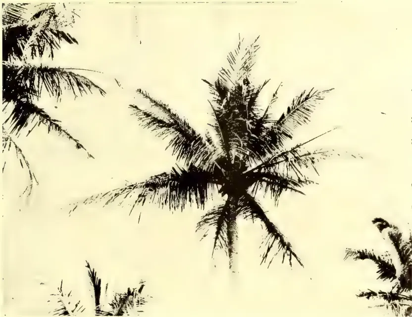A black and white photograph showing a coconut palm tree. The fronds are severely damaged, appearing as thin, dark, skeletal remains against a light sky. Other palm fronds are visible in the background and foreground, some partially cut off by the frame.

*Plate A.* COCONUT PALM, WITH FRONDS SKELETONIZED BY CATERPILLAR OF *Nephantis Serinopa*.

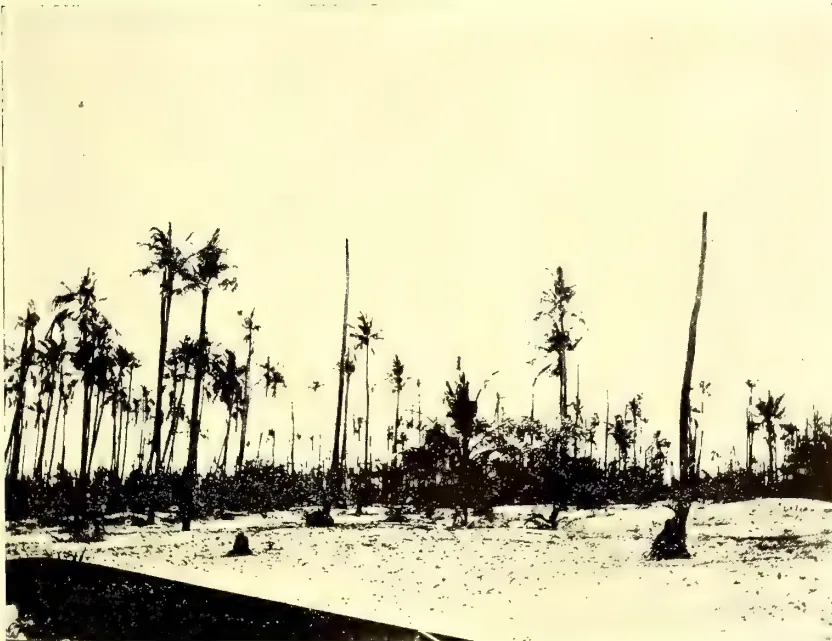A black and white photograph of an abandoned coconut estate. The foreground is a sandy, open area. In the background, there is a dense grove of coconut palm trees. Many of the trees are dead, with their trunks standing straight and bare, while some have lost their fronds. The overall scene depicts a state of significant decay and neglect.

*Plate B.* ABANDONED COCONUT ESTATE, WITH NUMEROUS DEAD TREES IN WHICH COCONUT BEETLES ARE BREEDING.

*From Photographs by R. P. Doudney.*

105------------------------------------------------

106------------------------------------------------

85Plant Sanitation.

The small biting fly (*Phlebotomus* sp.)—locally known as ‘Sand Fly’—is sometimes very troublesome in bungalows, especially in bathrooms and lavatories. Though of very minute size, its bite is quite as painful as that of the largest mosquito. To clear these pests from a room, place a chatty of burning charcoal on the floor, throw on a handful of powdered sulphur, and close the doors (and every possible aperture) for an hour or two. If this treatment is employed in a dwelling room, all brass and metal ornaments (which would be tarnished by the sulphur fumes) should be removed.

Though not strictly appertaining to Entomology, I think that it is within my province to draw attention to what I consider an alarming increase in the numbers of the common European sparrow in parts of the Island. On a recent journey by coach from Bandarawella to Badulla I noticed quite large flocks of these birds. They seem to have increased very rapidly during the last few years. If nothing is done now to check their further increase, there will be serious trouble later, when they begin to devastate the rice fields. I am of opinion that organised efforts should be made at once to keep them in check or even to exterminate them. The sparrow has proved an unmitigated curse in every country to which it has been introduced. Their nests should be ruthlessly destroyed on every opportunity. This should be no difficult task as they almost invariably make their nests in easily accessible places in buildings. The thatch of a native house is a very favourite situation.

## Termes Gestroi: The Hevea Rubber Termite.

BY E. ERNEST GREEN.

“On the Life History of *Termes gestroi*, Wasm. The Hevea Rubber Termite.” E. P. Stebbing—(*The Indian Forester*, Vol. XXXII, No. 3.)

The author quotes reports from various observers in the Malay Archipelago and draws his own deductions therefrom. One of these deductions is of such a startling nature that it should receive careful investigation and indisputable corroboration before acceptance. On page 111 appears the following paragraph:—

“It would appear that *Termes gestroi* attacks the tree for the purpose of obtaining the rubber from it, for, on applying pressure to the bodies of the termites, it was found that the majority of them were full of fresh latex. They apparently collect and store the rubber, masses of rubber being found as a rule in the nests, which are usually situated at the crown of the root. From one of these nests, situated at the base of a three-foot girth tree, as much as 2 lbs. of rubber was collected.”

This seems to me a most improbable explanation of the facts, though, of course, there is nothing inherently impossible in it. Being—myself—equally (with the author of the paper in question) unacquainted with this particular termite in a state of nature, it is with diffidence that I venture to put forward what appears to me a more probable interpretation of the observed conditions, namely, that the accumulations of rubber found occasionally in the nests is the result either of a natural flow of latex following upon the wounding of the tree by the termites, or of the abnormal exudation due to a previously diseased condition of the tree. It would be interesting to know whether the supposed latex found in the bodies of the living insects was tested and proved to be rubber latex. It seems possible that this statement may result from an error of observation. It is well known that the ‘soldiers’ (the class most in evidence when a nest is disturbed) of all termites, upon whatever they may have been feeding, secrete a viscid milky fluid which they eject from their mouths upon the least provocation. This fluid appears to have

107------------------------------------------------

Plant Sanitation.86

some offensive properties to other insects and is certainly a protective device. When ejected on to the human skin it produces a reddish brown stain that defies soap and water for many days. I would suggest the following additions to Mr. Stebbing's 'points requiring further observations and elucidations.'

1. (a) What proportion of the nests contain accumulations of rubber?
2. (b) What is the condition of such rubber? Does it appear to have coagulated in mass (such as would occur from a natural flow), or to have been built up—bit by bit,—as would be expected if resulting from the individual collections of numerous insects?
3. (c) Does the milky fluid found in the bodies of the insects have the same reaction as true rubber?

---

## Mycological Notes.

---

By T. PETCH, *Government Mycologist*.

The fungi hitherto recorded as parasitic on *Castilloa elastica* are not very numerous, and in most cases are negligible from an economic point of view. The most important is *Corticium javanicum*, Zimm., which grows on the branches and apparently kills them. It is a common fungus in Java and attacks all kinds of trees, covering the stems and branches with a flesh-coloured or yellow sheet of fungus tissue, and producing the open wounds commonly known as "canker." Up to the present there is no record of its occurrence in Ceylon.

Other Javanese fungi on *Castilloa* include *Antennaria castilloae*, Zimm., which forms a black covering on the leaves attacked by scale insects; *Aschersonia sclerotiioides*, Henn., which probably is not parasitic on the leaf, but on a scale insect; and *Diplopeltis Zimmermanniana*, Henn., also on leaves. These apparently do practically no damage to the tree.

With the extension of *Castilloa* cultivation the number of parasitic fungi will no doubt increase, though it is rather remarkable that recent accounts of *Castilloa* plantations, while referring to injurious insects, make no mention of fungi. Already three can be added to the list from Ceylon.

The first of these is a root fungus which attacks all cultivated plants from Caravonica cotton to *Hevea*. It covers the root with a brown felt which cements to itself soil and stones and forms a mass sometimes double the original diameter of the root. When far advanced this covering acquires a black, uniform, external layer. It passes from one root to another when they are in contact, but apparently it does not spread through the soil unless there is a continuous path of living or dead wood. Many instances have been recorded of its occurrence on various plants, but in every case the disease seems to have been got rid of by removing the affected tree and liming the soil. The fructification of this fungus has not yet been found or cultivated; apparently it occurs in other countries on cacao and coffee, etc., and the same difficulty is experienced in determining to what species the mycelium belongs.

The second fungus is, according to our present knowledge, a wound parasite only. It occurred on the Experiment Station, Peradeniya, where it attacked two trees which had been injured by fires. A strip of bark about three feet long and four inches broad on each tree was converted into a black, soft rotting mass containing fungi and insects of various kinds. The most abundant species, and the only one found near the sound bark, was a *Botryodiplodia* which has been named *Botryodiplodia elasticae*. The mycelium of this extended into the wood and discoloured it, and the black coloration of the decaying mass was due to the mycelium and fructi-

108------------------------------------------------

87Plant Sanitation.

fication of the fungus. All the diseased tissue on one tree was cut away, and the wound healed in a few months. The diseased bark was stripped off the other, but no attempt was made to cut out all the affected parts; indeed, even this treatment was contrary to instructions, as we wished to ascertain what effect the fungus would have on the tree if unchecked. During the ensuing dry weather a healthy callus was formed round the wound, but with a renewal of the rains, the fungus recommenced active growth and spread in all directions, almost completely destroying all the bark. At the same time, white ants attacked the diseased wood and reduced the tree to a narrow stick about an inch in diameter with a strip of sound bark on one side.

This fungus has not been found elsewhere on *Castilloa*, but it attacks and kills young *Hevea brasiliensis*, especially stumps. It has also been found saprophytic on dead *Hevea*. Its effect on young *Hevea* will be dealt with later.

A third fungus was found on a specimen submitted for examination a short time ago. The affected trees show an open wound at the collar, extending up the stem in a long triangular patch and at the same time spreading more extensively on the roots. It is similar to the "foot rot" of orange trees, and, like that disease, is caused by a species of *Fusarium*. The fungus appears through small cracks in the apparently sound bark in the form of white tufts which at first sight may be mistaken for drops of coagulated latex. Diseases of this class are favoured by bad drainage or excessive shade, anything, in fact, which causes an abundance of moisture at the foot of the tree. In one instance, the affected trees are in an area which cannot be properly drained, and in another, though the drainage is good, the trees have made such remarkable growth that there is probably too much shade. It has been recommended that the measures adopted against "foot rot" in orange trees should be tried in this case, but it is as yet too early to say whether they are successful. The earth is removed from about the tree so as to expose the collar and part of the roots. The diseased tissue is then cut away, and the wood painted with a mixture of crude carbolic acid and water in equal parts. All the wood and bark removed must be burnt. The hole should not be filled up until the tree has recovered, and, if possible, the shade should be thinned out so that the sun may reach the affected parts.

In other investigations, two interesting results have recently been obtained by cultivations at Peradeniya. The white root rot of tea, which has hitherto been confused with *Rosellinia*, and which seems never to produce any fructification in the field, has in four cases developed a sporophore which proves it to be a species of *Polyporus*, one which, judging from a brief visit to Hakgala, is common in the jungle on dead wood. The other result concerns the "Thread Blight" dealt with in the *Tropical Agriculturist* for April, 1906; this, at least on nutmeg trees at Peradeniya, is the mycelium of a small stemless agaric (mushroom), a species of *Crepidotus*, which is only fully developed on twigs etc. after they have fallen and commenced to decay.

---

109------------------------------------------------

88

## HORTICULTURE.

### Market Gardening in Nuwara Eliya.

BY C. W. BARTHOLOMEUSZ.

Before entering into the immediate subject which I have attempted to deal with, I propose giving a short sketch of the history of market gardening in Nuwara Eliya. I need not mention that the materials from which I have had an opportunity of gathering some facts for this purpose have been few, and that I had more or less to depend on isolated passages in books and district manuals touching on Nuwara Eliya in general, and on what I have heard.

Nuwara Eliya, as far as I can gather, owes the introduction of the English vegetables now grown, to the enterprise of Sir Samuel Baker, the great traveller and sportsman whose books "Eight Years in Ceylon," and "The Rifle and Hound in Ceylon," we are more or less familiar with. In the year 1848, the late Sir Samuel Baker and his brother resolved to establish a real English farm and village on the estate which still bears their name, now better known as Mahagastota estate—big tree estate—evidently from the large blue gum trees planted there. It is hard now to realise the difficulties and disappointments Sir Samuel had to face and conquer. We read in his "Eight Years in Ceylon," that when with infinite trouble the soil had been prepared, the first crop of oats was enjoyed by elk and wild pig, who held grand midnight festivals. In like manner we read that the first crop of potatoes was entirely consumed by black grubs, a pest which still does an immense amount of harm in our gardens. However, patience and perseverance were rewarded in due time, and after careful treatment and generous manuring the soil was found fertile enough for all purposes, and we read of his obtaining four crops of potatoes in the year. From this time we can safely assume that English vegetables were grown more or less in Nuwara Eliya, probably at first for the use of the few settlers, followers of Sir Samuel Baker, and the other pioneers of Nuwara Eliya, and as time went on, for supplying the other towns.

The virgin soil of the new clearing seems to have been specially adapted for the growth of potatoes, and the early settlers always speak of the enormous crops of this tuber which were a source of income to a great many of them, they carrying on a trade with Colombo and Kandy. Tubers each weighing from  $1\frac{1}{2}$  to 2 lb. were not uncommon, and the large crops gathered allowed of an easy profit on the outlay. But one mistake seems to have been made, and that was that the potato crop was for a long time the only crop put on to lands, and, as a natural result, as soon as the soil was exhausted of its potash and other chemical elements suitable for its growth, the potato crop failed and Nuwara Eliya had a potato blight which started early in the eighties. I do not mean to say that potatoes have not been grown since, but the crops, if successful, are poor and not to be compared with the crops obtained in the past. The last few years have seen a few good crops, and more may be expected with careful manuring and good management.

On the failure of the growth of potatoes greater attention was paid to the other English vegetables; cabbages, cauliflower and knolkohl were largely planted. Here, too, it should be noted that carrots, turnips, beet, and other root crops were not grown so much at the start as they are at present. The gardens replete with the chemical substances favourable for the growth of cabbages, etc., which were not touched by the repeated crops of potatoes taken off them gave good crops, and the cabbages grown were enormous. It made one's heart rejoice to

110------------------------------------------------

89Horticulture.

see the giant drum head cabbages in those days which could in point of size and weight easily compare with, or even outclass some of Messrs. Sutton & Company's "Giant Drum-head" prize cabbages, or Messrs. Carter's Mammoth Beef Heart cabbages. It was not unusual then to have six, seven or eight continued and repeated crops of cabbages or cauliflowers from off the same plot.

Within the last four years the failure of the successful growth of cabbages and cauliflowers in the gardens in the town, for causes to be dealt with later on, has in turn led to a greater attention being paid to the growth of root crops such as carrots, beetroots, parsnips, etc., and has seen the introduction of the more useful English garden herbs which grow to some perfection; the gardens in the town now mostly grow these crops.

Market gardening in Nuwara Eliya has greatly developed, and the supply to-day is inadequate to meet the demand. The great demand there is for fresh English vegetables and the necessity there is, therefore, that a better method of cultivation should be adopted, and that our gardens should keep pace with the horticultural progress of the day, can be gathered from the fact that Messrs. Paul Soris & Company, who supply the German line of steamers calling at Colombo send monthly on this order alone an average of 3,000 cabbages, 20 to 30 thousand carrots, 15 thousand turnips, beside large quantities of other vegetables.

In attempting therefore to lay before this meeting a few of the difficulties to be met with in market gardening at present in Nuwara Eliya, with the causes of these difficulties and the remedies which could be suggested, I only hope that the subject will be of interest to those who not only gain a living, but supply a great want, and at the same time induce others, whose greater experience and more practical knowledge of the subject better qualifies them, to express their opinions and suggestions thereon.

For the last five or six years the growth of cabbages, cauliflower and knolkhol has met with no success, and at present it is hard to get a single cabbage to grow successfully in any of the gardens in the town. In fact, it is very hard to get a crop to come to any perfection *out of seed*, and this difficulty is partly avoided by many of our gardeners by getting sprouts (called "*Rikili*") from healthy cabbages from Ragalla and Kandapolla, which come to some perfection in carefully prepared soils. Local suppliers have been forced to get their cabbages from Palugama, (Wilson Plains), Kandapolla and Ragalla, where the cabbage still seems to thrive. This must be attributed largely to a soil exhausted in sulphates, phosphates and potash. A cabbage according to Sutton wants a soil containing 8 per cent. sulphuric acid, 16 per cent. of phosphoric acid, 4 per cent. of soda, 48 per cent. of potash, and 15 per cent of lime, and it is evident that we cannot expect to grow a cabbage on a soil which is destitute of these ingredients, to say nothing of others. The repeated planting of cabbages in the present gardens with no change in the crop had undoubtedly exhausted the soil of these ingredients, and it is only after great care in the selection of soils, manure, and probably after the ground has been treated with a rotation of crops on some scientific plan that one can expect to grow a cabbage with success.

In dealing with this difficulty it ought to be borne in mind that to make our gardening successful great attention should be paid to *the rotation or alternation of crops*, for this will enable one not only to get the largest possible production, but the highest possible quality of every kind of crop. We have noticed the evil effects of our gardeners in Nuwara Eliya limiting their first crops mostly to the potato, and we have then seen how the repeated planting of cabbages and cauliflower without any alternate crop of any other kind on the same plot of ground, one crop following the other for a long series of years, ended in a complete

12

111------------------------------------------------

Horticulture.90

exhaustion of the soil, naturally exhausted of its sulphates phosphates, lime and potash. There are soils which will take a long time to be exhausted, and will not cease to yield a good return, but such soils are an exception, and the present garden soil of Nuwara Eliya is too exhausted to give any return without careful preparation. The science of the rotation of crops or "the science," as it has been defined,—"of the ordering of a succession of crops in such a manner that the crops will tax the soil for mineral elements in a different manner," known to the horticultural world ages ago," seems to have been sadly neglected by our market gardeners in Nuwara Eliya. The science is based one may say on the trite maxim "nature abhors a waste," or in other words is founded on the dogma of the economy of nature.

Two principles underlie it, which, if rightly understood and kept in mind, will appeal to any lay mind—(1) It must be remembered that each plant seeks its own food and assimilates, from the ground through its roots, only such chemicals and other food stuffs as are absolutely required for its welfare. (2) On the other hand it sends out and disperses from its system what is considered as waste matter to it, but which is food for and to some other plant. Bearing this in mind one sees the necessity of changing the crops on the same plot, so that when one crop has taxed the soil in one class of food-stuffs a different crop takes its place which requires quite different foodstuffs.

I shall not encumber you with technical details of the food stuffs suitable to most of the garden vegetables. A text-book on the subject will supply any one interested with the different requirements of our common garden vegetables, and one will also find that with all that has been said and written on the rotation of crops, there is yet a great deal to be learnt by individual experiments, careful management, and observation; and that each gardener must learn by experience to treat his plot of ground in the best manner possible. But I do not think it out of place to summarise a few practical hints for your guidance, which, I hope, will be of use to some of you.

(1.) A good rotation will include both chemical and mechanical differences, and place tap roots in a course between surface roots, as for example, after cabbages and cauliflower it will be found that a crop of carrots and parsnips will thrive very well, simply because their roots go down into the soil that the cabbage or cauliflower never reached, though potash, lime sulphates and phosphates are as much needed for the cabbage as for carrots and parsnips.

(2.) Plants of the same natural families should never immediately succeed each other, *e.g.* cauliflower should never succeed cabbages or knolkhol, but should follow crops of potato, peas and beans.

(3.) Lastly, it is very important that a garden should be divided into plots or blocks, and a systematic diary kept of the different crops planted with notes regarding each, for this will enable each gardener to choose a rotation of crops best suited to his land.

The following has been considered by Messrs. Sutton and Company a good cycle of crops for some of the common garden vegetables:—(1) Cabbages, (2) Carrots and Beet, (3) Peas, (4) Celery, (5) Potatoes.

Secondly, great care should be paid to the manuring of the soil. Large quantities of cattle manure or what we may classify as a general manure are used in the gardens in Nuwara Eliya, sometimes very indiscreetly. In the use of cattle manure a great mistake is made in not collecting the fluid excrements of the animal which constitutes an important part of the manure. Great benefit could also be done if our gardeners used special and corrective manures to meet the particular conditions of their soil. Lime has been used successfully, as from chemical experiments tried it has been found very suitable to the soil of Nuwara

112------------------------------------------------

91Horticulture

Eliya, which is particularly sour and acid in its condition at present. Besides, there are many artificial manures which recommend themselves and have been tried with more or less success, such as basic slag, kainit and nitrate of potash. Too much attention also cannot be paid to obtaining a proper humus—that is to say, the black earthy substance resulting from the decay of vegetation in the soil—as it contains several ingredients necessary to plant life which cannot be obtained in any other way. This can always be obtained by burying the garden refuse, taking care not to bury or turn in any deceased plants or weeds.

It is also important to bear in mind the use of *green manures*, and the planting of catch crops to serve this purpose ought to be experimented on. It will always be found that cabbages planted between rows of peas or any other leguminous plant thrive well, just as in the west of England it is customary to plant celery and peas in alternate lines. This custom is evidently based on the fact that plants belonging to the Natural Order Leguminosae have the power of taking in various amounts of atmospheric nitrogen and building this up into complex compounds in the plant, which pass into the soil thus increasing the percentage of nitrogen in the soil; and it will be very interesting to watch experiments on different crops planted in between these “nitrogen collectors” as they have been called. The famous green manure which is being used to some extent among tea is the “*Crotalaria striata*” which ought to grow in Nuwara Eliya, and some experiments may be made with the “*Crotalaria Walkeri*,” an allied species, which grows wild in Nuwara Eliya.

Thirdly, it should be deemed essential if possible to let your land or even a portion of your land lie fallow for some time. For this purpose the land should be dug and trenched, and if necessary sown with some fallow crop suitable for the purpose. It has been found by a well-known gardener in Nuwara Eliya that cabbages thrive on land which has lain fallow for some time, and that this is one of the most efficient methods of getting rid of Club-root. There is nothing that promotes the fertility of the soil so much as affording the natural influences of rain and sun full opportunity in liberating the constituents that are locked up in it. If a block of land is left fallow during a south-west monsoon it ought to be greatly benefitted and give a much better crop. But one difficulty offers itself to our gardeners in Nuwara Eliya in this respect, and that is the want of space to carry out anything like a proper system of rotation of crops or even of allowing their land to lie fallow for a short time. The gardens in Nuwara Eliya except a few, consist of a few roods, and it will not pay the cultivator to allow them to lie fallow even for a short time. In this connection it may be mentioned that there is suitable Government land which may be taken up by enterprising cultivators should Government be ready to offer any encouragement to them.

The last four or five years have also seen the growth of club root in cabbage, cauliflowers and turnips, which has practically prevented the successful growth of cabbages and cauliflower in the town where special care and other preventive measures have not been taken. This disease has been known in Europe for over a century, where it has various names besides club root, evidently given to it from the clubbed or club-like appearance of the roots, such as “anbury,” “botch,” “finger and toe,” “hernia or rupture.”

A general lack of vigour in the plant showing itself by its parched yellow drooping leaves and stunted growth, and subsequently the death of the plant itself indicates the disease. On pulling the plant one generally finds that instead of having a good well-developed main root with a good number of rootlets, we have a swollen mass, which is either compact or broken up into numerous irregular swellings of a whitish or dirty white appearance. These swellings sometimes attain to the size of one's fist, becoming larger on the main root than on the side roots.

113------------------------------------------------

Horticulture.92

Different causes were assigned for this disease. At first farmers thought that the disease was caused by some insect depositing its larvæ in the root, which produce a swelling which was then called a root gall, but this theory was eventually discarded. Then it was generally accepted that the "clubbing" or swelling of the roots was due to a degeneration of the plant affected, what was known as a "sporting" condition when the plant reverted to a considerable extent to its original wild form. But this theory would not apply to every case, as the disease was found sometimes where the most approved system of cultivation had been adopted and observed so as to prevent any degeneracy or reversion to an original type. To a Russian Botanist, Woronin, we owe the discovery of the true cause of clubbing. In 1876 he found out that the disease is due to a parasitic fungus belonging to the group of Myxomycetes, or slime fungi, so called because they differ essentially from ordinary fungi in consisting of a naked moving mass of protoplasm or cell matter technically known as a *plasmodium*, hence its discoverer gave it the name of "*Plasmodiphora brassicæ*." But let us remember it as club root. It is interesting and very useful to know something of the nature and life history of this fungus, especially as it will better enable us to take measures to prevent the disease. The jelly-like substance or mass of protoplasm, which is a living substance, takes possession of the root cells of the plant, makes its way from cell to cell absorbing the contents of each cell and naturally feeding on the nourishment of the plant itself, and causing the cells of the root to enlarge and present the club-like appearance so common in the disease. Subsequently this mass breaks up into a number of spores which are all reproductive bodies, on which the propagation of the fungus depends, and which spores are let out into the soil in myriads on the decaying of the root in which they have been contained to germinate in the next crop sown. These spores want moisture for their germination, which when present enables the contents to burst through, leaving the seed case behind. The living spore is able to move about by means of a delicate thread-like piece called a "cilium" or hair, and then gets the name of a "zoospore." Coming in contact with a tender root of a suitable host plant or a plant on which it can feed, it finds its way inside most probably through the root hairs, and there the process of enlargement at the expense of the plant is repeated with its dire results. The plasmodium or club root fungus thrives on the food of its host plant. It is a real parasite and in the end kills its host. All parasitic fungi live at the expense of certain other plants which are known as host plants, and it is important to recognise the host plants of this parasite, as we could by keeping a garden clear of the host plants which are weeds and of no use to us but are needful for the support of this parasite, in a great way prevent the spread of this disease. As far as is known, this fungus only attacks or uses as its host, plants belonging to the Natural Order Cruciferæ, such as cabbage, cauliflower and knol-khol among cultivated plants, and the shepherd's purse and hedge mustard among the common garden weeds.

It only remains for us now to see what remedies have been suggested and could be offered for the prevention and cure for this disease.

(1.) From the easy manner in which the spores are propagated it is but evident that the first preventative is to get rid of all diseased plants, a source of future infection. The diseased stumps of infected plants should never be left to rot in the soil or be ploughed or turned into the soil as manure, or added to the manure heap, but should be removed and burnt, or at least taken away as far as possible from the garden.

(2.) We should starve out the fungus by not giving it its host plants to feed on. On a plot of ground affected by the disease alternate crops should be tried and plants introduced on which the fungus does not grow, such as potatoes, beans, lettuce, peas, etc., and on a plot on which the disease has been very severe it is best to plant crops other than cruciferous for two or more seasons.

114------------------------------------------------

93Horticulture.

(3.) We should pay attention to the proper rotation of crops, as it has been found that planting the same crop too often encourages the disease, the disease being spread by means of spores in the soil.

(4.) We should be careful to weed and keep our crops clean, especially from cruciferous weeds which will only help to propagate the disease.

(5.) Try if possible to let the infected plot lie fallow but clear of weeds; this remedy seldom fails to put an end to the disease.

(6.) Isolate the plot affected with the disease as it is very easily spread. In fact, treat the plot infected like some spot infected with some infectious disease. The infected soil can be easily carried to uninfected land by tools, cart wheels and in numerous other ways.

(7.) Be careful to pay great attention to the seed bed. Watch the young plants, removing any infected so as to get healthy plants. Some fungicide may be used preparatory to sowing, as sulphate of copper or Bordeaux mixture.

Among particular remedies found suitable, dressing the soil with recently slaked lime at the rate of 35 to 75 bushels per acre, considerably reduces if not prevents the disease, as it has been found that club root seldom take place in a soil rich in lime. This has been proved a useful remedy in Nuwara Eliya.

In passing I do not think it out of place to mention a few other diseases due to fungi which attack cabbages and cauliflower in Australia and Europe, and which happily so far have not been known to our gardeners in Nuwara Eliya. Among *root diseases* should be noted "Black Leg or Foot-rot" (*Phoma brassicæ*). A plant attacked by this disease is readily recognised. The leaves have a sickly withered look, the stem is shrivelled and the roots become rotten. On being pulled up the underground parts show numerous little black points visible to the naked eye which constitute the fructification of the fungus.

Among *leaf diseases* should be noted White Rust "albugo candida," a sort of mould in the leaves which looks as if the leaves have been sprinkled with *white wash*, (2) Ring Spot (*Sphaerella brassicicola*) is shown by circular patches of about  $\frac{3}{8}$  of an inch in diameter, greenish towards the margin and dirty from towards the centre, covered with minute densely crowded black points; and lastly Putrefactive Mildew (*Peronospora parasitica*) is found on cabbages, cauliflower, turnips, radish and cress, and is seen commonly on the nasturtium showing itself as a delicate white or greyish mould on the under surface of the leaves, the affected parts usually appearing yellowish and soon becoming dried and withered. This disease is formed by a fungus belonging to the same division as the "potatoe disease fungus." Gardeners in Nuwara Eliya should be on the look out for these diseases, which are sure to appear in time, and promptly send any infected specimens to the Government Mycologist to report on. Lastly, among *insect pests* the Black Grub, or "Cut-Worm" as it is known in America has been and is a source of great annoyance to our gardeners. The grub is itself the caterpillar of several different kinds of night flying moths. They carry on their ravages in the night playing havoc among young plants, especially in the seed beds where three-quarters of the plants are very often killed in a single night.

To the Government Entomologist we are indebted for the following remedies and precautions against this pest:—

(1.) Mechanical means of prevention are the surest. These consist of placing a tin cylinder round each young plant until it has outgrown its liability to be attacked. We can make good use of empty jam and condensed-milk tins for this purpose. The cheaper plan is to tie a roll of stout paper loosely round the stem of each plant before placing it in the soil.

115------------------------------------------------

Horticulture.94

(2.) In America destructive poisoned baits are employed. Small bunches of green clover are dipped in a solution of Paris Green and placed among the plants. When the baits are examined each morning many cut worms are found sheltering beneath the clover. Poisoned bran has also been found very effective. Paris Green is well-mixed with bran in a proportion of 1 lb. to a bushel, the bran is then moistened with water and small handfuls placed among the plants. It is found that the cutworm often prefers the bran to the growing plant. Poisoned leaves (mullein) have been found a good bait in America. The common English Mullein (Aaron's Rod) *Verbascum thapsus*, which is thoroughly naturalised in Nuwara Eliya may be tried.

(3.) A heavy dressing of kainit or other alkaline manure is a recognised deterrent against all subterranean grubs.

(4.) Smooth conical holes sunk in beds are sometimes found successful as traps. Caterpillars wandering about at night falling into these pits are unable to climb out. Empty jam tins sunk level with the soil will form good pitfalls.

Among local precautions and remedies which have been tried with success it has been found a good plan to sow your seed with a large quantity of seed of the common mustard. The mustard sprouts up first and the grubs have been found to prefer the mustard and not to attack the good plants so much. After some time when the good plants have outgrown liability to be attacked the mustard is pulled out. Carrots planted in this manner are in a great way saved from this pest. A large dressing of lime on the surface has also been found useful, and our gardeners have for a long time used the chopped up leaves of a wild lobelia (*Lobelia Nocotianifolia*) known to the Sinhalese as "kiri bamboo," owing to the acrid juice given out of its cylindrical stem, and to the Tamils as "poila colla," in that it has a strong smell of tobacco, and which grows abundantly along our streams and our patnas as a successful bait.

---

116------------------------------------------------

95

## LIVE STOCK.

---

### Poultry Notes.

BY G. W. STURGESS, M.R.C.V.S.

---

### DISEASES OF POULTRY.

(Continued.)

**Consumption.**—or Avian Tuberculosis, commonly known as “Going Light” amongst fanciers. This disease is closely related to the tuberculosis or consumption in man, and is caused by the *Bacillus Tuberculosis*. It is common in poultry and attacks all kinds of birds.

The digestive tract is generally affected, probably due to picking up infective material, such as food or water soiled by the dung of diseased birds, or the sputum of human beings. On postmortem examination the liver, spleen and intestines are generally found to be the seat of the principal lesions.

Small white or greyish yellow spots or tubercles like seeds are seen spread over the surface of the organ affected. These may be cheesy or gritty if cut through. They may be found on all the organs and membranes in the abdominal cavity including the oviduct and ovaries. The lymph glands and joints may also be diseased.

*Symptoms.*—Feebleness, debility, emaciation, loss of appetite, or on the contrary a voracious appetite, the bird eating a great deal which does not seem to do it any good. Usually there is liver derangement and diarrhoea—paleness of the comb and wattles—in general a gradual wasting away.

*Treatment* is useless and a waste of money. Diseased fowls are unfit for breeding or for food, and the best plan is to destroy them.

Fresh stock should be given better food and healthy surroundings and pure water; close confinement and bad hygienic surroundings are powerful predisposing causes of the disease.

**Cramp** is more commonly seen in chickens than in older fowls. It is principally due to cold or damp; keeping chickens on a cold cement floor may cause it. It sometimes occurs where chickens are kept too warm and over fed.

*Symptoms.*—Stiffness and weakness of the legs, which may become so stiff that the bird cannot stand up on its feet and moves along on the hocks. Hens occasionally get cramp in the back and cannot stand.

*Treatment.*—Hot flannels to the limbs and gentle rubbing and the application of a little turpentine and camphor liniment. Dry earth or dust should be given the birds to stand upon. Internally salicylic acid and Epsom salts may be given twice a day.

The food should be soft with plenty of green food. Attention should be directed to the remainder of the birds and proper air, light, exercise and food given. Runs should be dry. If the attack is at all severe recovery seldom take place.

**Crop Bound.**—This term indicates a condition in which the crop is over-gorged and distended to such an extent as to be incapable of passing on the food it contains.

It may be due to overeating dry grain which swells, but is usually due to irregular feeding and giving a lot of food at one time, or it may be due to some obstruction to the outlet of the crop.

117------------------------------------------------

Live Stock.96

*Symptoms.*—The condition is easily noticed by the swollen and distended crop and the lassitude of the fowl. There is usually great thirst.

*Treatment.*—At first a teaspoonful of salad oil may be given and the crop gently manipulated to try and get the food passed on. The bird should be starved a day or two. If it is successful the diet must be carefully regulated for a few days and a tonic may be given with advantage.

If this fails, an operation can be performed and the crop opened and the contents removed. At a point towards the upper part of the crop the feathers should be plucked out and an incision about one inch long made into the crop and the contents gently removed with a small spoon. After removal the little finger well oiled should be passed into the crop and the outlet examined for any obstruction. The crop may then be washed out with warm weak boracic acid solution, and the wound closed by several small independent sutures, using a small curved needle and fine silk. If possible, the lining membrane should be sutured first and the skin afterwards, or the wound may be closed at once, bringing the inner edges of the wound together. Benzoated lard may then be smeared on and the wound left to heal. The fowl should be put into a box and the diet for 3 or 4 days must be soft and limited in quantity, bread damped with milk or soup will answer the purpose. No water should be given until the wound has closed.

**Soft or Pendulous Crop.**—In this condition instead of being hard and full of food the crop is soft and full of dirty fluid. If the head is held downwards and the crop gently pressed it will flow out through the mouth. This should be done two or three times a day, or the fluid drawn off by a trocar and canula or by a hypodermic syringe and needle.

For some days the bird should be sparingly fed on soft food and very little water given.

Pills composed of gentian, asafoetida, garlic, and camphor with small doses of Sulphate of Iron may be given.

Care should be taken that the bird when liberated does not eat or drink too much at once.

(To be continued.)

---

118------------------------------------------------

97

## MISCELLANEOUS.

### Lessons in Elementary Botany. II.

BY J. C. WILLIS.

#### THE SHOOT.

This can usually be distinguished from the root in the sprouting seed, the shoot going upwards, the root downwards. The shoot is usually made up of *stem* and *leaves*, and the leaves are borne upon the stem at definite points called the *nodes*. (Pl. I., June *T.A.*) The stem usually branches in the *axils* (or armpits) of the leaves, *i.e.*, the angles between them and the stem; and the branches repeat the structure of the stem, themselves bearing leaves, and branching in their axils. Of course there are also many stems, *e.g.*, those of palms, which do not branch.

The leaves want plenty of light and air, and the object of the stem is to support and spread them out to get these, and to carry water to them from the roots. The average stem grows straight upwards, this being directly towards the brightest light. That light is the main factor in this direction of growth may be seen by placing a plant with the light to one side of it, for instance by putting it in a window, when it will be found that the stem will grow towards the side from which the light comes. The leaves on the other hand tend to place themselves at right angles to the light, as may also be illustrated by putting a plant for some days in a window, when the younger leaves will all arrange themselves to suit the new direction of light.

It will be noticed in this experiment that the old parts of stem and older leaves, which have quite finished growing will not move into new positions—only the still growing portions are able to move.

If a stem be examined it will be found that while on the old parts the leaves are usually at about equal distances apart, as we approach the growing end the leaves get closer and closer together, till at last they are all crowded up in a *bud* (Pl. I., June *T.A.*) at the tip. Every stem and branch ends in a bud, composed of younger and younger leaves folded closely over one another, with shorter and shorter gaps between them.

The bud must obviously be tender, and requires some protection, otherwise it will be damaged by heat causing excessive evaporation and shrivelling, or by other causes. As a rule the outer sides of the outer leaves of the bud are covered with hairs, or sometimes with wax, or the outer leaves, as in *Rhododendron*, are mere scales for the sole purpose of protecting the young bud. Sometimes the bud is protected by its position in the shelter of the mature leaves, or by lying close between the stalk of the leaf in whose axil it arises and the main stem, or in other ways. Examine a lot of buds, and see if you can find one which really has no protection to the delicate young inner leaves.

The stems of most plants elongate and must consequently grow in thickness to carry more water that is now required by the increased number of leaves, and to carry the extra weight involved. As it grows, the old green outer skin or bark gets stretched, and presently begins to crack off, being replaced from below by a brown bark, the bark to which the name is usually given. This bark in turn stretches and cracks off, but is continually renewed from below like the skin of the hand. This brown bark as a matter of fact consists of *cork* (the cork of commerce is simply the bark of a Mediterranean species of oak), and as every one knows cork is water-and air-proof. Now the stem, being alive, requires, like all other living

13

119------------------------------------------------

Miscellaneous.98

things, to breathe, and cannot do this directly through the cork. Consequently special openings, called *lenticels* (Pl. I., June T.A.) appear in the bark. Any young twig with brown bark on it will show these organs; they appear as little pits, usually longer than broad, so far filled up with a brown powder that they project above the general surface. The cork in them, instead of being in a solid mass, is formed in a loose aggregate of fine particles, and the air for respiration can pass between.

The storage of reserve materials is common in stems; these are stored, as in the roots, to enable the plant to grow again after a period of rest. Tall woody stems, as of trees, only store as a rule within themselves, and there is consequently nothing visible to show that they are storing. But small stems often store, and then as a rule swell up.

Sometimes the reserve materials are all stored in the leaves, and we get the peculiar kind of stem called a *bulb* (Pl. I., June T.A.) in which all the leaves are swollen out and have ceased to be green. They are generally folded one over another, as in an onion, but sometimes, as in lilies, merely overlap like tiles on the roof of a house. Plants with bulbs usually rest at some period of the year—generally in the drier weather—and vegetate again later. Sometimes the reserves are stored, as in the potato, in *tubers* (Pl. I., June T.A.) or swollen portions of the stem, sometimes there is a fleshy creeping underground stem or *rhizome* (Pl. I., June T.A.). We shall have to speak of these again later.

## Literature of Economic Botany and Agriculture. VI.

BY J. C. WILLIS.

*Coconuts*.—See Gardening Circular I, 5, p. 49.

Considerations sur le caractère halophyte du Cocotier. Rev. Cult. Col. June 1900, p. 75.

Le Cocotier. Do. pp. 182, 362.

Die Oxydasen und Peroxydasen in der Cocos-milch. Bull. Buitenz. VIII.

Coconut Butter. Gard. Chron., Dec. '01, p. 449.

Creation de Cocoteries sur la côte est de Madagascar. Rev. Cult. Col., Feb. '02, p. 65.

Coconuts. Straits Bull., 1902, pp. 226, 227.

Draining Land for Coconut Plantation. Do. 261.

A Coconut Pest. Do. March 1904.

Usages Economiques du Cocotier. Rev. Cult. Col., June 1904, p. 353.

Spraying Coconuts. "T.A.," Sept. 1904, p. 148.

Coconuts in India, on the West Coast. "T.A.," Dec. 1904, p. 373.

The Coconut Industry of Trinidad. W. I. Bull., June 1905, p. 149.

Bud Rot of the Coconut Palm. Circ. and A. J., R.B.G. Perad. 1906.

*Cocos, other Species*.—*C. eriospatha* and *C. odorata*. Tropenpflanze, 4, 1900, p. 197.

*Coffee: General*.—Coffee in Coorg: Cameron in Planting Opin., Mar. 1899, p. 189.

Fertilisation of the Coffee Flower. Queensl. Agr. J., May 1899, p. 376.

Koffiecultuur in Guatemala, F. W. Morren, Amsterdam 1899.

Le Café. Lecomte. Paris 1899.

Fecundation Artificielle des fleurs de Café pour obtenir les hybrides. Rev. Cult. Col., Nov. 1899, p. 278.

Liberian—Arabian hybrid. Ind. Gard. and Pl., Jan. 1900, p. 32.

Coffee Hybrids. Planting Opin., Feb. 1900, p. 103.

Die Produktions Kosten und die Ertrag der Koffie in Sudbrasilien. Prager in Tropenpflanze, IV. 1900, p. 76.

120------------------------------------------------

99Miscellaneous.

Le Café, sa Production et sa consommation. Rev. Cult. Col., VI. 1900, p. 107.  
 In het wild groeiende Koffie boomen op Java. Koorders in Ind. Merc., Apr., 1900, p. 235.

Kaffee. Tropenpflanze, 4, 1900, p. 181.

La stérilité de certains hybrides des Caféiers. Rev. Cult. Col., VI. 1900, p. 2.

Le caféier d'Arabie aux Antilles. Do. p. 18.

Le Café de Liberia. Do. p. 129.

II Verslag omtrent de Proeftuinen &c. Buitenz. Meded. 38.

La question du café de Nicaragua. Rev. d. Cult. Col., 1900, p. 578.

Die Gattung Coffea und ihre Arten. Frobner. See Just's Jahresbericht 1898, II. p. 18.

See also Just for every year.

Sur un hybride de Café de Libérie et de café d'Arabie obtenu à la Réunion. Rev. d. Cult. Col., 1901, p. 1. Planting Op. 1901, p. 214.

Die Arten der Gattung Coffea. Buitenzorg Bull. p. 8.

Coffea stenophylla. Rev. d. Cult. Col., July 1901, p. 86.

Reports on Experiments &c. Meded. Buitenzorg, p. 51.

Eine neue Kaffee-art aus Deutsch ost-Afrika (C. Schumanniana). Tropenpflanze, 1902, p. 142.

L'agriculture sur la côte est de Madagascar. Prud'homme, 1901.

Notes préliminaires sur quelques cafés sauvages nouvelles ou peu connus de l'Afrique centrale. Rev. d. Cult. Col., Mai 1903, p. 257.

Nouvelles Cafés de la côte occidentale d'Afrique. Bull. Jard. Col., July 1904, p. 113.

Coffea canephora. Do. p. 117.

In der brasilianischer Kaffee-region. Tropenpflanze 1904, p. 119.

Eenige Mededeelingen over Coffea robusta. Ind. Merc., Nov. 1905, p. 805.

---

## The Colombo Agri-Horticultural Show.

---

I have the honour to state that the entries in class VII. (special vegetables) included a good number of specimens, nearly all shown by one or two market gardeners at Nuwara Eliya who got medals at nearly all the shows. There were no specimens of outstanding merit, but most were good.

2. I enclose Mr. Nock's report.

J. C. WILLIS,

*Director, Royal Botanic Gardens.*

---

### REPORT ON CLASS V. FRUITS, Nos. 1 to 16.

"All were of excellent quality, especially the mangoes, pineapples, oranges, limes, mangosteens, rambutans, and sapodillas; papaws and jambus were somewhat disappointing. The general opinion seemed to be that there has never before been such a fine display, and the pineapples were much admired. Competition was keen all through, but the Hon'ble Mr. Obeyesekere informed me that it would have been keener still but for the prevalence of illness in the villages throughout the low-country. Among the limes there were three exhibits of good lemons, and I would suggest a separate prize for these at future shows."

J. K. NOCK,

*Act. Curator, R. B. G.,*

121------------------------------------------------

Miscellaneous.100FRUITS AND VEGETABLES: CLASSES V. AND VI.

I have the honour to forward herewith my report on the Classes judged by me at the recent Agri-Horticultural Society's Show:—

At this show I arranged the exhibits under Classes V. and VI. (Fruits and Vegetables), and judged the latter in connection with Mr. Henry Perera, Colombo Mudaliyar.

1. 1. Ash pumpkins were good in number and quality.
2. 2. Bottle gourds were below the average.
3. 3. Pumpkins made a satisfactory show.
4. 4. & 5. Snake gourds and bitter gourds were well represented and the specimens really good.
5. 6. Luffas were only fair and should have been much better. They were all of the "acutangula" variety.
6. 7 & 8. Beans, "dwarf" and "long," were very satisfactory.
7. 9. Princess beans, also called four-winged beans and asparagus peas (*Psophocarpus*) were not shown at all. The variety is one of which the cultivation deserves to be encouraged.

10, 11 & 12. Tomatoes, lettuce, and celery were also wanting, proving that exhibitors had not been growing specially for the show, or they would not have failed to raise these crops.

1. 13. Sweet potatoes included some excellent specimens.
2. 13a & 14. Chillies made a very satisfactory exhibit both in number of entries as well as in size and quality. Some very large-sized specimens were disqualified owing to the required number not having been sent in.
3. 15. Cucumbers. Though out of season some fine fruits were shown.
4. 16. Onions, very few entries, but the specimens sent in were good.
5. 17. Yams. The "collections" were few, but decidedly good.
6. 18. Bread-fruits, satisfactory.
7. 19. Brinjals, very satisfactory.
8. 20. Bandakkai, fair; the fault being that the exhibits consisted chiefly of mature fruits unfit for consumption.
9. 21. Ash plantain were disappointing.
10. 22. Best collection from a School Garden. A good collection came from the Hunumulla School, and another from Palugama.
11. 23. Best cooking plantains, very disappointing.
12. 24. Dehiala (Coco yams). There was a satisfactory show of these and good competition.

C. DRIEBERG,  
*Superintendent of School Gardens.*

LIVE STOCK SECTION COLOMBO SHOW, 1906.

1. 1. This section was much better than last year when there was little competition.
2. 2. Thirty-two cattle competed in the various classes this year and eleven country-bred horses and ponies.
3. 3. For the Championship classes 10 bulls and 3 horses competed.

G. W. STURGESS,  
*Govt. Veterinary Surgeon.*

122------------------------------------------------

101*Miscellaneous.*

## Gampola Agri-Horticultural Show.

---

Though the show, the first held at Gampola was intended principally for the districts of Udayalata, Uda Bulatgama and Kotmale, exhibits from other districts were accepted, Classes VIII, IX, XI and XIII being alone reserved for the above three districts. No exhibits were brought from Kotmale, the villagers of this district preferring to compete at the show at Nuwara Eliya in April.

**ATTENDANCE.**—The Show was opened by His Excellency the Governor on March 30th at 3 p.m. The weather was dry and favourable. A large number of town residents, as well as a fair number of villagers attended, 112 on the first day and 145 on the second, in addition to the headmen and holders of free passes.

**BUILDINGS.**—A large maduwa decorated in the Kandyan style was erected by the Ratamahatmeyas of the two divisions for His Excellency the Governor. The two portable iron sheds of the Ceylon Agricultural Society were utilised, and in addition separate sheds were erected for poultry, dairy produce, arts and manufacture, as well as stalls for cattle by the Ratamahatmeya and the minor headmen of Udayalata who worked with commendable zeal.

A noticeable feature of the show was the revival of the ancient game of ankeliya.

### CLASS I. FLOWERING PLANTS IN POTS.

**EXHIBITS.**—It was sad to find that this class was almost empty. There were only three entries, although there were nineteen items for competition. Considering the number of residents in and around Gampola, it is strange that there was no competition in this class. Exhibitors were principally inhabitants of Gampola town.

### CLASS II. CUT FLOWERS.

This class, too, was disappointing, though it was not so bad as Class I. There were seventeen exhibitors, thirty-seven items for competition, and only eleven prizes were awarded. Exhibitors were mainly inhabitants of Gampola.

### CLASS III. FERNS AND FOLIAGE PLANTS IN POTS.

The competition in this class was extremely poor. There were only ten exhibitors and six prizes were awarded, although there were nineteen items for competition. With the exception of three villagers all the exhibitors were from Gampola.

### CLASS IV. FRUITS, AND CLASS V. VEGETABLES.

These classes were not so disappointing as the previous ones, but they were certainly not what they might have been. There were only sixty-three exhibits in Class IV and forty-two in Class V. The exhibits of fruit and vegetables were not of any high order, but the continued drought of the preceding months naturally affected prejudicially exhibits for this class. In addition to the town people a considerable number of villagers exhibited.

### CLASS VI. VEGETABLE AND ESTATE PRODUCTS.

This class was better represented and the competition was more encouraging than that in the previous classes. Some of the items were, however, not competed for. There were only six competitors under item No. 15—Rubber. The competition in this class should have been very much greater as Gampola is in the heart of planting districts and is so advantageously situated as regards transport. Some exhibits in this class were shown by the estates, but the greater portion by the villagers.

123------------------------------------------------

Miscellaneous.102CLASS VII. NATIVE PRODUCE.

Although there was some competition in this class, the exhibits did not come up to a high standard, and only fourteen prizes were awarded. There were thirty items for competition, chiefly from the villagers.

CLASS VIII. DAIRY PRODUCE.

Exhibits by estates and villagers, but principally by the townspeople.

CLASS IX. POULTRY.

The competition in this class was poor and only seven prizes were awarded in Class VIII and three in Class IX. The chief exhibits were from the adjacent estates, very few villagers competing.

CLASS X. PRESERVED FRUITS.

The items in this class were fairly competed for. Five prizes were awarded. There were six items for competition, almost all from the town of Gampola.

CLASS XI. MINERALS.

The entries in this class were as might be expected meagre and only one prize was awarded, being for plumbago at Nawalapitiya. A few gems from Pussellawa were shown.

CLASS XII. CATTLE, SHEEP, BUFFALoes AND PIGS.

This was a satisfactory class both in competition and in quality. The exhibits were however all of section B—Native. No horses were exhibited. A gold medal has been given by the Committee for a fine exhibit of a native bull, the medal of the Agricultural Society not being awarded. A large proportion of the exhibits were from the 'Lantern Hill' Estate.

CLASS XIII. ARTS AND MANUFACTURE.

Exhibits in this class were restricted to Udapalata, Uda Bulatgama and Kotmale, in the hope that the craftsmen of these districts would compete. The result was very disappointing, the only silver exhibits shown being of ancient workmanship and very little Udapalata pottery was shown. It appears well nigh impossible in the absence of stimulus from the walauwas for the craftsmen of Udapalata, many of whom are of families renowned in Kandyan times, to shake off their apathy. This class was as usual crowded with the rubbish now in vogue among Kandyan and Lowcountry Sinhalese.

SUMMARY.

On the whole, considering the time of the year—dry weather—it must be admitted that the show was a success, though both in quality and quantity the exhibits of flowers, fruits and vegetables fell far short of what was desired (the paucity of exhibits in these classes being very noticeable). It should also be borne in mind that this was the first show in Gampola. Success in future shows will greatly depend on the interest and competition aroused among producers and cultivators by holding shows at regular and recognised periods and dates.

The wish to exhibit curiosities and abnormal specimens of plants, fruits, manufacture, etc. at public shows is a noticeable feature among the villagers. They cannot be too often told that what is required is the exhibition of the best produce of their gardens, fields, etc.

The bulk of the exhibits came from cultivators and traders. Among the villagers the headmen were conspicuous in their exhibits, but competition would certainly be greater and more general if sufficient interest were aroused, and the villagers gradually made to recognise the advantages of bestirring themselves and taking more personal trouble to grow and exhibit produce from their lands and their cattle.

H. WACE,  
*Chairman.*

H. W. CODRINGTON,  
*Honorary Secretary.*

124------------------------------------------------

103Miscellaneous.

## Uva Agri-Horticultural Show.

I have the honour to forward the following report on the Classes I judged in at the Uva Agri-Horticultural Show held at Badulla on 8th instant.

**GENERAL.**—I regret to state that the show was poor compared with the one held last year, which could have been classed as second only to that held in Nuwara Eliya. This is not at all satisfactory, and I trust a few remarks, now that they are to be published in the “T.A. and Magazine of the C.A.S.,” will result in an improvement in the future. The space allotted to each class was quite inadequate; consequently no proper arrangement—so very important in the classes under review—could be undertaken, and exhibits were jumbled together, and not to advantage. Many people, known to be keen gardeners, were asked why they had not exhibited, but had only the feeble reply “I thought someone would be sure to have better.” This is not the way to make a show a success, and to a large extent accounts for the poor quality of the exhibits. Quite different to Nuwara Eliya when the usual remark was, “I sent mine just to fill up, and never expected to get a prize.” Europeans could help a great deal by sending in anything they have worth exhibiting. A show should not be regarded as a money-grabbing opportunity, but one to demonstrate what can be done in each district.

The remarks in my report on the last year’s show were apparently unheeded, for there was no improvement in the arrangement of the cut flowers, state of the pot plants, &c. The former were bundled together in a very native way, and the material was not made half as much of as could have been possible. If one quarter of the flowers had occupied the space of the whole, the appearance would have been very different. Little relief was afforded in the way of greenery. Proper show boxes, such as those sent from Hakgala Gardens, cost little and should be used. It seems impossible to convince competitors that arrangement counts for points in judging. The pots staged were mostly very dirty and only three-quarters full of soil. Drainage appeared to be entirely neglected or very poor, and no attempts seem to have been made in most cases to trim the plants up, stake them neatly, &c. One exhibit was disqualified for having apparently been only potted a day or two previously. Most of these matters were pointed out before, and are worthy of attention. The recent drought followed by heavy rains was made much of as an excuse, but cannot account for such defects as these.

To take the classes individually, *Class I. FRUITS AND VEGETABLES.*—Plantains were scarcely up to standard; the winner showed a good number of varieties. Papaws were good. The gold medal for the best collection of ripe and edible fruit was won by Mr. D. H. Kotalawela for a nicely arranged exhibit. Oranges in this class were not up to the usual Badulla quality. It was very disappointing to find no entries for English vegetables, especially as Weligama even was able to make a fair display of these. Tomatoes were fair and of good varieties.

*Class II. FRUITS, VEGETABLES AND GRAINS* (open only to villagers).—In this class Mr. E. B. Denham assisted in the judging. Of thirty-eight exhibits of oranges, some were very fine, and it was interesting to learn of natives in the district now being able to realise a profit after buying all of good quality and sending them to Colombo for sale. There is no doubt Badulla is one of the best districts in the Island for this fruit, but it is said that the real good kinds are less plentiful than formerly; if this is so, steps should be taken by the local branch of the Society to increase only good varieties by grafting &c. **PINEAPPLES.**—Only three exhibits against a fine lot last year. The general opinion then was that they would have been better had the show been held in May.

125------------------------------------------------

Miscellaneous.104

*Class IV. GROWING PLANTS.*—Nearly all in this class had an uncared for appearance. The fine specimen of *Nephrolepis* exhibited by Mr. Grant was the best exhibit in the show, and an excellent example of how a fern should be grown. For flowering plants no award was made. Mr. J. B. Bandaranayaka staged a large collection of jungle ferns which were named, but incorrectly. Before improved methods are adopted it would be inadvisable to offer more prizes in this class.

*Class V. CUT FLOWERS.*—In future more space should be given to make this class the attraction it should be. In all the exhibits of wild flowers cultivated garden varieties were noticed. Some of the roses were very fair, but would have been much improved if shown in proper boxes, one or two blooms of each, and named. Dahlias were poor, and there was practically no competition in chrysanthemums and cannas. In this class I would respectfully suggest that more prizes be offered, such as for roses (1) best blooms of yellow, (2) white, (3) red (4) best roses, six different varieties, (5) do. more than six varieties, (6) best gaillardias, (7) best cactus dahlias, (8) best zinnias, (9) best violets, (10) best cut flowers in a box not exceeding 18" square. This would cause greater competition and insure a better display.

*Class IX. SCHOOL GARDEN EXHIBITS.*—R. M. Ukkubanda of Welimada took the prize for a good exhibit which included splendid parsnips, cabbages, leeks, carrots, and beetroot. Celery and capsicum should have been better. Attampettia School was rather a poor second.

The following exhibits were staged from the Royal Botanic Gardens, not for competition :—A complete set of the "Circulars and Agricultural Journal of the Royal Botanic Gardens," and a box of dry grains from the Director. Silk-worm cocoons &c. from the Government Entomologist, and seven boxes of cut flowers from the Hakgala Gardens.

A meeting of the Badulla branch of the Agricultural Society was held in the Town Hall on the 9th instant, at which I read a paper on "Propagation of Plants."

J. K. NOCK,

*Act. Curator, Peradeniya Gardens.*

### THE LIVE STOCK SECTION.

Excepting the Native Bull Class, this section was not so good as last year. The following is a comparison of the Entries in 1905 and 1906 :—

<table>
<thead>
<tr>
<th></th>
<th>1905.</th>
<th>1906.</th>
</tr>
<tr>
<th></th>
<th>Entries.</th>
<th>Entries.</th>
</tr>
</thead>
<tbody>
<tr>
<td>Best pony bred in Uva ...</td>
<td>19</td>
<td>6</td>
</tr>
<tr>
<td>" pair of buffaloes bred in Uva ...</td>
<td>5</td>
<td>3</td>
</tr>
<tr>
<td>" native bull ...</td>
<td>14</td>
<td>15</td>
</tr>
<tr>
<td>" " cow (in or out of milk) ...</td>
<td>15</td>
<td>8</td>
</tr>
<tr>
<td>" pair of cart bullocks (native) ...</td>
<td>7</td>
<td>3</td>
</tr>
<tr>
<td>" " of Nellore cart bullocks ...</td>
<td>—</td>
<td>—</td>
</tr>
<tr>
<td>" cattle of any other bred ...</td>
<td>8</td>
<td>5</td>
</tr>
<tr>
<td>" Hackery turn out ...</td>
<td>2</td>
<td>3</td>
</tr>
<tr>
<td>" Poultry bred in Uva (cock &amp; 2 hens) ...</td>
<td>9</td>
<td>9</td>
</tr>
<tr>
<td>" Ducks (2) ...</td>
<td>5</td>
<td>5</td>
</tr>
<tr>
<td>" Geese (2) ...</td>
<td>1</td>
<td>2</td>
</tr>
<tr>
<td>" Turkeys (2) ...</td>
<td>2</td>
<td>—</td>
</tr>
<tr>
<td>" Pigeons (2) ...</td>
<td>6</td>
<td>6</td>
</tr>
<tr>
<td>" Village Poultry (cock &amp; 2 hens) ...</td>
<td>10</td>
<td>7</td>
</tr>
</tbody>
</table>

G. W. STURGESS,

*Government Veterinary Surgeon.*

126------------------------------------------------

105*Miscellaneous.*

### THE MINUWANGODA MARKET SHOW.

It was resolved at a meeting of the local Agricultural Society held at Minuwangoda, on 14th January, 1906, under the Presidency of Mr. E. B. Denham, Secretary of the Ceylon Agricultural Society, to hold an exhibition, on 7th April, 1906, of vegetables, yams, fruits, groundnuts, etc., grown in Alut-Kuru Korale North, in the district of Negombo.

The following prizes were offered by the members of the local society :—

(1.) Mr. Walter Dias Bandaranayaka, Mudaliyar, Rs. 20 for the best collection of vegetables. (2.) Mr. J. E. de Silva Suriyabandara, J.P., Rs. 20 for the best collection of vegetables. (3.) Mr. J. F. Jayawardena Vidana Arachchy of Godakaha Palata, Rs. 10 for the 2nd best collection of vegetables. (4.) Mr. Henry Thomas Perera Seneviratna, Notary Public, Rs. 10 for new vegetables which were not grown before in the Korale. (5.) Mr. Abilinu Silva Gunawardena, Notary Public, Rs. 10 for a bushel of groundnuts. (6.) Mr. J. M. P. Samarasekara, Registrar of Marriages, Rs. 5 for the best collection of fruits. (7.) Mr. S. D. Lianduru, Inquirer into Crimes, Rs. 10 for the best collection of yams. (8.) Mr. N. H. Dinadasa, Rs. 10 for best mikiri. (9.) Mr. James de Silva Siriwardena, Rs. 5 second prize for mikiri. (10.) Mr. G. D. Valentine Rs. 5 for five pounds of cocoons.

In pursuance of a notice issued by the local society, the show was held on 7th April, 1906, in the King's Coronation Market, at Minuwangoda. From early morning a large number of cultivators of vegetables in the Korale produced different kinds of vegetables, etc., grown by them. Mr. C. Drieberg, the Superintendent of School Gardens, who arrived at Minuwangoda very early in the morning arranged the exhibits with the help of Mr. A. C. Nawaswayam, Secretary of the local society. It was first thought by the Society that it would be a very poor show owing to the continued drought. However, that did not prevent the cultivators from competing for the prizes offered by the local society as an encouragement for vegetable cultivation. By 12 a.m. the market was almost full with fresh vegetable exhibits, which were certified to by the Secretary of the Society as grown in the district. He had examined each exhibit at the request of the Society before removing them from the places where they were grown. As there were a large number of exhibitors, the Society was obliged to divide the prizes, in order to give a prize to each of the best cultivators.

Judging for the prizes commenced at 2 p.m. by Messrs. C. Drieberg, Arnold F. Karunaratna, Inquirer into Crimes, and Wagiswara, Pandit. In the unavoidable absence of Mr. E. B. Denham, whom the local society expected to distribute prizes, Mr. Drieberg was proposed to the chair by Mr. J. E. de Silva Suriyabandara, J. P., President. V. T. At the request of Mr. Drieberg the prizes were distributed by Miss Lilian Suriyabandara, the eldest daughter of the President. The prizes ranging from Rs. 2 to Rs. 20, including gold and silver coins in small well-designed silk bags, were given away to the best cultivators of vegetables, fruits, yams and groundnuts. An artistic certificate with the photograph of the Governor, founder of the Ceylon Agricultural Society, accompanied each prize. Mr. Drieberg addressed the cultivators at length on the advantages and benefits of cultivation.

The Hon'ble Mr. F. R. Ellis, C.M.G., Auditor-General, accompanied by the Atapattu Mudaliyar, Mr. Solomon Seneviratne, J. P., unexpectedly visited the show. The Auditor-General was very satisfied with the vegetable exhibits. It is the intention of the local society to hold a similar exhibition of vegetables, etc., about the beginning of November next, and the Society expects contributions for the prizes from some gentlemen who own extensive coconut estates in the district. We are glad to certify to the fact that this show has encouraged the people of the Korale to

14

127------------------------------------------------

Miscellaneous.106

such an extent, that most of them have taken up vegetable cultivation, and the sales of fruits, fresh and good vegetables are daily increasing in the Coronation Market at Minuwangoda. The local society is making arrangements to hold a Saturday fair in "Ellis Court" at Minuwangoda, which will be opened to the sale of live stock and all commodities of trade on every Saturday from 6 a.m. to 6 p.m.

A list of prize winners at the show is annexed.

WALTER DIAS, *Chairman.*

JOHN E. D'SILVA, *Vice-President.*

A. C. NAMASWAYAN, *Hon. Secretary.*

Minuwangoda, 4th May, 1906.

LIST OF PRIZE WINNERS.

<table border="1">
<thead>
<tr>
<th>Prizes.</th>
<th>Exhibits.</th>
<th>Names.</th>
<th>Amounts. Rs.Cts.</th>
</tr>
</thead>
<tbody>
<tr>
<td>1</td>
<td>Vegetables</td>
<td>P. C. Weerasekara</td>
<td>20 00</td>
</tr>
<tr>
<td>2</td>
<td>Do.</td>
<td>D. C. Perera</td>
<td>10 00</td>
</tr>
<tr>
<td>3</td>
<td>Do.</td>
<td>Arnolis Perera</td>
<td>7 50</td>
</tr>
<tr>
<td>4</td>
<td>Do.</td>
<td>P. Migel Perera</td>
<td>5 00</td>
</tr>
<tr>
<td>5</td>
<td>Do.</td>
<td>Samuel Perera</td>
<td>3 00</td>
</tr>
<tr>
<td>6</td>
<td>Do.</td>
<td>D. P. Wijayasuriya</td>
<td>2 50</td>
</tr>
<tr>
<td>7</td>
<td>Do.</td>
<td>M. C. Kura Rajakaruna</td>
<td>2 00</td>
</tr>
<tr>
<td>1</td>
<td>New Vegetables</td>
<td>P. C. Weerasekara</td>
<td>5 00</td>
</tr>
<tr>
<td>2</td>
<td>Do.</td>
<td>D. C. Perera</td>
<td>5 00</td>
</tr>
<tr>
<td>1</td>
<td>Yams</td>
<td>P. C. Weerasekara</td>
<td>5 00</td>
</tr>
<tr>
<td>2</td>
<td>Do.</td>
<td>D. C. Perera</td>
<td>5 00</td>
</tr>
<tr>
<td>1</td>
<td>Ground Nuts</td>
<td>S. Abilinu Silva</td>
<td>10 00</td>
</tr>
<tr>
<td>1</td>
<td>Fruits</td>
<td>P. C. Weerasekara</td>
<td>5 00</td>
</tr>
<tr>
<td>1</td>
<td>Me-Kiri</td>
<td>D. P. R. Jayatunge</td>
<td>10 00</td>
</tr>
<tr>
<td>2</td>
<td>Do.</td>
<td>D. C. Perera</td>
<td>5 00</td>
</tr>
</tbody>
</table>

(Signed) C. DRIEBERG,  
 " A. F. KARUNARATNE,  
 " WAGISWARA,  
*Judges.*

MALAYA DEPARTMENT OF AGRICULTURE: REPORT FOR 1905.

By J. B. CARRUTHERS.

The first report of the Department of Agriculture of the Federated Malay States, which was initiated in June of last year, must necessarily be of a more prophetic than historical character. Some useful work, however, has been done, and preparations made for future work when the department is fully equipped. My official appointment as Director of Agriculture and Government Botanist, Federated Malay States, began on 1st February, when I was in England, and my time was occupied in visiting the chief rubber manufactories and in getting information from agriculturists, manufacturers and buyers in England and on the Continent. I also purchased such books as are essential in the work of such a department, one of the chief duties of which is to act as a bureau of information on things agricultural and botanical.

SCOPE OF DEPARTMENT.

In the first report of the Agricultural Department of the Federated Malay States, the objects for which such a department exists may be definitely formulated. The programme is a large one, but none of the items should be left out of the activities of such a department, and though the staff of the Department of Agriculture, Federated Malay States, is not at present large enough to fully overtake all the

128------------------------------------------------

107Miscellaneous.

work lying to hand, yet as far as is possible this is done, and, when an Agricultural Chemist and Entomologist are appointed, still more can be done. Briefly, the functions of the Department are—

1. (1) The study of various physiological, and pathological botanical questions bearing on the economic plants of the Malay States.
2. (2) The care of the health of all cultivated plants and constant watch for the earliest signs of any disease, that steps may be at once taken to eradicate it ;
3. (3) The carrying on of experiments in agriculture and horticulture ;
4. (4) The introduction and trial of new economic plants suitable for profitable cultivation and the distribution of seeds and plants of these to those wishing to begin the cultivation ;
5. (5) The giving of advice and information on agricultural, botanical and horticultural questions.

I arrived in Malaya in June and proceeded at once to form plans for the organisation and equipment of the department. Temporary accommodation was found for my offices and laboratory in the Institute for Medical Research, where, by the kindness of the Director, I got a room and laboratory. The distance from Kuala Lumpur unfortunately necessitates loss of some time daily, and hinders planters from making use of the information to be afforded by the department by personal visits. 170 letters of enquiries for advice on matters agricultural and botanical were received during the last six months of the year—135 from planters and others in the Federated Malay States, and 35 from other tropical countries and from Europe and America. Reports on these letters were furnished, and where relating to cases of diseases in plants these were investigated in the field and laboratory and remedial measures recommended. Except in the case of coconut palm diseases, which are energetically looked after by the Inspector of Coconut Trees, Mr. L. C. Brown, all these diseases had to be investigated and reported on by myself, and with various official duties to perform in connection with land applications for planting purposes, and the organisation and supervision of the department, I have been unable to give to this most important part of the work of the department as much time as was needful, and the investigating had necessarily to be curtailed.

#### CONDITION OF CROPS.

A large proportion of my time has been spent in visiting estates in Perak, Selangor and Negri Zembilan, and inspecting the rubber and other cultivations with a view to prevalence of disease and of investigating the conditions under which they are cultivated. These conditions do not vary in the Federated Malay States to the extent that they do in other tropical agricultural countries, because only the plains and small hills on the plains are at present used for agricultural purposes, and the conditions of rainfall and temperature are approximately the same. Having been engaged during the last six years in investigating the diseases of plants in a tropical country, and devising and carrying out methods of prevention and cure, I am satisfied that the staple cultivations of the Federated Malay States—coconuts, rice, rubber, sugar, tapioca, nipah, etc,—are in a satisfactory condition as regards health and sanitation. No one who is acquainted with plant life expects that any species can be free from parasitic and environmental diseases, and with an increased number of individual plants in any cultivation the danger of infection and contagion is increased.

#### DISEASE AND ITS PREVENTION : PROTECTIVE JUNGLE BELTS.

The prevention of the spread of disease in large areas of one species of cultivation is of the first importance. At the outset of planting up of rubber in the Federated Malay States steps must be taken to guard as far as can be done by planting or leaving jungle and thus make barriers against the too easy distribution

129------------------------------------------------

Miscellaneous.108

of parasitic insects and of the spores of fungi which attack living plants. That each estate should itself plant protective belts is, when large yields per acre are so much desired, perhaps too much to expect. Districts, however, can be to some extent divided off, so that the outbreak of disease in one locality may be confined within limits, and plantations in other parts may either be preserved from the evil or at any rate protected for a time, so that the preparations may be made to prevent or combat the attack on its first appearance. I selected an area of about 16 miles long by two wide running from the Buloh river in a south-east direction to the Klang river and adjoining the Sungai Buloh forest reserve. The direction of the prevalent winds is not sufficiently constant in Selangor to make the position of the protective belt in regard to points of the compass important. So much land had already been taken in Klang and Kuala Selangor districts that it was important to at once reserve the belt, and I selected this area chiefly because it included a series of bukits—*i.e.*, small hills—and thus add to the height of the barrier, also because it included the water catchment area for Klang, which will remain in jungle, and adjoined the large forest reserve of Sungai Buloh, which thus forms a continuation eastward of the barrier. I hope to be able to record in future reports the continuation of this policy in other States, where immediate action is not so necessary as comparatively small areas have as yet been alienated for rubber. The value of such protective belts in tropical countries is not sufficiently recognised. In temperate climates the spread of fungus and insect pests is checked by the advent of winter, and even in the warmer months the rate of increase of diseases due to fungus or insect attack is much slower than in tropical countries. In a climate like the Malay Peninsula the conditions for the spread of fungi are almost perfect. Moisture and heat are the essential factors necessary to the germination and growth of spores of fungi, and in Malaya these conditions are present practically all the year round. During the last six years in Ceylon I have been carrying out experiments as to the wind distribution of spores, and had at various elevations and aspects in the planting districts of that island erected experimental "tabernacles"—*i.e.*, jute hessian screens enclosing a space 48 feet by 8 feet broad 9 feet high and open to the sky. These screens were placed at right angles to the prevalent winds and erected on tea fields just after the bushes had been pruned, and before any leaves were produced on any bushes in the field. In Ceylon the winds are approximately north-west and south-east, respectively, during half the year. The appearance of the leaf spot fungi on the leaves of bushes inside the tabernacle and on the windward and leeward sides, respectively, were carefully observed. These experiments showed clearly the value of a mechanical protection from the attacks of wind-borne spores. Other proof of the efficacy of such protective belts can be got from observations of tea, coffee and other crops near to jungle. A case clearly demonstrating this point was given in my annual report in Ceylon for 1901. On the windward side of a narrow strip of jungle at the brow of a hill a field was badly blighted with leaf disease (*Pestalozzia guepini* Desm.). A road 25 feet wide had been cut through the jungle, and on the leeward side was a field of tea which, during the south-west monsoon when the wind blew from the unattacked to the blighted field, showed no sign of disease. A short time after the north-east monsoon began to blow the healthy field began to show signs of leaf blight, but only on the bushes near the road through the jungle. On burning a bonfire on the windward side of the jungle the smoke covered, during the half hour it was watched, practically the whole area that contained bushes attacked by leaf disease.

That such a protective jungle belt is a certain safeguard is not claimed, but that it must prevent a large amount of infection is certain. To insects the barrier of jungle would be equally deterrent, and unless the insects acquired a liking for jungle foliage the interposition of a sufficiently thick belt would effectively prevent their reaching rubber or other cultivations on the far side.

130------------------------------------------------

109Miscellaneous.ADVICE ON PLANTING MATTERS.

A good deal of work which cannot be detailed in a report has been done in the direction of advising Government as to letting of land, schemes for drainage and roads in planting districts, and other matters in which Government can help the quickly growing rubber industry. Numerous letters of enquiry as to prospects of rubber show that capitalists in England are beginning to be aware of an agricultural industry which promises considerable profit. The planting community have used the department as a bureau of advice both by correspondence and by personal interviews: by this means the knowledge gained both by the failures and successes of the planter is obtained and recorded, and the department is kept in touch with the progress of planting.

FUMES FROM TIN ORE FURNACES.

A matter which has been occupying the attention of the Department of Mines and myself has been the deleterious effects of the fumes caused by roasting of certain tin ores on vegetation and chiefly the injuries caused to cultivated plants. The question has also been considered by the Health Officer in relation to its bearing on the health of men and animals in the vicinity of the furnaces, but that is outside the scope of this report. Some of the ores more recently mined contain large quantities of sulphur and arsenic, and these being driven off in the form of dense white fumes are injurious to a very large number of leaves. Like most poisons in both the animal and vegetable kingdom, these fumes affect different plants variably. Among trees found in the vicinity of furnaces smelting ores with high sulphur and arsenic percentages, the "rain-tree" (*Pithecolobium saman*) is by far the most markedly affected. These trees are entirely defoliated, and though, owing to a change in the direction of the wind, new leaves may be able to exist for a short time, they are soon destroyed, and in the course of time this continual defoliation kills the tree. The roots are unaffected and the tree goes on struggling against the destruction of its leaves. The plants which seem least affected by these fumes are the palms, and some of these can be seen growing and retaining their leaves, though not very vigorous, while the neighbouring *Pithecolobium saman* and other trees have been killed. In order to gain definite information as to the damage done to cultivated plants and the conditions necessary to kill the leaves, I have built a model furnace in the grounds of the Medical Institute where the Department of Agriculture is temporarily housed. Tin ores with a high arsenical percentage will be used in this furnace in the first instance to experiment with plants of *Ficus elastica*, "Rambong," *Hevea brasiliensis*, "Para," and other cultivated plants. Directly sufficient accurate data has been obtained, a simple system of pipes will be placed between the furnace and the chimney, and experiments made as to the cubic space needful to condense the arsenic and sulphur. It may not be necessary to extract all the arsenious acid and sulphur from the fumes, if a sufficient proportion is taken away to render the vapours emitted non-injurious to foliage.

ERADICATION OF LALANG.

The question of the most practicable and economical methods of eradicating *Imperata arundinaceae*, "lalang grass," was one of the first things to occupy my attention, and in July I began a series of experiments as to the value of spraying for destroying this weed. A field near the Laboratory was selected, and part of it divided into seven plots, each 1/300th part of an acre. The grass on six of these seven plots, A to F was burnt off; on the seventh, G, it was "chunkled"—i.e., dug over about 6 inches deep. C, a plot in the centre, was taken as a "control" and not in any way treated, the others were sprayed with varying proportions of copper

131------------------------------------------------

Miscellaneous.110

sulphate or arsenious acid. The results of these experiments show that this method can be used in eradicating the grass at a very much smaller cost than by digging, ploughing or other purely mechanical method. They will be carried on on an extended scale, and figures of cost and results published.

RUBBER.

The acreage alienated for the planting of *Hevea brasiliensis* (Para), and *Ficus elastica* (Rambong), is now about 100,000 acres, practically all Para, only a few acres being the latter tree. Of this 38,000 is already planted, the figures being:—

<table>
<tbody>
<tr>
<td>Under one</td>
<td>...</td>
<td>...</td>
<td>...</td>
<td>16,000 acres.</td>
</tr>
<tr>
<td>1 year old</td>
<td>...</td>
<td>...</td>
<td>...</td>
<td>6,000 "</td>
</tr>
<tr>
<td>2 "</td>
<td>...</td>
<td>...</td>
<td>...</td>
<td>4,500 "</td>
</tr>
<tr>
<td>3 "</td>
<td>...</td>
<td>...</td>
<td>...</td>
<td>3,000 "</td>
</tr>
<tr>
<td>4 "</td>
<td>...</td>
<td>...</td>
<td>...</td>
<td>2,500 "</td>
</tr>
<tr>
<td>5 "</td>
<td>and over</td>
<td>...</td>
<td>...</td>
<td>6,000 "</td>
</tr>
<tr>
<td colspan="4"></td>
<td>
38,000 "</td>
</tr>
</tbody>
</table>

Most of the Para plantations over five years old are planted at 200 trees or more to the acre, some estates having more than 300, but on the more recent clearings, the distance apart is greater, and the average is probably about 175 per acre. The number of rubber trees of all ages in the Federated Malay States is approximately between 6,000,000 and 7,000,000. The cultivation of Para rubber is in its childhood, and though much has already been learnt as to methods of planting, harvesting, and curing, yet still more remains to be discovered before the industry can be considered to be past the experimental stage as regards its methods. The department has made arrangements to take over from the Conservator of Forests an excellent plantation of Hevea trees seven years old adjoining the Public Gardens, and this will be used to carry on a continuous and exhaustive series of investigations and experiments into various questions, physiological and economic, in regard to latex and the best methods for its extraction and preparation.

LABOUR.

One of the most vital points in connection with the progress of the rubber industry is the provision of an adequate supply of labour. Nearly all the land is cleared and drained by Malays or Chinese on contract, the regular service of Tamils or Javanese day labourers is not used until the land is prepared. Land is thus opened and trees planted without the estate having even a tithe of the labour force which will be required when these trees are tapped. At the present time there is an average of one cooly to every two acres planted, and at least double this number will be required when these estates are yielding rubber. The policy of Government helping the introduction of labour into the country from Southern India is a wise one, and has been of great value to the rubber-planting industry, but the need for such a policy is as great if not greater now than previously. The rates of pay for estates coolies are much higher in Malay than in its rival, Ceylon. This is due to various reasons, a chief one being the high wages paid in mines. Taking the value of the dollar and rupee at 2s. 4d. and 1s. 4d. respectively, the Malay pay is on an average 75 per cent. higher than in Ceylon. Coolies on rubber estates are healthy and contented. The lines on nearly all estates are sanitary and well built, and the daily tasks are lighter than in Ceylon. The general health and physique of the Tamil coolies on rubber estates in the Federated Malay States compare favourably with the labour forces on low country estates in Ceylon. There seems to be no reason why when this country is better known in the recruiting districts in Southern India coolies will not be easily induced to come to Malaya in considerable numbers. Any legislation which helps the planter to get a sufficient supply of labour and to keep them healthy and contented is a great gain to the country.

132------------------------------------------------

111Miscellaneous.THE FUTURE OF THE RUBBER MARKET.

The last year's production in the Federated Malay States may be estimated at 300,000 lb. The total world's consumption as found in the official statistics of net imports of the seven great rubber-consuming countries,—viz., United States, Germany, Great Britain, France, Belgium, Austria-Hungary and Italy—was 137,530,458 lb., or 61,397 tons. These official figures fall short of the total world's consumption probably as much as 15 or 20 per cent. but if we take these approximate figures we find that the Federated Malay States in 1905 produced 1-200th part of the world's consumption. Taking the area planted in the Federated Malay States on 1st Jan., 1906, at 40,000 acres, this will give us at 100 lb. per acre in 1912 a yield of 4,000,000 lbs., or 1,785 tons, that will be if the consumption remains stationary 1-34th of the total consumption. But the world's consumption, by official statistics, is :

<table>
<thead>
<tr>
<th>Year.</th>
<th colspan="2">lb.</th>
<th colspan="2">tons.</th>
</tr>
</thead>
<tbody>
<tr>
<td>1903</td>
<td>...</td>
<td>112,860,478</td>
<td>...</td>
<td>50,384</td>
</tr>
<tr>
<td>1904</td>
<td>...</td>
<td>123,817,903</td>
<td>...</td>
<td>55,275</td>
</tr>
<tr>
<td>1905</td>
<td>...</td>
<td>187,330,458</td>
<td>...</td>
<td>61,397</td>
</tr>
</tbody>
</table>

an increase of 10 per cent. roughly per year, so that in 1912 we may expect at the same rate of increased consumption 70 per cent. more than in 1905—*i.e.*, a demand for and perhaps a supply of 232,288,000 lbs, or 103,700 tons, and of that we could only supply 1-58th part. Thus as far as statistics show the price of rubber is not likely to seriously decrease owing to over-production, and very much larger areas will have to be planted before the production is in excess of the demand.

SUGAR.

Sugar cultivation is the only agricultural industry, with perhaps the exception of tapioca, that is decreasing. This is due to various causes. The price of sugar does not give, except to the most enterprising and modern planter, a sufficient profit. The rise of rubber has led a good many sugar planters to transfer portions of their land to the rubber planter or to plant rubber themselves. The ease with which the planting can be done on sugar estates after the sugar canes are cut, and the saving of time in comparison with felling, clearing, draining and planting jungle land, has proved attractive to the rubber planter, whose chief desire with the present market prices of rubber and high values for rubber trees even recently planted is to find the quickest methods of getting plants into the land.

COCONUTS.

This important cultivation with an acreage nearly three times as great as that of rubber, is dealt with fully in the report of the Inspector of Coconut Plantations, Mr. L. C. Brown, whose energetic crusade against the enemies of the coconut palms have been of great value to the States. By personal instruction and encouragement of sanitary cultivation he has raised the standard of cultivation, and native coconut planters are now beginning to see for themselves the value of such methods as the Inspector of Coconut Plantations preaches. The policy of such an appointment with a staff to take care of the health of a staple cultivation is wise and far-seeing, and is in fact an insurance against the failure of an important source of wealth to the country. Though the acreage of coconuts is three times that of rubber, yet, calculating on the high values placed on land already planted in rubber, the total capital value of the latter cultivation in the Federated Malay States is probably a little greater than that of the coconut plantations. Last year the capital value of coconut plantations was greater than any other industry, but rubber planting has increased so rapidly that even though the area of coconuts shows the creditable increase of 10 per cent, *i.e.*, 10,000 acres, the younger industry is in regard to total value the greater.

133------------------------------------------------

Miscellaneous.112PADI.

The cultivation of rice in Perak and other rice-growing districts is capable of improvement in methods and results, the rice is healthy and the land suited for its cultivation. The irrigation works when completed will improve the cultivation to a great extent by making it possible to apply water in proper quantities and at the most advantageous times for the growth of the plant. There is good reason to suppose that without extra labour a much larger crop could be obtained per acre by improved methods of selection of seed, sowing, cultivation and harvesting. Future reports of my department will, I hope, be able to record progress in this direction.

OTHER CULTIVATIONS.

Tapioca, nipah palms and sago have had no serious disease, and cultivation of these products has been carried on successfully and with profit. The two latter cultivations can with advantage be increased, as there are large areas of land which cannot even by the best drainage-schemes become available for rubber, coconuts or other crop that will not grow in swampy land, and are specially suitable for such plants as the nipah and sago palms.

AGRI-HORTICULTURAL SHOWS.

An agricultural show, the third of the annual Agri-Horticultural Shows of the Colony and Federated Malay States, was held in the end of August. A most representative collection of agricultural and horticultural products and native manufactures was the result, and great interest was shown in all the exhibits by numerous visitors. The rubber classes were exceptionally good, and some samples of rubber, as good quality as has ever been produced, were exhibited and judged. The Superintendent, Government Plantations, Perak, showed a fine series of fruit and vegetables from the Hill Gardens, which demonstrated how well many European vegetables will grow at higher elevations if properly cultivated. He also exhibited an interesting collection of rubber samples of both *Ficus* (Rambong) and *Hevea* (Para) from Kuala Kangsar. That such shows are of value as instructors of the methods and results of agriculture and horticulture was evident by the care with which many of the exhibits were examined, and by the questions asked of exhibitors and others as to methods of preparation, culture, etc.

EXPERIMENTAL PLANTATIONS, BATU TIGA.

The report of the Superintendent, Experimental Plantations, Batu Tiga, is annexed, and gives an account of the various plants cultivated there. The Para trees, now three years old, have been rather handicapped by the attacks of *Termes gestroi* and a fungus—a species of *Fomes*—on their roots. The Camphor plot is interesting and shows that this plant can be grown successfully at low elevations. It is hoped that when the European planter has time to turn his attention away for a short time from rubber, that camphor may become a useful secondary cultivation. The price of camphor is high, and plants three or four years old should yield a very considerable profit.

GOVERNMENT PLANTATIONS, PERAK.

The report of the Superintendent, Government Plantations, Perak, is also annexed. This is a record of excellent work, both in regard to horticulture and floriculture at the Hill Garden where temperate climate plants are reared, and the control of the gardens at Taiping and Kuala Kangsar, where tropical plants are cultivated. The Taiping garden has very greatly improved under the care of Mr. Campbell, and is now one of the most picturesque ornamental gardens in the East.

J. B. CARRUTHERS,

*Director of Agriculture and Government Botanist, F.M.S.*

134------------------------------------------------

113

## Correspondence.

### DATURA STRAMGNIIUM IN ASSAM.

DEAR SIR,—I note your remarks *re* “Stramonium” in the “Tropical Agriculturist” of August, 1905 (page 358). *Datura* grows in Assam wild and in large quantities, but its cultivation is forbidden by law; it is an excisable article. This was forbidden, I understand, on account of the abuses of the plant by the natives. Can you tell me what the values of the seed and leaves are?

Yours faithfully,

R. C. WHITE.

Silghat, Assam, June 2nd, 1906.

[They contain a virulent poison and are one of the favourite poisons with Eastern natives. The drug is said to be of use in asthma, rheumatism, &c.—Ed.]

### IPECACUANHA.

SIR,—Alan Walters in his “Palms and Pearls of Ceylon” says:—Of oranges and lemons there is no lack, and *equally common is the Ipecacuanha* (I. *Cephaelis* from Greek *Cephaele*, a head, because its leaves are disposed in heads), a native of Brazil, with a bright-orange flower. I have in vain tried to find what this is, which according to Mr. Walters is so common.

Is it then the Binkohomba (sans) *Kirāta* or *Bhūnimba* used as a febrifuge? It is said to contain all the properties of Ipecacuanha.

I am informed that large quantities of it are gathered in the Moragala and other districts for exportation.

GEO. E. WEERAKOON.

Talangama, 28th June, 1906.

[Perhaps our readers can throw some light on this.—Ed.]

### THE ROTATION OF CROPS.

DEAR SIR,—The question of a proper rotation of crops in market gardening was lately discussed at a meeting of one of the branches of the Society. As a further contribution to this important subject, I annex a cutting from *The Garden*, (May 19th, 1906) which may prove useful to local market gardeners.

Yours truly,

C. DRIEBERG.

“This is a most important matter for consideration, and a proper system of rotation in cropping should be strictly carried out. Never allow the same kind of vegetable to occupy the same piece of ground two years in succession, except in such cases as asparagus, rhubarb, seakale, &c., which occupy the ground for several seasons. Although the same plot may produce for several years in succession good crops of the same kind, such as onions for instance, by being well and judiciously manured, yet it is not by any means a good practice. In the end the land would become so exhausted that no system of manuring would again fit it for a similar crop until a rigid system of rotation had been practised. Crops, such as cabbages and potatoes, which are of an exhaustive nature, should be relegated to different soil each year. Tap-rooted plants should be succeeded by those having fibrous roots; thus beet, carrots, and parsnips may be followed by the cabbage tribe, which may also succeed beans and peas,

15

135------------------------------------------------

114

A systematic arrangement of rotation may be easily carried out by making a plan of the garden, dividing it into plots as follows:—

1. (1.) Potatoes, Onions, Leeks and Celery.
2. (2.) Beans, Peas, and other quick-growing crops, followed by Cabbage and Turnips.
3. (3.) Beet, Carrots, and Parsnips, or other tap-rooted plants.
4. (4.) Asparagus, Seakale, Rhubarb, &c.
5. (5.) Melon frames, Cucumber frames, and herb beds.

This shows how the garden is cropped the first year. In the following year No. 1 is cropped as No. 2; No. 2 as No. 3; No. 3 as No. 1; and so on, year by year, each crop being located in a different plot annually.

---

### BEEKEEPING IN CEYLON.

SIR,—Since I read my paper on Beekeeping before the Board of Agriculture, much interest has been aroused in the subject both up-country and in and about Colombo, and I can count more than a dozen new recruits to the ranks of local apiarists. The time is, I think, therefore ripe for the Society to take some definite action with a view to encouraging this very important branch—for it is really a branch--of Agriculture, and helping those who have so long helped themselves.

In Colombo we have one gentleman who has expended quite a large sum on his own account, and even he, with a fairly extensive experience, feels that if any appreciable progress is to be looked for in the near future, we must have expert advice and assistance.

As to the advantages of establishing this industry in Ceylon there should be no two opinions, but unfortunately this is not the case, and the majority of members of the Board have not yet come to understand the advantage of bees either to the agriculturist or of beekeeping to the apiarist. Not long ago the Board appointed a Bee Committee to report on the possibilities of developing apiculture in Ceylon. This Committee recommended the introduction of foreign strains of bees (as it was not thought worth while making further efforts to improve our common indigenous honey bee *Apis indica*), and also that the services of an expert should be engaged for a time to start beekeeping on modern lines.

I do not exactly know the fate of this report, which I believe was referred to the Finance Committee, but it is to be presumed that the recommendations were not approved of, owing possibly to the estimated cost of carrying them out being considered too high. In the meantime, one amateur beekeeper in Colombo, and another up-country, have imported bees. The former spared himself no expense, and now has quite a small apiary of foreign bees, chiefly Italians. He is so far very pleased with the results of his enterprise, and co-operating as I have done with him, I share his preference for the trained bees of the West, and his hopes of establishing them here as successfully as has been done in the West Indies. What is now wanted is the practical advice and assistance of a working apiarist (not a lecture or interview with a passing authority on the subject)—a man who can give a few months of his time not only to the study of our indigenous bees, but to instructing amateurs in the handling of bees and in the 101 details, small but essential, with which a successful beekeeper should be familiar.

In the course of correspondence it was found that such a man was available at what may be considered as the minimum cost, owing to the circumstance that he himself is anxious to study the bees of the East. The opportunity is one not to be

136------------------------------------------------

115

missed as a means of developing an industry which, I think, deserves as much recognition and financial support as the attempt to establish silkworm culture. Indeed, looking at the suitability of beekeeping as a home industry for the natives, and the possibilities of making it a remunerative employment, I am inclined to place the former before the latter.

Yours truly,

C. DRIEBERG,

*Superintendent of School Gardens.*

18th June, 1906.

## The Ceylon Board of Agriculture.

The Twentieth Meeting of the Board of Agriculture was held in the Council Chamber on Monday, June 11th, at 12 noon.

His Excellency the Governor presided.

There were present the Hon'ble Messrs. H. L. Crawford, C. T. D. Vigors, P. Arunachalam, S. C. Obeyesekere and Francis Beven, Doctors H. M. Fernando and J. C. Willis, Messrs. Lushington, Gibbon, Sturgess, Herbert Wright, C. Driberg, Strickland and W. Dunuville, the Maha Mudaliyar and the Secretary.

*As Visitors:*—Messrs. J. Whitehead, E. S. W. Senathi Rajah, Walter de Soysa, L. Vaid, W. H. de Silva, Doctors Banaarjee, Sinnetamby, Solomon Fernando, Hallock, Mylvaganam.

### BUSINESS DONE.

1. 1. The minutes of the previous meeting were read and confirmed.
2. 2. The Progress Report No. XIX was circulated.
3. 3. A list of new members was read, and they were declared duly elected

4. The Hon'ble Mr. F. Beven proposed. "That this Board desires to place on record its deep sense of the loss which the Ceylon Agricultural Society has sustained by the untimely death of one of its most distinguished members, the Hon'ble Mr. Herbert Wace, C.M.G., who had always willingly placed at its service his varied and valuable experience and shown his generous sympathy with all classes of agriculturists. That a copy of this resolution be sent to Mrs. Wace as an expression of the heartfelt sympathy of the Board with the family in their sore bereavement." Mr. W. D. Gibbon seconded the motion. His Excellency spoke to the motion, which was carried unanimously,—all standing.

5. Mr. E. S. W. Senathi Rajah read a paper entitled "Agricultural Banks for Ceylon." His Excellency the Governor. Mr. Dunuville, the Hon'ble Mr. P. Arunachalam and Dr. Willis spoke in the discussion which followed.

6. Mr. Driberg moved to withdraw the motion standing in his name "that the Society invite Mr. John Sutton, Bee-Expert and Adviser to the Department of Agriculture, West Australia, to visit Ceylon and give demonstrations in bee-keeping—the cost of the visit to be met by the Ceylon Agricultural Society—a vote of Rs. 600 to be taken." This was allowed.

7. Mr. Sturgess, Government Veterinary Surgeon, moved that a further vote of Rs. 1,500 be taken by the Society for the continuance of the work of castration of cattle. The Maha Mudaliyar seconded the motion, which was carried unanimously.

8. His Excellency referred to the retirement of Mr. Denham from the post of Secretary.

The meeting adjourned at 1-45 p.m.

137------------------------------------------------

116

## Agricultural Society Progress Report. XX.

There are now 1,103 members of the Ceylon Agricultural Society, and 47 Branch Societies. Steps are being taken to form new Societies in Udunuwara and Harispattu of the Central Province.

The following are the dates fixed for Agri-Horticultural Shows:—

<table style="width: 100%; border-collapse: collapse;">
<tr>
<td>Kurunegala</td>
<td>..</td>
<td>...</td>
<td>August 23, 24, and 25.</td>
</tr>
<tr>
<td>Avisawella</td>
<td>...</td>
<td>...</td>
<td>September 7 and 8.</td>
</tr>
<tr>
<td>Kegalle</td>
<td>...</td>
<td>...</td>
<td>September 21 and 22.</td>
</tr>
<tr>
<td>Wellaboda Pattu (Galle)</td>
<td>...</td>
<td>...</td>
<td>November 16 and 17.</td>
</tr>
<tr>
<td>Three Korales and Lower Bulat-gama (Market Show)</td>
<td>...</td>
<td>...</td>
<td>End of August (probably).</td>
</tr>
<tr>
<td>Batticaloa...</td>
<td>...</td>
<td>...</td>
<td>Early in 1907.</td>
</tr>
</table>

The Hon. Mr. C. T. D. Vigors has been nominated to act as Chairman of the Live Stock Committee of the Board of Agriculture in succession to the late Hon. Mr. H. Wace, C.M.G.; and Mr. L. W. Booth as Member of the Finance Committee in succession to Mr. H. T. S. Ward.

Mr. A. N. Galbraith, C.C.S., was appointed to succeed Mr. E. B. Denham, C.C.S., as Secretary of the Society, with effect from the 25th June.

Mr. Denham has been nominated a Member of the Board, and of the Live Stock and Agricultural Education and Publications Committees.

A meeting of the Welimada Branch Society was held on the 9th June. There are now 42 members on the roll of this Society. It was decided at the meeting to send an exhibit of beans to the Colombo Agri-Horticultural Show. Papers were read by Mr. D. A. M. Fernando on "Niyanda Fibre," and by Mr. N. P. R. Coorey on "Cotton."

*Rotation of Crops on Chena Lands.*—The *Mullaitivu* Branch proposes to experiment in the cultivation of chena lands on scientific principles. It is proposed that every applicant for a chena permit for an acre of land be allowed an additional half acre, on the understanding that the latter is cultivated entirely with cotton. A further condition attached to all permits issued this year by the Assistant Government Agent is that the permit-holder shall plant an area of at least 30 feet each way with manioca. Application has also been made by this Society for suggestions as to rotations of crops which might be tried on chena lands.

The *Kegalle* Branch has applied for sixteen of the model Cawnpore ploughs to be imported from India, in addition to the thirty-seven already ordered.

The *Kandy* Branch has been asked to supply two bushels of *Hatial* seed paddy to the Galle district Agricultural Association, for the Wellaboda Pattu Mudaliyar, who is to experiment with this variety in that pattu.

A meeting of the *Nuwara Eliya* Agricultural Society was held on the 11th June, when an interesting paper on "Market Gardening in Nuwara Eliya and some of its Difficulties" was contributed by Mr. C. W. Bartholomeusz. A report received from the Assistant Superintendent of School Gardens regarding a caterpillar pest affecting paddy at Padiyapelella, near Maturata, was read, and it was resolved to adopt the measures suggested by the Government Entomologist as a means of combating the pest. Mr. H. D. Martin has promised to give demonstrations in castration and in ploughing by improved methods at Nildandahena or Harasbedda.

At a Committee Meeting of the *Batticaloa* Branch Society it was decided to appoint one of the trained men for the castration of cattle. It was also resolved to call a general meeting for the 30th June to make preliminary arrangements for an Agri-Horticultural Show to be held early next year.

138------------------------------------------------

117

An Agri-Horticultural Show held under the auspices of the Colombo Agri-Horticultural Society in the Victoria Park was opened by His Excellency the Governor on the 22nd June. The reports of the scientific advisers of the Ceylon Agricultural Society, who acted as judges in the various classes of exhibits, are tabled at to-day's meeting. The following side-shows attracted much attention :—

Exhibit of Forest Produce timber.

Demonstrations in Bee-handling.

„ in Lace-making.

„ in Ginning of Cotton by Machinery.

„ in Manure: Photos showing growth of trees manured and unmanured, &c.

The thanks of the Society are due to the Conservator of Forests for having at their request arranged so complete an exhibit of forest timbers at short notice.

A special feature of the Show was the exhibits of paddy, dry grains, and other native products sent in by Local Societies throughout the Island to compete for the special prize of Rs. 100 or Gold Medal offered by the Ceylon Agricultural Society. Many of the exhibits attained a very high standard of excellence—the collection of paddies sent in by Mr. P. B. Nugawela, Ratemahatmaya of Harispattu, on behalf of the Kandy Branch, being in the opinion of one of the judges the finest he had ever seen. So good were the exhibits that the judges recommended that two Gold Medals be awarded to the Katunayka and the Matale collections; and two Silver Medals to those from Kandy and Jaffna; while the following were Highly Commended :—

Exhibit by Vidane Arachchi of Werakeve, Salpiti Korale.

Do. Mr. Harry Jayawardene, Mudaliyar of Pasdun Korale East, Kalutara District.

Do. Vidane Arachchi of Kamburugamuwa, in the Weligam Korale.

Do. Mr. P. B. Alawatugoda, Ratemahatmaya of Kotmale, representing the Nuwara Eliya Branch.

Exhibit of Bowstring Hemp by Mr. H. J. Perera, junior, of Uda Pussellawa.

Other competitors were :—Kegalla (through Mapitigama Ratemahatmaya), Vavuniya, Telijjawila, Ratnapura, Trincomalee, Gampola, Chilaw, Kurunegala (through Mr. W. D. A. Gunaratne, Muhandiram), Kandaboda Pattu (Matara), Welimada, Nawalapitiya, Kudagama.

Several of the exhibits included more or less complete collections of native agricultural implements. A similar collection of improved Indian implements was received from the Agricultural Munshi of Vizianagram too late for the Colombo Show, but will be exhibited at the Kurunegala Show in August.

A selection from the best of these exhibits has now been handed over to Sir Stanley Bois, Chairman of the Ceylon Committee at the World's Fair, St. Louis, to be despatched to the Imperial Institute to supplement the collection of Ceylon produce on exhibition there.

*Experimental Garden.*—The garden attached to the Ruwanwella school is now being prepared, and a supply of seeds, forwarded by the Superintendent of School Gardens, was handed to the teacher at the last meeting of the Three Korles and Lower Bulatgama Local Society.

A quantity of Sea Island cotton seed is being imported by the Director, Royal Botanic Gardens, to plant 50 acres in September at Maha-iluppalama.

139------------------------------------------------

118

*Seed Paddy*.—The Society applied to the Indian authorities for a supply of seed paddy of the variety known in India as the Narikkuruvai. A communication has just been received to the effect that this seed paddy is not available at present, but that it will be possible for the Tanjore District Agricultural Association to arrange to send the seeds next year, if required. Applications will be received from those intending to experiment—to ascertain the probable requirements before ordering a supply for next year. This paddy is reported to be really a *sixty-days* variety, while the variety known as “sixty days” really takes between 80 and 90 days.

*Kapok Cotton*.—Messrs. J. Whitehead & Co., Maradana, are buying tree (kapok) cotton in any quantities up to 100 tons at ruling prices. Any other kinds of cotton will also be bought by them in any quantity.

*Castration of Cattle*.—Since the last report the following demonstrations have been given in castration of cattle:—

*Southern Province*—Bentota, Bogahagoda, Induruwa, Deniyaya; *North-Western Province*—Pellandeniya, Malawapitiya; *Eastern Province*—Trincomalee, Muttur, Toppur, Kilivetti, Tamapalakamam; *Province of Sabaragamuwa*—Ratnapura.

Demonstrations will be held in the Central Province, Province of Sabaragamuwa, Province of Uva, and Southern Province.

Mr. Chas. H. Bagot, of St. Leonard's, Halgran-oya, writes under date 27th June, to thank the Society on behalf of himself and others for having arranged the demonstration held at Halgran-oya by Mr. E. T. Hoole, Assistant Veterinary Surgeon. Some 20 pigs and cattle were successfully castrated on this occasion.

*Publications*.—The Society has obtained two copies of “The Organization of Agriculture” by Pratt. Copies can be secured from Messrs. Cave & Co. A copy is tabled for reference.

The Editors of the “Sihala Samaya” and “Dinakaraprakasa” have kindly sent in 100 copies of two editions, and 50 copies of two editions, respectively, of their papers containing translations of the proceedings of the last meeting of the Board. Copies have been distributed among the Local Branches.

A. N. GALBRAITH,

Secretary, Ceylon Agricultural Society.

2nd July, 1906.

140------------------------------------------------

THE  
**TROPICAL AGRICULTURIST**  
AND  
MAGAZINE OF THE  
**CEYLON AGRICULTURAL SOCIETY.**

---

VOL. XXVII.

COLOMBO, AUGUST 15TH, 1906.

No. 2.

---

**Some Possibilities of Improvement in Village Agriculture. IV.**

---

Weeding is another direction in which native agriculture appears capable of improvement. The native usually knows well enough that weeding gives a better crop, but he does not always consider the result worth the labour. If some simpler and easier method of weeding could be introduced, say by the use of a tool like the American roller-hoe, or like the "cultivator," it might be possible to encourage weeding, and thus get an increased crop in many cultivations. It is idle to tell the native to weed, or to teach him theoretically that weeding is good; he must be shown that it pays, without costing more money or labour than he can afford, or than he is willing to give.

A conspicuous feature in native agriculture throughout Southern Asia, which often offends the eye of those who have a superficial acquaintance with European agriculture, is the wild jungle-like mixture of fruit trees, bamboos, vegetables, etc., which forms the average native compound. It is highly probable that this arrangement gives many of the advantages which have elsewhere to be attained by rotation of crops, and the villager is thus able to grow his familiar foods, etc., on the same ground for an indefinite number of years. Mixture of crops, as well as rotation, requires very careful study in detail before any hasty attempt is made to change immemorial custom.

The treatment of the individual trees, or of the crop plants, on the other hand, is probably capable of a good deal of improvement without such great difficulty. If the villager knew how to graft and bud, he might have his fruit trees improved by introducing new varieties. His methods of sowing broadcast are probably often capable of being improved to the saving of seed. He might very well learn the advantages of regular pruning of fruit trees on definite principles, of selection of good parents for seed, of better methods of propagation, of sound systems of manuring and other such matters. But the motto must be "*festina lente*," or perhaps still better "*ca' canny*," and every step proposed must first be carefully tested.

The next point in native agriculture to be considered is improvement in cleanliness of cultivation and freedom from disease. The mixed cultivation above mentioned is, of course, a considerable safeguard against disease spreading rapidly over a large area, or getting out of hand, as it has so frequently done in cases of "pure" cultivations of single products. The villager, however, has a lot to learn

141------------------------------------------------

120

as to the need for cleanliness as a preventive against disease. For instance, in the Malay States a few years ago it looked as if he were about to lose his favourite cultivation, that of coconuts, through the attacks of the beetle pest. It is doubtful if any amount of teaching would have availed to save this cultivation, but a little compulsion has worked wonders, and has done much for the education of the villager in the need for cleanliness in cultivation. It therefore seems highly probable that a judicious extension of this system to other crops than coconuts, when the opportunity is afforded by some outbreak of disease, might be attended with good results, and afford the opportunity of improving methods as well.

The fifth point mentioned above for consideration was the possibility of improving native methods of preparing produce for market. As a rule, native produce is of inferior grade to that prepared by European planters. This is partly, of course, the result of bad cultivation, especially of want of proper feeding of the plants, but it is also due to ignorance, indolence, or carelessness in treating the product after it is harvested. The question of improvement is thus on all fours with that of improvement of methods of cultivation dealt with above. The fact that even with the object lessons of European estates before them, and with the practical lesson of lower market prices obtained, natives do not improve their methods, shows how difficult it is to do much in this direction.

There is also the possibility of improving native stock, whether of cattle, horses, goats, sheep, poultry, or pigs. But here again we must go slowly, and remember that the villager is very limited in capacity for supplying food, &c. If a sudden increase were made, for example, in the size and strength of the draught-cattle, the villager would be unable to feed the new beasts properly, and they in turn would be too large or strong for the agricultural implements in use. Improvement on the other hand can at once be put in hand in regard to methods of castration and many other points.

---

142------------------------------------------------

121

## GUMS, RESINS, SAPS AND EXUDATIONS.

### Area under Rubber in Ceylon.

A very good answer to those who are claiming that Malaya is the premier rubber-planting country is supplied by the statistics just to hand for the new Edition of Ferguson's "Ceylon Handbook and Directory," which show that the Ceylon area in rubber, or to be planted during this present south-west monsoon (and consequently probably nearly all planted by now), is no less than 104,000 acres, besides which there are probably 15,000 or 16,000 in native hands, amounting in all to 120,000 acres. Mr. Carruthers' report on the Federated Malay States for 1905 shows that at the end of that year they had only 38,000 acres planted in rubber with about 100,000 acres alienated for this product, and it is hardly likely that they can have planted the difference since. Even allowing that the Ceylon estimate is too much by 25,000 acres and the Malayan too small by the same amount, and allowing another 25,000 acres for the rubber in the Straits Settlements and Johore, will not make the figures meet.

It must be pointed out also, that if planting is to go on at this rate, it will not be long before the time of overproduction and low prices arrives. Already Ceylon alone contains perhaps enough for nearly one-quarter of the world's consumption.

J. C. WILLIS.

### The Truth about Rubber Culture.

BY, DR. PEHR OLSSON-SEFFER.

#### USES OF RUBBER.

There are at present about one hundred rubber plantations in Mexico alone representing over \$50,000,000, most of it American capital. It has been feared that when all these plantations are in full bearing there will be an excess of rubber in the market. If we estimate that these plantations have 20,000,000 trees, they would produce at ten years of age according to usual expectations twenty million pounds of crude rubber. Today the manufacturers of the United States use no less than 60,000,000 pounds annually. The Mexican plantations thus would supply only one third of the needs of this country, provided ten years old trees yield one pound of rubber, which they do not. It is much safer to estimate a 50 per cent lower yield.

Another objection raised against the safe future of rubber cultivation is the possibility of the discovery of a substitute for rubber, manufactured synthetically. It can be assumed that some chemist will succeed in developing some kind of substitute, or in discovering a process of synthetically producing rubber. But would this ruin the industry of rubber culture? Has diamond mining suffered from the discovery of making artificial diamonds? Has sugar cultivation become unnecessary because substitutes for sugar can be produced in the chemical laboratory or in the factory? Is wheat growing a hazardous enterprise because some scientists may discover a process for artificial production of the foodstuffs obtained from grains of wheat? Let us suppose that somebody succeeded in producing rubber from turpentine or from some other organic raw material. It is not likely that turpentine or any other similar raw material could be produced much cheaper than crude rubber, which is a natural product of tropical plants cultivated with the cheap labour of tropical countries, and extracted and prepared with modern machinery under supervision of modern science.

143------------------------------------------------

Gums, Resins,122

Any new rubber substitute should be hailed with delight by the rubber planter. As the substitutes can only be used as adulterants, as ingredients for mixing with the pure rubber goods, the more rubber articles will be used, and the greater will be the demand for pure rubber.

#### CULTIVATION POSSIBLE.

Is rubber culture a possibility? Can the rubber producing plants be cultivated? This has been answered in the negative by a number of persons who sit in their chamber and speculate, who write "expert" reports without knowing anything about the subject. Is there a plant which man has not been able to cultivate? Is there a cultivated plant which man has not been able to improve?

It has cost immense amounts of capital to ascertain the right methods of cultivation, but man has succeeded in making any plant he wanted, to grow for his benefit. He has also succeeded with the rubber plants.

We have a great number of plants that produce rubber, but there are only half a dozen which can be cultivated profitably for commercial purposes. Of these there are only two that really need to be considered, the Para rubber (*Hevea*) and the Central American rubber (*Castilloa*). The former is now cultivated to some extent in Ceylon and India, and has in places proved a success. In Mexico it is not likely that the Para tree will be extensively cultivated. In Brazil, its native country, very little cultivation has, as yet, been commenced, all the Para rubber coming from wild trees. Rubber planting is now done on a large scale in Southern Mexico, and this is at present the principal rubber culture country in the world. The cultivation is here confined exclusively to the native tree *Castilloa*.

#### INEXPERIENCE AND FRAUD.

In view of the fact that so much ignorance prevails and so little real knowledge exists in regard to methods of cultivation it is astonishing that the industry has reached its present state. It is in such ignorance we have to look for the greatest danger to the rubber planting business, because it has given opportunity for so much fraud. Numerous fake companies have been promoted in the United States for the purpose of developing rubber plantations that do not exist, and other companies have been greatly over-capitalised. The public has naturally become suspicious toward all rubber planting companies and many legitimate concerns have suffered.

It is, however, wrong to presume that, because fraud has been practised in many cases, every rubber plantation is more or less of a swindle. Banks have failed because of dishonesty; in every kind of business mismanagement, stealing and other similar proceedings have resulted in ruin and scandal. Still nobody would maintain that every bank was a very uncertain and risky enterprise. In every case we have to inquire into the integrity of the men standing behind the concern in question.

#### CAUSE OF FAILURES.

If we investigate the causes that have produced some of the most disastrous and sensational failures of rubber plantations we shall find that in every case such a company was not promoted as a "bona fide" and legitimate enterprise for the purpose of building up a successful plantation, but that the whole scheme was intended to benefit the promoters. In some cases the home office expenses have exhausted the entire capital, and little or nothing has been left for the development of the plantation. Some of these plantations have been started on soil which is in every way unsuitable for the cultivation of rubber. On others they have had no idea about the correct way of planting the rubber tree, and the plantations do not show a result corresponding to the outlay. Sometimes the development work has been

144------------------------------------------------

123Saps and Exudations.

greatly overpaid to the benefit of one or another interested party. Very often the management has lacked all experience of tropical agriculture. Even at present it would, in many cases, be well if the companies realized that there is a little difference between growing cabbages or potatoes and rubber trees. Most of the plantation managers are good, all-round business men, and would no doubt succeed in almost any venture in their home country. But in the tropics, where climatic and soil conditions are entirely different from those in the United States, where labour has to be handled in a way peculiar to the country, where another language than English is necessary in order to communicate with the people, a man with however wide agricultural or business experience, fresh from home, is sure to be expensive to his employers. The first requirement in establishing a tropical plantation is the right kind of soil and climate for the plant to be cultivated. Next comes an honest and competent manager. If the home end of the proposition is in good hands, there is not the slightest doubt but that rubber planting is a very profitable business.

#### RUBBER CULTURE DEMONSTRATED A SUCCESS.

It is by no means a mere assumption that the cultivation of rubber may prove a success. It has been fully demonstrated that the *Castilloa* tree can be grown profitably on a commercial scale, that it produces under cultivation a sufficient quantity of rubber to more than amply repay expenses, and that plantation rubber can be produced cheaper and better than the product from wild trees. Although none of the Mexican plantations are, as yet, in full bearing, we could enumerate several plantations where tapping is now regularly carried on, and where the returns show that rubber planting is no more an experiment than the growing of oranges. In each case we have to presuppose the existence of right conditions.

#### THE YIELD EXAGGERATED.

Lack of experience has in most cases led to over-sanguine expectations in regard to the yield of rubber from a plantation. Usually a few picked trees are tapped for the benefit of the inspecting shareholder and from the results a total yield is estimated by means of a simple arithmetical calculation. Such a proceeding is, however, of no value in obtaining an average yield of an agricultural crop. If one acre of corn yields 50 bushels, it need not necessarily follow that 10,000 acres would produce 500,000 bushels. If one rubber tree of a certain age gives one pound of crude rubber it is not proved that a million trees would produce so many pounds. Any one conversant with agriculture knows that estimates made on such a basis are without value.

There are companies who state in their literature that three to five pounds of rubber is obtained from trees ten years old. Whether such statements are due to ignorance or deliberate misrepresentation they do not in any way promote the interest of the rubber industry. The public cannot but remain doubtful before such exaggeration of facts. To imagine that any kind of legitimate enterprise in agriculture would give from 500 to 700 per cent. annually on millions of dollars invested is simply ridiculous.

The experience of the results of tapping is yet limited, but from actual tests we know the following averages are certain:—A plantation of seven year old trees will give two ounces to the tree, eight year old trees four ounces, nine year old trees six ounces, ten year old trees seven ounces, eleven year old trees eight ounces, and twelve year old trees ten ounces. It is possible that a larger return will be obtained, but so far we have no reliable evidence to show that such would be the case.

The average yield of ten ounces per tree from a twelve year old plantation means at least 30 per cent interest on the investment, and this ought to be sufficient for any shareholder.

145------------------------------------------------

Gums, Resins,124SCIENTIFIC METHODS NEEDED.

During investigations of the rubber industry in Ceylon and in Mexico the writer was impressed by the difference of interest manifested by the rubber planters in these countries.

In Ceylon, although rubber planting is only a very subordinate industry, the planters frequently turn to the experiment gardens for scientific advice in regard to methods of cultivation. In Mexico, where such an immense amount of capital is invested in rubber plantations, the planters go on experimenting, each on his own account and according to his own notions, not with a small number of trees, but with the whole plantation representing hundreds of thousands in value. The shareholders have in many instances had to pay dearly for the experience of their manager. It would have been more economical and more according to modern American methods to employ scientific assistance for discovering the right methods and for investigating the various problems that confront the practical planter. There are a few planters who devote their spare moments to the solution of one or more of the numerous problems connected with rubber culture. But there is no co-operation and progress is slow. What the rubber planters need is a number of trained persons who can devote all their time to this purpose, who can visit all the plantations in the country, make a thorough study of the different problems, and make the results known to the general benefit of all the planters.

EXPERIMENT STATIONS IN OTHER COUNTRIES.

Where would, for instance, the sugar industry of the Hawaiian Islands stand at the present day had not the planters of that country co-operated and established a sugar experiment station. It is an acknowledged fact that the output of sugar from the Hawaiian Islands has increased many times as a result of the investigations in the field and laboratories by the scientific staff of the Hawaiian Sugar Planters' Association.

Similar instances can be given from different countries, and especially from the United States, where growers of fruit, corn, wheat, cotton, sugar and other agricultural products have associated and employed scientists to assist them in perfecting methods of culture, in fighting diseases, in improving varieties, in studying the questions of harvesting, preparing and marketing the crops. There can be no doubt of the necessity of similar organization for the American rubber planters of Mexico.

PRACTICAL BENEFIT OF STATIONS.

It is satisfying for those interested in rubber culture to know that the planters have generally recognized the importance of the immediate establishment of a rubber experiment station and laboratory in Southern Mexico. Only a few months ago action was taken in approaching all the companies with a proposal for co-operation to that end, and it has met with a ready response. There is, besides the wish for improvements in culture of the rubber tree, also a desire on the part of all the legitimate rubber concerns to organize and thus to prevent fraudulent enterprises from appearing. The public will soon recognize the standing of such companies which have been refused membership in the Planters' Association, and which are not visited by the scientists employed by this society.

The methods of gathering and handling the yield are still practically on the same level, where they have been since the Indian "ulero" began to roam through the forests in quest of rubber from the wild trees.

Experiments conducted by the writer during a three months' stay in Southern Mexico last summer have made it evident that by improvements in the methods of preparing crude rubber large sums can be saved. But it also became clear that whatever experiments are commenced they must be done on the spot where fresh

146------------------------------------------------

125Saps and Excudations.

material is always at hand. A product such as the milk of the rubber tree, which changes its character in a very short time, in less than an hour, cannot be transported, say, to Mexico City or the United States for laboratory experiments.

Experiments for the purpose of improving the quality of the rubber tree can naturally be conducted only on the place where the trees grow. And the possibilities of improvement of *Castilloa* by modern methods of plant-breeding are very promising. The eminent plant experimenter, Luther Burbank, in a recent letter to the writer says in regard to this matter: "I do not know of any other plant in the world which promises better results."

#### SOME PROBLEMS THAT NEED INVESTIGATING.

Matters that are now puzzling the rubber planters would be taken up and studied by the scientific experts, and the knowledge acquired would be of inestimable benefit to the planters. Such problems as the quality of soil best adapted to rubber culture, methods of planting, amount of shade necessary, care of the plants while growing, best mode of tapping, preservation of the trees after the tapping operation, transportation of latex, coagulation methods, and a variety of other questions which are of the greatest practical importance would be taken up.

These problems require immediate attention because the time is very near when wholesale tapping is to be commenced, and it means a considerable loss to the planters if these questions are not solved before that time.

To handle the immense amount of latex which is produced, say from several million trees on a single plantation, it is necessary to introduce machinery, and for extracting and preparing the rubber on a large scale many different devices have to be worked out.

It is evident that the better quality of rubber a plantation can place on the market the higher price will be obtained. The more rubber extracted from the milk the greater the profit. At present several per cent. of rubber is lost in the coagulation process, and where simply drying of the milk is employed, the product is of inferior quality and commands only a low price.

#### GOVERNMENT AID TO RUBBER PLANTERS.

In some of the Central American countries the government has stepped in and is in every way encouraging rubber planting, even by paying a bonus to the planters. The Mexican government has so far not done anything toward assisting the rubber planters of their country. The publications on rubber culture published by that government are unreliable and more of the character of the prospectuses issued by private companies, zealously avoiding anything that might be interpreted as unfavourable, but not hesitating to paint the future in the most vivid colours.

A very creditable position in this matter has been taken by the United States Government. Although the rubber planting is done outside of U. S. territory, the government has been investigating this industry in the interests of the American investor. A few years ago a scientist of the Department of Agriculture was commissioned to study the matter and a report was issued. Recently the late U. S. Consul General in Mexico City, the Hon. James R. Parsons, Jr., who was devoting much time to this question, personally visited a number of plantations in districts, and subsequently furnished the Washington Government with exhaustive reports, only a few of which have so far been published.

This official was also up to the time of his lamented death endeavoring to show the government the necessity of sending an expert to Mexico to visit every rubber plantation in the country and to supply the government with detailed reports upon these plantations. The many disclosures of recent date of mismanage-

147------------------------------------------------

Gums. Resins.126

ment of rubber plantations has caused the government to issue fraud orders prohibiting fraudulent concerns from using the U. S. mail, and in order to be prepared the government wished to have expert opinion upon each plantation so that no injustice should be done.

#### RUBBER PLANTING AS AN INVESTMENT.

In conclusion we wish to state that after a thorough, impartial investigation of the various sides of rubber planting, we feel confident that this industry offers a safe and profitable investment, provided the conditions indicated above are present, that is, "if soil and climate are good, and the management honest and competent." With the establishment of rubber experiment stations in the hands of American scientists and co-operating with the Governments of the United States and the Republic of Mexico an additional safeguard for the investors will be provided.—*The Mexican Investor*, March 1906.

(Dr. Olsson-Seffer is the head of the new Rubber Experiment Station in Mexico, and has had much experience in rubber culture. This report, therefore, may be taken as authoritative.—Ed).

---

## The Cultivation of the Castilloa Rubber Tree.

---

### THE METHODS EMPLOYED ON A NICARAGUA PLANTATION. III.

#### TREATMENT OF RUBBER AFTER COAGULATION.

After coagulation rubber is not thoroughly dry. It loses a large amount of its weight the first day or so. The amount lost varies with the method by which it has been coagulated, but is less in dry coagulation. It also varies with the thickness of the rubber. Thin rubber loses the greater part of its weight immediately, while thick rubber loses a little at a time over a long period. As it dries it loses stickiness and becomes translucent. I do not believe it is thoroughly dry until it is entirely translucent—of course rubber with dirt and bark in it can never be entirely so—and has lost the greater part of its stickiness. I have seen no rubber which had no stickiness, but it can be so far reduced as to allow it to be folded on itself without cohering. Some chemicals such as ammonia, will so affect latex that the rubber becomes black and does not become translucent. I believe that rubber, to be at its best, should be kept at the plantation in a room with artificial heat until showing signs of being thoroughly dry.

Most chemicals have peculiar effects on black water, and some on latex. I do not understand these actions, but as they might lead to some discovery later, I think they should be recorded.

**SULPHURIC ACID:**—This acid acts differently according to the strength of the solution. Weak solutions of acid effect the peculiar half-coagulation of latex, and turn black water pale yellowish, forming a precipitate slowly. This precipitate is very fine and goes through filter paper. It settles at the bottom of the tube after a few days, when it can be separated by decantation. The precipitate is pale yellow, like the black water. Very strong or concentrated sulphuric acid acts differently when in greater quantity than the black water. A mixture of 80 per cent black water and 20 per cent concentrated acid is pale yellow, while a mixture of 80 per cent concentrated acid and 20 per cent black water turns deep black. Such a proportion of acid and latex does not coagulate the latex. A mixture of 50 per cent of each is of a deep reddish colour, and it is only when mixed in such proportion that sulphuric acid causes coagulation.

148------------------------------------------------

127Saps and Exudations.

HYDROCHLORIC ACID has at all times the same action as weak sulphur acid. The pale yellow colour cannot be distinguished from that given by sulphuric acid. Concentrated acid acts in the same way as a weak solution.

NITRIC ACID acts like hydrochloric acid, except that the colour of both black water and the precipitate formed are deep orange. Concentrated nitric acid acts in the same way on black water, but oxidises the latex forming a brittle orange substance which becomes powdery when dry.

LIME JUICE acts like hydrochloric acid on the black water, but when in the right proportion and under suitable conditions, it coagulates the latex.

SODIUM HYDROXIDE makes a very white latex, but turns the black water a deep brownish red. Ammonia turns pure latex to a yellowish colour, which on the surface when exposed to the air becomes green. Latex to which water has been added turns greenish, and the black water becomes a very deep black on addition of ammonia. Ammonia is a good substance to use in keeping latex from coagulating. Latex may be kept pure for a long time without coagulating if ammonia is in it. The actions are the same in concentrated and very weak ammonia. A solution of ammonia, .001 per cent, will show these actions nearly as strongly as concentrated ammonia.

SODIUM CARBONATE acts practically in the same way as sodium hydroxide, except that on one occasion it effected coagulation. Sodium Chloride has no action on black water, but gives half-coagulation with latex. Calcium Chloride causes no colour change in black water, but forms a dark-coloured precipitate. It half-coagulates latex. Copper Sulphate, Zinc Chloride, and such salts act like weak acid. Black water boils down to a black solid substance which might be found of some commercial value, and could in that case be sold as a by-product. Sugar has a slow action on black water which is not noticeable for two or three days, but after that begins to take away the black colour and leave a pale liquid. Black water treated with acid or other chemical substance and boiled down, turns black just before dryness and forms apparently the same black substance as is formed by pure black water.

#### ARGUMENTS REGARDING LATEX.

What value latex is to the tree is still an open question. I think that it is simply a protection against insects and evaporation whenever the tree is wounded. Anything striking against the outside bark, if it hits hard enough, will bruise the inner bark so that the latex flows. An examination of the place a day or two later will show a thin coat of rubber entirely covering the bruise. Tropical trees do not have the thick outer cork bark of northern trees. Anything striking them is liable to bruise the inner bark. This sheet of rubber would protect the bruise from too much evaporation and from insect attacks. Leaf-cutter ants do not attack the leaves of *Castilloa* and cattle do not seem to be fond of them, but I believe this is not due to the latex but to the thick coat of epidermal hairs, a thing which few tropical trees seem to possess. It is noticeable that ants do attack *Hevea* which has not a hairy leaf.

The study of the structure of the latex shows that it has two distinct parts; watery solutions and solid substance in minute globules. The watery contain no rubber. They contain the substance which forms the residue of the black water, though this substance is apparently changed by oxidation before becoming black water. They may also contain sugars and proteids, as these substances are evidently there, but it is more than likely that these substances are not in the original latex, but come from some other bark tissue than the "milk tubes."

17

149------------------------------------------------

Gums, Resins,128BLACK WATER.

Latex which is quickly gathered and quickly corked up away from the air forms no black water. Black water gets blacker from longer standing in the air until about five days after gathering. Fresh black water can immediately be turned to its deepest black by ammonia, but ammonia will not affect black water five days old. I believe that the action of ammonia is the same as the oxidation in the air. Contact with metals will make black water blacker. Sugar slowly takes the black colour away, and latex which has been allowed to oxidise has water which resembles that formed by sugar. I believe that sugar reduces it to its former state. I do not see any reason to think that rubber itself is an oxidation product; it is possible, but if so, it can be further oxidised by the use of nitric acid.

YIELD OF CASTILLOA.

I believe that accounts of the yield of the *Castilloa* tree have been greatly exaggerated, either by intention or by mistake. Great care must be taken in trying to estimate the yield. Natives will not count half the trees they tap, and in that case the yield will appear to be more than double what it really is. Here, owing to poor soil, wrong methods of tapping etc., the trees are irregular in their growth. It does not pay to tap only big trees, and the little ones bring down the average. The average yield for trees eighteen or twenty inches in circumference should be between one and two ounces per tapping. I think it would be safe to calculate on half-a-pound a year from good six year old trees.

In calculating yields it makes a difference whether the rubber is weighed immediately, or after drying some time. Rubber made wet by coagulation and apparently dry will lose sometimes as much as 20 per cent of its weight in the first day's drying. What the trees will yield in the future cannot be definitely determined. Two wild trees gave between one and two pounds each to a tapping, using ladders. These trees were both a few inches over three feet in circumference. At the present rate of growth the tree should reach that size when about fifteen years old. It is probable that the wild trees were older, as they were growing in the shade until the land was cleared.

THE OCCURRENCE OF RESIN IN YOUNG TREES, AND GROWING PARTS OF TREES.

Experiments of others have shown that young trees and younger parts of old trees contain a large percentage of resin in their rubber. I have made one observation which suggests a reason for this. In cutting a temporary branch of leafy stem it is noticeable that the latex comes very close to the outside bark, and that there appears to be a second ring of tubes, in the inner bark. Microscopic examination of these parts shows a large number of collenchyma cells close to the outside bark. These cells are similar to bast fibres, but the thick part of the walls is not uniform. Collenchyma cells are never formed by older trees except in their young parts. I think it possible that these collenchyma cells carry latex which is richer in resins than ordinary latex, and which may possibly be entirely resin.\* Of course these collenchyma cells remain in the plant as it grows older, but form a very small proportion of its tissue at that time. It is possible that rubber or resin may have some chemical relation to the cellulose of which the thick walls of both collenchyma and bast fibres are formed.

CASTILLOA VERSUS HEVEA.

The *Para* rubber tree shows some important differences in its latex from the *Castilloa*. Of course, all that I have noted in this tree is done here in Nicaragua, and it may behave differently in Brazil or Ceylon.

---

\* Collenchymatous cells contain neither latex nor resin.

150------------------------------------------------

129Saps and Excudations.

The first noticeable thing in cutting the Para tree is the small yield. A *Castilloa* tree when first tapped fills the cut with latex immediately, and the latex runs in a small stream from the lower end. A *Hevea* when first cut shows no latex. In a few seconds it begins to appear in drops on the cut surface, and after three or five minutes begins to drip from the end of the cut. The small yield at the first tapping seems to be balanced by the fact that more can be got by multiple tapping. In Ceylon, according to report, the yield increases each day, but here I have noticed no increased yield. I tapped one tree nine days in succession, and though it yielded every day (a thing which *Castilloa* would not do) the yield decreased instead of increasing. The *Hevea* tree will not do here because there is too much labour involved in multiple tapping. I think the trees here if tapped rightly would yield as much as those in Ceylon, but as labour here costs 60 cents a day, and there tenpence, it would not pay. I am confident from comparing yields printed in the *India Rubber World*, that *Castilloa* will yield as much with four operations a year as *Hevea* will with ten or twenty when the trees are the same age. *Hevea* latex is superior to *Castilloa* without doubt in all points but one. It coagulates very easily, and is therefore harder to bring from the field than *Castilloa*. *Hevea* latex is finer than *Castilloa*. It has no black water. All that is necessary to coagulate it into good rubber is to set it in a shallow dish and leave it twenty-four hours. The piece of rubber can then be rolled to squeeze the water out, and then be dried. The *Hevea* globules are finer than *Castilloa*, and they are not in masses. For this reason *Hevea* latex cannot be coagulated by the blotter method, as the globules soak right through. It might work on porous tiles.

*Hevea* rubber I do not consider superior to *Castilloa*. In point of strength and elasticity my observations have seemed to show that it is inferior. Pieces of *Castilloa* and *Hevea* rubber coagulated at the same time showed that *Castilloa* could not be broken by stretching, while *Hevea* would break square across. The only piece of *Hevea* I have seen which was stronger than *Castilloa* was a piece from Ceylon, which was fully three times as thick as the *Castilloa* it was compared with. It may be that there are some manufacturers' differences between *Hevea* and *Castilloa* that may make *Hevea* superior, but in point of strength and elasticity it is not so.

#### THE CEARA RUBBER TREE (MANIHOT GLAZIOVII.)

The Ceara rubber trees here are only two years of age, and are yet to be tapped. They are very fast growers, and are nearly as large as four-year old *Castilloa* trees. Their bark is not as thick in proportion, however, as *Castilloa*, and for that reason they yield less. The latex runs as freely as *Castilloa*, but is finer, and like *Hevea* has no black water. It is rather watery. The rubber has a peculiar unpleasant odour. I have not seen enough of it to judge its qualities.

The Ceara rubber trees are not doing well. They die from no apparent cause. The very healthiest looking and fastest growers will suddenly begin to wilt. Some of them are attacked by insects, but these appeared to come only after the tree had begun to die. I believe that they are sensitive to lightening, though I am not sure of this.—*Quarterly Journal, Liverpool Institute of Tropical Research*.

---

#### EXPORTING SEED OF PARA RUBBER.

As it is well known the seed of the Para rubber tree deteriorates very rapidly after it is ripe and soon loses its germinating power; it is not always easy to send seed long distances without a very large percentage of losses, at the same time the demand for the seed in distant parts of the world is very considerable and a good many experiments have been tried in the Botanic Gardens in various

151------------------------------------------------

Gums, Resins,130

methods of packing to ensure their arrival in good condition. The reports received from the recipients of these seeds have been remarkably good, as the following records will show:—

Of 7,500 seeds sent to Jamaica on August 31st, were received on November 21st, and Mr. Fawcett writes: "The 7,500 seeds sent in biscuit-tins are all germinating very well, and we shall scarcely lose 500 of them."

One hundred were sent in a similar manner to Calabar on the date July 6th, and arrived on September 20th.

The acting Secretary writes in reply: "The seeds were soaked in water for two days on their arrival and were then planted with the upper portion left above the soil. Ninety of the hundred seeds have already germinated (November 7th), and appear healthy young plants.

The Royal Gardens, Kew; 135 seeds were sent on July 6th, packed in charcoal, in a biscuit-tin. They arrived in a month, and 123 germinated.

On February 12th, 1903; 20 seeds were sent to Mr. J. C. Harvey, Vera Cruz, Mexico, who writes, May 19th, 1903, that "out of the 20 seeds of *Hevea Brasiliensis* I have 14 young plants. They came up in a few days, and possibly a few more may germinate, though three seeds were decayed."

These were all sent in biscuit-tins. Those sent to Jamaica were packed in slightly damped incinerator earth, but it was necessary to replace the upper part of the packing with sawdust to reduce the weight, as incinerator earth is very heavy and the box, a two-pound tin, which contained 150 seeds, would have been over parcel post weight.

The other tins were filled with damp charcoal finely powdered. In packing, a certain amount of care is required in damping the charcoal so as to get it equally moistened all through, and not over wet or over dry. This is best done by damping the charcoal thoroughly and then drying it in the sun, constantly stirring and turning it over, till it is uniformly slightly damp.

The incinerator earth which had been exposed to the elements was damp when received and only wanted partial drying to fit it for packing. Its weight is against its use, but both it and the powdered charcoal have the great advantage of preventing any attacks of mould or bacteria likely to cause decomposition.

Other experiments with powdered coir fibre, and coir dust, saw dust and variously prepared soils have been tried, but the results do not seem to have ever been as successful. One experiment was made in putting the seeds in water for a month, but though that might be effective for a fortnight or so, they had all perished by the end of the month.—*Agricultural Bulletin of the Straits and Federated Malay States*, January, 1906.

---

152------------------------------------------------

131*Saps and Exudations.*

REPORT UPON A VISIT TO GREAT BRITAIN TO INVESTIGATE THE  
INDIA-RUBBER INDUSTRY IN ITS RELATION TO THE GROWTH  
AND PREPARATION OF RAW INDIA-RUBBER IN THE  
MALAY PENINSULA.

By P. J. BURGESS.

Early in 1905, at the request of the United Planters' Association of the Federated Malay States, supported by the Federated Malay States Government, the Government of the Straits Settlements seconded me on special duty for six months, and I travelled to Europe to investigate the condition there of the India-rubber industry with the object of enabling the India-rubber planters and the producers of the raw material in the East to supply their rubber in the form most suited to the needs of the manufacturers, and by bringing the East and West into touch to stimulate the growth of the rubber planting industry. I left Singapore on March 2nd, and arrived in London on March 26th.

2. My first action on reaching London was to set about obtaining official introductions to various India-rubber manufacturers through the Colonial Office, the War Office and the Admiralty, and to amplify those private introductions with which I had been supplied in the East.

CREPE RUBBER.

3. Until the spring of 1905 all fine plantation rubber had been shipped in the form of flat sheets or "biscuits" prepared from the rubber latex by simple coagulation in pans with the addition of acid, squeezing the coagulated sheet under a hand roller and then drying with or without the aid of heat. A new method of preparation had been introduced in the Malay States involving the washing of the coagulated rubber on a power-driven machine between metal rollers, and the resulting rubber was produced in the form of crêpe or washed sheet. Small samples of this rubber had been submitted to various manufacturers for report, but the first large shipment with which to test the London market arrived in London towards the middle of April. In order that this should be fully brought to the notice of the buyers and manufacturers, I wrote and published an account of its history and preparation in the "India-Rubber Journal," whose Editor had always taken great interest in all attempts to improve plantation rubber. An offer of samples was also made in the Journal, and samples of the rubber were subsequently sent by me to a number of the principal rubber manufacturers. An analysis of the rubber was made by Mr. Ballantyne, of Chancery Lane, a copy of which was shown with the sample of the rubber at the sale rooms.

BUYERS' VIEWS OF CREPE RUBBER.

4. The sale took place on Friday, May 12th, in Messrs. Figgis' sale-rooms, the market was firm and prices were high. Much interest in the crêpe rubber had been shown by the buyers, but the majority of the opinions openly expressed were adverse and critical, since the samples were of a kind new to the buyers. When the first lot of the crêpe was put up there arose from the head of the room a cry of "We don't want washed rubber, we want to wash our own," which plainly showed the nature of the opposition. However, in spite of this open disapproval on the part of some, the rubber sold at 6/8 and 6/8½ per lb. which was 1d.—1½d. above the price on the same day, and in the same sale, of fine plantation "biscuits" clean and dry and with which no fault could be found.

153------------------------------------------------

Gums, Resins,132

5. The cause of this action on the part of the buyers was not easy to determine. No pretence was made that the rubber after washing was injured or made inferior to "biscuit," or that it would be less readily accepted by users of plantation rubber, and no explanation other than the statement that washed rubber was not wanted could be obtained from the objectors themselves. An explanation of the disapproval which seems reasonable, supplying as it does a personal motive, was obtained later from indirect sources. Raw rubber is not bought direct by the manufacturers at auction, but from the "buyers." The latter buy in bulk and divide their purchases into lots of different qualities (usually into three) and sell this regraded rubber at different rates, making a substantial profit on this transaction. A rubber of standard quality, uniform, clean and pure such as *crêpe* or plantation-washed rubber offers no opportunity for this sorting and grading process, and the profit derived from dealing in it would be less. A further possible explanation is that with a pure rubber of uniform quality an opportunity for direct buying on the part of the users of the material would be afforded.

#### MANUFACTURERS' VIEWS OF PLANTATION RUBBER.

6. By all the manufacturers a keen and lively interest is shown in plantation rubber and in the prospect of being able to obtain rubber of fine quality from the East. The immediate need is for quantity, and exaggerated views of the amount that is to be expected in the near future from plantations were prevalent. No inclination to deal directly with the producer in small lots of a few tons was shown by any of the larger manufacturers, the difficulty being that the supply would be too small and irregular to justify any departure from methods of buying already in practice, and added to this is the fact that plantation rubber is of a different quality and grade from any other in the market, and it requires treatment different in detail in practical working; that the rubber should be clean, dry, and free from mechanical impurity is essential, and in these respects plantation rubber has already gained a considerable reputation. That it should be free from any trace of softening or stickiness is still more important, rubber which is "tacky" in the slightest degree cannot be relied upon in practical use. Unfortunately there has been a considerable amount of rubber showing this defect of softness with a sticky and tacky surface, produced on plantations, and these samples have tended to injure materially the reputation of plantation rubber.

7. The form in which the rubber is exported—whether in sheets, biscuits, *crêpe* (washed rubber), or worms, as produced in Ceylon—is not a matter on which the manufacturers expressed any very decided opinions. As long as the rubber is evidently dry and clear enough to show by inspection the absence of any mechanical impurity, the precise shape and form of the rubber is considered of comparatively small importance, although preference for rubber in the form of *crêpe* was shown by some, and all with one exception were agreed that it was as good a condition for packing and exporting rubber as any. The fact that *crêpe* rubber has been subjected to a washing process is not at present regarded by the manufacturers as of much advantage. Plantation washed rubber for ordinary purposes need not be re-washed and re-sheeted, but this same advantage applies also to clean biscuit, sheet, or worm rubber. For special purposes all forms of raw rubber would be re-washed in the factory. The advantage of *crêpe* rubber would be felt when larger bulk of it is put upon the market, because greater uniformity of quality and appearance could be maintained. Up to the present this has not been of practical importance in dealing with small parcels of a few tons or fractions of tons, but it would be a distinct advantage to have perfect uniformity when dealing with large bulk and regular shipments, and this is secured by the mechanical washing and mixing in

154------------------------------------------------

133*Saps and Exudations.*

bulk which results in the production of crêpe rubber. Although at present neither clean biscuit, sheet, worm, nor crêpe rubber need be washed for ordinary use, yet if washing and sheeting plantation rubber is to be dispensed with in the manufactory, it would be a great advantage when dealing with the larger quantities to have it ready in the washed and sheeted form, and the advantage of crêpe over other forms would be most marked when dealing with many tons at a time.

#### ADULTERATION OF WASHED RUBBER.

8. There is one danger connected with the use of a washing machine on a plantation. By its means adulteration with inferior rubber, rubber substitutes, and recovered rubber, could be carried out without possible detection by eye or and inspection, although chemical analysis or practical use of the rubber would, reveal the sophistication. In unprincipled and fraudulent hands such adulteration might be carried to a considerable pitch before detection occurred, and this possibility of misuse should not be lost sight of by those who are responsible for the purity of the rubber produced.

#### ANALYSIS OF RUBBER.

9. The chemical composition of rubber has no consideration either from the buyers or the manufacturers—the former base their valuation entirely upon the appearance, feel, smell, and apparent strength of the rubber when pulled about in their hands, the latter rely chiefly upon the way the rubber works upon their machines during manufacture, though in a few instances properly controlled and systematically carried out tests of tensile strength and elasticity are made with samples of the rubber prepared and vulcanised. The percentage amount of the impurity which is inherent in the rubber, and which cannot be removed by washing—that is, the oily, resinous, and nitrogenous, or proteid, impurity—is practically never determined in the factory, and a statement of these values with the rubber for sale would neither be understood nor attended to. In the present state of ignorance as to the influence of these ingredients upon the working qualities of the rubber during manufacture, the apathy with which variations in their amounts in the raw material are regarded is natural and quite intelligible.

#### PACKING.

10. There are several points which must be remembered in packing rubber. Rubber at temperatures above 65°F. is naturally adhesive, and clean surfaces pressed into contact tend to stick to one another, though the rubber be dry and show no vestige of tackiness. Rubber during transit invariably shrinks in bulk owing chiefly to the action of its own weight in compacting the mass, and partly perhaps to a natural shrinkage of the rubber substance with the ageing of the rubber. Dust and grit which find way inside the cases adhere to the rubber. The care requisite in packing, therefore, depends upon the form in which the rubber is shipped. If in clean washed crêpe, which it is hoped will be used without further washing and sheeting, every care should be taken to prevent the layers adhering to one another, and to avoid the use of any packing material which can make a dust out of itself, or which will admit dust and grit from outside. This can be effected by the use of clean, well made and fitted cases, which should not contain more than 80-100 lbs., of rubber, and which might with advantage be partitioned to prevent the whole of the rubber resting with full weight upon itself. No inner lining of common paper or other friable material should be used—such wrapping is bound to get broken in transport, and particles of it work their way between the layers of rubber, and obstinately adhere to the rubber. The first shipment of crêpe rubber which I saw unpacked had been in wooden cases with paper lining. When the folds of separate layers of rubber were pulled apart, a shower of fine grit particles of paper, and dust, was then thrown out from the rubber. This rubber

155------------------------------------------------

Gums, Resins,134

though well cleaned and washed on the estate, would for fine work have required re-washing. The separate sheets of crêpe had adhered firmly into one solid mass which required a crowbar to separate into the original layers, and the whole had shrunk leaving a space of about an inch between the rubber and the sides of the case. If any wrapping to prevent the intrusion of dust and grit be used, it should be either smooth and strong such as sheet zinc lining or else made adherent to the sides of the cases—as, for instance, strips of smooth paper pasted over the joints in the wood inside the cases. With less perfectly prepared rubber in biscuit, or worm form, which will require washing before use, a less careful form of packing might be adopted. It must be, of course, always remembered that the rubber is valued by its appearance very largely, and uniformity in size and colour of the sheets will have some influence in determining the price, though really being no guide to the actual quality of the rubber.

#### QUALITY OF PLANTATION RUBBER.

11. On this subject I met with a perfect uniformity of opinion among those who had practically made trial of Straits and Ceylon rubbers. All were agreed that the rubber was good and very serviceable, but that it was by no means as good as South American fine Para, either hard or soft cure. The plantation rubber is lacking in nerve, it works soft between the masticating rollers, and its keeping qualities are inferior to South American Para. After vulcanisation the tensile strength is less and the elastic recovery of shape after deformation by stretching or compression is less perfect than shown by South American Para under precisely similar conditions. This result is disappointing and quite contrary to the report which the late Dr. Weber made on plantation rubber, when he stated that he found the tensile strength to be superior to that of South American hard-cure Para.

12. That the result of practical experience of the rubber manufacturers must be accepted there can be no question. There was no hesitation on their part in demonstrating to me the difference in working of the two classes of rubber, and in several cases—notably at Silvertown, where accurate tests of all rubbers used are carried out, the recorded figures were submitted to my inspection, and an inferiority of from 8 per cent. to 15 per cent. with different samples were shown. The inferiority of plantation rubber is not only confined to those physical properties which are capable of immediate measurement, but is also shown in the keeping qualities of the rubber. I was shown samples from different estates in Ceylon and the Straits which had been sent home in 1902 and 1903, and which had been preserved in air-tight jars side by side and in the same room with samples of jungle rubbers from South America and Africa. One sample prepared in 1902 was quite perished and rotten, its elasticity was entirely lost, and it was more like a sheet of dough than rubber. Other samples of plantation rubber had all shown marked deterioration in the three years. To compare with these were samples of South American Para of ages up to and over forty years which had preserved perfectly their tough and elastic qualities. This feature of plantation rubber is one which is now beginning to be realised, and though it probably is due to errors committed in preparation of the samples in question two or three years ago, it confirms practical users of rubber in their opinion that plantation rubber is not reliable, and certainly not the equal of South American Para.

13. The cause of the inferiority of plantation rubber when compared with pure South American Para rubber is not known. Some of the manufacturers believe it to be due to differences in the locality, climate, and conditions under which the trees are grown; others incline to the belief that the difference in quality is the result of difference in mode of curing and exporting, and again the difference in age of tree from which the rubber is gathered may very probably be the actual reason for the difference in quality of the rubber. There is a further suggestion which has, I believe, never yet been made. The rubber trees of South America which are tapped

156------------------------------------------------

135Saps and Exudations.

are selected both by natural and by artificial selection. The condition in South America is, I understand, one of jungle in which the trees affect, and compete with, one another, and this leads to the survival, by natural selection, of the finest and most sturdy only of the seedlings. The native in tapping selects the best of the trees he conveniently can, and here the influence at work is one leading to the rejection of weak and badly developed trees. On the plantation after the first selection of the stumps and seedlings, no further selective progress is actively at work. To determine whether this has any influence on the quality of the rubber, tapping should be done on specially selected trees, and the quality of the rubber extracted compared with the average rubber of that plot of trees. All opinions at present must be looked upon as guesses at the solution of this question, the only thing certain is that plantation rubber is inferior, and this certain knowledge is one of the most important results of my visit to England. I propose to endeavour to find out in Singapore, and on the plantations themselves, the actual reasons of this inferiority by experimental work; and to this end I have had made in Manchester, by a firm of manufacturers of rubber machinery, at the expense of the Colonial Government, machines for practically working up and vulcanising rubber, and I intend with the aid of these machines to manufacture test pieces of vulcanised rubber from raw rubber taken from trees grown in various localities of different age and cured in different ways. With these samples of vulcanised rubber physical tests of elasticity and tensile strength will be carried out, and a just comparison of the samples among themselves, and with true South American Para can be made. There are special difficulties in carrying out physical tests on india-rubber, and there is at present no uniform method of stating results; comparisons between tests made by different places are therefore of little value, and it is essential that all the work be done in the same manner on the same type of apparatus, to eliminate the personal equation and correctly ascribe to each variant factor in the production of the raw rubber its consequent variation in the quality of the product. When this is done I shall be able to say with certainty which method of preparation gives the best results, and to ascribe correctly to each and every one of the variable conditions under which the rubber is produced its true influence on the quality of the rubber. This work I look upon as being important, and it will, I trust, settle decisively many of the problems which now are controversial. To see clearly the necessity for the work, and to have gained the insight into the methods of treating and vulcanising rubber necessary for carrying it out, are the direct results of my visit to England, and the time spent in the works of the rubber manufacturers there.

(To be continued.)

### A NEW ERA IN RUBBER EXTRACTION.

There has been developed, principally in connection with the Mexican shrub known as "Guayule," a very considerable interest in the extraction of commercial rubber from plants not adapted to any method of tapping. Many processes have been utilized, all based in part upon the maceration of the plant as a whole, and the ultimate separation from the mass of all the rubber contained.

As is well known, very much of the world's present supply of rubber is obtained by methods other than the tapping of the trees. A vast amount of rubber—including the South American grades marketed as "Caucho," or Peruvian—has always been collected by felling the trees and "ringing" trunks at frequent intervals, to allow the latex to escape. Gutta-percha and Balata are obtained in the same way. The *Landolphia* climbers in Africa are torn down from the forest trees, and cut into small pieces, from each end of which the latex exudes. Some millions of pounds more of rubber are gained in Africa from plants which contain the material only in the roots, the bark of which is beaten off with stones, the gummy mass resulting being boiled by the natives to separate the rubber.

18

157------------------------------------------------

Gums, Resins,136

It is these various practices that have so rapidly narrowed the native sources of rubber. They are all due to the fact that so much more rubber is available from certain trees and plants by other means than tapping; the "root rubber" could not be obtained at all by tapping. Before cultivation was introduced it seemed likely that in time only the *Hevea* species would be left as the world's ultimate dependence, as these are invariably tapped, even in the most remote forests. Under cultivation, however, the *Castilloa*, *Kickxia*, and some other species are capable of being tapped successfully, but there remain a number of other plants, valuable for rubber, which are not likely to yield at a profit without the destruction of the plants.

There is thus suggested a much wider field for the scientific processes lately introduced in Mexico than in merely exploiting Guayule rubber. If the *Landolphia* climbers, for example, must be sacrificed, their yield ought to be largely increased, by scientific methods, over what is now obtained by the rude practices of the Congolese. It may be that some of the species not capable of being tapped will yet be cultivated extensively, with a view to destroying the plants and the final systematic extraction of all the rubber they contain. It would not be surprising if the owners of some of these processes, in the hunger for rubber, should even acquire plantations of trees capable of being tapped, in order to gain an immediate large return. No doubt the widespread success of the new scientific treatment here referred to will temporarily increase the output of rubber from certain sections, but it will only hasten the destruction of existing rubber-yielding plants. In any event the rubber planting interest of to-day has nothing to fear from the new condition; it may yet be the means of opening a new field for profitable planting.

It has been asserted, though of course accurate data are lacking, that more rubber can be obtained from a five-year old tree by cutting it down and extracting all the latex than by tapping it for five consecutive years. The question may occur to some people, therefore: Why not do it, and replant?

There has been much condemnation of the wholesale destruction of wild rubber trees in Central and South America, whereby the unlettered natives have gained so much rubber. What will be said if scientific rubber hunters in the near future sweep over those countries, buying rubber plantations only to grind up the trees, and scouring forests for other latex bearers, every shred of which will disappear in the capacious maw of an extracting machine? But such a proceeding need not be viewed with horror. The main thing is to get rubber, and to get it quickly. The trees are not sacred, but only the rubber in them. Why not get it out, and in use, and replant fast enough to more than make up for what are destroyed?—*India Rubber World*, June, 1906.

---

158------------------------------------------------

137Saps and Exudations.

CONSUMPTION OF INDIA-RUBBER BY THE UNITED STATES  
AND CANADA. (In Tons.)

[From the Annual Statistical Summary of Albert T. Morse & Co., Brokers, New York.]

<table border="1">
<thead>
<tr>
<th>Details.</th>
<th>1891.</th>
<th>1892.</th>
<th>1893.</th>
<th>1894.</th>
<th>1895.</th>
<th>1896.</th>
<th>1897.</th>
<th>1898.</th>
</tr>
</thead>
<tbody>
<tr>
<td>Imports to United States ...</td>
<td>16,152</td>
<td>15,347</td>
<td>16,420</td>
<td>14,643</td>
<td>16,182</td>
<td>14,333</td>
<td>17,671</td>
<td>18,620</td>
</tr>
<tr>
<td>Exports to Europe ...</td>
<td>982</td>
<td>491</td>
<td>714</td>
<td>391</td>
<td>324</td>
<td>500</td>
<td>250</td>
<td>150</td>
</tr>
<tr>
<td>Net Imports ...</td>
<td>15,170</td>
<td>14,856</td>
<td>15,706</td>
<td>14,252</td>
<td>15,858</td>
<td>13,833</td>
<td>17,421</td>
<td>18,470</td>
</tr>
<tr>
<td>Add Stock January 1 ...</td>
<td>1,260</td>
<td>1,086</td>
<td>1,217</td>
<td>1,037</td>
<td>1,420</td>
<td>558</td>
<td>641</td>
<td>744</td>
</tr>
<tr>
<td>Aggregating ...</td>
<td>16,430</td>
<td>15,942</td>
<td>16,923</td>
<td>15,289</td>
<td>17,278</td>
<td>14,381</td>
<td>18,062</td>
<td>19,214</td>
</tr>
<tr>
<td>Less Stock end of year ...</td>
<td>1,086</td>
<td>1,217</td>
<td>1,037</td>
<td>1,420</td>
<td>558</td>
<td>641</td>
<td>744</td>
<td>591</td>
</tr>
<tr>
<td>Deliveries to Manufacturers</td>
<td>15,344</td>
<td>14,725</td>
<td>15,886</td>
<td>13,869</td>
<td>16,720</td>
<td>13,750</td>
<td>17,318</td>
<td>18,623</td>
</tr>
</tbody>
</table>

<table border="1">
<thead>
<tr>
<th>Details.</th>
<th>1899.</th>
<th>1900.</th>
<th>1901.</th>
<th>1902.</th>
<th>1903.</th>
<th>1904.</th>
<th>1905.</th>
</tr>
</thead>
<tbody>
<tr>
<td>Imports to United States ...</td>
<td>23,095</td>
<td>20,468</td>
<td>23,208</td>
<td>21,842</td>
<td>24,760</td>
<td>27,623</td>
<td>28,635</td>
</tr>
<tr>
<td>Exports to Europe ...</td>
<td>300</td>
<td>450</td>
<td>680</td>
<td>430</td>
<td>490</td>
<td>274</td>
<td>357</td>
</tr>
<tr>
<td>Net Imports ...</td>
<td>22,795</td>
<td>20,018</td>
<td>22,528</td>
<td>21,412</td>
<td>24,270</td>
<td>27,349</td>
<td>28,278</td>
</tr>
<tr>
<td>Add Stock January 1 ...</td>
<td>591</td>
<td>712</td>
<td>1,198</td>
<td>1,399</td>
<td>331</td>
<td>256</td>
<td>305</td>
</tr>
<tr>
<td>Aggregating ...</td>
<td>23,386</td>
<td>20,730</td>
<td>23,726</td>
<td>22,811</td>
<td>24,601</td>
<td>27,605</td>
<td>28,583</td>
</tr>
<tr>
<td>Less Stock end of year ...</td>
<td>712</td>
<td>1,198</td>
<td>1,399</td>
<td>331</td>
<td>256</td>
<td>305</td>
<td>537</td>
</tr>
<tr>
<td>Deliveries to Manufacturers</td>
<td>22,674</td>
<td>19,532</td>
<td>22,327</td>
<td>22,480</td>
<td>24,345</td>
<td>27,300</td>
<td>28,046</td>
</tr>
</tbody>
</table>

—*India Rubber World*, February, 1906.

THE LONDON RUBBER MARKET.

LONDON, June 8th.—At to-day's auction, 184 packages of Ceylon and Straits Settlements plantation grown rubber were under offer, of which 123 were sold. The total weight amounted to about 8 tons, Ceylon contributing  $3\frac{1}{2}$  and Straits Settlements  $4\frac{1}{2}$ . The quiet tone ruling before the holidays was again in evidence. Demand, as at last auction, ran chiefly on the finer kinds, and one or two parcels showing particularly fine quality were well competed for up to 6s.  $1\frac{1}{2}$ d. per lb., a price which was paid for some Ceylon biscuits from the Ingoya estate. The figure generally paid for fine biscuits was 6s.  $0\frac{1}{4}$ d., being a decline of about  $\frac{3}{4}$ d. per lb. on last rates. There were some parcels of crpe of the darker qualities offering, the darkish of which were again rather neglected. For fine scrap competition was good, but the lower kinds lacked attention. Plantation biscuits and sheet to-day. 6s. to 6s.  $1\frac{1}{2}$ d., same period last year, 6s. 5d. to 6s. 9d. Plantation scrap. 4s. 6d. to 5s. 2d., same period last year, 4s. 6d. to 5s.  $7\frac{1}{2}$ d. Fine hard Para (South American). 5s. 3d., same period last year, 5s.  $8\frac{1}{2}$ d. Average price of Ceylon and Straits Settlements plantation rubber.—123 packages at 5s. 8d. per lb., against 106 packages at 5s.  $9\frac{1}{2}$ d. per lb. at last auction.

159------------------------------------------------

Gums, Resins,138

Particulars and prices as follows:—

CEYLON.

<table border="1">
<thead>
<tr>
<th>MARK.</th>
<th>QUANTITY,</th>
<th>DESCRIPTION AND PRICE PER LB.</th>
</tr>
</thead>
<tbody>
<tr>
<td>Langsland</td>
<td>2 cases</td>
<td>fine amber biscuits, 6s. 0<math>\frac{1}{4}</math>d.; 1 case darker, 6s. 0<math>\frac{1}{4}</math>d.</td>
</tr>
<tr>
<td>Arapolakande</td>
<td>3 do</td>
<td>fine darkish and dark biscuits, 6s. 0<math>\frac{1}{4}</math>d.; 3 cases black, 6s. 0<math>\frac{1}{4}</math>d.; 2 cases darkish scrap, 5s. 1d.</td>
</tr>
<tr>
<td>Ingoya</td>
<td>2 do</td>
<td>very fine palish amber biscuits, 6s. 1<math>\frac{1}{4}</math>d.; 3 cases slightly darker, 6s. 1<math>\frac{1}{2}</math>d.; 2 cases fine palish scrap, 5s. 1d.</td>
</tr>
<tr>
<td>Galatura</td>
<td>1 do</td>
<td>darkish dull biscuits, 6s. 0<math>\frac{1}{4}</math>d.</td>
</tr>
<tr>
<td>Halwatura</td>
<td>1 do</td>
<td>palish to darkish scrap, etc., 5s. 1<math>\frac{1}{4}</math>d.</td>
</tr>
<tr>
<td>H.L.K. (in diamond)</td>
<td>2 do</td>
<td>small cloudy Ceara biscuits, 6s.; 1 case darker, 6s.</td>
</tr>
<tr>
<td>D. C. (in diamond)</td>
<td>13 do</td>
<td>pale to dark biscuits (part Ceara), 6s. 0<math>\frac{1}{4}</math>d.; 1 case darkish biscuits, 5s. 11d.; 1 case scrap, 5s.; 1 case heated scrap, part loaded, 3s. 6d.; 1 case rejections, 5s.; 1 case scrappy rejections, 4s. 9<math>\frac{1}{2}</math>d.</td>
</tr>
</tbody>
</table>

STRAITS SETTLEMENTS.

<table border="1">
<tbody>
<tr>
<td>S. (in diamond) R.R.</td>
<td>5 cases</td>
<td>fine amber sheet, 6s. 0<math>\frac{1}{4}</math>d.; 1 case darkish pressed scrap, 4s. 6<math>\frac{1}{2}</math>d.</td>
</tr>
<tr>
<td>P.S.E. (in diamond)</td>
<td>5 do</td>
<td>fine amber sheet, 6s. 0<math>\frac{1}{4}</math>d.</td>
</tr>
<tr>
<td>Jebong</td>
<td>4 do</td>
<td>good darkish scrap, 5s. 2d.</td>
</tr>
<tr>
<td>D.W.H.S.</td>
<td>3 do</td>
<td>palish to darkish crpe, thick, 5s. 5<math>\frac{1}{2}</math>d. to 5s. 9<math>\frac{1}{2}</math>d.; 5 cases dark, 4s. 9d. to 4s. 11d.</td>
</tr>
<tr>
<td>B.R.R. Co., Ltd.</td>
<td>17 do</td>
<td>fine palish to darkish amber sheet, 6s. 0<math>\frac{1}{4}</math>d. to 6s. 0<math>\frac{3}{4}</math>d.; 8 cases same, 6s. 0<math>\frac{1}{4}</math>d.; 8 cases palish to darkish mottled sheet, 6s.; 5 cases darkish pressed scrap, 5s. 1d.; 8 cases dark scrap, 4s. 6d.; 3 cases pressed Rambong scrap (red), 4s. 10<math>\frac{1}{2}</math>d.</td>
</tr>
<tr>
<td>W. P. M.</td>
<td>6 do</td>
<td>fine amber sheet, 6s. 0<math>\frac{1}{4}</math>d.</td>
</tr>
</tbody>
</table>

LONDON, June 22nd —At to-day's auction, 278 packages of Ceylon and Straits Settlements plantation grown rubber were under offer, of which only 92 changed hands in the room. The total weight amounted to about 15 $\frac{1}{4}$  tons, Ceylon contributing 3 $\frac{1}{2}$  and Straits Settlements 11 $\frac{3}{4}$ . The market has maintained the quiet tone recently ruling, and orders being scarce, few of the large buyers were inclined to operate to any great extent. As a result competition was restricted, and a large proportion of the offerings had to be retired for lack of support. Where sales were effected some concession had to be given on last prices, but for the most part sellers preferred to have recourse to the private market. Plantation biscuits and sheet to-day 5s. 9d. to 5s. 11d., same period last year, 6s. 5d. to 6s. 7 $\frac{1}{4}$ d. Plantation scrap. 4s. 6d. to 5s., same period last year, 4s. 3 $\frac{1}{2}$ d. to 5s. 5 $\frac{1}{4}$ d. Fine hard Para (South American) 5s. 2 $\frac{1}{4}$ d., same period last year, 5s. 8d. Average price of Ceylon and Straits Settlements plantation rubber.—92 packages at 5s. 3 $\frac{1}{4}$ d. per lb., against 123 packages at 5s. 8d. per lb. at last auction.

Particulars and prices as follows:—

CEYLON.

<table border="1">
<thead>
<tr>
<th>MARK.</th>
<th>QUANTITY,</th>
<th>DESCRIPTION AND PRICE PER LB.</th>
</tr>
</thead>
<tbody>
<tr>
<td>Kumaradola</td>
<td>3 cases</td>
<td>palish biscuits (damp), 5s. 7<math>\frac{1}{2}</math>d.</td>
</tr>
<tr>
<td>Tudugalla</td>
<td>3 do</td>
<td>dark biscuits, 5d. 8<math>\frac{1}{2}</math>d.; 1 case good scrap, 4s. 3d.; 1 case loaded scrap, 2s. 6d.</td>
</tr>
<tr>
<td>M. (in diamond)</td>
<td>1 do</td>
<td>very fine Ceara biscuits, 5s. 11d.; 2 cases little darker, 5s. 11d.</td>
</tr>
<tr>
<td>Doranakande</td>
<td>2 do</td>
<td>fine palish to dark scrap, 5s.</td>
</tr>
<tr>
<td>Halwatura</td>
<td>2 do</td>
<td>fine pale scrap, 4s. 10d.</td>
</tr>
<tr>
<td>Okanda</td>
<td>1 do</td>
<td>loaded scrap, 2s. 2<math>\frac{1}{2}</math>d.</td>
</tr>
<tr>
<td>Katugastota</td>
<td>1 do</td>
<td>very fine pale scrap, 5s.</td>
</tr>
<tr>
<td>Maddagedera</td>
<td>1 do</td>
<td>good palish to darkish scrap, 4s. 11<math>\frac{1}{2}</math>d.</td>
</tr>
</tbody>
</table>

160------------------------------------------------

139Saps and Exudations.STRAITS SETTLEMENTS.

<table>
<thead>
<tr>
<th>MARK.</th>
<th>QUANTITY, DESCRIPTION AND PRICE PER LB.</th>
</tr>
</thead>
<tbody>
<tr>
<td>C.M.R.E. Ltd.</td>
<td>2 cases darkish to dark, 5s. 2d.</td>
</tr>
<tr>
<td>V.R.Co.Ltd. Klang</td>
<td></td>
</tr>
<tr>
<td>F.M.S. (in triangle)</td>
<td>42 do fine dark washed scored sheet, 5s. 9d. to 5s. 9½d.; 7 cases fine pressed palish crème, 5s. 4¼d. to 5s. 4½d.; 7 cases darkish to dark, 3s. 6d. to 4s.; 2 cases dark soft, 3s. 6d.</td>
</tr>
<tr>
<td>L. &amp; P. F.M.S. K.</td>
<td>14 do fine pale ribbon, 5s. 11½d. bid for part.</td>
</tr>
<tr>
<td>S. R. C. Ltd.</td>
<td>9 do fine palish to darkish crème, 5s. 3¼d.</td>
</tr>
<tr>
<td>J. E. Ltd</td>
<td>4 do pressed scrap, part sold 3s. 6d.</td>
</tr>
<tr>
<td>S.C.</td>
<td>4 bags scrap, etc., 4s. 6d.</td>
</tr>
</tbody>
</table>

LONDON, July 6th.—At to-day's auction, 222 packages of Ceylon and Straits Settlements plantation grown rubber were under offer, of which only 22 changed hands in the room. The total weight amounted to about 10½ tons, Ceylon contributing 2¾ and Straits Settlements nearly 8. In sympathy with the Para market, demand was again weak for plantation grades, few orders being in evidence. In consequence, most of the offerings were retired for want of support, but where sales were effected, prices marked from about 1d. to 2d. per lb. decline on last rates for the finer qualities, and no business was done in scrap at the auction. Plantation fine to-day 5s. 8d. to 5s. 9½d., same period last year, 6s. 3d. to 6s. 4½d. Plantation scrap value about 4s. 6d. to 5s., same period last year, 4s. 3½d. to 5s. 5½d. Fine hard Para (South American) 5s., same period last year, 5s. 6½d. Average price of Ceylon and Straits Settlements plantation rubber.—22 packages at 5s. 8d. per lb., against 92 packages at 5s. 3¼d per lb. at last auction.

Particulars and prices as follows:—

CEYLON.

<table>
<thead>
<tr>
<th>MARK.</th>
<th>QUANTITY, DESCRIPTION AND PRICE PER LB.</th>
</tr>
</thead>
<tbody>
<tr>
<td>K. M. (in diamond)</td>
<td>1 case good Ceara biscuits, 5s. 6d. bid.</td>
</tr>
<tr>
<td>Culloden</td>
<td>8 do very fine pale biscuits, 5s. 8¼d. bid.</td>
</tr>
</tbody>
</table>

STRAITS SETTLEMENTS.

<table>
<tbody>
<tr>
<td>L. E. (Muar in triangle)</td>
<td>6 cases fine pale crème, 5s. 9d.</td>
</tr>
<tr>
<td>Semba</td>
<td>10 do fine pale crème, 5s. 9¼d. bid.</td>
</tr>
<tr>
<td>Highland</td>
<td>7 do fine palish to darkish crème, 5s. 5¼d.</td>
</tr>
<tr>
<td>P.R. S.B.</td>
<td>5 do fine amber sheet, 5s. 8¼d.</td>
</tr>
<tr>
<td>G.M. S.B.</td>
<td>4 do fine amber sheet, 5s. 8¼d.</td>
</tr>
<tr>
<td>Jebong</td>
<td>17 do fine large amber sheet, 5s. 8¼d. bid.</td>
</tr>
</tbody>
</table>

SHIPMENTS OF PLANTATION RUBBER.

Exports from Colombo and Galle from 1st January to 28th May.

<table>
<tbody>
<tr>
<td>1906</td>
<td>...</td>
<td>...</td>
<td>...</td>
<td>48</td>
<td>tons.</td>
<td>1904</td>
<td>...</td>
<td>...</td>
<td>...</td>
<td>12½</td>
<td>tons.</td>
</tr>
<tr>
<td>1905</td>
<td>...</td>
<td>...</td>
<td>...</td>
<td>18</td>
<td>„</td>
<td>1903</td>
<td>...</td>
<td>...</td>
<td>...</td>
<td>8½</td>
<td>„</td>
</tr>
</tbody>
</table>

Exports from Singapore from 1st January to 15th May, 1906, 72 tons.

<table>
<tbody>
<tr>
<td>„</td>
<td>„</td>
<td>„</td>
<td>1st four months</td>
<td>1906</td>
<td>...</td>
<td>...</td>
<td>61½</td>
<td>„</td>
</tr>
<tr>
<td>„</td>
<td>„</td>
<td>„</td>
<td>1st „</td>
<td>„</td>
<td>1905</td>
<td>...</td>
<td>...</td>
<td>5</td>
<td>„</td>
</tr>
</tbody>
</table>

GOW, WILSON & STANTON, LTD.

161------------------------------------------------

140

## OILS AND FATS.

### Lemongrass and Citronella in Ceylon.

BY IVOR ETHERINGTON.

During the last three years the export of Ceylon citronella oil has gradually advanced in quantity, although the total export has not reached the figures of 1902, when 1,294,750 lbs. were shipped from Colombo and Galle. The total output for the last four years has been

<table style="margin-left: auto; margin-right: auto;">
<tbody>
<tr>
<td>1902</td>
<td>...</td>
<td>...</td>
<td>...</td>
<td>...</td>
<td>1,294,750 lbs.</td>
</tr>
<tr>
<td>1903</td>
<td>...</td>
<td>...</td>
<td>...</td>
<td>...</td>
<td>1,027,486 ,,</td>
</tr>
<tr>
<td>1904</td>
<td>...</td>
<td>...</td>
<td>...</td>
<td>...</td>
<td>1,133,068 ,,</td>
</tr>
<tr>
<td>1905</td>
<td>...</td>
<td>...</td>
<td>...</td>
<td>...</td>
<td>1,282,471 ,,</td>
</tr>
</tbody>
</table>

The chief purchasing countries are the United States, which leads easily, the United Kingdom, Germany and Australia. and 1905 exports to these countries were:—

<table style="margin-left: auto; margin-right: auto;">
<tbody>
<tr>
<td>U.S. America</td>
<td>...</td>
<td>...</td>
<td>...</td>
<td>601,706 lb.</td>
</tr>
<tr>
<td>United Kingdom</td>
<td>...</td>
<td>...</td>
<td>...</td>
<td>398,700 ,,</td>
</tr>
<tr>
<td>Germany</td>
<td>...</td>
<td>...</td>
<td>...</td>
<td>193,331 ,,</td>
</tr>
<tr>
<td>Australia</td>
<td>...</td>
<td>...</td>
<td>...</td>
<td>60,288 ,,</td>
</tr>
</tbody>
</table>

France took 11,925 lbs. and China 10,499 lbs.

Curiously enough there was a small export of 216 lbs. to the Straits Settlements. In this connection we may state that planters in the Malay Peninsula are turning their attention to lemongrass as a suitable catch crop for rubber plantations. Over there they seem more desirous of intercropping young rubber than Ceylon men as a rule are, and lemongrass answers requirements very well. But lately quite a number of Ceylon planters have been enquiring for roots of lemongrass for propagation purposes to try it as a catch crop in young rubber clearings.

It is useful as a catch crop as it gives the first harvest after six months, being propagated from cuttings. It has been found at Peradeniya that the lateral root system of *Hevea* rubber spreads one foot each year on the average; that is a circle 2 feet in diameter round the tree is occupied the second year, one 3 feet in diameter the third year, and so on, so that in rubber planted 10 x 10 feet the root systems meet and occupy the ground in five years. Lemongrass can be grown down the rows between lines of rubber trees without interfering with the rubber roots, and as the plant dies down in three years, and has then to be freshly propagated for further growing and extensions, it is very suitable as an early catch crop in the plantation.

Interest has been aroused in lemongrass and citronella at one or two of the monthly meetings of the Ceylon Board of Agriculture, when papers on the subject have been read by Mr. Wright and Mr. Samaraweera. At Peradeniya further work has been done with lemongrass oil, and the results may be of importance.

Acting on suggestions thrown out by the London chemists, Messrs. Sage and Harrison, Mr. Herbert Wright has been preparing lemongrass and citronella oil according to their requirements. Samples of these oils will be prepared, as stated recently before the Board of Agriculture, and sent to London, each sample bearing a label stating the guaranteed percentage of essential ingredients—citral, geraniol, and citronellal—and their physical properties. The oils have been subjected at the Experiment Station to refining processes. The refined oil is of an exceeding pale yellow green colour, and never partakes of that deep claret-like colour of the crude oil. Samples of this refined oil were exhibited at the recent show of the Colombo Agri-Horticultural Society side by side with unrefined lemongrass oil for purposes of comparison.

162------------------------------------------------

141. Oils and Fats.

The refining process gives a remarkable residue, a dark resinous mass which has a low melting point. This material on cooling when exposed to the air solidifies. Just prior to solidifying it is very sticky; and in the unrefined oil existed in a state of solution. What the value of this residue is, and to what uses it may be put, Mr. Wright is as yet unable to say. The oil when the manufacturers refine it must leave some such residue, and it will be of interest to learn what economic use is made of it.

Refining of the oils has in some cases resulted in a loss of 20—30 per cent in weight. As pointed out at a recent meeting of the Board of Agriculture, 8*d.* per oz. was obtained for unrefined lemongrass oil, so that to make the refining process a paying one, something near one shilling per oz. will be required as the price. It will have to be ascertained what the London and New York buyers are willing to pay for the refined oil before its worth can be stated, and whether the refining process will be worth the extra labour, etc.

Lemongrass cultivation is spreading in Ceylon and Malaya. At present the acreage under it is very small, but plants are being distributed every week to parts of Ceylon, especially the Southern Province, and to the Straits and India. A rival to lemongrass has recently appeared, and may become a serious competitor. This plant is the *Backhousia citriodora*, a myrtle-like shrub with fragrant foliage which grows plentifully in Queensland. Its oil is stated to contain 93½ per cent. of citral, against 70—80 per cent. in lemongrass. Gildmeister and Hoffmann state that *Backhousia* oil “appears to consist almost entirely of citral.” The Imperial Institute analysed samples and valued the oil commercially at 7*d.* per oz. c.i.f. London, and by another London authority it was valued at 9*d.* to 9½*d.* per oz. in London. It remains to be seen if the plant can be commercially worked; with Australia’s present labour policy it is unlikely that this essential oil product can be profitably worked any more than profitable cultivation on any large scale can be carried on of rubber, cotton or coffee.

---

## LEMONGRASS OIL.

---

### IN JAVA AND CEYLON.

It would appear that Java will in the immediate future make competition to the Cochin distillate. Samples have already been approved many a long day since, and the first consignments may possibly make their appearance very soon. Since in the oil of *Backhousia citriodora* a new and very rich source of citral has also been discovered, which it may soon be possible to make use of in practice, the time for the exaggerated prices of lemongrass oil appears to be now past, and producers will do well to meet the trade with concessions.

A lemongrass oil originating from Ceylon examined by Sage which had been distilled at the Government Experiment Station at Peradeniya, had the following properties:—d15,5° 0.899,  $\text{D—O}$ , 2°, citral-content 66,5%. In alcohol the oil dissolves badly, it only forms a clear solution with 1 vol. absolute alcohol, which, however, becomes cloudy when more solvent is added.

The oil shares this deficient solubility with the West Indian and African distillates which have frequently been referred to in these Reports. Both on account of the inferior solubility, and of the low citral-content, the oil must be characterised, in spite of the opposite view held by Mr. Sage, as an inferior product which cannot compete with a good East Indian commercial oil.—*Semi-Annual Report of Schimmel & Co.*

163------------------------------------------------

Oils and Fats.142CEYLON CITRONELLA OIL.EXPORTS FOR 1905: REPORT ON A PERADENIYA SAMPLE.

This important article has undergone fairly large improvements during the last six months, and it would appear to us as if it had acquired now, more than before, the character of an object for speculation, for the fact that the production has not fallen off is proved by the high figures of the export-statistics which closely approach those of the year 1902, but greatly exceed those of the last two years.

The shipments in 1905 from Colombo and Galle were:—

<table>
<tbody>
<tr>
<td>To the United States of America</td>
<td>...</td>
<td>...</td>
<td>601,706 lbs.</td>
</tr>
<tr>
<td>" " United Kingdom</td>
<td>...</td>
<td>...</td>
<td>398,700 "</td>
</tr>
<tr>
<td>" Germany</td>
<td>...</td>
<td>...</td>
<td>193,331 "</td>
</tr>
<tr>
<td>" Australia</td>
<td>...</td>
<td>...</td>
<td>60,288 "</td>
</tr>
<tr>
<td>" France</td>
<td>...</td>
<td>...</td>
<td>11,925 "</td>
</tr>
<tr>
<td>" China</td>
<td>...</td>
<td>...</td>
<td>10,499 "</td>
</tr>
<tr>
<td>" India</td>
<td>...</td>
<td>...</td>
<td>3,645 "</td>
</tr>
<tr>
<td>" Belgium</td>
<td>...</td>
<td>...</td>
<td>2,161 "</td>
</tr>
<tr>
<td>" the Straits Settlements...</td>
<td>...</td>
<td>...</td>
<td>216 "</td>
</tr>
<tr>
<td>as against:</td>
<td>Total in</td>
<td>1905</td>
<td>1,282,471 lbs.</td>
</tr>
<tr>
<td></td>
<td>"</td>
<td>1904</td>
<td>1,143,068 "</td>
</tr>
<tr>
<td></td>
<td>"</td>
<td>1903</td>
<td>1,027,486 "</td>
</tr>
<tr>
<td></td>
<td>"</td>
<td>1902</td>
<td>1,294,750 "</td>
</tr>
</tbody>
</table>

On the other hand, the January shipments of a total of only 19,618 lbs. show such an enormous falling off, as compared with a monthly average export of about 100,000 lbs., that this fact appears to explain completely the lack of available goods and the high price of the same. It is only natural that this should influence forward deliveries, and the general situation will probably not become normal again until supply and demand have adjusted themselves to some extent. As already indicated above, speculators have aggravated the situation by buying up the available stock in Europe, a step which could be carried out with a small amount of capital in view of the comparatively small quantities of oil.

In Ceylon, the distilling already came to an end in December, and as all the labourers are employed in the rice-fields in January, the work on the citronella grass-fields came for the time being completely to an end. Stocks are already cleared out, oil for early delivery is all contracted for, so that only later deliveries come under consideration. It is therefore possible that the position may become even more acute, and that the adjustment between supply and demand will only take place when stocks have again accumulated in the principal consuming countries.

We have been able, by placing our contracts in good time, to supply our clients fully, and we have also contracts running for April shipment which are shortly due.

Under these circumstances it is for the present out of the question that prices will go back, much less that the values formerly considered normal will again be reached.

C. E. Sage reports on a Ceylon citronella oil distilled at the Experiment Station established by Government at Peradeniya.

The examination of the dark orange-coloured oil gave the following results: dl5.5° 0.884, aD—3.3° citronellal 36%, geraniol 41%; Schimmel's test: the oil gives with 80 per cent. alcohol only a cloudy solution. This inferior solubility of a guaranteed pure oil, induces Sage to attack Schimmel's test which, as is well known, consists of this, that citronella oil must form a clear solution with

164------------------------------------------------

143Oils and Fats.

1 to 2 vol. 80 per cent. alcohol at  $+20^{\circ}$ , remaining clear or showing at most feeble opalescence when up to 10 vol. solvent are added, from which even on prolonged standing no drops of oil must separate off. Sage designates this test an arbitrary determination, which no doubt may be useful in some cases, but which cannot give information on the quality of the oil; for the latter, only the content of geraniol and citronellal are decisive. For this reason it does not appear desirable, according to Sage, to retain Schimmel's test as a criterion for the purity of the oils.

In reply to this we would point out that we also have always supported and still support the view that for the quality of citronella oil the content of total geraniol (geraniol+citronellal) is above all decisive. But such determinations frequently take up too much time for commercial practice, and for this reason an easy and quickly completed method of testing was desirable, which should at least give general data as to the quality of the oils. Such a method Schimmel's test has proved to be; experience has shown that oils can be tested by it with good results, and it has been thoroughly acknowledged and recommended by leading experts. Mr. Sage's protest will affect it all the less, as the oil examined by him also differs so widely in its specific gravity and content of geraniol+citronellal from commercial Ceylon citronella oil, that a comparison with the latter appears out of place. To what cause these differences must be attributed is a matter which cannot be settled without further inquiry. What calls for particular attention is the fact that in spite of its high content of geraniol+citronellal (77%) the oil dissolves so badly. In the numerous commercial oils examined by us, we have always observed that the solubility of citronella oils increases with the content of total geraniol, and that consequently the solubility is most intimately related to the quality of the commercial oils. This fact has even induced us to introduce a "raised Schimmel's test," according to which citronella oil mixed with 5% Russian petroleum must show approximately the same solubility in 80 per cent alcohol as the original oil. We have in no single instance observed that oils of superior quality have not stood this test, and we can with full confidence recommend it to every one interested in the honest trade in Ceylon citronella oil, notwithstanding the opposite view taken by Mr. Sage. We hoped that in this way it may be accomplished that in course of time only the best quality Ceylon citronella oil is placed on the market.—*Semi-Annual Report of Schimmel & Co.*

---

19

165------------------------------------------------

144

## EDIBLE PRODUCTS.

### Cacao Cultivation in Ceylon. II.

BY HERBERT WRIGHT.

(ILLUSTRATED.)

#### GENERAL CHARACTERISTICS OF VARIETIES.

We shall first briefly outline the general characters of the numerous varieties of cacao grown in Ceylon and other countries and see what features can be relied upon as indicating the value of the different forms of cacao. It has been shown, when dealing with the history of cacao in Ceylon, that most of our seed supplies have been obtained from Trinidad, and the systems of classification drawn up by Morris and Hart for the identification of the varieties in that island are, in most features, applicable to Ceylon. These classifications do not, however, apply to all the varieties at present recognised in Ceylon, Java, Surinam, etc., and according to Preuss do not always strictly apply to the cacao in Trinidad itself; in several countries it has become customary to attach the name of the country to the variety of cacao exported, hence we learn of the Trinitario, Java-Criollo,\* Java-Porcelaine, Nicaragua-Criollo, Surinam-cacao, Brussel-cacao, Moderboorn etc., and a classification or key to the varieties is required for separate countries. The following are the systems drawn up by Morris and Hart and the characters of the varieties in Ceylon as described by Lock†:—

<table border="1">
<thead>
<tr>
<th style="text-align: center;">Morris.</th>
<th style="text-align: center;">Hart.</th>
<th style="text-align: center;">Lock.</th>
</tr>
</thead>
<tbody>
<tr>
<td colspan="3" style="text-align: center;">Key to varieties. All the varieties here mentioned include both red and yellow sub-varieties as well as many other minor types:—</td>
</tr>
<tr>
<td>I.—Cacao Criollo ..</td>
<td>Class I. Criollo, or fine thin skinned. ..</td>
<td>Beans plump, majority white or pale in section; Shell soft and relatively thin I. Criollo,</td>
</tr>
<tr>
<td></td>
<td>1. Var. a. Amarillo ..</td>
<td>Beans very large, somewhat flattened a. Nicaragua.</td>
</tr>
<tr>
<td></td>
<td>2. ,, b. Colorado ..</td>
<td>Beans half as large as 1, more rounded. b. Old Red.</td>
</tr>
<tr>
<td>II.—Cacao Forastero ..</td>
<td>Class II. Forastero, or thick skinned cacao. ..</td>
<td>Majority of beans purple in colour, shell relatively hard and thick. II. Forastero.</td>
</tr>
<tr>
<td>(a) Cundeamor verrugosa amarillo (yellow). ..</td>
<td>Var. a. Cundeamor verrugosa amarillo. ...</td>
<td>Pods acuminate and "bottle-necked," rough, beans of high quality, pale and rounded. a. Cundeamor.</td>
</tr>
<tr>
<td>(b) Cundeamor verrugosa colorado (red). ...</td>
<td>,, b. Cundeamor verrugosa colorado ..</td>
<td></td>
</tr>
<tr>
<td>(c) Liso amarillo ..</td>
<td>,, c. Ordinary amarillo. ..</td>
<td>Pods various, usually not "bottle-necked"; beans of fair to good quality. b. Liso</td>
</tr>
<tr>
<td>(d) Liso colorado ..</td>
<td>,, d. ,, colorado. ..</td>
<td></td>
</tr>
<tr>
<td>(e) Amelonado amarillo..</td>
<td>,, e. Amelonado amarillo. ...</td>
<td>Pods ovate, nearly smooth, usually "bottle-necked"; beans of lower quality, usually flat and all purple. c. Amelonado.</td>
</tr>
<tr>
<td>(f) Amelonado colorado</td>
<td>,, f. ,, colorado. ..</td>
<td></td>
</tr>
<tr>
<td></td>
<td>Class. III Calabacillo, or small podded, thick smooth-skinned, flat-beaned.</td>
<td>Pods ovate, smooth, small, not "bottle-necked"; beans small, flat, and all deep purple. d. Calabacillo.</td>
</tr>
<tr>
<td>(g) Calabacillo amarilla</td>
<td>Var. a. Amarillo. ...</td>
<td></td>
</tr>
<tr>
<td>(h) Calabacillo colorado</td>
<td>,, b. Colorado. ..</td>
<td></td>
</tr>
</tbody>
</table>

\* Mededeelingen omtrent de op Java aangeplante Cacaovarieteiten; L. Zehntner, Proefstation voor Cacao to Salatiga, 1905.

† Varieties of cacao in Ceylon, Circular, R.B.G., Vol. 2. No. 24, 1904.

166------------------------------------------------

A black and white photograph of a cacao tree in a plantation. The tree has a thick trunk and large, broad leaves. A small sign is visible at the base of the tree, partially obscured by leaves. The ground is covered with fallen leaves and debris. The photo is signed 'Green & Co.' in the bottom right corner.

*Photo by Ivor Etherington.*

THE NICARAGUAN TYPE OF CACAO.

167------------------------------------------------

This image is a scan of a blank page. The paper has a light cream or off-white color with a slightly textured appearance. There are a few very small, dark specks scattered across the surface, which appear to be scanning artifacts or dust particles. No text, lines, or other markings are present on the page.

168------------------------------------------------

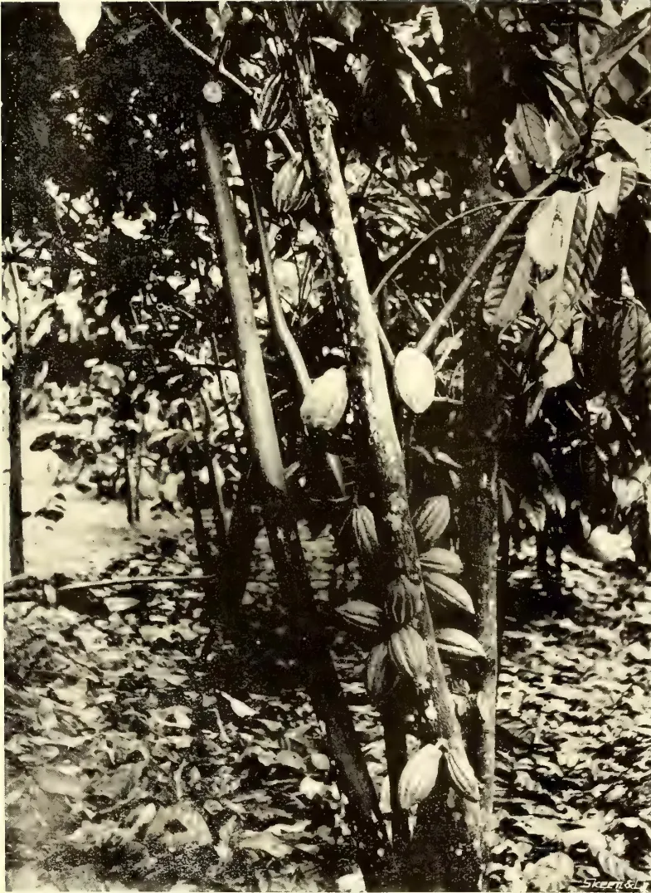A black and white photograph of a cacao tree trunk. Several large, oval-shaped, light-colored pods (amarones) are hanging from the trunk. The tree is surrounded by dense foliage and leaves, and the ground is covered with fallen leaves. The image is a vertical rectangle.

*Photo by Ivor Etherington.*

TYPICAL AMELONADO CACAO.

169------------------------------------------------

This image is a scan of a blank page. The paper has a light cream or off-white color with a slightly textured appearance. There are a few very small, faint dark spots scattered across the surface, which appear to be scanning artifacts or minor imperfections in the paper. No text, lines, or other markings are present.

170------------------------------------------------

145Edible Products.FRUIT CHARACTERS.

Most of the varieties of cacao grown in Ceylon are roughly divisible into the Old Red or Caracas, the Forastero or Hybrid and the Amelonado types. The classification given by Morris is simple, and that by Hart more detailed, though the latter does not, in my opinion, give a sufficiently minute sub-division to make it of every-day use on cacao estates outside Trinidad. The ease with which new strains of cacao arise has resulted in confusion, and it is a very difficult task to formulate a key to include the distinctive characteristics of the varieties existing in any one country where cacao has been cultivated for twenty or thirty years. As far as fruit characters alone are concerned it would be no difficult matter to collect specimens which in point of size, shape, and colour form a more or less continuous series connecting the Nicaragua, Criollo, and Forastero types with one another; even the same tree in a single year or in successive years may produce fruits differing widely in external characteristics, and when one considers the characters of the rest of the vegetative system and those of the seeds, the mixed nature of the varieties now cultivated is manifest.

The classification of the cacao varieties into three groups by Hart is, according to that gentleman, necessary, in order to distinguish between the Calabacillo and Forastero types. It is equally necessary to adopt a similar classification for the varieties in Ceylon and to perhaps omit the Calabacillo group (which is very rarely if ever, met with in this island) and give the Amelonado variety a separate class, as it is on all estates so markedly different in its shape, green-yellow colour and flat purple seeds from any other Forastero type.

In order to enable one to select the various types it will be necessary to deal very fully with the characters of the fruit wall and seeds.

FRUIT WALL.

*Thickness.*—The thinnest walls are found in the Nicaraguan and Caracas types and the thickest in the Forastero forms. The following figures show the thickness, lengths, circumferences and weights of several fruit walls of cacao pods grown at Peradeniya :—

<table border="1">
<thead>
<tr>
<th rowspan="2">Variety.</th>
<th rowspan="2">Thickness of wall.</th>
<th rowspan="2">Length of wall.</th>
<th rowspan="2">Circumference in middle of fruit.</th>
<th colspan="2">Average weight of 100 fresh fruit walls.</th>
</tr>
<tr>
<th>lb.</th>
<th>oz.</th>
</tr>
</thead>
<tbody>
<tr>
<td>Nicaragua ... ..</td>
<td>12 mm.</td>
<td>19.1 cm.</td>
<td>28.0 cm.</td>
<td></td>
<td></td>
</tr>
<tr>
<td>Caracas ... ..</td>
<td>13 ,,</td>
<td>17.2 ,,</td>
<td>23.7 ,,</td>
<td>48</td>
<td>4</td>
</tr>
<tr>
<td>Forastero-Cundeamor ..</td>
<td>15 ,,</td>
<td>20.6 ,,</td>
<td>26.5 ,,</td>
<td>84</td>
<td>14</td>
</tr>
<tr>
<td>Amelonado ... ..</td>
<td>15 ,,</td>
<td>18.5 ,,</td>
<td>26.7 ,,</td>
<td>74</td>
<td>12</td>
</tr>
</tbody>
</table>

It is obvious from these records that the most wasteful variety of cacao, as far as the thickness and weight of fruit wall are concerned, is the Forastero-Cundeamor and the most economical the Caracas or Nicaraguan type.

*Colour.*—The outer surface of the fruit wall is, in unripe specimens, red or green, these changing during ripening to reddish-yellow or yellow respectively. In the Forastero group the fruits show all proportions of red and green inter-mingled with one another and even the Criollo fruits may be yellow or red. In Ceylon, the Amelonado variety is distinct in always having a green wall changing to pale yellow on ripening. Usually all the fruits on the same tree have a similar colour or distribution of colours.

171------------------------------------------------

Edible Products.146

In Trinidad, as indicated by the classifications of Morris and Hart, each variety is subdivided into red and yellow forms, and the same applies generally to the varieties in other cacao-growing countries.

COLOUR OF OUTER SURFACE OF FRUIT WALL.

<table>
<thead>
<tr>
<th>Variety.</th>
<th>When Unripe.</th>
<th>When Ripe.</th>
</tr>
</thead>
<tbody>
<tr>
<td>Caracas</td>
<td>... Usually red; frequently green.</td>
<td>Usually reddish-yellow; frequently yellow.</td>
</tr>
<tr>
<td>Nicaragua</td>
<td>... Red or green.</td>
<td>Reddish-yellow or yellow.</td>
</tr>
<tr>
<td>Cundeamor</td>
<td>... Red and green.</td>
<td>Reddish-yellow.</td>
</tr>
<tr>
<td>Amelonado</td>
<td>... Green.</td>
<td>Yellow.</td>
</tr>
<tr>
<td>Calabacillo</td>
<td>... Usually red.</td>
<td>Usually reddish-yellow.</td>
</tr>
</tbody>
</table>

*Shape and size.*—In shape and size there is every variation between the long pod with acuminate apex—as in some forms of Nicaragua and Cundeamor,—to the short, ovate, broad base and blunt apex of Amelonado. Some forms are constricted at the base—Cundeamor and Liso—others are wide at the base—Sambito and Amelonado—and others intermediate between these.

(To be continued.)

REPORT ON COCOA AND COLA INDUSTRIES IN THE GOLD COAST.

INTRODUCTORY NOTE.—Doctor Gruner, District Commissioner, Togoland, West Africa, visited the Gold Coast in August 1903 on behalf of the German Agricultural Committee, by permission of the Governor of the Gold Coast, for the purpose of acquiring information relative to the cocoa and cola industries in that Colony. The report on his visit, written in German, appeared in the August, September and October, 1904, numbers of "Der Tropenpflanze" and the following remarks are a precis of this report compiled by W. H. Johnson, Director of Agriculture, Gold Coast Colony, West Africa.

I. TOUR IN THE COCOA AND COLA DISTRICTS.

During the first two hours march after leaving Aburi few cocoa trees were seen but they were much more numerous during the 3rd hour's march, at the end of which Apasare was reached. This town is pleasantly situated between wooded hills and surrounded by cocoa plantations.

The natural sources of rubber in Akwapem have been destroyed and many farmers have now commenced to cultivate plants distributed from the Aburi Botanic Gardens. Previous to the cultivation of cocoa the oil palm was carefully looked after in this district and oil prepared from its fruits for export, but now only sufficient is manufactured for culinary purposes.

Along the road from Apasare to Akroase, a distance of about ten miles, cocoa plantations intermixed with oil palms were very abundant, the time taken to cover the distance between the end of one plantation and the beginning of the next not exceeding five minutes in any one instance. One enterprising native planter at Akroase had planted 5,000 cocoa trees as well as several hundred rubber trees. Practically the whole five miles of road between Akroase and Kofrodua runs through cocoa farms, but in the new Juaben districts, of which Kofrodua is the capital, they were not so numerous.

172------------------------------------------------

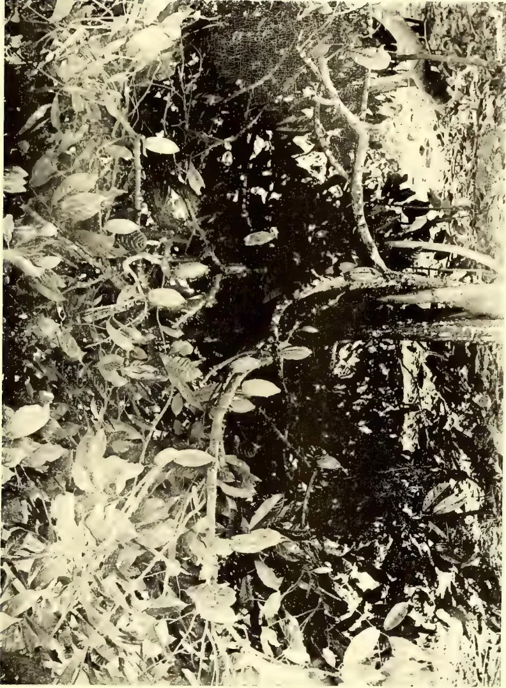A black and white photograph capturing a dense, overgrown forest scene. The foreground and midground are filled with a variety of plants, including broad-leafed trees and smaller shrubs, creating a complex web of branches and leaves. The lighting is dappled, with bright highlights on some leaves and deep shadows in the thickest parts of the vegetation. The overall impression is one of a wild, untamed natural environment.

*Photo by Ivor Etherington.*

TYPICAL FORASTERO CACAO

173------------------------------------------------

This image is a scan of a blank page. The paper has a light cream or off-white color with a slightly textured appearance. There are a few very small, faint dark spots scattered across the surface, which appear to be scanning artifacts or minor imperfections in the paper. No text, lines, or other markings are present.

174------------------------------------------------

147Edible Products.

A few years ago coffee was largely cultivated in Akim; this has now been abandoned, and cocoa farms, principally of young trees, and cocoa drying platforms were seen all along the route. Carriers conveying cocoa were even met coming from Okwawu where this cultivation has also extended.

Cola trees were first observed at Tafu, and occurred at intervals until Kwaben was reached, their distribution being similar to the unplanted oil-palms, in some instances numerous, in others scarce. Those growing in the forest had long slender trunks whereas those found in cleared areas were sturdy branching trees. Occasionally cocoa was observed planted around the cola trees, appearing as though the latter had been planted as shade for the former. Numerous natives from German Togoland were met with in the cocoa districts, some stated they had been working in the cocoa plantations as hired labourers for several years and understood the cultivation of this product; they expressed their willingness to return to their homes and start cocoa plantations provided they were confident of the support of the German Government, and assurance of this support was given them.

## II. COCOA CULTIVATION BY THE NATIVES.

The usual native method of establishing a cocoa farm is as follows:—The bush is cut down and burnt, only surface roots and weeds are cleared away and yams are then planted, cocoa not being planted until the yams have been harvested. In the case of large plantations the clearing and weeding is carried out by hired Togo or Krobo labourers who are paid 20s. per acre for each of the following works, viz:—cutting down bush, felling trees, and clearing. For succeeding weedings which occur quarterly, 10s. per acre is paid, but sowing and planting is done by the owner. Cocoa is principally propagated by seeds which are either sown thickly in seed-beds prepared in moist situations, often by the side of a brook, or directly out in the plantation, two in each hole, when if both germinate the weaker is cut away.

The reason given for this latter method being that the plants transferred from the seed-beds die if a period of dry weather follows their trans-planting, for neither the seeds nor plants are watered; but this is seldom necessary as this operation takes place during the two rainy seasons (March—June and September—October.) Each land-owner has from 3,000 to 4,000 trees and some are said to have as many as 10,000, while every school boy has his own cocoa farm which he tends himself. The trees in many plantations are planted closely together, usually only 8 or 9 feet apart, but the owners of old plantations have observed that when trees are planted in this manner, the branches interlace and the yield decreases; consequently in new farms the trees are being planted at from 11 to 12 feet apart.

Tania is cultivated between the cocoa, but shade trees are not planted although when the forest is cleared economic trees such as *Funtumia* rubber, oil-palms, and cola are left standing and slight shade is unintentionally provided. Small farms do not usually require shade trees as they are generally situated near the edge of the forest which furnishes shade during a great part of the day, and while the cocoa is young it receives shade from the tania. Little attention is given to the young plantation beyond just clearing away weeds immediately around the plants, and cutting away suckers. No steps are taken to destroy pests; the borer is the only one which has proved really troublesome and this is present in nearly every plantation. Farmers have been cautioned to exterminate it by the Botanic Department and by printed notices, but with no visible result. The amount of cocoa produced is not appreciably affected by its attacks because of the large number of new trees planted.

175------------------------------------------------

Edible Products.148III. MODE OF PREPARING COCOA FOR MARKET.

The old plan of preparing the beans for market by simply drying them in the sun has been abandoned everywhere in favour of the fermenting method introduced by the Government Botanic Department. The beans are placed in heaps upon mats and then covered up with mats weighed down with stones, and left for four days if this takes place upon the same day the pods are plucked, but for three days if upon the following day; after which they are washed in baskets.

In order to facilitate the latter operation fermentation takes place on that portion of the farm nearest a brook. Washing completed, the cocoa is taken home to be dried in the sun either upon specially built wooden platforms or mats made of plaited palm leaves. Properly fermented cocoa tastes sweet, is mahogany colour inside, and the outside shell is a clear light red.

IV. REASONS FOR THE DEPRECIATION IN THE MARKET VALUE OF COCOA.

The native farmers consider they are being cheated when prices fall, and complained bitterly with regard to the prices paid by the merchants for their cocoa; they had even petitioned Government in this matter, who learned from inquiries addressed to the merchants that this was due to the falling off in the quality of cocoa, and printed notices were distributed by Government warning the planters to take more pains in the preparation of this product. In reply the farmers accused the middlemen of mixing good and bad cocoa, and suggested this as a reason for the deterioration. The advances made by the merchants to farmers is one of the causes for the depreciation of cocoa; previous to or at the beginning of the cocoa harvest cash is advanced which the receiver binds himself to pay back in cocoa, and when pressed to fulfil his contract he either buys or borrows cocoa, irrespective of quality, to furnish the promised supply. This pernicious system, although not so much in vogue as hitherto, both encourages the native to get into debt and to adulterate his produce. Another cause is the method of transport; cocoa is placed in casks and rolled from the principle buying centres to the port of shipment, dust gets into the cask and renders it unsightly.

V. THE COLA INDUSTRY.

The cola tree is very seldom planted and the tending of those trees produced by natural agency is limited to the clearing away of bush and weeds; but every such tree has an owner, who claims this right in virtue of having affected the first clearing. Cola trees raised from seed commence to fruit when 6 or 7 years old; the produce is small at this period but increases yearly until the tree is mature when it will yield from 40 to 50 fruits.

Two crops are produced annually, in December and April, of which the former is the principal. Fruits which fall off the trees are not collected as they spoil rapidly; those plucked from the trees are stored in the shade as the hot sun turns them black. When the nuts are freshly gathered some difficulty is experienced in skinning them, but if they are stored for a short time the skin can be readily removed with the fingers. If the nuts harvested exceed the demand the surplus is skinned and packed with the leaves of a particular plant (*Thaumatococcus Danielli*, Benth.); in broad baskets made of palm leaves and stored.

The Hausas, who are the principal consumers, convey salt to the cola districts and barter it for cola; 1 lb. of salt valued at 6d. being exchanged for 100 cola nuts. The price of cola, in the districts where it is produced, fluctuates between 3d. and 1s. per 100 nuts, but in Accra cost of transport raises it to 1s. 6d. per 100. Cola is principally exported by sea to Lagos; the value of the exports in 1900 and 1901 were £43,133 and £35,024 respectively; while the estimated annual value of the exports overland to the hinterland is £75,000. The principal cola

176------------------------------------------------

149Edible Products.

markets in Akin are Insuaim, Essamang, Kwaben, Tumfa, and Kankan. In Kwaben or Tumfa, it is possible to purchase from a single person 10 loads containing 2,000 nuts each. Previously the cola produced in Ashanti was only purchased by Hausas and transported by them northwards to the Hausa States, but the restoration of order in Ashanti and the completion of the railway to Kumasi has facilitated the transport of this crop to the coast.

#### VI. THE BOTANIC GARDENS, ABURI—AND THE DEVELOPMENT OF THE COCOA INDUSTRY.

The Agricultural Experiment Gardens formed at Aburi in 1890 conducted cultural experiments with cocoa in order to draw the attention of the natives and especially the chiefs to the advantages likely to accrue from the cultivation of this product. The oldest trees in the Gardens are 15 to 16 years old (*i.e.* in August 1903), and a large area is planted with trees 12 to 16 years old. This healthy and productive plantation is the origin of the great cocoa industry of the Gold Coast as the fruits produced by it have been continuously distributed to the natives. The trees are planted (I) 12 x 12 feet apart, and the first shade trees employed were *Erythrina*; but as this tree is deciduous during the dry season and therefore of little value a more satisfactory substitute (II) has been found.

In 1898 the Curator commenced travelling in the neighbouring districts with the view of instructing the native farmers in the cultivation and preparation of cocoa. During each of his tours large quantities of cocoa seeds were offered to the natives without charge; many were, however, loath to accept them being suspicious of the objects for which this free distribution was being effected; but when the seeds were offered for sale at a ridiculously low price they were eagerly purchased. The following year the same officer prepared a brief treatise on the cultivation and preparation of cocoa which was first printed in English and later in the vernacular for free distribution. Opportunities were also afforded to the chiefs and other influential natives to send one of their family to the Gardens to learn agricultural work, but this excellent arrangement met with little success as the parents and guardians in each case failed in their compact to supply their protege with subsistence money. A second attempt which consists of receiving young lads who have received a slight education as paid agricultural apprentices, has proved more successful; again from the regular labourers in the Gardens, some are selected to teach native farmers and others are employed to lay out their cocoa plantations.

When cocoa was first produced the merchants were disinclined to purchase this product and the Botanic Gardens undertook its shipment, but naturally abandoned this work when the merchants had overcome their first reserve. The development of the industry is still, however, kept in view and experiments are now progressing in the fermentation of cocoa.

#### VII. FURTHER DEVELOPMENT OF COCOA CULTIVATION.

In order to encourage cocoa growing in the Western portion of the Colony, the Government has established an experimental garden at Tarkwa where experiments are in progress with the cultivation of this product with a view to determine the best distances to plant the cocoa trees apart and the most suitable shade trees. Large quantities of seed are being sent from Aburi for distribution in Ashanti, and the Basel Mission Society is also encouraging its members to form cocoa plantations in the latter district.

There is little doubt that the export of cocoa will considerably increase within the next few years, for thanks to the sporadical method of laying out cocoa farms previously described, neither epidemics nor exhaustion of the soil will effect it, and nothing but a further heavy fall in prices will check it. In short here is an industry developed which one can only admire and regret that Togoland lacks such a beneficial institution.

177------------------------------------------------

Edible Products.150THE OLDEST TEA IN CEYLON.

It is our custom annually to record the condition and progress of the oldest regularly cultivated tea field in Ceylon—that of 20 acres on Loolecondera planted by Mr. James Taylor (for Messrs. Harrison and Leake of Keir Dundas & Co.) in 1868-9. Mr. G. F. Deane, who has been Manager now for 14 years and has courteously informed us at intervals as to its condition, wrote us as follows on July 7th (a letter which was lost in the post—but of which he has sent us a copy dated July 14th) as follows:—

“In reply to your enquiry as to the condition of the old tea on Loolecondera, the oldest field, some 20 acres planted in 1868-9 Assam-Hybrid and which is very wind-blown and has never been manured, has given last season a yield of 536 lb. made tea per acre in the 37th or 38th year from planting, and has averaged over 400 lb. made tea per acre for last six years.

“The next older field planted in 1875 (84 acres), also wind-blown and never manured, gave 428 lb. made tea per acre last year. Both fields are looking well and the China tea planted out along the roadside in 1866 is still flourishing.”

The yield of 536 lb. made tea is particularly good—considering that last year we recorded the fact that after the last pruning in 1901 the yield had ranged from 350 only up to 425 lb. We congratulate Mr. Deane on the result.—*Ceylon Observer*.

THE LEADING TEAS OF THE WORLD.INDIA.

The remarkable revolution which has taken place in the source of the tea supply of the world may be gathered from the fact that, in dealing with the tea-producing countries, there is no hesitation in placing British-grown teas first on the list. Fifty years ago, “tea” and “China” were almost synonymous terms; to-day, tea is a cosmopolitan product obtained from a variety of countries each of which is predominant in its own particular market. Moreover, it is beyond doubt that China tea is on the down grade, while that of British India continues to make the most extraordinary advance, its exports having trebled during the last twenty years. In the same period, the exports of Ceylon tea have expanded from two to a hundred and fifty million pounds a year; and there has been a heavy increase in the exports of Japan and Java. These developments will be more easily grasped by a reference to the following tabulated list of the exports of tea from the latest official statistics:—

EXPORTS OF TEA FROM THE PRINCIPLE TEA-PRODUCING COUNTRIES OF THE WORLD, IN 1884 AND 1904.

<table>
<thead>
<tr>
<th>Country.</th>
<th>1884</th>
<th>1904</th>
</tr>
<tr>
<th></th>
<th>Lbs. Exported.</th>
<th>Lbs. Exported.</th>
</tr>
</thead>
<tbody>
<tr>
<td>British India ... ..</td>
<td>60,473,000</td>
<td>213,808,000</td>
</tr>
<tr>
<td>Ceylon ... ..</td>
<td>2,393,000</td>
<td>149,227,000</td>
</tr>
<tr>
<td>Total British-grown tea ... ..</td>
<td>62,866,000</td>
<td>363,035,000</td>
</tr>
<tr>
<td>China ... ..</td>
<td>268,800,000</td>
<td>193,466,000</td>
</tr>
<tr>
<td>Japan ... ..</td>
<td>35,716,000</td>
<td>67,162,000</td>
</tr>
<tr>
<td>Java ... ..</td>
<td>5,575,000</td>
<td>21,287,000</td>
</tr>
</tbody>
</table>

From these figures it will be readily seen that the exports of British-grown Indian and Ceylon teas to the markets of the world are not far from double those of China. Whereas twenty years ago they did not export a quarter of the amount sent out from Flowery Land.

178------------------------------------------------

151Edible Products.

Although the countries scheduled are the principal tea producing ones, there are others where the plant is cultivated, for, contrary to the general impression, tea can be grown almost anywhere under temperate or tropical climatic conditions. I myself have grown tea in the Himalaya mountains at an altitude of over 6,000 feet over sea level—and seen it buried yearly under two feet of snow! It is the growing of tea profitably that is “another pair of shoes.” Apart from the countries named, tea is grown in Burmah, the Andaman Islands, Natal (where they turn out nearly two million pounds annually), Central Africa, Fiji, the Kabbaz (Caucasus), Jamaica, (experimentally) the Southern States of America—all with commercial intention; and there are countless other places where it exists experimentally, in the botanical gardens, and so forth. But for the profitable production of tea, there must be a forcing climate, with ample rainfall, and an abundant supply of cheap labour for gathering the harvest, or “plucking” the leaf as it is technically called. In the most favoured districts, where the “flushes” of leaf are thickest, the outside average capacity of a labourer will not supply daily more leaf than can make 5 pounds of tea; and in less-favoured districts, the most skilful and diligent hand will fail to obtain even half that amount, and this at two cents a pound (which is the recognized scale of payment for the work), imposes a limitation that cannot be overcome except in those particular countries where tea is grown at present. On these economic grounds, the production of tea must remain the monopoly of the Far East, where labour and living are cheap; and the rainfall of regular “monsoons” supply those climatic conditions which are necessary to a luxuriant growth of leaf.

It is estimated that the amount of tea available for export from the tea-producing countries is 600,000,000 pounds. How much tea remains in the countries of production it is impossible to say, owing to the entire absence of any Chinese statistics on this point. It is, however, a curious fact that, except in China and Japan, the consumption of tea in the countries of their production is extremely small, and may almost be said to be a negligible quantity. The crops of India, Ceylon and Java are grown purely for export, the general population of those countries being too poor to afford tea. Of the six hundred million pounds exported from the countries of production, five-twelfths is taken by Great Britain, whose total consumption equals that of all the other European countries and the United States put together. The five-principal tea-consuming countries in the world, and the amount they consumed in 1903, are given as follows:—

<table>
<thead>
<tr>
<th rowspan="2">Country.</th>
<th rowspan="2">Lbs. Imported.</th>
<th colspan="2">Consumption</th>
</tr>
<tr>
<th>Per Head.</th>
<th>Lbs. oz.</th>
</tr>
</thead>
<tbody>
<tr>
<td>United Kingdom</td>
<td>255,498,000</td>
<td></td>
<td>6.03</td>
</tr>
<tr>
<td>Russia</td>
<td>132,264,000</td>
<td></td>
<td>0.94</td>
</tr>
<tr>
<td>United States...</td>
<td>104,632,000</td>
<td></td>
<td>1.30</td>
</tr>
<tr>
<td>Australasia (1901)</td>
<td>28,380,000</td>
<td></td>
<td>7.05</td>
</tr>
<tr>
<td>Canada</td>
<td>23,969,000</td>
<td></td>
<td>4.34</td>
</tr>
</tbody>
</table>

The Cape of Good Hope and Holland are the only other countries where there is a substantial per capita consumption, and thus, excluding China and Japan, the tea-drinking communities of the world may be reckoned as consisting of the above seven.

The fact that stands out from these figures is that the English are the greatest tea consumers of the civilized world, and it may therefore be interesting to see what teas they prefer. Since the introduction of India tea fifty years ago and of Ceylon tea twenty-five years later, they have practically discarded the use of the China herb. It may be urged that this only shows natural preference for the product of their own empire, but against this fact there remains the solid argument

20

179------------------------------------------------

Edible Products.152

that British-grown teas are far more expensive than China teas, and have won their way into the market on their merits. Imperialism may explain a sudden quixotic action, but that sentiment has no room in weekly domestic bills; and the conversion of the tea-drinking Englishman from the China to the Indian and Ceylon herb, at an extra expense to his pocket, has resulted from economic conviction that he is getting the best value for his money. Therefore, not merely on the grounds that the exports of the British-grown teas are the largest, but also because the article is the best, do I place it first on the list.

The secret of the superiority of Indian and Ceylon teas is very simple—they are made from a better variety of plant than the China teas, and one producing a leaf with better "liquoring" qualities. Assam is the home of the tea plant; and it was from its steaming valleys ages ago that the seed was taken to China. In the process of centuries from change of soil and climate and other causes, the plant deteriorated. Compared to the indigenous variety in Assam, the modern China-tea-bush is as a wild strawberry to a cultivated one. By the irony of circumstances when the Government of India first started the cultivation of tea, it sent to China for tea seeds and seedlings! All the earlier tea plantations in India were planted out with the China variety, and they proved a terrible handicap to the industry. I, myself, was in charge of an old Government plantation for many years, and no one knows better the hopelessness of trying to make "quality" from the miserable

af at my disposal; and as I manufactured some five million pounds of it, I may claim to speak with experience. It was not until I rooted out the old "China" bushes, and replanted the area with seed obtained from Assam—as has been done all over India, where the original China-plant gardens may be said to have been eradicated, that I was able to line up my tea with those for which India had acquired its reputation. Ceylon, starting later in the race, was able to avoid this fatal initial error, and all its plantations are laid down with the Assam variety. But perhaps the greatest tribute to the superiority of the India plant was paid by Java, when the Dutch tea planters there imported seed from Assam, with the result that the production of that island has gone right ahead, and is taking its place side by side with that of India and Ceylon. Such is the real explanation of the superiority of Indian and Ceylon teas—they are made from an altogether superior variety of plant.

With these preliminary observations, I will turn now to more detailed examination of the tea districts of India, which are far more widely scattered than many readers may be aware of. The great bulk of cultivation clusters around Assam, which lies to the north-east of Calcutta, but the cosmopolitan nature of the industry in India—which is a cosmopolitan country, peopled with many races of men—may be gathered from the fact that tea is grown in Kasmir, two thousand miles to the west of Assam, and in Travancore, which is nearly two thousand miles to the south. Moreover, there are several districts between these extremes, as the following list of them will show:—

#### THE TEA DISTRICTS OF INDIA.

<table>
<tbody>
<tr>
<td>1. Assam.</td>
<td>6. The Terai.</td>
<td>11. Kumaon.</td>
</tr>
<tr>
<td>2. Kachar.</td>
<td>7. Chitagong.</td>
<td>12. The Nilghiris.</td>
</tr>
<tr>
<td>3. Sylhet.</td>
<td>8. Chota Nagpor.</td>
<td>13. Travancore.</td>
</tr>
<tr>
<td>4. Darjilling.</td>
<td>9. Kangra Valley.</td>
<td>14. The Wynaad.</td>
</tr>
<tr>
<td>5. Doars.</td>
<td>10. Dehra Doon.</td>
<td></td>
</tr>
</tbody>
</table>

There are also plantations at Simla, Loharduga and in Kashmir.

Of the above districts, the first three may be regarded as the principal home of the tea plant. Assam is situated in the Bramaputra Valley, while Kachar and Sylhet belong to the district known as the Surma Valley. They lie on the north eastern boundaries of India, being divided from Burma by a belt of native states peopled by aborigines.

180------------------------------------------------

153Edible Products.

Darjilling, Doars and the Terai lie considerably nearer to and almost due north of Calcutta, while Chitagong is near the sea coast to the south-east of that city. Chota-Nagpur, which is the driest and least prosperous district, is situated in the centre of Bengal, and so far from the Himalayas that it is not blessed with the heavy rainfall that is poured over the other districts.

The Kangra Valley, Dehra Doon and Kumaon are three small districts lying on the slopes of the Himalaya Mountains, on the north-western extremity of India. They were three of the localities originally selected by the Government of India as particularly suitable for the cultivation of tea, when the idea was held that the steeper the ground the better the plant—one long since exploded.

The Nilghiris, Travancore and the Wynaad are all in the southern part of the peninsula; the latter two places enjoy a climate very like that of Ceylon. They are the latest districts opened out in India, and were there any prospects for the further expansion of cultivation, they could supply countless acres of the richest forest land.

The tea plantation in Kashmir belongs to the Maharaja of the Province, and was started about the same time as he established vineyards for the production of wine; but the exquisite climate of the land of Lalla-Rookh is not suitable for the profitable cultivation of tea.—*Herbert Compton in Tea & Coffee Journal, New York.*

#### CEYLON'S IMPORT DUTY ON INDIAN TEA.

For some time past the Ceylon papers have made mysterious references to a Despatch from the Secretary of State for the Colonies regarding Ceylon's import duty on Indian tea. Our readers know that the Calcutta I. T. A. have transferred the matter to the London Committee to bring pressure to bear on the authorities at that end. The Despatch to the Ceylon Government, however, is now published, and is as follows:—"I would be glad to know whether your Government remains of the same opinion as a year ago, and still considers that the present restriction should not be relaxed, or whether the conditions of the case have been altered in any way. As I understand, the object of maintaining the duty is to safeguard the purity of Ceylon tea, and the Ceylon tea growers seem to think that the encouragement to the blending of Indian and Ceylon teas, which would be the result of removing or modifying the present restrictions, might benefit India at the expense of Ceylon, although some additional trade would be attracted to Colombo. It is a matter on which local opinion must prevail, no Imperial interest being involved; but the present policy seems to be of somewhat doubtful value, and you may be of opinion that the time has come to reconsider it." The Governor of Ceylon, in forwarding the Despatch to the Planters' Association, takes a very broad and statesman-like view of the question. He says: "The object of the Ceylon Planters is, it is understood, to ensure that no tea other than that grown in Ceylon is exported from the Colony as pure Ceylon tea, and in this desire His Excellency considers that the planters are justified. But His Excellency regards it as worthy of the consideration of the tea producers whether the object referred to could not be secured without prohibiting the blending of tea in Colombo in bond. Colombo is the natural centre of the world for tea blending, and if precaution be taken that all tea leaving the bonded stores is marked as blended tea in unmistakable manner, it is not clear how the Ceylon grower can be injured. If Java or China teas are required for the market, they will go to Europe to be blended there as easily as they could be sent to Colombo, and in preventing the blending of tea here in bond the Ceylon growers seem to prevent the creation of an additional market, while Colombo is losing what would probably be a lucrative business."

181------------------------------------------------

Edible Products.154

The Planters' Association, however, seems to be impervious to all arguments, and in its reply to the foregoing letter, makes the following rather lame enquiry: "The majority of both bodies are of the opinion that the advantage to be gained by allowing the blending of all teas in Colombo is problematical, and the possibility of damage to the producers' interest probable. What precautions are the Government of Ceylon prepared to adopt to prevent inferior teas being imported for blending purposes, and what precautions to prevent blends being exported from Ceylon as pure Ceylon tea? This, in the opinion of my Committee, would entail the establishment of a new department." The *Ceylon Observer*, as the oldest and most representative journal in Ceylon, is of Sir Henry Blake's opinions. Our contemporary has grasped the full significance of the advantages Ceylon is giving up, and writes: "We are glad to see that on being referred to by Lord Elgin, H.E. Sir Henry Blake has pointed out very clearly the fallacy of the 'pure Ceylon' tea theory—adhered to so closely (and rightly so in the earlier stages of the industry by the planting community). Planters, like the trade, know very well that very little pure Ceylon tea goes into consumption as such, or unblended with other tea. If the blending were done here, there is no reason to suppose less Ceylon tea would be used; and it is known that directly Colombo became a blending centre, there would be more buyers and business drawn to this port and greater competition attracted to the local market, with increased prompt cash returns. The P. A. Committee, in reply, once again ask Government what precautions they will take to prevent blends being exported as 'pure Ceylon.' The Committee surely know very well by this time that this could be secured by expert inspection at the Customs and special warehouses for blending in bond, from which all tea exported would be officially stamped and sealed as 'blended.' Expert inspection at the Customs will also ensure 'pure Ceylon tea' being exported—though when 'blended with fine Indian it might pass muster! The prejudice is too strong, perhaps, for the present against China and Java teas; but surely an experiment could be made by admitting Indian teas free for blending in bond. And from how this plan worked could be judged the advisability of either reverting to the old (the present) order, or of extending the privilege to China, Java and Japan, and of thereby making of Colombo the great central tea blending mart for the whole world." However, the objection against admitting Indian tea duty-free is too shadowy, and the advantages of the port of Colombo so great, that we need not labour the question any further.—*Indian Planting and Gardening*.

## THE COFFEE INDUSTRY IN BRAZIL.

### LABOUR AND OVER-DEVELOPMENT.

The State of Sao Paulo, Brazil, has 1,908,000 acres planted in coffee. There are 545,000,000 bearing trees and 140,000,000 trees that will come into bearing within three years. Sao Paulo has 4,585,000 acres of land suitable for coffee. Four hundred and twenty thousand labourers are employed during the picking season. The coffee trees are worth \$312,000,000. The average yield per 1,000 trees is 2,300 pounds.

The methods in use are entirely unlike the Hawaiian practice in coffee growing. The picking is deferred until the whole crop of cherries has ripened. The labourers then strip the cherry off the branches, allowing fruit, leaves and twigs to fall on the ground. When the trees have been stripped, the fruit, with dirt, sticks and stones is raked into heaps, shovelled into wagons or cars on portable track, and transported to a river, stream or flume, to be washed in sluice-boxes. These deliver the cherry free from sticks, stones, dirt and rubbish. The cherry is then transported to huge, open-air drying floors of cement or clay. The sun-dried cherry is run through hulling machinery, graded and polished, and, when bagged, is ready for market. Santos coffee may, therefore, be produced and marketed at a profit at prices which would drive our Hawaiian growers out of the business.

182------------------------------------------------

155Edible Products.

Labour, during the picking season, commands high prices, and there is always a shortage during that period. Even paying the higher prices that labour commands during the busy season, the Brazilian growers can produce coffee at a lower price and still make a profit, because their methods of picking and handling the crop are cheaper than ours. The Sao Paulo method is also better adapted to the needs of the small individual planter who can market his coffee to the large planters and mill owners in the dried cherry, practically the only investment of capital, other than his own labour, that is required, being the comparatively small cost of a drying floor.

This simplification of methods is responsible for the enormous over-development of the coffee industry of Brazil. Hundreds of thousands of European immigrants, German, Italian and Portuguese, have poured into this salubrious, rich and well-watered region. As large an area as has been already planted is still available for the development of this industry in Sao Paulo alone. Extraordinary inducements have been offered by this and other Brazilian States in the way of lands, prepaid ocean-transportation, loans to settlers, and in some instances guarantees of at least \$400 wages per annum. Road and railroad development have kept pace with the settlement of the land.

The price of labour is approaching a parity in all civilized countries within the tropics. A land or an industry which has an advantage over other lands and industries, through the possession of cheaper labour, more fertile soils, more stable government or legislative, and hence artificial protection, can be depended on to rapidly bring itself up to the general average because of the universal desire to take abnormal profits. Sooner or later and, now-a-days, sooner, the endeavour to get out of an industry all there is in it, consequent upon this phase of human nature, will bring about over-production. Sometimes there is actual over-production of crops resulting in readjustment of prices in the world's markets, and widespread ruin in far distant lands. The synthetic over-production of indigo in Germany became a famine factor in India. But modifications in indigo manufacture in India have again placed the Indian ryot on a place of fair competition with German synthetic manufacturers.

Again, over-development takes the form of planting a larger area of land than can possibly be cultivated by the visible supply of labourers. This was the secondary cause of over-production of coffee in Brazil, and is somewhat of a factor in Hawaii to-day, affecting the cost of production of sugar. The world-wide remedy for this latter phase is to substitute small landowners for the plantation system of corporate ownership of land and the employment of labourers in masses. This remedy is being applied to relieve the coffee situation in Brazil.—*Hawaiian Forester*, January, 1906.

### THE COCONUT INDUSTRY OF TRINIDAD.

The important place this industry holds in the resources of Trinidad cannot be gauged directly by any official publication of trade statistics. Its products of nuts and oil are largely consumed in many different ways locally, and the industry being under no legislative restrictions, by which its products would be definitely known, it is somewhat difficult to estimate its importance.

The usual practice in planting coconuts here is to clear and burn the land, which is then lined and staked, the stakes being 25 feet apart; holes are dug at each stake into which the seed-nut is placed and barely covered with earth. In some cases the seed-nuts are imported nuts of known quality, and in others they are selected from heaps on the plantation, but these are exceptional cases, and I do not think it is too much to say that sufficient attention is not paid to the selection of seed-nuts.

183------------------------------------------------

Edible Products.156

In Ceylon seed-nuts are selected from trees of strong and robust growth, and of middle age, producing large nuts with thick and heavy kernels; the nuts are allowed to mature on the tree, and when picked are lowered by hand and not thrown down as is usual here. Nurseries are prepared in good land, in or near to the field to be planted, by trenching 18 inches deep and dividing into beds 3 feet wide. The seed-nuts are laid side by side on the beds, and the spaces between filled in with earth, after which the beds are covered with grass or straw to the depth of 3 inches, and water is applied frequently, especially during dry weather. After six months the young plants are removed to other nurseries where they are planted 3 feet apart and where high cultivation is concentrated upon them. When the plants are from two and a half to three years of age, the whole field is cleared, lined, and holed, and the plants from the nurseries are transplanted to the positions they will permanently occupy. All nuts which are slow in springing in the first nursery are rejected and not replanted into the second, and any plants in the second nursery which do not show vigorous growth are also rejected; so this method gives opportunities for an exceptionally good selection of seed, and it is claimed that fields planted in this way are most regular and yield the largest number of nuts per acre. The saving effected by not having to keep the whole field clean for the three years during which the plants are growing in the nurseries, is claimed more than to cover the cost of the nurseries and transplanting three year-old plants.

After planting, the young trees should be kept free from grass and weeds until they come into bearing; here it is usual to keep only such land as is occupied by the young trees clean, and this practice has its advantages as it keeps the unoccupied land under cover and economises labour. Fields come into general bearing here between the ages of from 12 to 20 years, depending upon the quality of the land and mode of cultivation, but from the fact that many individual trees begin to bear at eight years of age it may be inferred that, with a more careful selection of seed and a more liberal system of cultivation, this long period might be considerably reduced.

From the time crops are reaped there is a constant drain of plant food from the land, which must be made good somehow, or the ultimately inevitable exhaustion of this plant food must bring about failure of crops. This exhaustion depends upon what part of the produce is removed and not returned to the land, as the husk, shell, oil, and meal contain the more important plant foods of the soil in different quantities and proportions. Thus, if only oil is shipped from the plantation and the meal and ashes of the husks and shells used as fuel are returned to the land, the loss will be of little consequence, especially if the meal is fed to stock whose manure is utilised. If, on the other hand, the unpeeled nut is shipped the loss is great.

Analysis of the different parts of the coconut show that 1,000 husked or peeled nuts remove from the soil 5.22 lbs. of potash, 4.95 lbs. of nitrogen, 1.60 lbs. of phosphoric acid, 1.18 lbs. of sodium chloride, and 0.48 lb. of lime, which suggests kainit, basic slag meal, and green soiling with a leguminous plant as a cheap and effective system of maintaining the fertility of a coconut plantation.

Little tillage or manuring has been done hitherto on Trinidad plantations, which is probably accounted for by the fertility and suitability of our soils at present under coconuts, and the shortness of time the best plantations and those under most intelligent management have been in cultivation; but one has but to compare them with some of the older plantations to see what they may come to if this is neglected.

184------------------------------------------------

157Edible Products

The coconut palm bears all the year, the flowers and mature nuts being seen on the same palm at all times, but, as a matter of convenience, generally only two pickings per year are made, when only the mature nuts are supposed to be thrown down. In Sumatra the Malays have trained baboons to this work so effectively that only fully matured nuts are picked, but in Trinidad our more intelligent picker knows that the more nuts per tree he picks the fewer will be the number of trees he will have to climb, with the result that even under constant supervision a considerable number of immature nuts are picked. As such nuts are inferior for copra or oil making, and if shipped depreciate the value of our nuts in the markets, this has become a serious problem and one which the highest authorities in Trinidad think can be solved only by allowing the trees to drop their nuts, and employing men only to free the crowns of the trees once annually of dry spathes, stalks, leaves, and ants' nests.

The nuts having been picked, they are collected into convenient heaps where they are either opened and the kernel removed when copra or oil is to be made, or husked and selected if nuts are to be shipped, the kernels being conveyed to the drying house or the nuts to the shipping place.

The copra-drying house is similar to the ordinary cacao drying house, and the only manipulation required in drying copra is frequently to stir and turn over the pieces so that all parts may be exposed to the drying influence of the sun and wind. From five to ten days may be required to dry copra thoroughly, the time depending upon the sunshine and atmospheric conditions. The problem of artificially drying copra is simple compared with that of drying cacao, but from the design of some of the artificial drying houses one sees in Trinidad it is apparent that it has been misunderstood by many. Heat is of secondary importance, being only useful in enabling the large volume of dry air, which is essential, to absorb more moisture than it otherwise would in its passage through the copra: whereas, usually, heat takes the first place, and ventilation or the means of circulating dry air and removing the moist air has been omitted or given a secondary place.

The process of manufacturing oil from copra is simple, it being necessary only to disintegrate the copra so as to rupture the oil cells, the meal being then placed in bags and subjected to a pressure of about 2 tons to the square inch in hydraulic presses until the flow of oil ceases. A high extraction depends upon the degree of fineness to which the copra can be reduced, or, in other words, the complete rupture of all oil cells. From a plantation's own copra an extraction of 56 gallons of oil per ton of copra may be expected, and from ordinary commercial copra a fair average extraction would be 153 gallons per ton, and in most plantation oil factories the value of the residual meal as a stock food covers the cost of manufacturing oil.

As a very large proportion of the oil manufactured is sold locally, where the demand does not call for a high quality, little attention has been given to refining, simple filtration or subsiding being resorted to; but the time will come when higher prices will be obtained for oil of high quality, and it would be well for coconut planters to be prepared to take advantage of them. High-class oil can be made cheaply by the use of Fuller's earth in the filtration of oil made from good copra, but good copra can be made with certainty only by artificial drying, and although sun-drying houses will always be useful, an artificial drier can always be run economically as an adjunct to an oil factory, and every factory should be equipped with one.

There are good reasons why many of the items exported under the head "coconuts" from other coconut producing countries cannot be so exported here; for example, dessicated nut, the manufacture of which requires much cheap labour;

185------------------------------------------------

Edible Products.158

poonac or coconut meal, which is locally consumed; arrack or coconut toddy, about which the less said the better, owing to its pernicious effects; but why no use has been made of the husk to produce fibre, which is shipped from Ceylon under five heads, it is hard to say. The necessary machinery is simple, as is also that for converting the fibre into yarn, rope and mats.—*W. Greig, in Colonial Reports (West Indies) No 36: 1906.*

## Cultivation and Curing of Tobacco. II.

### THE CURING HOUSE.

A tobacco curing house should be constructed in such a way as will enable the operator to shut out very dry and very damp air, when either of the two extremes occurs, as it is most essential when tobacco is drying that the atmosphere be at all times warm and dry but not of a parching dryness. The non-conducting thatched roof, and shutters constructed as in drawing No. 2, with the assistance of the door as a means of ventilation, will ensure this. Each 'room' should be 14 feet long, with a space of 3 feet between to enable the workmen to move the bars of tobacco from one 'barradera' to the other, and for ventilation. The posts should be so arranged that each room of tobacco is supported by four of the stoutest, the latter being about 3 feet in the ground. These should be of good durable wood and not less than 8 inches in diameter at the top; the two smaller posts support the shutters and, to some extent, the roof. The posts that form the central passage (fig. 1) may be 3 inches to 4 inches in diameter, perfectly straight and smooth.

![A technical drawing of a tobacco curing house, labeled Fig. 1. The house is a triangular structure with a gabled roof and three rooms. The roof is supported by four posts: two central ones and two outer ones. The dimensions of the roof and walls are indicated by labels: the roof rafters are 2x3, the ridge is 3 1/2, the roof is 2x4, the roof is 2x4, the roof is 2x4, the roof is 2x4, the roof is 6x6, the roof is 3x4, and the roof is 6x6. The walls are 2x3, 2x4, and 2x3. The drawing shows the structure of the house, including the roof, walls, and posts.](505fc541c299f438a20e872000e17491_7_img.webp)

A TOBACCO CURING HOUSE. (Fig. 1.)

A house of three rooms of the dimensions shown should be capable of drying a crop of two acres of tobacco. Having decided how many rooms will be required, the first operation in the building is to line off, peg, and dig the holes for the posts; when this has been properly started, the barraderas and frames should be made and

186------------------------------------------------

159Edible Products.

stacked ready for putting into position. The posts are then set up, plumbed and lined, half filled in and rammed, then sawn level at the top to a line stretched from one end of the house to the other; they are then plumbed again and filled in and rammed firm. The next to go up is the 4 inches by 4 inches plate; this will have been constructed and lightly put together on the ground, so that it can be put up in sections; the splices should always be at the top of a post, and a main one if possible. The next to be fixed are the 3 inches by 4 inches barraderas (fig. 1) joining the 4 inches by 4 inches plate at both sides of the house and the main posts; after these the barradera frames braced, as shown in fig. 2, the 3 inches by 3 inches scantling at the top, then the ends and shutters; after these the roof rafters, the 2 inches by 3 inches movable barraderas (fig. 1), and then the thatch; and lastly 'wattle and clay' the walls.

![A detailed line drawing of a traditional tobacco curing house. The structure is built on a raised platform supported by several vertical posts. The main body of the house is a rectangular room with a thatched roof. A large, steeply pitched gabled roof structure, likely for drying or curing, is attached to the front of the main building. This gabled structure is supported by a series of diagonal wooden beams (barraderas) that cross the main structure. The drawing shows the intricate wooden framework and the thatched exterior of the house.](b3dc314359b244ba55960d1504085c7d_4_img.webp)

A TOBACCO CURING HOUSE. (*Fig. 2.*)

For two acres of tobacco about 350 bamboo bars, 15 feet long and 3 inches in diameter, will be required on which to hang the green tobacco, and a good quantity of dry "Jippi-jappa" thatch heart should be procured for tying the plants in pairs preparatory to hanging on the bars.

**CUTTING.**—If a careful watch be kept on the field, it will be noticed that some few of the plants will begin to ripen; these may not be cut yet until a sufficient number has ripened to fill at least ten bars; then go through the whole field and cut out all that are quite ripe and those that have not quite finished ripening the top leaf.

The best time to commence to cut is about three o'clock in the afternoon, and continue until dark. The leaves then contain very little moisture, and are, on that account, less brittle and less liable to break, and they also dry much quicker than when cut in the morning. This, however, may be done only when there is no danger of rain falling in the night, as the plants have to remain on the ground until the next morning; a light shower will not affect them and heavy rains only do so by splashing them with dirt.

21

187------------------------------------------------

Edible Products.160

The best method of cutting is to lay hold of the top of the stem with the left hand, bend the plant over a little, and cut it off at the level of the ground, taking care not to injure the young ratoons that are springing from below the surface. The cut plant may then be turned upside down, and the base of the stem, as far as the first good leaf, cut off (at the base of the ripe plant there are usually one or two small leaves that are over-ripe, spotted and blistered, and of very little value commercially). They are then laid on the ground in heaps of three or four plants in the interval next to that in which the workman is cutting, each man taking two rows, on each side of him. Whilst it is much better if the plants are allowed to remain on the ground all the night, it is more advisable to cut in the morning if the weather is at all unsettled; the only difference is that great care is necessary to prevent the plants getting scorched when lying on the ground to 'quail'; they must remain in that position until the leaves have lost their brittleness and have become pliable, and as soon as they have reached that state they must be removed into the curing house, or some other shady place. If the plants are cut in the afternoon, there is no danger of their getting scorched, and they are as pliable as kid skin the following morning. There is an idea among the Cubans that the tobacco burns better if a heavy dew falls on the leaves after the plants are cut. If the cutting is done in the afternoon, do not take the plants from the ground to the house until the dew has dried off them, and if it is decided to cut in the morning do not commence until the dew has disappeared.

To secure sufficient tobacco for the three days' cold sweating a cutting right through the field should be made every five or six days rather than every day, cutting out, of course, only the ripe tobacco; should there be indications of continued rain storms, every effort should be made to cut as much ripe and nearly ripe or 'full' tobacco as possible; if rain happens to fall without due warning, the ripe tobacco may be cut during the following day and a half, but if it is not cut by that time it must be left, as the moisture has then got up into the plant and turned it green again or unripe; in this case the plants must remain in the field until they ripen again.

When the plants are carried to the house preparatory to tying and hanging, they must be spread out as thinly as possible, say, three or four plants deep; for if allowed to remain in heaps for more than half an hour, they will ferment, get hot, and spoil. It is hardly necessary to point out that the greatest care should be exercised in the handling of the plants from first to last so as not to break the leaves.

#### TYING AND HANGING.

When all the cut plants have been transferred to the tobacco house, the work of tying and hanging should be commenced and continued until the whole has been safely hung in pairs upon the bars; the tying material must be passed around the stem and under the leaf that is nearest the base and then drawn tight to prevent the plant slipping out of the tie. The pairs of plants must be placed at a distance of 4 inches to 6 inches from each other, so that they just touch without pressure; a 14-feet bar will usually hold from thirty-four to forty pairs of plants. As the bars are filled they are packed close together on the lowest barradera and are allowed to remain so for three days and nights or seventy-two hours; at the end of this time the bars are spread out to a distance of one foot or 15 inches apart; giving the bars a shake to separate any leaves that may be sticking together, filling up the top barraderas first, one foot apart when the atmosphere is very dry, and 15 inches when moist. In rearranging the bars care should be taken to open out the plants at each end that are liable to slide towards the middle of the bar during removal, for if several pairs are allowed to remain packed together, fungus will make its appearance and cause what is known as 'sweated' tobacco.

188------------------------------------------------

161*Edible Products.*

This is easily recognized when it appears by the black spots that it makes on the still half-green leaves, though the really first indication of 'sweat' is the swelling or thickening of the leaves, their cold, wet feel, and the appearance of moisture on the surface; these spots increase in size until the whole of the leaf is covered, and once this fungus gets a start it will extend its operations into the tobacco that is not too closely packed and eventually go through the whole house. The fungus breaks down the tissues of the leaves and renders them absolutely useless as cigar tobacco, and the very best leaves can in this way be reduced to the status of 'fonque.' The fungus will also make its appearance on partially dried tobacco if the weather suddenly changes to cold and wet after a fairly long dry spell; if the cold wet weather continues for more than a day it will be necessary to procure several old zinc buckets, knock some holes in them, make charcoal fires and keep moving them about from place to place under the tobacco; but to ensure no smoke reaching the drying tobacco, the fires should be started at a distance away from the house and not taken in until there is a nice glow.

If the fungus has been overlooked and has had a good start, it can be stopped by removing the affected bars to temporary barraderas erected outside the house, on the side that gets the morning sun; three hours' sharp sun, say, from nine to twelve, will be quite sufficient to check it effectually. If bright sun be not forthcoming the charcoal fires must be kept going until the atmosphere in the house is too warm and dry for the fungus to live. The tobacco that is put out to sun should be taken in on the least indication of rain, as the lightest shower will spoil it; on the whole, it is much the best to be on the safe side by burning charcoal fires inside the house whenever partially dried tobacco is subjected to a cold, damp atmosphere. It must be borne in mind, however, that whilst, obviously, it is possible for the atmosphere in the house to be too cold and damp, there is also the danger of going to the other extreme; whenever hot drying winds prevail all the shutters and doors should be closed to prevent the tobacco drying too quickly; and, on the other hand, they should be closed when warm, dry, calm weather changes to cold and wet.

The last part of the leaf to dry is the base of the midrib, and when it is observed that this part of every leaf is dry and shrivelled, the bars may be double packed, that is, the pairs of plant may be closed up, so that each bar may carry the tobacco that was dried on two bars. The double packed bars can then be placed at a distance of 6 inches or 8 inches apart in the room nearest the press, and allowed to remain there until taken down to ferment. This rearrangement is best done when the leaves are not crisp, but soft and pliable; dry tobacco becomes crisp when the air is very dry and mild after a day's rain, and sometimes before rain; indeed the softening of the leaves is a reliable indication of an approaching storm.

The closing up of the dry tobacco is necessary for prolonging the final drying stages and rendering it less liable to be affected by atmospheric changes, and also provides more room and bars for the tobacco that is being brought in from the field as the plants ripen.

#### PRESSING AND CURING.

The word 'press' conveys to the lay mind an instrument constructed with numerous screws for the purpose of exerting pressure upon any substance placed under it; in reality the tobacco press is nothing of the kind, but is merely a pile (Cuban pilon) of tobacco stacked together to ferment in the same way as a mixture of manure and leaves is prepared in England for making hot beds for cucumbers and melons. In fact, it may be said that any one who has had experience in the work of the forcing department of an English garden could with safety undertake the curing of tobacco after seeing one crop cured by a Cuban; or, I may be allowed to hope, by following carefully the directions set forth in these notes. For the benefit, however,

189------------------------------------------------

Edible Products.162

of the large majority who have not been fortunate enough to have had opportunities for observing the changes that occur during vegetable fermentation, it will be necessary to set down all the details concerning the actual curing of tobacco.

The press, then, is simply the pile of tobacco; the term, however, is also applied by the Anglo-Cuban to the receptacle in which the tobacco is stacked; and when he wishes to convey the information that he is about to ferment a 'pilon' of tobacco, he states that he is going to 'put press'—to an outsider a most mysterious phrase. This receptacle may be made of ordinary deal boards (though cedar is the best), lined sides and floor with 'jagua,' the skin or bark stripped from the inner surface of the broad leaf-sheath or petiole base of the matured and fallen leaves of the royal palm (*Oreodoxa regia*); if a sufficient quantity of this material is not obtainable, a lining of dry banana leaves (trash), some 3 inches thick, will answer almost as well.

A perfectly round press is undoubtedly the best, though a hexagonal or six-sided does almost as well and is much easier to construct; if the tobacco house has a wooden floor, the sides of the press may be built upon it; if an earth floor, the wooden floor of the press must be raised about 6 inches from the ground. It is most convenient to build the press in one of the rooms of the curing house in a part not exposed to the wind. It is best under any circumstances to have sufficient banana trash in the bottom of the press to cover it to the depth of at least 6 inches when pressed down by the weight of the tobacco that is put upon it. The heat that is evolved by the fermentation has a tendency to rise towards the top, and, as a consequence, the bottom is liable to become chilled, if it is not snugly packed and almost air-tight. Whenever tobacco is being fermented and it becomes chilled, fungus is sure to grow. The dimensions of the press should be 9 feet in diameter by 5 feet in depth; no 'pilon' should be less than 9 feet nor more than 10 feet in diameter, if nicely fermented tobacco is required; about 200 double-packed bars will fill a press of this size.

The tobacco having come safely through the drying process and the press being ready, advantage should be taken of the first opportunity to 'put press.' This occurs after a day's rain, when the leaves lose their crispness and become 'mild,' *i.e.*, as soft and elastic as kid skin. The early morning is the best time to begin the work of transferring the tobacco from the bars to the press, as everything must be finished before the atmosphere is hot and dry enough to make the leaves crisp again. On the night following a rainy day all the shutters and doors must be left open to allow the moist, dew-laden air to circulate among the plants, and before daybreak in the morning all hands should be at work. In preparing the tobacco for the press the pairs of plants should be tied into bundles of about twenty (four bundles to a double-packed bar) by passing a strand of thatch-leaf along the bar under the strings and tying them together not quite as tightly as it is possible to tie them; this will allow a loop to lay hold of when handling the bundle, and is also convenient in other ways. The bundles are then lifted off the bar and handed to a man armed with a mallet-like piece of wood with which he gently taps the ends of the stalks, whilst holding the bundle under the left arm, until they are quite even; after which he hands the bundle to the man who is in the press to stack the tobacco; the latter gives the bundle a good squeeze, and lays it down in the press with the tips of the leaves pointing towards the centre and the stalks pressed tight against the wall. When he has filled up all round the inside of the wall of the press, he must commence the next layer about 18 inches from the wall, and the next about  $2\frac{1}{2}$  feet or 3 feet from the wall, according to the length of the plant, so that the whole of the bottom of the press may be covered. When this is done, he is to commence at the wall again and continue in the same way as he began, until the press is filled, kneeling on and drawing the bundles tightly together as they are put in. A halt, however, must be cried when the press is half full for the purpose of inserting the thermometer, or rather

190------------------------------------------------

163*Edible Products.*

the bamboo that is to hold it. The latter should be about an inch in diameter (inside), perfectly straight, and should have the partitions between the hollow joints cut out with the chisel, after making small window-like apertures on alternate sides at the nodes. The bamboo should be long enough to reach the centre of the press and should be placed thin end in, with the windows at the sides, for if the apertures are turned up and down the tobacco will press into them and interfere with the passage of the thermometer when it is taken out to observe the temperature. A hole, about 12 inches long and 2 inches in width, should be made in the wall of the press through which the bamboo is thrust; the hole is to allow the bamboo to sink with the tobacco as the fermentation proceeds. When the press is full, the tobacco is to be covered snugly with mats made of corn bags opened up and sown together; one thickness being sufficient in damp weather, two when the air is dry. Weights must now be put on to start the heat as quickly as possible; straight, smooth logs, about 9 inches in diameter laid closely together all over the top of the pilon is the usual method of applying pressure.

The last thing to be done is to insert the thermometer into the bamboo that was placed in the centre of the pilon; the bulb of the instrument should be packed neatly in cotton wool or some such non-conducting material to prevent the mercury running down before the temperature has been read. The thermometer may be attached to a piece of wire just long enough to reach the end of the bamboo which is, of course, the centre of the pilon, care being taken to keep the outer end of the bamboo plugged tightly with dry moss or a piece of rag.

In dry weather, as soon as the thermometer reveals a temperature of 118 F., the logs of wood should be removed; if the atmosphere is damp, they should be taken off when 108 F. is reached. The temperature rises much more rapidly during wet, thundery weather registering 120 in two days, whilst in dry weather from three to seven days are required to secure the same degree of heat. Whilst the tobacco is fermenting, small boxes should be got ready for the purposes of moulding the bund of leaves, when stripped from the stalks, into matulas, they should be of cedar and constructed as follows:—

Cut three pieces, 2 feet long by 7 inches deep, two for the sides and one for the bottom; cut one piece, 7 inches deep by 7 inches long at the top and 5 inches at the bottom, for the one end; these are put together, and when finished the box is trough-like and open at one end, the bottom being 5 inches wide inside. Three ordinary fencing staples are hammered into each side at about 5 inches apart for holding the strings of the matula while the box is being filled with the fermented leaves as they are stripped. When the thermometer in the press shows temperature of 120 F., stripping should be commenced. The shutters must be closed and all sources of draught plugged; banana or bag mats spread over the floor, low rough seats arranged around the room, with plenty of spare bag matting for covering the matulas when made; two-thirds of the men should have a box each, and all a supply of "thatch-heart" strings.

When everything is in readiness, the first few bundles are taken out and handed to the men without boxes who cut all the strings and pick the 'fonque' leaves from each plant; the plant is then passed along to the man who is to pick 'carpa,' then on to the 'tripa' picker. The carpa man uses three strings to his matula, the tripa matulas have two, whilst the fonque is known in future manipulations by its being tied in small round bundles about one-third the size of a matula. As the leaves are stripped they should be laid in the box over the strings with the base (the end nearest the stem) against the close end and the tips towards the open end. When the box is full, they should be pressed firmly with the open hand and the strings tied; the matula is then turned out, stacked with the others in a warm

191------------------------------------------------

Edible Products.164

corner and covered up with big mats. The tobacco in the press must also be kept closely covered when bundles are not being got out. The fonque leaves are those, one or two, nearest the base of the plant that were overripe and had become badly spotted and broken in the tying and hanging; it always follows that the better the cultivation and handling the smaller will be the proportion of fonque to the rest of the crop; this proportion must, however small, be kept out of the good tobacco. The carpa are the perfect leaves and are known by their kid-like texture. The workman who picks carpa draws every leaf from end to end between thumb and fingers, taking off the soft and perfect leaves and leaving on those that have a dryish, stiff feel, which are the tripa leaves. It may here be stated that another receptacle will be required of the same dimensions as the first for the accommodation of the matulas, another press in fact. The second press should be square, as it is more convenient for the neat and close stacking of the square, brick-shaped matulas. The two presses Nos. 1 and 2 will be needed for a crop of 3 acres, and for each additional 3 acres a matula press must be provided, reserving No. 1 for the first fermentation. All the presses must be of the dimensions shown, as, to a large extent, the quality of the tobacco depends on the quantity put together to ferment; it may be too much or too little.

The stripping of the leaves and making into matulas must be done as quickly as possible, for if the temperature of the press rises to 130 F., before a quarter of the tobacco has been striped, the work is going too slowly, and there is danger of the remaining bulk getting too hot, causing what is known as wet tobacco. If nearly half the press has been striped when the thermometer shows 130 the work is going right. It should be borne in mind that from the first the tobacco should be kept warm and bulked together tightly, never allowing it to remain spread out any longer than necessary. It is desirable, therefore, that stripping should be done quickly, and the leaves packed into the matula box before they lose their natural heat, and that the matulas are packed closely together into No. 2 press and covered.

Occasionally, a wet leaf will be discovered, and these must never be allowed to go into the matulas until after they have been laid out in the shade to dry; this is most important as the wet leaves unfailingly cause the growth of fungus, and this will spread through all the adjacent leaves and spoil the lot.

When the whole of the pilon has been picked it will be seen that the resulting matulas occupy about a third of the space that the bundles took up, and if then the matulas are spread over the bottom of press No. 2, there will not be sufficient depth to retain the existing heat, much less generate more; in other words, fermentation will cease. It therefore becomes necessary to re-arrange the matulas and make them up into a neat cube in the snuggest corner of the press. This may be done by the aid of boards kept in position by props from the sides of the press, remembering to put a layer of banana trash between the tobacco and the boards, and to do the work quickly. The fonque may be packed on the top or kept separate until it is sold, no more attention being given it in the way of curing. As soon as there is sufficient tobacco dry, another pilon should be fermented and the matulas packed firmly into the space between the wall and the cube of matulas in No. 2 press, taking away the boards and trash; the next lot that is fermented just about filling the press. A thermometer should be placed at the centre, as in No. 1 press, and should be read once a day; it will then be observed that heat is not generated as quickly as in press No. 1, requiring some two and a half or three weeks before the temperature arrives at 123 or 130 F. When the latter figure is reached, the whole pilon must be taken out and repacked, turning the bulk upside down and inside out. The room must be closed, mats spread over the floor, and the work done quickly. Four heaps should be made, one of the top matulas, one of the outside, one of the middle, and one of the bottom; this ensures accuracy in repacking. The

192------------------------------------------------

165Edible Products.

matulas are then stacked as closely as possible in the press again (remembering the thermometer) and carefully covered as before with the corn-bag mats. This time the temperature will rise even more slowly, but will eventually reach 120 to 130 and go as gradually down again; if, however, wet weather prevails for some time the temperature will rise quickly, and, if the tobacco is not taken down and re-stacked, would probably go over the mark, *i.e.*, 130, and spoil; and if left long enough would catch fire. When the temperature of press No. 2 has risen and fallen as described, the tobacco must be allowed to remain undisturbed until the whole crop has been through the same processes when the classing is commenced; beginning, in a large plantation, with press No. 2, No. 3, and so on. The 'classing' of the crop is for the guidance of the manufacturer who buys it.

#### CLASSING.

This operation is a very important one, and requires considerable practice before it can be done at profitable speed; it entails the handling and inspection of every leaf. Six classes are made, three of carpa and three of tripa:—carpa larga, carpa mediana, and carpa curta; tripa larga, tripa mediana, and tripa curta; meaning respectively long, medium, and short wrappers, and ditto fillers.

As before mentioned, the tobacco is classed roughly when taken out of the first press and made up into matulas, square bundles some five inches or six inches thick; now, after the last slow fermentation, the matulas are opened up and the leaves made up into 'manitas'—small, neat bundles that can easily be encircled by the thumb and forefinger (about forty leaves) at the place in which it is tied, *i.e.*, about one and a half inches from the base end; this time exercising greater care in the selection of the leaves. It will then be found that, owing to the rapidity with which the stripping had to be done after the first fermentation, some tripa leaves had crept into the carpa matulas and carpa into the tripa matulas. It might appear that the first rough classing is unnecessary, since the leaves have to be carefully gone through a second time; in practice, however, it is not so. If it were not that, a carpa matula contained mostly carpa, or that a tripa matula could not be depended on to yield 90 per cent. of tripa, a large number of leaves would be exposed to the air unnecessarily, and this exposure means loss of aroma. The work of classing and making manitas must, therefore, be so arranged that the leaves are exposed as little as possible.

A broad table is erected in one of the rooms around which the workmen are seated; those on one side take each a tripa matula and those on the other take the carpa; the former when classing and making up, put out the carpa, and the latter the tripa, these being gathered every few minutes by the man at the end of the table who makes them up. A few fonque leaves will also turn up and must be relegated to that despised pilon at the other end of the house. In making up the manitas all the leaves must be placed, so that the bases are even and that the surface or face of each leaf is turned in towards the centre; they should be neatly rounded off and tied with a strip of thatch-heart. As they are finished they are quickly packed away closely in a small improvised pilon, carpa on one side and tripa on the other; and at the end of the day, carpa and tripa are weighed off separately and stacked neatly side by side in rows, with the heads of the second row of manitas covering about one-fourth of the width of the first, in press No. 1, which is now empty, as the whole of the dry tobacco has been fermented.

If the matulas, after having undergone the long, slow fermentation, have become somewhat dry on the press being opened for classing, they should be treated in the following manner:—

Without disturbing a leaf, the surface of the tobacco in the press should be lightly sprayed with a mixture made up of 1 oz. of essence of peppermint to

193------------------------------------------------

Edible Products.166

1 gallon of water, then covered with one thickness of corn-bag mat, and over this guinea grass (that has lain spread out in the shade for one day) packed closely to the depth of about 3 inches or 4 inches. Two days after, on the removal of the grass, the tobacco will be in excellent condition for handling and classing. The peppermint counteracts the smell of the grass, and if, as the tobacco is taken out and a fresh surface exposed it is found to be dry, it will be necessary to allow the grass to remain, spraying as lightly as before with the mixture at the end of each day, until the whole is classed. Some cigar manufacturers who use native wrappers in preference to Sumatra insist on the carpa leaves being classed according to their various colours:—

<table>
<tr>
<td>Claro</td>
<td>...</td>
<td>light yellow</td>
</tr>
<tr>
<td>Colorado claro</td>
<td>...</td>
<td>brownish yellow</td>
</tr>
<tr>
<td>Colorado</td>
<td>...</td>
<td>brown</td>
</tr>
<tr>
<td>Colorado maduro</td>
<td>...</td>
<td>dark brown</td>
</tr>
<tr>
<td>Maduro</td>
<td>...</td>
<td>dark</td>
</tr>
</table>

but as the use of the Sumatra wrapper is rapidly gaining ground, the classing by colour will soon be unknown in Jamaica, the native wrapper being used as the binder' (Cuban 'capoti') which is the layer of tobacco between the 'filler' of the cigar and the wrapper.—*Imperial Department of Agriculture, W.I.*

(To be continued.)

## THE SUGAR INDUSTRY OF THE PHILIPPINES.

There has been a general disposition to ridicule the Philippine sugar industry and to consider it impossible of development, excepting by the introduction of American capital and American methods. We think this is hardly fair when we consider that in Cuba, under the domination of Spain, the sugar crop was brought up to a total of about a million tons before the Spanish war, and that in 1893 the Philippines exported 261,537 tons, while Louisiana, in the same year, made about 265,836 tons.

We give below in parallel columns the respective sugar crops of Louisiana and of the Philippines for three decades, beginning with 1868, directly after the civil war, and ending with 1898, the year of the Spanish war. The Louisiana crops are taken from Bouchereau's Report, which gives the total crop in Louisiana in long tons for the years enumerated. The data for the Philippine crops is from the evidence given in by Mr. Willett of Willett & Gray, in the tariff hearings in Washington, and is the record of the sugar exported from the Philippines, the total crop for the years named being probably 5 to 10 per cent. greater than this record. It will be noticed that there is considerable parallelism between the crops of the Philippines and Louisiana for the years given, and that it was only in the year 1893 that Louisiana began to surpass the Philippines in sugar production. It will also be noted that the total production for the thirty-one years under consideration, 1868 to 1898, inclusive, was 673,000 long tons greater for the Philippines than the production in Louisiana during the same period. If we add 6 per cent. to the production of the Philippines for home consumption, the record of these three decades would show that the production of the Philippine Islands was a million tons greater than the sugar production of Louisiana during the same time.

The Philippine sugar industry had attained as great progress as had that of Cuba. It was well organized, as such tropical industries were then organized, and the Philippine sugar product was one of the important factors in the markets of the world. The American exploiters of the Philippines endeavoured to deride this industry and to refer to the quaint little mills and queer old-fashioned devices in use among the smaller sugar producers as though they were typical,

194------------------------------------------------

167Edible Products.

whereas the sugar industry of the Philippines has for 75 years been well organized and always progressive. The maple sugar industry in the Philippines seems to exist there in a miniature sort of way, but to have no particular status as a factor in the sugar world, and is to be regarded rather as an agricultural curio, a reminiscence of the old Spanish days in the far interior, just as some of us can recall now our boyhood experiences in equally quaint maple sugar establishments in the Northern States of the Union.

The sugar crop of Louisiana has become an important factor in the sugar world, opening as it does the cane sugar markets of the western world every autumn, and setting the pace in the way of prices. That the Philippine sugar industry should be a larger one than that of Louisiana will be a surprise to many of our readers, and when we reflect that from the data brought out in Washington during the recent Philippine tariff discussions, it was shown that the islands were capable of producing many millions of tons of sugar per annum, we can readily perceive the disastrous results that the free admission of Philippine sugar into the United States, or any material abatement in the present tariff on Philippine sugar, would bring to our domestic sugar industry.

The tabular statement of the product of Louisiana and of the exports of the Philippines from 1868 to 1898, inclusive, is given below in long tons:—

<table border="1">
<thead>
<tr>
<th>Year.</th>
<th>Louisiana.</th>
<th>The Philippines.</th>
<th>Year.</th>
<th>Louisiana.</th>
<th>The Philippines.</th>
</tr>
</thead>
<tbody>
<tr>
<td>1868</td>
<td>42,617</td>
<td>74,080</td>
<td>1884</td>
<td>94,372</td>
<td>122,925</td>
</tr>
<tr>
<td>1869</td>
<td>44,382</td>
<td>68,827</td>
<td>1885</td>
<td>127,958</td>
<td>212,791</td>
</tr>
<tr>
<td>1870</td>
<td>75,369</td>
<td>78,212</td>
<td>1886</td>
<td>80,858</td>
<td>182,185</td>
</tr>
<tr>
<td>1871</td>
<td>65,635</td>
<td>87,465</td>
<td>1887</td>
<td>157,970</td>
<td>159,146</td>
</tr>
<tr>
<td>1872</td>
<td>55,891</td>
<td>95,526</td>
<td>1888</td>
<td>144,878</td>
<td>181,256</td>
</tr>
<tr>
<td>1873</td>
<td>46,078</td>
<td>89,338</td>
<td>1889</td>
<td>128,343</td>
<td>218,925</td>
</tr>
<tr>
<td>1874</td>
<td>60,100</td>
<td>103,862</td>
<td>1890</td>
<td>215,843</td>
<td>147,521</td>
</tr>
<tr>
<td>1875</td>
<td>72,958</td>
<td>126,188</td>
<td>1891</td>
<td>160,937</td>
<td>166,410</td>
</tr>
<tr>
<td>1876</td>
<td>85,102</td>
<td>130,430</td>
<td>1892</td>
<td>201,816</td>
<td>246,141</td>
</tr>
<tr>
<td>1877</td>
<td>65,835</td>
<td>122,411</td>
<td>1893</td>
<td>265,836</td>
<td>261,537</td>
</tr>
<tr>
<td>1878</td>
<td>106,909</td>
<td>117,926</td>
<td>1894</td>
<td>317,306</td>
<td>192,409</td>
</tr>
<tr>
<td>1879</td>
<td>88,836</td>
<td>134,804</td>
<td>1895</td>
<td>237,720</td>
<td>226,168</td>
</tr>
<tr>
<td>1880</td>
<td>121,886</td>
<td>180,748</td>
<td>1896</td>
<td>282,009</td>
<td>221,775</td>
</tr>
<tr>
<td>1881</td>
<td>71,304</td>
<td>211,417</td>
<td>1897</td>
<td>310,447</td>
<td>202,078</td>
</tr>
<tr>
<td>1882</td>
<td>136,167</td>
<td>150,993</td>
<td>1898</td>
<td>245,511</td>
<td>178,347</td>
</tr>
<tr>
<td>1883</td>
<td>123,318</td>
<td>215,236</td>
<td>Total</td>
<td>4,234,191</td>
<td>4,907,077</td>
</tr>
</tbody>
</table>

—*The Louisiana Planter*, April 21, 1906.

### SUGAR-CANE GROWING IN TRINIDAD.

Cane farming in Trinidad seems to be prospering, notwithstanding the incidental difficulties that come in the way of the development of any new industry. And when we note that the beet sugar factories won't go into the business unless they can secure a pledge of a beet supply, we are led to wonder why cane sugar factories should ever be reluctant about contracting for the farmers' supply of canes, always provided the prices are reasonable and that the cane is offered under practicable conditions.

A recent issue of the *Port of Spain Gazette*, referring to the cane harvest in Trinidad, says that the farmers' canes flow in abundance to the factories, and so much so, that some of them have had to check the supply. At one particular factory 300 carts, heavily laden, were there at one time awaiting discharge. This delay in taking the canes had led some of the farmers to go to more distant factories, seeking a market, they being entirely unwilling to wait their turn at other factories nearer home.

22

195------------------------------------------------

Edible Products.168

Our confrères in Trinidad will hardly ever get this matter satisfactorily settled until they adopt some plan of percentage delivery. For instance, if the prospective campaign should be one of a hundred working days, then the cane farmers, to be placed upon an equality with the planter's own supply of cane, should be allowed to deliver one per cent. of his crop on each working day. A party with 100 tons from this point of view could only deliver one ton per day. When the deliveries are made very small they may become unremunerative to the farmer, owing to the difficulty that he would have in organizing his domestic force for so small a delivery. In that case local farmers could be taught to club together and work for each other, exchanging in kind or for price. In this way, a farmer restricted to but one ton delivery per day, joining with four others, they unitedly could deliver five tons from one of the party each day, and in five days complete the circle of deliveries and giving the same results to the factory.

We have been led to infer that some of the opposition that has developed in Trinidad to the cane farming industry has been from the fact that the cane farming diverted a considerable amount of good labour from the planting industry over into the cane farming industry, and the interference was so great as to be considered actually injurious. This may be the case in Trinidad, but, as referred to above in the instance of the beet sugar factories, so it is with most factories. They won't go into business unless they have assurances of a competent supply of the raw material to handle. The margin in the production of sugar to-day is so small that an immense supply of cane is required, and experience in Louisiana and in Cuba has shown that the development of the cane farming industry is an essential feature of the central factory idea in sugar production.—*The Louisiana Planter*,

---

#### GUAVA FRUIT PULP.

Although the remarkable fecundity and capacity for reproduction of the guava has earned for this plant an unenviable reputation almost equal to that bestowed upon the less useful lantana, for taking possession of pasture land, yet there is very little doubt that if properly attended to, a very profitable return might be derived from the fruit. In many of the outlying districts of the islands, upon land which has either been abandoned to this plant and those of similar capacity for encroachment, or upon tracts which have heretofore been uncultivated on account of their sterility, enormous quantities of wholesome fruits are allowed to go waste. This might all be used to profitable advantage if a system of fruit-pulping were introduced similar to that which is employed in many of the agricultural districts of France. The general scope of the method suggested is for the local growers or pickers to preserve the guava pulp in large containers, by an inexpensive and simple plan, and in this form to send it to a central jelly factory for future use.

The pulping is in France usually conducted on a large scale, but it should also be as easily and advantageously carried on with smaller quantities of fruit. The apparatus used consists merely of a copper pan and a metal tank. The fruit to be pulped should, after removal of the rind, be placed in the copper pan and heated to boiling, during which process it should be continually stirred with a wooden spoon. After boiling for a sufficient time it should then be emptied into tin containers which are soldered up. The tins are then removed to the metal tank in which they are immersed in boiling water for about twenty minutes. During this process, if any of the tins are not sufficiently soldered it will be detected, and in this case they must be removed. The quality of the product depends on the degree of cleanliness observed, in the care which is exercised to prevent burning during the process of boiling, in the kind of tins employed and in the manner of soldering. If thoroughly cleansed kero-

196------------------------------------------------

169Edible Products.

sene tins could be employed, the cost of producing the fruit, to which must be added the freight to a central factory, should not be more than from \$1.75 to \$2.15 per hundred pounds. The best quality of pulp is obtained in France by steam heating instead of fire directly applied to the pans. This method is desirable in the more delicate kinds of fruit, such as the apricot and peach, but it should not be necessary in the guava if sufficient care is taken. As a rule a small quantity of water, varying with the kind of fruit used and which may be easily determined, is added to the pulp to assist in preventing burning. There seems in this proposed industry to be a splendid field for a man of small capital to establish a central jelly factory in Honolulu, and to supply it with fruit pulp from a few pulping plants situated in favourable districts.—*The Hawaiian Agriculturist*.

### THE MANUFACTURE OF SAMSHU (CHINESE SPIRIT) FROM SORGHUM VULGARE.

This industry is largely carried on in North China and Manchuria, and in a lesser degree all over China. The process, though intricate in detail and not easily described, is really very simple. Briefly, the main points are as follows:—The sorghum grain is first crushed, then moistened, and a quantity of the ferment agent ground fine is thoroughly mixed with it. The mixture is then put into concrete pits, and trampled firmly layer upon layer. When the pit is full it is covered over with boiling husks or chaff, and a layer of adhesive clay is spread over all. (These pits are usually 10 feet deep, 7 feet long, and 2½ feet broad, and capable of holding 1,680 lb. of grain.) The clay forms an air-proof cover, beneath which the chemical changes antecedent to distillation proceed. Great heat is generated, and from time to time an opening is made in the clay cover and an iron bar thrust to the bottom of the pit to test the state of the mixture, and to allow of the escape of superfluous gases.

After 18 days the mixture has undergone sufficient chemical change, and is ready for the first distillation; the grain is partially decomposed, and has a sweet spirituous taste. The grain is now moved from the pit, and placed in a wooden steamer fitted with a lid having a round opening in the top, whereon rests a condenser with its overflow pipe and draining-tube. This steamer is fixed to a grating resting over the top of an iron pan filled to within a foot of the steamer with water. A fire is then started beneath the iron pan, and, as the water boils, the steam passes up through the spirit-laden grain, vaporising and carrying with it the spirit to the bottom of the condenser, whence it trickles down the draining tube to the receiver. The condenser is filled with cold water, and as this gets heated and escapes through the overflow pipes a fresh supply is added. After two hours the whole of the spirit has passed over, and the contents of the steamer are removed and re-packed in an empty pit for a further period of 18 days, when they are ready for a second distillation. Four or five distillations are made ere the grains are finally flung to the pigs, a certain quantity of fresh grain being added for the second and third distillations. The quantity of spirit yielded by one stilling, in which 1,680 lb., of grain are used, averages about 650 lb.

The spirit is tested by adding water, and watching the quantity of froth which forms when the mixture is shaken; if one-fifth of its weight can be added to the liquor without considerable froth forming it is considered 'proof spirit. Rectification is unknown in the distilleries, but a more palatable and stronger liquor may be procured in medicine shops, where re-distillation on a small scale is practised.

The Samshu is packed in earthenware jars carefully stoppered with clay and also in wicker baskets lined with tough paper. The ferment used is made in summer by mixing barley and peas in the proportion of three of barley to one of

197------------------------------------------------

Edible Products.170

peas. The mixture is coarsely ground, and water added until a consistency of putty is reached. It is then pressed firmly into wooden moulds in size and shape like brick-moulds. The 'bricks' are then piled 4 to 5 feet high, in a room just as are bricks in a kiln, with interstices for the free passage of air. The room is kept at an equable temperature, and draughts are rigorously excluded. Fungoid growth soon appears, and the correct temperature being maintained, gradually permeates the whole brick. About forty days are necessary to complete the culture. When properly dried and stored, these ferment-bricks retain their active properties for four to five years.

The above methods are those employed in North China and Manchuria, and I would refer those in search of further detail to "Manchuria; Its People, Resources, and Recent History," by Alex. Hosie, published by Methuen & Co.

In Western China, especially Szechuan, considerable quantities of Samshu are manufactured, but here, unhusked barley, maize, and sorghum in equal proportions and all mixed together are used. Rice-husks are added in the proportion of one part to twenty of the mixture. This mixture is first well steamed for an hour; then piled in heaps on a clean concrete floor, and boiling water added liberally. It is allowed to remain in these heaps until fairly dry, when it is spread over the floor, and pulverised ferment is thoroughly mixed with it. The whole mixture is next put into a concrete pit and covered over with clay. In this pit it remains for a month (being occasionally examined by aid of an iron bar) and is then ready for distillation.

The process of distillation is similar to that detailed above. Four distillations are made, at intervals of a month, a small quantity of fresh grain and rice-husks being added for the second and third stillings. The quantity of spirit yielded by this mixture is much less than is obtained from the pure Sorghum in Manchuria, but of a stronger nature. The ferment used in the West of China is prepared from wheaten flour.—*Gardeners' Chronicle*.

---

#### EXTRACTS FROM TRADE REPORT, LONDON, JUNE, 1906.

CAMPHOR.—Firmer for Japanese refined tablets, sales at from 3s. 7d. to 3s. 9d.

CHILLIES.—Lower at auction: 200 bales of ordinary dark mixed Mombasa were offered without reserve, of which only 20 bales sold at 16s. 6d.

CLOVES.—At auction 55 bales Zanzibar were offered and bought in at 7½d. per. lb for fair; 5 boxes Ceylon offered and sold at 10½d. for good picked and 9½d. for dark.

PEPPER.—Fair white Singapore at auction was bought in at 7½d, and a few bags good Ceylon realised 6½d. to 7d.—*Chemist and Druggist*, June, 1906.

---

198------------------------------------------------

171

## SCIENTIFIC AGRICULTURE.

---

### THE IMPORTANCE AND NECESSITY OF SEED SELECTION.

Many and varied are the conditions under which agricultural practice is carried on. Plants are as dependent on food and air for existence as animals, and the more highly specialised the plant, the greater the need for care and attention. Never should we forget that by subjecting plants to high cultivation for our own ends, we have made them constitutionally more delicate. Besides, we have upset the balance of nature by establishing hundreds of thousands of plants, of the same order, at the same stage of growth in close proximity. Therefore when insect pests and fungoid diseases begin to work in our midst, they have every chance to play havoc. All crops as at present cultivated have undergone great development under the guidance of man, so that there is ever present the tendency to degenerate or revert to their original condition. This inclination is counteracted by growing the plants in a suitable soil and climate under good cultivation, but most of all, by careful selection of the seed. This fact should be firmly impressed upon the minds of all those interested in economic plant life, as it cannot possibly be overestimated.

In many countries we have large numbers of trustworthy seed-merchants whose very existence depends upon being able to supply customers with proved seeds for every kind of crop. Very often something really excellent is brought out. This is named and put on the market at a fancy price. In this country seedsmen in the ordinary way are non-existent, so that each planter is thrown more or less on his own resources for the supply of seed for the various crops. This in itself is a blessing in disguise, provided the present indifference and inaction gives place to strenuous efforts being made by each and all for the production of good seed. The older agriculturists talked loud and continually about the desirability of often changing the seed. This undoubtedly had many advantages, and under the old order usually increased returns were obtained by its adoption. The reason, however, is not far to seek. These farmers of olden times grew crops year after year without any idea of saving the best of the crop for the following season. They expected the yield to dwindle, unless plenty of cultivation was put into the soil, and this supplemented by ample dressings of manure. But the remedy was at hand. They could purchase approved seed for their whole area at almost a moment's notice. They understood thoroughly what they were doing, and were far-seeing enough to take into full consideration the conditions under which the purchased seed had been grown. A later generation of farmers, whilst convinced of the advisability of changing the seed, did not do it quite so often, and they worked under a different system. They bought the best seed obtainable in sufficient quantity to sow an area, the crop from which would give seed to plant up what was required in the following year. This newly-introduced seed was grown on the best land and given every chance. It is an excellent practice in many ways. The outlay for seed is relatively small, whilst one year's growth in the district accustoms the plant to that particular soil and climate. Also, if the yield is in any way unsatisfactory, that variety can be discarded, and a fresh one substituted at a minimum of loss. When the live-stock question was under discussion, every one acceded that the introduction of new blood of the best kind into the herd was absolutely essential if vigour and stamina were to be maintained. But then it was acknowledged that the best animals were bred on the spot, and could not be purchased at any price. This was because care had been taken in the selection and mating of the animals.

199------------------------------------------------

Scientific Agriculture.172

This idea ought to be carried into the domain of plant life. A frequent change of seed may be highly desirable and profitable under some conditions, but it is ridiculous and unsatisfactory in every way for a grower to change his seed year by year. Ample proof has been given over and over again that in any particular district seed can be produced by selection, which for vitality, immunity from disease, and crop producing qualities, far excels that of any variety suddenly dumped down from outside sources. The older growers exercised no care whatever regarding their seeds, so that the manifold advantages of changing the seed were, in their particular case, very evident.

Cotton is the crop in which we are at present most interested, but the methods to be described are applicable to every crop under cultivation. For the production of high quality and big yields, failure can be the only result if the best seed be not sown, no matter how good the cultivation or liberal the manuring. We are all cognisant of the methods adopted to improve, or even to keep up to standard, any herd of animals. The weak and puny are eliminated, and quality is the one aim kept in view. The advantages are evident, even to the man in the street. Carry this conception into the plant world, and it will be seen that if any variety of plant is to be kept vigorous, we must try to keep the scraggy weaklings from propagation. This is our only hope if we wish paying crops. Below are some of the methods at present adopted for improving crops, many of which can be carried out by the ordinary farmer.

(1.) Reserve the best part of the crop for seed. (2.) We may keep back for seed purposes the biggest and best developed seed from the whole crop. (3.) Spontaneous types or sports may be found differing completely from the other plants. If these have superior qualities the seed should be treasured and carefully planted out next growing season. (4.) By raising plants from seeds instead of from buds. (5.) By raising plants from seeds instead of underground stems. (6.) By cross-fertilisation or hybridisation.

#### (I.) THE SAVING OF THE BEST PART OF THE CROP FOR SEED.

The commonest way adopted is to reserve a certain area for seed purposes. This is given full opportunities for good development, and the resulting crop is kept back entirely for next season's sowing. Another method, and no less commendable, is to go over the growing crop and note any particular areas of great promise. The seed from the selected portions is carefully set apart for next year's crop. But neither of the above is sufficient if we wish to progress on the right lines. For example, we wish to develop varieties of cotton which, above all its other qualities, must be an early ripener. What system should we adopt to attain that end? We must collect the early ripening bolls, and after ginning this cotton by itself, reserve the seed for the propagation of the crop. That this is sound and efficacious has been demonstrated times without number. Perhaps the best object lesson in this respect is to be found in a careful study of Sea Island cotton which to-day stands pre-eminent. Long ago when cotton seed was first introduced into that district it failed to give a crop in its first season. The plants died down, but in the spring of the next year grew up and managed to ripen a few bolls before the end of the second season. The seeds from these were again planted with great care. The method was assiduously followed up until to-day we find the Sea Island cotton ripening its crop in one season. And not only so, but, in the meantime, the length, strength and fineness of the product have been enormously improved, so that now-a-days it is unequalled on the market. Perhaps a more homely illustration will add weight to what has preceded. The progenitor of such diverse plants as the turnip, cabbage, cauliflower, kohl-rabi, etc., was one and the same, growing in its natural habitat on the sea-shore. But man stepped in and by persistent and continued

200------------------------------------------------

173*Scientific Agriculture.*

guidance has evolved totally different plants. Root development has given us the turnip, a collection of flowers the cauliflower, whilst the cabbage is merely an accumulation of leaves. It needs no epicure to distinguish them when cooked for the table, or one deeply versed in horticulture to label them whilst growing in the garden. Their characteristics are so definite and distinct. But take the seeds of the above plants, and an expert would come to grief in his attempt at classification. The reason for this being that the efforts of cultivators have been directed to making modifications in the plants themselves, and have overlooked or neglected the seed entirely.

If we wish to select seed from our cotton crop let us be certain that the plants now growing are from pure seed and not mixed in any way. Egyptian seed at the present time is far from pure. You cannot buy pure Affifi seed and be certain that no other varieties are present. This is easily accounted for. In Egypt large ginning factories have been established where different varieties of cotton are dealt with. Mixing of seed can easily take place, either at the gins, or in the riddles where the seed is separated if required for sowing purposes, the small and broken seeds being rejected. Thus after one variety of cotton has been through the machinery, unless great care is taken to clean up all the seed, mixing follows when the next kind is being dealt with.

It must also be remembered that much mixing takes place on the farm, where two or even more varieties are often grown. This mixing may take place in picking or by being put in the same store. In resowing for blanks mistakes are also prevalent, a different variety being used to the one originally sown. Also a certain amount of crossing takes place when different varieties are grown near each other. Can we wonder then that seed is often badly mixed, because, if growers take no pains to keep the varieties separate, no amount of care at the ginning factories can produce pure seed.

For seed purposes the ideal condition is for each grower to gin his own seed. In Egypt this system has not been followed, with the result that mixed seed is found everywhere. Even to-day a big percentage of seeds belonging to an old native variety, called Hindi, is found in every consignment of Egyptian seed. Both plant, seed, and fibre are readily recognised. Needless to say, it was found in all the British Central Africa plantations, and its true value and significance have been pointed out to all cotton growers. The plant is hardy, grows like a bush, with plenty of promise as regards fruit. Its leaves are smoother and more circular than the other varieties. The bolls are divided in four sections. Egyptian and Sea Island cottons have three only. Its fibre is white, very short, and the lint is practically filled with seeds. This can easily be demonstrated by taking a ripe boll and pressing it between the fingers. The seeds are black, rather triangular and are provided with a sharp point. The lint leaves the seed entirely, whilst a tuft always remains on true Egyptian seed. The plants should always be uprooted when recognised. If it matures, the cotton should be ginned and sold separately, and none should ever be kept for seed purposes. This is very essential, or otherwise with its prolific and hardy qualities in a few years plantations would be filled with this rubbish, and growers would be happy under the mistaken assurance that they were growing Egyptian cotton.

In America some years ago whole fields of young cotton were destroyed by the wilt disease. Some observant planters noticed that occasionally a plant remained. These they reared and preserved with until now disease resisting varieties are on the market, and what promised to be dire calamity to the planting interest has been averted. Perhaps, if the coffee plant had been taken in hand in the same way, different results would now be seen in the Highlands. Everything

201------------------------------------------------

Scientific Agriculture.174

points to the fact that coffee with careful selection could be made to flourish on the heavily impregnated iron soils, which are so abundant in this country. Investigators at the present time are devoting their energies in many directions. Many are working to establish and fix a type of cotton plant which will ripen its bolls at the same time. This is to lessen the expense of picking, which in many places constricts the area and diminishes profits. If this object is successful, it is hoped to bring forward machinery to take the place of the slow and laborious drudgery of hand-picking.

It is well known that the seed of American cotton as a rule is covered with short lint. This occasions great difficulty in ginning by the roller gin, in fact, in that country the saw gin is in universal use. This gin breaks and twists the fibre so that its value is very much lessened. They are selecting lint-free seed from ordinary plants and even crossing the existing varieties with smooth-seeded varieties like Egyptian. In this way they hope to develop an Upland cotton which can be easily ginned by the roller gin and so increase its market value. Strenuous efforts are also being made to develop early ripening varieties of cotton. These are for cultivation in the northern districts where the growing season is short. It has also been found that to counteract the ravages of the boll-weevil, early ripening varieties are the planters' only hope, where the pest is troublesome.

A comparatively simple method of selection, which could be undertaken by everyone, is as follows:—Train six or eight men to distinguish healthy well-developed trees from the others. Before the general area is picked, send these men to gather the crop from the trees thus fitted for seed production. Well-branched and not spindly or leggy trees should be chosen. If possible, the pickers should know something about quality, yield and early ripening. If under careful supervision, the seed from the cotton thus gathered will give results far superior to that from the general crop. Another way is to purchase a small quantity of the best seed and give it every care, reserving the resulting seed for the general area under cotton the next year.

### (2.) THE KEEPING BACK FOR SEED PURPOSES OF THE BIGGEST AND BEST DEVELOPED SEEDS.

The keeping back for seed purposes of the biggest and best developed seeds from the whole crop is a step in the right direction. But it does not go far enough. It, however, ensures that the seed contains a supply of nourishment sufficient to give the young plant a good start in life, and to tide it over any early struggles for existence.

### (3.) SPONTANEOUS TYPES OR SPORTS.

Spontaneous types or sports frequently occur in plant life. These differ greatly from the surrounding plants, and if the qualities of the product are in any way superior, the type should be propagated and tended until it becomes fixed. Sports result chiefly from natural crossing in the field or from the influence of soil, climate, and cultivation on that particular plant. Most of the Egyptian varieties of cotton have been developed from plants such as those found by observant cultivators. It is said that a single oat plant found growing in a potato field in Scotland was the original of the popular potato oat which at one time had such a wide vogue.

### METHODS 4 AND 5.

Methods (4) and (5) may be taken together. They are of great use to the scientist and horticulturist. New varieties of potatoes are raised from seed instead of planting the tuber, whilst date palms are raised also from seed instead of planting the suckers. In grafting we take the bud from one tree to another to work out our own ends in the improvement of the produce.

202------------------------------------------------

175*Scientific Agriculture.***(6.) BY CROSS-FERTILISATION OR HYBRIDISATION.**

Our greatest hopes in plant development are focussed on this method. An ordinary planter could not be expected to carry it out, so little space will be devoted to it. Just as breeders of live-stock will cross a Shorthorn bull with a native cow, so plant breeders develop hybrids from two different plants. In this way they hope to combine and fix the best qualities of both plants in a single specimen. In every part of the world much work is being done on this method of plant improvement as its possibilities are so great. Even the good properties of some weeds are being utilised, and it needs little imagination to picture what might be accomplished by systematic and judicious plant breeding. In America crosses are being tried between Sea Island and the Upland cottons, and also with the Egyptian varieties, whilst in India the native varieties of cotton are being crossed with the better exotic varieties.

In Great Britain a wonderful work has been done on this subject with grasses and cereal crops. It has been thought advisable to include an abstract of an article which gave full details of the methods adopted by the best growers of Sea Island Cotton. This description was from the able pen of Professor Herbert J. Webber, the Physiologist in charge of the Laboratory of Plant Breeding, U.S.A. Department of Agriculture, and the summary printed below is taken from the Khedivial Agricultural Society's Journal, and was written by George P. Foaden, Esq., Secretary of the Society.

"In the selection of seed for cotton we have two primary objects in view, viz., to obtain the greatest yield and the best quality. To select for both objects at the same time is quite possible, though we think that the main object in view can be accomplished by growing in the first place the very best seed obtainable, and then selecting seed from the heaviest yielding plants, provided the quality of those plants is equal to the best standard of that variety. In the system of selection adopted by Sea Island planters most distinctive results have been obtained. For example, one grower's ideal has been to obtain heavy yields with but a secondary regard for quality, and this has been quite successful, the grower's cotton being known in the market as that from heavy yielding plants but whose quality is not "extra." Another planter again has selected for quality only, and though yield has been to a certain extent sacrificed, yet his cotton is sold for a much higher price. Thus starting with the same seed, two different ideals may be reached according to the wish of the particular grower. As a rule, however, our primary object is to increase the yield, and while striving to obtain this we have to see that we do not sacrifice quality and other desirable characteristics, but keep them at least up to the best standard. An area of the variety under consideration is planted with the best seed obtainable, and should possess a good soil and be thoroughly cultivated and manured in order to obtain a good development of the plants, and consequently ideal conditions for making selections. Just before the first picking, when some of the lower bolls are well open on all of the plants, the field should be gone over and every plant examined with reference to the productiveness, number and size of bolls, vigour and shape of plant, earliness, etc.

It is desirable to mark more plants than are expected to be used, because, in going over and comparing the plants the first time, it is ordinarily found difficult to carry the characters desired in mind with sufficient accuracy to enable a careful judgment to be made. Therefore some fifty of the plants should be first marked and numbered, so that these can be more carefully examined a second time and the number reduced possibly one-half or more. The permanent numbers should be placed only on the plants which are finally selected. Before

23

203------------------------------------------------

Scientific Agriculture.176

each picking, a careful man should go over the field and pick the cotton from each plant in sacks numbered to correspond with the numbers on the plants, in order that the different pickings from the same plant may be kept together. Later on, after the close of the picking season, the seed cotton from each individual plant can be more carefully compared and weighed, and any of the plants which are found to have fallen below the standard in production or in any other important feature should be rejected. The remainder should be ginned, care being taken to have the gin thoroughly cleaned out before beginning the process, so that the seed from the selections will not become mixed with ordinary seed. After ginning each individual plant, the seed should be carefully picked up and replaced in the numbered sack, so that all of the seed from the same select individual will be retained by itself. In describing the method of procedure, it is much clearer to base the explanation on the assumption that only one plant is chosen which will make our explanation more clear, and what can be done with one plant can be done with any number. Twenty-five or more are selected in practice.

**SECOND YEAR'S SELECTION.**—The seed of the individual plant selected the first year is planted the second year. Each cotton plant yields from 500 to 2000 seeds, and therefore 500 or more seedlings will probably be produced from each plant. When these plants reach the proper stage of maturity, the entire progeny should be examined to see whether the plant selected the first year has shown strong transmitting power. If a large percentage of the progeny possesses the desired qualities in a marked degree, showing that the transmitting power is fairly strong, several selections of the best plants should be made from among them. If, on the other hand, the transmitting power has been weak, the qualities for which the plants were selected not having been transmitted, the entire progeny should be discarded. The possibility of having to discard the entire offspring of a select individual is the principal reason for urging that a number of selections be made the first year instead of only one or two. The specially selected plants of this second generation should be carefully examined with reference to the particular qualities desired, and a single plant finally selected which is superior to all of the others. The seed of this individual should be preserved separately, and handled exactly in the same way as the selection made the first year. The seed from the remaining plants produced by the single individual selected the first year should be ginned separately in order to avoid mixing, and retained to plant a seed patch of about 5 acres the third year, in order to obtain sufficient seed of a select strain to plant a large area the fourth year. That is to say from each plant selected the first year sufficient seed will be obtained to plant five acres the third year.

**"THIRD YEAR'S SELECTION.**—The seed from the plant selected the second year is planted by itself the third year. Just before the first picking, all of the progeny should be examined, as in the second generation, to determine the strength of the transmitting power. If the progeny as a whole are found to have inherited the characters of the plant selected the second year, a few of the very best plants should again be selected and marked as previously. These should be more carefully examined, as in the above instances, and a single superior plant finally selected. The seed of the remaining individuals from the same number as the one selected, which will be about 500 in number, should be retained to plant a seed patch the fourth year to give sufficient seed to plant a general crop the fifth year. The seed obtained in the third year from the seed patch of five acres planted from the progeny of the selection of the first year will this year furnish sufficient seed for the general crop the fourth year.

**FOURTH YEAR'S SELECTION.**—The seed from the specially selected plant of the third year is planted by itself and marked plainly to distinguish it from other selections, as in the previous year. From the 500 or more seedlings resulting, a parti-

204------------------------------------------------

177Scientific Agriculture.

cularly fine individual is again selected for further breeding, as in the preceding years, the same care being taken to determine the transmitting power to see that this is up to the standard. The other plants grown from the individual specially selected in the third year will this year give sufficient seed to plant a five acres seed patch the fifth year. The seed used to plant the general crop of the fourth year is that from the seed patch of the third year, grown from the unselected plants of the second year, and thus the general crop the fourth year is derived directly from the plant selected the first year, and so on through succeeding generations. The diagram illustrates the above method of selection.

<table border="0">
<thead>
<tr>
<th>1st YEAR.</th>
<th>2nd YEAR.</th>
<th>3rd YEAR.</th>
<th>4th YEAR</th>
<th>5th YEAR.</th>
</tr>
</thead>
<tbody>
<tr>
<td>Select Plant (1)</td>
<td>
500 PLANTS
</td>
<td>
5 ACRES
</td>
<td>
A GENERAL CROP 50 ACRES
</td>
<td></td>
</tr>
<tr>
<td>SELECT PLANT (1)</td>
<td></td>
<td>
500 PLANTS
</td>
<td>
5 ACRES
</td>
<td>
A GENERAL CROP 50 ACRES
</td>
</tr>
<tr>
<td></td>
<td></td>
<td>SELECT PLANT (1)</td>
<td>
500 PLANTS
</td>
<td>
5 ACRES
</td>
</tr>
<tr>
<td></td>
<td></td>
<td></td>
<td>SELECT PLANT (1)</td>
<td>
500 PLANTS
</td>
</tr>
<tr>
<td></td>
<td></td>
<td></td>
<td></td>
<td>SELECT PLANT (1)</td>
</tr>
</tbody>
</table>

NECESSITY OF SELECTING MORE THAN ONE PLANT.—It is highly important in practice to select more than one excellent plant, as it not infrequently happens that a very fine plant is found having poor transmitting power, so that the progeny will be even below the general crop of the year preceding. It is impossible in a short article to lay out a general plan which will fit all cases. If the plantation is of moderate size, a sufficient number of individual plants could be selected each year, so that instead of the five acres seed patch represented in the diagram, the entire plantation could be planted the third year. According to this scheme, five plants selected the first year would in the third year plant 25 acres, and if 20 plants were selected the first year, they would plant 100 acres. It is thus within possibilities, on a moderate sized plantation, to select enough plants each year to plant the general crop from select seed the third year. The diagram illustrates the method of selection pursued by planters of Sea Island Cotton on James and Edisto Islands.

This description and diagram show that after the selection work has commenced, special selections are made each year from the small areas of very select seed, and that the main area is continually grown from seed descending from a single selected individual plant. Consequently in this system, the selection of the individual plant each year is considered. In practice, however, a grower selects several plants each year from which to breed. It is seen therefore that the quality must improve year by year, and this has gone on with Sea Island planters until a very high standard of excellence has been reached. The writer in fact was informed that 40 or 50 dollars per 100 lbs. were sometimes obtained for the finest grades of

205------------------------------------------------

Scientific Agriculture.178

cotton from such selected plants when ordinary Sea Island was selling for half this price. We are quite aware that such a system of selection is entirely beyond what can be expected in Egypt, but it has been given here to indicate to Egyptian cultivators what steps are taken not only to keep up, but to improve the staple of Sea Island cotton. If such a system cannot be realised in this country by individual growers it should be put into practise on their behalf, that is to say seed areas should be set apart for the purpose and the grain placed at the disposal of careful cultivators who would in their turn produce seed for general use."—*B. C. African Gazette*.

#### EFFECT OF PLANT-GROWTH, AND OF MANURES, UPON CARBONATE OF LIME IN THE SOIL.

An interesting paper upon the changes which take place in the amount of carbonate of lime (chalk), which are brought about by natural agencies, by manuring, and particularly by the growth of plants, has been contributed to the Royal Society's Proceedings by Messrs. A. D. Hall, M.A., and Dr. N. H. J. Miller, of the Rothamsted Experiment Station. Since Cavendish discovered that carbonate of lime dissolves in rain-water charged with carbonic acid, and ascertained the presence of bicarbonate of lime in many natural waters, it has been recognised that the carbonate of lime (chalk) present in most soils must be subject to regular loss.

As the soils of the Rothamsted experimental plots and the drainage waters collected from the plots afford peculiar facilities for the study of this important question, they have naturally formed the foundation of the investigations by the authors. The natural surface soil on the Rothamsted Estate, and in Hertfordshire generally, contains little or no carbonate of lime, but during the eighteenth century and earlier very large quantities were applied artificially until it formed 5 per cent. or so of the surface soil. The method adopted was to sink pits through the clay to the chalk, which was then lifted and spread in considerable quantities. And the most experienced Hertfordshire farmers agree that chalking of lands so circumstanced is the best mode of culture they are capable of receiving. This carbonate of lime is being gradually dissolved out by the rain water percolating through the soil, and the loss will amount to about 800 lbs. to 1,000 lbs. per acre per annum.

The rate of loss is increased by the use of sulphate of ammonia, and is diminished by the use of nitrate of soda or organic debris like farmyard manure. The normal growth of crops tends to restore a certain amount of carbonate of lime and other bases to the soil, because the plant in feeding upon the neutral salts dissolved in the soil water takes more of their acids than of their bases, leaving behind a basic residue combined with carbonic acid excreted from the plant roots.

With ordinary agricultural and horticultural crops the restoration of bases must be considerable, probably supplying sufficient base for the nitrification process which is always going on. This explains why many soils containing little or no carbonate of lime (chalk) remain healthy under ordinary cultivation, provided that acid manures like sulphate of ammonia or superphosphate (especially the lower grades) are not used on them.

These researches also explain one or two other points which have been observed in connection with the use of nitrate of soda as a manure. It has long been noticed that the continued use of nitrate of soda is very destructive to the texture of a clay soil, intensifying all the clay properties, rendering the soil persistently unworkable when wet, and forming hard and intractable clods when dry. The ultimate cause of such an effect is the "deflocculation" of the fine particles composing the soil; they are no longer bound together in loose aggregates, but are separated so as to give the soil its most finely grained character. The deflocculation is much diminished where superphosphate (an acid manure) is used in conjunction with the nitrate of soda.—*The Gardeners' Chronicle*.

206------------------------------------------------

179

## MISCELLANEOUS.

### Literature of Economic Botany and Agriculture VII.

BY J. C. WILLIS.

#### *Coffee Cultivation &c.—*

Manuring of Coffee. Queensl. Agr. Jl., Feb. 1899, p. 125.  
 Die Arbeiten auf einer Kaffee Plantage. Beih. z. Tropenpfl., I. 2, March 1900.  
 Coffee the poor man's crop. Newport in Queensl. Agr. Jl., Mar. 1900, p. 210.  
 The root growth of Coffee plants. Do. p. 214.  
 Les arbres d'abri pour les plantations de Café. Rev. Cult. Col. VI. 1900, p. 4.  
 Eine neue Pflanzenmethode der Kaffees ohne Schattenbäumen. Tropenpfl. 1900, p. 495.  
 Lehmann on Manuring of Coffee. Planting Opin. 24. 11. 1900, p. 796.  
 Schuurman, Koffiecultuur in Brazilië.  
 Comptes de Culture du Café à Java. Bull. Ec. de l'Indo-Ch., 1901, p. 316.  
 Graines de Caféier pour terrains bas et secs. Rev. d. Cult. Col. 1901, p. 241.  
 Culture du Café. Fumures. do. 198, 294.  
 The Leeming system of Coffee cultivation. Planting Opin. 1901, p. 638.  
 Over het enten van Coffie, volg. d. methode Butin Schaap. Meded. Buitenzorg, 49.  
 Butin Schaap's Kaffee-pfropfung. Tropenpfl. 5, 1901, 220.  
 See Buitenzorg Meded, 51.  
 Kaffeedüngungsversuche in Guatemala. Tropenpfl. 5, 1901, p. 565.  
 Sur le greffage du Caféier. Rev. Cult. Col. 1901, 305.  
 Grafting Coffee. Trinidad Bull. Jan. 1902, p. 413  
 Kaffeedüngungsversuche in Brasilien. Tropenpfl. 1902, p. 65.  
 Grafting Coffee. Rev. d. Cult. Col. 1899, p. 201.  
 Coffee Culture in Queensland—Seed Selection &c. Queensl. Agr. Jl., Dec. 1899, p. 584.  
 Coffee Shade Trees. Ind. Gardening 4. 1. 1900, p. 14.  
 Management of *Erythrina lithosperma* shade. Nelson in Planting Opin. 6. 1. 1900, p. 8.  
 Verslag omtrent de bemestingsproeven genomen onder leiding van het-proefstation voor de Koffiecultuur. Ind. Merc. 23. 12. 1899, p. 885.  
 Shade for Coffee. Planting Opin. 13. 1. 1900, p. 34.  
 The Leeming system of Coffee Cultivation. Queensl. Agr. Jl., May 1902, p. 370.  
 La taille du Caféier. Rev. Cult. Col. June 1902, p. 332.  
 Culture du *C. liberica*. p. 364.  
 Kaffeebau im Agome-Gebirge. Tropenpfl. 4. 1900, p. 177.  
 Lehmann on the Leeming system. Planting Opin. June 1903, p. 422.  
 Die Kaffeekultur im Staate Oaxaca. Tropenpfl. 1905, p. 511,  
 Cult. pratique et rationelle du Caféier. Bull. Jard. Col. 1905.

#### *Coffee Harvesting and Preparation.—*

Preparation of Liberian Coffee. Ind. Merc. 11. 11. 1899, p. 782.  
 Liberiakoffie—pulper "Graafland." Do. 27. 2. 1900, p. 111.  
 Het drogen van Koffie (onder gebruikmaking van brandstoffen). Do. 20. 3. 1900, p. 164.  
 Peaberry and male Coffee plants. Queensl. Agr. Jl., Dec. 1899, p. 382.  
 Liberian coffee (washing to improve flavour). Ind. Gard. 12. 7. 1900, p. 32.

207------------------------------------------------

Miscellaneous.180

Das Fermentieren und Waschen des Kaffees. Tropenpfl. 1900, p. 435.  
 Peaberry et Cafés males. Rev. Cult. Col. 1900, p. 603.  
 La meilleure manière de secher le Café arabien. Rev. Cult. Col. 1901, p. 120.  
 Das Trocknen des Kaffees. Tropenpfl. 1901, 273.  
 La bonne manière de préparer le Café de Liberia. Journ. d'Agr. Trop. 11. 1902, p. 109.  
 Depulpage du Café de Liberia. Do. 1901, 163.  
 Preparation de Café Liberien à l'aide d'eau bouillante. Rev. Cult. Col. Juin, 1904, 364.

*Coffee: Diseases &c.--*

Diseases &c. (congress). Ind. Merc. 14 and 21 Jan. 1899.  
 Ziekten van den Koffieboom. Do. 28. 10. 99, p. 742.  
 Coffee Leaf Disease (Stilbum). Kew Bull. July 1899, p. 91.  
 Cameron on Hemileia in Coorg. Plant. Opin. 18. 3. 1809, p. 189.  
 Nitrogen Hunger and Coffee Disease. Do. p. 1009.  
 Do. do. 20. 1. 1900, p. 46.  
 Les Ennemis du Café du Nouvelle Caledonie. Rev. d. Cult. Col. 1899, p. 315  
 Het Koffiecongress te Djokja. Ind. Merc. 16. 12. 1899, p. 868.  
 Nematodes, and Rostrella Canker. Buitenz. Meded. 37, 1900.  
 Fungus on Coffee Roots. Planting Opin. 12. 5. 1900, p. 331.  
 La maladie des racines ou maladie vermiculaire du Caféier. Rev. Cult. Col. VI. 1900, p. 78.  
 Une maladie des Caféiers aux Philippines. Do. 239.  
 Nitrogen and Coffee Disease. Planting Opin. 19. 5. 1900, p. 347.  
 Nematode Disease. Zimmermann in Bull. Buitenz. IV. 1900.  
 Rostrella Canker. Do.  
 Traitement de l'Hemileia du Caféier. Rev. Cult. Col. 1900, p. 475.  
 De la Croix; les Maladies et les Ennemis des Cafés. Paris. 1900.  
 Parasites à la Réunion. Rev. d. Cult. Col. 1900, p. 207.  
 Une Nouvelle Maladie du Caféier. Do. p. 146.  
 Eene Wortelschimmel van C. arabica. Ind. Merc. 1901, p. 688.  
 Canker (Rostrella) of C. Arabica. Planting Opin. 1901, p. 666.  
 Une maladie vermiculaire du Café a Madagascar. Rev. Cult. Col. 1902, p. 10, p. 266.  
 Ueber die von Stilbella flavida hervorgerufene Koffee-Krankheit. Beih. Z. Tropenpfl. IV. 1903, No. 2.

*Coix.*—Job's Tears Seeds. Jamaica Bull. Sept. 1904, p. 202.  
 Job's Tears. Ind. Pl. and Gard. 17. 12. 1904, p. 891.  
 Coix spp. or Job's Tears; a review of all available information. Agr. Ledger, Veg. Prod. Series, No. 88, 1904.

*Coleus.*—Sur les tubercules de C. Coppini. Rev. Cult. Col. 5. 3. 1902, p. 129.  
 (Experiments on yield &c.) Bull. Ec. de l'Indo-Chine, June 1903, p. 154.

*Copaiba.*—British Guiana Copaiba. Chem. and Drug. 28. 7. 1900, p. 166.  
 Copaiba; its assay and tests. Do.  
 Foreign Office Report on Amazonas, p. 20.

*Cork.*—The Cork-oak and its future. Agr. Gaz. N. S. W., May 1900, p. 352.  
 Müller, Ueber die Kork-eiche. See Bot. Centr. 86, p. 314.  
 Maiden, The Cork Oak. Agr. Gaz. N.S.W. 1902, 187.  
 Malayan Substitutes for Cork. Str. Bull. 1903, p. 114.  
 The utilization of light woods as Cork Substitutes. Bull. Imp. Inst., Jan. 1905, p. 225.

208------------------------------------------------

181Miscellaneous.

## AGRICULTURAL BANKS FOR CEYLON.

BY E. S. W. SENATHI-RAJA.

It is a common complaint against young Ceylonese of the present day, that while most of our educated youth are anxious to get admission into the ranks of the learned professions which are already overcrowded, or to secure Government appointments which are, of necessity, very limited in number, few, if any, turn their attention to agriculture. The complaint is not groundless, for the fact is quite patent to all who have studied the progress of the native communities of Ceylon. But a mere superficial observer is apt to run away with the idea that it is simply due to native indolence or disinclination to engage in any employment involving physical labour, or to some supposed lack of dignity in the occupation itself. But such a conclusion, however, is erroneous. Agriculture has been the chief business of our people from time immemorial, and there is, so far as I am aware, no prejudice against the cultivation of the soil. But the causes which have led the educated youth of Ceylon to hanker after Government service or rush to the learned professions are not far to seek. From the day of the British occupation of Ceylon until about 20 years ago, the learned professions were to the average young men of the country, considering the paucity of the means at their command, far more lucrative than the cultivation of the ground. The form of agriculture which their means permitted, and which the tradition of centuries had familiarised them with, was chiefly the cultivation of rice, and that, as practised in Ceylon was seldom remunerative. The learned professions gave until recently a much larger income than the cultivation of rice, and even minor appointments under Government were far more profitable. It is no wonder then that our youth sought the more lucrative employments in preference to the old form of agriculture. But the pressure of competition, however, is making itself felt now more than ever, and there are scores of young men at the present day who will devote their energies willingly to the cultivation of the soil with the new products which are said to be remunerative, if there are reasonable prospects of earning a competence by that means. Even the villager seems to be stirred up by the enthusiasm shown by His Excellency the Governor and the Agricultural Society, to turn his attention from the time-honoured rice and chena cultivation, to the more tempting enterprise of planting new products. But there is one serious obstacle in their way, and that is the want of *capital*. Thanks to the present policy of the Government aided by the extension of railways through the waste and uncultivated tracts of the Northern, North-Central and North-Western Provinces, land fit for the cultivation of such products as rubber, cotton, ground-nut, tobacco, etc., may be said to be within the reach of every young man of energy, pluck and perseverance. But the cultivation of the earth, especially when it happens to be covered with primeval forest or jungle, requires a considerable outlay of capital, in the first place, to prepare the ground for cultivation, and secondly, to support the labourers engaged in the cultivation till the soil yields its return. In some cases, one has to wait for an income for several years, which are not merely a period of waiting but also of spending money. Where is the capital to be found?

The problem of native agriculture in Ceylon where new products are concerned, and indeed even for the better cultivation of old products, may be said to be substantially a problem of finding the capital to work with. Of the three economic elements of wealth, Land is at hand, and Labour is available, but the third element, Capital, is wanting. Until that problem is solved, it need hardly be said, the agricultural progress of Ceylon must be slow and unsatisfactory, and cannot be considered to be on a sound basis. Some men who have been lucky enough to make a fortune by arrack renting or plumbago mining or gem digging, may now and then indulge in the luxury of cultivating new products, but the

209------------------------------------------------

*Miscellaneous.*182

people generally will continue as heretofore sunk in ignorance and debt, and follow the primitive methods of their forefathers; and educated young men will neglect agriculture, and turn their attention to something more practicable, until the problem of Capital is solved for them once for all.

Leaving aside the case of educated young men, let us look into the condition of the ordinary farmers and landlords of the country, men who are the backbone of society, men, without whom no Government can exist. Isolated from the rest of the world, ignorant alike of business-methods and modern systems of cultivation, exploited by usurers and fleeced by native headmen, their lot is indeed a pitiable one. The great majority of them are heavily indebted, and indeed it seems a solemn mockery to preach to them the manifold benefits of Western agriculture, to recommend to them the introduction of new ploughs and other implements of agriculture, the employment of artificial manures to fertilize their lands, and superior class of cattle to improve their existing breed, or to insist on the necessity of adopting proper methods of drainage and cultivation, without first helping them to obtain the indispensable Capital at cheap rates of interest.

According to statistics supplied by the Registrar-General the total value of registered mortgages for the year 1903 is more than Rs. 23,000,000, and it may be safely assumed that the unregistered mortgages are of equal value, and their sum total gives a fair idea of the indebtedness of landlords and farmers, who have lands to give as security. What debt there is on the security of movables and promissory notes it is impossible to say in the absence of statistics, but there is every reason to believe that indebtedness on those securities is an equally large amount. So then the total indebtedness of people who own movable or immovable property in Ceylon may be laid at the lowest calculation at about Rs. 80,000,000. From enquiry in different parts of the country and from the cases that come before the Courts, I have ascertained that the rate of interest on loans given on the security of movables and promissory notes is between 18 and 60 per cent, according to the status and credit of the borrowers. What industry or cultivation is there capable of leaving a margin of profit after paying such usurious rates of interest?

I have been induced to prepare this paper in the hope that the Agricultural Society of Ceylon which has come into existence under the auspicious patronage of His Excellency the Governor, will devise some method of solving this problem, —the rock on which many a promising association has stranded before this. If the present Agricultural Society of Ceylon is to go on in its career of usefulness, if there is to be permanence and continuity in its efforts to improve the methods of cultivation, if it is to be hereafter something more than a debating society, experience has shewn that it should tackle the problem at once and place it on a firm footing for ever. The native, though proverbially a conservative man, is yet a shrewd man, and he is eminently practical. Once shew him that tangible and profitable results can be obtained by the methods advocated by the Agricultural Association, and that this Society will help him to get money necessary for the improved methods of cultivation on easy terms and at cheap rates of interest, his faith will be quickened, and agriculture in Ceylon will receive an impetus which it never had since the days of the ancient Kings of Ceylon. The problem is, however, not an insoluble one, for there are other countries which were situated in a position similar to ours at some period of their national progress, but which have worked out the matter for themselves with conspicuous success. There is no reason, therefore, why the Agricultural Society which enjoys such exalted patronage, and which counts among its members almost all the high officers of the Government—the pick of the Civil Service—and a considerable number of the leading inhabitants of the Island interested in agriculture, should not solve the problem for Ceylon with equal success. It will be interesting therefore to see how this problem has been **solved in other countries.**

210------------------------------------------------

183*Miscellaneous.*

AGRICULTURAL BANKS IN SCOTLAND.

The country which affords the greatest parallel to Ceylon of the present day economically is Scotland in the latter part of the 18th century. Scotland was in those days a poor country, and the people were illiterate and ignorant. The labouring classes were poverty stricken and miserable. Lawlessness was rampant everywhere, and the Scotch were as notorious in those days as cattle-lifters as the Sinhalese are at the present day. Large tracts of land in every part of the country lay waste and uncultivated. There was not enough money in the country either to open up the lands for agriculture or to construct public works. But the present state of Scotland is a marvellous transformation from what it was 150 years ago, and this wonderful progress was entirely due to the system of cash credit introduced by the Scotch Banks. A 'cash credit' is a drawing account created by the Bank in favour of a customer, upon which he may operate in the same manner as an ordinary banking account. A person who applies to a bank for a cash credit is called upon to produce two or more competent sureties who are jointly bound, and after a full enquiry into the character of the applicant, the nature of his business, and the sufficiency of his securities, he is allowed to open a credit, and to draw upon the bank for the whole of its amount or for such part as his daily transactions may require. To the credit of the account he pays such sums as he may not have occasion to use, and the interest is charged or credited as the case may be.

'Cash credits' are of two sorts, viz., (1) those given to private persons to help them in their business, and (2) those given to promote agriculture or public works. As regards the first kind of cash credit, it is said that almost every young man commencing business in Scotland begins even now by means of a cash credit. Solicitors, Writers to the Signet, and other professional men are, it seems, given small advances to start them in business on the guarantee of two or more sureties. All classes of society, rich as well as poor, are freely given cash credits, provided they are men of high character. In the evidence given before a Committee of the House of Commons, Mr. Monteith, M.P., stated that he was a manufacturer employing at that time 4,000 hands, and that he began the world with nothing but a cash credit.

When the Scotch first turned their energies to agriculture about the middle of the 18th century, the banks in Scotland had the right of issuing notes of their own, and they had habituated the people to receive their notes as money. Finding that there was much scope for agriculture in all parts of Scotland, the banks opened branches in every important centre and sent everywhere cartloads of their pound notes. The landholders anxious to improve their lands gave long leases to farmers. Upon the security of those leases and upon that of personal sureties, the banks granted cash credits to farmers. The advances were made entirely in the pound notes of the banks, and as the banks were very strongly constituted, their notes were universally received as cash. With these notes the farmers employed labourers to reclaim the land, and in a few years "bleak and barren moors were everywhere changed into fields of waving corn." With the produce of the fields, the farmers gradually repaid the loans, and reaped large profits themselves.

As for public works in Scotland, money for every description of them has been raised by the system of cash credit. Canals, docks, harbours, roads and railways have all been made in the same manner, and the debts were discharged by the profits arising from the public works. The Forth and Clyde Canal was, it is stated, constructed by means of a cash credit of £40,000 granted by the Royal Bank.

These cash credits are, it is to be remembered, not meant to lie idle, but they are constantly operated upon by paying in and drawing out. It was stated in the evidence given before a Committee of the House of Commons (in 1826) that

24

211------------------------------------------------

Miscellaneous.184

on a cash credit of a thousand pounds, operations to the extent of fifty thousand pounds took place in a week. It was also elicited that on a cash credit of five hundred pounds operations to the extent of seventy thousand pounds took place in a year. One witness stated that in a small country bank operations had taken place to the amount of ninety millions during a period of 21 years, and that the whole loss of the bank during that period did not exceed twelve hundred pounds. It was declared that at that time, there were twelve thousand cash credits guaranteed to persons in Scotland, and that there were 40,000 persons bound as sureties—persons who were interested in the integrity, prudence, and success of the others, for the sureties (cautioners as they are called in Scotland) keep a watchful eye on the proceedings of those for whom they stood security, and have always the right of inspecting their accounts with the bank, and of stopping it at any time if irregular. The witnesses before the Parliamentary Committee declared that the effects were most remarkable on the morals of the people.

“All these marvellous results,” says an eminent Scotch writer, “which have raised Scotland from the lowest depths of barbarism up to her present proud position in the space of 150 years are the children of pure credit.” It is no exaggeration but a melancholy truth that at the period of the revolution in 1688 and the establishment of the Bank of Scotland, that country, partly owing to a series of disasters as cannot be paralleled in the history of any other independent nation, and partly owing to its position at the very outskirts of civilisation, and far removed from the humanising influence of commerce, divided into two nations aliens in blood and language, was the most utterly barbarous and lawless country in Europe. And it is equally undeniable that the two great causes of her rapid rise in civilisation and wealth have been her systems of national education and banking.”

“Her system of banking has been of infinitely greater service to her than mines of gold and silver. Her banking system has tended immensely to call forth every manly virtue; mines of the precious metal would probably have demoralised her people. In the character of her own people, in their steadiness, their industry and their honour, Scotland has found wealth infinitely more beneficial to her than all the mines of Mexico and Peru. The express purpose of these banks was to create credit, incorporeal entities, created out of nothing for a transitory existence, and when they had performed their functions, vanishing again into nothing from whence they sprang.”

#### LAND BANKS IN GERMANY.

The method in which the continental nations have solved this problem of finding capital to improve agriculture is quite different to the cash credit system of Scotland. The first attempt at creating a land bank was made in Prussia, and the inventor was a German merchant called Buring. At the close of the seven years war in 1756, the land owners of Silesia found themselves in a great strait. The ruin and desolation caused by the war gave rise to general distress among landed proprietors. Interest and commission rose so high that they were unable to meet their engagements, and Frederick the Great issued a decree suspending the payment of all interest on estate debts for three years, and a subsequent decree extended it to a further period. It was at this time that Buring came forward with his system of raising money on land credit. The system of Government Funds, suggested to Buring the idea of creating a similar species of land stock. Governments, as we all know, can always borrow much cheaper than landlords, because the title is indisputable and the securities are far more valuable than those of private individuals. So there is no impediment to the negotiability of Government paper. Buring therefore conceived the idea of sub-

212------------------------------------------------

185Miscellaneous.

stituting the joint guarantee of all the proprietors of land for that of individuals, and establishing a book in which the Land Stock should be registered, and be made transferable, and have the dividends paid, exactly in the same way as in the Public Funds. *The credit of the Association was therefore always interposed between the lenders and the borrowers.* Those who bought the stock looked only to the Association for the payment of their dividends, and the borrowers paid all interest to the Association which took upon itself all questions of title and security. The whole of the obligations were turned into stock transferable in all respects like the Public Funds. The first land bank (Landschaften) on the model suggested by Buring was established in Silesia in 1756 by the fiat of King Frederick the Great. The usefulness of these banks became so great and so universally recognised that they were introduced in quick succession into other countries. According to Monsieur Josseau, they were introduced into Brandenburg in 1777, Pomerania in 1781, Hamburg in 1782, West Prussia in 1787, East Prussia in 1788, Luneberg in 1791, Esthonia and Livonia in 1803, Schleswick-Holstein in 1811, Mecklenberg in 1818, Posen in 1822, Poland in 1825, Kalenberg, Grubenhagen and Hildsheim in 1826, Wurtemberg in 1827, Hesse Cassel in 1832, Westphalia in 1835, Galicia in 1841, Hanover in 1842, Saxony in 1844 and France in 1852.

All these banks do nothing more than convert mortgages into stock, and none of them is said to issue paper money. They make advances from one-half to two-thirds of the estimated value of a property, in small bonds varying from £5 to £100 bearing interest from  $3\frac{1}{2}$  to 4 per cent. The bonds are transferable by endorsement or delivery. Every six months the fixed dues which include interest and sinking fund are paid in by the borrowers. The sinking fund, which reduces the principal debt by small instalments, begins at half per cent and gradually increases each half year as the principal is paid off and as the charge for interest therefore decreases. Every proprietor has a right to a loan according to the value of his property. The holder of the bonds has as security for their payment the whole capital of the bank plus the lands specially mortgaged to the bank. The borrowers may pay either in money or in the bonds of the company which they may purchase from the public. These land banks have had the most marvellous effects in developing the agriculture of the countries in which they have been formed, exactly similar to the cash credits of Scotland. What is most remarkable about the bonds of the land banks is, that in times of panic caused through war, revolution, or monetary crisis, they have maintained a steadiness of value beyond all other securities, not excepting Government Stocks. Monsieur Josseau, to whose book I am indebted for much of the above information, says that in the revolutionary period of 1848, while the Prussian funds fell to 69, shares of the Bank of Prussia to 63, and the shares in railroads from 30 to 90 per cent, the bonds of the land banks producing  $3\frac{1}{2}$  per cent interest stood at 93 in Silesia and Pomerania, at 83 in West Prussia and at 96 in East Prussia! The reason is not far to seek, for in times of revolution or war, Governments may disappear or States may become bankrupt, but the lands, the stock in trade of the land banks are there always as immovable as ever.

(*To be continued.*)

## AGRICULTURE IN THE KADAWATA AND MEDA KORLES.

BY S. D. MAHAWALATENNE.

The Balangoda district, comprising Kadawata and the Meda Korles, a chief Headman's division, is about 300 sq. miles in area with a population of about 22,536 Sinhalese and 5,891 immigrant Tamils, distributed about 25 to the sq. mile. In 1901 when the last census was taken we had 7,988 employed in agriculture, 500 in commerce, 46 in the manufacture of earthenware, 61 working in metal, 23 in jewellery and 118 in other manufactories. These figures exclude the Tamil coolies

213------------------------------------------------

Miscellaneous.186

11,940 acres of paddy fields and 3,210 acres of high land for dry grain were cultivated, which yielded a gross produce of 157,839 bushels of paddy and 16,650 bushels of other grain. The average was 5-fold and 12-fold respectively. When this gross produce was converted into food stuff it was about 94,919 bushels. The quantity of food required for the resident population is about 261,360 bushels and 111,120 bushels for the immigrants, totalling up to 372,480, and it is estimated that the deficiency of food produce locally grown is about 277,561 bushels. At the rate of Rs. 5 per bushel the district consumes about Rs. 832,205 worth of imported rice and Rs. 555,600 worth of rice for the Tamil coolies. In all Rs. 1,387,805 worth of imported rice per annum, and this in a country eminently suited for agriculture, with a resident population who are agriculturists by birth, by habits and training, as well as by caste and religion. The cause for this deplorable deficiency in the production of food deserves to be carefully investigated, and that early. I will not presume to say what the causes are. I think the Agricultural Society can and will investigate the causes, and lay before Government a scheme to remedy them. The rainfall has annually decreased since 1896, in which year it was 108.61, which was an increase of 11.22 on that of the previous year. In 1897 it was 84.04; in 1898, 60.19, in 1899, 73.44 and in 1900, 72.34. Ever since then it has not gone up, and to-day of the vast extent of paddy lands in the district nearly three-fourths of those annually cultivated for the 'yala' cultivation are lying dry and bare for want of rain. The fate of the people depending on the produce of these fields can better be imagined than described. The scarcity of rain alone is responsible for the non-cultivation of the paddy fields and if scientists are to be believed it is the destruction of forests that has caused a decrease in rainfall. The rubber boom will destroy many more forests than the tea boom did and render the country drier. It would, I think, be to the interest of Government and every individual in general to let the forests alone and carry on operations in lowlying chenas alone. It would be as well to acquire all forests at high elevations and preserve them for the conservancy of the rainfall. The decrease in food produce is telling fearfully on the people. Those who are present at the meeting to-day may appear to be healthy with no sign of starvation on them, I admit, but what is the proportion of those present to-day to the total population of the district? One must go to a village and live there for a number of days to know the actual misery prevailing there. The state of a few in a community is no criterion of the state of that community. If Government were actually fully aware of the general condition of the villager, how he is suffering from diseases and from want, there is not the least doubt that a great deal more would be done for him than what is being done to-day; for it will be the height of ingratitude to say that nothing is being done. A great deal has been done, and a great deal is being done, but what I say is that a very great deal more has to be done before we can say that we have arrested the steady course of the extinction of a very interesting race of men. We are fully aware of the fact that a benevolent Government like the British Government would do anything and everything to ameliorate the condition of its subjects, but from past history it would appear that there have been periods often recurring during which nothing has been done either to improve or extend agriculture. Perhaps more unrestricted expenditure on irrigation works, the quick settlement of land claims, unstinted help and encouragement to the goiya, and above all protection against the merciless usurer might improve the condition of the masses depending on cultivation.

I have often heard it said that the Sinhalese are a lazy lot—apathetic, indolent, unenterprising and unindustrious; I take leave to differ from that view. If the labour a Kandyan goiya spends on his paddy field and on his chena is fairly estimated, I think that false impression will at once be removed. He is neither lazy nor indolent, but he is to a certain extent unenterprising. He has to be led, he has to be educated. He knows exactly what amount of labour will supply him with

214------------------------------------------------

187*Miscellaneous.*

food for the ensuing year, and he is content if he can raise that. By nature he has no trade instincts, and he raises food for consumption, and not for sale. He has to be taught that that state of things, although it answered well in the past, will not do to-day. He has not only to be taught but he has to be forced to suit himself to the times. He has been used to be thus forced to do things good for himself in the long past, and a habit thus inherited will not disappear for a long time to come. Therefore it would not be an unjustifiable act if Government were to adopt measures to make the villager work more in his own interest in extending and improving his cultivations. The maxim—"Interference with the liberty of the subject" will not apply in the treatment of a people like the Kandyan peasant. He is so simple, so ignorant, and so conservative, that he would not do anything that would bring him a fair amount of remuneration until he has seen for about the hundredth time that others have done the same thing and have been fairly remunerated. With these few prefatory remarks I will proceed to give a brief description of our school gardens and experimental gardens, and what success they have achieved in the past.

#### MAHAWALATENNE EXPERIMENTAL GARDEN.

In the year 1891 when I went on circuit in the district of Kadawata and Meda Korles as the R.M. for the first time, I visited the very few schools it then had. The plots of land attached to the schools were bare, and on my suggesting to the teachers to plant them up, they pleaded all sorts of difficulties such as want of tools and objections on the parts of the parents of the boys to allow the latter to work. I saw numbers of boys who had left school idling in the villages not doing any work, probably thinking that 'govitena' was a humiliating work after a school career. This is the villager's boy—the hope of the future of the village—the strength of the country. Of an evening these youths with handkerchiefs thrown hanging over their shoulders, cigar in mouth, promenade the village paths admired by the village lasses, no doubt, while their strong sturdy fathers plough the fields, or gather in the harvest silently sighing at the demoralization of the sons owing to the school education given them under compulsion. They would not have willingly sent them to school, but their Chief and their Government Agent told them under pain of punishment that the boys must be sent to school which would make them good men. In blind faith they obeyed, and the result was that instead of good men the schools turned out a lot of lazy good-for-nothings living on the hard earnings of the fathers. Besides, the boys being a tax on the fathers, the latter even had to pay the road tax and the Gansabhawa tax to Government for the former—for school education has made the boys unfit for manual labour. That was the state of things here in 1891. I approached the prominent men among the villagers, and persuaded them to consent to the boys working in the gardens for a short time daily, and obtained the permission of the Government Agent to supply garden implements out of Gansabhawa funds, and started a few school gardens. In 1892 I opened up a garden myself near my residence, in which I used to get all the village boys and children of my tenantry to work, and to encourage them, and to show them that manual labour was in no way a mean occupation, I used to work with them myself for a short time. The garden was a success which encouraged me to approach the then Government Agent, the Hon'ble Mr. Wace, the friend of Sabaragamuwa, with a request for an experimental garden and for a school for Mahawalatenne. Readily he granted my application, and soon after an Agricultural Instructor was appointed to the Balangoda school and a boys' school opened at Mahawalatenne. The Teacher as well as the Instructor were industrious useful practical men. Neither of them are now alive I regret to say. At once I opened up a garden attached to the Mahawalatenne school at my own expense simultaneously with the experimental garden at Balangoda. The Government Agent a year after

215------------------------------------------------

*Miscellaneous.*188

visited these on tour, and was so pleased at the success of the school garden that he on my application sanctioned the removal of the experimental garden to Mahawalatenne. The Government Agent, at his own expense, procured seeds for us, and I did the same. We distributed large quantities of seeds and plants of many varieties among the villagers, and our work was steadily progressing when the Instructor died. From that time we began to decline. We were given as the late Instructor's successor a sort of dandy and a sportsman, who would not budge an inch out of his cottage without his boots and gaiters and rifle. His successor was a madcap-preacher who was never happy unless he was engaged in open-air preaching. I believe he is in the lunatic asylum now. He was succeeded by the present Instructor, Mr. Silva, who, I am glad to say, takes a deal of trouble and works the garden well. We tried cinnamon and citronella which are flourishing indeed. The growth shows that in this country the soil and the climate are far better for cinnamon and citronella than in the low country. We tried cotton which, too was successful. We got out tobacco seed from America and grew a crop, but the leaves did not come all right. There were yellowish spots all over the leaf, and these spots were so thin that on drying they became so many rents, rendering the leaf perfectly useless. This was a failure. Then we tried ratatora, ground nuts and American maize. These were successful. The Instructor was made to visit the School Gardens periodically, and we supplied him with seeds and plants for distribution. The number of schools increased rapidly, and every one of them had a garden. The reluctance on the part of the boys to work and the parents to allow them to work disappeared, and it was pleasing to see that the majority of the boys actually had tiny plantations of their own in their fathers' residing gardens. The villagers themselves took to planting, and large quantities of vegetables were daily brought to town for sale. This is a result of the garden and the school gardens, and it is a satisfaction indeed. The only disadvantage is that during vacation when the teachers go to their villages there is no one to take care of the gardens. The Government Agent says the arachchi must look after the garden; but I know the difficulty and the expense the arachchi will have to undergo to do that, so these gardens will never be the success they will otherwise be. About the time I was agitating for more schools and experimental gardens, and for Agricultural Banks, for the repurchase of alienated villagers' lands, for introducing a system to regulate their cultivation on economic and profitable principles, for partition of lands held in undivided shares or under the Tattu Maru Tenure, introduction of new stock with a view to the improvement of the country breed, introduction of seed paddy from foreign countries, free distribution of praedial products, introduction of pasture lands, planting up communal gardens, the introduction of provincial agricultural shows and other improvements, I was informed of the Government's decision to close all the experimental gardens. I pleaded the case of our garden so earnestly, that Mr. W. E. Davidson, the then Government Agent, fought hard and secured the retention of the garden. It is the only one that was not closed, and I believe is the only survival of the gardens under Mr. Green's scheme. Now that we have the Agricultural Society and a Governor who is so keenly and greatly interested in the agriculture of the country, there is no fear but that in the near future we will be able to see vast and rapid progress. Speaking of the wants of this district only, I can say without fear of being contradicted that up to date although much has been attempted, we have done nothing to materially improve agriculture or the condition of the agricultural classes, or to remove the great disadvantages under which the peasant carries on his agricultural work. The villager now works as it were not for himself, but for the boutique-keeper or moneylender. All the profits from the fields go to pay the usurious interest at which seed paddy and other things are borrowed during the cultivation time, and at the end the land goes to repay the capital.

216------------------------------------------------

189*Miscellaneous.*

Lands belonging to 1,170 families have been sold up to 1891. Among these there are 1,434 paddy fields, 131 gardens and 5 houses. 115 of the original owners of these lands were in 1891 working as coolies under the new proprietors, 583 became common coolies and 97 became paupers. I submitted a proposal to the Government Agent, Mr. Fowler, to repurchase these lands and place the original owners on them as Government tenants on the ancient Indian ryot system. I then thought my proposal had his sympathy, but after he left the Province the matter was shelved. I beg to refer in this connection to the information given in the last Census Report. If the national character and conditions of the native peasantry is to be maintained, it is of paramount importance that their paddy fields should be prevented from changing hands. Even special legislation for the purpose will be justifiable. Knowing the great simplicity of the villager, his proneness to get into debt and to be caught in the meshes of designing land-grabbing villains, his incapacity to detect deception, and the ease with which he could be launched into litigation, I can with some authority say that in my opinion State interference to protect his paddy fields will be quite justifiable. Agricultural Banks which I have often advocated would to a certain extent free the "goiya." To stimulate the agricultural progress of a country, societies such as we have now, and experimental gardens here and there, and agricultural shows alone will not do. We must take up every question that has any bearing on agriculture, every question that would even in the least tend to render agricultural pursuits easy and remunerative. We must help the goiya and encourage him just as Government helps and encourages the merchants and the planters. Against this it may be said that the villager is not taxed. I admit he is not directly taxed, and I do, as I always did, deplore the abolition of the paddy tax. The day that step was decided on was the villagers' evil day. Partition of lands held in undivided shares and under the Tattu Maru tenure is also a question touching the agricultural development of the country. This tenure is a great drawback to the improvement of lands. Introduction of live stock, free distribution of seed of praedia products, and their enforced plantation deserves to be considered. There is no reason why people should not plant more coconuts and arecanuts. I think the Gansabhawa could make some arrangement to supply a good number of nuts annually for free distribution. There is no excuse why every village garden should not be fully stocked with fruit trees and other economic trees. The price of rubber seeds has gone down so much, and the rubber boom has almost reached its zenith, I do not see why Government with its overflowing coffers should not distribute a few dozen seeds to each villager to plant in his own garden. Unlike tea, rubber would suit the villager very well as coffee did in the happy past. Whatever may have been said, and whatever may be said about the unremunerativeness of paddy cultivation, paddy cultivation alone would keep up the Kandyan Sinhalese, and nothing else would suit the Kandyan more than this cultivation. Therefore it is to the improvement of paddy cultivation that the Societies should first direct their attention, and next to other cultivations. It should be the aim of the Society to see that every district turns out so much paddy sufficient for the consumption of its resident population. What district can boast of such a thing to-day? Kadawata and Meda had in 1901 a Sinhalese population of 22,149, out of which 7,988 were engaged in agriculture. 11,940 acres of paddy land and 3,210 acres of high land were cultivated which brought in 157,839 bushels of paddy and 166,500 bushels of other grain. These when reduced to food stuff would give 288,769 bushels or about 10 bushels per head per annum for a population of 22,149. Another 50,000 bushels per annum would render the supply sufficient for consumption only. But to render the supply sufficient for all the necessaries of life of the people it should at least be 25 bushels per head per annum, which would be 553,725 bushels, and the deficiency after deducting the present yield is 264,956.

217------------------------------------------------

Miscellaneous.190

7,988 persons cultivated only 15,150 acres or about 1 $\frac{1}{2}$  acre each which is very unsatisfactory. This is because we have not a sufficient acreage of paddy land, and because the irrigation policy has for some time past not been pushed on as vigorously and as boldly as it should have been. We want more irrigable lands. We have the lands and we have the water, but we want Government to step in and build the irrigation works. We cannot do it ourselves. The next most important thing is the cultivation of chena lands. The villagers have comparatively a small area, and in the past Government used to allow villagers to cultivate chena lands on tythe. Since of late for some reason or other this concession has been withheld. I have made a number of representations to Government, and I was told that chena cultivation was not profitable. Just a glance at the relative food producing powers of mud land for paddy and chenas will show that the cultivation of the latter is not so unprofitable. An adult requires about 3 lb. of food a day such as cereals and other vegetables. A bushel of rice is 64 lb. in weight or 2 lb. a measure. A bushel of kurakkan—chena produce—is 56 lb. in weight. For a month—30 days—an adult will require 90 lb. of food equal to one bushel and 13 measures of rice or 8 bushels and 19 measures of kurakkan. Besides the food a householder requires about 73.50 per annum for other expenses. On this calculation a family of one man, one woman and one child will require about 38 bushels of rice or 42 bushels of kurakkan and in cash about Rs. 148.50 per annum. Therefore, the total expenses of such a family of three persons will be Rs. 300 if it lives on rice and Rs. 203 if it lives on kurakkan, valuing a bushel of rice at Rs. 4 and a bushel of kurakkan at Rs. 1. The sustaining power of rice and kurakkan differs but slightly as will be seen from the above figures, and the analysis of kurakkan does not condemn it as a food. Now with regard to the food producing power. An acre of paddy land will yield about 24 bushels of paddy. The cost of cultivating an acre of paddy land will be about Rs. 29, and the produce 24 bushels valued at Rs. 38.40. In the cost of cultivating I included the cost of labour. An acre of chena for kurakkan cultivation would cost about a fourth of what an acre of paddy land would cost, and the yield will be about 10 bushels of kurakkan, and other grains and vegetables equal in quantity as food stuff to about five bushels. That is, an acre will yield 15 bushels of food stuff at a cost of about Rs. 7. Therefore it is not correct to say that chena cultivation is not remunerative. I was astonished to hear that. Who is the judge who pronounced that decision sentencing chena cultivation to the scaffold? I am unable to find out, but whoever he is I do differ from him in that most erroneous opinion of his, arrived at perhaps on a basis of calculation made under most arbitrary rules. No man who knows anything of the Kandyan and his mode of living, his habits, and his system of work and cultivation, can correctly and conscientiously say that chena cultivation is not of profit or use to the Kandyan. I would challenge anyone to prove that it is not profitable. The great decrease in food stuff I attribute to the policy of Government in withholding the concession hitherto enjoyed by the people. But I was always for regulating chena cultivation, and if the concession were to be renewed it should, I say, in the interest of agriculture in general, be on improved lines. It is to be earnestly hoped that these agricultural societies and gardens will not only improve the methods of cultivation, but be instrumental in inducing Government to open up more irrigable lands, and in general induce it to take up every question having the least bearing on agriculture and deal with these quickly but liberally.

In 1904 the Balangoda societies were established—the first meeting was held in March, but beyond that I could not do anything owing to the severance of my official connection with Government in June of that year. But from what I could see, I think there is a great future for these societies and gardens. They are now

218------------------------------------------------

191Miscellaneous.

in younger and abler hands, and I do hope that progress and success are not far distant. The district feels thankful to the late Secretary of the Parent Association for his visit, for such visits at much personal inconvenience are indeed a great encouragement. Owing to the absence of the Agricultural Instructor I could not get at the papers relating to the garden, and I am unable to give more definite information regarding it. Last year and this year we have had unusual dry weather and our cultivations are practically nil. We grew some Italian potatoes very successfully and a few cabbages. The "Sixty-days" paddy is thriving well. I distributed the five bushels among villagers and I sowed some myself.

We want a well for the experimental Garden as well as quarters for the Instructor and the coolies. I think the Gausabhawa with some help from Government would be able to do these works. What I have to say more on the subject of agriculture in this district I shall reserve for a future paper.

---

### Lessons in Elementary Botany. III.

---

By J. C. WILLIS.

We must now consider the ways in which the leaves are arranged upon the plant, or their *phyllotaxy*, as it is often called. This is by no means haphazard, as it may perhaps appear to be at the first glance, but follows definite rules, which for any one plant are practically always the same.

In a good many plants the leaves are what are still termed, in the language of the botanists of 150 years ago, *radical*, or spreading out simply at the ground (Plate II) as if from the top of the root. This may be seen in the common weeds of grass lawns and many other plants. In reality the root is crowned by a very short stem from which the leaves spring, but they look almost as if they came from the root. In most other plants the leaves are borne upon the stem above the ground, sometimes evenly spread out along it or along the part which has lately grown, sometimes crowded together at the end. They may be in pairs at each *node* (as the points where they are borne are termed), in which case one usually faces say North, the other South, and they are called *opposite* (Plate II), or there may be only one at each node (*alternate*, Plate II), or there may be more than two, arranged in a ring or *whorl* (Plate II).

Generally speaking the leaves are arranged to spread themselves out to the very best advantage in regard to sun and air, in such a way as to overlap and shade one another as little as possible. It is found by actual measurement that there is a constant angle (supposing there to be no twisting of the stem) between each leaf and the one next above. For instance, in grasses or bamboos this angle is  $180^\circ$  or half the circumference, so that the leaves are in two rows, one on either side of the stem. In many sedges the angle is  $120^\circ$  and the leaves get into three rows. But in most plants the angle is less simple and the number of rows in which the leaves stand may be 5, 8, 13, or any of the numbers obtained by adding together the two last written down (*e.g.*, the next number is 21, the next 31, and so on). The angles do not matter to us; the important thing is that the leaves are spread out in such a way as to shade one another as little as possible. In many trees and shrubs the arrangement on the twigs or branches standing more or less horizontally is different from that on the main stem standing more or less vertically, and the leaves on the former tend to get into two ranks, facing upwards.

25

219------------------------------------------------

Miscellaneous.192

In very shady places, as for example along the streams in most up-country jungles, the leaves can often be seen beautifully arranged in what is sometimes called a *leaf-mosaic* (Plate II) spread out so as to occupy every bit of space without overlapping. In many cases they will also be seen to be unequal (Plate II), usually those on the lower side of the stem larger than those on the upper side, but not always. The reason of this phenomenon has not yet been satisfactorily made out, but it is very common.

Leaves may have stalks or *petioles*, or have none (*i.e.*, be *sessile*), and these stalks, by being of greater or less length as needed, help very much in the construction of leaf mosaics.

The leaf itself is a thin green expanded organ in most cases, and is in a sense the most important part of the plant, as it prepares, from the materials coming to it from the roots (water and many substances dissolved in it) and from what it gets from the air, the actual food upon which the growing parts of the plant feed. The great bulk of a plant is made up of material derived from the almost infinitesimal amount of carbon dioxide gas in the air (the gas given out by animals and plants in breathing) by means of the leaves, and of water taken from the soil. The plant, in the enormous majority of cases, is absolutely unable to get water from rain by means of its leaves, or to get carbon from the soil even if the latter contain a good deal of it.

In order to absorb carbon freely from the air, the leaf in places where it is not too dry for such construction is very thin and spread out flat by means of stronger *veins* or *nerve*s running through the green tissue. These veins run down to the base of the leaf and enter the stem. They are the channels by which the water from the root enters and spreads out in the leaves, and are very much ramified through the latter, so that every part shall easily get its water.

If the leaves are to be exposed to much sunshine, the very thin and delicate structure seen in so many leaves will not suit, and they are more leathery, as is seen for example in jack leaves.

Leaves when young can still move to some extent, and they in general take up what it is often called their fixed light position, arranging themselves so as to be at right angles to the brightest diffused light (not, as a rule, direct sunlight) falling upon them. In other words, they tend to be horizontal, but if, for example, the plant is placed in a window they will all grow to face the light, and stand at a considerable angle with the vertical.

What we have said refers to ordinary leaves, which are what is called *dorsiventral*, having a dorsal or lower surface and a ventral or upper, which differ in internal structure and usually in external appearance. Some plants however have their leaves the same on both sides, and these *isobilateral* leaves stand with their points or edges to the light, as may be seen in the *Gladiolus*, &c. In the *Acacias* and some kinds of *Eucalyptus*, *e.g.*, the blue gum, the leaf is replaced by an organ standing edgewise to the light and called a *phyllode*, which is really the flattened leaf stalk. Often intermediate stages (Plate II) can be found on the plant, the phyllode not being quite so large, and the leaf blade not having entirely disappeared.

Many leaves, especially in the plants of the family Leguminosae, to which peas and beans belong, *sleep* at night or in a hot sun. The sensitive plant, so common in the low country, also *sleeps* when touched, but few are so sensitive as this. Most of them, however, bend down their leaflets in various ways at night (Plate II), so as to turn their edges to the sky instead of their flat surfaces. The common species of *Oxalis* also show this very well.

(To be continued.)

220------------------------------------------------

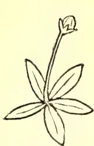

radical leaves

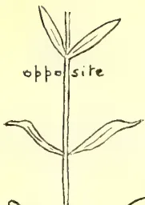

opposite

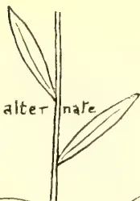

alternate

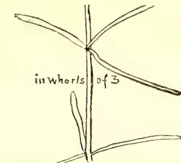

in whorls of 3

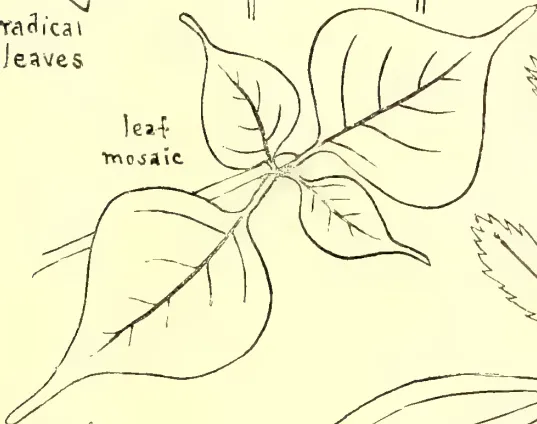

leaf mosaic

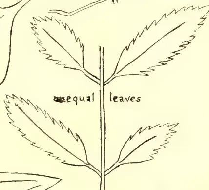

unequal leaves

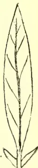

stipules

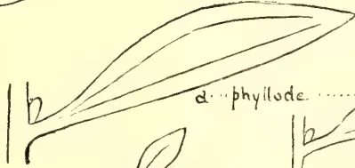

d... phyllode ... b

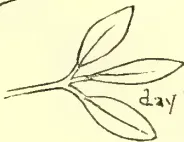

day position

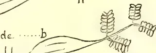

night position

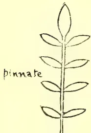

pinnate

palmate

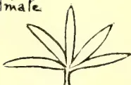
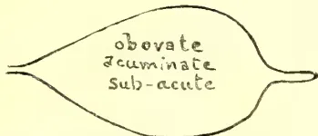

obovate  
acuminate  
sub-acute

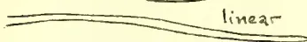

linear

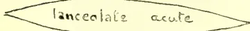

lanceolate acute

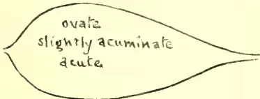

ovate  
slightly acuminate  
acute

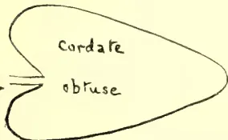

cordate

obtuse

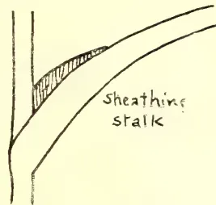

sheathing stalk

serrate

dentate

crenate

undulate

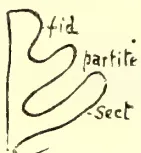

trifid

partite

sect

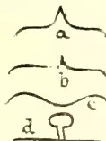

LESSONS IN ELEMENTARY BOTANY-PHYLLOTAXY. PLATE II.

221------------------------------------------------

This image is a scan of a blank page. The paper has a light beige or cream-colored tint. There are a few very small, dark specks scattered across the surface, which appear to be scanning artifacts or dust particles. No text, lines, or other markings are present on the page.

222------------------------------------------------

193

## PLANT SANITATION.

### Entomological Notes.

BY E. ERNEST GREEN, *Government Entomologist.*

Specimens of a Longicorn beetle (*Moechotypa verrucicollis*, Gahan.) have been sent in from the Matale district, together with examples of young rubber stumps said to have been killed by them. The bark of these plants has been nibbled off, in large irregular patches, exposing the bare wood. Similar specimens, under identical conditions, were received from the same district exactly a year ago. Examination of the roots prove that they have previously been attacked by the parasitic fungus, *Botryodiplodia elasticae*, Petch. This fungus attacks the collar of the plant; kills the upper parts by cutting off the supply of nourishment; and works down into the root. It has always seemed to me extremely doubtful that a healthy rubber plant, protected by the natural flow of latex, could be successfully invaded by bark-eating and boring insects, and the following experiments have strongly corroborated my theory. Several of the living beetles were confined in a large cage together with a healthy living plant of Hevea of the same age and stage of growth as those which were the objects of attack in the Matale district. The beetles crawled up the stem and presently tried their jaws on the bark. The puncture resulted in an instantaneous exudation of latex which adhered to the mouth parts of the beetles and was evidently very distasteful to them. They immediately abandoned the attack and spent some time in endeavouring to remove the sticky fluid. After the first rebuff no further attempt was made, even under stress of starvation. After seven days' confinement, with no other food, I then removed the beetles to another cage and provided them with some small branches of Cassia and tea. They commenced to feed greedily upon the bark of the Cassia, but the tea branches are not altogether to their taste. They have fed only sparingly upon the outer layers of the bark. These experiments clearly show that a healthy rubber plant is immune from attack. But should the latex tubes become dry, from disease or any other cause, the plants will fall an easy prey to boring and bark-eating insects. Stumped plants that have been despatched by rail for long distances and have become withered during transit, will be especially liable to attack.

Further specimens of young rubber stumps, the ends of which have been tunnelled to form a receptacle for the nests of a small Hymenopteron, have been received. (See note in February number of this journal.) The present specimens come from the Badulla district, and contain the nests of a tiny bee (*Ceratina* sp.). A considerable number of small wasps and bees have this habit of boring into the pith of dead parts of plants. The wasps usually store their nests with insects, while the bees provision theirs with 'bee-bread' (a mixture of pollen and honey). The following species have been observed to infest young rubber plants:—*Trypocylon intrudens* and *T. pileatum* (provisioning their nests with spiders), *Stigmus niger* (with Aphides), *Odynurus sichelii* (with small caterpillars), *Ceratina simillima*, *C. viridissima*, and *C. propinqua* (with 'bee-breed'). Though none of these insects will attack the living parts of the plant, it is possible that the tunnel in the dried ends of the stump may form a lodgement for water and subsequently for injurious fungi. It is advisable therefore to cut off the dead ends of the plants, care being taken that the cut should be just above nodes (or knots) of the plant. If the cut is made through or just below the node, it is probable that a further section of the stem will die back.

223------------------------------------------------

Plant Sanitation.194

A case of infestation of the stem of a Hevea tree by the 'horned Termite' (*Termes inanis*) has been brought to my notice. This species of termite takes advantage of any hollow in a tree for the construction of its nest, but does not apparently feed upon the wood itself. My observations lead me to believe that it subsists principally upon lichens growing upon the stems of trees and rocks. In the present instance the tree is still alive, the termites occupying a large cavity in the bole where the original stem had been broken off by the wind. I have recommended the removal of as much of the nest as can be reached without further damaging the tree. The more inaccessible portions can be treated with naphthaline dissolved in petrol which will drive out the remainder of the insects. The cavity should then be tightly plugged with *dry* earth.

The grub of the large Cockchafer (*Lepidiota pinguis*) continues to give trouble by feeding upon the roots of rubber plants. In some cases the tap root has been eaten right through. Kainit, and nitrate of soda are the recognized deterrents for this pest; but they must be employed carefully and not allowed to come into direct contact with the tender roots of the plants, or their caustic properties will cause further injury. The best method of application is to mix the substance with earth and spread it upon the surface round the plants. The first shower of rain will dissolve the salts and carry them down into the soil. For very young plants, one ounce of the nitrate or three ounces of the kainit will be sufficient per plant. For larger plants from one and a half to twice this dose may be safely employed. When the adult cockchafers are on the wing, they may be trapped by placing small kerosene lamps, in trays containing water and kerosene, in the field at night. During the daytime, the beetles may be found resting upon the stems and branches of plants and should be collected and destroyed. (For figures of the grub and adult beetle see *T.A.*, Oct. 1905, p. 520.)

I have made an interesting examination of samples of various shade trees containing galleries of the 'shot-hole-borer' (*Xyleborus fornicatus*). Young branches of *Albizia moluccana* had been tunnelled by the insect, but the galleries were deserted and showed no signs of having produced a brood. The insect had evidently found this wood unsuitable for breeding purposes. The galleries were more or less filled by an exudation of gum. The same remarks apply to Grevillea branches, in which only a single living beetle (evidently a recent arrival) was found. Several dead beetles were found, enveloped in gum. Loquat branches had also been tunnelled; but here again there was no present occupation. A single dead beetle was found in one of the galleries. Under these circumstances, it would appear that though 'shot-hole-borer' may attack and—to a certain extent—damage these shade trees, it cannot successfully breed in them; and that such trees are not therefore of any real danger to the tea amongst which they may be growing. On the other hand, a section (4 inches in diameter) of the stem of an old castor-oil plant, from the same estate, was found to be badly infested by the borer. The numerous galleries penetrated deep into the wood, and contained living insects in all stages of development. It is evident that we have here a prolific breeding place of the borer, and that such plants would constitute a source of infection to the surrounding tea. Young castor plants will not be so liable to attack. It is only when they have been allowed to grow old and woody that they harbour the pest to any serious extent.

A correspondent asks if tar, applied to the stems and branches of tea plants, would prevent the invasion of 'Shot-hole Borer' (*Xyleborus fornicatus*) from neighbouring infected estates. He writes, "I have shot-hole borer all round me, but not—as far as I can see—actually on the estate." I have found a complete coating of tar very injurious to the tea plant. It burns the bark badly and—in

224------------------------------------------------

195Plant Sanitation.

some cases—has resulted in the death of the tree. Any application that is of the nature of an airtight coating must be injurious to such a plant as tea, in which the bark is *live* right to the surface. Under the circumstances detailed above, I should recommend the isolation of the estate—from its infected neighbours—by a thick screen of ‘Dadaps’ (*Erythrina lithosperma*) which are of rapid growth and do not harbour shot-hole borer. If, from the commencement of the planting industry, estates and individual fields had been separated from each other by effective screens of jungle or introduced trees, we should have had little trouble in confining and combating the pests which are now able to spread without let or hindrance. It is to be hoped that rubber planters will take warning from the difficulties experienced first with coffee and now on the large undivided areas of tea plantations.

Two species of ‘Case-worms,’ (*Chalia doubledayi*) and (*Acanthopsysche hypoleuca*) (see figs. 2 and 10 on plate facing p. 301 in the May number of this journal) are reported to have caused serious injury to a field of tea in the Gampola district. This same field was badly attacked last year also, and the trees so weakened that they have never properly recovered after pruning. Such weakened trees should be assisted with suitable manure. Paris Green would be the best treatment for this pest; but there are evident objections against the use of mineral poisons upon tea that is in plucking. I have suggested that lime and sulphur (dusted over the bushes) might act as a deterrent against the spread of the pest, but this cannot be relied upon to kill the caterpillars upon bushes already attacked. Collecting by hand, when the insects are in force, is almost useless. The newly-hatched caterpillars are very minute and inconspicuous. They are carried from field to field on the coolies’ clothing. Case-worms have been unusually abundant, during the last two years, probably owing to the comparative failure of the usual rains.

Specimens of the Pyralid moth (*Dichocrocis punctiferalis*) have been bred from caterpillars infesting the seed heads of the Indian millet (*Sorghum vulgare*). The caterpillars were feeding upon the ripe seed, amongst which they had spun silken galleries. This species is the well-known ‘pod-borer’ of Cacao in Ceylon. It has also been bred from the seed-heads of the Castor oil plant (*Ricinus*).

I have received branches of the handsome flowering tree (*Amherstia*) thickly encrusted with a lac-insect (*Tachardia albizziae*). The pest may be kept in check by the application of kerosene emulsion.

A correspondent sends me specimens of a small ‘Flea-beetle’ (*Hypnophila flavipennis*), and reports that they are destroying Adiantum and other cultivated ferns in a green-house. They will also attack Begonia plants. These beetles acquire their popular name from their leaping powers, a habit which greatly adds to the difficulty of capturing and destroying them. I have found the best means of circumventing their activity to be to lift each pot gently and stand it in a large tray or bath containing water with a film of kerosene. Then shake and disturb the leaves of the plant, when the beetle will hop out and fall into the water. This should be done day after day until all the beetles have been captured. The larvae of the beetles are probably feeding upon the roots of the plants and will be hatching out from time to time. But if this treatment is repeated whenever the beetles appear, they will be unable to lay any eggs and the brood will be exterminated. Some weak Phenyle—or Jeye’s Fluid—and water, poured on to the earth round the roots will kill the larvae; but this must be done carefully or the plant will be injured. A more radical cure, if the building can be rendered practically airtight, is to fumigate it with hydrocyanic acid gas; but this is a dangerous operation and can be recommended only when expert supervision is available.

225------------------------------------------------

196

## Correspondence.

### SARSAPARILLA.

DEAR SIR,—With reference to Mr. Geo. Weerakoon's letter in the July number of the "Tropical Agriculturist and Magazine of the Ceylon Agricultural Society," I might mention that the author of "Palms and Pearls of Ceylon" has unfortunately perpetrated a number of errors regarding our Ceylon Flora in his otherwise very entertaining and instructive book.

As pointed out in my letter which appeared in the April number of the Magazine, true sarsaparilla is neither found wild nor cultivated in Ceylon. Mr. Walters, like many others, is confusing the officinal Sarsaparilla (*Smilax officinalis*) with Indian Sarsaparilla (Sinhalese *Iramusu*) *Hemidesmus Indicus*. The only local congeners of the true Sarsaparilla (*Smilax*) genus are the plants known to the Sinhalese by the name of *Kabaressa*, also used medicinally.

*Bonkohomba* referred to by Mr. Geo. Weerakoon is *Munronia pumila*, a well-known Sinhalese drug which has the same properties as the officinal Chiretta (*Ophelia Chirata*).

Yours faithfully,

C. DRIEBERG.

Government Stock Garden, Colombo, 31st July, 1906.

### THE SWAMP GUM.

SIR,—Will you kindly inform me what is the scientific name of the "Swamp Gum"; and if it does, as its name seems to imply, grow in swampy land. Also, if there are any other trees, useful for fuel, which will grow in swamps at an elevation of 3,500 feet.

Yours faithfully,

S.

Peermaad, 29th July.

[*Eucalyptus viminalis*, *Gunnii*, and *pauciflora* are all known as Swamp Gum in Australia. These and other species of *Eucalyptus* would probably grow in swamps at the elevation mentioned.—Ed.]

## Current Literature.

"*Le Cocotier*.—Culture, Industrie et Commerce dans les principaux pays de production,' by E. Prudhomme, Director of Agriculture, Madagascar. Published by Augustin Challamel, Paris; pp. 491, with photos and diagrams. In this fairly exhaustive work on the coconut palm (*Cocos nucifera*), its cultivation and products, Mons. Prudhomme has given an account of the coconut planting industry in all the countries where it is carried on, with special attention to his own colony of Madagascar, Ceylon, Cochin, Malaya, and the Netherland Indies. In the early chapters he deals with the varieties of coconut in different countries, and very useful are the plates, showing 20 varieties of nuts in section, and the drawings of sections of other nuts. These show at a glance the relative shapes and sizes of different varieties and the proportion in each of husk and kernel. The propagation of the plant is fully dealt with, and here also the aid of photography is sought to show the results of seed planting in different ways. Excellent results have been obtained in Madagascar on private plantations by placing the seed nuts

226------------------------------------------------

197

vertically in the soil with the point downwards, but official experiments in Madagascar show that the best ways are (1) placing the nut obliquely with the point downwards, (2) placing the nut horizontally. The manuring of the plantation occupies considerable space in the book, and the work and experiments of Lepine, Bachoffen, Müntz and Gerard, and Cochrane are referred to; while for the general cultivation of the estate the methods of several well-known Ceylon plantations are given as good examples. Pests and diseases occupy one chapter; the Black Beetle (*Oryctes Rhinoceros*) and the Red Beetle (*Rhynchophorus ferrugineus*) being the chief mentioned. Part II. deals with coconut products; copra, oil, poonac, desiccated coconut, fibre, juggery and arrack, and coconut butter. Part III. deals individually with the various coconut growing countries, and the trade in the different coconut products. Mons. Prudhomme has already made a name for himself in connection with tropical agriculture, and this work on the coconut will enhance his reputation.—I. E.

---

*Relating to the Sugar Industry in Peru.*—By T. F. Sedgwick: published by Haya, Verjel and Cia, Trujillo, Peru. Although not a great planting country Peru seems to have done fairly well with sugar. In the planting districts the soils as a whole are deep and their physical composition renders them very retentive of moisture, while the drainage in the valleys is excellent. The soils are of the alkali type. Sugar was first planted in Peru in 1570. but the modern industry dates back only 30 or 40 years. The early modern factories were elaborately put up and equipped; "sugar was at a good price, money was easily made and liberally spent in appliances then in vogue. Some factories had all the appliances that could be, made of copper. This desire to have the best regardless of expense extended to all departments of the estate. Sugar then took a turn and went down, and many of the estates had to go out of business." The tendency now is to group the estates by purchasing or leasing, working with a central factory; so that the larger places control upwards of 15,000 acres each. As regards labour, the labourers are well treated in every way, and the usual shortage of sugar growing countries is not felt; in this respect Peru may have accomplished what many other countries have failed in. Good modern machinery is used for cultivating, and irrigation is extensively practised. Methods of manufacture vary considerably, but in most factories the work is excellent and up-to-date. Manures, fertilizers, and the methods of reclaiming alkali soils are treated, and the work gives a good insight into the sugar industry of Peru.—I. E.

---

## The Ceylon Board of Agriculture.

---

The Twenty-first meeting of the Board of Agriculture was held in the Council Chamber on Monday, the 2nd July, at 12 noon.

His Excellency the Governor presided.

There were present the Hon'ble Messrs. H. L. Crawford, C.M.G., S. C. Obeyesekere, P. Arunachalam and F. Beven, Messrs. L. W. Booth, R. B. Strickland, M. Kelway Bamber, Daniel Joseph, G. W. Sturgess, R. Morison, Dr. J. C. Willis, the Maha Mudaliyar, and the Secretary.

Mr. M. Suppramaniam was present as a visitor.

### BUSINESS DONE.

1. 1. Minutes of last meeting were read and confirmed.
2. 2. List of new members was read, and they were declared duly elected.

227------------------------------------------------

198

3. Progress Report No. XX. was circulated. In connection with the Report His Excellency the Governor referred briefly to the subject of rotation of crops on chena lands.

4. A paper was read by Dr. Willis on "The Improvement of local Races of Plants." At the desire of H. E. the Governor, Dr. Willis promised to have the paper printed in the form of a leaflet.

5. The recommendation of the Finance Committee—"That the Agricultural Instructors should be paid subsistence allowance at Rs. 4 per diem when travelling on duty, and the second clerk Rs. 2 per diem unless when travelling in out-of-the-way districts and using a cart, when he should be paid Rs. 4" was approved.

6. The Secretary submitted a *precis* of suggestions received from Local Societies with regard to the proposed Ordinance for the Destruction of Agricultural Pests and the Sanitation of Plants. The following members of the Board were nominated by H. E. the Governor as a Sub-Committee to consider the suggestions made and draft a final recommendation to Government:—The Hon'ble Mr. S. C. Obeyesekere, Hon. Mr. Beven, Dr. Willis, and Mr. Bamber.

7. A report was submitted from the Sub-Committee appointed to consider the offer of Mr. M. Simon Fernando Sri Chandrasekara, Mudaliyar of Moratuwa, to hand over to the Society two blocks of land at Horetuduwa, and a site for an Industrial School, together with a sum of Rs. 2,500 towards the cost of initial operations and maintenance.

The Sub-Committee recommended that the offer be accepted as regards the land offered for a flower and stock garden and the cost of opening them, but that the offer of an industrial school was a matter for the consideration of the Director of Public Instruction rather than of this Society.

The following resolution was proposed by the Hon. Mr. Crawford, seconded by the Hon. Mr. Obeyesekere, and unanimously carried:—

"That the Society accept the most generous offer of Mudaliyar Simon Fernando Sri Chandrasekara to convey to the Society two blocks of land for experimental purposes, and to expend Rs. 2,500 in the preparation of the lots for the cultivation of fruit, vegetables, and flowers; and that the thanks of the Society be conveyed to the Mudaliyar."

## Agricultural Society Progress Report. XXI.

The membership of the Ceylon Agricultural Society is now 1,110. The Madura Agricultural and Industrial Association has been affiliated to the Ceylon Agricultural Society as a life member.

The following are the dates fixed for Agri-Horticultural Shows:—

<table>
<tbody>
<tr>
<td>Kurunegala</td>
<td>...</td>
<td>...</td>
<td>...</td>
<td>...</td>
<td>August 23, 24, and 25</td>
</tr>
<tr>
<td>Avisawella</td>
<td>...</td>
<td>...</td>
<td>...</td>
<td>...</td>
<td>September 7 and 8</td>
</tr>
<tr>
<td>Kegalla</td>
<td>...</td>
<td>...</td>
<td>...</td>
<td>...</td>
<td>September 21 and 22</td>
</tr>
<tr>
<td>Telijjawila (Vegetable and Fruit Show)</td>
<td>...</td>
<td>...</td>
<td>...</td>
<td>...</td>
<td>September (about end)</td>
</tr>
<tr>
<td>Wellaboda Pattu (Galle)</td>
<td>...</td>
<td>...</td>
<td>...</td>
<td>...</td>
<td>November 16 and 17</td>
</tr>
<tr>
<td>Three Korales and Lower Bulatgama (Market Show)</td>
<td>...</td>
<td>...</td>
<td>...</td>
<td>...</td>
<td>October 21</td>
</tr>
<tr>
<td>Batticaloa</td>
<td>...</td>
<td>...</td>
<td>...</td>
<td>...</td>
<td>Early in 1907</td>
</tr>
<tr>
<td>Telijjawila</td>
<td>...</td>
<td>...</td>
<td>...</td>
<td>...</td>
<td>March 15, 1907</td>
</tr>
</tbody>
</table>

228------------------------------------------------

199

1. *Harispattu Local Branch.*—At a meeting held at Katugastota on 30th June last under the presidency of Mr. P. B. Nugawela, Ratemahatmaya, it was decided to form a Local Branch for Harispattu. Over 300 were present at the meeting, and 190 joined as members. Mr. Nugawela, Ratemahatmaya, offered a prize of Rs. 10 for the best school vegetable garden in the district. Mr. N. Wickremeratne, Agricultural Instructor, was present and addressed the meeting. Voluntary donations of Rs. 243 were subscribed by supporters of the movement. It was agreed to apply for land to open an Experimental Garden and Cattle Farm.

2. *Mullaittivu Local Branch.*—At a meeting of the Local Branch at Mullaittivu held on the 24th July it was decided to enrol experimenting members, waiving the subscription in the case of villagers who cannot afford to pay, on their undertaking to carefully carry out experiments and report results to the Society. Such members will be selected from lists of those recommended by the headmen.

3. *Telijjawila Local Branch.*—A Show of Agricultural and Industrial Products of the Weligam korale will be held on the 15th March, 1907, at Weligama; and an Interim Fair has been arranged to be held at Telijjawila towards the end of September, with the object of its serving as a rehearsal of the bigger Show in March. The exhibits at the Interim Fair will consist of grains, vegetables, and fruit.

4. *Market Show at Yatiyantota.*—The Market Show has been postponed for 21st October on account of the fever epidemic prevailing in the district.

5. *Dumbara Local Branch.*—The members of this Branch have started a Co-operative Credit Society for the purpose of supplying seed grain to villagers at a low rate of interest. Over Rs. 1,000 has been subscribed by 66 shareholders. Rules have been framed on the basis of those adopted in Bengal for the conduct of such Societies, and four centres have been selected for the erection of seed paddy stores. The progress of this movement will be watched with interest, and it is hoped that its success may be such as to lead to the formation of similar Societies in other parts of the Island.

6. *Wellaboda Pattu (Galle) Branch.*—A progress report on the Experimental Garden in Wellaboda pattu (Galle) was submitted at the meeting of the Local Branch held on the 10th July. It was agreed at the meeting to offer an additional prize for the best plot of vegetables grown in the pattu at the Show to be held in November next.

7. *Experimental Garden, Ruanwella.*—The Experimental Garden at Ruanwella has been fenced off, and preparations are being made for planting it with cotton seed, vegetables, pineapples, mangosteens, and fruit trees.

8. *Experimental Garden, Kegalla.*—A site at Pitihune, within the town of Kegalla, has been selected for the Experimental Garden.

9. *Experimental Garden at Katana.*—A start has been made by the Local Society in planting the Experimental Garden. Thirteen members agreed at the meeting held on the 6th July to contribute towards the cost of engaging a man with experience on Rs. 10 per month. Three other members undertook to plant portions of the garden at their own expense.

10. *Soy Beans.*—The Honorary Secretary, Telijjawila Local Agricultural Society, reports:—"I have the honour to report with regret that not one of the soy bean seeds germinated. The seeds were more or less rotten."

229------------------------------------------------

200

11. *Seed Supply*.—In May last 36 varieties of vegetable seeds were imported from Germany, Sarampur Gardens, Calcutta, Madras, and Bangalore Botanic Gardens. Ninety-five applicants were supplied with 1,885 packets of seeds; seeds for Provincial Road Committees and Irrigation Stations were supplied at half price. Twenty-five applicants did not get seeds, the supply being insufficient to meet the demand.

12. *Kiushu Paddy*.—Mr. Jacob de Mel reports:—"The report from my conductor states that after the 20th May the flood water from Ja-ela canal, coming into the fields at Muturajawela at an unseasonable time, killed the paddy bushes, which were not more than 12 inches in height."

The Honorary Secretary, Telijjawila Local Society, writes under date the 16th July:—"I have to report that the paddy did not grow. It germinated at about the same time as other varieties sown for yala. It was sown in a part of a field near the Telijjawila Experimental Garden, and grew to a height of about 8 inches and then withered away. Every care was taken in its cultivation under my personal supervision; and, all the conditions having been favourable, its failure can only be attributed to its being unsuitable to this country."

Mr. W. R. Bibile of Badulla reports:—"The half bushel of Kiushu paddy was sown on a piece of unfertile field. The soil of the land is sandy. The paddy was sown on the 24th April last, and a portion was transplanted on the 19th May last. The plants began to blossom on the 4th June last and were reaped on the 17th July. The yield was only 3 bushels of paddy. This poor crop is owing to the unfertility of the soil and the scarcity of water. The plants did not grow more than 2 feet in height. In my opinion this paddy is not suitable for transplanting, as the plants do not grow to a sufficient height to transplant within fifteen days. This paddy ought to succeed on fertile fields, and must be sown before April."

The Secretary, Badulla Branch, reports:—"I have just visited a field where a bushel of Kiushu paddy was sown. In the same field on the same day as the Kiushu paddy was sown native paddy was also sown in parallel ridges. The field is a good one, and there was no lack of water. The Kiushu crop can be harvested about six weeks earlier than the native crop. But, on the other hand, there will not be half as much straw from the former. Neither will there be half as much grain. The ears of the Kiushu plants are very short, and worse still the grain promises to be very small. If similar experiments produced similar results elsewhere, I beg to think that the cultivation of Kiushu paddy is not very profitable, except where water cannot be procured for about four months at a time.

The Society will be glad to receive reports of results of their experiments from other members who tried this paddy.

13. *Honduras Paddy*.—Mr. W. R. Bibile, in the course of a report to the Superintendent of School Gardens, writes:—"The handful of Honduras paddy which you sent me was sown on the 17th January last, and the yield was seven measures. This was sown on a piece of very fertile land. The crop was damaged by flies, and if not for this the yield would have been more. This paddy takes two and a half months to blossom and four and a half months to reap."

14. *Seed paddy from India*.—A consignment of about 475 bushels of *six-months* seed paddy has been received from India. The paddy is being distributed among the applicants from the Royal Botanic Gardens, Peradeniya. A small consignment of *Banku* paddy, which takes four and a half months to harvest, is expected in a day or two. The quantity available at present is only 22½ bushels.

230------------------------------------------------

201

15. *Fruit Trees*.—The Telijawila Local Society has been sent a supply of fruit trees free of charge from the Royal Botanic Gardens, Peradeniya, viz., 2 loquats, 2 rata-karapinchas, 3 coco plum, 3 star apple, 4 Avocado pear, and 8 China guava.

16. *Manures*.—Manure for experiments in fertilization has been supplied by Messrs. Freudenberg & Co. to—

Mr. H. Amarasuriya for coconuts.

Mudaliyar, Wellaboda Pattu (Galle), for orange trees and vegetables at Weregoda Experimental Garden.

Anuradhapura Local Society for tobacco.

Mr. P. B. Nugawela, Ratemahatmaya, for vegetables.

17. *Local Soap*.—Samples of soap, manufactured by Mr. D. Chandrawarnam of Kotahena and exhibited at the Colombo Agri-Horticultural Show, have been forwarded to the Imperial Institute to ascertain their value in England. The Government Chemist has also been asked to report on the soap.

18. *Castration*.—The following demonstrations have been given during the month:—

North-Central Province : Alukaranda, Imbulgaswewa, Hiripitiyagama, Nelbegama.

Central Province : Ragalla.

North-Western Province : Padeniya.

Province of Sabaragamuwa : Kegalla, Mawanella, Pinnawala, Ambepussa.

Up to date 2,002 cattle have been operated upon this year, brought by 1,604 owners at 90 demonstrations. 113 men have been taught the operation. Three men each at Mawanella, Kegalla, and Pinnawala have been trained in the new method of castration of cattle, and fifty animals were castrated in these districts by these men.

19. *Prickly Pear*.—The Jaffna Branch proposes to try an experiment in exterminating prickly pear, which has grown very thick on the Delft Island. The method to be adopted consists in spraying the plants with a solution of sodium arsenic, which has been used with good results in West Australia.

20. *Caterpillar Pest in Paddy*.—A caterpillar pest in paddy fields was reported by the Assistant Superintendent of School Gardens from Karandawala in Maturata district. The Government Entomologist reported on the specimen sent him as follows:—

“The insects concerned are the larvæ of a minute pyralid moth belonging to the genus *Nymphula* (family Pyralidæ). These larvæ are aquatic, and are provided with a series of filamentous gills on each side of the body enabling them to breathe water instead of air. They are consequently not amenable to treatment by flooding. On the other hand, if the water could be entirely withdrawn from the affected fields for twenty-four hours or more without serious injury to the plants, it is probable that exposure to the heat of the sun would destroy the delicate caterpillars. An experiment should first be tried on one or two small sections of the field. If that prove successful, the remaining area should be similarly treated—the whole field at one time. If treated in sections, the larvæ will merely migrate to adjoining sections.”

The pest has now disappeared, but the Ratemahatmaya of the district has been instructed to make the experiment suggested should the caterpillars reappear.

231------------------------------------------------

202

21. *Publications.*—The Editor, “Sihala Samaya,” sent 50 copies of his paper containing translations of minutes of the proceedings of the Board of Agriculture held on the 2nd July, 1906, for distribution to Local Societies.

The Editor, “Dinakaraprakasa,” sent 50 copies of his paper with similar contents, which were distributed among the Local Societies.

22. *Leaflets* on “Tobacco Cultivation in Dumbara,” in English and Sinhalese, have been distributed; Tamil copies will be ready shortly. Leaflets on the “Bud Rot of the Coconut Palm” by Mr. Petch, and the “Improvement of Local Races of Plants” by the Director, Royal Botanic Gardens, are with the Government Printer—with translations in the vernaculars.

A. N. GALBRAITH,

*Secretary, Ceylon Agricultural Society.*

August 6, 1906.

---

232------------------------------------------------

THE  
**TROPICAL AGRICULTURIST**  
AND  
MAGAZINE OF THE  
**CEYLON AGRICULTURAL SOCIETY.**

---

VOL. XXVII.

COLOMBO, SEPTEMBER 15TH, 1906.

No. 3.

---

**The Improvement of Local Varieties of Plants.**

---

A few erroneous notions seem to be abroad again, with regard to the keeping up of the high standard of local races of plants, and it may be well to correct them. The Agricultural Society is importing many valuable kinds of seed, and people are saving the seed from these, expecting to get an equally good result in the next generation. They find they do not get this result, and they wonder why, or say it is the "Ceylon climate," though it is the simple expression of a natural law, which cannot be altered by all the agricultural societies in the world. The majority of improved races are due to continual selection of the seed, and unless this selection is carried out in every generation, or unless the Society buys good (*i.e.*, selected) seed for every generation, the result must be disappointment. Deterioration is in general about three or four times as rapid as improvement, and supposing, for instance, in cotton, beginning with a staple of  $1\frac{1}{4}$  inch, we have in a hundred generations improved this length to 2 inches, it will fall away in about ten generations or less to  $1\frac{1}{4}$  inch again, unless selection be practised. [These numbers are, of course, purely hypothetical.]

Improvement of races is carried on in two ways, and we must carefully distinguish between these. It may be by the continual selection of the better, in the almost infinitesimal differences which always mark any crop or character, or it may be by the picking out of absolutely new characters, which appear as what are called *sports* at long intervals; these do not go back to the race from which they sprang, but may themselves be improved by selection, and the improved race will go back again to their starting point if left alone. Thus, for instance, in the carnation, a new pink variety suddenly appears as a single, or as a very few, individuals, among a lot of red ones. This pink form may be cultivated, and its offspring, if not crossed with the reds, will remain pink for any number of generations. Mr. Lock, lately Scientific Assistant at Peradeniya, has produced an excellent race of "native" peas by crossing on scientific principles, that will not "go back," and we are now busy multiplying these with a view to putting them on the local market.

Speaking generally, these sports only appear among the offspring of crosses, *i.e.*, mainly among garden plants, and if we start to look for them in a field crop, we may be grey-headed before one appears. The improved races in field crops, be they of rice, potatoes, cotton, or what not, are practically always due to selection, and we must either practice selection ourselves to keep up the quality, or buy selected seed from elsewhere at considerable expense. Nothing in this world that is worth having, can, as a rule, be got without considerable labour or expense.

233------------------------------------------------

204[SEPT. 1906.

To illustrate roughly what is meant, we give here the lengths of some samples taken absolutely at random, from the best sample of cotton that has yet been sent in to my office, by anyone in Ceylon, and which is not grown from seed imported last year from the West Indies. This cotton is Sea Island; the original parents had a staple of  $2\frac{1}{4}$  inches, and these plants are so far as we can find, from the third generation only from these parents, yet see the difference in the staple, the longest of these being under  $1\frac{1}{2}$  inches. Now in cotton, every trace of length beyond  $1\frac{1}{2}$  inches tells rapidly on the price, and instead of these being worth  $1\frac{1}{2}$ - $2\frac{1}{4}$  of the price of the original cotton, or about 1s. 2d. they are only worth at most about  $9\frac{1}{2}$ d. In two or three more generations, the length of staple of these cottons, without selection, would have shrunk to perhaps  $1\frac{1}{4}$  inches, and the price to  $7\frac{1}{2}$ d.

COTTONS FROM THIRD GENERATION OF  $2\frac{1}{4}$  INCH SEA ISLAND IN CEYLON.

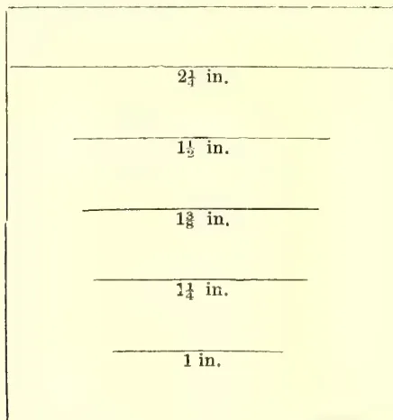

The space between the vertical lines is  $2\frac{1}{4}$  inches. The horizontal lines represent the lengths of staple found. Note also different lengths of staple.

<table>
<tr>
<td>Value of <math>2\frac{1}{4}</math> inch Sea Island</td>
<td>...</td>
<td>1s. 8d.</td>
<td>per lb.</td>
</tr>
<tr>
<td>„ of the longest of these</td>
<td>...</td>
<td><math>9\frac{1}{2}</math>d.</td>
<td>„</td>
</tr>
</table>

Not only does the quality deteriorate, but it does not remain constant throughout the lot, some of the plants deteriorating faster than others. A buyer of this cotton, finding in it a large proportion of staple with the length of only one inch—that of the sample at the foot, would, of course, as every planter in Ceylon knows by experience or conversation, only give for it the price of this short staple, *i.e.*, 7d., so that cotton that might, by care, have sold for 1s. 6d. will only fetch a good deal less than half that amount.

We are using cotton as an illustration, because the success of the experiments at Maha-iluppalama, and those of Dr. Fernando, with Sea Island and other cottons, is already causing signs of these cultivations being taken up, and if the standard is to be kept up to really high figures, something will have to be done, for to get selected seed every year from the West Indies will be difficult, as they have none too much for themselves, and will cost a high price. The West Indian cottons all come from one lot of seed originally, obtained from the Sea Islands of Carolina, but already the different islands show very different prices, and we see from the last market report that West Indian Sea Island cotton has sold at all prices from 1s. to 1s. 8d. in a very short time. Doubtless, there will be a profit to the villager in even the lowest price, but it is much better, both for himself and for the reputation of the island, that he should get the highest price, and this only means care in selec-

234------------------------------------------------

SEPT. 1906.]205

tion. India, time after time, has imported the best cottons from abroad, and yet she gets far the lowest price on the market, though her native cotton is the same cotton as the common American, which sells for 6*d.* against India's 3½*d.*

To deal in brief with the way of selecting cotton: what we mainly want are length, big yield, strength, freedom from disease and silkiness, the first two being the most important. When the cotton bolls begin to burst all over the field, we must go through it with a three inch measure, and pick out 175 bushes with the very longest staple and with over 20 bolls on a bush, and free of disease; then reject any that have not the requisite strength or silkiness, and in this way, we shall probably have about 150 bushes left, which should be marked with red rags, and have their cotton separately collected and ginned, and will give enough seed for one acre in the following year. Similar methods must be employed with rice, or any other field crop, if we mean to keep up their standard.

As a good local illustration of what may be done by selection, look at the way the Java planters, by continually improving their cinchona barks, have killed the Ceylon industry. Good Java barks now contain more than twice as much quinine as good Ceylon barks, and the seed of good varieties was sold the other day at £45 an ounce.

---

235------------------------------------------------

206[SEPT. 1906.

## GUMS, RESINS, SAPS AND EXUDATIONS.

### The Introduction of *Castilloa Elastica* to the East.

BY IVOR ETHERINGTON.

While first place is given by planters in the East to the Para rubber, *Hevea brasiliensis*, the Central American rubber tree, *Castilloa elastica*, cannot be altogether ignored. In Southern India it seems to have found favour more than in Ceylon, although in the island it is doing well in the Matale and Passara districts, but does not appear to thrive at low elevations not far inland from the sea.

In the West Indies, according to reports published by the Botanical Departments of the various islands, *Castilloa* is favoured as a shade tree for cacao; and in Venezuela it has been successfully used in such mixed plantations. In Mexico, where planting is going on extensively, it is the *Castilloa* tree that is almost entirely cultivated. So that as a plantation product *Castilloa* is second favourite.

The introduction of this rubber tree to the East is an interesting and some what romantic history, rivalling the story of the introduction of the *Hevea*, which Wickham successfully accomplished after many difficulties had been overcome. The tree is indigenous to most of the countries of Central America, and in Mexico is called *ulé* by the natives. It received its botanical name after a Spanish botanist, Don Juan Del Castillo, who died in Mexico in 1795. It was due to the initiative of Sir Clements Markham in the first place that rubber was at all tried as a plantation product, and in 1870 this explorer, civil servant and botanist, "came to the conclusion that it was necessary to do for the India rubber or caoutchouc-yielding trees what had already been done with such happy results for the cinchona tree." Markham regarded India as the most suitable part of the British Empire for commencing operations in rubber planting; and a detailed report on the subject drawn up by the Curator of the Pharmaceutical Society's Museum, Mr. J. Collins, stated that the *Heveas* and *Castilloa* of America being superior to *Ficus elastica* (Rambong) these trees should be introduced to the East.

"The collection of *Castilloa* plants for introduction into India was a very difficult service, for the trees grow in wild and unhealthy forests, with no means of transport and no facilities of any kind. In Mr. Cross I found a man with all the requisite qualifications for undertaking it. He is an excellent gardener, possessed of great energy and determination, is acquainted with the language, and has had much experience in South American travelling."\*

Robert Cross left England on May 2nd, 1875 and arrived at Panama on the 26th, for he was instructed to obtain his plants on the isthmus. He journeyed by canoe up the River Chagres, and in his account of his expedition mentions innumerable hardships he had to endure and obstacles to be overcome in this pioneering forest work.

"The district investigated by me and where the plants were collected," he wrote, "was reached by ascending for some distance the River Chagres and then travelling for several miles through a stately forest into the heart of the isthmus. The trees seen exceeded in height and dimensions those met with in the wooded districts of the Amazon. An undergrowth of a thorny wild pine-apple (*Bromelia*), 10 feet in height, everywhere formed extensive thickets. Large powerful snakes

\* C. Markham's Peruvian Bark.

236------------------------------------------------

SEPT. 1906.]207Saps and Exudations.

were numerous, and so audacious that they deliberately rose up to strike at any one that approached. The young rubber saplings were found growing most abundantly on the banks of cool clear running streams and little dribbling rivulets. The roots could easily be traced over the surface of the ground running down to the very margin of the water. But the tree grew also on eminences, steep declivities and varied elevations, and in such abundance that the first explorers gave the name "Caoutchouc Hill" to a height which they found crowned with a forest almost entirely composed of rubber trees. It was not seen growing anywhere on swamp or marsh land. Although the rubber districts are proverbially rainy, yet the tree was seen by me growing beside a stream on the border of a desert tract of country bounding the Gulf of Guayaquil, where only a few light showers of rain fell during the year. On both sides of the stream there was a strip of good forest, but beyond, thickets of cactaceae and low spreading legumes formed the characteristic vegetation. I mention this fact to show that the tree will probably succeed well in regularly irrigated districts, even if the atmosphere be dry and dusty. The temperature in the woods of the isthmus ranged from 75 degrees to 88 degrees Fahrenheit. Rain water, examined the moment it fell, was never found to be below 74 degrees."

After some time he came across a large rubber tree laden with unripe fruit, and he watched this for a fortnight while the seed ripened. The seed was at once packed and despatched, and then Cross turned his attention to securing young plants. These were obtained after infinite trouble, brought to the coast and embarked on the ss. "Shannon," on September 6th, 1875. Two days later the vessel ran on a reef off Jamaica. All the passengers were taken off by boats, but Cross remained on board seeing to his priceless rubber plants. H.M.S. "Dryad" came to the rescue of the "Shannon," and Cross was taken on to the warship with the plants. He arrived in England on October 2nd in the the ss. "Nile," and shortly afterwards his *Castilloa* plants were thriving in the Kew hot houses.

In 1876 the first plants arrived in Ceylon, sent out from Kew in wardian cases. These were planted at Peradeniya and Henaratgoda. At first they were increased by cuttings, but in 1881-2 seeds were produced and large numbers of young *Castilloas* were despatched to India and various parts of Ceylon.

In a letter to the Conservator of Forests, Madras, written in 1881, Cross says, "A *Castilloa* tree if carefully and judiciously tapped, with a diameter of  $1\frac{1}{2}$  to 2 feet, may be expected to yield about 12 lb. of rubber per annum." This seems, in the light of the present limited experience with the tree in the East, and of Mexican experience, to be greatly exaggerated for trees 54 to 72 inches in girth. But Cross was a firm believer in this species of rubber tree for cultivation in India and Ceylon.

He further says, "In India there are many districts which possess all the climatic conditions necessary for the successful cultivation of Central American rubber. In Ceylon and Southern Burmah and the Malay Peninsula, the tree is likely to thrive in all proper situations.....Of all the different rubber producing trees, the *Castilloa* should prove under cultivation the most remunerative." Although this was written by a man who knew South India and who had studied the *Para*, *Castilloa*, and *Ceara* trees in their native habitats, yet actual practice up to the present shows that for Ceylon at any rate the *Hevea* is the most suitable.

---

237------------------------------------------------

Gums, Resins,208[SEPT. 1906.SMOKING PLANTATION RUBBER.

BY HERBERT WRIGHT.

In a recent communication to the press, Messrs. Lewis and Peat point out that consignments of biscuits have arrived in London in a heated and sticky condition, and raise the query as to whether the present mode of preparing biscuits is the best. It is pointed out that Amazon-grown smoke-cured is still the standard, and has for a record of 50 years maintained its reputation for elasticity, strength and durability. One of their advisers is inclined to believe that "Ceylon and Straits biscuits and sheets are at present made too pure, too much moisture being taken out of the rubber, with the result that the elasticity and strength are reduced; such rubber, it is stated, will not keep, but inevitably becomes soft and treacly if stored for any time or subjected to pressure and a raised temperature." It is finally suggested that the plantation rubber should be smoked and made up into large balls, bottles, or cakes, as in Para. The same firm in their circular, dated December, 1905, state that "the very greatest care should be taken that all rubber is absolutely dry before being packed." Obviously, in the opinion of Messrs. Lewis and Peat, the question of how to prepare the rubber for the market is a vexed one and deserving of much experiment. I have pointed out elsewhere, how Para rubber is smoked in Brazil, and that in addition to the nuts of specified palms and branches of certain tropical trees, certain antiseptic reagents such as creosote, dilute hydrofluoric acid, and corrosive sublimate have been proved to be useful in the preparation of rubber. It has also been shown that rubber prepared from trees 30 years old may, if not properly dried become quite as "heated" or "tacky" as that from young trees. If a larger proportion of moisture is left in plantation rubber, I am of the opinion that putrefactive changes will be more apt to occur, and the use of antiseptics either by direct application to the latex or by smoking or coating the rubber will be imperative. In any case, the coating of the rubber particles or smoking the freshly-prepared rubber biscuits or sheets with any antiseptic is always an advantage as far as the keeping properties of the rubber are concerned; most of the "heating" or "tackiness" in plantation rubber is due to bacteria, which can be prevented from spreading by the use of antiseptics; if not destroyed they will lead to putrefactive changes in any rubber with which they are brought into contact. Tackiness is really a disease which in unsmoked rubber can be spread by contact, but whether it is more likely to develop on rubber from young or old trees is still a point to be determined. If the consumers will accept the plantation rubber prepared by the use of antiseptics as described, the producers will find no difficulty in meeting their requirements; in fact several Ceylon estates have, for some time past, sent their rubber to Europe in the smoked condition, but whether better average prices for large quantities have been obtained is not known to the public. A little extra labour and money would be required, and the non-smokers naturally wish to see some promise of better prices before discarding a method of preparation which has hitherto been sufficiently remunerative.

Whatever the causes predisposing Para plantation rubber to tackiness may be, I certainly believe that the absence of moisture is not one of them; the necessary bacteria cannot thrive in the absence of water or in the presence of suitable antiseptics. Too rapid drying produces a softening of rubber, but this is a change fundamentally different from tackiness.

Plantation rubber is never entirely free from moisture, and is not usually dried too rapidly; it often becomes quite tacky, and for a complete determination of the causes leading to predisposition to this undesirable change it is necessary to take into consideration, in addition to the above, a varied series of factors such as the drying of the rubber in rooms too freely lighted, the imperfect internal and superficial washing of the rubber, the age of the tree or the part from which the latex is obtained, the selection of trees of varying vigour for tapping and the variation in the percentage of objectionable ingredients in latex from trees during certain seasons or from trees tapped injudiciously.—*The India Rubber Journal*.

238------------------------------------------------

SEPT. 1906.]209Saps and Exudations.

REPORT UPON A VISIT TO GREAT BRITAIN TO INVESTIGATE THE  
INDIA RUBBER INDUSTRY IN ITS RELATION TO THE GROWTH  
AND PREPARATION OF RAW INDIA-RUBBER IN THE  
MALAY PENINSULA. II.

By P. J. BURGESS.

PREPARATION OF RAW RUBBER.

14. I have already stated I am not at present in a position to say decisively how the rubber should be best coagulated and prepared for export, but I am inclined to recommend that as little as possible in the way of acids or drugs should be added to the milk or latex. Where a washing machine is used, the milk might, I think, with advantage be allowed to coagulate by simply standing for 24 or 26 hours and allowing the natural fermentation, or souring, which takes place, to produce coagulation. This, of course, will preclude any possible additions of preservative, such as formalin or dilute ammonia, to the latex in the cups, and it will be desirable to keep the latex as concentrated as possible. This natural method is of course only possible where a washing machine is used, and it involves more time be taken in the actual coagulation process. There is among the manufacturers an objection to the use of any acid or addition of any drug at all to the rubber during coagulation, from fear that traces of it might be left in the rubber, even after washing. If there were an appreciable amount remaining, it is highly probable that it would give trouble during working and vulcanisation of the rubber by acting chemically on some of the ingredients with which the rubber is mixed and perhaps producing gases which would form blow holes in the finished goods. These bubbles and blow holes do sometimes occur after vulcanisation, and care has always to be exercised to prevent their occurrence, and anything which might lead to their formation has to be carefully avoided. Whether this objection to the use of a volatile acid in curing the rubber is really sound, can only be decided by practical experience in working with rubbers so cured, but the objection is actually held, and the fear entertained, by some of the most prominent of the rubber manufacturers in England, and the knowledge of the fact that acids have been used in the curing of plantation rubber makes the manufacturer less inclined to use crêpe or plantation washed rubber without a further re-washing in the factory. Another objection to the use of acid preservative, and the addition of any drug at all to the latex, lies in the possible action of such drug on the rubber itself. Speaking *à priori* and considering the mild character of acetic acid, and the preservative action of formalin, together with the singularly inert nature of rubber, I should not expect any harmful action whatever to occur. I have, however, seen samples of rubber made from latex to which small amounts of various aniline dyes had been added. Some of the dyes (the reds especially) had produced most marked effect, making the rubber hard and brittle, and as readily torn as thick paper. Other dyes appeared to have had little deleterious effects. This perishing of the rubber had certainly been brought about by the action of quite trifling amounts of what are regarded as harmless and inactive chemicals. I have already mentioned cases of plantation rubber perishing utterly in a few years from unknown causes. With these instances before me I feel less inclined to treat the possibility of acetic acid or formalin causing rubber to perish as absurd or fanciful, and until the question has been experimentally investigated I should recommend that, wherever possible, the use of any chemical be avoided. The position is therefore this—some of the users of rubber object to the rubber being cured with acid, and in the absence of experimental evidence we are not justified in assuming acids, even vegetable ones such as acetic, to be harmless. To avoid using any coagulant is only practically possible where a mechanical treatment of the rubber by a washing machine is in use, and then it is a matter for consideration whether the use of acid, which has been extremely con-

239------------------------------------------------

Gums, Resins,210[SEPT. 1906.

venient in assisting and controlling coagulation, should be discontinued from fear that such use will produce a rubber which will not stand the test of time, and which will perhaps injure in the future the reputation of plantation grown and cured rubber.

#### DRYING RUBBER.

15. Until the introduction of mechanical washing of coagulated rubber and the formation of crêpe, drying had been a troublesome operation in the preparation of rubber for export. Artificial heat almost always led to the softening of the rubber, and often through inefficient control of the temperature caused it to become distinctly tacky. Crêpe rubber dried easily and well if simply hung up in a dark but airy shed, and the preparation of rubber in this form appeared to have solved the old difficulties associated with drying. There had been, however, suggestions and proposals to introduce vacuum drying on estates, and consequently I paid special attention to the modes of drying washed rubber in use in Great Britain. In a few manufactories only I found vacuum had been introduced, but the great bulk of washed rubber is still dried by hanging it up in dark warm rooms. A vacuum drying chamber is a large iron box, of from 100 to 200 cubic feet capacity, fitted inside with shallow iron trays with perforated bottoms, and heated with steam pipes. The interior is connected by an iron pipe with an exhaust pump. Wet rubber is placed in the iron trays, the doors are closed, and the temperature raised to 120 to 130 degrees F., and the pump started. The air and water vapour that are drawn out of the chamber are passed through a condensing cylinder, fitted with a glass front, and the condensed vapour is seen falling as a stream of drops of water. After two or three hours this stream of drops of water ceases, and the rubber or whatever material is being operated upon is then regarded as dry and ready for removal. Rubber dried in this way is always softened by the heating which is necessary if the drying is to be rapid, and in the opinion of manufacturers who have not adopted the process the nerve and quality of the rubber are injured, though with those who have adopted vacuum drying this is not regarded as very important, chiefly because the cause of softening is known, and it is regarded as only an anticipation of the softening which always occurs in mastication of the rubber, the next step in the process of manufacture. On the other hand, some forms of rubber—such as very soft African rubbers—cannot be dried in this way at all because the softening in their case proceeds too far. The sheets of rubber dried in this way adhere to one another when packed and stored away, this is of no importance in the factory, because the rubber is known to be clean and dry and ready for use, but if the plantation rubber were offered in the same soft and adhesive masses, objection, and serious objection, would naturally be made. It would be necessary to maintain a lower temperature in the vacuum chamber than is in common use if this softening of the rubber is to be entirely avoided, and this would seriously interfere with the efficiency of the machine. The rate of the evaporation of the water and drying of the contents depends upon the difference between the temperature of the vacuum chamber and the temperature of the condensing chamber, as well as upon the absolute temperature of the vacuum chamber. In the tropics it will not be possible to maintain the condenser below 80 deg. F., which is 20 degrees above the temperature of the condenser in England. This diminished difference, together with the necessary lowering of the temperature of the vacuum chamber itself, will seriously impair the efficiency of the vacuum drier, the only advantage of which is the rapidity of drying. Taking into consideration the further fact that plantation rubber is always inclined to be soft, I should certainly not recommend any form of drying in which artificial heat is necessary, and which involves the elaboration of machinery and increase in power in doing what, with washed rubber, can be done in a more simple, safe and natural manner.

240------------------------------------------------

SEPT. 1906.]211Saps and Exudations.MANUFACTURE OF RUBBER.

16. *Preliminary Processes.*—The various processes through which raw rubber passes in conversion to rubber goods were, as a whole, very freely shown to me by the British rubber manufacturers. Introductions to the leading firms from the War Office and Admiralty, who are large consumers of rubber goods, were obtained through the Colonial Office, and these, together with sundry personal and private introductions, proved to be all that was necessary, and I met with great consideration, kindness and courtesy from all with whom I came into contact. In a few cases there were special and particular processes which were guarded as trade secrets, but this tendency to secrecy was in inverse proportion to the size and importance of the works. The greatest interest was shown in plantation rubber and the prospect of a future easing of the rubber market by supplies from the East, and the manufacturers realise that there can be no antagonism between them and the planters, and appreciate the efforts being made to bring the producer and consumer into closer touch.

17. The raw rubber used is of all kinds and qualities, from clean pure fine Para to the lowest grades of African rubbers, which are sticky, black, full of wood, stones and dirt, and all possible adulterations. Fine Para is delivered in balls weighing from five or six to a hundred pounds; when cut open the mass is seen to be made up of concentric shells from  $\frac{1}{8}$  to  $\frac{1}{3}$  inch in thickness, the rubber is grey and wet and the successive laminae are marked by dark surfaces, showing the stages of successive smoking and accumulation of the rubber into balls. This rubber is never dry, but contains water—the amount usually being about 15 per cent., but varying from 10 to 20 per cent., and the loss of weight of fine Para in washing and drying is due to this water contained in it. In the best qualities there is little or no mechanical impurity, at most a little surface dirt and grit.

WASHING RAW RUBBER.

18. The first thing to be done is to cut these large balls open and reduce the largest masses to blocks of five to ten pounds in weight. The rubber is then softened by boiling in water, this is done to enable the washing machines to deal with the lumps.

The rubber is then broken and washed on machines which are simple in construction and action, and exactly similar in essentials to the rubber-washing machines in use in the Malay Peninsula on plantations.

Each machine consists of a pair of steel rollers with roughened faces, revolving at different speeds on horizontal axes, the faces of the rollers being in contact or slightly separated from one another. The rollers are from one to two feet in length, and usually one foot in diameter. The surfaces are roughened with grooves cut spirally, or diamond shaped, and of different angles and depths according to the nature of the work. Cold water is always playing over the surfaces of the rollers in use, and it is directed usually above the rollers on to the rubber in the hopper, but in some cases at the sides, with the object of washing the dirt away from the rubber as the rubber emerges from between the rollers. The rubber usually goes through two sets of rolls, the first two break down the big lumps and roughly sheet the rubber, the second pair of rolls is smoother and in closer contact, and the final washing and working into a fine-grain uniform sheet is performed on these. In preparing rubber for the very finest work, such as cut sheet, a third set of rollers with smooth chilled steel surfaces is used. The object of these is to crush any particles of sand or grit which might otherwise be left in the rubber and damage the knives and spoil the sheet rubber when being cut. The rollers are always provided with metallic guides to keep the rubber away from

28

241------------------------------------------------

Gums, Resins.212[SEPT. 1906.

the ends of the rolls and prevent contamination with grease and oil from the bearings. There is great uniformity of pattern and general arrangement of these washing mills in all the factories, the differences are in the form of grooving and roughening of the surfaces. The rollers which produce the smoothest and most uniform sheets are those in which the grooves are nearly obliterated, and in which the surface has become rough with the natural wear of the metal; rolls in this condition would, I think, be most effective with freshly coagulated latex on an estate.

#### DRYING.

19. The rubber in the washed or crepe form is wet not only with surface moisture but with water held in the substance of the rubber itself. It is usually dried by hanging up the strips in dark rooms warmed to about 90° F., an operation taking about a week or ten days. In no case did I notice any artificial circulation of the air to accelerate the drying. A few manufactories have adopted vacuum drying, which I have already described and discussed. There is no sign, however, of this process ousting the older fashioned method of simple air drying.

#### MASTICATING RUBBER.

20. The next process through which the washed and dried rubber passes is that of mastication, during which the rubber is torn, stretched, heated, and generally kneaded about until the toughness and elasticity, so characteristic of it hitherto, are destroyed, and the rubber becomes plastic.

The masticating machine consists of two steel rollers with smooth polished faces, which revolve on horizontal axes in the same horizontal plane. The distance between the two rolls can be adjusted until they are brought into contact with one another. The rolls may be any convenient size, and are usually about 3 feet in length and 12 to 18 inches in diameter. They are hollow and heated by injected steam, and may be driven at even or differential speeds. The machine, in fact, is in many respects similar to a rubber-washing machine, but differs in the rollers being smooth and being worked hot and dry and revolving more slowly. The action on the raw rubber is curious, with the rolls separated about  $\frac{1}{16}$  of an inch a mass of washed rubber is thrown upon the machine, it is squeezed into a uniform sheet which is folded over on itself by the workman, and a slab of rubber produced  $\frac{1}{2}$  to  $\frac{3}{4}$  of an inch thick, to be fed again into the machine.

The rubber, softened by the heat of the rolls, behaves like so much putty, accumulating on the inturning faces of the rollers, heaving and seething as it is made to flow over itself, and gradually being worked through into a thin sheet, which adheres to the more slowly moving roll, the one next the workman. As this sheet comes round, wound on the roll, the workman with a stumpy knife slices it through, and peels it off, folding it over upon itself to repeat the operation of being sucked through the roll over and over again. In its passage reports as of saloon pistols are heard, as the air imprisoned in the folds of rubber is compressed, and finally bursts through the writhing mass of distended and flowing rubber, reluctant to pass through the narrow cleft to freedom. In this torturing process the fine hard cure South American Para rubber shows its superior quality and remains tougher and harder than plantation rubber when perfectly masticated. But even with South American Para the elasticity and nerve are lost, the rubber has no spring and can be bent and torn, indented and cut, and is compliant to any shape which is impressed upon it. The colour has changed, in the case of plantation rubber from the pale yellow or brown to a dirty grey, and the whole nature of the material has undergone a metamorphosis; but what this change really consists of no one can now tell.

242------------------------------------------------

SEPT. 1906.]213Saps and Exudations.MIXING.

21. The masticated rubber is ready now to be mixed with the hundred and one ingredients with which it is to be compounded. The requisite amount of sulphur in fine powder is added, with zinc oxide, red lead, plumbago, asbestos, powdered pumice, recovered rubber, rubber substitutes, rubber of other grades and qualities, sulphide of antimony, lime, vermilion or any of all those substances which the knowledge and experience of the manufacturer indicate as necessary for the particular class of goods which the rubber is destined to become. This mixing is done on rollers of exactly the same type as used in masticating, but the rolls are kept cooler. The rubber is put on the machine and the ingredients sprinkled on it as it passes through the rolls, they are folded between layers of the rubber, and, after repeated working through the rollers, become thoroughly incorporated and most intimately mixed into "dough" of which each factory has many types and the precise compositions of which are the secrets of each firm. The dough thus compounded is rolled up and stored for future use.

VULCANISATION.

22. Vulcanisation is the name given to the act of combining India-rubber and sulphur chemically into a new substance. There are two methods of producing the desired result, known as the heat cure and cold cure, respectively.

(To be Continued.)

THE RUBBER BOOM.

Whether you explore the wilds of the Cornhill or Leadenhall neighbourhoods, or merely tour the less dangerous districts of agricultural fame in the tropics, you will find that the rubber "boom" seems to be the pivot of commercial conversation. And hearing the high talk of planters and company promoters, you will be something more than human if you are not bitten with the desire for wealth "beyond the dreams of avarice" which those who dwell in lands where the rubber tree flourishes assure themselves is well within their grasp.

A few days ago I returned from visits to Ceylon, Burmah, the Dutch Indies and British Malaya, and in the Clubs of Colombo, Rangoon, Medan and Singapore every one with a few dollars to invest proclaimed that there was "nothing like rubber." In Ceylon the interest displayed in the boom amounted to a passion; in the Federated Malay States the hotels and rest-houses were agog with option-grabbers and "experts;" and on the very day I found myself back in the old country the postman brought the prospectus of the Straits Settlements (Bertram) Rubber Company, Limited, who have acquired a considerable (and costly) concession on the hinterland of Penang. It is a world-wide boom indeed.—*India Rubber Journal*.

243------------------------------------------------

Gums, Resins,214[SEPT. 1906.

## The Nature of the Para Rubber Tree and Latex Extraction.

By HERBERT WRIGHT.

The second of the series of lectures on the science of rubber cultivation being delivered by Mr. Herbert Wright, Controller of the Government Experimental Station at Peradeniya, was given under the auspices of the Sabaragamuwa Planters' Association in the Wace Memorial Hall, Ratnapura, on Saturday, Aug. 25th the subject being "The Nature of the Para Rubber Tree and Latex Extraction." The interest evinced may be gauged by the fact that in this remote and widely scattered district no less than 50 people, nearly all planters, were present. Mr. Wright spoke for thirty minutes only, his special aim apparently being to stimulate discussion on very debatable questions among the planters present. The lecturer on this occasion used a black-board a good deal and illustrated his points with sketches. A feature of the lecture was a number of slides prepared by Mr. Wright ten years ago shown under a powerful microscope. Mr. John Hill presided, and there were present:— Mr. R. B. Hellings, G.A., Mr. G. F. Plant, D.J., Mrs. Plant, Mrs. Bartrum, Miss Laing, Messrs. P. D. G. Clark, G. M. Crabbe, B. A. Thornhill, P. S. Bridge, D. Robertson, L. F. Watkins-Baker, C. Watkins-Baker, Albert Eck, J. VanDenberg, D. J. Jayatileke, H. Molyneux-Seel, Arthur Watt, F. W. Bridge, J. Jeffery, C. F. Emerson, R. Gordon-Forbes, L. Victor Neligan, J. William Robertson, S. A. Rolland, A. G. Balsillie, Harold North, W. Ferguson, P. H. Bird, C. E. Clarke, A. J. Ingram, F. Lecky Watson, G. H. Danvers Davy, H. A. Dambawinne, P. C. Phillips, John Paterson, Charles Goodbrand, William Ingram, G. W. Greenshields, H. H. Low, D. T. Gurunada, A. A. de Alwis, J. F. Martinus, D. L. Dharmawardhana, F. R. de Alwis, J. P. Jayawardene, A. H. Abeyratne, D. M. Seneviratne, E. J. Wijesinghe, and F. T. Ellawala, R.M.

The Chairman briefly introduced the lecturer.

### THE LECTURE.

Mr. Wright said—Mr. Chairman, Ladies and Gentlemen, most of you will probably remember that the subjects of distance in planting and the pruning of young Para rubber trees have already been previously reviewed and discussed at Kegalla. I intend to go into other matters to-day, but I shall be only too glad to hear any questions or suggestions relative to my previous remarks, if any one in this audience desires to bring such forward after to-day's lecture. The more we discuss such points the better, since it will assist us to form definite ideas on these very debatable subjects. I know that in your districts there are small acreages of rubber in bearing, and that there is every prospect of a much larger number of trees being brought to a tappable age and size at an early date. It is therefore desirable that we should all closely study the constitution of a Para rubber tree and try to understand the nature of the parts that can be tapped; we must know exactly what we are going to do to our trees, and take into account the probable effects of the methods employed. As with most other subjects connected with rubber plants, our knowledge of the points to be discussed to-day is very limited; but we must make a start sometime in the hope that information of a reliable kind will ultimately be in our possession.

### THE SCIENTIFIC STANDPOINT.

I do not deliberately wish to weary you with a dry technical discourse on the anatomy of the Para rubber tree or the physiology of its many parts, but I do think it is necessary to fully describe the constitution and formation of the channels from which the rubber liquid is obtained. Enquiries from, and interviews

244------------------------------------------------

SEPT. 1906.]215Saps and Exudations.

with, planters of an inventive frame of mind have convinced me that still better results will accrue if a sound knowledge of the latex tubes has been obtained, and, believing as I do that the permanent and most successful modes of cultivation and latex extraction will be evolved by those in possession of such information, I am going to run the risk of boring you to-day with a few details.

#### WHERE DOES THE RUBBER COME FROM?

We will first consider the seeds of the Para rubber tree and see whether, in their build, there is any clue to be obtained as to the source and nature of the rubber after which we are all so eagerly searching. There are, under the microscope here, some ten years old sections showing the components of Para rubber seeds. I well remember how, in 1896, one out of every six students received one, and one only, of those precious seedlings of *Hevea brasiliensis*, which you are now distributing by the thousand to all parts of the tropical world. The sections under the microscope, though made in London some ten years ago, are still in a good state of preservation, but I must confess that had I been able to forecast events and to imagine myself before you to-day, much better sections would have been submitted to your critical scrutiny. In the sections before you can be seen the embryonic parts of your giant trees, and in them the origin of the milk tubes can be traced out in a satisfactory manner. There you can observe a mass of minute and more or less regular boxes or cells, the material from which the future latex tubes arise; running irregularly throughout that beautiful network one can discern long irregular stands of deeply-stained tissues, connected here and there with cross-bands to form a much contorted ladder-like structure—that is the laticiferous system—a system only in so far that it is irregularly connected at various points, and composed of latex cells or tubes in all their stages.

An examination under a higher power of the microscope will reveal to you how the latex tubes arise and become filled with the globules of the different substances which ultimately give you the rubber of commerce, for here and there can be seen the breaking-down of the regular cells and the production of a single tube by the disappearance of partition walls. [Blackboard demonstration followed here.] This decomposition, essential for the production of the latex tubes in Para and Ceara rubber trees, commences in the germinating seeds and continues until death, and even when the trees are to all appearances dead, they may, three years after throwing out their last leaf, still maintain the milk tubes in a good condition and yield latex of fair quality. This phenomenon adds one more to the perplexing points requiring solution, and we are left to explain why latex tubes occur in only a small number of plants, are never required by many species, and even when present appear to have no vital functions to perform, and remain turgid and full of latex when most other parts of the plant are dead. The abundance of latex in dead stumps was mentioned at Kegalla, and since then you will have read of a similar condition having been observed by Mr. Ridley at Singapore.

#### HOW RUBBER FORMS IN THE BARK.

The processes which you can see going on in the seedling take place in the stem-bark of mature trees in exactly the same manner. What are perfectly normal and regular cells in the bark to-day may begin to show perforations to-morrow and within a few days or a week, a system of milk tubes may arise in an area which, had it been tapped too early, would never have yielded a drop of latex. I leave it to you to frame the moral to be drawn from a study of this curious development. The formation of latex tubes from a series of single cells may be illustrated by knocking out the cross-walls of an ordinary bamboo; from a series of separate chambers a single tube with the remnants of the cross-walls may be obtained. [Blackboard demonstrations here followed.] The main points I wish to impress upon you are, first, that the

245------------------------------------------------

Gums, Resins,216[SEPT. 1906.

latex tubes of Para trees arise by the perforation and decomposition of ordinary cells of the bark (cortex); secondly, that the processes involved require an interval of time for their completion which the constitution of the plant determines; and lastly that in tapping operations we are dealing with a series of channels which have no very vital association with other parts of the bark.

#### FEEDING THE LATEX TUBES: THE CONVERSION OF MANURE INTO RUBBER.

There is one very interesting section here which reveals a condition of considerable importance, in so far that it shows contact, but not open communication of a milk tube with what is called a "vessel" of the young wood; the vessels of the wood are mainly concerned in storing the water which has been absorbed by the roots, and, if direct communication could be proved between a vessel and a latex tube, we should be very near solving the great problem of how to feed the milk tubes and make them more productive. (Demonstration). I think you will all see how, so long as the vessels holding the water, and *some* of the Colombo manure absorbed by the roots, are in contact and not in open communication with the milk tube, the direct feeding of the latter in twenty-four hours' notice will be very difficult and perhaps impossible. But if direct communication can be shown to exist our knowledge of the functions of the latex and our power to influence its accumulation may perhaps be appreciably increased. It is a point observed long before my arrival in Ceylon, but I have not yet been able to follow it up; it is not generally known, and is well worth studying by anyone who can find the time to work it out. Perhaps the first effect of very soluble manures on the composition of the latex will throw some light on the subject? Anyhow, I think records of the first and subsequent effect of manures on the latex should be recorded by all who have the opportunity to make such observations; the man who discovers the conditions under which the latex tubes may become more completely charged with the required ingredients will gain for himself a substantial reward.

#### LATEX TUBES DRYING UP.

Sufficient has been said to give you an idea of the nature of the origin of the latex tubes in the bark or cortex and their associations with other parts of the tree. It only remains to point out that in a well-grown tree the latex tubes run more or less vertically, up and down the stem, and are irregularly connected by means of channels running horizontally or in an oblique direction. If you examine the growing parts of the stem you will find that the bark, or—as it is better termed—the cortex, is formed from within outwards; new cells are continually being formed which push the older ones outwards. Now all these cells, at some time or other, are liable to undergo decomposition and to assist in the production of well-defined tubes which become filled with latex; it is obvious that the material now constituting part of the dead dry bark of your untapped trees was originally part of the cortex and at one time probably contained latex, but is now dry and all signs of latex in it are gone for ever. It is quite correct that this occurs originally, but it is as well to point out that much of the dry bark of old stems or even renewed bark arises in another way—from the cork cambium—and never contains any signs of milk tubes or latex. The fear of the milk tubes drying up and peeling away and the anxiety for preventing loss in any way are, however, no excuse for extracting the latex at too early an age.

#### MOST LATEX INNERMOST.

The bark of mature trees usually possesses a good proportion of milk tubes, most of which occur in the innermost part of the cortex, very near the cambium. It is a pity the higher proportion of laticiferous tubes are so near the vital cambium, but with the advent of two pricking knives already brought forward by Ceylon planters, the extraction of the latex from the treacherous and deeply-hidden area

246------------------------------------------------

SEPT. 1906.]217Saps and Exudations.

ould soon be possible without doing much damage to the healing layer of the stem. At the present time the methods adopted to extract the latex from the innermost tubes are somewhat dangerous, as in nearly all instances the cambium is more or less damaged by the implements used.

I can imagine that most of you have heard quite sufficient about the dry revelations of the botanist and his tubular spectacles, and I therefore propose to conclude this brief survey of the laticiferous system with a few practical deductions to be drawn therefrom. Let us discuss the probable effects of extracting the latex by those methods which are in operation at the present time, and also touch upon other points of similar importance.

#### EFFECT OF REMOVING LATEX.

The questions to ask ourselves are: *What* will happen if we remove large quantities of latex from Para rubber trees? *What* will happen if the latex is not extracted, but allowed to remain in the laticiferous system? Will it increase in quantity or quality? To reply to these questions properly would take too much of your time; they open up a very wide field of thought regarding the possible functions of the latex, the time, frequency, and methods of tapping, and other subjects. To put matters briefly, the extraction of the latex, and nothing more, means the removal of what is considered to be mainly a waste or excretory substance, useful in times of drought or when the plants are punctured by various pests; it rarely contains appreciable quantities of material which can be used as food by the plant. Latex is not known in the majority of plants with which you are surrounded in Ceylon, and even when as much as fifty pounds or more are taken from one Para rubber tree in twelve months, and the bark terribly mutilated in the operation, the tree appears to flourish as if it had never been roughly handled. It is ridiculous to compare the laticiferous system of the rubber trees with the circulatory system of human beings, as it has no similarly vital associations with other parts of the tree; it is almost useless during the life of the tree, and persists when the tree is apparently dead. I would much prefer to compare its importance with the hair of human beings which can be regularly removed, and which usually as regularly reappears, than to that of our circulatory system, though even this comparison is probably misleading. If the latex is not removed from the tree, it may undergo chemical and physical changes and be finally cast off with the dry bark. Other trees, instead of casting off useless ingredients by means of the bark, deposit them in the old and functionless wood of the tree, and thus give us our ebony, calamander, and logwood of commerce.

#### INFERIOR RUBBER FROM THIRTY-YEAR-OLD TREES.

Many might reasonably expect that if the latex was not extracted it would become more concentrated and more rubber would be contained in a given volume of latex; this no doubt does occur to some extent, but it is a concentration which seems to be often accompanied by other complex changes which influence the properties of the rubber and finally give a larger percentage of ingredients other than caoutchouc. We have recently had an experience, which illustrates this point at Henaratgoda and Peradeniya. There we tapped for the *first* time some trees thirty years old, and in almost every case the first tappings, which drew out what might have been considered the concentrated caoutchouc emulsion of many years, gave us rubber of inferior quality; the same feature has often been observed in rubber from younger trees when tapped for the *first* time, and whatever may have been the causes at work, the results do not encourage one to leave mature trees alone for too long an interval, with the idea of getting a higher quality of latex at a subsequent date. No, Gentlemen, I am inclined to think, though I may be absolutely

247------------------------------------------------

Gums, Resins,218[SEPT. 1906.

wrong, that if we could extract the latex by some method which would not destroy the cambium or the bark (cortex), we might be able to almost drain the tree dry and still leave it standing. Some Para rubber trees have been known to be incapable of yielding latex during certain years; subsequently they gave latex in quantity. The milkless state did not appear to seriously affect the trees.

#### SPARE THE BARK, BUT GET THE LATEX.

In my opinion, it is not in the extraction of latex that the harm is done so much as in the removal of the bark containing that substance. The bark or cortical tissue, which is removed in tapping operations, contains organised systems of elements which are of vital importance to the plant, and on their health and continuity depends the perfect distribution, mainly from above downwards, of the food materials elaborated in the leaves. As a store house and conducting channel the cortex is of vital importance to the plant, and if it is removed too quickly the life of the tree may be endangered. The rapid stripping of the bark is an unnatural process, analogous, perhaps, to the treatment meted out to cinchona trees—though they did not flourish long—but not comparable with the natural peeling away of dry bark. During ordinary tapping operations the cortical cells are excised while they are in a living condition, and are entirely removed at a time when they contain reserve food intended for the use of the plant; it also differs from the natural peeling of the bark, in so far as the average operator exposes the inner and more delicate and vital components of the cortex and cambium to atmospheric influences. Such treatment does affect the vigour of the trees, and if cortical stripping is effected much more frequently than once in three or four years, I anticipate trouble in the future.

#### TOO FREQUENT TAPPING LOWERS THE YIELD.

Apart from the consideration of the after effects, there are others of very great importance to every planter who has to get the best yield possible. The discovery, if so it can be named, is the outcome of observations made at Henaratgoda, where the trees have been tapped at all intervals ranging from once per day to once per month, on definite but different systems, and I have brought with me some photographs to illustrate what I wish to say. The results of experiments outlined to determine quite different points have shown a common agreement in so far that, when tapping has been done too frequently or too extensively, the yield of rubber has been seriously reduced, and the bark or source of future latex has gone. Many experiences have been already recorded in which surprise is evinced that well-developed trees in one country have not given the same yield of rubber as less vigorous specimens in Ceylon; in some of these cases the poorer yield from the better developed trees can be associated with the too rapid excising of the bark, and the sooner we all realise that the bark is really the "mother of rubber," and that its removal means a reduction in subsequent yields, the better for all concerned. It is, no doubt, encouraging to know that rubber can be extracted from the usual bark shavings, but a high yield therefrom is not what rubber planters should specially search for.

#### TAPPING EVERY DAY AND ALTERNATE DAYS.

One might at first conclude that, since the Para rubber trees rarely ever run absolutely dry, and most of them (no matter how roughly they have been handled) appear to contain an inexhaustible store of latex, the more frequently the trees are tapped the larger the quantity of latex obtainable. But curiously enough the series of experiments which I have in mind show the very opposite result, and though they may or may not be exceptions, they deserve consideration. The trees in one area have been tapped every day from September, 1905, and those in another group every alternate day from the same date. The trees which have been tapped every day (on 264 occasions) have given about 9 lbs. of dry rubber each, and all the original bark has

248------------------------------------------------

*Photo by Ivor Etherington.*

**HEVEA BRASILIENSIS TAPPED EVERY DAY :**

**PARING AND PRICKING METHOD.**

**9 LB. DRY RUBBER FROM 264 TAPPINGS.**

249------------------------------------------------

This image is a scan of a blank page. The paper has a light beige or cream-colored tint. There are a few very small, dark specks scattered across the surface, which appear to be scanning artifacts or dust particles. No text, lines, or other markings are present on the page.

250------------------------------------------------

*Photo by Ivor Etherington.*

HEVEA BRASILIENSIS TAPPED EVERY ALTERNATE DAY  
PARING AND PRICKING METHOD.

11 LB. DRY RUBBER FROM 131 TAPPINGS.

251------------------------------------------------

This image is a scan of a blank page. The paper has a light beige or cream-colored tint. There are a few very small, dark specks scattered across the surface, which appear to be scanning artifacts or dust particles. No text, lines, or other markings are present on the page.

252------------------------------------------------

SEPT. 1906.]219Saps and Exudations.

been cut away : those trees which have been tapped every alternate day (on 131 occasions) have given about 11 lbs. of dry rubber each and only half of the original bark has been removed.

These photographs show what I mean, very clearly. Tapping at less frequent intervals has not only given a higher yield of rubber per tree, within exactly the same period, but there is original bark remaining which will last for another nine months on each tree. We have saved in labour expenses, the yield has been increased, and the trees have been less drastically treated by tapping every alternate day instead of every day. There is some ground for believing that, when incision of the latex tubes is made more perfect than at present, the interval between each tapping operation may, with advantage, become still longer and yet be accompanied with a further increase in yield and saving of labour. While this is fresh in your minds, let me discuss with you another result which points in the same direction.

#### HALF-SPIRAL AND FULL SPIRAL TAPPING.

You are aware that all the systems of tapping have been tried, experimentally, at Henaratgoda. The results are too numerous to be placed before you in a single lecture; but I wish to point out that those systems of tapping, such as the half-herring-bone or half-spiral, which only allow the operator to tap one side of the tree at a time, though, in our experiments, they have given a lower yield per tree than the full herring-bone or the full spiral methods, yet the yield per unit of excised bark has been higher in the former than in the latter series, and there is plenty of the original bark still tappable. Reluctant as I am to give any appearance of finality to the available results of fragmentary experiments with Para rubber, I cannot pass over those just enumerated without asking you to consider them seriously, as they point to a common agreement explicable from our present knowledge of the origin and construction of the latex tubes in *Hevea brasiliensis*. If we could only obtain good series of results in different parts of Ceylon, we should soon be able to settle these important questions.

#### IMPORTANT POINTS TO CONSIDER.

To put the explanation in a nutshell, it is, I think, simply this : the latex tubes and their contents require an interval of time to form or accumulate; if they are tapped too frequently they are less turgid and the yield therefrom is reduced; if the bark is removed too quickly either by too frequent or too extensive tapping, the material wherein latex tubes might have subsequently developed is completely severed. If you leave the bark on the tree, for a certain interval, probably more latex tubes will be formed, and the yield per unit of excised bark increased. I am sorry to see that my time is up and I must stop. Now, Gentlemen, your turn has come. Your Secretary, Mr. Thornhill, who has taken a great deal of trouble over this lecture, has guaranteed that question time shall be animated and instructive, and having for my main object the stimulating of free, healthy discussion, I trust that you will not hesitate to bring forward many subjects of public importance. We can subsequently consider the microscopic slides which I have brought with me, if any of you care to probe a little deeper into the mysteries of the origin and construction of this interesting and important product. (Applause.)

#### DISCUSSION.

The CHAIRMAN :—Will any one who wishes to ask a question kindly stand up and ask Mr. Wright.

#### TAPPING SYSTEM AND YIELDS COMPARED.

Mr. THORNHILL :—May we ask what where the results from the trees you tapped twice a week in comparison with the trees which gave eleven lb. tapping on alternate days ?

29

253------------------------------------------------

Gums, Resins,220[SEPT. 1906.

Mr. WRIGHT:—The results up to date are as follows:—Tapping every day has given an average yield of 9 lb. per tree, tapping every alternate day 11 lb. per tree, and from twenty-five trees tapped twice per week 91 lb. 2½ oz., or little less than 4 lb. per tree; in the latter group, the remaining bark will last 3 or 4 years. Tapping every alternate day has, up to the present, given the best yield of rubber. There is a rather peculiar feature observable in connection with Para rubber which is not always the case with other rubber trees. I refer to the wound response which takes place on tapping. It has been proved to occur in the Straits by Mr. Arden, and by Dr. Tromp de Haas in Java, and also by Parkin in Ceylon. The time required for this wound response to take place is from 24 to 48 hours. It is rather curious that that discovery should hit off the result we have obtained by tapping on alternate days, or every 48 hours, compared with those of tapping twice a week.

Mr. THORNHILL:—Then tapping every alternate day has given better results?

Mr. WRIGHT:—Yes, but I do not wish to give any appearance of finality to these fragmentary results we have obtained so far. They are interesting, and may some day be useful, but we may have to contradict them later. At present all that can be said is that tapping on alternate days seems to be better than tapping every day at Henaratgoda.

#### LATEX MORE ABUNDANT IN WET WEATHER.

Mr. THORNHILL asked the reason for there being more latex during wet than dry weather.

Mr. WRIGHT:—The reason you get more latex in wet weather is probably because there is more water absorbed by the roots. The more water absorbed by the roots, the more turgid the cells and the laticiferous system will become; usually there is less caoutchouc in the latex collected in wet than in dry weather,

#### THICKNESS OF BARK AT DIFFERENT ELEVATIONS.

Mr. CLARKE:—Have you any data with regard to the thickness of bark at different elevations? For instance, at 2,000 feet is the bark thinner than at, say, fifty-six feet or the normal low-country elevation?

Mr. WRIGHT:—I have no figures giving exact measurements, but I have made observations on trees at various elevations to find out the different rate of growth of the whole of the stem. You usually find that the bark at high elevations is thinner than at low elevations in trees of the same age. If you work out the production of bark tissue and the wood, you will find these tissues are formed at a definite rate in a definite mathematical proportion, so many wood cells to so many bark cells. You cannot alter the proportion. If the tree grows at a slow rate it means that not only the wood, but all other parts, including the bark, grow at a proportionately similar rate. At high elevations the bark is usually thinner than at the low elevations in trees of the same age.

Mr. CLARK:—It might be interesting to state that that clearly corroborates what I experienced in South America; I found the bark at 2,000 feet elevation very thin, and there we seldom met with the trees growing in a healthy way.

Mr. WRIGHT:—In Brazil?

Mr. CLARK:—No, tropical Peru. We found the bark there much thinner than at 56 feet, which was the lowest point we went down in the upper reaches of the Amazon.

254------------------------------------------------

SEPT. 1906.]221*Saps and Excudations.*THE MOST DRASTIC SYSTEM OF TAPPING.

Mr. THORNHILL:—There are one or two points in your previous lecture I should like to have explained. Mr. Thornhill then read the following extract from Mr. Wright's lecture:—

"You get more rubber in a given period of time from the full-spiral than from the herring-bone or by the half-spiral cut. When you come to work out the weight of rubber obtained per unit of bark excised, you find the full-spiral gives you the maximum rubber per square inch of bark cut away, and it may be considered the best system for places requiring thinning out."

Mr. WRIGHT:—Several people have brought this subject forward, and many seemed to wonder whether my statement meant that the full-spiral system, since it gives the maximum yield in a given period, was to be recommended on those grounds alone, or whether it was only to be recommended for estates which have to be thinned out. In my opinion there can be no questioning the statement for a single moment that the full-spiral system is the most drastic one that can ever be adopted in tapping. At the same time, if it is carried out properly, it is not the species of ringing which many people seem to think it is. At Henaratgoda we have been tapping for nearly a whole year, but, as you can see from these photographs, we have only worked through two or three inches of bark, though the tapping lines are above twelve inches apart, so that, even with the spiral system, we can go on tapping the original bark for three years. We can commence to tap the renewed bark when it is three to four years old. We know that the average Para rubber tree does not produce mature bark, fit for tapping, under four years. Renewed bark is a new creation, and the process of decomposition leading to the formation of latex tubes goes on in the same way as in the original bark; for the completion of these changes much time is required. The full-spiral system strips the whole of the bark; it gives a larger yield than some other methods, though it is probably less economical. As I pointed out, any method which is of such an extensive character as the full herring-bone, or full-spiral gives you a low yield per unit of bark excised. The photographs illustrate this point.

THE USE OF THE PRICKER.

Mr. THORNHILL:—Might I ask whether in these photographs the Northway-Bowman tapping knife was used? Did it cut through the cambium?

Mr. WRIGHT:—You can see where the pricker has been used; the impressions are visible on the photograph. Without a shadow of a doubt, the pricker reaches the cambium; the use of the pricker is to be recommended, but at the same time it should be remembered that it is disadvantageous in so far that it touches the cambium. I have examined such areas, but have not seen any very bad effects. Of course, the greater number of the latex tubes are disposed internally; they are found in largest proportion near the cambium, and you require the pricks to get at them. You can, with advantage, leave a good thickness of bark over this inner layer, and reach the latex tubes by means of a pricker.

TAPPING THE CAMBIUM.

Mr. THORNHILL:—Many of us have experienced that if you don't tap into the cambium you don't get good results.

Mr. WRIGHT:—Quite so, but it is not necessary to cut down right into the cambium to get the latex. The laticiferous system is outside the cambium or the wood.

Mr. THORNHILL remarked that very often rubber was found coagulated inside the bark, and when they pulled the bark off, they found pieces of rubber in the woody portion of the tree.

255------------------------------------------------

Gums, Resins,222[SEPT. 1906.

Mr. WRIGHT:—It does not originate from latex tubes in the wood. It may have accumulated in a depression in the wood, made by some implement, borer, etc.

Mr. THORNHILL:—It leaves a little hole.

Mr. WRIGHT:—It cannot have originated in the wood. There is nothing in the wood of *Hevea brasiliensis* to give it. It may have got into a depression in the wood, and accumulated there.

#### WHEN CAN NEW BARK BE MOST PROFITABLY TAPPED.

Mr. CLARK:—It would be interesting to know how old you consider the renewed bark—at what stage, or when you consider the renewed bark can most profitably be tapped.

Mr. WRIGHT:—I cannot reply as to the age at which renewed bark could be most profitably tapped from any figures of exact yields, but I feel convinced that if the renewed bark is tapped when under three or four years, and repeatedly treated in the same manner, there will be some discouraging results. Consider the ordinary natural development of the plant; it takes three to four years for mature bark to be formed. You can never tap a tree under four years old. You see you are dealing with newly-formed material, and it probably takes, approximately, the same period of time for the laticiferous system to form in the new bark as it does to form in the original bark. Personally I would not recommend the tapping of the renewed bark, formed after complete cortical stripping until it was three or four years old. On some estates it is found convenient to arrange the tapping areas according to the points of the compass—East, West, North, and South. The East side is tapped in the evening and the West in the morning; this is carried on for two years. Then they tap the North and South sides during the next two years, and finally come back to the original side, which has renewed its bark at the end of four years. Of course, that is perhaps only necessary when cortical stripping is intended; with the small V system it might not be necessary.

#### THE “V” METHOD OF TAPPING.

Mr. SEEL:—May I ask whether experiments are still being carried out with the V system of tapping?

Mr. WRIGHT:—We have not done very much in the way of V tapping. We came to the conclusion that it was not a systematic method of tapping. It is far less systematic than, say, the herring-bone or spiral methods, where you can start above and work downwards through the whole of the bark. On the V system you cannot easily tap the triangular piece of bark enclosed by the sides of the V; you must tap on the lower or under surface. Very often with the V tapping the apex turns up and exposes the wood beneath. The V method is not a systematic one, though it has led to very good results in some cases. I don't see any special advantage in it over other methods.

#### TO PREVENT COAGULATION ON THE TREE.

Mr. ARTHUR WATT:—What is the best means of inducing latex to run—to prevent coagulation on the tree?

Mr. WRIGHT:—The only means available are of an artificial class. You can either use an old bitters bottle or a can—a drip tin—at the top of each cut. You fill the tins with water only or water with a little ammonia, or formalin. It is certainly a very great advantage; there is a saving of labour, and the cuts do not fill with scrap. You have a more or less clean cut to start with next morning. I went round an estate on Saturday last and was rather struck with the fact that they had nine boys taking up the scrap for twenty-seven tappers at work. That is

256------------------------------------------------

SEPT. 1906.]223*Saps and Exudations.*

all very well so long as you have only a few hundred trees; but when you have thousands of acres, there must be some system which will ensure that the cuts can as far as possible be clear for the tapping next morning. I mentioned at Kegalla that one prominent V. A. told me he had reduced his scrap 75 per cent. by using these tins. I prefer not to use chemicals with the water though they will keep the latex liquid. I have kept latex liquid for four weeks by using formalin, but I prefer not to use chemicals at all for this. Ordinary water is good enough, if you have a good tin with a heavy drip.

"SPOTTY" BISCUITS.

Mr. WATT:—When we have too much water we get spotty biscuits?

Mr. WRIGHT:—I do not see why the rubber should be spotty because the latex is mixed with water. Of course, if you make bubbles, you must get rid of them. Bubbles are easily pricked or skimmed off. Perhaps you took two or more thin biscuits and put them together and got the air bubbles in between? That is often done when the latex is very watery and the biscuits very thin.

TRANSPORT OF UNCOAGULATED LATEX.

Mr. THORNHILL:—In the sweet future when we have got these thousands of acres you speak of in bearing, is it possible we may be able to send our uncoagulated latex down to Colombo to a central factory several miles off?

Mr. WRIGHT:—Some of you, Gentlemen, have got to send your latex every day to the Rubber Exhibition in a liquid condition. We look towards you for it. It is certainly possible to send the latex in a liquid condition though there are great difficulties in the way. It may appear an easy matter, but I recommend you to try it with an ordinary kerosene or rectangular tin provided with one hole in a corner, I should like you to make a trial and see how long you can keep the latex in a liquid state in such a receptacle. It is not always very easy to send the latex in a liquid condition over a long distance. Latex can be kept liquid; it has been kept in that state for four weeks and at the end good commercial rubber prepared from it. I once read of an account to the effect that latex had been sent from the Amazon district to France.

LATEX FROM RUBBER SEED.

Mr. P. D. G. CLARK:—In the case of young fruit or mature fruit, has it been ascertained what proportion of latex can be obtained from it at certain stages of its development?

Mr. WRIGHT:—From the fruit?

Mr. CLARK:—Yes, I ask the question in view of the glut in the seed product. Seed will no longer be required, perhaps, in a couple of years hence, and I consider a very large quantity of latex can be got from the young fruit at a certain stage, What the best stage is I am not quite sure.

Mr. WRIGHT:—I think that, as Mr. Clark says, you can obtain a certain amount of latex from the fruit wall and the substance of the seeds; you can see that it is possible, from the slides which I have brought with me; there are little rubber globules accumulating in the young latex tubes. But if you take a large quantity of seeds and crush them, you will obtain a disappointing result. There is only a very low percentage of caoutchouc in the latex of the seeds although the latex is abundant enough. There is a lot of latex in the leaves and twigs of the tree, but it is very difficult to make proper rubber from it. I think the oil from the seeds will come forward very soon, seeing that London firms are keen on it. They are making experiments with it, I understand.

Mr. THORNHILL:—What will it be used for?

257------------------------------------------------

Guins, Resms,224[SEPT. 1906.

Mr. WRIGHT:—After expressing the oil there is a residual cake which can be used as food for cattle.

#### THE EFFECT OF OVERTAPPING ON SEED BEARING.

Mr. WATT:—If a tree is tapped to the fullest extent, would it not prevent the seed from forming at a later period?

Mr. WRIGHT:—Will over-tapping affect the seed? That is what your question really amounts to. There are some people who believe it will, and others believe it will not, and consequently they are always disputing whether they should select seeds from trees which have or have not been tapped; or whether tapping operations should be suspended while the fruits are forming. I do not know any one who can give a definite opinion on the matter. My private opinion is that, provided the trees are not harshly dealt with, the tapping operation has very little effect on the seeds. If, on the other hand, you badly damage the tree, the effects will naturally be obvious on other parts including the seeds. Personally I should like to select my seeds from trees that had been tapped and proved to yield latex. There are some Para trees which, when tapped, did not give latex; if you select seeds from trees that have not been tapped, you may be selecting seed from trees that will never give you the required quantity and quality of latex. It is a very complicated matter. Provided the trees have not been roughly handled, I see no reason why we should not have the seed taken from big trees that have been tapped and have given a fair quantity of latex.

#### VARIATIONS IN THE QUANTITY OF SEED PRODUCED.

Mr. THORNHILL:—Last year we got 80,000 seeds from tapped trees. This year we did not tap and we got 280,000.

Mr. WRIGHT:—Do you ascribe that to not having tapped?

Mr. THORNHILL:—I do ascribe it to that. They only gave 60,000 before, and they never had been tapped then.

Mr. WRIGHT:—You can tap in a way to threaten the life of the tree; and if you do that, the tree immediately shows a disposition to produce a large quantity of flowers and seeds. Take a cacao tree and ring it; the upper parts will simultaneously burst into blossom. There are other plants which behave in a similar way; check or cut off their water-supply and seed-like structures will appear in an interval of a day or so, as a last effort to propagate their kind. In the same way if you overtap a tree you may lead to the production of a large blossom and seed crop. I hope that was not the case here?

Mr. THORNHILL:—I do not think that was the reason here. It certainly was not over-tapped. The bark was renewed and we had started to tap again.

Mr. WRIGHT:—What was the average yield per tree each year?

Mr. THORNHILL:—300 seeds per tree I got, but there is a vast difference between this year and last.

Mr. WRIGHT:—There is nothing abnormal in that. The trees ought to mature and give a larger number until they yield an average of about 500 seeds per year, judging from the number of seeds we have distributed from Henaratgoda.

#### RUBBER SUBSTITUTES.

Mr. JOHN HILL:—With reference to Mr. Thornhill's "sweet future" and Mr. Clark's "glut," can you tell us if they are likely to get a substitute for rubber in the future.

Mr. WRIGHT:—Ask an easier one, please. It is necessary to distinguish between substitutes and artificial rubber produced synthetically by the chemist. (Laughter.) We are trying to arrange for an exhibition of rubber substitutes

258------------------------------------------------

SEPT. 1906.]225*Saps and Exudations.*

at Peradeniya next month, and to show, if possible, the proportion of substitutes which are being used in the manufacture of different goods. So long as the price of pure rubber is high, people will use paper, &c., in preference if they can make a good article. Tobacco pouches and similar goods have a high percentage of caoutchouc, but even then there are fatty and other substitutes used. There is hardly a single article made of pure rubber. There is a large percentage—25 to 50 per cent or even more—of fatty and other substitutes used in most things.

#### ROOT DISEASE: THE REMOVAL OF STUMPS.

Mr. THORNHILL:—We should like to hear something about root disease, which is supposed to spread along forest trees. We should like to know if all stumps should be removed in clearings.

Mr. WRIGHT:—Mr. Crabbe tried to draw me out on that point. It is, of course, really a question for the Mycologist to answer. I have nothing to do with diseases. The particular subject mentioned has been studied by Mr. Petch, and a circular has been issued by him, giving the results. You should certainly all get it at once from the Director. Several planters are, I believe, going to the expense of up-rooting stumps. It is for that reason, we tried to draw on your inventive faculties in connection with the Rubber Exhibition. We put down a prize for the best method of destroying—or implement for extracting—stumps in rubber clearings. I have heard of people up-rooting stumps and getting a part return in root firewood. They make out a fairly good case.

#### SUITABILITY OF RATNAPURA AND SABARAGAMUWA FOR PARA RUBBER.

#### RAINFALL AT HIGH ELEVATIONS IN CEYLON.

Mr. Wright's labours did not end with the proceedings at the lecture and the number of questions put and answered after the formal proceedings had closed was probably far greater than those asked at the lecture itself. Much valuable information was imparted in this way. For instance one planter asked:

What do you think about our district for Para Rubber?

Mr. WRIGHT replied—We know that Para rubber does very well indeed in this district, and that its cultivation has long ago passed the experimental stage. Nevertheless, this is not a district to come to without a raincoat and umbrella, is it? I have had a fair experience in this and the districts close by, and shall never forget how, in searching for ebony and guttapercha trees around Hewesse, Eratna, Hiniduma and the Peak Wilderness, I had frequently to be carried on coolies' backs over large tracts of flooded low land. There is no questioning the point that you have, in some parts of this district, more than the required quantity of rain for Para rubber; the effect of a heavy rainfall can to some extent be mitigated, of course.

Will a very heavy rainfall do much harm to the rubber.

Mr. WRIGHT:—The evil effects of a too abundant rainfall, as far as the soil is concerned, can to some extent be probably overcome by deep draining. Deep drains would allow anyone, on land with a slight slope, to more quickly dry the superficial layers of soil; it would prevent water-logging and would ensure a better circulation of air through the soil and the temperature of the latter would certainly not be lowered by such work. A swampy water-logged soil contains the equivalent of a rainfall much heavier than has ever been recorded in Ceylon, but, nevertheless, when properly drained it grows excellent rubber. It is surprising to see what has been accomplished in the Udugama, Bentota, Ambalangoda and other districts, where waste swampy patches have, by means of very deep and wide drains, been converted into decent rubber.

259------------------------------------------------

Gums, Resins,226[SEPT. 1906.

Is the climate unfavourable?—persisted the planter.

Mr. WRIGHT :—When I said that you had, in some parts a heavy rainfall at high elevations which might be undesirable, I had in mind the vegetation on, and the damp climate at, Hinidumkande; the hill is only, if I remember correctly, a little over 2,200 feet at its highest point. On the lower part of that hill, and the district around it, the vegetation is very similar to what one finds in the Ratnapura district. But as soon as you get 2,000 feet up the hill the arborecent vegetation is completely changed; instead of the stalwart lofty trees of *Vateria*, *Diospyros*, *Dipterocarpus*, *Palaquium* and *Canarium* species so common in the lower part, you find the tree forms all stunted in growth, the foliage is poorly developed and the trees are all covered with mosses, lichens, liverworts and even saprophytic fungi. The change in the whole type of the vegetation is remarkable and the air is damp and cold throughout a great part of the year. I do not for a moment say that *Hevea brasiliensis* would not grow, even at the top of Hinidumkande, but the trees in such a climate would not mature as quickly as under more favourable conditions.

Is it the elevation or the rainfall?

Mr. WRIGHT :—The rainfall is, perhaps, the more important factor. On Passara Group Estate, Passara, with a relatively small rainfall, but at an elevation of 2,600 feet, Mr. Stewart Taylor has obtained over 2 lb. of rubber per tree for 1905. Again, many places in South India, though over 3,000 feet above sea-level, but with a meagre rainfall, grow Para rubber satisfactorily. An estate at an high elevation with a low rainfall is very often more suitable than one at a similar elevation with a heavy rainfall; for instance, I should prefer Passara to the top of Hinidumkande. A high rainfall at a high elevation is bad for Para Rubber.

#### TREES WITHOUT LATEX.

But is it correct that several trees at high elevations give very watery latex and some none at all?—queried another.

Mr. WRIGHT :—Yes, occasionally.

What is the reason for such behaviour; it surely cannot be general?

Mr. WRIGHT :—You must make up your mind to expect great variations in the nature and yield of latex from trees at all elevations, for the simple reason that the laticiferous system, from which the milk is obtained, is not a vital part of the tree. There is, of course, a general constancy and the majority of the trees of *Hevea brasiliensis* possess latex throughout their lives; but in some cases the trees do not yield normal latex during certain periods, though subsequently they contain this mixture in large quantities. Generally speaking, one may say that there is less constancy in parts of the plant which are not of vital importance, than in those upon which the continuity of the tree's life depends; for instance, the peculiar cells which are of vital importance and conduct and store food materials from the leaves—phloem tubes and companion cells—are much more constant in the cortex of *Hevea brasiliensis* than are the non-vital latex tubes. There is no need to get alarmed at the fact that the latex is occasionally almost absent or possesses a low percentage of rubber globules; it is a natural variation which must be expected, considering the non-vital functions of the latex and the hundreds of thousands of trees there are of the same species—already there are planted in Ceylon about 20,000,000 Para rubber trees, I understand.

#### SELECTION OF SEED PARENTS.

A third planter wished to know, What should be done to such trees. Should seeds be used from such trees for planting?

260------------------------------------------------

SEPT. 1906.]227Saps and Exudations.

Mr. WRIGHT —Seeds, from trees which show irregularity in quality or quantity of latex, should perhaps not be used for planting. It is difficult to give advice on the subject of selecting seed parents when all the trees are healthy. Personally, I think I should select my seeds from the best developed trees on the estate,—those which showed the best growth of foliage and girth and a corresponding laticiferous system. It seems to me, though I may be quite wrong, rather dangerous to select seeds from trees which have never been tapped, though many applicants for Hena-ratgoda seeds specify such desires very frequently; you may be selecting seeds from trees which, had they been tapped, would have given you the minimum quantity of latex, or perhaps none at all. Then where will you be? Provided the trees have not been roughly handled in tapping operations, I do not really see that there is any great mistake in selecting, as seed parents, those trees which are best developed and have given fair yields of latex. There is a theory abroad that you can induce characteristics in the vegetative parts of plants which can be fixed and transmitted from generation to generation, in which case the selection of seeds from the best yielding trees might ultimately give very good types of rubber trees. But the theory of transmission of characters acquired in successive generations is hotly contested by many botanists, and it has not yet been proved that it occurs with the latex tubes of *Hevea brasiliensis*. It is a complicated subject and one requiring much experiment. Of course, in this, as in other matters I am expressing my own private opinion, which may be quite wrong. The subject is very interesting, and it is just as well that you raised it, but I have to impress upon you that it is only my opinion and you should not accept it as gospel, without consulting others.

### THE LONDON RUBBER MARKET.

LONDON, July 20.—At the auctions to-day the following lots, comprising about 2 tons of Ceylon and about 6 tons Straits and Malay States were offered, and Ceylon sold as follows:—

<table>
<thead>
<tr>
<th>MARK.</th>
<th>QUANTITY, DESCRIPTION AND PRICE PER LB.</th>
</tr>
</thead>
<tbody>
<tr>
<td>Wiharagama</td>
<td>6 cases Biscuits mixed colours very greasy surface at 5s. 9d.</td>
</tr>
<tr>
<td>M in estate mark</td>
<td>2 do Fine pale Ceara biscuits at 5s. 9<math>\frac{1}{4}</math>d.</td>
</tr>
<tr>
<td></td>
<td>1 do Good Ceara scrap at 4s. 9d.</td>
</tr>
<tr>
<td>Waharaka</td>
<td>1 do Biscuits mixed colours at 5s. 9d.</td>
</tr>
<tr>
<td></td>
<td>2 do Fair scrap at 4s. 9d.</td>
</tr>
<tr>
<td>Ballacadua</td>
<td>1 do Black heated chip crêpe at 2s. 6d.</td>
</tr>
<tr>
<td>Dolahena</td>
<td>1 do Common scrap at 4s.</td>
</tr>
<tr>
<td>Baddegama</td>
<td>1 bag do do at 4s.</td>
</tr>
<tr>
<td>HLK in estate mark</td>
<td>1 do do at 4s.</td>
</tr>
<tr>
<td>Langsland</td>
<td>5 cases Fine biscuits mixed colours at 5s. 9d.</td>
</tr>
<tr>
<td></td>
<td>1 do Good scrap at 4s. 9d.</td>
</tr>
<tr>
<td>Culloden</td>
<td>5 do Fine pale but mouldy biscuits at 5s. 9d.</td>
</tr>
</tbody>
</table>

PARA.—The market has been firm during the week and prices are rather higher. Business has been done in Hard Fine at 5s. 1 $\frac{1}{4}$ d. to 5s. 2 $\frac{1}{4}$ d. on the spot and at 5s. 2d. to 5s. 2 $\frac{1}{2}$ d. for forward delivery. Soft fine 5s.  $\frac{1}{2}$ d. per lb.

PLANTATION PARA.—In better demand for sheets and biscuits at about  $\frac{1}{2}$ d. to 1d. per lb., higher prices. Crêpe slow at sale. Scrap in demand at 4s. 9d. for fair. 203 packages offered and 75 sold. Biscuits and sheets 5s. 8d. to 5s. 9d.; 2 cases very pale 5s. 9 $\frac{1}{4}$ d. Crêpe all retired; scrap 4s. to 4s. 9d. according to quality.

### COLONIAL RUBBER.

NYASSALAND.—4 packages offered and sold. Good red ball 4s. 3 $\frac{1}{2}$ d. per lb.

ASSAM.—71 packages offered and 14 sold. Livery 3s. 4 $\frac{1}{2}$ d. per lb.

PENANG.—18 bags offered and 15 sold, reddish and white mixed part stained black 2s. 11 $\frac{1}{2}$ d. soft sticky 1s. 4s. per lb.

LEWIS AND PEAT,

30

261------------------------------------------------

Gums, Resins,228[SEPT. 1906.

LONDON, July 27.—The market closes rather quieter with sellers of forward delivery Hard Fine at 5s. 2½d., after business at 5s. 2½d. and 5s. 2½d. Soft fine, sales at 5s. 1½d. and 5s. 1½d. afloat, closing with sellers scrappy Negroheads firm, value about 3s. 10½d. Cametas sales at 3s. 9½d. Island Negroheads, buyers 2s. 9½d. Caucho Ball, considerable business has been done, sales of Uriver Ball, August to September delivery at 3s. 9½d. and spot at 3s. 9½d. For medium kinds demand continues rather slow, but crêpe plantation has met a better demand.

S. FIGGIS & Co.

LONDON, August 3rd.—At to-day's auction, 202 packages of Ceylon and Straits Settlements Plantation grown rubber were under offer, of which about 162 were sold. The total weight amounted to about 11½ tons, Ceylon contributing about 3½ and Straits Settlements nearly 8¼. Considering the near approach of the holidays and the consequently small attendance, the demand for the fine quality cultivated rubber was fairly satisfactory, though prices were sometimes fractionally lower than rates ruling at the last auction.

A few parcels of very fine pale bright biscuits and crêpe from Ceylon were well competed for and realised up to 5s. 9½d. per lb., the highest price of the Auction.

Orders for scrap and the lower kinds of crêpe were again wanting, but for the better qualities of the latter grade there was more enquiry than at the last Auction. PLANTATION FINE TO-DAY.—5s. 8d. to 5s. 9½d., same period last year, 6s. 1d. to 6s. 3d.

PLANTATION SCRAP.—About 4s. to 4s. 8d., same period last year, 4s. to 5s. 1d.

FINE HARD PARA (South American).—5s. 2d., same period last year, 5s. 6½d.

Average price of Ceylon and Straits Settlements Plantation rubber.—161 packages at 5s. 6d. per lb., against 77 packages at 5s. 3½d. per lb. at last auction. Particulars and prices as follows:—

CEYLON.

<table border="1">
<thead>
<tr>
<th>MARK.</th>
<th>QUANTITY, DESCRIPTION AND PRICE PER LB.</th>
</tr>
</thead>
<tbody>
<tr>
<td>Talagalla</td>
<td>1 case fine darkish biscuits, 5s. 8½d.; 1 case fine pressed scrap, 4s. 6d. bid.</td>
</tr>
<tr>
<td>Warriapolla</td>
<td>7 do fine pale to darkish biscuits, 5s. 8½d.</td>
</tr>
<tr>
<td>Syston</td>
<td>1 do fine amber sheet, 5s. 8½d.; 2 bags darker, 5s. 8½d.; 1 bag good pale biscuits, 5s. 8½d.; 2 packages darker, 5s. 8½d.; 1 case barky scrap, 3s. 6d.</td>
</tr>
<tr>
<td>Doranakande</td>
<td>4 do dark biscuits, 5d. 8½d.; 1 case dark rough sheet, 5s.; 4 cases fine palish to darkish scrap, 4s. 4d.; 2 cases dark scrap, 4s.</td>
</tr>
<tr>
<td>Palli</td>
<td>3 do fine palish Ceara biscuits, 5s. 8d.; 2 cases little cloudy, 5s. 8d.; 1 case rougher, 5s. 7d.</td>
</tr>
<tr>
<td>V. S. (in Estate Mark) K. M.</td>
<td>1 do rejected biscuits, 5s.; 2 cases mixed scrap, 3s. 6d.; 1 bag rough Ceara biscuits and rejections, 4s. 3d.</td>
</tr>
<tr>
<td>Wiharagama</td>
<td>1 do ball scrap, 3s. 6d.</td>
</tr>
<tr>
<td>Culloden</td>
<td>5 do very fine pale biscuits, 5s. 9½d.; 2 cases very fine pale block crêpe, 5s. 8½d.; 2 cases fine pale pressed crêpe, 5s. 8½d.; 1 case darkish, 5s. 6d.; 5 cases darker, 4s. 10d. bid.</td>
</tr>
<tr>
<td>Ellakande</td>
<td>2 do fine dark biscuits, 5s. 9d.</td>
</tr>
<tr>
<td>Heatherley</td>
<td>2 do fine pale biscuits, 5s. 9½d.; 2 cases darkish pressed crêpe, 4s. 9d. bid.</td>
</tr>
<tr>
<td>Ingoya</td>
<td>1 do fine pale biscuits, part heated, 5s. 7½d.; 9 cases little darker, 5s. 8½d.; 3 cases fine palish pressed scrap, 4s. 6d. bid.</td>
</tr>
</tbody>
</table>

262------------------------------------------------

SEPT. 1906.]229Saps and Exudations.STRAITS SETTLEMENTS.

<table border="1">
<thead>
<tr>
<th>MARK.</th>
<th>QUANTITY, DESCRIPTION AND PRICE PER LB.</th>
</tr>
</thead>
<tbody>
<tr>
<td>S.P. (in circle)</td>
<td>1 bag pressed scrap, 3s. 6d. bid; 1 case fine amber sheet, 5s. 8½d bid; 1 case paler 5s. 8d. bid.</td>
</tr>
<tr>
<td>W.P.M.</td>
<td>5 cases good darkish amber sheet, 5s. 8½d.; 1 case thick black crépe, 2s. 3d.</td>
</tr>
<tr>
<td>P.R. S.B.</td>
<td>7 do fine darkish sheet, 5s. 8½d.; 6 cases good dark scrap, 4s. 0½d.</td>
</tr>
<tr>
<td>G.M. S.B.</td>
<td>4 do fine amber sheet, 5s. 8½d.</td>
</tr>
<tr>
<td>(V.R. Co. Ltd. Klang F.M.S. in triangle)</td>
<td>20 cases fine scored sheet, 5s. 8½d.; 4 cases good palish pressed crépe, 5s. 4½d.; 2 cases darkish, 4s. 2½d.</td>
</tr>
<tr>
<td>C.R. (R.W. &amp; Co. in triangle)</td>
<td>1 bag good rough sheet, 5s.</td>
</tr>
<tr>
<td>S.R. &amp; Co.</td>
<td>1 case thick palish pressed crépe, 5s. 1d.; 2 cases thin, 3s. 6d.; 5 cases darker, 5s. 1½d.</td>
</tr>
<tr>
<td>G.U.L.A. (in diamond)</td>
<td>4 do fine thin pressed sheet, 5s. 8½d.; 1 case good pressed scrappy sheet, 4s. 3d.</td>
</tr>
<tr>
<td>P.S.E. (in diamond)</td>
<td>5 do fine palish amber sheet, 5s. 8½d.</td>
</tr>
<tr>
<td>B.R.R. &amp; Co., Ltd.</td>
<td>4 do fine darkish and dark amber sheet, 5s. 8½d.; 5 bags good cuttings, 5s. 1½d.; 9 cases fine scored amber sheet, 5s. 8d. to 5s. 8½d.; 1 case paler, 5s. 8d.; 3 cases good pale and darkish crepe sheet, 5s. 6d.; 3 bags good cuttings, 5s. 0½d.; 6 cases good darkish amber sheet, 5s. 8½d.; 2 cases palish to darkish scored sheet, 5s. 8d.</td>
</tr>
</tbody>
</table>

SHIPMENTS OF PLANTATION RUBBER.

Exports from Colombo and Galle from 1st January to 9th July.

<table border="1">
<tbody>
<tr>
<td>1906</td>
<td>...</td>
<td>...</td>
<td>...</td>
<td>64½</td>
<td>tons.</td>
<td>1904</td>
<td>...</td>
<td>...</td>
<td>...</td>
<td>17</td>
<td>tons.</td>
</tr>
<tr>
<td>1905</td>
<td>...</td>
<td>...</td>
<td>...</td>
<td>23</td>
<td>„</td>
<td>1903</td>
<td>...</td>
<td>...</td>
<td>...</td>
<td>10</td>
<td>„</td>
</tr>
</tbody>
</table>

GOW, WILSON & STANTON, LTD.

THE ZAPOTE TREE AND CHICLE GUM (ACHRAS SAPOTA).

BY A. J. LESPINASSE.

Among the numerous natural products abounding in this fertile region (the Mexican canton of Tuxpam) the Zapote tree stands pre-eminent, its gum and wood during many decades having formed a source of wealth to a large number of individuals and corporations, native and foreign, which have obtained from the State Government proprietary rights or concessions to extract chicle gum.

The wood of the zapote tree is dark purplish red, and although exceedingly hard when first cut it is easily worked until thoroughly seasoned, when only the finest edged tools have any effect on its flint-like surface. Sharp pointed nails can be driven into the wood only about an inch. The fibre is so dense that the wood sinks rapidly in water, and will remain immersed for years without being affected in the least. Zapote door frames in the ruins of Uxmal are as perfect to-day as when first placed in position. The wood is susceptible of a beautiful polish. The average zapote will square 5 to 8 inches and occasionally 2 feet. It is claimed that the bark is employed to great advantage in tanning processes, and that leather so treated is superior to other kinds.

The magnificent trees are rapidly disappearing, as the operators are taking no precautions to protect them from the destructive methods of the chicleros, who, in their greed to obtain all the sap possible, cut the trees so deep that they do not recover from the effects of the incisions, but gradually decay. Before the trees reach this stage, and while easy to work, they are cut down and shaped into building material.

The chicle industry extends from this section as far as the extreme southern portion of Yucatan, which produces the largest yield, but in quality the gum is

263------------------------------------------------

Gums, Resins.230[SEPT. 1906.

inferior to that obtained from this section, especially in the Tuxpam district. The latter gum commands a higher price in the United States, to which it is almost exclusively shipped.

Zapote trees thrive best on high, rolling land, and although trees are found on the lowlands, they are inferior in both sap and wood. Continuous tapping does not appear to have a seriously detrimental effect, provided the incisions are not too deep. Trees are known to have been tapped for 25 years, but after that time produced only from half pound to two pounds of sap. If allowed to rest five or six years they will produce from three to five pounds. The average height of the trees is about 30 feet. Zapotes are exceedingly slow in growth, and require from 40 to 50 years to attain full height.

The chicle season opens early in September, though the yield at this period is limited, and, owing to still copious rains, the chicleros (labourers) are retarded in their work; but this is to a great extent a benefit, as rains are favourable to an abundant flow of sap, provided the rainy season is not prolonged beyond October, in which case sap would contain a larger proportion of water, and the loss in condensation would be heavy and the product inferior. New trees will produce from 15 to 25 pounds of sap, according to size. In order to produce 25 pounds a tree would have to square about 2 feet and be from 25 to 30 feet high.

The process of extracting the sap is extremely primitive. Open V shaped incisions are made in the tree trunks, permitting the sap to flow in a continuous stream. At the foot of each tree a palm or other appropriate leaf is fastened, which acts as a leader or gutter from which the chicle drips into the receptacle placed to receive it. The sap as it flows into the incisions is beautifully white, has the consistency of light cream, but as it runs down it gradually becomes more viscous, until, as it drips into the receiving receptacle, it is of the density of heavy treacle. It is very adhesive, and is extensively employed for repairing broken articles and fastening leather tips to billiard cues. When the receptacle is filled it is emptied into a large iron kettle mounted on a temporary stone foundation, with a small opening for wood, the fuel used in the boiling process to evaporate the water, which amounts to about 25 per cent. of the sap. As the boiling progresses the chicle thickens, and when it has reached the proper consistency it is allowed to settle until a trifle more than lukewarm, when it is kneaded to extract more of the water content, and is then shaped by hand into rough, uneven loaves weighing 5 to 30 pounds. If carefully cooked it is of a whitish gray shade; if carelessly handled and improperly boiled it is a dirty dark gray. When prepared with extra care it is of a light pinkish colour. Much deception is practiced by the chicleros, who, in order to increase the weight, insert stones, bark, sand, or wood in the boiling chicle before it is formed into loaves. The sap freshly extracted will weigh about 7 to 8 pounds to the gallon.

Prices in this market range from \$8 to \$15 Mexican currency [15s. 10d. to 29s. 10d.] per 25 pounds; last season the average was about \$14 [26s. 9d.] per 25 pounds.

If a good worker, a chiclero can obtain from 50 to 75 pounds of chicle a week, for which he receives 20 cents Mexican [4½d.] a pound. As a rule, arrangements to extract the chicle are made with capataces (contractors), who have charge of the men. They receive about 40 cents Mexican [9½d.] per pound, and from this price they must feed and pay their employees.—*India Rubber World*.

[This tree, the *Sapodilla plum*, is cultivated to some extent in Ceylon for its fruit. The latex does not yield rubber, but a substance more like that which dries from jak milk. There is a considerable industry in it in America for making little statuettes, and other purposes.—ED.]

264------------------------------------------------

SEPT. 1906.]231

## FIBRES.

### Cotton in Ceylon.

BY J. C. WILLIS.

As soon as the North country of Ceylon began to be opened up by the new railway, the question came up of what products might be commercially cultivated in it, and among these cotton, which was already grown in small quantities on chenas, naturally took the first place. Going on leave in 1902 I interviewed the chief officials of the newly-founded British Cotton Growing Association, and went over the cotton districts of Texas, etc., to get all possible information, and on my return Government agreed to open an Experiment Station in the North-Central Province. After some consideration this was done at Maha-iluppalama, and cotton seed from America (West Indian Sea Island and Uplands cotton) and Egypt (Egyptian) were sown there in the North-East monsoon of 1904.

The crop was gathered during the first six months of last year and ginned, and was baled and despatched to Lancashire early this year. The results were that two bales Sea Islands sold at 1s. two at 10d. a lb., while of the 13 bales of Egyptian cotton, 7 sold at 9d. to 9½d. per lb., 2 at 8½d. per lb., 2 at 8d. per lb., and 2 at 7¾d. per lb.

Leaving out of account the salary of Superintendent, and cost of opening the land, the return shows a fair profit, being for Sea Island Rs. 87 per acre, for Egyptian Rs. 71·25, while the cost (weeding for 8 months at Rs. 5, planting Rs. 3, picking and ginning Rs. 2) was about Rs. 45. The profit may thus be about Rs. 40 per acre, or even more on land not requiring so much or so expensive weeding, so that 100 acres should provide a fair salary for a Superintendent and anything over that should yield a profit beside, even in the very expensive North-Central Province.

The great thing to be attended to, however, if the quality of the crop is to be kept up, is selection of seed, which is dealt with in this month's leading article.

It is impossible to buy selected seed of Sea Island cotton, and this crop was grown from ordinary West Indian seed, the crop from which it was obtained having sold for 1s. 2d. or more, so that deterioration is evident in the very first generation. Thanks to continual selection, the quality of the West Indian Sea Islands cotton is rising, and has even reached 1s. 8d. a pound, so that now almost *any* seed from there is comparatively good, but its offspring will not remain so without regular selection.

265------------------------------------------------

232[SEPT. 1906.

## EDIBLE PRODUCTS.

### The Germination of the Coconut.

BY IVOR ETHERINGTON.

The seeds of most plants grown as agricultural crops are so small that no attention need be given to the position of the seed in the germinating bed, particularly in the case of minute seeds scattered broadcast or sown by means of a seed-drill. Even with much larger seeds of the planting products of the tropics, such as tea, cacao, and the species of rubber plants, Ceara, Castilloa and Hevea, there is no necessity to take precautions that the seed may lie in any particular way in the soil. However placed the seeds seem to germinate equally well, and the young seedling plants grow up equally straight and sturdy. The coconut, however, has such a very large seed and the aperture in the kernel, through which the embryo plant has to push its way up through the surrounding husk, is so placed that the position of the coconut on the seed bed is of some importance in its germination.

If the nut is laid on its side, horizontally, or nearly so, the plumule and radicle grow vertically up and down in a straight line through a minimum of the surrounding husk, and the water in the kernel reaches the germ and keeps it moist during germination. This the native Sinhalese practice from their empiric knowledge.

An extensive series of experiments in the germination of coconuts has lately been brought to a conclusion in Madagascar, and the results have been published by Mons. E. Prudhomme, Director of Agriculture of Madagascar, in his book "Le Cocotier." In order to ascertain what are really the advantages or disadvantages of the different positions which can be given to a nut at the time of sowing, he compares the results given by the germination of five plots of fifty nuts placed in the following five positions:—

1. (1) Nuts placed vertically, point downwards.
2. (2) Nuts ,, ,, point upwards.
3. (3) Nuts placed obliquely, point downwards.
4. (4) Nuts ,, ,, point upwards.
5. (5) Nuts placed horizontally.

The point of the nut is understood to be the end opposite the stalk.

The nuts germinated in all five positions, but not with the same facility in every case, and Mons. Prudhomme makes interesting remarks on the result. In position (1) the germ has to make a fairly long passage through the surrounding husk (fibre) before breaking through it, especially in those nuts which are characterised by a great thickness of fibre on the peduncle end of the nut, such as the long shaped green coconut, the Seychelles coconut, and the long pointed "Pondicherry red," and others. In this position the plumule grows quite vertically just to the spot where the stalk of the nut is, or just beside it. Germination then takes place under good conditions; besides, in this position the nuts occupy very little room in the first seed bed; but against this it can be argued that it furnishes plants less able to resist wind and not holding in their places so well when planted out in the field. "However that may be, I have seen this method employed on a large scale, in the north-west of Madagascar, by a planter who has assured me that it is very satisfactory." I cannot say much, continues the writer in the French, for the 2nd position; (nuts vertically, point upwards) which seems altogether illogical, because the future stem is obliged to curve on itself and to follow round

266------------------------------------------------

SEPT. 1906.]233Edible Products.

the wall of the nut proper to the surface of the enveloping fibre. In this case the germinating point first shows itself on the side of the coconut, downwards from the point. The issue of the plumule is in this case much slower; this is easily understood on account of the deformation undergone by the young growing stem and the long way it has to grow from the interior of the mesocarp. Nuts placed in this position, according to the trials of the Madagascar Agricultural Department, gave a smaller percentage of successes than any of the other four positions. Further, plants of this sort are transported with difficulty, for there is risk of damaging the young stems in placing them side by side in a box or case, for instance when taking them to the field for planting.

The last three positions have given almost identical results. This is understood since, in the three cases, the growing stem has almost the same passage to make in growing from the kernel. Position No. 3, (nut placed obliquely, point down) which is the most logical as it corresponds with that which the nuts naturally take when they fall to the earth, seems to be the best. The horizontal position and that in which the part next the peduncle is slightly raised, are according to Mons. Keating, who carried out the experiments, the two best. In the horizontal and oblique positions the germinations seem apparently better than those in which the nuts are placed vertically.

The following table, drawn up by Mons. Keating (Madagascar Agricultural Department) shows the results of his experiments with 250 nuts.

<table border="1">
<thead>
<tr>
<th colspan="2">Nut vertical.</th>
<th colspan="2">Nut oblique.</th>
<th rowspan="2">Nut horizontal.</th>
</tr>
<tr>
<th>Point down.</th>
<th>Point up.</th>
<th>Point down.</th>
<th>Point up.</th>
</tr>
</thead>
<tbody>
<tr>
<td>Germination</td>
<td>66 %</td>
<td>48 %</td>
<td>86 %</td>
<td>72 %</td>
<td>84 %</td>
</tr>
</tbody>
</table>

In Ceylon experience bears out the results of Mons. Prudhomme's experiments. To enquiries made of several coconut planters of long experience in the island, the answer has in nearly every case been the same, viz., in favour of horizontal planting. Mr. Gerald Nicholas, of the well-known Golua Pokuna estate (whom, by the way, Mons. Prudhomme refers to several times in his work) says:—"I am of opinion that the best way to plant seed coconuts in a nursery is to place them horizontally—exactly in the actual position they lie on the ground when they fall from the tree. I should say a somewhat oblique position, with the point or stalk end of the nut upwards, would certainly be preferable to planting it vertically." In "*The Tropical Agriculturist*," April, 1895, Mr. Nicholas gave his reasons for objecting to the vertical position as follows:—"When the capsule at the stalk end drops off, it lays bare a depression in the husk directly above the 'eye' of the nut through which the young shoot issues. This depression is comparatively a tender spot in the husk and moisture would enter through it more easily than elsewhere. Therefore, if the nuts be placed vertically with only the spaces between them filled with soil, water would be caught in the depression, and, if superabundant as in the long-continued wet weather, the germ would be endangered." Mr. A. W. Beven, of Horekelly, says:—"I have always advocated their being placed in the same position they occupy when they fall from the tree, *i.e.*, sideways. I argue that the water in the nut is intended by nature to keep the germ supplied with moisture during the period of germination. If placed in this position, the nursery will to a very great extent be independent of watering, as was conclusively proved recently on an estate in the Rajabadalawa district, adjoining Toynbee. During a period of drought no water was available for the nursery within half a mile, yet almost every seed nut grew. Besides, it sometimes becomes necessary

267------------------------------------------------

Edible Products.234[SEPT. 1906.

to stake the young plant to prevent it floating when the hole becomes filled up with water during heavy rains immediately after planting, or to prevent it being blown down. Then the advantage of planting the nuts on their side becomes apparent."

The depth to which the seed nut should be buried has also been the object of experiments at Madagascar. Mons. Prudhomme writes as follows on this point:—

Nuts buried to a depth of 10 centimetres (4 inches) placed in the soil just up to the middle, or sunk just to the level of their tops, have given appreciably the same results. The rate of germination was almost the same in each of the three cases, and also the percentage of results has only given insignificant differences. It has not been the same in the case of nuts simply placed on the soil; the germination of these was much later and very obviously inferior to that of nuts more or less buried. It is certain that this method is not to be recommended. The other three methods gave good results, but as burying to the depth of 10 centimetres (4 inches) certainly costs much more, and, according to Mons. Keating's observations, requires at least twice as much labour as the others, superficial burying should be recommended. According to Keating, a man on an average can place 500 nuts a day in the nursery if they are planted just about level to their tops, and only 200 if buried to a depth of 10 centimetres (4 inches).

Prudhomme recommends the nursery system as practised in Ceylon. He says, the Ceylon planters as a rule place the nuts at first side by side, first in a sheltered shady location, and transplant them to a temporary nursery protected against the sun's rays, 40 to 50 cms. (4 to 5 inches) apart, until the young growths attain to a length of 5 or 6 cms. "This method is certainly the most rational and, in my opinion, most to be recommended, for it allows the shade to be regulated according to the state of development of the young plants and diminishes the space occupied by the nuts. It is possible in these conditions, to reduce to a minimum the work of looking after the young plants."

#### PARAGUAY TEA.

When speaking of Paraguay or Jesuit's tea it must be understood that what is referred to is not strictly speaking a tea at all, except in so far as the infusion thereof may be so called. The plant from which it is commonly obtained is "*Ilex paraguariensis*." How many other plants yield Paraguay tea and their exact botanical designations are still matters of debate among botanists. In an article which appeared some years ago upon the subject, in addition to several species of *Ilex*, a species of *Symplocos* and one of *Elaeodendron* were stated to yield the tea. The native name for the tea in its raw state is yerba, but as that is simply a word meaning herb, it does not convey very much; as manufactured ready for use it is known as yerba maté. The latter word is apparently an arbitrary word peculiar to South American Spanish, and it is also used to denote the gourd or cup from which the tea is taken. Although belonging to the same genus as does the common English holly, there is very little resemblance to this in the yerba plant; the leaves are lance shaped, of a deep glossy green and soft, almost oily to the touch when fully grown; when young there is a flush of scarlet in the green. The flowers are inconspicuous. The trees attain a height of 40 feet or perhaps more when full grown, and the trunk is 12 inches in diameter, although 6 inches to 8 inches is nearer the average. The wood is soft and pithy and is useless as a timber.

The plant grows in forests, principally in the north-east of the Republic on the upper waters of the Rio Alto Parana. The forests are known as yerbales and they are a great source of wealth to the country. It is estimated that at the present time there are about 700 square leagues of yerbales in existence, and

268------------------------------------------------

SEPT. 1906.]235Edible Products.

most of this area is in the hands of private firms, the government owning but comparatively little. The yerbales are natural forests, and so far little effort has been put forth towards extending them by cultivation. In the days of the Jesuit missionaries in South America the plant was cultivated in the Argentine Province of Misiones and also to some extent in Paraguay, but on the expulsion of the Order their plantations fell into decay.

The yerbales are worked by native labour under European supervision, and the method adopted is that of contract work; in other words, the company agrees to supply all stores and plant required, and to take as much of the produce as can be sent down to them at a certain fixed price per 1,000 kilos. The young branches are cut from the trees and taken to a place where a drying hut has been erected. Here, under cover of a roof, they are placed on a species of wooden grid and a fire of aromatic woods kindled under them. The leaves and twigs are constantly turned over and over above this fire until they are dried and crisped. They are then thrown on to a green hide covered floor and broken up into small pieces, after which the product is very tightly rammed into bags. The next stage is the carting of the bags in bullock carts to the numerous small creeks that flow through the country, and here they are picked into native boats, which gradually find their way down to the River Paraguay and eventually into the port of Asuncion, where the grinding mill is situated.

At the factory the machinery resembles a sort of gigantic coffee mill; the bags of yerba are emptied into a large iron pan which is revolved at high speed, and the herb is ground into a more or less fine powder and falls into a chamber underneath. There then remains nothing else to be done except to pack it for the market. For the wholesale market bags are used, but for the retail trade it is put up in tins, in packets, and in other forms.

From Paraguay it is exported to almost every country in South America, but the Argentine Republic seems to take by far the greater portion of the surplus available for export. Some idea of the importance of the trade will be gained when it is stated that this surplus reaches the enormous total of five million pounds annually.

The habit of taking maté is common to the continent. In the early morning both in town and in the camp it is taken in much the same way as we take tea; in the afternoon it is the same, and often ten or a dozen times during the day the kettle is boiled to make the decoction. The method of making and taking it is as follows: A small gourd is taken and a spoonful of the herb placed in it; the gourd is then filled with water as hot as it is possible to obtain it, sugar may be added if it is desired or if it be available, but in the majority of cases it is voluntarily dispensed with; the mixture is then sucked up through a small tube called a bombilla. The ceremony of taking maté is rather an ordeal, whether it be taken in a house in town or in an Indian encampment; it is the greatest compliment that can be offered to a visitor, and to refuse is to cast a slight upon your hostess. The maté is called for, and the infusion being made, the hostess first takes a sip through the bombilla, it is then passed to the guest, and he in turn after his sip passes it on to his neighbour. This may be repeated at intervals as long as the call lasts. The great art in making it is to have the water boiling and to sip it whilst very hot. It may also be infused in the same way as ordinary tea and drunk from a tea cup, but this is not the usual method nor does it improve the flavour, in fact it spoils it to many peoples' taste. The flavour of the decoction is at once bitter and astringent, but not, even at first, disagreeably so, yet no one taking it for the first time could avoid making a grimace over it. The taste is easy of acquisition, and once acquired hard indeed to get rid of. It is more seductive even than tobacco,

31

269------------------------------------------------

Edible Products.236[SEPT. 1906.

more alluring than strong drink, and infinitely better at once as a stimulant and a sedative than either, or both combined. And in the majority of cases it leaves no after effects to be accounted for. The peons and the gauchos employed in the country live almost entirely on meat and *maté*; I refer here to the natives of the Argentine Republic. If they can get their *maté*, even though meat be scarce or non-existent, they can carry on for a surprisingly long time and do hard laborious work on it. Without it they are simply lost. The Indians can make long journeys through desert country absolutely without food for days together, so long as their *maté* holds out.

Very few Europeans whose vocation calls them to South America escape the habit, and once they have mastered the flavour they prefer *maté* to tea or coffee. They say that they can work on it better than on tea or on anything else. The first thing in the morning the decoction is at its best; taken before daylight on a cold morning when the rain is descending in torrents and the whole world looks miserable, it imparts a sort of ruby colour to everything and forces one to take the brightest view of things. It must be understood that there is not the smallest suspicion of alcohol about it; it is simply a powerful tonic and revivifier.

I doubt if it would be possible to gain for yerba *maté* any measure of popularity in England. Although China tea in its early days did not spring at once into general use, this was due more to its high price than to prejudice. If the latter could be got over as regards the Paraguay tea, I am sure that there would be a great demand for it in the course of a comparatively short time. It is cheap here and could be put on the market in London at a price below that of ordinary tea.

(On the face of it the introduction of Paraguay tea into Europe looks to have the makings of a "good thing," in it, and as "good things" generally have been tried, so has this one. Up to the present, however, nothing has been achieved but failure. We have seen proof of such an attempt in this country in the shape of a tastefully got up packet of Paraguay tea, and we recollect reading of a new endeavour to popularise this article in Europe, in a journal devoted to Indian tea, some little while ago. The opinion expressed was that no headway would be made unless the financial backing for advertising, &c., was very considerable indeed.)  
—*The Field*.

[Every now and then attempts are made to introduce Paraguay tea, or *Maté*, into Europe, but so far have not met with success. The plant grows well enough at Peradeniya, but we have only one.—ED.]

## The Cultivation and Curing of Tobacco. III.

### SHADE-GROWN TOBACCO.

For the purpose of testing the possibility of producing in Jamaica the expensive imported wrapper tobacco, experiments have been conducted with Sumatra tobacco under tent cloth on the lines practised in the Connecticut Valley in America. A quarter of an acre was laid out on a site occupied by Havana tobacco last year, the tent being erected over two distinct kinds of soil; one-half a very heavy soil, and the other the result of an outcrop of sandy loam or gritty loam. The plants grew equally well on both soils, reaching a height of 9 feet in forty-nine days after planting.

The results of the experiment to date show that a very fine grade of wrapper can be grown in Jamaica, equal, if not superior, to that imported from America, but to ensure correct curing, the crop must be grown in a locality a great deal

270------------------------------------------------

SEPT. 1906.]237Edible Products

more humid than Hope. The leaves should take from sixteen to twenty days to dry, turning yellow first at the tip and upwards to the midrib, closely followed by the brown; whereas at Hope some of the pickings dried in two days, the leaves remaining a green colour. Mr. T. G. Harris thinks that it is safe to advocate the cultivation of this valuable crop only in such districts as upper Clarendon and Temple Hall. Sumatra tobacco should be grown in the ordinary tobacco season—August and September to March and April. At Hope the seeds were sown at the end of August in seed boxes under shade; the seedlings planted out under the tent from the middle to the end of October; were weeded and moulded in the middle of November, and the first ripe leaves picked on December 12—three and a half months from the date of sowing. The tent proved to be the most expensive part of the experiment, costing £39 9s. 7d. The labour bill came to £3 8s. 3d.

Mr. T. G. Harris says that it must be remembered that in conducting an experiment of this kind, a great many difficulties have to be overcome, and in this case the only one that was beyond us was the controlling of the atmospheric conditions in the curing house during the drying of the tobacco; it was thought that adequate measures had been taken to cope with this contingent by daubing the walls of the house and fixing shutters; but the dryness of the climate was all pervading; if it is proposed to grow another crop at Hope next season, the house will have to be close-boarded and fitted with a steaming apparatus. It is my opinion, however, that nothing further is required to demonstrate that Sumatra-wrapper can be successfully grown and cured in Jamaica, provided the work be undertaken in the localities named.

---

#### JAMAICA SHADE-GROWN TOBACCO FROM SUMATRA SEED.

The experiment in the growing and curing of wrapper tobacco from Sumatra seed under shade cloth, at the Hope Experiment Station, has been successfully carried out. The texture and the elasticity of the leaf are all that can be desired, while the colour is perfect.

The cigar manufacturers who have examined the leaf pronounce it of a high quality, and the colour equal to that of imported Sumatra. The local value of the product, after being classed in the proper sizes and colours, pressed and baled, is from 4s. to 6s. per lb. A very lucrative industry is thus open for Jamaica, even although the initial cost is high.

A quarter of an acre was laid out on a site previously occupied by Havana tobacco, the tent being erected over two distinct kinds of soil; one a heavy, black loam, and the other, a sandy loam, is of a thinner and of a finer texture than that from the black loam; from the latter the leaf is heavier, and cured with a gummy substance on the surface.

In the progress of the experiment many methods were tried, and much experience has been gained, and it is not supposed that improvements cannot be made in the future. There will naturally be many ideas developed as to improvements that can be made, *e.g.*, that the plants should have been topped, the picking should have been done a little earlier or a little later to get the best results.

It is well known by all tobacco growers that different soils and different districts require different treatment. The production of the leaf, and the relation of the different soils to the character of the leaf, and the necessities of cultivation must be further studied, and this knowledge will unquestionably be beneficial.

271------------------------------------------------

Edible Products238[SEPT. 1906.PREPARATION OF THE SEED BEDS.

No special plan was adopted in the preparation of the seed beds, the methods in common use being adopted. It is very important that in the preparation of the seed beds an ample supply of seed should be sown, provision being made by successive sowings every seven or ten days, so that when the planting season comes round the supply of plants suitable for transplanting will be ample for the purpose, and the supply should be maintained throughout the period in which the planting is to be done. After the seeds are sown, the beds should be watered, and kept continuously moist, but not too wet, until the seedlings are planted out.

On a commercial scale an ounce of seed is used for an acre of land. This ensures an abundance of plants, and in favourable seasons there will be more than enough. But it is poor economy to have scant seed beds and to wait for plants.

LAND BEST ADAPTED FOR WRAPPER LEAF.

There is no longer any question but that a sandy loam is the best, the subsoil, either clay or sand, the latter being preferable for growing leaf of the finest texture; also the climate must be warm and humid, for wrapper leaf requires a humid atmosphere from the seed to the cigar, and the reverse is deleterious. Without a proper soil, suitable climatic conditions and environments, the best results need not be expected; fine, thin wrapper leaf only is desirable, climate is essential to the growing of wrapper leaf, and as this cannot be modified by artificial means, we must seek a district where the temperature and moisture are similar to that of Sumatra—warm and humid. We have such districts in Jamaica, in Temple Hall and Upper Clarendon, where it is safe to advocate the cultivation of this valuable crop.

TIME FOR PLANTING.

Sumatra wrapper tobacco should be grown in the ordinary tobacco season, November and December to March and April. At Hope the seeds were sown on September 2, 1904, under cloth, the seedlings planted out under the tent from November 1, were moulded from November 18, and reached a height of 9 feet in fifty-eight days. The first ripe leaves were picked on January 11, 1905, 131 days from date of sowing, the average maximum temperature in the tent during the growth of the plants was 90, taken daily at 3 p.m., the minimum temperature taken at 7 a.m. daily was 66. Planting should commence not earlier than 3 o'clock in the afternoon on sunny days, but on a cloudy, light-showery day, planting should be carried on during the whole day. If there is no rain when planting begins, sufficient water must be poured into each hole, and the newly-planted seedlings should be watered every day after sunset. The plants are set out at a distance of 15 inches apart in rows 3 feet apart, running from north to south. At distances of 3 feet by 15 inches, an acre should contain 11,060 plants.

CULTIVATION.

Plants require five or six days to take root, after which cultivation should be begun and continued frequently until the plants get so large that further cultivation is liable to damage the leaves. In order to ensure rapid growth, the ground should be constantly stirred. Cultivation will stop about the time the plants begin to button. At this stage the soil is so shaded that it will not become baked and hinder the feeding of the surface roots.

HARVESTING.

When the plants are not topped they grow to the height of the tent, and the blossoms often push up the shade cloth at a height of 9 feet from the ground; suckers should be removed so as to throw the strength into the main plant. Wrapper

272------------------------------------------------

SEPT. 1906.]239Edible Products.

leaf tobacco should be primed, *i.e.*, the leaves gathered as they ripen; this needs considerable judgment and practice on the part of the grower; the leaves ought to be pulled when slight indications of a brownish colour appear round the edge of the leaf and on the tip; occasional spots will appear at other places on the surface. The ordinary indications of ripeness which govern tobacco grown in the open fields, such as yellow blotches, curling of the leaf, and the snapping of the midrib when bent, will not apply to shade-grown tobacco. By experiment at Hope it is advised to harvest the leaf at an early stage of ripeness. By going over the field in this way and picking the leaves as they ripen, the leaves are of a uniform degree of ripeness, and this is a very desirable object. At the same time there is danger in harvesting too green, as in such cases the leaf has an uneven colour when cured. If allowed to ripen fully, its texture and toughness and its delicate, pea-green hue will be spoiled.

Three or four leaves are generally taken off in the first priming; then an interval of several days will elapse before another priming can be made. It is usual to make five or six primings of a crop, which occupies a period of from five to six weeks. As the leaves are picked off the stalk they should be kept straight, placing them back to face, and laying them in baskets 36 inches by 18 inches and 12 inches deep, lined with shade cloth, with the butts to the ends of the basket, and the tips to the centre; they are carried in these baskets to the curing house. Never pick the leaves while the dew or rain-drops remain on them as spots will result. It is preferable to cut in the afternoon as the sun is getting weaker; in the forenoon unless cloudy there is a danger of sunburn.

#### CURING.

When the leaves are taken to the curing house thirty or forty are threaded on a string, each end of which is fastened to a lath, 4 feet to 6 inches long by  $\frac{3}{4}$  inch thick. The leaves are placed on the string face to face and back to back to prevent curling; the laths are put closely in the bottom barraderas, where they may remain from forty-eight to seventy-two hours according to the moisture in the house, then carried up and adjusted on the upper barraderas, the laths put about 6 inches apart. The drying of the leaf in the curing house is entirely governed by the conditions of the weather. However, in a general way, if the house be filled with green tobacco, and the weather be hot and dry, the house should be tightly closed for about three days, by which time the tobacco will turn yellow; the house should then be opened at night and kept closed during the day; this is done to prevent rapid curing which gives a green and uneven colour. To obtain the best results, the tobacco should become fairly moist and fairly dried out once in every twenty-four hours. The opening and closing of the house require to be done with judgment, because it is by the process of allowing the tobacco to become alternately soft and dry that the leaf is properly cured. If the season during which the tobacco is being cured is excessively hot and dry, as was the case in curing this crop, means must be found to keep the house moist. In this case it was found necessary to hang cloth round the inside of the house to retain moisture; also instead of threading the leaves on string and fastening to the laths immediately on being brought into the house, the leaves were partly sweated on the floor of the curing house, spread in lots of twelve leaves one above the other, back to back, and face to face, covered with green banana leaves. If the floor of the house is made of earth, it is necessary to spread old shade cloth or bags beneath the leaves to keep them off the damp floor, otherwise the bottom leaves will get black and discoloured. Particular care must be taken not to sweat the leaves when damp with wet or moisture. Allow them to remain in this position for forty-eight hours, or until the edges of the leaves turn a yellow colour, the remainder of the leaf will also be of a slightly yellow shade; when this colour is attained, thread as previously described; put the laths on the bottom barraderas for twenty-four hours, allowing the leaves on each lath to touch one another; shut the house during the day and open at night.

273------------------------------------------------

Edible Products.240[SEPT. 1906.

Great care must be taken to prevent excessive moisture, as pole sweat, mould, or other damage to the leaf arises in that case, which must be prevented. The curing of the tobacco is completed when the midribs of the leaves are brown and soft. The time for curing the tobacco that has been primed is from twenty to twenty-two days, at which time it is ready to be fermented, or the laths may be adjusted on the top barraderas of the house, and there remain until such time as sufficient dry tobacco is ready for fermenting. To get the tobacco in condition to handle, all the doors and ventilators must be kept open during the night previous to putting into the press. The next morning the tobacco will be in what is called 'good case,' that is, it should have taken up sufficient moisture to become soft and pliable. The tobacco should contain at least 25 per cent. of moisture before being put in the bulk (press), then the process of fermentation gives the leaf a light-brown colour. If the tobacco contained 25 per cent of moisture when bulked, and the curing house be kept at a temperature of from 75 to 85 F., the tobacco will generate sufficient heat to cause a daily rise in temperature of from 8 to 10 F. For determining the temperature of the bulk of tobacco, during the process of fermentation, a thermometer was placed in the centre of the bulk. The following record of temperature (in degrees Fahrenheit) during the first fermentation process is given as follows:—April 12, tobacco put in bulk (press); 13 at 7 a.m., 80, at 3 p.m., 89; 14 at 7 a.m., 96, at 3 p.m., 102; 15 at 7 a.m., 110, at 3 p.m., 114; 16 at 7 a.m., 119, at 3 p.m., 122; 17 at 7 a.m., 125 tobacco taken out of bulk and put in a second bulk (press). The second bulk should be allowed to remain fifteen or twenty days, by which time the tobacco will have warmed up considerably, though it will not reach as high a temperature as in the first bulk. If the tobacco did not contain an overabundance of moisture when first bulked, it will be dried off by this time and the temperature will fall to about 96 or 100 F. The tobacco will now be thoroughly cured and ready for assorting and baling.

#### SIZING AND ASSORTING.

When the tobacco has been thoroughly cured it is ready to be sized, assorted, and baled or boxed. The sizing is the first work. The various lengths of the tobacco represent its various characteristics and types of the leaf, making five lengths from 10 to 12 inches, 11 to 14 inches, 14 to 16 inches, 16 to 18 inches, and over 18 inches. After this work is completed the assorting or shading is completed, making claro or very light-brown; colorado claro, light-brown; colorado maduro, brown, and dark-brown; and light and dark broken leaves. With the last named all leaves of uneven colour, or those which are in any way imperfect, are included. The tobacco is tied in 'hands' fanned of from thirty to forty leaves each; these are tied with fibre and the tobacco is ready to be baled.

#### COST OF GROWING TOBACCO UNDER SHADE.

Calculating on the wood-work lasting for five years, putting on new cloth each year, and including cultivation and curing, the cost of the tobacco to the grower varies from 2s. to 2s. 2½d. per lb.

#### SUN GROWN TOBACCO FROM SUMATRA SEED.

A small experiment plot was planted in the open field to test the quality of cigar wrapper leaf from out-door cultivation. A local cigar expert who examined the cured crop thinks highly of it, and was so favourably impressed by the quality that he intends growing it on a large scale. He valued the best-grade leaf at from 5s. per lb. About 10 per cent. could safely be relied on as being of first-grade leaf. The plot was planted on November 16, 1904, the first ripe leaves were picked on February 7, 1905, 159 days from date of sowing; the average maximum temperature in the shade during the growth of the plants was 86 F. taken daily at 3 p.m.; the minimum average temperature taken at 7 a.m. was 67 F. The crop was cultivated, harvested, and cured in the same manner as that grown under shade.

274------------------------------------------------

SEPT. 1906.]211Edible Products.EFFECT OF PRIMING SUN-GROWN WRAPPER LEAF.

It was noticed in connection with this experiment that priming had a marked effect on the growth of the upper leaves, removal of the lower leaves causing an increased growth and thickness in the upper leaves, and with it an increased percentage of nicotine. The quality of the product is thus somewhat lowered, hence the small percentage of first-grade wrapper leaf. The priming of tobacco is more expensive than cutting the stalks, as more labour is required, but the improvement in quality and the percentage of high-grade wrapper leaf fully warrant this additional cost. It has the advantage that the leaves are uniformly matured when they are hung in the curing house, and the finished crop is therefore of a more uniform character.

INFLUENCE OF DISTANCE OF PLANTING ON THE YIELD AND THICKNESS OF THE LEAF.

A small experiment plot, to study the relation of distance in planting to yield and thickness of the leaf, was planted on November 16, 1904, harvested and cured in the same manner as the previous experiment. Close planting increases the yield per acre, and plants nearest together in the row produced a thinner leaf than the plants set farther apart; the size of the leaf, thickness, elasticity and size of the veins may all be more or less modified by close planting. On heavy soils, efforts should be directed to the production of a highly-flavoured leaf. These are qualities which can be sensibly affected by the distance of planting, and the time and manner of growing.

SHADE GROWN TOBACCO IN UNITED STATES AND CUBA, AND TOBACCO IN SUMATRA.

Letter from Messrs. Amory, Brown & Co., New York, to the Director of Public Gardens and Plantations, Jamaica:—The writer has been requested by Mr. R. W. Lees to write you with regard to the comparative yields per acre between tobacco grown in the sun and tobacco grown under cloth in the respective cigar leaf districts. In reply I would say that I should be glad to assist you in any possible way to get at such exact information as you may desire, and shall in this letter only discuss the question in general terms. It may be laid down in a general way that the culture of tobacco under cloth makes a greater yield than sun-grown in the southern tobacco districts, and makes a smaller yield per acre than the sun-grown in the northern districts. This is due in the main to the fact that different varieties of tobacco, of less yield, are preferred for use under cloth, the product being much finer than the outdoor types that are common in these regions. In Connecticut, for instance, the outdoor tobaccos, called Connecticut Havana seed and Connecticut broad-leaf, produce from 1,600 to 2,000 lb. per acre, while Sumatra and Cuban seed, which are there preferred for planting under cloth, do not yield more than from 800 to 1,100 for Cuban and from 1,000 to 1,350 for Sumatra. This deficiency in weight is made up by the thinness and fine quality of the leaf as compared with the sun-grown.

It is due to say, however, that where the outdoor-grown seed of Connecticut tobaccos (Havana seed and broad-leaf) is grown in Connecticut under cloth, the yield per acre is usually reduced from 1,600 and 2,000 lb. to 1,250 and 1,600 lb., owing to the fact that the leaf is thinner. The capacity for covering cigars, by the pound of leaf, is, however, increased. These native tobaccos have not, as yet, been largely grown under cloth in Connecticut, the smaller-leaved types of Sumatra and Cuban being preferred. Perhaps the best comparison in Connecticut as to respective weights is shown in the case of Sumatra tobacco; small plots of this have been planted in the sun, near the cloth-covered field, and the yield per acre in the sun is much less than that under cloth, the plants not getting anything like the growth that those under cloth attain. In Florida the acreage of sun-grown is decreasing, so that it is not so much of a factor in the trade there, but there is an increase of

275------------------------------------------------

Edible Products.242[SEPT. 1906.

about 60 per cent. in the yield per acre when the same seed is planted under shade. In Cuba there is the greatest increase in the amount of wrapper obtained by the use of cloth, but as the yields are there figured in carrots and bales, the comparison is not readily obtained. Wrapper in the sun is largely dependent upon the freedom of the field from the attacks of insects. The actual weight of tobacco under cloth is there probably twice that obtained in the sun, as the plants of the same seed grow to a height of sixteen to eighteen good wrapper leaves, where outdoors they are limited to eight or ten. The same holds true of Porto Rico.

Regarding the acreage of sun-grown tobacco in these districts, concerning which, I believe, you also made inquiry, the acreage under shade has had no effect upon the acreage of sun-grown in the places named, except that in Florida there is less sun-grown than formerly. The Connecticut Valley has about 16,000 acres of cigar wrapper tobacco in the sun; Cuba, I am told, 60,000 acres or more; and Porto Rico, perhaps 10,000 acres.

As to the curing of Sumatra tobacco, the practice in the States is to prime the leaves one by one and string them upon lath, about thirty-six leaves to the lath, and the lath placed in the shed about 5 or 6 inches apart on each tier. The ventilation of the sheds depends entirely upon the weather, the idea being to get enough alternate dryness and dampening so that the cure will not be too rapid; about four to six weeks is a common period for primed Sumatra tobacco. This primed tobacco does not get the brown colour in the shed that other tobacco, harvested on the stalk, does, but many of the leaves remain a sea-green. This colour comes out in the fermentation, which is done in the bulks of about 4,000 lb., the pile being built up on a little platform, 6 feet wide by 12 feet long. The temperature in the middle of the pile is allowed to go up to about 124 F., and the tobacco is then changed around; that which was on the top and the bottom being placed in the middle, that which was on the outside being placed in the inside of the pile, which is now made up on an adjoining platform. About six to eight weeks, with a turning each week, are usually required. Assorting should be done as soon as possible, so that the tobacco, after it is sweated, will not dry out by standing before assorting; the application of water being thought not beneficial. I should be glad to answer any specific inquiries for you. The weights above discussed are of shed-cured tobacco.

It may interest you to know that information just arriving from Sumatra is to the effect that several plantations are changing from priming to curing on the stalk. This is Sumatra sun-grown tobacco.

---

## APPENDIX I.

### JAMAICA TOBACCO.

Upon the suggestion of the Imperial Commissioner of Agriculture, Mr. F. V. Chalmers visited Jamaica last year to report upon the position of the tobacco industry. The following is Mr. Chalmers' report to the Colonial Secretary:—

Generally speaking, I find the tobacco of good quality and flavour, but the majority of the leaves are of a heavy nature; consequently, from a commercial point of view, such tobacco cannot compete with other productions for the purposes of cigar wrapper in particular, and for cigar purposes generally, because, when tobacco is of a heavy nature, it is obvious that the weight of a given number of leaves is greater than when the tobacco is of a finer texture. This is a most important point when competing with a country like Great Britain, where the duty is very high. The quality of the tobacco, that is to say, the flavour of aroma, is in nearly every instance excellent.

276------------------------------------------------

SEPT. 1906.]243Edible Products.TOBACCO SOILS.

The foregoing remarks apply to the great proportion of the tobacco now being produced, but I think if more attention were given to the soils upon which this tobacco is grown, so that it was made of lighter nature, a finer and a lighter tobacco from every point of view might be produced. It must always be remembered that tobacco cannot be produced or determined by a chemical analysis. The quality of some vegetable productions is largely decided by a determination of its starch, such as the potato or maize, and other percentages, but the quality of tobacco appears to be determined only by the senses of man; colour, texture, aroma, and combustibility are the points by which the quality of tobacco is estimated. Organic and inorganic salts seem to have considerable effect on these qualities. The organic compounds seem to bear a closer relation to the aroma of the tobacco, while on the inorganic salts depends largely the combustibility. A large proportion of potash in the tobacco improves the burning, and when potash is present in the form of a carbonate, the best results are obtained. The growers of bright tobacco find that the tobacco grown on land immediately after the ploughing under a leguminous crop is deficient in texture and colour. The bright tobacco planters frequently allow their land to grow up to grass and weeds for a year, and plough this under that they may have the land in the best condition for a fine crop; but this is a system applied to the production of American tobacco, namely, Virginia, which is of a strong nature and might not apply for the production of a fine cigar leaf, but the value of wood-ashes as a rule can be safely relied upon as a good expedient.

SHADE-GROWN TOBACCO.

I now come to the shade-grown tobacco which has been produced at Hope Gardens, and I am pleased to be able to report that, with one or two objections in the leaf, the product has every appearance when perfected of being a type of tobacco which is hardly likely for the purpose of cigar manufacturing, principally from a wrapper point of view, to be excelled by any other tobacco of the world, and from the estimate prepared by the Hon. W. Fawcett of the cost of such production, in my opinion a very lucrative industry should arise in Jamaica. But let me clearly say that the tobacco must be produced in a thin, good colour, that is to say, a light, level colour, free from spots and of a strong texture; and last, but by no means least, a positive knowledge as to fermentation must be applied, or the whole proceeding will be a failure, because two fatal conditions will arise, viz., the flavour or aroma of the tobacco will not be perfect, and the tobacco will be tender, and, on account of its extreme thinness, very liable to break and consequently would be useless as a cigar wrapper.

Tobacco that is essentially grown for the purpose of wrapper is in nearly every instance the least good for any other part of a cigar; and, furthermore, to produce a fine cigar wrapper, such as I firmly believe can be produced in Jamaica, would present a competitive quality only to be found in the very picked of Cuban productions, viz., it will contain a delicious flavour, which should make it very valuable indeed, more especially as it is universally admitted that at the present time there was never so much tobacco, and it was never so bad. This remark applies in particular to the whole product of Havana.

PIPE TOBACCO.

Hitherto, as far as my experience goes, the tobacco of Jamaica has never been used as a pipe tobacco, but, having regard to the great depreciation of American tobaccos generally, and the general desire of smokers for a mixture or blend of tobaccos of varying flavours, I see no reason why this excellent tobacco, though of a thick nature, should not form one of the ingredients in such mixtures for the pipe. With that end in view it is my intention to bring the matter before some of the manufacturers of Great Britain.

32

277------------------------------------------------

Edible Products.244[SEPT. 1906.

Extract from a letter from the Director of the Imperial Institute to the Under-Secretary of State for the Colonies, dated December 20, 1904 :—

The trade report made by Mr. Chalmers on the tobacco of Jamaica is of considerable interest. The fact is already appreciated in this country that Jamaica is able to produce cigars of excellent quality. The quality does not, however, appear to be uniform. The subject is so important that no effort should be spared to take whatever steps are needed for the development of the industry. If the recommendations made by Mr. Chalmers in his report are to be followed, it would seem highly desirable to obtain expert advice with reference to the cultivation, picking, fermentation, and curing of tobacco suitable for the manufacture of cigars. This assistance could best be obtained from Cuba, or from Sumatra or Florida, where suitable varieties of tobacco are successfully produced.

This step has been recently taken in connection with the development of the tobacco industry in South Africa and also in Ireland.

Extract from a letter from the Board of Trade, Commercial Department (Intelligence Branch) to the Colonial Secretary, Jamaica, dated December 7, 1904 :—

In the report from the expert, referred to above, interesting information is (as you are aware) given, embodying the results of his inquiries and investigations into the growing of tobacco in your colony, and the possibility of the establishment of a very lucrative industry in connection therewith; and there is no doubt that the particulars contained in this report would be of considerable interest to the representatives of the tobacco trade in this country. The value, however, of the information given would be materially enhanced if the report itself were accompanied by samples of the various grades of tobacco produced, and such samples (if produced) could be exhibited at the offices of this branch in illustration of Mr. Chalmers' report, and could be retained here for examination by tobacco importers in this country, and afterwards sent to the Imperial Institute, or otherwise disposed of as might be directed. I should be glad, therefore, if arrangements could be made for samples of such tobacco to be forwarded to this branch for the purpose indicated.

Extract from a Minute from the Director of Public Gardens and Plantations to the Colonial Secretary, Jamaica :—Professor Dunstan states that Jamaica cigars are of uniform quality. This fact is due to the trade being at present of only small dimensions, and there is no doubt that the quality will gradually become uniform as larger stocks of tobacco are used for an increased trade. Expert advice would be of great assistance, as Professor Dunstan suggests, especially as to Sumatra tobacco, when it is possible for the Government to spare the necessary money. The Department has, however, studied the problems of cultivation and curing with the help of trained Cubans, and has a practical school at Hope Gardens, where any one is welcome to come and learn, and where the apprentices are taught during their time of service.

I have sent samples of tobacco to Mr. Worthington, of the Intelligence Branch of the Board of Trade, but I do not think that it is possible to do much at present in an export trade of leaf tobacco. The samples should not, therefore, be put forward as soliciting orders, but only as indicating what Jamaica can produce. All that is now grown is required for the cigar business, which is gradually growing, but large orders might lend again to a catastrophe in our trade. We should aim rather at quality than quantity.

Extract from a letter from the Director of the Imperial Institute to the Director of Public Gardens and Plantations, Jamaica, dated March 30, 1905 :—I have received through the Colonial Office a copy of a memorandum prepared by you with reference to certain suggestions made by me in a letter, dated

278------------------------------------------------

SEPT. 1906.]245Edible Products.

December 20, 1904, to the Under-Secretary of State for the Colonies, as to the steps to be taken to improve the quality of the tobacco produced in Jamaica. I also venture to suggest that it would be well if typical samples of the tobacco grown in Jamaica, and of products such as cigars or pipe tobaccos manufactured from them, could be sent here for exhibition in the Jamaica Court of the Imperial Institute.

The samples should be accompanied by statistics of production and export, and information as to the prices at which products of similar quality could be delivered in this country, so that descriptive labels for the exhibits may be prepared, and that we may be in a position to answer any inquiries received from merchants and others to whose notice the exhibits will be brought. The Imperial Institute has paid special attention to the question of tobacco cultivation and examination, and would be ready to give any assistance in connection with this industry in Jamaica.

---

## APPENDIX II.

### JAMAICA TOBACCO FOR THE NAVY.

In a letter addressed to the Under-Secretary of State for the Colonies, dated October 21, 1905, the Secretary to the Admiralty states that, with the assistance of Mr. F. V. Chalmers, the Admiralty obtained a supply (1,508 lb.) of leaf tobacco from Jamaica, but, as it transpired that this tobacco by itself was not suitable for pipe smoking, and that there is not, at the present time, any colonial-grown tobacco suitable for blending with it, arrangements were made for it to be blended and manufactured with a quantity of Virginian-grown tobacco, the proportion being 1,508 lb. of Jamaican to 5,075 lb. of Virginian. This preparation is now undergoing trial in the fleet, and the results of the experiment will be communicated in due course. It is hoped that, should this preparation meet with the approval of the sailors, a great impetus will be given to tobacco growing in the West Indies.—*Imperial Department of Agriculture for the West Indies; Issued by the Commissioner.*

---

## Tobacco Cultivation in Jaffna.

BY A. CHARAVANAMUTTU.

I purpose in this paper to describe the process of cultivation of tobacco in Jaffna with a view to ascertain what improvements can be effected in it and in what manner the Agricultural Society can help the cultivators. Tobacco is extensively cultivated in almost all parts of Jaffna in what are known as "garden lands" or high lands, and also in low lying paddy fields immediately after the harvest. Next to paddy cultivation, tobacco cultivation is the main industry of the people of Jaffna, and it is worth careful study.

The cultivation of tobacco begins about the end of October and continues till the end of April. First, tobacco seeds are sown in nurseries. A 'nursery' consists of a small plot of ground, a warm sunny spot chosen in the garden and raised a foot high from the surrounding earth. Leaves are buried in it a foot deep, and over it cattle or goats' dung is spread in abundance and the soil turned with the hoe and with the hand, and the process repeated several times until the soil is reduced to a fine powdery condition, so that when it is taken in the hand and squeezed will readily fall down loose like sand. The ground is then levelled and beds marked in it 3 to 4 feet wide, and of the same or of greater lengths according to the quantity of seeds that may be sown.

279------------------------------------------------

Edible Products.246[SEPT. 1906.

The seeds are very small, smaller than the mustard. They are usually mixed with ashes or fine sand, one part of seeds to two parts of sand being a good proportion, and are sown thinly scattered over the beds. They are then mixed with the upper layer of the soil and pressed down with the hand. Water is gently sprinkled over the beds, which are then covered with coconut or other leaves to protect them from the hot sun. If the weather is very dry, the beds are carefully sprinkled with water twice and thrice a day for 8 or 10 days until the seeds spring forth. Now the cultivators take good care to let the seedlings have as much light and air as possible. They remove the leaves spread over the beds and erect what is called a 'pandal' which consists of small sticks or posts planted 4 feet apart all round the edges and 2 or 3 feet high to which light sticks are fastened along and across. Over this palmyrah olas or cadjans are spread and thatched in order to protect the seedlings from the hot sun and heavy rains. During dull weather and slight drizzling rain the 'pandal' or shelter is removed, as the cultivators consider it more beneficial to the seedlings than artificial watering.

If the seedlings be too numerous or too close to one another, new beds are prepared as before close by, to which some of the crowded seedlings are removed and temporarily transplanted and sheltered as before. In about two months they will be fit for transplanting into gardens which are prepared for the purpose.

The seedlings are sometimes affected with a kind of disease commonly called "karuntadi." The disease manifests itself in the stem of the young plant near the root. The stem looks black at the bottom and the root decays underground, but the freshness and greenness of the tender leaves remain unchanged until the whole root decays and the young plant withers and dies. There is so far no known remedy to prevent or arrest the progress of this disease, and I am not aware that any scientific investigation has ever been made regarding it.

GARDENS.—In Jaffna, except lands where tobacco is annually grown, all land newly brought under cultivation is more or less stony soil. Huge blocks of hard stone are dug out of the earth at considerable expense of time and labour. A well is sunk 30 to 40 feet deep at a cost of from Rs. 300 to Rs. 500. The land is then tilled, manured and prepared in the same manner as other garden lands are prepared annually. Unlike lands in the Vanni, lands in Jaffna have almost exhausted their fertility by continuous production of different crops on the same soil all the year round. They therefore require careful manuring every time products are cultivated.

In October the cultivator begins to pen his cattle in the gardens. Generally four animals are joined by means of ropes to the four legs or posts of a 'toddil' or a movable wooden hut with a 'kudil' or round roof like a large umbrella. The 'toddil' contains fodder for the cattle and the 'kudil' shelters them from sun and rain. They are moved from place to place until the whole garden is manured. Breeding of cattle is an important factor in cultivation. They supply the best manure procurable. The cultivator prefers tethering and penning cattle to manuring his gardens merely with their dung. If he owns no cattle, he borrows them from other persons who do no cultivation.

When the garden has been manured in this manner, the land is hoed and ploughed three or four times and green leaves are buried a foot deep. Punku, Pannai, Pávaddai, Nával, Guava, Manchavanná, Margosa, and Púvarasu leaves are employed for the purpose, several cartloads and boatloads being brought over from the Pachchilapaly and Punaryn divisions during the cultivation season. The Kávilai, Bot. *Tephrosia purpurea*, a leguminous plant commonly grown in gardens and compounds, and the 'Sivanár-Vémbu,' Bot. *Indigofera aspalathoides*, another plant growing wild in the high chempádu lands of the peninsula, are both accepted

280------------------------------------------------

SEPT. 1906.]247Edible Products.

as the best manure for tobacco, as are the leaves of the tamarind, margosa and palmyrah found to be best suited for paddy, and arukkalai, avarai and pavaddai leaves for onions. After the leaves have been buried cattle are penned a second time, or goats and sheep similarly employed, or merely cattle dung is spread over the soil, which is then turned with the hoe and levelled and made ready for transplanting the seedlings. The above process of preparation commences about the end of October and continues till the end of December. Early in January the seedlings are removed from the nursery and planted in the garden in small holes three feet apart. The young plants are covered with small boughs of trees containing clusters of leaves as a protection against the hot sun. The plants are watered once and twice a day as may be necessary. After two or three weeks the shelters of leaves are removed and furrows or channels are made at convenient distances between the plants with smaller furrows leading to the root of the plant, by means of which water is led to the plant from a channel starting from the mouth of the well, without wetting the intervening spaces between the plants. Cattle dung is again spread over the ground, or goats and sheep penned among the young plants for manuring. Two young palmyrah olas are tied round each plant which is within the sheep pen to protect it from injury during night. The olas are removed next morning soon after the goats or sheep have been, let out in the plains to graze. Every day the manured portion is tilled and weeded, and earth raised round each plant forming small squares enclosing four plants in each, so as to form small reservoirs into which water is conveyed every other day.

The means of irrigation in Jaffna is entirely from wells at depths varying between 20 and 40 feet, from which water is raised by means of ola baskets worked with a well sweep. One person is at the mouth of the well letting down the basket and lifting water in it, a second person, and not infrequently a third man also, on the well sweep helping the first to raise the water, while a fourth person conducts the water to each reservoir and plant. In the manner plantations are watered in the Jaffna peninsula, the work cannot be done by a less number. Three persons at least should form a company to work. But in some villages of Punaryn, Pachchilapaly and Vadamaradchi East, whose sandy soil is not suited for irrigation by means of channels, there are water holes dug, called 'thuravús' in which men take their vessels, fill them with water and empty it at the root of the plant. By this mode of irrigation one or two men may carry on the cultivation of tobacco, but it is on a limited scale. The young plants are stunted in growth and their leaves are smaller than those grown in other divisions where the plants have an abundant supply of water by means of channels. Nothing better can be done in a sandy soil, and the cultivator toils hard and does his best to get anything he can from it. The young plants begin to blossom in March, and then the top portion is lopped off leaving about twelve leaves on the stem. Any off-shoots which appear on the stem are carefully removed at once. If the top is not lopped and the blossom allowed to mature and form seeds, the leaves at the bottom will wither and fall, the middle leaves will not lay out well but get smaller and thinner. If the top is lopped off, in about 60 or 70 days the leaves will have grown to their full size and maturity. According to their quality the leaves when cut are separated into four kinds, viz., 1st called 'Thiram' or best kind which consists generally of the fully matured middle leaves, five in number; second sort called 'Kochchi' next below in quality; two or three leaves to a third sort called 'Idai' or middling sort, also two or three leaves to a plant; fourth and the last sort called 'Sachchu' which consists of the two leaves at the bottom of the plant. These are of inferior quality to all others. There are some persons who separate the leaves into three classes only called 'Kali,' Galle sort; 'Kochchi,' Cochin sort; 'Gampolai,' Gampola sort, named after the places to which the leaves are transported for sale.

(To be continued.)

281------------------------------------------------

248[SEPT. 1906.

## PLANT SANITATION.

### Entomological Notes.

BY E. ERNEST GREEN, *Government Entomologist.*

Specimens of tea leaves, attacked by the 'Ribbed Mite' (*Phytoptus carinatus*) and the 'Yellow Mite' (*Tarsonymus translucens*) have been received from several correspondents. Both these pests are readily amenable to the sulphur treatment.

Another small outbreak of the 'Morawak-korale Nettle Grub' (*Thosea recta*) has been reported from tea in the Yatiyantota district, but the pest has been kept in hand by prompt measures (the collection and destruction of the caterpillars).

The 'Red Slug' (*Heterusia cingala*) has put in an appearance on tea in the Norwood district.

Signs of 'Tortrix' (*Capua coffearia*) have been observed in the Yatiyantota district, but this pest does not seem to thrive at low elevations.

I have reports of injury to the foliage of Cacao plants, in the Kurunegala district, by a small species of Thrips (*Physopus rubrocincta*, Giard) which infests the under surface of the leaves. The consequent fall of leaf interferes with the proper ripening of the crop. Sulphur (as recommended for tea mites) will be found a useful application.

Examples of the large caterpillar of the 'Death's Head Moth' (*Acherontia lachesis*) have attracted attention by defoliating young plants of 'Dadap' (*Erythrina*). The caterpillars can be easily collected and destroyed by hand.

The annual invasion of bungalows by the small hairy caterpillars of *Azura* (*Nepita*) *conferta* has commenced. They have an inconvenient habit of concealing themselves in hats, clothing and towels hung up to air. Such articles should be examined and well shaken before being used. The resulting moths may now be observed on the wing. They are of a dull orange colour, the wings barred with black.

A somewhat alarming caterpillar pest of cinnamon is reported from the Moratuwa district. About 40 acres are infested. A similar outbreak is said to have occurred about two years ago when slaked lime was applied without success. It was subsequently found necessary to cut down and burn the whole of the infected cinnamon. If Paris Green had been mixed with the lime, in the proportion of one part to six by weight (equal to about one to ten by measure), the loss of the cinnamon might have been avoided. Arsenical preparations are the only effective remedy for leaf-eating caterpillars.

The caterpillar in question proves to be that of a common moth (*Euproctis fraterna*, Moore). It is of a dull brown colour, with a crimson head; there are short tufts of ochreous brown hair on the back, and longer greyish hairs on the side of the body. The resulting moth measures from one to one-and-a-half inches across the expanded wings which are of a bright yellow colour with some indistinct darker bars and three small black spots on the outer margin. The caterpillar is practically omnivorous and is widely spread, but does not usually appear in troublesome numbers. It is probably kept in check by Ichneumon flies, under ordinary circumstances.

I have been experimenting with a patent insecticide brought out by the well-known Strawson's Co. (and supplied by their local agents in Colombo). It is sold under the name of 'Vaporite,' and is designed for use against all subterranean

282------------------------------------------------

SEPT. 1906.]249Plant Sanitation.

insects. It can be ploughed into the soil, mixed with the earth in holes prepared for planting, or dibbled into the soil around growing plants. It is said to slowly give off a noxious gas which kills the insects without injuring the plants. That it will kill subterranean insects, I have proved to my satisfaction, but my experiments are too recent to show its effect upon the plants.

We have—in the Cockchafer grub—a very troublesome pest of young rubber plants. I have a report of over 3,000 plants being killed by this pest in a single small clearing. I procured a number of healthy living specimens of the grubs for the purpose of experiment. A few of these grubs were introduced into a series of pots containing growing *Hevea* plants. The soil in half the number was treated with 'Vaporite' (1 oz. to each pot), the remainder being left untreated as a control. Within a few hours the grubs in the treated pots had come to the surface, showing signs of distress. Twenty-four hours later, these grubs were all dead, while those in the untreated pots remained below the soil—presumably in good condition. A number of the grubs were placed in each of two biscuit tins filled with loose soil. An ounce of 'Vaporite' was mixed with the soil in one of the tins while the other was untreated. Examination after forty-eight hours showed the grubs in the one tin to be quite dead, those in the other tin remaining healthy and active. This mixture therefore would seem to be of real value against cockchafer grub and other subterranean insects. It should be particularly useful for preventing the attacks of cut-worms in vegetable gardens, and might be tried in cases of gall-worms (*Nematodes*) on the roots of plants. Its employment is suggested against wire-worms, millepedes, and against the bulb-borer of the cardamom plant.

---

283------------------------------------------------

250[SEPT. 1906.

## LIVE STOCK.

### Poultry Notes.

BY G. W. STURGESS, M.R.C.V.S.

#### DISEASES OF POULTRY.

**Debility or Weakness.**—Weakness and anaemia are usually due to close confinement, want of proper food, air, and exercise.

Proper attention to these points usually puts matters right. Such tonics as Parrish's food, Sulphate of Iron and a small allowance of raw lean meat or blood mixed with meal will cause the birds to improve.

**Diarrhoea.**—Diarrhoea may be due to sudden changes of food, or too much of a particular kind of food, or to impure drinking water, or exposure to cold and wet.

**Symptoms.**—Frequent passing of liquid faeces which may be mixed with mucus and smell badly. The feathers around the vent are wet and dirty. When in this state flies frequently deposit eggs, and maggots form, causing nasty sores.

**Treatment.**—The cause should be looked for and removed. The food must be given fairly dry and in moderate quantity. It is important to provide a proper supply of green food. Fresh pure water is absolutely necessary in limited quantity. At first a dose of salad oil or Butter or Epsom salts may be given followed by pills composed of small doses of Camphor, Opium, Chalk and Dover's Powder. Five or ten drops of Chlorodyne in a little water may be given two or three times a day. If the diarrhoea persists two or three grains of Bismuth Subnitrate may be added to the pills. The native remedy is powdered chalk and saffron.

After the purging ceases the food must be carefully regulated for some days, and should be soft and easily digested with a fair allowance of green food.

**Dysentery.**—Cases of ordinary diarrhoea may develop into dysentery, and blood and mucus is passed in the faeces.

**Treatment.**—A dose of Epsom salts should be given followed by the treatment mentioned for diarrhoea. Great care must be taken with the food for some days. It may consist of a little boiled rice and bread damped with milk or arrowroot or soup and green food. A few spoonfuls of arrowroot jelly to which is added a few drops of Chlorodyne may be given daily.

**Diptheria.**—(Avian.) There is probably two forms of diphtheritic inflammation in fowls, one caused by bacteria, a much dreaded and contagious form; the second caused by parasites (Gregarines) which is probably the most common in Ceylon. The disease in poultry is not thought to have any connection with human diphtheria. Advanced cases of "Roup" are most likely of a diphtheritic nature. "Canker" is also commonly used in connection with diphtheritic diseases in poultry.

**Symptoms.**—At first the general health is not much disturbed. If the mouth is opened and the throat examined there may be well developed patches of disease recognised by a yellowish white membranous growth on the mucus membrane of the throat before the bird seems very ill.

As the disease advances the bird is off its feed—feathers ruffled, wings drooped and is feverish. If the beak is opened the yellowish white patches are easily seen on the palate and palatial cleft.

284------------------------------------------------

SEPT. 1906.]251Live Stock.

The disease may spread to the angles of the mouth, nostrils, face, and eyes. There may be a swelling at the base of the beak which, if pressed, causes discharge from the nostrils. When the eyes become diseased there is a discharge, the eyelids stick together and are swollen. If pulled open a serous or mucopurulent fluid escapes. The eye may become ulcerated and completely destroyed.

The intestines may become affected, when foetid diarrhoea, dullness and stupor follow. The disease may assume an acute or chronic form, the former killing in 5 or 10 days and the latter in several weeks.

In acute cases the symptoms mentioned are present in a very aggravated form, and there is diarrhoea and collapse. In chronic cases the membranous growths are present in the mouth, and there is gradual emaciation, anaemic diarrhoea and death.

*(To be continued.)*

---

### POULTRY KEEPING : A PRACTICAL STUDY OF EGGS.

Although eggs are a common article of food there is not a general knowledge amongst poultrymen as to their formation. Thus the shell is composed of carbonate of lime, phosphate of lime, and animal gluten; salts of lime causing the particles to adhere. Soft eggs are either eggs without a shell, or the shell may be so thin as to feel soft through the deficiency of salts of lime. It is a matter of surprise where the hen finds all the lime necessary, for if she lays 150 normal-sized eggs in the year, she will have produced two pounds of pure carbonate of lime.

Hens are wonderful chalk makers. Mr. P. L. Simmonds, on this subject in the Journal of the Society of Arts, says:—"If a farmer has a flock of 100 hens, they produce in egg shells about 137 pounds of chalk annually, and yet not a pound of the substance, or perhaps not even an ounce, may be found on the farm. The materials for the manufacture are found in the food consumed, and in sand, pebbles, brickdust, pieces of bone, etc., which hens and other birds are continually picking from the earth. Their instinct is keen for these apparently innutritious and refractory substances, and they are devoured with as eager a relish as the cereal grains or insects."

If hens are confined to barns or outbuildings, it is obvious that the egg-producing machinery cannot be kept long in action, unless materials for the shell are supplied in ample abundance. If fowls are confined in a room and fed with any of the cereal grains, excluding all sand, dust or earthy matter, they will go on for a time, and lay eggs, each one having a perfect shell made up of the same calcareous elements, but only for a time.

The shell is a "sieve." The shell is porous to such an extent that when examined by a microscope it has quite a sieve-like appearance, and is permeable by the air, otherwise the chicken could not live during the incubating period. This porosity of the shell, although absolutely necessary when the eggs are to be incubated, is detrimental when such have to be used as an article of food, from the fact that by means of these minute perforations there is a continual evaporation, so that from the time the eggs are laid until consumed there is a wasting and deterioration of the contents, the extent of which is dependent on the temperature and other conditions under which they are kept, it being very well known that eggs deteriorate much quicker in summer than in winter.

FORMATION AND PRODUCTION OF AN EGG.—Anyone, upon opening after death the body of a hen, will find a cluster of eggs in formation much like a bunch of grapes, and called the ovarium. These, however, are but rudimentary eggs,

33

285------------------------------------------------

Live Stock.252[SEPT. 1906.

and I have counted as many as seventy in one bunch, and are in size from a pin's head to the full-sized yolk of an egg. Each of these eggs is contained within a thin transparent sac and attached by a narrow pipe or stem to the ovary, and during the laying period of the hen these eggs are maturing and thus keeping up the supply which she lays. These rudimentary eggs have neither shell nor white, consisting wholly of yolk, in which floats the germ of the future chicken; and as they become larger and larger they arrive at a certain stage when, by their own volition, weight, or other cause, they become individually detached from the bunch and fall into a sort of funnel leading into a pipe or passage called the oviduct—this organ in the hen being from 22 to 26 inches long.

THE COATING OF ALBUMEN.—During the passage of this egg or ovum to the outer world it becomes coated with successive layers of albumen—the white—which is secreted from the blood-vessels of the oviduct in the form of a thick glairy fluid, and is prevented from mixing with the yolk by the membrane or sac which surrounded it before it became detached from the cluster. It is also strengthened by a second and stronger membrane, formed around the first immediately after falling into the funnel, and having what is like two twisted cords of a more dense albuminous character, called by anatomists chalazes, which pass quite through the white at the ends, and being, as it were, embedded therein, thus preventing the yolk and germ from rolling about when the egg is moved, and serving to keep the germ uppermost, so that it may best receive the heat imparted during incubation.

It is during the passage of the egg through the lower part of the oviduct that it gets covered with the two skins which are found inside the shell. These although lying close around the egg, at the thick end become separate, and form what is called the air-bubble or chamber. This, in newly-laid eggs, is a mere speck, and is that portion which shows the result of the evaporation previously referred to. This speck of air space becomes daily larger as the egg gets older, and is frequently equal to one-fourth of the entire egg. The egg-chamber, if perforated with the finest needle, will prevent the egg hatching. When the egg has advanced more than half-way down the oviduct, it is still destitute of shell, which begins to be formed by a process of secretion, and when about completed the various shades of brown and tinted coloring matter are imparted in those breeds in which colored eggs are peculiar; sometimes in very brown eggs white spots appear, but which can readily be rubbed off. When the shell and coloring are complete the egg continues to advance along the oviduct till the hen goes to the nest and lays it.

Crooked eggs are no uncommon thing in the poultry yard, and are attributable as follows:—Twenty-four hours are usually sufficient for the formation of a perfect shell, but when by stimulation a second ovum falls close on its predecessor, reaching it before laid, the second egg, which is up to this time soft and is lying against the hard one, becomes covered with a shell, and when laid presents a flat or grooved side, the result of its position against the hard one.

Eggs are produced from the surplus food, which is that over and above what is required for the sustenance of the hen, and, if such is too stimulating, or given in excessive quantities, the result is that in the former case the ova are produced so rapidly that sometimes two of them drop into the oviduct together, which results in the eccentricities which frequently puzzle the poultry keeper. These ova travel together along the passage and receive separately, but become enveloped in one shell, and when laid are commonly known as double-yolked eggs, but more properly it is a double egg, the white being duplicated as well as the yolk. Should these yolks be fertilized and the egg hatched, we get the occasional four-legged or other chicken monstrosities.

286------------------------------------------------

SEPT. 1906.]253Live Stock.

A further result of stimulating food is varied from the above when the ova mature in excess of one a day. In place of falling into the passage in pairs, as above, the two drop in separately but on the same day. This results in soft eggs, not from the want of shell-forming material, but rather because the shells cannot be formed as fast as the mature egg is ready for such covering.

To over-feeding is also attributable the further irregularity of one perfect egg being found within another, and caused by irritation of the oviduct, which contracting in front of the perfectly-formed egg instead of behind it, forces it back until it meets another yolk, when the two join and again become coated with the white and the shell, thus producing another wonder. Other abnormalities are occasionally seen, and particularly in the smaller poultry yards. Sometimes when the ova are nearly exhausted by continuous laying, the secreting organs may be most active, which results in small marble-sized but perfect-looking eggs, which are merely a shell covering a portion of albumen. Such "eggs" when laid have the peculiarity of not having been at any stage attached to the ovary, but are a product only of the oviduct.

To the internal fatness of the hen are due other eccentricities than those mentioned, including the apparently paradoxical feat of laying rotten new-laid eggs, this being a not infrequent occurrence. The egg, being unable to force its way through the fatty oviduct, is retained two or three days near the mouth of this organ, and, if a fertilized one, the heat of the hen's body tends to putrefy it, and when ultimately laid it is in an addled condition. To other causes, but principally diseased organs, is due a departure from the normal in the way of colour. A hen which lays white or brown eggs, on rare occasions produces one almost black, while at other times these vagaries much resemble the dark green of the emu's eggs, and, in most instances, the shells are rough, wavy, corrugated, or otherwise irregular. Then there are instances of foreign matter being found in eggs, clots of blood being nothing unusual. This is the result of the breaking of a blood-vessel internally.

Fowls from whatever cause producing any of the above misshappen or otherwise faulty eggs should at one be got rid of, for although in some cases a reduced diet may bring them back to their normal production, still the slightest cause will frequently prompt the organs to their previous irregularities, the fowls thus becoming unprofitable members of the flock. As has been seen the majority of troubles mentioned are preventable ones, and largely due to the poultry keeper's mistaken kindness of over feeding.—*Garden and Field*.

## Brandmarks on Kandyan Cattle.

BY T. B. POHATH-KEHELPANNALA.

The ancient brandmarks of the cattle\* belonging to the Kandyans were generally symbolical of the distinctive caste, village, or family to which the owner belonged. With respect to caste, the mark usually took the shape of some instrument or article characteristic of the profession or occupation followed by the people of the caste to which the owner of the cattle belonged.†

In regard to village, there were certain especial marks which indicated that the owner of the cattle belonged to a particular village. Some villages had their peculiar distinguishing marks. All residents of a particular village were entitled to brand their cattle with the mark indicative of that village, irrespective of caste. In older days, in addition to the village mark, the initial letter of the name of the owner was also branded.

\* This includes buffaloes also.

† In Gaugaboda Pattu, Galle, the brand for the Gowigama-Sinhalese is an ear of paddy.

287------------------------------------------------

Live Stock.254[SEPT. 1906.

In the case of families, some Kandyan Chiefs, as will be instanced later, generally had their own private marks indicative of a particular family, and the cattle belonging to any member of a particular family were branded with the mark of that family. Even at the present day, the branding of cattle according to the old system is carried on to a great extent in some districts, but in others it is gradually dying out. Where cattle are now branded with the caste or village marks, one generally finds in addition the initial letters of the names of the *village*, *gename*, and the *owner*. It is obvious that the combination of all these marks is highly desirable, so far as identification of cattle are concerned, as it also reduces to a minimum the possibility of cattle thefts so prevalent now in the country. The use of the caste-mark would effectually prevent cattle belonging to one caste from being stolen by another. At first glance anybody will be able to identify cattle belonging to a particular class or village by the brands, and nobody would venture to brand his cattle with a different brand than that of his own.

The Kandyan, I may say, do not in the least bit view the matter of "*Jamma Nivarana*" caste brands, as they are called in Matale, in the light of any invidious distinctions of caste, but they welcome it, in every way, as an effective precaution. Cattle, among the Kandyan, constitute a very valuable portion of their possessions. They play an important part in agriculture, and even form a dowry-share in Kandyan matrimony. This being so, the advisability of encouraging and preserving the old custom established from time immemorial of branding cattle according to distinctive marks needs no argument in its favour.

The brandmarks are made by impressing them with a redhot iron called a "*Suttukole*,"\* which is a piece of iron about one and a half inches in length, bent into a curve at the end. The branding is done in the fore or afternoon at some hour which is considered auspicious. A dilution of salt, ashes, cowdung or turmeric, or an oleagenous mixture of ant-hill clay and burnt straw ashes or oil, are generally rubbed over the hot impressions in order to prevent suppuration and to allay the pain which may be caused by the application of the hot iron. Sometimes the impressions made by the hot iron delay healing and generate pus-forming sores. A general remedy in such a case is the application of a mixture of burnt *domba* (*Calophyllum inophyllum*) fruits, ground with *Kekuna* (*Canarium balsamiferum*) oil.

The branding† of cattle is considered to cause very little pain to the animal. On the other hand, it is thought by those competent to express an opinion, that the branding of cattle with a red-hot iron, tends to improve the condition and preserve the health of the animals, hence the practice of some low-country Sinhalese people branding their cart-bulls with elaborate ornamental marks.‡

#### CASTE BRANDS.

In Matale North, for the *Haquro*§ (jaggery caste people) the *Totiya Pahimbuuwa*; the Porokarayo (wood-cutters) the *axe*; the Etolayo (elephant-keepers) the *Henduwa*, the elephant's crook; the Oliyo,¶ (dancers) the sieve (*kulla*); the Hannali (tailors) the *Buletupaiya*, the betel-bag; the Patti Wala Aya, (people who belong to the royal palanquin department) the *Kunamyate*; the Kinnarayo,\*\* the *Nadawa*; the Embettayo, the scissors.

\* Also called *Angurukokka*.

† Called in Sinhalese *Nivaranakaranawa* or *Hanvadu Tiyana*.

‡ In addition to the administration of internal decoctions, different symbols representing peculiar diagrams of a mystical or astrological character are branded on the animals in order to cure various diseases.

§ Sometimes they brand the *Mauné* a cutting instrument.

¶ These people in some villages of Matale brand the *Ada Taliya*.

\*\* This class brand also the *Pedura*, the mat.

288------------------------------------------------

SEPT. 1906.]255Live Stock.

In Matale district, for the Paduwo, the brand is the *Bo-Kole* (Bo-leaf); the *Hunno* (chunam-burners), the *Hunupatta*; the Veddho, the bow; the Rodiyo, the *Varapota*, a string; the Pannayo, the sickle.

In Gampola and other districts, for the Achari (Blacksmiths), the *Abarana Aduwa*; the Henayo, (the dhooby), *gala* the-stone; the Paduwo the *Batgam Alla*; the Badalo (the Goldsmiths), the *Aduwa*; the Berawayo (Tom-tom-beaters), the *Daul-Kadippuwa*, or the *Taliya*, the gong; the Paliyo, the *Kanda*, a log of wood.

#### DISTRICT OR VILLAGE MARKS.

For Galboda Korle, Kegalle, the *Tanirohotiya*; for the village Kanan-gomuwa in Matale, the *Koku Pahimbuwa*; for Kotmale, the *kota*, the spire at the top of buildings; the Four Korles, (Kegalle district) for Korale villages, the *Irattipure*; Three Korles, for Kandyans of rank, the *Pahimbu*; the Kandyans Moors, the *Gamajadiya*.

For the Gabadagan (royal villages of Gampola) the *Nelun Mal Pahimbuwa*; villages of Unambuwa, Kirinda and Udowite in Gampola, the *Kerallama*; the villages of a Devale, the *Sulama*; the villages in a Vihare, *Agultattuwa*; Dolosbage District, the *Bopate Pahimbuwa*; village of Angammana, the Tamil letter, *Ayanna* royal village of Naranwita, the *Iratti Nelun Malpahimbuwa*; Tumpane the *Nelum Mala*, lotus flowers; Alutnuwara\* the *dunna* (bow) and *Nelum Mala* (lotus flower.)

#### BRANDS OF SOME KANDYAN CHIEFS.

For the Dullweve, Veragama, Hulangomwe families, the *Era-Handa* Sun and Moon; the Alutgama family in Matale, the *Nelum-Mala* (lotus flower) and *Ada-Handa*; the Dorakumbure family, the *Torana pahimbuwa*; the Aluwihares, *Mediyama*; the Pata Bulutgama, the *Binduwa*, a drop.

With regard to the brand-marks on cattle, the Hon'ble F. R. Ellis, C.M.G., late Auditor-General, wrote me the following on May 7th, 1906:—

“Under the new branding system the only brand that will be compulsory will be the communal brand. It will be left optional with the owners of cattle to put what private brands they like or caste-marks on their cattle. I quite agree with you that caste-marks are useful, enabling one at once to distinguish between an animal which belongs to Punchirala and one which belongs to Puncha, and thus preventing false claims and disputes.”

This saying is only too true. In a recent cattle-theft case in a police court, the real owner of the buffalo lost the animal, and the thief was decreed the owner, because the initial letters of the names of the village and the owner, exactly corresponded to those of the fortunate thief. But the distinctive “Caste Marks” were different. Though this was the best evidence in favour of the owner, yet the magistrate lost sight of the fact.

#### KANDYAN BRAND-MARKS.

##### *Explanation of Plates.*

##### Fig.

1. 1. Sun and Moon (Chiefs) Matale
2. 2. Stone (Dobies)
3. 3. Manne, Knife, (Wahunpurayo) (Jaggery-caste Kandyans)
4. 4. Half moon (Chiefs)
5. 5. Daulkaduppuwa (Berawayo; tom-tom beaters)
6. 6. Pahimbuwa (Three Korale Kandyans of rank)
7. 7. Winnow (Oliyo; dancers)

\* For Kinigoda Korle the *Wahunhunudaluwa* and *Ada Handa*. For some low-country Sinhalese Gowigama people in Gangaboda Korle Galle District, I have seen the brand mark an ear of paddy, (*ViKarala*) on their cattle.

289------------------------------------------------

Live Stock.

256

[SEPT. 1906

<table border="1"><tbody><tr><td>1. 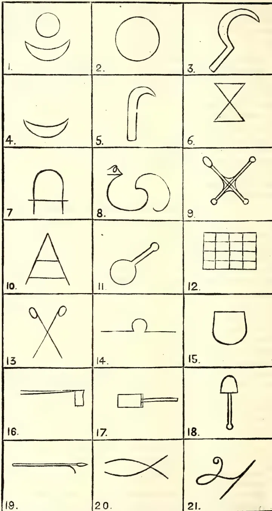</td><td>2. </td><td>3. </td></tr><tr><td>4. </td><td>5. </td><td>6. </td></tr><tr><td>7. </td><td>8. </td><td>9. </td></tr><tr><td>10. </td><td>11. </td><td>12. </td></tr><tr><td>13. </td><td>14. </td><td>15. </td></tr><tr><td>16. </td><td>17. </td><td>18. </td></tr><tr><td>19. </td><td>20. </td><td>21. </td></tr></tbody></table>

KANDYAN CATTLE BRAND MARKS.

290------------------------------------------------

SEPT. 1906.]

257

Live Stock.

<table border="1">
<tbody>
<tr>
<td data-bbox="193 104 388 218">

22.

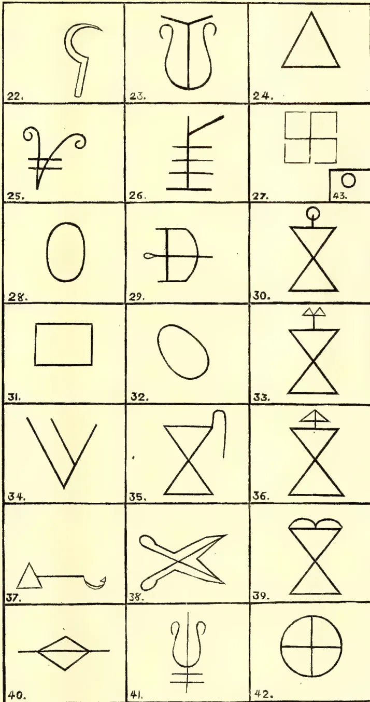
</td>
<td data-bbox="388 104 583 218">

23.

</td>
<td data-bbox="583 104 780 218">

24.

</td>
</tr>
<tr>
<td data-bbox="193 218 388 328">

25.

</td>
<td data-bbox="388 218 583 328">

26.

</td>
<td data-bbox="583 218 780 328">

27.

</td>
</tr>
<tr>
<td data-bbox="193 328 388 438">

28.

</td>
<td data-bbox="388 328 583 438">

29.

</td>
<td data-bbox="583 328 780 438">

30.

</td>
</tr>
<tr>
<td data-bbox="193 438 388 548">

31.

</td>
<td data-bbox="388 438 583 548">

32.

</td>
<td data-bbox="583 438 780 548">

33.

</td>
</tr>
<tr>
<td data-bbox="193 548 388 658">

34.

</td>
<td data-bbox="388 548 583 658">

35.

</td>
<td data-bbox="583 548 780 658">

36.

</td>
</tr>
<tr>
<td data-bbox="193 658 388 768">

37.

</td>
<td data-bbox="388 658 583 768">

38.

</td>
<td data-bbox="583 658 780 768">

39.

</td>
</tr>
<tr>
<td data-bbox="193 768 388 876">

40.

</td>
<td data-bbox="388 768 583 876">

41.

</td>
<td data-bbox="583 768 780 876">

42.

</td>
</tr>
</tbody>
</table>

KANDYAN CATTLE BRAND MARKS.

291------------------------------------------------

Live Stock.258SEPT. 1906.

1. 8. Letter Bhayannu (also for Berawayo)
2. 9. Aduwa (Achari, Blacksmiths)
3. 10. Jamajadiya (Kandyans moors of Kahatapitiya, Illawatura, &c.)
4. 11. Betel-bag (Hannali; tailors)
5. 12. Mat (Kiunaro; weavers)
6. 13. Abrana-anduwa (Goldsmiths)
7. 14. Krinanyate (Pattiwalayo, belonging to the royal palanquin department)
8. 15. Batgam-alla (Paduvo); the palm of the hand
9. 16. Porawa, axe, (Porokarayo; wood-cutters)
10. 17. Walanpatta (Badahelayo; potters)
11. 18. Hunupatta (Hunno; chunam-burners)
12. 19. Henduwa, Etwalayo (Elephant-keepers)
13. 20. Irattipure (Kegalle District Gowigama Kandyans)
14. 21. Tamil letter A for Angamma, Gampola
15. 22. Sickle (Pannayo) grass-cutters
16. 23. Sulama (Devale villagers)
17. 24. Kota (Kotmalie)
18. 25. Jamajadiya (Four korale Kandyans Moors)
19. 26. Tanirohotiya (Galbode korale)
20. 27. Mediyama (Aluwihare, &c. Matale)
21. 28. Bera-etie (also for Berawayo)
22. 29. Dunna, bow, (Vedhas)
23. 30. Bopata-Pahimbuwa (Dolosbage)
24. 31. Kanda, Log of wood) Paliyo
25. 32. Waramanda (Rodiyas) rope made of hide
26. 33. Irattinelunmal Pahimbuwa (Naranwita, &c.)
27. 34. Keralama (Unambuwa, Kirinda, Udowite villages)
28. 35. Kokuwan Pahimbuwa (Gowigama Kandyans, some parts of Matale)
29. 36. Nelun-mal-pahimbuwa (Gampola)
30. 37. Agul-Tattuwa (Vihare villages)
31. 38. Scissors, Embattayo (Barbers)
32. 39. Torana Pahimbuwa (Dorakumbure village, &c.)
33. 40. Ematikaiya (some Pattiwala Kandyans of Matale)
34. 41. Jamajadiya Keerapone Kandyans-moors)
35. 42. Wahunkuludaluwa (some parts of Kegalle)
36. 43. Pata Bulatgama, the Binduwa, a drop.

#### A SUCCESSFUL CURE FOR TICKS IN CATTLE.

As the result of a brief statement recently made public by the Department of Agriculture (United States) concerning the use of crude Beaumont petroleum as a dip for cattle, especially those infected with Texas fever, a great many communications have been received, both from oil men and from stock raisers, inquiring as to the character of the oil and the method of its utilization for dipping purposes. A bulletin has, therefore, been prepared describing the treatment of Texas fever and the manner of using Beaumont oil for this purpose. The department says in part:—

“Many efforts have been made to discover a practical method for dipping cattle to destroy ticks without injury to the cattle, and the bureau has experimented for years with this object in view. Numerous kinds of dips have been used and many failures have been recorded, but apparently a successful one has been found in the crude oil—so called Beaumont oil—obtained from certain Texas wells. This oil has now been used on a rather large scale, and it has been very successful in killing ticks, without at the same time materially affecting the health of the cattle, when the proper precautions have been observed. In fact, it is distinctly superior to any of the other dips that have been tested. In these experiments it was found that a light oil heavily charged with sulphur is the most desirable for dipping cattle, as the heavy oils injure the animals dipped in them. An oil with 40 per cent. of its bulk capable of boiling between 200 degrees and 300 degrees C., having a specific gravity between  $22\frac{1}{2}$  degrees and  $24\frac{1}{2}$  degrees Beaume, and containing  $1\frac{1}{4}$  to  $1\frac{1}{2}$  per cent. of sulphur is most desirable, and these requirements should be stipulated before purchase. In a recent dipping of 57,000 head of cattle on the Kansas and Osage Indian reservations, the results were very highly satisfactory, both as regards the

292------------------------------------------------

SEPT. 1906.]259Live Stock.

eradication of the cattle tick and the after results of the dipping, since the loss from all causes was less than 0.75 per cent. This loss represented in dollars and cents would amount to a very small portion (about one-twelfth) of the loss incurred by the sale of these animals as 'ticky' cattle in the stock yards of the North. Other cattle dipped in the same oil, but under conditions that cannot be considered parallel, suffered more severely. In order to obtain the best results, the animals, after dipping, should not be unduly exposed to the hot sun nor driven any considerable distance, but should receive plenty of food and good water. They should be allowed to stand for four or more days after dipping and prior to shipment. Dipping should not be attempted until after they shall have shed their winter coats, as a large percentage of all cattle dipped before the heavy coat is lost suffer from a severe irritation of the skin.

"The method usually adopted in dipping cattle is to construct a narrow swimming tank with a chute at one end for the entrance of the cattle and a sloping exit at the other end where the cattle emerge after getting a uniform coating of oil in passing through the vat. A drip chute or floor is connected with the exit where the excess of oil is allowed to drip off the animals and to drain into the vat. Plans and specifications for installing a dipping plant suitable for either small farms or large ranges are published in Farmers' Bulletin No. 152, which may be obtained from this department. It is relatively more expensive to dip cattle in the South where the farms and plantations contain a small number of cattle than in the range country of the southwest, where this method of eradicating ticks becomes not only plausible and practicable, but also economical. When cattle have been properly dipped in Beaumont crude petroleum or any other approved petroleum under the supervision of a veterinary inspector, and by him found free of infection, they may be shipped to any point above the quarantine line subject only to such restrictions as may be imposed at the point of destination. Such cattle must be shipped in clean, disinfected cars, and must not be driven through the quarantined area or be unloaded therein, except at those points designated by the Secretary of Agriculture. It is earnestly recommended that such shipments shall not occur earlier than four to eight days after the dipping is performed.

"Greasing the legs and sides of cattle with cottonseed oil, fish oil, or Beaumont crude petroleum will assist in preventing the ticks from crawling up on the body. In small herds, smearing the cattle with a mixture of one gallon of kerosene, one gallon of cottonseed oil and one pound of sulphur, or with a mixture composed of equal parts of cottonseed oil and crude petroleum, or with Beaumont crude oil alone, has proved efficacious when applied to the skin two or three times weekly during the tick season. For this purpose sponges, syringes, brushes, mops, or brooms may be used. This method not only kills the older ticks on the cattle by mechanically plugging up their breathing pores, but also makes the legs so slippery, that the seed ticks are unable to get a foothold in order to crawl up on the cattle.

"Where a large number of animals are to be treated, but not sufficient to make it advisable to construct a dipping vat, spraying the infested animals has given very favorable results. The animals should be placed in a chute or a stall or tied to a tree, and then sprayed with Beaumont oil or a 5 per cent. solution of any of the standard coal tar dips. The solution may be applied by means of a force pump, such as is used by orchardists to spray fruit trees, or by placing the solution in a barrel upon a wagon or on a platform above the animals, and allowing the fluid to gravitate through a hose, to the end of which is attached an ordinary sprinkling nozzle. The solution is then allowed to flow over the skin of the animal, especially upon the legs and under portions of the body. If the cattle are on tick-infested pastures, this treatment—either smearing or spraying—must be continued through the whole season, and if thoroughly done it will leave the fields free from ticks the following year."—*Oil Reporter (New York.)*

34

293------------------------------------------------

260[SEPT. 1906]

## Correspondence.

### RUBBER TAPPING METHODS.

#### A COMPARISON OF THE SPIRAL, HALF-SPIRAL, AND HERRING-BONE METHODS.

SIR,—“One cannot have omelettes without breaking eggs.” There is an egg that wants breaking badly; and I trust the omelette will not prove indigestible! I refer to the mystery which enshrouds the question of “The Unit of Bark to Yield of Rubber.”

Many rubber planters, even among those who no longer hold the crude idea that full spiral tapping, even when carefully done, is a species of ringing the tree, still hesitate to adopt this method, obviously the easiest and cheapest of the three, because the *dictum* has gone forth, with good authority, that the Peradeniya and Henaratgoda experiments prove that the greatest yield per unit of bark excised has been given by the herring-bone system, though the greatest yield per tree has been given by the full spiral. They, therefore, imagine that there is a *desideratum* in herring-bone tapping, in spite of all its disabilities of left, as well as right, hand cutting, of many drip-tins or expensive manual application of water to the various cuts, and of untappable areas which is not to be found in spiral tapping; and that while prices rule high, the extra expense of these disabilities will be more than covered by the bark lasting longer.

It is my purpose to show where the fallacy has crept in, unavoidable and accidental though it be.

As it is an accepted fact that the latex cells lie in series in the line of the stem, and that the greater and freer drainage and inter-drainage of these series of cells takes place in that line, it follows that many more cells will be drained by a cut across that line than by one in its length; in effect that a level cut across the bark gives the greatest possible yield of latex and the perpendicular cut the least—the cuts being of equal length. We also know that these cells, after drainage, have the power of sealing themselves up and again becoming full of latex in about two days, when a thin paring cut will re-open them and give another full flow; and so on while the bark lasts. Now, in the case of the perpendicular cut a whole series of cells is entirely removed which would otherwise have filled up again with latex; whereas in the level cut only the ends of the series are removed, and the same area of cells is drained over and over again. It, therefore, follows that:—(1) the *nearer the level* the cut is made, the greater the yield and the less the excision of bark; (2) the *nearer the perpendicular* the less the flow and the greater the excision of bark. And since we have the choice of any angle between level and perpendicular, or zero and 90°, it follows that the man who taps at an angle of 75°, 80° or 85°, is little better off in yield and loss of bark than the man who taps perpendicularly. While he who taps at 20°, 15°, or 10°, has nearly as good a return as the level tapper. But these low angles suffer from the disability that latex will not run in channels on such gradients and so becomes scrap, which for cogent reasons does not suit the practical planter. He, therefore, sets about to find the lowest angle at which natural latex would flow, and by some strange fate 45° was fixed on for the spiral method especially. (I suppose because it was so easily made by cutting a square sheet of tin diagonally across and using each half as a guide for his line on the tree.) But there it has stuck—at 45°! Even in the Botanic Gardens mentioned above, no other angle than 45° for the spiral has been used, to the best of my knowledge; and certainly no other angle on the various estates I have visited. For the herring-bone, on the other hand, both in the Botanic Gardens and on these estates, exceedingly flat angles have entirely been used, in some instances so flat and irregular that the latex had to be coaxed into the runnel by an attendant who could look after only a few trees at a time.

294------------------------------------------------

SEPT. 1906.]261Correspondence.

Those who have followed the argument will see that it is manifestly unfair to compare tapping done on flat angles with that at  $45^\circ$ , in which latter the channel has to be probably 25 per cent. longer, in order to cut across the same number of cells, and therefore, with greater waste of bark—the paring being the same in thickness in both cases. And it was just at this point, unavoidable though it may have been, that the flaw occurred and the deduction was wrongly drawn as to the merits of these two systems. Given the same angle, I maintain that the spiral will beat the herring-bone in yield per unit of bark excised; for it can easily tap all the basal portions of the tree, where the latex is in greater quantity and richness, which are only reached by the herring-bone and half-spiral with difficulty and inconvenience, owing to their peculiar construction.

And with the advent of water flotation and the drip-tin especially—which is an unalloyed blessing in its prevention of scrap and of manual labour, watering the cuts—the necessity to tap at  $45^\circ$  for the spiral has disappeared, and a much smaller angle, say  $30^\circ$  or  $35^\circ$ , can be taken. This will be a matter for experiment to those interested.

At any rate, the day is passing away when the practical planter will tolerate the expenditure of attendants watering the cuts by hand when it can be done by mechanical means.

It stands to reason then that, at whatever angle a herring-bone can be cut for self-acting water flotation, at that angle also can the spiral be cut, and also the half-spiral which, however, exceeds the herring-bone in amount of untappable and inconveniently tappable areas. These amount to, at least, one-fifth of the whole in the half-spiral and one-tenth of the whole in the herring-bone, as compared with what can be done on the spiral method within the reach of the average tapping cooly—that is, five feet.

Perhaps a sketch, which any one can easily make for himself, will not be out of place here. Let us take the case of a tree averaging 24 inches in girth (never mind the tapering shape, for it affects all three systems in the same way) the tapping area as five feet above the level of collecting vessel, and the spacing as one foot, and the scale as one inch to a foot.

Draw the line A. B.=two inches.

![A technical diagram illustrating three methods of tapping a tree: Full Spiral, Half-Spiral, and Herring-Bone. The diagram shows a vertical cross-section of a tree trunk with a drip-tin at the top. The trunk is divided into three sections by horizontal dashed lines. The left section is labeled 'FULL SPIRAL' and shows a diagonal line from the bottom (A) to the top (C) with points 1, 2', 3', and 4' marked along it. The middle section is labeled 'FULL SPIRAL' and shows a diagonal line from the bottom (E) to the top (F) with points 1, 2', 3', and 4' marked along it. The right section is labeled 'RUNNEL OF HALF-SPIRAL' and shows a vertical line from the bottom (H) to the top (D') with points 1, 2', 3', and 4' marked along it. The bottom section is labeled 'RUNNEL OF HERRING BONE' and shows a vertical line from the bottom (H) to the top (D') with points 1, 2', 3', and 4' marked along it. The diagram also shows the base of the tree with roots and a drip-tin at the top.](a5494f56740f4f1cf46ef3f6f8415263_10_img.webp)

295------------------------------------------------

Correspondence.262[SEPT. 1906.

At A. erect A. C. and at B. erect B. D. perpendiculars 5 inches. Join C. D. A. C. D. B. is the tapping area for the spiral.

Bisect A. B. at E. and raise perpendicular to F.; E. F. D. B. is the tapping area for half-spiral and herring-bone.

Divide these perpendiculars into foot lengths. From E. draw E. G. at  $45^\circ$ , to 1 foot above B., and parallel to this draw the rest of the lines from the 1 foot spacing points. These are the half-spiral channels, F. E. is the runnel. A glance shows that above the topmost channel is a triangle of untapped bark whose base is F. D., and below the lowest channel is a triangle whose cuts gradually run out, away from the runnel and disappear at B.

For the herring-bone bisect E. B. at H, run a perpendicular up till it meets the top channel at I. H. I. is the runnel. Join I. F. I. D. I. F. are the top channels. Parallel to I. F. from the one foot points draw the other four lines to the central runnel. At the top a triangle F. I. D. is left untapped, and it will be seen that, when the lowest channel reaches the foot of the runnel, two small triangles will be left, the cuts on which will gradually run out at E. and B.

Comparing these two systems, it will be seen that—with its disability of loss of tapping area—the half-spiral requires, after the cut has begun to run out at the bottom, only one extra spout and collecting cup to the herring-bone's extra two, and only five applications of water, or five drip-tins to the herring-bone's ten!

Even pretty Karrupaie, deftly watering the cuts from a sort of bitters-bottle and buzzing around from tree to tree in her little group of five or six trees at a time, would prove far too expensive a luxury, however picturesque; so let us hasten to the spiral.

For the spiral: from A. draw A. K. at  $45^\circ$ , i.e., to the 2nd foot spacing above B. This line has completely encircled the tree, so go level across the figure from K. to its coinciding point K2, draw K2 L. at  $45^\circ$ , go across again to L2 and draw L2 Y. at  $45^\circ$ . The spiral has reached the top of the tapping area and encircled the tree two-and-a-half times, and as will be seen at a glance is of precisely the same length, viz., 84 inches (7 inches on the scale) as the sum of the lines in each of the other two systems. It requires one drip tin, one spout, and one collecting vessel; cut after cut will be the same all round the tree, there is no untapped or untappable area. Nay, more than that; it will reach further down any inequality of root or base of the stem even where the others cannot go. Further, it is seen that the spacing is two feet, so that an intermediate channel could be put in, but this would finish the bark in half the time. But if—as seems to be the idea just now with the improvements of modern paring and pricking—one foot is held to be enough bark to go over, in the time it requires for the originally cut bark to have grown thick enough again, to cut a new channel in and start over again, its superiority is at once assured. The two spirals, being at all times on opposite sides of the tree, the yield is at each time, early or late, at any period, monsoon or fine, in any aspect, to the dark side or the open, *an average of the productivity of the tree* for the time being, which is more than can be said of the other two, or of "compass tapping."

All this is of spiral tapping on the angle of  $45^\circ$ . What of the lower tapping angles of  $30^\circ$  or  $35^\circ$  which are now available through the use of water, which will go a few more times round the tree and give a much larger yield? On suitably large trees, say 36 inches in average girth, they will enable the planter to tap a large and fertile area at the base of his tree, say only 3 ft. 6 in. or 4 ft. up, and then with a low platform to tap a second story, the top of which need only be 8 ft. up, if this procedure is found to be necessary, which some men maintain is the case.

296------------------------------------------------

SEPT. 1906.]263Correspondence.

I do not pose, Sir, as an authority on these matters, but merely make an appeal to practical common-sense, on the facts regarding these three systems of tapping, which are available to us at the present moment.

If I am wrong at any point, I hope to be corrected.

Yours, &c.,

ALEX. CAMERON.

[The full spiral leaves L. F. C. untapped. We do not know that the cells can seal themselves up after tapping; it would be a most remarkable fact if they did. The latex accumulates in other cells near by. The whole question of the best way to tap is as yet in its infancy, and will probably be made the subject of careful research in the Botanic Gardens during the next year.—Ed.]

## TEA PLANTING INDUSTRY IN NATAL.

### NOTES ON COFFEE, COTTON AND RUBBER.

Natal, July 7th.

DEAR SIR,—Some time ago I addressed you, requesting you to obtain for me an expert opinion upon some samples of teas I sent you. This you very kindly got for me.

Messrs. Forbes & Walker, who were consulted, very kindly pointed out a peculiarity in the ferment, which they said was either an error in withering, or a peculiarity resulting from the soil. Since then I have been, in various ways, trying to overcome this fault and have, I believe, at last succeeded in producing a tea as nearly perfect as local conditions allow. I am now anxious to have samples of these teas tested by the same firm, and with this object send you a complete set by even mail with the anticipation that you will again be good enough to ask Messrs. Forbes & Walker to kindly report upon them and have the result published in the *Tropical Agriculturist*.

The samples are numbered and arranged as follows:—A. consisting of five samples, represent my better class of teas. B. is one of my ordinary pekoes. C. consists of four samples representing the highest grade manufactured by four of the leading Natal estates, whose names for obvious reasons I refrain from giving.

The teas A. and B. are made on this estate, the roller being employed is a Jackson's new "Rapid" with teak facing and the drier a "72" Venetian. Both these machines are in my opinion hard to beat, if they can be beaten at all.

It is a good long while since I have contributed in any way to your very interesting paper, the perusal of which affords me each month many pleasant hours. With the present and all-absorbing native trouble, trade is absolutely at a standstill here, and a depression such as has never been experienced is fast spreading over the entire Colony, making the outlook more and more gloomy. We all hope for better times, but they still seem as far off as ever.

Expansions in tea acreage, however, in spite of all this, are encouraging and one estate in my immediate neighbourhood comes into bearing next season; the factory is now under erection. The owners are a go-ahead lot, and, it is to be hoped, they will help to improve the deplorable name Natal has lately got for its coarse teas. The Manager has had a year or two's training in India and Ceylon in tea, and with experience of local conditions as well, he ought to be in a position to add his charge to the list of very few places where quality is studied.

COFFEE IN NATAL.—I am experimenting with a small patch of coffee. Coffee was tried years ago on rather a large scale, and for a while paid well. Then the dreaded *Hemileia vastatrix* appeared and the industry collapsed altogether, and,

297------------------------------------------------

Correspondence:264[SEPT. 1906.

so far as I know, no real effort was made to fight it. The style of cultivation was extremely crude. Trees were just left to grow up—like Indian and Ceylon “native coffee”—and no attention, save an occasional weeding or manuring given; while a pruning knife was an unknown factor. The trees, naturally weakened with neglect, soon succumbed to disease.

When I took charge of this estate, there existed a small area originally planted with coffee, but entirely submerged in scrub. Anxious to prove for myself the questionable unsuitableness of the country for coffee, I had the field cleaned up, and all the existing trees some over 20 feet high cut level with the ground. I then grew from each stem a single sucker which I topped at 4 feet, and put the field under artificial shade (*Grevillea robusta*). The coffee I carefully pruned and handled each year, and manured once with cattle and stable manure. The result has quite overstepped all expectations, and this season, in spite of very scanty rainfall, I have gathered 15 cwt. per acre. The trees have just been pruned, and although showing slight traces of leaf disease, for this time of the year (the middle of our winter) are remarkably healthy and carry fine red wood. I am very sanguine about it, and am pretty certain, if coffee is grown as it ought to be, it will not be the failure it is generally called.

To give you a fair idea of how things are conducted here, the following would not be out of place. A farmer in the Colony, who shall be nameless, thought, after his coffee had not yielded for 2 or 3 years, he would try pruning, and his method was to cut away one side of the tree clean to the stem, including primaries, the other side being subjected to the operation the following year. Needles to add, the field is now extinct!

COTTON promises to be a future industry here. Two years ago a syndicate was formed to test the practicability of growing cotton on plying lines, and Mr. John Kirkman (of Bever-stove-Equeefa), an old and experienced colonist undertook the management. He has proved beyond the experimental stage that the industry well repays itself, and prices he has obtained are highly encouraging. The seed used was mainly Sea Island and also a good deal of German East African, the fibre produced being of intense whiteness and a very long staple.

RUBBER IN NATAL.—Some correspondence appeared in the local newspapers as to Natal being suitable for rubber—one gentleman, from Ceylon I believe, being quite emphatic as to its being made a paying industry. He must have been a newcomer evidently, for the insufficient rainfall is in itself an insurmountable obstacle, and rubber can never be made to produce a yield that will be profitable. It grows here well enough, as evinced by some trees I have on the place of the Para variety planted by a former owner, but there is little or no sap in the trees. We have also a wild rubber, producing a gum of very superior quality. Here again the quantities that can be got are so little, that with the expensive labour we have to employ here, it would not pay to try to collect it.

Ceylon seems to have gone crazy on rubber-growing, and from all accounts in the “T.A.” the industry seems to be highly remunerative. It is amusing what a little time ago was almost exclusively a tea paper, deals now with rubber, and almost nothing but rubber!

I hope to hear from you in due course and, when I can, I shall not forget to write again.

Yours faithfully,

W. A. GILBERT.

[Somewhat over a year ago Mr. W. A. Gilbert sent us some samples of his teas which Messrs. Forbes & Walker kindly reported on for us. This firm has again given us their opinion on his teas, and this time it is a much improved report

298------------------------------------------------

SEPT. 1906.]265Correspondence.

that they are able to make. The Natal teas from Mr. Gilbert's estate are excellently made and finished; that is the A. samples. The B. samples are not nearly as good, some of them being little better than rubbish. The flavour of the teas is much like China tea, but in appearance the A. samples resemble Cachar teas. We append Messrs. Forbes & Walker's report, for which we thank them; and we congratulate Mr. Gilbert on his progress in spite of the difficulties to be contended with in a country like Natal.—ED.]

REPORT ON SAMPLES OF NATAL TEAS.

(A) *Samples 1-5* representing Broken Orange Pekoe, Broken Pekoe, Pekoe No. 1, Pekoe No. 7, and Pekoe Souchong.

These samples in appearance are satisfactory, being well made, clean and well graded. The liquors are plain with fair quality and strength. The infusions are somewhat dull.

(B) *Sample*.—This is Broken Pekoe of fair appearance and tips. The liquor is the same character as "A" but of inferior quality.

(B) *Samples 1-4*.—These are all flaky broken teas rather stalky and reddish. The liquors are common and unattractive. Infusions are dark.

"A" Samples are useful teas and might be described as ordinary, fair medium teas.

"B" Sample is a common to medium tea.

"C" Samples would rank amongst common China red leaf siftings.

(Signed) FORBES & WALKER.

RUBBER GROWING.

DEAR SIR,—I am interested in a rubber proposition, in a country which has not yet reached the stage of production on a large scale, though trees have been successfully grown experimentally and on a small scale, and I shall be much indebted if you will be good enough to give me the benefit of your views on the following points, viz:—

(1.) What is the lowest rainfall necessary for the successful cultivation of rubber, on land which is not periodically flooded, as for instance some of the Brazilian forests?

(2.) Is a planter, with general and wide experience in the cultivation of tropical plants but with none as to rubber, likely to be successful in growing it, with Herbert Wright's book as his main guide, supplemented by such information as he can gather from planters in his country, who may or may not have had actual experience of the successful production of rubber?

Yours faithfully,

T. S. TURNBULL.

Manchester, 3rd August, 1906.

[(1) If this refers to Para rubber, we should say the lowest rainfall is usually from 65 to 75 inches, well distributed. The tree will not stand long droughts.

(2.) It depends on the plants. Rubber cultivation is as yet so absolutely in its infancy, and we know so little about methods of tapping, yield, &c., that any man with common sense and adaptability should be able to get on well enough with it. Mr. Wright's book will give him most of what is already known upon the subject, but probably within 5 years will be hopelessly out-of-date.—ED.]

299------------------------------------------------

Correspondence.266[SEPT. 1906]FEBRIFUGE PLANTS.

SIR,—With reference to the enquiry by your correspondent—Mr. G. E. Weerakoon—in your issue for July, 1906, p. 113, I have the pleasure to inform him through the medium of your esteemed journal as follows:—

I would premise by calling Mr. Weerakoon's attention to the well-known aphorism that where the identification of a plant is concerned, it is quite unsafe to entirely rely upon its vernacular names, as it is not seldom the case, that in India one and the same vernacular name is applied to more than one plant. In this connection, for example, we have both *Andrographis paniculata*, Nees., and *Swertia chirata*, Ham., called by the same Sanskrit name *Chunimba*.

Your correspondent by the said vernacular name (*Chu-nimba*) presumably refers to *Andrographis paniculata*—which is a shrub of the Natural order Acanthaceæ, very bitter in taste, and used not only as a febrifuge, but also as a stomachic, tonic, alterative, &c. It is well-known in Bengal as a very useful medicine for infants to remove constipation, bring appetite and to help the liver to perform its functions. Whereas *Cephaelis Ipecacuanha*, Rich., which your correspondent seems to have confused with *Andrographis paniculata*, belongs to the Natural order Rubiaceæ, the roots of which yield medicines used as an emetic, expectorant, diaphoretic, alterative, &c.

There is no vernacular name for *Cephaelis Ipecacuanha* known to me, which could even approximately serve as a guide to Mr. Weerakoon in identifying the plant. However, I think I cannot do better than refer your correspondent to Hooker's Flora of British India, Vol. III., p. 178, for the description of the plant.

Yours faithfully,

K. BANERJEE,

*Office of the Director of Agriculture, Punjab,  
Lahore, India.*

16th August, 1906.

---

 LEMONGRASS OIL EXTRACTION.

DEAR SIR,—I shall be glad to have the benefit of your advice as to the extraction of Lemongrass oil. I have, no doubt, derived much useful knowledge on the subject from the back issues of the *Tropical Agriculturist*; but I am sorry to say that the extraction of the oil by aqueous distillation in copper stills has not been properly understood by me.

A detailed account of the copper still, and the method of extraction thereby, will greatly oblige.

Yours faithfully,

A. PAUDE.

Zeyawadi, Burma, August 12th, 1906.

[A Circular will very shortly be published from the Botanic Gardens on this subject.—ED.]

---

 ADHATODA VASICA AS A GREEN MANURE.

DEAR SIR,—On a recent visit to the North I was greatly struck with the value placed by cultivators on *Adhatoda vasica* as a green manure for tobacco, onions, etc. A man's load fetches 75 cents and upwards, and the plants, which (as its Tamil name "Adathodai" implies) 'goats will not touch,' are carefully conserved for fertilizing purposes.

300------------------------------------------------

SEPT. 1906.]267Correspondence.

*Adhatoda* is a very common weed in the Western Province, but so far as I am aware its value as a manure is not appreciated by cultivators there. The use of the leaves for green manure is not confined to Ceylon, for the practice is pretty common in India. It may be mentioned that in India the plant is as much used for fertilizing as for its property of destroying aquatic weeds, such as *Lemnae* in flooded rice-fields. Mr. Hooper of the Indian Museum, who has made a number of analyses of *Adhatoda*, is of opinion that they fully bear out the high reputation in which the plant is held, containing as it does from 3 to 4% of Nitrogen, and considers it a most valuable fertilizer when ploughed or forked into the soil.

Altogether *Adhatoda vasica* is a most interesting plant, combining the properties of a fertilizer, medicine (both in human and veterinary practice), insecticide, poison (for fish and aquatic plants) and antiseptic; but its most valuable property is undoubtedly as a fertilizer, supplying not only a high percentage of nitrogen, but also an appreciable amount of mineral matter. I would suggest that its properties as such should be brought prominently to the notice of native cultivators.

Yours truly,

C. DRIEBERG,

*Superintendent of School Gardens.*

Government Stock Garden,

Colombo, 31st August, 1906.

#### HONEY PRODUCTION IN EUROPE.

DEAR SIR,—The following paragraph will be of interest to apiarists, and might be published in the *Tropical Agriculturist*.

Yours faithfully,

W. H. M. DAVIES.

Colombo, 29th August, 1906.

“According to statistics in the Handel’s Museum, Germany leads in the production of honey among European countries with 1,910,000 beehives, furnishing 20,000 tons of honey. Spain is next with 1,690,000 hives and 19,000 tons of honey. Austria-Hungary is third with 1,550,000 hives and 18,000 tons of honey. The other European States are far behind. France produces 10,000 tons, Holland 2,500, Belgium 2,000, Greece 1,400, Russia and Denmark 900 tons each. In these statistics the effect of climatic conditions is noteworthy, especially when comparing Russia and Greece. The latter has only 30,000 beehives, yielding 1,400 tons of honey, while the former with 110,000 hives, produces only 900 tons.”

#### MOSQUITO NETTINGS AND MUSLINS.

DEAR SIR,—We beg to forward you a few samples of our Untearable Mosquito Nettings and Muslins, which, as they will stand indefinite washing without tearing, will, we believe, prove very valuable protection from malaria.

The “British Medical Journal” and the “Lancet” have already reported very favourably on them, and in view of the hygienic value of these fabrics, we trust you will think well to notice them in the columns of your valuable paper

Yours faithfully,

A. M. HART, LTD.

[These samples are wonderfully strong, but the threads are so stout that there cannot be good ventilation, especially in the finer one. How they compare in cost with cotton we are not told, and it must always be remembered that the people who are willing to give a good deal higher prices for better articles are but few.—ED.

35

301------------------------------------------------

268[SEPT. 1906.

## MISCELLANEOUS.

### AGRICULTURAL BANKS FOR CEYLON.

BY E. S. W. SENATHI-RAJAH.

“THE CREDIT FONCIER DE FRANCE.”—The results obtained in Germany by the Land Banks (*Landschaften*) were first brought to the notice of the French Government by Monsieur Wolowski, one of the most eminent of French economists and financiers, in a luminous treatise which he published in 1835. Ten years afterwards, M. Royer, Inspector of Agriculture, was commissioned by the Government of France to repair to Germany and study the system of land banks which were then in operation there, and he made an elaborate report describing minutely the mechanism and operations of the chief *landschaften*, and the system of debentures which formed the pivot of the German land banks. The Government took the matter up in 1851, and an enquiry was held in which a number of distinguished financiers, economists, lawyers and officials were examined, and as a result of the enquiry a law was passed on the 28th of February, 1852, which laid the foundation of Land Credit Societies. In March, 1852, a powerful society was formed at Paris, another at Marseilles, and a third at Beners. It was, however, thought that a single society having branches in various parts of France would better command credit for its debentures than a number of small isolated societies. The three societies were therefore merged in one and received the name of “Credit Foncier de France,” and received a monopoly for 25 years. Various errors were committed at first, but gradually by means of great prudence in administration, by steady payment of its dues to debenture-holders even in years of war and famine, and also by its connection with and supervision by Government, it obtained the confidence of the public. Its first heavy loan of eight million pounds in debentures was gradually taken up by the public. It rose steadily in public confidence, and in 1858 at the instance of Government it assumed the responsibility of issuing a loan of four million pounds for drainage works which the Government itself had previously attempted without success. At the instance of Government it established an affiliated society for the purpose of *credit agricole*, that is for granting short term loans without mortgage to farmers. In 1860 a new law authorised this new development and granted the Society a special guarantee. In the same year another law authorised it to grant loans to departments, communes and agricultural associations. Its privileges were also extended to the French Colony of Algeria. These extensions were all carried out at the instance of Government, and to meet the new liabilities its share capital was raised in 1870 to £3,600,000. The most remarkable proof of its stability was afforded by the terrible Franco-German war of 1880, which had no effect whatever on its credit, while the whole loss due to the depreciation of property at that critical period was only £160,000. Since the war of 1870, the Credit Foncier de France has attained enormous development in various directions, such as the extension of its business throughout various rural districts, formation of the Credit Foncier of Algeria, and the Compagnie Fonciere de France and Algeria, the latter of which was intended to facilitate works of improvement and construction. In 1878 it issued an enormous loan of £36,000,000, in mortgage debentures of £20, bearing interest at 3%.

The success of the Credit Foncier was at first mistrusted by many in France. They said it was a novel experiment, not in consonance with the manners and customs of the people, or with the social or economic conditions of France. Errors were committed no doubt, but what ensured its success and popularity was the principle of sinking fund and land mortgage debentures, an

302------------------------------------------------

SEPT. 1906.]269Miscellaneous.

account of which will be given later on. The success of the Credit Foncier was so signal, that it was at once copied by Russia, Austria and Italy. Even Germany, which had furnished the original prototype, now founded associations in imitation of the French model. The Credit Foncier de France differs from the old German land banks (*landschaften*) in several important points. The Credit Foncier has a share capital, while the German banks had neither share capital nor dividends, but simply aimed at providing cheap loans by the united guarantee of the principal land-owners. The German banks have unlimited liability, while the Credit Foncier is a joint stock company with limited liability. In the German banks the debentures are secured by the mass of mortgages held by the bank and by the unlimited liability of all members, while the security of the Credit Foncier are the share capital and reserve. The loans of the Credit Foncier are given in cash, whereas the old *landschaften* granted the loan on debentures to the borrower. The *landschaften* banks are comparatively local, operating in moderate areas; whereas the Credit Foncier is a vast centralised institution extending over the whole of France by means of agencies. The Credit Foncier acts in certain respects as an ordinary bank receiving deposits and employing part of its capital in short term loans. Loans are probably cheaper in the *landschaften*, since their credit is unlimited, no share capital to absorb profits as dividends, and all profits return to the members in the shape of cheap loans.

Most of the other countries of continental Europe have introduced agricultural and land banks founded on the model of the German *landschaften* or the French "Credit Foncier," or on a partial adaptation from each. A brief description of the Constitution and working of the land banks in continental Europe will be not without interest to us, particularly as the continental nations are governed as we are by highly bureaucratic methods, and they afford therefore apt models for our imitation.

ORIGIN.—Their origin in almost every instance is due to the impulse given by the state. The old *landschaften* of Prussia came into being by the fiat of Frederick the Great of Prussia, who wanted to give relief to his noble proprietors, who were crushed down by war and usury. He ordered that not merely all members of the bank, but every noble owning lands within the province where a (*landschaften*) bank was situated, should be wholly responsible for the operations of the bank. He also granted financial aid to the best five old *landschaften* in the form of subvention by the state, partly to supply the first instalment of funds and partly as a reserve against contingencies. Tzar Alexander of Russia gave all the funds necessary for starting the Land Credit Bank of Russia in 1818. The Credit Foncier de France, which is a joint stock company, received a subvention of £400,000 from the state in addition to a guarantee that the state and the district councils would purchase a quantity of its debentures, not only to provide the first funds necessary to set it afloat, but chiefly to create public confidence in its stability. So all the land banks of Europe without exception have come into being by the efforts of governments of their respective countries, and have been subsidized by such Governments and watched over by them with fostering care. The Government connection and support were found to be essential, inasmuch as banks, being institutions of credit, the advertisement to the public that the Government has an interest in the bank, believes in its usefulness and desires its success, acts as an incentive to the shareholders and establishes public confidence in the stability of the undertaking. There are, however, no land banks in Europe which are directly owned and managed by the state except in Russia and in some of the small German states and the cantons of Switzerland.

ADMINISTRATION.—When once the Banks had been started by the impulse given by the state, the governments of the different European states appear to have watched the growth of these institutions with jealous care, and to have had a large

303------------------------------------------------

Miscellaneous.270[SEPT. 1906.

control over them. The most striking feature in the administration of the landschaften is the manner in which all members, not merely office-bearers, are compelled to work almost gratuitously on behalf of the bank. Every member is bound to take office under penalties which may amount to the calling in of his loan or the sale of his estates, and against such decisions he has no appeal outside of the bank. The co-operative principle is carried out with rigorous uniformity, and this enables the landschaften to work at considerable distances from their centres without much cost or risk. The bank is considered a quasi-public institution, and its officers come therefore under the law relating to the discipline of public officials. The bank is placed under the general supervision of the Minister of Agriculture and the immediate and special supervision of a Royal Commissioner, who is appointed by the King of Prussia. The chairman and the two councillors of the bank are elected by the deputies of the four districts, but the election is subject to royal confirmation. In the Credit Foncier de France there is a Board of Directors elected by the general assembly, but three out of twenty of them must be public officers of finance. The Governor and sub-Governor are appointed by government, and are removable only by the government. The Governor has great power and responsibility and is the executive head of the bank. In all the other land banks of continental Europe the state has in every instance assumed powers of supervision direct or indirect.

PRIVILEGES.—With the strict supervision exercised by the Governments of Europe, the land banks also have certain privileges granted to them. The Credit Foncier, for instance, has the privilege of using the government treasuries for the receipt of its dues and the deposit of its surplus funds. It enjoys a reduction of stamp duties in registration and the transfer of its debentures. Its debentures are payable to the holder, and the Courts cannot take cognizance of any claim by a third party unless the bonds have been lost or stolen. Trust moneys and public funds may be invested in the debentures of the Bank. It has a special and summary procedure for the recovery of its dues. The mortgaged property can be speedily attached by order summarily obtained from the local court. Its mortgages have precedence over all others except those of the state. The government at the start gave it a monopoly over the whole of France for 25 years from 1852, that is to say, no other Society was entitled to carry on business under this special law till after 1877.

The German landschaften have also various privileges, especially in the matter of the prompt recovery of their debts. Attachment of property of defaulters is prompt, and movables may be distrained in the first instance. This may be done by the bank's own agent or by demand of process from the local court through its bailiff, and the court is bound to issue process accordingly. In East Prussia and Silesia it is expressly provided that the banks may collect its dues on mortgages by any coercive process open to them without any proceedings in court, including distraint of movables, and attachment of debts due to the defaulters by third parties and attachment and management of the mortgaged estate.

*(To be continued.)*

---

304------------------------------------------------

SEPT. 1906.]271*Miscellaneous.*

## Notes on Methods of Irrigation in Arizona.

BY J. H. W. PARK.

---

Although a good deal has been written concerning irrigation in the Magazine of the Agricultural Society, nothing so far has appeared to indicate that better methods of Irrigation than those now practised in Ceylon exist elsewhere. As the writer believes that with proper methods of distribution of the water from Irrigation Works and proper use of the distributed water in the fields, the areas cultivated in the Island might easily be doubled without any great extension of the works themselves, he trusts the following notes made in the course of a couple of years' residence near Phoenix, Arizona, in the United States, may be of interest. For the actual figures of results obtained he is indebted to the publications of the United States Department of Agriculture.

**CLIMATE.**—The driest zone of the United States is practically represented by the territory of Arizona. The average rainfall within the zone does not exceed ten inches per annum, and the rainfall at Phoenix, which lies almost in its centre, averages little over six inches per annum. The temperature is subject to extreme variations. Frost is not uncommon in December and January, and temperatures of between 100° F. and 120° F. in the shade are the rule rather than the exception in the summer months. Under such circumstances the evaporation is very great and averages close on 80 inches per annum, and excepting in bottom lands near the streams or for a brief season after rain, or where irrigation is practised, nothing except cactus and salt bush grows.

The accompanying diagrams show the rainfall, relative humidity, evaporation from a water surface and the mean temperature of Phoenix for each month of the year. For comparison the same factors for the driest district in Ceylon—Hambantota—are also shown. The evaporation from a water surface in Hambantota I have not been able to ascertain, but I give that for the district near Giant's Tank (as calculated by Mr. Parker) which probably is not very different from it.

The want of rain, dryness of the atmosphere and rate of evaporation all militate against the success of irrigation near Phoenix, but the variation in temperature makes a great diversification of crops possible. The soil is a gravelly loam underlaid by gravel and not specially retentive of moisture.

In spite of these apparently unfavourable conditions, the town has become the centre of a thriving agricultural district. This it owes to the waters of the salt river, a perennial stream which, taking its rise on the western slopes of the Southern Rockies, and fed partly by rain and more particularly by melted snow, flows close to the town and joins the Gila River on its way to the Rio Colorado and the Gulf of California a few miles below it.

**THE IRRIGATION WORKS.**—The waters of the salt river are diverted above Phoenix, along both banks by a series of dams and canals, one of the chief of which the "salt river canal" runs directly through the heart of the town. During summer the bed of the river is entirely dry, the whole of the water being taken for irrigation by the canals above, but below the town the river begins again with the surplus water from the farms, and this is again diverted by other canals and used for the production of further crops. The engineering features of these works do not call for any special remark; they are more or less of the type used elsewhere, modified by American ingenuity to suit their surroundings. The capacity of the works, the methods by which the water is distributed to the various users, and the means by which the channels are maintained are of more interest.

305------------------------------------------------

Miscellaneous.272[SEPT. 1906.

As much as 1,250 cu. secs have been diverted into the various canals during the month of March, when the flow is usually most plentiful, and the supply fell as low as 120 cu. secs in the month of July, 1900, during the whole of which year, one of unusual drought, it did not average more than 400 cu. secs. In spite of this deficiency no less than 113,000 acres of crops were raised in that year, while the greatest area irrigable may be taken as 150,000 acres. The actual quantity of water used per acre of crops was 2.78 acre feet in 1902 (including canal losses and rainfall), while the amount usually taken is between 3 and 4 acre feet per acre of crops raised. These figures may be compared with the consumption per acre of not less than 12.75 acre feet (not including rainfall) used under the Waiawe Channels near Hambantota in 1904.

The water from the salt river is distributed to each of the main channels according to priority of right, the oldest channel being entitled to full supply while it is available, and the most recently constructed channel being the first to be deprived of water in times of tight supply. The actual quantity of water distributed to each of the various main channels is apportioned from day to day by a Commissioner specially appointed, and the quantity so apportioned is taken charge of below the gauge at the head of each canal by the various canal officers who attend to its further distribution.

The water is distributed from the main canals to the various users in proportion to the "water tight" or share of it actually owned by the user. In some cases the shares carry priority of right, but as a broad rule they entitle the holder to a certain proportion of the water only.

The actual division of the water from the main channels is effected by smaller channels known as laterals, near the beginning of which there is—sometimes at least—a gauge for the measurement of the water. Where these laterals supply the land of one owner they are constructed and maintained by the owner. Where they supply several owners they may have been constructed and maintained by the canal company, but are more generally constructed and maintained by the several owners in common.

Each owner is assessed for the maintenance of that portion of the main canal above his head gate only, and to this has to be added his share of the maintenance of his lateral if he owns it in common with others, or if it was constructed by the canal company. As a result of these arrangements the actual cost of water is greater near the tail than at the head of a canal.

Recently the plan has been adopted of discharging the full supply of the main canal, or a definite proportion of it, into each lateral for a definite period of time. Where the lateral is the property of several parties the further distribution of the water is left to the parties themselves.

As an example of this method a certain farmer was entitled to all the water passed into the lateral from which he obtained his supply for 60 hours from 6 p.m. on each of the following days:—15th and 26th July, 6th, 17th and 28th August, 8th, 19th, and 30th September, 11th and 22nd October. The area irrigated was 50 acres, and from the figures he got water for  $2\frac{1}{2}$  days out of every eleven.

**METHOD OF IRRIGATION.**—Now with regard to the actual distribution of the water in the fields themselves. It is here that excessive waste of water takes place in all irrigation systems, and it is just here that the system in use round Phoenix appears to be most efficient.

From his lateral, or from another smaller lateral, if he holds his main lateral in common with others, the farmer distributes the water to his fields by a system of field laterals or small ditches taking off from the larger lateral more or less at right angles to it at distances of from 75 to 150 feet apart in grain and 150 to 200 feet apart in pasture land. These field laterals are frequently set off with an Engineer's level to a gradient of from  $\frac{1}{2}$  to  $1\frac{1}{2}$  inches per rood, or say from 1 in 300 to 1 in 100.

306------------------------------------------------

SEPT. 1906.]

273

Miscellaneous.

EVAPORATION FROM WATER SURFACE.

<table border="1">
<caption>Evaporation from Water Surface (Ins.)</caption>
<thead>
<tr>
<th>Month</th>
<th>Giant's Tank</th>
<th>Phoenix</th>
</tr>
</thead>
<tbody>
<tr><td>Dec.</td><td>8.5</td><td>9.5</td></tr>
<tr><td>Jan.</td><td>7.5</td><td>8.5</td></tr>
</tbody>
</table>

<table border="1">
<caption>Average Mean Monthly Temperature (%)</caption>
<thead>
<tr>
<th>Month</th>
<th>Hambantota</th>
<th>Phoenix</th>
</tr>
</thead>
<tbody>
<tr><td>Dec.</td><td>35</td><td>30</td></tr>
<tr><td>Jan.</td><td>45</td><td>40</td></tr>
</tbody>
</table>

MEAN ANNUAL RAINFALL.

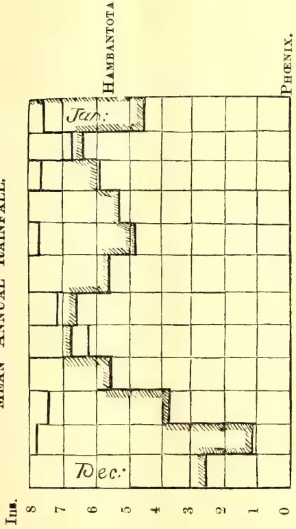

<table border="1">
<caption>Mean Annual Rainfall (Ins.)</caption>
<thead>
<tr>
<th>Month</th>
<th>Hambantota</th>
<th>Phoenix</th>
</tr>
</thead>
<tbody>
<tr><td>Dec.</td><td>4.5</td><td>3.5</td></tr>
<tr><td>Jan.</td><td>5.5</td><td>4.5</td></tr>
</tbody>
</table>

MEAN RELATIVE HUMIDITY

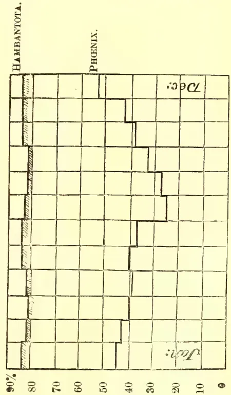

<table border="1">
<caption>Mean Relative Humidity (%)</caption>
<thead>
<tr>
<th>Month</th>
<th>Hambantota</th>
<th>Phoenix</th>
</tr>
</thead>
<tbody>
<tr><td>Dec.</td><td>45</td><td>35</td></tr>
<tr><td>Jan.</td><td>55</td><td>45</td></tr>
</tbody>
</table>

307------------------------------------------------

Miscellaneous.274[SEPT. 1906.

From the field laterals there diverges a system of parallel furrows on the areas between which crops are grown. These furrows are generally from 6 to 9 inches in depth, while the distance between them varies from twenty-four inches to as many feet according to the crops to be watered. The length and gradient of the furrow varies with the distance apart of the field laterals, and to some extent with the soil, the object being to cause all the water in the furrow to sink into the soil and to allow none to escape. If the furrow is too short and too steep water will flow away and be lost; if on the other hand it is too long and flat it will be absorbed before the end is reached and part of the land will remain unwatered. The best length and gradient is found by experiment, and where the actual fall on the land is excessive, the furrows run at an angle to the greatest slope so as to reduce the gradient on them.

The depth of the furrow is also a matter of experiment, but the tendency during recent years has been to increase the depth, as by so doing the area through which soakage into the ground takes place is increased and the risk of flooding the land between the furrows is diminished.

The water is diverted from the field lateral to the furrows by damming the former with earth below the mouth of the furrow, but more recently the plan has been adopted of inserting small pipes varying from  $\frac{3}{4}$ " diameter to about 2" diameter through the side of the field lateral into the furrow, as by so doing a more regular distribution of water is obtained.

Flow from the lateral to the furrow is permitted for a period of time varying with the crops to be watered and the supply available, but in all cases after the flow has ceased and after the water has sunk into the ground; but before the surface has become entirely dry, the surface soil in the furrow is cultivated, that is the top to a depth of two or three inches is turned over. By this means the capillary tubes by which the water passed into the soil are broken up and the re-evaporation of water through them is prevented.

(*To be continued.*)

---

## Mosquitoes and Anti-Malaria Campaigns.

---

The following letter from the "London Times" is worthy of attention in Ceylon, as showing the results of conscientious work directed against the propagation of Malaria by mosquitoes. Nothing of the kind has so far been attempted in the Island, chiefly owing to a feeling of helplessness in a country where the possible breeding places of the Anopheline mosquitoes are so multifarious. But with the example of work successfully accomplished at Klang and Port Swettenham, under circumstances comparable with those prevailing in Ceylon, we have—as pointed out by Dr. Ronald Ross—no excuse for neglecting similar measures here. At any rate, until the attempt has been made and failed we have no right to complain of the mortality and widespread sickness credited to this disease (malarial fever). Even should these measures fail in some of the wetter districts, the country along the Northern line—notorious for the prevalence of malaria—would lend itself more hopefully to successful treatment.

It must be remembered that infection is principally carried by mosquitoes bred in the immediate vicinity of any settlement, so that, to greatly reduce the danger of infection, it is not essential to operate upon a large tract of country. Each breeding place that is suppressed or rendered harmless will have an appreciable effect in the reduction of the disease.

E. ERNEST GREEN.

308------------------------------------------------

SEPT. 1906.]275Miscellaneous.CAMPAIGNS AGAINST MALARIA.

SIR,—On several occasions you have kindly permitted me to draw the attention of your readers to the progress of the anti-malaria campaigns at Ismailia and in the Federated Malay States, and I have heard that the information so given has more than once encouraged the commencement of similar work elsewhere. Will you allow me to add some further notes? I hope it will not be necessary to trouble you again on the matter, as the success of the campaigns referred to seems to be now completely assured.

With regard to Ismailia, I wish to call attention to a brief but effective official report just issued by the Suez Canal Company. It is entitled "Suppression du Paludisme à Ismailia," and can be obtained by writing to M. le Secrétaire-Général, Compagnie Universelle du Canal Maritime de Suez, 9, Rue Charras, Paris. It gives the whole history of the campaign in the town, with an account of the expenses and of the results. Since 1903 no new case of malaria has been observed at Ismailia. The ordinary mosquitoes (by which is meant the *Culicina*) have disappeared, and all the inhabitants have been able to discontinue the use of mosquito nets. Although a few *Anophelines* enter the town from the environs during the autumn, they do so in very small numbers—so small as not to constitute any danger, as shown by the complete disappearance of the fever. Doubts have frequently been thrown on the reality of the success obtained by the Suez Canal Company, but I think that a perusal of this report will convince any impartial reader. It must be remembered that up to 2,000 cases of malaria used to occur annually in this town.

The work done at Klang and Port Swettenham in Selangor, Federated Malay States, will be set forth in a report by Dr. Travers, State Surgeon, Selangor, and Dr. Malcolm Watson, District Surgeon, Klang, which will appear in the *Journal of Tropical Medicine*, Messrs. Bale, Son, and Daniellson, July 1 next. In this report, also, details of the history of the campaign, of its cost, and of its success are given, and will prove no less convincing. The statistics for 1905 are even more favourable than those of 1902 and subsequent years, while the disease is, if anything, increased in the surrounding areas which have not been treated. Dr. Watson says in a letter to me:—

"The work has been an absolute success, infinitely more so than I ever imagined possible. . . . I hope for a decided diminution in the amount of malaria. The absolute sweeping away of the disease seems to come as a reproach to me for lack of faith. . . . I wonder how many Government officers are deterred from making and carrying out anti-malaria works because the work seems so enormous, because they feel they will never be able to make any appreciable improvement, and because they fear they may have failure cast back at them. If there are such, I wish they could take a lesson from Klang."

I do not think that Dr. Watson will object to my quoting these important passages.

People have said that the success at Ismailia was due to the arid nature of the country, but I am sure that the same thing cannot be said of such a climate as that of the Federated Malay States, and it is clear that such striking successes obtained in such diverse parts of the globe leave no excuse open for neglecting similar measures elsewhere.

We may, therefore, hope that a few years will see the general adoption of such measures. A great incentive to this will be the new Malaria Return which has been promised by the Colonial Office, in response to action taken by Major Seely, D.S.O., M.P., in Parliament, consequent upon representations by Mr. Hahne-man Stuart of this city. This return will, I hope, give full details of the actual

36

309------------------------------------------------

Miscellaneous.276[SEPT. 1906.

work done against malaria every year in tropical colonies. If the India Office and the War Office order a similar return, matters ought speedily to be in full train for a general advance in this important direction.

I am, Sir, your Obedient Servant,

RONALD ROSS,

*Professor of Tropical Medicine.*

The Incorporated Liverpool School of Tropical Medicine, June 27.—London Times, July 6.

## Literature of Economic Botany and Agriculture. VIII.

BY J. C. WILLIS.

*Cotton: General.*—Cotton; Brooks; London 1898.

Colouring Matter of Cotton Flowers. Perkin in Trans. Chem. Soc.

Zur Baumwollfrage, &c. Tropenpfl., 4, 1900, p. 263.

Le Coton; Lecomte; Paris.

A Chemical Study of the Sea Island Cotton Plant. Exp. Sta. Rec. XI., p. 918.

The Cotton Industry (and Markets in Japan). Queensland Agr. Journ., May 1902, p. 376.

The Cotton Fields of India. Ind. Agr., May 1903, p. 144.

Cotton Cultivation Experiments in India, do. p. 146.

Cotton Cultivation in St. Lucia. Agr. News II. 1903, p. 120.

The West Indian Bulletin and Agr. News of recent years contain much information on Cotton, not usually indexed here.

Cotton-growing in the West Indies. W. I. Bull., 4, 1903, p. 28.

Le Coton aux Etats-Unis. Bull. Jard. Col., 2, 1903.

Hilbeck, Bericht über pernanische Baumwolle. Tropenpfl., 7, 1903, p. 153.

The Cotton Industry. Queensland Agr. Jl., July 1903, p. 43.

Recherches sur le sterilisation des graines du coton. Rev. Cult. Col., Oct. 1903, p. 213.

Cotton Improvement by Seed Selection. Agr. News, 1903, p. 277.

Mollison: Improvement of Indian Cotton. Ind. Agr., Nov. 1903, p. 342.

Cotton-growing in India, a proposed scheme. Do. Mar. 1904, p. 88.

Cotton Experiments in Behar. Ind. Pl. and Gard., Mar. 1904, p. 195.

Cotton in the Federated Malay States. Str. Bull., Mar. 1904.

Caravonica Cotton. Agr. Mag., Colombo, Apr. 1904.

Cotton-growing in East Africa. "T.A.," May 1904.

Cotton Seed Selection. Agr. News, Apr. 1904.

Cotton Cultivation. Jamaica Bull., Mar. 1904.

310------------------------------------------------

SEPT. 1906.]277Miscellaneous.

## Lessons in Elementary Botany. IV.

BY J. C. WILLIS.

For those who wish to use a Flora, or list of the plants growing in a given country, with descriptions—the first step towards finding out all about them—it is necessary to give a few, at any rate, of the technical terms used in describing leaves, as upon these a good deal depends the discrimination of plants. Those who are not desirous of using a Flora—let us say Trimen's Flora of Ceylon—may omit these.

The few technical terms given here are sufficiently illustrated by the figures in the Plate issued last month, to which reference should be made.

Leaves are *inserted* upon the stem in various ways: they may be all at the base (*radical*) or *opposite*, *alternate*, or in *whorls*. A complete leaf is made up of *leaf base* (the swollen part adjoining the stem), stalk or *petiole*, and *blade* (or *lamina*, as it is called in some older books). To the base are often attached a pair of outgrowths or *stipules*, one on either side, sometimes green and leaf-like, sometimes represented by thorns, tendrils, scaly outgrowths, and so on.

The leaf may be *petiolate* (stalked) or *sessile* (not stalked), *stipulate* (with *exstipulate* (without, stipules). The base or stalk may be *sheathing*. If the base of the leaf is continued in a leafy outgrowth down the side of the stem the leaf is *decurrent*.

Leaves may be *simple* (with one blade, as in tea or cacao) or *compound* (with more than one, as in many brambles, &c.), and if the latter, either *pinnate* (with leaflets arranged featherwise) or *palmate* (leaflets like the fingers of a hand).

Leaves in shape (taking the general outline, regardless of notches) may be *needle-shaped*, *linear*, *anceolate* (about three or four times as long as broad, tapering mainly to tip), *ovate* (about  $1\frac{1}{2}$  to 2 times as long as broad, tapering to tip (*cordate* (heart shaped), *kidney-shaped*, and so on. If the tapering is more towards the base, i.e., if the stalk in the figures were at the right instead of the left, the leaves would be *ob-ovate*, *ob-cordate*, &c.

The tip of the leaf may be *acute* (sharp pointed), *obtuse* (blunt ended), *acuminate* (tapering in curves to a point; water runs easily off leaves of this kind, and a pronounced acuminate point is sometimes called a drip-tip). An apex like *a* (bottom right hand corner of plate) is called *mucronate*, like *b* *apiculate*, like *c* *retuse*.

As regards notching: an absolutely un-notched leaf is *entire*; if the edge of the leaf be divided not more than half way down, the leaf is termed *-fid*, if  $\frac{1}{2}$  to *-partite*, if more than  $\frac{2}{3}$ , *-sect*. The prefixes *palmati-* or *pinnati-* are put before these terms to indicate which sort of notching occurs. If the leaves are simply notched to less than  $\frac{1}{4}$  of the depth, other terms are used, indicated by the figures, viz., *serrate*, *dentate*, *crenate*, *undulate*.

The surface of the leaf may be *glabrous* (without any hairs), *downy* or *pubescent* (fine, soft hairs), *hairy* (coarser hairs), *hispid* (rough bristly hairs) *tomentose* (with a cottony felt of hairs), *prickly*, &c.

The texture of the leaf may be *thin*, *coriaceous* (leathery) *membranous*, *succulent*, &c.

Leaves may be *evergreen* or *deciduous* (falling), &c.

When a character comes between two of the terms used here, both are employed, e.g., *lanceolate-ovate*. When it is nearly like one, sub- is placed in front of it, e.g., *subacute*,

311------------------------------------------------

This image is a scan of a blank page. The paper has a light beige or cream-colored tint. There are a few very small, dark specks scattered across the surface, which appear to be scanning artifacts or dust particles. No text, lines, or other markings are present on the page.

312------------------------------------------------

THE  
**TROPICAL AGRICULTURIST**  
AND  
MAGAZINE OF THE  
**CEYLON AGRICULTURAL SOCIETY.**

---

VOL. XXVII.

COLOMBO, OCTOBER 15TH, 1906.

No. 4.

---

**The Ceylon Rubber Exhibition.**

---

Speaking generally, the Rubber Exhibition may be called an unqualified success, and we have learnt many lessons from it, which should indirectly repay its cost many times over. To take only a few of these, we may assume for example that the days of the biscuits are numbered. This was the original form in which Mr. Parkin made up his samples in the laboratory, and has survived in Ceylon, though abandoned in Malaya. No one who saw the businesslike appearance of the Malayan and other samples of block and sheet as compared with the amateur look of the biscuits can doubt that the latter are doomed to disappearance.

We have also learnt that the area available for rubber-planting is more extended, both as to altitude and as to extension, than had hitherto been supposed, and that there will soon be some danger of over-production, as planting is going on so rapidly, not only in Ceylon and the Federated Malay States, but in other tropical countries.

As regards methods of preparation, there is evidently much yet to learn, and experiments will at once be put in hand by the Botanical Department on several lines suggested by the Exhibition. For instance, is it really the case, as the awards of prizes would at first glance suggest, that high-grown rubber is better than that of the low country, or is it that the prize winners have older trees or have adopted more careful methods of preparation? In one case at least, and that the best Para rubber in the Exhibition, the rubber was coagulated with a chemical not hitherto used, so far as we know, by any one else for the purpose.

The tapping knives for Para rubber were very good, but for Castilloa, and still more for Ceara, were but poor, little ingenuity being shown in adapting them to the changed conditions.

Another important question is "do we wash and dry our rubber too much?" The Malayan rubbers were mostly more washed than those of Ceylon, and were on the whole inferior to them in quality, and there was other evidence pointing the same way. The South American rubbers exhibited are much stronger than any of the plantation rubbers, and spring back when stretched to a much greater extent, and they are practically unwashed, and, what few if any persons in Ceylon had previously realised, are also undried and quite whitish and opaque. It is consequently quite possible that our rubbers are too much dried. It was specially noticeable

313------------------------------------------------

280[OCT. 1906.

that the block rubber from Lanadron Estate in Johore was particularly springy, and it is possible that the mere blocking of rubber may produce a good effect, as the Lanadron blocks were made from *crêpe*. The use of creosote, again, as recommended in 1899 by Mr. Parkin, is evidently to be recommended.

It would be well worth while trying an experiment in the production of rubber for market by preparing creosoted biscuits, and blocking them while still damp or partially dried. If for rubber containing a proportion of moisture we could obtain a price even approaching that now paid for biscuits, it would pay us well. Very few people realise that fine Para really gets a better price than plantation. If the price of plantation rubber be 6s. 3d., while that of fine Para is 5s. 8d. then, as the latter contains 18 per cent of moisture, its price is really better than that of the plantation rubber in the proportion of 83 to 76, or nearly 10 per cent.

It is evident that now is the time to try experiments in methods of coagulation, ways of preparation, forms or shapes of preparation, ways of packing, and many other things, before the London market has become firmly wedded to one particular mode. Many planters think that the biscuit is good enough, but this obviously cannot last, and now is the time to experiment.

With regard to pests of rubber, again, one simple lesson, among others, that we have learnt is that each estate should keep a supply of apparatus and materials for dealing with them, and not have to hastily borrow at a time of need, or find them unprocurable. Belts of shelter trees again should be left or planted through large areas of rubber.

The machinery, while giving promise of great things in the future, was in general not very good, and capable of much improvement.

In reference to the future of rubber, one of the most interesting and important exhibits of the whole show is that of Mr. Bamber, illustrating his methods of vulcanising and colouring rubber in the milk. This probably means the ultimate extinction of present methods of vulcanising and colouring (except for wild rubbers) and opens up many new lines of work which may prove of great value and importance.

---

314------------------------------------------------

OCT. 1906.]281

## GUMS, RESINS, SAPS AND EXUDATIONS.

### Rubber Vulcanisation.

BY M. KELWAY BAMBER.

*A Lecture delivered at the Ceylon Rubber Exhibition, Royal Botanic Gardens, Peradeniya, on September 18th.*

Dr. J. C. Willis, Director, Royal Botanic Gardens, presided at this lecture, and there were also present:—Mrs. J. C. Willis, Mr. and Mrs. Jas. Ryan, Mr. and Mrs. S. P. Jeffery, Mr. and Mrs. W. H. Biddulph, Messrs. R. D. Tipping (S. Coorg), E. S. Campbell (Lanadron Estate, Johore), I. Etherington, A. de Zilva, R. Hugh Pereira, A. M. Fernando, C. J. Bayley, G. Graham Clarke, A. C. Mathew, D. G. Brebner, A. J. Dawson, R. L. Proudlock (Mysore), J. Cameron (Mysore), G. N. Fairhurst, J. P. Ireson, A. W. Greig, G. A. Greig, F. W. de Hoedt, J. B. Carruthers (F.M.S.), P. H. Aste, R. K. Clark, J. H. S. Rogers, H. F. Macmillan, E. Ernest Green, C. O. Macadam, Thos. Petch, J. H. Betts, Dr. A. Lehmann (Mysore), J. Coryton Roberts, Herbert Wright, C. M. Buckworth, Dr. Cuthbert Christy, Mr. A. N. Galbraith, Mrs. H. F. Tomalin, Messrs. Edgar Turner, A. T. Rettie, C. H. E. Zacharias (F.M.S.), C. K. Smithett, H. M. Devitt, C. L. Devitt, C. G. Devitt, G. Bruce Foote, W. A. Horn, W. A. Goodman and several others.

#### THE LECTURE.

Mr. BAMBER, who was received with applause, said:—Ladies and gentlemen, before describing the vulcanisation of rubber it may be advisable to describe the actual latex. Raw caoutchouc may be defined as the thickened or dried-up latex of certain species of plants. Taking the latex of *Hevea Brasiliensis* as typical of most latices, it is as it leaves the tree a white-looking milk-like fluid containing variable quantities of minute globular particles, the diameters of which average 3.5 micro-millimetres, though the range is great. (One micro-millimetre is the one-thousandth part of a millimetre.) The specific weight of latex containing 32 per cent of caoutchouc is 1.018 at 60° Fahr. It is these microscopic globules that constitute the real caoutchouc when caused to agglomerate into a mass, either by drying and smoking, the addition of acids, or certain other chemicals, or by bacterial decomposition of proteid matter, &c., in the latex with production of a free acid causing coagulation somewhat analogous to the curdling of milk. The chemical composition of the fresh latex from mature trees and for the first tappings during more or less dry weather is as follows:—

<table>
<tbody>
<tr>
<td>Caoutchouc</td>
<td>...</td>
<td>...</td>
<td>...</td>
<td>32.00</td>
<td>per cent.</td>
</tr>
<tr>
<td>Nitrogenous matter</td>
<td>...</td>
<td>...</td>
<td>...</td>
<td>2.03</td>
<td>„</td>
</tr>
<tr>
<td>Mineral</td>
<td>...</td>
<td>...</td>
<td>...</td>
<td>9.07</td>
<td>„</td>
</tr>
<tr>
<td>Resinous</td>
<td>...</td>
<td>...</td>
<td>...</td>
<td>2.03</td>
<td>„</td>
</tr>
<tr>
<td>Water (<i>faintly alkaline</i>)</td>
<td>...</td>
<td>...</td>
<td>...</td>
<td>55.56</td>
<td>„</td>
</tr>
</tbody>
</table>

I noticed that in the lecture yesterday a question was raised as to

#### THE AMOUNT OF CAOUTCHOUÇ IN BRAZILIAN RUBBER,

and I now find from old analyses that Professor Faraday gives it as 37.7 per cent, which is higher than anything we have had here. It is however liable to great variation under different climatic conditions, age of tree, soil and numerous other causes, which it is needless to enumerate here. When latex is coagulated in a vessel by means of acid, the globules do not first rise to the surface like cream and then amalgamate, but coagulation takes place throughout the mass of liquid, the rubber at the moment of formation having the shape of the containing vessel. As soon as coagulation has set in, the rubber instantly acquires its elastic property, and being specifically lighter than water contracts on itself upwards, at first slowly, but with

315------------------------------------------------

Gums, Resins,282[OCT. 1906.

increasing rapidity, squeezing out from the interior of the mass the bulk of the water and soluble constituents of the latex, until it forms a fairly compact white mass floating on the surface of the clear water. This, when washed, pressed and dried, constitutes rubber and contains 95 to 96 per cent of pure caoutchouc with a specific gravity of .92 to .96. Raw rubber so prepared has a characteristic odour, but when produced by the fermentation process and imperfectly washed is highly offensive. It is insoluble in water, but its bulk increases by absorption when immersed in that fluid, and it adds 25 per cent to its weight, while its toughness, adhesiveness and elasticity are greatly reduced. Raw caoutchouc is very elastic at normal temperatures; but if the temperature is reduced to zero, it becomes hard and brittle, but regains its elastic property on being warmed. If heated to 80° Centigrade, or more, it becomes soft and sticky and does not regain its normal properties on being cooled. Exposed for a long time to warm air and light, it becomes less elastic on the surface and more or less sticky or tacky. This condition may also be caused by bacteria or fungi, with probably the production of an oxidising enzyme.

Spiller states that the affected caoutchouc consists of :—

<table>
<thead>
<tr>
<th></th>
<th>Affected.</th>
<th></th>
<th></th>
<th>Unaltered Caoutchouc.</th>
</tr>
</thead>
<tbody>
<tr>
<td>Carbon</td>
<td>64.0</td>
<td>...</td>
<td>...</td>
<td>85.5</td>
</tr>
<tr>
<td>Hydrogen</td>
<td>8.5</td>
<td>...</td>
<td>...</td>
<td>12.0</td>
</tr>
<tr>
<td>Oxygen</td>
<td>27.5</td>
<td>...</td>
<td>...</td>
<td>7.5</td>
</tr>
</tbody>
</table>

Heated to 360°-Fahr. caoutchouc begins to melt, and between 400 and 400°-Fahr. it becomes a dark brown oil. Owing to the above properties of rubber at different temperatures, crude caoutchouc would be of little general use had not the curious reaction of caoutchouc and sulphur known as "vulcanisation" been discovered.

The only uses for raw rubber are the cubes employed by artists, strips for billiard cushions and square cut unvulcanized threads.

The treatment of rubber with either Sulphur or Sulphur Chloride are the only methods at present employed for vulcanisation, though Gerard's process of treating the India-rubber for three hours in a solution of calcium pentasulphide (1.205 sp. gr.) under a pressure of 60 lb. (140° C) yields very satisfactory results. The chief vulcanisers and sulphur-carriers are sulphur, which occurs in two crystalline and one amorphous forms and various metallic sulphides. The chiefly-used commercial varieties are sulphur sticks, flowers of sulphur, milk of sulphur and precipitated sulphur, the latter being undoubtedly the best form of sulphur for vulcanising purposes. It is prepared by the precipitation of sulphur from the solutions of polysulphides with acid, when it separates in an exceedingly fine state of division, and so is capable of more intimate mixture with the Indiarubber. Lead thiosulphate ( $PbS_2O_3$ ) and oxide, antimony pentasulphide, ( $Sb_2S_5$ ) and zinc sulphide are among the chief sulphur carriers. All the above generally require what is known as *hot* vulcanisation. Chloride of sulphur ( $S_2Cl_2$ ) on the other hand is extensively used for the process of vulcanisation in the cold, but at present can only be employed for vulcanising dry goods, as contact with water causes immediate decomposition. Besides the ordinary sulphuring agents, various colouring matters are frequently incorporated, when the rubber is to be used for decorative or ornamental purposes; but for technical purposes the colour is more or less confined to grey, black and red.

#### VULCANISING COLOURING INGREDIENTS.

Examples of such colouring ingredients are zinc white, lithopone ( $ZnS \cdot BaSO_4$ ) and green pigments, golden sulphide ( $Sb_2S_5$ ), vermillion, red and brown iron oxides, and various yellows and blues.

Rubber may be looked upon as a colloid body, a class which have a high molecular weight and are non-electrolytic. In colloids only one molecule out of

316------------------------------------------------

OCT. 1906.]283Saps and Exudations.

many is supposed to be capable of acting chemically : hence their great chemical indifference. They have the property of gelatinizing or pectising ; but the latter is quite distinct from the former in that it is non-reversible, while the gelatinized state can be reversed by heating or other means. Colloid solutions can be pectised or converted into insoluble colloids at much less concentration than is required for gelatinization ; but the influences that induce pectisation are varied. Some colloidal solutions pectise spontaneously on standing, some by boiling and many by freezing, while most inorganic colloids pectise on adding to their solutions minute quantities of electrolytes. The question of the change involved in the pectisation of a colloid is still obscure, but it will probably be ultimately proved to be partly physical, but mostly chemical—the changes in the molecules resulting in the fixation of the relative positions of the colloidal molecules. It is possible that the Brownian movement of the rubber particles, increased by the change in reaction or the addition of an electrolyte, may tend to induce coagulation by increasing the attraction of the various molecules for one another, and by their friction produce amalgamation or cementation. Indiarubber is very sensitive to changes of temperature, becoming soft and sticky or tacky at high temperatures, and hard and brittle at low temperatures, *i.e.*,  $10^{\circ}$  C. or  $50^{\circ}$  Fahr. These properties render it quite unsuitable for most economic uses both in hot and cold countries ; and had it not been for Goodyear's and Hancock's discoveries regarding the effect of heating mixtures of rubber and sulphur together to a temperature above the melting point of the latter, the demand for rubber would have been very limited. This process is now commonly known as vulcanisation, and consists in the formation of a continuous series of addition products involving the chemical combination of these two substances—polyprene and sulphur. When heated (under pressure or otherwise) to a temperature of  $120^{\circ}$  C. or over (the melting point of sulphur being  $113.5^{\circ}$  C.) the resulting addition compound is a polyprene sulphide of the probable formula  $(C_{100} H_{160} S)$  for soft goods and  $(C_{10} H_{16} S_2)$  for ebonite, the highest vulcanised product. The rate at which sulphur enters into combination with the Indiarubber hydrocarbon "polyprene" ( $C_{10} H_{16}$ ) varies with each brand of rubber and the temperature and time employed in the vulcanisation, but in most instances there is a steady increase corresponding with the higher temperature and longer period employed, and in the finished product a gradual reduction in elasticity with increase of hardness.

#### METHODS OF VULCANISING.

In the ordinary vulcanisation there is only from 2 to 2.5% of combined sulphur, but a much larger proportion is usually added in the mixing, and some of this uncombined sulphur frequently appears on the surface of rubber goods in the form of a fine efflorescence. There are three or four methods by which this is accomplished. The first is to introduce the articles into a boiler, and after closing the end hermetically to admit steam from another boiler until the pressure amounts to 52 or 60 lb. per sq. inch, corresponding to a temperature of  $142^{\circ}$  C. to  $144^{\circ}$  C. The length of time this has to be maintained depends on the quality of the rubber, Para vulcanising more slowly than the soft and more sticky varieties ; it also depends on the cross-action of the rubber to be vulcanised—thin objects being completed within the first hour, and thicker objects requiring two to three hours.

The boilers employed for this purpose are frequently of enormous size, the largest being about 65 feet long by 16 feet to 20 feet in diameter. They are constructed of strong wrought iron in a similar manner to an ordinary steam boiler except that one end is removable for putting in on a tramway the trays or trollies on which the various articles are placed. The object of the great length is to vulcanise tubes in a straight line, and so preserve their shape, the tube being mounted on an iron mandrel, the diameter of which corresponds to the inner bore.

317------------------------------------------------

Gums, Resins,284[OCT. 1906.

Toys and other small objects are vulcanised in moulds, hollow articles usually having a little water or ammonia placed inside them in the mould, so that when heated the elastic force of the vapour compresses the rubber against the walls of the mould. Another method of vulcanising employed for flat objects such as shoe-soles, belting sheet, &c., is by the employment of screw or hydraulic presses somewhat similar to a letter-press, the two plates of which are hollow and can be steam-heated from an ordinary boiler. The lower plate is fixed in the screw-presses, but movable in those worked by hydraulic power. Objects made of mixed rubber are placed in moulds between the two plates of the press, which are strongly compressed and steam admitted to a pressure of  $2\frac{1}{2}$  to 4 atmospheres, corresponding to a temperature of 128 to 144° C. The length of time required varies according to the proportion of sulphur, the steam-pressure in the plates and the kind of mixture, but rarely exceeds two hours, and this is often reduced to one or even half-an-hour. In the case of vulcanising by  $S_2Cl_2$ , this is dissolved in carbon bisulphide and the objects are immersed in it in the cold. The next process to mastication is the incorporation of sulphur or the solid sulphides required for vulcanisation, and if necessary the various colouring and mineral or other ingredients employed for modifying the rubber according to the uses to which it is to be put. For the operation to be successful the mixing must be perfect, and the mass must form one homogeneous whole. The masticated and dried rubber is put through the mixer with 7 to 10 per cent. of sublimed sulphur, though the range is sometimes from  $2\frac{1}{3}$  to 25 per cent. In the latter case the excess can only be considered as an inert addition giving a fictitious weight to the manufactured article. 9 to 11 lb. of the rubber are passed repeatedly through the hot rolls, diminishing the space between them as the operation proceeds. As the sheet issues from the roll, it is dusted for the first time with sublimed sulphur and rolled upon itself, and again passed through the mixer. This is repeated until the requisite amount of sulphur, &c., has been added and thoroughly incorporated into a homogeneous mass. In this state, the mass which is still nothing but a simple mixture, is wrought in the ordinary way for its conversion into threads, sheets, tubes, shoes or any other object of definite shape. It is only now that vulcanisation is effected.

#### TREATMENT OF RAW RUBBER.

The rubber as imported into England in the various forms now to be seen in the Exhibition first undergoes a process of softening, washing and mastication to remove solid and other impurities. This is effected by immersing in hot water in wooden vats for 12 to 24 hours, and then by passing it in small quantities at a time through very powerful rollers revolving at different speeds, which tear and compress the rubber, while a stream of water from above washes away all the impurities in the form of wood, bark, stone, &c. The rollers are made of hardened cast iron and are usually grooved spirally or in the form of lozenges so as to facilitate the shredding and mastication. Their distance apart can be adjusted by tightening screws, and beneath them is a wrought-iron collecting tank covered by a perforated plate. The rubber after being passed through several times appears in the form of a long strip of lace-work similar to that so largely manufactured in the Malay States. This process requires much power—a machine capable of working 20 to 30 lb. of rubber at a time, requiring at least 15 to 20 H.P. actual. Rubbers vary as to the ease with which they can be washed, but Para is the best in this respect, as it contains fewest impurities. The rubber has now to be dried, which is effected by spreading on iron wires or in stoves capable of being heated to 50° or 60° C. 12°-140° Fahr.), care being taken to dry the greasy and pitchy rubbers at as low a temperature as possible. In many cases the sheets soften and fall to the ground in lumps, from which the moisture can only be evaporated with great difficulty.

318------------------------------------------------

OCT. 1906.]285*Saps and Exudations.*

The drying room should have a free circulation of air, and the darker it is maintained, the more valuable is the resultant dried rubber. The rubber is then stored until required for industrial purposes.

#### THE MASTICATION PROCESS.

The loss in weight in washing and drying of raw rubber is very variable, sometimes rising as high as 60 per cent in inferior kinds, while hard Para loses 10 to 16 per cent, and plantation Para only 1 to 4 per cent. When required for manufacture, the rubber has to undergo a further process of mastication or kneading by frequent passing between massive, hollow steam-heated rollers over 4 feet long and 19 inches in diameter. One roll is usually smooth, the other grooved, and they revolve at unequal speed, the latter twice as rapidly as the former. The distance apart is capable of regulation, and the rubber is forced through again and again until it becomes perfectly homogeneous in character. Great care is necessary in the process, which, if the rubber is not perfectly dry, takes from 40 to 50 minutes, according to the amount of moisture that has to be evaporated. In most factories, rubbers from different sources are masticated separately—some African varieties, which become tacky under the action of the hot rolls, taking a much longer time, and their sticky character necessitating the addition of a little talc (hydrous silicate of magnesia).

#### THE VULCANISER.

I would here like to briefly describe the form of vulcaniser. This is a small vertical boiler with a small copper cylinder into which the objects you wish to vulcanise would be placed. Water is placed in the cylinder and the whole apparatus is closed and heated until the steam pressure reaches 3 to 4 atmospheres. With a low proportion of sulphur in the rubber, vulcanisation can take place in about half-an-hour. With a high proportion you want 3 to 4 hours to vulcanise. The actual time required for vulcanisation is one of the most important points, and it is very easy to spoil a whole batch of goods by a half, or even a quarter of an hour's over-vulcanisation, so that when you have perhaps a ton or more of manufactured articles in these large cylinders being subjected to the vulcanisation process, it requires a large amount of experience to know exactly when the articles are likely to be over-vulcanised; otherwise a little over-heating might spoil them entirely. You have all seen in the Exhibition the various kinds of rubber which have to be vulcanised, including large blocks which have to be torn and macerated and mixed with sulphur or other powders until the mixture becomes perfectly homogenous—that is to say, that if you cut a section and put it under the microscope the whole section is perfectly uniform. From the description I have given, you can see an enormous amount of time and power is employed in this process.

#### TO SULPHURISE RUBBER IN CEYLON.

What we propose to do out here is to save that time and power by adding sulphur or sulphur compounds to the latex direct from the tree. I have here a sample of latex. I do not know the exact proportion of rubber in this latex, but it is very easy to ascertain the amount. You then would add a measured quantity of this sulphur solution, of which you know the exact proportion of sulphur, and you will see that it is capable of instantaneously mixing with the latex, so that a perfectly intimate mixture is obtainable. This would be done in huge vats, and it would mean that the latex from various estates could be amalgamated and a very uniform product obtained. By a slight stirring you get a perfect admixture. On the addition of the acid to this rubber—in the usual way you coagulate rubber in Ceylon—the sulphur would be thrown out of solution, but as the sulphur is in an extremely fine state of division, you will find no sedimentation and it is thrown out

319------------------------------------------------

Gums, Resins,286[OCT. 1906.

through the whole mass of the latex. The acid while throwing out the sulphur, causes coagulation of the rubber particles throughout the mass with the result that the sulphur is thrown in contact with every molecule of rubber. You can tell the end of the reaction by the ordinary litmus test which will turn red on the slightest excess of acid. It is advisable not to add a great excess of acid either in the vulcanisation process or in the ordinary process, as there is no doubt an excess of acid has some effect on rendering the rubber more liable to become soft and tacky. I believe the original idea of coagulation with acetic acid was that the rubber particles rose to the surface and then set to a solid mass. That is not the case. Rubber sets throughout the whole body of the liquid, and being lighter than the water it contracts on itself and rises to form a layer on the surface.

#### COLOURING OF LATEX.

[The colouring of latex by organic dyes was then demonstrated, and Mr. Bamber went on to say this would be useful for the manufacture of children's toys as there will be no necessity for poisonous colours being put on the outside, as the colour will be mixed throughout the rubber.]

You will see that this process will mean an enormous saving of time and labour, and I think myself we will ultimately obtain stronger rubber, and instead of using 8 to 10 per cent of sulphur, we will only have to add one or 2 per cent. I have here some samples of rubber produced in this way, the strength of which compares very favourably with rubber as ordinarily produced. At the same time that I was making this sample, I made a biscuit from the same latex without any admixture of sulphur or any ingredient. This was dried and treated exactly in the same way as the other biscuit—under the same conditions and on the same bench—but within a week it ran into a soft tacky condition, whereas in none of the sulphured samples was the slightest tackiness shown. I think this antimony solution and the sulphur itself has a very strong antiseptic effect on the rubber. I should like, if possible later on, to show how vulcanisation actually takes place, as small articles can be done here. Unfortunately the vulcanising press I expected has not arrived, and will not be here for another fortnight. (Applause.)

#### DISCUSSION.

Mr. JAMES RYAN said he had to thank Mr. Bamber for much valuable information, but at the same time he noticed Mr. Bamber had used the Centigrade scale in making his calculations, and he would like to give the figures mentioned in Fahrenheit, as follows:—

<table>
<tr>
<td>112°</td>
<td>Fahr.</td>
<td>=</td>
<td>50</td>
<td>Centigrade.</td>
</tr>
<tr>
<td>140°</td>
<td>„</td>
<td>=</td>
<td>60</td>
<td>„</td>
</tr>
<tr>
<td>262°</td>
<td>„</td>
<td>=</td>
<td>112</td>
<td>„</td>
</tr>
<tr>
<td>291°</td>
<td>„</td>
<td>=</td>
<td>144</td>
<td>„</td>
</tr>
</table>

They would notice that the lower scale was below the boiling point of water, and the higher scale was considerably above it.

Mr. BAMBER:—I am sorry I did not give the three figures. I had them here, but I did not think it was necessary. (Laughter.)

Dr. WILLIS remarked that the future would be in the possibility which Mr. Bamber had briefly indicated of the vulcanisation, colouring and otherwise treating of rubber in the state of latex instead of allowing it first of all to be coagulated in block or biscuit, whichever it might be, and then breaking it up and practically reconstructing it, as a great many did into sheet, containing sulphur and other compounds intimately intermixed with it. It appeared to him there must be a loss of strength in the rubber by that method of treating it,

320------------------------------------------------

OCT. 1906.]287*Saps and Exudations.*

and it seemed to him that they should first of all sulphurise the latex and then work it straight off into any manufactured form they desired. Whether thereby they would be able to count upon a considerable gain in strength, of course, was a matter for future determination. No one knew much about it at present, but the manufactured article did not appear to be equal in strength to the raw rubber as it came from the grower or collector in the jungle; but one had to remember that the manufactured article mainly consisted of adulteration if he might use the term. (Laughter.) He recently saw in the first page of a standard work on rubber manufacture Jean Jacques Rousseau's remark, that adulteration was used to such an extent as almost to lose all the properties of the raw rubber. It was by that process of adulteration that we were able to get rubber goods comparatively cheaply. One paid very little more for the manufactured rubber than for the raw product. It seemed to him that we should be able to make these additions out here instead of leaving it to the home manufacturers.

"FLYING AT THE THROATS OF THE MANUFACTURERS."

Mr. SMITHETT (LONDON):—There is one thing, I think, that planters should consider in regard to this question of vulcanisation, and that is, that they are flying at the throats of the manufacturers. The rubber output from Ceylon and the Straits Settlements and the Malay States is a very small thing at present, and it will be some years, even taking Mr. Wright's figures yesterday, before it will be equal to, or at any rate, supplant the wild rubber. The wild rubber comes in the natural state to England and the manufacturers know how to deal with it, and there is nothing that the manufacturers object to so much as having the article partially prepared for them. We saw this, as the other judges and people present from London will bear me out, in the manufacturers' objection to crêpe; they are getting over that objection gradually now, but they objected to it because it was washed rubber. Anyhow for a good many years, it will be advisable, until Ceylon and the Malay Archipelago can control the rubber market, that they should send as pure an article as possible, and not to try, if I may say so, the experiments in sending the manufactured article or even partially manufactured article, which would simply annoy and worry the ordinary manufacturers. I think the lecture has been very interesting, and while I think Mr. Bamber has earned our best thanks for it, I should like to give this word of warning. (Hear, hear.)

Mr. RYAN:—As a wholesale producer I coincide with what Mr. Smithett has said. It never pays the wholesale man to go behind the retail trade. That is the one lesson which all Exhibitions have taught us; that is—give every man his little bit of jam. (Laughter.) If you try to take away the jam, you make him your enemy instead of your friend. Our business is growing rubber. At the same time there is no harm in our making experiments calculated to improve our manufacture. (Hear, hear.)

Mr. BAMBER said he wished it to be clearly understood that he did not think planters would ever go in for this individually on their estates. What he did think might happen was that some manufacturers from England or America, or possibly Germany, might buy the latex up out here and make their sulphured rubber. He did not think it was a process for the planter but for the manufacturer, who if he saw a saving in labour, time or money would undoubtedly take it up in the near future.

Mr. ZACHARIAS said he was sure they were all very much indebted to Mr. Bamber for his illuminating lecture that day. He quite agreed with Mr. Smithett that until the supplies of rubber produced in Ceylon and Straits were very much larger than they were at present, the vulcanisation process

38

321------------------------------------------------

Gums, Resins.288[OCT. 1906.]

would hardly be advisable out there. But there was another point to which Mr. Bamber called their attention, and that was the question of tackiness. Tackiness, as they all knew, was their great enemy, and Mr. Bamber had told them that he had reason for believing that it was due to oxidising enzymes and bacteria or fungus of sorts. He did not know whether that had been found out before, or whether the honour rested with Mr. Bamber of having discovered it, but at any rate it would be one of the most important results that they would take away with them from that Exhibition. (Hear, hear.) If tackiness was due to fungus, he took it all rubber would be dealt with in some such way as in the Amazon, either by aseptics or antiseptics. Mr. Bamber had already told them that great cleanliness would prevent tackiness. Another point was the use of antiseptics, and he would like to know whether it is possible to prevent tackiness by adding some creosote. A few days ago he had a talk with Dr. Willis, and he was of opinion that it would be quite possible to use creosote. He (the speaker) would be very glad to hear whether it was possible to do that, and whether any experiment that had been made showed that rubber thus treated was inferior or superior to the ordinary article. At the same time they all knew that the rubber as got from Brazil was smoked, and the smoke contained creosote and acetic acid, and this would tend to show that drying rubber with a very fine solution of creosote would be the right thing. At the same time Mr. Bamber had told them that morning that acetic acid, if added in any surplus quantity, had just the opposite effect, and he was sure they would all be obliged if Mr. Bamber would further elucidate these few points.

#### FACTORY RUBBER.

Mr. BAMBER said, as regards the question of bacteria and fungi in tacky rubber, he worked that out about a year ago. He sterilised some rubber and inoculated it under very careful conditions with slight traces of tacky rubber. He was by this means able to inoculate a piece of sterilised rubber and the tackiness spread rapidly through it. He also got Dr. Castellani to work with him, and he found certain bacteria, one or two varieties of fungus, growing on the new tacky rubber. He also found, as he had said before, there was an oxidising enzyme present in most cases where the tacky rubber was very bad. As regard the use of antiseptics he has always pointed out that, in his opinion, the rubber factory ought to be as perfectly clean and pure as the best dairy. In going through some of the estates one saw tins and buckets—at least he saw them some time ago, for he had not been recently—soiled, and with putrefying rubber from previous collections coagulated round the sides. He knew from his own experience that the sap in the latex encourages the growth of bacteria. With regard to the use of creosote he thought it would be quite possible, and he would be glad to try it by the addition of alcohol or an admixture with some oil which would not affect the rubber. He did not think it was necessary if there was perfect cleanliness in the factory; but one had always to remember in tapping, when new trees were coming in day after day, that in the first tapping they cut through the sap vessels as well as the laticiferous tubes, and thereby got an admixture of sap in the latex with its sugar and other constituents prone to decomposition. He did not think it was absolutely essential to add any creosote or any other antiseptic, though it was not always possible to keep a factory as clean as one would wish. He had seen rubber treated with creosote, and there was no doubt that it was rather stronger, and it possibly had an effect of increasing the toughness. In any case he would be glad to make experiments in that direction.

#### TREATING LATEX WITH SULPHUR.

Mr. HERBERT WRIGHT:—There are one or two questions I should like to ask Mr. Bamber. With regard to the subject of treating the latex with sulphur compounds, I should like to ask one or two questions. I presume it is essential to

322------------------------------------------------

OCT. 1906.]289*Saps and Exudations.*

treat the latex while in a liquid condition with these compounds. Is it possible to carry on such work on an ordinary estate, or must the whole of that latex be sent down to some central factory in Colombo or Kandy, or wherever the most convenient centre may be? If it is necessary to send down the whole of the latex to a central factory, I am rather afraid there may be some difficulty in fixing its real value. From day to day on different trees, on different estates, and on different days, we know that the composition of latex varies considerably. It is not enough to say here are a few gallons of undiluted latex, because the samples even from different trees on different days may possess anything you like from 40 to 90 per cent. of water; so it seems rather difficult if you have a central factory to really arrive at a satisfactory arrangement; but if it could be carried out on the estates then I think the idea would be more congenial.

Mr. BAMBER, replying to Mr. Wright, said it was quite possible to add solid sulphur compounds to the freshly coagulated rubber and mix it in the ordinary machines, but he did not think himself there would be any difficulty in ascertaining the correct amount of rubber in the latex. If the rubber was sent down in casks to a central factory, it would be well mixed before it reached the factory, and it would be easy to accurately ascertain the amount of actual rubber in it from a proportionate part. They could take out a sample, cure it in a few minutes compress it between drying sheets, and then weigh the rubber, and they could calculate how much there was in the total bulk of latex of actual rubber. It would be quite simple if they did not wish to wait until the rubber dried to make out a table with the corresponding weights of wet and dried rubber. As regards the specific gravity, the readings were far too uncertain to draw correct deductions from as to the amount of rubber in the latex, because it varied so much with the matter in solution either from the latex itself or sap.

Mr. WRIGHT:—Then I take it that the planter would not really know the value of the latex he sent until it had been determined at the factory. He could, of course, take counter readings.

Mr. BAMBER:—It would be possible for the planter to do it himself before sending it away.

Mr. WRIGHT:—In association with that it might be possible to accumulate latex in large quantities and keep it in a liquid condition by the addition of ammonia. We have been making experiments here with the different latices, and our idea has been to find out how long the latex can be kept in a liquid condition by the addition of formalin or ammonia, and I should rather like to ask Mr. Bamber whether, in the event of its being necessary to keep latex in a liquid condition for several weeks, it is likely certain chemical changes might not take place. I have samples of rubber prepared from latex kept for six weeks, and I am sorry to say they are inferior; while one might have expected them to be perfect. I am speaking with reference to Para rubber, and Mr. Bamber will perhaps tell us whether any chemical change does take place.

Mr. BAMBER said that he did not think when formalin is used there was much chemical change, but in the case of ammonia he thought it was quite possible, there would be some change. He had kept latex in his laboratory for two or three weeks without any deterioration whatever.

Mr. WRIGHT:—Two or three weeks!

Mr. BAMBER:—I think I could have kept it six or ten weeks. The only thing he saw was that when he worked it into biscuits it coagulated a little more rapidly than when it was fresh. The moment the acetic acid was added, the whole at once set into a solid mass which was in a way rather a nuisance as they did not want it to set too quickly. He did not think there was any fear so long as there was no excess of formalin—more than sufficient to prevent bacteria forming.

323------------------------------------------------

Gums, Resins,290[OCT. 1906.

Mr. CARRUTHERS said he should like to be allowed to say that among the interesting lectures and conferences there, that lecture was one of if not the most interesting, and he thought there was no doubt they could say, almost without exaggeration, that that might be an epoch-making paper read to them by Mr. Bamber, and it was possible in the future it might cause great changes in the rubber-producing industry. At the same time he was very glad Mr. Smithett told them quite plainly the position of the men at home, and it was well the matter should be looked at from a practical point of view. The subject might have come better if it had been brought before them by a home manufacturer and not by their friend, Mr. Bamber; but at the same time he was rather glad that Mr. Bamber should have been the man who should have discovered and originated this possibly entirely revolutionary notion with regard to rubber. (Applause). When the producer in the Federated Malay States began to manufacture crêpe, as Mr. Smithett had told them, and after visiting the manufacturers at home, he had come to the conclusion that they were fighting shy of crêpe simply because they were treading on their corns and trespassing on their grounds in regard to the manufacture—he had no doubt directly they began to suspect any rivalry they would have difficulty with them. He thought that with due caution they should keep that matter in the back of their heads at present. That process of Mr. Bamber's would help them in the future, but he thought they ought to "ca, cany" at present. There could be no doubt, as Mr. Bamber's arguments showed, that the proper time to mix any substances with their rubber was when it was in the form of latex. He thought it was an important original idea. They were there hearing a most interesting paper, and he was not sure but that it would be better to treat it at this stage as an interesting paper and not one that planters can actually accomplish. (Applause.)

Dr. CUTHBERT CHRISTY said he could not talk of the vulcanisation of rubber as he knew nothing about it, but there was one point with regard to the keeping of latex to which he would like to refer. There was little doubt but that could be kept for a long time. He had had experience in London with samples that were over two months old with the addition of a little formalin. They were perfectly good and formed excellent biscuits. The only chemical action that had gone on was the formation of sulphuretted hydrogen. The latex was perfectly good and produced perfectly good rubber although one or two months old.

Mr. RYAN said in corroboration of what had been said by Dr. Christy and Mr. Bamber, he might mention that for many years from Nigeria and the French Congo they had been in the habit of exporting latex in casks which apparently reached the market, and presumably, as it was still going on, they found it paid to do so. They had river transport. Some four or five months ago he had exported two hogsheads of latex to London, and the commercial report on the resultant rubber was favourable. It arrived in perfect condition. The time in transit was 28 days. There was a delay of seven days in the London docks, and before it was actually treated it was about six weeks' time from the date it was despatched from Colombo. The remarks made by the manufacturers were to the effect there was a slight generation of sulphuretted hydrogen. That was the only change made in the rubber. (Hear, hear.)

Mr. BAMBER said there was one other point which he wished to mention. Not very long ago, he saw a notice in the papers that they were exporting latex from Brazil to France with the view of making the rubber there, and he could not see himself why they should not be first in the field in that sort of work, though he quite realised it was premature at present. There was not a sufficient supply of rubber to make it worth the while of manufacturers coming out here to buy

324------------------------------------------------

OCT. 1906.]291*Saps and Exudations.*

latex, but he thought in the future they would come to this. It seemed to him rather absurd to make your rubber and then unnerve it again by various processes which he had described, mix it with sulphur, which was as they might imagine, one of the most difficult processes out, and re-form it in sheet. If they could make it on the spot—not themselves, but the manufacturers who could come out and make it—it would be a very decided step in advance and possibly make the demand for rubber greater.

Mr. BRETT (LONDON).—I am quite sure Mr. Bamber's description of vulcanisation must have been extremely interesting to all who have been present, and valuable in that way; but I think the difference between the part of the lecture which is merely informing, and that part which is to be applied in Ceylon ought to be emphasised. I understand that Mr. Bamber does not suggest that the actual vulcanisation should take place in Ceylon, but merely the process of combining the latex with sulphur. I mention this because it struck me that otherwise much opposition might be brought forward which might be avoided if this were clearly understood. There is one other point I should like to mention. Your Eastern rubber is being very largely used for experimental purposes at present, and every day the methods of preparation are being perfected. I have often heard it said that your rubber has a high standard of purity, and possibly in the future it will be possible to use it straightaway in the factories for solution purposes and so on, without any mastication or washing. (Applause.)

Mr. BAMBER:—I quite agree with Mr. Brett. There is no intention to vulcanise, but the idea is merely to mix sulphur and various compounds out here with the latex and send it home to the manufacturers as sheet; but that would be done not by the planters, but by the firms of manufacturers coming out and doing it themselves.

Mr. DEVITT (LONDON):—I should like to ask, if the market is bad and a planter has two or three thousand gallons of latex on his hands, how is he to store it? He might have to hold it two or three months. Each planter would have to have a place to store it in; if not, he might have to sacrifice it at whatever price he could get.

Mr. WRIGHT:—You would still have scrap rubber to deal with.

Mr. RYAN:—We could manufacture in the ordinary method. In that form rubber does not deteriorate quickly.

#### ACTION OF AMMONIA AND FORMALIN ON LATEX.

Mr. WRIGHT said in regard to the maintaining of latex in the liquid condition for a long period, there were persons who were afraid to add any chemical agent whatever to the latex, and he wished Mr. Bamber would definitely explain the action of ammonia and formalin. He estimated, though he might be quite wrong, that the addition of ammonia did not prevent decomposition, but it simply neutralised the acids formed in decomposition. On the other hand he took it that formalin acted in a quite different manner and prevented the original decomposition, so that formalin would have preference over ammonia, while it could be driven off easily by the application of heat.

Mr. BAMBER said the action of ammonia and formalin was exactly as described by Mr. Wright. The ammonia combined with the acid produced by decomposition by the action of bacteria, whereas formalin prevented the development of bacteria at all; and, therefore, there was no chemical change except possibly the production of sulphuretted hydrogen, which he had not heard of before it was mentioned that day. He did not say that no chemical change at all would take place. Changes might take place owing to variations of climate and temperature, but they would not be due to formalin.

325------------------------------------------------

Gums, Resins,292[OCT. 1906.

Mr. RYAN :—To put it briefly, ammonia is anti-acid and formalin is antiseptic.

This concluded the discussion ; and a vote of thanks having been passed to Mr. Bamber for his lecture, those present separated.

---

REPORT UPON A VISIT TO GREAT BRITAIN TO INVESTIGATE THE  
INDIA RUBBER INDUSTRY IN ITS RELATION TO THE GROWTH  
AND PREPARATION OF RAW INDIA-RUBBER IN THE  
MALAY PENINSULA. III.

By P. J. BURGESS.

---

IN THE HEAT CURE.

23. The raw rubber and finely-powdered sulphur are mixed together intimately on a mixing or a masticating machine. If other ingredients are to be added to the rubber, it is done at the same time that the sulphur is incorporated. Chemical union between the sulphur and the rubber takes place neither during this mixing nor afterwards, as long as the mixture is kept cold. If, however, it be heated to about 300° F. chemical union takes place slowly, and the new product, vulcanised rubber, is formed. By far the greater bulk of rubber is vulcanised in this way. The hot chambers in which the actual heating and vulcanisation are carried out are of several types, and differ in the way in which the heat is applied. Where pressure has to be exerted on the rubber during vulcanisation the goods are vulcanised in moulds, between large plates of iron, which are hollow and heated by steam. In other cases, large chambers heated by steam are used, and into these the rubber goods, placed on trays and smothered in French chalk, are taken. Fabrics coated with rubber—such as sheeting and mackintosh cloth—are wound round a large iron drum and immersed in water, which under pressure is heated to the required temperature. Long tunnels, 50 or 60 feet long, dry heated by steam, are used for vulcanising hose pipe and lengths of tubing which cannot be coiled. The temperature is regulated so as to slowly rise to about 300° F., and after maintenance at that point for a period varying from half to three hours, it is slowly allowed to drop again. During vulcanisation a portion of the sulphur combines with the rubber and forms the new addition compound, which is quite distinct from raw India-rubber, and from which the sulphur cannot be removed by any known process. Although the whole of the rubber is acted upon by the sulphur to a greater or lesser degree, the action is slow and the whole of the sulphur present is not used up during the short period that the vulcanisation lasts, and free uncombined sulphur remains disseminated throughout the vulcanised product. A prolonged period of heating during vulcanisation diminishes the excess of sulphur, and leads to the production of more highly vulcanised rubber. The more sulphur which vulcanised rubber has used and actually combined with, the darker and harder the product until the extremes of vulcanite and ebonite are reached. From partially vulcanised goods the excess of free sulphur can be chemically extracted, and this is one of the operations in "recovered" vulcanised rubber; the combined sulphur, however, remains always in the recovered rubber. The recovery of rubber, therefore, is an operation by which the mechanically mixed substances, such as the excess of sulphur and the fillings with which the rubber was mixed in manufacture, are wholly or partially removed, and the residue resulting is worked up into a form in which it can be blended with new rubber, and act as a substitute for a portion.

COLD CURE.

24. Although pure sulphur does not combine with india-rubber at a temperature below 270° F., yet a compound of sulphur with chlorine—namely, monochloride of sulphur—does react on rubber, and the sulphur is transferred from the

326------------------------------------------------

OCT. 1906.]293Saps and Exudations.

chloride of sulphur to the rubber, and vulcanisation takes place rapidly and completely at ordinary temperatures. This action with pure chloride of sulphur is too violent; this agent is therefore diluted and a solution of 2–3% of chloride of sulphur in carbon bisulphide is used. The article to be vulcanised is immersed in this solution, and left for a few minutes, the time varying with the thickness of the rubber; it is removed, drained, and finally washed with water. The chamber in which this dipping takes place must be specially arranged to prevent the fumes of the solution, which are poisonous and corrosive, coming into contact with the workmen. This cold cure is used for goods which from their nature would be damaged by exposure to the temperature required for heat vulcanisation, and also for goods in which the presence of uncombined or free sulphur is objectionable, or which have been made by accumulation of rubber by dipping in rubber solution, as is the case with teats for infants' bottles, and in some surgical goods.

#### SOLUTION MAKING.

25. In dissolving rubber for making solution or pastes for spreading on fabrics, benzole is the solvent generally used. The process is simple, the washed dry rubber is soaked in the solvent and then ground up with the solvent in enclosed boxes, in which are several pairs of small rollers which thoroughly mix the rubber and solvent, and according to the relative amounts of rubber and solvent produce a solution free from lumps. If a solution of plantation rubber be made by shaking rubber and benzole in a glass bottle, a turbid instead of a transparent solution results. This is due to a small quantity of a resinous body which is always normally present in all Para Rubber, and which is not soluble in benzole. The effect of the mechanical rolling in solution making in the factory, is to largely break up and incorporate the flakes of this resin and render the whole homogenous and transparent. Thorough mastication of the rubber also tends to produce this same result, and rubber after complete mastication is far more inclined to dissolve to a clear solution in rubber solvents than simple sheet, biscuit, or crêpe rubber. This point I mention because the solution of samples of rubber in solvents is one test of the purity of rubber, and the presence of this insoluble resin, which appears large in bulk, but which is in reality only a small fraction of a per cent., is apt to prove disconcerting to the person making the test.

#### FINAL MECHANICAL PROCESSES.

26. The detailed mechanical manufacture of the actual rubber goods of commerce can only have an indirect interest to the rubber grower; but though indirect, it is, I consider, sufficiently great to justify the inclusion of an account of some of these processes in this report. Much of my time was spent in acquiring knowledge of these details in the various factories I visited. These facts must be remembered in order to properly understand the final manufacture of rubber goods. The dough of masticated rubber, mixed with sulphur and other ingredients, is plastic and has lost the original elasticity of rubber. It can be cut and moulded, stamped into shapes, bent and twisted, just as putty, clay, or a dough of flour and water may. Rubber dough and masticated rubber are self-adhesive, and cut surfaces can be joined firmly together by simple pressure, and if the surfaces be brushed over with benzole the pressure required to form a very fine junction is of the slightest. On heating the dough and masticated rubber which contains sulphur, a chemical change takes place and a chemical compound of rubber and sulphur is formed which possesses the original elasticity and toughness of the raw rubber, but in a great and more perfect degree. This chemical change is called vulcanisation of the rubber, and it is the final process to which practically all manufactured rubber goods are put. It must never be forgotten that raw rubber and vulcanised rubber are quite different and distinct substances, their chemical compositions are

327------------------------------------------------

Gums, Resins,294[OCT. 1906.

different, their properties both physical and chemical are quite distinct, and moreover though the change from raw rubber to the sulphur compound of rubber—that is, vulcanised rubber—can be easily effected by simple mixing and heating to 300° F., the reverse process of removing the sulphur and reforming raw rubber has never yet been done.

27. The vulcanised rubber goods which the manufacturer turns out may be divided into three main classes—I, stamped and moulded goods; II, goods built up of rubber dough and other material; and III, sheeted and spread rubber goods.

#### STAMPED GOODS.

28. All solid rubber articles—such as heel pads, soles for shoes, vulcanite stoppers, rubber rings, washers, mats, buffer and rubber pads, billiard cushions, rubber tube, etc.,—are prepared direct from the dough by stamping them out by hand or by machines, coating them with French chalk to prevent adhesion, and then vulcanising simply by heating on trays or in iron moulds. The variety of goods of this kind is enormous and without limit, and doughs of most diverse composition from pure rubber and sulphur to mixtures where rubber is present in very small proportion, are used for this kind of work. This branch of the manufacture of rubber goods is as simple to understand as the art of the pastry cook, who stamps out fancifully shaped little cakes, or twists up curly bread, dredges with flour and bakes in an oven. The secrets are in the recipes for the dough, and the art in the manner of making the shapes and regulating the baking. There are many ingenious and complicated machines used to save labour, but some of the simplest articles no machine can yet produce, and hand labour has to be employed. Rubber rings of circular cross section, commonly called "umbrella rings," have all to be made up by hand. If stamped or moulded the strength is not to be relied upon. The mode of making is ingenious. A long strip is cut from a thin sheet of dough, and this is cut into lengths of a few inches, not by simple cross divisions but by oblique cuts. These lozenge-shaped strips are then wrapped round a smooth circular rod and the sloping ends pressed together. A band is thus formed round the rod and the line of junction of the two original ends of the strip passes obliquely across the band. The workman, or rather workwoman, then rolls up into a ring with her fingers this flat band, still upon the rod, and by rolling it backwards and forwards upon the rod makes a smooth ring of it. The object of cutting the strip with oblique ends—or "on the cross"—is now evident, because the line of original junction which naturally would be the weakest place in the ring, is spread out over a considerable length of the ring, and it is everywhere wrapped round and supported by whole and unjointed layers of rubber, becoming thus nowhere more than a small portion of any part of the cross section of the ring. Screw stoppers for bottles are mechanically stamped out of a dough which contains a high proportion of sulphur, and which gives a hard product on vulcanisation, the dough is stamped in two stages, first a simple cylindrical rod is made and cut lengths of this are then fed into a powerful press which produces the final shape. For large and awkwardly shaped goods, such as the outer covers for pneumatic tyres, specially devised iron moulds to completely encase the tyre and exert pressure upon it during vulcanisation are prepared. These moulds are in several portions and have to be fitted round each tyre separately and the portions keyed into contact. Flexible rubber tubing where the rubber is solid and not, as in piping associated with canvas, is squirted out of a machine provided with compound nozzles, the apertures in which are ring-shaped. The rubber dough is ejected through this annular orifice as a hollow tube which only requires heat vulcanisation for completion.

A detailed account of the mechanical difficulties encountered in this part of the work, and the way they are surmounted, would be of little use and certainly

328------------------------------------------------

Oct. 1906.]295Saps and Exudations.

tedious; the principal underlying all processes is the same—namely, moulding plastic dough and then reproducing the elasticity and tenacity of the rubber goods by heat and vulcanisation.

29. Rubber goods that are “built up” fall naturally into two classes, according to their being pure dough or compounded with other materials, as in the case of outer covers for tyres, hose piping, rubber belting, etc. The general mode of treatment is the same in all cases, and it is a mixture of joinery and tailoring. The dough is soft and plastic and so can be rolled to any thickness, cut to any shape, and applied to the goods in any manner. The dough contains raw rubber and therefore is adhesive; cut edges of it can be pressed into contact, and that with the greatest ease, if the edges or surfaces are previously moistened with any rubber solvent. The tools necessary for use in this work are consequently of the simplest—a keen knife or stamps for cutting shapes, a squeegee for pressing surfaces into contact, and a pot of benzine with a piece of cloth as a sponge for moistening, with this solvent, edges to be stuck together. The goods built up in this way are, as would be expected, of extremely diverse character, and in some instances most ingenious methods to overcome special difficulties are practised. The process of making Indiarrubber balls is a case in point. Rubber dough in the form of sheets is cut into oval pieces of precise size with a knife and a metal shape, the edges being cut bevelled. Three of these ova pieces are applied together by their edges which are firmly cemented with the assistance of a little benzole, forming very roughly a hollow ball. An aperture of about an inch in length is left between the edges of two of the pieces, a small lump of pure masticated rubber is stuck to the inside of one of the pieces, and the position of this indicated on the outside with a spot of paint. A pinch of ammonium carbonate is then put inside the ball, and after examining the joints inside the ball with the aid of a little electric glow lamp the aperture is sealed up. The balls are then put into moulds and vulcanised by heat. The object of the ammonium carbonate is here seen. This substance on heating to the temperature used in vulcanisation is completely vapourised, and this vapour exerts some pressure inside the balls, blowing them out tightly against the spherical moulds in which they are being heated, rendering the shape exact to the mould and assisting in ensuring perfection of the joints; on cooling the solid ammonium carbonate is again reformed and the balls are limp and under no pressure when removed from the moulds. A hypodermic needle connected with air under pressure is then thrust into the ball at the point where the lump of raw rubber was stuck inside. The compressed air is turned on and the ball inflated to its proper size, as shown by a gauge. On withdrawing the needle the aperture left in the lump of rubber inside, which contained no sulphur and which is therefore unvulcanised and sticky, at once closes and seals up the hole, a dab of solution is pricked into the hole in the outer cover to close this up also, and the ball is ready for use, ready to be painted and enamelled in gaudy colours and sold as a toy, or to be covered with cloth and become a tennis ball for men. Most hollow air-tight rubber goods in one piece are prepared in this way, the presence of a lump inside may be taken as a certain indication of it. Hose pipes are constructed by being built up round iron tubes, 60-100 feet in length. Strips of canvas, coated with a film of rubber, layers of dough on canvas, and again canvas coated with a film of rubber are wrapped simply, without any spiral twisting, in layers over the inner core: the layers are all stuck together and squeegeed into a firm union, and then vulcanised. To extract the inner iron tube from the vulcanised pipe air is forced in between this tube and the outer hose pipe, which can then be easily slipped off the iron tube,

#### SPREAD AND SHEETED GOODS.

30. This class includes all the waterproof fabrics from the coarse and heavy waterproof sheet of which the basis is a canvas, to the lightest and thinnest cloth

39

329------------------------------------------------

Gums, Resins,296[OCT. 1906.

for wearing apparel. This is one of the very important uses of rubber and is responsible for the consumption of a great part of the fine Para imported. Here probably plantation rubber would be of great use, being pale in colour, clean and free from offensive odour, provided that the lasting properties of the rubber are not injured in the preparation.

Fabrics are coated with rubber in two ways. The rubber may be made into dough by masticating and mixing with sulphur and other ingredients and spread in this condition on the fabric by means of heated rollers; or the rubber, sulphur and mixings are made into a paste with a rubber solvent, and this paste is spread on the fabric by the aid of rollers, and the solvent dried off by passing the fabric over plates heated by steam.

For vulcanisation, the heat cure, using steam or water, is usually adopted. The machinery necessary for spreading rubber is heavy and costly, the rolls are of polished steel about 2 feet in diameter, and each machine has at least three, and may have four, rollers arranged vertically above each other on horizontal axes. The fabric is rolled over the top roller, round between this and the second, an even tension being thus given to the cloth, and finally it emerges between the second and third. The rubber as dough or paste is spread on to the fabric from the face of the third roller, as the cloth passes between it and the second. There are machines for spreading simultaneously on both surfaces of the cloth, and many different details in the actual mechanism of the spreading. The rolls are called calanders, and the machines are very similar to the calandering machines used in paper manufacture.

31. There are many forms of India-rubber goods which cannot justly be placed under any of the three previous clauses, but which deserve some mention here, especially as they are made for the great part from rubber of the finest quality, and for which plantation-grown rubber is at present never used.

#### CUT-THREAD AND SHEET.

32. Cut-thread is the name given to rubber in the form of thread, or strands of square cross section cut from solid sheets of rubber already vulcanised. This rubber thread which when fine is woven into elastic webbing, is all of the best possible quality, and special nerve, elastic and keeping properties are demanded. The amount of labour which is actually spent on the rubber would make it a false economy to use untried cheap rubber, and makers of cut-thread will not use at present plantation rubber for this process. Each manufactory has its own special methods for actually cutting the thread, and details of the machines are jealously guarded as secrets. I was, however, admitted in several instances and saw rubber being actually cut into threads by multiple scissors and knives, the thread afterwards being powdered and spooled and wound into hanks. The details of the cutting I shall not attempt to describe.

Cut-sheet is made from large blocks or cylinders weighing about half a ton, the cutting being done by a blade four to six feet long, which is rapidly oscillating with a saw-like movement, and which is well lubricated with water or soap and water. Sheets cut in this way show a fine striation due to the little ridges which mark the progress of the knife at each stroke along the block or cylinder. A good tobacco pouch is usually made from this cut-sheet and shows the appearance described. The most interesting feature in making cut-thread or sheet to the man interested in rubber is the process of preparation of the rubber into blocks ready for the knife. The utmost care must be taken in the preliminary washing, and if any grit be in the raw rubber the washed sheet is subjected to a final cleaning between smooth and hardened steel rollers which crush the grains of sand which are then washed out. The rubber is then well masticated and mixed with sulphur

330------------------------------------------------

OCT. 1906.]297*Saps and Exudations.*

and whatever other ingredients may be required. The rubber is then forced by hydraulic pressure into huge iron moulds which will contain sometimes as much as a ton of rubber, and which are rectangular or cylindrical according to the type of machine which is to cut sheet from them. Special care has to be taken to prevent the inclusion of air bubbles in this block of prepared rubber. When rubber is compressed in this way into cylindrical moulds for manufacture of cut sheet an axle of steel is forced through the centre of the mass while still in the iron mould. The moulded mass has then to be annealed by gentle heating and maintaining it at a moderate temperature for some little while. The next process is to harden the block by freezing for a week in a refrigerating room, where it remains after removal of the mould until wanted for use. The cutting edge of the knife, and the surface of the rubber, are plentifully lubricated with water during cutting, this also fulfils the further purpose of thawing the immediate surface of the rubber and bringing the rubber to a suitable condition of hardness for the operation. The sheets when cut must be carefully handled, being still soft and self-adherent, unvulcanised, though perhaps containing mixed sulphur.

#### DIPPED GOODS.

33. There is still another mode of manufacture of hollow rubber goods which may be called the dipping process; it is simple in principle and very similar to the way in which the old-fashioned tallow dip candles were made. A thick rubber solution is prepared, usually of pure rubber and solvent, though pigments may be mixed with it. A mould representing the internal shape of the required article is dipped into this liquid and withdrawn. The solvent evaporates leaving a film of rubber on the moulds, the operation is repeated until the required thickness of rubber is accumulated. Any manipulation or cleaning of the edges is now carried out and the rubber still on the mould is vulcanised. Here the "cold cure" has to be adopted, since the rubber contains no sulphur already mixed, and the customary solution of 3 per cent. of sulphur chloride in carbon bisulphide is employed, as previously described under the head of vulcanisation. Certain classes of surgical rubber goods are made in this fashion, and india-rubber teats for feeding bottles are turned out by the thousand. A final dressing of rubber enamel is often given to goods prepared in other ways, such as enemas and india-rubber balls, by painting with or dipping in a rubber solution heavily loaded with pigments.

#### ELECTRICAL USE.

34. Rubber as an insulator of wires for cable use is being rapidly discontinued, owing primarily to the high price of raw rubber. For sea cables rubber has never been much used, gutta percha of course being superior, but land cable carrying telephone wires, and which at one time were insulated with rubber are now being largely insulated with dry paper. Heavy cables for electric light supply are demanding for use in their manufacture less and less rubber every year, its place being taken by papier-mâché and cellulose pulp. For the flexible wiring containing a single or a few strands of wire, such as are used in houses for electric bells, lights and telephone communication, rubber is still employed, paper here is inadmissible because it is less flexible, and also when exposed to the air becomes damp and an inefficient insulator. The wire is coated with raw unvulcanised rubber by wrapping a narrow strip, cut from thin sheet round the wire and pressing the adhesive edges together. This is done by a machine which feeds the rubber slip from a spool on to a travelling wire, the pressing together of the edge is done by running the wire coated with the strip through guides and between wheels. Paper when used as an insulator is wound round the wire spirally. The use of rubber for electrical purposes in the form of ebonite fittings is considerable, but a great extension of the electrical application of rubber consequent on any reduction in the price of the raw material must not be expected.

331------------------------------------------------

Gums, Resins,298[Oct. 1906.THE INDIA-RUBBER MANUFACTURERS' ASSOCIATION.

35. This Association, which was formed seven years ago to promote the interest of the rubber trade, and "especially with reference to legislation and to difficulties in the general conduct of the business," is one exclusively of firms possessing india-rubber works, and includes twenty-five of the india-rubber manufacturing firms of Great Britain. General meetings take place once a month in Manchester, and on June 21st and again on July 20th I attended the meetings and gave addresses on Plantation Rubber and the Progress of Rubber Planting in the East. Samples of washed plantation rubber and of rubber latex, both from *Hevea brasiliensis* and from *Ficus elastica* were shown, and the photographs to illustrate modes of tapping and the growth of the trees were exhibited and described. This opportunity of meeting the heads and representatives of large manufacturing interests, and of putting the problems of rubber cultivation and preparation before them from the planters' point of view, was of the greatest value, and the views which I had been gradually ascertaining were perfectly confirmed. At the same time, the interest taken in England in rubber growing was stimulated by having the conditions under which that work is done expounded. I should recommend that communication be established between the United Planters' Association and the Association of India-Rubber Manufacturers, and that questions which may arise from time to time be freely discussed between the two Associations, and I am confident that any help which the India-Rubber Manufacturers' Association could give, in this way, to rubber planting would be freely at the disposal of the United Planters' Association. The following is the name and address of the Secretary of the Association.

F. B. KNOTT, Esq., A.S.A.A.,

2, Cooper Street, Manchester.

INFORMATION ABOUT THE MALAY PENINSULA IN LONDON.

36. At present there is considerable activity shown in London amongst controllers of capital in rubber planting in Ceylon and the Malay Peninsula, and every sign of still further advance in this direction. From the point of view of the future interests of the industry and the permanent welfare of this country, the greatest encouragement should be shown to capitalists who intend to actually open up country and plant, rather than make profit by company promotion. In this connection there is an unexpected difficulty in obtaining information in London about the Malay States, and the conditions under which land can be acquired, held, and utilised, for planting. This acts as a distinct check to that class of investor which is most to be encouraged. Cases of this came under my personal notice; copies of the Land Acts and Ordinances of the Malay States and of the rules under these Acts could only be obtained as a favour from the Colonial Office; conditions of labour supply and all details connected with the manner and cost of opening and development of an estate at the present date, are difficult to obtain by the investing public, and steps might with advantage to this country be taken towards supplying the want, by the establishment of an office in London supplied with quite recent and reliable information on all matters relating to planting and agriculture in the Malay Peninsula.

P. J. BURGESS, M.A., F.C.S.,

*Government Analyst,*

SINGAPORE.

332------------------------------------------------

OCT. 1906.]299Saps and Exudations.

## Rubber and Cotton in Ceylon.

By J. C. WILLIS.

*A Lecture delivered at the Ceylon Rubber Exhibition Royal Botanic Gardens, Peradeniya, on September 14th.*

### DISCUSSION ON THE PREVALENCE OF MALARIA IN LABOUR FORCES.

This lecture inaugurated the series of daily lectures which were given during the Exhibition. H. E. the Governor took the chair. The lecture was held in the Governor's Pavilion, and there was a large attendance, amongst whom were the following:—Mr. J. R. Martin, Hon. Mr. E. Rosling, Mr. W. D. Gibbon, Mr. and Mrs. H. Glynn Eccles, Mrs. Willis, Mr. and Mrs. F. C. Roles, Dr. Cuthbert Christy, Mr. J. B. Carruthers, Messrs. T. J. Campbell, G. O. Trevaldwyn, M. Bremer, C. M. B. Wilkins, C. M. Buckworth, S. K. Dickon, R. Huyshe Eliot, J. B. Coles, M. Kelway Bamber, J. S. Patterson, H. de Saram, James Fernando, E. Wilson Dias, F. W. de Hoedt, W. P. H. Dias, R. D. Tipping, J. M. Urquhart, G. N. Thompson, A. H. Cameron, J. K. Nock, Dr. A. J. Cuntze, Messrs. J. B. Tennant, M. H. Lushington, W. Lyall, Mr. and Mrs. M. L. Wilkins, Mr. and Mrs. C. Northway, Messrs. G. A. Krumbiegle, W. A. Tytler, H. M. Alwis, E. D. Bowman, E. G. Windle, Dadabhoj Nusserwanjie, H. A. Webb, Dr. A. Lehmann, J. Cameron, R. L. Proudlock, C. Symons, L. Piachaud, A. N. Galbraith, H. M. Smith, Thos. Gidden, James Ryan, A. L. French, W. S. T. Saunders, R. Anderson and F. Hadden.

### THE LECTURE.

DR. WILLIS—who was cordially received—said that the title of his lecture showed that he was going to deal with the North country as suitable for rubber and cotton; and he would just like at the outset to make one explanation. Some people were under the impression that they could grow cotton successfully in "wet Ceylon," if he might use that phrase; but though in exceptional years it might be possible, as a rule it was not possible—and he was entirely against recommending anyone to try to grow cotton in wet Ceylon. [This he demonstrated by making a rough sketch of Ceylon on the blackboard. The mountains of Ceylon lay in a block. He drew a square by lines from the coast inland, one running from Negombo in the direction of Trincomalee and the other a little East of Matara, which, if continued, would come out about Batticaloa.] This was the wet region which got the rain of both the South-West and North-East monsoons. The remaining part had only rainfall in the last three months of the year, and for the rest of the year was comparatively dry.

They sowed cotton in September or October, and the first crop came in March, and if they got rain from March to the end of June their cotton crop would be more or less a failure. If it rained when the cotton was in the boll, that is when the pods fluff out, the cotton all crumpled up and no amount of drying would make it really good. They might dry it and get for it 2*d.* or 3*d.* less than they would otherwise, but by no amount of drying could they get a really first-class result. They now came to the subject of his lecture

### RUBBER AND COTTON.

When the Northern country was opened by the extension of the railway, the question immediately arose as to whether some product suitable to the country could not be introduced, and naturally the first thing to be thought of was cotton. Government agreed to open an Experiment Station at Maha-iluppalama, 12 miles from Talawa station, and on the road which in the future would be the main road through the North-Central Province. The object of that experiment was to try cotton, and as soon as they got the cotton into shape they also tried rubber—that

333------------------------------------------------

Gums, Resins,300[OCT. 1906.

being a fairly promising industry for the North country. For the first 9 to 12 months they had nothing there but cotton. They had enough difficulty with that. It was an extremely difficult country in which to get labour, and the coolies took life very easily and did not over-exert themselves; and demanded 50 cents a day for doing it. It took a great deal of time and trouble and expense before they got things square and the cotton in. They got the land fairly clear, and rubber put out in October, 1904, and at intervals up till April, 1905. That was only about 16 months ago, and the trees were now from 8 to 15 ft. high—varying in height according to the time they were put in. The girth was anything from 3 to 6 inches, and the trees were growing very satisfactorily. Mr. Mee, who was in charge of the station, had had experience of rubber in Kalutara, and he thought that on the whole the trees were growing better than they did at Kalutara. Of course, they had not reached the tapping stage; and until they had reached that stage, he would not like to make any definite statement that rubber would succeed. But if it succeeded, as it promised to do, it would open up a large area for cultivation when the lands in the South and South-East had been taken up. They had there a very good soil. A false impression had been publicly created about the soil in the North. It came out a great deal during the opening of the Northern railway, and it was described as a desert and nothing but gravel and sand. That was by no means the case; and if anyone cared to go down to the station, they would see soil which could not be seen anywhere whatsoever in South Ceylon. Anyone who had visited the Experiment Station at Peradeniya knew they had very good soil there; but the soil at Maha-iluppalama beat the Experiment Station there hollow and was really very good indeed. Of course, going down the North country people went by the North Road, and travelled along the highest ridge of the low country, but if they came into the valleys there they would find a deep alluvial soil which ran 10 to 15 feet deep in the centre of the valley and tapered off to from  $1\frac{1}{2}$  feet to 5 feet deep on the sides. The depth of soil in the centre was at least 17 feet; they had dug that depth and still there was no stone to be seen, It was a perfectly soft blackish soil like an English garden soil, and its quality was extremely good. It was on the whole better than any soil they could see in the Central, South-East, or Uva Province, except some very fine soil on the eastern side of the range near Lunugala.

To return to the cotton crop, they sowed it in September and October according to the rains, and the first crop came in March. They must have fine weather from the beginning of February. The flowers came out in February: the first crop was in March, and the second six weeks later, and the third crop, which was a small one and hardly worth waiting for, came about the end of June.

They had had considerable difficulty with labour which cost them a good deal more trouble than it need have done. Of course they were pioneers, and he thought any one following after them would be able to bring coolies on advances and do it much cheaper. Since the railway had been opened, they had reduced their rates from 50 cents a day to 41·25 cents, a drop of 8 or 9 cents, and they seemed inclined to do a little more work than formerly. He would not trouble them with returns, but for their Sea Island crop, which was got off a field of 20 acres, they got R87 an acre; and the return from the Egyptian crop, of which they had 30 acres at the end of 1904 and the beginning of 1905, was R71·25 an acre. The Sea Island cotton is, of course, the best grown in the world. It owed its quality entirely to selection of the seed, and if this were not very carefully selected the quality dropped immediately. Their seed was taken from a West Indian crop that sold for 1s. 2d., and they sold their crop for a shilling. Their seed had not been selected. The only people who could have selected it were the West Indian Agricultural Department; and they had their work cut out for them in selecting seed for themselves. They

334------------------------------------------------

OCT. 1906.]301*Saps and Exudations.*

were getting in the West Indies 1s. and 1s. 1d., but he saw in the last sale list that one or two got 1s. 8d. The price had steadily gone up by careful selection of seed. Their seed was not selected, and the price dropped from 1s. 2d. to 1s. in one crop.

Now, to take cotton and rubber together. He thought that in the North country there was quite a prospect, as far as they could tell at present, of a profitable industry in a species of cotton as a catch crop between rubber. They could not grow it in every district as a catch crop; but in the North country where it was dry it was quite feasible. [He drew a sketch on the blackboard illustrating how rubber and cotton should be planted together.] They planted the rubber 20 feet apart with irrigation channels running down midway between the trees, so that each tree had an irrigation channel running down 10 feet on either side of it. The black soil held water very well, and that channel was only turned on a few hours a day, according to the weather, and a little trickle was quite enough to keep trees growing well. The cotton was planted 5 feet apart in the 20 feet clearing between the rows of rubber. They might put in three rows of cotton approximately by moving the irrigation channel a little on one side of the middle, and during the first year they might have three rows of cotton perfectly straight. In the second year the rubber trees would have grown to a height of 10 or 12 feet and would shade the cotton. The trees would be—as most people knew, unless they were thumb-nail pruned or were of a spreading variety—thin tall trees, and a considerable amount of sunshine would be allowed to the crop. In the second year, therefore, they would have two rows of cotton. In the third year they would have one row, and after that the rubber trees would be too large to make it worth while growing cotton. But there was still room for other catch crops. They could grow almost anything there. Although the country was dry, the air—on the whole—was damper in the North than in the Western Province. Mannar had, for instance, an average saturation of 82. At Peradeniya, which was a rainy district, the average saturation was 78. Provided they supplied the roots with water by irrigating channels, they would do well. The air was not too dry to prevent their growth. That was the positive side of the picture.

#### A MALARIA DISTRICT.

The negative side was that malaria was exceedingly bad in the North-Central Province, and any one taking up land must be prepared to face a good deal of fever himself and amongst his coolies. They were in hopes that by means of that new oil method explained by Messrs. Bamber and Green, they might be able to treat the coolies in such a way as to largely prevent their getting fever. It was idle to think that the coolies would stay in a mosquito-proof house, even if they made one. The probability was he would close the curtain with care and then sit on the verandah. One must adopt something more practical to keep him clear of the mosquitoes, and he thought there might be some hope in that method of Messrs. Bamber and Green.

---

### THE DISCUSSION.

#### THE NEW OIL PREVENTIVE FOR MOSQUITO MALARIA.

HIS EXCELLENCY:—Have you any specimens of the oil to-day?—because it would be interesting to the gentlemen present to see them. The kerosine is entirely concealed.

Dr. WILLIS:—Yes, I should like to call public attention to this oil method. The oil is a mixture—I forget the exact proportions—but they were given at the meeting of the Board of Agriculture a month ago. I think there were equal proportions of coconut oil and kerosene and two or three per cent of citronella with a little carbolic.

HIS EXCELLENCY:—Citronella?

335------------------------------------------------

Gums, Resins,302[OCT. 1906.

Dr. WILLIS :—Yes, and a little carbolic acid. The resultant mixture has no smell of kerosene. Citronella has a very penetrating smell, and the mixture smells like weak citronella, but it does not evaporate so quickly as citronella does. It leaves no smart like citronella, and will not evaporate for at least six or seven hours. If a cooly oils himself at five o'clock in the evening he ought not to be bitten by any anophelies that night, and I think the coolies would very likely be benefited. I see Dr. Christy is present, and he will be able to speak as to that.

DR. CHRISTY ON THE SITUATION OF COOLY LINES.

Dr. CHRISTY :—I think it is a very good plan indeed, but there are many other things which may be carried out very successfully. Still, the oil method is a very good one and ought to succeed. I have noticed on some of the plantations in Ceylon the cooly lines are very much at fault. They might be built on the high ridges with a hundred yards clear all round and away from the water. The coolies might be made to carry the water from down below. One might make the lines in fifty different ways so as to minimise the chances of getting malaria.

HIS EXCELLENCY :—What part of the country, Dr. Christy, have you visited?

Dr. CHRISTY :—I have been to the Kepitigalla Valley district.

HIS EXCELLENCY :—I think the Public Works, as a matter of fact, have not suffered so much as they have at Maha-iluppalama with the coolies, and they attribute it to the position of their lines and to the excellence of the lines built by them. Have you heard anything about that?

Dr. WILLIS :—No, Sir. The coolies could have had their lines close to the bungalow, which is a mile from the Experimental Station, but every cooly is said to have preferred to go on at the Experimental Station which is six or ten feet lower than Mr. Mee's laboratory. There they can have little gardens around the house owing to the fertility of the soil. There is a good deal of malaria among the coolies down there, but on the other hand Mr. Mee suffers for several days in a month, so I am not sure that his bungalow is very much more proof against fever than the cooly lines. Of course, the fever varies with the season. Just now there is no malaria and there are no mosquitoes.

HIS EXCELLENCY :—Is Mr. Mee's house protected?

Dr. WILLIS :—No.

HIS EXCELLENCY :—I thought an arrangement had been made to protect it.

Dr. WILLIS said it was not put through, but there was a scheme for building an upstairs bungalow.

MOSQUITOES AND UPSTAIR BUNGALOWS.

HIS EXCELLENCY :—One of the fallacies that exist is that mosquitoes will not go upstairs. (Laughter.) I am in a position to say that they do.

Mr. CARRUTHERS :—We, in the Straits, believe that fallacy, and our lines are built on brick pillars six feet from the ground. One of the results is that the cooly uses the place underneath for his cooking, and the smoke passes through the cracks in the boards. I believe, speaking with due deference to Dr. Christy, that this has a certain effect in preventing insect pests by the smoke trickling through the room and driving the mosquitoes away.

HIS EXCELLENCY :—Yes, there is a good deal in that.

Dr. WILLIS said that in Cuba, where the coolies, though very black, dressed like white men and were of a higher class and more intelligent than the coolies in Ceylon, they lived inside protected lines.

336------------------------------------------------

OCT. 1906.]303*Saps and Exudations.*ADMINISTRATION OF QUININE.

HIS EXCELLENCY :—Have you tried administering quinine ?

Dr. WILLIS :—We use it by the hundredweight I was going to say, but at least by the 20 lb. lots.

HIS EXCELLENCY :—Do you find a good effect ?

Dr. WILLIS :—It has a certain amount of good effect. Some coolies cannot stand the country. We find two kinds of coolies stand the country best—of outside coolies. The Batticaloa Moors and the Kurunegala Sinhalese stand it best. Of course, they have a fever of a very malignant type at Kurunegala. Of the local people, the women, for some reason that I do not in the least understand, are very much better than the men. We have much of our work done by women coolies. The men are emaciated and listless, but the women work fairly hard. I do not know the reason for that.

Mr. F. C. ROLES :—Might it not be because the women sleep inside and the men on the verandahs ?

Dr. WILLIS :—Possibly.

HIS EXCELLENCY :—Yes, that might be the cause. I think the idea of the Medical Department at the present moment would be to combine these experiments—the administration of quinine with this anointing with oil. It will be very interesting to find that between the two the amount of sickness in the labour is materially decreased. Talking about rubber, you tell us, Dr. Willis, that the saturation of the air is greater in the Northern Province than here.

Dr. WILLIS assented.

WATER IN THE NORTH.

HIS EXCELLENCY :—Well, we have all remarked that in that dry section of the country before you come to Elephant Pass you have jungle, which, even at the end of a long drought, is perfectly green. That argues to my mind that there is a certain amount of moisture in the soil at a certain depth ; and for the purpose of discovering whether that is so, a water survey is being carried out by the Survey Department. Granting that you have at a certain depth—8 to 10 feet—soil which retains the moisture, would it be sufficient to ensure the growth of rubber and its continuance through the dry weather ?

Dr. WILLIS :—If the rubber got its roots down, they would be all right. Of course our experience is very limited in this district. We had rubber trees at Anuradhapura which we planted in 1894, and they grew very well up to 1898. In 1898 they would be 4 inches in diameter. Then we had a record drought. There was no water in any of the tanks, and things came to such straits that we had to lend garden coolies to help to dig wells to get drinking water for Anuradhapura, and the result was the absolute death of every rubber tree in the gardens. I imagine that, being near the ela, the roots remained near the surface. I would not recommend anybody to try rubber there without a guaranteed supply of irrigation water, and that is a bit of a difficulty at present.

HIS EXCELLENCY :—There is a large quantity of land available at Minneriya.

Dr. WILLIS :—About 15,000 acres, but it is so far away ; and that is, I think, the most malarious place in the island. However, I think that difficulty can be removed. The district could be cleared of malaria, because the mosquitoes breed in the tank. Dr. Willis explained that owing to the sloping character of the bund there was a great deal of shallow water, which was saturated with mosquito larvæ ; and if the bund was taken straight down, this could be obviated. There were 10,000 acres of land in that district—all of it dead flat, with good soil, reaching down to the

40

337------------------------------------------------

Gums, Resins,304[OCT. 1906.

Mahaweliganga. He thought this was the finest piece of irrigable land in Ceylon. The tank was made and water was plentiful, and it only needed the malaria to be taken in hand.

#### THE NEW ANTI-MOSQUITO OIL PREPARATION.

HIS EXCELLENCY having asked whether there were any specimens of the oil mentioned by Dr. Willis,

Mr. BAMBER said he had sent for some.

HIS EXCELLENCY :—It would be interesting because a large number of gentlemen, who are interested in that question, are present; and it would be well if they saw the oil and found out for themselves how agreeable the perfume of it is. When you mention coconut and kerosene, it does not sound very nice. I think this is the line upon which you will find the most effective defence against malaria.

Mr. KELWAY BAMBER :—I think it has to be combined with everything else that can be done.

HIS EXCELLENCY :—Quite so, there is another question in connection with this matter which it may be interesting to mention. Malaria is not the only thing from which coolies suffer. You know perfectly well that there has been a great deal of dysentery among coolies here and elsewhere and in other countries, and I may tell you that Mr. Martin—I was in hopes he would be here—informed me a short time ago that he had given his coolies tea. He gave them this tea morning and evening, and with most excellent effect. The reason is this. Coming lately as I have come from China, I may tell you there is hardly any dysentery there or any complaints of that kind, and it is because the people never drink cold water. They drink nothing but tea—or at least they *call* it tea. As you go along the roads in China, you see men sitting with a number of small tea cups before them and a kettle of boiling water. The tea leaves, as far as one can see, are not even withered. The man takes a few of these leaves, puts them into the kettle, fills it with boiling water, and that is what he drinks. They never drink water, and the consequence is that they never suffer from the complaints we hear so much about in Ceylon. If gentlemen, who are here so largely engaged in the production of tea, can induce their coolies to drink tea, it may have a very considerable effect. It might be worth trying. If you get four million people to drink the tea you are now sending down to the harbour, it would give you a market at your doors. (Laughter.) I mention it because it is a simple thing, and might be worth trying.

Mr. JOWITT :—It is a question of caste. A great number of coolies will not drink tea. The lowest castes will drink it, but not the high castes.

HIS EXCELLENCY :—That may be so. I would save the low caste coolies if I could.

After a vote of thanks to Dr. Willis the proceedings terminated.

---

#### THE LONDON RUBBER MARKET.

LONDON, August 17.—At to-day's auction, 293 packages of Ceylon and Straits Settlements Plantation grown rubber were under offer, of which about 189 were sold. The total weight amounted to 14 tons, Ceylon contributing about 3 and Straits Settlements nearly 11. For the finer qualities generally the market was steady with a rather better tone. A particularly fine lot of large pressed Block Rubber from the Straits Settlements realised the highest price of the auction, viz., 5s. 10½d. per lb., or 1½d. over the highest price paid for Sheet or Crêpe. The lower grades again lacked attention, and the highest price paid for fine scrap was 4s. 6½d., most of this quality realising about 4s. 6d. per lb. Plantation fine to-day 5s. 9d. to 5s. 10½d., same period last year, 6s. to 6s. 3d. Plantation scrap 3s. to 4s. 6d., same period last year, 3s. 3d. to

338------------------------------------------------

OCT. 1906.]305Saps and Exudations,

5s. 5d. Fine hard Para (South American) 5s. 2d., same period last year, 5s. 7d. Average price of Ceylon and Straits Settlements plantation rubber.—189 packages at 5s. 3½d. per lb., against 161 packages at 5s. 6d. per lb. at last auction. Particulars and prices as follows:—

CEYLON.

<table border="1">
<thead>
<tr>
<th>MARK.</th>
<th>QUANTITY,</th>
<th>DESCRIPTION AND PRICE PER LB.</th>
</tr>
</thead>
<tbody>
<tr>
<td>Arapolakande</td>
<td>6 cases</td>
<td>fine darkish and dark biscuits, 5s. 9d.; 1 case good darkish biscuits, 5s. 8½d.; 2 cases good scrap, 4s. 3d.</td>
</tr>
<tr>
<td>Ellakande</td>
<td>1 do</td>
<td>fine dark pressed crêpe, 3s. 4½d.; 1 case darkish pressed crêpe, 4s. 3½d.</td>
</tr>
<tr>
<td>Heatherley</td>
<td>3 do</td>
<td>dark pressed crêpe 4s. 3½d.</td>
</tr>
<tr>
<td>Culloden</td>
<td>2 do</td>
<td>dark pressed crêpe, 3s. 2¼d.</td>
</tr>
<tr>
<td>S. A. M.M. (in square)</td>
<td>1 do</td>
<td>rough cloudy biscuits, 5s. 6d.; 1 case lump and scrap, 4s. 1½d.</td>
</tr>
<tr>
<td>M.A.K. (in diamond G. D.)</td>
<td>1 do</td>
<td>good pale Ceara biscuits, 5s. 7d.; 1 case dark heated biscuits, 5s. 6d.</td>
</tr>
<tr>
<td>H. &amp; C. (in diamond J. &amp; Co.)</td>
<td>1 do</td>
<td>good darkish biscuits, 5s. 8d.</td>
</tr>
<tr>
<td>Tallagalla</td>
<td>1 do</td>
<td>fine dark biscuits, 5s. 9d.; 1 case fine pressed crêpe, 4s. 5d.; 1 case fine darkish biscuits, 5s. 9d.; 1 case fine pressed scrap, 4s. 6d.; 1 case barky scrap, 3s.</td>
</tr>
<tr>
<td>T.R.R.</td>
<td>4 do</td>
<td>good to fine biscuits and sheet, 5s. 9d.; 1 pkge. good scrap and rejections, 4s.</td>
</tr>
<tr>
<td>Ambattenne</td>
<td>3 do</td>
<td>fine palish biscuits, 5s. 9d.; 3 cases darkish, 5s. 8d.; 1 case good rejections 4s.; 1 case fine scrap, 4s. 6d.; 1 case dark, 4s. 1d.; 1 case dark barky, 3s. 3d.</td>
</tr>
<tr>
<td>Densworth</td>
<td>1 do</td>
<td>good palish biscuits, 5s. 9d.; 1 bag fine to darkish biscuits, 5s. 8d.; 1 case fine pale scrap, 4s. 6d.; 1 bag low scrap, 2s. 6d.</td>
</tr>
<tr>
<td>Waharaka</td>
<td>2 do</td>
<td>good palish biscuits, 5s. 9d.; 1 case good scrap 4s. 5d.</td>
</tr>
<tr>
<td>Ballacadua</td>
<td>3 do</td>
<td>good palish biscuits, 5s. 9d.; 1 case darker, 5s. 8d.</td>
</tr>
<tr>
<td>Rangbodde</td>
<td>1 do</td>
<td>very fine strong pale biscuits, scrap and cuttings 5s. 4d.</td>
</tr>
<tr>
<td>Duckwari</td>
<td>1 do</td>
<td>fine darkish biscuits, 5s. 9d.; 1 bag fine pressed scrap, 4s. 6½d.</td>
</tr>
</tbody>
</table>

STRAITS SETTLEMENTS.

<table border="1">
<thead>
<tr>
<th>MARK.</th>
<th>QUANTITY,</th>
<th>DESCRIPTION AND PRICE PER LB.</th>
</tr>
</thead>
<tbody>
<tr>
<td>Gula (in diamond)</td>
<td>2 cases</td>
<td>fine amber sheet, 5s. 9d.</td>
</tr>
<tr>
<td>V.R.Co.Ltd. Klang</td>
<td></td>
<td></td>
</tr>
<tr>
<td>F.M.S. (in triangle)</td>
<td>19 do</td>
<td>fine scored sheet, 5s. 9d.; 25 cases darker, 5s. 9d.; 7 cases fine palish pressed crêpe, part sold, 5s. 1¼d.; 14 cases good darkish, 4s. 3½d.; 9 cases dark, 3s. 7d.</td>
</tr>
<tr>
<td>T.A.P.</td>
<td>1 do</td>
<td>good thick amber sheet, 5s. 6d.</td>
</tr>
<tr>
<td>K.P.C. Ltd.</td>
<td>2 do</td>
<td>good lace, 5s. 3½d.</td>
</tr>
<tr>
<td>B.R.R. &amp; Co., Ltd.</td>
<td>7 do</td>
<td>good scored sheet, 5s. 9d.; 1 case pale amber sheet, 5s. 9d.; 14 cases fine thick palish crêpe, 5s. 9d.; 3 cases darkish and dark, 3s. 9½d.; 1 case dark, 3s. 5d.; 1 case fine amber sheet, 5s. 9d.; 1 case fine darkish biscuit and sheet 5s. 8d.</td>
</tr>
<tr>
<td>C.M.R.E. Ltd.</td>
<td>2 cases</td>
<td>palish crêpe, 5s. 5¼d.; 1 case very dark 3s. 6½d.; 1 case fine amber sheet, 5s. 9d.</td>
</tr>
<tr>
<td>Beverlac</td>
<td>5 do</td>
<td>fine amber sheet, 5s. 9d.; 3 cases pale to dark, 5s. 8½d.; 1 case pale to darkish biscuits, 5s. 7d.</td>
</tr>
<tr>
<td>L. E. (Muar in triangle) Straits</td>
<td>4 do</td>
<td>very fine large washed pressed blocks, 5s. 10½d.; 8 cases fine pale ribbon, 5s. 9d.; 2 cases good darkish, 5s.; 2 cases dark, 4s. 3d.</td>
</tr>
<tr>
<td>M.P.R.Ltd.(in cross)</td>
<td>6 do</td>
<td>fine red Rambong crêpe, 4s. 1½d.</td>
</tr>
</tbody>
</table>

339------------------------------------------------

Gums, Resins,306[OCT. 1906.

(Continued.)

<table>
<thead>
<tr>
<th>MARK.</th>
<th>QUANTITY, DESCRIPTION AND PRICE PER LB.</th>
</tr>
</thead>
<tbody>
<tr>
<td>M.C.I. (in diamond C. D.)</td>
<td>1 case good darkish biscuits, 5s. 9d.; 1 bag thick rejected biscuits, 4s. 1d.</td>
</tr>
<tr>
<td>S.P. (in circle)</td>
<td>1 do fine amber sheet, 5s. 9d.; 1 case small, 5s. 9d.</td>
</tr>
</tbody>
</table>

JAVA.

<table>
<thead>
<tr>
<th>MARK.</th>
<th>QUANTITY, DESCRIPTION AND PRICE PER LB.</th>
</tr>
</thead>
<tbody>
<tr>
<td>Tjidjerock</td>
<td>5 cases fine thick pressed sheet, 4s. 1d. bid.</td>
</tr>
</tbody>
</table>

LONDON, August 31st.—At to-day's auction, 312 packages of Ceylon and Straits Settlements Plantation grown rubber were under offer, of which about 152 were sold. The total weight amounted to 15 tons, Ceylon contributing about 4 and Straits Settlements nearly 11. The finest qualities met with fair attention, though the prices offered were frequently below sellers' limits. 5s. 8d. was the ruling price for the best biscuits and sheet, and for finest crêpe about  $\frac{1}{2}$ d. less was the current idea. Some excellently prepared rubber was shown by the Landron (Muar) Estate, and comprised 7 cases of strong pressed blocks of very pure quality. The Bukit Rajah Rubber Co. also had 16 full sized cases of choice amber crêpe, and for these 5s. 8d. was refused. Warriapolla headed the Ceylon list with a price of 5s. 8d. for a small case of well prepared pale biscuits of excellent quality. Plantation fine to-day 5s. 8d. to 5s. 9d., same period last year, 6s. to 6s. 3d. Plantation scrap 3s. to 4s. 6d., same period last year, 3s. 3d. to 5s. 5d. Fine hard Para (South American) 5s. 2d., same period last year. 5s. 7d. Average price of Ceylon and Straits Settlements, Plantation Rubber 152 packages at 5s.  $1\frac{1}{4}$ d. per lb., against 189 packages at 5s.  $3\frac{3}{4}$ d. per lb. at last auction. Particulars and prices as follows:—

CEYLON.

<table>
<thead>
<tr>
<th>MARK.</th>
<th>QUANTITY, DESCRIPTION AND PRICE PER LB.</th>
</tr>
</thead>
<tbody>
<tr>
<td>K. M. (in a square)</td>
<td>1 case good palish to darkish sheet, 5s. 7d.; 1 case good darkish biscuits, 5s. 7d.; 1 case good small biscuits, some pale, 5s. 2d.; 1 bag good clean scrap, 4s. 5d.</td>
</tr>
<tr>
<td>Palli</td>
<td>7 do fine palish mixed biscuits, 5s. 7d.; 2 cases fine pale biscuits, 5s. 6d.</td>
</tr>
<tr>
<td>Warriapolla</td>
<td>1 do well prepared choice pale biscuits, 5s. 8d.; 1 bag darker, 5s. <math>7\frac{1}{2}</math>d.; 1 case similar, 5s. <math>7\frac{3}{4}</math>d.; 1 case little darker, 5s. <math>7\frac{3}{4}</math>d.; 1 bag darker, 5s. 7d.; 1 case fine pressed scrap, 4s. 5d.</td>
</tr>
<tr>
<td>Wakaraka</td>
<td>2 do pressed scrap, 3s. 9d.</td>
</tr>
<tr>
<td>Tallagalla</td>
<td>2 do strong dark biscuits, 5s. 7d.; 2 cases good pressed scrap, 4s. <math>5\frac{1}{2}</math>d.</td>
</tr>
<tr>
<td>Nikakotua</td>
<td>3 do darkish pressed crêpe, 4s. <math>8\frac{1}{4}</math>d.; 1 case little darker, 3s. 8d.</td>
</tr>
<tr>
<td>Culloden</td>
<td>3 do good quality mixed colour biscuits, 5s. <math>7\frac{1}{4}</math>d.; 3 cases darkish pressed crêpe, 4s. 10d.; 1 case ditto dark, 3s. 6d.; 1 case tightly pressed dark crêpe, 3s. 5d.</td>
</tr>
<tr>
<td>Ellakande</td>
<td>1 do good darkish biscuits, 5s. <math>7\frac{1}{4}</math>d.; 2 cases good darkish to dark biscuits, 5s. 7d.</td>
</tr>
<tr>
<td>Tudugalla</td>
<td>4 do good mixed scrap, 4s. <math>5\frac{1}{2}</math>d.; 2 cases black rather heated crêpe, 3s. 3d.</td>
</tr>
<tr>
<td>F. B.</td>
<td>1 do pressed scrap 4s. 2d.; 1 case mixed scrap and rejections, 3s. 9d.; 1 case mixed rather gritty scrap, 3s. 6d.; 1 case mixed biscuits, uneven size and colour, 5s. <math>6\frac{3}{4}</math>d.; 1 bag mixed rejections, 3s. <math>11\frac{1}{2}</math>d.</td>
</tr>
<tr>
<td>Clontarf</td>
<td>2 do fine palish to darkish biscuits, 5s. <math>7\frac{1}{2}</math>d.; 2 cases darkish to dark crêpe, 4s. <math>2\frac{3}{4}</math>d.</td>
</tr>
<tr>
<td>Glanrhos</td>
<td>4 do good darkish to dark biscuits, 5s. <math>7\frac{1}{2}</math>d.</td>
</tr>
<tr>
<td>Rangalla</td>
<td>1 bag mixed rejections, 3s.</td>
</tr>
</tbody>
</table>

340------------------------------------------------

OCT. 1906.]307Saps and Exudations.STRAITS SETTLEMENTS.

<table border="1">
<thead>
<tr>
<th>MARK.</th>
<th>QUANTITY,</th>
<th>DESCRIPTION AND PRICE PER LB.</th>
</tr>
</thead>
<tbody>
<tr>
<td>B. M. P. L. (in cross)</td>
<td>3 cases</td>
<td>good palish and darkish crpe, 5s. 6d.</td>
</tr>
<tr>
<td>L. E. (Muar in triangle)</td>
<td>1 do</td>
<td>dark crpe, 4s. 8½d.</td>
</tr>
<tr>
<td>B. R. R. Co., Ltd.</td>
<td>1 do</td>
<td>darkish crpe, 4s. 4d.; 6 cases similar, 4s. 3d.; 1 case very dark heated crpe, 2s. 6d.</td>
</tr>
<tr>
<td>R.R. (S. in triangle)</td>
<td>10 do</td>
<td>good strong palish sheet, 5s. 7¼d.</td>
</tr>
<tr>
<td>S.R. (S. in triangle)</td>
<td>9 do</td>
<td>mixed pressed scrap, 4s. 5d.; 3 cases darkish pressed scrap 4s. 1d.; 2 cases mixed gritty pressed scrap, 3s. 2d.</td>
</tr>
<tr>
<td>P. R. S. B.</td>
<td></td>
<td>5 cases good quality strong darkish sheet 5s. 7¼d.; 4 cases very mixed scrap, 4s. 0½d.; 1 case mixed rejections, 3s. 8d. 1 case mixed scrap and rejections, 3s. 9d.</td>
</tr>
<tr>
<td>Gula (in triangle)</td>
<td>3 do</td>
<td>fine mixed amber sheet. 5s. 7¼d.; 1 case darkish, 4s. 0½d.; 1 case mixed pressed scrap and sheet, 3s. 10½d.</td>
</tr>
<tr>
<td>S. R. &amp; Co.</td>
<td>1 do</td>
<td>good mixed lightish crpe, 5s. 3d.; 4 cases darkish pressed crpe, 4s. 10d.; 1 case little darker, 4s. 10d.; 3 cases good darkish pressed crpe, 4s. 10d.; 1 case ditto dark, 3s. 7½d.; 4 cases mixed palish and darkish pressed crpe, 5s. 1¼d.; 3 cases good darkish pressed crpe, 4s. 10d.; 1 case very dark ditto, slightly heated, 3s. 6d.; 7 cases darkish pressed crpe, 4s. 10½d.</td>
</tr>
<tr>
<td>S.S.B.R. &amp; Co., Ltd. (in triangle)</td>
<td>4 do</td>
<td>mixed pressed scrap, 4s. 5½d.</td>
</tr>
<tr>
<td>Sungei Krudda</td>
<td>2 do</td>
<td>good darkish sheet, 5s. 7½d.; 3 cases fair quality pressed scrap 4s. 5d.</td>
</tr>
<tr>
<td>Sungei Krudda S. K. S.</td>
<td>3 do</td>
<td>good darkish sheet, 5s. 7½d.; 1 case mixed rather heated scrap, 4s. 4d.</td>
</tr>
</tbody>
</table>

GOW, WILSON & STANTON, LTD.

LONDON, September 14th.—At auctions the following lots comprising about 5½ tons Ceylon and about 14 tons Straits and Malay States were offered and sold as follows:—

CEYLON.

<table border="1">
<thead>
<tr>
<th>MARK</th>
<th>QUANTITY,</th>
<th>DESCRIPTION AND PRICE PER LB.</th>
</tr>
</thead>
<tbody>
<tr>
<td>Rosebury</td>
<td>1 bag</td>
<td>biscuits, mixed colours rather rough, 5s. 7d.; 1 bag fair scrap, 4s. 5½d.; 1 case barky scrap, part heated, 2s. 6d.</td>
</tr>
<tr>
<td>Ambattenne</td>
<td>2 cases</td>
<td>biscuits, fair to darkish quality, 5s. 7d.; 1 case dull unsightly biscuits, 4s. 8½d.; 1 case dark scrap, part heated, 4s. 2½d.</td>
</tr>
<tr>
<td>Sorana</td>
<td>1 do</td>
<td>fine palish biscuits, well prepared, little weak, 5s. 7d.</td>
</tr>
<tr>
<td>Waharaka</td>
<td>1 do</td>
<td>dark biscuits, very mixed, 5s. 7d.; 1 case fair brown, rather barky scrap, 4s. 3¼d.</td>
</tr>
<tr>
<td>Hattangalla</td>
<td>1 do</td>
<td>brown crpe, 4s. 9d.</td>
</tr>
<tr>
<td>Ellakande</td>
<td>1 do</td>
<td>palish biscuits, heated, 5s. 7½d.; 1 case scrap crpe, 4s. 8½d.</td>
</tr>
<tr>
<td>Arapolakande</td>
<td>2 do</td>
<td>fair, rather mouldy, 5s. 7d.; 2 cases fair dark scrap, 4s. 6d.</td>
</tr>
<tr>
<td>Culloden</td>
<td>3 do</td>
<td>very fine pale crpe, 5s. 7½d.; 8 cases brown crpe, 4s. 9d.; 1 case dark crpe, 4s. 5d.; 3 cases black chip crpe, 3s. 9d. to 3s. 10¼d.; 2 cases brown crpe, 4s. 9d.</td>
</tr>
<tr>
<td>Nikakotua</td>
<td>1 do</td>
<td>dark biscuits, 5s. 7d.</td>
</tr>
<tr>
<td>Hapugastenne</td>
<td>1 do</td>
<td>small darkish biscuits, 5s. 7d.; 2 cases fair brown scrap and pieces, 4s. 4d.; 1 case heated, 3s.</td>
</tr>
<tr>
<td>Halgolle</td>
<td>1 do</td>
<td>pale and darkish barky scrap, 4s. 3½d.; 1 case pieces and brown scrap, 4s. 0½d.</td>
</tr>
<tr>
<td>Maddegedera</td>
<td>1 do</td>
<td>darkish scrap, 4s. 2d.</td>
</tr>
<tr>
<td>C.L. (in diamond)</td>
<td>8 do</td>
<td>fair palish scrap, 4s. 5¼d.; 1 case nuggets 3s. 8d.; 9 cases Rambong thin sheets, 4s. 5½d.</td>
</tr>
<tr>
<td>Kumbukkan</td>
<td>2 do</td>
<td>biscuits, mixed colours, 5s. 7d.</td>
</tr>
</tbody>
</table>

341------------------------------------------------

Gums, Resins,308[OCT. 1906.STRAITS AND MALAY STATES.

<table border="1">
<thead>
<tr>
<th>MARK.</th>
<th>QUANTITY,</th>
<th>DESCRIPTION AND PRICE PER LB.</th>
</tr>
</thead>
<tbody>
<tr>
<td>B.N.S.S.</td>
<td>1 case</td>
<td>fair pale scrap, 4s. 5<math>\frac{1}{2}</math>d.; 1 case pieces, 3s. 10d.</td>
</tr>
<tr>
<td>C.K.C. (in diamond)</td>
<td>2 do</td>
<td>biscuits, small amber cut rather short, 5s. 6<math>\frac{1}{2}</math>d.; 1 case dull scrap in cakes, 3s. 9d.</td>
</tr>
<tr>
<td>G.M. S.B.</td>
<td>1 do</td>
<td>scrap, 3s. 10<math>\frac{1}{2}</math>d.</td>
</tr>
<tr>
<td>K.P.C. Ltd.</td>
<td>11 do</td>
<td>large biscuits, fine amber (4 cases) 5s. 7<math>\frac{1}{2}</math>d.; 1 case pieces and rolled lace scrap, 4s. 6<math>\frac{1}{2}</math>d.; 3 cases fair palish scrap, rather barky, 4s. 3<math>\frac{1}{2}</math>d.; 3 cases rolled lace scrap, 4s. 6<math>\frac{1}{2}</math>d.; 2 cases fair to good pale scrap, 4s. 5<math>\frac{1}{2}</math>d.</td>
</tr>
<tr>
<td>P.R. S.B.</td>
<td>10 do</td>
<td>pieces and scrap, 4s. 3d.</td>
</tr>
<tr>
<td>C.M.R.E. Ltd.</td>
<td>10 do</td>
<td>fine pale crêpe, mixed darkish, 5s. 6d.; 1 case ditto, inferior, 4s. 3<math>\frac{1}{2}</math>d.</td>
</tr>
<tr>
<td>Beverlac</td>
<td>4 do</td>
<td>fair brown scrap, 4s. 3d.</td>
</tr>
<tr>
<td>H.E.A.</td>
<td>1 do</td>
<td>pieces, 4s. 5<math>\frac{1}{2}</math>d.; 2 packages fair palish scrap, 4s. 4<math>\frac{1}{2}</math>d. to 4s. 5d.</td>
</tr>
<tr>
<td>K.M.S.</td>
<td>1 do</td>
<td>palish scrap and virgin pieces, 4s. 1<math>\frac{1}{4}</math>d.</td>
</tr>
<tr>
<td>B.R.R.C. Ltd.</td>
<td>9 do</td>
<td>scrap crêpe (6 cases sold) 4s. 3<math>\frac{1}{2}</math>d.</td>
</tr>
<tr>
<td>Jebong</td>
<td>2 do</td>
<td>good pressed nuggety scrap, 4s. 6d.; 3 cases fair scrap, 4s. 5d.; 1 case mixed sheets, 5s. 5d.; 1 case heated and run together crêpe, 3s. 7<math>\frac{1}{2}</math>d.</td>
</tr>
<tr>
<td>Highland Estate</td>
<td>5 do</td>
<td>brown and black crêpe, 4s. 8<math>\frac{1}{2}</math>d., 7 cases scrap and chip crêpe, 4s. 5<math>\frac{1}{2}</math>d.</td>
</tr>
</tbody>
</table>

LEWIS & PEAT.

342------------------------------------------------

OCT. 1906.]309

## OILS AND FATS.

### SCHLEICHERA OR KUSAM OIL AND FAT.

The *Schleichera trijuga*, "Kusam," or "Kusumbha," a deciduous species of the order Sapindaceæ, is a moderate-sized tree of the plains of India. It occurs throughout the dry open forests, and is sometimes met with as an avenue tree. With its thickset stem, often buttressed at the base or fluted from below the lowermost branches, and its rounded dark-green crown of leaves it is conspicuous in the midst of its many associates. On account of its tough, heavy and close-grained timber the species has been classed with the hard woods of India, the same technical properties of the product evidently also earning for the species its well-known popular name of "Ceylon Oak." So hard, indeed, is the heartwood of the kusam, that it is preferred by the natives above that of many other species for the construction of cart-wheels, plows and harrows, the handles of tools, the teeth of rakes, cogwheels for water lifts, mortars, pestles and other agricultural and domestic implements. It is usually employed in situations in which transverse pressure, shearing strain, torsion and the like have to be borne, and, were we to pronounce from its extreme durability when employed for the various purposes indicated, would appear to be eminently suited to them all. The soft yellow resin which exudes from incisions made in the bark and sapwood of the tree as well as the dye obtained from its flowers are other economic products of the kusam. Again, the lac produced by the insect known as the *Coccus lacca*, Kerr, when fed on its twigs is esteemed the finest obtainable in India.

But, perhaps, the most valuable product of the kusam is the gray vegetable fat which is deposited in abundance from its dark brown viscid oil. This oil is obtained from the kernels of the seeds that are annually yielded in large quantities. The kusam is a deciduous tree; its old leaves are shed almost all together at the approach of the hot weather toward the end of March. But early in April it again puts forth a crowded flush of new leaves which, on their elongation, are seen to be accompanied by the red tasselated flowers. These are borne upon short delicate racemes that spring from the axils of the leaves, or more usually, fasciculate in lax clusters at the terminals of the twigs and branchlets. Toward the close of the hot weather the fruits will have set, and in the middle of the rains ripen and drop. They are globular berries about half an inch in diameter of a yellowish-brown color, and are invested with a thick soft glabrous rind. On removing this rind, the smooth light-brown seed is seen enveloped in a white artistic pulp.

The latter is pleasantly sub-acid and edible and is eagerly sought after by birds and animals. It is also largely eaten by the villagers who reside within or in the vicinity of the forests in which the kusam grows. On the Malabar Coasts where it is plentiful the comminuted seeds are boiled in water, and the oil which floats on the surface of the liquid skimmed off by means of coconut shell ladles. But in the elimination of oil from the seeds of the kusam, warm expression is neither essential nor necessary, because simple cold expression itself subserves the purposes of its extraction. On crushing the kernels in an ordinary mill, a clear dark-brown oil exudes from them. It has a nutty odor and a peculiar flavor which, however, is not unpleasant. This oil, which turns thick in a few hours after keeping, deposits a dense gray butterine precipitate which remains a soft solid at ordinary temperatures. The precipitate is either stearin or palmitin, and constitutes the most valuable part of the product. Though sparingly employed in

343------------------------------------------------

Oils and Fats.310[OCT. 1906.]

cooking and medicine, its chief use in Malabar is for lighting purposes. Although the kusam is one of the commonest of our trees, and its oil has been known for ages in India, no endeavour seems to have been made as yet to eliminate the fat contained in it.

The species being a profuse seed bearer, thousands of tons of the fruit must now lie annually rotting upon the ground; whereas, under proper conservancy and technical manipulation much of this wastage could not only be retrieved but also made a source of wealth. During the season of mature fructescence, portable mills, if set up and worked in the localities in which the tree abounds are likely to express large quantities of the product which until recent years was believed to be the source of the Macassar oil of commerce. This famous product of the Sunda Islands is now known to be yielded by the *Cupania sideroxylon*, and though kusam fat is in consequence at present divested of the halo of romance that surrounded it, it has nevertheless to be still regarded as one of the most valuable oils of the country. As a lubricant for machinery, in the manufacture of soft soaps, but above all for lighting and candle making, the fat would appear to be deserving of application; and, although the medicinal virtues with which it is reputed to be possessed in Malabar and elsewhere await scientific inquiry and determination, its adaptability for utilization in the industrial arts is its chief recommendation to our present consideration.

[The tree is common in Ceylon, where it is known as the Ceylon Oak.—ED.]

---

344------------------------------------------------

This image is a scan of a blank page. The paper has a light beige or cream-colored tint. There are a few very small, dark specks scattered across the surface, which appear to be scanning artifacts or dust particles. No text, lines, or other markings are present on the page.

345------------------------------------------------

S. H. McC

Photo by Ivor Etherington.

A MIXED PLANTATION: CACAO AND TEA.

346------------------------------------------------

OCT. 1906.]311

## EDIBLE PRODUCTS.

### Cacao Cultivation in Ceylon. III.

BY HERBERT WRIGHT.

(ILLUSTRATED.)

#### CACAO SEEDS.

In shape, size, and colour the seeds vary considerably. The shape is sometimes flat as in Amelonado, Calabacillo and some forms of Nicaraguan, round and plump in forms of Caracas and Nicaraguan, long and more or less rounded in Cundeamor and other Forastero types. The size varies according to the part of the fruit occupied by the seeds, those at the ends usually being smaller—and also flatter—than those in the middle; the largest size is seen in the Nicaraguan and Caracas fruits, and the smallest in the Forastero types.

The colour of the seeds varies from white to deep purple in the same fruit or in fruits from different varieties. Generally the seeds of the Nicaraguan and Caracas varieties are white, those of the Forastero types white or purple, in varying intensity, and those of Amelonado and Calabacillo all deep purple. There is, however, a great variation in the number of white seeds in the first mentioned varieties, and more often than not the cacao trees on plantations in Ceylon possess fruits with white and purple seeds, or with all the seeds purple. It is very rare that all the seeds in the fruits from one tree are white, even with the Caracas and the more recently introduced Nicaraguan forms, and much of the unevenness in the finished product is to be attributed to this unfortunate variation.

It has been shown by Lock\* that out of nearly seven hundred fruits of the Caracas variety about 58 per cent. of them possessed white seeds only, 40 per cent. possessed white and purple seeds, and 1·8 per cent. possessed purple seeds only. In the particular set of fruits referred to 84·7 per cent. of the seeds were white and 14·2 per cent. distinctly purple, thus showing that though the reputed original character still predominates, the mixed seeds are becoming very prominent. In most cacao-growing countries the Cacarac or Criollo type is supposed to possess white seeds only. Similarly a large percentage of the seeds of the Nicaraguan, which are commonly supposed to be white, were found to be mixed, but the white remains predominant in some types of this group. The Forastero types always possess coloured seeds, and though as many as 18·8 per cent. of the fruits contained purple seeds only, none were seen with white seeds only; the seeds of 180 fruits of this group possessed 61·8 per cent. of purple seeds and 37·4 per cent. of white ones, thus proving the existence of a definite quantitative difference between the Forastero and the preceding Criollo types. The Amelonado and Calabacillo fruits possess 100 per cent. of purple seeds, white ones being unknown in Ceylon.

#### COLOUR OF SEEDS.

<table border="1">
<thead>
<tr>
<th rowspan="2">Variety of Cacao.</th>
<th>Fruits with white seeds only.</th>
<th>Fruits with purple seeds only.</th>
<th>Fruits with mixed seeds purple and white.</th>
<th>Percentage number of white seeds in fruits.</th>
<th>Percentage number of distinctly purple seeds in fruits.</th>
</tr>
<tr>
<th>Per cent.</th>
<th>Per cent.</th>
<th>Per cent.</th>
<th>Per cent.</th>
<th>Per cent.</th>
</tr>
</thead>
<tbody>
<tr>
<td>Nicaraguan ...</td>
<td>48·2</td>
<td>18·8</td>
<td>33·0</td>
<td>64</td>
<td>36</td>
</tr>
<tr>
<td>Caracas ...</td>
<td>57·9</td>
<td>1·8</td>
<td>40·3</td>
<td>84·7</td>
<td>14·2</td>
</tr>
<tr>
<td>Forastero ...</td>
<td>00·0</td>
<td>18·4</td>
<td>81·6</td>
<td>37·4</td>
<td>61·8</td>
</tr>
<tr>
<td>Amelonado ...</td>
<td>00·0</td>
<td>100·0</td>
<td>00·0</td>
<td>00·0</td>
<td>100·0</td>
</tr>
</tbody>
</table>

\* R. H. Lock, Circular, R.B.G.

41

347------------------------------------------------

Edible Products.312[OCT. 1906]

According to Hart, the Criollo or Caracas variety in Trinidad possesses white or nearly colourless seeds, a feature associated with the seeds of the same variety in Java, Ceylon, and Central America, and also by the produce of *Theobroma pentagona*; reference to the percentage number of purple seeds is not made, though it may be assumed that on most estates cultivating many varieties they occur. Regarding Nicaraguan, Hart states that though the Criollo is the predominant type and the seeds are usually white in section, there appears to be a perceptible increase in the colour of the seeds and this he associates with the proximity of the Criollo with the Forastero types. The Venezuelan\* cacao is mainly white-seeded and produces a cured cacao of good colour and distinct high-class flavour without any bitter taste.

The variation in thickness and weight of the seed integuments has been dealt with elsewhere, and it is only necessary to mention that the thinnest integuments are found around seeds from Nicaraguan and Caracas fruits, and the thickest in the Amelonado and Forastero types.

#### THE PARTS OF A CACAO BEAN, AND SEED SELECTION.

The fresh cacao seed consists of a watery white pulp on the outer surface of a tough integument, the latter enclosing two stout cotyledons which form the greater part of the embryo and are usually known as the kernel. Roughly the kernel is only responsible for half the total weight of the fresh seed, the pulp of the latter often being considerable. The weight of the seeds varies with the variety and other factors, the large plump ones being much heavier than the others. The weight of the cured seeds of different varieties is not constant, but the following table shows the average weight of several thousands of seeds of four varieties grown at the Experiment Station, Peradeniya:—

TABLE I.

<table>
<thead>
<tr>
<th>Variety.</th>
<th></th>
<th></th>
<th>Weight in Grams.</th>
</tr>
</thead>
<tbody>
<tr>
<td>Forastero-Cundeamor</td>
<td>...</td>
<td>...</td>
<td>... 1.01 to 1.26</td>
</tr>
<tr>
<td>Caracas</td>
<td>...</td>
<td>...</td>
<td>... 1.19 to 1.35</td>
</tr>
<tr>
<td>Amelonado</td>
<td>...</td>
<td>...</td>
<td>... 1.00 to 1.10</td>
</tr>
<tr>
<td>Nicaraguan</td>
<td>...</td>
<td>...</td>
<td>... 1.31 to 1.80</td>
</tr>
</tbody>
</table>

According to Semler† the following are the weights of 100 cacao beans from various countries:—

TABLE II.

<table>
<thead>
<tr>
<th>Kind.</th>
<th></th>
<th></th>
<th>Weight in Grams.</th>
</tr>
</thead>
<tbody>
<tr>
<td>Trinidad ordinary...</td>
<td>...</td>
<td>...</td>
<td>... 98</td>
</tr>
<tr>
<td>" fine</td>
<td>...</td>
<td>...</td>
<td>... 123.2</td>
</tr>
<tr>
<td>" extra-fine</td>
<td>...</td>
<td>...</td>
<td>... 178.7</td>
</tr>
<tr>
<td>Grenada fine</td>
<td>...</td>
<td>...</td>
<td>... 131.0</td>
</tr>
<tr>
<td>Caracas</td>
<td>...</td>
<td>...</td>
<td>... 130.3</td>
</tr>
<tr>
<td>Dominique</td>
<td>...</td>
<td>...</td>
<td>... 110.0</td>
</tr>
<tr>
<td>Surinam fine</td>
<td>...</td>
<td>...</td>
<td>... 122.0</td>
</tr>
<tr>
<td>Bahia</td>
<td>...</td>
<td>...</td>
<td>... 118.0</td>
</tr>
<tr>
<td>Mexican</td>
<td>...</td>
<td>...</td>
<td>... 136.5</td>
</tr>
<tr>
<td>Africa</td>
<td>...</td>
<td>...</td>
<td>... 128.5</td>
</tr>
</tbody>
</table>

Semler concludes that the average weight of a cacao bean is about 1.2 grams; a comparison of the weight of the seeds from varieties grown in any country should always be made. Regarding weight only, the Caracas and Nicaraguan varieties in Ceylon compare favourably, but the inferiority of the Amelonado and Forastero types is equally pronounced.

#### PROPORTION OF INTEGUMENTS AND KERNELS.

This is an important subject in connection with seed selection and is well worthy of consideration. The integuments of beans of the Caracas or Nicaraguan varieties are usually, but not always, thinner than those of the Amelonado or Forastero types, and the proportionate weight of

\* Annual Report, Botanic Department, Trinidad, 1904.

† Le Cacaoyer, H. Jumelie, p. 40.

348------------------------------------------------

OCT. 1906.]313Edible Products.

integument to kernel is usually lowest in the round plump samples. Actual weighings show very contradictory results owing to the variable amount of pulp, absorbed moisture, and dirt attached to the outer surface of the integument.

The following table shows the average proportionate weight of the integuments and kernels of different varieties of 100 cured cacao beans at Peradeniya:—

TABLE III.

<table border="1">
<thead>
<tr>
<th></th>
<th>Weight of kernels only.</th>
<th>Weight of integuments.</th>
<th>Total weight.</th>
<th>Percentage weight of integuments.</th>
</tr>
</thead>
<tbody>
<tr>
<td>Caracas ... ..</td>
<td>116.2 grams.</td>
<td>10.8 grs.</td>
<td>127 grs.</td>
<td>8.5</td>
</tr>
<tr>
<td>Forastero-Cundeamor</td>
<td>103.0 ,,</td>
<td>10.3 ,,</td>
<td>113.3 ,,</td>
<td>9.0</td>
</tr>
<tr>
<td>Amelonado ... ..</td>
<td>94.7 ,,</td>
<td>10.3 ,,</td>
<td>105 ,,</td>
<td>9.8</td>
</tr>
</tbody>
</table>

The integuments on badly washed or dirty beans vary considerably in weight, and in many such samples the proportionate weight of the integuments around Caracas beans is higher than that around clean beans of the Amelonado type.

According to the researches of Girard, Heisch, and Zipperer, the ratio of the weight of integuments to that of the beans from different countries is as given in the following table; the figures by Heisch are for the final product and the others for the raw beans:—

TABLE IV.

<table>
<thead>
<tr>
<th></th>
<th>Girard.</th>
<th>Zipperer.</th>
<th>Heisch.</th>
</tr>
</thead>
<tbody>
<tr>
<td>Trinidad ...</td>
<td>9.82</td>
<td>... 14.68</td>
<td>... 15.50</td>
</tr>
<tr>
<td>Caracas ...</td>
<td>15.85</td>
<td>... 15.00</td>
<td>... 13.80</td>
</tr>
<tr>
<td>Puerto-Cabello ...</td>
<td>13.21</td>
<td>... 12.28</td>
<td>...</td>
</tr>
<tr>
<td>Guayaquil ...</td>
<td>10.32</td>
<td>... —</td>
<td>... 11.50</td>
</tr>
<tr>
<td>Surinam ...</td>
<td>—</td>
<td>... 14.60</td>
<td>... 15.50</td>
</tr>
<tr>
<td>Para ...</td>
<td>10.39</td>
<td>... —</td>
<td>... 8.50</td>
</tr>
<tr>
<td>Bahia ...</td>
<td>—</td>
<td>... —</td>
<td>... 9.60</td>
</tr>
<tr>
<td>Ariba ...</td>
<td>—</td>
<td>... 18.68</td>
<td>... —</td>
</tr>
<tr>
<td>Haiti ...</td>
<td>8.93</td>
<td>... —</td>
<td>... —</td>
</tr>
<tr>
<td>Martinique ...</td>
<td>8.97</td>
<td>... —</td>
<td>... —</td>
</tr>
<tr>
<td>Cuba ...</td>
<td>—</td>
<td>... —</td>
<td>... 12.00</td>
</tr>
<tr>
<td>Grenada ...</td>
<td>—</td>
<td>... —</td>
<td>... 14.60</td>
</tr>
</tbody>
</table>

The Ceylon beans have been well washed and the integuments, having the minimum pulp and dirt, weigh less than other kinds; the integuments of Ceylon beans constitute from 8 to 10 % of the total weight of the cured bean.

It is obvious from the foregoing figures that in Ceylon there is a wide variation in the average weight of cured beans from fruits of different varieties, hence those with the minimum weight must either bear better cacao, be more suitable for cultivation, or give larger crops of fruit; otherwise they should be eliminated in the selection of seed parents. It has also been shown that the different varieties have constant characters in the thickness or weight of the skin, cuticle, or integument surrounding the seeds; those varieties having the larger proportion of integument are obviously inferior.

#### NUMBER OF SEEDS IN FRUITS.

It is now necessary for us to determine the average number of seeds per fruit and the average number of fruits borne by the different varieties.

The number of seeds per fruit varies considerably, but the following table indicates possible averages:—

349------------------------------------------------

Edible Products.314[OCT. 1906.TABLE V.

<table border="1">
<thead>
<tr>
<th>Variety.</th>
<th>Number of fruits.</th>
<th>Range in number of seeds per fruit.</th>
<th>Average number of seeds per fruit.</th>
</tr>
</thead>
<tbody>
<tr>
<td>Amelonado ...</td>
<td>100</td>
<td>16 to 52</td>
<td>40.87</td>
</tr>
<tr>
<td>Caracas ...</td>
<td>100</td>
<td>16 to 42</td>
<td>31.45</td>
</tr>
<tr>
<td>Nicaraguan ...</td>
<td>175</td>
<td>24 to 36</td>
<td>28</td>
</tr>
<tr>
<td>Cundeamor ...</td>
<td>100</td>
<td>21 to 50</td>
<td>36.26</td>
</tr>
</tbody>
</table>

If the figures on tables I, III, and V. be compared, it will be noticed that the Nicaraguan and Caracas types have the heaviest seeds and lightest integuments respectively, but produce a lower average number of seeds, per fruit, than the Amelonado or Forastero-Cundeamor types. The Amelonado fruits contain the maximum number of seeds, but the latter are very light in weight and have comparatively heavy integuments. These results prove that in weight of cured cacao from 100 fruits, integuments and kernels together, the Amelonado often comes first.

TABLE VI.

<table border="1">
<thead>
<tr>
<th>Variety.</th>
<th>Average number of seeds per 100 fruits.</th>
<th>Average weight of one cured bean.</th>
<th>Average total weight of cured cacao from 100 fruits.</th>
</tr>
</thead>
<tbody>
<tr>
<td>Nicaraguan ...</td>
<td>2,800</td>
<td>1.55 grs.</td>
<td>4,340.00 grs.</td>
</tr>
<tr>
<td>Caracas ...</td>
<td>3,145</td>
<td>1.27 "</td>
<td>3,994.15 "</td>
</tr>
<tr>
<td>Cundeamor ...</td>
<td>3,626</td>
<td>1.13 "</td>
<td>4,097.38 "</td>
</tr>
<tr>
<td>Amelonado ...</td>
<td>4,087</td>
<td>1.05 "</td>
<td>4,291.35 "</td>
</tr>
</tbody>
</table>

To complete the comparison it would be necessary to give figures illustrative of the average number of fruits annually produced on trees of the four varieties, of known age, and when cultivated under identical conditions. Unfortunately no such figures, of a reliable nature, are at present available, and we are compelled to consider only general observations on this subject. Observed trees of the Nicaraguan variety, planted in 1895, gave averages of 25, 50, and 70 fruits each in the years 1903-04; Cundeamor trees have given from 50 to nearly 200 fruits during the same period; Amelonado 30 to 90; and some trees of Caracas 30 to 50 during one year. Such figures, however, are of very little value, and our purpose can best be served by determining how many cacao fruits must be produced, per tree, to give the same weight of cacao obtainable from 100 fruits of—say, the Cundeamor type.

TABLE VII.

<table border="1">
<thead>
<tr>
<th>Variety.</th>
<th>Average total weight of cured cacao, from 100 fruits.</th>
<th>Number of fruits required to produce cacao of weight equal to that from 100 Cundeamor fruits.</th>
</tr>
</thead>
<tbody>
<tr>
<td>Amelonado ...</td>
<td>4,291.35 grs.</td>
<td>95</td>
</tr>
<tr>
<td>Cundeamor ...</td>
<td>4,097.38 "</td>
<td>100</td>
</tr>
<tr>
<td>Caracas ...</td>
<td>3,994.15 "</td>
<td>102</td>
</tr>
<tr>
<td>Nicaraguan ...</td>
<td>4,340.00 "</td>
<td>94</td>
</tr>
</tbody>
</table>

It may be stated that, as far as the *number* of fruits per tree, per year, from each of the above varieties is concerned, the Cundeamor and Amelonado come first, and Caracas and Nicaraguan second; this is only an approximation and does not mean that the order of productiveness of Caracas or Nicaraguan cannot be

350------------------------------------------------

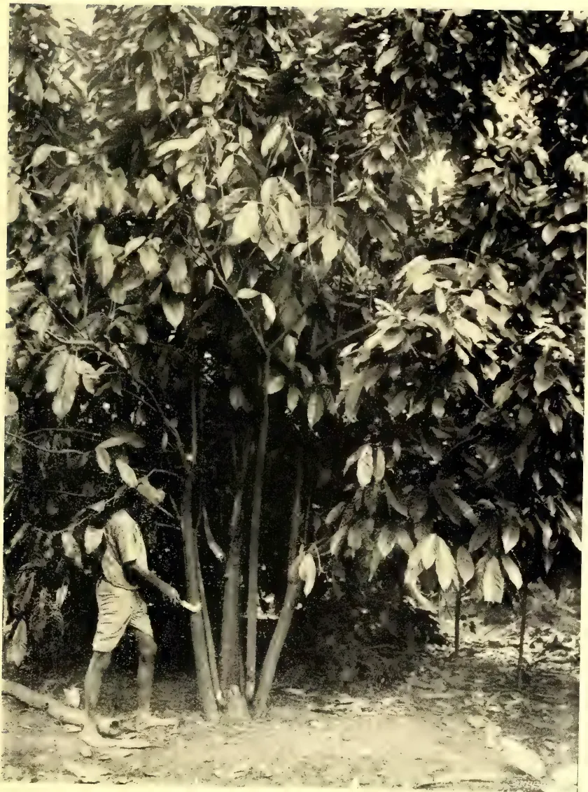A black and white photograph of a cacao tree. The tree is large and bushy, with many large, oval-shaped leaves. A person is standing to the left of the tree, wearing a light-colored shirt and shorts, and appears to be holding a small object, possibly a cacao pod or a tool. The ground is covered in leaves and debris. The photo is framed by a white border.

*Photo by Ivor Etherington.*

CACAO TREE FROM SUCKERS.

351------------------------------------------------

This image is a scan of a blank page. The paper has a light beige or cream-colored tint. There are a few very small, dark specks scattered across the surface, which appear to be scanning artifacts or dust particles. No text, lines, or other markings are present on the page.

352------------------------------------------------

OCT. 1906.]315Edible Products.

brought very near to that of the Cundeamor by good cultivation. The highest valued cacao, by weight, is undoubtedly the large plump beans of Nicaraguan and Caracas, then the Cundeamor, and lowest the Amelonado. Judging from current values, the Nicaraguan, Caracas, Cundeamor, and Amelonado cacao may be stated to have approximate values in the ratio of 70, 65, 60, and 50. The Amelonado variety, though it is easily cultivated and gives a good crop, produces thin, flat, bitter, and deep-purple seeds, and seems to be the least desirable to cultivate.

## Tobacco Cultivation in Jaffna. II.

BY A. CHARAVANAMUTTU.

**DISEASES OF TOBACCO PLANTS.**—The plants are sometimes subject to what is known in Jaffna as the ‘fence’ or excess of heat. It may be due to want of sufficient water to the plants and their exposure to the hot sun or to the particular condition of the soil which becomes at times overheated. The leaves of the diseased plants dry and are immediately cut and removed. There is no means of arresting the progress of it, and there is no danger also of its infection.

The leaves of tobacco plants are sometimes affected with worms called ‘Alukkanavan,’ ‘Kottiyān,’ and ‘Eripulu.’ They occur in all tobacco gardens in the peninsula. They appear in the early morning dew, and before this goes the cultivators are busy in searching for and killing them. Every leaf of every suspected plant will be searched in this manner. They, however, appear again and again, and the cultivators are engaged for several days in searching for and killing these worms. If not so done daily, in a fortnight a whole garden would be devastated in the manner in which large extents of paddy fields were devastated the year before last by the ‘Arakkoddian’ or caterpillar pest.

The ‘Alukkanavan’ and ‘Kottiyān,’ are commonly called worms by the people, but they appear to me to be merely a fungus or excrescence on the leaf of the plant. The matter is worth investigation.

**CURING OF TOBACCO.**—The leaves are cut each separately with a portion of the stem and are scattered in the garden to wither in the sun. After a few hours’ withering before the leaves are dried, they are collected and heaped in a shady place. After three or four days, in which sufficient warmth is caused to the leaves, they are taken out of the heap and tied at the ends—generally five leaves together—and are hung in the ceiling of a ‘kudil’ to be smoked. The term ‘kudil’ again is applied to a mud hut with round mud walls, whose top is entirely covered with mud over the ceiling. It is protected from sun and rain by an outer roof thatched with cadjans or palmyra olas. In this hut there is a small aperture,  $2 \times 2\frac{1}{2}$  feet or  $2 \times 3$  feet in some cases, through which the tobacco leaves are taken in and hung under the ceiling. Through this aperture, coconut husks and similar combustibles are thrown in and burnt in order to raise a continuous smoke without creating large flames. After the leaves have been smoked in this manner, they are untied and removed and heaped together. After three or four days again the leaves are hung in the ‘kudil’ and smoked as before. The smoking is usually done three times, and each time the leaves are subjected to as much smoke as can be raised in a whole day. The leaves are finally hung under shelter to dry in the cool air. This is one process of curing tobacco, and is generally adopted by almost all cultivators in Jaffna.

A second process consists in merely burying the heap of withered leaves in cowdung or in pits dug for the purpose. After three or four days the leaves are removed and hung in the open air to dry. The Chutumalai and Achchelū tobacco leaves cured in this manner are considered the best for smoking.

353------------------------------------------------

Edible Products.316[OCT. 1906.MANUFACTURE.

**CIGARS.**—The only manufacture is that of cigars. The process consists sometimes in rolling pieces of tobacco in a good leaf and tying the end with a thread. It is usually done by first softening the leaves with fresh water and using the first kind of leaves for the outer coating, and the second kind and pieces inside. The cigars are tied together in small bundles of ten each, and a decoction, termed (*kōdā*), prepared by boiling tobacco fibres in arrack toddy or young coconut water, is sprinkled over them and then they are packed in boxes. Instead of fresh water for softening the leaves first, this decoction—of a light kind—is also employed, the strong kind of it being sprinkled on cigars to impart flavour or increase the aroma which is peculiar to the Jaffna tobacco. It also serves the additional purpose of preserving the cigars from decay and damage by insects and worms.

**SNUFF.**—A kind of snuff is also prepared by roasting tobacco leaf of the first sort and reducing it to fine powder, adding to it chunam or other substances and scents. This is used for local consumption only.

The manufactured cigars are sent to Colombo and Galle principally and are sold at varying rates, viz., Rs. 2.50, Rs. 5 and Rs. 7.50 per 1,000 according to the quality of the cigars. The best kind now in the market is Mr. M. B. Swampillai's 'Gold Medal' Jaffna cigars, which are sold at three different prices according to the size of each: Small size Rs. 10 per 1,000, medium size Rs. 15 per 1,000, large size Rs. 30 per 1,000.

The largest trade is in tobacco leaves which are exported to Travancore and Cochin in South India. The price of leaves of the first sort is between Rs. 300 and Rs. 400 per candy weighing about 600 lb., and the second kind between Rs. 150 and Rs. 200 per candy. The quantity of tobacco leaves exported during last year was 41,230 cwt. beyond sea, and 41,596 cwt. coastwise, *i.e.*, to Colombo, Galle and other places.

I give below a statement of the cost of cultivating one acre of land with tobacco and the income derivable by sale of tobacco leaves. An acre could be planted with 4,000 plants, and the cost of cultivation from start to finish, including cost of smoking and rent of land, would at a moderate rate be Rs. 384. If the crop proves the best, the leaves of the 4,000 plants would sell about Rs. 510, but an average crop may bring about Rs. 350 to Rs. 450 only.

COST OF CULTIVATION.

<table border="0">
<thead>
<tr>
<th>An acre of land can be planted with 4,000 plants:—</th>
<th>R. c.</th>
</tr>
</thead>
<tbody>
<tr>
<td>40 coolies for hoeing at 15 cents each ... ..</td>
<td>6 00</td>
</tr>
<tr>
<td>Penning cattle for 250 days at 16 cents per day ... .. (or at 1 cent for a plant for manure.)</td>
<td>40 00</td>
</tr>
<tr>
<td>2 pairs of bulls ploughing for 4 days at 30 cents each per day ... ..</td>
<td>2 40</td>
</tr>
<tr>
<td>10 cartloads of leaves at Rs. 12.50 each ... ..</td>
<td>125 00</td>
</tr>
<tr>
<td>40 coolies for burying the leaves and arranging and transplanting at 15 cents ... ..</td>
<td>6 00</td>
</tr>
<tr>
<td>4,000 plants value at Rs. 2.50 per 1,000 ... ..</td>
<td>10 00</td>
</tr>
<tr>
<td>Watering for 60 days—2 men at 15 cents each per day ... ..</td>
<td>18 00</td>
</tr>
<tr>
<td>Penning sheep among plants for manure at 1 cent a plant ... ..</td>
<td>40 00</td>
</tr>
<tr>
<td>Hoeing—40 coolies at 15 cents each ... ..</td>
<td>6 00</td>
</tr>
<tr>
<td>Tilling, weeding and making reservoirs—60 coolies at 15 cents each ... ..</td>
<td>9 00</td>
</tr>
<tr>
<td>Lopping off top of plants for a month in alternate days, 1 person for 16 days at 10 cents ... ..</td>
<td>1 60</td>
</tr>
<tr>
<td>Watering 4,000 plants, <i>i.e.</i>, irrigating from well—4 men at Rs. 2.50 per 1,000 plants till the leaves are cut ... ..</td>
<td>40 00</td>
</tr>
<tr>
<td></td>
<td>304 00</td>
</tr>
<tr>
<td>Rent of land ... ..</td>
<td>40 00</td>
</tr>
<tr>
<td>Coconut husks &amp;c. for smoking three times ... ..</td>
<td>20 00</td>
</tr>
<tr>
<td>Cooly lines and other contingent expenses ... ..</td>
<td>20 00</td>
</tr>
<tr>
<td><b>Total Expenditure ...</b></td>
<td><b>Rs. 384 00</b></td>
</tr>
</tbody>
</table>

354------------------------------------------------

Oct. 1906.]317Edible Products.

Generally 12 leaves are cut in a plant, and the 4,000 plants give leaves of the

<table border="1">
<tbody>
<tr>
<td>1st Sort</td>
<td>20,000</td>
<td>leaves</td>
<td>sold</td>
<td>generally</td>
<td>at</td>
<td>Rs. 17.50</td>
<td>per</td>
<td>1,000</td>
<td>...</td>
<td>Rs. 350</td>
</tr>
<tr>
<td>2nd "</td>
<td>12,000</td>
<td>"</td>
<td>"</td>
<td>...</td>
<td>"</td>
<td>"</td>
<td>10.00</td>
<td>"</td>
<td>...</td>
<td>" 120</td>
</tr>
<tr>
<td>3rd "</td>
<td>8,000</td>
<td>"</td>
<td>"</td>
<td>...</td>
<td>"</td>
<td>"</td>
<td>3.75</td>
<td>"</td>
<td>...</td>
<td>" 30</td>
</tr>
<tr>
<td>4th "</td>
<td>8,000</td>
<td>"</td>
<td>"</td>
<td>...</td>
<td>"</td>
<td>"</td>
<td>1.25</td>
<td>"</td>
<td>...</td>
<td>" 10</td>
</tr>
<tr>
<td colspan="9"></td>
<td>Total</td>
<td>... Rs. 510</td>
</tr>
</tbody>
</table>

Which can be realised if the crop is successful.

#### CONCLUSION.

It may well be considered now in what manner the cultivator could improve his cultivation and make it a profitable concern. I have described in detail the process of cultivation, which I think can hardly be improved upon. There is little to be taught to the Jaffna cultivator, who bestows the greatest care and attention on this cultivation. But the Agricultural Society can render him assistance in other directions in which he badly needs advice and help.

*First.*—In the matter of *Irrigation*. This is a large question affecting not only tobacco plants but paddy plants and other plantations. There are in Jaffna no large tanks as in the Vanni for storage of water and for distribution when required. The entire supply of water is from wells, and considerable time and labour are spent in raising water. It may be good to introduce some machinery for this purpose. The 'Nona' pump tried last year at Vasarilan was found to lift too great a quantity of water at one time so as to make it useless to the cultivator, and the well ran short of its supply in a short time.

*Secondly.*—The *Diseases* to which the tobacco plants are occasionally subject have never been investigated, and I think it will do a deal of good to invite scientific opinion and suggestions to prevent or remedy them.

*Thirdly.*—As regards *Curing of Tobacco* much remains to be done in this direction. The present mode of curing is not at all satisfactory. In August last year when H. E. the Governor was in our midst, he undertook to send us a tobacco expert who would be able to instruct the cultivators how to cure their tobacco well. We have heard nothing more of it. It is perhaps our own fault. The tobacco curing season is already passing away, and we have not asked Government for the expert assistance we were most in need of.

*Fourthly.*—*Markets for Jaffna Tobacco.*—At present the sale of tobacco is almost confined to South India. It is known from existing records that Jaffna tobacco was sold in Penang, Singapore, Malacca, Java and Sumatra as long ago as the early Dutch times. If the highly pungent aroma peculiar to the Jaffna tobacco leaf were overcome by scientific curing and the leaf rendered thinner and of better flavour, I think it may fetch higher prices in markets other than Travancore and Cochin. If the product could be sent to better markets, tobacco cultivation would be found to be a very remunerative concern. At present it cannot be said to be a remunerative occupation.

*Fifthly,*—and the most important in my opinion, is to devise measures to save the poor cultivator from the ravages of the *local money-lender*. In Jaffna the majority of the cultivators are poor people. They get lands for cultivation on a rental of Rs. 40 per acre per annum, which they pay soon after their tobacco leaves have been sold. They want money for buying cowdung, green leaves, coconut husks, and further expenses. They usually go to the local money-lender whose trade it is to get the money immediately from the Cheddi at the usual 12 per cent interest and give to the cultivators the small sums they want, the latter agreeing to repay the money with interest at 20 per cent as soon as their tobacco leaves are sold. Oftener than not, it is the money-lender who is also the trader in tobacco. He goes to

355------------------------------------------------

Edible Products.318[OCT. 1906.]

his debtor and purchases the latter's tobacco leaves fixing his own price in many cases, and the debtor does not like to offend his creditor in the least. I merely describe what occurs in the villages. A cultivator applies for a loan of say R100 from his money-lender. The latter readily gives the money and gets a promissory note for R120 payable on demand, understanding that the amount shall be paid soon after the tobacco leaves are sold, *i.e.*, in 8 months at the most. So then the interest payable on R100 for 8 months is R20, *i.e.*, at 30 per cent per annum.

It sometimes happens that the interest is deducted from the principal, and the balance only is paid obtaining a promissory note for R100, *i.e.*, the interest payable on R80 for 8 months is R20, which is at  $37\frac{1}{2}$  per cent per annum.

In the first case the interest paid was at 30 per cent, and in the second case at  $37\frac{1}{2}$  per cent on a small capital.

This is a sad state of things which, if allowed to continue, will sap the very vitality of the poor cultivator in course of time, and the Agricultural Society should immediately undertake to prevent it as far as possible. The assistant local Secretary, Mr. Sabaratnam, once before suggested that an agricultural credit bank should be started and worked on a small scale as is done in other agricultural countries. Nothing has as yet been done in that direction. If such a bank is considered too large an undertaking, I would suggest, to begin with, at least a credit fund be raised immediately, for the present condition of the cultivators in Jaffna necessitates such a step being undertaken, and I am confident that the miserable lot of the cultivators will be improved by it.

These are merely a few suggestions which I have endeavoured to put forward in the hope that they may receive sympathetic consideration and attention.

---

## Cultivation of the Coconut.

---

### A NOTE ON THE PAPERS DEALING WITH THE COCONUT PALM IN THE JANUARY ISSUE OF "THE PHILIPPINE JOURNAL OF SCIENCE."

By C. DRIEBERG.

These papers on the Coconut palm are essentially studies in biology, and the details of minute experiments which are described are not such as will appeal to the mind of the practical planter. For these reasons I do not recommend that the papers should be quoted locally, at least in their entirety. There are, however, a few practical facts and deductions which I give below with a view to their being brought to the notice of coconut cultivators:—

It may almost be said that the physical character of soil is of greater importance than the chemical composition. The coconut requires a porous soil with water within easy reach of it (though, of course, not in a stagnant condition); in the absence of water the tree protects itself against injurious desiccation by a partial suspension of vitality, with a consequently reduced yield of crop. Given such a condition as is above referred to, the tree will thrive even though according to chemical analysis there is apparently not sufficient fertility in the soil to enable it to do so.

But it must be borne in mind that the roots of the coconut draw nutriment from a depth of at least 2 metres, ( $6\frac{1}{2}$  feet) and a distance round the tree of from  $3\frac{1}{2}$  to  $6\frac{1}{2}$  metres (say an average of 5 metres,  $16\frac{1}{2}$  feet nearly). They, therefore, come in contact with an enormous mass of soil material and appropriate the available plant

356------------------------------------------------

OCT. 1906.]319Edible Products.

food scattered (very sparsely it may be) through it. It thus happens that even in poor sandy soils, which are, however, porous and provided with water, there is quite enough nourishment for the tree.

Much of the food available to palms growing along the seashore is traceable to the "wash"—chiefly under ground—which comes from the land side and flows seaward. Such underground wash keeps the plants found along the seaboard in a flourishing condition, while in inland and higher situations, where the soil is less permeable, plants suffer from a lack of moisture and therefore of nourishment.

Irrigation is thus to be recommended for the latter descriptions of soils in dry-seasons; and the use of manures, particularly those furnishing mineral food, are likely to be repaid in an increased yield.

To put the matter shortly: on a loose soil where water is at hand, the roots travel about freely and find plant food which is then absorbed in the form of very dilute solutions. In higher and drier land where the soil is of a firmer texture the tree is less able to forage for itself owing to soil resistance and paucity of water. The proportion of mineral food taken up may be said to be proportional to the amount of water absorbed.

It will thus be seen that it would be a manifest advantage to increase the transpiration in the plant, and so also increase the absorption of water and mineral food.

This may be done in two ways—

1. (1) by increasing the amount of water at the disposal of the roots.
2. (2) by improving the conditions for evaporation through the leaves.

Judicious irrigation will bring about the first, but the soil must not be allowed to become "logged."

For the second there should be ample sunlight and "wind." Provided the roots are not too dry, the more the tree is exposed to these forces the better for it. *To this end avoid close planting.* It may be generally stated that the further apart the trees are planted the better they will thrive. Certainly up to 15 metres (50 feet nearly) any increase will appreciably increase the yield. It is the interlacing of roots and leaves, and the competition among trees for air and water that reduces their yield. The best ordinary distance is 9 metres (30 feet nearly). It is only in exposed situations, or where intensive cultivation can be economically carried on that this distance may be reduced.

The reason why trees thrive along the seaboard is attributable to the fact that their roots are able to stand the action of concentrated solutions (*e.g.*, sea water) and the leaves delight in sunlight and wind. As with other plants it is possible to create artificial conditions as favourable, if not more so, to crop production. But the conditions referred to above must be provided even in the richest soils for the best results, viz., sunlight, water, and wind; for a lack of light, a restricted supply of water, and a still atmosphere, are unfavourable to the coconut.

In selecting nuts, they should be taken from a tree in which the productive power is great in proportion to its opportunities, *i.e.*, one that bears a proportionately larger number of nuts than its neighbours. It is a mistake to select nuts from trees which are equally prolific in a given area. Heredity (individual character) rather than environment should be looked at in this matter.

Though we would not expect to find it so, both chlorine and common salt may be said, from the insignificant quantities in which they are found, to be negligible elements in the food of the palm. According to analytical results it is found that there is a gradual increase in the proportion of meat (kernel), copra, and oil (with a decrease of milk, indicating that the meat becomes firmer, loses water and gains oil)

42

357------------------------------------------------

Edible Products.320[OCT. 1906.

as the nut increases in age up to three months of storing, *i.e.*, when they are beginning to sprout. In nuts kept for six months, though the meat is practically the same, there is a marked decrease in the proportion of copra and oil, due to decomposition or other causes. Thus both in very fresh and in over-ripe nuts there is a considerable deficiency in oil.

In planting in the nursery the practice in the Philippines appears to be to cut a small section of the husk off the top of the nut to afford more easy egress for the sprout.

As a protection against wild pig, a pit 4 or 5 feet deep is dug and the nuts planted at the bottom.

“Grill-dried” copra is not so liable to be attacked by insects and moulds, though it is considered inferior owing to its dark colour and smoky flavour.

### VANILLA INDUSTRY IN THE SEYCHELLES.

A British Colonial Office report for 1905 on the trade of the Seychelles Islands gives the following particulars of the vanilla industry :—

#### EXPORTS OF VANILLA.

<table>
<thead>
<tr>
<th></th>
<th>1904.</th>
<th>1905.</th>
</tr>
<tr>
<th></th>
<th>Rs.</th>
<th>Rs.</th>
</tr>
</thead>
<tbody>
<tr>
<td>United Kingdom ...</td>
<td>130,592</td>
<td>137,185</td>
</tr>
<tr>
<td>France ...</td>
<td>148,446</td>
<td>136,462</td>
</tr>
<tr>
<td>Mauritius ...</td>
<td>8,987</td>
<td>64</td>
</tr>
<tr>
<td>Switzerland ...</td>
<td>8,400</td>
<td>8,400</td>
</tr>
<tr>
<td>Germany ...</td>
<td>—</td>
<td>765</td>
</tr>
</tbody>
</table>

The striking feature in the foregoing statement is the continued collapse of vanilla, the staple export of the Colony for many years. Vanilla may have a future; in no place are the conditions of nature more favourable than in Seychelles, but for the present it is of little value, and the crop of 1906 is so small that it cannot be expected to exceed 20,000 kilos. Vanilla has long held the pride of place at the head of the products of Seychelles. In 1905, it has been displaced by coconut products, which have been exported to the value of Rs. 413,951, whereas vanilla has fallen in value to Rs. 282,876. The quantity exported was more than anticipated, being 48,208 kilos., or over 100,000 lbs., but the actual crop did not exceed 36,000 kilos., the surplus consisting of the balance of the crops of 1903 and 1904, which had been held up for better prices. The crop for 1906 will not exceed 20,000 kilos., and there is only a very small stock of old vanilla held locally. The cause of the falling-off in crops in 1904, 1905, and 1906 is the period of drought in 1904, which destroyed one-third of the vines and reduced the vitality of the remainder. The crop of 1904 had been expected, judging from the flowering season of 1903, to be normal, viz., 60,000 kilos., but in consequence of the drought it reached 45,000 kilos only. The drought of 1904 checked the flowering for 1905, and a crop of 36,000 kilos. was the result. A repetition of the period of drought in 1905 led to an almost complete failure of the flowering season for the crop of 1906, when the total amount cured will not exceed one-third of an average crop, and will be as small as that for 1900, without the saving grace of high prices. Favourable weather in 1906 promises a good flowering season for the crop of 1907; the vines are in good heart, and it is probable that—as far as a forecast is possible—the crop should be up to 50,000 kilos.

What the failure of the vanilla means to Seychelles may be illustrated by the fact that, for the term of ten years before 1904, the average crop represented an output of 38,476 kilos., valued at Rs. 714,096, and selling at an average price of Rs. 17.95 per kilo. In 1905, the export of vanilla was valued at Rs. 282,876, with an average price of Rs. 5.87 per kilo. And the failure means more than this, for planters had been living on a scale commensurate with their recent good fortune,

358------------------------------------------------

OCT. 1906.]321Edible Products.

and traders had been accorded credit on a similar scale. Credit ceased suddenly, and advances on crops and on mortgage were called in, and no banking institution existed to help those planters who held valuable properties, but lacked, for the moment, means to keep them in cultivation or to supplement their resources by the introduction of new products. At this juncture the Government, being supported on the authority of the Secretary of State by a credit with the Crown agents, was enabled, under the provisions of Ordinance No. 4 of 1904, to advance to approved planters, on the security of first mortgage, sums not to exceed Rs. 100,000 in the aggregate. These loans have saved many planters from bankruptcy, and staved off the abandonment of cultivation on several valuable properties. The amount actually lent at the close of 1905 was Rs. 67,800, when the further operation of the Ordinance had to be suspended. Although the vanilla crop for 1906 is again a failure, there has been a resolute effort on all sides to improve coconut cultivation, and to develop new industries, especially rubber cultivation; so the prospects for 1907 are more generally hopeful than for three years past.

A statement showing the value, quantity, and average price of Seychelles vanilla for the last 11 years is attached:—

<table border="1">
<thead>
<tr>
<th rowspan="2">Year.</th>
<th>Quantity of vanilla exported.</th>
<th>Declared value of vanilla.</th>
<th colspan="2">Average price per kilo. of vanilla.</th>
</tr>
<tr>
<th>Kilos.</th>
<th>Rupees.</th>
<th>Rs.</th>
<th>cts.</th>
</tr>
</thead>
<tbody>
<tr>
<td>1895</td>
<td>4,553</td>
<td>60,344</td>
<td>13</td>
<td>25</td>
</tr>
<tr>
<td>1896</td>
<td>31,227</td>
<td>936,000</td>
<td>29</td>
<td>97</td>
</tr>
<tr>
<td>1897</td>
<td>30,691</td>
<td>920,730</td>
<td>30</td>
<td>00</td>
</tr>
<tr>
<td>1898</td>
<td>25,177</td>
<td>748,810</td>
<td>29</td>
<td>74</td>
</tr>
<tr>
<td>1899</td>
<td>41,835</td>
<td>1,338,720</td>
<td>32</td>
<td>00</td>
</tr>
<tr>
<td>1900</td>
<td>17,569</td>
<td>580,877</td>
<td>33</td>
<td>06</td>
</tr>
<tr>
<td>1901</td>
<td>71,899</td>
<td>1,108,792</td>
<td>15</td>
<td>42</td>
</tr>
<tr>
<td>1902</td>
<td>60,862</td>
<td>642,331</td>
<td>10</td>
<td>55</td>
</tr>
<tr>
<td>1903</td>
<td>59,784</td>
<td>503,994</td>
<td>8</td>
<td>43</td>
</tr>
<tr>
<td>1904</td>
<td>41,072</td>
<td>300,026</td>
<td>7</td>
<td>30</td>
</tr>
<tr>
<td>1905</td>
<td>48,208</td>
<td>282,876</td>
<td>5</td>
<td>87</td>
</tr>
</tbody>
</table>

The quantity of vanilla cleared for London in 1905 was 22,566 kilos., valued at Rs. 137,185; the proportion of the crop and the total value being much as in 1904. London is looked upon as the better market when prices are good, but Paris sales are steadier when demand is dull; that conclusion is based on the fact that there are regular monthly sales in London where parcels are sometimes put up for forced sale; whereas in Paris there is no open market, but the principal buyers, having standing contracts with the wholesale consumers, are ready to buy at a figure which is not subject to market fluctuations. As the price ruled uniformly low during 1905, the proportion sent to London was no more than 46 per cent. of the total; in prosperous years the proportion sent to London has been as high as two-thirds. The exports of vanilla to Paris included more than half the crop (24,757 kilos.), valued at Rs. 136,462.

The report by the Curator of the Botanic Station for the year 1905 states that the rainfall during 1905 was unfortunately distributed and the vanilla crop for 1906 will be considerably reduced. The weather was very promising until the end of July, but the rain fell abundantly in August and September, and the vanilla vines put forth new growth instead of flowering. Orange and lime trees should be planted on a much greater scale than they are at present for exportation as fruits, and for the production of citrate of lime. In short, the climate of Seychelles is highly beneficial to the growth of citrus trees, and better attention should be paid to them. Citrate of lime is imported into the United Kingdom to the amount of 1,400 tons annually, and a Seychelles planter has succeeded in making a sample of citrate containing 65 per cent. citric acid. The lime industries are

359------------------------------------------------

Edible Products.322[Oct. 1906.

specially adapted to Seychelles labour and to the shipping difficulties of the Colony, and there is also a certain amount of profit to be derived from them by the production of hand-press oils (worth 3s. 6d. on the London market). The future of this Colony lies in tree planting on a greater scale than it is at present, and not in cultivating herbaceous plants which are so susceptible to climatic variations.

Owing to the fall in the price of vanilla, the Curator was asked to prepare an extract from inferior vanilla in order to try to avoid exporting low-grade beans as such. The experiments are not yet completed, and the extracts will soon be forwarded to the Imperial Institute for valuation. A simple maceration of 400 grammes of vanilla in four litres of alcohol is not sufficient, and the *modus operandi* which has given the best results is the following:—The vases containing vanilla arranged in the form of a battery and alcohol at 80° to 85° allowed to remain one week in one vase before being transferred to the next containing fresh vanilla. A sort of diffusion is then practised until the four or six vases have received the alcoholic solution four or six times each.

### CARDAMOMS IN THE SEYCHELLES.

In July a lecture was given in the Council Chamber of the Seychelles Government, and presided over by His Excellency the Governor, the subject being the Culture and Preparation of Cardamoms. This meeting was attended by forty persons, including the leading members of the community.

The great analogy between Ceylon cardamoms and the Seychelles "longouze" (*Amomum Daniellii*, Hook.) was pointed out, and specimens exhibited. The numerous ravines in which the "longouze" grows wild, and many other similar localities were described as being very suitable to Ceylon cardamoms on account of the protection from the wind and the presence of proper shade trees. Shade and protection from the wind were shown to be the only factors worth considering, all the other climatic and agrologic conditions of the Seychelles mountains being identical with those of Ceylon.

The numerous uses to which cardamoms are put in India and Europe were enumerated, and the methods of cultivation and preparation were treated in detail. The analogy between vanilla and cardamom preparation was insisted upon, and the fact emphasised that the crop of one plant followed that of the other. The cardamom seeds brought from Ceylon in February, 1903, were sown at the Botanic Station, the seedlings nursed until November, and then planted out at Capucin Crown Land. The plants were grown in poor laterite soil under shade of *eriodendron* and *spathodea*. The first flowers appeared in July, 1905, and the first ripe fruits were gathered in December, 1905. The Malabar variety ripened a few weeks earlier than the Mysore variety. Three planters applied after the meeting for cardamom plants, and all the suckers that could be disposed of, viz., 1,000 were sold during 1905. It was ascertained that Indian cardamoms were sold at Rs. 2.50 a lb. on the local market, and that the whole Seychelles crop could be consumed locally or exported to Mauritius and South Africa, thus ensuring the possibility of establishing a secondary industry of some value in this Colony. The ravines where cardamoms should be planted are not occupied by other plants, and those planters who have gone in for the new product have reported favourably on the growth of the suckers which they had purchased.

The cardamom plant makes good growth in the highlands of Seychelles, and in the experimental plantations at Capucin the first crop was obtained twenty-six months after planting. As stated in other parts of this report, this spice, if produced in this Colony, can be consumed locally and exported to Mauritius and to those parts of Africa near Seychelles, where Indians bulk considerably in the population.

360------------------------------------------------

, Oct. 1906.]323

## MISCELLANEOUS.

### Notes on Methods of Irrigation in Arizona. II.

By J. H. W. PARK.

The object of the whole method of irrigation is to get as much water to pass through the plants as possible, and to let as little of it as possible escape by seepage and evaporation. The distribution of the water through the furrows only, and not over the surface of the land, and the cultivation of the soil close the latter means of escape, and it is assumed that the water so caught in the soil is retained there to be extracted by the plants as they require it.

There does not appear to be much doubt of the efficiency of the method. The retention of the water in the soil is shown by the following table taken from a report by the Professor of Agriculture in the University of Arizona, which gives the percentage of water present in the upper five feet of the soil of two fields eighty days after irrigation, the surface of one field having been cultivated and the surface of the other having been left to dry without cultivation:—

<table>
<thead>
<tr>
<th></th>
<th></th>
<th>Cultivated.</th>
<th>Uncultivated.</th>
</tr>
</thead>
<tbody>
<tr>
<td>First foot, moisture %</td>
<td></td>
<td>7.3</td>
<td>3.8</td>
</tr>
<tr>
<td>Second " "</td>
<td></td>
<td>12.6</td>
<td>8.1</td>
</tr>
<tr>
<td>Third " "</td>
<td></td>
<td>15.6</td>
<td>10.5</td>
</tr>
<tr>
<td>Fourth " "</td>
<td></td>
<td>15.0</td>
<td>11.6</td>
</tr>
<tr>
<td>Fifth " "</td>
<td></td>
<td>12.1</td>
<td>11.7</td>
</tr>
<tr>
<td>Total ...</td>
<td></td>
<td>62.6</td>
<td>45.7</td>
</tr>
</tbody>
</table>

In this case the cultivated portion contained some thirty-three per cent more water than the uncultivated portion, or roughly some two and one-half inches of water over the whole area, and when it is remembered that the whole of the moisture stored in the soil is not available for the support of plants, the advantages of cultivation in retaining water in the soil which is so available becomes very evident.

As noted in the case given above a particular farmer received water for  $2\frac{1}{2}$  days out of every eleven. It must not, however, be supposed that he watered the whole of his crops once every eleven days; on the contrary he turned the supply to a portion of his crops only, and the remainder went without water for a much longer period, although the length of the period depended upon the nature of the crops.

*Crops Raised.*—The whole method of irrigation may be illustrated by the following notes on some of the different kinds of crops raised and on the irrigation of them.

*Egyptian Cotton.*—Seven-tenths of a foot of water applied to land before planting, planted in rows with furrows three feet apart, irrigated thirteen times in 186 days with a total depth of water of five feet. Yield 400 lbs, per acre.

*Melons.*—Seven-tenths of a foot of water applied before planting. Planted in rows on the edge of the furrows which were eight feet apart, so that the roots are watered from the furrows and the plants grow on the ground between them. Irrigated twelve times in 114 days, total depth of water used 3.3 feet. Yield 27,000 lbs, per acre.

*Wheat.*—Sixth-tenths of a foot of water applied before planting. Seed sown broadcast and the field furrowed two feet apart, the soil from the furrows being turned over on the seed-forming plots of about 15 inches wide. No irrigation is

361------------------------------------------------

Miscellaneous.324[OCT. 1906.

necessary for the first two months, by which time the crop is well up and protects the soil from the sun and reduces evaporation from it. Three irrigations given in the last thirty days of the growth of the crops and the total water used was 2·2 feet deep with a yield of 2,150 lb. per acre.

*Peaches and Apricots.*—These are planted in rows of about 15 feet apart with furrows between from which the water is run to the root of the tree. Water is given while the tree is dormant above ground, ten irrigations being given in 75 days, and then the supply of water is stopped until the fruit forms when water is again occasionally given. The total depth of water used was 3·8 feet for peaches and 5 feet for apricots, and the yield 4,400 lbs. and 7,600 lbs. per acre respectively.

*Tomatoes.*—For these the furrows were 4 feet apart. The seed was planted along the edges of the furrows. Six-tenths of a foot of water were given before sowing. The seeds were irrigated two days after planting, twenty-seven irrigations were given in 244 days, the total water used was 4·3 feet per acre, and the yield 12,800 lbs. per acre.

*Indian Corn.*—Six-tenths of a foot of water was applied previous to planting, which was done in rows along furrows previously moistened. Five irrigations were given in thirty days, the total depth of water used being 1·5 feet. Water was used while the corn was growing and not after the ear had begun to form.

*General Remarks.*—From the above it will be seen that in a country much drier than Ceylon it has been found possible to raise crops of an extremely varied character by the use of a quantity of water seldom exceeding one acre foot per acre of crops raised per month of their growth.

As already pointed out, the evaporation from a water surface in the district is 80 inches per annum, or over six inches per month, and it must be clear that by the use of furrows which present only a small surface in comparison to the area cultivated, the loss by evaporation must be reduced far below the loss which would occur if cultivation by flooding were practised.

Anomalous as it may seem, the efficiency is to some extent also due to the extreme dryness of the climate. Rain is infrequent with the result that the soil once cultivated remains dry on the surface, and the water once caught beneath that surface is not easily evaporated.

The writer does not think it can be doubted that the main reason for the efficiency of the system lies in the use of the furrows, and the extra attention which their use demands in the distribution of the water passed into them from point to point of the fields under cultivation, and that the cultivation of the ground in the furrow is important as a means of increasing the efficiency.

*Possibility of Applying the Method to Ceylon.*—The writer thinks the system should be applicable to various crops in many parts of Ceylon, in spite of the fact that the rainfall is much heavier and the necessary dryness of the surface soil more difficult to obtain.

It will probably be stated that the only known crop grown under irrigation in Ceylon is rice, and that for this crop the furrow method of irrigation is not suitable. This may be true, at least the writer is not aware that any attempt to grow rice by the furrow method has ever been tried, although the growth of crops such as wheat and alfalfa would point to the possibility of doing so.

With the abundant rainfall of the N. E. Monsoon, the writer sees no reason why the method of growing rice by flooding should be abandoned but that crop should be grown during the N. E. Monsoon only, and due care should be taken to use the irrigation water to supplement and not to replace the rainfall. For this purpose the land should be ploughed dry at the commencement of the Monsoon, and then sown

362------------------------------------------------

OCT. 1906.]325Miscellaneous.

and watered heavily by irrigation only after the seed has sprouted and is well up. This is the system practised largely in Texas, and it is not altogether unknown in Ceylon, as in the Jaffna Peninsula the land is often ploughed dry and sown and the crop is grown under rainfall alone.

It is during the dry weather of the S. W. Monsoon that the writer believes the method of furrow irrigation could be adopted, possibly in the paddy fields themselves, for the production of those crops which are now usually grown in chenas, of which, so far as he can discover, all would be much better raised under properly regulated irrigation than on high lands under an uncertain rainfall. Quite recently he saw an excellent chena crop sown on land which had been cleared for aswedumization, and which would have perished owing to lack of rainfall, saved by irrigation, and the only reason the owners were able to give for not regularly growing such crops in this manner was that they preferred to grow paddy on the land by irrigation after the rains had practically ceased.

With the saving of water which would follow in the N. E. Monsoon by dry ploughing and proper utilization of rainfall, and the further saving due to furrow irrigation in the S. W., it should be an easy matter to double the area of crops grown while the change in the nature of the crops, if the same land was cultivated twice yearly, should be of advantage to the land.

In support of the contention that furrow irrigation can be used in Ceylon, the writer would point to the extreme dryness of certain months of the year in certain parts of the Northern, North-Central, North-Western, Uva and Southern Provinces. Thus the average rainfall of June, July and August has been at Mannar 1.33", Anuradhapura 4.28", Puttalam 3.07" all for 34 years, at Alutnuwara it has been 2.68 for 6 years, and at Tissa, S. P., 2.87 for 31 years, and many other examples can be found. The losses by evaporation are not so well known, but Mr. Parker made it 68", at Giant's Tank, the writer found a loss of 58 inches had occurred at Horabora in 1904, and he has been informed the loss was 72 inches last year at Kalawewa.

Under these circumstances he cannot but think that furrow irrigation and cultivation of the land thereafter is possible, and that the question of the method of irrigation used in Ceylon with the proper time for sowing paddy is one worthy of more attention than it has received.

### Agricultural Banks for Ceylon.—III,

BY E. S. W. SENATHI-RAJA.

FUNDS.—The great success of the Scotch Banks, as we have seen, depended on their issue of bank notes. Several schemes were started in France, inspired by the remarkable success of the Scotch banks, to issue paper money, but they ended in disastrous failures. It was soon perceived, however, that the success of the Scotch banks was chiefly due to prudence of administration and to the suitability of the system to the conditions of Scotland and the national characteristics of its people. The issue of bank notes, it was found, was a convenience and an economy rather than a source of funds. Hence the issue of bank notes has not been received with favour on the European continent, and only a few land banks have the right to issue paper money. In France there is none entitled to do that. The rarity of this privilege shows that it is not generally feasible. There is, however, another great and unfailing source of funds in all the continental land banks, and that is the interest bearing mortgage-debentures (Pfandbrief, obligation foncière). In its original form, when it was brought into use in the 18th Century, the debenture was merely a bond for an amount from four to twenty pounds,

363------------------------------------------------

Miscellaneous.326[Oct. 1906.]

given by a bank to a borrower on payment of a mortgage bond executed by him. It expressly indicated the property mortgaged, and the property alone was the material guarantee for the specific bond. The bank was only an intermediary between a borrower and lender, who were in direct relation with each other, and the bank merely gave its guarantee that the mortgage was a good one, and that payments would be duly made. The lender received the debentures from the bank, sold them in the market and converted them to money. The lender looked to the borrower for principal and interest, and not to the bank which only took proceedings against the borrower in case of non-payment. This, of course, was a great advance from the mere private system of mortgage. The man who had money to invest, had only to buy the bonds in the market, without making any enquiry as to the value of the property mortgaged or the validity of its title. He had the guarantee of the Land Bank which was liable in the property of all its members for the guarantee. If the mortgager failed to pay up, the lender was paid by the bank. If the lender wanted the money at any particular time or for any emergency he could sell his bonds in the market, thus transferring his debt to another creditor. This took place without any expense save brokerage, if any. If it was a case of private mortgage, where the mortgagee wanted money immediately, the mortgager must make a diligent search for another mortgagee and transfer his mortgage to him, provided he succeeded in finding one. Even then he had to incur further heavy expenses for notarial fees, stamps and registration. Moreover, the holder of bank debentures need only sell so many only as he finds necessary to do—the debentures being usually bonds for small sums—whereas a mortgagee must transfer the whole debt or nothing.

Hence the debentures of Landschaften became current stock which very soon rose to its par value and maintained its value even in the worst times. The borrower himself had loans for long terms without fear of foreclosure so long as he paid his dues. He could get as large a loan as he wished on a primary mortgage to the land bank instead of giving to two or three lenders, and borrowing money on secondary and tertiary mortgages and incurring heavy expenses. In course of time, however, a further modification was made in the form of debentures—a modification which has greatly enhanced the usefulness of debentures. The modification is this, viz., the bank issued its debentures in its own name without specifying any particular property as security. There were two advantages in this change. First, the buyers of the new bonds became creditors not of any particular individual but of the bank, and their security was not any particular property, but the whole mass of the security held by the bank, plus the bank itself. Secondly, the debtors found it possible to reduce their capital liability, by payment of a small percentage in the shape of a sinking fund. Under the old system of debentures this was impossible, as the debtors made their periodic payments of interest not to the bank itself but directly to their creditors, and no creditor would receive his principal by petty sums spread over many years. These new debentures, generally payable to bearer or to order, are those now in universal use on the Continent, and funds to any required extent could be raised by this issue. Indeed, under this system of debentures all immovable property may now be said to be capable of being mobilized. The landed property of a whole country may thus circulate in the market in the form of debenture bonds. The Credit Foncier de France issues its debentures in masses of ten millions to thirty-six millions of pounds sterling, the plan adopted being to divide them into numerous series, and issue them by series as soon as loans have been effected to the value of a series. For example, in 1879 a loan of thirty-six million pounds was sanctioned and divided into 180 series, each consisting of 10,000 bonds and making a total of 1,800,000 bonds. Each of the series of 10,000 bonds was of the nominal value of £200,000. In

364------------------------------------------------

OCT. 1906.]327Miscellaneous.

most cases these debentures, though issued for sums from twenty pounds and upwards, are subdivided into detachable *coupure* (or slips) of £4 or £5, so that even poor persons may invest their savings in them.

All debentures are repayable as the mortgages are redeemed. The capital repaid by borrowers is followed by a redemption of the debentures of that series. These are not repaid according to their consecutive numbers, but the numbers to be paid off are determined by lot. By this means bonds are kept up to their par value, and each bond is payable at par. Thus, if a three per cent is issued at £85, its market value immediately rises, for there is a chance of its being drawn at once and the holder will get repayment at par, that is, he will receive £100 for the £85 that he paid. There is the further advantage that a certain number of these bonds get large lottery prizes at the periodic drawings. Thus in the loan of £36,000,000 raised by the Credit Foncier in 1879, the 1,800,000 bonds which were issued were repayable within 60 years by six annual drawings. On an average therefore thirty thousand bonds worth £600,000 are repaid every year at par, and of these 600 bonds get prizes worth £86,000, every year.

The debenture-holders cannot demand payment until their bonds are drawn, but they may sell them in the market at the current price. The bank pays its debts by these ordinary drawings, and sometimes when mortgages are paid in advance by special drawings. The rule which is strictly observed in regard to all debentures is *that there must be an equilibrium between the debentures and the mortgage-securities*. The reason is that if the debentures are not paid off, as the mortgages are redeemed, then some of the bonds would not be covered by mortgage securities, and therefore there would not be that double guarantee of the mortgages and of the shareholders which makes the position of these banks so exceptionally strong. Certain legal privileges are attached to these debenture bonds. In France holders in due course are entitled to payment of their value or interest as the case may be, and no court can attach those sums. They are also authorised to be admitted as securities in which trust moneys may be invested. They have also certain fiscal privileges in regard to stamps, registration and transfer duties. The debentures it will be seen are an invention which is at once most ingenious and fruitful in results, and it is pregnant with vast possibilities for our country. The system of issuing debentures makes it possible even for a poor country like Ceylon to find within its own limits all the capital necessary for its development. A land bank in Ceylon founded under the most favourable conditions, that is to say under the auspices of the Agricultural Society with the guarantee and supervision of Government, will at once raise the confidence of the public, and its debenture-bonds will draw all the petty hoards from every part of the country into the coffers of the land bank. They will afford the best and safest investments for savings, and by the adoption of the French method of sub-dividing the bonds into *coupures*, they may be brought within the reach of all who have any savings large or small to invest. They will add to the currency of the country, for these bonds will pass by delivery or endorsement. There will be neither legal nor fiscal expenses in the transfers. Money is placed with the bank which gives in return an interest-bearing receipt. The holder of the receipt gets the interest periodically, and his capital at the time when the bond may fall due or at the periodic drawings. But it is easily convertible into ready money by delivery or endorsement. For borrowers these debentures offer advantages which no other system can do. As the debentures are issued at the same time as the loans are contracted, the loans may be granted for as long a time as is necessary for the borrower without fear of unduly locking up capital. By the method of a sinking fund, it affords an easy method of paying off almost imperceptibly the capital debt. The sinking fund consists of small annual pay-

43

365------------------------------------------------

Miscellaneous.328[OCT. 1906.

ments included in the fixed annuity. The annuity remains fixed, and as the portion due to interest gradually decreases, the one allotted to sinking fund increases. Here lies the great advantage to a borrower of borrowing from a land bank, instead of borrowing from private lenders. A private lender cannot and will not receive his loan back in small payments spread over many years. When the term of the mortgage is over the whole loan must be repaid. This can only be done by further borrowing which will lead to more debt. It is a well-known fact that capital sunk in the purchase or improvement of land can only be replaced by setting apart annually a portion of the income. The founders of the Credit Foncier de France seem to have clearly apprehended this fact. The reports show that one-half of all the loans granted by the Bank bear annuities in which the payment for the sinking fund is so small as to be hardly distinguishable. For instance, if a man borrows a sum of ten thousand rupees from the Bank for fifty years, he pays an annuity of Rs. 5.72 per cent. to the Bank of which Rs. 5.30 goes for interest and only 42 cents for the sinking fund. He will pay annually Rs. 572, and at the end of fifty years Rs. 28,600, and the annual payment of Rs. 572 on which compound interest is calculated for fifty years wipes off both principal and interest. If he borrowed the sum from a private lender at the same rate of interest for fifty years, he would pay during the fifty years Rs. 26,500 as interest alone, and still owe him the capital of ten thousand rupees. This is due to the fact that as the sinking fund accumulates at compound interest, the principal debt gradually decreases, while the annuity remains constant. The result is that the portion of the annuity due to interest decreases and the portion credited to the sinking fund increases, so that at the end of the payment the sinking fund becomes 5.15 per cent. and at the end of forty years 3.28 per cent. It may be added that on the continent of Europe in almost every country all loans on the security of land are repayable only by annuity.

The foregoing summary of facts collected from various sources will be sufficient, it is believed, to give one an idea of how land banks have been found necessary for the advancement of agriculture in different countries of Europe at certain periods of their economic progress, and how the problem has been solved by them. It has been suggested in some quarters that voluntary societies and popular banks like the Schulze Delitzsch in Germany and Raiffeisen in Wurtemberg will answer our purpose in Ceylon. But the condition of our society is not advanced enough for the formation and working of such voluntary societies. Even on the European continent where they have been founded, they are institutions of but recent growth, whereas the land banks have been in existence for more than 150 years. State aided land banks must precede, and their utility and success serve as an object lesson to the natives, before any popular banks either urban or rural can be started with any advantage to the public. The foundation of such institutions which cannot but be ephemeral in the present state of our economic progress, will, instead of helping the people, prove to be a national disaster by utterly ruining the organisation of credit. Co-operative credit societies have been in existence in India for nearly ten years, and what is the result? Mushroom societies have come into existence by hundreds, and have perished with equal rapidity, and there are others which are eking out a miserable existence and are on the verge of extinction. And yet India is far more advanced than Ceylon in the organisation of credit, for there are classes and castes of bankers like the Gomutte Chetties, Bamas and Natucotta Chetties, who for generations have been engaged in banking, while in Ceylon we have no such organisation. The co-operative credit societies which seem to be fairly successful are very small ones with a capital of Rs. 300 or Rs. 400 established in villages where people are known to each other. It is hardly necessary to add that it will be impossible to develop the agricultural resources of Ceylon with the aid of such miniature societies alone.

366------------------------------------------------

OCT. 1906.]329*Miscellaneous.*

The most remarkable feature in the land banks, on the continent of Europe, it is to be observed, is the impulse given to them by the governments of the different States of Europe, almost every land bank having been founded by the initiative of the Government, and placed under its direct control and supervision. In Ceylon, too, it cannot be denied that we have arrived at such a state of economic progress, that for the further development of agriculture, some institution in the nature of those land banks has become absolutely necessary. More than a hundred years have passed since the British occupation of the island, and more than three-fourths of the country is yet in a condition of waste or uncultivated land. Even in districts where forests have been cut down and lands opened up for coconut cultivation most of the native agriculturists are in great straits. By the time the coconut estates come into bearing the proprietor gets into the clutches of the Natucotta Chetty or other money lender, and not infrequently the estates pass into the hands of strangers.

The cultivation of coffee, tea, cocoa and other new products by Europeans in the higher altitudes of Ceylon has only been found possible with imported capital. If not for the introduction of that capital, it need scarcely be added that agriculture in Ceylon would be in the most backward condition. But the native agriculturists and land-owners have not the same advantage of invoking the aid of European capital in time of pressure, except on rare occasions with the help of middle men and under onerous conditions. The time is ripe therefore, it is submitted, that the Government of Ceylon should come to the aid of the people, by founding land banks under the auspices of the Agricultural Society. Unlike European States, many of which are getting more and more dependent on their manufactures and industries, Ceylon is a purely agricultural country, which for years to come must have agriculture for its mainstay. If Government initiative and assistance were found indispensable to give birth and stability to the land banks of the great, independent and highly civilised states of Europe, it needs no argument to prove that it would be impossible to establish such institutions in Ceylon or to ensure their success, without the support, encouragement and control of the Government. The land banks, it is to be remembered, should be dependent for their success on the confidence which they inspire, so that their bonds may circulate in the market with the same facility as currency notes of the Government, and such a result can never be achieved without Government connection.

As for the funds, there is every reason to believe that all the monies requisite for founding a land bank in Ceylon with branches in various districts can be raised in Ceylon by means of that most valuable instrument known to European land banks as debentures. When it is once known to the local public that the debentures of a land bank are issued under the control and supervision of the Government of Ceylon, and that they may be bought and sold and readily converted into money in the open market, there can be no doubt that most of those who have savings, even small savings, will invest their monies in them. That there are considerable savings in the country available for a land bank may be inferred to a certain extent from the funds that are invested in mortgages in Ceylon. According to the statistics furnished by the Registrar General, the amount of money secured by, registered mortgages in 1897 was Rs. 45,948,796; in 1898 Rs. 40,376,729, and in 1903 Rs. 23,097,180.

As for the means to carry on the work of the land banks in Ceylon, we have a ready made machinery in each province in the Government Agents and their Assistants, with all their subordinate staff formerly employed in the collection of paddy and grain taxes. The various Kachcheries may be utilized for keeping the funds, and the revenue officers of the Government may be trusted for investigating the title and appraising the value of the lands to be mortgaged as security for the loans. Some special legislation will be necessary for the prompt

367------------------------------------------------

*Miscellaneous.*330[OCT. 1906.]

and speedy recovery of interest from debtors, and even there we have a precedent in the summary methods employed for recovering grain taxes before they were abolished. As in the case of the German *Landschaften* and the *Credit Foncier de France*, special privileges should be granted to the land banks, enabling them, for instance, to recover all dues as first charge on the property of the debtor. The provisions necessary to protect the land banks and to establish public confidence in their stability are mere matters of detail which may be embodied in an Ordinance.

In connection with the land banks, and as an auxilliary to them, it will be easy enough to establish, and there ought to be established, co-operative credit societies in each large village as those founded in India. The Government of India has enacted a special law in Act X of 1904, to facilitate the formation of such societies, and the Ceylon Government may follow in the wake of its big neighbour by introducing similar legislation. Those societies will help the small village farmers, artisans and labourers. Thus with a central bank in Colombo, and branches in each province under the control and supervision of the Government, and with village co-operative credit societies the organisation of credit in Ceylon will be complete, and then there will be no reason why agriculture in Ceylon should not make as rapid progress and on modern scientific lines as it has done in Europe and America. Without such a comprehensive system of land banks and co-operative credit societies including the entire organisation of credit, the mere foundation of petty co-operative credit societies alone will be impracticable, and can never effectually advance the progress of agriculture in Ceylon.

Finally, the present, it is submitted, is the most opportune time for laying the foundation of a central land bank in Colombo, with branches in other important centres. The Ceylon Agricultural Society has opened the eyes of the people to the great advantages offered by agriculture in Ceylon on scientific lines, and has given a strong impetus to the cultivation of new products. Even villagers who had hitherto moved in ancient groves are awakening to a new life. An ever increasing number of educated youth of the country are looking out for fresh fields in which their energies might profitably be employed. And not the least important factor to be reckoned in this matter is that in the natural course of events, His Excellency the Governor may give up the reins of Government and retire, and his successor may not have the same enthusiasm for agriculture. The Agricultural Society may then slacken its efforts, perhaps become purely academic in its proceedings, and finally go the way of many a similar association in the past. Native agriculture may then relapse into its usual condition of torpor. To avoid such a calamity, to enable agriculture in Ceylon to stand on a basis as firm and unshakable as the pyramids, it is to be hoped that His Excellency the Governor who has signalled his administration by founding the Ceylon Agricultural Society, will complete the good work he has begun by inaugurating a system of agricultural banks which the Colony stands in urgent need of.

---

### CO-OPERATIVE CREDIT IN THE UNITED PROVINCES, INDIA.

In the accumulation of practical experience of co-operative village banking, the United Provinces have been peculiarly fortunate. Numerous co-operative banks of this type were founded in 1901, as an immediate result to Mr. Dupernex's labours, and the record of their success or failure has proved of the greatest advantage at the present time, when work has been commenced on broader and more methodical lines.

The village banks were constituted on the Raiffeisen model slightly modified, and were governed by a committee *punchayat*), which was assisted in the

368------------------------------------------------

OCT. 1906.]331Miscellaneous.

duty of supervision by Supervisors (girdawars) and with powers strictly limited by rule. The rules provided for the details of working and prescribed (*inter alia*) the terms for and on which loans might be granted, the purposes for which they might be taken, the rate of interest which they should carry, and the rate which the bank should pay on the money borrowed by it.

Of the banks then constituted, about one-third have survived as working bodies, the remainder being either moribund or dead. It is the purpose of this article to examine the causes which have led to the failure of so many of the institutions, and to describe the steps which have been taken to avoid these causes in the societies which have been reconstituted, and in those new ones which have sprung up during the course of the last twelve months.

The majority of the societies had no chance of success from the outset, and it is a testimony to the soundness of co-operative principles that so many successful societies are now at work. The inception of the co-operative movement in these provinces lay not with the people but with Government, and the formation of village banks was a direct consequence of Government orders. Neither the officials nor the landlords by whose action the banks were opened, nor the members of whom they were composed, had any intimate knowledge or any practical experience of the principles of co-operative effort. It is a first essential to the success of co-operation that the members of a society should act voluntarily, and that each member should have confidence in the rectitude and honesty of those with whom he associates and for whose debts he takes upon himself the responsibility. At the outset of the movement there was in most cases no question of voluntary membership. Cultivators became members, not with any intention of contributing to a joint fund and enjoying the benefits which such a fund would confer,—not with any idea of combination in order to obtain credit at more favourable rates than are usually granted to the individual cultivator,—but partly on account of pressure brought to bear by the official or the landlord, and partly in the hope that, in virtue of the payment of a four-anna entrance fee, each member would be entitled to unlimited credit at a favourable rate of interest. The capital provided was not sufficient for the needs of all the members, and the majority of the societies contained a number of high-caste cultivators who obtained favourable consideration at the hands of the punchayat, and being held more reliable than their low-caste fellow-members, were granted loans out of proportion to their number. These loans there was every temptation not to repay, as common justice demanded that on repayment the money should be lent to some other member, who had not in the first instance received any benefit. The punchayat, consisting of members of various castes, and the members themselves in many cases recruited from almost every caste in the village to which the operations of the society extended, were unable to bring effective pressure to bear, loans were not recovered, interest was allowed to run on, and finally the bank died a not unnatural death. Such is the life history of many of the societies which were founded in 1901.

A further cause of failure has lain in the rules and accounts, which were framed for the assistance and guidance of the banks. It has to be borne in mind that in the majority of cases the banks were founded in villages where no professional assistance in account-keeping could be obtained. The person, to whom this duty was confided was as a rule the sub-agent of a zamindar, or the clerk of a Court of Wards' Estate. They did not understand the method laid down for account keeping, and in many cases were most unwilling servants of the Society. Their labours were gratuitous, and from the existence of the Society they personally could draw no profit. It was consequently to their advantage that the Society should cease its operations. Where semi-professional assistance of this description was not available, and a

369------------------------------------------------

Miscellaneous.332[OCT. 1906.

literate cultivator was appointed to keep the accounts, the result has usually been confusion. With the best of good will, the accountant-agriculturist has not been a success.

In the rules, again, the village societies have found a stumbling-block. The ordinary village member looks upon them in much the same light as the Penal Code, and lives in constant dread of trouble in case of breach of their conditions. The experience gained goes to show that rules should be reduced to the minimum consistent with statutory requirements, and that much, which was originally provided for by rule, should be left either to the by-laws or to the discretion of the punchayat. This view has been accepted by the Government of India.

Besides the difficulties mentioned in connection with the recruitment of members, and the rules and forms of account, there has been in the raising of capital a further serious impediment to the success of the banks. The working capital of the societies was raised in three ways. Commonly it was collected by subscription at rates of interest very much below the market rate, from interested landholders and other native gentlemen. It was in certain instances advanced by Government, also at low rates of interest. In some cases a portion was raised from deposits by the members of the Society. In almost all cases the amount of capital supplied was insufficient for the requirements of the members. It has also been inelastic. There was no method in vogue whereby the capital of a village society could be readily expanded or contracted in accordance with the fluctuating requirements of the members. If more capital than that at present in the hands of a village society is necessary, it can only be obtained at the same rate of interest as that paid on the initial capital by the exercise of official pressure, express or implied, and this, as may be readily understood, forms a serious obstacle to expansion. At the same time the local societies, having enjoyed the advantage of the capital at a very low rate, are not willing to pay the increased rate necessary to attract the money of the ordinary investor. It would entail payment by the members of a higher rate of interest than that which they now pay on loans from the Society, and they feel, unreasonably, no doubt, but still naturally, that it is a breach of faith on the part of the punchayat to charge them two pies in the rupee for accommodation which has hitherto been provided at one pie and a half.

It is, of course, highly desirable that, as far as possible, the village societies should work on capital provided in the village from the members' hoards. That this will in time be the main source of capital cannot be doubted. Experience in certain districts leads to this inevitable conclusion. In most districts, however, there is a distinct aversion to making deposits. The societies are looked upon as a freak of Government, and are not generally regarded as in any sense permanent, or as suitable places in which to deposit money. The investor of the towns has not been attracted. It is not possible that under present conditions he should be. The security of the village societies is not known to him; of their very existence he is probably in ignorance. It is, however, eminently necessary that the village societies should be brought into touch with the world of finance, if they are to be of general utility. Whatever scheme is adopted must contain, as essential features, the existence of a headquarters organisation which is in a position to deal with the large capitalists and the joint-stock banks upon a business-like method, in which it is realized that elemosynary contributions at low rates of interest must, in the nature of the case, be strictly limited in amount, and that practically unlimited capital can be obtained if the business of the societies is sound and they are willing to pay a fair rate of interest for the capital required. The existing organisation societies do not meet the needs of the case. They consist of landlords and others, who have subscribed certain amounts in order to finance the existing societies. They look upon these subscriptions as of a semi-charitable nature,

370------------------------------------------------

OCT. 1906.]333*Miscellaneous.*

and in many cases consider that their duty in connection with co-operative societies has ceased, when they have paid the amount expected of them. They are, as a rule, not men of business, and their interest in the societies is purely ephemeral and dependent on the interest taken in those institutions by the District Officer.

Such is a brief account of the initial difficulties under which the village banks in the United Provinces have laboured, and under which they probably labour elsewhere. They are of three descriptions, inasmuch as they relate to the personnel of the society, its rules and accounts, and the raising of its capital. It remains to describe the steps that have been taken to remove them.

In the case of the first of these difficulties the remedial measure is obvious. Of the burdens and hardships entailed by the caste system there can be no doubt, nor is it disputed that the tendency of the system is as a rule hostile to progress and reform. Its existence and its power are, however, a very distinct indication of a method of extension of co-operative effort along the line of least resistance. If members of caste of widely varying social status are enlisted in the ranks of the same society, it is clear that the whole force of the caste system is arrayed against successful effort. It is impossible to believe that a Brahman will become jointly responsible for the debts of a Chamar, or that the influence of a dhobi will suffice to induce a thakur to up a loan, when the latter has preferred the smiling path of recusancy. It is also impossible to expect satisfactory combination between two persons, one of whom enters the village meeting house in order to attend a general meeting of the society's members, while the other is bidden to sit in the street below. Where castes of widely varying social standing are enlisted in the same society, it is obvious that equality, which is the main spring of all co-operative effort, inevitably disappears, and that success cannot result. It is true that there are apparently successful banks in existence where the members are drawn from many and varying castes. Success is in such cases due to the exertions of one or more leading men, who have kept things going in practical independence of the opinions or wishes of the ordinary members.

The classes for whom co-operation holds out the greatest hopes of improvement, both material and educational, are the lower castes. They are at present unable to command the same rates of accommodation as the high-caste agriculturist not because their honesty is less or they are more recusant, but because their individual requirements are smaller in amount. Unless they can be included in the operations of the movement it must so far be held to be a failure. They cannot be included in societies in which high-caste members are enlisted. They must have societies of their own, restricted to members of the lower castes. It seems, therefore, on all grounds desirable that, in the absence of strong reasons to the contrary, the unit of recruitment should be not the village but the caste within the village. This will, of course, not always be possible or advisable, but where it is possible, it will probably also be advisable.

The adoption of a system of caste-societies will result in the multiplication of the number of societies required to serve any given area. It will also render it impossible to demand from the village society the standard of account-keeping which is at present demanded. In the case of low-caste societies, it is improbable that account-keeping of any standard can be required. These are difficulties which have to be faced, and which will be considered later, when the Central system is described.

The problem of accounts in village societies of the existing type has been met by the abolition of standard forms of account, and by empowering the punchayat to keep the accounts in any form which in their opinion best suits the requirements of the institution. This has commonly resulted in the maintenance

371------------------------------------------------

*Miscellaneous.*334[OCT. 1906.

of the ordinary forms of account of the country, the *zokar bahi*, the *katz bahi* and the *zoznamcha*. All that is required on the part of the Registration Department is to see that in the accounts kept up in the village, every item of receipt and every item of expenditure shall find a place. The system is not acceptable to the inspecting staff. It is urged that audit is a difficulty, and the simplicity of audit which was a noticeable feature of the model accounts prepared by Mr. Dupernex is regretted. The difficulty of audit is one which must be faced, but which must also be overcome. If work is to be continued on existing lines and the movement is to be widespread, and it must be to prove of any practical value, the accounts must be of a nature which the villager can understand. They are kept, not for the auditor, nor for the Collector, nor for the Registrar, but for the people. The society is theirs—they are responsible for its liabilities. It is only just that they should be permitted to keep the accounts in the manner which they prefer, with the one condition that every item of receipt and expenditure shall find a place, and that each man's separate account shall be separately maintained. The remedy for the audit difficulty lies with the auditor. He will have to learn the village system and the vernacular script. Until he has done so he is not fit for his duties.

For the detailed rules by which the original societies were guided and governed, by-laws have been substituted. In the model by-laws which have been prepared for the guidance of the *punchayat*, the greatest latitude has intentionally been left to those bodies. The problem to be faced is not one of principle but one of method; and the method suited to co-operation in the Provinces can only be discovered by experiment. Consequently, every point, which could well be left to the *punchayat* for determination, has been left to that body. The terms on which a loan is granted, as to interest and repayment, the objects on which such a loan may be expended, the power to grant extensions, whether on payment of interest or not, all these are matters which are left to the judgment of the local committee.

This at once raises the thorny question of unproductive expenditure. In considering this question it is necessary to bear in mind that the circumstances of this country are very different from those of the countries where co-operative credit had its birth. The problem is unique. The agriculturists of these Provinces have from time immemorial pursued the same rocky financial path. He takes advances from the village money lender for seed, for cattle, for food between harvests, for the clothing of himself and his family, for the marriage of his son or his daughter, and for the disposal of his dead. His *bania* or village money lender has as much right in him according to all the canons of village custom, as he himself has in his occupancy holding. Any departure from this custom of centuries at once creates a suspicion of faithlessness on the part of the borrower, not only in the breast of the money lender whom he deserts, but in the opinion of his co-villagers. Under normal circumstances and in the absence of pressure, it is incredible that one of the clientele of the village money lender will go elsewhere than to that money lender for any of his financial requirements; and it must be said that as long as he remains faithful to the money lender, the money lender also remains faithful to him. The *bania* does not refuse accommodation to his hereditary clients, except under stress of the most abnormal circumstances. Though rejoicing in the name of the village *Sylock*, the local money lender is in fact indispensable, and on the whole reasonable. The bond which he takes for advances made is more in the nature of an insurance than an instrument to be used to prove a case in Court. It very seldom actually represents the amount of the loan, and as long as the borrower makes no attempt to remove his custom elsewhere, no suit on the basis of the bond need be anticipated. If any of his debtors are, for reasons other than

372------------------------------------------------

OCT. 1906.]335Miscellaneous.

recusancy, unable to pay, they are not pressed, and of the profits of the business, probably the greater portion exist only on paper. In obedience to village custom, the money lender is bound to advance money in many cases in which he knows that a bad debt is a moral certainty.

If co-operation is to be of any benefit, the society must for its members replace the bania not only with advances for seed grain, bullocks and manure, but also in their thousand and one other financial requirements. No one will willingly join a society where the benefits are confined to these minor matters, for by so doing he at once cuts his hereditary connection with his money lender, and cannot, consequently, raise elsewhere than from the society absolutely necessary accommodation for other expenditure. Until co-operative societies are prepared to replace the bania, not only with loans for reproductive, but also for legitimate and necessary, but unproductive, expenditure, they will fail of their ultimate object, which is to extricate the agriculturist from the burden of ancestral and perpetual indebtedness.

It is very generally assumed that this course will result in risky business, and that the cheapness of loans will induce even greater extravagance than at present on festivities connected with marriages, funeral and other domestic and social events. The opposite may be expected to be the case where the loans are granted by co-operative societies to their members. In these societies each and every member of the institution, including the members of the punchayat, is responsible for all loans granted to members. The punchayat will, therefore, exercise peculiar care in making loans for unproductive purposes. It may be that a cultivator will come to the punchayat and ask for a loan of Rs. 200 wherewith to marry his daughter. The punchayat knows his social position and his circumstances, and decides that Rs. 50 is an appropriate sum to advance for the purpose, and grants that sum. The cultivator accepts it, goes to his fellow caste-men, and though in his heart rejoicing at the curtailment of his expenditure, he explains that he was prepared to spend the larger sum, but that the punchayat refused to allow him the accommodation. He thus saves his pocket and his izzat at the same time. Had the society been debarred from advancing loans for purposes of marriage expenditure, the cultivator would probably have obtained the money from the local money lender at the expense of his connection with co-operative credit and at an exorbitant rate of interest. He would probably also have carried the burden of debt for the rest of his life, and handed it as a legacy to his successor. On the principle, therefore, that as much as possible should be left to the local committee of management, the objects for which loans may be granted have been left to its determination. The result will be carefully watched, though there is at present no sign that the latitude left to that body will be abused.—(*By J. H. Simpson, Registrar of Co-Operative Credit Societies, U. P. India.*)

(To be continued.)

## The Kurunegaa Agri-Horticultural Show, 1906.

### REPORT ON CLASSES A, B, C, AND D.

*Class A, Flowering Plants in Pots.*—It was very disappointing to find that out of twenty prizes offered only three were competed for, and only one entry for each of these. The drought can hardly account for this.

*Class B, Cut Flowers.*—The space allotted to this class was insufficient, and the exhibits were somewhat cramped. Most of the flowers were good, but there was practically no competition, and only six prizes out of the fifteen were awarded. A good bloom of Maréchal Niel Rose was awarded a special prize. Show boxes should be used.

44

373------------------------------------------------

Miscellaneous.336[OCT. 1906.

*Class C, Foliage Plants in Pots.*—The exhibits in this class were very pleasing, and much credit is due to the exhibitors, for evidently care was taken to stage clean, well-grown plants. Taking the class as a whole I was agreeably surprised, and have not seen a better grown lot at any low-country show.

*Class D, Ferns in Pots.*—This class was very good indeed, and special mention should be made of Mr. Goonewardene's *Adiantum farleyense*, which was deservedly awarded two prizes, viz., for the best *A. farleyense* and the best fern of any kind.

J. K. NOCK,

*Acting Curator, Royal Botanic Gardens.*

## REPORT ON SECTIONS E. AND F.

### E.—FRUITS.

1 to 7. Plantains: not satisfactorily represented, and only one bunch was fit for eating.

8 to 10. Not many exhibits, but the prize oranges were specially fine.

11. Coconuts: an excellent exhibit and good competition.

12, 13, 14. Pines: nothing good.

15. Durians: none.

16. Melons: a good show.

17. Grapes: none.

18. Limes: only fair.

19. Guavas: poor.

20. Soursops: none.

21. Custard apples: fair.

22. Bullock's heart: none.

23. Rambutans: nothing worth mentioning.

24. Lovi-lovi: nothing worth mentioning.

25. Papaws: only fair; fruit not mature.

26. Nam-nams: good.

27. Jak fruits: none.

28. Breadfruit: none.

29. Best collections of fruits: one good exhibit.

30. Bilings: fair.

31. Kamerungas: good.

32. Jambus: none.

33. Nelly: only one exhibit.

### F.—VEGETABLES.

1. Ash-pumpkins: very fine specimens and good competition.

2. Bottle gourds: poor.

3. Pumpkins: very largely and well represented.

4. Snake gourds: excellent.

5. and 6. Sugar-cane: only fair.

8. Turnips: only one exhibit.

9. Carrots: only one exhibit.

10. Vetakolu (luffa): very good specimens.

11. Beet root: two good exhibits.

12. Brinjals: good.

13. Bandakais: good specimens but too few.

14. Ash-plantains: only one exhibit.

15, 16, 17. Beans: very poor.

18. Princess bean: none.

19. Tomatoes: fair.

20. Lettuce: only one exhibit.

21. Sweet Potatoes: good.

22. Chillies: should have been better represented.

23. Capsicum: one excellent exhibit.

24. Cucumbers: very good.

25. Onions: good.

26. Cabbages: only one exhibit.

27. Jerusalem artichoke: none, except among the school garden collections.

28. Murungas: good.

29. Spinach: fair.

30. School garden collections: two good exhibits from Nakkawatta and Nikaweratiya.

Yams: disappointing, except in the case of manioc.

Two special prizes were recommended for—

(1) A collection of fruits.

(2) A collection of wild edible products.

August 23, 1906.

C. DRIEBERG.

### REPORT ON SECTION G.

The native drugs were but a poor show—very little variety.

The prize sample of coconut oil was particularly good; the others rather poor.

The tobacco was not very good, the leaves mostly being very full of holes, and it was also very damp, but this was due to the rainy weather.

374------------------------------------------------

OCT. 1906.]337Miscellaneous.

The coconut poonac was good, the gingili poonac poor.

The oils were mostly of fair quality, but the show was but scantily provided with them.

The tree (Caravonica) cotton shown was clean and well ginned, but the staple varied much in length, as perhaps is usually the case with hybrid cottons, some of it was  $1\frac{1}{2}$  inch, some only  $\frac{3}{4}$  inch. The sample of Sea Island beside it was really better as regards staple, but it was dirty and discoloured.

The rubber was good, and the choice between the two lots was somewhat difficult. Neither lot was properly resilient.

JOHN C. WILLIS

Director.

Kurunegala, August 23, 1906.

---

#### REPORT ON SECTIONS J, L, M, AND R.

**J. Dairy Produce.**—All classes poor in numbers and little competition, except for cow and buffalo ghee. The exhibit of butter by Mr. C. A. Andree deserved special mention. It was very neatly shown.

**L. Cattle.**—A very good show of cattle. The travelling carts with pairs of bulls were a very good exhibit. The show of bulls was the principal part of the class. Cows were few and of no especial merit. No sheep, and only two goats were shown.

**M. Poultry.**—The show of poultry was on the whole disappointing. They were small in size, and not cleanly shown. They should be washed before exhibiting.

**R. Horses.**—Five ponies under 12 hands were shown. The first was a smart roan pony, and the second a nice bay 2-year old, which will develop into a good pony with care.

In turnouts, only two single turnouts were shown, the first going to Mr. E. E. Gunawardena with a nice Australian horse and rubber-tyred victoria. The second was a nice moving grey cob, the property of Mudaliyar S. M. Fernando.

An extra class for larger horses was provided, Mr. F. G. Tyrrell taking first place with a nice quality Australian mare, and Mr. W. C. Price second place with a strong bay cob, who would perhaps have fared better had he been ridden or driven and better shown.

G. W. STURGESS.

August 23, 1906.

---

### The Kelani-Valley Agri-Horticultural Show, 1906.

---

#### REPORT ON FRUITS AND VEGETABLES.

**Fruits.**—The show of plantains was very disappointing, the only noticeable exhibit being one of "Ash" plantains from Salawa Estate (Mr. J. W. C. de Soysa's property).

Oranges were much better, and there was very good competition here—the best sample coming from Paradise Estate. Limes were also good, the prize going to R. A. Dassanaika of Dehigahapitiya.

Soursops and rambutans were fair, and the awards for both went to Salawa Estate.

A very fine basket of lovi-lovi fruits gained the prize for Cader Tamby of Dehiowita.

The papaws shown were well grown, of good size and quality. The best were those shown by Agris Jayawardene of Padukka.

375------------------------------------------------

Miscellaneous.338[Oct. 1906.

Sapodillas were poor, the only fairly good specimens coming from Salawa Estate.

The good basket of nelly fruits was sent in by M. D. Julis.

Paradise Estate also gained the prize for breadfruits, the exhibits of which, however, were not particularly striking. Other fruits mentioned in the catalogue were either entirely absent or unworthy of notice.

*Vegetables.*—Exotic vegetables were very poorly represented, and this fact goes to prove that few persons, if any, grew specially for the show. Beans, lettuces, and beets were fair, but there is no reason why these and other exotics should not have made a striking class in themselves, if a proper attempt had been made to grow them.

Of yams and sweet potatoes there were excellent specimens, the collection sent in by the Mudaliyar of Hewagam Korale being the best.

Maniyagama school took the prize for snake gourds, and Salawa Estate was again to the front with a fine show of bandakais and bitter gourd.

Chillies, cucumbers, ash pumpkins, brinjals, luffa (vetakolu), spinach and lasia (kohilla) were all good.

The best general collection of vegetables was that sent in by Juanis Appu.

C. DRIEBERG,

*Superintendent of Schoo Gardens,*

Colombo, 14th September, 1906.

#### REPORT ON CLASS III., A. AND B.

I have the honour to report as follows on sections A. & B. of Class III, (viz., Vegetables and Commercial Products and new Products respectively), at the Agri-Horticultural Show held at Talduwa, on the 7th and 8th instant.

This being the first show held in this district, these sections were perhaps more creditable than the mere list of entries suggests. The keenest competition was in coconut oil and rubber, of which there were 40 and 12 entries respectively. None of these were really of mean merit, and the work of the judges was to select the best of what was all good. The following is a detailed account:—

#### VEGETABLE AND COMMERCIAL PRODUCTS.

<table border="1">
<thead>
<tr>
<th>Exhibits.</th>
<th>No. of Exhibits.</th>
<th>Remarks.</th>
</tr>
</thead>
<tbody>
<tr>
<td>Coconut oil ...</td>
<td>40</td>
<td>All good</td>
</tr>
<tr>
<td>Cinnamon oil ...</td>
<td>—</td>
<td>—</td>
</tr>
<tr>
<td>Medicinal oils ...</td>
<td>1</td>
<td>A large collection</td>
</tr>
<tr>
<td>Tobacco ...</td>
<td>2</td>
<td>No prize awarded, both being disqualified</td>
</tr>
<tr>
<td>Native fibres ...</td>
<td>1</td>
<td>Rather poor</td>
</tr>
<tr>
<td>Gingelly oil ...</td>
<td>1</td>
<td>Fair</td>
</tr>
<tr>
<td>Kekuna oil ...</td>
<td>1</td>
<td>do</td>
</tr>
<tr>
<td>Gums and resins ...</td>
<td>1</td>
<td>do</td>
</tr>
<tr>
<td>Native dyes...</td>
<td>—</td>
<td>—</td>
</tr>
<tr>
<td>Gamboge ...</td>
<td>—</td>
<td>—</td>
</tr>
<tr>
<td>Coconuts ...</td>
<td>3</td>
<td>Good specimens</td>
</tr>
<tr>
<td>King coconuts ...</td>
<td>6</td>
<td>All good</td>
</tr>
<tr>
<td>Arecanuts ...</td>
<td>2m</td>
<td>Good</td>
</tr>
</tbody>
</table>

#### NEW PRODUCTS.

<table border="1">
<tbody>
<tr>
<td>Groundnuts ...</td>
<td>5</td>
<td>Pretty fair samples</td>
</tr>
<tr>
<td>Groundnut oil ...</td>
<td>—</td>
<td>—</td>
</tr>
<tr>
<td>Groundnut poonac ...</td>
<td>1</td>
<td>Very inferior, disqualified</td>
</tr>
<tr>
<td>Cleaned cotton ...</td>
<td>4</td>
<td>All good</td>
</tr>
<tr>
<td>Rubber ...</td>
<td>12</td>
<td>do</td>
</tr>
</tbody>
</table>

(Sgd.) H. F. MACMILLAN,  
*Curator, Peradeniya Gardens*

13th September, 1906.

376------------------------------------------------

OCT. 1906.]339Miscellaneous.CATTLE AND POULTRY CLASSES.

*Cattle Section.*—Very few cattle were shown. The coast bulls made the best class. The exhibits of native cattle were poor. Altogether a rather disappointing section.

*Poultry Section.*—Was a fairly good section. The birds were conveyed to the show in larger cases, and proper pens were provided at the show.

(Sgd.) G. W. STURGESS,

*Government Veterinary Surgeon.*

Colombo, 10th September, 1906.

## The Kegalle Agri-Horticultural Show.

### SECTIONS I, II, III, AND IV.

I have the honour to report as follows on Sections I, II, III, and IV at the Agri-Horticultural Show held at Kegalle on the 21st and 22nd instant.

Generally speaking the show, as regards purely native products seemed to be a very satisfactory one, and in my opinion approached what such village shows should be. Order and method pervaded the general arrangements to an extent not usually seen.

Section I. (Plants in Pots).—All classes under this head were competed for, except Roses and Geraniums. Ferns in pots and Chrysanthemums in flower were quite good.

Section II. (Cut Flowers).—There was a large display of these chiefly native flowers. A rather novel (but not quite clear in meaning) class termed “Malwattiya” drew a large number of competitors.

Section III. (Vegetables).—There was a good general collection representing every class in this section. Yams of good quality (and others as monstrosities) were much in evidence, the prize going to an excellent collection of 29 edible kinds shown by Ratemahatmaya Boyagoda. A nice exhibit of vegetables was that shown by Hettimulla School Garden.

Section IV. (Fruits).—There was strong competition in plantains, oranges, papaws, and limes, but pineapples were poor, these being now out of season. Had the prizes offered in this section been less limited, a greater variety of fruit would doubtless have been brought together.

H. F. MACMILLAN,

*Curator, Peradeniya Gardens.*

28th September, 1906.

### DAIRY PRODUCE AND CATTLE.

SIR,—With reference to your letter No. 3974 of the 25-26 September, 1906, I have the honour to inform you that in the Dairy Produce Section the Exhibition of ghee and eggs was good, the remainder of the sub-classes very poor. What poultry were shown were very fair, but poor in numbers and not properly cleaned and prepared for exhibition. The Cattle Section was a good one, especially for native bulls. There might have been much more competition if owners would enter their cattle.

I am, etc.,

G. W. STURGESS,

*Government Veterinary Surgeon.*

Colombo, 28th Sept., 1906.

377------------------------------------------------

Miscellaneous.340[Oct. 1906.

## Lessons in Elementary Botany. V.

By J. C. WILLIS.

We must now pass on to consider the reproductive organs, remembering that the chief feature in the life history of a plant is its reproduction. It is customary to distinguish between *vegetative* and *true* methods of reproduction. The former is the detachment of portions of the vegetative system—specialised for the purpose as in the case of the tubers of a potato, or not, as in the case of rubber cuttings—which may grow into new plants without any further reproductive phenomena. True reproduction, on the other hand, is propagation by special cells (the unit parts of plants) set apart for the purpose. These may be able to grow into new organisms without any sexual process, or they may require, as a preliminary to further growth, to fuse together in pairs, male and female. In the first case we speak of asexual reproductive cells or *spores*; in the second of sexual, or *gametes*, which by their union produce a new cell or zygote capable of further development into a new individual.

The spores are contained in little capsules or *sporangia* seen in their typical form on the back of a ripe fern-leaf, where they are usually aggregated into groups called *sori*. As a rule in ferns the sori may occur on the backs of any or all of the leaves; but in many cases they are on special, usually smaller, leaves—usually with narrow segments. In the clubmosses, near relatives of the ferns, the *sporophylls*, as the spore-bearing leaves are generally termed, are aggregated into *cones* at the end of the branches, and a somewhat similar phenomenon is seen in all the flowering plants, the flower corresponding (to a large extent) to a cone, the stamens and carpels being the sporophylls.

In the ferns there is only one kind of spore, all being of the same size, but in the selaginellas (common in upcountry jungles, creeping on the ground) there are large and small spores; and the same is the case in other plants.

When the spores of ferns are sown upon damp soil (try this on wet sand) they germinate and give rise to delicate little green leaf-like plants, called *prothalli*, entirely different in structure from the ordinary fern plant. The prothallus is sexual and bears the male and female cells or gametes, which when united give a zygote capable of growing, not into a prothallus again but into a leafy fern plant like the one with which we started. The female cells remain in their receptacles on the prothallus, and the new plant is therefore attached to the prothallus for some time (allow the fern spores to grow for a considerable time and presently the young fern plants will appear on the prothalli.) We may therefore sum up the life history thus:—

<table style="width: 100%; border-collapse: collapse; text-align: center;">
<tr>
<td colspan="4">Fern plant —&gt; sporophylls —&gt; sporangia —&gt; spores</td>
</tr>
<tr>
<td style="width: 10%;"></td>
<td style="width: 10%;"></td>
<td style="width: 10%;"></td>
<td style="width: 10%;"></td>
</tr>
<tr>
<td></td>
<td>↑</td>
<td></td>
<td>↓</td>
</tr>
<tr>
<td></td>
<td></td>
<td>← male gamete ← male receptacles</td>
<td rowspan="2">} prothallus.</td>
</tr>
<tr>
<td>Zygote ←</td>
<td>← female do. ← female do.</td>
<td></td>
</tr>
</table>

In Selaginella, &c., the big spore gives a female, the small a male prothallus.

In the flowering plants this same alternation goes on, but the prothallus stage is much reduced. The big spore germinates without falling off, and the small spore, or pollen grain, is carried to its neighbourhood by the wind or by insects, and germinates there. The growth of the zygote stops for a while, after a time, and we say that the *seed* is *ripe*.

Before we consider the flower in detail, we must briefly describe the ways in which flowers are arranged upon the plant—the *inflorescence*, as it is termed. Very commonly a plant has only one inflorescence or tuft of flowers, but most often has several.

378------------------------------------------------

OCT. 1906.]341Miscellaneous.

The flowers may be sessile (stalkless) or on stalks. Each flower usually arises in the axil of a leaf, termed its *bract*, and any leaves between the bract and the flower, on the same stalk as the flower, are termed *bracteoles* or bractlets. Most commonly there are either two or one, but they may be absent, or many. Sometimes the stalks of the flowers of the inflorescence all start at one point and then the bracts are generally condensed there into a whorl or *involucre*. The term is also given to a whorl of leaves on the same stalk as one flower. Sometimes the bract is a large leaf more or less enclosing the whole inflorescence, and is then termed a *spathe*.

Flowers may be solitary, or two or three together in the axils of all or some of the leaves, but most commonly they are massed into inflorescences. The simplest type is the *raceme* in which the main stalk grows steadily onwards, bearing lateral branches in regular succession, and each lateral branch ending in a flower (see plate). This is well seen in cress, mustard, etc.

If, instead of each branch of a raceme being one-flowered, it forms a raceme itself, the resulting inflorescence is a *panicle*. But the definitions of inflorescences are loosely applied, and any inflorescence presenting this loosely branched appearance is usually called a panicle. If in the simple raceme we imagine all the flowers sessile, we get a spike, as in the agrimony, etc. If in a raceme the lateral stalks grow so rapidly as to keep all the flowers at one level, we get a *corymb*, as in candytuft. If we imagine all the flowers of the corymb to spring at one point, we get an *umbel*, and if the flowers of an umbel be imagined sessile, a *head* as in dandelion, goatweed, sunflower, etc., (see plate for all these). In all these inflorescences the order of opening of the flowers is evidently towards the centre, where the youngest flowers will be, but in many inflorescences the oldest flower is in the middle and the younger ones outside. Such inflorescences are called *cymes* and may be of many forms, often more or less closely imitating the racemose inflorescences (see plate).

The great advantage of an inflorescence appears to be the massing of the flowers close together, so that insects are more attracted by the greater conspicuousness, and the chance of pollination is much greater.

#### THE FLOWER.

The flower consists essentially of a short shoot or stem, the *receptacle*, bearing sporophylls, the *stamens* and *carpels*. The former are usually short stalks, each ending in an *anther* or receptacle for the little *pollen grains*, the latter are generally united in various ways as we shall see. In addition to these, nearly all flowers have also a *perianth* or set of non-spore-bearing leaves, outside the stamens and carpels. As a general rule these are in two rows, an outer green or membranous, called the *calyx*, and composed of *sepals*, and an inner, brightly coloured, the *corolla*, composed of petals. In such a flower as the lily, where all the leaves are alike, we speak of the perianth, and perianth-leaves.

When we examine a lot of different flowers, we find what at first sight appears to be almost infinite variety in them. Some have three, some four, some five leaves, or stamens, or carpels, in a whorl, some have no definite whorls at all; some have the petals free from one another, some united; some have no stamens or no carpels; some have the stamens united to the petals, some not; some have convex, some concave receptacles, and so on.

When we examine the flowers in detail, we find that all this immense variety can be brought under a few heads, with which we may now proceed to deal.

*Segregation of the Sporophylls* (stamens and carpels), or grouping of each kind by itself, is characteristic of existing flowers. They may be all in the same

379------------------------------------------------

Miscellaneous.342[OCT. 1906.

*hermaphrodite* or *bisexual* flower (these sex terms, as will be evident from what has been said above, ought not, strictly, to be applied here, but they are firmly established in botanical literature), or they may be in separate *unisexual* flowers, the stamens in *male*, the carpels in *female*, flowers. In bisexual flowers the carpels are in the centre, the stamens around them.

As the construction of the flower is the most important feature upon which the classification of plants rests, it will be necessary to give here a few at least of the most important technical terms in use, and we shall give them after each section.

Flowers may be *bisexual*, or *unisexual* (male and female). Plants with male and female flowers on the same plant, *monoecious*, on different plants *dioecious*.

*Reduction in number of the Sporophylls, and their arrangement in Whorls* are two very widely spread features of existing flowers. Many of the lower types of flower, for instance the buttercup, have their leaves not in definite whorls, and have a large number of stamens and carpels, but in most flowers this is not the case, and as we go up in the series of plants, the number of stamens and carpels, more especially the latter, tends to decrease.

Flowers with 2, 3, 4, 5, members in each whorl, *di-tri-tetra-penta-merous*. If the number is over ten, and variable, it is *indefinite*. Members of one whorl are usually *alternate* to those of the next, *i.e.*, occupying the gaps between them, but may be *opposite* to them.

*Cohesion*, or union of similar organs, is very common. It is most usual in the carpels, very common in sepals, less so in petals, rare in the stamens.

Perianth, calyx, corolla, stamens, carpels, of organs quite free from one another, *polyphyllous*, *polysepalous*, *polypetalous*, *polyandrous*, *apocarpous*; of coherent or united organs *gamophyllous*, *gamosepalous*, *gamo-* or *sym-petalous*, *monadelphous* (if all the stamens united; see below under stamens) *syncarpous*. The united portion is termed the *tube*, the free parts the *limb*, divided into *lobes*, *teeth*, or *segments*.

*Adhesion*, or union of dissimilar organs, is also very common. The most usual case is for the stamens to be united to the petals.

Stamens united to the perianth, calyx, corolla, *epiphyllous*, *episepalous* *epipetalous*; carpels and stamens united, *gynandrous*.

(To be continued.)

## Literature of Economic Botany and Agriculture. IX.

BY J. C. WILLIS.

*Cotton: General.*—Cotton growing in the British Empire. Emmott in "T.A.," June 1904, p. 802.

Cotton Improvement. Ind. Agr., June 1904, p. 180.

The growing of long-staple Upland cottons. Webber in Yearbook U. S. Dpt. Agr., 1903.

Consumption of Cotton in the United States. Do. p. 463.

Review of the introduction of the Cotton industry into the Netherlands Indies. Van Tromp de Haas. Str. Bull., June 1904, p. 195.

Caravonica Cotton. "T.A.," 1904, pp. 151, 210.

The structure and properties of mercerised Cotton. Imp. Inst. Bull., 1904, p. 195.

Cotton growing in India. (B. C. G. A. Memorial), Ind. Pl. and Gard., Oct. 1904, p. 751.

The Cotton Plant and its products. Ind. Agr., Nov. 1904, p. 341.

Deutsch-Koloniale Baumwollunternehmungen. Beih. z. Tropenpfl., IV. 1903, Nos. 2, 4.

Die wirthschaftliche Bedeutung des Baumwolls auf der Weltmarkte. Beih. z. Tropenpfl., V. 1904, Nos. 5, 6.

380------------------------------------------------

This image shows a blank, aged page with a light beige or cream color. The surface has a subtle texture and slight discoloration, characteristic of old paper. There are no markings, text, or illustrations on the page.

381------------------------------------------------

LESSONS IN ELEMENTARY BOTANY.

*Explanations of Plate III.*

<table><tbody><tr><td>1</td><td>Solitary in axils</td><td>14</td><td>Polypetalous corolla</td></tr><tr><td>2</td><td>Bract</td><td>15</td><td>Sympetalous corolla</td></tr><tr><td>3</td><td>Bracteoles</td><td>16</td><td>Epipetalous stamen</td></tr><tr><td>4</td><td>Involucre</td><td>17</td><td>Hypogynous flower</td></tr><tr><td>5</td><td>Spathe</td><td>18</td><td>Perigynous flower</td></tr><tr><td>6</td><td>Raceme</td><td>19</td><td>Epigynous flower</td></tr><tr><td>7</td><td>Panicle</td><td>20</td><td>Apocarpous ovary in cross section</td></tr><tr><td>8</td><td>Spike</td><td>21</td><td>Syncarpous multilocular axile placentas</td></tr><tr><td>9</td><td>Corymb</td><td>22</td><td>Syncarpous unilocular parietal placentas</td></tr><tr><td>10</td><td>Umbel</td><td>23</td><td>Syncarpous unilocular free-central placenta</td></tr><tr><td>11</td><td>Head</td><td></td><td></td></tr><tr><td>12</td><td>Cyme</td><td></td><td></td></tr><tr><td>13</td><td>Imaginary flower in section</td><td></td><td></td></tr></tbody></table>

382------------------------------------------------

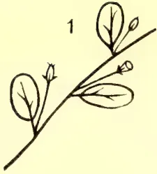
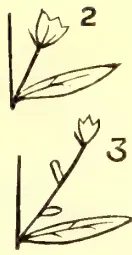
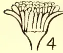
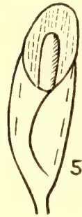
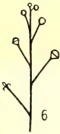
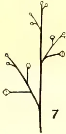
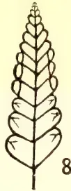
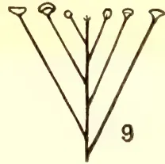
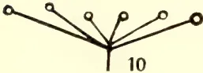
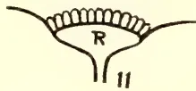
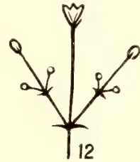
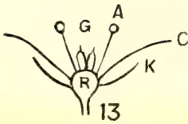
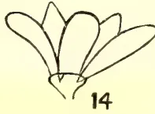
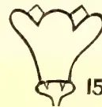
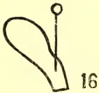
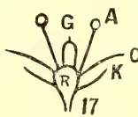
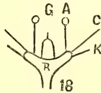
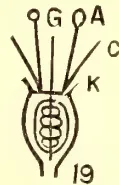

LESSONS IN ELEMENTARY BOTANY. PLATE III.

383------------------------------------------------

This image is a scan of a blank page. The paper has a light cream or off-white color with a subtle texture. There are a few very small, faint dark spots scattered across the surface, which appear to be scanning artifacts or minor imperfections in the paper. No text, lines, or other markings are present.

384------------------------------------------------

OCT. 1906.]343Miscellaneous.

Cotton-growing in India. Ind. Pl. and Gard., 26 Nov. 1904, pp. 825, 842.  
 Caravonica Cottons and Indian famines. "T.A.," Dec. 1904, p 374.  
 Caravonica Cotton for Ceylon. Do. p. 420.  
 Cotton cultivation in Egypt. Bull. Imp. Inst., Jan. 1905, p. 235.  
 The progress of Cotton cultivation in the Sudan. Do. p. 244.  
 Cotton growing in German Colonies. Do. p. 249.  
 Profits of Cotton-growing in Barbados. Agr. News, 28 Jan. 1905, p. 21.  
 Caravonica and other Cottons in Madras. Ind. Pl. and Gard., 6 Jan. 1906, p. 7.  
 Baumwollbau in Aegypten. Tropenpflanzner, 1905, p. 689.  
 The Indian Cotton Industry. Ind. Pl. and Gard., 27 Jan. 1906, p. 60.  
 Results of experiments in cultivation of Cotton in the West Indies. W. I. Bull., 6, p. 109.  
 The Extension of Cotton cultivation. Ind. Agric., 1 May 1906, p. 148.  
 Die Wirthschaftliche Bedeutung des Baumwolls auf der Weltmarkte Beih. Z. Tropenpl. IV., 1903, No. 3, 4.

**Cotton Cultivation, &c.**—Manuring. Queensl. Agr. J., Sept. 1899, p. 295.  
 Cotton Cultivation. Jamaica Bull., Mar. 1904.  
 Practical details of Cotton growing. Natal Agr. Journ., Aug. 1904, p. 780.  
 Cultivation of Sea Island Cotton in the U. S. and the West Indies. W. I. Bull., 1904, p. 287.  
 The manuring of Cotton. "T.A." Jan. 1905, p. 437.  
 Behandlung der Baumwollboden. Der Pflanzner, 1, p. 1.  
 Manurial experiments on Cotton in the Leward Islands. Watts. W. I. Bull., VI., 1905, p. 247.

**Cotton Harvesting, &c.**—Cotton-seed oil industry. Jamaica Bull., V. 1898, p. 249.  
 Cotton-seed industry in the United States. Year-book U. S. Dept. Agr. 1901; W. I. Bull., 1903, p. 32.  
 By-products of Cotton seeds. Ind. Agric. Afric., 1 Aug. 1903, p. 244.  
 Picking Cotton. Agr. News, 1904, p. 1.  
 Cotton ginneries in the West Indies. Agr. News, III.  
 Egreneuses. Rev. d. Cult., Col., 1904.  
 Cotton gins and ginneries. Queensl. Agr. Journ., Aug. 1904, p. 556.  
 Utilisation of Indian Cotton-seed. Bull. Imp. Inst., Mar. 1904, p. 58.  
 Ginning Sea Island Cotton. Agr. News, 17 Feb. 1904, p. 55.

**Cotton: Diseases, &c.**—West Indian Anthracnose of Cotton. W. I. Bull., V., p. 178.  
 The Cotton boll weevil. Agr. Gaz. N. S. W., Jan. 1905, p. 23.  
 Fungoid diseases of Cotton. W. I. Bull., 6, p. 117.  
 Insect Pests of Cotton. do. p. 123.

**Cow Pea.**—Disease in Java. Exp. Sta. Rec., X., 4, 1899 p. 362.

**Croton.**—Kino from *C. Tiglium*. Hooper in Ind. Forester, 31 Dec., p. 717.

**Cryptostegia.**—*C. grandiflora*. Ind. Pl. and Gard., 23 Apr. 1904.

**Cubebs.**—Hartwich, Beiträge zur Kenntniss der Cubeben see Just's Jahresb, 1898, II. 23.  
 Sage, Note on Cubebs. Chem. and Drug., 18 Nov. 1905, p. 797.

**Cyanotis.**—*C. axillaris*, a famine food. Agr. Ledger, V. P. Ser. 46.

**Cyperus.**—Nut grass. Queensl. Agr. J., Nov. 1899, p. 460.

**Dammur.**—*Agathis loranthifolia* (details and figs.) Ind. Mercur, 18 Sept. 1900, p. 661.

**Date.**—Tourney. The Date palm. cf. B. C. Bei., IX., p. 76.  
 Foreign Office report on Bussorah Date season, 1897.  
 The Date Palm for Queensland. "T.A." July 1901, p. 4.  
 The Date Palm and its culture. U. S. Dept. Agr. Yearbook, 1900, p. 453.  
 Date Palm grafting etc. "T.A." Aug. 1901, p. 88.  
 Sur la culture du Palmier Dattier. Rev. Cult. Col., Feb. 1902, p. 83.  
 Dattes (varietes). Journ. d. Agr. trop., II., 1902, p. 110.  
 Schweinfurth, Ueber dem Kultur des Dattels. B. C. 89, 556.  
 Le Dattier Commun. Rev. Cult. Col., Oct. 1903, p. 197.  
 The Date Palm. U. S. Dept. Agr. Bull. B. P. I., 53.  
 The cultivation of the Date Palm. W. I. Bull., V. 159.

45

385------------------------------------------------

344[OCT. 1906.

## SCIENTIFIC AGRICULTURE.

### THE CONSERVATION OF CATTLE MANURE.

The attention given to the conservation of farmyard manure in France is one of the striking things noted in his travels by an agricultural correspondent. "In the yard near the stock buildings on one of the farms visited" he writes, "is a brick enclosure in constructed cement on the inner side. Beneath this, and in the centre, is a large tank into which the urine from the different buildings is conveyed by drainage. The tank is covered by an iron grille, above which the manure is stacked, the heap having vertical sides, and being built from day to day with every care. Above is a roof to keep off the rain, while in the very centre of the heap, and rising from the tank, is a pump. In the natural order of things the manure is wheeled from stable, piggery and cattle shed on to the heap, and carefully spread, so that each form of manure is well mixed, and the quality of the heap equalised as far as possible. From time to time the urine within the tank is pumped over the heap, which is kept well soaked and cool, and in this way, although some loss may occur by volatilisation, the heap is kept from fermenting too rapidly, while the liquid is largely absorbed." Commenting upon the almost universal attention given to the saving of farmyard manure in France, this correspondent thus refers to its exceptional value:—

"The value of this manure does not consist alone in the proportion of fertilising matter which it contains. Farmyard, unlike artificial manures, possesses two values, the one fertilising, the other mechanical. The mechanical condition of a loamy soil is known to be such that crops can be grown upon it with greater ease and success, while it absorbs less labour than a heavy soil. Many clays have great crop growing capacity, but only in proportion to the labour and the farmyard manure bestowed upon them. The fine mechanical condition of a loam is chiefly owing to the high percentage of organic matter which it contains. Add the same quantity of organic matter to a clay and its crop-growing value is at once improved, and improved to a considerable extent. It is for this reason that this manure, which is chiefly composed of organic matter, is of such great importance to heavy lands. Clay soils are almost useless until they have been pulverised, but even then their value is little until they have been well and repeatedly dressed with farmyard manure, which prevents excessive tenacity, permits the entrance of air and water, adds warmth, and generally conduces to the crop-bearing capacity of the soil. As the straw and other organic matter in the manure slowly decomposes, the fertility it contains is liberated; while during the decomposition heat is evolved, and heat is of great importance to plant life. What has been said applies equally to the lighter soils, for just as farmyard manure reduces the tenacity and heavy condition of clays, so it conduces to the homogeneity of the lighter soils, which are too loose, too pervious to water, and too lightly furnished with decomposing material."—*I. P. Gazette*.

---

386------------------------------------------------

OCT. 1906.]345

## Correspondence.

---

### RUBBER TAPPING METHODS.

DEAR SIR,—The *Tropical Agriculturist* for September has done me the honour of publishing my letter and diagram of 18th August on the above subject, and its learned Editor has condescended to “sit on” me. He says in a footnote:—“The full spiral leaves L. F. C. untapped.” With all due respect to constituted authority, I say it does not, as he will see if he folds the diagram into a cylinder till A. C. and B. D. coincide, or if he will look at a tree that has been completely spirally tapped. But, *ne sutor ultra crepidam*, my apology is due for the unscientific statement, which I must have cribbed out of our Rubber Handbook, that “the latex cells have the power of sealing themselves up.” Like the genial Government Agent, C.P., *I now know that* “the latex accumulates in *other* cells near by”—so near, that it takes a high-power microscope to see it. And as a mere practical tapper, who does not go about his work armed with even a magnifier, perhaps I may be forgiven this slip. What my eye sees is the whole of the last tapping line sealed up and dry, as it were, and a thin paring cut starts the flow of latex again all along the line.

Now, to continue the subject matter of my previous letter. During the whole time of the Rubber Exhibition I was present in a subordinate capacity and met a great many rubber planter friends, who nearly all told me “the spiral is doomed”; but not one of them could give me a valid reason for saying so. Some reasons given for holding these views were:—(1) The general opinion among rubber men, (2) It is too drastic, (3) The Controller’s figures prove it is more wasteful of bark than the herring bone system, and (4) The exploded one of ringing the tree.

Well, (1) general opinion is sometimes proved to be wrong. In this case it seems to have been formed by a bell-wether of the rubber flock having plunged through the hedge and the young rams are following gaily through the hole, asking no questions! (2) Any system of tapping may be *made* too drastic; and that is precisely what has been done in the case of the spiral. The arbitrary rule of 1 foot-spacing has been followed to the letter, and spirals and herring-bones have been clapped on to the trees alike, forgetful of the fact that the former means *double* the length of tapping lines of the latter on the trees and therefore, presumably, double the strain on the latter.

Look at the medals commemorative of awards of the Rubber Exhibition. The obverse is a reproduction of a *Hevea* monarch. The unfortunate monarch is now carrying 8 lines of spiral tapping aggregating some 56 lineal feet,—not that he could not carry three times the amount if reasonably spread over his magnificent limbs, but this is all clapped on within six feet of the ground. Please note that if he had been “herring-boned” he would have been carrying only half of this, viz., 28 feet. Ninety per cent of his lesser brethren under tapping are similarly *spirally over-tapped*. And (3) it is from the yields of these trees that the Controller of the Experiment Gardens has drawn his data to compare with those of the herring-bone system, manifestly an unfair comparison, apart from the question of the varying angles of cut which I discussed before, and nobody has, so far, controverted. To make a fair comparison, either the alternate lines of the spiral should not have been cut, or the herring-bone should have been cut on both sides of the tree.

This, of course, is preposterous and mere heresy to the advocates of the herring-bone system; the other side of the tree is left intact so that there may be no question of the uninterrupted flow of sap. Exactly so: and when the first side

387------------------------------------------------

Correspondence.346[OCT. 1906.]

has run out, what then? Proceed to cut the herring-bone on the second, while the first is resting. Just so; and make four (out of the five) complete ringings of the tree (4) which you were so keen to avoid; or leave a space and waste it; or trust to the lacerated bark in 5 parallel sets of lines of the old cut to take up the flow of sap; or wait a bit till it can, and lose yield? What ho! Is there any thing connected with spirals so drastic or wasteful as this? I trow not—yet I make no doubt that much swamp-gas will be belched forth to meet this new aspect of the case.

A captious critic might say that I have “an axe to grind” in my advocacy of the spiral, in so far as I was a co-exhibitor at the Rubber Exhibition of several applications of the spiral system, which have been noticed in the press.

While I have criticized the bases on which the Controller has drawn his deductions as to bark excision and yield, it would be unfair to pass lightly over the fact that he was the first to point out the loss of profit as well as the shock to the tree, in too rapid excision of the bark, and the first to advocate shallow channelling and deep pricking to release the latex; and by these methods to ensure the more rapid renewal of the bark. It is a moot point, however, whether pricking is not a very dangerous operation unless carefully done—at least more dangerous than paring deeply though thinly. The farrier's knife and adaptations of it seem to be having a good look in again, chiefly, seemingly, because of the large task in trees a cooly can do with it. I imagine this will entail a future compulsory rest for the tree—and for tapping operations too!

Apologising for the length of this letter, I am, Sir, yours faithfully,

ALEX. CAMERON

September 29th.

[Portions of the letter which do not bear upon the subject have been omitted.—ED.]

### “SPENCE COTTON” IN INDIA.

SIR,—Since the publication in the press of my letter on the subject of “Spence Cotton,” I have received innumerable congratulations from all parts of India for having been fortunate enough to discover a cotton indigenous to the country and infinitely superior both in staple and appearance to that grown in the United States of America. The immense importance of this and the wide field it opens in the future for the extension of India's manufactures, I am glad to find, is recognised on all sides. I therefore feel confident it will interest your readers to learn the results of a trial of “Spence Cotton” in the mills of Bombay. This Messrs. C. N. Wadia & Co., of the Centuary Mills Co., Ltd., have been good enough to carry out for me, and the following is their report:—

BOMBAY, 11th September, 1906.

J. R. SPENCE, Esq.

“DEAR SIR,—We have passed the four bags of ‘Spence Cotton’ through the processes of spinning and weaving, and have now the pleasure to forward you here-with sample of cloth made therefrom, which we believe is the finest that has ever been made in the power looms from Indian-grown cotton. The cloth is made from 40s warp and 50s weft, and from this trial we are satisfied that the cotton will spin a good 50s warp and 70s weft, from this cloth can be made in fine dhoties for which a great demand exists in India, particularly on the Bengal side, thanks to the Swadeshi movement. To be able to grow such cotton is one of the best things that the Indian

388------------------------------------------------

OCT. 1906.]347Correspondence.

mills could wish for, and will open up quite a new and very profitable [trade, if they will get machinery suitable for the longer staple. If we had had a larger quantity of cotton with which we could have continued the trial, making necessary changes, we are sure a still finer cloth could be made from it. The total loss of weight in blow room is only 3% and we would gladly give 7 annas per lb. for this cotton."

The excellence of the cloth proves the correctness of the opinion I held eighteen months ago that this undoubtedly is the raw material from which the "Dacca Muslin" was made many years ago, which acquired a world-wide reputation for the excellence of its quality. Experts in Bombay and Mysore were of the same opinion at the time. Messrs. Forbes, Forbes, Campbell & Co. have kindly consented to show samples of it at their offices in Hornby Road, to those desirous of inspecting it. In spite of the abnormally bad season on this plantation,—for last July we had 26 inches of rain in two days and not a drop afterwards for seven months, when on the 16th February, the heavy unseasonable rain did incalculable harm,—I am glad to be able to state that my first estimate of the yield per tree has been found to be correct. Average trees a year old were marked and all the cotton carefully put into separate bags, the result being an average of  $2\frac{1}{2}$  oz. per tree. But I am most anxious to be absolutely on the safe side, and have therefore reduced my present minimum estimate to  $1\frac{1}{4}$  oz. per tree, and as 5,000 are now planted to the acre, this gives a result of 400 lbs. of clean cotton or one bale per acre. The second year this is doubled, and increases enormously afterwards during the tree's known life of twenty years. I am exceedingly glad to read the favourable reports of the extensive trial of Egyptian seed in Sind. I have had five years' experience of Egypt, and four years ago strongly recommended it to the commercial community of Bombay, selecting the South of Hyderabad as the most desirable spot to cultivate it. I am naturally much gratified to find that my anticipations of its success have been amply verified. The chief difficulty, of course, is to induce cultivators to adopt the Egyptian methods in place of their present crude ones, and this must be done every season; whereas in the case of "Spence Cotton" the difficulty has to be overcome but once in twenty years, and it will grow and flourish in any soil instead of being confined to Sind only. The immense advantage of this tree over the annual shrub is evident to the meanest capacity. Take the yield first: the late Mr. J. N. Tata estimates the average all over India at 30 lb. of clean cotton per acre. I have visited every cotton-growing district of any importance in the country, and consider this is much too low. I am of opinion the average on non-irrigated land is from 45 to 50 lb. per acre—a deplorably poor outturn, in Egypt the average is 400 to 500 lb., and in the United States 200 to 250 lb. I have a method which would more than double the present yield and at very little extra outlay or necessity for intelligence; but why cultivate such rubbish at all?

I am, Sir,

Yours, faithfully,

J. R. SPENCE.

---

#### ANT HILL EARTH.

DEAR SIR,—I shall be obliged if you or any of your readers can enlighten me on the advantages derived by the use of earth from ant-hills in refilling holes dug in indifferent soils, where a good surface soil is not obtainable, for the purpose of planting different products, such as, tea, rubber, cocoa &c.

Kandy.

K. B. B.

[The earth is very finely divided, but we do not know of any other advantages it may possess.—ED.]

389------------------------------------------------

348[OCT. 1906.]

## Current Literature.

---

*Year-Book of the United States Department of Agriculture, 1905.*—Published at the Government Printing Office, Washington; 815 pages, with 31 articles and an appendix of 44 articles, 73 coloured and photographic plates and 130 text figures; Edited by Geo. W. Hill. This is one of the best annual agricultural publications we know of, and deals with every phase of agriculture practised in the United States, with details of the year's progress and work in each department or branch of the many agricultural industries. The report of the Secretary to the Department, Mr. James Wilson, occupying 122 pages, reviews the year's work and states that 1905 was another year of unsurpassed prosperity to the farmers of the country. After supplying the wants of the people there was an enormous surplus of agricultural produce for export; and to mention only two articles, the increase in the exports of cotton was valued at £1,870,000, and that of rice at £400,000. The increased prosperity of the farmers has led to a large multiplication of small farmers' banks throughout the agricultural regions, banks for which the farmer has supplied the capital as a sound investment. "The man with the hoe has become the man with the harvester and the depositor and shareholder of the bank." The Weather Bureau has proved a useful department to the agriculturist; and the extension of its work in the arid and sub-arid regions has been of great value in the extensive irrigation works in these parts. The Bureau of Plant Industry reports much useful work accomplished in plant sanitation and the treating of plant diseases, in achievements in cotton breeding, in work on nitrogen fixation, investigations into drugs and poisonous plants, etc. The Forest Service, the Bureau of Chemistry, the Bureau of Soils, the Office of Experiment Stations, all show continued active progress. The Bureau of Entomology shows important results gained by the introduction of beneficial insects. The introduction in California of the fig-fertilising insect of South Europe has enabled a new industry in fig-growing to be started on promising lines in that State. Other parasitic insects of various scale pests and of the Gypsy and Brown tail moths, imported pests which have proved most harmful, have been introduced into the States with beneficial results. A systematic effort is also being made to introduce silk culture in the United States, Italian worms being imported.

The Year-book contains a large number of instructive, illustrated articles; photography is largely used to illustrate these, and in "New Fruit Productions of the Department of Agriculture," and "Promising New Fruits," coloured plates are a feature. We may note the following articles as of special interest—Diversified Farming in the Cotton Belt; Dark Fire-cured Tobacco of Virginia; The Business of Seed and Plant Introduction and Distribution; The Handling of Fruit for Transport; Effect of Inbreeding in Plants; Influence of Experiment Station Work on Culture of Field Crops; Relation of Irrigation to Dry Farming; and Opportunities in Sub-tropical Fruit-growing. The appendix of 200 pages has also numerous good articles. The whole Year-book is a splendid compilation, an example of the great progress in agriculture made in the past few years, and evidence of the work being done to encourage and assist the agriculturist in the United States; but, as the Secretary remarks in his report, "great as the work undertaken and accomplished has been, and gratifying as are the results, we are still at the threshold of agricultural development, and the educational work which has led to such grand results has only been extended as yet to a portion of our agricultural population."—I. E.

390------------------------------------------------

OCT. 1906.]349Current Literature.

*The Economic Resources of Uganda.*—This is a report by M. T. Dawe, officer in charge, Forest and Scientific Department, Uganda, of a botanical mission through the forest districts of Buddu and the Western and Nile Provinces of the Uganda Protectorate. An interesting description is given of the country, the vegetation, the animals and the inhabitants of this hitherto little known region. The report pays particular attention to the general distribution of plants, and especially notes the distribution of *Funtumia elastica* and other important rubber plants, and of trees affording useful timber. An important result of the mission was the discovery of *Funtumia elastica* (or *Kickxia elastica*, as it used to be called), the Lagos silk rubber tree, which was not hitherto known to exist in Uganda, and its rubber had never been exploited by the natives. "Its discovery came, therefore, as a great boon to Uganda, seeing that at the present time rubber is of such great commercial importance, and the tree being indigenous no further proof was necessary to assure us of its suitability to our climate and soil." Three new species of *Landolphia*s or rubber-yielding lianas were found—*Landolphia Dawei*, *L. subturbinata*, and *L. ugandensis*—and also one of the *Clitandra*s (*C. orientalis*). These rubber plants are illustrated by plates of botanical drawings made at Kew by Miss M. Smith. Numbers of fine timber trees were also found, and a large collection of valuable timbers made. The greater part of the districts traversed was covered with dense forests and much swamp was found in parts, while the civilization of the natives is very limited and their agriculture of the most primitive description except in a few districts. As regards land suited to planting and agriculture from a European standpoint, the best is said to be in the Mboga and Bwamba countries along the Ruwenzori and Mboga ranges, up to 8,100 feet. "The lower slopes of this mountain range seem to be admirably adapted to the cultivation of tea; the soil is very rich, and I should imagine the rainfall to be here quite 100 inches per year. The whole of this country constitutes one of the finest and richest districts for the purposes of cultivation that I have seen within this Protectorate."

An interesting remark is made concerning the Acholi people, who domesticate the wild forest bee; making "long cylindrical hives about 4 to 5 feet in length and 12 to 18 inches in diameter, of bamboos, wattles, or bark, usually placed in low *Ficus* trees." A full list of plants collected during the mission is added.—I. E.

*Memoirs of the Department of Agriculture in India.*—Botanical Series. (Vol. I., Nos. 1, 2, 3,) issued from the Agricultural Research Institute, Pusa. No. 1, Studies in Root Parasitism, by C. A. Barber, Government Botanist, Madras, deals with the Haustorium of the Sandal Tree (*Santalum Album*), in its early stages, up to penetration; and other plants whose roots it attacks, illustrated by 7 plates. No. 2, Indian Wheat Rusts, by E. J. Butler, Imperial Mycologist, and J. M. Hayman, Deputy Director of Agriculture, U. P., with a note on the Relation of Weather to Rust on Cereals by W. H. Moreland, Director, Department of Lands and Agriculture, U. P., illustrated by coloured plates and diagrams. No. 3, Fungus Diseases of Sugar Cane in Bengal, by E. J. Butler, illustrated by coloured plates and diagrams,

*Lift Irrigation.*—Published by Messrs. Natesan & Co., Madras.—A useful little treatise on the subject of lift irrigation by Alfred Chatterton, with special reference to Southern India. The author advocates the use of oil engines and centrifugal pumps and the use of windmills. The supplies of water at a depth in part of South India have been found to be very satisfactory, and some fifty oil engines are already at work and have resulted in profitable agriculture. Oil engines, even on a small scale it is stated, are much less costly than bullock power. The following are some of the subjects treated—Development of lift irrigation; value of windmills for irrigation in India and America; well irrigation; and irrigation by pumping in the United States.—I. E.

391------------------------------------------------

350[OCT. 1906.

## The Ceylon Board of Agriculture.

The Twenty-second Meeting of the Board of Agriculture was held at Queen's House on Monday, August 6th, 1906, at 2-30 p.m.

His Excellency the Governor presided.

There were present the Hon. Mr. H. L. Crawford, C.M.G., Sir William Twynam, K.C.M.G., the Hon. Mr. C. T. D. Vigors, the Hon. Mr. S. C. Obeyesekere, the Hon. Mr. Francis Beven, Messrs. L. W. Booth, J. P. Lewis, E. F. Hopkins, R. W. Smith, R. B. Strickland, Dr. J. C. Willis, Messrs. E. E. Green, M. Kelway Bamber, C. Drieberg, G. W. Sturgess, the Maha Mudaliyar, Dr. H. M. Fernando, Messrs. E. B. Denham, W. Dunuville, W. D. Gibbon, R. Morison, A. T. Rettie, G. A. Joseph, and the Secretary.

Visitors:—Messrs. J. H. W. Park, M. Suppramaniam, J. Whitehead, and S. Weerackkody Mudaliyar.

### BUSINESS DONE.

1. 1. Minutes of last meeting were read and confirmed.
2. 2. List of new members was read, and they were declared duly elected.
3. 3. Progress Report No. 21 was tabled.
4. 4. A paper was read by Mr. J. H. W. Park, Assistant Director of Irrigation, on the subject of "Irrigation in Arizona." A discussion followed, in which H. E. the Governor, Dr. Willis, Messrs. Hopkins, Smith and others took part.
5. 5. The report of the Special Committee appointed at the last meeting of the Board, suggesting certain amendments in the draft of the proposed Ordinance dealing with the destruction of Agricultural Pests and the Sanitation of Plants, was submitted. After a brief discussion the report was adopted.

6. Copy of a resolution conveying the thanks of the North Arcot District Agricultural Association to the Ceylon Agricultural Society for the assistance and information given to their Asst. Secretary, Mr. Sreenivasa Raghava Aiyar, on the occasion of his visit to Ceylon in May last, was laid before the meeting.

7. A leaflet was read by Mr. E. E. Green, Government Entomologist, containing suggestions put forward by himself and the Government Chemist, Mr. M. K. Bamber, as to the possibility of preventing the spread of malaria through the agency of the "anopheles" mosquito by the use of an application composed of citronella, kerosine and coconut oils with a certain proportion of carbolic acid. Mr. Bamber submitted a sample of the preparation. A discussion followed, in which H. E. the Governor, Dr. Willis, Dr. H. M. Fernando and others took part.

8. An application from Mr. Drieberg, Superintendent of School Gardens, for a vote of Rs. 100 to meet the cost of a stocked hive of imported bees and to continue the experiment in apiculture was considered. Resolved that the sum asked for be voted.

9. On the suggestion of H. E. the Governor it was resolved that an exhibit representative of native arts and crafts should be shown under the auspices of the Ceylon Agricultural Society at the forthcoming Rubber Exhibition at Peradeniya.

His Excellency desired the Secretary to communicate with the Government Agents and local agricultural societies with a view to securing as representative a collection as possible.

10. Samples of Sea Island and Caravonica cotton grown in the Matale district by Mr. A. H. Don Bastian de Silva, and sent in by the Hon. Secretary of the Matale Agricultural Society, were laid on the table.

392------------------------------------------------

OCT. 1906.]351

## Agricultural Society Progress Report. XXII.

The membership of the Ceylon Agricultural Society is now 1,120.

1. *Agri-Horticultural Shows.*—I was present, by invitation of the Government Agent, North-Western Province, at the *Kurunegala Agri-Horticultural Show* held on the 23rd to 25th August. The show, which was the first of the kind ever held in the North-Western Province, was on all sides considered to be an unqualified success. It had twice been postponed owing to the unusual drought, but in spite of the continuance of the drought up to a short time before the show the exhibition of fruits and vegetables, &c., was remarkably good, while the classes for live stock were exceptionally well filled. His Excellency the Governor visited the show on the opening day. The reports of the scientific officers of the Society on the sections judged by them are tabled.

On the 7th and 8th August I was present at the *Kelani Valley Agri-Horticultural Show*. The show was held on the grounds of the Kelani Valley Club at Talduwa, and was opened by the Hon. Mr. H. L. Crawford, Government Agent, Western Province. Like that at Kurunegala, the Kelani Valley Show was the first of its kind ever held in the district, and, although it fell short of the former as regards the number and variety of exhibits of village produce, the classes for estate products, such as tea and rubber, were very well filled, as was also the poultry section.

The success of both these shows was most encouraging, and much credit is due to the Honorary Secretaries, Mr. A. W. Seymour, C.C.S., at Kurunegala, and Messrs. J. W. Bamforth and C. J. A. Marshall at Talduwa, for the trouble taken by them to ensure a successful exhibition. It is to be hoped that both shows will become annual fixtures.

The *Kegalla Agri-Horticultural Show* will be held on the 21st and 22nd September.

It is proposed to hold a show of fruits and vegetables towards the end of September at *Telijjawila*.

At a meeting of the Telijjawila Local Society held on the 6th July it was decided to hold a show of agricultural and industrial products of Weligam Korale on the 15th March, 1907, at *Weligama*. It was further agreed to give a prize of Rs. 50 for the best vegetable garden in crop in the next planting season, which will be at the end of the year, and three prizes of Rs. 50, as at the previous show, for the best results shown by transplanting of paddy in the ensuing *yala* harvest. It was also agreed to include a class for cattle (milch cows or best-fed bulls) at this show.

Further shows will be held at the following centres as under :—

<table style="width: 100%; border-collapse: collapse;">
<tr>
<td>Three Korales and Lower Bulatgama (Market Show)</td>
<td>...</td>
<td>October 21.</td>
</tr>
<tr>
<td>Wellaboda Pattu (Galle)</td>
<td>...      ...      ...</td>
<td>November 16 and 17.</td>
</tr>
<tr>
<td>Batticaloa</td>
<td>...      ...      ...</td>
<td>Early in 1907.</td>
</tr>
</table>

At a meeting of the Three Korales and Lower Bulatgama Branch held on the 21st July it was agreed to increase the number of prizes offered from 12 to 26. Nine of the prizes are of Rs. 10 each, the rest being Rs. 5 each. Among the donors are Messrs. W. Forsythe, W. J. Smith, R. I. Mackenzie, several headmen, and local merchants.

2. *Experimental Garden, Ratnapura.*—The Committee appointed at the last meeting of the Ratnapura Branch have suggested two or three sites for opening the proposed experimental garden in the town of Ratnapura, but no definite selection has yet been made. It is expected that the matter will be definitely settled at the next meeting.

46

393------------------------------------------------

352[OCT. 1906.

3. *Yams*.—Mr. A. E. Rajapakse, Chairman of the Katunayaka Branch, reports as follows:—"Besides cassava, there is another kind of yam which would be very useful to poor people if introduced to places where it is not found. This is a kind of sweet potato largely grown in the Southern Province. There are varieties of it—yams that could be lifted in two months, three months, and six months, &c. The early varieties are very successfully grown in paddy fields, after the paddy has been harvested." Mr. Rajapakse will be glad to supply these yams to any one willing to experiment with them free of cost.

4. *Manure for Experiment*.—Messrs. Freudenberg & Co. have supplied to the Local Branch at Gampola 22 cwt. of manure for purposes of experiment with paddy.

5. *Date Palm Suckers*.—Mr. V. Casipillai of Jaffna reports under date the 15th August that all but two of the date palm suckers supplied to him have died, and that the two suckers that have so far survived have not yet begun to grow, though they are well looked after. Mr. Casipillai has promised to report further on the growth of the two remaining suckers.

6. *Lemon Grass Rootlets*.—Mr. B. Samaraweera of Weligama reports that he has a quantity of these for sale. Rootlets can be obtained on application direct to Mr. Samaraweera.

7. *Prickly Pear, Extermination of*.—The Government Agent, Northern Province, Jaffna, has sent the following report from the President, Delft Gansabhawa, on the result of the experiment in exterminating this pest:—"I have the honour to report that I tried the solution of sodium arsenic on a bush of prickly pear in front of my bungalow on the 28th ultimo, and the effects have been simply surprising. Within twenty-four hours the leaves turned brown, and the second day the whole bush looked burnt and dry. The experiment has proved a success, and the villagers are very anxious to have this plant fully removed from the Island, and I shall get the Village Committee to vote the necessary funds for obtaining the solution in large quantities and the necessary implements required for the purpose as directed."

8. *Seed Paddy from India*.—The Thasildar of Tanjore, who was asked to obtain for the Society a supply of *Muttusamba* paddy, states that he was able to procure only a small quantity, and that even the amount collected is now reported to be unfit for seed. He regrets that under the circumstances *Muttusamba* paddy cannot be despatched this year.

9. *Six-Months and Five-Months Seed Paddy from India—Samba Varieties*.—Two consignments of six-months and five-months seed paddy from India, consisting of nearly 700 bushels, were received early in August. This paddy consists of three varieties:—

- (a) Small grains containing round and white rice (five months).
- (b) Long white grains containing white rice (five months).
- (c) Long red grains containing white rice (six months).

Some of this paddy has been supplied to Vavuniya, Gampola, Badulla, Puttalam, Kegalla, Kurunegala, Kandy, Nawalapitiya, Nuwara Eliya, Balangoda, Matale, Angammana, Katunayake, and Katana.

Supplies of these paddies are still available, and application for them should be made direct to the Director, Royal Botanic Gardens, Peradeniya. The cost of the seed paddy is Rs. 2.75 per pushel.

10. *Banku Paddy from India*.—The supply of Banku Paddy received from India (a four-and-a-half months variety) has been fully booked among the following districts:—Kurunegala, Jaffna, Kandy, Balangoda, Gampola, Mullaittivu, Colombo, Welimada, and Badulla.

394------------------------------------------------

OCT. 1906.]353

11. *Three-Months Paddy (Local).*—Ten bushels of three-months seed paddy were supplied by the Matale Local Branch to the Anuradhapura Local Society on the application of Nikawewa Dissawa, who sowed eight bushels himself and gave two bushels to Mr. Sampander (Proctor, Anuradhapura). Nikawewa Disawa reports that he realized a crop of 78 bushels. He writes that he could have obtained a better crop but for the harm done by flies, owing to the paddy being sown out of the proper season. "The paddy does not appear to do well in very muddy lands, but thrives exceedingly well in moderately muddy places."

12. *Kiushu Paddy.*—The Mudaliyar, Wellaboda Pattu (Galle), Hikkaduwa, reports:—"The paddy was sown on different sorts of lands and at different dates, with all possible care as to preparation of ground, but the result in every case was unsatisfactory."

Mr. C. A. Valoopillay of Anuradhapura reports:—"I bought from the Chairman of the Anuradhapura Branch one bushel of Kiushu paddy and sowed the same on the 31st March last on a well-prepared clayey soil by the side of a waste water channel, from which I was able to turn water in and out so as to suit the requirements of plants. It germinated at the same time as other varieties under the wet method, and the plants appeared healthy but shorter in height. Weeding and transplanting were started after the thirty-fifth day as usual; but I had to suspend weeding as the plants had begun blossoming. The plants did not grow more than two feet in height, but the yield was 35 bushels, and it may be fifty-fold and even more if properly weeded. I am now making a second trial in the same fields and will submit a report in course of time. I have about 30 bushels of seed paddy of this variety, and have given away about five bushels in this Province and in Jaffna to be sown and tried. I can state with confidence that this paddy is a success in my fields. Further experiments in rich soil or under good manure and careful cultivation may reveal better results. I am also of opinion that this paddy serves better to compensate in times of scarcity of water, as it could be reaped in seventy-five days. In this trial the sowing was done on 31st March, 1906, and reaped on 23rd June, thus taking eighty-five days in all. I am of opinion that this paddy is suitable to this country."

In continuation of the previous report published in Progress Report No. XXI., the Honorary Secretary of the Badulla Branch writes:—"The owner of the field in question sowed one bushel of Kiushu paddy; when harvested this seed brought in half a bushel of produce. In the same field he sowed native paddy, and this brought in on an average  $6\frac{1}{2}$  bushels of paddy."

The Secretary, Wellaboda Pattu (Galle) Local Society, reports under date the 17th August that, though tried in different ways and in different soils, the Kiushu paddy did not thrive. The opinion of the members of his Society is that it is unsuited to that part of the Island.

The Secretary of the Local Branch at Hambantota reports that the paddy was sown on land irrigated by Tissa tank, but the cultivation failed for want of sufficient water.

13. *Cotton Seed.*—It is proposed to introduce a series of experiments with cotton as a chena crop. Special chena permits are being issued in the Mullaitivu District and in the Wanni Hatpattu of the Kurunegala District, one condition of which is that each permit holder shall sow a certain extent of land with cotton. I had the advantage during my recent visit to Kurunegala of discussing the subject with Hulugalle Disawa, under whose personal supervision I am confident that the

395------------------------------------------------

354[OCT. 1906.

experiment will be given every chance of success. I am now making arrangements for a supply of seed for experimental purposes in the following localities:—

<table>
<tr>
<td>North-Western Province for</td>
<td>...</td>
<td>250 acres (for chena cultivation)</td>
</tr>
<tr>
<td>Mullaittivu</td>
<td>...</td>
<td>120 ,, (for chena cultivation)</td>
</tr>
<tr>
<td>Jaffna</td>
<td>...</td>
<td>20</td>
</tr>
<tr>
<td>Delft</td>
<td>...</td>
<td>5</td>
</tr>
<tr>
<td>Batticaloa</td>
<td>...</td>
<td>20</td>
</tr>
</table>

14. *Rotation of Chena Crops.*—Other experiments are proposed as regards chena cultivation in the Mullaittivu and Kurunegala Districts.

The following rotation of chena crops has been suggested by the Director, Royal Botanic Gardens, for experiment in Kurunegala:—Cotton, Tapioca (*i.e.*, Cassava), Dry Grains, and Ground Nuts.

These experiments should prove of interest to chena cultivators in all parts of the Island, their object being to prove whether it is not possible by the adoption of a scientific rotation of crops to overcome the necessity for allowing chena lands to lie fallow for ten or twenty years at a time, as is at present done in most parts of the country.

15. *Vegetable Seeds.*—A further supply of vegetable seeds is to be imported by the Society shortly.

16. *Castration of Cattle.*—Since the last report three demonstrations have been given in the Southern Province, namely, at Ganegama, Wanduramba, and Nagoda. Eight demonstrations have been held in the North-Western Province, at Nawagategama, Ihalapitiya, Kulama, Mampuri, Nachchikalli, Kalpitiya, Moheriya, Kattakadu, and Pallare. Twelve in the North-Central Province: at Toruwewe, Karawilagala, Gantiriyagama, Halambawe, Galkiriyagama, Balaluwewa, Unduruwe, Kadawatgama, Etakade, Kallanchiya, Tambagalollega, and Rambewa. Twelve demonstrations are in the course of arrangement in the North-Western Province.

To date the figures are 2,293 cattle castrated, belonging to 1,872 owners, at 113 demonstrations 122 men have been taught the operation.

17. *Castration Work by locally trained Men.*—The following are details of work done by the men trained at local centres:—

Hambantota 10 animals castrated, Lower Dumbara 13, Matara 99 (in 1905), Panadura 40, Delft 24, Kandy District (Harispattu 6, Pata Dumbara 13) 19; in Wellaboda pattu (Galle) the locally trained men are reported to be carrying on work. Owing to want of instruments and medicines no operations have been carried out by the trained men in Mullaittivu, Three Korales and Lower Bulatgama, Chilaw, Talangama, Mannar, and Anuradhapura. Arrangements are being made to supply the necessary instruments and drugs. The Jaffna Branch, Delft Gansabhawa, and the Village Committees of the Central Province have supplied instruments and medicines to the men in those districts. Two men trained in the new method on Horrekelly estate are doing work there.

18. In accordance with the resolution passed at the last meeting of the Board, arrangements were made to hold an *Exhibition of Native Arts and Crafts* in connection with the Ceylon Rubber Exhibition at Peradeniya. Dr. A. K. Coomaraswamy very kindly undertook to arrange for a representative exhibition of the manufactures of the different parts of the Island. A special pavilion has been erected for the Society on the Exhibition Grounds, while in addition four small tents have been set apart for its use. Some seventeen parties of workmen have been engaged, who are now giving daily demonstrations of their art. These include weavers and brassfounders from Batticaloa, a painter from Jaffna, a cloth dyer from Mannar, lace makers from near Colombo, workers in silver, brass, ivory, lacquer-

396------------------------------------------------

OCT. 1906.]355

work, and iron damascening, potters, ironfounders, and weavers from the Central Province. A large number of exhibits of weaving, basket making, brass work ivory work, &c., &c., are on view.

Copies of a Handbook dealing with the Arts and Crafts of Ceylon, by Dr, Coomaraswamy, are available at the Exhibition.

19. In addition to the above, special exhibits of various products have been got together. Mr. M. K. Bamber has kindly arranged a representative exhibit of coconut products and tobacco; Mr. C. Driberg of oils, fibres and tanning, and dyeing stuffs; Mr. E. E. Green of silk and silkworms from the Government Silk Farm. Mr. A. E. Rajapakse, Muhandiram, has sent in samples of cinnamon from Negombo District, and Mr. J. W. C. de Soysa and Dr. H. M. Fernando samples of cotton from Kurunegala. Mr. J. Whitehead is giving an exhibition of cotton ginning and dyeing, while Mr. M. K. Bamber is giving a demonstration in the distillation of camphor.

The Dumbara, Telijjawila, Kandaboda pattu, Wellabopa pattu (Galle.) Vavuniya, and Jaffna Agricultural Societies have sent in representative collections of native products and manufactures.

The exhibition made on behalf of the Society is in every way a valuable and interesting one, and the thanks of the Society are due to the gentlemen who have been good enough to lend their assistance in arranging for the different exhibits.

A. N. GALBRAITH,

*Secretary, Ceylon Agricultural Society.*

September 17, 1906.

---

397------------------------------------------------

This image is a scan of a blank page. The paper has a light beige or cream-colored tint. There are a few very small, dark specks scattered across the surface, which appear to be scanning artifacts or dust particles. No text, lines, or other markings are present on the page.

398------------------------------------------------

THE  
TROPICAL AGRICULTURIST  
AND  
MAGAZINE OF THE  
CEYLON AGRICULTURAL SOCIETY.

---

VOL. XXVII.

COLOMBO, NOVEMBER 15TH, 1906.

No. 5.

---

**The Price of Rubber.**

---

The general impression held in Ceylon, in spite of all efforts to remove it, has been that Ceylon rubber has been getting the highest price on the market, because, forsooth, a pound sells (at present) for 5s. 7d. against 5s. 1d. for a pound of fine Para.

Those who make this statement forget the amount of water present in the Amazon rubber and not present in the Ceylon. The former contains about 18 per cent, the latter less than one. If now we do a very simple sum in proportion, the value of the *rubber* in the samples from Ceylon and from Para is as  $\frac{6.7}{9.9}$  to  $\frac{6.1}{8.2}$ , or as 5494 to 6639. In other words, the value of Ceylon rubber is roughly only five-sixths of that of the Amazon rubber, or 16 per cent *less*.

No one who examined the samples of Amazon rubber at the Ceylon Rubber Exhibition could fail to note two points: (1) that it was far 'springier' than the plantation rubber (whether from Ceylon, the Straits, or Mexico), and (2) that it was so wet as to be white and opaque or very little translucent, and smelt of creosote.

As has already been said, now is the time to try experiments on curing of rubber, and two directions are at once suggested by a consideration of the above. If we make biscuits with creosote, and press them while still wet into a block, we shall save vastly in expense of preparation, and if while dry rubber is selling at 5s. 6d., we can get even 4s. 10d. for this, we shall really be getting a better price. Smoking is also suggested, for it is possible that the quality of the Amazon rubber is in some way dependent on the fact that it has been treated with smoke.

The Peradeniya department has already arranged to make wet biscuit block and have it sold in London for comparison, but as it is quite probable that buyers will look askance at the first consignment of this novel form of rubber, it is desirable that others should follow it.

---

399------------------------------------------------

358[Nov. 1906.

## GUMS, RESINS, SAPS AND EXUDATIONS.

### Rubber Shipment to London.

BY C. DEVITT.

*A Lecture delivered at the Ceylon Rubber Exhibition, Royal Botanic Gardens, Peradeniya, on September 22nd.*

One of the most important points in the packing of plantation rubber is, as you all know, to get it absolutely dry and quite free from surface moisture before shipping, as any dampness, even if it is only on a few biscuits or sheets, is likely to ruin the whole case-full. We very often find where moisture has been left, the rubber has turned white and decomposition has started, making it unsightly, weak and evil-smelling. Another point of importance is not to put biscuits showing the slightest trace of tackiness into the same case with fine; it is better to throw them away. We also very often find good scrap spoilt by tacky pieces, and rejected from the fine being put in with it. Buyers do not like qualities mixed at all, and frequently parcels are spoilt by the presence of a few pieces of inferior quality. Even if there is only one piece, it has to be shown in the sample. Crêpe is the worst offender. Samples of a shipment come up from the wharf, fine pale stuff with one or two inferior dark pieces. When the buyers see these they mark it down in their catalogues as fine pale crêpe mixed with inferior dark and value accordingly, not knowing what proportion it is in, and to obtain which involves great expense and trouble. Some planters grade their rubber and mark it accordingly, such as No. 1, 2, and 3. There may be the slightest difference in the quality and appearance of say No. 1 and No. 2 crêpe, but a buyer having an order for No. 1 at 5/7 would perhaps be willing to pay just a shade under for No. 2; but seeing it marked at No. 2 he would be afraid to buy it as No. 1.

#### THE SIZE OF THE CASE

is quite unimportant now that the draft is uniform.  $1\frac{1}{2}$  cwt. seems to be a popular weight, but it really does not matter so long as you do not make them too heavy, as it causes extra labour in handling them. To have good strong cases is essential, the rubber is liable to contract in transit between the estate and London and becomes a loose mass, bumping badly about inside, and an extra rough piece of handling will knock the sides out.

Paper must on no account be used in between the pieces. It does not matter whether it is biscuits, sheet or crêpe; in nine cases out of ten it will stick and cause great expense to have it removed.

#### THE FORM OF RUBBER PREFERRED.

It is impossible to say in what form the rubber is to be sent in the future, but at present the block seems to be most popular among everybody. 2d. per lb. is a big premium. We very seldom see a difference of more than  $\frac{1}{2}$ d. per lb. between fine and extra fine. As a rule when the price is made, the rest go at the same, unless there is anything wrong with a lot, and then a  $\frac{1}{2}$ d. or 1d. is knocked off; or there may be a small order for very fine, and then you may get a  $\frac{1}{2}$ d. more.

There is no objection to biscuits or sheet in London; but it is for planters to decide whether they can make them and dry them in their thousands. There still seems to be a slight prejudice against crêpe, as it is  $\frac{1}{2}$ d. per lb. below other forms; but if it is the most convenient form for planters, manufacturers will have to get

400------------------------------------------------

Nov. 1906.]359*Saps and Exudations.*

over their objection if they want the rubber. The same with scrap. The old hand-made form is still the most popular, for the reason that buyers can see exactly what is in it, while the majority of crêpe scrap is dark and appears to have foreign matter in it. But I understand that the former is far more trouble and takes a great deal longer to prepare than the latter. Therefore it will have to come as crêpe, and buyers will get to know certain marks and will be sure of what they are getting and always stick to them.

At present crêpe is valued almost entirely on colour, and I heard of a case from a planter where he sent home some scrap crêpe of very good colour, and realised within a shade of fine; but he thought he would improve on it by making it thicker which, of course, made it appear darker; for this he only got the price of scrap.

#### NEW FORMS OF RUBBER.

It is very hard to find out if a new form is liked on the market. A planter may invent some new method and ship a parcel over. Buyers eye it suspiciously and will not give its real value, the planter hears the result of the sale and stops making any more and goes back to the old. Things must find their level soon, and we hope before long to get manufacturers to say definitely what they like best. All they say at present is that they want evenness in every way; that is to say, good, strong, pure rubber of good appearance and colour. It doesn't matter whether pale or amber so long as it is bright looking and transparent. This is of course rather difficult to get owing to the strength varying so, probably due to difference in the age of the trees; when the quantity of Plantation Rubber has increased considerably, buyers will be able to pick and choose the stronger and better lots, and I have no doubt that there will be a considerable difference in price between the two qualities. The reason why all the fine fetch within a fraction of each other is because the buyers have to take good and indifferent alike—the quantity offered at one time not giving them the chance to pick out the stronger and better lots.

#### SEPARATING RUBBER FROM OLD AND YOUNG TREES.

Planters ask if it would pay them to keep the rubber from old trees separate from the young; for undoubtedly the strength of the rubber is in a great measure due to the age of the trees from which it is obtained; and I think most of us are agreed that this is so, after seeing the samples from old trees at the Exhibition. I do not think it would pay to keep the two separate at present; but I have no doubt that in the near future, when quantities increase, it will.

With regard to the tapping of young trees, it may not do the trees themselves any harm, but it is likely to lower the high standard at which you are all aiming. I have every hope and have no doubt that plantation rubber will be the standard of the world, not only in purity but in strength, and all the properties for which the Amazon rubber is noted. But I should not decide for certain that when your trees are old all their rubber will be stronger, for I have seen some biscuits from 21-year old trees as weak as anything. (Applause.)

#### THE DISCUSSION.

Dr. WILLIS said he thought that they had just listened to a most interesting lecture from Mr. Devitt. He was sure the subject of packing rubber for London was of very great importance to all planters. He would like to call special attention to what the lecturer had said about the mixing of rubber. He said that at present the amount of rubber that went to London was so small, that it did not very much matter. He had occasionally seen people mixing biscuits from very young trees with biscuits from very old trees. He had found two biscuits in the same lot, one of which was good and strong, and the other which was much weaker and could be pulled in half with some effort. As soon as the market got large quantities of

401------------------------------------------------

Gums, Resins,360[Nov. 1906.

their rubber, it would be sold not on the fact that it was Ceylon rubber, as at present when people wanted to buy it chiefly for experiments, but on the strength and physical qualities of the rubber; and the sooner they learned to keep their rubber of a fine grade separate and not mix it, the better. As regards that, he said a good many people graded their rubber at present, but he thought the most of that grading at present was done according to colour and other fairly obvious properties, because the few analyses which had yet been made to test the strength &c. had shown a most extraordinary difference in the various kinds of Ceylon rubber. There were some published in the *Tropical Agriculturist* the other day, giving the tests made in America, and it was shown that they came out in a tensile strength from 85 to 145. That was a considerable difference, but they did not know what it was due to. Rubber from older trees, it is obvious, is the stronger rubber, and he gathered from all the remarks made by these gentlemen from London that it was strength that was the main quality; and he therefore personally thought they would have to come to some machine like that exhibited by Mr. Carruthers for the purpose of testing the quality of the rubber for strength. The London people at present went a good deal by colour, because they were a little afraid that the rubber, some of it being very dark, might not be pure, but he thought that after some time, as in the case of tea and cocoa, they would get to know that the Ceylon planter does not adulterate his products, and that it is unnecessary to look for impurities in his rubber. As he had said the other day, now was the time to experiment with the making up of rubber for shipment and the shipping of it in different ways before the market had got wedded to one particular way. He hoped there were many proprietary planters, who were comparatively independent, who would take the opportunity of experimenting in shipment. They might lose a penny or two at first, but important knowledge would be gained. He had seen people mixing tacky rubber, too, along with good rubber. A planter had said the other day that if they put a piece of tacky rubber in the middle of a block and squeezed it, nobody would recognise it. But Mr. Bamber had told them a certain type of tackiness was infectious and it might spoil the whole block. It was important not to mix tacky rubber with good rubber. It should be kept separate. It might be possible to pass it off at first, but before long the buyers would be sure to find out, and the price of the whole lot would go down. With regard to shipment, Mr. Devitt inclined in favour of block, and most of them who had seen the Lanadron blocks in the Show were inclined to agree with him. These blocks contained 25 lb. of rubber, and it was obvious they occupied a much less space, and, consequently, cost much less in shipment, and they exposed less surface to the air than did a similar weight of biscuits, and therefore less oxidation went on. They were beginning to know that oxidation of the surface had a considerably deteriorating effect.

#### HOW RUBBER ARRIVES IN LONDON.

Mr. JAMES RYAN:—I should like to ask Mr. Devitt how rubber arrives in London at the present moment—the form of package which he recommends most, and the condition of scrap, biscuits and crêpe on arrival. I want to know, for example, whether these biscuits on the voyage by contraction or agglutination stick together, and what process is used for removing them when they do arrive; and what package does he consider sufficiently strong for a cwt. or a half cwt.? He warned us against using weak packing. I wish to know what package he recommends.

Mr. DEVITT:—These biscuits arrive in an agglutinated mass. I do not think you will find any way in which the biscuits will not be stuck to a certain extent, but they can always be pulled apart unless there is some tackiness. As regards the case, I think most planters agree with Mr. Campbell, who said the other day that

402------------------------------------------------

Nov. 1906.]361*Saps and Exudations.*

rubber was worth a good coffin, and that was why he did not like packing it with a piece of sacking round it. I should like to see some shipped in the way suggested by Mr. Ryan. It would, however, have to be opened and repacked in London.

Mr. RYAN:—That does not answer my question. The question I asked is, how does rubber now get to London?

Mr. DEVITT:—We get it in cases of from 20 to 400 lb. weight. Most of it comes over in ordinary tea chests.

#### THE QUESTION OF SAMPLING.

Mr. T VILLIERS:—Might I ask, having all these different-sized packages, on what principle you draw your samples?

Mr. DEVITT:—They open them at the wharf and take out a fair average sample.

Mr. VILLIERS:—If there is a 20 lb. case and a 4 cwt. case, what sample would they take from each?

Mr. DEVITT:—Generally about the same. We generally get up 2 or 3 lb. of each, but where it is a large lot of say 20 large cases we get 5 or 6 lb.

Mr. VILLIERS:—Then there is no fixed principle, as in the case of tea?

Mr. DEVITT:—No: it is a fair average sample that is taken. If the rubber is not manifested in different grades, they are assorted according to quality.

Mr. VILLIERS:—On the wharf?

Mr. DEVITT:—Yes; we get up samples of good biscuits and of inferior. They are put in ten cases, say, five cases fine, three cases indifferent, and two of scrap. This is the average sample of the five cases and the other sample is of the three cases indifferent and two of scrap. There is no fixed weight they use. They take a fair average sample at the wharf.

Mr. VILLIERS:—Who is in charge of deciding the amount of the sample?

Mr. DEVITT:—The old experienced men.

Mr. VILLIERS:—From the brokers or from the merchants?

Mr. DEVITT:—They are not brokers. It has nothing to do with us. The people at the wharf are responsible.

Mr. JAMES RYAN:—Well, are you satisfied with the general condition of the packing of rubber in Ceylon, and the way it arrives in London now? Do Ceylon packages arrive in good condition?

Mr. DEVITT:—Yes, as a whole, but we have known cases where a thin veneer was used and they have come in a broken condition. We have even heard of them being manifested as broken.

Mr. RYAN:—Then we have a disease—what is your remedy?

Mr. DEVITT:—Not to use these thin cases. (Laughter.)

Mr. RYAN:—Oh! That is all very well, but that is like telling a person who is sick not to be sick any more. What kind of medicine would you prescribe? Do you think the ordinary half-inch tea package sufficient, and what form of clamping and nails do you recommend?

Mr. DEVITT recommended the ordinary tea chest with an iron rim round it and one inch to one-and-a-half-inch nails.

Mr. RYAN:—I take it if you used the ordinary tea chests the weight of rubber would be three times that of the tea chest, especially if it was concentrated in the block form. It contracts on the voyage and is constantly edging in and out, and in spite of that you are wholly satisfied with the condition of the arrival of rubber in London.

403------------------------------------------------

Gums, Resins,362[Nov. 1906.

Mr. DEVITT:—It is not in many cases it is packed in these thin wood boxes, but we have known cases and we do not want planters to go on using them.

Mr. RYAN:—Can you suggest any improvements?

Mr. DEVITT:—I think yours is a very good idea for binding them round with canvas, but I think they would have to be repacked in London at the planters' expense.

Mr. RYAN:—Quite so. I can easily improve on that; but the point is whether your difficulty was that it was difficult to re-open and difficult to repack these packages because that can be got over by a different method of tying and pleating. Do you recommend the addition of some disinfectant to the outer surface, such as formalin? Would that be an objection to the trade?

Mr. DEVITT:—I think it would.

Mr. RYAN:—Would they be able to detect formalin, if applied externally to the package?

Mr. DEVITT:—I think so.

Mr. RYAN:—Then you have spoken of paper and warned us against its use. You spoke of plain paper? Have you had any experience of waxed paper?

Mr. DEVITT:—I only saw it in the Exhibition, and it seemed very satisfactory.

Mr. RYAN:—How about the ventilation of the case?

Mr. DEVITT:—It will get quite enough, I think. There is no need to make special ventilation.

#### PACKING IN SACKING.

Mr. RYAN:—Mr Brett complained that any form of pressure applied to the rubber in the form of sacking seemed to have a deteriorating effect on the rubber.

Mr. DEVITT:—We get rubber from other parts of the world in bales, and when it is being cut it has to be cut right through the sacking, which has become attached to it; and the sample is sent up in that way.

Mr. RYAN:—It seems to me it is perfectly evident you must have some simple substance to put in between the packing and the rubber. How would thin strips of veneer do?

Mr. DEVITT:—I think that would get over the difficulty.

Mr. RYAN:—My object is to try and elicit from you some idea as to what you would suggest would be the very best method of packing. We are not going to spoil the ship for a ha'penny worth of tar, but at the same time we have a natural desire to economise. Proceeding he said, they would like to get information on this point by experiments. He would like Mr. Devitt to take home some rubber packed in various ways and report to him, and those individuals that would be associated with him, on the way it arrived in London. He would like to send it home by a way that it would reach home after Mr. Devitt had arrived himself, if necessary sending it round Cape Horn. He would like to have it knocked about a good deal, so that when they got Mr. Devitt's report they might know whether they were not groping in darkness or walking in the light. (Laughter, and Hear, hear.)

Mr. DEVITT:—I cannot tell you how your packing will answer until I see it arrive in London. The blocks we received so far were in beautiful condition. These were packed in a strong case. They were stuck together, but there was no actual tackiness. We took them from each other with a crowbar; they were quite satisfactory. The case was of half-inch wood.

Dr. WILLIS said that with regard to the packing of block rubber with sacking round it, he saw some planters on the previous day examining the package Mr Ryan had prepared in the show. One planter held it up and let it drop, and

404------------------------------------------------

Nov. 1906.]363Saps and Exudations.

it immediately bounced right out of the window. If they were going to have their packages leaping and bounding all over the docks, there might be some disadvantage. (Laughter.) He did not know in what way it was handled at the docks or anywhere else, but it struck him with this kind of package there might be disadvantages.

#### THE DOCK LABOURER AND RUBBER.

Mr. SMITHETT:—What Dr. Willis has just said about rubber bumping is frequently true, and I think planters have to remember that the average dock labourer in London does not care a brass rap what happens to the package he is dealing with. What he chiefly thinks about is of being able to get off to his dinner as soon as possible, or something of that kind. I think that considering the great amount which we hope in the near future you will be able to send to the market, it will not be worth while, as Mr. Ryan has said, spoiling the ship for the sake of a ha'p' worth of tar. I do not know the actual cost of the half-inch tea chest, but considering that you can get half a cwt. of rubber into one, I don't think it will be so great as to detract much from the cost of the rubber. In regard to packing in bales, as Mr. Devitt has said, the fibre inside the packing is very liable to attach itself to the rubber. I have seen several consignments of crêpe sent home in sacks of that, and it was very noticeable that the whole of the outside of the crêpe was covered with small fibre from the inside of the sack. Regarding the Venesta tea chests, I saw some rubber sent home the other day in an ordinary Venesta. I think they are now building a Venesta chest especially for rubber—and they succeeded in getting in a 100 lb. tea chest 248 lb. of sheet rubber. This had contracted and was in a large lump, so that you can imagine how with every movement this 248 lb. of rubber bumped against the sides with the result that we had a large proportion manifested as broken before shipment. I think that the ordinary tea chest is the best Ceylon can do at present.

Mr. DEVITT:—It is very desirable that you should get uniformity as to the size and weight as far as possible. From the Amazon they have the standard size of 32 cases to the five tons. As the quantity exported gets larger it would be advisable to fix upon standards of weight.

#### THE SEPARATING OF STRONG AND WEAK RUBBER.

Mr. BAMBER:—I should like to call attention to one point. Mr. Devitt referred to keeping the stronger from the weaker rubber when packing, but personally I do not think that is the time when you want to keep them separate. I think myself the latex from young trees, as they come into bearing, ought to be kept separate and coagulated separately and the biscuits made from the different latices kept separate. I have seen cases where a few young trees have been tapped and rendered a considerable amount of rubber from older trees weaker, and it seems a pity to spoil a good thing in that way when you can keep the latices separate.

Mr. RYAN:—I entirely differ from Mr. Bamber. If you have enough to separate, by all means separate; but if you have small supplies, it would pay much better to bulk the latex, and I think you will find that the little good rubber will leaven the lump. I am not talking from the point of theory, but from practice. It is better to have uniform samples from estates than to have little driblets coming in that will vary a few pence per lb. in price. You will find you get more for your rubber, and you will keep your superintendent from the verge of *delirium tremens*. (Laughter.) You must have uniformity, and bulking the latex is the way to secure it. It is interesting for Mr. Bamber to separate latices and measure them by cubic centimetres and find out the specific gravities, but the average superintendent has to take the stuff the coolies bring him, and if he starts sampling and separating and fiddling about, that way madness lies.

405------------------------------------------------

Gums, Resins,364[Nov. 1906]

Mr. DEVITT:—In regard to the question of sampling, planters rather seem to have an idea that we make something out of the samples, but I may say that every pound of rubber that is taken is accounted for. If the buyer wants the sample he pays for it. If not, it is returned to the bulk before being weighed over.

Mr. ZACHARIAS:—Having brought over some cases from Singapore, we have got some good examples of what rubber looks like when it arrives in London. If you look at our rubber, you will find that the sheets are all glued together; but there is no tackiness whatever. In fact, the judges were so well pleased with some of them that they awarded them Honourable Mention. They were very thin sheets, and by the time they arrived, although they had filled the packing cases, they had contracted into a small block. There is one point I should like to have an answer to, and that is relating to block rubber. All cultivated rubber in any other form when pulled will never go back to the same place where you started. It always becomes longer by being stretched, whereas I understand fine Para never does that but it comes back almost entirely. I noticed that block rubber stretched in the same way will go back to the same size. I have noticed that in the Lanadron blocks which won the gold medal and also in rambong blocks, I should like to know if my impression is correct, if that would show that the pressing of the crepe adds strength?

Mr. DEVITT:—I noticed that this morning. I tried some of the strips cut from the blocks and I was impressed at their resiliency. On the other hand, Mr. Wright showed me biscuits from  $29\frac{1}{2}$  years-old trees, and they went back to the same size as before after being pulled.

Mr. HERBERT WRIGHT:—They were  $\frac{1}{8}$  of-an-inch in thickness.

Mr. DEVITT:—Yes, that is so.

#### RELATIONS BETWEEN THE PHYSICAL PROPERTIES AND CHEMICAL COMPOSITION OF RUBBER.

Mr. HERBERT WRIGHT:—I should like to bring forward one matter to which Mr. Devitt has referred. That is the relationship between the physical properties and chemical composition of the different kinds of rubber. In his recent speech at the British Association Prof. Dunstan said that the physical properties of raw rubber are to be correlated with the chemical composition of the substance itself. To some extent we can say that that logically applies to the different rubbers, if we regard the rubber from different species such as Para, castilloa, landolphia, ceara, &c., and again we can say it holds good if we compare rubbers from castilloa trees of different ages. As has been pointed out, three-year-old castilloa trees possessed 55 per cent. of resin and 8 year-old trees possessed only 7 per cent. That statement of Professor Dunstan is, therefore, apparently applicable to the rubber obtained from castilloa trees of different ages and in a comparative sense to rubber obtained from different species; but when we come to consider our own rubber, Para, it is rather different to see a common agreement. I took the judges over some samples of rubber in the laboratory at the Experiment Station. Some of it was from trees two years old and others from 3, 5, 7, 10, 11 and  $29\frac{1}{2}$  years old, and the difference in the physical property was manifest. The ease with which some of the young rubber was torn up was remarkable; whereas, as has been pointed out, the rubber from the  $29\frac{1}{2}$  year-old trees, even our youthful judges were not strong enough to break. We were lucky enough to get a snapshot of them with the ordinary-sized biscuit stretched out to 2 ft. 9 in. between them. The judges have divided the biscuits between them, and are taking them back to England. (Hear, hear.) Therefore we have in Para rubber a definite and conclusive difference in

406------------------------------------------------

Nov. 1906.]365*Saps and Exudations.*

physical properties, and yet, as we know, the duplicates of the rubbers to which I refer have been shown by Mr. Bamber to have approximately the same chemical composition. The results of Para practically contradict the statements of Professor Dunstan, and I should very much like to know whether it is intended to apply only to rubber of different species, or rubbers from trees of different ages with which we have no acquaintance. It certainly does not apply to our own Para rubber. There was one point I omitted to mention, and that is with reference to the mixing of the latex. Personally, I think it might be as well if we turned out, as Mr. Ryan says, a uniform sample year by year from different estates, because we are now simply starting from the very bottom. The trees can never be younger. The age will increase year by year, and with it the quality of the uniform sample, and this will be appreciated in London.

Mr. BAMBER—replying to Mr. Wright—said: With regard to the comparison of Para rubber from the analysis of strength, the reason they had not been able to do that at present was that they could not have a correct solvent that would extract the solvent matter from the true caoutchouc. They used acids which after some hours would remove the whole of what they called resin, but in the residue that was left there was, no doubt, some other compound which was not true caoutchouc; at least, it had not the elastic properties of caoutchouc. They would imagine that if they took good rubber and bad rubber and extracted the weaker matter, they should find that both samples were the same strength; but he found the residue of strong rubber is much stronger than that of the weaker rubber. In regard to the mixing of latices he could not quite agree with Mr. Ryan. He knew that a very small amount of weak latex would injure or was very liable to injure a large amount of older latex. They had several estates with trees of several years old. As they went on in some years they got in a lot of younger rubber. If that latex was mixed with that of the younger rubber, they spoiled a good sample they had turned out, and, perhaps, that might injure their name. He was only referring to later on when they had their rubber in bearing. He did not think it would be necessary to separate the latices, as he thought after eight years there would be a fair uniformity and strength, although that ought to be a gradual matter as the trees grew older; but he did not think it was worth while taking the precaution while the rubber was in the form of latex to keep the latices separate. It might mean a little trouble to the planters, but it was only a few tappings from the trees as they come in year by year. That would be new rubber, and it would be necessary to keep it separate for, perhaps, two or three months until the trees have got thoroughly into the tapping.

#### A PHYSICAL TEST.

Mr. WRIGHT:—Following up this point, I should rather like to ask Mr. Bamber whether he thinks that in the case of other rubbers any physical test is likely to be devised which will indicate the chemical composition of the raw material. If Professor Dunstan's statement is correct—that the physical properties can be correlated with the chemical composition, there is some ground for anticipating that it may be possible by a physical test to get some indication as to the quantity of resin or other ingredient in rubber, I should like to ask Mr. Bamber whether it is practicable. Is it scientific?

Mr. BAMBER:—I do not think any physical test would give you the amount of resin. We must find something that will remove the weaker compounds of the rubber. There are other physical tests now employed to determine the resiliency, but it absolutely cannot give you any idea of the chemical properties. For instance, castilloa rubber has a very large percentage of resin. I do not think from the results of the needle test that is usually employed you can draw any deduction as to the amount of resin. It is possible some test may be devised that will give

48

407------------------------------------------------

Gums, Resins,366[Nov. 1906.

you the best quality of the rubber, but at the same time I do not think it will ever point out what the chemical properties will be. As far as I can see, Para rubber will never contain more than 3, 5 or 6 per cent of resin at the very most, and I am sure a physical test would show the difference between one and two or even five per cent.

#### THE IDENTIFICATION OF RUBBER.

Mr. RYAN asked how they were to identify their rubber in Ceylon or when it arrived in London as being the original samples shipped, inasmuch as there was a method which was in daily use in some districts for removing estate marks from biscuits, and which for obvious reasons he would not describe; but it was a very simple and effective one. If they were to go on producing biscuits, it was evident that they would have to devise a more permanent method of stamping rubber than the present one—impressing a die on it. He thought possibly it might be effected by using a sinking die to raise the rubber, because he thought it would be more difficult to reduce this without leaving an impression than to raise the sunken part to the level of the surface, as was done at present. They might have a press with prickers on it, very much like the method used in Army and Navy Stores and by many firms in London for marking Bank notes passing through their hands. Possibly it might be used in conjunction with some chemical, which by analysis would enable them to immediately detect whether the sample in question had come from the estate. He gave that as a special warning to the Kandy district where the wily Moorman had already devised a method of taking their biscuits and selling them in the open market.

Dr. WILLIS said it might be interesting to several people to know that he had had it illustrated in that Exhibition that the estate marks could be completely removed from biscuits with the greatest ease.

Mr. DEVITT said he had seen several biscuits with the name cut out and one piece cut into square bits to be put in the scrap. In regard to sending large blocks of rubber, he knew a case of one importer of Para from the Amazon who shipped down 100 tons with his mark stamped on the rubber, and when it got to one port it was found that it only weighed 50 tons, although the number of packages was exactly the same. At some place of stopping they must have taken them out and replaced them with others with the same mark on.

Mr. SMITHETT:—Do I understand Mr. Ryan to mean that the brokers are to test every estate mark?

Mr. RYAN:—Oh, no; this is directed against thieves in the island. We have people who have a few trees that give a remarkably high yield, and, of course, we know perfectly well where the rubber comes from. The idea is to put a stop to the thieving of rubber, and that again touches another point which will appeal to planters. We have a Praedial Products Act. I can remember that the tea industry was getting pretty old before we could get that Act improved, so as to make it workable in the case of thieving of green tea leaves, or, very often, of made tea. Our friends the cocoa planters have had even more trouble; and I think it is just as well to start early in rubber, so that we may be ready and protect ourselves in time. We should approach Government and have legislation and protect ourselves in every possible way before our contracts are of a sufficient size to make the losses material ones. I remember in the case of coffee a few estates showed extraordinary prosperity and plumpness in the neighbourhood, and when the coffee crash came, it gave the quietus to the natives on the neighbouring coffee estates; they could not steal the European coffee. They were reduced to a state of penury by not being able to steal our coffee which was pitiable to witness. (Laughter.)

A vote of thanks having been passed to Mr. Devitt for his paper, the meeting ended.

408------------------------------------------------

Nov. 1906.]367Saps and Exudations.

## Rubber in London.

*Two Lectures delivered at the Ceylon Rubber Exhibition, Royal Botanic Gardens, Peradeniya, on September 20th.*

### RELATIVE QUALITIES OF DIFFERENT GRADES. I.

BY SPENCER BRETT.

London has for many years been a very important centre of distribution for rubber. Its position has lately been improved in this respect, and the headquarters of most of the important buyers and firms handling the product are now centred there. In greater or less volume, it may be said that all grades of wild and cultivated rubber are to be seen on our market, and as the number of the different kinds runs into hundreds, it will be seen that London offers an excellent opportunity for comparing the various grades. The actual commercial value of crude rubber varies from a few pence per pound to nearly 6 shillings, according to the amount of caoutchouc contained in the grade, the nature of the foreign substances, and for other reasons. The exports of Para grades have in the past amounted roughly to one-half of the world's total production, and until the Eastern plantation product came into the field the finer qualities of Para always realised higher prices than anything else. It may be said that Para, *i.e.*, South American rubber, was the foundation on which the industry was built, and the standard methods of compounding and manufacture that have been carried out were based on the character of these grades. The different processes in use have largely been arrived at after many years of experiment,

#### THE BEHAVIOUR OF DIFFERENT KINDS OF RUBBER

in manufacture being so varied and complicated, that, as new grades have from time to time come on the market, a considerable period has elapsed before manufacturers have worked out the best treatment for them and thus been able to decide their standard value. Under these circumstances it is only natural that, until your Eastern cultivated product has been freely experimented with by the bulk of manufacturers, its intrinsic value is unlikely to be fully understood. In face of this we have the astonishing fact that even from the days when only one or two consignments of a few pounds each in weight came on the market per month, say five years ago, a premium was paid over the prices of the then fine standard American Para grade. Supplies have been short and prices have appreciated very considerably, roughly 50 per cent. in this period, and we still find that the premium for Eastern plantation grades is readily obtained.

The obvious explanation is that the buyer of fine plantation rubber receives from, say, 10 to 40 per cent. more caoutchouc for his money than the buyer of other grades; but unless your cultivated product were well suited to the manufacture of expensive goods, it stands to reason that its use in the factory would not be profitable, and not only is it found worth while to handle the new grade at a much higher initial cost—at a time when prices are cut to the last degree—but actually you have a number of manufacturers who consider it advisable to spend large sums of money experimenting with it, when they can procure at a less cost a rubber for the preparation of which all their mills and machinery have been designed, and furthermore a substance which has from the beginning of the industry supplied all the finest grades of goods for which rubber has been used. Under these circumstances is it to be wondered at, that the manufacturer should hesitate before deciding that he is justified in expending large sums of money in

409------------------------------------------------

*Gums, Resins,*368[Nov. 1906.

experimenting with an article, the nature of which is as yet imperfectly understood at a time when, owing to market conditions, he is only just able to get a margin of profit when using a lower priced rubber which he has proved by experience to give very satisfactory results.

I myself know many instances when manufacturers have taken the other course and decided that the present is not the time to start experimenting with the new grade owing to its high cost; but they have quite made up their mind to give it a thorough test when the market favours it. In the meantime those more progressive people who have tried it with good results and are now regular consumers, have all the time been improving their treatment of it, and there are already people who say that not only can Eastern plantation rubber take the place of South American Para, but they themselves are using it in their own factories, for the severest tests to which rubber is subjected.

It is a difficult matter to obtain an inside knowledge of the nature of the rubber manufacturers' business. A great number of them, whose successful career has in some measure been due to the efficiency of their private processes and methods of preparation, are naturally somewhat jealous of these and disinclined to expose them to the critical eye of anyone engaged in the same industry. I very soon realised, however, that much useful information was to be found by getting an insight into this part of the industry; and after some difficulty I succeeded in getting taken over some of the largest mills and factories in England. One of the first things that struck me after this inspection was the very large amount of capital and labour that might be saved in the first stages of manufacture by the use of the fine pure grades of cultivated rubber, but the full benefit of this could not, of course, be felt until large supplies were always available. One of the most important changes that have recently been taking place in the industry is the increase in

#### THE USE OF SCIENTIFIC METHODS IN THE FACTORY.

From one cause and another it is now generally accepted by manufacturers that a laboratory in their factory with a well-qualified chemist is quite essential. Only a few years ago very few of even the large makers had these; but now you will find that in many cases the laboratory forms a very important part of the factory, and there are many who think that before long analysis may play an important part in the buying and selling of crude rubber. To get an idea of the effect of the rapid rise in prices on the manufacturers of rubber, it is interesting to find that on account of the excessive adulteration that had sometimes to be resorted to, in order to complete contracts extending over long periods without heavy loss, departments which send out tenders for large orders have, on account of the unsatisfactory nature of goods supplied, been compelled to make their conditions far more stringent; and just before leaving London I heard of an important tender having been put out, in the conditions of which the resin contents were not to exceed four per cent, the idea being to necessitate the use of a large proportion of fine Para. In this connection it is interesting to note that the finest Eastern plantation Para would roughly be on about the same footing as fine South American Para on account of its small resin contents. In conclusion, gentlemen, I can only say that we in London mean to continue to do all in our power to promote and extend the uses of your product, and I think I am quoting the general opinion when I say that you are to be most heartily congratulated on the splendid progress that has always been made in the growth, preparation and quality of cultivated rubber in the East, and I am sure that with all the extremely capable and energetic people you have out here, devoting their time and experience to the welfare of the industry, there should be very little doubt that the future is assured for you. (Applause.)

410------------------------------------------------

Nov. 1906.]369*Saps and Exudations.*THE PREFERRED FORMS OF PLANTATION RUBBER. II.

By C. K. SMITHETT.

The relative qualities of the different grades of rubber put on the London market has been dealt with by Mr. Brett very ably; so I should like to say just a few words as to the form of rubber we should like you to send us. So far you have consigned to the home market an article which has gained a reputation for its purity; and the present premium above Para, although it is not now at the very high point obtained early in 1905, is due to the purity of Eastern plantation rubber. So the first point I wish to impress on you is to maintain the reputation you have gained for yourself. In one feature, at any rate, fine hard-cure Para is superior to, in most cases, plantation rubber from Ceylon and the Federated Malay States, and that is in strength. The question I put before you is this. How can you obtain that strength without reducing the present very high standard of purity? It is essentially a question for planters to answer, and the solution can only be obtained by experimenting. The able scientists you have here will, I am sure, do their utmost to help you.

TAPPING IMMATURE TREES.

Do you tap your trees too early? Remember, in the forests of rubber in the Amazona districts trees are very often not tapped until they are over 30 years old, to take a very moderate figure. I believe that some of the rubber in this Exhibition which received the highest awards was from trees 10 to 15 years old; and the other day we were shown rubber from trees from Henaratgoda about 30 years old which showed a very good tensile strength as far as can be ascertained without proper appliances. Plantation rubber is as yet in its infancy, but it is never too early to begin trying to improve. Bad reputations are difficult to be got rid of; so do not let your rubber acquire a reputation of being weaker than fine hard-cure Para.

We in London look forward to the day in the near future, when plantation rubber will be one of the predominant features in the market, but strength is a necessity. I mention this question, as we all in London want Eastern plantation to supplement wild rubbers, at any rate, to a very substantial degree.

I suppose the question which we have been asked most frequently, since we have been in this island, is what form do we want rubber sent to London in. I think we are all agreed on this point.

BLOCK RUBBER.

Let us see some more block rubber. But a word of warning; block rubber is still a new idea, and while the shipments from Lanadron estate have realised 2d. to 2½d. per lb. above fine plantation, it is not an established fact that if all plantation rubber came in block form, that you will all obtain a higher range of prices.

SMOKED PLANTATION RUBBER.

The samples of smoked rubber which we have seen have interested us greatly. We look forward to further experiments in this direction, an essential part in the preparation of fine hard-cure Para, so samples of the rubber cured in a very similar manner would be of great interest.

Buyers are now getting used to fine crêpe, but still some leave it alone; but I think fine crêpe will sell well when all the trade will buy it. I do not think that manufacturers are prepared to accept estate washing as sufficient for manufacturing; so perhaps some planter will answer this question. Does the time saved by making crêpe justify the loss in weight in the washing process? Inferior grades of crêpe were, when we left London, under a cloud and difficult of sale, buyers not being able to estimate the amount of the impurity in it; but from recent reports I gather that the demand is improving somewhat.

411------------------------------------------------

Gums, Resins,370[Nov., 1906.BISCUITS AND SHEET.

The former of these I am convinced, will, when the industry develops, have of necessity to be abandoned in consequence of the length of time and amount of labour in preparation, but while you can still send biscuits and sheet you will, I think, find buyers.

In conclusion, the industry regarding actual plantation rubber is young; so until shipments come in more important lines, it would be unwise to definitely decide on any one system of preparation for the London market. We at home in London watch with keen interest the development of this industry, and I can only say we like Eastern plantation rubber and want more, and hope that nothing will happen to make the prospects of good supplies less hopeful than they are now. (Applause.)

THE DISCUSSION.

Dr. WILLIS:—Ladies and gentlemen, we have listened to two very interesting papers on rubber, and I feel sure they will provoke a most interesting discussion. I would call on anyone in the room to offer any remarks they may have to offer.

Mr. JAMES RYAN:—I should like to ask Mr. Brett and Mr. Smithett a question *à propos* of the price of rubber in London. I take it that the Ceylon biscuit, which is now getting a price of very close on 6s., is, from information just given me, getting about 6d. a lb. better than fine Para, which Mr. Brett has just told us shows about 20 per cent in the matter of impurities, in some cases 40. 20 per cent of 5s. is 1s., and we are exporting pure rubber and getting a 6d. for our shilling. That appears to be the differential value, and I take it that the rubber imported into London from Para is subjected to the expense of washing which will give the manufacturer a great deal more, and yet he is able to give us 6d. instead of a shilling; so that we may bear in mind that whether it be due to superstition or not, the London manufacturer is not prepared to give us the full benefit of our manufacture in the form of hard cash, and that is the way we want it. (Laughter.)

Mr. SPENCER BRETT:—I assure you the reasons for the difference in price Mr. Ryan has just referred to, are far more tangible than superstition. In the first place it must be borne in mind that I gave the figures of the actual rubber contents—that is, not the actual figures showing loss in washing from the manufacturers' point of view. The manufacturer does not look entirely on pure rubber contents. What he has to do with is loss in washing; because Para, fine hard-cured South American, may only possess 77 per cent of pure rubber, it does not follow that it is going to lose this 23 per cent in manufacture. In fact the rough average of the loss of washing in finehard Para, I think, is 15 to 18 per cent. That is one point of importance. The next is rather more complicated. In the first place, as I have been trying hard to impress upon you, your industry is very young, and I have made particular note that with other grades of rubber it has taken some time—a considerable number of years in some instances—before the methods of preparing these grades have been perfected; and until that has been done, you cannot arrive at a proper standard of the value. In the third place, as you all know, the importations of plantation rubber have been extremely small in comparison with the world's consumption, and to give you an idea I may say that the amount of plantation rubber from Ceylon and Malaya exported into London last year was 171 tons as compared with the total production of 60,000 tons, and that is spread all over the world. I think you will all agree that it gives very small scope for experiment and commercial using; so I think it is only reasonable to expect that some time must elapse and large quantities must be handled by the manufacturers before you can have all the qualities of your produce fully recognised and appreciated. (Applause.)

412------------------------------------------------

Nov. 1906.]371*Saps and Exudations.*

Mr. JAMES RYAN:—That does not alter the fact. Mr. Brett tells me that 20 per cent is lost in Para rubber by impurities. If I buy one thousand lb. of Para rubber, taking 20 per cent as the net impurities—he says 15 to 20 per cent—he gets 800 lb. of pure rubber and pays 66,000 pence for it; but if he buys 1,000 lb. of Ceylon plantation rubber, 960 lb. is pure rubber; the deduction is under 4 per cent, but he only pays 69,000 pence or an increase of 3,120 for another 160 lb. of rubber—(Laughter).—Which means that he gets 160 lb. of Ceylon rubber at the rate of 2*d.* a lb. (Laughter.)

Mr. SPENCER BRETT:—I would add to my previous remarks by saying there are many other considerations. I pointed out the ones I thought the most important but, of course, one consideration is the point that has been very widely questioned indeed, and upon that no one yet can definitely give a verdict, namely, whether by the nature of the plantation rubber it will be able at any time to supplant and actually take the place of fine hard South American Para rubber. I myself am very hopeful indeed about this, and this Exhibition has greatly increased my hopefulness; but at the same time it is quite impossible at this stage of the industry to get the manufacturers to adopt all those views, and as I have already tried to explain the manufacturers go by results, and until they definitely get these results they will not be prepared to pay a high premium for a grade that they do not fully understand. On the other hand, it is being experimented with all this time, and I think there is not the slightest doubt that once it comes into consumption on a large scale, and is found after severe tests extending over a length of time, I am sure that many manufacturers will handle it instead of fine hard Para. At that time, I am equally convinced, you people will get the full advantage of the superiority of your product. (Applause.)

#### EXPERIMENTS IN PREPARATION METHODS.

Dr. WILLIS:—Now is the time when we ought to make our experiments in the preparation of rubber for the market. As Messrs. Smithett and Brett have told us, the market is in a fluid condition and we can now try experiments with more chance of success. Supposing we go on making biscuits for another couple of years without trying any other method, biscuits will be on the market in very large quantities, and the market will be so wedded to the biscuit that the manufacturers would begin to look very much askance at any other form of rubber. Now we only make small quantities, but it is time to try experiments of making up rubber in a different kind of way, and we ought to do that. I say this because there are a number of people who say that the time for experimenting is too soon. We know biscuit will work; let us stick to biscuit and let other things be tried later on. The present is the time to try them before the market gets thoroughly wedded to biscuit, sheet or block, whatever it may be. There are so many other forms in which rubber can be placed upon the market, that now is the time to try those forms before the market gets fixed. (Applause.) It seems to me that the subject is of very great importance; and as we have heard a good deal about it from the brokers' point of view, we should like to hear the planting side of it put forward by some gentleman present, who will have a perfect right to do so.

#### CRÈPE RUBBER.

Mr. HERBERT WRIGHT:—Mr. Smithett brought forward the question of sending *crêpe* rubber to the London manufacturers, and he pointed out the disadvantage that a certain amount of material was necessarily lost, but he apparently forgot to remind us that *crêpe* rubber, as Mr. Smithett convinced me yesterday, is the only form in which rubber can be guaranteed to arrive free from mould or from tackiness. I understood, from conversation with the Judges yesterday, that during the last few months there has been a large increase in the quantity of biscuit, and even sheet rubber, which has arrived in a mouldy or tacky condition, and the appearance of the *crêpe* during the same period was free from such defects.

413------------------------------------------------

Gums, Resins,372[Nov. 1906.

Mr. SMITHETT :—Mr. Wright is quite correct in his statement. I think we may say we have never noticed mould appearing upon fine crêpe ; and I think that when the trade becomes used to it, it will sell. But the question I wish to see solved is whether the loss in weight is justified by the time saved.

Mr. WRIGHT :—It is much easier to manufacture rubber in that form, and the treatment that rubber has to pass through is comparable with cocoa in Ceylon. I know in other countries—South and Central America and the West Indies—they do not regularly wash their cocoa before sending it to the market, but they send it in a sun-dried state. Cocoa is sent home from Ceylon as a washed material, because we want to keep up its high standard of purity. If we can associate the higher standard of purity gained by washing with freedom from the defects of mouldiness and tackiness, I think crêpe will ultimately appeal to the Ceylon planters.

Mr. JAMES RYAN :—It takes a very much longer time to make a given finite biscuit than given finite crêpe. The saving in time is practically one of days. This morning a specimen of wet crêpe was made in twenty minutes. I timed the machine very carefully, and from the time the latex was poured into the separator, then into the Michie-Golledge machine to be coagulated under difficulties, and it was passed through the Federated Malay States Engineering Co.'s machine, the time from start to finish was twenty minutes. With a vacuum drying machine the further operation would have taken an hour and a half. The result of the experiments in brick rubber that we have made to-day is equal, if not superior, to that of any rubber in the Show. We took some vacuum-dried crêpe and subjected it to a pressure of 432 tons—three tons to the square inch of 134 square inches—and the result was a block of rubber which, I was informed by Mr. Campbell of Lanadron, he considered superior to that which had taken the gold medal for the best rubber in the Show. The question of time and the question of packing answer themselves, because the question of ocean freight would certainly not exceed half or two-thirds at the outside of the ocean freight of a given sample of biscuit in box, or crêpe in box, or lightly blocked rubber in a box. The question resolves itself into whether the screw pressure which secured block rubber is a method which improved the quality of rubber, which some seem to think it does, or whether it deteriorates quality. Personally I have come to the conclusion that the stored-up energy in blocking rubber promises to improve the individual elasticity and resiliency of rubber—two points I am perfectly certain manufacturers look greatly to. Transparency of appearance is secured by purity. Resilience is a matter which is inherent in the rubber itself. The other point that we have now got to look to is one which can only be determined by a very big series of experiments which have not yet been undertaken. I am sorry that Mr. Carruthers is not here this evening—(A voice : He is here.)—to show us the working of that very ingenious and excellent machine which he has devised, and which unfortunately was damaged in transit, but if he would show us the broad principles we would be glad to wait ten or fifteen minutes longer to listen to it. Rubber is very largely used in electricity. There is the point of electric resistance in rubber, and if we can secure those points of commercial purity and toughness of resilience and the rapid resistance to the strain of buffers, and for springs and coils ; and if we can also get electrical resistance—and we are going to get it—if we could only get it very soon by experiments long before trees are bearing, we shall have solved all these problems, and you will have Ceylon at the top of the tree and Para may whistle down the wind. (Laughter and Applause.)

Mr. CARRUTHERS :—Mr. Ryan in his winning way has forced me to get on my feet, but I do not think I have very much to say, except that I wish very much on behalf of the Farther East to thank these two gentlemen, Mr. Brett and Mr. Smithett, for the frank way in which they have told us their requirements and

414------------------------------------------------

Nov. 1906.]373Saps and Exudations.

given us sound advice as to how we can please our masters, the London manufacturers. As far as I can gather, the matter, put into a nutshell, is that we must go for purity, and that we may expect not only to keep up the present high standard of our rubber and in time to improve upon it after manufacturers have had more experience with our rubber and be able to rival Para. As to the machine Mr. Ryan has kindly referred to, some two years ago I was interested in trying to devise some simple machine which would test the resiliency and elasticity of rubber, and I brought it here because I thought it would interest visitors to the Exhibition. Unfortunately, ever since I have arrived, I have been practically judging from eight o'clock in the morning until dark, and with this were interspersed various hospitable functions and other things which left me no time to put it together. I promise to do so to-morrow, so that any one may see it and judge it for himself.

A hearty vote of thanks to the lecturers was proposed by Dr. J. C. Willis and was heartily accorded.

---

## THE INDUSTRY IN THE MALAY PENINSULA.

---

### THE LABOUR PROBLEM: LACK OF NERVE IN RUBBER.

An interesting interview with Mr. E. Val Carey, a well-known planter of the Federated Malay States, is published in the *Ceylon Observer* (Oct 8th). In reference to the future labour supply Mr. Carey said:—

“The future seems to be perfectly bright. With regard to Indian labour I can see no reason why we should not be able to get all the coolies we want, mainly because the fixity of exchange at 2s. 4d. has sent up the remitting value of the dollar by 20 per cent; and while the dollar wages remain stationary from the point of view of the local currency equivalent, the actual result of the fixture of exchange is that we get an enormous pull in remitting value. There is no doubt, if there is, as suggested, competition over at the coast between Ceylon and the Straits for labour, the higher rates which—from a remitting point of view—we are paying over in the Straits must attract labour to us rather than Ceylon, especially in the case of new districts in either country which have not previously been established or known to coolies. Apart from Indian labour, anybody who is interested in labour over in the Straits must always remember there is the absolute assurance against a labour famine in the proximity of Java. The Javanese cooly, who is imported direct, enters into indentures to work for three years, and his cost at the end of that period, approximates, and in fact is rather less, than the wages paid to the Tamil.”

“Are Javanese plentiful and easily obtainable?”

“The last census of the island of Java was taken in 1902, I think. Java was then shown to possess 32 million inhabitants who are increasing at the rate of 600,000 per annum. The Dutch Government are face to face with this enormous population, and the need for finding supplies for them, which means increasing importation obligations every year—because they are growing so tremendously, and the country is practically cultivated up to the hill-tops—are only too anxious to place these people in localities where they feel they are being well looked after. So that to sum up, the situation, it seems to me as regards Tamil labour, is bright in the extreme. We in the F.M.S., most of us old Ceylon men, have naturally been anxious to employ Tamils rather than Javanese; but supposing for the sake of argument we cannot at any time get sufficient labour from India, we are in the impregnable position of being able to get as many Javanese as we can possibly want.”

49

415------------------------------------------------

Gums, Resins,374[Nov. 1906.

"It is often said," Mr. Carey added, "China is a further source of supply, but in actual practice the experience is that men have not much use for Chinese coolies in agricultural work, mainly for the reason that they are not able to speak their language, and to successfully work orientals one must be able to get into that intimate touch with them which can only be done by becoming familiar with their language."

Proceeding Mr. Carey then made the following interesting statement:—"One thing which I do think is a very important question," he said, "is this suggested, and I believe real, lack of *nerve* in our rubber in the Straits Settlements and F.M.S. Undoubtedly, without any question, rubber which is extracted from young trees is not so full of tensile strength as that from older trees. The older the tree that supplies the latex, the tougher the rubber; but that does not in my opinion amount to a sufficient reason for the absence of nerve which our rubber undoubtedly shows. I believe myself that the days of sheet and biscuit and crêpe are reaching their end. The reason for that is that we know, in spite of what certain people have said to the contrary, that almost any rubber prepared in a thin form responds to the corrupting influence of the atmosphere and gradually perishes. It is not necessary to expose it to the direct rays of the sun, but if you leave it on your office table you will find as day succeeds day, your rubber becomes less and less resilient; and I put that down to the fact that in our eagerness to secure the most rapid drying, we are placing our goods on the market in the thinnest possible forms, and therefore exposing the maximum surface to what I have called the corrupting influence of the air. At the present moment, I may say, I am having sent home a considerable sample, amounting—I hope—to 2 or 3 cwts. of rubber which has been kindly placed at my disposal by Mr. J. A. MacGregor, the Manager of the Anglo-Malay Rubber Company. This rubber was some years or so ago, when in a freshly coagulated form, made up into rough balls of various sizes—owing, as I understand, to a temporary breakdown in the machinery. A certain amount of moisture was expressed by hand pressure, and the balls of freshly coagulated latex were laid down on the cement floor of the store where they were left until recently, when I saw them there. I had one of these big balls cut open, and I found it honeycombed in the centre with cells containing evidently putrid moisture, and the rubber itself had got on the outside a thin coating, black and shiny, of obviously cured rubber. The inside was perfectly white in colour—as white as the day it was taken out of the coagulating pans—and it had all the appearance of a perfectly immature product in the centre, as indeed did all on the inside of this slight black rim which was just on the surface; but on attempting to break even the smallest portion away from this white mass, I found that the tensile strength was so tremendous, it was impossible to pick out a piece even as big as a pin's head. I was very much impressed with this because, though I have not the exact facts and details as regards the age of the trees from which this rubber was obtained, I gathered from conversation with Mr. MacGregor it was just the average intake of latex from average trees ranging from 5 to 7 or 8 years of age.

"Though, of course, in the absence of scientific examination by means of mechanical apparatus it was not possible to say what the tensile strength of this rubber was, still to the ordinary observer like myself it was perfectly clear it was very much greater than I had ever seen it in any other form. And the conclusion I came to was that the hardened surface had hermetically sealed the contents of the block within to such an extent that even the evaporation of the moisture had not been possible. Nothing could escape and—as nothing could escape—no perishing influence could get in. I believe we shall find very shortly

416------------------------------------------------

Nov. 1906.]375Saps and Exudations.

that if we send home our stuff in blocks which are obtained by hydraulic or any other pressures from a mass of latex, this cry of tackiness and lack of nerve in our rubber will immediately cease.

"I may say that the examination of this piece of rubber took place some weeks before anybody knew Mr. Pears was preparing rubber in block form; and, of course, the rubber I am speaking of has a perfectly different appearance from block rubber prepared by Mr. Pears which, I understand, is quite clear. But it is analogous in every way except for its excessive freedom from impurities, such as pieces of bark, with the Para which the Amazon sends to the market, and which I have seen in large quantities in the rubber factories in America. I propose, directly I get home, to submit this lot to every conceivable test through Messrs. Gow, Wilson and Stanton, who have got a laboratory specially put up to deal with questions of this nature, and as soon as I have completed the report on it I shall communicate it probably to Ceylon as well as to the Straits with Mr. MacGregor's permission."

Mr. Carey's idea is that the latex should be strained and coagulated, smoke perhaps being used as an antiseptic and as much moisture as possible expressed, and then pressed into blocks. He points out that when the demand for plantation rubber for solution is supplied, the market for the Eastern product will depend upon its strength and resiliency; and even although they may have to pay a little extra freight for sending some more moisture home, it is better to do this if extra qualities that will commend it to the buyers, such as strength and resiliency, can be obtained.

#### RUBBER CULTIVATION IN SAMOA.

The Consular Report on Samoa for 1905 contains the following account of the rubber industry there:—

The Samoa Caoutchouc Company, Berlin, capital £75,000 and upwards, has commenced operations on a large tract of ground at Saluafata, 12 miles from Apia, and has planted out many thousand seeds of *Hevea*. Rubber cultivation being an entirely new thing in Samoa, it is impossible to make a positive and certain forecast regarding it, but in the opinion of some it offers greater advantages than cacao or coco-nut planting. That *Castilloa* will grow here is quite certain; but until tapping has begun and the yield can be approximately ascertained, it is impossible to say whether this or any other rubber tree will yield sap to the same extent as is the case in their natural habitat; but, as conjectured above, this culture appears to be likely to yield, in any case, a profitable return on the capital invested.

Mr. T. Andrew furnishes the following report:—

'In 1904 I supplied your yearly report with a few remarks on the cultivation of *Hevea brasiliensis* in Samoa. Since then the trees have grown rapidly; not so much in height as in girth—they are just six years old from the seed. Measuring twenty-five consecutive trees at 3 feet from the ground, the largest tree measured 24½ inches in circumference; the average of the whole was 17½ inches. Considering the fact that these trees have been entirely under native supervision, with the exception of occasional visits of the owners, it may reasonably be expected that, on plantations laid out by companies and under proper supervision, the trees will present a more promising appearance than do the above under the conditions stated.

'The measurements are by no means insignificant when compared with those made at the experimental gardens of the different districts of the zone of rubber culture. The trees in question are planted 15 by 15 feet among cacao trees, at an altitude of 1,100 feet above the sea. The aspect is favourable, and the distribution of rain is more even than on the low-lying lands which have the same aspect.

417------------------------------------------------

Gums, Resins376[Nov. 1906.

Some of the trees are being tapped, and the result of yield and quality of the rubber will be looked forward to with interest by those engaged in the culture, and by others who are waiting for proofs of the results of the experiments. The high prices prevailing for first-class articles, and the apparently permanent demand for rubber, have given a considerable impetus to rubber cultivation in Samoa.

Other companies under able management have commenced operations here. Notably the Berlin Caoutchouc Company at Saluafata, near Falefa, with an area of 6,000 to 7,000 acres. Their first clearing of 500 acres is now ready for planting out and they have about 1,000,000 young *Hevea* plants growing in the nurseries. The situation of this estate is ideal: a gradual ascent from the sea, with a maximum height of, say, 600 feet above it; the rainfall is evenly distributed throughout the year. The soil is splendid, containing sufficient clayey mixture to retain moisture in the event of prolonged dry weather. The whole is almost encircled by a high range of mountains 1,500 to 2,500 feet in height. Next comes Mr. Harman's (Birmingham) Upola rubber plantation. As yet there are no details respecting the operations of this company; but, judging from the rapid progress made by the Upola Cacao Company, which is under the same management, a promising prospect may safely be predicted.'

### THE LONDON RUBBER MARKET.

LONDON, September 28th.—At to-day's auction, 334 packages of Ceylon and Straits Settlements plantation grown rubber were under offer, of which about 259 were sold. The total weight amounted to over 20 tons, Ceylon contributing about 2½ and Straits Settlements nearly 18. The market was fairly steady for all descriptions and good general competition characterised the auction, though in many cases the prices offered for the finest grades (principally crêpe) did not come up to sellers' ideas. A parcel consisting of 20 cases of very fine pressed blocks from the Lanadron Estate (Johore) realised the top price in the auction, viz., 5s. 10d. per lb. The best sheet and biscuits sold at from 5s. 6d. to 5s. 7½d., and crêpe can also be quoted at the same figure. There was a strong demand for the darkish crêpe running up to about 4s. 10d. to 4s. 11d. In Ceylons, one or two cases of fine biscuits realised 5s. 7d. per lb. Plantation fine to-day.—5s. 6d. to 5s. 7½d., same period last year, 6s. 2d. to 6s. 3d. Plantation scrap.—3s. to 4s. 6d., same period last year, 3s. 10d. to 5s. 4d. Fine hard Para (South American).—5s. 1½d., same period last year, 5s. 6d. Average price of Ceylon and Straits Settlements plantation rubber.—259 packages at 5s. 5½d. per lb., against 163 packages at 4s. 9d. per lb. at last auction. Particulars and prices as follows:—

#### CEYLON.

<table border="1">
<thead>
<tr>
<th>MARK.</th>
<th>QUANTITY, DESCRIPTION AND PRICE PER LB.</th>
</tr>
</thead>
<tbody>
<tr>
<td>F. B.</td>
<td>1 case scrap and rejections, 4s.; 1 case dark scrap 4s.; 2 cases ditto, 4s. 1½d.</td>
</tr>
<tr>
<td>Warriagalla</td>
<td>1 do good pale amber to darkish biscuits, 5s. 6d.; 1 bag ditto dark, 5s. 4d.</td>
</tr>
<tr>
<td>Ballacadua</td>
<td>3 do fine pale and palish biscuits, 5s. 7d.</td>
</tr>
<tr>
<td>Waharaka</td>
<td>1 do good darkish biscuits, 5s. 7d.; 2 cases darkish scrap, 3s. 9d.</td>
</tr>
<tr>
<td>Palli</td>
<td>1 do pale and palish cut biscuits, 5s. 5½d.; 1 case heated scrap and lump rejections, 4s.</td>
</tr>
<tr>
<td>Ingoya</td>
<td>5 do fine pale to darkish biscuits, 5s. 7d.; 2 cases good palish to darkish pressed scrap, 4s. 6½d.</td>
</tr>
<tr>
<td>Langsland</td>
<td>5 do fine palish to darkish biscuits, 5s. 7d.; 4 cases good darkish to dark biscuits, 5s. 6½d.</td>
</tr>
<tr>
<td>Culloden</td>
<td>6 do fine pale to darkish biscuits, 5s. 7d.; 5 cases good palish pressed crêpe, 5s. 1½d.; 2 cases ditto, very dark, 4s. 9½d.</td>
</tr>
<tr>
<td>Ellakande</td>
<td>2 do good palish to darkish biscuits, 5s. 7d.</td>
</tr>
<tr>
<td>Nikakotua</td>
<td>3 do good palish to darkish sheet, 5s. 7d.</td>
</tr>
</tbody>
</table>

418------------------------------------------------

Nov. 1906.]377Saps and Exudations.STRAITS SETTLEMENTS.

<table border="1">
<thead>
<tr>
<th>MARK.</th>
<th>QUANTITY, DESCRIPTION AND PRICE PER LB.</th>
</tr>
</thead>
<tbody>
<tr>
<td>B.R.R. Co., Ltd.</td>
<td>9 cases darkish crpe, 4s. 9<math>\frac{1}{2}</math>d.; 3 cases ditto, darker and inferior, 4s. 8d.</td>
</tr>
<tr>
<td>Sungei Krudda</td>
<td>8 do good palish to darkish scrap, 4s. 4<math>\frac{1}{2}</math>d.</td>
</tr>
<tr>
<td>S.K.S.</td>
<td>1 do good palish scrap, 4s. 4d.</td>
</tr>
<tr>
<td>Highland Est.</td>
<td>11 do good darkish scored sheet, 5s. 7d.; 3 cases palish to darkish crpe, 5s. 4d.; 3 cases darkish crpe, 4s. 10<math>\frac{1}{2}</math>d.; 5 cases darkish to black crpe, 4s. 10d.</td>
</tr>
<tr>
<td>R.M.P. Ltd. (in Estate mark)</td>
<td>5 do good palish to darkish crpe, 5s. 5d.; 19 cases darkish to dark crpe, 4s. 10<math>\frac{1}{2}</math>d.</td>
</tr>
<tr>
<td>B.M.&amp;C. D.</td>
<td>3 do good palish to darkish sheet, 5s. 6d.; 1 case scrap and heated biscuits, 2s. 9<math>\frac{1}{2}</math>d.</td>
</tr>
<tr>
<td>B.M.&amp;C. C.</td>
<td>1 do rejections, 3s. 6d.; 1 bag ditto, 3s. 6d.; 1 case darkish pressed scrap, 3s. 3d.</td>
</tr>
<tr>
<td>L.E. (Muar in triangle) Straits</td>
<td>20 do very fine strong pressed blocks, 5s. 10d.; 1 case good darkish crpe, 5s.; 1 case ditto darker, 4s. 10d.</td>
</tr>
<tr>
<td>S.P. (in circle)</td>
<td>5 do good palish to darkish scored sheet, 5s. 7d.; 1 case ditto paler, 5s. 7d.; 1 case ditto palish to darkish, 5s. 6d.; 1 case ditto darker, 5s. 6d.; 1 case darkish crpe, 4s. 11<math>\frac{1}{2}</math>d.; 1 case ditto darker, 4s. 10d.</td>
</tr>
<tr>
<td>Do.</td>
<td>1 bag palish to darkish pressed scrap, 4s. 0<math>\frac{1}{2}</math>d.</td>
</tr>
<tr>
<td>F.C. (A. in triangle)</td>
<td>2 do palish to dark biscuits, 5s. 6d.</td>
</tr>
<tr>
<td>S.R. Co.</td>
<td>18 do good darkish scored sheet, 5s. 6<math>\frac{1}{2}</math>d. to 5s. 7d.; 2 cases good palish pressed crpe, 5s. 7d.; 4 cases darker, 5s. 4<math>\frac{1}{2}</math>d.; 1 case thick darkish pressed crpe, 4s. 8<math>\frac{1}{2}</math>d.</td>
</tr>
<tr>
<td>V.R.C.O. Klang F.M.S. (in Estate mark)</td>
<td>24 do fine palish to darkish small scored sheet, 5s. 6<math>\frac{1}{2}</math>d.; 17 cases little darker, 5s. 6<math>\frac{1}{2}</math>d.; 3 cases thick palish pressed crpe, 5s. 4<math>\frac{1}{2}</math>d.; 12 cases darker, 4s. 10d.; 1 case black, 4s. 4<math>\frac{1}{2}</math>d.</td>
</tr>
<tr>
<td>K (in triangle)</td>
<td>1 do inferior pressed scrap, 3s. 5<math>\frac{1}{2}</math>d.</td>
</tr>
<tr>
<td>P.S.E.</td>
<td>5 do fine palish sheet, 5s. 7d.</td>
</tr>
<tr>
<td>S. (in triangle)</td>
<td>10 do good small palish to darkish sheet, 5s. 6<math>\frac{1}{2}</math>d.</td>
</tr>
<tr>
<td>R.R. Jebong</td>
<td>16 do fine large palish to darkish sheet, 5s. 7d.</td>
</tr>
<tr>
<td>S.B.R.C. Ltd. (in diamond)</td>
<td>7 do fine large palish to darkish sheet, 5s. 7<math>\frac{1}{2}</math>d.</td>
</tr>
</tbody>
</table>

---

## Camphor.

---

### THE CHINESE INDUSTRY, 1905.

The business done in camphor in China, according to a Consular Report, though large compared with previous years, fell short of general expectations. The year 1905 opened under most favourable conditions; there was a strong demand for camphor on the European markets and prices ruled high, while locally it was possible to procure the article at very profitable rates, which foreshadowed a large and lucrative business. The monopoly, too, that had existed a couple of years previously had been quashed, and the upcountry native dealers, relieved of this restriction, threw themselves energetically into the manufacture and freely contracted to supply foreign merchants at reasonable prices. A considerable number of contracts were entered into in this manner. Unfortunately, however, this state of things was not permitted to last. The officials soon interfered; proclamations were put out closing certain districts and forbidding the manufacture and sale of camphor by private persons. This rendered the carrying out of the contracts entered into by native

419------------------------------------------------

Gums, Resins,378[Nov. 1906.

manufacturers impossible. Representations to the authorities were without effect, and even claims made on them for losses which were proved to have been sustained through their direct obstruction of the trade, in violation of our treaty rights, failed to have effect, and it was with the utmost difficulty that business was carried on.

The price of camphor on the local market—from being \$70 or \$80 in 1904—rose to \$118 per picul in January, 1905, and to \$130 towards the close of the year, while during the succeeding three months it was as high as \$190. During this time the contract price in the interior ruled from \$60 to \$100 per picul; so that had no official interference in the free manufacture of the article intervened, a very large business would have resulted. Notwithstanding all this, however, the returns show a wonderful development in the trade since the year 1902 when camphor first made its appearance in the lists of local exports.

---

### CAMPHOR CULTIVATION IN SOUTH INDIA.

#### RECOGNISED AS A SPECIAL PRODUCT.

Mr. J. McKenzie, of Prospect estate, Nedivattam, having applied for remission of assessment on 60 acres of land which he proposed to plant with camphor in Prospect estate, the Collector of the Nilgiris called for remarks from the Curator, Government Gardens, Ootacamund, as to the prospect of its successful cultivation in that district and the length of time for which the product would yield no return. The latter having replied that the cultivation was worth encouraging, and that it will not yield any return till the trees were five years old, the Collector recommended that camphor be recognised as a special product, and that the cultivation be exempted from assessment for five years.

The Board having supported the Collector's recommendation, the Government have directed that the camphor tree (*Cinnamomum camphora*, F. Nees) may be recognised as a special product, and that the assessment on lands newly planted with that product in the Nilgiri plateau may be remitted for five complete years.

---

420------------------------------------------------

Nov. 1906.]379

## FIBRES.

### THE BAMBOO FOR PAPER MAKING.

Mr. R. W. Sindall, who has been investigating on behalf of the India Office, the suitability of Indian fibre for paper-making purposes, expressed himself as follows in an interview with a representative of "The Paper Mill" of New York :— In my opinion, the bamboo of India may some day supplant the spruce wood now being used in the manufacture of pulp for paper-making. I have made a lengthy experiment, and have found that the bamboo is practical in the manufacture of pulp. I believe that capital can be secured. I would not be surprised if a company were soon to be formed for the purpose of establishing a pulp and paper mill in Burma. While my investigation was conducted for the Government, the Government itself has no intention of building mills, but is simply desirous of ascertaining whether or not the raw product available in that country is good and can be used in the manufacture of paper. The pulp I now have in my possession as a result of my experiments, is an excellent white piece of fibre, and compares very favourably with the spruce pulp manufactured in the United States. The rice and straw found there can also be utilised in making pulp, but the native wood, cottonwood, is not good.

Water power in India is very scarce, and in the event that a paper mill is established in Burma steam power would have to be resorted to. Petroleum would be used as fuel, as it is obtainable there in large quantities and is reasonably cheap. The greatest item of consideration in competition with American paper manufacturers would be labour. People of India, for the most part, are infernally lazy; in fact, it is the women who do most of the work. The native of India can be employed for eight cents per day. I also investigated the matter of freight rates and found that the pulp can be shipped from Rangoon the principal sea port in the vicinity, to an English port for 1.35 dollar per ton. At the present time there are three paper mills in India, all located near Calcutta. One has a capacity of 200 tons per week and another 150 tons. The third I did not visit. On my way home I stopped at Shanghai, where I found the native Chinese manufacturing paper by hand. A unique process is employed in making this paper and from the time they start on a batch to the time it is ready for market one whole year has elapsed. The wood is beaten by hand and piled along the sides of mountains to bleach in the sun.—*Indian Planting and Gardening.*

---

421------------------------------------------------

380Nov. 1906.

## EDIBLE PRODUCTS.

### Cacao Cultivation in Ceylon. IV.

BY HERBERT WRIGHT.

#### FERMENTATION OF CACAO.

(*Illustrated.*)

##### OBJECT OF THE PROCESS.

Briefly stated, the object of fermenting cacao seeds is to remove the sugary pulp surrounding them, to promote chemical changes within the kernels, to convert the bitter astringent taste into a sweet one, and to improve their colour, fracture, and flavour. Such changes are brought about when large numbers of seeds, fresh from the fruit, are heaped together and allowed to remain in contact with one another. Though the process involves a relative high temperature it is very rare that the latter destroys the embryo of the seed; to a certain extent fermentation is a continuation of the processes commenced in the seeds after maturity. Ordinary fermented seeds, if dried under unfavourable conditions will germinate, the prevention of such developments being one of the main objects of curing; this proves that the fermenting of cacao does not involve chemical changes harmful to the vitality of the seeds.

The necessity of, and improvement in quality effected by, the ordinary fermentation of cacao are generally acknowledged; nevertheless, some countries do as little fermenting as possible, and in some places this operation is entirely neglected. According to some authorities the purple colour and bitter taste of the unfermented dried seeds are wanted by some markets.

In 1902, several experiments were made at the Experiment Station, Peradeniya, with the object of effecting a good curing of seeds which had been fermented inside the fruit. In the first experiment the fruits were exposed to the sun for seven days until the wall was brown and brittle; the seeds were then cured in the sun, some after washing, others without washing. The cured seed prepared in this manner was dark in colour externally; internally it was very uneven in colour and not at all brittle. In a second experiment the fresh unbroken fruits were placed in a curing house, and kept at a temperature of about 100° F. for three days. The beans, fermented under such conditions, were subsequently cured in the sun as in the first experiment, and with very nearly the same results. In a third experiment fresh seeds were exposed to the sun without any fermenting, but with poor results. In none of these experiments did the results obtained justify the change in our method of fermenting. All the seeds which were fermented inside the fruit, or cured without being fermented, had to be placed along with the "black" cacao, owing to the pliable nature and uneven colour of the substance of the seed.

##### METHODS OF FERMENTING.

It is now necessary to describe the various methods of fermenting adopted in different cacao-growing countries. In Ceylon most cacao planters adopt what may be termed the natural method of fermenting, which consists of heaping the fresh seeds on the floor or in receptacles and covering them with leaves of the banana, ordinary cloth, or layers of these alternating with layers of earth. The fermenting floor is usually built with a slope, so that the watery products may escape during fermentation. Each heap may consist of four or more bushels of fresh seeds, which are turned over every day to prevent the temperature rising too high and to

422------------------------------------------------

Photo by H. F. Macmillan.

CURING CACAO IN THE SUN.

423------------------------------------------------

This image is a scan of a blank page. The paper has a light cream or off-white color with a subtle texture. There are a few very small, faint dark spots scattered across the surface, which appear to be scanning artifacts or minor imperfections in the paper. No text, lines, or other markings are present.

424------------------------------------------------

*Photo by H. F. Macmillan.*

SHELLING CACAO FRUITS.

425------------------------------------------------

This image shows a blank, aged page with a light beige or cream color. The surface has a subtle texture and slight discoloration, characteristic of old paper. There are no markings, text, or illustrations on the page.

426------------------------------------------------

Nov. 1906.]381Edible Products.

ensure an uniform product; a period of thirty-six hours to five days or even longer is allowed for fermentation according to the variety dealt with and the circulation of air maintained through the heated mass, after which the seeds are washed and then cured, either in the sun or in rooms supplied with hot air. The cacao planters in Ceylon do not usually separate the different varieties from one another, but more often than not ferment the seeds from fruits of the Caracas, Forastero, and Amelonado varieties in the same heap. The only selection usually made is in fermenting seeds from unripe or diseased fruits in special heaps; these are never fermented in the same heaps as the seeds from healthy mature pods. When the fruits are divided into classes comprising (1) mature healthy fruits, (2) immature healthy fruits, and (3) diseased fruits, and each fermente1 in separate heaps there is a slight advantage, but it is much more important to separate the first group into its component varieties. If all the varieties are fermented in one heap, the fermentation is very uneven, and the final product cannot be uniform in quality.

On some estates the coolies are trained to detect, in the freshly fermented and washed material, the purple seeds from the Forastero and Amelonado fruits from the white seeds of the Caracas variety, the former having much thicker integuments than the latter and being much darker in colour; the colour of the kernel can to some extent be distinguished through the integument in the freshly-washed seeds. This allows one to obtain uniform samples of cured cacao, but it does not obviate the uneven fermentation. The rapidity of fermentation depends to some extent on the thickness of the seed integuments; the Nicaraguan and Caracas seeds have very thin integuments, and fermentation is consequently effected much more rapidly than in the thicker-skinned seeds of the Amelonado, Calabacillo or Forastero varieties. The thick-skinned, flat, bitter, and purple seeds of Amelonado fruits require a longer period for fermentation than any other kind cultivated in Ceylon, and it appears to be erroneous to ferment all varieties in the same heap.

In addition to the ordinary or natural fermentation of cacao other methods have been brought forward, which are dependent upon maintaining the fermenting heap of seeds at a constant temperature. At the Experiment Station, Peradeniya, a series of tanks, lined with cement, have been made; on two sides of each tank are a large number of holes with an average diameter of 7.5 cm. (three inches); through each hole a perforated bamboo is pushed, the latter being of such a length as to stretch from one side of the tank to the other. By this means air can be let into or drawn through the fermenting heap according to requirements; the floor is made with a slope to one point, where a perforated sieve is placed, to allow the watery products of fermentation to escape.

M. Schulte\* has devised a fermenter which allows the operator to maintain the fresh cacao seeds at a constant temperature of 60° C.; in this method the cacao is placed in specially made wood receptacles, positioned one above the other, and each made to carry six or more frames between which air spaces exist. The fresh seeds are arranged to a depth of 10 cm. on the frames, and these are then put into the fermenter. The fermenter consists of two chambers fitting tightly together, and is maintained at a temperature of 60° C. by conducting channels which allow the hot air to circulate from grates disposed at one end of the apparatus. Thermometers indicate when it is necessary to increase or decrease the temperature. It is asserted that by such an apparatus the cacao is fermented in such a manner as to produce a homogenous product, and one which is freer from acidity than most of the cacao placed on the market. M. Maurice Montet† in his criticism on the apparatus and method designed by M. Schulte

\* Le procédé de fermentation du cacao de M. Schulte im Hofe, Journal D'Agriculture Tropicale, No. 52, Oct. 31, 1905.

† Montet, l. c.

50

427------------------------------------------------

Edible Products.382[Nov. 1906.

states, that though the results ascribed to this process are possible, the expense and the skilled assistance necessary to supervise the work, are such as to make the process of little value to cacao planters in most parts of the tropics. Furthermore, it has been pointed out that the cacao on the public market is often classed and valued more according to the countries from which it has been obtained than the method of fermentation adopted; this, though correct to a certain degree, should not discourage the introduction of new and better methods of fermenting, as it is obvious from the present range in value of cacao from any one country that the better qualities will ultimately receive recognition.

#### FERMENTING IN TROPICAL AMERICA.

The time taken to effect a good fermentation in parts of Central America varies according to the variety dealt with and the methods adopted. In Nicaragua the seeds from Criollo and Lagarto fruits are fermented for two days and the Trinitario seeds about four to five days; in Salvador the seeds are usually fermented for one or two days, and the same length of time appears to be allowed for the varieties in Guatemala.

#### FERMENTING IN SURINAM, VENEZUELA, ETC.

Preuss\* is of the opinion that the cacao varieties grown in Cameroon are not inferior to those cultivated in Surinam, though the cacao exported from the latter place is the better one. He attributes the bitter taste and sour smell of much of the Cameroon cacao to the want of efficient fermenting, and ascribes the good qualities of the cacao from Surinam to the systematic fermenting which is adopted. The fermenting chambers in Surinam consist of series of compartments, often eight in a series, and some measuring 1.5 metres in breadth, 2.25 m. in depth and 1.7 m. in height; these chambers are made of wood, provided with an intervening air space between one another, and constructed with sloping floors. In fermenting, one box or chamber is left empty; the others are filled with wet cacao, often to a depth of one metre, and the cacao is covered with banana leaves, and the box is then closed. The cacao is allowed to ferment in this condition for one day, when that from the chamber next to the empty one is transferred to the latter; the contents of each box, after each empty one has been well washed, are transferred to the next empty one, and by this means the cacao is well mixed and superfluous sweatings removed. Each box is again allowed to retain the fermenting cacao for one day, when the same process is again gone through; at the end of five to eight days fermentation is usually considered complete, though only long experience can teach those responsible when the desired changes have been induced.

In Surinam a temperature above 45° C. is considered to be detrimental, and all fermenting chambers are situated in places protected from the wind. The sweatings are, by means of the sloping floor, conducted to an open channel constructed of glazed earthenware, and are thus allowed to escape from the fermenting heaps of cacao. The best results are believed to be obtained by fermenting large instead of small quantities of cacao; the Surinam planters believe that the changes are more complete and better when fermenting is done in moist than in wet weather.

According to Chittenden, in Venezuela†:—"The conguero puts his beans to drain, and forthwith exposes them to the sun for say five or six hours, then heaps and packs them up to sweat afresh until the following day, when they get five or six hours more sun and so on. Another contrivance of the small grower is that of bagging the cacao at the end of the day whilst still hot from exposure to the sun and sweating it during the night."

\* Expedition nach Central- und Südamerika, by Dr. Paul Preuss, 1901.

† Cacao, by J. Hinchley Hart, Trinidad, 1900.

428------------------------------------------------

Nov. 1906.]383Edible Products.

In Mexico, according to one authority, holes are made in the earth and covered with sacks or leaves of bananas; in these the seeds are placed and then covered by means of sacks or leaves; the material is then left till the cacao is sufficiently fermented. In Surinam, according to the same authority, the cacao is thrown into heaps in wooden sheds and then covered with banana leaves. In certain countries of South America the seeds are put into leather bags to ferment, and left suspended till the changes are complete; large casks are often used in which the fermented cacao is placed, and the casks rolled to aid in the mixing of the fermented mass. In Grenada and Trinidad, according to Van der Held, the Strickland method is employed; this requires a transference to three separate receptacles for different fermentations, the fermentation often requiring a dozen days.

#### FERMENTATION IN JAVA.

In the opinion of Van der Held, after his experience in Java, the cacao ferments best in receptacles of wood with the minimum quantity of air. It is not absolutely necessary that these should be constructed of closed walls, but they should be capable of being covered, and situated in places sheltered from the wind. In Java the fermentation is sometimes made in movable receptacles, the wooden walls of which are perforated in order to allow the by-products of fermentation to flow away. In the same island sometimes fixed receptacles of large dimensions are used. If the production of cacao is not very considerable, Van der Held recommends the use of small movable receptacles, which can be easily cleaned. For a large estate he recommends the following:—

Place the fermenting tubs or troughs in an amphitheatre, and have the walls made of movable planks capable of being slid into the grooves of supports. Each receptacle is two metres long, one broad and one deep, and is capable of holding ten piculs of fresh seeds. They should be arranged in such a manner as to be on the same level, in a row, and their number increased according to requirements. When the seeds have been ten to twelve hours in the upper trough they are transferred to the trough beneath, this being easily done on account of the movable planks forming the walls. When the cacao in the upper chamber is to be put below it is only necessary to raise the partition. Van der Held obtained the best results by changing the receptacles twice a day in order to avoid heating; this was done between seven and eight in the morning and four and five in the afternoon. The bottom of the chambers is perforated, the openings being about half-a-centimetre in diameter; these allow the liquids to flow away. A gutter is fixed to the floor to conduct the liquid to a central point should it be required for vinegar production.

#### FERMENTATION IN THE WEST INDIES.

In the Jamaica Bulletin for August, 1900, the following process is described:—"Accumulate at least 500 pods before breaking; you will get better results by having larger quantities. A simple box is made one foot deep and varying in length and width according to the quantity of cacao; the contents of 1,000 pods require a box 2 ft. 6 inches long, 2 ft. wide and 1 ft. deep (inside measurements) and will fill such a box to a depth of 9 inches. It must be constructed so that no iron nails come in contact with the cacao, for iron is attacked by the "sweatings" forming a black liquor which discolours the cacao. The bottom of the box is bored with many holes, and is raised from the ground on two blocks of wood. It should be under cover and in a clean place free from dust. No lid is required. After filling with cacao, cover with a piece of clean sacking. Each morning turn up the whole mass with the hands; the cacao which was at the side and bottom being now towards the centre. If the quantity is small, turn out to dry on the fifth day, if larger (say over 2,000 pods) on the sixth day, *i.e.*, after five full days' "sweating." Scrub out the box thoroughly, and wash and dry the sacking before beginning a fresh batch. Thus by a short fermentation of a shallow mass, with plentiful access of air,

429------------------------------------------------

Edible Products.384[Nov. 1906.

you will get better results than by keeping the mass closely packed together in a deeper vessel. The close packing of the mass does not make it hotter; on the contrary the more air reaches the mass, up to a certain limit, the hotter the cacao will become. As prices stand at present you will not find it advisable to ferment for a longer time, but on the other hand I cannot recommend you to shorten the time by a single day as your cacao would then retain too much of its original bitter flavour." This method is interesting, but whether it is largely adopted in Jamaica or elsewhere is not quite clear.

#### FERMENTING CACAO IN TRINIDAD.

The fermenting of the cacao in Trinidad is, according to Preuss, carried out on very much the same principle as in Surinam, though fermenting houses in the former place are frequently only protected by a roof to keep the rain off the boxes. Many methods are adopted in the island of Trinidad. One fermenting house on La Réunion Plantation, Trinidad, consists of sixteen compartments each 1.5 metres high and about as broad, and 2 metres long. The walls are made of wood, and between each two boxes and along the sides is a layer of clay and dried grass, sometimes about 20 cm. thick, to act as a non-conductor of heat; each compartment is supplied with a lid. The boxes are filled to a depth of about one metre with fresh wet cacao, covered with a layer of banana leaves and then closed. One box is kept empty so that the seeds can be transferred at any time, and the used boxes washed out every one or two days. The seeds are first fermented for one or two days, after which they are transferred to an empty box and fermented again for a similar period. The transference from box to box is made every one or two days until fermentation is complete, eight days being generally required for ordinary Forastero seeds and fourteen days for Calabacillo.

In some districts the cacao is fermented in bags suspended in holes in the earth, the contents being repeatedly kneaded without the sack being opened; by this means fermentation is said to be affected in about five days.

Another method is that associated with Cradwick, which consists of using a cask, perforated at the bottom to allow the liquid to escape; the floor is covered with a thick layer of dried banana leaves (25 cm. in thickness), and the walls are covered with a layer of the same material. The wet seeds are placed in the cask and then covered with banana leaves and allowed to ferment; after they have fermented for about two days, those in the upper part are taken out separately and subsequently returned first to the empty cask so as to be at the bottom during the following days, and those which were previously at the bottom now occupy the upper part. This operation is again repeated after two days' fermenting. This method is said to be suitable for fermenting cacao from about one thousand fruits, but if more are used an undesirable temperature may occur; if the quantity is less, more banana leaves are used and the cacao often weighted during fermentation.

#### FERMENTATION IN AFRICA.

The report\* of one company operating in Africa states that in the preparation of cacao very good results have been obtained by fermenting the cacao for six days, the cured product having lost much of its bitter taste and secured a higher valuation. The same persons also report that the washing of cacao, though it always gave them a clear bright colour, has now been dispensed with, as by omitting this operation they increase their weight of cacao by 8 to 10 per cent.

In West Africa, according to Johnson, the old plan of preparing the beans for market by simply drying them in the sun has been abandoned everywhere in

\* Kamerun Land-und Plantagen-Gesellschaft, Hamburg, p. 581, *Der Tropenpflanzer*, Nov. 1902.

430------------------------------------------------

Nov. 1906.]385Edible Products.

favour of the fermenting method introduced by the Government Botanic Department. "The beans are now placed in heaps upon mats and then covered up with mats weighed down with stones, and left for four days if this takes place upon the same day the pods are plucked, but for three days if upon the following day; after which they are washed in baskets."

Various fermentation experiments have been made with the purple and bitter seeds of varieties cultivated in Cameroon, and reports have been issued which are, to a certain extent, somewhat contradictory. One authority,\* however, asserts that by fermenting the seeds in a particular manner it is possible to almost entirely remove the bitter unpleasant taste so frequent in purple seeds fermented in the ordinary manner.

#### LENGTH OF FERMENTATION.

Though this process is considered to be of vital importance in the production of good kinds of cacao, there is a very conspicuous variation in the time allowed for fermentation, and most people calculate when fermentation is complete by the appearance of the material to the naked eye and the odour of the mass of seeds. Cacao is sometimes only fermented for two days, at other times the changes are allowed to continue for twelve or even more days, and in all cases cacao of good quality is apparently produced. It may, however, be considered safe to state that those varieties having thin integuments and white cotyledons require the minimum time, and those with thicker integuments and purple cotyledons the maximum; to the former class belong the Caracas, Nicaragua, and some forms of Forastero, and to the latter the Calabacillo, Amelonado, and inferior kinds of Forastero.

The length of time required can only be determined by practice, as the chemical and physical characters of the seeds of the same variety vary according to the plant, its diseases, and to some extent climatic conditions. It is asserted by some that the pulp which surrounds the seeds contains, in Java, more water during the west monsoon than in the east monsoon, and that in wet weather the fermentation takes place more rapidly. The time required for fermentation will also vary according to the method employed, the market for which the cacao is prepared, and the quantity being fermented. Large quantities of cacao ferment quicker than small quantities, and due allowance must be made for this.

In parts of Java the cacao is allowed to ferment two nights and sometimes even only one night on account of the condition of the seeds from diseased specimens. After a night of fermentation the seeds from diseased specimens may germinate and produce cacao which is for the most part broken, very light, and of bad quality. Usually healthy cacao is allowed to ferment three days.

In Java the Criollo does not usually require to be fermented more than four days. The Criollo or Caracas type in Ceylon and Trinidad does not usually require more than two days, though it is often fermented for five; the Forastero a day longer, and the Amelonado four or five days. Preuss states that the finest and sweetest cacao requires twenty-four hours and the bitter kinds six to eight days. Fermentation is considered complete when on cutting a seed transversely one notices that the cotyledons have separated and the sugary liquid occupies the spaces within the seed. On drying, the beans may be brown in colour and sweet to the taste or purple and bitter to the taste, the former being the desired characteristics on most European markets.

(*To be continued.*)

---

\* Zur Kakas—Fermentation, by Dr. A. Schulte im Hofe, Der Tropenpflanzer, May, 1901.

431------------------------------------------------

Edible Products.386[Nov. 1906.TEA INDUSTRY IN FOOCOW IN 1905.

REPORT BY MR. CONSUL HERBERT F. BRADY.

In spite of its continuous decline tea still forms by far the largest article of export of Foochow. The decline in the present year appears more marked than ever, the total export being valued at £386,076, as compared with £622,744 in the preceding year; this may be accounted for in some measure by the fact that at the opening of the market the price demanded for Oolongs by the native dealers was more than the foreign buyers were prepared to give, which resulted in both parties holding aloof, and little or no business in this variety of tea being done until the beginning of the present year (1906), whereas, as a rule, the bulk of shipments go forward during November and December; the whole of the last year's crop is therefore practically excluded from the present returns. In the prosperous days of the tea trade of some 30 years ago the value of the tea exported from Hankow and Foochow (China's two great tea centres) was estimated to be worth £7,000,000 or £8,000,000 more or less equally divided between the two ports. In 1876 the total export from Foochow amounted to 561,168 piculs (74,822,400 lb.), of the value of £3,004,720 (Tls. 10,099,900), while that from Hankow amounted to 648,007 piculs (86,400,933 lb.), of the value of £4,132,903 (Tls. 13,892,112), at 5s. 11½d. the tael. The returns for Foochow for 1905 afford a striking illustration of the remarkable change that has taken place:—126,830 piculs (16,910,667 lb.), of the value of £286,076 at 3s. 1-10d. the tael; and the Hankow returns show a like decrease. The Consul quotes the following remarks of a local expert:—

“Prices paid by foreign buyers were lower than in the previous season, and might fairly be described as ‘reasonable,’ but, even at such prices, shipments did not give very satisfactory results. In fact it seems hopeless ever to expect satisfactory results again. Total shipments to London only amounted to 3,827,728 lb. as against 6,985,610 lb. for the previous season; yet even this small amount proved to be more than was wanted, and a great portion could only be got rid of at prices considerably below cost. The demand on the Continent of Europe showed a decided falling off, while America did not seem to want our teas at all. In 1886-87 the output of Congou was 1,451,000 half-chests; in 1905-06 it was 173,500 half-chests! What remains of the trade, except in the case of some fancy kinds, exists only on sufferance. Our teas are not wanted for themselves, but for blending with Indians and Ceylons, and are only taken when teas from those countries are not to be had at reasonable prices.”

CITRATE OF LIME.

REPORT BY THE IMPERIAL INSTITUTE ON SAMPLES FROM THE SEYCHELLES.

Imperial Institute,

London S. W., 26th May, 1906.

SIR,—I have the honour to forward a report on the citrate of a lime, prepared in the Island of Silhouette, which was sent for examination to the Imperial Institute with letter No. 29/1906 of the 6th January last.

The investigation has given very promising results, in view of which the question of the production of citrate of lime upon a commercial scale in the islands is worth consideration.

I have, &c.,

WYNDHAM R. DUNSTAN.

H. E. the Governor, Seychelles.

432------------------------------------------------

Nov. 1906.]387Edible Products.REPORT ON CITRATE OF LIME FROM SEYCHELLES.

BY PROFESSOR WYNDHAM R. DUNSTAN.

A sample of citrate of lime manufactured in the Island of Silhouette was forwarded to the Imperial Institute by the Curator of the Botanic Station, Seychelles, and is referred to in a letter from the Governor, No. 29/1906, dated the 6th January, 1906, in which a report on the value of the product was requested.

*Description of Sample.*—The sample consisted of one pound of a pale grey powder which had a slight pleasant odour. When moistened, the citrate of lime showed a faint greyish orange-brown colour, and it gave a yellow solution when dissolved in water.

*Examination of Sample.*—The substance was examined in the Scientific and Technical Department of the Imperial Institute and was found to contain 84.56 per cent of citrate of lime (calcium citrate) and 0.42 per cent of free acid calculated as citric acid, these constituents being together equivalent to 66.89 per cent of crystallised citric acid. It contained a small quantity of iron salt, equivalent to 0.7 per cent of ferric oxide, and also a little nitrogenous and mucilaginous organic matter. The proportion of moisture, including water of crystallisation, was 12.57 per cent.

The analytical results show that this sample of citrate of lime is of good quality, and that it contains very little organic impurity in the form of mucilaginous or colouring matter. No excess of calcium carbonate is present, but the amount of ferric oxide is rather high, owing probably to the use of impure chalk in the preparation of the product. Care should be taken to use a white chalk free from rusty patches for the neutralisation of juice.

The amount of moisture is also rather high, viz., 12.57 percent. Air dried citrate of lime ought to contain only about 7 to 8 per cent of moisture, and it is desirable that this percentage should not be greatly exceeded in commercial consignments.

*Commercial Valuation.*—A portion of the sample was submitted to a large firm of manufacturing chemists in London who use considerable quantities of citrate of lime. This firm reported that the quality of the product is extremely good, especially as regards colour, percentage of citric acid, and freedom from lime and mucilage. In these respects it is superior to many commercial samples. The chief defect is that, more iron is present than usual, but, as already pointed out, this can be easily remedied in future by carefully selecting the chalk used for neutralising the juice.

The present value of citrate of lime is £70 per ton. This is a higher figure than has prevailed for a long time, and the normal value is £45 per ton delivered in London.

*Conclusions and Recommendations.*—It is clear from these results that this sample of citrate of lime from Seychelles is of good quality and compares very favourably with the material at present on the market. It would be desirable to prepare a commercial consignment of the product, taking precautions to avoid the presence of iron, and to forward this for sale in London so that it could be brought to the notice of manufacturers and its value definitely determined. It is of the highest importance that the citrate should be thoroughly dry before being shipped in bulk, as the effect of any dampness is to permit fermentation, which in some cases will go on to such an extent that a substance shipped as citrate of lime arrives at its destination in the form of impure carbonate. Want of care in connection with this point acted as a serious check to the Sicilian industry for many years.

WYNDHAM R. DUNSTAN.

26th May, 1906.

[A fair amount of trade is springing up in citrate of lime, prepared by adding lime juice to chalk, and Ceylon should take a share in it, the lime being abundant here.—ED.]

433------------------------------------------------

Edible Products.388[Nov. 1906.COTTONSEED OIL AND MEAL AS A HUMAN FOOD.

In June, 1905, it was my pleasure to bring to the attention of the Texas cottonseed crushers at their annual convention a few self-evident truths concerning the value of cottonseed meal as a breadstuff. Since that time my interest in the subject has steadily increased, and some very practical facts have been developed. In my experience with cottonseed meal as a breadstuff no disappointment has been encountered. I invite your critical judgment on the samples of cottonseed meal bread and cake distributed for your information and possible approval. I trust that you will find these specimens pleasant to the palate and entirely free from any objectionable taste or odour. But at the outset it should be clearly understood that cottonseed meal should never be used alone in bread making. In fact, pure cottonseed meal bread is a scientific absurdity, however practicable it may be from a culinary standpoint. Its composition would closely resemble cheese, being over rich in protein, and having no parallel in the world's food supplies. A combination of cottonseed meal with other recognized bread stuffs will greatly enrich the flours and meals now in use, while at the same time decreasing their cost to the consuming public. Within a short time I trust that the cottonseed crushers of the South may be able to announce the actual discovery of 4,500,000 tons of a new breadstuff fit for human consumption. If so, this material will approximate in quantity and far exceed in value the wheat crop of the largest wheat growing State in this country.

VALUE OF COTTONSEED.

Let us consider for a moment cottonseed meal, its origin, its composition, its value. This golden product is safely wrapped by "Dame Nature" in a wooden cradle that we call the hull, and here in the womb of the plant, hermetically sealed with five waterproof coverings, there is elaborated the richest of all feed stuffs and bread stuffs. This insures cleanliness and freedom from disease, but to make assurance doubly sure, we find that during the process of manufacturing the meats, the whole mass of meal is sterilized by thorough cooking in order to more perfectly express the oil. We will next compare its nutritive value with corn flour and corn meal. These are chiefly valuable for their protein, but we find that cottonseed meal contains three times as much digestible protein as the highest grade of wheat flour or the best breakfast food now upon the market. Stated percentagely we find that the nutrients run as follows:—

NUTRITIVE COMPOSITION OF STANDARD BREADSTUFFS.

(Pounds per hundredweight.)

<table border="1">
<thead>
<tr>
<th></th>
<th>Water.</th>
<th>Protein.</th>
<th>Fat.</th>
<th>Carbohy- drates.</th>
<th>Ash.</th>
</tr>
</thead>
<tbody>
<tr>
<td>First patent flour ...</td>
<td>... 10.5</td>
<td>... 11.8</td>
<td>... 1.1</td>
<td>... 76.8</td>
<td>... 0.37</td>
</tr>
<tr>
<td>First clear grade flour ...</td>
<td>... 10.3</td>
<td>... 13.7</td>
<td>... 2.2</td>
<td>... 73.1</td>
<td>... 0.80</td>
</tr>
<tr>
<td>Corn meal ...</td>
<td>... 10.6</td>
<td>... 10.3</td>
<td>... 5.0</td>
<td>... 70.4</td>
<td>... 1.50</td>
</tr>
<tr>
<td>Cottonseed meal ...</td>
<td>... 8.2</td>
<td>... 42.3</td>
<td>... 13.1</td>
<td>... 30.0</td>
<td>... 7.2</td>
</tr>
</tbody>
</table>

The yellow colour of cottonseed meal is due to a substance known to chemists as gossypin. It affords a golden yellow dye for both silk and wool. The protein in our cottonseed meal, according to the Connecticut Station, consists largely of globulin, "agreeing in composition and general properties with the vitellin obtained from the seeds of wheat, maize, etc." Sugar is found in cottonseed meal as determined by German investigators which can be extracted with warm alcohol, obtaining about 3 per cent. of crystallizable material. To this sugar Bahm gave the name gossypose.

The above facts should encourage the scientists as well as the oil mill interests to press the introduction of cottonseed meal as a bread stuff upon the attention of our people. Will the government help? There is literally nothing in print from our English-speaking scientists to show that any investigations have

434------------------------------------------------

Nov. 1906.]389Edible Products.

been undertaken with cottonseed meal as a human food. The introduction of macaroni wheat, its milling qualities, its value as a bread wheat has received the most careful consideration of the National Department of Agriculture, and this has resulted in the introduction and growth of durum, or hard wheats, in the great wheat growing regions of the Northwest by millions of bushels; but when we scan government literature for information concerning cottonseed meal as a human food, we seek bread only to find a stone. In the report of the Bureau of Animal Industry for 1904 there is but one line of a table devoted to cottonseed meal. This merely shows in the middle of a 3-page table its digestible nutrients and relative value. But even the figures there presented seem to be counted of no value by the authors, although out of the total list of feed stuffs given in three pages of tabulated matter to show their relative money values, Southern cottonseed meal heads the list in value per hundred pounds with the exception of a single other Southern product, peanut meal. Reckoning all of the feed stuffs of this country on their digestible features and counting the protein at 3.37 c. per pound, carbohydrates at 0.32 c. per pound, and fats at 0.56 c. per pound, it is there shown that corn is worth 50 c. per hundred pounds, wheat 57 c. oats 48 c. rice 39 c. linseed meal \$1.09, and cottonseed meal \$1.37. Nowhere else in this report of 632 pages is cottonseed meal given mention. But it cannot be argued that it is an insignificant product, for in 1905, according to census reports just published, there were 3,345,370 tons cottonseed meal. This should contribute somewhat to the gaiety of the nations and would minister to the welfare of the human race could this supply be commanded for the hungry peoples of the world, in condition to use it as we are now so freely doing for hogs, horses, cows, sheep and all the poultry thriving in the barnyard.

But referring again to the position of the Bureau of Animal Industry for the National Department of Agriculture which has engaged in experiments with food stuffs and digestion with livestock and with the human family in all parts of this country, it has just recently organized systematic experiments in co-operation with the Alabama Experiment Station for a careful investigation of the feeding value of cassava roots with livestock, and other experiments with the Texas Station for the investigation of rice mill products. But there exists in the minds of many scientists and officials of this country a harsh prejudice against cottonseed meal. Northern writers in the agricultural press have for years hurled their shafts of criticism against cottonseed meal, declaring it to be an active poison and dangerous at all times and in all quantities. At the recent Louisiana Exposition dairy test held in St. Louis, Southern owners of Jersey cattle were unable to induce committees having the rations in charge to use more than  $1\frac{1}{2}$  pounds of cottonseed meal for a cow, affirming that it would be dangerous. And yet this was the first feeding trial under government supervision in which cottonseed meal had ever been recognized as a practicable dairy feed. Some people are so slow to learn. Antagonism to the products of cottonseed may be read in nearly every annual report of the United States Department of Agriculture, and yet there is no question of quality, yes, even the superiority of cottonseed products as compared with other industrial competitors. As proof positive of this assertion, read with me the following admission appearing in the Year Book of the Department of Agriculture for 1904, by L. M. Tolman, of the Division of Feeds, with reference to cotton oil. I commend this to your attention as a case of misdirected energy. He writes:—"The determination of the presence of small quantities of foreign fat in lard is exceedingly difficult and taxes the skill of the chemist to the utmost." Then in discussing the failure of ordinary tests for cottonseed oil (page 395) he confesses as follows:—"In this country cottonseed oil is the cheapest fat available, and is used to a great extent. \* \* \* The chemist must be able to say that the lard

435------------------------------------------------

Edible Products.390[Nov. 1906.

submitted to his inspection certainly has been adulterated—usually with cottonseed oil—or his testimony leaves a doubt. A great number of tests for cottonseed oil mixed with lard have been submitted, but practically without exception they have proven valueless.” If the learned chemists cannot recognize any difference between cottonseed oil and hog lard, why, then, should the government treat cottonseed oil as an outlaw?

All persons eating cottonseed meal in combination with other bread stuffs have expressed great surprise at its rich flavour and its entire wholesomeness. On the 10th of May I had the pleasure of entertaining at my table the Executive Committee of the Texas Farmers’ Congress by invitation, and these guests ate freely of cottonseed meal and wheat flour muffins, and expressed their delight, satisfaction and surprise. It is worthy of note that cottonseed meal carrying about 12 per cent. of vegetable oil requires no addition of shortening material. Furthermore, it is surprisingly amenable to all of the laws of cooking, and according to the investigations of Dr. Kilgore, it renders all other foods eaten more easily digested.

We are sometimes inclined to over-estimate the prejudice existing in the minds of our people (the laymen) against the use of cottonseed meal and cotton oil. As an indication of the truth of this assertion, permit me to call attention to the fact that about two years ago the pages of “Farm and Ranch” were open for the discussion of these topics, and facts bearing particularly upon the feeding of cottonseed meal to hogs according to the Allison method briefly stated. Since that time every issue of “Farm and Ranch” is flooded with cottonseed meal and cotton oil articles in the nature of “come-backs,” and nearly all approving the more liberal use of these Southern products. As another evidence of the ease with which local prejudice may be broken down, I wish to personally testify that I have quite recently become a practical convert to the use of refined cotton oil for cooking and similar uses. I have used it for weeks and months consecutively in my home to the exclusion of hog lard. My own prejudice against cotton oil for biscuit making was deep seated, because based on unfavourable experience of some fifteen years ago. Its sickening odour, when heated was familiar and still unforgotten, so that I was convinced that cotton oil could be prepared in no way that would fit it for the best table use, even when diluted with hog lard or beef suet—a “compound lard.” That early experience was reliable as far as the product on which it was based was concerned. But invention has developed a new cotton oil—an oil freed from those old impurities which gave out the rank odour.

Having used nothing but pure cotton oil as a “cooking fat” in the home for some six months, I would be untrue to my convictions and to the valuable home product derived from Southern farms, did I not confess that cotton oil is equal in all respects for cooking purposes to the best lard. Smaller amounts of the oil are needed in cooking to secure just the correct “shortening,” but this advantage is appreciated and understood by the dullest cook within a two week’s experience. Conviction as to its value as a cooking oil led to further experiments. If good for folks it must be good for brutes. So, when the dog was poisoned, we drenched it with cotton oil. In case of stress we ran to the can for a supply of mowing machine oil, as a matter of encouragement to the squeaking lawn mower. It gave satisfactory results in both cases and we felt encouraged.

The best improved olive oil which reaches America from Italy is said to carry a large percentage of “American olive oil”—manufactured from the cotton seed. I like olive oil on certain vegetables, and recklessly tried to substitute the vulgar cotton oil of American origin for the finest imported olive oil in preparing a dish of lettuce. I was even better pleased with the results. To the eye and to

436------------------------------------------------

Nov. 1906.]391Edible Products.

the nerves of taste there was no difference between this plebeian of the cotton fields and the aristocrat of the Italian lazzaronis' olive groves. I next tried it on an intelligent visitor, who unsuspectively ate thereof. He complimented its quality, "liked the fine flavour, and was very fond of good olive oil, etc." You may imagine his cheapened expression when told that it was "pure imported olive oil, direct—all the way from the Dallas oil mill."

Having used cottonseed meal freely in making both corn and flour muffins, biscuit, pancakes, ginger bread, dark Graham bread, together with dark cakes of all sorts, there is no reason to doubt the entire fittedness of cottonseed meal for combination with other breadstuffs. If called to reduce the foregoing scattering facts to a commercial proposition at this time—preparing cottonseed meal and placing it upon the market for consumption as a bread stuff—I would advise the organization of a special company for the specific purpose of marketing cottonseed meal in an acceptable form to the consuming public. It can be done. Were I permitted to occupy the role of prophet, I would thrust back the curtain of years and see the cottonseed meal resulting from a twenty million bale crush of cottonseed, prepared as a white wholesome flour, robbed of its yellow dye, and sold in cartons upon the markets of the world as the most valuable, the most concentrated and the highest priced flour known to commerce. When at the end of ten years the South grows twenty million bales of cotton with its twenty billion pounds of seed, then the bread value of the meal in these seeds will equal in nutritive value the present crop of thirty-three billion pounds of American wheat, for such will be the result, I am satisfied, of the continued efforts of this association of Interstate Cottonseed Crushers as it meets from year to year to consider the great economic problem that rests upon your shoulders.—(*From a Paper read before the Interstate Cottonseed Crushers' Association, Atlanta, U. S. A., by J. H. Connell.*)

## Notes on Some of the Dry Grains Cultivated in Ceylon.

By J. F. JOWITT.

In November, 1905, I received through the courtesy of Mr. C. Drieberg, Superintendent, Government Stock Gardens, chiefly under their native names, a fine collection of seeds of cereals grown in Jaffna and the North of the Island, and from time to time he has kindly added to this collection. I am also indebted to him for literature and letters on the subject; amongst the letters, two particularly interesting ones from the Maniakar of Delft, the information contained in which I have availed myself of.

A portion of the seeds were at once sowed in well-trenched patana soil at an elevation of 4,500 feet, and subsequently artificially manured, but owing to the poorness of the soil and the partial failure of the monsoon did not thrive.

Other seed I sowed later in my kitchen garden at an elevation of 5,200 feet.

At such an elevation the growth has not, naturally, been luxuriant, but it has been sufficient to enable me to identify the species and varieties.

The following is a list of the Tamil names of the grains cultivated in the North, taken chiefly from a list forwarded to Mr. Drieberg by the Maniakar of Delft, to these names I have added the Sinhalese synonyms as far as I have been able to learn them and the Botanical names.

<table border="0">
<thead>
<tr>
<th>Tamil.</th>
<th>Sinhalese.</th>
<th>Varieties.</th>
<th>Botanical.</th>
</tr>
</thead>
<tbody>
<tr>
<td>Mondy</td>
<td>...</td>
<td>—</td>
<td>...</td>
</tr>
<tr>
<td>Chamai</td>
<td>...</td>
<td>—</td>
<td>...</td>
</tr>
<tr>
<td>—</td>
<td>...</td>
<td>Gojara-wala</td>
<td>...</td>
</tr>
<tr>
<td>Kuthrai-val</td>
<td>...</td>
<td>—</td>
<td>...</td>
</tr>
<tr>
<td>chamai</td>
<td>...</td>
<td>—</td>
<td>...</td>
</tr>
</tbody>
</table>

} Panicum Crus-galli  
var. frumentaceum.

437------------------------------------------------

Edible Products.392[Nov. 1906.

<table border="1">
<thead>
<tr>
<th>Tamil.</th>
<th>Sinhalese.</th>
<th>Varieties.</th>
<th>Botanical.</th>
</tr>
</thead>
<tbody>
<tr>
<td>Ellu or Chiru ...</td>
<td>—</td>
<td>—</td>
<td>—</td>
</tr>
<tr>
<td>Chamai ...</td>
<td>Heen Meneri</td>
<td>—</td>
<td>... <i>Panicum miliare</i></td>
</tr>
<tr>
<td>Pani Chamai ...</td>
<td>Meneri</td>
<td>—</td>
<td>... <i>Panicum milia-</i> <i>ceum.</i></td>
</tr>
<tr>
<td>—</td>
<td>Kawalu</td>
<td>—</td>
<td>... <i>Setaria glauca</i></td>
</tr>
<tr>
<td>Tinai or ...</td>
<td>Tana-Thani</td>
<td>Red</td>
<td rowspan="2">} <i>Setaria italica</i></td>
</tr>
<tr>
<td>Tinai Chamai or ...</td>
<td>Tanakal</td>
<td>Black, not seen</td>
</tr>
<tr>
<td>Waraku ...</td>
<td>Amu</td>
<td>Karal amu</td>
<td rowspan="3">} <i>Paspalum scrobi-</i> <i>culatum.</i></td>
</tr>
<tr>
<td>—</td>
<td>—</td>
<td>Badu amu</td>
</tr>
<tr>
<td>—</td>
<td>—</td>
<td>Math amu</td>
</tr>
<tr>
<td>Kani-pun-pillu (Pull Paddy or Pull Rice) ...</td>
<td>Polu</td>
<td>—</td>
<td>... <i>Pennisetum ty-</i> <i>phoideum.</i></td>
</tr>
<tr>
<td>Muttu Cholam ...</td>
<td>Bada Irungu</td>
<td>—</td>
<td>... <i>Zea Mays.</i></td>
</tr>
<tr>
<td>Arise Cholum ...</td>
<td>Karal Irungu</td>
<td>—</td>
<td>... <i>Andropogon Sor-</i> <i>ghum.</i></td>
</tr>
<tr>
<td>Kaka or Karum...</td>
<td>—</td>
<td>—</td>
<td>... do</td>
</tr>
<tr>
<td>Cholum ...</td>
<td>—</td>
<td>—</td>
<td>... do</td>
</tr>
<tr>
<td>Irungu ...</td>
<td>Kalu Irungu</td>
<td>—</td>
<td>... <i>Andropogon Sor-</i> <i>ghum.</i></td>
</tr>
<tr>
<td>Shada ...</td>
<td>—</td>
<td>—</td>
<td>... do</td>
</tr>
<tr>
<td>Nacheri ...</td>
<td>Kurakkan</td>
<td>—</td>
<td>... <i>Eleusine coracana</i></td>
</tr>
<tr>
<td>Codai or Karutha</td>
<td>—</td>
<td>—</td>
<td>... —</td>
</tr>
<tr>
<td>Cappe ...</td>
<td>Kalu Kurakkan</td>
<td>not seen</td>
<td>... do</td>
</tr>
<tr>
<td>Mari or Vellai ...</td>
<td>—</td>
<td>—</td>
<td>... —</td>
</tr>
<tr>
<td>Cappe ...</td>
<td>Ella Kurakkan</td>
<td>not seen</td>
<td>... do</td>
</tr>
</tbody>
</table>

I have also received notice of the following but have not seen them :—

Kansa Meneri S.

Val Meneri S.

Mut-tan-ga pillu T. found growing with other grains in Uva and on Kandy side, not cultivated.

Koli-chudampillu T. not cultivated, grows in paddy fields and is weeded out. Never used as a grain.

I shall be very grateful to any one who will kindly send me fresh specimens of those grasses marked "not seen," with their Tamil and Sinhalese names and the locality where collected, written on a slip of paper attached to the specimen.

*Panicum Crus-galli*, var. *frumentaceum*. appears to be cultivated by Tamils under three distinct forms, viz., Mondy, Chamai and Kuthrai-val-Chamai, and by the Sinhalese under the name of Gojara-wala.

*Mondy*, T.—This variety much resembles the wild species, *Panicum Crus-galli*, Marakku, S., but differs from it in its thickened crowded spikes and awnless glumes. The habit is erect, the stems are stout, leafy and much branched, leaves 18" long by  $\frac{2}{3}$ " wide in the middle.

All the varieties are characterised by a peculiar horse-shoe marking at the juncture of the blade of the leaf and its sheath. The panicle in plants grown by me is 4 inches long, composed of spikes, alternate below, on all sides of the stalk above, with tufts of bristles at their bases. The spikelets are crowded on the spikes in groups of 2—3. This is *Panicum frumentaceum*, Roxburgh, who says: "There are several varieties of it known to the Hindoo farmers. The seed is wholesome and nourishing, it is an article of diet, particularly amongst the lower classes of the natives. It yields about fifty-fold in a good soil. Cattle are fond of it." In the *Queensland Agricultural Journal* for April, 1906, Mr. F. Manson Bailey, F.L.S.

438------------------------------------------------

Nov. 1906.]393Edible Products.

gives a drawing of it, and states that in that country it has made "a most luxuriant growth, stems 6 ft. in height, tender to the base, and should prove a valuable addition to our fodder"; he also says that it produces a useful grain.

*Chamai T.* (Anglice, grain).—This differs from "Mondy" in being smaller, the stems slenderer and decumbent at their bases. Leaves smaller 5–6 inches ovate-lanceolate. The panicle is somewhat similar, but the upper spikes are all set alternately on one side of the stalk and do not surround it as in "Mondy"; the tufts of bristles at the base of the spikes are often wanting.

The spikelets are crowded in groups of 2–3, but are smaller, being about 3 mm. long as against about 5 mm. in "Mondy." The small glume 1 often remains attached to the stalk, the spikelets falling away above it.

*Gojara-wala*, S. (gojara, edible?—wala, grass.)—This variety so closely resembles *Chamai* that I believe it to be the same grass slightly altered by climatic conditions. I grew it from seed kindly obtained for me from Uda Nuwara by my teamaker, Mr. J. A. Wijesingha. I also received a well-grown specimen from near Kurunegala, 4 feet in height, with the lower spikes over 2 inches long, altogether a robust specimen than anything I have been able to grow.

The thicker stems, more flattened lower sheaths, stronger growth, somewhat longer, lighter coloured leaf, more elongate spikes, and these not so closely set with spikelets, and the more acute spikelets may constitute this a different variety.

In Four Korales and Uda Nuwara I am informed that "Gojara-wala" does not exceed  $1\frac{1}{2}$ –2 feet in height. I am indebted to Mr. Wijesinghe who is acquainted with Tamil and Sanskrit as well as his mother tongue, for the English meanings of the names of the cereals and also for the uses made of the grains.

"Gojara-wala" is used for conjee for the morning meal; when boiled with coconut-milk, it is considered a luxury, allowed to get hard and cut into diamond shaped pieces, it is known as "Kiribath," that is milk rice.

*Kuthrai-val-Chamai*, T. (Horse-tail grass).—This is a prostrate variety, the stems, 2 feet or more, stretching along the ground from a branched leafy base. Leaves 6–7 inches by  $\frac{5}{8}$  of an inch, ovate lanceolate. The panicle exerted from the upper leaf is as long as it, and has a triangular flattened appearance. Spikes alternate, decreasing from below upwards, the lowest  $1\frac{1}{2}$  inches or more, upper about  $\frac{1}{2}$  inch, the upper  $1\frac{1}{2}$  inches of the rhachis unbranched but thickly studded with spikelets, bristles at base of spikelets very few. Spike-lets as in *Chamai*.

The seeds of this variety, and those of "Chamai" and "Gojara-wala" are practically indistinguishable, those of "Mondy" are considerably larger, rhomboidal ovoid, beaked, polished and striolate.

(To be continued.)

---

439------------------------------------------------

394[Nov. 1906.

## PLANT SANITATION.

### Entomological Notes.

By E. ERNEST GREEN, *Government Entomologist.*

'Shot-hole-borer' (*Xyleborus fornicatus*) remains a serious matter of consideration with tea planters,—more particularly within a radius of ten miles around Kandy. The question is being complicated by the occurrence of wound-fungi invading the galleries of the borer, and the attacks of white ants (termites) upon the fungus-infested tissues. I have reports from certain estates that, owing to the combination of these three evils the bushes are steadily deteriorating, and there is a general cry for a radical cure. I may say, at once, that I can offer little hope of such a cure. Though nothing must be left untried, (and I have a further series of experiments in hand), I am not sanguine of finding any external application that will exterminate the borer and be at the same time practicable (from the point of cost) and harmless to the tree. It would be possible to coat the stems and branches with some viscid material that would prevent both the egress of the beetles then inside and the ingress of fresh insects from outside. I have already tried two such materials,—coal-tar and 'smearoleum.' The former completely killed the parts to which it was applied, while the latter effectually checked the development of any new shoots upon the treated surface. Such treatment fails also on the point of cost. Viscid mixtures cannot be applied by spray but must be painted on with a brush, and to answer the purpose every inch of the surface of the bark must be treated—a process occupying so much time that the cost of the work has been found to be prohibitive, even if otherwise satisfactory—which it is not. Any application that is of the nature of an air-tight coating must be injurious to such a plant as tea, in which the living tissues of the bark are unprotected by any corky superficial layer. If the stem of a healthy tea bush is even lightly scraped with the finger-nail, the green living tissues are at once revealed. This bark contains lenticels which are functional in the respiratory processes, and any interference with their functions must injuriously effect the health of the plant. It may be said that there are possibly other mixtures that could be applied without interrupting the passage of the necessary gases. I have as yet, failed to find any such mixture that will at the same time either act as a deterrent or form a barrier against invasion by the borer. If an active poison such as arsenic, is employed, it would be necessary that an appreciable quantity should be ingested by the insect. But the actual superficies of the exposed surface that is operated upon by the beetle is very minute, and the perforation is very generally made in the hollow of an old leaf-scar—just the very place which would be most liable to escape the action of the poison. It is, moreover, extremely doubtful if the material excavated by the beetle is taken into its alimentary system. It is more probably merely pulverized and rejected.

But though a direct cure has thus been shown to be improbable, I am fully convinced that the pest may be not only kept in check but rendered negligible by indirect cultural methods. Indeed, I have been assured that upon one estate where such methods have been systematically employed, a field of tea that has been continuously infested by the borer since the year 1892, is now giving larger yields than it ever did before. This system is simply high cultivation, resulting in a continuous healthy flow of sap throughout the plant—a condition most unfavourable to the increase of the borer. In my circular on the 'Shot-hole-borer,'

440------------------------------------------------

Nov. 1906.]395Plant Sanitation.

issued in 1903, I wrote as follows :—"I have repeatedly observed that a vigorous condition of the plant results in an obliteration of the earlier perforations and a tendency to choke out the insects that have more recently gained an entrance into the branches. The mouth of the tunnel is invaded by an ingrowth from the vigorous cambial tissues. New wood is then formed, covering up the old wound, and the plant is able to carry on all its functions without interruption." I am still prepared to fully endorse this statement. The accompanying figure represents an actual section through a piece of a tea branch where such an ingrowth has occurred. (a) shows the cortex or bark; (b) the cambium; (c) the woody tissue; (d) section

of *Xyleborus* tunnel; (e) an ingrowth from the cambial tissue, blocking the entrance to the gallery. Though burning the prunings is undoubtedly the most efficient method of destroying the insects contained therein, it has been found in practice to have the serious drawback of depriving the soil of a vast amount of nitrogenous material that could be returned to it in the form of green manure. I con-

![A detailed botanical illustration of a cross-section of a tea stem. The diagram shows a central tunnel (d) cut through the stem, which is composed of three layers: an outer layer (a) with fine horizontal lines representing bark, a middle layer (b) with a distinct boundary, and an inner layer (c) with a dense, stippled texture representing woody tissue. The tunnel (d) is a vertical passage through the center of the stem. At the top of the tunnel, there is a semi-circular ingrowth (e) of cambial tissue that has grown into the tunnel, effectively sealing its entrance. Labels (a), (b), (c), (d), and (e) are connected to their respective parts of the diagram by dashed lines.](7aa0863fb9c5031387db42696ea6b316_6_img.webp)

Section of tea stem (x10), showing entrance to gallery of *Xyleborus* by ingrowth of cambial tissue.

(a) bark, (b) cambium, (c) woody tissue, (d) section of gallery, (e) ingrowth of cambial tissue blocking entrance to gallery.

sider that the benefit derived by the plant from a proper burial of the green prunings will far outweigh any injury that may arise from the escape of a few of the insects. If there is much heavy wood with the prunings, this may be first separated and burnt. Where the complete destruction of prunings by fire is insisted upon, it will be found necessary to replace the material by its equivalent in either green or artificial manures, at considerably enhanced cost. Failing this the tea will undoubtedly go back,—losing stamina from its inability to withstand the repeated attacks of the pest. This question of the problematical escape of some of the insects from buried prunings is rendered negligible by the fact that it is generally impossible to ensure the complete eradication of every insect from the tea bush by anything short of collar pruning. I am strongly opposed to the excessive punishment of the bushes that is sometimes inflicted in the endeavour to cut out every borer. Such an attempt is quite futile. The points of attack being quite distinct and separate from one another, it is impossible to be sure that the pest has been eradicated without cutting up every branch; and even then there may be (and frequently are) tunnels in the main stem itself. Again,—without close examination by means of a lens—it is difficult to determine whether any particular tunnel is tenanted by the insects or has been deserted by them. I would prune an infested tea bush—equally with an unaffected one—according to its growth of wood. The object in view is the production of strong sappy shoots, and if any branch gives promise of producing such, I would spare it even if it bore visible signs of infestation. If the cut actually exposed the galleries of the insect, I would trim it down to a clean surface—to prevent the lodgement of water. Old hide-bound branches bearing only weak shoots should be ruthlessly excised.

I must own that I was, at first, insistent upon the burning of prunings and opposed to their burial. But a careful study of the results has convinced me that the latter is the sounder principle.

441------------------------------------------------

Plant Sanitation.396[Nov. 1906.]

There is another possible cultural method that is now being made the subject of experiment. It has been suggested that dense shade, by inducing a more sappy growth, may render the plant unsuited for the propagation of the insect. The partial, checkered shade offered by *Grevillea* and *Albizia*, as usually cultivated, is evidently non-deterrent. I propose to try the effect of a dense shade of some fast growing tree which can be readily removed or thinned out when it has served its purpose. The common 'dadap' (*Erythrina lithosperma*) commends itself as particularly suitable for this experiment. If this treatment proves successful it may be possible to exterminate the borer, in any particular field, by leaving it under shade for a year, then thinning out the shade and pruning the tea. Such treatment will necessarily result in some diminution of the crop for the period during which the tea is under treatment, but if the desired end is attained, the temporary sacrifice will be warranted.

A correspondent has sent me detailed accounts of a treatment by which he reports that the beetles can be killed in the living stem. His method, as given in his own words, is as follows:—"For the destruction of the pest, scorch the bushes behind the pruners with torches made of coconut leaves. A few *grevillea* leaves or other rubbish lying about may be placed in the centre of the bush to help the flame. The torch is applied below to the centre and moved round the bush towards all the side branches—the insect will be found dead on its back in the cell. The white grubs (young beetles) are also killed. The cost of firing, with women and boys, is not more than Rs. 13 per acre, including torches. A cooly does 260 bushes in damp weather and 250 in fine weather."

I know, from experience, that a comparatively short exposure to heat is sufficient to kill the insects. Also that a tea bush rapidly recovers from the effects of fire. But there is one point that must be carefully determined before this treatment can be recommended. Will, as is very possible, the semi-scorched branches be rendered specially attractive to the beetles and so result in rapid reinfection?

In the above details of the experiment the cost may be considered very high, if not prohibitive. But I am informed that Rs. 8 of the quoted figure is expended in the torches alone. It is probable that some more economic form of torch may be devised. An absorbent material soaked in kerosene could be employed.

### THE EGYPTIAN COTTON WORM.

#### A NATURAL AND ECONOMIC METHOD FOR PREVENTION.

BY WALTER DRAPER, F.L.S.

The serious loss to the Egyptian cotton crop, caused by the attack of insect pests, and the enormous area under this valuable summer product, render the subject of pest extermination sufficiently important to claim the attention of all cotton growers. Information of the metamorphosis of the cotton worm has been given from time to time by the Ministry of the Interior through the Press, so that its various stages of egg, worm, chrysalis, and moth should be familiar to all.

It is well known to botanical authorities responsible for the healthy maintenance of a large collection of plants that the checking of insect pests forms an important item in their successful management. In Egypt, where huge areas of a few kinds of plants—not indigenous to the country—are annually grown agriculturally, natural enemies are at times bound to occur.

The success of hand picking eggs and worms from infected areas has been fully demonstrated and proved, and, in a European country, this work could be carried out with comparatively little assistance; but in Egypt, the tardiness of the native cultivator to clean and keep clean his crops is a great obstacle to the

442------------------------------------------------

Nov. 1906.]397Plant Sanitation.

successful carrying out of this important work. The application of the simple instructions drawn up recently by the author on Nedwet el Assal is a proof of this. Unfortunately, in so suitable a climate for the propagation of insect pests, the absence of a complete resting stage, and an almost continuous succession of broods, the working of insect life is such that it is not until a pest has obtained a firm hold on cultivation that the evil is brought to light.

From practical observation in the field, there is considerably more cotton worm in the country than is generally supposed, and the pest having once reached a certain stage, human agency can do little more than act as a check, it being almost impossible to entirely exterminate it. A natural method, acting in co-operation with the system at present employed, is therefore required to further the success of this important work. The occurrence of insect pests on cotton can invariably be traced to unnatural methods of cultivation, such as late and heavy sowing, which produces weak plants and small crops; overcrowding and overwatering, which provide abundance of food and conditions favourable to pests, by producing rank, succulent, shady growth, fatal to the lower bolls and the early first picking of cotton. The deteriorating effect of fertilization by inferior varieties has also to be considered. The practical agriculturist has only to look at the strong useless wood and rank foliage produced by the average crop, and to consider the strain on the land and the valuable time wasted in its production, to understand that the application of quick acting manures under the present cultural conditions would in many cases only hasten disaster by over-stimulating the plants. Moreover the folly of utilizing the unique cotton-producing characteristics of this climate and soil for producing useless wood and foliage, is apparent from the yield of last year's crop.

Cotton cultivated under a suitable method, by the writer, and proved by a series of practical experiments, presented the following appearance:—

Healthy, bushy plants covered with flowers. Red-ripe wood. Foliage slightly yellow in colour. One and two bolls at the base of each leaf. Flowers well above the terminal shoot. The lower branches on the ground with bolls.

Sun and air to reach all parts of the plants. Instead of which, one finds large areas of over-watered cotton with soft green and unripe wood, dark rank foliage, few flowers, and the early bolls at the base of the plant shaded, of an unhealthy yellow colour, and falling from the absence of light and air. Still larger is the area of small, weak plants, caused by late planting, from which it is hopeless to expect a full crop.

Should further proof be required for the necessity of reform in the cotton cultivation of Egypt, it can be found in the very large number of unripe bolls to be seen on the stacks of dry cotton stalks everywhere.

The natural methods of agricultural reform in cotton cultivation, strong in their simplicity, may probably be entered into in time for next season's crop. The object of the writer is merely to endeavour to show how the work of checking *Prodenia littoralis* can be assisted by nature, rather than by reform in cultivation, although they both work hand in hand.

#### A NATURAL METHOD OF PREVENTION.

Dryness prevents the deposit of the egg-nidus by the female moth. Heat and dryness combined are fatal to the young cotton worms. The production of rank, succulent foliage and shade by overwatering has been mentioned; because it is not only detrimental to the yield of a full crop, but also to show that it produces abundance of food for cotton pest in the form of chlorophyll or sap in the cells between the upper and lower epidermis or skin of the leaf. This green-coloured fluid is essential to the life of the cotton worm, especially in the early stage of the hatching moreover, on such cotton foliage only are eggs deposited by the female moth

52

443------------------------------------------------

Plant Sanitation.398[Nov. 1906.

The polyphagous habit of the moth is such that in August eggs are deposited on the leaves of lebbek pear, plum, aristolochia fici, etc. Much remains to be learnt of the natural habits of cotton pests, which in the field differ considerably from those in captivity.

#### EGG-DEPOSITS.

One important point has been proved, viz., that the first great deposits of eggs on the cotton plants occur between the 15th of June and the 15th of July, the 20th of June to the 10th of July being the most critical period. Although the pest is somewhat gregarious, the female moth prefers to deposit her eggs on cotton a day or two after the irrigation of an area. The eggs hatch in about three days. They are not all deposited at one time; thus the age and size of the worms of this brood are very irregular. The writer has proved by experiments that early sown, naturally grown cotton on average land will stand from 30 to 40 days without water, and with excellent results in ripening the wood and producing an unusually heavy crop, but on light sandy soils this period would probably require some slight modification.

From the foregoing remarks it will be seen that cotton which can be kept dry during the egg-laying period is free from egg-deposits. Although it would scarcely be possible to apply this method at one time throughout the whole area of infected country, the irrigation of certain districts, by the present system of rotations, creates suitable places or traps for the moth to deposit her eggs. By carefully following up these rotations, the cost of labour would be considerably minimised, and the valuable time now spent in searching unlikely places might be devoted to the more thorough cleaning of egg deposits on traps formed by newly-irrigated cotton-areas.

#### EXTERMINATING YOUNG WORMS BY HEAT AND DRYNESS.

The worms, after hatching on the leaf, lower themselves to the ground by means of a web-like thread, and remain for a time under the soil of the ridges, feeding (during the first stake of their existence) chiefly at night on the lower leaves. It is obvious from their various ages that several pickings of worms are thus necessary to clear an infected area. In this it is impossible to prevent escapes, however carefully the work is done. Propagation from this source alone is capable of much damage, and the complete extermination of this brood by a natural method is therefore extremely important.

The crux of the question of the extermination of cotton pests by the assistance of nature, or at least the first stepping-stone to this object, is to counteract unnatural conditions of shade and dampness, by dryness and heat. The successful application of this method can only be learnt by continuous observation in the field. It has been proved by experiment, that the heat of the mid-day sun on the surface soil of unshaded ridges is often 120° to 130° F. Cotton, if allowed to flag from dryness, contains no food in its foliage for the young larvæ. It enables the sun to reach the ridges, which is fatal to the existence of the worms and fungi disease. The production of rank foliage is checked by the stoppage in the flow of sap. The green, succulent wood ripens, and produces abundance of flowers and lint, and the quality and quantity of the crop yield are considerably augmented.

When once this natural method (which applies only to cotton controlled by irrigation) has become known, and success more universally established, native growers will see the advantage of taking the matter up. Reform will naturally be slow, but the gain to the country would be enormous. The following are some of the chief pests known to attack cotton cultivated in Egypt:—

(1) *Prodenia Littoralis*—(The Egyptian Cotton Worm). Feeds on rank foliage caused by overwatering, etc.

444------------------------------------------------

Nov. 1906.]399Plant Sanitation.

(2) *Earias insulana*. (The Egyptian Boll-Worm). Feeds on unripe bolls of a late feeble crop, caused by unnatural conditions of cultivation.

(3) *Aphis* sp.—(The Cotton Blight) produces on succulent foliage a black fungus known as "Nedwet-el Assal."

(4) *Oopogona grossipella*.—(The Small Boll-Worm) lately discovered by the writer.

(5) *Agrotis Ypsilon*.—(The Cotton Cut Worm).

(6) *Laphygma exigua*.—(The Green Cotton-Worm).

(7) *Oxycarenus halinpennis*.—(The Cotton Stainer.) A plant-bug which sucks the sap of the cotton and lives in the unripe bolls during winter.

(8) *A Root Fungus*?—At present under observation. Appears only in July, caused by overwatering.

(9) *A Species of Red Spider*.—Migrates from berseem to cotton in May. Sucks the chlorophyll from the leaves of the cotton plant. The late sowing of cotton in the Northern portion of the Delta could be obviated and the young plants protected from the early cold and hot winds by the planting of suitable clumps of trees to act as wind screens. This would also prove of great assistance to the bean crop when in flower and prevent considerable crop loss.—*The Egyptian Gazette*.

---

445------------------------------------------------

400[Nov. 1906.

## HORTICULTURE.

### HOW TO KEEP CUT FLOWERS.

It is often hard to get cut flowers, but when obtained it is still more difficult to keep them in a satisfactory condition. To arrange them tastefully and effectively requires time and thought. The immediate removal of one fading flower will often preserve the others.

Every morning flowers are taken from the vases, and beginning with the stems, refreshed by a bath of pure water—two or three minutes being long enough for the immersion—then taken out and sprinkled lightly with the hand. The water should be changed every day, and the water used for sprinkling must be fresh and pure.

Sunshine resting on cut flowers is very injurious, and the room in which they are kept should be cold rather than warm. Gas saps the very life of delicate blossoms, and a bell glass placed over them at night will be found an excellent protector.

But measures for the preservation of flowers should be taken before they reach the house. There is a great difference in their lasting powers, but the most fragile ones may be kept in excellent condition for forty-eight hours if gathered before the sun can stare them out of countenance and placed at once in tepid water. Those which show any signs of drooping should be dipped head foremost in cold water and gently shaken. Flowers that have travelled a long distance are speedily revived by this treatmeat.

Nasturtiums, heliotrope, and, above all roses, should be gathered at night, if possible. Their stems, and those of all flowers kept in water, should be cut daily.

The wistaria is a beautiful but perishable blossom that seems to pine away in disgust when transferred to the house; but the Japanese have conquered this propensity by the most heroic treatment. They burn the stems of the graceful creeper and then immerse it in spirits. Other woody plants like the hydrangea, branches of fruit blossoms, etc., can be treated in the same way.

In sending flowers away, long, narrow boxes are more desirable than round ones, and square ones are between the two in keeping powers. Tin is the best material and wood the next best; yet stout paste board often delivers its perishable contents in good condition. Especially in the case of pasteboard is a stout, rough brown paper lining, over top and all, a desirable addition after wetting it thoroughly in cold water.

The flowers must then be carefully arranged in layers, each layer reposing on its own bed of fresh green ferns made very moist. Slender sticks should be worked in under the fern beds to keep their place, and when ferns are not available cotton wool arranged in much the same way will make a good substitute. Strong-scented ones shut up in close quarters with those of more delicate perfume will almost invariably destroy the dainty charm of the latter.—*Garden and Field*.

446------------------------------------------------

Nov. 1906.]401

## EDUCATION.

### POPULAR AGRICULTURAL EDUCATION IN JAMAICA.

The efforts made to improve agricultural education in Jamaica during the last few years cover a good deal of ground. The first obvious requirement was a suitable text-book, and in 1891 we succeeded in getting "Tropical Agriculture" from Dr. Nicholls. After a while, also at the instance of our educational authorities, the two "Tropical Readers" were compiled for use in the schools. In 1897 the Principal of Jamaica College made a tour of the Agricultural Colleges in the United States and Canada, and reported to us what other people were doing. Side by side with this we made some attempt in the Codes of 1895 to secure practical agricultural work in the schools by offering a special grant for properly cultivated school plots. During the last few years there has been steadily increasing effort to promote agricultural education both in the schools and outside of them, and the Imperial Department of Agriculture has done much to assist us both by means of its officers and by means of its publications, amongst which I am bound to mention with special gratitude Dr. Watts' "Nature Teaching."

Now, conspicuous amongst the lessons which lie on the surface of these our efforts in Jamaica are two points:—(1) the importance of preparing the ground by creating interest and sympathy in the work amongst the adult population, and (2) the importance of doing all that can be done to equip the teachers for the new requirements imposed upon them, before we expect practical results. Agricultural teaching, like other teaching, must be judged by its fruits. Although improvement in practical agriculture is only one of the fruits which we properly demand from the schools, it is a very important result.

Our attempt in 1895 to secure practical work in elementary schools was, to all intents and purposes, a failure. The results, agriculturally, tended to bring school agriculture into contempt; educationally there was little to commend. We had made the mistake of expecting seed time and harvest to proceed with equal step. At the best it would have been a plan very slow in result to work principally through the schools, for unless we induce improved cultivation amongst the population immediately productive, we postpone to far into the future that improvement, need for which in Jamaica was imperative and urgent, and constantly becoming more urgent, as the old wasteful cultivation made suitable land scarcer, and as the pressure of outside competition tightened its grasp. Nor did our plan promise sure, if slow, success, for in the absence of outside co-operation the school-master's efforts evoked very little response.

Further, the outside population was at first exceedingly apathetic and indifferent, if not actively hostile. Parents objected to the soiling of the children's clothes in practical work; objected to the teachers making money out of their children's labour; contended that book learning and nothing else was what they had sent the children to school for, and that as a matter of fact they were in a better position themselves to give the practical teaching which the teachers professed. In the last contention there was often sober truth. The consequence was that the schools attempted seriously to earn the special grant, and it was often an amusing as well as a saddening spectacle to view the cultivation "where but a few torn shrubs the place disclosed" which were the subject of claim for special grants.

It would have been strange if the attitude of the peasantry had been different in this matter, and it was we who miscalculated. Emancipation was only two generations behind. With us, as in the Southern States of America, it was

447------------------------------------------------

Education.402Nov. 1906.

followed by silent but stolid revolt against manual and industrial work, and very insufficient measures had been taken by those who were responsible to break the violence of the transition from forced labour to free citizenship. Tropical climate did not stimulate physical exertion; tropical luxuriance made continuous effort to secure bare subsistence almost superfluous. The discipline of the years of slavery had not tended to organise home life or to implant ambition towards the attainment of personal comfort. Whatever the changes and chances of life had been, food had been secure, and the emancipated peasant could not foresee the day when food might fail. As remuneration diminished, his service became more intermittent; he acquiesced in the oppression of outside circumstances or blamed the governing classes. When the neighbouring planter endeavoured to improve his living by improved machinery or more economical production, it was only the economy effected by reducing the price of labour that caught his observation; he saw no need himself to make two blades of grass grow where one had grown before.

Besides, while the great majority of the peasantry were outside of the range of educational influences, the few who had come under them thought that education meant nothing but book work of a conventional literary type; the schools were the children of the Churches, and one of their main objects was to teach people to read the Bible. With the best intentions they foredoomed themselves to failure by dissociating themselves from the home life and home interests of their scholars. The ministers themselves, full of zeal for the bettering of the conditions of life among the people, were mostly men in whom the educational traditions of the Reformation lingered on, or were drawn from the class of social reformers, at one time a large class in England, who firmly believed that increased knowledge was the only leverage needed to elevate the masses. The ministers were the men of superior education with whom the labouring classes had most intimate contact; they were able to live by their education. Small wonder then has it been that we found the general population and teachers alike needing a change of ideal as complete as those classes in America whom General Armstrong at Hampton and Booker Washington at Tuskegee have been trying to convert.

It is not surprising that in the face of this situation there is not as much in the way of practical agriculture in the schools in Jamaica to report as one might wish; perhaps there are hardly 100 schools now with school gardens and very many of those have been lately started. But I believe (and I have excellent opportunity for judging sanely) that there has been very considerable change in the attitude of the general population on the subject. We need perhaps to alter somewhat the conditions under which we offer the special grant for practical work, and a Committee is now considering this particular point. We have done what I think is the more difficult work of preparing the ground.

#### IMPROVING THE TEACHER.

The means by which we have succeeded in getting this encouraging change seem to have been in the main these:—

First, we have gone some way in making school agriculture attractive by improving the teacher's power to teach. No one can teach with enthusiasm what he does not know, and we had learnt that industrial and agricultural teaching power cannot be improvised. In our Training College course Latin and the higher mathematical work have been struck out; additional importance has been given to the science subjects, and particularly elementary agricultural science; more importance also to the professional subject of school management and the practice of teaching in the practising schools. At the Female Training College at Shortwood an interesting departure has been made in admitting a certain number of the girls, who fail in the competitive entrance examination, to a year's probation for domestic service

448------------------------------------------------

Nov. 1906.]403Education.

in the Institution (with opportunities for instruction at the same time) until they prove themselves fit for admission as regular students. It is easy to see what excellent results in semi-industrial training in home work are thus afforded to these future female teachers.

Besides, opportunity has been given the last few years to the teachers actually employed in the schools, who had no such opportunities during their training—sixty to eighty of them at a time—to get a few weeks' special agricultural instruction at the Mico Training College in vacation time, when the educational plant is lying idle. Part of this instruction is also practical, and in the evenings they get help in learning drawing and such other manual work as is required of them in the schools. While this does not aim at being exhaustive, it is of great assistance in starting the work on right educational lines—a point of the greatest importance.

In these ways we may reckon that nearly one-half of the principal teachers now at work in our elementary schools have received some special training in the teaching and work of agriculture. The number of schools applying for permission to undertake practical work is rapidly increasing. The number of teachers who apply for places in the special agricultural course is always much larger than can be accommodated; the difficulty is to find instructors for them while the ordinary college staff should have its holiday. I need not say that the help afforded us by the Imperial Department in supplying the services of an agricultural lecturer, Mr. Teversham, has been invaluable in this work.

#### THE AGRICULTURAL SOCIETY.

In the second place, the operations of our Agricultural Society must be very largely credited with the improvement in popular agricultural education. Much of its effort inevitably takes the form of preaching, and the preaching of agriculture is subject to the same disappointments as that of higher subjects; the proportion of result to effort is mostly small. We have to be comforted with the reflection that even the small result is needed, and no other way appears of obtaining it. Last year there were forty-one local branches of the Society scattered all over the Island with a total membership of 2,563. It has retained the sympathy and co-operation of the employer classes who make up its Board of Management, and many of them actively assist and guide the local Societies in their neighbourhood. The hearty co-operation of the ministers of religion has also been of great help in enlisting the confidence of the people. A nominal subscription of 1s. per annum secures membership in a local branch, and although these branches are as independent as they like, they get advice and help of all kinds from the Secretary and the Committee of the Central Board, which also circulates information amongst them by means of leaflets on matters which need to be brought before them from time to time. They pay only an annual 5s. affiliation fee to the Central Society, and as their small funds accumulate they buy tools for common use, or seeds or plants for distribution among members, or buy well-bred animals to improve the local small stock—pigs and poultry. One Society has provided itself with a stud ass, and several of them have been enterprising and capable enough to carry through successful Agricultural Shows. It may be that the establishment of the Agricultural Society will prove to be one of the biggest events in Sir Henry Blake's administration. It shows the beginnings of co-operation amongst people whose inability to co-operate and lack of public spirit have been amongst their most discouraging characteristics. The service, social and political, which they render in affording opportunity to representatives of every class in a District, to meet and talk over matters of common interest, and to get to know each other, is exceedingly valuable. Not a little of the improved popular attitude to agriculture is due to these Societies.

449------------------------------------------------

Education.404[Nov. 1906.

Besides the establishment of the local branches, several of the other enterprises of the Agricultural Society have been particularly useful. The 1s. annual subscription to the local branch secures to each member a monthly copy of the Society's "Journal," and 3,250 copies per month was its last reported circulation. It contains enough of useful matter to make it interesting to all classes, and amongst the lower class it is playing an important part in education in introducing the use of printed matter as a source of practical interest and information. The Agricultural Shows have been similarly serviceable. Eight shows were held last year; four others were arranged for, but were postponed in consequence of the hurricane in August, 1903. These are managed economically, for only three Shows got a grant of over £20 from the Society, and none of over £50, the rest of the money being raised locally and there are mixed Shows with prize lists varying from £50 to £200, and include exhibits of stock of all sorts and riding and driving exhibitions. Their usefulness will be increased when the instructors can devote their time at the Shows to explaining in the sheds to people interested the merits and defects of exhibits, and when we can afford to exhibit at work the appliances we encourage people to buy and use. The utmost advantage should be taken of the opportunities Shows afford as object lessons, and object lessons need explanation. The Agricultural Instructors whom I have mentioned are partly evidence of the improvement of agricultural education as well as the very useful promoters of it. A few years ago they would have been regarded as the subtle agents of the tax-collectors. We have six of these gentlemen at work, each in an appointed district for several months, and besides practical instruction and visitation they lecture to meetings under the auspices of the local branches, or, where they are none of these, under the auspices of the Minister in Church or Chapel. We often now have the encouraging symptom of impatience when they are transferred out of one district to another, and applications for their services long before they are available. Two years ago a small experiment was tried by this Society which has been very useful for the purposes that are the subject of my paper—the prize-holding scheme. Three parishes at a time, parishes in which agricultural instructors were working at the time, were taken as the area of operation. In each of these prizes of from £4 to £2 were offered for the best kept holdings which were entered in separate classes, under 20 acres, under 10 acres and under 5 acres, respectively. The judging, carried out by the instructor, with any help he might secure, was according to marks in which permanent crops, catch crops, buildings and fences and general arrangements were the chief sub-divisions. Sometimes nearly as many as 100 entries have been made in a single parish. As each competitor becomes a centre of subsequent ambition in his neighbourhood, people will, we hope, pay increased attention to the holdings on which they live, and aim by better and more permanent cultivation to keep their crops at home under supervision instead of offering facilities to the prædial thief by working in remote and isolated spots. As they appreciate the meaning of home comfort they may be expected to labour more sedulously to obtain it.

In conclusion, Mr. Williams mentions two points which he considers of the first importance with regard to future work: One is the need for a local institution of a collegiate character where scientific agriculture in all its branches can be practised and taught for the benefit of those who in the future are to be the employers of labour, and the owners or managers of estates. Education does not usually rise up, it filters down, and the most successful means of improving popular agricultural education is undoubtedly the object lesson of properly organised work under efficient management. The other point is this: to develop agriculture as part of our work in Elementary schools we need to keep it educational, as a part of the instruction that will react upon and vitalise the whole, not as a separate subject

450------------------------------------------------

Nov. 1906.]405Education.

to be specialised. To secure this it is needful that the practical agriculture be always under the control of, and be tested by, those who control, guide, and value the other educational work of the school. I see the chance of much confusion, of practical agricultural teaching being perverted to improper ends, if, as has been sometimes proposed, the practical work be delegated to purely agricultural officers. It is indeed desirable that these should teach and advise and inspire, but it is the educational value of agriculture, moral, manual, and intellectual, that is to measure out judgment as to its success in school work.

In Jamaica the difficulty is to make active and efficient and available the labour of a population of nearly 800,000 of mostly very poor people, which for various reasons is not available in the way that it is wanted, nor efficient, nor as profitable as it should be either to the labourer or the community. In improved popular education we may hope to find one of the avenues leading to the solution of our problem. There is so much that is ethical and economic to make it a very complex problem that we must be thankful if, with the help that the Imperial Department of Agriculture has given us, we may venture to hope that we have gone a little way along the right road.—*Report of J. R. Williams, Inspector of Schools, Jamaica.*

---

53

451------------------------------------------------

Nov. 1906.]406

## LIVE STOCK.

### Poultry Notes.

BY G. W. STURGESS, M.R.C.V.S.

#### DISEASES OF POULTRY.—(Continued.)

##### DIPHTHERIA.—(Continued.)

*Treatment* is frequently useless and is only of benefit when commenced in the very earliest stage of the disease. The ulcers and swellings may be cleaned with a weak solution of either Cyllin, Carbolic Acid, Permanganate of Potash, Hydrogen Peroxide, Lysol, Tincture of Iodine, or Corrosive Sublimite. Any loose growths should be removed. A strong mixture of Alum, Boracic Acid and Glycerine may then be painted over the partly raw surface. Tumours over the face should be lanced and their contents squeezed out. Perchloride of Iron Solution may be used to check bleeding and a solution of Lysol or Cyllin or Corrosive Sublimite to wash out the cavities and Idoform dusted over. The eyes may be cleaned with Boracic Acid lotion or solution of Corrosive Sublimite 1 in 4000 of water. *Internally* a mixture of Chlorate of Potash, Salicylic Acid and Perchloride of Iron may be given. Soft food must be given, and stimulants if necessary. For valuable birds injections of diphtheria antitoxic serum may be tried.

**The second form** of diphtheritic inflammation mentioned is due to small parasites, gregarines or psorospermia. The symptoms are much the same as in the first form. The skin is more often affected—the base of the beak, nostrils, wattles, earlobes, angles of the beak being commonly attacked.

The disease is easily distinguished from Chicken pox. The first signs are small seed-like nodules, soon increasing in size and becoming covered by a yellowish red scab. If the eyes are affected they become swollen and closed and may be destroyed. Death may take place in four or five weeks. The treatment is much the same as for the first form—the diseased parts may be painted with Cyllin, Lysol or Boracic Acid, Alum and Glycerine mixture. Glycerine may also be given internally with such medicines as Chlorate of Potash and Salicylic Acid.

*Suppression.*—All sick birds must be isolated, dead fowls burned or buried deeply with plenty of disinfectants. The runs should be thoroughly cleaned and disinfected. When new birds are purchased they should be carefully examined and suspicion aroused if there is any discharge from the nose or flow of tears.

**There is another disease** produced by parasites which commonly attacks poultry and resembles diphtheria. It is due to a mould fungus (thought by some to be *Monilia Candida*). It grows on the mucous membrane of the mouth in small patches of a greyish or yellowish colour resembling paste. If a patch is scraped off the skin is seen to be reddened.

*The symptoms* are dullness, emaciation, sour smell from the mouth, and there may be convulsions and death. Examination of the mouth at once shows the fungus growing in patches. It may be mistaken for diphtheria, however microscopical examination will reveal the parasitic filaments.

*Treatment.*—Remove the deposits in the mouth gently and paint the diseased patches with Alum, Boracic Acid and Glycerine mixture or turpentine and sweet oil and keep clean and dress daily for some days. The food must be soft and nutritious, and iron tonics may be given.

452------------------------------------------------

Live Stock.407[Nov. 1906.

## The Crushing of Cattle by the Kandyans.

BY T. B. POHATH-KHEHELPANALA.

The art of crushing or "mulling" cattle as practised by the Kandyans dates from very ancient times. The operation is performed when the animal has reached its prime. This period of its life is known as "*Karanegima*," literally the age at which the neck gets fat and fleshy; it is at this stage that the animal becomes inflamed with passion.

The action of crushing called "*Karabima*" or "*Vedakan Kerima*" is performed by a skilled operator with the help of a trained assistant. It is never performed on a buffalo bull before it reaches its fifth or sixth year, nor is it undertaken before the animal has been used for ploughing. Unless the animal is subjected to this ordeal during the fattening period, it invariably becomes weak and emaciated, and utterly unfit for work; while in some cases, the effects are fatal. The act of wasting flesh and reducing the animal to leanness, is described by the Kandyans as "*Telendirima*."

A lucky day is chosen for the operation. The month of *Il* (November) is considered a favourable period. This is the holiday season for the Kandyan agriculturist: there is abundance of fodder to be had everywhere, and the animals have no work before them until the harvesting season in March and April.

Punctual to the appointed hour, a pair of well-seasoned rounded bars of the *Kitul* (*Caryota urens*) or *Kohomba*,\* like rulers, about  $1\frac{1}{2}$  cubits long, are laid on a "*Malbulat-Tattuwa*"—an ornamental betel tray—and are fumigated with resin. The wooden bars are tightly bound together at one end with kitul fibre. A vessel filled with saffron-water is placed close by. The animal has to have its legs bound, is thrown over on its side, and held securely to prevent its struggling.

After making a supplication to the presiding deities, the wooden bars† are placed on each side of the testicles and are firmly pressed together until the glands get entirely crushed. As a general rule, a very small portion is left unsqueezed, with the object of maintaining the health and vigour of the animal, but in the case of a buffalo that is exceptionally savage, the glands are completely crushed. The operator is known to possess a secret method of applying pressure, by which he is able to reduce the glands to varying degrees of pulpiness or consistency, so as to leave the animal after the operation, thoroughly docile, a strong worker, or with a certain amount of temper. The crushing is always attended with successful results. It restores healthful functions to the body and animals improve in strength and endurance.

When the operation is finished, saffron-water is sprinkled over the animal, and with a red-hot iron some parallel or ornamental lines are branded on the loins, flanks or tail. This is supposed to invigorate the animal and to counteract disease.

As a result of the operation, severe inflammation, of course, sets in, and the animal suffers from pain, fever and exhaustion. For about a fortnight, it must be kept in a shed protected from cold, and very carefully looked after, lest, followed by the smell, crows, flies, and *Kabaragoyas*‡—especially the latter, who, attracted by the scent, travel from distances—should attack and prey upon the inflamed parts. Burnt *domba* (*Calophyllum Inophyllum*) ground with *Kekuna* (*Canarium Zeylanicum*) oil into a paste are generally rubbed over the swollen glands to allay the pain and reduce the inflammation. Sometimes, previous to the operation, the leaves of the *Pennela* (*Sapindus emarginatus*) turmeric, and the tubers of the *Haran-kaha*|| are pounded to a pulp and smeared over the parts.

\* *Azadirachta indica*. † Called *Poluessa* by the Kandyans. ‡ (*Varanus Salvadori*.) || *Curcuma longa*.

453------------------------------------------------

Live Stock.408[Nov. 1906,

At the end of a fortnight, the animal is removed to a spot where there is mud and water, and food is given at regular intervals, until the animal completely renovates his lost strength, and gets energy and tone to his body. In about two months it should be perfectly well again, and fit to begin the long spell of work before it, and to continue working till incapacitated by old age, accident or disease.

The same process is adopted in the case of black cattle also.

The operator is sometimes remunerated by one or two rupees in cash, in addition to being handsomely entertained to *Kiribat* and *Keun*, and a meal with five curries.

#### VALUE OF LIVE STOCK SHOWS TO STUDENTS.

An interesting feature of the Chicago Live Stock Exhibition was the competitive judging of live stock by students of the agricultural colleges. The prizes were given by the exhibition authorities, and batches of five students each from seven colleges took part in the competition. After arranging the animals in order of merit, the boys were required to appear singly before the judges, and give their reasons for the order in which they had placed the animals. The trophy for horse-judging, previously held by the students of Iowa College, was won on this occasion by Ohio; and the one for cattle, sheep, and swine, held by Ohio, went to the Ontario College. The Ohio students led in cattle and horse-judging, Texas in swine and Ontario in sheep. The latter, however, scored the largest combined number of points in judging cattle, sheep, and swine, with Iowa second. In a maize-judging competition Iowa won a bronze trophy previously held by the Kansas Agricultural College.

The Experiment Station Record observes that the spirit of good-natured rivalry, which this competition engenders, is a healthy one, and serves as a stimulus both to students and instructors. The opportunity to measure swords with another institution is helpful to the boys and to those responsible for their instruction. The experience of taking part in such a contest is valuable, helping to develop confidence, self-reliance, and decision. Properly managed, the students' judging contest becomes an attractive and valuable feature of the show, and, incidentally, it attracts attention to the colleges and to the practical nature of their work. This annual Exhibition, which is the largest Live Stock Show in the United States, is visited by numbers of students from agricultural colleges. Seventeen States and the Province of Ontario were represented in 1905. There were about a hundred each from Illinois, Iowa, and Nebraska, large numbers from the colleges nearer by, like Wisconsin, Michigan, Indiana, and Ohio, thirty from Colorado, ten from Texas, several from Kansas, Missouri, and Louisiana, and eighteen from Ontario. Great advantage is taken of the educational facilities afforded by the collection of choice specimens of the different breeds of live stock, and the students not only watch the judging in the ring, but go round the show under the guidance of an instructor and have the points of the animals explained to them.

The agricultural colleges and experiment stations also send stock for exhibition, there being no less than 275 entries by them in ninety-five different classes, largely in the fat stock, sheep and swine classes, although there were several in the breeding classes and among the horses. Six colleges also showed in the dressed carcase classes. The grand championship of the fat stock show was won by the Iowa State College with an Angus steer, selected by Professor C. F. Curtiss about a year previously from a truck load at the stockyards, and fed at the College. The reserve champion was also won from this College. This is the fourth year that the grand championship has fallen to a college or station animal. The champion steer among the Shorthorns was from Purdue University, and Ohio State University took a large number of prizes for swine, including the championship in several classes.

454------------------------------------------------

Nov. 1906.]409Live Stock.

The success which has attended the exhibition of stock by these Institutions has given rise to some complaint as to the competition of bodies supported or assisted by public funds with private exhibitors. This objection, however, does not seem to have met with much support, and in discussing the question the Experiment Station Record points out that, as a matter of fact, the champions for the past four years have been purchased in the open market at market prices, or by auction, and any advantage which the colleges may have had has been in the direction of ability and not of funds. In feeding the animals no secrecy is observed. The conditions are a matter of careful record, and the results are, therefore, a contribution to the practice of feeding.

Their success in open competition with the best breeders has had a great influence in popularizing agricultural education, and has produced a striking change in the attitude of the American farmer towards these institutions. Of the list of judges at the show, nine were men connected with the colleges, and they judged in nearly 150 classes. Their work was repeatedly commended for the soundness of of judgment displayed, and it was evident that they and the college instructors and authorities generally had secured the farmers' respect and confidence.—*The Journal of the Board of Agriculture*, May, 1906.

## Sericulture in Ceylon, 1905-6.

BY E. ERNEST GREEN.

The silk experiment—as far as the Agricultural Society is concerned—has now been in operation for a year. A short account of its inception and progress may be useful to the Society.

At a meeting of the Agricultural Board, held on the 6th February, 1905, the Government Entomologist moved “That an experiment in Silk Cultivation be made in Ceylon by the creation of a silk-worm rearing establishment.” The motion was carried and a small Committee consisting of Mr. Nicolle, Mr. Ward, and Mr. Green was appointed to consider the details. An estimate of the cost of the experiment was submitted to and approved by the Board, and a sum of Rs. 5,000 was voted for the purpose.

It was, at the same time, decided to encourage the cultivation of silk-worms amongst the natives, by the distribution of ‘seed’ (eggs) and by an offer to buy in the resulting crop.

Some difficulty was at first experienced in the selection of a suitable piece of land for the experiment. But, through the generosity of the Railway Department, a small block of about six acres, situated at the Peradeniya Junction, was placed at our disposal. This land was handed over in July of last year.

The services of Mr. P. N. Braine, who had privately been experimenting in sericulture for many years, and who had recently published a useful handbook on the subject, were secured for the superintendence of the experiment, under the supervision of the Government Entomologist.

The first work of the Superintendent was to re-clear the land which had been partly opened in tea and coconuts. The few tea plants were removed, but the coconut plants have been left in situ. Contracts were issued for the erection of a silkworm-rearing house, a bungalow for the Superintendent, and a small set of coolies. These buildings were completed by the end of November.

The silkworm-rearing house is capable of accommodating about 100,000 worms at one time. The Superintendent's bungalow consists of two rooms, with kitchen and servants' quarters.

455------------------------------------------------

Live Stock.410[Nov. 1906.

The land was immediately planted throughout with mulberry plants, 20 feet by 10 feet, and castor seed was sown between the rows. The mulberry plants are growing well and have withstood the long drought most satisfactorily. The failure of the usual rains has, however, acted very adversely upon the growth of the castor, upon which we relied for the early raising of large stocks of Eri-worms. The greater part of the land consists of a knoll upon which the soil is very dry and contains little humus. The castor plants did not flourish under these conditions. The seeds germinated freely, but showed a weak growth. Some of them sickened and died, apparently attacked by a root-fungus; the remainder ran to seed at a very early age. There is a small strip of alluvial soil (a drained swamp) at the base of the knoll, where the plants made more satisfactory growth. But the amount of leaf obtainable from this plot has been sufficient only to maintain very limited stocks of the worms, for the provision of silkworm 'seed.' No serious attempt to raise mulberry-feeding worms will be made for some two or three years, by which time the mulberry plants should be well grown and may be heavily plucked with safety.

The higher land has been repeatedly replanted with castor, but, so far, without success. It is probable that some inexpensive form of manuring will be necessary before a proper growth of castor can be maintained. There is a natural growth of crotalaria on some parts of the land. This will be encouraged and extended for manurial purposes. Small pits are now being dug throughout the land into which the foliage of crotalaria and other waste plants is being thrown. These will eventually form pockets of good soil in which castor plants should flourish.

Whether from the poverty of the food available, or from some other obscure cause, the succeeding broods of Eri-worms have steadily deteriorated in stamina, a constantly increasing number having failed to complete their transformations. Unhealthy worms have been systematically weeded out and destroyed, but, at the present moment, our stock of Eri-worms has dwindled to the vanishing point, the last batch of selected cocoons having failed to produce moths. Arrangements are now being made for the importation of fresh healthy stock from India. It has occurred to me that our system of breeding only from the white cocoons (the more valuable variety) may have had something to do with the debilitating of the stock. It may be advisable to occasionally recross with the hardier red variety. This point will require further study.

The mulberry silkworms, so far cultivated, have been of the Bengal multivoltine (many brooded) variety. This is a very hardy race and gives little trouble. The resulting cocoons are, however, inferior to those of the single brooded forms which are cultivated in Europe.

Through the good offices of Mr. Nicolle, a batch of eggs of the fine Cyprus race of mulberry worms was received in December last. These eggs commenced to hatch out almost immediately; but in a very irregular manner, one or two worms appearing at intervals extending over more than four months. In spite of every attention, nearly all the worms died off before the final moult and less than a dozen of them formed cocoons. The moths emerged one by one, when no mates of their own kind were available. They consequently had to be crossed with the ordinary Indian race, and have produced a few hybrid eggs, the results of which will be carefully watched and kept separate. It will probably be necessary, in future, to submit imported European 'seed' to cold storage for a few weeks before allowing them to hatch out.

Attempts have been made to cross the Eri silk moth (*Attacus ricini*) with its nearly ally, the large Atlas moth (*Attacus atlas*), but, so far, without success.

We have had to contend with several enemies in the silk-worm rearing house, principally ants, rats and lizards. The racks for the rearing trays have been

456------------------------------------------------

Nov. 1906.]411*Live Stock.*

isolated from the ground by standing them in shallow bowls filled with kerosene and water. But when, by mischance, one of these bowls has leaked or run dry, the ants have immediately discovered the opportunity and invaded the trays with disastrous results. Rats have, on several occasions, carried off both cocoons and caterpillars. The small geckos are ever on the watch for an opportunity to raid the trays.

With regard to the encouragement of the industry amongst the natives of Ceylon, small parcels of 'seed' have been widely distributed, with the result that over 400 lb. of cocoons have been bought in by the Society. Mr. Alexander Perera was deputed to make a tour through the villages for the purpose of collecting cocoons raised by the natives, it being thought that the collection and payment at their very doors would demonstrate to the villagers that the cultivation was worth the undertaking. This tour was satisfactory and produced nearly 100 lb. of cocoons. This means of encouragement might be extended with advantage.

One or two enterprising natives have taken up the business of collection on their own account, for resale to the Society. Other cocoons have been sent or brought in direct by the growers, who have sometimes travelled considerable distances with small parcels of cocoons worth only two or three Rupees.

The village-grown cocoons have been of somewhat poor quality, averaging probably about 1,500 to the pound. They have come in in small lots of three or four pounds at a time. This indicates that cultivators have not yet realized the fact that, to be profitable, the worms must be raised on a much more extensive scale. There is also unmistakable evidence, from the poverty of the cocoons, that the worms have been overcrowded and underfed. As a rule, the villager seems to have made no provision for the feeding of his worms. No systematic planting of castor has been undertaken; but reliance has been placed solely upon the natural growth of plants on waste land. This supply has soon been exhausted, and, at the most critical period of their growth, the worms have had to be sustained upon various substitutes which, under the press of hunger, they have been compelled to eat, the resulting cocoons being inferior in size and quality. No attempt has been made to provide sufficient accommodation for the rapidly growing worms. The consequent overcrowding induces disease resulting in the death of many worms inside the cocoons (which greatly detracts from their value); the cocoons, for want of space, are matted together and soiled by the excretions of the surrounding caterpillars.

In spite of all mistakes the industry shows promising signs of obtaining a foothold, and every means should be employed to foster it. Our endeavours should now be directed towards inducing influential natives to take up the cultivation on a more extensive scale and so form centres of influence. If necessary, they might be encouraged by personal and pecuniary assistance in the erection of suitable buildings. Such centres might also be utilized for the collection of smaller parcels of cocoons raised by the poorer natives in the neighborhood. The free distribution of castor seed (which could be imported in quantity from India) might further encourage the industry, though a large amount of seed could be collected from the plants that spring up in the neighbourhood of every village.

Until the cocoons are raised in much greater quantity than at present, no subsidiary industries—such as silk spinning and weaving (which are dependent upon large and constant supplies of the raw material)—can be expected to spring up. And it is to such industries that we must look for a steady local market for our produce.

The actual purchase and resale of cocoons has resulted in no loss to the Society, but has produced a small profit. This form of assistance should there-

457------------------------------------------------

*Live Stock.*412[Nov. 1906.

fore be continued, and I see no reason why its extent should be limited in any way. The provision of an immediate market is absolutely essential. Any cessation or reduction of our efforts in this direction would inevitably result in the collapse of all interest in the matter. In time, when a constant supply of cocoons can be relied upon, private enterprise will supply a natural market. Until then, it will be necessary for the Society or the Government to provide the market. The Society has, so far, been able to dispose of their purchases locally. But should this local market fail, it will still be possible to send the material to Europe. Even should this result in a loss, such loss would be well repaid by the establishment of an important industry of direct benefit to the poorer population of the Island.

---

458------------------------------------------------

Nov. 1906.]413

## MISCELLANEOUS.

### Lessons in Elementary Botany and Agriculture.

BY J. C. WILLIS.

*Multiplication of organs*, or the presence of more than one in a place where we should expect only one, is not uncommon, especially among stamens, as *e.g.* in the Malvaceæ, Hypericum, &c.

*Abortion*, or absence of one or more members from places in which we should expect to find them, is not uncommon. In the Labiatæ and allied orders, for instance, there are only four stamens to five petals, and the missing stamen is often present as a *staminode* or rudiment.

*Change of Form of the Receptacle* is a frequent case. In the most primitive flowers and in a very large number now existing, the stalk or axis is more or less elongated, the carpels are at the top or *superior*, and the other organs—stamens, petals, sepals—are below them, in order, or *hypogynous*. In wild Strawberry, *Potentilla*, &c., the receptacle is more or less flattened on the top, so as to have a kind of shape in section.

In a good many plants the flattening is above the calyx and a *disc* is formed in the flower, but as a more general rule the calyx springs from the margin; and as a rule also the sides grow so rapidly as to form a hollow cup in which the calyx springs from the edge, the corolla and stamens from the inner slopes, and the carpels from the centre and bottom. As no other organs spring from the top of the carpels, the latter are still termed *superior* but the other organs are *perigynous*. (Pl. III. fig. 17 &c. K=calyx; C=corolla; A=stamens; G=carpels.) In yet other cases again the receptacle is so hollowed out as to contain the carpels, and sepals, petals, and stamens spring from it actually above the carpels. In this case they are *inferior* and the other organs are *epigynous*.

These are on the whole the most important points in the structure of a flower, and it is desirable early to become familiar with them.

Flower, or perianth, calyx, corolla, stamens may be *hypo-peri-* or *epi-gynous* (above) the carpels *superior* or *inferior*. *Perigynous* flowers may be shallowly or deeply *perigynous*. There may be a *disc* above the calyx in a flower. Sometimes the receptacle elongates between petals and stamens or between stamens and carpels.

*Floral Symmetry* is another feature that shows much variety. In many flowers the numbers of members in each whorl are the same, and each is like all the others in the whorl. Such a flower is quite symmetrical or *regular*. It more frequently happens that the symmetry is disturbed by the presence of fewer carpels than other organs, but such a flower is also called *regular*. If, however, some of the organs in a whorl are missing, or if they are not all exactly alike, the flower is *irregular*. Irregularity is most common in the perianth, and the terms used are given below.

The flower usually stands in the axil of a bract, and the side facing the bract is *anterior*, the other *posterior*.

We must now pass on to deal with the structure of the flower in detail.

*The Bud*.—An important point in classification is often the arrangement of the leaves in the bud. If they do not even meet by their edges their *aestivation*, as it is called, is *open*, if they meet by the edges, *valvate*, if they overlap, *imbricate*. A special case of the last is *twisted* when each leaf overlaps with one side and underlaps with the other, so that the bud looks twisted,

54

459------------------------------------------------

Miscellaneous414[Nov. 1906.

The *Perianth* protects the stamens and carpels from exposure before they are ripe, and aids in the attractiveness of the flower to insects. As a rule it is in two whorls, sepals and petals, which are often coherent.

It may be *hypo-peri-* or *epi-gynous*, of free and distinct organs (*poly-phyllous*, *-sepalous*, *-petalous*) or of coherent organs (*gamo-phyllous* *-sepalous*, *gamo* or *sym-petalous*). In the latter case the coherent part or *tube* bears the free lobes together forming the *limb*. The perianth may be *regular* or *irregular*, *sepaloid* (looking like a calyx) or *petaloid* (like a corolla). The sepals are commonly leafy and green, but may be woody as in the blue gum, or brightly coloured as in some Ranunculaceæ. In many epigynous flowers they are much reduced. In Compositæ, e.g., dandelion or goatweed, they are often represented by a *pappus* of hairs or bristles. In Malvaceæ, some Rosaceæ, &c., there is an *epicalyx* of leaves outside the sepals and just like them. The petals are usually of some other colour than green, and of delicate texture. They may be narrowed at the base into a *claw*, may be *bifid* (notched into two), &c., *spurred* (with long hollow projection as in *Viola*, &c.).

The general form of a sympetalous corolla may be *tubular*, *funnel-shaped*, *belt-shaped*, *urn-shaped*, *wheel-shaped*, &c.

The stamens of a flower, taken together are termed its *androecium*. A typical stamen consists of a stalk or *filament* bearing an *anther*, consisting of two chief lobes united by a prolongation of the stalk (*connective*). Each lobe usually contains two *pollen sacs*.

The stamens may be *hypo-peri-* or *epi-gynous*; *epiphyllous*, *episepalous*, *epipetalous* (adherent to perianth, sepals, petals); few, or *indefinite* (many and variable in number): *monadelphous*, *diadelphous*, *polyadelphous* (united in 1, 2, many bundles with free anthers) or *synandrous* (united, including anthers, into one mass). There may be two stamens longer than the rest (*didynamous*).

The anther may be sessile or on a filament; it may be *versatile* (balanced transversely on the end of the stalk); it may *dehisce* or open by *slits*, by *pores*, or otherwise.

The pollen may be smooth or not, powdery or coherent, &c.; the grains as in Orchids and Asclepiadaceæ may be united into masses or *pollinia*.

The *carpels* of a flower, taken together, form its *gynoeceum*. The simple leaf-like sporophyll occurs only in ferns, Selaginellas, &c., and in all the higher flowering plants we find the sporophyll folded inward to form a carpel, bearing the *ovules* (which will later form the seeds) inside. The hollow chamber (or often chambers if the carpels are united) is called the *ovary*, and the ovules are borne on *placentæ* or cushions. The tip of the carpel is usually prolonged into a more or less thread-like style ending in a (frequently sticky) *stigma* or receptive organ for the pollen grains. Only a few plants have *apocarpous* ovaries, (i.e., of free carpels); most are *syncarpous*, (of united carpels), and the arrangement of the placentas becomes of great importance. They may be *axile* (Plate III, 21) and the ovary be *multilocular* or many-chambered, the number of chambers corresponding to the number of carpels; they may be *parietal* or on the walls, the ovary *unilocular*; or they may be *free-central* with unilocular ovary. In the case of parietal placentæ, they often project so far into the ovary as at first sight to chamber it.

The concretion of the carpels may also include the styles or the styles and stigmas.

The internal structure of the ovule need not be considered here, but a few external points are important. It is borne upon the placenta by a stalk or *funicle*. When fertilised by the entrance of the tube that grows out from a pollen grain resting on the stigma, it grows into a *seed*, covered by a *seed-coat* or *testa*.

The ripe seed contains an *embryo* which under proper conditions may grow into a new plant, and there may be, between the embryo and the seed-coat, some *endosperm* or *albumen*, a whitish oily or starchy tissue, being the food upon which the young plant has to live till it has come above ground and got green leaves of its

460------------------------------------------------

Nov. 1906.]415Miscellaneous.

own. When there is no endosperm, as in peas, the food is stored in the embryo. The gourds and squashes are good examples of *albuminous*, the peas and beans of *exalbuminous*, seeds.

The *gynoeceum* or *ovary* may be *superior* or *inferior* (above); *apocarpous* (if free) or *syncarpous* (if united) carpels; may have *axile*, *free central*, *parietal*, *basal*, or *apical* placentation; may be *uni-tri-multi-locular*, &c. (with 1, 2, 3, many chambers). The style is usually terminal, but may be lateral; it may be long, short, or absent (stigma sessile); cylindrical, thread-like, &c.; single, or as many styles as carpels. The stigma or stigmas may be sessile or on a style or styles; simple, and then often *capitate* or head-like, *lobed* (branched into large branches with but small bays between them), *bi-tri-multi-fid* (with larger branches), &c. The ovule may be *erect*, *ascending* (sloping upwards), *horizontal*, or *pendulous* (hanging). It may be *orthotropous* (in line with the stalk) *anatropous* (bent back on the stalk, see plate) or *campylotropous* (doubled on itself). All these characters are important in classification.

(To be continued.)

## CO-OPERATIVE CREDIT IN THE UNITED PROVINCES, INDIA. II.

The raising of capital to finance co-operative societies has presented no difficulties since the passing of Act X of 1904. The Cawnpore Woollen Mills Company placed a sum of Rs. 10,000 at the disposal of the Registrar, for the purposes of advances to such societies. The rate of interest charged is 5 per cent, and according to the terms for repayment of principal, the amount shall be paid in ten equal annual instalments, beginning with the sixth year after the money has been drawn. Besides this, Rs. 5,000 of the advance given by Mr. D. M. Hamilton, of Calcutta, has fallen to the share of these Provinces. Apart from these two loans, local capital is rapidly becoming available. In the Bulandshahr District, the Organization Society has raised a sum of Rs. 7,000 from the local market at 6 per cent. In the Banda district, the local mahajans are anxious to invest in the district societies at the same rate. It seems very probable that all the permanent capital that may prove necessary for co-operative societies in the near future will be locally obtainable without resort to loans from Government except in special cases. The system of depositing money is also showing signs of growth, and in some districts a fair proportion of the working capital is provided in this form by the members themselves. So common is this habit of deposit becoming, that in a number of the societies recently started, the members have agreed to a compulsory half-yearly deposit, as a condition of membership of the society. These compulsory deposits, which are in the first instance of the nature of fixed deposits for five years, take on or two forms. Either they are calculated on the rent paid by the member, the rate varying in different societies from two pice to one anna per rupee, or they are made in grain at the rate of one or two pansiris for every plough in the member's use. In the latter case, the grain is sold by the punchayat in the open market and the proceeds credited to the account of the members who have made the deposit.

In both cases, the deposits bear interest at the rate of one anna in the rupee per annum. The advantages of such a system of deposit are obvious. In the first place, they are a means of increasing the working capital of the society, and allow of gradual expansion of its operations. They are also valuable as an effective means of increasing the interest taken by the members in the success of the institution, and of causing them to feel that the society is their own, not a venture started and financed by the Government and dependent on the exertions of officials for existence and success. Probably the most important of all the results which may be anticipated from the system lies in the cultivation of habits of thrift. It may reasonably be hoped that in the conclusion of the initial quinquennial period, the habit of deposit will have grown so strong, and its advantages become so apparent, that the members will volunteer to continue the custom.

461------------------------------------------------

Miscellaneous.416[Nov. 1906.

Provision has been made in the model by-laws that in the years of scarcity or crop failure, or in any individual case in which the compulsory deposit would mean hardship to the depositor, the punchayat shall have the power to remit or postpone the deposit. Where general remission is sanctioned by the punchayat the fact must be reported to the Registrar for his information. It is permissible to hope that this provision, while preventing hardship in years of scarcity, will at the same time counteract the temptation to remit in years when general remission is not called for.

The two great problems which at present confront the movement are the illiteracy of the lower castes, for whom co-operation is specially fitted and specially necessary, and the absence, under existing conditions, of any connection between the co-operative credit societies and the joint stock banks. Efforts have been directed towards the solution of these problems and a method evolved, which seems to overcome the difficulty in each case. The outlines of these methods were originally sketched by Mr. Winter (at present Chief Secretary to the Local Government) in a note dated the 21st June, 1902.

The illiteracy of the lower castes is such, that it prevents any possibilities of independent societies, owing to the inability of members of such societies to keep their accounts. At the same time it is obvious that the lower castes are not in a position to command sufficient assistance from literate members of castes above them in the social scale. Any scheme by which the lower castes can be admitted to the benefits of co-operative credit must then have as an essential feature the removal of account-keeping from the sphere of the village society. The existing difficulty in bringing village societies into touch with the joint stock banks chiefly lies not in the want of tangible security, but in the smallness of the amounts with which such societies deal. Even with the most reliable security, it would not be paying business for a joint stock bank to advance a couple of hundred rupees, repayable in instalments spread over a considerable number of years. If, however, the village societies could be induced to combine for the purpose of taking loans of a considerable amount, there is every reason to believe that it would be possible for them to obtain such loans from the joint stock banks at a reasonable rate of interest.

The realization of the above two facts led in the first instance to the experiment of Central Banks to which village societies were affiliated as branches. There are now five or six such institutions and their branches number some 55 or 60. The process of formation was by fission of certain existing village banks, whose members had been recruited from many castes resident in several villages. The new societies were confined to members of the same or allied castes, and to residents of one village. In this reconstruction, it was inevitable that certain of the members of the original society could not, owing to their caste or residence, be included in any of the newly-formed small societies. To such members their initial entrance fee was returned, and their connection with the society was severed. The small societies having been formed, the members of their punchayats, or in cases where the number of the societies was considerable, their sarpanches became *ex-officio* members of a Central Society. The sole duties of this Central Society are to raise money on behalf of, and keep the accounts of, all the affiliated societies. The method of working is simple. When the Central Society is instituted and afterwards once a year, at its annual general meeting, the maximum credit to be allowed to each one of the constituent societies is fixed. This amount is recorded. Thereafter the sole duty and responsibility, that rests with the punchayat of the Central Society with reference to loans, are to see that the amount so fixed is at no time exceeded by any society. With the internal arrangements of the affiliated societies the punchayat of the Central Society has nothing to do. All applications for loans and all amounts in repayment, come up to the Central Society through the punchayats of the affiliated societies, and from the lists of payments, or lists of applications for loans,

462------------------------------------------------

Nov. 1906.]417*Miscellaneous.*

as the case may be, the accountant at the office of the Central Society writes up his cash-book, and the ledger-accounts of the affiliated societies and of the individual members of those societies. No accounts are kept at the offices of the village societies. All that is required there is a list of the members and a list of outstanding loans. The members of the affiliated societies have little difficulty in getting these written up by some friendly literate resident of the village in those cases where there is no literate member of the Society. There seems also to be no difficulty in obtaining the necessary help in the preparation of lists of loans required and of payments for submission to the Central Society. In that Society, however, it has been found necessary to employ paid labour for account-keeping. The payment in the case of small societies takes the form of an annual gratuity, but when the capital of any Central Society becomes large and the number of affiliated societies numerous, a whole time accountant will of necessity be employed upon a regular salary.

The joint and several responsibility of the members of affiliated societies in such a scheme is two-fold. Primarily it extends to the loans due by members of their own affiliated Society. Secondly, it extends to the whole of the obligations of the Central Society. This is, of course, a necessity, as the members of the Central Society would naturally refuse to undertake the responsibility of the whole of the liabilities of that society as a personal responsibility. They are empowered by the by-laws to pledge the credit of the societies which they ex-officio represent. As a matter of fact the secondary responsibility of the members of affiliated societies would only become a reality in the case of failure of any society to carry out its primary responsibility. This is a very remote contingency, and should it arise, the reserve fund would, in any well-managed institution, suffice to meet the loss incurred through the failure of an affiliated society to perform its obligations.

The above system has been working in the case of one of the districts for the past seven months, and seems to be proving a success. Its advantages are many. In the first place, the difficulty of account-keeping in the villages is successfully overcome by the simple method of removing accounts altogether from the duties of the village punchayat. In the place of ten or fifteen small and struggling societies, in each of which account-keeping has proved or would prove a difficulty, there is one strong society, which is in a position to offer remuneration to a competent accountant. This again results in the possibility of recruiting caste societies from the lower castes, among whom literate men are extremely rare. Again, it results in a number of petty reserve funds, no one of which is of any real value as an asset of security, being replaced by one large reserve, against which it will in a short time be possible to contract temporary loans where such are necessary. Further, owing to the increase in the amounts required, it is possible for such Central Societies to go to the joint stock banks with some probability that loans will be granted.

The central system is in fact only an attempt to induce among societies co-operation of exactly the same nature as at present, in existing societies, obtains among individuals. All the advantages which are so marked in the case of individual combination for credit are still more marked in the case of a combination of societies for the same purpose.

This system is being adopted in the case of town banks which are being started in Allahabad and in Gorakhpur. Instead of dealing with individual members, these banks are about to deal with groups of members, each of which is a separate society, and inside which each of the members is jointly and severally responsible with each of his fellow members for the loans granted by the town bank. In this case, however, there is no secondary responsibility. The banks are being started on share capital with limited liability.

463------------------------------------------------

Miscellaneous.418Nov. 1906.

One of the most valuable advantages which the system of central and affiliated societies offers is the ease with which the work is extended. As funds become available, the number of members of affiliated societies can be increased by recruitment, or new societies can be affiliated. The increase in the volume of account-keeping in such cases is by no means commensurate with the increase in the number of individuals to whom the benefits of co-operative credit extend. All that is requisite is a few more pages in the ledger of the Central Society. In the case of a town bank, when the available funds are more than necessary for the requirements of the town in which it works, it is possible for it to extend its operations by affiliation of small rural societies in the vicinity, or by loan to central or rural societies in the neighbourhood. In course of time it seems probable that the normal district organization will be a co-operative town bank at headquarters with branches in the tahsil headquarters and larger towns of the district, and affiliated village societies in a very large number, if not all, of the villages of the district.

Co-operative effort in the United Provinces is not confined to co-operative banking, though in the nature of things this special form is at present the most important. At the present moment there is a most interesting effort, on the part of the silk weavers of Benares, to escape from the clutches of the capitalist merchants who control the trade, and to obtain for themselves the profits which go to the middleman. A society has been formed, of which the membership roll runs into thousands, which has for its object the provision of raw material at wholesale prices to the weavers, and which will also give advances on loan to respectable men to enable them to hold the finished product until satisfactory sales can be effected. Details are being worked out. The Society will have share capital, and already some Rs. 50,000 have been promised by the weavers. The danger which has to be avoided is premature struggle with the body which at present controls the market. If the Society at first confines its efforts to the provision of material at the cheapest rates possible, and to provision of cheap credit to deserving workmen, much will have been done. Later as it gains strength and accumulates funds, it will be in a position to take over the distribution of the finished product. Its initial financial position will not justify any such attempt at the present time.

Preliminary steps are being taken for the formation of a co-operative seed depôt in the Sultanpur district. Such a society would be highly popular, and could be run with success. Its initiation has been retarded by the abnormal rise in the price of grain owing to the frost in January and February last and the unpropitious character of the monsoon.

There are other forms of co-operative effort which will doubtless be attempted in the near future. The form that co-operation may take is, however, of secondary moment. Once co-operation in any form is a success, the people may be trusted to work out other forms for themselves. The agriculturist of these Provinces has never shown himself slow to adopt any improvement which is workable and valuable, and it is not to be expected that he will be slow to adopt the principles of co-operation, once they are proved by experiment to be successful in any one direction. That these principles are sound is undoubted, and their ultimate general adoption is simply a matter of time and of careful and systematic education. The methods best suited to the conditions of the country will be ascertained by the people for whose benefit the present attempt is being made. And once the principles are known and the method of their application ascertained, a new era will dawn for the agriculturist, and for the lower classes generally.—*J. H. Simpson, I.C.S., Registrar of Co-operative Credit Societies, U. P. in Indian Agriculturist.*

464------------------------------------------------

Nov. 1906.]419*Miscellaneous.*CO-OPERATIVE CREDIT IN BENGAL.

While the problem of the improvement of Indian Agriculture is being attacked from the experimental and the research side by the Imperial and Provincial Departments of Agriculture, the important question of financing the agriculturist has not been forgotten. It is remarkable that the industry by which over eighty per cent. of the population live is supplied with most of its capital at a rate of interest varying from 25 to 50 per cent. per annum. Any other industry would die under such conditions, but the agricultural industry cannot die; it is the ryot who dies. He cannot turn to a more lucrative occupation when agriculture does not pay; he either starves or becomes hopelessly indebted and the slave of the money-lender. If the problem of financing agriculture can be solved, the benefit to the ryot will be greater and more direct than the saving occasioned by new methods of agriculture or the profit to be gained from a greater outturn. Without the use of capital at a reasonable rate, the agriculturist will be unable to take advantage of new ways and means. The success of the results of research and experiment depend directly on the success of the effort to supply the ryot with capital at a reasonable rate.

Cheap capital or facile credit is not necessarily a boon in itself. Switzerland has organised a system of cheap credit with the result that 60 per cent. of the land is now mortgaged. The present and past generation have merely discovered a system of robbing future generations of a portion of their means of livelihood. Any increase in comfort has been obtained at the expense of their children's children. If credit of this kind were supplied in India, the ryot, who formerly was in a position to borrow Rs. 100 from his mahajan for his daughter's marriage and pay 50 per cent. per annum for the accommodation, would simply spend more on the marriage, and so land himself deeper in debt. With credit cheap he would purchase more.

The question has thus two sides, commercial and economic. A system of finance which might prove a commercial success would not necessarily prove an economic success, but the system which promises to be an economic success must be based on commercial principles. The commercial side may be shortly stated thus:—The ryot is ready to borrow a sum of money for which he is at present paying interest from 25 to 50 per cent. or more; the majority of ryots have good security to offer for the sum which they require, while the capitalist has money to lend on good security at 6 per cent. These two have to be brought together for their mutual benefit. It would be easy and commercially profitable for the State to set up an agricultural bank provided with special summary powers for collecting its dues, but such a system would not benefit the agriculturist in the long run.

It is impossible for the large capitalist to come into direct contact with the small cultivator. The capitalist has no local knowledge of the individual, he has no agency for collecting small loans, and he could not keep millions of small accounts. There must be some intermediate organisations. In Germany this has been found in Co-operative Credit Societies, and in India an attempt is being made to create a similar organisation. This system aims at capitalizing the honesty of the villages. Where anything in the shape of a village community exists the majority of the cultivators have a character for honesty, often not extending beyond the narrow limits of the village, but within these limits most transactions take place without any written bond, the man's word being sufficient. On this honesty a certain amount of credit is based; it may be a credit of only a few rupees, but the measure is known to the villagers. They know exactly how much a man ought to spend and how much he can earn. We want, therefore, to teach the people to amalgamate this village credit and jointly borrow a sum sufficient to meet the whole village.

465------------------------------------------------

Miscellaneous.420[Nov. 1906.

The capitalist does not know which cultivator is good for Rs. 5 and which for Rs. 100 ; he does not know who requires Rs. 20 to finance him and who requires three times that sum ; he does not know who is already hopelessly involved and who can repay. It is the villagers alone who have all the information. On the other hand, the capitalist can see that the whole village is good for the total sum required. The ryots take the responsibility for dividing the money, of collecting principal and interest, and of keeping the separate accounts. This organisation of credit must be the bed rock on which any system of agricultural finance is based, and wherever a village exists, it will be found that the ryot's credit in his own village is better than his credit anywhere else. The individual may have a character for honesty in his caste, but his credit in his village will be greater than his credit with his caste.

There is no doubt that in this we have the germ of a solution of this great financial problem, but the question remains how to provide against the evils of facile credit. By organising the village and making the members jointly and severally responsible, we create a check on excessive expenditure and prevent the individual from robbing his children. The village will not lend to the individual unless they see a prospect of the money being repaid within a reasonable time, and, moreover, they will not lend unless they consider the expenditure necessary. A man is not tempted to spend on display more than he can afford when he has to run the gauntlet of public opinion, and the village will not lend him more than he can repay when they realise their joint responsibility. Further, there are so many necessary uses to which the members can put the money that they will not give out the money for unnecessary expenditure, and if the member turns to the money-lender again, his name is removed and the privilege of borrowing at a low rate ceases.

There are at present in Bengal eighty-six experimental village societies, and the majority of these show every sign of ultimate success. These pioneer societies are distributed over twenty-two of the thirty-two districts in Bengal. The capital has been raised partly from Government and Wards' Estates and partly from private sources. The societies pay from 6 to  $12\frac{1}{2}$  per cent. for the money borrowed, which they lend again at from  $12\frac{1}{2}$  to  $18\frac{1}{2}$  per cent. The whole of the profits go to a village fund from which the original capital borrowed will be repaid, and the village will then be in a position to carry on their society with a capital of their own sufficient for all ordinary seasons. Working on these lines, steady progress has been made during the last eighteen months. Wherever a village community can be found, the scheme will succeed, but in parts of Eastern Bengal where the cultivators do not live in villages, some modification will probably be necessary. The societies have been found in villages which are not heavily indebted, because they offer the best field for initial effort, but as soon as the neighbouring villages see the benefit, they also demand similar societies in order to pay off their debts and start afresh. At present the societies are small, with a capital of Rs. 200 to Rs. 300, which is often sufficient to finance a small village, and such little societies are the best ground for observation and experience.

Three grain banks, run on co-operative lines by a zemindar of Dacca, have attracted much public interest, and it has been recommended that such *golas* should be opened all over the province. The question of establishing grain *golas* is one of some difficulty, and so far only two have been registered in this Province. The price of grain ruled high this year, so that those with surplus stocks were eager to sell, while those with short crops had nothing to deposit. A grain bank requires much supervision, and it seems impossible to run it in Bengal as anything but a store of food grain. The different varieties of paddy sown by the cultivators of a single village are so numerous that the individual cannot rely for his seed upon the

466------------------------------------------------

Nov. 1906.]421Miscellaneous.

general stock in a grain bank. Under such conditions the only method of running a seed association is to purchase the variety of seed indented for by each member, and to use the collection in the gola as food grain. The ryots readily use mixed grain for food, but seed grain must be specially selected and true to variety. For the following year a sufficient quantity of the stock must be sold and the next year's seed grain purchased. The surplus stock must be sold as soon as the new year's grain is harvested, for paddy deteriorates after one year. All these little transactions mean a large amount of labour, and it is difficult to get rid of the custom whereby every one who touches the grain gets a certain percentage. For these reasons I have come to the conclusion that on the whole it is easier to found successful money societies than seed banks; the temptations are fewer and the trouble of management is not so great.

At present, however, one experiment on a large scale is being made. In the Southal Parganas the Deputy Commissioner has carried on a grain-lending business for some years for the benefit of the ryots of the Government Estate and the Wards Estates under his charge. There are golas at four centres with a total capital of nearly 25,000 maunds of paddy. Loans were made to individual cultivators, but the business soon assumed such proportions that it got beyond the management of the Deputy Commissioner without the assistance of a special staff. The defects of the system were the difficulties of checking the accounts and the stock, the high cost of the management owing to the payments made to headmen and others for collecting the debts; and lastly, the exactions at all times of weighment and check. In consequence the rate charged was not smaller than the rate at which the ryot could borrow from the village grain dealer. Under the new rules recently drawn up, loans will in future not be made to individuals, but only to batches of ten on the joint and several bond of the whole number. If any batch chooses, it may be registered as a co-operative society. In such cases the loan will be treated as the capital of the village bank and half the interest will be credited to the village; in other cases the full interest and capital must be paid annually direct into the central gola. Loans to societies are repayable in four equal annual instalments commencing from the end of the third year.

Success in all these experiments will not come at once. It is necessary to be patient. Raiffesen started his first bank in 1849, a second in 1854, and it was not till nearly forty years later that the movement made rapid strides. In Bengal there are already over three score societies working on sound principles, and this tends to show that we are on the road to a successful solution of the problem of financing agriculture.—*By W. R. Gourlay, I.C.S., Registrar of Co-operative Credit Societies, Bengal, in the Agr. Journal of India, July.*

55

467------------------------------------------------

Edible Products.422[Nov. 1906.Literature of Economic Botany and Agriculture. X.

By J. C. WILLIS.

*Dipteryx*.—Heckel & Schlagdenhauffen. Sur un nouveau copal fourni par la fruit de Dipteryx. Rev. Cult. Col., June 1903, p. 355.

*Divi-divi*.—See "T.A." II., 1883, p. 642 &c.  
 D. Queensl. Agr. Jl., Aug. 1897, p. 139.  
 D. Agr. Ledger Veg. Prod. Ser. 51, 1899.  
 D. in Deutsch Ost-Africa. Tropenfl. 5, 1901, 85.  
 Die Kultur des D. Mitth. Amani, 1904, No. 32.  
 Pods of D. from India. Imp. Inst. Bull., Mar. 1904, 92.

*Drug (Miscellaneous)*.—Colonial Drugs suggested for the B. P. Chem. & Drug. 3, 12, 98, p. 906.  
 Contributions à l'étude des plantes médicinales et toxiques. Rev. Cult. Col. 1900, p. 549.  
 Über der Stammpflanze der Johimbe-rinde. Notizblatt, Berlin III. 92.  
 Ueber Styrax. See Just's Jahresb. 27, 1899, II. 12.  
 Fabiana imbricata. Do 40 & cf. later numbers of this Journal.  
 Guiera senegalensis. Rev. Cult. Col. 1902, 199.  
 Chinese Drugs. Henry in Chem. & Drug., Apr. 1902, p. 595.  
 Cape Aloes. Ch. & Drug., Apr. 1903, p. 664.  
 A useful Ceylon Drug (Eugenia Jambolana). Agr. Mag., Feb. 1903.  
 The Ayapana plant. Ind. Pl. & Gard., Nov. 03, p. 355.  
 Commercial Jaborandi. Rusby in Ch. & Drug., Dec. 1903, p. 1063.  
 Nux Vomica. Ind. Agr., July 1904, p. 218, Aug. p. 242.  
 Nux Vomica. Chem. & Drug., Sept. 1904, p. 482.  
 Hyoscyamus muticus from India. Bull. Imp. Inst., Jany. 1905, p. 222.  
 Seed of Datura Stramonium from India do 224.  
 Asclepias curassavica. Str. Bull. 1904, p. 464.  
 Malay Drugs do. 1906, 193.

*Dryobalanops*. Borneo, l'ancien ile du Camphre Journ. d'Agr. trop. 1903, p. 230.

*Dyera*.—Jelutong (D. costulata). Ridley in Str. Bull. II. 1903, p. 95.  
 Jelutong. Str. Bull. II. 1903, 191.

*Dyestuffs (miscellaneous)*.—Flemingia congesta: Waras Dye. Agr. Ledg. Veg. Prod. Ser. 44.  
 Ueber den Farbematerialien in Linde. Tropenpfl. July 1899, p. 333.  
 Pterocarpus tinctorius. do 340.  
 Carthamus tinctorius (Safflower). Agr. Ledg. Veg. Prod. Ser. 86, 1904.  
 The natural Dyestuffs of India. Ind. Agr. 1/9/06, 274.

*Ebony*.—Ceylon Ebony. Broun in Indian Forester, 1899.

*Elaeis*.—Le Palmier à huile. Journ. d'Agr. trop., 1903, 238.  
 Le Palmier à huile à Dahomey. do. 264.  
 Ergebnisse der Probepressungen von Palm-früchten mit den Haakeschen Maschinen. Tropenfl. 8, 1904, 636.  
 Die Oelpalme im Bezirk Misahöhe, Togo, do. 283.  
 Les palmiers à huile de l'Angola. Journ. d'Agr. trop. 1905, 291.  
 Zur Oelpalmenkultur. Tropenpfl. 10, 637.

*Erythrina*.—Erythrines et bois noirs. Rev. Cult. Col. 1900, p. 440.  
 Une maladie du dadap. do. 1903, 343.  
 Le sélectionnement du dadap. do 179.  
 Les principales espèces du dadap et leurs variétés. do 182.

*Eucalyptus*.—What is E. oil? Ch. & Drug. 28/1/99, 149.  
 E. oil. Ind. Gard. & Pl., 23/11/99, 204.  
 Many papers by Baker and Smith, mainly in Trans. Linn. Soc. N.S.W.  
 Timber trees of Queensland. Q. Agr. Jl. 1899, 591, & other numbers.  
 Jarrah and Karri. Kew Bull. 1899, 205.  
 Zwei Nutzholzer Westaustralien. Tropenfl. 7, 1903, 103.  
 Culture and uses of species of E. W. Ind. Bull. IV. 1902, 145.  
 Adulterated E. oil. Ch. & Drug. 7/1/05, 33.  
 E. oil. Schimmel's Report, Oct. 1904, p. 31 & other reports.

468------------------------------------------------

Nov. 1906.]423Miscellaneous.

*Eucommia*.—See “*T.A.*” Dec. 1899, p. 371.

Barthelat, G. J. Les latifères de l’*Eucommia ulmoides*. Journ. de Bot. XIV., 1900, p. 55.

*Guttapercha* from a Chinese tree. Kew Bull. 1901, 89.

*Euphorbia*.—Almeidina (juice of *E. Tirucalli*). Angola Trade Report 1898.

Sudu Sudu (*E. neriifolia* for sweetmeats). Str. Bull. 1, 1902, p. 389.

*Excoecaria*.—*E. Agallocha*. Ind. Merc. 24/7/00, 511.

---

## HINDOO COOLIE LABOUR IN BRITISH GUIANA.

The sugar industry of British Guiana, on the mainland of South America, and of the British Island of Trinidad, are dependent, to a very great extent, upon the supply of coolie labour brought to them from the British East Indies. These labourers have been brought in under ten-year contracts, one clause of which is that they shall be returned to their own country at the expiration of their indenture. This has led many of these immigrants to return to their old homes, although they would know that life would be much harder with them in the East Indies than in the West. A free passage home, however, has always had its attractions, and it is only now, after fifty years of experience, that in British Guiana they are about to tax the immigrant for a part of his transportation money if he desires to return home. The present provision is that the men shall pay one-half and the women one-third of the cost.

The return charge is said to be already having a good effect and a material diminution in the application for return passage is announced. The Demerara Argosy is urging that the coolies should pay their entire passage money if they wish to return, and that in this way the labour supply of the colony could be better maintained than now.

Incidental to this, we might say that the British colony of Mauritius, in the Indian Ocean, that produces about 200,000 tons of sugar, thus making it the largest sugar-producing British colony, is also dependent very largely upon this same coolie labour. The distance from Hindostan, however, is so much less to Mauritius that there is no serious difficulty there in getting an adequate supply of labour.—*Louisiana Planter*.

---

## INDUSTRIAL EDUCATION IN AMERICA.

An important report upon the need of elementary training for the great productive industries has been presented to the Massachusetts legislature by a special commission, headed by President Carroll D. Wright as chairman. Agriculture is included among these industries, and definite provision is made for it in the general scheme by which the public school system is to be enriched and expanded along industrial and vocational lines.

The commission has been engaged for some time in an investigation of the relation of the public schools to the various industries of the State, the preparation which the schools afford for the life work of the pupils, and the economic aspects of the question. It finds that the productive industries, including agriculture, manufactures, and building depend mainly upon chance for recruiting their service. These industries are only touched educationally in their most advanced and scientific forms. No instruction whatever is furnished at public expense in the theory and practice of these occupations, and while agriculture is recognised by the State in its aid to the agricultural college, there is no preparatory work leading up to it in the same way that the high schools lead up to the other colleges. The same is true to a large extent of the schools of technology. The

469------------------------------------------------

Miscellaneous.424[Nov. 1906.

children who leave school to enter employments at the age of 14 or 15 have had no training to develop their actual productive value or efficiency, and this is largely true of those who remain in school until 16 or 18. The added years, it is pointed out, are to a considerable extent lost time, so far as developing efficiency in productive employments is concerned. In the case of both classes of children the employment upon which they enter after leaving school is determined by chance.

These conditions, the commission holds, have an important economic bearing, for they tend to increase the cost of production, to limit the output in quantity, and to lower the grade in quality. Industries so recruited cannot long compete with similar industries recruited from the ranks of technically trained persons.

The commission concludes that the elements of industrial training, agriculture, domestic and mechanical sciences should be taught in the public schools, and it presents a strong argument in support of this conclusion. "The State needs a wider diffusion of industrial intelligence as a foundation for the highest technical success, and this can only be acquired in connection with the general system of education into which it should enter as an integral part from the beginning. The latest philosophy of education reinforces the demands of productive industry by showing that that which fits a child best for his place in the world as a producer tends to his own highest development physically, intellectually, and morally."

Two lines are suggested in which industrial education may be developed—through the existing public-school system and through independent industrial schools. It is recommended that cities and towns so modify the work in the elementary schools as to include instruction and practice in the elements of productive industry, as applied to agriculture and the mechanic and domestic arts, and "that this instruction be of such a character as to secure from it the highest cultural as well as the highest industrial value." It is also urged that the work in the high schools be modified "that the instructions in mathematics, the sciences, and drawing shall show the application and use of these subjects in industrial life, with special reference to local industries; . . . . that is, Algebra and Geometry should be so taught in the public schools as to show their relations to construction, botany to horticulture, chemistry to agriculture, manufactures, and domestic science, and drawing to every form of industry."

In addition to these modifications the commission recommends that towns and cities provide new elective industrial courses in high schools for instruction in the principles of agriculture and the domestic and mechanic arts, with both day and evening courses, so as to accommodate persons already employed in trades; and furthermore, that part-time day courses be provided for children between the ages of 14 and 18 years who are employed during the remainder of the day, so that instruction in the principles and the practice of the arts may go on together.

The above relates entirely to the existing public school system, whose integrity the scheme proposes to preserve. For the more technical and advanced work the commission believes that distinctive industrial schools, separated entirely from the public school system, should be maintained. This departure is held to be entirely in accord with the policy to which the State is already fully committed, through its support of normal schools, art schools, institutes of technology, and the agricultural college. In order to secure proper instruction for teachers in the elements of agriculture, it is suggested that a normal department be established in the State agricultural college, instead of attempting to introduce the subject into normal schools or establish a separate school for that purpose.

The recommendations of the commission are embodied in a bill submitted to the legislature, which provides for the appointment of a commission on industrial education to promote this work, and proposes State aid to towns and cities for maintenance of distinctive schools for industrial training, or of industrial courses

470------------------------------------------------

Nov. 1906.]425Miscellaneous.

in high or manual training schools. The hearings on this bill before the legislative committees have attracted much attention, and developed widespread interest in favour of the measure.—*U. S. Department of Agriculture, Experiment Station Record*, May, 1906.

---

#### CHEAP ALCOHOL FOR RUNNING ESTATE ENGINES.

It has been rumoured for some time that it would be only a matter of time when every farmer, or nearly every one, will be able to manufacture his own light, heat and motive power from the things which are now largely wasted. Prof. Thompson a well-known scientist, writes:—

“There are some facts which are not generally known which ought to be, namely: That alcohol is produced and sold in Cuba for from 12 to 15 cents per gallon, and that it is an excellent fuel, as I have found by tests, for the running of gas engines—taking the place of gasoline. At 15 or 20 cents a gallon, I think, it would eventually displace gasoline. Burned in similar engines it produces no smoke, soot nor disagreeable odour. Since alcohol mixes with water freely, a fire started with it is one of the easiest to extinguish. This is not the case with gasoline or even kerosene, both of which float on water and continue burning. To my mind, the farmer should be the most deeply interested in the production and use of alcohol for industrial purposes, especially in its use for farm power.

A crop that is not marketable, or partly spoiled, be it a fruit, grain or other product, could be made the source of cheap alcohol for industrial purposes. Alcohol can be stored in tanks for an indefinite period without deterioration. Whether denaturized or not, as I have stated above, at a reasonable price it is the natural fuel for all gas engines, as the amount which can be produced is practically unlimited, whereas with the increasing use of gasoline the price is sure to rise.”—*Inland Farmer*.

---

#### COTTON MEAL AND COTTON SEED AS FERTILIZERS.

The following notes on the uses of cotton meal and cotton seed and the comparisons between the two, are from a paper read before the Cotton Seed Crushers' Association in America by Dr. G. J. Redding, Director of the Georgia (U.S.A.) Experimental Association:—

It is well known to you all by history and tradition, and by personal experience and participation to many much younger than myself, that for “generations before the war” and for some years thereafter cotton seed was the main reliance of the farmers of the South as a manure. Just at this point it may be well to correct some erroneous statements that gain currency in the public press ever and anon in regard to the uses and abuses of cotton seed—statements that reflect on the common intelligence of the farmers of forty years ago and more. We have often heard it said that cotton seed was considered a nuisance by our fathers and forefathers; that it was a burning and unsolved problem how to dispose of this two-thirds of the output of our crops; that the seed were permitted to rot in masses around the gin houses, or were hauled off to the swamps, or thrown into the streams in order to get rid of their objectionable affluvium. In a word, it was claimed that the farmers of the old school did not know the value of cotton seed as a feed and as a fertilizer. All of which statements are without foundation in fact, or with but little better foundation than the charge that used to be made by our friends in the North, that we cotton growers were accustomed to feed our slaves on cotton seed.

The simple truth is that on a few farms on the alluvial lands along our water courses, on which the soil was very rich—especially in nitrogenous matters—cotton seed was not found to be effective as a fertilizer, particularly on cotton. The

471------------------------------------------------

Miscellaneous.426[Nov. 1906.

owners of those farms thought that their soils were so rich that cotton seed would not make them richer. We now know that the reason why cotton seed is not effective on rich virgin and alluvial soils is because the chief plant food constituent of seed is nitrogen, and that these soils are already abundantly supplied with that element.

But the farmers of the "old red hills" of Georgia and of the adjoining States were accustomed to use cotton seed as a manure for wheat, oats, corn, sugar cane, garden vegetables, etc. My personal recollections and experience of farm practices extend back to 1849, when I first guided the plow. But at corn planting time I dropped the plow-lines and was put to "dropping corn," or "dropping cotton seed." The seed was well rotted and applied at the rate of one "handful to two hills" (about ten bushels per acre).

I pass over the fact that cotton seed was also appreciated by the old-time farmer as food for the cow and death to the hog. I will only add that as late as 1870 I witnessed cotton seed selling at an executor's sale (for manurial purposes) at 27 cents per bushel of 30 pounds—a price that you seed crushers are rarely willing to give. But it is true that the farmers of that day knew nothing about cottonseed meal and cottonseed oil, for they had never seen the seed separated into its constituents. That was the dark age of cottonseed knowledge.

Cottonseed has undoubted merit as a manure, or rather as an ingredient of a fertilizer. Its conspicuous defect is the fact that its content of nitrogen is out of all just proportion to its content of phosphoric acid and potash. It is "complete" in that it contains all three of the so-called elements, but is almost as badly balanced as is stable manure. As we can now readily understand, it was most effective when applied to a crop—such as wheat, oats, corn, garden vegetables—that requires a large percentage of nitrogen. This unbalanced natural composition, while a serious defect, may be readily remedied by compositing the seed—in the soil or otherwise—with the proper quantities of acid phosphate and some form of potash.

Another defect is the necessity for partially rotting the seed in order to prevent germination. It is a fact, however, that well-rotted cottonseed is really more effective than the unrotted, crushed seed, because in that form it is much more quickly available.

Let us now examine into the merits of cottonseed meal as a fertilizer, or fertilizer ingredient.

1. 1. Its mechanical condition is practically perfect, permitting it to be distributed with ease or readily mixed with other ingredients.
2. 2. It is quicker in action than the raw or unrotted seed.
3. 3. It is less bulky and less offensive to handle.

Its defects are, as in the case of the seed, that it is badly balanced, being even worse in this respect than cottonseed, containing as it does nearly three times as much nitrogen as of phosphoric acid, and nearly five times as much potash. It is too rich in nitrogen, when used alone, for any crop that is planted. But cotton meal is a remarkably convenient nitrogenous ingredient in preparing a complete and well-balanced fertilizer for any crop that requires such a fertilizer.

Up to this point it perhaps has not been manifest what direction this discussion will take and what proposition may be affirmed. I will now affirm, and hope to be able to maintain, the following propositions:—

1. 1. That cotton meal is a cheaper and more effective fertilizer than cottonseed.
2. 2. That a farmer should never use cottonseed directly as a fertilizer when he may exchange it for a fair equivalent of meal.

472------------------------------------------------

Nov. 1906.]427Miscellaneous.

3. That, all things considered, 800 pounds of cotton meal are equivalent, as a fertilizer, to 2,000 pounds of cottonseed.

I will first give the actual analysis of cottonseed and of cotton meal and hulls:—

TABLE NO. 1.  
ANALYSES OF COTTONSEED AND PRODUCTS.

<table border="1">
<thead>
<tr>
<th>Substance.</th>
<th>Av. phospho- ric acid. Per cent.</th>
<th>Nitrogen. Per cent.</th>
<th>Potash. Per cent.</th>
<th>Relative com'l. Value.</th>
</tr>
</thead>
<tbody>
<tr>
<td>Cottonseed ...</td>
<td>1.27</td>
<td>3.13</td>
<td>1.17</td>
<td>$11.83</td>
</tr>
<tr>
<td>Cotton meal ...</td>
<td>2.50</td>
<td>7.00</td>
<td>1.50</td>
<td>25.00</td>
</tr>
<tr>
<td>Cotton hulls ...</td>
<td>0.25</td>
<td>0.69</td>
<td>1.02</td>
<td>1.02</td>
</tr>
</tbody>
</table>

The oil and linters are not included in the above table, for the reason that neither is considered of any appreciable value for fertilizing purposes. The "Reliable Commercial Values" in the last column are based on the following valuations of the three "valuable elements": Av. phosphoric acid, 5 cents per pound; nitrogen, 15 cents per pound; potash, 5 cents per pound. These will be admitted as approximately correct valuations and fair for all the purposes of this paper. Let us now present the content of each of the three "valuable elements" present in each of the three ingredients into which the whole seed is divided. Authorities differ somewhat, and the oil mills also vary in their results; but it may be accepted as a fair average that the output of one ton of cotton seed is about 740 pounds of meal and 900 pounds of hulls.

TABLE NO. 2.  
TOTAL AMOUNT AND VALUES IN ONE TON OF SEED.

<table border="1">
<thead>
<tr>
<th></th>
<th>Phosphoric acid. Lbs.</th>
<th>Nitrogen. Lbs.</th>
<th>Potash.</th>
<th>Relative com'l. Value.</th>
</tr>
</thead>
<tbody>
<tr>
<td>740 lbs. cotton meal ...</td>
<td>18.50</td>
<td>51.80</td>
<td>11.10</td>
<td>$9.24</td>
</tr>
<tr>
<td>900 ,, hulls ...</td>
<td>2.25</td>
<td>6.21</td>
<td>9.18</td>
<td>1.50</td>
</tr>
<tr>
<td>1,640 lbs. meal and hulls ...</td>
<td>20.75</td>
<td>58.01</td>
<td>20.28</td>
<td>10.77</td>
</tr>
<tr>
<td>The one ton of seed ...</td>
<td>25.40</td>
<td>62.60</td>
<td>23.40</td>
<td>11.83</td>
</tr>
<tr>
<td>Loss... ..</td>
<td>4.65</td>
<td>4.59</td>
<td>3.12</td>
<td>$1.06</td>
</tr>
</tbody>
</table>

The "loss" stated in the foregoing table must be charged to the linters, oil and waste not included, amounting to \$1.06. With the facts of the analytical results just before us we are prepared to make a comparison of the relative content and value of the fertilizing ingredients. The last table shows that of the \$11.83 worth of plant food contained in one ton of seed we find \$9.24 worth in the meal produced from the ton of seed. In other words, the 740 pounds of meal yielded by the ton of seed lack only \$2.59 of representing the total plant food content of the ton of seed. But a more direct and practical comparison is that which may be drawn between a ton of seed and a ton of meal. The farmer as well as the crusher wants to know how much cotton meal will be a fair exchange for one ton of seed, not taking account of the commercial value of the oil and of the hulls which the crusher is assumed to return.

Table No. 1 shows that one ton of cotton seed contains a relative value of phosphoric acid, nitrogen and potash of \$11.83. On the other hand, one ton of cotton meal contains the same plant food elements to the amount of \$25.00. By an easy calculation we find that one ton of cotton meal contains as much plant food, or fertilizing values, as are contained in 4,230 pounds of the seed. Or, to state it differently, 943 pounds of meal contain as much plant food as are found in 2,000 pounds of seed. In other words, 943 pounds of cotton meal are the fertilizing equivalent of one ton of seed. This comparison, however, does not take account of the fact that the

473------------------------------------------------

Miscellaneous.428[Nov. 1906.

amounts of phosphoric acid and potash, although small, are practically unavailable to the current crop to which the seed may be applied as a fertilizer. Add to this the further facts that the cotton meal is much more promptly available to plants; its bulk and weight are much less; its mechanical condition is perfect, etc., and it may not be thought unreasonable to say that 800 pounds of meal are an equivalent to one ton of seed. For years past I have so estimated and have advised farmers accordingly, and have been sustained in a general way by the results of field experiments. As just intimated, the relative or comparative values of cottonseed and cotton meal do not rest alone on calculations based on the analyses of each. Field experiments are the true and final test of value, and these experiments are not wanting, both in fullness and significance. These experiments were conducted under my direction for the express purpose of determining the relative effectiveness of cottonseed and cotton meal, and I vouch for the correctness of the results. The first experiment was made on corn in 1891, and was reported in Bulletin No. 15 of the Georgia Experiment Station, issued in December, 1891. I quote, in part, from the bulletin, but omit the table showing the results in detail:—

It is manifestly the duty of Experiment Station workers to disabuse the minds of farmers of error, as well as to discover new truths—to disprove as well as to prove. In the effort to correct error it may sometimes result in convincing the experimenter that there is more or less truth in the supposed error. The experiment was undertaken with the sole purpose to find the truth. A piece of second year's new ground was selected. Nine plots, of three rows each, four feet wide and 209 feet long, were fertilized and planted as indicated in Table VII. Plots 0 and 9 were unfertilized. Plots 1, 3, 5 and 7 were fertilized at the rate, per acre, of—

<table>
<tr>
<td>Superphosphate</td>
<td>...</td>
<td>...</td>
<td>...</td>
<td>...</td>
<td>286 pounds.</td>
</tr>
<tr>
<td>Muriate of potash</td>
<td>...</td>
<td>...</td>
<td>...</td>
<td>...</td>
<td>37 "</td>
</tr>
<tr>
<td>Crushed cottonseed</td>
<td>...</td>
<td>...</td>
<td>...</td>
<td>...</td>
<td>381 "</td>
</tr>
<tr>
<td colspan="5"></td>
<td>704 pounds.</td>
</tr>
</table>

Plots 2, 4, 6 and 8 were fertilized at the rate, per acre, of—

<table>
<tr>
<td>Superphosphate</td>
<td>...</td>
<td>...</td>
<td>...</td>
<td>...</td>
<td>286 pounds.</td>
</tr>
<tr>
<td>Muriate of potash</td>
<td>...</td>
<td>...</td>
<td>...</td>
<td>...</td>
<td>37 "</td>
</tr>
<tr>
<td>Cottonseed meal</td>
<td>...</td>
<td>...</td>
<td>...</td>
<td>...</td>
<td>143 "</td>
</tr>
<tr>
<td>Cottonseed hulls</td>
<td>...</td>
<td>...</td>
<td>...</td>
<td>...</td>
<td>180 "</td>
</tr>
<tr>
<td colspan="5"></td>
<td>646 pounds.</td>
</tr>
</table>

The amounts of the different ingredients applied in the two series of plots were substantially the same, except that the 60 pounds of oil that are found in 381 pounds of crushed seed are left out in the second series, using the corresponding amounts of meal and hulls instead. The experiment then amounts practically to a direct test of the value of cotton oil as a fertilizer. If the oil has any fertilizing value, the first series of plots should show a larger yield of corn than the second series. It should be noted that in this experiment the hulls properly appertaining to the quantity of cotton meal used was also applied with the meal.

Now examine the table, plot by plot, and then compare the average yield per acre of the plots on which the crushed seed were used, with the average yield of those on which the meal and hulls—the oil left out—were used. It will be seen that the plots manured with crushed seed yielded an average of 29.2 bushels of corn per acre; while the plots without the oil yielded an average of 28.9 bushels per acre—a difference in favor of the crushed seed (containing all the oil) of three-tenths of a bushel. Of course, this difference is insignificant—no more than might have been reasonably expected had the plots been manured exactly alike. Even if admitted that the increase of three-tenths of a bushel of corn, equal to 20 cents

474------------------------------------------------

Nov. 1906.]429Miscellaneous.

in value, is to be credited to the manurial effect of the oil, the gain of 20 cents' worth of corn is made at the cost of 60 pounds of oil, worth \$1.75! The unfertilized check plots yielded an average of 15.8 bushels per acre.

The second experiment was also made on corn, in 1894, and was published in Bulletin No. 27 of the Georgia Experiment Station. It was planned and executed in the same manner and detail as the first described experiment, and I will give only the net results:—The fourteen alternating plots of three rows each, fertilized with crushed cottonseed, gave an average yield of 29.86 bushels per acre. The average yield of the fourteen plots fertilized with cotton meal and hulls was 30.72 bushels per acre.

The third experiment, also on corn, was made so recently as 1905 and is reported from Bulletin No. 69, published in November last. Omitting the tables the essential results are as follows:—The results are striking and should be considered as fairly conclusive, so far as the experiment can prove anything; but in connection with the previously made tests, already referred to, should be accepted as final and conclusive. By reference to Table No. 7 it will be seen that the cottonseed meal plots yielded an average of 36.39 bushels of corn per acre; while the crushed cottonseed plots gave an average of 34.07 bushels per acre, a difference in favor of the cotton meal of 2.32 bushels per acre. At \$22 per ton for cotton meal and \$19 a ton for cottonseed—the market prices for these products quoted in Griffin at date of this writing, the cost of the 164 pounds of cotton meal would be \$1.80, and the cost of the 370 pounds of cottonseed meal would be \$3.51. To state it differently and yet practically, the farmer using the cottonseed instead of the cottonseed meal would lose as follows:—

<table>
<tbody>
<tr>
<td>232 bushels of corn at 70 cents per bushel ...</td>
<td>...</td>
<td>...</td>
<td>$1.62</td>
</tr>
<tr>
<td>Difference between market value of the meal and seed, in favor of the meal ...</td>
<td>...</td>
<td>...</td>
<td>1.71</td>
</tr>
<tr>
<td colspan="3" style="text-align: right;">Loss per acre</td>
<td>$3.33</td>
</tr>
<tr>
<td>Less cost of 4 pounds of acid phosphate and 3.70 pounds of nitrate of potash ...</td>
<td>...</td>
<td>...</td>
<td>0.12</td>
</tr>
<tr>
<td colspan="3" style="text-align: right;">Net loss per acre</td>
<td>$3.21</td>
</tr>
</tbody>
</table>

Of course, it will be observed that the price of cottonseed used in the calculation is abnormally high, while the meal is about the usual price; but the result would only be proportionately less striking if the seed be priced lower. The prices above are actually those quoted at the date of this writing. It is also true that the prices of the meal and seed are *f. o. b.* at the oil mill, involving the hauling or freighting (or both) of the seed from farm to the mill, and the meal from the mill to the farm. It is not difficult to make the proper allowance for this and bring the calculation to the basis of both seed and meal delivered on the farm. The difference between the yields of the two series of plots, one series fertilized with cotton meal and the other with cottonseed, amounting to 2.32 bushels per acre, is certainly not due to any difference between the amounts of plant food in the two formulas, for these are substantially the same. But the greater yield of the cotton meal plots was doubtless due to the very much better mechanical condition of the meal, and therefore its availability, as compared with the cottonseed. The plant food contained in the hulls of the seed, although not large in amount, was probably totally unavailable to the corn plants.

#### CONCLUSIONS.

The results of the experiment abundantly confirmed the conclusion reached in previous experiments; that it is not expedient to apply cottonseed as a fertilizer directly to corn; but rather that the seed should be exchanged for meal and the meal used instead as a fertilizer, whenever a fair and equitable basis of exchange can be secured.

56

475------------------------------------------------

Miscellaneous.430[Nov. 1906.

NOTE 1.—According to chemical analysis of each, 886 pounds of cotton meal are about the equivalent, in content of plant food, to 2,000 pounds of cottonseed. But owing to the superior mechanical condition of the meal and its consequently greater, or more prompt, availability, it is safe to assume that 800 pounds of meal are the full equivalent to one ton of seed. Therefore, whatever excess above 800 pounds of meal the farmer can get in exchange for a ton of seed, or by selling the seed and buying meal.

The fourth experiment, also performed in 1906, was made on cotton, and the results were considerably less unfavorable to the use of cottonseed directly as a fertilizer. I omit the tables as before and give only the essential points and results. I quote from Bulletin No. 70, issued in December, 1905:—

In this experiment the cotton seed and meal and all other ingredients were carefully analyzed. The normal formula—355 pounds of acid phosphate (17 per cent.); 177 pounds of cottonseed meal; and 25 pounds of muriate of potash, per acre, was applied to the odd-numbered plots of five rows each on a one-acre section of land. On the even numbered plots were applied enough crushed cottonseed to supply exactly the same amount of nitrogen per acre as was contained in the 177 pounds of cotton meal. Allowance was made for the small quantities of phosphoric acid and potash contained in the seed and in the meal, and a sufficient quantity of acid phosphate and muriate of potash was added to the 409 pounds of seed to make the two formulas—one containing cottonseed meal and the other crushed cottonseed—as nearly as practicable equal to each other in content of the three valuable elements.

The cost of each formula, based on \$23 per ton for meal and \$16 per ton of seed, is shown in column 8 of Table No. XI., netting an excess of \$1.14 per acre in the cost of the cottonseed formula.

The average yield per acre of the crushed cottonseed plats was 1,155 and of the cotton meal plots 1,157 pounds of seed cotton—a difference of only two pounds.

The excess cost of the cottonseed formula per acre being \$1.14, to which add the value of the two pounds of seed cotton, or say 8 cents equals \$1.22 represents the actual loss incurred in using 409 pounds of cottonseed—say one-fifth of a ton—crushed and balanced by appropriate amounts of muriate and acid phosphate, and applied as a fertilizer to one acre of cotton. Of course \$1.22 multiplied by 5 equals \$6.10, would correctly express the loss on each ton of cottonseed so used.

The more favorable, or rather the less unfavorable, results from the use of the cottonseed in this case, compared with those in the corn experiment of the same year, were doubtless due to two facts: (1) The year 1905 was exceptionally favorable for corn and unfavorable for cotton; and (2) cotton, requiring a much longer time to mature, the crushed cottonseed yielded up a larger proportion of its plant food to the cotton crop than to the corn crop.

It may be urged, however, that the cottonseed will add a considerable amount of humus to the soil and will gradually build up and improve its productiveness. To this it may be replied that the amount of vegetable matter supplied to the soil by an ordinary application of cottonseed would be insignificant and not enough to produce any material effect. Moreover, the value of the cotton hulls, which would contain all the humus-producing ingredients of the seed not contained in the meal, are far too valuable as animal food to be used as an amendment to the soil. The farmer could not afford to apply to the soil as an amendment or humus producer a material selling at from \$6 to \$8 a ton for feeding cattle, and probably worth more.

476------------------------------------------------

Nov. 1906.]431Miscellaneous.

In conclusion, on the particular propositions that I have been discussing, it seems clear, both from consideration of the chemical analysis of cottonseed and cotton meal, that it is a wasteful and unwise practice to use cottonseed directly as a fertilizer, when it can be exchanged for cotton meal on a fair and equitable basis.

This brings up the question, which is the real crux of the problem, how much meal should the oil-mill man give in exchange for a ton of seed? With the given facts of analyses and the results of actual experiments in the field, together with the market price of oil and meal, there should be no real difficulty in reaching a mutually satisfactory basis of exchange between the producer and the oil-mill. The former should in no conceivable case receive less than 800 or 900 pounds of meal in exchange for one ton of seed, after allowing for the expense and labor of hauling to and from the point of delivery. The oil-mill man must get his expenses and profits for operating the mill out of the oil. It is quite evident that the value of the oil should be divided between the producing farmer and the oil-mill on a fair basis, and this basis must be determined mainly by the current market price for the oil. In my own experience I have found it much better to hold on to the seed until the approaching close of the crushing season, when the mill owner is hard up for seed to keep his machinery going. I have usually had no difficulty in exchanging on a basis varying from 1,400 to 1,800 pounds of meal in exchange for a ton of seed delivered at the mill.

I will close this paper by saying that a farmer should not use cottonseed meal as a fertilizer so long as he has cows and beef cattle to consume it. I have been insisting that he should exchange his seed for meal and use the latter as a fertilizer rather than the former. But the true policy is to use neither seed nor meal as a fertilizer if practicable to avoid such use.

## Correspondence.

### IMPROVED CEYLON NATIVE PEAS.

DEAR SIR,—I should be glad to know how I may procure a sample supply of the "native" peas spoken of by Dr. Willis in the first article of the current number of the *Tropical Agriculturist*. If you can assist me in this matter I shall be greatly obliged.

I am, yours faithfully,

E. MACFADYEN.

Jebong Estate, Perak, 4th October, 1906.

[The peas can, as a rule, be bought in the bazaar. The Director, Royal Botanic Gardens, Peradeniya, would be glad to buy them if requested.—ED.]

### GINSENG SEED.

DEAR SIR,—Will you forgive me if I ask you to kindly inform me where I can get ginseng seed (*Panax ginseng*). I have just read an article *re* this product in your issue of November, 1905, and would very much like to experiment. I shall be very much obliged indeed for the information.

Yours truly,

I. G. F. MARSHALL,

*Burmah Forests.*

Thanawady, 18th September, 1906.

[Ginseng seed can at present only be easily procured, so far as I know, in the United States. The demand for ginseng is small, and I am told by one who knows China well that the Chinaman would probably not buy stuff grown abroad.—ED.]

477------------------------------------------------

432[Nov. 1906.

## Current Literature.

*Vegetable Growing in Porto Rico.*—By H. C. Henricksen of the Porto Rico Agricultural Experiment Station, issued by the Government Printing Office, Washington, U.S.A.:—This is a useful little treatise on the growing of good vegetables in the tropics; and as the conditions of Porto Rico are not very unlike those of Ceylon, the information contained in the pamphlet and the methods adopted to produce a good class of vegetable may be of use to Ceylon growers. The first chapters deal with the general cultivation of soils, manures and fertilizers, and the sowing of seeds. Diseases of plants and insect enemies, and how to combat them with fungicides and arsenical insecticides, with illustrations of bucket and knapsack sprayers, are given. The rest of the work is taken up with detailed cultural directions for no less than thirty-nine different vegetables, and is illustrated with a number of well-produced photographic plates.—I. E.

*The Varieties of Cultivated Pepper.*—By C. A. Barber, M.A., Government Botanist, Madras; bulletin No. 56 of the Department of Agriculture, Madras. The pepper industry is of considerable importance in certain districts of Southern India, and this is an attempt to classify the different varieties of peppers cultivated. A number are described, and as a rule the names seem to be quite local. The infertility of certain cultivated pepper vines is remarked upon, and this has been looked into as it was thought there might be some purely botanical explanation. It is well known that pepper blossoms may be hermaphrodite or unisexual, and in this connection it is interesting to note that "One of the main results of the recent visit has been to shew that, even in the cultivated vines, while the ovaries are nearly universally present, stamens are by no means always to be found. Further, the fertility of a vine depends directly on the constancy with which the stamens are present. Any large absence of stamens will show itself in spikes with berries few and far between, fertilisation depending, as in the wild forms, on the chance presence of a neighbouring staminate vine flushing at the same time.

"Observations as to the means by which the pollen of the stamens is transferred from the pollen sacs of one spike to the stigmas of another are at present wanting. But from a general consideration of the fact that flushing takes place during the heavy driving rains of the monsoon, it is suggested that wind and rain are necessary, and that the splashing and falling of the drops dash the pollen over the whole plant. A moderate computation would put the number of flowers in a spike at between 75 and 100. This is the number of stigmas then. In a fully hermaphrodite spike the number of pollen grains would be anything up to 30,000 or 40,000, and as one pollen grain is sufficient to fertilise one ovary, it would seem that an ample reserve is available for accidental dispersal.

"If this suggestion is correct, the effect of rain would be, first of all, to wet the dried up ground, and thus provide the material for the flushing of young leaves. Each new leaf is followed by a spike in the pepper at flowering time, the spike arising at the same joint as the leaf but on the opposite side. In the course of a few weeks the spike is seen to have elongated and to be covered with the little white star-like stigmas. These are very delicate and in the continued showers become covered with the wandering pollen from more advanced spikes. A further lengthening will then show the stigmas faded and the small pollen sacs peeping out on each side of the ovaries, ready to burst and scatter their pollen to other, later flowers. It would be interesting to observe if the spikes in the upper part of the vine mature first, for that would certainly aid in the fertilising of the flowers. It must be remembered however that, in the driving rain, pollen can be carried from one plant to another, this being regularly done in the wild vines of the forest, sometimes for considerable distances.

478------------------------------------------------

Nov. 1906.]433

“According to this view of the fertilisation of the pepper flowers a long hot spell after the monsoon’s commencement would cause stigmas to dry up before fertilisation could be effected and many spikes would drop, for any unfertilised flower is quickly thrown off by plants. The life of the male elements is short. On the other hand, a succession of short spells of rain and sunshine would be beneficial, since sunshine is necessary for the growth of the leaves and especially for the maturing of the fruits. Plants with too heavy topshade are poor bearers, and this is probably due to this absence of sunshine. Observations on all these points are much needed and can only be made by those living on the pepper plantations. The causes of the falling of the spikes especially should be studied. Both in coffee and cacao this undesirable feature is carefully watched for and its causes noted.”

The pamphlet is illustrated with photos of the Balamcotta and Kallivall peppers of Wynaad, and a magnified drawing of a pepper flower showing the various parts and the difference between the hermaphrodite and staminate flowers.—I. E.

---

## The Ceylon Board of Agriculture.

---

The Twenty-third Meeting of the Board of Agriculture was held in His Excellency the Governor’s Pavilion on the grounds of the Ceylon Rubber Exhibition at Peradeniya, on Monday, 17th September, 1906, at 3 p.m.

His Excellency the Governor presided.

There were also present:—Hon. Mr. G. M. Fowler, Hon. Mr. J. P. Lewis, Dr. J. C. Willis, Messrs. W. D. Gibbon, Giles F. Walker, C. P. Hayley, R. Morison, A. T. Rettie, E. B. Denham, M. Kelway Bamber, T. Petch, T. J. Campbell, W. Dunuville, G. W. Sturgess, Dr. H. M. Fernando, Messrs. E. E. Green, Daniel Joseph, Gerard Joseph, Charles Taldena, R.M., J. H. Meedeniya, R.M., and the Secretary.

The following were present as visitors:—Messrs. J. B. Carruthers, James Ryan, Hon. T. L. McClintock Bunbury, P.S., Col. H. Byrde, Messrs. Walter C. Price, H. Keyt, Tambopillai Mudaliyar (Maniagar of Jaffna), and C. Rasanayagam Mudaliyar.

### BUSINESS DONE.

1. 1. The Minutes of the last meeting were read and confirmed.
2. 2. On the motion of the Hon. Mr. J. P. Lewis, seconded by Mr. W. D. Gibbon, it was resolved:—That the Board desires to record its regret at the death of the late Mr. T. B. Rambukwelle Ratamahatmeya, who was a member of the Board, and to express its sympathy with the members of his family.
3. 3. List of new members was read.
4. 4. Progress Report No. XXII was tabled.
5. 5. Reports of the Director and the Acting Curator, Royal Botanic Gardens, the Superintendent of School Gardens, and the Government Veterinary Surgeon on the sections judged by them at the Kurunegala Agri-Horticultural Show were tabled.
6. 6. Statement of Revenue and Expenditure for the first half-year of 1906 was tabled.
7. 7. A paper was read by Mr. E. B. Denham, C.C.S., late Secretary to the Board on “The Use and Objects of Agricultural Societies.” On the suggestion of Mr. W. Dunuville, His Excellency the Governor directed that the paper be translated into Sinhalese and Tamil for circulation.

479------------------------------------------------

434[Nov. 1906.

8. Reports from the Curator, Royal Botanic Gardens, the Superintendent of School Gardens, and the Government Veterinary Surgeon on the sections judged by them at the Kelani Valley Agri-Horticultural Show were tabled.

9. In connection with the report on the proposed Ordinance dealing with Agricultural Pests, which was adopted at the last meeting of the Board, the Secretary submitted a further memorandum on the subject of the proposed Ordinance received from Sir William Twynam.

At the desire of His Excellency the Governor it was resolved that Sir William Twynam's remarks be referred to the Sub-Committee by whom the previous report was drafted, namely:—The Director, Royal Botanic Gardens, the Government Chemist, Hon. Mr. S. C. Obeyesekere, and the Hon. Mr. F. Beven—the names of the following gentlemen being added to the Sub-Committee:—Sir William Twynam, Mr. W. D. Gibbon, Mr. Giles F. Walker and Dr. H. M. Fernando.

The meeting terminated at 4-15 p.m.

---

### Agricultural Society Progress Report. XXIII.

---

1. *Agricultural Shows.*—The *Kegalla* Agri-Horticultural Show was held on the 21st and 22nd September. I was present on the first day, when the Show was opened by the Government Agent, Sabaragamuwa, Mr. R. B. Hellings. Though it was not the first time that a Show of the kind had been held at Kegalla, none had been held for several years. But, through the untiring efforts of Mr. M. Stevenson, Assistant Government Agent and Chairman of the Local Agricultural Society, a widespread interest in the Show had been aroused throughout the District; and not only were the exhibits excellent and varied, but the number of villagers attending the Show far exceeded anything that I have seen at any previous Show. The charge for entrance on each day was only ten cents. Books of entrance tickets had been distributed to every village headman throughout the district—tickets to be issued to all persons subscribing ten cents or over. In spite of the fact that a very large number of people had obtained tickets in this way, the stock of tickets for sale at the gate of the Show grounds was exhausted within an hour and a half of the opening of the Show. Mr. Stevenson and the members of the Kegalla Society are to be congratulated on having overcome a difficulty that almost invariably presents itself in connection with these Shows: that is, their liability to become rather a source of entertainment to the local residents of the towns in which they are held than a means of instruction to the villagers of outlying districts, whom it is more especially the object of this Society to reach.

Another feature of this Show was that, while the sheds containing exhibits of produce were surrounded by an enclosure, to which admission could be obtained only by ticket, the livestock sections were shown on an open space near the roadside, no entrance fee being charged to see them. There was also an extremely interesting collection of art work and curios in the Town Hall, while inside the main enclosure accommodation was provided for laceworkers, cloth weavers, &c. Each class of exhibits in the enclosure was shown in a separate shed—an arrangement which added greatly to the convenience of spectators, and one which might with advantage be adopted at other shows.

A point to which I should like to call the attention of all Agricultural Show Committees is the advisability of making the passage-ways between the show counters considerably wider than is usually done. At all the Shows I have hitherto visited I have noticed that the narrowness of the passages has proved a source of inconvenience when the sheds are at all crowded,

480------------------------------------------------

Nov. 1906.]435

The reports of the Government Veterinary Surgeon and the Curator, Royal Botanic Gardens, on the classes judged by them at the *Kegalla* Show are laid on the table.

2. A meeting of the Local Agricultural Society, *Nuwara Eliya*, has been fixed for Thursday, the 4th October, at 2 p.m., at the Nuwara Eliya Kachcheri, to discuss matters regarding the Agri-Horticultural Show to be held during Easter Week, 1907.

3. A show of fruits and vegetables grown in Weligam Korale will be held some time in October at *Telijjavila*.

4. The Market Show, under the auspices of the Three Korales and Lower Bulatgama Society, will be held at *Yatijantota* on the 21st instant.

5. The Agri-Horticultural Show, under the auspices of the *Wellaboda Pattu* (*Ualle*) Agricultural Society, will be held on the 16th and 17th November.

6. *Lemon Grass*.—The Model Farm, Colombo, has a supply of Lemon Grass rootlets for sale. Application for these should be made to the Government Veterinary Surgeon.

7. *Cotton*.—Eight bags of cotton seed have been supplied free of cost by Dr. H. M. Fernando for experimental cultivation on chenas in the Mullaitivu District.

8. *Foreign Vegetable Seeds*.—A supply of vegetable seeds will be imported shortly, and intending cultivators are requested to communicate with me as early as possible, stating their requirements. Orders will be attended to in the order in which they are received. The varieties available are as follows :—

<table>
<tbody>
<tr>
<td>French Dwarf Beans</td>
<td>Cucumber</td>
<td>Potseed</td>
</tr>
<tr>
<td>Beet</td>
<td>Egg plant</td>
<td>Pumpkin</td>
</tr>
<tr>
<td>Cabbage</td>
<td>Gourd</td>
<td>Radish</td>
</tr>
<tr>
<td>Capsicum</td>
<td>Knol-Khol</td>
<td>Spinach</td>
</tr>
<tr>
<td>Carrot</td>
<td>Lettuce</td>
<td>Tomato</td>
</tr>
<tr>
<td>Cauliflower</td>
<td>Melon</td>
<td>Turnip</td>
</tr>
<tr>
<td>Celery</td>
<td>Onion</td>
<td>Vegetable Marrow</td>
</tr>
<tr>
<td>Chilli</td>
<td>Parsnip</td>
<td></td>
</tr>
<tr>
<td>Chinese Cabbage</td>
<td>Pea</td>
<td></td>
</tr>
</tbody>
</table>

9. *Potatoes*.—The Welimada Branch Society proposed to experiment with Naples potatoes. This Branch is also experimenting with various kinds of native low-country vegetables.

10. *Vegetable Gardens*.—The Tangalla Local Branch, at its meeting held on the 8th September, adopted a resolution : “ That a prize be offered for competition among the members of the Society for the best vegetable garden in West Giruwa Pattu, to be competed for in or about February, 1907—the prize to take the form of silver medal, price not to exceed Rs. 12.50.”

11. *Seeds*.—The Branch agreed at the meeting held on the 8th to apply for different varieties of seeds from the Parent Society for distribution amongst the members on payment, the competition for the medal being confined to the produce of the seeds obtained from the Ceylon Agricultural Society only.

12. *Experimental Gardens*.—The Secretary of the *Telijjavila* Branch reports that the Village Committee have, with the approval of the Assistant Government Agent, voted Rs. 55 for making a *Fruit Garden* on the girls' school premises at Paraduwa, *Dampella*. The money voted will be spent in procuring a wire fence and the necessary labour. Fruit trees of different varieties will be supplied free of cost from the Royal Botanic Gardens for planting in November next.

13. *Publications*.—The Editors of the “*Sihala Samaya*” and the “*Dinakara-prakasa*” have kindly sent 50 copies of editions of each of their publications containing translations of the minutes of the last meeting of the Board. These copies, as usual, were distributed among the Local Branch Societies.

481------------------------------------------------

436Nov. 1906.

14. *Paddy: Kiushu*.—Mr. J. P. William, of Henaratgoda, writes that the Kiushu paddy sown by him did not germinate.

Mr. V. H. Vanderstraaten reports from Kurunegala :—" I sowed 26 measures of Kiushu paddy at the end of May last ; although it germinated well, the growth was very stunted, and the outturn last week was only  $\frac{3}{4}$  measure of paddy."

15. *Castration of Cattle*.—The Government Veterinary Surgeon reports as follows :—

To date the figures are 2,621 cattle castrated belonging to 2,122 owners at 124 demonstrations. 129 men have been taught the operation.

A. N. GALBRAITH,

1st October, 1906.

*Secretary, Ceylon Agricultural Society.*

## The Ceylon Board of Agriculture.

The Twenty-fourth Meeting of the Board of Agriculture was held in the Council Chamber on Monday, October 1st, 1906, at 12 noon.

His Excellency the Governor presided.

Others present were :—The Hon'ble Mr. G. M. Fowler, the Hon'ble Mr. Francis Beven, Messrs. E. E. Green, R. B. Strickland, Don Solomon Dias Bandaranayake (Maha Mudaliyar), Dr. H. M. Fernando, Messrs. E. B. Denham, G. A. Joseph, and the Secretary.

Mr. R. P. Jayawardene was present as a visitor.

### BUSINESS DONE.

1. 1. The Minutes of the last meeting were read and confirmed.
2. 2. List of new members was read.
3. 3. Progress Report No. XXIII was circulated.
4. 4. Report of the Government Veterinary Surgeon on the Kegalle Agricultural Show was read.

5. A Paper was read by Mr. E. E. Green, Government Entomologist, on the work done at the Silk Experiment Farm at Peradeniya. A brief discussion followed, in which His Excellency the Governor, the Hon'ble Mr. Fowler and Mr. Strickland took part.

6. The Secretary announced that His Excellency the Governor had been pleased to nominate Mr. R. E. Paranagama, Ratemahatmeya of Pata Dumbara, as a member of the Board for the Central Province, in succession to the late Mr. T. B. Rambukwelle Ratemahatmeya.

7. On the motion of the Hon'ble Mr. F. Beven, seconded by Don Solomon Dias Bandaranayake, Maha Mudaliyar, it was resolved that the thanks of the Board be conveyed to the following gentlemen for the trouble taken by them in arranging for the various exhibits shown on behalf of the Agricultural Society at the Ceylon Rubber Exhibition :—

Dr. A. K. Coomaraswamy, for arranging the Arts and Crafts section.

Mr. M. Kelway Bamber, for exhibits of coconut products, camphor, and tobacco.

Mr. E. E. Green, for exhibit of sericulture.

Mr. C. Drieberg, for exhibit of oils, fibres, and tanning and dyeing stuffs.

Mr. A. E. Rajapakse, Muhandiram, for samples of cinnamon.

Mr. C. E. Barber, for exhibit of cocoa and chocolate.

Dr. H. M. Fernando and Mr. J. W. C. de Soysa for samples of cotton.

482------------------------------------------------

Nov. 1906]437

Mr. J. Whitehead for demonstration in cotton ginning and dyeing. Also the Government Agents, Jaffna and Batticaloa, and the following Local Agricultural Societies for a variety of interesting exhibits:—

Local Agricultural Societies of Telijjawila, Dumbara, Chilaw, Wellaboda Pattu (Galle), Kandaboda Pattu (Matara), Mannar, Vavuniya, Trincomalee, and Matara.

8. The Secretary submitted a fly-whisk made of reed-bamboo sent in by the Acting Director, Colombo Museum. His Excellency the Governor desired the Secretary to make enquiries with a view to ascertaining whether any market could be found for such an article.

The meeting terminated at 1-30 p.m.

## Agricultural Society Progress Report. XXIV.

1. *Local Branches*:—*Dumbara Branch. Co-operative Credit Society.*—At a meeting of the Committee of the Co-operative Credit Society, Dumbara, held on 30th August, at Teldeniya, the Honorary Treasurer reported that Rs. 420 had been received from twenty-two subscribers. It was agreed to purchase only 50 bushels of paddy for the Madugoda store, and that the rest of the money in hand be deposited in the Ceylon Savings Bank.

*Harispattu Branch.*—At the Second General Meeting of this Branch held on the 23th October, it was decided that *experimental gardens* be opened in each Korale, situated either adjoining or near the chief school of the respective Korales. It was further decided to open a *seed store* at Katugastota.

The *judging of school vegetable gardens* competing for the President's prize of Rs. 10 has been fixed for the 18th November.

The following gentlemen among others have consented to become honorary members of the local society:—Messrs. Henry A. Barton, Gilbert James, W. H. Biddulph, and J. A. McAllister.

*Wanni Hatpattu Branch.*—At a meeting of this Branch held on the 17th September it was decided to encourage cultivation of cotton on Crown chena given on liberal terms by Government. It was resolved that all headmen open vegetable gardens so as to encourage villagers to do the same, who can obtain seed on application to the Chairman; also to take active steps to enforce penning cattle—the first step towards introducing tobacco cultivation in the hatpattu—and that members of the Society and headmen open tobacco gardens in 1907.

*Matale Branch.*—On the 18th October I presided at a general meeting of the Matale Agricultural Society. The Honorary Secretary gave a short statement of work done since the last meeting, and mentioned that this Branch gained a gold medal offered by the Parent Society for exhibits sent in for the Imperial Institute. Reports were read from Chief Headmen reviewing their experience in experiments in vegetables, cotton, groundnuts, chilli, and six-months paddy growing. It was decided that steps should be taken for the establishment of an *Experimental Garden* in Matale town, and the Honorary Secretary was asked to try and make arrangements for a suitable site. It was agreed that the *Agri-Horticultural Show*, which was originally fixed for August last, but which had to be postponed on account of the drought, should be held next year, preferably in the early part of June. A paper was read by Mr. Tamby Rajah on "Pineapple cultivation."

57

483------------------------------------------------

438[Nov. 1906.

2. *Agricultural Shows : Yatiyantota Market Show.*—I was present on the 21st October at the Yatiyantota Market Show, held under the auspices of the Three Korales and Lower Bulatgama Agricultural Society. The Show was opened by Mr. M. Stevenson, Assistant Government Agent, Kegalla. Mr. E. B. Denham, with whom the idea of holding a market show had originated, was also present. The date fixed for the Show was the ordinary market day, and the exhibits consisted of the fruits and vegetables ordinarily sold in the market. Money prizes, varying in value from Re. 1 to Rs. 10 had been subscribed by a number of planters and other gentlemen resident in the neighbourhood, as well as by headmen and members of the Local Society. All arrangements in connection with the Show were in the hands of Mr. J. H. Meedeniya, Ratemahatmeya; Mr. H. W. Boyagoda, Acting Ratemahatmeya; and Mr. J. A. Ratnayake, Honorary Secretary of the Local Society. This Show was the second of its kind, the first purely market show having been held at Minuwangoda on 7th April last. Its success proved that the presence of a band and the presentation of medals are not essential to the realization of the practical object of all such shows, namely, the encouragement of the spirit of competition and co-operation amongst the village cultivators. The display of vegetables in all classes was good, yams and chillies being especially well represented. The total cost of the Show was Rs. 462.37, Rs. 249 of which was distributed to the prize-winners.

*Agricultural Fair, Telijjawila.*—The Agricultural Show, which was to have been held at Telijjawila in the Weligam Korale of the Matara District on the 31st October, has been postponed owing to the inclemency of the weather. The Show, which will take the form of a Market Fair, will be held on the afternoon of the 15th November, commencing at 2 p.m., at the Telijjawila Experimental Garden.

*The Wellaboda Pattu (Galle) Agri-Horticultural Show*, under the auspices of the Local Branch Society, is fixed for the 16th and 17th instant. Paddy fields competing for the prize offered for the best field of transplanted paddy have been judged by the second Assistant Superintendent of School Gardens; and the Gardens will be judged probably this week by a member of the staff of the Superintendent of School Gardens.

3. *Citronella and Lemon Grass.*—The Controller, Experiment Station, Peradeniya, reports as follows:—"The plots at Sita Eliya and Hakgala have been inspected and the grass distilled. In the Hakgala plots the lemon grass and citronella shoots were planted on the 4th September, 1905, on very poor soil, under the shade of large trees. The yield of fresh grass and oil was very poor. In the Sita Eliya plots the grasses were planted in nursery beds, which had been previously manured. The citronella grass was planted in October, 1905, and cut on the 20th July, 1906. A yield of 155 lb. of fresh grass was obtained from the original twenty slips, and on distillation this yielded 8 ounces of pure oil of good quality. The lemon grass grew fairly satisfactorily, but, owing to the cut grass being forwarded to Colombo instead of being delivered to me, no distillation was carried out. I have recommended that a further trial of citronella and lemon grass be made on the patana near Sita Eliya, using the large stools now on the spot for planting purposes."

*Lemon Grass.*—Rootlets of this grass may be purchased from the Government Veterinary Surgeon, Colombo; Mr. B. Samaraweera of Weligama; and Mr. H. Napier Dias of Galle. These gentlemen report that they have respectively about 50,000, 500,000, and 800,000 rootlets available for sale.

4. *Foreign Vegetable Seeds.*—Applications are now being booked for supplies of vegetable seeds shortly expected from England. Intending cultivators are

484------------------------------------------------

Nov. 1906.]439

requested to communicate with me as early as possible, stating their requirements. The names of varieties available are as follows :—

<table border="1">
<tr>
<td>French Dwarf Beans</td>
<td>Cucumber</td>
<td>Potseed</td>
</tr>
<tr>
<td>Beet</td>
<td>Egg plant</td>
<td>Pumpkin</td>
</tr>
<tr>
<td>Cabbage</td>
<td>Gourd</td>
<td>Radish</td>
</tr>
<tr>
<td>Capsicum</td>
<td>Knol-Khol</td>
<td>Spinach</td>
</tr>
<tr>
<td>Carrot</td>
<td>Lettuce</td>
<td>Tomato</td>
</tr>
<tr>
<td>Cauliflower</td>
<td>Melon</td>
<td>Turnip</td>
</tr>
<tr>
<td>Celery</td>
<td>Onion</td>
<td>Vegetable Marrow</td>
</tr>
<tr>
<td>Chilli</td>
<td>Parsnip</td>
<td></td>
</tr>
<tr>
<td>Chinese Cabbage</td>
<td>Pea</td>
<td></td>
</tr>
</table>

5. *A Simple Preventive against Malaria.*—I have received several requests for information as to the method of preparation of this preventive against malaria (given in leaflet No. XXVIII). The proportion of the various ingredients used in the preparation are quoted below for general information :—

1½ parts citronella oil.

1 part kerosine oil.

2 parts coconut oil.

1 to 2 per cent carbolic acid—that is, 1 to 2 per cent of the citronella, kerosine, and coconut oils.

6. *Cotton Cultivation.*—Twelve bushels of cotton seed have been supplied by Messrs. J. Whitehead & Co., Maradana, to Hulugalla Disawa for distribution among chena cultivators. Six bushels of Sea Island cotton seed were sent to Anuradhapura for similar cultivation.

7. *Tobacco Cultivation.*—The Badulla Branch intends experimenting with tobacco in the drier parts of Uva, and has applied for a supply of seed. The Wanni Hatpattu Branch have decided to cultivate tobacco during the yala harvest of 1907—in April and May next.

8. *Varieties of Indian Arecanuts.*—The Deputy Commissioner of Kadur District, in reply to inquiries made, reports that the following varieties of arecanuts are available in January next :—

White arecanuts : Mangalore, Cananore, Shrivardhan.

Red arecanuts : Naroikadi, Goa, Wesai (from Bassein), and Sewali.

Applications may be addressed to me to be included in the order to be forwarded in December. The price of 500 seed nuts of each variety is Rs. 2-8-0 in India.

9. *Paddy for the Imperial Institute.*—Mr. T. B. Pohath-Kehelpannala of Gampola has offered to send in a supply of “yava wi” to be forwarded to the Imperial Institute as an addition to the collection already sent there by the Society. This paddy is described as being efficacious in cases of consumption. It differs from other kinds of paddy in point of flavour and appearance.

10. *Seed Paddy from India.*—Supplies of six-and five-months seed paddy imported from India by the Society in August last are still available. The paddy consists of three varieties of samba, all white grain. Cost of the paddy is Rs. 2-75 per bushel.

11. *School Gardens.*—Rewards to school boys for good work in gardens on the same lines as last year will be given this year.

12. *Experimental Garden at Horetuduwwa.*—On the land which Simon Fernando Sri Chandrasekere, Mudaliyar, proposes to hand over to Government—will be taken in hand shortly. The donor has already paid in the sum of Rs. 2,500 towards the maintenance fund of this institution, and the only delay is the completion of the necessary deeds, &c.

485------------------------------------------------

440[Nov. 1906.

13. *Fodder for Cattle*.—The Secretary of the Mannar Agricultural Society has sent a supply of seed of the “umbrella” tree (*Accacia planifrons*) Tamil “udai,” the leaves and fruit of which are recommended as an excellent fodder for cattle. This fodder is extensively used in the Mannar island. Seeds can be supplied to applicants, free of charge, on application to the Secretary, Ceylon Agricultural Society.

14. *Castration of Cattle*.—Demonstrations in castration of cattle were held in the Udukinda division of Uva in the following centres: Mahawala, Dehiwinne, Atampitiya, Welimada, Kitawera, and Kurakandura; 158 cattle belonging to 55 owners were operated on, and four men trained to do the operation.

The progress of work done by the Government Veterinary Surgeon's Department since the last report is as follows:—

<table>
<tr>
<td>North-Western Province</td>
<td>... ..</td>
<td>6 demonstrations</td>
</tr>
<tr>
<td>North-Central Province</td>
<td>... ..</td>
<td>2 demonstrations</td>
</tr>
<tr>
<td>Province of Uva</td>
<td>... ..</td>
<td>6 demonstrations (as above detailed)</td>
</tr>
</table>

The figures to date are: 2,868 cattle castrated, brought by 2,239 owners; 136 men have been trained at 138 demonstrations.

15. *Publications*.—Fifty copies of the “Sihala Samaya” have been kindly sent by the Editor, containing translations of the Minutes of the last Meeting of the Board. These copies, as usual, were distributed among the Local Branch Societies.

16. *Sericulture*.—The Superintendent, School Gardens, reports that between May, 1905, and September, 1906, eggs of eri silk worms have been supplied to 83 Government and Grant-in-aid schools in the Western, Central, Southern, North-Western, North-Central, Sabaragamuwa, and Uva Provinces, as well as to 150 individual school boys and 50 other private persons. The Government schools have in their turn supplied a large number of schools and villages in their neighbourhood.

486------------------------------------------------

THE  
TROPICAL AGRICULTURIST  
AND  
MAGAZINE OF THE  
CEYLON AGRICULTURAL SOCIETY.

---

VOL. XXVII.

COLOMBO, DECEMBER 15TH, 1906.

No. 6.

---

**Overproduction in Rubber.**

---

Some months ago, in this journal, we gave a warning note that the time of overproduction in rubber was not so far off as some people seem to think, and this was followed up by the lecture on the subject given by Mr. Wright at the Rubber Exhibition. Many people seem to think that we were prophesying the almost immediate fall of rubber prices below a remunerative level, and it may be well to discuss the question so far as is necessary to make the position a little more clear.

In January 1903, the price of fine hard Para (South American) was 3s. 8d., and it rose fairly steadily until May 1905, when it touched the extraordinary figure of 5s. 9d., and since that time it has fallen, till it has reached 5s. 1d. Now, in previous years the price was rarely above 3s. 6d., which in a way we may therefore regard as the normal (higher) price of Para rubber. The rise of late is due to temporary scarcity, which will probably be done away with by the increase to be expected before very long in the output of plantation rubber.

Many people think that so many new uses for rubber will be discovered that the price will remain at the present high level for a long time. On the other hand, we are of opinion that the present price is too high for the economical use of rubber in many uses that are known of already. Take for instance the one great use of pavement; rubber is known to suit admirably for this, and to last almost indefinitely, yet it is not used for it, though even at the present prices, its durability is so great that it would probably be about as cheap as wood.

The real stimulus to the use of rubber for new purposes, will, it seems to us, hardly come before its price goes back to what we have looked upon above as normal, viz., 3s. to 3s. 6d. a pound. When, by the increase in production of plantation rubber, that figure is once again reached, we may look to see rubber taken up for pavement, and for many other uses, which will keep the price from falling much below that figure for a long while to come; and we should regard any venture in which the price of rubber was put down above 3s. as a very speculative one.

487------------------------------------------------

442[DEC. 1906.

## GUMS, RESINS, SAPS AND EXUDATIONS.

### Rubber Cultivation and the Future Production.

By HERBERT WRIGHT.

*A Lecture delivered at the Ceylon Rubber Exhibition, Peradeniya, September 17th, 1906.*

#### DISCUSSION ON THE NECESSITY OF MANURING: BRAZILIAN *versus* EASTERN METHODS OF PREPARATION.

This lecture was largely attended and produced an animated discussion on a variety of important topics. H. E. the Governor presided, and among those present were:—Mr. and Mrs. R. Morison, Mr. and Mrs. Jas. Ryan, Colonel Byrde, Messrs. Alex. Rettie, G. P. Gaddum, C. O. Macadam, A. J. Dawson, E. Hamilton, C. A. Somerville, C. W. H. Duckworth, M. L. Davidson, J. B. Carruthers, E. G. Windle, C. K. Smithett, C. Devitt, Dr. A. Lehmann, Messrs. W. H. Biddulph, Kelway Bamber, R. Anderson, Ivor Etherington, D. S. Cameron, J. Cameron, R. I. Mackenzie Seymour S. Jeffery, R. S. Beling, H. F. Macmillan, G. A. Krumbiegel, R. T. Tipping, C. J. Bayley, Lieut.-Colonel. J. A. Willie, Messrs. E. Blyth, James Morris, Geo. H. Hughes, A. M. Carmichael, C. W. de Hoedt, F. W. de Hoedt, R. H. Perera, G. S. Brown, A. H. Lucas, E. S. Campbell and many others.

#### THE LECTURE.

The almost impossible task of giving a comprehensive lecture under a time-limit of twenty minutes, on the subject of the cultivation of rubber trees, has fallen to my lot, and we cannot do better than briefly survey, in a very general manner, the chief features of the rubber industry as presented to us to-day. It is a wide subject, and consideration of the hundreds of samples of rubber prepared on these and adjacent shores, or of the implements and machinery used in collecting and coagulating latex, and curing rubber, and many other matters must be held over for other occasions.

#### SELECTION OF RUBBER TREES FOR CULTIVATION.

The first point we have to consider is that of the selection of rubber trees for cultivation. We are often told that the present boom in rubber in Ceylon, Federated Malay States, the Straits, Java, Borneo and India, &c., is only a forecast of disaster, and that we are engaging ourselves in a cultivation which, though lucrative enough while maximum market values obtain, will prove unremunerative when large acreages come into bearing, when substitutes and synthetic rubber gain a better footing, and when diseases begin to spread. We are reminded, often by very earnest men, that our cultivated rubber trees are not indigenous in the East, and we have been assured that sooner or later the histories of coffee and cinchona will therefore be repeated; these assertions, if correct, should be received with more serious consideration than at present. In the first case, however, I desire to point out that we are preparing to combat diseases when they arise, and after thirty years' experience, on somewhat small plantations in Ceylon and the F.M.S., no difficulties have been observed except those which can be overcome. The plea that we cannot succeed with our rubber trees because they are not indigenous is not well-founded. We cultivate cacao as successfully in Ceylon as others do in Central and South America or the West Indies, where it is said to be indigenous, our tea compares favourably with that in Indian and other districts where it occurs wild, and our oil cultivations will stand a comparative investigation. The greater number of the past and present planting industries of Ceylon are the outcome of the cultivation of species which do not occur here in the wild state; the

488------------------------------------------------

DEC. 1906.]443Saps and Exudations.

indigenous plants capable of being regularly and largely cultivated in Ceylon are very few and are typified in our cinnamon. With reasonable confidence do we therefore look forward to the cultivation of species introduced from other countries, and among them must now rank those from which rubber is obtainable.

HEVEA BRASILIENSIS: FIRST RANK.

The question as to which is the best species to adopt in cultivation is one which is frequently raised, and with this we can now deal. The species which has been vigorously planted in the East is *Hevea brasiliensis*, and in view of the present importance of this species in the plantation rubber industry we might well ask, have we, or have we not, selected an inferior type? Are we, after all, on the wrong track? Are we extending this particular cultivation too much and neglecting others? Thanks to the energy of all concerned, and especially to competitors in this exhibition, these questions can be answered fairly satisfactorily. The extension in the cultivation of Para or *Hevea* rubber has been steady, and except for the last few years slow, and has been influenced by the results obtained during twenty years of patient waiting and working; we have not based our anticipations simply on a single experiment with a single species, but rather on a wide knowledge of the real value of many rubber producing plants. We have our Ceara rubber trees (*Manihot Glaziou*) scattered throughout Ceylon, from the dry hot districts of the North, East and West, to the damp and cooler areas in the South; we have had them for over twenty years at altitudes varying from sea-level to over 4,000 feet, and visitors from other climes assure us that the growth obtained in Ceylon is as good as that in tropical America. Similarly Castilloa (*Castilloa elastica*) has been cultivated in districts with different climates, Gutta Rambong (*Tricus elastica*) *Landolphia*, and *Funtumia elastica* are also known in Ceylon, and plants of the *Sapium*, *Palaquium* (*Gutta percha* and *Balata* (*Mumusops Balata*) have also been tried. The literature of the tropica world has enabled us to learn something about the value of Root rubbers, the Guayule (*Parthenium argentatum*), *Urceola* and several climbing and herbaceous plants; our judgment is therefore not based on fanciful or passing rumours. The opinion of most persons vitally concerned in the rubber industry in Ceylon is that where Para rubber will grow, it can be cultivated as the mainstay of the estate. (Hear, Hear.) We even hear of planters removing Gutta Rambong trees and coconut palms to make room for their Hevea trees.

CHARACTERS OF HEVEA.

Para rubber trees grow rapidly; they yield rubber of high quality, they have proved to be very hardy, and we are convinced that they will stand ordinary tapping operations to a remarkable extent. The rate of growth and present immunity from pests of *Hevea brasiliensis* put it, in Ceylon, above *Funtumia*; its yield places it on an equal or even higher plane than the best Castilloas from Panama or Mexico, and its hardy characteristics and response to the extensive use of the ordinary tapping knife render it superior to Ceara and other rubbers. Each species of rubber tree may thrive in particular districts, and when we can give more time to them, better results may be obtained in Ceylon with other kinds, but the verdict to-day is that Para rubber, as far as we can judge, holds its own in every way—in growth, hardiness, and yielding capacity. The confidence in this species is not confined to the Indo-Malayan region, but has spread to many islands and territories throughout the tropical zone; Africa, or at least the West Coast of that vast continent—with its numerous rubber-yielding indigenous plants will take as many seeds of *Hevea brasiliensis* as we can give, because it has been found to be superior to others native in that area, and even this year thousands of seeds, for planting purposes, have been sent to Brazil, the country whence all our rubber seeds were obtained in 1876 (Applause). We have the assurance of a visitor with African experience, that *Hevea brasiliensis* beats most of the rubbers with which he is acquainted, and many persons

489------------------------------------------------

Gums, Resins,444[DEC. 1906.]

must feel compelled to agree with that conclusion. Knowing how the plants have flourished in the East, it is our next duty to enquire into the available details regarding the commercial value of the produce, the methods of extraction, and the yields obtainable.

#### COMPARATIVE VALUE OF DIFFERENT RUBBERS.

What do we know regarding the comparative commercial values of the various kinks of rubber? It is true that most of the plantation rubber is valued at the present time according to appearance or physical properties; though most of the wild rubber is appraised by people who, from experience in the manufacture of rubber goods in the factories, know the proportion of essential ingredients in the raw rubber they handle. The home manufacturers are undoubtedly becoming aware of the possibilities in plantation rubber, and though—often for very good reasons—they have looked askance at several consignments, the day must come when from constancy in chemical composition and physical properties, and from the constancy in purity and output, the rubber from cultivated areas will receive their very serious attention. During the last few years the output of wild rubber from several countries has been difficult to accurately forecast, and speculation has naturally followed such a condition of affairs; the sources of plantation rubber on the other hand will ultimately be well-known, and safer calculations of the probable output will be possible. This constancy in output, and a guarantee of quality, grade, etc., possible when dealing with well-managed plantations, will arrest attention in the near future.

#### VALUE OF PLANTATION RUBBER.

Though our plantation rubber, as at present prepared, may or may not have the best physical properties, we are certain of one thing, and that is that we have selected forms which in contradistinction to others may be described as pure types. The three forms—Para, Castilloa and Ceara—yield rubber possessing a high percentage of caoutchouc, the component on which the real value largely depends, and on account of which the synthetic chemists are working so perseveringly with hope of success. Our Para rubber prepared even in the ordinary way possesses from 90 to 95 per cent of caoutchouc, and some samples of Ceara and Castilloa rubber have from 76 to 80 per cent. Though many of the other rubbers may, when prepared by proper methods, show a higher percentage of caoutchouc than they do at the present time, it is doubtful whether they will ever exceed, by any appreciable amount, the 95 per cent of caoutchouc which has been proved to occur in some samples from *Hevea brasiliensis* and other species. Of course, there are other useful ingredients in rubber and many believe that the proportion of caoutchouc can be reduced with advantage. Undoubtedly the physical properties and the appearance of the plantation rubber can and will be changed in course of time; we know the nature of the processes by which wild rubber is said to acquire some of the physical properties which manufacturers consider desirable. The production of rubber on the same principles as obtain in the Brazilian forests is capable of being carried out in Ceylon, F.M.S., the Straits and India not only as effectively, but at less expense, and the producer in the tropics is only waiting for the unanimous order from the manufacturers to begin work on those lines.

We have been assured by Professor Dunstan, at the meeting of the British Association just concluded at York, that the physical properties of raw rubber, on which its technical value depends, are to be correlated with the chemical composition of the material itself, and we are told that the elastic caoutchouc substance in each of the finest rubbers is of a similar nature. We already know that there are high percentages of caoutchouc and favourable proportions of other ingredients in our plantation rubber, satisfactory yields are obtainable, and most of the trees, especially of *Hevea brasiliensis*, appear to stand tapping operations even when of a very drastic nature.

490------------------------------------------------

DEC. 1906.]445Saps and Exudations.METHODS OF EXTRACTING RUBBER.

We have, curiously enough, mainly confined ourselves to extracting latex by methods of tapping which obviate the destruction of the tree. But it is well-known that there are plants such as the Mexican shrub (*Guayule*) which can be grown quickly, uprooted, and the coagulated latex from the whole of the tissues extracted by a process of maceration and washing; the *Landolphins*, Root rubbers, and other plants might be similarly dealt with, and good yields of rubber obtained therefrom—sometimes without the use of such machinery. It would indeed be a fortunate discovery if some herbaceous plant capable of being cultivated in the East as a subsidiary rubber crop in a clearing of Para, Castilloa or Ceara rubber could be found. We have now secured the machinery to extract rubber from dead bark tissues, and it has been questioned in connection with some of our arborescent plants, whether the rubber obtainable at the end of the fourth or fifth year by felling or lopping the tree and macerating the bark is not worthy of consideration. The idea may appear fanciful and even absurd for trees of Para rubber, but it is of considerable interest in connection with the prunings and bark, etc., of Ceara rubber, or of plants which cannot stand tapping. We may subsequently find that we are in the beginning of a new era in the extraction of rubber from some tree forms, by methods other than tapping.

COMPARISON OF PLANTATION YIELDS IN 1905.

Be the growth or methods of cultivation and extraction what they may, the features on which the prosperity of our new cultivation largely rests are the yields obtainable and the period over which such can be guaranteed.

It is certainly too early to make a definite statement on this subject, but it is fairly safe to say that good and most promising yields have been obtained from trees of Para rubber. An annual yield of one pound of dry rubber per tree is perhaps above the average for mature Ceara rubber trees, and many have even questioned whether such an amount can be obtained from Castilloa trees of a fair size and age, whether in the East or West. Para, Ceara and Castilloa can be planted at approximately the same distance apart; so that the yield per tree affords a fairly reliable basis for a comparison of their relative values. The whole of the results which have been obtained up-to-date in Ceylon, Malaya, the Straits and India are not available, but it is interesting to find that in 1905—our first genuine year of working with Para or Hevea rubber trees—we obtained according to the only figures in my possession—in Ceylon from 138,655 trees, 189,743 lb. of rubber; the Straits obtained from a certain 58,860 trees approximately 57,000 lb. of rubber, (these figures do not, of course, give any idea of the total quantities of rubber exported from these countries) and specimens in Africa and India show a promised yield of from  $\frac{1}{2}$  to over 1 lb. of rubber per tree. To put it briefly, an average yield of about 1 to  $1\frac{1}{2}$  lb. per tree has been obtained from nearly 198,000 trees, at a time when the methods of extraction were novelties, and our knowledge of a scanty range.

YIELDS AT HENARATGODA.

Results for several years in succession are available from the Henaratgoda Gardens, where it is hoped to take you before the Exhibition is over. In the old days, when the trees were lightly tapped only every second year on an antiquated system, a yield of  $1\frac{1}{2}$  lb. per tree was obtained, per year, for a period of nine years.

That was from a tree which when first tapped was about fifty inches in circumference and approximately twelve years old. Since then various experiments have been made on the closely-planted Henaratgoda trees, and a yield of from ten ounces to 15 lb. dry rubber per tree has been obtained in less than twelve months, by methods which will certainly not kill the trees under four years. Some old and apparently

491------------------------------------------------

Gums, Resins,446[DEC. 1906.

dead tree stumps of Para rubber appear to be still keen on yielding latex, though they have not produced a single leaf during the last three years. Estates in Ceylon are known where average annual yields of  $\frac{3}{4}$  to 3 lb. of rubber per tree, for a few years in succession, have been obtained.

#### PRESENT AND FUTURE METHODS.

As has been previously explained, the bark is the "mother of rubber," and by the adoption of better systems of tapping, which obviate the necessity of paring away the tissues wherein the milk accumulates, and drawing supplies of latex by merely cutting and not excising the laticiferous tissues, is bound to result in an increased yield since the life of the tapping area is so much prolonged. The fact that a few well-developed trees have been made to give as such as 12 to 25 lb. of rubber per year, and promise abundant yields in the very near future, shows what a tremendous amount of material there is to draw upon, providing the environs of the plant and tapping operations are fully understood.

Ten years hence we shall probably smile, or appropriately express our feelings in other ways, when we look back upon the methods we employed in the collecting of latex and preparation of rubber therefrom, in the year 1906, or when we reflect on the satisfaction with which we viewed our crude ideas and forecasts in the memorable year of the first Ceylon Rubber Exhibition. However, we are not only willing but anxious to forget what little we know at the present time for anything which will improve our future prospects.

#### EFFECT OF CONTINUOUS RUBBER CULTIVATION.

While rubber cultivation is in its infancy it will be as well to consider the probable effect, in a comparative way, of its prolonged cultivation. The effect of growing rubber trees is, especially with plants which, like *Hevea*, *Castilloa* and *Ceara*, annually shed all their leaves, to be compared with that of a deciduous forest vegetation; the chemical investigations made at Henaratgoda show that the soil may be improved in certain directions by growing *Hevea* trees for a period of 29 years. If the rubber trees are grown in association with a permanent intercrop of cacao, or a more or less transient crop of coffee, tea, cotton, camphor, etc., the conditions are quite changed and many results are obviously possible. But when the extraction of the product from rubber trees is considered, one can see that the removal of the latex, and nothing more, necessitates very little exhaustion to the soil. Compared with tea and even with coconuts or cacao, the soil exhaustion following the removal of two pounds of latex per tree, per year, appears remarkably small.

Unfortunately, however, we have not arrived at that stage of perfection when the latex can be extracted by the simple incision of the laticiferous tubes, and it is only possible to compare present methods of bark excision with those meted out to cinchona in the past.

#### RUBBER LAND AVAILABLE IN THE TROPICS.

Comparing the past with the present, the planters in the tropics can already profit considerably. In the old days Para rubber was planted mainly along streams or the banks of rivers, near sea-level; but to-day we know that, though in the Straits the cultivation appears to limit itself to places at a low altitude, in Ceylon it can be grown successfully, and rubber of good value be obtained from trees at an elevation of 2,000 feet and even at nearly 3,000 feet about sea-level in districts with a high temperature and poor rainfall. In Southern India even 3,000 feet is not accepted as the maximum elevation at which *Hevea brasiliensis* can be slowly but successfully grown.

492------------------------------------------------

DEC. 1906.]447*Saps and Excudations.*

Furthermore, our experience of the growth of rubber plants in soils of different kinds has taught us that in addition to alluvial banks there are soils, which, though they are perhaps of a poorer type, give satisfactory results, and to-day even swampy patches which have never been known to be capable of yielding paying crops before, are now growing excellent rubber trees; swamps should, of course, be well drained and otherwise properly treated.

The climatic or soil conditions under which it has been proved that rubber plants can be successfully cultivated in Ceylon, the Straits and India, have aroused the interest of almost every institution in the tropical world, and it would be idle to even wildly guess at the thousands of acres which could now be made to grow rubber in the Malay Archipelago, Ceylon, the West Indies, Africa, and parts of South and Central America. Rubber cultivation is now rapidly developing into a science, better work is being done in planting operations, more care is being exercised in eradicating pests as soon as they appear, and admirably skill is being displayed by the producers in their efforts to place on the world's market the best quality of rubber they can.

#### THE OTHER SIDE.

My remarks to you to-day may be regarded as very optimistic; but it would be difficult to be otherwise in the face of the work accomplished and the immediate prospects before us. There are gloomy aspects to every industry, but those associated with rubber cultivation are no more serious than those which face the tea, cacao, coconut and other industries on which this and other countries have largely developed. We are told that our black pages are full of unpleasant possibilities; we have to face the contention that though the consumption of rubber will probably increase at a more rapid rate when prices are easier, yet at the same time the plantation supply promises to increase at a rate which is sometimes alarming, and which together with the impetus given to the collection of wild rubbers in African and tropical American territories, may have an effect not in accordance with our desires. The planting of quarter-million acres of rubber plants in a small fraction of the Indo-Malayan region alone, within a few years, will show what can be done, and our activity is not likely to be ignored in other parts of the world where rubber plants can be grown.

#### THE PLANTATION SUPPLY.

When one reflects on the land already yielding or alienated for rubber in the East, and considers its potentialities in relation to last year's consumption of, let us say, in round numbers, about 60,000 tons of rubber and a future yearly increase of about 5,000 tons per year, it is with surprise that one realises that there is a limit to the extension in this particular cultivation. Consider for a moment what 60,000 tons of wild rubber (equal to 48,000 tons of pure rubber) represent; assuming that, on an estate, each tree yields only  $\frac{3}{4}$  lb. of rubber per year, and that there are 150 trees to an acre, you have a means of providing one ton of pure rubber from every twenty acres of land. Yet, about 60,000 or perhaps 68,000 tons of wild rubber were gathered last year, a yield which will probably not diminish for many years, and one which is the equivalent of 48,000 tons of pure plantation rubber or about nine hundred and sixty thousand (960,000) acres of cultivated land.

Our quarter-million acres of cultivated rubber land, on this modest basis of 150 trees per acre, and each tree yielding only  $\frac{3}{4}$  lb. of rubber, will give us 12,500 tons of rubber, per year, in say five, six or seven years from now; it is therefore only necessary to quadruple the present plantation rubber area in the Indo-Malayan region alone, to subsequently supply the equivalent of the whole of last year's consumed rubber. If you allow, as you may reasonably do, that the yield from cultivated rubber trees will be  $1\frac{1}{2}$  lb. per tree, or 2 cwt. per acre, your future extension is further reduced. Dr. Willis has already given you a warning based on an estimate of about 200 lb. of rubber per acre, per year.

493------------------------------------------------

Gums, Resins,448[DEC. 1906.LOOKING AHEAD.

Take up another position and imagine that in a few years from now the annual consumption of wild rubber will be about 100,000 tons (say equal to 80,000 tons of pure rubber). What acreage of rubber plants would be required to secure such an amount? How much of the required acreage have you already got? A demand of 100,000 tons of wild rubber per year can be met by the produce from 1,600,000 cultivated acres; already wild sources, calculated on the above basis, supply the equivalent of 960,000 cultivated acres. The Indo-Malayan region alone has alienated 250,000 acres, thus leaving much less than another half million acres to be opened by ourselves and by others—there are others, please remember—in Africa, South America, Central America, West Indies, etc., as a reference to recent concessions, each of a thousand of square miles, indicates.

One may reasonably imagine that others, outside our little eastern circle, have possibly already secured the balance of land to satisfy this demand. I have taken the opportunity to discuss these figures with judges and others at this Exhibition, and now give them perchance they may be of interest. I am by no means wedded to these figures if anyone else can produce a better or more reliable series.

INTERESTING AND UP-TO-DATE FIGURES.

Let the consumption for 1905 be 60,000 tons of wild rubber equivalent to 960,000 cultivated acres. (60,000 tons wild equaling approximately 48,000 tons plantation). Let the rubber acreage in the Indo-Malayan region for 1906 be 250,000 acres.

<table border="1">
<thead>
<tr>
<th>Distance of trees apart.</th>
<th>Trees per acre. (approximate)</th>
<th>Yield of rubber per tree, per annum.</th>
<th>Approximate yield per annum. per acre,</th>
<th>Yield of pure rubber from 250,000 acres (approximate)</th>
</tr>
</thead>
<tbody>
<tr>
<td>20 by 15 ft.</td>
<td>150</td>
<td><math>\frac{3}{4}</math> lb.</td>
<td>1 cwt.</td>
<td>12,500 tons</td>
</tr>
<tr>
<td>"</td>
<td>150</td>
<td><math>1\frac{1}{2}</math> "</td>
<td>2 "</td>
<td>25,000 "</td>
</tr>
<tr>
<td>"</td>
<td>150</td>
<td>3 "</td>
<td>4 "</td>
<td>50,000 "</td>
</tr>
<tr>
<td>15 by 15 ft.</td>
<td>200</td>
<td>3 "</td>
<td>5.3 "</td>
<td>66,200 "</td>
</tr>
</tbody>
</table>

198,000 young and old trees in Ceylon and the Straits gave in 1905 about 240,000 lb. of rubber.

10,000 trees in Ceylon, average age about 10 years, gave 30,000 lb. of rubber in 1905.

FURTHER INTERESTING AND ORIGINAL FIGURES.

Let the demand be 65,000 tons of wild rubber in 1906.

For argument's sake let the demand increase at the rate of 5,000 tons of wild rubber per year; 5,000 tons of wild rubber equal 4,000 tons of plantation rubber, allowing the difference in impurities to be approximately 20 per cent.

Let the supply from will sources remain constant at 60,000 tons per year.

Then what cultivated acreage will be required, assuming that each tree gives only  $\frac{3}{4}$  lb. of rubber, and each acre has only 150 trees?

<table border="1">
<thead>
<tr>
<th rowspan="2">Year.</th>
<th rowspan="2">Demand for Rubber</th>
<th rowspan="2">Wild Sources.</th>
<th rowspan="2">Balance of Wild Rubber required,</th>
<th>Cultivated acreage required to supply</th>
</tr>
<tr>
<th>Balance (Approximate,)</th>
</tr>
<tr>
<th></th>
<th>Tons1</th>
<th>Tons.</th>
<th>Tons.</th>
<th>Acre.</th>
</tr>
</thead>
<tbody>
<tr>
<td>1906</td>
<td>65,000</td>
<td>60,000</td>
<td>5,000</td>
<td>80,000</td>
</tr>
<tr>
<td>1907</td>
<td>70,000</td>
<td>60,000</td>
<td>10,000</td>
<td>160,000</td>
</tr>
<tr>
<td>1908</td>
<td>75,000</td>
<td>60,000</td>
<td>15,000</td>
<td>240,000</td>
</tr>
<tr>
<td>1909</td>
<td>80,000</td>
<td>60,000</td>
<td>20,000</td>
<td>320,000</td>
</tr>
<tr>
<td>1910</td>
<td>85,000</td>
<td>60,000</td>
<td>25,000</td>
<td>400,000</td>
</tr>
<tr>
<td>1911</td>
<td>90,000</td>
<td>60,000</td>
<td>30,000</td>
<td>480,000</td>
</tr>
<tr>
<td>1912</td>
<td>95,000</td>
<td>60,000</td>
<td>35,000</td>
<td>560,000</td>
</tr>
<tr>
<td>1913</td>
<td>100,000</td>
<td>60,000</td>
<td>40,000</td>
<td>640,000</td>
</tr>
<tr>
<td>1914</td>
<td>105,000</td>
<td>60,000</td>
<td>45,000</td>
<td>720,000</td>
</tr>
<tr>
<td>1915</td>
<td>110,000</td>
<td>60,000</td>
<td>50,000</td>
<td>800,000</td>
</tr>
<tr>
<td>1916</td>
<td>115,000</td>
<td>60,000</td>
<td>55,000</td>
<td>880,000</td>
</tr>
<tr>
<td>1917</td>
<td>120,000</td>
<td>60,000</td>
<td>60,000</td>
<td>960,000</td>
</tr>
</tbody>
</table>

These calculations are based on the minimum yield per acre; a higher yield from our trees means a reduction in the cultivated acreage required.

494------------------------------------------------

DEC. 1906.]449Saps and Exudations.

It should be remembered that the 250,000 acres planted or alienated in the East in 1906 will not really be giving any rubber much before 1912, and that in that interval prices may vary considerably, more systematic methods will probably be adopted in the collection of wild rubber, new areas exploited, and many extensions and improvements made in all parts of the tropics.

If the increase in consumption is much more rapid, and substitutes are used in proportions similar to those of to-day, then the prospect for the cultivation in the tropics is probably considerably brighter.

The whole subject is very complicated, and I would earnestly ask this audience, in view of the rapid extension of rubber cultivation in many parts of the world, to seriously consider a few of the figures presented to-day.

These figures are given only to attract attention to this part of the subject, and I hope others will compile their own series and see what conclusion can be arrived at.

#### CAST AWAY GLOOM.

But this is neither the day nor the place for considering the gloomy side, and I gladly leave it to you to reflect on the operations necessary to keep diseases in check, to supply the labour of the future for tapping your recently planted trees, and to consider how high prices, substitutes and artificial rubber are going to affect your otherwise pleasant prospects. The rubber trees, which have been selected for cultivation, easily yield a satisfactory quantity of latex, and I imagine—though I may be quite wrong—that your earliest difficulty will probably be that of procuring the labour necessary to take full advantage of even the quarter million acres, already alienated for, or in, rubber. If it be necessary in order to fully utilise the Para trees, to tap each tree every alternate day, you can imagine the labour force required to work each 500 acre block, possessing, say, 100,000 trees. Even allow that a cooly may properly tap 50 trees per day, and dispose of his produce at the store, you can easily see the demand which will be made on our labour. It may, in the near future, be only possible to tap sections of large estates during alternate years: this would be a great pity and mean so much waste of money.

#### THE DISCUSSION.

##### THE NECESSITY FOR MANURING.

Mr. BAMBER :—Your Excellency and gentlemen, Mr. Wright has referred to the exhaustion of the soils by the growth of Para rubber, and I should like to point out that the actual rubber takes practically nothing out of the soil; but at the same time the growth of so many trees largely planted among tea is rapidly exhausting the surface soil of available matter. We are able to replace it very largely by ordinary manurial methods, but at the same time we have not been able to replace that organic matter which is essential for preserving the necessary moisture for an easy flow of latex. I noticed at the Government Plantations at Yatipauwa, where the soil is very poor and of a cabook character, that the trees in order to obtain the organic matter, sent their roots along the surface and up into the dead stump of a tree actually replacing the wood of the same by the roots of the tree growing up in the air. I think we ought to do more to try and increase the humus matter in the soil if we are going to continue a free flow of latex in the future. Mr. Wright referred to the fall of the leaf which certainly replaces to a large extent the manurial and organic matter, but one must remember that there is a very large amount stored up; the *Hevea* being a surface feeder more or less, the exhaustion is rapid. Mr. Wright in his calculation was referring to trees planted 15 by 20. I myself think that ought to be the minimum distance at which rubber should be planted. The actual growth of the roots far exceeds the calculated

59

495------------------------------------------------

Gums, Resins,450[DEC. 1906.

foot per year. And in three or four years roots may extend 15 or 20 feet, and the roots of many trees planted 15 by 20 have already crossed and passed each other forming a lace work. It remains to be seen how far you can cut these roots in order to apply the necessary manure without interfering with the flow of latex in the trees. I think that for that reason alone the greatest care should be taken not to go in for too close planting. Coming here in the train yesterday I noticed rubber planted 8 feet by 8 feet. It seems to me that this is absolutely throwing money away. The soil in Ceylon, although we have some good soil, is not particularly rich—especially in the low-country, and we have to remember that large areas have been more or less exhausted by the growing of tea; but as regards the actual loss from the manufacture and sale of rubber it is practically *nil*. It is a question whether something can be done with the waste waters, but as far as I can see there is very little loss even if this were thrown away and not replaced in the soil. But I certainly think every care should be taken to prevent trees getting set as it were from exhaustion of the soil.

#### MANURING.

And especially the application of organic matter ought to be taken in hand early if the flow of latex is to be continued. I noticed in working at rubber lately that in the first latex—you have got it in the old figures—the latex contained 32 per cent. of rubber, that is to say that for 3 lb. of latex there was 1 lb. of rubber, but in all the latex sent to me recently, and from what I hear from planters the latex does not now equal that proportion, and the caoutchouc has in some instances gone down to 15 per cent. or less. It seems to me the laticiferous tubes are refilled very rapidly, and the actual flow of water into the tubes also is fairly rapid, but there is apparently a slight want of power of formation of actual rubber in the latex, and this, I think, must be carefully watched in the future. The yield of the trees certainly has not fallen off, but it must mean that there is a much larger proportion of soft laticiferous tissues and larger secretion of moisture which may possibly render the trees more liable to attacks from insects. There is no knowing how this power of the actual formation of the caoutchouc in the latex may fall off. It has already fallen off, and for that reason I think myself manuring should be taken in hand at an early date. Several people have already applied manure to young trees without thinking of the proper method which resulted in their putting in a forcing manure producing an excessive head of leafy growth and which renders them very liable to be blown over by the wind or having their heads broken off, and I think the greatest care must be taken in the manuring of trees—especially if they are planted in tea and if the flow of latex is to be successfully continued. (Applause.)

Mr. WRIGHT:—Might I just mention that Mr. Bamber only refers to exhaustion following the extraction of latex, but I think it is quite probable that there will be far more exhaustion following the excision and renewal of the bark, rather than in the extraction of the latex. As you know unfortunately we cut off a large area of bark to get a few rounds of rubber.

Mr. BAMBER:—Of course, that exhaustion can be replaced in the estate. It is not actually lost to the estate. It is not removed out of the Island.

Mr. WRIGHT:—With regard to the composition of the latex it is interesting to find that though some of the trees at Henaratgoda when first tapped gave latex with only 30 to 50 per cent. of water, the tapping of the renewed bark has often given us latex with as much as 90 per cent. of water.

Mr. BAMBER:—That is what I say. I say the proportion of caoutchouc is greatly reduced.

496------------------------------------------------

DEC. 1906.]451Saps and Exudations.

H. E. the GOVERNOR :—Is there anybody present who can give us information as to the difference in the proportion of caoutchouc in the extraction from wild rubber trees, which has been going on for a good many years, certainly in the Amazon Valley, I do not think quite so long in Africa? But I think rubber extraction from wild trees—the very old trees—has been going on year after year for a good number of years. I do not know whether any gentleman here is able to tell us whether the proportion of caoutchouc in the latex extracted from those old trees is becoming less.

Mr. BAMBER :—I do not know whether they renew the bark like we have to do here, or whether they tap the same trees year after year; but I doubt whether they measure the latex or weigh the rubber. Apparently they simply dip their paddles and smoke it.

#### METHODS OF PLANTING.

Mr. WRIGHT :—Mr. Bamber mentioned the distance of  $15 \times 20$  feet which I have adopted in my calculations. I should like to take this opportunity of impressing upon planters that I (personally) am not in favour of close-planting, neither am I in favour of simple wide-planting, the former I consider wrong in principle and the latter wasteful. Elsewhere I discussed one system—close planting and thinning—out, and gave the reasons for and against such a system; though this system is one which must be adopted on most of the estates already planted in Ceylon, there are other systems such as wide planting and interplanting with cacao, tea, coffee, camphor, etc.; wide planting and interplanting with arborescent and herbaceous green manures, etc. I am not in favour of originally planting Para rubber plants at a distance which is required when the trees are thirty years old, but am more in favour of interplanting with rubber trees or other products, and subsequently thinning-out, in order to gradually give the remaining rubber trees the increased area which their age and development demand. Para rubber trees are unique in that they give a marketable product in their fourth or fifth years, and yet go on increasing in size until they are over 30 years old. We have no product like it in Ceylon and so far satisfactory results have been obtained by thinning-out of cacao, tea, or rubber trees on well-known and highly-valued rubber estates in Ceylon and elsewhere. The rate of root growth of Para rubber trees, at Peradeniya, was estimated to be approximately one foot radially per year by me; it was also pointed out that this referred to the compact root areas and not to individual roots which often run out for over four or five feet in a couple of years. In some districts the roots have not even grown at that rate, and in others I believe they have grown more rapidly. My remarks were based on the apparent freedom of the soil from roots, observed when carrying out trench-manuring work; the roots were never very abundant one foot from one-year-old and two feet from two-year-old Para rubber trees at Peradeniya. I shall be glad to be corrected, especially by the assurance of a more rapid rate of growth for our rubber trees; I trust that my statement here will remove any doubt as to my opinion being fixed on the question of distance or method of planting Para rubber trees.

#### BRAZILIAN METHODS OF PREPARATION.

Dr. CHRISTY said there was one point in regard to that subject which was rather interesting, and he noticed Mr. Wright gave a warning on the subject. That was the difference between the two methods of Brazilian preparation and that used here. The Brazilian method is purely one of evaporation. It seemed to him to be a point which was of great interest, and that it was possible it might be found that the success of the rubber industry might depend upon the method of coagulation. No method at present invented turned out the rubber in the same way as Brazil, and it

497------------------------------------------------

Gums, Resins,452[DEC. 1906.

was important that they should go into the matter more deeply than they had done up to date. What he went upon in one respect was the *Funtumia* rubber in Africa. He had coagulated this rubber by evaporation and sent it home, and that rubber is as good to-day as ever it was—as good as fine hard Para. It seemed to him that one point in the Brazilian method of evaporation was that antiseptic was used in the smoke, and here no antiseptic whatever was used, and the consequence was that we got tacky rubber, &c. It was possible that if an antiseptic were used, we could go on with the present method instead of the evaporation method. It was a difficult and intricate subject and one of great interest, and he was sure it was a very important one. There was a good deal of rubber turned out in Africa, but he did not think it would make any difference in the market for some years to come. He would like to mention in regard to *Funtumia* rubber that it was peculiar in this way, that it did not grow here and there as rubber in Brazil, but it grew in patches, and it was quite possible, as he knew himself, to find it growing in certain parts 200 or 300 trees in the acre; where trees grew in aggregations and batches, and in very large quantities, it is merely a matter of opening these patches containing grown trees, and there having ready-made plantations.

Mr. WRIGHT:—Regarding the point of the difference between rubber preparation in the Amazon and our district; in the wild districts the water, proteid and resinous matter is included and antiseptic added. In the plantation we try to remove part of the water, the proteid matter and the resinous and do not even add antiseptic.

Mr. BAMBER:—Perhaps we remove a little too much from the rubber. If other rubbers contain all this proteid and resinous matter and give better results, I do not see what we gain by removing two or three per cent. of resin and proteid matter, and at the same time lose in weight. We certainly want absolute purity in the factory. I think a rubber factory ought to be kept as sterile as the best dairy, because I have seen how tackiness can start from inoculation. I have been able to inoculate a good biscuit from a tacky biscuit after sterilisation, and there is no doubt that bad and weak rubber is often due to inoculation. This can be prevented by having everything in a sterilised condition. Often one sees a layer of proteid and sugar matter left around the buckets, and there is nothing that will encourage the growth of bacteria like this. I think that every precaution ought to be taken to see that the implements or utensils used for collection or manufacture should be practically sterile.

#### CAOUTCHouc IN PURE LATEX.

H. E. THE GOVERNOR (to Mr Wright):—Your assumption of the amount of land that will produce a given number of tons of rubber was based, I presume, upon the amount of caoutchouc that has been extracted in the latex up to the present. Assuming as a fact what we have heard—that apparently with an increased flow of latex you may have a decreased amount of caoutchouc,—of course, it would affect your estimate as far as the amount of land necessary to produce a certain amount of caoutchouc is concerned.

Mr. WRIGHT:—My estimate was  $\frac{3}{4}$  lb. plantation rubber per tree per year, not so much latex. The rubber itself is the dried product. We may collect varying quantities of latex according to the climate and other conditions, but this does not affect the yield of dry rubber to which I refer.

H. E. THE GOVERNOR:—Am I to understand from Mr. Bamber that in certain trees you have tapped, we will say last year or the year before, a certain amount of caoutchouc has been found in the latex? This year, in extracting from that tree, a smaller proportion is found in the latex. Are we to assume that the quantity of latex is increased, but the amount of caoutchouc is constant?—or are we to assume that the amount of caoutchouc from the tree is less in the later tapping than it was in the original tapping?

498------------------------------------------------

DEC. 1906.]453*Saps and Exudations.*

Mr. BAMBER:—I think the amount of caoutchouc at present is practically permanent, but the amount of water in the latex has largely increased as you see in the wound response.

H. E. THE GOVERNOR:—That leaves the amount of caoutchouc constant.

Mr. BAMBER:—If we started some years ago with 32 per cent. of caoutchouc, and we now have 10, 15 or 20 per cent., what is it going to be in a few years? Are the trees going to keep on increasing the amount of latex so as to keep a constant quantity of caoutchouc?

H. E. THE GOVERNOR:—Yes, that is the question.

#### THE ACREAGE UNDER RUBBER.

Mr. JAMES RYAN:—I wish to say a few words on this question of acreage. There are two difficulties with which we have to contend. One is the possibility of overproduction, but the greatest danger in front of us is that all this rubber will not come in gradually. The planting has been done so rapidly that we will hurl on to the world very possibly in the space of three years—which three years, I take it, will be from 1910 to 1913—we shall hurl on the market this enormous quantity of cultivated rubber, which I estimate will be quite double the present production in three years. The world cannot instantly absorb such a quantity without a severe dislocation of price. We have seen it in the case of our tea and in the over production of cinchona. I remember in one year alone Ceylon exported, without any warning—or with only such warning as we are giving here to-day—four times the world's consumption. What was the result? Quinine received such a blow as it has never practically recovered from. We knocked the retail price of quinine down from a guinea or 24s. to a shilling. The wholesale price touched as low as 8 d. Bark became practically valueless. In tea the moment we exceeded the world's demand by 10 per cent. we knocked down the world's price by 25 per cent. I have talked with political economists on the matter, and they tell us the ratio is incremental, and we must bear this in mind and take time by the forelock and introduce our rubber into fresh markets before the crash comes. I have gone very carefully into these figures with Mr. Herbert Wright, and I think his figures are rather an understatement than an overstatement of the dangers we have to face. I may say that the information he has given to me is that for the 1,200,000 acres at the rate of a ton to 20 acres, which is necessary to produce 60,000 tons of rubber, the land is already planted and within five or six years from this date it will produce rather more than less the amount of rubber Mr. Wright gave us to-day. It, therefore, behoves us all to use our commercial prescience and without being optimistic or pessimistic approach it with the eye of ameliorists and face our enemies and be ready to meet them well prepared (Applause.)

#### DR. WILLIS ON BLOCK RUBBER.

DR. WILLIS, illustrating his remarks with a large block of fine hand cured Para exhibited in the show, said he would like to call attention to the block of Para rubber in the show, as it came from the Amazon. When it was cut, it was quite white through the centre. It was rapidly blackening now. It would be seen that the rubber was quite damp. That, as it stood, was exactly like a Ceylon biscuit freshly taken out of the roller. There was no dry rubber in that block like the biscuits they sent home. If they rubbed their finger on this rubber and smelled it, they would readily recognise the smell of creosote, and it seemed to him a question worthy of consideration whether they ought not to try the effect of blocking their rubber. If he might hark back, they made biscuits first in their department in 1899. The methods used then were those used now. They prepared the rubber with acid which nearly everyone used now, and they also put in a small proportion of creosote. The creosote did not mix with the latex, but it was quite possible to do it. If they

499------------------------------------------------

Gums, Resins,454[DEC. 1906.

mixed creosote with alcohol, ten of the former to one of the latter, and then added a few drops of latex the creosote mixed completely, and the result was the complete antiseptism of the rubber. There were biscuits lying in the museum at the gardens eight years old as good as ever. There was hardly any mould on them except a little that could be rubbed off with the hand. That rubber from the Amazon was quite damp. He thought it contained 15 per cent. of moisture, whereas in Ceylon rubber there was only about one per cent, and here was rubber in perfectly good and sound condition taking 15 per cent. of moisture and creosote. The Amazon rubber seemed to him much more springy than the Ceylon rubber. If they took a Ceylon biscuit and pulled it out, it would spring back a certain distance and then creep back slowly into the original shape. If they took a piece of South American rubber, it sprang back at once. That was one of the.

#### COMPLAINTS AGAINST CEYLON RUBBER IN THE LONDON MARKET.

that its quality was not quite good enough for the finest kind of work, and they should try to improve it in that respect. He suggested that some of the proprietary planters might try as an experiment preparing rubber with creosote and preparing it in blocks before it was quite dry. It was quite possible they might get better results, and he thought it would be well worth the while of some proprietary planter to try that. With regard to the wild rubber His Excellency asked if there had been any figures recently from South America, but he was afraid tapping was not done there with sufficient care for that. In South America they simply made a big gash on the tree with an axe and stuck on a cup with mud. In South America, however, the latex ran for a longer time than in Ceylon in a fluid condition, and Mr. Parkins, who worked in Ceylon in 1898, was of opinion that the latex was of a poorer quality than the latex of the West. He found a large percentage of latex in the old trees at Henaratgoda, and he was of opinion from the figures that probably on the whole the latex in South America was rather weaker than that in Ceylon.

#### RUBBER PREPARATION ON THE AMAZON.

H. E. THE GOVERNOR;—Is this sample of rubber prepared with creosote, or with the smoke of a particular nut?

Dr. WILLIS explained that the preparation of this rubber was done in the following manner:—The man had a large bucket of latex in a liquid condition. He had a paddle in his hand. He dipped the paddle in the bucket and held it over a flower-pot in which he had nuts of a certain palm burning. He revolves the paddle until the latex stiffens and then dips it in the latex again, &c. Mr. Parkins analysed the smoke of that nut and found it was a fairly clear smoke, and he found the smoke on burning the nuts contained a large quantity of acetic acid and creosote, and it was on that result that Mr. Parkins based his method for the preparation of Ceylon latex. He based his method on a long series of experiments. He did not know if there was anything else in the smoke. Its marked feature was that it contained a quantity of acetic acid and a fair amount of creosote.

Mr. RYAN:—In continuation of Dr. Willis's remarks, the acid to which the character of this smoke is due is a crude form of acetic acid. Just as fusel oil is the foreshot of whisky, so this acid is really the cheaper form of pure acid we are now using, and it might be a moot point whether it were not better to use this pyroligneous acid instead of acetic acid. Perhaps before the end of the Exhibition we shall have some data to lay before you upon that point.

#### THE MARKET VALUE OF CHEMICALLY PURE RUBBER.

Mr. CARRUTHERS said in connection with that matter it might be interesting if he mentioned that some nine months ago a prize was offered in the Federated Malay States for the most chemically pure rubber of any kind that could be prepared

500------------------------------------------------

DEC. 1906.]455Saps and Exudations.

At the time a great many planters were of opinion that what they wanted to make for was chemical purity. It was possible—and he thought, indeed, probable—that they ran that hare rather too fast. He sent sixteen samples submitted to Prof. Dunstan and Mr. Gray, who was a partner in Silvertown Rubber Works, and who had a good knowledge of the chemistry of rubber. The samples were in varied forms—many in crêpe form, some sheet and some biscuits. The advocates of crêpe at that time claimed that by the continuous passing of the rubber through the rollers they got a greater chemical purity than was to be found in sheet or biscuits, and they hoped that their rubber could get the prize, and so crêpe would be acknowledged the best. However, when the samples came back, it was found that in regard to chemical purity crêpe came sixth, so that passing through the rollers did not give rubber chemical purity. But what was chiefly interesting about the matter was that these samples were also submitted to Mr. Gray for his opinion as to their value for the market, and those which were most chemically pure would not, in his opinion, fetch the highest price in the market; so that it was more than possible that as Dr. Christy and other speakers had said, they were taking something out which it would be of advantage to leave in. However, if that conference began to make men think of a method whereby simply by using creosote, which was the simplest way of imitating the smoking of Brazil, they could cure in such a way as to make fibre or nerve or whatever they might call it, so that they might get the highest price for their rubber, it was a step in the right direction. In regard to the figures Mr. Wright and Mr. Ryan gave, the word “alienated” was used for land planted. As far as the F.M.S. were concerned, if they had taken the figures of alienated land, that meant 20,000, 30,000 or 40,000 which was merely taken up, and which it would be impossible to plant for many years. If they had 10,000 acres, it would be absolutely impossible to plant it all within ten years, so that if the figures referred to alienation they must be discounted very largely if they wanted to use them for the purpose of considering the amount of rubber produced.

Mr. WRIGHT:—In calculating the figures representing the districts to which Mr. Carruthers referred, I may say that in working out these figures, we accepted those Mr. Carruthers gave in his last annual report (laughter) which is 30,000 merely—which is very little for your place, and may be exceeded before the end of 1906.

Mr. CARRUTHERS:—Oh! (laughter) I stand corrected. I may say I did not follow them very carefully, but I must say a quarter-of-a-million acres rather staggered me. I did not think my figures assumed such large numbers as that.

Mr. WRIGHT:—The 250,000 acres cover the whole Indo-Malayan region. As a matter of fact the figures gave us nearly half-a-million alienated, but we only want to take into consideration the minimum, 250,000, planted in 1906, to come into bearing in 1913. It is the minimum you can possibly allow for.

Mr. CARRUTHERS:—The question is whether these figures are correct.

#### THE SALE OF UNSUITABLE LAND BY GOVERNMENT.

Col. BYRDE said he had been asked to read a paper by Mr. F. C. Roles who had seen a copy of Mr. Wright's lecture, and based his remarks on them.

Mr. ROLES wrote:—While realising that it is easy to prove anything by suppositional figures, I agree with the lecturer that it is wise not to anticipate a reduction in the world's output of wild rubber. Threatened industries die hard; and the output of plantations cut out of rubber forests and worked under European supervision (as for example Dr. Cuthbert Christy's Uganda Concession) has to be reckoned with, though it will presumably be classed by the trade as plantation and not as wild rubber. It will be free from impurities, and will help the Congo stuff with percentages of impurities very much higher than the Brazilian standard

501------------------------------------------------

Gums, Resins,456]DEC. 1906.

which the lecturer has naturally taken. As to the demand for rubber, I would give my imagination greater rein. With the inevitable annual, but gradual, reduction in price, whole branches of industry, the ground plans of which are in existence, will start into being. But whether the demand will, in 1917, be 120,000 tons or 180,000 tons, no one can dogmatically say that no more land than is at present alienated should be disposed of for rubber in either Ceylon or the Malay Peninsula, and least of all in South India. The Ceylon Government will continue to put to auction, as quickly as it can, land that has been applied for; and the Federated Malay States authorities seem to have no fear that too many of their agricultural eggs are going into one basket, though they are dependent for much future revenue on the permanency of the industry. I wish, however, to record one suggestion applicable to the State policy in Ceylon, when large blocks of land, selected by Government itself are offered at auction. In the famous sale of October last, fern land went up with the rest. In the notice of sale had appeared the words "Said to be suitable for rubber." This statement reflected the speculative spirit of the period, but in future the State might protect its own, the planter's and general investor's interests much better. It is an economic blunder to sell land that is unsuitable; and I urge that when it has blocked out acres it is prepared to dispose of, the Government should engage recognised planting authorities to inspect the land, and, accepting their dicta, sell for rubber only the acreages they have passed suitable for rubber. The fees paid to these experts would be more than recovered by the better prices the land would secure; and the ultimate advantages would be far-reaching. The Government would not be even remotely a party to land being planted that would be incapable of yielding, say,  $\frac{1}{2}$  lb. of dry rubber per tree per annum. Here is tangible opportunity to protect Ceylon's good name. In the booms of coming years it will be impossible to always prevent unduly heavy profits by middlemen in floating produce companies on the London market; but we can do something now to prevent that greater disaster which can overtake the Colony's reputation if properties which can never properly yield are foisted on to the investing public.

Mr. WRIGHT subsequently stated he was glad that Mr. Roles agreed with some of his suggestions, and that he realised that scientific people and methods are being employed in the extraction of rubber from the wild forests of Africa. Mr. Wright believed that the same applied to exploitation in other countries, and will continue as long as the present high prices are paid for the raw material. The suggestion regarding land selection for future extensions is, Mr. Wright believes, a very sound one. Persons who have already planted or obtained land for rubber planting, have very bright prospects before them; but those who secure and plant their land during the next few years, must conduct their operations on scientific lines if success has to be guaranteed. Those estates which have been best planted, and those soils which have the best physical and chemical properties will naturally do better than the rest when the struggle sets in. It is, Mr. Wright believes, conceivable that selected land not yet planted may give better results than some patches of poor soil already in rubber. With regard to the figures Mr. Wright gave, he wished it to be clearly understood that he was by no means wedded to them, and that he was fully conscious of the many developments possible in the rubber industry of the future.

Dr. CHRISTY remarked, in regard to the lump of rubber shown by Dr. Willis, that an interesting point in connection with it was that one thin film was placed on top of the other, and eventually by the time that it was ready to go to the washing, it was not only a lump of rubber but an automatic rubber press as well. He meant that each film pressed on the next film, so in producing this hard block of rubber you would get—not only a great amount of power, but equally pressing power which exercised a continual pressure.

502------------------------------------------------

DEC. 1906.]457*Saps and Exudations.*

Mr. BAMBER said there was one other point. With regard to the question of blocking rubber in a wet condition, he did not think it would be quite a wise thing. The amount of moisture left would be a very variable quantity, and he thought the manufacturers at home would be a little doubtful about the rubber. They would find there was a bigger loss in some cases than in others, and at present Ceylon had a name for losing very little in the washing and curing process, and anything which made the quantity of water uncertain, might interfere with the demand.

Mr. R. MORISON :—After the application of creosote, will Dr. Willis admit that drying would do no harm?

Dr. WILLIS explained that he suggested that merely as an experiment for proprietary planters to try in order to see what result they would get. Probably the damp would make the quantity of rubber uncertain, but it was not difficult to devise machinery to get over that difficulty. It should be quite easy to devise machinery which would make the amount of water in a particular block of rubber fairly uniform.

Mr. C. DEVITT :—That block of rubber is dried in layers, but it has water in between each, and it would never do to mix creosote with the Ceylon rubber in making one block. It would be wet and also not properly cured. In this block each layer is dried, but it has got the water in between. It is not one mass. It is in hundreds of different layers, but in a plantation like Lanadron the block produced is all one piece. If you mixed creosote with the latex, you could never dry it in one mass. You would have to smoke each layer just the same as in the Amazon block.

H.E. THE GOVERNOR :—Mr. Wright has given us a very interesting lecture, and I think the discussion has been of very great value. I think we have to thank Mr. Wright for the great care with which he has prepared his lecture, and also the gentlemen who have spoken on the subject for the information they have given you, gentlemen and planters, and to the work in the future. (Applause.)

#### THE USE OF GUAYULE RUBBER.

Particularly at the present time any material which can satisfactorily replace rubber in a mixing is a substance which every manufacturer would welcome. If this substance is a genuine rubber, and which can be had at low price, it is quite natural that the interest and curiosity of most manufacturers should be aroused. So far as Guayule rubber is concerned, its friends put it forward as a rubber which can satisfactorily take the place of many medium grade rubbers, and also replace to some extent in many mixings the use of higher priced materials. To get good results, however, the Guayule rubber must be very closely studied as it differs in its conduct from most rubbers which manufacturers are in the habit of using.

There are, on the other hand, many firms who have tried Guayule rubber experimentally when it was first introduced, and who are of opinion that its use is detrimental. So far as we are concerned personally, we have known of manufacturers who have made a success of Guayule, and of others who have failed to use it with any degree of satisfaction. We are bound to confess, however, that the latter used Guayule, not as a rubber which required special handling, but very much as though it was a substitute for a low grade rubber, while the former had spent a considerable time in making lengthy experiments in cleaning the rubber, and as regards its vulcanizing qualities.

The present article is not so much our own opinion of Guayule as the record of an interview with Dr. Werner Esch, who has done a very considerable amount of work on Guayule, and who was selected by Messrs. Riensch and Held of Hamburg

503------------------------------------------------

Gums, Resins,458[Nov. 1906.

(the European Agents of one of the largest Guayule rubber producing firms in Mexico, the Companhia Explotadora Coahuilense, Parras) to come over to England and demonstrate to the manufacturers here that Guayule rubber possesses qualities which fit it for the manufacture of many grades of rubber goods, and these not at all inferior ones. While the opinions of Dr. Esch in this connection might not be taken as unprejudiced, since his mission was to prove the case for Guayule, yet it is only fair to state that for a long time back, without any material consideration which would affect his judgment one way or another, Dr. Esch has been active in his advocacy of Guayule, as his articles in the technical press can demonstrate.

In our interview with Dr. Esch, he pointed out that it was a curious fact that Guayule, the cheapest of all genuine raw rubbers, was until recently unknown to many English rubber manufacturers. Some had been reading about this rubber; some had seen samples of it, but altogether there were only two manufacturers who knew how to make profitable use of this cheap raw material.

The reason why Guayule rubber was first of all introduced to Germany had its origin in the fact that the Germans first discovered it, and even yet mainly German-Mexican firms do the business in this rubber. From the beginning Dr. Esch has been interested in Guayule, as he had the conviction that useful rubber goods could be manufactured of this rubber, and he used all his influence to extend a knowledge of this rubber.

In spite of unfavourable criticism, Dr. Esch states that he stood his ground, and now no expert doubts any longer that Guayule belongs to the class of genuine rubbers, and hundreds of tons of it are now used in large rubber works.

Although the period of its introduction has not been very long, Dr. Esch stated that there are now used hundreds of tons of Guayule rubber in the United States, and that the Companhia Explotadora Coahuilense, in Parras, Mexico, alone has, to his knowledge, sold in the last few months, say 600 tons.

At the beginning the attempts of several manufacturers to use Guayule resulted in failure, but these failures, according to Dr. Esch, are not difficult to explain, and the mistakes they made can be easily avoided. Guayule is a very peculiar product. It cannot be treated in the same way as Para or other kinds. The small Guayule bush does not contain latex, as do other rubber trees, but rubber already of a rather consistent kind; and that is the reason why the collection of this rubber is a very peculiar one. The Guayule rubber imported from Mexico still contains wood fibre. If one tries to remove this fibre, as in the usual way by washing machines, one never will get at the end a pure rubber. Through the pressing and squashing of the washing mill this wood fibre is forced into the rubber, which, by this time, is getting softer and softer, and a real removal of the fibre seems impossible. If the rubber is hung up in thin sheets, as the other kinds, to dry, it will become apparent that air does not dry it. If one makes thicker sheets in order to avoid the tearing from the sticks, it will not dry completely at all.

Very often Dr. Esch has found in Guayule rubber washed and dried in this way alkali residues, which still remained in the rubber, and from the alkali which is used in the usual Mexican treatment of the Guayule shrubs. In all such cases the use of Guayule rubber which has gone through these operations has the disadvantage of making the goods porous.

504------------------------------------------------

DEC. 1906.]459Saps and Exudations.

It has been Dr. Esch's endeavour to show the manufacturer who did not know how to use this rubber how to treat the raw material in order to remove all impurities, and, on the other hand, how to use it in the manufacture of useful rubber goods. In this method the old wash-hollanders can be used, as they cut the Guayule in sufficiently small pieces without the rubber undergoing such a deterioration as in the washing mills. By heating the water in the wash-hollanders the Guayule expands, the particles lose their adherence, and in this way the wood fibres are freed and drop to the bottom. In just the same way all other impurities are removed by the hot water, which cold water would not do so easily. Those who do not possess a washing hollander will require to cut the rubber into small pieces in another way. It can be done, for instance, by cutting the wet Guayule with a machine the same as is used in mincing meat, and then throwing it into hot water.

After this treatment the Guayule, now in small pieces, requires to be washed in cold water and then spread out on a wire netting and dried in dark rooms at a temperature of 30 to 40 degrees.

Dr. Esch is confident of the fact that the product so obtained is good enough even for making ebonite combs. He went on to say that there had been some mixtures put at his disposal which showed (according to the opinion of experienced working managers) that a vulcanite comb mixture, consisting of 2-3 Guayule and 1-3 Para, was apparently, at least, just as good as an analogous mixture of 2-3 Para and 1-3 Guayule. When he showed these samples in England to some experts, the first-mentioned mixture was always recognised as the best one, especially on account of the beautiful dark gloss. It is obvious that the Guayule, by virtue of its physical qualities, is exceedingly fit for use in the manufacture of many classes of rubber goods.

Dr. Esch stated that he knew of three rubber shoe works which use plenty of Guayule rubber, with very satisfactory results. Combined with mixtures, which are dry through containing plenty of rubber waste, etc., Guayule makes a good compound. One thing, however, has to be carefully considered in connection with compounds containing Guayule rubber, namely, the slow vulcanising and the resin contents of the Guayule. These two facts cause the inertia of the Guayule in the vulcanisation. Guayule belongs to the class of very slowly vulcanising rubbers, and these classes of rubber (as well as the ones vulcanised by steam) require an addition of heavy calcined magnesia.

Regarding the extended use of the ingredient, Europe is away ahead of Britain in this matter.

Although the magnesia added to these mixtures seldom surpasses 5 per cent., the leading Continental rubber and cable works use tons of the heavy magnesia. In order to avoid misunderstandings, Dr. Esch states that the mentioned limit of 5 per cent. heavy magnesia is available only for the soft rubber goods, and as to certain ebonite goods, for instance, packing sheets, etc., higher additions of magnesia are required.

Dr. Esch explained that as regards any further information that might be desired with regard to Guayule, he would be happy to furnish it to any reader of the Journal. He also stated that samples of Guayule, of any size, could be had from the firm already named in this article. In these days of fluctuating prices it is not always advisable to give price, but in order that comparisons may be made by any readers unacquainted with the price of Guayule, it might be stated that in small quantities it cost about 1s. 9½d. per lb. f.o.b. Hamburg, and in large quantities 1s. 6d. per lb. f.o.b. United Kingdom. The losses in washing can generally be taken in at about 25 per cent.—*The India-Rubber Journal*.

505------------------------------------------------

Gums, Resins,460[DEC. 1906.

## A Rubber Tapping Demonstration at Henaratgoda.

BY HERBERT WRIGHT,

*Held at Henaratgoda Botanic Gardens, September 25th, 1906.*

### AN INTERESTING DAY AMONG OLD RUBBER TREES.

Mr. Herbert Wright, Controller of the Government Experiment Station at Peradeniya, delivered a lecture and gave practical demonstrations of tapping in the Henaratgoda Botanic Gardens before a large gathering of Ceylon planters, Delegates to the Rubber Exhibition, and visitors from the Federated Malay States, Straits and South India. On arrival at the Gardens, Mr. Herbert Wright delivered a brief lecture, giving the results of his experiments during the past year. He then conducted the party round the gardens, and showed them the various trees from which these results had been obtained, making explanatory statements, answering questions, and giving practical demonstrations throughout. It is safe to say that never before in Ceylon has a year's scientific work been put to so close a test and scrutiny as on this occasion; and it must be gratifying to those concerned to know that the comments of critical practical planters from the Malay Peninsula and South India were highly flattering—one prominent Indian visitor enthusiastically describing the day's proceedings as the most interesting and pregnant with information, of a series of phenomenally interesting and informing lectures and demonstrations. The visitors were much impressed with the elaborate character of the experiments in progress and the general excellence of the work shown on the trees.

Among those present were:—Mrs. Ryan, Messrs. P. M. Parkinson, Reinhart Freudentberg, C. K. Smithett, Hon. E. Fielding, Messrs. C. G. Devitt, James Ryan, Jas. P. Dove, P. W. E. Watts, Alex. L. Baines, R. J. Booth, J. B. Tennant, D. S. Ferguson, T. Jones, C. Leslie Devitt, G. A. Greig, F. G. Ballard, C. M. B. Wilkins, F. W. Byrde, C. W. H. Duckworth, W. L. Hutchinson, J. Cameron, R. L. Proudlock, T. P. Simpson, T. B. Campbell, R. Huyshe Eliot, H. Zacharias, J. C. Forbes, A. Lehmann, H. M. Devitt, E. M. Coventry, S. Brett, J. S. Patterson, Alex. Fairlie and Col. Ingouville-Williams.

### THE LECTURE.

Mr. HERBERT WRIGHT—after the party had taken their places on seats arranged near the Laboratory—said:—

GENTLEMEN,—You have been invited to Henaratgoda in order to see the parent Para rubber trees in Ceylon, and to observe the general characteristics of a small but somewhat typical Para rubber forest. As you are aware, the plants were sent from Kew in August, 1876, and since that time seeds and plants have been sent in thousands to almost every part of the tropics where rubber plants are likely to grow. I know there exists a friendly controversial spirit between officials in the Straits,—and perhaps now in the Federated Malay States,—and Ceylon, as to the origin of the Para rubber plants in the Malay Archipelago; but we are certain of one thing, and that is, that plants were sent to the Straits from Ceylon in 1877, though their ultimate fate is somewhat obscure. The climate at Heneratgoda is a little warmer and more moist than that at Peradeniya, and the results obtained up-to-date lead one to suggest that the Heneratgoda climate is perhaps more suitable for the growth of *Hevea brasiliensis*.

### RANGE OF VARIABILITY.

Before going through our series of experiments, I may perhaps be permitted to make a statement which is warranted from our past experiences. Visitors to Henaratgoda and the Experiment Station must clearly understand that up-to-date results are given only to add to the sum total of our knowledge on the various points investigated, and not as results to be expected in the future or on the average estate.

506------------------------------------------------

DEC. 1906.]461Saps and Exudations.

The results obtained and published in Ceylon should be compared carefully with those obtained elsewhere, and if other countries will only respond as freely as Ceylon, the Malay Peninsula and India, in giving records of work done, knowledge of the highest importance to the rubber industry will soon be in our possession. The results tabulated for your information to-day are of interest since they show what has been obtained by experiments on every section of the tree, from the base to a height of nearly fifty feet. They are at the best only fragmentary and must not be accepted as the standard by means of which probable future yields can be calculated and checked. People are only too apt to regard a single year's results as something which will serve as a guide for, and stand the test of, the future; but I am sure that if the friends who visit these places were only in charge of scientific experiments for a few years, they would realise that the main point of interest in all such work is the variability of the results obtained. In all such experiments it is first necessary to determine the range of variability, and from that to calculate the error to be allowed in all experiments.

#### HIGH TAPPING RESULTS.

It will not surprise many of you to learn that the highest yield of rubber has been obtained from trees tapped from the base to fifty feet; these high tapping experiments were modified and worked on such a plan that the yield has now totalled to about 15 lb. of dry rubber per tree in eleven months; there can be but little doubt that if necessary, at the sacrifice of the tree, three times that amount could be obtained within one year. The corticalstripping necessary to give such a high yield, within one year, would in all probability kill the tree. You will notice that high tapping necessitates two or three coolies per tree per day, a fact which is of some interest to those planters who speculate on their future yields from parts of the stem above 6 or 10 feet.

#### LATEX WITHOUT RUBBER.

There is a very curious phenomenon to be recorded in connection with the tapping of the higher parts of old trees. We all know that when a Para rubber tree stem has a basal circumference of 20 inches or over, it yields normal latex—or at least a milky liquid which can be converted into rubber. The average circumference of the stems at the highest points, tapped at Henaratgoda, is not less than 30 inches, and the stems have usually yielded good latex. But on certain occasions the latex has been of such a nature that it could not be coagulated by any means whatever; and though this feature has been very erratic, it has been of much more frequent occurrence where high tapping has been carried on.

The following table shows the results for the last eleven months and the botanical significance of this curious phenomenon will form the subject of future remarks:—

<table border="1">
<thead>
<tr>
<th>Marks.</th>
<th>Height of tapping area.</th>
<th>Number of times when latex not coagulatable.</th>
<th>Number of times tapped.</th>
<th>Frequency of tapping.</th>
</tr>
</thead>
<tbody>
<tr>
<td>A</td>
<td>5'-6'</td>
<td>0</td>
<td>91</td>
<td>Twice per week.</td>
</tr>
<tr>
<td>B</td>
<td>"</td>
<td>0</td>
<td>93</td>
<td>do</td>
</tr>
<tr>
<td>C</td>
<td>"</td>
<td>1</td>
<td>92</td>
<td>do</td>
</tr>
<tr>
<td>D</td>
<td>"</td>
<td>2</td>
<td>270</td>
<td>Every day.</td>
</tr>
<tr>
<td>E</td>
<td>"</td>
<td>0</td>
<td>136</td>
<td>Every alternate day.</td>
</tr>
<tr>
<td>F</td>
<td>"</td>
<td>0</td>
<td>44</td>
<td>Once per week.</td>
</tr>
<tr>
<td>G</td>
<td>"</td>
<td>0</td>
<td>11</td>
<td>Once per month.</td>
</tr>
<tr>
<td>H</td>
<td>"</td>
<td>1</td>
<td>171</td>
<td>Every day from February 1st.</td>
</tr>
<tr>
<td>I</td>
<td>"</td>
<td>5</td>
<td>257</td>
<td>Every day from October 1st.</td>
</tr>
<tr>
<td>L</td>
<td>30'</td>
<td>8</td>
<td>93</td>
<td rowspan="7">Tapped at irregular intervals.</td>
</tr>
<tr>
<td>M</td>
<td>6'-16'</td>
<td>1</td>
<td>95</td>
</tr>
<tr>
<td>N</td>
<td>10'-20'</td>
<td>1</td>
<td>94</td>
</tr>
<tr>
<td>O</td>
<td>20'-30'</td>
<td>2</td>
<td>94</td>
</tr>
<tr>
<td>P</td>
<td>30'</td>
<td>16</td>
<td>78</td>
</tr>
<tr>
<td>Q</td>
<td>50'</td>
<td>5</td>
<td>84</td>
</tr>
</tbody>
</table>

507------------------------------------------------

Gums, Resins,462[DEC. 1906.SINHALESE FOR TAPPING.

There is another interesting feature in connection with our Henaratgoda tapping, and that is, that the whole of the work has been done by untrained Sinhalese coolies with the minimum European supervision. My visits to Henaratgoda have by no means been frequent, and beyond spending a couple of hours a month here, the work has been done entirely by Sinhalese villagers. I mention this in order to ward off the attacks of any critical visitor from other climes, who will naturally discover where the cambium has been cut only too frequently, and who must therefore feel inclined to suggest my decapitation as a fit punishment for the bad work done. However, you will see what can be accomplished by ordinary villagers, and how willingly the cambium of the Para rubber tree has tried to cover up the errors of the past.

YIELDS OBTAINED AT HENARATGODA.

Now I have pleasure in handing you the results obtained during our first year of experiment on a moderately large scale, and it is hoped that visitors from the Federated Malay States, the Straits and India will subsequently supply us with their records for comparison. Consider these results as tentative only, and be prepared to forget them if future work proves them to be misleading.

<table border="1">
<thead>
<tr>
<th rowspan="2">Groups.</th>
<th rowspan="2">Marks.</th>
<th rowspan="2">No. of trees.</th>
<th rowspan="2">No. of times tapped.</th>
<th rowspan="2">System of tapping.</th>
<th colspan="2">Yield of dry rubber per tree.</th>
</tr>
<tr>
<th>lb.</th>
<th>oz.</th>
</tr>
</thead>
<tbody>
<tr>
<td rowspan="4">1</td>
<td>A</td>
<td>25</td>
<td>91</td>
<td>L S</td>
<td>3</td>
<td>5</td>
</tr>
<tr>
<td>B</td>
<td>25</td>
<td>93</td>
<td>H S</td>
<td>2</td>
<td>8</td>
</tr>
<tr>
<td>C</td>
<td>25</td>
<td>92</td>
<td>F H</td>
<td>3</td>
<td>0</td>
</tr>
<tr>
<td>D</td>
<td>5</td>
<td>270</td>
<td>L S</td>
<td>11</td>
<td>0</td>
</tr>
<tr>
<td rowspan="4">2</td>
<td>E</td>
<td>5</td>
<td>136</td>
<td>L S</td>
<td>12</td>
<td>8</td>
</tr>
<tr>
<td>F</td>
<td>5</td>
<td>44</td>
<td>L S</td>
<td>3</td>
<td>13</td>
</tr>
<tr>
<td>G</td>
<td>5</td>
<td>11</td>
<td>L S</td>
<td>0</td>
<td>10</td>
</tr>
<tr>
<td>H</td>
<td>5</td>
<td>171</td>
<td>L S</td>
<td>7</td>
<td>7</td>
</tr>
<tr>
<td rowspan="4">3</td>
<td>I</td>
<td>5</td>
<td>257</td>
<td>L S</td>
<td>10</td>
<td>10</td>
</tr>
<tr>
<td>L</td>
<td>1</td>
<td>93</td>
<td>F H</td>
<td>14</td>
<td>8</td>
</tr>
<tr>
<td>M</td>
<td>2</td>
<td>95</td>
<td>F H</td>
<td>8</td>
<td>11</td>
</tr>
<tr>
<td>N</td>
<td>2</td>
<td>94</td>
<td>F H</td>
<td>12</td>
<td>3</td>
</tr>
<tr>
<td rowspan="4">4</td>
<td>O</td>
<td>2</td>
<td>94</td>
<td>F H</td>
<td>8</td>
<td>11</td>
</tr>
<tr>
<td>P</td>
<td>1</td>
<td>78</td>
<td>L S</td>
<td>10</td>
<td>14</td>
</tr>
<tr>
<td>W</td>
<td>2</td>
<td>84</td>
<td>F H</td>
<td>15</td>
<td>0</td>
</tr>
<tr>
<td>L S</td>
<td>...</td>
<td>Long Spiral</td>
<td colspan="3">Group 1 = A, B, C</td>
</tr>
<tr>
<td>H S</td>
<td>...</td>
<td>Half Spiral</td>
<td colspan="3">,, 2 ,, D, E, F, G</td>
</tr>
<tr>
<td></td>
<td></td>
<td></td>
<td></td>
<td colspan="3">,, 3 ,, H, I</td>
</tr>
<tr>
<td>F H</td>
<td>...</td>
<td>Full Herring-bone</td>
<td colspan="3">,, 4 ,, L, M, N, O, P, W</td>
</tr>
</tbody>
</table>

THE SCOPE OF THE EXPERIMENTS.

In group number one (A, B, and C) the object has been to determine the relative value of different methods of tapping, the criterion being the yield of rubber per tree and per unit of excised bark. In group number two (D, to G) the object was to determine the yields obtainable when trees were tapped at certain intervals, varying from once per day to once per month. Group number three comprises trees tapped at the beginning of October and February respectively, in order to obtain some information on the relationship between the yield of rubber and climatic conditions. In group number four (L, M, N, O, P, W) we have been making experiments with a view to determining the yield of rubber obtainable from different parts of the stem.

At the close of the lecture Mr. James Ryan proposed a hearty vote of thanks to Mr. Herbert Wright for his lecture, remarking that no one had laboured more arduously in the field of rubber than Mr. Wright.

The vote was cordially carried,

508------------------------------------------------

DEC. 1906.]463*Saps and Exudations.*THE DEMONSTRATION.

The party then left the "lecture room" and proceeded to the oldest trees in the gardens. The largest tree was measured by our enthusiastic visitors from India and the Federated Malay States, and showed a girth at 4 feet from the ground of 107½ inches.

Mr. PARKINSON remarked that the largest tree he had seen in the Federated Malay States was 103 inches.

Mr. WRIGHT:—What age?

Mr. PARKINSON:—22 years.

Mr. WRIGHT then pointed out a tree which had been tapped ten or twelve years ago. It was one of those, he said, which had given an average yield of 1½ lb. per year for a period of nine years. The bark of the tree had expanded and become very gnarled.

Mr. PARKINSON:—What system was it tapped on?

Mr. WRIGHT:—It was tapped on the V system. Of course, it could be done much better now than then.

Mr. DEVITT (Mysore):—Could you tap it now?

Mr. WRIGHT:—Yes, but it would be difficult to get an even line on the bark.

Dr. LEHMANN:—How long is it since it has been tapped?

Mr. WRIGHT:—Not since Dr. Trimen's time, I think. [The trees that were then tapped, it was pointed out, were tapped rather high.] He said the trees in this group were all of the same age, but had not been equally treated. He did not think they would be able to tap higher than 6 ft., once they got their 250,000 acres in bearing.

Mr. PARKINSON pointed out that trees with thick stems such as these trees, branching off in forks at the top, were very liable to be split in two by the wind.

AN INTERESTING EXPERIMENT.

Proceeding round the garden the party came to a Para rubber tree with the top cut off. "You see here," said Mr. Wright, "rather a curious specimen of a Para rubber tree. We deliberately cut off the top of that tree to see whether it would throw out suckers and survive. The top was cut off in January this year, and you see the growth that has taken place since then. It was simply done as an interesting experiment. I am sorry to say it was misconstrued, and some people, who saw it here, went home and cut off the heads of their four-year-old trees—for which I got all the blessing."

Mr. DOVE:—I thought, perhaps, it was done on account of canker?

Mr. WRIGHT:—No: just as an interesting experiment. We have not tried experiments yet to see what amount of latex it contains.

EXPERIMENTS IN TAPPING METHODS.

Mr. WRIGHT then proceeded to the trees, the results from which he had alluded to at his lecture. The trees marked C were those done by the full herringbone. Then they had the half spiral in the trees marked B and the long spiral in A. The idea of these experiments had been to get some information regarding the value of each system of tapping, and as he had mentioned in his lecture the criterion in these experiments was the yield of rubber per tree and per unit of excised bark. These trees marked C had been tapped on 92 occasions, and the measurements taken on the spot showed that in 92 tappings they had worked through only 3 to 4 inches of bark approximately in the eleven months. The trees had been pared and pricked.

509------------------------------------------------

Gums, Resins,464[DEC. 1906.]

Tapping on that principle they had gone approximately round one-half of the tree, and a mean average yield of 3 lb. of dry rubber per tree. The long spiral gave 3 lb. 5 oz. and the half spiral 2 lb. 8 oz. That only showed the yield per tree, but they were trying to work out the yield per unit of bark excised.

Mr. GREIG :—What angle is this tapping done at ?

Mr. WRIGHT :—The tapping was supposed to be done at an angle of 30 to 45. This system of tapping gives us three lb. of dry rubber in a year, and can be continued for 4 to 6 years.

Mr. CAMERON :—Does that afford ample time for the bark to become renewed ?

Mr. WRIGHT :—I think six years would be ample time to allow for bark renewal.

Mr. PARKINSON :—Starting on a smaller tree, however, your surface would not last so long ?

Mr. WRIGHT mentioned that the rate would be the same ; and pointed out that the whole of the work had been done by Sinhalese coolies.

Mr. PARKINSON :—And jolly well done, too !

#### THE HALF SPIRAL.

The party then proceeded to the trees marked B. They would notice, Mr. Wright remarked, that of the three systems they got the least rubber per tree in a given time by the half spiral system, and they had approximately gone round half to one-third of the tree. They could see on the tree where the Northway pricker had been used.

Mr. PARKINSON :—Might I ask what tapping knives were used ?

Mr. WRIGHT :—The Bowman-Northway and Miller knives were used on the trees A, B, and C.

#### THE FULL SPIRAL.

Passing on to the trees marked A, Mr. Wright remarked that this was the full spiral tapping which, worked at the same rate, would go completely round the tree in three years. In some parts of the island they had adopted the spiral system and had completely stripped the cortex in a year. He thought it was a dangerous system to work. They could hardly expect the tree to stand being stripped of its entire bark so rapidly as once per annum.

#### THE EFFECT OF THE PRICKER.

Mr. GREIG :—When the pricker goes into the cambium, it raises a lump.

Mr. WRIGHT :—The pricker does touch the cambium ; but I have peeled away a large piece of bark, and have been rather surprised to find there was practically no bad effect, although I expected there would be. Very often, however, with the rotating pricker the coolies work up and down the cut macerating the whole of the tissues. I have not seen any very bad effects from the pricker when properly used.

Mr. GREIG :—But does it not raise lumps ? I have seen lumps raised by the pricker touching the cambium.

Mr. WRIGHT :—You will see the effect of the pricker here. We find it an advantage to leave as much bark as possible on the tree, and reach the latex tubes by means of the pricker. I have seen a case where the paring was done very deeply, and where the coolie had gone very near, but not quite to the cambium ; when the dry weather came, the bark peeled away, and the borers got in. You get it worse in Ceara than in Para, for—as you know—the bark of Ceara peels away much more easily.

#### A REMARKABLE STUMP.

Mr. WRIGHT then led the party to a remarkable Para stump cut 3 feet or 4 feet from the ground and cemented over the top. "This," said Mr. Wright, "is rather an interesting old stump. It is another of the trees which were tapped lightly

510------------------------------------------------

DEC. 1906.]465*Saps and Exudations.*

on the V system many years ago. The principal part of the tree died down, and for the last three years the stump has been in this condition; so I thought we would cover it up and see how many biscuits we could make from it. I may say this stump has never thrown out a leaf for over three years. This (pointing to the tapping mark) shows the difficulty of tapping over such an irregular surface. There is latex in it yet, and I think it is a remarkable fact that a tree stump, which has never thrown out a leaf for three years, should still give latex. Biscuits made from the latex of this stump are of good quality.

Mr. BRETT :—Have you got any biscuits you have made out of this stump?

Mr. WRIGHT :—Yes, they are here.

Mr. PARKINSON here tapped the tree and latex immediately began to come. An exposed root was tapped by Mr. Proudlock and the latex flowed freely, while the wood looked quite fresh.

Mr. J. SHERIDAN PATTERSON asked Mr. Wright if the biscuits from this stump were as good as the rubber from other trees.

Mr. WRIGHT :—In physical properties they seem to be the same.

#### HIGH TAPPING.

Mr. WRIGHT then led the party to the trees where high tapping had been carried on. At the first tree, he said, tapping was going on from the base to thirty feet. There were only two coolies working on ladders. The tree, Mr. Wright said, was marked L in the calculations he had given, and had been tapped ninety-three times, and on eight occasions the latex could not be coagulated, which, of course, was rather interesting. In the ninety-three tappings it had given 14 lb. 8 oz. of rubber.

Mr. CAMERON :—Over what period of time?

Mr. WRIGHT :—From 26th September last year to the 30th August this year.

Mr. WRIGHT :—In this series, L, to W, the idea has been to determine the weight of rubber obtainable from various sections from the base.

At the next tree three coolies were working on ladders, and Mr. Wright pointed out that they had not yet got half-way down the tree. In about eleven months eighty-four tappings have given 15 lb. of dry rubber. That was the maximum yield.

Mr. CAMERON :—What is the height of the tapped area?

Mr. WRIGHT :—About fifty feet. You will see that we have only gone round one-half or one-third of the tree, and I suppose it is no exaggeration to say that we could get 45 lb. if we were to peel the tree and we had the coolies to tap it. We have been tapping sometimes on alternate days and sometimes only once a week.

In reply to Mr. Parkinson Mr. Wright said the tapping had been carried on at irregular intervals on all trees marked W. All these trees were supposed to be twenty to twenty-nine years old. The rubber-yielding capacity of the bark, of course, varied as they went upwards. He had not yet had time to work out the yields according to the excision of the bark in the different sections of the tree. That tree on five occasions gave latex that refused to coagulate.

The party next examined the tree marked M which was being

#### TAPPED FROM 6 TO 16 FEET

approximately. The next trees were tapped ten to twenty, and the next twenty to thirty. The M trees had been tapped on ninety-five occasions and had given an average yield of 8 lb. 11 oz. from 6 feet to 16 feet. They wanted to find the yielding capacity of each action.

61

511------------------------------------------------

Gums, Resins,466[DEC. 1906]

The N, O, and P. trees were then reached.

Mr. WRIGHT remarked that there they had the full spiral tapping from the base up to 30 feet in the trees marked P which had been tapped on seventy-eight occasions and given an average yield of 10 lb. 14 oz. per tree, and the number of times when the latex could not be coagulated was sixteen. That was the maximum number of times when the latex could not be coagulated.

Mr. PARKINSON :—Have you any reason to account for that ?

Mr. WRIGHT :—It is very peculiar. The material seems to have the caoutchouc, but it does not appear to have the material for collecting it into one mass.

Mr. PARKINSON :—Has the latex been chemically analysed ?

Mr. WRIGHT :—Yes, it has been sent to Mr. Bamber.

Mr. RYAN :—Have you tried evaporating it ?

Mr. WRIGHT :—No, that would char it, would it not ?

Mr. RYAN :—I do not think so.

Mr. WRIGHT :—It is very interesting. If you take a young stem you know you get a viscous substance that will not coagulate ; but then that is only when the stem is a few inches in diameter ; the part of this tree from which we got the uncoagulable latex must be 35 inches in circumference. The circumference of the narrowest part is much greater than that of six, eight or even some ten year old trees.

Mr. PARKINSON :—In Ceylon ? (Laughter.)

Mr. WRIGHT :—I beg pardon, Federated Malay States. (Laughter.) I do not know how you can explain it. You would expect the bark to be normal when the circumference is so large.

Mr. WRIGHT next pointed out another tapping above 20 feet which had given 8 lb. 11 oz. with uncoagulatable latex on two occasions.

#### FREQUENCY OF TAPPING.

The visitors were then taken to the division of trees where experiments had been carried out to determine the frequency with which trees might be tapped with the best results.

Mr. WRIGHT explained that the trees marked D which were first viewed had been tapped up to 6 feet only, every day from September 25th of last year. They had been tapped on 270 occasions. The lines were originally 12 inches apart, and only on two occasions had they got latex which had refused to be coagulated. This had proved far too rapid a process of excision altogether. He would next take them to the other tree marked E with which he was making a comparison. The latter had been tapped on alternate days and had given 12 lb. 8 oz. in 136 tappings, whereas those tapped daily on 270 occasions had only given 11 lb. That was a curious result. In the daily tapping they had cut through the whole of the bark. If they studied the nature and origin of the latex tubes of Para rubber, they would find that the whole thing was a question of the time required for decomposition. They might cut the bark one day and find no latex. If it were allowed to remain a sufficiently long time for decomposition to take place, you finally obtained latex. Evidently by tapping daily you cut through the bark at too rapid a rate for the developing capacity of the laticiferous system.

In reply to a question, Mr. WRIGHT said they used the paring knife and the pricker alternately in each case. They saw there what they must expect if they tapped 270 times in eleven months. He would certainly not propose to tap the renewed bark under three or four years. One cortical stripping every four or five years was quite enough. They saw the effect on the bark. It was drying and was quite sound underneath.

512------------------------------------------------

DEC. 1906.]467Saps and Exudations.RENEWAL OF BARK,

Mr. RYAN :—Are you in favour of dressing the bark of the trees with any preservatives?

Mr. WRIGHT :—I do not see why you should do so. In special cases it might be useful.

Remarking upon the state of the bark, Mr. WRIGHT said they saw there a sample of the work done by the Sinhalese cooly. They would probably see one or two cases where he had cut into the cambium, but he did not think there were many. He would like to know how it compared with work in the Federated Malay States.

Mr. DOVE :—It is very good work.

Mr. PARKINSON :—Very good, indeed.

Mr. DEVITT cut into the bark of a tree which had been tapped daily and found that the renewed bark measured  $\frac{1}{4}$  of an inch.

Mr. WRIGHT :—That is very interesting. That has taken 12 months to this date to develop.

The party then examined trees which had been tapped on alternate days, and Mr. WRIGHT said they would see that they still had approximately one-third of the original bark, which was the mother of all rubber, left after obtaining 12 lb. 8 oz. of rubber, against 11 lb. in 270 tappings in the other trees. Further, here they only tapped 136 times against 270 in the other case, so that the cost of labour was one-half. He thought personally that was the most interesting result they had obtained up to the present. He did not know whether the labour difficulty would permit them to tap on alternate days. Would it be possible?

Mr. PARKINSON :—Yes.

Mr. WRIGHT added that they had made experiments in tapping once a week and once a month. Coming to the trees which had been tapped once a week, he said from 44 tappings they had obtained an average of 3 lbs. 13 oz. per tree. Not on a single occasion did they obtain latex they could not coagulate.

On arriving at the trees that had been tapped once a month, Mr. WRIGHT said they had tapped on eleven occasions and got 10 ounces of rubber, or  $\frac{3}{4}$  lb. of rubber per tree approximately. They had now seen the trees tapped from once a day to once a month. If Mr. Parkinson's assertion was applicable to Ceylon, that they could tap on alternate days, the prospects were very favourable. These trees showed what they might expect, tapping at the rate of once per month. They might go on for ten or twelve years.

LANDOLPHIA RUBBER VINES.

Mr. WRIGHT then took the visitors to see the *Landolphia* rubber creepers growing in considerable abundance in a part of the ground and spreading their vines all over the neighbourhood. On a thick part of one of the vines being cut, latex flowed more freely even than in Para rubber and coagulated rapidly.

Mr. WRIGHT remarked that *Landolphias* grew only among jungle trees. They must have some tree upon which it could climb. The best method of extracting the latex was probably maceration. Those specimens were probably fifteen years old. The bark was fairly thick, and the rubber was very good in quality.

Mr. PROUDLOCK said he got excellent rubber from it at Nellamore in 1903.

Mr. WRIGHT :—Have you any idea of the rubber contained, say, in a cwt. of bark?

Mr. PROUDLOCK :—I have the results tabulated. The percentage is very high—I believe from seven to eight per cent.

513------------------------------------------------

Gums, Resins,468[DEC. 1906.]DEMONSTRATION IN THE TREATMENT OF LATEX.

After going through the plantation the party returned to the Laboratory where Mr. WRIGHT gave a brief demonstration in the treatment of latex. Mr. Wright said :—We had all heard lately about the difference in the physical properties between rubber obtained from five, six and thirty year-old trees. I have here samples from trees  $29\frac{1}{2}$  years. [The biscuits were handed round and tested and proved to be of excellent strength and resiliency.] These have all been treated with a little formalin. They are not smoked. We have now gone through practically every process at Peradeniya and Henaratgoda. You have seen the trees that have been tapped and got information regarding the yields obtained, &c., and you have seen every development at Peradeniya in the manufacture from the latex. There is very little of interest left to go over except to describe a few of the characteristics of fresh latex.

Mr. WRIGHT then experimented with a quantity of latex to ascertain the amount of acid required to coagulate. He remarked that the latex, as it came from the field, or as it is issued from the tree, was either neutral or a little alkaline. Mr. Wright dipped some red and blue litmus paper in the latex and asked them to notice that the blue remained blue and the red remained nearly the same. It was almost a neutral solution. So long as it remained in that condition coagulation would not take place. If they wanted to effect coagulation they must either let the latex stand to allow the acids to develop or use some acid. Washing eliminated a certain portion of the acid added, but if they determined the quantity by means of litmus paper, he thought it would do away with a good many of the objections that were put forward by people at home to the use of these reagents. The point was to add just sufficient acetic acid to neutralise the latex, until it was just on the turning point and then allow it to settle.

Mr. RYAN :—What proportion of acid?

Mr. WRIGHT :—You never know the proportion beforehand, because the composition of the latex varies very much.

Mr. WRIGHT then demonstrated with blue papers adding acid until they began to get red.

Mr. CAMERON :—May I ask what proportion of water is in the latex?

Mr. WRIGHT :—A very large proportion. Pure water makes no difference to the rubber. Many people have used impure water which has pre-disposed the rubber to tackiness.

Continuing, Mr. Wright said that in future their programme would be considerably changed. They had now arrived at the stage when they could despatch their latex to Peradeniya. Formerly the Foreman prepared the biscuits at Henaratgoda. Now their latex could be sent to Peradeniya and manufactured there so that they hoped to make good samples of rubber.

The Hon. E. FIELDING :—How do you preserve it on the way?

Mr. WRIGHT :—By the addition of ammonia or formalin.

The Hon. E. FIELDING :—Does it matter how much?

Mr. WRIGHT :—You soon get to know how much you want. It depends a great deal on the amount of water you add and acidity present.

Mr. PARKINSON :—Do you ever find that for a natural coagulation it takes longer when you have a large quantity of water?

Mr. WRIGHT :—I cannot say I have had that experience. Have you?

Mr. PARKINSON :—I have found it so, and I think you will find it so.

Mr. RYAN :—My experience is the same as Mr. Parkinson's.

514------------------------------------------------

DEC. 1906.]469Saps and Exudations.

Mr. WRIGHT:—In some latices you coagulate by adding water—*Funtumia*, for instance.

The party then adjourned to the Resthouse where the Resthouse-keeper had prepared lunch. At the close, Mr. Herbert Wright, in a brief speech, prospected the health of the departing Delegates and visitors who were on the point of leaving by the down train. He was sorry they had to go at so early a date when they were just beginning to be interested in the subject of rubber cultivation and the problems involved. They in Ceylon hoped it would not be long before they came back to Ceylon again, and then they hoped to be able to give them a good show, perhaps, better than the one to which they had so successfully and effectively contributed. (Applause.)

The toast was cordially drunk with musical honours.

Dr. LEHMANN in reply, said he was sure they all appreciated very much the kindness they had received while in Ceylon. They had seen a great deal and heard a great deal and learned a great deal. He hoped that some time or other they might have a Rubber Exhibition in South India, at which they would welcome the Ceylon men as heartily as they had welcomed them. (Applause.)

The departing visitors were then escorted to the station and seen off by the Ceylon men, cordial cheers being raised as the train steamed out of the station.

---

## Block Rubber.

---

### METHODS OF MANUFACTURE AND PREPARATION.

BY FRANCIS PEARs, *Lanadron Estate, Johore.*

Seeing the attention this has attracted both at the Singapore Agri-Horticultural Show and at the Ceylon Rubber Exhibition, it would not seem out of place to fully explain the points in its favour and the details of its inception, as claimed by the makers. The prize "block" was manufactured on the Lanadron Estate of Muar, and the awards made by the Judges of both Exhibitions are fully confirmed by the buyers at home who value this method of preparation at 3*d.* per lb. higher than the best sheet or crêpe.

This will, of course, have the effect of inducing many planters to take up this method of preparation, and it is to be hoped that in doing so they will recognise that it requires good machinery, and that good "block" is not to be manufactured by immersing sheet or biscuits in hot water and hydraulic pressing. This would only imitate it in appearance and not in quality.

#### THE MANUFACTURE OF "BLOCK" BY THE LANADRON ESTATE

was conceived, in the first instance, as a means of turning out a rubber of standard uniformity in a practical manner, and one which would commend itself to those manufacturing rubber on a large scale; also to be a handy form for shipping and for storage at home. That this has been accomplished must be apparent to everybody. Added to this the improvement in the quality undoubtedly establishes this as the best means of manufacturing raw rubber hitherto employed. In considering any new methods referring to the treatment of raw rubber, there are certain axioms to be considered, the most important of which are the following:—

515------------------------------------------------

Gums, Resins,470[DEC. 1906.

1. 1. Uniformity.
2. 2. The eradication, as far as possible, of organic, and the complete removal of inorganic, impurities in the latex.
3. 3. Acceleration during manufacture to reduce to a minimum exposure to the air.
4. 4. Small surface exposed after manufacture.

Rubber manufactured with a view to these principles, besides having the characteristics of a good commercial rubber, will give a system which would appeal to any one who takes an intelligent interest in this industry, and is desirous of establishing a factory organisation on up-to-date principles, and where manual labour will be reduced to a minimum.

#### COAGULATING LATEX IN BULK.

1. Respecting uniformity, the only way to accomplish this is to mix the latex and coagulate in bulk. It has been suggested that the latex from trees of different ages should be kept separate, but this proposition is not one that could easily be carried out in practice. It would be much better to start with the uniform standard; and if old trees really do give a superior latex, the product of the estate must gradually improve with age. It has not yet been proved conclusively that the older the tree the better the rubber, although there are many indications pointing to this conclusion.

#### WASHING THE FRESHLY-COAGULATED LATEX.

2. The eradication, as far as possible, of organic and the complete removal of inorganic impurities in the latex. The only way to effect this, as everybody who is interested knows, is to wash the freshly-coagulated latex on an ordinary washing machine, such as manufacturers use at home. In fact it is the only practicable method of reducing coagulated latex in bulk to uniformity of size, at the same time thoroughly washing every particle of rubber and removing all mechanical, besides a good deal of the organic, impurities. Tackiness, of which we have heard a good deal lately, and also mildew are a species of micro-organisms, and, although of frequent occurrence in biscuits, seldom if ever occur in properly washed crêpe. This is strong testimony to the fact that washing freshly-coagulated latex removes some of the organic impurities which are detrimental to the keeping properties of raw rubber. Whether in addition to this it may be advisable to impregnate the latex with some antiseptic, such as smoke (creosote), formaldehyde, etc., is a matter for further experiment.

#### VACUUM DRYING.

3. Acceleration during manufacture to reduce to a minimum exposure to the air. Despatch during manufacture can only be accomplished by accelerating the drying process, as hitherto this has occupied periods varying from a few days to as many weeks, with exposure all the time to the action of the air. Vacuum drying is the only practicable solution to this, as it combines two very essential points, viz:—rapidity, without any exposure to the air. By this means it is possible to dry the rubber in two or three hours. Exception has been taken to the use of vacuum dryers, as making rubber sticky, but this is only a matter of temperature which can be regulated mechanically. It is certainly rather a delicate operation and requires a man in charge who thoroughly understands the principles of the machine.

4. Small surface exposure after manufacture. After removal of the crêpe from the vacuum drier it is in a pliable condition in consequence of not being subjected to the hardening influence of air drying (oxidation). In this state it is easily pressed into any conveniently shaped "block," and the whole forms a perfectly homogeneous mass, hermetically sealed, with a minimum surface exposed to the air and light.

516------------------------------------------------

DEC. 1906.]471*Saps and Exudations.*RUBBER CULTIVATION IN COLOMBIA.

The following letter is inserted as being of present interest, showing how widely this cultivation is being taken up:—

BOGOTA, August 31st, 1906.

To Sir EDWARD GREY, Bart., M.P.

SIR.—Since writing my despatch No. 41 of this series of June 23rd last on the subject of the Rubber industry in this country, I have ascertained that some 80,000 plants of the Manihot Glaziowii (Ceara) species have been planted on an estate some three days' journey from this capital, and are now from six months to four years old. The owner informs me that he hopes to tap from ten to fifteen thousand trees this year, and that a sample which was recently sent to England was classed as high as the best Para. He further informed me that in various parts of Colombia the climate and soil appeared to be very suitable for rubber cultivation, but he was the only person who had yet tried it. The prospects of the industry were, he said, mainly dependent on the London prices, which, however, seemed likely to be remunerative for some time to come. This remark was no doubt induced by the wide-spread ruin caused in this country by the fall in the coffee market some few years ago.

I have since found that my informant was mistaken in believing that he is the only grower of rubber in Colombia, for the manager of another estate informs me that he is making experiments with Ceylon seed and has obtained promising results. I have heard, too, that there are planted rubber trees of six years' growth on an estate owned by a Frenchman near the Venezuelan frontier, a fortnight or three weeks' journey from here.

I should add that rumours have reached me of attempts to float companies for the cultivation of rubber somewhere in the vast department of the Cauca bordering the Pacific. It is possible that some particulars might be obtainable in London respecting these schemes if they really exist.

I have, etc.,  
(Signed) FRANCIS STRONGE.

LONDON RUBBER MARKET.

LONDON, October 12th.—At to-day's auction, 407 packages of Ceylon and Straits Settlements plantation-grown rubber were under offer, of which about 232 were sold. The total weight amounted to about 23 tons, Ceylon contributing about  $5\frac{3}{4}$  and Straits Settlements nearly  $17\frac{1}{4}$ . There was a good market for all descriptions and competition was fairly general, though in a few cases sellers' ideas were not quite realised. Fine plantation showed little change in price, although bidding was hardly as brisk. A fine parcel of crêpe from the Bukit Rajah Estate realised up to 5s. 8d. per lb. Best sheet and biscuits sold at from 5s. 6d. to 5s.  $7\frac{1}{2}$ d., whilst good scrap generally made very firm prices. Plantation fine to-day.—5s. 6d. to 5s.  $7\frac{1}{2}$ d., same period last year, 6s. 2d.; plantation scrap.—3s. to 4s.  $6\frac{1}{2}$ d., same period last year, 3s. 10d. to 5s.  $1\frac{1}{4}$ d. Fine hard Para (South American).—5s.  $1\frac{1}{2}$ d., same period last year, 5s. 5d. Average price of Ceylon and Straits Settlements plantation rubber.—232 packages at 5s.  $1\frac{1}{4}$ d. per lb., against 259 packages at 5s.  $5\frac{1}{4}$ d. per lb. at last auction. Particulars and prices as follows:—

CEYLON.

<table>
<thead>
<tr>
<th>MARK</th>
<th>QUANTITY, DESCRIPTION AND PRICE PER LB.</th>
</tr>
</thead>
<tbody>
<tr>
<td>Doranakande</td>
<td>5 cases good darkish biscuits, 5s. 7d.; 7 cases good palish to darkish scrap, 4s. <math>5\frac{1}{4}</math>d.; 3 cases black scrap, 4s. 2d.</td>
</tr>
</tbody>
</table>

517------------------------------------------------

Gums, Resins,472DEC. 1906.

<table border="0">
<tbody>
<tr>
<td>Tallagalla</td>
<td>2 cases</td>
<td>fine large palish to darkish biscuits, 5s. 7½d.; 1 case good palish pressed scrap, 4s. 6¼d.</td>
</tr>
<tr>
<td>Taldua</td>
<td>2 do</td>
<td>good darkish biscuits, 5s. 7d.</td>
</tr>
<tr>
<td>Sirigalla</td>
<td>1 do</td>
<td>good palish scrap, 4s. 5d.</td>
</tr>
<tr>
<td>C.L. (in diamond)</td>
<td>2 do</td>
<td>darkish crêpe, 4s. 10¼d.; 4 cases little darker, 4s. 10d.; 2 cases thick darkish crêpe, 4s. 10d.; 2 cases palish and darkish to black crêpe, 4s. 5½d.; 2 cases pressed scrap, 4s. 5d. 1 case palish scrap, 4s. 5d.; 2 cases darker, 4s. 5d.; 1 case similar, 4s. 5d.; 1 case pressed scrap and rejections, 4s. 3½d.; 2 cases inferior scrap, 2s. 10½d.; 4 cases darkish crêpe, 4s. 10¼d.; 2 cases pressed scrap 3s. 11¼d. 1 bag rejections, 4s. 2½d.</td>
</tr>
<tr>
<td>Gikiyanakande</td>
<td>2 do</td>
<td>good palish pressed crêpe in rolls, 5s. 5d.</td>
</tr>
<tr>
<td>Heatherley</td>
<td>1 do</td>
<td>fine pale amber biscuits, 5s. 7d.; 1 case similar, 5s. 7d.; 1 case fine pale pressed crêpe, 5s. 7d.; 2 cases good darkish ditto, 5s. 2¼d.; 1 case black pressed crepe, 3s. 10d.</td>
</tr>
<tr>
<td>Ellakande</td>
<td>1 do</td>
<td>palish to darkish biscuits, 5s. 6¼d.; 1 case darkish pressed crêpe, 5s. 1d.; 1 case black ditto, 4s. 2½d.; 1 case similar, 4s. 2½d.</td>
</tr>
<tr>
<td>Arapolakande</td>
<td>8 do</td>
<td>good darkish biscuits, 5s. 7d. 1 case dark scrap, 4s. 4d.</td>
</tr>
<tr>
<td>Kumbukkan</td>
<td>4 do</td>
<td>fine pale and palish biscuits, 5s. 7½d.; 3 cases good darkish biscuits, 5s. 7d.; 1 case good palish to darkish pressed scrap, 4s. 5d.; 1 case good darkish biscuits, 5s. 7d. 1 case dark lump scrap and rejections, 4s. 4½d.; 1 bag good pressed block scrap, 4s. 4½d.</td>
</tr>
<tr>
<td>Udapolla</td>
<td>1 bag</td>
<td>good palish scrap, 4s. 4d.; 1 bag lump scrap and rejections, 4s. 0½d.</td>
</tr>
</tbody>
</table>

STRAITS SETTLEMENTS.

<table border="0">
<thead>
<tr>
<th>MARK.</th>
<th>QUANTITY</th>
<th>DESCRIPTION AND PRICE PER LB.</th>
</tr>
</thead>
<tbody>
<tr>
<td>S.P. S. (in circle)</td>
<td>1 bag</td>
<td>lump scrap, 4s. 5d.</td>
</tr>
<tr>
<td>S.P. (in circle)</td>
<td>1 case</td>
<td>darkish sheet, and rejected biscuits, 5s. 6d.</td>
</tr>
<tr>
<td>Teluk Batu</td>
<td>14 do</td>
<td>good palish to darkish sheet, 5s. 6d. to 5s. 6¼d.; 4 cases palish pressed scrap, 4s. 5½d.; 1 case black pressed crêpe, 3s. 7½d.; 1 bag rejected biscuits, 4s. 2d.</td>
</tr>
<tr>
<td>Beverlac</td>
<td>4 do</td>
<td>palish to darkish scrap, 4s. 5¼d.; 3 cases inferior dark scrap, 1s. 10¼d.; 1 case dark lump scrap, 3s. 7d.</td>
</tr>
<tr>
<td>B.C.</td>
<td>4 do</td>
<td>fair pressed scrap, 4s. 5d.</td>
</tr>
<tr>
<td>B.C. A.</td>
<td>4 do</td>
<td>pressed rejections, 3s. 11d.</td>
</tr>
<tr>
<td>B.C. B.</td>
<td>1 do</td>
<td>darkish crêpe, 4s. 9¼d.</td>
</tr>
<tr>
<td>Brink</td>
<td>2 bags</td>
<td>darkish to black crêpe, 4s. 6½d.</td>
</tr>
<tr>
<td>C.</td>
<td>1 case</td>
<td>rejections, 4s. 4d.</td>
</tr>
<tr>
<td>B. &amp; C.</td>
<td>1 do</td>
<td>rejections, 4s. 4d.</td>
</tr>
<tr>
<td>P.R.</td>
<td>7 do</td>
<td>good palish pressed crêpe, 5s. 5d.</td>
</tr>
<tr>
<td>C.</td>
<td>1 bag</td>
<td>rejections, 4s. 4d.; 1 bag rejections from biscuits 4s. 4d.</td>
</tr>
<tr>
<td>S.R. Co</td>
<td>10 cases</td>
<td>dark pressed scrap, 4s. 10¼d.; 2 cases darker, 4s. 4½d.</td>
</tr>
<tr>
<td>V.R.C.O. Klang</td>
<td></td>
<td></td>
</tr>
<tr>
<td>F.M.S. (in estate mark)</td>
<td>15 do</td>
<td>fine palish to darkish scored sheet, 5s. 6½d.; 1 case ditto darker, 5s. 6¼d.; 4 cases good palish pressed crêpe, 5s. 5d.; 13 cases darker, 4s. 10¼d.; 3 cases very dark, 4s. 4½d.; 2 cases palish pressed crêpe, 5s. 5d. 4 cases darker, 5s. 1½d.</td>
</tr>
<tr>
<td>G.U.L.A. (in diamond)</td>
<td>6 do</td>
<td>fine large palish to darkish sheet, 5s. 6¼d.</td>
</tr>
<tr>
<td>R.R. (S. in diamond)</td>
<td>4 do</td>
<td>good palish sheet, 5s. 6½d.</td>
</tr>
<tr>
<td>S.R. (S. in diamond)</td>
<td>2 do</td>
<td>good pressed scrap, 4s. 5½d.; 2 cases pressed rejections, 4s. 1d.; 1 bag rejections from biscuits, 4s. 7d.</td>
</tr>
<tr>
<td>B.R.R. Co, Ltd.</td>
<td>18 do</td>
<td>fine palish crêpe, 5s. 7½d. to 5s. 8d.; 5 cases darker, 5s. 2d.; 1 case darkish crêpe, 4s. 10d. 2 cases darker, 5s. 4½d.</td>
</tr>
<tr>
<td>S.S.B.R. Co, Ltd. (in triangle)</td>
<td>1 do</td>
<td>good palish to darkish scrap, 4s. 5½d.</td>
</tr>
<tr>
<td>B.U.E.</td>
<td>1 do</td>
<td>good palish to darkish thick crêpe, 5s. 3¼d.; 1 case darker, 4s. 11½d.</td>
</tr>
</tbody>
</table>

518------------------------------------------------

DEC. 1906.]473Saps and Exudations.

LONDON, October 26th.—At to-day's auction, 296 packages of Ceylon and Straits Settlements plantation-grown rubber were under offer, of which about 131 were sold. The total weight amounted to about 15½ tons, Ceylon contributing about 5 and Straits Settlements over 10½. The quantity of plantation rubber brought forward was considerably less than during the last few auctions. Bidding generally was strong and prices showed a slight improvement. The highest figure was 5s. 9¾d. for an exceptionally fine parcel of crêpe from the Jebong Estate. Among the Ceylons some particularly good biscuits from Heatherly Estate realised 5s. 7¾d. Scrap also was well competed for and brought full prices. Plantation fine to-day 5s. 6d. to 5s. 7¾d., same period last year, 6s. 0¾d. Plantation scrap 3s. to 4s. 10¾d., same period last year, 3s. to 5s. 0½d. Fine hard Para (South American) 5s. 3d., same period last year, 5s. 4d. Average price of Ceylon and Straits Settlements plantation rubber.—131 packages at 5s. 2¼d. per lb., against 232 packages at 5s. 1¼d. per lb. at last auction. Particulars and prices as follows:—

CEYLON.

<table border="1">
<thead>
<tr>
<th>MARK.</th>
<th>QUANTITY, DESCRIPTION AND PRICE PER LB.</th>
</tr>
</thead>
<tbody>
<tr>
<td>Tallagalla</td>
<td>1 case fine darkish biscuits, 5s. 7d.; 1 case good palish block scrap, 4s. 9d.; 1 case inferior mixed scrap, 3s. 10d.</td>
</tr>
<tr>
<td>Ambattenne</td>
<td>1 do good palish to darkish biscuits, 5s. 7d.; 1 case darker, 5s. 7d.; 1 case good palish scrap, 4s. 10½d.; 1 case darker and inferior, 4s.</td>
</tr>
<tr>
<td>Warriapolla</td>
<td>1 do good pale biscuits, 5s. 7d.; 1 case fine palish biscuits, 5s. 6¾d.; 1 case somewhat darker, 5s. 6¾d.; 1 case darkish biscuits, 5s. 5d.; 1 case good palish pressed scrap, 4s. 10d.</td>
</tr>
<tr>
<td>Heatherley</td>
<td>1 do very fine pale and palish amber biscuits, 5s. 7¾d.; 1 case darkish pressed crêpe, 5s. 2d.; 1 case black, 4s. 5d.; 3 cases very fine pale and palish amber biscuits, 5s. 7½d.</td>
</tr>
<tr>
<td>Culloden</td>
<td>4 do fine palish to darkish pressed crêpe, 5s. 7¾d.; 8 cases darker, 5s. 3d.; 1 case dark, 4s. 10½d.; 1 case black, 4s. 8d.</td>
</tr>
<tr>
<td>M.A.K. (in diamond)</td>
<td>1 do palish to darkish biscuits and rejections, 5s. 4d.</td>
</tr>
<tr>
<td>C. R. (R. W. &amp; Co. in triangle) E.</td>
<td>9 do fine large darkish sheet, 5s. 6½d.; 2 cases palish pressed scrap, 4s. 6½d.; 2 cases dark scrap and rejections, 4s. 2d. 1 bag darkish pressed scrap, 4s. 3½d.</td>
</tr>
<tr>
<td>O.B.E.C. (in diamond)</td>
<td></td>
</tr>
<tr>
<td>Kondesalle</td>
<td>5 do fine darkish sheet, 5s. 6½d.; 1 case pressed rejections, 4s. 5d.</td>
</tr>
<tr>
<td>Clontarf</td>
<td>2 do good darkish biscuits, 5s. 6d.; 1 case darkish and dark crêpe, 4s. 11d.</td>
</tr>
<tr>
<td>Aberdeen</td>
<td>2 do fine palish to darkish biscuits, 5s. 6¾d.; 2 cases darker, 5s. 6¾d.; 1 case fine pressed scrap, 4s. 7¾d.; 1 case thick rejections, 4s. 4d.</td>
</tr>
<tr>
<td>F.B.</td>
<td>2 do pale to dark biscuits, 5s. 2½d.; 1 case rejections from sheet, etc., 3s. 11d.</td>
</tr>
<tr>
<td>Wevekellie</td>
<td>1 do palish biscuits, 5s. 7d.</td>
</tr>
</tbody>
</table>

STRAITS SETTLEMENTS.

<table border="1">
<thead>
<tr>
<th>MARK.</th>
<th>QUANTITY, DESCRIPTION AND PRICE PER LB.</th>
</tr>
</thead>
<tbody>
<tr>
<td>B.R.R. Co., Ltd.</td>
<td>9 do darkish crêpe, 5s. 1d.; 2 cases darkish mixed crêpe, 4s. 9½d.</td>
</tr>
<tr>
<td>R.M.P.Ltd. (in cross)</td>
<td>7 do good darkish to dark crêpe, 5s.</td>
</tr>
<tr>
<td>A. (M.C.I. in diamond)</td>
<td></td>
</tr>
<tr>
<td>S.D. P.S.T.</td>
<td>1 do good palish sheet, 5s. 5½d.</td>
</tr>
<tr>
<td>B. do P.S.P.</td>
<td>1 do darkish cut scrap, 4s. 5½d.</td>
</tr>
<tr>
<td>C. do P.S.T.</td>
<td>1 do fine pale sheet, 5s. 7d.</td>
</tr>
<tr>
<td>D. do P.S.P.</td>
<td>1 do darkish rejected sheet, 3s. 9d.; 1 case darkish cut scrap, 4s. 3¾d.</td>
</tr>
<tr>
<td>E. do P.S.T.</td>
<td>1 do palish to darkish sheet, 5s. 6¾d.</td>
</tr>
<tr>
<td>C.D. (M.C.I. 2 in diamond) P.B.</td>
<td>1 do good darkish biscuits, 5s. 6d.</td>
</tr>
<tr>
<td>C.D. do P.S.P.</td>
<td>1 do palish scrap, 4s. 4½d.; 1 bag rejections from biscuits, 4s. 4d.</td>
</tr>
<tr>
<td>G.K.K.B. (in diamond)</td>
<td>1 do fine pale sheet, 5s. 7¾d.; 1 case similar, 5s. 7¾d.; 1 case cut ball scrap, 4s. 2d.; 1 case rejections from biscuits and scrap, 4s. 4¾d.</td>
</tr>
</tbody>
</table>

62

519------------------------------------------------

*gums, Resins,*

474

[DEC. 06

<table border="0">
<tr>
<td>P.P.S.B.</td>
<td>2 do</td>
<td>fine palish to darkish sheet, 4s. 7½d.; 14 cases good darkish scrap and rejections, 4s. 7½d.</td>
</tr>
<tr>
<td>E. B. &amp; Co.</td>
<td>1 do</td>
<td>good pressed sheet, rejections and palish to darkish scrap, 4s. 6d.</td>
</tr>
<tr>
<td>Sungei Krudda</td>
<td>5 do</td>
<td>good palish to darkish scrap, 4s. 5d.</td>
</tr>
<tr>
<td>Jebong</td>
<td>5 do</td>
<td>fine pale crépe, 5s. 9½d. 2 cases darkish crépe darker and heated, 4s. 9d.</td>
</tr>
<tr>
<td>S.S.B.R. Co. Ltd. (in diamond)</td>
<td>1 do</td>
<td>pressed scrap, 4s. 2d. 4 cases large palish to darkish sheet, 5s. 7d.</td>
</tr>
</table>

LONDON, November 9.—At to-day's auction, 736 packages of Ceylon and Straits Settlements plantation-grown rubber were under offer, of which about 302 were sold. The total weight amounted to about 25½ tons, Ceylon contributing about 4½ and Straits Settlements over 20½. To-day's rubber sale was unusually heavy, the quantity of plantation offered being amongst the largest yet brought to auction in one day. Prices did not show any material change, crépe and fine biscuits selling about up to late rates. There was a slight weakness in the bidding for some of the sheet; no block was represented in the auction. Good scrap again realised fair prices, as also some of the darker parcels of crepe. A parcel of fine pale crepe from Jebong brought 5s. 8½d., and amongst the Ceylon, two lots from Culloden and Heatherley each realised 5s. 7½d. per lb. Plantation fine to-day.—5s. 6d. to 5s. 8½d., same period last year, 6s 0½d. to 6s. 1½d. Plantation scrap.—3s. to 4s. 7d., same period last year, 2s. 6½d. to 5s 0½d. Fine hard Para (South American).—5s. 2d., same period last year, 5s. 2d. Average price of Ceylon and Straits Settlements plantation rubber 302 packages at 5s. 3½d. per lb., against 131 packages at 5s. 2½d. per lb. at last auction. Particulars and prices as follows:—

CEYLON.

<table border="0">
<thead>
<tr>
<th>MARK.</th>
<th>QUANTITY.</th>
<th>DESCRIPTION AND PRICE PER LB.</th>
</tr>
</thead>
<tbody>
<tr>
<td>Kumaradola</td>
<td>6 cases</td>
<td>good palish biscuits, 5s. 6½d.</td>
</tr>
<tr>
<td>Taldua</td>
<td>2 do</td>
<td>good palish to darkish biscuits 5s. 5½d.; 1 case good darkish scrap, 4s. 6d.; 2 cases dark scrap and rejected biscuits, 4s. 2½d.</td>
</tr>
<tr>
<td>Culloden</td>
<td>6 do</td>
<td>fine pale and palish amber biscuits, 5s. 7½d.; 2 cases very fine pale and palish pressed crepe, 5s. 8½d.; 8 cases darkish 5s. 3d.; 3 cases dark, 4s. 11½d.</td>
</tr>
<tr>
<td>Nikakotua</td>
<td>3 do</td>
<td>darkish pressed crepe, 5s.; 2 cases good palish to darkish cloudy sheet, 5s. 5½d.</td>
</tr>
<tr>
<td>Ellakande</td>
<td>2 do</td>
<td>palish to darkish biscuits, 5s. 5½d.</td>
</tr>
<tr>
<td>Heatherley</td>
<td>2 do</td>
<td>very fine pale and palish amber biscuits, 5s. 7½d.</td>
</tr>
<tr>
<td>Ellakande</td>
<td>3 do</td>
<td>darkish to darkish biscuits, 5s. 6½d.</td>
</tr>
<tr>
<td>M (in diamond)</td>
<td>1 do</td>
<td>and 1 bag mixed biscuits, sheet, crepe and scrap, 5s 3½d.; and 4s.</td>
</tr>
<tr>
<td>Hattangala</td>
<td>2 do</td>
<td>good pale and palish amber biscuits, 5s. 7½d.; 1 case good darkish pressed crepe, 5s. 2½d.</td>
</tr>
<tr>
<td>O.E.C. (in diamond)</td>
<td></td>
<td></td>
</tr>
<tr>
<td>    Mahabeira</td>
<td>2 do</td>
<td>good small pale biscuits, 5s. 5½d.; 1 bag pullings, 3s. 11d.</td>
</tr>
<tr>
<td>M.A.K.(in diamond)</td>
<td>1 do</td>
<td>palish scrap and rejections, slightly heated, 3s. 4d.</td>
</tr>
<tr>
<td>Kahagalla</td>
<td>1 do</td>
<td>darkish scrap and rejections 3s. 8½d.</td>
</tr>
<tr>
<td>Halgolle</td>
<td>1 do</td>
<td>good pressed block scrap and rejections, 4s. 4½d.</td>
</tr>
<tr>
<td>Maddegedera</td>
<td>1 do</td>
<td>good palish scrap and rejections from biscuits, 4s. 2d.</td>
</tr>
</tbody>
</table>

STRAITS SETTLEMENTS.

<table border="0">
<tr>
<td>Jebong</td>
<td>8 cases</td>
<td>fine pale crepe, 5s. 8½d.; 1 case darkish to dark crepe, 4. 9½d.; 6 cases good palish to darkish crepe, 5s. 2d.</td>
</tr>
<tr>
<td>L. E. (Muar in triangle) Straits</td>
<td>2 do</td>
<td>good palish crepe, 5s. 8½.; 10 cases good darkish to dark crepe, 4s. 10½d.</td>
</tr>
<tr>
<td>Teluk Batu</td>
<td>4 do</td>
<td>good palish to darkish sheet, 5s. 5½d.; 5 cases good palish to darkish scrap, 4s. 6d.; 1 case black pressed crepe, 4. 8d. 1 bag rejections, 3s. 2d.</td>
</tr>
</table>

520------------------------------------------------

DEC. 1906.]475Saps, and Exudations.

<table border="0">
<tbody>
<tr>
<td>S.R. Co., Ltd.</td>
<td>23 do</td>
<td>good darkish scored sheet, 5s. 5½d.; 1 case good palish pressed crepe, 5s. 8d.; 2 cases good palish to darkish pressed crepe, 5s. 7½d.; 1 case darker, 5s. 2d.; 1 case similar, 5s.; 2 cases thick dark pressed crepe, 5s. 0½d.; 4 cases darker 4s 9½d.; 3 cases darker, 4s. 9½d.; 1 case black, 4s. 6½d.; 3 cases thick dark pressed crepe, 4s. 5½d.</td>
</tr>
<tr>
<td>K.P Co., Ltd.</td>
<td>1 do</td>
<td>good palish to darkish sheet 5s. 5½d.; 1 case good large palish to darkish biscuits, 5s. 4½d.; 1 case scrappy rejected sheet, 4s. 8½d.; 5 cases palish to darkish scrap, 4s. 1½d.; 3 cases good large palish to darkish biscuits, 5s. 5d.; 1 case scrappy rejected sheet, 4s. 8d.; 1 case good palish pressed scrap, 4s. 6d.; 1 case good palish to darkish pressed scrap, 4s. 7d.</td>
</tr>
<tr>
<td>P.S.E. (in diamond)</td>
<td>11 do</td>
<td>fine small palish sheet, 5s. 3½d.</td>
</tr>
<tr>
<td>G.U.L.A. (in diamond)</td>
<td>5 do</td>
<td>fine small palish sheet, 5s. 5¼d.; 1 case rejected biscuits, 4s. 5d.; 1 case scrappy rejections, 4s. 6d.</td>
</tr>
<tr>
<td>R.R. (S. in diamond)</td>
<td>9 do</td>
<td>fine small palish sheet, 5s 3½d.</td>
</tr>
<tr>
<td>S.R. (S. in diamond)</td>
<td>3 do</td>
<td>thick dark rejections, 4s. 3d.</td>
</tr>
<tr>
<td>Highlands (*)</td>
<td>27 do</td>
<td>good palish to darkish scored sheet, 5s. 5¼d.; 7 cases good thick palish to darkish crepe, 5s. 3d.; 5 cases good darkish to dark crepe 4s. 11¼d.; 5 cases darkish crepe, 5s. 0½d.</td>
</tr>
<tr>
<td>Batu Unfor Estate</td>
<td>9 do</td>
<td>good palish to darkish scored sheet, 5s. 6d.; 3 cases darker 5s. 5¼d.; 1 case good palish to darkish thick crepe, 5s. 4½d.; 1 case darker, 5s. 0½d.; 3 cases darkish crepe, 5s. 0½d.</td>
</tr>
<tr>
<td>C.M.R.E. Ltd.</td>
<td>11 do</td>
<td>fine pale and palish crepe, 5s. 8d.; and 5s. 7½d.; 13 cases fine palish to darkish crepe, 5s. 6d.; 10 cases good darkish and dark crepe, 5s.</td>
</tr>
<tr>
<td>B.R.R. Co. Ltd.</td>
<td>5 do</td>
<td>good palish to darkish thick crepe, 5s. 3d.; 11 cases good darkish, crepe, 4s. 10½d.; 3 cases darkish, 4s. 10½d.; 11 cases good palish to darkish scored sheet, 5s. 6d.</td>
</tr>
</tbody>
</table>

## The Ceylon Camphor Industry.

By E. J. YOUNG.

(A Paper dated June 30th, 1906, read before the Rangala Planters Association, Ceylon).

I gathered the following information on camphor cultivation from several sources:—

The present price for crude camphor in the London market is 360s. per cwt., and this high price is entirely owing to the late war, and the consequent disturbed state of Formosa. The price of refined camphor tablets to-day is 4s. per lb. Many think the present price cannot be relied on for any length of time, and it will eventually return to the normal state of 180s. per cwt. (It has now fallen to 320s. for crude—1/7/06.) Camphor has been sold as low as 60s. per cwt. (in 1895). In Ceylon, camphor grows best at 3,000 feet and upwards, and takes 4 to 5 years to get into clipping stage. Including all expenses, it costs in Formosa 80s. f.o.b.; there is no reliable data on this point from Ceylon, however.

As far as I am aware, Mr. Royden Hughes is the only planter who has grown this produce to a merchantable state in Ceylon; he informed me that he had last year 10 acres under camphor at a yielding stage, and that the produce from this area for 1905, when shipped, amounted to 1 cwt, and sold privately in Mincing Lane for 275s. Mr. Hughes could not say what the probable yield would eventually come to—or the cost f.o.b.—but he was of opinion that 275s. per cwt. would leave a handsome profit. Whilst again, there are others who think this produce is likely to decrease

521------------------------------------------------

Gums, Resins,476[DEC. 1906.]

in value—provided it can be had from other sources than Formosa and Japan, and the monopoly broken—these authorities say Japan cannot, even if she were inclined to, flood the market without seriously damaging her sources of supply, as each tree is cut down and destroyed.

But the camphor resources of Formosa are not “boundless and inexhaustible. They have diminished at least 15 per cent in the last twenty-five years. In the settled districts the tree is practically extinct, and every year the area of settlement increases. At present, camphor making and settlement go hand in hand; the stills are never far from a village, even when in the “Savages’ country.” Another authority says that, “Considering all the available data it will be safe to estimate that, allowing for a considerable increase in the output, there is enough camphor in Formosa to supply the world for fifty years to come.” I am very doubtful if the establishment of the Formosa Monopoly will have a beneficial effect on the future of camphor. One good feature, however, is that it gives the Japanese Government a direct interest in seeing that the world’s chief store of camphor is properly husbanded.

It is true that camphor laurels are found growing wild in other countries besides Japan and Formosa—for instance, in Indo-China, as also in Sumatra—but they do not seem to be available for camphor-making to any extent; at the present time, therefore, we find the world’s supply of camphor more than ever under Japanese control. Let us hope this control will be honestly exercised!

I am informed in regard to camphor in Formosa that:—“Under favourable conditions an average of thirty feet in height, with trunks six to eight inches at the base may be expected in trees ten years from the seed. But trees under thirty years growth are reckoned as of no use for camphor making. When a camphor tree is cut down, the stumps if allowed to stand, will grow fresh shoots.”

The Formosa system of working camphor is quite contrary to that of Ceylon where only the tips and younger branches are clipped periodically, and the stuff distilled. To have a paying camphor concern in Ceylon, I consider it would be necessary to plant at least 50 acres; and 100 acres under this cultivation would be still better. I have just seen and carefully examined a very interesting specimen of the *Cinnamomum camphor* tree, at the Royal Botanic Gardens, Edinburgh. It is in the “Temperate House,” where in winter the temperature often falls to 34°. This tree at present stands about 40 feet in height, and the stem at 4 feet above the ground is 11 $\frac{1}{4}$  inches in girth. The age of this specimen is very doubtful; but it is said to be from 15 to 20 years old. The head gardener informed me that to his knowledge this tree had made 20 feet growth within the last 7 years when he planted it out. This tree was never known to flower or seed, and strange to say, Mr. Sinclair reports the same singularity with regard to his camphor on Rangala and in Ceylon generally. Undoubtedly, the camphor tree will yield and flourish in most tropical, and especially sub-tropical, countries. It grows freely in Ceylon at sea level, and I have seen it in great luxuriance at Hakgala, 4,500 feet above sea level; and at the same time it was flourishing in Nuwara Eliya at 6,600 feet elevation. Only very recently a friend told me he knew of a grove of camphor of satisfactory growth in Southern Italy.

To my mind the danger ahead for this cultivation is that it will soon be over-produced, and consequently the price will fall to a non-paying level. I had a talk with Mr. R. S. Corbett on the subject, and he pointed out that camphor was an article of commerce that could easily be over-supplied. He remembered when it was selling in London at 60s. per cwt., and would again revert to this figure were the article laid down in profusion. On the other hand, Mr. F. B. Eastwood is an enthusiast in favour of camphor, and when I told him of Mr. Corbett’s views, he said “Quite true, but that is all altered now, for you cannot make celluloids without camphor, and the manufacturers must have it at any

522------------------------------------------------

DEC. 1906.]477Saps and Exudations.

price, so it cannot be over-produced." After my own experience in over-production of cardamoms and cinchona, I am inclined to agree with Mr. Corbett, that great care should be exercised not to overdo camphor.

(Copy of Letter from Mr. F. B. Eastwood, dated London, 11th July, 1906, in connection with Mr. E. J. Young's paper on Camphor.)

Dear Mr. Bartlett,—I am sorry to have been unable to write to you before in reply to yours of the 2nd instant, enclosing me Mr. Young's interesting paper on camphor.

With regard to Mr. Young's wish to find out more about celluloid and the quantity of camphor used annually by manufacturers; this, we fear, is almost impossible. Up to about ten years ago regular statistics of shipments of crude camphor from Japan and Formosa could be ascertained without much difficulty; but the manufacture of refined camphor in Japan was at that date of little importance, so that the quantity of crude camphor used in manufacture in Europe and America could be arrived at with a certain amount of accuracy. The Japanese monopoly and the Government encouragement of the manufacture of camphor refining has made it quite impossible to obtain any statistics that can be depended upon; this much we know, that the quantity of camphor used by refiners for disinfecting purposes is very greatly reduced on account of the increased prices ruling since the establishment of the monopoly, and the consequent introduction of cheap substitutes; but, on the other hand, the manufacture of celluloid has largely increased in both Europe and the United States.

What quantity of crude camphor is necessary for the manufacture of celluloid has never been divulged outside that trade, and it is a secret which appears to be jealously guarded by the manufacturers of that article. We have always been given to understand, however, that the percentage of camphor in celluloid is small, but there are some peculiar properties about the camphor crystals which are absolutely essential to its manufacture, and these crystals have hitherto defeated the great scientists in the many experiments which they have made to produce them artificially.

Turning to Mr. Young's article, I would remark that the present price mentioned in the third line is rather lower than when I spoke to him, to-day's quotations being 320s. to 330s. per cwt. Further on Mr. Young mentions that camphor has been sold at as low as 60s. per cwt., but I would point out that the lowest price during the last fifteen years was 70s., which so far as I recollect was in 1895, and it must be added that the manufacture of celluloid was at that time in its infancy, which manufacture has altered the whole position and consumption of camphor. For that reason I think that Mr. Corbett's view need not be taken seriously—*i.e.*, that camphor would again revert to 60s. "were the articles laid down in profusion." This profusion is not possible so long as the only sources of supply are under the control of the Japanese Government, and it will take many years to produce in Ceylon or other countries a sufficient quantity to disturb the position held by the monopoly.

*Re* the Japanese cutting down of trees, they have for some years been very strict about replacing wherever they cut down; whether they carry out the same practice in Formosa, I am unable to say, but with such prudent people I should think it very probable that such is the rule there also.

Count Butler, who at one time was the principal shipper from Formosa, once told me that he could not produce camphor and place it on the market to show him a fair profit with the conditions then existing (about 1894), under about 80s. per cwt.; and he also told me, what I have had confirmed by others acquainted

523------------------------------------------------

*Gums, Resins,*478[DEC. 1906.

with those parts, that the camphor tree takes from 30 to 50 years to grow to a commercial value.

I have seen what is called leaf camphor occasionally come here from the mainland of China, where in the provinces of Kwang So and Fokien there are a certain number of camphor trees scattered about in the forests.

Whether this leaf camphor has been coming over recently in the small shipments which have been made during the last twelve months, owing to the extreme prices that have been paid for crude camphor, I cannot say; but this we do know, that the camphor from the mainland of China is not usually so well distilled and contains much more oil, and is sometimes of a dark colour; whether those defects are caused by the leaves, I am unable to say.

The original price fixed by the Japanese Monopoly was 178s. per cwt., so that even under favourable conditions, so long as the monopoly remains in existence, I do not think there is any probability at all of the price dropping below that figure, at the same time the present inflated price cannot be expected to be maintained, as I told Mr. Young, when once supplies come to hand from Formosa and Japan either in crude or the manufactured state.—Believe me, yours very truly,

(Signed) FRANK B. EASTWOOD.

---

524------------------------------------------------

DEC. 1906.]479

## FIBRES.

### COTTON SEED SELECTION.

Station No. 1 in the highway of farm progress is good seed.

Planting selected seed of the best variety and of the highest vitality is absolutely essential to the production of the best crops.

Buying the best seed, if the farmer does not have it, is commendable; but this must be followed by the best cultivation and the most careful selection to eliminate minor defects and improve the excellencies of the type, or the seed will deteriorate.

COTTON SEED.—That like produces like, is a law of plant life to be observed in all details.

1st. From your best field of cotton select the best portion, and in this choice division mark the most vigorous and productive plants, showing short joints and fruit limbs near the bottom. The entire plant should be an exceptional fruit producer. Seed should be selected from these marked cotton stalks, but the top bolls and the bolls on the ends of the limbs should not go into the lot for seed; they tend to make the cotton later. The bolls selected for seed should be picked by special field hands, sent in advance of the regular pickers. This seed cotton must be stored in a dry place and watched to avoid mixing.

Special care must be taken at the gin, that the gin and floor are free from all other cotton seed before ginning. Store this seed in a dry place.

Where greater length of staple is desired, select for seed such bolls only as show the longest staple. By careful selection most any desired qualities, or characteristics, can ultimately be secured.—*Louisiana Planter*,

---

525------------------------------------------------

480[DEC. 1906.

## EDIBLE PRODUCTS.

### Cacao Cultivation in Ceylon. V.

BY HERBERT WRIGHT.

(*Illustrated.*)

#### PERIODICITY OF THE CACAO TREE.

It is necessary to consider the periodicity of the vegetative and reproductive systems of the cacao tree before dealing with the subject of its cultivation and the harvesting of the crop. There are reasons for believing that the most successful results in cultivation will probably be obtained by taking advantage of the normal periods of varying activity which characterise the different stages in the life of the tree rather than by the application of methods or substances to stimulate parts of the tree during their periods of minimum activity.

The cacao trees on a large area produce leaves, roots, flowers, and fruits throughout every month of the year, and many cultivators have adopted methods with the idea of making the trees more productive at periods of the year which do not agree with those of the natural periodicities. It is possible, by affecting the water supply to the roots and by the pruning of branches and roots, to considerably change the periodicity of vegetative and sexual tissues, but it is a course which, if not carried out very carefully, may be accompanied by a serious reduction in the cacao crop.

#### FOLIAR AND ROOT PERIODICITY.

In all tropical areas heat and light are intense, and these, together with the heavy rainfall of many places, result in a conspicuous growth of vegetation at most times of the year. Though the climatic changes are not analogous to the seasons of a temperate zone, the plants in the tropics are just as subject to periodical changes of rest and activity as those of cooler zones. The periodicities of the climates in cacao-growing countries differ considerably, and the remarks here given have reference mainly to the cacao trees in the Peradeniya district of Ceylon; a change in climatic periodicity is usually followed by one of plant periodicity.

The leaves of the cacao tree show an increase in number year by year until by about the eighth or tenth year a standard size appears to be attained. Throughout these first years the foliar production is irregular, but as time goes on there is a tendency to produce a large number of new leaves during two or three periods each year. On a cacao estate with all the trees in bearing it is impossible to find a healthy specimen absolutely leafless even during the hottest and driest part of the year; most of the trees produce a few leaves every month in the year, but reserve their periods of maxima foliar production for the months of February, March, and September, considerations to be kept in mind when dealing with the periodicity of the flowers and manurial operation. The periodicity in the root growth of cacao trees in Ceylon is but little understood; the rootlets are formed during every month in the year, but during April-June and again in October. November there appears to be increased activity in this part of the plant. The general observations made on this part of the subject point to a periodicity of root activity in association with that of the foliage.

#### FLOWER PERIODICITY IN 1903.

An investigation has been made on the periodicity of flower production with a view of determining its relationship to that of the fruits and rainfall. Forty-two trees were under observation each day in the years 1903, 1904 and 1905. The flowers were plucked after they had opened, so that the physiology of the plant

526------------------------------------------------

A black and white photograph showing various stages of cacao fruit development. The top row features two longitudinal sections of young fruits (1 and 2) showing internal seeds, and a transverse section of a young fruit (8). The bottom row shows five whole cacao fruits of increasing age (3, 4, 5, 6, and 7) and two smaller longitudinal sections of ripe fruits. A vertical ruler is visible on the right side for scale.

Photo by H. F. Macmillan.

#### DEVELOPMENT AND STRUCTURE OF CACAO FRUITS.

1-5 Cacao fruits of different ages; 1 (one week); 2 (two weeks); 3 (six weeks); 4 (ten weeks); 5 (17 weeks):

Longitudinal (6 and 7) and transverse sections (8) through ripe fruits, showing white and coloured seeds *in situ*.

527------------------------------------------------

This image is a scan of a blank page. The paper has a light cream or off-white color with a slightly textured appearance. There are a few very small, faint dark spots scattered across the surface, which appear to be scanning artifacts or minor imperfections in the paper. No text, lines, or other markings are present.

528------------------------------------------------

*Photo by H. F. Macmillan.*

**FORMS OF CACAO FRUITS.**

Nicaraguan Criollo (1, 2 and 3 ); Theobroma pentagona (4) ; Amelonado (5) ;  
Criollo or Caracas (6) ; Forastero (7, 8 and 9).

529------------------------------------------------

This image is a scan of a blank page. The paper has a light beige or cream-colored tint. There are a few very small, dark specks scattered across the surface, which appear to be scanning artifacts or dust particles. No text, lines, or other markings are present on the page.

530------------------------------------------------

DEC. 1906.]481Edible Products.

would be disturbed as little as possible. It may be asserted that the removal of these newly-opened flowers would probably lead to a more prolific appearance of flowers at a subsequent date, but when one considers that an average tree produces only about sixty to eighty mature fruits in the whole year, the procedure adopted cannot be expected to greatly alter the flower periodicity in question. Not more than 0·2 to 0·4 per cent of the flowers produced on a cacao estate planted 12×12 feet and yielding 3 cwt. of cured cacao per acre, per year, develop into mature fruits; they are easily detached when in full bloom or after withering. The number of flowers produced in the year 1903 varied from 178 on tree number 5,725, to 33,534 on tree number 5,782. The average number of flowers produced, per tree, for 1903 was 5,666, equal to 1 $\frac{1}{2}$  million per acre. In order to show the variability, the following figures are quoted for six selected trees:—

TABLE SHOWING THE FLOWER PERIODICITY OF SIX SELECTED CACAO TREES DURING 1903.

<table border="1">
<thead>
<tr>
<th></th>
<th>Tree No. 71.</th>
<th>Tree No. 5,786.</th>
<th>Tree No. 5,782.</th>
<th>Tree No. 5,768.</th>
<th>Tree No. 5,798.</th>
<th>Tree No. 5434.</th>
</tr>
</thead>
<tbody>
<tr>
<td>January ...</td>
<td>67</td>
<td>65</td>
<td>165</td>
<td>113</td>
<td>127</td>
<td>43</td>
</tr>
<tr>
<td>February ...</td>
<td>388</td>
<td>245</td>
<td>353</td>
<td>34</td>
<td>17</td>
<td>7</td>
</tr>
<tr>
<td>March ...</td>
<td>1,992</td>
<td>372</td>
<td>4,269</td>
<td>479</td>
<td>704</td>
<td>91</td>
</tr>
<tr>
<td>April ...</td>
<td>1,292</td>
<td>438</td>
<td>4,578</td>
<td>334</td>
<td>1,428</td>
<td>33</td>
</tr>
<tr>
<td>May ...</td>
<td>2,978</td>
<td>2,439</td>
<td>7,050</td>
<td>1,507</td>
<td>7,605</td>
<td>641</td>
</tr>
<tr>
<td>June ...</td>
<td>1,576</td>
<td>756</td>
<td>1,531</td>
<td>150</td>
<td>495</td>
<td>144</td>
</tr>
<tr>
<td>July ...</td>
<td>1,950</td>
<td>1,829</td>
<td>3,509</td>
<td>272</td>
<td>476</td>
<td>123</td>
</tr>
<tr>
<td>August ...</td>
<td>1,391</td>
<td>442</td>
<td>2,148</td>
<td>214</td>
<td>193</td>
<td>97</td>
</tr>
<tr>
<td>September ...</td>
<td>1,285</td>
<td>423</td>
<td>3,778</td>
<td>595</td>
<td>308</td>
<td>60</td>
</tr>
<tr>
<td>October ...</td>
<td>1,246</td>
<td>755</td>
<td>3,376</td>
<td>445</td>
<td>89</td>
<td>36</td>
</tr>
<tr>
<td>November ...</td>
<td>1,192</td>
<td>496</td>
<td>1,639</td>
<td>232</td>
<td>63</td>
<td>15</td>
</tr>
<tr>
<td>December ...</td>
<td>998</td>
<td>944</td>
<td>1,138</td>
<td>276</td>
<td>52</td>
<td>26</td>
</tr>
<tr>
<td>Total ...</td>
<td><u>16,355</u></td>
<td><u>9,204</u></td>
<td><u>33,534</u></td>
<td><u>4,651</u></td>
<td><u>11,457</u></td>
<td><u>1,316</u></td>
</tr>
</tbody>
</table>

The following table gives (1) the total number of flowers produced on the forty-two trees under observation; (2) the monthly average of flowers per tree for the year 1903:—

<table border="1">
<thead>
<tr>
<th></th>
<th>Total Flowers for forty-two trees.</th>
<th>Average No. of flowers per tree.</th>
</tr>
</thead>
<tbody>
<tr>
<td>January ...</td>
<td>4,281</td>
<td>102</td>
</tr>
<tr>
<td>February ...</td>
<td>4,616</td>
<td>109</td>
</tr>
<tr>
<td>March ...</td>
<td>25,562</td>
<td>608</td>
</tr>
<tr>
<td>April ...</td>
<td>18,616</td>
<td>443</td>
</tr>
<tr>
<td>May ...</td>
<td>71,839</td>
<td>1,710</td>
</tr>
<tr>
<td>June ...</td>
<td>14,982</td>
<td>356</td>
</tr>
<tr>
<td>July ...</td>
<td>21,811</td>
<td>519</td>
</tr>
<tr>
<td>August ...</td>
<td>15,347</td>
<td>365</td>
</tr>
<tr>
<td>September ...</td>
<td>21,124</td>
<td>503</td>
</tr>
<tr>
<td>October ...</td>
<td>17,191</td>
<td>409</td>
</tr>
<tr>
<td>November ...</td>
<td>11,080</td>
<td>264</td>
</tr>
<tr>
<td>December ...</td>
<td>11,556</td>
<td>275</td>
</tr>
<tr>
<td>Total ...</td>
<td><u>238,005</u></td>
<td></td>
</tr>
</tbody>
</table>

#### FLOWER PERIODICITY FOR 1904.

The observations were continued on the same trees as in 1903, and the following are the records showing (1) the total number of flowers produced on the forty-two trees under observation; (2) the monthly average of flowers per tree during 1904:—

63

531------------------------------------------------

Edible Products.482[DEC. 1906

<table border="1">
<thead>
<tr>
<th></th>
<th colspan="2">Total flowers for 42 trees.</th>
<th colspan="2">Average No. of flowers per tree.</th>
<th colspan="2">Average No. of flowers per tree.</th>
</tr>
<tr>
<th></th>
<th colspan="2">1904.</th>
<th colspan="2">1904.</th>
<th colspan="2">1903.</th>
</tr>
</thead>
<tbody>
<tr>
<td>January</td>
<td>...</td>
<td>11,799</td>
<td>...</td>
<td>280</td>
<td>...</td>
<td>102</td>
</tr>
<tr>
<td>February</td>
<td>...</td>
<td>12,953</td>
<td>...</td>
<td>308</td>
<td>...</td>
<td>109</td>
</tr>
<tr>
<td>March</td>
<td>...</td>
<td>29,250</td>
<td>...</td>
<td>696</td>
<td>...</td>
<td>608</td>
</tr>
<tr>
<td>April</td>
<td>...</td>
<td>57,287</td>
<td>...</td>
<td>1,363</td>
<td>...</td>
<td>443</td>
</tr>
<tr>
<td>May</td>
<td>...</td>
<td>84,011</td>
<td>...</td>
<td>2,000</td>
<td>...</td>
<td>1,710</td>
</tr>
<tr>
<td>June</td>
<td>...</td>
<td>84,338</td>
<td>...</td>
<td>2,008</td>
<td>...</td>
<td>356</td>
</tr>
<tr>
<td>July</td>
<td>...</td>
<td>32,345</td>
<td>...</td>
<td>770</td>
<td>...</td>
<td>519</td>
</tr>
<tr>
<td>August</td>
<td>...</td>
<td>11,326</td>
<td>...</td>
<td>269</td>
<td>...</td>
<td>365</td>
</tr>
<tr>
<td>September</td>
<td>...</td>
<td>15,567</td>
<td>...</td>
<td>370</td>
<td>...</td>
<td>503</td>
</tr>
<tr>
<td>October</td>
<td>...</td>
<td>24,852</td>
<td>...</td>
<td>591</td>
<td>...</td>
<td>409</td>
</tr>
<tr>
<td>November</td>
<td>...</td>
<td>19,971</td>
<td>...</td>
<td>475</td>
<td>...</td>
<td>264</td>
</tr>
<tr>
<td>December</td>
<td>...</td>
<td>17,791</td>
<td>...</td>
<td>423</td>
<td>...</td>
<td>275</td>
</tr>
<tr>
<td>Total</td>
<td>...</td>
<td>401,490</td>
<td>...</td>
<td>9,553</td>
<td>...</td>
<td>5,663</td>
</tr>
</tbody>
</table>

The average number of flowers produced, per tree, for 1903, was 5,663, equal to  $1\frac{1}{4}$  million per acre at 300 trees to the acre. The average number of flowers, per tree for 1904, was 9,553, equal to  $2\frac{1}{2}$  million per acre, per year. In 1904 the trees were much freer from disease. An interesting case was observed on tree numbered 4,031 on plot 3. This tree produced flowers every month in the year, but on the 20th June, 1904, it possessed no less than 27,632 flowers, the counting of which occupied the attention of two men  $1\frac{1}{2}$  days. On the 20th July there were only fifteen young fruits on the same tree, and throughout the year the tree did not produce one hundred fruits.

In order to show the variability, during 1904, the following figures are quoted for six selected trees :—

TABLE SHOWING THE FLOWER PERIODICITY OF SIX SELECTED  
CACAO TREES FOR 1904.

<table border="1">
<thead>
<tr>
<th></th>
<th colspan="6">NUMBER OF FLOWERS PRODUCED EACH MONTH.</th>
</tr>
<tr>
<th></th>
<th>Tree No. 71.</th>
<th>Tree No. 5,786.</th>
<th>Tree No. 5,782.</th>
<th>Tree No. 5,768.</th>
<th>Tree No. 5,798.</th>
<th>Tree No. 5,434.</th>
</tr>
</thead>
<tbody>
<tr>
<td>January</td>
<td>...</td>
<td>1,036</td>
<td>674</td>
<td>1,429</td>
<td>296</td>
<td>110</td>
</tr>
<tr>
<td>February</td>
<td>...</td>
<td>1,074</td>
<td>929</td>
<td>1,505</td>
<td>257</td>
<td>1,191</td>
</tr>
<tr>
<td>March</td>
<td>...</td>
<td>2,764</td>
<td>1,547</td>
<td>3,191</td>
<td>820</td>
<td>284</td>
</tr>
<tr>
<td>April</td>
<td>...</td>
<td>5,032</td>
<td>3,048</td>
<td>5,076</td>
<td>1,944</td>
<td>600</td>
</tr>
<tr>
<td>May</td>
<td>...</td>
<td>9,079</td>
<td>3,256</td>
<td>9,875</td>
<td>2,744</td>
<td>1,529</td>
</tr>
<tr>
<td>June</td>
<td>...</td>
<td>9,508</td>
<td>5,499</td>
<td>7,793</td>
<td>2,127</td>
<td>1,241</td>
</tr>
<tr>
<td>July</td>
<td>...</td>
<td>2,898</td>
<td>1,743</td>
<td>1,537</td>
<td>963</td>
<td>525</td>
</tr>
<tr>
<td>August</td>
<td>...</td>
<td>1,376</td>
<td>391</td>
<td>1,189</td>
<td>201</td>
<td>130</td>
</tr>
<tr>
<td>September</td>
<td>...</td>
<td>1,519</td>
<td>666</td>
<td>1,836</td>
<td>187</td>
<td>153</td>
</tr>
<tr>
<td>October</td>
<td>...</td>
<td>2,232</td>
<td>1,017</td>
<td>2,953</td>
<td>444</td>
<td>234</td>
</tr>
<tr>
<td>November</td>
<td>...</td>
<td>1,973</td>
<td>674</td>
<td>2,051</td>
<td>376</td>
<td>213</td>
</tr>
<tr>
<td>December</td>
<td>...</td>
<td>1,335</td>
<td>572</td>
<td>1,333</td>
<td>411</td>
<td>204</td>
</tr>
<tr>
<td>Total</td>
<td>...</td>
<td>39,826</td>
<td>20,016</td>
<td>39,768</td>
<td>10,770</td>
<td>6,414</td>
</tr>
<tr>
<td>Total for the same trees during 1903...</td>
<td>16,355</td>
<td>9,204</td>
<td>33,534</td>
<td>4,651</td>
<td>11,457</td>
<td>2,931</td>
</tr>
</tbody>
</table>

The data for the flower production during 1905, on the same trees is now given for comparison with previous years.

532------------------------------------------------

DEC. 1906.]483Edible Products.MONTHLY FLOWER PERIODICITY, 1905.

<table border="1">
<thead>
<tr>
<th></th>
<th>Total flowers for 42 trees.</th>
<th>Average number of flowers per tree.</th>
<th colspan="2">Average number of flowers per tree.</th>
</tr>
<tr>
<th></th>
<th>1905.</th>
<th>1905.</th>
<th>1904.</th>
<th>1903.</th>
</tr>
</thead>
<tbody>
<tr>
<td>January ...</td>
<td>13,524</td>
<td>322</td>
<td>280</td>
<td>102</td>
</tr>
<tr>
<td>February ...</td>
<td>15,893</td>
<td>378</td>
<td>308</td>
<td>109</td>
</tr>
<tr>
<td>March ...</td>
<td>19,773</td>
<td>470</td>
<td>696</td>
<td>608</td>
</tr>
<tr>
<td>April ...</td>
<td>19,999</td>
<td>476</td>
<td>1,363</td>
<td>443</td>
</tr>
<tr>
<td>May ...</td>
<td>55,752</td>
<td>1,327</td>
<td>2,000</td>
<td>1,710</td>
</tr>
<tr>
<td>June ...</td>
<td>157,913</td>
<td>3,759</td>
<td>2,008</td>
<td>356</td>
</tr>
<tr>
<td>July ...</td>
<td>50,730</td>
<td>1,207</td>
<td>770</td>
<td>519</td>
</tr>
<tr>
<td>August ...</td>
<td>25,354</td>
<td>603</td>
<td>269</td>
<td>365</td>
</tr>
<tr>
<td>September ...</td>
<td>10,697</td>
<td>254</td>
<td>370</td>
<td>503</td>
</tr>
<tr>
<td>October ...</td>
<td>5,650</td>
<td>134</td>
<td>591</td>
<td>409</td>
</tr>
<tr>
<td>November ...</td>
<td>40,946</td>
<td>974</td>
<td>475</td>
<td>264</td>
</tr>
<tr>
<td>December ...</td>
<td>88,879</td>
<td>2,116</td>
<td>423</td>
<td>275</td>
</tr>
<tr>
<td>Total ...</td>
<td>505,110</td>
<td>12,020</td>
<td>9,553</td>
<td>5,663</td>
</tr>
</tbody>
</table>

NUMBER OF CACAO FLOWERS ON ESTATES.

These observations prove that there is not a month in the year when flowers are not produced if a minimum of say ten trees is chosen. On six out of the forty-two trees selected no flowers were produced during certain months of 1903, these months including only February, March, and April.

The total number of flowers produced on a cacao estate may be from 1,700,000 to 3,606,000 per acre, per year (300 trees to the acre). A yield of 3 cwt. of cured cacao per acre means that at the most only about 8,000 flowers develop into mature fruits on each acre per year, or, in other words, a balance of 1,692,000 to nearly 3,600,000 flowers, per acre, per year, are at present of no value to the average cacao planter. A large number of flowers appear to have been fertilised, but the expanding fruits soon turn yellow and shrivel; for the year 1903 out of a total of 569,738 promising fruits, no less than 288,205 were of this class.

These facts show that there is ample opportunity for research in connection with flower pollination and fertilisation. The cacao trees on which these observations were carried out were normal; it would have been possible to select much more vigorous plants, and to show that the average number of flowers produced was in excess of those under observation for that year.

For the present it is important to note that the period for maximum flower production was in the months of April, May and June, and that this was preceded or followed by minor periods of floral activity in the years 1903, 1904 and 1905.

THE LEADING TEAS OF THE WORLD.—INDIA.

BY HERBERT COMPTON.

In dealing with the varieties and characters of the teas grown in the different districts of India, it is difficult to generalize. In the first place, in the same district there may be a vast deviation in quality owing to individual causes—such as soil, the management and the system of manufacture followed. Then, again, some plantations go in for quantity, which means low-grade teas; while their neighbours confine their efforts to turning out a small crop of the very highest liquoring character. Lastly, there are the differences in the crop itself, which is acted on by the changing conditions of the climate. It is not too much to say that the average plantation makes four distinct qualities of tea in the year, each with its distinctive characteristics. There is the “spring crop,” which used to be considered the choicest in China, but is a poor liquoring one in India, where its quality is sacrificed to “making

533------------------------------------------------

Edible Products484[DEC. 1906.

the bushes," by letting the shoots grow, and so forming a "new head" of young wood. You cannot make good tea from old leaf—and "spring crop" leaf is always old. Then comes the summer crop, generally the best of the year, forced out as it is by a powerful sun acting after refreshing showers, and plucked early. The rainy-season crop is poor, washed-out, thin stuff, as a rule, owing to excess of moisture and want of ripening sun influence. The autumn or fall crop has its own peculiar flavour, often very fine, and although the leaf is red to look at, the liquor is highly valued. These conditions will explain the variations and fluctuation in quality that cannot be avoided, and make "generalizing" a task in which it is easy for the critic to pick holes. With these preliminary remarks I will turn to the districts in detail.

The 1904 returns show that British India contains in the aggregate 524,527 acres, producing 222,203,661 pounds of tea, and they may be classified as follows:—

Assam, or the Bramaputra Valley, contains 205,990 acres, yielding 83,360,173 pounds of tea. Besides being by far the largest district, it is the one which produces the best quality teas all round. Assam teas are noted for their strength chiefly, and their violet-like fragrance. They are the back-bone of a blend, and will "pick-up" and give a character to a larger percentage of inferior tea than can be accomplished by the produce of any other district. When this strength is combined with the strikingly fine flavour obtainable, there is nothing that can touch the produce of this leading tea district in India.

KACHAR AND SYLHET.—These two districts are always bracketed together, and lie to the south-west of Assam, in what is known as the Surma Valley—a name often applied to them in combination. Sylhet is slightly the larger (72,497 acres), and the outturn of the two districts amounts to 70,000,000 pounds. In quality, their teas lack the strength of Assam, and do not realize nearly as good prices, the average value being about two-thirds that obtained for those of the leading district.

The three above districts form one group, and may be described as the headquarters of tea-growing India. The second group of districts lies almost due west of Assam and due north of Calcutta, and consists of Darjeeling, the Dooars and the Terai, but the latter has been practically abandoned owing to its bad climate.

Darjeeling (acres, 50,623; crop, 13,626,490 pounds) is situated on the slopes of the Himalaya Mountains, the elevations of the gardens ranging from 3,000 to 6,000 feet above sea-level. The climate is cool, and in consequence the season a restricted one, and the crop short. But the teas are noted for their exquisite flavour (which it has been found impossible to obtain from any other part of the world), and when well pronounced they fetch fancy prices. There is not much strength in Darjeeling teas, and when they lack the true flavour they command only moderate rates.

The Dooars lie below Darjeeling, at the foot of the Himalayas, on the flat ground. The acreage is 77,279, and the outturn 32,452,478 pounds. Although not so strong as those of Assam, Dooars teas generally yield a good colouring liquor, and have been likened to a blend of the produce of the Bramaputra and Surma Valleys. They are very useful for blending.

Next in order of importance come the tea districts in the Madras Presidency, in Southern India. These are Travancore, the Nilgiris and the Wynnaad.

Travancore (acres, 24,712; crop, 9,073,880 pounds) lies at the very end of the Indian peninsula, and just opposite Ceylon, and enjoys a very similar climate. It is a young district, but remarkably go-ahead, having manifold advantages of labour.

534------------------------------------------------

DEC. 1906.485Edible Products.

and abundant rainfall. The teas are of a light quality, but without much strength, although when grown at high elevations they possess a rather fine flavour.

The Nilgiris and the Wynaad lie to the north of Travancore and contain, together, 8,620 acres, producing 1,639,060 pounds of tea. The former teas occasionally possess some fine flavour, but are generally plain-liquoring. The same may be said for the teas of the Wynaad, which do not commend themselves to buyers. But the district is a very young one, and with more experience of the art of manufacture its produce will doubtless improve.

Our next step carries us two thousand miles to the northwest, to the very confines of Northern India. Here are situated the districts of Kangra, Kumaon and Dehra-Doon, which once drove a very thriving trade in green tea for the Central Asian market, until the influence of Russia destroyed it by high tariffs. There these districts are planted solely with the China variety of the bush.

Kangra (acres 9,347; crop, 1,916,739 pounds).—The black teas from this district are thin in cup, but have a distinctive flavour of their own, being grown high upon the slopes of the Himalayas. Occasionally the district sends to market the produce of a fine flavoured "flush," but as a rule they are much lacking in quality. Kangra teas are largely drunk by the European community in India.

Kumaon and Dehra-Doon (acres, 7,953; crop, 2,573,000 pounds).—These teas are similar to Kangra, but, if anything, inferior in cup. Although some of them are grown at high elevation, they do not possess the "hill flavour" which gives teas even without strength a value of their own.

There remains the districts of Chittagong and Chota-Nagpur, which are the smallest of all. The former contains 4,369 acres, and yields 1,480,659 pounds of plan-liquoring tea. In Chota-Nagpur, which suffers from want of rainfall, the crop only amounts to 326,202 pounds, and is of very poor quality. Indeed, were it not for the cheap labour in this district—the ordinary wages are only three pice (cents) a day—tea could not be grown profitably.

In Burma there are at present 1,406 acres of tea, producing 266,066 pounds, but the crop is of the coarsest and commonest quality, and only intended for native consumption.

The year 1904 showed, for the first time on record, a reduced area under tea in British India. This was due to the abandonment of old and worn-out gardens (in some of which the China variety of plant still survived) owing to the depression in the British tea market caused by the increased taxation of the article. In that year the duty on tea was raised to 16 cents (U.S.A.) a pound, which decreased consumption, and led to prices falling to the lowest level on record. Since then, however, a remission of four cents in the duty has begun to bring back prosperity, and the planters prospects are decidedly good.—*Tea and Coffee Trade Journal*.

---

### THE CHINA TEA INDUSTRY.

It has been stated so often that a movement for actively pushing Chinese tea is on foot that the rumoured formation of an association for that purpose is not surprising. The "Grocer," commenting on this rumour, says:—"The slump in China tea of recent years, and the evident dislike of the public for it—probably because of that 'scenty flavour' which most people find highly objectionable—have put the trade in such general disfavour that a clear road is left for those who saw that China tea may still have its dietetic recommendations and its votaries. Without going so far as to echo the words of interested optimists that there is a 'boom' in China tea,

535------------------------------------------------

Edible Products.486[DEC. 1906.

we have some evidences of a revival in the trade. Obviously if it is to be revived there should be conscious effort to that end, and one of the means of exerting such effort is, in these days of combination, a Union, or League, or Association of some kind.

We were informed this week that a 'China Tea Association' is actually in existence; but that apparently there is nothing more than an adumberation of such a body. It is nevertheless quite possible that some leading people in the trade may think that the psychological moment has arrived for convening a meeting in order to form such an association. It must be admitted that those interested in the China tea trade have not hitherto made the most of their opportunities. The efforts made to restore the popularity of the Chinese leaf have received support and free advertisement from various quarters, but the "psychological moment" has been allowed to pass again and again. The cult of Chinese tea is not neglected in the training of the young grocer who is frequently reminded by those who lecture to him that tea from China is the thing from the medical point of view, and that the delicate palate will always give the preference to it.

Notwithstanding all this, the majority of tea drinkers here find Indian and Ceylon teas good enough for them, and they do not seem deeply affected by the information that real lovers of tea drink the Chinese leaf only, and that in exclusive circles it is consumed as a matter of course. We doubt if it be possible to engineer a boom in China tea, although so long as medical men continue to sing its praise and professing "experts" give themselves airs about it, importers of Chinese tea can always claim that the time has arrived for making an effort to increase its consumption.—*H. and C. Mail.*

## Dry Grains of Ceylon. II.

By J. F. JOWITT.

*Pani-Chamai*, T.—Pani signifying "Dew," so called because it is said to require very little water, dew alone sufficing for its growth. *Meneri*, S.

*Panicum Miliaceum*.—An annual; stems, leaves, and sheaths clothed with long soft hairs. Habit erect at first, as the seeds ripen the panicle droops and becomes purplish in colour. Stems stout, tufted, leafy up to the panicle, joints bearded; leaves linear, acuminate, base rounded, ligule of long hairs; panicle large, decompound, branches fascicled; spikelets solitary, pedicelled, ovate, acute.

*Ellu Chamai or Chiru Chamai*, T.—Ellu is the name for gingelly, and is used to denote anything small in size. Chiru, Tamil for small, little.

*Heen Meneri*, S.—Heen, small. I find that this grass is often called *Meneri*, without the prefix.

*Panicum Miliare*.—This differs from *P. Miliaceum*, in its smaller size, in the joints of the stem, stems, sheaths and leaves being hairless or practically so. The panicle is sub-erect and more contracted than in *P. Miliaceum*, and the spikelets much smaller. The seeds of these two cereals though resembling one another in some respects are easily distinguished.

*P. Miliaceum*.  
Shining, broadly ovate, 3 mm.,  
apex obtuse, yellow, more often  
olive coloured.

*P. Miliare*.  
Shining, oblong ovate, 2 mm.,  
apex acute, generally blackish,  
yellow, or olive coloured.

Veins in both light coloured, 5-7 on convex side, converging from base to apex, on the flattened side, 2.

These species are fully described in Trimen's Flora, Vol. V. p. 150.

There seems some confusion in Trimen's Flora regarding the vernacular names of these grasses, *vide* note under *P. trypheron*, Vol. V. p. 152.

536------------------------------------------------

DEC. 1906.]487Edible Products.

I have given above the Tamil and Sinhalese names for *P. Miliaceum* and *P. Miliare*.

Wal-Meneri, wal=wild, is *P. trypheron* a closely allied grass.

*P. Miliaceum* is the most nutritious of cereals grown in Ceylon, and *P. Miliare* only a little inferior to it. They and "Amu" (*Paspalum scrobiculatum*) are used in the Four and Seven Korales and in some parts of Uda-Nuwara by labourers working away from home, as their mid-day meal, being boiled with coconut milk if procurable, if not, with water, salt and chillies being added as a relish.

Hackel in "True Grasses," p. 76, says: "Cultivated from prehistoric times. Native country unknown, but probably the East Indies, where, and in China and Japan as well, it is yet much cultivated. It is raised to a considerable extent in South Russia and Roumania, but only here and there in other parts of Europe. Several varieties are distinguished by the colour of the fruit and the habit of the panicles."

The following, showing the alimentary value of cereals I have culled from "Food Grains of India" by A. H. Church, M.A., Oxon., F.C.S., F.L.C., to whose instructive publication those interested in the subject are referred.

An adult man weighing 140 to 150 lbs. requires per diem about

<table>
<tr>
<td>Albuminoids</td>
<td>...</td>
<td>...</td>
<td>4.16</td>
<td>ozs.</td>
</tr>
<tr>
<td>Oil or Fat</td>
<td>...</td>
<td>...</td>
<td>3.12</td>
<td>"</td>
</tr>
<tr>
<td>Starch</td>
<td>...</td>
<td>...</td>
<td>14.29</td>
<td>"</td>
</tr>
</table>

Albuminoids are the nitrogen compounds such as albumen, fibrin and legumin, the chief formative and reparative compounds of food; they may also yield fat, and by their oxidation set free heat and actual energy. The carbon compounds such as starch, sugar and oil serve to keep up the heat and do the work of the body by the discharge of potential energy during oxidation in the organism. The fat of the body is formed in part from the fat or oil in the food; in part from the starch and sugar.

In the following table "Nutrient-Ratio" is a term used to denote the proportion of albuminoids to starch, including with the starch the starch equivalent of any oil or fat present in the food, recent experiments having shown that one part of vegetable oil or fat is practically equivalent to 2.3 parts of starch, 2.3 is accordingly used in this table as the "Starch equivalent" of one part of oil.

"Nutrient Value" refers to the sum total of the albuminoids, the starch and the starch equivalent of oil.

<table>
<thead>
<tr>
<th>Name of Cereal.</th>
<th colspan="3">"Nutrient Ratio" or Albuminoids to Starch.</th>
<th>Albuminoids, percentage of.</th>
<th>Nutrient Value.</th>
</tr>
</thead>
<tbody>
<tr>
<td><i>Eleusine coracana</i> ...</td>
<td>1 : 13</td>
<td>...</td>
<td>5.9</td>
<td>...</td>
<td>84</td>
</tr>
<tr>
<td><i>Paspalum Scrobiculatum</i> ...</td>
<td>1 : 11.7</td>
<td>...</td>
<td>7</td>
<td>...</td>
<td>89</td>
</tr>
<tr>
<td><i>Oryza Sativa</i> ...</td>
<td>1 : 10.8</td>
<td>...</td>
<td>7.3</td>
<td>...</td>
<td>86½</td>
</tr>
<tr>
<td><i>Panicum Crus-galli</i> var. <i>frumentaceum</i> ...</td>
<td>1 : 9.5</td>
<td>...</td>
<td>8.4</td>
<td>...</td>
<td>88</td>
</tr>
<tr>
<td><i>Panicum Miliare</i> ...</td>
<td>1 : 8.4</td>
<td>...</td>
<td>9.1</td>
<td>...</td>
<td>85</td>
</tr>
<tr>
<td><i>Zea Mays</i> ...</td>
<td>1 : 8.3</td>
<td>...</td>
<td>9.5</td>
<td>...</td>
<td>88½</td>
</tr>
<tr>
<td><i>Andropogon Sorghum</i> var. <i>vulgare</i> ...</td>
<td>1 : 8.2</td>
<td>...</td>
<td>9.3</td>
<td>...</td>
<td>86</td>
</tr>
<tr>
<td><i>Pennisetum typhoideum</i> ...</td>
<td>1 : 7.6</td>
<td>...</td>
<td>10.4</td>
<td>...</td>
<td>89½</td>
</tr>
<tr>
<td><i>Setaria italica</i> ...</td>
<td>1 : 7.4</td>
<td>...</td>
<td>10.8</td>
<td>...</td>
<td>91</td>
</tr>
<tr>
<td><i>Panicum Miliaceum</i> ...</td>
<td>1 : 6</td>
<td>...</td>
<td>12.6</td>
<td>...</td>
<td>89</td>
</tr>
</tbody>
</table>

The standard "Nutrient-ratio" is set down as 1 : 5; from the above table it will be seen that very few of the cereals approach sufficiently near to the standard to form satisfactory aliments when used alone for any length of time.

*Panicum Miliaceum* is the nearest and *Eleusine coracana* the furthest removed from the standard nutrient ratio, and in the latter case those that live entirely on kurakkan consume daily about 23, 2 ozs. too much of starch,

537------------------------------------------------

Edible Products.488DEC. 1906.

Mr. Church shows that by the judicious combination of some of the pulses with the cereals and with the addition of a small quantity of oil, the necessary proportions of albuminoids and starch can be supplied.

*Karal—Amu, S., Paspalum Scrobiculatum.*—As far as I can ascertain there are three varieties of Amu recognised by the Sinhalese, namely Karal, Badu, and Math Amu. Karal, I am told is the equivalent of "Spike"; Amu=inebriating, Badu and Math Amu I have not succeeded in growing. Badu=belly, alluding to the spikes ripening their grain within the leaf and sheaths. This grain is boiled with coconut milk and is considered a luxury by the Sinhalese. Math=giddiness; the grain is boiled with double the ordinary amount of water, which is thrown away as being poisonous; eaten by servants in Sinhalese households.

*Karal Amu, S., Paspalum Scrobiculatum.*—Stems 2 feet with me, probably more in good soil, tufted, erect, leafy from the base; leaf long, narrow, flat, acuminate, margins scaberulous; sheath compressed, loose, mouth hairy, ligule short, membranous; peduncles of inflorescence long, slender, slightly channelled; spikes 2—3, probably more,  $1\frac{1}{2}$ —3 inches long or more; spikelets biseriate, 2 mm. or a fraction more, nearly obicular. shortly pedicelled, rhachis narrow, herbaceous; Glumes I and II 3—5 veined var. b? Kunth, l.c. vide note Trimen's Flora, Vol. V. p. 122.

In plants grown from seeds sent to me from Hettimulla, Kegalle, labelled "Badu Amu," but which do not differ from plants raised from seed from Uda-Nuwara and Hatella, said to be "Karal Amu," Glume II is wrinkled or pitted towards the margins. Used for making coconut milk rice, considered a luxury and generally eaten after a meal of rice.

*Waraku, T. Paspalum Scrobiculatum, var a?*—This variety, though it differs materially from the preceding one, is known as "Karal Amu" by the Sinhalese, both varieties being grown together. Stem 12 inches, tufted, erect, rather stout, leafy from the base up, leaves 9—11 inches  $\times$   $\frac{1}{2}$  inch or more, bifarious, erect, flat, acute, margins scaberulous; sheaths compressed, loose, mouth hairy, ligule short, membranous, both leaves and sheath tinged with purple. Spikes 2—3, Distinct, spreading, 2— $2\frac{1}{2}$  inches long, exserted from the sheath on a stout channelled peduncle, peduncle herbaceous, broad, ventrally concave, winged, narrowed towards the ciliated tip; rhachis of spikelets broad, dorsally crinkled, spikelets 2 seriate, on short, stout, curved, puberulous pedicels, 3 mm. broad—Glumes 3, I and II equal, orbicular, membranous; Gl. I, 8—9 veined, II 5—8 veined, III coriaceous, striolate, margins incurved, thickened at the edges that overlap the striolate palea.

(To be continued.)

538------------------------------------------------

DEC. 1906.]489

## PLANT SANITATION.

### Diseases of the Coconut Palm.

By T. PETCH.

It is more or less axiomatic that the number of diseases to which a given plant is subject, and the virulence of such diseases if no special precautionary measures are taken, increase with the spread of its cultivation. It is rather surprising therefore to find from manuals and essays on coconut planting that there is apparently no disease of the coconut palm worthy of mention. This relative immunity is not confined to Ceylon, but, to judge from their publications, is shared by all other coconut growing countries. Insect pests are well known, and their treatment occupies a large part of the literature of the subject. Can it be that every disease has been attributed to "beetle," or is it that the climate of the coconut districts and the methods of planting really discourage the attacks of fungi? I think it may be assumed that the latter to a great extent are inimical to fungi in general. There have been alarming reports of coconut diseases in the past, *e.g.*, of leaf disease in Ceylon in 1889; but no very serious damage has been done, and the disease—or the fear of it—has passed away, and left no trace, not even a scientific record, nor a specimen by which it could be identified if it occurred again!

During the visitation referred to, it was generally stated that the particular disease was one which had been prevalent, but not serious, for a long time. Without a knowledge of fungi and a microscope such a statement in the case of a leaf disease could be only a mere guess. But I have now to record a disease, apparently of fungus origin, which really has existed for a long time, but which has only recently caused any serious injury or loss of trees.

This was first brought to the notice of the Department in 1903, but no information was left on record. Last year, a correspondent of the *Ceylon Observer* called attention to the condition of some of the palms near the Negombo Canal, and stated that "dead and dying palms were seen from the boat, between the second and fourth milestone on the canal. Sap was exuding from what appeared to be punctures on the stem made by an insect." In the early part of this year information to the same effect reached Peradeniya from several sources, and this particular locality was visited.

The affected trees are on a small island bounded by the canal and ditches, about a foot above the water level in the dry weather. The surrounding marsh is planted up in coconuts; these are remarkably stunted, so much so, that they resemble cycads. The diseased trees were covered to a height of seven or eight feet with black patches, caused by the exudation of sap from minute cracks in the outer tissue. The upper portion of the stem was usually unaffected. The tissue immediately beneath the crack becomes discoloured, generally brown at first and finally black, and this condition spreads internally until the patches from adjacent cracks coalesce. The whole of the interior of the trunk is ultimately reduced to a mass of humus mixed with fragments of the harder fibres. In advanced stages the tree bears only a few small fronds, but the "cabbage" is not diseased. The bud remains sound so long as a section of the stem shows a region of undecayed tissue. Several trees were dug up, and it was found that in general the roots were dead on the side affected; and as the material, both root and stem, brought away for microscopic examination did not show any fungus hyphæ, it was thought possible that the death of the trees was primarily due to the decay of the roots owing to the

64

539------------------------------------------------

Plant Sanitation.490DEC. 1906.

unsuitable situation. It was quite certain that the beetle observed only bored into the stem after it was dead. In order to test this conclusion, the treatment which is detailed below was advised, but as far as I could judge when I passed the place some months afterwards nothing has been done.

Quite recently one of our leading coconut planters (who had raised the question of this disease in 1903) kindly offered to show me other localities in which the disease existed, and under his guidance more valuable information was obtained. In a plantation at Nalla, which was visited, two thousand trees are said to be affected, and though none have yet died, the number of diseased trees is increasing. It was seen that the ideas founded on the observations made previously on the palms near the canal would not hold good there, but fortunately a clue to the origin of the disease has been found in the specimens there collected. The longitudinal cracks in the outer tissue are a more or less normal feature of the coconut stem. They are not necessarily connected with disease, though it is probable that fungus enters through them. In the earliest stages of the disease, the sap oozes out from the trunk and causes a brown or black stain on the exterior. If the diseased region is cut into during wet weather a quantity of sap runs out. The tissue beneath the black patch decays, finally becoming dark brown or black. Instances of this appear to be fairly common. There are numbers of old trees on which the disease has been at work for years, doing no more harm than locally destroying the outer tissues, the hard wood below being apparently too dense for it to operate upon. A hole, filled at first with dry fibres, is left in the stem.

But in the cases which have attracted attention recently, the first black or rusty patch is followed by others, usually on the same side of the tree, and the diseased regions extend internally until the whole trunk is merely a shell enclosing a brown or black soil-like mass.

There is no doubt that the progress depends on the character of the tree, and older trees appear to be less affected. But trees of all ages are attacked, and the difference appears to depend on age only in so far as the older tree possesses a well-developed region of dense "wood." The trees which are killed succumb in from four to six years.

The fungus which is supposed to be the cause of the disease is wholly internal. Its spores are formed in the decaying tissue, and are brought to the exterior by the exuding sap. In order to have the disease under observation, inoculations were made at Peradeniya with diseased tissue, and with the sap containing the spores and some bacteria. But the only trees available at Peradeniya are extremely old, and it is as yet doubtful whether the infection has been successful. It is only by making pure cultivations of the fungus and inoculating the trees from them that certainty can be arrived at.

In addition to the Hendalla and Nalle districts, I have seen odd trees affected in the neighbourhood of Kandy. "The disease is fairly prevalent everywhere, but so far has not done any serious mischief. It seems to have increased of late in certain localities." "The progress of the disease is slow, taking possibly four to five years to kill the trees, but we think it is sufficiently serious to warrant attention." These are the opinions of our leading coconut planters.

The following measures were tried several years ago and have proved successful. All the diseased tissues were cut out and burnt, the wounds were then burned with a torch of rags dipped in oil, and then covered with hot coal tar. All dead coconut trees should be burned. With respect to the last point, the advice recently issued by the American Department of Agriculture in the Philippines may be quoted. "The first thing to do in coming into possession of a coconut grove, or in planting a new one, is to thoroughly clean the ground. All

540------------------------------------------------

DEC. 1906.]491Plant Sanitation.

manure heaps, rubbish, rotting or fallen trees should be removed and destroyed at once. Rubbish heaps and decayed trunks if fallen should be burned." Now that America has taken a hand in tropical agriculture, we may confidently expect that coconut diseases will receive full attention; they have been the first to recognise that such work in the Tropics requires an equipment, if possible, better than they have in America.

In the article on Coconuts in Watt's Dictionary of the Economic Products of India there is a reference to a stem disease which may be the same as the one we are at present concerned with; the information, however, is not very definite, and the suggested remedy does not invite recommendation. "Palms suffer from the attacks of an insect named *bhonga*, which gnaws the roots of the tree. When a palm is suffering from the attacks of *bhonga*, a dark red juice oozes from the trunk. When this is noticed, a hole three inches square is cut in the trunk from four to six feet above where the juice is coming out, and is filled with salt, which kills or drives away the insect." The recorder does not suggest how the salt reaches the supposed insect! The Sinhalese say that the disease is the work of "Taldiya," but what "Taldiya" is they cannot tell.

The other diseases of the coconut palm in Ceylon do not call for much attention. The "Bud Rot" described in Circular 15 has not been recorded from any other locality. A leaf fungus, *Pestalozzia palmarum*, is extremely common in the low country, but as it never kills a tree it is disregarded. Up country it seems to be much less common. As its name indicates, it is a relation of the "Gray Blight" of tea; indeed, if the labels were removed from mounted spores of the two species (and there is practically nothing but spores to lay hold of in a *Pestalozzia*), no one will be able to relabel them with any degree of certainty. Most coconut diseases have been attributed to the effect of *Pestalozzia palmarum*, probably because all palm fronds bear that fungus, and it therefore occurred on the supposed specimens of any disease which have been sent to Europe. In Ceylon, it is confined to small spots on the leaves, and though it must to some extent retard the growth of the tree, it does not cause diseases of the bud or stem. The West Indian Bud Rot is still stated by some to be caused by it.

A recent report from Java by Dr. Charles Bernard states that serious damage has been wrought by *Pestalozzia* in the case of young trees. In a plantation containing 5,000 plants, a year old, every tree was affected, more than half were so badly affected that there was no hope of saving them, and about 1,000 had died. Spraying with Bordeaux mixture is recommended, and is practicable in the case of young palms. Assuming that the cause of the disease is correctly determined, this offers a striking illustration of the possible differences in the effects of the same fungus on the same host in different countries.

## Uprooting Jungle Stumps.

BY T. PETCH.

A correspondent writes from South India :—

"May I bring to your notice a plan carried out by a neighbour of mine, which is most successful. He first cuts down all the small trees; the large ones are then tackled. The roots round the tree are cut through, and the weight of the top boughs brings the tree down with a crash completely uprooting the stump. In the case of large round-topped trees, the branches on one side can be lopped, and the tree thus made to fall in any direction. This is in my opinion a much cheaper and more satisfactory method than first felling the tree and then digging up the stump. On the Nilgiris most of the forest trees are surface rooters, and I expect it is the same with you; this makes the plan I mention most efficient."

The method is, of course, not put forward as a new one, but it is one which might be adopted with advantage in future clearings.

541------------------------------------------------

Plant Sanitation.492[DEC. 1906.

## Entomological Notes.

BY E. ERNEST GREEN, *Government Entomologist*.

In a valuable paper on 'The Principal Insects Attacking the Coconut Palm,' by C. S. Banks, published in the Philippine Journal of Science, Vol. 1, Nos. 2 and 3, mention is made of a native treatment employed against the attacks of the Rhinoceros beetle. This consists in placing sand and coarse salt in the crown of the tree. 'The Filipinos state that the sand gets between the articulations of the head and thorax of the beetle where the constant friction sets up an irritation which eventually punctures the soft tissues, after which the insect dies.' During a recent visit to Trincomalie, I was interested to find that a similar theory is maintained by the local coconut growers. The practice seems to be a sound one, and it might be employed with particular advantage on all young coconut estates. Besides the placing of sea sand in the crown of the tree, no better material could be employed for filling up the holes after the extraction of the beetles. The loose gritty sand prevents the reoccupation of the holes by other beetles—either Rhinoceros or Red Weevil.

A new species of Shot-hole-borer has been noted. It has, at present, been observed only in a single tea nursery, and immediate steps for its eradication were taken, by the cremation of all the plants. The insect is a Scolytid beetle, very similar in appearance to *Xyleborus fornicatus*, but considerably smaller in size. The following measurements will give an idea of the comparative sizes of the two species:—

<table><tbody><tr><td><i>Xyleborus fornicatus</i>, length of female</td><td>2.25 millimeters ;</td><td></td></tr><tr><td></td><td>male</td><td>1.50 do.</td></tr><tr><td><i>Xyleborus</i> (new species), do. of female</td><td>1.75</td><td>do.</td></tr><tr><td>do.</td><td>male</td><td>1 do.</td></tr></tbody></table>

There are other minute distinctions which can be detected only by the aid of a microscope. The point of attack is near the ground, just above the collar of the plant. The galleries run longitudinally up and down the pith of the plant, with a single transverse circular gallery at the point of entry. They appear to be more densely crowded with insects in all stages than are those of *X. fornicatus*. In every case the plant had been killed at the point of attack, the root remaining healthy and the upper part of the stem often still green (in cases of recent attack).

If unchecked, this insect might possibly become a serious pest. Owners of tea nurseries should be on the watch for its appearance. In the event of its occurrence, no half measures should be permitted ; but the whole nursery should be sacrificed.

We have always been led to suppose that camphor wood was immune to insect attack. But our confidence is apparently misfounded. I have recently received specimens of camphor branches attacked by a Scolytid beetle, distinct from but apparently allied to the 'Shot-hole-borer' of the tea plant. The insect perforates branches of over one inch, down to twigs of less than a quarter inch in diameter. The bark, for some distance above and below each point of attack, is discoloured (deep brown). The discolouration penetrates into the wood. In deserted galleries—in the larger branches—the central woody area is dead and decayed, but the bark appears to have recovered and to be carrying on its normal functions. Smaller branches are often killed outright. The galleries of the insect are transversely circular and restricted to that one point. They do not run up or down in the branch. The beetle has a bright reddish head and thorax, with the hinder parts (abdomen

542------------------------------------------------

DEC. 1906.]493Plant Sanitation.

and wing cases) blackish. Each gallery was found to contain a single female and many larvae in different stages of development. No males were observed. The infected tissues still smelt strongly of camphor, showing that this substance causes no inconvenience to the insects. It is fortunate that our system of cultivation provides an efficient check to the increase of the pest. Our camphor is distilled from the leaves and young branches of the plant. All affected branches (the marked discolouration of the bark makes their recognition easy) should be cut out and passed through the still as soon as possible. It is probable that the beetle is breeding in some allied jungle tree. The 'Kudu-dawulu' (*Litsea zeylanica*) and the various wild cinamons may prove to be the natural host plants.

The caterpillars of a common moth (*Prodenia littoralis*) have been sent in by a tobacco grower. They are said to eat large holes in some of the best leaves. Hand picking is the only practical remedy in such cases. At the first appearance of a hole in the leaf, the plant should be thoroughly searched and the depredator will usually be discovered sheltering beneath one of the leaves. During the heat of the day they retire to shadier parts of the plant.

Gourds, cucumbers and vegetable marrows are often spoiled by the presence of maggots in the fruits. These are the larvae of the 'Cucumber Fly' (*Dacus* sp. which lays its eggs in the young fruits. The only satisfactory method of dealing with the pest is to cover the fruit—immediately after it has set—with muslin bags large enough to contain the mature fruit. This would be difficult with some of the larger gourds; but in such cases the bag might be removed when the fruit is only partly grown, as by that time the rind has become fairly thick and will be able to repel the attacks of the fly. All infested gourds and cucumbers (recognizable by the exudation of a gummy matter) should be at once collected and destroyed. If allowed to rot on the ground, the flies will mature and give further trouble.

Small grasshoppers are reported to have given trouble in some nurseries of Para rubber, by nipping off the young seedlings. Injury of this kind could be prevented by dusting the young plants with a mixture of one part Paris Green to six parts lime.

An up-country correspondent has written complaining of annoyance from mosquitoes in the bungalow, and asking for advice in their eradication. The only way to be free of mosquitoes is to get rid of their breeding places. This should not be difficult in the hill districts, where there is little or no stagnant water.

Probable breeding places are :—

1. 1. Tubs and tanks for catchment of rainwater.
2. 2. Discarded chatties, pails and tin cans.
3. 3. The hollow stumps of bamboos, in bamboo clumps.
4. 4. The flowers of the 'Lobster-claw' plant (*Heliconia*.)

Tubs and tanks should either be made mosquito-proof by means of close-fitting covers, or treated periodically (once a week) with kerosene. A brush of rags on a stick, dipped into the oil and stirred into the tank, will produce an effective surface film and kill any mosquito larvae that may happen to be in the water. If the water is drawn off by means of a tap below the surface, no taint of kerosene will be observed.

Old chatties can be broken. Discarded pails and empty tins should be buried. The bamboo stumps should be plugged with clay or lumps of turf. 'Lobster-claw' (*Heliconia brasiliensis*) is a favourite shrubbery plant and produces its blossoms in handsome scarlet concave bracts which retain considerable quantities

543------------------------------------------------

Plant Sanitation.494[DEC. 1906.

of water in rainy weather. They are a frequent but usually unsuspected source of mosquito infection, especially of the small, striped day-flying species (*Stegomyia scutellaris*). If the foliage of the plant is required for a screen, the flowers should be cut off as fast as they appear.

During the months of October and November enormous numbers of a common brown moth (*Oxyodes scrobiculata*) were on the wing. They occur, about this time, every year, and appear simultaneously all over the Island. The jungles are alive with them, and they seem to be equally plentiful in grass land and scrub. The large electric arc lights in Kandy were bombarded by them each night during the flight. I have received specimens from numerous correspondents who reported that they were swarming among the tea, giving rise to the fear that they might be a new tea pest. It is remarkable that, in spite of the abundance of the moths year by year at this season, the caterpillar is undescribed and unknown. It probably feeds upon some common weed. If it had a taste for tea, its depredations would be so apparent that the caterpillars must have been discovered before now.

An outbreak of the 'Arrakkodyan worm' (*Spodoptera mauritia*) occurred in the Mullaitivu district early in November.

---

544------------------------------------------------

DEC. 1906.]495

## LIVE STOCK.

### Poultry Notes.

BY G. W. STURGE, M.R.C.V.S.

#### DISEASES OF POULTRY.

**Dropsy.**—Occasionally cases of abdominal dropsy are seen, especially in hens—probably the result of unsuitable feeding and liver derangement. The hinder part of the abdomen will be noticed to be very much swollen and the presence of fluid contents can be easily detected.

*Treatment.*—The diet should be completely changed. A little Fowler's solution of arsenic and Iodide of Potassium may be given daily in the food. The swelling may be tapped by a trocar and canula and the fluid drawn off.

**Egg Bound.**—This term is applied when the hen from some cause is unable to pass the egg. It may occur in the case of a pullet laying the first egg, or if hens are over fat, or if the egg is a large double yoked one, or abnormal in any way.

The symptoms are uneasiness, frequent visits to the nest, straining, drooping of the wings. On examination the vent is seen to be swollen and inflamed, and the egg is easily felt with the fingers.

*Treatment.*—All that may be necessary is the passing of the finger or a feather dipped in salad oil or melted Benzoated lard, and the hen put on the nest and left a short time. If not successful, the vent may be held over steam from hot water or fomented by a sponge and warm water, and a dessert or table spoonful of salad oil or melted lard mixed with a very little extract of Belladonna gently injected into the vent by a syringe. Great care must be taken not to break the egg inside, as such an accident would cause death from inflammation.

If all these simple measures fail the egg may be gently forced towards the vent until it can be seen and punctured, the contents removed and the shell gently squeezed and collapsed or taken out piece by piece, and care being taken to see all particles of shell are removed. If there is eversion at the vent the parts should be gently washed with warm water in which a little Boric acid is dissolved, and dressed with sweet oil or lard in which is mixed a little laudanum and replaced.

A dose of physic should be given—Epsom salts, Calomel, or Jalap, and the diet be low for a few days after a bad case.

**Soft Shelled Eggs.**—Hens may lay soft shelled eggs from fright, or a deficiency of lime salts in the food, or over feeding and stimulation.

*Treatment.*—The feeding should be changed and a few doses of Epsom salts given to cool the system. Powdered oyster shells should be given to provide material for the shells.

**Blood or Dark Spots in Eggs.**—Sometimes in the yolk or white blood spots may be noticed due to small haemorrhages in the ovary or oviduct indicating, that a course of cooling medicines and diet is necessary. If the spots are pronounced and dark there is some disease of the ovary or oviduct, and such birds should be kept in isolation and observed. Any eggs showing such dark spots should be sent (the hen also if possible) to a bacteriologist for examination.

545------------------------------------------------

Live Stock.496[DEC. 1906.

## Crushing Versus Castration in Ceylon.

BY T. B. POHATH-KEHELPANALA.

I beg to supplement my paper *re* "Crushing of Cattle by the Kandyans," by the following note :—

Protests are made by some Kandyans against buffalo-castration, alleging that the new practise results in the premature death of the animal, and tends to degenerate their condition and endanger the agricultural industry of the country. The old form of "*crushing*," they urge, which they have practised from ages past, is the best and safest method. I believe that castration is preferable to crushing, in that it gives less pain to the animal and is followed by a considerably speedier cure than in the case of the "crushed" animal. I disagree that castration causes early deaths, or that it undermines the strength of the animal.

In 1905, 1,518 head of cattle were operated upon by 65 trained men of the Veterinary Department. With the exception of a few fatalities, all the cases proved successful. The Society voted a sum of Rs. 1,500 for the surgical operations. But I confine my remarks to *buffaloes*; and among the number that underwent the operation, perhaps a large number of *black cattle* has been included.

I should think, however, that buffalo-castration is detrimental to the Kandyan agriculturist in certain respects. Castration puts a dead stop to breeding, while the crushed animal is capable of generating, and thus the country will not run short of good stock. I am speaking of those buffaloes whose glands are not *entirely crushed*, but a small portion of whose glands is left unsqueezed. Buffaloes, whose organs are entirely crushed, are few and far between.

Again, the castrated animal greatly slackens his progress during levelling and ploughing the fields. The reason is not far to seek. In the working of paddy fields, it is the general custom to urge the animal to move faster and to take the proper turns, by the application of the *goad*, *more to the organs*, than to the back. The testicles are very ticklish, naturally, and are sensible to the slightest touch, and buffaloes are never stirred to quicker work than by this process. What is left in the glands of the castrated-animal is merely the bare skin. It is devoid of any sensitiveness. Apart from this, the continuous goading might injure the healed wound or even the abdomen of the castrated animal. The crushed animal has partially-fleshy glands. Castration is decidedly effective for cart-bulls.

546------------------------------------------------

DEC. 1906]497

## MISCELLANEOUS.

### Suggestions for the Encouragement of Indigenous Arts and Crafts in Ceylon.

BY ANANDA K. COOMARASWAMY, D. SC.

One of the chief results of the exhibition of Ceylonese Arts and Crafts, organized by the Ceylon Agricultural Society, and under the present writer's immediate charge, was to show that these arts and crafts, though decayed and in danger of still greater degeneration, do survive, and that there are still men who have learnt the old methods and are capable of doing work as good, or almost as good, as the best mediæval work; but they are not sufficiently encouraged, and there is a lack of sympathy and understanding for their work amongst those who should be its first and principal patrons. Under the old regime there was an elaborate system of royal patronage, practically a public department of arts and crafts, whereby a considerable portion of the public revenue was expended on the erection of buildings and the encouragement of craftsmen. The superior craftsmen were men of position and importance, having lands and slaves of their own, and treated with a good deal of consideration and respect.

More important still, the conditions of their work were different, especially in the respect that they were allowed to take their full time over any important work; the chief expressed regret of good workmen now is, that they are only able to undertake comparatively petty work, and are asked to do it quickly, and are often inadequately paid, especially if the work has been given on contract, in which case the middlemen usually get most of the profit. In old days a man might devote a very long time to his work, and, if it were excellent, would be rewarded, not with a daily wage, but with gifts of clothes, oxen, money or lands; and also with intelligent and not uncritical appreciation. The indigenous arts have been more seriously affected by the decay of national architecture than by any other single cause.

I have above referred to the expenditure of money on public buildings, which went on under the old regime and of which we see the result in such remaining architecture as that of the Dalada Maligawa, the Old Palace, and viharas such as Lankatilaka and Gadaladeniya. But all modern Government buildings are in a style foreign to the country, a style so foreign that the local style has no possible part or lot in them. They are, moreover, for the most part distinctly ugly. The people of the country have not been slow to imitate the European style thus placed before their eyes, with the result that most modern native houses are badly built and ugly to behold, besides being rather less comfortable than the old. Thus, not only is native capacity neglected by Government but also by the people themselves. But, all arts are the handmaids of architecture; and when architecture is degraded, so are the minor arts. "It is particularly," says Sir George Birdwood, "*through the neglect of native architecture and the propagation of a bastard English style, blindly followed by the people themselves, that the Government threatens the slow destruction of the historical handicrafts of India.*" The same is the case in Ceylon where also "it is not yet too late for Government, by the encouragement of native hereditary architects, not only to arrest the decadence of the arts—but to promote their revival." It is true that some indirect efforts have been made in this direction in the case of certain ambalams and of the Kandy bandstand. I have, however, elsewhere shown that the architecture of the said ambalams is no more than a caricature of real Kandyan architecture, standing to it in the same relation that a modern tabernacle does to a mediæval church; and the influence of this degraded

65

547------------------------------------------------

Miscellaneous.498[DEC. 1906.

architecture is positively harmful. It is futile to suppose that satisfactory architecture of the old kind can be had by putting out the work on contract; the chief part of the profits then go to the middleman, and the workmen are so hurried and stunted as to make it impossible for the best work to be done. Very often it happens that low-country workmen, out of touch with tradition, are thus employed by the contractor, who is subject to no real check, and there remains nothing of the spirit of national architecture in the work, but only the outward semblance.

Taking the Ruanwella Ambalam as an example, and beginning with the roof:—pains have been taken to use flat tiles (not however made locally, but brought from the low-country, in fact from All Saints', Colombo; ) but the eaves-tiles are not the real thing at all, but simply the ordinary roofing tiles *nailed* round the eaves! Seeing that special and very beautiful eaves-tiles were made (and were obtained for the Kandy band-stand even) it should have been possible to get them here too. Take next the moulding round the wall, a few feet from the floor; instead of forming an actual part of the wall itself, covered with plaster afterwards, this moulding consists entirely of plaster, applied to the wall surface. This is a shameful piece of jerry-building, and as a natural result the moulding is already breaking away. Fine large pieces of *jak* have been got for the pillars, but the carving is wonderfully thin and poor, and *all the pillars are the same*; in good old work it rarely happens that even two sides of one pillar are alike in every detail. The bars, bolts, and handles of the doors are of poor design and contrast unfavourably with older work.

But perhaps the worst feature is a part of the doors themselves. The contractor has observed the massive arched lintels of Kandyan doors, and by way of imitation *has fastened on to each half of the door itself* thick pieces of wood so cut as to represent an arched lintel when the doors are closed. This is a miserable bit of imitative deception, and not even that when the doors are open. The only satisfactory method would be the old one of making certain chiefs responsible for the execution of certain work; or, perhaps better, the direct employment of the best workmen by Government, supervised by an official really familiar with the national style and sensitive to any degradation of it. One other simple step, and an inexpensive one, would be of value; that is the granting of certificates to competent men, and their registration as such. These certificates could be granted by the Government Agent, and would check the employment of ignorant and unskilled men; for the Chairman of the Buddhist Temporalities Committees would be in a position to insist on the employment of these men only, and the same would be the case when work was done directly for Government, whether through a contractor or otherwise; *i.e.*, a contractor, if employed at all, should be compelled to himself employ only certified workmen. It is quite certain that, unless the national architecture can be at least partially revived—by which I do not mean a slavish antiquarian copying of old forms, but rather a preservation of the old feeling, and the employment of men who have been through the traditional course of instruction—the minor arts will continue to degenerate and to satisfy only the trivial needs of the casual visitor.

It remains to consider the possibility of *directly* affecting the prosperity of the minor arts. The prime necessity is to once more awaken the interest of the people of the country in these things; but in the meanwhile they must be kept going somehow or other. I am inclined to think that what is immediately required is some direct assistance from Government with a view to increasing the production of the work of the best quality and making it accessible to purchasers. The former state of society in which the arts and crafts prospered so much, cannot be restored; but the expenditure of public money on national architecture, crafts and craftsmen may be regarded as a precedent which should be

548------------------------------------------------

DEC. 1906.]499Miscellaneous.

more closely followed than has been the case hitherto. It is, in fact, desirable that Government should take immediate steps, either directly or through the Agricultural Society, to support the indigenous arts and crafts and to save them from extinction or degeneration.

And now let us speak shortly of the decorative arts. The capacity for good decorative work which still survives in Ceylon is very remarkable; there are minor arts which the Colony can ill afford to lose, and which will stand its people in good stead if ever industries such as silk-weaving are introduced. It is in fact the case that a determined man with sufficient capital at his disposal could, with the aid of such workmen as are available, and of others trained in the same way, establish or re-establish the sumptuary industries of India here and secure a world-wide market for the work. If there existed amongst the ordinary workmen in England men with the capacity for designing which is found in the Ceylon craftsmen, the value of those men to English manufactures would be incalculable. It therefore appears that the Government would be fully justified in spending a moderate sum of money annually in support of the indigenous arts and crafts. What is wanted is a certain amount of capital which can be expended, without a necessity for an immediate return, in securing the execution of more elaborate and more expensive work than a small association such as the Kandy Art Association can afford to keep on sale. The things so made must be accessible to the buying public; I am thinking of elaborate painted boxes with metal fittings, requiring the co-operation of carpenters, painters and founders; illuminated manuscripts; carved ivory and woodwork of a more substantial and useful character than any now made; but not so much of ordinary hammered silver and brass work. The buying public ought of course to consist of the people of the country; but, failing that, it would be necessary to rely upon the European residents and the passenger trade to a considerable extent. It is true that the passenger is rarely a judge of good or bad work; but it would be the concern of those connected with the undertaking to see that none but good work was to be had, and that it was sold at reasonable fixed prices. The work of the Kandy Art Association in this direction is of course excellent, but it is insufficient. The fact that passenger shops in Colombo keep on sale goods valued at as much as £100 shows that buyers of really expensive and good work are not altogether wanting.

Perhaps the most important (and also most expensive) part of any comprehensive scheme would be the selection of a more or less permanent officer, of necessity a cultured and sympathetic man, to organize the production of work for the depot. The whole success of the scheme would hang upon the selection of the right man.

Another important thing in connection with any such efforts as that proposed is the selection only of the best workmen. There are many moderately good and some very good, and it is the latter who should be specially supported. One good man is worth a dozen moderate ones.

It would be necessary to have the work on sale in a convenient part of Colombo; either a special shop could be arranged for, or an already existing firm might at first be allowed to sell the work on commission at fixed prices. Something like the 'Peasant Art Society's' shop in London is suggested. A good many rich and appreciative passengers do pass through Colombo every year, but are often deterred from spending money there on account of the impossibility of obtaining any really distinctive Ceylon work except of a trivial character, and by fear of being imposed upon. I have no doubt that, as soon as their confidence was secured, and it became known that good work, guaranteed as such, and not too cheap, was available, sufficient purchases would be made to support the undertaking. Another point is that there are many useful articles made or capable of being made in Ceylon outside the Kandy district, and these the public have at present no opportunity of obtaining.

549------------------------------------------------

Miscellaneous.500[DEC. 1906.

I do not, however, think that the undertaking should stand or fall according to the possibility of commercial success, but rather that the Government would be fully justified in expending money without immediate return. The amount of money spent on the Technical College for instance is large, but the amount of industrial instruction in the arts and crafts given is after all small, whereas a tithe of the same expenditure devoted to the support of the already existing crafts would have definite and real results and preserve for the Colony what is in reality a very valuable asset, and one daily growing rarer and rarer throughout the world, viz., the capacity amongst workmen for sound decorative design.

"It is the case without doubt that the influence of European domination and civilization is being felt in every direction and operating often very injuriously on the arts and crafts of the country." (Sir George Watt). While this is so, and while it is still not too late to do something to preserve what still survives, it seems to me to be the clear duty of Government, acting in the best interests of the Colony, to have greater recourse to native architects, working under fair conditions, when the smaller public buildings are required, and to set on foot some organization for the more convenient ordering of the production and sale of well-made, substantial work by the best surviving workmen. I do not think these views are at all Utopian. Europeanised Ceylon is of course a long way behind England in some respects; in matters of taste, lingers still in the early Victorian period; but this cannot last for ever, and it will be a sad thing if when public taste improves, the workmen who have been hitherto faithful to a former style are gone for ever.

## The Use and Objects of Agricultural Societies.

BY E. B. DENHAM.

The Ceylon Agricultural Society was founded by His Excellency the Governor in November, 1904. It has to-day 1,120 members and 45 branches with a membership of approximately 3,500. The progress report tabled to-day shows the number of interests and industries the Society deals with; while, if further proof of its activity is required, members can see for themselves the different exhibits sent in by local branches and members of the Society to this exhibition. The usefulness of the Society has been, I venture to think, abundantly demonstrated by the success of the many agricultural shows held this year and last and by the keen interest displayed in all agricultural subjects. His Excellency's well-known desire to encourage and promote all branches of agriculture has been the principal cause of the increased interest in the subject which has now shown itself in the formation of branches, in the holding of shows, in agricultural discussions and debates. Agriculture has been in the air, and agriculture has been well advertised. It has been advertised in the vernacular as well as in English. The native press have played a very considerable parts in assisting the Society to explain its object to the "goiya" in his own language. The "Dinakaraprakasa" and the "Sihala Samaya," two of the leading Sinhalese newspapers, record fully in Sinhalese the proceedings of the Board and the papers read before it. The editors of these papers send 100 or 200 free copies of the issues containing these proceedings to the Secretary of the Ceylon Agricultural Society for distribution, and these are sent to the local branches. All the leaflets of the Society appear in Sinhalese and Tamil as well as in English; the "*Tropical Agriculturist and Magazine of the Ceylon Agricultural Society*" has a Sinhalese edition, "The Govikam Sangarawa," edited by Mr. C. Drieberg, an officer of much experience in all agricultural matters; and a Tamil edition, "The Kamal Thoti Velakkum," published by the Jaffna "Hindu Organ." The proceedings of many of the branches are conducted in the vernaculars. It is important to emphasise this point, for the Society's utility depends on its being able to reach those who, from their ignorance of the English language, are unable to drink of the fountain of Peradeniya. To

550------------------------------------------------

DEC. 1906.]501Miscellaneous.

Peradeniya all agriculturists must look for improved knowledge, for the results of the careful study of science, for the data for all experiments, and on no one more than the Director of the Botanical Gardens and his staff must the Society depend for success. The Society is intended to be the interpreter of the Botanical Supreme Court. The Chief Justice, the Director, has arraigned before him a hapless goiya accused by science—represented by Mr. Kelway Bamber with a tobacco plant, or Mr. Petch with a bud-rotted coconut palm—he is charged with gross neglect of all scientific methods of cultivation and with pursuing the methods of the iron age. His excuse, murmured in Sinhalese, is ignorance. The Judge orders a Peradeniya Circular to be administered. Excellent as is the remedy, the case of the villager reminds one of the English labourer, who according to "Punch," begged of the physician that the pills might not be packed in such solid boxes as he found them difficult to swallow. With all the wealth of knowledge that this island is so fortunate as to possess at Peradeniya, any agency for disseminating the knowledge must be useful, and such an agency the Agricultural Society endeavours to supply with the help of its local branches. The Society has now as its magazine the "*Tropical Agriculturist and Magazine of the Ceylon Agricultural Society*," edited by Dr. Willis, with a reputation second to none among the agricultural journals of the East. Every member of the Society gets the magazine.

I have touched at present only on the literary side of the Society's efforts, not because I consider them the most important, but because they are the only side which presents itself to the large majority of the general public. The work done by the local societies can only be realised at first hand, it can only be accurately gauged by personal inspection. By the *work* done by its members the Society must stand or fall. Many of its branches are, I fear, little more than debating societies, where "village Catos give their little Senates laws and sit attentive to their own applause." But even these, if they allow of the exchange of ideas and the records of experiment may be of some use—that they are deserving of more praise I am not prepared to say. But other and practical work has been done—vegetables have been planted out, experimental gardens opened, and demonstrations in castration held. In several places *working members'* branches have been started—the first of these was in the Kuruwiti Korale, where 32 villagers joined, 22 of whom gave a donation to the branch in addition to undertaking an experiment. Rs 11.25 was paid in subscriptions by villagers. These branches have as their rule of membership that a subscription is voluntary, but that every member must, as a condition of membership, undertake to carry out some piece of agricultural work—e.g., either open a plot of ground with vegetables, plant chillies in his garden, transplant the paddy in his field, or try seed paddy from another district. Another useful means of improving agriculture has been the distribution of manures, supplied free by Messrs. Freudenberg & Co., to members whose names are sent in by the local branches. By this means a series of useful experiments are being made all over the island, which will afford most valuable data, and at the same time introduce the principles of manuring in places where manures have hitherto not been used. Village shows have been inaugurated by the Society; a most successful one was held at Minuwangoda, a report on which by Mr. C. Drieberg, has appeared in the Society's magazine. These shows are held on market days at important village centres, and the prizes are subscribed for by members of the local society. Judges are appointed who go round the different booths and stalls and make their awards. In to-day's report mention is made of one of these shows which was arranged for at a meeting held at Ruanwella. The show will be held at the Yatiyantota market and, as will be seen from the progress report, 26 prizes (nine of ten rupees, and seventeen of five rupees) have been subscribed for by members of the branch. All the prizes are to be given for well-known native vegetables and cultivations—the object being to improve and increase the varieties. In a paper like this it is only possible to touch on a very few of the subjects with

551------------------------------------------------

Miscellaneous.502[DEC. 1906.

which the Society is endeavouring to deal. Members who have perused the Progress Reports published monthly will have noted the efforts of the Society to establish new varieties of paddy from India and Japan—the introduction of new products, such as date palm suckers, new varieties of yams from the West Indies, the encouragement of cotton cultivation in chenas, and distribution of vegetable seeds; the efforts to establish a sericulture industry, and the work done in castration of cattle by the Government Veterinary Surgeon and his staff—particulars of which can be obtained from paras. 16 and 17 of to-day's Progress Report. All these subjects have had the attention and encouragement of Your Excellency and the members of the Board. The use of the branch societies as co-operative centres for experiments and for the adoption of the co-operative credit system is another side of the Society's work.

The usefulness of the Society justifies its existence, the success of its objects would alone justify its extinction. The objects of no society can be achieved until that society is rendered unnecessary. The usefulness of the Society, the worthiness of its objects none may dispute, but, however useful the machine may be, however sound the objects for which it is intended, it can never prove its use and succeed in its objects until it is worked under the best conditions and proved to be generally and practically useful. As is asked of every invention, how long will this principle be admitted—will it not be pronounced obsolete or even absurd in a few years' time? So it is with this Society; we must ask ourselves how far its elements are transitory, what are its sources of strength and of weakness; is its permanence assured? The Society is a voluntary one; many of its members are no doubt attracted by the knowledge that its President, His Excellency the Governor, takes the greatest interest in its working and encourages its efforts; others by the fact that they receive an excellent magazine at a low cost. But it is not on any individual member or any class of member that the Society depends for a continued course of usefulness. This must depend on the local societies and the work done by them. No amount of Board meetings, of discussions, of leaflets or magazines can save the Society, if it is not in touch with the local cultivator. The question is: How can it keep in touch with the great mass of the population of Ceylon? Only by making itself heard in a language that they can understand. The Society, as I have said before, is intended to be the great Agricultural Interpreter—it must have many interpreters working under it. These interpreters must go out into the highways and byways and preach improved systems of agriculture. Just as the school gardens are intended to be centres of agricultural demonstrations, to teach villagers how to lay out a garden and what to plant in it, so should the agricultural instructors be men who are able to explain the systems of cultivation the gardens are intended to demonstrate. It is on its agricultural instructors that the success of the Society as a popular exponent of agricultural truths must depend. No information can be more usefully imparted than by practical demonstration. The agricultural instructors must, then, be men who will take their coats off and show the villager how to carry out experiments. It is not so necessary that they should be disciples of any particular school of foreign thought on the subject of tuberculosis in plants, as that they should have learnt to use their eyes and their hands. They should be at first rather agricultural inspectors than instructors, reporters of facts rather than repeaters of platitudes. If these men would only collect or report on any specimens of disease caused by insect, or fungus I am sure that they would prove most useful assistants to Mr. Green and Mr. Petch, as well as render great benefit to the country. It is most important that the right stamp of man should be obtained for these posts; they must be capable both of working themselves and making others work, possessed of influence as well as taking an interest in their work. I need not say more as to their requirements, for it is on *their* instructors that we must depend for securing and training the right stamp of men. It will not be

552------------------------------------------------

DEC. 1906.]503*Miscellaneous.*

one of the least benefits that Peradeniya has bestowed on Ceylon, if the Director of the Royal Botanic Gardens and his staff can train young men, who will be imbued with a sprit of enthusiasm for their work and who will be anxious to do their utmost in the interests of the different cultivations of the Island. The Agricultural Society and its branches should further offer a wide field for the collection of agricultural information; all experiments and their results should be carefully collected, reports of unusual yields, of diseases, of unexpected failures should all be recorded. Analyses should be made of soils which call for special report on account of the results obtained from them. Detailed information should be procurable by every European and native planter of the crop grown, the result, seasons, average rainfall, &c., of every district in which there is an agricultural society. The excellent work now being done by the Land Settlement Department could be most usefully supplemented by the work of the Agricultural Society. Selection of land of crops would be greatly assisted by the department with full and carefully prepared records. When we have seen what can be done in the collection of beautiful articles to illustrate the arts and crafts of different districts, we can see no reason why equally successful attempts should not be made to procure detailed and useful statistics of the different cultivations. To cite only one instance where there is a great need for such detailed information—the North Central Province. The experiments now being made at Maha Iluppalama in rubber cultivation under irrigation, in cotton, Indian grains, and vegetables can all be most usefully supplemented by the work of local societies in the North Central Province. A guide to the crown land in the North Central Province, North Western Province and Northern Province, giving details of crop grown, analyses of soil &c., might prove of great assistance in solving the problem of the development of the route through which the Northern Railway runs. Again, a staff of agricultural inspectors or instructors working through the villages should obtain most useful information for those thinking of purchasing land in the vicinity. The importance of obtaining information relative to the different soils, situation, &c., of land is, of course, well recognised in India, as on its careful compilation depends the successful collection of the land tax.

The lines of work I have endeavoured to sketch out are, it may be said, rather those of a Department than of a voluntary society. Can the Agricultural Society as at present constituted, undertake this work or is it first necessary that it should be made into a Department? In its beginning the Society was necessarily a voluntary one, an experiment which has, I venture to think, been fully justified. If it is to expand on the lines which such a Society should naturally take and, which I have ventured to sketch very roughly, it must, I think be worked by a Department. What form that Department should take it is outside the subject of this paper to attempt to sketch. In some parts of India we find Departments of Agriculture and Land Records, in other Departments of Agriculture and Commerce, in others Departments of Arts and Crafts. But it may be asked whether after all Agricultural Societies are necessary if there is a Department of Agriculture. My answer to this question would be, certainly yes. Agricultural societies are local councils which should enable the people to meet together under their recognised leaders for discussion and exchange of ideas. The principles of societies are thoroughly well understood in the country. They are natural agencies for the exchange of ideas and they allow the natural leaders of the people to take their proper place in directing them by their energies. The Agricultural Society can be productive of nothing but good, whatever its final stage may be. Under the direction of His Excellency the Governor, with whose name it will always be associated, we can have no doubt of its stability and the value of its objects, or that those objects will not be the most practical ones.

553------------------------------------------------

Miscellaneous.504[DEC. 1906.

## Literature of Economic Botany and Agriculture. XI.

*Fibres : general*.—Vegetable fibres : Kew Bull. Addit. Series, II, 1896.  
 The Silburn decorticating machine. Ind. Gard. & Pl. 11. 1. 1900, p. 31.  
 The Dear decorticating machine. do. 8. 2. 1900, p. 97.  
 Faure's ramie fibre decorticator. do. 25. 1. 1900, p. 65.  
 See Just's Jahresbericht, 1898, II, 129 and later.  
 Die Faserpflanzen in China. Tropenpfl. 5. 1901, 126.  
 Identification of textile fibres. T. A. Dec. 1900.  
 Vezelcultuur en Bereiding. Ind. Merc. Aug. 1901, p. 617.  
 Le defibreuse universelle de Boeken. Journ. d' Agr. trop. 1902, 1.  
 German machines at Paris. Tropenfl. Feb. 1902, p. 53.  
 Some Australian vegetable fibres. Maiden, Agr. Journ. N. S. W. 1902, p. 167.  
 Trois fibres textile du Soudan français. Rev. des. Cult. Col. 1902, p. 225.  
 Studien über der Röstprozess des Jute, sowie über der Separierung von Pflanzenfasern durch Fermentation. Tropenpfl. 1902, 295.  
 Kapok in Java. Beih. z. Tropenfl. IV. 1. 37.  
 Kapok. Agr. Mag. 1903, p. 53.  
 Fibre decorticating machines. Ind. Pl. & Gard. 14. 5. 1904.  
 Les plantes a papier du Japon. Rev. des Cult. Col. June 1904, p. 325.  
 Le Kapok, do July 1904, p. 14.  
 The paper tree of Tonkin. Imp. Inst. Bull. Sept. 1904, p. 199.  
 Aramina fibre (*Triumfetta rhomboidea* Jacq.) Ind. Pl. & Gard. 3. 12, 1904, p. 844. Imp. Inst. Bull. I. 1. 24.  
 Fibre plants of the Malay Peninsula. Str. Bull. 1904, p. 302.  
 Fibre of Marsdenia tenacissima from Bengal. Imp. Inst. Bull. 1. 1903, p. 121.  
 Carua and Makimbeira fibres (Bromeliaceae) from Brazil. Imp. Inst. Bull, 1. 170.  
 Notes sur quelques plantes à papier et textiles du Nord-Annam. Bull. Ec. de l'Indo-chine, Oct. 1904, p. 1049.  
 Musa elugurensis &c. Tropenpfl. 1904, p. 109.  
 Burn & Co's fibre decorticating machine. Ind. Gard. & Pl. 10. 2. 1906, p. 97.  
 Richmond, Philippine Fibres. . . . Phil. J. of Sci. I. 433.  
 La Monode fibreuse Fasio. Journ. d'Agr. trop. 30. 6. 1906, p. 168.

*Ficus* (with rubber).—See Rubber.

*Ficus* spp.—Over Gondang-was (F. ceriflua, wax) Ind. Merc. 30. 12. 99, p. 901.  
 F. reclinata Desf. Rev. Cult. Col. Oct. 1903, p. 193.  
 Notes on the chemical examination of the fruits. Agr. Ledg. V. P. Series. 80, 1904.

*Fig*.—Le figuier en Algerie Rev. Cult. Col. 1901, 353.  
 Séchage des figuiers. do. July 1901, p. 44.  
 Smyrna fig cultivation in the U. S. Year Book, U. S. Department Agr 1900.

*Fodder Plants*.—Job's Tears. Queensl. Agr. J. Mar. 1899, p. 196.  
 Guinea grass. Trin. Bull. III. 1899, p. 159.  
 Sugar cane leaves. Rev. Cult. Col. 20. 11. 99, 307.  
 Guinea grass, Queensl. Agr. J. Dec. 1899, p. 588.  
 Australian Saltbushes. Shinn and Jaffa. Bull. Calif. Univ. Exp. Sta. 1900.  
 Paspalum dilatatum. Ind. Agric. 1. 3. 00. p. 89.

<table style="width: 100%; border-collapse: collapse;">
<tr>
<td style="width: 15%;">Do.</td>
<td style="width: 15%;">do.</td>
<td style="width: 70%;">Queensl. Agr. J. 1. 4. 98, p. 260.</td>
</tr>
<tr>
<td>Do</td>
<td>do</td>
<td>Agr. Ledg. Agr. Series 33.</td>
</tr>
<tr>
<td>Do</td>
<td>do</td>
<td>Ind. Gard. &amp; Planting, 5. 9. 1901, p. 182.</td>
</tr>
<tr>
<td>Do</td>
<td>do in S. India</td>
<td>do. June 1903, 545.</td>
</tr>
</table>

Lucerne or Alfalfa; its composition and digestibility. Bull. III. Agr. Coll. Ontario, 1900.

Deux bons Legumineuses fourragères tropicales (Cowpea, Velvet bean). Journ. d'Agr. trop. I. 146. 1901.

Panicum monostachyum als Futterpflanze. Tropenfl. 1901, 537.

554------------------------------------------------

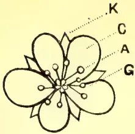

A detailed drawing of a flower with five petals and a central cluster of stamens. Labels point to specific parts: 'K' points to the outermost layer (likely the receptacle or sepals), 'C' points to the petals, 'A' points to the anthers, and 'G' points to the central ovary.

A simple hexagonal outline with dashed lines, representing a cross-section of a fruit or a floral part.

A simple hexagonal outline with dashed lines, similar to diagram 1.

An oval outline with a curved line inside, possibly representing a seed or a fruit cross-section.

A small, rounded structure with a stem, possibly a fruit or a seed.

A small, rounded structure with a stem, similar to diagram 4.

A small, rounded structure with a stem, similar to diagram 4.

A small, rounded structure with a stem, similar to diagram 4.

An elongated, oval structure with a hatched interior. Labels 'S' and 'E' point to different parts of the structure.

A circular cross-section with a central cluster of dots, representing a fruit or a floral part.

A circular cross-section with a central cluster of dots, similar to diagram 9.

A circular cross-section with a central cluster of dots, similar to diagram 9.

A circular cross-section with a central cluster of dots and a label 'EP' pointing to a specific part.

A circular cross-section with a central cluster of dots, similar to diagram 9.

A circular cross-section with a central cluster of dots, similar to diagram 9.

A circular cross-section with a central cluster of dots, similar to diagram 9.

A circular cross-section with a central cluster of dots, similar to diagram 9.

A circular cross-section with a central cluster of dots, similar to diagram 9.

A circular cross-section with a central cluster of dots and a label 'L' pointing to a specific part.

A circular cross-section with a central cluster of dots and a label 'A' pointing to a specific part.

A circular cross-section with a central cluster of dots and labels 'P', 'St', and 'B' pointing to specific parts.

FLORAL DIAGRAMS OF CEYLON PLANTS. PLATE IV.

555------------------------------------------------

This image is a scan of a blank page. The paper has a light cream or off-white color with a subtle texture. There are a few very small, faint dark spots scattered across the surface, which appear to be scanning artifacts or minor imperfections in the paper. No text, lines, or other markings are present.

556------------------------------------------------

DEC. 1906.]505Miscellaneous.

The care of pastures. Trin. Bull. 1902, p. 525.  
 Turf and Fodder grasses. Str. Bull. 1903, p. 273.  
 Die Viehmast in Costarica. Tropenpf. 7. 1903, 471.  
 Indian food grains and fodders, their chemical composition. Agr. Ledg. M. & C. Series, 16, 1903.  
 Jamaican fodders. Jam. Bull. I. 1903, p. 241, III. 209.  
 Saltbushes. Agr. Gaz. N. S. W. Mar. 1904, p. 211.  
 Fodder grasses for the tropics. "T. A." July 1904, p. 6.  
 Prickly Pear and Aloe as fodder for cattle. Ind. Agr. July 1904, 220.  
 Fodder and Lawn grasses suitable for cultivation in West Africa. Imp. Inst. Bull Mar. 1904, p. 39.  
 Paspalum dilatatum. Agr. Gaz. N. S. W. Oct. 1904, 938.  
 Further notes on West Indian fodder plants. W. I. Bull. V. 103.  
 The Conservation of fodder. Transvaal Agr. Journ. III. Oct. 1904, p. 32.  
 Poisonous fodder plants, Imp. Inst. Bull. I. 1903, 12, 112.  
 La tossicita dei Sorghi come foraggio fresco. Ann. di. Bot. I. 335.

## Lessons in Elementary Botany. VII.

By J. C. WILLIS.

(Illustrated.)

A very useful method of expressing many of the important features in the structure of a flower is a Floral Diagram. It represents an imaginary section through the bud, taken (if such were possible) so as to pass through the ovary and anthers and through the parts of the perianth where the æstivation is most clearly shown. With the exception of the hypogyny or epigyny, the diagram shows most of the characters that are usually necessary for the identification of the natural order to which the plant belongs, and is hence of much use in classification. A number of diagrams are given on plate IV. and should be carefully compared with actual flowers belonging to those orders.

In drawing a diagram we put in at the top the original stem on which the flower is a branch, and at the bottom the bract, to give the exact orientation of the flower. Bracteoles if present are also put in. Then follow sepals, petals, stamens, and carpels in their exact relationship, as to position, overlapping (if any), cohesion (if any, marked by loops joining the lines representing individual sepals &c,) adhesion (if any), placentation, &c.

Floral Formulae afford another convenient way of expressing many features in flower construction. The calyx, corolla, andrœceum and gynœceum are represented by K., C., A., G., respectively. After the letter follows the number of parts, and if they be coherent it is enclosed in a bracket. Thus K. (5) means "Calyx of 5 sepals, gamosepalous," A 3 means "andrœceum of 3 stamens, polyandrous." If there are two numbers with a + sign between them, it means two alternating whorls. *e.g.*, A 3+3 means that the andrœceum is of 2 whorls of 3 stamens each. The ovary if superior is represented by the symbol G, if inferior  $\bar{G}$ .

12 floral diagrams of the commonest families of Ceylon upcountry plants are given on plate IV., and should be carefully compared with actual flowers.

### NATURAL HISTORY OF THE FLOWER.

Darwin showed that the offspring of cross-fertilisation, *i.e.*  $A \times B$  (where A, B are different plants) was in general superior to that of self-fertilisation ( $A \times A$ ) and most plants make effort to get their flowers fertilised from another plant of the same kind.

66

557------------------------------------------------

Miscellaneous.506[DEC. 1906.]

The general agents, external to the flower, which can carry pollen from one flower to the stigma of another, are wind, animals, and water.

Wind-pollination occurs in the grasses, sedges, and other plants. The flowers are usually inconspicuous, not needing to attract insects, and produce large quantities of powdery pollen which easily blows away and may be carried to a stigma. The anthers of such flowers are usually large, and often project beyond the flower on thin, easily shaken stalks, so as to give the wind a better chance. The stigmas are very commonly large and brush-like, to have a better chance of catching the floating pollen.

*(To be continued.)*

## Sanitation on Estates and the Health of Coolies.

### THE DISEASE ANCHYLOSTOMIASIS OR DOCHMIUS DUODENALIS.

The cause of this disease, which is very prevalent in the planting districts, is a small intestinal worm; its spread is due to want of proper sanitation.

The eggs of the worm, or the recently hatched worms themselves, gain an entrance to the human subject either by the skin, or are swallowed.

The disease is spread by soil or water contaminated by the excreta of persons suffering from the disease.

The measures to be enforced to check the spread of this disease fall under four heads:—

1. (1) The proper disposal of night soil (excreta).
2. (2) Protection of the legs and feet.
3. (3) Pure water for drinking and washing purposes.
4. (4) The segregation of all cases in hospital until cured.

UNDER THE FIRST HEAD: it is necessary for Superintendents to prohibit coolies from fouling the soil indiscriminately, and to carry out this prohibition latrines should be built on every estate, and coolies who do not make use of them should be punished. The night soil should be collected in buckets and buried daily in a part of the estate away from dwellings and water-courses.

UNDER THE SECOND HEAD: means should be employed to protect the legs and feet of coolies, for the worms which are in the polluted soil find their way into the system through the skin, and are often the cause of ulcers so commonly seen on coolies legs. A cheap form of boot worn outside puttees would afford protection; in some countries tar covered with sand is applied to the feet and legs.

UNDER THE THIRD HEAD: at present water-courses and bathing-places are contaminated by the surface drainage of the soil being washed into the water after rain: means should be taken to see that this cannot happen. The water used by coolies for cleaning themselves after a call of nature should not be allowed to run into the drinking or bathing supply.

UNDER THE FOURTH HEAD: it is quite impossible to admit every coolie with anchylostomiasis into hospital and to keep him there until cured, because the disease exists in nearly every coolie on every estate, and the hospital accommodation is insufficient for them; but as far as possible coolies will be admitted and retained in hospital until they are cured, and will be put under a new treatment that has recently been introduced into the Island. (Medical Officers will refer Circular Letter to Provincial Surgeons of the 27th June, 1906.)

558------------------------------------------------

DEC. 1906.]507Correspondence.

As long as the present insanitary condition as regards disposal of sewage etc., on estates continues, there is little encouragement for Medical Officers to cope with this disease, because, when cured, patients get re-infected on the estates soon after their discharge from hospital, and the whole business has to be gone through again *ad infinitum*.

The above remarks will be met by the statement that the suggestions are totally impracticable of being carried out: the answer to which is that they are not impracticable provided those in charge of estates will spend a little money to improve the condition of their coolies. The return for the expenditure will be a more efficient labour force.

ALLAN PERRY,

*Principal Civil Medical Officer and  
Inspector-General of Hospitals.*

Colombo, September 29, 1906.

---

## Correspondence.

---

### THE NORIA PUMP.

SIR,—I do not think that Mr. Saravanamuttu is correct in stating (“*T.A.*,” Vol. XXVII., p. 317) that the “Noria” pump tried last year at Vasavilum was found to lift too great a quantity of water at one time, so as to make it useless to the cultivator, and the well run short of its supply in a short time. Before the pump could be given a fair trial, the enterprising importer became involved in litigation with some of the more conservative shareholders who objected to the innovations, and he retired to Negombo, after successfully defending the case, and no further experiments have been made. Apparently the fact that he had to pay his own costs combined with the prospect of further opposition disheartened him.

My recollection is that he informed me that it was necessary after using the pump for some time (I forget how long) to wait for 20 minutes for the well to fill again, but an interval of 20 minutes occasionally in irrigating would not be sufficient to make the use of the pump an impossibility. Further, all wells may not be the same as this well—one at Tirunelveli, a few miles distant, opened by Mr. N. W. Smith in connection with the Jaffna Waterworks scheme, seemed to have an inexhaustible water supply. It cannot be said that this well either was exhausted.

What is wanted is further tests, systematically conducted, with the results carefully noted. There has been no report of the kind with regard to this experiment, and without it, it is premature to condemn it as “useless to the cultivator.” Mr. Thomas in his paper on the “Noria” pump in “*T.A.*,” Vol. XXV., p. 606, does not give the practical results of the experiment.

J. P. LEWIS.

Kandy, 12th November, 1906.

---

### PRUNING HEVEA AND CACAO TREES.

DEAR SIR,—As (I think) the oldest pioneer in Para Indian Rubber cultivation, I should like you to allow me to corroborate Mr. Herbert Wright’s views as to advantages arising by obtaining a standard form for the *Hevea*, i.e., by the budding back of the terminal shoots of the young trees.

It was the method which I found best adopted to my Cacao, &c., &c., and, finding it so much to advantage, I carried it on to the young Rubber under my hand on the Rio Tapajos. At that period, however, one was as one crying in the wilderness: Indian Rubber cultivation was then looked upon as the most visionary of ideas, and

559------------------------------------------------

Correspondence.508[DEC. 1906.

the Government of India had not as yet been prevailed upon by Sir Joseph Hooker to give me a free hand in the high forests of Alto-Amazonas, to enable introduction of the original stock from which the present generation of planters may work from.

I found the best method for Cacao, and also for Rubber, was to bud back the terminal shoots. That is to say :

- 3 primary and
- 9 secondary branches.

Thus to form a well-grown base for the tree to come, in the case of Cacao at 5 feet, in Rubber at 10 feet.

Very faithfully yours,  
H. A. WICKHAM.

London, W.C., October 9.

## TWO INTERESTING TREES OF THE NORTH.

DEAR SIR,—Among the most useful trees of the North are the two species of *Balsamodendron* (*Conmiphora*) used for live fences, viz. :—

- a. *Canudatum* (*Kivilai*) which is thornless.
- b. *Berryi* (*Mul-kilivai*) which is thorny.

The chief recommendation of the plant is the ease with which the cuttings strike in an arid climate like the North, even in dry weather. The spined species is, of course, the more useful plant, offering as it does effectual resistance to stray cattle and goats. The latter, however, find the leaves of both varieties a suitable food especially when fodder is scarce. For this reason or from its habit of growth the trees appeared to me to be very scanty of foliage when I saw them in August.

The plants justify their inclusion in this balsam-yielding genus in as much as they possess the balsamic odour. Their most notable congeners are the well-known plants which yield myrrh (*B. myrrha*) and Balm of Gilead (*M. opobalsamum*).

If, as Trimen says, *B. Berryi* grows in Colombo, it is strange that it is not more used for fences, in spite of the alleged tendency of the plant to lose its spinous character in the low wet country.

There is apparently no definite Sinhalese name for either of these species though "Siviya," "Ensalu," "Masbedde" are given in Trimen's Flora as possible names of the thornless form. Why is it that Trimen spells the last syllable of the generic name "drum," while other authors give it as "dron"?

*Guettarda speciosa* (Tamil, Panir) is an ornamental tree, bearing sweet-smelling flowers, that grows well in close proximity to the sea. Like the "sorrowfu, tree" (*Nyctanthes acbro-histis*) so dear to Buddhists, it sheds its corollas which are used for distilling a kind of rose-water. Watt refers to the crude way in which the scent is got in India. In the evening a thin muslin cloth is spread over the tree so that it comes in contact with the flower. The cloth, wet with dew, takes in their fragrance, and the "extract" which is wrung out in the morning is sold in the bazaars.

Yours truly,  
C. DRIEBERG.

## MOSQUITOES AND ANTI-MALARIA CAMPAIGNS.

DEAR SIR,—In the September number of the "*Tropical Agriculturist*," Mr. Green has drawn attention to the great success of anti-malaria campaigns in other countries and in our own colonies, and to the need for a similar campaign in Ceylon. No apology need be given for introducing this subject in an agricultural journal, health affects labour supply, and the question of labour supply is a vital one in all agricultural enterprises.

560------------------------------------------------

DEC. 1906.]509Correspondence.

Ceylon prides itself in being an up-to-date colony, and certainly it is in some respects, in agricultural science for instance; but few will deny that it is sadly behind the age in sanitation and preventive measures generally. Lakhs of rupees are spent on the cure of disease, but how much on prevention? Would the sanitary state of the small towns and villages stand the test of a close inspection? An attempt is made by the Medical Department to deal with sanitation and prevention of disease, but the efforts are quite inadequate, nor can we expect anything else.

The staff of the Medical Department are not trained in the "prevention" of disease, "cure" is their province. What is wanted is a separate staff, properly trained, to see to the sanitation of all towns and villages, including estates, in Ceylon. Employers of labour, especially in the low-country, would surely welcome any measures obviously so much in their own interests. The only opposition would be from the ignorant and stupid. I believe in the case of the work done at Klang and Port Swettenham, in Selangor, Federated Malay States, also Ismailia, referred to in the letter given by Mr. Green, some of the staff of the Liverpool School of Tropical Medicine, were sent out to advise as to the best means of carrying on the campaign against malaria and other diseases of a preventable nature. Let the Ceylon Government take the same steps. The members of the staff would find a good field in Ceylon for their labours, and if any of them were of an investigating turn of mind, like Dr. Ronald Ross, of their school, whose researches have been of such incalculable benefit to mankind, they would find an interesting field for their investigations in the evident connection between the prevalence of malaria and the opening of clearings. That the *Anopheles* mosquitoes are a medium for the spread of malaria is an established fact, that they are the only medium is an open question.

One of the suggestions of the Commission might well be that more prominence should be given in schools to the teaching of the laws of cleanliness and sanitation. The sickness and death in low-country districts have this year been terrible. I have been told by a friend who has spent most of his life amongst low-country Sinhalese, and whose experience is not to be questioned, that a large majority of the deaths are preventable, they are due to the ignorance and apathy of the people.

The chief obstacle to the development of the country along the Northern Railway is its unhealthiness. Can nothing be done to mitigate this state of matters? Experience gained in other colonies goes to show that something can be done.

Yours faithfully,

PLANTER.

[We referred this letter to the Principal Civil Medical Officer, who remarks as follows.—ED. "T.A."]:—

"The question of improved sanitation is purely one of money—the small towns which have Local Boards of Health do as much as their funds will allow to improve sanitation, and the tendency is to advance on those lines. The officers of the local Medical Department are specially instructed in sanitation and in the prevention of disease, and they have to pass an examination in these subjects. Estate Superintendents can do a great deal by insisting on the prevention of fouling the soil, improving the water supply and the drainage of swamps. The suggestion of a special sanitary staff is good but hardly necessary—if money could be got for combating malaria, the present medical staff is competent to advise where the money should be spent.

It is futile to compare individual places like Port Swettenham, Ismailia, etc. with Ceylon as an island. Such places should be compared with Negombo or Kalutara. To tackle Ceylon as a whole is well nigh impossible, with its paddy fields, floods, lagoons, and swamps, and its borrow pits along every line of railway. The Government sent a special officer to report on the drainage of the Jaffna

561------------------------------------------------

Correspondence.510[DEC. 1906.]

Peninsula with the object of reducing malaria, the estimate was prohibitive. The Government distributes quinine to all school children and malarious villagers as a prophylactic which has some measure of success; directions how to combat malaria have been widely distributed in the vernacular. The only thing is for the general public to be educated in the ways of battling that disease as much can be done by individuals, but the large question of drainage is one for the Government, and in my opinion it is too vast to cope with."

November 21st.

### Capillary Tubes.

Syston, Ukuwella, 24th November, 1906.

DEAR SIR,—In reference to the extract from the London "Times" which I enclose, I should be glad to know if the "capillary tubes" mentioned in it are (as one would imagine) merely air spaces, or whether I am mistaken.

I am, dear Sir, yours faithfully,  
W. H. BIDDULPH.

*Extract referred to from a recent number of "The Times."*

In quoting from a technical writer last week we gave a passage in which the word "mulch" occurred, and we have been asked what is the exact meaning of this old English term. It is curiously ignored by the dictionaries, though every peasant uses it, and probably most farmers. Very roughly speaking, it is that light caking of surface soil which protects the moisture beneath, and to mulch is to beat stuff together into a compost without binding it too tightly. The whole matter, however, is of such practical importance at a period following a long spell of dry weather that the history of the whole matter, as officially set forth by the text-book of the Royal Agricultural Society, is well worthy of being given here. It must be premised, that if surface soil is frequently stirred, kept loose in fact, moisture in the subsoil naturally travels up towards it.

"When rain falls upon the soil, some of it sinks down to replenish the stores below; but during the period of active growth, and particularly in a droughty season there is a movement of moisture from below upwards. The moisture replaces that lost at the surface by evaporation; and its direction is such that it tends to keep the soluble plant food where it is wanted, that is, about the roots of the plants. If enough water be poured into a saucer in which stands a flowerpot full of earth the surface of this mould will at length become moist, the water having travelled upwards by capillarity. But here another point has to be considered. If all the capillary tubes are open to the surface evaporation can proceed from them so freely that the underground store of moisture may be insufficient to supply the continuous demand. Hence again it is desirable to keep the surface soil, by frequently stirring, in such a state that the capillary tubes are broken, or interrupted a little below the surface. In this case the mere superficial covering of mould acts as a soil mulch, and like a layer of leaves of grass or farmyard manure, it protects the moisture beneath."

[The "tubes" are evidently the air spaces between the particles of soil.—ED.]

### ANT-HILL EARTH.

SIR,—In the October issue of the *Tropical Agriculturist*\*, a correspondent inquires to what uses the earth of white-ants is put, apart from its general use, mixed with cowdung for the floors of Sinhalese villagers' houses, for plugging up rat-holes in walls and floors, and for plastering mud walls, to which it gives

\*Page 347, Vol. XXVII, October, 1906.

562------------------------------------------------

DEC. 1906.]511Correspondence.

an even surface to clay. On account of its finely-comminuted nature and its excellent plasticity, it is superior to any ordinary clay. It is largely used in the manufacture of images, representing various planets, which are used in *Bali*\* ceremonies. For this purpose, the officiating devil-priest proceeds to an ant-hill in the evening, and with solemn invocation of the gods pronounces a benediction. The following day the required quantity of the consecrated earth is cut and removed. The clay is frequently made use of by sorcerers to prevent poisonous snakes from entering a house, the finely-pulverised earth is "charmed" and sprinkled round the outside of the building. It is also used in land disputes in the following manner:—There is an ancient Kandyian custom *Bólahadanawá*, of placing a bundle of twigs somewhere on the land in dispute, to indicate that neither of the claimants should step into the land pending a legal decision of their rights. On these occasions charmed ant-hill earth is also placed in a corner of the land, in the belief that the wrath of the presiding deities will fall upon the false litigant.

In Sinhalese medicine the clay is largely used for the treatment of bruises, boils, sprains and fractures. For bruises, for instance, the bark of the *Bomi* tree is pounded and heated over a fire and mixed into a paste with ant-hill earth and salt water. For boils, the same mixture, with the addition of turmeric, makes a very efficacious ointment.

The destructive habits of the white ants are well-known. They will attack the most durable-looking timber and reduce it in a short time to mere husk, and the losses caused by their ravages to newly-planted plants, especially young coconuts, are enormous. To protect the latter, some planters have of late years adopted a plan of smearing the nuts and roots before planting, with a paste made of white ants' clay. This is done with the idea, that as the white-ants have finished with the clay, they will not penetrate again to attack the plants, and the results have been reported as very successful. An analysis of the clay, to determine its chemical constituents, might possibly show that its use in this direction may advantageously be extended to the planting of all products, liable to the attacks of white-ants, while its use in building operations for the preservation of wall-posts might be found possible. To prevent the attacks of white-ants the Kandyans apply a layer of sand and salt to the coconut-hole, and also plant side by side, with the young coconut-plant, a *Sevendara* (*Andropogon muricatus*) or a *Habarala* (*Alocasia macrorhiza*) plant. A Sinhalese proverb goes that "a dwarf ant-hill and a short man cannot be depended upon," from the circumstance that cobras often seek refuge in these cavities.

T. B. POHATH-KEHELPANALA.

Gampola, 25th November, 1906.

#### PLANTAIN GROWING IN SOUTH INDIA.

DEAR SIR,—The cultivation of plantains in South India presents some striking differences to the methods adopted locally, and the following summary of an account of banana growing in Malabar given in the *Indian Agriculturist* for October should prove interesting to local growers of the fruit:—

Planting is done in September and January. Young shoots from the mother plant are taken out, and after they are smeared with cow-dung and wood-ashes and well dried in the sun are stored up for planting at the proper time. Unless the shoots are thus dried and stored the crop is poor. The dried shoots are buried wholly in a slanting position about 6 feet apart in pits 3 feet square by 2 feet deep. The pits are not wholly covered up after planting, for it is said that manure while

\* Images made of clay representing planets—a ceremony characterised by the recital of religious poems and stanzas for exorcising devils, curing diseases and dispelling evil-effects.

563------------------------------------------------

DEC. 1906.]512Correspondence.

decomposing injures the shoot. From the third day after planting, watering by irrigation or otherwise is carried on. The plants generally sprout after ten days, after which they may be watered at intervals of four or five days. Manuring is done after the plants are 5 or 6 feet above the pits, when ashes and manure are put in and covered over three-fourths with loose earth. After this it is only necessary to keep down weeds. The plants bear in the ninth month, and after three months the fruits are fit for picking. A bunch weighs on an average from 20 to 25 lbs., but they go up to 30 and 40 lbs. The fruits are not allowed to ripen on the trees, but are placed in an air-tight chamber which, after being filled with smoke through a hole, is closed. This smoking is done twice daily for three or four days when the fruits become fit for eating. After removal from the hot chamber the bunches are immersed in water.

In Malabar there are two varieties of the fruit, called Attunendra and Nendra. The latter is the best, as it matures and fruits very much sooner than the former, and is altogether much to be preferred.

The following statement represents the expenditure in cultivating an acre of plantains :—

<table>
<tbody>
<tr>
<td>2,000 shoots @ 6 pies each</td>
<td>...</td>
<td>...</td>
<td>...</td>
<td>Rs. 62</td>
<td>8</td>
</tr>
<tr>
<td>do pits @ 3 ,, ,,</td>
<td>...</td>
<td>...</td>
<td>...</td>
<td>,, 31</td>
<td>4</td>
</tr>
<tr>
<td>Manuring @ 6 ,, a pit</td>
<td>...</td>
<td>...</td>
<td>...</td>
<td>,, 62</td>
<td>8</td>
</tr>
<tr>
<td>100 coolies @ 4 annas for weeding</td>
<td>...</td>
<td>...</td>
<td>...</td>
<td>,, 25</td>
<td>0</td>
</tr>
<tr>
<td>Bamboo props for plants @ 6 pies each</td>
<td>...</td>
<td>...</td>
<td>...</td>
<td>,, 62</td>
<td>8</td>
</tr>
<tr>
<td>4 coolies for 5 months @ Rs. 5 per head</td>
<td>...</td>
<td>...</td>
<td>...</td>
<td>,, 100</td>
<td>0</td>
</tr>
<tr>
<td>2 Watchmen for 3 months to protect fruit at Rs. 5</td>
<td>...</td>
<td>...</td>
<td>...</td>
<td>,, 30</td>
<td>0</td>
</tr>
<tr>
<td>Sundry expenses</td>
<td>...</td>
<td>...</td>
<td>...</td>
<td>,, 15</td>
<td>0</td>
</tr>
<tr>
<td>Government tax</td>
<td>...</td>
<td>...</td>
<td>...</td>
<td>,, 3</td>
<td>0</td>
</tr>
<tr>
<td>Rent for ground</td>
<td>...</td>
<td>...</td>
<td>...</td>
<td>,, 2</td>
<td>0</td>
</tr>
<tr>
<td>Pay of Agent @ Rs. 10 per mensem</td>
<td>...</td>
<td>...</td>
<td>...</td>
<td>,, 120</td>
<td>0</td>
</tr>
<tr>
<td colspan="4" style="text-align: right;">Total</td>
<td>Rs. 513</td>
<td>12</td>
</tr>
</tbody>
</table>

The income from the above may be estimated as follows :—

<table>
<tbody>
<tr>
<td>100,000 fruits (taking 50 fruits to the bunch) at Rs. 8 per 1,000 (rough, this price goes up at times to Rs. 15 per 1,000)</td>
<td>...</td>
<td>...</td>
<td>...</td>
<td>...</td>
<td>Rs. 800</td>
<td>0</td>
</tr>
<tr>
<td colspan="7">(Assuming on an average that each plant gives two shoots for sale after the planter takes what he requires)</td>
</tr>
<tr>
<td>4,000 shoots at 6 pies each</td>
<td>...</td>
<td>...</td>
<td>...</td>
<td>...</td>
<td>,, 125</td>
<td>0</td>
</tr>
<tr>
<td>Leaves</td>
<td>...</td>
<td>...</td>
<td>...</td>
<td>...</td>
<td>,, 25</td>
<td>0</td>
</tr>
<tr>
<td colspan="4" style="text-align: right;">Total</td>
<td>Rs. 950</td>
<td>0</td>
<td></td>
</tr>
<tr>
<td>Expenditure</td>
<td>...</td>
<td>...</td>
<td>...</td>
<td>...</td>
<td>,, 513</td>
<td>0</td>
</tr>
<tr>
<td colspan="4" style="text-align: right;">Net profit per acre</td>
<td>Rs. 437</td>
<td>0</td>
<td></td>
</tr>
</tbody>
</table>

This is considered a fair statement, the expenditure being estimated on a liberal scale.

If anything could be done with the fibre of the stems, the profits would, of course, be considerably enhanced.

It would be most interesting to get comparative figures from Ceylon, and a criticism of the above statement from such well-known fruit growers as Mr. Francis Dabel of Colombo, and Mr. George Amarasekera of Hanwella.

Yours truly,  
C. D.

564------------------------------------------------

DEC. 1906.]513Correspondence.

### PADDY REAPING MACHINE.

DEAR SIR,—Can you inform me with what machine they reap the paddy fields in America, where they grow rice on a large scale?

I am thinking of planting 700 or 800 acres with European machinery, and I would like your advice.

I intend to plough with 3 furrow ploughs, and drill in the seed with drills, and then try the reaper and binder for reaping it.

Do you think this mode of cultivation will work? The rice, I forgot to mention, is dry rice, or as you call it Hill-paddy, and the land is fairly level. By the present mode of cultivation it costs the Javanese twice as much to produce an acre of paddy as it costs an Australian to produce an acre of wheat. If you will kindly help me with a little information on this subject, I will be very thankful.

Yours sincerely.

A. ALLEN.

Kesamben, Java, 14th Nov., 1906.

[The machines in use in America are, I believe, large combined reapers and threshers. Paddy is grown there at rates below even those of Bengal, the cheapest eastern country. Some attempts of Europeans to grow rice in Ceylon failed, but that is no proof that on flat land it might not be made profitable.—Ed.]

### The Ceylon Board of Agriculture.

The Twenty-fifth meeting of the Board of Agriculture was held in the Council Chamber at 12 noon on Monday, November 5th, 1906.

His Excellency the Governor presided.

Others present were:—The Hon'ble Messrs. G. M. Fowler, J. Ferguson, F. Beven, S. C. Obeyesekere, Mr. H. T. S. Ward, Drs. J. C. Willis, H. M. Fernando, G. W. Sturgess, Sir William Twynam, Mr. C. Drieberg, Mr. D. S. Dias Bandaranayake (Maha Mudaliyar) and the Secretary.

Mr. L. W. A. de Soysa was present as a visitor.

#### BUSINESS DONE.

1. 1. The Minutes of the last Meeting were read and confirmed.
2. 2. The Secretary read a telegram received from Mr. J. H. Meedeniya Ratemahatmeya, regretting his inability to attend the meeting.
3. 3. List of new members was read.
4. 4. The report of the Curator, Royal Botanic Gardens, on the sections judged by him at the Kegalle Agri-Horticultural Show in September last was read.
5. 5. Progress Report No. XXIV was circulated. The Hon'ble Mr. Ferguson asked for a list of Agri-Horticultural Shows held under the auspices of the Society.
6. 6. After dealing with some points mentioned in the Progress Report, His Excellency the Governor informed the Board that it was no longer possible to spare the services of a member of the Civil Service as Secretary to the Society. His Excellency therefore proposed to appoint Mr. M. Kelway Bamber as Secretary to the Society, and trusted that the proposal would meet with the approval of the Board. The Hon'ble Mr. Ferguson was of opinion that the appointment of Mr. Bamber would afford universal satisfaction, provided Mr. Bamber's private work for the planters throughout the Island did not interfere with the performance of his duties as Secretary. The Hon'ble Mr. Obeyesekere raised the question of the cost

67

565------------------------------------------------

514[DEC. 1906.]

of the new arrangement In reply to Mr. Ferguson, His Excellency stated that he could assure the Board that they would have the full value of Mr. Bamber's services. Financially the new arrangement would probably cost the Island less than the present arrangement did all round.

7. The Secretary read a letter from Mr. H. B. Rambukwelle expressing his thanks to the Board for the vote of condolence passed at its meeting on the 17th September.

8. Dr. Willis read a paper on 'Some Possibilities in Fruit Culture in Ceylon.' A discussion followed, in which His Excellency the Governor, Mr. Ferguson, Mr. Obeyesekere, Mr. Ward and others took part.

9. Mr. C. Drieberg showed some samples of banana flour, etc., manufactured by an English firm.

The meeting terminated at 1-15 p.m.

---

The Twenty-sixth Meeting of the Board of Agriculture was held in the Council Chamber at 12 noon on Monday, 3rd December, 1906.

His Excellency the Governor presided.

Others present were:—The Hon'ble Messrs. J. P. Lewis, E. Rosling, S. C. Obeyesekere, P. Arunachalam, J. Ferguson, Sir William Twynam, Drs. J. C. Willis, H. M. Fernando, the Maha Mudaliyar, Messrs. C. M. Lushington, L. W. Booth, J. Harvard, E. E. Green, M. Kelway Bamber, H. Wright, C. Drieberg, G. A. Joseph, G. W. Sturgess, and the Secretary.

Mr. M. Subramaniam was present as a visitor.

#### BUSINESS DONE.

1. 1. The Minutes of the last meeting were read and confirmed.
2. 2. Progress Report No. XXV was circulated.
3. 3. The Secretary announced that His Excellency had been pleased to nominate Mr. C. Valoopillai of Anuradhapura as a member of the Board for the North-Central Province in succession to the late Mr. L. B. Nikawewa Disava.

4. Dr. Willis proposed that the recommendation of the Finance Committee be approved, to the effect that a sum not exceeding Rs. 500 be allowed to enable Mr. C. Drieberg, Superintendent, School Gardens, to visit the Agricultural and Industrial Exhibition to be held at Calcutta in December, and to travel through the Bangalore and other districts with a view to gathering information on the subject of sericulture. Mr. E. E. Green, Government Entomologist, seconded. The Hon'ble Mr. J. Ferguson also spoke in support of the motion, which was carried unanimously.

5. The Secretary read a letter from Mr. W. D. Gibbon and a telegram from Mr. J. H. Meedeniya Ratemahatmeya, regretting their inability to attend the meeting.

6. Dr. A. K. Coomaraswamy not having arrived, the reading of his paper on Native Arts and Crafts was postponed till later in the meeting. Having made a few remarks on the subject, His Excellency the Governor, who was obliged to leave early, vacated the chair. At His Excellency's desire the chair was taken by Mr. C. M. Lushington.

7. The Secretary read the report of the sub-Committee appointed at the meeting of September 17th to reconsider the provisions of the proposed Pests Ordinance with reference to a memorandum on the subject submitted by Sir

566------------------------------------------------

DEC. 1906.]515

William Twynam. A lengthy discussion followed, in which Messrs. Lushington, Arunachalam, Ferguson, Rosling and Booth and Dr. Willis took part. It was finally resolved on the motion of the Hon'ble Mr. P. Arunachalam, seconded by the Hon'ble Mr. J. Ferguson, that in view of the fact that the report of the sub-Committee had not been long enough in the hands of members of the Board to permit of its careful consideration, the discussion of the matter be deferred till the next meeting of the Board.

8. Dr. A. K. Coomaraswamy read a paper on "Suggestions for the Encouragement of Indigenous Arts and Crafts in Ceylon." A discussion followed in which Mr. Harward, Director of Public Instruction, Dr. Willis and Mr. Ferguson took part.

The meeting terminated at 1-45 p.m.

A Special Meeting of the Board of Agriculture was held in the Council Chamber at 12 noon on Monday, the 17th December, 1906, to consider the report of the sub-Committee on the proposed Pests Ordinance.

In the absence of His Excellency the Governor, the chair was taken by Sir William Twynam, K.C.M.G.

Others present were the Hon'ble Messrs. J. P. Lewis, S. C. Obeyesekere, J. Ferguson, C.M.G., and Francis Beven, Dr. J. C. Willis, Messrs. H. T. S. Ward, E. B. Denham, W. Dunuwille Disava, Herbert Wright, M. Kelway Bamber, R. Morison, W. D. Gibbon, Daniel Joseph, R. E. Paranagama Ratemahatmeya, and the Secretary.

Messrs. T. A. Carey and M. Subramaniam were present as visitors.

#### BUSINESS DONE.

1. Before proceeding to the business of the day the Chairman, Sir William Twynam proposed: "That the members of this Board desire to place on record their deep sense of the loss they have sustained in the sudden removal from their midst of the late Hon'ble Sir Alexander Ashmore, K.C.M.G., who was a prominent member of the Board, and always a zealous worker in the promotion of its interests; and they desire to convey to Lady Ashmore their deep and heartfelt sympathy in the sad and sudden bereavement that has befallen her."

The motion was seconded by the Hon. Mr. S. C. Obeyesekere and carried unanimously, all standing.

2. The Secretary read a telegram from the Maha Mudaliyar and a letter from Mr. C. P. Hayley regretting their inability to be present at the meeting.

3. Dr. J. C. Willis moved the adoption of the report of the sub-Committee on the proposed Pests Ordinance, which was submitted at the meeting of the Board on the 3rd December.

The Hon'ble Mr. Obeyesekere seconded.

With the permission of the Chairman the Secretary, Mr. A. N. Galbraith, spoke to the motion, and suggested a slight alteration in the amended draft Ordinance put forward by the sub-Committee.

The Hon'ble Mr. Obeyesekere seconded and the amendment was carried.

Considerable discussion followed, in which almost all the members present took part. Further amendments were proposed by the Secretary, seconded by Mr. Denham, and by Mr. Denham, seconded by the Hon'ble Mr. Lewis, and passed.

It was finally unanimously resolved that the report of the sub-Committee be adopted, together with the amended draft Ordinance, framed by the sub-Committee with the three further amendments referred to.

The meeting terminated at 1-15 p.m.

567------------------------------------------------

516DEC. 1906.

## Agricultural Society Progress Report. XXV.

1. *Local Branches.*—Two new branch societies have been formed—one for Gangaboda Pattu (Galle) and one for Hinidum Pattu. The total number of branch societies is 48, while the total membership of the Society is 1,127. It has been decided to amalgamate the Gangaboda Pattu (Matara) branch with the local branch at Matara from 1907.

*Gangaboda Pattu Branch (Galle).*—An inaugural meeting was held at the Baddegama Gansabhawa on the 16th October. One of the Society's Agricultural Instructors, Mr. N. Wickramaratne, was present and assisted in the proceedings. At a subsequent meeting on the 3rd November Mr. H. D. Perera, Mudaliyar of the Pattu, was elected President of the Society, and Mr. C. E. Gunatileka, President of the Village Tribunals, Vice-President. The new society proposes to undertake the establishment of a seed bank, the opening of an experimental garden, and an experiment in growing castor oil plants with a view to starting silk cultivation. Mr. M. A. Jayasinhe, Deputy Coroner, has presented the society with a piece of land at Nagoda for the experimental garden. In connection with the seed bank, it was agreed that as a beginning the members should contribute two or more bushels of paddy apiece; that 25 per cent. interest be charged on paddy lent from the bank; and that the contributors be at liberty to take back their paddy after five years. Seventy bushels were promised by thirty-eight members.

*Hinidum Pattu Branch.*—The local branch at Hiniduma was formed following an inaugural meeting held at the Nagoda resthouse under the presidency of Mr. A. L. Amarasekare, Mudaliyar. The Agricultural Instructor was again present. The programme of work adopted at this meeting includes the opening of an experimental garden; sericulture; popularising of school gardens, &c.

Mr. Wickramaratne took with him on his tour two trays, specially made at the Peradeniya Silk Farm, containing silk worms, eggs, and cocoons, and gave ocular demonstration of the method of handling the worms. Amongst those who expressed their interest in the subject of sericulture was the Rev. Father Schaefer of Hiniduma, who contemplates its introduction amongst the boys of his school and orphanage.

This is the first occasion on which one of the Society's Agricultural Instructors has been on tour. It is hoped that by February next the course of training which they are at present undergoing will be sufficiently complete to justify their being regularly sent on tour in different districts. Any local societies desiring their services should apply for them in the course of the next two months. It is intended that the Instructors should visit the various local branches, attend their meetings, give lectures and instruction, and ascertain in what directions the local societies require the assistance of the parent society, or the expert advice of the scientific staff at Peradeniya.

*Dumbara Branch.*—I was present with Mr. M. Kelway Bamber, Government Chemist, at a general meeting of the Dumbara Agricultural Society, held on the 3rd November at Teldeniya. The main object of our visit was to ascertain how far Teldeniya would be a suitable centre for the experiment the Society proposes to make in the improvement of native tobacco by a more scientific method of curing. A number of tobacco growers were present at the meeting and availed themselves of the opportunity to consult Mr. Bamber on the question of manuring, plucking, curing, &c. The Secretary read an interesting report of the progress of the Society since its formation in April last.

568------------------------------------------------

Dec. 1906.]517

A meeting of the Co-operative Credit Society followed, at which it was decided to lend money to tobacco cultivators, not exceeding Rs. 50 to each applicant.

*Harispattu Branch.*—A meeting of the committee of this society was held on the 18th November, when rules for the management of the proposed seed paddy store were passed. The chairman, Mr. P. B. Nugawela, Ratemahatmaya, and eight other members undertook to contribute between them 85 bushels of paddy.

The committee decided to allow a grant of Rs. 25 towards the opening of each of the five experimental gardens proposed.

*Vavuniya Branch.*—At the meeting of the Vavuniya Branch held on 27th November several members undertook to experiment with *rotations of crops on chenas*, as follows:—Kurakkan in September, gingelly in April, manioc in July, 1907, kollu in February, manioc in July, 1908, and kurakkan in September, 1909.

*Forwarding Agency.*—Rules were adopted for the formation of a forwarding agency, the object of which is to enable the people of the district to dispose of their produce in Colombo, Jaffna, or other suitable markets. Some of the products with which it is proposed to deal are: ghee, honey, tamarind, limes, eggs, fowls, paddy, and cattle. Under the auspices of the agency ten black cattle locally reared were sent in October to the Colombo market, with the object of seeing how the price obtainable in Colombo compares with that paid by the itinerating Moorman who barters for the animals on the spot in exchange for clothing, apparel, &c. I have not yet received the report of the local branch Society as to the financial result of the venture.

2. *Agricultural Shows.*—I was present at the Agricultural Fair held at *Telijjawila* on the 15th November. The fair was originally fixed for the 31st October, but had to be postponed owing to the heavy rains. It was held in the grounds of Mudaliyar J. A. Wickremeratne's own house, the exhibition of fruit and vegetables being accommodated in a large cross-shaped building specially erected for the purpose at the Mudaliyar's own expense.

The fair was opened in the afternoon by Mr. G. M. Cookson, Assistant Government Agent, Matara. There was a very large attendance of villagers and headmen. The display of vegetables and fruit was a creditable one, despite the bad weather of the previous month. The show building, which is intended to be a permanent one, proved itself admirably suited to the purpose. The absence of show counters running down the centres of the wings of the building allowed a roomy passage way, a feature not usually found in such buildings, as I have had occasion to remark in a previous report.

The fair was intended as a preliminary to the larger agricultural show to be held next year. Its character as a fair was emphasised by the presence of various parties of dancers, jesters, and acrobats, while the obvious prototype of the "great wheel" at Earl's Court was much patronised by the children. In this respect the *Telijjawila* show differed entirely from the market shows held at Minuwangoda and Yatiyantota.

*Wellaboda Pattu (Galle) Agri-Horticultural Show.*—Owing to the heavy rains the local committee have been obliged to postpone this show, which was to have been held on the 16th and 17th November, at Ambalangoda. It is now fixed for the 20th and 21st December.

*Trincomalee Market Show.*—At a committee meeting held on the 16th November, it was decided to hold a market show at the Trincomalee Town Hall on the 2nd April, 1907, commencing at 9 a.m.

*Batticaloa Agri-Horticultural Show.*—An Agri-Horticultural Show under the auspices of the Batticaloa Agricultural Society, will be held early in 1907.

569------------------------------------------------

518[DEC. 1906.

*The Nuwara Eliya Agri-Horticultural Show* will be held on the 2nd and 3rd April next.

*The Telijawila Agri-Horticultural Show* will be held at Telijawila on the 15th March, 1907.

*Uva Agri-Horticultural Show* will be held at Badulla early in May, 1907.

*Matale Agri-Horticultural Show* will be held probably early in June.

*Kandy Agri-Horticultural Show.*—The Kandy Branch has decided to hold an Agri-Horticultural Show in August, at the end of the “perahera” season.

3. *Foreign Vegetable Seeds.*—From the list of seeds quoted in the last Progress Report, No. XXIV., as having been ordered for the Society, the following varieties must be omitted, namely, French dwarf beans, capsicum, chilli, Chinese cabbage, gourd, melon, onion, parsnip, potseed, pumpkin, and spinach. Amended list is as follows:—

<table>
<tbody>
<tr>
<td>Beans</td>
<td>Cauliflower</td>
<td>Lettuce</td>
<td>Turnip</td>
</tr>
<tr>
<td>Beet</td>
<td>Celery</td>
<td>Okra</td>
<td>Tomato</td>
</tr>
<tr>
<td>Cabbage</td>
<td>Cucumber</td>
<td>Peas</td>
<td>Vegetable Marrow</td>
</tr>
<tr>
<td>Carrot</td>
<td>Egg-plant</td>
<td>Radish</td>
<td>Kohlraabi</td>
</tr>
</tbody>
</table>

The seeds will be distributed to applicants by the Superintendent of School Gardens, Colombo, in packets, price not exceeding 20 cents each.

4. *Cotton.*—56 lb. of selected Sea Island cotton seed from the West Indies has been supplied to the Dumbara Branch for experimental cultivation. Mr. T. B. Pohath-Kehelpanala of Gampola has applied for a quantity sufficient to plant half an acre.

At the request of a member of the Board of Agriculture samples of locally grown Caravonica cotton—of both the “wool” and the “silk” varieties—have been sent to a gentleman of his acquaintance who is connected with the cotton trade in Liverpool. The samples were kindly supplied by Mr. J. W. C. de Soysa.

5. *Varieties of Indian Arecanuts.*—Orders for seed nuts are now being booked and will be forwarded to India early this month.

6. *Umbrella Tree.*—Seeds of the “Udai” (umbrella) tree (*Accacia planifrons*) have been distributed to the following districts for experimental cultivation:—Peradeniya, Henaratgoda, Galle, Chilaw, Colombo, Matugama, and Batticaloa. A few more seeds are still available.

7. *Saltbush seed* has been sent to applicants in the following districts:—Batticaloa, Puttalam, Balangoda, Mannar, Peradeniya, Henaratgoda, Delft. The whole supply is exhausted.

8. *Jamaica Seedling Yams.*—Through the courtesy of the Secretary of the Jamaica Agricultural Society tubers of yams of the following varieties have been received:—*Dioscorea alata*, *D. sativa*, *D. aculeata*, *D. triphylla*. These have been distributed among the following:—Curator, Royal Botanic Gardens, Peradeniya; Superintendent, Silk Farm, Peradeniya; Secretaries of the Kurunegala, Nuwara Eliya, Matale, Harispattu, Badulla, Dumbara, Gangaboda Pattu (Galle), Trincomalee, Katunayake, Three Korales and Lower Bulatgama Agricultural Societies; Government Stock Garden; and to individual members in Veyangoda, Colombo, Ratnapura, Badulla, Henaratgoda, Kelaniya, Mutwal, and Wanni Hatpattu.

9. *Tobacco.*—Two samples of tobacco grown in the Eastern Province (Tamankaduwa and Batticaloa) were received from the Secretary of the Batticaloa Agricultural Society for valuation in Colombo with an inquiry whether this tobacco would suit the purposes of curing for the foreign market. The samples have been sent to two firms in Colombo for their report.

570------------------------------------------------

DEC. 1906.]519

10. *Improved Avocado Pears*.—Three parcels containing seeds of improved varieties of avocado pears were received from the United States Department of Agriculture. As the seeds were long on the journey and some appeared to have suffered by the voyage, the consignment was sent to the Director, Royal Botanic Gardens, Peradeniya, where the seeds will be tried and supplies will be sent to applicants by the Director according to the number of plants successfully propagated.

11. *Insect Pests*: (1) *Mealy Bug on Cotton*.—Specimens of some insects found by me on the bolls of a few plants of cotton growing in the Weligama Stock Garden, when recently on a visit there in connection with the Fruit and Vegetable Show at Telijjawila, were forwarded to the Government Entomologist, who reported as follows:—

“The white insect is the common ‘mealy bug’ (*Dactylopius citri*). I do not anticipate that this will prove a serious pest of cotton in Ceylon; but should it show signs of increasing to a dangerous extent, it may be kept in check by spraying with kerosine emulsion. I was unable to find the small black fly, which had probably escaped in transit. There is a small black-winged bug that frequents cotton bolls, especially after they have burst—and often swarms in the lint. It can be readily driven off by exposing the lint to the hot sun for a few hours. The name of this insect is *Oxycaenus laetus*.”

(2) *Cucumber Fly*.—Specimens of a yellow fly which attacks gourds, &c., have been sent by the Trincomalee Agricultural Society to the Government Entomologist, who identifies them as *Dacus sp.*, the well-known cucumber fly, and states that:—

“They will attack gourds, melons, cucumbers, vegetable marrows, and all allied fruits. The only satisfactory method of circumventing this pest is to enclose the young fruits (immediately the flower has set) in muslin bags large enough to contain the mature fruit. Any diseased fruits of this kind should be systematically collected and destroyed. If allowed to rot upon the ground, the flies will mature and infest other fruits.”

12. *Fruit Trees for School Gardens*.—Mr. M. D. S. A. Wijenayake, Stock Inspector at Kurunegala, has offered to make a present of mangosteen, nutmeg, clove, and num-num plants to all school gardens in the North-Western Province. These will be sent to 26 school gardens by the Superintendent of School Gardens, who has accepted the offer. Cost of transport will be met by the Society.

13. *Examination of Agricultural Instructors*.—Under the scheme recently adopted of training Stock Inspectors in agricultural work, an examination in Botany, &c., was held on the 1st instant at the office of the Government Veterinary Surgeon. The papers were prepared by the Director, Royal Botanic Gardens, and the Controller, Experiment Station Peradeniya. The following candidates were examined: P. C. J. Ferando, A. M. Fernando, M. D. S. A. Wijenayake, B. D. Stephen, and D. L. Dias, and the two Agricultural Instructors of the Society—N. Wickramaratne and L. A. D. Silva.

14. *Castration of Cattle*.—The progress made with regard to castration of cattle is as follows:—

<table>
<tbody>
<tr>
<td>Number of demonstrations held during 1906</td>
<td>...</td>
<td>...</td>
<td>138</td>
</tr>
<tr>
<td>Number of cattle operated upon during 1906</td>
<td>...</td>
<td>...</td>
<td>2,868</td>
</tr>
<tr>
<td>Number of owners who brought cattle during 1906</td>
<td>...</td>
<td>...</td>
<td>2,239</td>
</tr>
<tr>
<td>Number of men trained in the operation during 1906</td>
<td>...</td>
<td>...</td>
<td>136</td>
</tr>
</tbody>
</table>

at an average cost, including all expenses, of about Rs. 1.06 per head of cattle operated upon—training of men free.

571------------------------------------------------

520[DEC. 1906]

15. The Society regrets the death of L. B. Nikawewa Dissawe, who was a member of the Board of Agriculture for the North-Central Province.

16. *Honour to an Agriculturist.*—At the Investiture of Native Ranks held on the occasion of His Majesty the King's Birthday, 9th November, Mr. A. E. Rajapakse, Muhandiram, Chairman of the Katunayake Branch of the Society, and a prominent agriculturist in the district, was created a Mudaliyar. "for the excellent work done by him in the district by giving time and money in the encouragement of the improvement of agriculture amongst the people of the country."

17. *Publications.*—The paper read by Mr. E. B. Denham, C.C.S., at the September meeting of the Board of Agriculture, on the subject of "Uses and Objects of Agricultural Societies" is now ready in pamphlet form, and will be distributed among members.

The Editor of the *Sihala Samaya* having forwarded 50 copies of the edition of that paper containing a translation of the proceedings of the last meeting of the Board, these were distributed among the Local Branches of the Society, as usual.

A. N. GALBRAITH,

Colombo, December 3, 1906.

Secretary, Ceylon Agricultural Society.

---

572------------------------------------------------

This image is a scan of a blank page. The paper has a light beige or cream-colored tint. There are a few very small, dark specks scattered across the surface, which appear to be scanning artifacts or dust particles. No text, lines, or other markings are present on the page.

573------------------------------------------------

This image is a scan of a blank page. The paper has a light beige or cream-colored tint. There are a few very small, dark specks scattered across the surface, which appear to be scanning artifacts or dust particles. No text, lines, or other markings are present on the page.

574------------------------------------------------

This image shows a blank, aged page with a light beige or cream color. The surface has a subtle texture and slight discoloration, characteristic of old paper. There are no markings, text, or illustrations on the page.

575------------------------------------------------

This image displays a classic marbled pattern, often referred to as 'stone' or 'shell' marbling. The composition is dominated by large, irregular, light brown or tan-colored shapes that vary in size and form, resembling rounded stones or organic cells. These shapes are separated by a dense network of thin, dark, vein-like lines that create a complex, interconnected web across the entire surface. The overall effect is one of a natural, textured material, such as stone or wood grain, with a high level of detail and variation in the shapes and lines.

576------------------------------------------------

This image displays a classic marbled pattern, often referred to as 'stone' or 'shell' marble. The composition is dominated by a dense, intricate network of irregular, rounded shapes in various shades of yellow and gold. These shapes vary in size and are separated by thin, dark, winding lines that create a sense of depth and complexity. The overall effect is one of organic, natural movement, reminiscent of a microscopic view of a biological structure or a complex geological formation. The lighting appears to be coming from the upper left, creating subtle highlights on the edges of the yellow shapes and casting soft shadows that enhance the three-dimensional quality of the pattern.

577------------------------------------------------

