1------------------------------------------------

THE FIELD MUSEUM LIBRARY

A standard linear barcode used for library inventory tracking.

3 5711 00043 1198

Field Museum of Natural History

LIBRARY

Chicago

From \_\_\_\_\_

\_\_\_\_\_

Class 380.86 Book C.33

2------------------------------------------------

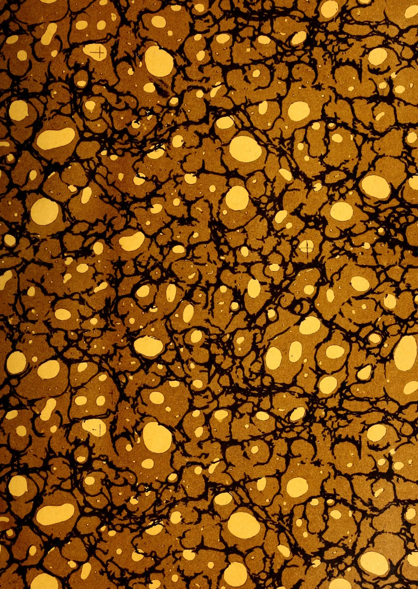This image displays a classic marbled paper pattern, often referred to as 'stone' or 'shell' marbling. The background is a rich, textured brown. Overlaid on this are intricate, dark, branching veins that resemble the cracks in stone or the veins in wood. Scattered throughout the composition are numerous large, irregular, yellowish-gold spots of varying sizes, which give the appearance of bubbles or stones trapped within a resinous medium. The overall effect is organic and complex, with a high level of detail in the vein structure and the placement of the spots.

3------------------------------------------------

4------------------------------------------------

This image is a scan of a blank page. The paper has a light beige or cream-colored tint. There are several small, dark specks scattered across the surface, which appear to be scanning artifacts or dust particles. No text, lines, or other markings are present on the page.

5------------------------------------------------

Digitized by the Internet Archive  
in 2014

<https://archive.org/details/tropicalagricul281907ceyl>

6------------------------------------------------

# The Tropical Agriculturist

AND

## Magazine of the Ceylon Agricultural Society.

---

**FOUNDED BY JOHN FERGUSON, C.M.G., 1881.**

---

EDITED BY

**J. C. WILLIS, Sc.D., F.L.S.,**

*Director, Royal Botanic Gardens, Peradeniya.*

---

**Vol. XXVIII.**

Containing Numbers I to VI : January to June, 1907.

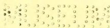

---

**41349**

**A. M. & J. FERGUSON,**

**COLOMBO, CEYLON.**

---

1907.

7------------------------------------------------

# THE CEYLON BOARD OF AGRICULTURE.

**Patron :**

SIR HENRY ARTHUR BLAKE, G.C.M.G., F.R.C.I.

**President :**

HIS EXCELLENCY THE GOVERNOR.

**Vice-Presidents :**

THE HON. THE COLONIAL SECRETARY.

The Hon'ble the COLONIAL TREASURER  
The Hon'ble Mr. JOHN FERGUSON, C.M.G.  
The Hon'ble Mr. S. C. OBEYSEKERE  
Sir WILLIAM TWYNAM, K.C.M.G.  
Mr. FRANCIS BEVEN

Mr. H. T. S. WARD, Director of Irrigation  
Mr. W. FORSYTHE (Sabaragamuwa Province)  
Mr. W. D. GIBBON (Central Province)  
Mr. C. P. HAYLEY (Southern Province)  
Dr. W. G. ROCKWOOD, M.D.

**Organising Vice-President :**

Dr. J. C. WILLIS.

**Members of the Board :**

*Ex-Officio.*—Members of the Executive and Legislative Councils

The Government Agents of Provinces  
The Controller, Experiment Station, Peradeniya  
The Government Entomologist  
The Government Mycologist  
The Director of the Museum  
The Director of Public Instruction  
The Government Veterinary Surgeon  
The Superintendent of School Gardens  
The Conservator of Forests

**Nominated Members :**

*Western Province.*

Mr. R. Morison „ D. A. Gooneratne, Gate Mudaliyar

„ M. Kelway Bamber „ B. T. Doole. Gate Mudaliyar

„ L. W. Booth, c.c.s.

„ E. B. Denham, c.c.s.

„ Solomon Seneviratne, Atapattu Mudaliyar and J.P.

*Eastern Province.*

Mr. Varitambi Kurunathapillai

„ C. A. Lienard

*North-Western Province.*

Sir Solomon Dias Bandaranaike, KT., C.M.G.  
Maha Mudaliyar

Mr. E. Scott

„ S. N. W. Hulugalle, Adigar

Dr. H. M. Fernando, M.D.

„ J. Clovis de Silva

Mr. W. N. S. Aserappa

„ G. W. Dodanwela

„ W. A. de Silva

*North-Central Province.*

„ F. L. Daniel

*Central Province.*

Mr. C. J. C. Mee

Dr. Valentine de S. Duke

„ S. Sampander

Mr. R. E. Paranagama, R.M.

„ C. A. Valoopillai

„ Daniel Joseph

„ G. W. Jayawardene, Mudaliyar and J.P.

„ W. Dunuwille, Disava

*Province of Uva.*

„ C. Taldena, R.M.

*Northern Province.*

Mr. A. T. Rettie

Mr. V. Casipillai

„ James Duncan

„ V. Vraspillai, Adigar and J.P.

„ H. O. Hoseason, J.P.

„ K. U. Tampaiya, District Mudaliyar.

„ T. B. Katugaha, R.M.

*Province of Sabaragamuwa.*

*Southern Province.*

Mr. A. N. Galbraith, c.c.s.

Mr. C. G. Simmonds

„ Dan. J. Jayatileke

„ E. R. Gooneratne, Gate Mudaliyar

„ J. H. Meedeniya, R.M.

**Secretary :**

MR. C. DRIEBERG, B.A., F.E.A.S.

8------------------------------------------------

5  
281  
T 77

# INDEX.

<table border="0">
<thead>
<tr>
<th></th>
<th style="text-align: right;">PAGE.</th>
<th></th>
<th style="text-align: right;">PAGE.</th>
</tr>
</thead>
<tbody>
<tr>
<td><b>Editorials, Lectures, Original Articles, etc :—</b></td>
<td></td>
<td>Congo Free State, Rubber in ...</td>
<td style="text-align: right;">13</td>
</tr>
<tr>
<td>Agricultural Society Progress Report ...</td>
<td style="text-align: right;">48, 126, 190, 256, 335</td>
<td>Creosoting and Blocking Wet Rubber</td>
<td style="text-align: right;">16</td>
</tr>
<tr>
<td>Apiculture in Ceylon ...</td>
<td style="text-align: right;">327, 377</td>
<td>Cultivation in German East Africa ...</td>
<td style="text-align: right;">264</td>
</tr>
<tr>
<td>Blocking of Wet Rubber ...</td>
<td style="text-align: right;">53</td>
<td>" " Zanzibar ...</td>
<td style="text-align: right;">263</td>
</tr>
<tr>
<td>Board of Agriculture, Ceylon 47, 125, 190,</td>
<td style="text-align: right;">254, 334</td>
<td>Distance and Interplanting ...</td>
<td style="text-align: right;">2</td>
</tr>
<tr>
<td>Botany, Lessons in Elementary 43, 299, 386</td>
<td></td>
<td>Exports of Mexico ...</td>
<td style="text-align: right;">56</td>
</tr>
<tr>
<td>Caravonica Cotton, Report on Ceylon Grown ...</td>
<td style="text-align: right;">209</td>
<td>Guayule Rubber, Analyses of ...</td>
<td style="text-align: right;">197</td>
</tr>
<tr>
<td>Ceylon Paddy in Demerara ...</td>
<td style="text-align: right;">366</td>
<td>" " Prospects ...</td>
<td style="text-align: right;">262</td>
</tr>
<tr>
<td>Coconut Cultivation in Ceylon ...</td>
<td style="text-align: right;">278</td>
<td>" " of Mexico ...</td>
<td style="text-align: right;">196</td>
</tr>
<tr>
<td>Coconuts ...</td>
<td style="text-align: right;">1</td>
<td>Gutta Percha Imports ...</td>
<td style="text-align: right;">200</td>
</tr>
<tr>
<td>Co-operation in Agriculture ...</td>
<td style="text-align: right;">261</td>
<td><i>Hevea discolor</i>, A non-rubber Yielder ...</td>
<td style="text-align: right;">344</td>
</tr>
<tr>
<td>Crop Rotation in Paddy Fields ...</td>
<td style="text-align: right;">196</td>
<td>" Fruiting Seasons ...</td>
<td style="text-align: right;">340</td>
</tr>
<tr>
<td>Dry Grains Cultivated in Ceylon ...</td>
<td style="text-align: right;">22, 69</td>
<td>Industry in Ecuador ...</td>
<td style="text-align: right;">132</td>
</tr>
<tr>
<td>Entomological Notes ..</td>
<td style="text-align: right;">29, 181, 296</td>
<td>" " Madagascar ...</td>
<td style="text-align: right;">134</td>
</tr>
<tr>
<td>Experimental Rubber Tapping in Singapore Botanic Gardens ...</td>
<td style="text-align: right;">340</td>
<td>" Latex Coagulation and Reagents ...</td>
<td style="text-align: right;">190</td>
</tr>
<tr>
<td>Fruit Cultivation in Ceylon ...</td>
<td style="text-align: right;">277</td>
<td>London Rubber Market 18, 60, 136, 201,</td>
<td style="text-align: right;">265, 348</td>
</tr>
<tr>
<td>Lawns, their Making and Upkeep ...</td>
<td style="text-align: right;">33</td>
<td>Loranthus Rubber in S. America ...</td>
<td style="text-align: right;">343</td>
</tr>
<tr>
<td>Literature of Economic Botany and Agriculture 42, 119, 178, 246, 300, 384</td>
<td></td>
<td>Market, London Rubber 18, 60, 136, 201,</td>
<td style="text-align: right;">265, 348,</td>
</tr>
<tr>
<td>Moulds and Rubber ...</td>
<td style="text-align: right;">9</td>
<td>" in 1906, Review of ...</td>
<td style="text-align: right;">57</td>
</tr>
<tr>
<td>Non-Rubber Yielding Hevea... ..</td>
<td style="text-align: right;">344</td>
<td>Mistletoes in S. America, Rubber-Yielding ...</td>
<td style="text-align: right;">343</td>
</tr>
<tr>
<td>Note on the System of Cultivation in Arid Districts ...</td>
<td style="text-align: right;">370</td>
<td>Moulds and Rubber ...</td>
<td style="text-align: right;">9</td>
</tr>
<tr>
<td>Paddy Cultivation in Ceylon ...</td>
<td style="text-align: right;">146</td>
<td>Non-Rubber Yielding Hevea ...</td>
<td style="text-align: right;">344</td>
</tr>
<tr>
<td>Poison in Food Plants ...</td>
<td style="text-align: right;">161</td>
<td>Para Rubber, Dr. Esch on Ceylon ...</td>
<td style="text-align: right;">262</td>
</tr>
<tr>
<td>Poultry Notes ...</td>
<td style="text-align: right;">40</td>
<td>Planters, Hints for ...</td>
<td style="text-align: right;">14</td>
</tr>
<tr>
<td>Rabies in the Dog ...</td>
<td style="text-align: right;">38</td>
<td><i>Parthenium Argentatum</i>, Guayule Rubber ...</td>
<td style="text-align: right;">196</td>
</tr>
<tr>
<td>Ranawara Tea of Ceylon ...</td>
<td style="text-align: right;">230</td>
<td>Production of India Rubber ...</td>
<td style="text-align: right;">130</td>
</tr>
<tr>
<td>Rhea or Ramie ...</td>
<td style="text-align: right;">129</td>
<td>Resins in Rubber ...</td>
<td style="text-align: right;">198</td>
</tr>
<tr>
<td>Rice Transplanting ...</td>
<td style="text-align: right;">196</td>
<td>Rubber in Congo Free State ...</td>
<td style="text-align: right;">13</td>
</tr>
<tr>
<td>Root Diseases of Tea ...</td>
<td style="text-align: right;">292</td>
<td>" " Mexico ..</td>
<td style="text-align: right;">55</td>
</tr>
<tr>
<td>Rubber, Creosoting and Blocking Wet " in Congo Free State ...</td>
<td style="text-align: right;">16</td>
<td>" " Panama ...</td>
<td style="text-align: right;">55</td>
</tr>
<tr>
<td>" " Para, Distance and Inter-planting ...</td>
<td style="text-align: right;">2</td>
<td>" " Industry in East Africa ...</td>
<td style="text-align: right;">263</td>
</tr>
<tr>
<td>" " Spiral Tapping Thirty Years Ago ..</td>
<td style="text-align: right;">54</td>
<td>" " Production in Proportion to Latex Yield ...</td>
<td style="text-align: right;">341</td>
</tr>
<tr>
<td>Satinwood, Chloroxylon Swietenia ...</td>
<td style="text-align: right;">26</td>
<td>Spiral Tapping Thirty Years Ago ...</td>
<td style="text-align: right;">54</td>
</tr>
<tr>
<td>Solanaceæ—a Useful Family ...</td>
<td style="text-align: right;">381</td>
<td>Soil Sterilisation in Rubber Plantations ...</td>
<td style="text-align: right;">7</td>
</tr>
<tr>
<td>Spiral Rubber Tapping Thirty Years Ago 54</td>
<td></td>
<td>Tapping Results in Singapore Botanic Gardens ...</td>
<td style="text-align: right;">340</td>
</tr>
<tr>
<td>Tobacco Manuring Experiments, Ceylon ...</td>
<td style="text-align: right;">281</td>
<td>Thinning out Rubber ...</td>
<td style="text-align: right;">4</td>
</tr>
<tr>
<td>Transplanting in Paddy Cultivation 145, 196</td>
<td></td>
<td>Wet Rubber, Creosoting and Blocking ...</td>
<td style="text-align: right;">16</td>
</tr>
<tr>
<td>Work of Local Agricultural Societies 339</td>
<td></td>
<td></td>
<td></td>
</tr>
<tr>
<td><b>Gums, Resins, Saps and Exudations :—</b></td>
<td></td>
<td><b>Oils and Fats :—</b></td>
<td></td>
</tr>
<tr>
<td>Camphor Cultivation ...</td>
<td style="text-align: right;">204</td>
<td>African Oil Palm Cultivation ...</td>
<td style="text-align: right;">351</td>
</tr>
<tr>
<td>" " in Ceylon ...</td>
<td style="text-align: right;">205</td>
<td>Camphor Industry in Ceylon ...</td>
<td style="text-align: right;">64</td>
</tr>
<tr>
<td><b>RUBBER :—</b></td>
<td></td>
<td>" Oil ...</td>
<td style="text-align: right;">62</td>
</tr>
<tr>
<td>Burma, Cultivation Industry in ...</td>
<td style="text-align: right;">345</td>
<td>Ceara Rubber Seed Oil ...</td>
<td style="text-align: right;">353</td>
</tr>
<tr>
<td>Caoutchouc Production and Bark Injury ...</td>
<td style="text-align: right;">342</td>
<td>Citronella Oil ...</td>
<td style="text-align: right;">66</td>
</tr>
<tr>
<td>Ceara Rubber in German East Africa 264</td>
<td></td>
<td>Coconut Oil in American Market ...</td>
<td style="text-align: right;">354</td>
</tr>
<tr>
<td>Ceylon Para Rubber, Dr. Esch on ...</td>
<td style="text-align: right;">262</td>
<td>Lemongrass Oil ...</td>
<td style="text-align: right;">67</td>
</tr>
<tr>
<td>" Rubber, What's Wrong with 342</td>
<td></td>
<td>Oil, Preparation of African Palm ...</td>
<td style="text-align: right;">352</td>
</tr>
<tr>
<td>Close Planting vs. Wide Planting ...</td>
<td style="text-align: right;">4</td>
<td></td>
<td></td>
</tr>
<tr>
<td>Coagulation of Castilloa Rubber ...</td>
<td style="text-align: right;">135</td>
<td><b>Dyes and Tanning Substances :—</b></td>
<td></td>
</tr>
<tr>
<td></td>
<td></td>
<td>Turmeric Cultivation and Uses ...</td>
<td style="text-align: right;">207</td>
</tr>
<tr>
<td></td>
<td></td>
<td><b>Fibres :—</b></td>
<td></td>
</tr>
<tr>
<td></td>
<td></td>
<td>Agave Fibres, Report on Madras ...</td>
<td style="text-align: right;">269</td>
</tr>
<tr>
<td></td>
<td></td>
<td>" Vera Cruz ...</td>
<td style="text-align: right;">269</td>
</tr>
<tr>
<td></td>
<td></td>
<td>" Wightii ...</td>
<td style="text-align: right;">271</td>
</tr>
<tr>
<td></td>
<td></td>
<td>Caravonica Cotton, Report on Ceylon 209</td>
<td></td>
</tr>
<tr>
<td></td>
<td></td>
<td>Cotton, Caravonica ...</td>
<td style="text-align: right;">68, 124</td>
</tr>
</tbody>
</table>

9------------------------------------------------

iiINDEX.

<table border="0">
<thead>
<tr>
<th></th>
<th style="text-align: right;">PAGE.</th>
<th></th>
<th style="text-align: right;">PAGE.</th>
</tr>
</thead>
<tbody>
<tr>
<td>Fibre Extracting Machinery ...</td>
<td style="text-align: right;">212</td>
<td><b>Timbers :—</b></td>
<td></td>
</tr>
<tr>
<td>    "    "    Phormium ...</td>
<td style="text-align: right;">217</td>
<td>Chloroxylon Swietenia or Satinwood ...</td>
<td style="text-align: right;">26</td>
</tr>
<tr>
<td>Flax Cultivation New, Zealand (<i>Phormium tenax</i>) ...</td>
<td style="text-align: right;">213</td>
<td>Satinwood, Chloroxylon Swietenia ...</td>
<td style="text-align: right;">26</td>
</tr>
<tr>
<td>Furcraea Fibres, Report on Madras ...</td>
<td style="text-align: right;">269</td>
<td>Wood in Paper Making ...</td>
<td style="text-align: right;">91, 219</td>
</tr>
<tr>
<td>    "    Gigantea (Mauritius Hemp) ...</td>
<td style="text-align: right;">271</td>
<td>    Products, Possibilities of ...</td>
<td style="text-align: right;">289</td>
</tr>
<tr>
<td>Maguey Cultivation ...</td>
<td style="text-align: right;">210</td>
<td>    Pulp-Making Patents ...</td>
<td style="text-align: right;">289</td>
</tr>
<tr>
<td>Mauritius Hemp ...</td>
<td style="text-align: right;">271</td>
<td><b>Plant Sanitation :—</b></td>
<td></td>
</tr>
<tr>
<td>Paper and Pulp Manufacture in Burma ...</td>
<td style="text-align: right;">355</td>
<td><i>Entomology :</i></td>
<td></td>
</tr>
<tr>
<td>Philippine Fibres and Fibrous Substances ...</td>
<td style="text-align: right;">140</td>
<td>Camphor, Boring-beetle on ...</td>
<td style="text-align: right;">297</td>
</tr>
<tr>
<td>Ramie or Rhea in Tirhut ...</td>
<td style="text-align: right;">273</td>
<td>Castor Plant, Scale-bug on ...</td>
<td style="text-align: right;">297</td>
</tr>
<tr>
<td>Rhea or Ramie ...</td>
<td style="text-align: right;">129</td>
<td>Ceara Seeds, Worms in ...</td>
<td style="text-align: right;">29</td>
</tr>
<tr>
<td>Sisal Hemp ...</td>
<td style="text-align: right;">270</td>
<td>Copra, Larvae in ...</td>
<td style="text-align: right;">297</td>
</tr>
<tr>
<td>    "    "    Cultivation ...</td>
<td style="text-align: right;">210</td>
<td>Entomological Notes ...</td>
<td style="text-align: right;">29, 181, 296</td>
</tr>
<tr>
<td><b>Edible Products :—</b></td>
<td></td>
<td>Insects, Importation of Beneficial ...</td>
<td style="text-align: right;">104</td>
</tr>
<tr>
<td>Arrowroot Industry ...</td>
<td style="text-align: right;">364</td>
<td>Mosquitoes, To Prevent Breeding of ...</td>
<td style="text-align: right;">297</td>
</tr>
<tr>
<td>Cacao, Criolo Budded on Forastero ...</td>
<td style="text-align: right;">360</td>
<td>Nettle Grubs (<i>Thosea</i>), Cure for ...</td>
<td style="text-align: right;">296</td>
</tr>
<tr>
<td>    Trade, Review of the ...</td>
<td style="text-align: right;">359</td>
<td>Palmyra Palms, Disease of ...</td>
<td style="text-align: right;">30</td>
</tr>
<tr>
<td>Canning Fruit for Preserving ...</td>
<td style="text-align: right;">368</td>
<td>Shot Hole Borer and Shade ...</td>
<td style="text-align: right;">183</td>
</tr>
<tr>
<td>Cassava, Poison in ...</td>
<td style="text-align: right;">161</td>
<td>    "    "    To Destroy ...</td>
<td style="text-align: right;">182</td>
</tr>
<tr>
<td>Chillie Peppers, Cultivation of ...</td>
<td style="text-align: right;">24</td>
<td>Tea Aphid (<i>Ceylonia theaecola</i>) ...</td>
<td style="text-align: right;">29</td>
</tr>
<tr>
<td>Coconut Cultivation in Southern Province, Ceylon ...</td>
<td style="text-align: right;">278</td>
<td>    Nettle Grub on ...</td>
<td style="text-align: right;">29</td>
</tr>
<tr>
<td>    "    Manuring ...</td>
<td style="text-align: right;">279, 280</td>
<td>    "    Tortrix (<i>Cupua coffearia</i>) ...</td>
<td style="text-align: right;">29</td>
</tr>
<tr>
<td>    "    Trees per Acre ...</td>
<td style="text-align: right;">280</td>
<td>White Ants (<i>Calotermes militaris</i>) on Tea ...</td>
<td style="text-align: right;">181</td>
</tr>
<tr>
<td>    "    Yield per Acre ...</td>
<td style="text-align: right;">280</td>
<td><i>Mycology :</i></td>
<td></td>
</tr>
<tr>
<td>Coffee Valorisation Scheme ...</td>
<td style="text-align: right;">361</td>
<td><i>Caprinia</i> on Kickxia Rubber ...</td>
<td style="text-align: right;">296</td>
</tr>
<tr>
<td>Decay of Ripe Fruit, To Prevent ...</td>
<td style="text-align: right;">236</td>
<td><i>Poria-hypolateritia</i> Fungus on Tea ...</td>
<td style="text-align: right;">293</td>
</tr>
<tr>
<td>Dry Grains Cultivated in Ceylon ...</td>
<td style="text-align: right;">22</td>
<td>Rosellinia Fungus on Tea ...</td>
<td style="text-align: right;">292</td>
</tr>
<tr>
<td>Formosa Oolong Teas ...</td>
<td style="text-align: right;">229</td>
<td>Tea Prunings, Burial of ...</td>
<td style="text-align: right;">295, 296</td>
</tr>
<tr>
<td>    "    Tea Industry ...</td>
<td style="text-align: right;">228</td>
<td>    Root Diseases ...</td>
<td style="text-align: right;">292 - 295</td>
</tr>
<tr>
<td>Fruit Cultivation in Ceylon ...</td>
<td style="text-align: right;">277</td>
<td><i>Ustilina</i> Fungus on Tea ...</td>
<td style="text-align: right;">293</td>
</tr>
<tr>
<td>    "    Decay, To Prevent Rapid ...</td>
<td style="text-align: right;">236</td>
<td><b>Scientific Agriculture :—</b></td>
<td></td>
</tr>
<tr>
<td>    "    Preserving ...</td>
<td style="text-align: right;">367</td>
<td>Arid Districts, Cultivation in ...</td>
<td style="text-align: right;">370</td>
</tr>
<tr>
<td>Grains in Ceylon, Dry ...</td>
<td style="text-align: right;">69</td>
<td>Basic Slag, Value of ...</td>
<td style="text-align: right;">184</td>
</tr>
<tr>
<td>Ground-nut Cultivation ...</td>
<td style="text-align: right;">231</td>
<td>Green Manuring, Progress in the Practice of ...</td>
<td style="text-align: right;">372</td>
</tr>
<tr>
<td>    "    "    Industry at Marseilles ...</td>
<td style="text-align: right;">235</td>
<td>Humus in Agriculture, Importance of ...</td>
<td style="text-align: right;">298</td>
</tr>
<tr>
<td>    "    "    "    Pondicherry ...</td>
<td style="text-align: right;">365</td>
<td>Leguminous Crops, Fertilising Ingredients in ...</td>
<td style="text-align: right;">375</td>
</tr>
<tr>
<td>    "    "    or Pea-nut ...</td>
<td style="text-align: right;">86, 150</td>
<td>Manuring Cacao ...</td>
<td style="text-align: right;">298</td>
</tr>
<tr>
<td>    "    "    Yields of ...</td>
<td style="text-align: right;">233</td>
<td><b>Horticulture :—</b></td>
<td></td>
</tr>
<tr>
<td>Heeleaka Tea Experiment Station ...</td>
<td style="text-align: right;">72</td>
<td>Garden Accessories ...</td>
<td style="text-align: right;">101</td>
</tr>
<tr>
<td>Oolong Teas, Formosa ...</td>
<td style="text-align: right;">229</td>
<td>Mulching ...</td>
<td style="text-align: right;">185</td>
</tr>
<tr>
<td>Paddy Cultivation in Badulla, Ceylon ...</td>
<td style="text-align: right;">146</td>
<td>Lawns, Making and Upkeep of ...</td>
<td style="text-align: right;">33</td>
</tr>
<tr>
<td>    "    in Demerara, Ceylon ...</td>
<td style="text-align: right;">366</td>
<td>Roots, Growth and Formation of ...</td>
<td style="text-align: right;">35</td>
</tr>
<tr>
<td><i>Paspalum Dilatatum</i> : An American Fodder-Grass ...</td>
<td style="text-align: right;">164</td>
<td><b>Live Stock :—</b></td>
<td></td>
</tr>
<tr>
<td>Pea-nut Cultivation ...</td>
<td style="text-align: right;">231</td>
<td><i>Apiculture :</i></td>
<td></td>
</tr>
<tr>
<td>    "    or Ground-nut ...</td>
<td style="text-align: right;">86, 150</td>
<td>Apiculture in Ceylon ...</td>
<td style="text-align: right;">327, 377</td>
</tr>
<tr>
<td>Poison in Food Plants ...</td>
<td style="text-align: right;">161</td>
<td>Bee-keeping Appliances ...</td>
<td style="text-align: right;">329</td>
</tr>
<tr>
<td>Prickly Pear as Fodder ...</td>
<td style="text-align: right;">167</td>
<td>Hive, To make a ...</td>
<td style="text-align: right;">327</td>
</tr>
<tr>
<td>Ranawara Tea of Ceylon ...</td>
<td style="text-align: right;">230</td>
<td>    "    Frames, To make ...</td>
<td style="text-align: right;">328</td>
</tr>
<tr>
<td>Rozelle ...</td>
<td style="text-align: right;">125</td>
<td><i>Poultry :</i></td>
<td></td>
</tr>
<tr>
<td>Sugar as Food, Value of ...</td>
<td style="text-align: right;">363</td>
<td>Egg-Eating, Cure for ...</td>
<td style="text-align: right;">41</td>
</tr>
<tr>
<td>Tea, Ceylon's Import Duty on ...</td>
<td style="text-align: right;">148</td>
<td>Eggs in Water Glass, Preserving ...</td>
<td style="text-align: right;">324</td>
</tr>
<tr>
<td>    Consumption, Increase in ...</td>
<td style="text-align: right;">360</td>
<td>Favus or Ringworm in Fowls ...</td>
<td style="text-align: right;">41</td>
</tr>
<tr>
<td>    "    China ...</td>
<td style="text-align: right;">284</td>
<td>Feather Eating, Cure for ...</td>
<td style="text-align: right;">41</td>
</tr>
<tr>
<td>    "    Culture in Japan ...</td>
<td style="text-align: right;">79</td>
<td>Poultry, Diseases of ...</td>
<td style="text-align: right;">40</td>
</tr>
<tr>
<td>    "    Districts, Elevations of Ceylon ...</td>
<td style="text-align: right;">227</td>
<td>    "    Enteritis in ...</td>
<td style="text-align: right;">40</td>
</tr>
<tr>
<td>    "    Industry, Formosa ...</td>
<td style="text-align: right;">228</td>
<td>    Ringworm in Poultry ...</td>
<td style="text-align: right;">41</td>
</tr>
<tr>
<td>    "    in Heeleaka Experiment Station ...</td>
<td style="text-align: right;">72</td>
<td><i>Miscellaneous :</i></td>
<td></td>
</tr>
<tr>
<td>    "    Manufacture in Japan ...</td>
<td style="text-align: right;">79</td>
<td>Cockroaches, and Remedies for them ...</td>
<td style="text-align: right;">239</td>
</tr>
<tr>
<td>Teas, Ceylon ...</td>
<td style="text-align: right;">226</td>
<td>Dog, Rabies in the ...</td>
<td style="text-align: right;">38</td>
</tr>
<tr>
<td>    "    World's Leading ...</td>
<td style="text-align: right;">226, 234</td>
<td><b>Miscellaneous :—</b></td>
<td></td>
</tr>
<tr>
<td>Tobacco Manuring Experiments in Ceylon ...</td>
<td style="text-align: right;">281</td>
<td>Agricultural Associations in India ...</td>
<td style="text-align: right;">387</td>
</tr>
<tr>
<td>Tobacco Seed, How to Save the Best ...</td>
<td style="text-align: right;">357</td>
<td>    "    Co-operation ...</td>
<td style="text-align: right;">303</td>
</tr>
<tr>
<td>Transplanting in Paddy Cultivation at Dikdeniya, Ceylon ...</td>
<td style="text-align: right;">145</td>
<td>    "    Institute, International ...</td>
<td style="text-align: right;">247</td>
</tr>
</tbody>
</table>

10------------------------------------------------

INDEX.iii

<table border="0">
<thead>
<tr>
<th></th>
<th style="text-align: right;">PAGE.</th>
<th></th>
<th style="text-align: right;">PAGE.</th>
</tr>
</thead>
<tbody>
<tr>
<td>    "    Methods in Madras</td>
<td style="text-align: right;">... 169</td>
<td>    "    "    their Work in the</td>
<td></td>
</tr>
<tr>
<td>    "    Organisation Society</td>
<td style="text-align: right;">... 243</td>
<td>        United States</td>
<td style="text-align: right;">... 313</td>
</tr>
<tr>
<td>Agriculture in the Philippines</td>
<td style="text-align: right;">... 120</td>
<td>        and their Work</td>
<td style="text-align: right;">... 244</td>
</tr>
<tr>
<td>    "    Literature of Economic</td>
<td></td>
<td>Solanaceæ—A Useful Family</td>
<td style="text-align: right;">... 381</td>
</tr>
<tr>
<td>        Botany and 42, 119, 178, 246, 300, 384</td>
<td></td>
<td>Village Agriculturists, Hints for</td>
<td style="text-align: right;">... 109</td>
</tr>
<tr>
<td>        Recent Problems in</td>
<td style="text-align: right;">... 175</td>
<td>Whitewash, A Useful</td>
<td style="text-align: right;">... 180</td>
</tr>
<tr>
<td>Agri-hoticultural Show, Ambalangoda</td>
<td style="text-align: right;">43,</td>
<td></td>
<td></td>
</tr>
<tr>
<td></td>
<td style="text-align: right;">123</td>
<td><b>Correspondence :—</b></td>
<td></td>
</tr>
<tr>
<td>    "    "    "    Nuwara</td>
<td style="text-align: right;">259, 325</td>
<td>    Absorption of Nitrogen by Plants</td>
<td style="text-align: right;">... 332</td>
</tr>
<tr>
<td>        Eliya</td>
<td style="text-align: right;">...</td>
<td>    Aloe Vera</td>
<td style="text-align: right;">... 189</td>
</tr>
<tr>
<td>    "    "    "    Uva</td>
<td style="text-align: right;">... 326</td>
<td>    Australian Magpie in Ceylon</td>
<td style="text-align: right;">... 330</td>
</tr>
<tr>
<td>Betel Vine Essay Competition</td>
<td style="text-align: right;">334, 416</td>
<td>    Camphor Propagation from Seed</td>
<td style="text-align: right;">... 413</td>
</tr>
<tr>
<td>Botany and Agriculture Literature</td>
<td></td>
<td>    Canker in Para Rubber Trees</td>
<td style="text-align: right;">... 412</td>
</tr>
<tr>
<td>    of Economic 42, 119, 178, 246, 300, 384</td>
<td></td>
<td>    Caravonica Cotton</td>
<td style="text-align: right;">... 124</td>
</tr>
<tr>
<td>Botany in the Public Schools and</td>
<td></td>
<td>    Carnauba Palm for Ceylon</td>
<td style="text-align: right;">... 413</td>
</tr>
<tr>
<td>    on the Farm</td>
<td style="text-align: right;">... 173</td>
<td>    Cashew Nut</td>
<td style="text-align: right;">... 187</td>
</tr>
<tr>
<td>Botany, Lessons in Elementary</td>
<td style="text-align: right;">43, 299, 386</td>
<td>    Ceylon Papain</td>
<td style="text-align: right;">... 331</td>
</tr>
<tr>
<td>Cattle Show, Ettaiyapuram</td>
<td style="text-align: right;">... 50</td>
<td>Ceylon Rubber, Suggestions for the</td>
<td></td>
</tr>
<tr>
<td>Co-operative Agricultural Societies</td>
<td style="text-align: right;">392</td>
<td>    Improvement of</td>
<td style="text-align: right;">... 411</td>
</tr>
<tr>
<td>    "    Credit in Canada</td>
<td style="text-align: right;">... 109</td>
<td>Characteristic Plants of North Ceylon</td>
<td style="text-align: right;">186</td>
</tr>
<tr>
<td>    "    "    in India</td>
<td style="text-align: right;">... 302</td>
<td>Fruit Trees along Public Roads,</td>
<td></td>
</tr>
<tr>
<td>    "    "    among Indian</td>
<td></td>
<td>    Planting</td>
<td style="text-align: right;">... 414</td>
</tr>
<tr>
<td>        Ryots</td>
<td style="text-align: right;">252</td>
<td>Mud-kilavai, Uses of</td>
<td style="text-align: right;">... 330</td>
</tr>
<tr>
<td>    "    "    Societies Act</td>
<td style="text-align: right;">... 251</td>
<td>Mulch and Capillarity</td>
<td style="text-align: right;">... 254</td>
</tr>
<tr>
<td>Earth-Eating in India</td>
<td style="text-align: right;">... 397</td>
<td>Paspalum Grass for Coconut Plantations</td>
<td style="text-align: right;">... 415</td>
</tr>
<tr>
<td>Eggs in Water-glass, Preserving</td>
<td style="text-align: right;">... 324</td>
<td>Pepper Stem Diseases</td>
<td style="text-align: right;">... 45, 186</td>
</tr>
<tr>
<td>Hawaii, Trade of</td>
<td style="text-align: right;">... 178</td>
<td>Plants of North Ceylon, Characteristic</td>
<td style="text-align: right;">... 44</td>
</tr>
<tr>
<td>Irrigation of Black Cotton Soil</td>
<td style="text-align: right;">... 301</td>
<td>Ramie (Rhea) Industry</td>
<td style="text-align: right;">... 187</td>
</tr>
<tr>
<td>Labour Emigration from Mexico</td>
<td style="text-align: right;">... 310</td>
<td>Root Disease of Hevea</td>
<td style="text-align: right;">... 44</td>
</tr>
<tr>
<td>Literature of Economic Botany and</td>
<td></td>
<td>Rozelle</td>
<td style="text-align: right;">... 125</td>
</tr>
<tr>
<td>    Agriculture 42, 119, 178, 246, 300, 384</td>
<td></td>
<td>Rubber Tapping : Inverted V System</td>
<td style="text-align: right;">... 189</td>
</tr>
<tr>
<td>Medical Management of Coolies in</td>
<td></td>
<td>Satinwood, Durability of</td>
<td style="text-align: right;">... 415</td>
</tr>
<tr>
<td>    Malaya</td>
<td style="text-align: right;">... 398</td>
<td>Snake-bite Cures</td>
<td style="text-align: right;">... 331</td>
</tr>
<tr>
<td>Minuwangoda Fair</td>
<td style="text-align: right;">... 49</td>
<td>Tephrosia as Green Manure</td>
<td style="text-align: right;">... 330</td>
</tr>
<tr>
<td>School Garden Notes</td>
<td style="text-align: right;">... 322</td>
<td></td>
<td></td>
</tr>
<tr>
<td>    "    "    Work</td>
<td style="text-align: right;">... 316</td>
<td><b>Current Literature :—</b></td>
<td></td>
</tr>
<tr>
<td>    "    "    and Children's</td>
<td style="text-align: right;">...</td>
<td>    Agricultural Progress in Coorg</td>
<td style="text-align: right;">... 46</td>
</tr>
<tr>
<td>        Exhibitions</td>
<td style="text-align: right;">... 321</td>
<td>    Cotton-Growing Industry, B. C.</td>
<td></td>
</tr>
<tr>
<td>    "    "    as Factor in Village</td>
<td></td>
<td>        Africa, Report on</td>
<td style="text-align: right;">... 45</td>
</tr>
<tr>
<td>        Improvement</td>
<td style="text-align: right;">... 319</td>
<td></td>
<td></td>
</tr>
</tbody>
</table>

11------------------------------------------------

This image is a scan of a blank page. The paper has a light beige or cream-colored tint. There are a few small, dark specks scattered across the surface, which appear to be scanning artifacts or dust particles. No text, lines, or other markings are present on the page.

12------------------------------------------------

RULES  
OF THE  
**Agricultural Society of Ceylon.**

---

1. 1. The Society shall be called "THE AGRICULTURAL SOCIETY OF CEYLON."
2. 2. The business of the General Society shall be conducted through the Board of Agriculture of Ceylon.
3. 3. The Board shall meet for despatch of business on the first Monday of each month at 2-30 p.m. Seven members shall form a quorum.
4. 4. Notices of motions or questions shall be sent to the Secretary at least one week before the meeting of the Board.
5. 5. All motions will require to be seconded and will be circulated before the Board meets.
6. 6. A General Meeting of the Society may be called by the President at any time and may be held at any place to be fixed by him.
7. 7. All Members of the Board will be nominated by the President.
8. 8. Candidates for Membership of the Society must be proposed by a Member of the Board for the district in which the Candidate resides or owns landed property.
9. 9. Members of the Society shall pay a subscription of Rs. 5 per annum.
10. 10. Payment of the subscription in advance will entitle a Member to receive all publications of the Society. All subscriptions shall be paid to the Secretary of the Board.
11. 11. Lists of Members will be published annually in the *Government Gazette* and in the Journal of the Society.
12. 12. Local Societies may be formed with a Membership of not less than twelve Members.
13. 13. Each Local Society should be represented by a Secretary, through whom correspondence with the Board can be conducted.
14. 14. All Local Societies will be registered at the Local Kachcheri and by the Secretary of the Board.
15. 15. The Revenue Officers of the Province and District shall be *ex-officio* Members of the Local Societies within the Province.
16. 16. Local Societies are empowered to make their own rules.
17. 17. All Local Societies will be entitled to receive all publications of the Society on payment of an individual subscription.
18. 18. The funds of the Agricultural Society will be lodged in the Bank of Madras in the name of the Agricultural Society of Ceylon. The Secretary will be responsible for the accounts, and all cheques will be signed by him and the President or Vice-President of the Board of Agriculture.
19. 19. A statement of Expenditure incurred, &c., shall be tabled at each meeting of the Board.
20. 20. All grants-in-aid of Local Societies or special experiment must be approved by the Board.
21. 21. All accounts will be audited annually.

13------------------------------------------------

This image is a scan of a blank page. The paper has a light beige or cream-colored tint. There are a few very small, dark specks scattered across the surface, which appear to be scanning artifacts or dust particles. No text, lines, or other markings are present on the page.

14------------------------------------------------

THE  
TROPICAL AGRICULTURIST  
AND  
MAGAZINE OF THE  
CEYLON AGRICULTURAL SOCIETY.

VOL. XXVIII.

COLOMBO, JANUARY 15TH, 1907.

No. 1.

---

Coconuts.

---

The dearth of literature on the subject of coconuts is remarkable, and to what it is to be ascribed is hard to say. More has been written about rubber in a few years than about coconuts since the palm was evolved. True it is that there is a less attractive profit in view, but it is by no means so certain that in 15 or 20 years' time the rubber will pay better than the nuts. The uses for the product of the one increase as rapidly as those for that of the other. Cultivation of the palm is continually extending in Ceylon, Malaya, and other countries, but the consumption increases as rapidly, so that prices have not fallen, in fact have of late risen in a remarkable way.

This absence of literature may be due to the fact that until comparatively lately the cultivation of this palm has been almost entirely in the hands of the villagers, or to the fact that by long practice of the cultivation the natives of Ceylon had evolved a system of cultivation which has proved very fair as to results, and which has not yet met with much criticism or alteration; or again, to the fact that scientific institutions, such as Peradeniya, having only recently been established in the tropics, have not yet had time to do much in the study of a palm which takes so long to come into bearing. The new department of agriculture in the Philippines, however, has already turned out some useful work.

At the same time, it must be recognised that the scientific treatment of the coconut is only in its infancy, and that we are as yet without really accurate knowledge of most branches of its cultivation and harvesting. What kind of nut, for instance, gives, for each kind of soil, the best results as to copra, oil, fibre, &c.? How many really distinct varieties are there (opinions vary from 2 to 150)? To what extent will one variety pass into another with change of soil, cultivation, &c.? To what extent are the characters of any given nut due to selection, and what characters will remain fixed from generation to generation, and thus not deteriorate in the hands of villagers? To what extent can the qualities of any given race be improved by selection? What is the best distance apart to plant with different varieties in different soils? What is the manure for each kind of soil? each kind of nut? What is the best way of making copra of uniform quality, fibre, oil, &c.? And many other questions.

We shall welcome any contributions upon any of these topics from writers with knowledge of the subject.

15------------------------------------------------

2[JAN. 1907.

## GUMS, RESINS, SAPS, AND EXUDATIONS.

### Para Rubber: Distance and Interplanting.

By HERBERT WRIGHT.

On a previous occasion the subject of distance in planting, in connection with *Hevea brasiliensis*, was discussed, and a certain amount of interest has since been displayed in the subject. It appears necessary, however, to discuss this matter in detail, and to definitely state that I am not in favour of close planting any more than I am in favour of the wide planting of Para rubber trees; any misconception is no doubt due to the brevity of my original remarks. In the original discussion the advantages and disadvantages of "close planting and thinning-out" were briefly given, and the pros and cons of other possible systems require to be dealt with.

In the planting of Para rubber there are approximately five systems which may be mentioned:—

1. 1. Close planting—permanent;
2. 2. Close planting and thinning-out;
3. 3. Wide planting—permanent;
4. 4. Wide planting with catch and inter crops;
5. 5. Interplanting with herbaceous and arborescent plants.

#### WHAT IS CLOSE PLANTING?

To define close planting is a difficult matter, and though actual figures may be quoted, they are subject to modification according to the physical and chemical properties of the soil, and the nature of the climate in which it is proposed to grow the plants. The term—close planting—admittedly implies the planting of the trees at a distance which is not sufficient to allow of the full development of all parts of the plants; the latter is determined by the natural vitality of the plants and the nature of the soil and climate. Medium-distance planting in a poor cabook soil, or in a washed out clay, above 2,500 feet in Ceylon, would be regarded as close planting in a rich alluvial soil in the low country of the same island. The trees should be planted at such a distance that they will rapidly develop and take possession of the whole of the soil; their development is controlled by the amount of food which the soil supplies, and it is generally conceded that the better the soil, and more forcing the climate, the greater must be the distance allowed. A typical case is to be seen at the Experiment Station, Peradeniya, where some four-year old trees, all planted 15 feet apart, have overlapped their branches on the flat land, but on the upper part of the hill the spread of the branches is hardly a yard on either side; by the time the latter have taken possession of the soil the former will require considerable thinning out. It has been argued that if the soil is poorer the trees should be planted at wider distances in order to allow a larger area from which the plants can obtain food; this is a contention that loses sight of the necessity of quickly placing the plants in possession of all the soil.

Disregarding the differences in quality of alluvial, cabook, swampy, forest, and chena land, from sea-level up to 3,000 feet in Ceylon, and the allowances to be made accordingly, it may be generally stated that on a soil similar to that at Peradeniya, a distance of ten feet apart, or less, for trees of *Hevea brasiliensis*, may be designated as close planting, one of fifteen feet apart as medium distance, and one of twenty feet apart or over as wide planting. These distances are subject to modification according to local conditions, and are here given only to provide a basis for comparison.

16------------------------------------------------

JAN. 1907.]8Saps and Exudations.

The advantages of close planting are that there is a larger number of trees on a given acreage; (2) the ground is better protected with the root and foliar systems, and consequently expenses in weeding are greatly checked, and soil loss thereby reduced; (3) the rubber can be harvested cheaper; (4) the cultivation is essentially one of rubber trees which presumably have a higher value than other trees of economic importance, and the method of cultivation over all the soil becomes the same; (5) the inevitable proportion of poorly developed, stunted, and damaged trees is not as serious; (6) it is easier to thin out a densely planted estate than to interplant a widely planted one.

The disadvantages are (1) there may be considerable interference in the development of all parts of the plant and the resultant trees be dwarfed and lacking in vitality; (2) the stems will tend to become thin, long, and spindly, and the thickness of tappable cortex (bark) reduced; (3) diseases are given a greater certainty of originating and may spread more rapidly because the parts of the plant are nearer to one another or in more frequent contact.

#### DISTANCE ACCORDING TO SIZE AND AGE.

The cultivation of trees of *Hevea brasiliensis* ranks as unique in so far as it has to deal with a species which grows into a tree of enormous size; the past and most of the present products, in Ceylon, cannot be compared with the latest arrival, for it overtops the tallest cacao and cinchona trees, and often equals the coconut palms, in height and frequently in breadth, age for age.

• Trees less than thirty years old, which have never really been cultivated, have a height of 80 to 90 feet and a circumference of 80 to 100 inches; specimens planted 25 to 30 feet apart have been known to overlap their branches in about 20 years, and fifty years old trees in tropical America even exceed these huge dimensions. This is the outstanding difference between the cultivation of Para rubber trees and all other plants in Ceylon, and though it has been an easy matter, in the past, to settle the distance at which tea, cacao, cinchona, etc., should be planted, we are now confronted with a new set of conditions which may require different methods of cultivation.

#### DISTANCE OF TAPPED TREES.

There is another point which appears to have been overlooked in connection with this subject, and that is the retardation in growth which must follow regular paring or tapping. It is no exaggeration to say that most of the old trees in Ceylon were not systematically tapped until the last few years, and but few estates can point to acreages which have been regularly tapped, throughout successive years, from the time the old trees attained their minimum tappable size. Whenever cortical tissues are removed or mutilated, the energy of the plant is partly diverted to the production of new tissues in the affected area, for the time being the intimate connection between individual vital structures and that of the latter with cells which have less important functions, is interrupted; such changes must effect the future development of the plants, especially when of repeated occurrence from the 4th, 5th or 6th year onwards. In the absence of any measurable effects following the tapping of trees, one can only generalise and state that the sizes of trees so treated will probably be less than those of specimens which have never had their bark so excised and otherwise mutilated. Time will certainly prove the wisdom or error of planting Para rubber trees ten to fifteen feet apart, as most estates in Ceylon appear to be so planted. Systematic paring away of the bark of rubber trees will as assuredly change the habit and ultimate dimensions of the mature trees, as has the constant plucking of the leaves of tea plants, and the peeling of the cinchona bark.

17------------------------------------------------

Tums, Resins,4[JAN. 1907.ORIGINAL AND PERMANENT DISTANCE.

It is taken for granted that the reader is familiar with the sizes of Para rubber plants from their first to their thirtieth year, in different soils and climates; the question to discuss is whether the original should be the permanent distance. No one who has seen the uncultivated thirty-year-old trees at Henaratgoda can doubt that such specimens require, at the very least, a distance of thirty to forty feet, if they are to be allowed to continue in their growth and maintain a healthy constitution; what the required distance will be when they are 40 to 50 years old it would be unwise to predict. In striking contrast to this are the thin, tall stems of two to four year old trees, and the poor lateral spread of the foliage when they have just reached the tappable size. Between the first year of tapping and that represented by the old Henaratgoda trees, is a gap of 25 years—probably the equivalent of a longer period when the newly-bearing trees are regularly tapped, year in and year out. I am of the opinion—though I may be wrong—that it is absolute folly to plant, in a clearing, Para rubber trees alone, at a distance which they will require when thirty years old; we are dealing with a species which does not, like cacao and similar plants, attain the greater part of its maximum size in the first six or seven years, but with one which continues to grow, year by year, and even when thirty years old, still keeps on growing and throwing its roots into new soil. Though Para rubber trees continue to grow in this manner, though the ultimate size to which they will attain can only be roughly guessed at from our scanty knowledge and experience, yet we know that when their stems are only 20 inches in circumference they yield marketable rubber in very satisfactory quantities. Four to six years is a long time to wait for the first returns, and from a commercial standpoint the distance at which trees can be planted, without entailing undue interference in general development, and brought into bearing in their fourth year onwards, is the one to be decided. Of course, when the trees are widely planted they come into bearing as early as when closely planted, but there is no very great difference in the dimensions of trees planted at widely different distances, up to their fourth year; the growth in the first four years is not as conspicuous as in later years, and even in the richest soils there is a limit, notwithstanding statements to the contrary, to the root and foliar development of Para rubber plants just as there is to parts of other cultivated plants.

The closer the trees are planted, within reasonable limits, the greater is the yield, per acre, in the first tapping year, a consideration not to be lost sight of in view of the wavering in the price paid for the raw rubber during the last ten years; in fact, it is the condition of the present market as compared to that of past years, wherein lies the main wish to possess a large number of trees of a tappable size as early as possible. It should be remembered that one tree which will give 1 lb. of rubber per year, now, is about equal to the value of one double its size which yielded 2 lb. of rubber in 1894; no one can dispute the desirability of placing produce on the market while the price is high.

If the principle here outlined, of allowing a definite area of soil according to the size and age of the tree is granted as being reasonable, our next point is to discuss how the distance can, with advantage, be gradually increased. It is obvious that an increased root area can only be given by the destruction or removal of trees already existing, a conclusion which brings forward the methods of procedure possible or advisable, when a Para rubber property is interplanted with trees of its own kind or with those of cacao, coffee, camphor, tea, Erythrinas and Albizzias, etc.

CLOSE PLANTING AND THINNING-OUT.

The possibility and method of thinning out rubber trees on a closely-planted estate was discussed in my original paper. The great outstanding advantage of this

18------------------------------------------------

JAN. 1907.]5Saps and Exudations.

system is that a return is obtained by tapping only intermediate trees, and can be carried out with the definite idea of extracting every possible particle of rubber from such trees, and finally felling them and uprooting the stumps. But, as I have previously pointed out, it can *only* be recommended on the understanding that the estates will be thinned out after the fourth or fifth year and all root stumps extracted. The practicability of extracting rubber, valued at over 5s. per lb., from trees having a circumference of 18 to 20 inches—that is in their 4th or 5th year—has been proved long ago, and is taking place to-day on some very prominent and valuable estates; it is difficult to understand the reason for any statement to the contrary, in spite of what has and is still being done.

An alternative method of obtaining rubber from such trees—by felling them and macerating the bark—has been suggested. At the present time this cannot be recommended, first because the yields thus obtained have been less than when the trees have been tapped standing; and, secondly, because the rubber obtained by maceration appears to suffer in quality owing to its being mixed with the sap of the cortical cells; nevertheless, we know that rubber is thus obtained from other plants, and the results obtained justify further investigation.

The objections which have been raised against thinning-out are briefly that (1) planters are not keen to thin out, fell and uproot the plants, (2) it is a very difficult matter to kill a Para rubber tree by tapping, (3) there may be interference in the growth of the remaining plants, (4) diseases may be encouraged to flourish on the weak trees which are not removed.

It is admitted that by some systems of tapping it is very difficult to kill a Para rubber tree within a couple of years, but from observations made on trees which have been rapidly tapped on the paring and spiral system, very little doubt exists in my mind as to the results obtainable. On such trees the spiral system can be adopted, and at the end of twelve months the tree should be removed and the stumps extracted. The unwillingness of the planters to actually fell the trees so tapped is said to be encouraged by results obtained on some estates, where it is reputed that the total yield, per acre, appears to be approximately the same, no matter whether the trees are distanced ten or twenty feet apart; I have never seen any figures or authoritative reports which prove this.

The interference in growth, in trees originally planted ten feet apart, will vary with the soil, climatic, and other conditions, but in the case of unpruned Para rubber trees at Peradeniya, and others in relatively poor soils in the low-country of Ceylon, I have previously explained that there is no very serious interference in either root or foliar development up to the period specified. Occasional branches and roots will overlap, but not to any great extent except under very good conditions; the exhaustion of the surface soil may be partly balanced by the application of manures. If, however, the estate is not thinned out, considerable interruption in the radial growth of stem and root structures will undoubtedly occur, and it remains to be proved whether the trees on such a property make up in number what they lack in size.

The liability of weak and closely-planted trees to the attacks of fungi and insects has been raised as an objection against this system; the liability of the bark, exhausted of latex, to insect pests applies to that on any tapped tree, but in neither case would it be possible to completely extract the latex from such tissues except by killing them, a procedure not yet recommended. The liability to root rot would be largely overcome by extracting the stumps, as is recommended on the clearing itself; on the Yatipawa plantation where the roots of felled rubber trees were allowed to remain in the soil and decay, the remaining trees have recently been described as healthy; perhaps this apparent immunity can be associated with

19------------------------------------------------

Gums, Resins,6[JAN. 1907.

the age of the felled and remaining trees, or with the difficulty with which the root rot fungus actually commences on Para rubber stumps. On most estates the root fungus is transmitted from the roots of trees other than rubber, which ramify in the soil and reach the rubber roots no matter how widely the latter may be planted. It has been questioned, in view of the fact that the roots of jak and cotton trees, etc., traverse a greater distance than that between any two rubber plants as at present planted, whether the difference in distance between Para rubber trees planted ten and fifteen or twenty feet apart appreciably affects the spread or distribution of the root fungus. It cannot be doubted that the closer the roots the greater is their liability to catch whatever fungus is in the soil, but as against such a disadvantage has to be set the advantage of the produce obtained even allowing that the roots are not removed but left to decay.

If it can be proved that the excessive tapping of intermediate trees and the removal of their root stumps is calculated to aid in the spread of diseases, then the system here outlined must not be in any way encouraged, but until such has been established, the system deserves consideration. As matters stand at present, where most of the rubber has been closely planted, it will be necessary to adopt some process of thinning-out, if the Para rubber trees are to receive the soil and light which their gradually increasing size will demand.

#### PERMANENT WIDE PLANTING.

The third possible system is that of permanent wide planting, by which is meant that no thinning-out or intercrops of any kind shall be entertained and the trees be planted at a distance sufficient to last for the whole of their lives; assuming that such trees will be tapped from the time they are 20 inches in circumference, a distance of twenty feet or over may perhaps be designated as wide planting. A distance of twenty feet apart may not appear to be a very wide one, but it is taken as the minimum in the system under discussion; it may be completely covered by the roots and foliage of untapped trees when 20 years old, but we have no evidence of the demand which regularly tapped trees of such an age will make.

Briefly stated the advantages of permanent wide planting are that the trees are never interrupted in their growth; they attain the maximum size in the minimum period of time; thicker, shorter and better yielding trees are obtained; collecting and other operations are simplified; diseases will probably not spread as rapidly and can be more easily controlled. The disadvantages associated with wide planting are that there is a deplorable waste of soil until the ground is covered; there is a serious reduction in the available tapping area during the first ten or fifteen years; the fewness of the trees enhances the loss occasioned by the death of a single tree; and interplanting of such a property can only with difficulty be carried out.

The interruption in growth among closely-planted Para rubber trees is one of the greatest disadvantages attendant on close-planting, and the freedom from such of first importance when the trees are more widely planted. But to argue that trees because they are more widely planted will attain the maximum size in the minimum period is apt to be misconstrued into meaning that the trees always grow more vigorously and at a quicker rate; it should be clearly understood that there is an average incremental rate of growth above which most Para rubber trees do not develop, and a maximum annual average increase of five to six inches in stem circumference is indicated by trees of varying age and planted at widely different distances. The largest thirty-year-old tree at Henaratgoda, neglected and grown on poor soil, has a circumference of only 109½ inches, and the average of such trees, planted at relatively wide distances does not exceed 75 inches—an incremental circumferential growth of 2½ to 3¾ per year for each of thirty years. No one for a

20------------------------------------------------

JAN. 1907.]7Saps and Exudations.

moment can doubt that, within limits, the fewer the trees the better they can develop and the greater is the tendency to produce short, thick trees; but the supplying of areas of soil beyond the reach of the best developed roots during the first ten years' growth will not necessarily be accompanied by a much increased rate of growth during that time; there appears to be an average incremental rate of growth for parts of plants, often of specific importance, and beyond which it is often undesirable or impossible to go. Trees which are widely planted do not appear to reach the tappable size—20 to 24 inches at a yard from the ground—much quicker than those planted ten or twelve feet apart; subsequently the wider planted trees increase in circumference quicker than the closely-planted ones, other conditions being the same.

#### YIELD PER TREE AND PER ACRE.

The better developed the tree the larger is the yield of rubber obtainable and the better able is the plant to stand the effect of tapping operations.

The differences in yield obtainable from an acre of 100 trees planted 20 × 20 feet and one of 190 planted 15' × 15', or 430 planted 10' × 10' have not yet been demonstrated; closely planted areas during the first few years would probably give more rubber *acre for acre*, than those widely planted, but as time went on the average yield, per tree, would increase on the widely planted area, with the more continuous increase in circumference.

The differences in total yield, per acre, of 430, 190, and 100 trees in the 12th or 20th year are not known, but there are reasons for imagining that the intermediate number would give satisfactory results at such periods; if the total yield, per acre, is as has been stated, approximately the same, no matter what the differences in distance is, it means that if the widely planted trees give each 2 lb., of rubber each, per year, those on the other estates must give approximately 1 and 0.46 lb. respectively.

It is generally believed that the great advantage of permanent wide planting over permanent close-planting lies in the check given to the spread of diseases and the better control which the planter has over them. This is, however, in a great measure only temporary, for, once the roots have met and the branches come into contact, the conditions are more nearly equalised. It may even be disputed whether the differences in distance between widely and closely planted trees of Para rubber is an effective check against the spread of many diseases, especially where leaf pests are concerned. Distance does not give immunity from attack on an ordinary rubber estate; the differences under discussion are trivial when one considers how spores and insect pests may travel.

#### STERILISATION OF SOIL.

No one who has worked with the Ceylon soils will dispute the fact that exposure of the surface soil to the sun and rain, for a period of several years, results in a great loss. The soluble constituents are carried away in the drainage water, the organic matter is reduced in quantity, the ground becomes hard and caked, and the destruction of useful bacteria assured. The loss occasioned in tea clearings, where the plants are planted three to four feet apart, or on cacao estates where cacao saplings, distanced nine to twelve feet apart, are interplanted with *Erythrina*s and *Albizzia*s, has been considerable; but in the wide planting of rubber trees alone, a much larger proportion of the soil is exposed for many more years, and the loss of food constituents and sterilisation of the soil become much more serious matters. This constitutes a very serious disadvantage against permanent wide planting of Para rubber trees. The reduction in available tapping area consequent on the fewer number of trees on widely planted estates is an objection of importance in the early tapping years, and the fewness of the trees would ensure that the death of a single tree would be occasioned with relatively more serious loss.

21------------------------------------------------

Gums, Resins,8[JAN. 1907.WIDE PLANTING AND INTER CROPS.

The fourth method is that of permanent wide planting, and interplanting with more or less temporary intercrops. The advantages of this system are many, as Para rubber trees can for several years be more or less successfully grown in association with cacao, coffee, tea, camphor, etc., when widely planted. Such a system provides against a slump in rubber, however unlikely such may be, and is usually recommended because the admixture of trees of entirely different characters serve to check the spread of diseases; the latter has been often disputed since stumps of roots of such intercrops may be left in the soil a few years. Another advantage lies in the fact that the soil is more quickly covered, the roots of the various plants assist in the disintegration of the soil, and the total loss is, therefore, not as great as when rubber trees alone are planted; this again is open to the objection that the cultivation of the intercrops, does in the removal of woody, leaf and fruit tissues, lead to considerable exhaustion. A very noticeable feature on all Para rubber estates thus interplanted is the check given to the growth of the weeds, and this apart from the fact that some return is obtained at an early date, weighs seriously with many planters. It has been estimated that the weeding on a rubber estate of only 300 acres, necessary to bring the trees into bearing, is no less than Rs. 25,000,—a considerable item, especially where large acreages have to be dealt with.

But what appeals most strongly to the opponents of close planting is the fact that by this system the Para rubber trees can be originally planted out at a distance which will allow of permanent and undisturbed occupation by the rubber trees; as the trees increase in size, the intercrops and not the rubber trees can be thinned out.

DISADVANTAGES.

Though the system of widely planting rubber trees and interplanting with other products has much to recommend it, and appeals to those with limited capital or those who desire to adopt a system intermediate between permanent close, and wide planting, it has many disadvantages. First and foremost must come the objection that the introduction of any intercrop divides not only the attention of the superintendent and coolies, but also the demand on the soil; people generally wish to plant rubber and nothing else, they do not care to be troubled with anything but rubber trees, and they are prepared to wait for their returns from such a cultivation. It cannot be doubted that there is something in these contentions. What are the results which have been obtained with intercrops in widely-planted rubber? Probably the most successful combination we know of at the present time is Cacao and Rubber, though tea and coffee deserve consideration. An estate planted with rubber 20 × 20 feet and cacao 20 × 20 feet, possesses approximately 100 trees, per acre, of each kind. The interplanted cacao trees will probably give  $\frac{3}{4}$  to 1 lb. of dried cacao each during the fifth or sixth year, which, valued at an average price of about 60s per cwt. means that each tree only gives, in gross returns, about  $4\frac{1}{2}$ d to  $6\frac{1}{4}$ d of produce per year; each rubber tree may, at present prices, be expected to yield about 4 to 5 shillings worth of produce at the same period. The fact that approximately ten cacao trees will be required to produce the equivalent of a single rubber tree, leads one to question whether it is financially sound to give up such a large area of soil to such an intercrop, and many have decided, on this ground alone, to plant their rubber trees closer and eliminate all intercrops.

The occupation of such a large proportion of the soil by intercrops among the rubber, must lead to a certain amount of interference in root development of the rubber trees, and partial soil exhaustion may be expected. Furthermore, such intercrops are usually only transitionary, they do not last for very many years,

22------------------------------------------------

JAN. 1907.]9Saps and Exudations.

though the original expenditure in planting them is much the same as when the intercrop is planted alone; cacao appears to be an exception to a certain extent, as it lasts for many years under widely planted rubber, if properly attended to.

#### INTERPLANTING WITH HERBACEOUS AND ARBORESCENT SPECIES.

Lastly we are left to consider the interplanting of rubber estates, no matter what distance the rubber plants are from one another, with species which are of value for shading, manuring, and other purposes.

The broadcasting of seeds of *Crotalaria striata*, *Vigna* species, or interplanting the rubber trees with plants of *Albizia moluccana*, or cuttings or plants of *Erythrina* species (*Dadaps*) has been frequently recommended for experiment. It is obvious that such a system checks, to some extent, the loss of soil ingredients, the ground is shaded during the various seasons, a more uniform condition of soil temperature and moisture is maintained, the weeds are kept in check, the roots of the plants break up the soil, and a large amount of organic matter is available for manuring the rubber plants. On the other hand, it can be argued that the interplanting of such species often interferes with the growth of the roots of the rubber plants, the dense growth harbours porcupines, hares, pigs, and other rubber pests, large stumps of trees are left in the soil, and their cultivation occasions additional expense and reduces the labour force available for rubber work.

This part of the subject has been so fully dealt with on previous occasions, that it need not be further dilated upon.

#### RECAPITULATION.

It should now be clear that a single perfect system has not yet been devised. There are, of the five systems here enumerated, two which it is difficult to believe in, namely, permanent close planting and permanent wide planting; the former appears to me to be wrong in principle and the latter extremely wasteful. I am more in favour of those systems, which, though faulty in many ways, allow of the rubber trees being provided with increased root area as they advance in age and increase in size, this to be done either by the thinning-out of rubber trees, intercrops, and other plants, and the uprooting of the stumps of trees so treated.

---

### Moulds and Rubber.

By T. PETCH, *Government Mycologist*.

As the market price of rubber is the final test to which all must submit, and it seems to have been decided that mouldy rubber possesses some inherent defects which justify a lower valuation than usual, the question of moulds and rubber has assumed an importance which is scarcely warranted by actual facts. Some mistakes, amusing to any one but the producer, have arisen in consequence. One planter who thought that his biscuits ought to arrive in London as free from each other as when they were packed took the trouble of dusting them with French Chalk; he promptly got a lower price on the ground that they were mouldy.

The collection of rubber at the Exhibition in September has made it possible to compare the susceptibility to mould of the various forms of plantation rubber, and the comparison becomes more valuable by the inclusion of the numerous samples of rubber from other countries which were presented by Messrs.

2

23------------------------------------------------

Gums, Resins,10[JAN. 1907.

Figgis & Sons, and Messrs. Lewis & Peat. As in the case of the physical properties of rubber, this comparison affords no very definite principles, and it is at present more or less a mere record of facts which may be of use in the future.

Visitors to the Exhibition will remember that the exhibits included three cases of rubber from America, Africa, and Asia respectively. These have been compared with samples of Plantation rubber, (4) exposed during the Exhibition and afterwards to the end of the year, and (5) exposed during the Exhibition and subsequently enclosed in a museum case. Two sources of error may be pointed out; (a) the Ceylon rubber is the more recently manufactured and presumably more liable to become mouldy; (b) the foreign rubbers may have passed through a mouldy period before their arrival in England. The first may be granted as a point in favour of the foreign rubbers; but the second is, I think, invalid, since the samples are in most cases only sections of larger lumps, and these were cut in England, thus exposing a surface not previously subjected to the action of moulds. Moreover, the mould is the same in all instances, and is a Ceylon species, not an English one.

In explanation of the tables, it must be stated that "irregular lumps" means small lumps welded into large masses with numerous interspaces, and "traces" (of moulds) indicates an amount and kind which would not be discerned by any one but a mycologist. This apparently rash statement will be explained later.

### I. SOUTH AND CENTRAL AMERICA.

<table border="1">
<thead>
<tr>
<th></th>
<th>Nov. 12. 06.</th>
<th>Dec. 29. 06.</th>
<th></th>
</tr>
</thead>
<tbody>
<tr>
<td>Hard cure fine Para ...</td>
<td>slightly mouldy</td>
<td>very mouldy</td>
<td>—</td>
</tr>
<tr>
<td>Para negroheads ...</td>
<td>traces</td>
<td>mouldy</td>
<td>irregular lumps containing earth</td>
</tr>
<tr>
<td>Manaos scrap ...</td>
<td>—</td>
<td>traces</td>
<td>—</td>
</tr>
<tr>
<td>Peruvian and Upper Amazon ball ...</td>
<td>—</td>
<td>traces</td>
<td>" " " " " " irregular wound sheet: much bark</td>
</tr>
<tr>
<td>Peruvian slab ...</td>
<td>—</td>
<td>slightly mouldy</td>
<td>large spongy lumps</td>
</tr>
<tr>
<td>Matto Grosso virgin ...</td>
<td>traces</td>
<td>slightly mouldy</td>
<td>large, partly homogeneous lump</td>
</tr>
<tr>
<td>Matto Grosso negrohead ...</td>
<td>—</td>
<td>traces</td>
<td>large irregular lumps: bark</td>
</tr>
<tr>
<td>Manicoba Plantation sheet ...</td>
<td>very badly the first to mouldy</td>
<td>mouldy become</td>
<td>—</td>
</tr>
<tr>
<td>Manicoba scrap ...</td>
<td>—</td>
<td>slightly</td>
<td>irregularly wound sheet: much bark</td>
</tr>
<tr>
<td>Assare scrap ...</td>
<td>mouldy</td>
<td>very mouldy</td>
<td>much bark and earth</td>
</tr>
<tr>
<td>Santos Mangabeira ...</td>
<td>—</td>
<td>traces</td>
<td>homogeneous lumps</td>
</tr>
<tr>
<td>Nicaraguan scrap ...</td>
<td>traces</td>
<td>mouldy</td>
<td>compressed, very barky, scrap</td>
</tr>
<tr>
<td>Carthagena scrap ...</td>
<td>—</td>
<td>—</td>
<td>—</td>
</tr>
<tr>
<td>Columbia virgin scrap ...</td>
<td>—</td>
<td>—</td>
<td>compressed, barky sheets</td>
</tr>
<tr>
<td>Mexican Plantation Castilloa</td>
<td>appears to have been mouldy previous to arrival in Ceylon but cleaned</td>
<td></td>
<td>biscuits</td>
</tr>
</tbody>
</table>

24------------------------------------------------

JAN. 1907.]11Saps and Exudations.II. WEST COAST AFRICAN, CONGO, MOZAMBIQUE, UGANDA, MADAGASCAR.

<table border="1">
<thead>
<tr>
<th></th>
<th>Nov. 12. 06.</th>
<th>Dec. 29. 06.</th>
<th></th>
</tr>
</thead>
<tbody>
<tr>
<td>Red Massai niggers. W.C. Af.</td>
<td>—</td>
<td>traces</td>
<td>irregular lumps, with a little bark</td>
</tr>
<tr>
<td>Gambia niggers W.C. Af. ...</td>
<td>—</td>
<td>traces</td>
<td>irregular lumps mottled pink and white in section, some bark</td>
</tr>
<tr>
<td>Congo red Kassai ...</td>
<td>—</td>
<td>traces</td>
<td>irregular lumps containing bark and sand.</td>
</tr>
<tr>
<td>Congo Lac Leopold III. ...</td>
<td>—</td>
<td>mouldy</td>
<td>irregular lumps, little bark</td>
</tr>
<tr>
<td>Upper Congo ball ...</td>
<td>—</td>
<td>traces</td>
<td>irregular lumps, very barky</td>
</tr>
<tr>
<td>W.C. African Lump ...</td>
<td>tacky and mouldy</td>
<td>„</td>
<td>Black homogeneous slabs.</td>
</tr>
<tr>
<td>Brown Niger niggers ...</td>
<td>—</td>
<td>traces</td>
<td>more than half bark</td>
</tr>
<tr>
<td>Loanda niggers ...</td>
<td>—</td>
<td>slightly tacky</td>
<td>„ „ „</td>
</tr>
<tr>
<td>Uganda Plantation sheet</td>
<td>—</td>
<td>traces</td>
<td>rolled sheet</td>
</tr>
<tr>
<td>Uganda Pears</td>
<td>slightly mouldy</td>
<td>mouldy</td>
<td>Pear-shaped homogenous lumps</td>
</tr>
<tr>
<td>Mozambique, good red ball...</td>
<td>—</td>
<td>traces</td>
<td>Threads wound into small balls</td>
</tr>
<tr>
<td>Mozambique sausage ...</td>
<td>—</td>
<td>—</td>
<td>Threads wound into spindles</td>
</tr>
<tr>
<td>Mozambique unripe ball ...</td>
<td>—</td>
<td>slightly tacky</td>
<td>irregular lumps, very barky</td>
</tr>
<tr>
<td>Mozambique Lamu ball ...</td>
<td>—</td>
<td>—</td>
<td>irregular lumps, mottled internally</td>
</tr>
<tr>
<td>Nyassa ball ...</td>
<td>signs of tackiness</td>
<td>—</td>
<td>irregular lumps, barky</td>
</tr>
<tr>
<td>Madagascar pinky ...</td>
<td>—</td>
<td>—</td>
<td>large homogeneous lumps</td>
</tr>
<tr>
<td>Tamatave ...</td>
<td>—</td>
<td>—</td>
<td>—</td>
</tr>
<tr>
<td>Madagascar Majunga ...</td>
<td>—</td>
<td>tacky</td>
<td>large spongy lumps, barky</td>
</tr>
<tr>
<td>Madagascar earthy niggers ...</td>
<td>—</td>
<td>traces</td>
<td>wound threads, with a large quantity of earth</td>
</tr>
</tbody>
</table>

III. EAST INDIAN, ASSAM, RANGOON, PENANG, BORNEO, ETC.

<table border="1">
<thead>
<tr>
<th></th>
<th>Nov. 12. 06.</th>
<th>Dec. 29. 06.</th>
<th></th>
</tr>
</thead>
<tbody>
<tr>
<td>Plantation Assam ...</td>
<td>—</td>
<td>slightly mouldy</td>
<td>barky compressed scrap</td>
</tr>
<tr>
<td>Red Assam ...</td>
<td>—</td>
<td>traces</td>
<td>barky</td>
</tr>
<tr>
<td>White Assam ...</td>
<td>—</td>
<td>slightly tacky</td>
<td>barky</td>
</tr>
<tr>
<td>Red Rangoon ...</td>
<td>—</td>
<td>very tacky</td>
<td>irregularly wound balls with large quantity of bark</td>
</tr>
<tr>
<td>Red Penang ...</td>
<td>—</td>
<td>—</td>
<td></td>
</tr>
<tr>
<td>White Penang ...</td>
<td>tacky at one corner</td>
<td>—</td>
<td></td>
</tr>
<tr>
<td>Borneo ...</td>
<td>—</td>
<td>tacky</td>
<td>irregular blocks. Very barky</td>
</tr>
<tr>
<td>Tonquin strips ...</td>
<td>—</td>
<td>—</td>
<td>—</td>
</tr>
<tr>
<td>Palembang ...</td>
<td>—</td>
<td>slightly mouldy</td>
<td>—</td>
</tr>
<tr>
<td></td>
<td>—</td>
<td>—</td>
<td>White, brittle, like hardened putty, smell of Kerosene</td>
</tr>
</tbody>
</table>

IV. CEYLON RUBBER, LEFT EXPOSED: SEPTEMBER 13TH—DEC. 29TH.

BISCUITS.—The top biscuit of a pile was slightly mouldy, the others were mouldy on the exposed edges.

UNWASHED SCRAP.—Very slightly mouldy.

WASHED SCRAP.—Traces.

CREPE.—Not mouldy.

CEYLON BLOCKED CREPE.—Slightly mouldy.

V. PLANTATION RUBBER, IN MUSEUM CASE. DEC. 29 th, 1906.

HARD PARA.—Half block, Dense patches of mould on the cut surface,

25------------------------------------------------

Gums, Resins,12[JAN. 1907.

LANADRON BLOCK.—Fairly mouldy but not as bad as the Para.

CREPE.—Not mouldy.

BISCUITS.—(Parkin 1899). No signs of mould.

The first point of interest is the susceptibility to mould of almost all plantation rubbers. Manicoba plantation sheet was green with mould within a few weeks. Mexican (biscuits) had evidently been mouldy previously and did not develop any more. Assam plantation turned only slightly mouldy, but this is a form which is more comparable with Ceylon Scrap. The outstanding plantation rubber is Uganda sheet which shows scarcely a trace of mould. Ceylon biscuits turned slightly mouldy wherever exposed, washed scrap was practically free, and Crepe was quite free. This was very striking in the case of the Crepe in table V, which was laid on the top of the Lanadron blocks. The latter became covered with scattered patches of mould, but it did not flourish there as on the newly cut surface of the Hard Para block. The mouldiness of the hard cure Para appears to throw doubt on the efficacy of smoking or creosote, but on the other hand Parkin's creosoted biscuits made in 1899, which lie next to the hard cure Para, show no signs of mould.

Ficus rubber shows little tendency to become mouldy, but it shares this comparative immunity with nearly all the wild rubbers. This is the most striking feature of the series as they stand at present, and is quite contrary to our *a priori* theories. It would have been expected that the wild rubbers, naturally coagulated on the tree, or collected on the ground, and mixed with large quantities of bark and earth, would have developed more mould than the more carefully gathered plantation product; yet the wild rubbers with hardly any exception show only the slightest traces. They may be sticky or tacky, but they are not mouldy. In spite of obvious objections, it is, I think, a fair conclusion that the wild rubbers are not, in Ceylon, as susceptible to moulds as the plantation forms and the hard cure Para. It might be suggested that the use of acids in coagulation favours the development of fungi, but I do not think that this would affect the growth of the species we have to deal with.

The mould is quite superficial. A pile of well-made Ceylon biscuits develops mould on the top biscuit and on the exposed edges, but there is no mould between the biscuits. There is no evidence that the mould affects the rubber, and I should be much surprised if experiment demonstrated any deterioration. It is purely a question of appearance, and appearances at present rule the market.

The particular species which develops on rubber at Peradeniya is identical with that which forms the well-known greenish coating on boots, etc., during the monsoon. It is not the same as the green mould which develops in England under similar conditions. It occurs in two stages, the first being the green mould as usually recognised, which consists of minute stalks bearing myriads of easily detached spores, while the second is in the form of minute spheres containing sacks of spores. The first form was formerly called *Aspergillus*, and the second *Eurotium*, but it is now known that they are only forms of the same species. The species common in Ceylon appears to be *Eurotium candidum* Speg., though the conidial stage differs in some respects. The spheres of the *Eurotium* stage are less than one hundredth of an inch in diameter, and where traces of mould are indicated in the table, it must be understood that only a few of these spheres were found, scattered over the surface, without any of the green mould which constitutes the first stage. They were not mouldy in the ordinary sense of the phrase.

Any damp rubber will, unless treated with a strong fungicide, be practically certain to develop mould in a climate like that of Ceylon, and to avoid moulds it would be necessary therefore to dry it as rapidly as possible. Crepe probably owes its immunity to this condition. But the latest experiments prove that by creosoting and blocking, rubber can be delivered in London free from mould, and the adoption of this process should remove this supposed defect of Plantation rubber.

26------------------------------------------------

JAN. 1907.]13Saps and Exudations.

## Rubber in the Congo Free State.

The following letters have lately been received at Peradeniya :—

October 12th, 1906.

SIR,—With reference to Circular No. 13423 of April 28th last, and my despatch No. 2 of this series dated the 7th September last, I have now the honour to transmit herewith a note of the replies obtained from the Vice-Governor-General of the Congo State in answer to certain questions I put to His Excellency respecting the rubber industry in the Congo State,

I have, etc.,

(Sgd.) A. NIGHTINGALE.

His Majesty's Principal Secretary of State for Foreign Affairs,  
Foreign Office, London.

### PARTICULARS OF THE RUBBER INDUSTRY IN THE CONGO FREE STATE.

Q. What is the extent of the rubber plantations at the present time, and the number of trees planted on each plantation?

A. The rubber plantations in the Congo State now contain over 10 million plants, of which nine-tenths are Vines and the remainder trees. It is impossible to give the number of trees per hectare ( $2\frac{1}{2}$  acres) as the system of planting has varied according to the district. Since 1904 the State has fixed the planting at 666 vines to the hectare, or from 800 to 1,000 trees. Prior to that date the planting appears to have been carried out indiscriminately, and no particular note was taken of the number of trees or vines planted to the hectare.

Q. What are the ages of the trees and vines already planted?

A. The planting goes on year after year, and consequently the ages vary. The oldest plants are now ten years old.

Q. Do any of the trees or vines already yield latex?

A. The experiments made have shewn the trees and vines to be still too young to bleed.

Q. What are the possibilities for extending the plantations?

A. Illimitable. The planting goes on each year in accordance with the laws regulating the industry, and also according to the special instructions that are issued from time to time.

Q. What are the names of the different species of Vines or trees planted?

A. Trees:—*Funtumia Elastica*. (Indigenous). Vines:—“*Landophia Klainii*,” “*Owariensis*,” *Droogmansiana*,” “*Gentillii*,” and “*Clitandra Arnoldiana*” (all indigenous plants). Some exotic plants have been imported, such as the “*Hevea Brasiliensis*,” “*Manihot Glaziovii*,” and *Ficus*.”

Q. What is the annual mean temperature and the annual rainfall in each district?

A. The climatic conditions vary very considerably. The temperature ranges from 13 to 36 centigrade. The rainfall varies greatly in different regions.

Q. What are the means adopted for collecting and coagulating the latex?

A. The collection of the latex is effected by making incisions in the bark of the tree or vine. The coagulation is produced by :—

1st. Direct boiling of the latex.

2nd. By precipitating the latex in boiling water.

27------------------------------------------------

Gums, Resins,14[JAN. 1907.

3rd. By mixing the latex with the acid juice of the "Bosasanga" (*Costus Laucasunianus*.)

Q. Has any cultivated rubber yet been exported ?

A. No.

According to the published statistics of the exports of rubber from the Congo State there were exported in.—

<table>
<thead>
<tr>
<th>Year.</th>
<th>Quantity.</th>
</tr>
<tr>
<th></th>
<th>Kilogs.</th>
</tr>
</thead>
<tbody>
<tr>
<td>1900</td>
<td>5,316,534</td>
</tr>
<tr>
<td>1901</td>
<td>6,022,735</td>
</tr>
<tr>
<td>1902</td>
<td>5,350,452</td>
</tr>
<tr>
<td>1903</td>
<td>5,917,983</td>
</tr>
<tr>
<td>1904</td>
<td>4,830,939</td>
</tr>
<tr>
<td>1905</td>
<td>4,861,767</td>
</tr>
<tr>
<td colspan="2">
</td>
</tr>
<tr>
<td></td>
<td>Total...32,300,410 for 6 years.</td>
</tr>
<tr>
<td></td>
<td>English tons.</td>
</tr>
<tr>
<td></td>
<td>31,823</td>
</tr>
<tr>
<td></td>
<td>(Sgd.) A. NIGHTINGALE.</td>
</tr>
</tbody>
</table>

Boma, October 12th, 1906.

## Plantation-Grown Rubber.

DETAILS FOR PLANTERS.—REVISED NOVEMBER, 1906.

*Shape and Form*—BISCUITS.—About  $\frac{1}{8}$ -inch thick, and 10 @ 12 inches in diameter, thickness and colour as even as possible.

SHEETS.—About  $\frac{1}{8}$ -inch thick, 2 feet long and 1 foot wide. Rolled by hand or put through rolling machine with either smooth or ribbed rollers and running water. Colour and thickness as even as possible.

BLOCK OR SLAB.—2 to 10 inches thick and 12 to 14 inches long or over and any convenient width for packing. Weight from 5 to 25 lb. each or over, packed in 1 to  $1\frac{1}{2}$  cwt. cases.

CREPE—Long strips 6 to 12 inches wide, sorted as follows :—

Pile 1. Pale and light amber colour (*i.e.*, crêpe made from the No. 1 latex).  
 ,, 2. Crêpe made from the scrap, pieces, &c., and any rejections from  
 Pile 1 can be included.  
 ,, 3. Chip Crêpe (Brown or Black).

WORMS.—Pale and Dark should be kept separate and either packed loose in the cases or pressed into large blocks to fit the cases, or in smaller blocks as most convenient.

SCRAP.—When not turned into Crêpe the Scrap should be carefully picked over and all bark, dirt and badly heated or sticky pieces thrown out. Pale and dark should be kept separate. Virgin lumps and scrappy biscuits should also be kept out of the ordinary scrap and sent home separately.

N.B.—The aim of planters must be to get all their rubber as even in quality as possible—clear, bright and transparent with an even surface—colour light for preference, also as strong and resilient as possible. Uniformity both as regards quality and color are very important, so that manufacturers can rely on their purchases being regular in both respects and not mixed and uneven. All rubber should be dried in dark drying rooms and never exposed to the sun or bright daylight. Non-exposure to light also applies to rubber dried in vacuum driers or by any other patent method.

28------------------------------------------------

JAN. 1907.]15Saps and Exudations.

**Coagulation**—This can be done in pans or tubs, with the aid of a little Acetic Acid, say one volume of pure acid to 100 volumes of pure latex with a little water, which will in no way injure the rubber. This will take 8 to 16 hours. Latex coagulated in tubs on pivots with a little water and acetic acid well mixed insures evenness of quality of that particular collection, besides saving a great deal of space, also the latex is easily measured and the coagulated mass is quite easily cut into convenient chunks for the crêpe machine. The Michie Golledge coagulator is a very quick and satisfactory coagulator, taking only a few minutes in the process.

Coagulating by smoke, as done in the Amazonas, is quite in its experimental stage, but samples of rubber so cured are undeniably stronger and better preserved than ordinary cures. A process is wanted to smoke, coagulate and cure the latex at one and the same time. The rubber is cured by the Natives in the Amazon on a stick or paddle that they dip continuously into the latex, kept revolving in the smoke so that each layer of the rubber is smoked and the whole is cured right through and not on the surface only.

**Packages and Packing**—Strong boxes or cases any size from 1 to 2 cwt. No paper or other material should be used. It must be remembered that rubber packed in a damp condition arrives mouldy and sticky, and that heat and tackiness nearly always spread and where mixed with sound rubber invariably spoil it.

**Sorting**.—As far as possible, even as regards both quality and colour. Pale should be kept from dark and any inferior thrown out and sent home separately.

**Drying**.—Great care should be taken to ensure thorough drying, so that biscuits and sheets especially should be dried right through and not superficially only. Badly dried biscuits and sheets sweat, and the resin exudes and causes mould and very often stickiness on the voyage.

**Marking**.—Block, Biscuits and Sheets and all cases should be stamped with the Estate or Company mark.

**Allowances—Landed Terms**.—The old East India terms have been done away with, and the only allowance now is  $\frac{1}{2}$  % Draft, actual tare, and  $2\frac{1}{2}$  % Discount.

**Loss in Weight**.—On parcels shipped in thoroughly good order is about  $\frac{1}{4}$  to  $\frac{3}{4}$  % from Port of Shipment to London.

**London Charges**.—Including Fire Insurance  $\frac{1}{2}$  %. N.B.—All samples drawn for sale purposes are either returned to the cases or paid for by buyers and credited in the account sales.

**Brokerage**— $\frac{1}{2}$  %.

**Pro Forma A/G Sale**—Example showing Results—London Landed Terms and Cost, Freight and Insurance Terms.

LANDED TERMS.

20 Cases Fine Sheet, Crepe, Biscuits or Block :—

<table border="0">
<tr>
<td>(Actual Tare) Nett 4,480 lbs., Landed terms @ 5/6</td>
<td>...</td>
<td>...</td>
<td>1,232</td>
<td>0</td>
<td>0</td>
</tr>
<tr>
<td>In lieu of (old) E. I. draft, which used to vary</td>
<td rowspan="2">{</td>
<td rowspan="2">(New) Draft</td>
<td><math>\frac{1}{2}</math> %</td>
<td>6</td>
<td>3</td>
<td>2</td>
</tr>
<tr>
<td>@ 1 @ 2 % and was dependent on the Tare</td>
<td></td>
<td></td>
<td></td>
</tr>
</table>

<table border="0">
<tr>
<td>Discount <math>2\frac{1}{2}</math> %</td>
<td>1,225</td>
<td>16</td>
<td>10</td>
</tr>
<tr>
<td></td>
<td>30</td>
<td>12</td>
<td>11</td>
</tr>
</table>

£1,195 3 11

Sale expenses, Fire Insurance—1 month, Dock Charges

<table border="0">
<tr>
<td>including 4 weeks Rent, about <math>\frac{1}{2}</math> % say</td>
<td>...</td>
<td>£6</td>
<td>10</td>
<td>0</td>
</tr>
</table>

<table border="0">
<tr>
<td>Brokerage <math>\frac{1}{2}</math> %</td>
<td>...</td>
<td>6</td>
<td>2</td>
<td>7</td>
</tr>
</table>

12 12 7

£1,182 11 4

29------------------------------------------------

Gums, Resins,16[JAN. 1907.]C.I.F. TERMS (DELIVERED WEIGHTS.)

20 Cases Fine Sheet, Crepe, Biscuits or Block :—

<table>
<tr>
<td>Nett 4,480 lbs. @ 5/3½ c.i.f.</td>
<td>...</td>
<td>...</td>
<td>...</td>
<td>...</td>
<td>...</td>
<td>£1,185</td>
<td>6</td>
<td>4</td>
</tr>
<tr>
<td></td>
<td></td>
<td></td>
<td></td>
<td></td>
<td></td>
<td>Brokerage ½ %</td>
<td>5</td>
<td>18</td>
</tr>
<tr>
<td></td>
<td></td>
<td></td>
<td></td>
<td></td>
<td></td>
<td></td>
<td></td>
<td>6</td>
</tr>
<tr>
<td></td>
<td></td>
<td></td>
<td></td>
<td></td>
<td></td>
<td></td>
<td>£1,179</td>
<td>8</td>
<td>2</td>
</tr>
</table>

LEWIS & PEAT,

November, 1906.

6, MINCING LANE, LONDON.

## Experiments in Creosoting and Blocking Wet Rubber.

BY J. C. WILLIS AND M. KELWAY BAMBER.

In accordance with a suggestion made by one of us\* at the Rubber Exhibition, experiments were commenced to test the possibility of sending home undried block rubber preserved with the aid of creosote.

It was impossible at the time to obtain the crude creosote in Ceylon, so experiments were made with the pure article. In order to mix this perfectly with the latex, it was first dissolved in methylated spirit, as recommended by Parkint in 1899.

Acetic acid was added in the usual way, care being taken not to add too much, and the latex was rapidly coagulated in a Michie-Golledge machine.

As soon as coagulation was complete, the mass was cut up, passed once or twice through the washing machinery to remove excess of soluble matter, and then immediately blocked for two or three hours in a wooden mould in a screw press.

The block so prepared contained from 8 to 9 per cent. of water, but with better fitting moulds and rather higher pressure this might be reduced to 7 per cent. if necessary, and kept fairly uniform.

A drawback to the rapid coagulation in the above machine is the formation of a spongy rubber, which when blocked does not have a very satisfactory appearance. Better results as regards appearance can be obtained by coagulating the rubber in tins or troughs of any length, but of the width or twice the width, of the mould blocks, and cutting this into the requisite lengths or shapes with a sharp knife, and filling the mould with the pieces.

The troughs should have outlet cocks beneath to run off the water and impurities, and the rubber can be washed without manipulation by half filling the trough once or twice with clean water from a spray nozzle or from below.

Rubber prepared in this way amalgamates perfectly in the mould, and a homogeneous mass is obtained.

The blocks rapidly darken on the outside as they dry, and then look and smell very like the block of (South American) fine hard Para exhibited at the Rubber Exhibition.

Samples prepared in the above manner were immediately taken home by Mr. Brett, one of the Rubber Judges at the Exhibition, and he has just cabled as follows :—

“Value per lb. 5s. 6d.; containing moisture 9 per cent.; continue experiments; strength excellent, better than average plantation rubber.”

\* “Rubber in the East,” p. 223.† Circ., R. B. G., Vol. I., No. 12, 1899

30------------------------------------------------

JAN. 1907.]17Saps and Exudations.

As ordinary Ceylon plantation rubber contains less than 1 per cent. of moisture, this price is evidently equivalent to 6s. a pound for the actual rubber contained in the sample. Now, the actual sales on the same day were "Culloden 5s. 9 $\frac{1}{4}$ d.; seven other estates 5s. 7 $\frac{1}{4}$ d." Our rubber therefore obtained a price 3d. better than the exceptionally good lot sent from Culloden, and the price thus compares very favourably indeed with any hitherto realized, though not yet up to that of fine Para from South America.

The following table shows the composition of this rubber after drying ten days, and the average of good Ceylon biscuit\* :—

<table border="1">
<thead>
<tr>
<th></th>
<th colspan="2">Creosoted Wet Rubber.</th>
<th colspan="2">Average Ceylon Biscuit.</th>
</tr>
</thead>
<tbody>
<tr>
<td>Moisture</td>
<td>...</td>
<td>7.06</td>
<td>...</td>
<td>0.45</td>
</tr>
<tr>
<td>Ash</td>
<td>...</td>
<td>0.18</td>
<td>...</td>
<td>0.34</td>
</tr>
<tr>
<td>Resin</td>
<td>...</td>
<td>1.92</td>
<td>...</td>
<td>2.01</td>
</tr>
<tr>
<td>Proteids</td>
<td>...</td>
<td>3.67</td>
<td>...</td>
<td>2.37</td>
</tr>
<tr>
<td>Caoutchouc</td>
<td>...</td>
<td>87.17</td>
<td>...</td>
<td>94.83</td>
</tr>
<tr>
<td></td>
<td></td>
<td>100.00</td>
<td></td>
<td>100.00</td>
</tr>
<tr>
<td>Nitrogen</td>
<td colspan="2">0.58 per cent.</td>
<td colspan="2">0.37 per cent.</td>
</tr>
</tbody>
</table>

This analysis was made after the rubber had been drying for ten days; the original moisture was 9.13 per cent. The portion of the same sample sent to London was protected from loss of moisture, and contained about 9 per cent. on arrival. It will be noticed that the proteid matter is higher than usual, and the resin and ash rather lower.

This experiment, though obviously incomplete and partial, points to the conclusion that we were removing too much from our rubber,† especially in the way of moisture, and that in future it will be advisable to block the rubber in wet condition, provided that it is rendered antiseptic by the use of creosote or other preservative.

From this experiment it is evident that the erection of large factories for the mechanical treatment and the drying of rubber would be premature, and it would be advisable to wait while the experiments are being confirmed on a larger scale.

Such experiments are now in progress, the chief points to be determined being—

1. (1.) The minimum amount of creosote or other antiseptic to be used.
2. (2.) The best proportion of water for strength and quality.
3. (3.) The best means of ensuring a *constant* proportion of moisture.
4. (4.) The amount of resin and proteid matter that can be left in the rubber to obtain the best strength.

We have to thank the Rosehaugh Company and Mr. C. O. Macadam for kindly allowing us to conduct these experiments on Culloden estate; also Mr. Spencer Brett for taking home the sample and cabling the valuation and report.

\* "Rubber in the East," p. 192.

† "Rubber in the East," foot of p. 87.

3

31------------------------------------------------

Gums, Resins,18[JAN. 1907.LONDON RUBBER MARKET.

LONDON, November 23rd, 1906.—At to-day's auction, 446 packages of Ceylon and Straits Settlements plantation grown rubber were under offer, of which about 301 were sold. The total weight amounted to about 26½ tons, Ceylon contributing about 6¼ and Straits Settlements over 20½. There was hardly as much animation in the sale to-day as at the last auction, and prices were frequently a little easier. The highest quotation was made by some block rubber from Lanadron Estate, which brought 5s 9¼d per lb. Some very fine Ceylon biscuits from Culloden and Heatherley brought 5s 7d—this being the highest quotation for biscuits. For sheet the best prices was 5s 5¼d per lb. No really fine crepe was brought forward. Plantation fine to-day 5s 7d to 5s 9¼d, same period last year, 5s 9d to 6s 0¼d. Plantation scrap 2s to 4s 6d, same period last year, 4s 6d, to 5s 1¼d. Fine hard Para (South American) 5s 2d, same period last year, 5s 2¼d. Average price of Ceylon and Straits Settlements plantation rubber, 301 packages at 5s 2¼d per lb., against 302 packages at 5s 3¼d per lb. at last auction. Particulars and prices as follows:—

CEYLON.

<table border="1">
<thead>
<tr>
<th>MARK.</th>
<th>QUANTITY, DESCRIPTION AND PRICE PER LB.</th>
</tr>
</thead>
<tbody>
<tr>
<td>Culloden</td>
<td>7 cases fine pale biscuits, 5s 7d; 7 cases good palish pressed crepe, 5s 4d; 1 case darker, 4s 11¼d.</td>
</tr>
<tr>
<td>Ellakande</td>
<td>1 do good palish to dark biscuits, 5s. 4¼d.</td>
</tr>
<tr>
<td>Heatherley</td>
<td>1 do fine pale biscuits, 5s 7d; 1 case good darkish pressed crepe, 5s 0¼d.</td>
</tr>
<tr>
<td>Nikakotua</td>
<td>5 do good palish cut sheet, 5s. 5½d; 1 case similar, 5s. 4¼d.</td>
</tr>
<tr>
<td>Duckwari</td>
<td>1 do fine pale biscuits, 5s 6¼d.; 1 bag good pressed block scrap, 4s 0¼d.</td>
</tr>
<tr>
<td>C.L. (in triangle)</td>
<td>2 do palish crepe and pressed block scrap, 4s 9½d; 1 case thick palish crepe, 5s 3½d.</td>
</tr>
<tr>
<td>Culloden</td>
<td>1 do darkish pressed crepe, 5s.</td>
</tr>
<tr>
<td>Heatherley</td>
<td>2 do darkish pressed crepe, 5s 2d.</td>
</tr>
<tr>
<td>M. (in triangle)</td>
<td>1 do good palish pressed scrap and dark rejections, 3s 6d.</td>
</tr>
<tr>
<td>Clara</td>
<td>1 do good palish to darkish biscuits, 5s 3d.</td>
</tr>
<tr>
<td>Glencorse</td>
<td>4 do good palish to darkish biscuits, 5s 4¼d; 1 case cuttings, 4s 2¼d.</td>
</tr>
<tr>
<td>Densworth</td>
<td>1 do good darkish biscuits, 5s 5d; 1 case similar, 5s 5d; 1 bag good pale scrap, 4s 4d; 1 bag heated scrap, 2s.</td>
</tr>
<tr>
<td>Tallagalla</td>
<td>1 do good pressed block scrap, 4s 5½d.</td>
</tr>
<tr>
<td>K.M. (in square)</td>
<td>1 do darkish scrap, 4s 3¼d.</td>
</tr>
</tbody>
</table>

STRAITS SETTLEMENTS.

<table border="1">
<thead>
<tr>
<th>MARK.</th>
<th>QUANTITY, DESCRIPTION AND PRICE PER LB.</th>
</tr>
</thead>
<tbody>
<tr>
<td>V.R. Co. Klang F.M.S. (in triangle)</td>
<td>16 cases good palish to darkish scored sheet, 5s 5¼d; 2 cases palish to darkish pressed crepe, 5s 3½d; 8 cases darkish crepe, 4s 11¼d.; 1 case darker, 4s 9½d.</td>
</tr>
<tr>
<td>S. R. Co., Ltd.</td>
<td>11 do palish to darkish scored sheet, 5s 5¼d; 1 case good palish pressed crepe, 5s 4¼d; 1 case darkish pressed crepe, 4s 10d; 9 cases very dark, 4s 6½d.</td>
</tr>
<tr>
<td>P.B.</td>
<td>10 do good large palish sheet, 5s 5d; 9 cases darkish scrap and rejections, 4s 4d.</td>
</tr>
<tr>
<td>S.B.</td>
<td>1 do rejections, 4s 0¼d.</td>
</tr>
<tr>
<td>S.R. Co.</td>
<td>2 do black pressed crepe, 4s 6d.</td>
</tr>
<tr>
<td>B.R.R. Co. Ltd.</td>
<td>26 do good palish scored sheet, 5s 5½d; 5 cases good palish to darkish sheet, 5s 4¼d; 9 cases darker 5s 0¼d; 1 case dark, 4s 8¼d; 2 cases darkish and dark crepe, 4s 11d; 3 cases palish crepe, 5s 5½d.</td>
</tr>
<tr>
<td>Beverlac</td>
<td>6 do good palish to darkish scrap, 4s 4¼d; 2 cases dark heated scrap, 3s 11½d.</td>
</tr>
</tbody>
</table>

32------------------------------------------------

JAN. 1907.]19Saps and Excudations.

<table border="0">
<tbody>
<tr>
<td>Highland Est. (*</td>
<td>3 do</td>
<td>very fine pale scored sheet, 5s 5½d; 7 cases somewhat similar, 5s 5¼d; 7 cases darker, 5s 5¼d; 8 cases palish thick crepe, 5s 3¾d; 4 cases darker, 5s 0½d; 2 cases dark, 4s 11½d; 6 cases darkish thick crepe, 4s 11½d.</td>
</tr>
<tr>
<td>Batu Unfor Est.</td>
<td>1 do</td>
<td>fine palish to darkish sheet, 5s 5½d; 3 cases somewhat similar, 5s 5½d; 1 case palish crepe, 5s 4¼d; 1 case darkish crepe, 5s 0½d; 2 cases darker, 5s.</td>
</tr>
<tr>
<td>Beverlac</td>
<td>4 do</td>
<td>palish pressed crepe, 4s 5¼d.</td>
</tr>
<tr>
<td>Pataling</td>
<td>6 do</td>
<td>palish crepe, 5s 1d.</td>
</tr>
<tr>
<td>T.E.C.B.</td>
<td>3 do</td>
<td>palish and darkish crepe, 5s 3d.</td>
</tr>
<tr>
<td>S.R. &amp; Co.</td>
<td>1 do</td>
<td>thick palish crepe, 5s 4d.</td>
</tr>
<tr>
<td>M.C.I. 3 (in diamond) C.D.</td>
<td>2 do</td>
<td>dark biscuits, 5s 4d; 1 case thick rejected biscuits, 4s 3¼d; 1 case good palish scrap, 4s 5d.</td>
</tr>
<tr>
<td>M.C.I. in (diamond) S.D.</td>
<td>4 do</td>
<td>fine pale sheet, 5s 5½d.</td>
</tr>
<tr>
<td>L.E. (Muar in triangle) Straits</td>
<td>30 do</td>
<td>fine pressed block, 5s 9¼d; 4 cases darkish crepe, 4s 11¾d.</td>
</tr>
<tr>
<td>S.P.S. (in circle)</td>
<td>1 do</td>
<td>palish to darkish scrap, 4s 3½d</td>
</tr>
<tr>
<td>S.P. (in circle)</td>
<td>1 do</td>
<td>heated scrap, 4s; 1 case similar, 4s 3¼d;</td>
</tr>
<tr>
<td>J.E.</td>
<td>3 do</td>
<td>darkish rejected sheet, 4s 6¼d; 7 cases palish scrap, 4s 6d; 2 cases similar, 4s 4s; 1 case darkish pressed scrap and rejections, 4s 2½d.</td>
</tr>
<tr>
<td>S.P. (in circle)</td>
<td>1 do</td>
<td>darkish crepe, 4s 11d; 1 case darker, 4s 9½d.</td>
</tr>
<tr>
<td>F.J.R.</td>
<td>4 do</td>
<td>pressed block scrap, 4s.</td>
</tr>
<tr>
<td>Jebong</td>
<td>2 do</td>
<td>darkish crepe, 4s 9½d.</td>
</tr>
</tbody>
</table>

LONDON, December 7th, 1906.—At to-day's auction, 289 packages of Ceylon and Straits Settlements plantation grown rubber were under offer, of which about 217 were sold. The total weight amounted to about 16½ tons, Ceylon contributing over 4 and Straits Settlements over 12. All good class plantation rubber was in strong demand. A small lot of biscuits from the Aberdeen estate realised 5s 8½d, the highest price made for this kind, and 5s 7½d was obtained for a parcel from the Kumaradola estate. The best bid for fine crepe was 5s 7¼d, this being for a lot from the C.M.R.E. Co. The highest quotation for sheet was 5s 5¼d. Other kinds also passed at fairly firm rates, except for some inferior scrap, the demand for which was not so strong, and several parcels were withdrawn from sale. Plantation fine to-day 5s 7½d, to 5s 8½d, same period last year, 5s 11d to 6s 1½d. Plantation scrap —2s 3d to 4s 5d, same period last year, 3s 8½d to 5s 5¼d. Fine hard Para (South American) 5s 2d, same period last year, 5s 3d. Average price of Ceylon and Straits Settlements plantation rubber, 217 packages at 5s 2¾d per lb., against 301 packages at 5s 2¾d per lb. at last auction. Particulars and prices as follows:—

CEYLON.

<table border="0">
<thead>
<tr>
<th>MARK.</th>
<th>QUANTITY, DESCRIPTION AND PRICE PER LB.</th>
</tr>
</thead>
<tbody>
<tr>
<td>Doranakande</td>
<td>1 case dark rejected sheet, 5s 3½d; 6 cases good palish scrap, 4s 5d; 3 cases dark cuttings, 4s 3½d.</td>
</tr>
<tr>
<td>Waharaka</td>
<td>2 do palish pressed scrap, 4s 3d.</td>
</tr>
<tr>
<td>Rangbodde</td>
<td>1 do fine pale biscuits, 5s 7½d.</td>
</tr>
<tr>
<td>Ambatenne</td>
<td>1 do darker and inferior, 4s.</td>
</tr>
<tr>
<td>Tallagalla</td>
<td>1 do pressed block scrap, 4s 5d.</td>
</tr>
<tr>
<td>Warriapolla</td>
<td>3 do good palish biscuits, 5s 6¼d; 1 bag darker and inferior, 5s 3¾d; 1 case palish pressed block scrap, 4s 6d; 1 bag somewhat similar, 4s 6d; 1 bag rejected biscuits, 4s 6d.</td>
</tr>
<tr>
<td>Dolahena</td>
<td>2 do darkish cut sheet, 5s 3½d; 1 case thick rejections, 4s; 1 bag cut block scrap, 4s 6d.</td>
</tr>
<tr>
<td>Ambatenne</td>
<td>3 do inferior scrap, 2s 3d.</td>
</tr>
<tr>
<td>Aberdeen</td>
<td>1 do good pale biscuits, 5s 8½d; 2 cases somewhat similar, 5s 5d; 1 case little inferior, 5s 5d; 1 case darkish pressed scrap, 4s 5¼d.</td>
</tr>
</tbody>
</table>

33------------------------------------------------

Gums, Resins;20[JAN. 1907.

<table>
<tr>
<td>Kumbukkan</td>
<td>1</td>
<td>do</td>
<td>rejections, 4s 1½d.</td>
</tr>
<tr>
<td>Kumaradola</td>
<td>2</td>
<td>do</td>
<td>good palish biscuits, 5s 8d.</td>
</tr>
<tr>
<td>Langsland</td>
<td>12</td>
<td>do</td>
<td>good palish biscuits, 5s 6½d; 1 case lump scrap, 4s 1½d; 1 case darkish scrap and rejections, 4s 4½d.</td>
</tr>
<tr>
<td>Arapolakanda</td>
<td>9</td>
<td>do</td>
<td>fine darkish biscuits, 5s 6½d; 1 case fine palish biscuits, 5s 6d; 2 cases pressed block scrap, 4s 3d; 1 case black pressed block crepe, 4s 2d.</td>
</tr>
<tr>
<td>Ellakande</td>
<td>1</td>
<td>do</td>
<td>palish to darkish biscuits, 5s 4½d; 2 cases good pale biscuits, 5s 7½d; 1 case darkish pressed crepe, 4s 10½d.</td>
</tr>
<tr>
<td>R. (S in diamond) R.</td>
<td>4</td>
<td>do</td>
<td>fine palish cut sheet, 5s 4d.</td>
</tr>
</table>

STRAITS SETTLEMENTS.

<table>
<thead>
<tr>
<th>MARK.</th>
<th>QUANTITY,</th>
<th>DESCRIPTION</th>
<th>AND PRICE PER LB.</th>
</tr>
</thead>
<tbody>
<tr>
<td>C.M.R.E. Ltd.</td>
<td>4 cases</td>
<td>fine pale crepe, 5s 7½d; 13 cases palish to darkish crepe, 5s 7½d.</td>
<td></td>
</tr>
<tr>
<td>R3</td>
<td>4</td>
<td>do good palish sheet, 5s 5½d.</td>
<td></td>
</tr>
<tr>
<td>Bila</td>
<td>1</td>
<td>do darkish sheet, 5s 4½d.</td>
<td></td>
</tr>
<tr>
<td>S.P. (in circle)</td>
<td>1</td>
<td>do large rejected biscuits, 5s 6d; 1 case palish sheet, 4s 6d.</td>
<td></td>
</tr>
<tr>
<td>S.P.S. (in circle)</td>
<td>1</td>
<td>do darkish pressed scrap, 4s 2½d.</td>
<td></td>
</tr>
<tr>
<td>S.P. (in circle)</td>
<td>1</td>
<td>do large palish to darkish biscuits, 5s 6d; 1 case dark crepe, 4s 3d.</td>
<td></td>
</tr>
<tr>
<td>Sungei Krudda</td>
<td>4</td>
<td>do good palish sheet, 5s 5d; 2 cases darkish rejected sheet, 4s 0½d; 1 case good pressed scrap, 4s 4d; 2 cases inferior, 4s 3d.</td>
<td></td>
</tr>
<tr>
<td>B.R.R. Co., Ltd.</td>
<td>20</td>
<td>do good palish scored sheet, 5s 5½d to 5s 5¾d; 4 cases palish crepe, 5s 3d; 10 cases darker and inferior, 5s 1½d; 2 cases dark, 4s 9½d; 4 cases somewhat similar, 4s 9½d.</td>
<td></td>
</tr>
<tr>
<td>S.S.B.R. Co. Ltd. (in diamond)</td>
<td>3</td>
<td>do thick rejections, 4s 3d.</td>
<td></td>
</tr>
<tr>
<td>V.R.C.O. Klang F.M.S. (in Estate mark)</td>
<td>23</td>
<td>do good small palish scored sheet, 5s 5½d; 3 cases good palish pressed crepe, 5s 4½d; 9 cases darker, 4s 11½d.</td>
<td></td>
</tr>
<tr>
<td>S.R. Co., Ltd.</td>
<td>7</td>
<td>do fine small palish sheet, 5s 5d; 1 case palish pressed crepe, 5s 4½d; 1 case darker, 5s 3½d; 1 case somewhat similar, 4s 9½d; 2 cases darkish pressed crepe, 4s 9½d.</td>
<td></td>
</tr>
<tr>
<td>K.P. Co. Ltd.</td>
<td>5</td>
<td>do palish cloudy sheet, 5s 4½d; 2 cases palish pressed scrap, 4s 3d; 4 cases small palish to darkish cut sheet, 5s 4d; 1 case large palish biscuits and cut sheet, 5s 2½d; 1 case palish pressed scrap, 4s 4½d.</td>
<td></td>
</tr>
<tr>
<td>K.M. (in diamond) P.R.</td>
<td>1</td>
<td>do palish rejected sheet, 5s 1½d.</td>
<td></td>
</tr>
<tr>
<td colspan="4" style="text-align: center;">JAVA.</td>
</tr>
<tr>
<td>Calorama E.H. (in triangle)</td>
<td>1</td>
<td>case scrap, 3s.</td>
<td></td>
</tr>
</tbody>
</table>

LONDON, December 18th, 1906.—At to-day's auction, 346 packages of Ceylon and Straits Settlements plantation grown rubber were under offer, of which about 300 were sold. The total weight amounted to about 23½ tons, Ceylon contributing over 9 and Straits Settlements over 14½. In consequence of the near approach of the Christmas holidays, the auction was held to-day instead of on Friday the 21st inst. There was good active competition, generally fully up to rates current last sale. Medium to good scrap was in strong demand, and prices for this description showed a slightly upward tendency. Crepe, biscuits and sheet sold steadily. Some pale crepe from C.M.R.E. Ltd. and Culloden brought 5s 8d per lb., and some fine Ceylon biscuits from Culloden realised 5s 7½d per lb., the highest price, while 5s 6½d was the top figure for sheet. Plantation fine to-day 5s 6½d to 5s 7½d, same period last year, 6s 0½d to 6s 1½d. Plantation scrap 1s 11d to 4s 5d, same period last year, 3s 4d to 5s 3½d. Fine hard Para (South American) 5s 2d, same period last year, 5s 4½d. Average price of Ceylon and Straits Settlements plantation rubber, 300 packages at 5s 3½d per lb., against 217 packages at 5s 2½d per lb. at last auction. Particulars and prices as follows:—

34------------------------------------------------

JAN. 1907.]21Saps and Exudations.CEYLON.

<table border="1">
<thead>
<tr>
<th>MARK.</th>
<th>QUANTITY, DESCRIPTION AND PRICE PER LB.</th>
</tr>
</thead>
<tbody>
<tr>
<td>Ingoya</td>
<td>2 cases fine large palish biscuits, 5s 6½d; 6 cases smaller, somewhat similar, 5s 6½; 1 case darkish pressed scrap, 4s 4½d; 1 case somewhat similar, 4s 4½d.</td>
</tr>
<tr>
<td>Ellakande</td>
<td>1 do fine pale and palish biscuits, 5s 7d; 1 case dark and slightly heated, 5s 6½d; 1 case darkish pressed crepe, 5s.</td>
</tr>
<tr>
<td>Culloden</td>
<td>6 do nice pale biscuits 5s 7d to 5s 7½d; 1 case fine pale pressed crepe, 5s 8d; 1 case little darker, 5s 6½d; 9 cases darkish, 5s 2½d.</td>
</tr>
<tr>
<td>Kahagalla</td>
<td>1 do paler, 4s 4d; 2 cases palish to darkish scrap, 4s 3½d.</td>
</tr>
<tr>
<td>Katugastota</td>
<td>1 do palish pressed scrap, 4s 4½d; 1 bag pale pressed scrap, 4s 4½d; 1 case darkish scrap, 2s 11½d.</td>
</tr>
<tr>
<td>Halgolle</td>
<td>1 do good palish scrap, 4s 4½d; 1 case darker, 4s 1½d; 1 bag rejections, 3s 11½d.</td>
</tr>
<tr>
<td>Maddagedara</td>
<td>1 do darkish scrap, 4s 4½d.</td>
</tr>
<tr>
<td>C.L. (in diamond)</td>
<td>8 do darkish crepe, 5s 0½d; 1 case black pressed crepe, 4s 6½d; 3 cases darkish crepe, 4s 11½d; 3 cases somewhat similar; 4s 11½d; 2 cases darker, 4s 11½d; 1 case pressed scrap, 4s 4½d; 1 case pressed scrap and rejections, 4s 4½d; 1 case darkish pressed scrap, 4s 4½d; 1 case pressed scrap and rejections, 4s 4½d; 2 cases dark lump scrap, 4s 0½d; 1 bag pressed rejections, 4s 0½d.</td>
</tr>
<tr>
<td>Taldua</td>
<td>3 do good palish to darkish biscuits, 5s 6d.</td>
</tr>
<tr>
<td>Warriapolla</td>
<td>1 do fine pale and darkish biscuits, 5s 6½d; 1 case good palish pressed scrap, 4s 5d.</td>
</tr>
</tbody>
</table>

STRAITS SETTLEMENTS.

<table border="1">
<thead>
<tr>
<th>MARK.</th>
<th>QUANTITY, DESCRIPTION AND PRICE PER LB.</th>
</tr>
</thead>
<tbody>
<tr>
<td>Highlands Estate</td>
<td>7 cases good darkish scored sheet, 5s 5½d; 6 cases palish to darkish crepe, 5s 2½d; 2 cases somewhat similar, 5s 3d; 1 case darker, 5s 2½d; 4 cases dark, 4s 10d; 9 cases darkish, 4s 11½d.</td>
</tr>
<tr>
<td>Jebong</td>
<td>5 do fine large palish sheet, 5s 6½d; 1 case good palish crepe, 5s 3½d; 1 case darker, 5s 1d.</td>
</tr>
<tr>
<td>V.R.C.O. Klang F. M.S. (in triangle)</td>
<td>4 do good dark pressed block, 5s 1½d; 2 cases somewhat similar, 5s 1½d; 1 case palish, 5s 0½d; 1 case somewhat similar, 5s 0½d. 1 case dark, 5s 0½d; 16 cases palish scored sheet, 5s 6½d; 4 cases palish pressed crepe, 5s 4d; 3 cases darker, 5s; 1 case dark, 4s 10d.</td>
</tr>
<tr>
<td>C.M.R.E. Ltd.</td>
<td>7 do fine pale crepe, 5s 8d; 14 cases good palish to darkish, 5s 7½d; 7 cases dark, 5s 0½d.</td>
</tr>
<tr>
<td>Beverlac</td>
<td>3 do palish scrap, 4s 4½d; 1 case pale scrap, 4s 4½d; 1 case cut sheet, 5s 3½d; 1 case rejections, 4s 6½d.</td>
</tr>
<tr>
<td>B.R.R. Co. Ltd.</td>
<td>20 do good pale to darkish scored sheet, 5s 6d to 5s 6½d; 8 cases good palish crepe, 5s 4d; 1 case fine pale crepe, 5s 8d; 12 cases darkish crepe, 5s 1½d; 1 case dark crepe, 4s 9½d; 3 cases somewhat similar, 4s 10½d.</td>
</tr>
<tr>
<td>A.A.A.S.</td>
<td>5 do good darkish sheet, 5s 5½d; 4 cases somewhat similar, 5s 3½d.</td>
</tr>
<tr>
<td>G.L.F.T. (in cross)</td>
<td>1 do darker, 4s 10½d.</td>
</tr>
<tr>
<td>Pataling</td>
<td>12 do palish to darkish crepe, 4s 11½d.</td>
</tr>
<tr>
<td>L.E.B. C.</td>
<td>6 do palish to darkish crepe, 5s 1½d.</td>
</tr>
<tr>
<td>L.E.C. C.</td>
<td>1 do darkish crepe, 4s 9½d.</td>
</tr>
<tr>
<td>A.</td>
<td>2 do palish cut sheet, 5s 6d.</td>
</tr>
<tr>
<td>A.</td>
<td>2 do do 5s 6d.</td>
</tr>
<tr>
<td>A.</td>
<td>2 do do 5s 6d.</td>
</tr>
<tr>
<td>A.</td>
<td>3 do do 5s 6d.</td>
</tr>
<tr>
<td>N.M.</td>
<td>1 do palish sheet, 5s 5d.</td>
</tr>
<tr>
<td>C.</td>
<td>1 bag lump scrap, 3s 10½d; 1 bag dark rejected biscuits, 4s 2½d.</td>
</tr>
<tr>
<td>N.M.</td>
<td>2 cases palish rejected biscuits, 4s 2½d.</td>
</tr>
<tr>
<td>Teluk Batu</td>
<td>10 do dark sheet, 5s 5d; 2 cases inferior, 5s 4½d; 2 cases palish pressed scrap, 4s 5d; 1 bag dark pressed crepe, 4s.</td>
</tr>
<tr>
<td>S.P.S. (in circle)</td>
<td>1 do black pressed block, 4s 2½d; 1 case palish pressed block scrap, 4s 5d; 1 case rejected biscuits, 4s 4½d.</td>
</tr>
<tr>
<td>S.P. (in circle)</td>
<td>4 do palish to darkish sheet, 5s 5½d; 3 cases darkish sheet, 5s 5½d.</td>
</tr>
</tbody>
</table>

35------------------------------------------------

22[JAN. 1907,

## EDIBLE PRODUCTS.

### Notes on Some of the Dry Grains Cultivated in Ceylon. III.

By J. F. JOWITT.

*Setaria glauca*, Beauv., *Kawalu*, S. Kaooloo, S., as given by Trimen does not appear to be the correct Sinhalese rendering for this grass; two educated Sinhalese when asked, knew it not, but recognised *Kawalu*, the name under which I received it from Hettimulla, near Kegalle. Ka = edible—Wal = grass, S.

It does not appear to have a Tamil synonym.

*Setaria glauca*, Beauv., is an erect grass with long, linear, flat leaves; the panicle 1–4 in., cylindric, dense flowered, the pedicels bearing the spikelets being involucrelled by several rigid pale or reddish bristles, the teeth on which are erect or spreading. The seed is ovoid, pale, dorsally convex, closely transversely wrinkled.

*Kawalu* is a cosmopolitan weed and does not seem to be generally cultivated; received only as a cereal from Hettimulla, Province of Sabaragamuwa, though many plants of it came up in beds sowed with seeds of other cereals, chiefly in those of *Amu*, *Paspalum scrobiculatum*, seed of which was received from Jaffna. I also found it in a plot of mixed cereals, Maize, Tanahal and Kurakkan on the outskirts of Badulla in January last.

I am told that it is not cultivated alone but unintentionally with *Amu*; it grows in abundance, the grain is collected and used for making a thick conjee. It flowers before *Amu*, hence the Sinhalese proverb, “*Amuwatta essera Kawalu poodinawa*,” used in the event of a low caste man becoming more prosperous than one of better class. *Kawalu* being looked upon as a weed.

*Setaria italica*, Beauv., cultivated in Ceylon under the names of *Tanathanai*, *Tanakal*, S., and *Tinai* or *Tinai Chamai*, T.

The Maniagar of Delft reports that there are two varieties, a black and a red, I have not seen the former. It is known in Europe as Hungarian grass and Itallian Millet.

Hackel says there are sixteen varieties which “may be divided into two main groups; large Millet, with long, usually irregular, nodding false spikes” (this is the variety under review) and “Mohar” (Hungarian) with short, regular, upright spikes.”

*Setaria italica* grows some three feet or more in height, from a decumbent branching base, the leaves are broad and the panicle (false spike) contracted, 6 inches long and as thick as the thumb.

The seed as sown, that is, the true seed “*Caryopsis*” enclosed in the flowering glume and palea, is oval, about  $\frac{1}{2}$  of an inch long, straw coloured, shining, indistinctly marked by three veins on its dorsal or convex side and by two on its ventral or flattened side. It can be identified from any other grain, as pointed out by Hackel, by a smooth place at the base of the flowering glume, not shining, enclosed by two slight longitudinal swellings.

Hackel says of it, “The culture of *Setaria italica*, Beauv., has its origin in prehistoric times. As early as 2,700 B.C. Hungarian grass formed one of the main cereals of the Chinese, it was sown in early spring by the princes of the royal house themselves, just as the Emperor sowed rice with his own hand. The culture extends

36------------------------------------------------

JAN. 1907.]23Edible Products.

back to an early date also in Egypt, and in the Lake Dwellings of the Stone Age it is found in such quantities that it must be regarded as the main bread supply of the prehistoric peoples." *Tanahal* is said to delight in a light, elevated, dry soil, it is useful for making conjee or is made into "Milk Rice." It seems to be eaten as a luxury, not being grown in sufficient quantities for general use.

*Pennisetum typhoideum*, Rich., *Pull Paddy, or Pull Rice—Kani-pan-pillu*, T., *Polu*, S., Trimen gives *Kumba* as the Tamil synonym for this cereal, and it is known by that name in the Madras Presidency.

An annual, stem 3–6 feet, erect, simple or branched from the base, stout or slender, sometimes as thick as the middle finger, solid, (Trimen) leaf flat, broad, base rounded, hairy; sheath stem clasping, round; nodes very hairy, spikes  $4 \times \frac{1}{2}$  inches, (Trimen's Flora  $6-12 \times \frac{1}{4}-1\frac{1}{2}$  inches) cylindric, a more open spike than in the above two grasses, erect, with a soft bottle brush appearance; spikelets oblong, long stalked, anthers much exserted and their tips bearded. Involucral bristles minutely toothed or ciliate, the central ones plumose, colored; flowering glumes smooth shining, with three converging veins near the apex. The true seed readily separates from its envelopes (flowering glume and palea) is obovoid with large embryo and an oval bordered hylum.

One of the distinctive differences between the wild forms of *Setaria* and *Pennisetum*, is that in *Setaria* the spikelets fall at maturity, the bristles being persistent; in *Pennisetum*, the involucral bristles fall off with the spikelets at maturity; the result of cultivation has, however, had the effect of rendering the bristles persistent in *P. typhoideum*.

Hackel calls it Pearl Millet, and states that the original form and native country are unknown. Further, "this is an important agricultural grass in Central Africa. The fruit is used for Mush ("Kuskus"). It is also grown in Arabia Felix and the East Indies. Cultivated in the Southern United States for fodder."

Trimen says, "it is Bajri of the Hindoos and the Bull-rush Millet of the English."

Roxburgh states, "The Hindoo farmer knows four other varieties of this species, all of which he cultivates."

Polu is used for making milk-rice or boiled with coconut milk into a conjee but is not considered of much account as no amount of boiling softens the grain. It is cultivated chiefly (so I am told) for the use of servants, but in times of scarcity of paddy and consequently enhanced value of the same, paddy is sold and polu eaten.

The Maniagar of Delft writes regarding this species: "It is not largely sown by the people, although it is admitted (contrary to the opinion expressed above) to be the best food of all dry grains. Ants carry not only this kind of grain to their nests but also other small grains of the Chamai species. It appears that the grains so stored in the nests all germinate with the first rains and each ant hole puts forth a cluster."

*Eleusine coracana*, Gaertn, *Kurakkan*, S., *Nacheri*. T.—Of this cereal several varieties are distinguished according to time of sowing and the number of months they take to mature. I have received "2 months"—"4 months" kurakkan, any difference between the seeds of which I cannot distinguish.

As stated in list, I have not seen the varieties known as 1. *Codai* or *Karathu Cappe*, T., *Kalu Kurakkan*, S., 2. *Mari* or *Vellai Cappe*; T., *Ella Kurakkan*, S.

37------------------------------------------------

24[JAN. 1907.

Codai, T., signifies dry months, Karathu, T., and Kalu, S. Black, this variety is grown in the dry months. Vellai, T., Ella, S. = white or whitish. Mari, the wife of Vin-rish-tee, the Sanscrit God of rain, is used as the equivalent for the rainy season, at which time this variety is cultivated.

*Eleusine corocana* Gaertn. An annual, stem, 1–2 feet, (Roxburgh for India says 2–4 feet) tufted, erect, compressed, glabrous; leaves bifarious, linear-lanceolate, flat, flaccid, very slightly hairy, base not contracted; sheath compressed; ligule a ridge of hairs; spikes digitate, many, lower ones sometimes detached, incurved or erect; rhachis flat, waved; spikelets sessile, crowded in two rows; empty glumes oblong-ovate, overlapping one another, acute or with a mucro, II. larger than I., margins membranous, keels scabulous, flowering glumes similar to empty glumes but larger, all with bright green veins; seed free from its pericarp, brown or red, transversely wrinkled. The plant with incurved spikes is the typical species, those varieties with straight spikes are *E. stricta*, Roxb, but now considered varieties of *E. corocana*. the only difference being in the growth of the spikes.

*Kurakkan* is cultivated throughout Ceylon, India, (in Mysore it is known as "Ragi," and forms the staple food of the rural population.)

Hackel states that "in many parts of Africa it forms the principal food in spite of the bitter taste of the flour."

It is said to be the most prolific of cultivated grasses and yields good harvests from very poor soils. In Abyssinia and in Sikkim a kind of beer is prepared from the grain and is in general use by the natives, (Bentley.) The wild form *Eleusine indica*, Gaert, Belatana, S., is said to be a remedy for sprains in man or beast, pounded up with saffron and salt, slightly boiled and applied hot.

(To be continued.)

---

## The Cultivation of Chillie Peppers.

---

A correspondent desires information on the subject of chillie growing. We cannot do better than show what is being done in countries where chillie growing is a settled industry. The information is given in "The Mexican Investor":—

HOW THE PLANTS ARE GROWN.—A hot bed is made by excavating about 16 inches deep; fill in to within 4 inches of the top with damp stable manure, tramping down very solidly. Spread about 4 inches of sandy loam over the manure. The seed is sown quite thickly over the loam, and then about  $\frac{1}{2}$  inch of loose sand soil placed evenly over it, and all kept damp. When the plants have two or three leaves, thin to  $1\frac{1}{2}$  inches apart each way. The plants must be watered while in the hot bed by sprinkling. Great care should be taken to protect from frost.

SOIL AND PREPARATION.—Rich sandy loam is the best for the chillie pepper. It should be ploughed deeply, and be put in a state of thorough cultivation. Ridges should be made 3 feet apart, and the plants set  $2\frac{2}{3}$  feet apart on the ridges. All plants must be on a water line, and to get this the ridges should be made, water run down the furrows, and the plants about two inches above the water-mark. This insures every plant receiving water when irrigated. Plant as soon as danger from frost is over.

38------------------------------------------------

JAN. 1907.]25Edible Products.

**CULTIVATION.**—Frequent cultivation is necessary until the plants get too large to allow of a cultivator and horse passing between the rows. All weeds must be pulled out. When the plants are set as above noted, all the ridges will be on one side. This must be worked down with a cultivator, and then a plough used to throw earth on either side of the furrow, so that the plants will be midway on the ridge.

**IRRIGATION.**—While the plants are small, water will be needed about once in 20 days, but as they get larger it will be needed as often as once a week, though only in small quantities. The plant seems to have no deep roots; consequently, the surface soil must be kept damp.

**PICKING.**—The field should be gone over about once a week after the peppers begin to ripen, all that are fully ripe being taken off. Great care must be exercised to pick all the stem with the pepper. They should be allowed to lie in the sun one day after being picked, in order to toughen the stems and prevent them breaking during the process of curing.

**STRINGING.**—The common method is to cut strings of strong smooth twine 8½ feet long. Draw this through a needle about 12 inches long, which is often made of a bicycle spoke. Peppers having any break or blemish must be thrown away, as they would decay before drying properly. Of course, where an evaporator is used these can be saved. After the strings are full and tied they are hung on nails driven into a rough pole or other frame work, standing about 6 feet from the ground, and left until dry; or, if shelter is available, they may be moved before becoming fully dry, and hung closely together under such shelter, but where there is a free circulation of air.

**EVAPORATING.**—Many growers prefer evaporating instead of drying. The evaporators used are of various designs and sizes, but they should be large enough when the peppers are dried on strings to hold not less than 500 strings. The usual plan is to have a furnace with several turns of 8 to 10 inch pipe in the basement, the peppers being placed in the second story over a very open floor with a good ventilation. The temperature must be kept at 110 degrees Fahr., and in this way the house can be refilled about every four days.

**YIELD AND PRICE.**—Both of these, of course, vary with the season, soil, and water supply. Two hundred and fifty strings of 5 lb. each is called a paying crop; but, with all conditions favourable, including a late, warm season, as high as four hundred strings or even 2,400 lb. per acre of dried peppers may be grown. Prices range from 70 cents to 1.50 dollars per string if sun-dried, and 15 to 25 cents per lb. if evaporated.—*Queensland Agricultural Journal*.

4

39------------------------------------------------

26[JAN. 1907,

## TIMBERS.

### Satinwood: *Chloroxylon Swietenia*.

BY G. D. TEMPLER.

Satinwood is without question our most valuable forest tree in Ceylon after ebony. It is very common in the forests along the whole of the Eastern coast of Ceylon, and attains a height of from 30 to 40 feet; with yellowish bark, fine drooping pinnate leaves with abundant, unequal bladed, small leaflets; small flowers of a creamy white colour; trunk, straight symmetrical; bark soft, corky, about half an inch thick or more. The heartwood has a beautiful satin lustre, fragrant when seasoned, greenish white with a yellowish tinge or mottled yellow and feathered; close grained and heavy. Weighs about 56 lbs. to the cubic foot when seasoned. Has been compared to box-wood; not found suited for engraving but is excellent for turning; used for agricultural implements and for cart building. It makes beautiful furniture and picture frames. It is imported to England and utilized for cabinet work and backs of brushes. This tree is usually to be found at an elevation below 800 feet, and is very plentiful in the Eastern Province, in the Puttalam district North-Central Province and the lower portion of the Northern Province. The height and size of the tree vary in many localities. It requires a light sandy soil with a good sub-soil drainage. It is also found on well drained rocky hills if there is not too much clay in the soil.

Satinwood is essentially a shade avoiding tree, except perhaps in its infancy, when, like other trees belonging to the natural order of the Meliaceæ, it prefers side shelter or low cover. It springs up readily in clearings, but it is also found along the sides of forest roads and jungle lines, or growing among bushes in old clearings abandoned by the chena cultivator. In this respect, it is a valuable reafforesting agent. It invariably springs up in old chenas if any seed bearers are left in the proximity of the chena, and if carefully watched and not allowed to be choked by the prickly bushes, thorns and shrubs which grow up after a chena is abandoned, will re-establish itself by natural regeneration very quickly. In high forests, especially if the leaf canopy is not dense or if it is not high, satinwood seedlings germinate readily enough, but they require the aid of man to develop into trees. This is probably one of the reasons why in Ceylon forests of a certain age, although large and medium sized trees are not uncommon, there is a remarkable absence of saplings and poles. Mr. Vincent in his report on Ceylon forests stated that the natural reproduction was poor, probably owing to the absence of saplings and poles. My short experience in the satin forests of the Eastern, Northern and North-Central Provinces has, however, led me to form the opinion that seedlings are very plentiful, and it only requires the help of man to induce them to form a good forest of saplings and young poles. Without that help, however, they invariably succumb and only an occasional seedling which has been fortunate enough to have got a little light let in through the canopy above, succeeds in forcing its way up and developing into a fine tree.

Satin seed ripens before the North-East Monsoon and it is very light. To either girdle or fell a certain number of trees to leeward of the seed bearers, so as to let in sufficient light for the seeds to germinate, seems to me to be a good treatment for developing the natural reproduction of satin. Care must be taken, however, not to let in too much light which would encourage the growth of rank grass and low shrubs which would choke the young seedlings. A good example of the way in which satin seedlings spring up when they get the chance is to be seen at Vavoniya in the Northern Province, where the open park line clearing between the railway station and the rest-house is covered with young satin trees which have grown up

40------------------------------------------------

JAN. 1907.]27Timbers.GROWTH OF SATIN.

Satinwood grows to a large tree except in wind-swept areas near the sea where it attains only small dimensions, such as are to be found along the coast between Trincomalie and Mullaitivu. The crown is large. The bole, though it attains a girth of 8 or 9 feet, is usually comparatively short, rarely over 25 feet in height. This is probably due to the requirements of light by the tree which early forms branches, in order to develop a large crown. No reliable data is available as to the rate of growth of this tree, but girth measurements are taken yearly in certain sample plots, and in a few more years it will be possible to form some idea of the rate of growth from this information.

Mr. Broun estimated, from what information he could procure, the following figures as the probable rate of growth of a satin tree:—

<table>
<thead>
<tr>
<th colspan="2">Age of tree</th>
<th colspan="2">18 inches in girth</th>
<th colspan="2">20 years.</th>
</tr>
</thead>
<tbody>
<tr>
<td>do</td>
<td>:</td>
<td>3 feet</td>
<td>:</td>
<td>do</td>
<td>45 ,,</td>
</tr>
<tr>
<td>do</td>
<td>:</td>
<td>4'-6"</td>
<td>:</td>
<td>do</td>
<td>75 ,,</td>
</tr>
<tr>
<td>do</td>
<td>:</td>
<td>5'-0"</td>
<td>:</td>
<td>do</td>
<td>125 ,,</td>
</tr>
</tbody>
</table>

From these figures it would thus take 50 years for a tree 4'-6" in girth to reach a circumference of 6 feet.

ENEMIES TO THE SATIN TREE.

Satinwood is very liable to attacks from insects. A large number of trees die from the attacks of larvae of a beetle, probably a longicorn, which makes galleries between the bark and the wood that not infrequently girdle the trees. The young saplings are very liable to injury from stags, since these prefer them to any other trees for rubbing off the velvet from their horns. They are also very fond of the young coppice shoots from satin stumps. Satinwood does not appear to resist fire well, and after a fire has been through a satin forest, one usually finds the tree commencing to decay at the bottom of the bole. This is a very common occurrence in the Tamankaduwa district of the North-Central Province, where the fires are started by collectors of deer horns, who fire the grass so as to find the horns more easily, and also because the stags come out into these areas to eat the young grass and shed their horns there.

THE TIMBER.

The average weight is about 56 lbs. to a cubic foot for seasoned wood. It is therefore lighter than water. The wood is hard and strong and takes a beautiful polish and is extremely durable. The most valuable wood is that which is known in Ceylon as "Flowered Satin." Some flowered satinwood logs sent down to Colombo from Vavoniya last year fetched Rs. 22 a cubic foot. It has not yet been ascertained what the figure in the wood, which is merely curly fibre is due to, and whether it is hereditary. It was found in some abundance in one of the forests of the Puttalam District, which was exposed to the full blast of the monsoons,—and wind may have something to do with it,—but again I find it is quite plentiful around Anuradhapura, which is not exposed to strong winds, and this looks as if it may be due more to the character of the soil than to exterior causes. There are two kinds of flower. One is streaky and the other curly flower. The latter is much the most beautiful and fetches a much higher price than the wood which contains only a streaky flower. The ordinary satinwood logs of 6 feet girth and over with straight boles, fetch from Rs. 3 to Rs. 4 a cubic foot in Colombo.

The flowered wood is used a lot for veneering purposes, and I once saw a steamer which called in at Trincomalie from Calcutta with the whole of the dining saloon panelled with flowered satin veneer.

41------------------------------------------------

*Timbers.*28[JAN. 1907.

The durability of the wood has been proved over and over again. A notable example being the old Peradeniya Bridge near Kandy which has just been pulled down, and which was constructed entirely of satin wood. Railway sleepers of this wood have been known to last for 30 years. It is also white-ant proof.

The tree also yields a wood oil and a yellow dye, and the bark has a medicinal property. A gum exudes from the bark which might be used as a substitute for gum arabic.

I am indebted to Mr. Broun's notes and Mr. F. Lewis's book for some of the above information.

---

42------------------------------------------------

JAN. 1907.]29

## PLANT SANITATION.

### Entomological Notes.

BY E. ERNEST GREEN.

The 'Tea Tortrix' (*Capua coffearia*), which has been a serious pest in Maskeliya for several years, is reported to have almost disappeared from that district. An occasional caterpillar can be found, but the extensive fields of blighted bushes are no longer apparent. This relief is to be accounted for partly by recent inclement weather, but more particularly to the increase of the natural enemies of the insect. The small Ichneumonid fly, described on p. 194 of the *Tropical Agriculturist* Vol. XXV, No. 1, (July, 1905) is said to have been very busy in the infested fields.

The Tortrix pest seems to have moved on to other localities. I have received reports of damage from the Hatton and Nawalapitiya districts. Living specimens of the parasite should be imported to these districts from Maskeliya, where it has apparently gained the mastery and will be in danger of dying out for want of food.

An outbreak of the 'Morowak-korale Nettle-grub' (*Thosea recta*) has occurred on an estate near Kandy. The caterpillars had completely defoliated the bushes over the infected area. As this pest has, on several occasions, proved a very troublesome one to check, strong measures were recommended, namely, the immediate pruning of the infested bushes and the destruction of the prunings by fire. A belt of quicklime round the pruned area will help to keep the caterpillars from straying to the surrounding fields.

A correspondent has sent me some young tea shoots thickly infested by the common tea aphid (*Ceylonia theaecola*, Buckton) and expresses some alarm at the prevalence of this insect on his tea. This is a pest of really little importance and requires no special treatment. It has so many natural enemies that it is always very rapidly checked. The specimens submitted were already badly parasitized, and I felt confident in predicting that within a week or ten days' time there would be some difficulty in finding a single living insect in the fields now so strongly infested.

The following letter, referring to the failure of Ceara seeds after planting, has been received from an Indian correspondent:—"I have to report that some Ceara rubber seed treated in the usual manner—namely, that of filing—was sown in boxes raised from the ground to prevent the incursion of insect pests. A very small proportion has sprouted and the remainder are, I find, being eaten by hundreds of small white hair-like 'hoolas' (? worms) which seem to have bred in the seed. These 'hoolas' have got dark heads. The seed, on being opened, is alive with them. The soil has been treated repeatedly with strong kerosene emulsion and, while all other insects have been killed thereby, the treatment has had no effect on these pests. I shall be glad to hear from you as to what I should do, and at the same time you might inform me if this a known rubber pest."

I replied that "This is not a recognised rubber pest and is probably not confined to Ceara seeds. The worms must have entered the seed from the soil after they had been filed. Possibly the filing was too deep and had injured the kernel of the seed. I would suggest baking the soil before planting the seeds. But as this treatment will more or less sterilize the soil, the addition of some suitable manure will be necessary *after* the germination of the seeds. Well rotted leaf mould and old cattle or stable manure (reduced to an earthy consistency) might then be spread upon the soil or dibbled into it. This will bring back a supply of the necessary nitrifying bacteria which might not be introduced by purely artificial manures."

43------------------------------------------------

Plant Sanitation.30[JAN. 1907.

Specimens of vine leaves, badly infested by a small species of Thrips have been received from Colombo. Flowers of sulphur will be found a useful remedy in such cases. It should be dusted freely upon the plants in such a manner that it will reach the undersurface of the leaves where the insects are mostly congregated.

The ' Arrakkoddyan worm ' (*Spodoptera mauritia*) was reported to be damaging paddy crops in the Walawe district in December. A circular, giving full instructions for the treatment of this pest, was issued by the Ceylon Agricultural Society early in 1905, and should be distributed to cultivators at the earliest report of the appearance of the caterpillars. The success of the treatment depends upon its prompt application.

## A Disease of Palmyra Palms.

In 1904 the outbreak of a serious disease in the Palmyra Palms of the Godavari delta was reported. In 1905 coconut palms were also attacked, and in consequence, the disease was especially investigated by Dr. Butler, Mycologist to the Government of India, who has recently written accounts of it in the Agricultural Journal of India (October, 1906) and in a report to the Government of Madras.

The disease is said to have been noticed as far back as 1897, but it has only extended rapidly within the last two or three years. It may be said in a general way that most of the villages within a radius of fourteen miles from its supposed starting point are affected. It is estimated that about ten per cent. of the palmyra palms in this area have been killed. The most serious feature is the fact that coconut palms are undoubtedly subject to infection, though they are never, in any of the localities visited, so frequently attacked as the palmyra.

The symptoms can be recognised fairly easily, the earliest sign being an alteration in colour of one of the leaves, usually one of those recently expanded, towards the centre of the head. This leaf turns white and soon afterwards commences to wither. Other leaves are attacked in succession, the heart of the bud is reached, and the whole top is withered and falls off, the last stage often being reached only after a considerable time. In coconut palms, the same general course is followed, but here if the nuts have been formed before the attack becomes severe, they are often dropped prematurely. The Ceylon "Bud Rot" appears to differ in that the unexpanded leaf gives the earliest indication, and withers without turning white.

The expanded parts of the leaves are unaltered and apparently healthy until withering sets in, but on the leaf-sheaths there occur irregular sunken-in spots. In the earlier stages they are white, later on becoming brown, but always sunken and usually with somewhat raised edges. They may be traced in from the outer sheaths, sometimes passing through every succeeding layer until the bud is reached. The earlier spots are dry, and either show no sign of a foreign organism on their surface, or are covered with a whitish felt of fungus growth. Very soon a wet rot follows, and the bud becomes a foul smelling mass of putrefaction.

The fungus is a species of *Pythium*. Fungi of this class produce spores of two kinds, one of which requires to fall into water as it produces motile zoospores. The amount of water required however is very small. "An organism of this type would account for the slow extension of the disease. Its spores are produced chiefly in the inner layers of the bud, and then not often in great quantities, while being comparatively large and requiring to fall into water in

44------------------------------------------------

JAN. 1907.]31Plant Sanitation.

order to germinate, a number of conditions have to be favourable to allow of extension to new trees." It may be pointed out that in the allied species, *Phytophthora*, the spores are produced in abundance, and that the film of moisture on a cacao pod suffices for their zoospores.

"Dissemination may be brought about in several ways. Withering of the head may expose the inner sheaths where most of the spores are produced, or some of the latter may occasionally form on the outer layer, and in either case they would be carried about by the wind. Insects might very easily carry infection should they gain access to the spore-bearing mycelium, on the surface of the spots. Infection may also be carried by the knives of the toddy-drawers since each tree is climbed every year either to draw toddy or to cut the leaves. In all these cases the danger is lessened by the fact that the spore formation occurs usually between the inner layers of the bud, and this probably accounts for the slow spread."

The measures suggested deserve full quotation in view of the interest aroused in the prevention of plant diseases by the recently proposed "Pest Ordinance" in Ceylon. Apparently India obtains the desired result without a Pest Ordinance.

"The suggestions which I should make for an organised campaign against the disease are as follows. Their carrying out will necessitate the formation of a special staff for the purpose, for it is certain that at first, at least, the villagers will be slow to take measures for their own protection. If, however, the results bear out the value of the work, real co-operation may be expected before long. A number of expert palm climbers (such as toddy-drawers) should be selected under the charge of an agricultural inspector or some similar official and provided with small axes. They should be instructed to climb all diseased trees, both those in the early stages and those already dead, and to cut off the green tops below the swelling of the leaf sheaths. It is particularly essential that all trees in the early stages should be dealt with, and these can be recognised where the villagers themselves are unable to do so, by the whitening of one of the leaves towards the centre of the head. After cutting off the heads the whole of the tops should be collected into a heap in each village and burnt. In this way, every dead or attacked palm in a selected area should have its power of spreading infection destroyed by burning the diseased parts, and this measure alone, if steadily pursued, is certain to give good results. The infectious matter is confined to the head of the palm, and as the tree is doomed once the disease appears and will yield little or no further profit, its removal costs little but the actual expense of labour in cutting it down and burning it."

"To save healthy trees within the affected districts in places where they are surrounded by large numbers of dead or dying trees is difficult unless the above measures are very thoroughly carried out. But the chances of their infection may be very largely diminished if they are brushed with Bordeaux mixture on the leaf sheaths when the removal of diseased trees commences. Bordeaux mixture is a substance which adheres strongly to the surfaces of plants, and being poisonous to fungus spores it prevents their germination or kills the young germ filaments as soon as they appear."

"A second gang of toddy drawers should be employed for this work and provided with small vessels containing the mixture and mops of rags for brushing it on to the sheaths. The expanded leaves need not be brushed, but only the leaf sheaths below these. One man should be able to do from 30 to 50 trees in a day, and if the work is done at the time that the trees are climbed for cutting the leaves, the cost of the labour should be small. The men employed for removing diseased

45------------------------------------------------

*Plant Sanitation.*32[JAN. 1907.

trees should not be allowed to climb healthy ones, as there is some danger of their conveying the infection on their persons or axes. The cost of the materials used cannot be exactly given, as it depends on the price at which copper sulphate can be anded in the district and the availability of a supply of good lime in the neighbourhood. A pint would probably be enough to treat one tree, and this should not cost more than about one pie."

These suggestions are to be adopted in three selected firkars. It is proposed to organise in each firka two parties of ten tappers each,—one for dealing with diseased trees and the other for protecting healthy ones,—to place the operations in each district under a Revenue Inspector, and to put the whole in charge of a skilled assistant to be deputed by the Government Botanist. The work is estimated to take four months, and to cost Rs. 5,000, excluding the pay of the assistant. The general opinion appears to be against any compensation, though it has been provided for (Rs. 1,000) in case the work cannot be carried out without it.

T. P.

---

46------------------------------------------------

This image is a scan of a blank page. The paper has a light beige or cream-colored tint. There are a few very small, dark specks scattered across the surface, which appear to be scanning artifacts or dust particles. No text, lines, or other markings are present on the page.

47------------------------------------------------

A black and white photograph showing a group of people mowing a large, open lawn. In the foreground, a person is operating a horse-drawn scythe, with the horse's head and neck visible. Several other workers are scattered across the lawn, some using hand tools. The background is filled with dense trees and foliage, and the sky is bright and clear.

*Photo by H. F. Macmillan.*

MOWING THE GREAT LAWN, ROYAL BOTANIC GARDENS, PERADENIYA.

48------------------------------------------------

JAN. 1907.]33

## HORTICULTURE.

### Lawns, Their Making and Upkeep.

BY H. F. MACMILLAN.

(ILLUSTRATED.)

It has been well said that a lawn to a garden is what a background is to a picture. An expanse of smooth and verdant lawn has a charm all its own; it enhances the beauty of surrounding objects, whether they be trees, shrubs, or flower-beds, and forms an adornment to a bungalow which no other feature can equal. Lawns also contribute to healthy recreation in the popular games of bowls, croquet, &c., and form the most delightful meeting-place for social gatherings. Unfortunately the average garden in this country is limited in extent and cannot afford much space for a lawn, but even the confined compound with its modest plot of smooth green carpet of turf presents a soothing and refreshing effect to the eye, more especially in the dry hot weather when the surrounding pasture land is generally parched and brown.

The question of how to make an effective lawn concerns practically every owner of a garden, and seems at first to present not a few difficulties, though as a matter of fact is simple enough. Different methods of forming a lawn may be recommended, according to local circumstances, but whichever plan is adopted it is essential that the ground be first properly prepared. The surface should be thoroughly trenched and uniformly levelled, all stones, roots, &c., raked off; if the nature of the ground requires it, provision must be made for drainage and for the escape of excessive rain water. Ground that is undulated with a gravelly sub-soil may not require artificial drainage, but if the cost is not prohibitive it is difficult to err on the side of excessive drainage in the tropics. It is important that the soil for a depth of several inches (the deeper the better) should be fairly good, and when this condition is lacking it is certainly advisable to make up the defect by adding soil of better quality, otherwise after-results will be disappointing, the turf being patchy and liable to suffer from the shortest drought. The work should be considered as of a permanent character, in which defects cannot afterwards be satisfactorily remedied.

Turfing (*i.e.*, laying turf by hand) is the quickest and, for the low country at any rate, generally the most satisfactory method of forming a lawn. Though it has certain objections, either on account of scarcity of suitable turf or prohibitive cost, it is a less precarious method than seed-sowing. The turves should be obtained from close-grazed pasture, being cut as uniform as possible in thickness. It is difficult to do this with the mamoty, but there is an implement made for the purpose called a turf-cutter. As the turves (which should be used as fresh as possible) are being laid, the soil should be worked in between them to fill up all interstices, a sprinkling of some fine soil being afterwards thrown on the surface and brushed in. The turves being beaten down into position with a flat heavy piece of wood, the whole surface should then be thoroughly rolled over and watered. In the case of a large area, or when turf or labour is scarce, economy of both may be effected by laying the turves a foot or more apart, sinking them level with the surface; seed may be sown in the intervening spaces, and the surface then watered and well-rolled down. Another successful method of forming a lawn is as follows: Having obtained a smooth level surface where the lawn is to be formed, procure roots of a suitable kind of grass (that forming the best turf in one's neighbourhood should be selected), and dibble these in the ground three or four

5

49------------------------------------------------

Horticulture.34[JAN. 1907.

inches apart each way. Sprinkle some fine soil over the surface, then give a liberal watering and gentle rolling. Wet weather, or regular watering, by hand is required for the success of this method, and the same remark applies in some degree to all modes of lawn-making. A method which is said to be sometimes adopted in Northern India and other dry countries is described thus :—"Pull up a quantity of grass by the roots, chop it tolerably fine, mix it well in a compost of mud of about the consistency of mortar, and spread this out thinly over the ground where the lawn is required." This, however, would not be suited to wet districts, where a single shower might wash the preparation away.

Sowing seed for making a lawn is not usually satisfactory in the low-country, though at higher elevations, where English lawn-grass seed can thrive it sometimes yields good results, as may be seen on the cricket pitch at Nuwara Eliya. Owing to more extreme conditions of wet and dry weather in the low-country and greater abundance of fast-growing weeds, a uniform green sward can seldom be obtained by sowing seed, the probability being that before the seed which has been sown germinates, the ground is covered with faster growing weeds, which generally flourish with extra vigour in tilled soil. Equally likely is it that the greater portion of the seed sown has been washed away by the rain or demolished by birds and insects before it has had time to germinate.

As to what constitutes the best grass for lawns, much depends on climate and local conditions. The "Doob-grass" (*Cynodon dactylon*) is a favourite for dry and semi-dry districts, whilst the Love-grass or "Tutteri" of the Sinhalese (*Chrysopogon aciculatus*) is the one par excellence for the moist low-country. An objection to the latter grass is, if allowed to seed, that it has sharp hooked awns which adhere to and penetrate one's clothes uncomfortably. The best self-formed turf at Peradeniya is generally found to consist chiefly of *Chrysopogon aciculatus* ("Love-grass"), *Ischaemum ciliare* ("Rat-tana"), *Setaria glauca* ("Kawulu") *Panicum sanguinale*, *Sporobulus diander*, and the clover-like *Desmodium triflorum* or "Hin-undu-piyala." Under the shade of trees the principal turf-grasses are *Paspalum conjugatum*, *Panicum trigonum*, *Oplismenus compositus*, and *Apluda aristata*. The *Paspalum conjugatum*, an introduced species from the West Indies, and now completely naturalised in Ceylon, is especially adapted for shaded situations and when kept closely cut it forms very fair turf. Fortunately for up-country residents they can have special grass-seed mixtures adapted for particular purposes, made up by seed-merchants in Europe or Australia ; or, if preferable, seed of suitable varieties may be obtained separately and mixed locally according to desire. Whenever possible, whether sowing seed, partial turfing, or dibbling roots is decided upon for making a lawn, the margins of the walks and flower-beds should be laid with a continuous belt of turf, if it be but a foot in width.

It must be remembered that the success of a lawn will altogether depend upon its proper upkeep. It should be kept free of weeds, mowed at brief intervals with a mowing machine, and never allowed to produce seed-stalks or wear a neglected appearance. A heavy roller should be used frequently when the ground is moderately soft, but not when it is either wet or very dry. The mower should not be used until a firm green sward has been formed, it being preferable at first to have the grass cut at intervals by a scythe or sickle which will encourage it to spread and become established.

In the tropics lawns have enemies which are not known or equalled in temperate countries. Not the least formidable of these are various species of ants, the most pernicious of which is the Termite or "White-Ant." There should be a constant look-out for the nests of these and the earliest signs checked by either digging them out, or pouring poison or pumping poisonous fumes down their crevices.

particularly partial to well-kept lawns : one of these is

50------------------------------------------------

JAN. 1907.]35Horticulture.

the "Elephant's foot," *Elephantopus scaber*—which should be dug up by a spud or "daisy fork"; or the plants may be killed by dropping poison into their centre. Worm-casts in lawns are particularly objectionable. Yet their presence might be regarded as more useful than otherwise, for they are the means by which nature manures the grass and drains the surface; moreover, their presence is a sign of good soil, as their food consists of decaying vegetable matter, which after being digested by them is ejected in the form well-known as worm-castings. Watering the soil with a weak solution of ammonia or lime water will cause the worms to come to the surface, when they should be collected, and destroyed in salt water or other strong solution.

### ROOTS: THEIR GROWTH AND FORMATION.

Vegetable physiology has no more attractive phase of its complex phenomena than that pertaining to roots, for here, whilst there is much that is understood, and a little, possibly, that is misunderstood, there is something, in spite of deep research, which still borders on the mysterious. The importance of this subject to the cultivator is generally admitted, and although it is not intended here to follow the scientist far in his fascinating studies, there are a few subtle points, as well as simple facts, so intimately interwoven with successful cultivation as to deserve, or even demand, attention.

Respecting the growth of roots, it has been proved by experiment that roots growing in a more or less resisting medium increase only by their extremities—viz., elongation is entirely due to the formation of new matter at the advancing point. In the case of aerial roots, however, this does not appear to exclusively obtain, as evidenced by various orchids having the inherent power of extension in the already developed root fibre; the same probably occurring in more or less degree with roots enveloped in a moisture-holding medium, yet offering but little or no resistance. This phenomena, nevertheless, does not affect the question relative to cultivation, which is that not only is it the constant endeavour of roots under normal conditions to seek fresh feeding ground, but to escape from their old quarters, of which anon.

Root-pruning may be said to hold the same position in relation to the subject as branch pruning does to top growth, inasmuch as the abrupt curtailment and deprivation induces a bud-like formation on the matured woody fibre, eventually developing into active feeding roots more directly under control of the cultivator's hand; and here it is very necessary not only that fresh soil should be given, but that as much of the exhausted medium should be removed as can be done with safety; and where unsatisfactory trees can be safely transferred to fresh sites it is often of distinct advantage to do so.

In relation to the above phase of our subject we now have to briefly consider phenomena which are not only intensely interesting, but, in a way, present points of similarity to functions of life in the animal kingdom. This is that roots perform dual functions, and are not only organs by which nutriment is conveyed to the body and its ramifications, but excrete fæcal matter which, although highly deleterious to the subject producing it, as well as its near relations, may, besides being harmless to members of a distinct general, be of positive benefit, and, as Dr. Lindley says, the necessity for rotation of cropping depends less upon the exhaustion of certain constituents in the soil than upon the presence of this evacuated matter. In the case of some evergreens, notably Laurels, which have monopolised the one position for many years, and renovation is attempted without due regard being given to this matter, the figurative conclusion, "poisoned ground," may, as a rule, be taken in its most literal sense. With [some trees, that of the

51------------------------------------------------

Horticulture.36[JAN. 1907,

Elm, for instance, the presence of this faecal matter in the soil is very pronounced, and in all cases where certain species have occupied the ground for a long period, it is a consideration not to be lightly disregarded by the planter.

As a rule, and under normal conditions, the advance of the roots is in ratio to the extension of head growth, a provision of Nature by which, in the case of densely-headed evergreens, no deprivation of moisture obtains. In this case, indeed, frequently in evidence among the Coniferae, the dust dryness of the surface soil within the area of the branches demonstrates the natural method of applying water, viz., to those roots (spongioles) which alone have the power to imbibe it, the connecting roots with the trunk, which in this case are embedded in an ultra arid medium, being merely conduits for conveying the fluid. Here, obviously, with artificial watering the place of application should be at the limit of branch extension. Probably no harm resulted from the thorough soaking we once saw given to a number of specimen Coniferae, the dryness of the soil area protected by the branches being sufficient cause of anxiety to the owner to result in the peremptory orders for a couple of barrels of water to be given to each right up to the stems. It was simply a waste of labour and liquid which might have been employed to advantage elsewhere.

Among exceptions to this natural rule, or law, are those cases of cultivation in which surface mulching under moist conditions induces top root action over the whole area. These, however, are superficial conditions which, once induced, require periodical attention to maintain, although it may not be forgotten that such may occur independent of human agency, for the many moods of Nature appear to be very conflicting unless due recognition is given to the fact that she is ever striving to adapt her subjects to varying circumstances and divers conditions of life.

During the transplanting of some fine specimen *Rhododendrons* some years ago in order to widen a woodland walk, on the margin of which they had been planted, it was discovered that those with thinly disposed branches, in which rain had not only been freely admitted, but a certain amount of natural top-dressing had been going on with decaying leaf matter, feeding fibrous roots were in evidence right up to the stem, and these specimens were removed with comparative ease and safety. Such, however, was not the case with the dense headed bushes under which dry soil conditions prevailed. These lifted with a heavy fringe of roots corresponding in circumference to the circular outline of the plants, between which and the main stem but a few thongs formed the connecting link, and owing to the non-retentive nature of the soil and the absence of fibrous roots to bind it within the area of branch extension, the care and labour involved was a serious matter, and some of the finest plants were wrecked during removal.

With regard to the creation or encouragement of what may be termed superficial roots by mulching or moisture previously noticed, the evil attendant on mere surface waterings of delicate rooting subjects during dry weather claims passing mention. In the matter of tender seedlings, that most delicate stage of vegetable life after germination, the natural instinct of the root is to go down to penetrate the soil, and mere surface sprinklings by which the embryo plant is deluded from the way it should go, and coaxed into emitting hyper-sensitive feeding organs from the crown of the root, if it may be so termed, to perish as moisture disappears, with a contemporaneous arrest of vertical progress, is, to say the least, injurious, and often fatal. Yet it conveys a lesson difficult for amateurs to grasp; those, at least, who love the sprinkling business on summer evenings. One good soaking when required will do incalculable good, which, split into a score of sprinklings extended over as many days, is able to account for

52------------------------------------------------

J N. 1907.]37Horticulture.

many]of those mysterious failures which puzzle the amateur, and in all cases the effects cannot be other than debilitating. An apology would be necessary for introducing so simple a matter were it not for the fact that the trouble is often a very real one to our amateur gardening friends, whilst young professionals are not always guiltless of the practice.

The formation of roots by cutting of the wood, or by leaves, although considered a very commonplace affair by the intelligent propagator, is one well worthy of a little study, for there is much difference in the behaviour of various species under the operation, and close observation will hardly fail to detect some reasons for success or failure. Needless to say, there is, and will probably remain, some things fraught with mystery environing our subject which rather add to than detract from the charm surrounding it. Plants, like animals, are apt to exhibit tendencies of recurrence to an original state with which they are no longer directly concerned, hence it requires but a little deficiency, may be, of moisture in the Vine border, with an excess of it in the atmosphere, to induce the Vine to emit roots not only at every joint, but in some cases the whole length of the rod, thus reverting to that state of nature in which the Vine, as a prostrate or semi-prostrate rambler, sought hold of the soil at each point of contact with it.

Some phases of root behaviour, however, are less easily accounted for. Twenty years ago a plant of *Monstera deliciosa* growing midway on the back wall of a tropical house sent its aerial roots entirely in the one direction, viz., towards a tank attached to the same wall some 10 feet away, and eventually not only reached it, but cleverly turned its thong-like feeders down into the water. As a humid atmosphere was constantly maintained in the house, as well as the back wall being syringed twice daily, it was as inexplicable then as it is now.—*Journal of Horticulture*.

---

53------------------------------------------------

JAN. 1907.]38

## LIVE STOCK.

### Rabies in the Dog.

By G. W. STURGESS, *Government Veterinary Surgeon.*

Various ailments of the dog are commonly mistaken for rabies, and much needless alarm given to persons bitten by a supposed mad dog. It may therefore be of benefit to give a few hints as to the symptoms of true rabies and the line of action to be taken in dealing with a suspected case.

The disease is most common amongst vagabond dogs (pariahs). It may attack all domestic animals and such wild animals as the jackal, fox, hyena, wolf, and deer.

*Forms of the Disease.*—In the dog it appears in two forms: (1) the raving or raging form; (2) the dumb or paralytic form.

*Incubative Period.*—The incubative period, or the time that elapses between the bite and the appearance of the symptoms, may vary from three to six weeks or to several months, usually about the fourth or fifth week.

*Duration.*—Deaths take place in about five to eight days after an attack.

*Symptoms.*—It is difficult to describe symptoms which may not be mistaken by ordinary people. The general symptoms are—alteration of habit or temper—an anxious expression of the eyes which becomes wilder and more glaring—restlessness—a dislike of bright light or objects may be shown, the dog seeking dark corners. If it has been bitten there may be biting of the old wound or scar—there is usually refusal of the ordinary food (but not always), and morbid appetite with a tendency to eat or tear to pieces straw, wood, mats, or cushions—or to persistently lick the spot where another dog has urinated. There is thirst and fever and the animal will drink water, but in an advanced stage it cannot swallow owing to paralysis of the larynx.

There may be biting or snapping at imaginary objects—great sexual excitement may be shown. A hacking husky cough may be present leading to the belief that the animal is choked. The voice is altered, becoming harsh and hollow with a peculiar howl. As the disease advances the fits of excitement and rage become more pronounced with a tendency to bite at anything in the way and to escape and wander—running with a peculiar long trot more or less straight ahead. Convulsions or spasms are present which become more frequent until the animal becomes more or less paralyzed and dies from exhaustion. The eyes appear glaring and red with a squinting tendency, and there is usually a discharge which collects at the inner corners. There may be at first constipation and in the latter stages a chocolate-coloured diarrhœa. The animal may vomit and the matter be tinged a chocolate colour. Saliva may collect in a thick and gummy form round the lips, and the animal may try to remove it with its paws as if choked (when this symptom is shown great care should be taken in any attempt to examine the mouth). The master's voice produces attention, but with a half bewildered and curious expression in the eyes.

In the dumb form in addition to the above symptoms great help in diagnosis is given by the state of the lower jaw, which becomes paralyzed and the mouth remains partly open and saliva and dirt collect round the lips. As the jaw is paralyzed the dog cannot seize any object and hold it. There may be a purulent discharge from the nose.

54------------------------------------------------

JAN. 1907.]30Live Stock.

*Post-mortem Examination.*—It is very unsafe to give an opinion on a post-mortem examination alone without previous observation, as the appearances may be more or less negative. There is usually congestion of the mucous membrane of the larynx, and there may be infiltration and swelling of the laryngeal folds or lymph may be noticed on the surface. The stomach is generally empty of food, but may contain bits of straw, string, hair, wood, feathers, or fibre with congestion and even ulceration of its mucous membrane and a chocolate-coloured fluid may be noticed. The bowels show catarrhal inflammation. There may be peritonitis and sometimes intussusception. The lungs and the tracheal and bronchial mucous membrane also show congestion.

The brain is congested and there may be effusion into the ventricles. The spleen may be slightly congested and swollen. Albumen and sugar may be found in the urine.

*Precautions.*—A dog suspected of suffering from rabies that has bitten any person *should not be killed* if it can possibly be secured with a strong collar and chain and tied, or put into a room or strong cage, as a few days' observation will decide whether it is rabid or not by the development of the symptoms described. If it is killed a definite opinion cannot be arrived at by post-mortem examination. The perfectly fresh carcase must be sent to a Bacteriological Institute for the experimental inoculation of a rabbit which takes from two to three weeks before an opinion can be given. If any one is bitten this may be too late for treatment.

If the carcase is decomposing this cannot be done at all, and no one can say whether the dog was mad or not. It is therefore easily seen that a few days' observation is most important and may save much trouble and worry. If observation is impossible a post-mortem examination should be made by a qualified person, and the dog's head sent, if possible, absolutely fresh, and packed in ice to the Bacteriological Institute, Colombo. It is hardly necessary to state that no suspected dog should be petted or allowed to play with children.

Any one bitten should at once put a ligature round the limb, wash and suck the wound, go to a doctor and have it opened and burned by Nitric acid or the piece cut out as early as possible. In washing the wound any antiseptic lotion may be used that is handy, such as Condy's fluid, Jeye's fluid, carbolic acid and water, corrosive sublimate lotion 1 in 1,000, or strong boric acid lotion. The wound must be thoroughly cleaned from the bottom. A person bitten eight days before the disease appears in the dog is probably safe.

*Mistakes.*—Such diseases as epilepsy, distemper, inflammation of stomach and bowels, choking, and fits of anger at being tied up, especially if under sexual excitement—irritation of dressings applied to sores, and maternal jealousy may be mistaken for rabies.

With regard to epilepsy most mistakes are made. In an epileptic fit commonly seen in distemper the animal turns round and round, champs its jaws, foams at the mouth and falls over unconscious for a time, coming out of the fit in a dazed condition. Such are harmless, and not rabies.

In inflammation of the stomach or intestines the animal vomits all food and may cry out and roll with pain suddenly or desire to lay stretched out with its stomach on the ground differing altogether from the symptoms of rabies.

*In Choking.*—The attack is sudden, usually at a meal or while playing with some object and is noticed by some one immediately, differing from the gradual onset of the symptoms of rabies with the changed behaviour of the dog and probable illness for a day or two previously. Frequently dogs labouring under great sexual excitement are thought to be mad, also some females with puppies become very savage. A little reflection and observation will decide.

55------------------------------------------------

Live Stock.40[JAN. 1907.

*Prevention.*—(1) Reduction of numbers of vagabond dogs.  
(2) Destruction of rabid dogs after careful observation.  
(3) Bitten animals should be put under observation and all destroyed if the dog that inflicted the bite was found to be rabid.  
(4) All stray dogs should be seized, and if not claimed in three days destroyed. Licensing and wearing of collars should be enforced.  
(5) At every Police Station in the Island a strong barred cage should be provided for the purpose of confining and observing suspected dogs.

*Note I.*—A piece of the brain cleanly removed from the region of the ventricles about one ounce in weight may be sent in a wide mouthed bottle in pure glycerine for bacteriological examination.

*Note II.*—All persons bitten by a suspected rabid dog that has been destroyed so that observation is impossible should consult their medical adviser, and on his advice proceed to a Pasteur Institute for treatment at once.

## Poultry Notes.

By G. W. STURGESS, *Government Veterinary Surgeon.*

### DISEASES OF POULTRY.—(Continued)

**Inflammation of the Bowels (Enteritis).**—As a separate disease simple inflammation of the bowels is not common in poultry. It is commonly seen in connection with other diseases especially those of an infective nature. Aggravated or neglected cases of diarrhoea may run on to enteritis and death. Irritant poisons also cause it.

**Contagious Inflammation of the Bowels (Contagious Enteritis).**—This disease is described by Klein as a separate disease from fowl cholera which it closely resembles. It is due to a bacillus (*B. gallinarum*). The symptoms differentiating it from cholera are that the bird is not so sleepy and the faeces are yellowish, and not green or whitish as in cholera. The comb becomes livid and there is great thirst and dullness. On post-mortem examination all the internal organs, are inflamed and engorged especially the spleen and liver. There is also abundant intestinal mucus which swarms with the bacilli. It is very fatal and treatment of affected birds is almost useless. The period of incubation is 3 to 5 days and the duration of the disease 24 to 36 hours. It is principally spread by fouling of the ground and food by the faeces of infected birds. As in cholera all efforts must be directed to suppression. Such remedies as Sanitas, camphor, cinnamon oil, carbolic acid, cyllin may be tried if desired in combination with brandy, linseed jelly, arrowroot, or starch.

Usually outbreaks occur in overcrowded runs—however an infected bird may convey the disease to the best managed farm and cause great loss. The measures for suppression are the same as for fowl cholera and infective diseases generally. Affected birds must be isolated or destroyed and the body burned. Runs should be dug up and treated with quicklime. Fowl houses limewashed with hot wash in which some carbolic acid is mixed or tarred with hot gas tar. Utensils should be scalded and cleaned out. Food and pure water must be given to unaffected birds from clean vessels scalded after use each time. The best plan at the very start is to isolate all birds—sound and diseased—separately in small boxes some few feet apart or in fine weather the birds may be tethered by the leg to pegs a few feet apart. Any that die can be removed and burned and the place disinfected, and other birds are not infected by them. In this way in a few days the diseased birds can be picked out and the disease pretty effectually checked. A fresh run should be provided after isolation.

56------------------------------------------------

JAN. 1907.]41Live Stock.

**Favus or Ringworm.**—This disease which is very common amongst poultry is caused by a parasite, a favus alophophyte, distinct from that of man and smaller mammalia. It is usually first noticed on the comb or wattles. Small whitish grey patches form which gradually extend. The patches are covered by a scaly white crust which if removed leaves the skin sore. If neglected the disease spreads to the neck and body. There is a peculiar mouldy odour about birds badly affected. The disease causes debility and loss of condition, and in advanced cases death. The parasite can be easily seen under the microscope if a little of the crust is examined moistened with water containing a little acetic acid.

*Treatment.*—Daily washing with carbolic soap (taking care to protect the eyes) followed by washing with 1 in 1000 corrosive sublimate solution will probably cure in a few days. Acetic acid and water, turpentine and oil, Tinct. Iodine, sulphur, creolin, or Stockholm tar may be tried if necessary.

**Feather Eating and Pecking Comb**—Occasionally fowls closely confined acquire the habit of plucking feathers from each and other until they are more or less bald, or pecking at the comb until a sore is formed. Sometimes vermin are the cause and these should be looked for and treated. It may be due to want of animal food or, as is thought by some fanciers, to want of salt and who say a little salted meat will cure the habit. Animal and vegetable food should be given. In the case of a sore comb the affected bird should be put in a cage by itself and treated until cured. Benzoated lard is about the best soothing and healing application. The guilty bird or birds should be discovered and removed from the run for a time. The beak may be filed away in such a manner as to prevent it quite closing at the tip making it impossible for the bird to hold a feather. Some people put a small feather through the nose for some days or put a solution of quassia on the parts pecked which on account of its bitter taste makes the habit disagreeable. A little vaseline or castor oil with a little eucalyptus oil added may be applied to the bare patches to promote the growth of new feathers.

**Egg Eating.**—The habit of egg eating is sometimes acquired by poultry. Most owners have a favourite method of curing it such as putting china eggs for the culprit to peck at, cutting the beak, or by blowing an egg and filling it with mustard paste. Plenty of green food should be given and a supply of oyster shells provided as the habit may be due to the want of some particular elements in the food. A little animal food should also be given such as meat or blood.

6

57------------------------------------------------

42[JAN. 1907.

## MISCELLANEOUS.

### Literature of Economic Botany and Agriculture. XII.

By J. C. WILLIS.

*Food Crops* (misc.)—Indian food grains and fodders (chemical composition) Agr. Ledger, M. & C. Series, 16. 1903.  
 Nutritive Value of food used by Bhils. do Veg. Prod. Series 84, 1904.  
 Analyses of Indian Potherbs do  
 Edible root-crops of Ceylon. Agr. Mag. Jan. 1904 p. 57.  
 West Indian Starches. W. Ind. Bull. V p. 1.  
 Poisonous Fodder plants and food grains from India and the Colonies. Imp. Inst. Bull. 1 1903 p. 112.

*Fruit*.—Evaporation. Ind. Gardg, IV.  
 Manuring &c. Queensl. Ag. Jl, 1899 pp. 375, 565.  
 Fruit culture. Rep. Farm, Inst. Ontario, 1898-9, p. 143.  
 Preserving fruit. Queensl, A. J. Jan. 1900 p. 65.  
 A new packing material for fruit (asbestos) Jamaica Bull. 7. 1900 p. 23.  
 Doit on enlever une partie des racines des plantes dans les cultures tropicales Rev. C. Col. 1901 p. 362.  
 A plea for Pomology in India by an expert. Ind. Gard. 15. 8. 01 p. 113 seq.  
 Imperial Gardens for fruit tree dissemination throughout the Empire. Bonavia in T.A. Aug. 1901 p. 81.  
 Pruning fruit trees. T.A. Sept. 1901 p. 155.  
 Lungan pulp (Nephelium Longana) Kew Bull. 1899 p. 219.  
 Fruit cultivation. Queensl. A.J. Dec. 1901, 548.  
 Jamaica Fruit Trade. W. India Bull. II. 1901, 263.  
 Japanese Persimmon. Jamaica Bull. 8 1902 p. 26.  
 Fruit growing on the Nilgiris. Ind. Gard. 3. 7. 02. p. 3.  
 Packing and sale of fruit. Trin. Bull. 1902, 529.  
 Fruits of the Malay Peninsula. Str. Bull. 1, 1902, 371.  
 Guava jelly. do 519.  
 A large Indian melon do 548.  
 Local fruit preserves. do 588.  
 Systematic pomology. Trans. Mass. Hort. Soc. 1903. 51.  
 Grading and packing of fruit and vegetables. Journ. Board of Agr. X, 1903, 145.  
 Obstpfanzen in Costarica. Tropenpfl. 7. 1903, 425.  
 Cold storage of fruit. Agr. Gaz. N.S.W. Feb. 1904, 113.  
 Manures for Passion vines. do 125.  
 Handling and packing of fruit. Jamaica Bull. 1904, 73.  
 Melons Indian. Pl. and Gard. 8. 10. 04. 711.  
 Cold Storage for Fruit. W. Ind. Bull. V. 117.  
 The Avocado in Florida. U.S. Dpt. Agr. B.P.I. Bull. 61.  
 Improved Fruit cases. Queensl. Agr. Jl. Dec. 1904, 726.  
 The fruit industry at Barbados. W. Ind. Bull. VI. 99.  
 Budded Oranges. Agr. News V. 1906, 20.  
 Fruiting of Bananas. do 21.  
 La Banane Seche. Bull Jard. Col. May 1906, 381.  
 New method of keeping fruit by the use of formaline. Jamaica Bull. 1906, p. 154.  
 A cheap canning outfit. Agr. News 1906, 303.  
 The Engkala, a new fruit Str. Bull. 1906, 5.  
 The fruit industry. Trop. Life Nov. 1905 p. 80.

58------------------------------------------------

JAN. 1907.]43Miscellaneous.

## Lessons in Elementary Botany. VIII.

By J. C. WILLIS.

Animals in general mean insects, though there are flowers visited by bats, snails etc., and the little sun-birds of Ceylon are very regular visitors to many flowers.

Insects have to be attracted to the flowers—by honey, scent, bright colour, &c.,—if they are to be of any use as regular visitors, and any one may see with a little observation how many more insects go to the brightly coloured and scented flowers than to the inconspicuous non-scented ones.

The longer the tube leading down to the base of the flower, where as a rule the honey, which forms a great attraction to insects, is secreted, the longer does the tongue of the insect need to be. Flowers like buttercups that stand almost flat open, are mainly visited by little flies that can simply lick off the exposed honey, while flowers like shoe-flowers with long tubes are mainly visited by insects with long tongues, like bees and butterflies. It is found, also, that such insects are cleverer than those with short tongues. It was found, by observation in England, that 49 per cent of the short-tongued insects went to "flat-open" flowers, while 95 per cent of the long tongued insects went to flowers with tubes. This shows how much cleverer they are.

### AMBALANGODA AGRI-HORTICULTURAL SHOW.

#### REPORT ON LIVE STOCK SECTION.

*Cattle.*—Out of sixteen classes prizes were only awarded in six. The Exhibits with the exception of one or two were poor.

*The Poultry* were poor and not well shown. Exhibitors should learn to wash and clean and show their exhibits properly. There were a good many wild animals looking very miserable in small cages. Show Committees should exclude these classes from future catalogues.

(Signed) G. W. STURGESS,

*Government Veterinary Surgeon.*

#### REPORT ON FLOWERS, FRUITS, AND FOOD PRODUCTS.

I have the honour to report as follows on the sections which I have judged at the Ambalangoda Agri-Horticultural Show held on 20th and 21st December 1906. Being the first show ever held in the district the exhibits in general both in number and quantity might perhaps be considered as fairly creditable.

*Section 1. Class A. (Cut flowers and Plants in Pots).*—There was a comparatively large number of entries under this Class, but the exhibits were considerably mixed up and the judges had to rely on the information of one of the officials as to the proper places and owners of the different articles. The plants in pots, though all small in size, were on the whole well grown. The cut flowers exhibits would have been much more effective and instructive if each kind had been separated, and labelled with the vernacular or English name.

• *Section 1 Class B (Fruits).*—There were very good samples of oranges, pineapples and rupee mangoes, also excellent jack fruits of the 'waraka' and 'wela' varieties. No other fruits worth mentioning were represented. The scarcity and indifferent quality of the plantains shown can hardly be accounted for by the season, for these are in fruit practically all the year round.

59------------------------------------------------

Miscellaneous.44[JAN. 1907.

*Section III Class A (Food Products).*—The entries under this class are on the whole poor, the largest number of exhibits being the tea, paddy and country rice. The prize-winner of paddy showed a collection which he claimed to contain 72 varieties. There were no entries for “Indian Corn” or “Fine Grains.”

*Class B. (New Products).*—Groundnuts of good quality and Eri Cocoons were each represented by two lots; cotton and rubber by three lots each. The Gold Medal offered for the best rubber was easily won by a beautiful lot of sheet rubber shown by Mr. Northway.

*Special (decorations).*—There were in all eight sheds but of these only one showed any striking decoration, all the rest being somewhat plainly got up. The first prize-winning shed was ornamented chiefly with plaited leaves of different colours, figures of animals, etc., being thus cleverly worked on the side of the building facing the entrance. The sheds winning the 2nd, 3rd, or 4th prizes were all similar in their get-up, being plainly decorated with moss studded with Allamanda and “Shoe-flower.”

(Signed) H. F. MACMILLAN,  
Curator, Peradeniya Gardens.

## Correspondence.

### CHARACTERISTIC PLANTS OF NORTH CEYLON.

DEAR SIR,—It is evident that Mr. Driberg has recently been at Point Pedro. *Mud-Kilaori* and the tree *Pannir* (not *Panir*) are two of its most characteristic plants, and both thrive there better, I think, than any where else in the Peninsula.

The *Mud-Kilaori* (*mud-mul* thorny) grows more or less everywhere in the Peninsula and Island, and is also to be found at Mannar and at Mullaithivu, but not inland in the Northern Province. A sandy soil with some admixture of clay seems to suit it best, combined with the Jaffna climate; but, strange to say, efforts to introduce it into the Eastern Province from Point Pedro have hitherto proved unsuccessful though, as it forms one of the best live fences there is, it is much to be desired that they should succeed. One was made by Mr. Jennet Brown in July-August 1904, but in this case the sticks were probably delayed too long *en route*. One would have thought that *Batticaloa* would suit it as well as Jaffna, Point Pedro and Mullaithivu do. Whether it is found at Trincomalee or not I do not know.

This plant revels in a droughty climate. The sticks will grow without watering provided they are cut and planted at the right time of the year, which is May-August. At any other time, if the plants are *lopped* of branches, the parent plant dies out and the sticks as well. The sticks will not grow in wet weather. They are preserved until wanted for planting by putting them into the ground on end. The reason that there is no Sinhalese name for this plant and for the thornless variety is, no doubt, because they do not grow in any Sinhalese part of the Island.

It is much to be hoped that another attempt may be made to introduce the *Mud-kilaori* into Batticaloa. The Society might assist. Mr. Driberg asks why Trimen uses the termination *drum* instead of *dron*. Is he not merely using the Latinised form of the word?

January 1st.

J. P. LEWIS.

### ROOT GROWTH OF HEVEA.

SIR,—As the discussions following the lectures at the Rubber Exhibition were in general as complete as the knowledge of the assembly permitted, readers of the December *Tropical Agriculturist* may feel surprised that the question of the growth

60------------------------------------------------

JAN. 1907.]45

of roots of Hevea was allowed to end with the debateable statements on page It should, I think, be made clear that this statement was not made at the time of the lecture and that there was no reply to Mr. Bamber's remarks. "My statement here" refers to the December "T.A.," not to the lecture room.

T. PETCH.

### PEPPER STEM DISEASE.

DEAR SIR,—Is there any known remedy for Indian stem disease in Pepper?

HILLER MACKAY.

Pundaluoya, January 12th.

[The Mycologist at Peradeniya remarks:—"No remedy has been found for the wilt disease of pepper which occurs in India, Cochin China, and Java, though it has been under investigation since about 1900. An experimental pepper farm has been opened in Malabar, and it is hoped that it will be possible to raise a resistant variety. The disease is attributed to eelworms in Java, but Dr. Butler considers that it is caused by a *nectria* which lives in some of its stages in the soil: all agree that the roots of the vine are primarily affected. As it is likely to cause serious damage wherever it obtains a footing, all dying vines should be immediately burned, and the soil mixed with quicklime."—Ed.]

---

### Current Literature.

---

*Report of the Cotton Growing Industry, British Central Africa Protectorate.*—By S. Simpson, cotton expert, Zomba; Published at the Colonial Office:—This report includes a history of the cotton industry in British Central Africa; and we learn that the native inhabitants grew and wove their own indigenous cotton in a primitive way when Dr. Livingstone pioneered there. Cotton growing in earnest has only been carried on during the last 8 years, its adoption among British planters was due to the failure of coffee, previously the sole crop grown. The soil in the Protectorate varies greatly from rich alluvial in the valleys and lake shores to red clay with sandy patches in the highlands, and a thin soil on the mountains. But, "the whole question of cotton growing" we read, "is one of climate, and it is on this pivot that everything turns." Tables given show the rainfall in various parts of the country, and it is seen that the wet and the dry seasons are definitely defined; this is in favour of cotton, as the crop can ripen and be gathered in the dry period. Every encouragement has been given to encourage cotton growing among the natives, and in 1904 and 1905 twenty tons of seed each year were distributed free of charge.

"It is essential to ensure success that the seed distributed should be of the best and grown under European supervision. If the seed produced in the native gardens is utilised for the production of next season's crop, a good quality of native-grown cotton cannot be put on the market." This deterioration of seed and the necessity of seed selection, which is thus pointed out by Mr. Simpson, is just as necessary in Ceylon and has been emphatically pronounced as essential here by Dr. Willis. Labour in B. C. Africa is plentiful but not very efficient; and transport is a heavy item. Of late years quantities of Egyptian, American Upland and Sea Island seed have been imported. Of others, *Gossypium peruvianum*, Kidney cotton, was introduced about 12 years ago; *G. Sherbaceum* has long been cultivated by the natives; and *G. Barbadense* was probably introduced by Arabs. Methods of cultivation are given, and the following estimate of cost of cultivation is of interest.

61------------------------------------------------

46[JAN. 1907,COST OF CULTIVATION.

“The following has been given as a reliable estimate of the cost per acre to grow cotton. All the items included have been taken from actual figures:—

<table>
<tr>
<td>Clearing land, European supervision, cost of seed, sowing, and subsequent cultivation</td>
<td>...</td>
<td>...</td>
<td>...</td>
<td>...</td>
<td>£1</td>
<td>10</td>
<td>0</td>
</tr>
<tr>
<td>Harvesting</td>
<td>...</td>
<td>...</td>
<td>...</td>
<td>...</td>
<td>0</td>
<td>3</td>
<td>0</td>
</tr>
<tr>
<td>Ginning and baling a crop of 230 lbs</td>
<td>...</td>
<td>...</td>
<td>...</td>
<td>...</td>
<td>0</td>
<td>13</td>
<td>0</td>
</tr>
<tr>
<td>Freight, Blantyre to Liverpool, and insurance</td>
<td>...</td>
<td>...</td>
<td>...</td>
<td>...</td>
<td>0</td>
<td>14</td>
<td>4</td>
</tr>
<tr>
<td>Brokers, commission and discount</td>
<td>...</td>
<td>...</td>
<td>...</td>
<td>...</td>
<td>0</td>
<td>3</td>
<td>0</td>
</tr>
<tr>
<td>Dock charges, porteraage from wharf, &amp;c.</td>
<td>...</td>
<td>...</td>
<td>...</td>
<td>...</td>
<td>0</td>
<td>2</td>
<td>6</td>
</tr>
<tr>
<td>Interest on capital</td>
<td>...</td>
<td>...</td>
<td>...</td>
<td>...</td>
<td>0</td>
<td>3</td>
<td>0</td>
</tr>
<tr>
<td></td>
<td></td>
<td></td>
<td></td>
<td></td>
<td>£3</td>
<td>8</td>
<td>10</td>
</tr>
</table>

“For cultivation in subsequent years, the land will not have to be cleared, and a more thorough working of the soil can be given. The question of manuring will also come in for consideration, which will ensure a higher yield.

“Some may perhaps inquire as to how much capital is needed for one desirous of becoming a planter in this country. £2,000 would enable a man to get a good start, and the more thorough his previous agricultural experience the better he will find his way about. Especially so if his observations have been undertaken in tropical or sub-tropical countries, where the same or similar crops are cultivated. A good house and bodily comfort are absolute necessities.

“Little can be done the first year, but with such annual crops as cotton an immediate return results. With coffee three years must elapse before the first crop is harvested. Over one hundred Europeans are at present engaged in agricultural pursuits in the country.

“Land is cheap, varying in price from 5s. to 10s. per acre. It may also be rented on a long lease at from 6d. to 1s. per acre, with sometimes the option of purchase within a certain number of years.”

An appendix “A” deals with the importance and necessity of seed selection; this was quoted *in extenso* in the “*Tropical Agriculturist*” of August 1906, pp. 171—178 and should be referred to. Appendix “B” deals with the insect pests of cotton and the remedies, and include the bollworm, (*Heliothis Armiger*), the Stainer (*Dysdercus*), green fly, (*Aphidae*), leaf miners, borers, surface caterpillars and locusts, and (*Acridium*).—I.E.

AGRICULTURAL PROGRESS IN COORG.—*Report on the Administration of Coorg 1905—1906*. This official publication contains certain remarks on the agricultural industries of the Province which are of interest. Coffee is the main planting product, and it is satisfactory to note that the industry has apparently found its level after years of deterioration; the year under review actually saw an increase in area under the cultivation, probably meaning that what is now under cultivation is the survival of the fittest, all the bad land having been abandoned. Planters are on the *qui vive* for new products, and pepper, rubber, cardamoms, fibre plants, cotton and oranges are being tried. Ceara (*Manihot Glaziovii*) rubber has been found to do well and is being extensively planted; and experiments are being made with Para and Castilloa. Pepper is doing well and the cultivation is being constantly extended. Oranges, it is hoped will soon prove a most valuable crop. A South Coorg planter has recently told us that, given a much needed railway, the orange industry would prove a splendid thing. Caravonica cotton is under experiment and “has proved decidedly successful. Hitherto it has developed no disease and suffered from no specific enemy; it is too early, however, to prognosticate in the matter.” Six co-operative credit societies have been established, with funds amounting to Rs. 9,083.—I. E.

62------------------------------------------------

JAN. 1907.]47

## Ceylon Board of Agriculture.

The twenty-seventh meeting of the Board of Agriculture was held in the Council Chamber at 12 noon on Monday, 7th January, 1907.

His Excellency the Governor presided.

Others present were:—The Hon. Messrs. H. W. Brodhurst, C. T. D. Vigors, S. C. Obeyesekere, J. Ferguson C.M.G., W. M. Abdul Rahiman, Dr. J. C. Willis, Mr. L. W. Booth, Mr. E. B. Denham, Mr. H. T. S. Ward, the Maha Mudaliyar, Mr. G. W. Sturgess and the Secretary.

Visitors:—Messrs. Joseph Whitehead and S. Weerackody, Mudaliyar.

### BUSINESS DONE.

1. 1. The Minutes of the last two meetings were read and confirmed.
2. 2. Progress Report No. XXVI was circulated.
3. 3. The Secretary read a letter from the Hon. Mr. Francis Beven, regretting his inability to attend.
4. 4. Reports on the Wellaboda Pattu (Galle) Agri-Horticultural Show, held at Ambalangoda on December 20th, were laid on the table.

5. Letter from the Chairman of the Ceylon Chamber of Commerce, *re* supplying the Philadelphia Commercial Museum with specimens of various products exported from Ceylon and photographs illustrating them, was laid on the table.

6. Mr. S. Weerackody, Interpreter Mudaliyar of the Court of Requests, Colombo, read a paper on "Experiments in Rotation of Crops and Cultivation of Paddy." Dr. Willis followed and Mr. Weerackody replied.

7. The Secretary, read a letter from Mr. C. V. Brayne, Assistant Government Agent, and Chairman Mullaitive Agricultural Society, *re* establishing a Central Agency to deal with agricultural and garden produce from the Branch Societies with a view to their disposal in Colombo at regular intervals. A discussion followed, in which His Excellency the Governor, the Hon. Mr. J. Ferguson and Dr. Willis took part. The Secretary was instructed to write to the General Manager of the Railway in the matter of a reduction in the rates on cattle. Dr. Willis then proposed that a sub-committee be appointed to enquire into and arrange means for the co-operation of Local Agricultural Societies and arrange for the disposal of produce in Colombo. Dr. H. M. Fernando seconded the motion, which was carried and a sub-committee consisting of Hon. Mr. C. T. D. Vigors, Hon. Mr. J. Ferguson, Hon. Mr. S. C. Obeyesekere, Mr. L. W. Booth, the Maha Mudaliyar and the Chairman of the Municipal Council, was formed.

8. His Excellency announced with regret that Mr. Kelway Bamber, after full consideration, did not feel it expedient to accept the post of Secretary to the Board. The Meeting terminated at 1.15 p.m.

## Agricultural Society Progress Report.

1. *Secretary*.—Mr. A. N. Galbraith, C.C.S., Secretary to the Society, having been appointed to act as District Judge, Ratnapura, with effect from the 19th December, the duties of the Secretary are now being carried on by Mr. T. A. Carey, C.C.S., pending the appointment of a permanent Secretary.

2. *Members*.—The membership of the Society at date is 1,131. The following new members have joined the Society since its last meeting in December:—Gangaboda Pattu (Matara) Branch Society, Superintendent of Betworth Estate, Messrs. R. E. Paranagama, F. E. Pattison, P. G. Spence, Aitken, Spence & Co., T. Reid C.C.S., Willoughby Bullock, and the Hinidum Pattu Branch Society.

63------------------------------------------------

48[JAN. 1907

3. *Local Branches.*—The *Badulla* Branch so held its last meeting for the year on the 15th September, when Mr. D. H. Kotalawala, Muhandiram, read a paper on “Paddy Cultivation and Transplantation.” At a meeting of the *Kegalla* Branch Mr. J. R. Molligoda, Proctor, read a paper on “Diseases of Plants.” A meeting of the *Panadure* Branch Society was held on the 19th December, when a large number of members and others was present. Mr. L. W. A. de Soysa, M.R.A.S., addressed the gathering on improved methods of agriculture, dealing mainly with the improvement of agriculture in Ceylon. The Secretary proposed to open a branch society at *Horana*, which was an agricultural centre. The Korale Mudaliyar expressed approval of the proposal and agreed to work the branch society under the guidance of the Panadure Branch.

The *Gangaboda Pattu (Galle)* Branch proposes to establish a depôt for bone dust at Baddegama for the benefit of the members, who are to receive the manure for their fields at cost price. The funds will be raised by members subscribing the necessary capital and manure distributed from the depôt. By this means it is hoped to give the average cultivator a chance of buying manure cheaper and of a better quality than at present is available in the district.

*Vavuniya Branch: Forwarding Agency.*—Following the native black cattle sent to Colombo by this Agency, a small consignment of eggs was forwarded by train. The prices realized for both cattle and eggs are reported very satisfactory. A letter on this subject from Mr. C. V. Brayne, Assistant Government Agent Mullaittivu, and Chairman of the Branch Society, will be discussed at to-day's meeting.

4. *Agricultural Shows.*—The Agri-Horticultural Show at Ambalangoda, under the auspices of the Wellaboda Pattu (Gaile) Agricultural Society, postponed from the 16th and 17th November, was opened by Their Excellencies the Governor and Lady Blake on the 20th December.

Reports on the different sections judged by the Scientific Advisers of the Society are tabled for information.

The following Shows have been fixed for 1907 :—

<table>
<tbody>
<tr>
<td>Telijjawila</td>
<td>...</td>
<td>...</td>
<td>...</td>
<td>March 15</td>
</tr>
<tr>
<td>Trincomalee (Market Fair)</td>
<td>...</td>
<td>...</td>
<td>...</td>
<td>April 2</td>
</tr>
<tr>
<td>Batticaloa</td>
<td>...</td>
<td>...</td>
<td>...</td>
<td>Early in the year</td>
</tr>
<tr>
<td>Nuwara Eliya</td>
<td>...</td>
<td>...</td>
<td>...</td>
<td>April 2 and 3</td>
</tr>
<tr>
<td>Uva</td>
<td>...</td>
<td>...</td>
<td>...</td>
<td>May (early)</td>
</tr>
<tr>
<td>Welimada (Market Fair)</td>
<td>...</td>
<td>...</td>
<td>...</td>
<td>May</td>
</tr>
<tr>
<td>Matale</td>
<td>...</td>
<td>...</td>
<td>...</td>
<td>June (early)</td>
</tr>
<tr>
<td>Kandy</td>
<td>...</td>
<td>...</td>
<td>...</td>
<td>August</td>
</tr>
</tbody>
</table>

5. *Foreign vegetable seeds.*—The seeds imported by the Society are being distributed to applicants for them. Applications have been received from almost every part of the Island.

6. *Varieties of Indian arecanuts.*—Orders for varieties of Indian arecanuts have been sent to India. These arecanuts will be experimented with in the Badulla Veyangoda, Gampola, and Colombo Districts.

7. *Tobacco.*—The samples of tobacco grown in Batticaloa and Tamankaduwa have been reported upon by the firms referred to in Progress Report No. XXV. One firm reported that the tobacco was not suitable for curing for the foreign market; the other reported as follows:—“The tobacco is suitable for making Jaffna cigars, for chewing, and for making snuff; it cannot by itself be used in making cigars similar to the Indian or Manila cigars, because it cannot be used as wrappers; but it can be used mixed up with Indian or Borneo for the inside of the cigar, if covered with Sumatra or Manila leaf. The tobacco has a good flavour; it cannot be used for pipe tobacco.”

64------------------------------------------------

JAN. 1907.]49

1. *Kiushu paddy.*—Mr. J. W. Eknelligoda, R.M., reports that three bushels of this paddy obtained by the Secretary of the Kuruwiti Korale Agricultural Society and planted in one of his fields, which withstood the recent floods, are doing well.

9. *Garden syringes.*—Mr. M. Suppramanian, one of the life members of the Society, has imported some syringes, price Rs. 4 each, which are recommended as very useful by the Superintendent of School Gardens, who says:—"They are strong and well made, and should do admirably for use in vegetable and betel gardens. Syringes of similar make have proved very useful in the Stock Garden and in school gardens to which they have been sent on loan." The syringes are available at Mr. Suppramanian's office.

10. *Awards to school boys for good work in school gardens.*—A sum of Rs. 212.50 out of the vote allowed in the Estimates of the Society for 1906 has been granted as in 1905 to the Director of Public Instruction to be distributed in awards to school boys for good work done in school gardens throughout the Island.

11. *Experiment in potato growing in Ganetenna.*—Mr. S. Abeyaratna, Station Extension, Maradana, reports that he has successfully tried cultivating potatoes at Ganetenna. A report on the potatoes and as to whether the locality is suitable for this cultivation will be published later.

12. *Agricultural and Industrial Exhibition and Cattle Show, Ettaiyapuram India.*—M. R. Ry. S. R. Ramakrishna Aiyar Avergal, B.A., Dewan of Ettaiyapuram, India; has forwarded copies of notices, rules, and list of exhibits connected with the proposed Exhibition at Ettaiyapuram, which will include agricultural, industrial, and live stock exhibits. Copies of notices, &c., have been distributed among the branch societies.

13. *Castration of cattle, work by locally trained men.*—The Chilaw Agricultural Society has ordered six sets of implements used in castration of cattle and dressings sufficient for six men to carry on the work of castrating cattle. These will be distributed among the men trained as operators. No further work has been done by the Government Veterinary Surgeon's Department since the last report. A full report on the work done by this Department during the year will be printed and issued shortly.

14. *Publications.*—A pamphlet "Hints on the growing of Vegetables," by the Superintendent, School Gardens, is now ready and is being sent out to members. A Sinhalese translation is now in preparation and will be issued in due course.

A leaflet on "West Indian Yams" (Jamaica) recently imported by the Society, prepared by Mr. C. Drieberg, Superintendent of School Gardens, was printed and issued to all members to whom the yams were supplied. Fifty copies of the "Sihala Samaya" containing translations of the proceedings of the last meeting of the Board of Agriculture, kindly sent by the Editor, have been distributed among the Branch Societies.

T. A. CAREY.

Secretary Ceylon Agricultural Society.

January 7, 1907.

---

#### NOTICE.

It has been decided by the Local Agricultural Society at Minuwangoda to hold a fair in "Ellis Court" (Gansabawa garden) at Minuwangoda on every Saturday from 6 a.m. to 5 p.m. All persons concerned have the permission of the Society to make use of the "Ellis Court" without any charges to expose for sale vegetables, fruits, mats, yams, pottery, silver, gold and brassware, iron work, rice, oils, ghee, butter, copra, cinnamon, clothes and all commodities of trade. The persons attend-

7

65------------------------------------------------

50[JAN. 1907.

ing the fair from Colombo, Negombo and distant places have ample accommodation in the Town where there are hotels and eating houses and easy Railway communication from Henaratgoda and Veyangoda.

The Society hopes that the cultivators, traders and manufacturers will take advantage of this offer as it will improve the cultivation and the industry of the district. The fair will commence on Saturday 26th June 1906.

W. D. BANDARANAYAKE, *Chairman.*

J. E. DE SILVA SURIYABANDARA, *Vice-President.*

A. C. NAMASIVAYAM, *Secretary.*

Minuwangoda, April 30th 1906.

### ETTAIYAPURAM SAMSTHANAM EXHIBITION AND CATTLE SHOW 1907.

1. The Zamindar of Ettaiyapuram proposes to hold, on the 11th March 1907, an Agricultural and Industrial Exhibition and Cattle show at Kovilpatti Tinnevelly District. With a view to make it thoroughly successful and useful, it is further proposed to have lectures and demonstrations and to keep the exhibition open for a week and the show for 4 days. Although the original idea was only to hold it on a small scale, so as to improve and benefit the ryots of the Samsthanam, it is now resolved to enlarge it and make it available to the public in general. All articles of indigenous growth or manufacture and natural or agricultural products from all parts of India, Burma and Ceylon will ordinarily be admitted to the exhibition. Tools, implements and machinery of foreign manufacture used or likely to be used for starting or developing indigenous industries will be accepted, as also foreign products that may in the opinion of the Exhibition Authorities, serve as useful models for imitation. The Exhibition and Show are proposed to be held at Kovilpatti instead of at Ettaiyapuram, as Kovilpatti is a Railway Station with good water supply and other conveniences, and is also the site of a Government Agricultural Farm.

Housing and boarding will be available at Kovilpatti for exhibitors and visitors, but each person must make his own arrangements. Efforts will be made to afford facilities to exhibitors in the matter of conveying, arranging, advertising and removing their exhibits, and exhibitors will be permitted to use the exhibition buildings for a week after the close of the exhibition for sale of their exhibits. Accommodation, fodder and water will be supplied gratis to cattle admitted to the Show. Arrangements will be made for holding a general Cattle Fair directly after the Cattle Show closes, to facilitate sales of exhibited cattle. Intending exhibitors should notice the date at which the Show is held and so cultivate their crop that the exhibits would be at their best at the time of the Show.

Pure and not mixed samples of seeds or grains, etc. should be exhibited. Thus, in the case of cotton, the exhibits should be pure samples of the kind, *e. g.* Uppam, Karunganni &c. To ensure this, exhibitors should take care to sow only pure seed in their fields. Pure seed can be got on application to the Superintendent Government Farm Kovilpatti and similar Government Farms. Prizes will be awarded as may be determined by competent Judges appointed for the purpose, and every encouragement will be given to new efforts and experiments. If any tenant of the Ettaiyapuram Estate wins a prize, the value of the prize will be increased.

The exhibition authorities will, on application, give passes to any assistants or servants who, in their opinion, are necessary for attendance at the stalls of any exhibitor. Gold, Silver, Nickel or Bronze medals, improved agricultural implements, money prizes or certificates of merit will be awarded to exhibits according to the decision of the judges. Exhibits are not to be removed by the

66------------------------------------------------

JAN. 1807.]51

exhibitors from the exhibition grounds during the exhibition, but must be removed within 7 days after the close of the exhibition, after which period they will be removed and kept at the risk and expense of the exhibitor. Any exhibit not claimed and removed by the exhibitor within a fortnight after the close of the exhibition will be sold, and the proceeds disposed of at the discretion of the exhibition authorities. Exhibits may be sold during the exhibition, but they shall not be removed till after the close of the exhibition. Exhibitors who are unable to attend in person or send their agents may arrange for the return of their goods on payment in advance of the estimated costs and charges.

The Dewan of Ettaiyapuram may, in his discretion, cause or permit the removal of any exhibit from the exhibition grounds. The Dewan of Ettaiyapuram may alter or revoke or add to the present rules. Due notice of every such change will be given. All who become exhibitors shall be held by so doing to signify their compliance with these rules and any other rules that may be issued from time to time. Admission into the exhibition grounds shall be only by tickets which will be sold at rates to be fixed later on. The exhibits will be arranged in suitable places by the exhibition authorities and the exhibitors are bound by such arrangements.

*N. B.*—All communications should be addressed to the Dewan of Ettaiyapuram.

GROUPS AND CLASSES OF EXHIBITS.—A. AGRICULTURAL SECTION.

1. *Agricultural implements.*—Ploughs; Hoes, Harrows; Seed drills; Other Agricultural implements.

2. *Cereals.*—Paddy; Cholam; Kambu, Ragi, Samai, Tinai, Varagu, and other millets; Pulses, Gram, Dhall, Pease; Maize.

3. *Industrial crops.*—Sugar cane, *a.* Indigenous varieties. *b.* Foreign varieties. Cotton, Cotton seeds. *a.* Karunganni; *b.* Uppam; *c.* other indigenous cottons, *d.* Foreign cottons. Kapas, ginned cotton and seed, and two plants should be shown in each case. Tobacco. *a.* Indigenous varieties; *b.* Foreign. Oilseeds. *a.* Gingelly; *b.* Castor; *c.* Iluppai; *d.* Ground nut; *e.* other seeds. Oils; Oil cakes; Senna; Coffee, Tea, Cardamom, and Arrowroot; Ginger, Saffron, Turmeric. Fibres, Sun hemp, (Sadambu), Plantain, Aloe, other Fibres.

4. *Fruits, roots, and vegetables.*—Tamarind; Plantains and Bananas Coconut; other fruits.—Oranges, Limes, Mangoes, Pomegranates, Jack, Breadfruit and Arecanut; Roots. Vegetables:—*e.g.* Brinjals, Pumpkins, Cucumber.

5. *Sugars.*—Jaggery; Sugarcane Jaggery, (unrefined sugar from sugar cane) Refined sugars; Sugarcandy, (Palmyra).

6. *Dyes.*—Roots; Leaves, barks; Earths &c.

7. Medicinal herbs, roots, and oils of well-known properties.

8. Manures, a collection thereof.

9. Dairy produce & eggs.

10. Machinery suitable for preparing agricultural produce for the market, *e.g.* Sugarcane press, Oil mill, Rice huller, cotton gin, plantain fibre extractor, &c.

B. INDUSTRIAL SECTION.

11. *Yarns & textile fabrics.*—Cotton yarns; Flax and hemp, plantain &c. yarns; Cotton goods. *a.* for wearing apparel; *b.* Carpets, towels &c.; Woollen goods; *a.* for wearing apparel; *b.* Blankets rugs &c.; Silk and lace goods; Cloths from other fibres.

12. *Ropes, mats & baskets.*—Ropes; Coir mats; Grass mats; Rattan and bamboo mats.

67------------------------------------------------

52[JAN. 1907.

13. *Leather, paper and horn*.—Leather footgear, saddlery and harness; Kamalais and Kamalai trunks; Travelling trunks and leather bags; Paper; Horn goods.

14. *Pottery, porcelain*.—Vessels—glazed and unglazed; Bricks, tiles and irrigation pipes; Glass and porcelain.

15. *Metal*.—Brass, bronze, bellmetal, lead and copper vessels; Aluminium ware; Iron ware; cutlery &c.; Locks; Silver ware.

16. Articles manufactured from mica, graphite and other ores.

17. *Chemical Industries*.—Soaps, candles & matches; Inks and paints.

18. Furniture.

19. *Fine Arts*.—Carving; Painting and drawing; Needlework.

#### C. CATTLE.

20. *Bulls*.—Bulls for breeding purposes with 6 to 8 teeth; Bulls for breeding purposes with 2 to 4 teeth; Bulls for breeding purposes with milk teeth.

21. *Bullocks*.—Plough bullocks, Draught bullocks, Trotting bullocks. A pair in each case to be shown. The bullocks to be over 4 years old.

22. *Cows and Heifers*.—Milking cows 6 to 8 teeth, Milking cows 4 teeth, milking cows 2 teeth, Heifer.

23. *Buffaloes*.—Breeding buffaloes, plough buffaloes (a pair), milking buffaloes.

24. *Sheep and Goats*.—Rams, wool bearing sheep, other sheep, milking goats, other goats.

25. *Ponies*.—Taruvai ponies, Kangayan and other country ponies.

26. *Special prizes for*.—Kangayan trotting bull, Kangayan cow, Nellore breeding bull, Nellore milking cow, Amratimahal trotting bull (pair), Kandakur (Nellore District) buffaloes (pair).

S. R. RAMAKRISHNAIYA, *Dewan*.

Ettaiyapuram, 14th August 1906.

68------------------------------------------------

THE  
TROPICAL AGRICULTURIST  
AND  
MAGAZINE OF THE  
CEYLON AGRICULTURAL SOCIETY.

---

VOL. XXVIII.

COLOMBO, FEBRUARY 15TH, 1907.

No. 2.

---

### The Blocking of Wet Rubber.

---

Some interest has been aroused by a circular published by the Peradeniya Department on this subject during January, and it has met with a considerable amount of criticism. The results were obviously of the crudest and most immature kind, and people seem to have expected finished results. The object of early publication was to prevent planters from establishing large and expensive factories for drying and otherwise mechanically treating rubber until it was certain that such treatment was of real advantage.

Even the one small shipment of wet block sent home seems to have disproved this, and attention must be again called to the fact that it was taken home personally by Mr. Brett, one of the judges at the recent Exhibition, who undertook to show it to leading manufacturers and others, and it was on the strength of his cable that the rubber was *stronger*, that it was considered worth while to publish results so early.

It must be pointed out that if this treatment comes in, the expense of, and waste of time in, drying will disappear, besides that the rubber gets a higher price. The speedier return, as against the fact that a lot of money lies idle in the drying rubber, must also be remembered.

The important point is the proof that the retention of water in the rubber may be advantageous. It now remains, as pointed out in the circular, to determine what is the best percentage of water to leave, and how best to leave always the same percentage.

---

69------------------------------------------------

54[FEB. 1907.

## GUMS, RESINS, SAPS AND EXUDATIONS.

### Spiral Tapping Thirty Years Ago.

BY IVOR ETHERINGTON.

Various tapping methods have been tried during recent years in Ceylon and the Malay Peninsula, and in the former country especially the older small V system has given place as a rule to the herring-bone and the newer spiral tapping. It is not much more than a year ago that the modern spiral tapping was brought out in Ceylon, and much interest was taken in the new system, and doubt thrown in some quarters on the wonderful results in yield of rubber obtained by it. The method has now been given a fair trial; and it is generally acknowledged that of the systems tried up to the present it gives the most rapid yield, and does not apparently injure the tree if worked with due caution and if the bark be not unduly rapidly stripped from the trunk, although it may prove injurious to the tree if the cortex is removed too quickly.

It is of interest, however, and it will no doubt be a matter of surprise to many to learn that this new system of spiral tapping is in reality an old method resuscitated.

It was, no doubt, an original method with the Ceylon planters who first started it some two years ago; and who gradually worked it out after considerable experimental work. But the spiral tapping was practised by the Indian rubber-collectors in the rubber regions of Nicaragua more than 30 years ago. The main source of Nicaragua rubber is the *Castilloa elastica* Cerv., and the following note on the method of tapping the trees was written over 20 years since.

"The Nicaragua mode of tapping is as follows. The collector ascends the tree by climbers or a ladder as high as possible, and then commences a series of incisions with a sharp machete or axe in one of two ways. One is to make a long vertical cut, with diagonal cuts running into it, as in Brazil. The other is by *encircling the tree with spiral cuts at an angle of 45°*; if the tree be large, two such spirals were made, either crossing or paralleled with each other. At the bottom of the trunk an iron spout is driven in and the milk is received into iron pails."

Here we find a description of spiral tapping almost exactly the same as practised on estates in Ceylon today, but apparently worked on a more drastic scale. The angle of the cut on the trunk is that generally made in Ceylon, but in Nicaragua high tapping is practised, the tapper using a ladder. In Ceylon little scoring of the trunk is done above 6 feet from the ground. The crossing of the cuts does not seem to be of much advantage and where the lines met there would probably be a waste caused by the latex running out of the channel and down the bark. Even the spout at the bottom of the spiral cut is the same as used in Ceylon today.

In a circular 1899, by the Director, Royal Botanic Gardens, Ceylon, spiral tapping for *Castilloa* is briefly referred to as follows: "Other methods are to cut spiral groves round the tree for some distance up, or to make a main channel on one side of the stem with lateral cuts leading into it. These methods are almost sure to kill the tree." This is the only reference to spiral tapping for any species of rubber tree that the writer has come across of recent date, and the system was unknown or forgotten when it was resuscitated in Ceylon a couple of years ago.

This is another instance of the modern rubber planter in the East taking up the methods of working the industry which are practised in the wild rubber regions of the Western Hemisphere. In the November *Tropical Agriculturist* the Editor pointed out that plantation rubber could probably be improved by more closely imitating the Amazon methods of preparing the raw product.

70------------------------------------------------

FEB. 1907.]55Saps and Exudations.REPORT ON RUBBER IN PANAMA.

British Consulate, Panama, October 5th, 1906.

TO THE RT. HON. SIR EDWARD GREY.

SIR,—I have the honour to refer to Sir E. Gorst's Circular Commercial of April 28th last (13423) instructing me to report in the course of the present year as full information as possible respecting the position of the rubber industry in the Republic of Panama, the extent of the cultivation of rubber, the prospects of a supply of raw rubber, and a comparative statement as to the exports of cultivated and of wild rubber.

The botanical name of the rubber producing tree in this Republic is *Castilloa elastica*, is indigenous and grows wild along both coasts from sea level to altitudes of two thousand feet.

No statistics are available, and therefore it is impossible to furnish data respecting the number of wild trees, but the production of raw rubber from this source is more likely to decrease than to increase in the near future owing to the ruthless cutting down of the trees in order to obtain the latex, in fact, to such an extent has this been done, the wild rubber tree is nearly extinct in some districts. In Chucunaque, a region of the Darien which has not yet been explored on account of hostile Indians, it is claimed that forests of the *Castilloa elastica* are as common as forests of other trees and that some of them are of enormous size; but all attempts of the rubber hunters to penetrate the territory inhabited by the Indians have so far met with failure.

There are approximately six hundred thousand *Castilloa elastica* plants under cultivation in the entire Republic, some of them already six years old, which are not enough to increase the supply of raw rubber to any extent in the near future. It is estimated that after eight years growth, each of the cultivated trees will give from five to six pounds weight of juice the first year they are tapped, which amount is equivalent to two and a half pounds of pure rubber.

The quantity of wild rubber exported from the whole republic in 1906 amounted to 214,750 pounds in weight and all of it went to the United States of America, except 79 pounds sent to Europe.

(Sgd.) C. MALLET,

REPORT ON RUBBER IN MEXICO.

Consulate of Mexico, October 15th, 1906.

TO THE RIGHT HON. SIR EDWARD GREY, BART., ETC.

SIR,—With reference to Sir Eldon Gorst's Commercial Circular (13423) of April the 28th last, I now have the honour to enclose a Memorandum on the Rubber Industry in Mexico.

There are no means of ascertaining the relative exports of cultivated and wild rubber. The Rubber Industry of Mexico has been the subject of much discussion in the United States owing to the adverse reports made by United States Consuls-General Barlow and Parsons.

I take this opportunity of forwarding a sample of Rubber made from the Guayule plant, which I owe to the courtesy of Mr Adolf Marx, and to which I have referred in a recent letter to the Principal of the Commercial Intelligence Branch of the Board of Trade.

(Sd.) LUCIEN J. JEROME,  
H.M.'s Consul,

71------------------------------------------------

Gums, Resins,56[FEB. 1907.MEMORANDUM ON RUBBER INDUSTRY IN MEXICO.

I. POSITION OF RUBBER INDUSTRY.—The Rubber Industry of Mexico can be described as being in its infancy. Nearly all, if not all, the Rubber produced in Mexico is from wild plants, the *Castilloa elastica* chiefly. The *Castilloa elastica* is found in the states of Oaxaca, Chiapas, Tabasco, Vera Cruz, and in parts of Michoacan, Guerrero, Tamaulipas, and San Luis Potosi.

Several attempts, more especially in Oaxaca, Vera Cruz, Chiapas and Tabasco have been made to cultivate Rubber Trees, but so far as I am aware none have yet proved commercially successful. Unfortunately many plantations of Rubber were made use of by fraudulently disposed persons to obtain money from greedy but credulous investors, chiefly in the United States.

II. It is quite impossible to estimate the extent of land which has been planted with rubber trees, no data of a reliable nature is to be obtained. There is no Government Department of Agriculture.

III. Of recent years, a substance closely resembling Rubber is being made from a plant known in Northern Mexico as "Guayule." There are factories for the manufacture of this substance at Torreson, in the state of Coahuila; at San Luis Potosi and at Jimulco in Zacatecas and at other places in Northern Mexico.

The Guayule plant which used to grow on otherwise worthless land is now being extensively cultivated in the Northern states of this republic, so that when the estates now being cultivated with the *Castilloa elastica* yield rubber in commercial quantities, it can be reasonably supposed that there will be a continous and slowly increasing yield of rubber from Mexico.

IV. STATISTICS.—No distinction is made in Export statistics between wild and cultivated rubber. The Mexican Fiscal Year commences on July 1st and ends on the following June 30th.

<table border="1">
<thead>
<tr>
<th colspan="4">Fiscal Year 1902—1903.</th>
</tr>
<tr>
<th>Country to which exported.</th>
<th></th>
<th>Quantity Kilogrammes.</th>
<th>Value Pesos.</th>
</tr>
</thead>
<tbody>
<tr>
<td>Germany ...</td>
<td>...</td>
<td>17,469.700</td>
<td>34,155.40</td>
</tr>
<tr>
<td>Columbia ..</td>
<td>...</td>
<td>456.000</td>
<td>535.00</td>
</tr>
<tr>
<td>United States</td>
<td>...</td>
<td>152,222.000</td>
<td>233,839.20</td>
</tr>
<tr>
<td>France ...</td>
<td>...</td>
<td>24,318.409</td>
<td>55,763.00</td>
</tr>
<tr>
<td>Holland ...</td>
<td>...</td>
<td>361.000</td>
<td>700.00</td>
</tr>
<tr>
<td>United Kingdom</td>
<td>...</td>
<td>29.000</td>
<td>20.00</td>
</tr>
<tr>
<td></td>
<td></td>
<td>Klgs... 194,886.109</td>
<td>$ 325,012.60</td>
</tr>
<tr>
<th colspan="4">Fiscal Year 1903—1904.</th>
</tr>
<tr>
<td>Germany ...</td>
<td>...</td>
<td>48,364.000</td>
<td>69,808.00</td>
</tr>
<tr>
<td>Columbia ...</td>
<td>...</td>
<td>2,028.000</td>
<td>3,271.00</td>
</tr>
<tr>
<td>Spain ...</td>
<td>...</td>
<td>99.000</td>
<td>160.00</td>
</tr>
<tr>
<td>United States</td>
<td>...</td>
<td>245,083.500</td>
<td>416,431.60</td>
</tr>
<tr>
<td>France ...</td>
<td>...</td>
<td>11,596.000</td>
<td>29,406.00</td>
</tr>
<tr>
<td>United Kingdom</td>
<td>...</td>
<td>549.000</td>
<td>1,140.00</td>
</tr>
<tr>
<td>Guatemala</td>
<td>...</td>
<td>84.000</td>
<td>175.00</td>
</tr>
<tr>
<td>British Honduras</td>
<td>...</td>
<td>241.000</td>
<td>275.00</td>
</tr>
<tr>
<td>Panama ...</td>
<td>...</td>
<td>28.000</td>
<td>100.00</td>
</tr>
<tr>
<td></td>
<td></td>
<td>308,072.500</td>
<td>$ 520,766.60</td>
</tr>
<tr>
<th colspan="4">Fiscal Year 1904—1905.</th>
</tr>
<tr>
<td>United States</td>
<td>...</td>
<td>362,710.098</td>
<td>565,575.49</td>
</tr>
<tr>
<td>Germany ...</td>
<td>...</td>
<td>117,439.690</td>
<td>113,423.00</td>
</tr>
<tr>
<td>France ...</td>
<td>...</td>
<td>10,349.000</td>
<td>28,254.00</td>
</tr>
<tr>
<td>Spain ...</td>
<td>...</td>
<td>616.000</td>
<td>1,200.00</td>
</tr>
<tr>
<td>Panama ...</td>
<td>...</td>
<td>5,989.000</td>
<td>9,036.80</td>
</tr>
<tr>
<td>United Kingdom</td>
<td>...</td>
<td>92.000</td>
<td>350.00</td>
</tr>
<tr>
<td>Italy ...</td>
<td>...</td>
<td>308.000</td>
<td>985.00</td>
</tr>
<tr>
<td></td>
<td></td>
<td>Klgs... 497,503.788</td>
<td>$ 718,824.29</td>
</tr>
</tbody>
</table>

(Sd.) LUCIEN J. JEROME.

72------------------------------------------------

FEB. 1907.]57Saps and Exudations.ANNUAL REVIEW OF THE INDIA RUBBER MARKET 1906.

By S. FIGGIS & Co.

PLANTATION RUBBER GROWN IN CEYLON AND BRITISH MALAYA.

The rapid increase of supply has been beyond expectation—probably 160 tons Ceylon and 350 tons Malay, against in 1905—70 tons Ceylon and 75 tons Malay. The preparation and quality, as a whole, has been excellent and suitable to manufacturers, who have paid high prices for fine lots of nice colour and transparency when clean and resilient. Planters have also done wisely in making the greater part of the scrap into washed pressed crepe, resulting in higher average prices than was realized for the scrap. The fine pale crepe is much liked. From Ceylon the greater part has still been in “biscuit” form, but we had a little sheet. From the Straits (Malaya) the greater part has been in sheet, rolled and clean, but some rather dark and mouldy of dull colour, probably from having been packed damp; we had some nice lots of crepe.

If it is decided to ship much in the form of pressed block or slab, we suggest blocks of not exceeding 3 inch thickness, and about a foot long, and expect the manufacturers will prefer the block not to exceed 10 pounds, and the cases in which it is packed of about 1 cwt. each. “Worm” rubber has only come in very small quantities, and is liked when clear and bright.

The exhibition held in Ceylon in September was most interesting and useful, and plantation rubber of all descriptions was nicely shewn. We contributed a case of specimens of most varieties of rubber, and presented it to the Government of Ceylon for their Museum. No doubt planters learnt much from it, but we do not believe that we can indicate from Europe much improvement in the mode of preparation or cultivation of rubber, beyond the general advice we have repeatedly given to:—

Pack it in good dry condition (excess of resin much objected to.)

Into strong cases of 1 cwt. to 2 cwt. each. No paper, Fuller’s earth, etc. to be used.

Keeping different qualities and colours separate, and not to mix immature rubber with older; to pick out and send separately dirty barky pieces.

To smoke the rubber when convenient, because “smoking” appears to increase its resiliency, but keep it as clear and yellow as possible.

Our London charges are very small. Brokerage  $\frac{1}{2}$  per cent. All samples are paid for, and the only deduction is—Discount  $2\frac{1}{2}$  per cent. Draft (on all rubber)  $\frac{1}{2}$  per cent. Planters get these back in the higher prices obtained.

As we anticipated in our last annual issue, the extra price of plantation fine compared with Para fine has diminished with the larger supply of plantation, and may be expected to more nearly approach the fine Para price when supplies of former get much larger. So far, plantation has not gone into consumption for the larger uses of rubber, manufacturers having refused to pay a premium for it except for special purposes, mainly solution; no doubt when supply increases, manufacturers will use it for their larger trades. Rambong has been in small supply and sold well. Castilloa and Ceara in only small quantities, sold well; some fine realised high prices.

Last January fine sheet and biscuit plantation realised 6s 1d to 6s  $1\frac{1}{4}$ d, crepe dark to good 5s  $7\frac{1}{4}$ d to 6s  $1\frac{1}{4}$ d, scrap 4s 11d to 5s 4d, scrap dark and dirty 3s  $4\frac{1}{4}$ d to 3s 6d. In March 6s 3d to 6s  $3\frac{1}{2}$ d was paid for fine, and 5s 5d clean scrap. In June, fine sheet and biscuit declined to 5s 9d to 5s  $9\frac{1}{2}$ d, pressed block scrap 3s 6d to 4s; and subsequently values fell to our closing sales of fine at 5s 5d to 5s  $7\frac{1}{2}$ d, but the washed crepe much higher, good pale 5s 6d to 5s 8d, brown and dark 4s 9d. Prices fluctuated this year with Amazon (Para) rubber.

73------------------------------------------------

58[FEB. 1907.

The world's supply of rubber in 1906 we estimate nearly 65,000 tons, and consumption almost as much. Planting has greatly increased and will produce much more in the near future. We estimate planted and planting, (but some mixed with tea and cocoa and coffee).

<table>
<tr>
<td>Ceylon</td>
<td>...</td>
<td>...</td>
<td>...</td>
<td>100,000</td>
<td>acres</td>
</tr>
<tr>
<td>Malaya, Malacca, Sumatra, &amp;c.</td>
<td>...</td>
<td>...</td>
<td>...</td>
<td>90,000</td>
<td>"</td>
</tr>
<tr>
<td>Borneo</td>
<td>...</td>
<td>...</td>
<td>...</td>
<td>12,000</td>
<td>"</td>
</tr>
<tr>
<td>Java</td>
<td>...</td>
<td>...</td>
<td>...</td>
<td>20,000</td>
<td>"</td>
</tr>
</table>

Mexico has some large plantations, also Nicaragua and Honduras, and some in Colombia, Ecuador, Bolivia and Peru. India has begun, say 10 to 20,000 acres planting, Burmah and Mergui beginning: the Philippines, Samoa, Hawaii and other Pacific Isles, and Seychelles and West Coast Africa will add to the supply; also the West Indies. In the Congo and German West Africa plantations are in progress. We repeat our caution to plant, where practicable, *Hevea Braziliensis* as hard clean rubber sells best. The supply from the Amazonas (Brazil) shows no sign of reduction; Brazil exported 38,000 tons. Stimulus is given to the production of other rubbers in Brazil, such as Manicoba, etc., by various companies working with large capital, and supplies this year have considerably increased. Large quantities of Guayule from Mexico have been disposed of in America and Europe. English manufacturers have as yet scarcely used it, not being attracted by it, but are making further experiments. There has been a sustained demand throughout the year, and manufacturers have been busy. Motor vehicles of all descriptions have largely increased tyre makers' demands.

The world's supply of nearly 65,000 tons has probably nearly all gone into consumption. But the bull movement of the first four months was not successful. We close with a decline for the 12 months on fine grades of Para, Bolivian and Peru of 2d per lb., but a penny advance on scrappy negrohead owing to scarcity, and on Caucho ball (which has been in great demand for "tyres" and has been "oversold" the last few months) a rise of 5d per lb., following the advance of 6d in 1905. The supply of mediums has rather increased, but not from West Coast Africa, which totals about 17,200 tons, against 17,500 tons in 1905.

Visible Supply 1st January, 1907. See below for complete Statistics.

<table>
<thead>
<tr>
<th></th>
<th>1907.</th>
<th>1906.</th>
<th>1905.</th>
<th>1904.</th>
<th>1903.</th>
</tr>
</thead>
<tbody>
<tr>
<td>Of Para and Peruvian ... tons</td>
<td>2,162</td>
<td>2,874</td>
<td>2,666</td>
<td>3,262</td>
<td>3,365</td>
</tr>
<tr>
<td>Including America ... ,,</td>
<td>1,160</td>
<td>1,600</td>
<td>1,830</td>
<td>1,430</td>
<td>1,365</td>
</tr>
<tr>
<td>Brazil and Bolivia (from the Amazonas) ... tons</td>
<td></td>
<td>34,520</td>
<td>34,420</td>
<td>30,385</td>
<td>31,070</td>
</tr>
<tr>
<td>Including Peruvian and Caucho via Iquitos and Manaos ... ,,</td>
<td></td>
<td>6,250</td>
<td>6,100</td>
<td>4,390</td>
<td>4,050</td>
</tr>
</tbody>
</table>

The fine has been generally well selected and *should be cut and carefully sorted before shipment*. The Caucho ball has been good and slab fair. Bolivia has sent larger supplies, but of Mollendo rather less. Venezuela *via* the Orinoco increased and sold high. Ceara and Manicoba increased and sold cheaper, especially poor quality of the latter (Plantation down to 4s 1d). Of Pernambuco and Assare small lots sold well. Mangabeira increased and of nicer quality. Mattogrosso prices declined for virgin about 3d. Central America and Mexico supplies do not increase and prices of good Colombian, Ecudaor, Nicaragua, show an advance of 4d per lb. (in sympathy with the rise of Caucho ball from the Amazonas). Plantation lots from the Cauca, Carthagena, and Tumaco have brought good prices; much above any previous year.

<table>
<thead>
<tr>
<th></th>
<th>1906.</th>
<th>1905.</th>
<th>1904.</th>
<th>1903.</th>
</tr>
</thead>
<tbody>
<tr>
<td>West Coast African ... (total) including Benguela and Mossamedes ...</td>
<td>17,200 tons</td>
<td>17,500 tons</td>
<td>18,000 tons</td>
<td>15,000 tons</td>
</tr>
<tr>
<td>Loanda ...</td>
<td>1,450 ,,</td>
<td>1,650 ,,</td>
<td>1,600 ,,</td>
<td>1,450 ,,</td>
</tr>
<tr>
<td>Congo, French Congo and Soudan 3% (dearer) ...</td>
<td>700 ,,</td>
<td>800 ,,</td>
<td>950 ,,</td>
<td>980 ,,</td>
</tr>
<tr>
<td></td>
<td>5,900 ,,</td>
<td>5,650 ,,</td>
<td>5,800 ,,</td>
<td>5,600 ,,</td>
</tr>
</tbody>
</table>

74------------------------------------------------

FEB. 1907.]59Saps and Exudations.

The quality has been good, and nice qualities have brought higher prices. Niger, Gold Coast, Accra, Lagos, etc., sold readily. Cameroons, Sierra Leone, Gaboon and Conakry in great demand and higher. French Congo and Soudan mostly from Senegal via Bordeaux sold well, and quality liked. 1,300 tons in 1906, 1,250 tons in 1905, and 1,200 tons in 1904. Liverpool imports W.C.A., 4,770 tons in 1906, against 4,700 tons in 1905, and 5,080 tons in 1904.

**EAST COAST AFRICAN.**—Zanzibar. &c., increased and prices are again 2d higher; also Nyassaland and Mombassa more. Lamu again higher. Uganda of nice dry quality sold well—pears 4s. Plantation sheet 4s 11d to 5s. Madagascar sent greatly increased quantities, and fine cured clean biscuits, &c., realized very high prices, soft and common no dearer. Niggers have been poor quality and sold slowly and cheap—a few nice lots realized high prices, 2s to 2s 3d. Rangoon—moderate supplies sold higher. Assam—prices close 2d lower. Penang decreased, and has sold without much change throughout the year. Mixed lots very difficult to sell. Java sent odd small parcels, but is beginning “to plant” largely. We had more Borneo which sold dearer; also Tonkin and French Cochin China good quality in good condition up to 4s 1d. Scarcely any from New Guinea. Pontianak sold largely at about previous years value.

Balata was in much reduced supply, consequently the price gradually advanced, fine sheet closing 2s 2½d to 2s 3d, block 1s 8d to 1s 8½d.

Gutta Percha still slow of sale at moderate prices for all but the finer qualities, which are scarce. Most of the business done has been in reboiled at about 5d.

#### REVIEW OF PARA PRICES FOR 1906.

The year opened with a quiet market, and sales of fine hard at 5s 4½d, soft 5s 4d, negrohead scrappy 4s, Cameta 3s 3d, Island 3s 3d, Caucho ball spot 3s 10d. With few sellers and a powerful bull movement here and in America, hard fine advanced by March to 5s 6d, and soft 5s 4d; ball was then 3s 8½d to 3s 9d, scrappy 3s 11d. Cameta 3s 2¾d. Island 3s 1½d. The market became dull and declined till July, which was about the lowest of the year—fine hard to 5s 1d soft 5s 0¼. Cameta negrohead 3s 0¼d. Island 2s 9d. Prices rallied a little during the succeeding months and in October hard fine was 5s 3d soft 5s 1¼d, scrappy 4s 1½d, ball 4s 1½d. Cameta 3s 0½d, Island negrohead 3s. In November hard fine declined to 5s 1½d and soft to 4s 1¼d (the lowest point of the year), but ball was dearer at 4s 3d, and negroheads steady. Closing prices of fine hard 5s 2½d. Soft 5s 0½d, scrappy negrohead 4s 0¾d, Cameta 3s 1½d, Island 3s; Caucho ball, spot 4s 3d, February-March 4s. There was but little speculation throughout the year.

#### INDIA RUBBER STATISTICS FOR 1906.

Total Imports &c., of all sorts were:—

<table border="1">
<thead>
<tr>
<th colspan="4">ENGLAND.</th>
<th colspan="4">LONDON.</th>
</tr>
<tr>
<th colspan="2">IMPORTS.</th>
<th colspan="2">DELIVERIES.</th>
<th colspan="2">IMPORTS.</th>
<th colspan="2">DELIVERIES.</th>
</tr>
<tr>
<th colspan="2"></th>
<th colspan="2">31st Dec.</th>
<th colspan="2"></th>
<th colspan="2">31st Dec.</th>
</tr>
</thead>
<tbody>
<tr>
<td>1906</td>
<td>21,269</td>
<td>21,162</td>
<td>1,669 tons</td>
<td>1906</td>
<td>2,604</td>
<td>2,444</td>
<td>691 tons</td>
</tr>
<tr>
<td>1905</td>
<td>21,700</td>
<td>21,410</td>
<td>1,562 ,,</td>
<td>1905</td>
<td>2,126</td>
<td>2,003</td>
<td>531 ,,</td>
</tr>
<tr>
<td>1904</td>
<td>19,883</td>
<td>20,035</td>
<td>1,272 ,,</td>
<td>1904</td>
<td>1,932</td>
<td>1,770</td>
<td>408 ,,</td>
</tr>
<tr>
<td>1903</td>
<td>19,464</td>
<td>19,626</td>
<td>1,424 ,,</td>
<td>1903</td>
<td>1,289</td>
<td>1,273</td>
<td>246 ,,</td>
</tr>
<tr>
<td>1902</td>
<td>16,932</td>
<td>18,113</td>
<td>1,586 ,,</td>
<td>1902</td>
<td>826</td>
<td>1,185</td>
<td>230 ,,</td>
</tr>
</tbody>
</table>

#### IMPORTS. DELIVERIES. STOCKS, 31st Dec.

#### PRICES, 31st December.

<table border="1">
<thead>
<tr>
<th colspan="2">Para, Manaos.</th>
<th colspan="2">Peru, Caucho.</th>
<th colspan="2">Para, Manaos.</th>
<th colspan="2">Peru, Caucho.</th>
<th colspan="2">Fine Para.</th>
<th colspan="2">Negro-head Scrapy.</th>
<th colspan="2">Negro-head Island.</th>
<th colspan="2">Cauc Ball.</th>
</tr>
</thead>
<tbody>
<tr>
<td>1906...</td>
<td>8728</td>
<td>3435</td>
<td>8924</td>
<td>3471</td>
<td>377</td>
<td>25</td>
<td>1906...</td>
<td>5/2½</td>
<td>4/0¾</td>
<td>3/</td>
<td>4/3</td>
</tr>
<tr>
<td>1905...</td>
<td>10156</td>
<td>3328</td>
<td>9760</td>
<td>3336</td>
<td>573</td>
<td>61</td>
<td>1905...</td>
<td>5/5</td>
<td>4/</td>
<td>3/3½</td>
<td>3/10¼</td>
</tr>
<tr>
<td>1904...</td>
<td>8568</td>
<td>2584</td>
<td>8938</td>
<td>2545</td>
<td>177</td>
<td>69</td>
<td>1904...</td>
<td>5/1</td>
<td>3/10</td>
<td>2/8½</td>
<td>3/4</td>
</tr>
<tr>
<td>1903...</td>
<td>10630</td>
<td>2216</td>
<td>10978</td>
<td>2230</td>
<td>547</td>
<td>30</td>
<td>1903...</td>
<td>3/11</td>
<td>3/3½</td>
<td>2/4</td>
<td>3/3½</td>
</tr>
<tr>
<td>1902...</td>
<td>10296</td>
<td>1442</td>
<td>10700</td>
<td>1572</td>
<td>895</td>
<td>44</td>
<td>1902...</td>
<td>3/9</td>
<td>3/0½</td>
<td>2/6</td>
<td>3/1</td>
</tr>
</tbody>
</table>

75------------------------------------------------

Gums, Resins,60[FEB. 1907.

<table border="1">
<thead>
<tr>
<th></th>
<th>1906.</th>
<th>1905.</th>
<th>1904.</th>
<th>1903.</th>
<th>1902.</th>
</tr>
</thead>
<tbody>
<tr>
<td>Imports of other Rubber besides Para and</td>
<td></td>
<td></td>
<td></td>
<td></td>
<td></td>
</tr>
<tr>
<td>    Peruvian to England.</td>
<td>9,106</td>
<td>8,216</td>
<td>8,731</td>
<td>6,618</td>
<td>5,194</td>
</tr>
<tr>
<td>Deliveries</td>
<td>8,767</td>
<td>8,314</td>
<td>8,552</td>
<td>6,418</td>
<td>5,841</td>
</tr>
<tr>
<td>Stock 31st December</td>
<td>1,267</td>
<td>928</td>
<td>1,026</td>
<td>847</td>
<td>647</td>
</tr>
</tbody>
</table>

<table border="1">
<thead>
<tr>
<th></th>
<th>Rangoon Assam, &amp;c.</th>
<th>Penang.</th>
<th>Borneo.</th>
<th>Zanzibar and Mozambique.</th>
<th>Madagascar.</th>
<th>Manicoba, Ceara, P'nam Assare &amp;c.</th>
<th>Matto-grosso.</th>
<th>W. C. African.</th>
<th>Molendo.</th>
<th>Plantation Ceylon &amp; Malay.</th>
</tr>
</thead>
<tbody>
<tr>
<td>Imports ...</td>
<td>288</td>
<td>345</td>
<td>261</td>
<td>147</td>
<td>346</td>
<td>1540</td>
<td>172</td>
<td>4880</td>
<td>204</td>
<td>461</td>
</tr>
<tr>
<td>Deliveries ...</td>
<td>221</td>
<td>484</td>
<td>267</td>
<td>127</td>
<td>235</td>
<td>1338</td>
<td>192</td>
<td>4877</td>
<td>209</td>
<td>411</td>
</tr>
<tr>
<td>Stock 31st Dec</td>
<td>122</td>
<td>142</td>
<td>57</td>
<td>29</td>
<td>136</td>
<td>370</td>
<td>10</td>
<td>317</td>
<td>4</td>
<td>71</td>
</tr>
<tr>
<td>Imports 1905</td>
<td>271</td>
<td>629</td>
<td>251</td>
<td>69</td>
<td>113</td>
<td>1662</td>
<td>226</td>
<td>4789</td>
<td>183</td>
<td>70</td>
</tr>
<tr>
<td>do 1904</td>
<td>164</td>
<td>599</td>
<td>121</td>
<td>197</td>
<td>159</td>
<td>1913</td>
<td>191</td>
<td>5144</td>
<td>244</td>
<td>75</td>
</tr>
</tbody>
</table>

INDIA RUBBER MARKET.

LONDON, January 4th.—At to-day's auction, 357 packages of Ceylon and Malaya plantation grown rubber were under offer, of which about 292 were sold. The total weight amounted to over 21 tons, Ceylon contributing over 8 $\frac{1}{2}$  and Malaya over 12 $\frac{1}{2}$ . This was the first sale held since 18th December. The market opened with good demand for all descriptions, fine pale crepe again being keenly competed for and fetching the highest price, viz., 5s. 9 $\frac{1}{2}$ d. per lb. For fine biscuits and sheet, prices generally paid were in the neighbourhood of 5s. 7d. A large parcel of fine Malaya block rubber from Lanadron Estate weighing over 2 tons was offered, but withdrawn for private treaty. A fine lot of Rambong crepe realised 5s. 0 $\frac{1}{4}$ d. Plantation fine to-day.—5s. 7d. to 5s. 9 $\frac{1}{2}$ d., same period last year, 6s. to 6s. 2d. Plantation scrap.—4s. 4d. to 4s. 5 $\frac{1}{2}$ d., same period last year, 3s. 6d. to 5s. 4d. Fine hard Para (South American).—5s. 2 $\frac{1}{2}$ d., same period last year, 5s. 4 $\frac{1}{4}$ d. Average price of Ceylon and Straits Settlements plantation rubber 292 packages at 5s. 3 $\frac{1}{2}$ d per lb., against 300 packages at 5s. 3 $\frac{1}{4}$ d. per lb. at last auction. particulars and prices as follows:—

CEYLON.

<table border="1">
<thead>
<tr>
<th>MARK.</th>
<th>QUANTITY, DESCRIPTION AND PRICE PER LB.</th>
</tr>
</thead>
<tbody>
<tr>
<td>O.B.E.C. (in diamond)</td>
<td>3 cases good darkish sheet, 5s 6<math>\frac{1}{2}</math>d ; 1 case fine pale ditto, 5s 6<math>\frac{1}{2}</math>d ; 1 case pressed scrappy sheet, 4s 5<math>\frac{1}{2}</math>d.</td>
</tr>
<tr>
<td>Arapolakande</td>
<td>8 do good dark biscuits, 5s 6<math>\frac{1}{2}</math>d ; 2 cases darkish pressed scrap, 4s 4d.</td>
</tr>
<tr>
<td>Culloden</td>
<td>8 do good large pale biscuits, 5s 7d<math>\frac{1}{2}</math> ; 3 cases fine very pale pressed crepe, 5s 9<math>\frac{1}{2}</math>d ; 7 cases good darkish crepe, 5s 2<math>\frac{1}{4}</math>d ; 4 cases dark pressed crepe, 4s 9<math>\frac{1}{4}</math>d.</td>
</tr>
<tr>
<td>Ellakande</td>
<td>1 do dull palish biscuits, 4s 7<math>\frac{1}{2}</math>d ; 1 case darkish pressed crepe, 5s 2d ; 1 case black pressed crepe, 4s 6d.</td>
</tr>
<tr>
<td>Heatherley</td>
<td>4 do fine pale biscuits, 5s 7<math>\frac{1}{2}</math>d ; 4 cases fine palish pressed crepe 5s 3<math>\frac{1}{2}</math>d.</td>
</tr>
<tr>
<td>Nikakotua</td>
<td>1 do good large palish biscuits, 5s 6<math>\frac{1}{2}</math>d.</td>
</tr>
<tr>
<td>Ingoya</td>
<td>1 do fine blocked biscuits, 5s 6<math>\frac{1}{2}</math>d.</td>
</tr>
<tr>
<td>Nikakotua</td>
<td>3 do good palish and darkish sheet, 5s 6<math>\frac{1}{2}</math>d,</td>
</tr>
<tr>
<td>G.U.L.A. (in diamond)</td>
<td>4 do good palish and darkish sheet, 5s 7d ; 2 cases rejections, 4s 5<math>\frac{1}{2}</math>d.</td>
</tr>
<tr>
<td>Kumbukkan</td>
<td>1 do palish biscuits, 5s. 7d.</td>
</tr>
<tr>
<td>Duckwari</td>
<td>1 bag thick pressed rejections, 3s 11d ; 1 case pressed scrap, 4s 1d.</td>
</tr>
<tr>
<td>C.L. (in diamond)</td>
<td>15 do good darkish crepe, 4s 11<math>\frac{1}{2}</math>d ; 3 cases darkish crepe, 5s ; 2 cases cuttings, 4s 7d ; 1 case pressed scrap, 4s 5<math>\frac{1}{2}</math>d ; 1 case superior, 4s 2<math>\frac{1}{2}</math>d ; 1 case crap, 4s 4<math>\frac{1}{2}</math>d,</td>
</tr>
<tr>
<td>Kipitagalla</td>
<td>1 do cuttings, 4s 5<math>\frac{1}{2}</math>d.</td>
</tr>
</tbody>
</table>

76------------------------------------------------

FEB. 1907.]61Saps and Exudations.

<table border="0">
<tbody>
<tr>
<td>Tallagalla</td>
<td>2 do</td>
<td>good dark biscuits, 5s 7d; 2 cases dark pressed scrap, 4s 5<math>\frac{1}{2}</math>d.</td>
</tr>
<tr>
<td>Sunnycroft</td>
<td>1 do</td>
<td>fine pale biscuits, 5s 7d.</td>
</tr>
<tr>
<td>Gonakelle</td>
<td>1 do</td>
<td>fine palish to darkish biscuits, 5s 7<math>\frac{1}{2}</math>d; 1 case good pressed scrap, 4s 5<math>\frac{1}{2}</math>d; 1 case pieces, 4s 5d.</td>
</tr>
<tr>
<td>Balakadua</td>
<td>5 do</td>
<td>fine pale biscuits, 5s 7<math>\frac{1}{2}</math>d; 3 cases good darkish pressed crepe, 4s 11<math>\frac{1}{2}</math>d.</td>
</tr>
<tr>
<td>Imboolpitiya</td>
<td>1 do</td>
<td>biscuits and sheet, 5s 6d; 1 bag scrap, 4s 4<math>\frac{1}{2}</math>d.</td>
</tr>
<tr>
<td>Waharaka</td>
<td>2 do</td>
<td>good darkish biscuits, 5s 7<math>\frac{1}{2}</math>d; 2 cases inferior scrap, 4s 4<math>\frac{1}{2}</math>d.</td>
</tr>
<tr>
<td>Ayr</td>
<td>1 box</td>
<td>fine large biscuits, 5s 7<math>\frac{1}{2}</math>d.</td>
</tr>
<tr>
<td>Doranakande</td>
<td>3 do</td>
<td>good large dark biscuits, 5s 7<math>\frac{1}{2}</math>d; 3 cases palish scrap, 4s 5<math>\frac{1}{2}</math>d; 1 case pieces, 4s 5d.</td>
</tr>
<tr>
<td>Taldua</td>
<td>3 do</td>
<td>palish to darkish biscuits, 5s 7d<math>\frac{1}{2}</math>.</td>
</tr>
<tr>
<td>Ambatenne</td>
<td>1 do</td>
<td>fine palish to darkish biscuits, 5s 7d; 1 case darker, 5s 7d.</td>
</tr>
<tr>
<td>Glanrhos</td>
<td>9 do</td>
<td>good palish to darkish biscuits, 5s 6<math>\frac{1}{2}</math>d; 1 case darkish and dark crepe, 5s 0<math>\frac{1}{2}</math>d; 5 cases darkish crepe, 5s; 2 cases good darkish sheet, 5s 6d; 1 case similar, 5s 6<math>\frac{1}{2}</math>d.</td>
</tr>
</tbody>
</table>

STRAITS SETTLEMENTS.

<table border="0">
<thead>
<tr>
<th>MARK.</th>
<th>QUANTITY,</th>
<th>DESCRIPTION AND PRICE PER LB.</th>
</tr>
</thead>
<tbody>
<tr>
<td>P.S.E.</td>
<td>9 do</td>
<td>good palish sheet, 5s 6<math>\frac{1}{2}</math>d; 5 cases darkish crepe, 4s 10<math>\frac{1}{2}</math>d.</td>
</tr>
<tr>
<td>S. (in diamond) S.R.</td>
<td>1 do</td>
<td>pressed scrap, 4s 5<math>\frac{1}{2}</math>d.</td>
</tr>
<tr>
<td>P.R. S.B.</td>
<td>8 do</td>
<td>good large palish sheet, 5s 6<math>\frac{1}{2}</math>d; 8 cases scrap, 4s 5d; 3 cases rejections, 4s 6d to 4s 6<math>\frac{1}{2}</math>d.</td>
</tr>
<tr>
<td>E.B. &amp; Co. (in triangle)</td>
<td>11 boxes</td>
<td>fine palish sheet, 5s 7d; 1 box darker, 5s 6<math>\frac{1}{2}</math>d; 1 box scrap, 4s 3d; 1 box rejections, 3s 11d; 2 boxes cut sheet, 5s 5<math>\frac{1}{2}</math>d; 1 bag scrap and rejections, 4s.</td>
</tr>
<tr>
<td>Batu Unjor Estate</td>
<td>8 cases</td>
<td>fine palish scored sheet, 5s 7<math>\frac{1}{2}</math>d; 2 cases darker, 5s 7d; 2 cases palish to darkish crepe, 5s 4<math>\frac{1}{2}</math>d; 1 case darkish crepe, 5s 1<math>\frac{1}{2}</math>d; 3 cases good darkish crepe, 5s 3d.</td>
</tr>
<tr>
<td>Shelford</td>
<td>1 do</td>
<td>good darkish sheet, 5s 4d; 2 cases darkish crepe, 5s 0<math>\frac{1}{2}</math>d; 1 case reddish crepe, 4s 9<math>\frac{1}{2}</math>d; 1 case good darkish crepe, 4s 10<math>\frac{1}{2}</math>d.</td>
</tr>
<tr>
<td>F. (S.) R. Co. Ltd.</td>
<td>3 do</td>
<td>fine palish to darkish sheet, 5s 6<math>\frac{1}{2}</math>d; 2 cases good greyish, 5s 0<math>\frac{1}{2}</math>d; 1 bag pale sheet, 5s 6d; 1 case dark block, 4s 1d.</td>
</tr>
<tr>
<td>P.</td>
<td>2 do</td>
<td>fine pale crepe, 5s 8<math>\frac{1}{2}</math>d; 3 cases palish scrap crepe, 5s 4<math>\frac{1}{2}</math>d; 4 cases darker, 5s. 0<math>\frac{1}{2}</math>d.</td>
</tr>
<tr>
<td>R.</td>
<td>2 do</td>
<td>fine Rambong crepe, 5s 0<math>\frac{1}{2}</math>d; 2 cases darker, 5s. 0<math>\frac{1}{2}</math>d. 1 case red crepe, 4s 6<math>\frac{1}{2}</math>d.</td>
</tr>
<tr>
<td>P. &amp; R.</td>
<td>1 do</td>
<td>block crepe, 4s 6<math>\frac{1}{2}</math>d.</td>
</tr>
<tr>
<td>L. E. (Muar in triangle) Straits</td>
<td>1 do</td>
<td>fine pale crepe, 5s 9<math>\frac{1}{2}</math>d; 10 cases dark crepe, 5s 0<math>\frac{1}{2}</math>d.</td>
</tr>
<tr>
<td>G.B. (in diamond) K.K.</td>
<td>2 do</td>
<td>fine pale sheet, 5s 7<math>\frac{1}{2}</math>d to 5s 7<math>\frac{1}{2}</math>d; 1 case good ball scrap, sheet, etc., 4s 5<math>\frac{1}{2}</math>d.</td>
</tr>
<tr>
<td>B.S. Bila</td>
<td>5 do</td>
<td>fine large darkish sheet, 5s. 7<math>\frac{1}{2}</math>d; 2 cases paler, 5s 7<math>\frac{1}{2}</math>d; 4 cases scrap, 4s 5<math>\frac{1}{2}</math>d; 1 case darker, 4s. 5<math>\frac{1}{2}</math>d.</td>
</tr>
<tr>
<td>S.P. (in circle)</td>
<td>1 do</td>
<td>good palish sheet, 5s 7<math>\frac{1}{2}</math>d; 2 cases good palish sheet and biscuits, 5s 7<math>\frac{1}{2}</math>d; 3 cases somewhat similar, 5s 7<math>\frac{1}{2}</math>d; 3 cases good pale sheet, 5s 7<math>\frac{1}{2}</math>d.</td>
</tr>
<tr>
<td>Guthrie &amp; Co., Ltd.</td>
<td>23 do</td>
<td>fine cases pale crepe, 5s 8<math>\frac{1}{2}</math>d to 5s 8<math>\frac{1}{2}</math>d; 3 cases darker, 5s 7d.</td>
</tr>
<tr>
<td>Sungei Krudda</td>
<td>1 do</td>
<td>palish scrap, 4s 5<math>\frac{1}{2}</math>d; 4 cases darkish, 4s 4<math>\frac{1}{2}</math>d.</td>
</tr>
</tbody>
</table>

9

77------------------------------------------------

62[FEB. 1907.

## OILS AND FATS.

### CAMPHOR OIL.

The scarcity of this oil has increased in a marked degree since we published our last Report, so that it is necessary to regard its future with serious apprehension. The deliveries of red Camphor oil in Formosa are said to have been so unimportant in the last few months, that the demands of the Direction of the Monopoly could hardly be satisfied,—much less even a moderate quantity becomes available for export. For white oil the demand was so brisk from the Japanese industry (which in the course of time has also been able to make use of this article for their purposes), that the export of any quantities worth mentioning was out of the question. Whatever quantity of these two sorts was shipped to Europe and the United States in the course of the last few months, originates therefore from unexpired contracts. The value of the camphor oil shipped from Japan in the first six months of this year amounted only to 71,102 yen, in spite of the much higher prices, against 131,007 yen in the same period of last year.

The following summary which has been taken from the Reports of the British Foreign Office (Ann. Series. No 3675) gives further information on the export of camphor to the individual principal consuming countries in the last three years. The value of the total shipments has fallen off in that time by nearly £100,000, in spite of the higher market.

<table border="1">
<thead>
<tr>
<th></th>
<th>India.</th>
<th>France.</th>
<th>Germany.</th>
<th>U. States.</th>
<th>U. Kingdom.</th>
<th>Total.</th>
</tr>
<tr>
<th></th>
<th>£</th>
<th>£</th>
<th>£</th>
<th>£</th>
<th>£</th>
<th>£</th>
</tr>
</thead>
<tbody>
<tr>
<td>1905</td>
<td>53,000</td>
<td>58,000</td>
<td>12,000</td>
<td>100,000</td>
<td>26,000</td>
<td>262,000</td>
</tr>
<tr>
<td>1904</td>
<td>82,000</td>
<td>71,000</td>
<td>15,000</td>
<td>128,000</td>
<td>8,000</td>
<td>323,000</td>
</tr>
<tr>
<td>1903</td>
<td>61,000</td>
<td>37,000</td>
<td>68,000</td>
<td>117,000</td>
<td>50,000</td>
<td>361,154</td>
</tr>
</tbody>
</table>

The deficiency in the Formosa production appears to be chiefly due to the indiscriminate cutting-down of the trees which has taken place there during the past few years, and which must have caused considerable damage to the camphor-forests. This seems to be borne out by a proclamation issued in June of this year by the Governor General of Formosa, General Sakuma, in which the peasants were strongly urged to devote their attention more to the production, and to improve and extend as much as possible by new cultivation the plantations which had greatly suffered from the system of irrational exploitation hitherto in vogue. The proclamation also mentions that new cultivations covering an area of 1,500 ko (1 ko = about 2½ acres) have been commenced, and that it was intended to extend these, provided the Government received the necessary support from the peasants. How much time will elapse before these new forests are productive, and whether the call on the peasants will meet at all with a sympathetic response, it is of course at present impossible to say.

The following translation of an article which appeared in the "Taiwan Nichi Nichi Shimpo" (Formosa Daily News) of the 1st of February and was forwarded by the British Consul at Tamsui, may be of interest to persons dealing in camphor.

The previous prices, which have now been increased, were as follows (per picul = 133  $\frac{1}{2}$  lb.):—

<table border="1">
<thead>
<tr>
<th rowspan="2">District.</th>
<th colspan="3">Crystallised camphor.</th>
<th rowspan="2">Camphor oil.</th>
</tr>
<tr>
<th>1st grade.</th>
<th>2nd grade.</th>
<th>3rd grade.</th>
</tr>
<tr>
<th></th>
<th>Yen.</th>
<th>Yen.</th>
<th>Yen.</th>
<th>Yen</th>
</tr>
</thead>
<tbody>
<tr>
<td>Gilar Shinko, Toyen, Shin-chik, Bioritsu, Taichu, Nanto, Toroku</td>
<td>30,00</td>
<td>27,00</td>
<td>24,30</td>
<td>15,00</td>
</tr>
<tr>
<td>Kagi</td>
<td>31,00</td>
<td>28,00</td>
<td>25,30</td>
<td>15,50</td>
</tr>
<tr>
<td>Taito</td>
<td>32,70</td>
<td>29,70</td>
<td>27,00</td>
<td>16,30</td>
</tr>
</tbody>
</table>

78------------------------------------------------

FEB. 1907.]63Oils and Fats.

There was great shortage in the production last year, and as the more easily accessible trees have nearly all been cut down, and the head-hunters still continue to make attacks on unprotected workers who advance too far into the camphor-forests, the Monopoly Bureau thought it advisable to stimulate producers and give them better protection against the savages.

The Monopoly Bureau and their selling agents, Messrs. Samuel, Samuel & Co., have not disclosed whether any difference has been made in the price at which the camphor is handed over to them. The camphor oil is all sent to the refineries in Japan, where about 49% of camphor is extracted from it. A sketch-map accompanied this despatch, showing the Formosa districts mentioned herein.

Hitherto, with the exception of what comes from distant places, like Taito and Kagi, the Government have bought camphor and camphor oil at the same price although from different places, with the result that producers have gained or lost according to the circumstances and locality of production and in some districts the camphor worker has obtained practically no profits at all.

The Government, therefore, have now taken this matter into consideration and have decided to alter the purchase-price in accordance with the conditions prevailing in each one of the various producing districts throughout the Island; this has resulted in an increase all round on previous prices, and the following table shows the increase in the present compared with the former prices for camphor and camphor oil.

DELIVERED AT TAIHOKU PER PICUL (133 1/3 LBS).

<table border="1">
<thead>
<tr>
<th colspan="3">Camphor same for 1st, 2nd and 3rd grades.</th>
<th colspan="3">Camphor oil.</th>
</tr>
</thead>
<tbody>
<tr>
<td>Gilan increase of yen</td>
<td>(2/0 1/2)</td>
<td>3,40</td>
<td>Increase of yen</td>
<td>...</td>
<td>1,60</td>
</tr>
<tr>
<td>Shinko (1 part)</td>
<td>...</td>
<td>0,90</td>
<td>" "</td>
<td>...</td>
<td>0,20</td>
</tr>
<tr>
<td>" other part</td>
<td>...</td>
<td>2,70</td>
<td>" "</td>
<td>...</td>
<td>1,10</td>
</tr>
<tr>
<td>Toyen (1 part)</td>
<td>...</td>
<td>0,50</td>
<td>No alteration</td>
<td></td>
<td></td>
</tr>
<tr>
<td>" other part</td>
<td>...</td>
<td>3,10</td>
<td>Increase of yen</td>
<td>...</td>
<td>1,20</td>
</tr>
<tr>
<td>Shin-chiku</td>
<td>...</td>
<td>6,60</td>
<td>" "</td>
<td>...</td>
<td>3,10</td>
</tr>
<tr>
<td>Byoritsu</td>
<td>...</td>
<td>2,30</td>
<td>" "</td>
<td>...</td>
<td>0,90</td>
</tr>
<tr>
<td>Taichu (1 part)</td>
<td>...</td>
<td>3,10</td>
<td>" "</td>
<td>...</td>
<td>1,20</td>
</tr>
<tr>
<td>" other part</td>
<td>...</td>
<td>1,60</td>
<td>" "</td>
<td>...</td>
<td>0,60</td>
</tr>
<tr>
<td>Nauto</td>
<td>...</td>
<td>1,60</td>
<td>" "</td>
<td>...</td>
<td>0,60</td>
</tr>
<tr>
<td>Toroku (1 part)</td>
<td>...</td>
<td>1,20</td>
<td>" "</td>
<td>...</td>
<td>0,30</td>
</tr>
<tr>
<td>" other part</td>
<td>...</td>
<td>1,50</td>
<td>" "</td>
<td>...</td>
<td>0,50</td>
</tr>
<tr>
<td>Kagi</td>
<td>...</td>
<td>4,50</td>
<td>" "</td>
<td>...</td>
<td>2,00</td>
</tr>
<tr>
<td>Taito</td>
<td>...</td>
<td>1,20</td>
<td>" "</td>
<td>...</td>
<td>0,40</td>
</tr>
</tbody>
</table>

The largest increase amongst the above is that for Shinchiku, which shows camphor (yen) 6,60 and camphor oil (yen) 3,10, the difference in the increase for districts varies in accordance with the richness of the material, the cost of transport, the accessibility of the camphor forests, the cost of labour and the cost of living, etc. so as to allow of fair profits being obtained even in districts where very small quantities are produced. This result had previously not been obtained and it is therefore expected that even abandoned camphor districts will now once more be worked upon and that the total camphor production will be increased and the trees be handled more carefully. Furthermore, as a natural consequence of the increase in the purchasing price, the Monopoly Bureau will alter the selling price at which it hands over the camphor to Messrs. Samuel, Samuel & Co., the selling agents, and from the 10th instant the price will be increased, so that the price at which Messrs. Samuel, & Co. sell abroad will also necessarily become higher, but it is expected that an increase in Samuel, Samuel & Co.'s. selling price will have very much effect on the market. The reason for this is that hitherto the selling agents

79------------------------------------------------

Oils and Fats.64[FEB. 1907.

have sold what they have bought from the Bureau within the fixed limits, taking a certain percentage as commission, and that whereas the World's demand for camphor is nine or ten million pounds, the supply from Japan and Formosa is only 6 or 7 million pounds, so that as soon as the camphor leaves the selling agents' hands, it jumps up in price, and the difference between the market and Messrs. Samuel, Samuel's selling price is very great. Any way the increase in the Government's buying and selling prices will probably result in large profits for the camphor industry."

With regard to the camphor producing districts of other countries, it is to be regretted that for the present no relief of the existing scarcity can be expected from that side. A report from the U. S. Consul in Amoy says that the camphor monopoly granted in 1903 to a Japanese Company for the Chinese province Fokien has been cancelled by the Government, after payment of a not inconsiderable indemnity, but that the Japanese even under the new conditions still control the production, and, as our own informants tell us, pay any price in order to secure every consignment.

#### THE INDUSTRY IN CEYLON.

The camphor production in Ceylon is unfortunately still in a very bad way, and although much attention has now for several years been given to this new cultivation, it has not yet been possible to produce actually more than about 1,000 kilos. If it is taken into consideration that more than 100 acres are planted with camphor-trees, the result must be called unsatisfactory. The principal difficulty lies in the lack of experience of the planters in the distillation, and it is believed that the Japanese and Chinese make use of special technical artifices to secure a paying yield. It is said that the plantations will be extended further and it is hoped that the energy of Mr. Kelway Bamber, the Government chemist at Peradeniya, will succeed in overcoming the existing difficulties, and showing the planters a remunerative method of manufacture. The present high prices of camphor are naturally very tempting, and it remains an open question whether the cultivation can still pay, if some day the camphor market returns to a normal level.

According to a report from the German Consul at Bombay, the Government, on the suggestion of the local Chamber of Commerce, has the intention of making experiments in the planting of camphor-trees in the Bombay district, and we hope on a later occasion to be able to return to the results of these experiments. The climatic conditions on the Indian coast agree approximately with those of Formosa, and in our opinion the prospects are therefore favourable.

M. Kimberlin reports in the "American Druggist and Pharmaceutical Record" (according to an article in the "Tropenpflanze") on experiments in the cultivation of camphor-trees in California:—

Camphor-trees have been found near Lake Shabot in the mountains situated sideways of Berkeley in Alameda county, Cal.; most of these trees are 20 to 35 years old, as can be ascertained from the annual rings. They belong to the species *Cinamom camphora*, from which the official camphor is obtained. They are over 25 feet high; the trees have a large number of branches, a smooth bark, and green, broad, thick leaves pointed at both ends. The freshly peeled bark has an odour like sassafras. The trees grow in a heavy soil, have tapering trunks, with numerous roots which supply abundant nourishment to the tree. When the leaves are rubbed they emit a camphoraceous odour, which is also apparent in all the other parts of the tree. The wood leaves and branches burn very readily, owing to their camphor-content. The camphor contained in them belongs to the class of general camphors (C H O) and is reckoned among the ketones.

10 16

80------------------------------------------------

FEB. 1907.]65Oils and Fats.

Experiments made with the wood of these Californian camphor-trees, when it was distilled with a little water, on condensation of the vapours, actually resulted in a yield of camphor. The leaves contained about 0·15% camphor of great purity, purer than Japanese or Chinese camphor which must first be purified by refining. The camphor obtained by heating the wood of the Californian camphor-trees to a higher temperature, was not so pure as the product distilled from the leaves and branches.

Camphor-trees were planted by the Department of Agriculture in many places, and have grown up to fine, tall, green trees; they are more weather-resisting than orange trees, for which they served to afford shade. Camphor-trees thrive in the climate of the coast, to the North of Charleston, in South Carolina, and along the Californian coast. It will be left to a later age to derive profit from the camphor-trees planted, as considerable quantities (annually about 6000) are planted out from the nurseries in suitable districts; but further experiments must show whether the leaves, branches, roots, or the wood of the trunk yield the best camphor, and what will be the best camphor, and what will be the most suitable season, the best method of distillation, etc.

On the occasion of the 6th International Congress for Applied Chemistry at Rome, Giglioli pointed out, in a paper on Italian camphor, that the camphor-tree thrives in almost every district of Italy, except in the neighbourhood of the Alps, and that it would therefore appear desirable to promote the cultivation of this tree in Italy, the more so as it does not make a large demand on the soil. According to experiments made the leaves of the tree are said to yield on the average about 1% camphor, whilst the wood, which moreover lends itself exceptionally well for the manufacture of furniture, contains about 0·1% camphor of inferior quality.

We have on several occasions, when discussing the camphor industry in our Reports, also referred in a more or less detailed manner to the cultivation of the camphor-tree\*), and for this reason we wish to call attention to a most interesting article which deals with the observations made by C. Crevost†) with regard to the cultivation of the camphor-tree in Indo-China. In Tonquin, Kwang-Tcheou-Wan, and especially in Annam the cultivation of the camphor-tree justifies the most sanguine expectations. Various samples distilled by Aufray, the Director of the Tonquin laboratory, gave the following results as compared with Japan camphor (camphor oil + camphor);—

<table>
<thead>
<tr>
<th></th>
<th>Japan.</th>
<th>Tonquin,</th>
<th>Kwang Tcheou-Wan.</th>
</tr>
</thead>
<tbody>
<tr>
<td>Ordinary branches ...</td>
<td>3.70 per cent. ...</td>
<td>3.90 per cent. ...</td>
<td>3.25 per cent ...</td>
</tr>
<tr>
<td>Lower portion of trunk...</td>
<td>4.23 do ...</td>
<td>2.70 do ...</td>
<td>3.55 do ...</td>
</tr>
<tr>
<td>Roots... ...</td>
<td>4.46 do ...</td>
<td>4.60 do ...</td>
<td>3.55 do ...</td>
</tr>
</tbody>
</table>

Contrary to the camphor-trees in Japan and in Kwang Tcheou-Wan, those in Tonquin always give a larger yield from the branches and roots than from the trunk. The yield mentioned in the table is, however, exceptionally very small, as the sample was taken from a hollow tree of very medium quality. The information given by Crevost dates already from the spring of 1904, and it may therefore be assumed that the experiments have since been extended. The solution of this question is too important to be neglected, and we hope to be able to return to the subject in our next Report.

From the Imperial Biologico-Agricultural Experimental Station Amani in German East Africa, we recently received a camphor oil which had been obtained in a yield of not quite 1% by distillation of the leaves and branches of camphor-trees,

\*Reports October 1901, 13; October 1904, 15; April 1906, 11.

†Journal d'Agriculture Tropicale 6 (1906), 105.

81------------------------------------------------

Oils and Fats.66[FEB. 1907.

respectively  $2\frac{1}{4}$  and  $1\frac{1}{4}$  years old. The oil sent to us was a filtrate of the original oil which separated off camphor spontaneously, and had the following properties:  $d_{15}^0$  0.9236;  $a_D^{+39}$  20; soluble in 0.25 vol. 90 per cent. and in 10 vol. 80 per cent. alcohol. The colour was golden yellow, and the odour differed considerably from that of ordinary camphor oil. When cooled, the oil congealed into a solid mass. By means of 4% soda liquor, traces of a phenol were obtained which had an odour like carvacrol, but could not be identified further. Eugenol which, as is well known, is present in the ordinary camphor oil usually obtained from the wood of the roots and the trunk, could not be detected. Neither did the oil contain alcohol (borneol) in any appreciable quantity; we found the acetylation number 14.5. the camphor-content of the oil as received by us was 75%. It also differed from Japan oil by the absence of safrol. We attempted to detect this constituent by treating the oil several times with hydroxylamine in order to remove the camphor, and fractionating *in vacuo* the unchanged portion of the oil which had distilled over with the water vapour. But not one of the fractions boiling between 50° and 110° (7 to 8 mm. pressure) had even a remote odour of safrol. This difference in the composition of the two camphor oils in question may be due to this, that in the distillation of the oils the parts of the plant used were not the same.—*Report of Schimmel & Co.*, Nov. 1906.

#### CITRONELLA OIL.

The position of this important article can be judged only with difficulty, as reports on the conditions in the producing districts have lately been very scarce, and one has chiefly to depend on conjectures. It may be taken as a fact that all the oil shipped before the bursting of the monsoon, i. e. in October and November, will be absorbed by existing contracts; the unimportant quantities which arrive during the monsoon are too small to have any effect whatever on the market, and as the production in December and January is generally much smaller than the result of the July-September harvest, it is probable that speculative sales made in the meantime will not allow the market to become quiet.

The figures of the export from Ceylon up to 20th August are:—

<table style="margin-left: auto; margin-right: auto;">
<tr>
<td style="padding-right: 20px;">in 1906, 694,267 lbs.</td>
<td>against</td>
<td style="padding-left: 20px;">in 1905, 855,615 lbs.</td>
</tr>
<tr>
<td></td>
<td></td>
<td style="padding-left: 20px;">in 1904, 768,660 "</td>
</tr>
</table>

The shortage of about 160,000 lbs. as compared with 1905 may therefore be the principal cause of the present firm state of the market, for the demand of the soap-industry is decidedly increasing, the more so as spike and lavender oils have long since become too expensive for cheap soap. If, therefore, the shortage in the export increases towards the end of the year, there can be no doubt that in 1907 the prices will be considerably higher still.

We have at our disposal stocks of considerable quantities, proportionate to our sales of this article, and would ask buyers of large quantities to apply our special quotations when in the market. We were recently compelled to raise the price of the Java quality which is in great request, especially from the side of the manufacturers of better-class soaps, as the producer under the existing condition appeared not to make any profit out of it. The shipments during the last few months were also far from plentiful, and we are anxiously looking forward to the receipt of further new explaining the causes of this regrettable shortage.

According to a paper by Wright endeavours are made to render the citronella industry more remunerative by using the grass from which the oil has been removed as raw material for the manufacture of paper, for which purpose it is said to be very suitable.

82------------------------------------------------

FEB, 1907.]67Oils and Fats.

We need not enter more fully into the further details given by Wright on valuation and judging of citronella oil, as these appear to be chiefly based upon the work of Sage, with which we have already dealt in our last Report. We also consider that the content of geraniol represents the principal factor in judging the value of citronella oil; but Schimmel's test, carried out by itself, will, according to our experience, always give useful data for a rapid test of the quality of a citronella oil. *Report of Schimmel & Co.* November 1906.

### LEMONGRASS OIL.

As already predicted in our April Report, a reaction has at last come in the price of this article, and the market has dropped from 8½d. per oz. in April to 3d. per oz. It is to be hoped that the remunerative prices of last year have not induced the planters to extend their plantations too much, for in such case they would undoubtedly suffer a very severe disappointment. Although the oil of *Backhousia citriodora*, with an aldehyde-content of about 98%, consisting chiefly of citral, has not yet been shipped in large parcels, it can (as we hear from an absolutely reliable source) be supplied in such quantities, and in spite of the high wages in Australia, in case of need at such a low price, that lemon grass oil, even at a price of 3d. to 4d. per oz., can no longer come under consideration for the manufacture of citral. We think it well, however, to point out to the Australian optimists that the citral manufacture is by no means exclusively dependent upon lemongrass oil and *Backhousia* oil, but that other cheap raw material has also to be taken into account.

The shipments from Cochin during last season, i. e. from 1st July 1905 to 30th June 1906, amounted to:—

<table>
<tbody>
<tr>
<td>190½</td>
<td>cases</td>
<td>to</td>
<td>London</td>
</tr>
<tr>
<td>100</td>
<td>„</td>
<td>„</td>
<td>Havre</td>
</tr>
<tr>
<td>200</td>
<td>„</td>
<td>„</td>
<td>Marseilles</td>
</tr>
<tr>
<td>218 1/3</td>
<td>„</td>
<td>„</td>
<td>Hamburg</td>
</tr>
<tr>
<td>330½</td>
<td>„</td>
<td>„</td>
<td>New York</td>
</tr>
<tr>
<td>1230 1/12</td>
<td>„</td>
<td>„</td>
<td>Asiatic ports (Bombay and possibly subsequently Europe)</td>
</tr>
</tbody>
</table>

Total 2269 5/12 cases.

For the sake of comparison, we quote here again the shipments of the last few years:—

<table>
<tbody>
<tr>
<td>1904-1905</td>
<td>1881½ cases</td>
</tr>
<tr>
<td>1903-1904</td>
<td>2222½ „</td>
</tr>
<tr>
<td>1902-1903</td>
<td>2806 „</td>
</tr>
</tbody>
</table>

Through the kindness of Mr. P. Bussy we received a sample of lemongrass oil which had been distilled in the Government laboratory at Saigon (Cochin China). It had the following properties:  $d_{15}^0$  0,8917;  $D_{10}^0$  10; aldehyde-content about 82%; insoluble in 10 vol. 70 per cent. alcohol; soluble in 0,9 vol. 80 per cent. alcohol, when more solvent is added soon strong turbidity; with 90 per cent. alcohol it forms at first a clear solution, but when more than 1,5 vol. are added, cloudiness occurs. According to these results the oil behaves like the West-Indian and African lemongrass oils, which we have repeatedly referred to in our Reports\*). Owing to the deficient solubility, the oil has a lower commercial value than the ordinary East Indian lemongrass oil.—*Report of Schimmel & Co.* November 1906.

\*) Comp. Report April 1906, 44; also October 1902 50; April 1903, 23, 49; October 1903, 46; October 1904, 53; April 1904, 84.

83------------------------------------------------

68[FEB. 1907]

## FIBRES.

### CARAVONICA COTTON.

Many references have been made in agricultural and other papers to the remarkable qualities claimed for the Caravonica cotton. The following statement in regard to it was made in the Annual Report of the Queensland Acclimatization Society for the year ended March 31st, 1905 :—

During last year considerable attention has been attracted to certain varieties of cotton in the Cairns district, and named Caravonica. The society has received seed and lint of this cotton, one considerable parcel having been handed direct to the writer by Sir Herbert Chermside, in the original package as sent to him by Mr. Thomatis, who has enthusiastically taken up the question of this supposed new variety. Most careful comparison has been made in various ways with this variety with rather disappointing results. In appearance, little, if any, difference can be perceived between it and other cottons well known in the States. The overseer has grown it alongside the plants which it resembles, and can discover no variation. A rather poor yield of this variety may be a circumstance that would disappear with the planting of seed from plants grown under local conditions.

The overseer has examined the Caravonica variety as grown in the North, and neither he nor Mr. Jones, who has also been comparing this variety with other well-known sorts, can detect any superiority. To all intents it is one of the Egyptian type.—*Agricultural News (West Indies.)* Nov. 1906.

---

84------------------------------------------------

FEB. 1907.]69

## EDIBLE PRODUCTS.

### Dry Grains in Ceylon. IV.

BY J. F. JOWITT.

*Zea Mays L. Muttu Cholam.* T. Muttu=Pearl, Cholam see below. *Bada Irungu S.* Bada=belly, alluding to the "Cob" being enclosed in spathaceous leaves—*Irungu*=Wheat.

Classed by natives with *Andropogon Sorghum*, owing to the general growth of the two species being similar, though the inflorescence is very different—Mr. Herbert Wright has written fully about this species in Vol. III No. 5 Circular and Agricultural Journal of the R. B. G., Ceylon.

*Andropogon Sorghum, Brot., Sorghum Vulgare, Pers., Holcus Sorghum, Linn., Arisi Cholam. T. Karal Irungu S. Kaka or Karum Cholam, T. Kalu Irungu S. Shada, T.* are all varieties of one and the same species *A. Sorghum, Brot.* known also as the Indian or Great Millet; Guinea Corn; Turkish Millet; Sorgho; Imphee; Kaffir Corn; Congo Millet; Jerusalem Corn; Broom; Milo Maize; etc., it is the *Juar* of India, and each variety has a special vernacular name.

Sir George Watt, on the authority of Sir Walter Elliot whom he characterises as a "botanist and linguist of no mean order" says, "the Tamil for the plant, *Cholam* was in all probability derived from the fact that it was the chief grain of the *Chola* country," mentioned by Mr. P. Arunachalam in Sketches of Ceylon History as being in South India.

*Arisi*=rice; though "arisi is a generic Tamil word applied to the cleaned grain of any cereal when ready for consumption." \*It appears to be used in Ceylon as the specific name of a variety with very loose, nodding panicles.

*Irungu* seems to have been a name of purely Tamil use in early times. "It is now used in a restricted sense for a particular group of varieties which are characterised by a very lax inflorescence, and by the grain being almost entirely covered by the closely adhering glumes."\* I am told that *Irungu* signifies wheat *Karal*=panicle or spike of grass *Kaka, T.*=crow-like, referring to the colour of the grain, *Karum, T. Kalu, S.*=Black. *Shada, T.* this name was given me by one of my coolies as the name of a variety with a very compact head, which I have since identified as *Sen* (red) *Cholam*, from *Salem*.

*Shada* literally is applied to the matted locks on the head of a cooly who is under a vow and has dedicated his hair to some god; it is an instance of the same variety being known by natives under different names. Very little reliance can be placed on the native names for grasses, is my experience, the same name being applied to different species in different localities.

*Andropogon Sorghum Brot.* is accepted by most botanists as a cultivated form of *A. Halepensis Brot.* which I have myself collected in a wild state in Uva.

In connection with this wild form, Mr. I. H. Burkill (Reporter on Economic Products in India), wrote in 1902. "Its flowers are arranged in a very loose inflorescence and the little grains are soon lost at ripeness, by the breaking of the flower stalk below them. To cultivate and select till the stalk became firm, to make the grains larger and larger, and to mass them into a solid head, have been the objects of generations of cultivators and have been attained:—in the case of the first object, so that no cultivated *juars* drop their seed by the breaking of the flower stalk; in the case of the second, so that the largest grains seen from India are  $\frac{1}{2}$  inch long and  $\frac{3}{16}$  inch broad; and in the case of the third object so that the best varieties carry the flowers densely packed, and produce a club-shaped head of seed,

10

85------------------------------------------------

Edible Products.70[FEB. 1907.

We find the chief stages of the evolutionary process represented in the great variety of cultivated forms. There are forms with a light feathery inflorescence very like the wild *baru* (*Andropogon Halepensis*) except that the grain is larger and the flower stalk does not break at maturity, and from these forms we get a progressive series in which the grain grows longer until it overtops the chaff, and the flower stalk grows shorter until the flowers are aggregated—it is claimed for the more primitive forms of *juar* that birds cannot perch on the heads and peck off the grains; and therefore the people who cultivate little patches in the forest find them more profitable.”†

This was not the experience of a cangary of mine who had a small patch of *arisi cholam* in his garden, the birds and rats got all the grain although he had strings and rags put up to scare them away.

When it is considered that in the Bombay Presidency alone over 250 races of the plant are recognised†, (in the Bengal Presidency it does not seem to be cultivated to any extent) and that 63 named varieties are given for Madras\*, the difficulty of classifying the varieties of Sorghum will be admitted.

In 1902 Mr. I. H. Burkill made a tentative classification and arranged the Sorghums in 8 groups and 22 varieties with sub-varieties, this classification is from a botanical point of view.

Taking Mr. Burkill's classification as a basis but not closely adhering to it, M. R. Ry. C. K. Subra Rao, Rao Bahadur, Sub-Assistant Director of Agriculture, Madras, has furnished a tentative classification of the Madras varieties which he considers better adapted for agriculturists.

The varieties are differentiated, by

(1) Colour of the glumes, of the seed coat. or of the hilum of the grain.

(2) The season at which the variety is sown.

(3) Duration of the growth, though this is not a fixed character, for the result of sowing certain varieties considerably later than usual is to shorten the period of growth.

(4) The character of the inflorescence; that is, whether it be open close, or bent over, the arrangement of the seed thereon; and whether the grain (glume IV) is awned or not.

(5) The number of nodes or leaves.

(6) The flavour of the straw or grain.

*Andropogon Sorghum Brot.* described from a specimen of *Kaka Cholam* grown in Craig Garden (5,200 feet) gathered 9th September 1906, the seed having been sown on 11th April 1906, Perennial, stem 7 feet or more, (Sir George Watt says of the species generally, in India a height of even 12 to 15 feet would be nothing extraordinary) Stout, from the underground portion many suckers are sent up, nodes glabrous; leaf 19-27 inches  $\times$  1½-2 inches, tapering to an acute tip and downwards to a narrowed round base, flat, glabrous, margins minutely serrulate, midrib broad, white above; sheath, mouth auricled, smooth, almost as long as, or much shorter than the internodes; ligule short, membranous, ciliate. As regards vegetative character this description generally holds good for the varieties cultivated in Ceylon. The panicles and glumes vary.

*Kaka Cholam*, panicle erect, pyramidal, rhachis stout, 4 sided, grooved, smooth, branches slender, whorled and alternate, angled, scabulous, branchlets filiform, scabulous; spikes up to 1 inch, decompound, of 4 or more pairs of spikelets, sessile spikelet glumes I II subequal, oval, with membranous acuminate tips, yellow, turning red and finally black, glume IV with short awn or 0 in its sinus.

86------------------------------------------------

FEB. 1907.]71Edible Products.

*Arisi Cholam*, panicle very loose, bent over, drooping, pedicles 1-2½ inch long; very hairy at base of spikelets, glumes gaping when ripe, but subequal or if anything longer than ripe seed; grain globular, ovate, pearly white, with large oval bordered embryo, glume IV short awned. This is probably what is known in Trichinopoly as Pal or Vell irungu.

*Karal irungu*, from tea maker's garden, Craig, (4,500 feet) panicle pyramidal, loose, erect, pedicels long; glume I of sessile spikelet, broad ovate, yellow or later reddish, with green marginal veins at its acute tip, very hairy, especially on margins which overlap glume II. Glume II lanceolate, acuminate, smooth, 3 veined at apex with connecting veins between the longitudinal ones, III hyaline, ciliate, IV ovate, ciliate, with short bent awn, lodicules ciliate; grain white. This is closely allied to Arisi Cholam but not identical, they both are very little removed from the wild representative.

I am told that a variety cultivated under the same name in Udu Nuwara has a much larger white grain.

*Sen Cholam* panicle very compact, oblong ovate, 4×2½ inches flattened at the top. Seed orange red, oval, when ripe the glumes do not reach higher than half away up the grain, and at this point there is a horizontal line evidently due to cleavage by the ripening grain, the glumes being often split above, veins prominent in lower half, Burkill's mediocris sub var Ruber?

*Uses.* Boiled and eaten as Conjee, Tamils make it into flour and boil until it becomes a thick paste, known as "Chola Hale or Cool" amongst the Sinhalese Karal Irungu is roasted until the grain bursts and swells, becoming soft and floury, it is mixed with honey and eaten as a sweet, known in Seven Korles and Low Country as "Kordiyal"; it is also given to invalids being considered easy of digestion. It is also made up in a similar way as above but with jaggery and pepper and given by chiefs and headmen to their employés as tiffin, known in Udu Nuwara and Four Korles as "Pore-Aggala." In Ceylon the flour does not seem to be made into bread but in India many varieties are used for this purpose. Bread made from the yellow grain is regarded as the best, that made from the white being hard and tasteless. Other forms of which there are twelve are not allowed to mature but are baked in hot ashes and eaten green, when the grain is tender and in the ear.

*Other uses.* Many varieties have sugar-yielding stems and it is a curious fact that a sugar-yielding form may, when carried from one country to another, become a grain or fodder form. The thicker and drier stems are used as fuel, in Southern Europe and America a special form of the plant known to botanists as *Var. Technicus* is specially grown in order that (after the removal of the grain) the rigid, strong, much branched fruiting shoots may be employed as natural brooms, and special qualities for small hand brushes or Whisks. Hackel writes, from the fruit the Caffirs make "Tialva" and the Negroes "Merisa" alcoholic drinks. The fruiting glumes contain useful coloring matters.

*As Fodder.* Many of the varieties are cultivated in India exclusively for fodder in which case they will as a rule be sown out of the season appropriate to their growth as a grain crop, with a view to preventing the seed maturing.

It is held in such esteem that there is a proverb current in the Tamil country "Shola payer mayentha nadukku Shorka lokam vanduma. Does a bullock which has grazed on a cholam crop wish for Heaven? As far as I can learn this grass is never grown for fodder in Ceylon and the variety *Kaka Cholam* is considered poisonous and is said to be sowed amongst other cereals as a warning and a deterrent to owners of straying cattle,

87------------------------------------------------

Edible Products.72[FEB. 1907.

A poisonous property is sometimes acquired by the cultivated *juar* in India and if eaten by cattle, especially when it is very young or when stunted by drought or parched by growing on exposed dry rocky soils, has frequently poisonous effects.

That the cultivated varieties possess this property Sir George Watt looks on as evidence of at least the fodder yielding varieties being derived from *Andropogon Halepensis* which is known in certain mountainous countries of India by the vernacular name *Bilkhonda*, possibly intended to denote its somewhat evil reputation;

The poisonous properties of Sorghum were at one time supposed to be due to decomposition set up by insects, at another by the effect of fungus. In the Agricultural Ledger 1896 No. 24 Calcutta. Veterinary Captain H. T. Pease. A.V.D. F.Z.S. wrote, "*Juar* is mostly grown on highlands and is occasionally irrigated. It is dependent on the rains for its moisture—a delay of the rain or an unusually high temperature, which withers up and stunts the *Juar* is necessary for the production of the change in properties which caused it to become poisonous." Veterinary Captain Pease had the opportunity of inspecting animals that had been poisoned. "On inspection of the *Juar* which had been given to the dead animals, I was very much surprised, on breaking open the stalks, to find a very considerable quantity of a white salt deposited in crystals in the pith, more especially at the nodes. The salt to the taste was cooling and saline, very like Nitrate of potash. On burning a piece of stalk there was marked crepitation.

I collected some of the stalks and subjected them to a chemical examination which revealed the fact that the salt was Nitrate of Potash. The quantity of salt in the stems was so considerable (25%) that there was no doubt in my mind that this was the cause of the deaths of the cattle which had fed upon it."

This conclusion was confirmed by a further analysis of grass which caused the death of a number of cattle at the Sirsa fair. A heifer given 10 ounces of the drug in a *French* died in 20 minutes.

Sir George Watt writes † On the other hand, Dunstan and Henry (Philosoph. Trans. of the Royal Society (199 A), 399) in a very learned paper on the Cyano-genesis in plants have shown that the poisonous property of immature Sorghum is due to the presence of prussic acid originating in a new glucoside named *dhurrin*. But it should be observed that these authors expressly say that the prussic acid has only hitherto been detected in "the young plant."

Whatever may be the cause of this grass developing poisonous properties it is evident that it should be used with caution as a fodder, though I cannot hear of any authenticated cases of cattle having died after eating it in Ceylon.

## THE OBJECTS AND PLAN OF HEELEAKA EXPERIMENTAL STATION.

BY H. H. MANN AND C. M. HUTCHINSON.

The culture of tea has long been recognised to be one of very special character. In few other agricultural crops is it the leaf which forms the commodity for whose production the crop is grown, and in most of these, the plant which is cultivated is an annual one. In the few exceptional cases, like the mulberry, where a perennial tree is grown for the production of leaf, the methods by means of which this is done bear little or no analogy to those of tea culture. It is no wonder therefore, that the history of the tea industry in India is the history of experience bought by many failures, and one has only to read some of the early records of tea culture in Assam, to recognise how utterly unprovided with correct information the pioneers were.

\* Department of Agriculture Madras, Vol. III, Bulletin No. 55,

† The Agricultural Ledger Calcutta, 1905—No. 6.

88------------------------------------------------

FEB. 1907.]73Edible Products.

Since that time, much progress has been made. In large measure, the character of the land most suited to tea has been determined; the method best adapted for the successful treatment of the young tea plant, and for making the largest quantity of the best leaf, are partly known, though those who have had the greatest experience differ widely in their opinions. The best system for the renovation of deteriorated tea,—a problem facing tea planters and tea owners daily in India,—is likewise a matter on which the greatest differences of opinion exist. Beyond these purely practical matters, little is known of the relation of the various operations of tea culture to the composition of the tea leaf, and hence to the quality of tea.

And yet the settling of these questions, and the obtaining of this information is of vital importance to the tea industry. Long and elaborate investigations have been required in ordinary agriculture to obtain the restricted understanding which we have, of what is required for the best results among ordinary farm crops, but nothing corresponding has been attempted with tea. All, in fact, that has been done has been the collection of existing information, the analytical examination of large numbers of Indian tea soils in Calcutta, as well as of samples of tea produced on the soils in question. The information, thus obtained, has led to many conclusions, some of which have been adopted with success in actual practice, but it is evident that such conclusions, before they can carry conviction, require, in addition to what has been already done, careful testing on the spot by those who can give the time and have the necessary training for the purpose.

It is with the object of giving this careful testing to conclusions formed on other grounds, and to experiment with a view to drawing other conclusions that the Indian Tea Association decided during 1903 that they would establish an experimental station in the Assam Valley, to be placed under the control of the scientific officers attached to the Association, one of whom came from England, expressly to undertake resident charge of such experiments as might be initiated.

#### SITE OF THE EXPERIMENTAL STATION.

After long consideration, it was decided to accept an offer made by the Scottish Assam Tea Co., of land on their tea estate at Heeleaka, near Moriani, Assam, for the commencement of the work. The tea, offered and accepted for the first work, is old. It was planted between 1862 and 1865, and is hence, at least forty years old, though many of the bushes are of course much younger than this. It is only of moderate hybrid type and it may be supposed both from its age and character of the land that both the plants and the soil are considerably exhausted. The latter fact is essential for any experiments in the effect of manures, for if the soil be rich the result of any manurial application will naturally be minimised. The land, like most of that in the Jorhat district of Assam is very light and sandy, on which water rarely, if ever, stands, but which needs good main drainage if the excess of water is to be quickly removed from the land, as it should be.

Before giving an account of the actual experiments both proposed and in progress, it will, perhaps, be well to indicate the class of problems to be faced, and the special difficulties which occur in the case of tea.

#### METHODS OF AGRICULTURAL EXPERIMENT.

In experimenting with annual crops, there are usually three problems to be solved, namely the effect of the treatment adopted (1) on the yield, (2) on the quality, (3) on the capacity of the land for future crops. Most of the experiments carried on have limited themselves to solving point (1) a few have given information as regards points (2) and (3). In the case of tea these questions are all of great

89------------------------------------------------

Edible Products.74[FEB. 1907.

importance, and to them must be added another, (as in the case with all perennial crops) (4) the effect of the treatment on the plant itself. In any experiments which may be made, if the information is to be complete, we must determine.

1. (1) the resulting increase or decrease in outturn of leaf,
2. (2) the change in the character and quality of the leaf,
3. (3) the increased or diminished capacity of the soil for producing further crops.
4. (4) the change in the character of the bush.

#### VARIATIONS IN OUTTURN.

Of these points the first, is, at first sight, easy of accurate measure; it seems only to depend on exact weighments of leaf from the differently treated areas at each plucking, and the arrangement that the same pluckers shall visit different plots at each round. But this is not enough. One day the leaf comes in wet, and this wetness cannot be allowed for with any accuracy. The same weight of leaf at different seasons will make different amounts of tea depending on the water naturally present in the leaf, which constantly differs. It is hence absolutely essential not only that the leaf weights be carefully and accurately taken, but that the actual weight of dry material should be determined on each occasion, on the leaf as weighed in from the garden.

#### VARIATIONS IN QUALITY.

The second point—the determination of the quality of the leaf—is however, the most difficult matter of all, and we cannot pretend to have, by any means, solved it. The method which at first appears the natural one, is to make the leaf into tea, and get the latter valued; but, save in very exceptional cases, this is obviously impossible, unless such large areas are treated that all hope of their being naturally of even character is lost. Furthermore, it is quite probable that slight changes in the method of manufacture will lead to teas which are of different character and hence not directly comparable by a tea taster. We are, therefore, compelled to adopt some method of analysing the leaf as it is received from the garden, if any conclusions as to the effect of the treatment on the quality is to be obtained. A satisfactory method of analysis is, however, still to seek. But, in the meantime, we can obtain a very fair idea of the relative commercial value of leaf grown on the same place and under otherwise similar conditions by getting to know the maximum amount of matter dissolved by water under constant conditions more or less resembling those used in actual tasting. In carrying this out we have, however, had to diverge considerably from tasting conditions, which are not exact enough for our purpose. For instance, in tasting the result is known to depend materially on the amount the leaf is broken up, hence all our samples have had to be reduced to a standard size, and the only possible exact one was a very finely divided powder. The method finally adopted is given in technical language in the foot note below, but the relative quantities of leaf and water are very similar to those used by tasters. In the liquor obtained we intend also ultimately to determine the amount of tannin, the source of pungency and, when fermented, of colour in tea; and the quantity of caffeine. The determination of flavour is, at present, beyond the resources of analysis. The constituents in the leaf which are insoluble in water, have no direct practical interest, and hence are not dealt with. Such a method may be considered as giving us at present the best means of judging of the relative value of two lots of leaf, provided of course, the land and situation, and condition of growth are similar.

---

Five grammes of the dried leaf ground so as to pass through a sieve of 60 meshes to the inch, are weighed out into a 250 cc. flask, 200 cc. boiling water are added, and the whole shaken for 3 minutes in a shaking machine, and then heated in steam for ten minutes.  $1\frac{1}{2}$  minutes shaking follows, and the liquor is made up to the mark with boiling water. After thorough mixing the whole is rapidly cooled in water, made up again to 250 cc. and filtered. 50 cc. of the filtrate is evaporated to dryness and weighed,

90------------------------------------------------

FEB. 1907.]75Edible Products.EFFECT OF TREATMENT ON SOIL.

The third necessary point to determine a complete investigation of the effect of any treatment is its influence on the soil. As a rule its estimation can only be made by continuing the experiment over a long series of years. Our methods of soil analysis are far too clumsy to be of any value in discovering the slight changes produced by any application in one year. The means to hand with annual crops of determining the point by growing a second crop and making the latter the test of any change in the soil is not possible in our case; and hence it is only feasible to get at the result by continuing the experiment for a long time.

EFFECT OF TREATMENT ON THE BUSH.

The same long continuance of the experiments is required for ascertaining the effect of a treatment on the bush itself. But, in this case, the progress can be measured annually, to a certain extent, with more ease. All old tea is uneven—this is a necessity of the case. If we classify the bushes at the beginning of a treatment and go over the same ground at the end of each season, the change in the proportion of good, medium, and poor bushes will give us a measure of what the treatment is doing. In all comparative tests on old tea, the same classification is necessary for another reason. However even a piece of tea looks to the eye, when it is divided into sections, it will be found that these are not equal. Hence when old tea is made use of, before any comparative work can be done, we must know the relative value of the bushes in each plot, and correct the figures of leaf weights accordingly. In laying out the Heeleaka experiments, where very old tea had to be dealt with, the bushes were divided into ten classes varying from worthless ones for yield (Class 0) to the best of all (Class 9.) Every bush, on all these areas utilised, was hence mapped, and by adding together the values assigned to each bush the original relative value of each plot is ascertained. This will be repeated at the end of each season and so a measure of the change in the permanent condition of the bushes by the treatment will be obtained. We have now indicated the points to be ascertained in a series of experiments, and the general methods which are being adopted to get at them. We must now specify in more or less general terms what are the problems which await solution, and which are being or will be tackled at the Heeleaka station.

MANURIAL EXPERIMENTS.

First and foremost, undoubtedly, stands the question of the effect on yield and quality of the bushes, of materials added to the soil as manures. It is generally recognised, that the principal chemical ingredients of plants which must be supplied from outside in exhausted soils are (1) nitrogen with which organic matter is closely associated, (2) phosphoric acid in some form or other, (3) potash, and (4) lime. But, hitherto, little definite information has been at hand of the results of the application of any of these in the case of tea. The last constituent mentioned above, lime, is extremely deficient in almost all tea soils, and hence nearly all English analysts, consulted about the manurial experiments of tea soils, have specified lime in large quantity as an essential ingredient in whatever fertiliser was added. Whether these opinions are correct is extremely doubtful, as, according to our experience, the tea plant is damaged by more than a very small quantity of this constituent. The matter needs setting at rest,—and in our manurial experiments there have been arrangements made to compare the effect of adding (1) lime alone (2) lime with organic manures like oilcake, with (3) a plot to which no manure is added.

We may for the present, take the next two constituents specified above together—phosphoric acid and potash. These seem to have a close connection with the quality of the leaf, and their addition forms, hence, a most important part of

91------------------------------------------------

Edible Products.76[FEB. 1907.

any investigation on manurial treatment. Hitherto their use has not been very successful in the Indian districts, (though Phosphoric Acid is very deficient in many of the tea soils), but they have been utilised in large and constantly increasing quantities in Ceylon. They may be applied in three ways,—as an artificial acid phosphate (Superphosphate), as basic slag, or as bones. Bones have been omitted, for the moment, but their investigation must certainly come a little later. On the other hand, plots have been laid out (in the same series of experiments above indicated for lime) to which are added (1) superphosphate and potash (2) basic slag and potash, (3) superphosphate and potash with nitrogenous manure as nitrate of soda, (4) basic slag and potash likewise with nitrate of soda.

The manures in which nitrogen and organic matter are the chief valuable constituents remain. We may have nitrogenous manures containing no organic matter like Nitrate of Soda, or Sulphate of Ammonia,—the latter a waste product from gas works. These are usually quick acting, but their effect rapidly disappears. We may, on the other hand, have nitrogenous manures, in which the nitrogen forms part of vegetable or animal matter. Such are the various classes of oilcake, and cattle manure, hitherto the most commonly used materials in the Indian tea districts. In connection with them another question arises. It has been customary to apply the oilcake, for example, at the rate of about 15 maunds per acre once in three years,—or the cattle manure in large quantities at long intervals. Would it not be more effective to add, say, one third the quantity each year, and so give a slight annual stimulus rather than a stronger one at less frequent intervals? Taking this into account, the complete set of these manurial experiments, as at present laid out, consist of nineteen half-acre plots treated as follows:—

Number of Plot

<table>
<tbody>
<tr>
<td>1</td>
<td>Untreated.</td>
</tr>
<tr>
<td>2</td>
<td>Sulphate of Ammonia, 2 cwts. per acre.</td>
</tr>
<tr>
<td>3</td>
<td>Nitrate of Soda, <math>2\frac{1}{2}</math> cwts. per acre.</td>
</tr>
<tr>
<td>4</td>
<td>Superphosphate (3 cwts.) and Sulphate of Potash, (2 cwts.)</td>
</tr>
<tr>
<td>5</td>
<td>Basic Slag (5 cwts.) and Sulphate of Potash, (2 cwts) per acre.</td>
</tr>
<tr>
<td>6</td>
<td>As in 4, with Nitrate of Soda, <math>2\frac{1}{2}</math> cwts. per acre.</td>
</tr>
<tr>
<td>7</td>
<td>As in 5, with Nitrate of Soda, <math>2\frac{1}{2}</math> cwts. per acre.</td>
</tr>
<tr>
<td>8</td>
<td>Untreated.</td>
</tr>
<tr>
<td>9</td>
<td>Local Oil Cake, 15 maunds per acre, <i>once in three years.</i></td>
</tr>
<tr>
<td>10</td>
<td>Local Oil Cake, 5 maunds per acre, <i>each year.</i></td>
</tr>
<tr>
<td>11</td>
<td>Castor Cake (from Calcutta) 15 maunds per acre, <i>once in three years.</i></td>
</tr>
<tr>
<td>12</td>
<td>Castor Cake (from Calcutta) 5 maunds per acre, <i>each year.</i></td>
</tr>
<tr>
<td>13</td>
<td>Cattle Manure, 20 tons per acre, <i>once in three years.</i></td>
</tr>
<tr>
<td>14</td>
<td>Cattle Manure, <math>6\frac{2}{3}</math> tons per acre, <i>every year.</i></td>
</tr>
<tr>
<td>15</td>
<td>Lime 15 maunds per acre.</td>
</tr>
<tr>
<td>16</td>
<td>Lime, 15 maunds per acre and local Oil Cake, 15 maunds per acre.</td>
</tr>
<tr>
<td>17</td>
<td>Green Manuring with <i>mati-kalai</i>, every year.</td>
</tr>
<tr>
<td>18</td>
<td>Green Manuring with <i>mati-kalai</i>, every second year.</td>
</tr>
<tr>
<td>19</td>
<td>Superphosphate (3 cwts) and Sulphate of Potash (2 cwts) and Green Manuring with <i>mati-kalai</i>.</td>
</tr>
</tbody>
</table>

It will be noticed that we have introduced three plots on which the principal manurial treatment used is green manuring with *mati-kalai* (*Phaseolus Mungo*) applied annually or at intervals. This is supplementary to a separate series of experiments on various green manures, and will enable us to compare the effect of such dressings (which cost under five rupees per acre) with the much more expensive manures applied.

92------------------------------------------------

FEB. 1907.]77Edible Products.

It will be noticed that half an acre is the minimum size of each plot. We intend, in nearly all field experiments for the future, to keep to this size. It contains, usually, roughly, a thousand plants—a number which is quite few enough to do away with individual variations in the bushes. At the same time, with an acreage of much more than an acre it is difficult to get a sufficient area of even soil or even tea for many plots. But half an acre in the season gives from thirty to sixty pounds of leaf or more per plucking, a quantity which is, hence, enough to weigh without difficulty. The plots are always divided by a row of unpruned bushes, thus rendering the boundaries of the plots absolutely distinct. These unpruned bushes will be kept to a height of, say, four feet.

#### EXPERIMENTS ON GREEN MANURING.

While speaking of manures, it will be well to insist on the importance of experiments with "green manures." This method of manuring as is well known, consists of growing a crop of some sort, usually a leguminous crop, among the tea and hoeing the plant into the land when it has grown to a sufficient size. With us in North India, *mati-kalai* (*Phaseolus* sp) has been almost exclusively used; in Ceylon, *Crotalaria Striata*—a plant apparently not cultivated in the Indian tea districts—, and ground nuts have been found of greatest advantage for this purpose. There is also another type of green manure, which consists of growing a more or less permanent bush or tree among the tea and hoeing in prunings from this bush or tree at intervals during the year. In India the *boga medeloa* (*Tephrosia candida*) has been chiefly employed; in Ceylon, the *dadap* (*Erythrima* sp) is being introduced. It is obvious that these may or may not be the best, and it is intended from time to time to try any green manures which offer in the hopes of discovering something which will do better than any of the above. In 1905, half-acre plots have been set out to test the relative value of *arahar* (*Cajanus indicus*) *mati-kalai* (*Phaseolus mungo*), *Crotalaria Striata*, *dchaincha* (*Sesbania aculeata*), and ground nuts and it seems likely that already one or two of these crops will prove better than those hitherto sown for the purpose.

As has already been said, it is hoped in the near future to make careful tests with bones, in various forms, but it has not been found feasible to take these in hand during the present season.

We can pass over more shortly some of the purely agricultural questions which it is the intention to study at Heeleaka when time and space allow. Such are questions of the water in the soil and drainage; questions of cultivation, the amount, time, and depth of tillage, the advantage of a growth of jungle and what weeds are favourable or reverse.

But there are special agricultural matters affecting tea such as pruning and plucking on which definite well founded results are of importance.

#### PRUNING EXPERIMENTS.

In connection with pruning, there still remains very much difference of opinion as to the method which gives the best result. Shall we clean out all the small twigs from the bushes; shall the sides be cut as close as the centres; shall the new wood be cut as short as possible or left several inches in length; shall pruning be carried out early, as early in the season as possible; or be deferred as late as may be?—these are some of the questions on which the best of planters differ in opinion. In order to commence this study we have laid out during the present season, six plots, each an acre in extent, and have light pruned them as follows:

No. 1 and 6 are treated according to the custom of the district with only slight cleaning out of twiggy growth, removal of weak side shoots and trailing branches.

11

93------------------------------------------------

Edible Products.78[FEB. 1907.

No. 2 is thoroughly cleaned from weak growth whether at the side or centre, and the new wood is cut to an equal length of  $1\frac{1}{2}$  to 2 inches all over the bushes.

No. 3 is table pruned, that is to say is cut flat across the top, two inches of new wood being left in the centre of the bushes, and no cleaning is being done.

No. 4 is likewise, table pruned, but four inches of new growth is left on the bushes.

No. 5 is pruned on a system which has been very successful on the 'Bhagjan' garden of the Amgoorie Tea Company, and we propose to call it the 'Bhagjan' system. Very little new growth is left, not more than half an inch, it being the object each year to make the new growth arise not from the new wood but from the old knot. This pruning will take several years to get into operation, but a start has been made during the present season.

The yield of leaf both to the acre of land and to the square foot of bush surface will be obtained, and, in addition, the composition of the leaf and the effect on the bush itself will be noted as usual. This experiment will certainly give very valuable guidance for future investigation in this direction.

The question of heavy pruning will be taken up very shortly. It may be remembered that the Tea Association has now been carrying out experiments in heavy pruning, for some years in several districts of Assam. Very definite results have been obtained, and are almost ripe for publication. These will form a very valuable guide for approaching more closely the investigation of the very many problems offered by heavy pruning in tea.

#### PLUCKING EXPERIMENTS.

The method of plucking of a tea estate vitally affects the yield, and, if such is possible, in an even greater measure, the quality of tea. The methods used, however, differ essentially, conditioned, it may be, partly by questions of labour, but also by differences of opinion as to the procedure giving the best results. Thus in Upper Assam there are two essentially different plans in vogue. After leaving enough growth in both cases, the one and more usual method is to go regularly round the tea every seven or at most eight days, taking at each round the ready leaf, that is to say only those shoots which contain a fully formed "two and a bud," leaving the necessary amount of growth below—which varies with the season: the other which has come to be known as the 'Sadiya Road' system, goes round the garden usually, in not less than ten days, but at each round takes everything whether it be 'two and a bud', or 'one and a bud' which is on the bush above the number of mature leaves which has been decided, for the time, to leave. As a rule on this system, the whole growth is taken, that is, in local terms, the leaf is plucked 'down to the *janum*,' much earlier in the season than under the former system. To the adoption of the second plan thus shortly described a good deal of the high quality of the Sadiya Road tea has been ascribed by some; and to test this point, and also its applicability in another district, duplicate plots plucked by either method have already been laid out at Heeleaka in 1905.

This is only one of the problems of plucking—others concern the necessary amount of growth to be left after pruning before a bush can be plucked; the relative advantage of plucking fine on long shoots, and on freshly grown shoots (close plucking), the so-called 'Allyne' system, the treatment of *banjhi* shoots, and so on. These are all susceptible of investigation, which it is intended to undertake at Heeleaka as occasion allows.

94------------------------------------------------

FEB. 1907.]79Edible Products.OTHER PROBLEMS.

We have spoken of the treatment of mature tea. But there are many questions which can only be settled by growing tea ourselves from seed; the relative effect of various treatments on different types of a tea; the botanical differences of jats, and their identification: the advantages of methods of pruning a bush in its early life, of encouraging a long taproot and of various other kinds of root growth; and so on. We are making arrangements for planting out nurseries of several of the best types of Assam indigenous, and of Manipuri tea seed,—and also probably of Lushai and Naga seed during the cold weather of 1905-06—and results from these experiments ought quickly to be obtained.

This short sketch of a few of the more obvious problems awaiting solution, and which it is intended to tackle is, of course, very incomplete—but it will, we think, give an idea of the class of question we are anxious to investigate and which the existence of Heeleaka station will give us the opportunity to touch. We should like it to be thoroughly understood, however, that any matter which arises in practical planting and which is capable of decision, the Heeleaka station will be ready, as time and opportunity allows, to take up and enquire into until definite conclusions are obtained.

It will be evident that many matters cannot be decided here. Everything which depends on differences of soil or of climate will demand several such stations for their investigation. The results obtained will, in fact, always be subject to modification when applied to land and districts other than those in which they have been obtained. In many cases, what such modification must be will be evident; in others similar stations in other districts and on other land will be required and it is possible that in years to come they may be supplied. This is, however, for the future. At present, there is plenty of scope for the work of the Heeleaka station in getting results which will be of general application, and which can be utilised by planters all over North East India.

So far we have only dealt with problems of tea culture: almost equally important are those of tea manufacture, which will also have as much attention as can be given. Our knowledge of the processes going on during manufacture has very much increased of recent years but much remains to be done before all is understood and alterations produced in the tea by modifications of the process are completely grasped. This is, not, however, the place to go into these problems. Primarily the Heeleaka station is one for the tea culture, and its success will depend on the progress it makes in clearing up the moot points which still remain in the best treatment of the soil and the plant for producing the largest quantity possible of the best quality of tea without injury to the bushes. (Bulletin, India Tea Association.)

---

## TEA CULTURE IN JAPAN.

**TEA PRODUCING DISTRICTS.**—The chief tea-producing districts in Japan lie between the 34th and the 36th parallel of latitude. Of these the most important centres are those of Shizuoka prefecture, comprising the provinces of Suruga and Tōtōmi and of the Kyōto urban prefecture with its headquarters at the town of Uji. Tea can be grown in suitable places as far north as 40° N., but the plant cannot be cultivated with any great success north of the province of Echigo. The following is a list of those prefectures which produce over 150,000 kwan (about 1,250,000 lb.) of tea annually:—Kyōto, Ibaraki, Nara, Mie, Shizuoka, Higa, Gifu, Yamaguchi, Kōchi, Fukoka, Kumamoto, and Kagoshima; of these, Kyoto, Shizuoka and Mie average 400,000 Kwan (about 3½ million lbs.) and above per annum.

95------------------------------------------------

Edible Products.80[FEB. 1907.]

KINDS OF TEA.—The tea produced in Japan may be divided roughly into four classes :—

1. 1. Hikicha or tencha—powdered tea—only used for the “cha-no-yu,” or tea ceremony, or on very State occasions.
2. 2. Green tea, (a) Gyokuro—pearly dew—costing from 7 to 10 yen or even more per pound (b) Sencha, the second quality of green tea, ranging in price from 30 sen to 3 yen per lb,—the tea ordinarily drunk by all but the lowest classes unable to afford any but
3. 3. Bancha, consisting of last year's leaves, withered stalks, chopped branches, etc., and costing about 10 to 15 sen per lb.
4. 4. Black tea and Oolongs.

TEA PLANTATIONS.—The best ground for tea plantations is a moist, sandy loam, situated on the lower slopes of hills, but the level plain is also suitable provided that the drainage is satisfactory ; thus the famous Uji tea gardens lie mostly on the level plain, lying on both sides of the Ujikawa. Terrace-culture is sometimes seen, though it is infrequent, but tea bushes are never planted on the sides of steep hills.

The tea tree averages about 3 to 4 feet in height ; that which produces the best sorts of Uji tea often grows, however, to full 6 feet. Sometimes other plants are grown between the tea bushes, such as mulberries, plum trees, etc. In the Shizuoka district pears are frequently grown on trellises above the tea plant, but though ground is economised by this means, the sun is kept from the shrub, which consequently suffers to a certain extent.

MANURING.—A very important part of tea culture is the manuring. This is done sometimes three or four times a year, chiefly in spring and autumn. The manures generally employed are natural manures and oil cake, with the addition in some places of rice bran and fish manure, the latter is not used at Uji.

TRIMMING.—The shrub is trimmed after the first crop and again in winter, generally in December, when the production of sap is at its lowest.

PICKING.—The ordinary life of a tea bush is about 20 to 25 years. It is first picked in the third or fourth year after sowing, and is at its best from the eighth to the fifteenth years. Two crops are usually obtained in the course of a year—the first during the month of May, and the second in about the middle of June after the rains. Sometimes a third crop is obtained, but the leaves of this third crop are tougher and serve principally for bancha and the cheaper sorts of sencha ; a certain amount is refined for export. In any case it is the first crop that gives the best tea.

The picking of the leaves is done by women, who receive from 25 to 30 sen per diem ; a good worker will pick about 35 to 40 lb. per day. As soon as possible after this the preparation of the leaves begins.

SENCHA.—Sencha is a very comprehensive term and ranges from second quality Uji tea to that grown under protective mats (namely, gyokuro and hikicha), costing 1 yen 20 sen upwards, down to the drink of the poorer classes at prices so low as 15 sen per lb.—inferior indeed to the better sorts of bancha. As it thus forms the bulk of the tea consumed in Japan, it may be convenient to deal with it first.

STEAMING.—Steaming is the first operation. This is done over a large iron kettle full of boiling water, immured in a brick fire place containing a strong wood or charcoal fire. In the mouth of the kettle a brass wire sieve is fitted, in which about 3/4 lb. of fresh leaves are placed. The steam is allowed to act on the leaves for about four minutes, when the sieve is taken off and the leaves are shaken in

96------------------------------------------------

FEB. 1907.]81Edible Products.

the hands and spread on mats to cool. The above procedure is that adopted in the Shizouka district; the chief differences to be observed at Uji are, firstly, that only bamboo-bottomed sieves are used, and, secondly, that a lid is put over the leaves while steaming, which operation then only takes two minutes.

**FIRING APPARATUS.**—The leaves are next subjected to the important process of firing. The apparatus for firing consists of an oblong bamboo frame about four feet long by  $2\frac{1}{2}$  feet wide and some 3 feet in height, coated with mud. This serves as the hearth and glowing charcoal or wood and straw are piled up on the floor inside. Above this is fitted a tray like that of a trunk, about 6 inches deep, with wooden sides covered with thick bast paper; the bottom of the tray also consists of the several thicknesses of the same material.

The operation of firing is most fatiguing as well as difficult. Only the strongest men are able to stand the heat and the long hours, which are from day break to 6 p.m. in the busy season. The fire must be kept at an even temperature, as when in this state the leaves are very delicate and require extremely careful treatment. A good workman will earn 80 sen per day.

**PROCEDURE EMPLOYED IN FIRING.**—The workman first smears the surface of the paper with rice paste, which is allowed to dry; this gives a hard, polished surface. After this about 3 lbs. of the steamed leaves are poured into the tray, and the workman turns them over and over until their edges begin to curl with the friction and with the heat of the fire. He then begins working them with his hands, rubbing them between his palms and shaping them into balls which he breaks and reforms. As he works he picks out the stalks, dried leaves, dust, etc., and puts them on one side. The fresh green colour of the leaves gradually changes to a dark olive hue, and the fragrant odour of the tea becomes perceptible. The mass shrinks in size as the moisture evaporates, and it is finally pronounced to be dry; it is seen that each leaf is separately twisted and rolled. The whole operation of firing lasts three hours. The tea is then spread out on paper frames similar to those used for firing, and left until the leaves become quite brittle. The tea destined for export is now ready for the wholesale merchant, and is despatched to him packed in thick cartridge-paper bags. If destined for home consumption the leaves are sifted with bamboo hand-sieves of three or four degrees of fineness, and the stalks still remaining are then picked out by hand; in the case of the cheaper sorts of tea this hand sorting is omitted.

**PROCESS FOR REMOVING SUPERFLUOUS MOISTURE.**—Leaves picked in rainy weather contain excessive moisture, and it is necessary that this be removed before they are fired. After steaming they are placed in a bucket with holes pierced round the side, and on top of them is laid a circular piece of wood of the exact diameter of the bucket. A screw acting on this wood forces it down on to the leaves, and the superfluous water runs out of the holes. Care must be taken that the screw be not turned so far as to crush the leaves.

**GYOKURO TEA.**—The steaming and firing of gyokuro tea are not essentially different from the processes employed for sencha but the method of growing it exhibits some peculiarities.

**TEA GARDENS.**—Towards the middle of April the tea bushes are roofed over with a light bamboo trelliswork, and about a fortnight later a layer of straw is placed on the top, and straw mats are suspended down to the ground from the edge of the roofing round the four sides of the plantation. The object of this is to preserve the young leaves from the cold dews and from the direct rays of the sun, and to make them soft and tender. Great care and pains are expended on the manuring and trimming of these gyokuro tea plantations, and the bushes have a much finer appearance than those whose leaves are used for sencha.

97------------------------------------------------

Edible Products.82[FEB. 1907.

**PICKING.**—Before the women are sent in to begin picking, the master of the tea garden examines the bushes and marks those whose leaves are ready by tying a piece of paper on to one of the branches. By this means the uniformity is obtained as none of the leaves are picked until they reach a certain stage of development.

**PREPARATION OF LEAVES.**—The leaves are first of all roughly sorted, bits of wood, large stalks, &c., being removed and thrown away.

**STEAMING.**—The modus operandi for steaming and firing gyokuro is similar to that employed with sencha, except that more care and trouble are taken. For steaming, a very hot fire is made up, so that the water in the kettle may give off as much steam as possible. A handful of the fresh leaves are now put into the bamboo sieve, which is placed over the kettle for about eight seconds. They are then spread out on a wooden board and cooled by being turned over in the hands and by being fanned, after which they are spread out in flat trays until they are ready for firing.

**FIRING.**—Gyokuro is fired in the same way as sencha, except that it is done at a rather lower temperature, and thus takes about half an hour longer. After having been rolled on the trays for about one and a half hours the leaves are taken off and spread out on tables, where they are gone over carefully by the hand. Seed capsules, last year's leaves, stalks, &c., are taken out and the remainder is returned to the workman. The latter continues the firing for another hour and then transfers the leaves to a cooler tray for about the same period. The tea is left for another half hour to complete drying, and is finally again sorted and also passed through a number of hand-sieves of graduated finenesses. It now only remains to break the tea up small and it is ready for market. Gyokuro thus goes through four sortings in all—one before steaming, one during firing and two after firing. Sencha is sorted but twice as a rule, though it is also sometimes gone over before steaming; tea destined for the foreign market is sorted only once, being passed through a sieve after firing.

**HIKICHA (OR TENCHA).**—The method of preparing hikicha, also called tencha, which is most expensive of all Japanese teas, is totally different from the above. The leaves employed are the same as those used for gyokuro, and are worked up into either indifferently.

**STEAMING.**—After being gone over roughly by hand the leaves are steamed for 15 seconds, a lid being in this case put over the sieve while they are on the fire. They are then fanned and spread out on flat bamboo trays.

**FIRING.**—The firing is done in a very hot room, the temperature of which is over 100° Fahr., with practically no ventilation and the men work almost naked. This work is most exhausting, and, as the hours are very long, frequent rests are necessary. The trays used for firing are similar to those for sencha and gyokuro, but the fires are much hotter.

**SORTING.**—The steamed leaves are poured on to these trays and are turned over and shaken with a kind of three-pronged fork made of bamboo, after which they are spread out on sheets of cartridge-paper and left to dry for a quarter of an hour. They are then placed on tables, and dried leaves, stalks, &c., are carefully removed.

**DRYING.**—The sorting completed, the tea is again placed on trays in the hot room and left for at least 12 hours, at the end of which time it is dry and quite brittle.

**SIFTING.**—After undergoing another sorting similar to the above it is put through graduated bamboo sieves until nothing is left but the delicate young leaves.

**PULVERISING.**—The tea is finally put in a mortar and ground into powder with

98------------------------------------------------

FEB. 1907.]83Edible Products.

a stone pestle. The production of this tea is comparatively small, and it is destined entirely for the home market and is, further, hardly used except for the "Cha-no-yu" tea ceremony.

**BANCHA.** *Best Quality.*—The method of preparing bancha may be dismissed in a very few words. The best is that made in some places from the leaves of the third crop. In many of the tea-producing districts of Japan, however, this third crop is made into sencha or sent to be re-fired for export.

*Second Quality.*—what may be termed the second quality is that formed from the last year's leaves, stalks, &c., rejected from the hikicha, gyokuro and better kinds of sencha. This and the above, though formerly only the drink of the lower classes, is now frequently served at the end of a meal, and is said to be coming greatly in vogue.

*Third Quality.*—The cheapest and the worst kind, which forms the drink only of the poorest classes, consist of the trimmings of the tea bushes when they are clipped with the shears after the first crop. These leaves and twigs are spread out on mats and left to dry in the sun, after which they are broken up small and are then ready for the teapot.

**AVERAGE PRICE.**—The average price of bancha throughout the whole country is  $1\frac{1}{2}d.$  per lb., but it varies very much in different districts—from just under 9d. in Kagoshima prefecture to a fraction over  $\frac{1}{2}d.$  in that of Kyoto.

**BLACK TEA.**—Very little black tea is produced, as for some reason the Japanese tea-leaf cannot stand the process of fermentation gone through by the Chinese variety, and does not give good results. It was tried on a fairly large scale some years ago, but without success. Japanese tea is made for the American market, which prefers, so far, the green tea at present produced, and not tea as prepared for the British market.

The only appreciable quantity produced in Japan comes from the Island of Kyushu. Nagasaki prefecture in 1903 produced about 35,234 lb. to the value of £1,411., and Kumamoto prefecture about 89,889 lb. to the value of £1,955, the best comes from Fukui, average 1s.  $1\frac{1}{4}d.$  per lb., but only 971 lb. were produced in 1903.

**OOLONG.**—Oolong is like black tea in colour and appearance, but has the taste of green tea. In Japan proper even less of this is produced than of black tea, but large quantities are shipped from Formosa, especially to New York.

Over three-fourths of the total amount produced in Japan comes from Higa prefecture, in which 52,132 lb. were produced in 1903.

**USE OF MACHINERY.**—No machines are ever used in the preparation of either hikicha or of gyokuro, and even in the case of sencha very few are employed in the Uji and Shizouka districts, the whole work of firing and sifting, &c., being done by hand. In some districts, however—*e.g.*, in the Sayama region to the North-West of Tokio—machinery is used, though here also to no very great extent. It is said that it is impossible to procure with machinery the same delicate aroma produced by the old fashioned methods. For working up tea for the foreign market machinery has almost entirely supplanted hand labour; this will be dealt with later. The two machines most used in the Sayama district are one for partially firing the tea and a winnow.

**MACHINE FOR PARTIALLY FIRING TEA.**—The machine for partially firing tea consists of a hollow metal cylinder about 4 feet long with a diameter of about 2 feet; the ends of the cylinder are formed of wire netting. It revolves on an axis, worked at one end by a handle; at the other extremity is a charcoal fire, the heat of which is conducted into the cylinder by a pipe, and is then drawn through the middle and out at the opposite end by a fan which revolves in the reverse direction to the axle.

99------------------------------------------------

Products.84[FEB. 1907.]

About 14 lb. of steamed tea-leaves are placed inside and, when the handle is revolved, these are caught up and turned over by metal prongs fixed on to the axle passing through the cylinder. After about twenty minutes the leaves are taken out and spread on tables, and the last year's leaves, rubbish, &c., are picked out by hand. At this stage the leaves are moist and damp, and are much in the same state as leaves that have undergone about one hour's hand-firing. The sorting concluded, the leaves are placed in the firing trays and are rolled for about one and a half to two hours, as described above.

WINNOWING MACHINE.—The winnowing machine is really an oblong box about 8 feet long and 3 feet square, raised on legs from the ground. One end is open, and at the other is a large fan turned by a handle. After being taken out of the firing machine, or, if none is used, after about an hour's rolling, the leaves are inserted through a hole at the top of the machine and, as they fall, are caught by the current of air from the fan and carried towards the orifice at the other end of the box. There is an appliance at the top causing the leaves to fall regularly, and not in heavy masses which would not be affected to any large extent by the fan. The dust and the withered leaves are carried right out through the orifice and fall on to the floor, while the good leaves being heavier, drop into a receptacle situated near the fan.

SEATS OF INDUSTRY.—Re-making the tea (*saisei*), *i.e.*, preparing it for export, is carried on chiefly at the open ports of Kobe and Yokohama, and to a small extent at Nagasaki; but tea is now also fired for export on the spot where it is grown—thus there are now large tea-firing establishments at Shizouka in Suruga, and at Horinouchi in Tōtōmi. That fired at the first-named place comes principally from the province of Yamashiro, but also from the country round Kobe generally. The latter places are supplied almost if not entirely from the Shizouka prefecture.

LEAVES USED.—The leaves used are principally those of the first and second crops, the former being better and having a finer flavour. Third crop pickings are also used, but the flavour is not so good. They have, however, a hard leaf and are in demand sometimes for Canada.

USE OF MACHINERY.—As has been mentioned above, in this branch of tea industry machinery has almost entirely supplanted the old methods; and indeed if this were not so the exporter could not keep abreast of modern demands, so greatly has the industry grown.

TASTING.—The tea comes in from the grower packed in heavy bast paper bags. An expert can tell at once by the look of a tea about what grade it is, but not more closely than that without tasting and smelling. Thus, a second crop leaf will look better than a first crop, but will not be of such a sweet cup; teas must therefore all be tasted. With this object a small quantity is weighed out from each consignment and placed in cups of uniform size. Hot water is added and the tea is left to steep for five minutes by an hour-glass. The taster then lifts out the sodden leaves, carefully tests their odour, and then tastes the tea. This tea is never swallowed, partly because the amount of tea which would be consumed in a day if this were done would be injurious to the taster's health, and also because it would blunt his keen delicacy of taste, so necessary for the tea-merchant's business. If the consignment of tea is accepted it is at once ready for re-firing.

PAN-FIRING.—The pans for firing are of metal, about 3 feet wide by  $2\frac{1}{2}$  feet deep, and nearly semi-circular in shape. They are immured in brickwork in two rows, one at a higher level, than, but at the back of, the other, the lips of those in the lower row being about 3 feet from the ground, and those in the upper being about  $2\frac{1}{2}$  feet higher. Under the upper row, and therefore at the back of the lower, are constructed charcoal ovens which heat the pans, the

100------------------------------------------------

FEB. 1907.]85Edible Products.

lower being naturally much cooler than those above. The tea is first placed in the pans of the upper level and is turned over and over by a two-bladed helix, shaped something like a ship's propeller, which revolves at the bottom of the pan. It is left for about 25 minutes until it becomes thoroughly dried. From time to time powdered gypsum is put in to give it a lighter colour; young leaves require more of this than older ones. A very little Prussian blue, as much as will lie on a knife's point is also added. This colouring matter is absolutely innocuous and is only put in to give what is called a "facing," without which the tea is not saleable on the American market. About two minutes before the drying is completed a little powdered wax is added to give lustre to the tea; if the leaves are old, more wax is required than in the case of the fresher young ones. When the time comes a lever is pulled and the tea is allowed to drop through an orifice in the bottom of the upper pan into the cooler one on the lower level, where it remains for about 15 to 20 minutes. Here the leaves gradually cool and it is noticed that their colour has changed from olive to dark sage—the result of the gypsum and in a less degree to the polish given by the wax.

**SIFTING.**—After the firing the leaves are passed through the sifter—a machine constructed on the same principal as that used during the first firing described above, only more complicated. This sorts the tea into different varieties—generally nine or ten—according to weight. The heaviest kind is placed on horizontal wire sieves moved horizontally from side to side, so that the finer leaves are shaken through and fall into baskets placed to receive them. What remains is sifted again, and the heavier leaves are placed in another sieve which breaks them up small. The patterns of sieves employed differ to a certain extent in different manufactories, some special types being patented by the inventors. The object of all this sifting is to make the weight and fineness of the leaves as nearly uniform as possible, and it is with this intent that the heavier leaves are passed through several kinds of sieves and finally broken up. As many as forty different sieves are sometimes used in busy times, 26 worked by machinery and 14 hand-sieves. The final result of the various siftings is that the tea is separated into about 20 degrees of fineness and weight—from the coarse heavy leaves which have to be broken up by machinery, to mere dust, which is generally sold locally at about 20 sen per lb. These various kinds are combined according to the discretion of the manufacturer. Sometimes he will combine them all in suitable proportions, sometimes he will only mix half-a-dozen of the medium varieties which are the best and most expensive, and sometimes, to make a cheaper quality of tea, he will take the heavier leaves and add to them a proportionate quantity of the lighter kinds. The best kinds of tea are carefully gone over by hand, but it is impossible to do this with all the various qualities produced by a large manufacturer as the length of time that would be required would make the price prohibitive.

**BASKET-FIRING.**—This is a much cheaper and simpler process than pan-firing but it is not so much employed as the latter; the figures for the export of basket fired tea being only half those for pan-fired,

**SIFTING.**—The better kinds of tea are generally sifted before being fired; this is done first on horizontal wire sieves moved by machinery from side to side, and the leaves are then passed through hand-sieves; they are not broken up small as are those which are pan-fired, but largely retain their original form and appearance.

**FIRING.**—The firing is done in a large room with a cemented floor, in which circular hearths are constructed at intervals of about 3 feet. Above the hearth, in which is a slow charcoal fire banked up with white ashes, is placed a woven basket about 2 feet 6 inches in length, narrowing in the middle and open at both ends. In shape it is much like a dice-box. In the upper end of the box is a convex lattice-

12

101------------------------------------------------

Edible Products.86[FEB. 1907.]

work bamboo tray with wide meshes, on which is placed about  $2\frac{1}{2}$  lb. of tea leaves, spread on thick Japanese paper. They are allowed to remain here for about one and a half hours till pronounced to be perfectly dry, and are then often put into a machine for polishing; this is, however, sometimes omitted.

**COLOURING.**—The colouring matter is added to the tea either in the course of polishing or else during the process of firing. No colouring matter is employed for the highest grades of basket-fired tea.

**SUN-DRIED TEA.**—This is a technical name for uncoloured tea, or tea with a very little colouring matter in it. This is not so much exported as pan-fired and basket-fired tea.

**LOSS OF WEIGHT BY TEA IN COURSE OF FIRING.**—Tea loses considerably in weight during this re-firing principally owing to evaporation, but also to the removal of stalks, dust, &c.

Pan-fired tea loses about 17 per cent., sun-dried about 15 per cent, and basket-fired about 12 per cent. the best kinds, however, being as low as 10 per cent.

**PACKING.**—When finished the tea is packed in lead-lined half chests, containing generally 88 lb. Practically all is exported to Canada and the United States, only an infinitesimal proportion finding its way to Europe.

**STATISTICAL TABLES.**—The following tables must be taken as approximate only, owing to the difficulty of ascertaining the exact amount of tea in the tea producing districts.

In the tables the yen has been taken at 2s.  $0\frac{1}{2}d.$  and the kwan at 8.3 lb.

<table>
<thead>
<tr>
<th></th>
<th></th>
<th>Quantity.</th>
<th></th>
<th>Value.</th>
</tr>
<tr>
<th></th>
<th></th>
<th>lb.</th>
<th></th>
<th>£.</th>
</tr>
</thead>
<tbody>
<tr>
<td>Gyokuro Tea</td>
<td>...</td>
<td>612,125</td>
<td>...</td>
<td>35,270</td>
</tr>
<tr>
<td>Sencha ...</td>
<td>...</td>
<td>39,192,302</td>
<td>...</td>
<td>985,384</td>
</tr>
<tr>
<td>Black Tea</td>
<td>...</td>
<td>209,351</td>
<td>...</td>
<td>4,945</td>
</tr>
<tr>
<td>Bancha ...</td>
<td>...</td>
<td>15,574,252</td>
<td>...</td>
<td>95,201</td>
</tr>
<tr>
<td></td>
<td>Total</td>
<td>55,588,030</td>
<td>...</td>
<td>1,120,800</td>
</tr>
</tbody>
</table>

[Consular Report No. 637, September, 1905.]

## THE GROUND-NUT OR PEA-NUT.

(ARACHIS HYPOGÆA LINN.)

*Arachis hypogæa* is a plant unknown in the wild state. There is no knowledge to be recorded of its early history. How it came into cultivation cannot now be traced. That America gave the race birth is beyond doubt, and it is clear that in the sixteenth century Africa and Asia received it. Since then it has spread, so that the area of its extension is now over the whole of the tropics and into a large part of the temperate regions suited to the vine. Wherever grown its richly oily seeds serve as a food, and during the last 60 years it has obtained a wide use in Europe as an oil seed. Many small controversies have arisen over *Arachis*, and many misunderstandings of the plant. The origin of the plant, the sexes of its flowers, the nodules of the root, have been among the causes. The calyx-tube has been a fruitful source of mistake, and the origin of the name *Arachis* is hopelessly obscure.

**DESCRIPTION.**—The genus *Arachis* is a peculiar one of the large order Leguminosae in which it belongs to the sub-order Papilionacæ. All the known wild species of *Arachis* inhabit Tropical South America, and doubtless the largest member of the genus, *A. hypogæa*, was worked up by the cultivation of centuries

102------------------------------------------------

FEB. 1907.]87Edible Products.

in the home of the race. It is a clover-like plant; indeed, a field of it forcibly suggests a luxuriant crop of clover. The stems may attain a height of 1 to 2 feet, or at times of 3 feet but for the most part lie more or less prostrate on the soil. It is the custom in the United States to plant the rows  $2\frac{1}{2}$  to 3 feet apart, when the branches ultimately meeting have a length of nearly 2 feet.

The leaf of *Arachis* has four leaflets placed in pairs, each attached by a motile organ (pulvinulus) to the common leafstalk; like clover leaflets they exhibit sleep movements, each pair folding together at nightfall and remaining thus until dawn. The flowers, which are pea-like and bright orange-yellow, are produced one at a time from large buds at the bases of the leaves. Their duration is but short, for they wither for the most part on the day of their production. Outside the orange-yellow petals is the yellow-green calyx, rather irregularly divided into the five sepals, and below it the long calyx tube (at times  $\frac{3}{4}$  inch long), which to the eye appears to be a footstalk to the flower. At this period the flower has no peduncle, and the ovary lies within the calyx-tube protected by the bracts in the leaf-axil. It is only after the fertilization of the flower that the true peduncle appears.

Not all the flowers fruit; many never advance beyond the blossoming stage, and have been thought to be male flowers. After the fertilization, as the first preparation towards fruit-ripening, the petals and sepals shrivel, while the calyx tube is cut off by a ring at the very base. At this time the true peduncle begins to grow, and turns downwards towards the earth, carrying the remains of calyx and corolla as a cap and appendage over the small ovary. Not until the earth is reached does the swelling of the fruit commence; then the cap just mentioned falls off, the scar which is left by the separation of the style at its base becomes exposed, and the young pod, at first sharp at the end, commences to penetrate the soil. At 1 to 3 inches below the surface, rarely deeper, it ripens in the course of a few weeks into the familiar "earth-nut." The usual number of seeds in a pod is two; one is not uncommon, three rare, and four to five occur only in a form which, according to Heuzé (*Plantes industrielles*, II. p. 135) is found in Costa Rica.

Any flower whose ovary fails to reach the ground fails likewise to produce fruit. Correa de Mello (*Journ. Linn. Soc.* XI., p. 254) records an experiment in which he prevented the flower-stalk from penetrating the earth by interposing an object; in the attempt to round the obstacle the peduncle grew to 4 or 5 inches long, but failed, and the immature ovary died without enlarging. Fruiting is thus dependent on the effectual burying of the young pod. It is obvious that the flowers of the upper part of the stem stand in a disadvantageous position, for they can less readily bury their pods, nor do many of them appear to make the attempt. When harvest comes the plants may be raised from the ground and stacked to dry in the fields, the nuts hanging on to their stalks among the roots; then will be seen on the root-fibres little nodules which are transformed rootlets, altered in internal structure, and of a peculiar use to the plant. Such tubercles are common in the Leguminosae and by possessing the capability of absorbing free atmospheric nitrogen enable the plant to gain this necessary food in a way not open to other orders of the higher plants. They are indicated in many figures of *Arachis*.

It has been said (Eriksson, *Studier öfver Leguminosernes rotknölar* Lund, 1874) that *Arachis* lacks these tubercles; such is not the case. Several observers have mentioned their existence, notably Lecompte (*Comptes Rendus Acad. Paris*, 119, p. 302), and specimens from many parts of the world preserved at Kew may be seen to possess them. That they are formed less readily in some soils than in others is stated by Andouard (*Comptes Rendus Acad. Paris*, 117, p. 298), and may well be the case.

103------------------------------------------------

Edible Products.88[FEB. 1907.

RACES IN CULTIVATION.—The many different forms of *Arachis hypogaea* which exist, admit of a rough classification into “bunched” and “running” varieties. In the one the stems are erect, in the other prostrate, but ascending at the tips. Botanists have seized on this difference as a means of classifying the forms, and have applied the names—inappropriate to an American plant—of *Africana* and *indica*. The former name embraces the running, the latter the bunched forms.\*

Typical among running forms is that commonly grown in Virginia; its spreading branches may have a length of two feet, or even more, and pods are borne on them almost to the tip. The “Spanish pea-nut” is an extreme of the other type, with several erect stems and the pods crowded at the base—a condition imposed on the plant by the impossibility of thrusting nuts from upper flowers into the soil. Between these two extremes fall the many forms dispersed over the world; we possess but little information leading to a determination of their relative merits.

Upwards of three-quarters of the nuts grown in the United States are sold in the streets for eating. Those most in demand are the Virginian, on account of the relatively small percentage of oil which they contain. Virginia produces two forms; one, as described, “running,” the other “bunched.” The pods of both kinds are large and white. Tennessee grows two forms—“white” and “red,” so-called from the colour of the seed-coats. The former is a running variety closely resembling the Virginian form; the latter, with seeds less agreeable to the taste, is more or less erect in habit, and favoured as a forage crop. North Carolina grows a form resembling the African plant in habit, with heavier and smaller pods than those of Virginia; and Georgia produces a red-seed form, bunched, and with three or four seeds to the pods. The so-called “Spanish pea-nut,” grown in the United States, is a bunched form, alike in favour for forage and for confectioners’ purposes on account of the sweetness of its seeds. Costa Rica produces the form named earlier, whose abnormally long pods contain four or five seeds; in the Argentine one with orange-yellow husks in common.

African forms, despite the application of the name *africana* to the bunched group, are for the most part semi-prostrate. On the Senegambia coast two forms exist, taking their names from the place names

African forms, despite the application of the name *africana* to the bunched group, are for the most part semi-prostrate. On the Senegambia coast two forms exist, taking their names from the place names of Galam and Cayor. The Galam nut is that which chiefly supplies the exports of West Africa. Rufisque has been the chief port of shipment; thence the British Colonies of Gambia and Sierra Leone obtained seed, and practically throughout these dependencies this is the form cultivated. The Cayor nut from Senegambia is coarser, thicker-husked, and yields an inferior oil. Egypt produces a very prostrate form. On the Mozambique coast a rather small-podded plant is cultivated (W. W. A. Fitzgerald, *Travels*, London, 1898.

Very little information is to hand concerning the varieties met with in Asia. Like the African, the Indian plant is semi-prostrate. Two forms, differing in the

\* *Arachis hypogaea*, var. *africana*, F. Kurtz in *Verhandl. bot. Vereins Brandenburg*, 1875, p. 45 is *A. asiatica*, Lour. *Flora Cochinch.* p. 430, and the “*Arachide d’Afrique*” of Cordemoy in *Andansonia* vi, 1866 p. 249; while *A. hypogaea*, var. *indica*, F. Kurtz is *A. africana*, Lour., the “*Arachide de l’Inde*” of Cordemoy.

De Candolle’s var. *glabra* (*Prodromus* II, 1825, p. 474) is a hairless form; Hasskarl’s var. *aegyptiaca* (*Retzia* I., 1855, p. 190) is a prostrate form which he thought perennial; Harz’s varieties *reticulata* and *vulgaris* (*Samenkunde* II, 1885, p. 643) are defined on the conspicuous or obscure reticulation of the pod; we need not concern ourselves further with them.

104------------------------------------------------

FEB. 1907.]89Edible Products

colour of the seed, are grown in the Malay Peninsula and in Java; two forms are reported from Trincomalee in Ceylon (*Tropical Agriculturist*, III., p. 567), two have been introduced into Queensland and North Australia, and two exist in Japan.

Handy (U. S. Dept. Agric. Farmers' Bulletin, No. 25, 1896, has gathered together the following analyses which place Japanese nuts as richest in oil, in the next rank those from the Tropics of the Old World, and those from North America last. His analysis of Alabama nuts is vitiated by an obvious miscalculation, and we omit it.

<table border="1">
<thead>
<tr>
<th rowspan="2">Origin.</th>
<th colspan="6">Percentage in dry substance.</th>
</tr>
<tr>
<th>Water.</th>
<th>Oil.</th>
<th>Proteids.</th>
<th>Soluble Non-nitrogenous matter.</th>
<th>Fibre.</th>
<th>Ash.</th>
</tr>
</thead>
<tbody>
<tr>
<td>Japanese:</td>
<td></td>
<td></td>
<td></td>
<td></td>
<td></td>
<td></td>
</tr>
<tr>
<td>    “Tojin-mame” ...</td>
<td>7.50</td>
<td>54.60</td>
<td>26.49</td>
<td>12.64</td>
<td>4.32</td>
<td>1.95</td>
</tr>
<tr>
<td>    “Nankin-mame” ...</td>
<td>15.61</td>
<td>54.54</td>
<td>32.66</td>
<td>5.99</td>
<td>4.88</td>
<td>1.93</td>
</tr>
<tr>
<td>Tropics of the Old World:</td>
<td></td>
<td></td>
<td></td>
<td></td>
<td></td>
<td></td>
</tr>
<tr>
<td>    Congo ...</td>
<td>5.01</td>
<td>52.88</td>
<td>28.33</td>
<td>14.51</td>
<td>1.55</td>
<td>2.73</td>
</tr>
<tr>
<td>    Rufisque ...</td>
<td>4.59</td>
<td>52.48</td>
<td>29.73</td>
<td>14.02</td>
<td>1.24</td>
<td>2.53</td>
</tr>
<tr>
<td>    Egyptian ...</td>
<td>—</td>
<td>52.30</td>
<td>22.97</td>
<td>20.27</td>
<td>1.61</td>
<td>2.85</td>
</tr>
<tr>
<td>    Bombay ...</td>
<td>7.71</td>
<td>50.47</td>
<td>33.73</td>
<td>10.15</td>
<td>2.33</td>
<td>3.32</td>
</tr>
<tr>
<td>Southern United States:</td>
<td></td>
<td></td>
<td></td>
<td></td>
<td></td>
<td></td>
</tr>
<tr>
<td>    Tennessee (1888) crop ...</td>
<td>3.87</td>
<td>49.35</td>
<td>28.65</td>
<td>17.23</td>
<td>2.37</td>
<td>2.40</td>
</tr>
<tr>
<td>    “(1889) crop ...</td>
<td>4.86</td>
<td>48.60</td>
<td>27.07</td>
<td>19.39</td>
<td>2.52</td>
<td>2.51</td>
</tr>
<tr>
<td>    Georgia... ...</td>
<td>12.85</td>
<td>43.13</td>
<td>30.49</td>
<td>21.86</td>
<td>2.34</td>
<td>2.18</td>
</tr>
<tr>
<td>    “Spanish,” grown in Georgia</td>
<td>13.15</td>
<td>41.17</td>
<td>32.18</td>
<td>20.43</td>
<td>3.50</td>
<td>2.72</td>
</tr>
</tbody>
</table>

Other analyses may be found in Church, *Food Grains of India*, p. 127, Schädler, *Technologie der Fette u. Ole*, and in the *Journal de Pharmacie, Chim.*, sec. 4, XVIII, Heuzé (*Les Plantes industrielles*, Paris, 11.) places the yield of oil of Spanish grown nuts at 60 per cent; we are unaware of the authority whence he drew the statement, but believe the amount exaggerated.

VARIATION WITH CONDITIONS.—Statements are made to the effect that the hotter the climate in which the seed matures the greater its oil contents. The first indication of this idea is in the following sentences from the *Annual Report of the United States Department of Agriculture*, 1870, p. 93:—“It is possible that the farther south the nut is grown the more oil will be developed in the seed. The Algerian growth furnishes 25 to 27 per cent. The quantity of oil in the Virginian growth is less than that of Algiers.” The last is in the new edition of Semler’s *Tropische Agrikultur*, II, 1899 (dated 1900), p. 457, where we read:—“Like castor oil seeds, ground nuts are richer in oil the more tropical the climate under which they are cultivated. West African nuts from near the equator contain 50.55 per cent. of oil, North American only 25.27 per cent., and at times only 20 per cent.” Despite the important bearing of such a generalisation, we have been unable to find trustworthy analyses which can be produced in support of it. Those which have been given above emphasise racial differences rather than variations due to the available solar energy. The contention is, however plausible enough, and may be illustrated by bringing forward the relative poorness in oil which makes nuts from Virginia and the more northern States to be preferred for eating over those from Georgia, Tennessee, Florida, &c.

Proceeding to the effect of the soil upon the plant, there is indication that the oil-contents of the seed fall short in poor soil. Subba Rao (*Bulletin, Dept.*,

105------------------------------------------------

Edible Products.90[FEB. 1907.]

*Land Records and Agric., Madras*, 1893, p. 280) says, the seeds from soil new to the crop are richer than those from village sites, and from red sandy loams richer than those from clays. Seed produced on un-irrigated land is richer in oil than that produced under irrigation.

We have to notice next that the pods take upon them the colour of the earth in which they are buried; red earths produce red pods and the first ripe pods of a crop are deeper in colour at harvest from having remained longest under ground. There is a set among cultivators and merchants alike against dark-coloured pods which makes such unwelcome. Moreover, in India seed grown on certain dark soils ("pottai-manu" soils) is rejected for sowing (Subba Rao, in *Bulletin, Dept. Land Records and Agric. Madras*, p. 263). Want of lime causes empty pods. Rich nitrogenous manures promote growth of the vegetative parts, but, so it is said, do not stimulate seed formation. Soft earth is desired for the burying of the seed, and the practice of earthing-up, done we are told as often as 4-7 times in Spain, is an aid to this end. On hard soils the pods die whenever they fail to penetrate the surface. The vigour, yield and colour of the seed are thus affected by the soil, and it is further said that an erect habit is at times produced by the soil (Watt, *Agric. Ledger*, 1893, No. 15, p. 9). The oil-contents of the seed appear to be increased or diminished according to the amount of heat available to the plant, but the statements by various writers are too contradictory to allow an unqualified statement.—*Kew Bulletin*.

---

106------------------------------------------------

FEB. 1907.]91

## TIMBERS.

### THE USE OF WOOD PULP FOR PAPER-MAKING.

BY S. CHAS. PHILLIPS.

It was with peculiar pleasure that I accepted the compliment you were good enough to pay me, when you invited me to read a paper on the subject of "Wood Pulp." I have been reminded of the fact that there are in this Society many members who have no practical acquaintance with paper-making or with the subject I am trying to deal with and, therefore, I hope to avoid technicalities as much as possible, although I think you will readily see it is necessary in a paper of this kind to deal in a general way with the evolution of the wood pulp industry, and particularly in its application to paper-making, and in this connection, to deal historically with the progress of pulp-making, and its chemical treatment. I think, perhaps, I need scarcely say at the outset, that in the cheaper forms of paper, as we know it to-day, the raw material is substantially wood. I am aware that if you were to ask "the man in the street" of what paper is made, you would probably be told "rags"; but although that used to be the case, the use of paper to-day is so extensive that it would be impossible to meet the demand for one-thousandth part of the total consumption, if the paper maker had to rely on rags, and I think I may here say that it is due to the engineer and to the chemist that we owe our cheap Press, and largely to the fact that wood has been taken full advantage of in its application to paper-making. For reasons which I may refer to later on, it is obvious that although England holds its own very comfortably at present as a paper-making country, it is not at all probable that Great Britain will ever produce wood for paper-making on a commercial scale. Not long ago, one of our leading paper-makers, whilst referring to this subject, observed that we might hope to make wood pulp here when we had the water falls and timber forests of Canada, Norway or Sweden. There was a great deal of truth in that remark, and although there are gentlemen who are sanguine that we might make very much more use of our forests and unproductive land than we do, that we might turn it to good account for timber growing, I do not think that for practical purposes we need, at the present moment, take that into consideration. We may (and I am speaking from practical knowledge) dismiss Great Britain out of the calculation when we are dealing with the great countries which are providing us with timber for the production of wood pulp, and are likely to do so for very many years to come. It may, I think, be said, roughly, that the wood-pulp industry has established itself and attained its present position during the past quarter of a century. There was a time within my own recollection when the manufacturers of high grade papers in this country looked askance at wood, and I know of a gentleman in the wood-pulp business who told me that about twenty years ago when he waited upon a well known Maidstone firm, and tried to induce them to give a trial to good chemical wood-pulp, the owner of the mill was very rude to him, and almost ordered him away from the place. But times have changed since then, and at the present moment many of the mills which in the early days of wood pulp derided its possibilities would not hesitate to place a very large order for the same, at what they might consider a reasonable price. To those who are uninitiated in what I may term the elementary details of the wood pulp industry, it may be necessary to mention that for the purposes of a paper of this kind, we must bear in mind that there are, to put the matter broadly, two methods of transforming raw wood into pulp.

I have, I may say, travelled a great deal in the principal pulp-producing countries, particularly Sweden, Norway, Finland, the United States, and Canada,

107------------------------------------------------

Timbers.92[FEB. 1907.

visiting the most up-to-date mills where all classes of wood pulp are made, and so have had excellent opportunities for studying and comparing the various processes now in use. Sweden and Norway are countries from which we have for years derived our principal supply of wood fibre for paper making. Years of practical experience have taught the Scandinavians to produce the best wood pulp in both mechanical and chemical varieties; but although both Sweden and Norway claim to have enormous forests of pulp wood, yet in spite of the law in Sweden which compels the replanting of six saplings for every tree cut down, it seems to me that at the rate at which the forests are being denuded of their timber for other purposes besides the conversion into wood pulp, in less than twenty five years from now the maintenance of the timber supply will become a grave question. While in South Germany timber fit for pulping can be grown in fourteen or fifteen years, in Scandinavia it takes about forty years.

During the past dozen years our great Dependency in the Western Hemisphere, viz., the Dominion of Canada—of which our distinguished Chairman, Lord Strathecona and Mount Royal, is the representative in this country—has come forward as a pulp-producing country, much to the relief and satisfaction of British paper-makers; for, with the growth of Canadian competition, it has become an important factor in keeping the prices of pulp from Sweden and Norway from being advanced higher than was justified in normal times. So that the advent of Canada into the wood pulp business is likely to have a steady influence in the matter of prices. I am pleased to say that Canada is making great progress in the industry by the construction of new mills, and the extension and improvement of existing mills. Our Chairman (Lord Strathecona) takes a keen interest in the wood pulp industry of Canada, and has been largely instrumental in its development. As a frequent visitor to Canada, I trust that the Canadian Government will not be long before it adopts the replanting system of Sweden and Germany. At present there is but little attempt to protect the colossal and magnificent forests of the great Dominion of Canada, which are the envy of the whole world. What with the enormous wastage that goes on, and the serious inroads made by forest fires and indiscriminate cutting, Canada will have to take speedy steps to take care of the magnificent and great wealth which Nature has endowed her with in her forests, or otherwise she will, long before the present century closes, be bereft of that grand birthright.

In an essay published by Reaumur in the eighteenth century there is a suggestion that it might be possible to make paper from wood, and in 1750 paper was made from the bark, leaves, and wood of various trees in France. The class of wood generally used for the manufacture of chemical pulp is known as soft wood, and belongs to the order Coniferae or cone-bearing trees. The common spruce and the silver fir are the chief species that supply the chemical pulp of Europe, while the white spruce, black spruce, Canadian Hemlock, white American pine, and the silver fir furnish the bulk of wood pulp in America. For mechanical wood pulp poplar, aspen, spruce, and fir are mostly used. Although almost every class of wood can be converted into pulp, only the soft coniferous trees are economically suitable. Trees having a diameter of from 6 inches to 20 inches at the base, and of about twenty years growth are considered best. Smaller are not so economically worked, and larger timber is usually cut for lumber. Within the last few years a great number of pulp mills have been started in the Southern and Western States of America, and other parts of the world, which, in order to utilise the particular class of wood growing in those districts have adopted somewhat special methods, and we now find wood pulp being produced from a great variety of woods. The great majority of pulp mills obtain their supply of wood in the form of round logs about to 10 feet long, while many in the lumber cutting districts use edgings and other waste wood from saw mills.

108------------------------------------------------

FEB. 1907.]93Timbers.

Sawdust has also been experimented with for the purpose of producing chemical fibre, but owing to the difficulties of getting the solven liquor to circulate readily through it, and other troublesome features it has been found to be impracticable. Shavings are the more suitable for converting into wood fibre, and are employed by some, although their bulkiness prevents any substantial weight being dealt with in each boiling operation. They might, however, be more conveniently used if they were first put through some form of machine similar to a hay-cutting mill, and reduced to small lengths.

Like ordinary lumber, the logs employed for pulp-making are generally cut by gangs of woodmen, who camp out in the forest during the winter months. In the early spring, when the snow and ice begin to melt, the logs are easily conveyed to the banks of the river, which, being at this time naturally swollen carries them down to their destination. The log-driving men's duty is to keep them off the banks, and clear of obstacles, until they reach the saw or pulp mill, where booms, consisting of a number of logs chained together endwise, are stretched across the river to prevent them from being drifted any further. By this means millions of feet of logs are annually brought from the centre of the forests down to the mills. The result of being in the snow and water, and the friction in driving, is such that the logs generally arrive at the mill with the bark entirely removed.

In Europe, Scandinavia, Russia, Austria, and Germany possess the largest wood pulp forests, which, in the former countries, are the natural virgin growth, and still very extensive, in spite of the enormous quantity cut. In Germany the original natural forests have been almost exhausted, but owing to the wisdom and foresight of the authorities, they have been replanted and grown under Government supervision. Undoubtedly the American Continent has the largest supply of pulp wood, but even the extensive forests of the Adirondacks and similar districts round the large paper-making centres are rapidly becoming depleted by the pulp manufacturers. The State of Maine and other New England States have still enormous quantities of uncut pulp wood, but unless measures are taken to preserve and cultivate them, the present rate of cutting cannot be indefinitely continued. The immense virgin forests of pulp wood in Canada and Newfoundland are practically untouched at present, but the day is not far distant when great demands will be made upon these forests.

Pulp wood is generally bought by measurement; the fact that the amount of water contained in the wood varies so considerably prevents any method of dealing with it by weight. The method of measuring timber is also very trouble, some and unsatisfactory, more especially by the tape or quarter-girt system. Measuring in fathom frames is costly work, and, like pile measurement, varies according to the skill or otherwise of those piling the logs. In America, wood is generally bought by the cord, which equals 128 cubic feet pile measurement. In Great Britain and Scandinavia it is usually bought by the fathom, which is a cubic pile of logs 6 feet long, and piled 6 feet high, containing 216 cubic feet. In many of the Continental countries it is purchased and sold at so much per cubic metre.

The appellation, wood pulp, includes two distinct varieties having different chemical compositions and properties. These are known in commerce as mechanical or ground wood pulp, and chemical wood fibre or wood cellulose. The former is simply wood ground, washed, and made into layers or sheets; while the latter, or chemical wood pulp, is produced by treating the wood with various chemicals to remove the ligneous and mineral compounds, leaving the soft, pliable cellulose fibres almost pure. Of the chemical pulps, there are also several varieties, named

13

109------------------------------------------------

Timbers.94[FEB. 1907.

according to the chemical solvent employed in the manufacture—we have sulphite wood fibre, soda fibre, and sulphate fibre, or pulp prepared by the action of sulphate of lime, caustic soda, and a solution of sulphates of soda, respectively.

#### WOOD-STUFF, OR MECHANICAL WOOD PULP.

Dr. Joseph Bersch, a well known authority, describes mechanical wood pulp as wood converted by purely mechanical means into a fine fibred mass, which by itself may serve for the production of coarser grades of pasteboards as well as for the manufacture of various articles. Its chief use, however, is an addition to paper stock for the manufacture of inferior grades of paper. Although wood stuff, if properly prepared is sufficiently fine-fibred to be made into paper in the paper machine, it is not used by itself for this purpose, because such paper possesses the undesirable property of becoming darker and acquiring, in a short time, a brown colouration when stored exposed to the light. The cause of this phenomenon is, in Dr. Bersch's opinion, found in the fact that the wood stuff still contains nearly the entire quantity of encrusting substance—lignin, etc.,—originally present in the wood, these substance being subject to great changes. Hence, in the course of time efforts were made to remove these substances from the wood, so that only pure cellulose remains behind, which, as it does not show the already mentioned defects can be used practically by itself for the manufacture of paper.

#### WOOD FOR GRINDING.

Although practically every kind wood may be made use of and put into the grinder, some woods are far preferable to others, and of the European varieties of the wood, ash, linden, fir, pine, and birch are particularly suited for the purpose; whilst beech may be used, but is considerably less suitable.

In 1844 there was patented in Germany a machine for grinding wood for the manufacture of pulp. The inventor, Keller, sold the patent to the firm of Henry Voelter's Sons, who afterwards used the pulp in the manufacture of "news" paper. The Voelters made numerous improvements in Keller's invention, and a quarter of a century after it was patented in Germany by Keller, this wood-pulp machine was destined to play an important part in the United States, when, in response to the demand for the rapid printing of daily newspapers, the web press was to come into use. The Voelters—Christian and Henry—made numerous improvements in the machine, Christian Voelter obtaining patents in various European countries—in France even as early as April 11th, 1847. Henry Voelter patented his improvement on the pulp machine in Wurtemberg, Germany, on August 29th, 1856, and in the United States on August 10th, 1858.

Various methods of treating wood previous to submitting it to the action of the grinders have been proposed and used. By one process the logs of wood after being cut into suitable lengths for grinding are treated by first steaming them, then removing the acids generated in the steaming operation, next treating the steamed wood with alkali, and, finally, grinding or reducing the pieces to pulp. Steaming has been resorted to for the purpose of removing the bark from wooden blocks preparatory to grinding the solid parts; and wood has also been treated with water sprinkled on it from above, and steam simultaneously applied from beneath it, in order to soften and cleanse it preparatory to grinding.

But the process which we shall now describe, which is that of Mr. George F. Cushman, of Barnet, Vermont, is intended to facilitate the disintegration of the fibres, when submitted to the action of the revolving stones by a preliminary cooking of the block of wood in a bath of boiling hot water with lime, soda-ash, or equivalent chemical agent in solution, to soften the block, toughen the fibres, and lessen their lateral adhesion. By this process the block is reduced to pulp with much less power

110------------------------------------------------

FEB. 1907.]95Timbers.

than is required to grind a block not so treated ; and the pulp produced is claimed to be softer, stronger, and more desirable since the fibres are not broken up or comminuted, but are more nearly in their natural condition, with their lateral beards or filaments preserved, so that when re-united in the paper sheet special toughness and tenacity are attained.

In carrying out this method, I believe it is usual to immerse the solid wooden blocks in a strong solution of lime, soda-ash, chloride of lime, or equivalent chemical agent, kept boiling hot by the introduction of steam or otherwise, and adapted to soften the blocks in readiness for grinding, and retain the blocks under treatment from ten to twenty four hours, or until the liquid has had time to penetrate all parts of the block, and the lateral adhesion of the fibres is so weakened that they will readily separate by the attrition of the grinding stone without being broken short or reduced to a mere powder ; and as the chemical action is most rapid in the direction of the length of the fibres, it is desirable to cut the block much shorter than is usual, or to form transverse saw-scarfs at intervals between its ends, in order that the solution may readily penetrate from each end to the centre, so as to loosen and toughen the fibres throughout the block. The pressure of steam above the liquid in the tank tends to force the solution into all the pores of the immersed blocks ; then remove the blocks from the tank and subject them to the action of the grinders in the usual way, keeping a constant stream of water upon the stone, and the disintegration will be found to be effected with great rapidity, owing to the preliminary treatment received by the blocks, and also that no washing is required beyond what results from wetting down the stone. The pulp produced is claimed to be of superior quality, and as the blocks have absorbed only so much of the chemicals as is beneficial to the fibre, it is in condition for the successive steps in the production of various grade of paper of special strength, and for numerous other purposes in the arts. If preferred, however, this fibre may be mixed with hard stock made of other material, such mixture producing paper or board of exceptional toughness.

#### VOELTER'S MACHINE FOR CUTTING OR GRINDING WOOD AND REDUCING IT TO PULP.

The art of reducing wood to pulp by subjecting the same to the action of a revolving stone is not a new one, machinery for grinding wood while a current of water was applied to the stone having been patented in France by Christian Voelter as early as 1847 (see "Brevets d'Invention vol. X., second series), and in England by A.A. Brooman, of London, in 1853 (see "Repertory of Patented Inventions," for May, 1854, p. 410). A large number of inventions for cutting or grinding wood into pulp have been patented ; but the enormous development of the papermaking industry, and the cheapening of paper during the last fifteen years are largely due to the general introduction of the machine for disintegrating blocks of wood and assorting the fibres so obtained into classes according to their different degrees of fineness, invented by Mr. Henry Voelter, of Heidenheim, Wurtemberg, Germany, and for which invention he received letters patent on August 10th, 1853, from the United States.

In all the processes known or used prior to Voelter's invention the wood had been acted upon by the stone in one or two ways, viz., either by causing the surface of the stone to act upon the ends of the fibres, the surface of the stone moving substantially in a plane perpendicular to the fibres of the wood ; or, secondly, by acting upon the fibres in such a direction that they were severed diagonally, the surface of the stone moving diagonally across the fibres. The first plan, in fact, made powder of the wood—an obviously unsatisfactory result. The pulp had no practical length, and on trial proved worthless, or nearly so. The second plan was carried out by the use of a stone revolving like an ordinary grind-stone, the wood being applied upon the cylindrical surface thereof, the fibres perpendicular, or nearly so, to planes passing through the axis of the stone and the point or locality where the grinding

111------------------------------------------------

Timbers.96[FEB. 1907.

was performed; and this plan also failed, because the fibres were cut off in lines diagonal to their own length, and were consequently too short to make good pulp. There were other difficulties attending the process not necessary here to mention. Such was the state of the art prior to Voelter's invention; and his improvement in the art consists in grinding or milling away in detail from the bundles of fibres which make up a piece of wood by acting upon them by a grinding surface which moves substantially across the fibres and in the same plane with them. In carrying out this improvement upon the art Voelter splits a log of wood and applies the flat side upon the stone, and then the stone so revolves as to cause points upon its surface to pass the fibres in lines perpendicular, or nearly so, to the length of the fibre. By this mode of procedure it is possible to obtain a sufficiently long fibre and save much power. Voelter's improvement in the art consists, further, in re-grinding the fibres by causing them, after being separated from the block, to pass under other blocks of wood, which are being reduced to pulp, upon the same stone. The fibres torn out at the first operation are thus rolled over and crushed again and separated into smaller fibre.

Voelter's improvement in the machinery are in an arrangement of pockets, with reference to the grinding surface, so as to hold the blocks of wood in such a position that their fibres may be separated from the blocks in the manner described, and whereby fibres may be reground, and in a contrivance for feeding up the blocks by a positive feed instead of by force derived from weights or springs, as formerly practised; and a contrivance for causing the feed to cease automatically.

#### BACHET-MACHARD PROCESS OF DISINTEGRATING WOOD.

Messrs. Iwan Koechlin & Co. have carried on the Bachet-Machard Patent at the Isle Saint Martin, near Chatel (Vosges), France, and it has also been experimented with on a large scale at Bex and at St. Typhon, Switzerland. At the start the inventors had in view the saccharification of wood, the paper pulp being intended to be only a secondary product of the manufacture of alcohol; but in practise the inverse result has been obtained, the paper pulp becoming the principal product, and alcohol the secondary one.

The wood, previously sawn in thin discs, was thrown into tubs, the filling of which was then completed with water and sulphuric acid, the latter in the proportion one-tenth. Each tub would contain 188 cubic feet; eighteen hours boiling was needed: the discs were then washed as well as possible in order to eliminate the acid, then passed through the crushers and the mills. Each 31 1/3 cubic feet produced about 330 lbs. of dry pulp; 65 lbs. of acid and 136 lbs. of coal were used for the production of 220 lbs. of pulp. Calculating the value of the wood at 38 cent per cubic foot, the cost of production of 220 lbs. of pulp would be 8s.

With the Bachet-Machard method a brown pulp is obtained producing a good brown folding paper costing about 3s. 6d. per 100 lbs. dry pulp. This brown is easily transformed by a half bleaching into a blond pulp costing about 8s. 4d. per 100 lbs., and this can be utilised with or without mixing, for the manufacture of wrapping paper and of all the coloured papers. Up to the present time a method for economically transforming this into white pulp had not been found (1. "Dictionnaire de Chimie," Wurtz, tome II., p. 749, et seq.)

The inventors think that the tenth of acid, which they cause to react at 212F upon the wood, saccharifies the ligneous, or rather the incrustating substance without touching the cellulose fibres; thus the cellulose becomes easily separated into fibres by mechanical means. It is probable that the acids modify the incrustating substance and render it friable, and at the same time certain principles of the wood are converted into glucose. The process is the same as with straw and esparto,

112------------------------------------------------

FEB. 1907.]97Timbers.

when alkaline washes are used; but it requires more energetic boiling; the proportion of alkali is doubled, and the boiling done at a pressure of 165 lbs. A little chlorine is also required for the bleaching. In this country common "news" requires to have about 20% of sulphite to hold it together on a fast-running machine. In America it can be produced with 100% mechanical, the reason being that mechanical coming direct from the gardens has greater felting powers than if converted into pulp and shipped to this country. This point is a matter of considerable economical importance, and probably accounts for the difference got with fast-running machine between England and the United States of America.

I have explained that mechanical or ground wood pulp can only be used alone for inferior grades of paper, and must be used direct from the grinders on to the paper machines. A combination of about 70-80% of mechanical wood pulp fibre, and 20-30% of chemical produce the "news" on which our daily newspapers are printed. The manufacture of wood pulp is undoubtedly a most interesting study which has closely occupied the minds of eminent scientists and experts for years, and new facts are being brought to light. Indeed, wood pulp as a field of research, seems inexhaustible. Quite recently I visited the important paper and pulp mills of the Munksjö Company at Jönköping, in Sweden, where the manufacture of what is termed "Kraft" paper was discovered, tradition says by accident, although Mr. Hagborg says that the method was arrived at after long and careful experiment. Wood pulp is used solely in the production of many thousands of tons of boards, which are used by book binders, paper box makers, and others. I might mention that in the various pulp-producing countries many millions of pounds sterling are invested in the production of pulp. A large proportion of this is British capital. Reverting to the question of

#### GROUND WOOD,

or, as it is generally known in this country, mechanical, it may be said that the method of logging and of conveying the cut timber from the place where it falls into the mill, is governed largely by local conditions which I shall deal with subsequently. But when once the wood is at the mill, the method of transforming it into mechanical wood pulp is today a simple one. The blocks of wood are put into a barking machine, a common form of which is provided with three knives upon a rapidly revolving drum. The blocks of wood are brought in contact with these knives and it is essential that the bark is thoroughly cleared away, otherwise the pulp will show dark spots. Knotty wood is also objectionable, and as far as practicable, knots have to be removed, and in many mills this is achieved by means of a revolving auger or a spoon-shaped auger. The wood is cut into blocks by circular saws, and it should be finally split in order that the inside of the wood may be examined, as it is undesirable that any decayed timber shall be made use of. Only sound wood should properly be used, as the effect of rotten wood is sure to be detrimental to the pulp. The actual grinding of the wood is simple. Every kind of machine for grinding consists of a grind stone (of sand stone), which runs at a very rapid rate, and against the surface of which the wood is pressed, the latter being kept constantly wet by a copious water supply. The wood is fed into what are termed pockets, and placed so that its vascular bundles lie parallel to the surface of the grindstone. The latter, in revolving, tears from the wood individual vascular bundles, and occasionally large splinters. The mass is carried by the water into a vat, in which the revolving stone is placed, and from there to the sorting contrivances, by which various sized particles of wood are separated from each other. In some modern grinders, the stone is fixed to a vertical shaft, but most authorities consider a horizontal position preferable. If time permitted, I would like to have described in detail the various types of machine in use in various countries, of which the principal ones are: Volter's, Oser's, Toith's, Freitag's, Abadie's and others. In this connection it is highly essential

113------------------------------------------------

Timbers.98[FEB. 1907.

that the water used shall be pure and free from suspended solid bodies, sand or clay being particularly objectionable, as they cling to the pulp and affect it considerably when it gets into the paper maker's hands. It is, therefore of course, highly necessary that in establishing the sites for a pulp-making centre, there shall be a suitable water supply, otherwise the water used for grinding must be carefully filtered, and in some mills where the water is not all that could be desired the water, after it has passed through the sorting screens, is collected, filtered, and again used.

#### SORTING PULP,

which follows the grinding, is a very important detail. The sorter is, in fact, a kind of sieve or series of sieves, and Voith's shaking sieve is probably one of the best types in use. The frame rests on steel springs, and the cranked axle, by an ingenious arrangement, secures uniform running, whilst the sieves jerk and shake rapidly, 400-500 motions per minute. The application of springs reduces the wear and tear very materially, and also minimises the noise. The particles of brown wood, having thus been mechanically sorted, the pulp is conducted to the settling vats, the dehydrating apparatus, or the board machines, as may be desired. There are various processes for dealing with the particles of wood which do not pass through the sieve, and, generally speaking, it may be said that they are reground and again passed through a fine meshed sieve.

The removal of water from pulp is a very important element, which has to be taken into consideration, especially where the question of freight has to be considered; and as a considerable quantity of pulp has to be shipped over large distances, it is obvious that it is not desirable to carry more water in the pulp than circumstances necessitate. Therefore, the importance of this is a matter which has a considerable bearing on the immediate advantage which accrues to a mill in the position of making up its paper from pulp on the spot, but the full consideration of this subject is a matter which is rather outside the scope of this paper. There are many forms of drying apparatus, and the preparation of perfectly dry pulp is now quite practicable. As bearing upon the importance of selecting wood of the right class for the particular purpose intended, I may here observe that Prof. Winkler made interesting experiments with pulp from different varieties of wood, which were exposed to the action of the air at a temperature of between 30° to 50° F., and he obtained most interesting results, which are fully set out on page 42 of Bersch's book.

To those of my audience who desire to go thoroughly into the chemistry of paper-making, I can recommend a publication on this subject by R. G. Griffin and A. D. Little, published by Howard, Lockwood & Co., New York. From memory, I believe the book I refer to was published in 1894. It contains a mass of information of a very useful character. Other valuable books to those who desire to go into the matter of wood pulp thoroughly are:—"Vegetable Physiology" (Goodale), also Schubert's "Die Cellulosefabrikation," and amongst our British authorities, the writings of Mr. Clayton Beadle, Messrs. Cross and Bevan, Dr. Stevens, and Mr. R. W. Sindall are amongst the most instructive; whilst the lectures delivered before this Society not very long ago by my friend, Mr. Julius Hubner, of the Manchester Technological School, also afford much information on the subject of paper making generally, and on the treatment of wood pulp from the paper-maker's point of view.

#### CRUSHING.

Another interesting process in the preparation of mechanical wood pulp was known as the crushing process, and the effect is the preparation of pulp from steamed wood without the necessity of grinding. This has been known as the Rasch-Kirshner method. The steamed wood was first converted into small pieces by means of a chopping machine of special design, and then the wood was cut by a knife mechanically driven lengthways into shavings of fixed size, or lengthways as well as cross-

114------------------------------------------------

FEB. 1907.]99Timbers.

ways. The small pieces of wood were then fur her reduced by mechanical means, having first been subjected to the action of a stamping mill, and eventually were put into the Hollander, and I am told that a very decent class of brown boards or stout wrapping papers could be made in this way, and it is stated that boards and paper especially suitable for roofing purposes made by this process had special advantages. Some of such boards, impregnated with coal tar, were said to be specially adapted for resisting the action of the weather, and are described as "perfectly indifferent to water as well as to changes of temperature." Attempts have been made to bleach the pulp made from steamed wood, but so far as I can learn the results were not commercially successful.

Although it may possibly, strictly speaking, be somewhat beyond the natural scope of a brief paper of this kind to go into the commercial details of wood pulp making as regards cost, I have been favoured by a gentleman who is in a special position to obtain information of this kind with some very interesting figures. I am told that it requires.

Although it may possibly, strictly speaking, be somewhat beyond the nature and scope of a brief paper of this kind to go into the commercial details of wood pulp-making as regards cost, I have been favoured by a gentleman who is in a special position to obtain information of this kind with some very interesting figures. I am told that it requires 80 h.-p., to make one short dry ton per day, or say 90 h.-p., to make one long dry ton per day, so that a mill developing 1,800 h.-p., on the turbines should produce 20 tons of dry mechanical pulp per day, or say, 12,000 tons per year of 300 working days. Some Norwegian mills have very small horse power on the stones, but the latest and the most modern mills have at least 250 h.-p., whilst the Canadian mills are calculated on a basis of 300-350 h.-p., per stone, and very large stones are used. On the subject of the actual cost of producing mechanical pulp, I am told that a pretty reliable estimate of the cost of the wood necessary to make a ton of dry pulp is approximately :—

<table>
<thead>
<tr>
<th colspan="6">Dry Pulp.</th>
</tr>
</thead>
<tbody>
<tr>
<td>In East Norway</td>
<td>...</td>
<td>...</td>
<td>from</td>
<td>25s.</td>
<td>to 30s.</td>
</tr>
<tr>
<td>In North Sweden</td>
<td>...</td>
<td>...</td>
<td>„</td>
<td>22s.</td>
<td>to 25s.</td>
</tr>
<tr>
<td>Canada : Lake St. John and portions of Nova Scotia</td>
<td>...</td>
<td>...</td>
<td>„</td>
<td>13s. 6d.</td>
<td>to 15s.</td>
</tr>
<tr>
<td>St. Maurice River and other districts</td>
<td>...</td>
<td>...</td>
<td>„</td>
<td>15s.</td>
<td>to 22s.</td>
</tr>
</tbody>
</table>

#### Wet Pulp.

The net cost, allowing for depreciation, is given approximately as follows :—

<table>
<thead>
<tr>
<th rowspan="2"></th>
<th rowspan="2">Per Ton</th>
<th colspan="3">Dry Weight.</th>
</tr>
<tr>
<th>£</th>
<th>s.</th>
<th>d.</th>
</tr>
</thead>
<tbody>
<tr>
<td>Modern Mills in Norway, C/a ...</td>
<td>...</td>
<td>3</td>
<td>0</td>
<td>0</td>
</tr>
<tr>
<td>„ „ in Sweden, C/a...</td>
<td>...</td>
<td>2</td>
<td>15</td>
<td>0</td>
</tr>
<tr>
<td>Lake St. John</td>
<td>...</td>
<td>1</td>
<td>17</td>
<td>6</td>
</tr>
<tr>
<td>St. Maurice District ...</td>
<td>...</td>
<td>2</td>
<td>10</td>
<td>0</td>
</tr>
</tbody>
</table>

On this subject, it should be borne in mind that the capitalisation of a modern pulp mill is very high, and for a mill making, say, in Scandinavia 6,000 tons wet, and 3,000 tons dry, f.o.b. value (roughly) £10,800, the mill capitalisation would necessarily be from £20,000 to £25,000; and hence it follows that to make ten per cent on the capital a net profit on the produce of from 20 to 25 per cent is necessary.

Small mills such as these form the majority in Scandinavia; but mills of this class could not be made to pay in Canada, where the biggest mill (Chicoutimi) made 48,000 tons of short wet pulp in six months. The entire capitalisation on this basis is 27 dols. per short ton dry per annum, or say, £6 5s. per ton dry wet (2,240 lbs per year), making the value of a short dry ton to be 13.50 dols. f.o.b. On this basis, a good return will be shown, *viz.*, a net profit of 20 per cent on the article yielding ten per cent for the purposes of dividend.

115------------------------------------------------

Timbers.100[FEB. 1907.]

In the matter of general cost of good bleaching pulp, of course, local conditions here, as in the case of mechanical pulp, have a considerable influence; but I am told that good bleaching pulp may be produced at a cost net (including everything, with the exception of interest and depreciation) at about the following figures. In Norway, at modern mills, about £6 per ton at the mill; unbleaching qualities would probably cost about 10s. per ton less. In Sweden the cost varies considerably, but about £5 may be stated for "news" pulp, and £5 10s. for bleaching; and this is, I think, a low estimate and can only be applied where the most favourable conditions are in operation. So far, practically, no success has attended the Canadian pulp mills in the manufacture of chemical pulp, and this I attribute largely to lack of knowledge of the technicality of sulphite-making, and through the lack of organisation as to timber supply. Mills have been put down where timber could be had before building for 2·50 dols. to 3 dols. per cord in limited quantities, but owing to lack of organisation and adequate security for the continuity of supply, prices have been forced up in Canada to 5 and 6 and even 7 dols. per cord, which is higher than in Scandinavia. On the subject of capitalisation, a modern mill would be doing well if capitalised so that every £5 of capital produced one long dry ton per year; but most mills are, I think, capitalised on a great deal higher basis than this, and the fact is, of course, obvious. This, however, is much better than mechanical making, as ten per cent net on the article will nearly always give more than enough for a ten, per cent dividend.—(*Extracted from the Journal of the Society of Arts, Vol. LIII.*)

(To be Continued.)

---

116------------------------------------------------

FEB. 1907.]101

## HORTICULTURE.

### GARDEN ACCESSORIES: THEIR POSSIBILITIES IN COUNTRY AND CITY GARDENS.

It gives me pleasure to meet you to-day for the purpose of discussing with you some features of ornamental gardening, such as fountains, pools, pergolas, arbors, trellises, bowers, terraces, walls, balustrades, summer-houses, or garden-houses, benches, urns, tables, and figures. You will pardon me if I take advantage of the chance the stereopticon offers me to monopolize most of the discussion. While treating with garden accessories I wish to point out the opportunity for their use in city-yard-gardens; such little formal gardens as might easily be made out of the typical unsightly back-yard; but I will first speak of these features in connection with the ornamentation of larger gardens. When I was asked by the lecture committee to give a talk on this subject of garden accessories, or garden ornaments, or garden furniture, as you may choose to call it, I thought it would be more interesting and more instructive to treat the subject in a general way rather than to talk about each particular style of garden ornament by itself; for the reason that the successful use of these features in a garden or on the grounds of a country place must depend not only upon the design of the accessories themselves but upon the *positions* they occupy. The most beautiful arbor, pergola, summer-house, or fountain may look ugly if it is not appropriately placed so as to appear in keeping with its surroundings. The introduction of such garden accessories as these together with terraces, pools, walls, sundials, tables, and the like has been made possible by the ever increasing use of our gardens and home grounds as out-of-door living rooms.

The great wave of "garden magic" that is sweeping over us and is being so enthusiastically encouraged by many magazines and writers of to-day is awakening in us the fact that we ought to make more use of our gardens apart from the pleasure of gathering and caring for flowers; and we ought to make them look attractive by the introduction of features that will give charm when there are no flowers in bloom, as is always the case in this climate six or seven months out of the year. There is more to gardening than the mere raising of flowers. If any person does not think so he had much better raise his flowers as he would vegetables, in simple beds by themselves, rather than make a feeble attempt to dress up his grounds with fantastically arranged flower beds. And this same principle holds true in regard to the employment of garden accessories. Better make no attempt to use them at all, if it cannot be done more artistically than we sometimes see in some country places which have been absolutely ruined by spotting them with hideous statues and flimsy iron fountains and the like; but such cases are comparatively rare.

One of the most useful of garden accessories and one that looks appropriate in almost any garden is a summer-house, or garden-house, or exedra, as it sometimes called in Italian gardens. No matter whether your garden is large or small, formal or naturalistic, there is generally a cosy spot where a summer-house would fit nicely. The intense heat of our summer sun in New England almost necessitates such a shady retreat where one may sit and enjoy the beauty of the surroundings. I daresay all of you can recall many gardens beautiful enough in themselves but decidedly unliveable because of this hot sun.

The summer-house need not be a pretentious affair unless the grounds around it are rigidly formal. Some of the most charming ones are made of red cedar with the bark left on, or of rough oak, roofed with stout beams and thatched with straw

14

117------------------------------------------------

Horticulture.102[FEB. 1907.

or pine needles. I have in mind two such simple structures, illustrations of which I will now show you. This one I had the interesting experience of constructing unaided on my place in Belmont, and I think I learned more about carpentering during the time it was being erected than I could have in years of study in theory. Surely if bruised hands and hammered thumbs count for anything I accomplished great things. This summer-house is unique because it is thatched with pine needles. This thatch is a simple one to make and was suggested to me by the falling of the dead needles from the pine trees under which the summer-house is built. The roof was first covered with heavy tarred roofing paper and upon this was spread a thick coating of coal-tar. While the tar was still warm, brown pine needles were spread on by the bushel basket full and the whole was raked smooth until the needles lay quite flat. The house is absolutely rain-proof, and the yearly supply of dead needles from the trees over head makes up for the loss of those that decay in the process of weathering. Of course, it is an ideal structure for vine and climbers, and these help its appearance by giving it an air of repose and dignity. When we consider the many uses that a summer-house may afford we wonder that there are not more of them.

Other accessories that give a shady retreat in a garden are pergolas, arbors, trellises, and bowers. These might all be classed as cousins in the garden family, or even closer relations, so much do they resemble one another, both in form and purpose, namely; the covering of pathways with vines and greenery, letting in just enough light and air to produce comfort, and to make vistas through the glimmering light and shade. Flowering vines never appear to better advantage than when trained on the posts and cross-beams of a pergola, making an airy tunnel of greenery and bright color.

But the raising of vines and climbers is not alone excuse enough for building a pergola. Such a structure should lead to something, to a garden seat or a summer-house, or it should connect one part of a garden with another. The pergola may be an elaborate affair of stone columns supporting heavy oak beams, interlaced overhead like those in Italy, or it may be made entirely of wood with simple upright posts and cross-beams with the bark left on. Many of the attractive arbors of lattice work seen in some of our old Colonial gardens are modified pergolas, and they are often used for the purpose of raising grapes.

Another feature that is not introduced enough in our gardens and one that always produces a magical effect when properly used, is water as a fountain, or in a simple pool where one may raise water plants. The very sound and appearance of water in a garden produces a cooling effect, and aside from the enjoyment derived from the musical splashing of a little fountain, the reflection of sky and flowers will give a charm to a garden never to be forgotten.

The only objections that I have ever heard to this kind of garden accessory are that it is expensive to supply the water, and that mosquitoes will breed in these miniature ponds. As for the cost of supplying water, I know this to be very small even in the city of Boston, for I had a fountain and pool constructed for the Garden Studio last summer and the charge is but ten dollars a year for a continuous supply through three-eighth inch jet. One need not fear of mosquitoes breeding if there are a few fish in the water, for it is well known that mosquito larvæ will be eaten by them as fast as the mosquitoes' eggs are hatched. The most serviceable material for building fountains and water basins is composition stone, made of cement, and it produces a simple and artistic effect that is vastly different from the hideous appearance of most of the iron work of this nature. I venture to say that many of our gardens have not enough of the air of seclusion which is generally so necessary for the successful introduction of fountains or pools. It is the restful kind of garden surrounded by hedges or trees that invites this sort of accessory.

118------------------------------------------------

FEB. 1907.]103Horticulture.

The garden seat is an accessory that should be welcome in any garden. How transient many gardens seem because of the absence of a convenient bench that would invite one to take time enough to enjoy the surroundings. There is hardly a limit to the number of designs suitable for garden seats and benches, and yet how homely is the stereotype affair we so often see in parks and public gardens. Now that composition stone has become so useful for making garden ornaments, there is not much difficulty in finding graceful seats and benches that will last forever. Good ones can be bought for about twenty dollars. Some of the more elaborate seats are covered to keep out the sunlight, and to give a chance for climbers to grow upon them. Many of these are quite large so that they have the appearance of small summer-houses.

The much discussed Italian garden is dependent upon such accessories as walls and terraces and steps, but this form of gardening is often misunderstood by people who try to fit it into locations where it is absolutely uncalled for; and the term Italian garden is applied by the unthinking to any kind of garden that has in the least degree a formal layout. Of course it is on the hill side that this sort of garden is built in Italy. A flat situation calls for a different treatment, and, although walls are often used with success in level gardens, they are walls that are quite different from the heavy retaining-wall of the Italian garden; they are used more as one would use a hedge. Walls and terraces are to a garden what the walls of a house are to its interior. Their excuse for being should be for support or giving an air of privacy and protection. I think you will agree that such gardens have a charm quite distinct from all others.

Other accessories that serve a useful purpose and are much admired for their ornamental qualities are well curbs, urns and pots, tables, sundials, gazing-globes, and figures. I have seen many little gardens where one of these decorative pieces served as a keynote to the entire situation, around which paths and flower beds were arranged in such a manner as to make an agreeable picture of the whole. At the intersection of paths, at the end of a walk or pergola, or in front of a garden-house are some of the situations where these pieces may be placed so as to give one the impression that they *must* be where they are or else the garden would lose much of its charm. The relation that these smaller garden ornaments bear to their surroundings must be as carefully studied as the placing of the larger accessories. I should like to take up in detail each of these smaller accessories but the time allotted for this lecture is not sufficient. However, I want to call your attention to the great possibilities in this field of garden accessories as applied to the city back-yards. These yards, as they exist for the most part in the homes of our well-to-do-people, are a disgrace to the community. Neat, some of them may be, but what ugliness is to be seen when one looks out of a dining-room window and sees an assortment of clothes and clothes-lines, ash-barrels, garbage-boxes and the like, all up down the line.

Let us hope that the ever increasing regard for our gardens as places that should give comfort and beauty combined will lead to a fuller appreciation of the proper use of garden accessories.

[*Transactions of the Massachusetts Horticultural Society for the year 1906, Part. I.*]

---

119------------------------------------------------

104[FEB, 1907.]

## PLANT SANITATION.

### ON THE IMPORTATION OF BENEFICIAL INSECTS FROM ONE COUNTRY TO ANOTHER.

There are many large groups of insects which are parasitic in their habits and which destroy other insects. There are other large groups which are predatory in their habits and feed upon other insects. There is hardly an injurious insect which does not have its natural enemies in its own class. Sometimes the natural enemies will have the upper hand and the injurious species will be greatly reduced in numbers. Again the natural enemies will be reduced and the injurious species will abound. Wherever an injurious insect exists under normal conditions and in its original home, its natural enemies as a rule keep it in check and prevent its unlimited multiplication. But now with the large scale expansion of agriculture and horticulture, and with the constantly increasing rapidity of traffic between countries, it has frequently happened that injurious insects have been introduced from one country to another without their natural enemies, and have consequently multiplied to an enormous degree. The United States has suffered especially from accidentally introduced insect pests mainly coming from Europe. About one-half of the injurious insects of first-class importance now existing in the United States were accidentally introduced from some foreign country.

A great interest in the handling of insects by means of their natural enemies has constantly been increasing in many parts of the world since the year 1888 when the strikingly successful search for the natural enemies of the fluted scale (*Icerya purchasi*) was begun under the auspices of the United States Department of Agriculture. But the idea was an old one. Dr Asa Fitch, formerly the State Entomologist of New York, was probably the first entomologist in America or elsewhere to take this question into serious consideration. In 1854, following a disastrous attack upon the wheat crop of the eastern United States by the wheat midge (*Diplosis tritici*), a species accidentally introduced from Europe during the early part of that century, Doctor Fitch made a careful study of the insect both in this country and from the European records, and was impressed with the fact that in Europe the insect in ordinary seasons did no damage, and that when occasionally it became so multiplied as to attract notice it was a transitory evil which subsided soon. He compared the insects taken from wheat in flower in France with those taken from wheat in flower in New York, and he found that in France the wheat midge consisted of but seven per cent of the insects thus taken while its parasites consisted of eighty-five per cent; whereas in New York the wheat midge formed fifty-nine per cent of the insects captured and there were no parasites of which he could be certain. He then came to the conclusion that it was a question of introducing the parasites into the United States, and he made an effort by correspondence with English entomologists, which however was a failure owing to the fact that he was unable to enlist the active co-operation of his correspondents.

Later William LeBaron, State Entomologist of Illinois, attempted to transport a parasite of the oyster-shell bark-louse of the apple from one part of the State of Illinois to another part of the same State where the parasitism seemed to be lacking. Some slight success was reported, but the parasite subsequently proved to be one of general American distribution. Another international attempt was made in 1873, when Planchon and Riley introduced an American predatory mite into France. The mite was an enemy of the grapevine *Phylloxera*, and became established in France, but produced no appreciable results in the way of checking the pest. In 1874

120------------------------------------------------

FEB. 1907.]105Plant Sanitation.

efforts were made to send certain parasites of plant lice from England to New Zealand but without recorded results of value. In 1880, in an article in the Annual Report of the Department of Agriculture for that year, the speaker showed that the transportation of scale-insect parasites is especially easy and especially desirable. In 1883 Prof. C. V. Riley imported a common European parasite (*Apanteles glomeratus*) of the imported cabbage worm from England into the United States. It has since established itself in this country and is a valuable aid in cabbage culture.

All previous experiments were completely overshadowed by the remarkable results of the importation of *Novius (Vedalia) cardinalis* a lady bird, from Australia into California in 1889. For three years beginning with 1886, Professor Riley, then Entomologist of the Department of Agriculture, had recommended to the authorities in Washington that an effort be made to study the natural enemies of the scale in Australia and to introduce them into California, since he had determined by correspondence that Australia was the original home of the species and that on that continent the scale was not especially injurious. California fruit growers petitioned Congress to the same effect. Finally, during the winter of 1887-88, the Secretary of State, at the request of the Commissioner of Agriculture and of Professor Riley and of Mr. Frank McCoppin, of California, Commissioner-General to the Melbourne Exposition, appropriated funds for this purpose; and an assistant in the Division of Entomology, Mr. Albert Koeble, was sent to Australia on the Melbourne Exposition fund. He found the famous lady bird, *Vedalia cardinalis*, in North Adelaide, and made several sendings to southern California where the insects were cared for by another assistant in the division of Entomology, U.S. Department of Agriculture, Mr. D. W. Coquillett. In less than a year, on Californian soil, the lady bird had multiplied so extensively as to practically destroy the fluted scale and to reduce it to a condition where it was no longer a factor in the cultivation of oranges and lemons. The same insect was later introduced from California into New Zealand and into Portugal and into Egypt, with similar striking results. In 1893 Mr Koeble resigned from the Department of Agriculture and was employed by the State Board of Horticulture of California to proceed again to Australia and other points in a general search for beneficial insects. He made extensive trips and imported a number of beneficial insects into California, one of which, a ladybird known as *Rhizobius ventralis*, proved to be of value in reducing the numbers of the black scale in such portions of California as were near the sea, notably in the large olive plantations owned by Mr. Ellwood Cooper, of Santa Barbara. Hundreds of thousands of the beetles were distributed in California, and in some localities kept the black scale in check. Away from the moist coast regions, however, it proved to be less effective.

Subsequently the speaker introduced from Italy a curious little Chalcidid parasite known as *Scutellista cyanea*, and endeavoured to acclimatize the species in Louisiana upon the wax scale. The parasites however, died out. Later other specimens of the same parasite were sent to the speaker from South Africa by Mr. C. P. Lounsbury with the statement that it is there a parasite of the black scale. With Mr. Lounsbury's help, South African specimens were introduced into California and there colonized by Mr. E. M. Ehrhorn, Horticultural Inspector for Santa Barbara County, and Mr. Alexander Craw, Quarantine Officer of the State Board of Horticulture. The first successful introduction occurred in 1900, and during the following years it was constantly distributed in California and by the close of 1903 many orchards had been practically freed from the black scale, and the good work still continues.

After Mr. Koebele's second oriental trip he resigned his position in California and was employed by the newly established Hawaiian Republic for the purpose of

121------------------------------------------------

Plant Sanitation.106[FEB. 1907.

travelling and collecting beneficial insects to be introduced into Hawaii. He has since continued his work under that Government and has imported many insects, some of which are said to have accomplished good results. For example, a ladybird known as *Coccinella repanda* was brought by him from Australia and China and is said to have exterminated plant-lice on sugar cane and other crops. Another ladybird, *Cryptolaemus montrouzieri* is said to have destroyed the scale insects on coffee plants and other trees; while a Chalcidid parasite known as *Chalcis obscurata* introduced from China and Japan, is reported to have multiplied enormously at the expense of an injurious caterpillar which had attacked banana and palm trees.

The San José scale, while attacked by various internal parasites proved in the Eastern United States to thrive in spite of their presence, and in 1901 and 1902 Mr. C. L. Marlatt, Assistant Chief of the Division of Entomology of the Department of Agriculture, made a trip of exploration in oriental countries, lasting more than a year. He found the original home of the San José scale to be North of China, where its original host plant is a little haw apple which grows wild over the hills. He found there everywhere a ladybird known as *Chilocorus similis*, feeding in all stages upon the San José scale. Specimens of these were shipped to Washington and bred freely, afterwards being sent in colonies to various parts of the United States. The colonies at Washington were practically exterminated the second year by an American parasite of ladybird beetles, and among the Colonies sent out those in the North did not succeed in establishing themselves. In the South, however, the species increased and is still maintaining itself although the universal use of the lime, sulphur, and salt washes has prevented it from becoming an important feature in the insect fauna of that region.

After Mr. Koebele left California to go to Hawaii, Mr. George Compere was sent by the State Board of Horticulture of California to make investigations and to send to California such beneficial insects as he deemed of probable value. Later he entered the employment of the Government of Western Australia, and has since been travelling in various parts of the world, partly in the interest of Western Australia and partly in the interest of the State of California. Several species have been discovered by him and sent to California, all of them being desirable additions to the California fauna, although the last reports from the Commissioner of Horticulture do not indicate that any of them have as yet done work of any great value. Mr. Compere's latest importation into California is a European Ichneumon fly known as *Calliephialtes messor*, a species which occurs commonly throughout Europe and which has been recorded as an European enemy of the wax moth (*Galleria mellonella*). This parasite was found in Spain feeding upon the codling moth larvæ, and he imported specimens into California. It is said to have already established itself there and to promise good results. Mr. Compere has also imported several beneficial insects into Western Australia, the one which he thinks will accomplish the best results being a parasite of the so-called fruit fly (*Gerutitis capitata*) which he found in Brazil.

The speaker described his visit of the previous summer to Europe to originate an extensive effort to import the European parasites of the gypsy moth and the brown-tail moth into Massachusetts and to acclimatize them in that State. He showed that both of these insects are well known in Europe and are by no means as injurious on that continent as they prove to be in Massachusetts. They are known to have many natural enemies and parasites in Europe. Fifty-two species of parasites have been recorded for the gypsy moth by European entomologists, and nearly the same number for the brown-tail moth. The speaker visited Europe during June and July, 1905 and secured the sending from Italy,

122------------------------------------------------

FEB. 1907.]107Plant Sanitation.

Australia, parts of Germany and Switzerland large numbers of parasitized full-grown larvæ and pupæ of the gypsy moth to Boston. From these specimens were reared six distinct species of parasites, and of these about 500 puparia of *Tachina larvarum*, one of the largest and most important of the European parasites, were secured and kept for overwintering in an apparently healthy condition. Numerous specimens of a smaller *Tachina* fly were also secured. The other parasites from these particular sendings were unimportant. Arrangements were made in Europe with a large number of experienced collectors and with the official entomologists of different countries, so that the work of sending parasitized specimens over to America will be continued systematically for two years to come. The work of 1905 has shown that it is an easy matter to import these parasites in living condition, and, with the abundance of food which they will find in Massachusetts, there can be little doubt that they will establish themselves and will rapidly increase, eventually bring ing about the the same condition of natural equilibrium that exists in Europe.

The assistance and co-operation of official European entomologists were readily gained, both on account of their general interest in such matters and of the fact that the United States can be of use to their countries in a similar way. Thus already, the speaker stated, he had shipped sendings of *Diaspis pentagona* and *Mytilaspis citricola* to official entomologists in Italy and France in the hope that American parasites of these species will issue on European soil.\*

It will appear from what has been said that some excellent results have been obtained in this introduction work. Very many experiments have resulted negatively, and many of the insects imported have not proved to be of great success but every natural enemy of an injurious species, once established, is more or less of a help in the warfare against the pest. When a great success is achieved like that of the introduction of the Australian ladybrid or the African Scutellista, the saving which results far more than compensates for the expenses of long continued travel and investigation.

Finally, it must be stated that in experimental work of this kind, when conducted by the right men, there is no danger. The historic cases of the introduction of the English sparrow into the United States, of the East Indian mongoos into the West Indies, and of the European rabbit into Australia, are often mentioned in connection with these importations of beneficial insects and as warnings. But parasitic insects are always parasitic upon other insects and nearly always upon injurious species. Predatory insects are always predatory upon other insects. There is not the slightest danger that any of these importations will become destructive to agriculture except in the indirect way in which a secondary parasite, by destroying a primary parasite, may thus liberate an injurious insect from attack. Persons engaged in this work, therefore, should be able readily to distinguish between primary parasites and hyperparasites.

Referring in conclusion to the importation of the natural enemies of the gypsy moth and brown-tail moth, the speaker stated that the prospects on the whole are favorable for eventual relief. He stated, however, that this relief will not be speedy, and property holders in the infested regions must not relax their efforts to keep the injurious insects down. Observations during the past years have shown that the complete defoliation which results from the attacks of the insects will kill certain varieties of trees in two seasons, and if work against the insects is remitted while waiting for the parasites to develop, the consequent loss will be very great.

---

\* During the winter of 1905-06, 116,000 nests of the bowntail-moth were brought over from many different localities in Europe. These were installed in the laboratory at Saugus, and at the date of writing over 40,000 primary parasites have issued and are being colonized in the vicinity of Boston. L.O.H. May 31, 1906.

123------------------------------------------------

Plant Sanitation.108[FEB. 1907.DISCUSSION.

At the conclusion of Dr. Howard's address the Chairman stated that opportunity was offered for any questions on the subject.

Mr. James H. Bowditch said that he would like to ask the lecturer if he would not advise the acceptance, as a matter of additional precaution, of the offer of Hon. Ellwood Cooper of California, who guarantees to introduce effective parasites for the sum of \$25,000, to be paid only when the work is a proven success.

Dr. Howard replied that he had a good opinion of Mr. Cooper and that the work in California in the line of introduction of parasitic insects had in some instances been successful, but if the work in Massachusetts should prove a success how should we know when both were working in the same field, whether his parasites or those of the U. S. Department of Agriculture were producing the better results? And, therefore, how would the State know whether to pay Mr. Cooper the remuneration mentioned?

Mr. Bowditch replied that it did not make any difference to us, the sufferers, whose parasites they were, provided we got rid of the pests. Mr. Cooper proposes to employ George Compere, who has just been favorably spoken of by Dr. Howard, to work with him. When a man is critically ill a consultation of doctors is both proper and desirable, and that is the condition in which we now find ourselves in relation to this great trouble that come upon our woodlands and orchards. He said he should be sorry and disappointed if Mr. Cooper refused to work with Dr. Howard. Mr. Bowditch stated that he had consulted the Attorney General of the State to learn if it were possible to have the \$25,000 set aside for this purpose out of the remaining unexpended balance of the general state appropriation of \$300,000, and was informed that the question should properly come from Superintendent Kirkland, who has promised to make the enquiry. He had also received a letter from W. D. Sohier, Esq., who was of the opinion that the better way would be to engage Mr. Cooper by private subscription, and to this Mr. Bowditch agreed. There was no doubt that the amount required could be raised easily and he could see no objection to the business men of Massachusetts taking up the matter and employing Mr. Cooper to perform this work. There had been received already an offer from an Ex-President of this Society, Mr. Nathaniel T. Kidder, to be one of five to contribute \$5,000 each under proper conditions, for this purpose. He said that he certainly hoped that Dr. Howard and Mr. Cooper would join forces, and that we ought not to neglect any plan that seems to offer additional prospect of permanent relief.

[*Transactions of the Massachusetts Horticultural Society, for the year 1906, Part 1.*]

---

124------------------------------------------------

FEB. 1907.]109

## MISCELLANEOUS.

### Some Hints for Village Agriculturists.

BY M. WIJAYANAYAKA.

Since the Ceylon Agricultural Society has undertaken to appoint a number of Agricultural Instructors I beg to commend the following hints to those who are really interested in the welfare of the agricultural classes, so that all concerned may be able to make the best use of the privileges offered by the Society.

1. An Instructor can do very little without the co-operation of the headmen, who are really responsible to see to the welfare of the poor.

2. In all probability there will be only one Instructor in charge of a Province, who will be stationed in the chief town of the Province.

3. It is necessary that the chief town of each Province is made the centre of the work which is carried out in the Province under the auspices of the parent Society of Colombo.

4. Each and every chief town should have a Society to which are affiliated all the minor societies of the Province. There should be a minor Society in the division of each chief headman who should be the head of the same.

5. When the societies are formed steps may be taken to open up experimental farms in the vicinity of the chief towns, under the supervision of the Instructor, and minor farms in other divisions under the immediate supervision of the chief headmen.

6. At the meetings of the different societies the Instructor could explain personally to the villagers the different methods adopted to make the soil give the largest possible quantity of vegetable produce, for the use of man and domesticated animals, at the least expense and labour and with the least injury to the soil. Further, he could instruct on the new products that are being daily introduced to the country by the Society; and in the farms he could give practical demonstrations on the same instructions and the use of the proper implements of Agriculture.

I beg to conclude my remarks with the following extract from Sir J. Sinclair:—"It is both the duty and interest of every owner and cultivator of the soil to study the best means of rendering that soil subservient to his own and the general wants of the community; and he who introduces, beneficially, a new and useful seed, plant, or shrub into his district, is a blessing and an honour to his country."

### CO-OPERATIVE SAVINGS AND CREDIT SOCIETIES IN CANADA.

Co-operative savings and credit societies in Canada, owe their existence to the altruistic purpose and able initiative of Mr. Alphonse Desjardins, a resident of the city of Lévis, Quebec, and one of the officials of the House of Commons, Ottawa. For over ten years Mr. Desjardins has been a careful student of co-operation, and has watched with interest the progress of the co-operative movement in England, France, Germany, Italy, Belgium, Austria and other countries. One form of co-operation, in particular, has appealed strongly to him, impressed as he has been with the need of encouraging thrift amongst his fellow-townsmen and countrymen, and of finding for the financially feeble some means of effectively supplying the need of personal credit, where merit and circumstances alike warrant and opportunity alone is lacking. The form is spoken of as co-operative credit.

15

125------------------------------------------------

Miscellaneous.110[FEB. 1907.

This form of co-operation has found expression in the several countries of Europe in credit societies and people's banks, extending to the number of several hundred and even thousands. In France Les Banques Populaires and Les Caisses Rurales, as they are called, number over 2,000. In Germany they are 12,000 and more, co-operative credit societies and loan banks. In Italy the Banche Popolare (Banques Populaires), the Casse Rurale (Caisses Rurales) and the "Catholic" banks, number over 2,500; in Belgium over 300; and in Austria nearly 5,000. In Russia the number of similar institutions is over 5,500. In England the people's banks and co-operative credit societies are also numerous and have been increasing yearly in number.

All these institutions have this in common; they aim through the encouragement of thrift to create a capital out of the savings of persons of very limited means, which capital may be profitably invested and opportunity thereby afforded such persons of securing advances and loans at reasonable rates, where otherwise loans might be obtainable only at usurious rates, or not obtainable at all.

#### ORIGIN OF THE LEVIS SOCIETY.

Mr. Desjardins undertook, in 1900, to establish among the people of his own locality a co-operative savings and credit society, or people's bank. In September of that year he brought together at his residence a dozen of his fellow-townsmen whom he had interested in the project, and carefully outlined his plan. During the course of the following three months they drafted a constitution, subscribed a number of shares at \$5 a share, which were subsequently paid in instalments, and established what they designed as "La Caisse populaire de Lévis"—a co-operative savings and credit association, with a variable capital and limited liability. As members of this co-operative society they had henceforth the right to share in the direction of its affairs, participate in its profits, and on complying with its requirements to obtain credit in limited amounts.

On December 6, 1900, the number of shareholders of La Caisse Populaire de Lévis was 100, and the number of shares subscribed, 500. The institution grew steadily in favour and in the confidence of the people on whose behalf it had been established. In a year the number of shareholders more than doubled. By December, 1902, the number was 450. At the beginning of the present year (January, 1905) the list of shareholders included over 900 names, representing over 5,500 shares.

#### OBJECTS OF THE LEVIS SOCIETY.

The objects of the savings and credit society are more far reaching and important than is suggested by the name, though its objects are disclosed in part therein. Broadly speaking, they may be said to be in their nature, moral, economic and educational, in that, supreme among its purposes, is the encouragement of thrift and the promotion of honesty and honour, the furtherance of selfreliance and economic independence; and the fostering of an appreciation of business principles and a practical knowledge of business relations. In a general way, the society also aims at serving the industrial needs of the community in which it is established, by providing a means to less fortunate members of carrying on work or enterprises which but for its assistance could not be undertaken.

The several objects are set forth in detail in the constitution of "La Caisse Populaire de Lewis." Stating, precisely and concisely as they do, the objects of this particular and similar institutions, they may be quoted at length.

The objects of the association are:—

1. 1. To protect its members against reverses of fortune, the results of enforced idleness, sickness and want, by teaching them the inappreciable benefits of wise providential measures based on mutual assistance and co-operation, and, in particular, by instilling and developing in them the taste for and the constant and energetic practise of economy even on the most modest scale;

126------------------------------------------------

FEB. 1907.]111Miscellaneous.

2. To aid them by a wise and prudent system of credit in the shape of loans and advances, the proposed employment whereof must be communicated to the association, be approved by it, and be in accordance with the spirit in which it is founded ;

3. To enable persons devoid of fortune but who are industrious, honest and laborious, to form part of the association by granting them facilities for paying up their shares in the capital stock by means of very small weekly instalments ;

4. To secure the practice of the Christian and social virtues that mark the good citizen, the honest, the laborious and honourable worker, by exacting above all moral warranties of highest order from the shareholders who borrow from the association ;

5. To combat usury by means of co-operation and mutual assistance by providing all who are deserving of the same, through their fondness for work, their skill and the integrity of their conduct, with the moneys they require for carrying on their business or occupation, and which they cannot obtain from existing financial institutions owing to the insufficiency of the present system ; thereby making them independent of lenders who levy exorbitant commission or interest, or of those who impose too onerous conditions in connection with credit ;

6. To foster the spirit of enterprise and promote local works, whether of an industrial or agricultural character, by the prudent use of the savings effected with in the district covered by the association's operations ;

7. To spread amongst its members a practical knowledge of the elementary principles of economic science and to teach them respect for their engagements established by their signatures, as also the advantages inevitably derived by those who faithfully fulfil the obligations they have undertaken ;

8. To create and foster mutual confidence between shareholders by means of economic relations based on the security of warranties of a high character, in as much as they are founded in a very great measure, on morality, honesty, order, love of work and prudence ;

9. To gradually procure them--by persevering efforts towards securing economy and consequently a just measure of credit--that economic independence which inspires and fosters the feelings of personal dignity and convinces one of the need of relying above all upon oneself to improve one's position and raise oneself in the social scale.

#### OPERATIONS OF THE LEVIS SOCIETY.

The objects of the society are sufficient to indicate the nature of its primary functions. In the first place it encourages savings by the formation of a capital made up of shares which are small in amount payable in weekly or monthly instalments, and on the basis of which the division of the year's profits is made. Secondly, it receives from its members deposits of any amount of not less than 5 cents, on which interest is allowed ; and, thirdly, it grants loans, makes discounts and advances to members on their own signature and the personal security of other members of the society. The society is restricted in its operations to doing business with its members only, and the membership is restricted to a certain area.

#### SHARES AND SHAREHOLDING.

To become a shareholder and thereby a member of the society, persons desiring to become such must be accepted by the society in the first instance. Applications for allotment of stock are required to be submitted to a council of administration appointed at a general meeting of members of the society, which council may require every application to be seconded by two shareholders. Every shareholder must be reputed as of good habits, sober and punctual in payments. Either men

127------------------------------------------------

Miscellaneous.112[FEB. 1907.

or women may become shareholders, but female shareholders are not allowed to hold office. Shareholders are liable for the debts of the society only to the amount of their shares, and each share entitles the holder to a proportion of the yearly profits. The shares are of the value of \$5. each, and amounts may be paid in weekly or monthly instalments, and until the full amount of the share has been paid off, the holder is not entitled to participate in profits. A fee of 10 cents is charged as an entrance tax on each share subscribed for.

Any shareholder may cease to belong to the society and withdraw the instalments he has paid on the shares subscribed by him by giving a written notice of thirty days to the council of administration, and a member may be expelled if he becomes bankrupt or insolvent or his property is liquidated judicially because of refusal to pay his debts, or failure punctually to fulfil obligations he has undertaken towards the society or has in other ways attempted to abuse the privileges of the society or deceive its officers. Instalments paid by a shareholder up to his expulsion are repaid him, minus the interest for the current year and entrance fees. The quality of shareholding is forfeited by resignation, by death, expulsion, or for any cause which would have prevented a shareholder's admission to the society.

#### DEPOSITS.

Savings deposits of as small an amount as 5 cents may be made, and may be received, repayable on demand, or after notice, at a specified date. Interest on savings deposits of all kind is fixed by the council of administration, which has authority to adopt special measures in connection with savings deposits and deposits payable at a specified date, by allowing a higher rate of interest on the latter, according to the length of the period at which they are repayable. Every shareholder making a deposit is given a pass-book. The rate of interest on the savings deposits is fixed by the board of management and is posted up in the office. It is paid and capitalized at the end of each year. The society receives deposits to afford facilities to its shareholders for the payment of their rent, contributions to mutual benefit societies, life and fire insurance premiums, &c., which deposits are repayable only at the date specified by the shareholder in opening his account.

#### LOANS AND ADVANCES.

The society may make loans or advances on simple notes or acknowledgements, but only such loans and advances as can yield a profit or a saving for the beneficiary are allowed. All applications for loans or advances are forwarded to the manager, who is obliged to submit the applications to a committee on credit and management, which committee decides whether the application is to be granted or refused, and all decisions of the committee with regard to applications must be adopted unanimously. Members of this committee are not allowed to borrow from the society nor become security for any loan or advance. In the event of a refusal by the committee on credit and management to grant a loan or advance, the interested shareholder may appeal to the council of administration, who, after hearing the members of the committee as well as the shareholder, give their decision according to the majority of the votes. The council of administration determines the rate of commission and interest to be charged, as well as the duration of loans and advances. Small loans and advances are always to receive preference over large ones, when the security for repayment is equal.

It is generally agreed that the repayment of loans and advances shall be by instalments which are as far as possible, of equal amounts and are payable weekly, fortnightly or otherwise as agreed upon. These instalments as paid are entered as deposits which bear interest at the rate provided; or as instalments are paid in, the interest charged on the loan is reduced in proportion to the amount of the loan paid

128------------------------------------------------

FEB. 1907.]113*Miscellaneous.*

up. For example, a man borrowing \$100 for five months, repayable in monthly instalments of \$20 each, will receive interest on the first instalment paid in for four months, on the second instalment for three months, &c., in each case the instalment paid in on account of loan being treated as if it were a new deposit. Or supposing the loan to have been made subject to the right of repayment in two instalments, at any or specified dates, the interest on part of the loan to the extent of the amount covered by the instalment would terminate with its payment, and the interest of the balance with the payment of the second instalment.

As a rule, the loans and advances are secured by the signature of two solvent sureties who must be shareholders, but in addition to these signatures the committee of credit and management is obliged to inquire carefully into the personal financial standing and condition of the borrower, and ascertain whether reasonable confidence may be placed in his promptness to repay the loan. Above all, they are obliged to obtain accurate information with regard to the honour, the spirit of order, activity, honesty and ability of the borrower, and the latter is always bound to state in his application for credit the use he intends to make of the moneys asked for. The society may open credits on current accounts, with or without security, but the amount due is not at any time allowed to exceed \$100.

#### ADMINISTRATION AND MANAGEMENT.

The affairs and management of the society are under the direction of a council of administration, a committee of credit and management and a committee of supervision, whose powers and action are determined by the shareholders as a whole, in general meeting assembled.

To preserve the democratic nature of the institution, and to further successfully its main objects, two principles have been regarded throughout as fundamental. In the first place, the number of shares to be acquired by any one person is limited by the general meeting of shareholders, and in the second place, in the management and direction of affairs, the votes have been on the basis of membership rather than on the basis of the number of shares held—one associate, one vote. In this way the controlling interest of all the members has been made dominant over an otherwise possible cumulative interest of a few. Another fundamental principle is the local control, no branch system being admitted.

#### THE GENERAL MEETING.

A general meeting of shareholders is held annually, and where occasion demands, extraordinary general meetings may be called. At the general meeting the officers of the society and the members of the various committees are elected. No shareholder is allowed more than one vote, whatever may be the number of shares he owns, and no one can vote unless he has been a shareholder for at least three months, and is in good standing with the association. Decisions are adopted by the majority of the votes. The general meeting receives the reports of the council of administration and the committees of credit and management and the committee of supervision, which reports it examines, approves or rejects. It determines, subject to the provisions of the by-laws of the society, the dividends to be paid, and the maximum of advance to be given to a single shareholder.

#### THE COUNCIL OF ADMINISTRATION.

The council of administration consists of nine members chosen from amongst the shareholders by the general meeting. Its members are known as directors, and are elected for three years, three members retiring at the expiration of each year.

The council thus elected chooses a president, vice-president and secretary, who are likewise the president, vice-president, and secretary of the society. This

129------------------------------------------------

*Miscellaneous.*114[FEB. 1907.

council meets at least twice a month and as often as may be necessary in the interest of the society. Its powers are most extensive, including the admission and refusal of admission of shareholders, the expulsion of members, the filling of vacancies in the council and the several committees, the appointment and removal of employees, together with the fixation of their duties, salaries &c.,; the making of agreements and regulating of transfers and withdrawal of shares, the making out of balance sheets and dividends to be paid, the manner in which moneys, reserve, provident and other funds are to be employed, and generally, the taking of all measures that may be deemed advisable in the interests of the society. They also appoint and remove the manager of the society and determine the expense of management. They may borrow money on the credit of the society from one or more shareholders to meet applications for loans and advances when the available funds are insufficient. To the same end they may rediscount securities on hand, though their power to borrow for this purpose is restricted to \$300, except by special authorization from the general meeting of shareholders, and their power to rediscount, to \$500, without the same authorization. They determine the rate of interest to be allowed on savings deposits and the conditions connected with the calculation and payment thereof; also fix the rate of commission and interest on loans and advances, and determine the duration of the latter and of conditions respecting renewals.

The members of the council of the society incur no personal or joint liability in connection with the operations of the society. They are responsible solely for the execution of their duties.

#### THE MANAGER.

The management is entrusted to a salaried official called the manager, who represents the society, under the immediate supervision of the council of administration. He has full control over the staff and proposes the appointment or suspension and dismissal of employees to the council of administration, who decide finally. The manager, under the superintendence of the committee of credit and management draws up daily, weekly, monthly, or yearly, statements of the society, and submits a general report of its operations, the statements show the position of affairs from the beginning of the year to date, and are placed at the disposal of the shareholders by being posted in the office or otherwise. The manager, moreover, makes an inventory at the end of each fiscal year, and this, with a report showing the exact position of the society's affairs communicated to the annual meeting.

#### THE COMMITTEE OF CREDIT MANAGEMENT.

The president and other shareholders chosen for the purpose at the general meeting, constitute a committee of credit and management, the shareholders so appointed not being allowed to belong to the council of administration or to another committee. Their term of office is two years, one half retiring each year. No transaction in connection with the loan or advances can be made by the society without the previous approval of the committee of credit and management, and its decision must be unanimously adopted by the members present—the presence of three members, at least, being required to render decisions valid. They cannot borrow from the society. Should their decision not be unanimous in any matter, it is brought before the council of the society, whose decision is final.

The services of the officers and various members comprising the council of administration, the committee of credit and management and the committee of supervision, who are charged with the administration of the operations of the society are gratuitous. They are, however, entitled to travelling expenses when necessary, as well as expenses necessitated by the performance of special duties entrusted to them.

130------------------------------------------------

FEB. 1907.]115*Miscellaneous.*THE COMMITTEE OF SUPERVISION.

The general meeting selects yearly from amongst the shareholders, three members who constitute a committee of supervision. This committee watches over all the operations of the society and frequently checks the cash, investments and securities; sees to the carrying out of the bylaws and regulations and decisions of the committee of credit and direction, especially as regards loans, renewals and advances. They must ascertain frequently and at least once a month, the exact value of the securities in hand, and have the right to examine and audit all the books of the society. Where urgency demands it, they have power to suspend officers and to call a general meeting of the shareholders.

The members of this committee must be chosen from amongst the shareholders, other than those who are upon other committees, and are not allowed to borrow from the society. They must meet at least once every month and draw up a minute of their checking and auditing and submit a written report to every annual general meeting.

FUNDS AND RESOURCES OF THE SOCIETY.

In carrying on its business the society has, by way of funds and resources :—

1. (1) The entrance fees paid by each shareholder, which amounts to 10 cents per share;
2. (2) The capital represented by the shares subscribed and paid up by the shareholders (shares being of the value of \$5 each);
3. (3) The reserve fund, the provident fund, and such other funds as may be established;
4. (4) Instalments paid on shares not yet fully paid;
5. (5) The moneys at any time deposited by shareholders, and the resources obtained by temporary loans or by rediscouts.

A reserve fund is established to secure the soundness of the institution, and to have ample security for depositors made. This fund is made up from

1. (1) The entrance fee of ten cents on each share;
2. (2) An assessment of 25 per cent of the net profits of the year until the fund amounts to at least double the maximum obtained by the paid up capital at any time.
3. (3) The interest on investments effected with the resources pertaining to such fund;

(4) The amounts received from the subsequent payment of debts written off as loss on a previous year's account. This fund so established remains the exclusive property of the society which is obliged by its constitution not to adopt any decision calculated to weaken the fund so established. The resources of this fund are laid out and invested at the discretion of the council of administration to the best advantage for the interests of the society. As it is established chiefly for the securing of deposits and for assuring a proper working of the society, it is affected only by extraordinary losses extending beyond other resources at the disposal of the society.

A provident fund is established to cover extraordinary losses resulting from the operations of the society. It is constituted by means of an assessment of 5 per cent. on the net profits of the year until the fund is equal to at least one-half of the paid up capital.

Speculation by the society in stocks and all hazardous operations are formally prohibited.

131------------------------------------------------

Miscellaneous.116FEB. 1907.PROFITS.

After providing for all the costs of management and for losses, the net yearly profits are divided as follows:—

1. (1) Twenty-five (25) per cent. to the reserve fund; (subject to previous provision.)
2. (2) Five (5) per cent. to the provident fund.
3. (3) Five (5) per cent to local benevolent or charitable works.
4. (4) Four (4) per cent. in the discretion of the council of administration as additional remuneration to the salaried employees of the association as a reward for good conduct in the performance of their duties.

The balance is divided amongst the shareholders in proportion to the period and amount of paid up shares. This amount is not to exceed 8 per cent. until the reserve fund reaches double the maximum attained by the capital at any time.

FINANCIAL SITUATION OF LEVIS SOCIETY.

To show the practical working and financial condition of "La Caisse Populaire de Lévis," a statement may be given of the situation of this institution as it stood on February 14 of the present year. On that date the amount of paid up subscribed capital was \$24,584.62; the amount of savings deposits, \$5,529.70; amount of interest still to be paid on savings unpaid, \$34.81; amount of dividends unpaid, \$408.20, making in all a total of \$30,557.33. The amount paid as entrance fees on shares subscribed from December 1 to February 14, 1905, amounted to \$40.90. The reserve fund amounted to \$1,306.76, the provident fund to \$130.05, these together with a surplus of \$236.42, making a grand total in addition to the capital of \$1,714.13 for the protection of deposits etc.,

The profits from December 1, 1904, to February 14, 1905, amounted to \$296.09. The grand total of liabilities on February 14 was, therefore, \$32,567.55

Of the assets of the society there were loans to the amount of \$25,631.18, general expenses \$15.50, cash in hand \$6,920.87, the whole making a grand total of \$32,567.55.

As shown in the monthly statement of the manager of the society these amounts appear as follows:—

FINANCIAL STATEMENT OF THE "CAISSE POPULAIRE DE LEVIS" ON FEBRUARY 14, 1905.

<table border="0">
<thead>
<tr>
<th colspan="6" style="text-align: center;"><i>Assets.</i></th>
</tr>
</thead>
<tbody>
<tr>
<td>Loans ...</td>
<td>...</td>
<td>...</td>
<td>...</td>
<td>...</td>
<td style="text-align: right;">$25,631.18</td>
</tr>
<tr>
<td>General expenses ...</td>
<td>...</td>
<td>...</td>
<td>...</td>
<td>...</td>
<td style="text-align: right;">15.50</td>
</tr>
<tr>
<td>Cash on hand ...</td>
<td>...</td>
<td>...</td>
<td>...</td>
<td>...</td>
<td style="text-align: right;">6,920.87</td>
</tr>
<tr>
<td colspan="5"></td>
<td style="text-align: right; border-top: 1px solid black;">32,567.55</td>
</tr>
<tr>
<th colspan="6" style="text-align: center;"><i>LIABILITIES.</i></th>
</tr>
<tr>
<td>Paid up capital ...</td>
<td>...</td>
<td>...</td>
<td>...</td>
<td>...</td>
<td style="text-align: right;">$24,584.62</td>
</tr>
<tr>
<td>Deposits ...</td>
<td>...</td>
<td>...</td>
<td>...</td>
<td>...</td>
<td style="text-align: right;">5,529.70</td>
</tr>
<tr>
<td>Interest upon deposits ...</td>
<td>...</td>
<td>...</td>
<td>...</td>
<td>...</td>
<td style="text-align: right;">34.81</td>
</tr>
<tr>
<td>Dividends (unpaid)...</td>
<td>...</td>
<td>...</td>
<td>...</td>
<td>...</td>
<td style="text-align: right;">408.20</td>
</tr>
<tr>
<td colspan="5"></td>
<td style="text-align: right; border-top: 1px solid black;">30,557.33</td>
</tr>
<tr>
<td>Entrance fees ...</td>
<td>...</td>
<td>...</td>
<td>$40.90</td>
<td></td>
<td style="text-align: right; border-top: 1px solid black;">—</td>
</tr>
<tr>
<td>Reserve fund ...</td>
<td>...</td>
<td>...</td>
<td>1,306.76</td>
<td></td>
<td></td>
</tr>
<tr>
<td>Provident fund ...</td>
<td>...</td>
<td>...</td>
<td>130.05</td>
<td></td>
<td></td>
</tr>
<tr>
<td>Surplus ...</td>
<td>...</td>
<td>...</td>
<td>236.42</td>
<td></td>
<td></td>
</tr>
<tr>
<td>Profits ...</td>
<td>...</td>
<td>...</td>
<td>...</td>
<td>...</td>
<td style="text-align: right;">1,714.13</td>
</tr>
<tr>
<td colspan="5"></td>
<td style="text-align: right;">296.09</td>
</tr>
<tr>
<td colspan="5"></td>
<td style="text-align: right; border-top: 1px solid black; border-bottom: 3px double black;">32,567.55</td>
</tr>
</tbody>
</table>

Certified correct,

Lévis, February 15th, 1905.

(Signed) ALPHONSE DESJARDINS,  
*President Manager.*

132------------------------------------------------

FEB. 1907.]117Miscellaneous.BUSINESS DONE BY LEVIS SOCIETY.

The following figures will show the amount of business done by the society from the time of its establishment in December, 1900, up to February 14th, 1905. The total amount received on account of capital subscribed has amounted to \$29,943.10. Comparing this amount with the total amount of paid up capital on hand on February 14th, it would appear that since the commencement of the society, \$5,538.48 has been reimbursed to shareholders who for different reasons desired to withdraw their shares. The total amount paid on account of entrance fees (being 10 cents per share on shares subscribed) was \$693.90, which would indicate that in all 6,939 shares have been subscribed. The total amount received in profits on account of loans, etc., has been \$3,326.50. This amount, added to the amount on account of entrance fees, makes a total of \$4,020.40, which total has been divided as follows:—

<table>
<tr>
<td>To the reserve fund</td>
<td>...</td>
<td>...</td>
<td>...</td>
<td>...</td>
<td>$1,306.76</td>
</tr>
<tr>
<td>To the provident fund</td>
<td>...</td>
<td>...</td>
<td>...</td>
<td>...</td>
<td>130.05</td>
</tr>
<tr>
<td>On account of surplus</td>
<td>...</td>
<td>...</td>
<td>...</td>
<td>...</td>
<td>236.42</td>
</tr>
<tr>
<td>As interest on deposits</td>
<td>...</td>
<td>...</td>
<td>...</td>
<td>...</td>
<td>240.01</td>
</tr>
<tr>
<td>On dividends distributed among shareholders</td>
<td>...</td>
<td>...</td>
<td>...</td>
<td>...</td>
<td>1,598.02</td>
</tr>
<tr>
<td>On account of general expenses</td>
<td>...</td>
<td>...</td>
<td>...</td>
<td>...</td>
<td>187.65</td>
</tr>
<tr>
<td>Amounts not as yet appropriated</td>
<td>...</td>
<td>...</td>
<td>...</td>
<td>...</td>
<td>321.49</td>
</tr>
</table>

The total amount received on account of deposits, from the establishment of the society up to February 14th, was \$12,257.27, out of which the sum of \$6,727.57 has been reimbursed to the depositors, leaving the amount on account of deposits at the present time \$5,529.70. Since the inception of the society to February 14th, 1905, a total of \$104,554.94 has been loaned, of which the borrowers have repaid \$78,923.56, leaving a balance of loans outstanding of \$25,631.18. Taking a general survey of the entire business of the society from its establishment it appears that the society has handled funds amounting in all to \$125,144.33.

Set forth in statistical form, as represented in the semi-monthly statement of the manager of the society, these amounts appear as follows:—

FINANCIAL STATEMENT OF BUSINESS OF "LA CAISSE POPULAIRE DE LEVIS," FROM JANUARY 23, 1901, TO FEBRUARY 14, 1905.

RECEIPTS.

<table>
<tr>
<td>Paid-up capital</td>
<td>...</td>
<td>...</td>
<td>...</td>
<td>...</td>
<td>$29,943.10</td>
</tr>
<tr>
<td>Entrance fees</td>
<td>...</td>
<td>...</td>
<td>...</td>
<td>693.90</td>
<td></td>
</tr>
<tr>
<td>Profits</td>
<td>...</td>
<td>...</td>
<td>...</td>
<td>3,326.50</td>
<td></td>
</tr>
<tr>
<td></td>
<td></td>
<td></td>
<td></td>
<td></td>
<td>4,020.40</td>
</tr>
</table>

These two last amounts being divided as follows:—

<table>
<tr>
<td>Reserve fund</td>
<td>...</td>
<td>...</td>
<td>...</td>
<td>$1,306.76</td>
</tr>
<tr>
<td>Provident fund</td>
<td>...</td>
<td>...</td>
<td>...</td>
<td>130.05</td>
</tr>
<tr>
<td>Surplus</td>
<td>...</td>
<td>...</td>
<td>...</td>
<td>236.42</td>
</tr>
<tr>
<td>Interest on deposits</td>
<td>...</td>
<td>...</td>
<td>...</td>
<td>240.01</td>
</tr>
<tr>
<td>Dividends</td>
<td>...</td>
<td>...</td>
<td>...</td>
<td>1,598.02</td>
</tr>
<tr>
<td>General expenses</td>
<td>...</td>
<td>...</td>
<td>...</td>
<td>187.65</td>
</tr>
<tr>
<td>Unappropriated amounts</td>
<td>...</td>
<td>...</td>
<td>...</td>
<td>321.49</td>
</tr>
</table>

---

4,020.40

---

<table>
<tr>
<td>Savings deposits</td>
<td>...</td>
<td>...</td>
<td>...</td>
<td>...</td>
<td>12,257.27</td>
</tr>
<tr>
<td>Loans repaid</td>
<td>...</td>
<td>...</td>
<td>...</td>
<td>...</td>
<td>78,923.56</td>
</tr>
<tr>
<td></td>
<td></td>
<td></td>
<td></td>
<td></td>
<td>125,144.33</td>
</tr>
</table>

16

133------------------------------------------------

Miscellaneous.118[FEB. 1907.DISBURSEMENTS.

<table>
<tr>
<td>Withdrawals of shares</td>
<td>...</td>
<td>...</td>
<td>$5,358.48</td>
</tr>
<tr>
<td>do on deposits</td>
<td>...</td>
<td>...</td>
<td>6,727.52</td>
</tr>
<tr>
<td>Loans</td>
<td>...</td>
<td>...</td>
<td>104,554.94</td>
</tr>
<tr>
<td>Interest on deposits</td>
<td>...</td>
<td>...</td>
<td>205.20</td>
</tr>
<tr>
<td>Dividends</td>
<td>...</td>
<td>...</td>
<td>1,189.82</td>
</tr>
<tr>
<td>General expenses...</td>
<td>...</td>
<td>...</td>
<td>187.65</td>
</tr>
<tr>
<td>Cash on hand</td>
<td>...</td>
<td>...</td>
<td>6,920.87</td>
</tr>
<tr>
<td></td>
<td></td>
<td></td>
<td>
125,144.33
</td>
</tr>
</table>

Certified correct,

Levis, February 15th, 1905.

(Signed) ALPHONSE DESJARDINS,

*President Manager.*

BENEFITS DERIVED BY SHAREHOLDERS AND COMMUNITY.

Mr. Desjardins, the president and manager of the society, states that the great majority of the share-holders of "La Caisse Populaire de Levis," are working men, most of whom hold two or three shares each. Nearly 700 different loans have been made since the establishment of the society, to about 100 different borrowers, in sums varying in amounts from \$1 to \$500, the majority averaging from \$50 to \$100. Most of the loans have been made for a period of four months, and have been to small traders, mechanics, farmers, and others, to enable them to make advantageous purchases, to tide over temporary difficulties and to meet pressing demands. Of all the loans made not a single borrower has failed to make payments of the amounts advanced.

It is, so Mr. Desjardins states, the general consensus of opinion of the share-holders that but for the establishment of this savings and credit society not \$2,000 out of the \$32,500 which has been deposited in the bank in the form of shares and deposits would have been saved. Among the shareholders are many young men who are apprentices or mechanics and who commenced with taking only one share, and have at the present time as much as \$200 laid aside in the form of paid-up shares or deposits. These amounts have been accumulated chiefly through the opportunity afforded of acquiring shares by the payment of small amounts in weekly or monthly instalments. Having commenced by making a weekly deposit of 10 cents, may have acquired the habit of depositing regularly with the bank and have shown a disposition to increase the amount of their deposits from month to month and year to year.

Not only have the members of the society received assistance by way of advances and acquired habits of thrift from the practice of making regular deposits, but not a few have been saved from serious embarrassment and from extortion at the hands of usurers. The operations of "Caisse Populaire de Levis" are restricted to the town of Levis and the parishes of St. David and St. Louis, the total population of the area being about 7,500. To serve the financial needs of this locality there are four large banks, as well as the post office savings bank.

Up to the present time the business of "La Caisse Populaire de Lévis" has, been conducted almost entirely by Mr. Desjardins himself. He has given his services gratuitously and has had the office of the society in his own residence. For the convenience of the working-classes, an office has been opened on Saturday nights in a central part of the city, at which office deposits are made by working men after the receipt by them of their weekly wages. The business of the society has grown so considerably and rapidly that the necessity of having a regular office with paid assistants is becoming more and more urgent.

134------------------------------------------------

FEB. 1907.]119MiscellaneousOTHER CO-OPERATIVE SOCIETIES.

After the formation of "La Caisse Populaire de Levis," a similar co-operative savings and credit society was organised at St. Joseph de Lévis, an adjoining parish. This society, which is in a rural parish, has been formed on identical lines with "La Caisse Populaire de Levis" and has at the present time about 100 shareholders. In September, 1903, a third co-operative credit society was organised at Hull, Que., also after the model of "La Caisse Populaire de Levis" it has at the present time about 80 shareholders. The last society to be formed was organised in January of the present year at St Malo in Quebec East. Notwithstanding the very short time since its establishment, this society has already a membership of over 200.—*From the Labour Gazette, issued by the Department of Labour, Canada, March, 1905.*

Literature of Economic Botany and Agriculture. XIII.

J. C. WILLIS.

*Furcraea.*—Aloe Fibre in Ceylon. Ind. Gard. 2. 3. 99 p. 91.

Aloevezelbereiding. Ind. Merc. 16. 12. 99 p. 865.

Ervaringen omtrent de teelt van *F. gigantea* do. 6. 2, 1900 p. 65.*Furcraea* et Sisal. Rep. Stat. Agron. Mauritius, 1901.*Gambir.*—See Straits Bulletins.

See Reports, Peradeniya.

*Gambir*. Tropenpfl. V. 1901 p. 462.*Gambir*. Ind. Merc. 29. 7. 02 p. 563.Cultivation of the *Gambir* plant in Sumatra. Imp. Inst. Bull I 1903. p. 97.*Geranium.*—Properties of Indian G. roots. Ind. Gard. Oct. 01, 271.*Ginger.*—Notes on extract of Ginger. Jamaica Bull. V. 1898 p. 207.*Ginger*. Barbados Bulletin 9. 1898.*Ginger* in Jamaica. Jamaica Bull. V. 1898 p. 239.

Notes on Ginger growing. Planting Opin. 18. 3. 99, p. 214.

La cultivation et la preparation du gingembre. Rev. Cult. Col. VI. 1900 p. 8.

Resultat d'une premiere cultivation d'un hectare de gingembre. do 12.

The curing of ginger. Ind. Pl. and Gard. 13. 9. 03 p. 184.

*Ginger*. Queensl. Agr. J. April, 1906, p. 451.*Ginseng.*—Nash and Kains, American Ginseng. Washington 1898, see B. C. Beih. VIII. 232.

Garman, Ginseng, its nature and culture. Rep. Kentucky Agr. Exp. Sta. 1898 p. 125.

*Ginseng*. Jamaica Bull. 1899 p. 87.

Willis, R. Production of ginseng in Korea. Pharm. Era XIX, 1898. B. C. Bei. IX. 153.

*Ginseng*. N. S. W. Agr. Gaz. 1902. p. 334.*Gomphocarpus.*—Note sur le Boulouba. Bull. Jard. Col. 5. 1905. p. 518.

Seconde note relative au boulouba. do. 1906 p. 254.

*Grasses.*—See Fodder etc.*Ground nuts.*—See Madras Govt. G. O. 773 14 Dec. 1898.

Disease in Java. Exp. Sta. Rec. X. 1898 p. 362.

Groundnut. Benson in Ind. Agr. 1. 1. 1900 p. 12 and Agr. Ledg., V. P. Series. 5. 3. 1900.

The Groundnut crops near Panruti. Ind. Agr. 1. 7. 1900 p. 206.

L'arachide. Bull. Indo-China '01 p. 387.

135------------------------------------------------

Miscellaneous.120[FEB. 1907.]

Groundnut. Experiments in Madras Ind. Agr. 2. 9. 01 p. 279.  
 L'arachide. Journ. d'agr, Trop. I. 1901, pp. 12, 140.  
 Moyens d'augmenter la production et la rendement de l'arachide au Senegal. do. 67.  
 Sur la fumure de l'arachide. do. II. 1902, p. 35.  
 Les machines agricoles pour l'arachide. do. p. 103.  
 Earthnuts or pea-nuts, Queensl. Agr. J. June 1905, p. 397.  
 G. in the West Indies. W. I. Bull. IV. 1903. p. 101  
 Un dossier sul l'arachide. Bull. Eritrea. II. Oct. 1904, p. 317.  
 The Cultivation of G. in Madras T. A. Jan. 1905, p. 503.  
 Resultat de la cultivation de l'arachide de Java a la Station de culture Experimentale de Phu Thy (Tonkin). Bull. Ec. Indo-ch. Dec. 1904, p. 1279.  
 L'arachide. Bull. Jard. Col. May, 1906, p. 569.  
 L'arachide à Java. Journ. d' Agr. Trop. Dec. 1905, p. 363.

*Guarana.*—Report on Amazonas (For. Office) p. 20.

*Guava.*—The cultivated guavas and their botanical differences. Rep. Calif Exp. Sta. 1898-1901, Pt. I p. 86.  
 Les Goyaviers. de Wildeman Notes sur des plantes utiles.....Congo II, 251.  
 Les Goyaviers comestibles. Journ. d' Agr. Trop. Aug. 06, p. 235.  
 Guava fruit pulp. Hawaiian Forester III. 1906, p. 133.

## Agriculture in the Phillippine Islands.

BY W. I. HUTCHINSON.

(*Delegate from the Philippine Islands to the Ceylon Rubber Exhibition.*)

The following particulars concerning the Philippine Islands may prove of interest to readers of the *Tropical Agriculturist*.

The Archipelago extends from 4° 40' to 21° 10' N. Lat. and from 116° 40' to 126° 34' E. Long. The distance from Manilla the chief town and port to Hongkong is 628 miles, to Singapore 1386, to San Francisco 6950; to Australia 2 weeks by steamer and to Borneo 5 to 6 days by steamer.

NUMBER OF ISLANDS.—The total number of Islands in the Archipelago is 3141, of which 1668 are named and 1473 unnamed. The total area of the Archipelago is 115,026 sq. miles; area of the two largest islands being Luzon 40,969 sq. miles, Mindanao 36,292 sq. miles. 9 Islands have an area of over 1,000 sq. miles. 2773 have an area of less than one sq. mile.

The population of the Philippines, taken in the 1903 census showed a total of 7,635,426; of this number 6,987,686 are civilized and 647,740 uncivilized or wild people.

In the northern islands the wild people, for the most part are Negritos and Igerotes, while in the southern islands the wild population is largely Moro, a branch of the Malay race. The Moro population of Mindanao and the Sulu Archipelago is 370,684 while the total civilized population of the same area is only 249,685; (figures obtained in 1903).

DENSITY OF POPULATION.—The density of population for the whole Philippines is 67 to the square mile, that of the various islands is, however extremely variable as is shown by the following figures:—

<table style="width: 100%; border-collapse: collapse;">
<thead>
<tr>
<th style="text-align: left;">Island</th>
<th colspan="4"></th>
<th style="text-align: right;">Density of population per sq. mile.</th>
</tr>
</thead>
<tbody>
<tr>
<td>Paragua ... ..</td>
<td>...</td>
<td>...</td>
<td>...</td>
<td>...</td>
<td style="text-align: right;">3</td>
</tr>
<tr>
<td>Mindoro ... ..</td>
<td>...</td>
<td>...</td>
<td>...</td>
<td>...</td>
<td style="text-align: right;">7</td>
</tr>
<tr>
<td>Mindanao...</td>
<td>...</td>
<td>...</td>
<td>...</td>
<td>...</td>
<td style="text-align: right;">14</td>
</tr>
<tr>
<td>Luzon ... ..</td>
<td>...</td>
<td>...</td>
<td>...</td>
<td>...</td>
<td style="text-align: right;">93</td>
</tr>
<tr>
<td>Laguan (Samar) ...</td>
<td>...</td>
<td>...</td>
<td>...</td>
<td>...</td>
<td style="text-align: right;">839</td>
</tr>
</tbody>
</table>

136------------------------------------------------

FEB. 1907.]121Miscellaneous.

A larger percentage of the land is undeveloped and still under forest. Many of the northern islands are largely under cultivation, the mountains however being forested. In the southern islands, Mindanao etc, it is estimated that forests cover 70% of the total acre.

**TIMBER AND LUMBERING.**—The are between 700 and 1000 species of timber trees, a large number of which are excellent for construction timbers, furniture and cabinet work, etc., trees 3 to 5 feet in diameter and over 100 feet in height are common throughout the forests. The forest laws are liberal. Lumbermen are given concessions of from 50,000 to 200,000 acres on which they have the first right to cut timber. A small forest tax is charged for each cubic metre of wood cut. Numerous sawmills are scattered throughout the islands and lumbering is a paying business. Minor forest products, such as dyebark, firewood, gums and resins, rattan, guttapercha, are also abundant. Large quantities of gutta and "almaciga" (resin) are shipped from the Island of Mindanao to Singapore. The total area of agricultural land, at the time the census was taken (1905) was 2,827,704 hectares. This amount is only 9.5% of the total area of the islands. In the last few years agricultural development has made rapid strides of advance.

**AGRICULTURAL LAND.**—The following figures show the percentage of agricultural land that is land actually under cultivation, in a few of the most important islands.

<table>
<thead>
<tr>
<th>Island.</th>
<th>Total area hectares.</th>
<th>percentage of agri : land.</th>
</tr>
</thead>
<tbody>
<tr>
<td>Mindanao</td>
<td>... 9,399,628 ...</td>
<td>... 1.4</td>
</tr>
<tr>
<td>Luzon</td>
<td>... 10,610,971 ...</td>
<td>... 15.1</td>
</tr>
<tr>
<td>Cebu</td>
<td>... 456,350 ...</td>
<td>... 26.3</td>
</tr>
</tbody>
</table>

An immense amount of land in all the islands is awaiting development. Large areas of bottom land formed of alluvial wash from the mountains is available for the cultivation of rubber, manila, hemp, sugarcane, coconuts, and tobacco, etc.

The chemical composition of such soils, is excellent, in fact richer than most of the best quality land in Ceylon. Planted on such situations, crops make a surprising growth.

**LAND LEASES.**—Much of the best land is held by the Government. Corporations may buy up to 2500 acres for approximately \$2.00 gold U.S. (Rs. 6) per acre. The land may also be leased for 25 years for 25 cts U.S. gold per hectare, with an option on a renewal of the lease for another 25 years at a rate not higher than 75 cents U. S. gold per hectare.

**CLIMATE.**—The mean annual temperature of the Islands is 80° F. The average maximum temperature for the last twenty years was 92.5° F, with an average minimum during the same period of 69° F. The rainfall varies according to situation. The yearly average varies from 33 to 160 inches but in the planting districts rarely falls below 70 inches. The rainy season is July, August, September, October, the dry season is March, April, May, June. The seasons however, also vary according to situation. On the whole the rainfall is fairly evenly distributed throughout the year, so that there is rarely a month without at least occasional showers. The climate is excellent and Americans find no difficulty in spending a long period of years in the Islands.

#### FIGURES IN MORTALITY.

<table>
<tbody>
<tr>
<td>Americans period of 8 years</td>
<td>...</td>
<td>...</td>
<td>14.80</td>
<td>per thousand</td>
</tr>
<tr>
<td>Spaniards 1905</td>
<td>...</td>
<td>...</td>
<td>20.17</td>
<td>" "</td>
</tr>
<tr>
<td>Chinos "</td>
<td>...</td>
<td>...</td>
<td>16.15</td>
<td>" "</td>
</tr>
<tr>
<td>Filipinos "</td>
<td>...</td>
<td>...</td>
<td>44.54</td>
<td>" "</td>
</tr>
<tr>
<td>Other Nationalities 1905</td>
<td>...</td>
<td>...</td>
<td>29.05</td>
<td>" "</td>
</tr>
</tbody>
</table>

137------------------------------------------------

Miscellaneous.122[FEB. 1907.AVERAGE DEATH RATE.

<table>
<tr>
<td>Philippines period 13 years</td>
<td>...</td>
<td>...</td>
<td>31.7</td>
<td>per thousand</td>
</tr>
<tr>
<td>Ceylon</td>
<td>...</td>
<td>...</td>
<td>27.6</td>
<td>„ „</td>
</tr>
<tr>
<td>Japan</td>
<td>...</td>
<td>...</td>
<td>20.6</td>
<td>„ „</td>
</tr>
<tr>
<td>Bombay</td>
<td>...</td>
<td>...</td>
<td>53.0</td>
<td>„ „</td>
</tr>
<tr>
<td>Madras</td>
<td>...</td>
<td>...</td>
<td>22.0</td>
<td>„ „</td>
</tr>
</table>

The most important crops in the Islands at the present time are Manila hemp, sugarcane, tobacco, coconuts, rice, etc.. A large quantity of these products is shipped to foreign ports each year.

COMMUNICATIONS.—The principal markets are Hongkong, Singapore, Borneo, Australia, San Francisco. Throughout the Islands there are numerous large and small streams, so that water transportation is an easy matter. Inter-island steamers, of which there are a large number, carry the various products to the main shipping centres Manila, Cebu, Ilo-Ilo, Zamboanga etc.

There are over 200 miles of railroads in the Island of Luzon at the present time and the Government has recently let a contract for the construction of 400 additional miles, to be completed in 4 years; in the Islands of Luzon, Cebu and Negros.

Manila, which has recently been declared a free transhipment port, is connected by direct steamship lines with all the large trading centres of the Orient, *e.g.*, Hongkong, Japan, Singapore, Borneo, Australia and also with San Francisco, Hawaii and Guam.

LABOUR.—The usual labour problems common to the East are met with in the Islands. Labour is fairly plentiful and of a good quality. In order to keep the workmen on a farm, however, it is necessary to construct small houses nearby and allow the man to bring his family and fighting cocks as, with these missing, a Filipino hardly considers life worth living.

WAGES.—The following is an approximate scale of wages paid in the Islands at the present time (1906.)

ISLAND OF NEGROS.—Farm-labour 50 to 75 cents U. S. gold per week with food. Lumbering operations 25 cents U. S. gold a day without food.

ISLAND OF MINDORO.—Farm-labour \$5/00 gold (U.S.) a month without food. Lumbering 25 to 30 cents U. S. gold a day without food.

ISLAND OF LUZON.—Lumbering 25 to 30 cents U. S. gold a day.

ISLAND OF MINDANAO.—Farm-labour 55 to 30 cents U. S. gold a day without food. Lumbering 20 to 40 cents U. S. gold per day without food.

N. B.—Lumbering—Men engaged in felling trees and working around sawmill.

RUBBER CULTIVATION.—The cultivation of rubber has been taken up on a small scale within the past year, largely in the Island of Mindanao. Small lots of rubber were also planted in the vicinity of Manila previous to this date. Much of the land in Mindoro and Mindanao is well suited to the cultivation of Para.

Unfortunately the only planting in Mindoro was done during the hot season with disastrous results. 6,000 seedlings were set out and left without water or shade with the result that less than 100 of the number lived till the rains came.

In Mindanao, however, excellent results have been obtained by judicious planting. Many of the planters are enthusiastic on the rubber question and it is expected that rapid strides in rubber planting will be made in the next few years. With excellent land, an average rainfall of between 70 and 160 inches and a yearly average temperature of 80° F, rubber should prove a paying investment,

138------------------------------------------------

FEB. 1907.]123Miscellaneous.

The following figures on rubber were recently compiled by the writer.

ISLAND OF MINDANAO P. I.PLANTATIONS.

<table>
<thead>
<tr>
<th></th>
<th>Para.</th>
<th></th>
<th>Ceara.</th>
<th></th>
<th>Castilloa.</th>
<th></th>
<th>Total.</th>
</tr>
</thead>
<tbody>
<tr>
<td>No. of plants</td>
<td>... 9,000</td>
<td>...</td>
<td>3,000</td>
<td>...</td>
<td>400</td>
<td>...</td>
<td>12,400</td>
</tr>
<tr>
<td>Distance planted</td>
<td>... 15 × 15</td>
<td>...</td>
<td>20 × 20</td>
<td>...</td>
<td>15 × 15</td>
<td>...</td>
<td>—</td>
</tr>
<tr>
<td>Area planted, acres</td>
<td>... 47.4</td>
<td>...</td>
<td>27.7</td>
<td>...</td>
<td>2.1</td>
<td>...</td>
<td>77.2</td>
</tr>
</tbody>
</table>

SEEDS, ON LAND READY TO PLANT.

<table>
<tbody>
<tr>
<td>Number of seeds</td>
<td>... 32,000</td>
<td>...</td>
<td>57,000</td>
<td>...</td>
<td>2,500</td>
<td>...</td>
<td>91,500</td>
</tr>
<tr>
<td>Estimate of the number of plants which will be raised from these seeds</td>
<td>... 15,000</td>
<td>...</td>
<td>40,000</td>
<td>...</td>
<td>1,800</td>
<td>...</td>
<td>56,800</td>
</tr>
<tr>
<td>Probable distance of planting</td>
<td>... 15 × 15</td>
<td>...</td>
<td>15 × 15</td>
<td>...</td>
<td>15 × 15</td>
<td>...</td>
<td></td>
</tr>
<tr>
<td>Probable area planted (acres)</td>
<td>... 79</td>
<td>...</td>
<td>2,105</td>
<td>...</td>
<td>94</td>
<td>...</td>
<td>2,278</td>
</tr>
</tbody>
</table>

Estimated total area which will be planted by June 1907—380 acres.

The following figures on the rate of growth were also collected by the writer.

HEIGHT.

<table>
<tbody>
<tr>
<td>Para seedlings</td>
<td>...</td>
<td>3 to 5½ feet in 9 months</td>
<td>(In seed bed)</td>
</tr>
<tr>
<td>„ tree</td>
<td>...</td>
<td>6 „ 10 „</td>
<td>(plantation)</td>
</tr>
<tr>
<td>Ceara trees</td>
<td>...</td>
<td>13 „ 17 „</td>
<td>in 7 months (plantation)</td>
</tr>
</tbody>
</table>

Ceara (individual tree, largest in plantation 1 year old) height 19 feet 6 inches. Diameter 3 feet above ground 6¼ inches.

Castilloa tree 6 to 8 feet in 9 months (plantation).

AMBALANGODA AGRI-HORTICULTURAL SHOW.

I have the honour to report that the following sections and classes were judged by me in the Welleboda Pattu A. H. Exhibition held on the 20th and 21st December, 1906. :—Section 1. Classes A. and B. (Cut flowers and pot plants-Fruits) Section 3. Class B (New Products) with Mr. H. F. Macmillan, Curator R.B.G. Section 2. Class A (Vegetable products Nos. 2-9) with Mr. Bowman. Section 10. Class A and D (Cultivation of Paddy and Vegetable gardens (Special) were judged alone.

My report on the judging of paddy cultivation Section 10 Class A which was conducted just before harvest time in August has already been submitted to the Secretary, C.A.S. The judging of Class 1 in the same Section was carried out between 17th and 19th December. I do not consider that the month was a suitable one for judging standing garden crops, as such an important crop as yams is generally lifted about this time, and a good deal of land is at this season under preparation. To make conditions still more unfavourable a great deal of damage had been done to the large majority of gardens by the unusual floods a month before, from the effects of which they had hardly time to recover when I started judging. In the first division of Class D. vis, best vegetable garden by any member of the Association, 13 gardens competed, and the garden exhibited by Mr. G.B. Wickremaratna of Weragoda was awarded the Gold Medal. I would make special mention of Mr. Wickremaratna's garden not only for its extent and situation but for the methodical way in which work was carried on.

In the second division viz., best vegetable garden by a villager, 8 gardens competed and the prize was awarded to R. Nandoris Silva.

139------------------------------------------------

Miscellaneous.124[FEB. 1907.

I regret to state that with the exception of a very few gardens in the first and second divisions no attempt had been made in methodical laying out or the systematic cultivation of crops. From what I could see in the majority of cases after the land was cleared, tilled, and manured and the seed sown, the crops were allowed to shift for themselves more or less, and in many instances even ordinary weeding and supporting of plants had been neglected.

In the third division 2 school gardens competed viz., Ambana and Hikkaduwa. The former was 18 miles inland and the latter quite within the reach of sea spray. Hikkaduwa School was awarded the prize, and the work carried on there was satisfactory considering the difficulties.

In section 1 Class A. the collection of wild flowers was good and well competed for, but the competition for the prize awarded for cultivated flowers was not satisfactory. Pot plants were good and fairly well grown, but the exhibits were rather mixed up and there was considerable difficulty in judging.

Class B. Fruits. This class was altogether poor in quantity as well as quality, and this was to be expected considering that it was not the season for fruits. There were however a few good oranges and pines and jack fruit. The exhibit of plantains should have been better I think.

Section 2 Class A. nos. 2-9. The competition was very good in hand made coconut oil (Aththel) as well as king coconut oil. Oil seeds, gums, resins, and native dyes were not particularly well represented.

In section 3 Class B (new products) there were two exhibits of groundnuts, three of cotton, two of Eri Cocoons, three of rubber.

All the first three were good average samples. The sheet rubber exhibited by Mr. Northway, who was awarded the Gold Medal, was of excellent quality.

(Sgd.) ALEX PERERA,

*2nd Assistant Supt. School Gardens.*

Government Stock Garden, Colombo 18th, January, 1907.

---

## Correspondence.

---

### CARAVONICA COTTON.

SIR,—As you know, we have tried Caravonica cotton here, but I am sorry to say it did not thrive well in the Aurash Valley; I suppose on account of the high altitude (800 metres), and certainly because of the cold at nights from the end of November to February (15 degrees centigrade).

The foliage was not good, the leaves becoming rolled and black. The bolls were not bigger than Egyptian cotton, and the lint not strong. We are also too far from the sea. Egyptian cotton is doing fairly well.

We have just formed our plantations into a company, with a capital of Francs 600,000; under the title Société Franco-Anglaise d'Exploitations Agricoles en Abyssinie. The subscribers are nearly all cotton brokers from Havre and Glasgow.

Yours faithfully,

A. SAVOURE.

Addis-Ababa, December 8th.

[Caravonica cotton has yet to prove that it possesses any qualities that would make it desirable to plant rather than Sea Island or Egyptian, both of which get better prices. Also it has decided disadvantages in the matter of pests, being a long-lived crop on which they can survive.—ED.]

140------------------------------------------------

FEB. 1907.]125ROZELLE.

SIR,—Last year the Superintendent of the Stock Gardens kindly gave me a few seeds of this. I have now grown a second crop out of seeds obtained from those. It is a shrub not unlike the tea with plenty of stalks. The plants have not thrived so luxuriantly nor have they borne so well as was the case with the imported seed owing perhaps to deterioration.

The seed has to be sown in a nursery, transplanted and watered in dry weather, mulching once or twice. Stable manure answers well. The fruit or rather the pod ripens in 6 months culminating in the plant itself dying out. Care should be taken to gather before setting in of the rains, which spoil the fruit in no time. A bed of a dozen plants gave me about  $1\frac{1}{2}$  bushels of fruit. Some jelly was made out of it, the only known use it may be put to—I mean of the bright red outer covering of the beans. I would not recommend its cultivation but for the stalks which yield a most valuable fibre. It is literally full of fibre. I send you a sample coarsely prepared as it is, as also a piece of rope made out of it.

Rozelle was long known to us as *Rata Belin*, the tender leaves being some times used for curry. I understand it is largely cultivated in Southern India for its fibre to make ropes with. Its Tamil name is *Pulichchi Naru*.

GEO. WEERAKOON.

Talangama, 6th Dec. 1906.

### Ceylon Board of Agriculture.

The 28th Meeting of the Board of Agriculture was held at the Council Chamber at 12 noon on Monday the 4th February, 1907.

His Excellency the Governor presided.

The others present were:—The Hon. Messrs. H. C. Nicolle, J. Ferguson, C.M.G., Francis Beven, S. C. Obeyesekere, Messrs. J. Harward, T. J. Campbell, H. T. S. Ward, E. B. Denham, Drs. J. C. Willis, H. M. Fernando, Messrs. Solomon Dias Bandara, G. W. Sturgess, E. E. Green, Gerard Joseph, William Dunuwille Dissava, C. Drieberg, and T. A. Carey, Secretary to the Board.

#### BUSINESS DONE.

1. 1. The minutes of the meeting held on January 7th were read and confirmed.
2. 2. H. E. the Governor proposed, and the Hon. Mr. S. C. Obeyesekere seconded:—"That Dr. Willis be appointed Organising Vice-President, with a salary of R3000 per annum; and that Mr. C. Drieberg be appointed Secretary to the Board with a salary of R3000." Carried.
3. 3. The report by the Second Assistant Superintendent of School Gardens on the late Show held at Ambalangoda was tabled.
4. 4. The Progress Report (No. 27) was presented and taken as read.
5. 5. Mr. G. W. Sturgess, G.V.S., submitted his report on castration work during 1906.
6. 6. Mr. E. B. Denham asked, "What steps have been taken by the Committee appointed to enquire into the question of sterilization of milk?" The Secretary replied that the Committee were taking the necessary steps for making trials with apparatus shortly expected from England.
7. 7. Mr. C. Drieberg read extracts from his official report on his recent visit to India dealing chiefly with the Calcutta Exhibition, Sericulture in India, and the possibilities of a fruit trade with Ceylon.

H. E. the President, Dr. Willis and Mr. Ferguson offered remarks on the paper read.

The meeting terminated at 1-30 p.m.

17

141------------------------------------------------

126[FEB. 1907.

## Agricultural Society Progress Report. XXVII.

*New Members.*—The following new members have joined the Society since the last meeting :—Messrs. A. N. Cantlay, R. Doresamy, J. R. Watson, Alfred de S Jayasundera, V. Vijeyeratnam, John Francis de Souza, C. Wallich.

*Branch Societies.*—Following an inaugural meeting held on the 28th December, 1906, a Branch Society has been established at *Rayigam Korale*. It is proposed to start an experimental garden in connection with this Society, where experiments will be made in the cultivation of varieties of fruit trees and vegetables new to the district. The new Society has on its roll some 97 members, and Mr. J. A. Wirasingha, Mudaliyar of the Korale, is interesting himself in the work.

The Assistant Government Agent, Kalutara, suggests the formation of Branches in the rural districts in each korale, where the main work should be the opening of experimental gardens to instruct the local farmers, who are more likely, as a class than townspeople, to take a practical interest in them. This proposal is receiving the attention of the Board as regards the financial support necessary for carrying out the project.

The *Telijjawila* Branch held a meeting on the 3rd January, when, amongst other subjects, it was discussed whether, in view of the expense of erecting sheds at Weligama for the proposed Show to be held in March next, it would not be advisable to hold the Show in the sheds already erected at Telijjawila and the money thus saved be more usefully spent. There being no railway station at Telijjawila, some of the members were of opinion that visitors may be prevented from attending. Discussion was deferred.

It was agreed at this meeting to obtain only varieties of *vegetable* seeds for which there is a local market for distribution in the 19 Vidane Arachchie's divisions among competitors at the forthcoming Show.

*Transplanting in paddy cultivation.*—Prizes were arranged, under the same conditions as in the Show of March, 1906, for the best results obtained in transplanting paddy. The amounts of the prizes remain the same as in previous year.

At a meeting of the *Harispattu* Agricultural Society, held on the 20th January at Alawatugoda, a storekeeper was appointed to take charge of the seed store established at Katugastota; it was agreed to communicate with Mr. Palipane, R.M., with a view to leasing out a piece of land adjoining Ihalagastenna school, and that the Koralas be requested to report on suitable sites for proposed experimental gardens in Kalugammanasiya pattu, Udagampaha, Pallegampaha, and Medasiya pattu.

The subject of the proposed *Show* to be held under the auspices of the Branch came up for discussion, when it was decided that the Society should take part in the Kandy Show proposed to be held in 1908. Mr. W. D. Banda read a Paper on "Home Gardens."

*The Three Korales and Lower Bulatgama Branch*, at its quarterly meeting held at the Ruwanwella Ambalam on the 26th January last, resolved upon leasing two acres of land from a private owner in Ruwanwella, close to the cart road, for the experimental garden, which will be planted with products new to the district and vegetables, &c. Members owing land agreed to open private gardens at their own expense.

*Vavuniya Forwarding Agency.*—The Vavuniya Forwarding Agency sent down a second consignment of ten black cattle and eight buffaloes on Friday, the 1st

142------------------------------------------------

FEB. 1907.]127

(two truck-loads). These arrived in Colombo late in the night and were put up to public auction at the Maradana Terminus on Saturday, the 2nd, by Mr. A. Y. Daniel, Auctioneer, and fetched the following prices:—

Buffaloes.—Rs. 31, 31, 30, 30, 28, 28, 27, 25; total Rs. 230.

Black Cattle.—Rs. 34, 24, 17, 16, 16, 16, 15, 15, 13, 11; total Rs. 177. Grand total Rs. 407.

Inquiries are now being made with a view to a trial being made with agri cultural produce. The Agency can send down limes and yams of different varieties, including "the king," manioc, &c. The Agency will be glad to negotiate with any local buyer for the disposal of these and other produce.

The subject of the proposed Central Agency will be further discussed at a meeting of the Sub-Committee to be convened shortly.

*Agri-Horticultural Shows.*—A further report on the *Wellaboda pattu (Galle)* Agri-Horticultral Show, by the Second Assistant Superintendent of School Gardens (which was not available at the last meeting), is tabled.

It was decided at a meeting of the *Trincomalee* Agricultural Society, held on the 10th January, that seeds of egg plant, bandakka, beans, tomato, cucumber, and kohl-rabi be obtained from the Superintendent of School Gardens from stock imported by the Society, and be supplied free to such of the villagers as well grow and exhibit products at the forthcoming Market Show in April. Major Molesworth of Oopar estate, Trincomalee, has offered Rs. 50 in connection with this Show, to be distributed in prizes, and the Government Agent a prize of Rs. 10 to be awarded to the best paddy exhibited under section I., Cereals.

*The Kandy Agri-Horticultral Show.*—There will be no Show held in Kandy this year. It was agreed at a meeting held on the 5th January that the Kandy Show be held during *perahera* time in July-August, 1908.

*Matale Agricultural Show.*—A meeting of the Matale Show Committee was held on the 26th instant, when Friday and Saturday, the 21st and 22nd June, 1907, were decided upon as the dates for holding the Show.

*Weekly Market Fair at Minuwangoda.*—The Minuwangoda Branch Society, which was the originator of Market Fairs, has started a Weekly Fair on Saturdays from 6 a.m. to 5 p.m. The Fair is held in the Gansabhawa garden known as "Ellis Court." A notice issued in this connection by the Branch says:—"All persons concerned have the permission of the Society to make use of the "Ellis Court," without any charges, to expose for sale vegetables, fruits, mats, yams, pottery, silver, gold, and brasswares, iron work, rice, oils, ghee, butter, copra, cinnamon, clothes, and all commodities of trade. Persons attending the Fair from Colombo, Negombo, and distant places have ample accommodation in the town where there are hotels and eating-houses and easy railway communication from Henaratgoda and Veyangoda."

*The Ettaiyapuram Samasthanam Exhibition and Cattle Show, 1907.*—The following notice has been issued by the Dewan of Ettaiyapuram with regard to this Exhibition:—Concession rates, *i.e.*, first class goods rates have been promised by the S. I. R. and M. R. for exhibits, on production of certificates which will be supplied on application.

The Shows fixed for this year are as follows:—

<table>
<tbody>
<tr>
<td>Telijjawila</td>
<td>...</td>
<td>...</td>
<td>...</td>
<td>...</td>
<td>March 15</td>
</tr>
<tr>
<td>Trincomalee (Market Fair)</td>
<td>...</td>
<td>...</td>
<td>...</td>
<td>...</td>
<td>April 2</td>
</tr>
<tr>
<td>Nuwara Eliya</td>
<td>...</td>
<td>...</td>
<td>...</td>
<td>...</td>
<td>April 2 and 3</td>
</tr>
<tr>
<td>Batticaloa</td>
<td>...</td>
<td>...</td>
<td>...</td>
<td>...</td>
<td>(No date fixed)</td>
</tr>
<tr>
<td>Uva (Badulla)</td>
<td>...</td>
<td>...</td>
<td>...</td>
<td>...</td>
<td>May (early)</td>
</tr>
<tr>
<td>Welimada (Market Fair)</td>
<td>...</td>
<td>...</td>
<td>...</td>
<td>...</td>
<td>May</td>
</tr>
<tr>
<td>Matale</td>
<td>...</td>
<td>...</td>
<td>...</td>
<td>...</td>
<td>June 21 and 22,</td>
</tr>
</tbody>
</table>

143------------------------------------------------

128[FEB. 1907.

*Experiment in Scientific Manuring.*—Messrs. Freudenberg & Co. have sent a supply of artificial manure to be experimented with on coconut, orange, mango, and mangosteen trees by the *Panadure* Branch.

The *Telijjawila* Branch has also applied for supplies for similar experiments on coconut and various fruit trees.

*Beans from Welimada.*—Mr. N. P. R. Coorey, a member of the Society and also of the Branch Society at Welimada, reports that seeds of *tree* and *white wax beans* grown in the Welimada district are now available. He thinks that these seeds are particularly suited to the Western, North-Central, North-Western, and Southern Provinces. The beans can be obtained on application to Mr. Coorey, at 65 cents per lb. for tree beans and Re. 1 for white wax beans; post free.

*Fruit Trees for Telijjawila.*—The following varieties of fruit trees have been supplied to the Telijjawila Branch from the Royal Botanic Gardens, Peradeniya :— Avocado pear, loquat, sapodilla, star apple, granadilla, custard apple.

*Banku Paddy.*—Referring to the Banku seed paddy imported from India, the Hon. Secretary of the Jaffna Branch reports that “None of the seed germinated, though it was put in the hands of experienced cultivators. The opinion of those who conducted the experiment is that the paddy was from the first unfit to be used as seed.” The Society will be glad to receive reports from other members who tried this paddy in other districts in view of the total failure reported from Jaffna.

*Sixty-days Seed Paddy.*—An application for seed paddy has been received from Mudaliyar G. E. Weerakoon, Tangalla, who wishes to try the sixty-days variety in his district. Arrangements are being made for obtaining a supply.

*Cotton and Camphor Cultivation in Badulla District.*—A proposal has been made that scientific opinion be obtained as to whether cotton and camphor cultivation is probable in Badulla District so that these cultivations may be taken up on a large scale. It is also proposed to make an experiment in growing tobacco in some districts of Uva.

*Castration of Cattle.*—Printed copies of the annual report by the Government Veterinary Surgeon on the work done by his Department during 1906 in connection with the castration of cattle will be circulated at this meeting. The report deals fully with the work done by the Society in this connection. From 1905 to end of 1906 there were 197 demonstrations held in different centres, at which 4,384 cattle belonging to 3,470 owners were operated upon and 179 men trained to perform the operation.

The men trained in the local centres have been in most cases furnished with implements and drugs from Village Committee funds, and they have been employed in different districts. The following figures indicate the work done by them in the centres named :— Wanni hatpattu 432, Puttalam 7, Hambantota 10, Pata Dumbara 13, Matara Gravets 99, Panadure 40, Delft 34, Harispattu 6, Wellaboda pattu (Galle) and Horrekelly estate. Figures for the last two are not to hand.

*Publications.*—The Editor of the “Sihala Samaya,” as usual, kindly forwarded 50 copies of his paper containing a translation of the proceedings of the last meeting of the Board; these were distributed among Branch Societies.

A complete list of members of the Society up to January, 1907, has been compiled and printed, and is now being issued to members.

A leaflet on “Experiments in Rotations of Crops on Chena” is now being prepared by the Director of the Royal Botanic Gardens, and will be printed in English and the vernacular languages and issued to members.

T. A. CAREY,

Secretary, Ceylon Agricultural Society.

February 4th, 1907.

144------------------------------------------------

THE  
**TROPICAL AGRICULTURIST**  
AND  
MAGAZINE OF THE  
**CEYLON AGRICULTURAL SOCIETY.**

---

VOL. XXVIII.

COLOMBO, MARCH 15TH, 1907.

No. 3.

---

### Rhea or Ramie.

Once again the periodic boom in this fibre is upon us, and enquiries are coming in about it. The position may be summed up briefly thus. The actual fibre of the Rhea, Ramie, or China grass plant is about the best, longest, and strongest fibre known, and could it be easily and cheaply produced, would of necessity supersede cotton in many fabrics. Unfortunately, there is a kind of gum in the stem which is very difficult to get rid of, and which much enhances the cost of preparation. The result is, of course, that people buy the cheaper articles of cotton or mercerised cotton, though they may know well enough that the rhea goods will last so much longer that they will more than repay the extra cost.

In the second place the plant, though it grows freely in Ceylon or Malaya needs a great deal of manure if it is to continue to grow tall and not become short and almost useless. This adds a good deal to the cost of growing it. Again, the mills for spinning it are few and far between and too poor to give really remunerative prices, and take large quantities, while the planter will not grow the fibre unless he can see a good market.

In actual fact all who have tried ramie in the tropics so far have lost money over it. It is one of the most difficult things to do, to introduce a new fibre. No one will buy it on the market unless it is as good and cheap as one of the already existing standard fibres and unless it can be put there in guaranteed large quantities regularly; while no one will grow it unless he can easily dispose of it in small quantities at a remunerative figure.

The price recently offered by the ramie mills and largely advertised as being a wonderful price, calculated to make the planter rich beyond the dreams of avarice, was about £5 a ton below the price at which it begins to be remunerative, and at that price anyone growing the fibre would lose money.

---

145------------------------------------------------

130[MARCH 1907.

## GUMS, RESINS, SAPS, AND EXUDATIONS.

### THE PRODUCTION OF INDIA RUBBER.

FROM THE OPENING ADDRESS BY PROF. WYNDHAM DUNSTAN AT THE  
BRITISH ASSOCIATION.

[*So much discussion, based on imperfect reports, has taken place on this subject, that we think it well, even at this late date, to reproduce the exact report.—ED. "T. A."*]

There is no more important group of questions demanding attention from the chemist at the present time than those connected with the production of india-rubber or caoutchouc. An enormous increase in the demand for india-rubber has taken place in the last few years, and last year the production was not less than 60,000 tons. Until recently the supply of rubber came chiefly from two sources—the forests of Brazil, which contain the tree known as *Hevea brasiliensis*, furnishing the Para rubber of commerce which commands the highest price, and the forests of Africa, where climbing plants, generally of the *Landolpina* class, also furnish rubber. The increased demand for caoutchouc has led to the extensive planting of the Para rubber tree, especially in Ceylon and in the Federated Malay States. Systematic cultivation and improved methods of preparation are responsible for the fact that the product of the cultivated tree, which begins to furnish satisfactory rubber when six or seven years old, is now commanding a higher price than the product of the wild tree in Brazil. It is estimated that within the next seven years the exports of cultivated india-rubber from Ceylon and the Federated Malay States will reach between ten and fifteen million pounds annually and that after fifteen years they may exceed the exports of the so-called wild rubber from Brazil.

The services which chemistry can render to the elucidation of the problems of rubber production and utilization are very numerous. Methods of treatment depending on a knowledge of the other constituents of the latex have led to the production of rubber in a purer condition. Much still remains to be elucidated by chemical means as to the nature of the remarkable coagulation of the latex. As is well known, the latex is a watery fluid resembling milk in appearance which contains the rubber, or, as I think more probable, the immediate precursor of rubber, together with proteids and other minor constituents. The constituent furnishing rubber is in suspension, and rises like cream when the latex is at rest. On the addition of an acid, or sometimes of an alkali, or even on mere exposure, coagulation takes place and the rubber separates as a solid, the constituents for the most part remaining dissolved in the aqueous liquid or "serum." The first view taken in the nature of the coagulation process was that, like the coagulation of milk by acids, it is dependent upon a process of proteid coagulation, the separated proteids carrying down the rubber during precipitation.

This explanation cannot, however, be considered complete by the chemist, and there are peculiarities connected with the coagulation of the latex which are opposed to the view that it is wholly explained by the coagulation of the associated proteids. The experimental investigation of the question on the chemical side is beset with many difficulties which are increased if access cannot be had to fresh latex. A number of experiments were made in the Imperial Institute with latex forwarded from India. The difficulties contended with in preventing coagulation during transit were great, but in the case of the latex derived from certain plants these were to some extent surmounted, and the results obtained, especially with reference to the behaviour of certain solvents towards the latex, led to the conclusion that "coagulation" can take place after removal of the proteids, and that i probability

146------------------------------------------------

MARCH 1907.131Saps and Exudations.

it is the result of the polymerisation of a liquid which is held in suspension in the latex and on polymerisation changes into the solid colloid which we know as caoutchouc. Weber, by experiments conducted in South America with fresh latex, arrived at a similar conclusion, which later workers have confirmed. Although the nature of the process is not yet completely elucidated, there is little room for doubt that the coagulation is due to the polymerisation of a liquid and possibly of aliquid hydrocarbon contained in the latex. For the chemist the important question remains as to the nature of this liquid from which caoutchouc is formed.

The chemical nature of caoutchouc is a subject which has attracted the attention of the distinguished chemists from the middle eighteenth century, among them being Faraday, Liebig, and Dalton. Faraday was the first to examine the constituents of the latex of *Hevea brasiliensis*. It is only in recent years that our knowledge of the constitution of the organic compounds, and especially of the terpene group has rendered it possible to make any great advance. It is interesting to record that Greville Williams, in 1890, made most important contributions to this subject. He identified a new hydrocarbon, isoprene, as a decomposition product of caoutchouc, and recognised its polymeric relation to caoutchouc.

The results obtained from the analytical side, and especially the formation of di-pentene and isoprene by pyrogenic decomposition of caoutchouc, had pointed to the fact that caoutchouc was essentially a terpenoid polymer of the formula  $C_{10}H_{16}$ . Harries finds, however, that the oxonide of caoutchouc, when distilled with steam, breaks up into laevulinic aldehyde, laevulinic acid, and hydrogen peroxide, and he concludes from this that caoutchouc is a polymer of a 1 : 5 dimethyl cyclo octadien. Whilst Harries's work has brought us much nearer the goal, and has led to the discovery of a new method of investigation through the oxonides, which is obviously of wide application, it cannot yet be said that the constitution of caoutchouc has been settled or its relation to the parent substance of the latex definitely established. It has still to be shown how a closed-chain hydrocarbon such as Harries's octadien can undergo polymerisation forming the colloid caoutchouc.

There are strong arguments for the view that the constitution of the parent substance present in the latex is nearly related to that of isoprene. This remarkable hydrocarbon of the formula  $C_{5}H_8$ , first obtained by Greville Williams from the dry distillation of rubber, is a saturated olefinic hydrocarbon which is found among the products, resulting from heating caoutchouc. It readily polymerises, forming dipentene. Bouchardt noticed that this hydrocarbon obtained from the pyrogenic decomposition of caoutchouc furnished a substance identical with rubber when acted on by hydrochloric acid and under other conditions. To Wallach and also to Tilden is due the further important observation that when isoprene prepared from oil of turpentine is kept for sometime, it gradually passes into a substance having all the characteristic properties of caoutchouc.

I have very briefly drawn attention to the present position of our knowledge of the chemistry of caoutchouc in illustration of the interest which attaches to the examination of vegetable products, and also because of the immense importance of the problem from the practical and commercial standpoint. Chemistry in this case holds the premier position in reference to this subject, and to a large extent may be said to hold the key to the future of the rubber industry in all its phases. The discovery of better methods of coagulation, preparation, and purification will be affected through chemical investigation, as will also the determination of the manner of utilising of various other plants which furnish rubber-like latices. That the physical properties of raw rubber, on which its technical value depends, are to be correlated with the chemical composition of the material there can be no doubt. The chemical analysis of raw rubber, as at present conducted, is, however,

147------------------------------------------------

Gums, Resins,132[MARCH 1907.

not always to be taken by itself as a trustworthy criterion of quality, and more refined processes of analysis are now needed. Although the finest caoutchouc for technical purposes is only yielded by some half dozen plants, under the names of which these varieties of caoutchouc pass, there can scarcely be a doubt, that the elastic substance in each case possesses a very similar, if not identical, chemical structure. Nearly all the latices and similar fluids furnished by plants contain more or less caoutchouc. Even opium, which is the dried juice of the capsule of the poppy, contains caoutchouc, whilst the opium yielded by certain Indian species contains a notable proportion. Chemistry must determine the means by which caoutchouc can best be separated from these relatively poor latices. In view of the increasing production of the nearly pure caoutchouc which is furnished by *Hevea brasiliensis*, *Euntunia elastica*, *Castilloa elastica*, *Ficus elastica*, and a few other plants which occur or can be cultivated in several of our tropical possessions, the question is not a pressing one at the moment.

Moreover, it cannot be doubted that chemical science will sooner or later be able to take a definite step towards the production of rubber by artificial means.

The production of caoutchouc by chemical means has, indeed, virtually been accomplished in its formation from isoprene. The exact nature of this change has still to be determined. When this has been done it will only remain to cheapen the cost of production to make the manufacture of synthetic rubber a purely practical problem. I should be the last to discourage the great extension of rubber planting which is now taking place. It is warranted by the present demand for the material. It has also to be remembered that the actual cost of producing raw rubber, which is at present about one shilling per pound, will probably be reduced, and the market price of rubber may eventually be so considerably lowered that as with quinine, the synthetic production could not be profitably carried on. That is a question which involves many factors at present unknown, and only time can decide. Chemists may however, confidently predict that before the British Association again meets at York the synthetic production of rubber will be a fully accomplished fact.

As I have said, our science is concerned with nearly every problem connected with the great rubber industry, and in concluding these few remarks I may allude to the production of vulcanised rubber depending on the formation of additive compounds of the hydrocarbon with sulphur. In this connection I should mention the recent experiment of Mr. Bamber in Ceylon, which appear to show that vulcanisation may be accomplished by acting on the uncoagulated latex with chloride of sulphur.\* If this proves to be a practicable, it may mean the transference to the tropics of the subsidiary industry of vulcanisation, which is at present carried on in Europe.

Owing to the importance and interest which attach to the chemistry of rubber, it is to form an important feature in the work of this Section at the York Meeting. Papers will be contributed by some of the best known workers in this field, by Professor Tilden, and by Professor Harries of Kiel who will give an account of his recent work; whilst Mr. Pickles, of the Imperial Institute, will present a report summarising the whole of our chemical knowledge of the subject.

## THE RUBBER INDUSTRY IN ECUADOR.

### CONSULAR REPORT.

The tropical forests of the coast provinces of Ecuador are the native habitat of the rubber tree *Castilloa elastica*, and the exportation of the rubber derived therefrom has been now going on for upwards of half a century. For the collection

[\* This is a slip on Professor Dunstan's part. Chloride of Sulphur cannot be used for this purpose, as it decomposes on contact with water!—Ed. T.A.]

148------------------------------------------------

MARCH 1907.]133Saps and Exudations.

of this produce, the old system was to cut down all the trees, young or full grown, that were met with in the woods, and extract from them such rubber as might naturally exude from the trunks and boughs of the trees—but without any artificial means to secure the full supply that each tree should properly yield:—so that, added to the wilful and wasteful destruction of the rubber forests, there was the additional loss of a large proportion of the rubber left unextracted for want of proper care and appliances. This system still holds good, in many parts of the wilder and more distant forests—especially in those belonging to the Government; but in the cultivated districts, or lands belonging to private owners, a more careful system is now adopted, the trees being only bled every year in the proper season.

#### CULTIVATION METHODS.

Within the last ten to twelve years, property owners have begun to plant the *Castilloa elastica*, on the grounds found to be suitable for the trees; and there are now considerable plantations in the country especially round the Balzar and Fenguel districts and in some parts of the provinces of Manabi and Esmeraldas. A moderate calculation of the number of trees under cultivation at present (though not yet all of an age to yield any result) would be about one million of trees. At the commencement, it was the custom to start these plantations in cleared grounds, and under the shade of banana trees—thus reducing the cost of the work; since, whilst the rubber trees were growing, the banana would be giving fruit, the sale of which would repay the expenses of the plantation; but it was found that these banana fields attracted enormous numbers of ants, which ate up and destroyed the young rubber trees and moreover, the shade of the bananas was not found to be sufficient to protect the young trees, and to allow them to grow up robust and healthy. It has been found preferable to plant the young trees in partially cleared forest land in “mangueos” or long avenues opened in a straight line through the woods, leaving corpulent high timber trees on either side, and the natural undergrowth beneath, thus preserving shade and moisture to stimulate the growth of the rubber trees.

The seeds are first planted in small nurseries at suitable places in the woods and when about eight months or a year old, they are transplanted at a distance of about six yards between each plant in straight rows, and under the shelter of the virgin forest, as above described. When the young trees have attained a height of about two metres, the surrounding shade trees are gradually thinned out or have their branches lopped off, so as to allow the rays of the sun to reach the young plants: and this system must be continued year by year for about fifteen years at which time the rubber tree will have attained its full growth, and be as tall and strong as the surrounding forest timber. These surrounding trees must not be destroyed, as experience has demonstrated that their presence and the shade, etc., they afford, are necessary to preserve the vitality of the rubber trees. The extraction of the rubber can be commenced about the tenth year after planting. The quantity obtained depends upon the age of the tree and its more or less robust development. The method of the extraction being the same as in other countries, does not require any explanation. Yield say  $\frac{1}{2}$  to 1 lb. per tree per year.

Rats, “grillos” (crickets, and a kind of locust) and a black bee are great enemies to the young plants of rubber, and destroy many of these: care has to be taken to replant such as may be destroyed by these means. Congress in 1904 passed a law to pay all planters a bounty of ten cents ( $2\frac{1}{2}$  pence) for each plant of upwards of five years of age, which might be planted throughout the Republic: but, so far, it is believed that only one planter from the Tenguel district has applied to the Government to appoint an appraiser to count a plantation of upwards of three-hundred-thousand, trees; but, up to the present, no steps have been taken by Government to comply with his request.

149------------------------------------------------

Gums, Resins,134[MARCH 1907.EXPORTS.

Owing to the wanton destruction of the trees in the vicinity of the coast, the production of India rubber fell off very considerably whilst prices were low, as it did not pay to penetrate far into the distant woods to extract it: but with the increase in price and enormous demand of late years this has become possible and profitable and a gradual development of the trade can be noted. Moreover, as the trees are not now so frequently cut down but are bled so as to produce the finer and more valuable grade of "Andullo" or "sausage" rubber; we have good reason for believing that the actual rate of production can be easily maintained and will be even largely increased when the plantations begin to produce. The yearly exports from 1897 to 1905 have been as follows:

<table>
<tbody>
<tr>
<td>1897</td>
<td>...</td>
<td>...</td>
<td>504,994</td>
<td>kilos</td>
<td>1902</td>
<td>...</td>
<td>...</td>
<td>394,809</td>
<td>kilos</td>
</tr>
<tr>
<td>1898</td>
<td>...</td>
<td>...</td>
<td>722,128</td>
<td>"</td>
<td>1903</td>
<td>...</td>
<td>...</td>
<td>494,864</td>
<td>"</td>
</tr>
<tr>
<td>1899</td>
<td>...</td>
<td>...</td>
<td>655,374</td>
<td>"</td>
<td>1904</td>
<td>...</td>
<td>...</td>
<td>519,566</td>
<td>"</td>
</tr>
<tr>
<td>1900</td>
<td>...</td>
<td>...</td>
<td>501,596</td>
<td>"</td>
<td>1905</td>
<td>...</td>
<td>...</td>
<td>586,566</td>
<td>"</td>
</tr>
<tr>
<td>1901</td>
<td>...</td>
<td>...</td>
<td>322,374</td>
<td>"</td>
<td></td>
<td></td>
<td></td>
<td></td>
<td></td>
</tr>
</tbody>
</table>

It may be safely calculated that over ninety-five per cent. of this export up to the present is of wild rubber and only five per cent of cultivated rubber. Nearly the whole of the rubber exported goes to the United States.

OTHER TREES GIVING RUBBER.

Attention is being given at present to a search for other gum producing trees. A rather less elastic, but still valuable gum is gathered here called "caucho blanca," produced in "andullo" or sausage grade; also a kind of gutta percha was at one time extracted from a tree named "mata-palo"\*—an enormous liana which climbing originally round the trunk of any other forest tree as a support, eventually kills the sustaining tree and forms an immense trunk of very great height. I am endeavouring to obtain details and samples of this gum. It is not now produced but could (if found to be a profitable business) be produced in considerable quantities.

There are also many small shrubs of the *Apocynum* and *Brosium* genera which give a milky juice coagulating into a gum with the qualities of India rubber; but some mechanical process would be necessary to extract this from *Apocynaceæ* as the extraction by natural means would be tedious and unprofitable. Some samples of the ordinary strip and sausage rubber, and also of the "white rubber" duly marked and numbered accompany this report as well as various samples of other grades of rubber.

(Sgd.) ALFRED CARTWRIGHT.

Guayaquil, Dec. 3rd, 1906.

RUBBER INDUSTRY IN MADAGASCAR.

British Consulate, Antananarivo, 31st July, 1906.

His Majesty's Principal Secretary of State  
for Foreign Affairs.

MY LORD,—In reply to your Lordship's Circular No. 13423 of April 28th, I have the honour to report that no systematic effort has yet been made in Madagascar to cultivate rubber, all the rubber hitherto exported from this country having been collected and prepared by natives. The few isolated attempts at cultivation made by individual planters from time to time, have proved entirely unsuccessful, and a similar absence of results attended an experimental plantation which was commenced in 1901 by the Department of Agriculture. These experiments were chiefly made with cuttings from an imported plant known as "Manihot Glasiovii" (referred to in enclosure No. 6) which it was hoped would yield a quality

\* Undoubtedly a species of *Ficus*,

150------------------------------------------------

MARCH 1907.]135*Saps and Exudations.*

of rubber superior to any previously produced in the island. Unfortunately it was found that the imported plant could not be easily acclimatized, and all attempts at cultivation were for a time abandoned. A further experiment has quite recently been commenced by a planter on the north-west coast with the object of growing from slips or cuttings the more productive of the rubber trees indigenous to this country. This undertaking has not yet sufficiently emerged from its initial stage to form the subject of a report.

The export of raw rubber has shown considerable development during the past three years and I am assured that there is every prospect of the present annual supply being maintained. The Customs' returns from 1901 to 1905 are :

<table>
<tr>
<td>Exported in 1901</td>
<td>...</td>
<td>...</td>
<td>...</td>
<td>...</td>
<td>189 tons.</td>
</tr>
<tr>
<td>" 1902</td>
<td>...</td>
<td>...</td>
<td>...</td>
<td>...</td>
<td>161 "</td>
</tr>
<tr>
<td>" 1903</td>
<td>...</td>
<td>...</td>
<td>...</td>
<td>...</td>
<td>584 "</td>
</tr>
<tr>
<td>" 1904</td>
<td>...</td>
<td>...</td>
<td>...</td>
<td>...</td>
<td>865 "</td>
</tr>
<tr>
<td>" 1905</td>
<td>...</td>
<td>...</td>
<td>...</td>
<td>...</td>
<td>904 "</td>
</tr>
</table>

With the object of furnishing as full information as possible on the rubber industry of Madagascar, I have the honour to submit, enclosed herewith, the principal official notices that have been published locally with respect thereto. These comprise :—

Inclosure No. 1. An exhaustive treatise on the rubber producing plants found in the north-east of Madagascar, by Monsieur Thiry, Inspector of Forests. Chapters 2 and 3, contains an illustrated description of the trees and plants found in the North-East district, also of the methods employed by the natives in collecting and preparing the rubber. Chapter 4 treats of the nature and properties of the latex, indicating also the comparative production yielded by different plants. Chapter 5 gives the results of experiments on the bark of the trees by pounding in a mortar and passing through a sieve. Chapter 6 deals with the planting out of strips or cuttings (boutures) from rubber producing trees, estimates the probable expenses and yield of a plantation during 24 years, and concludes with a report from France on samples of Madagascar rubber submitted for examination.

Inclosure No. 2. A report (by Monsieur Thiry) on the production of a vine treated mechanically.

Inclosure No. 3. A report (by Michelie and Compagnie) giving full description, commercial value and analyses of rubber from various parts of Madagascar

Inclosure No. 4. The method of preparation in the Marolambo district (east)

Inclosure No. 5. Description and illustration of rubber producing plants in the Morandawa district, (west coast).

Inclosure No. 6. Remarks on the "Manihot Glaziovii" which has been unsuccessfully introduced with a view to cultivation.

I have etc.,

(Signed) T. P. PORTER,

*His Majesty's Consul.*

[We do not publish the long reports enclosed with this letter, but they may be seen in the library at Peradeniya by anyone interested.—Ed. T.A.]

#### COAGULATION OF CASTILLOA RUBBER.

Manhattan Plantation, February 2nd 1906.

SIR,—Your favour of June 23rd, 1905 has just reached me. Replying to your enquiry about the Sinclair Coagulator, beg to say that it consists of a piece of board through which holes are bored 2 ins. by 2 ins. (holes should be about  $\frac{1}{4}$  inch.). Over this board a sheet of absorbent paper is placed, (I enclose sample); paper must

151------------------------------------------------

Gums, Resins,136[MARCH 1907.

be laid on board wet, if put on dry, it will warp and give an uneven sheet of rubber. Having the board and paper laid on wet, now proceed to tack on the rim or frame, which should be from  $1\frac{1}{4}$  inch., high to  $1\frac{1}{2}$  inch. and your box will be ready for coagulating. As soon as the latex is brought in from the field, I add four times its volume of water, then strain through a fine metal sieve; then I place the whole in a cone bottom tin tank to settle, which takes about one hour. I then decant off the water until the latex becomes as thick as when it came from the tree, then I pour it in my boxes and the water that is in the latex, which cannot be decanted off will pass the absorbent paper in about ten minutes leaving the rubber.

I then expose it to a heat of 110 degrees F. for 5 or 6 hours, when the rubber can be lifted off the box. A new sheet has to be put on after being used 10 or 12 times. The time of exposure to heat varies and it is hard to give a correct formula in this respect, but one soon learns by the feel of the sheets, just when to take them from the boxes. I take them off as soon as my fingers do not stick, when pressed against them. I may mention here that this method is for *Castilloa elastica*. The *Hevea* latex passes through the absorbent paper. I am carrying on experiments now and expect soon to be able to handle both kinds of latex. Rubber coagulated on the above method becomes transparent like Ceylon biscuits, and runs it a close second in price; we aim to bring it up to par.

Bluefields, Nicaragua.

S. W. SINCLAIR.

[Bulletin of the Department of Agriculture, Jamaica, May, 1906.]

### INDIA RUBBER MARKET.

LONDON, January 18th, 1907.—At to-day's auction, 494 packages of Ceylon and Malaya plantation grown rubber were under offer, of which about 481 were sold. The total weight amounted to over 31 tons, Ceylon contributing over 7 and Malaya over 24. There was very strong bidding in to-day's auctions, and prices generally showed a decided advance, as much as threepence per lb. being frequently recorded. There were several attractive parcels of crepe, sheet, etc. The highest price, 5s 11d, was realised for an exceptionally fine parcel of Rangbodde Ceara biscuits. All kinds of crepe were again keenly competed for, and a fine lot from the Consolidated Malay Co. brought the highest price for this grade, viz., 5s 10 $\frac{1}{2}$ d per lb. Plantation fine to-day.—5s 9 $\frac{1}{2}$ d to 5s 11d, same period last year, 6s to 6s 1 $\frac{1}{2}$ d. Plantation scrap.—4s 6 $\frac{1}{2}$ d to 4s 9d, same period last year, 3s 5d to 5s 3 $\frac{1}{2}$ d. Fine hard Para (South American).—5s 3d, same period last year, 5s 3 $\frac{1}{2}$ d. Average price of Ceylon and Straits Settlements plantation rubber, 481 packages at 5s 6 $\frac{1}{2}$ d per lb., against 292 packages at 5s 3 $\frac{1}{2}$ d per lb. at last auction. Particulars and prices as follows:—

### CEYLON.

<table border="1">
<thead>
<tr>
<th>MARK.</th>
<th>QUANTITY, DESCRIPTION AND PRICE PER LB.</th>
</tr>
</thead>
<tbody>
<tr>
<td>Ellakande</td>
<td>3 cases fine pale biscuits, 5s 8<math>\frac{3}{4}</math>d.</td>
</tr>
<tr>
<td>Nikakotua</td>
<td>3 do good darkish pressed crepe, 5s 2<math>\frac{1}{2}</math>d.</td>
</tr>
<tr>
<td>Culloden</td>
<td>3 do good palish biscuits, 5s 8<math>\frac{3}{4}</math>d. 6 cases fine pale crepe, 5s 10<math>\frac{1}{2}</math>d. 6 cases good darkish crepe, 5s 4<math>\frac{1}{2}</math>d; 4 cases fine pale crepe, 5s 10<math>\frac{1}{2}</math>d; 4 cases darker, 5s 3<math>\frac{1}{2}</math>d; 2 cases dark, 5s 1<math>\frac{1}{2}</math>d.</td>
</tr>
<tr>
<td>Ingoya</td>
<td>5 do fine palish to darkish biscuits, 5s 8<math>\frac{3}{4}</math>d; 1 case good darkish scrap, 4s 7<math>\frac{1}{4}</math>d.</td>
</tr>
<tr>
<td>Hattangalla</td>
<td>3 do good biscuits, 5s 8<math>\frac{3}{4}</math>d; 1 case palish pressed crepe, 5s 4<math>\frac{1}{2}</math>d; 1 case black, 5s.</td>
</tr>
<tr>
<td>Langsland</td>
<td>12 do good biscuits, 5s 8<math>\frac{3}{4}</math>d; 1 bag darkish sheet, 5s 8<math>\frac{3}{4}</math>d.</td>
</tr>
<tr>
<td>Clontarf</td>
<td>2 do good palish to darkish biscuits, 5s 9<math>\frac{1}{2}</math>d; 1 case brown crepe, 5s 3<math>\frac{1}{2}</math>d; 1 case darkish and dark crepe, 5s 0<math>\frac{3}{4}</math>d.</td>
</tr>
</tbody>
</table>

152------------------------------------------------

MARCH 1907.]137*Saps and Exudations.*CEYLON.

<table border="1">
<thead>
<tr>
<th>MARK.</th>
<th colspan="2">QUANTITY, DESCRIPTION AND PRICE PER LB.</th>
</tr>
</thead>
<tbody>
<tr>
<td>Aberdeen</td>
<td>1 case</td>
<td>fine palish biscuits, 5s 9½d; 2 cases similar, 5s 9¼d; 1 case darker, 5s 8½d; 1 case darkish pressed scrap, 4s 6¼d; 1 case thick rejections, 4s 7¼d.</td>
</tr>
<tr>
<td>Elston</td>
<td>2 do</td>
<td>good darkish biscuits, 5s 9¼d; 3 cases palish scrap, 4s 7½d; 1 case lump scrap, 4s 7d.</td>
</tr>
<tr>
<td>Tallagalla</td>
<td>2 do</td>
<td>good dark biscuits, 5s 9d; 1 case darkish pressed scrap, 4s 7¼d.</td>
</tr>
<tr>
<td>Warriapolla</td>
<td>1 do</td>
<td>fine palish biscuits, 5s 9¼d; 1 case darker, 5s 9d; 1 case good scrap, 4s 7½d.</td>
</tr>
<tr>
<td>Taldua</td>
<td>2 do</td>
<td>dark biscuits, 5s 9d.</td>
</tr>
<tr>
<td>C.Y. (in Estate Mark)</td>
<td>4 do</td>
<td>fine palish sheet, 5s 9d; 1 case darker, 5s 9d; 6 cases good scrap, 4s 7d; 1 case dark rejections, 5s 7¼d; 2 cases cuttings, 5s 0¼d.</td>
</tr>
<tr>
<td>Northumberland</td>
<td>1 do</td>
<td>mixed dull biscuits, 5s 9¼d; 1 case good scrap, 4s 7¼d.</td>
</tr>
<tr>
<td>Clara</td>
<td>1 do</td>
<td>thick biscuits, 5s 9d; 1 case good palish scrap, 4s 7¼d.</td>
</tr>
<tr>
<td>Ayr</td>
<td>1 do</td>
<td>good palish biscuits, 5s 9¼d; 1 case good pressed scrap, 4s 7½d.</td>
</tr>
<tr>
<td>Rangbodde</td>
<td>1 do</td>
<td>very fine pale Ceara biscuits, 5s 11d.</td>
</tr>
<tr>
<td>Doranakande</td>
<td>2 do</td>
<td>good dark biscuits, 5s 9¼d; 1 case rough dull biscuits and sheet, 5s 8½d; 3 cases fine darkish scrap, 4s 8d; 2 cases dark cuttings, 4s 9d.</td>
</tr>
<tr>
<td>Warriagalla</td>
<td>1 do</td>
<td>fine blocked worm, 5s 8¼d; 1 case similar, 5s 8½d; 1 case barky scrap, 4s 6d; 1 case good blocked worm, 5s 6d; 1 case darker, 4s.</td>
</tr>
<tr>
<td>J.J.V. &amp; Co., A.</td>
<td>3 do</td>
<td>good pressed scrap, 4s 9d.</td>
</tr>
<tr>
<td>J.J.V. &amp; Co., M. T.</td>
<td>1 do</td>
<td>lace scrap, 4s 11½d; 1 case dark scrap and rejections, 4s 4d; 1 case similar, 4s 4d.</td>
</tr>
<tr>
<td>Ambatenne</td>
<td>2 do</td>
<td>low earthy scrap, 1s 9d.</td>
</tr>
<tr>
<td>C.L.</td>
<td>1 do</td>
<td>palish to darkish crepe, 5s 3¾d; 15 cases darkish scrap crepe, 5s 2½d; 1 case black crepe, 4s 11d; 3 cases good darkish scrap, 4s 7½d; 2 cases dark pressed scrap, 4s 6½d; 1 case barky scrap, 4s 4d; 1 case rejections, 4s 5½d; 1 case heated pressed sheet and crepe, 4s 4d.</td>
</tr>
</tbody>
</table>

STRAITS SETTLEMENTS.

<table border="1">
<thead>
<tr>
<th>MARK.</th>
<th colspan="2">QUANTITY, DESCRIPTION AND PRICE PER LB.</th>
</tr>
</thead>
<tbody>
<tr>
<td>V.R. Co. Klang F.M.S. (in triangle)</td>
<td>15 do</td>
<td>fine amber washed sheet, 5s 8½d; 2 cases fine palish to darkish crepe, 5s 5d; 1 case darker, 5s 2¼d; 18 cases good dark block, 5s 5¼d to 5s 6½d; 4 cases similar, 5s 4¾d to 5s 5¾d; 3 cases good block, 5s 1¼d; 22 cases fine washed sheet, 5s 8½d; 2 cases fine pale pressed crepe, 5s 6¾d; 4 cases darkish, 5s 3¼d; 2 cases good brown crepe, 5s 0¼d.</td>
</tr>
<tr>
<td>S. R. Co.</td>
<td>15 do</td>
<td>good palish to darkish sheet, 5s 8½d; 2 cases palish to darkish crepe, 5s 4¼d; 11 cases darker, 5s 1¾d; 1 case dark crepe, 4s 11½d.</td>
</tr>
<tr>
<td>F.H. (in diamond)</td>
<td>2 do</td>
<td>good darkish sheet, 5s 8½d; 1 case similar, 5s 8½d; 1 case darkish pressed crepe, 5s 2¾d; 2 cases dark pressed crepe, 4s 11d; 1 bag fine scrap, 4s 5½d.</td>
</tr>
<tr>
<td>R.B. (in diamond) S.</td>
<td>2 do</td>
<td>good sheet, 5s 5½d.</td>
</tr>
<tr>
<td>S. (in diamond) S.R.</td>
<td>1 do</td>
<td>fine scrap, 4s 6½d.</td>
</tr>
<tr>
<td>V.R. Co. Klang F.M.S. (in triangle)</td>
<td>11 do</td>
<td>good brownish crepe, 5s 3¾d.</td>
</tr>
<tr>
<td>Highland Est.</td>
<td>17 do</td>
<td>good washed sheet, 5s 8½d to 5s 9d; 5 cases darker, 5s 8¾d; 8 cases good palish scrap crepe, 5s 5¼d; 3 cases good palish to darkish crepe, 5s 4d; 3 cases darker, 5s 2½d; 8 cases brown, 5s 3¾d.</td>
</tr>
</tbody>
</table>

9

153------------------------------------------------

Gums, Resins,138MARCH 1907.

<table border="0">
<tbody>
<tr>
<td>B.R.R. Co. Ltd.</td>
<td>12 cases</td>
<td>good palish to darkish scored sheet, 5s 9<math>\frac{1}{4}</math>d. 4 cases fine palish crepe, 5s 6d; 8 cases good darkish crepe, 5s 3d; 1 case darker, 5s 1<math>\frac{1}{2}</math>d.</td>
</tr>
<tr>
<td>Linggi Plts. Ltd.</td>
<td>22 do</td>
<td>very fine pale crepe, 5s 10<math>\frac{1}{2}</math>d; 4 cases palish to darkish crepe, 5s 6d.</td>
</tr>
<tr>
<td>Jebong</td>
<td>14 do</td>
<td>very fine pale crepe, 5s 10<math>\frac{1}{2}</math>d; 2 cases darker, 5s 5<math>\frac{3}{4}</math>d. 1 case good dark crepe, 5s 2<math>\frac{1}{2}</math>d; 5 cases similar, 5s 3<math>\frac{1}{2}</math>d. 1 case dark crepe, 5s 1<math>\frac{1}{2}</math>d.</td>
</tr>
<tr>
<td>S.S.B.R. Co. Ltd. (in triangle)</td>
<td>4 do</td>
<td>fine dark sheet, 5s 9<math>\frac{1}{4}</math>d; 4 case good palish to darkish scrap, 4s 7d; 1 case thick rejections, 4s 7d.</td>
</tr>
<tr>
<td>Gapis</td>
<td>1 do</td>
<td>good pale sheet, 5s 9<math>\frac{1}{4}</math>d; 2 bags scrap, 4s 8d.</td>
</tr>
<tr>
<td>M.C.I. 1 (in diamond)</td>
<td>3 do</td>
<td>good rambong ball, 4s 7d.</td>
</tr>
<tr>
<td>M.C.I. 4 (in diamond)</td>
<td>1 do</td>
<td>thick rejections, 4s 8<math>\frac{1}{2}</math>d.</td>
</tr>
<tr>
<td>Bila</td>
<td>1 do</td>
<td>fine pale sheet, 5s 9<math>\frac{1}{2}</math>d; 4 cases darker, 5s 9<math>\frac{1}{4}</math>d; 1 case good scrap, 4s 7<math>\frac{1}{2}</math>d.</td>
</tr>
<tr>
<td>M.C.I. (in diamond)</td>
<td>1 do</td>
<td>good rejections, 5s 0<math>\frac{1}{2}</math>d.</td>
</tr>
<tr>
<td>M.C.I. 6 (in diamond)</td>
<td>1 do</td>
<td>good pressed scrap, 4s 8d; 3 cases fine amber sheet, 5s 9<math>\frac{1}{4}</math>d.</td>
</tr>
<tr>
<td>S.P.S. (in circle)</td>
<td>1 do</td>
<td>good pale scrap, 4s 8d; 1 case rejections, 4s 8d.</td>
</tr>
<tr>
<td>S.P. (in circle)</td>
<td>4 do</td>
<td>darkish washed sheet, 5s 9<math>\frac{1}{4}</math>d.</td>
</tr>
<tr>
<td>G.K.K.B. (in diamond)</td>
<td>1 do</td>
<td>fine amber sheet, 5s 9<math>\frac{1}{4}</math>d.</td>
</tr>
<tr>
<td>T.E.B.C.</td>
<td>1 do</td>
<td>darkish scrap crepe, 5s 4<math>\frac{1}{2}</math>d; 1 case similar, 5s 4<math>\frac{1}{2}</math>d.</td>
</tr>
<tr>
<td>Pataling</td>
<td>9 do</td>
<td>darkish crepe, 5s 3<math>\frac{1}{4}</math>d.</td>
</tr>
<tr>
<td>K.M.A.</td>
<td>1 do</td>
<td>pale sheet, 5s 9d; 1 case similar, 5s 9d.</td>
</tr>
<tr>
<td>B.N.S.K.L.</td>
<td>1 do</td>
<td>palish to darkish sheet. 5s 8<math>\frac{3}{4}</math>d; 2 cases dull pale biscuits, 5s 8<math>\frac{3}{4}</math>d.</td>
</tr>
<tr>
<td>Batu Tiga S.R.C.O.</td>
<td>1 do</td>
<td>good dull biscuits, 5s 9d; 1 case similar, 5s 9d.</td>
</tr>
<tr>
<td>B.K.A.S.</td>
<td>2 do</td>
<td>palish to darkish sheet, 4s 7<math>\frac{1}{2}</math>d.</td>
</tr>
<tr>
<td>C.M.R.E. Ltd.</td>
<td>9 do</td>
<td>fine pale crepe, 5s 10<math>\frac{3}{4}</math>d; 8 cases fine palish to darkish crepe, 5s 9<math>\frac{1}{2}</math>d; 7 cases somewhat similar, 5s 8d; 10 cases dark, 5s 2<math>\frac{3}{4}</math>d.</td>
</tr>
</tbody>
</table>

LONDON, February 1st, 1907.—At to-day's auction, 362 packages of Ceylon and Malaya plantation grown rubber were under offer, of which about 226 were sold. The total weight amounted to over 20 $\frac{1}{2}$  tons, Ceylon contributing over 7 $\frac{1}{2}$  and Malaya nearly 13 $\frac{1}{4}$ . In sympathy with Para grades, the market was quieter and competition less animated, orders not being so plentiful as at last auction. Most of the offerings changed hands at a slight decline on last sale's rates, all grades being affected. There was another very fine small lot of pale clear Ceara biscuits which again realised the highest price of the auction, namely, 5s 10 $\frac{1}{2}$ d per lb. A small lot of good Rambong crepe also attracted attention and sold at 5s 1 $\frac{1}{2}$ d per lb. Plantation fine to-day.—5s 8 $\frac{3}{4}$ d to 5s 10 $\frac{1}{2}$ d, same period last year, 5s 8d to 6s 2d. Plantation Scrap.—4s 3 $\frac{1}{4}$ d to 4s 7 $\frac{1}{2}$ , same period last year, 3s 11d to 5s 3 $\frac{1}{4}$ . Fine Hard Para (South American) 5s 2 $\frac{1}{4}$ d. same period last year, 5s 4 $\frac{1}{2}$ d. Average price of Ceylon and Malaya plantation rubber 226 packages at 5s 5d per lb., against 481 packages at 5s 6 $\frac{1}{4}$ d per lb. at last auction. Particulars and prices as follows:—

CEYLON.

<table border="0">
<thead>
<tr>
<th>MARK.</th>
<th>QUANTITY,</th>
<th>DESCRIPTION AND PRICE PER LB.</th>
</tr>
</thead>
<tbody>
<tr>
<td>C.L.</td>
<td>1 case</td>
<td>fine palish to darkish crepe, 5s 3<math>\frac{1}{4}</math>d; 1 case brown, 5s 2<math>\frac{1}{2}</math>d; 4 cases fine pale scrap, 4s 7<math>\frac{1}{4}</math>d; 3 cases darker, 4s 7d; 2 cases daarkish, 4s 0<math>\frac{1}{2}</math>d; 2 cases good darkish scrap, 4s 6<math>\frac{1}{2}</math>d.</td>
</tr>
<tr>
<td>T.E.B. C.</td>
<td>2 do</td>
<td>dark pressed crepe, 4s 10d.</td>
</tr>
<tr>
<td>T.E.S. B.</td>
<td>2 do</td>
<td>ball scrap, 4s 3<math>\frac{1}{4}</math>d.</td>
</tr>
</tbody>
</table>

154------------------------------------------------

MARCH 1907139*Saps and Exudations.*

<table border="0">
<tbody>
<tr>
<td>B.N.S. K.L.</td>
<td>2 cases rejected biscuits, 5s ; 3 cases good scrap, 4s 6<math>\frac{1}{2}</math>d.</td>
</tr>
<tr>
<td>Arapolakande</td>
<td>7 do fine darkish and dark biscuits, 5s 8<math>\frac{1}{2}</math>d ; 1 case fine pressed scrap, 4s 6d.</td>
</tr>
<tr>
<td>Glencorse</td>
<td>4 do good palish to darkish biscuits, 5s 8d ; 1 case very fine pale scrap, 4s 7<math>\frac{1}{2}</math>d ; 1 case dark, 4s 2d ; 1 case rejections, 4s 8d.</td>
</tr>
<tr>
<td>Culloden</td>
<td>3 do fine amber biscuits, 5s 8<math>\frac{1}{2}</math>d ; 5 cases fine pale crepe, 5s 9<math>\frac{1}{2}</math>d ; 7 cases good pale to darkish crepe, 5s 2<math>\frac{1}{2}</math>d ; 3 cases fine pale biscuits, 5s 8<math>\frac{1}{2}</math>d ; 3 cases fine pale and darkish biscuits, 5s 9<math>\frac{1}{2}</math>d ; 3 cases good darkish crepe, 5s 3<math>\frac{1}{2}</math>d ; 3 cases dark, 5s 0<math>\frac{1}{2}</math>d ; 1 case black pressed block, 5s 2<math>\frac{1}{2}</math>d.</td>
</tr>
<tr>
<td>Ellakande</td>
<td>1 do very fine amber biscuits, 5s 8<math>\frac{1}{2}</math>d.</td>
</tr>
<tr>
<td>Heatherley</td>
<td>3 do very fine pale amber biscuits, 5s 8<math>\frac{1}{2}</math>d.</td>
</tr>
<tr>
<td>Ambattenne</td>
<td>1 do good darkish biscuits, 5s 8<math>\frac{1}{2}</math>d ; 1 bag good sheet, 5s 8d ; 1 case good rough biscuits, 5s 6d.</td>
</tr>
<tr>
<td>V.S. K.M. (in square)</td>
<td>1 do good rough and pressed biscuits, 5s 8d ; 1 bag barky scrap, 4s 7d.</td>
</tr>
<tr>
<td>Taldua</td>
<td>2 do good biscuits, 5s 8<math>\frac{1}{2}</math>d ; 1 case good scrap 4s 7d ; 1 case darker, 4s 6<math>\frac{1}{2}</math>d.</td>
</tr>
<tr>
<td>Densworth</td>
<td>1 do good dark biscuits, 5s 8<math>\frac{1}{2}</math>d.</td>
</tr>
<tr>
<td>Tallagalla</td>
<td>2 do good dark biscuits, 5s 8<math>\frac{1}{2}</math>d ; 2 cases good pressed scrap, 4s 7d</td>
</tr>
<tr>
<td>Sirigalla</td>
<td>1 do fine pale scrap, 4s 7<math>\frac{1}{2}</math>d.</td>
</tr>
<tr>
<td>Rangbodde</td>
<td>1 do very fine pale Ceara biscuits, 5s 10<math>\frac{1}{2}</math>d.</td>
</tr>
</tbody>
</table>

MALAYA.

<table border="0">
<thead>
<tr>
<th>MARK.</th>
<th>QUANTITY, DESCRIPTION AND PRICE PER LB.</th>
</tr>
</thead>
<tbody>
<tr>
<td>Highlands Est.</td>
<td>7 do fine palish crepe, 5s 5d ; 5 cases darker, 5s 3<math>\frac{1}{2}</math>d ; 9 cases brown, 5s 2<math>\frac{1}{2}</math>d.</td>
</tr>
<tr>
<td>T.E.C. C.</td>
<td>2 do dark pressed crepe, 4s 10d.</td>
</tr>
<tr>
<td>V.R. Co. Ltd. Klang</td>
<td></td>
</tr>
<tr>
<td>F.M.S. (in triangle)</td>
<td>20 do fine washed sheet, 5s 8<math>\frac{1}{2}</math>d ; 2 cases very fine pale crepe, 5s 9d ; 6 cases fine palish crepe, 5s 6d ; 1 case darkish, 5s 3<math>\frac{1}{2}</math>d ; 1 case brown, 5s 2<math>\frac{1}{2}</math>d ; 32 cases darkish smoked blocks, 5s 4d to 5s 5<math>\frac{1}{2}</math>d ; (part sold).</td>
</tr>
<tr>
<td>P.S.E.</td>
<td>7 do good large sheet, 5s 8<math>\frac{1}{2}</math>d ; 1 case darkish pressed crepe, 4s 10<math>\frac{1}{2}</math>d.</td>
</tr>
<tr>
<td>Sungei Krudda</td>
<td>7 do good palish sheet (mouldy), 5s 8<math>\frac{1}{2}</math>d ; 2 cases fine scrap, 4s 7<math>\frac{1}{2}</math>d ; 3 cases mixed scrap, 4s 5<math>\frac{1}{2}</math>d ; 6 cases fine amber sheet, 5s 8<math>\frac{1}{2}</math>d.</td>
</tr>
<tr>
<td>Bila</td>
<td>3 do very fine pale sheet, 5s 8<math>\frac{1}{2}</math>d ; 6 cases little darker, 5s 8<math>\frac{1}{2}</math>d.</td>
</tr>
<tr>
<td>C.M.R.E. Ltd.</td>
<td>9 do fine pale crepe, 5s 9d to 5s 9<math>\frac{1}{2}</math>d ; 10 cases fine palish crepe, 5s 8<math>\frac{1}{2}</math>d to 5s 8<math>\frac{1}{2}</math>d ; 4 cases good dark crepe, 5s 1d.</td>
</tr>
<tr>
<td>Shelford</td>
<td>4 do fine amber sheet, 5s 8<math>\frac{1}{2}</math>d ; 1 case scrappy rejections, 4s 7<math>\frac{1}{2}</math>d ; 1 case Rambong crepe, 5s 1<math>\frac{1}{2}</math>d ; 1 case Rambong scrap, 4s 7d ; 1 case dark crepe, 5s 2<math>\frac{1}{2}</math>d.</td>
</tr>
</tbody>
</table>

GOW, WILSON & STANTON, LTD.

LONDON.

155------------------------------------------------

140[MARCH 1907.

## FIBRES.

### PHILIPPINE FIBRES AND FIBROUS SUBSTANCES: THEIR SUITABILITY FOR PAPER MAKING: RAW MATERIALS FOR PAPER MAKING.

From the earliest Egyptian papyrus to the paper of to-day, the predominant characteristic of this material is that it consists of the enduring portions of vegetable growth known as cellulose, although animal and mineral fibres such as wool, silk, and asbestos are occasionally employed. The art of modern paper-making consists of uniting or felting together any fibrous material so as to form a continuous sheet. Linen or cotton rags are no longer exclusively employed; indeed these substances at present constitute but a small fraction of the raw material of the paper-making industry. Any vegetable matter possessing sufficient fibrous structure can be utilized.\* Notwithstanding the great variety of available cheap materials, rags of various kinds continued to form the chief substances for paper making both in Europe and America, until the middle of the nineteenth century, at which time they ceased to be obtainable in sufficient quantities to supply the demand and paper makers began to search elsewhere for a cheaper and more inexhaustible material for their rapidly growing industry. In 1854 wood-pulp was first used in the United States, and three years later Mr. G. Thomas Routledge introduced esparto grass into England. The simultaneous introduction of wood and grass furnished the first important sources of raw material for paper making and provided the first evidence that perennial grasses are suitable for making stock.†

It is interesting to note the direction which search for suitable paper material was taking when the adaptability of wood for this purpose was first discovered and also to predict the lines of future enquiry when wood no longer meets the demand. When, in 1861, all import duties in Great Britain were repealed, the resulting establishment of a vast number of weekly and daily papers and journals created so great a demand for paper and paper pulp that manufacturers were forced to supplement the imported Spanish and North African esparto grass with the cereal straws, but even these proved insufficient to meet the requirements and, as the prosperity of English paper mills appeared at a stake, the demand seemed justified that the Indian bamboo forests be thrown open to private enterprise; accordingly, Mr. Thomas Routledge, a prominent paper manufacturer of Sutherland to whom the introduction of esparto is due, sent investigators to India to study the problem in that country. However, about this time the manufacture of paper stock from spruce timber had been developed on the Continent, particularly in Germany and Sweden, and supplies of this new material from those countries brought the much-needed relief; nevertheless, experiments were carried far enough to demonstrate that bamboo fibre is much superior to spruce for paper stock and there seems but little doubt that the bamboo-paper question will eventually be reopened.

In America the evolution of raw material for paper making followed somewhat different lines. The transition from rags to wood was direct and was later followed by the use of straw in those regions far removed from spruce forests. No recourse to perennial grasses or bamboo has thus been necessary.

\* In order to give some idea of the variety of materials from which paper can be and has been prepared, we may cite a book published in 1765 at Regensburg, Germany, by Jacob Schaeffer, the paper of which was made from about sixty different sources, among which the following are curious and interesting examples: Sawdust, hop vines, hornets' nests, pea straw, cabbage stumps, moss, and thistle stalks.11 Thorpe: *Dictionary Applied Chemistry*, 3, 105.

† As fibres and cotton flax in the form of cotton and linen rags have already undergone purification and have been subjected to processes of manufacture, they can not, strictly speaking, be considered as raw materials.

156------------------------------------------------

MARCH 1907.]141Fibres.

For half a century wood-pulp has met the rapidly increasing demand for paper stock. However, we are now confronted with the fact that the supply of this material will soon be exhausted, so that we are afforded a curious example of the manner in which the development of an industry sometimes brings one back to the conditions of the beginning, although the new point reached, owing to the persistence of the scientific enquiry which was undertaken regardless of an utter lack of apparent practical benefit, is on a much higher plane.

Until wood-pulp had been proven to be suitable for paper stock, the world's supply of fibrous material was divided between the textile and paper industries, one being complementary to the other. Such vegetable fibres as cotton, hemp, jute, flax, and abacá are eminently suited for the manufacture of paper, but their primary value for textiles and cordage excluded their use in the raw state for paper and, therefore, the paper makers obtained their material largely from the refuse of these industries. Good cotton and linen rags have become the luxury in the paper-making world. They are only indulged in now for making the best class of stationary, and by fortunate coincidence, this is about the only use to which they can be put. At first glance, wood might be considered too valuable for other purposes, but fortunately, those varieties which find most favour for the making of paper pulp are considered rather worthless for the many other uses for which wood is usually employed; furthermore, the demands of the spinner and cordage maker need to be considered. Twenty or twenty-five years ago statements "that there is not the slightest ground for believing the supply of this raw material would ever fail" were common in regard to wood as a material for paper making. The marvelous growth of the paper industry of the last two decades was not then foreseen nor were the many other uses for wood-pulp, which modern advances in the industrial world have brought about, taken into account.

P. H. Clutterbuck, referring to the numberless uses of wood-pulp, writes: \* "Printing paper alone eats an enormous hole in our natural forests yearly and the future requirements can only be conjectured. The huge procession of railway cars all over the country run, to some extent, on paper wheels; carpenters are beginning to use boards of paper, handsomely veined, requiring no planing, twice as durable as the wooden variety and costing only half the money. The builder is introducing paper bricks, showily enameled, which will not burn and possess many advantages over those of clay. The ship-builder introduces masts and spars of the same substance, which is likewise used for telegraph and telephone and flagstaffs. These are not fanciful experiments but serious procedures, justified by superior durability of the articles so produced. This same quality is claimed for the paper horse shoe recently invented and so extensively used."

Already, paper manufacturers in the United States are looking for new sources of supply for raw material. A recent report of the United States Department of Agriculture† recommends that investigations be made on the suitability of new raw materials for paper and paper pulp.

"Our well-known pulp woods are being used up faster than they are growing and as a consequence the demand for new material has led to efforts to utilize many waste products among which bagasse or sugarcane refuse, cornstalks, southern pine waste, rice straw, and hemp stalks present exceeding promising fields."

The United States Government recently has established a laboratory at Washington for investigations along these lines, and this fact emphasizes the importance which the question is assuming.

\* P. H. Clutterbuck: *Indian Forester* (1899), 25, 231.

† U. S. Department Agrl.: *The Report of the Chemist* (1904).

157------------------------------------------------

142[MARCH 1907.]

### PULP AND PAPER MAKING.

During the nineteenth century there were remarkable changes and improvements in the methods employed for converting paper stock into paper pulp and paper. These advances have been due to two causes—one, the revolution in the nature and supply of the raw material itself, and the other, the increased demand for the finished product. The method of preparation of paper pulp or half-stuff has thus far largely been dependent upon the nature of the material treated, where as the making of the pulp into finished paper in sufficient quantities to meet the marvelous growth of the industry has caused the laborious hand process to be superseded by the huge automatic machines of the present time. However, the principles involved in the making of paper remain unaltered, regardless whether the material is removed from a vat with a small hand sieve and turned out a single sheet at a time or is allowed to flow on to an endless wirecloth web under heavy rolls and over the steam-heated drying cylinders of a Fourdrinier machine. Generally speaking, the purpose is just the opposite of that which obtains in the isolation of fibres for the textile and cordage industries; instead of so treating the fibrous substance as to preserve the fibre bundles or filaments in their greatest length, it is necessary, by some mechanical or chemical means, to convert them to the individual fibres or cells of which the filaments are composed.

There are five distinct steps in the preparation of paper pulp from any vegetable material. Two of these are entirely mechanical, whereas the remainder are of a distinctly chemical nature. Arranged in their order of procedure, they are:

1. *Cleaning*.—A purely mechanical process which consists in removing all foreign matter such as sand, dirt, weeds, chaff, etc., either by hand or machinery.

2. *Boiling or digesting*.—This results in eliminating the soluble plant constituents and incrusting matter by chemical means.

3. *Bleaching* consists in further chemically purifying the resistant cellulose by removing adhering coloring matter.

4. *Beating or refining*.—This procedure mechanically disintegrates the pulpy mass of fibres into fragments of requisite length.

5. *Loading, sizing, and coloring* so modify the bleached and beaten pulp by the addition of mineral or animal substances, that a non-porous resistant of the required shade is given to the finished product.

### BOILING OR DIGESTING.

At the present time there are two main groups of processes in general use for the isolation of paper cellulose, namely, the alkaline and acid treatment. The first and older methods depend upon the action of solutions of caustic soda, soda ash, caustic lime, or mixtures of these chemicals, under varying conditions of strength of solution, pressure, and duration of digestion.\* Therefore it is evident that in valuing an unknown material for use as paper stock these differences need carefully to be considered. The second method for the resolution of raw fibres is of comparatively recent origin and consists in cooking then under strong pressure with sulphurous acid, either free or combined with soda, lime, or magnesia in the form of the bisulphites of these bases. The development of this process has been slow, owing to the many mechanical difficulties involved, the strong chemicals employed attacking and soon rendering the digesters worthless. However, within recent years resistant digester linings have been invented and now this process is established as the leading method for the preparation of chemical wood-pulp. Comparatively little has been done to show its adaptability to materials other than wood, but the

\* Esparto grass is invariably subjected to the alkaline method of treatment, but the pressures carried vary from 5 to 50 pounds, the time of digestion from one to six and one-half hours, and the strength of the caustic liquor from 10 to 20 per cent, calculated upon the gross weight of the material.

158------------------------------------------------

MARCH 1907.]143Fibres.

process has so many features of superiority over the alkaline one that its application in the treatment of various other materials will be considered in a subsequent paper when work on the value of Philippine woods for paper stock will be reviewed.\*

*Bleaching of paper pulp.*—All fibres do not act alike with bleaching agents. Jute, for example, does not bleach white by any known method which does not also seriously injure the fibre while other substances require varying proportions of bleach liquor and special conditions of treatment to secure satisfactory results. Therefore, it is important to subject new, raw materials to quantitative bleach operations in order to determine the right method of procedure and the amount of bleaching powder required. The loading, sizing and coloring, of paper are not materially affected by the source from which the pulp is derived and need only concern us here with respects to the kinds of chemicals in general use for these purposes and the possibilities of obtaining them in the local market. This question of chemicals for this and the other steps in the process of pulp manufacture is an important one and will be thoroughly discussed in a later number of this journal.

#### VEGETABLE FIBRES.

*Botanical classification.*—Fibre-producing plants are included in two great divisions of the vegetable kingdom—i. e., Dicotyledons and Monocotyledons. The most evident characteristic of these two great divisions of plants is found in the arrangement of the leaf veins. Dicotyledonous plants are characterized by netted-veined leaves, whereas the monocotyledonous ones may usually be identified by leaves with parallel veins. The chief fibre-yielding families of the first division are:

*Linaceæ*: Flax family; example, flax.

*Malveæ*; example, cotton.

*Tiliaceæ*; example, jute.

*Urticaceæ* or nettle family; example, hemp.

*Moraceæ*; example, mulberry.

Of the second division the *Gramineæ* or Grass family, *Liliaceæ*, *Palmeæ*, or Palm family, and *Musaceæ* or Plantain family are the more important orders of fibre producers. While a number of netted-veined fibrous plants such as ramie and jute are distinctly tropical in habitat, only a few unimportant species are found in the Philippines and hence it appears that families of Monocotyledons are the only ones represented by plants of commercial importance in these islands.

*Structural classification.*—With the exception of fibres like cotton, kapok, etc., which are unicellular seed hairs and termed surface fibres, practically all fibres may structurally be classified according to the two main groups of families from which they are derived. The dicotyledonous plants produce the so-called *bast fibres*, contained in the inner fibrous bark of stems and twigs, while on the other hand the commercial fibres of monocotyledonous plants are generally found distributed throughout the entire stem, where they form the frame work which gives rigidity and toughness to the plant structure, and hence they are termed *structural fibres*. Such fibres occur in the sheathing leafstalks of plantains, in the fleshy leaves of maguey and pineapple, and in the leaves and stalks of palms and grasses.

\* "On account of the considerable proportion of silica present in straw, it has generally been assumed that this material would not easily lend itself to treatment by the sulphite process. Practical experience has, however, shown that this is not the case, and this process has recently been applied to the preparation of straw pulp with excellent results." Griffin & Little: Chem. of Paper Making, 161.

159------------------------------------------------

Fibres.144MARCA 1967.

*Economic Classification.*—A descriptive catalogue of the useful fibre plants of the world by C. R. Dodge\* enumerates over one thousand species, the important of which are fully described and treated from the botanical, structural, and industrial stand points. His classification of fibre plants based on their uses is both so simple and natural that we incorporate its main features, at the same time drawing on local fibre plants for illustrating the numerous divisions of the scheme:

A Spining fibres.

1. 1. Fabric fibres ; pineapple, abaca, ramie, etc.
2. 2. Netting fibres ; palms, rattans, bamboo.
3. 3. Cordage fibres ; abaca, maguey, bamboo, rattan.

B. Tie material (rough twisted). Palms, rattans, bamboos, grasses.

C. Natural textiles. Fibrous sheaths of palms.

D. Brush fibres. Palm fibres, bamboo.

E. Plaiting and rough weaving fibres.

1. 1. Articles for attire ; hats, sandals, etc. Abaca, palms, bamboo.
2. 2. Mats and mattings ; also thatch materials. Grasses, bamboos, palms, etc.,

F. Forms of filling. Kapok, straw, grasses.

G. Paper material.

1. 1. Textile papers. All waste from A, including old rope.
2. 2. Bast papers.
3. 3. Palm papers. From the fibrous material of palms and similar monocotyledonous plants, including rattans.
4. 4. Bamboo and grass papers. This includes all material from graminaceous plants, including bamboos, cereal straws, and true grasses.

5. Wood-pulp papers. Philippine soft woods, (Lauan *Shorea*), Cupang (*Parkia*), *Grewia*, etc.

It will be seen from this scheme of classification and from the native plants selected to exemplify each division of use, first, that a comparatively small number of plants supply fibre for all the present requirements ; for instance, plantains, grasses, bamboo, rattan, and palm fibre are made into fabrics, fish nets, hats, baskets, mats, twine, rope, thatch, brushes, and brooms ; second, that those plants which find such general use are without exception monocotyledons and their fibres are of the class termed *structural* ; third, that with the exception of maguey and pineapple they are either plantains, grasses or palms ; fourth, that, leaving out of consideration native woods as a possible source of paper stock, the available supply of material for any future paper industry in the Philippines must come from one or more of these three sources. †,—*Philippine Journal of Science. Vol. 1 No. 5 June, 1906*

---

\* Report No. 9, U. S. Department of Agriculture.

† Maguey culture is rapidly increasing in northern Luzon, and the waste from the stripping of the plant may become an important factor in paper making.

160------------------------------------------------

MARCH 1907.]145

## EDIBLE PRODUCTS.

### The Result of Transplanting in Paddy Cultivation at Dikdeniya, Hanwella.

By G. E. AMARASEKERA.

The leaflets issued in July 1906 by the Superintendent of Government School Gardens, *re* transplanting in paddy cultivation, were just in time to be distributed amongst the paddy cultivators here, for the Maha season had just commenced. I got down about 250 leaflets and distributed them amongst the goiyas in this district, besides those I sent to the village headmen requesting them to instruct the villagers of the usefulness of this practice. Though every man saw and acknowledged the usefulness of transplanting, yet no one cared to give it a trial.

I therefore thought of taking the lead. Having selected a paddy field of about two pelas sowing extent (about  $1\frac{1}{2}$  acre) I had a good tier prepared for a nursery in which I put in one measure of mada elvi and another measure of mavi, on the 28th of July last. Whilst the plants were coming up, the rest of the field was well tilled and irrigated. On the 30th of August 87,300 seedlings were transplanted at 9"×9". A severe drought which prevailed for about a month immediately after planting parched up nearly 5,000 seedlings that were on hard soil. The rest grew up very well throwing out from 15 to 30 shoots each.

The crop was gathered with very good results. The two measures yielding 2 amunams, 3 pelas, and 4 lahas or 456 measures. A return equal to 228 fold. Had it not been for the drought, the return would have been much greater.

The following is the cost incurred :—

<table border="1">
<thead>
<tr>
<th></th>
<th>Rs.</th>
<th>cts.</th>
<th>Rs.</th>
<th>cts.</th>
</tr>
</thead>
<tbody>
<tr>
<td>By value of two measures Paddy ...</td>
<td></td>
<td></td>
<td></td>
<td></td>
</tr>
<tr>
<td>„ Bone dust manure .. ..</td>
<td></td>
<td>15</td>
<td></td>
<td></td>
</tr>
<tr>
<td>„ Tilling, fencing, mudding, sowing &amp;c., ..</td>
<td>6</td>
<td>00</td>
<td></td>
<td></td>
</tr>
<tr>
<td>„ Reaping and thrashing .. ..</td>
<td>6</td>
<td>85</td>
<td></td>
<td></td>
</tr>
<tr>
<td>„ Transplanting .. ..</td>
<td>3</td>
<td>00</td>
<td></td>
<td></td>
</tr>
<tr>
<td>To value of 2 am. 3 pel. and 4 meas. @ Rs. 3/00 per pela (present value)... ..</td>
<td>2</td>
<td>05</td>
<td></td>
<td></td>
</tr>
<tr>
<td>„ Value of straw .. ..</td>
<td></td>
<td></td>
<td>34</td>
<td>20</td>
</tr>
<tr>
<td>By balance to credit .. ..</td>
<td></td>
<td></td>
<td></td>
<td>50</td>
</tr>
<tr>
<td></td>
<td>16</td>
<td>65</td>
<td></td>
<td></td>
</tr>
<tr>
<td></td>
<td>34</td>
<td>70</td>
<td>34</td>
<td>70</td>
</tr>
</tbody>
</table>

I may add that the same field was hitherto sown with about two pelas of seed paddy and never yielded more than seven pelas.

10

161------------------------------------------------

Edible Products.146[MARCH 1907.

## Paddy Cultivation in Badulla, Ceylon.

### TRANSPLANTING AND ORDINARY SOWING.

BY D. H. KOTALAWELA.

Paddy fields in the town and in its neighbourhood are usually cultivated twice a year at the the "Maha" and "Yala" cultivations. The period of cultivation between March and August is called the "Maha" cultivation, and that between September and February the "Yala." The goiya is usually lucky in his "Maha" cultivation, because during this period he gets no more rain than is needed. But during the "Yala" cultivation great loss is often sustained by the goiya, owing to the incessant rain; and the crop produced by this cultivation hardly repays the trouble and expense. An experiment was made in transplanting during this season, which proved very successful and the crop seems to suffer very little from the rain, as compared with the broad cast sowing. It was suggested to many cultivators to adopt this method, but it was found very difficult to convince them of its advantages over the ordinary broad cast sowing, as they usually have a conservative prejudice against any new ideas. In sowing broad cast an enormous waste of seed is incurred. Experiments and experience clearly show that the out-turn of transplanted paddy is very much greater than that obtained by sowing broad cast; and the growth itself is not so luxuriant as when transplanted.

In cultivating a field there are several items of work to go through viz:—manuring, cleaning of the elas, fencing, ploughing, sowing or transplanting, and reaping. With regard to manuring, scientific manuring will of course be the best, but considering the climate, the soil and the situation of the land, it could be fertilised by ordinary manure. Bone dust which is used in the lowcountry not known to the goiya, and it is so difficult to procure it, particularly in a place like Badulla, where the cost of transport from the metropolis is not within the reach of the ordinary goiya. Farm yard manure is available here, and this too in not very large quantities. Cattle dung is no doubt the best all round manure in Ceylon, and is the most suitable for the rice plant. Garden rubbish and green manures have their own value, but none of these are tried except by an enterprising goiya, and of such a 10% is not found in the district. Unfortunately an experiment made with green manures has proved a failure resulting in excessive foliage and less grain. Of all green manures karande and wal-suriya leaves have proved to be the best, and especially the former as it is effective in destroying worms and insects in the soil. Next to manuring the cleaning of the elas should be attended to properly. After the elas are cleared and the fields well watered the "puraniya" or the first ploughing is done. All that is needed is to loosen the soil thoroughly well. The rice plant does not take root deep, so that the depth to which the soil is furrowed by the ordinary native plough is all that is required. Besides, deep ploughing is said to be prejudicial to the goiya's interest, although he give no satisfactory explanation. About ten or fifteen days after the first ploughing, the ketuma, or the turning over of the soil is done. Then there is the made-heeya or the second ploughing, and the repairing of the ridges, followed by the levelling of the soil called the ketageheme or goigame, after which the sowing takes place. The seed paddy must be carefully selected, and must be free from chaff. Very old or very new paddy should not be used. The germination of the paddy must also be carefully attended to, and the safest course is to get the services of an experienced goiya.

In transplanting, the preparation of the nursery is exactly the same as that for ordinary sowing. It is important that great attention should be paid to the selection of the variety of paddy. There are a great many varieties of paddy suit-

162------------------------------------------------

MARCH 1907.]147Edible Products.

able for transplanting, while there are some others which should be rejected. The best varieties for transplanting are kaivara samba, mutu samba, thanga nellu, suddudurru and kadippu all of which belong to Indian agriculture. By experiments made kaivara samba has proved to be the best. A few indigenous varieties were also experimented with, with little or no success. Of these panniti or tail paddy is about the best, but it is only suitable for the consumption of man. It is not suitable for horses or elephants owing to the sharp long tails attached to the grains. Experiments were made with small quantities of balavi (60 days paddy) including kiushu paddy, which were a total failure. The longer the life of the plant the better it is. The method of transplanting can be done only once in the year as over half of the year is required for each crop, while the remainder can be taken up for sowing a kind of balavi or for a leguminous crop. It is always during the yala cultivation that transplanting is done. By experiments made it was proved that the "maha" season is unfit for transplanting with the above mentioned Indian paddy. Several other varieties were experimented with, but they were total failures. The plants grew to the height of 5 or 6 feet, but they never blossomed.

When the seedlings are about a month old they are transplanted. They may be planted singly or in bunches of two or three at a distance of 4 to 6 inches apart. A bushel of paddy is usually sufficient for an acre of land. In transplanting, the removal of the seedlings from the nursery is usually done by men who are paid 36 cts. a day, while the transplanting is always done by women who are paid 24 cts. a day. Harvest Harvesting usually commences within six months of the time of sowing. August is the time the nursery should be laid, and the transplanting should be done in September, and the crop harvested during February and March. After transplanting, the plants ought to be cut when they are barely ripe, as the grain drops when it becomes too ripe. The straw of transplanted paddy is not very much liked by cattle as the leaves and the stems of the plant grow very much larger than those obtained by ordinary sowing. This straw can, however, be used for roofing purposes. The yield of the paddy from an acre varies according to the richness of the soil, but with really good lands and careful cultivation, the return will always be between 35 and 80 fold per acre, while on ordinary land the maximum is 12 fold. A yield of 80 fold has been obtained in a field in Badulla in 1900. The superiority of the transplanted paddy should also be taken into consideration. The rice from the transplanted variety is good for the table, and there is also a great demand for it. The threshing of transplanted paddy differs from that of broad cast sowing. The former is done by men who separate the seed out, by a process of beating the sheaves on the ground, while the latter is treated by cattle.

Annexed is a statement of the average yields of the two different methods of cultivation:—

TRANSPLANTING.

<table border="0">
<tbody>
<tr>
<td>Extent of land where one bushel of paddy could be transplanted.</td>
<td>}</td>
<td>one acre or one amunam.</td>
</tr>
<tr>
<td>Time between laying out of the nursery and harvesting</td>
<td>}</td>
<td>6 months.</td>
</tr>
<tr>
<td>Expenses per bushel (including expenses incurred in the nursery) till the time of reaping.</td>
<td>}</td>
<td>Rs. 40.00.</td>
</tr>
<tr>
<td>Produce per bushel</td>
<td>...</td>
<td>35 bushels.</td>
</tr>
<tr>
<td>Price per bushel.</td>
<td>...</td>
<td>Rs. 2.50.</td>
</tr>
<tr>
<td>Value of produce</td>
<td>...</td>
<td>Rs. 87.50.</td>
</tr>
<tr>
<td>Profit on one bushel</td>
<td>...</td>
<td>Rs. 47.50.</td>
</tr>
<tr>
<td>Extent of land where one bushel of paddy could be sown.</td>
<td>}</td>
<td><math>\frac{1}{4}</math> of an acre or one pela.</td>
</tr>
<tr>
<td>Time between sowing and harvesting ...</td>
<td>...</td>
<td>4 months.</td>
</tr>
<tr>
<td>Expense per bushel sown</td>
<td>...</td>
<td>Rs. 8.50.</td>
</tr>
<tr>
<td>Produce per bushel...</td>
<td>...</td>
<td>8 bushels.</td>
</tr>
<tr>
<td>Price per bushel</td>
<td>...</td>
<td>Rs. 1.75.</td>
</tr>
<tr>
<td>Value of produce</td>
<td>...</td>
<td>„ 14.00.</td>
</tr>
<tr>
<td>Profit on one bushel</td>
<td>...</td>
<td>„ 5.50.</td>
</tr>
</tbody>
</table>

163------------------------------------------------

Edible Products.148[MARCH 1907.NOTE BY EDITOR.

The two previous papers set forth the results of transplanting in paddy cultivation. The advantages of this method have been demonstrated almost *ad nauseam* for very many years, and yet it is not employed in Ceylon—for the so-called transplanting about Kandy is not real transplanting from a nursery. The villager objects to any interference with his time honoured customs and the fact that Ceylon gets the poorest return of paddy per bushel sown in the whole world does not appeal to him in any way. The only thing to be done is to keep on demonstrating the advantages of the method, and for the larger paddy growers to enforce its use upon their land.

CEYLON'S IMPORT DUTY ON TEA.

Some philosopher has been guilty of perpetrating an epigram on the futility of endeavouring to convince a certain class of person against his will. That particular class of person appears to us to be represented by the planters of Ceylon in the attitude they have finally taken up in regard to the import duty levied at Colombo on Indian tea. So much has already been said and written on the subject that there would appear to be nothing left to be said. Let us see how the matter stands. The duty is 25 cents. per lb., or in other words, 4 annas per lb. Now taking the average price of Indian tea to be 6 annas per lb., the incidence of the impost levied by Ceylon works out to 75 per cent. of the market value of the article. No one is insane enough to import Indian tea into Ceylon with such a duty. Had Ceylon not been a tea-producing country, the tax would perhaps have been quite as equitable as the British import duty on Indian and Ceylon tea: that is to say, it would have been a revenue-yielding duty, and there might have been some show of excuse for levying it. But Ceylon planters and tea shippers hold very strong views on the justice and equity of the British import duty on British-grown tea, and what Ceylon people have *not* said against this duty, is not worth saying. Yet, here are Ceylon men deliberately (and obstinately) trying to justify their duty against Indian Tea. Here we have a British Crown Colony separated from India, a British possession, by a few miles of water, levying a preposterously high duty on a British grown product, not for revenue purposes, be it noted, but as a protective duty! The lame excuse put forward in defence of the duty is that "inferior" Indian tea will be imported into the Island, and palmed off as "pure Ceylon tea" on the unsuspecting public. When this duty was first levied, it was a revenue producer, because Ceylon did not produce any tea at that time, and there was some excuse for it. As the *Pioneer* said the other day: "There do not appear to be very strong reasons in these days for maintaining the duty. Local competition need not be feared much more than the landing of coals at Newcastle; and the system of bonding is quite sufficiently developed to prevent export under false and misleading marks. Ceylon planters appear to take a rather insular and short-sighted view of the matter. A change of policy would probably bring about so great a demand for tea that growers on the spot would be the first to feel the benefit of a change, and Colombo would get all the advantages of a new and extensive line of business." A ten-rupee note would probably cover the revenue at present derived from this duty.

Here is what the two important Colombo daily papers have to say on the subject. Writing on the 22nd instant, the *Ceylon Observer* (which has always been noted for its broad-minded views) says: "The last word has apparently been said by our Planting and Mercantile bodies in reply to the repeated requests that the import duty on Indian tea should be removed. At the informal Conference held yesterday at the Colonial Secretary's Office, called together, we understand, with the object of affording officialdom an opportunity of thoroughly securing the views of these bodies on the subject, all the planting representatives and two of the mer-

164------------------------------------------------

MARCH 1907.]149Edible Products.

cantile delegates opposed any change in the present position. The Chairman of the Chamber of Commerce, Mr. Alex. Fairlie, who has throughout recent agitation consistently fought for the removal of the duty, urged his views, we understand, but failed to convince his planting and mercantile colleagues. The Imperial Government having admitted that it is a matter on which local opinion ought to prevail, will probably be informed of the result of yesterday's meeting. We regret the decision. We have ever been consistent advocates of the removal of the duty—we have seen men individually and collectively (and even a newspaper in Ceylon) waver and turn on the subject—and our opinions are well-known. Ceylon planters and local agents are determined not to be convinced, and our Indian brethren, we fear, must for the present grin and bear it." *The Times of Ceylon*, on the other hand, says: "We have pointed out with painful frequency the unanswerable reasons which have dictated our action in the past, and it is surprising that in Madras, at all events, which is so closely in touch with our industrial politics, there should be still so much misapprehension of our motives. There is no desire on our part to keep out Indian teas from our market, and we would gladly welcome the means to be allowed to extend to India a privilege which we do not intend to give China, Java and Japan. The veiled threats of interference with our coolie labour are puerile. It would be much more to the point if Madras were to help us to a way out of the difficulty."

The "way out of the difficulty" is clear enough, but none are so blind who will not see. Indian tea, especially South Indian tea, seeks a favourable outlet *via* Colombo; while dealers and blenders in Colombo, having an extensive trade with foreign countries, desire to import Indian tea for blending purposes. The advantages to Ceylon of this system have been pointed out *ad nauseam*, but without effect. India levies a small 5 per cent. *ad valorem* duty on Ceylon tea imported into India; but this duty is so small that it pays Indian tea traders to import increasing quantities of Ceylon tea every year for the purpose of adding to their blends. As an instance of this we have the curious spectacle of Ceylon green tea being imported by certain large blending firms in Calcutta, for the reason that they cannot buy Indian green tea, as all such tea can only claim the bonus on the quantity of green tea exported. Here we have Ceylon green tea competing unfairly with the Indian product; as, having been exported, the Ceylon product has earned its bonus, and the 5 per cent. *ad valorem* duty levied by India is not sufficient to keep out Ceylon's product. As a last resort, the Indian Tea Association have decided to ask the Government of India to refer the matter to the Secretary of State for India, "with a view to the protective character of the Ceylon import duty being taken up with the Secretary of State for the Colonies;" and we shall await with interest the attitude Lord Elgin will take up in this matter.—*Indian Planting and Gardening*, June 30th, 1906.

[The question is one of great difficulty, but it seems to us that it would be wise to remove the duty. Ceylon tea is nowhere sold nowadays unmixed with Indian. Ed. "T.A."]

165------------------------------------------------

Edible Products.150[MARCH 1907.THE GROUND-NUT OR PEA-NUT. II.*(Arachis Hypogæa, Linn.)*USES.

Chief and foremost amongst the uses to which this plant is put must be placed its yield of oil. The trade between the tropics and Europe, by which India and Africa pour the seeds they produce into modern oil mills in France, Germany, England, etc., is of recent growth. Older than it is the primitive method by which the negroes, both of Africa and America, extract a portion of the oil for their service.

The oil, which closely resembles olive oil, replaces it largely in Europe, and is used as salad oil, also in soap-making, burning, dyeing, tanning, and cloth-cleaning. It enters into such salves as cold-cream, pomades, &c. As an oil for lubricating it has some use, and it forms a very important ingredient in the manufacture of oleomargarine. It also forms an adulterant of olive and almond oils, and is in its turn adulterated with poppy, sesamum, and cotton-seed oils. In India the sweet oil of the bazaars is a mixture of this with safflower and sesamum oils, the seeds being pressed together (Dymock, *Materia Medica, India*, ed 2, p. 246). Arachis oil finds a further use as an adulterant of "ghi," or clarified butter, and is recognised as officinal in the Indian Pharmacopoeia replacing olive oil.

Almost wherever grown, a portion of the produce is converted into oil for local use. In Java it has long served as an oil for illuminating, and for a less period in India. It burns with a clear and smokeless flame, and lasts longer than olive oil in the proportion of  $9\frac{1}{2}$  hours to 8 hours per oz., but gives less light. Japan and China produce a small quantity of oil, which, however, hardly finds its way into the European market, as in a small measure does that from India. In China a medicinal value is attributed to it (Debeaux, *Sur la pharmacie des Chinois*, Paris, 1865).

The use of the seed as a food is very extensive. It may be eaten when unripe, and has then, when cooked, the flavour of kidney beans. When ripe, it is too oily to be more than an adjunct to the diet, and Monterio (*Angola and the river Congo*), narrates how a balanced food is obtained by the negroes by adding to it such starchy fruits as bananas. Roasted in the shell it is sold in immense quantities in the streets of the cities and towns of Eastern North America. The seeds in Europe have served as adulterants for coffee, cocoa, and spices. For adulterating coffee they are pressed in moulds and passed as coffee beans (Vogl. *Die wichtigsten vegetabilischen Nahrungs u. Genussmittel*, Berlin, 1899, p. 321). The liquor from them is a clear reddish-brown with little taste. "Austrian coffee" is the name by which this counterfeit product goes. As cocoa they are pounded and mixed with the true material, and the Algerian name, "Cacaouette" has reference to this use. Sweetmeats are made from them to a small extent. The seeds ground finely after being roasted make a butter-like mass, sold as "Pea-nut butter" in the United States (*Agricultural Journal, Natal*, ii., 1899, p. 437). Monterio, again, states that such a preparation highly seasoned is used to stave off hunger by the people of Angola when on the march. Pounded nuts in the tropics enter into stews and curries. The roots are said to have been used for adulterating liquorice.

The cake left after oil-expression as performed in European mills is a valuable animal food, and some use of it for human beings has been made recently. The meal which the more primitive mills of China, Java, and India leave serves as a manure in these countries.

The hay is rich in feeding stuffs, as analyses shew (see Uhltzsch in *Die landwirtschaftlichen Versuchs-Stationen*, xli., p. 388, and U. S. Dept. Agric. Farmer's Bull., No. 25, p. 5). It is made use of in Asia to a small extent, and on a larger scale

166------------------------------------------------

MARCH 1907.]151Edible Products.

in the Eastern United States. Here, too, after the harvest is gathered hogs are turned on to the land, and grub up pods which have not been collected. As a green manure for the tropics *Arachis* has been suggested, for it adds when ploughed in, not only the materials drawn directly from the soil, but also the other food stuffs taken from the air, including the nitrogen which the root tubercles acquire.

#### CHEMISTRY OF THE SEED.

Analyses of the seed shew, as already stated, a richness in oil which varies considerably. This oil is a non-drying oil, becoming turbid at  $+3^{\circ}$  C., and congealing at  $-3^{\circ}$  C. It consists of the glycerides of four fatty acids, viz:—olein, arachin, hypogaein, palmitin. The similarity of ground-nut oil to olive oil is apparent when we remember that the main constituents of both are olein and palmitin. Starch is present to a small amount. Albuminoid matter is more abundant, and cane sugar has been detected (Schulze & Frankfurt in *Zeitschr. fur physiolog. Chemie*, 1895, p. 511.) Oils, starch, and albuminoids when found in seeds are reserves for the use of the young plant and are absorbed in germination. Immediately growth starts absorption of these products commences, and the chemistry of the seed is considerably altered. In the place of the fats appear the corresponding fatty acids and glycerine. Obviously oil extracted at this juncture will not have that freedom from taste in which should lie its real value.

We cannot record observations made directly on *Arachis hypogaea* but analogy indicates that oleic, arachic, hypogaeic, and palmatic acids appear in the seed when germination has commenced. The same acidifying process is produced by fungi, and as these rapidly attack the seed rancidity is developed when they are present. It is well known that seeds of many plants cannot be induced to germinate until they have passed a certain period of quiescence. This is not so with *Arachis hypogaea*. At any time a small amount of moisture is sufficient to start the process; so readily is it induced that occasionally in India germination starts before the crop is dug. Germination started and then checked results in the death of the seed. Such a dead and partly germinated seed contains rancid oil.

A similar amount of moisture will favour the growth of moulds—*Eurotium*, *Penicillium*, &c.,—and these finding entrance into the tissues of the seeds by bruised places add to the acidity. Unfortunately Indian nuts shelled by being beaten and thus bruised, shipped or even stored damp, become rancid; and experts maintain that they can distinguish oil-cake made from this source by the abundance of fungal threads in it.

Ground-nut seeds do not require much moisture to stimulate growth, though in the complete process of germination they absorb almost their own weight (Bogdanow, see *Just's Bot. Jahresbericht* 1887, i., p. 207); light does not conspicuously deter it (Pauchon in *Ann. Sci. Nat.*, ser. 6. x., p. 98.) The great precautions necessary to prevent growth in seeds reserved for sowing will be mentioned under the head of cultivation. There is reason why the same precautions should not be neglected in the case of seed destined for the oil-mill.

#### ORIGIN AND DISPERSAL.

That *Arachis hypogaea* is of South American origin admits of no doubt. Writers of fifty years ago, not as abundantly provided with evidence as we are, incorrectly placed its home in the Old World. Those who wish to read the arguments for its origin in America will find a masterly summary in De Candolle's *Origine des plantes cultivées*, to which very little can be added. When the Spaniards were colonising the New World they found that the Indians knew and grew the plant, and one, Oviedo, who was a director of mines in Cuba from 1513 to 1524, says that it was very abundant in their gardens. How long they had grown it we cannot guess, but we find evidence that it was more or less a staple food with them from the

167------------------------------------------------

Edible Products.152[MARCH 1907.

occurrence in Peruvian tombs of seeds left with the dead as food for the departed soul on its journey. In the tombs at Ancon, interments of not later date than Pizzaro's conquest of Peru, no seed except that of the maize is more abundant (Rochebrune in *Actes Soc. Linn. Bordeaux*, sér. 4, III., p. 350).

The French colonists sent by Admiral Coligny to the Brazilian coast became acquainted with it in 1555, and Jean de Léry described it unmistakably. Ficalho (*Plantas Uteis da Africa Portugueza*, Lisbon, 1884, p. 136) shows that the first distinct mention of its cultivation in Africa is by André Alvares de Almada who published in 1594 an account of travels on the Senegambia coast undertaken thirty years earlier. It was seen by him in considerable quantity in the Archipelago of Bujagoz (Bissagos). Portuguese voyagers of the sixteenth century were ever ready to leave economic products on new shores. The work of colonising St. Helena was begun by them at its very discovery (Melliss, *St Helena*, p. 2) and probably in the same way Arachis was left on the shores nearer home which we know they frequented for two centuries from this date in pursuit of slaves. Hawkins, our English navigator, led slave-hunting expeditions to this part of Africa, and in 1564 visited the Bissagos Archipelago for the purpose; the narrative of his second voyage frequently mentions the Portuguese. These facts are given because Ficalho argues the possibility that the ground-nut is alike native in America and Africa, and in order to show that between the date of the discovery of America and of Alvares' travels, there is time for the establishment of Arachis in frequented parts. Then, as later with the Arabs, it was the practice of the slavers to ally themselves with a native king in order to raid another's territory.

Clusius (*Rariorum Plantarum Historia*, II., p. 79, 1601) informs us that the slavers took as food for their captives on the voyage from the Guinea Coast to Lisbon, roots of the sweet potato, which is an American plant. "besides certain nuts" and these nuts Sir Hans Sloane (*The Natural History of Jamaica* I., p. 184, London, 1707) identifies as fruits of Arachis. Though Clusius does not give information which puts Sloane's identification beyond doubt, the fact that in the latter's day these seeds were used "to feed the Negroes in their voyage from Guinea to Jamaica" is itself strong evidence. And though in 1707 the earth-nuts thus used were brought from Africa with the slaves, a century earlier they were evidently brought from the West Indies (St. Thomas etc.) with the roots of the sweet potato. The spread of Arachis in Africa must have been rapid. It is now grown from the Mediterranean almost to the extreme south. Ficalho adduces this wide extension in the continent as an argument against an introduction subsequent to the discovery of America. But other undoubtedly American species have now a similar range, having reached the very heart of the continent from the east and west coasts (P. Ascherson in *Sitzungsbericht d. Gesellschaft Naturforschende Freunde zu Berlin*, 1887, pp. 141-157), nor are parts unknown to which its extension has only just reached (Stuhlmann, *Mit Emin Pascha*, Berlin, 1894, p. 498)

Nearly as early, some region in Malaya or South China seems to have received the plant, which spread rapidly and deceived Loureiro into calling it, in 1790, a native of Cochin China; Rumpf saw it in Amboyna and figures it (1691) as *Chamœbalanus japonicus*. The people of South China seem to have early taken to its cultivation, and thence it spread to Japan and Bengal, getting for itself in both countries, as well as in Java (Hasskarl, *Hortus Bogor.*, p. 233), a name meaning "Chinese bean." It is interesting to note in passing that, according to Bretschneider (*Study of Chinese botanical works*, p. 18) one of its name in China is "Foreign bean." Africa seems to have sent it to the Bombay coast of India a century ago, and about Bombay it has the name of "Mozambique gram" (Dymock, *Materia Medica India* ed. 2, p. 247), Madagascar Mauritius, Reunion, &c., have probably received it from the same source.

168------------------------------------------------

MARCH 1907.]153Edible Products.

To North America it spread more than a century ago, and it was cultivated by the slaves in Carolina in the eighteenth century. There is evidence that it was grown in Virginia in 1781 (Sturtevant in *American Naturalist*, XXIV p. 150).

At the end of last century its cultivation as a crop in Europe was first attempted; and at a later date Australia and some of the Polynesian islands received it. To how wide a range of latitude it is suited is shown by this extensive dispersal. Probably the furthest north to which it can be grown is in Central Europe, e. g. Austria; in the United States it is grown to  $38^{\circ}\text{N.}$ , while the furthest south at which it is found is  $30^{\circ}\text{-}35^{\circ}\text{ s.}$  latitude.

#### ORIGIN AND GROWTH OF THE TRADE OF EUROPE.

Mention has been made of the use which the slavers made of groundnuts as food for their captives. They drew their supply at first it seems, from the West Indies; later it came from the Guinea Coast. This traffic and attempts to grow the nut in other more northern places helped to familiarise industrial Europe with it. Even as early as 1697 Stisser grew it in Brnswick (Flückiger and Hanbury, *Pharmacographia*, ed. 2, London, 1879 p. 187); in 1712 it had been cultivated under glass in England (see *Tropical Agriculturist*, III., 507), and in 1723 it was at the Royal Garden at Montpellier, where however, it soon died out (Houzé, *Les plantes industrielles*, II., Paris, 1893, p. 130.) Tenore says that in 1774 it was again in England; and in 1769 Sir William Waston showed pods and the oil to the Royal Society, while he read a memoir on it, communicated to him by George Brownrigg of North Carolina (*Phil. Traps.*, lix., pp. 379-383).

In 1787 a great quantity of seed was brought to Spain and Portugal where its cultivation promised well, and it is of great interest to learn from Tenore, who himself experimented with it in Italy, (Napoli, *Atti Ist. Incorr.*, I, 1811, p. 31), that in 1807 the uses of its seeds were to yield an oil for soap-making and as a substitute for almond oil in pharmacy, while powdered, they served as a substitute for cacao ( $1/3$  *Arachis* seed mixed with  $2/3$  Cacao) or were added to flour in making bread. France was anxious to obtain it, and from Heuze's account—more correct than that of any other recent writer—the following is borrowed:—

“In 1801, Lucien Bonaparte, Ambassador at the Court of Madrid, sent seeds to M. Méchin, prefect of the department of Les Landes (the province to the south of Bordeaux) suggesting that he should try to grow it on the sandy soil of those parts. When the first trials had succeeded, M. Méchin printed a detailed account of how to cultivate it and circulated it among those who were willing to repeat his experiments. As a result *Arachis* was widely grown on a large scale in the departments of Basses—Pyrenées, Pyrenées-orientales, Gard, Bouches de Rhone, Vaucluse, Isère, Aude, and Drôme. Everywhere people were convinced that it was a reliable oil seed, and would assuredly grow in Southern France. The political troubles of 1808 to 1815 stopped the experiments, and the cultivation of *Arachis* was abandoned. Again in 1820 to 1822, at the time when the olive yards were in a large measure destroyed by frost, fresh experiments took place, ill-conceived, ill-directed, and without result. The farmers who had undertaken them, in abandoning the enterprise, reported that shelling the seeds was necessary before obtaining the oil, and that this was a difficult operation, and, secondly, that there was no market for the oil.”

Again the winter of 1830 wrought serious havoc in olive-yards (Coutance *L'Olivier*, Paris, 1877, p. 210), and for some time olive oil remained at a high price. This led the wool-carders to seek some lubricant as a substitute. Ground-nut oil, in 1837, was found to serve. A Marseilles firm had put on to the market as an experiment some four or five kilogrammes (Dumas ex Poiteau in *Ann. Sci. Nat. sér. XIX.*, p. 270) derived from the crushing of seed sent from Gambia. From this the trade takes its origin. French settlements benefitted first and Gambia, where

21

169------------------------------------------------

Edible Products.154[MARCH 1907.

they possessed one, as well as Senegal sent increasing quantities to Marseilles' year by year. Other parts of Africa commenced to export nuts notably Algeria, Sierra Leone, and Angola. Pondicherry, too, began to send shipments, and the trade thence received a great stimulus by the opening of the Suez Canal in 1869.

Some idea of the growth of the trade may be obtained from the statement that ten or twelve years after the first importation the output of Marseilles had reached seventy million kilogrammes of oil (1,377,482 cwt.) Barcelona, near which as already mentioned, experiments in growing *Arachis* had commenced in 1787, entered into competition with Marseilles. Spain proved not unsuited to the crop, and thence comes the record that 700 pods have been obtained from a single root; but the putput of oil from Spain is not great.

Another attempt at production in France took place in 1839 and 1840, when a M. Chaise, who had been in Senegal, grew near Dax some five hectares (12½ acres) with results beyond his expectation. Still, as Naudin reports (Naudin and Mueller, Manuel de l'Acclimatateur, 1887, p. 139), the cost of production was too great, and despite M Chaise's big crop no further attempts to produce the plant in France have occurred. From Losconcz in Hungary a more recent successful attempt is reported (Just, *Jahresbericht* 1878, ii., p. 478) but it is not clear that profit can be derived.

The trade in ground-nuts thus remains one by which the tropics feed the mills of Europe. Genoa, Bordeaux, Nantes, Dunkirk, London, Rotterdam, Hamburg, and the Baltic ports have entered into competition with Marseilles, and the Mozambique coast of Africa has commenced to export in large quantity. In this process of decentralization, though France still remains *facile princeps*, Marseilles no longer holds the share in the commerce which fell to that port thirty years ago. Almost 100 million kilogrammes of *Arachis* were imported into France in 1898 chiefly in the pods, but partly decorticated, to a value of over £836,000, and representing 76,900,984 kilogrammes of kernels. In the same year Marseilles imported *Arachis* to the amount, represented as kernels, of 27,098,100 kilogrammes. The proportion of the trade which fell to Marseilles was then a trifle more than one-third of the total of France.

The figures upon which the above statement is based were kindly supplied to Kew by the Statistical Department of the Board of Trade. From figures from the same source the following table of recent imports to France has been calculated:—

<table>
<thead>
<tr>
<th>Average.</th>
<th>In the shell.</th>
<th>Decorticated.</th>
<th>Total as kernels.</th>
</tr>
</thead>
<tbody>
<tr>
<td>1892-4</td>
<td>75,123,313</td>
<td>105,816,151</td>
<td>163,661,102</td>
</tr>
<tr>
<td>1895-7</td>
<td>57,516,807</td>
<td>46,791,922</td>
<td>88,513,197</td>
</tr>
<tr>
<td>1898</td>
<td>93,684,247</td>
<td>4,764,114</td>
<td>76,900,984</td>
</tr>
</tbody>
</table>

The imports of Germany, which between 1880 and 1887 (Unlitzsch, l. c., p. 397) averaged 8,395,000 kilogrammes have increased so that during the last three years they have been:—

<table>
<thead>
<tr>
<th>Year.</th>
<th>Kilogrammes.</th>
</tr>
</thead>
<tbody>
<tr>
<td>1896</td>
<td>12,390,600</td>
</tr>
<tr>
<td>1897</td>
<td>15,187,800</td>
</tr>
<tr>
<td>1898</td>
<td>12,776,100</td>
</tr>
</tbody>
</table>

Italy, too has increased her imports of oil-seeds, but no special statistics for ground-nuts are available.

#### SUPPLY OF EUROPE.

Gambia, which sent 13,200 cwt. to Marseilles in 1837, was followed by Senegal in 1840 with a small shipment. The increase in the exports then became rapid. In 1860 Gambia exported to the value of £79,612, and Sierra-Leone to £34,515; in 1870

170------------------------------------------------

MARCH 1907.]155Edible Products.

these two Colonies exported the one to the value of £121,329, the other to £92,605; and the trade became the most important one of this part of Africa, and continues to be so. Angola entered into competition with Gambia but heavy taxation checked and partly destroyed the Angolan trade Monterio, *op. cit.*, i., p. 13 and Ficalho, *op. cit.*, p. 139).

The Indian trade, owing to the length of the journey round the Cape took no great dimensions until after the opening of the Suez Canal in 1869. Then came a rapid development, Pondicherry being the chief centre. Indigo had been a leading concern of this French settlement, but the natives who dealt in it suddenly discovered that Arachis offered a better market, and for a time the trade taxed the capabilities of the port to the uttermost. In 1883 the demand for storage space was so great that every available dwelling-house was rented by the merchants. In 1886 three special "nut" trains had to be run daily for some time from Panruti in the chief producing district to Pondicherry, while Pondicherry, Panruti and the surrounding villages remained full of them (*Tropical Agriculturist*, i p. 12; vi., p. 31). In 1891 space was totally inadequate to meet the increased traffic, despite the use of "twelve new export sheds and ten large naval coal go-downs" (*Tropical Agriculturist*, x., p. 867.)

About three-quarters of the nuts exported from Pondicherry were grown in the British territory adjacent to the French settlement. Nuts likewise found an outlet through Madras, and those produced in the Bombay Presidency through Bombay.

Statistics are available of the exports from British India, but not from Pondicherry; under these circumstances it is hardly useful to give them. As a substitute a table is offered of the acreage under the crop for the years from 1882 to 1898 in the Madras Presidency; it shows the increase to the climax in 1890 and the subsequent fall. The figures are taken from Subba Rao's paper quoted before, and from the *Revenue Report* on the crop in Madras (G.O., Nos. 773, 773A, p. 7).

#### ACREAGE UNDER GROUND-NUTS IN THE MADRAS PRESIDENCY.

<table border="1">
<thead>
<tr>
<th>Year.</th>
<th>Acres.</th>
<th>Year.</th>
<th>Acres.</th>
</tr>
</thead>
<tbody>
<tr>
<td>1882-83</td>
<td>73,568</td>
<td>1890-91</td>
<td>258,313</td>
</tr>
<tr>
<td>1883-84</td>
<td>98,536</td>
<td>1891-92</td>
<td>201,344</td>
</tr>
<tr>
<td>1884-85</td>
<td>145,976</td>
<td>1892-93</td>
<td>226,905</td>
</tr>
<tr>
<td>1885-86</td>
<td>161,607</td>
<td>1893-94</td>
<td>247,796</td>
</tr>
<tr>
<td>1886-87</td>
<td>153,013</td>
<td>1894-95</td>
<td>226,147</td>
</tr>
<tr>
<td>1887-88</td>
<td>141,507</td>
<td>1895-96</td>
<td>243,350</td>
</tr>
<tr>
<td>1888-89</td>
<td>211,890</td>
<td>1896-97</td>
<td>157,234</td>
</tr>
<tr>
<td>1889-90</td>
<td>279,355</td>
<td>1897-98</td>
<td>83,715</td>
</tr>
</tbody>
</table>

The fall in interest subsequent to 1890 is not peculiar to Madras, it is observed, too, in the Bombay Presidency, and the French Chamber of Commerce at Pondicherry has recognised the necessity of investigating the cause, while the decreased imports to Marseilles have caused concern there.

As most of the nuts sent to Europe from India are decorticated first and those from Africa are sent undecorticated, we can recognise the effect in the following table of Marseilles imports. In the third column the total imports are calculated as kernels, *i.e.*, 23 per cent. of the weight of undecorticated nuts is deducted for the shell. The basis of the table is one in the *Comptes Rendus de la Chambre de Commerce de Marseille*, 1897 and 1898, and the proportion of kernel to husk is based on figures given by Uhlitzsch (*l.c.*, p. 388). Simmonds (*Tropical Agriculture* London 1887, p. 402, only allows to the husk 1 per cent of the total weight, an impossibly small

171------------------------------------------------

Edible Products.156[MARCH 1907.

amount; Heuzé gives it as 26-28 per cent., and in some pods weighed at Kew, in a very dry condition, it was found to be about 25 per cent. To place 27 per cent to the kernel is therefore a liberal allowance.

Average Annual Import of Ground-nuts in quintals into Marseilles in periods of three years. (1 quintal = 110 $\frac{1}{4}$  lbs. or approximately 1 cwt.)

<table border="1">
<thead>
<tr>
<th>Years.</th>
<th>Udecortic- ated.</th>
<th>Decorticated.</th>
<th>Total as Ker- nels.</th>
<th>Decorticated Ave- rage price per 100 kilos. Francs.</th>
</tr>
</thead>
<tbody>
<tr>
<td>1877-79</td>
<td>584,782</td>
<td>69,532</td>
<td>519,814</td>
<td>43</td>
</tr>
<tr>
<td>1880-82</td>
<td>627,579</td>
<td>316,930</td>
<td>800,166</td>
<td>35</td>
</tr>
<tr>
<td>1883-85</td>
<td>398,700</td>
<td>499,612</td>
<td>806,611</td>
<td>33</td>
</tr>
<tr>
<td>1886-88</td>
<td>124,535</td>
<td>739,468</td>
<td>835,301</td>
<td>28</td>
</tr>
<tr>
<td>1889-91</td>
<td>208,740</td>
<td>1,084,023</td>
<td>1,244,753</td>
<td>28</td>
</tr>
<tr>
<td>1892-94</td>
<td>336,147</td>
<td>1,010,517</td>
<td>1,269,350</td>
<td>26</td>
</tr>
<tr>
<td>1895-97</td>
<td>265,407</td>
<td>464,473</td>
<td>668,836</td>
<td>26</td>
</tr>
<tr>
<td>1898 —</td>
<td>632,860</td>
<td>54,660</td>
<td>541,962</td>
<td>—</td>
</tr>
</tbody>
</table>

It is true that the export of oil from Madras etc., has slightly increased, as the next table below shows, but this is in no measure proportional to the great decrease in exports of nuts.

#### EXPORT OF OIL IN GALLONS FROM MADRAS PRESIDENCY.

<table border="1">
<thead>
<tr>
<th></th>
<th></th>
<th></th>
<th>Foreign.</th>
<th>Coastwise.</th>
<th>Total.</th>
</tr>
</thead>
<tbody>
<tr>
<td>Average of 5 years ending</td>
<td>1887-88</td>
<td>...</td>
<td>6,456</td>
<td>266,925</td>
<td>273,381</td>
</tr>
<tr>
<td>" 3 "</td>
<td>1890-91</td>
<td>...</td>
<td>7,126</td>
<td>46,919</td>
<td>54,045</td>
</tr>
<tr>
<td>" 3 "</td>
<td>1893-94</td>
<td>...</td>
<td>7,907</td>
<td>14,997</td>
<td>22,904</td>
</tr>
<tr>
<td>" 3 "</td>
<td>1896-97</td>
<td>...</td>
<td>1,459</td>
<td>609,790</td>
<td>611,249</td>
</tr>
<tr>
<td>year</td>
<td>1897-98</td>
<td>...</td>
<td>3,049</td>
<td>508,254</td>
<td>511,303</td>
</tr>
</tbody>
</table>

It seems that to meet the demand in Marseilles in 1898 large shipments were made of undecorticated nuts from Africa, judged by the extensive cultivation on that continent it is possible that the demand may be fully met. The possibilities of the West Coast of Africa are not yet fully developed. W. W. A. Fitzgerald remarks (*Travels in Coastlands British East Africa*, p. 213) that "the soil of the coast lands is just what is required for its cultivation."

Exact information on the subject of the trade of this side of Africa has hitherto been wanting, and in view of the evidently considerable possibilities the following abstracts from a report by H. M's Consul at Mozambique will be of interest. "The ground nut is collected by natives, by whom it is largely used as an article of food, it is also sold by them in great quantities to the Indian merchants or to the holders of Prazos (*i.e.*, tenants), by whom it is either passed on to European firms on the coast or exported independently. From such statistics as I have been enabled to obtain from the Portuguese Custom Houses on this coast it would appear that the bulk of the ground-nuts which find their way to Europe from Portuguese East Africa are shipped from the northern ports of the province, that is to say, from Ibo, Mozambique, Quilimane, and Chinde. It is evident from the figures I have received from the three first-named places that Quilimane is by far the most important of them in relation to this commodity; but although, unfortunately, I have been unable to procure any precise information from the Custom House at Chinde, I am able to state from my personal knowledge of the place that the output from Chinde approaches that from Quilimane, its neighbouring port. This will be the more

172------------------------------------------------

MARCH 1907.]157Edible Products.

readily understood, perhaps, when it is explained that Chinde receives the entire trade of the extensive Zambezi valley, and, similarly, all the articles of import received, not only from Zambezi, but from the vast countries to the north and west, are shipped from Chinde. It will, therefore, be seen that the amount of ground-nuts exported from the two places is very large. Moreover, there has been established at Quilimane during the past year an extensive soap and oil manufactory, which possess certain profitable monopolies for the manufacture of those two articles in the province and elsewhere. As these goods are manufactured entirely from ground-nuts and other locally produced oil seeds, it follows that a considerable quantity is used in this way. If we were in a position to add to the quantity of of ground-nuts actually exported from Quilimane and Chinde the number of tons used locally in the soap and oil manufactory, the amount of this produce collected in the district, with that shipped from the Zambezi, would doubtless reach an astounding total. On the table which follows it will be noted that the increase in the exports of ground-nuts, in 1898 is considerable, and this is more remarkable when it is understood that the natives in the northern portion of the province have often great difficulty in reaching the coast with their produce by reason of the terror inspired by the marauding tribes by which the country is infested. I am informed that a large quantity both of rubber and ground-nuts is annually lost to commerce, the natives being surprised in the act of conveying it to the coast and put to flight, while the result of their labours for, it may be, many months is left rotting on the ground.

“As I have previously endeavoured to explain, the ground-nuts are collected entirely without supervision, and in quite a haphazard way, and sold to the exporter on the coast. From what I have been enabled to glean very few find their way to the United Kingdom, the bulk going to Hamburg and Rotterdam, whilst a certain quantity are despatched to Marseilles.”

Return of Ground-nuts exported from below-mentioned Ports in 1897 and 1898.

<table border="1">
<thead>
<tr>
<th rowspan="3">Ports.</th>
<th colspan="4">1897.</th>
<th colspan="4">1898.</th>
</tr>
<tr>
<th rowspan="2">Tons.</th>
<th colspan="3">Value.</th>
<th rowspan="2">Tons.</th>
<th colspan="3">Value.</th>
</tr>
<tr>
<th>£.</th>
<th>s.</th>
<th>d.</th>
<th>£.</th>
<th>s.</th>
<th>d.</th>
</tr>
</thead>
<tbody>
<tr>
<td>Ibo... ..</td>
<td>55</td>
<td>742</td>
<td>10</td>
<td>0</td>
<td>85</td>
<td>1,147</td>
<td>10</td>
<td>0</td>
</tr>
<tr>
<td>Mozambique ...</td>
<td>2,065</td>
<td>27,877</td>
<td>10</td>
<td>0</td>
<td>5,190</td>
<td>70,065</td>
<td>0</td>
<td>0</td>
</tr>
<tr>
<td>Quilimane ...</td>
<td>2,470</td>
<td>33,345</td>
<td>0</td>
<td>0</td>
<td>6,397</td>
<td>86,359</td>
<td>10</td>
<td>0</td>
</tr>
<tr>
<td>Chinde (approximate)...</td>
<td>2,000</td>
<td>27,000</td>
<td>0</td>
<td>0</td>
<td>4,500</td>
<td>60,750</td>
<td>0</td>
<td>0</td>
</tr>
<tr>
<td>Total ...</td>
<td>6,590</td>
<td>88,965</td>
<td>0</td>
<td>0</td>
<td>16,172</td>
<td>218,322</td>
<td>0</td>
<td>0</td>
</tr>
<tr>
<td></td>
<td colspan="4">Total Export during 1897 ...</td>
<td>6,590</td>
<td>88,965</td>
<td>0</td>
<td>0</td>
</tr>
<tr>
<td></td>
<td colspan="4">Increase during 1898 ...</td>
<td>9,582</td>
<td>129,357</td>
<td>0</td>
<td>0</td>
</tr>
</tbody>
</table>

Like the Indian trade, that of the Argentine Republic, never very large has fallen since 1891; a table of the importations of Europe thence may be seen in Semler's *Tropische Agricultur* (ed. 2, II., p. 461).

Lastly, a word about China. China, as stated above, an early home of *Arachis* in Asia, still grows large quantities, especially in the Yangtze-Kiang valley. Chief of all as a port of shipment, not only of nuts, but of oil, is Chinkiang at the mouth of this river, and a large proportion of the exports find its way to Hongkong

173------------------------------------------------

Edible Products.158[MARCH 1907.

thence to be shipped to other countries. Shanghai, too, in the same region sends a considerable quantity of oil to Hongkong, as also Cheffo in the north, and Pakhoi in the south. In the extreme north Tiensin has a large trade in nuts, but for the most part internal. Besides Hongkong, Swatow, Lungchow and Cheffo export nuts and oil from China to foreign countries, but in small measure, and the effect on the European market remains very small.

#### DEMAND AND PRODUCTION IN THE UNITED STATES.

After the Civil War there sprang up in the cities and towns of the Northern United States a liking for roast ground-nuts, which are sold in the streets at every corner. The soldiers of the Northern army brought back the taste for them as a result of their occupation of the South (Annual Report, U. S. Depart. Agriculture, 1868, p. 220). Both armies had occupied Virginia in turn, where the farmers all grew small patches for their own use.

Reference to the monthly reports issued by the United States Department of Agriculture enables us to follow the growth of the demand. In those for 1869 we learn that in Virginia tobacco land which did not pay was being put to the new use of growing pea-nuts. In those for 1870 an account of the North Carolina crop is given showing its extension. In 1871 (see Reports of that year, p. 494) the crop of Virginia had reached 225,450 bushels, in 1874 (Reports for 1875, p. 512) it had reached 382,610 bushels, and in 1882 (Jones *The Pea-nut Plant*, New York, 1896, p. 66) it reached 1,250,000 bushels. Other States meanwhile were growing pea-nuts, and Tennessee, in which it was extending in 1872 (see Reports, p. 488) produced in 1862 460,000 bushels, while North Carolina raised in the same year 140,000 bushels. The heavy demand and insufficient production within the United States fostered a trade between Africa and New York, &c., which the increase of internal cultivation, as shown above, and a tax on all nuts imported from Africa ultimately more or less arrested. Statistics derived from the Year Book of the U. S. Department of Agriculture, 1897, p. 340, demonstrate the decrease.

Average Annual Import of Pea-nuts and other Ground-nuts into the United States, by decades.

<table border="1">
<thead>
<tr>
<th>Years.</th>
<th>Quantity.</th>
<th>Value.</th>
</tr>
<tr>
<th></th>
<th>lb.</th>
<th>$</th>
</tr>
</thead>
<tbody>
<tr>
<td>1865-1870 ... ..</td>
<td>6,522,844</td>
<td>184,564.49</td>
</tr>
<tr>
<td>1871-1880 ... ..</td>
<td>1,849,645</td>
<td>46,662.16</td>
</tr>
<tr>
<td>1881-1890 ... ..</td>
<td>170,593</td>
<td>3,314.24</td>
</tr>
<tr>
<td>1891-1897 ... ..</td>
<td>149,672</td>
<td>2,655.13</td>
</tr>
</tbody>
</table>

Shelled pea-nuts being excluded from the preceding table, that which follows from the same source supplements it.

Average Annual Import of Shelled Pea-nuts and other Ground-nuts into the United States, by decades.

<table border="1">
<thead>
<tr>
<th>Years.</th>
<th>Quantity.</th>
<th>Value.</th>
</tr>
<tr>
<th></th>
<th>lb.</th>
<th>$</th>
</tr>
</thead>
<tbody>
<tr>
<td>1865-1870 ... ..</td>
<td>391,006</td>
<td>13,713.89</td>
</tr>
<tr>
<td>1871-1880 ... ..</td>
<td>875,342</td>
<td>14,974.95</td>
</tr>
<tr>
<td>1881-1890 ... ..</td>
<td>54,960</td>
<td>2,223.97</td>
</tr>
<tr>
<td>1891-1897 ... ..</td>
<td>21,658</td>
<td>2,623.09</td>
</tr>
</tbody>
</table>

174------------------------------------------------

MARCH 1907.]159Edible Products.

The imports of decorticated nuts in 1897 were only 1,000 lbs. of ground-nuts in the shell, 138,102 lbs.

The exclusion of foreign nuts is well shown by the above figures, which may be taken in conjunction with the statements that in years of low prices the cost of transport precluded the importation of African nuts (*Journ. Applied Science*, 1881, p. 81), and that in 1894, owing to the tax, nuts sent from Africa met with no market (*U. S. Consular Reports*, Oct., 1894, p. 240).

#### EXPRESSION OF THE OIL IN EUROPE.

The oil is expressed from the seeds in the following manner, as described by Dr. P. Uhltzch (*Die landwirtschaftlichen Versuchs-stationen*, Xli., 1892, p. 400):—"When by means of brushing the pods the unshelled nuts have been cleaned, they are broken between rollers and passed on to a fan which winnows out the light pieces of husk. When the seeds are sufficiently broken they are packed into a cylinder in thin layers, each layer separated by a cloth of horsehair. The first pressing is but slight the resulting cakes are very flat, loose, and easily broken. The cakes are then broken and ground up finely in a mortar, sprinkled with water and mixed with any meal which passed through the holes in the cylinder at the first pressing. Then follows the second pressing. Mills which make only table oil express twice in the cold, or on the second occasion in very slight heat; but usually the nuts are pressed three times.

"The first expression in the cold gives an almost colourless oil with agreeable taste and smell, which serves as pure table oil, and is used for making oleo-margarine; the second yields a "sweet oil," and the product is also used for burning; the third expression, made with heat, gives an oil—rabat oil—of a yellow colour and hardly agreeable taste and smell, which is used in soap-boiling. "By these different pressings 30-40 per cent. of the oil is removed in something like the following proportions:—

<table style="margin-left: auto; margin-right: auto;">
<tbody>
<tr>
<td style="padding-right: 20px;">,, 1st expression,</td>
<td style="padding-right: 20px;">16-18 per cent.</td>
<td>of a fine table oil.</td>
</tr>
<tr>
<td style="padding-right: 20px;">,, 2nd</td>
<td style="padding-right: 20px;">7-8</td>
<td>of a table oil or illuminating oil.</td>
</tr>
<tr>
<td style="padding-right: 20px;">,, 3rd</td>
<td style="padding-right: 20px;">7-8</td>
<td>of an indifferent oil.</td>
</tr>
</tbody>
</table>

"The oil cake left contains about 7.5 per cent." Such is the result of expression carried on at the mills of Hamburg, Berlin, Marseilles, Rouen, &c. According to Houzé, the nuts in Spain, when pressed as soon as gathered, often give 60 per cent.; in Italy 50 per cent. is obtained, in India, 43 per cent., in Senegal, 30-33 per cent., and at Pondicherry, 37 per cent.

The bags used in the process are made of horse hair or wool. The cake varies in shape according to the machinery used. Those made in Riga are twice as long as those made in West and South Germany. When it is intended to devote the whole of the oil to soap boiling chemical means are used in its extraction—carbon bisulphide, petroleum-ether, benzene or canadol. The use of such substances as carbon bisulphide obviously leaves the cake unfit for food.

#### THE INDIAN OIL MILL.

The Indian oil mill was described by Subba Rao in the Bulletin of the Department of Land Records and Agriculture, Madras, (p. 283 no. 28, 1893) in the following way:—

"The oil is expressed locally in native mills of the ordinary rotary pestle-and-mortar pattern. The chief centres of this trade are Valavanur (700 mills), Panruti (200 mills), and Pondicherry (200 mills). A single charge for a mill is from 15 to 18 Madras measures of seed (about 15-18 lbs.), which must be first thoroughly dried. During the pressing water is added to the seed in small quantities. After working for about half-an-hour, oil begins to collect and the kernels to cake. The cake is then loosened with a crow bar, and about  $\frac{1}{4}$  lb. of old ground-nut cake dust is mixed with the mass, and work is then resumed. In 45 minutes from the commencement of

175------------------------------------------------

Edible Products.160[MARCH 1907.

the work about three measures of oil are ladled out of the mill. The cake is then again loosened from the sides of the mill and the crushing continued. About five minutes afterwards a strip of cloth is dipped in the mill and the oil absorbed is squeezed into the pot. In this manner about a measure of oil is taken out. Thereafter the oil is taken up on a brush or a bunch of fowl's feathers and squeezed out into the pot. The cake is then again loosened and broken up. About an hour after commencing the work, the oil collected in the lower cavity is removed by a strip of cloth fastened to an iron rod about 2 feet long, which is dipped into it. In this manner another measure of oil is removed. Then another handful of ground-nut cake dust is added to prevent the adhesion of the cake to the pestle. After about one hour and a quarter a torch at the end of an iron rod is lit and moved slowly all round close to the cake while the mill is working. For about 10 to 15 minutes the cake is thus heated, the object being to increase the out-turn of oil. In an hour and a half the work is over and the cake is dug out and put by. The last of the oil (about 3/4 measure) is taken out. In North Arcot and Chingleput districts the use of the torch in connection with the work of the oil mill is unknown. The out-turn of the oil is about 25 per cent. by measure, or 33 to 37 per cent. by weight of the kernels crushed. The oilmongers are paid for crushing the seed Rs. 7 or Rs. 8 per candy of oil delivered to the merchants."

#### OIL-EXPRESSION ELSEWHERE.

In China, Java, and Japan, a certain amount of oil-expression is done. No one, it seems, has described the Chinese mill used for the purpose, but presumably it is the same as that used for expressing other oils. In Java the seeds are dried in the sun before being passed into the press. The method of obtaining the oil in Angola is thus described (Monterio, *Angola and the River Congo*, I., p. 132):—"The nuts are first pounded into a mass in a wooden mortar; a handful of this is then taken between the palms of the hands, and an attendant pours a small quantity of hot water on it, and on squeezing the hands tightly together the oil and water run out. Since the great demand for, and trade in the ground-nut, but little oil is prepared by the natives, as they find it more advantageous to sell the nuts than to extract the oil from by the wasteful process I have just described."

#### OIL-CAKE.

After the expression of the oil a rich cake remains. This has been extensively used as an animal food, and when more or less free from fragments of shells and adulterants such as the starchless crushed seeds of the poppy—the commonest admixture—is of high nutritive value. Naturally the composition of the cake varies considerably according to the degree of completeness in which the oil has been removed. Subjoined are five analyses given, drawn from various sources; in the sixth column is the mean of seven closely similar analyses given by Dr. Uhlitzsch (l. c., p. 413).

<table border="1">
<thead>
<tr>
<th></th>
<th>Nordlinger, ex Masori in U.S. <i>Counselor Reports</i> April 1894, p.686. Pea-nut grits made from (?) German) cake.</th>
<th>Muters in Food Journal, iii., (1878), p.104.</th>
<th>Voelcker in <i>Improvement Ind.</i> <i>Agric.</i> p.417, made from In- dian cake decorticated.</th>
<th>Tuson in <i>Pharm. Journ. and Trans.</i>, Ser. 3 vii., 392, made from Marseilles cake, 1876.</th>
<th>Watt in <i>Agricultural Ledger</i> 1893 No. 15, p.31 made from Calcutta cake.</th>
<th>Uhlitzsch in <i>Die Landwirtschaft Versuchs-Stat.</i> xli, p 413, es- sence of seven analyses made in 1892 from cakes chiefly G'man,</th>
</tr>
</thead>
<tbody>
<tr>
<td>Water ... ..</td>
<td>6.54</td>
<td>9.6</td>
<td>8.10</td>
<td>9.58</td>
<td>10.10</td>
<td>8.6</td>
</tr>
<tr>
<td>Oil ... ..</td>
<td>19.37</td>
<td>11.8</td>
<td>7.26</td>
<td>7.40</td>
<td>9.16</td>
<td>7.4</td>
</tr>
<tr>
<td>Nitrogenous Matter ... ..</td>
<td>47.26</td>
<td>31.9</td>
<td>47.81</td>
<td>42.81</td>
<td>48.55</td>
<td>48.1</td>
</tr>
<tr>
<td>Starch and digestible fibre ... ..</td>
<td>19.06</td>
<td>37.8</td>
<td>25.02</td>
<td>27.63</td>
<td>22.53</td>
<td>23.5</td>
</tr>
<tr>
<td>Indigestible fibre ... ..</td>
<td>3.90</td>
<td>4.3</td>
<td>4.86</td>
<td>7.87</td>
<td>4.73</td>
<td>5.1</td>
</tr>
<tr>
<td>Ash ... ..</td>
<td>3.87</td>
<td>4.6</td>
<td>6.95</td>
<td>4.71</td>
<td>4.93</td>
<td>5.9</td>
</tr>
</tbody>
</table>

176------------------------------------------------

MARCH 1907.]161Edible Products.

All these agree in allowing an extreme richness to the cake, and this is borne out by experiments in stock feeding which need not be detailed.

Subba Rao (1. c., p. 283) tells us of the use of cake for human food when famine presses in India; Handy speaks of its use in the Southern States between 1861 and 1865 (1. c., p. 21). Of further interest are the attempts to use it in the same way in Europe. The first advocate was Dr. Muters whose analysis is quoted above; a second is Dr. Nördlinger. Both avail themselves of the removal of much of the oil to obtain a highly nitrogenous and nutritous food, not over-rich in one of the elements of a balanced diet.

Dr. Nördlinger's preparations are made by the Rademann Food Product Factory and take four forms:—

- Pea-nut grits (Erdnussgrütze).
- Pea-nut flour (Erdnussmehl).
- Pea-nut biscuits.
- Diabetic chocolate biscuits.

The first is a coarse meal, the second a flour, both giving on analysis the following:—

<table>
<tbody>
<tr>
<td>Water</td>
<td>...</td>
<td>...</td>
<td>...</td>
<td>...</td>
<td>4.8</td>
</tr>
<tr>
<td>Protein substances</td>
<td>...</td>
<td>...</td>
<td>...</td>
<td>...</td>
<td>48.5</td>
</tr>
<tr>
<td>Oil</td>
<td>...</td>
<td>...</td>
<td>...</td>
<td>...</td>
<td>22.0</td>
</tr>
<tr>
<td>Carbohydrates</td>
<td>...</td>
<td>...</td>
<td>...</td>
<td>...</td>
<td>17.9</td>
</tr>
</tbody>
</table>

The first kind of biscuits is composed of the pea-nut flour with the addition of a starchy flour, which raises considerably the percentage of the carbohydrate elements, while the second kind, in which starchy stuffs are a disadvantage, is composed of the pea-nut flour with no considerable admixture.

For some time the Soja bean has been employed as a dietetic for those suffering from diabetes, and Dr. Nördlinger points out that *Arachis*, besides being very much cheaper, has, after the extraction of the oil, a greater percentage of nitrogenous food and not much less fatty food.

Since 1893 these products have been in the market. They have further been the subject of experiments under Dr. Führbringer in a hospital in Berlin, where, it is reported, most of the patients, who were suffering from the usual variety of complaints to be met with in a public hospital, willingly ate pea-nut soup offered to them. Also the experiment of supplying them in the army rations has been tried.

It is worth noting in passing that Dr. Nördlinger's analysis—the first of the series given—shows a richer cake by far than is usual. It cannot be denied that on chemical investigation the feeding value compared with the cost is immense. The great question is in the palatability of the products offered.

## Poison in Food Plants, Especially Cassava.

BY T. B. POHATH-KEHELPANNA.

The occasional development of poisonous properties in many plants used for food, frequently attended by fatal results, is a great hindrance to their more extensive cultivation. In the case of *Manioca*, especially, the prejudice is so strong that in the Kandyan districts very little is grown; whereas the Cassava, if a wider knowledge of its cultivation and cooking existed, might be produced in enormous quantities. It is hoped that the following notes on this and other food-stuffs may be of some service:—

### CASSAVA.

This plant (*Manihot utilisima*) appears to have been first brought to Ceylon from South America by the Portuguese, and was later introduced to the Kandyan districts by the Caffirs of the Ceylon Rifle Regiment. There are some four varieties at present grown:

22

177------------------------------------------------

Edible Products.162[MARCH 1907.

(a) A small kind producing yellow tubers, this is called "*butler Manioca*," on account of its sweet flavour; its stems are short and twisted.

(b) "*Rata Manioca*": literally, the imported or foreign kind, the stem is of a light pinkish colour.

(c) *Ratu or Red Manioca*, the petioles are of a bright red.

(d) "*Wal*" or "*Sudu*" *Manioca* (wild or white) *manioca*, the bark and leaf-stalks are dull green.

Of these, the last, which grows to a much greater height than the others, is generally avoided as being poisonous; its yams are whiter and larger than the others. The Kandyans usually call this variety "*Mat Manioca*," on account of its intoxicating properties. This is the kind that chiefly serves as sticks for live fences.

The question of the cultivation of Cassava in Ceylon has been ably dealt with by the Hon. Mr. J. P. Lewis, C.C.S., in a paper published by the Ceylon Agricultural Society. The paper mainly treats of the subject from a Jaffna point of view. Amongst the Kandyans there is no systematic cultivation of the plant, and it is grown only on a small scale in their home gardens or chena lands.

#### CASSAVA AS A FOOD-STUFF.

The Kandyans usually eat the yams boiled or converted into curry. The low-country Sinhalese, who grow the plant on a more extensive scale, besides cooking the yams in this way, cut them into slices and, after drying in the sun, pound them into flour, which is used for cakes, conjee, etc.; owing to its starchy properties, it forms a palatable and nutritious diet. The leaves make a good dry curry and the rind is made into cakes and fried.

In some parts of South America, Cassava forms the staple food of the population, and large quantities are used for feeding cattle. In Africa and the West Indies it is largely used for making a sort of bread, and the yams are baked and eaten like potatoes. In some parts of South America an extract prepared from the core of one species of Cassava is said to form the basis of the table sauces so largely manufactured in England. Tapioca obtained by scraping the starchy tubers, was, it is said, an important article of food among the Caribs, when they were first discovered by Europeans: they call it "*Yuca*." In Brazil and other countries where the cultivation is very extensive, tapioca forms a very important article of export, and it has recently been reported that in the Malay States a large proportion of the crop is used in the manufacture of a spirit which is extensively used to adulterate Scotch whisky. It would be interesting to learn whether the Cassava yams in these countries develop poisonous properties as in Ceylon.

#### POISONOUS CHARACTERISTICS: PRECAUTIONS.

The eating of Cassava is very frequently attended by symptoms of violent poisoning, often ending fatally. At Gampola, lately, a Moorish woman purchased some *manioca* tubers at the Local Board market and cooked them for the evening meal. Soon afterwards she fainted and began to vomit and purge in quick succession, and died the same night. The other members of the household also exhibited the same symptoms, but gradually rallied. Some of the villagers of Keerapone (a suburb of Gampola) who also partook of the ill-fated food, suffered in a similar manner, but recovered under native treatment. Quite recently a case occurred on a tea estate close by: the parents left on a pilgrimage to Alutnuwara (Kegalle District) leaving their elder boy and two little ones at home. Unfortunately the children ate *manioca* yams for dinner. On their return, the following day, the parents were struck with horror at finding all three children dead. Not long ago, at Lunugama, a village in Udunuwara, a boy died of eating a dry curry of *manioca* leaves. Fatalities of this nature may be mentioned by scores; hardly a year passes without some casualties of this description being reported, and a large number of cases are, of course, unrecorded.

178------------------------------------------------

MARCH 1907.]163Edible Products,

There is a general belief that Cassava yams are rendered especially dangerous when the venomous snakes—the Tic Polonga or the Naya (Cobra)—resorts to the plants. It happens in this way. The Cassava is an underground stem, but the tubers in the course of development spring to the surface, and the earth cracks above them. The reptiles bite the surface tubers in their movements. The leaves of such snake-attacked plants are distinguished by their curls at the apex, as in the *Niyagala* (*Gloriosa superba*). When these yams are boiled, the water assumes a reddish hue; such yams should be rejected.

The Cassava tubers have two pericaps, the exterior one being a thin succulent skin, and the other, a creamy white, strong rind sheathing the tuber. Both these are poisonous, and should be removed before boiling for food. There is another fibrous midrib in the core of the tubers called the “*Naratiya*.” This is also dangerous and should be thrown away.

The yams of all the varieties should be dug before the plants blossom. The boiled yams should be eaten immediately after cooking and should never be taken on an empty stomach. It is never advisable to eat Cassava alone for dinner without a mixed diet, nor should the yams be kept long after being dug up; a fungus soon develops on any part that is cut, broken or bruised. The poison is known to be prussic or hydrcanic acid.

In Manioc cultivation, sometimes the portion towards the roots of the cuttings get mixed up, and instead of the root end, the upper portion is planted in the hole. The poison is also attributed to this accidental method of planting, which is described as “*Agamula maruvenava*.” Cattle-trespasses on Manioc plantations tends to make the tubers hardened and render them very indigestible. As a precautionary measure, the villagers, when boiling Cassava, invariably add the leaves of the *Murunga*, (*Moringa pterygosperma*), *Tora*, *pepper* (*piper nigrum*) or guava with or without a mixture of turmeric or the green fruits of the Papaw. This has been tried and found to be very efficacious, as the poisonous effects are entirely dispelled by this means. To test the existence of poison, sometimes a silver ring is cast into the pot, and should it get blackened, it is an indication of the existence of the noxious substance. It appears the Tamils also put a copper coin into the water with *Tora* or *Murunga* leaves to counteract the poison. Some Kandyans smear over the tubers with chunam during boiling. This is also considered a good antidote for suppressing the mischievous effects. In every case, however, the yams should be thoroughly boiled and the water drained off. An additional preventative is to boil the Cassava in coconut milk with a dilution of salt.

#### SYMPTOMS AND REMEDIES.

Persons of a bilious temperament are the most liable to be attacked. Cases have been recorded of persons who have partaken of the same Cassava tubers in common, some have died of the effects, a few recovered, while others have suffered no ill-effects whatever.

#### THE OPERATION OF THE POISON ON THE SUFFERERS.

Sufferers first produce symptoms of a heavy intoxication or giddiness, followed by excessive vomiting and purging. The bodies turn icy cold. The patients become wholly unconscious and fall down fainting. Medical aid should be sought at the first indication of the illness; it is often difficult to bring a victim round when the illness has gained ground and the man is in a state of collapse. And if time is lost, recovery is often impossible. The illness is of such a short duration, that the sufferer of last evening is a corpse this morning.

#### THE COMMON NATIVE REMEDIES

For Manioc poisoning consist of a decoction of the leaves of the *Pera* (guava) or *Evariya*, or an extract of the green fruits of the *Kabaranga*; Kitul or Palmyrah jaggery dissolved in lime juice, coconut-milk mixed with Kitul (*peni*,

179------------------------------------------------

Edible Products.164[MARCH 1907.

treacle, the juice of the ash-pumpkin or the leaves of the *Batala* (sweet-potatoes). Besides these, there are other effective decoctions and stimulating ointments used, which any Kandyan village doctor of ordinary intelligence would prescribe on reference.

#### OTHER PLANTS OCCASIONALLY POISONOUS.

Beside the Cassava, there are many other food-stuffs which also produce a poisonous or morbid effect upon life, always preceded by a sensation of intoxication. These cases occasionally result in a fatal termination. Of the Cycads (*Cycas circinalis*) the flowering species, known as "*Mal madu*" is unwholesome, while the *Gedi madu*, the fruit-bearing variety, is relished as a palatable dish. The "*Madu*" should be boiled in rice-dissolved water (Halpan-Watura). Patients suffering from piles take it with great advantage.

Among the following kinds of grains and cereals, there are both good and noxious varieties of each kind. They bear a very close resemblance to each other, so that their selection depends upon the proper exercise of the judgment of the eaters. Very frequently on the spur of the moment, the bad kind is chosen and the result is disastrous. In *Honda* (a creeping plant that clings to trees by means of tendrils; *Modecca tuberosa*), the variety called *Potu-honda* is decidedly poisonous, and the *Kekiri-honda* is the eatable variety. Last year, two Kandyan boys of Unambuwa, a village near Gampola, died of eating *Potu-honda* fruits. The best efforts of the local District Medical Officer were of no avail. The variety of *Amu*, known as *Bada Amu*, the kind of *Bimnal* (mushroom) known as *Puwakbada*, *Nai*, and *Polon Bimnal*, the *Vel Avara* \* (sabre-podded beans), *Potu Dambala*, *Daluk Dambala*, and *El Dambala* being the good varieties; *Wadura Me*, *Karal Batala*, the *Ginitilla*, *Kandu Miyana*, etc., all afflict the eaters with distress, frequently terminating in premature deaths.

At Polwatte Pansala, Gampola, several priests suffered from eating the bad variety of *Bimnal*, and at Galaha estate a cooly died of eating *Wadura Me*. Only the other day at Sinhapitiya a man was cut off in his early youth by having very injudiciously eaten some *Potu Dambala* pods. It is a known fact that venomous snakes also infest some of these plants, as *Amu*, *Madu*, &c. A scientific analysis of the food stuffs found risky for human consumption would be an interesting and useful research. And the publication of such results embodying the necessary hints as to cultivation would very considerably reduce cases of accidental poisoning to a minimum, and lead to the extended cultivation of many neglected food-plants among the Kandyan population.

[In the West Indies, where Cassava is more universally cultivated than in Ceylon, the tubers are nearly all of the poisonous kind, which is considered to give a better return, but instead of being eaten as yams, they are grated up small, and hung in a bag made of woven palm leaves, with a heavy weight at the end. This squeezes most of the juice out, the rest being easily dissipated by heat. The juice is boiled down, and becomes non-poisonous, forming a useful antiseptic known as *cassareep*, which may be used for preserving meat, &c.—ED. "T.A."]

#### I.—*PASPALUM DILATATUM*: AN AMERICAN FODDER-GRASS.

*Paspalum dilatatum*, Poir., commonly known as "Hairy-flowered Paspalum," "Large water-grass," and, in Victoria, as "Leichardt grass," is indigenous in Brazil, Uruguay, and the Argentine Republic. According to Doell (*Flora brasiliensis*) the plant has also been collected in Chile, but it is improbable that it is native on that side of the Andes. It is widely distributed in the Gulf States of

\* "*Gas Ayara*" is the edible variety.

180------------------------------------------------

MARCH 1907.]165Edible Products.

North America, and is said to be one of the commonest species in the prairie region of Louisiana. It is found along ditch-sides and in other wet places in Tennessee and the littoral States from South-eastern Virginia to Florida, and westwards to Texas. Throughout this region, in which it is probably naturalised, it is a highly valued fodder-plant, and is widely planted in favourable situations. Introduced into Australia by Baron F. von Mueller, its cultivation was commenced in the Richmond River district, New South Wales, in 1892. Thence it has spread to Queensland, Victoria, and Western Australia, and is now regarded as one of the best fodder-grasses in the country. From the Wollongbar Experimental Farm (Richmond River) seeds were sent to India, and the grass has been grown, with but moderate success, in the fuel and fodder reserves at Nagpur, though it promises to do well in the plains of the Central Provinces. The Agricultural and Horticultural Society of India report (*Annual Report*, 1900) that it grows vigorously at Mussoorie, in spite of "intense cold." The roots of a clump grown there measured over  $3\frac{1}{2}$  feet in length. In the *Annual Report* of the Superintendent of the Royal Botanic Garden, Calcutta, for 1900-1901, occurs the following statement:—

"The use as a fodder-grass of *Paspalum dilatatum* a native of America, which has proved very valuable in Australia owing to its drought-resisting qualities, has led to its introduction to India on as large a scale as possible. Finding that very little seed could be spared by Australian correspondents of the Garden, the assistance of the Agrostologist to the Department of Agriculture of the United States was invoked. Thanks to the kind help of that officer, a large supply of the seed of this grass was obtained from America, and has been freely distributed throughout India."

The attention of South African agriculturists has recently been directed to the valuable properties of *Paspalum dilatatum* as a fodder-grass. A few plants were found at Newcastle (Natal) by Mr. J. Medley Wood in 1897, though when or through what channel introduced is not known. It is now found to be fairly abundant in the neighbourhood of Newcastle, and, in all probability, numerous patches occur in various parts of the Colony. In New Zealand it has been in cultivation since 1896, at the Momohaki Experimental Station, where it has produced a yield of grass equal to  $9\frac{1}{2}$  tons an acre. It is, however, killed by the cold of the New Zealand winter. The plant is found also, as a weed or escape, in Porto Rico, Mauritius, and the Straits Settlements.

This grass is a coarse leafy perennial with a tendency to grow in clumps; it attains a height of 2 feet and over—in favourable situations even reaching 6 feet. It thrives best upon rich moist land, and grows very luxuriantly in black alluvial soils. It is said to succeed also in sandy soils, even when a considerable proportion of salt is present. Being a very deep-rooted grass it has a remarkable capacity for withstanding conditions of drought. In Western Australia it flourishes in poor mountain soils. When once established it withstands frosts, if not continuous, and, in Victoria, is successfully cultivated up to an elevation of 2,000 feet. It is, in fact, admirably suited for cultivation in tropical and sub-tropical climates.

As a permanent pasture grass, *Paspalum dilatatum* holds a high position among tropical grasses. Notwithstanding its luxuriant habit, its tissues are soft and succulent, and contain only a normal proportion of woody cells. There is "no part of it, from the crown to the head, that stock will not eat." When well-established it endures long periods of drought without injury. It starts its new growth early in the spring, and continues to grow vigorously until late autumn. It thus affords excellent late summer and autumn feed. Its permanence on suitable soil is undoubted, for at Wollongbar, after four years' grazing, "the paddocks are still improving and giving an increased quantity of feed." (H. M. Williams, in N. S. W. *Agricultural*

181------------------------------------------------

Edible Products.166[MARCH 1907.

*Gazette*, 1898.) Excellent results are obtained by using *Paspalum dilatatum* as a constituent of a mixed pasture, which contains also Cocksfoot (*Dactylis glomerata*) or other grass which makes growth in the winter, at which time the *Paspalum* is at its worst. The pasture should be allowed to seed during the second year, that the *Paspalum* may distribute its seed, as it spreads very slowly from the roots. For dairying purposes, *Paspalum* is of great value, as it has great milk-producing properties.

For hay, this grass is rather coarse, and usually has a bad colour when dry. It is, however, of excellent quality, and the yield is very large. A sample grown on the Wollongbar Experimental Farm gave the following results on analyses (F. B. Guthrie, in N. S. W. *Agricultural Gazette*, 1897 :—

<table>
<tbody>
<tr>
<td>Moisture</td>
<td>...</td>
<td>...</td>
<td>10.55</td>
<td></td>
<td></td>
<td></td>
<td></td>
</tr>
<tr>
<td>Albuminoids</td>
<td>...</td>
<td>...</td>
<td>10.31</td>
<td rowspan="2">{</td>
<td>soluble...</td>
<td>...</td>
<td>1.38</td>
</tr>
<tr>
<td></td>
<td></td>
<td></td>
<td></td>
<td>insoluble</td>
<td>...</td>
<td>8.93</td>
</tr>
<tr>
<td>Digestible fibre...</td>
<td>...</td>
<td>...</td>
<td>29.96</td>
<td></td>
<td></td>
<td></td>
<td></td>
</tr>
<tr>
<td>Woody fibre</td>
<td>..</td>
<td>...</td>
<td>27.95</td>
<td></td>
<td></td>
<td></td>
<td></td>
</tr>
<tr>
<td>Ash</td>
<td>...</td>
<td>...</td>
<td>6.37</td>
<td rowspan="2">{</td>
<td>soluble</td>
<td>...</td>
<td>4.32</td>
</tr>
<tr>
<td></td>
<td></td>
<td></td>
<td></td>
<td>insoluble</td>
<td>...</td>
<td>2.05</td>
</tr>
<tr>
<td>Amide compounds</td>
<td>}</td>
<td rowspan="2">...</td>
<td rowspan="2">14.86</td>
<td rowspan="2">{</td>
<td>total nitrogen</td>
<td>...</td>
<td>2.66</td>
</tr>
<tr>
<td>Chlorophyll, &amp;c.</td>
<td>}</td>
<td>amide nitrogen</td>
<td>...</td>
<td>1.01</td>
</tr>
</tbody>
</table>

100.00

This analysis compares very favourably with that of ordinary English hay, and shows a larger proportion of digestible and nourishing material. In deeply worked rich soils at least three crops may be obtained per annum when the plant is well established. On the Richmond River (N. S. W.) Government Farm, in one year, 14 tons per acre were obtained on the first cutting, 8 to 10 on the second, after which a third crop of 6 to 7 tons was gathered, making a total yield of 28 to 31 tons per acre.

An analysis of a sample of the crop grown on good cultivated land on the creek flats of the Queensland Agricultural College, and cut on April 22nd, 1901, compares rather unfavourably with the foregoing. The yield of grass in this crop was 10.525 tons per acre, and of hay (air dried grass), 2.858 tons per acre. The analysis of the hay yielded the following figures (J. C. Brunnich, F.C.S., in *Queensland Agricultural Journal*, 1901, pp. 245, 246) :—

<table>
<tbody>
<tr>
<td>Moisture</td>
<td>...</td>
<td>...</td>
<td>10.72</td>
<td></td>
<td></td>
<td></td>
<td></td>
</tr>
<tr>
<td>Albuminoids</td>
<td>...</td>
<td>...</td>
<td>4.81</td>
<td rowspan="2">{</td>
<td>soluble</td>
<td>...</td>
<td>0.96</td>
</tr>
<tr>
<td></td>
<td></td>
<td></td>
<td></td>
<td>insoluble</td>
<td>...</td>
<td>3.85</td>
</tr>
<tr>
<td>Digestible fibre...</td>
<td>...</td>
<td>...</td>
<td>26.97</td>
<td></td>
<td></td>
<td></td>
<td></td>
</tr>
<tr>
<td>Woody fibre</td>
<td>...</td>
<td>...</td>
<td>34.45</td>
<td></td>
<td></td>
<td></td>
<td></td>
</tr>
<tr>
<td>Ash</td>
<td>...</td>
<td>...</td>
<td>10.14</td>
<td rowspan="2">{</td>
<td>soluble</td>
<td>...</td>
<td>6.06</td>
</tr>
<tr>
<td></td>
<td></td>
<td></td>
<td></td>
<td>insoluble</td>
<td>...</td>
<td>4.08</td>
</tr>
<tr>
<td>Amide compounds,</td>
<td>}</td>
<td rowspan="2">...</td>
<td rowspan="2">12.91</td>
<td rowspan="2">{</td>
<td>total nitrogen</td>
<td>...</td>
<td>0.882</td>
</tr>
<tr>
<td>Chlorophyll, fat, &amp;c.,</td>
<td>}</td>
<td>amide nitrogen</td>
<td>...</td>
<td>0.112</td>
</tr>
</tbody>
</table>

100.00

There is a remarkable difference in nitrogen yield between this sample and that analysed by Mr. Guthrie. The apparent inferiority of this crop is attributed by Mr. Brunnich to the facts that the grass was over-ripe when cut, and had been grown in exceptionally dry weather, and on a larger scale than the Wollongbar sample.

From the time that the first seeds in each spike are mature, the ripening of the whole spike occupies about three weeks. In consequence, the harvesting of the seeds is a matter of some difficulty. Those collected during the first few days of ripening are of better quality than those shed later, for a much larger proportion of them are mature, and will germinate. To produce a good pasture on well-prepared

182------------------------------------------------

MARCH 1907.]167Edible Products.

land, 5 to 8 lbs. of seed per acre is recommended as being sufficient. The plant should be allowed to shed its seed until the growth is established. The best time for sowing is in the beginning of the warm season, just before the rains are expected. Under favourable conditions the seeds germinate in 18 to 21 days. For quick results, and also on account of the difficulty of obtaining reliable seed, the planting of "roots" is recommended, particularly when a mixed pasture is being formed. At Wollongbar the "roots" are planted 4 or 5 feet apart, each way, and the ordinary grass or clover seeds are afterwards sown in their proper seasons.—*Kew Bulletin*, No. 1, 1902.

[This grass is now a very common fodder grass up-country in Ceylon.—Ed. T.A.]

### THE USE OF PRICKLY PEAR AS FODDER.

According to the United States Department of Agriculture (Bureau of Plant Industry, No. 74) the use of prickly as fodder is, in the arid and semi-arid regions of the United States, not only resorted to in seasons of drought but, along with other dry foods, finds a place all the year round in the forage list of many stock-keepers. No definite feeding tests have yet been reported from that country, but the experience of practical men invariably point out its utility in times of scarcity.

2. In India, however, much certainty exists. During the famine of 1877, a great deal was made of this plant, and in many cases depôts were established where the ryots' cattle were, sometimes forcibly, fed on chopped cactus. The results in many cases were extremely satisfactory, though the native cultivators could not, except in rare cases, be induced to feed it of their own accord, fearing the loss of their cattle from diarrhoea or dysentery. Since then occasional reports have been issued in a more or less favourable spirit of its value as fodder.

3. Certainly from its analysis one would not be led to expect as much as is sometimes claimed for it. The following analysis is by Mr. Hopper, and was carried out in connection with some feeding experiments at Poona and Nagpur in 1903:—

<table>
<tbody>
<tr>
<td>Water ...</td>
<td>...</td>
<td>...</td>
<td>...</td>
<td>...</td>
<td>16.96</td>
</tr>
<tr>
<td>Organic matter ...</td>
<td>...</td>
<td>...</td>
<td>...</td>
<td>...</td>
<td>60.64</td>
</tr>
<tr>
<td>Ash ...</td>
<td>...</td>
<td>...</td>
<td>...</td>
<td>...</td>
<td>22.40</td>
</tr>
</tbody>
</table>

This sample had been sun-dried for four days and had lost 80 per cent. by weight of moisture.

4. Two sets of feeding experiments have been carried out, both by the Bombay Agricultural Department. They are curiously at variance. In 1892 Mr. Mollison fed three cattle ranging in age from 18 months to two years for a period of a month on a diet consisting of 15 lbs. of pear and 4 lbs. of hay per day. At the end of 32 days, the animals were in a thriving condition and had increased in weight. Shortly before this the experiment was tried of feeding prickly pear to pampered milch cattle which resulted in complete failure. The animals had to be starved before they would touch it, and the experiment involved so much cruelty that it was discontinued, though the experiment was held to have proved that even these animals by severe stinting could have been kept alive.

5. On the other hand Mr. Mehta, believing that Mr. Mollison had not tried for a sufficiently long period, fed prickly pear to three small cattle of the local Deccan breed for nearly five months. Much trouble seems to have been experienced in getting the bullock to eat it at first, but they eventually came to consume 15 lbs. per diem. 5 lbs. hay was added after a fortnight when the consumption of pear fell off at once. Finally in such a poor condition had the bullocks got that 1 lb. oil-cake was given, along with which they consumed 25 lbs. pear. No improvement could be seen, and the experiment was stopped as its continuance would have killed the beasts.

183------------------------------------------------

Edible Products.168[MARCH 1907.

6. As regards the preparation of the prickly pear for fodder, the method adopted in India has generally been to remove the thorns by means of tongs, somewhat like sugar tongs, by which means the complete group of thorns, bristles and adjacent woody tissue may be pinched out together. The leaves may then be wiped, though this is not universal, or dipped in water to wash off small adherent bristles and sliced into fingers. Another very common practice especially in America is to burn the leaves slightly when the distal end of the thorn will be destroyed and the cactus may then be fed to cattle direct. In this connection American experience seems to show that over-toasted leaves induce laxity of the bowels, and this may be a partial explanation of the poor results of Mr. Mehta's experiment. In Mr. Mollison's the pear was merely cleaned and sliced, no heat being applied. Other methods are steaming or boiling the plant whereby the thorns become as softened as to be almost innocuous. Machines are in vogue in America for pulping the whole plant, reducing it to such a fine state that the thorns are rendered harmless. The introduction of cactus into the diet should be very gradual, and it will, in most cases, be found necessary at first to sprinkle a little salt and bran or gram flour or cholam flour over it to induce the animals to touch it.

7. There seems to be no reason then save the prejudice of the ryot why cactus in some form should not form a valuable adjunct to the fodder resources of the country. That in normal times it will ever be largely used seems unlikely since if it is really an economical fodder, the thrifty cultivator would probably have used it long since; but it may certainly be looked upon as a most valuable auxiliary food in times of distress.—[*Bulletin No. 4, Central Agricultural Committee, Madras.*]

[The prickly pear is very common on the North coast of Ceylon, and in places inland.—ED. "T.A."]

---

184------------------------------------------------

MARCH 1907.]169

## MISCELLANEOUS.

### AGRICULTURAL METHODS IN MADRAS.

That agricultural enquiry should precede efforts at agricultural improvement is a sound maxim. By agricultural enquiry, knowledge is obtained of not only where defect lies in the ryots' agricultural practices, which is half way to remedy, but also of the numerous good points in their practices which have won the admiration of famous European agricultural experts, and which, being still confined to but small parts of the country by no other cause than custom, should, by every means, be diffused as widely as possible at an early date. The excellence of the agricultural system in some, as compared with other, parts of the country may, in many cases, be accounted for by differences of soil, climate, etc., over which man has little control. For instance, the ryots of the Godavari delta, which for the most part enjoys better natural drainage, are on that account able to grow sugarcane, plantains, coconuts, etc., unlike their brethren of the Kistna delta. But soil and climate have nothing to do with some questions. Thus, why should not the Coimbatore ryot, with the aid of one pair of bullocks sown by the *gorru*, or bamboo seed-drill, at least three and a half acres of land in a day with, say, cholam, using not more than five Madras measures for that area, and cover in the seed with the *guntika* with another pair of bullocks, instead of doing what he does now, that is broadcasting about twenty Madras measures over the same area and employing six pairs of bullocks for covering in the seed in a day. Similarly, the threshing stone roller which has proved very economical and is in general use in the Deccan districts except Bellary (viz., Kurnool, Anantapur and Cuddapah) might be introduced in all parts of the country, independently of the conditions of soil and climate. It is worth while to note how such implements, tools, and methods happened to come into use in the particular parts of the country to which they are yet confined; what opportunities the people of other parts have had for knowing those things, and what influences have prevented the material extension of their use.

The Reddis, Naidus, etc., known in the Tamil country by the generic name *vadugars* (literally Northerners) are the descendants of people who migrated into the Southern districts from the Telugu country centuries ago. The ancestral immigrants appear to have been warriors. Consequently, when they settled into peaceful occupations on the advent of peace to the country, like the Ironsides of Cromwell, they had forgotten all about the arts in their original home. There is a tradition among the Reddis of Perambalore that their ancestors came from the neighbourhood of the Malikarjuna Paruatum or the famous Srisailam Hill in the Naidikotur taluk. Nobody in Perambalur, I observed, knew the whereabouts of the hill. The economical implements and tools used in the Nandikotkur taluk, in the neighbourhood of the hill, are well adapted for use in the black cotton soil which prevails in the Perambalur taluk. And yet the only implement which at all betokens the immigrations of the ancestors of the Perambalur Reddis from the country of the *gorru* is the *korru parambu*, or a sort of wooden rake which, strange to say, is still known by the name *gorru* in Samvatsaragudem and other villages in the neighbourhood of Nidadavolu, where the system of dry cultivation is rather of a primitive type, and which is commonly used in the ceded districts under the names *pandluanu*, etc.

Another circumstance which indicates the immigration above referred to is the fact of the Reddis, Naidus, etc., occupying the major portion of the black cotton soil of the Tamil country. As will be shown by further instances, there is a

23

185------------------------------------------------

Miscellaneous.170[MARCH 1907.

strange affinity between the Telugu cultivators and black cotton soil, so much so, that if a census were taken of the owners of such soil in the Tamil districts of Coimbatore, Trichinopolly, Madura and Tinnevelly, 90 per cent. would, no doubt, prove to be *vadugars* or the descendants of Telugu immigrants. The black soil having been at most the only class of soil with which those who migrated to the Tamil country had been familiar (the other classes of soils having apparently been brought under cultivation in later times under pressure of population), the immigrants or their descendants occupied the black soils in the South to the almost utter exclusion of the Tamilians, who cared, and do now care, chiefly for wet cultivation, which is dignified with the name *nunsei* (literally "good cultivation), dry cultivation being called *punsei*, or "trivial cultivation." As a counterpart to the *vadugars* occupying the bulk of the black cotton soil in the South, I saw a large number of *dakshanudulu* (Southerners) attracted from Tanjore and other Tamil districts to their favourite wet cultivation, for which there was much scope under the Kurnool, Cuddapah canal, the water-supply from which had been rejected by the local ryots, though the migration from the South stopped on account of malaria and other unfavourable conditions. So great indeed is the attachment of the *vadgan* to the black cotton soil that the Tamilians mock him by saying that, when God offered paradise to the *vadgan*, the latter hesitated by enquiring whether there was black cotton soil there. It is a great pity that the original immigrants from the Telugu into the Tamil country had not stuck as fondly to the implements and tools particularly designed for black cotton soil as they did to the soil itself of that kind.

The influence of a comparatively recent immigration from the Telugu into the Tamil country, in connection with the introduction of the economical agricultural implements and tools of the former country, may now be noticed. During the Guntur Famine of 1833, a number of Telugu Christian ryots left Phiringipuram and migrated into the Chingleput district, where the then Collector, Mr. Place, granted them land near Sripurumbudur. From this centre they gradually spread in the Conjeeveram, Trivellur, Madurantakam and other taluks of the district. If one finds a stiff clay soil cultivated with cholam in those parts; one may be nearly certain that the cultivation is by one of the Telugu colonists. For instance, in Badalur and certain other villages on the banks of the Kallar, in the Madurantakam taluk, the cultivators of cholam on the stiff soils there were found about twelve years ago to be all descendants of the immigrants from Phiringipuram. Nothing has struck me as more singular in all my travels than the strange affinity which the immigrants from the North have for the black and other stiff soils capable of producing cholam and cotton. The immigrants from Phiringipuram being an agricultural people (unlike the original *vadugars*), brought with them the *gorru*, the *guntika*, the *dante*, called in the Cuddapah and Kurnool districts *metla guntika* and different from what is called by the same name in the Bellary district, and also the *gidda*, *padda*, *pisa*, and *palapu* varieties of *jonna* (great millet) still grown in the Guntur district. They were led by force of custom to cultivate the same sort of land (other kinds of lands have now been taken up) with the same crops (except cotton, which on account of the climatic difference proved a failure), with the same implements with which they were familiar in their original home. That the various kinds of implements are really more economical for their respective specific kinds of work, viz., preparation of the soil for sowing, sowing seed, covering seed after sowing, and bullock hoeing, than the poor country plough which has to perform all the different functions just referred to, being the Tamil ryot's all in all—is evidenced by the fact of the Tamil neighbours of the immigrants (who had stood gaping at the curious implements, slowly adopting them at last, especially the *gorru* together with the name, calling it *gorru kalappai*). The force of custom is again manifest in the fact that the *gorru kalappai* of the Chingleput district is used, not so much in connection

186------------------------------------------------

MARCH 1907.]171Miscellaneous.

with dry cultivation as for sowing paddy, and has been modified for the purpose by the ingenuity of the Tamil ryot. Those who travel between Egmore and Tindivanam on the South Indian Railway may occasionally see paddy sown beautifully in lines with the *gorru kalappai*. The Telugu ryot's own modification of the *gorru* in the Deccan districts for sowing paddy is not so ingenious as that of the Tamilian who borrowed the idea of the drill from the former. For instance, the *kurigi nellu* or the *bailu nellu* (dry paddy) of Kosgi is sown by a comparatively clumsy and inefficient drill.

There are people who say :—“ Only convince the ryot that a given implement is really advantageous, and he is sure to adopt it at once.” In the first place, the ryot is not open to conviction. He is too lethargic to take the pains to properly compare things. Otherwise the *gorru* and the *guntika*, which have been within the view of the Sriperumbudur ryot for more than seven decades, would have been adopted by thousands. It is no more easy to convince the ryot than to teach swimming to a man who cannot be induced to plunge into water, or to awake a man who only pretends to be asleep. The threshing stone roller which has proved so advantageous for threshing *jonna* (the great millet) in the Cuddapah, Anantapur and Kurnool districts has not, during the three decades after its invention by the ryots themselves, found its way into the Bellary district, excepting its adoption by the Reddi of Molagavalli ; nor has the heavy cotton soil plough, which is being used by thousands in the Bellary, Alūr and Adōni taluks, found its way into the other districts (excepting the Uravakonda division) for use in similar soils. About ten years ago a plough of the kind was seen rusting under an old tree in a certain village in the Kurnool district. The owner, an educated ryot, who had given up quill-driving in favour of plough-driving, promised to bring it into regular use if shown how to work it. This was done. The advantages of the plough were so well understood by the man that he himself explained them to the spectators. But the plough was taken back to its place under the tree, and there I saw it five years afterwards in fatal communion with the oxygen of the air as before. I daresay that the man was really convinced of the advantages of the implement, let alone his own admission. Apathy accounts for its disuse.

It is well known that the women belonging to certain classes in Madura and Tinnevelly disfigure their faces by enlarging the holes in the lobes of their ears to such a degree, by putting on numerous heavy iron rings during their girlhood, that the loes often touch the shoulders and sometimes descend below them. Many a young woman is no doubt convinced how hideous it is. But does conviction avail against custom ? It is not all that will at once follow the example of a young woman in Koilpattu, who recently heroically cured the hideousness of her ears by submitting to a surgical operation, so as to reduce the holes in her ear-lobes to normal dimensions and adapt them for the wear of diamond earrings so as to make her agreeable beyond recognition. As in ordinary life, so in agriculture, custom has a very tenacious hold on people and is inimical to the introduction of reforms.

If one enters a ryot's house in any of the Tamil districts, he sees that all-sufficient plough, and he may see, besides, *mamuti*, the *kalaikattu*, or small hand-hoe, and the old fashioned sickle. In the Deccan districts, on the other hand, a large part of a Reddi's house is set apart for his *koramutti*, or collection of implements and tools. One can see there not only the plough, the *guntika*, the bamboo seed-drill, a *papatam*, or bullock hoe, and other draught implements, but also specific kinds of each such class of implements suited to specific kinds of work, such as the *ontala*, *rentala*, and *pedda medakas* (ploughs), *pedda* (heavy), *chinna* (small), *bara*, (long), *mirapa* (for chillies), *patti* (for cotton, etc.), *guntikas* (for scuffle), *chinna gorru*, *bara gorru* and other kinds of seed-drill with seed-cups (*zadigam*) of different kinds for sowing the seeds of different crops such as the

187------------------------------------------------

Miscellaneous.172[MARCH 1907.]

great millet, cotton, Bengal gram, etc. ; *metla guntika* (bullock hoe with rectangular shares), *dante*, *pillu guntika*, *a'ia* or *usi gorru*, and other sorts of bullock hoes ; the threshing stone roller, and various tools worth immediate adoption by the Tamil ryot, such as the *acchu kattu dante* (an efficient time and labour-saving wooden *mamuti* with a long handle for laying out irrigation plots) ; *kurchige* and *ullari* for weeding young crops, improved forms of reaping knives, etc.

The implements and tools above referred to are for the most part used not only in the Telugu, but also in a large part of the Canarese country in this Presidency (the Western and Southern parts of Bellary, the Kollegal Taluk, and part of South Canara), the Mysore State, the Canarese and Marata country in the Bombay Presidency, and many other parts of Northern India where dry cultivation prevails, including parts of Punjab. It was in the Punjab, if I recollect right, that Sir James Caird, the Famine Commissioner of 1876-78, and one of the greatest agricultural authorities in England, was simply beside himself with admiration at the simplicity, efficiency, and cheapness of the bamboo drill, the offspring of the country plough costing rupees which may be counted on the fingers of one hand as compared with Garret's, Bird's and other seed drills invented by Jethro Tull, on the principal of the piano, costing several hundred rupees and doing scarcely more or better work in a given time. The *gorru*, *guntika*, etc., are probably an Aryan invention adopted by the undivided Dravidian stock of Telugu and Canarese people after the separation of the Tamilians and the Malayalese. Reference may be made on this point to a certain Bulletin of the Madras Agricultural Department, price one rupee.

It is strange that the *gorru guntika*, etc., should have been in use from time immemorial in the Kollegal taluk of the Coimbatore districts without being taken the slightest notice of by people who have gone there from other parts of the district, and seen them at work. Being a Coimbatorean, I had opportunities to enquire of many a ryot who had gone to Kollegal what he thought of the *kurige* (Canarese term for the bamboo seed drill). What one of the men who had returned from Kollegal, to a village near Tudiyalur, said, shows the general implement was as much a *desacharam* (custom of the country) as the smoking of the cigars by the Brahmins of the Northern country, and he cared no more to enquire the merits of that implement than about the benefits which might accrue to the Southern Brahmins from smoking cigars.

The question may arise as to whether the cultivators of the arid black cotton soil tract who manifestly invented the *gorru guntika*, etc., are, as a class naturally more intelligent than the people of Tanjore, etc., where the plough alone, as said above, performs multifarious functions. It is a well established fact that an organ of the animal economy, or an instrument for physical work, which is designed to perform any of several kinds of work cannot so well perform any of those kinds of work as an organ or instrument specially for doing one specific kind of work alone. The various economical implements of husbandry came to be invented by the cultivator of the black cotton soil tract who had to contend against scantiness of rainfall, absence of irrigation and other difficulties, adversity having its uses, and necessity being the mother of invention. It is the Tanjorean's boast that he has scarcely anything to do except to kick the field bund aside and let in water to raise a bumper crop of paddy. But the Tanjorean, his cattle and his plough, when placed by the side of the Deccan Reddi and his corresponding chattels, looks as diminutive as would the Pigmies of Africa standing side by side with the Patagonians. That wet cultivation engenders perfunctory habits of cultivation has been the opinions of agricultural observers like the late Mr. W. R. Robertson.

188------------------------------------------------

MARCH 1907.]173Miscellaneous.

In no part of the Presidency have I come across such wretched patterns of plough, piccotah, and in short a more backward system of husbandry in many respects, that in the Ganjam district, which, as its very name implies, is a rice growing country, being blessed with comparatively abundant rainfall. The body of the Ganjam plough has a very broad and flat surface, both above and below, and its work may very appropriately be called "scratching" in comparison with the work of ploughs elsewhere. For some reason, the plough of South Canara, which is also a rice-growing country, happens to be quite the reverse of the Ganjam plough and seems to be of a superior pattern to that used anywhere, being hollow at the bottom, like the English plough, and perfectly wedgeshaped in front, so as to reduce the friction to a minimum. It is a crude veritable double mould board plough. From what has been written above, it will be manifest that the agriculture of the country might be very materially, readily, and surely improved by diffusion, as it were, of the present localised superior methods pending successful results at experimental farms and the importation of exotic methods which may be universally applicable.—*Central Agricultural Committee Madras Bulletin*, No. 3.

[These suggestions are worth consideration by those who have to do with agriculture in Ceylon, more especially in the North.—ED. "T.A."]

---

## BOTANY IN THE PUBLIC SCHOOLS AND ON THE FARM.

BY PROFESSOR J. B. S. NORTON.

---

There are many persons, young and old, who have a desire for increased knowledge, and have a natural taste for work in natural science, but who cannot leave their work for a course at College. To such persons there may be no more delightful or instructive pursuit than study and observation at odd moments of the mineral, plants and animal objects found on the farm, or even city lots, and their relations to one another. And there is no better way to develop the child's mind in a sane and healthful way than by such exercises reasonably directed. Many persons while hindered by sickness, or otherwise, from doing harder work, could make life enjoyable and useful by such pursuits indoors or outdoors. This Committee can probably do no better work than to encourage such studies of the vegetable life of the farms, gardens and yards of the State. Moreover, such work by individuals without technical training may bring new ideas to the professional scientist, who, too often, gets into scholastic ruts.

Public school teachers could direct their pupils in such work, and some time is now being devoted to elementary natural science in many schools. If the pupil's attention could be attracted to roadside plants in coming and going from school, as well as in the meagre time that can be devoted to that work in school hours, much will be gained. In such work the first thing to be borne in mind, by teachers as well as pupils, is that plants are living things which feed, respire, move, and in the most fundamental life relations differ but little from animals. This attitude of mind makes them seem much more worthy of attention, although the supporting evidence of such a view is not so readily apparent as with animals without some investigation. And here I would say that the *little* things should not be neglected. The mosses, lichens, mushrooms, even the green water ecum, are as interesting, not to say beautiful, as larger plants like oaks and apple trees; the weeds on city lots and in back yards offer material for almost every line of botanical work the city teacher needs to take up, and the life process going on and the variety of plant structures to be found under the snow or underground in winter, are only somewhat less varied, but more interesting because less known than the above ground vegetation

189------------------------------------------------

Miscellaneous.174[MARCH 1907.

Several lines of observation of plants could be taken up. One of the first thought of would probably be a consideration of the different kinds of plants to be found on a farm, a city lot or close to a certain strip of road, or if taken up by several persons, the flora of a whole town, district or community. The names can be learned from the teacher or other persons who may have some knowledge of them, or possibly from a manual. A more correct method would be to send specimens of flowers, seed vessels and leaves of the unknown kinds to a professional botanist. In connection with this work, a herbarium or collection of dried specimens could be made in which the plants observed could be preserved for comparison with others and arranged according to their resemblances. The young student would soon learn to pick out representatives of many of the natural families of plants like grasses, legumes, composites, etc. It is a very simple matter to make such a collection by pressing the specimens, which should consist of whole plants, if small enough, or at least contain all the characteristic parts between several thicknesses of newspaper, which should be placed in a pile under a heavy weight, and changed daily until the plants are dry. With each specimen should be kept notes of all that is known about the plant, where it came from, when collected, the comor of the flowers, its abundance or rarity, what kinds of plants grow with it, whether stock eat it or it is useful in any way, or a weed or poisonous; the kind of soil grown in, the insects found on it or anything interesting in its structure or method of life.

This collection of plants or notes would furnish a basis for all other botanical observations and studies, and it is hard to do connected work of other kinds with plants, without some knowledge of the species and without some kind of names by which to designate them. Then, too, the acquiring of the names of the plants (common as well as Latin) finds a more proper place in the elementary schools than in the higher institutions, where botany is naturally concerned chiefly with the more important problems of morphology and physiology. These two branches just mentioned should, by no means, be neglected in the work of which this report treats, since they are vitally connected with the practical operations of farm and garden. Many of the common life functions of our cultivated plants, and the structures and the arrangements of roots, stems, wood, bark, leaves, flowers, etc., for the performance of these functions can be delightfully unfolded to young minds by many simple observations or experiments; the planning of which to avoid possible sources of error in conclusions will give excellent mental training. Some of the advanced problems relating to the manner in which crops live and supply the products desired by man, are of course more complicated and their solution vastly more important than those of the higher mathematics taught for mental training in colleges and universities, but many are simple enough to interest the youngest. A few examples may be mentioned to begin with.

Can plants move? Watch a sunflower bud at intervals from morning to night. Observe the manner in which clover leaves close at night. Such observations will also indicate that plants are sensitive to light and other forces and conditions. How do the leaves act? Test by removing one-half of the leaves from some potato plants, all from others, none from some. What difference in the potatoes produced? How can it be shown that this is not due to wounding or other cause rather than loss of leaves?

Does cold weather or moisture injure seed corn? Try by keeping some over winter in wet, cold, dry and warm places. Cut a ring of bark off growing branches of different kinds of trees each month, and note the effect next year, as compared with uninjured ones on the same tree. Germinate some garden seeds of different kinds between moist cloths or paper, and watch the process of development and the new organs formed as well as the changes of those already in the seed,

190------------------------------------------------

MARCH 1907.]175Miscellaneus.

An interesting and very valuable line of observation would be the study of kinds of plants found on various parts of the farm, and the differences in the soil composition, state of cultivation, water content, etc., which are found with the various associations of plant? The development of forests from cultivated land could be followed up for several years, noticing first the appearance of annual weeds, then perennial weeds and grasses followed by shrubs, next pine and cedars, and these possibly followed by other trees, springing up under the evergreens. Another good ecological problem would be an examination of different orchard varieties with reference to their power to set fruit without the help of insects. Considerable could be learned by tying bags of fine netting over the buds before they open, to prevent the access of insects, leaving them on until the flowers are gone. A collection of notes on the local uses of wild plants would be highly desirable.—*Maryland Agricultural Experiment Station Bulletin*, No. 59, June, 1904.

---

## RECENT PROBLEMS IN AGRICULTURE.

---

### WHAT A UNIVERSITY FARM IS FOR.

Liberty Hyde Bailey, Professor of Agriculture in Cornell University delivered a lecture for the University of California in August, 1905, on "Present Problems in Agriculture." That portion of the lecture which dealt with the question of the purposes of a University Farm is here printed as a contribution to a question of pressing public interest.

The Agricultural College idea is by no means new; it is at least two hundred years old. In this country the Agricultural College, as an established fact, originated about fifty years ago. Year after next will be celebrated the fiftieth anniversary of the Agricultural College, near Lansing, Michigan. The first agricultural colleges were established as a protest against the older kind of education that did not put men into touch with real affairs. The Land Grant Act of 1862 marks one of the greatest epochs in the history of education; it is the Magna Charta of Education. Its purpose was to give instruction in those subjects and affairs which have to do with real life. And, what are they? They are largely agriculture and the mechanical arts. As these agricultural colleges were largely a protest against the older education, it was perfectly natural that at first they should be separate institutions.

About one-half of the agricultural colleges of the Union are separate from the universities proper. They are doing good work, and I am saying nothing whatever derogatory to them. There are some reasons still given for having separate agricultural colleges. It is said that other courses will attract the young men from the farm. Now, if the agricultural college can't hold the young men it ought to lose them; the time is past when we shall put blinders on the young men. Again, it is that the farm boy will be looked down on, but students will not look down upon him if his work is of equally high grade as that pursued in other courses. Sometimes the agricultural college is wanted in a separate locality to satisfy local pride. A locality wants to have an agricultural college and offers inducements to get it. This does not consider the merits of the case in some cases, a broom factory might be just as satisfying to the community. The university idea is coming to be a unifying idea in the community, and all university work should be kept together. The time is past when the agricultural college should be torn out of the university and be set off by itself.

The agricultural college is founded on the conception that education must relate itself to life. Important corollaries follow. In the first place, agricultural education should not necessarily be bound by academic methods. The teaching work in a college really divides itself into two parts, (a) the true college work, leading to

191------------------------------------------------

Miscellaneous.176[MARCH 1907.

a Bachelor's degree; (b) postgraduate work, leading to two degrees, the first of these being the Master's degree, which should be given for experimental and investigational work, the work involved and in the collection and accumulation of facts, etc., and the Doctor's degree, which should be given for a philosophical consideration of the facts and the collections of data.

Two great enterprises have now come into the college—the experiment station and university extension. They are not university work in the old academic sense. The extension enterprises form the best illustrations of the leadership the university has now acquired in public affairs. The university is required to do university extension work, and it goes beyond the academic ideals. Agricultural education also rests upon a large and quickened idea of the laboratory methods into every school in the country; the kindergarten, manual training, the school garden, and science work—all mean the laboratory method. And now we also introduce the affairs of every-day life into the schools. All laboratories are pedagogically valuable in proportion as they are in vital connection with theoretical instruction. No school, whether in California or elsewhere, from the primary school to the university is a good school unless it has laboratory work. The effort is now being made to introduce into every high school in New York a year's work in biology for the first year.

All this brings up the whole question of the university farm. The college or university farm developed with the Land Grant Act. In its history it has gone through several phases. It was first conceived of largely as a model farm, and of course the model farms became the laughing stock of the farmers of the state; and they will always be. If they are model farms they have little pedagogical use. One farm cannot be a pattern farm for all conditions. There are thousands of model farms. Model farms are good farmers' farms. The state cannot afford to go into the model farm business in connection with university work.

In the second place, the farms came to be used merely to illustrate farm practices. In the old days we had museums in our colleges, and persons could go and exclaim as they saw the wonders. We still need museums, but we also have collections with which to work. It is not enough that students merely see things growing or see different breeds of animals. They must come nearer than merely to look; they must use and handle.

Again, college farms were sometimes run with the idea of making a profit; but you cannot run a farm with profit with student labor. If the state is to make money out of a farm, then it must not be used for teaching purposes, but must be conceived of as an out-and-out business enterprise.

In the next place, there was an idea that these farms ought to represent the commonwealth—that a farm should be "typical" of the state. It is a mighty poor state that can be typified in one farm. If the state wants a typical farm let it have it, but do not burden the University with it. Put it in charge of a Chamber of Commerce or other advertising organization. Anybody can farm typical land.

Then there was a long period of years when the college was used very little or even not at all. Not knowing just what to do with them, many of them have been allowed to drift.

Then there came the passage of the Hatch Act in 1887, which established the experiment stations; and this afforded a means of utilizing the college farm. There are a good many of our institutions which are now carrying farm lands as experiment stations. Of course we should have farms for research. There are two kinds of research work on farms. One kind of research is in farm practice; the other is research in the fundamental physical, chemical, and physiological problems, which must be done on some farm directly under control.

192------------------------------------------------

MARCH 1907.]177Miscellaneous.

Now we have come to the final and proper stage,—the farm must then be a laboratory. Thus primarily it must be a laboratory enterprise, and the pattern and model idea are only incidental and secondary. If your people do not believe in this idea, then you must educate your people. A college farm is not primarily for the purpose of growing model or perfect crops. I should rather have the opportunity to teach one student by means of a farm than to show one hundred persons a field of perfect pumpkins.

If we study plowing in the class room, we must also study it in the field, even if we destroy a crop. We must determine and test the relation of plowing to moisture, aeration, microbic life, and many other questions. It is more important that a man learn how and why to plow than it is for the college farm to grow a crop of wheat. Even if I tore up the drainage on a farm in order to teach it, I won't be able to do it. The botanist pulls up the plant to study it. In learning how to grow potatoes one should pull them up to study the root system. Not long ago I was asked how deep potatoes should be planted in a certain soil. I asked, "How many of you know whether the tubers form above or below the feeding roots." Four or five guessed, but no one knew. But on that fact depends much of the success in planting potatoes. If your students want to see a model orchard, they have a thousand of them in California. We want such an establishment as will allow us to drive our cattle right into the class-room. We are this day building a class-room at Cornell which will hold stock, and which has seats for the students on the sides. They will study real live cattle, not pictures and models. The young men study those cows and find out why they are good and bad cows. They examine their conformation, etc. These cows are just as much laboratory material as the plants of the botanist or the chemicals of the chemist. Next week, if we should study the question of beef cattle, they are brought into the building and the students study them just the same way your students study stratification of rocks. Ten acres of land to use when I want it, and as I want it, is worth more pedagogically than a thousand acres to look at.

The value of a university farm from a university man's point of view consists in its usefulness as a means of teaching. If you do not want to call it a farm, call it land. The better it is as a farm, the better it ought also to be as a laboratory; but the laboratory utilization of it should always come first. If you are not using farms as a means of training men you are not using them for university purposes. A director of an agricultural college said some years ago when a visitor complained that he didn't consider the college farm to be a model farm, "I would rather have a good man with a flower pot in a window than have a poor man with a thousand acres of land." A university farm justified from the university or pedagogical point of view must be made a true laboratory to collate and articulate with the theoretical instruction, otherwise the future will not justify your possession of it.—*California Agricultural Experimental Station Circular*.

24

193------------------------------------------------

Miscellaneous.178[MARCH 1907.

## Literature of Economic Botany and Agriculture. XIV.

J. C. WILLIS.

*Guizotia*.—Niger-seed oil. Ind. Agr. Sept. 1905, p. 274.

*Gums*.—Ceylon gums and resins. Ceylon Forester. IV. 1898 p. 6.

Gum Guiacum, &c., see B.C. Beih. IX. 1900 pp. 154, 155.

Acacia gums. Notizbl. Berlin. II. Aug. 1898. p. 176.

Macaranga Roxburghii. Agr. Ledger. V.P. Ser. 56.

Pial or Peal gum : do 58.

Boswellia serrata : do 59.

Bauhinia retusa : do 60.

Jingan gum (Odina Wodier) do 62.

Bocquillon on gums. Just's Jahresb. 1899 II. 7.

Lewton on classification of gums. Just's Jahresb. 43.

Gum tragasol. Chem. & Drug. 1901. p. 1027.

Gummi von Acacia detinens. Tropenpfl. June 1901.

Note sur une gomme de Madagascar. Rev. d. Cult. Col. Sept. 1901. p. 184.

Gomme Arabique : les recents travaux allemands. Journ d' Agri. trop. I. 46.

Chicle gum (Achras Sapota). Chem. & Drug. Mar. 1902. p. 410.

Einige Mittheilungen über Kordofan u.a. Gummi-arten. Tropenpfl. 1903 p. 231.

The Chicle industry of Mindanao. T.A. June 1903 p. 809.

Indian Acacia gums. T.A. Nov. 1903 p. 303.

The commercial uses of the Indian Acacias. Imp. Inst. Bull. I. 1903 p. 91.

## THE TRADE OF HAWAII.

Statistics have recently been published by the Bureau of Statistics of the Department of Commerce and Labor, showing the trade returns between Hawaii and the United States mainland for the twelve months ending June, 1906, as compared with the previous fiscal year. A careful analysis of the returns show that during the year just ended, encouraging progress has been made, chiefly in what are known as our diversified industries. The shipments to Hawaii from San Francisco, New York and Los Angeles in each case decreased during the year in question, while Puget Sound increased its shipments from \$738,380 to \$1,266,367.

With regard to Hawaiian exports to the mainland our staple product only amounted to \$23,840,803 as against \$33,946,036 in the previous year, leaving the enormous deficit of \$10,105,233. It is, however, gratifying to learn that our exportation of refined sugar increased by over half a million dollars during the same period. The refining of sugar in Hawaii is confined to one plantation and is among one of the newest of our industries. The increase in this direction may therefore be regarded as of special importance.

Exportation of honey and bees-wax increased to the extent of \$46,450, coffee increased \$74,976, canned fruits increased \$85,706, hides and skins \$42,333, leather \$14,592, tallow \$7,046, rubber \$1,023 and rice \$141,598.

The increase in canned fruits is chiefly attributable to the development of the pineapple industry, and this item will no doubt continue to develop with marked strides for many years. The export of rubber will, in a very short time, figure conspicuously in the return and will probably form one of our most valuable assets. The production of leather, another of our new industries, has also materially increased, and promises to still further develop. While the sales of Hawaiian rice

194------------------------------------------------

MARCH 1907.]179Miscellaneous.

on the coast have about doubled during the last fiscal year, the figures are not to be relied upon as a true criterion of the condition of this industry. This commodity figures largely in the importations from the coast, and the statistics at hand do not show the importation of rice from Japan. The consumption of Japanese rice in these islands is very large and would throw an interesting light on the question. There is no doubt, however, that the Hawaiian rice industry has improved its condition materially during the last year. The coffee growers and bee-keepers are to be congratulated on the excellent progress they have achieved in their departments.

Among the exports which have lost ground in the last fiscal year, sugar has already been referred to. Fibre has, we regret, diminished to the extent of \$982. This is surprising in view of the excellent quality of Hawaiian grown sisal, and we hope in another year to see the old figures again attained. At present there is only one plantation exclusively engaged in sisal production, but there are several smaller growers who will no doubt be soon marketing their produce which will help to redeem the situation. Another item, akin in nature to fibre and which has also depreciated in the amount of its export, is that designated as "straw and palm leaf manufactures." Although the value of these for 1905 was insignificant, viz., \$747, yet this could not be maintained last year and fell to \$559. During the same period our importation of straw and palm leaf manufactures increased \$7,864 in value and made the imposing total of \$28,864. There seems to be a good field indicated here for the establishment of a factory for the manufacture of articles made from palm-leaf, straw and similar products.

Of imports from the mainland during the past two years, the following items are quoted as affecting more nearly the question of our home industries :—

<table>
<thead>
<tr>
<th>Articles.</th>
<th>1905.</th>
<th>1906.</th>
</tr>
<tr>
<th></th>
<th>$</th>
<th>$</th>
</tr>
</thead>
<tbody>
<tr>
<td>Breadstuffs, animal feed, etc. ....</td>
<td>202,337</td>
<td>243,588</td>
</tr>
<tr>
<td>Cocoa, etc. ....</td>
<td>9,541</td>
<td>10,788</td>
</tr>
<tr>
<td>Coffee ....</td>
<td>13,431</td>
<td>11,029</td>
</tr>
<tr>
<td>Eggs ....</td>
<td>14,925</td>
<td>12,995</td>
</tr>
<tr>
<td>Fruits and Nuts ....</td>
<td>147,300</td>
<td>138,495</td>
</tr>
<tr>
<td>Hay ....</td>
<td>143,420</td>
<td>132,123</td>
</tr>
<tr>
<td>Provisions comprising Meat and Dairy Produce</td>
<td>524,372</td>
<td>587,334</td>
</tr>
<tr>
<td>Rice ....</td>
<td>303,029</td>
<td>164,863</td>
</tr>
<tr>
<td>Salt ....</td>
<td>7,104</td>
<td>6,034</td>
</tr>
<tr>
<td>Tobacco, manufactures of....</td>
<td>528,373</td>
<td>494,818</td>
</tr>
<tr>
<td>Vinegar ....</td>
<td>5,241</td>
<td>5,886</td>
</tr>
</tbody>
</table>

While Hawaii will never be able to exclude certain commodities from her list of imports, a full development of her agricultural resources should materially diminish some of the above totals. This appears particularly true of the items enumerated above as Cocoa, Coffee, Eggs and Vinegar. Although certain proprietary brands of cocoa may be preferred and probably account for the value of this import, there appears to be little reason why this article is not grown here and does not even figure on our exports. The production of vinegar from bananas and other articles is a profitable operation and should repay experiment. The large importations under fruits and nuts would seem unnecessary in a country whose climate and soil is particularly adapted to fruit culture. Although much of the imported California fruit, such as apples, pears and plums could not be produced here, yet the islands should not depend upon other countries for their orange supply. The paucity of Hawaiian grown oranges in the market is remarkable in view of their excellent quality. The interest which is now being diverted to Hawaiian grown tobacco, makes the value of the importations of this article noteworthy. With an annual local consumption of half a million dollars worth of

195------------------------------------------------

Miscellaneous.180[MARCH 1907.

tobacco, growers of the local leaf should find a home market for their produce to the value of at least one hundred thousand dollars. A valuable export trade would no doubt also attend the production of a cigar possessing superior and characteristic qualities.

Taken as a whole the statistics which are to hand show a marked development of our island industries and indicate that in the near future a greatly increased production will be attained. With sisal and canned fruits already taking a place among our exports, and with rubber, tobacco and fresh fruits promising to establish themselves in the near future, the material prosperity of an increasing number of small producers will be advanced to the immense benefit of the Territory.

The report of the British Consul at San Juan, Porto Rico, upon the trade and industry of the island during the past year, has recently been issued. The most important development of the year has been made in the sugar industry which has been stimulated by the free market of the United States. Much capital is being attracted and many new plantations are in process of construction. The average sugar production is about two tons per acre, which could be greatly increased by fertilization and modern methods of cultivation and extraction. The total value of sugar exported, including molasses, was valued at \$13,433,000, an increase of nearly four million dollars.

About 7,000 acres are devoted to citrus cultivation, seventy per cent. of which is planted in oranges, twenty-five with grape fruit and five with lemons. Few of the citrus plantations have arrived at full yield, but the fruit is of good quality and has obtained high prices in New York. The freight on a box of oranges to New York is about 28 cents, as compared with 72 cents from Florida and 98 from California. Cuba pays 35 cents freight in addition to 56 cents duty per box.

The tobacco industry is rapidly improving the quality of its production. The main crop is exported as cigars to the United States and the inferior grades as raw tobacco to Germany and the Netherlands. The coffee production showed little advance on last year's depression. Before the great hurricane in 1899 coffee was the principal product of Porto Rico. In 1896 the crop was valued at nearly eight million dollars, while in 1905 it amounted to approximately two millions.

Canning factories are working successfully in two parts of the island, and more will be erected as soon as a good supply of fruit is assured.—*The Hawaiian Forester and Agriculturist*.

#### A WHITEWASH THAT WILL NOT RUB OFF.

A first-class whitewash is made by dissolving 2 lb. of ordinary glue in 7 pints of water, and when all is dissolved, adding 6 oz. of bichromate of potassium, dissolved in a pint of hot water. Stir the mixture up well and then add sufficient whiting to make it up to the usual consistency, and apply with a brush in the ordinary manner as quickly as possible. This dries in a very short time, and by the action of light becomes converted into a perfectly insoluble waterproof substance, which does not wash off even with hot water, and at the same time does not give rise to mould growth, as whitewash made up with size often does. It may be coloured to any desired shade by the use of a trace of any aniline dye or powdered colouring, while by the addition of a small proportion of calcic sulphite its antiseptic power is much increased.—*Queensland Agricultural Journal*.

196------------------------------------------------

This image is a scan of a blank page. The paper has a light cream or off-white color with a slightly textured appearance. There are a few very small, faint dark spots scattered across the surface, which appear to be scanning artifacts or minor imperfections in the paper. No text, lines, or other markings are present.

197------------------------------------------------

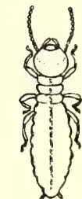A detailed line drawing of a Termes militaris larva, viewed from above. It has a segmented body with a distinct head, thorax, and abdomen. The antennae are short and segmented. The body is relatively slender and tapers slightly at the ends.

3

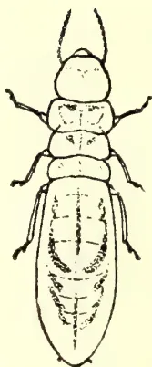A detailed line drawing of a Termes militaris worker, viewed from above. It has a segmented body with a distinct head, thorax, and abdomen. The antennae are short and segmented. The body is relatively slender and tapers slightly at the ends.

4

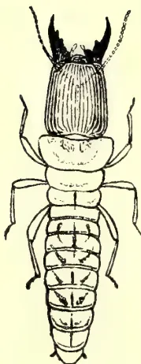A detailed line drawing of a Termes militaris soldier, viewed from above. It has a segmented body with a distinct head, thorax, and abdomen. The antennae are short and segmented. The body is relatively slender and tapers slightly at the ends.

5

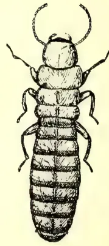A detailed line drawing of a Termes militaris adult female, viewed from above. It has a segmented body with a distinct head, thorax, and abdomen. The antennae are short and segmented. The body is relatively slender and tapers slightly at the ends.

6

TERMES MILITARIS.

FIG. 3, LARVA. 4, WORKER. 5, SOLDIER. 6, ADULT FEMALE.  
(All Magnified 6 Diameters.)

*From Original Drawings by E. E. Green.*

198------------------------------------------------

MARCH 1907.]181

## PLANT SANITATION.

### Entomological Notes.

BY E. ERNEST GREEN.

(Illustrated.)

A species of 'White Ant' (*Catotermes militaris*, Desneaux) that attacks and hollows out the stems of living tea bushes has been known for some years. It occurs sporadically in most of the tea districts, independently of elevation. Its life history has hitherto been a complete mystery, no definite nest or abnormally developed breeding females having been observed. Recent investigations in the Lindula district have now enabled me to solve the puzzle. On the estate in question the pest has been known for some years, but no attempt to eradicate it was made until last year. It has consequently spread considerably. In some instances whole patches of tea trees have had to be eradicated. Usually, some two or three trees only are affected at one spot. Examination of a number of affected trees showed that the main stem and roots, together with the larger branches, are completely hollowed out, the stem being frequently merely a hollow shell (see fig 1). In spite of this extensive damage the bushes continue to flush well and show no external signs of injury (see fig 2). Only the heart wood is devoured, the sap wood remaining intact and carrying on the functions of the plant. The devoured tissues are replaced by earthy matter into which adventitious roots are thrown out—apparently from the *inner* walls—and evidently obtain much nourishment from the earthy matter. In digging out the infested trees no signs of extension of the galleries were observed, and no insects were found in the excavated soil. It appears from this that each colony is self-contained in the individual tree, and extends its depredations only when that tree is fully occupied. On splitting open the infested stems and branches, insects in all stages could be found, but no eggs. There were larvae (fig 3)—quite small up to fully grown, full grown workers (fig 4) and soldiers (fig 5), and a few wingless adults (fig 6) of the same size as the workers, but distinguished by their uniform reddish colour and more chitinous integument. The larvæ are translucent white; the workers creamy white with darker cloudy markings on the abdomen; the soldiers with large reddish heads and prominent falcate mandibles. No eggs were observed; and nothing resembling a differentiated queen. Nor were there any indications of special brood cells or honey-combed nest. On subsequently dissecting some of the adult insects, their bodies were found to contain well-developed ova—of a very much larger size than those deposited by the specialized queens of other species. I gather, from these observations, that the life history of this species is very distinct from that of the common mound-building termite; that no specialized breeding queens are produced; but that the ordinary adults (which are never very numerous in one colony) are apterous and remain in the nest in which they are raised, and carry on the brood *in situ*. It is possible that living larvæ (instead of eggs) may be produced, but the evidence on this point is inconclusive. Each colony is therefore self-contained, and the removal and destruction of the tree should destroy the complete colony. The presence of the pest can seldom be recognized until the bush has been pruned, when sections of the galleries are exposed. In recently attacked bushes, only collar pruning can disclose the infection, as the insects apparently effect their entrance through the roots, working up first into the stem and later into the branches. Seeing that infected trees are still able to carry on their functions and to yield (apparently) as much crop as sound trees, it seems a pity to have to eradicate them if some means could be employed to destroy the insects *in situ* and so to prevent

199------------------------------------------------

Plant Sanitation.182[MARCH 1907.

the extension of the injury to the surrounding trees. With this view I experimented with the patent 'Ant Exterminator' recently received from South Africa. This machine pumps a deadly gas (generated from sulphur and arsenic) through the galleries, and has been found most effective in the destruction of the ordinary mound-building termites. The nozzle of the machine was inserted first into the exposed galleries in one of the branches, and afterwards into a hole drilled through the stem into the main cavity. But the ventilation was insufficient, owing to the blocking of the cavities with earthy matter, and it was found impossible to force the fumes through the system of galleries. Other plants were collar pruned, and small quantities of vaporite placed in the cavity which was then plugged with clay. The results of this latter experiment will not be available for some weeks.

In a former number of this Magazine (Nov. 1906, p. 396) reference was made to a novel method of destroying the shot-hole borer *in situ*, by scorching the bushes immediately after pruning. The inventor of this method is Mr. C. W. R. Tyler, of Sanquhar Estate, in the Gampola district. I have now had an opportunity of seeing the work in progress, and am very favorably impressed with the results. The following notes were made on the spot:—

Gangs of women and children are supplied with torches made of dried coconut leaves. They pass the flaming torches round each bush, beneath the branches, holding them there long enough for the heat to penetrate the wood. On splitting open the branches, the insects—both young and adult—are found to be quite dead. I was able to satisfy myself of this result in the smaller ('pencil') branches. The older branches, though previously badly infested, were now deserted by the insects, so it was impossible to determine here whether the treatment would be equally effective in these thicker branches. I was shown a field that had been treated in this way when pruned in August of last year. The treatment was said to have been applied very severely, and not a single surviving insect could then be found. A good many of the smaller branches had been killed, but fresh healthy shoots were in every case being thrown up from the lower parts of the bushes, promising a rapid recovery. This system seems to me to be preferable to collar pruning as—while ridding the plant of the pest—it affords a more rapid recovery. It should be understood that, to be of permanent value, the treatment must be carried out systematically over the whole of the affected area. Otherwise re-infection from surrounding fields will occur sooner or later. In the meantime, it has the advantage of bringing the plant into a condition that enables it more successfully to resist the attacks of the borer. That nature can and does repair the injury under favourable conditions was abundantly evident on this estate. On splitting open the more healthy free growing branches, the entrance holes were repeatedly found to be plugged by an ingrowth from the cambial tissues. The cost of the treatment is largely influenced by the cost of the torches. On this estate the dried coconut fronds had to be bought in Kandy (some 13 miles distant,) and transported by rail and cart to the estate. Each torch costs, on the estate, approximately two cents, and is exhausted after the treatment of eight bushes. A cooly can satisfactorily treat 250 bushes for his day's name. This works out at Rs. 13.55 per acre; but Mr. Tyler informs me that the actual cost is nearer Rs. 11. Experiments were tried with artificial torches composed of coconut fibre, kitul fibre, and old sacking—tied on sticks. These substances were steeped in kerosene oil and liquid fuel. The kitul fibre proved to be slightly the better medium, but owing to the difficulty of obtaining it in sufficient quantity and at a cheap cost, it must give place to coconut fibre for practicability. Our experiments showed that this fibre—when properly tied will form a really useful and economical torch. The fibre should be tied in a tight pad—without loose ends. Of the two oils, the heavier and cheaper (liquid fuel) was found to be the more satisfactory. In application one podian accompanies some five or six torch bearers, with a tin of oil and a small scoop with which he replenishes the torches as the oil is exhausted.

200------------------------------------------------

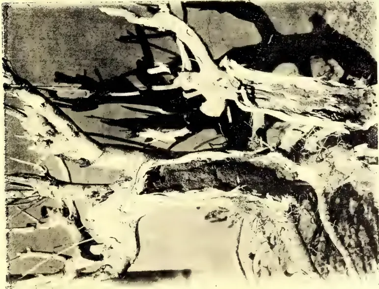

FIG. 1.

STEM OF LIVING TEA BUSH SPLIT OPEN TO SHOW  
THE WORK OF *TERMES MILITARIS*.

*From Photograph by G. Lionel Cox.*

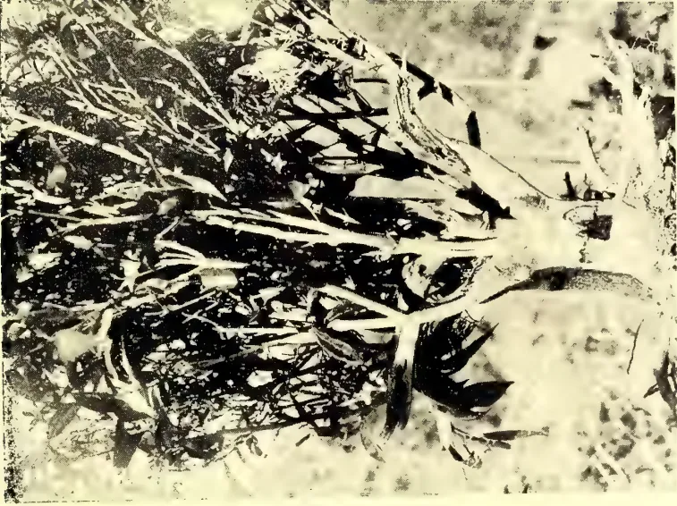

FIG. 2.

LIVING TEA BUSH ATTACKED BY *TERMES MILITARIS*.  
(AN OPENING HAS BEEN MADE IN THE STEM  
TO SHOW THE HOLLOW INSIDE.)

*From Photograph by G. Lionel Cox.*

201------------------------------------------------

This image is a scan of a blank page. The paper has a light beige or cream-colored tint. There are a few very small, dark specks scattered across the surface, which appear to be scanning artifacts or dust particles. No text, lines, or other markings are present on the page.

202------------------------------------------------

MARCH 1907.]183Plant Sanilation.

Another experiment consisted in laying straw down the rows, surrounding each pruned bush, and a train of straw connecting bush with bush. The straw was fired at the lower end of each line and ran up the row, slightly scorching each bush. This proved to be quite as effective as the torches, but can be employed economically only on sloping fields and in the neighbourhood of patna or grass-land. The cost of straw or of the lengthy transport of grass would be prohibitive, or would—at any rate—be more costly than the fibre and oil torches. Dried prunings might also be employed in the same manner as straw or grass. This scorching system would be found particularly useful on places where only a single field is attacked and—in conjunction with the destruction of the prunings—should be effective in the extermination of the pest on such limited areas.

The idea that dense shade is inimical to the borer was also investigated on this estate and was partly confirmed and partly negatived. Tea that was growing under a fairly thick shade of Dadap trees (*Erythrina*) was found to be remarkably free from the pest. Tea under Grevillea shade was less exempt, and some bushes growing under dense shade of Cacao (but without other shade trees), was as badly affected by the borer as any of the more open fields. These facts suggest that exemption may be dependent upon the nature of the shade. It is well-known that tea grown under Dadaps produces a much freer and more sappy growth, while the bushes grown under Cacao alone were stunted and hard of wood.

---

203------------------------------------------------

184[MARCH 1907.]

## SCIENTIFIC AGRICULTURE.

### THE VALUE OF BASIC SLAG.

Speaking before the members of the Nantwich Farmers' Club, Mr. W. A. Cox, in a lecture on the use of basic slag on various crops, recommended that farmers, when buying, should obtain three guarantees, viz., the total phosphate of lime; that 80 per cent. of the total phosphate of lime was soluble in a 2 per cent. solution of citric acid; and that 80 per cent. of the powder would pass through the standard sieve. Speaking of its effect on grassland, he pointed out that generally the best results were obtained on heavy soil and those rich in organic matter. When dealing with sandy and medium soils, especially the former, it should be used in combination with kainit or some other potash salt, as the combined use of these two fertilisers on light and medium soils was usually followed by satisfactory results. The beneficial effects of basic slag on leguminous crops was touched upon, and also upon root crops. On these latter he claimed that it grew sound, useful roots of good keeping qualities and high nutritive value, and when it was more widely understood that basic slag put on in drills at the time of seeding gave certainly as good, and probably better, results than when broadcasted in the winter, farmers would more fully appreciate its value in this connection.

In Ceylon, Basic Slag has had good effects on tea, coconuts, oranges, &c.; with the former it is generally applied with the prunings to hasten their decomposition and promote nitrification.

Two grades are imported into Ceylon which are sold under the following guarantees:—

Ordinary Basic Slag,  $17\frac{1}{2}$  to 19 % phosphoric acid and a fineness of 75 to 85 %; and Superior Basic Slag, containing 20 to 22 % phosphoric acid and 80 to 90 % fineness, *i.e.*, the amount passing a mesh of 10,000 holes to the square inch.

M. K. BAMBER.

---

204------------------------------------------------

MARCH 1907.185

## HORTICULTURE.

### MULCHING.

The term "Mulching" is often used in gardening literature. To the professional gardener the meaning and application of the term is clear enough; but we are often asked by amateurs to explain the exact significance and uses of mulching. They say, in effect; "In your issue of so-and-so, I find the following: 'A good mulch at this season will be found very beneficial!' What is a 'mulch'? and how do you do it?" It may therefore be useful to explain fully for the benefit of our amateur readers what mulching is. In brief, it is the process of applying various substances as a covering for soil above the roots of trees and plants, in order to prevent evaporation, and so preserve a uniform degree of heat and moisture. Mulching is also practised for other reasons, more particularly, that of supplying a top-dressing of rich manure to established plants, so that its nutritive properties may be washed down by rain or artificial watering. All recently transplanted trees and shrubs, especially fruit trees, are greatly assisted by being provided with a mulching of litter, half-rotted manure, leaves of something of a similar nature. This acts beneficially in retaining warmth and moisture, thus materially neutralising the evil effects of drought, extreme cold or heat. Straw chaff, short litter, coconut fibre and spent tan are considered to be excellent non-conductors, where enriching properties are not required. For plants and trees needing help in summer, to perfect their flowers or fruit, a mulching of fresh horsedung, or good rotten manure, laid on the surface of the soil, and well watered occasionally, is often found of immense permanent benefit. Such are the uses of mulching, as applied to regions situated in temperate zones—our hill stations for example.

On the plains of India, where the temperature in the summer and rainy months may be anywhere between 90 and 115 degrees Fahr., the uses of mulching have to be carefully considered. For instance, if fresh horse-dung were applied to fruit trees during the summer, there would soon be set up very high fermentation, and a great variety of insects would soon establish themselves in the mulch, some of which might do incalculable harm to the trees. There might arise a colony of white ants, for example, which might do more damage than the good effects of the mulch. Such a contingency would undoubtedly arise in the United Provinces, for instance, in Rajputana, Sind, and other dry regions, where the termite is one of the worst enemies the gardener has to deal with. On the other hand, a mulch is given on the hills, say in December, would not only supply heat and moisture in the winter, but keep the roots moist in the dry summer, when water is very scarce, and orchards and gardens suffer from a prolonged drought. Falling leaves in forests afford a valuable mulch to the trees. They supply humus to the soil, and retain the moisture in the soil during the seasons of scanty rainfall and prolonged droughts. The removal of these leaves is serious loss to forests, and the Forest Department should, we consider, make it a rule not to allow the removal of fallen leaves by natives, who use them for fuel, thereby depriving the soil of valuable manurial agencies. In gardens on the plains fallen leaves are usually gathered and stored in pits for leaf mould. No doubt this is a very useful purpose to which leaves can be applied; but where there is always a prospect of a short rainfall and a season of drought, these leaves might with great advantage be used for mulching fruit trees and other plants likely to suffer much from dryness or short water supply. On most of our hill stations there is very thick vegetation, and the accumulation of humus is unusually large. There is therefore no harm in taking some of this for use in the garden for purposes of mulching. In the tea

25

205------------------------------------------------

186[MARCH 1907.

districts of North-East India there is also a plentiful supply of humus, and those who keep gardens have ready to their hand an unlimited supply of valuable mulching material. In fact, mulching is so little practised in India, that we doubt whether the majority of those who go in for gardening know the value of this practice. Anyway, we have seen very little mulching done in India, hence the frequent enquiries we receive as to what constitutes mulching. In fruit growing especially the practise of mulching will be found a great help. Even such big trees as the mango, lichee, etc., are greatly benefited by a mulch put on during the winter months. We have often tried a mulch of leaves on mango and lichee trees with very remarkable results. The usual practice is to remove the soil round the roots, which are allowed to remain exposed for a few weeks and thereafter manure applied and covered in with soil. This is not necessary when mulching is resorted to, and the results are infinitely better, especially in the case of licees and loquats. We have proved this from actual practice, and can recommend it to all who go in for fruit culture, whether on the plains or the hills.—*Indian Planting and Gardening*.

## Correspondence.

### PEPPER STEM DISEASE.

DEAR SIR,—It may interest your correspondent, who asks in the current number of your Magazine if there is any known remedy for pepper stem disease, to know our experience here. I suppose we have suffered more than any one in Mysore from this scourge, and the conclusion I have come to is that it is closely allied to, if not identical with, stump-rot. In clearing the original jungle the stumps of the felled trees were not removed, and in some cases the trees were simply ringed with the result that, after a period of years, radiating from the stumps of the Curry-haegle (Botanical name unknown to me) and Ramanudike (*Myristica magnifica*) trees, the vines all died out, and where a ringed tree has since fallen, the vines on both sides of the fallen log have gone out. Besides the vines the under-growth is also affected; most of the young standards within the affected area perishing, especially the Hammuddy (*Tetranthera Wightiana*) and Sagady (*Schleichera trijuga*) trees.

As prevention is better than cure (the only cure meantime being the drastic one you mention, that of burning all affected vines, root and branch), I trust the above will be of use to your correspondent if he is thinking of trying his luck at pepper cultivation.

Yours faithfully,

RODERICK F. LAMB.

February 11th, Hassan District, S. India.

### CHARACTERISTIC PLANTS OF NORTH CEYLON.

#### I.

DEAR SIR,—In the *Tropical Agriculturist* for January, 1907, page 44, for “*Mud-Kilaori*,” wherever it occurs read “*Mud-Kilavai*.” For “*mud-mul*” read “*mud=mul*.” For “*Mullaithivu*,” read “*Mullaittivu*.” For “*Jennet*” read “*Jemmett*.”

J. P. LEWIS.

Kandy.

#### II.

DEAR SIR,—Mr. Lewis in his paragraph on the “*Mud Kilaori*” in the January number, is unable to say if this plant is found in the Trincomalie District. I supply the information. The plant is known as “*Kiluvai*” in Tamil, the thorny variety being known as “*Mud-kiluvai*.” Both varieties grow well here, the thornless

206------------------------------------------------

MARCH 1907.]187

variety being found in greater numbers and sold for fence sticks at R2-50 per 100. The Sinhalese here call the plant "Kurunte" and "Kaddu-kurunte" respectively. The plants no doubt revel in droughty climate, and as live fence sticks they are very useful. There is no tendency, however, to extend its planting for fear of goats which, when there are no leaves on the plants even bite away the bark. The owners of goats are also partial to this plant in their desire to find food relished by their animals. For this reason the town people are beginning to prefer for fence sticks Ceara rubber cuttings which splendidly grow on the fences here and are not touched by man or beasts.

The live "Kiluvai" twigs are very much valued as tooth brushes, owing to the medicinal effect the juice produces on the gum and parts of the mouth. For sore-mouth the natives chew the raw nuts as a specific.

The plants are ornamental in systematic fences, especially the thorny variety and should never be omitted in neat gardens and compounds in the dry districts. The number of plants in this district is not so large as to supply cuttings to be removed to other districts, but an effort should be made to distribute the sticks from Jaffna.

Trincomalie, 20th February, 1907.

P. C. NICHOLAS, *Mudaliyar*.

#### CASHEW NUT.

SIR,—Mr. Donald Ferguson makes some interesting remarks about Cashew nuts in the "*Ceylon Observer*" of December 18th, 1906, and February 6th, 1907. These nuts would now appear to be appreciated at their proper value. In 1900 a small lot was sent to Paris through the Local Exhibition Committee, but though the nuts were highly thought of, the price quoted by likely dealers was 2d. per lb. which is under their average selling price in Colombo.

The mistake made in estimating the value of the Cashew nut was to compare it (as was really done) with the Groundnut, commonly used in the roasted form as dessert.

When travelling in India last December I noticed large quantities of these nuts being sold at the railway stations between Madras and Trichinopoly.

The seeds were clean of all "skin" and sundried, in which condition they are to be preferred to the roasted seeds. I also noticed that trees were more or less systematically planted and tended: but if the Indian grower is satisfied (as "Aborist" makes out in the "*Ceylon Observer*" of February 6th) with less than 2d. per lb., this is only another instance of the results of cheap labour in India which ousts Ceylon produce.

On the other hand, however, the huge discrepancy between the buying price (2d. per lb.) and selling price (1s. per lb.) makes it possible for Ceylon produce to drop in between.

Colombo.

Yours truly,

C. DRIEBERG.

#### RAMIE (RHEA)—AN INDUSTRY FOR THE BRITISH EMPIRE.

DEAR SIR,—It is proposed to form a Ramie Growing Association to foster the growth of Ramie throughout the Empire, and thus add a valuable asset to British agriculture, commerce and industry. At the present time Ramie is grown largely in China and in smaller quantities at different points throughout the British Dominions. It is a fibre which for general utility is without a rival. It provides one of the best of clothing materials, being a non-conductor of heat, and, consequently, cool in the sun's rays and warm in winter. It is beautifully lustrous, in this respect resembling silk, and it retains its lustre undiminished after washing. It is exceedingly durable, and resists the roughest handling in laundry operations,

207------------------------------------------------

188MARCH 1907.

Used as a tunic in the South African War, it outwore three cotton tunics served to the men in the same company, and with slight repairs to cuffs the Ramie tunic in question would still be serviceable for a considerable time to come.

Ramie is equally suitable for ropes and cordage, nets, tent cloth, and all forms of coarse material for which hemp or jute are now ordinarily used. It is far stronger and more lasting than either of these fibres, and for rope-making it has many special advantages peculiar to it. The merits of Ramie have long been known to textile manufacturers and fibre consumers in this country, but the supply has hitherto been too intermittent and unreliable for them to be able to adopt it on a large scale. Its superiority over all other fibres is coming to be generally admitted, and the demand for the fibre at the present time far exceeds the regular supply. If the production of the fibre were so increased that a large and constant supply could be assured to manufacturers, there is no doubt that it would be adopted on a much larger scale than at present is possible.

There is scarcely any plant which can be so widely cultivated over the earth's surface. It will grow and flourish in the temperate zone as well as in the tropics, and under almost any conditions of climate or soil. It is felt that encouragement alone is needed to induce planters in the British Colonies to adopt it on a large scale, and from every quarter letters and correspondence indicate that the Colonist, more particularly in sub-tropical countries, is alive to the possibilities of this fibre.

The demand for Ramie will, as pointed out above, largely depend for some years to come on the magnitude of the supply, and there is no fear that the supply can outrun the requirements for a very long time to come. The objects of the proposed Ramie Growing Association will be (1) to give general encouragement to Ramie growing by popularising knowledge concerning its value and uses; (2) to supply information, seeds and assistance to planters desirous of embarking in Ramie growing; and (3) to give assistance to both grower and manufacturer by placing them in touch with one another. Members will be enrolled for purposes of co-operation.

Pamphlets will be distributed and will be supplied to members for distribution alike in this country and throughout the Colonies. The assistance of the Press will be sought in making the objects of the Association known, and in publishing articles on the merits and possibilities of the fibre, and the benefits to a Colony introducing the industry. Seed will be supplied to all those who desire to establish Ramie plantations, and from the outset sufficient to start a large plantation will be despatched on a nominal charge of 5s., which includes full cultural directions and entitles purchaser to a report on the production gratis. Pamphlets dealing with the whole method of growing, harvesting and preparing Ramie will be distributed gratis. A register of all planters growing Ramie will be kept by the Association, and also a register of all manufacturers who use or are willing to use Ramie, and the price at which they are prepared to deal in it, and the extent of their requirements. The Association will be ready at all times to give advice to planters, to test and report on samples, to find a market for produce, and to introduce buyers, and in any other way further the interests of those who have embarked in the industry. It is hoped that in course of time the Association may come to be looked upon as the recognised organisation for the promotion and protection of the Ramie industry.

All who are disposed to help in the development of this most promising industry are invited to take part in the formation of the proposed Association by sending their names.

Yours faithfully,

D. EDWARDS-RADCLYFFE,

*Hon. Secretary, Staines, England.*

208------------------------------------------------

MARCH 1907.]189ALOE VERA.

DEAR SIR,—This plant (known to the Sinhalese as Komarika), is much employed in native medicine, and may frequently be seen growing in utensils attached to travelling carts, together with *Plectranthus aromaticus*. Its value in English medicine is of course as the source of the drug "Aloes."

When in Bangalore last December I saw this or a closely-related species of Aloe suspended at the entrance to the dwelling apartments in the Maharaja of Mysore's palace, with the object, as I was informed, of keeping away mosquitoes.

Colombo.

Yours truly,

C. DRIEBERG.

THE INVERTED V SYSTEM OF TAPPING.

DEAR SIR,—That the half-herring bone system of tapping out of the several systems is largely in use and very much in favor goes without saying; but it requires some modification, and in its modified form I call it the "Inverted V System." Its advantages and sketch will be found herewith, which, I think, will be of some interest to those who prefer the half-herring bone system of tapping.

Yours faithfully,

T. L. SRINIVASAGAM.

Neboda, February 16th.

MERITS AND ADVANTAGES OF THE  
INVERTED V OR MODIFIED HALF-HERRING  
BONE SYSTEM OF TAPPING.

1. 1. Serves the same purpose as the half-herring bone system.
2. 2. Only requires *two* vertical channels instead of four as with half-herring bone.
3. 3. Incisions being shorter than half spiral, latex runs into the channel more easily, consequently less scrap.
4. 4. Prevents the cooly from tapping more area on the stem of the tree than allotted.
5. 5. The tapping knife is used both ways, right and left, and both the cutting edges are in use resulting in uniform wearing away of the edges; consequently the tapping knife can be used for a longer time than is possible with one side tapping either right or left.
6. 6. Like the half spiral, the inverted V leaves half of the stem untouched for future use.

HALF OF THE STEM.

209------------------------------------------------

190[MARCH 1907.

## Minutes of the Board of Agriculture.

The Twenty-ninth Meeting of the Board of Agriculture was held at the Council Chamber at 12 noon on Monday, the 4th March, 1907.

Dr. Willis, Director, Royal Botanic Gardens, and Officiating Vice-President, presided.

The others present were:—The Hon. Mr. C. T. D. Vigors, The Hon. Mr. S. C. Obeyesekere, The Hon. Mr. John Ferguson, C.M.G., Dr. A. Willey, F.R.S., Messrs. Don Solomon Dias Bandaranayeke, C.M.G., E. E. Green, G. W. Sturgess, H. D. Lewis Wijesingha and C. Driemberg (Secretary).

Visitors:—Messrs. S. Freudenberg, M. Hohl, J. Whitehead and C. Rasanayagam.

### BUSINESS DONE.

1. The Minutes of the Meeting held on February 4th were read and confirmed.

2. The Progress Report (No. 28) was presented and taken as read.

3. The Secretary read a report made by Messrs. Geo. H. Brown & Co., cotton brokers, Liverpool, on a sample of Caravonica cotton grown by Mr. J. W. C. de Soysa in the Kurunegala district.

4. Mr. C. Rasanayagam, Mudaliyar, Secretary of the Dumbara Branch, read a paper entitled "Results of experiments in the scientific manuring of Dumbara tobacco." The Chairman, the Hon. Mr. Ferguson and the Hon. Mr. Obeyesekera, Messrs. Booth, Harward, Whitehead and Freudenberg took part in the discussion on the paper.

## Agricultural Society Progress Report. XXVIII,

*Secretary.*—Mr. T. A. Carey, C.C.S., who was acting as Secretary to the Society from December, 1906, relinquished his duties on the 4th February, when Mr. C. Driemberg succeeded to the post of Secretary.

Dr. J. C. Willis, Director of the Royal Botanic Gardens, was at the same time appointed Organizing Vice-President of the Society.

*Branch Societies.*—The *Dumbara* Agricultural Society held a meeting on the 21st February, when it was decided that meetings of the Committee should be held successively at Balalla, Teldeniya, and Urugala. The Society resolved on holding an Agricultural Show at Teldeniya in the latter part of August, 1907.

A meeting of the Co-Operative Credit Society in connection with the Dumbara Branch Society was also held the same day. The business included the adoption of the following resolutions:—

"It was resolved not to purchase any more paddy until the paddy lent was collected, and to restrict loans to Rs. 500 value."

"It was resolved to call for an estimate to construct a bin for storing the paddy at Madugoda, and the Secretary was directed to obtain the permission of the Government Agent to cut the necessary timber on Crown land."

The *Telijawila* Branch has decided on converting its seed paddy into a cash capital, and to lend money to cultivators to purchase their seed. This course was found necessary owing to the difficulties experienced in handling paddy. Rs. 500 out

210------------------------------------------------

MARCH 1907.]191

of the money raised by the sale of the paddy has been lent for the present *yala* season to a Committee of ten accredited persons in the district, for the purpose of purchasing seed paddy for the most needy cultivators in the villages of Tambuttegod, Bonala, and Palalla, where it was discovered there was very great scarcity of seed for sowing.

The *Batticaloa* Branch has for the present abandoned the Agricultural Show originally proposed to be held early this year, owing to the want of sufficient support. The Government Agent, Eastern Province, offered to give a liberal donation towards the Show, but support from other quarters did not come up to expectations, the year 1906 having proved a very bad one for the district.

The *Welimada* Branch has decided to hold an Agricultural Show early in May. Mr. D. A. M. Fernando, the Honorary Secretary, offered to supply shoots of sugarcane to members willing to experiment with it, and the teacher of the Welimada school has distributed seeds of Kangaroo grass and cotton. A prize of Rs. 10 has been awarded to the school gardens at Welimada for good work during the year.

The *Balangoda* Branch held a meeting on the 16th February, when among the subjects considered was the question of castration of cattle. A demonstration was fixed for the 25th May. Several headmen agreed to open private gardens to serve as seed-distributing centres and object-lessons to the villagers.

The *Vavuniya* Forwarding Agency continues its operations. Consignments of eggs and limes were sent down during the last week in February, and negotiations are in progress for sending down a further consignment of cattle. A meeting of the Special Committee appointed to consider the question of establishing a Central Receiving Agency in Colombo was held this morning.

The *Telijjawila* Society proposes to take over the Sultanagoda Experimental Farm from the Village Committee, under whose control it has hitherto been managed, and to finance and work the institution on improved lines. The success of the venture will mainly depend on the sagacity of its Secretary, Mr. James Wickramaratne, Mudaliyar of Weligam Korale.

*The Society's Medals.*—The Society is still in communication with Messrs. Spink & Son, Ltd., London, with regard to the design for the Society's medal, but it is hoped that arrangements will shortly be completed, as details have practically been settled.

*Agri-Horticultural Shows.*—The Show proposed to be held at *Batticaloa*, as above mentioned, has been abandoned.

*Dumbara Society* will hold a Show in August, 1907.

The Show in *Cotombo* under the auspices of the Colombo Agri-Horticultural Society will be held in June.

A Show will be held in *Katana* under the auspices of the Branch Society. The object of the promoters in organizing the Show will be gathered from the following extract from a letter received from Mr. J. D. Vanderstraaten :—"I may mention that we intend this to be purely a local Show, intended to foster and develop a taste for floral and vegetable growing and fruit culture, and give encouragement to village industries, such as carpentry, &c. ; and I have suggested that, as the Negombo district is well known as a tobacco-growing area, we should show not only cured leaf for chewing but for cigar-making, and that prizes should be offered for locally-manufactured cheroots, whether made from Negombo tobacco or from tobacco grown in other parts of the Island." The Show will be held some time in November.

The *Kegalla* Branch proposes to hold a Show at Kegalla on the 28th and 29th June.

211------------------------------------------------

192[MARCH 1907.

The *Telijjawila* Branch has altered the date of its Show from 15th March to April.

The Shows so far fixed are :—

<table>
<tr>
<td>Telijjawila</td>
<td>...</td>
<td>...</td>
<td>...</td>
<td>...</td>
<td>April</td>
</tr>
<tr>
<td>Trincomalee (Market Fair)</td>
<td>...</td>
<td>...</td>
<td>...</td>
<td>...</td>
<td>April 2</td>
</tr>
<tr>
<td>Nuwara Eliya</td>
<td>...</td>
<td>...</td>
<td>...</td>
<td>...</td>
<td>April 2 and 3</td>
</tr>
<tr>
<td>Uva (Badulla)</td>
<td>...</td>
<td>...</td>
<td>...</td>
<td>...</td>
<td>April 26 and 27</td>
</tr>
<tr>
<td>Welimada (Market Fair)</td>
<td>..</td>
<td>...</td>
<td>...</td>
<td>...</td>
<td>May</td>
</tr>
<tr>
<td>Matale</td>
<td>...</td>
<td>...</td>
<td>...</td>
<td>...</td>
<td>June 21 and 22</td>
</tr>
<tr>
<td>Colombo</td>
<td>...</td>
<td>...</td>
<td>...</td>
<td>...</td>
<td>June</td>
</tr>
<tr>
<td>Dumbara</td>
<td>...</td>
<td>...</td>
<td>...</td>
<td>...</td>
<td>August</td>
</tr>
<tr>
<td>Katana</td>
<td>...</td>
<td>...</td>
<td>...</td>
<td>...</td>
<td>November</td>
</tr>
</table>

*Sterilization of Milk.*—The apparatus ordered from England arrived last month, and was set up at the Dairy Farm. The first experiment in sterilization of milk was conducted on the 28th February, before the Members of the Committee, whose report is being awaited.

*Apiculture.*—A meeting of the Bee Committee was held on the 25th February, Mr. Herbert Campbell, Mr. Shanks, and the Secretary being present. The hives at the Government Stock Garden and Mr. Shanks' apiary were inspected, and it was decided for the present to adopt the Langstroth as the standard hive for Ceylon.

*Cotton.*—A supply of cotton seed has been sent to Kegalla for experimental cultivation, mostly on chenas.

A report on samples of Ceylon-grown Caravonica cotton by a firm of brokers in Liverpool is tabled for information.

*Jamaica Yams.*—A report has been received from the Honorary Secretary of the Jamaica Agricultural Society with regard to the yams sent by him. He says : "The yams sent were of one variety, a variety of Negro yams, called here Lucea yams, as it is much shipped from the port of Lucea to other parts of the Island and Central America. It is a good keeping yam, and one very much preferred in the local market."

*Pea Seeds.*—Mr. D. A. M. Fernando, Honorary Secretary of the Welimada Branch, offers to supply pea seeds to members of the Ceylon Agricultural Society, free of charge. The seeds are now available—about 500 to 600 packets containing 25 to 30 seeds in each. Applications may be sent to me stating the quantity required by intending cultivators, who will have to bear cost of postage.

*Transplanting in Paddy Cultivation.*—Mr. G. E. Ameresekere, of Hanwella, has sent in useful information regarding an experiment in transplanting paddy. His experiment was confined to only two measures, which yielded 456 measures, a return equal to 228-fold, in spite of the drought prevailing at the time. The total cost incurred was Rs. 18.05, and the price realized by the crop Rs. 34.70, showing a profit of Rs. 16.65.

*Feeding Silk Worms.*—The Superintendent of the Silk Farm at Shillong, writing on the 7th February, says :—"There is no special variety of castor for feeding Eri worms. One kind is likely to do just as well as another. The Silk from Eri cocoons has to be spun out by hand, as is done with cotton. It cannot be reeled."

*Bellary Onions.*—The Society expects to obtain from India a limited quantity of Bellary onion seed about the middle of April next. Applications for seed from intending cultivators are now being received.

*Indian Agricultural Implements.*—The Society imported specimens of the improved Agricultural implements from South India, which, however, did not appear to be satisfactory ; besides, there has been considerable delay in executing

212------------------------------------------------

MARCH 1907.]193

the order sent to India in March, 1906. In view of these circumstances it has been decided to cancel the order sent on behalf of several applicants for the implements.

am in communication with the authorities in Assam with a view to securing a better type of plough, which I had the opportunity of inspecting at Calcutta, where it was on show at the recent Exhibition.

*Castration of Cattle.*—A grant of Rs. 1,500 has been allowed for carrying on operations during this year also. Arrangements are now being made by the Government Veterinary Surgeon's Department for conducting demonstrations.

*Publications.*—The Editor of the *Sihala Samaya* having kindly forwarded 50 copies of his paper containing translations of the proceedings of the last meeting of the Board of Agriculture, they were distributed among the Branch Societies as usual.

The report on my visit to India is now in the press, and will be circulated to members as soon as it is ready.

A Sinhalese translation of the "Hints on the Cultivation of Vegetables" is now being printed for distribution among Sinhalese members. Any members requiring copies are requested to write for them.

C. DRIEBERG,

4th March, 1907.

*Secretary, Ceylon Agricultural Society.*

---

213------------------------------------------------

This image is a scan of a blank page. The paper has a light beige or cream-colored tint. There are several small, dark specks scattered across the surface, which appear to be scanning artifacts or dust particles. No text, lines, or other markings are present on the page.

214------------------------------------------------

This image is a scan of a blank page. The paper has a light beige or cream-colored tint. There are a few very small, dark specks scattered across the surface, which appear to be scanning artifacts or dust particles. No text, lines, or other markings are present on the page.

215------------------------------------------------

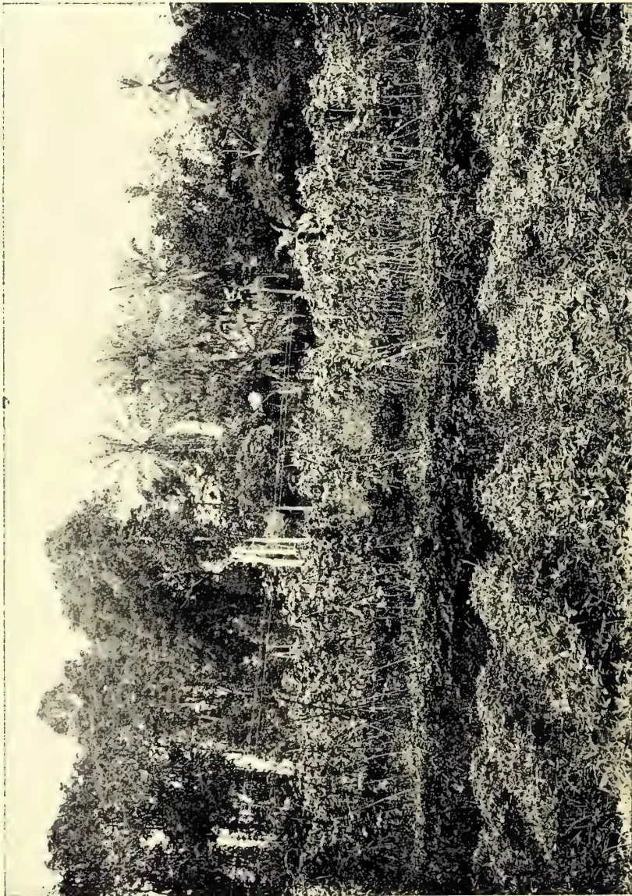A black and white photograph showing a paddy field in Java. The foreground is filled with rows of sweet-potatoes, which appear as dense, low-lying plants. In the middle ground, there are vegetable crops, possibly beans, growing in rows. The background is dominated by a dense forest of palm trees, with several tall, slender trunks visible. The sky is bright and clear.

A PADDY-FIELD IN JAVA WITH VEGETABLE CROPS.  
SWEET-POTATOES IN THE FOREGROUND, LIMA BEANS BEHIND.

216------------------------------------------------

THE

# TROPICAL AGRICULTURIST

AND

## MAGAZINE OF THE

# CEYLON AGRICULTURAL SOCIETY.

---

VOL. XXVIII.

COLOMBO, APRIL 15TH, 1907.

No. 4.

---

### The Transplanting of Rice, and Rotation of Crops in the Paddy Field.

---

Nothing, to one who has studied rice cultivation in the different countries of the Tropics, is more noteworthy than the obstinate way in which the natives of each country cling to their own particular methods of cultivation and refuse even to try those of other places—assuming, without trial, that being those of foreigners or barbarians they must of necessity be worse.

In this number we give two interesting photographs from Java. The first is of a newly-planted paddy field, in which the long straight lines of the crop transplanted from the nurseries can be seen. This is real transplanting. It is often said that transplanting is the custom near Kandy, but so far we have never seen anything done but a transplanting of the plants from thicker to thinner areas, the sowing having been broadcast. In Java the plants are put in from nurseries at even distances apart, in straight lines. Several letters in this Journal in the last two months attest the great gain by the use of this method. One great objection raised to this custom here is its greater expense, while the gain from it is overlooked. With the proper use of co-operative credit the extra expense should not matter.

The other photograph is of a paddy field a few weeks after the crop has been removed. It looks more like a vegetable garden, with sweet potatoes in the foreground and Lima beans behind. The moment the crop is cut instead of allowing the fields to lie idle for a trifle of grazing, as is done here, the water is run in to soften them and they are ploughed and planted with vegetables. The only place, so far as we know, where anything of the kind is done in Ceylon, is in the Matara district, where sweet potatoes are grown in the paddy fields.

---

217------------------------------------------------

196[APRIL 1907.

## GUMS, RESINS, SAPS AND EXUDATIONS.

### THE GUAYULE RUBBER OF MEXICO.

The form of Mexican rubber known as "Guayule" has been known for a considerable time, but it is only recently that full particulars regarding the plant from which it is derived have been available, and that attempts have been made to exploit the material on a commercial scale. The plant appears unlikely to be of much importance as a source of rubber outside of Mexico, but as it possesses several features of interest, a short account may be given of its characters and of the methods employed for obtaining the rubber. The subject has been attracting considerable attention both in America and Europe, and several notices of the plant and of the projects put forward for its exploitation have been published recently in the technical papers, the most important of these being an article by Dr. R. Endlich of Mexico which appeared in *Der Tropenpflanze*, vol. IX., 1905, p. 233.

The Guayule plant is *Parthenium argentatum*, A. Gray, belonging to the natural order *Compositae*. It is a small plant, varying from 8 to 40 inches in height, with an average of about 24 inches, and has a much branched stem which bears small silver-gray leaves and yellow flowerheads. In Mexico it flowers during September and October.

The plant occurs over a large portion of the "bush prairies" in Northern Mexico, the most important districts being Chihuahua, the northern parts of the states of Zacatecas and San Luis Potosi, the eastern part of Durango, and especially the southern districts of Coahuila. It also extends northward into the United States and is met with in Texas, New Mexico and Arizona. Its occurrence has been reported from Southern Mexico, and also from Central America and Venezuela, but these statements have not been confirmed and appear to be devoid of foundation. The area in Northern Mexico, which includes the chief sources of supply, is stated to be about 29,000 square miles.

The Guayule plant is not so abundant or so widely distributed as was at first supposed, owing to the fact that it was confused with another composite of the same genus, *Parthenium incanum*, which occurs freely in the same regions. The Guayule is found at altitudes ranging from 3,000 to 5,600 feet, and grows equally well upon the plateaux or upon the hill-sides, being specially abundant on the lower slopes of the larger mountains. The soil in these regions is usually very dry, often rocky and contains a large percentage of lime. In most cases the plants occur scattered amongst the other vegetation, but small areas are occasionally found where the Guayule grows almost exclusively. It is thought from observations upon the wild plants that under favourable conditions it will be possible to reproduce them freely from seed, but experiments will be necessary before this point can be decided. Some authorities believe that plants raised from seed attain the average size of the wild plants in from 8 to 10 years, whereas others fix the time at from 12 to 15 years. Younger plants will furnish rubber, however, in proportion to their bulk. The general opinion in Mexico is that Guayule plants gradually die off after reaching the age of 15 years, but when the stems are cut down it is stated that new shoots soon appear and furnish a new plant in due course. The average weight of the plants as collected for the extraction of the rubber is not more than about 1 lb., the minimum about  $\frac{1}{4}$  lb. and the maximum about  $6\frac{1}{2}$  lb.

*Parthenium argentatum* is the only plant belonging to the natural order *Compositae* which is at present known to furnish rubber, and it is said to differ from most rubber-yielding plants in the fact that it does not contain a well-developed

218------------------------------------------------

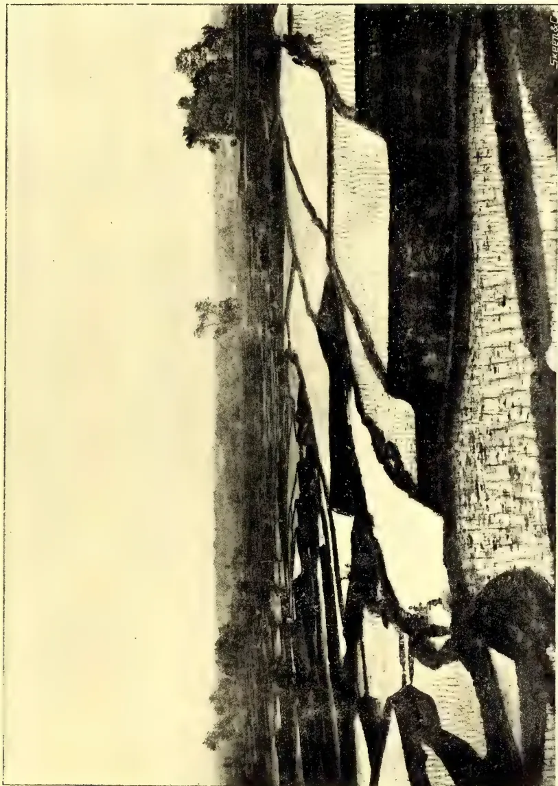A black and white photograph showing a person working in a newly-transplanted paddy-field in Java. The person is bent over, working in the field, which is filled with young rice plants. The field is divided into sections by irrigation channels. In the background, there are trees and a clear sky. The photograph is signed "S. B. & Co." in the bottom right corner.

A NEWLY-TRANSPANTED PADDY-FIELD IN JAVA.

219------------------------------------------------

This image shows a blank, aged page with a light beige or cream color. The surface has a subtle texture and slight discoloration, characteristic of old paper. There are no markings, text, or illustrations on the page.

220------------------------------------------------

APRIL 1907.]197Saps and Exudations.

laticiferous system. The latex is apparently contained in isolated cells which are present in both wood and bark, though principally in the latter. The bark, in fact, furnishes a little more than three-fourths of the total amount of rubber, but it also contains the resinous substances which give rise to the stickiness hitherto characteristic of Guayule rubber. Apparently little or no rubber is present in the young leafy shoots. From the results of practical trials, it is stated that in 100 parts of the dried plants there are on an average 47 parts of wood,  $44\frac{1}{2}$  parts of bark, and  $8\frac{1}{2}$  parts of leaves and young shoots.

Experiments in connection with the extraction of Guayule rubber have been in progress for a number of years, but it is only within the last two years that the matter has attained commercial importance. Only one factory was actually at work in Mexico last year, but several others were in course of erection, and will commence operations at an early date. A number of different processes have been introduced for the extraction of Guayule rubber, some of which have been kept secret, whilst others have been protected by patents. The methods may be divided into two chief classes: (1) those in which the rubber is extracted by solvents, and (2) those in which it is separated by mechanical means. In processes of the first kind the plants, after crushing, are treated with a suitable solvent, the greater part of which is afterwards recovered by distillation, and the residue is freed from resin by treatment with a hot alkaline solution, or with wood spirit. In the methods involving mechanical treatment, the plants are reduced to a coarse powder which is submitted to a rubbing or heating action, either in the presence or absence of water, until the particles of rubber cohere and can be separated from the vegetable matter. The rubber thus obtained can be treated as above for the removal of the resin, and is freed from the vegetable impurities by thorough washing with water. In other processes the crushed plants are heated with an alkaline solution in a similar manner to that used for the preparation of wood pulp, and the separated rubber is washed well with water.

The amount of crude rubber furnished by these processes varies from 8 to 12 per cent., according to the amount of moisture present in the plants treated, and the yield of the purified material may be taken as 7 to 10 per cent.

Guayule rubber as first prepared was usually in flakes, which had a greenish-grey colour when fresh, but blackened on the surface when kept. It was very soft and sticky, owing to the presence of a large amount of resin, and it frequently contained large proportions of water and vegetable impurities. The composition of two such specimens has been recorded by Markwald and Frank as follows:—

<table>
<thead>
<tr>
<th></th>
<th>I.</th>
<th>II.</th>
</tr>
<tr>
<th></th>
<th>Per cent.</th>
<th>Per cent.</th>
</tr>
</thead>
<tbody>
<tr>
<td>Ash ... ..</td>
<td>1.3</td>
<td>2.68</td>
</tr>
<tr>
<td>Mechanical impurities ... ..</td>
<td>9.7</td>
<td>—</td>
</tr>
<tr>
<td>Water ... ..</td>
<td>26.0</td>
<td>20.69</td>
</tr>
<tr>
<td>Resin ... ..</td>
<td>29.2</td>
<td>19.35</td>
</tr>
<tr>
<td>Caoutchouc ... ..</td>
<td>33.8</td>
<td>57.28</td>
</tr>
</tbody>
</table>

The caoutchouc present in these specimens was a little sticky, but exhibited considerable tenacity.

The introduction of improved methods for washing the crude rubber and for removing some of the resin has resulted in the production of a much more superior material. The crude rubber as at present obtained usually contains about 63 per cent. of caoutchouc and 22 per cent. of resin, the remaining 15 per cent. being

221------------------------------------------------

Gums, Resins,198[APRIL 1907.

water and a small amount of vegetable matter. After purification, however, the amount of caoutchouc is much higher, and Markwald and Frank found 77 per cent. in a sample which they examined. Formerly the rubber was only worth 1s. 4d. per lb., whereas the improved product can be sold at 2s. 4d. per lb., or more. It is stated that a small quantity of rubber extracted from the dried plants in Germany by a laboratory process was valued in that country and in England at from 3s. 2d. to 3s. 8d. per lb.

It appears certain, therefore, that the Guayule plant will furnish rubber of very fair quality, but it remains to be seen whether the extraction of this rubber upon a commercial scale will prove successful. The plant can be cultivated in sterile regions unsuitable for other purposes, and as it can be collected all the year round, the industry will be continuous. On the other hand, there will be certain difficulties in working on a large scale, as the places at which factories can be established are limited owing to the necessity of having a liberal supply of water, and in some cases the plants may have to be transported some considerable distance before treatment, thereby increasing the cost of production. These points will be cleared up, however, by the experiments now in progress, which will demonstrate the possibility or otherwise of successfully utilising the Guayule plant as a source of rubber.—*Bulletin of the Imperial Institute*.

#### RESIN IN RUBBER.

The plantation rubber cured by the process described by me in a recent number of the *India Rubber World* (March 1, 1906, page 188) was found by the factory, which purchased it, to contain a large percentage of resinous matter, though not as much as rubber cured on a neighbouring plantation from trees of the same age by evaporation or absorption only.

Further study leads me to believe that planters have been misled by the demand of manufacturers for a perfectly dry rubber. To dry perfectly, one must make rubber into very thin sheets, pancakes, or crepe. Complaint is made of all these, whether they be of *Castilloa* or Para, and the reason would seem to be resin. Whence the resin? That is a question I wish manufacturers and planters would set themselves to answer at once. It will take the planter alone years to answer, because he is not a chemist. If the manufacturer will help, it will take weeks only.

I submit for consideration my view, based on a planter's observation. Resin or the most of it seems to be due to drying and exposure. *Castilloa*, the core of a ball of the finest Para, and the best Congo, cut thin and thrown into a drawer for a few months, became almost equally gummy and pasty, a state which I assume to indicate resin. *Castilloa*, if kept long enough, will run down from the shelf, here, like tar. The white core (that is to say, the part not completely dried) of a thick piece of plantation *Castilloa* answers all the visual and actual tests of the best Para, while the dry skin is short and tacky, the more the older. What takes place? Is it due to oxygen, light, or bacteria? Will some one make tests of the white hermetically sealed core and the black rim of a ball of Para, of white plantation *Castilloa*, and thin, sticky pancakes or sheets of the same of crepe, of rubber milk, etc.? If the resin does not come out of the tree, the planter will know what to do and the manufacturer will doubtless reform his method of drying by exposing for weeks or months thin sheets of mangled rubber.

—*I. R. World*.GORDON WALDRON.  
Nicaragua.

222------------------------------------------------

APRIL 1907,]199Saps and Exudations.RESEARCHES ON THE COAGULATION OF THE LATEX.

With the view of defining the conditions under which coagulation takes place and the influence of certain factors on the properties of pure rubber, as well as to study the reaction of vulcanization, V. Henri has carried out a series of experiments with latex from the *Hevea brasiliensis*, which are fully described in "Le Caoutchouc et la Gutta Percha." The latex was slightly alkaline, had a specific gravity of 0.973, contained 8.7 grams of solids per 100 c.c., and its specific electric conductability at 25 deg. was 0.0033, equivalent to that of a solution of sodium chloride of a strength of 0.25 grams per 100 c.c. As will be seen later the concentration and nature of the salts in a latex influence its coagulation.

The microscopic examination of the latex revealed the presence of a large number of globules, some with a diameter of nearly 0.002 millimetres, others smaller, the latter exhibiting extremely intense and persistent Brownian movements. It is interesting to note that the number of globules in a latex, ascertained in the same manner as the enumeration of corpuscles in blood, indicates the richness of the latex. The operation is simple. The most suitable diluent in this case was found to be a 20 per cent solution of sodium chloride, which arrest the Brownian movements, without precipitating or coagulating the latex. An average of fifty million globules per cubic millimetre was obtained.

Regarding the coagulation of the latex there exists a series of bodies which readily cause coagulation in some, but have no effect on others. The reason of this has not yet been discovered. The coagulation of the latex has been compared with the coagulation of albuminoids, it even being surmised that these bodies are essential to the process. Another view is held by the author, namely, that the latex is a suspension of very fine particles in aqueous liquid more or less rich in saline or organic bodies. When, then, coagulation occurs the rubber globules unite. Further, recent researches have shown that the same general law governs both the precipitation of colloidal solutions and the agglomeration of fine suspensions. A comparison between the two is therefore possible, so that the same methods of investigation are equally applicable to both.

Now electrolytes cause the precipitation of colloids, therefore in studying this precipitation it is essential to work with solutions as pure as possible. It is the same with the coagulation of the latex of rubber; other bodies dissolved therein must first be removed. Accordingly, the latex was dialyzed, when after fifteen days it was found to contain no appreciable quantity of salts, since its electric conductability was very similar to that of distilled water and the depression of its freezing point, which previously mounted to 0.22 deg., was less than 0.01 deg.

On adding different reagents to the latex one of three things may occur:—

1. 1. There is no reaction.
2. 2. Isolated flakes varying in size are formed which either rise or sink, but do not unite, being readily separated by stirring. This may be termed the agglutination of the latex.

3. A network of long threads encircling all the globules of the latex is observed. On stirring, the threads reunite, forming a solid elastic coagulum. This is the true coagulation of the latex.

The effect of a large number of reagents on the dialysed latex was studied, both individually and mixed, with the following results.

Methyl, ethyl, and amyl alcohols produced no reaction. Hitherto alcohol has been considered a coagulant, but its action evidently is due to salts present in the latex. Sodium potassium and ammonium salts also have no effect. Salts of calcium, barium and magnesium in sufficient quantities cause agglutination. Salts of

223------------------------------------------------

Gums, Resins,200[APRIL 1907.

the heavy metals also produce agglutination, but with weaker solutions than is necessary with the salts of the alkaline earth. Hydrochloric, nitric and acetic acids all cause agglutination; very dilute sulphuric acid also has the same effect, but if more concentrated coagulation commences. Trichloracetic acid, even when very dilute, produces a remarkably elastic coagulum. Acetone also is a coagulant.

Regarding the action of mixtures, as a rule alcohol added after a salt produces agglutination or coagulation. With solutions of the salts of monovalent metals only agglutination occurs, and then the solutions must be very strong. Salts of bivalent metals on the other hand, even in very weak solutions, induce good coagulation. By gradually reducing the quantity of alcohol, coagulation gives place to agglutination, and with still less alcohol there is no reaction. It is therefore evident that the former is an intensification of the latter, since both are caused by the same agent; it is only a matter of concentration. Acids in conjunction with alcohol act like the salts of bivalent metals, but alkalies give no result. On studying the influence of alkalies on the coagulation of the latex it was found that an extremely small quantity interfered with the reaction; a ten-thousandth normal solution was sufficient to prevent agglutination or transform coagulation into agglutination. Thus magnesium chloride and alcohol produce coagulation, but if the latex is rendered even very slightly alkaline, only isolated flakes are formed, again showing that the passage from agglutination to coagulation is gradual, and that one may be considered as a higher stage of the other.

Conclusions of practical importance to be drawn from these investigations are that having now discovered that our knowledge of colloids is applicable to the coagulation of the latex of caoutchouc, we have every right to regard the latex in the same light as an emulsion.

Emulsions or colloidal solutions are charged electrically, either positively or negatively. It is essential to know which, since their precipitation is regulated thereby. The dialysed latex of rubber was found to be negatively charged. Accordingly, as negative emulsions are precipitated by acids and by salts of bi- and trivalent metals, and positively charged emulsions by alkalies and by salts of bi- and tribasic acids, it is readily understood why salts of monometals act differently to those, bivalent metals, and why acids react and alkalies do not, since the caoutchouc latex only confirms the general law, further establishing the connection between the properties of colloidal solutions and those of the rubber latex.—*India Rubber Journal*.

### IMPORTS OF GUTTA PERCHA.

The imports of gutta percha, which had been steadily declining since 1900, till in 1904, when the amount was only one-fifth of what it was in the former year, again showed a rise, nearly double the amount of crude gutta coming into this country, but of this about one-fifth was re-exported.

Gutta percha is largely produced in British Possessions 5-9ths of our imports coming therefrom, while Venezuela contributes 3-9ths, the remainder coming from the Continent, whence it is imported in a partly-worked condition, and is entered as raw material.—*I. R. Journal*.

224------------------------------------------------

APRIL 1907.]201Saps and Exudations.INDIA RUBBER MARKET.

LONDON, February 15th.—At to-day's auction, 464 packages of Ceylon and Malaya plantation grown rubber were under offer, of which about 443 were sold. The total weight amounted to 25½ tons, Ceylon contributing nearly 3½, and Malaya about 22 tons. There was good competition at about last sale rates for all kinds. Several attractive parcels were included in the offerings, the most noticeable being two invoices from Lanadron Estate, Muar; of these about 4 tons were composed of very fine block rubber and realised the highest price of the sale, viz., 5s. 11d. per lb., except two cases which brought 5s. 10½d. Fine pale crepe was again in request from 5s. 9d. to 5s. 9½d., one very fine parcel fetching 5s. 9½d. Medium grades of crepe were slightly irregular, while dark sold well up to about 5s. 4d. per lb. Some very fine biscuits and sheet fetched 5s. 8½d., the general price being 5s. 8d. per lb. Plantation fine to-day.—5s. 7½d. to 5s. 11d., same period last year, 6s. 1½d. to 6s. 2d. Plantation scrap.—4s. 4d. to 4s. 7d., same period last year, 3s. 8d. to 5s. 4d. Fine hard Para (South American).—5s. 1d., same period last year, 5s. 4½d. Average price of Ceylon and Malaya plantation rubber.—443 packages at 5s. 6½d. per lb., against 238 packages at 5s. 11½d. per lb. same period last year. Particulars and prices as follows:—

CEYLON.

<table border="1">
<thead>
<tr>
<th>MARK.</th>
<th>QUANTITY, DESCRIPTION AND PRICE PER LB.</th>
</tr>
</thead>
<tbody>
<tr>
<td>Siragalla</td>
<td>1 case fine pale biscuits, 5s 8d.</td>
</tr>
<tr>
<td>Udapola</td>
<td>1 do good biscuits, 5s 8d; 2 cases somewhat similar, 5s 8d; 1 case good palish to darkish biscuits, 5s 8d; 1 case fine pale scrap, 4s 6½d.</td>
</tr>
<tr>
<td>We'Oya</td>
<td>2 do fine pale darkish biscuits, 5s 8½d.</td>
</tr>
<tr>
<td>Culloden</td>
<td>5 do fine amber biscuits, 5s 8½d; 9 cases very fine pale crepe 5s 9½d; 6 cases fine darkish crepe, 5s 4½d; 1 case good darkish ditto, 5s 3½d; 2 cases good dark, 5s 2½d.</td>
</tr>
<tr>
<td>Ellakande</td>
<td>3 do good yellow biscuits, 5s 8½d.</td>
</tr>
<tr>
<td>Nikakotna</td>
<td>3 do fine amber sheet, 5s 8½d.</td>
</tr>
<tr>
<td>J.J.V. &amp; Co.</td>
<td>1 do dark scrap, 4s 5d; 1 case good scrap, 4s 7d; 1 case good dark scrap, 4s 7d; 1 case good rejections, 4s 11½d.</td>
</tr>
<tr>
<td>Wiharagama</td>
<td>2 do dull biscuits, 5s 8d.</td>
</tr>
<tr>
<td>Ambatenne</td>
<td>1 do fine biscuits, 5s 8½d; 1 case darker, 5s 8d; 1 case fine scrap, 4s 6½d; 1 case dark scrap, 4s 5½d.</td>
</tr>
<tr>
<td>Good View</td>
<td>1 do good biscuits, 5s 8d.</td>
</tr>
<tr>
<td>Waharaka</td>
<td>3 do darkish scrap, 4s 4d; 1 case fine palish to darkish biscuits, 5s 8d.</td>
</tr>
<tr>
<td>Ballacadua</td>
<td>2 do darkish crepe, 5s 2d; 2 cases fine palish to darkish biscuits, 5s 8½d.</td>
</tr>
</tbody>
</table>

MALAYA.

<table border="1">
<tbody>
<tr>
<td>B.R.R. Co. Ld.</td>
<td>14 do fine washed sheet, 5s 7½d; 1 case fine dark blocks, 5s 8½d; 8 cases fine pale crepe, 5s 9d; 1 case fine small blocks, 5s 8½d; 2 cases fine palish scrap crepe, 5s 4½d; 5 cases darkish, 5s 4d; 1 case good dark block, 5s 4d; 4 cases good dark crepe, 5s 1½d; 4 cases brown crepe, 5s 2d; 1 case dark block, 5s 4d.</td>
</tr>
<tr>
<td>C.M.R.E. Ld.</td>
<td>12 do fine pale crepe, 5s 9d; 3 cases good palish and darkish crepe, bought in; 9 cases good dark crepe, 5s 1½d.</td>
</tr>
<tr>
<td>Jebong</td>
<td>7 do fine amber sheet, 5s 8½d; 5 cases very fine pale crepe 5s 9½d; 1 case fine palish, 5s 5½d; 2 cases fine darkish, 5s 3d; 1 case good dark, 5s 1½d.</td>
</tr>
<tr>
<td>S.S.B.R. Co., Ld. (in diamond)</td>
<td>5 do fine amber sheet, 5s 8d; 1 case fine pale scrap, 4s 6½d; 1 case darkish scrap, 4s 5d; 1 case pressed scrap (part uncured), 4s 5½d.</td>
</tr>
<tr>
<td>S.P.S. (in circle)</td>
<td>1 do good dark scrap, 4s 3½d; 3 bags rejections and scrap, 4s 5½d.</td>
</tr>
<tr>
<td>P. S.</td>
<td>2 do fine amber sheet, 5s 8½d; 1 bag good ball scrap, 4s 5d.</td>
</tr>
</tbody>
</table>

225------------------------------------------------

Gums, Resins.202[APRIL 1907.]

<table border="0">
<tbody>
<tr>
<td>V.R. Co. Ld. Klang F.M.S. (in triangle)</td>
<td>12 do</td>
<td>washed sheet, 5s 8d ; 8 cases fine pale crepe, 5s 9<math>\frac{1}{2}</math>d ; 2 cases fine palish, 5s 7d ; 13 cases dark smoked block, 5s 4<math>\frac{1}{2}</math>d.</td>
</tr>
<tr>
<td>K.P. Co. Ld.</td>
<td>18 do</td>
<td>fine palish sheet, 5s 8d ; 1 case rejected sheet, 5s 7<math>\frac{1}{2}</math>d ; 2 cases scrappy sheet, 4s 11<math>\frac{3}{4}</math>d ; 5 cases fine scrap, 4s 6<math>\frac{1}{2}</math>d to 4s 6<math>\frac{3}{4}</math>d ; 10 cases fine sheet, 5s 8d ; 1 case scrappy washed sheet, 4s 11<math>\frac{3}{4}</math>d ; 2 cases fine pale scrap, 4s 7d.</td>
</tr>
<tr>
<td>Yam Seng</td>
<td>10 do</td>
<td>fine amber sheet, 5s 8d ; 10 cases dark scrap, 4s 6<math>\frac{3}{4}</math>d ; 2 cases rejections, 4s 10<math>\frac{1}{2}</math>d.</td>
</tr>
<tr>
<td>R.R. (S. in diamond)</td>
<td>6 do</td>
<td>fine amber sheet, 5s 8d.</td>
</tr>
<tr>
<td>S.R. (S. in diamond)</td>
<td>1 do</td>
<td>fine scrap, 4s 7d.</td>
</tr>
<tr>
<td>GULA (in diamond)</td>
<td>2 do</td>
<td>fine amber sheet, 5s 8d ; 1 case scrappy rejections, 4s 7<math>\frac{1}{2}</math>d.</td>
</tr>
<tr>
<td>K. (in diamond)</td>
<td>4 do</td>
<td>fine amber sheet, 5s 8d ; 3 cases scrappy rejections, 4s 7<math>\frac{1}{2}</math>d.</td>
</tr>
<tr>
<td>Sungei Krudda</td>
<td>2 do</td>
<td>scrappy washed sheet, 5s 0<math>\frac{1}{2}</math>d ; 4 cases good scrap, 4s 6<math>\frac{1}{2}</math>d ; 7 cases fine amber sheet, 5s 8<math>\frac{1}{2}</math>d ; 1 case fine pressed undried, 5s 6<math>\frac{1}{2}</math>d ; 2 cases good lump scrap, 4s 5<math>\frac{1}{2}</math>d.</td>
</tr>
<tr>
<td>Linggi Plantns.</td>
<td>28 do</td>
<td>fine pale crepe, 5s 9<math>\frac{3}{4}</math>d ; 3 cases fine palish, 5s 6<math>\frac{1}{2}</math>d ; 14 cases good smoked block, 5s 4<math>\frac{1}{2}</math>d.</td>
</tr>
<tr>
<td>L.E. Muar (in triangle) Straits)</td>
<td>40 do</td>
<td>fine block, 5s 11d ; 11 cases fine darkish crepe, 5s 4d ; 21 cases fine block, 5s 10<math>\frac{3}{4}</math>d to 5s 11d ; 4 cases fine darkish crepe, 5s 4<math>\frac{1}{2}</math>d.</td>
</tr>
<tr>
<td>B.M. &amp; Co.</td>
<td>17 do</td>
<td>fine amber sheet, 5s 8<math>\frac{1}{2}</math>d ; 8 cases good scrap, 4s 6d ; 1 case dark lumpy scrap, 4s 5d ; 2 cases rejections, 4s 8d ; 5 cases mixed darkish scrap, 4s 5d.</td>
</tr>
</tbody>
</table>

ONDON, March 1st, 1907.—At to-day's auction, 649 packages of Ceylon and Malaya plantation grown rubber were under offer, of which about 562 were sold. The total weight amounted to about 37 $\frac{3}{4}$  tons, Ceylon contributing nearly 8, and Malaya nearly 29 $\frac{3}{4}$  tons. The sale passed off with good competition for all grades,  $\frac{1}{4}$ d. to  $\frac{1}{2}$ d. per lb. advance on last sale rates being sometimes recorded for the finer kinds. There were several large invoices of fine washed sheet and crepe, amongst these being one from the Highland Estate amounting to nearly 13 tons, which was keenly competed for at from 5s 3d to 5s 8 $\frac{1}{2}$ d. Fine pale crepe was also in request, selling up to 5s 10d for finest, this being the highest price in the auction. There was more enquiry for unwashed scrap, which marked an advance of about 1d. per lb.—Plantation fine to-day.—5s 8d to 5s 10d, same period last year, 6s to 6s 2d. Plantation scrap.—4s 5d to 4s 8d, same period last year, 4s 3 $\frac{1}{2}$ d to 5s 3 $\frac{1}{2}$ d. Fine hard Para (South American).—5s 1 $\frac{1}{2}$ d, same period last year, 5s 4 $\frac{1}{2}$ d. Average price of Ceylon and Malaya plantation rubber.—562 packages at 5s 5 $\frac{1}{2}$ d per lb., against 139 packages at 5s 10 $\frac{1}{2}$ d per lb., same period last year. Particulars and prices as follows:—

CEYLON.

<table border="0">
<thead>
<tr>
<th>MARK.</th>
<th>QUANTITY,</th>
<th>DESCRIPTION AND PRICE PER LB.</th>
</tr>
</thead>
<tbody>
<tr>
<td>Clontarf</td>
<td>1 case</td>
<td>good darkish and dark crepe, 5s 2<math>\frac{1}{2}</math>d ; 1 case good scrap, 4s 6<math>\frac{1}{2}</math>d.</td>
</tr>
<tr>
<td>Kumbukkan</td>
<td>1 do</td>
<td>good palish scrap, 4s 7d. 1 bag good lump scrap, 4s 5<math>\frac{1}{2}</math>d.</td>
</tr>
<tr>
<td>Elston</td>
<td>1 do</td>
<td>good pressed scrap, 4s 5<math>\frac{1}{2}</math>d.</td>
</tr>
<tr>
<td>C.L. (in triangle)</td>
<td>8 do</td>
<td>good palish to darkish crepe, 5s 6d ; 1 case somewhat similar, 5s 4d ; 5 cases similar, 5s 3<math>\frac{1}{2}</math>d ; 3 cases good darkish rolled crepe, 5s 3<math>\frac{1}{2}</math>d ; 7 cases good darkish crepe, 5s 2d ; 2 cases dark pressed crepe, 4s 9d ; 1 case black, 4s 5<math>\frac{1}{2}</math>d.</td>
</tr>
<tr>
<td>Suduganga</td>
<td>3 do</td>
<td>good dull biscuits, 5s 8d ; 2 cases similar, 5s 8d.</td>
</tr>
<tr>
<td>Kepitigalla</td>
<td>1 do</td>
<td>scrappy sheet and biscuits, 5s 7<math>\frac{1}{2}</math>d ; 2 cases rejections, 4s 7<math>\frac{1}{2}</math>d.</td>
</tr>
<tr>
<td>Culloden</td>
<td>3 do</td>
<td>fine palish crepe, 5s 9d ; 6 cases good palish and darkish crepe, 5s 4<math>\frac{1}{2}</math>d ; 1 case good dark crepe, 4s 11d ; 4 cases fine darkish biscuits, 5s 8<math>\frac{1}{2}</math>d ; 1 case very fine pale crepe, 5s 9<math>\frac{1}{2}</math>d ; 2 cases darker, 5s 9<math>\frac{1}{2}</math>d.</td>
</tr>
<tr>
<td>Heatherley</td>
<td>3 do</td>
<td>very fine pale and darkish biscuits, 5s 9<math>\frac{1}{2}</math>d.</td>
</tr>
<tr>
<td>Nikakotua</td>
<td>4 do</td>
<td>fine palish to darkish sheet, 5s 8<math>\frac{1}{2}</math>d ; 1 case dark, 5s 8<math>\frac{1}{2}</math>d.</td>
</tr>
</tbody>
</table>

226------------------------------------------------

APRIL 1907.]203Saps and Exudatio

<table border="0">
<tr>
<td>Arapolakande</td>
<td>9 do</td>
<td>fine dark biscuits, 5s 9d; 1 case lighter, 5s 8½d; 3 cases fine pressed scrap, 4s 6d; 1 case dark block, 4s 6½d.</td>
</tr>
<tr>
<td>Ingoya</td>
<td>7 do</td>
<td>fine darkish biscuits, 5s 9d; 1 case fine biscuits and blocked sheet and biscuits, 5s 6½d.</td>
</tr>
<tr>
<td>J. J. V. &amp; Co. (I in diamond)</td>
<td>1 do</td>
<td>low scrap, 4s 5d.</td>
</tr>
<tr>
<td>Taldua</td>
<td>4 do</td>
<td>fine palish to darkish biscuits, 5s 8½d.</td>
</tr>
<tr>
<td>Warriapolla</td>
<td>1 do</td>
<td>very fine pale Ceara biscuits, 5s 9d; 2 cases very fine pale and palish biscuits, 5s 9½d; 1 case fine palish and darkish biscuits, 5s 9d; 1 case similar, 5s 8½d; 1 case good scrap 4s 6d; 1 bag darker and heated, 4s 6d.</td>
</tr>
<tr>
<td>C. L. P. C.</td>
<td>1 do</td>
<td>Ceara biscuits and low scrap, 4s 9d.</td>
</tr>
<tr>
<td>Sunnycroft</td>
<td>1 do</td>
<td>good palish biscuits, 5s 9d; 2 cases good scrap, 4s 6d.</td>
</tr>
<tr>
<td>K.M. (in estate mark)</td>
<td>1 bag</td>
<td>scrapy biscuits 4s 8d; 1 bag scrap and rejections, 4s 8d; 1 bag dull Ceara biscuits, 5s 1d.</td>
</tr>
<tr>
<td>Ballacadua</td>
<td>2 cases</td>
<td>fine darkish biscuits, 5s 9d.</td>
</tr>
<tr>
<td>Tudugalla</td>
<td>6 do</td>
<td>low scrap, part sold, 3s 9½d; 3 cases dark scrap, 3s 9½d.</td>
</tr>
</table>

MALAYA.

<table border="0">
<thead>
<tr>
<th>MARK.</th>
<th>QUANTITY,</th>
<th>DESCRIPTION AND PRICE PER LB.</th>
</tr>
</thead>
<tbody>
<tr>
<td>Sungei Krudda</td>
<td>4 cases</td>
<td>good sheet, 4s 6½d; 1 bag pressed virgin sheet, 4s 3d.</td>
</tr>
<tr>
<td>B.R.R. Co. Ltd.</td>
<td>14 do</td>
<td>good washed sheet, 5s 8d; 1 case good dark blocked sheet, 5s 9½d; 6 cases good block, 5s 9½d; 7 cases good darkish block, 5s 8½d.</td>
</tr>
<tr>
<td>C.M.R.E. Ltd.</td>
<td>14 do</td>
<td>fine palish crepe, 5s 8½d; 5 cases fine palish to darkish crepe, 5s 7d.</td>
</tr>
<tr>
<td>Shelford</td>
<td>2 do</td>
<td>good amber sheet, 5s 8d; 2 cases good scrap, 4s 6d; 1 case good scrapy rejections, 4s 8d.</td>
</tr>
<tr>
<td>S.S.B.R. Co. Ltd. (in diamond)</td>
<td>2 do</td>
<td>dark pressed scrap (uncured), 4s 6d.</td>
</tr>
<tr>
<td>Highland Est.</td>
<td>11 do</td>
<td>fine washed sheet, 5s 8½d; 5 cases similar, 5s 8½d to 5s 8½d; 7 cases fine palish to darkish crepe, 5s 6½d; 4 cases darker, 5s 5d; 4 cases good darkish, 5s 4½d; 6 cases good brown, 5s 4d; 49 cases fine washed sheet, 5s 8½d; 5 cases similar, 5s 8½d; 13 cases fine palish to darkish crepe, 5s 6½d; 10 cases little darker, 5s 4½d; 7 cases dark, 5s 3½d; 17 cases good brown and dark crepe, 5s 3½d; 32 cases fine washed sheet, 5s 8½d to 5s 8½d; 4 cases darker and mouldy, 5s 8½d; 6 cases fine palish crepe, 5s 7½d; 3 cases good darkish to dark, 5s 3½d; 1 case similar, 5s 3d; 9 cases good brown, 5s 3d.</td>
</tr>
<tr>
<td>T.E.P.</td>
<td>1 do</td>
<td>dark pressed crepe, 4s 8d.</td>
</tr>
<tr>
<td>T.E.S.B.</td>
<td>12 do</td>
<td>low scrap, 2s 9d.</td>
</tr>
<tr>
<td>A.M.R.C.</td>
<td>2 do</td>
<td>good scrap, 4s 7½d.</td>
</tr>
<tr>
<td>V.R. Co. Ltd, Klang F.M.S. (in tri-angle)</td>
<td>2 do</td>
<td>good washed sheet, 5s 8½d; 10 cases fine pale to palish crepe, 5s 9½d; 2 cases good palish to darkish crepe, 5s 6½d; 1 bag good washed sheet, 5s 8½d; 3 cases good palish crepe, 5s 7½d; 6 cases dark smoked block, 5s 4½d; 1 case palish, 5s 2d; 1 case fine pale crepe, 5s 10d; 18 cases fine pale to darkish crepe, 5s 9½d; 1 case similar, 5s 9d; 4 cases good palish to darkish crepe, 5s 7d; 5 cases darkish smoked block, 5s 3½d; 3 cases palish, 5s 2½d.</td>
</tr>
<tr>
<td>S.R. Co.</td>
<td>21 do</td>
<td>good washed sheet, 5s 8½d to 5s 8½d; 3 cases good darkish crepe, 5s 6½d; 1 case good palish, 5s 7½d; 1 case good darkish, 5s 5½d; 10 cases good dark, 5s 2½d to 5s 2½d; 2 cases good brown, 5s 2½d; 13 cases good washed sheet, 5s 8½d; 3 cases good palish to darkish crepe, 5s 6½d; 2 cases darker, 5s 3d; 1 case darkish, 5s 4d; 4 cases dark, 5s 2½d.</td>
</tr>
<tr>
<td>S.(in diamond) R.R.</td>
<td>2 do</td>
<td>good amber sheet, 5s 8½d; 1 case rejections, 4s 5½d.</td>
</tr>
<tr>
<td>Yam Seng</td>
<td>10 do</td>
<td>fine amber sheet, 5s 8½d; 9 cases good scrap, 4s 7d; 1 case scrap and rejections, 4s 6½d; 1 case rejections, 4s 6½d.</td>
</tr>
<tr>
<td>Teluk Batu</td>
<td>16 do</td>
<td>fine amber sheet, 5s 8½d; 1 case pressed darkish smoked crepe, 5s 2½d; 6 cases good blocked scrap crepe, 5s 2½d; 1 case dark block, 4s 4d; 1 bag rejected sheet, 5s.</td>
</tr>
</tbody>
</table>

27

227------------------------------------------------

Resins,204[APRIL 1907.

<table>
<tr>
<td>G.K.K.B.</td>
<td>3 do</td>
<td>very fine pale amber sheet, 5s 9d; 1 case rejections and ball scrap, 4s 6<math>\frac{1}{2}</math>d.</td>
</tr>
<tr>
<td>R.S. &amp; D. (in diamond) R</td>
<td>2 do</td>
<td>fine cut sheet, 5s 8<math>\frac{1}{2}</math>d; 3 cases scrappy rejections, 4s 7<math>\frac{1}{2}</math>d.</td>
</tr>
<tr>
<td>S.P. (in circle)</td>
<td>1 do</td>
<td>dark scrap, 4s 5<math>\frac{1}{2}</math>d; 1 case darkish pressed sheet, 5s 8<math>\frac{1}{2}</math>d; 1 bag scrappy crepe, 5s 2d; 1 bag dark pressed crepe, 4s 6d; 1 case pressed sheet, 5s 8<math>\frac{1}{2}</math>d.</td>
</tr>
</table>

EXPORTS OF PLANTATION RUBBER FROM CEYLON.

From 1st January to 4th February.

<table>
<tr>
<td>1907</td>
<td>...</td>
<td>...</td>
<td>11<math>\frac{1}{2}</math> tons</td>
<td>1905</td>
<td>...</td>
<td>...</td>
<td>2<math>\frac{1}{2}</math> tons</td>
</tr>
<tr>
<td>1906</td>
<td>...</td>
<td>...</td>
<td>9<math>\frac{1}{2}</math> "</td>
<td>1904</td>
<td>...</td>
<td>...</td>
<td>2<math>\frac{1}{2}</math> "</td>
</tr>
<tr>
<td colspan="4">Exports from Singapore—1907, 1st to 28th January</td>
<td colspan="4">...</td>
</tr>
<tr>
<td colspan="4"></td>
<td colspan="4">36 "</td>
</tr>
</table>

GOW, WILSON & STANTON, LTD.,  
LONDON.

CAMPHOR CULTIVATION.

There has been much talk of late in Ceylon planting circles concerning the possibility of camphor cultivation in that island, and many are anxious to learn whether operations are likely to prove profitable, especially in view of the extreme scarcity and high prices which now appear to be more or less permanent. Camphor has been cultivated for experimental purposes in Ceylon and India for a number of years, but not until quite recently has it been successfully produced. So far as we can learn, the planter has not the best methods of distillation at his disposal, and has not been able to extract camphor in paying quantities. This is well illustrated by the fact that nine months ago there were over one hundred acres under the camphor-plant in Ceylon, yet up to the present not more than a ton of crude camphor has been produced. Recently the Governor of Ceylon has been talking of the potentialities of camphor-culture, and since then there has been an unprecedented rush for seed. Concessions of land have been granted in Ceylon, and planting will shortly commence on a substantial scale; and as the climatic conditions are said to be similar to those of Formosa, there seems every reason that the experiment should ultimately be successful. It appears, however, there is great difficulty in obtaining true camphor-seed from Japan, as, naturally, the Japanese are prepared neither to assist the planter nor to give away the secrets of their distillation. If it were possible to get hold of a Japanese or Chinaman actually engaged in the camphor-industry, the difficulty might be quickly solved, as the Ceylon planter has everything to learn regarding distillation. In other words, he has a certain quantity of raw material at hand, and is as yet unable to obtain an adequate yield of the crude product. Mr. Kelway Bamber, the Ceylon Government Chemist, has been at work for some time at Peradeniya, and has succeeded in perfecting an inexpensive still which it is hoped will render the process an easy one. The profit at present prices would be considerable, but a grower would probably have to take a much lower price than the ruling quotation of 350s. per cwt. The demand for camphor is only a limited one, but we believe the danger of over-production in Ceylon is remote, and that planters would be justified in going ahead.

Ever since the Japanese monopoly was established some eight years ago, the crude-camphor market has been more or less starved or only supplied with extremely limited quantities. This, of course, is not entirely the fault of the Japanese Government, as they have encountered many difficulties in working their monopoly in Formosa. Labour-troubles, native rebellions, earthquakes, and the late war have all contributed their quota in regard to diminished shipments. One fact, however, stands out prominent since the institution of the monopoly, *i.e.*, the refining of camphor in Europe and the United States has dwindled to a mere shadow compared with what it was a decade ago; and, in spite of official denials to the contrary, the refining is gradually passing into Japanese hands.

228------------------------------------------------

APRIL 1907.]205Saps and Exudations.

With the advent of extremely high prices undoubtedly the consumption has fallen off considerably, and where possible the public for certain disinfecting-purposes have had to fall back upon the less-esteemed naphthaline, in which a large business is now done. This is, of course, only natural when it is considered that the wholesale price of refined bells in large quantities in the open market has been from 4s. to 4s. 3d. per lb. for over eighteen months. It was thought that after the Russo-Japanese war there would be a fall in price, but, on the contrary, the price rose to its present quotation, and at the moment the position is regarded as exceedingly firm. It must not be forgotten, however, that there have been some exceedingly dull periods this year, and at times the articles has almost "gone a begging," the extreme prices having frightened buyers.—*Chemist and Druggist*.

— — — — —

### CAMPHOR IN CEYLON.

The interest which has recently been shown in the cultivation of camphor by a few Ceylon planters has led Mr. E. J. Young, managing director of the Rangala Co., to read a paper on that subject before the local Planters' Association. Although he does not add much to our knowledge of the subject, there are one or two points in his discourse worthy of comment. So far as Ceylon is concerned there is only one planter (Mr. Roydon Hughes) who has been able to extract camphor in paying quantities. Last year he had ten acres under camphor at a yielding stage, and the produce from this area when shipped amounted to 1 cwt. only, which was sold privately in Mincing Lane for 275s. per cwt. That is a price which should leave a handsome profit, and is certainly an inducement for extended cultivation. Mr. Young considers it necessary to have at least fifty acres under camphor in order to make it a profitable business, and even 100 acres would be still better. Many planters are afraid, however, of danger in over-production, and in this respect their bitter experience in cinchona and cardamoms is not likely to be effaced. We believe the danger is now more apparent than real. With the rise in the celluloid-industry the demand for camphor has gone up by leaps and bounds, and cannot be filled; while synthetic camphor is still a problematic industry, and a dangerous one at that. Under the present conditions of supply as regards crude camphor, planters need not hesitate, therefore, in taking up the cultivation seriously. Their aim should be to see that a product is turned out equal to the Formosan in quality, and that camphor extracted from the leaves and twigs of the plant is shipped separately from that extracted from the stem. Care should also be taken in regard to packing, as dampness affects the colour and lowers the market-value of the article. In 1895 crude camphor was selling in London at 70s. per cwt, but that was when the celluloid industry was in embryo. When the Japanese Government monopoly was initiated the price was fixed at 178s. per cwt., so that, should there be a recurrence of the most favourable conditions at some future date, it is difficult to see why values should drop below that figure. It is only natural that the present price of 350s. cannot be maintained, as when conditions are again normal in Formosa, and regular shipments are resumed, there must be a considerable reduction. Meanwhile, so long as Formosa practically remains the only source of supply, Ceylon planters may go ahead, for it will take more than a generation to place on the market sufficient quantities of camphor to upset the Japanese monopoly. Mr. Young in his paper points out that the camphor resources of Formosa are not "boundless and inexhaustible," they have diminished at least 15 per cent. in the last twenty-five years, and in the settled districts the tree is practically extinct. On these points some authoritative information was given in our issue of June 16. That the Japanese are doing their best to protect and promote the camphor-industry goes without saying, but this has had a beneficial effect on the broker, refiner, and consumer is another "story."

229------------------------------------------------

Gums, Resins,206[APRIL 1907.

In regard to what we said last week about the manufacture of celluloid in Japan, we now learn from a report of the French Consul at Tokio that the present holders of the camphor monopoly are negotiating to supply camphor to two syndicates who contemplate the manufacture of celluloid in that country. The first syndicate is British, with a capital of five million yen, and they propose to establish a factory either at Osaka or Kobe; the other is a Franco-Austrian syndicate, proposing to establish works at Misshima, near Shidyuoka.

The present position of camphor on the London market is exceedingly strong, as the available stocks are very small. It will be noticed from the drug statistics which we give in the Trade Report that there are only 567 packages of crude and refined in stock, compared with 852 packages at the corresponding period of 1905. Moreover, we understand that some 200 packages of this quantity are already sold, but not delivered, thus reducing the balance to about 367 packages. Very little was shipped from Japan during August and September, and a 10-per-cent rise on the already inflated prices is confidently predicated, as the United States have been large buyers on this market.—*Chemist and Druggist*.

230------------------------------------------------

APRIL 1907.]207

## DYES AND TANNING SUBSTANCES.

### TURMERIC: ITS CULTIVATION AND USES.

Turmeric\* is extensively cultivated all over India for its root-stocks, and is now found more or less wild in Jamaica, especially in the western districts. It is the well-known *haldi* universally used as a condiment with curry-stuffs and also as a dye, and is one of the most profitable of crops in India. The dye-yielding rhizome is harder and much richer in colour than the edible.

#### CULTIVATION.

The preparation of the soil necessary for turmeric is similar to that for ginger, but lands intended for turmeric need not be worked so fine. The usual planting time in India is about the 20th of May. The plants spring up in about a fortnight. One or two weedings are necessary, and care must be taken that the fields are not inundated. After about a year and nine months turmeric is lifted. When it is raised the first year, as is the practice in some places, the produce is less in quantity and inferior in quality.

#### PREPARATION OF THE ROOT-STOCK.

Various systems are apparently practised for preparing the rhizome for the market. Of Bengal it has been said: After the rhizomes have been dug out of the ground, they are freed from the fibrous roots and cleaned. They are then put in earthen pots, the mouths of which are to be carefully closed with earthen covers and cowdung. These pots are then very carefully heated. The turmeric is made to boil in its own juice, a process which gets rid of the raw smell of turmeric. It is then dried in the sun, the drying taking nearly a week, during the time the turmeric requires to be covered in the night to protect it from dew. In some places turmeric is boiled in water in which a little cow-dung is mixed."

Of the North-West provinces, Sir E. C. Buck says:—"When dug up the roots are boiled and dried in the sun; in this form they are sold in the Indian bazaars. When the dye is to be used the roots are again boiled and powdered while wet. A decoction is then made of this paste in water, in which the cloth is well steeped, being subsequently dried in the shade. In the Kumaon district the roots are soaked in lime-juice and borax before being powdered instead of being boiled." Of the Punjab, Mr. Baden Powell says the tubers are taken up in November and dried partly by the action of fire and partly by exposure to the sun. Of Coimbatore it is reported:—"The roots are carefully sized and separately boiled in a mixture of cow-dung and water, dried and sent to market."

#### CHARACTER AND VALUE IN COMMERCE.

There are two sorts of turmeric seen in commerce—the *round* and the *long*, but both are the produce of the same plant; the central rhizomes or rootstocks constituting the round, and the lateral or secondary rhizomes (*tubers*) the long; the latter are the more abundant. The *former* are roundish or somewhat ovate, usually from about one inch and a half to two inches in length, and one inch in diameter, pointed at one end, and marked externally with annular ridges. They are often found cut into halves. The *latter* are somewhat cylindrical, more or less curved pointed at the two extremities, frequently having on their sides one or more short knobs or shoots, about the thickness of the little finger, two or three inches long, and marked externally with annular ridges. Both sorts are yellowish externally,

\* *Curcuma longa*, Linn. Information from Dictionary of Economic Products of India; and Bentley and Trimen's Medicinal Plants.

231------------------------------------------------

Dyes.208[APRIL 1907.

very hard and firm, and when broken having a waxy-resinous appearance, and an orange-yellow or reddish-brown colour. The powder is orange yellow. Turmeric has an aromatic taste and odour somewhat resembling ginger, but peculiar. When chewed it tinges the saliva yellow.

The following is a quotation from the Market Report published in the *Chemist and Druggist* for 23rd September last:—

“Good Madras finger has been sold at from 17s. to 17s. 6d. per cwt. being steady, and Cochin split bulbs are quoted at from 7s. 9d. to 8s. per cwt., according to quantity.”

#### DYE.

A special form of turmeric is grown for this purpose, namely, a harder root, much richer in the dye principal than in the ordinary condiment form.

The colour is only deposited in the rhizome with age, and hence, in all probability, the above mentioned forms have been obtained by a process of careful selection of stock observed to produce the colour freely. It is of importance, however, that the European merchant in purchasing for dye purposes, should see that he gets the hard dye-yielding form and not the softer aromatic condition, which is used as a condiment.

The rhizome is still largely used by the European dyers, though the fluctuation in the trade may be viewed as due to the development of the aniline industry. Professor Hummel says of it:—“Notwithstanding the very fugitive character of the colour it yields, it is still much used, especially by the wool and silk dyers for the production of compound shades—olives, browns, &c. It gives a bright yellow colour without the aid of a mordant, but when mordants are used with it, it yields other colours not unlike those obtainable from the yellow dye-woods. The colouring matter of turmeric is one of the few for which cotton has naturally a strong attraction.”

Although turmeric is rich in colouring matter, its want of permanence is a hindrance to its application as a dye-material.

Sometime back the use of turmeric was almost exclusively limited to printing and dying silks. It is now employed to a vast extent in stuff-dying, forming an important constituent in certain compound colours, especially the so-called “sour-browns.”

#### FOOD

Turmeric forms one of the indispensable ingredients in curries, and is used for colouring confections, etc.

#### MEDICINE.

Turmeric contains about one per cent. of a *volatile oil*, to which its odour is due, some *starch*, a yellow colouring matter called *curcumin*, and other unimportant substances. The alkalies change the colour of curcumin to reddish brown; and boracic acid produces an orange tint; hence paper tinged with tincture of turmeric is largely employed as a test of the presence of alkalies.

Turmeric is not now used as a remedial agent, but is introduced into the pharmacopoeias as a test of the presence of the alkalies. For this purpose the British Pharmacopoeia directs unsized white paper to be steeped in tincture of turmeric and dried by exposure to the air. It is also occasionally employed in pharmacy in colouring ointments and other preparations.

Used as a stimulant in native medicine in India; externally applied in pains and bruises, and internally administered in disorders of the blood. Its use as an external applicant in bruises, &c., is perhaps its most frequent medicinal application. The fresh juice is said to be an anthelmintic. A decoction of the rhizome is applied to relieve catarrh and purulent ophthalmia.—*Bulletin of the Department of Agriculture*, Vol. IV, July, 1906.

232------------------------------------------------

APRIL, 1907.]209

## FIBRES.

### Caravonica Cotton.

The following letters are of interest, but we adhere to our position that it is a pity to grow a perennial cotton in Ceylon when annuals fetching a higher price can be well grown and the ground left fallow for a few months to get rid of pests.—Ed. T.A.

#### SAMPLES OF CARAVONICA COTTON.

5th December.

SIR,—I have the honour to inform you that I am sending you by the Orient Line steamer "Oruba" sailing to-day a box containing samples of Caravonica cotton, at the request of the Hon'ble Mr. H. L. Crawford, C.M.G. They are of the 'wool' and 'silk' varieties of the Caravonica cotton, and were grown in the North-Western Province by a member of this Society, Mr. J. W. C. de Soysa.

Mr. de Soysa informs me that he hopes shortly to be in a position to place his cotton on the home market.

C. H. BROWN, Esq.,

Cotton Broker, Liverpool.

I am, Sir,

Your Obedient Servant,

A. N. GALBRAITH,

*Secretary, Ceylon Agricultural Society.*

Worthing, 13th January, 1907.

DEAR SIR, I have received the following letters from Geo. H. Brown & Co., Cotton Brokers, Liverpool, in regard to the samples of cotton forwarded to them at my request:—

"We have received by the "Oruba" from Colombo two samples described respectively as *wool* and *silk* varieties of Caravonica cotton. The Secretary of the Ceylon Agricultural Society writes that they are the produce of Mr. J. W. C. de Soysa, who hopes shortly to be in a position to place this cotton on the home market. It will be an easy matter to report on the qualities of the cotton in a descriptive way, but valuations of a growth more or less strange as yet to the market here must be rather vague. I may say at once that both samples are of high grade and good staple, and if the bulk is consistent with them, they speak well for the care taken in raising the plant and ginning the cotton picked therefrom. With anything like present market conditions buyers could be readily found for such cotton if brought to port in marketable quantities.

I then wrote and asked if they could give even an approximate value for the cotton in question, and I received the following reply:—

"Not to go into fractions the samples of Ceylon cotton are worth 9d. a lb., and at to-day's (10th January) general gravity might fetch more if the growth became at all a familiar one in the market, but as you know values are fickle from season to season. Two years ago Middling American was quoted at 3'8d. per lb. To-day it is 6'02d. per lb., and what is more, the best sorts of American command a premium never known before over the common level, so that 11d. or even a shilling per lb. is not to-day an impossible figure for the very best. The current grades of Egyptian fetch 10d. to 11d. a lb. These prices are the more remarkable as both the American and Egyptian crops promise to be the largest ever known. On the other hand, the

233------------------------------------------------

Fibres.210[APRIL 1907.

increase of machinery and the buoyancy of trade have been unexampled. Sooner or later reaction will come and these prices must fall. Of that cotton growers must take their chance like the rest of humanity. But such cotton as is represented in the samples from the Agricultural Department can be certain of fetching a good price in comparison with all but the best fancy qualities of American, or on the other hand with very rough qualities of Peruvian which mix with wool."

The above information will, I hope, be of use to cotton growers. It will be seen that the report is distinctly encouraging.

Yours faithfully,

(Signed) H. L. CRAWFORD.

The Secretary, Ceylon Agricultural Society.

### MAGUEY OR SISAL HEMP.

The cultivation of maguey in the Philippine Islands is, at the present time, attracting very widespread attention. In those provinces from which maguey has been exported for a number of years larger areas are now being planted. In other sections where this plant has been either unknown or unnoticed it is now being introduced. Numerous requests for information as to the essential details regarding this plant and its cultivation have been received by the Bureau of Agriculture. In order to supply this information in as brief and simple a form as possible, the following circular, printed in English, Spanish, Tagalog, Visayan, and Ilocano has been issued:—

#### MAGUEY.

##### 1. What is maguey?

*Answer.* Maguey is a plant having a short, thick stem which bears a large cluster of green, spiny leaves. These leaves yield a valuable fibre that is used in all parts of the world for making rope and twine.

##### 2. Why should maguey be planted in the Philippine Islands?

*A.* This plant flourishes through the long dry season; it can be cultivated on poor, rocky, or sandy soils where no other crop can be grown; it can be cultivated without the use of carabaos or other draft animals; it is not injured by locusts or other insects; it requires but little care and attention; and it is a good paying crop.

##### 3. In what provinces can maguey be grown?

*A.* Maguey can be profitably grown in any province in the Philippine Islands. The conditions are particularly favourable in Ilocos Norte, Ilocos Sur, Union, Zambales, Cebu, Bohol, and Siquijor.

##### 4. How is a maguey plantation started?

*A.* A maguey plantation is started by setting out either the suckers which grow from the roots of the old plants, or the small bulbs which are produced on the flower stalk.

##### 5. Where can these suckers and bulbs be obtained?

*A.* They can be obtained in small quantities in nearly every province from farmers who already have maguey. Suckers or bulbs of sisal hemp, which is a superior variety of maguey, can be purchased in the Hawaiian Islands. Information as to where maguey and sisal suckers can be secured will be furnished by the Bureau of Agriculture in Manila.

##### 6. When should maguey be planted?

*A.* During the rainy season.

234------------------------------------------------

APRIL 1907.]211Fibres.

7. On what kind of land should maguey be planted?

A. Maguey should be planted on hillsides, or on land that is well drained. It can be planted in dry, sandy soils, and it will grow particularly well in soils containing coral rock. It should *not* be planted on low, level paddy land where water will stand during the rainy season.

8. How should maguey be planted?

A. Maguey should be planted in rows 12 feet apart, with the plants  $4\frac{1}{2}$  feet apart in the row. This system will give larger plants, larger leaves, better fibre, and more fibre per hectare than the present Philippine method of setting out plants but 2 or 3 feet apart.

9. How is maguey cultivated?

A. Maguey requires but little cultivation. Two or three times a year the fields should be cleaned of weeds and grass, and the suckers which grow from the roots of the old plants should be cut out.

10. How long after planting can the first leaves be cut?

A. In three years where suckers are planted, and in four years where bulbs are planted.

11. How many leaves should be cut at one time?

A. Only one or two rows of the large, mature leaves around the base of the plant should be cut at one time. The Philippine system of cutting at one time nearly all the leaves on the plant is utterly wrong. This system weakens the plant, reduces the yield of fibre, and produces an inferior quality of fibre. *Cutting only the mature leaves will do more than any other one thing to improve the present condition of the maguey industry.*

12. How is the fibre extracted?

A. In the Philippine Islands maguey fibre is extracted by rotting the leaves in salt water. The leaves are left in the water for a few days and the pulp is then beaten and washed away, leaving the clean fibre. The fibre is then laid on the ground, or is hung over bamboo poles and dried in the sun. This system of rotting, or "retting," as it is called, is very unsatisfactory and produces a very poor quality of fibre.

13. What machinery is used for cleaning maguey?

A. Large machines which clean from 50,000 to 150,000 leaves per day, and cost from \$6,000 to \$9,000, are used in Mexico. A smaller machine which cleans 15,000 leaves per day, and costs \$2,000 is manufactured in New York. Arrangements are now being made by the Bureau of Agriculture to bring one of these smaller machines to the Philippine Islands and to operate it in the different provinces.

14. What is the yield of fibre?

A. One plant will yield from 15 to 30 leaves per year. Where only the large, mature leaves are cut the yield of fibre will be from 30 to 40 pounds per 1,000 leaves. With plants set out 12 by  $4\frac{1}{2}$  feet apart, or approximately 2,000 to the hectare, the annual yield of leaves per hectare is from 30,000 to 60,000, and of fibre from 900 to 2,400 pounds.

15. What is the value of maguey fibre?

A. The current Manila quotations for maguey are as follows:—No. 1, \$15; No. 2, \$12; No. 3, \$9. Good machine-cleaned maguey fibre is equal in value to good sisal, which is worth only 1 to 2 cents less per pound than abaca.

28

235------------------------------------------------

Fibres.212[APRIL 1907.

16. What are the prospects for maguey in the Philippine Islands?

4. The production of maguey in the Philippine Islands has more than doubled during the past four years, and it is being more extensively planted every year. There is practically no limit to the area in the Islands that is suitable for this crop. Thousands of hectares of what is now waste land would grow good maguey. Thousands of hectares of poor, stony land, now producing miserable crops of corn and tobacco should be planted to maguey.

Certain improvements are urgently required. The more careful selection of suckers for planting; an improved system of planting; cutting only the mature leaves; and the introduction of fibre-extracting machines will give us more and better fibre. In Yucatan, where conditions of soil and climate are very similar to those found in parts of the Philippine Islands, more than \$30,000,000 worth of sisal is produced every year. Maguey now ranks fifth among our exported products, and is exceeded in value only by abaca, copra, sugar, and tobacco. There is every indication that, with the introduction of improved methods, the cultivation of maguey will become one of the leading industries of the Philippine Islands.—*Philippine Bureau of Agriculture, Bulletin No. 8.*

---

#### FIBRE-EXTRACTING MACHINERY.

The introduction and the use of fibre-extracting machines is the most vital question affecting the maguey industry. Without such machines the cultivation of maguey is confined to limited areas near the seacoast, where the tide water can be utilized for retting the leaves. The fibre thus produced is inferior in quality and can never rank with sisal in the markets of the world. The introduction of machinery is, in fact, absolutely essential, if any considerable development of the maguey industry is to take place.

The principal obstacle to the immediate use of the large automatic machines in the Philippine Islands is, that few of our maguey planters are in a position either to purchase these machines or to use them to advantage. Maguey has been planted in small and widely scattered fields, and the facilities for transporting a large number of leaves to any one central point are extremely poor. An improved fibre extracting machine, to be profitably operated, must have such a supply of leaves. There are a few plantations, or localities, that will soon be in a position to use one of these machines, and the number will undoubtedly increase as the industry develops. What is most urgently needed at the present time, however, is a small machine of limited cost, weight, and cleaning capacity, that can be used on the small farms.

The old Mexican raspador has been brought into the Islands, and has been given numerous trials and experiments. The results obtained have not been entirely satisfactory. The quality of the cleaned fibre by the raspador is excellent, but the amount of fibre obtained is hardly sufficient to justify the cost of operating the machine. The use of the raspador in its present condition cannot be recommended. A small machine, the "Pioneer," constructed on the same principle as the raspador but with certain improvements, is soon to be introduced into the Philippine Islands. If this machine does the work that it is claimed to do, it should be admirably suited to the present needs of the Philippine maguey planter. There are a number of different automatic fibre-extracting machines in quite general use in Yucatan. While each of these machines has its partisans, the "Prieto" appears to be in most general use. Ordinarily these machines do not clean up to their full capacity

236------------------------------------------------

APRIL 1907.]213Fibres.

because of the ignorance of the labour used to operate them. The machines used in Yucatan, and the cost of each, are shown in the following table, prepared by the American Consul in Merida:—

HEMP-CLEANING MACHINES IN ACTUAL USE UPON THE PLANTATIONS IN YUCATAN.

<table border="1">
<thead>
<tr>
<th rowspan="2">Machine.</th>
<th rowspan="2">Number of leaves cleaned in ten hours.</th>
<th rowspan="2">Number of men needed.</th>
<th rowspan="2">Actual horse-power.</th>
<th colspan="2">Cost of Machine.</th>
</tr>
<tr>
<th>Mexican Currency.*</th>
<th>United States Currency.</th>
</tr>
</thead>
<tbody>
<tr>
<td>Lanaux reformed ...</td>
<td>150,000</td>
<td>4</td>
<td>25</td>
<td>$7,000</td>
<td>$3,003</td>
</tr>
<tr>
<td>Prieto ,, ...</td>
<td>150,000</td>
<td>4</td>
<td>16</td>
<td>8,600</td>
<td>3,689</td>
</tr>
<tr>
<td>Torroella ,, ...</td>
<td>100,000</td>
<td>4</td>
<td>16</td>
<td>7,000</td>
<td>3,003</td>
</tr>
<tr>
<td>Villamor ,, ...</td>
<td>100,000</td>
<td>7</td>
<td>16</td>
<td>5,000</td>
<td>2,145</td>
</tr>
<tr>
<td>Stephens ...</td>
<td>150,000</td>
<td>3</td>
<td>70</td>
<td>+</td>
<td>+</td>
</tr>
<tr>
<td>Solis ...</td>
<td>9,000</td>
<td>3</td>
<td>9</td>
<td>2,000</td>
<td>858</td>
</tr>
</tbody>
</table>

—Farmers Bulletin.

NEW ZEALAND FLAX.

(*Phormium Tenax*.)

This useful and most profitable plant has been brought most prominently before the Victorian public recently by a Mr. Tait, who has an invention which is said to be a new method of extracting the fibre. As an effort has been made to float a company to work the same, considerable inquiries have been made for particulars as to what the plant consists of.

It is somewhat surprising the confusion that exists in the minds of many as to what constitutes New Zealand flax, and flax produced from the plant *Linum usitatissimum*. These plants differ widely. As the *Linum*, which was dealt with in the last issue of the *Journal*, is now favourably and well known in the State, and need not be further referred to, the only object in writing this brief treatise is to place a few facts before those who may be interested in *Phormium tenax*. The plant is well known in Victoria, and may be seen growing in most of our gardens. It is the principal plant employed for filling up all new plantations along streets, as it is hardy, and thrives well under most conditions.

The Agave varieties, which produce the well-known Aloe fibre, are also confused with the *Phormium tenax*. It will be readily recognised, as many varieties may be seen growing in yards and elsewhere.

NATURE OF THE PLANT.

Sir James Hector, in his valuable publication on *Phormium tenax*, which has passed through several editions, gives the following description.

“*Phormium tenax*, belonging to the Silaceous family of plants, was first mentioned as occurring in New Zealand by Captain Cook, who says:—‘The country produced a grass plant, like flags, of the nature of hemp or flax, but inferior in quality to either. Of this the natives make clothing, lines, nets, etc.’ Royle states that ‘the leaves of the plant are perennial, hard, sword-shaped, and from 5 to 7 feet in length, with a flower-stalk rising 4 feet or 5 feet above them, and bearing a profusion of flowers, followed by triangular seed vessels, filled with flat and thin, black, shining seeds. It was introduced in the year 1798 into the South of Ireland, and has been found to flourish on the west coast of Scotland, though European winters are occasionally too severe for it.’

\* The average value of the Mexican peso in 1902, according to the United States mint, was 42.9 cents.

† No more being made.

237------------------------------------------------

Fibres.214[APRIL 1907.

“ This general description applies to the *Phormium* plant wherever it grows in New Zealand and Norfolk Islands, to which countries its natural range is confined; but it presents many minor variations in habit of growth, according to the climate and soil. These differences are not, however, so great as might be expected to occur in a succulent plant that ranges through 18 degrees of latitude, or from almost a tropical, insular climate to a country possessing a severe winter climate, with prolonged frosts and snowstorms.”

#### CLASS OF SOIL SUITABLE.

It would be difficult to say what soil this hardy plant will not thrive in, but there are certain conditions which it must have to be successful. There is one in particular—that is sufficient moisture. It does not mean, as is generally supposed, that it wants a swamp, or a running stream, but a humid climate, so as to assure a constant and steady growth. In the dry, arid districts it will be found thriving well along the water channels, and where the soil is free it makes wonderful growth.

Much depends on the variety planted. The late Baron von Mueller describes both hill and swamp varieties. Sir James Hector mentions, in the publication previously referred to, fifty varieties which are recognised by the natives, but it is questionable whether many of these are not the same, or at least “Sports” or hybrids, as must be the case when plants are grown together and springing up from seed dropped. There is also in the work referred to an account of 25 acres being planted by the “Patea Flax Company,” in which the number of varieties selected consisted of six, described as follows:—

<table>
<tbody>
<tr>
<td>Oue</td>
<td>...</td>
<td>...</td>
<td>...</td>
<td>Red edge</td>
</tr>
<tr>
<td>Atiraukawa</td>
<td>...</td>
<td>...</td>
<td>...</td>
<td>Light; bronze edge</td>
</tr>
<tr>
<td>Korako</td>
<td>...</td>
<td>...</td>
<td>...</td>
<td>Black edge, light colour in leaf</td>
</tr>
<tr>
<td>Huhiroa</td>
<td>...</td>
<td>...</td>
<td>...</td>
<td>Black, narrow edge</td>
</tr>
<tr>
<td>Atewheke</td>
<td>...</td>
<td>...</td>
<td>...</td>
<td>Scarlet edge</td>
</tr>
<tr>
<td>Tihore</td>
<td>...</td>
<td>...</td>
<td>...</td>
<td>Orange edge and keel</td>
</tr>
</tbody>
</table>

Unfortunately, whilst giving the names of varieties, they do not describe the class of land planted. To plant the hill varieties in low-lying land, or swamp varieties on the hills, would be a mistake.

Varieties should be selected to suit the soil and other conditions. My experience leads me to say that on the light-red chocolate soil in our high-lands, where the rainfall is good, any of the hill varieties make a growth fully equal to any described.

The same applies to light sandy or loamy soil where there is sufficient moisture, with drainage. The so-called swamp varieties will do well in a situation such as the banks of a running stream, or where the land is occasionally flooded, but will not thrive in low, stagnant pools. The best growth is made in reclaimed swamps, or where the swamp has been partly drained to the depth of one foot or so.

I cannot too strongly impress on the minds of those about to plant that the soil and the variety must be considered. There should be no difficulty in getting soil to suit the class of plants available. There are large tracts of country along the coast portion of it covered with cut grass and useless for any purpose. Much of this land, with proper treatment, would produce flax in abundance. This was recommended by the late Baron von Mueller over forty years ago, when distributing plants, &c., from the Botanical Gardens.

*Phormium tenax* is one of the most hardy plants introduced, and there is no difficulty in finding suitable soil in most part of the State.

238------------------------------------------------

APRIL 1907.]215Fibres.PROPAGATION.

There are two methods by which plants may be provided, namely, "seedling" and "division of roots." The division of roots, or stools, is that generally recognised as being the best.

A well-grown plant will give from 50 to 100 sets, and by careful selection the best quality of plants could be secured. This is most important to those about to plant in this State, as it is generally recognised in New Zealand that only a portion of the plants growing are of sufficient value, from a fibre-producing point of view, for the labour incurred in its extraction.

When planting from one set, as described above, none but such plants as are approved of should be set out. The testing of a leaf or so of each plant is extremely simple, and need not be referred to here; but if this precaution is taken, as I have already stated, nothing but suitable plants will be selected.

The second system is raising plants by seed. This takes a much longer time in bringing plants to maturity. Whilst it may be considered a reasonable thing to expect a cutting in a plantation when from three to four years old, it would take much longer with seedling plants.

The method of raising by the officer in charge of the gardens of the City Corporation, on the bank of the Yarra, is simple, but effective. The seeds are sown in boxes; when they reach a certain stage they are potted out, and after remaining some time they are set out in beds. As these plants are raised for ornamental purposes only, the methods adopted by him will not answer so far as selection is concerned.

It is well understood that when a number of plants of the same variety are grown together that the flowers become hybridized, and that the seedling cannot be regarded as characteristic of the parent. No doubt, it is a much less expensive way to secure plants; but where, as in this case, a plantation is made for almost all time, it will repay the selection of plants when planting.

To those who have isolated plants growing, and these of sufficient merit to warrant their use, the seeds may be used with safety; but where there is any chance of the plants as described above, it would be unwise to adopt this course. I regret to say that in New Zealand, where this industry flourishes to such a large extent, very little attention is given to the selection of plants; although it takes a certain number of tons to produce a ton of fibre, it is recognised that by selection and cultivation the same weight of leaves will yield twice the amount of fibre. I cannot help thinking that in the establishment of an industry of this kind it is imperative that a thorough investigation should be made into the character and condition of the plants about to be set out.

METHOD OF PLANTING.

There is nothing to guide us in this respect so far as plantations are concerned. The crops of *Phormium tenax* are generally self-sown, and in their natural state grow without cultivation, but the principle is similar to various other plantations which have to be worked by manual labour. The character of the soil will have much to do with distance and other arrangement. The plants, when full grown, spread out, covering from 4 to 6 feet in width, and whilst they would be kept in check to a certain extent by an annual cutting, the planting would necessitate allowing sufficient room for the plants to develop thoroughly.

The plantation of the Patea Flax Company, referred to previously, was set out in rows 6 feet apart, and plants standing 6 feet between each other in the rows; but it is quite clear that where the land is suitable, and other conditions favourable,

239------------------------------------------------

Fibres.216[APRIL 1907.

that the ground would be completely covered, and plants become stunted from want of nourishment. If an additional two or three feet were left between the rows it would allow for the working generally of the plantation.

It must be borne in mind that there is a great bulk of material to be taken from a plantation. The yield is said to be from 12 to 18 tons per acre, and to get this away it would be necessary to have roadways, as in vineyards, say, every ten rows, to gather up the bundles of leaves.

The practice in New Zealand amongst the natives is to plant two or three sets in a hole. By this means, no doubt, an earlier return is secured, but it is questionable if the practice is advisable. When plants are somewhat difficult to get, it would be preferable to put in single plants, as their growth is rapid under favourable conditions, and in a short time the ground would be fully occupied. The set or sets are placed in a shallow hole, and the fibrous roots spread out when the earth is well tramped down. The depth of planting should not be more than three to four inches below the surface. The outside leaves should be cut back, but not the inner ones. This will enable the plant to become firmly established, when it will make a vigorous and healthy growth.

The advantage of a little care in planting, where both lines are kept, would considerably facilitate the after working. Phormium plants readily respond to through cultivation, especially in the earlier stages of their growth. In the case of planting trees, vines, &c., it is a great advantage to be able to cross-cultivate, and thereby keep the land in proper tilth. The wisdom of this has been generally recognised by orchardists and vignerons.

#### TIME OF PLANTING.

The most suitable season for planting is autumn, but when that is not convenient early spring may be adopted. With autumn planting, the sets become established by the heat retained in the soil, and will pass the winter over without suffering. Such plants may be also said to save a season's growth, as they are able to take advantage of the full spring season. But spring growth will answer equally well so far as the establishment of the plant is concerned. The plant is an extremely hardy one, and will adapt itself to conditions where other plants would perish. In the establishment of an undertaking like this, it is advisable, where practicable, to have all the soil thoroughly in order, and to plant out in early autumn.

#### GATHERING THE LEAF.

The plant consists of a number of shoots clustered together, each shoot producing a quantity of leaves, which strike up from the centre. The outside leaves, when not gathered, wither and die, and are of little value for fibre; but, when gathered annually, they are cut off near the bottom, leaving two or three centre ones uncut. It is stated that those who adopt this system gather an annual crop from the same plants, and the plant itself makes a much more rapid growth. This is reasonable, as it is well known that any plant deprived of its foliage is checked in its growth for some time. But this system is not universally adopted; in some cases the whole plant is cut off at one time, centre leaves and all. These are sorted, or graded, at the mill before treatment.

Where there is a plantation which has been carefully planted out, it is well worth taking every care in preserving it; and by cutting the outside leaves of each shoot, and leaving the three centre ones, less check will be given to the growth, and an annually gathering will be secured. The leaves should be cut off just below where the green portion terminates, as the soft thick parts do not work up well with the other portion of the leaf, and have to be recut at the mill before treatment. These, when cut, are bound up into sheaves of a size convenient to handle, and are carted to the mill, where they are sorted out ready for treatment.

240------------------------------------------------

APRIL 1907.]217THE YIELD.

The officials of the Department of Agriculture, New Zealand, state that from uncultivated land, from 12 to 18 tons of green leaves per acre are gathered, but from a properly planted and cultivated plantation, according to experiments made, upwards of 50 tons could be gathered, and that the yield of fibre from carefully selected plants would be greater. According to the experience of various mills in New Zealand, it takes from  $5\frac{1}{2}$  to 6 tons of green leaves to make one of fibre.

There are various methods adopted in New Zealand of gathering leaves. It is usually from private land that they are obtained, and the owners claim a royalty; in some cases 12s. per ton is paid for the leaves as they are carted to the mill. The cost of cutting and binding is from 10s. to 12s. per ton. In some parts, where the mills are worked in the close vicinity of navigable streams, the green leaf is delivered at a cost of from 20s. to 25s. per ton.

<table>
<tr>
<td colspan="4">If the yield of leaves is 12 tons per acre, this will give two</td>
</tr>
<tr>
<td>tons of dressed fibre at £20 per ton ...</td>
<td>...</td>
<td>...</td>
<td>£40 0 0</td>
</tr>
<tr>
<td>Cost of leaves delivered at mill—12 tons at 22s. 6d. per ton...</td>
<td>...</td>
<td>...</td>
<td>13 10 0</td>
</tr>
<tr>
<td></td>
<td></td>
<td></td>
<td>£26 10 0</td>
</tr>
</table>

EXTRACTING FIBRE.

There are two methods of treating this product to extract the fibre—one by machinery, and the other by chemicals and machinery. The latter method has not been used to any extent, but is spoken well of by various writers. That the fibre can be extracted has been proved by me on various occasions. A firm in the city which has taken up the treatment of the *Linum flax* has produced good samples of fibre from the *Phormium tenax*. But the principal method of extracting the fibre is by machinery, and quite a number of various designs are in use in New Zealand. Most of these do good work. Recently the New Zealand Government gave a bonus for the encouragement of a new machine, and considerable competition took place.

The Commission appointed to examine into the merits of the various competitors have set forth the particulars of each in their report to the Hon. Minister of Agriculture, which is published in pamphlet form and distributed. This is interesting reading to those who contemplate in any way with Phormium. As to the cost of machinery, much depends on the amount to be treated. Some mills are put up to produce several tons of fibre in the week, whilst others aim at smaller productions.

The power employed is an important item in giving the cost of a "treating plant." One capable of producing, say, one ton or so of fibre per week may be set down at from £150 to £200; this is complete, without the power. There are, according to an official publication, about 400 mills at work in New Zealand. Some are worked by water power, others by steam, but little can be said of the machinery from the information at present available. From the experience gained in dealing with the production of the *Linum flax*, one of the most important features is to show that there is machinery available for its treatment when produced.

VARIETIES.

The following descriptions are taken from Sir James Hector's work:—

"*Harakeke* (Common Swamp Flax).—Leaves coarse, loose, drooping, points generally blunt; flower stalk large, 11 feet to 14 feet high, and 1 inch to 2 inches in diameter; pod short, erect. Grows almost everywhere, but attains its largest size (14 feet to 15 feet) on rich alluvial soil, by banks of streams. Many sub-varieties are found, some with dark blue-green leaves above and glaucous below, and some pale olive-green, or bronzy. Some varieties have also the butts of the leaves coloured with red for some distance up, while others are yellowish-green almost to the very base. When the plant is stunted, the flower-stalk is also small, and the best characteristic is the blunt point to the leaf.

241------------------------------------------------

Fibres.218[APRIL 1907.

*Paretaniwaha* (Yellow Hill Flax).—Leaves erect, slightly drooping at the tip, yellowish-green, generally with red or orange margins, slightly glaucous below, point acute; flower-stalk small, 4 feet to 8 feet high, and  $\frac{1}{2}$  inch to 1 inch in diameter; pod, short, erect; fibre very good, soft and glossy. Plant seldom more than 5 feet or 6 feet in height; grows generally on clay hills.

*Tihore*.—Leaves stiff, erect, narrow, never drooping at the tip, olive-green, glaucous below; points very acute, or cuspidate, pink at the butt; flower-stalk, 9 feet to 10 feet in height, and 1 inch in diameter; pod, erect or inclined. Seldom flowers, and still more rarely seeds. Plants seldom over 6 feet in height. Grows in rich, dry, alluvial land; never in swampy places. I have never seen it except where planted by the Maoris. I have here applied the name to that variety called "Tihore" by the Maoris throughout the Waikato, and which is probably identical with the "Oue" and "Tapato." It is best distinguished by its narrow, tapering, sharp-pointed leaves and erect, close habit. It grows so thickly together that I obtained 186 sets for planting from two bushes."

*Phormium tenax* that grows on high or low dry ground, though smaller is in general finer and more easily stripped than that found in swamps. Colonial rope-spinners prefer it, and are willing to give a higher price for it on this account." The above descriptions are somewhat difficult to follow, as far as identification is concerned. Unfortunately, no care has been taken to retain the names of the varieties introduced here. They have been planted indiscriminately, as they are for science effect only.

#### PROFITABLE NATURE OF THE INDUSTRY.

The Minister for Agriculture, the Hon. George Swinburne, M.L.A., when visiting New Zealand recently, gave this matter attention. He gives an instance of one land proprietor receiving £9 per acre as royalty for the privilege of cutting leaves from his land. One instance is given in Sir James Hector's publication of 12s. per ton being paid as royalty for green leaves, so that, at the rate of 12s. per ton, and taking the yield at 15 tons per acre, this would give a return of £9.

These figures, possibly, are exceptional. Many instances are recorded of good returns being obtained from the yield of leaves without any effort on the part of the proprietor, and, with proper care in selecting the best varieties in planting, equal or better results could be obtained here.

The value of this industry may be estimated by the latest returns published of the imports of fibre and cordage in Victoria:—

<table>
<tbody>
<tr>
<td>Fibre, from all sources</td>
<td>...</td>
<td>...</td>
<td>...</td>
<td>£79,266</td>
</tr>
<tr>
<td>Cordage, binder twine, &amp;c.</td>
<td>...</td>
<td>...</td>
<td>...</td>
<td>41,941</td>
</tr>
<tr>
<td>Total</td>
<td>...</td>
<td>...</td>
<td>...</td>
<td>£121,207</td>
</tr>
</tbody>
</table>

The exports of *Phormium tenax* from New Zealand totalled £730,803, of which the imports to Victoria of fibre amounted to £25,390, and of cordage and twine to £5,929. The average price of fibre exported from New Zealand during 1905 was £25 17s. 6d. per ton.

#### CONCLUSION.

In advocating the cultivation of this valuable fibre-producing plant, I feel confident that there is a great future for it, as the growing demand for this class of fibre is considerable. Binder twine alone would justify it being taken up in his State. But every care should be exercised in entering upon this industry, and none but the right class of plants secured, as a mistake in this respect would seriously retard its development.

Large tracts of suitable land are available for this purpose, and, beyond preparing, fencing, and planting, nothing further is needed, except an occasional stirring of the soil. Many of our capitalists, no doubt, would be prepared to take this matter up, if encouraged by some special condition by way of securing land for the purpose. The inquiries for information concerning this matter lead me to believe that something will be done in the way of planting before long, and it would be a mistake to neglect the best advice and assistance available.—*The Journal of the Department of Agriculture of Victoria.*

242------------------------------------------------

APRIL, 1907.]219

## TIMBERS.

### THE USE OF WOOD IN PAPER-MAKING. II.

The first time, perhaps, that wood was used to any appreciable extent in the manufacture of paper was when Koops published his book, in 1800; but at that period it could not be made to compete successfully against rags. The European wars had the effect of raising the price of rags at the beginning of the last century, so much so, that there was a law which prohibited the burial of the dead in linen shrouds. Mechanical wood, or mechanical pulp, as we know it to-day, is, as I have already said, produced by keeping short cut pieces of wood by hydraulic pressure against the surface of a rapidly revolving stone, and was the first form in which wood was used in any considerable quantity. Mechanical wood has very little felting power, and is only capable of producing a weak paper, which contains practically all the ingredients of the original wood, and from the time of its discovery up to the present it has only been used for lower class papers. It, however, constitutes the great bulk by weight of our paper-making materials, as a common newspaper contains upwards of four-fifths of this substance.

#### CHEMICAL PULP.

A great change took place in the manufacture of paper on the development of the sulphite process. This process consists in treating chips of wood under a pressure of about seven atmospheres with a solution of bi-sulphite of lime or magnesia for a period of from eight hours to three days. The first patent was undoubtedly taken out by Benjamin G. Tilghman, of Philadelphia, in 1867. His original specification practically covers the various methods employed by subsequent inventors. He started by boiling in lead-lined cylinders. Although an excellent fibre was obtained, the engineering difficulties rendered it necessary to abandon his original process.

The preparation of wood for the chemical process is somewhat similar to that employed in preparing the wood for grinding. The wood is brought from the river or from the stacks in the mill yard, sawn into suitable lengths, past through the barking machine, then through the knotting machine, afterwards fed into the chipping machine, which at a great rate reduces the wood into small chips. It is then screened, and any further knots which appear are removed, and then the wood is taken along by a conveyer from the screens to the top of the digester house, and fed into the digesters through the manhole at the top. I have seen, at the modern chemical pulp mills, in Sweden, Norway, Finland, United States, and Canada, digesters with a capacity of 15 tons dry pump, and I have heard of a mill in North Sweden with a digester which will carry at one cooking 20 tons of dry pulp.

#### THE PIONEERS OF CHEMICAL PULP.

The actual date of the invention of wood pulp is more or less problematical, as the evolution of wood pulp has undoubtedly extended over a very considerable period, but the reference to Tilghman may be accepted as established. Some years ago a very interesting correspondence appeared in *Papier Zeitung*, and Professor F. Fittica asserted that Mitscherlich was entitled to the honour of being recognised as the inventor of sulphite. The editor of *Papier Zeitung* apparently did not wish to share the responsibility for that statement, and I think the editor of our esteemed German contemporary was well advised in the view he took, and in the course of a very intelligent correspondence, various more or less authoritative people put forward the names of Ekmann, Tilghman, Rismuller, and others, and various information was forthcoming regarding priority, but the consensus of

29

243------------------------------------------------

Timbers.220[APRIL 1907.

opinion seemed to controvert Professor Fittica's original argument, and Wochenblatt mentioned C. D. Ekmann as the father of the sulphite industry. About the year 1872 a well-known publication, in discussing this particular matter, argued that it was due to Ekmann that the manufacture of Mitscherlich's cellulose on a large scale was rendered chemically possible. Prof. Fittica, however, who stuck to his guns in championing Mitscherlich, said that Ekmann did not operate with calcium sulphite according to Mitscherlich's process, but he used magnesium sulphite, a salt that was without value owing to its inconstancy, and, consequently, was of no technical consequence as compared with calcium sulphite, but subsequently Ekmann undoubtedly made a success of the magnesium sulphite process. However, his method was kept secret, so that even for that reason the same could not have been, in Fittica's opinion, used by Mitscherlich. In this connection it is worth while remembering that originally Ekmann's mill was in operation from 1874 to 1879, but was, of course, re-opened later. Fittica further stated that Tilghman was ahead of Mitscherlich, in so far as he used diluted sulphurous acid for transforming wood into cellulose, and it is significant that in the year 1866 Tilghman, in his patent No. 2921, mentions that "an addition of bi-sulphite of calcium to sulphurous acid is advantageous." However, it subsequently appeared that he had not used the salt alone, nor did he use the comparatively low temperature recommended by Mitscherlich. Moreover, he was unable to surmount the technical difficulties combined with these stated processes, and subsequently discontinued his experiments in the year 1867, after struggling for two years, and losing 20,000 dols. or over. In the year 1882, Ritter and Kellner took out a patent, and at this time Mitscherlich's factory in Munden was flourishing, having been started in 1875, and having made considerable progress, and the friends of Mitscherlich claim that the early manufactures, in a general and theoretical way, operated on the Mitscherlich principles, their process differing only in insignificant arrangements. Prof. Kirschner states in his work "Zellstoff," that F. A. Rismuller was the first to produce practically valuable cellulose on a considerable scale, under Mitscherlich's direction, in his factory. The name of O. Vogel, in Zell, is also alluded to by Prof. Kirschner, but there is no evidence that Vogel played any great part in the actual invention, although there is evidence that at one time he was assistant to Mitscherlich, and subsequently Vogel put down his own plant, which was arranged according to the Mitscherlich process. In 1884, in favour of Tilghman, Mitscherlich's patent No. 4179 was suspended by the German Court, and history would support Tilghman's contention. Some reliable authorities point out that sulphurous acid and its preparations had formerly been used only for bleaching cellulose wood pulp, and as late as 1867, after the issue of Tilghman's patent, Mr. Kreig—whose opinion is worth something—emphasised the fact "that wood pulp was not suitable for fine papers." Heldt states that in 1869 sulphurous acid should not only be called bleaching material, but bad bleaching material, because it imparts a yellow colour. At about that time, apparently new methods were discovered to change the wood into cellulose by the use of alkalies, and it is recorded that in 1872 considerable progress was made in this direction. A year later, in 1873, Menzies published a new process, according to which wood was treated in the damp state with chlorine, and in that same year Aussedat seems to have paid considerable attention to bringing wood and chlorine together in steam pressure, and Blyth and Suthby made combinations of both the first and last mentioned methods by first submitting the wood to the action of alkalies, and subsequently to high steam pressure, and this method was amplified and improved by Ungerer. Then Mitscherlich came into the market with a new arrangement to use bi-sulphite of calcium, and demonstrated that by a solution of calcium sulphite with strong acids, he prepared a solution of calcium di-sulphite. Following this success, and

244------------------------------------------------

APRIL 1907.]221Timbers.

assisted by the use of Swedish Patent No. 2939, he succeeded during that year in the performance of technical trials on a large scale, and in 1875 he obtained a directly prepared solution of di-sulphite such as he had previously obtained from a calcium carbonate. At that time he obtained the action of pure calcium bi-sulphite on wood, preparing the salt by running sulphurous gas over pieces of carbonate of calcium. Afterwards he constructed a tower for making the bi-sulphite of calcium. This method seems to have been considerably followed, and in 1866 a sulphite mill was built in America on Mitscherlich's lines, and according to a report from Thilmany (1894), the Mitscherlich process had been favourably adopted, and to such an extent that about that time there were forty boilers in operation in the United States and four in Canada; and the total yearly product in the States at that time was about 50,000 tons. On turning to Muspratt's technical handbook of that time, Mitscherlich is mentioned as the inventor of sulphite cellulose. Without committing himself to Stohmann, whose opinion has been freely quoted, it is significant that this authority mentions Tilghman and others, but merely to show that their experiments, as compared with Mitscherlich's success, had no weight, since they were not performed in a practical manner, and because they gained no technical success.

Stohmann, however, was subsequently reminded that the earliest edition of Muspratt contained no mention of Mitscherlich, although his mill in Munden was then in secret operation. Prof. Fittica, on this subject, summarises his opinion in these words: "Tilghman used the sulphurous acid, or he intended to use the same; but he did not use the sour calcium salt of the acid, and did not prepare or use the same in its pure state, in which condition only is it practicable for that purpose. For this reason, Tilghman had to discontinue, after ten years of restless activity." Ekmann's magnesium sulphite, however, undoubtedly and finally proved to be a suitable preparation. Several other experimenters also failed to comprehend the action of the temperature, so that also in this respect we must give Mitscherlich the credit due to him. As might have been expected, Prof. Fittica's contentions provoked very considerable criticisms, and some rather severe comments, and returning to the fray, Fittica says in 1901: "In my history, in the manufacturing of sulphite stuff, I mentioned especially that it was Tilghman, besides others, who had already undertaken to make experiments to make sulphite fibre by means of sulphurous acids, but that it was Mitscherlich who provided a practical foundation to these experiments, and he must be called the first inventor in case the question arises as to a really practical invention. The germs of the idea of a new invention, a new principal, a new law, a new conception of the universe only take root gradually. Each idea has its forerunner, and these forerunners are present in every direction . . . . The person, however, who forms these ideas in the practical shape must be considered the inventor, because his forerunners have not performed a technical realisation. . . . Consequently," adds Prof. Fattica, "I repeat that it was Tilghman, besides others, who furnished the idea of manufacturing sulphite fibre, but it was Mitscherlich who added hand and foot to the practice, and, therefore, must be called the real technical inventor of the sulphite cellulose fabrication." Quite recently, Prof. E. Kirschner added a very important contribution to this controversy, and wrote that Ekmann, in Bergvik, Sweden, produced regularly large quantities of the valued sulphite pulp in 1874. That was long before Mitscherlich, and Prof. Kirschner adds that Fittica did not apparently seem to be aware that magnesium bi-sulphite, and also sodium and potassium compounds, produce not only the same effects in the sulphite process as calcium bi-sulphite, but would be even preferable to the latter, were it not for the higher cost of the bases contained in the former. Prof. Kirschner went at some length to substantiate his arguments by giving interesting chemical details, and went on to observe that "seeing that

245------------------------------------------------

Timbers.222[APRIL 1907.

Ekman, in Bergvik, had not only magnesite, but also lime close at hand, and the latter could be bought at a lower price, we are justified in concluding that Ekman was well aware of the technical conditions offered by a magnesium bi-sulphite liquor in contrast to one prepared from lime. From 1875 and onwards, Ekman pulp was to be found in European markets. Later on in 1878-1880, the Ekman pulp was certainly of a higher quality and fetched a higher price than the impure irregular material from Hann-munden, where the Mitscherlich process was being worked." Kirschner further controverted the suggestion that the poor qualities attributed to Ekman pulp by Fittica were not justifiable, and he argued that Mitscherlich was largely a copyist of Rismuller and Vogel. To those who are sufficiently interested in the subject, a perusal of Ekman's and Francke's patent specifications for the manufacture of sulphite pulp will probably be of considerable historical interest, and I am indebted to Mr. Clayton Beadle for a perusal of the same. This patent seems rather to bear out the contention that at a certain period quite a number of distinguished men were struggling to place what we now term chemical pulp on a commercial basis, and that Ekman contributed considerably to the solution of the difficulty.

C. D. Ekman (a persevering Swedish chemist), who died last year at Gravesend, therefore appears, in my judgment, to have been the first to make a commercial success of the sulphite process. He set to work in 1872, using a solution of bi-sulphite of magnesia. His process was worked secretly until about 1879, when it was introduced into the Ilford Mills, near London; after which, in 1884, the proprietors of the patent erected large mills at Northfleet, where the process was conducted by the Ekman Pulp and Paper Company, and was finally abandoned in this country in 1903-04, it being no longer possible to compete with foreign countries, on account of the cost of timber.

The great difficulty in the way of making the sulphite process a success was due to the corrosive action of the sulphite liquor. This liquor quickly eats through iron, and has a certain amount of action upon lead. Lead linings were at first used at Northfleet, but owing to the difficulty of "creeping," lead had to be abandoned. The "creeping" is due to the difference in the expansion of the lead and the outer lining, causing the lead to "packer." I am informed that the first lining came away completely, like a jelly out of a mould. Many linings were substituted, among them cement. The difficulty was finally overcome by introducing a brick lining.

Wood pulp for paper-making was manufactured at Guardbridge, in Scotland, very many years ago on the site of the Guardbridge Paper Company's mills. It was also made at Bruce's, at Kinleth Paper Mills. The Messrs. Tait have made wood pulp at their paper mills at Inverurie for over twenty years past. Then a plant was erected at Inverkeithing.

In England, Ekman made pulp at Ilford. Mr. Edward Partington, one of the most experienced authorities on wood pulp in this country made pulp for years at Glossop. The Kellner-Partington Paper Pulp Company also made pulp at their mills at Barrow-in-Furness.

Then there was another company at Goole—which made pulp in 1890, but is now discontinued—and the West Hartlepool Company, which also made wood pulp. Some seventeen or eighteen years ago, I remember being invited to the mills of the East Lancashire Paper Company, where in a small building I saw wood pulp being made by what was then known as the Graham process.

A Scotch friend tells me that the Guardbridge Soda Pulp Mill was erected in 1870-1, and it worked for about two years or so. The boilers were of Mr. Sinclair's patent vertical, having conical ends, the fire being underneath, having spiral flue so that the gases ascended and passed through an iron-funnel chimney on the top. To

246------------------------------------------------

APRIL 1907.]223Timbers,

prevent the burning of the wood, there was provided a perforated cage having  $1\frac{1}{2}$  inch space between said cage and outer shell for the liquor. There was a down-take pipe about 5 inches diameter to take down the liquor through the centre of the cage. This down-take pipe was removable, so that it could be taken out when the boiler was being filled. These boilers were 10 or 12 feet deep, and about 4 feet diameter, the working pressure being about 200 lbs. per square inch. Caustic soda was used, and the wood was boiled off in three hours.

The Goole Company commenced making pulp in 1890, but has not been in operation for some time. The North Eastern Pulp Company also turned out pulp, but is not now doing so. Messrs. Brown, Stewart & Co. had digesters at Newton Paper Mills and at Dalmarnock Mills for making their wood pulp; but this also has all been discarded. This was about twenty years ago. In those days the cost by Francke's process of wood and chemical plant for the production of 30 tons of sulphite pulp per week was estimated at £8,000, and with the Ekmann process—then just at work at Ilford—£13,000 to £14,000 was spent on plant, machinery, and wood to produce 20 tons per week. The cost of raw wood to make a ton of paper at Hull or Liverpool was estimated at £5.

In the early days of sulphite manufacture I went to Sweden and studied the bi-sulphite process at Francke's mills. Mr. Edward Partington and Mr. James Galloway about this time visiting the same mills, with the view of adopting the process. Subsequently Mr. Partington erected a sulphite wood pulp plant at Glossop, and worked a system of his own. In 1844 Kellar took out letters patent in Germany for a wood pulp grinding machine, but for want of capital sold it to Voelter. J. Macfarlane, of the Canada Paper Company, told me that he first introduced wood to the country in 1874, that he offered some bass-wood to Bruce's of Kinleith, and was laughed at. He finally offered them a farthing per pound over and above the market price for the paper; the pulp was eventually accepted, and proved such a success that the Bruces, very naturally, kept the matter to themselves as long as possible.

The Partington process acquired by the American Sulphite Pulp Company about 1844 was the first to be made use of in the United States of America. It was also conducted in this country by the Kellner-Partington Paper Company, but was, I believe, abandoned a few years ago. Mitscherlich, who by the way, was Professor of Chemistry of Munich, began his experiments with the sulphite process about 1876, and later on went to Thodes Mill, near Dresden, and has already been referred to. He started commercially about 1881. Many lawsuits were fought in respect of the rival patents, which showed very close resemblance in their claims. Behrend, in 1883, disputed the validity of the Mitscherlich patents on the grounds of the priority of Tilghman British patents, and the German Board of patents concluded that the Mitscherlich process did not differ from that of Tilghman's to entitle it to protection. There were numerous patents in connection with the lining and the digester which we need not refer to in detail. The treatment by the sulphite process consists first of all in preparing the liquor. This is done by causing the vapour of sulphurous acid obtained by burning either "pyrites" (sulphide of iron) or sulphur in ovens, and conveying the vapour up from the bottom to the top of a tower of about 105 feet in height, packed with limestone—a spray of water is introduced at the top and trickles through the limestone. The vapour combines with the water to form sulphurous acid, which acts upon and dissolves the limestone, forming bi-sulphite of lime. In the Ekmann process, a stone consisting chiefly of magnesia is used, whereby bi-sulphite of magnesia is produced. The liquor standing at about 11° Tw., and containing about two-thirds of the sulphurous acid in the free state and one-third in combination with lime, is run into a sulphite

247------------------------------------------------

Timbers.224[APRIL 1907.

digester, which is closely packed with chips of the wood until the liquor just covers over the wood. The lid is put on, steam is introduced until the temperature slowly rises to about 100° C. This causes all the air from the pores of the wood to escape and the solution to take its place, and takes a few hours. The temperature is then increased by the introduction of further steam until it slowly rises to, say, 117°C.; 115° is about the temperature at which chemical action begins to take place; 120° is the maximum temperature above which it is unsafe to go. The temperature therefore must be maintained within these limits during the process of boiling. The progress is judged by withdrawing samples of the liquor and examining their colour, sedimentation, and by other means. When the process is complete, the digester is blown off, the pulp washed with hot water, after which it is put into potchers, where it is further washed, and then it is passed through screens for separating out any untreated particles, and collected in the machine in the form of sheets containing 50 per cent moisture, packed into bales for shipment.

If required in the bleached state, when in the potcher, it is mixed with solution of bleaching powder from 10-20 per cent of the weight of the material, emptied into "steeping" tanks. When the chlorine is exhausted, the liquor is allowed to drain away, and the bleached product restored to the potchers and treated in the same way as the unbleached product.

Chemical wood pulps now enter into the manufacture of the highest class papers, and such a degree of excellence has been achieved in this, that only an expert could tell the difference between a chemical wood fibre paper and an expensive all rag paper.

#### SODA PROCESS.

The heating is effected either by means of coils or live steam. When the latter, allowance must be made for the amount of condensation. Little makes the statement that the temperature can be raised quickly. I have, however, reason to know that with soft soda aspen the temperature has to be raised slowly and with the utmost care, and also lowered again. The filling of the boiler is similar to that of the sulphite; the full pressure is, however, reached as quickly as possible, and maintained until the end of the treatment, the pressure formerly adopted being from 60 to 75 lbs. per square inch, but latterly it was employed at about 100 lbs. per square inch, and sometimes 110. The time of boiling is from eight to ten hours; as the pressure is increased the strength of the liquor can be somewhat diminished. Unlike the sulphite pulp that obtained by means of the soda process is of a greyish brown colour, whilst the liquor is a darkish brown and of a peculiar odour. This liquor contains the incrusting and resinous matters in combination with the soda as a soluble soap.

Caustic soda, being an expensive chemical, has to be recovered. This is effected by evaporating the liquor down to a thick syrup, after which they are made to flow into a revolving furnace, where they catch on fire, their own organic matters supplying a large amount of heat necessary for the incineration as well as for the evaporation of the weaker liquors. The evaporation is much economised by the adoption of what is known as the triple or quadruple effect evaporator, by means of which the water is removed at the least possible expenditure for fuel. The incinerated ashes as discharged from the furnace appear in greyish and blackish masses in the form of a sort of clinker. This mass, consisting of carbonate of soda mixed with carbon, is "lixiviated" or treated in hot water, whereby the soluble carbonate of soda goes into solution, leaving a black mud of charred and useless matter, from which the liquor is freed by sand filtration. The clear liquor standing at from 16-20° Tw., is heated in iron coppers, and causticised by treatment with caustic lime, whereby the carbonate of soda is converted into caustic soda,

248------------------------------------------------

APRIL 1907.]225Timbers.

and the caustic lime into carbonate of lime or chalk. The chalk forms a sludge at the bottom of the vessel, from which the remainder of the liquor can be removed by filter pressing.

The sludge is pumped into a filter press to remove the liquor still remaining, and water caused to percolate through to remove the last traces. A clear caustic liquor is ready to be used again in the process of boiling. The process of recovery results in a certain amount of loss of the soda, amounting to about 15 per cent. This has to be made good by the addition of a certain amount of caustic or carbonate of soda. Soda wood pulp is generally of stuff of the nature of sulphite, and though of darker colour, is, as a rule, easier to bleach. Of recent years the soda process has gone to a large extent out of use and has been replaced by the sulphate process. This process consists in treating wood chips in an iron digester with sulphate of soda containing in the first instance a certain amount of caustic. The process is conducted very much like the soda process. It is carried up to the stage of the recovery process in a similar manner; in the soda process, however, the recovered ash consists of carbonate of soda, whereas in the sulphate process the recovered ash consists of sodium sulphide and sulphate of soda. The liquor ready for use again consists of caustic carbonate, sulphide, and sulphate of soda. The process is cheaper than the soda process, because instead of making up for the loss of the soda by the addition of caustic or carbonate it is made up with sulphate of soda, which is a much cheaper chemical; sulphate passing through the recovery process is reduced by the organic matter to sulphide; a considerable amount of this sulphide is decomposed through the treatment of the wood, giving rise to sulphuretted hydrogen. The gases emanating from a sulphate factory render it necessary to conduct the process in districts where noxious factories are not interfered with.

A great deal of the wood pulp sold as soda pulp is, I am assured by a leading expert in reality sulphate, and he tells me the proportion appears to be increasing every year. On this subject I am unable to express an opinion, but I am quite certain the British paper-maker secures delivery of chemical pulp capable of being used for the purposes intended.—*Journal of the Society of Arts*.

---

249------------------------------------------------

226[APRIL 1907.

## EDIBLE PRODUCTS.

### THE LEADING TEAS OF THE WORLD.—CEYLON.

BY THE LATE HERBERT COMPTON.

Ceylon has this affinity to a cat that it seems to have nine (commercial) lives, and always to tumble on its feet. Spices, pepper, coffee, cinchona, cocoa, tea—all these products has it planted with more or less success one after another, and now it is head over ears in the latest planting speculation of rubber. But tea still holds current pride of place as the staple crop of the Colony, and its popularity with investors has only been under a temporary eclipse owing to the economic causes resulting from the excessive 12-cent duty imposed upon its importation into England. With the reduction, and at no distant date, the abolition of this duty, and with a Continental demand that must rapidly increase now that the tea duty in Germany has been reduced from 10 cents to 3 cents per pound, Ceylon tea has a bright future in front of it.

A generation ago coffee and Ceylon were almost synonymous terms. In 1870 the area planted with the bean amounted to 250,000 acres, and the outturn (stated in pounds) was about 120,000,000. Then came disease and coffee was wiped out. In the same year there existed about ten acres planted experimentally with tea in the island. To-day the positions are reversed. The coffee area has fallen to 2,371 acres producing 93,000 pounds, whilst the tea area has increased to 380,000 acres (out of a total cultivated area of 486,000 acres in the whole island) and the annual crop is 160,000,000 pounds. These figures are the best advertisement for Ceylon tea. Incidentally we may note that cocoa is cultivated on 33,000 acres and rubber on 40,000 acres. On the shady side of the picture we have a heavy fall in tea values consequent on prodigal production. In 1883 Ceylon tea fetched from 33 to 44 cents per pound; by 1889 the value had fallen to 22; by 1897 to 15½; and in 1901 it touched the bottom price at 13½. Since then there has been a slight recovery and the 1904-05 crop averaged 15 cents.

The Ceylon planting-industry employs about 1,600 European superintendents and managers and 400,000 immigrant coolies in addition to local laborers. The wages of a cooly vary from 8 to 13 cents a day. The value of tea land is estimated at from \$150 to \$300 an acre, but very fertile areas have been sold for as much as \$500.

The following list shows the distribution of Ceylon tea to the different consuming countries:—

<table>
<thead>
<tr>
<th></th>
<th>Pounds.</th>
</tr>
</thead>
<tbody>
<tr>
<td>United Kingdom ... ..</td>
<td>96,000,000</td>
</tr>
<tr>
<td>Australasia ... ..</td>
<td>23,000,000</td>
</tr>
<tr>
<td>North America ... ..</td>
<td>16,000,000</td>
</tr>
<tr>
<td>Russia ... ..</td>
<td>12,000,000</td>
</tr>
<tr>
<td>China (for Russia) ... ..</td>
<td>3,000,000</td>
</tr>
<tr>
<td>Other countries ... ..</td>
<td>7,000,000</td>
</tr>
<tr>
<td><b>Total ... ..</b></td>
<td><b>157,000,000</b></td>
</tr>
</tbody>
</table>

With the general information afforded let us turn to more particular details concerning Ceylon teas.

The crop varies considerably in quantity, although not quite so much as the Indian crop. Taking an average it may be said that Ceylon teas are very much like a blend of Indian and China leaf. They lack the rich strength and pungency of the

250------------------------------------------------

APRIL 1907.]227Edible Products.

Assam growth, but on the other hand they never descend to the common liquors noticeable in the crops of some of the inferior Indian districts, especially in the produce of the rainy season. Ceylon tea is silky and smooth to the palate, and has a characteristic flavour of its own, more or less developed according to the altitude and soil of the estate on which it is grown. The Tea districts are roughly divided into two groups, the "hills" and the "low country," but this, again, is a very arbitrary distinction, as the altitudes of the estates range the complete gamut from 100 to 7,000 feet above sea level, and it is difficult to say where the "low country" class ceases and the "hill" class begins. As in India the teas grown at the lowest elevation lack the flavour of those from the higher districts, but are rather stronger in cup, whilst the yield is considerably greater. The teas grown in the higher and highest districts possess a nice distinctive "Ceylon" flavour, but it never equals the flavour of the Darjeeling district in India.

There is not the same variation in the prices of Ceylon teas as in those from India. Taken, for example, the last sale at the time of writing, those for the week ending the 13th of April, (1905) the Indian averages range from 7 to 27 cents per pound, whilst the Ceylon averages only range from 9½ to 23 cents. This fairly represents the comparative variations in the market values of the product of two tea-growing countries.

One advantage Ceylon tea certainly possesses over Indian tea, and that is its suitability for straight drinking, *e.g.*, without blending. The best teas in India have to be blended down; they are too strong and rasping to be consumed pure. On the other hand the Ceylon teas can be consumed just as they are. Not that they may not be improved by blending; that is very probable. But blending is a fine art, and it requires both a knowledge of the tea and of the water of the district for which the blend is required. The average American tea man might be cornered if he had to fix up a blend out of his head, or even from a technical book, and this would be awkward if he wanted to make a feature of a "pure Indian" or "pure Ceylon." With such an object in view, and buying on the market, he will find it safer to stick to Ceylon, although if he puts himself in the hands of a wholesale blending house he will probably get a better article in a blended Indian, such, for instance, as a Dooars flavored with Darjeeling, and fetched up with Assam, than in any straight tea.

It is difficult to give the intending buyer any hard and fast rules for selecting Ceylon teas. You cannot say to him, as of Indians, buy Dooars for usefulness, Assams for strength, Darjeeling for flavor, Cachars and Sylhets for the popular pot, and so forth, because all the Ceylon districts are muddled up together in a small topographical area, and a delicately flavored hill tea and a common quality low country tea may be grown within ten or twenty miles of one another. I have given a great deal of careful study to this matter in my desire to supply a general guide to the characteristic liquoring qualities of the various districts, and the best I can do for my readers is to list the districts according to their approximate altitudes. This will indicate, broadly speaking, whether the teas are flavory or merely strong, which often means a little common in Ceylons. By locating the district of the estate whose mark is up for bid an idea can be formed as to what class of tea its produce belongs:—

<table>
<thead>
<tr>
<th rowspan="2">District.</th>
<th colspan="2">Elevation above Sea Level.</th>
</tr>
<tr>
<th>Feet.</th>
<th>Feet.</th>
</tr>
</thead>
<tbody>
<tr>
<td>Nuwara Eliya ... ..</td>
<td>6,000</td>
<td>to 7,000</td>
</tr>
<tr>
<td>Upper Hewaheta ... ..</td>
<td>...</td>
<td>6,000</td>
</tr>
<tr>
<td>Maturata, Dimbula, West Haputale, New Galway ... ..</td>
<td>4,000</td>
<td>„ 6,800</td>
</tr>
</tbody>
</table>

30

251------------------------------------------------

Edible Products.228[APRIL 1907.

<table border="1">
<thead>
<tr>
<th rowspan="2">District.</th>
<th colspan="2">Elevation above Sea Level.</th>
</tr>
<tr>
<th>Feet.</th>
<th>Feet.</th>
</tr>
</thead>
<tbody>
<tr>
<td>Dikoya, Maskeliya, Ramboda, Uda Pussellawa ... ..</td>
<td>3,000</td>
<td>5,500</td>
</tr>
<tr>
<td>Lower Dikoya, Kellebokka, Knuckles, Rangala, Kukulu Korale, Medamahanuwara ... ..</td>
<td>2,500</td>
<td>4,500</td>
</tr>
<tr>
<td>Rakwana, Nilroupa, Hanbane, Dolosbage, Lower Hewahetta, Passara, Hunasgiriya ... ..</td>
<td>2,000</td>
<td>4,000</td>
</tr>
<tr>
<td>Wategama, Kadugannawa, Ambagamuwa ... ..</td>
<td>1,500</td>
<td>3,500</td>
</tr>
<tr>
<td>North Matale, Morawak Korale, Galagedara ... ..</td>
<td>1,000</td>
<td>2,500</td>
</tr>
<tr>
<td>South Matale, Dumbara, Kurunegala ... ..</td>
<td>700</td>
<td>1,500</td>
</tr>
<tr>
<td>Kelani Valley, Kegalle ... ..</td>
<td>300</td>
<td>1,000</td>
</tr>
<tr>
<td>Kalutara, Hanwella, Mahara, Mirigama, Henaratgoda, Weligama</td>
<td>100</td>
<td>300</td>
</tr>
</tbody>
</table>

Districts whose elevation varies greatly: Alagala, 700 to 2,700; Badulla, 1,500 to 5,000; Balangoda, 1,800 to 5,000; Haputale, 2,000 to 5,500; Kotmale, 2,000 to 5,000; Madulsima, 2,000 to 5,000; East Matale, 1,200 to 4,000; West Matale, 1,500 to 3,500; Monaragala, 600 to 3,500; and Ratnapura, 100 to 4,000.

Ceylon teas used to be all black "English Breakfast" teas, but the planters have turned their attention of late years to the manufacture of green teas for the American market. Although not completely successful, the Ceylon planter is such a go-ahead fellow that he is bound to hit off the right thing before long.—*Tea and Coffee Trade Journal*.

### THE TEA INDUSTRY OF FORMOSA.

Opening the map of the Eastern Hemisphere, one will find an island lying to the west of the boundless Pacific, with the Philippine Islands in the south and the mainland of China in the west. This is no other island than the one to which the Portuguese, sailing in ancient days round the coast thereof, gave the euphonious and yet appropriate name of "Ilha Formosa" (beautiful island).

In the year 1895 the island was ceded to the Japanese Empire as the result of the China-Japan war, and has since been growing with years under the successful administration of the Japanese Government. The territory of Formosa is estimated to be about 15,000 square miles in area, intersected by a range of lofty mountains through nearly its entire length. The climate is semi-tropical to temperate towards the northern part, and the island is quite free from damage of frost and snow, with, however, an abundance of rain consequent on moisture continuously brought in by the north-easterly winds. The cold tide of the Pachi-li Bay coming in its course into contact with the warm one in the channel of Formosa, uniformly gives rise to occasional fogs in the island. In the plains, and especially in the lovely valleys amidst the mountains, the soil is, as a rule, eminently good, containing rich organic clay and copious iron in its composition.

As has been described above, in all the conditions of nature, the island of Formosa can safely be looked upon as a most delightful realm for human habitation. True, all the portions of the island abound in inexhaustible natural resources as well as in sundry agricultural products. For example, camphor, tea, sugar and rice are among its staple ones. What stands foremost, however, in the lengthy list of these products, is undoubtedly the tea that has highly bright prospects for its future.

As for the origin of the cultivation of the tea-plant and of the manufacture of tea, we regret to announce that we have no authentic records at our disposal. According to some tradition, tea-plants are supposed to have been found growing wild on the hills of Formosa, while some tea experts insist that the shrubs were

252------------------------------------------------

APRIL 1907.]229Edible Products.

originally brought over from China. The manufacture of tea was, it seems, first started after Chinese immigrants settled in the island, and has since gradually developed into the present flourishing industry. In 1861 the British Consul Robert Swinhoe, in a report to his home government, stated among other things that Formosa tea was shipped in great quantities to the mainland of China. Still it was at that time, in its early stage not being capable of competing with other industries. A few years later, an Englishman, John Dodd, who had established himself in the island, attracted by the hopeful condition of the tea trade, made enquiries among the tea-farmers as to the possibilities of the trade, and with most satisfactory results. He did everything in his power for the advancement of the industry, thus often making loans to the farmers to induce them to increase the production. The next year some purchases were made and shipped to Amoy, which brought good prices. It was from the year 1868 that the total export was prepared for shipment direct to foreign lands. In 1869 a trial shipment was made direct to New York in two sailing vessels. It was warmly welcomed there and sold at fairly good prices. The trade has since gone on steadily increasing in volume.

The Japanese occupation of Formosa in 1895 marked an epoch-making period to the tea industry of the island. The Formosan Government, in the interest of the industry, has organized the tea-tradesmen's corporation with a view to preventing the export of bad and adulterated teas, while considerably reducing imposts on tea and at the same time providing facilities of communication for its trade. Thanks to the energetic efforts on the part of the Government, the amount of production has greatly increased in recent years, so that it now forms the most important source of wealth of Formosa. A variety of teas, such as black tea and Souchong, are produced here; what goes abroad, however, under the general name of Formosa tea is, indeed, Oolong tea.

Formosa Oolong tea is the pure article and is free from all coloring matter. It is neither subjected to the great amount of manipulation and fermentation that black tea is, nor to the nonfermentation, and has, therefore, in its composition the excellent merits of various teas, besides its aromatic flavor. India and Ceylon teas are now evidently having a lion's share of trade in European and American markets at the expense of China and Japan teas. They can, however, have no serious effects upon Formosa's tea trade.

It may not, perhaps, be amiss to trace herewith the origin of the name "Oolong Tea," a common appellation for Formosa teas. A good long time ago there grew wild tea-shrubs on the hill called Weiye-San of Fokien, province of China. One day, early in the morning, a farmer living in the neighbourhood, went to the hill and found to his great amazement a huge, black snake winding itself around a tea-plant. Perceiving that there must be some mystic meaning connected with this strange incident, the peasant in question picked some basketfuls of the leaves from the shrubs, and for trial manufactured tea thereof. The result was that an excellent tea was produced, emitting a stimulating, fragrant flavor, a few cups of which were sufficient to convince him that it was verily a most delicious beverage. Upon this, he started the manufacturing work of the tea, christening it "Oolong," that literally signifies "Black Dragon."

When making Formosa Oolong tea, use a small, dry and thoroughly clean hot teapot to be filled with warm water. Put in one teaspoonful of the tea-leaves for each cup desired, pour on the required quantity of freshly boiled water, and let the receptacle stand from two to three minutes, with its lids closed. It will make a better tea if lightly mixed with milk or sugar. Care must be taken not to boil tea-leaves and to keep them strictly air-tight. Let me give below a table as fur-

253------------------------------------------------

Edible Products.230[APRIL 1907.

nished by a competent expert on tea, showing the quantities of the constituents of the two species of Formosa Oolong tea solved in his analysis :—

<table border="1">
<thead>
<tr>
<th colspan="5">Constituents.</th>
<th colspan="2">Percentage.</th>
</tr>
<tr>
<th colspan="5">Species of Teas.</th>
<th>Fine.</th>
<th>Common.</th>
</tr>
</thead>
<tbody>
<tr>
<td>Theine</td>
<td>...</td>
<td>...</td>
<td>...</td>
<td>...</td>
<td>1.968</td>
<td>1.933</td>
</tr>
<tr>
<td>Tannin</td>
<td>...</td>
<td>...</td>
<td>...</td>
<td>...</td>
<td>9.630</td>
<td>6.163</td>
</tr>
<tr>
<td>Albumin</td>
<td>...</td>
<td>...</td>
<td>...</td>
<td>...</td>
<td>42.822</td>
<td>34.620</td>
</tr>
<tr>
<td>Moisture</td>
<td>...</td>
<td>...</td>
<td>...</td>
<td>...</td>
<td>8.833</td>
<td>11.780</td>
</tr>
<tr>
<td>Ash</td>
<td>...</td>
<td>...</td>
<td>...</td>
<td>...</td>
<td>6.503</td>
<td>7.600</td>
</tr>
</tbody>
</table>

The average production of Formosa teas through all the seasons of the year amounts to 20,000,000 pounds, and the declared value of Formosa teas exported to Europe and America almost totals 10,000,000 pounds. The following figures show the export of Formosa teas collected on the central market of Daito-tei (Tuatutia) in the north of Formosa for the past seven years :—

<table border="1">
<thead>
<tr>
<th>Season.</th>
<th>...</th>
<th>...</th>
<th>...</th>
<th>...</th>
<th>Amount.</th>
</tr>
</thead>
<tbody>
<tr>
<td>1889</td>
<td>...</td>
<td>...</td>
<td>...</td>
<td>...</td>
<td>16,346,440</td>
</tr>
<tr>
<td>1900</td>
<td>...</td>
<td>...</td>
<td>...</td>
<td>...</td>
<td>16,871,643</td>
</tr>
<tr>
<td>1901</td>
<td>...</td>
<td>...</td>
<td>...</td>
<td>...</td>
<td>15,934,951</td>
</tr>
<tr>
<td>1902</td>
<td>...</td>
<td>...</td>
<td>...</td>
<td>...</td>
<td>17,955,524</td>
</tr>
<tr>
<td>1903</td>
<td>...</td>
<td>...</td>
<td>...</td>
<td>...</td>
<td>20,073,417</td>
</tr>
<tr>
<td>1904</td>
<td>...</td>
<td>...</td>
<td>...</td>
<td>...</td>
<td>17,800,474</td>
</tr>
<tr>
<td>1905</td>
<td>...</td>
<td>...</td>
<td>...</td>
<td>...</td>
<td>19,641,430</td>
</tr>
</tbody>
</table>

As the numerical figures in the above table show, the tea industry in Formosa has now got on the right track of development and expansion. The Government of Formosa, foreseeing the possible prosperity of the tea industry in years to come, and with a view to fostering its growth, had a few years ago established a tea manufacturing experimental station at Ampei-chin, a central tea producing district. The enterprise has proved a success. To tell the truth, the amount of tea manufactured in this factory during the year 1905 totalled 150,000 pounds, of which 3,000 pounds were shipped direct to the United States and the rest sold to the Daito-tei tea merchants by auction.—*Tea and Coffee Trade Journal*.

## Ranawara Tea.

BY C. DRIEBERG.

This preparation, sometimes called "Matara tea" is made from the leaves or flowers (or a mixture of both) of *Cassia auriculata*, a common weed in the dry country, known to the Sinhalese as *Ranawara*, and to the Tamils as *Avarai* or *Pon-avarai*. From a commercial point of view, the plant is valuable as a source of tanning bark, but the medicinal use of the leaves dates back to a very remote period, and a decoction of them is prescribed as a blood purifier and laxative, as well as in the treatment of urinary disorders (particularly diabetes), and skin diseases.

An examination by the late Mr. A. C. Dixon, Science Lecturer, Royal College, showed that the preparation contained 3.7170 of an alkaloid (not named), and 16.1770 of other nitrogenous substances, with 41.1470 of gum, tannin and saccharine matters.

At the Agri-Horticultural Show held at Moratuwa, in August, 1904, the "tea" was prominently brought to notice by Mr. Abraham De Mel of Panadure (since deceased) who exhibited it in packet form like ordinary tea (Thea).

With a view to ascertain the chemical constituents of the preparation, I forwarded samples as exhibited at Moratuwa to the Imperial Institute, in August,

254------------------------------------------------

APRIL 1907.]231Edible Products.

1904. In his preliminary report dated 4th April, 1905, Professor Dunstan gives the result of chemical analysis as follows:—

<table>
<thead>
<tr>
<th></th>
<th colspan="3">In samples recd.</th>
<th colspan="3">In dry materials.</th>
</tr>
</thead>
<tbody>
<tr>
<td>Moisture ... ..</td>
<td>...</td>
<td>9.6</td>
<td>...</td>
<td>...</td>
<td>...</td>
<td>Nil</td>
</tr>
<tr>
<td>Ash ... ..</td>
<td>...</td>
<td>5.2</td>
<td>...</td>
<td>...</td>
<td>...</td>
<td>5.7</td>
</tr>
<tr>
<td>Tannin ... ..</td>
<td>...</td>
<td>6.4</td>
<td>...</td>
<td>...</td>
<td>...</td>
<td>7.1</td>
</tr>
<tr>
<td>Alkaloid (probably caffeine) ... ..</td>
<td>...</td>
<td>.22</td>
<td>...</td>
<td>...</td>
<td>...</td>
<td>.24</td>
</tr>
</tbody>
</table>

The alkaloid constituent was obtained as a white crystalline product and said to be either "caffeine or of some closely related substance." The limited quantity of leaves available for the analysis made it impossible to identify the alkaloid which was found in very small proportion.

At the request of Professor Dunstan, who wished to make a more complete analysis, I forwarded further and larger samples in June, 1905. These consisted of (1) 7 pounds of the "tea" similar to what was sent previously, (2) 7 pounds in bulk of dried leaves, (3)  $3\frac{1}{2}$  pounds of expanded flowers, mostly dried petals, and (4) 3 pounds of unexpanded flower buds.

Professor Dunstan reported in November, 1906, that, though all the samples were examined carefully for caffeine, the alkaloid could only have been detected with certainty in sample No. 1, viz., the preparation described as Ranawara "tea."

Though careful microscopic examination failed to reveal the presence of ordinary tea leaves or dust in sample No. 1, Prof. Dunstan asked for a thorough investigation as to the possibility of caffeine having been introduced in the course of preparation.

In the absence of the direct testimony of the party responsible for the manufacture, enquiries were made from those likely to throw light on the point. The results of these enquiries go to corroborate the fact that no tea in any form was added, and there is evidence that Mr. De Mel himself said so before the Agricultural Society of Panadure. It is thus not understood how caffeine (which cannot be detected in the dried leaves) appears as a constituent of the prepared Ranawara "tea."

The manufacture of Ranawara "tea" is now being carried on in Colombo, and the stuff sold in neatly made up  $\frac{1}{4}$  pounds packets by the Western Trading Company, Bambalapitiya, Colombo, whose manager (Mr. G. W. G. Gunawardana), informs me that there is a good demand for it.

### THE GROUND-NUT OR PEA-NUT, III.

(*Arachis Hypogaea*, Linn.)

#### CULTIVATION.

It is in the Eastern United States that the greatest intelligence has been applied to the raising and harvesting of the crop. A description of the methods in vogue in Virginia may well serve as a basis for contrasting the manner elsewhere. The soil is reduced to a fine tilth, the preceding crop—maize, cotton, or tobacco—having been one which leaves the surface in a clean condition. Probably a rich supply of marl or gypsum, if not put on the land when under the former crop, is given. Then the seed, which has been left in the pods all winter, is shelled and its power of germination tested. The farmer is advised to make more than one trial, to test a few seeds indoors first, then a larger number in the open, and not to sow till he is satisfied that he can obtain a crop. As a further precaution it is necessary, when the shelled seeds have to be kept for some little time before sowing, to keep them in small bags or baskets, lest they heat and lose all power of growing.

255------------------------------------------------

Edible Products.232[APRIL 1907.

The seeds are set by hand on the ridge, a bushel to a bushel and a half of pods (i.e., 24-36 lbs.) giving seed enough for one acre. The ridges should be 2½-3 feet apart, and, when the plough has prepared them, an ingeniously simple machine known as the "dotter" is run along each pair of ridges before the hands, marking by means of spikes on its wheels the spot where each seed is to be set. The hands following place a single seed into each hole at a depth of 1½-2 inches, and cover it with the foot. Within seven to ten days from planting the seedling appears at the surface, and then any spots where failure to germinate has occurred are resown. The after workings are ploughings and weedings, three or four in number; in the second ploughing the earth of the intervening space is thrown towards the plants in order to help the pods to bury themselves.

The crop is sown in May, or at times late in April or in June; flowering begins in July and lasts a month. The plant can stand a good deal of dry weather. Harvesting is commenced in the end of September and continued through October. A plough with a narrow mould-board is run along each side of the rows and the soil round the plants loosened. Then the vines are lifted by hand, shaken free of earth, and left for a day or two to wither. After this the plants are placed round stakes into small shocks, under, and often also over, which is laid a board as protection from the moisture of the soil or from rain. Thus left the pods are cured in the air. The last process is to pick the nuts, a troublesome piece of work done by hand, which is accompanied by grading and cleaning the pods for market. There also exist factories which buy the pea-nuts, clean and grade them, and sell them again. In doing this "pops," or empty pods, are removed. Such empty pods are said to be most abundant when there is a lack of calcareous food in the soil, or as an effect of dry weather.

Pods which remain in the soil are picked out as far as possible on ploughing the land, and hogs turned on to grub out and feed on what is left, lest the plant become a tiresome weed in the next crop. The hay, too, is saved in as good condition as may be for a food for animals. Modifications of this method are commonly practised. At times the ridge system is forsaken, and planting done on the flat. As is well known the relative advantages for the two systems depend chiefly on the depth of the soil and amount of moisture available. Various mixed manures are given; and the distances between the rows varied with the variety chosen and the fertility of the earth. Quite recently a little attention has been directed to the culture on irrigated lands (see *Bulletin Florida Agricultural Station*, 26, 1899, p. 26), but the results are not to hand.

On land new to pea-nuts the crop is usually heavy, and the ridges are at least three feet apart. After a few years under pea-nuts the growth becomes less vigorous, and the rows may hardly meet at a distance of 2½ feet. A striking contrast to this is the custom in Gambia to sow the rows a foot apart. Here the land is ploughed and the seed dibbled in on the ridge as in the States. The standing crop is weeded, and ultimately ploughed up. In Angola, Monteiro tells us (*op. cit.*, p. 129) the ground for pea-nuts—good soil in a river valley a little way inland where the comparatively arid coastal strip ceases—is cleared and the weeds burned; then, with a primitive little hoe, women stir the soil to the depth of a few inches, and the seeds are dropped in and covered up. Put in the ground in October or November, the crop is not removed until July or August, though the nuts are ready to be eaten green in April.

In India care is taken to get the soil into a good state of tilth, and as in the United States lime is regarded as a valuable manure. Subba Rao (*l.c.*, p. 226) says that silt containing lime to the extent of 22 per cent. was applied at the rate of 100 cart-loads per acre when the land of certain villages was first brought under

256------------------------------------------------

APRIL 1907.]233Edible Products.

ground-nuts, and afterwards at intervals of a few years. Animal manure is regarded as beneficial only when applied to the preceding crop. Ashes are largely used, at the rate of 10 to 30 cart-loads per acre, a cart-load being about a ton. Indigo refuse is rarely used. It is considered that organic manures do harm rather than good if there be a long drought after application.

Seed required for sowing is kept in the pods until required. It is recognised that it will not keep for more than a year, and that it must be well looked after, it being desirable when the pods are in large quantities to dry them once a month. As a rule seed is shelled before sowing, but this is not always done, for sometimes one-seeded pods are picked out and sown. Shelling is done if possible not more than five days before sowing, and requires great care in order not to injure the seeds. Women perform the task, and the price paid for shelling for seed is thrice that for shelling for commercial purposes. Sowing on unirrigated land is done between the middle of May and the middle of August, but chiefly between mid-June and mid-August. On irrigated lands the sowing does not as a rule commence till August and is continued till October. The seed is always sown thickly, 90 or as much as 112 lbs. going to the acre. The seed is sown in the furrows made in ploughing, is always hoed in, and the fields watched against the depredations of jackals, crows, etc. It is hoed by hand during growth, and watered in January or earlier if necessary. In one place it is the custom to trample down the stems to bring them nearer to the soil.

The crop matures six months after sowing; the haulms, if forage is scarce, may be then grazed or cut for fodder, or the land ploughed and the plants lifted. Any pods on the haulms are then plucked and added to those gathered from the soil during successive ploughings or by digging. If within a week after the haulms have been gathered on unirrigated land the soil be not dug up and the ground-nuts plucked, it is said that the seed will not be good for sowing though good enough for other purposes.

Heavy rain at the time of harvest causes the seeds to germinate in the pods and great damage to the crop, including the hay. A labour-saving device which may injure the pods is in use in some parts on irrigated ground. The ground, which must be dry, is ploughed and then flooded; the pods, if perfectly dry, float, and can easily be swept with a broom to one corner of the field. In such a course the pods are allowed to dry for fifteen days between the ploughing and flooding, for, unless perfectly dry, they do not float, nor in any case will they float for long.

In India the produce rarely comes to the market unshelled. The pods in shelling are cracked by being beaten with a stick; the shelled seed is then winnowed and the shells used as fuel or as manure or are wasted. "Kernels" are generally sold by weight, and to increase their weight the roots add water to the pods before shelling them at the rate of about 16 Madras measures for 1,400 Madras measures of pods.

The details of commercial cultivation in China are unknown. The nuts ripen at Cheffo in October (Williamson, *Journey in North China*, London, 1870, ii., p. 438); a light and sandy soil is chosen for their growth (Hosie, *Three Years in Western China*, London, 1890, p. 83). The earth in which they have grown may in the harvest, after a preliminary ploughing, be passed through a bamboo sieve lest any nuts should be lost (B. C. Henry, *Lingnam*, London, 1886, p. 239), and after the extraction of the oil the refuse is used for manure (Williams, *Middle Kingdom*, London, 1857, ii., p. 105).

#### YIELD.

In Virginia the yield formerly stood at 50-75 bushels of pods per acre; this is equivalent to 1,200-1,800 lbs. It has since fallen immensely, and we read (U. S. *Department of Agriculture, Farmers' Bulletin*, No 25, p. 4): "Within the last few years this crop has ceased to be as profitable as heretofore. The method of culture—the

257------------------------------------------------

Edible Products.234[APRIL 1907.

annual planting of nuts on the same land, the complete removal of all the vegetation from the land, and the failure to replenish the soil by means of fertilisers—has been a great factor in reducing the profits of the crop, so that now instead of an average of 50 bushels per acre, with frequent yields of over 100 bushels, the average is not over 20 bushels, while the cost of cultivation has been but slightly reduced.” Undoubtedly *Arachis hypogaea* is a most exhausting crop. Cultivators in America knew long ago that their second crop was less vigorous than the first and drew the rows closer together; but the exhaustion of the soil has been allowed to reach the extreme above depicted. Under these conditions the trade is maintained as it is, chiefly by the tax on imported nuts.

The yields obtained in the United States are far exceeded under irrigation in the tropics. Subba Rao gives the upper limit for Madras as 5,000 lbs. to the acre on unirrigated land, but the most common yields ranged between 180 and 720 lbs. *i.e.*, 7·5-30 bushels.

In Semler's *Tropische Agrikultur* (2nd ed. ii., p. 461) the yield in the Argentine is given as about 1,250 lbs. to the acre.

Holtze obtained at Port Darwin in North Australia 3,024 lbs. to the acre (Mueller, *Select Extra-trop. Pl.*), Paillieux and Bois (*Potager d'un Curieux*, Paris, 1898, p. 32) give the yield in Senegal as 2,000 kilogrammes per hectare, *i.e.*, 1,780 lbs. per acre. In his experiments in South France, mentioned earlier, M. Chaise obtained the large yield of 2,200 kilogrammes per hectare or about 1,960 lbs. (Heuzé, *op. cit.*, p. 139).

Experiments have been tried in Florida with this plant on irrigated land, but the yield is not known to us. One thing is very evident, that the size of the crop depends largely upon intelligent cultivation. The yield of haulms per acre is given by Subba Rao (*l. e.*, p. 275) as one ton per acre, by Handy for the United States as 1·2 tons per acre.

#### CONCLUDING REMARKS.

We have followed the history of *Arachis hypogaea* from its discovery by the early colonists of the New World to the present time, and have seen reason for tracing its appearance in Africa to the Portuguese, who traded on the Guinea Coast; we have noted its early and obscure history in Asia, and have seen how widely it is now acclimatised, and what a great part of the world is capable of producing crops of it; even in Central Europe this is possible.

Then, when the scarcity of olive oil demanded a substitute, France holding the chief trade in oil-seeds not only came forward as the market for ground-nuts, but her settlements obtained the export trade, and Gambia, Senegal, Pondicherry, and in a measure Algiers, prospered by it. Our neighbouring English possessions were not long in following suit, British Gambia gaining by proximity to the French settlements, and Madras profiting through Pondicherry. The rapid growth of the trade was most marked. At first West Africa supplied Europe, then nuts came from India, and even China and the Argentine, and now in addition there is an increasing importation from the Mozambique coast; the latter grows, while India withdraws from the competition.

Marseilles, from the first the chief market for ground-nuts in Europe, and still chief, despite the growing trade of Hamburg, London, Rotterdam, and Genoa, is undergoing a crisis in its oil trade, and this, because of its connection with the decreased production of India (see page 186), demands our attention.

Since 1894 the importations of oil-seeds by Marseilles have fallen; in 1897 41 per cent (16 out of 39) of the oil mills of the city were closed, and the report for 1898 (*Compte Rendu de la situation commerciale*, p. 77) tells us that the condition of the

258------------------------------------------------

APRIL 1907.]235Edible Products

oil trade was growing less hopeful. The difficulty of obtaining material (a result of local prices) and the flooding of the market with American cotton-seed oil are cited as causes. In fact the competition, not only in regard to cotton-seed oil, but in other oils, and with European ports, has proved too severe for Marseilles. Year after year the price offered for raw material has been reduced in order to meet the falling price of the oil. With other oil-seeds ground-nuts have fallen, and the price for unshelled nuts, which in 1877 stood at 48 francs per 100 kilogrammes, in 1898 stood at 30, and in 1895 had been as low as 22½ (*Compte Rendu*, 1898.)

The decreasing interest of Madras, Bombay and Pondicherry, is traceable in a large measure to these falling prices, and also undoubtedly to the deterioration of the crops due to exhaustion of the soil. On p. 197 it was pointed out how crop after crop wears out the land. No wonder considering the richness of the material taken off in the harvest! As the farmers of Virginia have been forced to recognise land which once yielded 50 bushels per acre presently grudgingly produces 20, and so too with the successive crops of the Indian ryot. Freight has operated against the export trade of India. To save the considerable addition of bulk made by the husk the native has shelled his produce before shipping it, and that carelessly; fungi and bacteria thereupon commence their ravages on the broken kernels, producing deterioration which, measured by Marseilles prices, is expressed in the following table. It is calculated from data in the *Compte Rendu* for 1898, and by allowing that the husk removed takes 23 per cent. from the weight:—

PRICES AT MARSEILLES IN FRANCS PER 100 KILOGRAMS.

<table border="1">
<thead>
<tr>
<th>Year.</th>
<th>Undecorticated.</th>
<th>Estimated cost of 100 kilos of kernels in undecorticated nuts.</th>
<th>Decorticated.</th>
</tr>
</thead>
<tbody>
<tr><td>1875</td><td>31</td><td>40.3</td><td>38</td></tr>
<tr><td>1876</td><td>31.5</td><td>40.9</td><td>40</td></tr>
<tr><td>1877</td><td>34</td><td>44.2</td><td>49</td></tr>
<tr><td>1878</td><td>33.5</td><td>43.5</td><td>42</td></tr>
<tr><td>1879</td><td>33</td><td>42.9</td><td>39</td></tr>
<tr><td>1880</td><td>36</td><td>46.8</td><td>39</td></tr>
<tr><td>1881</td><td>33</td><td>42.9</td><td>34</td></tr>
<tr><td>1882</td><td>32.5</td><td>42.2</td><td>31</td></tr>
<tr><td>1883</td><td>35</td><td>45.5</td><td>32</td></tr>
<tr><td>1884</td><td>33</td><td>42.9</td><td>33</td></tr>
<tr><td>1885</td><td>25</td><td>32.5</td><td>33</td></tr>
<tr><td>1886</td><td>22.5</td><td>29.2</td><td>26</td></tr>
<tr><td>1887</td><td>25</td><td>32.5</td><td>28.5</td></tr>
<tr><td>1888</td><td>27.5</td><td>35.7</td><td>28.5</td></tr>
<tr><td>1889</td><td>25</td><td>32.5</td><td>28.5</td></tr>
<tr><td>1890</td><td>25.5</td><td>33.1</td><td>27</td></tr>
<tr><td>1891</td><td>27</td><td>35.1</td><td>28.5</td></tr>
<tr><td>1892</td><td>26.5</td><td>34.4</td><td>28.5</td></tr>
<tr><td>1893</td><td>22</td><td>28.6</td><td>27</td></tr>
<tr><td>1894</td><td>17.5</td><td>22.7</td><td>22.5</td></tr>
<tr><td>1895</td><td>18.5</td><td>24</td><td>22.5</td></tr>
<tr><td>1896</td><td>18</td><td>23.4</td><td>26</td></tr>
<tr><td>1897</td><td>22</td><td>28.6</td><td>30</td></tr>
<tr><td>1898</td><td>22.5</td><td>29.2</td><td>30</td></tr>
</tbody>
</table>

The cake resulting from the expression of seed, much injured by fungi and bacteria is, like the oil, rancid, and if, as is probable, the fungi again assert themselves after expression, loses its valuable fatty constituents by degrees. "Ritthausen and Baumann have shown that a great loss is caused by fungi

31

259------------------------------------------------

Edible Products.236APRIL 1907.

in other oil-cakes; *e.g.*, two samples of rape-seed cake containing 10.53 and 8.5 per cent. of oil contained after two years only 1.98 and 1.87 per cent. when overrun by fungi." (Biffen in *Annals of Botany*, 1899, p. 372.)

Here lies the reason why cake from Indian seed is more or less condemned. It must be confessed that the product is not sent into the market in the best condition; and moreover the practice of increasing weight by adding water or of gathering the nuts by flooding the land or the storage which may be necessary between the shelling and shipment cannot but be detrimental. Obviously, then, the sooner the crop finds its way into the oil mill, the better the oil and the cake. The short voyage between Gambia or Senegal and European ports is greatly in favour of these countries; but the existence of oil mills in India, in China, and now at Chinde in the Zambesi delta, all places with an increasing output, indicates the possibility of the extension of crushing in the centres of production.

That there is a demand for the oil appears from statements to the effect that in the making of a firm hard soap other oils cannot readily replace it. As a table oil its use is wide, and one result of the large imports of cotton-seed oil into Europe has been to cause more of the Marseilles mills than hitherto to turn their attention in this direction. The big importation of undecorticated ground-nuts into Marseilles in 1898 while showing the demand, is probably an effect of this.

The Chamber of Commerce of Pondicherry aware of the decrease in their trade—for not only has the acreage under the crop diminished, but a greater percentage of the output of India has been diverted to other ports—has commenced to experiment by the introduction into India of new seed; and the Government of Madras is moving in the same direction. It has been noticed that fields sown with seeds imported from the Mozambique coast have proved satisfactory results, while neighbouring crops sown with Indian seeds have been very poor. More experiments are needed; in the absence of any certain estimate of the relative values of different races it is impossible to foretell what the results will be.—I. H. BURKILL, in *Kew Bulletin*.

#### A METHOD OF PREVENTING THE RAPID DECAY OF RIPE FRUIT.

In Vol. XII., p. 305 of the "Journal of the Board of Agriculture," an account was given of certain experiments conducted in the Jodrell Laboratory, Kew, with the object of ascertaining the relative value of various substances in preventing the rapid decay of ripe fruit. These experiments were based on the fact that the primary cause of decay and rotting of ripe fruit is in most cases the presence of the germs of fungi, yeasts, bacteria, &c., on the surface of the fruit and not—within a definite limit of time—to any inherent tendency on the part of the fruit to decay. Among the various substances experimented with, commercial formalin (= formaldehyde, 40 per cent.) proved to be most suitable, on account of its efficiency, cheapness, and ease of application, and because of the entire absence of danger in its use. The method of treatment explained in the article quoted above is here reproduced.

"In the case of fruits where every part is eaten, as strawberries, &c., the fruit should be immersed for ten minutes in cold water containing 3 per cent. of commercial formalin. On removal immerse the fruit for five minutes in cold water, and afterwards place it on wire-netting or some similarly open material to drain and dry. When the fruit has a rind or 'skin' that is not eaten, the immersion in water after the treatment in formalin solution can be omitted with advantage."

During the present season a second series of experiments have been conducted at Kew, for the purpose of checking the results previously obtained, and of experimenting with other kinds of ripe fruit. No special selection was exercised in

260------------------------------------------------

APRIL 1907.]237Edible Products.

procuring the fruit for experiments. The plums, cherries, grapes and pears were purchased at a local fruit shop, and the gooseberries and bananas were obtained from a street vendor. In each case a certain portion of the fruit was treated with formalin; this was placed alongside an untreated portion on a plate of glass; the two were covered with a bell-jar, and exposed to the ordinary temperature of the laboratory.

The following table shows the number of days that treated fruit remained perfectly sound and free from mildew, after the untreated check fruit had become covered with mould and quite unfit for use:—

<table>
<tbody>
<tr>
<td>Plums</td>
<td>{ Damson</td>
<td>...</td>
<td>...</td>
<td>...</td>
<td>...</td>
<td>9 days</td>
</tr>
<tr>
<td></td>
<td>{ Victoria</td>
<td>...</td>
<td>...</td>
<td>...</td>
<td>...</td>
<td>5 "</td>
</tr>
<tr>
<td>Bananas</td>
<td></td>
<td>...</td>
<td>...</td>
<td>...</td>
<td>...</td>
<td>10 "</td>
</tr>
<tr>
<td>Currants</td>
<td>{ Black</td>
<td>...</td>
<td>...</td>
<td>...</td>
<td>...</td>
<td>5 "</td>
</tr>
<tr>
<td></td>
<td>{ Red</td>
<td>...</td>
<td>...</td>
<td>...</td>
<td>...</td>
<td>4 "</td>
</tr>
</tbody>
</table>

The following table shows the kinds of fruit used last year for testing the preservative properties of formalin, and indicates the number of days during which treated fruit remained perfectly sound, after the check or untreated fruit had become unfit for use. The first column of figures refers to last year's experiments, the second column to this year's corroborative experiments:—

<table>
<tbody>
<tr>
<td>Cherries</td>
<td>...</td>
<td>...</td>
<td>7 days</td>
<td>...</td>
<td>...</td>
<td>8 days.</td>
</tr>
<tr>
<td>Gooseberries</td>
<td>...</td>
<td>...</td>
<td>7 "</td>
<td>...</td>
<td>...</td>
<td>6 "</td>
</tr>
<tr>
<td>Grapes</td>
<td>...</td>
<td>...</td>
<td>4 "</td>
<td>...</td>
<td>...</td>
<td>6 "</td>
</tr>
<tr>
<td>Pears</td>
<td>...</td>
<td>...</td>
<td>10 "</td>
<td>...</td>
<td>...</td>
<td>9 "</td>
</tr>
<tr>
<td>Strawberries</td>
<td>...</td>
<td>...</td>
<td>4 "</td>
<td>...</td>
<td>...</td>
<td>5 "</td>
</tr>
</tbody>
</table>

It is important to remember that all the kinds of fruit experimented upon were quite ripe and had been exposed for sale, and were consequently exposed to infection, and that in some instances they were more or less bruised. With fruit carefully gathered and treated at once, the duration in a saleable condition might be anticipated to extend over a longer period than is indicated by these tables.

In the case of apples that are just pitted with disease, treatment with formalin proves of service. Apple rot, caused by the fungus called *Gloeosporium fructigenum*, Berk., is very destructive to ripe fruit, on which it first appears as minute scattered spots on the skin; these spots rapidly extend and form large, brown sunken patches; within a very short time this fungus reduces the fruit to a brown, rotten mass. A dozen apples showing the first stage of this disease were immersed for a quarter of an hour in a solution of formalin of the strength given above, and afterwards dried. This was done during the last week in August; the spread of the diseased spots was completely arrested, and the apples are still—end of November—in good condition. A dozen similarly-affected apples, collected at the same time but not treated with formalin, were completely rotten by the end of September.

By employing the method of treatment described, pitted or slightly diseased apples can be kept in a condition fit for use for several weeks longer than when no treatment is applied. This is a point of some importance both to grower and fruit dealer. In the case of cottagers, and others who store a certain quantity of apples for winter use, it would well repay the very small cost and trouble incurred to treat apples previous to storing. The method is simple; put ten gallons of water (preferably rain water) into a cask or a zinc bath; add three pints of formalin: mix thoroughly; then immerse as many apples, contained in a net or loosely-woven sack, as the water will cover. The fruit, after remaining in the solution for ten minutes, the sack being partly lifted up two or three times to ensure every part of its contents coming in contact with the liquid, should be removed from the sack and placed on a layer of straw, hay, or some suitable substance to drain and dry. It is not necessary

261------------------------------------------------

Edible Products.238[APRIL 1907.]

to immerse in water, after their removal from the formalin mixture, apples that are intended for storing. Plums, strawberries, and other soft fruits should be placed in a sieve or some such firm, open structure for immersion in the solution.

The strength of the formalin solution does not deteriorate by use, so that the process of sterilizing batch after batch of fruit can be continued until the solution is practically used up in the process.

#### FOR TROPICAL FRUITS.

However valuable the method of fruit preservation described here be in extending the duration of ripe fruit in good condition at home, the greatest benefit, as stated in a previous report on the subject, will be in connection with imported fruit. Many kinds of tropical fruit that, owing to their rapid deterioration and decay, never reach our shores, could be introduced if treated in this manner before shipment. The fact that many tropical fruits decay very quickly in their native country is in reality no argument against the suggestion. It only indicates that in their native countries, as in this and every other land, the surface of every ripe fruit is loaded with the spores of fungi, wild yeasts, &c., which attack the tissues and set up a fermentation that is often mistaken for the normal decay due to over-ripeness. As an example, the state of semi-decay in which bunches of bananas so frequently reach us as in most instances entirely due to the attacks of various superficial organisms capable of inducing fermentation. This could be prevented by the adoption at the port of shipment of the treatment recommended above.—*Journal of the Board of Agriculture*, Vol. XIII., No. 9.

---

262------------------------------------------------

APRIL 1907.]239

## LIVE STOCK.

### DOMESTIC INSECTS : COCKROACHES.

(*Blattidae.*)

If we were to judge from their habits, cockroaches are very plebeian, for the domestic species live in cellars and underground rooms, where there is a certain amount of warmth, coming out at night to feed upon any exposed food,—poor relations of the kitchen and the pantry. Yet if we go back and look up the ancestry of the cockroach we find he can trace his descent from primeval ancestors who hunted through the forests of the Carboniferous Ages; and so persistent is the type that the fossil cockroaches of the Palaeozoic rocks of North America, described by Scudder, differ very little in general from the insects of to-day. Therefore, in point of ancestry, he is quite a blue-blooded aristocrat, even if he has given up the freedom and dangers of a forest life for the humdrum life of the kitchen. These insects have from a very early date been associated with the habitations of man, and are even found in the temporary shelters of the most primitive. When exploring on the Fly River, in New Guinea, the writer often examined the many bags of food and implements which the natives (acting on a system of true free-trade) stored away in their large canoes, and frequently found every bag containing thousands of brown cockroaches, often more cockroaches than any thing else. (*Epilampra* sp.)

The cockroaches belong to the great order *Orthoptera*, which comprise grasshoppers, locusts, and crickets, and have the same kind of biting and chewing mouth of the vegetable feeders; but under altered conditions they are omnivorous in their tastes, and will eat almost anything, and are carnivorous or even cannibalistic when it comes to a case of hard times. A deep smooth earthenware jar, with some potato-peelings or other food, placed in a convenient place for the insect to drop into will often form a real death-trap, and, on examination a few weeks later, will show a mass of hard legs and wing-covers, the remains of the captives that have been devoured by their imprisoned comrades.

The insect collector will often find that cockroaches, particularly in the tropics, will play sad havoc with his dead specimens if left anywhere within their reach; but they cannot, I think, be called carnivorous insects in the true sense of the word,—though Tepper considers, from observations he made in South Australia, that they eat plant-eating ground larvae.

While there are a few cosmopolitan cockroaches that by the agency of ships have spread all over the world and become domesticated both at home and abroad, the majority are forest-hunting insects, living under logs and stones, or hiding under dead bark on the trunks of trees. They are most abundant in the warm, moist tropical countries; yet a species is said to occur at times in such quantities in the huts of the Laplanders as to damage large quantities of their stores of dried fish. It is stated on good authority that they cannot stand prolonged or excessive cold, and Hubbard records that in the severe winter of 1894, when the orange groves of Florida were greatly damaged, all the roaches, except a few in the more substantially built houses, were killed.

The typical cockroach is wonderfully adapted in form and structure for the life it leads; the whole body is enclosed in a stout, oval, flattened or convex case like the shell of a tortoise, but composed of many transverse plates fitting close together, those upon the back forming a more solid plate of thick chiton than those on the under surface. The head is furnished with long slender antennae composed

263------------------------------------------------

Live Stock.240[APRIL 1907.

of an immense number of short annular segments, and two large eyes just projecting in front of the rounded shield of the front of the thorax, which is turned downward and hidden from above, while the stout spiny legs well adapted for running project on the sides. Those possessing wings, however, are usually more elongate in form; the stout, oval, flattened fore-wings or elytra, traversed with a network of simple but stout nervures, are laid flat over the flying fan-shaped hind wings which rest in a double fold on the back. The female has a very curious habit of producing her eggs in a horny capsule, which she often carries about with her for some days projecting from the tip of the abdomen, before she deposits it in some suitable crevice in the floor or wall in the house or attached to a twig, or under a log in the forest. The baby cockroaches are pale-coloured little creatures that undergo a number of moults, and, compared with other insects, take a long time to reach the adult state, when from the final moult emerges the perfect insect. Even in the warmer climates Marlatt considers that they only produce one generation in a year, and says, "The abundance of roaches is therefore apparently not accounted for so much by their rapidity of multiplication as by their unusual ability to preserve themselves from ordinary means of destruction, and by the scarcity of natural enemies." In Australia the chief enemies of the cockroach are the parasitic wasps belonging to the family *Evaniidae*, which deposit their eggs in the egg-capsules of the cockroach, the typical black *Evania princeps* being furnished with a short spine-like ovipositor admirably adapted for puncturing the leathery egg-case. This curious hatchet-bodied wasp in consequence is often found inside the house in Sydney resting on the window-frames, after it has emerged from the capsule in which it has been introduced into the house.

Besides the habit of the cockroaches in running over and devouring stored food, most species have a very objectionable roachy smell, which, when numerous, can be often detected on the food they have passed over. Several large wingless bush species in Australia have the glands containing thin foetid liquid very much developed, and, when disturbed, will stand with the tip of the abdomen turned up, and discharge the fluid which has such a vile smell, that they seem to know they have no need to run away when armed with a regular Chinese stink-pot, which renders them quite safe from the attacks of predaceous insects or hungry birds.

Besides living in the house, cockroaches are very fond of the warm close atmosphere on shipboard, and though they are still numerous on ships at times, it was in the old days of wooden sailing ships that these insects had a good time, and the little tenders and river-boats along the northern coast of Queensland used to be alive with these pests. The old sailors' story about the cockroaches nibbling their toe-nails, so that they never required cutting, seems to be quite borne out by facts, while it reflects credit on the insect's digestive powers. A traveller in South America, Mr. Herbert H. Smith (quoted by Marlatt), says: "At Corumba, on the upper Paraguay, I came across the cockroaches in a new role. In the house where we were staying there were nearly a dozen children, and every one of them had their eye-lashes more or less eaten off by cockroaches, a large brown species, one of the commonest kinds throughout Brazil. The eyelashes were bitten off irregularly, in some places quite close to the lid. Like most Brazilians, these children had very long black eyelashes, and their appearance thus defaced was odd enough. The trouble was confined to the children, I suppose because they are heavy sleepers, and do not disturb the insects at work." Though, as a general rule, these insects have a great distaste to light, and rush off to hide the moment a light is struck, I have, in North Queensland, often seen the walls of country stores and publichouses so thickly covered with a small brown species (common all over the north) that at night time one could hardly put his finger upon the wall without touching one, and the dim light of the kerosene lamp did not appear to interfere with them in the least.

264------------------------------------------------

APRIL 1907.]241Live Stock.

On the sugar plantations, in the rough wooden buildings known as the "bachelors' quarters," where the overseers lived, it was quite a common thing to see a row of large green tree-frogs sitting along the wall-plate, or a more friendly one sleeping on the washstand; they were encouraged by the men, who looked upon them as pets, from the fact that at night time they hunted all over the place catching and devouring the large brown cockroaches. In the Flinders River country a small Gecko lizard used to live in the walls of the men's hut, and hunt cockroaches upon the roof at night in a similar manner, but they were not so smart as the coastal tree-frogs.

Australia is rich in indigenous cockroaches, and in Kirby's "Synonymic Catalogue of Orthoptera," vol. I, 1904, published by the British Museum, 217 species are listed from Australia and Tasmania.

#### REMEDIES AND METHODS OF DEALING WITH COCKROACHES IN THE HOUSE.

In ordinary cases, the different methods of poisoning are to be recommended. Smith, in his "Economic Entomology," says that he has found equal parts of powdered chocolate and borax, ground up thoroughly in a mortar, so that it is well mixed, and placed in their runs, very effective in getting rid of the cockroaches. Other writers advise the use of phosphorous paste, which is simply sweetened flour paste, containing 2 per cent. of phosphorous; this is spread on bits of wood or cardboard and placed in all the sheltered corners where the roaches congregate. During the last outbreak of plague, this mixture was distributed all over Sydney as rat poison, but I believe it killed an immense number of large American cockroaches wherever it was placed under the floors or cellars.

Borax with many different forms of food is used, but Mr. Tepper has recommended another method of inducing roaches to commit suicide. He first places a saucer containing one part of plaster of Paris to four of flour, well mixed, and close to it a saucer full of water, with a few sticks resting against the saucers, so that they can easily get to the food and water. The roach becomes thirsty after flour and plaster diet, and goes for the water, with the result that he gets small bricks in his inside that kill him.

An earthenware crock containing a few inches of stale beer, for which cockroaches have a great liking, and then a few handy sticks resting against the jar, so that they can climb up to get at the fluid, will often destroy great numbers

The most successful method, where a large place is infested, is fumigation with hydrocyanic acid gas, which, if properly applied, penetrates into every corner, and suffocates big and little, most of them coming out of their hiding places and dying on the floor, where they can be swept up in the morning and burnt, as where the fumigation has been weak, it is sometimes found that the roaches revive. For such fumigation, 1 lb. cyanide of potassium to a pint of sulphuric acid and three pints of water will generate enough gas to poison 1,000 cubic feet of space. Bisulphide of carbon is sometimes used, but hydrocyanic acid gas has several advantages: First, it is not inflammable; secondly, it rises up on all sides and is very volatile, while bisulphide, being a heavy gas, sinks down, and if not used in sufficient strength, will leave a stratum of unpoisoned air just where it is wanted most; and, lastly, the vile smell of bisulphide will hang round for some time after the room has been opened out, while hydrocyanic acid gas soon mixes with the air, and leaves no smell of any consequence behind. Riley considers that burning pyrethrum, or insect powder, will paralyse them, and even when it is simply scattered about on the shelves or corners, or puffed into cracks and crevices, will soon clear them out; but its virtue is but temporary, and it not only makes a mess on shelves and cupboards, but is an expensive remedy in large premises. Paris green is another very good thing to drive cockroaches away. It is scattered about or puffed into

265------------------------------------------------

Live Stock.242[APRIL 1907.

the corners where they hide, and is a more lasting poison than pyrethrum, but from its poisonous nature should be used with care and not left exposed. At the back of book-shelves and presses it is one of the best for roaches, silver-fish, and other insects of this class.

Burning black gunpowder in the infested kitchens is practised in Germany. The powder is damped and made up into little cones, "spitting jennies" we used to call them as boys. The fumes soon bring out the cockroaches, when they can be swept up and destroyed.

Mr. T. A. Janvers, writing in *Scribner's Magazine*, March, 1889, on "Mexican Superstitions and Folk Lore," says that the following is a formula practised by the Mexican villagers to get rid of cockroaches:—"Catch three and put them into a bottle, and so carry them to where two roads cross. Here hold the bottle upside down, and, as they fall out, repeat aloud three *credos*. Then all the cockroaches in the house from which these three come will go away."

#### HOW TO GET RID OF COCKROACHES.

In answer to a correspondent, Mr. W. W. Froggatt, Entomologist to the Department of Agriculture, supplies the following note:—

An article dealing with cockroaches appears in this issue of the *Gazette*. Among the remedies used in the ordinary house where the run or hiding places of the pests are located, is to puff in Paris green. An excellent bait is powdered chocolate and borax, equal parts; grind it up in a mortar, so that it is thoroughly mixed; dust this into their hiding-places or place in bunches here and there, covering up all food at the same time.—*Agricultural Gazette of N. S. Wales*.

---

266------------------------------------------------

APRIL 1907.]243

## MISCELLANEOUS.

### THE AGRICULTURAL ORGANISATION SOCIETY.

The systematic promotion of agricultural co-operative societies in Great Britain dates from the formation in 1900 of the British Agricultural Organisation Society. Prior to this date a few societies had been independently formed in different parts of the country, but it was evident that there was an opening in Great Britain for a society on the same lines as the Irish Agricultural Organisation Society founded by Sir Horace Plunkett. In 1901 an amalgamation was effected between the British Agricultural Organisation Society and the National Agricultural Union, the new society being known as the Agricultural Organisation Society. In the Society's report for the period ending June, 1906, the following figures are given, showing the progress which has been made in the five years of the Society's existence since April, 1901 :—

<table>
<thead>
<tr>
<th></th>
<th>1901.</th>
<th>1905.</th>
</tr>
</thead>
<tbody>
<tr>
<td>Societies existing ... ..</td>
<td>12</td>
<td>134*</td>
</tr>
<tr>
<td>Number of counties in which they are affiliated societies ... ..</td>
<td>4</td>
<td>41*</td>
</tr>
<tr>
<td>Total membership of affiliated societies...</td>
<td>517</td>
<td>7,439</td>
</tr>
<tr>
<td>Total turn-over of affiliated societies ...</td>
<td>£9,467</td>
<td>...£221,524</td>
</tr>
</tbody>
</table>

The 134 societies which were in existence in June, 1906, were made up of 96 societies for the supply of requirements or sale of produce; 12 dairy societies; 11 credit societies; 4 allotment societies; 3 motor service societies, and 8 miscellaneous societies. Some of the societies, however, engage in more than one kind of business, and might be classified under several of these headings.

Two central societies, off-shoots of the Agricultural Organisation Society, have recently been formed, one being a trading federation of agricultural co-operative societies and the other a central credit bank. The Agricultural Co-operative Federation, Limited, which was found in 1905, took over the work previously carried on by the Advisory Business Department, and now has fifty-three societies federated to it. It is a trading body purchasing goods on commission on behalf of its societies, and is, therefore, naturally in a much stronger position to make terms with wholesale firms than any single society would be. This has already been indicated by the further concessions which have been granted to it by various firms, and also by the fact that dealers are now offering far better terms to the societies than they did prior to the existence of the Federation. Manufacturers also are, it is stated, finding it to their advantage to deal with societies through the Federation.

The Central Co-operative Agricultural Bank, Limited, which has been in course of formation during 1906, will, it is hoped, remove the chief difficulty encountered in the formation of agricultural credit societies, viz., the difficulty of obtaining capital, and that consequently the number of such societies will increase more rapidly than has hitherto been the case.

Another off-shoot from the Agricultural Organisation Society is the Scottish Agricultural Organisation Society, which was formed in the course of 1905. Owing principally to the difficulty and expense of sending organisers to places at a great distance from London very little progress had up to that time been made in forming societies in Scotland, and it was to carry on this work that a propagandist society on similar lines was formed in that country. An arrangement has been made whereby the Farmer's Supply Association of Scotland can act as the trading federation of local agricultural co-operative societies formed in Scotland.

\*June, 1906,

32

267------------------------------------------------

Miscellaneous.244[APRIL 1907.

The report shows that the work of the Agricultural Organisation Society continues to make satisfactory progress, but an appeal is made for additional funds in order to enable an extension in directions which at present have to be almost entirely neglected.

In the second portion of the report an account is given of the work of the affiliated societies. Among new developments, mention may be made of the successful introduction of the co-operative sale of live stock by the Winchcombe Co-operative Auction Mart, which commenced business in February, 1905. The Mart has proved a complete and striking success. During 1905 eleven sales were held, at which 1,074 beasts, 3,084 sheep, and 1,363 pigs were disposed of, the total amount realised being £17,459, the prices throughout comparing favourably with the prices ruling in other markets in the country. The receipts from commissions, &c., amounted to £254 1s. 11d., and the expenses to £89 2s. 5d.

The paid-up share capital of the Society was £975. Land was acquired and a market constructed at a total cost of £1,427, the Society raising a mortgage of £400 upon the land. After paying interest on the mortgage and share capital and other charges the Society made a net profit of £100 19s., the greater portion of which was distributed amongst the members as a bonus upon their sales through the Society. A scheme is on foot for the establishment of a similar co-operative auction market at Winchester.

Another form of co-operation which might be taken up by agricultural co-operative societies is its application to the improvement of live stock. Very few societies have as yet done anything in this direction. The Buckingham Agricultural Trading Association has made an arrangement with the owner of a Shire stallion, whereby the horse shall be at the service of any member for his mares, at £1 5s. per mare, instead of the usual fee of £2 2s. All such mares are booked and paid for by the Association, which collects the service fees from the members, deducting a commission of  $2\frac{1}{2}$  per cent. for doing so.

The Lledrod Agricultural Society, Cardiganshire, has adopted a different system. The Society has not, as a society, undertaken the improvement of stock, but groups of eight, ten or twelve members have been formed to purchase bulls. A service fee of 1s. is charged to those who shared in the cost of the bull; to others a charge of 2s. 6d. is made. When the bull is sold, each of the contributing members receives back what he paid, and if there is any profit, it is handed over to the member by whom the bull was kept.

Several co-operative allotment societies have been formed which hire land direct and let it out to their members.—*Journal of the Board of Agriculture*.

### SCHOOL GARDENS AND THEIR WORK.

Many and varied are the branches of instruction undertaken by the various committees charged with the administration of technical education up and down the country, but we doubt if any subject taught is of greater, or even of equal utilitarian value, to that of gardening. At the end of the session the students have something tangible to see as the result of their labour and instruction. No one will deny that good work has been done in fostering a love of the craft among cottagers and allotment-holders, for one has only to visit a show such as we recently attended to see the extraordinary produce of fruits, flowers, and vegetables, from allotment grounds. Similar instruction is now being, in many cases, extended to the elder boys in the village schools, and the establishment of school-gardens, such as we warmly advocated many years ago, but at the time with little effect, is now rapidly developing. One of the most active counties in this direction is Hertford-

268------------------------------------------------

APRIL 1907.]245Miscellaneous.

shire, whose Agricultural Education Sub-Committee has done much to advance this important subject, and in various places in the county are established school-gardens for boys between the ages of eleven and fourteen years attending the elementary schools; and also plots for older lads who are attending evening schools. The scheme is supervised by a staff lecturer, Mr. A. E. Burgess (formerly connected with the Essex County School of Horticulture), and he is assisted by several sub-instructors. In order to help forward the work special classes in horticulture and botany are established for school-teachers (many of whom, it is well known, are first-rate cultivators), so that they themselves may lend a hand in the work of instruction. The rapid increase in the work, however, has made the appointment of an additional instructor necessary, and during the present year, Mr. J. H. Walker, of Leicester, has been appointed to the western side of the county, where he has already several school gardens at work. In all the centres the boys have separate plots and the county provides tools, tool-houses, and sometimes seeds. The boys are, subject to certain restrictions, allowed to appropriate the produce of their individual plots.

One of the most important centres of the work is Cheshunt, where it was our pleasure recently to inspect the gardens, and to see the boys at work. The local Council of Cheshunt has acquired a large house and grounds—the Old Manor House—for Urban district offices, etc., and the garden afforded an ideal spot for the scheme. About one acre of this garden is rented by the Technical authorities, and it has been stocked with trees and flowers, largely through the generosity of Mr. George Paul, who takes a keen interest in the movement. Four schools take part in the work of this garden, and the number of boys attending each week is over one hundred. Each lad receives one and a half hour's instruction, somewhat as follows:—Three-quarters of an hour in the Technical School attached to the garden, where he is taught the principles of horticulture, and three-quarters of an hour practical work and instruction in the garden. The garden is divided into several sections, viz., (a) General plot, consisting of flower-borders and fruit and vegetable quarters. Here the lad receives a preliminary training before being apportioned a plot to himself; (b) school plots; there are four of these, and each is divided into fourteen small plots, one for each boy. For the school with the best quarter is offered a Challenge Shield, presented by the nurserymen of Cheshunt. It has been won this year by the Cheshunt British School, (c) beds for the inclusion of plants of the more common families; (d) an orchard-plot, containing Apple, Pear, Plum, Medlar, Quince, and Cherry trees. These trees have been trained in various ways. More than fifty have been grafted or budded, either by the students themselves, or by the instructor for demonstration purposes. The boys can thus watch the development of a tree from the bud or graft to its final shape. The seeds are provided by the local Education Sub-Committee. The vegetables, fruit, etc., from the general plot are sold, a goodly portioned being purchased by the parents of the lads attending the class. The produce of the four school gardens is, as stated, taken by the boys themselves, subject to the payment of a small sum, and they may dispose of it as they wish. No lad, however, is allowed to remove anything before it has been valued by the instructor and entered in a note-book. Thus, the boys are taught the value of a crop as well as the manner of producing it. The fifty-six plots were each carrying the same crops—Beans, Lettuce, Potatoes, Carrots, Beet, Onions, and Parsnips. A crop of Peas has just been harvested, and the boys had made more than sufficient from the sale of these than the amount of their fees. The size of each plot is about thirty square yards, although in some of the centres they are from thirty-six to forty square yards. In bad weather the lads assemble in the potting-shed, where they are given suitable work.

The gardens are also used for demonstrations to the public and to the pupils of the evening classes. Cheshunt and district should be congratulated on having in their midst such a man as Mr. George Paul, to whose energy and influence the establishment of technical horticulture in the district is largely due, and through whose generosity many acceptable plants and trees have been added to the garden.

—*Gardeners' Chronicle*,

269------------------------------------------------

Miscellaneous,246[APRIL 1907.

## Literature of Economic Botany and Agriculture. XV.

BY J. C. WILLIS.

*Guttapercha*.—Cultivation in Tjipetir, Java. Ind. Merc. 17, 12, 1898, p. 795.  
 Rentabiliteit der Cacao en Getah cultuur. do. 28, 10, 1899, p. 737.  
 Cochin China Guttapercha (D. Krantziana) Kew Bull. 1899, p. 199.  
 Milne-Edwards, La Guttapercha recueillie à la Grande Comore. Bull. Mus. d'Hist. nat. 1899, p. 187.  
 Obach, E. Guttapercha.  
 La guttapercha à la Grande Comore. Rev. d. Cult. Col. VI. 1900, p. 175.  
 Die Kabelfrage und der Guttapercha—Kultur. Tropenpfl. 4, 1900, p. 333.  
 Guttapercha—Kultur in Kamerun. do. p. 340.  
 Caoutchouc en Gutta in Ned. Indie. Buitenzorg Meded. XXXIX.  
 Enumeration des végétales producteurs de Caoutchouc et de Guttapercha récoltées par.....Romburgh dans.....Sumatra, Borneo, Riouw en Java. Bull. Buitenzorg V. 1900.  
 Guttapercha aus Mittel-Amerika. Tropenpfl. V. 1901, p. 101.  
 Gutta-like bodies from S. America. See Rev. Cult. Col. 1901, p. 181.  
 Guttapercha from a Chinese tree (*Eucommia*) Kew. Bull. 1901, p. 89.  
 Zimmermann, Thierliche und pflanzliche Feinde. K. B. Buitenzorg.  
 Schlechter's Reisebericht der Guttapercha und Kautschuk Expedition nach den Sudseekolonien. Tropenpfl. 1901.  
 Guttapercha in Dutch India. "T. A." Dec. 1901, p. 369.  
 Getah Jelutong (Dyera). Str. Bull. I. 1901, p. 188.  
 Ueber Vorkommen und Kultur der Guttapercha. Tropenpfl. 1902, p. 112.  
 Notes on Guttapercha trees. Curtis in Agr. Bull. Mal. I. 1902, p. 220.  
 An American Report on Guttapercha. Malay Bull. 1902, p. 263. Ind. Gard. and Pl. 02, p. 395.  
 Guttapercha des feuilles; état de la question. Journ. d'Agr trop. I. 1901, p. 168.  
 Guttapercha Notes. Str. Bull. II. 1903, p. 226.  
 Note sur les Guttas. Rev. Cult. Col. Aug. 1903, p. 78.  
 Plantations de Gutta aux Indes Néerlandaises: leurs résultats. Rev. Cult. Col. Sept. 1903, p. 137.  
 Schlechter, Eine neue Guttapercha von Neuguinea. Tropenpfl. VII. 1903, p. 467.  
 Report on Guttas from the Straits Settlements. Str. Bull. 1904, p. 121.  
 Extraction of Guttapercha from the leaves. do. p. 128.  
 Guttas from the Straits Settlements. Imp. Inst. Bull. Mar. 1904, p. 14.  
 Getah Jelutong from Sarawak. Str. Bull. 1904, p. 48.  
 The chemical analysis of Guttapercha as a guide to its cultivation and valuation. Imp. Inst. Bull. I. 1, 30.  
 Gutta of *Palauquium petiolare* from Ceylon. do. I. 1903, p. 118.  
 Burck. Bijdrage tot de geschiedenis der Gutta-cultuur op Java. Ind. Merc. 27, 12, 1904, p. 883.  
 Rentabilitat einer Gutta-pflanzung für Privatkapital. Tropenpfl. 1905, p. 519.  
 Caspari, Notes on guttapercha and balata. Indiarrubber Journ. 23, 4, 1906, p. 447.  
 Ahern, A compilation of notes on indiarrubber and guttapercha. Bull. 3, Bureau of Forestry, Manila, 1906.

270------------------------------------------------

APRIL 1907.]247Miscellaneous.

*Illicium*.—La Badiane et sa culture en Indo-chine. Bull. Jard. Col. July 1906, p. 3.

*Indigo*.—Bréaudat in Comptes Rendus, 14 Nov. 1898.

See Ind. Merc. 17, 12, 1898.

Present position of Indigo. Ind. Gard. 4, 1, 1900, p. 14.

Indigo Crop 1899-1900 do.

Indian Indigo Crop. Ind. Agric. Jan. 1900, p. 10.

Indigo, Hooper, in do. p. 30.

The threatened Indigo industry. Ind. Gard. 18, 1, 1900, p. 47.

L'Indigo, sa culture et sa recolte dans l'Inde. Rev. Cult. Col. VI. 1900, p. 142.

La culture et la preparation de l'indigo au Cambodge. do. p. 214.

Beijerinck. On the formation of indigo from the woad. On Indigo fermentation. Bot. Zeit. 58, 1900, p. 188.

Rudolf, Indigo Manufacture. Ind. Agric. Aug. 1900, p. 251.

Culture de l'indigo dans le Haut-Sénégal et Moyen-Niger. Rev. Cult. Col. 1900, p. 464.

The future of indigo. Ind. Agric. Sept. 1900, p. 283.

Breaudat on indigo fermentation &c. see Beih. Bot. Centr. IX. 470.

The present condition of the Indigo industry. Nature, 1. 11. 1900, p. 7.

Indigo-yielding plants. Ind. Gard. 22, 11. 1900, p. 355.

The Indigo industry. Ind. Agric. 1901 p. 53.

Papers by Beijerinck &c. See Bot. Cent. 85, p. 360.

L'état actuel de la cultivation de l'Indigo. Rev. Cult. Col. 1901, p. 179.

Nouvelles recherches sur la formation d'Indigo, do. p. 209.

Experiences dans la domaine de la cultivation de l'indigo. do p. 213

The future of indigo (description of the Badische Fabrik process) Ind. Agric. 1901, p. 252.

Indigo cultivation (good Natal sp. cultivated in Java) Natal Agr. Journ 1901, p. 713.

Indigo experiments in Madras. Ind. Gard. 18, 12, 1902, p. 453.

Stahlmann, Indigo in Java. Beih. Z. Tropenpfl. IV, 1, p. 28.

Synthetic indigo. Bull. Ec. de l'Indo-chine Dec. 1903 p. 878.

An account of the scientific investigations on indigo which have been and are being conducted in India. Report Indian Dept. Agr. 1904-5, p. 99.

---

## THE INTERNATIONAL AGRICULTURAL INSTITUTE.

The International Agricultural Institute owes its inception to the initiative of His Majesty the King of Italy, who early in 1905 invited the different Governments of the world to take part in a Conference, to be held at Rome in the May following, for the purpose of considering the constitution and organization of the proposed Institute. The objects which the King of Italy had in view in suggesting the creation of this new body may be gathered from the following extract from a letter which His Majesty addressed to the President of the Italian Council of Ministers:—

“The agricultural classes, who are generally the most numerous, and who exercise great influence everywhere on the fate of nations, are unable, owing to the area over which they are scattered, to take adequate measures either for the improvement of their produce and for its distribution in accordance with the demands of the consumers, or for the protection of their own interests in the market, which is becoming more and more world-wide, for the more important products of the soil.

271------------------------------------------------

*Miscellaneous.*248[APRIL 1907.

“In these circumstances an International Bureau would be of the greatest assistance; a Bureau, which, devoid of any political object, would aim at studying the conditions of agriculture in the various countries of the world, and would notify periodically the quantity and the quality of the crops, in such a way that production would be aided, transport rendered cheaper and quicker, and a more convenient basis established for the determination of prices. This Bureau, acting in accordance with the various departments of State concerned with agriculture, would also furnish precise information on the condition of the labour market in different places, so that emigrants would have a useful and reliable guide; would promote agreements for the common protection against those diseases of plants and cattle which measures undertaken locally are unable to cope with successfully; and in the last place would encourage, when the opportunity offered, the development of rural co-operation, assurance, and agricultural credit.

“The beneficial effects of a Bureau of this kind, which, as a bond of solidarity between all agriculturists, would be a weighty element in favour of peace, would be far-reaching. Rome would be a worthy seat for the Bureau, where the representatives of the adherent States and of the principal agricultural associations would meet, and harmonize the authority of the Government with the free energy of the cultivator of the soil.”

The Conference for the further consideration of the proposal was formally opened at Rome on the 20th of May, 1905, forty different States being represented. The following gentlemen acted as delegates of Great Britain, viz:—His Excellency the Right Hon. Sir E. Egerton, G.C.M.G., K.C.B.; the Right Hon. the Earl of Jersey, G.C.B., G.C.M.G.; the Right Hon. the Earl of Minto, G.C.M.G.; Sir Thomas Elliott, K.C.B.; T. P. Gill, Esq., while Sir Edward Buck, K.C.S.I., represented the interests of the Government of India.

The programme of matters to be considered by the Conference comprised:—

(1) Constitution and organization of the International Institute of Agriculture.

(2) Functions of the Institute.

(a) To notify periodically information concerning agricultural produce, conditions of labour, disease of plants and cattle.

(b) To facilitate from the international point of view the organization and movement of rural co-operation, insurance, and agricultural credit.

(c) To propose, on its own initiative or on the invitation of Governments, international measures and institutions for the protection of the interests common to the agriculturists of all countries, taking into consideration also the views expressed by the International Congress of Agriculture.

(d) To exercise the other functions which already form the object of the large agricultural associations, and with which the Institute could deal independently of the action of different Governments.

(3) Financial resources of the Institute.

These subjects were discussed and reported upon by committees and sub-committees of the delegates, and their conclusions were embodied in an “Acte Final,” which it was arranged should be submitted by the Italian Government for the consideration of the various Powers.

According to this document the International Agricultural Institute is to be an official institution, in which each country adhering shall be represented by delegates of its own selection.

Whilst limiting its action to international questions it is to be the duty of the Institute:—

272------------------------------------------------

APRIL 1907.]249Miscellaneous.

(a) To collect, elaborate, and publish, with as little delay as possible, statistical, technical, or economic information regarding the cultivation of the soil, its production, whether animal or vegetable, the trade in agricultural products, and the prices obtained on the various markets.

(b) To send to interested parties, in a similarly rapid manner full information of the nature above-mentioned.

(c) To indicate the wages of rural labour.

(d) To notify all new diseases of plants which may appear in any part of the world, indicating the districts affected, the spread of the disease, and, if possible, the efficacious means of resistance.

(e) To consider questions relating to agricultural co-operation, insurance, and credit, in all their forms, collecting and publishing information which may be useful in the various countries for the organization of undertakings relating to agricultural co-operation, insurance, and credit.

(f) To present, if expedient, to the Governments, for their approval, measures for the protection of the common interests of agriculturists and for the improvement of their condition after having previously taken every means of obtaining the necessary information, *e.g.*, resolutions passed by International Congresses or other Congresses relating to agriculture or to science applied to Agriculture, Agricultural Societies, Academies, Learned Societies, &c.

All questions relating to the economic interests, the legislation and administration of any particular State are to be excluded from the sphere of the Institute.

The States adhering to the Institute will be classified into five groups, according to the place which each State considers best to select.

The number of votes at the disposal of each State, and the number of units of subscription, are fixed according to a scale by which the units of subscription may vary from one to sixteen and the votes from one to five. In any case the contribution corresponding to each unit of subscription can never exceed the sum of 2,500 francs (£100). As a temporary measure, the subscription for the first two years will not exceed the sum of 1,500 francs (£60) for each unit.

In order to assist by his personal help towards the foundation and maintenance of the Institute, His Majesty the King of Italy was pleased to present to the Institute the control and the revenues of two domains in the environs of Pisa, estimated to produce an annual income of some 300,000 francs (£12,000). Pending the legal constitution of the Institute, this magnificent benefaction has been assigned to a Royal Commission as from the 1st of July, 1905, and it has been decided to devote the income accruing from that date to the construction of a house to form the seat of the Institute.

The new building, which will be constructed in the grounds of the Villa Umberto I., in the neighbourhood of the Pincian Gate, on an area of 10,000 square metres of State property, will in all probability be completed towards the end of 1907.

The British delegates, in their report on the proceedings of the Conference, after describing the steps which led up to the conclusions embodied in the "Acte Final," make the following general observations on the purposes which it is hoped the International Institute will not unworthily fulfill:—

"It will be apparent from a perusal of the 'Acte Final' of the Conference that the proposed Institute will in effect constitute an International Agricultural Intelligence Department for the collection, collation and publication of technical, economic, and statistical information of interest to agriculturists, special prominence being given to the questions of co-operation, insurance and credit. It is true that provision is also made for the submission to the various Governments of

273------------------------------------------------

Miscellaneous.250[APRIL 1907.

proposals for the protection of interests common to agriculturists, and for the improvement of their condition; but in view of the stipulation that questions touching the economic interests, the legislation and the administration of individual States shall be specifically excluded from the competence of the Institute, and that the subjects to be discussed by the General Assembly of the Institute are to be such as are approved by the adhering Governments, it would appear that the difficulties and dangers which might attend the extension of the work of the Institute in this direction are sufficiently guarded against.

"Several of the leading agricultural departments already endeavour, so far as is practicable, to collect and publish information as to the agricultural production, prices and the wages in the countries of the world, and the value of such information is universally recognised. The extent to which it is obtained, the methods of collection and of publication, differ, however, very materially, and it may be expected that the establishment of the Institute will lead to a considerable extension of the area from which full information is obtained and to greater uniformity as regards the manner of its collection and presentation.

"It was fully recognised that the utmost promptitude must be secured if information of the character in question is to realize its full value, and that free use must be made of telegraphic agencies for this purpose.

"The Institute will, moreover, afford to agricultural departments to the various agricultural societies, and to private individuals alike, a much more ready means of obtaining information as to comparative agricultural conditions in a form which will enable it to be safely and conveniently used than is at present available. The difficulties attending the use of technical and statistical information, given in foreign official publications, or obtained as the result of special inquiry, are well known, and it will be of distinct advantage that an international body should be available for reference, charged with the duty of sifting and collating such information for the assistance of those concerned.

"The publications of the Bureau should become invaluable to students and writers on agricultural subjects and to the officers of the various agricultural departments and societies. Those officers, with the assistance of agricultural newspapers and of the Press generally, may be trusted so to utilize and make known the work of the Institute as to render it of the greatest possible practical value to the cultivator.

"The expenditure of the Institute will to a material extent be met out of the resources so graciously placed at its disposal by His Majesty the King of Italy. The balance of the charge remaining to be borne by the various adhering powers will be comparatively small, especially if the proposals receive the unanimous support of the States represented at the Conference, and if those States take a liberal view of their requirements as regards the choice of the group in which they will be proposed to be included. The maximum expenditure of a State adhering to the Institute as a member of Group I. will be, as we have already stated £960 during each of the first two years of its existence, and £1,600 subsequently. We have no hesitation in expressing the hope that the necessary provision will be made to enable the United Kingdom to take its share in the work of the Institute, and we believe the resulting benefits will be fully commensurate with the outlay proposed."

The Lords Commissioners of His Majesty's Treasury have agreed to the adherence of this country to the Convention for the Establishment of the Institute, and the Signature of His Majesty's representative at Rome was accordingly affixed on the 27th February, 1906.

The Correspondence on the subject, together with the Report of the British delegates and the Minutes of the Proceedings at the International Conference, have been published as a Parliamentary Paper. (Cd. 2958. Price 1s. 7d.).—*Journal of the Board of Agriculture*. Vol. XIII., No. 3, June, 1906, pp. 129-134.

274------------------------------------------------

APRIL 1907.]251Miscellaneous.CO-OPERATIVE CREDIT SOCIETIES ACT.

According to the United Provinces Report on the working of the Co-operative Credit Societies Act for the year 1905-06, the number of these Societies has increased at a remarkable pace. In the previous year there were only 223 Societies, many of which were said to be in a moribund condition. This year's returns, however, show that before the end of March, 1906, 358 societies had been registered, and the assets dealt with amounted to Rs. 201,073, as against Rs. 75,603 in the preceding year. With regard to the total amount of the reserve we are left in the dark; but it is stated in the Report that during the year amounts aggregating Rs. 2,307 were transferred to the reserve fund. The steady growth of this fund is, as the Chief Secretary to the Government of the United Provinces points out, of the greatest importance, and the natural inclination of the management to include profits in their working capital instead of transferring them to the reserve must be resisted. Meanwhile, it is satisfactory to note that the excess of assets over the liabilities has reached the figure of Rs. 15,429; and, although this does not all represent profit on working—for it includes the entrance fees to the amount of over Rs. 4000—it is a substantial sum considering how short a time many of the societies have been in existence. Another encouraging sign is that central or district banks have now been started in thirteen districts, and that there are village banks in nineteen other districts. The experience of the past year suggests that development in the future will be mainly on the lines of the central or district banks, with affiliated societies gradually spreading as branches or agencies throughout the locality served by the central bank. Compared with other forms of societies, the central attracts more capital, as it affords greater security. It also offers a solution of the difficulty of keeping proper accounts, which has been experienced by so many village banks, and its operations can be more easily supervised by the Registrar and his inspectors. It is, further, very satisfactory that in the case of several societies—the Report mentions five central banks with 154 affiliated societies—the members have agreed as a condition of their membership, to compulsory deposits depending either on the rent they pay to the landholder or on the number of ploughs they own, payable at harvest time. This will not only in time add largely to the capital available, but will give each member a personal interest in the prosperity of the bank and will induce him to keep a watch over its operations. So far, the most important institution, from the point of view of the extensions of its transactions, is the Moradabad district bank. Temporary and limited though it is, the guarantee offered by the Government has given confidence to the people, and there seems little prospect of any call being made on Government for assistance in paying the annual dividend. It already has a reserve fund of nearly Rs. 600, and shows a balance of assets over liabilities of Rs. 1,550. More capital will be required, but it seems probable that there will be no difficulty in obtaining this locally. The Benares society of silk-weavers is also a very promising institution, but it will have far greater difficulties to contend with than an ordinary agricultural society. Of the smaller institutions the Bargarh central bank in the Banda district is especially worthy of note. Altogether, the Report shows that considerable progress has been made during the year, that the value of joint responsibility and co-operation is appreciated, and that the security thereby afforded will attract capital at moderate rates of interest. When the system has attained a higher degree of development, then it may reasonably be hoped that the lot of the peasant will receive permanent improvement.—*The Indian Agriculturist*, Oct. 1, 1906,

33

275------------------------------------------------

Miscellaneous.252[APRIL 1907.CO-OPERATIVE CREDIT AMONG INDIAN RYOTS.

Among other evidences of the enlightened spirit which is now being awakened in the development of India's greatest industry are the existence and character of the Agricultural Journal of India, published from the Pusa Research Institute. The second quarterly number is in every way an improvement on the first, and there are several articles in it which will command the greatest interest in every part of the country. It is not a little instructive to notice what a very large number of writers on Indian agriculture have reached the general conclusion that the greatest problem of agricultural improvement is the provision of capital for the financing of the cultivators throughout the land. "The remedies," observes Mr. Sly in a note at the end of the Journal, suggested for the existing want of capital are many and varied. One suggests that Government should, as an experiment, clear off all cultivators' debts in a selected tract; another proposes bankruptcy proceedings on the model of the 'conciliation' methods of the Central Provinces; a third alternative is a joint-stock bank with a Government guarantee and other privileges; whilst the majority believes that salvation lies in Co-operative credit." This being the opinion of the majority, the article on "Co-operative Credit in the United Provinces," by Mr. J. Hope Simpson, which is published in the same number of the Journal, will be read with exceptional interest. No one knows the subject better than Mr. Simpson; in no other province have experiments in co-operative methods been so extensively carried out; and in no other part of India, therefore, have the results so great a value. The first conclusion set out by Mr. Simpson is that village banks on the German or Raffeisen model, which were very widely instituted in 1901, have been, speaking generally, a failure. Only one-third of those established have survived as working bodies, the rest being either dead or moribund. What it may be asked is the reason of this failure? Is the principle of co-operative banking discredited, or merely the methods by which it was sought to institute it? We are glad to see that Mr. Simpson, though an official himself, is quite ready to acknowledge that one of the principal causes of the failure has been the excessive official patronage extended to the experiment. He writes:—"The inception of the co-operative movement in the Provinces lay not with the people, but with the Government, and the formation of village banks was a direct consequence of Government orders. Neither the officials nor the landlords by whose action the banks were opened, nor the members of whom they were composed had any intimate knowledge of any practical experience of the principles of co-operative effort. It is a first essential to the success of co-operation that the members of a society should act voluntarily, and that each member should have confidence in the rectitude and honesty of those with whom he associates and for whose debts he takes upon himself the responsibility. At the outset of the movement there was in most cases no question of voluntary membership. Cultivators became members, not with any intention of contributing to a joint fund and enjoying the benefits which such a fund would confer,—not with any idea of combination in order to obtain credit at more favourable rates than are usually granted to the individual cultivator,—but partly on account of pressure brought to bear by the official or the landlord, and partly in the hope that, in virtue of the payment of a four-anna entrance fee, each member would be entitled to unlimited credit at a favourable rate of interest." But this has not been the only cause of failure. The complexity of rules and accounts imposed upon the village co-operators ruined a large number of otherwise promising societies, and the not unnatural reluctance of capitalists to put their money into institutions with so little appearance of soundness or permanence has prevented in a large measure any effectual competition with the usurious bunia. None of the causes of failure, however, has been more serious than the difficulty arising out of caste differences. On this point Mr. Simpson remarks:—"Of the burdens and hardships entailed by

276------------------------------------------------

APRIL 1907.]253Miscellaneous

the caste system there can be no doubt; nor is it disputed that the tendency of that system is, as a rule, hostile to progress and reform. Its existence and its power are, however, a very distinct indication of a method of extension of co-operative effort along the line of least resistance. If members of caste of widely varying social status are enlisted in the ranks of the same society, it is clear that the whole force of the caste system is arrayed against successful effort. It is impossible to believe that a Braham will become jointly responsible for the debts of a Chamar, or that the influence of a Dhobi will suffice to induce a Thakur to pay up a loan, when the latter has preferred the smiling path of recusancy. It is also impossible to expect satisfactory combination between two persons, one of whom enters the village meeting house in order to attend a general meeting of the society's members, while the other is bidden to sit in the street below. Where castes of widely varying social standing are enlisted in the same society, it is obvious that equality, which is the mainspring of all co-operative effort, inevitably disappears, and that success cannot result." Obstacles are, or should be, only stepping-stones to success, and it is evidently in this light that they are considered by the authorities in the United Provinces. Difficulties of caste are now being got rid of by the provision of banks containing only members of one caste. Their consequent smallness and the illiteracy of the members are neutralised by their affiliation to a central district bank. The same devise gets rid of complicated accounts for every society; it also gives the necessary confidence which attracts capital, and money for investment is beginning to flow into the movement in a satisfactory manner. Still there are lions in the way. The granting of money for unremunerative undertakings—as, for example, for marriages—is one; the capacity of a caste punchayat to bear financial responsibility is hardly yet proved; while a third difficulty is the dread of any officially-feathered scheme. We are glad, therefore, to see that Mr. Simpson is alive to the fact that the success of the movement depends upon its assuming a popular and non-official character. Here and here only lies the keystone of success, and we are in full accord with Mr. Simpson's concluding paragraph, in which he says:—"Once co-operation in any form is a success the people may be trusted to work out other forms for themselves. The agriculturist of these Provinces has never shown himself slow to adopt any improvement which is workable and valuable, and it is not to be expected that he will be slow to adopt the principles of co-operation, once they are proved by experiment to be successful in any one direction. That these principles are sound is undoubted and their ultimate general adoption is simply a matter of time and of careful and systematic education. The methods best suited to the conditions of the country will be ascertained by the people for whose benefit the present attempt is being made. And once the principles are known and the method of their application ascertained, a new era will be drawn for the agriculturist and for the lower classes generally."--*Indian Agriculturist*.

---

277------------------------------------------------

254[APRIL 1907.

## Correspondence.

### MULCH AND CAPILLARITY.

SIR,—The true signification of the word mulch is, strange to say, not understood by many practical agriculturists, and even “The Times” does not seem to be quite clear on the subject, to judge from the extract given by Mr. Biddulph on page 510 of the “*T.A.*” for December last. In this passage there are one or two statements to which I would take exception.

1. “Very roughly speaking it (mulching) is that light caking of surface soil which protects the soil beneath.” Now the caking of the surface soil is just that condition which favours surface evaporation and makes a mulch necessary, and the easiest way this is prevented is by *breaking up* the surface soil and leaving a loose superficial layer. It is by the “settling down” of the topmost layer that the “capillary tubes” are brought to the surface, and loss of water occurs by evaporation.

2. “To mulch is to beat stuff together into a compost without binding it.” This, to say the least, is an extraordinary definition, and no one is likely to learn how to take advantage of the process of mulching by reading it. I would say that to mulch is to provide a surface covering consisting of some transported materials, such as straw, decayed leaves, coir dust, &c., or of a loose dressing of soil provided *in situ* by frequent stirring of the topmost layer.

The question raised by Mr. Biddulph as to the nature of capillary tubes is answered in a few words. “Capillary tubes,” *per se*, are tubes (of any material) of such calibre (comparable in fineness to that of a hair-capilla) as gives them the property of capillary attraction for fluids such as water, *i.e.*, the property of “sucking up” water when brought in contact with them. Inversely, water in contact with such tubes rises up by capillary attraction. These must be accepted as physical facts which call for no explanation here.—Now, when soils are in the best mechanical condition, neither too loose not too dense, they provide the best condition for the formation of capillary tubes which, however, are not of typical structure, *i.e.*, straight and uniform, but are passages formed (as the Editor of the “*T.A.*” pointed out) by a series of the interspaces between soil particles, and offering the same conditions for water attraction as typical capillary tubes provide.

Yours truly,

C. DRIEBERG.

Colombo, 14th March, 1907.

## Minutes of the Board of Agriculture.

The Thirtieth Meeting of the Board of Agriculture was held at the Council Chamber at noon on Monday, the 8th April, 1907.

His Excellency the Governor presided.

The others present were:—The Hon. Mr. W. H. Brodhurst, the Hon. Mr. C. T. D. Vigors, the Hon. Mr. H. L. Crawford, C.M.G., the Hon. Mr. S. C. Obeyesekere, the Hon. Mr. A. Kanagasabai, the Hon. Mr. J. Ferguson, C.M.G., Dr. J. C. Willis, Messrs. J. Harward, W. D. Gibbon, R. Morison, E. T. Hoole, and C. Drieberg (Secretary).

Visitor:—M. Supparamaniam.

278------------------------------------------------

APRIL 1907.]255BUSINESS DONE.

1. The Minutes of the Meeting held on March 4th, 1907, were read and confirmed.

2. The Progress Report (No. XXIX) was presented and taken as read.

3. Dr. Willis made a statement regarding the tour through the Southern Province undertaken last month by himself and the Secretary; the full report of which will be available shortly.

4. Reports of the following Branch Societies were tabled:—Wellaboda Pattu (Galle), Vavuniya and Bopagoda.

5. Dr. Willis read a paper on Roadside Arboriculture by Mr. Chas. Stouter, and added his own comments, commending Mr. Stouter's proposals and suggesting that an experiment in tree planting be undertaken at once to test the value of different kinds of trees for roadside planting.

His Excellency the Governor approved of the suggestion of an experiment. The Hon. Mr. Obeyesekere also offered some remarks.

6. A. Statement of Revenue and Expenditure for 1906 was tabled.

6a. The consideration of the appointment of an Auditor, approved of by the Finance Committee, was postponed till next meeting.

7. Reports on the Nuwara Eliya Show by the Secretary and the Government Veterinary Surgeon were tabled for information.

---

279------------------------------------------------

256[APRIL 1907.

## Agricultural Society Progress Report. No.

*Membership.*—The following members have joined the Society since the last meeting held on the 4th March :—Messrs. Martin M. Smith, L. W. A. de Soysa, J. P. Abraham, W. S. Goonewardene, W. B. de Saram, Alex. L. Kirk, C. D. Sparkes, B. D. S. Abeyaratne, W. Balding ; and the following new Branch Society has been affiliated :—Bopagoda Agricultural Association.

*Branch Societies.*—The *Bopagoda* Branch was formed as a result of a public meeting held on the 20th March, Mr. N. Wickramaratne, Agricultural Instructor being present. He addressed the gathering on the objects and uses of such Societies, and 549 members joined the new Society from the following villages :—Puwak-bodaowita, Dehigaspe, Lenpotdeniya, Kotagala, Hattotuwa, Urumutta, Kehelwala Deviture, Welihena, and Dematapassa of the Morawak korale.

The Organizing Vice-President and the Secretary visited the Southern Province, and were on tour from the 21st to the 27th March. The itinerary included Weligama, Telijjawila, Mataru, Dampella, Sultanagoda Farm, Talpawila, Galle, Baddegama, Kimbiya, Nagoda, Gangaboda pattu (Galle), Hinidum pattu, Hikkaduwa, Wellaboda pattu (Galle), Weragoda, Kalutara, Panadure, Walana, Lunawa, and Kirivattuduwa. At suitable centres opportunity was taken of meeting officials of the Branch Societies and conferring with them, and of visiting school gardens where they exist. A full report on the visit and the work done during the tour is presented to the meeting separately.

Under orders from His Excellency the President, the Organizing Vice-President and the Secretary will be visiting the Batticaloa District about the middle of this month.

*Pasdum Korale East* will start work shortly. The Assistant Government Agent of Kalutara reports in his Diary for February as follows :—“ The Mudaliyar of Pasdum Korale East is preparing to start a Branch Association of the Agricultural Society in his division. He proposes to have two experimental gardens, as his division is rather extensive, and to devote a portion of each garden to fruit and the rest to vegetables. There is considerable room for development in market gardening in this district. All kinds of fruit and vegetables suitable to the low country will grow here in profusion.”

The *Vavuniya* Branch is conducting a number of experiments in the cultivation of cotton and other crops.

The *Forwarding Agency* under the auspices of this Branch is actively engaged in trying to find a good market for various products. It has already sent black cattle and buffaloes, eggs and limes, yams and nux vomica seed to Colombo. The price realized for nux vomica, Rs. 3.50 per cwt., is considered low, and further inquiries are being made with a view to finding a better market. One indirect benefit resulting from the Agency is that traders buying locally are now forced to offer better prices for cattle, viz., Rs. 20 to 25 per head, instead of Rs. 12 to 18.

The Agency is offering to book oranges in quantities of not less than hundred at Rs. 4 per 100, exclusive of freight.

Mr. A. Y. Daniel, the Colombo auctioneer, writing on the subject of a Central Agency, of which he will act as agent, says :—“ *Re* articles available for sale, I mark a scarcity of fruit. This, I think, should command a ready sale, and consignments should be encouraged. I note that the Ambalangoda Branch (Wellaboda pattu) proposes to send flower pots. This, in my opinion, would not be advisable, as the cost of transport will be heavy, besides the risk of breakage. Friday mornings will be suitable days on which sales should be held.”

280------------------------------------------------

APRIL 1907.]257

*The Kandy Co-operative Agency.*—This Agency reports that it is prepared to undertake the sale of every description of agricultural produce, including cattle and poultry, &c.

Spirit made from the Kaju Puhulan.—Professor Dunstan reports as follows on a sample of spirit supplied to the Imperial Institute by the Matale Branch Society :—

“The sample of spirit made from the ‘Kaju Poolan,’ the succulent fruit stalk (called Cashew Apple) of the Caju-nut, which you forwarded to the Imperial Institute, through Sir Stanley Bois in August last, has been examined here, and I now send the following information regarding it :—

“The sample consisted of 90 cc. of a clear, faintly yellow liquid, having an aromatic taste and odour; its specific gravity was 0.9012.

“The examination showed that the product was a dilute spirit containing 47.2 per cent. of absolute ethyl alcohol, 0.25 per cent. of ethers (calculated as acetic ether), and 0.92 per cent. total acids (calculated as acetic acid). The remaining 52.5 per cent. consisted of water with a very small quantity of dissolved solid matter. It was not possible to detect the presence of higher alcohols owing to the smallness of the sample.”

The *Wettaboda Pattu (Galle)* has a membership of 160. A resident landowner, in sending a donation of Rs. 315 on behalf of the Show Fund last year, wrote as follows in appreciation of the work undertaken by the Society :—“I am one who has profited by the establishment of the Agricultural Association. I have (being induced by its work) improved a considerable extent of land which was lying waste for a long time.” Vegetable growing has become a recreation with some and an industry with others, and the cultivation has been so largely taken up that 57 gardens were allowed by the Committee to compete for the gold medal awarded at the Show last year. The produce of the Experimental Garden is sold weekly, and seed is being distributed free to villagers. The experiment in poultry farming proved a failure and had to be given up. The Society is offering prizes for vegetable gardens—cultivated according to approved methods—to encourage cultivators. At a Meeting of this Society held on the 16th March, the following resolution among others was adopted :—

Resolved—“That with the view of encouraging garden cultivation on approved methods, and also for the purpose of finding occupation and residing grounds for persons having no lands of their own but willing to help themselves, the Government be asked through the Parent Society to set apart about a hundred acres of Crown land, which such persons, on the recommendation of this Association, can occupy and plant on payment of a rent, and on the understanding that the plantations shall not be abandoned without sufficient cause.”

*Proposed Central Agency in Colombo.*—The Special Committee appointed by the Board in January last to consider the desirability of establishing a Central Agency in Colombo, after two sittings, have submitted their report, recommending the employment of an auctioneer as agent. The report is tabled for information of the Board. Circulars have been addressed to the Branch Societies as per recommendations (b) and (c).

*The Committee of Agricultural Experiments*, at a Meeting held at the Experiment Station, Peradeniya, on the 7th March, adopted the following resolutions :—

- (a) “That a return be supplied of all other experiments other than cacao in progress.”

281------------------------------------------------

258APRIL 1907.

(b) "That Members of Committee be supplied with large maps of the Experiment Station clearly showing (in colours, if necessary) the different experiments, and that the plots be properly numbered according to recent survey."

*Betel Cultivation: Its Diseases and their Prevention.*—Mr. M. H. Mirando, Honorary Secretary of the Negombo Branch Society (and Muhandiram of Alutkuru Korale North) has offered through the Parent Society a gold medal for presentation by His Excellency the Governor for the best written essay on Betel Cultivation in English, Sinhalese, or Tamil, to facilitate the work of a Specialist in making researches and recommending what measures should be taken to eradicate the disease. The essay should treat fully with the cultivation under the heads of soil, method of planting, manure, &c., but specially with the origin and known or suspected causes of the disease and the means taken to combat it.

In reply to enquiries made the Director of Agriculture, Bengal, writes:—"The disease you refer to is not uncommon in Bengal, but no special investigation has been undertaken on the subject in this Province. . . . . The best remedial measure is to remove the affected plants wholesale from your betel leaf gardens."

*Mullaittivu Branch.*—The programme of work adopted for this year by the Mullaittivu Branch include—(a) The encouragement of school gardens in the district; (b) the holding of a Show to be held on or about Empire Day at Mullaittivu, at which prizes would be offered for tobacco and garden vegetables; (c) forwarding cattle and other produce to Colombo market; (d) experimenting in improved methods of paddy cultivation.

*West Indian Yams.*—Reports on the cultivation of these are still awaited, but Adigar S. N. W. Hulugalle reports that they are doing very well in the Wannihatpattu.

*Seedlings, Cuttings, &c., for Experimental Purposes.*—Mr. K. B. Beddewela of Maligattenne, Kandy, writing on the 2nd April, says:—"I have on hand a large quantity of Malabar pepper cuttings (free from disease), Erythroxylon Coca, seeds and plants (self-sown), loquat plants (self-sown); the former two varieties will be sold at a reduced rate to Members of the Society, and the latter will be exchanged for mangosteen and durian plants."

*Bellary Onions.*—Applications for Bellary onions, of which a supply of seeds is being imported by the Society, are still being registered. Applications will be received up to end of April. The quantity to be imported is rather limited.

*Tobacco: Manuring with Artificial Fertilizers.*—With regard to the suggestion made at the last Meeting of the Board, that an experiment be carried out which would afford a basis for estimating the advantages or otherwise of scientific manure on tobacco, satisfactory arrangements have been made for the trial. Mr. Rasanayagam has consented to plant up three plots with tobacco: (a) manured with cattle dung, (b) manured with chemical fertilizers, and (c) unmanured. Each plot will be three acres in extent, and the leaf will be cured separately. Messrs. Freudenberg & Co. have kindly supplied a ton of manure for the experiment, free of cost.

*Vegetable Seeds.*—Varieties of English vegetable seeds enumerated in the last Progress Report are expected to arrive here by the end of April, when they will be immediately distributed to Members who have applied. Improved varieties of the following will be procured from India:—Bandakka, Bonchi, Chili, Daradambala (Princess bean), Kariwila (bitter gourd), Snake gourd, and Vetakolu (luffa).

*Agricultural Shows.*—It has been decided to hold an Agri-Horticultural Show at Kegalla on 28th and 29th June, 1907.

282------------------------------------------------

APRIL 1907.]259

The Mullaitivu Branch proposes to hold a small Show at Mullaitivu on or about Empire Day.

The Show under the auspices of the Telijjawila Branch, which was originally arranged to be held at Weligama on account of its close proximity to the railway station, is now proposed to be held at Telijjawila in the buildings already existing on the Experimental Garden, thereby saving expenses on erecting sheds which would be necessary in the case of Weligama. The money thus saved will be utilized in increasing the number of prizes. The dates of the Show have been changed from 17th and 18th April to 15th and 16th May, 1907; a better exhibit of fruits will be available at the latter date. With regard to the change of *venue*, the Hon. Secretary writes: "Any visitors coming to Telijjawila, which is reached by an excellent metalled road, will not regret the journey, as along the seven miles' drive a good deal of village life is seen. The journey is through some excellent paddy tracts in the korale, and extensive coconut, cinnamon, and citronella lands."

The Market Show at *Trincomalee* was held on the 2nd instant and a report is awaited. Prizes to the value of Rs 150 were given at this Show.

At the Nuwara Eliya Show, which was opened on the 2nd instant by Her Excellency Lady Blake, in the absence of the Governor at Batticaloa, the two best sections were the exotic vegetables and the poultry. The exhibits of flowers, though not so numerous, were of a high standard. Fruits and cattle were comparatively poor. The native products were very fair. It is to be regretted that the inclemency of the weather greatly marred the success of the Show and helped to considerably reduce the attendance.

The Parent Society offered two prizes of Rs. 25 each at this Show, viz., one for the best collection of native vegetables and one for the best collection of paddy grown in the district.

The Shows so far fixed are—

<table>
<tbody>
<tr>
<td>Telijjawila</td>
<td>...</td>
<td>...</td>
<td>...</td>
<td>...</td>
<td>May 15 and 16</td>
</tr>
<tr>
<td>Uva (Badulla)</td>
<td>...</td>
<td>...</td>
<td>...</td>
<td>...</td>
<td>April 26 and 27</td>
</tr>
<tr>
<td>Welimada (Market Fair)</td>
<td>...</td>
<td>...</td>
<td>...</td>
<td>...</td>
<td>May</td>
</tr>
<tr>
<td>Mullaitivu (Market Fair)</td>
<td>...</td>
<td>...</td>
<td>...</td>
<td>...</td>
<td>Empire Day</td>
</tr>
<tr>
<td>Matale</td>
<td>...</td>
<td>...</td>
<td>...</td>
<td>...</td>
<td>June 21 and 22</td>
</tr>
<tr>
<td>Colombo</td>
<td>...</td>
<td>...</td>
<td>...</td>
<td>...</td>
<td>June</td>
</tr>
<tr>
<td>Kegalla</td>
<td>...</td>
<td>...</td>
<td>...</td>
<td>...</td>
<td>June 28 and 29</td>
</tr>
<tr>
<td>Dumbara</td>
<td>...</td>
<td>...</td>
<td>...</td>
<td>...</td>
<td>August</td>
</tr>
<tr>
<td>Katana</td>
<td>...</td>
<td>...</td>
<td>...</td>
<td>...</td>
<td>November</td>
</tr>
</tbody>
</table>

*Examination for Agricultural Instructors.*—At the examination held on the 1st December, under the scheme for training Stock Inspectors, &c., in agricultural work, five, out of seven candidates, passed, viz., M. D. S. Wijeyanayake, N. Wickremaratne, B. D. Stephen, A. M. Fernando, and L. A. D. Silva.

*Publications.*—The Editor of the *Sihala Samaya* having as usual forwarded copies of his paper containing translations of the Proceedings of the last Meeting of the Board, these were distributed among the Branch Societies.

*An Agricultural Calendar*, in Sinhalese, is in the hands of the Government Printer, and will be issued shortly.

C. DRIEBERG,

April 8, 1907.

Secretary, Ceylon Agricultural Society.

283------------------------------------------------

260[APRIL 1907.NUWARA ELIYA AGRI-HORTICULTURAL SHOW.

APRIL 2ND AND 3RD, 1907.

REPORT ON CLASS IX—NATIVE PRODUCTS.

*Native fruits* were on the whole poor, due chiefly to the fact, I take it, that they were not in season. *Vegetables* were much better—*Pumpkins* and *Brinjals* being particularly good. The five specimens of chillies and capsicums exhibited by Mr. Farr deserve special mention. *The Dry Grains* (Kurakkan, Indian corn, Ulundu, Kollu and Gingelly) were very well represented. *Coconuts* were not up to standard, but the bunches of *Arecanuts* were noticeable.

Nothing was shown under *Curry-stuff*, and this only proves how little attention is paid to the cultivation of these necessaries, so largely imported from India. The exhibits of *Gram* and other *Pulses* were particularly good. *Paddy* was not well represented, and the prize offered by the Ceylon Agricultural Society (Rs. 25) for the best collection was awarded with considerable diffidence. A similar prize for best collection of *Native Vegetables* was reduced to Rs. 10. The rest of the Exhibits in this class were considerably below standard, and a number of prizes had to be withheld. The largest and most successful exhibitor in the class was the R. M. of Walapana. A specially interesting exhibit, which must not be passed over, was that prepared by Mr. J. F. Jowitt, of 'Craig,' Bandarawela. This consisted (a) of a case of the seeds of edible Gramineæ, (b) microscopic slides of the same, and (c) panels containing mounted specimens of the grasses themselves. The materials for the exhibits were procured by me with the help of Mr. J. N. Sangrasagra (Manikar of Delft), and the teacher of Gallagama Government School. Mr. Jowitt's exhibits was offered to and accepted by the Curator of the R. B. G., on behalf of the Director for the Economic Museum at Peradeniya. Such an exhibit should prove very acceptable, I should think, to the Imperial Institute. Kurakkan (*Eleusine corocana*), Amu (*Paspalum scrobiculatum*), and Mineri (*Panicum miliaceum*) are in local repute as diabetic diets, and Mr. Jowitt has kindly consented to prepare a series of the different varieties of these grains for a Colombo medical man who expects to take part in the discussion on the subject of diabetic diets which is coming up at the next meeting of the British Medical Association.

C. DRIEBERG,

Secretary, Ceylon Agricultural Society.

REPORT ON LIVE STOCK.

The horses and poultry were well represented at the Show. Other live stock, including cattle, sheep and pigs, were not so well represented as last year. One reason for this was that Great Western Estate, which used to exhibit a good number of fine English and Australian cattle during previous years, did not exhibit any this time. There were only twenty-one head of these other live stock exhibited, of which ten were English and Australian cattle, one Indian, three native, two cross bred Indian cattle, four sheep and one sow.

The entrance fee for cattle owned by villagers has been reduced this year from Rs. 2-50 to one rupee, so as to induce them to exhibit their cattle and compete for prizes, but it is a matter for regret that this has not had the desired effect. One reason of this may be found in the fact that Nuwara Eliya is not a suitable centre for attracting native villagers, the distance and the climate being rather uninviting to them. However, if the Kandyan chiefs and headmen use their influence, they will be able to induce the villagers to take a lively interest in the exhibition of their cattle and agricultural products.

E. T. HOOLE,

Acting Govt. Veterinary Surgeon

Colombo, 6th April 1907.

284------------------------------------------------

THE  
TROPICAL AGRICULTURIST  
AND  
MAGAZINE OF THE  
CEYLON AGRICULTURAL SOCIETY.

---

VOL. XXVIII.

COLOMBO, MAY 15TH, 1907.

No. 5.

---

**Co-operation in Agriculture.**

---

We may be forgiven for returning once more to this subject, for it is one of the most important in connection with agriculture. It is by no means necessary that co-operation should be simply for the supply of money—by Co-operative Credit Societies. In fact, judging from Indian experience, where the money borrowed is at times spent on weddings or other festivities, it is rather doubtful if this is the best way of working. Rather the co-operation should be in the supply of seed—paddy, for example, is already supplied by two or three local Societies in Ceylon—manure, or other things which are generally needed for the carrying on of agricultural enterprises, or for the sale of the products of those enterprises, as in the case of Vavuniya, where they are sent fortnightly to Colombo, and even after subtracting the cost of freight, realise better prices than they would if sold locally.

It is almost needless to remark that in most places in Ceylon the word co-operation can only be used in a general sense. The villagers alone, in any particular village or district, if required to co-operate and find money, would be like the inhabitants of the famous island who eked out a precarious living by taking in one another's washing. The capital required to start any undertaking must be otherwise found, but after that there is no reason that we can see why complete co-operation should not come in.

Articles dealing with the working of co-operative societies in other countries have been given in many numbers, and we shall not let this subject drop till it is in a fair way of being taken up more thoroughly in Ceylon.

---

285------------------------------------------------

MAY 1907.]262

## GUMS, RESINS, SAPS AND EXUDATIONS.

### CEYLON PARA RUBBER.

In drawing comparisons between Ceylon Para and Brazil Para regarding their respective keeping qualities, G. v. d. Kerckhove, in the "Gummi Zeitung," recommends coagulation by smoke for the former as is employed for the latter. He further affirms that Amazon Para is of a more elastic nature than Ceylon Para, and that it is less liable to become damaged. As long as the consignments of Ceylon Para are small, the quality of the product remains satisfactory; it is when the quantity is increased that heat is developed, with its consequent injury to the rubber. By coagulating the latex of the Hevea obtained in Ceylon by smoking as in Brazil, the author maintains that the keeping qualities of the Ceylon Para would be greatly increased. Ceylon Para being an extra pure, but very dry, rubber, by reason of the way in which the latex is coagulated, is more easily influenced by heat, pressure in packing, long stocking, etc., than other rubbers, as most rubbers containing a little moisture keep better than the extra dry sorts. A rather different

is held by Dr. Esch, who is of the opinion that a smoked rubber keeps better when dried somewhat. According to his experience, Ceylon Para is not subject to over-heating, but if insufficiently cleaned and badly preserved it acquires an objectionable smell, which must not be confused with over-heating. If Ceylon Para, when properly prepared, has an inclination to become heated, it is quite as likely that signs will be given of it in small parcels as in large. Perhaps rubber from the ficus trees, which has a known tendency to appear over-heated, has been confused with Para rubber. The Ceylon method of coagulation has been praised by French experts, and the writer, considers that a good, properly cured Ceylon Para is equal in elasticity and durability to Amazon Para. The cause of over heating has been ascribed to the presence of albuminoids, so in selecting chemicals to bring about coagulation choice must be made of those which retain these bodies in solution. In conclusion, Dr. Esch states that the uses to which Ceylon Para is put speak highly for its elasticity; further, this rubber vulcanizes with equal facility to Amazon Para, and he has never found it to retain more than 3 per cent. of resin.—*India Rubber Journal*.

[So far as we have been able to find, the great use of Ceylon and Straits rubber, clean and dry as it is, is, as we pointed out would be the case some years ago, for solution, and when that market is overstocked, there must be a fall in price. But already the new "wet block," though only in its infancy, is meeting with great avour. One manufacturer says that it is "practically fine hard Para, and he desires nothing better," while a recent large consignment of Vallambrosa wet block, smoked on the outside to preserve it, and containing 11 per cent of moisture, sold for 5s. 10d., per lb. a price as good as 6s. 6½d. for biscuits.—*Ed.—T.A.*]

### PROSPECTS FOR GUAYULE RUBBER.

The great drawback to the extensive employment of guayule rubber has been the large percentage of resin it contains, great difficulties being encountered in extracting the rubber, together with the elimination of the attending resins. Added to this defect are other objections, namely, its high proportion of ash, the invariable presence of large quantities of organic impurities, and finally, its intense smell. At the same time, however, the pure rubber exhibits all the properties and attributes of the best qualities. But it would appear that the employment of guayule rubber is now emerging from the experimental stage into one of high practical utility. In giving a detailed account of the history of this product up to its most recent

286------------------------------------------------

MAY 1907.]263Saps and Excudations.

development, a contributor to the "Gummi Zeitung" relates that the natives of Mexico have long known that the plant locally known as "Yerba" or "Yule," was a rubber producing plant. The first means employed to extract the rubber was by chewing; this naturally had to be abandoned as most impracticable. Solvents such as carbon bi-sulphide and naptha extract too much resin, whilst an alkaline and acid treatment is equally unsatisfactory. Subsequently a firm, under the style of "Compania Explotadora de Caucho Mexicana," erected works, and by means of a special process, details of which were kept secret, placed considerable quantities of guayule rubber on the market. The washed and dried gum, however, still contained from 10 to 20 per cent of resins and wax, and from 2 to 6 per cent. of ash, besides this it still retained its characteristic colour. The chief drawback in the presence of the resins, however, was not so much the quantity as their peculiarly objectionable qualities which render the rubber very difficult to work. Proceeding, however, in their endeavour to improve this raw rubber, the above mentioned company have recently succeeded in preparing guayule rubber of a clear yellowish grey colour, clean and odourless, which works well on the rollers, and upon analysis was found to have the following composition: Resin 1.06 per cent., rubber 98.31 per cent. This product far excels other sorts of guayule rubber, and, it is maintained, is suitable for the production of the finest rubber articles without exception. The writer states that the C. E. de C. M. are taking the necessary steps to place large quantities of this rubber on the market, and hope to produce from their works, now in course of construction in Sattilo (Mexico), about four tons daily. Accordingly, in consequence of the high degree of purity and its excellent physical properties, it is anticipated that this new quality will constitute an article of great importance to the rubber industry.—*India-Rubber Journal*.

## Rubber in East Africa.

The following Official Reports on the Rubber Industry are of interest:—

Zanzibar, June 19th, 1906.

SIR,—With reference to your Circular (13123) in this series dated April 28th last, I have the honour to transmit herewith two memoranda on the cultivation of rubber in Zanzibar and in German East Africa, which have been prepared by Mr. Vice-Consul Sinclair and Mr. Vice-Consul Venables, respectively.

I have etc.,

(Signed) BASIL S. CAVE.

To the Right Hon. Sir Edward Grey, Bart., M.P.

### THE CULTIVATION OF RUBBER IN ZANZIBAR.

The amount of rubber produced by these islands is at present insignificant, nor, owing to the limited area in which it could be grown, is it ever likely to become an important item of export. All that there is, is derived from *Llandolphia* vine which is indigenous in the island of Pemba, growing wild in the small forests at the north end of that Island.

About six years ago the Department of the Director of Agriculture made some nurseries of young plants with the object of planting up the forest-land, native rangers were appointed to prevent the destruction of the vines, and a system of alternately resting parts of the area was established. The result was that in 1903, 2,316 lbs. were brought in as against 763 lbs. in 1899, but owing probably to heavy clove crops, the gathering of which drew away the natives who would otherwise have been employed in collecting rubber, the exports fell to 1,682 lbs. in 1904 and to 816 lbs. in 1905.

287------------------------------------------------

Cums, Resins,264[MAY 1907.

The total area suitable for rubber does not exceed 10,000 acres, but the present production might be considerably increased by the planting up of those parts of this area which are at present unproductive.

Llandolphia is not indigenous in the Island of Zanzibar, but experiments in the cultivation of four exotic species, viz., Para rubber, Ceara rubber, Central American and Ficus Elastica, which have been made at the Government plantations at Dunga show that, although all of these grow well, they do not, probably owing to the lightness and porosity of the soil, yield much latex. The Ceara species which is very easily cultivated, growing rapidly from cuttings, is being used as a shade for vanilla.

Rubber is collected by the natives of Pemba by slicing off chips of the bark of the vine from the bottom upwards, and applying salt water to the wounds when the latex quickly coagulates and is easily peeled off and rolled into balls weighing about one pound.

Under a regulation that was issued in order to put a stop to the practice of rolling the rubber round a nucleus of a stone, and of mixing in sand, all rubber balls now have to be cut in halves before passing the customs.

The export duty is fifteen per cent *ad valorem*.

#### THE CULTIVATION OF RUBBER IN GERMAN EAST AFRICA.

The cultivation of rubber in German East Africa is of comparatively recent introduction, though the produce of the indigenous varieties has, almost since the foundation of the colony formed an article of export of more or less importance.

EXTENT OF PLANTATIONS.—At the present moment the total acreage of the rubber plantations in various parts of the German Protectorate does not exceed 1,200 acres. These plantations are mostly situated in the lowlying country of the Northern districts, but experimental planting at various altitudes throughout the colony has yielded not unpromising results.

MANIHOT GLAZIOVII.—For practical purposes the cultivation of only one class of rubber, namely, the *Manihot Glaziovii* (Ceara Rubber) has so far been carried on to any considerable extent. This species does not appear to have any very special requirements as to soil, and equally good results have been obtained from its cultivation in all parts of the Colony. As a general rule it has been found that the land will carry from six hundred to nine hundred trees to the acre, and that trees of from three to four years' growth may reasonably be expected to yield three and a half ounces of dry rubber per tree per annum, although at the experimental stations at Amani over seven ounces have been obtained. The trees attain a height of about 16 feet after 8 months or a year's growth.

OTHER VARIETIES.—Systematic experiments with respect to the cultivation of other species of rubber are constantly being made at the Agricultural Institute at Amani, and fair results have been obtained from the following kinds:—*Kickxia elastica*, *Mascarenhasia elastica*, *Castilloa elastica*, *Hevea brasiliensis*, and *Ficus elastica*. The last three especially have shown good promise in the lowlying districts of the Sigi Valley near Tanga.

Endeavours are being made by the Agricultural Department in German East Africa to induce the planters not to confine their attention exclusively to the *Manihot glaziovii*, but to interest themselves also in the higher grade rubbers, such for instance as the *Hevea Brasiliensis* (Para rubber), as the increasing output of high class rubbers in various parts of the world may ultimately place at a disadvantage such plantations as only cultivate the less valued varieties.

288------------------------------------------------

MAY 1907.]265*Saps and Exudations.*

**EXPORTS.**—The total exports of rubber from the German East African Protectorate amounted last year to 337 tons, the value of which was computed at about £11,000. As the Customs authorities, however, make no distinction in their returns between rubber obtained from the indigenous species in their wild state and that emanating from the cultivated plantations, it is impossible to say to what extent the latter contributed to these figures, but it is probable that the proportion is not large.

**TAPPING AND COLLECTION.**—The Director of the Agricultural Institute at Amani is engaged in an exhaustive series of experiments with a view to ascertaining the best method of tapping and collecting the rubber. These experiments are not yet complete, but so far it would appear that in the case of trees just arrived at maturity, the best results can be obtained by allowing a period of four days to elapse between each tapping.

The final results of the investigations above alluded to cannot fail to be of interest, and on their completion a further special memorandum on this subject might be considered useful.

The cultivation of rubber in German East Africa is, as will have been seen from the foregoing notes, still practically in its infancy, but the climate and other conditions would appear not unfavourable, and a prosperous future may be anticipated.

#### LONDON RUBBER MARKET.

LONDON, March 15th, 1907.—At to-day's auction, 527 packages of Ceylon and Malaya Plantation grown rubber were under offer, of which about 433 were sold. The total weight amounted to about 24½ tons, Ceylon contributing nearly 6½, and Malaya over 18 tons. There was a good demand for all descriptions at about last sales rates, though biscuits and sheet, where the quality was not quite up to the finest, were inclined to be slightly easier. Fine crepe was again the chief feature, both in the strip and block form, and the highest figure mentioned was 5s 10¼d, which was offered for some very pale block crepe from Linggi Estate. A parcel of nice clean Rambong crepe realised 5s. 0¼d., and there was a good enquiry for scrap. Plantation fine to-day.—5s 8d to 5s 10¼d, same period last year, 6s 2d to 6s 3½d. Plantation Scrap.—4s 6d to 4s 8d, same period last year, 4s 11d, to 5s 3½d. Fine hard Para (South American).—5s 1¼d, same period last year, 5s 4½d. Average price of Ceylon and Malaya plantation rubber, 433 packages at 5s 5¼d per lb., against 121 packages at 6s 0¼d per lb., same period last year. Particulars and prices as follows:—

#### CEYLON.

<table border="1">
<thead>
<tr>
<th>MARK.</th>
<th>QUANTITY,</th>
<th>DESCRIPTION AND PRICE PER LB.</th>
</tr>
</thead>
<tbody>
<tr>
<td>Ederapolla</td>
<td>1 case</td>
<td>good biscuits, 5s. 7¼d.</td>
</tr>
<tr>
<td>Kepitigalla</td>
<td>27 do</td>
<td>fine amber sheet, 5s. 8¼d; 1 case good palish to darkish biscuits, 5s. 8½d.</td>
</tr>
<tr>
<td>C.L. (in diamond)</td>
<td>9 do</td>
<td>darkish crepe, 5s. 4½d.; 11 cases dark, 5s 3d; 1 case black pressed crepe, 4s 10¼d; 3 cases fine pale scrap, 4s 7¼d; 5 cases little darker 4s 7d.</td>
</tr>
<tr>
<td>Ellakande</td>
<td>1 do</td>
<td>good pale and darkish biscuits, 5s 8½d; 2 cases good scrap, 4s 7¼d; 2 cases dark pressed crepe, 5s 3¼d; 1 case black 4s 7d; 1 case fine palish biscuits, 5s 8¼d.</td>
</tr>
<tr>
<td>Llangsland</td>
<td>11 do</td>
<td>fine palish to darkish biscuits, 5s 8¼d; 2 cases scrap and rejections, 4s 8d.</td>
</tr>
<tr>
<td>J.V.V. &amp; Co</td>
<td>3 do</td>
<td>low scrap, 4s 8d; 1 case darkish scrap, 4s 7¼d.</td>
</tr>
<tr>
<td>Glanhos</td>
<td>5 do</td>
<td>good palish to darkish biscuits, 5s 8¼d; 12 cases good darkish crepe, 5s 4¼d.</td>
</tr>
</tbody>
</table>

289------------------------------------------------

Gums, Resins,266[MAY 1907.

<table border="1">
<thead>
<tr>
<th>MARK.</th>
<th>QUANTITY,</th>
<th>DESCRIPTION AND PRICE PER LB.</th>
</tr>
</thead>
<tbody>
<tr>
<td>Ambattenne</td>
<td>3 cases</td>
<td>good darkish biscuits, 5s 8½d.</td>
</tr>
<tr>
<td>Palli</td>
<td>4 do</td>
<td>good Ceara biscuits, 5s 8½d; 3 cases ditto sheet, 5s 8½d; 1 bag rejections, 2s 2d.</td>
</tr>
<tr>
<td>Densworth</td>
<td>2 do</td>
<td>good darkish biscuits, 5s 8½d; 1 bag good rejections, 4s 5d; 1 bag fine pale scrap, 4s 8d; 1 case barky scrap, 4s 5½d; 1 bag low scrap, 3s 3d.</td>
</tr>
<tr>
<td>Ambanpitiya</td>
<td>1 do</td>
<td>good biscuits, 5s 8½d.</td>
</tr>
<tr>
<td>Talagalla</td>
<td>3 do</td>
<td>good darkish biscuits, 5s 8½d; 3 cases good pressed scrap, 4s 7½d.</td>
</tr>
<tr>
<td>Ayr</td>
<td>1 do</td>
<td>fine darkish biscuits, 5s 8½d.</td>
</tr>
<tr>
<td>Taldua</td>
<td>4 do</td>
<td>good dark biscuits, 5s 8d; 1 case good scrap, 4s 7½d.</td>
</tr>
<tr>
<td>Sorana</td>
<td>1 do</td>
<td>very fine palish biscuits, 5s 8½d; 1 case similar, 5s 8½d; 1 case good darkish, 5s 8½d.</td>
</tr>
<tr>
<td>Waharaka</td>
<td>1 do</td>
<td>good dark biscuits, 5s 8½d; 2 cases low scrap, 4s 7d.</td>
</tr>
<tr>
<td>Rangbodde</td>
<td>1 do</td>
<td>exceptionally fine pale biscuits, 5s 9½d.</td>
</tr>
<tr>
<td>V.B.</td>
<td>1 do</td>
<td>fine amber sheet, 5s 8½.</td>
</tr>
</tbody>
</table>

MALAYA.

<table border="1">
<tbody>
<tr>
<td>Highland Est.</td>
<td>18 cases</td>
<td>fine washed sheet, 5s 8½d; 10 cases fine palish crepe, 5s 6½d; 9 cases little darker, 5s 4½d; 6 cases dark, 5s 2½d; 3 cases brown 5s 3d; 12 cases fine palish washed sheet, 5s 8½d; 6 cases darker, 5s 8½d; 7 cases fine palish crepe, 5s 6½d; 2 cases good darkish, 5s 5d; 1 case brown, 5s 3d; 2 cases Rambong, 5s 0½d; 1 case pressed ditto, 4s 9d.</td>
</tr>
<tr>
<td>C.M.R.E. Ld.</td>
<td>33 do</td>
<td>fine palish crepe, 5s 8½d; 12 cases fine palish to darkish, 5s 7d; 1 case good dark, 5s 2d.</td>
</tr>
<tr>
<td>Batu Tiga</td>
<td>2 do</td>
<td>good palish to darkish biscuits, 5s 8½d.</td>
</tr>
<tr>
<td>V.R. Co. Ld. Klang F.M.S. (in triangle)</td>
<td>5 do</td>
<td>fine palish to darkish crepe, 5s 5½d; 2 cases good palish block, 5s 9½d; 3 cases dark, 5s 3½d; 5 cases darkish, 5s 2d, to 5s 3½d; 32 cases fine pale crepe, 5s 8½d to 5s 9d; 3 cases fine palish to darkish, 5s 7d; 6 cases dark block, 5s 3½d; 4 cases paler, 5s 1½d.</td>
</tr>
<tr>
<td>S.R. Co</td>
<td>9 do</td>
<td>fine amber sheet, 5s 8½d to 5s 8½d; 5 cases fine pale and palish crepe, 5s 9d; 1 case palish and darkish, 5s 5d; 8 cases dark, 5s 2½d; 1 case brown, 5s 4½d; 8 cases black, 5s 1d.</td>
</tr>
<tr>
<td>E.B. &amp; Co (in triangle)</td>
<td>3 do</td>
<td>fine palish sheet, 5s 8½d; 3 cases darker, 5s 8½d; 1 case fine scrap 4s 7½d; 1 bag rejections, 4s 6d; 9 cases fine amber sheet, 5s 8½d; 8 cases darker, 5s 8½d; 1 case rejections, 4s 3d; 2 cases good scrap, 4s 8d; 1 bag rough sheet, 4s 4d; 1 case good dull sheet, 5s 8d; 1 case rejections, 4s 6d.</td>
</tr>
<tr>
<td>Linggi Plantations Ld.</td>
<td>3 do</td>
<td>fine palish to darkish crepe, 5s 8d; 3 cases fine palish to darkish, 5s 8d.</td>
</tr>
<tr>
<td>Mc.I. (in diamond)</td>
<td>3 do</td>
<td>good dark biscuits, 5s 8d; 1 bag rough biscuits, 5s 7½d; 2 cases good dark scrap, 4s 7½d; 2 cases thick uncured biscuits 4s 6½d.</td>
</tr>
<tr>
<td>J.E.</td>
<td>8 do</td>
<td>fine amber sheet, 5s 8½d; 1 case fine palish scrap, 4s 8d; 7 cases pressed scrappy sheet, 4s 7½d to 4s 8½d.</td>
</tr>
<tr>
<td>B. &amp; D.</td>
<td>1 do</td>
<td>good Rambong scrap, 3s 9d; 1 case good palish biscuits, 5s 6d; 1 bag Rambong, 3s 6d; 1 bag rejections, 4s 7d; 1 bag block crepe and pieces, 4s 4½d; 1 bag very fine pale sheet, 5s 9d; 1 bag rough sheet, 5s 3d; 1 bag rejections, 4s, 1 bag good rough sheet, 4s 9d.</td>
</tr>
<tr>
<td>B.M. &amp; C. S.</td>
<td>1 do</td>
<td>good palish crepe, 5s 7½d; 7 cases darkish, 5s 4d.</td>
</tr>
<tr>
<td>B.M. &amp; C.P.</td>
<td>4 do</td>
<td>good dark biscuits, 5s 7½d.</td>
</tr>
<tr>
<td>S.B.C. (C.K.C. in diamond)</td>
<td>2 do</td>
<td>fine amber sheet, 5s 8½.</td>
</tr>
</tbody>
</table>

290------------------------------------------------

MAY 1907,]267Saps and Exudations.

LONDON March 26th, 1907.—At to-day's auction, 428 packages of Ceylon and Malaya Plantation grown rubber were under offer, of which about 329 were sold. The total weight amounted to about 26½ tons, Ceylon contributing about 5½, and Malaya over 20½ tons. Competition was not quite so general as at the last auction, no doubt to some extent owing to the near approach of the Easter Holidays. Fine block was again in request, a large parcel from Lanadron Estate (Johore) realising from 5s 11d to 5s 11½d per lb., this being the highest price of the auction. The finest grades of crepe mostly changed hands at about last rates, but the lower kinds were somewhat irregular. Quotations for fine sheet shewed little change, but scrap was rather less enquired for. Plantation Fine To-day.—5s 7¼d to 5s 11½d, same period last year, 6s 2¾d to 6s 3¼d. Plantation Scrap.—4s 5d to 4s 7d, same period last year, 4s 5d to 5s 5d. Fine hard Para (South American).—5s, same period last year, 5s 5¼d. Average price of Ceylon and Malaya plantation Rubber 329 packages at 5s 6½ per lb., against 100 packages at 5s 11d per lb. same period last year. Particulars and prices as follows:—

CEYLON.

<table border="1">
<thead>
<tr>
<th>MARK.</th>
<th>QUANTITY, DESCRIPTION AND PRICE PER LB.</th>
</tr>
</thead>
<tbody>
<tr>
<td>Kumbukkan</td>
<td>3 cases fine darkish biscuits, 5s 8d ; 1 case good scrap, 4s 4d.</td>
</tr>
<tr>
<td>Sorana</td>
<td>2 do fine palish biscuits, 5s 8d, to 5s 8½d ; 1 case darker 5s 8d.</td>
</tr>
<tr>
<td>Waharaka</td>
<td>2 do good dark biscuits, 5s 8d.</td>
</tr>
<tr>
<td>Doranakarde</td>
<td>7 do good dark biscuits 5s 8d ; 3 cases fine palish scrap 4s 7d ; 2 cases rejections, 4s 4¼d ; 1 case pieces, 4s 2d.</td>
</tr>
<tr>
<td>Arapolakande</td>
<td>9 do fine dark biscuits, 5s 8d ; 1 case fine amber biscuits, 5s 8d ; 2 cases fine scrap, 4s 5d.</td>
</tr>
<tr>
<td>Glencorse</td>
<td>1 do fine palish to darkish biscuits (pressed and rolled), 5s 7¼d ; 1 case rejections, 4s 4½d ; 1 case good pressed scrap, 4s 5½d.</td>
</tr>
<tr>
<td>Hattangalla</td>
<td>4 do fine pale biscuits, 5s 8d ; 1 case fine palish and darkish crepe, 5s 3¼d ; 1 case dark pressed crepe 4s 9d ; 1 case black pressed crepe, 4s 9d.</td>
</tr>
<tr>
<td>Culloden</td>
<td>3 do fine palish to darkish biscuits, 5s 8¼d ; 1 case fine pale and dark block, 5s 9d ; 1 case good palish to darkish crepe, 5s 1½d ; 1 case good darkish crepe, 5s 3¼d ; 1 case good dark block and pressed crepe, 4s 8½d ; 1 case dark pressed crepe, 4s 8½d.</td>
</tr>
<tr>
<td>Ingoya</td>
<td>7 do very fine palish biscuits, 5s 8¼d ; 1 case good pressed scrap and cuttings, 4s 5d.</td>
</tr>
<tr>
<td>Kumaradola</td>
<td>1 do fine palish biscuits, 5s 8d ; 3 cases somewhat similar, 5s 8d ; 1 case cuttings, 4s 5½d.</td>
</tr>
<tr>
<td>Goonambil</td>
<td>1 do dull biscuits, 5s 8d ; 1 bag good rejected biscuits, 5s 2d ; 1 box good palish scrap, 4s 4d.</td>
</tr>
</tbody>
</table>

MALAYA.

<table border="1">
<tbody>
<tr>
<td>Highlands Est.</td>
<td>2 do fine washed sheet, 5s 7¼d ; 9 cases darker, 5s 7¼d ; 6 cases fine palish to darkish crepe, 5s 4d ; 12 cases good brownish, 5s 3d ; 11 cases good dark, 5s 1¼d ; 6 cases good brown, 5s 2d ; 5 cases fine washed sheet, 5s 8d ; 3 cases darker, 2 cases fine palish crepe, 5s 4¼d ; 2 cases good darkish crepe, 5s 1¼d ; 1 case good dark, 5s 1¼d ; 6 cases good brown, 5s 1¼d ; 5s 8d.</td>
</tr>
<tr>
<td>B.R.R. Co. Ltd.</td>
<td>43 do fine amber sheet, 5s 8d to 5s 8¼d ; 6 cases fine palish to darkish crepe, 5s 8d ; 3 cases fine palish crepe, 5s 8d ; 1 case fine dark block, 5s 9d ; 6 cases darker, 5s 9¼d ; 2 cases good palish to darkish crepe, 5s 5d ; 4 cases palish to darkish, 5s 3¼d ; 8 cases good darkish, 5s 1¼d ; 5 cases good dark block, 5s 4¼d ; 4 cases good dark crepe, 5s 1¼d ; 4 cases good brown, 5s 2d.</td>
</tr>
<tr>
<td>F(S) R. Co. Ltd.</td>
<td>4 do fine amber sheet, 5s 8d ; 3 cases dark mixed block, 5s 2d.</td>
</tr>
<tr>
<td>M.</td>
<td>2 do fine amber sheet, 5s 8d to 5s 8¼d ; 1 case good wound scrub, 4s 4¼d.</td>
</tr>
</tbody>
</table>

291------------------------------------------------

Gums, Resins.268[MAY 1907.L.E. Muar (in triangle)

Straits 41 cases very fine block, part sold, 5s 11d to 5s 11½d; 1 case very fine pale crepe, 5s 10d; 11 cases fine palish and brownish crepe, 5s 3d.

V.R. Co. Ltd, Klang

F.M.S. (in triangle) 7 do good dark smoked block, 5s 5d; 3 cases brown block, 5s 2½d.

P.S.E. 12 do fine amber sheet, 5s 8d to 5s 8¼d; 2 cases good dark blocked scrap, 4s 4¼d.

K (in diamond) 1 do fine palish rolled crepe, 5s 4¼d; 1 case good darkish, 5s 3d.

S (in diamond) 5 do fine amber sheet, 5s 8d.

Jebong 22 do very fine pale crepe, 5s 9d; 1 case good dark, 5s 1½d.

C.M.R.E. Ld. 8 do fine palish to darkish crepe, 5s 8¾d.

GOW, WILSON & STANTON, LTD.

LONDON.

---

292------------------------------------------------

MAY 1907.]269

## FIBRES.

### AGAVE AND FURCRAEA FIBRES FROM MADRAS.

These samples of fibre were forwarded to the Imperial Institute by the Agri-Horticultural Society, Teynampett, Madras. It was stated that the plants had been grown at Madras, Bangalore, and Chickmagalur in the Kadur district, that is, at sea-level, and at 3,000 and 4,000 feet above the sea-level respectively. The samples have been submitted to chemical and mechanical tests in the Scientific and Technical Department of the Imperial Institute, and have been referred to commercial experts for valuation. A description of the fibres and an account of the results of the investigation are given below.

*Sample No. 1 (Agave Vera-Cruz).*—This sample of Agave Vera-Cruz fibre from Chickmagalur, Kadur, was of a dirty white colour, and had not been well cleaned and prepared, but still retained some adherent green matter. The material was rather weak and irregular in strength, and varied in length from 3 to 4 feet. The results of the chemical examination of this sample are as follows:—

<table style="width: 100%; border-collapse: collapse;">
<tbody>
<tr>
<td>Moisture, per cent.</td>
<td>...</td>
<td>...</td>
<td>...</td>
<td>...</td>
<td>9.1</td>
</tr>
<tr>
<td>Ash, per cent.</td>
<td>...</td>
<td>...</td>
<td>...</td>
<td>...</td>
<td>2.5</td>
</tr>
<tr>
<td><i>a</i>-Hydrolysis, loss per cent.</td>
<td>...</td>
<td>...</td>
<td>...</td>
<td>...</td>
<td>19.8</td>
</tr>
<tr>
<td><i>b</i>-Hydrolysis, " " "</td>
<td>...</td>
<td>...</td>
<td>...</td>
<td>...</td>
<td>21.4</td>
</tr>
<tr>
<td>Acid purification, loss per cent.</td>
<td>...</td>
<td>...</td>
<td>...</td>
<td>...</td>
<td>5.7</td>
</tr>
<tr>
<td>Mercerisation, " " "</td>
<td>...</td>
<td>...</td>
<td>...</td>
<td>...</td>
<td>12.2</td>
</tr>
<tr>
<td>Nitration, gain per cent.</td>
<td>...</td>
<td>...</td>
<td>...</td>
<td>...</td>
<td>39.1</td>
</tr>
<tr>
<td>Cellulose, per cent.</td>
<td>...</td>
<td>...</td>
<td>...</td>
<td>...</td>
<td>71.4</td>
</tr>
</tbody>
</table>

From a comparison of these results with those obtained with other Indian specimens of Agave fibres which have been examined in the Scientific and Technical Department of the Imperial Institute (see table on page 272), it is evident that the present sample suffers considerable loss when boiled with dilute alkali (*a*- and *b*-hydrolysis). It is probable, however, that this loss is largely due to the extraction by the alkali of gummy matter which was not removed during the preparation of the material, since the greater part of the loss takes place during the first five minutes' boiling (*a*-hydrolysis), and the additional loss after an hour's boiling is comparatively small. It is probable, that, if well prepared, the fibre would be of a good, durable quality. The proportion of cellulose in the fibre is somewhat low, but this, again, is no doubt due to the presence of the impurities already mentioned.

The commercial experts reported that the fibre was worth about £24 to £25 per ton, but that, if well prepared and thoroughly cleaned, it would probably be worth from £26 to £28 per ton in the London market.

*Sample No. 2 (Agave Vera-Cruz).*—This sample of Agave Vera-Cruz fibre from Madras had been badly prepared and incompletely cleaned, a good deal of green matter still remaining attached to it.

The material was of brownish colour, of rather poor strength, and had a length of staple varying from 3 feet 9 inches to 4 feet 5 inches.

On chemical examination the following results were obtained:—

<table style="width: 100%; border-collapse: collapse;">
<tbody>
<tr>
<td>Moisture, per cent.</td>
<td>...</td>
<td>...</td>
<td>...</td>
<td>...</td>
<td>9.1</td>
</tr>
<tr>
<td>Ash, per cent.</td>
<td>...</td>
<td>...</td>
<td>...</td>
<td>...</td>
<td>3.4</td>
</tr>
<tr>
<td><i>a</i>-Hydrolysis, loss per cent.</td>
<td>...</td>
<td>...</td>
<td>...</td>
<td>...</td>
<td>19.5</td>
</tr>
<tr>
<td><i>b</i>-Hydrolysis " " "</td>
<td>...</td>
<td>...</td>
<td>...</td>
<td>...</td>
<td>21.6</td>
</tr>
<tr>
<td>Acid purification, loss per cent.</td>
<td>...</td>
<td>...</td>
<td>...</td>
<td>...</td>
<td>4.5</td>
</tr>
<tr>
<td>Mercerisation, " " "</td>
<td>...</td>
<td>...</td>
<td>...</td>
<td>...</td>
<td>12.7</td>
</tr>
<tr>
<td>Nitration, gain per cent.</td>
<td>...</td>
<td>...</td>
<td>...</td>
<td>...</td>
<td>38.0</td>
</tr>
<tr>
<td>Cellulose, per cent.</td>
<td>...</td>
<td>...</td>
<td>...</td>
<td>...</td>
<td>72.5</td>
</tr>
</tbody>
</table>

35

293------------------------------------------------

Fibres,270[MAY 1907.

These figures show that in chemical behaviour and composition this fibre closely resembles Sample 1, and the same conclusions may be drawn with regard to the quality of the product.

The commercial experts reported that the fibre was of inferior quality, had not been well cleaned, and was worth from £22 to £22 10s. per ton in the London market.

*Sample No. 3 (Sisal Hemp).*—This sample of Sisal Hemp from Madras consisted of pale straw-coloured lustrous fibre, which had been well cleaned, and was of fairly good but rather irregular strength. The length of staple varied from 3 feet 9 inches to 4 feet 3 inches.

On chemical examination the fibre furnished the following results :—

<table>
<tbody>
<tr>
<td>Moisture, per cent.</td>
<td>...</td>
<td>...</td>
<td>...</td>
<td>...</td>
<td>9.3</td>
</tr>
<tr>
<td>Ash, per cent.</td>
<td>...</td>
<td>...</td>
<td>...</td>
<td>...</td>
<td>1.5</td>
</tr>
<tr>
<td><i>a</i>-Hydrolysis, loss per cent...</td>
<td>...</td>
<td>...</td>
<td>...</td>
<td>...</td>
<td>13.6</td>
</tr>
<tr>
<td><i>b</i>-Hydrolysis, " " " ...</td>
<td>...</td>
<td>...</td>
<td>...</td>
<td>...</td>
<td>16.9</td>
</tr>
<tr>
<td>Acid purification, loss per cent</td>
<td>...</td>
<td>...</td>
<td>...</td>
<td>...</td>
<td>2.9</td>
</tr>
<tr>
<td>Mercerisation, " " " ...</td>
<td>...</td>
<td>...</td>
<td>...</td>
<td>...</td>
<td>10.8</td>
</tr>
<tr>
<td>Nitration, gain per cent.</td>
<td>...</td>
<td>...</td>
<td>...</td>
<td>...</td>
<td>33.1</td>
</tr>
<tr>
<td>Cellulose, per cent.</td>
<td>...</td>
<td>...</td>
<td>...</td>
<td>...</td>
<td>75.7</td>
</tr>
</tbody>
</table>

These figures show that the sample is of fairly good quality, although somewhat inferior to a specimen of Sisal Hemp from Saharanpur, which has also been examined in the Scientific and Technical Department of the Imperial Institute (see table on page 272). This inferiority is shown particularly in the greater loss sustained in hydrolysis and in the lower percentage of cellulose, and is probably mainly due to the present sample not having been so well cleaned as that from Saharanpur.

The commercial experts reported that the fibre was fairly well cleaned, of medium length and fair colour, and worth from £29 to £30 per ton in the London market.

*Sample No. 4 (Sisal Hemp).*—This sample of Sisal Hemp from Lal Bagh Bangalore, resembled sample No. 3, but was somewhat cleaner and rather coarser. The material was of good strength and had a length of staple  $4\frac{1}{2}$  to 5 feet.

The following are the results of the chemical examination of this sample :—

<table>
<tbody>
<tr>
<td>Moisture, per cent.</td>
<td>...</td>
<td>...</td>
<td>...</td>
<td>...</td>
<td>9.3</td>
</tr>
<tr>
<td>Ash, " " " ...</td>
<td>...</td>
<td>...</td>
<td>...</td>
<td>...</td>
<td>1.2</td>
</tr>
<tr>
<td><i>a</i>-Hydrolysis, loss per cent.</td>
<td>...</td>
<td>...</td>
<td>...</td>
<td>...</td>
<td>11.4</td>
</tr>
<tr>
<td><i>b</i>-Hydrolysis " " " ...</td>
<td>...</td>
<td>...</td>
<td>...</td>
<td>...</td>
<td>16.0</td>
</tr>
<tr>
<td>Acid purification loss per cent</td>
<td>...</td>
<td>...</td>
<td>...</td>
<td>...</td>
<td>2.1</td>
</tr>
<tr>
<td>Mercerisation, " " " ...</td>
<td>...</td>
<td>...</td>
<td>...</td>
<td>...</td>
<td>8.4</td>
</tr>
<tr>
<td>Nitration, gain per cent.</td>
<td>...</td>
<td>...</td>
<td>...</td>
<td>...</td>
<td>41.2</td>
</tr>
<tr>
<td>Cellulose, per cent.</td>
<td>...</td>
<td>...</td>
<td>...</td>
<td>...</td>
<td>77.6</td>
</tr>
</tbody>
</table>

These results show that this fibre resembles the preceding sample of Sisal Hemp, but is somewhat superior to it, especially in richness in cellulose. It is however, inferior to the sample from Sahranpur referred to above.

The commercial experts reported that the fibre was of good quality length and colour, and had been fairly well cleaned, but contained some hard, imperfectly prepared strands, and that it was worth £31 to £32 per ton in the London market.

294------------------------------------------------

MAY 1907.]271Fibres.

*Sample No. 5. (Agave Wightii).*—This sample of the fibre of *Agave Wightii* from Madras consisted of lustrous, pale straw-coloured fibre which had been fairly well cleaned, but still retained a small quantity of adherent green matter. The material was of rather poor strength and had a staple 2 to  $2\frac{1}{2}$  feet long,

On chemical examination it yielded the following results:—

<table>
<tr>
<td>Moisture, per cent.</td>
<td>...</td>
<td>...</td>
<td>...</td>
<td>...</td>
<td>9.9</td>
</tr>
<tr>
<td>Ash, per cent.</td>
<td>...</td>
<td>...</td>
<td>...</td>
<td>...</td>
<td>2.6</td>
</tr>
<tr>
<td><i>a</i>-Hydrolysis, loss per cent.</td>
<td>...</td>
<td>...</td>
<td>...</td>
<td>...</td>
<td>16.3</td>
</tr>
<tr>
<td><i>b</i>-Hydrolysis, " " "</td>
<td>...</td>
<td>...</td>
<td>...</td>
<td>...</td>
<td>18.7</td>
</tr>
<tr>
<td>Acid purification, loss per cent.</td>
<td>...</td>
<td>...</td>
<td>...</td>
<td>...</td>
<td>2.9</td>
</tr>
<tr>
<td>Mercerisation, " " "</td>
<td>...</td>
<td>...</td>
<td>...</td>
<td>...</td>
<td>10.9</td>
</tr>
<tr>
<td>Nitration, gain per cent.</td>
<td>...</td>
<td>...</td>
<td>...</td>
<td>...</td>
<td>14.2</td>
</tr>
<tr>
<td>Cellulose, per cent.</td>
<td>...</td>
<td>...</td>
<td>...</td>
<td>...</td>
<td>75.2</td>
</tr>
</table>

These figures show that the fibre is of fair quality, but rather susceptible to the action of alkali. The greater part of the loss in weight on hydrolysis is sustained, however, during the first five minutes' boiling (*a*-hydrolysis), and appears to be due rather to the presence of gummy impurities which were not removed during the preparation of the material, than to attack of the actual fibre substance. There can be no doubt that this product would be of good serviceable quality if more care were exercised in its preparation.

The commercial experts reported that the fibre was soft, of fair colour and fairly clean, but contained some coarse ends and hard, imperfectly prepared strands. The value of the material was estimated at £22 to £23 per ton in the London market.

*Sample No. 6, Mauritius Hemp (Furcraea gigantea).*—This sample of Mauritius hemp from Lal Bagh, Bangalore, was of a pale greenish-brown colour, and had been very imperfectly prepared. The product was fairly strong, and from 3 feet 6 inches to 4 feet 3 inches in length.

The results of the chemical examination are as follows:—

<table>
<tr>
<td>Moisture, per cent.</td>
<td>...</td>
<td>...</td>
<td>...</td>
<td>...</td>
<td>9.3</td>
</tr>
<tr>
<td>Ash, per cent.</td>
<td>...</td>
<td>...</td>
<td>...</td>
<td>...</td>
<td>2.1</td>
</tr>
<tr>
<td><i>a</i>-Hydrolysis, loss per cent.</td>
<td>...</td>
<td>...</td>
<td>...</td>
<td>...</td>
<td>17.1</td>
</tr>
<tr>
<td><i>b</i>-Hydrolysis " " "</td>
<td>...</td>
<td>...</td>
<td>...</td>
<td>...</td>
<td>23.9</td>
</tr>
<tr>
<td>Acid purification, loss per cent.</td>
<td>...</td>
<td>...</td>
<td>...</td>
<td>...</td>
<td>6.1</td>
</tr>
<tr>
<td>Mercerisation, " " "</td>
<td>...</td>
<td>...</td>
<td>...</td>
<td>...</td>
<td>12.0</td>
</tr>
<tr>
<td>Nitration, gain per cent.</td>
<td>...</td>
<td>...</td>
<td>...</td>
<td>...</td>
<td>28.0</td>
</tr>
<tr>
<td>Cellulose, per cent.</td>
<td>...</td>
<td>...</td>
<td>...</td>
<td>...</td>
<td>70.3</td>
</tr>
</table>

On comparing these results with those furnished by another Indian sample of *Furcraea gigantea* examined in the Scientific and Technical Department of the Imperial Institute (see table on page 272), it is apparent that the quality of the present sample is decidedly inferior. This is indicated by the greater losses sustained on hydrolysis and mercerisation, the smaller proportion of cellulose and the smaller increase of weight on nitration, and it is therefore probable that this sample would be less valuable and durable.

The commercial experts reported that the sample consisted of rather short and coarse fibre, which was of a poor, dull colour, had not been well cleaned, and was worth £23 to £24 per ton in the London market.

The results obtained in the chemical investigation of these six samples are collected together in the following table, to which are added, for convenience of

295------------------------------------------------

Fibres.272[MAY 1907.

comparison, the corresponding values given by other specimens of Indian Agave and Furcraea fibres previously examined in the Department:—

<table border="1">
<thead>
<tr>
<th rowspan="2"></th>
<th colspan="6">Samples from the Agri-Horticultural Show.</th>
<th colspan="3">Samples previously received.</th>
</tr>
<tr>
<th>Agave Vera Cruz from Chickmagalur.</th>
<th>Agave Vera Cruz from Madras.</th>
<th>Sisal Hemp from Madras.</th>
<th>Sisal Hemp from Bangalore.</th>
<th>Agave Wightii from Madras.</th>
<th>Mauritius Hemp from Bangalore.</th>
<th>Agave species from India (No. 16,260).</th>
<th>Sisal Hemp from India (No. 8,327).</th>
<th>Furcraea Gigantea from India</th>
</tr>
</thead>
<tbody>
<tr>
<td>Moisture, per cent. ...</td>
<td>9.1</td>
<td>9.1</td>
<td>9.3</td>
<td>9.3</td>
<td>9.9</td>
<td>9.3</td>
<td>9.7</td>
<td>9.1</td>
<td>9.8</td>
</tr>
<tr>
<td>Ash, per cent. ...</td>
<td>2.5</td>
<td>3.4</td>
<td>1.5</td>
<td>1.2</td>
<td>2.6</td>
<td>2.1</td>
<td>1.5</td>
<td>0.8</td>
<td>—</td>
</tr>
<tr>
<td><i>a</i>-Hydrolysis, loss per cent....</td>
<td>19.8</td>
<td>19.5</td>
<td>13.6</td>
<td>11.4</td>
<td>16.3</td>
<td>17.1</td>
<td>9.8</td>
<td>8.6</td>
<td>12.3</td>
</tr>
<tr>
<td><i>b</i>-Hydrolysis, loss per cent....</td>
<td>21.4</td>
<td>21.6</td>
<td>16.9</td>
<td>16.0</td>
<td>18.7</td>
<td>23.9</td>
<td>15.7</td>
<td>15.1</td>
<td>14.5</td>
</tr>
<tr>
<td>Acid purification loss per cent....</td>
<td>5.7</td>
<td>4.5</td>
<td>2.9</td>
<td>2.1</td>
<td>2.9</td>
<td>6.1</td>
<td>2.4</td>
<td>1.6</td>
<td>1.7</td>
</tr>
<tr>
<td>Mercerisation, loss per cent....</td>
<td>12.2</td>
<td>12.7</td>
<td>10.8</td>
<td>8.4</td>
<td>10.9</td>
<td>12.0</td>
<td>7.1</td>
<td>12.3</td>
<td>11.4</td>
</tr>
<tr>
<td>Nitration, gain per cent. ...</td>
<td>39.1</td>
<td>38.0</td>
<td>33.1</td>
<td>41.2</td>
<td>14.2</td>
<td>28.0</td>
<td>34.0</td>
<td>37.5</td>
<td>40.6</td>
</tr>
<tr>
<td>Cellulose, per cent. ...</td>
<td>71.4</td>
<td>72.5</td>
<td>75.7</td>
<td>77.6</td>
<td>75.2</td>
<td>70.3</td>
<td>79.6</td>
<td>81.4</td>
<td>77.7</td>
</tr>
</tbody>
</table>

Experiments have been made with the object of ascertaining the comparative strength of these fibres. For this purpose the breaking strain of single fibres (or filaments) of the material was determined, a large number of tests being made with each sample of fibre. A great variation was found in the strength of the individual fibres (or filaments) of any particular sample corresponding more or less with the variation in their diameter. On taking the average of the results in each case, the comparative strength of the samples was found to be as follows, the greatest strength observed, viz., that of sample No. 4 being represented as 100:—

<table>
<thead>
<tr>
<th>Sample.</th>
<th>Comparative Strength.</th>
</tr>
</thead>
<tbody>
<tr>
<td>No. 4. Sisal Hemp ... ..</td>
<td>100</td>
</tr>
<tr>
<td>No. 3. ... ..</td>
<td>87.5</td>
</tr>
<tr>
<td>No. 6. Mauritius hemp ... ..</td>
<td>81.0</td>
</tr>
<tr>
<td>No. 2. Agave Vera-Cruz fibre ... ..</td>
<td>62.7</td>
</tr>
<tr>
<td>No. 5. ,, Wightii fibre ... ..</td>
<td>57.9</td>
</tr>
<tr>
<td>No. 1. ,, Vera-Cruz fibre ... ..</td>
<td>55.3</td>
</tr>
</tbody>
</table>

#### CONCLUSIONS.

The results of this investigation show that the fibres, although of fair, marketable quality, could be considerably improved by the exercise of greater care in their preparation.

It was, unfortunately, impossible to ascertain the influence of the elevation at which the plants were grown on the strength and quality of the fibre produced, since the variation in the degree to which the samples had been cleaned was so considerable as to obscure the inherent quality of the actual fibre substance. In this connection it is interesting to notice that the commercial experts stated that the comparative market values of the various fibres of this class are very uncertain, as most of them are very imperfectly cleaned, and that consequently the value is influenced to an unusual extent by the condition of the fibre.—*Bulletin of the Imperial Institute*, IV, No. 1.

296------------------------------------------------

MAY 1907.]273Fibres.RHEA OR RAMIE IN TIRHUT.*(Boehmeria nivea, Hook. & Arn.)*

In the Agricultural Ledger, 1898, No. 15, pp. 37-46, Sir G. Watt, in dealing with the cultivation of Rhea or Ramie in Bengal, indicated the extent to which it was then actually grown in that province. He remarked particularly the suitability of the plant to the north-eastern districts of Rungpur, Jalpaiguri and the Duars, and indicated the possibility of an extension of its cultivation westward to Tirhut, though at the same time he pointed out that how far this extension was really possible was for the future to show.

Considerable interest, therefore, attaches to the experience of an association formed in Calcutta in 1900 for the purpose of putting on the market Ramie fibre in a commercial form. This association, the Bengal Rhea Syndicate, entered into an agreement with various planters in the district of Durbungah, in Tirhut, under which the growers were to put a definite area under Ramie, and provide Rhea stalks, the syndicate supplying the necessary machines to produce from these the commercial fibre. It has long been known that there is no serious difficulty attending the cultivation of Ramie, provided the soil is suitable and the climatic conditions are at all favourable. As has already been pointed out (Kew Bulletin, 1888, p. 293), the chief difficulty is as regards the decortication of the Ramie stalks. The experience in Tirhut is therefore of further interest as throwing light on such practical advances as may have been made in this direction.

That the plant could be successfully grown in Tirhut on an experimental scale was already known; various planters in Tirhut had demonstrated this in plots containing plants raised from roots supplied from the Royal Botanic Garden at Calcutta, and to a smaller extent from the Botanic Garden at Saharanpur. But what Sir G. Watt had in view, and what it was desirable to test was whether, if the difficulties attending decortication were overcome, the cultivation of the plant in Tirhut was likely to prove remunerative commercially. The original contracts entered into by the syndicate in question were nine in number; the area involved amounted to 3,700 acres. Actually, however, owing to difficulties connected with soil and rainfall, operations had to be restricted to seven concerns with an aggregate area of 3,100 acres, and of the suitable available land the amount actually under Ramie in February, 1906, was 1,950 acres. The results of these operations, which have now extended over several years, are calculated to throw some light on both questions.

These results have been made generally available by the publication in the "Journal d'Agriculture Tropicale" for June 30th, 1906, of the French text of an account of the operations, which is there stated to have been supplied on February 10, 1906, to the Director of Agriculture, Bengal, by Mr. J. Karpelés the managing director of the Bengal Rhea Syndicate. The original agreement entered into by the syndicate with the planters in Durbungah stipulated that the growers were to produce the Ramie stalks, while the syndicate were to supply the machines for preparing the commercial fibre. The fact that the firm in Calcutta to which the Syndicate's managing director belongs acted as agents in India for the machine especially devised by Mr. Faure for dealing with Ramie, adds further to the interest of the account.

In the "Queensland Agricultural Journal" for November, 1906, (p. 247,) is given a translation of the report referred to, which is here reprinted. Its value is considerable owing to the fairness with which the results obtained and the difficulties encountered by the Bengal Rhea Syndicate have been stated. But, as pointed out in the 'Queensland Agricultural Journal,' it possesses another interest—it gives for the first time, so far at least as India is concerned, an account of operations on a scale sufficiently extensive to justify the formation of reliable estimates for a plantation:—

297------------------------------------------------

Fibres.274[MAY 1907.

“ At the outset there was considerable difficulty in procuring the necessary quantity of plants to establish the plantations. Some small lots of stocks (rooted plants) were certainly obtained from various localities, notably from Assam, and from sundry Indian botanical gardens, but these supplies were insufficient in quantity, and often of bad quality; it therefore became necessary to establish on each farm a nursery for the multiplication of rhizomes.

“ The plantations suffered much from the attacks of white ants, which rapidly destroyed the young roots, and especially the cuttings. The planting of cuttings, however, during the rainy season obviated to some extent this inconvenience, but still the best method of reproduction is the division of the rooted plants. Portions of the rhizomes may be taken from one to two-year-old plants without injuring them.

“ It was evident from the commencement that successful plantations could only be established on light, porous soils; saltpetre and alkali soils are not conducive to the production of Ramie. On well-cultivated lands, where noxious weeds had been carefully eradicated, every root produced annually 15 to 30 stalks, about 5 feet in length, whilst in a field left as an experiment without cultivation produced only from two to five stems per plant; the plot in the same field, called the ‘control plot,’ which had been weeded and cleaned, gave 10 to 15 stems. It will thus be seen that a Ramie field must be well cultivated, in spite of the increased expense, the field having to be cleaned by hand labour to avoid damage to the roots and young shoots.

“ In the three-year-old well-cultivated fields, no sign of soil exhaustion has yet been observed, although the upper part of the root has a tendency to become woody, to the detriment of the development of new stems. To overcome this, it is intended to remove the lignified portion every year, in order to rejuvenate the plants. Experience alone will decide if this is a good idea.

“ Ramie is a very exhaustive crop, and, therefore, the question of manure must be carefully studied, for unmanured plants yield a very poor crop. Good results were obtained by the use of indigo refuse. It is said that the refuse of Ramie itself, such as the leaves, bark, and wood, constitutes a perfect manure, sufficient to restore to the soil the constituents taken out of it by the crop. But, up to the present, no experiments in this direction have been possible, as no where has the decortication of the stems been carried on in a systematic manner. However, at Dalsing Serai, a manure consisting of decomposed Ramie refuse was applied to the experimental plots with excellent results. It has not yet been determined what quantity of such manure is needed. At Dalsing Serai and Mooktapore, where respectively 60 and 40 acres are in full bearing, there is a sufficiency of fermented material which will be utilised for manure. The leaves, separated from the stems when the latter are cut, are left on the ground, and these form a good mulch for the roots, at the same time supplying a manure.

“ Ramie requires a good deal of moisture to properly develop, but water must not be allowed to remain too long on the ground, as the rotting of the roots would probably be thus caused. This was the unfortunate experience on plantations established on the low, flat country, where, last September (1905), many hundreds of acres were destroyed in consequence of the heavy rains. Ramie requires at least 45 inches of rain per annum. Two plantations had to be abandoned in a district where the annual rainfall did not exceed 35 inches. Consequently, cultivation was only carried on on seven plantations, representing an aggregate area of 3,100 acres, of which 1,950 acres were planted up to February, 1906. The remaining 1,150 acres will, we are told, be planted during the next rainy season.

“ It is very important to cut the stems at the proper time. If they are cut too soon, they yield a very fine fibre, but in small quantity; if cut too late, the decortication becomes more difficult, and the fibre is brittle. The best time to cut

298------------------------------------------------

MAY 1907.]275*Fibres.*

is when the base of the stem is of a brownish tint for a height of about 10 inches. The stems must be worked up immediately they are cut. The decortication is much more readily performed if carried out within 12 hours of the cutting. When they have been allowed to dry decortication is more difficult, and the fibre is inferior. If circumstances render it necessary to defer decortication, the stems, having the leaves removed, are made into little bundles of thirty or forty, and preserved in water, where they will remain unchanged for forty-eight hours.

"Fibre containing 30 per cent. of gum does not easily dry in the climate of Bengal. The syndicate has, therefore, been obliged to have special drying apparatus constructed in Paris, and installed on each plantation. The fibre on leaving the decorticating machine passes first through a centrifugal drier, made by Dehaitre, which removes 70 per cent. of the water it holds. It is then hung up in a large closed-in straining-room, supplied with a current of warm air set in motion by a fan.

"The fibre, when ready, must be at once baled, for it readily absorbs a quantity of fresh moisture from the air, which would soon produce fermentation and mouldiness. At Dalsing Serai a hand press is used.

"A 20-h.p. engine is sufficient to drive all the machines required for 500 acres. As the fibre has to be washed as it passes through the decorticators, a good and sufficient water supply is indispensable.

"The fibre must not be twisted, as this imparts to it a permanent undulation which depreciates it from the spinner's point of view.

"Many samples of Ramie fibre produced by the syndicate were sent to Europe to several spinners. They were considered quite equal in quality to China grass, and very shortly orders were received totalling 1,500 tons. Some 20 tons of better quality fibre, more carefully prepared than hitherto, have been lately exported from the syndicate's estates.

"From a forecast of the next year's crop (1906) the syndicate should be in a position to deliver at least 200 tons of fibre from the 1,950 acres already under cultivation. This is said to be a very moderate estimate, since the normal production from this area will be, it is estimated, 800 tons when in full maturity.

"It is the intention of the syndicate, in the near future, to de-gum the fibre as well as decorticate the stems, in order to save the freight charges on 30 per cent. of gummy substance contained in it. But, as every spinner of Ramie has his own particular method of de-gumming, all of them require the fibre to be delivered to them without its having been subjected to any chemical treatment. It is hoped, however, that flax spinners will some day take up Ramie as well, and will accept the fibre de-gummed on the plantation."

In connection with this account of the operations of the Bengal Rhea Syndicate, the "Queensland Agricultural Journal" publishes certain critical remarks on the prospects of successful cultivation of Ramie in Queensland. But Queensland is not the only Colony where there are considerable areas with climatic conditions approximating to those that are known to prevail in Tirhut, and the questions raised in the Journal deserve consideration by those who contemplate the extensive cultivation of Ramie elsewhere. These remarks are therefore reproduced below.

"From the above account of the operations of the Bengal syndicate, we can form some idea of the initial difficulties to be encountered in entering upon Ramie cultivation. After six years' work the company has 1,950 acres under cultivation, from which they have obtained 20 tons of fibre, and, possibly, 200 tons will be the result of the 1906 crop. Two hundred and twenty tons is not a large return from such an area. The expenditure on over 3,000 acres must have been very considerable during six years. With cheap and abundant and reliable labour, the necessary humid

299------------------------------------------------

Fibres.276[MAY 1907.

climate, and abundant water supply, and cheap water carriage, one would have expected far greater results. Ribbons are worth £14 per ton in the English market. Clean de-gummed fibre is worth £50 per ton. Clean undegummed fibre from the plantation is worth about £24 per ton in London. At this latter price, 220 tons would be worth £5,280, or a return of £880 per annum spread over the six years since commencement. Decorticating machines, motive power, expenses of management, labour, freights, &c. have all to be deducted.

“ Mr. J. Macdonald (of Macdonald, Boyle & Co., London) estimated the cost of 900 acres of Ramie under cultivation from planting to extraction of the fibre at £6,477 17s, and the machinery at £6,775.

“ At the end of the first year the product might be estimated at 450 tons of clean fibre, ready for the manufacturer. This, at 4½d. per lb., amounts to £18,900. Deducting the cost of production as above, also £900 for freight, and £260 for brokerage and incidentals, a working profit remains of £11,262 3s.

“ This estimate, so extremely sanguine, was based on a three and a half to four years old Ramie plantation. Yet Mr. Macdonald begins operations six months after planting! An obvious discrepancy. Practical men would be better pleased to see a well-considered moderate statement work out a possible profit of £5 per acre than to be met with £12 profit per acre the first year, and well nigh £50 in the second, from a cultivation which, so far as we know, no one has yet tried, except the Bengal syndicate above described, on a scale sufficiently large to justify reliable estimates for a plantation, at any rate in the Eastern world.

Queensland planters would not be likely to drop sugar, cotton, pineapples, &c., for a return of £880 per annum from 1,950 acres, and from which return heavy expenses have to be deducted.”—*Kew Bulletin*, No. 1, 1907.

---

300------------------------------------------------

277[MAY 1907.

## EDIBLE PRODUCTS.

### Fruit Cultivation in Ceylon.

By J. C. WILLIS.

In this paper I only propose to suggest a few points that have occurred to me in considering this subject. One of the first things that a new-comer complains of is the lack of good and cheap fruit. Plantains and Papaws form the staple of the fruit, and only rarely can really good fruit be got, and not only so, but when it is to be had it is very expensive. Mangosteens in Ceylon cost about five times what they cost in Java, and I was told by a landowner that he had rented out his mangosteen trees at Rs. 100 each a year. If all the fruit were exported there would be less reason to complain, but there is no export either.

Ceylon *can* produce good oranges, plantains, limes, mangoes, mangosteens, durians, breadfruits, jaks, cherimoyers, pineapples, papaws, avocado pears, sapodillas, cashewnuts, passion fruits, tree tomates, &c., and in Java, the West Indies, Calcutta, and elsewhere in the tropics one can get good and plentiful fruit. Why do we not get it here?

People, especially if they have children, say they will give a good price for good fruit, and the grower says he will sell good fruit for a good price. The great difficulty seems to be to bring them together. One method, and a good one if it could be properly put through, would be a co-operative fruit supply society. Let a number of people subscribe each so much a year, and pay a reliable man to grow fruit in three or four places—say near Colombo, in Hewaheta, and Udapussellawa—and let the shareholders take the fruit according to their shares. One great difficulty in the way is of course the migrating nature of the European population, who would be the principal consumers of the fruit.

Another possibility is a “Fruit Supply Agency.” Let those willing to buy good fruit send in their names, and all those willing to sell also. Let the agency be worked by a capable inspector, who shall fix prices with sellers, and let him then calculate at what prices fruit can be laid down at the nearest railway station to purchasers. Let him then send a list of fruits and prices to the latter and get orders from them and give them out. Of course his own salary etc., would have to be included in the cost.

This method would surely work better than the present haphazard system, where one has first to find out where the fruit is grown, and then write to A for oranges, B for mangosteens, and so on. An agency of this kind might very well be established by the Agricultural Society.

Now let us consider the question of export. People always think of Europe when they talk of exporting produce, but there are other places to which it may be sent. To Europe one requires cold storage for fruits, at least for most kinds. The steamers fitted with cold storage will only carry fruit if one will guarantee to fill the boat every time she calls at Colombo (unless one could arrange with say the Queensland or Straits Governments to fill a share of a boat). This means the sinking of a large amount of capital in what at first must be a speculation, and of course we should have to compete with the West Indies and other places which have shorter distances to send, no canal dues to pay, and familiarity with the industry.

But why should we not export to other countries, *e.g.*, India, or even more Australia, which are near to us and where we have no canal dues. To India there seems but little hope of exporting fruit to pay. The Calcutta market is already

36

301------------------------------------------------

Edible Products.278[MAY 1907.

well supplied and its prices are lower than those in Colombo. In South India it seems possible that there would be a market for mangosteens, durians and avocado pears.

But to Australia, at any rate as far as Melbourne, fruit can be shipped at least during a large part of the year, without cold storage. The three great steamship companies running to Australia quote rates of from Rs. 25 to Rs. 50 per ton of 50 cubic feet at shipper's risk.

This is a high but not a prohibitive rate. It would, for instance, add perhaps 5 cents to the cost of a plantain, so that one would have to be sold for a penny, not an excessive rate by any means. The taste for plantains is one that continually grows on the people of the colder zones, and a big trade might perhaps be built up by degrees. The competition to be met would be that of Queensland, but Ceylon with cheaper labour should be able to compete with good chances of success, at least as far as Adelaide.

These matters are well worthy of careful consideration and perhaps action by Agricultural Societies.

## Coconut Cultivation in the Southern Province.

BY H. AMARASURIYA.

### 1. GROWTH ON DIFFERENT SOILS COMPARED.

The soils in which the Coconut thrives best are the flat soils along the sea coast where the Coconut palm finds sufficient natural supplies of salt and lime. It has been noticed that on such favoured soils a mature full-grown tree yields as many as 100 nuts on an average without any particular attention being paid to it.

Next in importance to the soils on the sea-coast are those on either side of the rivers which overflow their banks periodically during the rainy weather. Coconut trees growing on these river banks also give a considerable yield, but slightly less than those along the sea-coast. However, the farther inland the Coconut is grown the less suitable is the land for its cultivation. Plantations on such lands require a large amount of care and systematic cultivation, except those planted within a radius of 20 or 30 fathoms from the boutiques and huts of villages.

These plantations though of comparatively small acreage thrive invariably well. The reason for this exceptional growth is the care which is unconsciously bestowed on these trees by the occupants of the respective houses; for all refuse, dirt, and sweepings which are carelessly huddled round the trees contain valuable plantfood eagerly absorbed by the Coconut palms.

### 2. THE MODE OF PLANTING AND CULTIVATION REQUIRED FOR SOILS IN THE INTERIOR.

Further inland the soils are not flat but undulating and hilly, with shrubby jungle growth. As only such lands are at present available for further extension in the Southern Province, I would suggest the following for opening and planting new fields:—

The jungle should be felled in December and burnt during the first week in the following February. All the burnt matter having been removed, the necessary roads should be cut. It should be borne in mind that these roads are to serve for transport at a subsequent stage, when the estate comes into bearing.

Drains should be cut at a gradient of one foot in twenty feet, to prevent the rich surface soil from washing down. The Coconut holes are then to be cut to the size of 3 ft. × 3 ft., being 24 feet apart from each other along square lines, giving 75 to the acre. Before the planting season begins in May the holes should be filled one foot deep with sea-sand, about three basketsful to every hole.

302------------------------------------------------

MAY 1907.]279Edible Products.

It has been found that sea-sand preserves the young plants from the attacks of white ants and the ravages resulting from dry weather, which immediately follows the planting season. It also helps the young plant to throw out its roots quickly. When the land is fully planted clean weeding should be started and continued monthly for a period of three years. In order to defray a portion of the expenses of weeding, sweet potatoes might be grown.

The plantation during this period should be carefully protected against the attacks of cattle. Three years later, clean weeding might be dispensed with; weeding round the plant only should however be continued for another three years. Rooting out jungle growth on the rest of the land ought to be done twice a year: grass however may be left to grow.

At this stage the Black Beetle must be carefully warded off. The trees will then begin to form their trunks, and porcupines will appear as another danger. These are dangers which are familiar to everyone who knows something about Coconut planting, and therefore I need not go further into the mode of their prevention. Assuming that the plantation has eventually attained an age of 10 years, it will be found to have a good percentage of trees in blossom. I may here mention that there are some who believe that a Coconut tree blossoms and begins to bear when it reaches its seventh year. This theory is wrong as a general rule, and it must be borne in mind that such rapid growth is confined only to those trees which are growing on the sea-coast.

### 3. THE MANURING OF THE COCONUT PALM.

The most important question which requires the earnest consideration of the planter when his estate has partly reached the blossoming stage is the mode of manuring his estate, whereby the trees can be made to yield remuneratively without forcing the crops. This work is a very delicate one indeed, and should be taken in hand very cautiously.

Manuring at this stage should not be done indiscriminately. Those trees which are in a vigorous and healthy state, and those with a good development of leaf must be singled out and left alone; whilst others, which show poor growth, and are on indifferent soil, should be marked out for treatment with the application of the following manure mixture of Messrs. Freudenberg & Co. :—

<table>
<tr>
<td>4 lbs.</td>
<td>Specially Selected Castor Cake</td>
</tr>
<tr>
<td>2 ,,</td>
<td>Steamed Bones (Freudenberg's manufacture)</td>
</tr>
<tr>
<td>2 ,,</td>
<td>Bone Meal</td>
</tr>
<tr>
<td>3 ,,</td>
<td>Kainit</td>
</tr>
<tr>
<td>1 ,,</td>
<td>Muriate of Potash</td>
</tr>
</table>

—  
12 lbs.  
—

Cost delivered in Colombo at railway station or into boat

per acre about Rs. 32.14

per ton gross weight Rs. 80.00.

The above mixture, with 24 lbs. of cattle manure added to it, should be applied to every poor tree, so that there would be a total of 36 lbs. of manuring substance. This application would cost 75 cents per tree; but it cannot be estimated how much it would cost per acre, as it is impossible to say here how many trees will be found to need it. When by this treatment the trees are brought to a uniform degree of growth, application of manure, either cattle dung, if procurable, or artificial manure, might be undertaken all round once in two years.

303------------------------------------------------

Edible Products.280[MAY 1907.

Provided all trees are beyond the reach of cattle, I would suggest another very commendable mode of manuring. Buffaloes or cattle might be tied during the night, one to each tree. The urine and other excrements from these animals contain splendid tree fertilizing properties, and the constant trampling round the tree loosens the soil and makes it porous, thus helping the roots to assimilate the manure quicker.

One animal should be tied to a tree for ten days in succession, and then another tree should be treated similarly. To carry out this system of manuring successfully, 100 head of cattle will be required for a plantation of 100 acres, and it will take two years to give a complete manuring to the whole acreage. If sufficient fodder and grass can be procured easily for a herd of 100 head of cattle, I consider it very advantageous to resort to this mode of manuring.

Green manures, such as "Keppitiya" and Kaduru, if available in large quantities, are also good for application to the Coconut tree. A bundle of 40 lbs. of either of these mixed with burnt coconut husk should be buried round the tree five to six feet from the trunk and 6" deep.

#### 4. NUMBER OF TREES AND THEIR YIELD PER ACRE.

There are some who recommend planting 30 ft. by 30 ft. as a good distance for coconuts. On exceptionally rich soils this distance is, I believe, a very suitable one; but on hilly lands planting 24 feet apart is better.

An acre planted 24 ft. × 24 ft. will contain 75 trees, and if properly looked after, and cultivated in the manner described above, will safely yield on an average 30 nuts per tree annually harvested in six crops. The best crops of the year are secured during the months of May and July. There are of course rare instances where Coconut trees are found to yield from 100 to 150 nuts each. Such abnormal yields are however confined to exceptional soils and conditions.

A good many nuts are lost on estates during the dry weather of the months of December, January, February, and March, on account of the young nuts falling off, owing to the tender stems of the undeveloped bunches breaking. This loss can be prevented by applying "supports" to them before the dry weather sets in during the month of December, continuing the operation during January, February, and March, when the year's crop has fairly developed into the nut stage.

#### 5. RESULTS FROM MANURING EXPERIMENTS.

I shall now lay down some results obtained from experiments, made on a very small scale, in an altogether hilly plot, on Citrus Group Estate, Galle, containing about 1,200 trees. Cattle manure in small quantities was applied to a number of trees which showed indifferent growth in 1901, and again portions were manured with Freudenberg & Co.'s artificial manure No. 5 in 1903. A table is appended comparing the crops harvested during a period of five successive years. Had not the severe drought experienced during the first quarter of 1905 caused the falling off of a considerable number of young nuts, a crop of 40,000 nuts could have been easily plucked during that year.

<table border="1">
<thead>
<tr>
<th></th>
<th>1902.</th>
<th>1903.</th>
<th>1904.</th>
<th>1905.</th>
<th>1906.</th>
</tr>
</thead>
<tbody>
<tr>
<td>1. February Crop</td>
<td>... 1,112</td>
<td>3,626</td>
<td>2,008</td>
<td>2,469</td>
<td>2,320</td>
</tr>
<tr>
<td>2. April "</td>
<td>... 1,181</td>
<td>5,517</td>
<td>3,490</td>
<td>4,112</td>
<td>4,668</td>
</tr>
<tr>
<td>3. June "</td>
<td>... 2,257</td>
<td>6,784</td>
<td>5,700</td>
<td>8,356</td>
<td>6,985</td>
</tr>
<tr>
<td>4. August "</td>
<td>... 4,140</td>
<td>6,999</td>
<td>6,473</td>
<td>8,759</td>
<td>9,6</td>
</tr>
<tr>
<td>5. October "</td>
<td>... 2,340</td>
<td>3,245</td>
<td>4,247</td>
<td>7,036</td>
<td>5,253</td>
</tr>
<tr>
<td>6. December "</td>
<td>... 1,330</td>
<td>2,418</td>
<td>2,175</td>
<td>2,654</td>
<td>2,970</td>
</tr>
<tr>
<td></td>
<td>... 12,360</td>
<td>28,589</td>
<td>24,093</td>
<td>33,386</td>
<td>31,814</td>
</tr>
</tbody>
</table>

304------------------------------------------------

MAY 1907.]281Edible Products.

## Experiments in Manuring Dumbara (Ceylon) Tobacco.

BY MR. C. RASANAYAGAM.

The cultivation of tobacco, which was introduced into Dumbara in 1868, has for the last 20 years become a settled industry among the native inhabitants. Large quantities of tobacco are annually taken to Jaffna which is the only market available at present for the Dumbara leaf. With the increase of cultivation the supply has exceeded the requirements of a limited market, and the price has, as a necessary consequence, fallen. The tobacco of the first quality which ten years ago fetched prices ranging from Rs. 15 to Rs. 20 per 1,000 leaves is now being sold at the rate of Rs. 6 to Rs. 8. The cultivator, with the desire of producing the best leaf—of the Jaffna standard—with the least possible outlay, has therefore been forced to resort to the selection of jungle lands for his cultivation, on account of the natural fertility of the soil. The cost of manuring adopted by the cultivator in the northern and maritime districts, where the price of tobacco is much higher, is found too prohibitive by his Dumbara brother. The jungle lands suitable for the cultivation of tobacco in the Dumbara valley being almost exhausted, the cultivator is driven back to those lands which have become impoverished by repeated cropping. The Dumbara cultivator who has ever since the introduction of the industry been the favoured child of nature, has now been brought face to face with the difficult problem of manuring and producing tobacco of the required quality with the least possible outlay. Some enterprising cultivators have for the last few years been trying to solve the problem by the use of cattle manure on their lands.

The mode of manuring adopted by them is not by burying the manure round or near the plants as is in vogue in cases of other plantations, but by tethering cattle on the land for a few months prior to the tilling of the soil. Manuring, according to this method, costs little or nothing, as a number of cattle can be had from the villagers for the mere asking, and pasture lands being often available near the land proposed to be cultivated, one boy is sufficient to tend them during the months they are required. The system is only practicable if it can be confined to a few cultivators, but when adopted by all it would become expensive and troublesome.

The cultivators are also not satisfied with cattle manure as certain diseases are, either rightly or wrongly, attributed to it. During the season of 1905 I had cattle manure under my observation, and I found that although it did assist in the growth of the plant, yet the pests and diseases common to exhausted soils were also present. Hence, from a desire to experiment with scientific manure which contains only such ingredients as are necessary for the tobacco plant and to note the relative merits of cattle and artificial manures, I applied to Messrs. Freudenberg & Co. for a composition containing phosphoric acid, nitrogen and potash in the proportion of 4, 5 and 8, a composition I had found mentioned as being suitable for tobacco in a booklet on manures supplied by the same firm. They gave me the following composition :—

<table>
<tr>
<td>160 lbs.</td>
<td>best white Castor cake</td>
</tr>
<tr>
<td>40 ,,</td>
<td>Nitrate of Potash</td>
</tr>
<tr>
<td>40 ,,</td>
<td>„ Soda</td>
</tr>
<tr>
<td>10 ,,</td>
<td>Freudenberg &amp; Co.'s Patent Manure, No. 1</td>
</tr>
<tr>
<td>60 ,,</td>
<td>Superphosphate</td>
</tr>
<tr>
<td>60 ,,</td>
<td>Slaked Lime</td>
</tr>
</table>

making an aggregate of 400 lbs. said to be sufficient for half an acre. I intended to purchase the manure necessary for 3 acres, but had to give up the idea as the outlay of about Rs. 100 was prohibitive as an experimental venture. The manure

305------------------------------------------------

Edible Products.282[MAY 1907.

could not have possibly been tried on a lesser extent, as it would have been impossible to separately cure the tobacco so grown. Ultimately, however, at the instance of the Secretary, Ceylon Agricultural Society, Messrs. Freudenberg & Co, consented to supply me with a quantity sufficient for half an acre free of cost, on condition that another half an acre was left unmanured, the results compared, and a report made to the Society on the experiment. I, however, took the opportunity of comparing the merits of cattle manure as well, and this paper embodies the result of the experiment.

While negotiations for the manure were going on, I persuaded a tobacco cultivator, who had manured his land according to the system previously referred to, namely, tethering cattle, to turn up the soil of another acre adjoining his land, so that we had three plots contiguous to each other, and each about half an acre in extent, prepared for the purposes of the experiment; on one of which cattle manure was used, the other was left unmanured, and the third was reserved for artificial manure. Although the transplanting from the nursery, which in other years used to take place in April, was delayed till the 15th of May in 1906 on account of the unprecedented drought, the manure from Messrs. Freudenberg & Co. did not arrive till the plants had been set in. I received the manure on the 19th June, by which time the plants had already taken root but the manure could not have been applied at once, as the ground was hard from want of rain, and as I did not wish to disturb the soil round the plants at the time. In the meantime the plants on the portion manured with cattle manure had outgrown the plants on the other two plots, although the effect of the drought was clearly visible on them all. On the 5th July, however, there was a shower of rain sufficient to soak through the soil some inches, and on the 6th July the manure was applied by sprinkling about 2 ounces of it round each plant an inch away from the root, and mixing it with the soil and covering it up with fresh soil. The manure was applied in this way to about 3,000 plants covering an extent of exactly half an acre. The effect in a few days was magical as the plants helped by a shower of rain soon afterwards began to grow steadily, and by the first week of August they were of the same height as those on the portion manured with cattle manure. But, unfortunately, about the third week of July, most of the plants on this plot as well as on the manured portion were attacked by the stem borer and although immediate steps were taken to eradicate the pest, a large number of plants either died or became quite useless. The man on whose plantation the experiment was tried was quite against the total destruction of the plants attacked and adopted a new measure to fight against the pest. He cut the plants across just below the point attacked by the stem borer, and allowed a fresh shoot or sucker to grow from the stump which, though not half as vigorous as the mother plant, would have been found to be of some value. The stem borer did not, however, attack the portion fertilized with cattle manure, and I attribute it not to the superiority of the cattle manure, but to the difference of height and growth of the plants, as the plants on the cattle manured portion had outgrown the height at which the pest usually manifests itself. The effect of the pest was such that the plantation was shorter by about 2,000 plants.

Just before the plants were topped and some time after while the leaves were maturing, there was sufficient opportunity to compare the height and girth of the plants, the length and size of the leaves, and the average number of leaves to a plant on the different plots. While the plants on the two manured plots were almost of the same height and girth and the leaves broader and longer, the plants on the unmanured plot were much shorter and thinner and the leaves much smaller. In short, the superiority of the plants on the manured plots over those on the unmanured was so apparent that no minute comparison was at

306------------------------------------------------

MAY 1907.]283Edible Products.

all necessary. The plants on the unmanured portion were so unhealthy and stunted that they seemed not deserving of the weeding and care paid to them. The best plant on the unmanured did not compare favourably with the worst in the other two plots. There was, also, ample opportunity to compare the results of the two different kinds of manure applied. The only difference in the two manured plots was that, while the growth and size of the plants in the plot fertilized with artificial manure were uniform throughout, there was not much uniformity in the other plot on which patches of high and vigorous plants were interspersed with those of inferior growth and size. This was perhaps accounted for by a corresponding want of uniformity in the distribution of cattle manure. Although the plot fertilized with cattle manure enjoyed immunity from the ravages of the stem borer, there were quite a number of plants attacked with diseases called "Kara" (white leaves), "Surittal" (curled leaves), and "Paluppu" (sudden and premature ripening), as compared with those on the other plot. "Kara," which is a disease quite common on impoverished soils, prevents the full development of the leaf. It is the presence of these diseases which makes the cultivator have no special reliance on cattle manure.

#### THE CROP IN THE SEVERAL PLOTS

was as follows :—

<table>
<thead>
<tr>
<th></th>
<th></th>
<th>No. of plants.</th>
<th>No. of leaves.</th>
<th>Average.</th>
</tr>
</thead>
<tbody>
<tr>
<td>Artificial manure</td>
<td>...</td>
<td>2,100</td>
<td>25,000</td>
<td>11.90</td>
</tr>
<tr>
<td>Cattle manure</td>
<td>...</td>
<td>2,800</td>
<td>32,700</td>
<td>11.68</td>
</tr>
<tr>
<td>Unmanured</td>
<td>...</td>
<td>1,900</td>
<td>16,000</td>
<td>8.74</td>
</tr>
</tbody>
</table>

It is much to be regretted that on account of the paucity of leaves, they could not have been separately cured, and therefore the difference in their market value and the proportion of leaves which go to form the different grades—a material point—could not have been separately ascertained. An attempt was made to discriminate the leaves of the different plots, by means of certain marks, but on account of the great trouble, patience and intelligent labour involved, the attempt had to be abandoned.

The experiment has been instructive in more points than one. From the nature and size of the plants on the unmatured portion, it was manifest that the growth of plants was tardy or wholly arrested for want of sufficient food constituents in the soil; from the rapid growth of plants on the plots fertilized with cattle manure that fertilizing agents should be well incorporated into the soil before transplanting; from erratic growth in one plot and the uniform growth in the other that artificial manure was preferable to the system of tethering cattle to ensure uniformity of growth which is advantageous in that it facilitates and simplifies the gathering of the crop; and that cattle manure is for the present cheaper although it may contain constituents detrimental to the health of the plants.

Green manure, which is extensively used in the North, has not been experimented upon in Dumbara, although the Sinhalese have been in the habit of using "Keppitia" leaves in betel and "Karanda" and "Kekuna" in paddy cultivation. When the difficulty of procuring cheap manure was brought to the notice of Mr. Kelway Bamber, who was present at a meeting of the Dumbara Agricultural Society in November last, he was kind enough to give some valuable and practical hints as to green manuring. He suggested that "Pila" or Sivanarvembo (Tamil) *Aspalathus indica* may be raised on impoverished soils and the plants buried root, branch and all before they podded. The use this plant could be put to was not previously known to the Dumbara cultivator, and as it grows in wild profusion

307------------------------------------------------

Edible Products.284[MAY 1907.]

within the tobacco-growing area, it is by far the cheapest nitrogenous manure available at present. The fact that this plant grows so largely on lands suitable for tobacco cultivation is perhaps an indication of the nature of the use to which it may be so advantageously put. Acting on the suggestion made by Mr. Bamber, some of the cultivators who hitherto regarded this plant as a noxious growth and burnt it with other shrubs and weeds as waste, have buried them while turning the soil for this year's cultivation. They have, however, failed to see the importance of the suggestion that the plants should be used as green manure before they *blossomed* and *podded*. If "Pila" is at all to be used as green manure, the seed ought to be sown on the land proposed to be cultivated only a few months before January or February, so that the plants may be turned into the soil before they come into bearing. If the difficulty of ascertaining what sort of manure, whether potash or nitrogen, is necessary for a certain land, can be surmounted, with the assistance of the Scientific Department at Peradeniya, the cultivators can be taught to grow pila, albizzia or other kinds of green manure to supply the nitrogen and to use wood ashes or some such thing to supply the potash without groping in the dark as to the quality and quantity of manure they should use, and thereby avoid a surfeit of one or a neglect of the other. The superior advantage of the use of scientific manure in the cultivation of tobacco cannot be availed of unless the tobacco grown in Dumbara finds a better market than Jaffna and obtains a better price than it does at present. If not, it is neither encouraging nor profitable to undergo an initial heavy expenditure under head "manure." The Jaffna trader being not discriminating as to the quality of the article he purchases, and the market being glutted with leaves of indifferent curing and quality, the cultivation cannot be carried on with profit. The present system of promiscuous cultivation by which diseases and pests are annually increased is bound to continue until either tobacco cultivation in Dumbara altogether fails, or the cultivator is induced to adopt a more scientific system of cultivation and curing.

[These results are very interesting, but unless some co-operative manure supply were put in hand, the cost of the manure would be beyond the means of the villagers, and quite possibly even then.—ED. T.A.]

## THE LEADING TEAS OF THE WORLD. CHINA.

BY THE LATE HERBERT COMPTON.

I had intended devoting but a single article to China teas, but I have changed my mind. My acquaintance with the "Flowery Land" is not so immediate as with India and Ceylon, and consequently, in order to do justice to the subject, I made a couple of pilgrimages to the libraries of the British Museum and India Office to look up the subject thoroughly. As luck would have it, I stumbled upon one of the most interesting old books I have ever found in the former gold mine of research, albeit I have spent many hundreds—I think I might veraciously write, thousands—of hours in that Valhalla of written lore and learning. A discovery like this sets me itching to share its delights with others, and, so—although it is outside the four corners of my commission—I purpose to be a little discursive after applying myself to modern commercial facts about China teas.

China teas are manufactured from the variety of the plant known as *Thea bohea*, which is, substantially, the only one found in Cathay. The foliage is of a dark green, often a sage or live green colour, and the size of the leaves varies from  $1\frac{1}{2}$  to 3 inches. It is a shrub or a bush rather than a tree, and this is where it differs from the *Thea viridis* of India, which is a large, strong-growing plant, increasing into quite a tree with spreading branches, and whose mature leaves range from 3 to 5 inches in length.

308------------------------------------------------

MAY 1907.]285Edible Products.

There is no doubt in scientific minds but that the China plant came originally from the hill countries between China and India proper, from whence, to this day, the finest and purest seed is imported after being gathered by the wild aborigines in the primeval jungles. The "hybrid" plant, which is the product of the China plant fertilized with the pollen of the indigenous variety (or *vice versa*), shows the ease with which the tea-plant can deteriorate, and quite explains the feasibility of the China bush tracing its ancestry back to the indigenous one of Assam, Manipuri and adjacent parts. The question is when did it emigrate? Tradition dates the interesting exodus back to the days of Noah or say 3,000 years and more before Christ. The credit of its discovery and utilisation is ascribed to Shing Ning, the father of Chinese agriculture, who is said to have planted the first tea garden. Confucius referred to tea a couple of thousands of years before Christ, and so recent a luminary as Lo-yu touched on the topic a trifle of 2,686 years ago. I am indebted for these historical particulars to an interesting anonymous brochure, published in 1866, and entitled "Tea and Tea Blending."

Come to more modern times we find it recorded that the poorest lands in China were given up to tea planting, from whence originated the idea, acted on in starting the industry in India, that tea thrived best on the sides of precipices! The reason why it was relegated to the hungriest soils was because it is a hardy plant that will grow almost anywhere, and the thrifty Chianman kept his best land for his rice and grain crops. But the better soil you plant tea in the better the result will be.

There are three "pickings" in China. The first crop is gathered in April and May, the second in June and July, and the third in the autumn. The chief centres for the collection and export of the product are Hankow and Shanghai in the north, Foo Choo Foo in the centre, and Canton in the south. The first two supply black leaf Congous and Monings, and from their geographical position are calculated to produce the best quality teas. From Foo Choo Foo come the red leaf Congous and the Kaisows, and from Canton the "new makes" or province leaf Congous.

There are eight classes of Monings, viz. :—

1. 1. *Kintucks*—delicate flavour, choice, strong, reddish infusion.
2. 2. *Keemums*—Much as above; thick, rich liquor and rich aroma.
3. 3. *Kiukangs*—Fragrant and flavoury, but lack body.
4. 4. *Ning Chows*—The backbone of Moning blends.
5. 5. *Kutoaus*—Short rusty leaf, with tip; intense strength, keeps badly; goes "minty" or "herby."
6. 6. *Onfaas*—Marked tarry or smoky flavour—poor looking; nevertheless much prized by some blenders.
7. 7. *Oopacks*—Grown near Hankow—out of flavour.
8. 8. *Shantums*—Lowest kind of Moning—poor stuff.—*Tea and Coffee Journal*.

37

309------------------------------------------------

286[MAY 1907.

## TIMBERS.

### POSSIBILITIES OF WOOD PRODUCTS III.

Prof. E. Pfuhl has recently published a very interesting book on "Paper Yarn : Its Production, Properties, and Uses." In his book, Prof. Pfuhl gives an account of the progress that has been made in producing yarn from threads prepared by a wet felting of fibres, and the results are most interesting. The raw material, consisting largely of chemical wood pulp, is dealt with in a special manner in the beating engine, so as to reduce the length of the fibres to the necessary extent, and convert the whole into a good felting paper pulp. The pulp is then brought on to a Fourdrinier machine, and a layer of this pulp produced in the ordinary manner, after which it is divided into a number of narrow bands, which bands are twisted by mechanical means, and converted into threads. According to Prof. Pfuhl there are two processes in practical working. One is for the production of a material known as "xyloline" based on the patents of Claviez & Co. In this the strips of pulp, as they come away from the machine, are wound on to reels, and these reels are then fixed to revolving forks, so that on winding the strip off the reel, it receives the necessary twist, and is mechanically treated otherwise. The material produced yields a strong yarn, and is so cheap that a complete suit of clothes can be sold for 7s. to 10s. It is further stated that it can be washed without being damaged in any way. Silvaline is also produced at Golzenn-Grimma on the lines invented by Herr R. Kron. Here paper is divided into strips and subsequently spun into threads, and the machinery is very delicate and beautiful. The first factory was erected in Spain, near Bilbao, and another factory has been erected in Holland. Other factories at Rattimau and Mesterlitz, in Germany, are being erected, and the enterprise is extending to Russia, and there is no doubt that silvaline and xyloline will enter into direct competition with jute, and possibly coarse cotton yarn.

The rapidity of the progress made in this branch of technology is a marvel among modern enterprises, and it is doubtful if, in the history of the nations of the world, any one industry has achieved such a success in comparatively so short a period of time. Probably few realise what an amount of wood pulp the publication of our daily newspapers requires. I may here remark that in London one "daily" has recently entered into a contract for the purchase of 10,000 tons of paper per annum for three years, and I think it would be fair to estimate that each day one of our large London daily papers consumes 10 acres of an average forest. Wood pulp owes its wide range of application to the fact that it is a material that can be made to any degree of consistency, from a delicate almost intangible fabric to a dense mass as hard as metal. It can be dyed to any colour or shade; it can be rendered fire and waterproof; and in the hands of the chemist may be converted into a number of very useful combinations.

Ekman, it is not generally known, succeeded in producing a substance which he called "Dextrone," from sulphite liquors. This substance had special qualities. It could be mixed with glue and precipitated in the form of leather when diluted with water only. It could be used in giving strength to brown papers, in weighting jute, or as a mordant for dyes. It was of the nature of tannin, and yet it had quite distinct properties. Seeing that for every ton of chemical wood pulp produced about a ton of dextrone would be recovered from the liquors, an enormous quantity could be produced if required. This substance was not, I think, manufactured in England after the Ekman works stopped making pulp. Captain Partington has recently made use of sulphite liquors for watering the roads, and claims to get very excellent results.

310------------------------------------------------

MAY 1907.]287Timbers.

Wood pulp is now used for the manufacture of nitro-cellulose, For explosives the pulp has to be of a special nature. It is also used under the name of "Cellulose Wadding," prepared under Feirabend's Patent No. 3061, where it replaced cotton wool for surgical bandages, giving most excellent results. It is also, as Pfuhl reminds us, coming into use in the form of paper in narrow strips, which are afterwards spun into filaments woven into garments, such as under Kellner-Turq processes and the Silvaline yarn process. Then, of course, it is used in considerable quantities now for manufacture of artificial silk. According to the Stern process, it is converted into viscose by Cross, Bevan and Beadle's process, and then spun into fine portions through a special solution from which it emerges in the form of filaments. For this product the inventors—all three British by the way—were awarded the Grand Prix at the last Paris Exhibition. They have also received numerous other valuable awards.

In America, where they have no esparto, the printing papers for process blocks can be produced by the aid of aspen, which fibre under the soda process makes a good substitute for esparto. I think, perhaps, not sufficient attention has been paid to the subject of the great differences in the qualities of papers made from wood pulp according to the kind of pulp used and the process adopted. Thus, on the one hand, we were able to produce soft and spongy papers, excellent for filter papers, and, on the other hand, imitation parchments from Mitscherlich pulp, close, transparent, grease-proof, the latter being produced by the aid of the basalt lava beater roll.

Then we have the milk of lime process, whereby bi-sulphite of lime is now produced by passing the fumes of sulphur through milk of lime instead of by allowing it to pass up towers filled with limestone, which is the general system in use in Sweden and Norway. The liquor made by the milk of lime process is identical with that of the ordinary method, but it has the great advantage that it produces a solution of absolute uniformity in strength, a difficult thing with the limestone, but a very important thing for ensuring regularity in the cook.

#### DIGESTER LININGS.

One of the most important things in the history of wood pulp has been the question of digester linings. The Mitscherlich lining in 1894 consisted of tarred pitch to protect the shell, then a layer of thin sheet lead, and on top of these two courses of specially acid-resisting bricks, formed with tongue and groove, cement being used sometimes with the bricks. Some foreign mills place the lining of lead between the two courses of bricks. In a digester heated by indirect heat, a coating of the sulphite of lime can be produced on the surface, which gives a protection for the metal. Jungend Lindig used the coating of double silicate of lime and iron. Kellner took out numerous patents for cements, consisting either of ground slate and silicate of soda, or powdered slate and glass and Portland cement. One of the earliest, and one of the most successful, linings was prepared by Wenzel, consisting of a special cement, for the most part a manufacture of Portland cement and silicate of soda, set in blocks in wooden moulds made to conform to the shape of the digester. Finally, excellent results were obtained by the use of Portland cement alone, which in many cases is reinforced by a facing of special brick or tile, the usual thickness of the cement lining being 4 in. All cement linings are more or less porous when applied, but in use soon fill up with sulphate and sulphite of lime. After numerous years of work, a great many failures, a great many patents, lawsuits, and infringements, a brick has been introduced for lining which answers the purpose. Until a suitable lining could be devised, the sulphite process could not be regarded as a success. As the early troubles with the linings made it impossible to make pulp cheaply, and the corrosion of the shell contaminated and discoloured the pulp, most

311------------------------------------------------

Timbers.288[MAY 1907.

of the pulp on the market now as soda pulp in reality made under the sulphate process, which consists of a liquor containing sodium sulphate, sulphite, carbonate, caustic, which before burning to ash is fortified by the addition of sulphate of soda the sulphate being reduced to sulphite during the process of recovery. This process is cheap, but the nauseating gases evolved during the process at one time made it a difficult matter, except in out-of-the-way districts.

#### METHODS IN THE MILL REVOLUTIONISED.

I think, I might point out that the introduction of wood pulp has had had a considerable effect upon the way that mills are constructed nowadays in this country. Before the introduction of wood the raw materials were treated from beginning to end in the mill; now a mill buys wood pulp, which is put direct into the beaters, all the preliminary processes being obviated (except if bleached).

As to the permanency of wood papers, there is still difference of opinion. Mr. Clayton Beadle tells me he would not like to recommend even the very best bleached wood in paper required to be of an absolutely lasting character, but would give the preference to mixtures of cotton and linen. But it should be remembered that every year sees improvements in the treatment of wood, resulting in a more lasting and durable fibre. In course of time we may be compelled to alter our views.

The complete statistics bearing on the subject are much too lengthy and complicated to attempt to read in the limited time at my disposal. They will be found in the Appendix. I may, however, trouble you with one or two figures:—

In 1903, we imported into Great Britain 211,823 tons of chemical dry pulp, of the stated value of £1,842,082. This came chiefly from Sweden and Norway, and only 1,356 tons were sent to us from British Possessions. Of chemical wet pulp we introduced, in 1903, 21,279 tons almost entirely from Sweden and Norway, and value was £82,012. In the same year we imported mechanical dry, 8,268 tons, of the value of £30,192; and of mechanical wet, we imported, in 1903, 336,788 tons, of the value of £752,297.

It is worth noting that Canada supplies us with a by no means insignificant portion of the mechanical wet pulp.

In 1901, Canada sent us 48,551 tons, and in 1903, Canada supplied us with 71,661 tons of the value of £151,918. In this class of pulp, Sweden, in 1903, sent the pulp of the value of, roughly, £101,000; but Norway received £490,949 for the mechanical wet wood pulp sent to us for that year.

According to official figures, British paper makers paid:—In 1903, £1,642,082 for chemical dry pulp; £82,012 for chemical wet; £30,192 for chemical dry, and £752,397 for mechanical wet, being a total of £2,506,583.

I should be very sorry indeed to trespass on any contentious ground or to encroach on political subjects, but without taking any side in the matter, I may say that in connection with the fiscal controversy, in the event of a duty being put upon manufactured articles coming into this country, it may be somewhat difficult to classify certain kinds of wood pulp in this connection. It is a rather debateable point as to whether certain classes of wood pulp are manufactured articles or not, or to what extent it may be termed "raw material." I believe Mr. Chamberlain is credited with having been good enough to look upon wood pulp as raw material, but I do not think that this is exactly a subject which is likely to cause paper makers or pulp producers many sleepless nights in the immediate future, although the time may come when the question will have to be considered from the point of view to which I have alluded.

312------------------------------------------------

MAY 1907.]289Timbers.APPENDIX I.—PATENTS.

As will be understood, a very large number of patents have been taken out by those concerned in the development of wood pulp making, and in importance relating to the same. The following may be taken as covering some of the most important patents from 1867, when Tilghman was granted the initial patent :—

<table>
<tbody>
<tr>
<td>Archbold, George,</td>
<td>1883 ; manufacture of paper pulp.</td>
</tr>
<tr>
<td>Biron, Jean B.</td>
<td>1867 ; disintegrating wood to form pulp, &amp;c.</td>
</tr>
<tr>
<td>Ekman, Carl D.</td>
<td>1882 ; treating wood ; method of treating wood ; treating fibrous vegetable substances to obtain fibre suitable for paper making.</td>
</tr>
<tr>
<td>Francke, David Otto,</td>
<td>1884 ; manufacture of paper pulp.</td>
</tr>
<tr>
<td>Graham, James Anthony,</td>
<td>1883 ; treating of fibrous substances.</td>
</tr>
<tr>
<td>Haskell, J. R.</td>
<td>1867 ; treating and separating vegetable fibres (not on sulphite process, but his claim covers first steaming the fibres and then condensing steam by shower of cold liquor so as to force liquor into the wood, as in later patents of Mitscherlich.</td>
</tr>
<tr>
<td>Kellner, Charles,</td>
<td>1886 ; method of sizing paper to prevent the sulphite and ground pulp from turning yellow. (He precipitates the rosin size with a sulphite salt).</td>
</tr>
<tr>
<td>Minthorn, Daniel,</td>
<td>1885 ; treating vegetable fibre.</td>
</tr>
<tr>
<td>Mitscherlish, Alex.</td>
<td>1886 ; boiling fibres with sulphite ; paper pulp (process for manufacturing); 1889, manufacturing thread from short fibre.</td>
</tr>
<tr>
<td>Do do</td>
<td></td>
</tr>
<tr>
<td>Pictet, R. P.</td>
<td>1885 ; manufacture of pulp from wood matter.</td>
</tr>
<tr>
<td>Pond, Goldsburg H.</td>
<td>1886 ; manufacture of paper pulp from wood ; machine for manufacture of wood pulp ; manufacture of wood pulp.</td>
</tr>
<tr>
<td>Ritter, Eugen Baron, and Carl Kellner,</td>
<td>1885 ; apparatus and manufacture of cellulose from wood ; progress of manufacturing cellulose.</td>
</tr>
<tr>
<td>Do do</td>
<td>1896 ; progress for manufacturing sulphites.</td>
</tr>
<tr>
<td>Tilghman, B. C.</td>
<td>1867 ; treating vegetable substances for making paper pulp ; 1869, process of treating vegetable substances to obtain fibre.</td>
</tr>
<tr>
<td>Wheelwright, Charles S. and George E. Marshall,</td>
<td>1884 ; apparatus for treating wood.</td>
</tr>
</tbody>
</table>

II.—The pulp imported into Great Britain during the month of April, 1905, was :—

<table>
<thead>
<tr>
<th rowspan="2"></th>
<th colspan="6">Quantities.</th>
</tr>
<tr>
<th colspan="3">Month ended 30th April.</th>
<th colspan="3">Four months ended 30th April.</th>
</tr>
<tr>
<th></th>
<th>1903.</th>
<th>1904.</th>
<th>1905.</th>
<th>1903.</th>
<th>1904.</th>
<th>1905.</th>
</tr>
</thead>
<tbody>
<tr>
<td>Mechanical :—</td>
<td>Tons.</td>
<td>Tons.</td>
<td>Tons.</td>
<td>Tons.</td>
<td>Tons.</td>
<td>Tons.</td>
</tr>
<tr>
<td>Dry</td>
<td>473</td>
<td>228</td>
<td>628</td>
<td>2,284</td>
<td>2,548</td>
<td>2,168</td>
</tr>
<tr>
<td>Wet</td>
<td>26,666</td>
<td>19,145</td>
<td>15,770</td>
<td>81,953</td>
<td>86,597</td>
<td>60,538</td>
</tr>
<tr>
<td>Total</td>
<td>27,139</td>
<td>19,373</td>
<td>16,398</td>
<td>84,237</td>
<td>89,145</td>
<td>62,706</td>
</tr>
<tr>
<td>Chemical :—</td>
<td></td>
<td></td>
<td></td>
<td></td>
<td></td>
<td></td>
</tr>
<tr>
<td>Dry</td>
<td>14,226</td>
<td>11,478</td>
<td>13,650</td>
<td>51,983</td>
<td>46,215</td>
<td>53,149</td>
</tr>
<tr>
<td>Wet</td>
<td>3,745</td>
<td>1,859</td>
<td>985</td>
<td>7,049</td>
<td>8,049</td>
<td>6,260</td>
</tr>
<tr>
<td>Total</td>
<td>17,971</td>
<td>13,337</td>
<td>14,635</td>
<td>59,032</td>
<td>54,264</td>
<td>59,409</td>
</tr>
<tr>
<td>Total of Pulp of Wood</td>
<td>45,110</td>
<td>32,710</td>
<td>31,033</td>
<td>144,169</td>
<td>143,409</td>
<td>122,115</td>
</tr>
</tbody>
</table>

313------------------------------------------------

Timbers.290[MAY 1907,

<table border="1">
<thead>
<tr>
<th rowspan="3"></th>
<th colspan="6">Value.</th>
</tr>
<tr>
<th colspan="3">Month ended 30th April.</th>
<th colspan="3">Four months ended 30th April.</th>
</tr>
<tr>
<th>1903. £</th>
<th>1904. £</th>
<th>1905. £</th>
<th>1903. £</th>
<th>1904. £</th>
<th>1905. £</th>
</tr>
</thead>
<tbody>
<tr>
<td colspan="7"><b>Mechanical :—</b></td>
</tr>
<tr>
<td>Dry ...</td>
<td>2,348</td>
<td>1,047</td>
<td>3,141</td>
<td>12,273</td>
<td>12,443</td>
<td>11,058</td>
</tr>
<tr>
<td>Wet ...</td>
<td>60,515</td>
<td>42,412</td>
<td>36,244</td>
<td>191,135</td>
<td>189,874</td>
<td>140,230</td>
</tr>
<tr>
<td>Total ...</td>
<td>62,863</td>
<td>43,459</td>
<td>39,385</td>
<td>203,408</td>
<td>202,317</td>
<td>151,288</td>
</tr>
<tr>
<td colspan="7"><b>Chemical :—</b></td>
</tr>
<tr>
<td>Dry ...</td>
<td>111,340</td>
<td>90,587</td>
<td>115,076</td>
<td>411,132</td>
<td>362,507</td>
<td>443,869</td>
</tr>
<tr>
<td>Wet ...</td>
<td>13,761</td>
<td>7,278</td>
<td>3,193</td>
<td>30,607</td>
<td>30,800</td>
<td>25,353</td>
</tr>
<tr>
<td>Total ...</td>
<td>125,101</td>
<td>97,865</td>
<td>118,269</td>
<td>441,739</td>
<td>393,307</td>
<td>469,222</td>
</tr>
<tr>
<td>Total declared value of Wood Pulp ...</td>
<td>187,964</td>
<td>141,324</td>
<td>157,654</td>
<td>645,147</td>
<td>595,624</td>
<td>620,510</td>
</tr>
</tbody>
</table>

III.—GREAT BRITAIN.

Imports of Wood Pulp compiled from the Blue Book of Annual Statement of Trade: Years 1901, 1902, 1903.

<table border="1">
<thead>
<tr>
<th rowspan="2"></th>
<th colspan="3">Quantities.</th>
<th colspan="3">Value.</th>
</tr>
<tr>
<th>1901. Tons.</th>
<th>1902. Tons.</th>
<th>1903. Tons.</th>
<th>1901. £</th>
<th>1902. £</th>
<th>1903 £</th>
</tr>
</thead>
<tbody>
<tr>
<td colspan="7"><b>Chemical, Dry.</b></td>
</tr>
<tr>
<td>From Russia ...</td>
<td>—</td>
<td>2,404</td>
<td>3,907</td>
<td>—</td>
<td>18,443</td>
<td>29,906</td>
</tr>
<tr>
<td>„ Sweden ...</td>
<td>84,955</td>
<td>102,174</td>
<td>127,510</td>
<td>746,237</td>
<td>824,825</td>
<td>971,665</td>
</tr>
<tr>
<td>„ Norway ...</td>
<td>52,161</td>
<td>57,413</td>
<td>62,446</td>
<td>457,074</td>
<td>466,213</td>
<td>490,354</td>
</tr>
<tr>
<td>„ Germany ...</td>
<td>2,324</td>
<td>3,870</td>
<td>5,362</td>
<td>21,950</td>
<td>32,665</td>
<td>45,843</td>
</tr>
<tr>
<td>„ Holland ...</td>
<td>3,535</td>
<td>5,309</td>
<td>4,669</td>
<td>35,000</td>
<td>46,776</td>
<td>40,615</td>
</tr>
<tr>
<td>„ Portugal ...</td>
<td>1,635</td>
<td>1,576</td>
<td>1,884</td>
<td>13,908</td>
<td>12,984</td>
<td>14,521</td>
</tr>
<tr>
<td>„ United States of America</td>
<td>7,500</td>
<td>2,878</td>
<td>3,785</td>
<td>63,491</td>
<td>23,848</td>
<td>31,254</td>
</tr>
<tr>
<td>„ Other Foreign Countries</td>
<td>2,984</td>
<td>695</td>
<td>904</td>
<td>25,640</td>
<td>5,991</td>
<td>7,179</td>
</tr>
<tr>
<td>Total from Foreign Countries ...</td>
<td>155,094</td>
<td>176,319</td>
<td>210,467</td>
<td>1,363,300</td>
<td>1,431,345</td>
<td>1,631,337</td>
</tr>
<tr>
<td>From British Possessions ...</td>
<td>18,707</td>
<td>9,124</td>
<td>1,356</td>
<td>154,742</td>
<td>76,210</td>
<td>10,745</td>
</tr>
<tr>
<td>Total ...</td>
<td>173,801</td>
<td>185,443</td>
<td>211,823</td>
<td>1,518,042</td>
<td>1,507,555</td>
<td>1,642,082</td>
</tr>
<tr>
<td colspan="7"><b>Chemical Wet :—</b></td>
</tr>
<tr>
<td>From Sweden ...</td>
<td>5,638</td>
<td>4,587</td>
<td>4,908</td>
<td>36,986</td>
<td>20,994</td>
<td>19,908</td>
</tr>
<tr>
<td>„ Norway ...</td>
<td>8,383</td>
<td>8,358</td>
<td>16,339</td>
<td>42,371</td>
<td>42,281</td>
<td>62,846</td>
</tr>
<tr>
<td>„ Other Foreign Countries</td>
<td>351</td>
<td>216</td>
<td>32</td>
<td>3,151</td>
<td>1,929</td>
<td>158</td>
</tr>
<tr>
<td>Total from Foreign Countries ...</td>
<td>14,372</td>
<td>13,161</td>
<td>21,279</td>
<td>82,508</td>
<td>65,204</td>
<td>82,012</td>
</tr>
<tr>
<td>From Canada ...</td>
<td>774</td>
<td>—</td>
<td>—</td>
<td>5,322</td>
<td>—</td>
<td>—</td>
</tr>
<tr>
<td>Total ...</td>
<td>15,146</td>
<td>13,161</td>
<td>21,279</td>
<td>87,830</td>
<td>65,204</td>
<td>82,012</td>
</tr>
<tr>
<td colspan="7"><b>Mechanical, Dry.</b></td>
</tr>
<tr>
<td>From Sweden ...</td>
<td>4,122</td>
<td>3,957</td>
<td>3,067</td>
<td>31,500</td>
<td>23,861</td>
<td>13,557</td>
</tr>
<tr>
<td>„ Norway ...</td>
<td>2,464</td>
<td>2,394</td>
<td>2,278</td>
<td>16,784</td>
<td>12,539</td>
<td>10,785</td>
</tr>
<tr>
<td>„ Germany ...</td>
<td>75</td>
<td>55</td>
<td>36</td>
<td>421</td>
<td>397</td>
<td>224</td>
</tr>
<tr>
<td>„ Holland ...</td>
<td>710</td>
<td>858</td>
<td>245</td>
<td>5,605</td>
<td>8,450</td>
<td>2,258</td>
</tr>
<tr>
<td>„ United States of America</td>
<td>3,789</td>
<td>1,727</td>
<td>160</td>
<td>27,667</td>
<td>11,743</td>
<td>1,022</td>
</tr>
<tr>
<td>„ Other Foreign Countries...</td>
<td>62</td>
<td>100</td>
<td>464</td>
<td>337</td>
<td>550</td>
<td>2,288</td>
</tr>
</tbody>
</table>

314------------------------------------------------

MAY 1907]291Timbers.

<table border="1">
<thead>
<tr>
<th rowspan="2"></th>
<th colspan="3">Quantities.</th>
<th colspan="3">Value</th>
</tr>
<tr>
<th>1901.</th>
<th>1902.</th>
<th>1903.</th>
<th>1901.</th>
<th>1902.</th>
<th>1903.</th>
</tr>
</thead>
<tbody>
<tr>
<td>Total from Foreign Countries ...</td>
<td>11,231</td>
<td>9,091</td>
<td>6,250</td>
<td>82,314</td>
<td>57,540</td>
<td>30,134</td>
</tr>
<tr>
<td>From Canada ...</td>
<td>2,078</td>
<td>2,012</td>
<td>13</td>
<td>14,503</td>
<td>8,740</td>
<td>58</td>
</tr>
<tr>
<td>Total ...</td>
<td>13,309</td>
<td>11,103</td>
<td>6,263</td>
<td>96,817</td>
<td>66,280</td>
<td>30,192</td>
</tr>
<tr>
<td>Mechanical, Wet.</td>
<td>Tons.</td>
<td>Tons.</td>
<td>Tons.</td>
<td>£</td>
<td>£</td>
<td>£</td>
</tr>
<tr>
<td>From Sweden ...</td>
<td>8,847</td>
<td>32,014</td>
<td>46,000</td>
<td>27,929</td>
<td>73,203</td>
<td>100,893</td>
</tr>
<tr>
<td>" Norway ...</td>
<td>187,386</td>
<td>211,196</td>
<td>217,933</td>
<td>532,942</td>
<td>516,059</td>
<td>490,949</td>
</tr>
<tr>
<td>" Other Foreign Countries ...</td>
<td>87</td>
<td>—</td>
<td>1,191</td>
<td>295</td>
<td>—</td>
<td>2,567</td>
</tr>
<tr>
<td>Total from Foreign Countries ..</td>
<td>196,320</td>
<td>243,210</td>
<td>265,124</td>
<td>561,166</td>
<td>589,262</td>
<td>594,379</td>
</tr>
<tr>
<td>From Canada ...</td>
<td>48,551</td>
<td>72,635</td>
<td>71,664</td>
<td>137,789</td>
<td>169,420</td>
<td>157,918</td>
</tr>
<tr>
<td>" Other British Possessions</td>
<td>1,328</td>
<td>247</td>
<td>—</td>
<td>4,440</td>
<td>494</td>
<td>—</td>
</tr>
<tr>
<td>Total from British Possessions ...</td>
<td>49,879</td>
<td>72,882</td>
<td>71,664</td>
<td>142,229</td>
<td>169,914</td>
<td>157,918</td>
</tr>
<tr>
<td>Total ...</td>
<td>246,199</td>
<td>316,092</td>
<td>336,788</td>
<td>703,395</td>
<td>759,176</td>
<td>752,297</td>
</tr>
</tbody>
</table>

—*Journal of the Society of Arts*, Vol. LIII, May 19th, 1905, pp. 27-34.

315------------------------------------------------

292MAY 1907.

## PLANT SANITATION.

### Root Diseases of Tea.

BY T. PETCH.

(Illustrated.)

The literature of the plant diseases of any country shows that our knowledge of them always follows the same course of evolution. Leaf diseases always come into prominence first; when the cultivator has grasped the idea that a plant can suffer from definite diseases, he finds that stems are also liable to be attacked; and, in due time, he arrives at the conclusion that even roots are not immune. Ceylon exhibits the development of these phases in a marked degree. Coffee leaf disease was followed by tea leaf disease; then came cacao canker, and after some years, tea root disease. But it must not be assumed from this sequence, that there was no "cancker" in the days of coffee, or no root disease in the early days of "Grey Blight." There is little doubt that such diseases existed though their effects may have been masked by the more prevalent leaf diseases. Moreover, there is always a tendency to attribute all diseases to one cause, and it generally happens that what is at first thought to be one disease proves on further examination to be half a dozen. As has been pointed out before, this sub-division does not indicate a greater amount of disease, but it may in some cases, with a fuller knowledge of the fungi, suggest other methods of dealing with them.

The Peradeniya Circular on "Root Disease in Tea" (Vol. II., No. 6, July, 1903,) refers briefly to the possibility that the great variability observed in the appearance of the roots of tea bushes killed by root disease may indicate that the cause is not in all cases the fungus (*Rosellinia radiciperda*, Mass.) therein described. It has now been ascertained by numerous cultivations of the mycelium on dead or dying roots, that there are several distinct fungi which attack the roots of tea, and judging from the number of specimens submitted, *Rosellinia* is one of the less common of these.

#### UPCOUNTRY TEA ROOT DISEASE.

The root disease which appears to be most prevalent above 4,000 feet is easily distinguished from *Rosellinia*. When the dying bush is uprooted in the ordinary way, the root is seen to be covered with small white raised patches or knobs, seldom exceeding one-tenth of an inch in diameter. The margin of these nodules is reddish, and in some cases there may be also coarse reddish strands spreading over the surface of the root. From these nodules a mycelium spreads to other roots; this is white at first, but subsequently forms a thick cord with a tough red coat. The mycelium between the bark and the wood forms a thin continuous white sheet. In the majority of cases, the root decays completely and can be rubbed into powder; frequently one finds, on breaking it up, a thin gelatinous red sheet extending across the dead root, but I have not yet seen any fructification on tea bushes in the field.

But by cultivation under suitable conditions, the fructification is easily obtained. This generally appears on the stem just above ground; it may, however, grow out horizontally on the surface of the soil, and in one cultivation the mycelium spread downwards from the root and produced the fructification on the under surface of the flower pot. The latter occurrence illustrates the travelling power of the fungus. The fructification (sporophore) forms a white or pinkish patch, several inches in diameter, studded with minute holes, adhering to the stem. Beneath the comparatively soft upper tissue, and lying next to the wood or soil, is a red horny

316------------------------------------------------

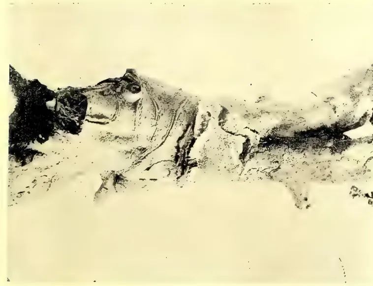

*Photo by T. Petch.*

**"UP-COUNTRY" TEA ROOT DISEASE.**

( $\frac{1}{3}$  NATURAL SIZE.)

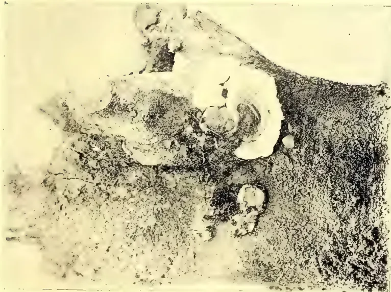

*Photo by T. Petch.*

**"LOW-COUNTRY" TEA ROOT DISEASE.**

( $\frac{1}{2}$  NATURAL SIZE.)

317------------------------------------------------

This image is a scan of a blank page. The paper has a light cream or off-white color with a subtle texture. There are a few very small, faint dark spots scattered across the surface, which appear to be scanning artifacts or minor imperfections in the paper. No text, lines, or other markings are present.

318------------------------------------------------

MAY 1907.]293Plant Sanitation.

layer. The edge of the growing sporophore is white, in old specimens it is red and horny. In the photograph, the sporophore is just above the collar, (*i.e.*, half way up the figure), and the red edge is well marked on the lower side. The minute holes are the openings of close-packed tubes in which the spores are produced. The fungus thus belongs to the same family as that which causes root disease in Hevea. It was named *Poria hypolateritia* by Berkeley years ago from Indian specimens, and owes its name to the underlying hard, red layer.

This appears to be the fungus which spreads to the tea from the roots of *Symplocos spicata*, the Bombu; but in some instances jungle stumps are not present, and it seems probable that the infection in these cases is brought about by spores. The fungus is fairly common in upcountry jungles on dead logs, *e.g.*, at Hakgala and Pattipola.

#### LOWCOUNTRY TEA ROOT DISEASE.

In the lowcountry districts, all root disease in tea appears to be caused by one species of fungus. The indications on dying roots are not as clear as those of *Poria* or *Rosellinia*, but there is no difficulty in finding them once they have been pointed out. The roots show small black nodules or warts, which probably give rise to underground mycelium, though this has not been clearly established. The mycelium between the wood and bark spreads in white or yellowish fan-shaped patches which acquire a black edge when they meet a crack in the bark. Irregular black lines are seen in a cross section of the root.

The fructification appears on the lower part of the stem, emerging through a crack in the bark in the form of a white swollen cushion. This spreads over the surface as a more or less flattened white plate which finally becomes grey and concentrically zoned. The photograph shows two fructifications on the right, one half ripe and the other just developing; the latter is not yet zoned. The remaining fructifications (on the left) have been spoilt to some extent by insects. When quite ripe, it is a grey, concentrically zoned plate marked with minute black dots; it lies close to the surface of the stem but is only attached at one point. The under surface is black, and the whole structure is hard and brittle. Two kinds of spores are produced. The first are borne on the outer surface when the fungus is wholly white; the specimen (in the photograph) just developing is in this condition. The second are produced when the fungus is quite ripe, in minute chambers whose openings are the black points previously referred to. The fungus is an undescribed species of *Ustilina*. Its distribution in the lowcountry has not yet been ascertained, and it is not yet known whether it spreads to the tea from any particular species of tree. There are specimens in the Herbarium, collected in 1868, labelled "Central Province, and South of the Island;" these agree in shape with the form described above. A slightly different form occurs on tea bushes in the field; this grows to a height of half an inch, beginning with a very thin base, and widening out to a flat circular top, about a quarter of an inch in diameter. Several of these structures grow together, and the group then resembles a different order of fungi; but they develop with the other form under cultivation, and sometimes the heads fuse into the usual large flat plate. I have gathered the fructification from tea bushes which showed hardly any sign of disease, and it seems most probable from this, that the progress of the fungus is very slow.

#### ROSELLINIA.

Rosellinias are fairly plentiful in the tropics. There are twelve species among the fungi collected by Thwaites, and one of these, *Rosellinia bunodes*, has been found to be the cause of root disease in Southern India. It has recently been collected in Ceylon but, as far as is known at present, it is not one of those which attack tea in this country. There appear to be two species on tea, one of which also

38

319------------------------------------------------

Plant Sanitation294[MAY 1907.

attacks camphor and *Panax*. They differ from the other tea root diseases in that their mycelium is to a great extent external. One of our species covers the root with black strands; the other forms a loose coating which is at first white and afterwards smoky grey or black. When the mycelium penetrates the bark it spreads out in the shape of stars over the wood. With a microscope there is never any difficulty in determining *Rosellinia* mycelium as it shows peculiar characteristic swellings on the hyphae.

The difficulty of obtaining the ascospore fructification (perithecia), either in cultivation or in the field, has been repeatedly referred to. These are small black spherical bodies about one-twelfth of an inch in diameter, and they usually grow in clusters. I have one specimen, presumably on tea, and others on *Panax*, but in each case there is some doubt whether they were connected with the mycelium on the roots. Neither of these is *Rosellinia radiciperda*, Mass., and this species has most probably not occurred in Ceylon. These fructifications can only be produced above ground, and are most likely to be found at the base of the stem.

But another fact in the life history of *Rosellinia* has been completely overlooked in dealing with the Ceylon disease. As soon as, often before, the bush is dead, another form of spore is produced in myriads on the stem. The lower part of the stem, sometimes to a height of a foot, is covered with a black velvety coat of close-set erect hyphae which bear innumerable spores at their extremities. When these spores are produced the surface is grey with them. I have had tea stems attacked by *Rosellinia* under cultivation for more than a year, and during the whole time there has been a constant succession of crops of these spores. It is probable that these serve for the propagation of the fungus under ordinary conditions, and that the ascospores—which are resting spores enabling the fungus to survive unfavourable conditions—are rarely produced. It follows that it is a waste of time to trench round diseased areas without at the same time burning the dead and dying bushes; and these should be burnt on the spot, if possible, as carrying them about the estate will inevitably spread the spores. Most of the cases of *Rosellinia* sent in are in this spore-bearing stage.

In dealing with the *Rosellinia* on *Panax*, it was found that the mycelium spread on the surface of the soil among the dead leaves at the base of the hedge, and it was impossible to stop it until these had been raked away. In most cases the disease originates on *Grevillea* stumps and spreads underground. *Rosellinia* is apparently not known in lowcountry districts, but may be found in all others.

#### PREVENTIVE MEASURES.

When a bush is attacked by root disease, there is practically no hope of saving it. All measures must be directed to preventing the spread of the fungus to neighbouring bushes. As the mycelium spreads under ground, and usually within the first foot of the soil, trenches about eighteen inches deep must be dug round the dying bushes in order to isolate them. It is better to include within the area enclosed by the trench a ring of the surrounding apparently healthy bushes, since it is most probable that the mycelium will already have advanced underground as far as these. The dead bushes within this area must be dug out and burned; this is especially necessary in the case of *Rosellinia*, because the spores of the fungus are always produced as soon as the bush is dead and are soon blown away. Carrying the bushes about the estate should be avoided as far as possible. When this must be done with *Rosellinia* affected bushes, the stem should be scorched, by burning some material at the base or by applying a torch before, the bushes are dug up. The ground from which the bushes have been removed should be forked over with quicklime and left exposed for a year.

320------------------------------------------------

MAY 1907.]295Plant SanitationBURIAL OF PRUNINGS.

The burial of prunings is a practice peculiar to tea cultivation. Its advantages are theoretically two-fold. Breaking up the upper layers of the soil preserves the moisture in the subsoil, so that cultivated lands lose less in times of drought than those uncultivated; and to some extent the burial of prunings thus ensures a cultivation, at least a partial one, which would not otherwise be obtained in tea growing. In the second place, the nitrogen in the prunings is ultimately converted into food for the plant. As most of the objections to treating prunings in any other way are based on the loss of nitrogen, it is worth while to enquire further into this point.

The nitrogen is of no use to the plant until it is converted into nitrate. The prunings are decomposed by bacteria, or fungi, or both, and the nitrogen in the residue is converted by other more specialised bacteria into nitrate. Now, although, in Ceylon, leaves and twigs decay fairly rapidly on the surface of the soil, it seems to be a well-authenticated fact that prunings buried in holes persist for a much longer time than they would in temperate climates. I have had prunings, dug up at the end of six months, which showed hardly any decay; they had been buried in the approved fashion with basic slag. It seems probable that at least one factor militates against the successful working of soil bacteria; they do not flourish in an acid medium. When the medium, *i.e.*, soil or prunings, becomes in the slightest degree acid, decomposition can only be effected by fungi. The growth of fungi on the prunings indicates that the medium is acid. The amount of lime in the basic slag is apparently insufficient to neutralise the acids formed by the organic matter. It may be suggested that the slow decay is connected with a decomposition by fungi only.

When the prunings are decomposed, the nitrogen has still to be converted into nitrate by special nitrifying bacteria. These again do not flourish in an acid medium (they are absent from peaty soils); they are practically confined to the first nine inches of the soil, and they require for successful working a free aeration of the soil and a base to neutralise the acids produced. With deep burying as usually practised, it cannot be said that any of these conditions are realised and the process of conversion will, to say the least, certainly not be rapid. Until the bacteriology of the process has been examined, it must remain a moot point, how much of the improvement noted after burying prunings is due to the nitration of the nitrogen in them, and how much is due merely to the disturbance of the soil.

But where root disease is known to exist, the burial of prunings should certainly be discontinued. We are relying on fungi for their preliminary decomposition, and as all the tea root fungi can live comfortably as saprophytes, the process is a cordial invitation to them to extend their operations. Except in the case of *Rosellinia*, exact proof of their acceptance can only be obtained by growing to maturity the mycelium found in the holes, and as the material even from one hole is no small quantity, pot cultivations must evidently be pretty extensive if any positive result is to be obtained. This is now being attempted in the case of the low-country tea root disease. The species which causes the disease has not yet been obtained from them, but more than half of those which have grown from the prunings belong to the same group of fungi. I agree that no hard and fast rule can be laid down in this matter, but I must point out that in several recent instances objections of this type have always been made *after* the hard and fast rule has been laid down by the advocates of one practice.

I shall be glad to receive, from the lowcountry for the present, samples of prunings taken from the holes six months after burial. Those which show some mycelium should be included, but the sample should not consist wholly of these. They should be packed in tins to avoid death or retardation from drying; two 1 lb. biscuit tins would afford sufficient material for one pot. Details of any root disease should accompany the specimens,

321------------------------------------------------

Plant Sanitation.296[MAY 1907.NOTE ON ABOVE BY THE GOVERNMENT ENTOMOLOGIST.

Considering the burial of prunings from an entomological point of view, this treatment is undoubtedly useful in the reduction of many insect pests, but is not so efficient as burning. It is seldom that prunings are so completely buried as to prevent the escape of a certain proportion of the insects that may be infesting them.

But though—regarded as a direct means for the control of insect pests—burial is inferior to burning, it has a distinct indirect effect in improving the health of the plant and so enabling it to better withstand its enemies. This effect has been repeatedly noticed in the case of 'shot-hole borer.' Fields in which the prunings have been buried, *with a sufficiency of lime*, have continued to give good and even increasing crops in spite of the constant attacks of the borer; while fields in which the prunings have been systematically burned—year after year—*without the addition of an equivalent in nitrogenous manures*, have steadily decreased in yield.

This improvement following the burial of prunings is probably dependent upon the incompleteness of the process—*vide* the Mycologist's remarks upon the conditions necessary for the proper development of the nitrifying bacteria.

E. ERNEST GREEN,  
Govt. Entomologist.

Royal Botanic Gardens, Peradeniya, 20th March, 1907.

[Burial of prunings is obviously one of those matters about which at present no hard and fast rule can be laid down. It may depend, for instance, upon whether the field is subject to root disease or to shot-hole borer—ED. T.A.]

## Entomological Notes.

BY E. ERNEST GREEN, *Government Entomologist*.

I have received an interesting communication from a correspondent in the Nilambe district who reports the successful treatment of 'Nettle Grubs' (*Thosea recta*) by spraying with Jeye's Fluid. He writes:—"To commence with I used three ordinary cigarette tins of Jeye's Fluid to a Kerosene oil tin of water. At this strength it killed all the grub within three or four hours. But I found it injured the young shoots, so tried two tins of the fluid to one oil tin of water. Directly the bushes were sprayed, all the grubs at once fell to the ground. After about six hours I found about 50 per cent. dead and the others climbing up the trees again; but as far as I can judge they did no more damage, and in four days I could not find a living one on the bushes, nor have the bushes that were sprayed been reinfected. The proportions of mixture were one part of Jeye's Fluid to 35 parts of water." The total cost worked out at approximately Rs. 2.25 per acre.

Cacao on an estate in the Moneragala district has been seriously affected by *Helopeltis*. Both the young foliage and the fruit are said to have suffered severely. This excessive attack has followed closely upon the removal of all the shade trees.

The Funtumia (Kickxia rubber) trees on the same estate as elsewhere are repeatedly defoliated by the leaf-rolling caterpillar of a moth (*Caprinia conchylalis*). There is no practical remedy for this pest which is an indigenous insect, breeding on various local shrubs. Any treatment can be only temporary and fresh attacks are bound to occur.

I have on more than one occasion received reports of reputed damage to rubber plants and stumps by Dragon-flies, and a detailed statement of such supposed damage appeared in one of the local papers some weeks ago. The Dragon-

322------------------------------------------------

MAY 1907.]297Plant Sanitation.

flies were said to be found perched on the ends of the stumps, engaged in sucking the sap! This is, of course, an error of observation. Dragon-flies are purely insectivorous and—far from occasioning any injury—should be regarded as highly beneficial insects. They are fond of taking up their position on any vantage ground from which an uninterrupted view is obtainable on all sides. This will account for their presence on the ends of the rubber stumps. From such a perch they would be ready to pounce upon any smaller insect that might come within their range of vision.

With reference to an earlier note ("T. A". Dec., 1906), on a boring beetle in camphor plants, it appears that this is not the only insect that is undeterred by the presence of camphor in the wood. In a recent report issued by the Jamaican Board of Agriculture is a note on a species of Weevil (*Hilipus elegans*, Guerin) which tunnels into the stems and larger branches of the camphor trees in Jamaica.

Castor-oil (*Ricinus*) plants, on the Silk Farm, Peradeniya, have been badly infested by a 'scale-bug,' *Diaspis pentagona*, Targ. The insects are massed round the collar and lower parts of the stem, resulting in decay of the cambial tissues and the consequent death of the affected plants.

The specimens of 'Copra' (dried coconut) in the R. B. G. Museum have been completely destroyed by the larvæ of a Pyralid moth (*Ephestia cautella*, Walk). This little insect is destructive to many kinds of stored foods. I have previously bred it from almonds, dried cacao beans, and cake-chocolate.

Considerable and annoying loss in vegetable and flower gardens often occurs from the attacks of an ant (*Dorylus indicus*). These little insects are often mistaken for Termites, but are true ants and not even distantly related to the 'white-ants.' They will tunnel into the tubers of potatoes and dahlias and attack the roots of a large number of other plants. 'Vaporite' will be found an effective check to this pest. It appears to be fatal to all subterranean insects. But it must be applied carefully, or it may injure the plants also. The best plan is to mix the Vaporite with the soil (in the proportion of  $1\frac{1}{2}$  oz. to the square yard) about a week before the plants or seed are put out. When applied to growing plants, it should be dibbled into the soil at a little distance from the roots.

In Theobald's 'Monograph of the Culicidæ of the World' (Vol. IV., p. 1), the value of 'duckweed' (*Lemna*) as a means of preventing the breeding of mosquitoes is put forward with strong corroborative evidence. It is suggested that this plant might be cultivated in many ponds and pools where mosquitoes now habitually breed. The 'duckweed' forms a close covering on the surface of the water and constitutes a mechanical obstruction to the deposition of the mosquitoes' eggs. Two species of *Lemna* (*paucicostata* and *polyrhiza*) occur in Ceylon, and are recorded by Trimen as common. But the only locality in which I have observed pools densely covered with 'duckweed' is Anuradhapura. Another plant that should be equally or even more useful is the *Utricularia*, several species of which flourish in still water. These plants have numerous small bladder-like organs in which small insects become entrapped and killed.

---

323------------------------------------------------

298[MAY 1907.

## SCIENTIFIC AGRICULTURE.

### THE IMPORTANCE OF HUMUS IN TROPICAL AGRICULTURE.

#### WITH SPECIAL REFERENCE TO CACAO CULTIVATION.

The recently-issued report for 1905-06 on the Botanic Station of Dominica (Imperial Department of Agriculture for the West Indies) contains a summary by Dr. Francis Watts, C.M.G., the Superintendent of Agriculture for the Leeward Islands, of the results obtained on a series of plots devoted to manurial experiments with cacao. These particular experiments, inasmuch as their results indicate a remunerative method of manuring cocoa trees, are naturally of great local value. They also have a wider interest as throwing light on one of the fundamental problems of tropical agriculture, namely, the preservation of humus.

In the scheme of experiments, some  $1\frac{3}{4}$  acres, bearing cacao trees about 10 years old, were divided up into five plots, which were treated as follows from 1900 onwards :—

A. No manure.

B. Basic phosphate, 4 cwt. per acre. Sulphate of potash,  $1\frac{1}{2}$  cwt. per acre.

C. Dried blood, 4 cwt. per acre.

D. Basic phosphate, 4 cwt. per acre. Sulphate of potash,  $1\frac{1}{2}$  cwt. per acre. Dried blood, 4 cwt. per acre.

E. Mulched with grass and leaves.

The individual trees were thus manured year after year in exactly the same way, and the cumulative results are comparable to those which would be obtained in actual estate practice. The first point established was that the treatment with nitrogenous manures was remunerative. Thus, to take the last year, the net financial result with plot B, which received phosphate and potash and no nitrogen, was a loss at the rate of £4. 4s. 3d. per acre ; on the other hand, on both plots to which nitrogen was added there was a gain, that is to say, the increased value of the crops more than compensated for the cost of the manure ; plot C gave a net gain on manuring of £4 8s. per acre, and plot D of £8. 0s. 4d. per acre.

Still more striking, however, was the result obtained on the fifth plot, E, manured with grass and leaves, the gain on manuring being at the rate of not less than £20. 16s. 6d. per acre. That this was no accidental result is well brought out in the diagrammatic summary of the experiments accompanying the report, in which the yields of “wet” cacao are plotted by means of lines on a uniform scale for the years 1903-06. From this diagram it can clearly be seen that the mulch of grass and leaves, whilst of slower action than more readily available manures, is more lasting in its effects. The mulched plot, E, was beaten by C and D in 1903, tied with C in 1904, beat both in 1905, and altogether outdistanced them in 1906.

The material employed for mulching consisted chiefly of lawn mowings and the fallen leaves of neighbouring trees, particularly *Pithecolobium saman*, the well-known “Guango” or “Rain” tree. The general suggestion is made that grass, etc., from uncultivated lands might commonly be used for mulching cacao, or if no waste land is to hand, that certain areas should be set aside and used for the production of material for mulching.

These results are worthy of serious consideration in many parts of the tropics where the provision of chemical manures is often expensive, and where also the humus of the soil rapidly disappears and needs replenishing. The beneficial nature of such manuring will probably be apparent not only with cacao, but also other crops, especially those which owing to their casting a deep shade or for other reasons do not allow a mulch to grow under them.—*Bulletin of the Imperial Institute*, Vol. IV, No. 4, 1906.

324------------------------------------------------

MAY 1907.]299

## MISCELLANEOUS.

### Lessons in Elementary Botany. IX.

BY J. C. WILLIS.

*Floral Mechanisms.*\*—It is evident that if a visiting insect is to be of any use in carrying pollen to the stigmas, that part of its body that touches the pollen must also touch the stigma. This is simple enough when the male and female flowers are separate, but in the vast majority of plants the flowers are both male and female. In order that both may touch the insect at the same, or nearly the same point, the anthers and the stigma must be placed near together, and the various ways in which this is done without at once causing self-pollination are of some interest.

Male and female flowers occur in a good many upcountry plants, but this method of separation is rare.

Heterostylism, or the possession of two forms of flowers, one with long and one with short style, is not uncommon. The common patana herb, *Knoxia platycarpa*, with its white or pinkish flowers, open all the year round, shows this phenomenon very clearly. On one plant all the flowers have a long style sticking out of the corolla, while the stamens are hidden, and on another plant only the stamens stick out, and the style is hidden. Now it is found that in the case of a plant like this, good seed is only set if pollen be taken from a long stamen to a long style, or from a short stamen to a short style, *i.e.*, from one plant to another, and it is obvious that insects will be more likely to do this, provided they go to several plants, than to take pollen from a short stamen to a long style, or from a long to a short. Illegitimate pollination, as the latter is called, usually results in no seeds being set at all, or only very few and infertile ones.

Perhaps the most widespread arrangement is what is called *dichogamy* or separation of the sexes in time, the stamens being ripe first, the stigma afterwards, or *vice versa*. This is extremely common, and is usually accompanied by a movement of the parts, so that at one time the stamens, at another the style, stand in the way of the visiting insect. Most of the plants of the family Compositae (daisies, dandelions, chrysanthemums, and similar plants), for example, are what is called *protandrous* (male first), the stamens being ripe before the stigma, which comes up through the tube made by the anthers, pushing out the pollen at the top. Later on the stigma emerges, and opens out, but by this time all the pollen has gone.

Another very common, but less perfect arrangement is that while the stamens and style stand very near together, the latter projects a little further out, so as to be first touched by the visiting insect, which may rub off upon it any pollen that it carries.

Yet another common arrangement is what may be called "loose-pollen," the pollen being held in a kind of box formed by the anthers, and shaken out upon the head of any insect visiting the flower. The style in such a flower usually projects further than the stamens.

---

\*Some illustrative figures will be given next time.

325------------------------------------------------

Miscellaneous.300[MAY 1907.

## Literature of Economic Botany and Agriculture. XVI.

BY J. C. WILLIS.

*Ipecacuanha*.—Dethan, Sur l'ipecac. strié majeur. Journ. de Pharm. VII. 1898.  
B. C. 78, 1899, p. 122 (adulteration with Psychotria).  
Report Ootacamund Bot. Gdn. 1898-9, p. 11.  
Ipecacuanha. Planting Opin. 10, 2, 1900, p. 100.  
Hartwich, Einige falsche Ipecacuanha-wurzeln. Just's Jahresb. 27, 1899,  
II, p. 29.  
Physiological action of Ipecac. Alkaloids. Ch. and Dr. 11, 7, 1903, p. 68.

*Jalap*.—The position of Jalap. Ch. & Dr. 14, 1, 1899, p. 58.

*Japan Wax*.—Japan Wax and Varnish. Jam. Bull. 1900, p. 37.

*Jatropha*.—*J. Curcas* (detailed account). Ind. Merc. 15, 5, 1900, p. 315.

*Juniper*.—Uganda Juniper. Kew Bull. 1899, p. 197.

*Jute*.—Jute, past and present. Ind. Agric. June 1900, p. 187.  
Jute cultivation in Bengal. do. July 1900, p. 220.  
Bimlipatam Jute. Agr. Ledger, V. P. series, 77, 1903.  
Jute (varieties) Revue. Cult. Col. June 1904, p. 358.  
Culture du jute au Tonkin. Bull. Jard. Col. May 1904, p. 647.  
Comptes rendus des expériences d'engrais . . . Bull. Econ. Indo-chine, Nov.  
1904, p. 1149.  
Experiences sur le rouissage du jute. do. p. 1174.  
Deterioration of jute. Ind. Agric, Feb. 1905, p. 44.  
Jute adulteration. do. June, 1906, p. 172.  
Produktion und Verbrauch von Jute. Tropenpfl. 10, 1906, p. 676.  
Jute experiments in Bengal. Report Dept. Agr. India, 1904-5, p. 105.  
La germination du jute. Journ. d'Agr. trop. Apr. 1906, p. 110.  
The extension of jute cultivation in India. Bull. Agr. Res. Inst. Pusa, 3, 1906.

*Kapok*.—(and see Fibres) Le Kapok et son usage en médecine. Bull. Ec. Indo-chine,  
Nov. 1904, p. 1257.  
Une campagne contre le Kapok. Journ. d'Agr. trop., Dec. 1905, p. 365.  
Kapok or Silk cotton. T.A., Apr. 1906, p. 213.

*Kino*.—E. African Kino. Ch. & Dr. 3, 1, 1903, p. 34.

*Kola*.—Die Boden-und Klima-Aussprüche des Kola-baums. Tropenpfl. III., 1899, p. 519.  
Schumann, Die Mutterpflanze der echten Kola. Notizbl. Berlin, III., 1900,  
p. 11.  
Verwertung der Kolanuss auf Kamerun. Tropenfl. IV. 1900, p. 80.  
Kola in Kamerun. do. p. 120.  
Ueber der Stammpflanzen der Kolanuss. do. p. 219.  
Kola-nut. Jamaica Bull. 1900, p. 154.  
See Just's Jahresbericht, 1898, II., p. 99, &c.  
Ueber den Stand der Kolapflanzung . . . . in Misahöhebezirk. Tropenpfl.  
V., 1901, p. 17.  
Tschirch, Notiz über Cola. Flora, 88, p. 242.  
Ueber Kola in Verbindung mit Tabak. Just's Jahresb. 1899, II., p. 7.  
Quelques mots sur le Kola en Afrique occidentale. Rev. Cult. Col. 1901, p. 366.  
Kola nuts. W. Ind. Bull. IV., 1902, p. 182.  
Market rates for Kola. Agr. News, 26, 3, 1904.  
Einige Bemerkungen ueber den Kola in Togo. Tropenfl. 1904, p. 192.  
Kola on the Gold Coast, Gonner in do. 1904, Aug. &c.

326------------------------------------------------

MAY 1907.]301Miscellaneous.

Kola. Kew Bull, 1906, p. 89.

Les Kolatiers et les Kolas. Bull. Jard. Col. 1906, p. 129.

Le Kolatier au Dahomey. do. p. 208.

Report on Cacao and Kola industries on the Gold Coast. "T.A.," Aug. 1906 p. 146.

*Lac.*—The Lac industry of Assam. Ind. Agric., May 1900, p. 138.

The Analysis of Shellac. Parry in Chemist & Dr. 26, 10, 1901, p. 689, and 31, 1, 1903, p. 175.

Les arbres à lac de l'Indo-chine. Bull. Ec. Indo-chine, 8, p. 599.

Ueber der Japanlack. Tropenpfl. 10, 1906, p. 48.

*Lantana.*—Lantana, Ind. Merc. 31, 10, 1905, p. 745.

### BLACK COTTON SOIL IRRIGATION.

Somewhere about a year or so ago the Madras Government decided that it was desirable to carry out experiments in 'basin' irrigation on the black cotton soil of the Bellary district, because as they had been informed, it was under that system of irrigation that the cotton crops of Egypt are grown. They also decided that other experiments in irrigating that sort of land should be made, and to that end have established an experimental farm at Hagri. The idea dominating this final resolve is no doubt most excellent, for with the experience of the Kurnool Cuddapah canal before them and the warnings that one agricultural expert after another has given on the subject of attempting to irrigate such soil, no other course could be reasonably adopted. It is a matter for wonder that the idea has not been earlier given effect to. Water is such an incalculable benefit in Indian agriculture that too often the fact is lost sight of that it is not sufficient to bring the water to the land, but that it is also necessary to drain it away again; and in the case of black cotton soil this is one of the greatest difficulties. Besides this, such soil possesses a very peculiar physical character of its own, termed colloid, which when it is wetted brings it into a state that renders all tillage for a time impossible, and the land is so retentive of moisture that it remains cold and unfavourable to the growth of plants for a long time if it becomes wet. Thus its irrigation is fraught with difficulty, whilst its capillarity is so great that in the evaporation of moisture from its surface enormous amounts of soluble salts—alkalies—are brought to the surface and the soil is rendered, if not sterile, at least comparatively unproductive whilst the presence of these salts renders the cultivation of such land even more difficult than it naturally is. The Madras Government hoped great things from Egyptian experience, and even went so far as to propose that one of their new European Superintendents of Farms should spend a month (a very short period) in Egypt to make himself acquainted with irrigational practice in that country whilst on his way to India. This proposal does not appear as yet to have been given effect to—and perhaps it is as well.

However, any information that bears on the irrigation practice of Egypt is of interest, and in Mr. Sidney Peel's "Binding of the Nile" we find a fairly complete account of Egyptian practice. The work is defective in that the information as to the character of the soils met with is extremely limited; and this could only be supplied satisfactorily if the Indian Government were to undertake an investigation on their own behalf and to entrust it to some one having a thorough knowledge of Indian agricultural conditions and practice. Still, the information given is sufficient to give the Government of Madras pause in their resolutions, for their idea is that under the Tungabhadra Project large areas of cotton may be irrigated. Now in Egypt the bulk of the cotton crop is grown in Lower Egypt, or the Delta,

39

327------------------------------------------------

Miscellaneous.302[MAY 1907.

and there all the cultivation is carried on under what is termed "perennial" irrigation; that is, irrigation all the year round as opposed to "basin" irrigation, or irrigation during the flood season only. And it is to the improvement in the irrigation supplies of lower Egypt that the great extension of cotton cultivation there has been due, for cotton is a summer crop in Egypt, as contrasted with the clover, beans, wheat and barley of the winter, and the maize, rice or fallow of the flood season. This crop is sown there from the end of February till the beginning of April after the land has been watered, and it is watered again after sowing; and thereafter until the flood season comes round once in three weeks or so, whilst the harvest lasts from some time in August until November.

Thus in their hope that the Egyptian basin irrigation system would prove of advantage to the Bellary cotton growing ryot, the Madras Government may perhaps be disappointed. Whether there is any more reason to hope for benefits accruing from an adoption of that system for other crops is also extremely doubtful, as it is being abandoned in Egypt wherever perennial irrigation is possible, and is a most wasteful system with regard to the quantity of water used. In fact, the "basin" system of irrigation is only possible under peculiar conditions of supply when that cannot be regulated otherwise, for with the enormous flood rise of the Nile it acts as a safety valve and enables large temporary storage to be made in a manner very similar to the large shallow tanks of the Carnatic, and this temporary storage leads to a great secondary benefit, in that the land receives a deposit of fertilising silt from the river waters stored on it. In August and September the basins are filling, and during the two following months they are discharging, those highest up the valley being emptied first, as the Nile flood falls. During flood time all field work is necessarily at a standstill, and if the flood is at all prolonged it causes great damage, not only by seriously retarding the sowing season, but also by waterlogging the land and thus increasing the injury done by excessive quantities of soluble salts in the land.

In Egyptian agricultural practice there is probably much to be learnt that would be of value in Southern India; but the idea that anyone who had no knowledge of the agricultural conditions of Southern India could in the course of a few weeks glean the information that would be of value is absurd. The matter should not be allowed to drop, but should be carried out in the manner suggested. It is rather by study of agricultural practice in such countries as Egypt, Italy, Java, Japan, etc., than in England or America, that lines for improvement on Indian practice may be found, and whilst so much attention is being given to experimental investigation in India, this line of investigation should not be neglected.—*Indian Agriculturist*.

---

### CO-OPERATIVE CREDIT IN INDIA.

From a financial point of view the progress of the Indian agriculturist may be said to depend largely upon the elimination of the money lender. There is no need of vilifying the usurer in order to arrive at this conclusion. On the contrary, the fact must be recognised that as Indian rural society is now constituted, the small capitalist who lends out his money is absolutely essential. In an imperfect way he performs the functions of a banker, and, whatever may be his shortcomings, he brings to his task qualifications from the lack of which the ordinary bank is compelled to stand aside. But the money lender is undoubtedly an expensive boon, and, as most persons are aware, the efforts of the local Governments have latterly been directed towards providing an effective substitute in the form of co-operative societies. It may be said in general terms that these organisations have been remarkably successful. They have assisted their members at reasonable rates, and

328------------------------------------------------

MAY 1907.]303Miscellaneous.

they have paid their way. Yet, for some reason, they are not extending with the rapidity which their utility would lead one to expect. We regret to note that the Registrar of Co-operative Societies in Eastern Bengal confesses in his last annual report that he has not met with the success which he had hoped for in the formation of new societies. One cause which he suggests as accounting for this failure furnishes additional evidence of the mischievous effects of the policy pursued by the late Lieutenant-Governor. "The feelings of the educated classes," writes the Registrar, "have been much agitated, and I found it difficult to reach the cultivators without the help of the more respectable community." The political moral lies on the surface. Throughout the recent troubles the tendency has been to minimize the influence of the educated classes, on the assumption that they represented only themselves, and that the inarticulate masses would, if they could be consulted, dissociate themselves from their so-called leaders. The admission of the Registrar tends to disprove this hypothesis. The educated people are, in a very real and practical sense, the leaders of the community. "The cultivators," the Registrar continues, "look at the movements initiated by Government with suspicion, and will not believe in any Society which is not approved by the educated people of the village, whom they are accustomed to follow and look up to in all strange matters." But, while laying stress on the obvious expediency of conciliating the educated classes, we are bound to express our surprise at the part they have taken in creating a prejudice against the spread of institutions which are so clearly beneficial to the cultivators. Nothing could be more foolish than to adopt or encourage a hostile attitude towards valuable reforms in order to spite a Government which has nothing to lose if they are rejected. The highest wisdom in politics is to accept all that can be got and ask for more. Political discontent was, however, not the only circumstance which contributed to the indifferent success in the promotion of co-operative societies. The social conditions to be contended against were unfavourable. On the one hand there was the indifference of the Zemindars. The land system of Bengal encourages that worst evil of private ownership,—absenteeism. The majority of the landowners live away from their estates and "take but little interest in the welfare of their tenants," who are consequently left without guidance. On the other hand, there are, as might have been anticipated, certain influences which are from interested motives opposed to any reform calculated to interfere with the profits of moneylending. Individual moneylending, as contrasted with the banking system, is exceedingly rife in India. "The richer people," observes the Registrar, "are almost all moneylenders and kept aloof from the societies when they did not actively oppose." Again, "many of the petty landlords are themselves usurers and opposed to this movement." One of the results of this combination of apathy and hostility is that capital to finance the societies in their early stages is difficult to obtain, and for this condition of things aid from the Government seems to be the only remedy. Happily, help can be given without much risk of loss.—*Indian Agriculturist*.

---

## AGRICULTURAL CO-OPERATION.

BY E. T. MULLENS,

*Secretary, Minister of Agriculture, Natal.*

This article has been prepared with a view of answering the question "What is the best form of Agricultural Co-operation for Natal?" In order to arrive at an answer to this question it is, first of all, necessary to ascertain what has been done in other countries, so that the errors into which the pioneers of the movement fell may not be repeated in this Colony, and that we may profit by the accumulated experience now available.

329------------------------------------------------

Miscellaneous.304[MAY 1907.

Fortunately, very full information upon this subject of Agricultural Co-operation—or, as it is sometimes called, “the New Agriculture”—is now to be had. Practically the whole of this article is based upon information gleaned from the various publications of the Department of Agriculture and Technical Instruction for Ireland, as well as from the invaluable work of Mr. E. A. Pratt on “The Organisation of Agriculture.” This latter work relates in clear and popular language the history of Agricultural Co-operation in every part of the world; and no society or group of individuals contemplating co-operative action can do better than purchase a copy of the work in question, which can be obtained from Messrs. P. Davis and Sons, Maritzburg. The Natal Department of Agriculture is collecting all other available information in regard to agricultural co-operation, and will be able to supply applicants such information as may be needed by those intending to start co-operative societies, including model sets of rules.

Denmark is acknowledged, by all those who have investigated the subject, to be far and away ahead of all other countries in the matter of Agricultural Co-operation; and a short description of what has been done there will give a good idea of the enormous advantages—in fact the revolution—brought about by agricultural co-operation. As a result of the various European wars, Denmark, from an agricultural point of view, had been practically ruined—having, in addition to the ordinary devastation wrought by wars, been deprived of the best of her agricultural land, and reduced to narrow limits. Of this limited area, a substantial proportion consisted of mere marsh and dune land—fit apparently for nothing but wind and storms to blow over. With a view to renovating the country, the Danish Heath Society was started in 1866. Roads were made, irrigation schemes were carried out, colonies were established, railways were constructed, and plantations were arranged, the final outcome of the Society’s work being that 25,000 acres of sandy land were converted into productive soil, 75,000 acres were planted with conifers, two experiment stations were established, and 400 demonstration fields organised in all parts of the country where heath land was to be found. Subsequently, efforts were made by other societies to improve the dairying industry, and, in conjunction with this, poultry and pigs were taken up. As the dairying industry developed, and England became the chief market for Denmark, the Danish Government sent experts to Ireland, to enquire into the methods of breeding and rearing which then obtained in producing the quality of pig required by the Irish Bacon Curer’s Association. Pigs were imported from Ireland into Denmark, and, as a consequence of the co-operative movement, such progress was made with the ham and bacon business, that Denmark practically succeeded in driving the Irish ham and bacon industry out of the English market. As a result of efforts made by Sir Horace Plunkett to restore agriculture in Ireland, an Irish Department of Agriculture was formed, and, in 1903, at the instance of the Department of Agriculture, a deputation, representing the Irish Agricultural Industry, was in its turn sent to Denmark, to enquire into the bacon-curing industry of that country, and to endeavour to find out what methods had been followed by the Danish farmers and merchants in so successfully establishing co-operative bacon factories with their ever-increasing trade. The valuable report on “Co-operative Associations and rural conditions in Denmark,” submitted by the members of this deputation, unanimously attributed the whole of the success of the Danish farmers to co-operation. So strongly impressed were the members of the deputation and the officials of the Irish Department of Agriculture by their investigations, that steps were immediately taken to organise the agricultural industry of Ireland on the same lines, with the result that Ireland has, in its turn, also forged ahead. The growth of co-operative bacon curing in Denmark, from 1883, when it practically started, to 1902, was stated by the deputation to be as follows:—

330------------------------------------------------

MAY 1907.]305Miscellaneous.

<table border="1">
<thead>
<tr>
<th></th>
<th>No. of Factories.</th>
<th>No of Pigs killed.</th>
<th>Value.</th>
<th>Average Price per Pig.</th>
</tr>
</thead>
<tbody>
<tr>
<td>1888 ...</td>
<td>1</td>
<td>23,407 ...</td>
<td>£57,000 ...</td>
<td>£2 9s. 0d.</td>
</tr>
<tr>
<td>1902 ...</td>
<td>27</td>
<td>777,232 ...</td>
<td>£2,500,000 ...</td>
<td>£3 4s. 6d.</td>
</tr>
</tbody>
</table>

It will thus be seen, as regards that one industry alone, what an enormous advance was brought about by co-operation, and an interesting fact to be noticed is, that, whilst the number of pigs were dealt with had so enormously increased, yet the average price per pig had risen from £2 9s. to £3 4s. 6d. The increase in average price per pig was progressive each year.

The first co-operative dairy was opened in West Jutland, in 1882, and in 1902 there were no fewer than 1,050 of such dairies in Denmark, with 148,000 members, 750,000 cows out of a total 1,067,000 milch cows in the country. In 1902 Denmark exported, mainly to Great Britain, 135,000,000 pounds of butter, and the amount invested in the erection and the equipment of the dairies was over £1,500,000. One fact about this enormous development in Denmark to be specially noted, as regards the conditions in Natal, is that *the initiative has always come from the people themselves*. The tendency in Denmark has been not merely to increase the annual output, but to enhance the quality of the product itself—so much is this the case that the farmers of Denmark voluntarily submit to such severe restrictions imposed by their own co-operative societies, as would infallibly kill our dairy industry were similar restrictions applied in Natal. Rules are laid down by the Co-operative Creameries, binding the owners of cows to deliver to the Creamery, for a period of ten years, the milk of the whole number of milch cows, which at all times the farmers may have in their own possession—with the exception, however, of milk required for house purposes, as well for their own as for other households in their own districts. Should any member desire to withdraw before the termination of the first ten years from the Creamery, he has to pay a fine for every cow so withdrawn. The milk has to be delivered in a clean and unadulterated state, without any disagreeable taste. Members are bound to keep the milk cool when it is not called for immediately after milking has taken place. Two milkings are not allowed to be mixed. The milk of a cow must not be delivered at the Creamery until three days after calving. The milk of a cow suffering from any disease, can only be delivered when accompanied by the certificate of a Veterinary Surgeon. In the event of an outbreak of a contagious disease, milk must not be delivered from the farm so affected. Milk which is sour, adulterated or which arrives at the Creamery in cans not thoroughly clean, is rejected. Rules are laid down regarding how much food each cow is to receive during the winter, and, in case any particular food interferes with the quality of the butter at the Creamery, the Committee have the right to demand that such feeding stuff shall be discontinued. Notwithstanding these and other severe restrictions, the most interesting feature in every co-operative concern in Denmark, is the extraordinary fidelity invariably observed towards their own institutions by the people who participate in them.

Speaking generally, the greatest degree of success in co-operation in any country has been obtained where the associations have been started on a very small scale in rural districts, to meet local or even strictly parochial conditions, and, while maintaining their individual entity, have afterwards combined with other similar bodies to form districts, county, or even national federations, for the attainment of any common advantage. Over and over again, in the investigations made by Mr. Pratt, offers the fact that the movement of co-operation in various countries, which has assumed such wide-spread operations and under so many different forms, had its actual rise mostly in the starting, by isolated individuals, of small associations for the combined purchase of agricultural necessaries, scope of action being subsequently widened, alike by the taking up of other objects, and by means of groups and federations.

331------------------------------------------------

Miscellaneous.306[MAY 1907,

ations. Monsieur L'Abbé Bergier, at an agricultural conference held at Nivelles, in 1899, stated that "in the founding of agricultural associations, it is prudent to begin with parochial societies which will federate with one another when there is a certain number of them." Wherever agricultural societies have been gradually evolved in what might be called this natural manner, they have met with success; but, where endeavours have been made to foist large organisations upon agricultural communities, such endeavours have seldom met with more than temporary success. As an instance of this may be mentioned the British Produce Supply Association, which was started in 1896, by Lord Winchelsea, to do away with the middleman, and sell the produce of the British farmers direct to the London consumers. One of the principal causes of failure of this Supply Association was that very soon after its inauguration, it was found that the farmers would not forward regular consignments of their produce to headquarters, and that those which were sent in represented only too often their second and third rate qualities—their best having gone to the ordinary commission agents or dealers. Commenting on the failure of this Association, Mr. Pratt states that *it was an ambitious scheme, and one which should have represented the climax rather than the commencement of an agricultural organization.* Many of the most powerful agricultural bodies on the Continent have found that, while co-operation for the purpose of production is eminently practical, co-operation solely for the purpose of sale is a very difficult problem, and one fenced with difficulties.

Denmark is not the only country where the people voluntarily submit to the restrictions placed upon them by their own co-operative societies. In North Holland, the market gardeners have formed themselves into co-operative societies, which are also conducted along extremely practical lines. The goods of the members, before being offered for sale, are inspected by officers, appointed by the co-operative societies for the purpose, and any that are regarded as below the required standard are rejected, while those that are passed are labelled with the registered trade mark of the society. It is also seen that the consignments are of the stated quantity, and that they have been properly packed. The produce thus approved of, is offered for sale, at the society's mart, the auctioneer being generally the president of the local society or banch.

As an example of what might be done by the farmers in Natal with their meali crops, I may instance the case, stated by Mr. Pratt, of the farmers in Hungary. Experience had taught them that, so long as each relied on his own individual powers in the selling of his corn, he laboured under certain distinct disadvantages. He was specially at the mercy of any "ring" of buyers which might be formed, for they knew that, even if he could afford to keep back his crop for a more favourable market, it was practically impossible for a farmer, located in districts away from the railway, to hold his crop until the winter, because he would not then be able to get it to the railway station owing to the state of the roads. To meet the position thus created, the farmers in a number of districts formed co-operative organizations for the construction of elevators on sidings near the more conveniently situated railway stations, and to these elevators the farmers sent their corn to be stored, the individual lots losing their identity, but representing, on the whole, analogous qualities of grain. By means of these elevators, the available supplies could be kept for a length of time. Not only was the previous difficulty of getting them to the railway station in the winter obviated, but the ultimate collective sale meant the transport of the corn on the railway in bulk, thus effecting a considerable economy as compared with what would have been paid had each farmer sent off his own particular lot as a separate consignment. Financial arrangements were made at the same time by which the farmers obtained advances from the credit banks on the corns they sent to the elevator, and, with these advances in hand, they were able to

332------------------------------------------------

MAY 1907.]307*Miscellaneous*

wait for the balance until such time as the sale could be effected to their advantage. So well has this further development in the way of agricultural combination answered in Hungary, that a central organization is being projected for the express purpose of encouraging and facilitating the construction of co-operative corn elevators in all the corn growing districts of the country.

An excellent example of what can be done in a small way is afforded by the Muskhram (Notts.) Co-operative Agricultural Society. This village organization was started in 1899, with seven members and a secretary, and several months elapsed before the membership was increased. The shares were 5s. each, 1s. 3d. being called up. Just prior to the harvest of 1899, the society resolved to purchase a reaper and a binder at a cost of £32 (although their paid up capital was only £15), and the members obtained an advance from the local bank on their giving a guarantee to hold themselves collectively and individually responsible for the repayment. A scale of charges for using the machine was drawn up, and the receipts have since then been sufficient to clear off the loan, so that the machine now belongs to the society, and the further income derived from it, over and above the wear and tare, represents so much profit.

Once co-operation is started in this small way, the advantages of it become so clearly realised that it soon spreads and is utilised for other purposes. Mr. Montgomery, of the Department of Agriculture and Technical Instruction for Ireland, mentions the case of a parish of 1,600 inhabitants in Hanover, which can boast of five flourishing co-operative societies, a savings and credit bank, an agricultural supply society, a dairy society, an egg society, a milling society, and a society for the sale of cattle.

It is a cardinal rule with all co-operative societies, in whatever country they may be situated, that politics and religion are barred. As a matter of fact, these co-operative societies have been the means of bringing into friendly relations members of opposite political factions and of various religions, between whom previously feud and enmity had prevailed. In Belgium and in Italy these societies have been actively propagated and fostered by the Roman Catholic Clergy as an antidote—and a very successful antidote—to socialism.

Co-operation can be used for innumerable purposes, among which are the purchase of manures, the purchase of steam threshers, the sale of cattle, the sale of corn, cattle breeding, horse breeding, egg and poultry, manufacture of jam, steam ploughs, cultivation and sale of fruit, milling, improvement of cart horses, allotments and small holdings, bee keeping, flax, cheese, dairy and butter making industries, purchase of seeds, purchase of agricultural implements; and many societies have started merely as a co-operation to forward goods in bulk so as to get the advantage of truck load rates, and co-operation to purchase goods at one and the same time with the same object.

The movement started in Ireland with Sir Horace Plunkett, in 1899, but it was tremendously up-hill work, and he had to address fifty meetings before he got the first co-operative dairy started, and it was not until another twelve months had passed that he saw the second. The success gradually became more assured, so that, in 1891, the creameries and co-operative societies numbered 17, until, in 1894, the Irish Agricultural Organization Society was formed with a view of controlling the whole movement, supplying all the necessary information required, and fostering it in every possible way. The year following the formation of this society, the number of creameries and societies increased to 67.

The movement in England was of a later date than that in Ireland, and it was not until 1901, seven years after the Irish Society had been formed, that the British Agricultural Organization Society came into existence as a result of, and to further the establishment of co-operative societies in England.

333------------------------------------------------

Miscellaneous.308[MAY 1907.

Throughout the whole of this co-operative movement, whether in Great Britain or on the Continent, the importance of the small holder is prominently brought out. He it is who is the main support of such societies and, in fact, the main producer of the stuff dealt with by co-operative societies. The deputation already referred to, which visited Denmark, stated that, as an example in small farming a visit was paid to a prize farm of 10 acres, which maintained from 3 to 4 cows, and which in 1902 brought a sum of 810Kr. for milk (note, 810Kr.—£44 11s.). This small farm was worked with one horse, and the arrangement of the offices and the general surroundings of the little homestead reflected the greatest credit upon the peasant occupier, who was, indeed, exceedingly proud of his possessions. On a third farm, visited by the deputation, of 75 acres, 14 milch cows were kept, and four horses. There were two sows with two litters; and about 30 pigs were annually sold off the farm. The average return for milk was 240 Kr. (£13 4s.) without taking into account the milk used in the household and a certain quantity which had been sold to farm labourers in the locality.

Mr. Pratt makes a strong point that each local co-operative society must fulfil its own particular purpose according to the special needs of the locality where it exists, but that collective purchase has, nevertheless, been found to represent the most practical and the most hopeful means of making a start. Collective sale is a higher standard which will be duly attained when the education of the farmers in matters co-operative has been sufficiently advanced.

The more prudent advocates of agricultural combination have been averse to the mixing up of domestic and business considerations, and have advocated that the co-operative purchase of fertilisers and implements for the fields should be kept distinct from the co-operative purchase of flour and sugar for the household. Although at first there is likely to be opposition on the part of the storekeepers to the formation of agricultural societies for the purchase of agricultural necessities, yet, when they see that, although as a consequence of the formation of such societies, they are not able to obtain so much profit per article, by the same means farmers are able to purchase larger quantities, their opposition will cease as it has done in other countries—but the middleman, pure and simple, must go. By dealing direct in large orders the merchants have certain expenses such as travellers' commission, advertising, etc., and the risk of bad debts, saved; and can, therefore, quote more reasonable terms.

The nucleus of an agricultural society is already in existence in each district of Natal, in the shape of the local farmers' association or club; any information which such farmers' association or club may require previous to the formation of a small co-operative society, can be obtained on application to the Department of Agriculture, Maritzburg; and, should the co-operation decided upon by such farmers' association or club take a form, or develop into an undertaking, in which financial assistance, in the way of loan for capital purposes, is required, the Agricultural Development Act, 1904, empowers the Government, through the medium of the Land Board, to advance whatever money may be required. The sections bearing upon loans to assist agriculturists in the establishment of co-operation concerns are as follows:—

1. 56. The Board may, with the approval of the Governor in Council, assist agriculturists in the establishment of factories or the like for the purpose of the manufacture of dairy and farming produce, such as butter, cheese, and tobacco, or the packing and the preserving of fruit, or any other factories for the purpose of the better utilisation or marketing of raw produce.
2. 57. No scheme for any such undertaking shall be approved unless it is to be established and carried on by an association in the nature of what

334------------------------------------------------

MAY 1907]309Miscellaneous.

is known as a co-operative association, or until the constitution and articles of such association have been submitted to the Board and approved by them.

1. 58. The regulations under this Act may prescribe the conditions necessary to be complied with before any association can receive the approval of the Board, whether in respect of its formation, membership, or liabilities, the distribution of profits, or any other matters whatsoever relative to its constitution.
2. 59. The assistance to be given by Government shall be by way of a contribution towards the capital outlay, and such contributions shall be made upon such terms as to payment, repayment and otherwise as to the Board shall seem proper.

Such a locality as that of Weenen, where—for Natal—a comparatively large number of farmers are to be found within a comparatively small area, lends itself favourably to the formation of a co-operative association; and, should the residents of that or any other district bestir themselves, the Land Board will be only too willing to consider the question of financial assistance.

And now to answer the question with which this article set out, "What is the best form of agricultural co-operation for Natal?" Evidently, the answer in brief is, "That which arises spontaneously within any particular district to meet the particular needs of those co-operating."

As to "how to co-operate," the first thing to learn is what *not* to do. Do not rely on, or wait for, the Government to start a co-operative association for you, but start one yourselves, no matter on how modest a scale it may be—in fact, the more unpretentious its aims, the more likely it will be to succeed and to give you confidence subsequently to embark on something more ambitious. Do not wait until you have got all—or nearly all—those in your district to combine; but make a start as soon as you have got your two or three gathered together, confident that those who are holding back will join you, as soon as they see something is really being done, in order not to be left out in the cold. Do not at first undertake anything which cannot easily be managed by yourselves, and over which you cannot exercise constant supervision—when you have felt your feet and learnt to walk with confidence in the path of co-operation, you will soon be able to venture upon further and more hazardous expeditions.

And, as to "what to undertake," I would recommend first of all,

1. (a) Co-operation to secure that consignments of produce or live stock sent away from any district reach the railway station at the same time, so as to make up combined truck loads, and hence reap the advantage of truck load rates.
2. (b) Co-operation to ensure that goods or live stock purchased elsewhere by the farmers of a given district be delivered at the same time, so as to secure truck load rates.
3. (c) Co-operation to purchase, jointly, manures, seeds, or agricultural implements, so as to deal direct with the manufacturers and get the benefit of wholesale prices. (This is a form of co-operation which has already been in existence in Natal.)
4. (d) Co-operation for the local collection and sale of mealies to Government in connection with Government contracts. (At present it frequently happens that no local tenders are received by the Government for the supply of mealies in mealie growing districts, and that Government, consequently, has to accept the tender of a middleman

40

335------------------------------------------------

Miscellaneous.310[MAY 1907.

in Maritzburg, which means that the commission of the middleman, rail carriage from district to Maritzburg and back again, have to be added to cost of mealies. A combination of local growers could thus easily tender at a rate more remunerative to themselves than that received from the middleman, and yet at a figure which would place the middleman out of the running.)

- (e) Co-operation for the storage of mealies in tanks or granaries so as not to be forced to sell on an unfavourable market.
- (f) Co-operation, in dairying districts, for the establishment of dairy factories, or—where the immediate formation of such a factory is scarcely justifiably or too risky—for the establishment of temporary cream separating stations from which the cream so separated can be sold to one of the dairy factories.
- (g) Co-operation, in fruit growing centres, for the collecting and forwarding simultaneously, in uniform packages, of fruit so as to reduce cost of transit; also, for the formation of fruit canning and jam factories.
- (h) Co-operation, in poultry centres, for the collecting, grading, and simultaneous forwarding of eggs in one large crate instead of, as at present, each farmer sending in his own small consignment.
- (i) Co-operation for the formation of ham and bacon curing establishments.

Detailed information in regard to any of these suggested forms of co-operation will, as previously stated, be readily supplied on application to the Department of Agriculture, Maritzburg.—*Department of Agriculture, Natal, Bulletin VIII.*

---

### THE EMIGRATION OF LABOUR FROM MEXICO.

One must have lived on the northern frontier of the country for long years and have seen the interminable exodus of poor people who fill our trains, and who are constantly going on foot along the railway tracks and roadways toward the north to appreciate the importance of this immigration which should have given us much concern. One must have voyaged in the trains and have been in contact with these people to form an idea of the causes of this phenomenon and to realise that the people have made great errors in judging them. To all our frontier villages and towns there are arriving thousands of poor men who have abandoned ranches and villages where they lived to go to work in the United States. They arrive in groups of five, ten or more persons; and the first thing they do is to select clothing of grey or brown duck, thus abandoning their traditional apparel, that they may thus more easily deceive, in collusion with the labour agents who have engaged them, the restrictive regulations of the emigration laws of the neighbouring nation.

To lie to the emigration agents or inspectors, and say that they know some house in some city in the United States, that they have been in towns in Arizona or New Mexico, that they have worked on such and such railways, etc., is a lesson that they readily learn enough; and with duck clothing, hob-nailed shoes, a few dollars in their pockets, and the help of the labour agents, who work for the end and are not particular about the means, the business is carried through, and they enter for the first time into the neighbouring nation in search of work. In speaking of the desires of European and Asiatic emigrants to enter the United States, a Mexican has called this the first stroke of good fortune. For our emigrants it is also the first stroke of good fortune.

336------------------------------------------------

MAY 1907.]311*Miscellaneous.*

This emigration is not a recent thing, and, according to the statistics of our country, it is measured by thousands. This is why places in the interior have been decimated and haciendas completely abandoned, which were once sources of great wealth, now they are idle because there are no laborers to work them.

There exists on the borders of the republic an imaginary line marked by imaginary terrestrial parallels, or by the bed of a stream, dry the greater part of the year, a line which is more easily noted on the map because it is drawn in colors, and which ethnographically separates two distinct peoples. But it is no great obstacle for the man who can work and is a native of Mexico.

To the south is a nation which requires work, which is seeking capital and needs colonists; a nation which is progressing vigorously, though not phenomenally, as the yellow journal say, a people which is passing through an evolutionary stage in its schools, its government and its industries, which will some day be a rich people, but which is still poor; a nation which does not inquire where its emigrants come from, for it needs laborers, let the class be what it may.

To the north is a wonderful nation, rich, powerful, plethoric, with capital, industry and energy, and which is not content to contain itself with its own frontiers, a nation which has been receiving European immigration for many years, and which may now select her immigrants, covering a poll tax or prohibiting entrance in a definitive manner. Notwithstanding these conditions, men are continually crossing this line, and are leaving the country which requires labourers and is bidding for colonists, and they are going to the country which prevents their entry and collects a tax on all those entering, instead of paying for them as the former has done. This is done apparently, in opposition to all the laws of physical science. And yet it has its explanation, which is easily understood if we throw beyond us all prejudices.

This current has continued to flow unnoticed by the people of the interior until the depopulation has made itself felt through the alarming proportion it has taken; for the simple reason that they have not thought of the facts that there are mines in Arizona and Colorado, ranches in California, and railroads in construction throughout the states to the north which are being built exclusively by Mexican laborers who have arrived recently.

Therefore it is not a question of building up the city population at the expense of the rural, as is the case in the United States and Europe. This is felt to some extent in Mexico, where the manufactures of the city are built up at the expense of the country, and the mines pay \$1.50 to the peons who gained 50 cents on the ranch, though often, when the price of provisions taken into account at the mines, he gains no more than he did at home.

The pleasures and comforts of the city, too, attract the laborer from the hacienda, and this added to the higher wages he receives in the cities, causes many to flock there. But we are feeling only what other nations have felt before us and are now feeling.

In all parts of the country, as soon as a railway approaches, at once the scarcity of laborers begins to be felt, on account of the call for them for construction work, and as soon as the road is in running order the communication which it makes with other parts of the country and with outside nations causes the laborers to leave the fields. The discovery of mines also helps to take away the laborers from agricultural occupations.

These are some of the causes of rural depopulation. But there are still others. There is the attraction of the United States. And if the first helps our mining industry at the expense of the rural districts, the second brings with it an evil which has no recompense and redounds only to the benefit of the foreign nation.

I have heard sensible persons say that the peon goes to the United States

337------------------------------------------------

Miscellaneous.312[MAY 1907.

because he is shiftless and likes to move about; and I have known hacendados who advocated punishing the laborers who were so bold as to leave the hacienda, by preventing them returning. But those who think that any such treatment of the peon will benefit him are greatly mistaken. Others believe that every Mexican laborer who goes to the United States is maltreated by the gang bosses and capitalists, and is handled like a slave. But this is a great mistake.

Our people may be ignorant, lazy, timid, vicious, uncultured, anything, you will, but they are not ungrateful, nor lack in patriotism, or unloving toward their families and homes. Therefore, in going to the United States, they are but giving proofs of advancement and of showing those very ambitions which every one denies that they possess.

Why not recognize the truth? The Mexican peon in the United States does not there occupy a lowly place in the work market, notwithstanding the fact that he gains there the lowest wages and is engaged to do the heaviest work. He is sought after and has abundance of offers for his services.

The railroads give our laborers transportation free upon their giving their word that they will work for the company. They do not require to beg to obtain their passage. All they require to do is to go and work a few days on certain sections and get free passage.

The Mexican peon also is looked upon favourably in the United States, especially in railroad work, for the reason that he has no higher aspirations, and so is not likely to quit his job to hunt for a better one. And urged by the necessity of the case the peon works better in the United States under American masters than he does with us. And as he works cheaper even than the Chinese, he is therefore a very desirable laborer in the United States.

The Mexican peon in the United States occupies the worst position as to wages, kinds of work and the hardships of not knowing the language and the differences of customs of the two nations. And yet he is going there by the thousands.

And what is the reason? It is simple. This bad position which he occupies there is better than he finds at home. It is a sad thing to say so; yet we must, if we are to find the remedy for it.

The United States is a school for our peons. Those who go there soon learn to clothe themselves better and use shoes and the clothing of the American laborer. They eat better food, using meats, potatoes and bread. And of necessity they have to forget chile, liquor and tobacco, or are compelled to use them in moderation either because they cannot obtain them or because they are very dear there. This means the suppression of three disease-giving elements, and consequently leaves the peon in a condition to work better than he does at home.

His ideas broaden and he learns that the world is a very big place, and that there are people who will pay him better for his work than he is paid at home, and that these people take better care of him and are anxious to have him.

He learns that it is not necessary to live in the land of his fathers where his labor has ever been badly paid, and he has always been in debt to the tienda; where he has never known what good food is; where no one has ever cared for him.

And yet these peons cannot forget their own little home spot in Mexico, and as soon as they have saved a little they return well clothed to their "tierra," to see their people, eat tortillas and beans and chile, and to bring back some money to their families; and they throw their money around and get drunk to the envy of all who have remained at home. And the result is, that the more adventurous of their brothers, relatives and friends go with them to hunt fortunes in the United States. All this helps to weaken our national forces.—*Louisiana Planter*,

338------------------------------------------------

MAY 1907.]313Miscellaneous.SCHOOL GARDENS AND THEIR WORK IN THE UNITED STATES.

*(From the Transactions of the Massachusetts' Horticultural Society, 1905, Part II.)*

The year 1905 marks a turning point in the activities of this committee, it being the last year that prizes will be awarded for Children's Herbariums and Native plants, and it has been most successful. In the year to come the committee will be known as the Committee on Children's Gardens, and all our efforts will be directed to the encouragement of gardening among children, which is more directly in line with the objects of the Society.

During the year we offered prizes for school gardens, children's home gardens, children's herbariums, and native plants. The work now dropped is that connected with the last two, and we think that we can carry out the purposes of the Society better by this change. While we regret being obliged to make the change, we are very glad that the Trustees concur with us in the matter. Early in the year, very soon after our prize circular was distributed, a letter was printed in the Boston Transcript criticising our offering prizes for children's herbariums, the writer complaining that we were encouraging the destruction of native plants. It was thought wise to call together the members of the committee and to ask several members of the Society for the Protection of Native Plants and others interested, to meet with us to discuss the subject. While this gathering was not largely attended it resulted in a decision that we were not encouraging the destruction but rather helping the protection of native plants, and we made no change in our efforts. As it has now been decided to drop this work as too botanical for our Society, nothing further need be said.

On looking over the results already accomplished we felt, that, while we had fostered the school garden movement from the very beginning, we were not having entries from all the gardens in the state, and that we were not giving encouragement to more than a few of the older gardens. In order to bring our work before the public four articles were written, one on each phase of the work, and published in the Boston Transcript. We also sent out a large number of our circulars to superintendents of schools and others likely to be interested. The results of this canvas were most satisfactory as seen by the increased interest in our work and in the number of entries for prizes.

In order to become better acquainted with the children's garden movement, and that we might carry on our work successfully, your chairman visited nearly all the gardens entered for prizes. In this way it was possible for him to better understand the existing conditions as well as to talk with the garden worker. A number of other gardens were also visited; among these were the School of Horticulture at Hartford, Conn., and the School Gardens of Hartford and Amherst, Mass. The great lesson learned was that children's gardens are successfully carried on when under the leadership of an experienced garden director or teacher. No matter how enthusiastically the work is undertaken, without a proper understanding of gardening it is usually a failure, and the movement likely to be given up. In all cases during these visits your chairman was cordially welcomed, and usually a conference resulted which was helpful to both. There is a crying need for an institution in this state similar to that at Hartford, Conn., where school garden work can be taught, and it is hoped that such an institution will be started in this vicinity at an early date.

CHILDREN'S GARDEN CONFERENCE.

With the hope of bringing together those interested in the movement, a conference was planned in connection with our Children's Herbarium Exhibition in December, and it proved a great success. Invitations were sent out to a number

339------------------------------------------------

Miscellaneous.314[MAY 1907.

of prominent children's garden workers, asking them to come and take part in the exercises. It was very gratifying to find that these invitations were heartily accepted, and the success of the conference was assured. A printed announcement was sent out two weeks in advance, and suitable reading notices were kindly printed by the leading papers. The program included an address of welcome, the announcement of awards for school and home gardens, and seven ten-minute addresses covering various phases of the work. Ample opportunity for discussion followed. The Conference was held at Horticultural Hall, Saturday, December 2nd, at 10 o'clock

Your chairman called attention to the fact that our Society gave encouragement and financial assistance to the first school garden in the country, which was started in Roxbury as an experiment. We may therefore consider ourselves leaders in the movement. He briefly reviewed the present conditions, told of the aims of the Committee, and asked for the co-operation of all interested in order that the work might be carried on to the best advantage. After announcing the awards he introduced the first speaker, Miss Esther F. Hallowell. She spoke in place of Miss Annie Withington who was unfortunately obliged to be out of town. Other addresses followed, and nearly every side of the children's garden movement was discussed. As many valuable points were brought out the speakers were asked to furnish abstracts of their addresses, and these are given in connection with this report.

#### SCHOOL GARDENS.

There were twelve entries for prizes for school gardens this year, and all but two sent in reports. This is a gain of nine over last year and the largest number ever entered in one year. The season opened up dry and some of the gardens were very discouraging in the beginning, but picked up later, and in most cases gave satisfactory returns.

It is well to call your attention to the classes of school gardens which we find. One connected with the public schools and usually in a dormant and weedy condition during the summer, to be revived again with the opening of the school in September. Another, not connected with a regular school, which begins with the opening of spring, or as early as possible without interfering with the regular school work of the children and continuing through the summer until frost. It is very difficult to manage in a public school a garden which will last through the summer, but in some cases, as at Fairhaven, this is most successfully accomplished. In other places the children who stay at home during the summer work in their gardens, while those who go away are obliged to give them up. In large cities the summer school garden is very important and never lacks children; in many places a long waiting list is kept and any vacancies are readily filled. Where the children go away they often have a home garden at their summer home.

The reports of the gardens sent in were very satisfactory, and it was difficult to award the prizes. After careful deliberation it was decided to give besides the prizes two honorable mentions. There are six prizes offered next year, three for the established or large gardens and three for new and small gardens. The classification here is rather indefinite, but it is our desire to give small and new gardens all the encouragement possible. Whatever we do we are very anxious to put school gardens on a permanent basis, and it is with these ideas in mind that we are working. The reports of the directors of the prize gardens will be found further on.

#### CHILDREN'S HOME GARDENS.

During 1904 we offered for the first time three prizes for home gardens, and there were five entries. In making up the list for 1905 great hesitancy was felt the members of the committee as to the advisability of offering more than three

340------------------------------------------------

MAY 1907.]315*Miscellaneous.*

prizes. It was decided, however, to try the experiment, and the number was increased to ten. When the entries were in it was discovered that we had over two hundred, and we found we had made no mistake.

We visited the home gardens as far as possible, and found it was very encouraging to the children to do so. We still feel that the children's home garden movement is a very important one, and that local organisations and parents should encourage the children to have them. We have increased the prizes for 1906 both in number and in amount, and call special attention to the fact that girls receive the same prizes as the boys.

The two principal centres for home gardens this year were at Ayer and Reading. Unfortunately the gardens at Ayer were not as well kept up as might be desired, though some were very nice; here again the dry weather discouraged the young gardeners. In Reading the home gardens are encouraged by the Woman's Club, and some very prettily gotten up reports were sent in. A larger number entered than were reports received which brings out an important point, namely, that a local organization can sift out the best reports from those entered for our prizes and thus save us a good deal of trouble; it also helps as they are often better judges of the gardens. We want to see a great increase in this work the coming year, and feel that our prizes are sufficiently large to attract competitors. It is impossible for the committee to visit a very large number of home gardens, but if those which are the best in any locality are selected, the chances of visiting them increase and in this way the children are encouraged.

Several letters from home garden prize winners follow.

#### CHILDREN'S HERBARIUMS.

Owing to the great number of herbarium sheets exhibited during 1904, it was necessary to limit the number acceptable from any one child. As a result of this better sheets were brought in, though fewer in number. While in 1904 there were 2,316 specimens received but 1,815 were awarded prizes. This year only 989 were sent and 780 accepted. Of the 201 rejected 148 were improperly labelled, so that had our rules been carried out by the competitors comparatively few would have been rejected. We were also enabled to vary the amount of our awards according to the value of the sheets which was impossible last year owing to the number of sheets accepted and the lack of funds.

The exhibition this year was held in the large hall, on account of the Children's Garden Conference in the lecture hall on Saturday morning. It occupied two-thirds of the hall and was well staged. An exhibit of evergreens from the Chrysanthemum Show added greatly to the appearance of the hall. Prize cards were put on the exhibits at the opening on Friday morning, and we believe that the awards were in every way satisfactory to the children.

Photographs from school and home gardens, collections of insects, and garden reports we also put on the tables, making altogether the most interesting exhibition ever held by our committee. We are very glad that our last exhibition of children's herbariums proved so successful, and hope that our children's garden efforts will produce as many horticulturists as the herbarium work did botanists.

#### NATIVE PLANTS.

The exhibits of native plants, for no apparent reason, were fewer during the year than last year. The exhibits themselves, however, were good and in every way up to the standard, in some cases even better. It was recommended by your chairman that the awarding of prizes for native plants be taken away from the work of the committee, as it is so different from the children's garden work that the committee became divided in interest, those caring for native plants not being

341------------------------------------------------

Miscellaneous.316[MAY 1907.

interested as deeply in the children's garden movement. It will probably be remembered that the work of awarding prizes for native plants has been at various times part of the work of our committee and at other times under the jurisdiction of a special committee. Your chairman recommended that a new committee be appointed to take charge of the native plant exhibitions. It was decided, however, by the Trustees, that the exhibits of native plants were of a botanical nature and should not be continued by the Society. While this is sincerely regretted in some ways, it is perhaps for the best, and we are very glad to be relieved of the work.

#### CHILDREN'S EXHIBITIONS.

Members of the committee visited the two children's gardens exhibitions of the Worcester County Horticultural Society at Worcester during the past summer with a view of holding similar exhibitions in Boston. The exhibits were successful in every way, and we were glad of the opportunity of studying the methods employed. Due credit should be given to Secretary Hixon of the Worcester Society for his efforts in this work.

Carrying out this idea we are offering prizes in our new circular for 1906, and hope to have two successful exhibitions, one in June and one in September.

#### LOOKING FORWARD.

Under the new name of Committee on Children's Gardens we have a definite line of work, and with an increased appropriation we expect to place our Society at the head of the movement in this state.

Our goal is reached when every school in Massachusetts has a garden and every child has a home garden. We believe that if this goal is ever reached the results in happier and better children and in improved home surroundings will amply repay all our efforts. We ask the hearty co-operation of all members of the Society, and thank the trustees for their attention to our requests. The field is broad, the results inspiring, and our onward movement is dependent on our energy and the money at our command. May both increase in the year to come.

---

Abstracts of addresses made at the Children's Garden Conference, held at Horticultural Hall, Boston, December 2nd, 1905.

#### SCHOOL GARDEN WORK IN BOSTON SCHOOLS.

BY MISS ESTHER F. HALLOWELL, BOSTON SCHOOL GARDEN COMMITTEE.

The Rice School Garden on Dartmouth Street, which was started in connection with the Boston Normal School in the Spring of 1901, may be said to be the pioneer in the attempt to establish garden work in the congested districts of any large city. A vacant lot near the schoolhouse was secured and the ground dug up and fertilized by many loads of street sweepings. The lot was then divided into individual beds, 8 feet by 4 feet, which were given to children of the seventh grade. Seeds were planted and watered by them, and soon the heretofore barren ground began to be spotted with green. Support for this garden both active and material was given by a committee of the South End House. Later in the year the Twentieth Century Club of Boston helped. The following fall there was introduced into the Normal School an elective science course with practical work in the Rice Garden.

During the summer of 1901 the Civic League Garden was established on the Columbus Avenue playground. Beds were allotted to the children in the order of application. In the spring of 1903, with these two gardens as examples, seven new ones were established by the Women's Auxiliary of the American Park and Outdoor Art Association. Later these committees merged into one School Garden Committee.

342------------------------------------------------

MAY 1907.]317*Miscellaneous.*

This committee now has the supervision of nine school gardens. Five of these gardens are confined to very limited spaces in the school yards, and therefore the separate beds are much smaller than they should be for the best work. But in these crowded districts we are thankful for every inch of ground given us. The schools above referred to are the Lyman and James Otis of East Boston, the Hancock in the North End, the Winthrop and the Martin in the South End.

The Wells (girls) and Phillips (boys) Schools, of the West End, are situated in one of the most congested quarters of the city. The school yards are large enough only for the children to stand during their recess periods, crowded together like penned up animals. To enable these children to "farm" the Boston Park Commission has been most obliging in giving two strips of land on the water front of the Charlesbank Park which have been converted into 118 beds. The Park Commission placed fences around the strips and plows up and fertilizes the ground each spring before the children go out to make preparations for planting.

The problems of space and fertilizing which must be faced and overcome by the city gardeners practically disappear when we go to the suburbs. The two suburban schools, the Washington Allston in Allston, and the Blackington in East Boston are fortunate in having enough land to enable each child to possess a larger plot and therefore to accomplish more satisfactory work. The Washington Allston school has several fruit trees on its premises.

In the Boston public school curriculum two hours a week are set aside for nature work. Through this channel, with the interest of the school authorities and the co-operation of the masters and teachers, the garden work has been introduced. It is one of the great objects of the committee to have the garden work bound to the school and made as important a part of a girl's or boy's school training as the manual work. To accomplish this object with profit to the children correlation of garden work with school work is essential; for by this correlation not only will the garden become more lasting and valuable, but the other school lessons will be made alive by the contact every child had with real good earth and real live plants. If the garden lessons could be continued through the school months the children's interest in the outdoor work would be kept awake during that period, when their gardens are sleeping under the snow of our New England winters. There is plenty of material for these lessons.

In September the new class, preferably seventh grade, is taken out to examine the condition of the plants, the seeds, and the weeds in the garden after a summer's cultivation. In October and November the garden is cleared, the shrubs are pruned, the ground is dug and fertilized, perennials and bulbs are planted, and the garden covered for the winter.

Planting of bulbs in the school rooms is done now also. In connection with the fall work the children are taken to the fruit and flower exhibitions in the city, where the examples they see give unimagined pleasure and arouse great interest in "growing things." During the winter months of December and January lessons on the soil and experiments in germination go far to prepare the children's understanding of what they must do and see when the outdoor work begins. In February seeds are planted in window boxes, so that the small tomatoes and cabbages will be ready to set out as soon as the weather will permit. With March come the catalogues, the garden plans, the buying of seed, etc. April, May, and June present more work than can well be done in the allotted two hours a week. When school closes in June many of the children for one reason or another are unable to attend to their beds. But as many as are able continue to appear at stated hours to continue the work and the vacant places are filled by other children. A part of

41

343------------------------------------------------

Miscellaneous.318[MAY 1907.

the vacation work—or pleasure—are the excursions to the market gardens of Arlington where the children are enabled to see on a large scale what they have already seen on a tiny scale in their little city plots. The work done in the vacation months is in the entire charge of a voluntary committee in co-operation with the school authorities. There has been an attempt to co-operate with the vacation schools.

If a child has attended school regularly, and has been able to care for his garden in the summer, he has seen performed under his eyes a complete cycle in the vegetable life. Add to this the correlation with his other school studies, and the garden becomes a real part, and a valuable part not only of his life but of the life of the world.

In his arithmetic he can find the area of his own garden instead of an imaginary field; from his window box he can study a right angle; in his manual training class he makes the window box, the markers, and sometimes even the tools; in his geography he learns in what part of the country is grown the hemp, flax, and grains, specimens of which he sees in his own plot; in his drawing class he draws a flower or seed from his own garden instead of one brought by the teacher; in the cooking class the girl cooks her own vegetables; in the language class the boys and girls write letters to the seedmen for catalogues or to the agricultural department for seeds, and keep diaries of what goes on in the garden. Thus the garden and all pertaining to it mean something. So many are its advantages that it seems to demand a place in every school.

The necessary money for the support of the gardens was supplied in the beginning by a voluntary committee. More help has come each year from the city, and ultimately the whole responsibility will rest upon the city.

I have spoken somewhat of the educational value of this garden work. I want to say just a word about the economic value. Boston is so situated that its suburbs are near at hand and very accessible; that is, Boston has special facilities for an outward movement. It will therefore be of the greatest service to the city if, by teaching the children to be interested in the cultivation of the soil, the congested districts be relieved.

---

#### SCHOOL GARDENS AS A PREPARATION FOR COLLEGE.

(By F. A. WAUGH, *Professor of Horticulture and Landscape Gardening,*  
*Massachusetts Agricultural College, Amherst, Mass.*)

The following points were brought out:—

(1) School garden work is many sided and bears on many things. Its value in the preparation for college is only one of these things and not the most important.

(2) Preparation for college is usually considered the business of the secondary schools and academies. However, college preparation consists of everything a student goes through up to the time of college entrance.

(3) Too much thought is sometimes given to preparation for college, especially in the high schools. The high school curricula are sometimes designed as though all high school students would enter college, while as a matter of fact a very small portion of them do.

(4) Nevertheless, preparation for college is confessedly inadequate. There is great complaint that students come to college insufficiently prepared. If this complaint has good foundation when made by the classical colleges, it must be doubly true when made by the technical and agricultural colleges, because high schools and academies do very little in preparing their pupils for agricultural courses.

344------------------------------------------------

MAY 1907.]319Miscellaneous.

(5) The work of the school garden to some extent meets this confessed deficiency. It leads more directly towards the work of the technical and agricultural colleges, because it deals with the materials of those courses. At the same time it strengthens the pupils' work in precisely those elements where it is confessed to be weak from the stand point of general training, namely, in initiative and in independence of thinking. This is because the school garden deals with concrete subjects and phenomena instead of with abstract ideas and mere words.

(6) The present speaker confesses to a strong prejudice in favour of that sort of college training which is based upon the sciences rather than upon the classics, so called. He believes the mind secures a better drill in dealing with concrete things and phenomena than in dealing with abstract ideas; that it learns to reason more rapidly and accurately by following from effect back to cause in the study of natural phenomena than in learning by rote some artificial language; and that the training of the judgment which necessarily goes with this practical activity is of paramount importance in all the work of life. From these premises it is very easy to reason that school garden training is valuable to pupils by introducing them to a better sort of college course than they might otherwise elect.

## THE SCHOOL GARDEN AS A FACTOR IN VILLAGE IMPROVEMENT.

(By PHILIP EMERSON, *Principal, Cobbet Grammar School, Lynn, Mass.*)

The Massachusetts Commission on Trade Schools has found that children who leave school for work early are of little value to employers, because they lack the initiative and sense of responsibility that were once developed amid the manifold occupations of the farm home. The school garden may aid effectively in securing these qualities. The school should inspire, instruct, and train the children by means of a model school garden; and then the children should apply their knowledge and skill in improving their home grounds and caring for their own gardens there.

When the child of a Russian immigrant laboriously sifts the trodden soil of a tenement back yard, plants corn and flowers in place of stones and tin cans, and guards the growing plants until the corn appears on the table of his proud parents and vines cover the old fence and tumbling out buildings, then something worthwhile has been accomplished in his education; he will have developed initiative and a sense of responsibility.

Home gardens, in whose care the children have a stimulus and advice, by means of the school garden, are better than individual gardens at school where assignment and direction are the rule. Independent work at the right point is best. Prizes, perhaps of hardy plants, and due recognition of merit are essential. The school garden should be a centre for civic improvement. Hardy perennial flowering plants may be propagated at school from seeds, divisions, and cuttings, for sale to citizens of a city or town. The children are given training in their care, and a great variety of the best hardy plants may be very cheaply introduced into a community, the school incidentally receiving a considerable revenue from their sale. In the Cobbet Gardens a single hardy chrysanthemum secured in the spring of 1901 has now multiplied to over 250 plants that will be distributed in the spring of 1906. We have dozens of varieties of seedlings in cold frames. A city school garden should carry garden work throughout the year, by means of cold frames, hotbeds, window gardens, mushroom beds in the cellar, and ere long by a school greenhouse. Such intensive garden work is the appropriate training for city conditions where land is valuable and children have time to spare. What school garden development most needs is instruction for teachers. The Massachusetts Agricultural College

345------------------------------------------------

Miscellaneous.320[MAY 1907.

should publish leaflets and arrange extension courses for teachers. There should be a practical class in gardening open to teachers in one or more places of eastern Massachusetts. There are failures and much waste in the work now because of the inability of teachers to grow plants with full success.

### CHILDREN'S GARDENS FROM FROST TO FROST.

(By HERBERT D. HEMENWAY, *Director, School of Horticulture, Hartford Conn.*)

Three things fix a man's value in the world. His knowledge or what he knows, his ability or what he can do, his character or what he is. The school should help in developing all three, and the school garden is perhaps the most potent factor in developing the man. It increases his knowledge and his ability to do things and develops his character.

The school garden can be correlated with all other things taught in the class-room. It takes away the drudgery of the school life. Children having some outdoor work in the garden, generally, if not always, develop more rapidly mentally as well as physically and morally.

The school gardens at the Hartford School of Horticulture begin for the first year in May; the second year in March; the third year in February; and the fourth and the fifth years in January; and continue until October. The children comes into the class-room, where they receive their notebooks, and write down from dictation or copy from the black board definite directions; then with the instructor and their seeds they pass into the tool room, where they receive their tools, and then into the garden, passing by observation plots of all of our common agricultural and market garden crops, flowers, and fruits.

There are now about five hundred different kinds of things growing at the School of Horticulture; all distinctly labelled with the common English names. While an agricultural failure may not be an educational failure, we should try to have the school gardens succeed, and have results from an agricultural and horticultural standpoint. The moral value of success is very great, and wherever possible the gardens should be conducted right through the summer, so they may never become over-grown with weeds. In this way it will keep the boys occupied, or otherwise they would be on the street learning nothing that was good, and often sowing the seed of future crime. The gardens should begin early, as soon as the frost is out of the ground, the land should be thoroughly prepared, and they should continue right through the summer. We should have the gardens from frost to frost, and the best possible results not only from a horticultural standpoint, but from the development of body and character. It also has a money value. The children learn something of industry and are able to work about the city, and take care of lawns and make themselves useful, thereby increasing the earning power of the family.

### SCHOOL GARDEN WORK IN CLEVELAND, OHIO.

(By MISS LOUISE KLEIN MILLER, *Curator of School Gardens.*)

Miss Miller told of the work which had been done by the Home Gardening Association, in conjunction with the Board of Education, in inaugurating school gardening in Cleveland, and spoke very enthusiastically of the work which had been accomplished and which they expect to do in the future. Cleveland land aspires to be the most beautiful city in the country, and it is expected that the school gardening work will do much to bring about this condition. The following abstract will give a good idea of some phases of the work at the present time:—

The school garden work in Cleveland has now passed far beyond the experimental stage. Up to this year all the time devoted to the garden work has been out of school hours, but it is now planned to make the practical operations of the garden

346------------------------------------------------

MAY 1907]321Miscellaneous.

correlate with other branches of study. The study of soil formation; the relation of heat and moisture to soil; the capillarity of soil; the weather record; the relation of plants and animals to soil are all fundamental to the study of geography.

A child who has laid out his garden with a tape measure, drawn it to scale, and dug the soil, has a definite knowledge of lines, area and volumes. The weighing and measuring of his products and its estimate in money value, give a more vital significance to the study of compound denominate numbers than any artificial device. The opportunity of doing rational nature study in the garden is too apparent to need comment.

The school garden work already accomplished has made Cleveland well and favourably known in all parts of the country where progressive work is appreciated.

The school garden movement was first inaugurated in 1904 by the establishment of four gardens, the expense being assumed jointly by the Home Gardening Association and the Board of Education. This year the Board of Education assumed entire control and established eight gardens in different parts of the city. Owing to the lateness of the season and the unprepared condition of the soil, planting was not begun in some instances until the last of June, and there were many difficulties to overcome. The object is to make the school grounds and gardens radiating centres for civic improvement.

---

### CHILDREN'S GARDEN EXHIBITIONS.

(By ADIN A. HIXON, *Worcester, Mass.*)

The first exhibition of children's school gardens that I remember was a little more than 50 years ago. At that time I attended school in Dedham, and Mr. Richardson, afterward editor of the Boston Congregationalist, was the teacher of the school. We had a large school yard of about an acre or an acre and a half, and it was at Mr. Richardson's suggestion that we had a garden. The boys had a large yard to play in with room for a ball ground next to the schoolhouse, and a chestnut and oakgrove on the other side. The girls also had a large yard where there were plenty of shade trees, although these were not too thick to admit the sun in the morning. Their yard was separated from adjoining property by a high board fence, and the teacher suggested that we make a garden alongside of this.

The fence was some 200 feet long, and we made a garden about 100 feet long and four or five feet wide. It was Mr. Richardson's idea that the boys should make the garden, and we set to work filling it with various plants that the children brought from their homes. The boys did all the digging, wheeled away the stones, and brought the dressing in wheel-barrows.

The boys at that school took much pride in this garden, and cared for it faithfully that year and the next. What became of it after that I don't know, as I left school the next year. Not only did the boys take good care of the garden, but they began to take some pride in the school yard, carted away the stones and cleaned it up generally.

While I am a believer in school gardens in certain ways, I do not believe in a society, like the Worcester County Horticultural Society, offering prizes for school gardens until they are endorsed by the school committee, or that that body at least gives its consent to them.

The first school in Worcester to arouse interest among the pupils was the Upsala street school, where Principal Miss Mary C. Henry interested her pupils and teachers to an unusual degree. The teachers at this school gave the pupils of several grades seeds of the bachelor's button, nasturtiums, and petunias, which they were allowed to take home and plant. Just before the close of school

347------------------------------------------------

Miscellaneous.322[MAY 1907.

they were requested to bring the products of their gardens to school, and prizes were awarded. Over 250 specimens were brought in and prizes of from 25 to 50 cents were given. The effect of these gardens on the neighbourhood was wonderful, as neighbours became interested in the work of the children, and gradually turned to it themselves, thus changing the whole appearance of the neighbourhood.

Then the Dartmouth street school did something similar in giving out seed to the children. Before the close of school I went up there and talked in three different rooms, where the grades were doubled up. The teachers had the children bring their crops to school, and there was an exhibition in the school corridor, where the flowers and vegetables had been arranged on long tables. I questioned the children to see if they knew the names of the different specimens, and asked how they grew the things. The classes came up one at a time, and we had a sort of an object lesson. Several times after this various exhibits of the best were taken and sent to the Worcester County Horticultural Society's Exhibitions, where they were given prizes of money, which was used in embellishing the school rooms.

The Worcester County Horticultural Society had considered various propositions for encouraging children, but they never amounted to anything until this year, when the society appropriated \$50 for two children's exhibitions. A schedule of premiums was made and sent to the various school children and others interested in the work throughout Worcester county, offering \$1, 80 cents, 60 cents, 40 cents, and 20 cent premiums for the best collection of vegetables and for the best collection of flowers grown from seed, and prizes for various specimens of vegetables and different kinds of flowers of 50 cents, 40 cents, 30 cents, 20 cents, and 10 cents.

Any child under 14 years of age was entitled to exhibit; the work from the planting to the harvesting of the crop to have been done by the child itself. We had two exhibitions, one in July, and one in August, which resulted in our having 35 exhibitors at one time, and 37 at the other. While nothing had been said regarding gratuities, the committee decided to give a gratuity of 10 cents for every exhibit which did not take a prize. The enthusiasm and interest shown by the children was simply marvellous. One of our most earnest workers was Roger Newton Perry who took our first prize for home gardens. He was one of our largest exhibitors, and did some splendid work.

A feature of the exhibitions was that the children were paid their premiums on the spot. I believe that when you tell a child you'll do something, in doing it, and right away, too. Immediately after the show we paid the children just what we owed them, and every child was happy because everyone got something. I received several letters from some of our young exhibitors afterwards, thanking me for the good time the society had given them.

These exhibitions were so successful and were received so favorably that the society has appropriated double the amount of money to have similar exhibitions next year.

---

#### SCHOOL GARDEN NOTES.

(By FRANK M. MARSH, *Superintendent of Schools, Fairhaven, Mass.*)

After listening with you to the many interesting phases of the work with children's gardens which have been presented by the speakers this morning, I shall not attempt to add anything new, but I am constrained to ask you for a moment, by way of review, to consider one or two points that may be open to discussion. First, children's gardens should not be begun without careful plans and preparation on the

348------------------------------------------------

MAY 1907.]323Miscellaneous.

part of the director. I am firmly convinced after several years' experience that the garden movement, in its most sane aspects, is the best method of nature study that has yet appeared. It should not be taken up in a headlong manner as the result of a bit of temporary enthusiasm which has seized some one who has not counted the cost in labour, thought, and planning necessary to reach an ultimate goal which may be of sufficient worth to pay for the undertaking.

I have now, in mind, a city which of all cities in the state would be greatly improved by the children's garden idea; but in which a hastily conceived and poorly completed attempt at school gardening brought about failure, with the natural result that the whole idea has been sadly discounted and put in the background for many years. Do not injure the cause by starting with only surface knowledge and enthusiasm. Plan wisely and try to realize the highest aim of the movement.

This leads me to criticise some of the aims and purposes set forth in the papers this morning. Some of these aims and purposes have been devised to controvert the claims and criticism of the unthinking who look upon the work as a "fad," which to the public is a horrible but indefinite something. I want to urge one and all not to allow children's gardening in any of its forms to be taken up in such a way as to be looked upon as a "fad." Make it a success and the result will make the doubtful critic sorry that he had not deeper insight into the movement before he passed his hasty judgment.

It is not necessary to go very far afield to find an excuse for the garden idea for children. I fear that a tendency has been too often shown to make the movement too pedagogical; too cut and dried. Do not kill the enthusiasm of the young gardener by making him feel that his garden work is for the sake of helping his arithmetic, his language, or his nature study. It is well to correlate, but do it indirectly or it will, I fear, react unfavourably if we continually try to defend the school garden by illustrating how it may be used for the sake of numbers, language, science, etc. If the idea of children's gardens has not sufficient merit and value to stand upon its own feet, it had better fall before it climbs any higher.

I like to put the matter the other way, and this, perhaps, is what our friends mean, *i.e.*, to correlate the subjects of science, language, and numbers with gardening in such a way that these subjects may serve as aids to gardening and be used as means or instruments for the sake of the more real thing, the garden. It is not necessary to apologize for the children's garden by showing how the idea may be correlated with all the rest of the curriculum. As I have before said, I fear that any such cut and dried treatment may take away the very naturalness and the life of the movement, and put out of sight the real kernel and highest purpose of the garden idea.

Another claim is often made that through the gardening a business instinct is developed. Examples of bright boys selling products, cornering the market, getting control of the other boys' crops, etc., are set forth as results. It is not denied that thrift may be developed, but it is not necessary to use the school or home garden to teach the bright Yankee boy how to do a commercial trick. There is enough of this spirit in the air to make it sufficiently contagious.

The real aim, it seems to me, is to create a love for the beautiful plant and shrub and to show the boy how to make a small plot of earth or yard serve as an economic aid to the home, not only in supplying vegetables but also flowers and beautiful surroundings. Children's gardens are not for the sake of the school or the subjects in the curriculum, but for the more important institution, the home, and for the sake of the children themselves. We aim to develop patriotic citizens, but

349------------------------------------------------

Miscellaneous324[MAY 1907.

if a man loves his home it is not difficult to arouse his patriotic spirit in time of war. It is a higher type of patriotism which makes a boy love his home enough to have a desire to make it beautiful and wholesome within and without. Teach a boy or girl how to make a back yard beautiful and fruitful, how to make and keep a fresh and even lawn with its boundary of shrubbery, and you will have aroused a new interest in the home and with it a corresponding love therefor.

A community made up of such individuals and such homes will be wholesome and beautiful. The character of any place depends so much upon its homes, that any movement that tends towards their improvement will be worth the cost. My word of warning, then, is to be certain that children's gardens are never introduced until sufficient preparation is made to assure permanent success. Do not make the idea too pedagogical, thus diverting attention and interest from the real and living aim which it seems to me is to interest the child in the possibilities and beauties of nature through a knowledge of vegetable and plant life; and, finally, utilizing this interest in beautifying the home and its surroundings. These experiences will not only react upon the character of the town, but also upon the life and character of the individual boy and girl.

#### PRESERVATION OF EGGS IN WATER-GLASS.

One of the most popular and commonly used methods of preserving eggs is by means of water-glass. Though this method was introduced only comparatively recently, it has largely superseded older methods, and appears to have led to the more frequent preservation of eggs on a small scale in households and by small traders. Usually eggs are obtained when they are plentiful and cheap in spring and preserved for use during the winter months, so that it is necessary to keep them for about six months. Some experiments as to the length of time they would keep without undergoing decay or any other serious change in composition was made by Mr. James Hendrick, B. Sc., of the University of Aberdeen, in which it was found that eggs which had been kept in water-glass for a few months could hardly be distinguished in appearance, flavour, and smell, either raw or cooked, from what are called "fresh eggs," that is, fresh eggs in the commercial sense, which may be several days old. The eggs which had been preserved in water-glass for about six months tasted and smelt like well-kept eggs a few days old. As the eggs in question were a few days old when they went into the water-glass, it did not seem that they were appreciably changed.

As the eggs get older, however, a distinct change occurs which can be appreciated both by the eye and palate. Eggs which have been three or four years in water-glass are easily recognised. The white becomes pink in colour and very liquid, and the eggs acquire a slightly peculiar taste suggestive of soda. At the same time, even when four years old, the eggs had no unpleasant taste or smell, and the white coagulated in the usual manner in cooking. The changes in the preserved eggs take place very gradually. At one year old they are hardly noticeable, at two years they are distinct, but not so distinct as at three or four years old.

An endeavour was also made to determine whether any distinct changes take place in the composition of eggs when kept in water-glass, and especially whether the soda and silica of the water-glass penetrate into the egg to any great extent. The general conclusion arrived at is that there is practically no change in the composition even from lengthened immersion, and that practically no silica, and very little, if any, soda, find their way into the eggs. A slow deposition of silica takes place in the shells, which blocks up the pores of the shells to some extent, and renders them less permeable. —*Journal of the Board of Agriculture*, February, 1907.

350------------------------------------------------

MAY 1907.]325Miscellaneous.REPORT ON NUWARA ELIYA AGRI-HORTICULTURAL SHOW.

APRIL 2ND AND 3RD.

*Class 1.—GARDENS.*—In company with Mr. Neill G. Campbell and the Kacheri Mudaliyar these were judged on 28th March. The first prize for the “best cropped and cultivated Market Garden in the Nuwara Eliya Board limits, paying assessment of R100 and over” was awarded to Mrs. W. O. Garth of the Darlington Gardens. Most of the grounds were well stocked with vegetables in all stages of growth, and the plot of land recently opened had an excellent crop of Cabbages and Cauliflowers. It would be well worth the while of the owners to use separate tools on this land and take other precautions to prevent the introduction of “Club root,” which otherwise would rapidly spread and make a valuable piece of land almost useless for the cultivation of Crucifers. The second prize was awarded to P. D. M. Silva of Bambrakelly, but his garden showed want of cultivation, and, though told about it last year, little seems to have been done to keep in check the “Cabbage fly” by the use of Tobacco water.

There was one entry for the “best Nursery Flower Garden,” but no prize was awarded. Mrs James Hill again carried off the prize for the “best cropped and cultivated Private Vegetable Garden.” Great credit is due to her for the excellent condition it was in, and the systematic way in which it was cropped.

It was encouraging to find that there were seven entries for the “best Private Flower Garden.” Lady Bois was awarded first prize, and Mrs. James Hill second. In the former’s garden everything was in good order and the flowers were at their best, Phloxes and Verbenas being especially fine. Mrs. Hill’s garden was exceedingly pretty, but hardly as good as last year. Mrs. Loos of Rossye Lodge was highly commended for her garden, which contained a profusion of bloom.

*Class 6.—CUT FLOWERS.*—Considering the severe frosts experienced during February, and the heavy rains of the following month, this class all round was excellent, and far superior to what anyone expected: in fact, though the quantity was perhaps less, the quality showed a decided improvement over last year. Special mention should be made of Mr. Neill G. Campbell’s fine roses, which carried off five prizes out of the seven offered, and the Silver Cup presented by Mr. T. C. Huxley for the “best grown and most meritorious exhibit of any one variety of one flower.” Also Mr. N. C. Rolt’s collection of Cut Flowers, which was again awarded the Silver Cup presented by Mr. C. J. Bayley; it was a fine well-grown lot, and his African Marigolds were quite the finest yet seen in Ceylon.

The staging this year was much better, and the flowers were seen to more advantage.

Mr. C. J. Bayley’s Violets and Camellias were very fine. Several of the sections in this Class did not fill, which is a pity, as from the gardens judged some very fine exhibits could have been sent. A large exhibit “not for competition” covering over 125 square feet was sent from the Hakgala, Nuwara Eliya, and Queen’s Cottage Gardens, and was much admired.

*GENERAL.*—Taken all round there was much improvement this year except in the “Pot Plants” Classes. One or two additions and alterations should be made in the Catalogue for the next Show, and I think it would be well to add to the regulations to enable, amongst other things, the exhibitors to know exactly what to send, and all the Judges to act on the same lines etc.

J. K. NOCK,

*Curator, Hakgala Gardens,*42

351------------------------------------------------

Miscellaneous.326[MAY 1907.REPORT ON CLASS II: FLOWERS AND VEGETABLES.

Class II ("Garden Perennials in Pots").—Exhibits in this class were very scanty, though the articles displayed were on the whole of very fair merit. But these must not by any means be taken as examples of the best that can be grown up-country. It may be assumed that the paucity of exhibits is in this and similar cases largely due to difficulties of transport, and also to the fact that the owners do not feel inclined to risk their most valuable plants. With flowers and vegetables, however, it is different, and consequently there has been an excellent show of these.

In Class 2, only two indifferent lots of Geraniums of any kind were shown, which is proof of the above assertion. There were no exhibits of Pelargoniums, Cyclamen, Chrysanthemums, Azalea, Achimenes or Cactus, and but one Fuchsia, one lot each of Begonia, Gloxinia, and Freesia. Certain other awards offered, the meaning of which was not clear, were not competed for.

The feature of the Show as regards up-country productions were the English vegetables and flowers. Samples of Knol-kohl, Leeks, Parsnips, Carrots, Cabbages, Celery, Cauliflower, and Beet were shown which would compare well with those seen at shows in England. A dish of excellent Asparagus, rarely grown successfully in Ceylon, was exhibited by Mr. Thos. Farr of Bogawantalawa. It was noteworthy that not a single sample of the "Jerusalem artichoke" was staged. The failure of this excellent vegetable up-country is in striking contrast with the almost wild state in which its ally the "Globe artichoke" may be seen growing in up-country gardens.

H. F. MACMILLAN,

*Curator, Royal Botanic Gardens, Peradeniya.*

REPORT ON THE UVA AGRICULTURAL SHOW.

APRIL 26TH AND 27TH.

ESTATE PRODUCTS AT BADULLA.

Very little was shown under this head. The cotton was mostly short-stapled, but there was one good exhibit of Sea Islands. The tea was good, but rubber was only shown by one or two estates; the winning biscuits were excellent.

JOHN C. WILLIS.

LIVE STOCK SECTION.

I have the honour to report that I was present at the Badulla Agricultural Show on the 26th and 27th April, and helped in the judging of Live Stock. The exhibition of cattle was fairly satisfactory, particularly with regard to native cattle, with the exception of milch cows. It is highly desirable that the breeding and rearing of native milch cows should be encouraged, as these are scarce in the Sinhalese districts of the Island.

The gold medal for the best bull was won by an English Shorthorn stud bull belonging to Mr. Beattie. Almost all the prizes offered for Live Stock were well competed for, and all the prizes except two (viz. No. 11 offered for the best pair of cart bulls, and No. 16 for the best boar or sow) were awarded. Seven special prizes were offered for live stock, two by the Ceylon Agricultural Society for the best native bull and cow, one by the Society for the Prevention of Cruelty to Animals, for the best-cared for native bull, one by the Poultry Club for the best poultry, and the other three by private individuals, viz., Mrs. J. B. Cotton Mrs. S. H. Pearless and Mrs. J. Duncan, for the milch cow and the best fowls and ducks respectively. It is worthy of note that almost all these special prizes were restricted for competition by villagers residing in Uva.

I would recommend that a prize be offered in future shows for the best pair of native cart bullocks castrated at a demonstration held in the Province.

The ponies, of which there were six exhibited, showed that with a little more care and attention a good strain of country ponies can be bred in the Province.

The exhibition of poultry was quite satisfactory, considering the fact that it was done independently of the efforts of any Poultry Club.

E. T. HOOLE,

*Acting Veterinary Surgeon.*

Colombo, 1st May, 1907,

352------------------------------------------------

MAY 1907]327

## LIVE STOCK.

### Apiculture in Ceylon.

BY AN AMATEUR.

There is as much difference between the terms *apiculture* and *bee-keeping* as between *horticulture* and *gardening*. We are all of us gardeners; but very few are horticulturists. And it is in the hope that I may induce a few bee-keepers to join the ranks of apiculturists that I write this. The bee-keeper merely keeps bees and robs them for the sake of their honey—of which he gets very little. The apiculturist, by adopting scientific methods, looks after the welfare of his stock, and, with far less trouble to himself, and without injuring the bees, secures probably ten times the amount of honey. And in addition to this, he has the pleasure of studying some wonderful facts of natural history.

I think there are three reasons why people do not go in more widely for apiculture. They fear the danger of being stung; they imagine the science to entail a great amount of trouble; and they think it must be an expensive hobby. Well, let me take these objections in their order. If a strong hive of bees made up its mind to attack its owner in a body, he would most likely be killed. In the same way, I would point out that, if you meet a rogue elephant at close quarters in a narrow jungle path, you will probably be killed; but this does not prevent you from walking along a jungle path whenever you are so disposed! And yet, no small number of persons have been killed by rogue elephants, whereas no bee-keeper has yet been killed by his bees.

The fact is, bees do *not* sting unless they are forced to—for the simple reason that, if they do, they die. You will, of course, if you keep bees, inevitably be stung now and then by an odd bee here and there; but the blood very soon becomes so inured to the poison, that you no longer feel any ill-effects beyond the prick.

As to the trouble involved in scientific apiculture, it depends on oneself. If bees are kept in a “chatty,” there is, of course, nothing that one can do to help them on. But if a substantial crop of honey is looked for from a frame-hive, then the bees *must* be examined and fed now and then. But on the other hand, do not overdo it. Bees have been known to kill their own queen out of sheer anger (apparently) at being messed about too frequently. It is sufficient for a novice if he examines all the frames of each of his hives once a week. He can then see if the queen is alive, and whether she is laying properly; and he can guard against the wax-moth.

And finally, as to expense. A frame-hive naturally costs more than a “chatty”; but its yield in honey is more than proportionately greater. And in order to save you the expense of getting a hive shipped to you from abroad, I will proceed to give you instructions for constructing one yourself.

#### THE HIVE. (*Fig. 2.*)

Take some old packing-cases of half-inch deal and pull them to pieces. Make four boards, two of them 18 $\frac{3}{8}$  in. by 8 $\frac{1}{4}$  in., and the other two 12 $\frac{3}{8}$  in. by 8 $\frac{1}{4}$  in., and nail them together to form the sides of a box, being careful that the top edges of the boards lie flush, and that the ends of the two shorter ones overlie the ends of the two longer. If you have done this properly, you will now find that the *internal* dimensions of your box are 18 $\frac{3}{8}$  in. by 11 $\frac{1}{2}$  in. by 8 $\frac{1}{4}$  in.

353------------------------------------------------

Live Stock.328[MAY 1907.

Make a second box in the same manner, the boards being two of them  $21\frac{3}{8}$  in. by  $11\frac{1}{2}$  in., and the other two  $15\frac{1}{2}$  in. by  $11\frac{1}{2}$  in., again making the ends of the shorter boards overlie the ends of the longer. Place the first box inside the second, and you will find you have a space all round between the walls of one inch, while the outer box is higher than the inner.

Now raise the edge of the inner box (by placing bricks or boards beneath it) until it comes level with the edge of the outer. Prepare two strips of half-inch wood  $22\frac{3}{8}$  in. by 2 in., and a third strip  $14\frac{3}{8}$  in. by 2 in., and with these cover the space between the walls along the two longer sides and one shorter side, nailing the strips in place; and over the other shorter side tack a strip of tin or zinc 2 in. wide. Your two boxes are now firmly joined together; and if you turn them the other way up, you will find the outer rises  $2\frac{1}{4}$  in. above the top of the inner, and you have an entrance-hole for the bees along one of the shorter sides. This is the body-box.

The floor must now be made—a board 25 in. by  $15\frac{1}{2}$  in., and though not necessary, it is a good thing to attach legs to it. But *on no account* must you nail the floor-board to the body-box.

If you care to make things thoroughly finished, you can nail a small plinth round the three sides of the body-box (but not, of course, along the front side where the entrance-hole is) its upper edge bevelled and its outer edge hanging slightly below the level of the bottom of the box. Fig. 1 will give you a rough idea of what I mean. This plinth serves the double purpose of keeping the box in place on the floor-board and preventing rain from driving in between floor-board and body-box.

Now make the lift or riser. This is another box without top or bottom (and with single walls) of the same size as the outer body-box. Fix a plinth round its four sides, and you will find that it sits easily on top of the body-box.

And, lastly, make a roof of some sort, either gabled or flat; but if flat, it should, when in position, slope slightly from front to back, so as to carry off the rain. Tack a sheet of tin or zinc (such as is used for lining packing-cases) over it, and paint the outside of everything white—two or three coats. Your hive is now complete.

#### FRAMES. (Fig. 3.)

Unless you are handy at accurate joining-work, I would recommend that these be procured from one of the Industrial Schools in the Island. The size is as follows (outside measurements):—

<table>
<tr>
<td>Top bar</td>
<td>...</td>
<td>...</td>
<td>19 "</td>
<td>long.</td>
</tr>
<tr>
<td>Frame proper</td>
<td>...</td>
<td>...</td>
<td><math>17\frac{3}{8}</math>"</td>
<td><math>\times 8\frac{3}{4}</math>"</td>
</tr>
</table>

or, to give details,

<table>
<tr>
<td>Top bar</td>
<td>...</td>
<td>...</td>
<td>...</td>
<td>19 "</td>
<td><math>\times</math></td>
<td><math>7\frac{1}{2}</math>"</td>
<td><math>\times</math></td>
<td><math>7\frac{1}{2}</math>"</td>
</tr>
<tr>
<td>Side bars</td>
<td>...</td>
<td>...</td>
<td>...</td>
<td><math>8\frac{5}{8}</math>"</td>
<td><math>\times</math></td>
<td><math>7\frac{1}{2}</math>"</td>
<td><math>\times</math></td>
<td><math>19\frac{1}{2}</math>"</td>
</tr>
<tr>
<td>Bottom bar</td>
<td>...</td>
<td>...</td>
<td>...</td>
<td><math>17\frac{7}{8}</math>"</td>
<td><math>\times</math></td>
<td><math>8\frac{3}{4}</math>"</td>
<td><math>\times</math></td>
<td><math>8\frac{3}{4}</math>"</td>
</tr>
</table>

The above measurements will be found to give serviceable strength without making the frame clumsy, and the frames will take the W. B. C. metal-ends to which I shall refer. The top bar should, of course, project over the side bars  $\frac{5}{8}$ " at either end; and care must be taken that the frames proper are dead rectangles without any sagging.

You will also require two dummy-boards for each hive. These are plain boards  $18\frac{1}{2}$ "  $\times 9\frac{1}{2}$ " with a top bar the same as on the frames. These are used for the purpose of contracting the size of your hive in case your bees are not able to spread themselves over the eight frames that your hive will contain. And finally, you want

354------------------------------------------------

MAY 1907.]329Live Stock.

"quilts" with which to cover over the tops of the frames. Two or three thicknesses of flannel will be found as good as anything—about  $19'' \times 10''$ . These serve to keep the body-box warm and dry, and enable the apiculturist to uncover as many or as few frames at a time as he desires, which naturally facilitates manipulation. If the bottom quilt have a round hole cut in the middle, it will be found useful in case it be desired to place a *feeder* there to work up a weak stock into a strong.

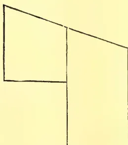

Fig. I.  
Plinth (on large scale).

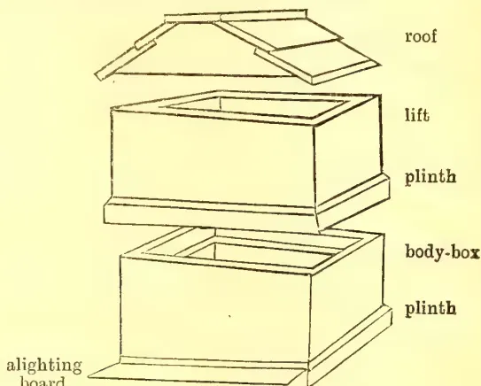

Fig. II.  
Hive complete.

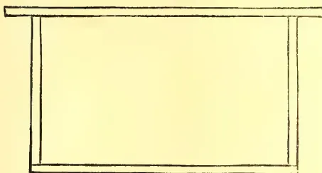

Fig. III.  
Frame.

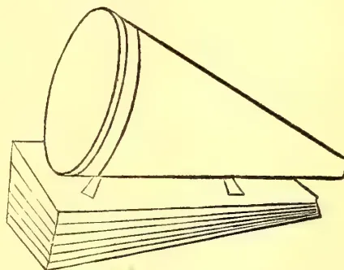

Fig. IV.  
Smoker.

Your hive is now ready for the reception of the bees. But before going on to deal with them, I will give you a list of cheap appliances that you will find useful.

#### APPLIANCES.

If you get the following from England in one consignment, they can come by parcel post for one or two shillings:—

*Feeder* ( $1/6$  to  $2/9$ ).—I would suggest a Wilke's Convertible at  $2/9$  as the most useful.

*Smoker* ( $1/6$  to  $4/6$ ).—Get one that blows real smoke. Do not be put off with machines that puff the vapour of chemicals into the hive. A Clark's Cold Blast at  $3/6$  or a Bingham at  $4/6$  are good.

*Foundation*.—One pound, costing  $2/$ , is ample to begin on. Order Natural-based brood foundation.

*W. B. C. Metal Ends*.—These are used for fitting over the projecting ends of the frames (but not the dummy-boards), so as to give accurate spacing between the frames. For European bees one should be placed at each end of *every* frame; but for the native Mee-Messa, they should be placed on every *alternate* frame.

355------------------------------------------------

330[MAY 1907.]

*Veil*.—Can be made of of mosquito-netting, dyed black. If left white, the reflection of the light on the white threads dazzles the eyes. It should go over the hat and the other end be tucked inside the coat.

*Gloves* should not be worn. They only make you clumsy, and if one bee stings, they hold the scent of the poison, which infuriates the others. If, however, it is judged advisable to wear them for some special operation, an ordinary pair can be used, and the sleeves tied round the wrists with a piece of string to make everything bee-tight.

(To be continued.)

## Correspondence.

### THE AUSTRALIAN MAGPIE IN CEYLON.

#### A RECENT INTRODUCTION.

SIR,—Having turned loose the Australian Magpies I imported last year, may I appeal, through your paper, to the various branch Agricultural Societies in Ceylon to notify the headmen and others in their districts that these birds shall not be molested in any way. At present they are keeping about in this part; but I expect when the S. W. Monsoon breaks, they will move down into Uva.

The birds are easily recognizable, being rather smaller than the Ceylon Crow with plumage of black and white—or rather, black and silver. They have two notes—a harsh *caw* and a plaintive and melodious *warble*. The latter note may be heard almost any sunny morning by persons passing this house.

As these birds are extremely helpful to agriculture, devouring insect pests in great quantities, it will be useful if anyone, noticing their presence in other parts of Ceylon, will inform the Agricultural Society as to date and locality. Then, if we find that they are increasing, we can import and turn loose a further consignment.

They will not eat vegetable food in any form; so that, if seen hopping about in gardens, they should not be driven away, as they will be clearing the garden of grubs. In view of this, I trust everyone will recognize that it is to his personal advantage to protect them in every way.

I am, &c.

H. CAMPBELL.

Yalta, Nuwara Eliya, 25th March, 1907.

#### TEPHROSIA AS A GREEN MANURE.

DEAR SIR,—The weed *Tephrosia purpurea*, Sinhalese *pila*, Tamil (N. P.) *Káviláý*, is considered by the people of the Jaffna Peninsula to be an excellent green manure for tobacco. I am asked by one of them whether it would not do for tea as well. It is a very common weed, and one of its peculiarities is that it grows in the moist as well as in the dry regions. But in the former no use appears to be made of it as manure, whereas in Jaffna it is in great demand for this purpose.

J. P. LEWIS.

Kandy, 23rd March, 1907.

[It is one of the Leguminosae, and so will add nitrogen like *Crotalaria*.—Ed.]

#### USES OF "MUD-KILAVAI."

DEAR SIR,—To mention one more use of the Mud-kilavai (*Balsomodendrum Berryi*), I have seen carved figures representing different Tamil types or castes made out of the wood, which is apparently fitted for this sort of work. They were sent to the St. Louis Exhibition.

J. P. LEWIS,

Kandy, 23rd March, 1907.

356------------------------------------------------

MAY 1907.]331Correspondence.CEYLON PAPAIN.

SIR,—In view of numerous enquiries received with reference to the market value of this preparation from the papaw tree (*Carica papaya*), the following report from Prof. Dunstan on samples submitted last year by me will be of interest.

It may be inferred, however, from the fact that a local firm is buying a considerable quantity every month at a price somewhat over five shillings, that there are other good markets in the world outside England.

(Report referred to dated 27th July, 1906, annexed.)

C. DRIEBERG,

Colombo, 4th April, 1907.

Secretary, Ceylon Agricultural Society.

(Copy of Report referred to.)

Imperial Institute, London S. W., 27th July, 1906.

SIR,—The two samples of Ceylon Papaw (papain) which were forwarded to the Imperial Institute with your letter No. 2055 of the 23rd of May last have been submitted to brokers for valuation, and I now forward the following information regarding them.

The brokers reported that the probable value of both samples (powdered and granulated) is about 5s per pound, but added that the demand for this material is very limited. They recommend that not more than 50 pounds should be shipped at one time.

Papain is regularly offered on the London market, but the sales are not large. On the 22nd July, 1905, a parcel realised the price of 8s 6d per pound, but since that date there is no record of any public sale. The material has not come into extensive use as a medicinal agent.

I am, Sir,

Your Obedient Servant,

(Signed) WYNDHAM R. DUNSTAN.

The Secretary, Ceylon Agricultural Society.

SNAKE-BITE CURES.

DEAR SIR,—Mr. W. A. de Silva, Veterinary Surgeon, Colombo Municipality, has communicated to me his success in the treatment of snake bite in the dog with the root of the papaw tree (*Carica papaya*), the application of the drug being external. It is worth remembering this as likely to prove useful in an emergency.

In this connection I should like to draw attention to Sir Lauder Brunton's simple method of destroying snake venom by means of permanganate of potash after scarification of the wound. To facilitate the treatment and place it within the means of all, chemists are now selling cartons, small enough to be carried in the waist-coat pocket, containing both permanganate and a little scarifying instrument. I purchased some at a big firm of druggists in Calcutta for eight annas (50 cents) each, and they could probably be had much cheaper if ordered in quantity from the makers.

These cartons should be available at cost price at all Government Dispensaries.

Yours truly,

C. DRIEBERG,

Colombo, 9th March, 1907.

Secretary, Ceylon Agricultural Society.

357------------------------------------------------

Correspondence.332[MAY 1907.THE ABSORPTION OF NITROGEN BY PLANTS.

DEAR, SIR,—I enclose a cutting from an Aberdeen paper *re* "Absorption of Nitrogen by Plants," which may interest some of your readers, in view of the recent correspondence there was on the subject, in the local papers. Mr. Trail is the Professor of Botany in Aberdeen University.

Yours faithfully,

J. M. URQUHART.

(*Extract from the Aberdeen Free Press.*)

I recognise Mr. Jamieson's right to hold his own beliefs as to the mode of absorption of nitrogen from the atmosphere, and I respect the sincerity with which he works, and the courage that he shows in upholding what he believes to be true, against what he considers to be of the prejudice that approaches persecution in the refusal to do honour to a prophet in his own country. I have examined carefully the evidence he has put forward in support of his views, and have formed my own conclusions on it; but I have not felt called on to make a statement of these conclusions, apart from the bearing on my work as a teacher. But the reticence that was permissible from unwillingness to appear to prejudice Mr. Jamieson's investigations, and from feeling the uselessness of controversy on a subject in which the evidence on each side can be of interest to only the few to whom study has made it more or less familiar, can no longer be maintained when Mr. Jamieson claims me as a convert to his views, even in part. I do not doubt his belief that I am so; but it is only an example of the very slight grounds on which he is able to arrive at a conclusion favourable to his views. That belief rests on an absolute misunderstanding alike of what I said and of the problem that he is seeking to solve. With reference to his argument that a tree, after growing many years in a soil, left that soil not impoverished in nitrogen to a degree comparable with the nitrogen present in the tree, and that the plant itself must have drawn the excess directly from the atmosphere, I suggested that the argument was not conclusive. It did not take account of what I believe is admitted by everyone acquainted with the work of recent years on the microscopic organisms in the soil, namely, that by their action compounds of nitrogen are being constantly added to the soil, and brought within reach of the roots of green plants. It is generally held that plants do obtain nitrogen from the air in this way; but this is absolutely distinct from Mr. Jamieson's claim that he has proved that green plants absorb it directly from the atmosphere, and that the young hairs are the organs of absorption. On this point, I think, after the most careful and unbiased examination of the evidence that I could make, that he has failed to prove his case, and that he has so completely misunderstood the structures examined by him as to make impossible a true interpretation of their functions.

In what follows I shall look at and discuss his evidence only as a botanist, accustomed to the use of the microscope and of the tests employed, and familiarised by years of study with the structures of plants, and with the contents of the cells from their earliest to their mature stages, and also with the conditions under which plants grow, as learned by much time spent in studying them in their natural homes.

Turning to the mode of absorption of nitrogen that Mr. Jamieson claims to have discovered, it consists, so far as I can follow his descriptions and figures in the absorption of the nitrogen at the tips of the young hairs in cells which contain chlorophyll or the substance that gives the green colour to plants. This absorption, he supposes, leads to the production of nitrogenous compounds, which are carried down into the leaves at first in a fluid state by narrow tubes, or rather by a cylinder around the space; and afterwards the more solid material passes down the centre of

358------------------------------------------------

MAY 1907]333Correspondence.

the hair. He ascertained the presence of these nitrogenous compounds by the use of iodine as a test, confirmed by other tests. There is no question as to existence of nitrogenous substance in the young cells everywhere, since the living substance (protoplasm) of a plant, like that of an animal, is present in every living cell and suitable tests will show its presence; but that does not warrant the assumption that its presence proves the absorption of nitrogen from the atmosphere, and the formation of nitrogenous compounds in those cells. Nor is chlorophyll found in the young hairs, as Mr. Jamieson believes it to be. Such colouring matters as occur (as his figures represent them in certain hairs) diffused in the fluid contents of cells are quite distinct from chlorophyll; which in all flowering plants is always confined to certain sharply defined biscuit-shaped little pieces of protoplasm (chlorophyll-bodies or chloroplasts), imbedded in the colourless protoplasm of the cells that form the green tissues of leaves and other parts.

Coming now to the supposed channels by which the more fluid compounds pass down into the inner tissues, a careful study of Mr. Jamieson's drawings and explanations shows that the channels are neither more nor less than the cell walls, which assume a yellow colour with iodine, but are not hollow. One hardly thinks of the sides of a bucket as affording channels for the transference of the fluid it contains. As for the passage of the more solid materials down the central space of a hair made of a row of cells, the cell-walls that cross that space would seem to make the transference of solids somewhat difficult. I admit that I have found it difficult to understand some of the figures, for they differ from anything that I have seen in the examples of the same species examined by myself; but one figure bearing the explanation that it shows the channels that carry the fluid down from a hair to distribute it among the cells below the epidermal layer, appears to me to represent clearly by the channels the walls of palisade-cells, and by its so-called "cells" the chlorophyll-bodies lying in characteristic fashion, not touching one another, but in fact embedded among the colourless protoplasm within the palisade-cells.

I have to apologise for occupying so much of your space, and for the technical character of so much of the above, but it seems due to Mr. Jamieson to give reasons (though by no means all) for not agreeing with his assertion that "the mode of absorption was considered to have been demonstrated last year," or with the view that to accept the fixation of nitrogen by low organisms in the soil and on its surface "constitutes acquiescence in the main point" that he claims to have proved. The assumed mode of absorption, so far from being demonstrated, seems to me to rest on errors both of observation and of interpretation so fundamental that they vitiate his conclusions as to the functions of the parts in question. I am not, therefore, disposed to throw aside beliefs based on work of those whose methods I have been able to test, and have not found wanting in favour of Mr. Jamieson's views, however much I may respect his sincerity, energy, and determination. I should have left him to persevere without any such criticism of his views as this, had he not claimed me as accepting them. I hold there is much to be explained in the laws of life and nutrition of plants as well as of animals; that only ignorance can presume to dogmatise or to refuse to examine honest work on its own merits; but that it is incumbent on everyone who brings forward views opposed to those generally accepted as the result of honest and competent investigation to test the new views most carefully with full understanding of and experience in the best methods of investigation. There is no desire so far as ever I have seen, to refuse new views a fair hearing, but if they claim to prove the falsehood of those already held they must themselves be fit to stand the severest tests of inquiry and criticism. To say that Mr. Jamieson's appear not to stand these tests is not to commit oneself to the assertion that the relation of the atmosphere to plant life is yet fully understood. That relation is deserving of close and continued investigation.—I am, etc.,

JAMES W. H. TRAIL.

43

359------------------------------------------------

334[MAY 1907.

## AN ESSAY ON THE BETEL VINE.

### ITS CULTIVATION AND DISEASES.

Mr. M. H. Miranda, Hon. Secretary of the Negombo Branch Agricultural Society, and Muhandiram of Alut Kuru Korale North, has offered a gold medal through the Parent Society for the best essay in English, Sinhalese or Tamil, dealing with the cultivation of the betel vine—soil, planting, manuring, pests and diseases—their prevention and cure—with a view to obtaining the experience of cultivators and others conversant with the subject. The Secretary, Ceylon Agricultural Society, is prepared to receive essays till the end of June. It is expected that the Government Mycologist will shortly issue a leaflet dealing with the subject of betel disease, and the exhaustive information which it is hoped to get together through this competition will probably prove of value in the preparation of the leaflet.

In view of the great risks to which so remunerative an industry as betel cultivation is exposed, and the heavy loss occasioned by the disease or diseases affecting the vine, the offer made by Mr. Miranda is one which the Society is only too glad to accept in the interests of the numerous small cultivators who make a living out of betel growing, and it is to be hoped that with the assistance of the liberal donor of the prize and the technical advice of the Government expert in plant diseases, it will be found possible to carry on the cultivation with less uncertain prospects than at present.

## Minutes of the Board of Agriculture.

The thirty-first meeting of the Board of Agriculture was held at the Council Chamber at noon on Monday the 6th May, 1907.

His Excellency the Governor presided.

The others present were:—The Hon. Mr. H. W. Brodhurst, the Hon. Mr. H. L. Crawford, the Hon. Mr. P. Arunachalam, Mr. J. Harward, Dr. J. C. Willis, Mr. E. B. Denham, Mr. Francis Beven, Mr. E. T. Hoole, and the Secretary.

Visitor:—M. Suppramanian.

### BUSINESS DONE.

1. The Minutes of the Meeting held on April 8th, 1907 were read and confirmed.

2. The Progress Report (No. XXX) was presented and taken as read.

3. The Report on the Southern tour made by the Organising Vice-President and the Secretary, printed in circular form, was laid on the table. Dr. Willis, at the request of His Excellency, supplemented his minute on the report by some further remarks on the respective functions of town and village Agricultural Societies.

4. Reports by Mr. J. K. Nock and Mr. H. F. Macmillan on the Nuwara Eliya Show, and by Dr. Willis, Mr. Nock and Mr. Hoole on the Badulla Show were tabled.

5. The Secretary read a paper entitled "A note on the new system of cultivation in arid districts."

Dr. Willis emphasised the necessity for cultivation, in the true sense of the term, as the only means of conserving moisture in dry districts.

His Excellency the Governor also commented on the paper, remarking on the importance of the points raised.

6. Dr. Willis then addressed the meeting on the subject of a Rotation of Crops suitable to Ceylon.

His Excellency in the course of his remarks suggested the possibility of improving the method of cultivation in vogue on high lands, by allowing Crown land to the poorer villagers on reasonable terms, to be cultivated according to a rational system of rotation.

360------------------------------------------------

MAY 1907.]335

## Agricultural Society Progress Report. No. XXX.

*Membership.*—Since the last meeting the following members have joined the Society :—W. M. Wade Gery, W. L. Fernando, W. G. Fernando, W. Elaris Fernando, W. Timothy Fernando, and G. E. Bewley. The following Branch Societies have been established and will shortly be affiliated to the Parent Society :—Wanni hatpattu, Ambalanwatta.

*Branch Societies.*—Mr. N. Wickremeratne, Agricultural Instructor, who lately visited Ambalangoda to investigate the causes of reported failure on a rubber plantation there took the opportunity to convene a meeting at Ambalanwatta, with the aid of Mr. H. Napier Dias, planter, on the 19th April, when a committee was formed to carry out details in regard to the formation of a Branch Society at Ambalanwatta, a district close to Galle. Mr. Napier Dias acts as Secretary *pro tem*.

At a meeting of the *Wanni Hatpattu Branch*, held on the 12th January, a resolution was adopted to the effect that tobacco cultivation be taken up on a large scale so as to make it the staple product of the pattu; it was also agreed that influential members of the Branch Society should make every effort to give cotton cultivation a fair trial in order to find out the suitability of the crop to the district, and whether it could be remuneratively grown.

The *Katana Branch* held a meeting on the 5th April, at which it was decided to hold an Agri-Horticultural Show in November next. As the Katana district proper is of limited extent, it was agreed to add Otara West and Godakaha Vidane divisions to the area from which exhibits will be drawn.

A suggestion has been made by the Secretary of the Negombo Society that the Katana and Negombo branches should be amalgamated, but the matter has not yet come before a meeting.

The *Trincomalee Society* held a Market Fair on the 2nd April which was a great success.

The Organizing Vice-President and the Secretary met the members of the Batticaloa and Badulla Branch Societies on their recent visit in connection with the cyclonic disaster in the Eastern Province. At a meeting convened by the local Secretary at Batticaloa on the 22nd April, the Chairman (Mr. Hopkins, Government Agent) presided, and there was a fair attendance. Addresses were given both by the Organizing Vice-President and the Secretary. There seemed to be a general wish that an experimental garden should be established in Batticaloa, and the matter will be taken up before long.

The Agri-Horticultural Show at Badulla was well organized, and all exhibiting sections were well filled. It was formally opened by His Excellency the Governor at 4 p.m. on the 26th April and continued on the 27th. The Society offered two prizes of Rs. 25 each for the best native bull and best native cow. Dr. Willis addressed a gathering on the Show grounds on the 27th April.

The Organizing Vice-President and the Secretary intend starting on a tour of inspection in the Northern Province. Opportunity will be taken during the visit to convene meetings of Branch Societies at Jaffna, Mullaitivu, Vavuniya, Anuradhapura, Kurunegala, and Kegalla.

*The Central Agency.*—It has been decided to hold an experimental sale of produce in Colombo on the 28th instant and a sale of cattle on the 31st, Mr. A. Y. Daniel acting as agent in Colombo. The sale of produce will probably be held on a spot close to the Municipal Market in the Price Park. The sale will include any kind of produce sent by Branch Societies and members who desire to try the Colombo market.

361------------------------------------------------

336[MAY 1907.]

*Experiments at Maha-Huppalam Experimental Garden.*—The Superintendent reported in January that 14 plantain trees of different varieties and 69 fruit trees of various sorts are established. One-fifth of an acre is under chillies and half an acre under cholam (Sorghum), 17 acres under rubber, and 50 under cotton. Tobacco is in the nursery, and 5 acres of land are ready for planting as soon as the time arrives.

*Cotton.*—Messrs. Geo. H. Brown & Co., Liverpool, writing to the Hon. Mr. Crawford on the 21st March, say :—“ You will remember our writing to you early in the year about some samples of Ceylon cotton sent to us by the Ceylon Agricultural Society. We remarked on the cleanliness and bloom of the cotton shown in the samples, and pointed out that the value of the cotton in bulk (which we placed roughly at 9*d.* per lb.) would depend on its equality to sample, and that for trade purposes evenness of quality was of the first importance. The other day Mr. C. . . . . showed a sample of a consignment of four bales (from Ceylon). The four bales were of four different qualities varying in value by pence per pound, and not one recognizable as the same cotton as that shown by the Ceylon Agricultural Society’s samples in our possession. It is obvious that care will have to be taken to produce a more even quality in bulk before a variety of cotton new to the market can obtain a footing here.”

Mr. M. Suppramanian, broker, Colombo, announces me that he is prepared to purchase any quantity of spinning cotton and silk cocoons from one pound upward.

*Sisal Hemp.*—The Government Agent, Northern Province, writing on the 3rd April, reports :—“ 150 plants were planted at Iratperiyakulam in Vavuniya South. Owing to the rocky nature of the ground they were planted irregularly, 8 and 6 feet apart, in a plot of ground 40 yards by 20 yards. These plants have done well so far. 150 plants were planted at Kanagarayankulam and Panikkankulam in the Vavuniya North division. Of these only 53 survived, 35 at Kanagarayankulam and 18 at Panikkankulam. These plants were planted 8 feet apart in an area of about one-eighth of an acre. They are doing well. 30 plants were planted in Delft in a plot of ground 2 lachams in extent (one-eighth acre). They were planted in manured holes 8 feet apart. They are doing well. The plants were obtained from the Director, Royal Botanic Gardens, Peradeniya, and were six to eight months old, some perhaps ten months, when planted.”

*Rubber Cultivation at Ambalangoda.*—Mr. D. F. de Silva Jayawardena of Ambalangoda reported the failure of rubber plants in his Nagaskele estate, one and a half mile inland from sea at Ambalangoda. An Agricultural Instructor was sent down to investigate the cause and secure specimens of affected plants and also of soil for purposes of analysis. The matter is in the hands of the Botanic Department.

*Sapodilla Seed from Bangalore.*—A small supply of sapodilla seed has been received from Bangalore, and is now available to Provincial Road Committees for planting in the resthouse premises. The cost is 30 cents per dozen.

*Bellary Onion.*—Seeds of this onion have been received from India. A few half-ounce packets at 30 cents each are still available. Applications should be sent in at once.

*Nepaul Chilli.*—It is proposed to import a small quantity of this variety, inquiries for which have been received.

*Essential Oils.*—Mr. B. Samaraweera of Weligama has submitted an elaborate scheme for experiments under this head. The matter is under consideration.

362------------------------------------------------

MAY 1907]337

*Ceylon Rice in the West Indies.*—A report has been received from Demerara on the results of experiments made with Ceylon varieties of paddy. This will be published in the Society's Magazine for general information ; but it is to be gathered from the report that none of the varieties imported can be recommended as substitutes for local varieties.

*Kiushu Paddy.*—The Ratemahatmaya of Walapane reports that he was successful in getting seven bushels of paddy from half a bushel sown. The Ratemahatmayas of Uda Hewaheta and Kotmale, and President of Village Tribunal, Uda Hewaheta, report failure in their districts, and they seem to think that the local conditions are not suitable for this variety.

*Apiculture.*—Mr. M. Shanks, writing on the 8th April, says :—"The honey is just beginning to come in. I have one hive on scales ; yesterday I sat down beside it and watched the weight going up ; from 8 a.m. till noon they gathered exactly one pound. I have other hives doing better, but they are not on scales."

*Castration of Cattle.*—The Acting Government Veterinary Surgeon reports :—"I have the honour to inform you that five demonstrations were given during March and the latter part of February last, at which 48 head of cattle belonging to 38 owners were operated upon, and three men trained. Two of these demonstrations were held in Kegalla in the Province of Sabaragamuwa, where 14 head of cattle were operated upon ; 2 were held in Nuwara Eliya District, 20 cattle operated upon ; 1 in Wellaway, 14 cattle operated upon. Demonstrations have been arranged for in the North-Western, Northern, Sabaragamuwa, North-Central, and Southern Provinces. An extensive programme for castration of cattle, both by Stock Inspectors and the locally trained men, has been drawn out for the North-Western Province."

The total number of cattle operated upon this year up to end of April is 56 belonging to 40 owners, and three men have been trained.

*Publications.*—Mr. A. E. Rajapakse, Mudaliyar, Katunayaka, has subscribed for 25 copies of the "Govikam Sangarawa," to be distributed among the villagers

*Fertilizers for Experimental Purposes.*—The artificial fertilizers distributed by Messrs. Freudenberg & Co. among members of the Society for experimental purposes during last year amounted to 75 cwts. representing a cost of Rs. 296.13. The fertilizers were given by the firm free of charge.

*Agricultural Shows.*—The following are the fixtures under this head :—

<table>
<tbody>
<tr>
<td>Telijjawila</td>
<td>...</td>
<td>...</td>
<td>...</td>
<td>...</td>
<td>May 15 and 16</td>
</tr>
<tr>
<td>Welimada</td>
<td>...</td>
<td>...</td>
<td>...</td>
<td>...</td>
<td>May</td>
</tr>
<tr>
<td>Matale</td>
<td>...</td>
<td>...</td>
<td>...</td>
<td>...</td>
<td>June 21 and 22</td>
</tr>
<tr>
<td>Colombo</td>
<td>...</td>
<td>...</td>
<td>...</td>
<td>...</td>
<td>June</td>
</tr>
<tr>
<td>Kegalla</td>
<td>...</td>
<td>...</td>
<td>...</td>
<td>...</td>
<td>June 28 and 29</td>
</tr>
<tr>
<td>Dumbara</td>
<td>...</td>
<td>...</td>
<td>...</td>
<td>...</td>
<td>August</td>
</tr>
<tr>
<td>Katana</td>
<td>...</td>
<td>...</td>
<td>...</td>
<td>...</td>
<td>November</td>
</tr>
<tr>
<td>Mullaittivu</td>
<td>...</td>
<td>...</td>
<td>...</td>
<td>...</td>
<td>Empire Day</td>
</tr>
</tbody>
</table>

C. DRIEBERG}

May 6th, 1907.

Secretary, Ceylon Agricultural Society

363------------------------------------------------

This image is a scan of a blank page. The paper has a light beige or cream-colored tint. There are a few very small, faint dark spots scattered across the surface, which appear to be scanning artifacts or dust particles. No text, lines, or other markings are present on the page.

364------------------------------------------------

THE  
TROPICAL AGRICULTURIST  
AND  
MAGAZINE OF THE  
CEYLON AGRICULTURAL SOCIETY.

---

VOL. XXVIII.

COLOMBO, JUNE 15TH, 1907.

No. 6.

---

### The Work of Local Agricultural Societies.

---

So far as we have yet seen, these societies resolve themselves into two classes--those in towns of some size, such as Galle, Kalutara, or Batticaloa, and those in village districts. Those in the large towns frequently consist entirely or almost entirely not of practical agriculturists, but of lawyers, traders, and others--men whose interest in agriculture is usually indirect, but who are, generally speaking, possessed of more, and more available, money than the genuine agriculturists. The village societies, *e.g.*, those of Telijjawila, Welimada, or Baddegama, on the other hand, consist more of practical field agriculturists.

Now it is obvious that societies of these two kinds should undertake different kinds of work. It will be idle for a town society of the class indicated to work at the best kinds of paddy to grow, or at the way to manure betel pepper, while it will be almost equally idle for the village society to take up any such questions as co-operation, which, in this country, requires outside funds at least to begin with.

The society in any one place should concern itself with questions likely to be of advantage in that place, and while a village society should stick more to experimental gardens, rotation of crops, trial of new products, and such questions, a town society might with advantage attend more to the necessary preliminaries to successful agriculture, such as co-operation in all its forms (seed supply, manure supply, sale of produce, and so on), road making, markets, education, and so on.

We shall return to this question again.

---

365------------------------------------------------

340[JUNE 1907.

## GUMS, RESINS, SAPS, AND EXUDATIONS.

### Experimental Rubber Tapping in Singapore Botanic Gardens.

BY IVOR ETHERINGTON.

As we are at present only in the first stages of rubber cultivation and have been working more or less in the dark, with but what is really only rudimentary knowledge of the subject, the results of carefully conducted experiments continued over a fair period of time must be regarded as of the greatest importance. Various experiments have been carried out during the last few years in Ceylon and Malaya to determine, among other problems confronting the rubber planter, the most satisfactory and economic methods of tapping, and the effect of tapping upon the trees, upon the quality and flow of the latex, and upon the rubber produced. We must give first place in these experiments to the work carried out at the Singapore Botanic Gardens by Messrs. H. N. Ridley and R. Derry. Their experiments, through the length of their duration, the care with which they have been carried out, and the excellence and comprehensiveness of their results, at present hold premier place; and we must congratulate the Director of the Singapore Gardens on the work initiated by him and carried out under his directions.

Last year the first annual report on the experiments was of much interest, but this year the results are of far more importance, after a second year's continuous work.

#### FRUITING OF *Hevea Brasiliensis*.

Before dealing with the results we will refer to some remarks in the report on the fruit periodicity of the Para rubber tree, which has a bearing on the tapping results.

We note that there is a considerable difference between the trees in the Singapore Botanic Gardens and the average mature trees in Ceylon. In the Straits the trees may bear fruit in any month of the year; although there is a considerable range in the crops and the period of heaviest yield is July—October, with another heavy yield in the month of March. The following table shows the total number of seeds collected in each month for the past nine years in the Singapore Gardens:—

<table>
<tbody>
<tr>
<td>January</td>
<td>...</td>
<td>32,924</td>
<td>July</td>
<td>...</td>
<td>29,650</td>
</tr>
<tr>
<td>February</td>
<td>...</td>
<td>55,800</td>
<td>August</td>
<td>..</td>
<td>79,600</td>
</tr>
<tr>
<td>March</td>
<td>...</td>
<td>148,050</td>
<td>September</td>
<td>...</td>
<td>324,515</td>
</tr>
<tr>
<td>April</td>
<td>...</td>
<td>56,314</td>
<td>October</td>
<td>...</td>
<td>291,436</td>
</tr>
<tr>
<td>May</td>
<td>...</td>
<td>28,097</td>
<td>November</td>
<td>...</td>
<td>85,870</td>
</tr>
<tr>
<td>June</td>
<td>...</td>
<td>28,700</td>
<td>December</td>
<td>...</td>
<td>35,807</td>
</tr>
</tbody>
</table>

This agrees more or less with Ceylon; for here we have the main—we may say, the only—fruiting period in the Autumn. The Uva Province is the only district in Ceylon where we know there is a special Spring fruit period, February—April, corresponding to the Singapore one. But we should be glad to hear from planters in various districts on this point. Variability of seasons seems to affect the fruit yield and the floral activity in the varying seasons. The best crop month in Spring is March, which over a period of 9 years stands third in the annual returns, and varies from *nil* return in 1905, and only 50 seeds in 1902, to 43,050 seeds in 1901. A similar variation may be observed in the autumn crop for August, which out of a total of 79,600 seeds for 9 completed years produced no less than 60,850 seeds during that month in 1905.

An interesting tabulation of the two seed crops and the average year's rainfall over 9 years, tends to prove that, (1) while there are two seasons when flowers and fruits may occur in some years within the period of a year, there is

366------------------------------------------------

JUNE 1907.]341Saps and Exudations.

never more than one heavy crop; (II) that the Autumn is the more uniform crop of the two, as the Spring has only exceeded the Autumn crop twice in 10 years; and (III) that the Autumn fruit periodicity represents the true normal condition of the tree.

#### FRUIT PERIODS IN BRAZIL.

Mr. Ridley does not consider that there are any signs to indicate that *Hevea brasiliensis* in Malaya differs in its characteristics from the indigenous trees in the Amazons; or that it is in a state of transition in the East. He quotes Mr. Consul Temple, and Ule regarding the flowering periods in Brazil; the latter authority says the flowering season is July-August, the fruits falling in January-February, and this would agree with a statement in a recent letter to us from Mr. H. A. Wickham regarding his collecting of the seeds in Brazil which produced the original plants in the East.

#### THE RESULTS OF TAPPING.

We now come to the tapping experiments themselves. These are admirably arranged and tabulated in the report; but we cannot refer to them here at all in detail for want of space. We refer to the general conclusions drawn.

Full details of the trees, girths, methods and periods of tapping, yields in latex and caoutchouc, etc., are given for each experiment. For instance, we note, in experiment IV., during 1906, groups of 40 trees were tapped, mornings only, on single and full herring-bone methods during 25 days. In 2 groups of single cuts 1,216, and 1,823 fluid oz. of latex were obtained; in the full herring bones, 1,703, 2,816 and 3,385 oz. latex were obtained, giving a total for the 5 groups of 154 lb. dry rubber. The trees averaged  $37\frac{3}{4}$  inches and  $38\frac{3}{4}$  inches. There was a period of rest of 4 months given the trees, and the average gross yield per tree was 2 lb.  $4\frac{3}{4}$  oz. In experiment VI, herring-bone tapping, daily tapping shewed a better result than alternate days.

#### TWO TAPPINGS A YEAR.

The result of a year's working "clearly shows that morning are better than evening tappings, the trees can be tapped twice within the period of a year but the interval of rest should not be less than 5 months; that the dormant months December, January, February yield a smaller percentage of caoutchouc, and that the best season for tapping is from April to November. We have not found any advantage in respect of yield by the spiral over the herring-bone, and considering the small advantage of the double over the single incisions we think the single cut with small trees would best economise the bark."

These authorities have come to the conclusion that the Para rubber tree responds to *shock*, and that the tapping instrument capable of making the cleanest and quickest incision is the ideal one.

#### RUBBER PRODUCTION IN PROPORTION TO YIELD OF LATEX.

An important result of the experiments is that concerning the production of caoutchouc in proportion to the yield of latex. A falling off in the proportion of caoutchouc to latex in Ceylon trees has already been notified. The latex in the bark is quickly renewed after a period of tapping but the production of rubber is very much slower. In a trial of spiral tapping on a tree girding 112 inches, from the first period tapping 531 fluid oz. of latex (half added water, or  $265\frac{1}{2}$  oz. pure latex) was obtained giving 9 lb. rubber; from the second period tapping, one month later, 433 oz. latex gave only 4 lb. 15 oz. rubber—a remarkable difference.

This phenomenon is one which cannot be overlooked. It has already been observed in Ceylon, and at the Ceylon Rubber Exhibition (September, 1906) Mr. Kelway Bamber, Ceylon Government Analytical Chemist, brought the matter up in

367------------------------------------------------

Gums, Resins,342[JUNE 1907.

discussion. "I noticed in working at rubber lately that in the first latex," he said, "the latex contained 32 per cent of rubber, that is to say that for 3 lb. of latex there was one 1 lb. of rubber; but in all the latex sent to me recently, and from what I hear from planters, the latex does not now equal that proportion, and the caoutchouc has in some instances gone down to 15 per cent. or less. It seems to me the laticiferous tubes are refilled very rapidly, and the actual flow of water into the tubes also is fairly rapid, but there is apparently a slight want of power of formation of actual rubber in the latex, and this I think, must be carefully watched in the future. The yield of the trees certainly has not fallen off; but it must mean that there is a much larger proportion of soft laticiferous tissue and larger secretion of moisture which may possibly render the trees more liable to attacks from insects. There is no knowing how this power of the actual formation of the caoutchouc in the latex may fall off."

Mr. Ridley's remarks on the subject of much interest. He states: "It is of the greatest importance to the cultivator in tapping to avoid tapping at the wrong season when he is very liable to interfere with the special physiological processes in the tree then performing their functions. The bark of the tree does not recover as well from wounds during the resting period between December and March, nor does it appear that the return of caoutchouc is as good. Too frequent or prolonged tapping is not only injurious but produces a latex very inferior in its rubber-producing qualities. This can only be due to actual bark injury."

#### CAOUTCHOUC PRODUCTION AND BARK INJURY.

"Although in over-tapping latex is renewed in the bark quickly, caoutchouc takes much longer to produce, though it does not seem in the worst cases ever to be entirely absent from the latex. The caoutchouc seems undoubtedly to be directly or indirectly produced from the roots, but as the only injury to the tree in tapping is caused to the bark of the trunk, it seems clear that it is the bark injury only which reduces the amount of caoutchouc in the latex, for it does not seem probable that the roots can be affected by the bark injury."

Mr. Ridley is very insistent on the point of the ratio of rubber to latex, and he concludes a most interesting and important report—to which we have not done full justice in this notice—in the following paragraph:—

"It cannot be too strongly pointed out that too frequent or prolonged tapping is injurious and only produces *inferior rubber*. Even so recently as the Ceylon Exhibition the discussions show that planters were quite satisfied with prospective rubber crops as judged by the copious flow of latex, not appreciating the fact that it is the *quantity or ratio of caoutchouc to latex that alone constitutes the real crop and rich harvest*. It will be remembered that in Brazil rubber trees are only tapped for one period of the year; doubtless owing to the country being flooded. The longer interval of rest may represent well matured or well oxidised caoutchouc and partly explain the preference for Brazilian rubber."

#### WHAT'S WRONG WITH CEYLON RUBBER?

A rubber manufacturer in Montreal (Canada), Mr. A. D. Thornton, writes as follows to the Editor of "The India Rubber World":

Is it not time that some one voiced a protest regarding Ceylon rubber? As one who has followed this commodity rather closely, and as one of the earliest users, I would like to impart to your valuable journal my reasons for asking the above question.

When we first received samples of Ceylon rubber we were certainly struck by its beautiful appearance, its cleanliness, and so on. We found its tensile strength quite up to any Para; for the purpose of making cement it was unequalled, because it had a swell that figured up at least 7 per cent better than Para.

368------------------------------------------------

JUNE 1907.]343Saps and Exudations.

But withal we moved slowly ; we watched it ; and finally satisfied ourselves that here was a rubber made scientifically and by men of brains, and not by natives, who forced us to buy 20 to 40 per cent of dirt and water. And so we started to use it in fair quantities. The goods looked nice and clean, and we congratulated ourselves. And now what has happened ? Its uniformity has all gone, it comes in all shapes and in all shades, its tensile strength is lower than the Africans, it won't cure, some of it is soft, some of it is hard.

What have our friends in Ceylon been doing ? Experimenting ? If so, back to *first stages* ; they are off the tracks. We made a large batch of cement with it recently and the swell was not more than 25 per cent of what it was formerly, and should be. Then again, we find variations in the same case. Why mix it ? Placing some weak rubber with the good won't do any good ; it only spoils the whole lot.

For the sake of the Ceylon rubber industry it is to be hoped that growers will come to their senses and stop fooling before it is too late. The fact that a sample of Ceylon rubber looks good does not prove that it *is* good. We know that to our cost ; all users know it. If the growers plead ignorance of what is required by the manufacturers, let them import a practical man from some manufacturing country. Ceylon Rubber should be just as reliable as upriver fine Para ; why isn't it ?

[This voices a criticism which is being fairly commonly made on East Indian rubbers. Is it fatal to mix qualities. Biscuits and dry sheet, it is now beginning to be realised, though we pointed it out years ago, are practically used for solution only, and there will be a lamentable set-back to rubber growing unless the new "wet-block" proves good for fine work. It seems to be about as good as fine Para, and it is in that direction that hope lies.—Ed. "T. A."]

#### RUBBER YIELDING MISTLETOES IN SOUTH AMERICA.

The following notes on rubber yielding mistletoes of South America are translated from "Tropenpflanze," for November, 1905.

Two or more mistletoes of tropical South America have fruits in which the usual viscin around the seed is replaced by a thick layer of sticky caoutchouc emulsion, which serves the same purpose as viscin in the transport of the seeds by birds. This rubber is not contained in latex tubes, and coagulates spontaneously when the fruits are dried.

The large fruited mistletoe is *Loranthus syringaefolius*. It grows in tropical Brazil, British Guiana, and Venezuela. In the last-named country the fruit ripens in the last three months of the year. The fresh fruits are  $\frac{3}{8}$  inch long and  $\frac{1}{4}$  inch broad. In Venezuela it is parasitic on the Ingas, used as shade trees for coffee. These coffee plantations are often at 3,000 feet elevation and this mistletoe has been met with up to 4,600 feet elevation. Its seeds are transported by a very shy, large, wild dove, and so it is not met with near habitations. The Director of the Venezuela railway obtained 1.7 lb. of rubber from 8 lb. of dry fruit, and considered that a yield of 15 per cent. of pure rubber can confidently be reckoned upon.

An analysis of dry fruits in Berlin gave 15.02 per cent. of pure caoutchouc which vulcanised well and 11.35 of resin. In June 1905, rubber from this mistletoe was priced at from 3s. 2d. to 3s. 6d. per lb. Some trees covered with the mistletoe have produced 2 cwt. of dry fruits in one season. To obtain the rubber, the dry fruits are crushed with mills or stamps, and the fibre, etc., washed away from the lumps of rubber. The unripe fruits may also be crushed between rollers, washed on sieves, and the rubber emulsion in the liquid coagulated by boiling. *Loranthus marginatus* also contains rubber. Another rubber-bearing mistletoe

369------------------------------------------------

Gums, Resins,344[JUNE 1907.

is *Loranthus theobromae*, which is found in the region of the Amazon, in British Guiana, and Venezuela. It is a very common parasite, and grows on Inga, mango, and especially on cacao and coffee. It has clasping air-roots. Unripe fruits gave 5 to 10 per cent. of pure rubber, which would mean about twice this percentage from the dry fruits. It is intended to propagate this mistletoe in Venezuela on abandoned cacao and coffee plantations. One coffee plantation already produces four times as much mistletoe berries as coffee from the natural spread of the parasite. It is reckoned that several thousand tons of wild mistletoe rubber may be obtained in the next few years from Guiana, Venezuela, and Brazil.

These parasites can easily be planted on shade trees, etc., by leaving ripe fruits for two weeks in the shade, and then placing them in cuts in the bark of the host plants. The smaller mistletoe, *L. theobromae*, only needs for propagation that a piece of stem, with sucking roots, should be stied to a branch of the host plant.

## A Non-Rubber Yielding *Hevea*.

BY IVOR ETHERINGTON.

It is a generally conceded fact that the latex of other trees than *Hevea brasiliensis* is often employed by the rubber collectors in Brazil to increase the bulk of the products. One authority mentions *Mimusops elata* (the Macandaruba tree). The adulteration of Para rubber by this latex, it is stated, "might account for the great differences that have been occasionally observed in the behaviour of Para rubber in certain stages of manufacture, the coagulated juice of the *Mimusops* genus resembling gutta percha rather than caoutchouc." *Sapium aucuparium* is also said to be largely used as an adulterant. The latest addition to our information on this subject is a contribution to "Journal d'Agriculture Tropicale" by Monsieur O. Labroy, who has been doing fruitful botanical research work at Manaos (Brazil), the centre of the rubber industry, for a year. Labroy states that the latex of *Hevea discolor*, Muell. Arg., cannot be coagulated to give rubber, but that it is used to adulterate latex from good rubber trees.

Of this *Hevea* he says: "Prolonged observation of these trees have shown me that they are incapable of yielding a product of any value. Some of them, tapped at different times, have only given a small quantity of uncoagulatable latex. Repeated tapping of young specimens (5 to 7 years of age) and others of mature age (trunks measuring 39 to 58 inches in girth), growing on the banks of quiet rivers where only they appear to flourish, gave the same negative results. These proofs notwithstanding, I showed the *Heveas* in question to two men well versed in rubber exploitation from the lower Rio-Negro; they did not hesitate to assure me that they were only 'seringueira barriguda'; that is to say of no interest from the point of view of latex yield. They had, however, seen them used in Rio Madeira for adulterating the latex of good rubber trees."

Labroy seems to be a little doubtful as to whether the trees he found in the Manaos district were the real *Hevea discolor*, found by Martius and Spruce in the same region, and by Ule in the middle Rio-Negro. Botanically the trees are the same; the only difference being in the size and height of the tree and the dimensions of the leaf. Those under observation at Manaos were 33 to 48 feet in height, a straight trunk bare of branches for 18 to 24 feet from the ground; the main branches being little ramified and rather spreading.

"It should be noted," he says, "that the fruit and seeds are exactly alike as possible to those in the illustration given by M. Jumelle in his lecture 'Les Plantes à caoutchouc et à gutta,' from specimens of 'seringa barriguda' brought from the

370------------------------------------------------

JUNE 1907.]345Saps and Exudations.

Madeira by M. Bonnechaux. On the contrary, they differ from the drawing Hemsley has given of the fruit of *Hevea discolor*. At least in the apex which is rather rounded instead of conical."

He adds that at Manaus *Hevea discolor* always grows in the alluvial soil of slowly flowing rivers, and their seeds falling in great numbers into the water are often collected to serve as bait for the fishermen of Rio-Negro and Solimoes. "I have collected a large number of these seeds to plant in the rubber gardens of Manaus; but my attempts remain unsuccessful in spite of care taken in selecting the best seeds. Those I sent to the Natural History Museum in Paris, gathered from the tree before the bursting of the fruit, have not given better results."

Mr. J. Huber, the eminent authority on the genus *Hevea*, botanist at the Goeldi Museum at Para, is also inclined to the belief that *Hevea discolor* does not produce rubber.

#### RUBBER CULTIVATION IN BURMA.

The cultivation of rubber in Burma has been in progress for some years past. Not only have the Government, with most commendable zeal for the cause, long since led in this very desirable direction, but private companies and even individuals, have recently gone in for rubber-planting on a large scale. Besides the fifty-seven acres of mature rubber (*Hevea*) only forming the plantation known as the Mergui Experimental Plantation, now more than 30 years old, the Government of Burma have a large and annually increasing area of plantations of rubber on the island of Mergui. These plantations, which vary in age from one to seven years, are situated in the reserve forest that skirts the feet of the hills of the Sandawut Range. Although an extensive area had also been reserved for rubber planting on the great alluvial flat to the foot of the Kappatoung range on King Island, and a portion been casually planed out at the time, nothing now remains of the experiment. This is a matter for regret, because nowhere in the Oriental tropics are the physical conditions ordinarily speaking more favourable for the cultivation of the *Hevea brasiliensis* than on King Island and its vicinity.

The new plantations on Mergui, considering that work on them was begun more than seven years ago, and that a sum of nearly Rs. 3 lakhs has been spent upon them in that time, are in an unsatisfactory state. Indeed, their present condition is such as will not admit of their public exhibition for the purpose of the demonstration of *Hevea* cultivation. And yet this was one of the chief objects aimed at by the Government in their formation. It is asserted that about 3,000,000 plants have been put out on these estates, but, excepting the comparatively limited number of well-grown saplings that follow the courses of the streams which intersect the areas, few are worthy of much account. Future work, particularly if conducted on careful, systematic and scientific lines, might do much to improve their health and vigour. Fungoid diseases, browsing by deer, and climatic conditions of exceptional inclemency,—these are among the adverse causes which are alleged to have prevented better results being obtained. In the first of these allegations there appears to be some truth, a species of blister, like *Peridermium*, being known to be destructive both to the nurseries and older crops; but that browsing by animals such as deer should have been found effective enough to be made to answer for the generality of the failures that have supervened, is matter for some surprise when it is known that hosts of coolies, bands of shikaris, guns, tom-toms, fences, lights, pitfalls, snares and traps of sorts, have been and continue to be employed for the express purpose of their destruction. The plea of climate would appear to argue that a distinct change for the worse has come over the physical conditions obtaining in the Mergui Archipelago; but whether so remarkable a variation occurred in the

371------------------------------------------------

Gums, Resins.346[JUNE 1907.

meteorology of those islands prior to the cultivation of rubber in Mergui, or whether such phenomena have begun to manifest themselves only subsequent to the establishment of the industry, are questions which are interesting at this juncture.

Let us now turn to a brief review of the more hopeful work done on private estates. About the time that the Mergui plantations were started, a retired pilot, residing in Moulmein, obtained from the Government the lease of a patch of land in the Amherst District and partially planted it up with Hevea. This gentleman died recently; but before his death he experimentally tapped 300 of the oldest trees on the estate and realised a profit of Rs. 2,000/—(£133.6.8 sterling). It remains to be noted that this plantation is situated on a sub-soil of hard laterite, which is admittedly none the best for the perfect development of the species. The results obtained are, therefore, encouraging. Again, a wealthy Chinaman, a merchant in Rangoon, owns 5,000 acres of waste land at Twante. Three years ago he opened out 800 acres with Hevea rubber. The majority of the plants are below 10 feet in height, but the few which have grown better give promise of good development in the future. This plantation has been heard of in England whence an offer of £80,000 has been recently made for it; but it is said that the owner wants £100,000, and such is the boom in rubber and rubber land that there seems to be every probability of his obtaining the price he asks. A German firm in the Rangoon export trade owns nearly 5,000 acres on the banks of the Sittang River, in the Shwegyin District. It began work about two years ago and has already opened out a Hevea plantation of something like 2,000 acres. The concern is being managed by a Ceylon planter and is likely to result in a commercial success, as the average height of the majority of the older plants is already 20ft. Besides this large plantation, there are two smaller ones in the same district that are owned and worked by private individuals,—the one a Burman and the other a Eurasian.

On the Karen Hills that rise to the east of the railway from Rangoon to Mandalay, the Karens have for many years been cultivating the Ceara rubber tree (*Manihot Glaziovii*). The species flourishes on the lower hills, but from ignorance in the methods of tapping it, and the present depreciation in the value of its rubber, the industry has of late declined. At the feet of the same range of hills and opposite the little town of Yedashe, near Toungoo, a German gentleman last year opened a Hevea plantation of 20 acres which he intends extending shortly. The plants here are only one year old, but are already 15ft. high. Farther up the railway line, at a distance of about 26 miles from Toungoo, a Hevea plantation of 200 acres was started last year by a party of Eurasians. Twenty acres were cleared, and planted in the rains in June and July. Many of the plants are already seven feet high. The estate is situated in an alluvial trough, or pocket, occurring near the banks of the Swachoung, which is a tributary of the Sittang River. Besides these plantations others are in course of being opened out near the tin mines at Maliwun and elsewhere on the mainland of Tenasserim as well as on some of the islands lying off that coast.

All these Hevea estates have been planted with seed imported from plantations of the species in Ceylon. They stand upon land that has been obtained by lease from the Government, who are evidently much in earnest about encouraging the cultivation of rubber in the Province. Under the special notification that has been recently issued to meet the requirements of the industry in Burma, land to the extent of 1,000 acres, in each case, is leasable for the purpose from the Deputy Commissioner of the District. Leases of larger areas require the sanction of the local Government and, if very large, that of the Government of India. The land is usually granted on a thirty years' lease and is exempt from taxation for the first twelve years; and after this, it is to be assessed at no higher rate than that prevailing at the time in the district in which the estate is situated for the better

372------------------------------------------------

JUNE 1907.]347Saps and Exudation.

classes of rice land. This itself, ranging as it does between Rs. '1-8' ann Rs. 3' per acre, cannot be said to be at all excessive. The inter-cultivation of accessory catch crops *e.g.*, bananas, tapioca etc., has to be strictly subordinated to the principal crop. Again, should any portion of the lease land at any future time prove unsuitable for the cultivation of rubber, it could be excluded from the limits of such lease land and the taxation upon it remitted. For the rest, every facility is afforded the applicant for the speedy acquisition of the area to be leased. For instance, the surveying fee of eight annas per acre which is the only charge made by Government has to be paid into the District Treasury and a copy of the receipt for the money appended to the application for the lease. A rough sketch map of the area itself, which has to be previously demarcated by the applicant, should also form an enclosure to the application. In the body of the latter has to be stated the situation and limits of the land applied for, whether it has been demarcated by the applicant, the nature and duration of the lease sought for, the purpose for which the land is required, the kind and character of the catch crop to be raised, and such other information as will appear to be necessary under the various headings of the form of application laid down in the Burma Land Revenue Code. The application is usually made direct to the Deputy Commissioner of the District; but it may also be submitted to one or other of his Subdivisional Officers or to the Officers in immediate charge of the Township in which the land is situated. The survey season lasts from November to the following May, at any time during which applications may be made and leases obtained. To their credit be it mentioned, the Officials of the Revenue Department of Burma are among the most accessible, amiable and obliging in the service.

In view of the facts that in the districts of Lower Burma, especially in those of the Teasserim Division, which extends from a little above Toungoo down to the southernmost end of the Province, extensive areas of alluvial deposit are available for the cultivation of the finest rubber, and of the most encouraging attitude of the Government, the prospects of the industry must be regarded as good. In so far as it has already progressed, the remarkable results that have been attained, particularly by private enterprise and endeavour, claim recognition as something more than an indication of the possibilities of rubber in Burma. They will also, it is hoped serve to encourage studied, systematic and sustained effort in the future. The most suitable areas in the Tenasserim Division for the purpose of the cultivation of the *Hevea brasiliensis* are clearly those that lie along the banks of the lower courses of the Sittang and Salween, the Great and Little Tenasserim Rivers, the Lenya, Pakchan and lesser streams. To these must, of course, be added the diluvial accretions which, like troughs or tablelands, are to be sometimes met with on the larger of the islands of the Mergui Archipelago. Such a trough exists on King Island, which has been apparently abandoned by the Government expert. In these areas, again, that land is best which lies under cover of evergreen forest, because, besides the admittedly favourable alluvial or diluvial silt which constitutes the soil and sometimes also the subsoil of the locality, the additional deposits of vegetable mould and animal remains that accrue to it by the presence of forests help to form pabula that are rich in ingredients favourable to the highest development of the species. Although the price of rubber has appreciably declined from what it was at this time last year, there is still the amplest scope for Hevea before its value will have declined low enough or the manufacture of the chemical product made cheap enough to militate against its growth for trade. The present, therefore, affords a fitting, while it is at the same a fleeting, opportunity for would be cultivators of the plant in Burma.—*Indian Agriculturist*.

45

373------------------------------------------------

Gums, Resins,348[JUNE 1907.INDIA RUBBER MARKET.

LONDON, April 12th.—At to-day's auction, 557 packages of Ceylon and Malaya plantation grown rubber were under offer, of which about 240 were sold. The total weight amounted to over 26 tons, Ceylon contributing about 9 $\frac{3}{4}$ , and Malaya nearly 16 $\frac{1}{2}$  tons. In sympathy with the Para market, the auction was characterised by rather slow competition, and prices generally marked a slight decline on last sale rates. Where bidding was under merchants' ideas, the offerings were generally withdrawn for private treaty, and in these cases, as a rule, more money was forthcoming after the auction. None of the finest quality of Crepe changed hands. Another exceptionally fine lot of Rangbodde Ceara biscuits was well competed for and realised the highest price in the room, viz., 5s. 10 $\frac{1}{2}$ d. per lb. Scrap was a little irregular during the sale, but afterwards there was a better demand for this grade privately. Plantation fine to-day.—5s. 7d to 5s. 10 $\frac{1}{2}$ d., same period last year, 6s. 2 $\frac{1}{2}$ d. to 6s. 3 $\frac{1}{2}$ d. Plantation scrap.—4s. 1d. to 4s. 6 $\frac{1}{2}$ d., same period last year, 4s. 5d. to 5s. 5d. Fine hard Para (South American).—4s. 11d., same period last year, 5s. 5 $\frac{1}{2}$ d. Average price of Ceylon and Malaya plantation rubber.—240 packages at 5s. 4 $\frac{1}{2}$ d. per lb., against 100 packages at 5s. 11d. per lb. same period last year. Particulars and prices as follows:—

CEYLON.

<table border="1">
<thead>
<tr>
<th>MARK.</th>
<th>QUANTITY, DESCRIPTION AND PRICE PER LB.</th>
</tr>
</thead>
<tbody>
<tr>
<td>Hapugastenne</td>
<td>1 case darkish scrap, 4s 4<math>\frac{1}{2}</math>d.</td>
</tr>
<tr>
<td>Rangalla</td>
<td>1 do good palish to darkish biscuits, 5s 7<math>\frac{1}{2}</math>d.</td>
</tr>
<tr>
<td>Culloden</td>
<td>1 do fine palish, 5s 4<math>\frac{1}{2}</math>d; 13 cases good palish, 5s 5d; 1 case fine pale and dark block, 5s 8d.</td>
</tr>
<tr>
<td>Talagalla</td>
<td>3 do fine dark biscuits, 5s 7d; to 5s 7<math>\frac{1}{2}</math>d; 2 cases good pressed scrap, 4s 4<math>\frac{1}{2}</math>d.</td>
</tr>
<tr>
<td>Warriapolla</td>
<td>3 do very fine pale biscuits, 5s 7<math>\frac{1}{2}</math>d; 2 cases darker, 5s 7<math>\frac{1}{2}</math>d; 1 case good dark, 5s 7<math>\frac{1}{2}</math>d.</td>
</tr>
<tr>
<td>Sunnycroft</td>
<td>1 do good rough biscuits, 5s 7d; 1 case barky scrap, 4s 3<math>\frac{1}{2}</math>d.</td>
</tr>
<tr>
<td>Rangbodde</td>
<td>1 bag very fine pale Ceara biscuits, 5s 10<math>\frac{1}{2}</math>d.</td>
</tr>
<tr>
<td>Waharaka</td>
<td>1 case good rough biscuits, 5s 7d; 2 cases dark scrap, 4s 4<math>\frac{1}{2}</math>d.</td>
</tr>
<tr>
<td>Ambanpitiya</td>
<td>1 box good palish to darkish biscuits, 5s 7d; 1 box lump scrap, 4s 4d.</td>
</tr>
<tr>
<td>Ayr</td>
<td>1 case good darkish biscuits and sheet, 5s 7d; 1 case good pressed scrap, 4s 4<math>\frac{1}{2}</math>d.</td>
</tr>
<tr>
<td>Ambattenne</td>
<td>3 do fine palish biscuits, 5s 7<math>\frac{1}{2}</math>d; 2 cases darker, 5s 7<math>\frac{1}{2}</math>d; 1 2 cases darker, 5s 7<math>\frac{1}{2}</math>d; 1 case fine amber sheet, 5s 7<math>\frac{1}{2}</math>d; 1 case fine scrap, 4s 6<math>\frac{1}{2}</math>d; 3 cases and 1 bag good dark scrap and rejections, part sold 4s 4<math>\frac{1}{2}</math>d to 5s 3d.</td>
</tr>
<tr>
<td>Densworth</td>
<td>2 do fine palish to darkish biscuits, 5s 7d; 1 case fine scrap, 4s 5d.</td>
</tr>
<tr>
<td>Polatagama</td>
<td>6 do good rough biscuits, 5s 7d; 1 case cuttings, 4s 7<math>\frac{1}{2}</math>d; 1 case scrap and cuttings, 4s 6d.</td>
</tr>
<tr>
<td>Weoya</td>
<td>1 do scrap and cuttings, 4s 6d.</td>
</tr>
<tr>
<td>Halwatura</td>
<td>3 do good dull biscuits, 5s 7<math>\frac{1}{2}</math>d.</td>
</tr>
<tr>
<td>Nilambe</td>
<td>1 do good palish to darkish biscuits, 5s 7d; 1 case good pressed scrap, 4s 5<math>\frac{1}{2}</math>d.</td>
</tr>
</tbody>
</table>

MALAYA.

<table border="1">
<tbody>
<tr>
<td>Pataling</td>
<td>3 do brownish and black, 4s 11<math>\frac{1}{2}</math>d.</td>
</tr>
<tr>
<td>V.R. Co. Ltd. Klang F.M.S. (in triangle)</td>
<td>3 do good palish to darkish, 5s 4d; 8 cases good dark smoked block, 5s 4<math>\frac{1}{2}</math>d; 16 cases fine pale and palish crepe 5s 7<math>\frac{1}{2}</math>d; 4 cases good palish, 5s 4<math>\frac{1}{2}</math>d; 7 cases fine dark smoked block, 5s 4<math>\frac{1}{2}</math>d.</td>
</tr>
</tbody>
</table>

374------------------------------------------------

JUNE 1907.]349Saps and Exudations.

<table border="1">
<thead>
<tr>
<th>MARK.</th>
<th colspan="2">QUANTITY, DESCRIPTION AND PRICE PER LB.</th>
</tr>
</thead>
<tbody>
<tr>
<td>S.R. Co.</td>
<td>24 cases</td>
<td>fine washed sheet, 5s 7½d; 9 cases fine palish to darkish crepe, 5s 3½d; 7 cases good darkish, 5s 1d to 5s 1¼d; 4 cases good dark, 5s 1d.</td>
</tr>
<tr>
<td>E.B. &amp; Co (in triangle)</td>
<td>3 do</td>
<td>good sheet, 5s 7½d; 1 case rejected sheet, 5s 7d; 1 case good dark sheet, 5s 7d; 1 bag scrap and pieces, 4s 1d.</td>
</tr>
<tr>
<td>R.R. (S. in diamond)</td>
<td>4 do</td>
<td>fine amber sheet, 5s 7½d; 2 cases good scrap, 4s 4d; 1 case rejections, 4s 3½d; 9 cases fine amber sheet, 5s 7½d to 5s 7½d; 1 case rejections, 5s 3½d; 1 case scrap, 4s 3½d; 2 cases lace scrap, 4s 3½d.</td>
</tr>
<tr>
<td>K. M. (in diamond)</td>
<td>2 do</td>
<td>fine amber sheet, 5s 7½d; 1 case rejected sheet, 5s 6d.</td>
</tr>
<tr>
<td>Yam Seng</td>
<td>11 do</td>
<td>fine amber sheet, 5s 7½d; 7 cases dark scrap, 4s 4d; 3 cases rejections, 4s 3½d.</td>
</tr>
<tr>
<td>B.M. &amp; Co. P.</td>
<td>8 do</td>
<td>fine amber sheet, 5s 7½d to 5s 7½d; 4 cases good scrap, 4s 4½d; 3 cases lump scrap, 4s 3½d; 2 cases rejections (part uncured), 4s 5d.</td>
</tr>
<tr>
<td>S.P. (in circle)</td>
<td>1 bag</td>
<td>good biscuits, 5s 7d; 1 bag small rejected biscuits, 5s 1d; 1 case good darkish, 4s 2½d.</td>
</tr>
<tr>
<td>G.K.K.B. (in diamond)</td>
<td>2 cases</td>
<td>very fine amber sheet, 5s 7½d.</td>
</tr>
<tr>
<td>S.S.B.R. Co. Ld. (in diamond)</td>
<td>8 do</td>
<td>fine amber sheet, 5s 7½d; 1 case fine pale scrap, 4s 6½d; 1 case good dark, 4s 5½d; 6 cases fine amber sheet, 5s 7½d; 1 case very fine scrap, 4s 6½d; 1 case good rejections, 4s 6d.</td>
</tr>
<tr>
<td>Kepong</td>
<td>3 do</td>
<td>pressed undried crepe, 4s 4d.</td>
</tr>
</tbody>
</table>

LONDON, April 26th.—At to day's auction, 862 packages of Ceylon and Malaya plantation grown rubber were under offer, of which about 379 were sold. The total weight amounted to over 46½ tons, Ceylon contributing about 11½, and Malaya over 34½ tons. The largest quantity of plantation rubber yet offered was brought forward at to-day's auction. Competition was somewhat restricted, buyers' ideas being frequently below sellers' limits, resulting in unusually heavy withdrawals. Prices generally marked a decline of over 1d. per lb. on rates current at last sale. A fine parcel of block from the Lanadron Estates brought the highest price, namely, 5s. 10½d. to 5s. 11d. per lb. Plantation fine to-day.—5s. 7½d. to 5s. 11d. same period last year, 6s. 2½d. to 6s. 3d. Do. scrap.—3s. 11½d. to 4s. 5d, same period last year, 4s. to 5s. 3½d. Fine hard para (South American).—4s. 10½d, same period last year, 5s. 4½d. Average price of Ceylon and Malaya plantation rubber.—379 packages at 5s. 4½d. per lb., against 227 packages at 5s. 11½d. per lb. same period last year. Particulars and prices as follows :—

CEYLON.

<table border="1">
<thead>
<tr>
<th>MARK.</th>
<th colspan="2">QUANTITY, DESCRIPTION AND PRICE PER LB.</th>
</tr>
</thead>
<tbody>
<tr>
<td>Wavena</td>
<td>1 case</td>
<td>good scrap, 4s 3½d.</td>
</tr>
<tr>
<td>Culloden</td>
<td>4 do</td>
<td>brownish pressed crepe, 5s 1½d; 3 cases darkish pressed crepe, 5s 2d.</td>
</tr>
<tr>
<td>Ellakande</td>
<td>1 do</td>
<td>very fine palish scrap, 4s 5d.</td>
</tr>
<tr>
<td>Langlands</td>
<td>10 do</td>
<td>good dull biscuits, 5s 6½d; 1 case scrap and rejections, 4s 2½d; 1 case fine pale and palish biscuits, 5s 6d.</td>
</tr>
<tr>
<td>Whitheragama</td>
<td>3 do</td>
<td>fine amber sheet, 5s 6d; 1 bag good dull biscuits, 5s 3; 1 case spun-ball scrap, 3s 8½d; 1 bag rejections, 3s 8½d.</td>
</tr>
<tr>
<td>C.Y. (inestate mark)</td>
<td>3 do</td>
<td>fine palish to darkish biscuits, 5s 6d.</td>
</tr>
<tr>
<td>C.L. (in diamond)</td>
<td>4 do</td>
<td>good pressed scrap, 4s 3½d; 8 cases good dark pressed scrap, 4s 3½d.</td>
</tr>
<tr>
<td>Kipitigalla</td>
<td>1 do</td>
<td>fine palish block, 5s.</td>
</tr>
<tr>
<td>Yatipawa</td>
<td>7 do</td>
<td>good scrap, 4s 3½d.</td>
</tr>
</tbody>
</table>

375------------------------------------------------

Gums, Resins.350[JUNE 1907.

<table border="1">
<thead>
<tr>
<th>MARK.</th>
<th>QUANTITY, DESCRIPTION AND PRICE PER LB.</th>
</tr>
</thead>
<tbody>
<tr>
<td>Dangan</td>
<td>1 case good pressed scrap, 4s 2<math>\frac{1}{2}</math>d ; 1 case rejections, 4s 2<math>\frac{1}{2}</math>d.</td>
</tr>
<tr>
<td>Sorana</td>
<td>4 do very fine pale and palish biscuits, 5s 6<math>\frac{1}{2}</math> ; 2 cases darker, 5s 6<math>\frac{1}{4}</math>d.</td>
</tr>
<tr>
<td>Taldua</td>
<td>1 do good dark biscuits, 5s 5<math>\frac{1}{2}</math>d ; 1 case dark scrap, 3s 11<math>\frac{1}{2}</math>d.</td>
</tr>
<tr>
<td>Waharaka</td>
<td>2 do earthy scrap, 4s 3<math>\frac{1}{4}</math>d.</td>
</tr>
<tr>
<td>Clara</td>
<td>1 do good thick darkish biscuits, 5s 3d ; 1 case pressed scrap, 4s 3d.</td>
</tr>
<tr>
<td>Doranakande</td>
<td>3 do good dull biscuits, 5s 5<math>\frac{1}{2}</math> ; 1 case rejected biscuits and sheet, 4s 9d ; 1 case good pressed scrap, 4s 3<math>\frac{1}{4}</math>d ; 1 case dark, 4s 1<math>\frac{1}{4}</math>d ; 2 cases rejections, 4s 2d.</td>
</tr>
</tbody>
</table>

MALAYA.

<table border="1">
<thead>
<tr>
<th>MARK.</th>
<th>QUANTITY, DESCRIPTION AND PRICE PER LB.</th>
</tr>
</thead>
<tbody>
<tr>
<td>Highlands</td>
<td>26 do fine washed sheet, 5s 6<math>\frac{1}{2}</math>d ; to 5s 6<math>\frac{1}{4}</math>d ; 4 cases good darkish crepe, 5s 3<math>\frac{1}{2}</math>d ; 6 cases darkish and brownish, 5s 2 ; 10 cases fine washed sheet, 5s 6<math>\frac{1}{2}</math>d ; 5 cases fine palish and darkish crepe, 5s 3<math>\frac{1}{4}</math>d ; 3 cases good darkish, 5s 2d ; 21 cases good darkish washed sheet, 5s 6<math>\frac{1}{2}</math>d ; 18 cases fine palish to darkish crepe, 5s 1<math>\frac{1}{4}</math>d ; to 5s 3<math>\frac{1}{2}</math> ; 6 cases good dark, 4s 11d<math>\frac{1}{4}</math>.</td>
</tr>
<tr>
<td>V.R. Co. Ltd. Klang F.M.S. (in triangle)</td>
<td>1 do very fine pale crepe, 5s 7<math>\frac{1}{2}</math>d ; 7 cases fine palish to darkish, 5s 3<math>\frac{1}{4}</math>d.</td>
</tr>
<tr>
<td>S. R. Co.</td>
<td>18 do fine washed sheet, 5s 6<math>\frac{1}{4}</math>d ; 5 cases good darkish crepe, 5s 2<math>\frac{1}{2}</math>d ; 12 cases good dark, 4s 11d ; 8 cases dark black, 4s 10d.</td>
</tr>
<tr>
<td>K.P. Co. Ltd.</td>
<td>9 do fine amber sheet, 5s 6<math>\frac{1}{4}</math>d ; 2 cases good lace, 4s 5d ; 6 cases braky scrap, 4s 2<math>\frac{1}{4}</math>d ; 3 cases good dark sheet, 5s 5<math>\frac{1}{2}</math>d ; 1 case good lace, 4s 5d ; 2 cases fine scrap, 4s 4<math>\frac{1}{4}</math>d.</td>
</tr>
<tr>
<td>P.S.E.</td>
<td>8 do very fine amber sheet, 5s 6d<math>\frac{1}{4}</math>.</td>
</tr>
<tr>
<td>Yam Seng</td>
<td>11 do fine amber sheet, 5s 6<math>\frac{1}{4}</math>d ; 7 cases good dark scrap, 4s 2<math>\frac{1}{2}</math>d. 3 cases rejections, 4s 1<math>\frac{1}{4}</math>d.</td>
</tr>
<tr>
<td>K. (in diamond)</td>
<td>5 do fine washed sheet, 5s 6d ; 1 cases dark scrap, 4s 1<math>\frac{1}{4}</math>d ; 1 bag lace, 4s 5d ; 1 case rejections, 3s 9<math>\frac{1}{4}</math>d ; 1 bag rejected sheet, 4s 1<math>\frac{1}{4}</math>d ; 1 bag rough sheet, 4s 1<math>\frac{1}{4}</math>d.</td>
</tr>
<tr>
<td>Matang</td>
<td>6 do fine amber sheet, 5s 6d ; 2 cases dark scrap, 4s 1<math>\frac{1}{4}</math>d ; 1 bag lace, 4s 5d ; 1 case rejections, 3s 9<math>\frac{1}{4}</math>d ; 1 bag rejected sheet, 4s 1<math>\frac{1}{4}</math>d ; 1 bag rough sheet, 4s 1<math>\frac{1}{4}</math>d.</td>
</tr>
<tr>
<td>C. R. R. W. C. (in triangle)</td>
<td>1 do bag earthy scrap, 2s 4<math>\frac{1}{2}</math>d.</td>
</tr>
<tr>
<td>B.R.R. Co. Ltd.</td>
<td>4 do good palish and darkish, 5s 3<math>\frac{1}{2}</math>d ; 7 cases good darkish 5s 2<math>\frac{1}{4}</math>d.</td>
</tr>
<tr>
<td>L. C. Muar Straits (in triangle)</td>
<td>45 do very fine block, 5s 10<math>\frac{1}{4}</math>d ; to 5s 11d ; 9 cases good darkish crepe, 5s 2<math>\frac{1}{4}</math>d ; to 5s 3d.</td>
</tr>
<tr>
<td>B.M. &amp; C.</td>
<td>3 do fine amber sheet, 5s 6d.</td>
</tr>
<tr>
<td>B. &amp; D.</td>
<td>1 do bag very fine pale sheet, 5s. 6d ; 1 case good biscuits and sheet, 5s. 3d ; 1 case blocked scrap, 3s 9<math>\frac{1}{4}</math>d ; 1 case good palish biscuits, 5s. 6<math>\frac{1}{4}</math>d ; 1 case good dull biscuits, 5s 5<math>\frac{1}{2}</math>d ; 1 case rejections, 4s 4<math>\frac{1}{2}</math>d.</td>
</tr>
<tr>
<td>Damansara</td>
<td>10 do good blocked crepe, 5s. 4<math>\frac{1}{2}</math>d ; 2 cases good dark, 4s 3d to 4s 6d.</td>
</tr>
</tbody>
</table>

GOW, WILSON & STANTON, LTD.

LONDON.

376------------------------------------------------

JUNE 1907.]351

## OILS AND FATS.

### THE AFRICAN OIL-PALM.

The African Oil-palm is an abundant plant almost all over tropical Africa and has thence been distributed all over the world, and grows and thrives in all parts of the tropics. It is very common in cultivation in Singapore as an ornamental plant, as it grows very readily and well and fruits regularly. Its fruits produce the oil known as Palm-oil, which is exported extensively from Africa, but of which no use is made in Eastern Asia. There is no reason for its not being cultivated for profit as it gives a good return in Africa at little expense, and Dr. Preuss, who knows the plant well in the German African Colonies where it is an important article of trade was surprised on seeing how well and quickly this plant grew in Singapore, that it was not cultivated for profit, as he affirmed it was a more valuable palm than even the coconut.

An attempt to introduce the cultivation into Labuan was made by Dr. (now Sir) Joseph Hooker in 1876. Mr. Treacher was then Governor of Labuan, and took much interest in the idea. The island of Daat was selected as a suitable locality and seeds were sent from which 700 plants were raised which thrived well and fruited, but ten years later were removed to make room for coconuts. (Kew Bulletin 1889, p. 259.)

The plant has long been cultivated in Singapore. It was in the Botanic Gardens in 1895, and is to be seen in almost all private grounds. In Central and Western Africa it is one of the most important economic plants and as Dr. Preuss says it is the only plant in the world which can with the least possible care, and without diminution of crop furnish a rich harvest for many decades. The annual export of Palm-oil and kernels from Africa is valued at 50 million marks.

#### CULTIVATION.

The Oil-palm is raised from seed, which can be sown in beds, and later planted out, when they are about a foot tall. They should be planted not less than twenty feet apart. The soil it prefers is damp semi-marshy soil (S. Freeling in Kew Bulletin 1889, p. 262), where water however, does not stand. In arid dry soil it becomes stumpy and grows very slowly sometimes bearing at four feet, instead of developing to 10 or 12 feet in height. This account of the plant as it grows in Lagos is quite confirmed by its habits here. In stiff clay it makes hardly any growth. Plants grown in the gardens in this situation have in 18 years or more not made a stem more than 2 feet tall while trees planted at the same date in a lower and damper spot are magnificent trees of 20 feet tall. The biggest or rather tallest one in the gardens, forty feet tall, is growing in damp ground with the sago palms. It may be about thirty years of age. One planted by the edge of the lake where it has much water but not stagnant water at its roots, has only attained since 1897, a height of 2 feet, but it fruits heavily.

There is some advantage in having the tree not too tall, as it is easier to gather the nuts and to protect them too from squirrels which are very partial, to them. The palm does not seem to possess many enemies. A species of *Rhynchophorus* attacks it in Africa but according to Dr. Preuss, does not do much harm. I have never known the common coconut *Rhynchophorus* nor the larger species attack it.

The tree begins to fruit about 5th and 6th year, and is said to last in bearing for 60 years or more, and produces three or four more rarely five or as many as seven, bunches of fruit in the year. There seems to be some variation in the returns in

377------------------------------------------------

Oils and Fats.352[JUNE 1907.

different parts of Africa. Pechuel Loesche states that each bunch weighs 30 kilogrammes, from which 2.94 kg. oil and 3.84 kg. kernels can be got. Its yearly output is 120 kg. fruit or 11.76 kg. oil, and 15.36 kg. kernels.

Warburg says a planter can reckon on 50 kg. fruit a year. In the Kew Bulletin it is stated that 3,276,000 gallons of palm-oil are the product of 1,638,000 trees which gives 2 gallons of oil to each tree. Molony says each tree gives 40 pounds weight of fruit, and it takes 30 to 35 pounds of fruit to make a gallon of oil.

The tree in good ground here (Singapore) certainly fruits well, but no record has been kept of the weight of fruit produced. Dr. Preuss, when on a visit to the Gardens, expressed surprise at its fertility and was still more surprised that it was not cultivated largely in a country so well suited for it.

#### PREPARATION OF THE OIL.

The native method of obtaining the oil is to throw the sprays of fruit which contain as many as 4,000 nuts into a pit till they become somewhat decayed. The fruit is then pounded in a mortar till the husky fibre covering the nut is loosened. Then they are placed in large clay vats filled with water and trampled on till the oil comes to the surface, when it is collected and boiled to get rid of the water (Simmons Tropical Agriculture). In Togo the fruit is trodden out in a wooden trough (Tropenpflanze 1899, p. 125).

On the Gold Coast when the nuts are ripe they are cut and thrown into pits till a sufficient quantity is obtained to make oil. During this time they undergo a small amount of fermentation and the produce is known as "hard" oil, the fresh nuts giving a "soft" oil which is more highly valued in European markets. The nuts are then boiled to soften the fibre, heaped up in stone troughs and beaten with sticks till the fibre is loose. The heap of nuts is then covered with plantain leaves and left for twelve hours when great heat is developed and a quantity of oil runs off. The nuts are then washed in hot water and the fibre separated and squeezed by hand. The oil is then boiled to separate the water. (W. F. Hutchinson in Kew Bulletin 1891, p. 190).

As is pointed out in the above article, the process is defective in every stage; the nuts should be treated fresh and when just ripe, and should not be allowed to ferment as this darkens the colour of the oil and causes it to harden. The separation of the fibre by beating and hand squeezing is slow and imperfect, and machinery and hydraulic presses should be used. A quantity of the oil, 25 per cent., is lost by the imperfections of the method and the final boiling of the oil darkens it.

Owing to the great export of the oil from Africa, however, machines have been invented for decorticating the kernels and pressing out the oil; one of which invented by the firm Haake of Berlin, won a prize offered by the Kolonial Wirtschaftlicher Committee, of 1,500 marks, which seems to do its work very well (Revue Cult. Coloniales 1904, p. 56).

*Palm-kernels.* The seeds of the oil-palm also produce an oil of value, and it can be obtained from the fruit of which the palm oil of the fleshy covering has been removed and from seeds picked up, fallen beneath the trees. The kernels are hard and woody, and require to be dried thoroughly in the sun, and shipped home as palm-kernels.

To make oil from them locally the native pounds and grinds the kernels very fine. They are then put in cold water and stirred by hand, the oil rises in white lumps to the surface, is collected and boiled. It is of a light straw colour, but exposed to sun and dew becomes white. This gives white kernel oil. Brown or black kernel oil is made by frying the kernels in a pan and pounding them in a wooden mortar and then they are finely ground, then thrown into boiling water when the oil floats on the surface and is skimmed off. The remains of the pounded nuts are removed

378------------------------------------------------

JUNE 1907.]353Oils and Fats.

from the fire and spread out in a bowl to cool, ground again and beaten by hand with a little water, till the oil comes out in small pellets; when this is seen a large quantity of water is added and the oil floats on the top. It is skimmed off and boiled. Of course, however, the oil would be better obtained by machinery and as there are already oil-mills in Singapore, should the plant be cultivated in sufficient quantity, it would pay best to send the oil-seeds direct to the factory.

A machine has been invented in Germany which hurls the seeds against a plate with such force as to break them and set free the kernel, and this machine is found to be a very satisfactory working one. The kernel oil is more highly valued than that of the husk and is always in demand. There seems no doubt that this plant may well be worth planting for the sake of its seeds and oil pulp in the Malay Peninsula, as it requires really hardly any attention except in actual planting and gathering the seed.—*Agricultural Bulletin of the Straits and Federated Malay States*, February, 1907.

[The oil-palm grows well in Ceylon, and was experimented with about 1880-86, especially in the Matale district where a good many trees can still be seen. It was not found able to compete with coconut-oil and was gradually given up again.—Ed. "T. A.,"]

#### OIL FROM THE SEED OF THE CEARA RUBBER-TREE.

In a previous number of the Bulletin of the Imperial Institute (1903, 1. 156) an account was given of the properties of the fixed oils from the seeds of the Para rubber-tree (*Hevea brasiliensis*) which had been examined in the Scientific and Technical Department. It is interesting to note that a somewhat similar oil is yielded by the seeds of the Ceara rubber-tree (*Manihot Glaziovii*), and has been examined recently by Fendler and Kuhn (Ber. deut. Pharm. Ges., 1906, 15. 426).

This oil is described as of a greenish-yellow colour, with an odour resembling that of olive oil, and a somewhat harsh and bitter taste. The constants of the oil are given below, and for the sake of comparison the corresponding constants of Para rubber seed oil are also quoted :—

<table>
<thead>
<tr>
<th></th>
<th></th>
<th></th>
<th>Ceara rubber seed oil.</th>
<th>Para rubber seed oil.</th>
</tr>
</thead>
<tbody>
<tr>
<td>Specific gravity</td>
<td>...</td>
<td>...</td>
<td>0.9258</td>
<td>0.9302</td>
</tr>
<tr>
<td>Acid value</td>
<td>...</td>
<td>...</td>
<td>2.18</td>
<td>10.7</td>
</tr>
<tr>
<td>Saponification value</td>
<td>...</td>
<td>...</td>
<td>188.6</td>
<td>206.1</td>
</tr>
<tr>
<td>Reichert-Meisel value</td>
<td>...</td>
<td>...</td>
<td>0.7</td>
<td>—</td>
</tr>
<tr>
<td>Iodine value</td>
<td>...</td>
<td>...</td>
<td>137.0 per cent.</td>
<td>128.3 per cent.</td>
</tr>
<tr>
<td>Unsaponifiable matter</td>
<td>...</td>
<td>...</td>
<td>0.9 „ „</td>
<td>—</td>
</tr>
</tbody>
</table>

The mixed fatty acids of Ceara rubber seed oil consist of 10.97 per cent. "solid acids" (melting-point, 54° C.) and 89.03 per cent. "liquid acids."

The oil "dries" in about ten hours when kept at 55° C. in the air, but only after several weeks if exposed to the air at the ordinary temperature.—*Bulletin of the Imperial Institute*, Vol. IV., No. 4, 1906.

[It might be worth the while of those who have many trees to experiment with this oil.—Ed. "T. A.,"]

379------------------------------------------------

Oils and Fats.354[JUNE 1907.CEYLON COCONUT OIL IN THE AMERICAN MARKET.

A prominent American oil importer describes the situation of the United States market in the "Oil Reporter" as follows:—Covering the question of Ceylon coconut oil, and Cochin coconut oil, it became apparent early last summer that there was more or less truth in the reported shortage of copra. In the past these cables coming from the Far East have always been taken somewhat sceptically by the importing trade and consumers here, but developments showed that in this case there was an actual shortage. The position of the market was not the result of manipulation in the Far East, or in London, but was due to the actual short supply of copra. The soap trade of the United States were the last to accept this position, as they have been for many years accustomed to taking the bear side of the argument in the purchase of their soap stocks, in the main winning out. This put most of the large manufacturers, and all of the small consumers in a very awkward position in the late fall, when they were compelled to come into the market and buy coconut oil to fill their contracts for soap. Undoubtedly these contracts caused them considerable loss. It became apparent at the turn of the year that most of the manufacturers had re-adjusted their prices for coconut oil soaps to meet the new conditions, from which we do not see any possible chance of release for the next six months.

One question that will have to be very carefully weighed at the present moment is, have the short interest covered their commitments? The prices ruling during September—December, both inclusive, were very tempting to any importer who cared to take liberties with the market, and what business was done on the short side was probably for November—December or December—February shipments from the East. The extent of these operations is of course, hard to determine, and it would be pure guesswork to hazard an estimate. The parties making the sales are undoubtedly in a position to stand the losses they will have to take when the time comes to declare shipments to their buyers. The feeling generally is that these shorts exist and the quicker they are made good and gotten out of the way, the quicker the atmosphere will clear. Cables received have had a very disturbing effect on the market, by advising of the burning of the Kelani Oil Mills in Ceylon. This plant produced fully 20 per cent of the coconut oil shipped from the island of Ceylon. It is quite likely that the owners of this mill lost considerable oil in the fire and that they had contracted to ship oil not yet made, in anticipation of their turning it out from their own mill. Whether or not they will have to go into the open market to fill these contracts depends under the provisions of the contract. They may have sold on the contract providing against contingencies beyond their control, such as strikes, fires etc., in which event they could consider the sales void. This would necessitate the importers here either cancelling their sales for the same reason or going into the open market for the goods. This situation will be a disturbing factor in the market for the next ninety days. The most recent quotation received on coconut oils quote the full equivalent of 9 $\frac{1}{4}$  cents. New York for Ceylon and 9 $\frac{1}{4}$  cents for Cochin, for January-March bills of lading from the East, and the stock available here is about as low as has been seen in many years.

---

380------------------------------------------------

JUNE 1907.]355

## FIBRES.

### THE MANUFACTURE OF PAPER AND PAPER PULP IN BURMA.

Notwithstanding the fact that indigenous paper mills exist in India enormous quantities of papers of all kinds are imported annually into India and Burma. It has often been pointed out that the extensive forests of the country must and undoubtedly do contain vast quantities of materials suitable for paper-making from wood pulp. The manufacture of paper from this latter article may be said to have been brought to a fine art on the Continent of Europe and in America. It is true that some experts have said that this paper is not suitable for use for permanent records since it is contended that it will crumble to pieces in a few years. We are not aware that this contention has ever yet been proved, in spite of the controversy that has been waged over the point for some years past.

The question that has forced itself to the front is, is it possible to manufacture from the local forest resources in India a paper that could compete successfully with the imported wood pulp article. To decide this problem the Government of India last year requested Mr. R. W. Sindall to visit Burma and report on the possibility of utilising wood, bamboo and other fibres as raw material for paper-making. Mr. Sindall's enquiry extended over four months and the results are embodied in the Report before us.

As long ago as 1873 the Government of India issued details of the paper trade then carried on principally by natives of India, quoting the names of the plants in use for paper-making and also of others considered to be serviceable. Since that several pamphlets have appeared but no appreciable progress has been made. Mr. Sindall's first experiments were with bamboos, and he shows that a paper pulp of excellent quality can be prepared from these and can be made at a price which will leave a considerable margin of profit. A ton of unbleached bamboo pulp can be produced for about £5-10-0 including manufacturing cost, interest, and sundry charges. This cost supplemented by freight and other charges to England on pulp manufactured for export would be increased to about £7-10-0 as the price delivered at London or Liverpool. As the pulp is of an excellent quality a higher price than that would be realised since wood pulp is ordinarily valued at from £8 to £9 per ton. Therefore as an article of export there appear to be considerable chances before such a trade.

As regards local paper mills the author considers that the erection of such would offer prospects of a lucrative business in Burma in view of the large demand for paper existing in the country. With a view to starting such an industry he suggests that the Government of Burma might very probably arrange to have several tons of picked bamboo sent to Europe for treatment on a large scale for ultimate conversion into paper. Such an experiment would help to determine the value of such paper on the home market. Mr. Sindall next turned his attention to several different kinds of Burman trees with the object of ascertaining whether they would furnish a suitable wood pulp. Twenty-four samples of woods were tried and found wanting. The trees tried were *Spondias mangifera*, *Gmelina arborea*, *Anthocephalus Cadamba*, *Bombax malabaricum*.

Mr. Sindall's verdict on the woods was that though they might find a local market in Burma for cheap paper the pulp would not be able to compete with the high class wood pulps obtainable in England. The most suitable of the woods appear to be *Spondias mangifera*, *Gmelina arborea*, *Anthocephalus Cadamba*, *Bombax malabaricum*. In connection with the use of the woods it should be borne in mind,

46

381------------------------------------------------

Fibres.356[JUNE 1907.

Mr. Sindall says, that the cost of sufficient raw material to make one ton of indifferent wood pulp is Rs. 21 and the trees are difficult to collect, whereas the cost of preparing one ton of excellent bamboo pulp is only Rs. 22-80 and the bamboos are easily collected.

For ourselves we should like to see careful experiments made with the spruce, silver fir and blue pine forests which cover such large tracts in the N.-W. Himalaya with the object of comparing the wood pulp obtained from them with that of Europe. I can scarcely be doubted that the day will arrive when paper mills run by water power will be erected in the outer Himalaya and that fortunes will be made in the Indian wood pulp trade.

Mr. Sindall also experimented with rice straw, which produced a fairly tough pulp and would make up into good paper and tough-card board and with the Khing grass so common in Burma, which also gave a good pulp. This grass grows rank, but with systematic cutting the author considers that it would give a splendid fibre and asserts that an investigation of this product might amply repay the trouble.—*Indian Forester*, February, 1907.

---

382------------------------------------------------

JUNE 1907.]357

## EDIBLE PRODUCTS.

### HOW TO SAVE THE BEST TOBACCO SEED.

Where it has been proved that a certain type of tobacco thrives best, and gives the best return to the grower, every effort possible should be made to still further improve that type, or, at least, to preserve its best qualities. This can be done most effectually by the selection, for seed purposes, of those plants in the field showing the truest relation to the type desired, and by securing the strongest and best possible seed from each individual plant. In order to do this, it is necessary to study the different qualifications of each type. Having fixed a standard, the grower must keep to it for several years, otherwise his results will not be satisfactory; that is to say, if the same standard is not adhered to in the main, uniformity cannot be secured in the crop, and this is one of the most important features in the production of tobacco leaf.

The following points should be well considered before finally deciding which plants should be retained for seed:—

- Purity of type and seed;
- The size, shape, and number of leaves on the plant;
- Uniformity in type, shape, and ripening;
- Size of mid-ribs and veins, and their position in the leaf;
- Early ripening and curing properties;
- Easy working in regard to suckering, &c.;
- Suitability to soil and climate;
- Healthy, vigorous seed.

The best method to follow in order to get the purest seed is to grow the seed plants some distance away from the main crop, say, a mile, if possible, and to confine each plot to only one variety. In this way the danger of cross fertilization is avoided. This system, however, can only be carried out on large holdings. Where it is necessary to save seed from plants close to other tobaccos in the field, special precautions must be taken.

The tobacco plant is self-fertile, and the seed saved from plants self-fertilized has been found more vigorous than from those cross fertilized with the same variety. The means to be taken to prevent hybridization are simple. Just before the flower shows the central cluster of buds it should be enclosed with a muslin bag, which is tied round the stem sufficiently tight to prevent insects crawling through, but not so tight as to pinch the stalk. In some cases paper bags are used, but muslin, or some other light cloth covering, is best. All the lower branches on which seed pods form, together with all suckers and the top leaves, should be taken off, and only the main central cluster of buds left on. By so doing, the strength of the plant will not be overtaxed. The smaller quantity of seed produced will be heavier and better, and a larger proportion will germinate. The bag should be removed from time to time on a still day, and suckers taken off, also any pods that are attacked by grubs, and all the small, immature pods. Insects and wind will both be found causes of cross fertilization, and due caution should be taken to prevent their doing damage while the flowers are exposed. When the bag is replaced, it should be tied slightly higher up the stem to allow for the development of the pods. The bag is left on until after the plant is cut and the seed dried out.

About ten of the lower leaves, should be left on the plant, and these are removed as they ripen. When the seed pods are fully matured, the stalk should be cut low down, leaving the bag still on, and taken to the shed, where it should be hung well above the floor in a place where the air circulates freely, until sufficiently

383------------------------------------------------

Edible Products.358[JUNE 1907.

dry to thresh. Every plant saved for seed should be labelled, its special qualities noted down, and the label left on the stalk until the seed is threshed, when it should be tied on to the bottle in which the seed is placed.

In studying the number of leaves, shape, texture, ribs, &c., much will depend on the purpose for which the tobacco is to be used, and the class and type to which it belongs. If for filler purposes, the texture, vein, and appearance is not considered to the same extent as for wrapper, neither is the shape of so much importance, but a good filler leaf must have good flavour, aroma, and ash, with the minimum amount of mid-rib and good burning quality. For wrapper, which is the higher priced leaf, the shape should be such as to allow of cigar or plug wrappers being cut to the best advantage from each half-width of leaf. The broader the leaf in proportion to length, the more useful and valuable it will be to the manufacturer, as he will be purchasing less mid-rib as compared with the workable portion, and can, therefore afford to pay more for a wide, than a narrow leaf. The proportion of mid-rib to the blade of the leaf varies from 24 per cent. to 33 per cent., and when it is remembered that the mid-rib is waste tobacco for smoking purposes, the advantage in growing wide leaf is obvious. A leaf that widens rapidly at the butt, and has a round point or tip, will contain much less rib in proportion than the long, narrow leaf with tapering ends. For cigar wrapper especially, the leaf should be silky, of fine texture and elasticity, and good colour. To obtain the fine texture, it is sometimes advisable to grow as many leaves as the plant will comfortably mature. Therefore, the plant that produces a large number of leaves is one that should be saved for seed for wrapper tobacco, provided other qualifications are present. When a plant produces leaves with the latter ribs close together, or at very uneven distances between, it should be avoided. Sometimes two latter ribs, or veins, will start together from the mid-rib, branching out as they near the outer edge of the leaf. Such a condition indicates deterioration of seed, or starved growth, and leaves so formed never make the best wrappers.

Plants of the same variety that grow a large number of leaves will often be found growing beside those that produce only a few. It is almost always best to choose the plant that grows the greater number, as by pruning off the top and bottom leaves, greater uniformity can be obtained, and a larger quantity of high-grade leaf secured. Some plants ripen more evenly than others. That is, the leaves all ripen together. This is an advantage, as the cure and sample will be better. Early maturing plants save labour and risk, the differences being very marked. Some plants will ripen in from twelve to sixteen weeks, others taking as long as twenty-two weeks; that is, from the time of transplanting. The saving of a month's work in the field is well worth trying for, while the risk of loss from frost, hail, wind, &c., is minimized. Quickly-grown tobacco is always best. Plants that grow the leaves without a frill, or lug, round the stalk or butt of the leaf are more easily suckered and stripped than those that do, and there is less cover for grubs, moths, and thistledown. A fair distance between the leaves on the stalks also makes easier working. Where the leaves are well apart, a good cure is more easily effected, as they are not so bunched together in the shed.

It is not wise to save seed for general purposes from plants that have not been acclimatized, but when a variety has been grown for two years, and has proved suited to soil and climate, seed can be taken. It is important that a healthy season be chosen in which to save a large quantity of seed. If the disease known as Blue Mould has been prevalent in any one season, it is better not to save seed unless necessary. The same remark applies to other diseases, though, fortunately, we in Australia are free from many diseases of tobacco which occur in other parts of the world. One healthy tobacco plant will, if properly treated, provide sufficient seed for the planting of from 25 to 50 acres; consequently, it is not necessary to preserve

384------------------------------------------------

JUNE 1907.]359Edible Products.

a large number of plants for the grower's own use. At the same time, when in a good season a number of particularly good plants are available, an extra quantity of seed should be saved, sufficient for seven or eight years' supply is not too much. Heavy seed is better than light, and, for this reason, it is a good plan to sift the seed through a very small sieve made for the purpose. Another method is to blow the light seed away by means of a fan, regulated so as not to be too powerful. Threshing is easily accomplished by rubbing the pods when dry between the hands. After shelling the seed into a dish, it should be sifted, and then placed in jars made air-tight with screw tops, and carefully labelled with the date, name, and characteristics. If stored in a dry situation it will retain vitality for ten years.

To secure the best plants for seed, it is a good custom to save considerably more plants until near the ripening stage, than are ultimately intended to keep. By that time it can be decided which are most true to type, mature early, are uniform, easy to handle, and healthy. Then be sure to try for the smaller quantity of strong, healthy seed by taking off all the top leaves, suckers, and branches. Leave only the central cluster of seed pods, and protect from outside contamination. If every grower would undertake the selection of his own tobacco seed under proper methods, a great improvement in Victorian tobacco leaf would surely result. The time and labour necessary to do this would be very little. It is only natural to presume tobacco can be improved in quality, quantity, and value, just as maize, wheat, and potatoes have benefitted by the same attention, more especially as it has been proved that individual tobacco plants are most consistent in handing down their special characteristics.—*Journal of the Department of Agriculture of Victoria*. November, 1906.

#### A REVIEW OF THE COCOA TRADE.

The more we go into the year of 1907 the better we can judge the whole extent of the cacao crops within the last years in the most important producing countries, says the German "Gordian" in a special review of the cacao trade. The official figures referring to the crops in the Gold Coast Colony and Santo Domingo in 1906 have just been published. In both countries the production of cacao is of recent date, but it is a fact that in both countries the production has enormously increased. The Gold Coast Colony in West Africa has exported :

<table>
<tbody>
<tr>
<td>1906</td>
<td>...</td>
<td>...</td>
<td>20,009,503 lbs. against 1905</td>
<td>...</td>
<td>...</td>
<td>11,407,608 lbs.</td>
</tr>
<tr>
<td></td>
<td></td>
<td></td>
<td>1900</td>
<td>...</td>
<td>...</td>
<td>1,200,749 ,,</td>
</tr>
<tr>
<td></td>
<td></td>
<td></td>
<td>1895</td>
<td>...</td>
<td>...</td>
<td>28,906 ,,</td>
</tr>
<tr>
<td></td>
<td></td>
<td></td>
<td>1885</td>
<td>...</td>
<td>...</td>
<td>121 ,,</td>
</tr>
</tbody>
</table>

It results that in the last year about 8,600,000 lbs. more have been harvested than in the year before. We are also told that the arrivals in the months of January, February, March have been very heavy. It is reported that in these 3 months even more than 6,000,000 lbs of cacao beans have been delivered.

The largest producing countries of the world are the Portuguese islands St. Thomé and Principe. These islands exported in 1906 410,326 bags, or, each bag counted at 130 lbs., about, 53,400,000 lbs., and we may venture to say that the neighbouring Gold Coast with its ever increasing production will have over-taken the Portuguese cultivations in a few years time.

There are now many complaints in the various countries of consumption about the cocoa of St. Thomé. In order to raise the prices the cocoa has been stored up in Lissabon, in consequence of which many lots have become mouldy and hand in hand with it they have lost considerably in value for consumption. As the food bill forbids the manufacturing of damaged or mouldy cacao beans, cocoa of that condition is without any value.

385------------------------------------------------

Edible Products.360[JUNE 1907.]

The crop of cacao and the deliveries of Santo Domingo have been as follows :

<table>
<tbody>
<tr>
<td>1906</td>
<td>...</td>
<td>...</td>
<td>...</td>
<td>...</td>
<td>32,011,460 lbs.</td>
</tr>
<tr>
<td>1905</td>
<td>...</td>
<td>...</td>
<td>...</td>
<td>...</td>
<td>28,190,178 "</td>
</tr>
<tr>
<td>1903</td>
<td>...</td>
<td>...</td>
<td>..</td>
<td>...</td>
<td>17,254,125 "</td>
</tr>
<tr>
<td>1900</td>
<td>...</td>
<td>...</td>
<td>...</td>
<td>...</td>
<td>13,148,415 "</td>
</tr>
</tbody>
</table>

The great increase of production also in this country is very remarkable. The governments in all these countries are meeting fairly the wishes of everyone who wants to buy or rent land by offering large and uncultivated acreages at moderate prices and on easy conditions.

We hear also from our Brazil friends that the production of cacao during last year amounted to 381,859 bags against 282,091 bags in 1905.

This review of official figures proves, and will convince the manufacturers and consumers of, the impossibility of keeping in continuance the present high prices asked for cacao. It is but commonsense that the produce of large crops can only pass into consumption if cheap products can be manufactured for the working people. The well situated classes are tired of cocoa long ago; an increase of consumption is only possible if the middle class and the poor people use this beverage and the respective products made of sound cacao beans.

#### CRIOLLO CACAO BUDDED ON FORASTERO.

A very important step has been taken in Jamaica. one that if successful may lead to great changes in the cacao-producing world, for up to now every one has been more or less opposed to the idea.

According to the annual report of the Board of Agriculture in Jamaica the old trees that were blown down or injured by the hurricane have been mostly budded with Criollo buds. This system of budding is recommended in cases where trees are not bearing well, bearing inferior cocoa, or have their main trunks injured. In such cases two strong shoots should be encouraged from near the ground, and a bud of an approved kind put on one of the shoots.

The late Mr. James Epps, Junior, whose untimely death in Jamaica every one regretted, was at the time engaged in closely studying the possibilities of grafting and budding a delicate variety on a more hardy one, says, "Tropical Life," but he complained of the indifference of the planters on the point, those who paid any attention to the theory being inclined to ridicule it through ignorance. Mr. Epps was proposing to bring Nicaragua cacao (*Th. Pentagona*) in particular for grafting on to Trinidad cacao, and had he lived would have carried out many experiments on his model estate in the Petivalle, Trinidad. At his private house near London Mr. Epps had several cacao trees of a considerable age, which, after several unsuccessful attempts, he not only got to bear, but actually cured the cocoa and kept it in his museum.

#### THE INCREASE IN TEA CONSUMPTION.

Messrs. Brooke, Bond, and Co., Limited, wholesale tea dealers, have published the following report on tea consumption during the past year :—

In our annual letter last year we noticed that consumption was increasing almost everywhere, but that the United Kingdom was an exception, owing to the heavy duty. This year it is our pleasant task to state that consumption has increased in the United Kingdom, as well as abroad. It has not yet reached the point at which it stood in 1900, before the war tax was imposed, but it is slightly higher than last year.

The habit of drinking tea is certainly gaining ground on the Continent. In the fashionable watering places in France, tea is to be had at most of the confectioners' shops, and is drunk not only by the English and American visitors, but

386------------------------------------------------

JUNE 1907]361Edible Products.

also by the French. Imports into Germany increased after the duty was reduced in March 1906. Tea seems to be steadily growing in favour in that country and becoming part of the regular dietary. In many families it is always served with the evening meal.

Imports of British-grown tea into Russia increase steadily. This is entirely owing to the good quality of the tea and to the enterprise of British dealers who, in spite of all difficulties—and there have been very many during the last few years—have kept their tea well before Russian blenders. These, in their turn, finding that Indian and Ceylon teas suit their market, allow nothing to stand in the way of their getting them.

The United States took more British-grown tea last year, though imports of all teas fell below those of the two previous years. Indian and Ceylon teas are being very well advertised in various ways—by sampling, by the establishment of tea-rooms, by newspaper advertising, through the post, by assistance given to charity bazaars, and in other ways—with satisfactory results. To mention only one, a grocer who, two years ago sold about 200 packets of British-grown tea a year, now sells 1,500. There is no doubt that the better British-grown tea is known the better it is liked and also that once consumers have taken to it, they do not give it up.

Consumption also increased last year in Australia, New Zealand, South America and other parts of the world. Turning from the consideration of the question of consumption to that of supply, we notice that the quality of this year's Indian crop was on the whole good; from Assam it was excellent, from Darjiling fair, while Cachars and Sylhets were about average.

A few extraordinary prices have been realised. The highest were 45s. a pound paid for a small box of Pekoe tips last January, and 25s. a pound for some Orange Pekoe a few months previously. The manufacture of Indian green teas has greatly improved, with the result that buyers for Russia, the Persian Gulf, and America were eager to secure the best of those offered at high prices.

"The out-turn from Ceylon was larger than in any previous year. This was partly owing to climatic conditions, but more to careful and scientific cultivation. The price for common tea fell to the lowest point touched for several years, while medium and high-class teas commanded prices considerably above last season's. This was also the case with Indian tea.

### THE COFFEE VALORISATION SCHEME.

It is pretty generally known now that last summer an arrangement was come to, with the force of law, known as the Taubaté Convention, whereby the three principal coffee-producing States of Brazil agreed to organise a scheme for the maintenance of the price of their staple in face of what was expected to be a large crop, and promises to be almost a record one.

The broad lines of the proposal usually referred to as the "Coffee Valorisatiōn Scheme" are that, as unusually large crops are commonly followed by small ones, the surplus of the 1906 crop should be purchased by the three States, Rio, Minas and Sao Paulo, in conjunction with the Federal Government, and held until the next year, when it might be realised at a profit. For this purpose the Governments concerned were to have powers to raise the sum of £15,000,000 sterling, on the security of (1.) The export duty on coffee of 3 francs per bag; (2) the coffee purchased by the Government; (3) the residue of the rental of the Sorocabana Railway after deducting the service of the Sorocabana loan; (4) the bond of the Governments of the three States. The scheme was duly approved by the President, and operations were commenced. Six million sterling were obtained from the European money markets, and a further £5,000,000 are promised for next March. Purchases of coffee at the rate of 20,000 bags, subsequently increased to 60,000 bags per day, were made for account of the Sao Paulo Government.

387------------------------------------------------

Edible Products.362[JUNE 1907.

Unfortunately, however, the crop is far larger than was ever anticipated. Estimates that were considered reliable last July put the probable yield of Brazil coffee for 1906 at about 12,000,000 bags, whereas there is every probability now that it will exceed 18,000,000, and in face of this prices have fallen hopelessly. Since August last, quotations have receded full 10s. per cwt.

It seems doubtful, therefore, whether even the full limits of £15,000,000, if drawn upon, will be sufficient to maintain prices at their present rates, and we have also the unwelcome news that differences are beginning to arise among the several States that are party to the Convention as to their respective positions.

The attainment of a price that is remunerative to coffee planters will probably be considered a legitimate object for a Government such as Brazil, whose interests are so closely bound up in the article, but as the price of everything depends on two factors, the supply and the demand, it occurs to us to inquire whether it would not be cheaper and better to attack the problem of increasing the demand instead of artificially diminishing the supply.

The scheme that has been adopted is an heroic one, and deserves a measure of success which will meet with the gratitude of coffee planters throughout the world; but considering that the price of every article is at least a question of demand as well as of supply, we may legitimately inquire what attention is being devoted to this side of the question. The powers taken in the Taubaté Convention include the restriction or discouragement by means of discriminating taxation of the exportation of coffee of inferior grades, the furtherance of the development of the present markets, and eventually the establishment of national standards and the creation of coffee exchanges; but we have as yet heard of no actual movement to exercise these powers. It is notorious that the United Kingdom's consumption of coffee is abnormally small. As against an average for the five years 1899—1903 of  $2\frac{3}{4}$  lbs. per head per annum consumed in Austria, 5 lbs. in France,  $6\frac{1}{2}$  lbs. in Germany,  $9\frac{1}{2}$  lbs. in Belgium, 11 lbs. in the United States of America, and  $18\frac{1}{2}$  lbs. in Holland, the United Kingdom makes the miserable showing of under  $\frac{3}{4}$  lb.

Our contemporary, the Grocer, in a recent able review, asks the cause of the poor demand, and how it can be stimulated. It answers in the word "quality." Poor quality is undoubtedly responsible, and that is principally accounted for by the legalised adulteration with chicory. It is hardly credible, but nevertheless true, that a mixture of 90 per cent. chicory and 10 per cent. coffee may be legally sold in this country, provided that it is sold as a "mixture of coffee and chicory," and the words "chicory and coffee" are in character of equal size on the label. Even this is not the worst. Acorns, parsnips, barley, and any vegetable matter, in fact, not actually poisonous, may be used in the same way if a Government stamp of  $\frac{1}{2}$ d. per  $\frac{1}{4}$  lb. be affixed to the label. Small wonder if the housewife who buys such a concoction, if she does not throw it away in disgust, is discouraged from buying any more.

We protect butter—a select Committee of the House of Commons agreed last year that the butter trade was being ruined by adulteration and drastic legislation is proposed to prevent that. Why should we not do the same with coffee? The vegetable fats used for blending with butters are at least not harmful to the stomachs of the people, but chicory, acorns and parsnips possess none of the valuable properties contained in coffee, and the sale of them at 8d. per lb. and upwards is surely as legalised a fraud as selling margarine as butter. Herein we think lies a valuable field for work. An organised campaign for educating the British public into asking for pure coffee, and seeing that they get it, would cost but a fraction of the £11,000,000 that is being cheerfully raised for the Valorisation scheme. The United States last year increased their already heavy consumption of coffee by 36 lbs. per head. A similar increase in the United Kingdom would

388------------------------------------------------

JUNE 1907].363Edible Products.

take 120,000 bags off the market, not to be held over till a smaller crop, but taken into actual consumption, the only rational method of decreasing stocks and over supplies. That it is possible to organise and carry out educational propaganda is shown by the success that has attended the operations of the Currant Bank of Greece and the Anti-Tea Duty League. In the one case, the object was exactly similar to what we propose here, and with a moderate expenditure not exceeding £20,000, we believe the consumption of currants in this country, in face of a rise in price, was increased 175,000 cwt. for 1906 or say 17 per cent., while the value of the extra shipments to this country exceeded those of 1905 by no less than £713,000.

The objects of the Anti-Tea Duty League were not quite similar. Here an electorate had to be educated, and force brought to bear upon Parliamentary opinion with the view of reducing the onerous burdens which short-sighted Chancellors of the Exchequer had placed upon an important trade. Funds were more limited, and the total expenditure for two years has not reached £10,000. A remarkable success was, however, again achieved. A Parliamentary party of upwards of 150 members has been secured in the House—all pledged categorically to support a reduction of the duty and the British public has been enlightened on a subject that very few, except such as were interested in the trade, and not always then, had any idea about. The net result has already been shown in a reduction of an 8d. duty to 5d., which means the removal of taxation to the extent of some £3,000,000 per annum, and the appreciation of tea by an average over 1d. per lb. from the unremunerative depths to which it had sunk in the dark days of 1904, to say nothing of the increase in the capital value of shares in tea companies by some seven or eight millions sterling.

The lesson is obvious. The same forces can be used. Educational spade work can be done in the country—pressure can be brought to bear to ensure the more strict application, and if need be, the strengthening of the Food and Drugs Acts, and then coffee may once more be king. Another point which occurs to us at the movement is this. London is finding the money for the whole scheme, but the coffee is being shipped any where else, New York, Havre, Hamburg, Antwerp and Liverpool, are all receiving consignments to be warehoused for a year or more. Why are not our warehousekeepers asking for, and getting, their share?—*Tropical Life*.

#### THE VALUE OF SUGAR AS FOOD.

Many experiments made with sugar in some one of its forms, as a food stuff, have developed the fact that a quick relief is given by it when an ordinary sense of fatigue is experienced. This has seemed almost to require the title of sugar stimulation, rather than that of sugar nutrition, yet any analysis of sugar shows that it is a carbohydrate food and of very definite value and apparently there is nothing mysterious about it.

It is said that all sugar when eaten must be converted into glucose preparatory to its assimilation. From glucose it becomes glycose, through the action of the digestive ferments and then becomes glycogen, or animal starch in the manipulation of which the liver is an important factor and furnishes the heat and work of the body. It is believed that the glycose entering into the food when aerated in the lungs is changed into carbonic acid and water, the former of which is thrown off by the lungs. The quick assimilation and the resolution of the sugar into the blood and the fact that it gives practically no residuary products of an injurious character, excepting the carbonic acid, which is so readily disposed of, renders it the quick acting food that it is.

The sense of fatigue that comes to tired men and to tired animals is said to be owing to the presence of residuary products other than the carbonic acid, and the ease with which the carbonic acid may be expelled from the system.

If our planters would give more attention to the careful use of molasses as a food article for live stock they would learn more and more of its merits the longer they use it.—*Louisiana Planter*.

47

389------------------------------------------------

Edible Products.364[JUNE 1907THE ARROWROOT INDUSTRY.

According to an article in the Brisbane "Daily Mail," on the prospects of selling Queensland arrowroot in London, Mr. Paine, the secretary in England reports that from enquiries made among the trade here there is little doubt that the starch of *Cana edulis*, or Tous-le-mois, could not be sold as arrowroot (which is a Maranta) as a certain amount of prejudice exists against the Queensland article. Its use, however, in the cocoa manufacturing trade is impossible, owing to its lack of strength. At any rate, whilst we have known the leading buyers of St. Vincent arrow-root refuse Tous-le-mois, we have never heard of it being used by them, says the editor of "Tropical Life," (January). It is hoped, however, that by regular shipments of the Queensland kind it will become known, and any prejudice removed, although it cannot be expected to realise such a high price as the older-established arrowroots. A parcel of 100 bags Queensland arrowroot sold on this side are stated to have given satisfaction to the buyers, but how the shippers and growers fared is not stated. It was considered, however, that if the 1½d. per lb., landed in London, paid the shippers, orders could be obtained on this side at that price. At present, as quoted below, "good manufacturing" St. Vincent is valued at 2½d. per lb., but then it is claimed that the Queensland product, not being packed in barrels, the cost of putting up would not be so great. On 2 cwt. of arrowroot, judging from memory, the difference between coopered American flour barrels in St. Vincent (which is what they use) and a 2 cwt. sack would work out at very little. It is asked, if the Queensland article could be produced on the same basis as the Javanese produce tapioca flour, whether the arrowroot could be sold in the United Kingdom in quantities of 2,000 to 3,000 tons per annum, say at £12 a ton, or rather below 1½d. per lb.; but in answer to this, as the demand even for St. Vincent arrowroot is now at a standstill, the Queensland planters must first ascertain what Tous-le-mois can be regularly used for, if it costs more than sago flour at 8s. to 9s. per cwt., for even at that price the market is pretty well stocked, or could receive much larger quantities were they needed.

With St. Vincent arrowroot this year has been a strange one. Although, as the following figures show, the stock of this article in London has fallen to only 3,414 barrels, the price for "good manufacturing" remains at 2½d., that too, only as a valuation, except for small lots. This is due to the two really important buyers refusing to recognise such a price. One firm it is thought might go on buying at 2¼d. but this has still to be proved in the event of any substantial quantity coming to hand, but the second manufacturer seems averse to discuss any contract over two-pence, which sellers in their present mood maintain is an altogether impossible price in view of the restricted planting and out-put of arrowroot at the producing centre. Under such circumstances the market await the results of 1907 production and sales with considerable curiosity.

Meanwhile, the twelve months' movements of this article in the Port of London during the past six years (barrels only) works out as follows:—

<table>
<thead>
<tr>
<th>Jan.-Dec.</th>
<th>...</th>
<th>1906.</th>
<th>1905.</th>
<th>1904.</th>
<th>1903.</th>
<th>1902.</th>
<th>1901.</th>
</tr>
</thead>
<tbody>
<tr>
<td>Imported</td>
<td>...</td>
<td>14,772</td>
<td>12,685</td>
<td>15,294</td>
<td>15,064</td>
<td>19,075</td>
<td>20,410</td>
</tr>
<tr>
<td>Delivered</td>
<td>...</td>
<td>17,080</td>
<td>16,433</td>
<td>18,460</td>
<td>14,682</td>
<td>14,570</td>
<td>20,863</td>
</tr>
<tr>
<td>Stock, Dec. 31st.</td>
<td>}...</td>
<td>3,414</td>
<td>5,722</td>
<td>9,470</td>
<td>12,633</td>
<td>12,224</td>
<td>7,747</td>
</tr>
</tbody>
</table>

As only the smaller buyers nowadays keep their purchases at the docks, the above stocks give no idea of the total quantity that must be consumed before there is an urgent need for the large buyers to come on the market again.

390------------------------------------------------

JUNE 1907.]365Edible Products.THE PONDICHERY GROUND NUT INDUSTRY.

About three or four months ago it was generally estimated that the ground-nut crop would be an unusually large one. Mr. Benson calculated that the current crop would exceed the previous one by 29 per cent. As the last crop gave 1,500,000 bags for exportation, it was expected that over 2,000,000 bags would be forthcoming for shipment. So far, these bright exceptions have not been fulfilled. Worse than that, the result of speculative operations in chartering ships, in view of the large demands for freight which was anticipated to occur in January, brought about a disastrous situation. The ships being chartered had to be filled in time anyhow, and the stock available for shipment being inadequate, the two-fold effect was to raise price locally while they were lowered in Marseilles. Some say that the original estimate of over 2,000,000 bags for exportation is strictly correct, and that the disturbance is due to the fact that the groundnut seeds were sown about two months later than usual, and that the crop is consequently belated. Those who are of this opinion think that the harvest is still proceeding and that ultimately the entire quantity estimated will come to the market. Others, relying on calculations which seem convincing, say that the yield for exportation will be more than 1,200,000 bags. They point, among other reasons for the deficiency, to the deterioration of the ground-nut seeds which in all cases are diminutive in size, while a large proportion of shells contain no seed whatever. Moreover, the owners of oil-presses have ascertained that the yield of oil, which was heretofore from 42 to 43 per cent, has fallen to about 39 per cent. These are unmistakable signs of the deterioration of the ground-nut plant.

The mischief is due to lack of judicious selection of seeds for sowing. Knowing how recklessly and against their own interest the ryots behave in this matter, it is useless to expect that self-interest will induce them to mend their ways. It is therefore, urged that fresh seed should be imported to re-invigorate the ground-nut plant and to counteract the failing of crops as foreshadowed by current observations. Some years ago the French Government did the work of restoration and British India has very largely benefitted thereby. It is estimated that the ground-nut costs Rs. 16/-per candy to the cultivator, and he sells his produce at Rs. 32/-per candy. All the villages where ground-nuts are grown have been enriched, and the ryots in these parts have become wealthy and flourishing. Owing to an expected deficiency in the local Budget it is not probable that the French Government will again import ground-nut seeds. Under these circumstances the British Government should awaken in time to avert the impending danger of a ruinous shortage of crops through the deterioration of the ground-nut plant.—*Indian Agriculturist*, March.

---

391------------------------------------------------

Edible Products.366[JUNE 1907.

## Ceylon Paddy in Demerara.

Georgetown, Demerara, 13th March, 1907.

Sir,—In compliance with a request by the Colonial Secretary of Ceylon, I am directed by the Governor to transmit to you herewith a copy of a Return prepared by the Board of Agriculture of this Colony, showing the crops yielded by certain varieties of Seed Paddy furnished by the Government of Ceylon in 1905.—I have the honour to be Sir,

Your obedient Servant,  
E. W. D. BAYLEY,

The Secretary, Board of Agriculture, Ceylon.

Georgetown, Demerara, 11th March, 1907.

The following Return of Crops yielded by varieties of rice imported from Ceylon by the Board of Agriculture, is published for general information.

OSCAR WEBER,  
*Secretary, Board of Agriculture.*

### RETURN OF CROPS YIELDED BY VARIETIES OF RICE RECEIVED FROM CEYLON IN 1905.

<table border="1">
<thead>
<tr>
<th rowspan="2">No.</th>
<th colspan="2">No Manure.</th>
<th colspan="2">Superphosphate 4 Cwt, Per Acre,</th>
<th rowspan="2">Colour of Grain,</th>
<th rowspan="2">Ceylon Name of Paddy,</th>
</tr>
<tr>
<th>Paddy—lbs. per Acre</th>
<th>Straw—lbs. per Acre</th>
<th>Paddy—lbs. per Acre,</th>
<th>Straw—lbs. per Acre,</th>
</tr>
</thead>
<tbody>
<tr>
<td>No. 1</td>
<td>3,600</td>
<td>17,400</td>
<td>3,700</td>
<td>20,400</td>
<td>Black.</td>
<td>Polayal</td>
</tr>
<tr>
<td>2</td>
<td>2,700</td>
<td>3,000</td>
<td>...</td>
<td>...</td>
<td>Pale Yellow</td>
<td>Bibili El</td>
</tr>
<tr>
<td>3</td>
<td>3,300</td>
<td>11,700</td>
<td>...</td>
<td>...</td>
<td>Black</td>
<td>Galkada El</td>
</tr>
<tr>
<td>4</td>
<td>2,800</td>
<td>7,300</td>
<td>...</td>
<td>...</td>
<td>Pale Yellow</td>
<td>Rat El alias Sunda El</td>
</tr>
<tr>
<td>5</td>
<td>3,850</td>
<td>12,300</td>
<td>...</td>
<td>...</td>
<td>do</td>
<td>Meeapat El</td>
</tr>
<tr>
<td>6</td>
<td>3,350</td>
<td>8,650</td>
<td>3,700</td>
<td>9,000</td>
<td>do</td>
<td>Li El</td>
</tr>
<tr>
<td>7</td>
<td>2,400</td>
<td>11,200</td>
<td>2,400</td>
<td>9,700</td>
<td>do</td>
<td>Kalu Nugapat El</td>
</tr>
<tr>
<td>8</td>
<td>3,850</td>
<td>12,800</td>
<td>...</td>
<td>...</td>
<td>do</td>
<td>Sude Nugapat El</td>
</tr>
<tr>
<td>9</td>
<td>2,900</td>
<td>11,300</td>
<td>...</td>
<td>...</td>
<td>do</td>
<td>Koseta El</td>
</tr>
<tr>
<td>10</td>
<td>3,200</td>
<td>9,700</td>
<td>...</td>
<td>...</td>
<td>Dark Brown</td>
<td>Kiri El</td>
</tr>
<tr>
<td>11</td>
<td>4,100</td>
<td>16,700</td>
<td>...</td>
<td>...</td>
<td>do</td>
<td>Rat El</td>
</tr>
<tr>
<td>12</td>
<td>4,100</td>
<td>13,100</td>
<td>3,700</td>
<td>14,800</td>
<td>Pale Yellow</td>
<td>Rat Kunda El</td>
</tr>
<tr>
<td>13</td>
<td>3,850</td>
<td>15,600</td>
<td>3,950</td>
<td>16,800</td>
<td>Light B'wn</td>
<td>El wi</td>
</tr>
<tr>
<td>14</td>
<td>...</td>
<td>Shewed no signs of bearing</td>
<td>...</td>
<td>...</td>
<td>...</td>
<td>...</td>
</tr>
<tr>
<td>15</td>
<td>4,150</td>
<td>13,400</td>
<td>4,350</td>
<td>13,400</td>
<td>Dark Brown</td>
<td>El wi Panniti</td>
</tr>
<tr>
<td>16</td>
<td>5,100</td>
<td>11,500</td>
<td>5,500</td>
<td>11,200</td>
<td>Black</td>
<td>Yawalu</td>
</tr>
<tr>
<td>17</td>
<td>4,900</td>
<td>14,300</td>
<td>4,900</td>
<td>10,500</td>
<td>do</td>
<td>Polayal</td>
</tr>
<tr>
<td>18</td>
<td>4,100</td>
<td>13,600</td>
<td>4,000</td>
<td>12,000</td>
<td>do</td>
<td>Murunga wi</td>
</tr>
<tr>
<td>19</td>
<td>3,000</td>
<td>9,000</td>
<td>2,700</td>
<td>7,000</td>
<td>Dark Brown</td>
<td>Kalu Hinati</td>
</tr>
<tr>
<td>20</td>
<td>2,800</td>
<td>12,000</td>
<td>4,500</td>
<td>15,000</td>
<td>do</td>
<td>Rata wi</td>
</tr>
<tr>
<td>21</td>
<td>...</td>
<td>Shewed no signs of bearing</td>
<td>...</td>
<td>...</td>
<td>...</td>
<td>Hondarawala</td>
</tr>
<tr>
<td>22</td>
<td>3,900</td>
<td>16,500</td>
<td>3,500</td>
<td>12,900</td>
<td>Pale Yellow</td>
<td>Kottiyaran</td>
</tr>
</tbody>
</table>

Maturity was reached in five months.

The ordinary "Creole" rice of the colony yielded 5,100 lbs. of paddy and 25,000 lbs. of straw per acre without manure. Black grained rices generally are regarded locally with disfavour. Samples were submitted to Messrs. Wieting & Richter by whom they were milled and who report unfavourably of them as being soft-grained rices and as such spoil quickly in this climate. Numbers 16 and 17 had to be passed through the huller several times before the husk was completely removed.

Number 8 was of a pink colour after being milled and had to be passed through the mill twice before this defect was remedied.

None of these rices can be regarded as advisable substitutes for the local variety.

18th February, 1907.

E. W. F. ENGLISH,  
*Acting Director of Science and Agriculture.*

392------------------------------------------------

JUNE 1907.]367Edible Products.FRUIT PRESERVING.

The preserving of fruit is, perhaps, one of the most simple operations in domestic economy. Yet few people care to undertake it without some little instruction, and it is with a view to providing this that these brief instructions are written.

*Bottles.*—All fruits may be preserved in bottles or tins. The selection of bottles is a matter of importance, as there are many faulty kinds on the market. Their defects sometimes render the whole operation abortive. For example, when they are made of badly-tempered glass, the bottoms drop out when heat is applied, generally when the lid is being put on; and again, in others, owing to badly-fitting lids, the exclusion of the air is impossible. Glass, when heated as in fruit bottling, warps in cooling; the pressure on the rubbers when the lids do not fit is therefore uneven, and the air is admitted. As the contents of the bottle cool, a vacuum should be created; without this the preservation is imperfect, and may cause mould or fermentation.

*Rubbers.*—These also are at times faulty. As a rule, cheap, inferior rubber, or composition, is employed, and when the necessary pressure is applied, as it should be, whilst the fruit is hot, all elasticity is taken out of the rubber, and it fails to act as intended. In all cases the best quality of rubber should be employed.

*Fruits.*—Apricots and peaches are best prepared by removing the pith or stone, the fruit being cut with a sharp knife to avoid tearing. If desired, the fruit may be preserved whole, by cutting half-through and removing the stone. The cut will then close up, and the fruit present a whole appearance; but much more fruit may be placed in the bottles, or tins, when cut in halves than when whole, and for all purposes, except appearance, this method is more convenient and profitable. Plums require no other preparation than cleaning by rinsing in cold water. Apples, pears, and quinces should be pared, cored, and cut in sizes to enter the bottle. When peeled or cut, they should immediately be dropped into a brine (about 1 lb. of salt to 1 gallon of water), and allowed to remain until all are ready for bottling. This prevents oxidation or discolouration. The fruit may be afterwards rinsed.

METHODS OF PRESERVING.

*Bottling before Sterilizing.*—There are two methods of sterilizing. The first is to fill the bottles with raw fruit. Pack the fruit well, then fill up the bottles with cold syrup or water, and sterilize by placing in a bath of water or steam. If water is employed, place the bottles in a boiler, fill it with water to the neck of the bottles, and bring to a boil. Continue to boil until the fruit is sufficiently cooked for table use, when the lids, corks, or stoppers should be fastened down whilst the bottles are standing in the boiling water or steam. If the fruit has shrunk in boiling, one bottle may be taken out and the others filled up from it whilst boiling; if this is not done, boiling water or syrup should be poured in until bottles overflow, by which means any scum or air bubbles which may have risen to the top are floated off. If the bottles are lifted out whilst hot, care must be taken to stand them on a wet hot cloth, and, by covering up until cold, prevent cold draughts striking them. Most people allow the bottle to cool down in the bath, which is the safest plan.

The second method is the steam bath, which consists of placing the bottles, when full, in a boiler or copper, standing them on a board which may be termed a "false bottom." This board should be kept an inch or two from the bottom of the vessel, which contains water to create steam for cooking the fruit. The bottles should not stand in the water, but above it, on the false bottom. The lid of the vessel should be put on. In cases where the ordinary washing copper, or any open vessel, is employed, a coarse close cloth, such as a corn-sack, may be thrown over it,

393------------------------------------------------

Edible Products.368[JUNE 1907.

so as to confine the steam. This system is much more convenient than the water bath, as the cover can be removed and the contents examined, and, if not sterilized, it may be again covered up and the process continued. There is much less heating power required, the changes are easily effected, and the work is carried on continuously. The treatment of the bottles is similar to that of the water bath. These two systems of sterilizing are usually employed when appearance is a consideration, as the fruit can be packed in all manner of ways to suit the taste of the operator.

*Open Pan System.*—For domestic use, the open pan system, answers equally well, and saves trouble. Place the fruit in a stewpan, and boil in syrup or water, as if for table use, but slightly under-cook. Then stand the bottles in a vessel containing hot water, ladle out the boiling fruit, and fill the bottles. This may be done with a wire ladle, so as to take nothing up but the fruit. The bottles are then filled up with clean, bright, boiling syrup or water, and the lids fastened down immediately. Several lots may be boiled in the same syrup, which is equally good for placing in the bottle, if desired; but fresh, clear, bright syrup gives a better appearance. This system is simple and effective.

The following points must be carefully observed:—The bottles must be quite full before the lids are fastened down. The lids must be properly fitted, as described, and sterilized, before being placed in position by dipping them in boiling water or some preservative; hot water is simplest and best. The rubbers should be served in a similar way. The lids should be fastened immediately the boiling syrup or water is poured. Each bottle should be filled up and shut down separately. In no case should the temperature in any portion of the inside fall below 180 deg. F. before properly closed down. Neglect in this respect is accountable for most of the disappointments met with by amateurs and others.

*Syrup.*—Sugar plays no part in the preserving, and is used for flavouring only, and the strength of this must be regulated by the taste of those by whom it is to be used. Fruit preserved in syrup is termed desert or table fruit, whilst that put up in water is known as pie or culinary fruit. Both are equally preserved, and serve the purpose for which they are intended. The syrup usually employed is made by boiling in the proportion of one pound of sugar to one quart of water. Bright cane sugar is the best; it should be boiled for a short time, and the floating scum skimmed off. The syrup may be made in bulk, and kept for use as required. Refined or loaf sugar will give the best results, and is very little more expensive; filtered water, if available, should be used. With loaf sugar and filtered water, no boiling or skimming is required beyond sufficient to thoroughly dissolve the sugar.

Bottled fruits should not be exposed to strong light when stored, as it has a bleaching effect and destroys the colour. If kept cool, they will retain their flavour better than when stored in a high temperature; but when properly sterilized, and the air is excluded from the bottles, no further change can take place, so far as the preserving is concerned, and all depends on the effective manner in which this has been done.

#### CANNING.

This system of preserving is not generally employed by householders, but immense strides have been made in factories, both in preserving vegetable and animal products. The cost is much less than in any other method employed and tins are more easily handled than glass. The difficulty of soldering up the tins appears to be the objection, but very little practice overcomes this. Fruits may be put up in tins in the form of pulp, jam, or preserves. The preparation of the fruits is similar to that of bottling. The tins are filled with fresh fruits and packed firmly the syrup or water is added, and the stud soldered down, leaving the vent open. The tins are then placed in the boiler, and boiled similarly as in bottling. When

394------------------------------------------------

JUNE 1907.]369Edible Products.

partly cooked, the vent is soldered up, and the tins reboiled. The time required for boiling is regulated by the size of the tin, and also the kind of fruit under treatment. A little experience will soon show what is required in this respect. For preserves the usual-sized tin holds about two pounds. In pulp all sizes are used ; ten pounds is, however, considered the best. For jam all sizes are employed. Where the soldering difficulty can be overcome, tins will be found less costly and more convenient. Solder and soldering solution can be obtained at most ironmongers, whilst 2 lb. tins may be purchased at about 12s. to 14s. per gross. Bottles with the same capacity cost from £3 to £5 per gross.

These brief instructions are intended for the amateur only, and space will not permit of details being gone into. Information of this class is much needed, and the subject may be treated more fully later on. It is hoped that the advice given will help those who desire to give fruit preserving a trial.

#### PULPING FOR DOMESTIC USE.

The pulping of fruits is one of the simplest of all operations, and will be found an easy method of providing cheap and wholesome fresh fruits of all kinds. Pulp may be used for culinary purposes or jam making when ever required. The pulping consists of simply boiling any kind of fruit which can be used for jam-making or any other methods of utilizing fresh fruit. The fruit is placed in a boiler without water, or, at least, with just sufficient water to cause the juice to run so as to stew the fruit in its own moisture. When boiled sufficiently soft, not necessarily to a pulp in the ordinary sense of the term, but sufficient to sterilize it, it can be placed in bottles in the manner described for the open pan system of preserving. Nothing in the way of sugar or other matter is added to it.—*The Journal of the Department of Agriculture of Victoria.*

---

395------------------------------------------------

370[JUNE 1907.

## SCIENTIFIC AGRICULTURE.

### A Note on the System of Cultivation in Arid Districts.

BY C. DRIEBERG.

Of late a good deal has been heard about the Campbell system of soil culture, or, as it is also called, "dry farming" or dry cultivation, and to many it would appear that some startlingly new discovery has been made with reference to soil treatment. This is far from being the case, and indeed the so-called new method of culture embodies nothing very novel. But to Mr. W. H. Campbell, of Lincoln, Nebraska, must be allowed the credit of having brought the various means of conserving soil moisture and overcoming the difficulties of a scanty rainfall to a system, and showing how this system could be applied with success, and be the means of bringing large areas of land, hitherto practically valueless, under regular cultivation. Briefly stated, the object of the new system is to bring about a certain mechanical condition in the soil which will favour the growth of crops in the driest districts. This is accomplished first by deep cultivation so that the soil is loosened to a considerable depth in order to receive rain water and carry it downwards to be there stored as in a reservoir. Secondly by packing the lower surface soil so that it may establish a good medium (between the surface and sub-soil) for drawing up the water which was carried down. Thirdly, by preserving the upper 2 to 4 inches of soil as a mulch, by frequent stirring so that the moisture drawn up from the subsoil to the packed stratum may not rise to the surface and be dissipated as vapour.

The importance of deep cultivation and mulching has long been recognised by the practical agriculturist, while consolidation, when necessary has also been resorted to but the combination of the three operations, and their reduction to a system applicable to specially unfavourable natural conditions, is the merit of the new cultivation. The consolidation of the lower surface soil is not the least important of the three operations, and requires some care since it is not always satisfactorily brought about by any of the ordinary farm implements. A special implement has been constructed to meet the case, called the "subsurface packer," which is particularly useful where sowing is to shortly follow ploughing. But where an interval is allowed to lapse between the two operations, the necessary consolidation generally take place by the natural setting down of the soil, and also by the action of rain, and a satisfactory seed bed is thus secured. Often, however, good ploughing with a proper use of the harrow will bring out the results aimed at by the Campbell system. It has been found that deep ploughing not only admits the water that falls on the surface, but increases the area over which the soil bacteria work, so that by this means a greater depth of good soil is secured. Of course, a sandy soil will require less deep and less frequent ploughing than a heavy one. The loose surface layer of soil should never be allowed to settle down, but must be preserved as such by frequent stirring with suitable implements or by hand in preparing the land, while the crop is growing, and even after it has been harvested. Thus is the soil kept continually in a condition that not only prevents the loss of water already stored in the soil, but also helps the absorption of rain by preventing its loss through surface drainage.

According to the Campbell system, the land left uncultivated should not be allowed to grow weeds or the surface to become crusted. In other words it should be left in bare fallow. The more serious the drought, the more frequent should be the loosening of the surface layer. This top layer should serve as a covering, and if it answers its purpose, and the proper texture of the soil below it has been secured, then the firm under layer should always have a supply of moisture from beneath. Some people will object to the absence of weeds which are generally

396------------------------------------------------

JUNE 1907.]371Scientific Agriculture.

credited with adding fertility to the soil, but the conservation of the moisture which weeds take out of the soil in a dry region is considered more valuable than anything else in the improvement of the coming crop. The point to be kept in view then, in adopting the Campbell system is that the greater amount of water we can store in the soil before sowing or planting, as well as during growth, and the greater care we take in the cultivation of the surface of the land in order to retain and economise the moisture so conserved, the better will be the yield of the crop that follows. In parts of Nebraska where land is cheap and the rainfall very poor, the plan has been successfully adopted of securing two year's water supply for one year's crop, by "cultivating" the land through a year without a crop, and thus allowing what may be termed a "moisture fallow."

A number of experiment stations in the Western States of Australia are now demonstrating the possibilities of dry cultivation. An average of about 15 inches of rain per annum is considered sufficient if all details are carefully attended to. Under the most unfavourable conditions it is possible for the farmer to raise crops on a portion of his land every year, keeping the balance uncropped, *but cultivated*, to conserve moisture, so that the rainfall of two years is given to every crop grown. It is found that if this practice is followed, with strict attention to the care of the idle soil, the farmer takes practically no risk of failure. In favourable years he will of course be able to get two crops in two years.

In recommending dry cultivation it is necessary to remember that it is not quite applicable to heavy soils, sandy soils and loams being best adapted; nor is it suitable for hilly land, level and gently sloping situation being best. Again a gravelly subsoil will prevent the moisture rising up from below as it should. But on the other hand in the regions where dry cultivation will be found most serviceable, other conditions (except the absence of moisture), are generally favourable. As a rule the soil is light, and there is a good depth of it; there is no impermeable substratum; while such humus as is present is 3 or 4 times richer in nitrogen than that in wet regions.

The distribution of the rainfall is another point. Its precipitation during the growing season when it can be taken advantage of for cultivation is much to be preferred to even distribution throughout the year. The selection of suitable crops and, if possible, drought resistant varieties, will of course require careful attention.

From the above description one would think that dry farming is applicable to annual crops only, but it is on record that in Santa Clara Valley an annual rainfall of 15 inches has produced the finest fruits of dry farming, as the result of the whole of this being absorbed by the soil and then conserved by proper cultivation. In the Transvaal the question of establishing an experimental farm is being discussed, to demonstrate the possibility of farming in districts where the rainfall is scanty or irregular and where irrigation is impossible. It is there considered that in dry land farming will be found the key note to settlement in the uninviting and waterless parts of the country. In view of the attention which this subject is receiving in the United States as well as South Africa it is only right that the Ceylon Agricultural Society should consider its applicability to the drier parts of this Island.

48

397------------------------------------------------

Scientific Agriculture.372[JUNE 1907.RECENT PROGRESS IN THE PRACTICE OF GREEN MANURING.

Though "green manuring" has been practised from very early times it is only comparatively recently that advances in chemical, agricultural and bacteriological knowledge have afforded an explanation of how the beneficial results long known to accrue from "green manuring" are brought about.

The following are the principal ways in which green manures may improve the soils to which they are applied :—

(1) The addition of vegetable organic matter to soils deficient in this constituent.

(2) The improvement of the mechanical condition of the soil by the action of the roots of the plants and of the gases evolved when the vegetable matter decomposes in the soil.

(3) The vegetable matter in decomposing gives rise to acids, which act as solvents of the soil constituents, and thus render more material available for plant nutrition.

(4) The fixation of atmospheric nitrogen (*i.e.* its conversion into nitrogenous compounds) by leguminous plants (*e.g.* clover, alfalfa and beans), a change which cannot be as cheaply effected by any chemical or electro-chemical process yet devised.

Of these actions the last is probably the most important. Great improvements have been made recently, however, in the production of nitric acid by electrical means, and it is perhaps possible that in the future atmospheric nitrogen may be "fixed" by this means even more cheaply than by leguminous crops (compare Bulletin of the Imperial Institute, 1906, Vol. IV. p. 69).

Many theories as to the actual mode of fixation of nitrogen by leguminous plants have been advanced, but until 1886 the true explanation was not known. In that year Hellriegel and Wilfarth found that while most plants, when grown in sand free from nitrogen, ceased to flourish when the reserve nitrogen contained in the plant itself had been absorbed, leguminous plants sometimes overcame this "nitrogen starvation" and grew well. In cases where growth did occur, nodules or swellings were always found on the roots. It was further found that leguminous plants grown in sterile sand soon ceased to grow well, but that if a little water extract of some ordinary cultivated soil was added the plants recovered, formed nodules on the roots and also became capable of absorbing nitrogen. These nodules upon examination were found to be full of organisms which could only have been derived from the water extract of the cultivated soil which was added. From these results it is obvious that the assimilation of free nitrogen by leguminous plants takes place after the formation of root nodules which are caused by some organism present in cultivated soil.

Different species of organisms were at first thought to be associated with different leguminous plants, but it has since been shown that the different forms described are all physiological modifications of one organism to which the name *Pseudomonas radicicola*, Beyerinck, has been assigned, and are produced by variations in the conditions and environment.

Various theories have been advanced as to the actual way in which the organism cause leguminous crops to take up nitrogen. One of these theories was that the bacteria fixed the nitrogen in the soil, from which the plant then assimilated the nitrogenous matter through its roots. Another theory held that the bacteria acted as a stimulus to the plant and caused the plant itself to assimilate the nitrogen

398------------------------------------------------

JUNE 1907.]373Scientific Agriculture.

from the air. As it has been proved, however, that the organism itself in certain forms can take up nitrogen and store it up in itself as nitrogenous matter even when it is isolated from the plant nodule, there seems little doubt that the organism in the nodule also absorbs nitrogen in this way.

The present view of the case briefly stated is that, firstly, the bacterium in its minute form enters the root of the plant, and secondly, in the root this minute form changes to the rod-like form, multiplies, and fixes nitrogen, and then, thirdly, in the nodule it changes to the branched form which is finally destroyed by an enzyme secreted in the plant, and the nitrogenous matter is dissolved and absorbed by the plant, whilst the nodule gradually diminishes in size.

Although green manuring is occasionally practised with other than leguminous plants, the use of such plants can only increase the organic matter in the soil, whereas leguminous plants not only do this but also increase the nitrogen content of the soil by the direct absorption of atmospheric nitrogen, and consequently it seems that the use of non-leguminous plants is much less advantageous. Leguminous green manures are, moreover, of great value, as they may often take the place of other and more expensive nitrogenous manure such as sodium nitrate, ammonium sulphate, guano, etc.

By the use of leguminous crops such as alfalfa (*Medicago sativa*), clovers (*Trifolium* sp.) or cowpeas (*Vigna Catiang*), poor or exhausted soils may be readily improved. Such plants will generally grow upon these soils, if supplied with the requisite amount of phosphoric acid and potash, which constituents are of small cost compared with that of the nitrogen in nitrogenous manures.

As an example of this it may be stated that the United States Department of Agriculture in 1888 commenced some experiments in the Jack Pine Plains of Michigan where the soil is light, sandy and almost barren. Green manures were principally used together with cheap fertilisers, and in three years an improvement was effected, both in the physical character of the soil and in the yield of the crops grown on it.

From the experiments of Hellriegel and Wilfarth and others it is evident that if leguminous plants used as green manures are to fulfil their purpose of the fixation of nitrogen, it is absolutely essential that the specific organism should be present in the soil.

It appears that while many soils contain the necessary bacteria, some do not, or only contain it in a form which has lost its activity and cannot produce the desired effect. The first remedy suggested for this deficiency was to inoculate the sterile soil with some soil known to contain the organism. This method involves the disadvantage of the cost of transport and labour as well as the danger of simultaneously introducing insect or fungoid pests and objectionable weeds. In order to obviate these difficulties many attempts were made to prepare cultures of the organism on a large scale.

Of these preparations the "nitagin" of Nobbe was probably the most important, which was a culture of the organism in nutrient agar solution and was said to give good results in Germany, but did not meet with much success in the United States of America.

A complete scientific investigation of the nature of the organism and its action was, therefore, undertaken by the Laboratory of Plant Physiology of the United States Department of Agriculture, the results of which are published

399------------------------------------------------

Scientific Agriculture.374[JUNE 1907.

in a pamphlet entitled "Soil inoculation for legumes" (Bureau of Plant Industry, Bulletin No. 71). In the course of these investigations many very interesting facts have been brought to light and the conclusions arrived at are of great importance. The most interesting information to the practical agriculturist, however, is that dealing with the inoculation of the soil and the effect produced upon the crops grown. The materials necessary for inoculation as originally issued by the United States Department of Agriculture consisted of three small packages, one of which contained a mixture of sugar, magnesium sulphate and potassium phosphate, another contained some ammonium phosphate and the third a pad of cotton wool which had been soaked in a pure culture of the organism and afterwards carefully dried. In this state the organism retains its activity for some months, while if kept in nutrient agar, it loses its activity in a few weeks. It has, however, been found that the dried cultures on cotton are not wholly satisfactory, and further investigations on the subject have resulted in a modification in which the pure cultures of the organism are issued in hermetically sealed tubes. Full particulars of the new method are given in Farmer's Bulletin No. 240, "Inoculation of Legumes," 1905, published by the Department of Agriculture, U.S.A.

The method of inoculation is as follows. The contents of the first package are dissolved in a certain quantity of clean water and in this nutrient solution is placed the bacterial preparation. The liquid is allowed to stand in a warm place for twenty-four hours, being protected as far as possible from dust and the ammonium phosphate is then added whereby a further growth of bacteria is induced. After standing for another twenty-four hours the solution becomes cloudy from the growth of the bacteria, and is then ready for immediate use.

Either the seed or the soil itself may be inoculated. In the former case inoculation is effected by thoroughly moistening the seed with the liquid and then drying it in the shade; the seed may then be kept for several weeks before sowing without deterioration. Inoculation of the soil is carried out by moistening some dry soil with the liquid, thoroughly mixing this with a further quantity of soil, and then distributing it over the field. In order to test the efficiency of these methods of inoculation, 12,490 packages of material were distributed free by the United States Department of Agriculture between November 1902 and November 1904. In this way some 12,500 tests were obtained in almost all parts of the United States and in many other countries also. Out of 2,502 tests with various leguminous plants only 26 per cent. of failures were recorded, and many of the latter were due to the experiments having been made in places which were obviously unsuitable for the method of treatment.

The following conclusions may be drawn from the results of these experiments. Inoculation is not likely to produce any beneficial effect upon soils which already contain the necessary bacteria or upon soils rich in nitrogen, or again upon soils which on account of their acidity are unsuitable for the growth of leguminous plants. Inoculation is undoubtedly of value where the bacteria do not already exist in the soil, or have lost their activity, as indicated by failure in the growth of leguminous crops and absence of root nodules.

Experiments have also been carried out by the United States Department of Agriculture with such leguminous plants as are suited to the climate and soil of the districts in which Experiment Stations exist, with a view to discovering their value as green manures and as fodder. The conclusions arrived at from the results of these experiments have been published in a bulletin (Farmer's Bulletin No. 16), and the fertilising value of some of the plants tested is shown in the following table:—

400------------------------------------------------

JUNE 1907]375Scientific Agriculture.FERTILISING INGREDIENTS IN 100 LB. OF GREEN LEGUMINOUS CROPS.

<table border="1">
<thead>
<tr>
<th rowspan="2">Crop.</th>
<th>Moisture.</th>
<th>Nitrogen.</th>
<th>Phosphoric Acid.</th>
<th>Potassium Oxide.</th>
</tr>
<tr>
<th>lb.</th>
<th>lb.</th>
<th>lb.</th>
<th>lb.</th>
</tr>
</thead>
<tbody>
<tr>
<td>Red clover ... ..</td>
<td>80.00</td>
<td>0.53</td>
<td>0.13</td>
<td>0.46</td>
</tr>
<tr>
<td>White clover ... ..</td>
<td>81.00</td>
<td>0.56</td>
<td>0.20</td>
<td>0.24</td>
</tr>
<tr>
<td>Alsike clover ... ..</td>
<td>81.80</td>
<td>0.44</td>
<td>0.11</td>
<td>0.20</td>
</tr>
<tr>
<td>Crimson clover ... ..</td>
<td>82.50</td>
<td>0.43</td>
<td>0.13</td>
<td>0.49</td>
</tr>
<tr>
<td>Alfalfa ... ..</td>
<td>75.30</td>
<td>0.72</td>
<td>0.13</td>
<td>0.56</td>
</tr>
<tr>
<td>Cowpea ... ..</td>
<td>78.81</td>
<td>0.27</td>
<td>0.10</td>
<td>0.31</td>
</tr>
<tr>
<td>Serradella ... ..</td>
<td>82.59</td>
<td>0.41</td>
<td>0.14</td>
<td>0.42</td>
</tr>
<tr>
<td>Soy bean ... ..</td>
<td>73.20</td>
<td>0.29</td>
<td>0.15</td>
<td>0.53</td>
</tr>
<tr>
<td>Horse bean ... ..</td>
<td>74.71</td>
<td>0.68</td>
<td>0.33</td>
<td>1.37</td>
</tr>
<tr>
<td>White lupin ... ..</td>
<td>85.35</td>
<td>0.44</td>
<td>0.35</td>
<td>1.73</td>
</tr>
<tr>
<td>Yellow lupin ... ..</td>
<td>83.15</td>
<td>0.51</td>
<td>0.11</td>
<td>0.15</td>
</tr>
<tr>
<td>Flat Pea (<i>Lathyrus sylvestris</i>) ... ..</td>
<td>71.60</td>
<td>1.13</td>
<td>0.18</td>
<td>0.58</td>
</tr>
<tr>
<td>Common Vetch ... ..</td>
<td>84.50</td>
<td>0.59</td>
<td>1.19</td>
<td>0.70</td>
</tr>
</tbody>
</table>

Of these plants the cowpea and soy bean seem specially useful, for if the seeds are allowed to ripen they form a very nutritious food for stock, and as only part of the fertilising constituents is absorbed by the animals the greater part may be returned to the soil in the manure. The seeds of lupins are exceedingly nutritious and are fed to animals in Europe, but the poisonous constituents must first be removed by soaking and steaming; this renders them less valuable than the cowpeas and soy beans, which need no such treatment.

EXPERIMENTS IN CEYLON.

In 1902 experiments with green manuring plants suited to the climate and conditions of Ceylon were commenced at the Royal Botanic Gardens at Peradeniya, and in August 1905 a Circular was published giving an account of the results obtained up to that time and of the experiments proposed to be undertaken or already in progress.

Experiments have been made with the object of ascertaining the best time for sowing and the species which give the best results in association with different crops, such as tea, cacao, rubber, coconuts, and rice. The amount of nitrogen absorbed and the effect of various fertilisers on tubercle activity have also been made the subject of an investigation. Of the plants tried *Crotalaria striata* and other species of *Crotalaria*, *Erythrina lithosperma*, *Arachis hypogaea*, *Vigna Catiang* and other species, *Phaseolus* sp. *Albizzia moluccana* have been most successful. *Crotalaria striata* has been found satisfactory in young tea clearings, but does not grow well in association with old well developed tea plants unless sown immediately after pruning and fertilised with some soluble artificial manure. On young tea clearings a crop of *Crotalaria* amounting to 12,000 lb. per acre has been obtained between July and December from 10-20 lb. of seed. A plot of land devoted to cacao has given in a year no less than 14,000 lb. of green material per acre.

As the *Crotalaria* plant in the green state contains from 0.73 to 0.99 per cent. of nitrogen, a crop of 14,000 lb. is equivalent so far as nitrogen is concerned to 1,700 lb. of castor cake or 700 lb. of sodium nitrate. The chief advantages derived from the use of *Crotalaria striata* are (1) cover to ground is obtained in two or three months; (2) the plants being one to three feet high check the force of the rain and so reduce "wash"; and (3) they do not twine round the stems of the main crop. The chief disadvantages are (1) cost of planting; (2) cost of weeding for the first two or three months; (3) the plants must be uprooted twice a year or much woody matter is formed, which is not suitable for digging in.

401------------------------------------------------

Scientific Agriculture.376[JUNE 1907.]

The thornless "Dadap" (*Erythrina lithosperma*) possesses the advantages of being easily propagated from cuttings; and in five months as much as 4,000 lb. per acre of fresh green material may be turned into the soil, whilst in twelve months 15,000 lb. may be available. The leaves and twigs which are lopped off contain 0.85 per cent. of nitrogen in the fresh state, and the equivalent of at least 2,100 lb. of castor cake per acre per year may thus be grown.

The advantages of the use of "Dadap" are (1) the ground need not be forked before planting as is necessary with those plants such as *Crotalaria striata*, ground nuts, etc., which are propagated from seed; (2) weeding is simplified as it is impossible to mistake the "Dadap" cuttings for weeds, whilst young *Crotalaria* plants might be thus mistaken; (3) the arborescent form is convenient in association with some crops on account of the shade it affords; (4) the large roots tend to split up the hardened foot-trodden soil.

The chief disadvantages of the use of "Dadap" are that (1) the force of the rain is not much checked; (2) the larger leaves collect some water and lead to a drip on the soil beneath; (3) less protection is afforded to the soil when *Crotalaria* is planted.

Of the other plants tried, cowpeas (*Vigna Catiang*), although suitable for planting with some crops, have the disadvantage of twining round the stems of the main crop. Ground nuts (*Arachis hypogaea*) are also of value under special conditions, and the Pondicherry variety, which yields a large amount of leaf and stem with but little fruit, seems specially useful as a green manure. *Albizia moluccana* is somewhat difficult to establish as it can only be propagated from stumps or young plants, which have been specially grown; it is, however, a very rapid grower and the cuttings are rich in nitrogen.

The influence of various fertilising materials upon nodule formation has also been investigated by means of pan experiments, and the results obtained are not in harmony with those of the United States Department of Agriculture; thus leguminous plants manured with such highly nitrogenous materials as sodium nitrate, ammonium phosphate, and castor cake showed very slight differences from unmanured plants in the number of root nodules formed.—*Bulletin of the Imperial Institute*.

---

402------------------------------------------------

*Live Stock.*377

## **LIVE STOCK.**

### **Apiculture in Ceylon.—II.**

BY AN AMATEUR.

I have given you a rough idea of the requisite appliances for apiculture; and these will be quite sufficient to begin on. You will do better to commence with one hive (or at the most two) until you begin to feel your way. Then you can invest in other necessaries for an extensive bee-farm.

Having got your hive, place it ready where you wish it to stand. Then cut three long strips of foundation, turn three of your frames upside down on a table, and, with the help of a little melted beeswax and a teaspoon, fasten the strips as nearly as possible along the middle of the top bars. Hang the frames so prepared in the body-box, close up the dummy-boards on each side, and cut two strips of half-inch wood, so as to fit into the entrance-hole, leaving a small gap in the middle. Now raise the front of your hive off the floor-board, by inserting a couple of pieces of wood under the ends, making the entrance about two inches deep, and blocking the entrance with screws of paper except in the space between the two dummy-boards. Thus, any bees that run in at the entrance will find their way up between the prepared frames. Cover the frames with the quilts. You can now hive a swarm when you like.

Be most careful to see that the hive stands level. If it does not, it must be propped here and there with stones. Bees always build their combs plumb with the earth; so that, if the hives are not level, the combs will be built crooked in the frames.

The question now naturally arises, what sort of bees you should keep. If you decide on Europeans, get Italians. They are so gentle, that you will practically never be stung. These you will buy either as a swarm or a stock already on frames. In the latter case, insist that they shall be on American Standard frames, which will exactly fit your hive. You need not then trouble to prepare your frames, but merely take out the frames of bees one by one and transfer them bodily into your hive, and the operation is complete. But if you get them as a swarm, they will come in a box, hanging in a cluster from the top. Take off the bottom and place the box on a board so that none may escape. Then take a second board (the same width as your floor-board) and place it so that one end rests against the edge of the alighting board of the hive, while the other slopes down to a lower level. If you can get a board long enough, let the lower end rest on the ground. But you must not have too steep a gradient.

Now lift up your box of bees between the palms of your hands, steady it for a moment over the sloping board, and give one or two sharp downward jerks. The bees will all fall in lumps on to the board and at once commence to run upwards. If you can see the queen (she is longer and of a paler colour than the rest), you can induce her to crawl on to a piece of wood and deposit her gently in front of the entrance. She is such a nervous animal that she will at once run in, only too glad to find a dark hole where she can hide herself; and all the bees will follow her with a contented hum. If you fail to see her, and the bees appear dissatisfied with their new home, watch them carefully. Wherever the bulk of them settle, you may be quite sure the queen is there. Perhaps they will return to their original box, which is a sign that you did not shake out the queen. Possibly they will cluster on a neighbouring branch in which case you must put their original box exactly underneath them and give the branch a sharp shake, turning the box upside down im-

403------------------------------------------------

Live Stock.378JUNE 1907.

mediately. Leave them there for a few minutes and then repeat the operation of laving. You will succeed in the end; and as a rule, with European bees, you will succeed at the first try.

This operation will probably strike the inexperienced reader as frightfully risky! As a matter of fact, however, when bees swarm, they are so gorged with honey that they never dream of stinging. Some of them will fly round your head and even settle on your hands. But you need pay no attention to them. Do what you wish to do with calm deliberation and without hurry. There is plenty of time. And do not wave your arms about frantically to try and drive off the bees that are flying round. You cannot do it, so it is useless to try! You have only to remember that the bees will *not* sting you, and you will remain calm. You could pour a swarm of bees from one hand to another with perfect impunity!

Now suppose you decide to keep Mee-Messa (*Apis Indica*). Prepare your hive in the same manner, but put the W. B. C. Metal Ends only on alternate frames. You will receive the bees in a chatty probably. But of course, if you can find a vagrant swarm on a tree, you will get to work as described above. With a chatty, however, you have another problem to face. The bees already have comb in the chatty, and you have to induce them to leave their comb and cluster in something from which you can shake them in a lump. This operation is called "drumming."

Get an empty chatty as nearly as possible the same shape as the one the bees are in. Put down the chatty in which the bees are mouth downwards, being careful to plug any holes in the sides with grass or paper. Put some touchwood or brown paper in your smoker, set it smouldering, and having lifted the mouth of the chatty slightly, puff two or three good blasts of smoke right inside. The bees will at once begin buzzing furiously—not with anger, but with fright—an experienced man can easily tell the difference in their notes. Then tap gently on the sides of the chatty—not too hard, or you may break some of the combs loose. This will terrify the bees still more, and they will begin to gorge themselves with honey. After two minutes give a couple more good puffs into the mouth of the chatty, and turn the whole thing upside down on the ground, propping it up with stones. The bees will not come out—they are far too busy filling themselves with honey. If you like to quiet them still more, pour a little warm sugar and water between the combs, which they will lick up.

The bees are now thoroughly demoralized and prepared to leave their home, which they think must be on fire. Place the new chatty on top of the old one, so that the two mouths come together, and then commence a steady drumming with a couple of sticks on the sides of the old chatty. This will frighten the bees still more, until presently they will all begin to run up into the new chatty, where they will cluster in a bunch.

You now have them in exactly the same state as if they had swarmed naturally—so gorged with honey that they are as harmless as flies—and you can fling them down in front of the hive as before described.

You can now take their old chatty and cut out the combs at your leisure. The honey you can reserve for your own consumption; but comb containing brood should be tied with string on to frames, which can then be inserted in the hive. This will induce the bees to settle down quietly in their new home. In a couple of days you can go and cut the string loose, as the bees will by then have fixed the comb firmly to the frames.

If you can perform this operation in a room, I would advise you to do so, as you will then run no risk of losing the bees. But if the bees are properly filled with honey they are very unlikely to take wing much, being only too glad to run into a dark place at once.

404------------------------------------------------

JUNE 1907.]579Live Stock.

I may here add that, although European foundation is larger than their own cells, Mee-messa will settle down on it and build excellent combs from it. If possible, the hive should be placed under the shade of trees, where you will find they work well and contentedly.

#### INCREASING STOCK.

Suppose your bees have well filled the hive (eight frames), they will naturally throw off a swarm, so as to make room for the hatching brood. In this case, they will rear about 600 to 1,000 drones and build half-a-dozen queen-cells (or perhaps more). The old queen will then fly out to found a new colony with about 40,000 bees. If you permit this, you will lose the swarm, unless you can follow it and hive it. You should, however, take out two of the centre frames (trying to get one with the queen on it) and place them in a new hive, putting the two outside frames (which almost always contain only honey) on either side of them, and closing up the dummy-boards in the new hive as well as the old. The stock that is left without a queen will now proceed to raise a queen-cell over some of the worker-cells containing unsealed brood. If you have Mee-messa, you can perform this operation any time during the swarming season of the wild bees, as you can be quite certain there will be plenty of wild drones about. But if your bees are Europeans, you must be careful only to do it while there are drones in your apiary—otherwise the young queen will not be mated.

In some twenty days your young queen will be beginning to lay; and in a few weeks you will have a second hive as strong as the original. This is the simple method of working for increase. But if you go in for apiculture on the most advanced and scientific lines, you will learn from books that there are better ways of doing it. The great bee-men of England and America have methods by which they can secure hundreds of surplus queens. As only one queen exists in one hive, this may sound like waste of time. But when I tell you that European queens cost from Rs : 3 to Rs. : 30, you will perceive that there are possibilities of money-making in scientific queen-breeding. The highest price ever paid for a queen was 500 dollars (Rs : 1,500); and each of her daughter-queens were sold for Rs : 600. If you can raise a queen whose progeny can *always* gather honey from red clover, you can sell her in America for Rs : 10,000 and will be thought a fool for letting her go so cheap! And while I am on the subject of prices and profits, it may be interesting to note that the largest yield of honey achieved in one year by a single hive of bees was over 1,000 lbs, Seeing that run-honey (that is, extracted) is worth about 25 cts ; per lb., wholesale, you may realize that their owner made a nice little income out of this stock. A beginner, however, should not count on more than 100 to 150 lbs. from each hive.

#### THE HONEY FLOW.

During the monsoon, the native bee winters, the queen doing little or no egg-laying. Therefore, at the close of the bad weather, the stock will not contain so many bees. Now, if a stock is weak, it will not gather much honey. Your object must, therefore, be to get your stocks very strong just at the moment when the honey-flow sets in. In order to achieve this, you must study the flowers of your particular district, so as to determine the exact months when the greatest amount of honey may be expected. In Colombo, as far as I have been able to judge, this occurs from Christmas to May—March and April being the best. In Nuwara Eliya there appear to be two honey-flows, one in October, when the gorse is all in blossom, and the second from March to May, when the acacias (and many other flowers) are out. And when these important moments arrive, your hives should all be roaring with bees. If you have two weak stocks, you can unite them into one. A hive of 60,000 bees will gather far more honey than two hives each containing 30,000. This operation I will describe later. Meanwhile, if you care to take a little trouble with your

49

405------------------------------------------------

Live Stock.380[JUNE 1907.

bees, you can easily build up a weak stock into a strong one between the close of the monsoon and the opening of the honey-flow. This is done by judicious feeding.

Take 3 lbs. of cane sugar, place it in a saucepan with a pinch of salt and a quart of water. Bring it to the boil, throwing in an eggshell to clear it. Then, when it is cool, place it in the feeder, putting the feeder on top of the frames. Now, if you give a great quantity of this syrup, the bees will start storing it in their cells, so that the queen is left no room in which to deposit her eggs : and so the stock will grow weaker instead of stronger. The thing is, therefore, to give just so much syrup as shall be sufficient to feed the bees daily ; and the queen, under the impression that the honey-flow has commenced, will start laying freely. The Wilkes Convertible Feeder can be used either as a fast or slow feeder, the flow of the syrup being regulated with the greatest ease and nicety. A quarter of a pint daily to begin with, gradually increasing after a month to half a pint, will be about the right quantity.

Rapid feeding should only be resorted to when you find that, shortly before the monsoon, some of your stocks are short of winter stores. You should then let them take down a quart a day if they can manage it, as it is important that it should be sealed over by the time the monsoon breaks. Thus, if you have hived a new swarm in Colombo at the beginning of May, they will not have time to gather enough honey to last them through a long spell of bad weather. It takes them some time to build their combs to receive the honey, and it takes 20 lbs. of honey for bees to produce 1 lb. of wax, Therefore they must be fed as fast as possible.

In dealing with the question of hiving a swarm, I told you to prop up the entrance of the hive to 2 inches in depth. The reason of this is that, when bees are running in a mass into a hive, those that enter first cluster round the entrance, thus blocking the road for the rest. If, however, the entrance is made wide, there is room for all to pass. If they are prevented from running straight in, they will cluster on the outside of the front of the hive. In any case, in hiving Mee-messa, it will be found advisable to have the smoker handy to guide them in the direction they should take, by means of a judicious puff here and there. As soon as they are hived, the props should be removed ; and they should then be fed quickly, so as to enable them to build their combs without unnecessary delay.—

*(To be continued.)*

---

406------------------------------------------------

JUNE 1907.]381

## MISCELLANEOUS.

### A Useful Family: the Solanaceæ.

BY JAMES RYAN.

Botany is a science which occasionally frightens away its neophytes by a crabbed terminology and a dreary schedule of unintelligible Greek and Latin derivations not always of the most scholarly.

The writer would be the last to decry the habit of exactitude in observation and accuracy of description, but there is a good deal of profit to be got out of Botany on other lines of broad common sense.

Perhaps the *Solanaceæ* are as interesting a family as any to start on—they are largely represented in the every day life of the East and West Indies, from which latter place many of the best known members of the family come. Before going further afield it may be as well to note that the importation to the East of West Indian and S. American plants has followed certain definite lines. An enormous amount of unrecorded and unacknowledged work was done first of all by the Portuguese who undeniably are responsible for the introduction of the Capsicums and probably the Pine Apple (although this of course is no congener of the Solanaceæ). It is however now-a-days difficult to distinguish between the plants brought in by the Portuguese from the Brazils *via* Cape Verde and W. Africa and thence viz Mozambique to Goa and Malacca, and the Dutch imports from Guiana *via* the Cape and, perhaps, even round the Horn.

So much for a digression, now let us tackle our main subject. The Solanaceæ may be divided into two main classes—I beg pardon of the Botanist—Suborders, the Solanecæ and the Atrapecæ. To all intents and purposes the difference between these is that the Solanecæ are on the whole more or less eatable and the Atrapecæ are more or less poisonous.

The Solanecæ comprise such plants as the Brinjal, (*Solanum Melongena*) the Capsicums or Chili peppers, the Tomato (*Lycopersicum esculentum*) and the Cape gooseberry (*Physalis edulis*). The last is an interesting example of the dangers of a cheap and popular nomenclature, as it is not a gooseberry and does not come from the Cape, any more than the Jerusalem Artichoke, which is a Sunflower (*Girasole*) from Brazil—as the French name *Topinambour* indicates—the Topinambos being a Carib tribe living near Bahia.

By far the most interesting of the Solanecæ, is the Potato, *Solanum Tuberosum*. This, like most of the Solanecæ, is of American origin—it dates from the earliest dates of the Spanish conquistadores (the name Potato is a corruption of the Carib word Batata) but curiously enough was never developed by the Latin races. Introduced into Ireland by Sir Walter Raleigh at his estate of Myrtle Grove, Waterford, now (1907) the property of Sir Henry Blake, it has identified itself through good and ill report, feast and famine with the Irish people—in this respect unique as an alien plant among the foodstuffs of the world. We are by the way so accustomed to regard the tubers of the Potato as harmless that we are apt to forget that boiling has much to do with the non poisonous quality. Raw or under boiled potatoes (especially when under-ripe with an insufficient development of starch) have been known to produce symptoms of narcotic poison. The fruit or potato-

407------------------------------------------------

Miscellaneous.382[JUNE 1907.]

apple has been frequently the cause of fatal poisoning of children, though none but a child would be likely to eat anything so nauseous. Scraped raw potato was used as an anti-scurvy remedy by Kane and the early Arctic explorers.

The Brinjal, Aubergine, or egg fruit (*Solanum Melongena*), cutlets of which are supposed by married ladies to constitute the staple of the bachelor's menu in Ceylon, is an example of a non-poisonous Solanean fruit. The leaf is often prickly and the Potato tree with its showy purple flowers has leaves so markedly prickly that it used in the writer's salad days to be planted on short cuts and round gardens to prevent coolies treading on forbidden ground—the little spines breaking off and producing painful ulcers of the sole leather (tough as it is) of Ramasamy.

Capsicums are also an edible Solanacean fruit, but the essential principle is so highly irritant that it must have required some courage on the part of primitive man to use it. It is curious how fond many wild birds are of these pungent fruits, although at first sight or taste the frequently green colour and hot taste would seem to make for concealment and protection. It must be noted of the capsicums that the juice differs from most of the other members of the family in being non-narcotic. It is puzzling to think what the inhabitants of India and Ceylon did before the Portuguese introduced this indispensable ingredient of the *fin de siècle* curry.

None of the Oriental Piperaceæ have the "grip" of a real Bird's eye Chili—and the Gingers and Moringa are but poor substitutes. Pepper is from the Sanskrit—*pipala*.

It is perhaps superfluous to note that Chili is not the home of the Chili peppers or Capsicums, another instance of faulty Botanical Geography. I venture to suggest that the way of introduction of the Capsicums was *via* Peru and Chili through the Spanish Philippines to India, while the Brazils were working round the globe the other way, as already stated, *via* the Portuguese West and East African settlements.

In Hungary and the Danubian States the cultivation of Capsicums has reached its acme. Thousands of acres are under its cultivation and over 30 varieties of red and yellow peppers of various degrees of fieriness are sold, either ground or dried, in shops where nothing else is sold, in Buda Pesth and other towns. Goulash the national dish, is a stew of mutton, flour and pepper (or Paprika as it is called). It is perhaps hardly necessary to mention that many of the cultivated capsicums are almost devoid of Capsicin and are almost as succulent as Cucumber, so that they may be eaten as salad alone with a little salt or salad dressing.

The Tomato (*Lycopersicum*) and the Cape Gooseberry (*Physalis*) which comes from Peru represent the acme of edibility among the fruits of the Solanaceæ, a quality they share with the tree Tomato. It is interesting to trace the characteristic gooseberry flavour as gradually weeded out in the cultivated varieties. The bladder-like investment (acrescent calyx) which gives the name to *Physalis*, has disappeared in the garden Tomatoes.

There is a showy semi-wild but poisonous *Solanum*? *S. Jacquinii*, with fruits almost exactly like the cherry tomato, which is quite common in Ceylon—but this is probably an escaped garden specimen. I have known coolie children poisoned by these fruits.

One has only to refer to the works of the Elizabethan dramatists to find many mysterious medicinal virtues attributed to the Tomato and even to the more insipid Potato. The name Love-apple & Pomme d'amour as applied to the Tomato indicates sufficiently its therapeutic repute and "Rare" Ben Jonson's encomia on the virtues of Potato Pie have been soberly held in the "spacious days of great Victoria" to account for the high birth-rate in Ireland.

408------------------------------------------------

JUNE 1907.]383Miscellaneous.

So much then for the non poisonous members of the Solanacee.

We now come to the poisonous group the Atropece—so called after the most deadly sister of the triad Parcee—Clotho, Lachesis and Atropos—the last being the one who cut the thread of man's life. Deadly Night shade, *Atropa Belladonna*, is not uncommon among our English garden or semi-wild flowers. The name Belladonna "Beautiful Lady" has been indifferently derived from its use to enlarge and beautify the pupil of the eye or from the ease with which it removed an inconvenient husband.

As a sedative in medicine there are few better external applications; in ophthalmic surgery it is invaluable and it has a dubious repute as warding off Scarlatina or Scarlet Fever.

Henbane (*Hyoscyamus niger*) is narcotic and poisonous, but as to whether it is as deadly to poultry as the name would seem to show the writer has no evidence.

Allied to Belladonna and perhaps the most interesting of the family to us in Ceylon is the *Datura fastuosa* or common trumpet flower so often seen growing round coolie lines. It is frequently used locally as a poison and in smaller doses as a narcotic to facilitate burglary. The pupils of the patient are dilated and vision is impaired, the patient seeing a network of imaginary spiders' threads before his eyes which he is continually clawing at. The effects of the poison often last for many years and permanent idiocy may result from an over dose. Cigarettes made from the leaves are a useful sedative for Asthma. The unequal leaves and thorny fruits should be noticed.

Last on our list comes Tobacco—*Nicotiana Tabacum*—one of the earliest discoveries of the first explorers of the New World. The name Tobacco is said to be derived from the Yucatan word for "pipe"—it unquestionably survives in the name of the Island of Tobago, but whether the Island was called after the plant or the plant from the Island is a problem not yet solved. The smoking habit is one of the most extraordinary examples of the power of the human system to become immune to a poison of considerable potency. No one who has suffered from tobacco poisoning is likely to forget it in a hurry, and one wonders how the original experimenter ever had the courage to try a second quid, for it was doubtless first chewed, unless perhaps the idea of smoking came from using the leaves as an anti-mosquito smoke-producer. I have known a case of fatal Nicotine poisoning from a poultice of tobacco leaves applied to an indolent ulcer.

Jean Nicot whose name is attached to the Tobaccos died in 1600 at the age of 70; what his exact connection with tobacco was I have forgotten, but England owes its introduction from Virginia to Sir Walter Raleigh late in the reign of Elizabeth.

Some of the Nicotianas are quite handsome garden flowers. One white flowered night-blooming variety is very common in Ceylon gardens.

A recent number of the "Times of Ceylon" contained a glowing description of a new hybrid between the Tomato and the Potato, having both an edible fruit and an edible tuber. It was not inaptly christened the "Pomato"—and it might be well if the Editor of the "T. A." could verify the existence of this not impossible Botanical freak.

409------------------------------------------------

Miscellaneous.384JUNE 1907,Diagram of a *Solanum*.

FLOWER.  
Transverse Section.FLOWER.  
Vertical Section.FRUIT.  
Transverse Section.

<table border="1">
<thead>
<tr>
<th>Organ.</th>
<th>No.</th>
<th>Cohesion.</th>
<th>Adhesion.</th>
</tr>
</thead>
<tbody>
<tr>
<td>Calyx. Sepals</td>
<td>5.</td>
<td>Gamosepalous. Persistent.</td>
<td>Interior.</td>
</tr>
<tr>
<td>Corolla. Petals.</td>
<td>5.</td>
<td>Gamopetalous. Estivtn. plicate.</td>
<td>Hypogynous.</td>
</tr>
<tr>
<td>Stamens.</td>
<td>5.</td>
<td>Pentandrous. Alternate.</td>
<td>Epipetalous.</td>
</tr>
<tr>
<td>Pistil. Carpels.</td>
<td>2.</td>
<td>Syncarpous.</td>
<td>Superior.</td>
</tr>
</tbody>
</table>

Formula K. (5), C. (5), A. 5, G. 2.

Literature of Economic Botany and Agriculture. XVII.

BY J. C. WILLIS.

*Lantana*.—*Lantana*. Ind. Merc. 31. 10. 1905, p. 745.*Lemongrass oil*.—Malay Bull. 8. 1898 p. 231.

Citral, Chem. & Drug. 28. 1, 1899, p. 124.

Does lemongrass oil contain citral. do 7. 1. 1899, p. 19.

Valuation of lemongrass oil. do 26. 11. 1898, p. 863.

Adulterated lemongrass oil. do 9. 5. 1903, p. 768.

do do do 23. 5. 1903, p. 845.

Lemongrass oil industry. "T. A." Nov. 1903, p. 351.

do do Ind. Agric. Dec. 1903, p. 369.

Citronella and Lemongrass. Chem. & Drug. 30. 7. 1904, p. 179.

Lemongrass oil from Montserrat. Imp. Inst. Bull. Sept. 1904, p. 166.

Adulterated lemongrass oil. Parry in Chem. & Drug. 28. 1. 1905, p. 140.

Lemongrass oil. Ind. Agric., Oct. 1905, p. 311.

Ceylon Citronella and lemongrass oils. Sage in Chem. and Drug. 3. 3. 1906, p. 355.

410------------------------------------------------

JUNE 1907.]385Miscellaneous.

West Indian lemongrass oil. do 26, 1. 1907, p. 138.  
 Lemongrass and citronella in Ceylon. Etherington in "T. A." Aug. 1906, p. 140.

Lemongrass oil (Schimmel) do p. 141.  
 Citronella and lemongrass in Ceylon. Wright in "T. A." May 1906, p. 280.  
 Lemongrass oil. Hooper in Chem. and Drug. 2. 2. 1907, p. 208.  
 Lemoengrasolie. Ind. Merc. Feb. 1907, p. 118.  
 Lemongrass in Ceylon. R. B. G. Circ. III., 263. 1906.

*Lippia*.—L. nodiflora as an economic plant. Exp. Sta. Rec. XIV. 1903, p. 657.

*Litsea*.—A remarkable tree. Ind. Gard. 3. 1. 1903, p. 23.

*Lodoicea*.—The Coco-de-mer. Jamaica Bull. 1906, p. 87.

*Logwood*.—Some constituents of the leaves of *Haematoxylon Campechianum*. Jamaica Bull. VII. 1900, p. 19.  
 Chemical notes on bastard logwood. do. Nov. 1904, p. 241.

*Loquat*.—Varieties des nefles du Japon. Rev. Cult. Col. July 1901, p. 55.

*Macadamia*.—M. ternifolia. "T. A." Feb. 1906, p. 39

*Maize*.—Nutritive value and economic uses. Queensl. Agr. Jl., Sept. 1899, p. 239.  
 New uses for corn. Ind. Gard. 19. 7. 1900, p. 39.  
 Le Mais de Jala. Rev. Cult. Col. Oct. 1901, p. 262.  
 Methods of corn-breeding W. I. Bull. IV. 1903, p. 9.  
 Field experiments with maize. N. S. W. Agr. Gaz. June, 1903, p. 554.  
 Enzyme-secreting cells of seedlings. Ann. of Bot. April, 1904.  
 La conservation du Mais. Bull. Jard. Col. July, 1904, p. 65.  
 The cultivation of corn. Yearbook U. S. Dept. Agr., 1903, p. 175

*Mallotus*.—M. philippinensis (Kamala). Agr. Ledger, Veg. Prod. Series 91, 1905.  
 Kamala, a useful dyestuff. "T. A." Apr. 1906, p. 209.

*Mango*.—The Mango. Trin. Bull. July 1899, p. 190.  
 Grafting the mango tree. Queensl. Agr. Jl. July, 1900, p. 41.  
 Planting of mango groves. Ind. Forester 27, p. 71.  
 How to preserve mango cuttings. Natal Agr. Jl. 1902, p. 24.  
 The Mango, its culture and varieties. Ind. Gard., 11. 7. 1903, p. 37 and continuations.  
 On the budding of mangos. Jamaica Bull. I. 1903, p. 253.  
 The Mango. Ind. Agric. July 1904, p. 196.  
 Le greffage du manguier. Journ. d' Agr. trop. May 1906, p. 138.  
 Mango weevil. Ind. Gard. 18. 5. 1899, p. 204.  
 Mango grafting. Ind. Agric. 2. 9. 01. p. 277.

*Mangroves*.—Busse W. Über gerbstoffhaltige Mangrove-rinden aus Deutsch Ost Afrika. B. C. Bei. IX. 77.  
 Etude sur les matières colorantes du Cay-gia (*Rhizophora Mangle*). Bull. Econ. de l'Indo-ch. June 1900, p. 281.  
 Ueber die Gewinnung der Mangrove-rinden in Ost-Afrika. Notizbl. Berlin III. 1901, p. 91.  
 Mangrove Extract. Chem. & Drug. 7. 10. 1905, p. 593.  
 Utilisation of mangrove bark. "T. A." July 1906, p. 36.

411------------------------------------------------

Miscellaneous,386[JUNE 1907.

## Lessons in Elementary Botany. X.

BY J. C. WILLIS.

*The Fruit.* The ovule is usually enclosed in an ovary, and these parts are stimulated to further growth by the act of fertilisation and develop together with the ripening seed, finally forming a covering to it known as the fruit.

Usually the seed is enclosed in an envelope or *pericarp*, derived from the ovary, but in some plants it is naked or nearly so. The calyx or bracts often persist and surround the fruit, as may be well seen in the Cape gooseberry.

Fruits may be divided first of all into *simple* (fig. 6,) *aggregate* (fig. 7,) and *multiple*. Where a flower gives one indivisible fruit, the fruit is simple, as in cherry or oak; where it gives several similar fruits, independent of one another, as in raspberry, buttercup, *Ochna*, &c. the fruit is aggregate; where several flowers combine to give one fruit, as in mulberry, fig, plane, the fruit is multiple (or collective). In description, mention is made of the multiple or aggregate nature of the fruit and then one of the units is described as if it were a simple fruit.

Fruits may be *dry* or *fleshy*; they may open to allow the seeds to escape (*i.e.* may be *dehiscent*) or may remain closed (*indehiscent*). Indehiscent dry fruits are usually one-seeded; it would be a disadvantage to have many seeds germinating near together. Fleshy fruits rarely dehisce; they are eaten by animals and the seeds are thus separated. Some dry fruits, termed *schizocarps*, break up into one-seeded portions, or *mericarps*, usually corresponding to the individual carpels.

Dry indehiscent fruits are usually divided into *achenes* and *nuts*, and in practice small ones are called achenes (fig. 8) and large ones nuts. They are sometimes provided with a wing on one side (fig. 9).

Schizocarps (fig. 11) are common in Ceylon, and a very common type is the *lomentum*, as it is often called, of many Leguminosae, such as *Acacia decurrens*, a pod which breaks up between the seeds (fig. 10)

Dry dehiscent fruits are of many kinds, and the commonest sorts are the *follicle* (fig. 12), *legume* or *pod* (fig. 13), and *capsule* (fig. 14). The first consists of one carpel only, and opens only along one side; the second also of one carpel, but opening along both sides (it is this fruit which characterises the great family Leguminosae). The capsule is a dry fruit of more than one carpel, and usually opens by splitting between the carpels in various ways, but may open, as in the poppy (fig. 14) by pores, usually under an overhanging roof that keeps the rain out. The portions into which a capsule splits are termed *valves*.

The commonest fleshy fruits are the *berry* and *drupe*; in the former the only hard part is the seed or seeds; in the latter, *e.g.* the cherry (fig. 16), the seed or seeds are enclosed in a shell or shells formed of part of the fruit tissue. There are many peculiar kinds of fleshy fruits in addition, *e.g.* the strawberry (fig. 17), which is a fleshy receptacle bearing achenes, the cashew-nut (fig. 18), which is a fleshy receptacle bearing a nut, and so on.

The style and stigma usually fall away as the fruit ripens, but may harden into a thread-like organ on the fruit, which is known as an *awn* (fig. 19).

412------------------------------------------------

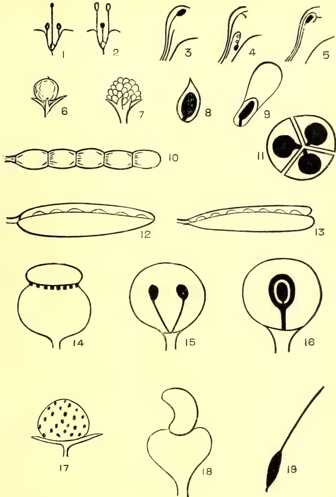

The image contains 19 numbered botanical illustrations. 
 1 & 2: Heterostyled flowers with different styles and stamens. 
 3 & 4: Protandry, showing stamens before the pistil. 
 5: Flower with a long, projecting stigma. 
 6: A simple, single-seeded fruit. 
 7: An aggregate fruit, a cluster of small fruits on a single receptacle. 
 8: A cross-section of an achene, showing a single seed. 
 9: A cross-section of a winged achene, showing a seed attached to a wing. 
 10: A schizocarp (lomentum) of a leguminosae, a segmented fruit. 
 11: A cross-section of a schizocarp, showing four chambers with seeds. 
 12: A follicle, a single-seeded fruit. 
 13: A legume or pod, a two-seeded fruit. 
 14: A fruit of a poppy, showing a rounded shape with a row of pores at the top. 
 15: A cross-section of a poppy fruit, showing two seeds. 
 16: A cross-section of a drupe, showing a stone (pit) inside. 
 17: A strawberry, showing a cluster of small fruits on a receptacle. 
 18: A cashew nut, showing a heart-shaped nut with a wing. 
 19: An awned fruit, showing a seed with a long, thin awn.

LESSONS IN ELEMENTARY BOTANY—FLOWERS AND FRUITS.

1 & 2, Heterostyled Flowers. 3 & 4, Protandry 5, Flower with projecting stigma. 6, Simple Fruit. 7, Aggregate Fruit. 8, Section of Achene. 9, Section of Winged Achene. 10, Schizocarp of Leguminosae (lomentum). 11, Section of a Schizocarp. 12, Follicle. 13, Legume or Pod. 14, Fruit of poppy, opening by pores 15, Section of poppy. 16, Section of drupe. 17, Strawberry. 18, Cashew nut. 19, Awned fruit.

413------------------------------------------------

This image is a scan of a blank page. The paper has a light beige or cream-colored tint. There are several small, dark specks scattered across the surface, which appear to be scanning artifacts or dust particles. No text, lines, or other markings are present on the page.

414------------------------------------------------

JUNE 1907.]387Miscellaneous.AGRICULTURAL ASSOCIATIONS IN INDIA.

(BY MR. H. K. BEAUCHAMP, C.I.E., EDITOR, "MADRAS MAIL.")

In countries of the West, and also in Japan, there has taken place, during recent years, a most extraordinary development of organisation and co-operation in agriculture among the cultivating classes themselves, that is, apart from, though supplementing, State organisation and Departments of Agriculture. "The New Agriculture," as it has been not inaptly called, and the effect thereof on both the material and the social conditions of the peoples of these countries, has been described in many most interesting books and pamphlets, the most succinct, comprehensive and instructive of which is, perhaps, "The Organisation of Agriculture" by Mr. Edwin A. Pratt published by John Murray last year, and issued in a third and revised edition, at the price of one shilling, a few months ago.

It is impossible, within the prescribed limits of an article like the present even to summarise the marvellous records which the New Agriculture has achieved during the past ten years and less in countries so widely differing in agricultural conditions as Great Britain, Australia, Canada, Denmark, Germany, France, Belgium, Italy, Holland, Hungary, Austria, Switzerland, Scandinavia, Finland, Siberia, Servia, Poland, Luxemburg, Argentina and the United States, all of which will be found detailed in Mr. Pratt's book. In every one of the countries named, Mr. Pratt tells us, there has been an agricultural revival which has led to the spreading throughout each of them of a more or less complete network of agricultural organisation, manifesting itself, in varying degrees, in the spread of agricultural education, and in combinations among the agricultural community for an endless variety of purposes, including the virtual transformation of farming methods in accordance with the latest developments of agricultural science; organisations for obtaining agricultural necessaries of reliable qualities at lesser cost; the purchase in common of costly machinery which would otherwise be beyond the means of a small cultivator; the formation of Co-operative Societies for purposes both of production and of sale; the setting up of Agricultural Credit Banks as a means of keeping the farmer out of the hands of the usurer, and enabling him to carry on his operations more successfully; and the improvement of the individual lot of the agriculturist in many different ways. The special circumstances in which this network of organisation has been developed differ in each particular country and it is a fundamental principle of the movement, regarded as a whole, that not only has each of the countries concerned differed from every other in establishing agricultural organisations suited to its national conditions but the greatest degree of success has been obtained where the Associations have been started on a very small scale in rural districts to meet local, or even parochial, conditions, and while maintaining their individual entity, have afterwards combined with other similar bodies to form district, country, or even national Federations for the attainment of common advantages.

As Japan and everything Japanese is just now attracting the widest and deepest attention in India, let us see what forms the New Agriculture has taken there. This we are enabled to do by studying a Report presented to the United States Government a few months ago by Consul-General Bellows. Now, as regards, "small holdings" agricultural Japan resembles agricultural India in a striking manner. Thus in Japan, fifty-five per cent. of the families engaged in agriculture cultivate less than two acres each, 30 per cent. cultivate from two acres to a little less than three and three-quarter acres, and the remaining 15 per cent. cultivate three and three quarter acres or more. Not only, too, are the farms small in themselves, but they are generally made up of different patches of land, so that a farm of two acres may consist of several non-adjacent lots, the average size of a

50

415------------------------------------------------

Miscellaneous.388[JUNE 1907.

lot being about one eighth of an acre. The tools and appliances used are primitive in character, but the Japanese farmer fertilizes and cultivates in thorough-going fashion, thus securing an abundant harvest, besides often raising two or more crops a year on the same field. In the warmer latitudes barley, indigo, beans and rape are grown successively on one plot of ground within the space of one year. The other agricultural products include rice, rye, wheat, mulberries, sweet and other potatoes, millet, buck-wheat, tea, tobacco, cotton and hemp. Stock-raising is in its infancy and poultry-farming is inadequately developed, eggs being imported from China to the value of £100,000 a year. On the other hand, the Japanese farmer generally follows some subsidiary occupation, such as rearing silkworms, reeling silk, or spinning. Alternatively he may work for wages in the intervals of his own farm work.

Such are the normal conditions of Japanese agriculture on which the organisation scheme fostered by the Government is being developed. That scheme would seem to be mainly of a three-fold character—legislative, educational, and financial. Under the first head are comprised laws respecting irrigation, the protection of forests, the control of rivers in the interests of the farmers, the re-arrangement of farm boundaries, and the formation of Farmers' Guilds. Under the second head the Government aids the local treasuries to maintain six agricultural schools for the instruction of farmers' sons in the general principles of agriculture, surveying, veterinary science, and kindred subjects. The Government also conducts an experimental tea farm on which is a curing workshop, a laboratory for investigating the diseases of cattle and poultry, a cattle-breeding pasture for improving the native breeds of cattle for meat and dairy purposes, and two horse-breeding pastures for promoting the introduction of better horses. As regards Farmers' Guilds or Agricultural Associations, we learn that they are formed by the farmers (under the auspices of the Government) "for the promotion of their common interest"; but when organised in conformity with the prescribed conditions, they are further permitted to borrow money from the State hypothec Banks under conditions much more favourable than could be secured by farmers acting independently. The Guilds also undertake works for the common benefit, and especially those that relate to controlling the course or the volume of rivers, irrigation and draining systems, road-building, reclamation of uncultivated land, measures for protection against insect pests, and similar enterprises.

So it would seem that Japan, following in the footsteps of other countries, and eager to benefit by their experiences, has readily adopted and put into practice the conviction that, if agriculture is to prosper, it must be by means of effective organisation, conducted along lines suited to local conditions and requirements, and founded primarily on a happy combination of State and active self-help.

Now, the question arises, what can India do to put herself to some extent into line with other countries of the world in this respect? There are some critics who declare roundly that Indian ryots, owing to their apathy, ignorance, and conservatism, will never combine and organise, and that even if they form Agricultural Associations the latter will be merely exotics which may flourish feebly for a time but are bound sooner or later to decline and disappear. There is some truth, no doubt, in these premises; but such critics ignore other premises which form strong foundations for a belief that Agricultural Associations are more suited for growth in India than in many other countries. For one thing, agriculture is the industry of India, hugely preponderating over all others. It is regarded as the most honourable of all industries. To possess land is to possess status. It is in land that practically every native of India who has money to spare, prefers to invest that money,—from the prosperous *Vakil* and pensioned public servant to the returned

416------------------------------------------------

JUNE 1907.]389Miscellaneous.

cooly emigrant. Under present out-of-date methods of agriculture the return on the capital invested may be small ; but the predilection for land is such [that] that is cheerfully enough accepted.

Now, this consideration is not merely academical ; it has, as I will explain, a direct bearing at the present day on the prospects of organisation and combination in Indian agriculture. If such organisation and combination are to be initiated and developed there must be local leaders—agricultural experimenters, demonstrators, and business-like organisers. Are these to be found ? Not, surely, it will be argued, amongst the great mass of those land-holders and ryots, pure and simple, who hitherto have shown no ambition to advance beyond local agricultural practice, no desire to try new methods, new crops. But it happens that we have, within comparatively recent years, arrived at a period when the first batches of Indian officials, Vakils, Pleaders, etc., educated on Western lines, have reached the time of life when they can retire from active employment and devote their time [and means and talents to other pursuits for the rest of their lives. Imbued with the prevailing spirit of India as regards the holding of land and the honourableness of] agriculture, a large proportion of these men instinctively turn to the land to afford them interest, occupation and livelihood for the remainder of their days. Certainly, then, it is amongst these men that we may hope to find leaders, good and true, of movements having for their object the improvement of agriculture and the development of agricultural organisation and co-operation.

But, speaking generally, there is now-a-days a much wider diffusion of education among the land holding and cultivating classes of India than there ever has been before. The fairly substantial ryots now-a-days give their sons an education which was not dreamt of twenty or thirty years ago, very often saving and economising in order that the most promising of their sons may climb to the upper rungs of the educational ladder. And even the less well-to-do ryots are usually willing to give their sons an education of some sort, even if they cannot afford to send them to College. In fact, it is indisputable that the general level of intelligence in the villages is higher now than ever before ; and probably in every village now-a-days there are some few who would be capable of profiting by a comparative study of agricultural practice.

Then, again, there are the Zemindars and larger landholders, of whom also it may be said that they are far better educated and more intelligent as a body than they were a decade or two ago. Hitherto they have indolently shared the general apathy of their country-men with regard to agricultural improvement ; but already a few of them have started model farms ; and there is certainly an awakening amongst them in this respect. It will not be denied that, as a class, they might do much for Indian agriculture, just as the great landholders in Great Britain, from His Majesty the King-Emperor downwards, have done and are doing much for British agriculture.

Then, again, there seems no reason why the District Boards should not develop an agricultural side of the greatest usefulness. Their revenues are mainly, if not wholly, derived from the land ; and it is but fair and just and politic that some small proportion, at any rate, of their revenue, should be returned to the land in the shape of expenditure for the encouragement of agricultural improvement, in the direction either of special agricultural education, experimental demonstration, or medical relief for agricultural live-stock.

The agencies upon which most reliance must be placed, however, are individual and non-official. A landholder or ryot who, fired with a zeal for agricultural improvement, demonstrates on his own bit of land the suitability of a new crop, the merits of deep ploughing, the value of a new manure, an economical method of

417------------------------------------------------

Miscellaneous.390[JUNE 1907.

lifting water, the profitableness of catch crops, an improved method of sowing seed, or any one of the multitude of other things that concern the economical cultivation of the land, is likely to do far more practical and immediate good than any mere talker or writer on such subjects. There was an instance of what a single humble ryot can do to influence local agricultural practice for the better quoted in the Madras Mail, on June 20th. A correspondent of that journal in describing the circumstances remarked :—

“In the village of Varambium, situated two miles from Tiruturaiipundi (Tanjore), there lives a humble landholder, named Vadara ja Moodelly, who owns about 10 acres of wet and  $1\frac{1}{2}$  acres of dry land. Chance placed in his hands a copy of Vivasaya-Vilakam, a Tamil Manual on improved agriculture brought out by Mr. G. Rajagopala Naidu, Government Agricultural Inspector, who has written it in such a clear and lucid style that every ploughman can understand it. It was from a close study of this book that the man derived his main ideas and inspirations on improved agriculture. The author of the book happening to be in this District, touring through it as an emissary of the local Agricultural Association, the ryot obtained from him further light and knowledge to supplement and amplify what he had learnt from his book ; and thus equipped, he began to practice the improved methods he had learnt, both in theory and in practice, from the Agricultural Inspector.

“What seemed to have struck the man as the wisest thing to do was to practise intensive cultivation ; and in the carrying out of this idea, he was greatly encouraged by the information and guidance he received from the Government Agricultural Inspector. He was convinced that the first essential required for the successful practice of intensive cultivation was to provide himself with wells for irrigation of dry crops in summer, when the supplies from the Cauvery system are not available for the purpose. Bold and enterprising as he was, he soon constructed on his land wells fitted with chrome-leather buckets for the requirements for the dry crops he proposed to raise, and thereby assured the prospect of his land, when cultivated in summer with the aid of artificial irrigation, yielding twice as much before, when no summer cultivation was practised. After his paddy harvest, when all his neighbours' lands were lying fallow, he cultivated cholum as an experiment, and was greatly rewarded when, from his one acre devoted to this crop, he obtained 360 Madras measures. He then raised a second dry crop of gingelly which yielded 50 measures ; at the same time, he paid attention to the collection and preparation of manure from the materials available in his own holdings. He collected the dry sheddings of his trees, and added them to his manure accumulations which he kept covered with mud. To this a further supply was added with another layer of mud. In the result he secured about 60 cart-loads of manure where he was getting 20 cart-loads before ! The results obtained were an impressive object lesson for his neighbours, some of whom began to follow his example in the utilisation of their leaf sheddings for the preparation of field manure.

“Another way by which he sought to improve the fertility of his land, and in which the other villagers afterwards followed him, was by using the silt of the village tank which he cleared for the purpose. In this way the silt of the tank was removed and its dirty bed cleaned and water purified—a no small hygienic advantage for the people of the village, apart from the rich replenishment it affords to the soil. Thus the practice of collecting the sheddings from the trees for manure, and clearing the silt of the tank for the soil, will, if more largely followed, as it promises to be in the light of the example set, be as much a service in the cause of the agriculture of the village as in the sanitation of it, which, in rural parts, is a thing entirely unknown. After cholum and gingelly, hemp was grown, and thus, in a small area of one acre of dry land, a series of dry crops was raised in rotation to the utter astonishment of the people in the neighbourhood, to whom the

418------------------------------------------------

JUNE 1907.]391Miscellaneous.

example of this enterprising man has been an active encouragement and guidance, The Agricultural Inspector, to whom the above results are mainly owing, prepared a loose-box for the ryot's cattle, utilising for it the materials which village economy supplied. He has received applications from other villagers, who had seen the advantages of the loose-box system, for similar boxes to be made for their cattle."

Here, then, is an instance of what a single intelligent ryot can do of his own initiative. It must be noted, however, that in this case the stimulus in the first instance came from a publication by an official of the Agricultural Department; and it is a pleasure to emphasise the fact because great credit must be given to the officials of the Department, from the Director and Deputy Director downwards, for the really practical assistance that they are now affording to the ryots in dozens of different ways, and for the really creditable zeal with which they are pushing the propaganda of the New Agriculture in this part of India. And credit must also be given to those Collectors and District officers, European and Indian, who have given such whole-hearted assistance to the Department in all its recent operations, as well as to the Agricultural Associations wherever they have been established. That the latter will be assisted and encouraged whole-heartedly and even enthusiastically, by the great body of District officials, both English and Indian, goes without saying, I think. In the Agricultural Associations already organised in the *mofussil*, amounting now to quite a respectable number, Collectors, Sub-Collectors, Tahsildars and Deputy Tahsildars have co-operated in a manner which is beyond all praise, notwithstanding the onerousness—in some cases the overburdening weight—of their official duties.

It would be the greatest mistake, everybody must admit, for these *mofussil* Agricultural Associations to become in any considerable way "official" in character, for that would stifle individual enthusiasm and diminish effort amongst the very classes upon whose enthusiasm and effort their success must ultimately depend. But, at the same time, the countenance and friendly advice of officials are essential to the success of the movement, especially in its initial stages. In the Central Provinces and in Bengal, where Sir Andrew Fraser has done so much to stimulate agricultural organisation, the Agricultural Associations appear to have assumed a preponderatingly official character which will certainly be found a great mistake in the long run. The Government's interests and actions are sufficiently well represented and centralised in the Agricultural Departments, and the uses and functions of Agricultural Associations are distinct from, though supplementary of, the proceedings of Government.

Here, in Southern India, the basis of the proposed organisation of agriculture has been made broader and freer from the outset. And in this case those responsible have followed the recommendations, distinctly given on several occasions, of His Excellency Lord Amphill and Mr. A. E. Castlestuart Stuart, I.C.S., the Director of Agriculture. Thus, the Central Agricultural Committee, which has recently been established in the Presidency town, has declared that it intends to work "on non-official lines as much as possible," and will "supplement, not overlap, the operations of the Agricultural Department."

The constitution and objects of the Central Agricultural Committee have been so often publicly explained that I need hardly dwell upon them here. It has sprung from a movement which really started in the *mofussil*, and it is the Agricultural Association of the *mofussil* by which the Central Agricultural Committee stifles its own existence and hopes to do some good. In fact, already there is a considerable foundation to work upon, as regards the institution and administration of a Central Agricultural Committee, in the local Agricultural Associations which have been brought into existence in the *mofussil* during the last two years,

419------------------------------------------------

Miscellaneous.392[JUNE 1907.

The advantages to be derived from such Associations are becoming more and more widely recognised in the mo-fussil, and there can be no doubt that a central organisation in Madras, to bring them into the closest possible touch with each other, as also with every branch of the Agricultural Department, has already become a desideratum. At the same time, one of the first duties of the Central Agricultural Committee will be to stimulate the formation of such Association wherever they do not exist at present, and it is hoped that ere many months are past there will not be a District which has not followed the lead already given in Anantapur, Tanjore, Vizagapatam, Guntur, Malabar, Chingleput, North Arcot and Bellary.

#### CO-OPERATIVE AGRICULTURAL SOCIETIES.

The following account, taken from Mr Pratt's book, of the marvellous results achieved by Co-operative Societies in France, Germany and Denmark, will be read with interest :—

During the latter part of the past century, most of the countries of Europe suffered from severe agricultural depression which threatened to involve the agricultural classes in complete ruin. Various economic causes brought about this crisis, but it is sufficient for our purpose to consider only the means adopted to overcome it. Mr. Edwin A. Pratt furnishes us with some interesting information on the point in his excellent work on "The Organisation of Agriculture." Various schemes were tried by different countries, but the remedy that was finally adopted as the most effective was the formation of agricultural co-operative societies by which the agricultural classes were gradually freed from the clutches of the money-lenders and were enabled to reduce the cost of production and sell their produce to advantage. The following extracts from Mr. Pratt's book will show how these societies have been organised in some of the countries of Europe and what benefits have been derived from them :—

#### FRANCE.

In France, the movement began some time in the early eighties. The historian of the movement writes: "The French market, which, by reason of the development of the means of transport, was no longer protected by the natural barrier of distance, began to be flooded with foreign commodities produced at a cost that defied all competition. Our lands, exhausted by centuries of cultivation, had no chance against the productions of virgin soils, or of countries more favourably situated in regard to taxation, cost of labour, etc. The wheat of North America, India, and Russia, the wool of Australia and La Plata, the wines of Spain and Italy, and even the cattle of Italy, Germany, the Argentine Republic, etc., took, little by little, on our markets the place of our home supplies, and the simple threat of their being imported was sufficient to effect a lowering of prices. The national market existed no longer, and on a market which had become universal, and was affected by the slightest fluctuations that reverberated among the great centres of the world, the French cultivator offered an easy prey to the speculations of international commerce."

These new economic conditions, which there was every reason to regard as permanent, imposed on the agricultural industry a profound evolution.

It was necessary to organise for the struggle, to realise promptly all the possible opportunities for progress, to decrease the cost of production, and to improve the methods alike of production and of sale. For the attainment of these ends the old agricultural associations were but ill prepared. It no longer sufficed merely to spread technical knowledge and to give prizes and awards to agriculturists at periodical exhibitions.

420------------------------------------------------

JUNE 1907.]393*Miscellaneous.*

This was the critical position in the period referred to above and it was met in an eminently practical way by "a certain M. Tauviray, Departmental Professor of Agriculture at Blois." This gentleman found that there was great difficulty in getting the agriculturists to use for their impoverished lands the fertilizers which agricultural chemistry was offering to them; but he saw, also, that their reluctance was not unnatural. Apart from the ignorance and prejudices of the farmers in respect to the use of artificial manures, the producers thereof, having to send out travellers and push a business then far from active, charged high prices, and, what was still worse, sent out adulterated or inferior qualities. M. Tauviray's happy inspiration was to get all the farmers in a certain district to join together in sending in one big order, by means of which they would be able to purchase the fertilizers at a less price, get lower railway rates, and also be in a better position to secure a guarantee of quality. A combination, with these objects in view, was brought about in 1883, and when, in March, 1884, organisations of this type acquired a legal status in France, many more of such purchase associations followed. The use of the fertilizers was found to yield increased crops at a reduced cost, and the operation of the new syndicates obviated all the difficulties previously experienced. So the movement for the establishment of agricultural syndicates spread, in course of time throughout the whole of France, while in proportion as their utility was more and more recognised, the scope of their activity widened. Seeds and feeding-stuffs were purchased in wholesale lots, the same as fertilizers. So were tools and agricultural appliances of various kinds, while special syndicates either procured agricultural machinery too costly for individual farmers to get for themselves and let it out on hire, or enabled farmers to purchase on special terms.

In these and other ways there was, in the first instance, a direct appeal to the material interests of the agriculturists; and the leaders of the new movement had the good fortune to win the early sympathy of the farming community by the offer of practical advantages which prepared for further considerable developments of the combination principle a class of men who, in France, as in England, might well be regarded as the least likely to co-operate for the achievement of a common purpose.

Thus the movement spread rapidly and in less than twenty years, the number of these agricultural associations, whose formation had been officially notified up to 1st January 1903, amounted to 2,433 and the total membership was 599,000. There were also provincial and central syndicates formed for the purpose of influencing public opinion on agricultural questions by means of publications, conferences, etc., and to conduct, in general, campaigns by which the views expressed at the representative gatherings of agriculturists might be carried to a successful issue. From the magnitude of the orders given under this system of combination, the agricultural associations secure a threefold advantage: (1) They get wholesale prices from the manufacturers instead of retail, these prices being made still lower by the fact that the manufacturer, dealing direct with an association or union, incurs less expense for travellers, etc.; (2) the quality has to stand the tests of the association's experts; and (3) lower railway rates are obtained because the consignments are sent to central depots in waggon-load lots instead of small quantities. So, the small cultivator who buys a couple of sacks of fertilizers or feeding-stuffs through his association gets just the same advantages in price and railway rates as a large farmer who orders his five or ten tons. These facilities, combined with the skilled advice given free by the associations, have led to a very great increase in the use of fertilizers in France, and many factories have been set up in that country for their production, while a decrease of from 40 to 50 per cent. has been effected in the prices as compared with what they were before the advent of the agricultural associations.

421------------------------------------------------

Miscellaneous.394[JUNE 1907.

BANKS Besides the associations formed to promote the interests of agriculturists in general, there are many which apply to special industries, such as the syndicate formed at Rennes by a group of cider-makers, with others organized by market gardeners, nurserymen, the growers of vines, beet-root, tobacco, and medicinal plants, bee-keepers, etc. Such organisations seek to promote the general interests of the industries concerned by means alike of spreading technical information, grouping purchase of necessaries, facilitating the sale of products, or making joint representation in case of need on the subject of market tolls, railway rates, etc.

#### GERMANY.

Turning to Germany, Mr Pratt observes that at the time of the general depression, the agriculturists there had the advantage of a system of protective tariffs which gave them a greater chance of preserving their own considerable home markets for themselves, than was the case with agriculturists in free-trade England. The German agriculturist also enjoyed exceptional advantages under the thorough-going system of agricultural instruction which had been established in the country for several years past, and from the discoveries of agricultural chemistry in regard not only to the application of artificial manures, but to the use of agricultural products in various industries, such as the use of beet-root for the manufacture of sugar, of potatoes for the production of a spirit used for driving motors and engines, for lighting, heating, cooking, etc. No fewer than 14,000,000 tons of beet-root, representing a value of £12,000,000 are used in Germany in the course of a year in the manufacture of sugar and the production of these supplies for an industry that is the direct outcome of scientific research is a valuable set-off against possible depression in other branches of agriculture. Still more remarkable is the production of potatoes which amounted to a total of 48,500,000 tons in 1901, of which about one-half is used for other purposes than human consumption, viz., for distillation purposes, manufacture of starch syrup, starch sugar, feeding of cattle, etc. Notwithstanding these advantages, however, the agriculturists found themselves placed in a difficult position in the time of their depression. Science could tell the farmer what it would pay him best to produce and how to secure big crops; but it left him to his own resources in the way of raising money and of selling his crops to the best advantage. Falling prices and other adverse circumstances had so far decreased the available funds of the farmer that it was difficult enough for many of them to carry on their ordinary operations in their ordinary way, year by year, without embarking on those wider undertakings or those more costly methods which agricultural science was opening out to them. In these conditions, it often enough became a matter of urgent importance to the farmer that he should raise a loan which would enable him to carry on until he obtained a return from his crops. Such a loan might make all the difference between comparative success and absolute failure. But while the ordinary banks were ready enough to advance money to a landowner who could give them a mortgage on his estates, they were reluctant to make advances to individual farmers on nothing but their personal security, and their reluctance increased in exact proportion to the growing needs of those who wished to borrow. The way out of the difficulty was found by a resort to the co-operative credit bank system under which the joint credit of the whole of the members of an association is used for the purpose of borrowing money. Once the possibilities of co-operation were fully recognised, these credit banks spread rapidly and they were soon followed by special agricultural societies for the purchase of artificial manures, feeding-stuffs, machinery, tools, coal, etc., which aggregated over 1,000. Of production and selling societies (representing, among other branches, societies for the sale of seed, fruit, vegetables, and produce of all kinds; silo societies; the German Spirit Syndicate; and societies for the sale of cattle,) there were 669. Of dairy produce societies there were 1,682. There are also co-operative societies

422------------------------------------------------

JUNE 1907.]395*Miscellaneous.*

for drainage and irrigation and especially for the purpose of reclaiming bogs and moorlands. The extent of land so reclaimed between 1878 and 1890 is estimated at over 700,000 acres and much of this land on which nothing but heath had grown before now ranks as among the most productive soil in the Empire. In regard to the use of machinery, it is stated that steam threshing machines are used on no fewer than 35,000 farms of less than five acres each. Without co-operation, such a thing would be altogether impossible. In some instances the farmers of a particular district will organise a society for the purchase of a steam-plough letting it out on hire to their neighbours when not using it themselves. It is stated that the number of registered agricultural co-operative societies on 1st July 1903 was no less than 17,162, and some idea of the enormous benefit conferred upon the people by these societies will be formed when it is realised that in 1902, the total amount of the purchases of agricultural necessaries effected by the German credit banks or by the special associations for the purpose was alone valued at  $3\frac{1}{2}$  million pounds.

What, therefore, with her very practical and comprehensive system of agricultural education, her elaborate development of an easy and most effective agricultural credit, and, finally, her great variety of agricultural co-operative associations, Germany may well claim to have reorganised the position of the cultivators of her soil in a way that has brought to them a measure of success, to herself a degree of economic advantage, that would have been impossible, if, when they were threatened with agricultural depression, they had clung tenaciously to old ideas and antiquated methods.

#### DENMARK.

But it is in the little kingdom of Denmark, a kingdom much smaller in size than the Presidency of Madras, that the farmer will find the most impressive object lessons as to the benefits to be derived from agricultural co-operation. After the Napoleonic wars, and, later on, the disastrous wars with Prussia and Austria when Denmark lost two of the fairest and most fertile of her Provinces, he was reduced to the narrow limits of the Islands and Jutland and even of this area a considerable portion consisted of moor, marsh and dune land, practically unfit for cultivation. On the top of all this came the fall in the price of corn which led to a severe agricultural depression which left the people in a most deplorable condition. But the country fought against adversity with the courage of a giant, and, crippled though she was, she not only regained her strength but became a power in the commercial world with which other nations have had seriously to reckon. It was in the development of the dairy industry that the Danes mainly found the means of recovering from the crisis which had overtaken them. Originally the butter exported from Denmark came from what were little more than blending mills, the supplies produced by the individual farmers and representing a variety of qualities and different degrees of freshness, being bought up and mixed together with results that were not always satisfactory to the purchaser, while the expense to which each farmer was put in producing his own particular lot of butter left, as a rule, a very small margin for profit. Then there was adopted the system of creameries to which the farmers would take their cream only. This represented a distinct advance, as it affected a saving alike of time and of cost to the farmer; but the greatest degree of progress began with the perfection of the centrifugal cream separator which left the farmer to do no more than send his milk to the factory, where the cream was taken from it by the separator, and the skim milk given back to him for the feeding of his pigs. In other ways the researches of the Professors had placed the working of the industry on a more scientific basis, thus facilitating operation, reducing expenses and allowing of far better and much more profitable results being obtained than had been the case before. Then, also, the

52 |

423------------------------------------------------

Miscellaneous,396[JUNE 1907.

spread of an extremely practical scheme of national education, and especially agricultural education, had prepared the people to take advantage of the coming transformation; while the system of land tenure in Denmark, which had done so much to encourage both the creation of agricultural freeholders and the increase of small holdings, and further strengthened the power of the agricultural community to benefit from the opportunities opening out to them. The immediate and striking outcome of these various conditions was a resort to co-operative dairies, so that the agricultural classes could get a maximum of possible benefits for themselves. The first co-operative dairy in Denmark was opened in West Jutland in 1882. Others followed and to such an extent has the movement spread that at the present time, a co-operative dairy is to be found in almost every parish, and there are now no fewer than 1,050 of such dairies in Denmark, with 148,000 members, owning 750,000 cows out of a total of 1,067,000 milch cows in the country. In 1902, this little State exported, mainly to Great Britain, 168,000,000 lb. of butter, 135,000,000 lb. of this total representing home produce and the remaining 33,000,000 lb. butter received from Sweden and Russia. The total value of the imports of butter from Denmark into Great Britain in 1902 was £9,302,000. The practice usually adopted is for about 150 farmers in a particular district to raise, say, £1,200 by subscribing £8 each, this sum being sufficient to provide a dairy which will deal with the milk of 850 cows.

The establishment of the co-operative dairies has been followed by the founding of societies for the sale of butter together with some 200 central unions which employ capable men to take periodical tests of the milk on the farms of the members, and see which particular cows gave the best results according to the quantity and cost of food consumed. The Indian farmer, even if he does not go in at once for co-operative dairy society, might at least take some useful lessons from his Danish brethren in sending pure milk and pure butter to the market, by which he is certain to earn a larger profit than he can by adulterating his articles.

Next to the co-operative creameries, and now, indeed, rivalling them in importance, come the Danish co-operative bacon-curing factories, the success of which has been, if possible, even more rapid. It is stated that these factories were the outcome of political prejudices, but whatever the cause, the success of the movement was almost phenomenal. The first co-operative factory was started in 1888, when the number of pigs killed for curing was 23,407, valued at £57,000. By 1902 the number of these factories had risen to 27 with a total membership of 65,800, while the number of pigs killed for curing amounted to 777,232 and their value to £2,500,000. In the organisation of these co-operative factories, no capital is subscribed by the farmers whose joint guarantees are sufficient to enable them to secure from the banking institutions for the country the loan they may require to defray the cost of construction and to provide the working capital as well, the loan being repaid out of the profits of the business. The members also guarantee to supply to the factories all the pigs they raise on their farms, a fine of 10s. 3d. per pig being imposed in case of non-compliance. On sending his pigs, the farmer is paid a certain sum, representing less than the value, but subsequently he receives a share of the profits according to the number of animals he had supplied.

Another highly successful branch of co-operative agriculture in Denmark is represented by the egg industry. Here the chief organisation is that of the Dansk Andels Aeg-export which was founded in 1895 and now constitutes the central body of a large number of local societies in all parts of Denmark. The members of these societies pledge themselves to deliver none but freshly-laid eggs, all that are sent in being so marked that the farmer supplying any single one of them can be readily traced, while a plenty of 5s. 6d. is imposed for every bad egg received after a

424------------------------------------------------

JUNE 1907.]397Miscellaneous.

warning has been given. The local societies remit the eggs to the central organisation which arranges for grading, packing and sale and fixes the price per lb. to be given to the farmer less the cost of collection and other expenses. Membership of the local societies is generally obtained in return for an entrance fee of six-pence. So profitable has the business become that the Danes send their own eggs to Great Britain and import eggs from Russia for home consumption, the difference between the price they get for the former and the amount they pay for the latter representing by the end of the year a fairly substantial sum.

Among the many other forms of co-operative organisation in Denmark an important role is filled by the association formed for the supply of agricultural necessities—seeds, feeding-stuffs, manures, machinery, etc.—at the lowest price and in the best condition. Here again the local societies are formed in turn into large federations. The ramifications of this co-operative purchase system extend to practically every parish in Denmark. Again, the growth of the egg industry has given rise to numerous poultry societies for the improvement of fowls. Some of these societies have a membership of from 2,000 to 3,000 persons. They receive grants from the Government and their operations are greatly facilitated by experts who devote their time to delivering lectures or giving personal advice to the farmers.

There are also local bee-keepers' associations for making honey. They number about sixty with a membership of 5,000.

Thus, there is hardly any branch of agricultural industry in Denmark which is not represented by its separate co-operative organisation. As a rule, each particular co-operative society works on independent lines, for its own special object, so that one farmer may be a member of many different organisations, according to the particular branches of agriculture in which he is interested. The system has been so successfully established in the country that a few years ago the Department of Agriculture and Technical Instruction in Ireland thought it necessary to send a deputation of members to enquire and report on co-operative agriculture and rural conditions in Denmark, and the results of the enquiry are published in a report which was issued in the autumn of 1903.

The rapid development of this co-operative effort in Denmark has brought about changes in the economic conditions in the country that have been almost revolutionary in their character. Not only has it effectually checked the serious consequences that seemed to be impending as the combined result of agricultural depression and national disaster, but the general position of Denmark to-day is one of greater prosperity than ever, for the Danes are deriving more advantage from the extremely limited amount of soil they now possess than they got from the land before the dimensions of their country were so seriously curtailed.

---

## EARTH-EATING AND THE EARTH-EATING HABIT IN INDIA,

BY D. HOOPER AND H. H. MANN.

The original paper on this subject, by Messrs D. Hooper and H. H. Mann, is a long one, but as earth-eating is by no means unknown in Ceylon we give here the general summary.

---

Taking all the facts which we have gathered together on the subject of earth-eating and the earth-eating habit in India, it is possible to reach some very definite conclusions.

In the first place it seems certain that earth-eating by women is not a racial characteristic, that it is determined by no ethnological boundaries, that, equally outside India as in the country, it is occasionally found among almost every class and race of people. In this country it extends throughout the length and breadth of the

425------------------------------------------------

Miscellaneous.398[JUNE 1907.]

land ; it is common on the boundary of Baluchistan, and is also found in Assam and Manipur, near the North East Frontier ; it is known and practised among the jungle tribes of Chota Nagpur, and also by the high caste Hindus of Bengal, and the Muhammadans of the Panjab ; the Kolarin, Dravidian, Indo-Aryan and Mongolian peoples all indulge in the habit of earth-eating. This universal practice points to a deeper-seated cause for the habit than any ethnological or national distinction. The materials used confirm this position. Certain forms of earth are certainly preferred and these preferred forms are sold in the bazaars all over India. Some are burnt before use (Patkholas, &c.); some are sold and used in the raw condition (Multani mitti). But in the absence of these prepared forms, the people turn to the most diverse material to satisfy the desire. Clays, shales, alluvial muds, even sandy soil, are all used when once the habit is established. Luckily, and perhaps by reason of past experience, the material is usually dug out from well below the surface of the soil, and thus infections otherwise inevitable are usually avoided.

What then is the cause of such a widespread habit, and one which, it seems must be satisfied, when once indulgence has commenced ? We are inclined to attribute it primarily to the purely mechanical effect it seems to have in comforting gastric or intestinal irritation. This may or may not be due to disease ; if it is so due, the result is quickly to aggravate the disease it is taken to alleviate ; if not it rapidly produces effects which bring on disease. Gastric or similar irritation is inseparable from certain periods in a woman's life, and these are precisely the periods when the earth-eating habit is contracted. Once indulged in, the wish for similar alleviation becomes a craving, and the habit, as is usually the case with similar ones, strengthens itself, and brings on disease of the digestive canal. In the cases where men indulge, probably the habit has some similar origin.

Such is the habit as we have considered it. The use of clay as food in time of famine, or as a medicine is hardly essential to the present subject, but we believe that in the above explanation will be found the cause of a habit which overspreads all countries and breaks ethnological boundaries of every sort. [*Memoirs of the Asiatic Society of Bengal* (Vol. 1, No. 12).]

## CONCERNING THE MEDICAL MANAGEMENT OF COOLIES IN MALAYA.

By P. N. GERRARD. M.D.

Whilst the cry of "Rubber ! Rubber ! and large profits !" resounds throughout Ceylon and the Straits and is wafted abroad from these countries, may I be permitted, in the interest of both the capitalist and the coolie, to draw the attention of employers of labour to a few points which seem to me to affect the future of the industry ; certainly in this country, and probably in every country wherein a large amount of labour is employed.

Firstly, then, I would point out that all the wealth in the world will not profit a man broken down in health. Secondly, that a dead or broken down coolie is of no practical use on any estate. Thirdly, that unless due precautions be taken, both these lamentable eventualities are at least liable to occur, and indeed, as far as I have seen of the conditions under which the immigrant lives after importation to this country as an agricultural labourer, the failure of the coolie is quite probable.

As it is my purpose to deal principally with the conditions of life of the coolie—the pawn upon whom the question of profits must be a large extent depend—it will probably be sufficient advice in dealing with my first point if I say to managers and assistants :—

426------------------------------------------------

JUNE 1907.]399*Miscellaneous.*

Build your houses on open, elevated, long-cleared land if possible, let them facing the prevailing wind, that you may obtain the full benefit of the evening coolness; do not lie about in wet clothes; sleep under a mosquito net; eat and drink moderately; work hard, but don't overdo it unless absolute necessity demands; Take every reasonable opportunity of getting away from the Estate—especially up an hill—and when you get “played out” or really “seedy” look to it at once.

Remember that malaria, bowel-complaints, and severe colds, are serious diseases, and if undealt with frequently leave sequelae which neither money nor science can deal with. Lastly wear flannel if you can.

There are four fundamental necessities for the establishment of healthy coolie lines :—1. A pure water supply. 2. Adequate ventilation. 3. Some inexpensive but efficient system of Sanitation in and around the lines. 4. Sound drainage.

With regard to number 1, if the well system be adopted of necessity, then remember that the “circle of influence” is at least 20 yards, and that sewage contamination has been traced to upwards of one mile, if the lines are permanent the wells should be bricked inside and surrounded by a raised coping and a cemented and graded circle of say ten feet from the coping all round, the water used for bathing or otherwise spilt should be run off to a distance, the well should be covered and all water drawn by a pump. A simple method of testing whether a well is contaminated by sewage in its vicinity is to pour a solution of fluorescin into the nearest drain or cesspit and observe whether any fluorescence occurs in the well water after 24 hours.

All well and river water is the better for a passage through a clean dripstone filter, but these filters when used casually without clean are a danger rather than a method of purification. They should be periodically boiled and scraped, as fungi are able to grow through their interstices and thus to contaminate good water; the water, if any serious doubt exists about its purity, should be boiled, and stored in some clean place where dust cannot fall into it; the tank or jar must be covered.

Speaking generally the deeper the well the better, and if any hard stratum exist in hills in the vicinity, artesian water may perhaps be struck at a reasonable depth. Pure streams from the hills are probably the soundest water in this country; aqueducts of bamboo are cheap, and can be made over long distances satisfactorily. Always inspect the catchment area. All the rivers of this country are polluted to some degree, and if river water is the only possible source of supply it must be filtered and boiled. That portion of the river near the lines should be divided into three parts: (1) An upper reach for the drinking and cooking water; (2) A middle reach for watering cattle; (3) A lower reach for washing.

If rain water is the only source of supply it should be stored in large underground tanks, as at Gibraltar and other unfortunately situated stations. All tanks and wells should be protected from the entrance of surface flood water, unless the surface over which the water flows is above reproach, if on the addition of 4 ozs. of permanganate of potash to an ordinary-sized well, the water does not become and remain pink for about an hour, the water must be looked upon as doubtful, and measures should be taken to further purify it or to have it analysed. The permanganate should be mixed in a bucket before being poured into the well.

2. Ventilation. The question of ventilation involves little extra expense, as obviously the less we place between ourselves and “God's good fresh air” the less it will cost us in houses, and yet the better we shall be. The present *kuchi* is wrong in principle—by the present *kuchi*, I mean the one which has a straight attap back, a short roof behind and a longer roof in front, under which is a *verandah* where cooking, etc. is performed—its chief mistakes are :—

- (a) The roof is not high enough as a rule,

427------------------------------------------------

Miscellaneous.400[JUNE 1907.

(b) There is not sufficient ventilation above nor below, in front nor behind the cubicles or sleeping rooms.

(c) The verandahs, being also kitchens, frequently are the receptacle for all sorts of rubbish.

After mature consideration and ample proof of its benefits I now believe that there is but one ideal type of lines which is advisable in the best interests of both employer and coolie, namely the lines which consist of simple roof on supports, under which the cubicles are built, none of the line partitions are over nine feet high, all cubicle floors are 3 ft. 6 ins. from the ground and open underneath.

Of about 15 estates with which I am familiar, the healthiest is one on which the above type of lines are in occupation, and I believe I am correct when I state that the only type of disease which has affected that estate of recent years, has been epidemic in character and introduced from without. As, however, on many estates the old-fashioned type of lines have been erected, I would suggest that they be altered as soon as possible, by the removal of the upper two layers of side attaps and the removal of the attaps which extend to the ground (and so close the space under the benches), and that they be replaced as soon as possible by one of those suggested.

An excessive height off the ground is almost as obnoxious as excessive proximity to the earth, because if the lines are too high the underneath will be used as a hen-house or store, in all human probability. Of the two forms of ventilation—the overhead and the underneath—the latter is perhaps the more to be insisted upon as we know that animal CO2 gas as exhaled, is most poisonous, and also that its specific gravity is greater than air, therefore, in the absence of draughts by under ventilation, it is obviously only a matter of time and opportunity to become suffocated by it.

We now come to the question of Sanitation at the lines. Everyone who has had anything to do with the Tamil coolie is aware of his roaming habits under certain circumstances, his love of variety and the fields, or preferably the road or pathway, but that Tamil coolies or Chinese coolies or any other coolies cannot be gently but firmly educated I absolutely decline to believe.

Now under existing sanitary—perhaps I might indeed say insanitary—arrangements on the majority of estates in this country, I submit that the unfortunate coolie who gets “ a tummyache ” at say 1 a. m., should not be blamed by the inspecting doctor or agent the next day, in the garish sunlight, for filthy habits; in other words “ until proper sanitary accommodation becomes a feature of every coolie lines in the country and a special coolie be detailed to look after the matter disease must continue to exist amongst the whole class.”

The type of latrine to be erected is of the simplest, an attap-roofed shed elevated above the surrounding ground level, with a trench for buckets or to be filled in with a mixture of dry earth and lime daily to a depth of about three inches, the trench protected from storm-water by means of ordinary earth drains around it, and sufficiently removed in its situation from the main water supply to prevent contamination—this will suffice to prevent an enormous amount of illness.

Lines are generally, in my opinion, better without any open earth drains whatever, they only serve as receptacles for all sorts of filth and rubbish. The very fact of a convenient hole to throw things into running all round the lines, is quite sufficient inducement to create a bad habit amongst a much higher type of individual than the average coolie. My ideal surroundings for lines would be short-cropped grass, gravel, laterite, or coarse ashes, not very expensive luxuries any of them. I would run French drains at right angles, from the kuchis right

428------------------------------------------------

JUNE 1907.]401Miscellaneous.

round, in order to keep the immediate vicinity dry. Pools, if they occurred after rain, should be filled in or levelled. (French drains are made by digging first a graded trench, filling in the whole length of it with coarse rubble, then over this fill in finer gravel, then sand or earth, and cover the whole with earth, gravel, or grass. Some sinking will, of course, occur, which must be dealt with, but the result is an enormous and cheap improvement.)

Brick drains round lines are, of course, charming, but they must be carefully graded and capable of dealing with all flood-water, kept clean by frequent sweeping and disinfection, and, where they run deep, deep holes to carry off surface water should be made. Tidal drains, whether of earth or brick, unless properly controlled by water gates are in my opinion inadvisable. If thoroughly under control and regularly opened and the drains swept with the ebbing of the tide they may be made use of. If the watergates are opened at high tide and closed until low water then opened and the drains flushed out at a high velocity, with much sweeping, twice a week, then good results may be expected.

Too much stress cannot be laid upon the system of facilitating all sanitari-ness amongst coolies, at present they are blamed as a class—I believe quite wrongfully—for being dirty in their habits and altogether bestial, they have no opportunity of being otherwise unless the European places every convenience within their reach. Let a sanitary mendor be appointed to every 100 coolies, erect a latrine for every seventy-five individuals, punish defaulters, inform your coolies of the arrangements, post notices for those who can read, and I shall deem it a personal favour if you will let me know the result at the end of six months. System must be the password, and every drainage and sanitary plan should be capable of extension to meet larger demands.

#### PRINCIPAL DISEASES OF THE COOLIE.

For obvious reasons it would be improper of me to write a full description of the methods of treatment and diagnosis of disease in this paper, and it would be quite impossible to do so within the limits of an ordinary essay, but in the interests of both parties I may perhaps sketch briefly the principal symptoms which lead one to suspect serious disease, and suggest a sound amateur treatment to be adopted in such cases.

**MALARIAL FEVER.**—The principal disease to which the coolie is liable is Malarial Fever, but if the attacks of this disease remain discrete—by which I mean so long as the attacks are separated by a day or days—one may safely deal with him on the estate by the administration of quinine in 5 gr. doses thrice daily; if, however, the attacks overlap, and the disease becomes continous, then an hospital is the proper place for the case. When it is found that the fever yields to quinine the drug should be continued in 5 gr. doses daily for two (2) months, the neglect of this most important “regime of prophylaxis” is the cause of the relapse cases which cause so much invaliding and disturbance of estate work quite unnecessarily.

The necessity of sleeping in mosquito curtains must be “rubbed into” coolies; the Chinese have adopted them and there is absolutely no reason why the Tamil should not be educated up to their use. At the meeting of the Malaya Branch of the British Medical Association held at Ipoh on August 28th and 29th, 1906, my friend Dr. Malcolm Watson of Klang, pointed out the advisability of mosquito-proofing all lines, and he laid before that meeting most convincing statistics to show that the saving of life and labour from the ravages of malaria by this means, amply repaid planters for their original outlay on wire gauze. I am strongly in favour of this measure where it is feasible, but curtains must be supplied where serious obstacles to its adoption exist.

429------------------------------------------------

Miscellaneous.402[JUNE 1907.

In dealing with the question of fever the mosquito naturally comes under notice, and before starting upon the means to be adopted to combat the existence of this pest, I must first make my peace with some planters who still believe that this insect is not the only means of propagation of malaria, by stating that the malarial parasite has been constantly found in the stomachs of certain mosquitos, but it has not been found in decomposing granite, nor in any of the other earths and clays, etc, which have been blamed as distributors or propagators of the disease. All experiments with infected *Anopheles* have been positive, and I am quite willing to guarantee or gamble on the result of the experiment of infecting any new-comer to this country by the means of infected *Anopheles*, provided the doubting planter will make the necessary arrangements with his newly-arrived assistant.

Mosquito houses were the only means adopted by the Commission sent out by the London School of Tropical Medicine to that hotbed of malaria the Roman Campagna, and no cases occurred amongst the members of the expedition; and again, the European who submitted himself to the bites of *Anopheles* which were infected 48 hours previously in Rome, still occasionally gets fever (Mr. Warren, assistant in the London Tropical School who had an attack while I was studying there). Of oils and paints to keep off the mosquito there are many, amongst others I can state from personal experiment that citronella oil kills two species of *Anopheles* at least, within 30 minutes, and if renewed about every three hours upon exposed surfaces, it effectually keeps them away.

Anti-mosquito measures generally speaking consist in: 1. Closing all ponds; 2. Draining all swamps; 3. Covering all necessary water; 4. Kerosining all large stagnant areas of water; 5. Clearing the banks of all slow-flowing streams and drains, and to the above I would add from my own experience the felling of secondary jungle, and the cutting of *Lallang* in the vicinity of houses.

In connection with malaria it must not be supposed that a rigor (shivering fit) a hot stage, and a heavy sweat, comprise the whole of the disease, as it has been definitely proved that malarial dysentery, and diarrhoea occur frequently in the tropics, and that the whole question as to what symptoms malaria shows is dependent upon the particular organ or part of the body in which sporulation of the parasite occurs, should sporulation take place in the brain, convulsions and coma will be present, in the lungs a form of pneumonia, in the intestines a form of dysentery, etc. Malaria is not the simple kindly disposed disease which planters frequently imagine.

DYSENTRY.—I do not intend to deal exhaustively with this question, but I wish to impress the fact that I believe the vast majority of dysentery cases, as seen amongst coolies, have their origin either in malaria, or are of a bacillary nature and highly infectious, the impossibility of separating the two forms, from a layman's point of view, render a general rule necessary, that rule is: Segregate all dysentery cases. Bilharziosis, when it affects the rectum produces symptoms similar to dysentery; it is known, but uncommon here. If the health of an estate is a matter of any importance, each dysentery case should be looked upon as if it were cholera, and isolated immediately on its appearance. As a routine treatment a dose of castor-oil, with say 20 drops of chlorodyne, is the safest medicine to start on, and on arrival in hospital I am a believer in enemata of various drugs according to the predominating symptoms.

DIARRHOEA.—Diarrhoea causes a large mortality and invaliding rate amongst coolies. I consider it to be chiefly due to one of four causes: 1. Mica in their drinking water; 2. Eating uncooked rice; 3. Malaria; 4. Ptomaine poisoning, by which we understand the eating of food which has commenced to decompose. (Quite

430------------------------------------------------

JUNE 1907.]403Miscellaneous.

recently I met a coolie homeward bound with a species of ray which was quite bad, and I have no doubt his intention was to share it with his family; I confiscated the fish and got a conviction against the vendor.)

As ptomaine poisoning diarrhoea is difficult of diagnosis, and the protraction of the illness very variable, and as it may be confused with other diseases (which I shall deal with below) I think that these cases ought to be segregated, many of them might be tubercular or typhoidal in nature. The necessity of regular inspections of the food in the estate shop is a fairly obvious duty, and will help to prevent the ptomaine cases if all questionable articles are confiscated and destroyed.

**ANCHYLOSTOMIASIS.**—This disease, of which little is as yet known amongst laymen, has been of late years so threshed out pathologically, that it is now, to the tropical physician, an open book, writ large, and easy of diagnosis microscopically. This scourge of the West Indian planter at one time, will be one of the most serious diseases to be dealt with in this country, unless prompt precautions are taken with regard to its prevention and cure in such places as it now occurs.

The disease in its fully developed stage exhibits the following symptoms: anaemia, swelling, diarrhoea, abdominal pains, muscular pains or pains in the joints, and a lassitude, which may be remarked frequently as the first symptom. The disease untreated invariably terminates fatally, but if the treatment be applied in time it is not very difficult to deal with, and the patient usually recovers. It is due to the action of a minute worm which lives in the upper part of the small intestine and sucks blood from the patient, eventually causing a deep anaemia or wateriness of the blood, which is followed by the symptoms enumerated above. The gravity of the disease is proportional to the number of worms present in the intestine.

The parasite can enter the system either by the mouth in drinking water, or by the skin, and it works havoc amongst coolies in infected areas. The worm can live in moist earth for a considerable time, and many authorities believe that it can multiply outside the body. The ova of the worm are voided in large numbers by sufferers from the disease and then undergo development into worms capable of infecting persons through the skin. When the almost total absence of latrine accommodation for coolies is considered, together with the habits of the Tamil, and the fact that they work barefooted, the chance of a worm gaining admission into a human being must be regarded as "rosy." The treatment, consisting as it does in the administration of a somewhat dangerous drug—namely, thymol—I do not intend to deal with herein, but it may be useful to hospital dressers to remember that the drug is soluble in the following: chloroform, oils, turpentine, alcohol, glycerine and ether (a useful pneumonic for these drugs is cotage), if they be administered to patients when thymol has been exhibited poisoning follows. The prophylaxis of the disease is simple, but extremely difficult—if I may be permitted the bull—simple because it consists in either compelling coolies to wear shoes and gaiters or putties when at work, or in smearing their legs with some sticky substance, before they go to work—in the West Indies the planters, driven to extreme straits, eventually stamped out the disease by insisting upon the coolies stepping into green Stockholm tar before going to work. I believe any oily thick substance will serve the purpose; the prophylaxis is difficult, because it is obviously a tedious process to prove to the native mind that such simple measures are necessary and effective for the preservation of their health. Latrines and a lines watchman are absolutely necessary to see that sanitary instructions are followed.

**DEBILITY.**—One of the principal headings of disease under which a multitude of diseases are in reality included, it is a serious cause of invaliding and stoppage of work. That there exist cases which are not easily relegated to their proper heading I am, alas, only to ready to grant, but that in the majority of instances these

52

431------------------------------------------------

Miscellaneous.404[JUNE 1907.

cases can be separated I am equally convinced. Amongst others, the following diseases are, I consider, largely responsible for "debility": 1. Anchylostomiasis; 2. Dum-Dum fever (which undoubtedly exists amongst Indian coolies in this country); 3. Worms; 4. Starvation (due to improperly cooked food which cannot be digested); 5. Sprute; 6. Malaria in a vicarious form.

Such cases cannot be separated without careful examination and scientific investigation, and the hospital is their proper place. The number of coolies who die annually of "debility" is at present much too high in estate hospitals, and to my mind reflects upon the class of dressers employed usually in estate hospitals, and also reflects detrimentally upon the planter, and upon the revenue of the country.

ULCERS.—That these cases which cause such an enormous number of hospital birds, and "slackers" amongst labour forces here, can be dealt with by similar methods to those quoted by me above for Anchylostomiasis, I have no doubt. The cause lies beyond question hidden in a word, wounds; whether caused by biting flies, the Anchylostoma, sugar-cane leaves, stony ground, or what not, the original cause of ulcer amongst coolies is, I believe, a wound, and the method of their prevention is quite obvious.

The admissions for this disease in Krian district during 1905 amounted to 5,322 in a total labour force of approximately 7,200, and if the average number of days for which each case was in hospital be put at say 10, the total monetary loss to the estates must have been about 14,000. During 1906, 3,617 cases were returned on a labour force of 7,135.

DUM-DUM FEVER.—This disease undoubtedly does occur in imported Indians, but that it can arise or ever has arisen *de novo* in this country, is not certain. As I have already stated it may be confused with Anchylostomiasis, and some other debilitating diseases; the diagnosis can only be made microscopically, and considerable skill is necessary in the preparation of the specimen.

There is as yet no known cure for the disease. The disease has also been called Kala-Azar. The principal symptoms will be anaemia, swelling, weakness, enlargement of the spleen and liver, and great general debility. The cases must, of course, be sent to hospital, if only to have the diagnosis made.

BILHARZIA DISEASE —Endemic in Africa, this disease has happily not invaded this country to any extent. The symptoms affect either the bladder or the rectum, causing in either position a discharge of blood and mucus. It may be confounded with dysentery when affecting the latter. The accurate diagnosis can only be made microscopically and no first aid treatment is likely to be necessary. In the event of severe bladder pain occurring, the general treatment of inflammation of that organ (irrespective of the cause), namely a hot hip bath, and barley water to drink, should be kept in mind. The disease is caused through bad drinking water.

WORMS.—Many natives harbour intestinal parasites, the commonest being the round worm.

Tape worms occur but rarely in my experience, but of whipworms the same cannot be said. Intestinal worms cause a marked amount of debility and frequently anaemia also. The treatment of the tape worm is frequently a protracted procedure, as the head of the worm is not easy of expulsion, the treatment is ext. of male fern, or thymol, both of which drugs require careful handling. The round worm is expelled by santonin, which drug—although it may cause yellow vision—should occupy in this country a position more akin to that occupied by quinine than it at present holds.

Despite the arbitrariness of the statement, I am of opinion that every coolie arriving in poor condition should have an ounce of castor oil on the day of his arrival and 6 grains of santonin next morning. The question of the psychological

432------------------------------------------------

JUNE 1907.]405Miscellaneous.

moment for the administration of the drug, I leave to the intelligence of managers or hospital assistants; the ideal method would be to treat the whole batch at once. Whip worms will require injections for their removal, and as they cause no actual invaliding do not cause any material effect upon the work of the estate. Filtration of or boiling of the drinking water is the proper preventive of these diseases.

**ELEPHANTIASIS, CHYLURIA AND VARICOSE GLANDS.**—The cause of all the above diseases which occur, but are not common in this country, is a blood worm. The worm is transmitted by the bite of *Culex* mosquitoes, so that our anti-malarial measures will help to prevent the diseases. Elephantiasis is diagnosed by the swelling of a part, usually a leg or a foot, the swelling is hard and brawny, the skin usually wrinkled, and very coarse, the disease is usually uni-lateral and the affected part does not pit on pressure.

Chyluria, due to the *Filaria* also, consists in a milkiness of the urine. Varicose glands usually occur in the groin, they are hard and painless. All these diseases can only be diagnosed microscopically in their early stages and have little effect upon health until long established. The majority of cases require the scalpel for their treatment.

**LEPROSY.**—Unusual amongst coolies who have been medically examined, it is, nevertheless, most important that the symptoms of this disease should receive all possible publicity, in the interest of the public health. Any thickening of the skin, circumscribed, and of a coppery red tinge, should be suspected. Loss of feeling, even to sharp bodies, such as a pin, if it is found in a hardened patch of skin is very suspicious. Thickening of the nerves, for example, an enlargement and hardness of the nerve at the inside of the elbow—"the funny-bone"—should lead one to examine for anaesthetic patches elsewhere. Chronic ulcers of the feet, particularly of the sole of the foot, are frequently leprosy. The physiognomy of a leper is quite distinctive to the trained eye, and when the seared, leonine expression is present, cannot be mistaken. Irregular and usually slight attacks of fever occur early in leprosy, the latter signs, such as the loss of fingers and toes and repulsive ulcerations of the body are, mercifully, seldom seen save in the asylums provided for these unfortunate beings.

**ABSCESS OF THE LIVER.**—The fever, emaciation and general illness preceding the full development of this disease are so variable and progressive, that its diagnosis is hardly a subject for this pamphlet. Early operation is the secret of success, and all that I need mention about it will be a quotation from Sir Patrick Mason's lectures at the London School of Tropical Medicine: "Whenever you find a progressive deterioration of health and vigour occurring, accompanied by some fever and sweats, always suspect liver abscess."

**SPRUE.**—I feel that a précis of sprue is a difficult task. Where tropical diarrhoea ends and sprue begins is not easy of definition, but if I were driven to a descriptive epigram, I would say, "Sprue is a chronic deterioration of mucous membranes of unknown causation."

The symptoms may be represented by various combinations of or a conglomeration of the following:—Diarrhoea, sore tongue, ulceration of the mouth, abdominal pains, pain on swallowing, pale stools, gassy stools, loss of weight and energy, shrinkage of the liver. I consider sprue to be common amongst coolies in this country, but the difficulty of accurate diagnosis causes the majority of the cases to be returned as diarrhoea.

The treatment, which should be commenced very early, consists in baby-foods and milk, nourishing unseasoned dishes, such as freshly cooked minced chicken, fresh fish, eggs, rusks, and such like. I believe that if this treatment were adopted

433------------------------------------------------

Miscellaneous.406[JUNE

on the first appearance of the symptoms of tropical diarrhoea or sore mouth, that many cases would not progress to the acute disease. I may perhaps be pardoned for having digressed somewhat, and in some instances for having invaded the domain of the manager's illnesses rather than the coolies—as in the case of the treatment given above—but I submit that on such occasions if I have outlined the proper treatment for the manager, he can easily substitute for what is laid down as his treatment, what should be the treatment for his coolie sick of the same disease.

**INFECTIOUS DISEASES.**—I have already laid down the advisability of isolating cases of dysentery, diarrhoea, anchylostomiasis, and other intestinal diseases, the necessity in infectious cases—strictly such—is absolute, and if it be remembered that in the case of cholera alone, the disease frequently commences as a simple diarrhoea, the expediency is obvious. Of epidemic disease affecting bodies of coolies the principal will, of course, be small-pox, cholera, chicken-pox, influenza, measles, dengue, plague, to a minor extent enteric fever, and amongst the Chinese beri-beri (which is perhaps not directly infectious). The majority of these diseases can be seen coming, and arrangements made for the isolation of the cases direct they occur, the estate should establish quarantine against infected areas in the vicinity, and every endeavour should be made to prevent coolies visiting such infected areas.

**SMALL-POX.**—The incubation of the disease is about 13 days, during this time the patient feels quite well. Fever starts with shivering, and frequently vomiting, children of ten have convulsions, pain in the back is severe. On the third day of fever the eruption appears, in appearance like pimples, and with a shotty, hard feel to the touch.

The pimples next suppurate and matter forms, this period marks the commencement of the secondary fever, and occurs about the eighth day, the eruption appears on the head and neck first, gradually spreading. The secondary fever is severe, and about the fourteenth day the patient become most offensive, and may be quite unrecognisable. Delay in the appearance of the eruption is a favourable sign. The rash comes out all at once, in contradistinction to chicken-pox which occurs in crops.

The infection lasts until all the crusts have fallen. Careful disinfection of the hands, and of all material which has come in contact with the patient is imperative. Attendants upon the sick should be chosen from amongst those who have already had the disease, or who have got vaccination marks. Strict quarantine for fourteen days after the death or complete recovery of the last case is necessary. The best form of isolation hospital—and the cheapest—is a shed of ataps, bound to iron supports, the floor should be cemented if possible, and the “whole show” burnt when the epidemic is at an end.

**CHICKEN-POX.**—The rash comes out on the first day of the fever, all the symptoms are less severe than small-pox, and the eruption comes out in crops. The feel of the pimples is not so hard as those of small-pox. Suppuration occurs in the pimples just as in small-pox, but the two disease are really unlikely to be confused.

**PLAQUE.**—Perhaps the first remark to be made upon this disease to the layman is, that there need not necessarily be any buboes; and indeed the most serious cases show no external sign of the terrible affection; as is now well known the form from which the disease obtained its name was the bubonic form, in which swellings of the glands in various parts of the body exist (groins, neck, armpits) this form of the disease—given the fact that cases have been occurring in the neighbourhood—is at least easy to suspect, and the extreme depression and very acute fever, lead one to isolate the case promptly, but the case which I wish to put you on your guard against are, the pneumonic and the septiœmic forms. These occur with some

434------------------------------------------------

JUNE 1907.]407Miscellaneous.

frequency in all epidemics, and I think that perhaps the safest dictum I can give you as a working and standing order is this, "isolate all cases of high fever" which is accompanied by marked depression, or giddiness, or "constant cough," and try not to mistake a plague case for a drunken coolie, the symptoms frequently resemble each other, but the severe fever must settle the diagnosis for you. The diagnosis should be confirmed microscopically by Dr. Bell's method (Hong-Kong).

The incubation is laid down at three to eight days, but instances in which infection has occurred from clothing, and after months, have been observed. Initial symptoms are shivering followed by severe fever, headache, vomiting, unsteady gait, depression, enlargement of some of the glands (if of the bubonic type). Little children usually succumb. Plague patients are infectious for about one month after recovery. Rats are known to disseminate plague. Infection may take place through wounds and scratches, and also through the bites of insects, *e.g.*, rat-fleas, bugs, and perhaps mosquitoes. The excreta and sputum are infective. Attendants upon plague cases should wear shoes. Through disinfection of all clothing (if it be not possible to burn it) is imperative. An anti-rat crusade is advisable early in the epidemic. Quarantine should extend to ten days unless the medical officer relaxes this rule for good reasons. Cyllin is said to be the best disinfectant. Haftkine's plague serum has been variously reported upon.

CHOLERA.—Frequently commences as a simple painless diarrhoea, but may start very suddenly during the night, the diagnosis—in the event of cholera existing in the vicinity—of all cases of diarrhoea, must be guarded, and when under such circumstances, such cases occur, isolation, prompt and efficient is strongly to be recommended.

The next stage is one of collapse from which many cases never recover, the motions at this period become like rice-water, cramps occur, and no doubt about the diagnosis usually remains, more especially if the disease has been reported from the nearest town or village.

The vehicles of infection are water, milk, and contaminated food, and clothing. I found, however, when dealing with the disease in Pahang in the year 1901, that a grave suspicion fell upon the river fish, and whether "post hoc" or "propter hoc" the disease certainly abated rapidly when I got the "kathis" to place the river fish under a "pantang," thus preventing their use as food.

During the stage of collapse stimulants are administered by the mouth (if retained) and by hypodermic medication, the application of heat, mustard plasters and such like remedies also. Contact with the discharges must be avoided, and disinfection carried out thoroughly if such contact occur. The vomited materials, the urine, and saliva are infective, and of course the motions.

The most prompt isolation of all diarrhoea cases in the event of cholera being present in the district is necessary. If possible, change the water supply at once, examine the food supply and milk supply, and destroy all articles of doubtful virtue (except human beings) on the estate or works at once. Vomiting is usually severe in cholera cases and is usually a pale watery fluid. The appearance of a cholera patient is most typical, the hollows round the eyes, the dazed or hunted appearance taken together with loss of voice, coldness of the extremities, a feeble pulse, deep collapse, and the macerated appearance of the hands all lead one rapidly to the correct diagnosis.

All wells should be submitted to the permanganate process (see above) which is highly praised, but I personally prefer to rely upon boiling. Corpses should—failing burning—be buried with chloride of lime. Perhaps the best and simplest drugs to administer in the first instance are castor oil, chlorodyne, and brandy (half an ounce of the oil, 25 drops of the chlorodyne, and about one ounce

435------------------------------------------------

JUNE 1907.]408Miscellaneous.

of brandy). Eucalyptus oil has lately been highly spoken of, I have myself found a strongly carminative mixture containing liq. hydrarg. perchlor, a most useful mixture. Colomel acted well in the Krian epidemic, gr. 1 every hour, but I consider it requires careful watching. Haffkine's cholera vaccine should be given a trial, it has been well spoken of. Quarantine infected houses, lines, and towns.

The most satisfactory method of dealing with infected houses is of course to burn them; if impracticable, then disinfect them thoroughly with 1:500 corrosive sublimate. During the Pahang epidemic the D. O. (Mr. Mason) and I burnt every house in which a case occurred which was within two miles of Raub town, and I believe that action had much to do with the fact that Raub remained clear. All excreta must be either burnt or buried. Contacts must be also isolated, and they should all be given some acid and mixture thrice daily in order to keep the stomach acid.

MEASURES TO BE TAKEN UPON THE OUTBREAK OF CHOLERA, PLAGUE, OR SMALL-POX.—1. Form bearer, burial, and sanitary companies, equip with stretchers, etc., treat all as contacts, their clothes and hands to be carefully rinsed in 1 in 500 corrosive twice daily and after contact.

2. On the discovery of a case, bearer company will remove patient to hospital, medical officer will remain to see the kuchie opened to the sunlight, and the room either completely limewashed or scrubbed with 1 in 500 corrosive sublimate.

3. When the washing gang are started the names of the contacts should be taken, they should be sent to the contact shed. Frequent roll calls of contacts are essential.

4. During the progress of 2 and 3 above, the patient's clothes may be burnt, all his utensils destroyed or boiled.

5. If the disease shows any tendency to spread, tubs of 1 in 500 corrosive, 1 to each 50 coolies must be set up and the clothes of every one in the lines steeped therein for 12 hours.

6. All utensils of all coolies must be boiled.

7. All wells must be closed, and a sound, fresh water supply arranged for (this in the case of cholera only).

8. All coolies must rinse their hands in a solution of 1 in 1,000 corrosive before meals.

9. Change the bathing places if possible.

10. Limewash or corrosive wash all benches in the kuchies.

11. In the case of small-pox universal vaccination.

12. In the case of plague, plague vaccination and disinfection as above.

DENGUE.—This disease is an exceedingly sudden, and extremely infectious fever, it is marked by severe pain in the bones and joints, a rash usually appears, but in this country is rather fickle in its appearance, in the early stage of the fever it occurs as a simple redness of the general body surface, which is hard to demonstrate on dark skins. The pain in the joints and bones is frequently very serious, and the disease has hence acquired the name of "break-bone" fever. It almost invariably occurs in epidemic form, and rapidly spreads, it may be "seen coming" and advances from the neighbouring towns rapidly, when it has once declared itself.

After the primary fever a short interval of calm or freedom from fever occurs, and patients may even feel fit to go to work, but the secondary fever then breaks out, and a rash the true rash of dengue shows up, this commences on the palms and backs of the hands, is best seen on the back of the body to which it quickly spreads. It consists of slightly elevated, circular, reddish brown spots

436------------------------------------------------

JUNE 1907.]409Miscellaneous.

about half an inch diameter, which eventually coalesce to form plates of red. Peeling occurs, and may last for some time (2 to 3 weeks). Isolation of the first cases is advisable, but the disease spreads so rapidly that it were advisable not to expect too much of isolation as a preventive measure in this disease.

**INFLUENZA.**—As the vast majority of us have had personal experience of this disease, I shall merely draw attention to the leading symptoms once more to remind those who have suffered of their miserable time, and to claim kindness, or at least consideration, for coolies who became affected by it; sneezing, cold in the head with fever, pain in the back, rheumatic pain all over, general miserableness. Quinine and salicylate of soda are useful drugs in the disease, but it must not be trifled with nor neglected.

**MEASLES.**—The rash comes out on the fourth day of fever, it is well defined and the “running at the eyes” usually helps to diagnosis, exposure must be avoided, as pneumonia is a rather frequent complication. Measles, influenza, and dengue are easily confused, but if the planter will look about him he will frequently find assistance from the fact of certain diseases existing in the vicinity.

**PHTHISIS.**—Consumption is an infectious disease. Consumption is terribly common in this country. The disease is insidious, and occurs in many forms, affections of the lungs being perhaps the most common, but the disease when it attacks the intestines is very fatal. The internal organs are susceptible, and I have ample post-mortem proofs of its frequent occurrence here in this situation. Careful examination of coolies suffering from chronic cough is most advisable, and the examination should be carried out microscopically in order that no mistake can arise. In the future Government will, I have no doubt, erect consumption sanitaria, but for the present I consider that when a coolie is found to be suffering from this dread disease, that he should be immediately repatriated, as the cheapest and best method of preserving the health of those who must associate with him in his work and on the lines while in this country.

**HYDROPHOBIA.**—A word or two about this shocking disease may not come amiss here. The disease is caused by the contact of the saliva of a rabid animal with a wound on another animal (man included). It usually occurs as the result of the bite of any animal suffering from rabies. The first symptoms of the disease in the dog (which is the commonest domestic animal affected) are: 1. A change in temperament; 2. Restlessness.

The stages of the disease have been divided as follows:—1. The premonitory or melancholic. 2. The irritative or maniacal. 3. The paralytic.

In the first, as I have stated, the dog’s general behaviour alters, if a lively individual usually, he becomes morose, inclined to snap, and to hide himself, as this stage progresses he is often observed to chew sticks, to eat pieces of stones, etc. He then becomes “mad,” symptoms of choking, spasms, or fits take place, planting, difficulty of breathing, vomiting, and cough occur, he may run away from home, and sometimes they travel great distances; at this stage the diagnosis is generally easily made. The last stage is paralysis, his jaw drops, he can no longer swallow, his back becomes paralysed, and the unfortunate animal dies, either in a convulsion or quite suddenly. The measures to be taken if one be bitten, or a wound of the skin come in contact with the saliva of such an animal, are: 1, Apply a tight ligature above the seat of the bite if possible; 2, Burn the bite itself with a hot iron; 3, Apply carbolic acid. The ligation should be retained in position for about three hours. The incubation period from the bite or contact, to the development of hydrophobia is variable, but may be set down at from four weeks to sixteen.

437------------------------------------------------

Miscellaneous.410[JUNE 1907.

~~Suspected~~ Suspected dogs and other animals should be firmly tied up and kept under observation, or they may be killed by shooting them in the head, their spinal cord or a portion of it removed, placed in a bottle containing glycerin, and sent to the nearest laboratory to be examined as to the exact diagnosis. All uncared for animals should be shot for an area of about ten miles round the focus of the disease.

In the unfortunate event of one being bitten by an animal doubtfully mad, the patient should be sent to Saigon or one of the Indian Pasteur Institutes, with a piece of the spinal cord of the animal which bit him, for confirmation of the fact of madness, and, if confirmed, for treatment. The reason for taking the cord is that some animals show very rapidly the effect of the poison, and the disease can be with certainty diagnosed by injecting them, and treatment rapidly started.

HOSPITALS.—Under the Labour Code which deals practically exclusively with Chinese, sec. 79 lays down "That the resident may order an hospital to be built, and a dresser engaged provided not less than fifty labourers be employed."

Under the Indian Immigration Enactment Rules, "Hospital accommodation of eight beds for every one hundred is required, they should be under the charge of a resident and qualified apothecary." The dimensions, floor-space, etc., are all laid down, it will therefore suffice if I express my fixed opinion that the appointment of a qualified resident apothecary is most advisable in every hospital in this country if good work is to be done on estates.

I have seen every class in charge of the sick I think, and the more I see of the estates which endeavour to economise on their medical department, the more convinced am I that it is folly of the most superior brand. I much regret that I have yet to meet the dresser, on \$30 to \$50 a month, who is dependable for a diagnosis; returns one can obtain galore, but they wither under the light of day. The differential diagnosis between, say, malarial cachexia and Bright's disease, and anchylostomiasis (with which you are now I trust familiar) are of the utmost import to the future of an estate; and again the separation of plague from venereal bubo with fever, small-pox from chicken-pox, typhoid from a simple diarrhoea, and cholera from ptomaine poisoning, and a host of similar cases which may require prompt recognition, must surely prove my point, that the dearer article is the cheaper.

In my opinion the most important point in dealing with the health of estates and large works is the instant separation of the sick from the healthy. No sick coolie should remain one minute in contact with his sound fellows, certainly not one hour, and to leave him one day is criminal. With the able assistance of Mr. Wilkinson—both of us I may mention working under difficulties—I introduced on the Krian Irrigation Works a system of prompt segregation of the sick, with a view to stamping out the infectious dysentery which played havoc amongst the coolies for a time. The method adopted was: At each lines we established a small isolation shed of from four to ten beds, if any coolie complained of dysentery, or diarrhoea he was immediately sent to the shed, the furniture consisted of beds, chamber-pots, blankets, tinned milk, and cups, an attendant had charge, and all motions were kept for inspection by a dresser or the medical officer.

The system which was directed against dysentery would work equally well in other cases, and malingers, diarrhoea, and typhoid cases could be "spotted" with some approach to accuracy. If the system be carried a step farther it becomes applicable to all forms of disease, all that is necessary being a shed with partitions for those who complain of different diseases. Please do not mistake me when I speak of these diagnosis sheds, they are not intended to be expensive hospitals, but rather filters for the hospital, and merely resting places as substitutes

438------------------------------------------------

JUNE 1907.]411Miscellaneous.

for the lines in the case of any coolie becoming sick of any disease which is prevalent or dangerous to his fellows, they are very valuable in cases of malingering also.

There are, no doubt, many points which I have missed in this essay, but as I am not yet sufficiently educated in planting to see things from a manager's point of view, I shall deem it a great favour if any planters who observe the omission of important items from their point of view, will communicate with me direct to Kuala Lumpur, I should be most happy to discuss any matter which concerns the welfare of the coolie in Malaya.—*Agricultural Bulletin of the Straits and F. M. S.*

## Correspondence.

### SUGGESTIONS FOR THE IMPROVEMENT OF CEYLON RUBBER.

New York, April 12th, 1907.

DEAR SIR,—I delivered a lecture on Ceylon a few days ago at the New York Athletic Club before an audience of about eight hundred people, and amongst several gentlemen who came to speak to me afterwards was a Mr. Townsend, President of the Manhattan Rubber Company. This gentleman was very anxious that I should go over his factory with him, which I readily agreed to do in case I might be able to get some information which would be of use to rubber planters in Ceylon.

I thought at first of giving you a detailed account of the many interesting things which I saw in this factory, showing the numerous uses to which rubber is put, but it would take up too much space in your valuable paper, and I could not do it justice unless I wrote *in extenso*.

Two things, however, struck me which may either have no bearing at all on the situation in Ceylon or be of great importance.

I noticed that the rubber after being cleaned and prepared is kept in a room from which the greater part of the light was carefully excluded, and on making inquiry Mr. Townsend informed me that the light had a deleterious effect on the rubber in that state, something like disintegration or some chemical change of that sort setting in when exposed to the sunlight. Considering the excessive heat from the sun in a tropical climate, it occurred to me that it might be worth while for Ceylon planters to experiment by keeping the rubber after coagulation and before shipment in a darkened room. (I am speaking without any knowledge at all of how rubber is kept and prepared, as I never had the opportunity while in Ceylon to go over a rubber estate in bearing.)

Mr. Townsend also informed me that the excessive cleaning of Ceylon rubber was, in his opinion, an unnecessary expense, as no matter how clean it might be when it arrived at a factory, it nevertheless had to be cleaned again by machinery, and he told me that such rubber cleaning machines are found in every rubber factory, and that the rubber from every part of the world went through the process of cleaning before manufacture.

The reason for the above remarks is that Mr. Townsend said that the faults he found with Ceylon rubber were that it contained an excess of resin, and that its textile hardness was not up to that of rubber from other countries.

It occurred to me that the exposure of rubber to the strong sunlight of the tropics and the double cleaning which it has to go through (I mean the cleaning in Ceylon and here) might possibly account for the want of textile hardness of which he

53

439------------------------------------------------

Correspondence.412[JUNE 1907.

complains. He thoroughly agreed with me on this point, and considered it worth while for Ceylon planters to make an experimental shipping of rubber which had not been exposed to strong sunlight before being shipped, and had practically no cleaning at all. He would be very glad to receive and report on any sent him, and I should strongly suggest that somebody should take this up.

Yours faithfully.

WALTER COURTNEY,

*Ceylon Tea Commissioner, U.S. America.*

### CANKER IN PARA RUBBER TREES.

Upcountry, April 27th.

DEAR SIR,—“A stitch in time saves nine,” and I would sound a note of warning, as recent experience points to the possibility of canker, or bark-disease, being carried from one tree to another by the medium of the tapping-knife, and would suggest that the knife be disinfected after operation on each tree in cankered or suspicious areas. This could be easily done by the tapper carrying a bow-handled can of water in which to cleanse the knife, and within it a smaller can of some disinfecting fluid into which to dip the knife when clean. Happily, bark-disease is not very prevalent yet in our Para rubber trees, and so far it does not seem to have the virulent effect on the vitality of the tree that Cinchona canker had, but it effectually stops tapping operations in the infected bark area for many months, till the under renewal of bark grows thick enough to cut a channel in. And as individual cankered trees may be found on almost any rubber estate, there would seem to be danger of inoculating many healthy trees from these solitary ones. More than that: tapping seems to increase the virulence and spread of the disease over the bark of trees already infected. Some months ago a friend took me to a small isolated group of Para trees which were all more or less suffering from canker. He had been tapping these for some time, and about one inch of excision had been got through on the tapping lines. He had observed that the canker began on one particular tree which had previously been severely bark-damaged by cooly children, and that for some unsuspected reason had spread to the other trees in the group. The tapping had been done in thin parings very carefully with but few cambium injuries, and these only over the warts; but at this time tapping had been stopped a few weeks. In no instance had the canker taken hold at the point of cambium injury. In some cases the canker had spread right up to the tapping line and there stopped short, the bark above it being quite sound and full of latex. In others it had spread down to the renewed bark and there stopped, the bark below the last cut being also quite sound. When we picked off the diseased bark in dry plates or scales it was found that renewal was taking place healthily on the inner or laticiferous bark, through which the disease had not apparently gone. We drew the deduction that the obvious way to treat the cankered area would be to cut a channel right round it and clear of it and down to the laticiferous inner cortex, and treat the enclosed area by excision and disinfectants. I would respectfully invite the Government Mycologist's criticism of the above and his advice to rubber planters in general on the subject, and ask for information on the following points:—

(1) Is the laticiferous or inner bark of the Para tree immune from canker? (It does not seem to be the case with Ceara, for the tapping knife occasionally shows up an infected area, especially near the base of the tree, with the whole of the inner bark down to the cambium brown and disintegrated, under apparently healthy “cherry” or outer bark.)

440------------------------------------------------

JUNE 1907.]413Correspondence.

(2) Is it prudent to take off the dried plates or scales and expose the renewal to the air? It seems to proceed faster when they are left on.

(3) Are spores generated in the outer bark at this dry stage, or is the period of generation past when the scaling off begins?

(4) The first signs of canker to the lay observer are longitudinal cracks in the bark. Is there any way of detecting its presence before this?

(5) What is the accepted or conjectured cause of bark disease, and what is advised as general treatment for it?

Yours faithfully,

ALEX CAMERON.

#### CARNAUBA PALM FOR CEYLON.

DEAR SIR,—The “Carnauba” tree is very fully described in the *Tropical Agriculturist* for January, 1906, page 814, and the very many places it grows so well in in South America.

I feel sure this plant or palm would do well in some of the dry and sandy parts of this Island. I shall be much obliged if you can give me any address where I can write to secure the seed of this palm, and any further particulars as to price and how the seed could be brought to Ceylon in a good state of preservation.

I am, dear Sir,

Yours faithfully,

A. H. THOMAS.

Poilakanda, Gampola.

[A firm in Colombo is making arrangements for the importation of seed. Otherwise it can only, so far as we know, be obtained in small quantity by exchange between the Botanic Gardens here and those in South America. The palm used to be grown at Hakgala, but did not succeed these.—ED. “T. A.”]

#### CAMPHOR PROPAGATION FROM SEED.

DEAR SIR,—The enclosed letter giving experience in the germinating of Camphor seeds may be interesting to your readers.

Yours faithfully,

C. DRIEBERG.

(Letter referred to.)

Colombo, 29th April, 1907.

DEAR MR. DRIEBERG,—The Camphor seeds you so kindly got me from Japan have done very satisfactorily. As a start I took about 500 seeds and soaked them for twenty-four hours in water; when put into water a few seeds sank immediately, but about six hours after nearly all had sunk down. I had a bed made in two sections of sandy loam with a little cowdung mixed. In one section I sowed the seeds loose, as recommended in the Yokohama Nursery Co.’s Catalogue, covering over with earth to a thickness of  $\frac{1}{2}$ ” above the plane of the seeds and pressed the surface down with my hands. In the other section I made furrows about  $\frac{3}{4}$ ” deep and 6” apart and place the seeds in threes at a 6” pitch. I then covered the furrows and pressed the earth with my hands. A little dry grass was spread over the whole bed. The bed was watered for one week with water mixed with a little cowdung. I watered the bed only once a day. I found that none of the seeds in the first section germinated, *i.e.*, the one in which I sowed the seeds as directed; but about 30 per

441------------------------------------------------

Correspondence.414[JUNE 1907.

cent of the seeds in the second section germinated, *i.e.* those placed in furrows. And a curious thing I noticed is, that in the majority of cases they have grown in company, *i.e.*, all three seeds, or at least two, placed together have grown. I have an idea that I did not water the seeds sufficiently. February and March having been very hot months. I believe if they are put in little holes like Fig. 1, they would germinate best. My biggest plants are about seven weeks old, and are as in Fig. 3.

I have another bed with the bulk of my seeds, but it is not time yet for them to show signs of germinating.

Yours sincerely,  
ERNEST F. VANDORT.

Fig. 2.

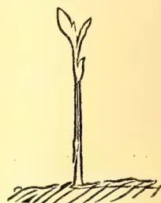

Very young seedling plant.

Fig. 1.

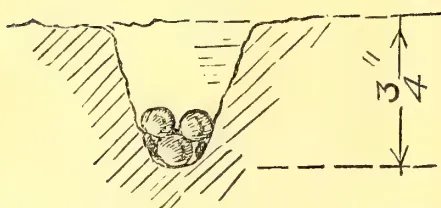

Method of sowing Camphor seed (natural size).

Fig. 4.

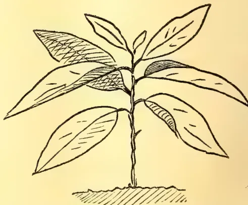

Further development of young Camphor plant.  
(Drawn from life.)

Fig. 3.

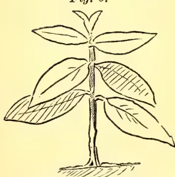

Development of Camphor plant at  
7 weeks. (Drawn from life.)

## PLANTING OF FRUIT TREES ALONG PUBLIC ROADS.

Colombo, 15th April, 1907.

SIR,—Mr. Chas. Stouter's paper read at the last meeting of the Board has been the means of ventilating a question which has long deserved the serious attention of our local authorities. On my recent visit to India, I was greatly impressed by the systematic manner in which the road sides both in the North and South have been planted. In Calcutta City, *Polyalthia coffeoides* would seem to have been selected as the ideal shade tree. Of straight growth, and perfect symmetry, it forms handsome avenues which, if not as cool as those of the umbra-

442------------------------------------------------

Correspondence.415[JUNE 1907.

geous *Ingasaman*, show no traces of the effects of "drip," resulting from the dense overhanging leaf-canopy of the latter. *Polyalthia* is indigenous to Ceylon, and it is surprising that it is not used locally in the same way as in Calcutta; but whether it will prove as suitable here as there remains to be seen, for the way that trees alter their habits of growth under different natural conditions is surprising. In the South of India some of the finest avenues are made up of the Tamarind, which exhibit strikingly symmetrical proportions, suggesting artificial treatment at the hands of the pruner. Specially good work has been done in some districts in the planting up of fruit and timber trees along country roadsides. In the Mozufferpore district over 200 miles of roadway have been planted at a cost of Re. 1.8 ans. per tree to the Provincial Road Committee, by whom the work was carried out. All the plants were first raised in pots on Resthouse and District Engineers' premises, and transplanted when about two years old. The plan adopted is to arrange some four or five hundred pots at the bottom of a trench, about square, and fill in the interspaces with earth. By keeping the rims of the pots slightly lower than that of the surrounding land, moisture is easily supplied by means of irrigation from an adjacent well. The chief item of expense is the construction of a gabion, consisting of a plaited bamboo fence 6 feet high, to effectually prevent damage by cattle. Under ordinary circumstances a few preliminary waterings are only necessary to establish the plants, but exceptionally moisture is supplied at later stages by burying earthenware pots, full of water, in close proximity to the plant, to act as reservoirs.

Among fruits are to be found the Mango, Bael, and Jak; among timber trees Mahogany, *Dalbergia* and Toon. The usual distance apart is 30 feet. It has been found desirable to plant up at least one mile with the same tree. This arrangement is perhaps more convenient for purposes of leasing. No particulars under this latter head are available, but the returns are said to be substantial.

It is to be hoped that the suggested local experiment will be undertaken before long, and that results will warrant the undertaking of preparations similar to those detailed above. The trial might also test the relative advantages of direct expenditure as well as Mr. Stouter's contract system.

Yours truly,  
C. DRIEBERG.

---

#### PASPALUM GRASS FOR COCONUT PLANTATIONS.

Fiji, March 11.

DEAR SIR,—I shall be glad to know if it has ever come to your knowledge that *Paspalum dilatatum* is a bad grass to plant in a coconut plantation. One planter here tells me it is bad. "Sensitive plant" makes splendid food for cattle, and is very good for the nuts, but the labour cannot work in it without being supplied with boots, and that is a heavy item.

I shall be glad of your advice.

Yours,  
H. H. THIELE.

[In Ceylon the grass does not succeed below 3,000 feet, which is too high for coconuts. We cannot therefore speak from any experience.—ED. "T. A."]

---

#### DURABILITY OF SATIN WOOD.

Jaffna, 29th April, 1907.

DEAR SIR.—The Assistant Archaeological Commissioner gave me part of a door frame which he found in a cave near Mihintale, and which he estimates to be at least 1,000 years old. The wood is satin wood, and is a splendid example of the

443------------------------------------------------

JUNE 1907.]416Correspondence.

durability of that wood. White ants and other insects have done their utmost to destroy the wood, but with very little success. I think I may well ask, what other wood in the world would stand the test of centuries and the ravages of white ants?

I enclose Mr. Still's note as to where he discovered it.

Yours faithfully,

G. D. TEMPLER.

"Part of the lintel of a door frame found in a cave on Rajagirigala near Mihintale in the N. C. P. The brickwork in which it was embedded was of the old type of construction used prior to the Polonnaruwan period. I should estimate the age of the wood at not less than 1,000 years and quite possibly several centuries more."—J. STILL.

#### A SUGGESTION.

SIR,—I should be obliged if you could see your way to a slight topographical alteration which will make your monthly table of Contents more readily accessible (as to the matter concerned) to the Reader.

I enclose a page from your number of February, 1907, to show how much more easily index or page figures are read from the accurately columned left than from the skirmishing right.

<table>
<thead>
<tr>
<th>Original paging.</th>
<th>Intermittently dotted space 4<math>\frac{3}{4}</math> inches.</th>
<th>Page.</th>
</tr>
</thead>
<tbody>
<tr>
<td>Proposed paging.</td>
<td>Camphor ... ..</td>
<td>62</td>
</tr>
<tr>
<td>62</td>
<td>Camphor oil.</td>
<td></td>
</tr>
<tr>
<td>104</td>
<td>Importation of Beneficial Insects from one Country to Another</td>
<td>104</td>
</tr>
</tbody>
</table>

I am, Sir, yours,

CAREFUL READER,

Upcountry.

[I fail to see any special gain by doing this.—ED. "T. A."]

#### AN ESSAY ON THE BETEL VINE.

##### ITS CULTIVATION AND DISEASE.

Mr. M. H. Mirando, Hon. Secretary of the Negombo Branch Agricultural Society, and Muhandiram of Alut Kuru Korale North, has offered a gold medal through the Parent Society for the best essay in English, Sinhalese or Tamil, dealing with the cultivation of the betel vine—soil, planting, manuring pests and diseases—their prevention and cure—with a view to obtaining the experience of cultivators and others conversant with the subject. The Secretary, Ceylon Agricultural Society, is prepared to receive essays till the end of June. It is expected that the Government Mycologist will shortly issue a leaflet dealing with the subject of betel disease, and the exhaustive information which it is hoped to get together through this competition will probably prove of value in the preparation of the leaflet.

In view of the great risks to which so remunerative an industry as betel cultivation is exposed, and the heavy loss occasioned by the disease or diseases affecting the vine, the offer made by Mr. Mirando is one which the Society is only too glad to accept in the interests of the numerous small cultivators who make a living out of betel growing, and it is to be hoped that with the assistance of the liberal donor of the prize and the technical advice of the Government expert in plant diseases, it will be found possible to carry on the cultivation with less uncertain prospects than at present.

444------------------------------------------------

Circular No. 1,756.

OFFICE OF THE CEYLON AGRICULTURAL SOCIETY,

COLOMBO, JUNE 15, 1907.

Importation of Vegetable Seeds.

SIR,

I HAVE the honour to inform you that I propose to indent for a consignment of the Vegetable Seeds named overleaf for North-East Monsoon planting in October.

2. You are requested to note the number of packets of each you desire to have, on the annexed form, and return it to me before July 15.

3. No order reaching me after July 15 will receive attention.

4. It will be a great convenience if you could see your way to remit value of seeds with order; if not, they will be forwarded by V. P. Post, which will cost an additional 15 cents in postal commission.

I am, Sir,

Your obedient Servant,

C. DRIEBERG,

*Secretary.*

445------------------------------------------------

<!-- stage4: FAINT old-images-only -->

[Faint page: no legible print of its own could be verified; text withheld (stage 4 review list)]

This image is a scan of a blank page. The background is a uniform light beige or off-white color. There are a few very small, dark specks scattered across the page, which appear to be scanning artifacts or dust. A faint, thin vertical line is visible near the right edge of the page, possibly indicating the edge of the paper or a scanning artifact. The overall texture is slightly grainy, typical of a scanned document.

446------------------------------------------------

To the SECRETARY,

*Ceylon Agricultural Society.*

PLEASE order for me the Seeds noted below, for which I enclose  
a remittance of Rs.

<table border="1"><thead><tr><th>KIND OF SEED (Value, 10 cents per packet)</th><th>Number of Packets</th><th>KIND OF SEED (Value, 10 cents per packet)</th><th>Number of Packets</th></tr></thead><tbody><tr><td>Artichoke</td><td>..</td><td>Endive</td><td>..</td></tr><tr><td>Asparagus</td><td>..</td><td>Fennel</td><td>..</td></tr><tr><td>Beans (Dwarf French)</td><td>..</td><td>Kohl Rabi (Kno'l Kohl)</td><td>..</td></tr><tr><td>Beet</td><td>..</td><td>Leek</td><td>..</td></tr><tr><td>Borecole</td><td>..</td><td>Lettuce (Cos)</td><td>..</td></tr><tr><td>Broccoli</td><td>..</td><td>Lettuce (Cabbage)</td><td>..</td></tr><tr><td>Brussels Sprouts</td><td>..</td><td>Onion</td><td>..</td></tr><tr><td>Cabbage</td><td>..</td><td>Parsley</td><td>..</td></tr><tr><td>Cabbage (Savoy)</td><td>..</td><td>Parsnip</td><td>..</td></tr><tr><td>Capsicum</td><td>..</td><td>Radish</td><td>..</td></tr><tr><td>Cardoon</td><td>..</td><td>Rhubarb</td><td>..</td></tr><tr><td>Carrot</td><td>..</td><td>Salsify</td><td>..</td></tr><tr><td>Cauliflower</td><td>..</td><td>Spinach</td><td>..</td></tr><tr><td>Celery</td><td>..</td><td>Tomato</td><td>..</td></tr><tr><td>Chili</td><td>..</td><td>Turnip</td><td>..</td></tr><tr><td>Cucumber (ridge)</td><td>..</td><td>Vegetable Marrow</td><td>..</td></tr><tr><td>Cress</td><td>..</td><td></td><td></td></tr></tbody></table>

Total number of packets ..

at 10 cents each = Rs.

June, 1907.

Signature :

447------------------------------------------------

<!-- stage4: FAINT old-images-only -->

[Faint page: no legible print of its own could be verified; text withheld (stage 4 review list)]

448------------------------------------------------

This image is a scan of a blank page. The background is a uniform light beige or off-white color. There are a few very small, faint dark spots scattered across the surface, which appear to be scanning artifacts or dust particles. A slightly more prominent dark speck is visible near the bottom center of the page. No text, lines, or other graphical elements are present.

449------------------------------------------------

This image is a scan of a blank page. The paper has a light cream or off-white color with a subtle texture. There are a few very small, dark specks scattered across the surface, which appear to be scanning artifacts or dust particles. No text, lines, or other markings are present on the page.

450------------------------------------------------

451------------------------------------------------

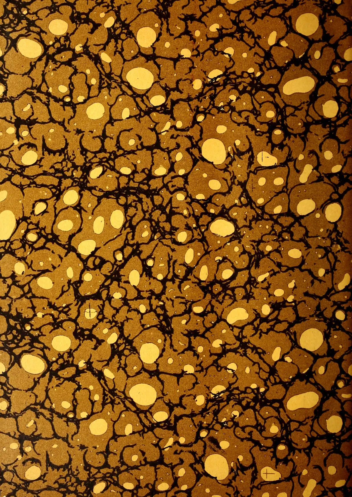This image displays a classic marbled paper pattern, often referred to as 'stone' or 'shell' marbling. The background is a rich, dark brown with a fine, grainy texture. Overlaid on this are intricate, black, vein-like patterns that resemble the cracks in stone or the veins in wood. These black veins are irregular and branch out across the entire surface. Scattered throughout the composition are numerous irregular, light-yellow or cream-colored spots of varying sizes. These spots are distributed randomly, creating a sense of depth and complexity. The overall effect is one of organic, natural growth and complexity, typical of traditional marbling techniques used in bookbinding and decorative arts.

452------------------------------------------------

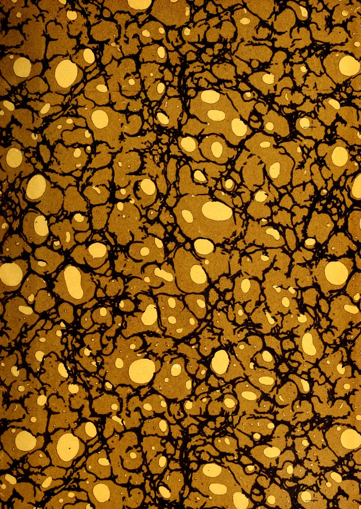This image displays a classic marbled pattern, often referred to as 'stone' or 'shell' marbling. The background is a rich, textured brown. Overlaid on this are intricate, dark, branching lines that resemble the veins of a stone or the cracks in a shell. These dark lines create a complex network of irregular shapes and pockets. Within these pockets and scattered across the entire surface are numerous irregular, light-yellow or cream-colored spots of varying sizes. The overall effect is organic and natural, mimicking the appearance of a stone surface or a biological structure like a shell. The pattern is dense and covers the entire frame without any margins or borders.

453------------------------------------------------

