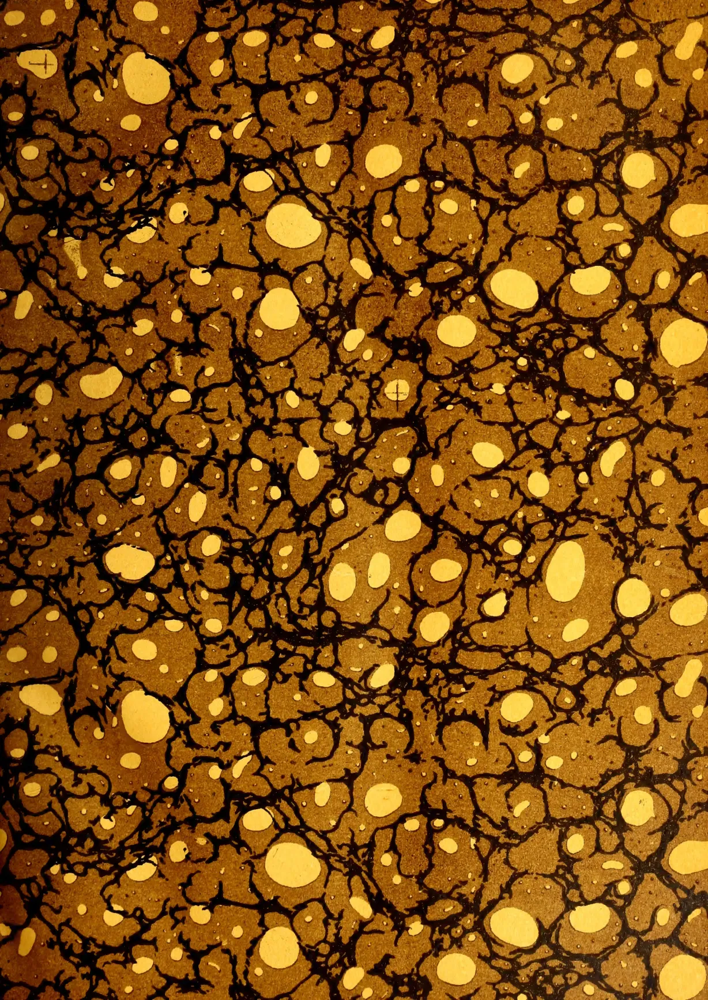
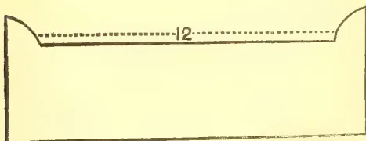
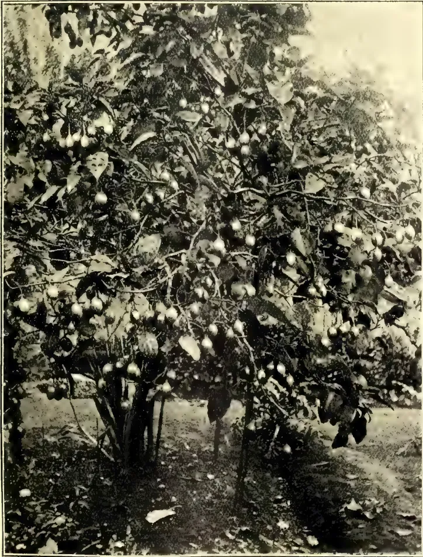
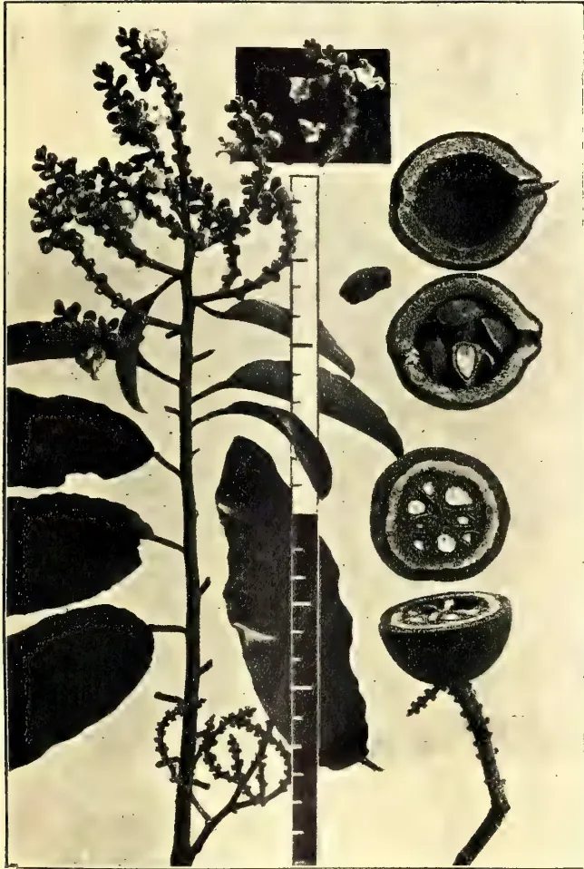
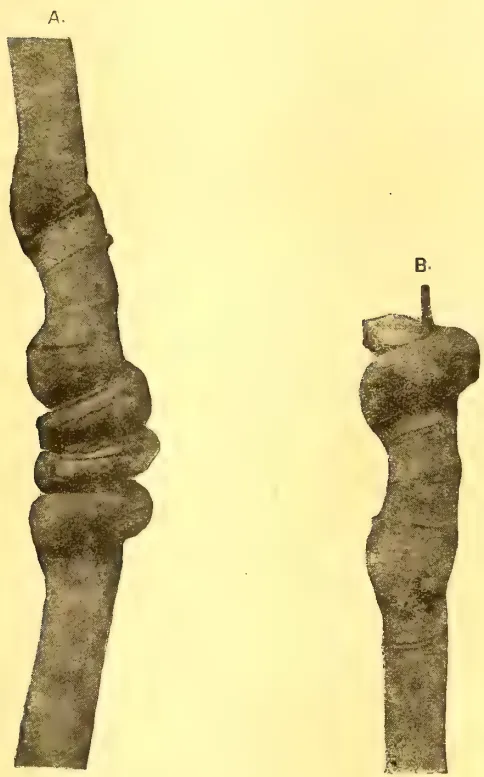
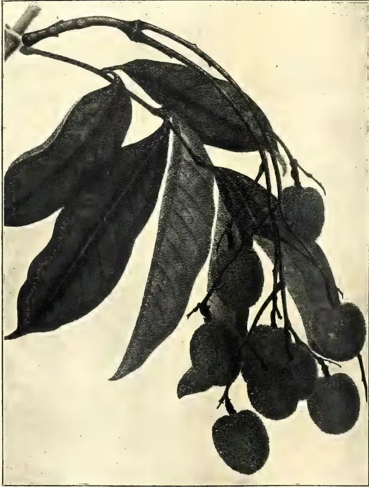
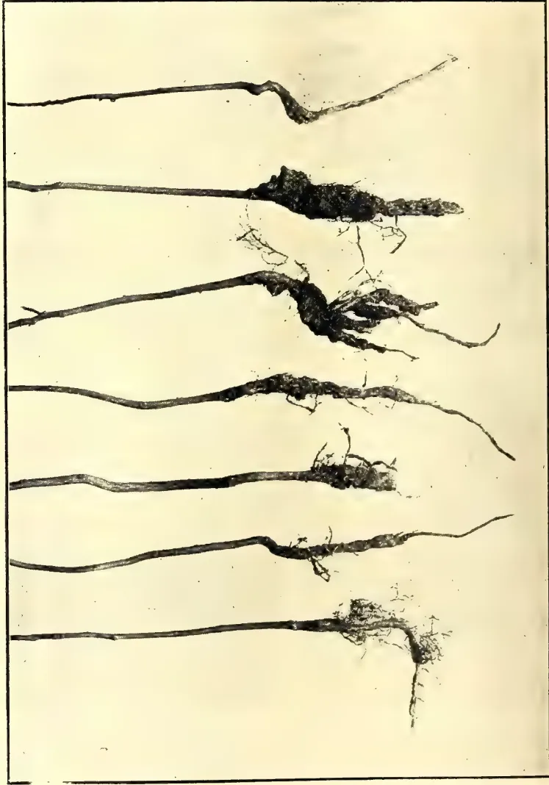
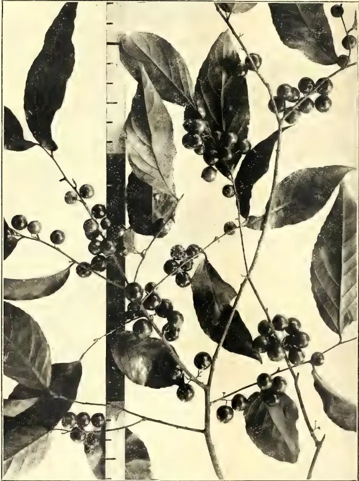
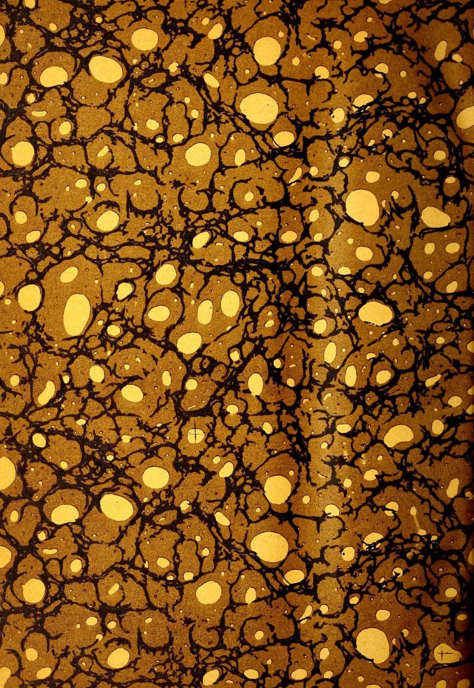
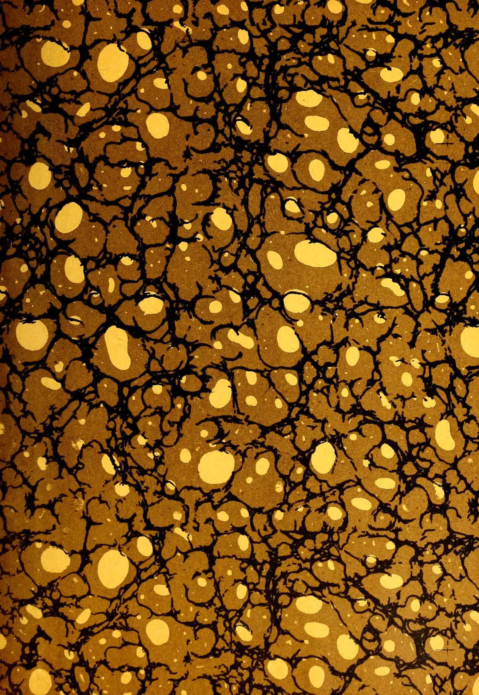

1------------------------------------------------

THE FIELD MUSEUM LIBRARY

A standard linear barcode used for library inventory tracking.

3 5711 00043 1230

Field Museum of Natural History

LIBRARY

Chicago

From \_\_\_\_\_

Class 380.86

Book C.33

2------------------------------------------------

This image displays a classic marbled paper pattern, often referred to as 'stone' or 'shell' marbling. The background is a rich, warm brown with a fine, grainy texture. Overlaid on this are intricate, dark, branching lines that resemble the veins of a stone or the cracks in a shell. These dark lines create a complex network of irregular shapes and pockets. Within these pockets and scattered across the entire surface are numerous irregular, light-yellow or cream-colored spots of varying sizes. Some spots are large and rounded, while others are small and pinpoint-sized. The overall effect is organic and natural, mimicking the appearance of a stone surface. There are no text or other graphical elements present.

3------------------------------------------------

4------------------------------------------------

This image shows a blank, aged page with a light beige or cream color. The surface has a subtle texture and slight discoloration, characteristic of old paper. There are no markings, text, or illustrations on the page.

5------------------------------------------------

Digitized by the Internet Archive  
in 2014

<https://archive.org/details/tropicalagricul331909ceyl>

6------------------------------------------------

# The Tropical Agriculturist

AND

Magazine of the Ceylon Agricultural Society.

---

**(FOUNDED 1881.)**

---

EDITED BY

**R. H. LOCK,**

*Acting Director, Royal Botanic Gardens, Peradeniya.*

---

**Vol. XXXIII.**

Containing Numbers I to VI, : July to December, 1909.

PRINTED

BY

---

41351

A. M. & J. FERGUSON,

**COLOMBO, CEYLON.**

---

1910.

7------------------------------------------------

S  
281  
T77

1000  
1000

7

1000

100

8------------------------------------------------

# INDEX.

PAGE.

PAGE.

## A.

<table style="width: 100%; border-collapse: collapse;">
<tr>
<td style="width: 5%;"><b>A</b></td>
<td style="width: 95%;">Valuable Fibre Plant: <i>Asclepias Semilunata</i> ... ..</td>
<td style="width: 10%; text-align: right;">117</td>
</tr>
<tr>
<td></td>
<td>Accounts, C.A.S. ... ..</td>
<td style="text-align: right;">56</td>
</tr>
<tr>
<td></td>
<td>Acidity in Soils ... ..</td>
<td style="text-align: right;">433</td>
</tr>
<tr>
<td></td>
<td>Advance in Rubber ... ..</td>
<td style="text-align: right;">398</td>
</tr>
<tr>
<td></td>
<td>Afforestation Branch of the Forest Department: The Need for an ... ..</td>
<td style="text-align: right;">427</td>
</tr>
<tr>
<td></td>
<td>Agricultural Board: Minutes 170, 251, 252, ... ..</td>
<td style="text-align: right;">441</td>
</tr>
<tr>
<td></td>
<td>do College, Coimbatore ... ..</td>
<td style="text-align: right;">289</td>
</tr>
<tr>
<td></td>
<td>do Conference, Poona ... ..</td>
<td style="text-align: right;">542</td>
</tr>
<tr>
<td></td>
<td>do Credit Banks ... ..</td>
<td style="text-align: right;">66</td>
</tr>
<tr>
<td></td>
<td>do do Societies ... ..</td>
<td style="text-align: right;">166</td>
</tr>
<tr>
<td></td>
<td>do Institute, The International ... ..</td>
<td style="text-align: right;">258</td>
</tr>
<tr>
<td></td>
<td>do Instruction in the U.S., Popular ... ..</td>
<td style="text-align: right;">537</td>
</tr>
<tr>
<td></td>
<td>Agriculture in the Tropics ... ..</td>
<td style="text-align: right;">193</td>
</tr>
<tr>
<td></td>
<td>do , Literature of Economic Botany and 44, 155, 249, 335, 439, ... ..</td>
<td style="text-align: right;">532</td>
</tr>
<tr>
<td></td>
<td>do , Modern ... ..</td>
<td style="text-align: right;">453</td>
</tr>
<tr>
<td></td>
<td>do , Water in ... ..</td>
<td style="text-align: right;">263</td>
</tr>
<tr>
<td></td>
<td>Amazon, Development of the ... ..</td>
<td style="text-align: right;">206</td>
</tr>
<tr>
<td></td>
<td>American Cotton Trade ... ..</td>
<td style="text-align: right;">215</td>
</tr>
<tr>
<td></td>
<td>Andaman Marble or Zebra Wood ... ..</td>
<td style="text-align: right;">189</td>
</tr>
<tr>
<td></td>
<td>Annatto ... ..</td>
<td style="text-align: right;">10</td>
</tr>
<tr>
<td></td>
<td>Annual Report, C.A.S. ... ..</td>
<td style="text-align: right;">50</td>
</tr>
<tr>
<td></td>
<td>Areca Palm Disease ... ..</td>
<td style="text-align: right;">563</td>
</tr>
<tr>
<td></td>
<td>Area Cultivated in Ceylon ... ..</td>
<td style="text-align: right;">265</td>
</tr>
<tr>
<td></td>
<td>Aroma of Black Tea ... ..</td>
<td style="text-align: right;">364</td>
</tr>
<tr>
<td></td>
<td><i>Asclepias Semilunata</i>: A Valuable Fibre Plant ... ..</td>
<td style="text-align: right;">117</td>
</tr>
</table>

## B.

<table style="width: 100%; border-collapse: collapse;">
<tr>
<td style="width: 5%;"><b>B.</b></td>
<td style="width: 95%;">Bacteria, Fixation of Nitrogen by ... ..</td>
<td style="width: 10%; text-align: right;">246</td>
</tr>
<tr>
<td></td>
<td>Bamboo Pulp, Treatment of... ..</td>
<td style="text-align: right;">186</td>
</tr>
<tr>
<td></td>
<td>Banana Cultivation ... ..</td>
<td style="text-align: right;">422</td>
</tr>
<tr>
<td></td>
<td>do in West Africa ... ..</td>
<td style="text-align: right;">374</td>
</tr>
<tr>
<td></td>
<td>do Rubber ... ..</td>
<td style="text-align: right;">567</td>
</tr>
<tr>
<td></td>
<td>Bananas Grown in Kent ... ..</td>
<td style="text-align: right;">565</td>
</tr>
<tr>
<td></td>
<td>Bark Disease of Tea ... ..</td>
<td style="text-align: right;">266</td>
</tr>
<tr>
<td></td>
<td>Beans, Lima and other ... ..</td>
<td style="text-align: right;">90</td>
</tr>
<tr>
<td></td>
<td>do , Soy or Soya ... ..</td>
<td style="text-align: right;">576</td>
</tr>
<tr>
<td></td>
<td>Bee, Colour Sense of the Honey ... ..</td>
<td style="text-align: right;">524</td>
</tr>
<tr>
<td></td>
<td>Bee-keeping: Notes on ... ..</td>
<td style="text-align: right;">149</td>
</tr>
<tr>
<td></td>
<td>Black Hevea Fungus in the F.M.S. ... ..</td>
<td style="text-align: right;">576</td>
</tr>
<tr>
<td></td>
<td>do Tea, Aroma of ... ..</td>
<td style="text-align: right;">364</td>
</tr>
<tr>
<td></td>
<td>Blood of Plants ... ..</td>
<td style="text-align: right;">68</td>
</tr>
<tr>
<td></td>
<td>Board of Agriculture: Minutes of Meeting of June 8th ... ..</td>
<td style="text-align: right;">251</td>
</tr>
<tr>
<td></td>
<td>do July 8th ... ..</td>
<td style="text-align: right;">252</td>
</tr>
<tr>
<td></td>
<td>do October 18th ... ..</td>
<td style="text-align: right;">441</td>
</tr>
<tr>
<td></td>
<td>do Progress Report ...252, 441</td>
<td style="text-align: right;">441</td>
</tr>
<tr>
<td></td>
<td>Bombay Manure for Ceylon Estates ... ..</td>
<td style="text-align: right;">568</td>
</tr>
<tr>
<td></td>
<td>Botanical Facts for Rubber Planters ... ..</td>
<td style="text-align: right;">3</td>
</tr>
<tr>
<td></td>
<td>Brazil Nut, The ... ..</td>
<td style="text-align: right;">218</td>
</tr>
<tr>
<td></td>
<td>British Cotton Growing Association, Fourth Annual Report ... ..</td>
<td style="text-align: right;">12</td>
</tr>
<tr>
<td></td>
<td>British Rubber Fever ... ..</td>
<td style="text-align: right;">392</td>
</tr>
<tr>
<td></td>
<td>Bubbles in Rubber Biscuits... ..</td>
<td style="text-align: right;">286</td>
</tr>
<tr>
<td></td>
<td>Burma Rice Cultivation ... ..</td>
<td style="text-align: right;">507</td>
</tr>
</table>

## C.

<table style="width: 100%; border-collapse: collapse;">
<tr>
<td style="width: 5%;"><b>C.</b></td>
<td style="width: 95%;">Cacao Beetle ... ..</td>
<td style="width: 10%; text-align: right;">90</td>
</tr>
<tr>
<td></td>
<td>do in German Colonies ... ..</td>
<td style="text-align: right;">461</td>
</tr>
<tr>
<td></td>
<td>do in Jamaica ... ..</td>
<td style="text-align: right;">384</td>
</tr>
</table>

<table style="width: 100%; border-collapse: collapse;">
<tr>
<td style="width: 5%;"></td>
<td style="width: 95%;">Cacao in La Guaira ... ..</td>
<td style="width: 10%; text-align: right;">464</td>
</tr>
<tr>
<td></td>
<td>do in Portuguese West Africa ... ..</td>
<td style="text-align: right;">465</td>
</tr>
<tr>
<td></td>
<td>do in St. Thome ... ..</td>
<td style="text-align: right;">371</td>
</tr>
<tr>
<td></td>
<td>do Industry of Ecuador ... ..</td>
<td style="text-align: right;">561</td>
</tr>
<tr>
<td></td>
<td>do or Theobroma Cacao Cultivation ... ..</td>
<td style="text-align: right;">508</td>
</tr>
<tr>
<td></td>
<td>do Spraying in Trinidad ... ..</td>
<td style="text-align: right;">179</td>
</tr>
<tr>
<td></td>
<td>do, Theobrama Sphaerocarpa ... ..</td>
<td style="text-align: right;">375</td>
</tr>
<tr>
<td></td>
<td>do, the Grafting of ... ..</td>
<td style="text-align: right;">561</td>
</tr>
<tr>
<td></td>
<td>do, The Production and Consumption of ... ..</td>
<td style="text-align: right;">421</td>
</tr>
<tr>
<td></td>
<td>do The World's Production of ... ..</td>
<td style="text-align: right;">480</td>
</tr>
<tr>
<td></td>
<td>do Thrips, Washes for ... ..</td>
<td style="text-align: right;">465</td>
</tr>
<tr>
<td></td>
<td>Camphor ... ..</td>
<td style="text-align: right;">501</td>
</tr>
<tr>
<td></td>
<td>do , Apparatus to Extract ... ..</td>
<td style="text-align: right;">181</td>
</tr>
<tr>
<td></td>
<td>do , Chinese ... ..</td>
<td style="text-align: right;">561</td>
</tr>
<tr>
<td></td>
<td>do Exports, Japanese... ..</td>
<td style="text-align: right;">376</td>
</tr>
<tr>
<td></td>
<td>do in Jamaica ... ..</td>
<td style="text-align: right;">565</td>
</tr>
<tr>
<td></td>
<td>do in the F.M.S. ... ..</td>
<td style="text-align: right;">286</td>
</tr>
<tr>
<td></td>
<td>do Industry, The ... ..</td>
<td style="text-align: right;">217</td>
</tr>
<tr>
<td></td>
<td>do , Natural and Artificial ... ..</td>
<td style="text-align: right;">96</td>
</tr>
<tr>
<td></td>
<td>do Oil in 1908 ... ..</td>
<td style="text-align: right;">94</td>
</tr>
<tr>
<td></td>
<td>do , Preparation of ... ..</td>
<td style="text-align: right;">501</td>
</tr>
<tr>
<td></td>
<td>Cane Farming at Trinidad, Further Notes on ... ..</td>
<td style="text-align: right;">130</td>
</tr>
<tr>
<td></td>
<td>do Seedlings in Java ... ..</td>
<td style="text-align: right;">512</td>
</tr>
<tr>
<td></td>
<td>do Sugar <i>versus</i> Honey ... ..</td>
<td style="text-align: right;">333</td>
</tr>
<tr>
<td></td>
<td>Caravonica Cotton ... ..</td>
<td style="text-align: right;">463</td>
</tr>
<tr>
<td></td>
<td>Cardamom Cultivation in South Mysore ... ..</td>
<td style="text-align: right;">29</td>
</tr>
<tr>
<td></td>
<td>Castilloa <i>Elastica</i> ... ..</td>
<td style="text-align: right;">206</td>
</tr>
<tr>
<td></td>
<td>do do Fruiting in Singapore... ..</td>
<td style="text-align: right;">174</td>
</tr>
<tr>
<td></td>
<td>Castor Silk, or Eri ... ..</td>
<td style="text-align: right;">242</td>
</tr>
<tr>
<td></td>
<td>Cattle Breeding in Trinidad ... ..</td>
<td style="text-align: right;">147</td>
</tr>
<tr>
<td></td>
<td>Ceara Plantations, Some Notes on ... ..</td>
<td style="text-align: right;">203</td>
</tr>
<tr>
<td></td>
<td>do Rubber (<i>Manihot Glaziovii</i>) ... ..</td>
<td style="text-align: right;">103</td>
</tr>
<tr>
<td></td>
<td>do do Tapping ... ..</td>
<td style="text-align: right;">566</td>
</tr>
<tr>
<td></td>
<td>Ceylon Agricultural Society Annual Report ... ..</td>
<td style="text-align: right;">50</td>
</tr>
<tr>
<td></td>
<td>do do do Statement of Accounts... ..</td>
<td style="text-align: right;">56</td>
</tr>
<tr>
<td></td>
<td>do , Planting Industry of ... ..</td>
<td style="text-align: right;">265</td>
</tr>
<tr>
<td></td>
<td>do , Rubber Cultivation in ... ..</td>
<td style="text-align: right;">5</td>
</tr>
<tr>
<td></td>
<td>Chillies in Nyasaland ... ..</td>
<td style="text-align: right;">475</td>
</tr>
<tr>
<td></td>
<td>China Tea, Reports on ... ..</td>
<td style="text-align: right;">91</td>
</tr>
<tr>
<td></td>
<td>Chinese Camphor ... ..</td>
<td style="text-align: right;">561</td>
</tr>
<tr>
<td></td>
<td>Cinchona in Java ... ..</td>
<td style="text-align: right;">472</td>
</tr>
<tr>
<td></td>
<td>Cinnamon Oil, Ceylon ... ..</td>
<td style="text-align: right;">95</td>
</tr>
<tr>
<td></td>
<td>Citronella do ... ..</td>
<td style="text-align: right;">93</td>
</tr>
<tr>
<td></td>
<td>Coconut ... ..</td>
<td style="text-align: right;">90, 91</td>
</tr>
<tr>
<td></td>
<td>do Crop Increase ... ..</td>
<td style="text-align: right;">186</td>
</tr>
<tr>
<td></td>
<td>do Cultivation ... ..</td>
<td style="text-align: right;">297</td>
</tr>
<tr>
<td></td>
<td>do Disease in Jamaica ... ..</td>
<td style="text-align: right;">560</td>
</tr>
<tr>
<td></td>
<td>do do in Southern Sea ... ..</td>
<td style="text-align: right;">560</td>
</tr>
<tr>
<td></td>
<td>do in Jamaica ... ..</td>
<td style="text-align: right;">461</td>
</tr>
<tr>
<td></td>
<td>do in the F.M.S. ... ..</td>
<td style="text-align: right;">282</td>
</tr>
<tr>
<td></td>
<td>do Milk ... ..</td>
<td style="text-align: right;">576</td>
</tr>
<tr>
<td></td>
<td>do Pest in Panama ... ..</td>
<td style="text-align: right;">76</td>
</tr>
<tr>
<td></td>
<td>do Products ... ..</td>
<td style="text-align: right;">180</td>
</tr>
<tr>
<td></td>
<td>do Stem Disease ... ..</td>
<td style="text-align: right;">73, 75</td>
</tr>
<tr>
<td></td>
<td>Coffee in Portuguese West Africa ... ..</td>
<td style="text-align: right;">467</td>
</tr>
<tr>
<td></td>
<td>Coimbatore Agricultural College ... ..</td>
<td style="text-align: right;">298</td>
</tr>
<tr>
<td></td>
<td>Colour Sense of the Honey Bee ... ..</td>
<td style="text-align: right;">524</td>
</tr>
<tr>
<td></td>
<td>Combating Lice and Mites on Poultry ... ..</td>
<td style="text-align: right;">148</td>
</tr>
<tr>
<td></td>
<td>Commercial Orange Production in the Philippines ... ..</td>
<td style="text-align: right;">27</td>
</tr>
<tr>
<td></td>
<td>Committee of Agricultural Experiments ... ..</td>
<td style="text-align: right;">60</td>
</tr>
<tr>
<td></td>
<td>Co-operation in Agriculture ... ..</td>
<td style="text-align: right;">462</td>
</tr>
</table>

9------------------------------------------------

ii.INDEX.

<table border="0">
<thead>
<tr>
<th></th>
<th style="text-align: right;">PAGE.</th>
<th></th>
<th style="text-align: right;">PAGE.</th>
</tr>
</thead>
<tbody>
<tr>
<td>Co-operative Credit in Bengal ...</td>
<td style="text-align: right;">261</td>
<td>Fertilization of Rice ...</td>
<td style="text-align: right;">24</td>
</tr>
<tr>
<td>Copra in B.S. Islands ...</td>
<td style="text-align: right;">480</td>
<td>Fertilizer Action ...</td>
<td style="text-align: right;">41</td>
</tr>
<tr>
<td>do Inspection in Fiji ...</td>
<td style="text-align: right;">187</td>
<td>Fibre Plant, A (Uganda Hemp) ...</td>
<td style="text-align: right;">411</td>
</tr>
<tr>
<td>do Preparation ...</td>
<td style="text-align: right;">179</td>
<td>do do, A Valuable (<i>Asclepias Semi-lunata</i>) ...</td>
<td style="text-align: right;">117</td>
</tr>
<tr>
<td>do Trade, The ...</td>
<td style="text-align: right;">479</td>
<td>Fibres, Lecture on ...</td>
<td style="text-align: right;">473</td>
</tr>
<tr>
<td>Cotton ...</td>
<td style="text-align: right;">113</td>
<td>Ficus Elastica, The Passing of ...</td>
<td style="text-align: right;">484</td>
</tr>
<tr>
<td>do at Barbados, Recent Results in the Cultivation of ...</td>
<td style="text-align: right;">298</td>
<td>Fixation of Nitrogen by Bacteria ...</td>
<td style="text-align: right;">246</td>
</tr>
<tr>
<td>do : British Cotton Growing Association, Fourth Annual Report ...</td>
<td style="text-align: right;">12</td>
<td>Forests on Rainfall, The Effect of ...</td>
<td style="text-align: right;">260</td>
</tr>
<tr>
<td>do, Caravonica, Experimental Cultivation of ...</td>
<td style="text-align: right;">463</td>
<td>Forward Sales of Rubber ...</td>
<td style="text-align: right;">556</td>
</tr>
<tr>
<td>do Cultivation in the Sea Islands ...</td>
<td style="text-align: right;">301</td>
<td>Fruit Growing in Zanzibar ...</td>
<td style="text-align: right;">561</td>
</tr>
<tr>
<td>do Factory, The Barbados Co-operative ...</td>
<td style="text-align: right;">116</td>
<td>Fruit, Indian Californian ...</td>
<td style="text-align: right;">129</td>
</tr>
<tr>
<td>do from the Solomon Islands ...</td>
<td style="text-align: right;">365</td>
<td>Further Notes on Cane Farming at Trinidad ...</td>
<td style="text-align: right;">130</td>
</tr>
<tr>
<td>do Growing ...</td>
<td style="text-align: right;">14</td>
<td></td>
<td></td>
</tr>
<tr>
<td>do do on the Coast, Report on Progress of ...</td>
<td style="text-align: right;">403</td>
<td style="text-align: center;"><b>G.</b></td>
<td></td>
</tr>
<tr>
<td>do Improvement in Madras ...</td>
<td style="text-align: right;">490</td>
<td>Garden Work, Labour Saving Tools for ...</td>
<td style="text-align: right;">237</td>
</tr>
<tr>
<td>do, Improving Madras ...</td>
<td style="text-align: right;">406</td>
<td>Ginger ...</td>
<td style="text-align: right;">425</td>
</tr>
<tr>
<td>do in Batticaloa ...</td>
<td style="text-align: right;">184</td>
<td>do : Cultivation and Preparation of ...</td>
<td style="text-align: right;">127</td>
</tr>
<tr>
<td>do in Nyasaland ...</td>
<td style="text-align: right;">475</td>
<td>Grain, Threshing ...</td>
<td style="text-align: right;">516</td>
</tr>
<tr>
<td>do in Sind, Egyptian ...</td>
<td style="text-align: right;">300</td>
<td>Granadilla, The ...</td>
<td style="text-align: right;">426</td>
</tr>
<tr>
<td>do in the Sea Islands ...</td>
<td style="text-align: right;">115</td>
<td>Grass and Fruit Trees round Coconut Palms ...</td>
<td style="text-align: right;">368</td>
</tr>
<tr>
<td>do in Uganda ...</td>
<td style="text-align: right;">367</td>
<td>Green Manuring ...</td>
<td style="text-align: right;">346</td>
</tr>
<tr>
<td>do Industry, Lancashire ...</td>
<td style="text-align: right;">407</td>
<td>Groundnut Oil, Preservation of Mixtures of Sesamum and ...</td>
<td style="text-align: right;">489</td>
</tr>
<tr>
<td>do Picking ...</td>
<td style="text-align: right;">115</td>
<td>do Trials in the West Indies ...</td>
<td style="text-align: right;">312</td>
</tr>
<tr>
<td>do Plant in Ceylon, Insects Associated with the ...</td>
<td style="text-align: right;">318</td>
<td>Growth of Palmyras, The Rate of ...</td>
<td style="text-align: right;">258</td>
</tr>
<tr>
<td>do Seed, Disinfection of ...</td>
<td style="text-align: right;">209</td>
<td>Gourami, Introduction of ...</td>
<td style="text-align: right;">87</td>
</tr>
<tr>
<td>do Seed Oil, Possibilities of ...</td>
<td style="text-align: right;">488</td>
<td>Guayule Rubber I. ...</td>
<td style="text-align: right;">108</td>
</tr>
<tr>
<td>do Spinning and Weaving, Indian ...</td>
<td style="text-align: right;">299</td>
<td>do do Industry, The ...</td>
<td style="text-align: right;">484</td>
</tr>
<tr>
<td>do Trade, American ...</td>
<td style="text-align: right;">215</td>
<td>Gutta Percha Planting in Java ...</td>
<td style="text-align: right;">106</td>
</tr>
<tr>
<td>Country Life Commission, P.I. ...</td>
<td style="text-align: right;">546</td>
<td></td>
<td></td>
</tr>
<tr>
<td>Credit Societies, Agricultural ...</td>
<td style="text-align: right;">160</td>
<td style="text-align: center;"><b>H.</b></td>
<td></td>
</tr>
<tr>
<td>Cultivation and Preparation of Ginger ...</td>
<td style="text-align: right;">127</td>
<td>Harvesting Rubber in Hawaii ...</td>
<td style="text-align: right;">292</td>
</tr>
<tr>
<td>do in South Coorg ...</td>
<td style="text-align: right;">368</td>
<td>Hedges and Hedge Plants at Antigua ...</td>
<td style="text-align: right;">134</td>
</tr>
<tr>
<td></td>
<td></td>
<td>Heredity ...</td>
<td style="text-align: right;">46</td>
</tr>
<tr>
<td style="text-align: center;"><b>D.</b></td>
<td></td>
<td>Hevea Stem, Twisted ...</td>
<td style="text-align: right;">294</td>
</tr>
<tr>
<td>Dairy Farming: Will it Pay in Ceylon ...</td>
<td style="text-align: right;">37</td>
<td>Honey <i>versus</i> Cane Sugar ...</td>
<td style="text-align: right;">333</td>
</tr>
<tr>
<td>Degumming Ramie ...</td>
<td style="text-align: right;">366</td>
<td>Horticulture, Imperial Training in ...</td>
<td style="text-align: right;">156</td>
</tr>
<tr>
<td>Development of the Amazon ...</td>
<td style="text-align: right;">206</td>
<td>How to Transplant a Tree ...</td>
<td style="text-align: right;">523</td>
</tr>
<tr>
<td>Didymosperma Distichum ...</td>
<td style="text-align: right;">134</td>
<td>Humus, Value of ...</td>
<td style="text-align: right;">437</td>
</tr>
<tr>
<td>Disinfection of Cotton Seed ...</td>
<td style="text-align: right;">209</td>
<td></td>
<td></td>
</tr>
<tr>
<td>Drill-Sowing and Intercultivation, The Introduction of ...</td>
<td style="text-align: right;">210</td>
<td style="text-align: center;"><b>I.</b></td>
<td></td>
</tr>
<tr>
<td>Dry Farming: Notes on ...</td>
<td style="text-align: right;">68</td>
<td>Imperial Training in Horticulture ...</td>
<td style="text-align: right;">156</td>
</tr>
<tr>
<td>Durian Fruit, The ...</td>
<td style="text-align: right;">307</td>
<td>Indian Crops, Value of ...</td>
<td style="text-align: right;">534</td>
</tr>
<tr>
<td>do Seed for Export, Packing ...</td>
<td style="text-align: right;">307</td>
<td>do Insect Life ...</td>
<td style="text-align: right;">481</td>
</tr>
<tr>
<td>Dyestuffs, Natural ...</td>
<td style="text-align: right;">402</td>
<td>do Rubber and its Manufacture ...</td>
<td style="text-align: right;">102</td>
</tr>
<tr>
<td></td>
<td></td>
<td>do Tea Industry, The ...</td>
<td style="text-align: right;">505</td>
</tr>
<tr>
<td style="text-align: center;"><b>E.</b></td>
<td></td>
<td>do Tea in 1908 ...</td>
<td style="text-align: right;">287</td>
</tr>
<tr>
<td>Ecanda Rubber ...</td>
<td style="text-align: right;">555, 567</td>
<td>Infertility in Soils, The Cause of ...</td>
<td style="text-align: right;">40</td>
</tr>
<tr>
<td>Economic Loss to the People through Insects that carry Diseases ...</td>
<td style="text-align: right;">195</td>
<td>Insect Life, Indian ...</td>
<td style="text-align: right;">481</td>
</tr>
<tr>
<td>Egyptian Cotton in Sind ...</td>
<td style="text-align: right;">300</td>
<td>Insects Associated with the Cotton Plant in Ceylon ...</td>
<td style="text-align: right;">318</td>
</tr>
<tr>
<td>Entomological Notes ... 34, 136, 238, 431</td>
<td style="text-align: right;">300</td>
<td>do that Carry Diseases: Economic Loss to the People through ...</td>
<td style="text-align: right;">195</td>
</tr>
<tr>
<td>Eri or Castor Silk ...</td>
<td style="text-align: right;">242</td>
<td>Instruction for Beginners, Practical ...</td>
<td style="text-align: right;">323</td>
</tr>
<tr>
<td>Estimates of Rubber Output ...</td>
<td style="text-align: right;">361</td>
<td>Interview with Mr. Bowle Evans ...</td>
<td style="text-align: right;">83</td>
</tr>
<tr>
<td>Experiment Station, Paradeniya ...</td>
<td style="text-align: right;">61</td>
<td>Ipecacuanha Cultivation ...</td>
<td style="text-align: right;">306</td>
</tr>
<tr>
<td>Experiments on the Value of Nitro-Bacterine ...</td>
<td style="text-align: right;">530</td>
<td>Irrigation, Some Indirect Benefits not Generally Recognised of... ..</td>
<td style="text-align: right;">342</td>
</tr>
<tr>
<td></td>
<td></td>
<td style="text-align: center;"><b>J.</b></td>
<td></td>
</tr>
<tr>
<td style="text-align: center;"><b>F.</b></td>
<td></td>
<td>Japanese Camphor Exports ...</td>
<td style="text-align: right;">376</td>
</tr>
<tr>
<td>Farming out Rubber Trees ...</td>
<td style="text-align: right;">187</td>
<td>Jugra Island, Rubber Cultivation in ...</td>
<td style="text-align: right;">575</td>
</tr>
<tr>
<td>Fertilisers and Manures ...</td>
<td style="text-align: right;">366</td>
<td>Jute in 1908 ...</td>
<td style="text-align: right;">190</td>
</tr>
<tr>
<td></td>
<td></td>
<td>Jute Industry, The ...</td>
<td style="text-align: right;">17</td>
</tr>
</tbody>
</table>

10------------------------------------------------

INDEX.iii

<table border="0">
<thead>
<tr>
<th></th>
<th style="text-align: right;">PAGE.</th>
<th></th>
<th style="text-align: right;">PAGE.</th>
</tr>
</thead>
<tbody>
<tr>
<td colspan="4" style="text-align: center;"><b>K.</b></td>
</tr>
<tr>
<td>Kola</td>
<td style="text-align: right;">563</td>
<td>Paspalum Dilatatum Grass</td>
<td style="text-align: right;">562</td>
</tr>
<tr>
<td colspan="4" style="text-align: center;"><b>L.</b></td>
</tr>
<tr>
<td>Lecture: Prof. Ross' Lecture before the Royal Institute of Great Britain</td>
<td style="text-align: right;">145</td>
<td>Passiflora Foetida and Mikania Scandens</td>
<td style="text-align: right;">88</td>
</tr>
<tr>
<td>Leguminous Crops and Soil Inoculation</td>
<td style="text-align: right;">325</td>
<td>Passing of Ficus Elastica, The</td>
<td style="text-align: right;">484</td>
</tr>
<tr>
<td>Lignum Vitæ: Philippine Substitute for</td>
<td style="text-align: right;">30</td>
<td>Personal Notes</td>
<td style="text-align: right;">532</td>
</tr>
<tr>
<td>Lima Beans</td>
<td style="text-align: right;">181</td>
<td>Petræa Volubilis</td>
<td style="text-align: right;">34</td>
</tr>
<tr>
<td>Lime and Phosphates in Soils</td>
<td style="text-align: right;">562</td>
<td>Philippine Substitute for Lignum Vitæ</td>
<td style="text-align: right;">30</td>
</tr>
<tr>
<td>Litchi, or Litchee Fruit</td>
<td style="text-align: right;">413</td>
<td>Pineapple Fibre</td>
<td style="text-align: right;">184</td>
</tr>
<tr>
<td>Literature of Economic Botany and Agriculture</td>
<td style="text-align: right;">44, 155, 249, 335, 439, 532</td>
<td>do Industry of India</td>
<td style="text-align: right;">232</td>
</tr>
<tr>
<td>Loranthus Parasite, The</td>
<td style="text-align: right;">80, 92, 97</td>
<td>Plantains, Dried, from Ceylon</td>
<td style="text-align: right;">80</td>
</tr>
<tr>
<td>do, The Propagation of</td>
<td style="text-align: right;">142</td>
<td>Plantation Rubber Yields</td>
<td style="text-align: right;">102</td>
</tr>
<tr>
<td colspan="4" style="text-align: center;"><b>M.</b></td>
</tr>
<tr>
<td>Mango in West Africa</td>
<td style="text-align: right;">374</td>
<td>Planting Experiments at Agricultural Experimental Station, Zimbibi</td>
<td style="text-align: right;">345</td>
</tr>
<tr>
<td>Mangoes, Ripe Rot on</td>
<td style="text-align: right;">322</td>
<td>Planting Industry of Ceylon</td>
<td style="text-align: right;">265</td>
</tr>
<tr>
<td>Manihot Dichotoma</td>
<td style="text-align: right;">385, 567</td>
<td>do Notes from P.W. Africa</td>
<td style="text-align: right;">371, 465-72</td>
</tr>
<tr>
<td>Manurial Trial on Young Rubber Trees</td>
<td style="text-align: right;">200</td>
<td>Plants: Blood of</td>
<td style="text-align: right;">64</td>
</tr>
<tr>
<td>Manuring in Ceylon</td>
<td style="text-align: right;">83</td>
<td>Plinatus Rubber: a New Substitute</td>
<td style="text-align: right;">572</td>
</tr>
<tr>
<td>do of Rubber</td>
<td style="text-align: right;">290</td>
<td>Plough for Sind, New</td>
<td style="text-align: right;">157</td>
</tr>
<tr>
<td>do Tea and Rubber</td>
<td style="text-align: right;">181</td>
<td>Poono Agricultural College</td>
<td style="text-align: right;">542</td>
</tr>
<tr>
<td>Mexican Rubber Planters and the State</td>
<td style="text-align: right;">479</td>
<td>Popular Agricultural Instruction in the U.S.</td>
<td style="text-align: right;">537</td>
</tr>
<tr>
<td>Miscellanea: Chiefly Pathological</td>
<td style="text-align: right;">35, 137, 239, 429, 521</td>
<td>Possibilities of Cotton Seed Oil</td>
<td style="text-align: right;">488</td>
</tr>
<tr>
<td>Modern Agriculture</td>
<td style="text-align: right;">453</td>
<td>Poultry: Combating Lice and Mites on</td>
<td style="text-align: right;">148</td>
</tr>
<tr>
<td colspan="4" style="text-align: center;"><b>N.</b></td>
</tr>
<tr>
<td>Natal Rubber Notes</td>
<td style="text-align: right;">381</td>
<td>Practical Courses at Pusa</td>
<td style="text-align: right;">562</td>
</tr>
<tr>
<td>Natural Dyestuffs</td>
<td style="text-align: right;">402</td>
<td>do Instruction for Beginners</td>
<td style="text-align: right;">323</td>
</tr>
<tr>
<td>New Diseases of Rubber</td>
<td style="text-align: right;">377</td>
<td>Preparation of Camphor</td>
<td style="text-align: right;">501</td>
</tr>
<tr>
<td>do Fibres for Paper</td>
<td style="text-align: right;">10, 111</td>
<td>Preservation of Mixtures of Sesamum and Groundnut Oil</td>
<td style="text-align: right;">489</td>
</tr>
<tr>
<td>do Rubber Plant, A</td>
<td style="text-align: right;">559</td>
<td>Preserving Copra from Mould</td>
<td style="text-align: right;">368</td>
</tr>
<tr>
<td>do do Shrub, A</td>
<td style="text-align: right;">558</td>
<td>Pruning and Disease: Thumb-nail</td>
<td style="text-align: right;">98</td>
</tr>
<tr>
<td>do Sources of Nitrogen</td>
<td style="text-align: right;">153</td>
<td>"Purub" Rubber Coagulator</td>
<td style="text-align: right;">382</td>
</tr>
<tr>
<td>Nitro-Bacterine, Experiments on the Value of</td>
<td style="text-align: right;">530</td>
<td colspan="2" style="text-align: center;"><b>R.</b></td>
</tr>
<tr>
<td>Nitrogen, New Sources of</td>
<td style="text-align: right;">153</td>
<td>Rainfall, The Effect of Forests on</td>
<td style="text-align: right;">206</td>
</tr>
<tr>
<td>Northway System of Tapping</td>
<td style="text-align: right;">77, 78, 79</td>
<td>Ramie Degumming process</td>
<td style="text-align: right;">366</td>
</tr>
<tr>
<td>Notes and Queries</td>
<td style="text-align: right;">63, 250, 336</td>
<td>Raphia Wax</td>
<td style="text-align: right;">7</td>
</tr>
<tr>
<td>do from Nyasaland</td>
<td style="text-align: right;">475</td>
<td>Report on a Visit to India and Ceylon</td>
<td style="text-align: right;">350</td>
</tr>
<tr>
<td>do on Bee-keeping</td>
<td style="text-align: right;">149</td>
<td>Rice Cultivation, Burma</td>
<td style="text-align: right;">507</td>
</tr>
<tr>
<td>do on Dry Farming</td>
<td style="text-align: right;">68</td>
<td>do do in Lowlying Land in Burma</td>
<td style="text-align: right;">507</td>
</tr>
<tr>
<td>Nursing of Sick Animals</td>
<td style="text-align: right;">241</td>
<td>do Cultivation in the Atlantic Coast</td>
<td style="text-align: right;">311</td>
</tr>
<tr>
<td colspan="4" style="text-align: center;"><b>O.</b></td>
</tr>
<tr>
<td>Oils and Seeds</td>
<td style="text-align: right;">399</td>
<td>do, Fertilization of</td>
<td style="text-align: right;">24</td>
</tr>
<tr>
<td>Orange Production in the Philippines, Commercial</td>
<td style="text-align: right;">27</td>
<td>do Growing</td>
<td style="text-align: right;">415</td>
</tr>
<tr>
<td>Organism of the Soils</td>
<td style="text-align: right;">525</td>
<td>do: Single Planting in Paddy</td>
<td style="text-align: right;">462</td>
</tr>
<tr>
<td colspan="4" style="text-align: center;"><b>P.</b></td>
</tr>
<tr>
<td>Paddy, Single Planting in</td>
<td style="text-align: right;">462</td>
<td>do, Transplanting of</td>
<td style="text-align: right;">218</td>
</tr>
<tr>
<td>Palmyras, The Rate of Growth of</td>
<td style="text-align: right;">258</td>
<td>do, do of in Chattisgarh</td>
<td style="text-align: right;">120</td>
</tr>
<tr>
<td>Panama Hat Industry</td>
<td style="text-align: right;">235</td>
<td>Ripe Rot in Mangoes</td>
<td style="text-align: right;">322</td>
</tr>
<tr>
<td>Papaya Juice</td>
<td style="text-align: right;">217</td>
<td>Rise in Rubber</td>
<td style="text-align: right;">293</td>
</tr>
<tr>
<td>Paper and Papier Mache in Bengal</td>
<td style="text-align: right;">302</td>
<td>Rotation of Crops and Reclamation of Lalang land, The Chinese Method of</td>
<td style="text-align: right;">159</td>
</tr>
<tr>
<td>do from Coconut Husks</td>
<td style="text-align: right;">88</td>
<td>Rubber, A New Plant (<i>Asclepias stellifera</i>)</td>
<td style="text-align: right;">559</td>
</tr>
<tr>
<td>do, New Fibres for</td>
<td style="text-align: right;">10, 111</td>
<td>do Acreage for German Colonies</td>
<td style="text-align: right;">364</td>
</tr>
<tr>
<td>Para Rubber</td>
<td style="text-align: right;">276</td>
<td>do Advance in</td>
<td style="text-align: right;">398</td>
</tr>
<tr>
<td>do Seeds and Bamboo Pots</td>
<td style="text-align: right;">560</td>
<td>do and Termes Gastroi</td>
<td style="text-align: right;">183</td>
</tr>
<tr>
<td>Parasites or Insects Introduced to Check or Exterminate Injurious Insects</td>
<td style="text-align: right;">140</td>
<td>do and the Demand for Taxicabs</td>
<td style="text-align: right;">568</td>
</tr>
<tr>
<td colspan="4" style="text-align: center;"><b>Q.</b></td>
</tr>
<tr>
<td>Quinine</td>
<td style="text-align: right;">27</td>
<td>do and Tobacco in Sumatra</td>
<td style="text-align: right;">464</td>
</tr>
<tr>
<td>Quinine</td>
<td style="text-align: right;">27</td>
<td>do at Beaufort</td>
<td style="text-align: right;">285</td>
</tr>
<tr>
<td>Quinine</td>
<td style="text-align: right;">27</td>
<td>do Bark Disease in Hevea</td>
<td style="text-align: right;">266</td>
</tr>
<tr>
<td>Quinine</td>
<td style="text-align: right;">27</td>
<td>do Bubbles in Biscuits</td>
<td style="text-align: right;">286</td>
</tr>
<tr>
<td>Quinine</td>
<td style="text-align: right;">27</td>
<td>do Ceara, in South Coorg</td>
<td style="text-align: right;">289</td>
</tr>
<tr>
<td>Quinine</td>
<td style="text-align: right;">27</td>
<td>do do (Manihot Glaziovii)</td>
<td style="text-align: right;">103</td>
</tr>
<tr>
<td>Quinine</td>
<td style="text-align: right;">27</td>
<td>do do Seeds, Germination of</td>
<td style="text-align: right;">472</td>
</tr>
<tr>
<td>Quinine</td>
<td style="text-align: right;">27</td>
<td>do Coagulant, New</td>
<td style="text-align: right;">362, 382</td>
</tr>
<tr>
<td>Quinine</td>
<td style="text-align: right;">27</td>
<td>do do (another)</td>
<td style="text-align: right;">370, 382</td>
</tr>
<tr>
<td>Quinine</td>
<td style="text-align: right;">27</td>
<td>do Coagulating Latex by "Purub"</td>
<td style="text-align: right;">382</td>
</tr>
<tr>
<td>Quinine</td>
<td style="text-align: right;">27</td>
<td>do Cultivation in Ceylon</td>
<td style="text-align: right;">5</td>
</tr>
<tr>
<td>Quinine</td>
<td style="text-align: right;">27</td>
<td>do: Dry Rubber Yields per Tree</td>
<td style="text-align: right;">487</td>
</tr>
<tr>
<td>Quinine</td>
<td style="text-align: right;">27</td>
<td>do Ecada (<i>Paphionacme utilis</i>)</td>
<td style="text-align: right;">555, 567</td>
</tr>
<tr>
<td>Quinine</td>
<td style="text-align: right;">27</td>
<td>do Effect of Green Manure on</td>
<td style="text-align: right;">278</td>
</tr>
<tr>
<td>Quinine</td>
<td style="text-align: right;">27</td>
<td>do Estimates of Output</td>
<td style="text-align: right;">361</td>
</tr>
<tr>
<td>Quinine</td>
<td style="text-align: right;">27</td>
<td>do Exports from Para</td>
<td style="text-align: right;">472</td>
</tr>
</tbody>
</table>

11------------------------------------------------

iv.INDEX.

<table border="0">
<thead>
<tr>
<th></th>
<th style="text-align: right;">PAGE.</th>
<th></th>
<th style="text-align: right;">PAGE.</th>
</tr>
</thead>
<tbody>
<tr>
<td><b>Rubber</b> Fertilisers and Manures ...</td>
<td style="text-align: right;">366</td>
<td><b>Rubber</b> Scrap, Proportion of, to Fine ...</td>
<td style="text-align: right;">572</td>
</tr>
<tr>
<td>do Fever, British ...</td>
<td style="text-align: right;">392</td>
<td>do Seed, Utilisation of Para ...</td>
<td style="text-align: right;">88</td>
</tr>
<tr>
<td>do Figures to June, 1909 ...</td>
<td style="text-align: right;">185</td>
<td>do Substitute, a New: <i>Plinatus</i> ...</td>
<td style="text-align: right;">572</td>
</tr>
<tr>
<td>do from Banana Plants 457, 559, 567</td>
<td></td>
<td>do Tacky ...</td>
<td style="text-align: right;">1</td>
</tr>
<tr>
<td>do from South India ...</td>
<td style="text-align: right;">459</td>
<td>do Tapping ... 77, 78, 79, 89, 387, 567</td>
<td></td>
</tr>
<tr>
<td>do from the Banana ... 559, 567</td>
<td></td>
<td>do " in Brazil ...</td>
<td style="text-align: right;">479</td>
</tr>
<tr>
<td>do Fruiting of <i>Castilloa Elastica</i> ...</td>
<td style="text-align: right;">174</td>
<td>do " , Ceara ...</td>
<td style="text-align: right;">566</td>
</tr>
<tr>
<td>do Growth of ...</td>
<td style="text-align: right;">75</td>
<td>do " Experiments in Ceara ...</td>
<td style="text-align: right;">81</td>
</tr>
<tr>
<td>do Guayule ... 108, 558</td>
<td></td>
<td>do Taxicabs and the Demand for ...</td>
<td style="text-align: right;">568</td>
</tr>
<tr>
<td>do Imperial Institute Report on ...</td>
<td style="text-align: right;">395</td>
<td>do Trees, Farming out ...</td>
<td style="text-align: right;">187</td>
</tr>
<tr>
<td>do in Assam ...</td>
<td style="text-align: right;">363</td>
<td>do do : Manurial Trials on Young ...</td>
<td style="text-align: right;">200</td>
</tr>
<tr>
<td>do in B. N. Borneo ... 192, 570</td>
<td></td>
<td>do do Para, Effect of a Gale on ...</td>
<td style="text-align: right;">174</td>
</tr>
<tr>
<td>do in Brazil ... 557, 571</td>
<td></td>
<td>do Yields of ...</td>
<td style="text-align: right;">393</td>
</tr>
<tr>
<td>do in Chile, a New Shrub ...</td>
<td style="text-align: right;">558</td>
<td>do " , Plantation ...</td>
<td style="text-align: right;">102</td>
</tr>
<tr>
<td>do in Cochin China ...</td>
<td style="text-align: right;">571</td>
<td></td>
<td></td>
</tr>
<tr>
<td>do in Hawaii, Harvesting ...</td>
<td style="text-align: right;">292</td>
<td></td>
<td></td>
</tr>
<tr>
<td>do in Malacca ...</td>
<td style="text-align: right;">188</td>
<td></td>
<td></td>
</tr>
<tr>
<td>do in Malaya ... 182, 268</td>
<td></td>
<td></td>
<td></td>
</tr>
<tr>
<td>do in Mexico ... 475, 479, 566</td>
<td></td>
<td></td>
<td></td>
</tr>
<tr>
<td>do in New Guinea ... 280, 363</td>
<td></td>
<td></td>
<td></td>
</tr>
<tr>
<td>do in Nyasaland ... 178, 475, 570</td>
<td></td>
<td></td>
<td></td>
</tr>
<tr>
<td>do in Papua ... 87, 472, 566</td>
<td></td>
<td></td>
<td></td>
</tr>
<tr>
<td>do in Patani, Siam ...</td>
<td style="text-align: right;">559</td>
<td></td>
<td></td>
</tr>
<tr>
<td>do in Portuguese West Africa ...</td>
<td style="text-align: right;">465</td>
<td></td>
<td></td>
</tr>
<tr>
<td>do in Siam ...</td>
<td style="text-align: right;">472</td>
<td></td>
<td></td>
</tr>
<tr>
<td>do in South Coorg ...</td>
<td style="text-align: right;">557</td>
<td></td>
<td></td>
</tr>
<tr>
<td>do in South India ...</td>
<td style="text-align: right;">100</td>
<td></td>
<td></td>
</tr>
<tr>
<td>do in Travancore ...</td>
<td style="text-align: right;">187</td>
<td></td>
<td></td>
</tr>
<tr>
<td>do in the British Empire ...</td>
<td style="text-align: right;">553</td>
<td></td>
<td></td>
</tr>
<tr>
<td>do in the Far East and Amazon ...</td>
<td style="text-align: right;">185</td>
<td></td>
<td></td>
</tr>
<tr>
<td>do in the F. M. S. ...</td>
<td style="text-align: right;">192</td>
<td></td>
<td></td>
</tr>
<tr>
<td>do in West Africa ...</td>
<td style="text-align: right;">190</td>
<td></td>
<td></td>
</tr>
<tr>
<td>do : India Rubber and its Manufacture ...</td>
<td style="text-align: right;">102</td>
<td></td>
<td></td>
</tr>
<tr>
<td>do Industry, The ...</td>
<td style="text-align: right;">566</td>
<td></td>
<td></td>
</tr>
<tr>
<td>do do The Guayule ...</td>
<td style="text-align: right;">484</td>
<td></td>
<td></td>
</tr>
<tr>
<td>do Interview with Mr. Bowle Evans ...</td>
<td style="text-align: right;">83</td>
<td></td>
<td></td>
</tr>
<tr>
<td>do Lanadron Co.'s Expert's Views ...</td>
<td style="text-align: right;">89</td>
<td></td>
<td></td>
</tr>
<tr>
<td>do Land in B. N. Borneo .. 376, 478</td>
<td></td>
<td></td>
<td></td>
</tr>
<tr>
<td>do Licenses to Sell ...</td>
<td style="text-align: right;">569</td>
<td></td>
<td></td>
</tr>
<tr>
<td>do London Forward Sales of ...</td>
<td style="text-align: right;">596</td>
<td></td>
<td></td>
</tr>
<tr>
<td>do Malay Planters' Methods ...</td>
<td style="text-align: right;">82</td>
<td></td>
<td></td>
</tr>
<tr>
<td>do Manihot Dichtoma ... 385, 567</td>
<td></td>
<td></td>
<td></td>
</tr>
<tr>
<td>do Manuring of ...</td>
<td style="text-align: right;">290</td>
<td></td>
<td></td>
</tr>
<tr>
<td>do Mexican, Outlook for ...</td>
<td style="text-align: right;">280</td>
<td></td>
<td></td>
</tr>
<tr>
<td>do New Diseases of ...</td>
<td style="text-align: right;">377</td>
<td></td>
<td></td>
</tr>
<tr>
<td>do New Root ...</td>
<td style="text-align: right;">567</td>
<td></td>
<td></td>
</tr>
<tr>
<td>do New Tapping System 77, 78, 79, 89</td>
<td></td>
<td></td>
<td></td>
</tr>
<tr>
<td>do Notes from Natal ...</td>
<td style="text-align: right;">381</td>
<td></td>
<td></td>
</tr>
<tr>
<td>do on So-called Peat Soil ...</td>
<td style="text-align: right;">477</td>
<td></td>
<td></td>
</tr>
<tr>
<td>do on the Ivory Coast ...</td>
<td style="text-align: right;">458</td>
<td></td>
<td></td>
</tr>
<tr>
<td>do on the Nilgiris ...</td>
<td style="text-align: right;">285</td>
<td></td>
<td></td>
</tr>
<tr>
<td>do Packing Experience ...</td>
<td style="text-align: right;">184</td>
<td></td>
<td></td>
</tr>
<tr>
<td>do Pads, Mr. Petch on ...</td>
<td style="text-align: right;">285</td>
<td></td>
<td></td>
</tr>
<tr>
<td>do Palo Amarillo ...</td>
<td style="text-align: right;">363</td>
<td></td>
<td></td>
</tr>
<tr>
<td>do Para ...</td>
<td style="text-align: right;">276</td>
<td></td>
<td></td>
</tr>
<tr>
<td>do " , A New Fungus Pest on ...</td>
<td style="text-align: right;">183</td>
<td></td>
<td></td>
</tr>
<tr>
<td>do Growth in Sumatra ...</td>
<td style="text-align: right;">384</td>
<td></td>
<td></td>
</tr>
<tr>
<td>do " , in South Nigeria ...</td>
<td style="text-align: right;">457</td>
<td></td>
<td></td>
</tr>
<tr>
<td>do Plantation in American Factories ...</td>
<td style="text-align: right;">279</td>
<td></td>
<td></td>
</tr>
<tr>
<td>do Planters, Botanical Facts for ...</td>
<td style="text-align: right;">3</td>
<td></td>
<td></td>
</tr>
<tr>
<td>do Planting Distances ...</td>
<td style="text-align: right;">478</td>
<td></td>
<td></td>
</tr>
<tr>
<td>do Price Conditions ...</td>
<td style="text-align: right;">486</td>
<td></td>
<td></td>
</tr>
<tr>
<td>do Production and Consumption ...</td>
<td style="text-align: right;">479</td>
<td></td>
<td></td>
</tr>
<tr>
<td>do Prospects in Brazil ...</td>
<td style="text-align: right;">6</td>
<td></td>
<td></td>
</tr>
<tr>
<td>do Pure, New Process of Producing 362, 382</td>
<td></td>
<td></td>
<td></td>
</tr>
<tr>
<td>do Quality of ...</td>
<td style="text-align: right;">478</td>
<td></td>
<td></td>
</tr>
<tr>
<td>do Rise in ...</td>
<td style="text-align: right;">293</td>
<td></td>
<td></td>
</tr>
<tr>
<td>do Sales, Forward ...</td>
<td style="text-align: right;">556</td>
<td></td>
<td></td>
</tr>
<tr>
<td></td>
<td></td>
<td></td>
<td></td>
</tr>
<tr>
<td></td>
<td></td>
<td style="text-align: center;"><b>S.</b></td>
<td></td>
</tr>
<tr>
<td></td>
<td></td>
<td>School Gardens ...</td>
<td style="text-align: right;">65</td>
</tr>
<tr>
<td></td>
<td></td>
<td>Sea Islands : Cotton in the ...</td>
<td style="text-align: right;">115</td>
</tr>
<tr>
<td></td>
<td></td>
<td>Seeds, Oils and ...</td>
<td style="text-align: right;">399</td>
</tr>
<tr>
<td></td>
<td></td>
<td>do The Life and Death of ...</td>
<td style="text-align: right;">357</td>
</tr>
<tr>
<td></td>
<td></td>
<td>Selecting Laying Stock ...</td>
<td style="text-align: right;">37</td>
</tr>
<tr>
<td></td>
<td></td>
<td>Sesamum and Groundnut Oil, Preservation of Mixtures of ...</td>
<td style="text-align: right;">489</td>
</tr>
<tr>
<td></td>
<td></td>
<td>Shows, Agri-Horticultural ...</td>
<td style="text-align: right;">455</td>
</tr>
<tr>
<td></td>
<td></td>
<td>Show, Agri-Horticultural (Galle) ...</td>
<td style="text-align: right;">256</td>
</tr>
<tr>
<td></td>
<td></td>
<td>Show Report, Anuradhapura ...</td>
<td style="text-align: right;">58</td>
</tr>
<tr>
<td></td>
<td></td>
<td>do Hanguranketa ...</td>
<td style="text-align: right;">59</td>
</tr>
<tr>
<td></td>
<td></td>
<td>do Kegalle ...</td>
<td style="text-align: right;">257</td>
</tr>
<tr>
<td></td>
<td></td>
<td>do Kegalle Agri-Horticultural ...</td>
<td style="text-align: right;">455</td>
</tr>
<tr>
<td></td>
<td></td>
<td>do Mannar ...</td>
<td style="text-align: right;">57</td>
</tr>
<tr>
<td></td>
<td></td>
<td>do Panala Village ...</td>
<td style="text-align: right;">455</td>
</tr>
<tr>
<td></td>
<td></td>
<td>do Telijjawila Agri-Horticultural ...</td>
<td style="text-align: right;">455</td>
</tr>
<tr>
<td></td>
<td></td>
<td>do Welimada ...</td>
<td style="text-align: right;">59</td>
</tr>
<tr>
<td></td>
<td></td>
<td>Sisal Planting in German East Africa ...</td>
<td style="text-align: right;">492</td>
</tr>
<tr>
<td></td>
<td></td>
<td>Sleeping Sickness ...</td>
<td style="text-align: right;">376</td>
</tr>
<tr>
<td></td>
<td></td>
<td>Soils, Acidity in ...</td>
<td style="text-align: right;">433</td>
</tr>
<tr>
<td></td>
<td></td>
<td>Soil, A Square Deal for the ...</td>
<td style="text-align: right;">354</td>
</tr>
<tr>
<td></td>
<td></td>
<td>do Inoculation ...</td>
<td style="text-align: right;">150</td>
</tr>
<tr>
<td></td>
<td></td>
<td>do do , Leguminous Crops and ...</td>
<td style="text-align: right;">325</td>
</tr>
<tr>
<td></td>
<td></td>
<td>do Organism ...</td>
<td style="text-align: right;">530</td>
</tr>
<tr>
<td></td>
<td></td>
<td>do do of the ...</td>
<td style="text-align: right;">525</td>
</tr>
<tr>
<td></td>
<td></td>
<td>Soils, The Cause of Infertility in ...</td>
<td style="text-align: right;">40</td>
</tr>
<tr>
<td></td>
<td></td>
<td>Soy Bean ...</td>
<td style="text-align: right;">295</td>
</tr>
<tr>
<td></td>
<td></td>
<td>do Bean Trade in China ...</td>
<td style="text-align: right;">401</td>
</tr>
<tr>
<td></td>
<td></td>
<td>do Beans, Oil and Cake ...</td>
<td style="text-align: right;">207</td>
</tr>
<tr>
<td></td>
<td></td>
<td>Soy or Soya Beans ...</td>
<td style="text-align: right;">576</td>
</tr>
<tr>
<td></td>
<td></td>
<td>Spraying for Weed Destruction ...</td>
<td style="text-align: right;">152</td>
</tr>
<tr>
<td></td>
<td></td>
<td>Stock : Selecting Laying ...</td>
<td style="text-align: right;">37</td>
</tr>
<tr>
<td></td>
<td></td>
<td>Stumps, Danger of Old ...</td>
<td style="text-align: right;">181</td>
</tr>
<tr>
<td></td>
<td></td>
<td>Sugarcane, How Java came by her Present Excellent ...</td>
<td style="text-align: right;">313</td>
</tr>
<tr>
<td></td>
<td></td>
<td>Swamp Cultivation ...</td>
<td style="text-align: right;">369</td>
</tr>
<tr>
<td></td>
<td></td>
<td>Sweet Potatoes, The Cultivation of ...</td>
<td style="text-align: right;">230</td>
</tr>
<tr>
<td></td>
<td></td>
<td></td>
<td></td>
</tr>
<tr>
<td></td>
<td></td>
<td style="text-align: center;"><b>T.</b></td>
<td></td>
</tr>
<tr>
<td></td>
<td></td>
<td>Tacky Rubber ...</td>
<td style="text-align: right;">1</td>
</tr>
<tr>
<td></td>
<td></td>
<td>Tanning Materials ...</td>
<td style="text-align: right;">9, 402</td>
</tr>
<tr>
<td></td>
<td></td>
<td>Tapping, New System of ...</td>
<td style="text-align: right;">77</td>
</tr>
<tr>
<td></td>
<td></td>
<td>Taxicabs and the Demand for Rubber ...</td>
<td style="text-align: right;">568</td>
</tr>
<tr>
<td></td>
<td></td>
<td>Tea, Bark Disease in ...</td>
<td style="text-align: right;">266</td>
</tr>
<tr>
<td></td>
<td></td>
<td>" Culture ...</td>
<td style="text-align: right;">25</td>
</tr>
<tr>
<td></td>
<td></td>
<td>" do in Nyasaland ...</td>
<td style="text-align: right;">570</td>
</tr>
<tr>
<td></td>
<td></td>
<td>" do in Russia ...</td>
<td style="text-align: right;">562</td>
</tr>
<tr>
<td></td>
<td></td>
<td>" Indian and Ceylon, Advertising Fund ...</td>
<td style="text-align: right;">175</td>
</tr>
<tr>
<td></td>
<td></td>
<td>" do Seed and Blister Blight ...</td>
<td style="text-align: right;">574</td>
</tr>
<tr>
<td></td>
<td></td>
<td>" Industry and Labour-saving Machinery ...</td>
<td style="text-align: right;">573</td>
</tr>
</tbody>
</table>

12------------------------------------------------

INDEX.

v.

<table border="0">
<thead>
<tr>
<th></th>
<th style="text-align: right;">PAGE.</th>
</tr>
</thead>
<tbody>
<tr>
<td>Tea Industry, of Eastern Bengal and</td>
<td></td>
</tr>
<tr>
<td>    Assam ... ..</td>
<td style="text-align: right;">413</td>
</tr>
<tr>
<td>    do The ... ..</td>
<td style="text-align: right;">124</td>
</tr>
<tr>
<td>    do The Indian ... ..</td>
<td style="text-align: right;">308, 505</td>
</tr>
<tr>
<td>    in Nyasaland ... ..</td>
<td style="text-align: right;">475</td>
</tr>
<tr>
<td>    in Travancore... ..</td>
<td style="text-align: right;">187</td>
</tr>
<tr>
<td>    Manuring .. ..</td>
<td style="text-align: right;">130</td>
</tr>
<tr>
<td>    Reports of China ... ..</td>
<td style="text-align: right;">91</td>
</tr>
<tr>
<td>    The Quality of ... ..</td>
<td style="text-align: right;">228</td>
</tr>
<tr>
<td>    Trade in Batoum ... ..</td>
<td style="text-align: right;">187</td>
</tr>
<tr>
<td>Termes Species of Ants ... ..</td>
<td style="text-align: right;">278</td>
</tr>
<tr>
<td>The Barbados Co-operative Cotton Factory ... ..</td>
<td style="text-align: right;">116</td>
</tr>
<tr>
<td>    Chinese Method of Rotation of Crops and Reclamation of Lalang Land ... ..</td>
<td style="text-align: right;">159</td>
</tr>
<tr>
<td>    Propagation of Loranthus ... ..</td>
<td style="text-align: right;">142</td>
</tr>
<tr>
<td>    Treatment of Weed in Permanent Crops ... ..</td>
<td style="text-align: right;">163</td>
</tr>
<tr>
<td>Threshing Grain ... ..</td>
<td style="text-align: right;">516</td>
</tr>
<tr>
<td>Thumb-nail Pruning and Disease ... ..</td>
<td style="text-align: right;">98</td>
</tr>
<tr>
<td>Timber Production ... ..</td>
<td style="text-align: right;">233</td>
</tr>
<tr>
<td>Tobacco Cultivation in Ceylon ... ..</td>
<td style="text-align: right;">169</td>
</tr>
<tr>
<td>    do do in Cuba... ..</td>
<td style="text-align: right;">118</td>
</tr>
<tr>
<td>    do in Nyasaland ... ..</td>
<td style="text-align: right;">464</td>
</tr>
<tr>
<td>    do in Sumatra ... ..</td>
<td style="text-align: right;">464</td>
</tr>
<tr>
<td>    do in Trincomalie ... ..</td>
<td style="text-align: right;">368</td>
</tr>
<tr>
<td>    do Industry: Development of the 119, 170</td>
<td style="text-align: right;">495</td>
</tr>
<tr>
<td>    do Seed Beds, Transvaal ... ..</td>
<td style="text-align: right;">495</td>
</tr>
<tr>
<td>    do : Turkish Tobacco Experiments in Cape Colony ... ..</td>
<td style="text-align: right;">19</td>
</tr>
<tr>
<td>Tomato : The Tree ... ..</td>
<td style="text-align: right;">120</td>
</tr>
<tr>
<td>Transplanting of Rice ... ..</td>
<td style="text-align: right;">218</td>
</tr>
<tr>
<td>    do do in Chattisgarh ... ..</td>
<td style="text-align: right;">120</td>
</tr>
<tr>
<td>Transvaal Tobacco Seed Beds ... ..</td>
<td style="text-align: right;">495</td>
</tr>
<tr>
<td>Travancore Agricultural Department ... ..</td>
<td style="text-align: right;">564</td>
</tr>
<tr>
<td>Treatment of Bamboo Pulp ... ..</td>
<td style="text-align: right;">186</td>
</tr>
<tr>
<td>Tree, How to Transplant a ... ..</td>
<td style="text-align: right;">523</td>
</tr>
<tr>
<td>    do Planting ... ..</td>
<td style="text-align: right;">132</td>
</tr>
<tr>
<td>    do do at Antigua ... ..</td>
<td style="text-align: right;">315</td>
</tr>
</tbody>
</table>

<table border="0">
<thead>
<tr>
<th></th>
<th style="text-align: right;">PAGE.</th>
</tr>
</thead>
<tbody>
<tr>
<td>Tree Tomato, The ... ..</td>
<td style="text-align: right;">120</td>
</tr>
<tr>
<td>Treub, Resignation of Dr. ... ..</td>
<td style="text-align: right;">480</td>
</tr>
<tr>
<td>Turkish Tobacco Experiments in Cape Colony ... ..</td>
<td style="text-align: right;">19</td>
</tr>
<tr>
<td>Turnera Elegans ... ..</td>
<td style="text-align: right;">317</td>
</tr>
<tr>
<td>Twisted Hevea Stem ... ..</td>
<td style="text-align: right;">294</td>
</tr>
</tbody>
</table>

**U.**

<table border="0">
<tbody>
<tr>
<td>U. S. Popular Agricultural Instruction ... ..</td>
<td style="text-align: right;">537</td>
</tr>
<tr>
<td>Utilisation of Waste Wood ... ..</td>
<td style="text-align: right;">518</td>
</tr>
</tbody>
</table>

**V.**

<table border="0">
<tbody>
<tr>
<td>Value of Humus ... ..</td>
<td style="text-align: right;">437</td>
</tr>
<tr>
<td>    do Indian Crops ... ..</td>
<td style="text-align: right;">534</td>
</tr>
<tr>
<td>Vanilla: How it is Grown in Hawaii ... ..</td>
<td style="text-align: right;">424</td>
</tr>
<tr>
<td>    do Preparation and Packing of ... ..</td>
<td style="text-align: right;">281</td>
</tr>
<tr>
<td>Visit: Report on a Visit to India and Ceylon ... ..</td>
<td style="text-align: right;">350, 447</td>
</tr>
</tbody>
</table>

**W.**

<table border="0">
<tbody>
<tr>
<td>Water in Agriculture ... ..</td>
<td style="text-align: right;">263</td>
</tr>
<tr>
<td>Wax, Raphia ... ..</td>
<td style="text-align: right;">7</td>
</tr>
<tr>
<td>Weed Destruction: Syraying for ... ..</td>
<td style="text-align: right;">152</td>
</tr>
<tr>
<td>Weeds in Permanent Crops, The Treatment of ... ..</td>
<td style="text-align: right;">163</td>
</tr>
<tr>
<td>White Ants Destroyer: a New German Apparatus ... ..</td>
<td style="text-align: right;">384</td>
</tr>
<tr>
<td>Wood, Andaman Marble or Zebra ... ..</td>
<td style="text-align: right;">189</td>
</tr>
<tr>
<td>    do Pulp, The Supply and Manufacture of ... ..</td>
<td style="text-align: right;">409</td>
</tr>
<tr>
<td>    do Utilisation of Waste ... ..</td>
<td style="text-align: right;">518</td>
</tr>
<tr>
<td>Work at the Imperial Institute ... ..</td>
<td style="text-align: right;">412</td>
</tr>
</tbody>
</table>

**Y.**

<table border="0">
<tbody>
<tr>
<td>Yield of Rubber ... ..</td>
<td style="text-align: right;">393</td>
</tr>
</tbody>
</table>

13------------------------------------------------

This image is a scan of a blank page. The paper has a light beige or cream-colored tint. There are several small, dark specks scattered across the surface, which appear to be scanning artifacts or dust particles. No text, lines, or other markings are present on the page.

14------------------------------------------------

This image is a scan of a blank page. The paper has a light beige or cream-colored tint. There are a few very small, dark specks scattered across the surface, which appear to be scanning artifacts or dust particles. No text, lines, or other markings are present on the page.

15------------------------------------------------

*Photo by  
H. F. Macmillan.*

**PETRÆA VOLUBILIS.**

*(See p. 34.)*

16------------------------------------------------

THE  
**TROPICAL AGRICULTURIST**  
AND  
MAGAZINE OF THE  
**CEYLON AGRICULTURAL SOCIETY.**

---

VOL. XXXIII.

COLOMBO, JULY 15TH, 1909.

No. 1.

---

**Reviews.**

**TACKY RUBBER.**

[Ueber einige einleitende Versuche zur Klärung der Ursache des Leimigwerdens von Rohgummi. Von Dr. D. Spence (Universität Liverpool). Sonder-abdruck aus Zeitschrift für Chemie und Industrie der Kolloide, Bd. IV., Heft 2 und 3.]

The author has for some months been engaged in the study of the causes of tackiness in rubber, and has issued a preliminary account of some of his experiments. He refers rather caustically to the various theories which have been propounded in explanation of this phenomenon, *e.g.*, oxidation, putrefaction, the action of Bacteria, and Enzymes, and points out that none of these is based on any scientific experiment. He agrees with Professor Bertrand, who read a paper on the subject at the Rubber Exhibition of 1908, that Bacteria cannot be the direct cause of tackiness. Unfortunately, the Report of these lectures is not yet available.

"Thanks to the experimental researches of Bertrand, we have no longer much to fear from Bacteria with regard to tackiness. To pacify those who still pin their faith to the theory of the bacterial origin of tackiness, it may be pointed out that it remains to be proved whether bacteria have not perhaps an indirect influence, in so far that they

may possibly create a suitable medium in which tackiness can afterwards occur. I refer here especially to the formation of acid substances through the action of bacteria on the protein substances and their constituent carbohydrates in raw rubber. To me it is quite unthinkable that bacteria can have any direct action upon the actual caoutchouc, but it is however imaginable that they might exert a small indirect influence in giving rise to conditions which favour tackiness. This possibility appears to have been hitherto totally overlooked, and I bring it forward since it indicates the need of further investigations into the action of bacteria—not on caoutchouc but—in caoutchouc."

"For the benefit of those who, in spite of the lack of logical experimental evidence, believe in the enzyme theory of tackiness, I may point out that I have taken the trouble to prepare a large number of rubbers from latices which were freed from enzymes as far as possible, and that, even in those preparations to which I had given the greatest conceivable care in the removal of the enzyme before coagulation, I have several times observed exceptionally well-developed tackiness. Consequently the enzyme is not directly concerned in the production of tackiness, though naturally here again the possibility of an indirect action because of the presence of the enzyme in the rubber must be taken into consideration. It can be

17------------------------------------------------

2[JULY, 1909.

imagined that in some cases the enzyme favours the subsequent occurrence of tackiness by setting up such conditions as facilitate the initiation of the changes which heat and sunlight afterwards accelerate."

The author proceeds to describe an experiment in the coagulation of *Funnumia* latex which had been preserved in a liquid state by means of ammonia. The ammonia and salts were separated by dialysis, and the latex was then sterilised. Part of the sterilised latex was coagulated by means of decinormal sulphuric acid, while the other was treated with sterilised water only. Absolute alcohol was then added to both, and they were heated to 100°C to obtain complete coagulation in both cases. The rubber obtained by water and alcohol only was a white elastic mass with very good tenacity and with "nerve," while the rubber coagulated with sulphuric acid was very soft and plastic without either tenacity or "nerve." After the samples had been washed and dried, the former was a sample of good rubber, while the latter melted into a soft resinlike paste. Thus from the same sample of latex, two entirely different specimens of rubber were obtained, one sound and the other excessively "tacky."

The dry weight of the samples proved that no "Oxidation" had taken place, and acetone extraction showed that the percentage of resin was practically the same in both, while further analysis proved that the tackiness was not due to chemical changes. These facts, together with experiments on the viscosity, etc., lead the author to the conclusion that tackiness depends not on chemical changes but on physical changes. Sunlight and heat appear to be the most efficacious agents in its production, but it may also be produced by dilute sulphuric acid.

The result detailed above is of extreme interest to rubber planters at the present time, since it indicates that the same latex, coagulated by different methods, may produce rubbers varying enormously in strength. For several years it has been an article of faith that rubber from young trees is weaker than that from older trees. Certainly the available samples of rubber demonstrated this, and it will require strictly controlled, logical, scientific experiment to upset this belief, though, from a botanical standpoint, it must be confessed that there is no valid explanation why rubber from young trees should be weaker. The oft-quoted statements about the greater amounts of resin present in

young rubber do not agree with the recorded analyses. But one flaw in the argument which supports the current belief may be pointed out, though the possible error may not be so important as it appears. The comparisons between rubber from old and young trees have been made on samples from different estates, possibly coagulated by different methods or by unavoidable variations of the same method. Seeing that different methods of coagulation may produce such strikingly different results, it is evident that, from a scientific standpoint, the question of the strength of the rubber from trees of different ages must be regarded as more or less an open one, until samples have been prepared by the same method and by the same operator.

Practical observations on tackiness are all, at present, more or less vague. It is confidently asserted that tackiness is communicable, *i.e.*, that a tacky biscuit infects others in contact with it, but the possibility that, in the supposed instances of this, similar external or internal conditions may have produced tackiness in these biscuits successively is overlooked. It is not sufficient to put a tacky biscuit on the top of an apparently sound one, and then to argue that the "disease" has been transferred when the lower biscuit becomes tacky.

I have been informed by one planter that he can induce tackiness in crepe rubber at will, by including in it scrap rubber which has been allowed to remain on the tree for several days.

At present no experimental evidence can be offered, but the following instances may be recorded, since they show the improbability that tackiness is due to bacteria or fungi. In November, 1907, some biscuits were made from latex from the old Hevea trees at Henaratgoda, and were left lying in the laboratory at Peradeniya. Some of these were by accident placed on a table where the sunlight fell on them, and these subsequently became tacky. One of these tacky biscuits has been lying on the top of a sound biscuit for over six months, but the lower biscuit has not become tacky. Again, in March, 1908, a sample of crepe (Hevea) which showed pale yellow spots, the first stages of tackiness, was sent in for examination. A piece with a large yellow spot was selected, and, after the yellow area had been accurately marked out, the piece was covered with a bell glass, and left lying exposed to light (not to direct sunlight) on the table. The yellow area subsequently became semi-fluid, but this condition has not spread in the slightest

18------------------------------------------------

JULY, 1909.]3

degree up to the present time, and the transference of this semi-fluid rubber to sound parts of the same piece has no set up tackiness at the spots to which it was applied. Further, tackiness affects vulcanised rubber as well as raw rubber, though the causes may be different. In 1906, some small glass pipettes, such as are used for filling fountain pens, were bought from England for use in the laboratory. They were furnished with red vulcanised rubber teats. Six of these were wrapped up in paper and put away in stock, while one, which was

used occasionally, was kept in a drawer on a cardboard tray. The teats of the six in paper were found to be tacky and in parts semi-liquid in March, 1909, while that in the drawer (usually in darkness) had flowed for a length of four centimetres along the glass tube and over the cardboard. But another similar pipette, with a black teat, has been kept in a drawer for more than four years, with occasional use, and the teat is still sound.

T. PETCH.

## GUMS, RESINS, SAPS AND EXUDATIONS.

### BOTANICAL FACTS FOR RUBBER PLANTERS.

BY R. H. LOCK.

Recent discussions in the local press on the best methods of tapping Para rubber have revealed so many remarkable misunderstandings of the actual way in which a rubber tree grows and gets its living, that it appears as if the following facts, although describing matters which are doubtless familiar to many planters, may yet be of some service to those who are not equipped with a knowledge of botany. We shall endeavour in what follows to avoid technical terms as far as possible, and to describe the few simple facts which it behoves anyone who has charge of a rubber plantation to understand, in language which can be grasped without any previous scientific training whatever.

The organs or parts of a plant may be divided into two chief kinds: on the one hand those which are concerned with growth and feeding, namely, the leaves, roots and stem, and on the other hand those which are concerned with reproduction, namely, the flowers and seeds. For the present we shall disregard all questions concerning the seed and younger stages of the plant, and, imagining our rubber tree to be already well established and grown to some considerable size, we shall consider the growing parts of the tree and how they are likely to be affected by the operation of tapping.

As already remarked, the growing organs of the tree consist of leaves, stem and roots. The function of the roots—to take the last-mentioned organs first, is firstly to hold the tree firmly upright by anchoring it in the soil; and, secondly, to absorb certain substances contained

in the soil which are essential for the nourishment of the tree. Among the most important of these substances, as is well known to all who are familiar with the application of artificial manures, are certain compounds of nitrogen, phosphorus and potash.

Before these materials can be made use of as food by the different parts of the plant, it is necessary for them to be altered and combined with the still more important substance carbon, which is obtained only by the leaves, one of whose functions is to absorb this substance from the air in the form of carbonic acid gas. We may compare the leaves of the tree to so many minute kitchens in which the different ingredients of the tree's food are prepared and compounded into a form in which they can be utilized by the roots, stem and other organs.

We now pass to the functions of the stem or trunk of the tree. The first of these is to support the leaves in a position where they are well exposed to air and sunshine, and the second is to conduct the necessary mineral substances from the roots to the leaves, and also to conduct the elaborated food supply downwards from the leaves to the roots.

The trunk of a tree is well known to consist of two main portions—the wood and the bark. If the bark is stripped from the wood the separation takes place at an extremely soft and delicate layer of tissue known as the cambium. Channels for the conduction of sap occur both in the wood and in the bark, and two entirely different streams of sap are associated with these two regions. An upward current of sap occurs in the outer part of the wood, by means of which current the mineral substances absorbed by the roots are carried to the leaves in a state of very weak solution.

19------------------------------------------------

Gums, Resins,4[JULY, 1900.

The perfected food materials are carried down through definite channels in the inner part of the bark by a stream of sap which is entirely independent of the upward stream. The system of minute vessels which contain the latex or rubber milk are entirely separate from both the above mentioned sets of channels, and have nothing to do with either of them. The upward and downward streams of sap are found in all trees, but latex occurs only in a few.

The evil results of ringing the bark, or severing it by a cut which penetrates to the cambium and extends right round the tree, are primarily due to the interruption of the downward food supply which must ultimately lead to the starvation of the roots and the consequent death of the tree. Such ringing may occur more or less completely as the result of injudicious tapping. Any cut or prick which reaches the cambium must sever a certain number of the channels through which the sap passes down to the roots, and it is highly probable that the weakening effect of excessive tapping is quite as much due to the starvation of the roots as to the removal of the latex. Any system of tapping which involves the cutting or pricking of the whole circumference of the tree at one time is especially bad from this point of view, and it must be considered advisable never to tap more than a third, or at the most one-half, of the total circumference of the tree at any one time.

After a certain interval tapping may extend to the untapped portion of the circumference. This is owing to the strong recuperative powers of the bark or rather of the cambium. This important layer consists of a very delicate tissue in which growth and the formation of new and more permanent tissues are constantly going forward. On the outer side of the cambium, and consequently on the inner side of the bark, new additions are constantly being made to the bark itself to replace what is removed by ordinary wear and tear or by the tapping knife. These additions include both new channels for the descent of sap and new vessels for the storage of latex, the two systems being, as we have already pointed out, entirely independent of one another.

The latex tubes being entirely separate from the vessels in which the food bearing sap is transported, the question naturally arises what is their use to the tree? and what is the precise function of the milky emulsion of rubber which they contain. This is a point as to which we are still very much in the

dark. From the fact that the great majority of trees get on perfectly well without any latex at all, we are driven to the conclusion that this substance is not absolutely essential to the life of the plant, and it is certainly the case that large quantities of latex can be removed without causing any visible injury to the health of the tree. On the other hand, the latex is undoubtedly formed at the expense of valuable food material, and the removal of latex must thus indirectly cause a drain upon the supply of food available for the roots and for the purposes of general growth. This drain is additional to that check to the food current which is caused by the partial ringing effect which even the best tapping produces. The amount of tapping which can be safely carried out is therefore limited, though only experience can decide the point at which safety ends and danger begins.

Even the most expert tapping is therefore dangerous if carried to excess. Inexpert tapping is attended with another and more serious danger in the injury to the cambium which it involves. The cambium is such an important part of the tree that it is very desirable for the planter to have a definite idea as to its nature and functions. Situated as it is between the wood and the bark, the cambium is the seat of growth of both these regions. Injury to the cambium involves the cessation of growth at the spot where the injury occurs, and since only the younger portion of both wood bark are active in the upward and downward sap-transport already described, any extensive injury to the cambium involves serious damage to the whole economy of the tree, quite apart from the danger that the germs of disease may make their entry at the point of weakness.

Owing to the extreme thinness of the cambium itself, injuries to this tissue involve corresponding damage to the outer part of the wood and to the inner part of the bark. Taking first the case of the wood, if the injury to the cambium is not extensive, a renewal of growth soon takes place and the injured wood becomes buried beneath fresh layers of woody tissue. By cutting into the outer part of the wood the traces of old injuries can often be found. Injuries to the inner part of the bark caused by irregular tapping are often of a more serious nature, especially when fragments of the outer bark or other foreign substances are driven in to the neighbourhood of the cambium through injudicious pricking. In this case

20------------------------------------------------

JULY, 1909.5Saps and Exudations.

there often arises an abnormal growth of woody nodules in the bark itself, as has been fully described by Mr. Petch in a recent circular (Vol. IV., No. 18). These nodules lead to serious difficulties in the tapping of the renewed bark. Mr. Petch associates this form of injury especially with the use of the blunt pricker, although we are assumed that this instrument has frequently been used without the production of any of these nodules. The precise effect no doubt depends to a considerable extent upon the individuality and vigour of particular groups of trees. At the present time we do not consider that the problem of what is the best possible method of tapping is by any means settled, and whilst recommending that every new method should receive a thorough and extensive trial, we are inclined on purely theoretical grounds to adopt a somewhat conservative attitude, believing that the greatest safety lies in careful paring by the herring-bone or half-herring-bone method. In operating this method not more than a third of the circumference of the tree should be attacked at any one time.

#### RUBBER CULTURE IN CEYLON.

(From the *Gardeners' Chronicle*, XLV., 1, 151, January, 1909.)

Attention was drawn in our issue of October 3rd last, to the developments which have taken place during recent years in the cultivation of rubber plants. It was pointed out how largely these developments have been due to the activities of the Government Botanic Departments in various parts of the world. Although the cultivation of Rubber is being prosecuted with zeal in the tropical possessions of other nations, it is gratifying to be able to record that the pioneer work was carried on within the British Empire. The first important step was the introduction to Ceylon and elsewhere of the supplies collected by Mr. H. A. Wickham in the Amazon Valley and brought to Kew under circumstances of considerable difficulty. The expense of Mr. Wickham's expedition was borne by the Government of India, but, as Ceylon seemed to offer more suitable conditions, the young plants were despatched thither, and later this colony acted as the distributing centre for other British possessions. The staff of the Ceylon Botanic Gardens, moreover, carried out experimental work and made discoveries which were, in a large measure, instrumental in securing for rubber cultivation the position of a profitable industry.

The world's annual output of rubber is now about 69,000 tons, of which amount tropical America contributes some 64 per cent., tropical Africa 34 per cent., and tropical Asia the remaining 2 per cent. The tropical American yield is credited in the main to three plants, *Hevea brasiliensis* (Para rubber), *Manihot Glaziovii* (Ceara rubber), and *Castilloa elastica* (Central American rubber). Other species of *Hevea* and various species of the allied genus *Sapium* probably also contribute to the output of "Para rubber." More than one species of rubber-producing *Castilloa* have also been recognised, and recent observations point to there being other useful species of *Manihot* besides *M. Glaziovii*. The three plants mentioned may, however, be regarded as being the main source of American rubber. They have all been introduced into Ceylon, and we may consider separately their histories in the colony.

Of *Hevea brasiliensis*, a supply of some 2,000 young plants was received in Ceylon in 1876, transmitted from Kew in thirty-nine Wardian cases. These plants had been raised from the seed collected by Mr. Wickham in the Amazon Valley. A special garden was prepared for their reception at Henaratgoda in the low, moist country, and some were also planted at Peradeniya, about 1,500 feet elevation. The plants succeeded very well. Henaratgoda soon supplied plants to widely distant parts of the tropics, at first from cuttings and later from seed. As the plants became old enough to yield rubber—usually about their sixth year—experimental tapings were commenced. To this end V-shaped incisions were made in the bark of the young trees, and the exuding latex collected in cups of coconut shell placed at the base of each trunk. In this manner the late Dr. Trimen, F.R.S., the then Director of the Gardens, obtained from one tree, during six years, by tapping made in 1888, 1890, 1892, and 1894, a yield of over 10½ lbs. of good dry rubber. A definite step forward resulted from the experimental work of Dr. J. C. Willis, the present Director of the Ceylon Botanical Gardens, and Mr. J. C. Parkin, who carried out the investigations from 1897 onwards. They discovered the existence of the phenomenon known as "wound response." It was found that if a definite region of the bark was tapped several times at short intervals the yield of rubber increased considerably at each tapping. Many methods of the coagulation of the latex were also tried, resulting in the preparation of the now familiar thin "biscuits." The net result was to

21------------------------------------------------

Gums, Resins,6[JULY, 1909.

show that Para rubber cultivation in Ceylon might be looked upon as a reasonably profitable industry. Planting made such rapid strides that, at the present time, there are in the colony some 180,000 acres under rubber crops. Definite evidence of the progress of the industry is afforded by the increase in amount and value of the exports of rubber from Ceylon during the past seven years. Whereas, in 1900, the quantity of rubber exported from the colony was but 8,223 lbs. of £859 in value, by 1908 it had increased to upwards of three-quarters of a million pounds, and was valued at £195,475.

It was thought at first that Para rubber would not succeed in Ceylon at elevations greater than about 500 feet, but the tree has since proved to do well at heights even exceeding 2,000, and probably 3,000 feet should be regarded as the limiting altitude in the colony. The tree will grow at much higher elevations, but would not be likely to prove profitable.

The history of Hevea cultivation in Ceylon affords an excellent example of the usefulness of Botanic Gardens equipped with proper facilities for the carrying out of experimental work. If the Ceylon Gardens had done nothing else during their history than established this industry, they would have more than justified their existence. But, in addition, they were, as is well-known, the means of introducing coffee, tea, and cinchona, to take only the more striking instances, all of which plants have played important parts in the economic history of Ceylon.

Ceara rubber (*Manihot Glaziovii*), another South American tree, was introduced into Ceylon by Kew in 1877, the supplies of seeds and plants having been obtained by Mr. Cross. By 1883 as many as 977 acres were reported as being under this plant. The yield of rubber, however, was very disappointing, and, with the rapid development of the tea industry about this period, the cultivation of the Ceara-rubber tree fell into neglect. The Para rubber tree afterwards gave more promising results and interest was transferred to it. Recently, however, it has been shown that rubber of very high value can be prepared in Ceylon from the Manihot, and it is not improbable that, in the future, it will be grown in places too high or too arid for the Para rubber tree but well suited to the more drought-loving Ceara plant.

Central American rubber (*Castilloa elastica*), known to the Spaniards as the Ulé, was introduced into Ceylon with the

Para rubber plants in 1876. It was grown like the Para rubber at Peradeniya and Henaratgoda. Trees are now distributed about the Island, but they have not been cultivated in an extensive scale, and comparatively little is known as to the yields obtainable from this species in the island, although experimental tappings have yielded rubber of high value.

Amongst other rubber trees introduced into Ceylon are the Assam rubber tree (*Ficus elastica*), the familiar India-Rubber plant of this country. The avenue of this handsome tree leading into the Peradeniya Gardens is well-known to visitors to Ceylon, the curious buttress-roots being very characteristic. No serious use has ever been made in the island of *Ficus elastica* as a rubber-producing tree.

From Africa there have also been introduced the Lagos silk rubber tree (*Funtumia elastica*), which has not proved successful owing to the young plants being very liable to defoliation by the attacks of a caterpillar, and the various rubber vines (*Landolphia spp.*) which, from their climbing habit, are not well adapted for estate cultivation.

## RUBBER PROSPECTS IN BRAZIL.

(From the *Tropical Life*, Vol. V., No. 4, April, 1906.)

One of the leading South American houses interested in rubber sent us the following letter under date February 2nd:—"We should be much obliged if you would kindly let us know if there is any literature existing relating to the prospects of the natural rubber produced in South America, in view of the increased cultivation in the East. A client of ours in South America, who is much interested in the development of the rubber industry, has asked us for information on this point, and as it opens up a somewhat complicated problem, we think it probable that the question has been dealt with." In answer to this we sent some articles on the subject, including a copy of *Tropical Life* for March last, with our leading article on "The Fall in the Price of Hard Para," together with the following letter: "In answer to yours of February 2nd, the only trustworthy matter printed *re* the prospects of rubber will be found in current tropical literature. In face of the present prices being paid for rubber, one can only feel that, for the present at any rate, the demand exceeds the supply, although at the moment trade is not good, at least it is

22------------------------------------------------

JULY, 1909.]7Saps and Exudations.

said not to be, and motor-cars, champagne, &c., are stated to be in less demand.

"I therefore feel that we can take to-day's trade as a good average, and this at present brings in too high a price for rubber to put tyres and floorings on a popular basis. I agree with those who maintain that when Para rubber comes permanently to 2s. 6d. per lb., so many uses will be made of it, that all the areas under cultivation even then will be well employed to supply the demand.

"Of the Eastern centres, I would fear Ceylon the least; it deserves all it can get, but its soil tends to be worked out. Malaya, with its virgin soil and large uncultivated tracts, is more dangerous, but lacks labour. Brazil's most dangerous rival in the future will be Java, with its teeming industrious population, who are just the class to work rubber, as it is not an exacting crop, and enables the Javanese to go home and plant and gather in their rice. If, in face of all this, Brazil ever allows herself to be cut out by the East it will be entirely her own fault, for she has the cards in her hand. We understand that besides cultivating the areas already worked, Brazil has still vast areas untouched.

"Let the States, therefore, really federate and co-operate together, and not put on vexatious inter-State restrictions and taxes. Put motor-boats on the rivers, and encourage men capable of developing her cultivated rubber and other resources without destroying them to go up into the interior to bring down the rubber, paying a royalty on the same to one centre only, not a tax to each State that they have to pass through. If Brazil does this she would attract outside labour and capital to develop her dormant riches."

### RAPHIA WAX.

(From the *Bulletin of the Imperial Institute*, Vol. VI., No. 4, 1908.)

In a communication made to the Paris Academy of Sciences in December, 1905, Professor M. H. Jumelle of Marseilles drew attention to a vegetable wax, prepared by the natives in certain districts of Madagascar, from the leaves of the raphia palm (*Raphia Ruffia*), well known as the source of the "bass" used by gardeners for attaching plants to stakes. A fuller account of the preparation of this material was given in the *Bulletin Economique de Madagascar* (1906, 6. 48). As it appeared, from the first accounts published, that this product might be of some economic value, the Director of

the Imperial Institute applied to H.M. Consul at Tamatave for samples of the wax, and these were supplied early in 1907. The wax has now been examined, and submitted for technical trial to manufacturers. As the results of this work present many points of interest, it has been thought desirable to give a short account of it in the *Bulletin*.

Raphia bass consists of the epidermal portion of the upper side of the leaf of the raphia palm. When the leaf opens out, the two surfaces which have been in contact in the young stage form the upper surface of the leaf. This has a glossy epidermis, which, on being stripped off, forms the raphia bass. It is on the dull under surface of the leaf that the wax occurs as a whitish layer or bloom, readily detachable by rubbing lightly with the finger.

It is from the residues of the leaves left after the extraction of the bass, that the wax has, up to the present, been obtained. These residues, called by the natives "Taimbontgona," are available in large quantities in the neighbourhood of the raphia groves which have been worked for bass. They are spread out to dry on cloths in the open air, sheltered from the wind, as even a slight breeze is sufficient to blow away much of the light waxy matter. The drying usually takes from two to four days, and at the end of that time a white pellicle is apparent on the under surfaces of the leaves. It is then only necessary to shake the leaves or to rub them between the hands to cause the waxy matter to detach itself, mostly in the form of powder or fine dust. The powder is collected, sifted from foreign material, and placed in boiling water, when the wax melts and floats to the surface, whilst any earthy impurity settles to the bottom. The liquefied wax is then transferred to a receiver, where it is allowed to cool and solidify. The product thus prepared is yellow to dark brown in colour, rather harder and more brittle than beeswax.

The following quantities are given as the yields of bass and wax in an experimental extraction of these products in Madagascar. The experiment was made on ten raphia palm leaves of medium size ( $3\frac{1}{2}$  to  $4\frac{1}{2}$  metres in length):—

<table>
<thead>
<tr>
<th></th>
<th style="text-align: right;">Kilos.</th>
</tr>
</thead>
<tbody>
<tr>
<td>Total weight of leaves ...</td>
<td style="text-align: right;">104.5</td>
</tr>
<tr>
<td>Weight of dry bass obtained</td>
<td style="text-align: right;">4.6</td>
</tr>
<tr>
<td>Weight of dry residue (less the ribs of leaves) ...</td>
<td style="text-align: right;">11.0</td>
</tr>
<tr>
<td>Weight of wax after preparation</td>
<td style="text-align: right;">0.78</td>
</tr>
</tbody>
</table>

In this experiment the yield of wax was equal to 0.75 per cent. of the weight

23------------------------------------------------

Gums, Resins,8[JULY, 1909.

of leaves used, and to about 17 per cent. of the weight of dry fibre extracted. In practice, however, it would be lower, and possibly equal to about 10 per cent. of the weight of fibre.

#### *Examination of the Wax.*

Professor Jumelle showed that in many respects this product resembles the carnauba wax of commerce, obtained from *Copernica cerifera*. It has approximately the same melting-point (83° C.), and behaves in the same way towards various solvents. Raphia wax has been subjected to a more detailed examination by Prof. Haller and M. Descude. The results of these investigations indicate that although in physical properties raphia wax resembles carnauba wax to some extent, the two differ considerably in composition.

Two samples of the raphia wax were received at the Imperial Institute. The first consisted of a solid cake weighing 330 grams.

It was yellowish brown in colour, for the most part, but greyish at the edges, and was sufficiently brittle to powder in a mortar.

The second sample was larger, and consisted of two cakes weighing together eight pounds. The lower part of one of these cakes contained a large quantity of sandy or gritty impurity due to careless preparation. Only the upper portion of this was taken for chemical examination.

The results are given in the following table, which also includes, for the purpose of comparison, the corresponding values for carnauba wax and beeswax.

<table border="1">
<thead>
<tr>
<th></th>
<th>Raphia wax. 1</th>
<th>Raphia wax. 2</th>
<th>Carnauba wax.</th>
<th>Bees wax.</th>
</tr>
</thead>
<tbody>
<tr>
<td>Specific gravity at 99°C. 15.5°C.</td>
<td>0.836</td>
<td>0.832</td>
<td>0.842</td>
<td>0.820</td>
</tr>
<tr>
<td>Acid value ..</td>
<td>49'</td>
<td>6.5</td>
<td>3.4-7.0</td>
<td>19-21</td>
</tr>
<tr>
<td>Saponification value ..</td>
<td>51.3</td>
<td>50.3</td>
<td>79-84</td>
<td>90-99</td>
</tr>
<tr>
<td>Iodine value ..</td>
<td>7.68</td>
<td>10.7</td>
<td>13.5</td>
<td>8-11</td>
</tr>
<tr>
<td>Melting-point of wax ..</td>
<td>82°C.</td>
<td>83°C.</td>
<td>83°-86°C.</td>
<td>63°-65°C</td>
</tr>
</tbody>
</table>

#### *Results of Technical Trials.*

The results of the comparative examination showed that the raphia wax agreed closely in physical characters with carnauba wax, and it was considered likely that it might be used for the same purposes, such as the manufacture of polishes, candles, etc.

A firm of boot-polish manufacturers, who were consulted on this point, were at first inclined to view the product favourably, and asked for a larger sample for trial. Unfortunately the second large sample received at the Imperial Institute, as indicated above, contained a good deal of gritty impurity, and this the manufacturers reported rendered the material unsuitable for their purpose.

A firm of candle and soap manufacturers who were also consulted, reported that in some respects the material possessed the qualities of certain waxes already on the market, and although they took exception to the inherent "oiliness" and the dark colour of the wax, they expressed their willingness to purchase a small consignment at the rate of £40 per ton, for trial on a large scale. Inquiries made by H.M. Consul at Tamatave as to the possibility of obtaining commercial supplies of the wax, indicate that a price of £40 per ton would not cover the cost of collecting, preparing and shipping the wax, and that the latter cannot be produced at present for less than £80 per metric ton f.o.b. Tamatave.

As the present price of carnauba wax ranges from £4 10s. to £7 per cwt., it is possible that if raphia wax of good quality, pale colour, and free from grit could be shipped in quantity at £80 per ton, it might find considerable use as a substitute for carnauba wax.

24------------------------------------------------

JULY, 1909.]9

## DYES AND TANS.

### TANNING MATERIALS.

(From the *Report on the Work of the Imperial Institute, 1906-1907*, No. 584.)

<table border="1">
<thead>
<tr>
<th>Samples reported on during 1906.</th>
<th>No.</th>
<th>Samples reported on during 1907.</th>
<th>Samples awaiting investigation at the end of 1907.</th>
</tr>
</thead>
<tbody>
<tr>
<td>Transvaal ..</td>
<td>1</td>
<td>Gambia ..</td>
<td>1</td>
</tr>
<tr>
<td>Uganda ...</td>
<td>2</td>
<td>Sierra Leone</td>
<td>1</td>
</tr>
<tr>
<td>Somaliland ..</td>
<td>3</td>
<td>Gold Coast ..</td>
<td>1</td>
</tr>
<tr>
<td>Sudan ..</td>
<td>1</td>
<td>Transvaal ...</td>
<td>1</td>
</tr>
<tr>
<td>Seychelles ..</td>
<td>1</td>
<td>Cape Colony</td>
<td>10</td>
</tr>
<tr>
<td>India ..</td>
<td>14</td>
<td>Uganda ..</td>
<td>3</td>
</tr>
<tr>
<td>Western Australia ..</td>
<td>3</td>
<td>Sudan ..</td>
<td>2</td>
</tr>
<tr>
<td>British Guiana ...</td>
<td>1</td>
<td>Seychelles ..</td>
<td>12</td>
</tr>
<tr>
<td></td>
<td></td>
<td>British Honduras ..</td>
<td>4</td>
</tr>
<tr>
<td></td>
<td></td>
<td>Brazil ..</td>
<td>1</td>
</tr>
<tr>
<td>Total ..</td>
<td>26</td>
<td>Total ..</td>
<td>36</td>
</tr>
<tr>
<td></td>
<td></td>
<td></td>
<td>Total .. 4</td>
</tr>
</tbody>
</table>

1906.—None of the samples of tanning materials examined proved to be sufficiently rich in tanning to be worth consideration for export to the United Kingdom, but most of them were of fair quality and suitable for local use in tanning. This is the case, for example, with the three interesting materials from Somaliland, viz., "Wattu" leaves derived from *Osyris abyssinica*, a near relative of the plant which yields the so-called "Cape Sumach," "gallol root bark," from a species of *Acacia* near *Acacia latronum*, and "maua bark," of unknown botanical origin. These yielded respectively 24.8, 24.0 and 13.7 per cent. of tannin. The two first-mentioned furnished leathers of medium quality, whilst that prepared with maua bark was of fair quality, but rather harsh and somewhat dark coloured.

The samples from India were extracts prepared from the barks of *Shorea robusta*, *Terminalia tomentosa* and *Rhizophora mucronata*. Of these the most promising were those prepared from the lastnamed bark. They contained high percentages of tanning, but were rather dark coloured, indicating the need for greater care in evaporating the liquors prepared as a first step in the manufacture of the extracts.

1907.—The samples from Cape Colony included six samples of wattle bark derived from the golden wattle, *Acacia pycnantha*, and the black wattle, *Acacia decurrens*. All these proved to be of good quality and similar in type to the

wattle barks now imported from Natal and Australia. They were valued from £7 10s. 0d. to £7 15s. 0d. per ton.

The other samples from Cape Colony were samples of barks from indigenous trees, "White thorn" (*Acacia horrida*), "Krupeehout," "Kliphout," and of Cape Sumach. These were all of poorer quality than the wattle barks, and most of them though suitable for local use were of no value for export.

The samples from Uganda included "Busana bark," derived from a species of *Acacia*, probably *Acacia spirocarpa*. This is being used in the neighbourhood of Entebbe as a tanning material. It contains about 10 per cent. of tannin and yields a rather harsh, dark-coloured leather, and should only be used in admixture with the better materials imported to Uganda from India. A sample of the bark of *Terminalia velutina* was also received from Uganda. This contained 12 per cent. of tannin and yielded a light-coloured leather of fair quality.

The Sudan materials were samples of Kili bark from *ficus sp.* and "Alimu" bark from *Ximenia americana*. The latter proved to be of fair quality for local use.

The samples from Gambia, Sierra Leone, Gold Coast Colony, Seychelles and British Honduras were all mangrove barks. Of these samples certain of those from Seychelles alone yield sufficient tannin (i.e., over 40 per cent.) to be worth consideration for export. The other samples could only be used locally for tanning or for the manufacture of tanning extracts. The samples from British Honduras and the Gambia, however, included barks which were of special interest on account of the unusually good and light-coloured leather they produced for mangrove barks. The examination of this large collection of mangrove barks has enabled some useful information to be obtained regarding the value of scraping off the outer bark before shipment, and it seems certain that in most cases the outer bark contains little or no tannin, and its removal before export raises the average tannin content of the bark and reduces the bulk.

The sample from Brazil was "barbatimao bark" sent by the British Consul at Rio de Janeiro with a view to ascertaining whether this material, largely used in Brazil for tanning, is of commercial value. The sample proved

2

25------------------------------------------------

Dyes and Tans.10[JULY, 1909.

to contain 27.8 per cent. of tannin and to yield a leather of very good quality. It is worth noting that this tree has been introduced recently into German East Africa with a view to the utilisation of its bark for tanning purposes.

At the end of the year a sample of dividi pods from the Gold Coast and samples of mangrove bark from Portuguese East Africa were still under investigation.

### ANNATTO.

(From the *Agricultural Journal of India*, Vol. IV., Part I, January, 1909.)

Annatto is employed as a dye for calico, silk, wool, skins, feathers, ivory and bone and in colouring butter and cheese. It produces a fast colour of both yellow and red tints. The plant (*Bixa orellana*) is a native of West Indies and other parts of tropical America.

It is a shrub or small tree of very branching habit of growth and attains a height of 8 to 12 feet. It is a hardy plant and fruits very freely in the plains of India in any ordinary soil and climate.

The fruit is a capsule which, when ripe, splits into two valves, on the inside of which are attached seeds covered with a thin coating of reddish waxy pulp. This waxy substance contains the colouring matter known as Annatto.

The dye is extensively used for colouring butter and cheese in nearly all

countries, for which purpose in India the seeds are ground to a fine powder and soaked in pure olive, sesamum or safflower oil. The extract is then strained through fine muslins.

The plant is propagated from seed which should be sown in a shaded nursery. When the seedlings are about four months old, at which time they should be 6 to 8 inches high, they should be transplanted about 12 feet apart, if the soil is good. Pits should be dug out to a depth and diameter of 18 inches for each seedling.

Fair crops may be expected in three or four years, but it takes longer to get a fully established plantation.

In India the plant has been grown chiefly in Government gardens. It is a plant of considerable economic value and should be more widely cultivated.

The seeds, when ripe, should be extracted from the capsules and dried in the sun. They may then be steeped in very hot water. By stirring, the waxy testa is then washed off from each seed. After some days the whole mass should be strained. The liquid should be allowed to ferment for a week and then the dye matter settles. The clear water should then be poured off, and the dye dried in shallow pans. When the substance is semi-hard, it may be moulded into rolls, wrapped in banana leaves, and then becomes the ordinary Annatto of commerce.

In Jamaica, Annatto is an important export, almost entirely produced by the peasant class. These exports are increasing and go chiefly to the United States.

## FIBRES.

### NEW FIBRES FOR PAPER.—III. FIBROUS ANNUALS.

BY WILLIAM RAITT, BANGALORE.

Although bamboo is likely to take the leading position among new sources of paper-making material, it by no means exhausts the possibilities of our tropical and sub-tropical forests, which teem with fibre-yielding plants of every order and variety. The difficulty is not to find them, but to make a selection of those likely to prove profitable in use. It is not necessary here to enter into details of the methods used, and principles underlying the process of elimination of the unfit. Suffice it to say that out

of the many hundreds of fibre-yielding species, only those of the order *Gramineæ* are suitable for modern paper-making, and of these comparatively few fulfil all the necessary requirements. It is desirable to be explicit on this point, in order to avoid the disappointment which is certain to result from attempts to exploit plants, merely because they have been proved to contain fibre.

It is, above all things, essential that the plant is in sufficient abundance, in any given locality, and sufficiently gregarious in habit, to bring the cost of collection down to a minimum. The importance of this will be fully realised, when it is remembered that all costs

26------------------------------------------------

JULY, 1909.]11Fibres.

incurred in handling the raw material must be multiplied by  $2\frac{1}{2}$  or 3, in order to arrive at the cost on the finished product, since the yield of cellulose will rarely exceed 40 %, and may be as low as 30 % of the dry weight of the plant. Then, the quantity available, at or near the proposed factory site, must be sufficient to produce a paying output. This is an item which will vary considerably in accordance with other manufacturing facilities available, but as a minimum I would be inclined to insist on an annual crop of 7,500 tons, dry weight, within economic range of the factory. In the case of bamboo, the amount should be at least 10,000 tons. The question of what constitutes a profitable yield of cellulose also largely depends upon local conditions. Where the manufacturing and export facilities are exceptionally favourable, a raw material giving 30 % may prove a paying proposition. Under other circumstances 40 % may be necessary. Generally speaking, nothing under 30 % is worth considering.

Most of the fibrous annuals can be successfully treated by the alkaline method of reduction, and in this respect they have an advantage over more highly lignified materials like bamboo, which require acid treatment. The capital cost of buildings and machinery is considerably less, and need not be on so large a scale in order to get on to a paying basis. On the other hand, the working cost per ton of pulp is greater, but this again is compensated for by the product being of a better quality and worth a higher price.

It is impossible to deal at length with all the fibrous grasses known, but as types of the classes most worthy of attention we may refer to three species which have already proved of value for paper-making.

**Muriz (*Saccharum Sara*)**—a reed-like grass found on *chur* and waste lands in Northern India. Very gregarious in habit, growing in dense thicket-like masses, which can be cut and collected at low cost. Being generally found in the neighbourhood of rivers, the economic radius of collection is widened by the possibilities of water transport. Yields an excellent, easily bleached pulp, similar to that of wheat straw.

**Bhabar or Sabai (*Ischœnum augustifolium*)**—a grass of the bent or rye-grass type, growing extensively on the Central Indian tableland, in tussocks, and fairly gregarious. Produces a pulp similar to that of esparto. Is the leading staple of the Calcutta paper mills. Economic radius of collection limited by the lilly nature of its habitat, and the

cost of cart and rail transport. In certain localities this could largely be eliminated by pulp mills erected in the centres of producing districts.

**Eta (*Beesha Travancorica*)**—a reed allied to bamboo—common on the Tinnevelly and Travancore hills. Although found only at high elevations, (3,000 ft. and over) it is so densely gregarious and luxuriant in growth, that its low cost of cutting and collection compensates for transport charges out of the hills, and in several localities water carriage is available. One of the most promising sources of paper-making material.

Wild grasses, similar to those in nature and habit, are to be found scattered all over South Eastern Asia. Provided that they contain at least 30 % of cellulose, their value as paper-making material depends entirely on the manufacturing facilities associated with their locality of growth. The proper surveying, testing and valuation of these scarcely falls within the scope of the non-expert observer, but certain broad principles may be laid down for his guidance, which will at least prevent him going to any expense over propositions which the expert would at once condemn as hopeless. These will be briefly indicated in the fourth and concluding article of this series.

Before leaving this branch of the subject, a word may be said about rice straw. Usually the cultivated straws are worth more for other purposes, and it may be accepted as an axiom that the paper-maker can only use that which has no value for any other purpose. Rice straw has a considerable paper-making value, and in districts where it is grown in quantities largely in excess of local requirements for fodder and other uses, and where suitable manufacturing facilities exist, there are good grounds for enquiry into the possibilities of a straw-pulp industry. It yields a pulp of high quality, and for which there is a good demand. Textile wastes lie outside the scope of these articles, but I may be excused for referring to one of them, in order to announce a development which may be of considerable interest to the cotton grower, and especially to the decorticator and presser of the seeds. The fine down adhering to the decorticated husks, though of high value as a paper material, has hitherto been impossible to work, owing to the difficulty of separating it from the husks. This difficulty has now been overcome. By a simple and inexpensive process, the down can be isolated and made use of for the highest grades of paper.

27------------------------------------------------

Fibres.12[JULY, 1909,

The ordinary waste of cotton factories and gins has too much dirt, foreign matter and particles of husk associated with it to be of much value for pulp-making; but where a local demand exists for brown, grey and casing papers, it may be profitably transformed into these. Spinning mills are themselves considerable users of casing and packing papers, and groups of these would find it advantageous to have a paper mill in their midst to use up their waste and supply them with the product therefrom.

### BRITISH COTTON GROWING ASSOCIATION.

#### FOURTH ANNUAL REPORT.

(From the *British Cotton Growing Association's 4th Annual Report*, December, 1908.)

In presenting their fourth Annual Report of the work carried on by the Association since Incorporation, the Council regret that, owing to the serious drought which occurred throughout the whole of West Africa in 1907, they have to record the first serious important check which has as yet been experienced. On the other hand, great progress has been made in other parts of the Empire, and more especially in Uganda. It may be mentioned that in West Africa droughts, such as occurred last year, while not unprecedented are of rare occurrence, and over thirty years have elapsed since the last serious failure of rains.

The Council again record their thanks to His Majesty's Government for the great assistance rendered in many directions, and also to the officials of the various Government Departments both at home and in the Colonies, who have taken an active part in forwarding the objects of the Association. The Conferences at the Colonial Office have been continued under the chairmanship of Colonel Seely, D.S.O., M.P., the Under-Secretary of State for the Colonies.

The Council regret to record the death of their esteemed colleagues, Mr. Henry Higson and Mr. Herbert Milne.

During 1908 the Council have met on fourteen occasions, and there have been seventy-six meetings of Committees and Sub-Committees.

On March 20th, 1908, a Banquet was held, the principal guest being the Right Hon. Winston S. Churchill, M.P., the then Under-Secretary of State for the Colonies. The President (Sir Alfred L. Jones, K.C.M.G.,) again most gener-

ously defrayed the expenses of the guests. A presentation of a silver dessert service was made to Mr. Churchill by some members of the Council on the occasion of his wedding in recognition of the invaluable services rendered by him to the promotion of the Cotton Growing Industry in the British Empire.

In May the Annual International Cotton Congress was held in Paris. The late Mr. Henry Higson read a paper on the work of the Association.

A Conference was held in July in Manchester and Liverpool with representatives of the West Indian Cotton Growing Industry, which is expected to have most valuable results. The proceedings have been previously very fully reported and circulated in pamphlet form, but the Council wish again to record their thanks to Colonel Seely for his attendance at the Conference at considerable personal inconvenience. Thanks are also due to the Lord Mayors of Manchester and Liverpool, to the Mayor of Oldham, and to the Chairman and Directors of the Fine Cotton Spinners and Doublers Association who most kindly assisted in the entertainment of the guests. Sir Alfred Jones also entertained the delegates at luncheon on behalf of the Association both in Manchester and Liverpool. The hotel expenses were defrayed by the Members of the Executive Committee. Thanks are also due to Sir Alfred Jones and to Mr. Owen Philipps, M.P., who made arrangements for conveying the delegates to England at reduced fares on the steamers of the Imperial Direct West Indian Mail Co., and the Royal Mail Steam Packet Co. The Directors of the Manchester Ship Canal Company and the Mersey Dock and Harbour Board also most kindly placed steamers at the disposal of the delegates to enable them to inspect the Liverpool and Manchester Docks.

The thanks of the Association are also due to Mr. Reynolds, the President of the Liverpool Cotton Association, who has taken the greatest interest in the development of British grown cotton, and to whom is due the recent action of the above Association in standardising the various grades of the West African cotton.

The arrangements entered into with the British Cotton Ginning Company, Ltd., have now been completed. Of the subscribed capital of £100,000, £72,930 has been paid up, and £65,344 has been handed over to the Association in payment for buildings and machinery transferred to the Company. The sum of £5,870 has been paid in interest and expenses, and a further sum of £9,059 has

28------------------------------------------------

JULY, 1909.]13Fibres.

been paid by the Association towards the sinking fund for the ultimate repayment of the Company's capital. This latter amount is invested in first-class securities as shown in the Balance Sheet, and the interest therefrom will be paid to the Association.

As stated in the last Report, the Council did not feel justified in continuing the expenditure on canvassing. The total amount of shares subscribed for on December 31st, 1908, amounted to £261,195. Although the financial resources of the Association are sufficient for the present commitments, the Council are of opinion that additional capital will shortly be needed, more especially in view of the rapid extension of cotton growing in Uganda and of the immense field which will shortly be opened when the Northern Nigeria Railway reaches Kano.

The Council regret exceedingly that the depression in trade, following the financial crisis in the United States, has had a most serious effect on the transactions of the Association during 1908, and this was much aggravated by the dispute in the Lancashire Cotton Industry. During the latter part of the year especially, cotton was difficult to sell and could only be disposed of at low prices. It is to be feared that this may have the effect of discouraging, and will certainly check for a time the development of new cotton fields. There are, however, distinct signs of improvement in trade, and it is to be hoped that the present depressing conditions may soon disappear, and that there may shortly arise a steady demand for cotton goods and consequently for raw cotton.

The work of the Association continues to grow in every direction, and hardly a day passes without requests for advice and assistance from some part of the Empire. The following statement of the letters despatched during 1908 will convey the best idea of the almost overwhelming extent of the work:—

<table>
<tbody>
<tr>
<td>United Kingdom</td>
<td>...</td>
<td>24,783</td>
</tr>
<tr>
<td>West Indies</td>
<td>...</td>
<td>3,380</td>
</tr>
<tr>
<td>West Africa</td>
<td>...</td>
<td>1,639</td>
</tr>
<tr>
<td>East Africa</td>
<td>...</td>
<td>124</td>
</tr>
<tr>
<td>Nyasaland</td>
<td>...</td>
<td>58</td>
</tr>
<tr>
<td>South Africa</td>
<td>...</td>
<td>56</td>
</tr>
<tr>
<td>Australia</td>
<td>...</td>
<td>28</td>
</tr>
<tr>
<td>France</td>
<td>...</td>
<td>77</td>
</tr>
<tr>
<td>Germany</td>
<td>...</td>
<td>23</td>
</tr>
<tr>
<td>Sundries</td>
<td>...</td>
<td>91</td>
</tr>
</tbody>
</table>

Total 30,259

This represents an average of over 100 letters per working day, and, as a similar number of letters are received, over

200 letters have to be dealt with every day by a staff of only fifteen in number.

The engineering portion of the work has increased so largely that it has been found necessary to add a competent engineer to the Head Office Staff, and the Association are now able to give expert advice to planters and others when ordering ginning and other machinery, and to supply plans and detailed estimates. No charge is made for this beyond an agency commission of 2 per cent. on the cost of any plan ordered through the Association. Arrangements have been made for supplying planters with baling materials and other stores, which, owing to the Association's exceptional buying, can be supplied on the lowest terms. Arrangements have also been entered into for insuring cotton and seed at moderate rates, and policies can be effected whereby cotton is covered against all risks, fire and marine, from the time it is weighed in at the planter's store up to delivery at the warehouse at Liverpool. The commissions for these services and also on the sale of cotton it is hoped may eventually cover the whole cost of the administrative charges in England.

The Association have been carrying out some very important experiments with cotton seed as fuel for gas engines, and two experimental plants have been sent out, one to Lagos and the other to Mombasa. If these experiments are successful they will have most important results in Northern Nigeria, Uganda, Nyasaland, the Soudan, and other districts where the cost of coal is prohibitive and seed is at present of little or no value, as they will prove that cotton seed will be the most economical fuel for providing power, not only for ginning and baling factories, but also for other works, such as railway repairing shops, pumping stations, etc.

In view of the great difficulty of obtaining trained agricultural experts with a knowledge of cotton and other tropical products, representations have been made to the Government urging a system whereby suitably trained men should receive a further practical training in the West Indies, Ceylon, and elsewhere, and the Council are glad to report that a start has been made in this direction. The Council has urged the establishment of agricultural scholarships, and the proposal is still under consideration.

Following the resolution passed at the Conference with the delegates from the West Indies, representations have been made to the Government urging the formation of a Bureau for Tropical Agri-

29------------------------------------------------

Fibres.14[JULY, 1909.

culture for the collection and collation of information and the direction of agriculture in our tropical possessions. On the initiative of the Oldham Chamber of Commerce, a resolution supporting the above was unanimously approved at a meeting of the Associated Chambers of Commerce held in London in March, 1908.

The arrangement with the Government as to the grants-in-aid from the Local Governments in Africa expires on March 31st, 1910. Under this arrangement the following annual grants are made:—

<table>
<tbody>
<tr>
<td>Southern Nigeria</td>
<td>...</td>
<td>...</td>
<td>£5,000</td>
</tr>
<tr>
<td>Northern Nigeria</td>
<td>...</td>
<td>...</td>
<td>1,000</td>
</tr>
<tr>
<td>Gold Coast</td>
<td>...</td>
<td>...</td>
<td>1,500</td>
</tr>
<tr>
<td>British East Africa</td>
<td>...</td>
<td>...</td>
<td>1,000</td>
</tr>
<tr>
<td colspan="3" style="text-align: right;">Total</td>
<td>£8,500</td>
</tr>
</tbody>
</table>

By the above arrangement it is stipulated that the Association shall contribute a like amount, and that the total of £17,000 shall be annually spent in experimental and instructional work. The present state of the Association's finances will prevent the continuance of the existing arrangement, and the whole question is now under discussion with His Majesty's Government. It is hoped that some satisfactory arrangement may be come to whereby the useful work which the Association has carried on during the last seven years will be in no way curtailed, and by which the co-operation, as between the Local Administrations in the various colonies concerned and the Association, will be maintained.

#### REPORT OF WORK IN THE COLONIES.

##### INDIA AND CEYLON.

Messrs. Shaw, Wallace, & Co's experiments with "Tree" and other cottons have been continued during 1908, but the results have not been satisfactory.

Some progress has been made with the cultivation of Egyptian cotton in Sind, with the following results:—

<table>
<thead>
<tr>
<th></th>
<th>Acres.</th>
<th>Yields.</th>
</tr>
</thead>
<tbody>
<tr>
<td>1905</td>
<td>1,000</td>
<td>459 bales of 400 lbs.</td>
</tr>
<tr>
<td>1906</td>
<td>5,098</td>
<td>700 ,, ,,</td>
</tr>
<tr>
<td>1907</td>
<td>6,835</td>
<td>1,835 ,, ,,</td>
</tr>
<tr>
<td>1908</td>
<td>6,000</td>
<td>—</td>
</tr>
</tbody>
</table>

It is understood that the arrangements for marketing the crop are now satisfactory, and the native growers are receiving remunerative prices for their cotton.

Some experiments are being carried on with acclimatised American seed in the

Punjab. The 1907-8 crop was a failure, but the present crop is doing well, and not only are the growers obtaining higher prices than for indigenous cotton, but the yield of the American cotton is also larger.

An extension of cotton growing has also taken place in Ceylon, and the Association advanced £1,000 for the erection of a ginning plant. Unfortunately the firm to whom the machinery was sent are unable to carry on the work, and negotiations are in progress with the Ceylon Government to secure the working of the plant. A considerable amount of selected West Indian Sea Island seed has been sent out by the Association free of charge.

A grant of £10,000 was made by the Association for experimental purposes to the Indian Government in 1905, and £2,000 of this has been spent in various ways with useful results. As, however, the demand for financial assistance from other parts of the Empire were more urgent, representations were accordingly made to the Government requesting that the Association should be relieved of further liability. The Council are glad to report that the Government of India have kindly acceded to this request.

#### COTTON GROWING.

BY DANIEL JONES.

(From the *Queensland Agricultural Journal*, Vol. XXII., Part 3, March, 1909.)

##### GATHERING AND PREPARATION.

Much misapprehension exists relative to the method of picking cotton in our State.

Very much has been said of the great necessity for care in this process to avoid unduly gathering leaf and other *débris* along with the fibre; also on the need for drying and separating stained and immature fibre.

Too much emphasis has all along been laid on these precautions, resulting in valuable time being lost.

That ordinary care must be observed, in justice to the buyer, needs no reiteration, nevertheless the trader's interests, along with the producer's, are not advanced by methods which in themselves are not called for, and in the end serve to add largely to the cost of production.

30------------------------------------------------

JULY, 1909.]15Fibres.

For some years past it has been my object to lay before growers the importance of economically handling this crop so as better to meet local labour conditions, and generally expedite the picking operations. The cultural methods in vogue in Queensland, for the most part, call for little attention, the cotton crop requiring little, if any, more tillage or experience than what is demanded for ordinary field crops.

In the picking, however, we are lamentably lacking in that celerity common to the American cotton-grower. It will best serve my purpose to give, in as brief a manner as possible, the manner in which the farmer in the United States handles his great crop.

The American planter to-day, by reason of labour conditions, has little or no advantage over the Queensland grower. The day of abundance of negro field labour is now a matter of history; the negro, although once largely in evidence as a help in the cotton fields, has now, by reason of his advanced education, drifted into other, and, to him, more congenial fields of activity than that of the ordinary farm hand.

So it happens that a large percentage of American farms have no coloured or cheap labour whatever employed. Thus Queensland farmers are under no disability in the matter of low-priced labour. The secret of American superiority lies in the fact that their simple and methodical handling of the crop gives them a very material advantage.

In Queensland a picker, if, at the end of a day's toil he has gathered 100 lb. of fibre in the seed, it is regarded as a good evidence of brisk effort, while an increase of 20 to 30 lb. constitutes a record, working on Upland varieties. With the American this quantity represents a very poor day's work, three and even four times this amount being frequently gathered for periods of time.

The Washington Department of Agriculture makes the official statement "that first-class pickers can pick, by hand, an average of 500 to 600 lb. of seed cotton per day, and as much as 800 lb. occasionally. A white hand was timed in 1894, and he picked 60 lb. in an hour, or 1 lb. per minute." This, of course, is not possible unless there is a good blow of cotton out, and in the process a more than ordinary amount of leaf-trash is collected with the fibre.

As evidence in substantiation of the claim here made on behalf of the American picker, I may give my personal experience at Capella, in Central Queensland, in June last, on the farm of Mr.

Willis Hargrove, an American grower recently settled in that locality, and who is chiefly engaged in this vocation, beginning in a small way with a few acres. Mr. Hargrove then had employed a young American, a Mr. Rowan, who has since gone into cotton-growing on his own account, and, at the present time, has 30 acres looking well and nearly ready for harvesting in the same district. This person elected to prove that American claims were genuine, and, in my presence, in two hours he gathered 58 lb. cotton, 27 lb. in the first hour, and 31 in the second, which, at the price of 3d. per lb. for picking (the rate allowed) shows his earnings to be a fraction under 1s. 3d. per hour. It may be said this was an exceptional spurt, but as it was done in but a half-crop of cotton, it is easy to realise that an average of 250 to 300 lb. a day would be no extraordinary result for an active experienced picker.

In handling such cotton as Sea Island, Egyptian, Mascotte, or Caravonica varieties, equally good results will not be attained, by reason of the character of the cotton bolls, which are not free in parting with the fibre, and not as large in pod.

The person here referred to claimed to have picked, in the States, 500 lb. a day on many occasions. To enable this to be done, very expert handling must be acquired, especially the ability to gather equally as well with the left as with the right hand, using both simultaneously. This training is acquired by degrees, and it is always impressed on the young picker that both hands must be trained to acquire the ability to pull the fibre with equal facility. This once mastered, solves the problem of economically and profitably handling a large cotton crop, without which the Americans would often lose a large portion of their annual 14,000,000-bale harvest, and ensures for the pickers, even at a much lower scale of payment than our growers are satisfied to pay, a fair remuneration for his service.

To enable the picker to best carry on his work without impediment, the Americans use a different picking bag to ours, being in every way much easier on the pickers. It is made of strong calico, and is about 7 or 8 ft. long, with shoulder straps made so as to allow the bag to swing on the left side, and, for the most part, trailing on the ground behind the picker. This bag is thus constructed to permit the free use of both hands, and avoid loading the picker with the weight of fibre gathered which lies in the bag trailing behind him. This bag when full is emptied on a sheet placed in a

31------------------------------------------------

Fibres.16[JULY, 1909.

convenient position in the field, and is usually all the drying the cotton gets. Of course, no cotton is gathered under wet weather conditions. Should rain take place before the cotton is placed under cover, then a further drying process is imperative.

It must be expected that cotton so rapidly picked is not as free from leaf and dirt as in the case of the slower process; nevertheless, the American buyer is content to have his article in this form, and no diminution of value ensues as the result of a little foreign matter in the fibre, which is practically unavoidable under the circumstances.

In Queensland we have erred too much in our method of picking and drying of this crop. My remarks here refer only to the Upland and low-priced fibres. Such high-quality cotton as Sea Island must have very much more care taken in its picking and preparation for market. Upland cotton then is easy to gather, particularly if the pickers do not enter the field to look for cotton. Too often our growers start their hands into the field, and, after rambling about all over the rows, they have little to show for their time. This practice is often indulged in by those unfamiliar with the pursuit, who have lent the ear to needless warnings of danger from over-exposure to weather, wet or dry.

My local experience is that the weather rarely injures a cotton crop when fit for gathering. Cotton, if well opened, will stand heavy rain with little injury. It is when the pods are partly opened, and lodgement is found for the wet, that the greater damage is inflicted. However, this is a misfortune not often experienced here, the reverse being too often the case, since the absence of rain is a more dreaded feature of agrarian interests than surplus moisture, which may, in any serious degree, menace a cotton crop.

Stained cotton also is sometimes referred to as an undesirable feature of the crop, and too much has been said about the liability of the Queensland crop to this risk. Rarely, if ever, does the cotton come to hand in commercial quantities where this objection can be raised. Cotton which is stained is seldom gathered, nor does it pay the picker to trouble with any cotton but the clean, ripe, and well-opened. Stained cotton, unless the discolouration be due to the depredations of beetles, is rarely seen in Queensland, is usually due to weather or boll worm attack, and, so far, in very limited quantity, hence it is never considered profitable to bother with any fibre but that which is of first quality. This simplifies and

accelerates very much the operation of gathering. Last season's cotton was gathered in satisfactory condition after three months' exposure to the weather, no reduction in value being enforced on the grower. This disproves the idea expressed by those unacquainted with cotton that it is too tender in its nature to stand long exposure without detriment to its value. Here, with our dry warm Summer and Autumn weather, when the cotton opens out, the conditions for successful harvesting are ideal ones, no other cotton country having any conditions superior to ours in this respect, save perhaps Egypt, where rain rarely falls, and the crops cannot be produced otherwise than by an expensive system of irrigation.

In pointing out, as here stated, the most economical methods of picking cotton, it will, I trust, be understood that in no sense is it laid down that the crop can just be hustled in without any care or supervision. It is not judicious nor safe to neglect ordinary precautions in preparing the fibre in good order and condition, for this, in justice to the buyers, must be attended to. Hitherto we have undoubtedly erred on the other side, and in our extreme anxiety to have our article in top condition, we have materially and unnecessarily increased the cost of production. The American has no such scruples, and thus is enabled to handle his 200 to 300 lb. of cotton per hand with ease. Again, his field operations are also much less extended than ours, whereby he saves labour at points where our methods are superfluous.

Briefly stated, in the United States, the planter sends his hands into the field when the blow is good—no looking for fibre. The pickers gather with their usual speed, the picking bag, as heretofore described, is emptied on to a large sheet, which is about all the drying the cotton receives. This remains on the sheet until noon or till the day's work is over. The four corners of the sheet are then drawn together, and the cotton therein carried to the wagon located in the field ready for it. Often the fibre is carried direct from the pickers' bags to the wagon. It is here weighed and loaded. When the wagon is transferred and filled, the mules are hitched in, and the team pulls the vehicle to the ginny, located in the most central position convenient to the general body of planters.

On arrival at the ginny the load is placed on a weighbridge and recorded.

Subsequently a suction tube, operated by a fan, is lowered into the wagon and the contents are rapidly drawn into the battery of gins operating in the build-

32------------------------------------------------

JULY, 1909.]17Fibres.

ing. The lint and seed are separated, the seed dropping into sacks for transport, the lint falling into the hydraulic presses. Thus, scarcely a hand has touched the fibre since the picker placed the article in his bag.

This is how the up-to-date Yankee now handles his huge cotton crop and makes a living under much greater difficulties than the Queensland grower has to contend against.

American land is dearer than ours; it invariably must be fertilised with costly manures; the yield per acre does not, on the average, come up to the Queensland yield; insect troubles are greater; the quality of lint is not so good as ours.

This is admitted by the British Cotton Growers' Association, who have repeatedly stated our fibre to be worth 1d. per lb. over average American.

If our motto now is as it once was: "Advance Australia," it then becomes the duty of all to recognise the potentialities of this vocation. So far as our limited plantings have shown during the past few years, cotton has given better returns to farmers than most farm crops.

Economy in handling as here outlined will do much to popularise this pursuit if the country is to become an agricultural State.

The outlook in this direction is not too promising; with the heavy decline reported in agriculture last year, totalling, as per report of Department of Agriculture, 30,000 acres, it looks as though this State is to be noted for little else than its mineral, grazing, and dairying activities. These, in themselves, are very important, but are not the interests which best promote close and permanent settlement, just as important? A cotton planter with little capital, under ordinary conditions, can make sure of a good living on 30 acres of crop, usually returning from £6 to £9 or over per acre. He gets from one acre quite as much as a dairyman does from one cow, with much less risk and attention and deprivation of home comforts. One point I wish to emphasise is this—that the so-much-talked-of interference with the children's education as the sequence of cotton cultivation stands without point. Most farm pursuits engage the little ones, but I know none, save sugar, which offers the same opportunity of satisfying the adult in point of remuneration as this crop does.

If the American can gather—and he undoubtedly does gather—the amounts credited to him, we need no juvenile or cheap labour. An active adult trained to the work, which is quickly acquired,

earning his 6s. or 7s. a day in a light, healthy, open-air pursuit, should have no ambition to seek the unhealthy, cramped occupations of the factory.

As a change of vocation for our male and female factory operatives, this work should be very popular, for not only would the earning be superior to the city vocation, but the cost of living would be much cheaper, and the work calling for little skill or strength, would be within reach of many who, under present conditions, are either or nearly on the verge of becoming unemployed.

The season's crop is now nearly ready in some districts for gathering, and it will be well for growers to study the system outlined for the cheaper handling of the crop. Farmers in dry weather can safely transfer such cotton as is free from wet or dew and fully ripe, direct from the picking bags to the bale, which will be economy in handling and economy of space and room.

## THE JUTE INDUSTRY.

(From the *Indian Trade Journal*, Vol. XIII., No. 159, April 15, 1909.)

It would perhaps be difficult to discover a more striking record of industrial progress than that which is presented by the Indian Jute industry in recent years, says a writer in the *Times Financial and Commercial Supplement*. The rapidity of the progress can best be realized from a few figures which show how the business of jute manufacture has developed during the last 28 years:—

<table border="1">
<thead>
<tr>
<th>Year.</th>
<th>No. of Mills.</th>
<th>Nominal Capital £.</th>
<th>Employés</th>
<th>Looms.</th>
<th>Spindles.</th>
</tr>
</thead>
<tbody>
<tr>
<td>1879-80</td>
<td>22</td>
<td>2,246,000</td>
<td>27,510</td>
<td>4,950</td>
<td>70,800</td>
</tr>
<tr>
<td>1889-90</td>
<td>26</td>
<td>2,600,000</td>
<td>59,500</td>
<td>7,700</td>
<td>156,900</td>
</tr>
<tr>
<td>1899-1900</td>
<td>34</td>
<td>3,978,000</td>
<td>102,400</td>
<td>14,100</td>
<td>295,300</td>
</tr>
<tr>
<td>1904-05</td>
<td>38</td>
<td>5,395,000</td>
<td>133,200</td>
<td>20,000</td>
<td>409,200</td>
</tr>
<tr>
<td>1906-07</td>
<td>44</td>
<td>6,330,000</td>
<td>166,900</td>
<td>25,300</td>
<td>520,500</td>
</tr>
<tr>
<td>1907-08</td>
<td>50</td>
<td>7,019,000</td>
<td>187,800</td>
<td>27,200</td>
<td>562,300</td>
</tr>
</tbody>
</table>

This table brings out the remarkable fact that, while the number of mills has increased by 127 per cent. and the capital by 212 per cent., the looms and spindles have increased by 450 and 694 per cent. respectively. Moreover, employment is now found for about seven times as many persons as formerly. All but three of the mills are located in Calcutta or its vicinity, and all but two are worked by joint-stock companies. It is worth noting that a considerable change has occurred in the relative amounts of sterling and rupee capital invested in the industry, the former constituting nearly two-thirds of the total of nominal capital in 1879-80 and only

3

33------------------------------------------------

Fibres.18[JULY, 1909.

two-fifths in 1907-08. If paid-up capital and debentures are taken together, the rupee investments amounted to £5,643,000 and the sterling to £3,020,000 in 1907-08.

#### INCREASE IN PRODUCTION.

The increase in actual production has been even greater than the growth in productive power as indicated by the number of looms and spindles, owing to the enhanced demand for jute manufactures, and possibly also to improved organisation of the industry and greater skill on the part of the workers. Thus the average annual exports of gunny bags for the quinquennium 1879-80 to 1883-84 were 54,900,000, while those of gunny cloth were 4,400,000 yards, the whole being valued at £833,000. In 1907-08 the corresponding figures were 293,000,000 bags and 790,000,000 yards of cloth of a total value of £12,199,000. So during the period the exports of gunny cloth rose from an insignificant figure to a gigantic total, and their value was greater than the value of the exports of bags. The average price of Hessian cloth (10½ oz., 40 in.) in 1907-08 was 17s. 10d. per 100 yards, as compared with 19s. 6d. in 1906-07 and 15s. 2d. in 1905-06. The rise in the value of jute manufactures is, of course, largely due to the increased value of the raw material, the output of which, though showing a considerable increase, has not risen in proportion to the demand in India and abroad.

#### GROWTH OF EXPORTS.

It is noteworthy that exports of raw jute have risen with the outturn of jute manufactures in India, though by no means proportionately. During the period from 1879-80 to 1883-84 the price of ordinary jute was Rs. 23½ per bale of 400 lb., and the average annual export of the fibre was 7,500,000 cwt. In 1907-08 the exports were 14,200,000 cwt., and the price was Rs. 42, as compared with Rs. 65½ in 1906-07 and Rs. 44 in 1905-6. Thus the fall in 1907-08 was greater than the rise in 1906-07. The last estimate for the season's jute crop was 6,310,800 bales, or a decline of 35 per cent. on the preceding one. The imports into Calcutta and Chittagong for the six months to December last amounted to 5,837,000 bales, while the exports amounted to 3,196,000, and the takings of the local mills to 2,391,000 bales.

The trade returns for the nine months ended December 31st last show that India's exports of raw jute and jute manufactures, as compared with the corresponding period in 1907, were as follows:—

<table border="1">
<thead>
<tr>
<th></th>
<th>Raw Jute.</th>
<th>Bags.</th>
<th>Cloth.</th>
</tr>
</thead>
<tbody>
<tr>
<td>1908 ... Cwt.</td>
<td>13,562,829</td>
<td>No. 224,747,780</td>
<td>No. 610,807,253</td>
</tr>
<tr>
<td>£</td>
<td>10,264,260</td>
<td>£ 4,030,778</td>
<td>£ 4,282,776</td>
</tr>
<tr>
<td>1907 ... Cwt.</td>
<td>10,670,926</td>
<td>No. 212,747,488</td>
<td>No. 632,106,238</td>
</tr>
<tr>
<td>£</td>
<td>9,440,694</td>
<td>£ 4,333,829</td>
<td>£ 5,345,963</td>
</tr>
</tbody>
</table>

These figures serve to show that in spite of financial troubles and a diminished demand from certain markets the trade of the current financial year has been by no means unsatisfactory.

## DRUGS AND MEDICINAL PLANTS.

#### DRUGS.

(Report on the Work of the Imperial Institute, 1906-1907. No. 584.)

<table border="1">
<thead>
<tr>
<th>Samples reported on during 1906.</th>
<th>No.</th>
<th>Samples reported on during 1907.</th>
<th>No.</th>
<th>Samples awaiting investigation at the end of 1907.</th>
<th>No.</th>
</tr>
</thead>
<tbody>
<tr>
<td>Gold Coast ...</td>
<td>4</td>
<td>Gold Coast</td>
<td>3</td>
<td>Sierra Leone</td>
<td>4</td>
</tr>
<tr>
<td>Sierra Leone...</td>
<td>13</td>
<td>Northern Ni-</td>
<td>3</td>
<td>Northern Ni-</td>
<td>4</td>
</tr>
<tr>
<td>Uganda ...</td>
<td>1</td>
<td>geria ..</td>
<td>4</td>
<td>geria ...</td>
<td>1</td>
</tr>
<tr>
<td>Rhodesia ...</td>
<td>1</td>
<td>Sudan ...</td>
<td>2</td>
<td>Lagos ...</td>
<td>1</td>
</tr>
<tr>
<td>Zanzibar ...</td>
<td>1</td>
<td>Nyasaland ..</td>
<td>1</td>
<td>British East</td>
<td>1</td>
</tr>
<tr>
<td>Transvaal ...</td>
<td>1</td>
<td>Natal ...</td>
<td>1</td>
<td>Africa ...</td>
<td>1</td>
</tr>
<tr>
<td>Sudan ...</td>
<td>3</td>
<td>India ...</td>
<td>1</td>
<td>Somaliland ..</td>
<td>1</td>
</tr>
<tr>
<td>India ...</td>
<td>3</td>
<td>S. Settlements</td>
<td>19</td>
<td>India ...</td>
<td>30</td>
</tr>
<tr>
<td></td>
<td></td>
<td>Federated Ma-</td>
<td>1</td>
<td>Straits Settle-</td>
<td>1</td>
</tr>
<tr>
<td></td>
<td></td>
<td>lay States...</td>
<td>1</td>
<td>ments</td>
<td>1</td>
</tr>
<tr>
<td></td>
<td></td>
<td>New S. Wales</td>
<td>1</td>
<td>New S. Wales</td>
<td>1</td>
</tr>
<tr>
<td></td>
<td></td>
<td>B. Honduras</td>
<td>2</td>
<td>Foreign Coun-</td>
<td>2</td>
</tr>
<tr>
<td></td>
<td></td>
<td>For. Countries</td>
<td>2</td>
<td>tries</td>
<td>2</td>
</tr>
<tr>
<td>... 27</td>
<td>Total</td>
<td>... 37</td>
<td>Total</td>
<td>... 42</td>
<td></td>
</tr>
</tbody>
</table>

A considerable number of drugs have been dealt with during the two years 1906 and 1907. In this connection it may be noted that Indian Podophyllum (*P. Emodi*) and Egyptian henbane (*Hyoscyamus muticus*), the constituents of which have been previously examined at the Imperial Institute and shown to be of medical value, are now being regularly exported for use as drugs.

The most important of these investigations conducted in the two years referred to are those carried on for the Government of India, and include the chemical examination of Indian species of Aconites, Hyoscyamus, Datura and Strychnos, and also Indian opium and opium alkaloids. Considerable progress has been made with the first four of these enquiries, which are, however, not yet completed.

The investigation of the best process of extracting the alkaloids from Indian opium is now practically complete. A

34------------------------------------------------

JULY, 1909.]19Drugs and Medicinal Plants.

new process has been devised for the preparation of morphine and codeine from waste Indian opium at the Indian Government Factory at Gazipur. Preliminary trials of this process on a small commercial scale have been carried out, and these were so successful that plant for carrying out this process has been devised, and is now being constructed under the supervision of the Department for despatch to India.

The other samples referred to above have been mainly drugs in use by natives in the countries mentioned, and in a few cases the preliminary examination of these has shown that they are likely to be worth full investigation, and arrangements have been made for undertaking this. Passing mention may be made of drugs from the Sudan, which were specimens of the well-known drugs, senna leaves and pods. These were of fair quality.

The samples from the Straits Settlements in 1907 consisted of morphine salts, forwarded for a report on their purity and commercial value. A sample of coca leaves was received from the Federated Malay States, where the cultivation of this plant is now receiving attention. These proved to be of fair quality, and suggestions were made as to improvements in the preparation of this material for the market.

Other samples received in 1907 and worth mention were kola nuts from the Gold Coast Colony which were of saleable quality, hops from India, valued at 30s. per cwt. as compared with English hops selling at 40s. per cwt., and a number of arrow poisons from Northern Nigeria, which proved almost invariably to be species of *Strophanthus*.

Two so-called "soap plants" were examined, "Gusangus" root from Somaliland and "soap berries" and leaves from British Honduras; both of these contained saponin-like substances.

The products awaiting investigation at the end of 1907 were mainly native drugs of the types already alluded to. Those from India were *Hyoscyamus*, *Datura* and *Aconitum* species, the investigation of which is being continued.

## TURKISH TOBACCO EXPERIMENTS IN THE CAPE COLONY.

BY L. M. STELLA,  
Turkish Tobacco Expert.

(From the *Agricultural Journal of the Cape of Good Hope*, Vol. XXXIV., No. 4, April, 1909.)

Owing to information received by the Department of Agriculture, which indicated latent possibilities of success in the culture and curing of Turkish Tobacco in the Colony, experiments were started in 1906 on several farms lying in the western portion of the Colony and also on the Government Experiment Stations, with varying results, but on the whole with sufficient success to warrant their continuance. The area under cultivation comprised in all  $7\frac{1}{2}$  acres, on which 129,000 plants were grown, and as a result of which 3,000 lbs. of tobacco sold at an average price of 1s. 6d. per lb. Taking into consideration the several initial difficulties of inexperience which militated against anything like a good crop, the result though apparently small, gave promise of future success, especially as, had the seed been sown earlier, and two seasonable crops instead of one late one secured, higher returns would have been received.

Variations in the nature of the soil were also factors to be contended with; in some instances new land was used. It can now be definitely stated, as an experience of these past experiments, that the soil found most suitable for Turkish tobacco growing in the area where the experiments were conducted should be well drained, such as grey orchard land or red ground with a percentage of from 30 per cent. to 40 per cent. of clay, as far removed as possible from the locality of gardens, vineyards and orchards, preferably on the slopes of or close to mountains. Black and damp soils should be avoided, especially when situated in flats and surrounded by trees, as the plants are liable to be affected with mildew.

Irrigation has not been found necessary in the districts where Turkish tobacco has grown up to the present, excepting when planting so as to give the plant a good start; and when well established and cultivated, plants will stand drought, in some cases better than a vineyard will.

The experiments were continued during 1907 in nine different districts, including those farms on which the former experiments were conducted, and a successful crop of 13,000 lbs. was raised

35------------------------------------------------

Drugs and Medicinal Plants.20[JULY, 1909.

and sold at an average price of 1s. 11d. per lb. or 5d. per lb. in excess of the previous year's crop. Of these experiments failure took place in two cases, those of Riversdale and Mossel Bay Districts. In both these places the crop at the outset grew luxuriantly, but when coming into maturity during the months of January and February, these localities were visited by heavy mists which damped the tobacco leaves and caused mildew. On this account the experiments had to be abandoned.

In addition to the foregoing, fourteen private farms were again selected for experiments during 1908, and there is now under cultivation nearly seventy acres, which, it was estimated, would yield 35,000 lbs. of tobacco, but owing to severe drought and the presence of cut worms, it is feared that this figure will not be realised. Great improvement has been made in curing, as a result of which a fairly good quality of tobacco is confidently expected.

The labour involved, while not arduous, requires some skill and, above all, constant attention to detail. In curing the services of women, girls and boys can be used with advantage, as the cost is not so great as when the ordinary labourer is employed.

The proper sorting and grading of the leaf is imperative, as a slight difference in the quality seriously affects the value, especially where moth-eaten and diseased leaves are threaded with good ones. Skilled supervision is therefore essential and in the end justifies itself by greater profit.

It is somewhat difficult to adequately describe the appearance of the leaf at its various stages, or to explain how skill in the handling of the leaf can be attained. The only practical means of instruction is by ocular demonstration, the value of which will be apparent to all, especially growers themselves.

*Preparation of the Land.*—In the Western Province, where the annual rainfall can be depended upon, virgin soils must be ploughed and allowed to lie at least one year before being used. In April, or after the first rain, the land must be reploughed to a depth of 8 inches. Three ploughings, which are practised in Turkey, are recommended, and the soil must be brought into a fine tilth and deeply stirred. During June the ground must be manured, and the manure ploughed in, and at the end of August it must be reploughed and harrowed, or better still, rolled.

*Manuring of Land.*—Thus far past experience shews that Karoo or sheep and goat manure, at the rate of 6 tons

per acre, answers best, but experiments are being carried out with artificial manures, and it will be seen whether they are suitable for the purpose and which gives the best result.

*Seasons.*—For the past two seasons the seed was sown from the end of May to the first week in August, and it has been found that the best time for Districts such as French Hoek, Drakenstein, Paarl, Wellington, Stellenbosch, Caledon and Cape is at the beginning of July, provided the seed beds are well prepared and covered with muslin. By these means plants have been raised this season fit for transplanting within fifty-four days, whereas in some cases where the seed beds were prepared and sown at the end of May, the plants were not ready before the middle and end of September.

*The Seed Beds.*—The best way of making the seed bed is to select a warm, sheltered spot with soil not liable to dry out and preferably with a northerly or easterly aspect. The ground should be trenched, unless it already happens to be a piece of watered garden soil. Mark out beds 3 feet wide and any length, separated by paths a foot in width. Remove the soil to a depth of 10 inches, and lay at the bottom 4 inches of pure hot manure, which must be trampled down well, then fill in the trench with a proportion of one-third soil to two-thirds of old rotted manure, well mixed together. A very fine seed bed is then prepared with the rake, after which it must be thoroughly wetted and the seed sown on the wet ground very thinly at the rate of about one ounce to sixty square yards of seed bed. To do this, the seed is well mixed with sand or ashes, about  $\frac{1}{2}$  oz. of seed to a soup-plate of sand, and sown half in one direction and half in another, to secure uniform distribution. The seed is covered by riddling over it a quarter of an inch or less of sand or a mixture of old manure—sifted—and sand. To protect the plants from insect pests, weeds, etc., the proposed seed beds should be burnt by making a fire of branches or rubbish on top of them till the soil is scorched to a depth of 3 inches; the resulting ashes must be mixed with the soil previous to sowing the seed. The sprouting plants must be protected from frost and wind. This is best done by surrounding the beds with planks and covering them with muslin or butter cloth.

*Treatment in Seed Beds.*—The beds are kept moist until the seeds sprout, which may take from ten to fifteen days according to the weather. The beds are then watered every day, before sunrise,

36------------------------------------------------

JULY, 1909.]21Drugs and Medicinal Plants.

with a watering can having a fine hose, held low so as not to wash the plants out of the ground. When the plants stand about  $\frac{1}{2}$  inch high, either a little guano water, say about one handful of guano to every three gallons of water, or fine sifted old manure, should be given at least once a week, the remaining days pure water. Should sifted manure be applied, it must be watered at once so as to prevent any damage to the foliage by burning. After the plants are well grown, the covering must be removed at least a fortnight before planting, and watering must cease one week before planting so that the plants may be hardened for their change.

The rate of growth during the first month is very slow, but thereafter at the rate of about  $1\frac{1}{2}$  inches per week. A common fault is to sow the seed too thickly. If the plants are dense, it is imperative that they be thinned out—but not before they stand an inch high—otherwise the plants grow thin and lanky and about 25 per cent. to 30 per cent. die off in transplanting. The most important branch in tobacco culture is the raising of good and healthy plants without which a good crop of tobacco need not be expected.

*Planting Out.*—It is customary in Turkey, when the plants attain a height of 5 inches above the level of the bed and after watering has ceased for a week, to test a plant by twisting it round the finger, and should it not be brittle, the plant is considered fit for transplanting, but if it shows signs of being brittle it must be watered again, after which it must remain a few days without water. When the plants are fit for transplanting, they may be watered the previous evening, so as to facilitate the pulling the following morning. The plants are conveyed in flat boxes or baskets to the field, great care being taken to prevent the roots from drying in transit. It is better to transplant on cloudy days, otherwise the best time is late in the afternoon. As regards distance, it is found best to have the rows 3 feet apart and the plant 8 or 9 inches in the rows, which rows should run in the direction of the prevailing winds. This distance apart has the advantage of permitting cultivation with horse hoe, free circulation of the air, and it also produces straight stems, with a large number of leaves of small but equal size.

The time recommended for planting is during the month of September, and the process, if possible, should be completed within a fortnight, care being taken that all plants subsequently destroyed by cut-worms be immediately

replaced, otherwise an uneven crop will ensue, causing great inconvenience and involving extra labour in packing, sorting and grading the leaf. Everything possible must be done to raise a uniform crop, as the expense and work afterwards is thereby considerably minimised and facilitated. It is impossible to conduct curing operations satisfactorily with irregular crops. As before stated, after the first watering given when transplanting, no further irrigation is necessary in localities having a dependable annual rainfall. The actual planting may be done with a dibble, just as cabbages and the like are put in. Backward, worm-eaten and weak drawn-up plants are to be rejected.

*Treatment during Growth.*—A fortnight after planting, hoeing by hand is necessary, and when the plants are well established and the rows discernible, the horse hoe may be passed through to keep down weeds and maintain a surface mulch. Cease cultivating as soon as priming, viz., the removal of lower waste leaves, is completed.

As the tobacco is liable to suffer from the attack of surface caterpillars (cut-worms), etc., trapping with poison should be resorted to as a remedy. The poison may consist of cabbage leaves, lucerne or green barley steeped in arsenite of soda, and scattered over the land towards evening a few days previous to planting.

Mildew is another cause of damage to tobacco, mainly due to climatic influences, but it may be checked somewhat by avoiding damp sheltered and close situations and by allowing free circulation of the air. In the event of mildew, it is advisable to remove the diseased leaves from the field and destroy them, particular attention being paid that no such leaves are threaded with good ones, as such a procedure would ruin the quality of the tobacco.

Tobacco planted early in the season in wide rows running in the direction of the prevailing winds, is not so liable to mildew.

If the seed is sown at the right time, and the flower heads are left undisturbed, very little trouble will be caused by suckers, but if planted out of season and in damp places, these grow vigorously, and reduce the strength of the tobacco very materially. All suckers should be nipped out when between 1 and 2 inches long.

The flowers are on no account to be removed as is done with ordinary tobacco.

37------------------------------------------------

Drugs and Medicinal Plants.22[JULY, 1909.

**Priming.**—When the plant commences to bloom, and the lower leaves to turn yellow, four to six of these should be picked, removed from the field and destroyed; in fact, in Turkey eight or ten of the lower leaves are destroyed, although in the Colony to remove so great a number seems unnecessary. Compared with the upper, the lower leaves are weaker, smoother, flatter and thinner. About ten days or a fortnight after the priming—according to the weather—the crop leaves proper commence to ripen.

**Signs of Ripening.**—The indications of ripeness are:—

(1) The lowest and the oldest leaves show a yellowish tinge in place of the previous vivid green, and this is most obvious towards the tip of each leaf.

(2) A limp feeling instead of the crispness of an unripe leaf.

(3) Translucency in place of the previous opacity when held up to the light.

With Cavvalla and other varieties, when grown on rich soil, yellowish spots appear on the leaves, and when these are distinct, the leaf is ripe. These signs of maturity are much more easily seen before sunrise or in cloudy weather, as bright sunshine misleads the eye.

**Gathering the Leaf.**—The first illustration will give an idea how the leaf is gathered. Each man takes a single row of plants and the leaves are plucked with the right hand, using the thumb above and two fingers beneath the leaf stalk, the main stem being held firm by the left hand. The leaf is gathered in the early hours of the morning, which not only allows of easier discrimination between ripe and green, but at this time the leaf breaks from the stem sharply without causing injury to the plant. In packing, err rather on the side of over-ripeness than risk taking green leaves. For the foregoing reasons the leaf is harvested from bright day-break up till 8. a.m. in summer, and until about 11 a.m. on dull and cloudy days. Never under any circumstances gather tobacco after rain till all signs of moisture has disappeared, as the leaf is apt to turn mouldy if this is done, beside losing its oil and gum.

Unripe leaves always retain a greenish tinge, which is very objectionable; overripe leaves lose colour and strength. One or more ripe leaves are plucked from each plant, in no case over four at one picking. The leaves are gathered from the lowest leaf upward in succes-

sion. The leaves gathered are placed evenly one above the other, and all facing the same way, in boxes or baskets. Methodical handling at this stage facilitates subsequent treatment. The remainder of the day will be occupied in manipulating the leaves gathered during the morning hours. If left over the day, fermentation is likely to set in. This has happened occasionally (owing to pressure of other work) when the leaves turned black and had to be thrown away.

**Threading the Leaf.**—The second illustration shows how the threading is carried out. The baskets or boxes, when full, are conveyed to a cool shed where the leaves are graded into two or more grades, according to size. Damaged leaves are set aside. If the leaves are properly sorted at this stage and graded according to size, much time is saved at later stages and a more uniform colour is secured. This matter cannot be too strongly emphasised. Ultimate price depends very much on attention to this one simple detail. Past experiments show that those who neglected this matter were put to much labour and trouble at pressing time. The aim must be to keep the leaves as flat as possible, and if they vary in size the edges become folded and crinkled and a ragged, shrivelled effect is the result. The assorted leaves are now picked up one by one and threaded on to the tobacco needles at a point about one-half inch from the base. The leaves are then passed on to a thread of strong twine about 8 feet long, care being taken to keep all the butts of the leaves at the same level. All leaves must face the same way and be packed close together. A rod is laid along the string of threaded leaves, either end of which is attached to the corresponding end of the rod whilst securing bands, keeping the threads to which the rods are tied on at intervals of about a foot apart. Finally a label is attached to each rod, giving the date of picking and grade of the leaves.

**First Step in Curing.**—The rods with their burdens of leaves are taken to the curing shed and supported at their ends on wooden rails, and the rods should be kept about 6 inches apart on the rails. The aim is to let the leaves wither slowly and turn to a pale yellow colour without moulding or decaying. Under ordinary circumstances this process will occupy from three to four days, including the day of picking, if the leaves were properly ripe before picking. If there is too much draught, the edges of the leaves dry, and shrivel instead of becoming faded and limp.

38------------------------------------------------

JULY, 1909.]23Drugs and Medicinal Plants.

The curing house proper may consist of any convenient outhouse, clean and cool, and, if possible, with a temperature not higher than 70 degrees. An empty wine cellar or coachhouse will serve the purpose, the essentials being freedom from heat, hot wind, dust, rain and light. Lofts under corrugated iron roofs, stables where animals are kept, verandahs or lean-to sheds exposed at side and front, are to be avoided.

*Second Step in Curing.*—The third illustration represents the curing camp and the rods hanging on the trellis and lying on the ground.

The greatest care must be taken to prevent the tobacco from touching or rubbing and the rods from slipping along the wire; to prevent this the ends should be secured with strong string. The first day the rods are kept two inches apart, the tobacco being close but not touching, and in the event of a scorching hot day, should be covered by bags or canvas sheets, though for the first day only. The second day the rods are kept about four inches apart, and the third and subsequent days six inches. The object of varying the widths is to expose the tobacco gradually and prevent sudden or too rapid drying and to attain a good colour. The leaves gradually change from a pale yellow to a warm yellow brown colour and become dry to the touch. This process takes usually from 12 to 15 days, subject to the weather.

In the event of threatening, all rods hanging outside must immediately be brought under cover and hung up singly, but not touching, nor must they be taken out again until the weather is perfectly clear. It sometimes occurs that the weather continues threatening for two or three days and the fresh tobacco may become mouldy. As a preventive, a heating oil stove may be allowed to burn in the curing shed to reduce the dampness in the atmosphere.

The tobacco in the curing camp must be covered without fail every night, dew or no dew, otherwise loss will result.

*Third Step in Curing.*—When the mid-rib of the leaf is brittle and perfectly dry, the rods are removed from the trellis and laid on the grass or on clean sacking, each one singly, and allowed to remain thus for the whole day and covered at night with bagging to keep out the dew. After removing the sacking the next morning, the rods must be turned, exposing the other surface of leaves to the sun. This is repeated for two days, and on the third morning the tobacco is removed to the shed and stacked.

It sometimes happens that the leaves having been picked a trifle green, or from some other cause, do not colour properly. In such cases they are damped with pure water applied as a very fine mist spray through a spray pump at sunrise. One day the one side is sprayed, the next day the other. This is repeated only once on each side of the leaf. Spraying is not necessary in every case if the proper colour is acquired without it.

*The fourth illustration* represents a trolley which is brought in the curing camp for conveying the dry tobacco to the shed. The trolley consists of three stories, each accommodating 30 rods without causing damage to the leaves.

*The fifth illustration* shows the stacked tobacco on a platform of planks raised about 18 inches from the ground. The tobacco is covered well with sacking to retain its moisture and keep out dust and air. In this state the tobacco may be kept until a convenient time for pressing. Before pressing, in case the tobacco is very dry, a little water may be gently sprayed on to it with an "Abol" syringe or spray pump having a "Vermorel" nozzle, preferably on one side of each rod as it is laid down, where it must then remain at least two days. This permits of the whole mass becoming soft and elastic.

*The Baling Press.*—Probably any hand baler might be adapted to the purpose of pressing the Turkish tobacco into the form in which it is customarily put on the market, but one specially designed for the purpose, as used in Turkey, is a material advantage and can be improvised at small cost.

A stout wooden platform, 2 feet by 7 feet, is required. Near one end two uprights are erected and joined together by a cross piece, in which a worm and vertical screw is affixed, or other device for exerting a pressure downwards may be arranged. The press proper consists of a box 2 feet by 16 inches by 2 feet, which slides in and out under the screw. One end of the box is fixed to the wooden floor; the other end and sides are attached by hinges, and a wooden frame fits round the top to keep the sides in position. The lid consists of a flat piece fitting just inside the box, and when in operation the pressure is exerted by the screw upon this lid. At any time either side or the one end may be opened without disturbing the rest, and the progress of the pressing process watched and controlled.

*Baling.*—Pressing may be undertaken at any convenient time after the conclusion of the drying process. The operation is best carried on in wet

39------------------------------------------------

Drugs and Medicinal Plants.24[JULY, 1909.

weather, when the leaves are supple and elastic in the stack. If the weather is fine and the material dry and crisp, then two days before pressing, the rods are to be lifted one by one and sprayed very finely with water on one side only and re-stacked and covered. The leaf then becomes soft and pliant, but if too much water is used fermentation will take place and the leaf become mouldy, and it will thus be seen that great care must be taken in carrying out this simple but dangerous process. It may here be observed that some growers last season, not having any experience in curing tobacco, or any one to show them, were very unsuccessful in their efforts, and as a result obtained poor prices for their tobacco, or as much of it as could be sold, the majority of these crops remaining unsold owing to the manner in which the tobacco was cured and the excessive amount of water added to the leaf before pressing, causing fermentation and mouldiness in the leaf.

When the tobacco is in a fit condition, the strings are cut from the supporting rod and divided into lengths corresponding to the size of the bale. The tobacco is packed in layers, the butts all turned outwards and the tips towards the centre. When half full, the lid is put on and the pressure applied for a quarter of an hour, after which the box is filled, and for three or four hours the pressure is repeatedly applied, the sides of the box being open occasionally to inspect progress. The usual weight of a bale is 80 lbs. Ultimately the bale is removed and sewn up in canvas, with the ends showing the butts of the leaves left open, at these ends the canvas is laced together criss-cross like a widely laced boot.

In this condition the leaf is stored and improves much with age, tobacco

coming out of the bale a year or several years old, being very much superior to the new immature article.

In Turkey, while maturing, the bales are turned every day, much as is the custom with ripening cheeses.

*Accessories Required per Acre (approximate).*

1. (1) Six needles, 14 inches long by about  $\frac{1}{2}$  inch broad, flat and smooth with sharp points, and dull edges, provided with an eye, and made of good steel. Obtained at Messrs. J. H. and E. Youle, Long-street, Cape Town.
2. (2) Six baskets or boxes.
3. (3) One "Abol" syringe for entire crop.
4. (4) Five hundred rods, 8 feet long. These may be light wooden spars, bamboo or stout reed, and must be of uniform length, that given, *i.e.*, about 7 feet, being approximately a convenient length.
5. (5) A supply of canvas sheeting, bags or other material for protecting the tobacco from dew.
6. (6) A trellis. A simple arrangement consisting of two parallel wires about 7 feet apart, supported at intervals or short stakes to prevent sagging, and carried along about 2 feet above ground and made fast at each end. The trellis wires should run across the direction of prevailing wind. A separate set should be provided for each quality of tobacco. The site of the trellis should be some convenient sheltered and sunny spot, preferably in a grass camp, but protected from wind and the prying attention of livestock and fowls.
7. (7) A supply of butter cloth for covering the seed beds.

## EDIBLE PRODUCTS.

### THE FERTILIZATION OF RICE.

(From the *Louisiana Planter and Sugar Manufacturer*, XLII., No. 5, January 30, 1909.)

Rice being an aquatic plant, it has been a debatable question as to just how to secure the best crops of it. In Louisiana it has become the general conclusion that almost any sugar plantation can be utilized successfully for two or three years in rice culture, and the more successfully because of the fact of the land having been in cane culture. This

can hardly be because there is any improvement in the soil because of cane culture, other than the fact that cane culture, being a very intense culture, leads practically to the extirpation of all of those grasses which become so annoying in rice culture and have it yet to learn. On the other hand, we know from actual experience that lands that have been planted in cowpeas, the cowpeas ploughed under and the lands thus intended for sugar cane subsequently diverted to rice culture, have produced crops of rice almost unheard of in quantity, and in fact to the extent

40------------------------------------------------

JULY, 1909.]25Edible Products.

of over 30 barrels per acre, the barrel being 162 lbs. of rough rice, including the sack. This would seem to indicate that the nitrogen accumulated from the air and into the land by the leguminous crop had a very positive effect upon the rice planted upon such lands. Apart from this, it has been noted that where there has been stable manure dropped on the land, the manured spots showed a rapid and early growth of the rice, even though it is an aquatic plant and grows with its roots in the water.

The *Gueydan News* now reports the facts about the fertilization of a tract of rice land in that vicinity. Messrs. Riley & Neelis own a rice farm three miles North-West of Gueydan. Last year they planted and fertilized six acres, keeping it entirely separate from the rest of their fields. This six acre field yielded twelve bags to the acre, and each bag weighed 203 pounds, which would be equal to fifteen standard bags of rice per acre. In the milling of this rice it was found to yield 108 pounds of head rice, the broken rice and other offal not being included. The rice brought the top of the market price and the gross yield was \$57.60 per acre.

These results were carefully compared with those obtained from the land lying alongside, which was not fertilized, but which had otherwise received exactly the same treatment. This yielded only 9½ bags to the acre, each bag weighing 185 pounds of rough rice, and that the rice mill yielded 100 pounds of head rice, which sold for \$3.50 per standard barrel, the gross proceeds being \$31.50 per acre. It was not stated whether the rice was harvested and marketed at the same time, nor whether or not there had been any change in the market price. It may be left fair for us to infer that the best rice was sold for seed rice, and hence brought the fancy price. It, however, was evidently very heavy rice, the bags being of the same size, of about five bushels each, and the fertilized rice weighed 203 pounds to the sack, indicating a very large amount of rice kernel and less of rice hull than the other, which only weighed 185 pounds. For the same measure, and had a less yield in clean rice to the extent of eight pounds per bag.

In the description of the transaction, in giving the yields stated, the yields of 108 pounds and of 100 pounds of head rice are stated as being this much per bag, but it is not stated whether the bags of 203 pounds and 180 pounds respectively were meant, or whether the standard bag or barrel of 162 pounds meant, when the yield of 108 pounds and 100 pounds respectively was reported.

4

If these data are all accurate as given and the difference of the gross proceeds per acre actually amounts to \$26.10, it is a striking instance of the value of whatever fertilizer was used in this instance.

## TEA CULTURE.

### EXPERIMENTAL WORKS AT HEELEAKA.

(From the *Indian Agriculturist*, Vol. XXXIII., No. 12, December 1, 1903.)

#### GREEN MANURES.

The following are the concluding portions of Dr. C. M. Hutchinson's interesting report on the investigations carried at the Heeleaka Experimental Station during 1905, 1906, 1907. Dealing with the question of green manures Dr. Hutchinson says:—

One of the most interesting points in connection with the use of green manures in tea culture is the very wide divergence of opinion as to their values; this suggests at once that in certain soils and climates their effects are not sufficiently marked to be obvious; whereas, under different conditions obtaining elsewhere, no doubt arises as to their efficacy. Another reason exists for this difference of opinion, and that may be said to be due in some cases to want of knowledge of what a good crop of such green manure as *Mati Kalai* is really like; in many soils this plant makes such a feeble growth that, as a green manure, it is practically valueless, and planters who have only seen it under these conditions very naturally have a low opinion of its use. It is unfortunate that the Heeleaka soil is of this character, and this has made it necessary to give a preliminary dressing of manure to all the plots under treatment with green crops, in order to get sufficient growth of *Mati Kalai* to serve for comparison.

The increased yields of leaf produced by the use of green manures are very small when compared with other manurial treatment; the increase on these plots, however, was decided enough to show the value of such treatment, besides indicating the relative advantages of the various crops experimented with, and it cannot be too often insisted upon that the principal object of growing green manures is not so much directly to increase the yield of leaf, as to improve the condition of the soil both mechanically and chemically, by replacing organic matter which the ordinary processes of growth and cultivation tend to remove, no rotation of manures being complete without the inclusion of a green crop in the series. In the case

41------------------------------------------------

Edible Products.26[JULY, 1909.

of these plots a more accurate idea of this action of the green crops may be obtained by consideration of the relative yearly improvement of the plots than by comparison of the total weights of leaf taken from them.

#### IMPROVEMENT OF THE PLOTS.

By far the most improvement has been shown by Plot No. 6 on which Arahah has been grown for three consecutive seasons; this may, I think, be ascribed to the large amount of organic matter produced and the method of introducing it into the soil, which consisted in trenching the alternate rows and burying the whole year's growth in the trenches. The improvement in the texture of the soil due to this method of treatment is very marked, and the condition of the bushes is equally altered for the better, the strong growth of new wood promising well for the future continuance of their vigorous condition. The method of growing Arahah in teas is very similar to that in use for *Tephrosia candida*, except that the latter is generally left to make two or three years' growth before being cut down and buried, whereas in the experiment plots the Arahah has been hoed up and buried at the end of each season, a fresh crop being sown in the following spring.

*Tephrosia candida* (Boga Medeloa) was not included in the original scheme of green manuring, but has been planted in the new clearance with great advantage to the young tea, and two plots are now under treatment with this plant in the green manure series.

One other very important action of green manures is the fixation in the soil of nitrogen derived from organic matter; this nitrogen, originally present in an insoluble form in the humus, is rendered soluble by the action of soil bacteria, and, as this change probably takes place to some extent even in the cold weather, the resulting nitrates are liable to be removed by the first spring rains beyond the reach of the roots of the tea bush, the activity of the latter at this early part of the season not being sufficient to allow of their absorption as fast as they are formed. A good crop of green manure, however, will be able to take up a considerable amount which would otherwise pass into the drainage water, retaining the nitrogen for use by the tea-bush later in the season; and although in many soils under tea, and especially such as are in a good state of cultivation, much of the nitrate carried down into the subsoil by rainwater is probably returned to the surface by capillary rise of the latter, yet, a great loss of nitrogen in this condition must inevitably occur,

which green manures grown at this season of the year would help to diminish. It is also probable that the ordinary processes of nitrification of organic matter are considerably modified and reduced during the period of growth of a leguminous crop, and this would account to a great extent for the falling off in yield of the tea bushes, whilst the land was occupied by such green manures as Matai Kalai and Dhanicha, and emphasises the necessity for limiting such occupation to the shortest time consistent with the production of a fair crop of the green manure.

#### PRUNING.

These experiments were designed to obtain information as to the best methods of light pruning old tea. Six plots of one acre each were laid out, and the following styles of pruning were adopted:—

Nos. 1 and 6 were treated in accordance with the local method of light pruning, no cleaning out of weak shoots or laterals being done.

No. 2. This plot was thoroughly cleaned out both at the sides and centre of the bushes and no weak laterals were left.

No. 3 was "Table" pruned, *i.e.*, cut straight across, leaving two inches in the centre, but no cleaning out was done.

No. 4 was similarly treated, but four inches of wood was left.

No. 5 was pruned on the "Baghjan" system, that is practically all the new wood was cut out, the new growth being intended to come away each year from the same point, thus forming a knot which yearly increases in size. Owing to the great age and mixed character of the bushes of these plots, it has been found impossible to carry out this system in the same way as that which has been adopted at Baghjan itself, but the approximation has been sufficiently close to allow of comparison. Owing to want of vitality in many of the bushes many stems have died back from the pruned knot, necessitating a certain amount of cutting back, so that the general effect is due partly to the individual style of pruning and partly to the system aimed at.

There was a very marked difference in the yields obtained from the various plots; those on which the Table pruning was adopted demonstrate very clearly the failure of this method to stimulate vigorous growth, and should be sufficient to convince the most conservative of its character. It has been found necessary in consequence of the weedy character of the harmful growth produced on these two plots, to abandon this method of

42------------------------------------------------

JULY, 1909.]27Edible Products.

pruning them and to cut back the bushes; it is not anticipated that any such hard pruning will be necessary on the cleaned out plots for some years to come.

The general character of growth on Plot No. 2 compares very favourably with the table pruned bushes, and also with those on the control plots, Nos. 1 and 2; the healthy appearance of the bushes, which is very noticeable, was further in accordance with their freedom from red rust, which was prevalent on the table pruned plots and also on the control plots, where the small twiggy shoots and ill-nourished laterals afforded favourable opportunities for the development of this disease. Thread blight was altogether absent from this plot, although many Table pruned bushes suffered from its attacks, and on the whole it may be said that this method of pruning has completely justified its adoption as a means of keeping up the yield of the bushes, and of rendering them less liable to such diseases as red rust and thread blights. There can be no doubt that, in dealing with other blights such as mosquito, this method would allow of more successful adoption of the appropriate remedial measures, besides rendering the bushes themselves more capable of resisting attack.

#### PLUCKING EXPERIMENTS.

The experiments on plucking have been confined, so far, to an attempt to determine the relative merits of the "Sadiya Road" system, and that in vogue in other districts; the former method consists in plucking at intervals of ten or more days, and taking all growth above the number of mature leaves which it has been decided to leave for the time. Plots Nos. 8 and 10 of one acre each were plucked in this manner, whereas only the fully formed two leaves and bud were taken every seven days on Nos. 7 and 9. This experiment has now been in operation for three consecutive seasons and certain conclusions can be drawn from the results. At the end of the first season, 1905, seventeen pluckings of ten-day leaf had yielded half a maund per acre more tea than twenty-two pluckings of seven-day leaf; inspection of the bushes after pruning, however, led to the conclusion that the excessive drain on their resources, exercised by this style of plucking, had produced an unhealthy and exhausted condition, and this surmise was borne out by the fact that, in the second year of the experiment the first season's gain was not repeated, the two styles of plucking producing the same amount

of leaf. A further loss of condition was apparent, and although the yield of the whole four plots was increased by an application of cattle manure in the cold weather of 1906, the ten-day plots failed to regain their former position, although the stimulus of the manurial dressing prevented any further comparative deterioration in crop. The local Advisory Committee, on inspecting these plots at the end of the third season, were of opinion that the results obtained, taken in conjunction with the condition of the bushes, demonstrated clearly that, in such soil and climate as obtain at Heeleaka, this method of plucking is bound to result in deterioration of the tea, with no correspondingly great advantage either in increased crop or improvement in quality. It was therefore decided to abandon this experiment, and to utilise these plots for other purposes,

#### BONE MANURES.

Experiments on the manurial action of bones were commenced in 1907 on a series of plots laid out on young tea of good "Jat." The plots were treated with  $\frac{3}{4}$  inch bones, bone meal, and dissolved bones, and control plots were included in the series manured with oil-cake and with a mixture of oil-cake and superphosphate, containing amounts of phosphoric acid and nitrogen equivalent to those provided by the bone manures. No manurial effect was observable at the end of the season, but these experiments will be continued in 1908, with a view to observing any differences that may arise from the gradual action of the bone manures.

An account of the experiments now being carried out at Heeleaka, and those which it is proposed to undertake, has been published in the programme of work for the Experimental Stations for 1908. I would cordially invite suggestions from planters, says Dr. Hutchinson, as to problems needing investigation and expression of their views as to the practical application of the results which have been obtained at Heeleaka.

#### COMMERCIAL ORANGE PRODUCTION IN THE PHILIPPINES.

BY WILLIAM S. LYON.

(From the *Philippine Agricultural Review*, Vol. I., No. 2, February, 1909.)

Inquiries for buds or scions of improved varieties of American or European oranges are so frequently addressed to the Bureau of Agriculture that, as

43------------------------------------------------

Edible Products.28[JULY, 1909.

a matter of general interest and information, a brief résumé of the experiences of the Bureau with these varieties is here made public.

Early in 1902 the standard sorts in common cultivation in Florida, California, Matta, Italy, and Japan were introduced and planted at Malate, Manila at sea level; also near Abucay, Bataan Province, at an elevation of about 200 meters; and at La Trinidad, Benguet, at an altitude of 1,500 meters. The story is best and most briefly told by saying that the results have been so far most disappointing. The trees were, in trade jargon, "two-year buds" and are now approximately 6 years old, and under fair condition should be producing one and one-half boxes (200 to 300) oranges per tree. The Japanese varieties are the only kinds that have proven productive, but the fruits have deteriorated so badly as to be hardly edible, and are practically worthless.

Of the other foreign varieties, those planted in Benguet Province have nearly all died, and those in Bataan, though grown upon an inviting-looking soil with good drainage and protection from high winds, have fared but little better. In Manila, the trees of most varieties have made a fair growth, but only one tree (a St. Michael sweet) has matured any fruit, and of that only to the number of three. The Valenica late, Malta blood and the famous Washington navel have, up to the age of six years, not fruited. The three fruits of St. Michael sweet were quite up to standard in all respects, except colour, remaining bright green when otherwise perfectly mature. This last feature was to be expected; and, while we are not prepared to say that there are no places in the Philippines where these foreign varieties may not prove productive, the prospective planter should fully realize that he cannot hope to produce anything but bright-green uncoloured fruits. This, from a commercial aspect, is a more serious defect than is apparent at first glance. The eye does much to influence the palate, and the influence is clearly shown in higher price generally brought for the brilliant, highly-coloured California navels over the intrinsically finer fruits from Jamaica and Florida, handicapped as these latter are by the dull greenish russet colour which characterizes oranges grown in the Tropics.

This feature is common to the Philippines as well as to all tropical countries. We see it in the closed-skinned "cajel" so common throughout the Visayas and in the free-skinned tangerine or "naranjita" so abundant at certain seasons in our markets.

These oranges are at their very best while still bright green. When beginning to colour, as they do toward the close of the season, it is an index of incipient decay which may not be exhibited in disintegration or in anything worse than loss of juice and flavour.

The experiences of all orange-growing countries conclusively show that the crange, although cosmopolitan in the mere matter of existence, is most fastidious in the soil requirements which bring its fruit to perfection. Witness the heavily loaded trees in and about Santa Barbara, California, whose fruit is discarded while the local markets are supplied with fruits brought from Los Angeles and Riverside counties—100 or more miles away. Nearer home, note the superlative excellence of the naranjitas grown at Tanauan and at Santo Tomas, and observe how utterly inferior is the fruit of the same tree grown at near-by Calamba, and still worse on seemingly like soil at Lipa—less than 15 kilometers distant.

On this account it is not denied that in this particularly favoured district satisfactory results may be achieved with imported varieties of oranges, with the odds nevertheless greatly in favour of better success being obtained through careful selection and cultivation of the native tangerine. It is not claimed that this orange is free from defects, but these defects could be partly eliminated in a single generation of careful seed selection in the orchard. In the commercial essentials of productiveness, juiciness, flavour, and shipping qualities, these oranges are unexcelled; and the selected fruits of Santo Tomas or Tanauan at their prime are superior to the showy but insipid California fruit that reaches this market in cold storage.

From ex-General Malvar, a large grower in Batangas, we learn that there are many thousands of hectares of typical orange lands still unplanted to orchards, which offer an inviting field to the planter; especially to the one who would grow only selected stocks, and improve a little on the spontaneous methods now in vogue. The writer saw a single tree in Tanauan, the crop of which sold for P10 on an estimated yield of 2,000 oranges, or one-half centavo per orange. As a few dozens of selected fruits from this tree sold for 24 centavos per dozen, there is hardly a doubt that, had the tree been thinned down to one-half (which could have been done at a cost of less than P1), the remaining thousand fruits would have found a

44------------------------------------------------

JULY, 1909.]29Edible Products.

quick sale at  $1\frac{1}{2}$  to 2 centavos apiece, giving a net return of P14 to P19 for the tree instead of P10.

The orchard value of these fruits, "as they run" in seasons of great abundance, is seldom under P5 per 1,000, and more generally is P8 to P10, rising to double these figures in time of scarcity. The grower need scarcely consider the question of a surplus and consequent glut. The Chinese are exceedingly fond of these oranges and there is a ready export market to Hongkong for many million fruits, whenever the price falls low enough to permit of shipment and still leave a handsome margin for the producer.

### CARDAMOM CULTIVATION IN SOUTH MYSORE.

By D. J. EVERS,  
Forest Ranger, Manzarabad Range.

(From the *Indian Forester*, Vol. XXXIV., No. 11, November, 1908.)

In the Manzarabad and Belur taluks of the Hassan districts, Mysore State, and more especially in the Ghat forests of these taluks, the cardamom plant is cultivated extensively. Messrs. Middleton and Brooke-Mockett, said to be the two largest cardamom planters in South India, have several hundreds of acres under cultivation, while there is scarcely a coffee estate which cannot boast of its "hanal" or "kool," however modest in extent. The word "hanal" and "kool" mean a valley or watercourse. The cardamom plant and the leech revel in moist localities (of which there are enough in the Ghat forests), but the plant, it is said, will not thrive on southern and western aspects. In the Ghat forests the plant comes up spontaneously, wherever a little light has been admitted by the felling of a few large trees, and superstition attaches much virtue to the Balagi (*Poeciloneuron indicum*), the Dupa (*Vateria indica*), the Halmaddi (*Canarium strictum*), and the Naga Sampige (*Messua ferrea*). The ryot does not seem to be quite sure as to how the plant suddenly makes its appearance, but the general belief is that the seed is disseminated by monkeys, rats and snakes! This belief about the snake seems to be on a par with that other, about the peevit sleeping on his back with his legs raised high to prevent the sky falling on him!

There are two methods of cardamom cultivation—the Brooke-Mockett and Middleton method, and the Coorg system. In the former (I quote from the Inspection Note of the Conservator of Forests in Mysore) the *modus operandi*

"is to thin out the forests by removing small poles to such an extent as to let in the required amount of light, and to plant the area thus cleared with nursery-raised seedlings." This done, if facilities exist for the purpose, the area is irrigated, otherwise the area is simply weeded. In the Coorg system "a careful selection is made of suitable areas, such localities being indicated by the presence of plants which have come up spontaneously. In February and March clearings of one square chain, more or less, are made in the selected locality, taking care to fell only small poles from 2 to 3 feet in girth and brush wood. One or two large trees standing by the sides of the cleared plots are then felled right across it, the object of which is two-fold—first, to let in more light; and secondly, to loosen the soil and thus cause the dormant seeds to germinate. The plots are made at intervals of 2 to 10 chains so as to not open out the leaf canopy too much in one place. The seedlings make their appearance at the first burst of the monsoon, and by the close of the monsoon attain a height of 3 or 4 inches. At the beginning of the following monsoon they are thinned out wherever they are over-crowded, and blank spaces are stocked. All that need be done in subsequent years is to keep the plots clear of weeds. The plants begin to crop in the fourth or fifth year, according to the richness of the soil, and give full crops in the seventh year. They continue to produce good crops till the fourteenth year, when they begin to decline, languish, and die. Then one or two large trees standing by the side are again felled right across the plot. The plants at once begin to revive, and the rhizomes throw out new shoots. This process is repeated every seventh year, and thus renovated the plots last many years. Little or no crop is collected in the years in which the renovation felling have been made". In the former system of putting out nursery-raised seedlings or bulbs: "This is the Brooke-Mockett and Middleton system, but it hardly commends itself, even though the plants begin to crop earlier, inasmuch as it is more expensive than the Coorg system and the plants cease to yield sooner. Moreover, as rightly remarked by the Conservator of Mysore, the Coorg system causes the least injury to the forest growth," and, therefore, the risks of interference with the rainfall, or with the head-water of streams, are reduced to a minimum.

There are two methods of drying the produce—spreading it on mats or in tin trays and exposing it to sunlight, and

45------------------------------------------------

Edible Products.30[JULY, 1909.

drying it over a fire. The oven is a long, brick-and-mud structure, the roof of which is either zinc sheeting, or a thin mortar trough, like a long pot-tile. I saw the latter kind of oven at a village named Bimbli, and I hope the accompanying diagram may explain what it is like. As soon as the zinc sheet or mortar trough is sufficiently hot, a cloth is laid on it and the fruit spread thereon. The object of the cloth is to absorb the moisture, but it is not always used. After the fruit is dried, the stalks are cut off, and the produce is then ready for the market. The fruit is not collected till the covering is a white-yellow colour and the seeds nearly black.

CROSS SECTION.

ELEVATION.

Cardamom is a produce which finds a ready sale locally, and during the cold months of the year, a class of people called "Beris," come across from South Canara and buy up large quantities of it. The Hindus pickle the tender green fruit, while in the dry stage it is much used in their confectionery. In Coorg, it would appear that the Forest Department leases out certain plots of forest land for cardamom cultivation for periods of 14 to 21 years, and in this way realizes an annual revenue of Rs. 2,000 to Rs. 3,000, and if the Mysore Forest Department will do likewise, instead of playing at Cardamom cultivation by departmental agency, as it is now doing, it too might realise similar amounts, instead of insignificant fractions of those figures. Cardamom cultivation should, I think, be left to private enterprise, as in the case of coffee, and I am sure that the planting community of Mysore is quite as enterprising as that anywhere outside the State.

"Hanals" and "Kools" in forests which are not reserved are sold by the Revenue Department by auction, and fetch Rs. 30 and upward per acre. The land, of course, then becomes the private "holding" of the highest bidder, and he has thereafter to pay an annual assessment of Re. 1-1-0 per acre. I do not know what objection there would be to following the same procedure in the Ghat State Forests which are at present practically unworkable for timber for want of roads. But I leave the matter there.

Saklaspur, Mysore State,  
13th August, 1908.

## TIMBERS.

### A PHILIPPINE SUBSTITUTE FOR LIGNUM VITÆ.

(From the Bureau of Forestry, Bulletin No. 9, Manila, Philippine Islands.)

One of the most valuable woods in the world is Lignum vitæ (*Guajacum officinale*, L.). The greater part of the market supply is obtained from the West Indian islands. During recent years, heavy and indiscriminate cutting has so depleted the forests of this tree that manufacturers are at present seriously engaged in the search for a suitable substitute.

There are many excellent hardwoods in the Philippine Islands, but only one species possesses the qualities necessary

to allow of its use in place of Lignum vitæ; that is, Mancono (*Xanthostemon verdugonianus*, Naves). This wood, it is believed, can be used to advantage in the manufacture of a number of articles made at the present time exclusively from Lignum vitæ.

In order that the similarity of structure of these woods may be more clearly understood, a short description and a comparison of the two species follows:—  
LIGNUM VITÆ (*Guajacum Officinale*, L.).

The heartwood of Lignum vitæ is greenish brown, and the sapwood a bright yellowish colour. It is very heavy and hard, with a specific gravity, when air-dry, of from 1.17 to 1.39. The grain is fine, and the wood fibres small

46------------------------------------------------

JULY, 1909.]31Timbers.

and exceedingly twisted, thus making the wood very difficult to split.

MANCONO (*Xanthostemon verdugonianus*, Naves.)

The heartwood of Mancono is brownish, turning purple when exposed to the air; the sapwood is very narrow, and of a pale reddish colour. The wood is very heavy and hard, having a specific gravity, after drying for fifty-nine hours at a temperature of 105° to 110° C. of 1.236, equal to a weight of 77 pounds per cubic foot.\* The grain is fine and twisted, and the fibres rather short and exceedingly thickwalled. The hardness of the wood is due mainly to the thick-walled fibres, but partly also to deposits in the vessels.

#### COMPARISON OF MANCONO AND LIGNUM VITÆ.

Botanically, these two species are not closely related. In colour, the woods differ materially. Lignum vitæ also has a resinous odour distinct from that of Mancono.

Sufficient tests have not been made to allow of an accurate comparison as to weight and hardness. Lignum vitæ will probably average a trifle heavier than Mancono; the Philippine species, however, being the harder.

The grain of both woods is fine and twisted, but the West Indian species has much the finer grain, and is therefore more difficult to split. In structure, Lignum vitæ differs from all known woods in the weave of its fibres, which are noticeably smaller than those of Mancono.

The seasoning qualities of Lignum vitæ are unknown. Mancono checks badly upon exposure to the air, the cracks, however, being superficial. From the coarseness of the fibres, it is to be expected that this species would suffer somewhat in seasoning.

Summarizing, it may be said that Mancono is evidently inferior to Lignum vitæ in some respects, but that it has enough good qualities to indicate that it may be utilized, profitably, as a substitute.

#### DISTRIBUTION OF MANCONO.

Mancono, one of the important first-group trees, is found in the southern islands of the Philippine Archipelago, commercial forests being restricted to the coast hills of the Surigao Peninsula, and Dinagat, Bucas, and adjacent islands, in the Provinces of Surigao and Agusan, Mindanao, P.I. As the tree has never been extensively exploited the many

excellent qualities of the wood are but little known to the general trade, though the timber is highly prized by the Filipinos of the south on account of its durability and freedom from the attack of white ants.

A conservative estimate places the total area of Mancono forest suitable for logging, at 2,000 hectares (4,942 acres).

#### DESCRIPTION OF THE FOREST.

On steep, rocky hillsides, rising sharply from the beach, it is usual to find Mancono in almost pure stands, to the practical exclusion of all other commercial species. In such situations, where the soil is a dry, compact, reddish clay, the tree attains maximum development.

From a distance, Mancono can be easily distinguished by its rugged branches, small leaves, and thin, spreading crown. The tree flowers in May, the blossoms being bright crimson in colour. The bark of the tree is slate-white, peeling in irregular flakes similar to the Sugar Gum (*Eucalyptus currynocalyx*) of Australia. It is very thin and easily removed from the log after felling.

The trees are rarely buttressed, but the bole is irregular in shape, and tapers rapidly. The maximum recorded diameter, breast-high, is 115 centimeters (45 inches), and the maximum clear length 10 meters (33 feet). The average clear length of fairly straight, merchantable trees varies from 5 to 8 meters (16 to 26 feet). It is estimated that 50 cent. of the trees measured on the Island of Dinagat, Suriago Province, had a trunk divided within 2 or 2½ meters (6½ or 8 feet) from the ground, in many cases the fork occurring at a distance of from 60 to 90 centimeters (24 to 35 inches) above the base of the tree.

Table I, gives the average stand of Mancono per hectare, and per acre, as obtained from valuation surveys in a practically pure stand.

Table I.—NUMBER OF TREES PER HECTARE, AND PER ACRE, OF MANCONO, DIANAGAT ISLAND, PROVINCE OF SURGAO, MINDANAO.

[Average of 4 hectares (9.88 acres.)]

<table border="1">
<thead>
<tr>
<th colspan="2">Diameter breast-high.</th>
<th colspan="3">Number of trees.</th>
</tr>
<tr>
<th>Centimeters.</th>
<th>Inches.</th>
<th>Per hectare.</th>
<th>Per acre.</th>
<th>Per cent.</th>
</tr>
</thead>
<tbody>
<tr>
<td>13 to 30</td>
<td>5 to 12</td>
<td>106.7</td>
<td>43.2</td>
<td rowspan="2">} 86</td>
</tr>
<tr>
<td>31 to 60</td>
<td>13 to 24</td>
<td>48.3</td>
<td>19.5</td>
</tr>
<tr>
<td>61 to 90</td>
<td>25 to 35</td>
<td>20.0</td>
<td>8.1</td>
<td rowspan="2">} 14</td>
</tr>
<tr>
<td>Over 90</td>
<td>Over 35</td>
<td>5.8</td>
<td>2.3</td>
</tr>
<tr>
<td colspan="2">Total</td>
<td>180.8</td>
<td>73.1</td>
<td>100</td>
</tr>
</tbody>
</table>

\* The weight of air-dry wood varies from 80 to 90 pounds per cubic foot.

47------------------------------------------------

Timbers.82[JULY, 1909.

In the above table, 86 per cent. of the trees are under 60 centimeters (24 inches), a minimum diameter limit prescribed in the cutting rules for certain forest tracts where first-group woods are protected.

With logging under the supervision of a forest officer, this limit could probably be lowered to 30 centimeters (12 inches).

As previously stated, Mancono usually grows in pure stands, to the exclusion of all other merchantable species. Near the upper limits of the type, however, such hardwoods as Yacal (*Hopea plagata*), Batete (*Hardwickia alternifolia*), and Sudiang (*Eugenia sp.*) etc., are occasionally found. These species are widely scattered, and of little importance.

On account of the steepness of the slopes on which Mancono grows, litter and humus are rarely present. The underbrush is usually dense, consisting of a heavy stand of seedling trees, vines, and herbs.

Reproduction is abundant in all situations, although the growth is slow on account of the quality of the soil of the locality. Surveys made on plots  $\frac{1}{400}$  of a hectare in area give an average stand of 14 saplings, 2.5 to 10 centimeters (1 to 4 inches) in diameter, per plot, or 5,600 per hectare (2,266 per acre). The actual amount of reproduction is greater than indicated by these figures, as in the surveys no account was taken of seedlings.

#### MERCHANTABLE VOLUME.

From data available at the Bureau of Forestry, the merchantable volumes of trees of different diameters has been roughly computed, and from these the yield of Mancono per hectare, and per acre, ascertained. These volume figures, however, are based upon the clear length of the bole only. Almost all trees have large branches which would furnish short logs or bolts of merchantable value. No figures on the volume of such wood have been obtained.

The average and total yield of the Mancono forest, based on a cutting diameter of limit of 30 and 60 centimeters (12 and 24 inches), is given in Tables II. and III.

Table II.—AVERAGE YIELD IN MANCONO FOREST.

(Average of 4 hectares (9.88 acres.)

<table border="1">
<thead>
<tr>
<th rowspan="2">Minimum cutting diameter limit.</th>
<th colspan="3">Average yield per hectare.</th>
</tr>
<tr>
<th>Cubic meters.</th>
<th>Cubic feet.</th>
<th>Pounds.</th>
</tr>
</thead>
<tbody>
<tr>
<td>30 centimeters (12 inches)</td>
<td>45.00</td>
<td>1,590</td>
<td>127,200</td>
</tr>
<tr>
<td>60 centimeters (24 inches)</td>
<td>33.40</td>
<td>1,180</td>
<td>94,400</td>
</tr>
</tbody>
</table>

<table border="1">
<thead>
<tr>
<th rowspan="2">Minimum cutting diameter limit.</th>
<th colspan="3">Average yield per acre.</th>
</tr>
<tr>
<th>Cubic meters.</th>
<th>Cubic feet.</th>
<th>Pounds.</th>
</tr>
</thead>
<tbody>
<tr>
<td>30 centimeters (12 inches)</td>
<td>18.21</td>
<td>643</td>
<td>51,440</td>
</tr>
<tr>
<td>60 centimeters (24 inches)</td>
<td>13.52</td>
<td>477</td>
<td>38,160</td>
</tr>
</tbody>
</table>

Note.—1 cubic foot = 80 pounds.

Table III.—TOTAL YIELD OF MANCONO FOREST.

[2,000 hectares (4,942 acres.)]

<table border="1">
<thead>
<tr>
<th rowspan="2">Minimum cutting diameter limit.</th>
<th colspan="3">Total yield.</th>
</tr>
<tr>
<th>Cubic meters.</th>
<th>Cubic feet.</th>
<th>Pounds.</th>
</tr>
</thead>
<tbody>
<tr>
<td>30 centimeters (12 inches)</td>
<td>90,000</td>
<td>3,180,000</td>
<td>254,400,000</td>
</tr>
<tr>
<td>60 centimeters (24 inches)</td>
<td>66,800</td>
<td>2,360,000</td>
<td>188,800,000</td>
</tr>
</tbody>
</table>

  

<table border="1">
<thead>
<tr>
<th rowspan="2">Minimum cutting diameter limit.</th>
<th colspan="3">Total yield.</th>
</tr>
<tr>
<th>Cubic meters.</th>
<th>Cubic feet.</th>
<th>Pounds.</th>
</tr>
</thead>
<tbody>
<tr>
<td>30 centimeters (12 inches)</td>
<td>36,420</td>
<td>1,286,000</td>
<td>102,880,000</td>
</tr>
<tr>
<td>60 centimeters (24 inches)</td>
<td>27,040</td>
<td>954,000</td>
<td>76,320,000</td>
</tr>
</tbody>
</table>

#### LOGGING.

Extensive logging operations have never been carried on in the Mancono stands of the Philippines. The wood, though prized by the natives, is rarely used on account of the difficulty of felling the trees. To cut a 70 centimeter (28 inch) tree, with the crude axes manufactured by the Filipinos, usually takes two days. To fell a tree of equal diameter, with a saw, requires only four hours. Diamond-point saws should be used exclusively, on account of the great hardness of the wood. If extensive operations are undertaken, all trees should be cut as close to the ground as possible in order to obtain butt logs of large diameter. The taper of the first two meters (6½ feet) of the bole is very rapid.

As Mancono grows on steep hill sides along the coast, the logs can readily be skidded to the shore by means of a small yarding engine located on the beach, or transported down a rollway or dry slide. The maximum length of haul would rarely exceed 200 meters (610 feet). To transport logs to a steamer from the beach, it would be necessary to load them into large, shallow-draft scows, or native "lancans" (dugouts).

Suitable locations for camps are found along the shore, or in the woods. Corrugated iron roofing may be used to advantage in the construction of shacks, on account of the scarcity in this region of the nipa palm, the leaves of which are ordinarily used for thatching purposes in the Philippines. Water, in sufficient quantity to supply a camp, is rarely found in the immediate vicinity of a Mancono forest, although never far distant.

48------------------------------------------------

JULY, 1909.]33Timbers.LABOUR.

To carry on extensive logging operations in the Mancono stands of Surigao and Agusan Provinces, it would be necessary to import workmen from the nearby Visayan Islands, on account of the scarcity of local labour. Foreman, acquainted with the woods and the location of the heaviest stands of timber, could probably be obtained from Dinagat, Surigao, and various other coast towns. The daily wage would vary from P0.75 for ordinary labourers, to P1.50 for expert axmen or sawyers. Gangbosses are usually paid P50 per month, and the head cook in large camps P40. In addition to the above wages it is necessary to provide food for all labourers. The average cost of feeding the men is about P0.16 per day. The necessary American foremen, etc., should be secured in the United States.

Filipinos, when given fair treatment, make fairly steady and permanent workmen. They are quick to learn how to handle machinery, and work well in the woods. With patience and a knowledge of local customs, excellent results may be obtained.

COST OF LOGGING.

Table IV.—GIVES THE ESTIMATED COST, PER CUBIC FOOT, OF CUTTING AND TRANSPORTING MANCONO TO NEW YORK.

<table>
<thead>
<tr>
<th></th>
<th>Estimated cost.</th>
</tr>
</thead>
<tbody>
<tr>
<td>Cost of felling and hauling to beach ...</td>
<td>P. 0.11</td>
</tr>
<tr>
<td>Loading on shipboard ...</td>
<td>04</td>
</tr>
<tr>
<td>Government stumpage ...</td>
<td>07</td>
</tr>
<tr>
<td>Freight to New York via Suez ...</td>
<td>40</td>
</tr>
<tr>
<td>Incidental expenses ...</td>
<td>16</td>
</tr>
<tr>
<td></td>
<td>—</td>
</tr>
<tr>
<td>Total ...</td>
<td>*.80</td>
</tr>
</tbody>
</table>

\* P0.80 per cubic foot of 80 pounds or \$10, United States currency per ton.

Note.—P2=\$1, United States currency.

TRANSPORTATION.

Any company undertaking to market Mancono on a large scale should make definite arrangements for the transportation of all timber direct from the southern islands of the Philippines to New York. To tranship logs at Manila would add materially to the cost.

There are a number of good anchorages for large boats near the various forests to be logged; or if necessary, a central

timber depot could be established at Surigao, and all logs brought to this point and loaded directly into the steamer from a dock.

From November to March, inclusive, it would be impossible to carry on loading operations along the Pacific coast of Mindanao and adjacent islands, on account of the north-east monsoon; a similar condition prevails along the west coast of the Surigao Peninsula, and of Dinagat Island, from about July 15 to October 15, at which time the south-west monsoon is blowing. The port of Surigao is, however, open throughout the year.

TESTS OF MANCONO.

Mancono is the hardest and heaviest of Philippine woods. It is practically impervious to decay, and is not subject to the attack of anay (white ants), or the sea worm (teredo). Posts, 40 years old, examined in the town of Dinagat, Province of Surigao, were found to be decayed only to the depth of 1 centimeter (0.4 inch), and that only in the sapwood at the point where the post entered the ground. Piles which had been in salt water at Surigao for several years, were found untouched by the teredo, although ordinary hardwoods are readily destroyed.

The only official tests of Mancono to date was made at the United States Naval Station, Cavite, P. I. The wood was installed, on side grain, as a bearing for journals rotating in salt water, in the stem bushing of a small launch which was in constant use. At the end of seven months the bearing was split out for examination. The wood was found to be but little worn, and was reported by the commander of the naval station to be "quite the equal of *Lignum vitæ*, when both are used for bearings on side grain."

In the manufacture of rollers, pulleys, toolhandles, bowling balls, tempins, bearings, etc., it is believed that Mancono can be used profitably. The supply, though limited, can, by methods of conservative logging, be made to last for an indefinite period. Not only is this species found in merchantable sizes and quantity, but it can be cheaply exploited. As a substitute for *Lignum vitæ*, it is at least worthy of a trial by all hardwood manufacturers.

The Bureau of Forestry will furnish, on application and without charge, samples of this wood. Requests for samples should state form and dimensions desired.

5

49------------------------------------------------

34[JULY, 1909.

## HORTICULTURE.

### PETRÆA VOLUBILIS.

No member of the vegetable kingdom can surpass, and few can equal, the exquisite beauty of this plant when in full flower. The blossoms which are heliotrope with a violet centre, are borne in loose pendant sprays (racemes), which are hung gracefully from the slender arching branches. These combined with the rigid green leaves suggest almost a perfect artificial blossom, and the beautiful ideal of the milliner's art. The plant is a woody climber, native of Tropical South America and some of the West Indian Islands. There is no record of its date of introduction at Peradeniya, though this cannot obviously be far back. It bears a few seeds occasionally at

Peradeniya, but these need not be depended upon for propagation, as cuttings; if inserted in the rainy weather, will grow readily. The plant is seen to best advantage when allowed to ramble of its free will amongst the branches of a low spreading tree. But it may also be grown, with much effect, by itself as a bush, or over an old tree stump. A white-flowered variety of *Petræa* is found in British Guiana, Trinidad, etc. There is also a tree-form (*Petræa erecta*) indigenous to the same habitat. This has been introduced and established at Peradeniya, and promises to become an acquisition to the Island's most beautiful flowering trees.

H. F. MACMILLAN.

## PLANT SANITATION.

### ENTOMOLOGICAL NOTES.

BY E. ERNEST GREEN,  
Government Entomologist.

Branches of Camphor, injured by a small Scolytid beetle (allied to the 'shot-hole borer' of tea) have been received from the Ambawella district. The same pest was reported from Hewaheta in November, 1906 (See *T.A.*, December, 1906, p. 42). In the present case the trees had been killed by root fungus (*Rosalinia*); but this little borer undoubtedly attacks healthy trees also. The mycelium of a fungus subsequently develops in the galleries of the insect, penetrating the woody tissues for a considerable distance and often killing the bark round the entrance to the tunnels. The branch may be completely ringed by these diseased areas. The presence of the pest is marked by dark brown patches on the bark. The pest should be kept in check by cutting out and destroying the affected branches. If a still is in operation, there is nothing to prevent the diseased branches (which still contain camphor) from being utilized for distillation.

The cotton (*Gossypium*) plots, on the Experiment Station, are badly infested by the 'Pink Boll-worm' (*Gelechia gossypiella*, Saund). Nearly every pod appears to be infected. This is the first crop and the first occasion upon which cotton has been grown here. Nor is there

any wild—or half wild—cotton on the place. This insect is—to the best of my belief—confined to the cotton plant. Under these circumstances, it is difficult to understand how the pest has appeared in such enormous numbers. It can scarcely have been introduced with the seed,\* as the eggs are laid on the immature seed pods. It is possible that the insect breeds also in the fruit of some allied malvaceous plant; but I have been unable to find any evidence of this. A species of *Abelmoschus*, with a blossom and fruit somewhat similar to that of the *Gossypium*, is common in the jungles; but an examination of the locality shows that these plants are not in either blossom or fruit at the present time. The dried seed pods, of which a few were still remaining on the plants, showed no signs of having been tenanted by any borer.

The bolls are also infested by myriads of the small Lygaeid bug—*Oxycarenus lœtus*, Kirby. The irritation of the numerous punctures apparently causes the pods to open prematurely, when the insects swarm into the lint, fouling it with their excreta. After gathering the crop, the insects may be driven out of the lint by spreading it in the sun.

A few examples of *Helopeltis (antonii)* were captured on the foliage of the cotton plants. No damage from this cause was noticeable, and it is possible that the insects were merely resting, having wandered from the neighbouring cacao. But, when confined with some

\* Mr. Maxwell Lefroy informs me that, in India, the borer winters in the seed, so it is possible that the pest may have been introduced in this way. But, in that case, the larva must remain quiescent underground, for several months, until the plants have grown up and commenced to fruit. The remedy will be to fumigate the seed before planting.—E. E. G.

50------------------------------------------------

JULY, 1909.]35Plant Sanitation.

young shoots of the cotton plant, they fed freely and their punctures were followed by the usual discoloration. After confinement for twenty-four hours, the insects died without depositing any eggs in the shoots.

Other insects captured in some numbers upon the cotton plants were *Callicratides rana*, a species of *Eusarcoris*; *Graptostethus servus*, *Geocoris tricolor*, *Lygus biseratensis*, and one or two small Capsids.

Tea seedlings, killed by an 'Eel-worm', have been received from the Haldummulla district. The roots are thickened and corky, and the bark is more or less separated from the woody part by a layer of decayed tissue of an earthy consistency. In parts, the whole of the tissues are decayed, and large cancerous holes appear in other parts. On standing the roots in a vessel of water, a few nematodes emerged; but the plants had been dead and dry for some time, and had been abandoned by most of the worms, which have probably migrated to the neighbouring plants.

This is a distinctly serious pest; but, fortunately one of uncommon occurrence. Only two cases have come to my notice within the last ten years. Seedlings from this nursery should on no account be distributed. The plants should be destroyed at once. The soil should be treated with a heavy dressing of either quick-lime or 'Vaporite,' and the ground left fallow for at least nine months. The superintendent of the estate reports that these plants were on the site of a previous nursery in which the same trouble had been noticed. The nature of the disease being misunderstood, manure had been applied before sowing the second lot of seed. Manure has no deterrent effect against eel-worms. In such cases it will be a grave mistake to make a fresh nursery in the same soil. The ground must be left fallow, or planted with something that is not attractive to the nematodes.

#### MISCELLANEA: CHIEFLY PATHOLOGICAL.

BY T. PETCH.

The extension of the Northway system of tapping to estates in other districts has produced a volume of correspondence dealing with the pathological effects which have been observed to follow its application. It by no means follows, however, that the undesirable effects noted are an inevitable consequence of the employment of that system, and it

is fairly certain that some of them would have been found to exist after the application of other systems, if they had been looked for.

Several planters have stripped off the bark a few days after it has been pricked, and have found black spots on the cambium, or rather on the wood and bark where the cambium has been killed, round the incision made by the pricker. As far as my observations go, the pricker always makes a black mark, *i.e.*, locally kills the cambium, when it penetrates to the wood, but with the sharp pricker the mark is only small. The larger marks now seen are the natural result of the blunt pricker, both on account of its greater area and the fact that it pushes into the cambium pieces of bark which assist the decay. In this respect the difference between the effects of the two prickers is one of degree; and if the bark can be pricked without injury to the cambium there will be no black spots. What subsequently happens on these spots is shown by a specimen which has been in my possession since 1906. The cambium over the discoloured area is killed, and for a brief period no further growth can take place at that spot. But in a very short time new cambium grows in from the healthy cambium round the spot, and this proceeds to cover the discoloured area with a new growth of wood. At the same time, a new bark is formed underneath the old bark, with the result that the original bark dies and scales off. This leaves a small round scar, surrounded by the slightly upturned edge of the original bark. The process is exactly the same as if a circular patch of bark had been cut out at first; the subsequent healing processes in that case, *i.e.*, the growth of new cambium, wood, and bark from the edges of the wound, follow the same course as in the case of the black spots. The scar which is left in the latter case usually resembles a branch scar, *i.e.*, the scar which forms where a branch has been broken off close to the stem, and its area is roughly equal to that of the underlying black patch. Though the death of the cambium at these spots may make it advisable to cease tapping for a time, there is practically no permanent injury to the tree. The black spots are ultimately buried in the wood and cannot do any further harm. It was suggested that, as the vessels of the wood are destroyed there, they would hinder the flow of water, in the wood, up the tree; but as the patches are extremely thin, and their breadth bears only an infinitely small ratio to the total area of cross section of the tree, this effect is entirely negligible.

51------------------------------------------------

Plant Sanitation.36[JULY, 1909.

The above account is based on the supposition that the original black patches remain distinct. If, on the other hand, each patch spreads to any extent, or if the pricker-cuts into the wood are close together, then the adjacent patches will coalesce, and the subsequent ingrowth of cambium can only arise from the cambium which remains healthy. In these cases the patch of bark which dies off and is cut out will be much larger, corresponding in size, as before, to the underlying black patch, and in extreme cases the tree may be ringed.

These facts bring us in conflict with another of those plausible phrases which have been promulgated and accepted without due consideration, viz., "incision, not excision." In the case where the planter incises and injures the cambium, the tree immediately begins to excise very much more bark than was expected. Even when the cambium is not injured, the tree excises a small cylinder of bark immediately round the incision made by the pricker; these may fall out, and leave the bark pitted, or they may remain *in situ* and constitute so many obstacles to the free flow of the latex. It has been previously pointed out that if the planter "incises," the tree "excises" the tissues round the wound. In the old system of paring and pricking practically all the pricked bark was subsequently scaled off. Further, it is known, that the renewal of bark after paring (*i.e.*, uniform excision) is satisfactory as far as regards the number and arrangement of its latex tubes, while on the other hand we have been warned that this is not the case after pricking (*i.e.*, incision and consequent local excision). The theory of "incision, not excision," however admirable it may appear, fails therefore in practice.

Through the courtesy of the Editor of the *Times of Ceylon*, I have received the two samples of bark referred to in that paper, on May 17th last. One of these was pricked six months previously and the other apparently more recently. Both show that even if the pricker does not actually penetrate to the cambium, its effect is felt there in that the cambium subsequently produces abnormal tissue, and the sample with six months' renewed bark completely confirms the result arrived at by Dr. Fitting, *i.e.*, that the renewed bark beneath the pricker-cut consists of stone cells without latex tubes. Now that the specimens are preserved in alcohol, this difference in structure is clearly indicated to the naked eye. For the tissue built up of

stone cells is denser than the normal cortex, and therefore does not contract to such an extent as the latter when placed in alcohol. The tissue underneath each pricker-cut forms, therefore, a small elevation on the inner (cambial) side of the preserved cortex.

Another phenomenon which has caused some alarm is the occurrence of pads of coagulated latex between the wood and the bark surrounding the pricker-cuts. In some cases this will be only an extension of the effect noted above, *i.e.*, the occurrence of black spots in the same situation. The explanations which have been furnished, however, are widely at variance with the known structure and reactions of the Hevea tree. It may be laid down as a general rule, after four years' investigation of the subject, that when the bark decays owing to the attacks of fungi or from other causes, latex does not exude from the decayed tissue. The latex in the vessels is coagulated by the products of decay, or dries up because of the interruption of the water supply. Latex can only exude if the tissues are *suddenly* wounded. For example, the whole of the bark of a Hevea may be killed by *Corticium javanicum* without the appearance of a single globule of rubber on or under the bark. But if any expansion or contraction occurs, either in the diseased tissue or the surrounding healthy bark, then the diseased tissue separates from the wood, and, as it does so, the fracture may extend along the cambium for a short distance into the surrounding healthy tissue, and consequently cause the flow of latex from the latter into the gap between the wood and the diseased bark. It has been claimed that a periodic contraction and expansion occurs daily in a Hevea stem, though the evidence in favour of the contention is scarcely satisfactory; but there is undoubtedly a difference in the tension of the bark cells in the morning and afternoon of a dry day, owing to the removal of water from the latex. This is shown by the greater percentage of rubber in the latex of afternoon tappings than of morning tappings. These differences in tension may be quite sufficient to produce the slight splitting required, though there may be other causes, *e.g.*, direct sunlight; and given the existence of black spots where the organic connection of bark and wood is destroyed, we have all the conditions necessary for the accumulation of pads of rubber underneath the bark. The point ignored in the explanations offered in the local press is that there must be a split

52------------------------------------------------

JULY, 1909.]37Plant Sanitation.

between the bark and the wood before the latex can accumulate there. If, as is contended, the pricker-cut is closed by coagulated latex prematurely, then the latex would remain where it was before pricking, in the latex vessels. It is impossible that it should flow internally into the *solid* tissue.\*

The insertion of the metal channelling is a weak point of the Northway system. It would surely be possible to devise

some method of building up a channel of clay or some similar material round the base of the tree. It must be remembered, however, that this material must not contain any oil, etc., which would soak into the bark, since if this occurred the tree would be effectually ringed, as happened when Smearoleum was applied. The tar oils (?) in Smearoleum soaked through the bark into the wood and stopped the upward flow of water; consequently many of the trees treated with it died.

## LIVE STOCK.

### SELECTING LAYING STOCK.

BY H. V. HAWKINS,  
Poultry Expert.

(From the *Journal of the Department of Agriculture of Victoria*, Vol. VII., Pt. 2, February 10, 1909.)

There are a great many methods advertised in various pamphlets and papers stating that, if you will practise this or that method of selecting as laid down in the paper, you will be able to determine the drones from the workers. The writer has tried a few of these so-called certainties, and has come to the conclusion the trap nest is the only accurate test. It is by selection and keeping records, that advancement is made along this line.

Each hen has her own individuality, *i.e.*, certain hens lay eggs that are in nine cases out of ten hatchable. Some hens lay well, but, although their eggs are usually fertile, they will not hatch whether set under a hen or placed in the best incubator. The chicks develop to a certain size, in many cases being fully formed, but die in the shell. Again, many hens lay eggs that are seldom fertile.

In selecting birds one has several objects. The saying "that the hen that lays is the hen that pays" is often heard. The majority of those engaged in the poultry business consider egg production the best end of the business. It is often the surest. There is not the same amount of risk attached to it. At the same time, if people are foolish enough to believe that Mr. So-and-So can supply eggs from hens, tested by the so-called new system, which have produced 300 eggs per annum, they have more faith in the advertiser and the hen than the writer has.

There is no doubt that certain characteristics should be looked for in a good laying hen. She should be low set, and stand on a pair of shanks fairly wide apart. The head should be nice and clean cut with a *full* bright eye. In other words, hens should show feminine character and not wrinkled and sunken features. Hens of the latter type should be discarded; in short, masculinity in the hen is a bad sign. A hen with a large capacity for food, *i.e.*, has a large crop (*crav*), is usually a payable bird to feed. The smaller the sack of food she takes to roost at night the fewer eggs will she produce. Dairymen know that a cow must have plenty of room for food in order to produce a large milk yield.

The advertised systems serve one purpose, viz., by examining the lay bones the amateur knows which bird is about to lay, or is laying. Should the lay bones be relaxed to the extent of about three fingers (closed) the bird is laying; if they are almost in contact, that is the hen to market, but so much depends on the time of year one wishes to sell table fowls.

### DAIRY-FARMING: WILL IT PAY IN CEYLON?

BY P. GEO. SCHRADER.

(From the *Ceylon Independent*, 22nd January, 1909.)

(Continued from last issue.)

BUILDINGS.—I do not believe in sinking a lot of non-interest bearing capital into palatial buildings. I say leave it to the cows to provide for the building of substantial permanent buildings later on—surely it is not asking too much from them, in asking them to provide comfortable houses for themselves and for those that tend and look after their

\* Specimens since submitted by the Editor of the "Times" prove that the rubber pads can form before pricking.

53------------------------------------------------

Live Stock.38[JULY, 1909.

welfare. For the start all that is necessary is a comfortable bungalow for the manager, a bungalow to accommodate the overseer and the two responsible milk delivery men, a line for eight men, a milking shed with ten bales, and stabling for four horses, with an unwalled extension for carts and implements; also a large open shed for the cows to camp during wet weather. As the timber will be secured during the clearing, and the roof will be thatch, and the walls of wattle and daub, the cost will not be great. In the course of a few years, certainly, put up good, substantial buildings.

**GROWING FOOD.**—This is the question of the greatest importance, as on a plentiful and good supply of green food, grass and ensilage depends entirely the success of the farm. It is a well-known fact that dry food—for example, chaff mixed with oats, bran (crushed), maize, etc., does not and will not increase the yield of milk. Bran, oats, maize and oil cake increases the percentage of fat but not the yield. In fact, dry food decreases the yield—if given at all it must be steamed. On the other hand, it is well known that green succulent food of good quality and ensilage greatly increases the yield of milk. It will be noticed that in the first year's working expenses I have included oil cake to the value of Rs. 2,740.50. I did this simply as a safeguard and a stand-by especially for the first year, as the growing capacity of the soil, etc., is not known. The farm, except under exceptional circumstances, must grow all the food it requires, or else most of the profits will go to the supplier of the food. One of the best foods for cows either in the green state or in the form of ensilage is maize—we know that maize grows well in Ceylon. My experience in Australia was that on ordinary good land a crop of 15 to 20 tons of maize can be procured per acre. An average cow requires 50 lbs. of silage or green fodder per day—we have 48 head of stock including horses, stud bull, and working bulls, so it would be advisable to store in the soils food sufficient for them for six months, this means at the rate of 50 lbs. each per day that 150 tons of silage is required. Then, taking the lower estimate of being able to grow 15 tons per acre of maize, it will be necessary to put in ten acres of land under it; but as we do not know the growing capacity of the particular land and to be on the safe side, I would put in twenty acres of land under maize for silage making. For the making of the best silage underground roofed bricked pits are necessary. A pit 15×15 feet holds 50 tons of silage, so we will re-

quire three pits of that size to store 150 tons we intend to make. I will not go into the subject of ensilage making, as in a previous article I dealt with it pretty fully; suffice it to say that although the making and use of silage is very little known in Ceylon, that it forms one of the chief factors of dairy farming. For the feeding of the stock for the remaining six months we must grow some green fodder crops and grass. I would put in twenty acres under guinea grass—it grows and thrives splendidly in the low country, and, according to analysis, has proved to be a splendid food for dairy cows; this will be a permanent pasture. For green fodder crops we have the well known varieties of millet known by the Sinhalese as Kurakkan and Sorghum known as Karal-iringu—these two will make excellent green fodder crops as well as silage. The sowing for green fodder has to be done with a certain number of days intervening, so that the whole crop will not be fit for use at the same time, but rather that it can be cut as required for daily feeding. It is very important that the cows should be given a variety of diet—they appreciate and enjoy it just as much as human beings, and the result is more milk. As we did for the silage crops we will devote twenty acres of land for growing Millet and Sorghum. We still have twenty acres left—of course, the buildings with their respective kitchen gardens, etc., will take up an acre or more—all the balance will be required in the future when the stock increases. It is very important that a series of experiments should be tried with other green fodder and grass crops, so that rotation of crops and variety of food could be successfully carried out. In feeding cows salt must not be forgotten, as it is most necessary for keeping the cows in health. It assists digestion, is good for the milk supply, and is said to prevent worms.

IMPLEMENTS NECESSARY AND APPROXIMATE COST.

<table>
<thead>
<tr>
<th></th>
<th>Rs.</th>
<th>c.</th>
</tr>
</thead>
<tbody>
<tr>
<td>2 ploughs</td>
<td>... 198</td>
<td>00</td>
</tr>
<tr>
<td>1 set of harrows</td>
<td>... 67</td>
<td>50</td>
</tr>
<tr>
<td>3 hand seed drills</td>
<td>... 123</td>
<td>75</td>
</tr>
<tr>
<td>1 cultivator</td>
<td>... 49</td>
<td>00</td>
</tr>
<tr>
<td>1 roller</td>
<td>... 100</td>
<td>00</td>
</tr>
<tr>
<td>1 chaff cutter for silage making</td>
<td>... 115</td>
<td>00</td>
</tr>
<tr>
<td>1 set horse gear for driving cutter by bullock power...</td>
<td>285</td>
<td>00</td>
</tr>
<tr>
<td>Freight</td>
<td>... 100</td>
<td>00</td>
</tr>
<tr>
<td>Tools, etc.</td>
<td>... 50</td>
<td>00</td>
</tr>
<tr>
<td></td>
<td>Rs. 1,088</td>
<td>75</td>
</tr>
</tbody>
</table>

54------------------------------------------------

JULY, 1909.]39Live Stock.

**WATER FOR COWS.**—The importance of providing a plentiful supply of good water for milch cows is one of the secrets of success, and a matter to which very few dairy men give one iota of consideration. The cow should be induced to take all the water she will, and at no time should she be allowed to suffer from thirst. A cow that gives a large supply of milk must be provided with an ample supply of good water, for we must remember that of the constituents of milk about 87 parts are water. Experiments have proved that the quantity of milk had been increased several quarts per day and without affecting the quality. The amount of milk obtained was approximately proportionate to the amount of water drunk. It is of very great importance that the water supplied to cows should be clean and pure. A quantity of the water consumed by the animal is passed into the milking utensil, and if the solids are held in an impure solution, which must be the case if the cow is allowed to drink bad water, we cannot expect pure wholesome milk.

**CHOICE OF COWS.**—The all-important question—as the best manager and a supply of the best foods and water will not produce a large supply of good milk, unless the cows are by breeding and training a machine to convert food into a plentiful supply of milk—is the choice of suitable cows. I would recommend procuring the cows from Queensland, as it being a semi-tropical country the cows will suit our climate better than cows imported from a cold region. The choice of individual cows is very important, but as it is not possible for anybody from here to do that personally, it would be possible to get the help of the Queensland Agricultural Department, who will no doubt depute the Agricultural College authorities, or their dairy expert, to do their best for us. I suppose the ordinary laymen or even most of those who are interested in dairying little know how much depends on the choice of the best milk breed and the individual choice of the cows for the success of the industry. For Ceylon the best breed would be the Ayrshire or the cross with the Ayrshire bull and any good milking strain. They are strong and healthy and produce a large supply of very rich milk and are known to do well in sub-tropical regions. In choosing a milk cow an experienced dairy man would look for the following points:— Forehead and muzzle broad, face long and clean out, ears fine, horns smooth, neck tapering, forequarters deep, the back and loins level and wide, the legs

fairly short with a good amount of bone, the hams allowing plenty of udder room, the frame well rounded, with deep chest; the skin should be soft and pliable, the tail long and the hair fine. But still experience has proved that the points of a cow is not a sufficient guide for the choosing of dairy cattle. Buying cows without knowing their performances is like buying a pig in a bag—you never know what you have got until you open the bag. If we want good results from a horse we look for the performances of his ancestors. Why not do likewise in selecting a cow? Although I have made a study of the points of a cow I would rather have a record than all the points she could carry. Individuality, quality and performance are what we require in all animals for the dairy, and these points can only be determined by placing each cow on her own merits. In Ceylon all that we can do is to get the best cows selected from the best herds and by keeping a record of their performances and retaining the progeny of the best milkers, we will establish a first-class dairy herd of our own.

In conclusion, I must state that there is good money to be made out of the business, but the present modes of running dairies must be altered beyond recognition—for instance, calves must not be allowed to run with their mothers and suck them, they must be removed and kept separately two or three days after birth, and fed with fresh milk drawn from their mothers. The present process of allowing the calves to suck the mothers during and after milking means the waste of a lot of time during milking; means that the calves get the best of the milk as the last striplings are the richest in fat, and the great loss sustained by not being able to milk a cow at all in case of the death of the calf. The hand feeding of calves has another great advantage, that of making them tame and docile from their very birth. The two-hand system of milking must be insisted on as it is of great importance. Cleanliness in everything must be a speciality. The introduction of delivery horse-cart is of great importance, as it makes possible the delivering of milk from a reasonable distance from the city and also greatly facilitates an early delivery. The two horses and carts that I have estimated for could cover a very big milk delivery round.

This matter is well worth the consideration of capitalists who wish for quick and handsome returns with no great risk.

55------------------------------------------------

40[JULY, 1909.]

## SCIENTIFIC AGRICULTURE.

### THE CAUSE OF INFERTILITY IN SOILS.

BY C. DRIEBERG

[Paper read at the Annual General Meeting of the Agricultural Society on June 8, 1909.]

This brief note deals with a subject of the very greatest importance to the agriculturist, and upon which important deliverances have recently been made by two leading schools of scientific thought.

The cause of infertility and the means of maintaining fertility in cultivated land have been matters for great divergence of opinion from the time of de Candolle and Liebig to the present day. Within comparatively recent times the purely chemical theory of soil exhaustion has had to be modified so as to admit the all-important influence of bacteria in their relation to the soil and plant. More recent researches in America by Whitney and Cameron have tended towards what may be said to be a reversion to de Caddolle's excretory theory, and the attributing of infertility to an insanitary state of the soil arising from the presence of toxic bodies consisting of plant excreta. The means of maintaining a sanitary condition are said to be aëration provided by proper cultivation, rotation of crops, green manuring, and the judicious use of fertilizers—all of which, according to the American view, act directly or indirectly as correctives or disinfectants, and result in the soil being purged of the poisonous substances which reduce the yield of crops grown continuously on the same land, or cultivated without due regard to the requirements of the soil. The American school goes so far as to deny that soil exhaustion in the chemical sense of the term takes place at all, since all soils contain solutions sufficiently rich in the elements of plant food to nourish a full crop, provided some other factor does not come into play. Humus as an ingredient of soil is looked upon as a sort of "cure-all," giving to it those qualities which make for sanitation and productivity.

The above is a very brief statement of the American theory of infertility in soils.

The British view of the question is that expounded by Hall of Rothamsted. He is not prepared to allow all the determinations claimed by the American

scientists, and certainly does not agree with their theory of plant food, and the denial of its exhaustion; but, on the other hand, recognizes the need there is for some fertilizing agents, of which the composition has to be determined more by the soil than the plant, to rectify the deficiencies of the soil as regards the requirements of the crop in question. A knowledge of these requirements can, we are told, only be decided by experiment, with a view to ascertaining the "idiosyncracies" of plants which are sometimes somewhat paradoxical (note the attitude of wheat and swedes towards phosphoric acid).

The best notion of fertility, according to Hall, is got by extending Liebig's "law of minimum" to all factors affecting yield—plant food, temperature, soil texture, water supply, &c.

Hall finds fundamental difficulties in accepting the poison theory. In fact, he doubts whether the toxins extracted by Whitney were really excreted by the roots, and whether they are really toxic in the soil because they were found so in dealing with seedlings and through water culture. He instances the case of ammonia under similar conditions.

Experience in the continuous and successful cultivation of wheat at Rothamsted for fifty years with proper cultivation and fertilizing, in his opinion, negates the excretory theory.

He is prepared to admit that there is such a thing as the "sickness" of land which is kept continuously under one crop, and further that most crops (some specially so) effect changes in the soil which unfit it for the continued growth of the crop. This injurious factor may be the excreted toxins of the American theory or some "secondary effects due to the competition of injurious products of bacteria and other micro-flora" in the soil. If we assume that there is some kind of "debris" (not of the nature of excreta) left by the plant as the result of bacterial action upon it, we may, he thinks, ultimately obtain a clue to certain phenomena at present imperfectly understood.

The value of a rotation is readily admitted, but its beneficial effects are attributed mainly to good tillage and the clearing away of weeds, insects and fungoid pests, though, it is thought, there may possibly also be certain beneficial effects beyond these. It is also admitted as possible that there is a clue in "disinfection" of some kind, as indicated by the increase of fertility which follows

56------------------------------------------------

JULY, 1909.]41Scientific Agriculture.

partial sterilization of the soil such as can be produced by heat or the use of certain volatile antiseptics.

The following remark of Hall indicates how much there is yet to learn regarding the questions of fertility and infertility, and how far we still are from being able to control the soil :—"The soil is such a complex medium—the seat of so many and divers interactions, chemical, physical, and biological—and is so unsusceptible of synthetic reproduction from known materials, that experimental work of a crucial character becomes extremely difficult, and above all requires to be interpreted with extreme caution and conservatism."

There is here evidently intended a gentle reprimand to the American scientists for propounding theories which must be considered "not proven;" and yet it is evident that Hall himself is travelling along the same line of thought though his caution will not permit him to dogmatize.

The conclusion of the whole matter, from an agricultural point of view, emphasizes the necessity for specific knowledge of the habits of cultivated plants, and (to use Hall's expression) their "idiosyncracies"—knowledge only to be derived through experiment and experience.

#### FERTILIZER ACTION.

(From the *Journal of the Board of Agriculture, British Guiana*. Vol. II., No. 3, January, 1909.)

Mr. A. D. Hall, of the famous Rothamsted Experiment Station, which for over half a century has been the scene—as it was the pioneer—of continuous agricultural experiments on an agricultural scale, contributes to the American Journal "Science," of November 6th, an important and most informing paper on "Theories of Manure and Fertilizer Action" which was read by him as a lecture at the Graduate School of Agriculture, Cornell University, in July, 1908. While summing up the present state of knowledge on this vital matter, the English expert finds occasion to criticise adversely the new and revolutionary theory, recently advanced by Messrs. Whitney and Cameron, that the beneficent action of fertilizers is really due to their destructive effect on the toxins or poison excreted by the roots of plants in the soil (which it is alleged tend to accumulate to a harmful degree if the same crop is continuously grown on the same plot of land) and not to their modifying influence on the quantity

and quality of the plant-food. The paper is too long for reproduction here, and a brief summary only can be given; but this may serve to draw attention to a valuable contribution to the science of Agriculture.

Commencing, as is natural, with Liebig, Mr. Hall neatly re-states the German chemist's theory of the action of manures thus :—"The proper fertilizer for any particular crop must contain the amounts of nitrogen, phosphoric acid, potash, and other constituents which are withdrawn from the soil by a typical good yield of the plant in question," and proceeds to show from Rothamsted experiments on wheat, barley and swede turnips that the theory is inadequate to explain the results observed. Thus wheat and barley though taking identical amounts of phosphoric acid from the soil are quite differently affected by phosphoric acid as a fertilizer; the effect on the former being of quite secondary importance, but in the latter comparing with that of the all-essential nitrogen. For both plants the addition of potash counts for little or nothing, although wheat withdraws 29 lbs. of that constituent from each acre of soil, and barley 56 lbs. Evidently the soil is able to supply all the requirements of the plant for potash in spite of the large amounts which the crop removes; and it is here, as Mr. Hall says, that Liebig's theory fails—it takes no account of the soil and the enormous accumulation of plant-food therein contained. "A still more noteworthy example is provided by the swede turnip crop; the analysis of a representative yield would show it to withdraw from the soil about 150 lbs. per acre of nitrogen, 30 lbs. of phosphoric acid, and 120 lbs. of potash. Yet the ordinary fertilizer for the swede crop will consist in the main of phosphatic material with but a small quantity of nitrogen and rarely or never any potash. These differences in manurial requirements are, as the lecturer points out, correlated with the habits of growth of the plants. The wheat possesses a very extensive root system and a long period of growth, hence it is specially well fitted to obtain whatever mineral constituents may be available in the soil; barley is a spring sown crop, but being shallow-rooted and having only a short growing season, the plant experiences a difficulty in satisfying its requirements for phosphoric acid; the swede is sown late in the season after a very thorough preparation of the soil, so that the nitrification alone of the nitrogenous residue in the soil is capable of furnishing almost all the large amount of

6

57------------------------------------------------

Scientific Agriculture.42[JULY, 1909.

nitrogen it requires, but it is very shallow-rooted and must be supplied with an abundance of phosphoric acid."

#### A COMPLEX SUBJECT.

Yet this explanation does not begin to exhaust the possibilities of what is an extremely complex subject. "Many plants do not exhibit such idiosyncrasies as are shown by wheat and swedes, but require a general fertilizer, the composition of which is determined more by the soil than the plant. Indeed, no theory of manuring can be based upon the plant alone, but must also take the soil into account, so that a fertilizer may be regarded as rectifying the deficiencies of the soil as far as regards the requirements of the crop in question. What those special requirements are can only be decided by experiment. Mr. Hall comes to the conclusion that the best general point of view of the action of fertilizer is, perhaps, obtained by extending the "law of the minimum" originally enunciated by Liebig (according to which the yield of a given crop will be limited by the amount of the one particular soil constituent which may happen to be deficient) and extending it to "all the factors affecting the yield as well as to the supply of plant-food, *e.g.*, to such matters as the supply of water, the temperature, the texture of the soil. On poor soils the water supply is very often the limiting factor, on very open soils because the water actually drains away, on extra close soils because the root range is so restricted that the plant has but little water at hand, and the movements of soil water to renew the supply are very slow; in either case the plant will be sure to have as much nutriment as is required for the small growth permitted by the water present. It is only when the water supply is sufficient that the resources of the soil as regards all or any of the constituents of a fertilizer are tested, and may become in their turn the limiting factors in the growth of the crop. Hence it follows that fertilizers may often be wasted on poor land where growth is limited by the texture of the soil, by the water supply or some other factor." Points are made by the lecturer of the huge amount of plant-food actually present "though in a highly soluble condition," in soils—"The soil of the manured plot on the Rothamsted wheat field contained in 1893, after 54 years' cropping without fertilizer, 2,570 lbs. per acre of nitrogen, 2,950 lbs. of phosphoric acid, and 5,700 lbs. of potash"—and of "the law of diminishing returns" by which the first expenditure of fertilizer or other factor of improvement is the most effective, each succeeding

application producing smaller and smaller returns, until a further addition causes no increase in the yield; and a remarkable proof is given of the direction of the movement of soluble salts in the soil. It appears that in the soil all reactions are extremely localized, since they take place in the thin film of water normally surrounding the soil particles, in which movement of the dissolved matter takes place very slowly and mainly by diffusion. At Rothamsted two grass plots have received for 52 years in succession very large amounts of soluble fertilizer (in the one case 550 lbs. per acre of nitrate of soda and in the other 600 lbs. per acre of ammonia salts), and though these plots are separated only by an imaginary line from others receiving either no fertilizer or characteristically different one, the distinction remains perfectly sharp "and the rank herbage produced by the excess of nitrogenous fertilizer on one side does not stray six inches over the boundary." A test of the soil to a depth of seven feet (in 1893) in the Rothamsted wheat field—in which the fertilized plots are separated from each other by unfertilized strips only 12 inches in breadth—showed clearly that the amount of nitrates found "was in each case characteristic of the supply of nitrogen to the surface of the plot, and right down to the lowest depth there were no signs of the proportions approximating to a common level as they would have done had any considerable amount of lateral diffusion taken place." As the treatment has been continued in all cases for at least 40, and in some instances for 50 years, Mr. Hall seems justified in his conclusions that the evidence indicates that "the movement of the soluble salts in the soil are confined to up-and-down motions due to percolation and capillary uplift, and take place laterally only to an insignificant extent."

#### THE "POISON" THEORY.

Having come to these general conclusions, Mr. Hall proceeds to consider Messrs. Whitney and Cameron's theory of the action of fertilizers. This would appear to be inspired by a real difficulty—indeed, the Rothamsted expert admits it to be "fundamental"—which may be illustrated by the behaviour of phosphoric acid when applied as a manure. It is a fact that a soil may contain enormous quantities of plant-food and yet be by no means notably fertile—for instance, 2,500 lbs. per acre of phosphoric acid may be present, and yet swedes will not do well unless supplied with an additional dressing of 50 lbs. per acre of soluble phosphoric acid—and "it is usually assumed that the effect of

58------------------------------------------------

JULY, 1909.]43Scientific Agriculture.

this phosphoric acid manuring is due to the soluble nature of the fertilizer, because of which the additional plant-food is directly available for the crop." A study of the re-action in the soil, however, shows that this theory is insufficient; the soluble phosphoric acid is very rapidly precipitated in the soil, and remains so close to the surface that it is never washed out in the drains. Upon such facts as these, Messrs. Whitney and Cameron argue that "the concentration of the soil water for a given plant-food, such as phosphoric acid, must be approximately constant for all soils of the same type, however much or little phosphatic fertilizer may have been applied, and since water culture experiments show that this low limit of concentration attained by the soil water is more than sufficient for the needs of the plant, no soil can be regarded as deficient in this or any other element of plant-food. It therefore follows that the action, if any, of a fertilizer must be due to some other cause than the direct supply of plant-food, with which the soil water must always be saturated to a degree which is quite unaffected by the supply of fertilizer;" and following up this conclusion they suggest this theory of fertilizer action:—"A soil falls off in fertility and ceases to yield normal crops, not because of any lack of plant-food brought about by the continuous withdrawal of the original stock from the soil, but because of the assimilation of injurious substances excreted from the plant itself. These toxins are specific to each plant, but are gradually removed from the soil by processes of decay, so that if a proper rotation of crops is practised, its yield will be maintained without the intervention of fertilizers. The function of fertilizers is to precipitate or put out of action these toxins rather than to feed the plant."

Mr. Hall's criticism of both theory and arguments cannot be considered as anything less than destructive. He declares that Messrs. Whitney and Cameron's views cannot have any bearing whatever on the amount of nitrates in the soil water "since they come into a dissolved state as fast as the nitrifying bacteria produce them, and are not in equilibrium with any store of undissolved nitrates in the background. As regards phosphoric acid the theory assumes such as excess of bases that all soils behave alike and immediately precipitate the phosphoric acid in practically the same form; while as regards potash the argument seems to forget that though the addition of a soluble potassium salt may throw some of the other sparingly

soluble potassium compounds out of solution, the total amount of potassium remaining in solution is still greatly increased. The function of the carbonic acid in the soil water is ignored, as again the fact that the processes of solution in the soil must be in a constant state of change." The crucial test by analysis of the soil water fails, so far as Rothamsted is concerned, for "When the Rothamsted soils, with their long-continued difference in fertilizer treatment, are extracted with water charged with carbon dioxide, the nearest laboratory equivalent to the actual soil water, the amount of phosphoric acid going into solution is closely proportional to the previous fertilizer supply." The new theory also supposes that the plant itself exerts no solvent action; but besides Sachs' famous "etching" experiment, an ingenious device by Kossowitsch seems to prove conclusively that roots have a preponderating influence on the assimilation of phosphoric acid at any rate. "The only factor determining the supply of phosphoric acid and the consequent difference in growth," says Mr. Hall in quoting this experiment, "was the solvent action of the roots where they were actually in contact with the calcium phosphate, and this solvent action . . . may most probably be attributed to the carbon dioxide secreted by the roots."

#### NOT PROVEN.

With regard to the "toxin" part of the theory, Mr. Hall has some pertinent comments to make. He doubts whether the alleged toxins extracted from the soil by Whitney are really excreted by the roots of the plants and whether they are really toxic in the soil merely because they have been proved so in water cultures. "A body like ammonia, itself a product of protein decay and present in the soil, is exceedingly toxic to water cultures, yet when applied to the soil it increases the growth of the plant." Particularly is it the specific action of fertilizers that is so difficult to explain on this hypothesis. "Why," he asks, "should substances so dissimilar as nitrate of soda and sulphate of ammonia exert the same sort of action on the same toxin? Why should phosphates cause all classes of plants to develop in one direction, or why should it be appropriate to the toxins of all plants on one particular type of soil, whereas potash answers on another type? Lastly, there is a lack of evidence for the fundamental thesis that the rotation will take the place of fertilizers, and that the yield only falls off when a particular crop is grown continuously on the same land." This

59------------------------------------------------

Scientific Agriculture.44[JULY, 1909.

last he proves from the Rothamsted experiments which have shown "that wheat can be grown continuously upon the same land for more than fifty years, and that the yield when proper fertilizers are applied remains as large in the later as in the earlier years of the series. . . . Mangolds. . . , show no falling off in yield though they have now been grown upon the same land for thirty-two years."

Nevertheless the "sickness" of land continuously under one crop is a fact which the Rothamsted experiments undoubtedly confirm, and Mr. Hall is prompt to admit it. There is some positive evidence that "most plants—some to a very slight degree, like wheat, and mangolds, others markedly, like clover, turnips and flax—effect some change in the soil which unfits it for the renewed growth of the crop," and this injurious factor may be, Mr. Hall thinks, "either the excreted toxins of Whitney's theory or may be some secondary effects due to the competition of injurious products of the bacteria and other microflora accumulating in the particular soil layer in which the roots of the crop chiefly reside." But "as it stands at present Whitney's theory must be regarded as lacking the necessary experimental foundation, no convincing evidence has been produced of the fundamental fact of the excretion of toxic substances from plants beyond the autotrophic seedling stage, nor is there direct proof of the initial supposition that all soils give rise to soil solutions

sufficiently rich in the elements of plant food to nourish a full crop did not some other factor come into play."

"If, however, we give the theory a wider form, and, instead of excretions from the plant, understand débris of any kind left behind by the plant and the results of bacterial action upon it, we may thereby obtain a clue to certain phenomena at present imperfectly understood. The value of a rotation of crops is undoubted, and in the main is explicable by the opportunity it affords of cleaning the ground, the freedom from any accumulation of weeds, insect or fungoid pests associated with a particular crop, and to the successive tillage of different layers of the soil, but for many crops there remains a certain beneficial effect from a rotation beyond the factors enumerated." That the clue lies in "disinfection" of some kind would seem to be indicated by Mr. Hall; who in his closing remarks draws attention to the increase of fertility which follows partial sterilization of the soil either by heating or by the use of volatile antiseptics such as toluene or carbon bisulphide. But he concludes with a warning which may well be taken as a "word to the wise." "The soil," he says finally, "is such a complex medium—the seat of so many and diverse interactions, chemical, physical and biological—and is so unsusceptible of synthetic reproduction from known materials, that experimental work of a crucial character becomes extremely difficult, and above all required to be interpreted with extreme caution and conservatism."

---

## MISCELLANEOUS.

---

### LITERATURE OF ECONOMIC BOTANY AND AGRICULTURE.

By J. C. WILLIS.

#### *Cardamoms.*—

Cardamom cultivation in Travancore. "T.A." Jan. 1906, p. 835.

Cardamom cultivation in South Mysore. Ind. Forester. Nov. 1908, p. 657.

#### *Cassava.*—

Tapioca as a catch crop. Str. Bull, 1906, pp. 133, 223.

Cassava trials. Jamaica Bull. 1906, p. 73.

Eene biolohische bereidingsmethode van Cassavemeel. Ind. Merc. 30. 10. 1906, p. 734, Bl. 105, p. 316.

Die Kräuselkrankheit der Manioc. Tropenpfl. June 1906, p. 145.

Culture et traitement du manioc à Java. Journ. d'Agr. trop. Dec. 1905, p. 366.

Manioc cultivation. Lewis. "T.A." Feb. 1906, p. 58.

Starch manufacture from Cassava. "T.A." Jan. 1906, p. 833.

L'étude du manioc dans l'Est African allemand., Journ. d'Agr. trop. Jan. 1907, p. 15.

Zimmermann. Einige Bemerkungen über Manioc. Der Pflanze. 1906, p. 257.

60------------------------------------------------

JULY, 1909.]45Miscellaneous.

Poison in food plants, especially Cassava. "T.A." Mar. 1907, p. 161.

Cassava. Haw. Forester, April 1907, p. 80.

Cousins. Cassava trials in 1907, Jamaica Bull. 1907, p. 78.

Cassava: its cultivation and manufacture. "T.A." Aug. 1907, p. 126.

Cassava. Trin. Bull. July 1907, p. 240.

Cousins. The Industrial prospects of Cassava starch. W. Ind. Bull. 8, p. 260. "T.A." Mar. 1908, p. 209.

Zimmermann. Die Deutsch-Ostafrikanische Maniocvarietäten. Der Pflanze 1907, p. 258.

Hydrocyanic acid content of cassava. Agr. News 21. 3. 1908, p. 87. "T.A." Aug. 1908, p. 126.

Cassava roots and starch manufacture. do. p. 91. "T.A." July, 1908, p. 30.

Essai d'introduction de varietes de manioc Colombrienner à la Jamaïque. Journ. d'Agr. trop. June 1908, p. 190.

Tapioca cultivation. "T.A." Suppl. Sept. 1908, p. 305.

Cassava. Queensl. Agr. Jl., July 1908, p. 42.

Further analysis of cassava. Trin. Bull. July 1908, p. 109.

Cassava, Manioc, or Tapioca. Willis, "T.A." Oct. 1908, p. 374.

Cassava cultivation in Ceylon. "T.A." Suppl. Oct. 1908, p. 390.

Cassava as famine food. Booth-Tucker. Agr. Jl. Ind., July 1908, p. 227. "T.A." Suppl. Oct. 1908, p. 390.

Tapioca, Manioc, or Cassava. Bamber. Circ. R. B. G. Perad. IV. 13. 08.

Manioc or Cassava. Phil. Agr. Rev. 1908, p. 139.

Cassava—famine fighting in India. Queensl. Agr. Jl, Nov. 1908, p. 242.

Cultivation of tapioca, Ind. Agric. Aug. 1908, p. 241.

Manioc or Cassava. "T.A." Dec. 1908, p. 552.

Cassava. Trin. Bull. Oct. 1908, p. 51.

The cultivation of tapioca in Travancore. Ag. Jl. India, Oct. 1908, p. 367. "T.A." April 1909, p. 374.

Tapioca as a catch crop for Para rubber. Mathieu. Singapore, 1908, (Str. Times.)

Manioc or Cassava. Edwin B. Copeland. "T.A." Jan. 1909, p. 32.

March 1909, p. 250.

*Cassia.*—

Dunstan. Report on *C. auriculata*, "T.A." Jan. 1906, p. 871.

*Castor Oil.*—

Culture du ricin et extraction de l'huile au Tonkin., Bull. Jard. Col. 1907, p. 345.

Ricinusperskeok als veeoeder. Ind. Merc. 28. 7. 1908, p. 555.

The Castor Oil Plant. Phil. Ag. Rev. Sept. 1908, p. 373. "T.A." Mar. 1909, p. 219.

*Casuarina.*—

Casuarinas. Str. Bull. June 1907, p. 169.

*Chena.*—

Taungya cutting. Ind. Forester, May 1908, p. 264.

*Chillies.*—

The cultivation of chillie peppers. "T.A." Jan. 1907, p. 24.

Chillies or capsicums. Buttenshaw in W. Ind. Bull. 7, p. 213.

La culture des piments dans les pays tropicaux. Journ. d'Agr. trop. April 1908, p. 100.

Chilli-growing in Natal. "T.A." Supp. Nov. 1908, p. 481.

Chillies or capsicums. Natal Agr. Jl. June 1907, "T.A." Dec. 1907, p. 450.

Chile culture. Queensl. Agr. Jl. Nov. 1908, p. 240.

*Cinchona.*—

Een intvoerrecht op Kinabast. Ind. Merc. 2. 10. 1906, p. 663.

Ueber den Cinchona-Kultur in Java. Tropenpfl. 1906, pp. 222, 295.

Cinchona (pioneers). Chem. & Drug. 26. 1. 1907, p. 142.

Cinchona barks and their cultivation. Howard. "T.A." July 1906, p. 46.

Cultivation of cinchona on the Pacific Coast. "T.A." Mar. 1906, p. 131.

Cinchona bark and quinine. "T.A." Jan. 1906, p. 827.

The quinine market in Europe. do. p. 829.

Cinchona pitayensis. Ind. Merc. 22. 10. 1907, p. 731.

Iets over het enten van Kina-varieiteiten. do. 26. 5. 1908, p. 385.

Iets over de grondbewerking in Kina-plansoenen. do. 12. 5. 1908, p. 339, 28. 7. 1908, p. 554.

Positie der Kina-markt. do. 15. 9. 1908, p. 675.

61------------------------------------------------

Miscellaneous.46[JULY, 1909.

Kinamarkt. do. 6. 10. 1908, p. 725.  
 De positie der Kinamarkt. do. p. 725.  
 Java Cinchona market. Chem. and  
 Drug. 24. 10. 1908, p. 651.  
 De wereldproductie van Kinabast en  
 de marktpositie. Ind. Merc. 2/.  
 10 1908, p. 782.  
 Cinchona and quinine. Chem and  
 Drug. 14. 10. 08, p. 755.

*Cinnamon.*—

Ceylon cinnamon and the foreign  
 markets. "T.A." Jan. 1906, p. 834.  
 The cinnamon market. do. p. 835.  
 Distillation of cinnamon oil. Ind.  
 Forester. Feb. 1908, p. 88. "T.A."  
 June 1908, p. 525.  
 Een mijtgal op Cinnamomum zeylanicum  
 Brern. Cultuurgids 10. II. 109.  
 Cinnamon oil Industry in the  
 Seychelles. Agr. News. Nov. 08.  
 p. 365.

HEREDITY. II.

By R. H. LOCK.

In our first paper on this subject published in the *Tropical Agriculturist* for June, 1909, an attempt was made to explain the method by which simple unit characters are passed on from parents to their offspring. We have now to show how, by the application of this knowledge, a number of problems, which have baffled students of breeding for many centuries, are capable of a reasonable and comparatively simple explanation.

It may be well to summarise briefly the points which are now to be taken as understood.

Supposing by any possibility two parents were to breed together whose hereditary endowments were in every respect identical—the parents being alike not only externally, but in all the inward essentials of their nature—we should expect the offspring to be exactly like the parents except for such points as might be modified by differences of education and external conditions.

As a rule, however, the two parents are not alike, and the student of heredity is concerned with the problem of how those points or characteristics in which the parents differ, are passed on to future generations.

We are usually concerned with a pair of simple alternatives. To take an extreme case, one parent may be black and the other parent may be white.

In such a case we suppose that the black parent has something in it—a

black factor—which causes it to appear black, whilst the white parent contains a white factor.

The offspring of such a pair will contain both factors, black and white—and its appearance will depend upon the relative power of the two factors. In many cases the black factor completely overpowers the white, and the mating results in the appearance of exclusively black offspring. Although the white factor is present, it is invisible.

In the reproductive elements of these last individuals, the black and white factors separate completely. There are produced pure "black" reproductive cells and pure "white" ones in approximately equal numbers.

When two such individuals are mated together, therefore, the offspring may arise either from

<table>
<tbody>
<tr>
<td>a black male cell</td>
<td>meeting</td>
<td>a black female cell</td>
</tr>
<tr>
<td>black</td>
<td>"</td>
<td>" white "</td>
</tr>
<tr>
<td>white</td>
<td>"</td>
<td>" black "</td>
</tr>
<tr>
<td>or a white</td>
<td>"</td>
<td>" white female cell</td>
</tr>
</tbody>
</table>

In consequence of this there will appear on the average one pure black individual, one which is pure white, and two which contain both factors just as their cross bred parents did.

A pure black individual is one which will breed true to its proper character when mated with a similar individual; and the same thing holds good in the case of a pure white individual.

A factor which is able, like the black one, to overpower its rival, so that any individual which contains it shows the black character externally, is known as "dominant"; whilst a character like the white one which may be present though invisible is called "recessive."

We have yet to consider what happens when parents are mated which differ in more than one pair of factors. It will be convenient to designate these factors by letters. B and b are the two alternative factors of one pair; A and a those of another. Suppose a parent bearing the two dominant factors A B is mated with one bearing the two recessive factors a b. Suppose we are concerned with a species of plants in which A represents the character redness and B blue-ness of the flowers, whilst a and b represent the absence of colours respectively. Then A B will have both the red and the blue character and will appear purple, and a b will be white.

The offspring of the cross will also have purple flowers AB ab.

The cross bred plant produces the following different kinds of reproductive cells AB, Ab, aB, ab. According to the rule explained in a previous paper, half

62------------------------------------------------

JULY, 1909.]47Miscellaneous.

the reproductive cells contain A and the other half a. Furthermore half the reproductive cells bear B and half b. And the characters of the original parents do not stick together when the reproductive cells are formed, but segregate completely, so that the new combinations Ab and aB are formed just as

readily as the old ones AB and ab; and all these four sorts of reproductive cells are produced in equal numbers. In self-fertilisation—a process common in plants—the four kinds of reproductive cells meet at random, and the different combinations which they form are shown in the accompanying diagram —

<table border="1">
<thead>
<tr>
<th></th>
<th>AB</th>
<th>Ab</th>
<th>aB</th>
<th>ab</th>
</tr>
</thead>
<tbody>
<tr>
<th>AB</th>
<td>AB</td>
<td>AB</td>
<td>AB</td>
<td>AB</td>
</tr>
<tr>
<th>Ab</th>
<td>Ab</td>
<td>Ab</td>
<td>Ab</td>
<td>Ab</td>
</tr>
<tr>
<th>aB</th>
<td>aB</td>
<td>aB</td>
<td>aB</td>
<td>aB</td>
</tr>
<tr>
<th>ab</th>
<td>ab</td>
<td>ab</td>
<td>ab</td>
<td>ab</td>
</tr>
</tbody>
</table>

FIG. 1.

In this diagram each square represents an individual plant. The constitution of each individual on the female side is written above it, whilst the nature of the male element which entered into its formation is written on the left-hand side.

Cross-hatched squares represent individuals with purple flowers, vertical shading indicates red flowers, and horizontal shading blue. It will be seen that all purple flowered individuals contain both the elements A and B.

Red-flowered plants contain A and not B, whilst blues contain B and not A. One individual out of sixteen contains neither A nor B and has white flowers.

It will readily be seen that the proportion in which the coloured individuals occur is 9 purple : 3 red : 3 blue : 1 white.

In actual practice when a very large number of individuals is grown the proportionate numbers found will approximate closely to some multiple of the above.

63------------------------------------------------

Miscellaneous.48[JULY, 1909.

The most remarkable feature of this result is that in this second generation we get two apparently new forms, red and blue, in addition to the purple and white types with which we started. Really these novelties are only new combinations. The original purple was a combination of red and blue; and the white was the combination of "absence of red" with "absence of blue," if the use of such expressions may be permitted. In the rearrangement which takes place at the formation of the reproductive cells of the cross bred, we get the new combinations red with absence of blue and blue with absence of red. When a pair of reproductive cells, each member of which bears one of these particular combinations, unite, the flowers of the resulting plant are either red or blue as the case may be.

No one can fail to recognise that the possibility of thus obtaining new combinations of characters at will is of the very greatest importance in horticulture and stock raising—in the breeding of new varieties of plants and animals. If we find in distinct strains different useful features not common to both, we can very often take, as it were, one character from one and a second character from the other and combine them together by cross breeding. What is more, by selecting the proper individuals of the second generation, we can at once obtain a strain which will breed true to the new combination of characters. It is hardly an exaggeration to say that we can now deal with separate useful characters as if they were the different useful ingredients of a pudding. We can take one useful quality from one variety of wheat for example, and combine it with other useful qualities taken from other varieties. This has actually been done on a considerable scale by Professor Biffen on the experimental farm of the Cambridge University Department of Agriculture.

One part especially of Professor Biffen's work upon wheats calls for particular notice on account of its great theoretical and practical importance. This relates to his discovery of the manner of inheritance of immunity to certain diseases. Biffen found that some strains of wheat suffered terribly on his plots from the attacks of the fungus disease known as yellow rust; other strains grown side by side with the first proved to be perfectly indifferent to this enemy. Biffen crossed a diseased strain with a resistant one. Next year he found that the offspring of the cross were all badly diseased. There is no doubt that any breeder without the special knowledge possessed by the

Professor would under these circumstances immediately have given up the experiment as having failed of its purpose, which was the production of an immune strain. Biffen was not in the least discouraged but raised a second generation from the seeds of the diseased plants. Next season the rows exhibited a very remarkable appearance. Among a majority of brown and rusted plants the minority stood out bright and green and were entirely free from the pest. When the plants were counted over at harvest it was found that the proportion of diseased to resistant plants was very nearly 3 : 1. Susceptibility and immunity are in fact a pair of characters exactly comparable with our case of blackness and whiteness, and the immune plants obtained in the second generation constituted a pure resistant strain. More than this, the original immune strain was one of little value to the farmer, whilst the susceptible plant with which it was crossed was of excellent quality in other respects. Among the immune plants of the second generation were found some which combined the character of resistance to disease with the good quality of the susceptible parent, precisely as was to be expected from our rule of the inheritance of two pairs of characters.

Many facts which have long presented an insoluble puzzle to practical breeders and students of evolution alike, meet with a ready and simple explanation in terms of this conception of separately heritable factors. We need only refer to the facts of reversion or throwing back to a more or less remote ancestor.

It is well known that when a pair of pigeons belonging to two distinct breeds are mated together, the result is often a blue bird more or less closely resembling the wild rock pigeon from which all our modern stocks of fancy pigeons are supposed to be descended. The offspring of such a cross are said to revert to the ancestral type.

The simple reappearance of the recessive character in the second generation from a cross in the manner just described, may be called a kind of reversion, but the reversion is only to a very near ancestor, in this case a grandparent. Where a very remote ancestral character makes its appearance we require a different explanation. Here again it will be simplest to take a definite example—the one selected is from Professor Bateson's work with sweet peas.

There seems to be very little doubt that the original type of the cultivated sweet pea was the purple. And the

64------------------------------------------------

JULY, 1909.]49Miscellaneous

earliest sports from this were the pure white form and the variety known as painted lady—with a red standard and white wings. Subsequently an enormous number of other colours have been produced. In one of his experiments Professor Bateson crossed together two sweet peas with perfectly white flowers, and from the cross he raised plants with purple flowers—not a conjuring trick but a case of reversion.

The next step was to sow the self-fertilised seed of the coloured cross-bred plants to produce a second generation. In this generation a very large number of plants was raised, some with white and some with coloured flowers, and it was found that the proportion of coloured to white-flowered plants was 9 : 7. The explanation is given in the diagram below which shows the composition of the second generation. The

<table border="1">
<thead>
<tr>
<th></th>
<th>AB</th>
<th>Ab</th>
<th>aB</th>
<th>ab</th>
</tr>
</thead>
<tbody>
<tr>
<th>AB</th>
<td>AB AB</td>
<td>AB Ab</td>
<td>AB aB</td>
<td>AB ab</td>
</tr>
<tr>
<th>Ab</th>
<td>Ab AB</td>
<td>Ab Ab</td>
<td>Ab aB</td>
<td>Ab ab</td>
</tr>
<tr>
<th>aB</th>
<td>aB AB</td>
<td>aB Ab</td>
<td>aB aB</td>
<td>aB ab</td>
</tr>
<tr>
<th>ab</th>
<td>ab AB</td>
<td>ab Ab</td>
<td>ab aB</td>
<td>ab ab</td>
</tr>
</tbody>
</table>

FIG. 2.

secret is as follows. The appearance of any colour depends upon the simultaneous presence of two factors A and B. If either of these factors is absent from a plant its flowers appear white. Thus Ab and aB are both white. The two original parents are supposed to have been of this nature, from one of the two necessary factors for colour was wanting, and from the other the second factor was wanting. But when these two were crossed together, the

cross bred ABab contained both factors, and the purple colour at once became visible. The further history of the case may readily be traced from the diagram, referring if necessary to the description of the inheritance of two pairs of characters already given at the beginning of the present article. We must suppose that originally white forms arose from the coloured by two distinct processes of sporting. In one of these the A factor was lost and in the other the

7

65------------------------------------------------

Miscellaneous.50[JULY, 1909]

B factor. Here then we have a perfectly simple explanation provided for the phenomenon of reversion. Although we may hesitate to suggest that the same sort of thing is going on when baby's nose unexpectedly resembles the striking portait of his great-great-grandfather, it is at least quite possible that this may be the case.

We have indeed no grounds for excluding man from the operation of these rules of inheritance. In fact, in the case of one or two simple characters inheritance of this kind has already been demonstrated in human beings.

Those who are only familiar with what was known of the laws of heredity ten years ago, will be struck with a sense of the complete novelty of the ideas here inculcated. The somewhat vague notions current only so short a time since are not so much extended or even altered as replaced by an entirely new set of ideas. And in passing it may be remarked that the biologists of fifty years ago and more were much closer to our present line of inquiry than their successors were.

These new conceptions may be briefly summarised.

We have in the first place the conception of unit characters. We find that separate features of an organism may be inherited quite independently of one another. It is this fact alone which renders experimental work upon heredity possible.

Characters of this kind we find to be inherited according to a definite arithmetical scheme or law, in which, as a general rule, each character pursues its own course unaffected by any other characters which may happen to be present. We do in some cases find so called correlations where groups of features behave more or less as if they were single characters, but into these complications we do not propose to enter on the present occasion.

We find our conception of what constitutes purity in a strain of animals or plants to be completely altered. We now know that purity does not depend simply upon the number of generations during which the race has exhibited a constant character. On the contrary a strain of perfect purity may arise from the second generation from a cross. Such a strain may exhibit an entirely new combination of the parental characters. But this is so far the only kind of novelty which we can produce at will. We know next to nothing about the method by which genuinely new characters arise, as they sometimes do. We can only take advantage of such charac-

ters when they do happen to make their appearance.

Special attention should be drawn to the definiteness of the characters with which we deal. We do not invoke improved features by gradual selection; these characters are either present or they are absent. It is further to be remembered that every process of definite inheritance which has been worked out in the case of a plant can be paralleled by similar phenomena taking place in one or other of the higher animals and *vice versa*; heredity in animals and plants seems to follow precisely similar lines.

R. H. L.

## CEYLON AGRICULTURAL SOCIETY.

### REPORT, 1908-1909.

#### MEETINGS.

The last Annual General Meeting was held on June 15, 1908. The present report deals with the ensuing twelve months since that date.

At the suggestion of His Excellency the President rule 3 was amended to provide for ordinary Board Meetings being held every other month instead of monthly. Accordingly meetings were held on August 3, October 5, December 3, 1908, and February 4 and April 7, 1909. His Excellency presided at all the meetings.

#### MEMBERS.

The total number of members at date is 984, an advance of 70 over last year's number. Actually 110 new members joined the Society, but 40 names had to be removed from the list for various reasons.

The Society has lost a valuable member, who rendered it much service that did not come to public notice, by the lamented death of the Hon. Mr. Nicolle.

#### CHANGES.

The place of Mr. H. T. S. Ward, who retired from the service of the Colony, has been taken by Mr. R. W. Smith. The temporary vacancy created by Mr. F. Beven's absence in England is being filled by the Hon. Mr. Jas. van Langenberg. In the North-Central Province Mr. Simon Dabre has displaced Mr. Sampander; in the Southern Province Mr. V. S. Wickremanayake has been appointed to represent Tangalla. Dr. Willis went on leave in April last, and Mr. R. H. Lock is acting for him as Organizing Vice-President and Editor of the "Tropical Agriculturist and Magazine of the Ceylon Agricultural Society."

#### INSPECTIONS.

The Organizing Vice-President and the Secretary, severally and together,

66------------------------------------------------

JULY, 1909.]51Miscellaneous.

toured in different parts of the Island, inspecting gardens, attending meetings of Branch Societies, visiting Shows, and generally studying the condition and requirements of rural agriculture. The districts visited included Jaffna, Puttalam, Chilaw, Kegalla, Kurunegala, Kandy, Nuwara Eliya, Kalutara, Anuradhapura, and Matara.

#### AGRICULTURAL INSTRUCTORS.

Three additional Instructors were appointed, bringing up the total number to five: three are available for the Sinhalese districts and two for the Tamil districts. These officers are at present stationed at the under-mentioned centres so as to enable them to conveniently reach all parts of the Island. Mr. S. Chelliah at Jaffna, Mr. S. R. Breckenridge at Batticaloa, Mr. Walter Molegoda at Kandy, and Messrs. N. Wickremaratne and L. A. D. Silva at Colombo.

Messrs. L. A. D. Silva, Chelliah, and Breckenridge are passed men from the late School of Agriculture; the rest have undergone training at Peradeniya and at the Government Stock Garden.

Already these officers have made detailed tours, traversing some of the remotest parts of the Island which needed their presence and assistance most. As a result a good deal of useful information as to the condition and requirements of these areas has been made available, and a way opened to localities which would not otherwise have been reached by the Society. Their duties have been greatly facilitated by the co-operation of the Government Agents working through the chief headmen.

I would like to say a word in commendation of Messrs. Chelliah and Wickremaratne, who possess initiative and enthusiasm, qualities which should enable them to serve the Society well.

More instructors are needed, but additions to the present staff will probably have to await the opening, it is to be hoped in the near future, of a school for training such officers.

#### EXPERIMENTAL GARDENS.

Of these gardens, the one at Bandaragama is perhaps doing the most systematic work. It was started under the auspices of the Rayigam Korale Branch, and owes its success chiefly to the personal interest of Mr. Conroy, Assistant Government Agent of Kalutara, and the zeal of Mr. Wirasinghe, the Mudaliyar of the korale.

The newly-formed Pasdun Korale Branch, established through the enterprise of Mr. F. D. Samarasinghe, Mudaliyar of Pasdun Korale East, has laid the foundation of three gardens at Belana, Agalawatte, and Warakagoda.

Arrangements for starting gardens at Jaffna and Anuradhapura, to be worked directly under the Agricultural Instructor stationed in the Northern Province, are now under consideration.

I may here mention that Mr. Wickremaratne, Mudaliyar of Weligam korale, has done much to encourage the cultivation of fruits in the South through his own garden at Tellijawila, the Dampella girls' school, and a number of smaller village plantations belonging to his headmen.

I regret to say that nothing could have been done with regard to the proposed garden at Horetuduwa (for which the late Sri Chandrasekera Mudaliyar donated a sum of Rs. 2,500) owing to difficulties that have arisen over the transfer of the site selected for it.

#### SHOWS.

Shows were held at the following centres:—Hikkaduwa, Mannar, Balalla, Pilessa, Kuliya pitiya, Anuradhapura, Welimada.

The tendency to multiply small shows in village centres is a departure in the right direction. Such shows appeal to the cultivator with greater force than large town shows, which, however, have their own value. This was quite apparent at the three village shows at Balalla, Pilessa, and Kuliya pitiya, successfully and economically worked by Mr. G. S. Saxton, Government Agent of the North-Western Province. Mr. Horsburgh's show at Anuradhapura and Mr. Stevenson's at Mannar also demonstrated the utility of village shows.

Ceylon's chief agricultural products were, on the invitation of the Indian authorities, represented at the Mysore and Nagpur Exhibitions held last year.

#### REGULAR PUBLICATIONS.

The English, Sinhalese, and Tamil monthly magazines published by the Society were issued regularly throughout the year. The arrangements for their publication remain the same. The proportion of original matter in the English periodical ("Tropical Agriculturist and Magazine of the Ceylon Agricultural Society") has been recently increased. By exchange the Society receives a large mass of agricultural literature in the shape of periodicals, reports, &c., from abroad.

The Sinhalese Magazine ("Govikam Sangarawa"), which completes its fourth volume in June, and has a circulation of 1,400, is a valuable medium of communication and instruction as far as the native cultivator is concerned. It finds its way into the hands of every Government teacher and many teachers of

67------------------------------------------------

Miscellaneous.52[JULY, 1909.]

aided schools, and, through them, reaches a large proportion of the school-going population. It is to be regretted, however, that it does not, as it should, reach every headman in the Sinhalese districts to whom it is available at the almost nominal rate of 50 cents per annum. The Society would do well to allow an increased vote for illustrating and otherwise improving this publication.

The Tamil magazine ("Kamat Tholil Valakkam" is, I am sorry to say, very badly patronized.

#### OCCASIONAL PUBLICATIONS.

Leaflets dealing with the following subjects published in English, Sinhalese, and Tamil were issued from time to time:—Transplanting and Manuring in Paddy Cultivation; Tobacco Cultivation, Disease, and Treatment; Cultivation and Preparation of Arrowroot; Further notes on Transplanting Paddy; Continuous Cultivation of Chena land; Rice Bug or Paddy Fly; Nitrogen-gathering crops; the Silk Cotton Tree.

In addition, Agricultural Calendars were published in English and Sinhalese.

#### SUBJECTS DISCUSSED BEFORE THE BOARD.

The following list indicates the subjects of papers, lectures, and discussions that came before the Board at its regular meetings, together with the names of the authors, lecturers, or leaders in each case:—

Recent researches into the cause of infertility in Soils (C. Driberg).

Castration of Cattle (G. W. Sturgess).

Possibilities before the Agricultural Society: its Board and Branch Associations (the Hon. Mr. J. Ferguson).

Improvement in cultivation, and the curing of tobacco for foreign markets (Dr. J. C. Willis).

Introduction of Agricultural Instruction into the curriculum of Rural Schools (the Hon. Mr. Obeyesekere).

Plant Breeding and Tropical Agriculture (R. H. Lock).

Alkali Soils and Water-logging in Irrigated Lands (R. W. Smith).

Beautiful Tropical Trees and their uses (H. F. Macmillan).

The Village Cultivator and Paddy Cultivation (A. Dissanaike).

Vermin Destruction (F. West).

Cassava cultivation as a Local Industry (Dr. Willis).

Native Agriculture, and how it might be improved (W. A. de Silva).

Loans to Paddy Cultivators (A. Dissanaike).

Recent researches regarding the germination of the Coconut and its Products (C. Driberg).

Relation of weather to crop in the Coconut Palm (J. D. Vanderstraaten).

Cotton cultivation in Kurunegala District (Dr. H. M. Fernando).

Agriculture in Ceylon and its improvement (Dr. Willis).

Loans to Native Agriculturists (Dr. Willis).

Agriculture in the North-Central Province (Dr. Willis).

#### DISTRIBUTION AND EXCHANGES OF SEEDS AND PLANTS.

A considerable amount of work was done in the distribution of plants—chiefly improved varieties of fruits and seeds of rice, maize, cotton, fodder, green manure crops, and vegetables—during the year. In this connection I should wish to acknowledge the assistance rendered by Mr. Alex. Perera and Mr. D. D. Fernando of the School Garden staff. The seedsman's records for 1908 show that approximately 7,000 packets of seed and 1,000 plants were distributed during that period.

The following list indicates some of the introductions, made in many cases at the special request of members:—*Cenchrus biflorus*, Chou mœllier, *Sesbania aculeata*, Soy bean, Teff, lemon-scented Eucalyptus, Mysore Coffee, Buckwheat, Dindigul Tobacco, Jute, Cowpeas, Moulmein Paddy, Logwood, Safflower, Casuarina, Carolina Golden Rice, Indigo, Senna, and Sea Island Cotton.

In this connection it should be mentioned that the Society was able to meet a large demand for paddy and vegetable seed for distribution in the distressed areas in the North-Western Province.

A variety of seeds (paddy, cacao, papaw, teak, tobacco, shade trees, &c.) were sent to the West Indies, United States of America, Philippine Islands, Java, Portuguese East Africa, Bengal and Madras Presidencies, the Maldives, Burma, New Hebrides, and West Australia. Locally a system of exchange has been carried on by means of the School Garden organization.

The thanks of the Society are due to the Royal Botanic Garden, Peradeniya, for grants of seeds and plants.

#### AGRICULTURAL EDUCATION.

The Committee appointed by the Society to report on this subject, and consisting of the Director of the Royal Botanic Gardens, the Director of Public Instruction, Sir Solomon Dias Bandaranaike, the Hon. Mr. S. C. Obeyesekere, the Hon. Mr. P. Arunachalam, Dr. H. M.

68------------------------------------------------

JULY, 1909.]58Miscellaneous.

Fernando, and the Secretary of the Ceylon Agricultural Society, recommended: (1) That the number of school gardens should be increased and the work further encouraged by the offer of a larger number of prizes; (2) that arrangements be made for a course of lectures to teachers on Nature Study on the same lines as the present sanitary lectures; (3) that Dr. Willis and Mr. Lock be requested to prepare a Manual of Nature Study lessons, and that the Superintendent of School Gardens be asked to prepare an Agricultural Reader for Ceylon, both to be translated into Sinhalese for use in village schools; (4) that definite agricultural teaching be provided and illustrated by practical experiments in a select number of vernacular schools; (5) that the curriculum for teachers under training at the Government Training College be made to include Nature Study, and that a special teacher be appointed to take charge of this work as soon as one is available; (6) that a school of agriculture be started at Peradeniya for the training of Agricultural Instructors, and a course of training be provided for the benefit of candidates nominated for village headmanships.

Since this report was submitted, the subject of Agricultural Education was brought prominently before the Board in the form of a scheme drafted by Mr. W. A. de Silva. At the present time the whole matter is in the hands of a new Committee appointed by His Excellency the Governor to consider and report upon a comprehensive memorandum which His Excellency has himself written on the subject for their guidance. This new Committee is composed of the Hon. Mr. Lewis, the Hon. Mr. Booth, the Director of the Royal Botanic Gardens, the Director of Public Instruction, Dr. H. M. Fernando, Mr. S. D. Mahawalatenne, and the Secretary of the Ceylon Agricultural Society.

#### AGRICULTURAL CAPITAL.

The Organizing Vice-President has repeatedly referred to the great need for capital in rural agriculture, and explained how the lack of it hinders agricultural progress among the poorer classes who form the bulk of the rural population. Laudable efforts have been made by a few branch societies to meet this difficulty. Chief among them is the Dumbara Branch, whose co-operative credit society has been successfully worked through the efforts of Mr. W. Dunuville, Disawa, Mr. R. E. Paranagama, Ratemahatmaya, and the indefatigable Secretary, Mr. C. Rasanyagam Mudaliyar. A recent report on

this institution will be found in the "Tropical Agriculturist and Magazine of the Ceylon Agricultural Society" for February, 1909. Similar operations, though on a smaller scale, have been carried on by the Telijjawila and Galle Wellaboda Pattu Branches. In all these cases the transactions were confined mainly to loans of paddy. The subject of loans to cultivators has been well ventilated at recent Board Meetings—the chief contributor being Mr. A. Dissanaike, late President of Salpiti korale. At the suggestion of the President, further contributions were invited by the Society from those qualified to advise, and the papers received in response are now before His Excellency, who has announced his intention of submitting his own memorandum to a special committee to be appointed to deal with the matter.

#### TRANSPLANTING IN PADDY CULTIVATION.

This mode of cultivation, which the Society has done much to foster by means of leaflets, lectures, and demonstrations, is gaining ground, receiving particular attention at the hands of the Mudaliyars of Weligama, Galle Wellaboda Pattu, Bentota-Walallawiti korale, Pasdun Korale East, and Rayigam korale. A number of school gardens, notably that at Paraduwa, have helped in this work through the successful experiments carried out by the school boys themselves. Accounts of these experiments have appeared from time to time in the Progress Reports, tending to show that the advantages of the system are being appreciated.

#### MANURING.

The necessity for employing green manures or artificial fertilizers is now more generally recognized by native cultivators, and the manuring of paddy is following that of coconuts. Messrs. Freudenberg & Co. have come to the aid of the Society in its efforts to demonstrate the efficacy of manures, as fertilizers or correctives, and, though that firm is likely to ultimately benefit through their enterprise, the Society appreciates their co-operation in showing the cultivator how he could increase his crops. In the North, where animal and vegetable manures are systematically used, and at considerable cost, the economy of employing prepared mixtures has been proved by experiments carried out by the Agricultural Instructor stationed in Jaffna.

#### ROTATION OF CROPS.

The advantage of adopting a rotation, wherever possible, has been pressed upon cultivators in the Sinhalese-speaking

69------------------------------------------------

Miscellaneous.54[JULY, 1909.

areas at every opportunity, particularly in connection with the much-condemned chena system, the chief objection to which, from an agricultural point of view, is its improvident method of cultivation. The opportunity presented for enforcing certain regulations for conserving soil fertility by fixing rotations for different districts and requiring the periodical manuring of land is one that should not be missed by Government, which, while it is obliged to countenance a primitive system of land tenure and cultivation, could at the same time teach agricultural economy and discipline. Arrangements have practically been completed for carrying out demonstrations in the continuous cultivation of chena lands at a few centres with the help of the Government Agent of the North-Western Province.

#### SCHOOL GARDENS.

The report of the Superintendent of the School Gardens for last year records continued progress in this department. The number of gardens working under the scheme is 180, and, what is most encouraging, teachers are entering fully into the spirit of the movement. The desire on the part of aided schools to participate in the scheme goes to indicate that it is appreciated as an educative factor. The best work, generally speaking, is to be seen in the Kurunegala District, though individual cases of special excellence are found in the Western Province. In Uva, Matara, Kandy, Matale, and Kegalla Districts, progress is satisfactory, in other parts there is still much up-hill work to be done.

The proposal to specialize in agriculture, in schools where special facilities exist, has been approved of tentatively. One monitor is at present under-going a training at the Government Stock Garden and the Royal Botanic Gardens, Peradeniya, with a view to being appointed to the School Garden at Mirigama.

#### SERICULTURE.

There is no progress to report as regards mulberry silk worm culture through the silk farm which, indeed, has temporarily suspended operations to allow time for the growth of mulberry plants.

As regards eri silkworm culture, prospects are better. A French firm of spinners have made an encouraging report on a 50-pound sample from which an excellent specimen of yarn was turned out. It is found that mulberry and eri silk will not dye uniformly in the same bath. The firm referred to has offered to finance an experiment in the rearing of the eri worm on a commercial scale, and negotiations regarding this proposal are still in progress. In

the meantime another firm (Swiss) has sent a quotation, which, for the sample submitted, is decidedly encouraging. A small order for 200 lb. for purposes of experiment has already been filled, and if the trial is a success, an annual demand of some 200,000 lb. will be forth-coming. An enterprising Sinhalese gentleman is arranging to establish a silk farm on a commercial basis with a view, if possible, to ultimately meet this demand.

#### BEE-KEEPING.

Bee-keeping continues to make, necessarily, slow progress. Through the kind help of Mr. Herbert Campbell, late of Nuwara Eliya and now in England, it is hoped that comb foundation for *Apis indica* bees will very soon be available. Among the foreign bees that are being tried are Carniolans and Cyprians. With the new miniature double hive designed by Mr. Shanks for the native bee, the complete domestication of this excellent honey-gatherer is much nearer at hand. Hives have been established at three school gardens.

#### LIVE STOCK.

The Government Dairy continues to be the chief organized agency for the improvement of our local breed of cattle. Its influence, though slow, has spread far. It is through the Veterinary Department that any further measures to hasten such improvement can be satisfactorily controlled, and the expansion of that Department is much to be desired for this and other reasons.

Castration work was carried on systematically for two years, but owing to a strong prejudice on the part of cattle owners, who believe that the operation spoils bulls for ploughing, it is now done only by special request.

The provision of adequate pasture, and the cultivation of fodder plants, must also be looked to for the improvement of cattle for agricultural purposes. In South India, where there is practically no pasture, and no waste land to speak of, the cultivator is forced to grow fodder crops—chiefly sorghums—to meet the difficulty. Here the village bull is allowed to wander about seeking what he may devour, proving a fruitful source of litigation, and from his peripatetic nature making the control of contagious disease a herculean task for the Government Veterinary Surgeon and his small staff of Stock Inspectors.

The year was marked by a serious outbreak of rinderpest, which has unfortunately not been stamped out as yet.

#### STOCK INSPECTORS.

In addition to their veterinary duties the services of these officers, when not otherwise engaged, are available for agricultural work. Mr. Wijenayake

70------------------------------------------------

JULY, 1909.]55Miscellaneous.

stationed at Kurunegala, proved useful in looking after the school gardens in the North-Western Province, and has showed his interest in their success by a gift of 100 fruit plants for distribution among them.

Occasionally it has been found necessary to utilize Agricultural Instructors for veterinary duties. In connection with the recent outbreak of rinderpest in the Eastern Province, Mr. Breckenridge, Agricultural Instructor stationed at Batticaloa, assisted in enforcing the regulations of the Veterinary Department.

#### PASTURE.

The necessity for providing pasture where cattle could be grazed on certain terms has been pressed upon the Society from more than one quarter, and some practical results will probably be apparent before long in Badulla, Gampola, and Ambalangoda, where the question has been under consideration. An elaborate scheme has been submitted by Mr. S. Chelliah, Agricultural Instructor, with a view to meeting the difficulty that arises in the Jaffna peninsula during the dry months of the year, when cattle have to be sent to the mainland for grazing purposes at considerable risk and cost.

This scheme, which has the sympathy of the Government Agent of the Province, will, if found practicable, confer a great boon on the agricultural classes, and, if properly controlled, should, even from a commercial point of view, prove a success. At present the selection of a suitable area of 100 or 200 acres is under consideration.

#### PLANT PESTS, &c.

The newly-constituted Plant Pest Boards began to operate with the appearance, or rather discovery, of the coconut stem bleeding disease, which, however, under the control of Mr. Petch and his staff of inspectors, has so far abated, as to allay the serious apprehensions which beset the coconut planter.

Specimens of insect and fungoid pests have been forwarded to the Government Mycologist and Entomologist from time to time, and their advice has proved of much value.

The Agricultural Chemist has kindly furnished analyses of soils and vegetable products for the Society whenever called upon.

#### TOBACCO.

The proposed experiment in tobacco cultivation, in order to ascertain the possibilities of raising produce likely to find a place in foreign markets, has still to be undertaken. The initial difficulty as to site has been got over by the deci-

sion to conduct the trial at Maha Ilupalama Experiment Station, where there is suitable land available. A subsequent difficulty arose with regard to the services of an expert to control the experiment. The remuneration expected by such a man is considered out of proportion to the funds available, which are made up of a Government grant of Rs. 7,200 plus the Society's vote of Rs. 27,500. At present there is a proposal before the Tobacco Committee to send some one to study cultivation and curing in the tobacco growing countries of the East, with a view to ultimately placing him in charge of the experiment.

The opinion of an expert in the tobacco trade in England is being obtained on samples of Ceylon tobacco. So far, the only encouraging report received is that on Dumbara leaf.

#### COTTON.

The Society's efforts to introduce cotton growing on an extensive scale have up to date not been attended with very encouraging results, though there is a general desire to take up the cultivation. The chief drawback has been uncertainty regarding (1) the cotton area, (2) the proper season, and (3) the best variety to grow in this country.

The opportune visit of Mr. McCall, Director of Agriculture in Nyassaland, will probably prove to be the means of settling all these doubts. Possessing wide and intimate experience of cotton cultivation, Mr. McCall, at the request of His Excellency the Governor, prepared a comprehensive report on the subject with reference to Ceylon, and his advice will no doubt be the means of helping growers to successfully place their produce on the English market.

#### IMPLEMENTS.

The introduction or adaptation of implements from abroad has been a good deal before the Society, and with the advice and assistance of Mr. William Hunter, of Messrs. Walker, Sons & Co., a number of suitable ploughs, &c., have been tried on different kinds of soil in various parts of the Island. In the north, where dry-land ploughing is practised, the introduction of improved implements has not met with insuperable obstacles but in the Sinhalese districts, and in wet cultivation there are serious prejudices to contend with, since the cultivator strongly objects to alter his primæval programme for the preparation of his field by ploughing it when it is in suitable condition for carrying a mould board plough.

The success of the implements working at Maha Ilupalama Experiment Sta-

71------------------------------------------------

Miscellaneous.56[JULY, 1909.

tion ought to convince the most sceptical that it is possible to use such effective labour-saving appliances in most soils. At the Anuradhapura Show held on May 6 a practical demonstration of the working of up-to-date implements was one of the most interesting features of the function, and certainly the most useful from an educative point of view.

ACKNOWLEDGEMENTS.

The Society is indebted to Government for the continuance of its annual grant, to His Excellency the Governor for

the encouragement afforded by his presence at Board Meetings, and the interest he has at all times shown in the work of the Society, to the Director of the Royal Botanic Gardens and his staff for their advice, to the Revenue Officers and their chief headmen for their assistance.

I should wish to express a word of thanks to the Indian Departments of Agriculture, particularly of Bengal and Madras, for their courtesy and reciprocity.

C. DRIEBERG,  
Secretary.

CEYLON AGRICULTURAL SOCIETY.STATEMENT OF RECEIPTS AND PAYMENTS FOR 12 MONTHS ENDING DECEMBER 31, 1908.

Colombo, May 26, 1909.

To the Members of the Ceylon Board of Agriculture:—

GENTLEMEN,—I have the honour to report that I have audited the accounts of the Ceylon Agricultural Society for the year 1908, and that the statement of receipts and payments, which I have to-day signed, is to the best of my belief correct.

The audit has been conducted upon the same lines as described in my report dated September 25, 1908.

I find that various liabilities, amounting together to Rs. 439.48, were incurred in 1908, but were not discharged until 1909, and are consequently not included in the present account. As long as the present practice is adhered to, of preparing only a cash account instead of a revenue account, it is very desirable that a special point should be made of discharging as many liabilities as possible in the year in which they are incurred.

Since the close of the year about Rs. 600 has been collected in respect of subscriptions for the year 1908, but a large number of subscriptions still remain unpaid. Some of these will be recovered, but many are regarded as doubtful. I am writing a special letter to the Secretary on this subject.

I have pleasure in stating that the Cash Book is neatly kept, and the vouchers methodically arranged, and that all my inquiries have been readily answered.

I am, &c.,

H. P. CHURCH,

Auditor.

<table border="0">
<thead>
<tr>
<th colspan="2">STATEMENT.</th>
<th colspan="2">Amount.</th>
<th colspan="2">Total.</th>
</tr>
<tr>
<th colspan="2">RECEIPTS.</th>
<th>R.</th>
<th>c.</th>
<th>R.</th>
<th>c.</th>
</tr>
</thead>
<tbody>
<tr>
<td colspan="2">Balance at Bank of Madras, December 31st, 1907 ...</td>
<td>—</td>
<td></td>
<td>20,633</td>
<td>92</td>
</tr>
<tr>
<td colspan="2">Members' subscriptions:—</td>
<td></td>
<td></td>
<td></td>
<td></td>
</tr>
<tr>
<td colspan="2">Local subscription for 1906</td>
<td>10</td>
<td>0</td>
<td></td>
<td></td>
</tr>
<tr>
<td colspan="2">Do 1907</td>
<td>168</td>
<td>0</td>
<td></td>
<td></td>
</tr>
<tr>
<td colspan="2">Do 1908</td>
<td>4,799</td>
<td>0</td>
<td></td>
<td></td>
</tr>
<tr>
<td colspan="2">Do 1909</td>
<td>232</td>
<td>0</td>
<td></td>
<td></td>
</tr>
<tr>
<td colspan="2">Foreign subscriptions ...</td>
<td>426</td>
<td>50</td>
<td></td>
<td></td>
</tr>
<tr>
<td colspan="2"></td>
<td>5,635</td>
<td>50</td>
<td></td>
<td></td>
</tr>
<tr>
<td colspan="2">Less paid to <i>Ceylon Observer</i> for foreign subscriptions:—</td>
<td></td>
<td></td>
<td></td>
<td></td>
</tr>
<tr>
<td colspan="2">On account 1907</td>
<td>371</td>
<td>15</td>
<td></td>
<td></td>
</tr>
<tr>
<td colspan="2">Do 1908</td>
<td>292</td>
<td>87</td>
<td></td>
<td></td>
</tr>
<tr>
<td colspan="2"></td>
<td>664</td>
<td>2</td>
<td></td>
<td></td>
</tr>
<tr>
<td colspan="2"></td>
<td></td>
<td></td>
<td>4,971</td>
<td>48</td>
</tr>
<tr>
<td colspan="2">Government grant:—</td>
<td></td>
<td></td>
<td></td>
<td></td>
</tr>
<tr>
<td colspan="2">Grant for 1908 ...</td>
<td>—</td>
<td></td>
<td>30,000</td>
<td>0</td>
</tr>
<tr>
<td colspan="2">Seed supplies:—</td>
<td></td>
<td></td>
<td></td>
<td></td>
</tr>
<tr>
<td colspan="2">Purchase.</td>
<td></td>
<td></td>
<td></td>
<td></td>
</tr>
<tr>
<td colspan="2">Sales.</td>
<td></td>
<td></td>
<td></td>
<td></td>
</tr>
<tr>
<td colspan="2">Vegetable seeds,</td>
<td></td>
<td></td>
<td></td>
<td></td>
</tr>
<tr>
<td colspan="2">April</td>
<td>308</td>
<td>18</td>
<td>301</td>
<td>91</td>
</tr>
<tr>
<td colspan="2">Do October</td>
<td>236</td>
<td>80</td>
<td>271</td>
<td>15</td>
</tr>
<tr>
<td colspan="2">Paddy</td>
<td>11</td>
<td>75</td>
<td>5</td>
<td>0</td>
</tr>
<tr>
<td colspan="2">Cotton seed</td>
<td>1</td>
<td>43</td>
<td>150</td>
<td>0</td>
</tr>
<tr>
<td colspan="2">Sapodilla grafts</td>
<td>6</td>
<td>21</td>
<td>40</td>
<td>75</td>
</tr>
<tr>
<td colspan="2">Bellary onions</td>
<td>16</td>
<td>87</td>
<td>3</td>
<td>50</td>
</tr>
<tr>
<td colspan="2">Indian arecanuts</td>
<td>12</td>
<td>95</td>
<td>7</td>
<td>0</td>
</tr>
<tr>
<td colspan="2">Grafted plants</td>
<td>481</td>
<td>15</td>
<td>318</td>
<td>50</td>
</tr>
<tr>
<td colspan="2">Winged asparagus</td>
<td></td>
<td></td>
<td></td>
<td></td>
</tr>
<tr>
<td colspan="2">seed</td>
<td>—</td>
<td></td>
<td>1</td>
<td>50</td>
</tr>
<tr>
<td colspan="2">Ground nuts</td>
<td>26</td>
<td>53</td>
<td>30</td>
<td>0</td>
</tr>
<tr>
<td colspan="2">Udo plants</td>
<td>2</td>
<td>10</td>
<td>—</td>
<td></td>
</tr>
<tr>
<td colspan="2">Maize and Buck- wheat</td>
<td>12</td>
<td>56</td>
<td>—</td>
<td></td>
</tr>
<tr>
<td colspan="2">Dadap seed</td>
<td>1</td>
<td>95</td>
<td>—</td>
<td></td>
</tr>
<tr>
<td colspan="2">Sundries</td>
<td>10</td>
<td>91</td>
<td>5</td>
<td>60</td>
</tr>
<tr>
<td colspan="2"></td>
<td>1,129</td>
<td>39</td>
<td>1,134</td>
<td>91</td>
</tr>
<tr>
<td colspan="2"></td>
<td>5</td>
<td>52</td>
<td></td>
<td></td>
</tr>
<tr>
<td colspan="2"></td>
<td></td>
<td></td>
<td>5</td>
<td>52</td>
</tr>
<tr>
<td colspan="2">Interest:—</td>
<td></td>
<td></td>
<td></td>
<td></td>
</tr>
<tr>
<td colspan="2">On Bank of Madra account ...</td>
<td></td>
<td></td>
<td>510</td>
<td>26</td>
</tr>
<tr>
<td colspan="2">Total ...</td>
<td></td>
<td></td>
<td>56,121</td>
<td>18</td>
</tr>
</tbody>
</table>

72------------------------------------------------

JULY, 1909.]57Miscellaneous.

<table border="0">
<thead>
<tr>
<th colspan="2">PAYMENTS.</th>
<th colspan="2">Total.</th>
<th colspan="2">Brought Forward ...</th>
</tr>
<tr>
<th></th>
<th>Amount.</th>
<th></th>
<th></th>
<th></th>
<th>19,978 43</th>
</tr>
<tr>
<th></th>
<th>R. c.</th>
<th>R. c.</th>
<th></th>
<th></th>
<th></th>
</tr>
</thead>
<tbody>
<tr>
<td>General expenditure :—</td>
<td></td>
<td></td>
<td></td>
<td>Agricultural shows :—</td>
<td></td>
</tr>
<tr>
<td>  Personal emoluments :—</td>
<td></td>
<td></td>
<td></td>
<td>  Grant to Balalla, Pilessa,   &amp; Kuliapitiya shows</td>
<td>150 0</td>
</tr>
<tr>
<td>    Organising Vice-       President 3,000 0</td>
<td></td>
<td></td>
<td></td>
<td>  Cost of medals ...</td>
<td>137 50</td>
</tr>
<tr>
<td>    Secretary 3,000 0</td>
<td></td>
<td></td>
<td></td>
<td>  Expenses on exhibits     for Mysore ...</td>
<td>36 10</td>
</tr>
<tr>
<td>    Clerks &amp; peons 2,440 0</td>
<td></td>
<td></td>
<td></td>
<td>  Storing show building     materials ...</td>
<td>10 0</td>
</tr>
<tr>
<td>    Agricultural in-       structors 862 13—9,302 13</td>
<td></td>
<td></td>
<td></td>
<td>  Sericulture Experimental     Farm :—</td>
<td>333 60</td>
</tr>
<tr>
<td>  Stationery ... 157 5</td>
<td></td>
<td></td>
<td></td>
<td>    Upkeep allowance for       12 months ...</td>
<td>480 0</td>
</tr>
<tr>
<td>  Postages and tele-     grams ... 606 1</td>
<td></td>
<td></td>
<td></td>
<td>    Repairs of buildings, &amp;c.</td>
<td>153 55</td>
</tr>
<tr>
<td>  Office furniture ... 23 39</td>
<td></td>
<td></td>
<td></td>
<td>    Purchase of cocoons ...</td>
<td>261 43</td>
</tr>
<tr>
<td>  Bank charges and com-     mission ... 7 96</td>
<td></td>
<td></td>
<td></td>
<td>    Despatch of cocoons       to Paris ...</td>
<td>19 99</td>
</tr>
<tr>
<td>  General printing ... 38 75</td>
<td></td>
<td></td>
<td></td>
<td>  Experimental Gardens, &amp;c:—</td>
<td>914 97</td>
</tr>
<tr>
<td>  Miscellaneous petty     expenses ... 180 40</td>
<td></td>
<td></td>
<td></td>
<td>    School gardens grant       (out of which R14.51       subsequently re-       turned) ...</td>
<td>500 0</td>
</tr>
<tr>
<td>  Auditor's fee for 1907     accounts ... 150 0—10,465 69</td>
<td></td>
<td></td>
<td></td>
<td>    Loan to villagers on ac-       count of experimental       coconut cultivation..</td>
<td>150 0</td>
</tr>
<tr>
<td>  Travelling expenses :—</td>
<td></td>
<td></td>
<td></td>
<td></td>
<td>650 0</td>
</tr>
<tr>
<td>    Secretary, Ceylon Agri-       cultural Society and       Staff ... 1,182 34</td>
<td></td>
<td></td>
<td></td>
<td>    <i>Less</i> refund on account       Mahauswewa rubber       experiment ...</td>
<td>48 50</td>
</tr>
<tr>
<td>    Agricultural instructors ... 1,629 30</td>
<td></td>
<td></td>
<td></td>
<td>  Seed Store at Government     Stock Garden :—</td>
<td>601 50</td>
</tr>
<tr>
<td>    Show Judges ... 76 99</td>
<td></td>
<td></td>
<td></td>
<td>    Cost of furniture, &amp;c.</td>
<td>— 27 46</td>
</tr>
<tr>
<td>    Organising Vice-Pre-       sident and staff ... 544 65—3,433 28</td>
<td></td>
<td></td>
<td></td>
<td>  Castration of cattle :—</td>
<td></td>
</tr>
<tr>
<td>  Tropical Agriculturist and     Magazine of Ceylon     Agricultural Society :—</td>
<td></td>
<td></td>
<td></td>
<td>    Cost of sundry de-       monstrations ...</td>
<td>707 65</td>
</tr>
<tr>
<td>    Printing English Maga-       zine (less sales, R5) 5,790 69</td>
<td></td>
<td></td>
<td></td>
<td>    <i>Less</i> refunded on       account 1907 ...</td>
<td>36 12</td>
</tr>
<tr>
<td>  Sinhalese Maga-     zine Editor's fees 450 0</td>
<td></td>
<td></td>
<td></td>
<td>  Sundry payments :—</td>
<td>671 53</td>
</tr>
<tr>
<td>  Sinhalese Maga-     zine printing,     postages, &amp;c. 433 91</td>
<td></td>
<td></td>
<td></td>
<td>    Apiculture experiment</td>
<td>106 77</td>
</tr>
<tr>
<td>    883 91</td>
<td></td>
<td></td>
<td></td>
<td>    Agricultural implements</td>
<td>40 24</td>
</tr>
<tr>
<td>  <i>Less</i> subscriptions     received 795 14</td>
<td></td>
<td></td>
<td></td>
<td>    Fibre machinery ...</td>
<td>71 46</td>
</tr>
<tr>
<td>    88 77</td>
<td></td>
<td></td>
<td></td>
<td>  Balance in hand December     31st, 1908 :—</td>
<td>218 47</td>
</tr>
<tr>
<td>  Printing Tamil     edition ... 200 0—6,079 46</td>
<td></td>
<td></td>
<td></td>
<td>    At Bank of Madras ...</td>
<td>33,311 93</td>
</tr>
<tr>
<td>    Carried over ... 19,978 43</td>
<td></td>
<td></td>
<td></td>
<td>    Dishonoured cheques       in hand ...</td>
<td>55 0</td>
</tr>
<tr>
<td></td>
<td></td>
<td></td>
<td></td>
<td>    Stock of stamps ...</td>
<td>8 29</td>
</tr>
<tr>
<td></td>
<td></td>
<td></td>
<td></td>
<td>  Total ...</td>
<td>33,375 22</td>
</tr>
<tr>
<td></td>
<td></td>
<td></td>
<td></td>
<td></td>
<td>56,121 18</td>
</tr>
</tbody>
</table>

I certify that I have prepared this account of receipts and payments from the books of the Society, and that to the best of my belief it is correct, as per my report of this date.

Colombo, May 26, 1909.

H. P. CHURCH,  
Incorporated Accountant.

## THE AGRI-HORTICULTURAL AND INDUSTRIAL SHOW, MANNAR.

### REPORT BY MR. ALEX. PERERA.

This was the first Show ever held in Mannar, and for a first attempt it more than realised expectations. The exhibits were displayed in six cadjan sheds and two tents. In spite of the drought which prevailed during the last three months, and the lateness of the season, most of the

vegetables and fruits shown were good and, judging from the Tomatoes, Cucumber, Beet, Knol kohl, Carrot and Lettuce exhibited by Mr. C. Zanetti, I. E., it would appear that even in dry and distant Mannar, with a little care and attention, it is possible to grow many varieties of native and exotic vegetables and fruits of good quality.

There was a large collection of Pumpkins, Melons and Cucumbers of different varieties, Bandakka, Brinjal, Chillies, Beans and Spinach were of very fair

8

73------------------------------------------------

Miscellaneous.58[JULY, 1909.

quality. Yams and Onions were not well represented.

Pomegranates, in the fruit section, were the best I have seen anywhere, and the oranges, limes and plantains were good; mangoes, papaws and pines (of the common "rock" variety) were not so good as they might have been, and the custard apples were altogether poor. Grapes were represented by three small bunches.

In the class of Commercial Products, there were some fairly good bunches of ordinary and king coconuts, gingelly, margosa, coconut and mi (iluppai) oils of fair quality. The different products of the Palmyrah palm naturally took a prominent place in this section, and "Odiyal" flour, jaggery and "Pinnadu" were well represented. A large quantity of tobacco was shown, as well as some cigars, all of poor quality. There were several bottles of wild honey, and some combs of *Apis florea*, as well as a few varieties of gums and resins, and only two "hands" of betel of poor quality. In a place like Mannar the exhibits of preserved fish was expected to be large and varied, but it was rather disappointing.

The products of the Palmyrah again, in arts and manufactures, were well represented. Mats, baskets, hats, ropes of good workmanship, and other articles of every day use were shown in fair quantity. A few pieces of wood and coconut shell carvings, as also a fairly good collection of lace and drawn-thread work, were exhibited. Agricultural implements were represented by some native ploughs, and the fishing industry by a few specimens of fishing lines and nets. Iron work, pottery and tin work were very poorly represented.

The collections of paddy and dry grains were interesting. Of paddy there were eighty-two varieties, and about fifteen to twenty from the district. Dry grains chiefly consisted of Kurakkan, Ulundu, Kampan Pillu, Indian Corn, Kadai Kanni, etc.

Live stock was represented by some seven pairs of cart bulls, a Sindh bull and cow, six buffaloes of good average quality. Native bulls and cows were poorly represented in every way. There were besides eight pairs of goats, three pairs of sheep, one sow, seventeen entries of poultry, six of ducks, two each of turkeys and Guinea fowls, three Mannar ponies and three donkeys were also shown, and the following wild animals, viz., deer, pea fowl, monkeys, parrots, squirrels, mungoose, jackals, hare, cranes, pole-cats and canaries.

Dairy produce consisted of about sixty bottles of buffaloe and cow ghee,

butter of poor quality, milk, curd, fowls' eggs and ducks' eggs.

Some good fruit preserves, jellies, pickles and milk-wine were also shown, as well as cakes, bread and native sweetmeats.

I helped in the arrangement and judging of the vegetables, fruits and live stock and dairy produce—the latter in conjunction with Dr. Tillakaratne.

A meeting of the local Agricultural Society was held on the following day under the presidency of the Assistant Government Agent. I was present at this meeting by request, and spoke a few words on behalf of the C. A. S., regarding its aims and objects. I understood from the remarks made by the Chairman that, although there had been a long interval between this meeting and the last one, with this Show it was expected that a new era in matters agricultural had dawned. The success of this Show was chiefly due to the keen interest taken by Mr. Stevenson, Assistant Government Agent of Mannar, in whom agricultural interests find a warm supporter. It is to be hoped that this successful Show may be the forerunner of many more.

ALEX. PERERA,  
Assistant Superintendent, S. G.

#### ANURADHAPURA SHOW, MAY, 1909.

REPORT BY MR. N. WICKREMARATNE,  
AGRICULTURAL INSTRUCTOR.

A Show in Anuradhapura cannot of course be judged by the same standard as Shows held in Colombo, Galle, or the larger towns. But, considering the climate of the North-Central Province, the nature of the produce and the distances from which exhibits have to be brought, it must be admitted that the Show was a success. The numbering of exhibits was carefully done, and the exhibits themselves were representative of all products of the Province, except live stock, the addition of which would have made the Catalogue complete.

The demonstrations of the improved implements were greatly appreciated by the villagers who had the good fortune to be present. This shows that even the most conservative "goiyas" can be lifted up from his apathy if he is given practical and ocular instructions.

The exhibits themselves were good, and, except for one or two items in the vegetable class, all sections were represented. The quantity of paddy and rice required for exhibit might have

74------------------------------------------------

JULY, 1909.]59Miscellaneous.

been larger. There were several good bunches of coconuts. All the exhibits of the citrus family: oranges, mandarins, heen-naram, limes, citrons, etc., were excellent. Plantain (especially the cooking variety), pumpkins, yams, (including cassava and sweet potatoes), were all good, but better specimens of Indian Corn should have been forthcoming. The curing of the tobacco exhibited was not satisfactory. Cotton, the future hope of the N. C. P., made a poor show.

Four of the School Gardens sent a collection of their produce; they were all most creditable.

The Society had a special stand for its publications and seeds which were freely given away.

N. WICKREMARATNE,  
Agricultural Instructor.

### HANGURANKETA A. H. SHOW.

REPORT BY MR. ALEX. PERERA.

The Agri-Horticultural Show which was held at Hanguranketa, in connection with the Empire Day celebrations, on the 24th May, was the first held in the district. The large Ambalam, in front of the historic Temple, was enclosed and utilised for the display of exhibits, and it was full to overflowing. I assisted in the judging of Fruits and Vegetables, Mr. W. Molegoda, Agricultural Instructor, being associated with me. The most noticeable exhibits in fruits, both for quality and quantity, were the papaws and citrons. Mangoes were unripe, and the oranges as a rule inclined to be acid. Pomegranates, limes, coconuts, and jak were fairly good. I would make special mention of two plates of grapes and a few mangosteens grown in the district. The grapes (both fruits and bunches) were of very fair size. Among vegetables there was a goodly collection of pumpkins, ash pumpkins, luffa, brinjal, tomato and cooking plantain of average quality. Bottle gourds, bandakkas, drumsticks, cucumbers, snake gourds, and cabbages were rather poor. There was also a good collection of English vegetables and uncultivated vegetables. But the most noticeable exhibits in this class were the capsicum chillies and onions; they were well above the average.

Three schools competed for the school garden prize, viz., Karandagolle, Ekiriya and Munwatte. Ekiriya was awarded the 1st prize, and Munwatte Hon. Mention for collection of School Garden produce from the respective schools,

COMMERCIAL PRODUCTS were represented by coconut, mi, castor, and kekuna oils tobacco, cigars, cotton, rubber and medicinal products. The oils and tobacco were good.

FOOD PRODUCTS consisted of coffee, Indian corn, cacao, paddy, arecanuts and betel of average quality. Jaggery and pepper were not very well represented. There were several collections of chena grains, and the prize exhibit of Mr. Andrewewa's was an excellent one.

IN ARTS AND MANUFACTURES there was a good and varied collection of blacksmith's work—hunting knives, catties, hatchets, pruning knives, manoties, scythes, etc. Special attention was drawn to a combination hatchet, knife, saw, hammer and screw driver, by the well-known Punchirala of Matu-rata. Some mats and baskets of good workmanship and a box of Kandyani jewellery were also shown. Carpentry was poorly represented. A few good pieces of drawn-thread work, lace embroidery and other needle work were shown. Pickles, preserves, and native sweets, prepared by the ladies of the district, were also exhibited.

LIVE STOCK consisted of some native and cross-bred bulls and cows, a few buffaloes and some poultry of uncertain breed. Excepting a bull or two and a pair of buffaloes the rest of the live stock were poor.

DAIRY PRODUCE was represented by ten or twelve bottles of ghee of medium quality.

EXTRAS consisted of an old native cotton ginning machine, a collection of medicinal oils and a few honey combs.

A special prize was offered to the Head-man whose division carried off the largest number of prizes.

ALEX. PERERA,  
Asst. Superintendent of School Gardens.

### WELIMADA SHOW.

REPORT BY MR. J. K. NOCK.

I have the honor to forward the following report on the Agricultural Show held at Welimada on the 27th and 28th May, at which I assisted to judge.

VEGETABLES.—The quality was good, especially of Leeks, Garlic, Pumpkins, Brinjals, Chillies, and Bandakkas. Tomatoes, Cucumber, Cabbages, and Potatoes should have been very much better.

FRUITS.—Beyond two good pine-apples, one large jak, and several lot of guavas, there was nothing stand-out in this class. Oranges, Limes, Papaws, and Pomegranates were poor for the district.

75------------------------------------------------

Miscellaneous.60[JULY, 1909.

**COMMERCIAL PRODUCTS.**—This was a very good class, the Tobacco grown by a Bandarawela resident, and the Cotton grown at Welimada being notable for their good appearance and quality; the Coconuts sent from Udukinda were of good size; and there were very good exhibits of Tea, Yams, and Sweet Potatoes, dry Chillies, and Ginger.

**MISCELLANEOUS.**—The Pottery, Brassware, and Carpentry work showed clever workmanship, and added variety and interest to the Show.

**SCHOOL-BOYS' EXHIBITS.**—These formed the stand-out feature of the Show, there being no less than forty-eight exhibits, the bulk of which were of really good class, this being proved by the fact that eleven awards were made.

**LIVE STOCK.**—There was only one cow shown, but it was worth an award. Most of the bulls appeared to have a touch of English or Australian in them, for which they were disqualified; the price was given for a nice little native bull shown harnessed to a hackery.

**TRANSPLANTING OF PADDY.**—On the morning of the 28th five paddy-fields were visited, to inspect the work commendably initiated in the district by Mr. Dambawinne, late R. M. The very superior condition of the portions transplanted over those sown broadcast was remarkable both as regards general growth and crop prospects. As often pointed out previously, this is a work which should receive serious encouragement, and I trust the Parent Society will be able to see its way to help the Welimada branch still further by making some donations of manure to those who have commenced transplanting; their names are:—Mr. Dambawinne, late R. M., Divitotavilla Appuhamy, Divitotavilla Arachchi, and Kalubanda. Every attempt should be made to get larger areas transplanted each year, and careful records should be kept. Prizes were awarded for each plot.

**GENERAL.**—The whole Show showed marked improvement over the previous one, but the space was inadequate for the exhibits, and next time an additional building should be erected.

J. K. NOCK,  
Curator, Hakgala Gardens.

**COMMITTEE OF AGRICULTURAL  
EXPERIMENTS.  
MEETING JANUARY 8TH, 1909.**

*Report of Progress by the Assistant  
Director, R. B. G.*

Meeting of the Committee of Agricultural Experiments held on January 8th, 1909.

Reverting to the Minutes of the meeting held on July 10th, 1908:—

Photographs of Cacao Machinery were laid upon the table. (The machinery illustrated is far too large for use on E.S., and probably too complicated for economical working anywhere in Ceylon.)

The Still is still undergoing reconstruction. The matter is at present in the hands of Messrs. Bamber and Jowitt.

**CACAO.**—Considerable progress has been made in clearing up the plots, and the boundaries have been better defined. Cacao planters who were acquainted with the place in its previous state have recently expressed satisfaction with the present condition of the plots.

Four acres of Forastero Cacao are being planted out for treatment as half-acre plots. Mr. Bamber will propose experiments to be carried out on these.

Planting operations of all kinds have been very much handicapped by unfortunate conditions of weather, nevertheless.

An acre (plot 11) of Jequié Manicobar Rubber (*Manihot dichotoma*) has been planted out successfully.

A further 4,000 seeds of the same variety and a like number of seeds of Remanso Rubber (*Manihot Piauhyensis*) received from Kew, have been planted out in nurseries and are germinating.

Two-acre plots for pepper have been surveyed and cleared of undergrowth, but are not yet planted.

It seems legitimate to express some dissatisfaction with the fact that the agricultural machinery ordered early in August through the Crown Agents has not yet arrived, and will have to be paid for out of next year's vote.

Thanks to Mr. Mee's personal exertions, however, a large part of the young coconut plot has been ploughed successfully. An acre of groundnuts, an acre of Hickory King maize, half an acre of Sea Island and half an acre of Egyptian cotton, and quarter of an acre of tobacco have been established.

The girth of practically all the Rubber trees on the Experiment Station has been measured.

The tea plots have been taken in hand and thoroughly tidied up under Mr. Bamber's personal supervision.

Plants of several varieties of oil grasses were very kindly presented to the Experiment Station by Mr. Jowitt. Small plots of the following have been established:—

Maha-pengiri.  
Lena-batu-pengiri.  
*Cymbopogon flexuosus*.  
*C. polyneuros*.

76------------------------------------------------

JULY, 1909.]61Miscellaneous.

*Cymbopogon Martini* most unfortunately failed, owing to a misguided effort to get too many sets out of a small plant.

A series of small show plots has been laid out near the office at Mr. Bamber's suggestion.

I cannot help remarking in conclusion that, although there has not yet been time or opportunity for carrying out quite all the resolutions of the last two meetings, still the Committee may very properly congratulate itself on the great improvement in general appearance, and still more upon the real progress in experimental work which has been made during 1908. For this progress the greatest credit is due to the Superintendent and staff of the Experiment Station.

R. H. LOCK,  
Assistant Director, R. B. G.

### PROGRESS REPORT ON EXPERIMENT STATION, PERADENIYA.

Submitted to the Committee of Agricultural Experiments on March 11th, 1909, by Mr. Kelway Bamber, Government Chemist.

Since the last meeting January 8th, 1909, I took over charge of the experiments on Gangraoowa from Mr. Lock.

Practically all the suggestions of the minutes have been carried out, or the work commenced as far as climate and conditions allowed.

**TEA.**—Plot 141 has been forked up alternate lines and mulched with compost of jungle material.

The plot to be manured artificially will be done after the pruning, which is soon due.

Plots 143 and 147 have had the alternate lines forked and crotalaria cut and heaped for the second time; 3,609 lbs. and 1,755 lbs. being obtained respectively. The plots were not forked at the first cutting and the material was more or less lost.

Plot 148 will be sown with crotalaria and slag and potash just before pruning.

Plots 151 to 154 have been supplied with Para stumps from old trees and young trees and will be re-supplied.

The Hon'ble Mr. Turner suggests one plot should have prunings buried and the other forked and heaped for comparison using Basic slag and Potash only.

**COCOAS.**—All the experiment plots have been manured; those receiving single constituents have had the amount doubled so as to get a more marked effect.

All the supplies in the plots have been forked and mulched with mana grass.

Experiments are being conducted to train shoots to form lateral branches where needed, with promising results.

The cocoa plots from seeds of special trees have been manured with a soluble mixture, forked and mulched with already marked results.

Five acres of cocoa from No. 2 tree of Forastero from Plot 1 have been planted 15×15' and Dadap stumps put in as suggested for shade and manurial purposes.

Mixed crotalias and Indigofera have been sown on one plot.

This cocoa was put out in baskets, shaded, the ground forked and mulched with *Micania scandens*, &c., and hardly a vacancy is to be seen notwithstanding the drought.

**PLOTS.**—The acreage has been divided into 10 half-acre plots.

Plot No. 119 has been forked and mulched as suggested. A little canker appeared here and there through the cocoa, but this has been carefully removed. The unmanured plots above the paddy and near the river had 40 to 50 trees and the manured plots 5 or 6 only. All the trees have been measured in every plot.

**RUBBER.**—**PARA:** Plot 78 has been manured with ammonium sulphate 150 lbs., Concentrated superphosphate 100 lbs., Sulphate of potash 100 lbs.—350 lbs. in rings round the trees, forked and mulched.

Plot 79 has been drilled with *Crotalaria* 18" apart 81 " " *Indigofera* 18' apart both without manure as yet.

Plot 80 has had one row mulched with Lemon grass. All have been weeded clean and all the trees measured.

**CEARA.**—Experimental tapping has been commenced on these.

**DICOTOMA.**—The clearing 20×20' planted October, 1907, has been kept clean weeded. The clearing 12'×12' has been established with hardly a vacancy notwithstanding the drought.

350. A new clearing 6'×6' has been lined and is being planted.

A fallen tree of the first clearing was cut into 18" lengths, and supplied 56 cuttings all of which are growing.

Seed from the young trees have been collected and are germinating well.

**PIAUHYENSIS.**—There are very few plants of this variety, so a plot has not yet been made.

**CASTILLOA.**—Experimental tapping has been commenced on the lower row of Plot 129.

**COCONUTS.**—A census has been taken giving 927 trees available for experiments

77------------------------------------------------

Miscellaneous.62[JULY, 1909.

These have been divided into plots of 60-70 trees practically one acre each, and some of the treatment suggested has been commenced. The nuts will be collected separately from the next plucking so that the manurial results, which will hardly be apparent for two years, except perhaps on the foliage, can be compared with present yields of each plot as well as with the control plots.

The barbecue has been prepared for copra making and the chekku oil mill also repaired so that oil estimations can be made from the manured plots. Owing to insufficient labour it has been impossible to remove the coconut trees from the cocoa manurial plots as yet.

**SISAL.**—A plot of sisal fibre has been made from suckers from the Royal Botanic Gardens planted 8' × 8'.

Several new plots of leguminous plants have been established, including the Berseem variety of Clover from Egypt. Various beans from the Togo Islands, Soy beans from the United States, &c.

**CITRONELLA.**—A plot of the pure Maha Pengiri from Java plants has also been made. It is expected that this variety may replace the others used in Ceylon.

**LOSS OF SOIL.**—Five plots of one-fiftieth of an acre have been made on sloping ground and planted with Desmodium, Crotalaria, Dadaps, Albizzias and control.

**PADDY.**—Small green manuring experiments with native beans have been done and others with Berseem Clover will be commenced.

**STORE.**—Cocoa fermenting experiments have been done with satisfactory results, the best system apparently being to ferment 12 hours, partly wash, ferment again 24 hours, wash, again ferment 24 hours, wash and dry as rapidly as possible. These experiments are being continued.

Some Nitro-bacterine samples have been received, and the method of application will be shown.

Label boards have been made and marked with the variety of plant, date of planting, manuring, &c., and others will be done for *all* the experimental plots.

**VISITORS.**—Several Planters and Visitors have been shown round the estate; the former taking special interest in the green manuring experiments.

M. KELWAY BAMBER,  
Government Chemist.

## PROGRESS REPORT OF THE EXPERIMENT STATION, PERA-DENIYA.

Submitted to the Committee of Agricultural Experiments, May 13, 1909.

**RUBBER.**—Plot No. 12 *Manihot Dichotoma* has been planted successfully 6' × 6', 98 % good. Three blown down trees of *Manihot Dichotoma* have been cut and planted, every cutting of a previous tree having struck well.

*Manihot pianhyensis* plot of 67 trees established 12' × 12' near the Temple on the Papaw plot. All stumps removed and land ploughed.

Measured Para Rubber on Lemon grass plot.

Tapping experiments on Castilloa plot 129 in progress on the bottom row by Mr. Rothwell.

Ceara tapping also tried with varying results.

**TEA.**—Plot 141 mulched with fresh jungle material 508 lbs. up each line as before by 36 lines—about 18,300 lbs.

Plot 142 had alternate lines forked and crotalaria and indigofera sown up the lines.

Assam hybrid plots re-supplied from Seaforth estate, Dolosbage.

All the boundary dadap trees pruned to 4'.

Rested bushes on plots 151 to 155 are being pruned and have formed good wood.

Plucking has been to the fish leaf for six rounds on the indigenous and hybrid plots, and four rounds on the single indigenous, when whole leaf plucking was resumed.

The yields from plots 149 and 150 have been very good, viz., 731 and 749 lbs. in April, while plots 145 to 148 have given over 500 lbs. green leaf.

The indigenous plots are being supplied with Manipuri from Mr. J. R. Fairweather, Mabopitiya Estate, Kegalle.

**COCOA.**—5 acres all planted and supplied dadaps, all taking well.

Land all ploughed. One-half acre sown with mixed crotalarias and indigofera on steeper portion.

All stumps have been removed and Arecanuts cut out.

Canker excision continued as usual, very few trees being affected.

All suckers removed every two months.

Mr. Rettie sent two coolies to be taught the process of Canker excision.

Remaining plots 94 to 96 A & B have been manured, and all experimental plots labelled.

78------------------------------------------------

JULY, 1909.]63Miscellaneous

All Pomelo trees with parasites removed from along the main drive.

GRASS.—The contract has been taken from Mr. Alwis and the grass is being sold daily at 3 cents a bundle, about 120 bundles per day.

LOSS OF SOIL.—The silt was weighed on the 27th April after some heavy rains, with the following results:—

<table>
<tr>
<td>Plot 1.</td>
<td>Desmodium triflorum</td>
<td>282 lbs.</td>
</tr>
<tr>
<td>2.</td>
<td>Crotalaria up the slope</td>
<td>543<math>\frac{1}{2}</math> ,,</td>
</tr>
<tr>
<td>3.</td>
<td>Dadaps</td>
<td>... 1,685 ,,</td>
</tr>
<tr>
<td>4.</td>
<td>Blank</td>
<td>... 1,653<math>\frac{1}{2}</math> ,,</td>
</tr>
<tr>
<td>5.</td>
<td>Albizzias</td>
<td>... 661 ,,</td>
</tr>
</table>

The three last plots had some self-sown crotalaria about them, which saved a little wash, but the dadaps and albizzias are not yet affording any protection.

GREEN MANURES.—New plots have been made of

Boga medeloa from India.

Tephrosia hookeriana from Sarawak.

Indigofera hirsuta.

Tephrosia villosa from Maha-illupalama.

Tephrosia purpurea, var pumila ,,

COCONUTS.—The manuring experiments have not yet been commenced beyond marking out the trees in lots of about 70 or 1 acre owing to want of labour.

PADDY.—Various beans were sown in small plots for green manuring purposes and grew fairly well, but were all taken by the Sinhalese and coolies.

The one acre plot of Indian corn Hickory King was reaped in 2 $\frac{1}{2}$  days by 18 coolies at 34 cents average.

<table>
<tr>
<td>4,433 plants weighing</td>
<td>4,553<math>\frac{1}{2}</math> lbs.</td>
</tr>
<tr>
<td>yielded 3,824 cobs</td>
<td>2,051<math>\frac{1}{2}</math> ,,</td>
</tr>
<tr>
<td>gave 1,219<math>\frac{1}{2}</math> lbs of dry seed.</td>
<td></td>
</tr>
</table>

Fibre and cob covers 785 lbs.

STILL.—A small still has been repaired and erected for distillation of the small plots of pure grasses. About two acres of land have been cleaned and prepared for the citronella oils.

A Rubber-smoking apparatus has been received from Mr. Wickham of Brazil, and can be seen working after the meeting.

#### NOTES AND QUERIES.

J. A. G. J.—It is not necessary to plant a grafted plant up to the point of grafting. Where the point is low on the stock this might be done; but where it is high it would not be desirable to do so, as the roots will then be smothered. A well grafted plant should not die down if carefully handled and protected from injury.

BLACK HAMBURGH.—I would hesitate to advise your trying to grow grapes in the Western Province, which is far too wet, though I have known exceptional cases of productive vines in Colombo, and there are still some in Matale which is a wet district. Besides the dry North where the Black Hamburg variety is now being tried, the Eastern, North-Eastern and Uva Provinces, Chilaw, Puttalam, Hambantota and Hanguranketa districts are likely to suit the grape. The Continental and Australian system of low pruning does not suit our conditions of climate in Ceylon where there can be no "wintering," Mr. C. Zanetti, Irrigation Engineer in charge of Giant's Tank, is perhaps the best local authority on the subject of grape cultivation.

F. D. W.—The *Queensland Agricultural Journal* for November last refers to the packing of mangoes for transport and recommends the Safety Export Fruit Case. It is described as a basket box 20 $\frac{1}{2}$ " long, 9 $\frac{1}{4}$ " wide and 6 $\frac{3}{4}$ " deep. Inside this a set of cardboard "pockets" is placed in which the fruit is packed, each fruit thus having a ventilated compartment to itself. After the packing of the bottom layer a flat piece of cardboard is placed on the top along which a second layer is packed, and then the lid is nailed on. The cardboard "pocket" or "filler" is a strip of cardboard just a fraction less than the inside measurement of the case. For a basket such as that described the size would be 20"×9"×2 $\frac{1}{2}$ ". This is cut at regular distances, and another strip of cardboard also slit horizontally, is placed transversely across it. The slits dovetail, and thus by placing several pieces in position the box is divided into neat and regular compartments. The above is the regulation size, but it is quite easy to modify the size of the compartments to suit the fruit; it only means cutting the slits in the cardboard at the people intervals. I ought to mention that the Safety Export Fruit Case is protected by patent.

I lately received a case of fine mangoes from Bangalore, carefully packed in straw in a sealed case; but, though the journey took but three days, the fruit reached me quite spoilt.

C. S.—Thanks for your recipe for the preparation of slime-apple confection which I am sure many will be glad to have, and I am therefore giving it below:—

"Scrape out the pulp and, after thinning it with water, strain away the seeds and fibre. Having poured the resulting paste into boiling syrup the mixture should be vigorously stirred with a ladle until it thickens to the

79------------------------------------------------

Miscellaneous.64[JULY, 1909.

degree that it will harden when cooled. Then spread out the paste on a marble slab and cut into any size and shape you like. During the process of boiling some flavouring essence like vanilla or cinnamon might be added. The proportion might be 2 lb. sugar (for the syrup) to 1 pound of the fruit pulp. The possibility of the extended usefulness, especially from a medical point of view, of this confection of slime-apple (the virtues of which are too well known), like the confections of figs and tamarind now in use, are I think considerable.

C. DRIEBERG,  
Secretary, C. A. S.

### THE BLOOD OF PLANTS.

(From the *Gardeners' Chronicle*, XLV., 1169, May, 1909.)

It has long been known that the blood of animals contains substances—respiratory pigments—which act as carriers of oxygen; that is, which are capable of uniting with oxygen and of yielding it up to the tissues of the body. Such respiratory pigments are contained, for example, in mammalian blood, and to them that fluid owes its characteristic colour. The change of colour which blood undergoes in passing from the arterial to the venous state is due to the change in colour of the respiratory pigment. When united with oxygen it is bright red, and when deprived of oxygen it is of a darker colour.

Again, it is well known that in the process of respiration, both in plants and animals, the energy which this process releases and puts at the disposal of the organism is in part due to oxidations. The raw materials of respiration are complex organic compounds—sugar and also nitrogen-containing bodies: the final "waste" products of the process are fully oxidised substances, such as carbon-dioxide, water and the like.

It has always been a puzzle to physiologists to understand by what chemical course of events the respired substances are oxidised in the cells of the plant or animal.

It has been evident for some time that respiration is not a simple oxidation process, for if it were, then increasing the supply of oxygen should result in increased respiration. This is not the case with plants, for the amount of oxygen in the air supplied to the plant may be varied within extraordinarily wide limits without increasing the rate of respiration.

That certain processes go on in the plant preliminary to the oxidative pro-

cesses which constitute the last stage of respiration is evident from the study of fermentation by yeast.

Yeast is a fungus which, as is known to all, converts certain sugars into alcohol and carbon dioxide. Yeast (*Saccharomyces cerevisæ*) is remarkable, inasmuch as it may live in the presence or in the complete absence of oxygen; or, in other words, it can live aerobically or anaerobically.

When oxygen is present yeast, besides fermenting a certain amount of sugar to alcohol, converts some sugar into carbon dioxide and water, that is, it sets up fermentation and also respires like an ordinary plant. When oxygen is absent yeast obtains its supplies of energy solely by breaking sugar molecules into alcohol and carbon dioxide.

Yeast, as an ærobe, derives the major part of its energy thus:—

$$C_6 H_{12} O_6 + 6 O_2 = 6 CO_2 + 6 H_2 O$$

as an anaerobe, thus:—

$$C_3 H_{12} O_6 = 2 C_2 H_5 H O + 2 CO_2$$

and since the energy obtainable from a given weight of fermentable sugar is greater when the oxidation is complete, as in the former case, than when the sugar molecule is split into an unoxidised part (alcohol) and an oxidised part (carbon-dioxide), it follows that, to get the energy necessary for its routine work of living, yeast as an anaerobe must decompose considerably more sugar than when it is living as an ærobe. This is confirmed by the experience of brewers, who limit the amount of oxygen available for the yeast during alcoholic fermentation. Till recently the facts of alcoholic fermentation were regarded rather as curious than significant. Two sets of observations have forced them into prominence as throwing light on the chemistry of respiration. The first set of observations indicates that alcoholic fermentation is not confined to yeast and various other micro-organisms, but may be demonstrated to occur among the higher plants. That this is so, anyone may determine very readily by keeping Bean seeds under water for a few days, and then rubbing the seeds between the fingers, when a distinct smell of alcohol is to be recognised. Experiments on the behaviour of the higher plants when deprived of oxygen have led to the conclusion that in these circumstances, though no oxygen is absorbed, carbon-dioxide continues for some time to be evolved; and, as we have just seen, alcohol is also produced. This process of respiration without oxygen is called generally intra-molecular respiration. It agrees in the most exact manner with the alcoholic fermentation of sugar

80------------------------------------------------

JULY, 1909.]65Miscellaneous.

by yeast, and, indeed, only takes place in plants which contain sugar in their tissues. The second set of observations bearing on the chemistry of respiration are due to Buchner, who has succeeded in isolating from the living yeast-cell a definite substance which he terms zymase, and which, like the living yeast-cell itself, has the power of decomposing sugar into alcohol and carbon-dioxide.

From these results it would appear probable that in yeast, living in oxygen, respiration takes place in a series of stages, of which the first is the disruption by zymase and similar agents of complex, organic substances such as sugar (and also nitrogen-containing bodies), and the second the oxidation of the alcohol and other substances produced by this disruptive action. If this is the probable course of events in the respiration of yeast, it is also, for the reasons already given, the probable course of events in the respiration of all plants.

In this scheme the respiratory pigments find a definite place. These pigments consist of readily oxidisable bodies, and, under the influence of special agents of oxidation called oxidases and peroxidases, take up oxygen. They act as temporary storers of oxygen. The oxygen, which they hold but loosely, is taken from them and induced to combine with the products of the disruptive process described above, with the consequent production of fully-oxidised substances—the so-called products of respiration—such as carbon-dioxide and water. A respiratory pigment may have different colours according as it is in the oxidised or the reduced state; thus indigo is blue in the former, but colourless in the latter condition. Various fungi, such as species of *Boletus* turn blue when broken and exposed to the air owing to the taking up of oxygen by the respiratory pigment. Many of the common colour changes in vegetables, as, for example, the browning of Apples may be the visible sign of a similar oxidative process whereby a respiratory pigment is converted from its reduced, colourless state to its oxidised, coloured condition; the oxygen so taken up being destined for respiratory purposes. Inasmuch as bodies, having these peculiar relations to oxygen and exhibiting marked colour characteristics when oxidised, exist in the sap of the most varied kinds of plants, it has been suggested by Palladin, to whom the most recent investigations are due, that the cell-sap of plants, because it contains these respiratory pigments and also the oxidising agents, is to be regarded as fulfilling the same respiratory functions as the blood of animals.

Looking at matters from the standpoint of the plant, the problem which it solves by respiration is how to obtain the energy for doing its work. The complex substances which it manufactures contain potentially great stores of energy. All that is required is that these substances should be oxidised. At the low temperature at which plants work this cannot be done directly. It is done indirectly in two series of operations. First, by special, elastic (decomposing) agents, like zymase, the organic substances are split up into intermediate bodies. In the second set of operations oxygen is brought into close association with the respiratory pigments. In the last place, this store of oxygen is introduced to, and caused to combine with, the decomposition-products of the first stage. Thus more or less fully-oxidised products are evolved, the fullness of oxidation being a measure of the completeness with which the potential energy of the original food substance is liberated. Although it cannot yet be described in simple language, easy of apprehension to the layman, the great problem of the mode of origin of the vital energy of organisms, by virtue of which they live and move and have their being, begins to be intelligible.

## SCHOOL GARDENS.

### THEIR OBJECT, MANAGEMENT, &c.

(*Teachers' Leaflet No. 1 for 1909.*)

The following circular, under the three heads (1) Object of School Gardens; (2) Conditions under which they are worked; (3) Points in the judging of Gardens, is sent for your information and guidance:—

#### 1.—*Objects of School Gardens.*

(a) To brighten the surroundings of the school, and make it what it ought to be, viz., a pleasant resort for the boys and not a bare and unattractive building.

(b) To lighten the routine of class work by varying it with outdoor work of a recreative nature.

(c) To exemplify order, form, neatness, and good taste in the laying out of the premises.

(d) To furnish a field for nature study, i.e., the study of natural objects in their natural surroundings.

(e) To serve as object lessons in horticulture, i.e., the cultivation of useful and ornamental plants.

(f) To give a practical turn to school life, and provide a training in elementary agricultural science.

(g) To serve as centres for the dissemination of seeds and plants and of information concerning them.

9

81------------------------------------------------

Miscellaneous.66[JULY, 1909.

(h) To be mediums of communication between the agencies that aim at the improvement of agriculture, and the cultivating classes.

(i) To induce the cultivator, directly or through the school boys, to take up new and improved products and adopt better methods of cultivation.

(j) To awaken in school children a new interest in the cultivation of plants, and instil into them a love of nature, and so reconcile them to a country life and to agricultural pursuits.

(k) To encourage school children to establish gardens at their homes.

(l) To make school boys take an honest pride in manual labour, and induce a healthy competition among them as well as between one school and another.

2.—*Conditions under which School Gardens are worked.*

(a) Any school which presents possibilities for school gardening will be furnished with a stock of implements, and supplied with seeds from time to time: where required, fencing wire will also be supplied.

(b) Garden work should be carried on by the teacher with the help of the monitors and scholars. After setting aside such part of the produce as is required for purposes of propagation the remainder should be divided between the Headmaster, Assistant Masters, Monitors, and boys who have actually assisted in the work of the garden.

(c) In the case of produce not actually used as food, and which it is desirable to dispose of with a view to profit, the amount realised is to be entered in the quarterly report form. The revenue from such cultivation will at the end of the year be equally divided, half to go to the Headmaster, and half to be devoted to a garden prize fund for the school.

(d) Quarterly Reports should be furnished in the forms provided.

(e) The School Gardens will be inspected periodically by the Superintendent and his assistants, and prizes will be awarded by the Department to teachers who show the best results.

(f) A certificate will accompany each prize, setting forth the nature of the award, &c., and certificates of honorable mention will also be awarded to deserving teachers.

3.—*Points to be considered in the judging of School Gardens.*

(a) Area cultivated.

(b) Situation and lay of land.

(c) Climate and rainfall.

(d) Number and variety of plants grown: (I) economic; (II) ornamental.

(e) Laying out.

(f) Arrangement of plants and trees.

(g) Grouping for effect.

(h) Skill in cultivation.

(i) Cleanliness of premises.

(j) Cultivation in pots, tubs, and boxes.

(k) Bowers and arches.

(l) Fruit trees.

(m) Fences and hedges.

(n) Paths and drains.

(o) Lawn and playground.

(p) Furnishing of reports and returns.

(q) School garden records.

(r) Activity and intelligence of scholars.

(s) Care of implements.

(t) Aptitude and interest shown by teacher.

C. DRIEBERG,  
Supt., School Gardens.

AGRICULTURAL CREDIT BANKS.

(From the Board of Agriculture and Fisheries' Leaflet No. 214.)

A Credit Bank is a Co-operative Society through which persons in a small way of business may obtain advances of money for useful purposes at a reasonable rate of interest.

Some people may be inclined to question the wisdom of supporting or encouraging any system which makes it easy for a man to conduct his business with borrowed money. This idea, however, is based upon a misconception. The wisdom of borrowing upon reasonable terms is generally a question of the security which the borrower can offer.

Credit is at the foundation of modern business methods. Most public companies work with borrowed money, and so long as the company can show good security for its liabilities, nobody questions the soundness of the principle.

A business man of any standing in the commercial world experiences little difficulty in obtaining temporary advances of money to meet special requirements. But the small man in an agricultural community does not, as a rule, possess the same facilities.

In the days when private banks were scattered up and down the country the position was somewhat different. A trustworthy man could then more easily obtain a credit accommodation merely on the security of his character and position. But with the gradual absorption of private firms into large Joint-Stock Banks conditions have changed. The small farmer, the labourer with his allotment, the market gardener and the village tradesman, may not be in a position to borrow money through the ordinary channels of credit, because ability, experience, and honesty of

82------------------------------------------------

JULY, 1909.]67Miscellaneous.

character do not necessarily constitute a sufficiently acceptable security for an advance. It is such persons that a Credit Bank is intended to benefit.

A Credit Bank, however, is not a philanthropic institution, but a society based and conducted strictly upon business principles. The distinctive features of a Credit Bank are:—

1. (i) It is co-operative—its key-note being "Self-help."
2. (ii) It is local—its members living within a small area and being well known to one another.

These two features will become clearer when we proceed to consider its

#### CONSTITUTION AND OPERATIONS.

The village or parish is the most convenient unit of area for a Credit Bank. The intending members form themselves into a society which adopts rules and is duly registered by the Registrar of Friendly Societies.

Full information as to the proper procedure can be obtained from the Chief Registrar of Friendly Societies, 28, Abingdon Street, Westminster, S.W. The Secretary of the Agricultural Organisation Society, Dacre House, Dacre Street, Westminster, S.W., will also supply model rules on application, and is willing to conduct the necessary proceedings as to registration.

The Credit Bank appoints its officers and committee of management, and, as soon as it is properly constituted and registered, is in a position to borrow money on the joint security of its members. This money it lends out to those of its members who are at the moment in need of ready money.

Credit Banks do not distribute dividends, and, the expenses of management being very small, money can be lent at a low rate of interest, and this is the main object for which the Bank is formed.

The wisdom of borrowing, it has been stated, depends upon the purpose for which the money is borrowed. The Credit Bank will only lend money for purposes of production or economy. This, however, allows it a wide field of action. To give but a few examples of the useful objects for which money might be advanced there may be mentioned the purchase of implements, seeds, manure, poultry, &c., or the erection of a fowl-house, greenhouse, or pigstye. A member who wishes to borrow money must state the purpose for which he requires it, and must undertake to apply it to that particular purpose. It will then be within the discretion of the Committee

to decide whether the loan shall be granted or not.

A Credit Bank can only lend to its own members, and its success will depend upon its admitting as members only those whose industry, honesty, and integrity are beyond question. A man who possesses these qualities should have no difficulty in becoming a member of a Credit Bank, or in obtaining from it an advance of money for any useful and productive purpose. The Bank will, however, require him to furnish sureties for its repayment.

There can be no more thoroughly democratic institution than a Credit Bank. It elects its officers and committee to manage its affairs, but the action of these officers will be subject to vigilant checking, and it will be to the interest of every member to see that the character of the membership is strictly maintained, and that the affairs of the Bank are conducted in an efficient and businesslike manner.

The interest in good management will be the more vital because a Credit Bank of this type must necessarily be conducted upon the principal of the

#### UNLIMITED LIABILITY

of its members for the money raised by the Society.

Least this should cause any misgivings as to any risk incurred by the individual members, it should be pointed out that the risk may be most effectually guarded against. The possibility of loss is in any case very remote owing to the effectual control which the members can exercise over all transactions of the Bank, and it is reduced to practically nothing by adopting a rule limiting the amount of money that can be lent either in all or to any one member each year. Section 46 of the Friendly Societies' Act provides that a Society shall not make any loan to a member on personal security beyond the amount fixed by the rules, or make any loan which together with any money owing by a member to a society exceeds £50.

On the other hand, it is just the security of such unlimited liability which enables the society to borrow money without trouble on advantageous terms.

How very remote the risk of loss really is may be judged from the fact that in Germany, where there are between 4,000 and 5,000 societies of the Raiffeisen Union proper, in addition to a much larger number similarly organized, it is said that no depositor or other creditor has lost a farthing since the movement was started in 1849.

83------------------------------------------------

Miscellaneous.68[JULY, 1909.

In Ireland an almost equal immunity from loss is claimed by the Irish Agricultural Organisation Society, which has about 300 affiliated Credit Banks; and the few existing Credit Societies in England can tell the same story.

#### DEPOSITS.

To every Credit Bank there should be attached a department for receiving on deposit the savings of its members. The money thus received would to some extent supplement that borrowed by the Society, and would assist it in its lending operations.

#### CENTRAL BANK.

As Credit Banks are started in various localities, they will strengthen their position and increase their resources by uniting to a Central Bank. Such Central Bank could then receive on deposit any surplus funds from the local Banks, and assist them, if necessary, by making advances. It would, in fact, stand in somewhat the same relation to the local Credit Banks as these would to their individual members. The principle of unlimited liability, however, which is essential in the case of the separate banks, would be generally unsuitable as regards their relation to the Central Bank. In connection with the Village Co-operative Credit Societies affiliated to the Agricultural Organisation Society, a Central Co-operative Agricultural Bank has already been formed.

#### SMALL HOLDINGS AND ALLOTMENTS.

The useful part which Credit Banks may play in the successful cultivation of small holdings and allotments has been recognized by Parliament, which has included in the Small Holdings and Allotments Act of 1907 certain provisions relating to these and other co-operative institutions.

County Councils are given power under the Act to promote the formation and extension of Credit Banks, and they may, with the consent of the local Government Board, assist such societies by making grants or advances upon such terms and such security as the Council think fit. Even if they do not themselves lend money, County Councils may guarantee advances made to the Credit Bank from other sources. The credit of a County Council being first-class security, this provision should prove quite as useful in practise as the one enabling the Councils to advance money.

The recognition of the principle of credit banking in an Act of Parliament, added to the experience of Continental countries extending over half a century, during which the system has been thoroughly tested, should be a sufficient guarantee of its soundness and utility, and

it may with confidence be expected that the spreading of information on the subject will be accompanied by a steady increase in the number of Credit Banks, which, wherever established, have been attended with such signal success.

*Note.*—This Leaflet has been prepared with special reference to operations under the Small Holdings and Allotments Act 1907, and is therefore intended for England and Wales only. At the same time, it may be said that the Friendly Societies and the Industrial and Provident Societies' Acts apply also to Scotland, and the Leaflet therefore contains information of interest to Scotland as well as to England and Wales.

#### NOTES ON DRY-FARMING.\*

BY WILLIAM M. JARDINE,

*Agronomist in Charge of Experiments with Dry-Land Cereals, Grain Investigations.*

(From the *U. S. Department of Agriculture, Bureau of Plant Industry*, Circular No. 10, June 12, 1908.)

#### DRY-LAND AGRICULTURE IN MONTANA.

For the past three years the Montana Agricultural Experiment Station, in co-operation with certain railroad systems, has been conducting experiments in dry-land agriculture in various sections of the State. One of the stations is located near Forsythe, in the Yellowstone Valley, about 100 miles east of Billings. I visited this station on my way to Bozeman and found there some very interesting developments. Up to the present time this particular section of Montana has been devoted almost entirely to grazing. However, as a result of the two crops harvested on this experimental farm, many of the ranchers are now either selling out to prospective farmers or have begun farming themselves.

The yields so far obtained there have been most satisfactory. Turkey Red wheat last year produced 58 bushels to the acre, while a number of other winter varieties yielded above 40 bushels. As much as two tons of alfalfa hay has been

\* The observation contained in this paper are abstracted from a Progress Report made during April of this year by Mr. Jardine, relating to farming in the arid sections of Montana, Utah, and Colorado. Mr. Jardine has had a long experience in arid farming in Utah from both a scientific and a practical standpoint. His bulletin on Arid Farming Investigations (No. 100 of the Utah Agricultural Experiment Station) is one of the most valuable yet issued on this subject.—B. T. Galloway, *Physiologist and Pathologist, and Chief of Bureau*. 44195—C re. 10-08.

84------------------------------------------------

JULY, 1909.]69Miscellaneous.

harvested per acre; also 250 bushels of potatoes, 69 bushels of oats, and other hardy crops in equally large quantities.

The altitude of this station is between 2,000 feet, and the climate is much milder than of the western Dakotas. The average annual precipitation is between 13 and 15 inches. Last year, when the yields above mentioned were secured, there was little more than 13 inches of rainfall, 6 to 7 inches of which came during the growing season.

There is every indication that a large percentage of the tillable land of eastern Montana heretofore grazed will be brought under cultivation within the next few years. Each month new settlers are moving into this country.

My chief purpose in visiting Montana at this time was to begin work on the Fergus Country sub-station, recently established. The first crops are to be seeded this spring, but owing to the lateness of the season it was impossible for me to accomplish anything by visiting the station itself; hence, I did not go farther than Bozeman, Mont., where I met Professor Atkinson and Mr. Nelson, the two men in charge of the work. Mr. J. S. Cole, recently appointed in the Office of Dry-Land Agriculture Investigations, accompanied me and remained in Montana to look after the spring planting. Our work will be thoroughly established there this spring. We are planting this year in plats and in the nursery a hundred or more varieties of spring grains, and hope to secure considerable information that can be used immediately to good advantage by the farmers, as well as to accumulate data of value for the further and permanent improvement of crops for this section.

The principal grain crop now grown here is wheat. The two main varieties are Turkey Red winter wheat and Kubanka durum spring wheat. The winter wheat is preferable, as it yields 10 to 20 bushels more per acre than the best spring wheat known. Various crops are being introduced this year, looking toward the elimination of the one-crop system of farming by substituting a variety of crops that can be grown to advantage in rotation.

#### PLOUGHING WITH GASOLINE TRACTION ENGINES.

While in Montana I had an opportunity to observe for the first time a gasoline traction engine in operation. A 22-horse-power outfit was at work ploughing up sod land on the open prairie. I spent one day following this engine in order to collect reliable data on its performance. From the information obtained at this time, together with that pre-

viously secured from reliable men who had had experience with gasoline engines with ploughing, I am convinced that its success is practically assured. The gasoline engine is quite simple in its mechanism and is easily handled, only two men being required to operate both engine and ploughs.

This outfit had been running for ten days, and had averaged during that time a little more than 25 acres a day on heavy sod, ploughing to a depth of 4 inches and turning it over in good shape. The cost, including labour, was about 80 cents an acre. The two young men operating the engine were inexperienced hands, and yet everything seemed to be moving smoothly. They informed me that they had thus far met with no serious delays on account of breakages. The contract price for breaking sod land in Montana varies from \$1 to \$5 per acre. It would require twenty-five horses and five men at a cost of not less than \$3.50 to \$4.50 per acre, to do the same amount of work per day that these two young men were doing with their engine.

The gasoline-engine proposition for ploughing and other farming operations is entirely feasible where farming is done on a large scale, but it would not be practicable for the smaller farmer to own and operate an outfit. However, a number of small farmers could join together in the purchase of an engine without involving themselves as heavily as by purchasing the horses necessary to do the same amount of work. This method is followed in the West in buying thrashing outfits and is found thoroughly practicable.

If it is possible to produce crops at a cost of \$2 to \$4 less per acre by the use of gasoline engines on our dry farms this method should be adopted. The saving would be remarkable, especially where the average yield of wheat per acre probably does not exceed fifteen bushels. Some twenty of these ploughing outfits have been placed in Montana this year. In my judgment the gasoline ploughing outfit is here to stay and will aid materially in the cheap production of farm crops on our dry lands.

#### DRY-LAND AGRICULTURE IN UTAH.

At Logan, Utah, I spent one day at the Agricultural Experiment Station and two days visiting among the dry farmers of the Bear River Valley of northern Utah and the Malad Valley of southern Idaho. These two valleys offer splendid opportunities to study dry-land farming where it has been practised for the last forty years under an annual rainfall of less than 13 inches, with an average of less than 5 inches during the growing season.

85------------------------------------------------

Miscellaneous.70[JULY, 1909.

Generally speaking, the farming methods in this region are not above the average. Very frequently the best of farmers crop their land twice with one ploughing, and only occasionally do they rotate their crops or summer fallow their fields. Most of them consider that they can make at least a good living if they can be sure of 15 bushels of wheat per acre each year, as they figure that it does not cost them more than \$4 an acre to produce a crop.

At Nephi, Utah, where we are co-operating with the Utah Agricultural Experiment Station this year, we are doing more extensive work with dryland cereals than at any other point. Mr. F. D. Farrel is in charge of this farm and is much interested in the work. We have planted at this station about all the varieties known to be at all worth while, and hope to obtain much useful information here. Rust epidemics and insect pests are practically unknown in this area. The only adverse condition with which we have to deal is drought; hence, any variety found to be superior in yielding capacity will indicate its ability for maximum production with a minimum amount of moisture. We have our work so arranged as to be able to watch the development of individual plants, and thus secure data of a very reliable nature looking toward the development of new types of superior quality.

#### DRY-LAND AGRICULTURE IN COLORADO.

In Colorado I visited the dry farm of Mr. E. R. Parsons, located 23 miles south-east of Denver, on the Colorado and Southern Railroad, near Parkers. Mr. Parsons is a very intelligent Englishman. He came to this country from the Transvaal, South Africa, where he had considerable experience in dry farming. He has a commercial orchard, which was set out in 1895. Mr. Parsons is now independently wealthy, and I am informed that he has made nearly all of his money out of his dry farm. He says that the success obtained in producing crops without irrigation in eastern Colorado will depend on the man.

Mr. Parsons has been living on this farm since 1886, and is therefore familiar with the whole of eastern Colorado and thoroughly competent to speak intelligently on the conditions obtaining in this part of the Great Plains. He states positively (and his farm will bear him out in his statements) that there is no sane reason why the average farmer cannot succeed on the plains of Colorado if he will farm intelligently.

The orchard is planted on land sloping to the north and west. The soil is a

very heavy clay. It is 300 to 500 feet to water. The annual precipitation averages about 13 to 15 inches. Last year the precipitation was 13 inches. Five to seven acres are planted to cherry trees of the varieties Montmorency and Morrello, which are now ten years old, the first-named being the most hardy and drought resistant, and hence the preferable variety. Mr. Parsons has secured from this orchard on an average one crate of cherries to the tree during the past three years, except last year, when they were frozen down at the time all fruit was frozen in Colorado. He has about 120 trees planted to the acre, and receives \$3 a crate for his cherries delivered in Denver. He also has about four acres of apple trees now bearing fruit. The 10-year-old trees are bearing about four bushels to the tree. He has more than 100 trees to the acre, but has since decided that this is too close planting, and in his new orchard, recently set out, trees are placed about 40 feet apart, or 80 trees to the acre. The Jonathan, Rome Beauty, and Ben Davis seem to be the most profitable varieties to grow in this particular locality.

In addition to his cherry and apple orchard, Mr. Parsons has four acres of currant bushes of the London Market variety. These are planted 8 feet apart each way. During the past three seasons he has taken from each of the 5-year-old bushes one gallon of currants, realizing 15 cents per gallon. In 1906 Mr. Parsons realized in cash from his orchard \$1,500. This was in addition to fruit necessary for home consumption and generous distribution among friends.

Considerable alfalfa, corn, and wheat are also grown by Mr. Parsons; in fact, everything necessary to feed his animals. His corncrib was filled with excellent corn, samples of which I brought to the Department. This last winter he fattened 100 head of beef steers on alfalfa grown on his farm without irrigation. He has harvested each year from  $1\frac{1}{2}$  to  $2\frac{1}{2}$  tons of excellent hay to the acre. Turkey Red wheat yielded him last year a little more than 40 bushels to the acre.

During 1907 Mr. Parsons produced 40 bushels of corn to the acre on sod land that was ploughed 9 inches deep. This is a little contrary to the general belief as to what can be done on sod land. The general practice is to plough sod as shallowly as possible, in order that it may rot the better during the summer. Mr. Parsons, however, in his twenty years' experience on a dry-land farm has obtained far better results by ploughing the sod deeply.

86------------------------------------------------

JULY, 1909.]71Miscellaneous.

Early Ohio potatoes have been found most profitable for his section. The best yields are always obtained from this variety, planted about April 1.

Mr. Parsons attributes his success to the thoroughness with which he cultivates his soil. He never ploughs his land less than 9 to 12 inches deep, whether it be sod or otherwise. This is usually done with a hand plough pulled by four large horses. Mr. Parsons does not approve of disk plough now so commonly used by our dry-land farmers. In this respect I heartily agree with him. Sod land especially should be turned over completely, in order that the sod may rapidly and fully decay, and at the same time serve as a blanket to retain the moisture that has fallen and accumulated in the soil previous to ploughing. This cannot be accomplished with a disk plough. The disk twists and breaks up the sod, leaving it in clods, thus presenting a very loose and uneven surface, which permits a free circulation of air and thus favours rapid evaporation of moisture from the ploughed land. On the other hand, where the sod is turned over completely the moisture is retained during the entire summer, thus enabling the farmer to prepare a favourable seed bed for planting to winter grain—the crop that now predominates in eastern Colorado.

In this connection I may state that one of the greatest mistakes new settlers are

making in breaking up their land on the plains is in use of the disk plough instead of the moldboard breaking plough. This is probably due to the fact that with the disk plough, which is of somewhat lighter draft, the farmer can plough up his land more easily and more rapidly. The results obtained from this hasty method are, however, fully evident at harvest time. In my judgment the use of the disk plough should be discouraged.

Work at the Akron sub-station, Colorado, is progressing nicely. Although the land was broken up for the first time last June, it is now in fairly good condition. Winter wheat seeded in September and as late as November came through the winter in good condition. In most places there is a stand of 95 to 100 per cent. About half an inch of rain fell there April 16. This practically insured a good stand of spring grain. At the time of my visit, April 23, most of the spring grain and all the winter wheat were up and showing a strong growth.

From Akron along the Burlington Railroad en route for St. Louis I observed many excellent fields of winter wheat. Considerable farming is being done in this territory this year, and while the precipitation since 1st February has been very light, the crops look promising, and those farmers with whom I had an opportunity to talk are very confident that this year will be a successful one

87------------------------------------------------

72

MARKET RATES FOR TROPICAL PRODUCTS.

(From Lewis & Peat's Monthly Prices Current, London, 9th June, 1909.)

<table border="1">
<thead>
<tr>
<th colspan="2"></th>
<th>QUALITY.</th>
<th>QUOTATIONS.</th>
<th colspan="2"></th>
<th>QUALITY.</th>
<th>QUOTATIONS.</th>
</tr>
</thead>
<tbody>
<tr>
<td><b>ALCOES,</b> Socotrine cwt.</td>
<td></td>
<td>Fair to fine</td>
<td>85s a 90s</td>
<td><b>INDIARUBBER.</b> (Contd.)</td>
<td></td>
<td>Common to good</td>
<td>1s a 5s</td>
</tr>
<tr>
<td>Zanzibar &amp; Hepatic</td>
<td></td>
<td>Common to good</td>
<td>40s a 85s</td>
<td>Borneo</td>
<td></td>
<td>Good to fine red</td>
<td>2s a 3s 9d</td>
</tr>
<tr>
<td><b>ARROWROOT</b> (Natai) lb.</td>
<td></td>
<td>Fair to fine</td>
<td>2½d a 4d</td>
<td>Java</td>
<td></td>
<td>Low white to prime red</td>
<td>1s 6d a 2s 10d</td>
</tr>
<tr>
<td><b>BEES' WAX,</b> cwt.</td>
<td></td>
<td></td>
<td></td>
<td>Penang</td>
<td></td>
<td>Fair to fine red Ball</td>
<td>3s 3d a 4s 7d</td>
</tr>
<tr>
<td>Zanzibar Yellow</td>
<td></td>
<td>Slightly drossy to fair</td>
<td>£6 15s a £6 17s 6d</td>
<td>Mozambique</td>
<td></td>
<td>Sausage, fair to good</td>
<td>3s 3d a 4s 6d</td>
</tr>
<tr>
<td>Bombay bleached</td>
<td></td>
<td>Fair to good</td>
<td>£7 10s a £7 12s 6d</td>
<td>Nyassaland</td>
<td></td>
<td>To fine ball</td>
<td>3s 4d a 4s 3d</td>
</tr>
<tr>
<td>unbleached</td>
<td></td>
<td>Dark to good genuine</td>
<td>£5 11s a £6 10s</td>
<td>Madagascar</td>
<td></td>
<td>Fr to fine pinky &amp; white</td>
<td>2s 10d a 3s 8d</td>
</tr>
<tr>
<td>"</td>
<td></td>
<td>Dark to good palish</td>
<td>£6 10s a £6 17s 6d</td>
<td>New Guinea</td>
<td></td>
<td>Majunga &amp; blk coated</td>
<td>2s 6d a 2s 9d</td>
</tr>
<tr>
<td><b>CAMPHOR,</b> Japan</td>
<td></td>
<td>Refined</td>
<td>1s 6½d a 1s 9d</td>
<td><b>INDIGO,</b> E.I. Bengal</td>
<td></td>
<td>Niggers, low to good</td>
<td>1s 6d a 2s 2d</td>
</tr>
<tr>
<td>China</td>
<td></td>
<td>Fair average quality</td>
<td>142s 6d</td>
<td></td>
<td></td>
<td>Ordinary to fine ball</td>
<td>3s 2d a 4s 6d nom</td>
</tr>
<tr>
<td><b>CARDAMOMS,</b> Tuticorin</td>
<td></td>
<td>Good to fine bold</td>
<td>1s 9d a 2s 2d</td>
<td></td>
<td></td>
<td>Shipping mid to gd violet</td>
<td>3s 5d a 3s 10d</td>
</tr>
<tr>
<td>Tellicherry</td>
<td></td>
<td>Middling lean</td>
<td>1s 6d a 1s 8d</td>
<td></td>
<td></td>
<td>Consuming mid. to gd.</td>
<td>3s 1d a 3s 4d</td>
</tr>
<tr>
<td>Mangalore</td>
<td></td>
<td>Good to fine bold</td>
<td>1s 9d a 2s</td>
<td></td>
<td></td>
<td>Ordinary to middling</td>
<td>2s 9d a 3s</td>
</tr>
<tr>
<td>Ceylon. Mysore</td>
<td></td>
<td>Brownish</td>
<td>1s 3d a 1s 7d</td>
<td></td>
<td></td>
<td>Ondes Middling to fine</td>
<td>2s 6d a 2½d nom.</td>
</tr>
<tr>
<td>Melabar</td>
<td></td>
<td>Med brown to fair bold</td>
<td>2s 2d a 3s 2d</td>
<td></td>
<td></td>
<td>Mid. to good Kurpah</td>
<td>2s 3d a 2s 6d</td>
</tr>
<tr>
<td>Steds, E. I. &amp; Ceylon</td>
<td></td>
<td>Sm. ll fair to fine plump</td>
<td>1s 3d a 3s</td>
<td></td>
<td></td>
<td>Low to ordinary</td>
<td>1s 6d a 2s 2d</td>
</tr>
<tr>
<td>Ceylon Long Wild</td>
<td></td>
<td>Fair to good</td>
<td>1s 4d a 1s 6d</td>
<td><b>MACE,</b> Bombay &amp; Penang</td>
<td></td>
<td>Mid. to fine Madras</td>
<td>1s 6d a 2s 4d</td>
</tr>
<tr>
<td>CASIAUR OIL, Calcutta</td>
<td></td>
<td>Fair to good</td>
<td>1s 8d a 1s 9d</td>
<td>per lb.</td>
<td></td>
<td>Pale reddish to fine</td>
<td>1s 11d a 2s 4d</td>
</tr>
<tr>
<td>CINCHONA BARK, lb.</td>
<td></td>
<td>Shelly to good</td>
<td>6d a 1s 6d</td>
<td>Java</td>
<td></td>
<td>Ordinary to fair</td>
<td>1s 8d a 1s 10d</td>
</tr>
<tr>
<td>Ceylon</td>
<td></td>
<td>1sts and 2nds</td>
<td>2½d</td>
<td>Bombay</td>
<td></td>
<td>" good pale</td>
<td>1s 7d a 2s 1d</td>
</tr>
<tr>
<td></td>
<td></td>
<td>Dull to fine bright</td>
<td>35s a 40s</td>
<td>Myrabolanes, cwt</td>
<td></td>
<td>Wild</td>
<td>5d</td>
</tr>
<tr>
<td></td>
<td></td>
<td>Crown, Renewed</td>
<td>3½d a 7d</td>
<td>Bombay</td>
<td></td>
<td>UG and Coconada</td>
<td>5s a 5s 6d</td>
</tr>
<tr>
<td></td>
<td></td>
<td>Org. Stem</td>
<td>2d a 6d</td>
<td>Myrabolanes, cwt</td>
<td></td>
<td>Jubbepore</td>
<td>4s 9d a 6s 9d</td>
</tr>
<tr>
<td></td>
<td></td>
<td>Red Org. Stem</td>
<td>1½d a 4½d</td>
<td>Bombay</td>
<td></td>
<td>Bhimlies</td>
<td>4s 9d a 7s</td>
</tr>
<tr>
<td></td>
<td></td>
<td>Red Org. Stem</td>
<td>3d a 5½d</td>
<td>Bengal</td>
<td></td>
<td>Rhajpore, &amp;c.</td>
<td>4s 6d a 6s 3d</td>
</tr>
<tr>
<td></td>
<td></td>
<td>Root</td>
<td>1½d a 4d</td>
<td><b>NUTMEGS</b>—lb.</td>
<td></td>
<td>Calcutta</td>
<td>5s a 5s 6d</td>
</tr>
<tr>
<td><b>CINNAMON,</b> Ceylon 1sts</td>
<td></td>
<td>Good to fine quill</td>
<td>10d a 1s 4d</td>
<td>Bombay &amp; Penang</td>
<td></td>
<td>64's to 57's</td>
<td>1s 3d a 1s 6d</td>
</tr>
<tr>
<td>per lb.</td>
<td></td>
<td>" "</td>
<td>9d a 1s 2d</td>
<td></td>
<td></td>
<td>110's to 65's</td>
<td>4½d a 1s 2d</td>
</tr>
<tr>
<td>2nds</td>
<td></td>
<td>" "</td>
<td>7d a 1½d</td>
<td></td>
<td></td>
<td>160's to 115's</td>
<td>4d a 4½d</td>
</tr>
<tr>
<td>3rds</td>
<td></td>
<td>" "</td>
<td>6½d a 9½d</td>
<td><b>NUTS, ARECA</b> cwt.</td>
<td></td>
<td>Ordinary to fair fresh</td>
<td>12s a 14s</td>
</tr>
<tr>
<td>4ths</td>
<td></td>
<td>" "</td>
<td>2½d a 3½d</td>
<td><b>NUX VOMICA,</b> Coch.</td>
<td></td>
<td>Ordinary to good</td>
<td>9s a 11s 6d</td>
</tr>
<tr>
<td>Chips, &amp;c.</td>
<td></td>
<td>Fair to fine bold</td>
<td>1s a 1s 1d</td>
<td>per cwt.</td>
<td></td>
<td>" "</td>
<td>6s a 6s 6d</td>
</tr>
<tr>
<td><b>CLOVES,</b> Penang lb.</td>
<td></td>
<td>Dull to fine bright pkd.</td>
<td>8d a 9d</td>
<td>Madras</td>
<td></td>
<td>" "</td>
<td>6s 3d a 8s</td>
</tr>
<tr>
<td>Amboyna</td>
<td></td>
<td>Dull to fine</td>
<td>7½d a 9d</td>
<td><b>OIL OF ANISEED</b> "</td>
<td></td>
<td>Fair merchantable</td>
<td>4s 5d</td>
</tr>
<tr>
<td>Ceylon</td>
<td></td>
<td>" "</td>
<td>4½d a 4½d</td>
<td><b>CASSIA</b> "</td>
<td></td>
<td>According to analysis</td>
<td>4s a 4s 4d</td>
</tr>
<tr>
<td>Zanzibar</td>
<td></td>
<td>Fair and fine bright</td>
<td>1½d</td>
<td><b>LEMONGRASS</b> "</td>
<td></td>
<td>Good flavour &amp; colour</td>
<td>2d a 2½d</td>
</tr>
<tr>
<td>Stems</td>
<td></td>
<td>Fair</td>
<td></td>
<td><b>NUTMEG</b> "</td>
<td></td>
<td>Dingy to white</td>
<td>1½d a 1½d</td>
</tr>
<tr>
<td><b>COFFEE</b></td>
<td></td>
<td>Medium to Bold</td>
<td>nominal</td>
<td><b>CINNAMON</b> "</td>
<td></td>
<td>Ordinary to fair sweet</td>
<td>2½d a 1s</td>
</tr>
<tr>
<td>Ceylon Plantation cwt.</td>
<td></td>
<td>Good ordinary</td>
<td>nominal</td>
<td><b>CITRONELLE</b> "</td>
<td></td>
<td>Bright &amp; good flavour</td>
<td>1s a 1s 1d</td>
</tr>
<tr>
<td>Native</td>
<td></td>
<td>Fair to bold</td>
<td>43s a 55s</td>
<td><b>ORCHELLA WEED</b>—cwt</td>
<td></td>
<td></td>
<td></td>
</tr>
<tr>
<td>Liberian</td>
<td></td>
<td>Special Marks</td>
<td>73s a 83s 6d</td>
<td>Ceylon</td>
<td></td>
<td>Mid. to fine not woody</td>
<td>16s a 12s</td>
</tr>
<tr>
<td><b>COCOA,</b> Ceylon Plant.</td>
<td></td>
<td>Red to good</td>
<td>65s a 72s 6d</td>
<td>Madagascar</td>
<td></td>
<td>Fair</td>
<td>10s</td>
</tr>
<tr>
<td>Native Estate</td>
<td></td>
<td>Ordinary to red</td>
<td>41s a 60s</td>
<td><b>PEPPER</b>—(Black) lb.</td>
<td></td>
<td></td>
<td></td>
</tr>
<tr>
<td>Java and Celebes</td>
<td></td>
<td>Small to good red</td>
<td>30s a 55s</td>
<td>Alleppe &amp; Tellicherry</td>
<td></td>
<td>Fair</td>
<td>3½d</td>
</tr>
<tr>
<td><b>COLOMBU ROOT</b></td>
<td></td>
<td>Middling to good</td>
<td>16s a 17s 6d</td>
<td>Ceylon</td>
<td></td>
<td>" to fine bold heavy</td>
<td>3½d a 4d</td>
</tr>
<tr>
<td><b>CRUTON SEEDS,</b> sift. cwt.</td>
<td></td>
<td>Dull to fair</td>
<td>30s a 35s</td>
<td>Singapore</td>
<td></td>
<td>" " " " " "</td>
<td>3½d</td>
</tr>
<tr>
<td><b>CUBEBS</b></td>
<td></td>
<td>Ord. stalky to good</td>
<td>80s a 90s</td>
<td>Acheen &amp; W. C. Penang</td>
<td></td>
<td>Dull to fine</td>
<td>3d a 3½d</td>
</tr>
<tr>
<td>Ginger, Bengal, rough,</td>
<td></td>
<td>Fair</td>
<td>27s</td>
<td>(White) Singapore</td>
<td></td>
<td>Fair to fine</td>
<td>5½d a 8d</td>
</tr>
<tr>
<td>Calicut, Cut A</td>
<td></td>
<td>Small to fine bold</td>
<td>55s a 85s</td>
<td>Siam</td>
<td></td>
<td>Fair</td>
<td>6d</td>
</tr>
<tr>
<td>B &amp; C</td>
<td></td>
<td>Small and medium</td>
<td>52s a 55s</td>
<td>Penang</td>
<td></td>
<td>Fair</td>
<td>4½d</td>
</tr>
<tr>
<td>Cochin Rough</td>
<td></td>
<td>Common to fine bold</td>
<td>38s a 42s</td>
<td><b>PLUMBAGO,</b> lump cwt.</td>
<td></td>
<td>Fair to fine bright bold</td>
<td>—</td>
</tr>
<tr>
<td>Japan</td>
<td></td>
<td>Small and D's</td>
<td>37s 6d</td>
<td>chips</td>
<td></td>
<td>Middling to good small</td>
<td>—</td>
</tr>
<tr>
<td><b>SALT AMMONIACUM</b></td>
<td></td>
<td>Unsplit</td>
<td>32s</td>
<td>dust</td>
<td></td>
<td>Dull to fine bright</td>
<td>—</td>
</tr>
<tr>
<td>Animi, Zanzibar</td>
<td></td>
<td>Sm. blocky to fair clean</td>
<td>25s a 60s nom.</td>
<td>medium</td>
<td></td>
<td>Ordinary to fine bright</td>
<td>—</td>
</tr>
<tr>
<td></td>
<td></td>
<td>Pale and amber, str. srts.</td>
<td>£16 a £18</td>
<td>small</td>
<td></td>
<td>Dull to fine</td>
<td>15s a 16s 6d</td>
</tr>
<tr>
<td></td>
<td></td>
<td>" little red</td>
<td>£13 a £15</td>
<td><b>SEEDLAC</b> cwt.</td>
<td></td>
<td>Ordinary to gd. soluble</td>
<td>14s a 15s</td>
</tr>
<tr>
<td></td>
<td></td>
<td>Bean and Pea size ditto</td>
<td>£12 a £12</td>
<td>SENNA, Tinnevelly lb.</td>
<td></td>
<td>Good to fine bold green</td>
<td>11½d a 13s 6d</td>
</tr>
<tr>
<td></td>
<td></td>
<td>Fair to good red sorts</td>
<td>£9 a £13 10s</td>
<td></td>
<td></td>
<td>Fair greenish</td>
<td>6s a 90s nom.</td>
</tr>
<tr>
<td>Madagascar</td>
<td></td>
<td>Med. &amp; bold glassy sorts</td>
<td>£7 a £9 5s</td>
<td><b>SHELLS,</b> M. o'PEARL—</td>
<td></td>
<td>Common specky and small</td>
<td>5d a 7d</td>
</tr>
<tr>
<td></td>
<td></td>
<td>Fair to good palish</td>
<td>£4 a £8 15s</td>
<td>Egyptian cwt.</td>
<td></td>
<td>Small to bold</td>
<td>3½d a 4½d</td>
</tr>
<tr>
<td></td>
<td></td>
<td>" red</td>
<td>£4 a £7 10s</td>
<td>Bombay</td>
<td></td>
<td>" "</td>
<td>1½d a 2½d</td>
</tr>
<tr>
<td><b>SPARIC E. I. &amp; Aden</b></td>
<td></td>
<td>Ordinary to good pale</td>
<td>25s a 32s 6d nom.</td>
<td>Mergui</td>
<td></td>
<td>Small to bold</td>
<td>25s a 90s nom.</td>
</tr>
<tr>
<td>Turkey sorts</td>
<td></td>
<td>" "</td>
<td>27s 6d a 47s 6d</td>
<td>Manilla</td>
<td></td>
<td>" "</td>
<td>30s a 90s</td>
</tr>
<tr>
<td>Ghatti</td>
<td></td>
<td>Sorts to fine pale</td>
<td>20s a 42s 6d nom.</td>
<td>Banda</td>
<td></td>
<td>" "</td>
<td>25 28 6da £7 10s</td>
</tr>
<tr>
<td>Kurrachee</td>
<td></td>
<td>Reddish to good pale</td>
<td>20s a 30s</td>
<td><b>TAMARINDS,</b> Calcutta..</td>
<td></td>
<td>Fair to good</td>
<td>£5 15s a £9 6s</td>
</tr>
<tr>
<td>Madras</td>
<td></td>
<td>Dark to fine pale</td>
<td>15s a 25s</td>
<td>per cwt.</td>
<td></td>
<td>Sorts</td>
<td>25s a 30s nom.</td>
</tr>
<tr>
<td><b>ASSAFOETIDA</b></td>
<td></td>
<td>Clean fr. to gd. almonds</td>
<td>55s a 100s</td>
<td>Madras</td>
<td></td>
<td>Mid. to fine bl'k not stony</td>
<td>11s a 13s</td>
</tr>
<tr>
<td></td>
<td></td>
<td>com. stony to good block</td>
<td>25s a 75s</td>
<td><b>TORTOISESHELL</b>—</td>
<td></td>
<td>Stony and inferior</td>
<td>4s a 6s</td>
</tr>
<tr>
<td><b>KINO</b></td>
<td></td>
<td>Fair to fine bright</td>
<td>6d a 9d</td>
<td>Zanzibar, &amp; Bombay lb.</td>
<td></td>
<td>Small to bold</td>
<td>12s 6d a 26s</td>
</tr>
<tr>
<td>MURKH, picked cwt</td>
<td></td>
<td>Fair to fine pale</td>
<td>80s a 115s</td>
<td></td>
<td></td>
<td>Fishings</td>
<td>6s a 24s</td>
</tr>
<tr>
<td>Aden sorts</td>
<td></td>
<td>Middling to good</td>
<td>55s a 70s</td>
<td><b>TURMERIC,</b> Bengal cwt.</td>
<td></td>
<td>Fair</td>
<td>18s</td>
</tr>
<tr>
<td><b>OLIBANUM,</b> drop</td>
<td></td>
<td>Good to fine white</td>
<td>40s a 60s</td>
<td>Madras</td>
<td></td>
<td>Finger fair to fine bold</td>
<td>18s a 20s</td>
</tr>
<tr>
<td>pickings</td>
<td></td>
<td>Middling to fair</td>
<td>25s a 36s</td>
<td>Do.</td>
<td></td>
<td>Bulbs [bright]</td>
<td>14s a 16s</td>
</tr>
<tr>
<td>sifttings</td>
<td></td>
<td>Low to good pale</td>
<td>10s a 20s</td>
<td>Cochin</td>
<td></td>
<td>Finger</td>
<td>45s</td>
</tr>
<tr>
<td><b>INDIA RUBBER</b> lb.</td>
<td></td>
<td>Slightly foul to fine</td>
<td>13s a 15s</td>
<td>Bulbs</td>
<td></td>
<td>" "</td>
<td>13s</td>
</tr>
<tr>
<td></td>
<td></td>
<td>Fine Para bis. &amp; sheets</td>
<td>5s 4d</td>
<td><b>VANILLOES</b>—lb.</td>
<td></td>
<td>Gd crystallized ¾ a ¾</td>
<td>6s a 16s</td>
</tr>
<tr>
<td>Ceylon, Straits, etc.</td>
<td></td>
<td>" Ceara</td>
<td>5s 7d</td>
<td>Mauritius</td>
<td></td>
<td>1sts</td>
<td>8s 3d a 12s</td>
</tr>
<tr>
<td>Malay Straits, etc.</td>
<td></td>
<td>Ciepe ordinary to fine</td>
<td>5s 6d a 6s</td>
<td>Madagascar</td>
<td></td>
<td>2nds</td>
<td>2s 3d a 8s 9d</td>
</tr>
<tr>
<td></td>
<td></td>
<td>Fine Block</td>
<td>6s 1d</td>
<td>Seychelles</td>
<td></td>
<td>3rds</td>
<td>Lean and inferior</td>
<td>—</td>
</tr>
<tr>
<td>Assam</td>
<td></td>
<td>Scrap fair to fine</td>
<td>4s 9d a 5s 2d</td>
<td><b>VERMILLION</b></td>
<td></td>
<td></td>
<td>Fine, pure, bright</td>
<td>2s 11d</td>
</tr>
<tr>
<td></td>
<td></td>
<td>Placation</td>
<td>4s 8d</td>
<td></td>
<td></td>
<td></td>
<td>Good white hard</td>
<td>46s 6d</td>
</tr>
<tr>
<td>Rangoon</td>
<td></td>
<td>Fair II to crd. red No. 1</td>
<td>3s 8d a 4s 2d</td>
<td><b>WAX,</b> Japan, squares</td>
<td></td>
<td></td>
<td></td>
</tr>
<tr>
<td></td>
<td></td>
<td>" "</td>
<td>2s 8d a 3s 6d</td>
<td></td>
<td></td>
<td></td>
<td></td>
</tr>
</tbody>
</table>

88------------------------------------------------

# THE SUPPLEMENT TO THE Tropical Agriculturist and Magazine of the C. A. S.

COMPILED BY A. M. & J. FERGUSON.

No. 1.]

JULY, 1909.

[VOL. V.

## THE COCONUT STEM DISEASE.

### EXHAUSTIVE INVESTIGATIONS BY MR. PETCH.

LECTURE AT THE AGRICULTURAL SOCIETY  
MEETING.

At last meeting of the Ceylon Agricultural Society Mr. T Petch, the Government Mycologist, gave an interesting and instructive, though somewhat technical, lecture on the Coconut Stem Disease.

He started by mentioning the investigations he had made in connection with the

#### PREPARATION OF COIR

and said he had taken samples of the husks from Mirigama, where they had been soaking for about three weeks, from a river at Weligama, and from pools near the shore. Those husks were examined for the fungus of the coconut disease. In the case of Mirigama he found numerous fungi, but no *Thielaviopsis Ethaceticus*. At Weligama on the river he found a little *Thielaviopsis* in the husks, but not sufficient to account for their decay; and in the pools near the shore at Weligama there was a little more *Thielaviopsis*, but again not sufficient to account for decay. It was evident from the condition of the husks and the amount of fungus on them that whatever fungi were found on the decaying husks had grown there before they were placed in the water.

The water was tested as well as samples of husks. It was allowed to settle and the sediment was sown indiscriminately on sterilised plates. In that way he could get growths of the coconut disease fungus in the water from the coir mills and in the water from the pools on the shore; but he could not get it from the water taken from the river at Weligama, because there was so much sulphuretted hydrogen in it that it gave a thick deposit of sulphur and nothing would grow. Taking it all round, it was evident that the small amount of fungus spores

found on the coir grew there before the husks were placed in the water and that the decomposition of the coconut husks was not effected by the fungi at all. Another interesting point which came out in the investigations, and which was worth remembering when considering the question of the

#### APPLICATION OF SALT TO COCONUTS,

was that the water from Mirigama inland was saltier than the water in the pools on the shore at Weligama. The difference was :—Mirigama, '13 per cent., Weligama '08 per cent, '05 more.

The next question was :

#### HOW FAR THE FUNGUS WOULD GROW ON DEAD COCONUT TISSUE ?

Of course they all knew that the leaves and husks of coconuts were left lying about the estates or were used in manuring; and if the fungus would grow well on the tissue, it would be dangerous to leave them about. His investigations showed, however, that if they sowed the spores of the fungus on the white tissue inside the fresh husks and leaf stalks, they got a very poor growth. If they took the brown husk and tried to grow the fungus on the husk they got no fungus at all. The leaves followed the same rule. If they took the green leaf, they would get a small amount of the fungus to grow. On the interior of the stem the fungus grew in abundance. That was practically the only tissue of the coconut on which it would grow, that was, grow to any dangerous extent. If they took the top of the stem, i.e., the cabbage, and cut sections of that, and sowed the spores of the fungus on it it absolutely refused to grow. That explained the fact that when the stem of a coconut was hollowed out by the disease, the cabbage was not touched. The explanation seemed to be that the fungus would only grow on tissues which contained a fair quantity of sugar. There was sugar in the coconut stem, in the lower part, the white part, but there was none at all in the coconut

10

89------------------------------------------------

74The Supplement to the Tropical Agriculturist

husk or the leaf stalk after it had fallen, or the tissues in the bud. The fungus grew, as he said, on the tissues of the coconut which contained sugar. As a matter of fact they had to grow it in a solution of sugar before they could get it to germinate at all. He had there a flask in which was some of the fungus in a solution of sugar.

(The flask was handed round for the inspection of the Chairman and members.)

If they sowed the spores in pure water, or in ordinary tap water, they would not grow at all. Another point about the growth was that it would grow very much better in darkness than in light. Many fungi would grow better in darkness than in light, but they produced spores only in the light. *Thielaviopsis* formed a very much greater weight of spores in the darkness than in the light. In about a week they got 50 per cent. greater growth in darkness than in light. They could not get the spores to germinate in the absence of oxygen.

The question as to

#### HOW LONG SPORES WOULD RETAIN THEIR GERMINATING CAPACITY

was rather an important one, but the experiments were not altogether finished. In one experiment spores were distributed over a filter paper or rather a series of about a dozen filter papers; then the papers were exposed under different conditions. Two sets were dried in a desiccator and two sets by exposure to the air; one of each was placed in the sunlight and the other left in the dark. Calling the air dried spores damp, as they possibly would be, the damp spores were killed by the sunlight of about three hours a day in less than a fortnight, whereas the perfectly dried spores exposed to the sunlight retained their vitality for ten weeks. If the spores were kept in the dark, they retained their germinative capacity longer. An experiment was begun at the end of November last year, and the spores kept in the dark were not dead yet; so there was a great difference in the germination of the spores kept in darkness from those exposed to sunlight. That, on estates, might be an important point. He had taken black patches from the trees and tested the spores in the black patches. Of course there was no knowing how long the spores had been on the tree; they might have been there two months or two years. In patches obtained from Batticaloa he did not get a single germination in three cases, and in the case of patches from Kalutara he got one germination out of three. It might, therefore, be taken that in cases of ordinary estates where the sunlight reached the trees most of the spores were quickly killed by the sunshine. The other experiment he referred to was to find out how long the spores would take to die if they were dried in the sunlight. This had not yet been determined.

#### THE EFFECT OF VARIOUS CHEMICALS ON THE FUNGUS

was tried. Copper sulphate was recommended last year, and carbolic acid was suggested, as well as various other agents. In testing that question the fungus spores were placed in a flask,

in a solution in which they would grow, and then a certain percentage of the chemical was added. A chemical had not a poisonous effect unless it would stop the growth of the fungus with about one per cent. If they had to use five per cent. there was no poisonous action. Potassium nitrate was recommended, but the fungus would grow in 12 per cent. of potassium nitrate and was stopped by 13, so they could put that out as a fungicide. Kainit was strongly recommended. The fungus would grow in a solution of 13 per cent. It stopped at 14 per cent. so that the fungicidal action in that case was absolutely *nil*. Common salt, that was the ordinary dry cooking salt, stopped the growth of the fungus at seven per cent. If they took sodium chloride instead of common salt, the growth stopped at six per cent., a slight improvement. It was thought that the magnesium salts might have some action and so magnesium sulphate was tried. He found that the fungus would grow in a solution containing 25 per cent. of magnesium sulphate, so he stopped that and did not go any further. By the rate it was growing it would possibly have grown in a solution containing 50 per cent. Chloride ought to have been tried, but he had not got it. Caustic potash and caustic soda both stopped the growth as soon as the solution became alkaline. This fungus would grow in acid solution, but not at all in alkali solution. Tannic acid gave a peculiar result, the growth of the fungus being stopped by 3 per cent. of tannic acid. It was thought that that might explain the fact that the fungus did not grow in the cabbage of the coconut, but there was no tannic acid even in the cabbage.

With regard to the poisons, copper sulphate stopped the growth of the fungus at 0.4 per cent., 4 parts in 10,000, whereas the other chemical recommended, carbolic acid, only stopped the growth at 1 per cent., one part in a thousand, so that as far as stopping the growth was concerned carbolic acid was very much behind copper sulphate, but it had a great advantage in one respect, in that it killed the spores very much sooner than copper sulphate.

The figures he had been giving them related to the stoppage of the growth of the fungus, but the

#### ABSOLUTE KILLING OF THE SPORES

was quite a different matter. They might find that the spores would not grow in a solution containing so much per cent. of tannic acid; but if they took them out of that solution, and put them in another without tannic acid then they would grow. Tannic acid did not kill them; it simply stopped the growth. 1 per cent. carbolic acid did not kill the spores, but it stopped their growth. When they tried to find what percentage killed the spores, they discovered that one per cent. of carbolic absolutely killed them in a day, whereas one per cent. of copper sulphate would not kill them in a month. In fact he had spores in a five per cent. copper sulphate solution which were not dead in seven weeks; so that the best thing for killing the spores was carbolic acid. Unfortunately they could not use it because it could not be applied with safety to the tree.

90------------------------------------------------

and Magazine of the Ceylon Agricultural Society.75

It was evident that the

EFFECT OF THE DISEASE

was not so great as was formerly stated. He did not think it could now be said that the tree died in three or four, or even five years.

Mr. Petch then produced some photographs, which were handed round for inspection.

The first, he said, was of a tree which had three bleeding spots about half-way up. It had been in that condition for two years. It had over a dozen branches of nuts and the crop was as good as ever. It stood the gale of last week.

Another was of a tree which was inoculated in September, 1907—the tree, therefore, being about 20 months from inoculation. The bleeding spot on that was not more than two inches broad and not more than half-an-inch wide, in fact he had to mark it with a card at the base of the stem or it would not have been seen in the photograph. The result on the crop had not been shown at all.

The third photograph gave the kind of tree which died. As they would see, it was planted among area nuts, breadfruit, and coconuts, at distances of about 8 feet. The tree was probably ten or eleven years old and from the position of the spot it might have been infected about four years. The tree was planted under the dense shade of other coconut trees, and trees planted in such circumstances certainly did die.

The fourth photograph showed an old scar with a recent bleeding patch just above it. The scar was at the base of the tree. The tree was about 40 or 50 years old, so it was impossible to guess the age of the scar at all.

The CHAIRMAN (H E the Acting Governor):—Do you find that when you cure a tree it shows any increased vitality?

Mr. PETCH:—I cannot say that has been observed, but I should expect it to show an increased crop. Statistics for export do not give any support to the supposition that the crops diminish because of the disease. There is one thing I would like to correct. It was reported in 1906 that an estate was badly affected and that the crop had been diminished. As a matter of fact, the estate returns showed that there had been a regularly increased crop.

In answer to another question,

Mr. PETCH—said that when he said there was no sugar in the cabbage, or in the leaf, he meant there was no sugar as such. There was sugar bound up with other things, which might be set free, but there was no

FREE SUGAR FOR THE FUNGUS TO GROW UPON.

Mr. LUSHINGTON—said that Mr. Petch contrasted Batticaloa and Kalutara trees and mentioned particularly that sugar was very essential for developing the disease. Had he found in his experiments that there was very much more sugar in the coconuts in districts like Kalutara than in the dry districts like Batticaloa? He mentioned it because all toddy drawing was always done in the western districts, and if they went north, there was very much less toddy, he believed.

Mr. PETCH—said they only had analyses from that (the Colombo) side of the island so he could not make a comparison. They had no analyses

from the Batticaloa side, but he would attribute the absence of the disease on the Batticaloa side to the fact that it was drier.

Mr. VANDERSTRAATEN—enquired if Mr. Petch had experimented with Cyllin or Jeyes' disinfectant.

Mr. PETCH—said he had not and added that he did not recommend the use of carbolic acid.

In answer to a further question—Mr. PETCH said he had found the disease within about 4 feet of the cabbage. It was practically certain that the spores found in the pool were blown on to the husks from the trees.

Mr. SHERIDAN PATTERSON:—Is there any use in washing the stems of trees with copper sulphate as a preventive?

Mr. PETCH:—I hardly think the advantage is worth the cost.

Mr. SHERIDAN PATTERSON:—I think it costs R2.50 to R3 an acre.

Mr. PETCH:—In that case I should do it.

The discussion was closed by the CHAIRMAN who said:—I feel sure, gentlemen, that I shall be echoing your wishes if I express to Mr. Petch the great obligation under which we feel ourselves for the most interesting discourse he has given.

## COCONUT STEM DISEASE AND CROPS.

Marawila, June 13.

DEAR SIR,—Surely Mr. Petch ought to have known the habits of the coconut tree better than to state that stem disease has not affected crops. Mr. J D Vanderstraaten read a paper not long ago and said that the results of his dissections showed that the crops of three years are inside the stem of the tree. He should have told Mr. Petch that it was too soon for him to have drawn inferences. I must, however, state that my invariable experience has not been in accord with the conclusions drawn by Mr. Vanderstraaten as the result of his surgical investigations. Without exception, I have always found improvement in the appearance of the trees and in blossoms, 12 to 18 months after the application of manure. The resulting crops are gathered 12 months after that.—Yours faithfully,

B.

## GROWTH OF RUBBER.

We are credibly informed that on a well-known estate in the Malay Peninsula 3,060 trees, planted 15 by 15 ft. apart, attained a girth of 18" 3 ft from the ground, in four years from the date of planting. This is about equal to the growth of the rubber on several of our more advanced estates. But what is most gratifying in connection with those trees is the fact that they produced, during the fifth year of their existence 7,629½ lb of rubber or an average per tree of 2.49 lb.—*British North Borneo Herald*, May 17.

91------------------------------------------------

76The Supplement to the Tropical Agriculturist

## BRASSOLIS ISTHMIA, A COCONUT PEST IN PANAMA.

### A LEPIDOPTEROUS INSECT HIGHLY INJURIOUS TO THE COCONUT.

The attention of coconut growers in these Islands is called to the following facts regarding the above insect, from a report of Mr Henry F Schultz, Horticulturist for the Canal Zone, Isthmus of Panama:—

Early in May, 1906, the majority of the coconut trees in the neighbourhood of Ancon were defoliated by the attacks of a caterpillar. Large trees, which had been bearing crops for a number of years, stood without a particle of foliage with their bare petioles and midribs resembling skeletons. Some had to be cut down, but the remainder recovered under the special care given them.

Later in the same year, about the middle of September, the caterpillars again appeared, although not in as large numbers as before, and began to strip the trees anew. All coconut trees were, therefore, sprayed with a strong solution of arsenate of lead, a most tedious and troublesome, although very effective, method of fighting these insects, in view of the height of the tree, which were mostly from 30 to 35 feet. Although torrential rains washed off the arsenate of lead after a few weeks, it stayed on long enough to kill all the insects on the trees which had received treatment.

This year the caterpillars made their appearance again in May. Apparently this is the time of year when the mature insects deposit their eggs freely on all coconut trees in the vicinity, for about the latter part of August thousands of their larvæ began to defoliate these palms again and were evidently determined not to leave a single leaf on the trees. However, one fact was noticed, viz., that the larvæ feed only at night and that they retire before the first rays of the sun into a tough web spun with pinnæ of the leaves, where frequently as many as 700 to 800 crowd together in one nest. The lower part of this, where the ends of the pinnæ meet, is left slightly open and the nest presents the appearance of a long narrow bag from 30 to 60 centimeters in length, according to the number of insects it contains. Frequently a tree will have two, three, or even four of these nests and some were found where the number of full-grown larvæ were estimated to be over 2,000. What even half of this number can do to a full-grown tree if their ravages are not speedily stopped can be imagined, especially if the fact is kept in mind that they attain the respectable size of 5 to 10 centimeters in length and have enormous appetites like most caterpillars.

A bearing coconut tree will thus be stripped of every inch of its foliage in a few nights and receive such a severe check in its growth that even with all due care in preventing the re-appearance of the pest in following years, at least two or three crops of nuts will be lost, and

it is no rare occurrence that a tree dies outright or becomes so weak that it cannot resist fungoid and other diseases, and gradually perishes.

After reaching maturity or when the supply of food gives out, the larva passes into the chrysalis stage, in which it remains twelve to sixteen days, and this is the time when the larvæ of an apparently dipterous insect help in the extermination of "Brassolis." It has been impossible to determine whether the mature parasite deposits its eggs into the skin of the caterpillar or into the chrysalis, or whether its ova are introduced through the alimentary tract of the larvæ with its food. Dr. Darling, chief of the board of health laboratory at Ancon, has examined mature larvæ of "Brassolis" under a high-power microscope without finding any traces of parasitic ova in either the skin or the intestinal ducts. However, as only a small number were examined on account of lack of time, it is possible that the few specimens observed were not infected with parasites.

As the parasitic larvæ are not protected with a skin, which in the judgment of the writer would be tough enough to withstand the gastric juices of "Brassolis," the probability of cutaneous infection suggests itself. The destruction of "Brassolis" through its parasites seems to be rapid, though the actual time cannot be given, as those in captivity seem to be free from infection.

As previously stated, the larvæ feed only at night and try to hide in their nests during the day, but this hiding becomes in reality a means of their being more easily detected and destroyed, for it is a great deal easier to cut down these nests than to spray the trees. However, this requires constant vigilance on the part of the grower, as in the groves where the tree tops frequently touch each other, the caterpillars can crawl from tree to tree.

The writer seems to believe that "Brassolis" is one of the most formidable enemies of the coconut grower if it is allowed to spread, and that every possible attention should be given to the immediate destruction of the larvæ at their first appearance.

The "Brassolis isthmia" has also been found on the following palms:—"Martinezia caryotaefolia," "Acrocomia solerocarpa," "Oreodoxa regia," "Oleracea," and two unidentified species of "Thrinax."

Any coconut growers who find that "Brassolis isthmia" has made its appearance in these Islands are requested to advise the Bureau of Agriculture at once, giving all the details possible with reference to its ravages in their vicinity.—*Philippine Agricultural Review*, for April, 1909.

[Have any growers come across this pest, or anything similar, in Ceylon estates? Perhaps the Government Entomologist, Mr. Green, will be able to say if the insect is known in Ceylon. It is not mentioned in his list of pests of the coconut palm given on p. 839 of the *Tropical Agriculturist* for July, 1906.]

92------------------------------------------------

and Magazine of the Ceylon Agricultural Society.77

## THE NEW TAPPING SYSTEM.

### FRESH SCIENTIFIC INVESTIGATION WANTED.

When the new tapping system was first announced, it was (as is stated again in a special article in the *London Times* of May 21st) fortified by a favourable report from Dr. Willis, Director of the Botanic Gardens. That was in November last year, eight months ago; but on the recommendation given by Dr. Willis there was not anything like full scientific testimony to its effects; and even if it had been given, it might have been open to the criticism that the system had not been in use sufficiently long for the chief points about it to receive authoritative commendation. For a few months all went swimmingly and a large number of Ceylon rubber estates paid their R500, which, it may be remembered, was to be repaid to the estate experimenting if the method failed in the advantages claimed; we heard, not long ago, of a cheque for as much as R18,000 being signed by a prominent visiting agent on behalf of some 36 estates. But since then a defect was brought to our notice which was said to have arisen from the employment of the new system, namely, the formation of coagulated rubber pads between the cortex and the cambium which would eventually rot whole trees. Following on this discovery we understand that a number of estates under one agency were instructed to give up the new tapping system and return to the old use of the knife and the paring that follows it. There have not been many expressions of opinion in favour of the system since the announcement of the discovery; and no doubt those who have been satisfied with their first results of pricking, &c., have not wished to commit themselves before they had endeavoured to trace any similar phenomenon on their own property. Now, however, we have a letter from a well-known Ratnapura planter, "P. D. G.," who comes forward with a thoroughly practical suggestion, pointing out that it is in vain to argue the merits or demerits of the Northway system, from the striking discoveries which received prominence in our columns. On Deviturai estate itself the thing is demonstrated, for those who wish to pay the fee, in a thoroughly practical way by Mr Northway himself, even to the showing of sections of the bark bearing the results of the system on trees previously tapped, and in view of the strong faith that is felt in the system by the true believers we cordially support the suggestion that it is time the scientific department at Peradeniya went thoroughly into the system and made investigations of a much wider and more exhaustive nature than Dr Willis, as far as we know, made before he went home on leave. If Messrs R H Lock, Acting Director, and T Petch, the Mycologist, could meet Messrs Northway, W Forsythe and C O Macadam, a very valuable report might be obtained. This report, however, should not be confined, we consider, to the show place of the system, Deviturai Estate; but should also include a visit to some properties where rubber pads have been discovered under the bark. Then if those instances were clearly traced

to faulty work, it is possible the Agency in question would, on obtaining fuller knowledge, revert to the new system—? On the other hand it is equally possible that the scientists from Peradeniya might, on examining the trees at Deviturai, say that even there they had not been long enough subject to the "new" tapping, to enable a verdict that might be depended on by the rubber planting community at large for a long series of years to come. At any rate what "P. D. G." says—that it would be aggravating six months hence to realise the loss of time incurred in arriving at the settlement of the question if nothing definite were to be done now—is perfectly sound; and on this score, if on no other, we trust Messrs. Lock and Petch will, on their own initiative, or that of the present Executive Government, arrange the proposed visit at an early date and allow the utmost possible time they can spare to the study of a question of so great importance to the second largest section of European planters in the island.

### P. D. G.'s LETTER.

Ratnapura, June 5th.

DEAR SIR,—It would seem that we are to drift along, with the advancement of the present season, vainly arguing the merits and demerits of the Northway System in view of one or two instances of tapping which appear to have shown rather poor results with damage to the tree. Any one, who has visited Deviturai estate and observed the thoroughly practical manner in which Mr. Northway demonstrates his system both in the actual process of tapping and in sections of the bark as showing the after-effects of the system on trees previously tapped, cannot but be convinced of the efficiency of the system and that at the least possible expense to the tree. We have a scientific department to which to apply to for guidance and I would suggest that Messrs. Lock and Petch be asked to meet, say, Messrs. Northway, W Forsythe, and/or J P Anderson, and C O Macadam who might be afforded opportunities of reporting upon those trees on different properties where the system has been reported to have failed, and when such questions as the blistering of the bark with the exudation of rubber might be traced to a cause. I cannot but believe that those instances alluded to above will eventually be traced to faulty work, when it would indeed be aggravating to realise, at the end of 6 months, the loss of time incurred in arriving at a settlement of the question. —Yours faithfully,

P. D. G

### SUB-CORTICAL RUBBER PADS AND THE NORTHWAY SYSTEM.

The following letter from the inventor of the new tapping system is illuminating, with reference to specimens of bark and rubber pad sent to him and reported to be the result of using his method of tapping. We cannot quite follow the first case: Mr. Northway first says the pricker did not go through the bark at all, and then says it went through the green bark; but he does not say whether the pad

93------------------------------------------------

78The Supplement to the Tropical Agriculturist

was formed under the green or under the dry portion of the bark surface. The second case is a curiosity; the mark of the pricker was found in a pad already formed. As Mr. Northway surely does not mean to tell us that these rubber pads are formed of themselves—like sub-cutaneous Hevean boils!—we would like to know whether his inference was that a knife must already have been at work?—or had a pricker been over the same bit of bark before? In conclusion, does Mr. Northway, by his remarks on the third piece of bark, mean that the use of the pricker is not to be recommended for older, but *only* for young trees with easily pierced bark?—the pricker being used always as lightly as possible.

## MR. NORTHWAY ON FAULTY TAPPING BY HIS SYSTEM.

### EXPLANATION OF THE RUBBER PADS.

Deviturai, Ambalangoda, June 6th.

SIR,—I received three pieces of bark from an estate—two with pads said to be caused by my system. You can form your own opinion if you simply look between the pad and bark. In one case you will see the pricker has not gone through the bark at all! Why? Because the bark was dead and dry and the pricker could not go through. It has gone through the green bark on both sides of the dry.

In the other piece of bark, the pricker mark is seen on the outside, and can be distinctly traced to inside the pad itself. This again proves the pad was there at the time of pricking or the pricker marks could not be *inside* it.

The other piece of bark, showing pricker marks, is quite natural and will invariably be seen shortly after any pricking done with too much pressure, but in a few months will be completely covered. Now, judging from these bark samples, it would appear the trees have been cleaned months ahead, because it has a hard dry corky coat outside. I would not expect anything else but *failure* if I tried to work on such a surface.—Yours, &c.,

CHAS. NORTHWAY.

II.

Sunnycroft, Ruanwella, June 10th.

DEAR SIR,—With reference to Mr. Northway's letter *re* pads of rubber under the bark of Hevea trees, as I am the person who sent him the pieces of bark mentioned and as his letter is somewhat misleading, I must ask you for a small space in your paper to correct it.

1st. In all the boils which I have seen caused by Mr. Northway's system the pad of rubber always lies between the rows of pricks inside the bark; and I have *never seen prick marks, on the inside of it* next the wood, proving (as Mr. Northway says) that it was there before.

The pieces of bark I sent Mr. Northway, with pads of rubber on them, were taken from trees which had never been tapped before, but were tapped on his system—some of them six days and others 12; and none of them had boils of any sort on their bark before the operations, in

fact, we watched some of these boils with pads of rubber underneath them grow from day to day until the final stage was reached and the bark, cambium, and wood were in a rotten state caused by the putrefying of the drying latex shut up inside the bark.

The trees, as Mr. Northway says, were *not* scraped months before, but one to two weeks before Mr. Northway's system was tried, and in every tree where the bark was examined the prickers went in right to the wood, far too deep—not too shallow as Mr. Northway insinuates was the case—owing to the corky bark not being all rubbed off.

In conclusion, I must say that although Mr. Northway thinks that rows of pricks one-sixteenth-of-an-inch deep in the wood of the Hevea tree will do them little or no harm, Mr. Petch and others hold a different opinion; and it is the impossibility of working carefully with the blunt pricker—which requires a lot of force to start it and once started goes right to the wood—that is the grave danger.

It is rather ridiculous the way some people write and run down those who do not believe in Mr. Northway's system; for I can assure you, Sir, that there is not a single rubber planter in the country who would not rather use Mr. Northway's system on account of its simplicity, if only he could level up yield per acre, and level down cost of upkeep of the system and freedom from disease—to the old systems.

I ask you, Sir: is there any one, Superintendent or coolie, who can judge from the outside of the tree the exact thickness of the bark? And if not, how is it possible to put in the pricker just the right distance—so that all the latex is drawn out without injury to the wood? What happens in practice is that either the pricker goes in too far in a thin-barked tree, or else not deep enough in a thick-barked one; and so the latex cells are not all touched and the tree does not yield satisfactorily.

I am not against the sharp pricker. I think it a most excellent tool, but it must be used in conjunction with paring, or not at all.—Yours faithfully,

D. B. WILLIAMSON.

[We are exceedingly glad that Mr. D. B. Williamson has written this illuminating letter over his own name—as it was, we believe, on Sunnycroft Estate, that the rubber pads resulting from the new tapping system were first discovered, a phenomenon which was first made public in our columns. We are not so much concerned with the initial correction of Mr. Northway's examination of the pads of rubber on the specimens of bark sent down to Deviturai, although the most startling discovery made by that expert—that there were pads already existing before the pricker pierced the bark in some cases—is denied by the Kelani Valley planter. What is more important is the opinion, with which it is difficult to quarrel, that the use of the pricker is dangerous in so far as it is impossible for coolies to judge of the thickness of bark and to regulate the depth to which

94------------------------------------------------

and Magazine of the Ceylon Agricultural Society.79

they force the instrument accordingly. There is, therefore, a continual peril of reaching and penetrating the wood and setting up the accumulations of unreleased rubber which forces the bark away from the tree and sets up "bark rot," as a Kalutara Superintendent describes it elsewhere. Mr. Williamson emphasizes the fact, which the valiant defenders of the Northway system would do well to note, that all rubber planters would prefer the Deviturai methods, because of their simplicity, if they afforded an equal yield and freedom from disease with no higher cost of upkeep. Referring again to the following letter from Kalutara district, we see Mr. R. J. Booth's case of sub-cortical rubber pads, where tapping had been done with the knife, is explained by attributing it to decomposition of the laticiferous cells due to Bark Rot, which in the early days of tapping often resulted from the use of a scraper instead of the more careful paring now practised. He differentiates the pads formed by the new system as being entirely due to the essential action of the pricker itself. Further, he points out that the quality of work done by the coolies under the new system is impossible to check: that it requires men of very good physique if it is to be applied to mature trees with, say, bark three-quarters of an inch thick. As matters at present stand, it seems that the use of the knife in tapping is still the best, though the ideal system both to work and check may have yet to be discovered.

### III.

Eagles Land, Neboda, June 10th.

DEAR SIR.—Mr R J Booth, in a previous letter, stated that the pad found in one of his trees was due to tapping in February when the trees were wintering and the remedy was cutting away the bark. In this case I should be inclined to think that the pad was formed by the decomposition of the laticiferous cells due to "Bark rot." But in the case of pads formed by the new system the pricker must not be held responsible though its faults are well-known.

In the early days when tapping—say, hacking the cambium—was considered a novelty, cleaning the stem by a scraper—similar to sweat scrapers—was one of the processes involved in that system. Some of the coolies did this work judiciously under my personal supervision and some, where I was not in touch with them, did it as they liked. Those trees that were badly scraped so as to irritate the cortical cells in dry months got weaker and bark dried up in patches with the result that they got "Bark rot" with accumulations of dried latex—or rubber pads, as they are termed now.

I am, therefore, inclined to think from the explanation given by Mr Northway that the formation of rubber pads by using his system was due to scraping the stem.

As regards the new system, I do not think it has any advantages over the established paring system. What check have you on the quality of work done by the coolies? He can dig into the wood with the pricker as deep as he can and yet will come forward as an A 1 tapper and get

his 40 cents a day. It will take years to find out the mischief done by him and by that time he gets his tundu and walks off.

Surely, it requires giant's strength to force the blunt teeth of the pricker into matured bark  $\frac{3}{4}$  in. thick. Paring is now done by boys, girls, women and shuck coolies; in fact, by all coolies who can neither prune nor handle a mamoty or an alavangoe, but mature trees under the new system require men of very good physique.

As regards yield, a set of 2 coolies by paring on my system bring in (10) ten lb. of dry rubber (5 lb. each) a day from 125 mature trees 12 years old. This is the maximum at present. Where the trees are scattered, mixed with 20 in trees, the minimum they bring is four lb. dry rubber (2 lb. each). It must be understood, when considering the yield, that the rubber trees on this estate are all planted through tea. A system that is easy to work and to check with good results will be a boon.—Yours faithfully,

T. L. SRINIVASAGAM.

### A WELL-KNOWN V. A.'S OPINION.

Mr J P Anderson, the Kelani Valley Visiting Agent, seen by a representative of the Ceylon Observer and asked what effect he thought the new tapping system would have on rubber trees said he could not yet say as they were still experimenting with it. He did not quite like it up to date, but he had not given up all hope of it because he had not given it a long enough trial. He wanted several months to try it.

### LESS HARM WITH A PRICKER.

Asked whether he thought it could be regulated equally as well as the ordinary knife tapping systems, Mr Anderson said he certainly did. Less harm was done with a pricker than with a knife. It was known exactly where the latex lay, next to the cambium, and to get at it they had to cut as near the cambium as possible and there was a very great danger in cutting to that depth. What he liked about the pricker was that they could, with the knife, make a shallow incision and then get the latex out with the pricker. He was of opinion that out of an equal number of trees far more had been damaged with the knife than with the pricker.

### THE HALF-SPIRAL SYSTEM.

In answer to a query as to what methods of tapping he had found most satisfactory so far Mr Anderson said that up to date he liked the half spiral.

### MR. WILLIAMSON'S LETTER.

Mr. Williamson's letter, which appears on the previous pages, was then shown to Mr. Anderson who, after reading it, said it was quite right, he quite approved of it.

Mr T Petch, Government Mycologist, to our contemporary recently said that black patches and the rubber pads depend on whether the pricker goes through the cambium into the wood. If you can prick without touching the cambium, you will not get either of these symptoms. It is impossible for the rubber pad to

95------------------------------------------------

80The Supplement to the Tropical Agriculturist

form until the bark separates from the wood. The cambium is killed; that causes the black patch and separates the bark from the wood. The black patch is the death of the cambium round the pricker-hole. There would be a black mark with the old pricker, but there is a bigger one in this case because the old pricker was sharp, and this one is blunt. Mr Northway certainly has pricked without touching the cambium, but Mr Northway's bark—at least that which I measured—is about six to eight millimetres thick. Other people are working on thinner bark. A lot of rubber trees have a much thinner bark than that at the age of from four to seven years. If they prick this thinner bark, they are absolutely bound to go into the wood. These questions of rubber pads, and whether you can prick without touching the cambium, miss the main objection to the pricker, and that is that the bark which is formed under the pricker cuts is *not laticeferous*. That is Dr. Fitting's discovery, and I found it fully borne out in samples of Mr. Northway's bark. The use of the renewed bark would be delayed, say, eight or ten months, as compared with the renewed bark with the knife. I do not suppose that the effect of the pricker would never work out, but it certainly would take more than six months. This is the main objection. The black patches and rubber pads may be a little alarming, but the ultimate effect of the black patches will be absolutely *nil*. It is against the system inasmuch as you cannot go on pricking as long as you ought to. The tree will recover. The results complained of by planters are the effect of following the Northway system too well. Their bark is probably thin, and they have put the pricker right through.

### LORANTHUS IN NUWARA ELIYA DISTRICT.

New Galway, June 5th.

DEAR SIR,—The discussion *re Loranthus* at the recent meeting of the Nuwara Eliya District Planters' Association though—in a way—interesting is scarcely instructive, as it makes it appear that this undoubted pest is of recent origin, or introduction. I do not know how many years back the speakers alluded to, but I can remember over 40 years ago the dilapidated appearance of the Acacia Melanoxylon trees then growing round "Barnes' Hall," (now the Grand Hotel), and how they were gradually killed out by this parasite. The spaces now occupied by the market and K. A. Saibo's shop were then covered with dense growths of Rhododendron trees, many of them carrying finer specimens of *Loranthus* than are generally seen now; and the surrounding jungles were full of it, so it is rather misleading to say that "it has begun to enter our jungles."

As to a scientific report on *Loranthus*, not many years ago—under 10, probably—a member of the then Scientific staff of the Botanic Gardens made a study of the subject and I think read a paper on it. His great concern was to discover how it was propagated, *i.e.*, did the birds swallow the fruit, and so spread them, or did they merely carry them to the most convenient perch, swallow the pulp, and allow the seeds to remain to grow in time into other

plants? Several birds were sacrificed to his thirst for knowledge. Some time back the preservation of bird life was much advocated with a view to keeping down insect pests. Does this account for the "alarming spread of *Loranthus* to the tea fields?" If so, shall we now be called upon to shoot all birds at sight? How is it proposed to work the Pest Ordinance in this connection? The source, from which it has spread, is undoubtedly the Government jungle. Will Government ignore its responsibility, and only require private owners to eradicate the pest?—or will there be a general crusade? If so, "what will it cost, and what will it pay?" and "is the game worth the candle?" Like everything else, it takes time to develop, and as the tea bushes are so frequently pruned there should be very little difficulty in keeping them free of the parasite. The case cited of a large area having to be collar-pruned on account of it must be quite exceptional!

I have seen *Loranthus* on coffee, tea, cinchona, camphor, gums, grevillea, and dozens of other trees. The question is not—where will it grow, but the reverse: during the fruiting season it is not uncommon to see the germinated seeds hanging from the telegraph wire where it passes by *Loranthus* infested trees.—Yours faithfully,  
A. J. KELLOW.

### DRIED PLANTAINS FROM CEYLON.

I.

Croydon, May 20th.

SIR,—It seems to have been forgotten that in the '60s the Rev. Mr. Thurstan used to prepare dried plantains for export. They were packed in soldered tins to preserve them from damp. When I was a boy at school in England, an occasional present of a tin of these dried plantains was most welcome. As regards reviving this industry, I fear that Ceylon cannot compete with Jamaica, which is able to send its Mafuta dried bananas to England in wooden boxes or even cartons.

DONALD FERGUSON.

II.

June 11th.

DEAR SIR,—The information given by Mr. Donald Ferguson in your last issue is most interesting.

There is a great difference between "dried plantains" and the Mafuta brand bananas. I knew of people who sun-dry plantains, but the product is very different from the article on the English market, which brings out the fig flavour that is absent in ordinary sun-dried fruit. One thing is certain, viz., that it is not every variety of the fruit that is suitable for drying. Mr. J. D. Vanderstraaten, who has been lately experimenting in the desiccation of ripe plantains, has proved this fact conclusively. Our finer "table plantains" will not do, but coarse mawkish fruit common in upcountry bazaars seem to be the most suitable. There is also possibly something in the "curing," even if it be only of the simple kind which makes all the difference between new cheese and "ripe" cheese. It would be worth knowing how Mafuta bananas are prepared.—Yours truly,

C. D.

96------------------------------------------------

and Magazine of the Ceylon Agricultural Society.81

## EXPERIMENTS IN TAPPING CEARA RUBBER.

IN NYASALAND.

(From the *Handbook of Nyasaland*.)

(The African Lakes Corporation, Limited,  
Chitakali Estate.)

These experiments were commenced in November, 1906, and are still being continued. Of several systems tried the "full herring bone" has been adopted as the best for trees measuring between 25" and 35" in circumference 3 feet from the ground.

BOWMAN-NORTHWAY NO. 2

Patent Tapping Knife was selected as the most suitable for trees of this description, both for opening the grooves and paring off the lower edge of the grooves in subsequent tappings. A much simpler knife is, however, being prepared and will shortly be tried. After stripping off the outer covering of thin bark the trees are left for a week or 10 days before tapping. This allows the tissues to recover from the exposure to the atmosphere, and another thin crust will have formed over the surface. By removing the shield and leaning the knife a little to one side a vertical groove is cut, 6 or 7 feet long, running down to within a few inches of the ground level. Great care is necessary, both in cutting the original grooves and in subsequently paring the lower edge of the grooves, not to cut through the cambium and expose the wood. The cambium, unlike the cortex, does not recover after being incised but produces a knot in the wood, and if badly incised the tree will be killed.

After making the vertical groove, a small tin spout is inserted at the lower end, under which a vessel is placed to receive the latex. A right-angled triangular piece of tin, the right angle measuring 2" and the sides 17" × 17" approximately, is used as a guide for cutting the oblique grooves which should be at an angle of 45° and 1 foot apart, all leading into the vertical groove. On trees from 18" to 20" in circumference the "half-herring-bone" system is sufficient. On trees branching out near the ground or measuring over 35 in. in circumference it is advisable to have two vertical grooves on opposite sides of the tree, and the half or full herring-bone system followed. It is advisable to leave a space of 2 or 3 inches between the extreme ends of the oblique grooves running from opposite sides of the tree.

At first it was found that the latex dried very quickly in the grooves, and that only a small portion found its way into the receptacle at the base of the vertical groove. With the assistance of drip-tins this difficulty has been largely overcome. A few drops of liquid ammonia are added to the water in the drip tins to prevent the latex coagulating too quickly. Two smart lads are occupied in collecting the latex and arranging the drip-tins for each tapper.

THE DRIP-TINS ARE NOT FIXED

to the trees, but are held by the boy and shifted from groove to groove as the latex ceases to flow. After the latex has ceased to flow in

all the grooves it is strained through a fine wire mesh and poured into the coagulating bowls. These should be of uniform size and fairly flat, as a thin biscuit is preferred. The latex commences to coagulate in a very short time after leaving the tree, especially if it is in small quantities, and is mixed with a considerable quantity of water, which is the case when using the drip-tins. There should be no delay, therefore, in pouring the latex into the coagulating bowls. By 4 p.m. on the same day on which it is tapped the latex has generally all coagulated. It is then rolled on a table, or slanting board, with a hand roller, and constantly washed in clear water. The wet biscuits are then placed on a wire frame, and left to dry in a well-ventilated shed, from which the sunlight is practically excluded. If the biscuits are sufficiently thin they should all be dry and ready for packing in the course of three weeks or a month.

The table of statistics will show the results obtained from one batch of trees after following the foregoing system. The trees were tapped about every other day for one month, making 12 or 13 tappings for the month, then allowed to rest a month, and tapped again the following month, and so on until the trees had undergone either a complete cortical stripping, or only half, as desired. It is estimated that one-tenth or one-twelfth-of-an-inch is all that should be removed of the cortex in one tapping after the grooves have once been opened. If this rule is followed, it will take two years to entirely strip a tree, after which time operations could probably be continued on the new bark. After nearly two years' experiments the trees are showing

NO ILL EFFECTS THROUGH EXCESSIVE TAPPING except where the cambium has been inadvertently incised.

It may be added that the Ceara trees on this estate are of various ages, and had received practically no attention before these tapping experiments were commenced. Many of them had been damaged by bush fires, etc.

The weight of dry rubber is approximately one-half the weight of wet rubber.

Ceara rubber biscuits produced as above, and sent home from here, were

VALUED AT 4s 10d PER LB.,

since which time, however, the market for all classes of rubber has fallen considerably.

Regarding the cost of collecting Ceara rubber in the manner above described the following statistics may be of interest, being compiled from the latest 5 months' results (to September 1908) on this estate. One native tapper, with an assistant, taps 50 trees per day, the average quantity of wet rubber obtained daily, taking the average for 86 working days, being 9.24 ounces, yielding 4.62 ounces of dry rubber. The cost of collecting and preparing the rubber works out at 1s 2½d per lb., excluding cost of European supervision.

It is anticipated that with the most suitable type of knives it will be possible to tap the trees every alternate day throughout the year, viz., 156 working days; and—taking the past 86

11

97------------------------------------------------

82The Supplement to the Tropical Agriculturist

working days as a basis for calculations, —100 trees tapped every alternate day for 86 days give a daily average of 18.49 oz. wet rubber. Therefore 100 trees tapped every alternate day for 1 year of 165 days give in the year 2,884.44 oz. wet rubber. 2,884.44 oz. of wet rubber for 100 trees = 28.84 for one tree. Therefore if the land is planted up with 1,000 trees to the acre ( $6\frac{1}{2} \times 6\frac{1}{2}$ ) which is about the most suitable number, this means

that 1 acre of land should when the trees average the same girth as those now being tapped, yield 1,803 lb. wet rubber or say 901 $\frac{1}{2}$  lb. dry rubber, value at 2s 6d per lb. = £112 13s 9d.

It would probably take the trees about 6 years to attain an average size equal to those now being tapped, though they would be yielding a certain amount of rubber from the time they were 3 years old if properly cultivated and cared for.

### STATISTICS OF 18 CEARA RUBBER TREES TAPPED 62 TIMES.

Dating from 21st November, 1906, to 6th September, 1907.

<table border="1">
<thead>
<tr>
<th>Date when tapped.</th>
<th>No. of times tapped.</th>
<th>Total daily yield Wet Rubber.</th>
<th>Date when tapped.</th>
<th>No. of times tapped.</th>
<th>Total daily yield Wet Rubber.</th>
<th>Date when tapped.</th>
<th>No. of times tapped.</th>
<th>Total daily yield Wet Rubber.</th>
<th>Date when tapped.</th>
<th>No. of times tapped.</th>
<th>Total daily yield Wet Rubber.</th>
<th>Date when tapped.</th>
<th>No. of times tapped.</th>
<th>Total daily yield Wet Rubber.</th>
</tr>
<tr>
<th></th>
<th></th>
<th>Oz.</th>
<th></th>
<th></th>
<th>Oz.</th>
<th></th>
<th></th>
<th>Oz.</th>
<th></th>
<th></th>
<th>Oz.</th>
<th></th>
<th></th>
<th>Oz.</th>
</tr>
</thead>
<tbody>
<tr>
<td>21 Nov.</td>
<td>1</td>
<td>5<math>\frac{3}{4}</math></td>
<td>30 Jan.</td>
<td>13</td>
<td>2</td>
<td>3 Apl.</td>
<td>26</td>
<td>3<math>\frac{1}{2}</math></td>
<td>11 June.</td>
<td>40</td>
<td>7<math>\frac{3}{4}</math></td>
<td>9 Aug.</td>
<td>50</td>
<td>6</td>
</tr>
<tr>
<td>26 "</td>
<td>2</td>
<td>6<math>\frac{1}{2}</math></td>
<td>1 Feb.</td>
<td>14</td>
<td>2<math>\frac{1}{2}</math></td>
<td>5 "</td>
<td>27</td>
<td>3<math>\frac{3}{4}</math></td>
<td>13 "</td>
<td>41</td>
<td>6</td>
<td>12 "</td>
<td>51</td>
<td>7<math>\frac{1}{2}</math></td>
</tr>
<tr>
<td>28 "</td>
<td>3</td>
<td>6<math>\frac{1}{2}</math></td>
<td>4 "</td>
<td>15</td>
<td>2<math>\frac{1}{2}</math></td>
<td>8 "</td>
<td>28</td>
<td>5<math>\frac{1}{2}</math></td>
<td>15 "</td>
<td>42</td>
<td>4<math>\frac{3}{4}</math></td>
<td>14 "</td>
<td>52</td>
<td>5<math>\frac{1}{2}</math></td>
</tr>
<tr>
<td>30 "</td>
<td>4</td>
<td>6<math>\frac{1}{2}</math></td>
<td>6 "</td>
<td>16</td>
<td>2<math>\frac{1}{2}</math></td>
<td>10 "</td>
<td>29</td>
<td>5</td>
<td>18 "</td>
<td>43</td>
<td>7<math>\frac{1}{2}</math></td>
<td>16 "</td>
<td>53</td>
<td>3<math>\frac{1}{2}</math></td>
</tr>
<tr>
<td>3 Dec.</td>
<td>5</td>
<td>6<math>\frac{1}{2}</math></td>
<td>8 "</td>
<td>17</td>
<td>3<math>\frac{3}{4}</math></td>
<td>12 "</td>
<td>30</td>
<td>5<math>\frac{1}{2}</math></td>
<td>20 "</td>
<td>44</td>
<td>6</td>
<td>19 "</td>
<td>54</td>
<td>2<math>\frac{1}{2}</math></td>
</tr>
<tr>
<td>6 "</td>
<td>6</td>
<td>3<math>\frac{1}{2}</math></td>
<td>11 "</td>
<td>18</td>
<td>3<math>\frac{1}{2}</math></td>
<td>15 "</td>
<td>31</td>
<td>7<math>\frac{3}{4}</math></td>
<td>22 "</td>
<td>45</td>
<td>5<math>\frac{1}{2}</math></td>
<td>21 "</td>
<td>55</td>
<td>3</td>
</tr>
<tr>
<td>10 "</td>
<td>7</td>
<td>3<math>\frac{3}{4}</math></td>
<td>13 "</td>
<td>19</td>
<td>3<math>\frac{3}{4}</math></td>
<td>17 "</td>
<td>32</td>
<td>5<math>\frac{3}{4}</math></td>
<td>25 "</td>
<td>46</td>
<td>5<math>\frac{3}{4}</math></td>
<td>23 "</td>
<td>56</td>
<td>2</td>
</tr>
<tr>
<td>12 "</td>
<td>8</td>
<td>3<math>\frac{3}{4}</math></td>
<td>15 "</td>
<td>20</td>
<td>3</td>
<td>19 "</td>
<td>33</td>
<td>5<math>\frac{1}{2}</math></td>
<td>27 "</td>
<td>47</td>
<td>5</td>
<td>26 "</td>
<td>57</td>
<td>1<math>\frac{3}{4}</math></td>
</tr>
<tr>
<td>14 "</td>
<td>9</td>
<td>3<math>\frac{1}{2}</math></td>
<td>18 "</td>
<td>21</td>
<td>3<math>\frac{1}{2}</math></td>
<td>22 "</td>
<td>34</td>
<td>6<math>\frac{1}{2}</math></td>
<td>29 "</td>
<td>48</td>
<td>3<math>\frac{1}{2}</math></td>
<td>28 "</td>
<td>58</td>
<td>2<math>\frac{1}{2}</math></td>
</tr>
<tr>
<td>17 "</td>
<td>10</td>
<td>3<math>\frac{1}{2}</math></td>
<td>20 "</td>
<td>22</td>
<td>3<math>\frac{1}{2}</math></td>
<td>24 "</td>
<td>35</td>
<td>6<math>\frac{1}{2}</math></td>
<td>4 July.</td>
<td>49</td>
<td>4</td>
<td>30 "</td>
<td>59</td>
<td>2<math>\frac{1}{2}</math></td>
</tr>
<tr>
<td>20 "</td>
<td>11</td>
<td>3<math>\frac{3}{4}</math></td>
<td>22 "</td>
<td>23</td>
<td>4</td>
<td>26 "</td>
<td>36</td>
<td>6<math>\frac{1}{2}</math></td>
<td></td>
<td></td>
<td></td>
<td>1 Sept.</td>
<td>60</td>
<td>3<math>\frac{1}{2}</math></td>
</tr>
<tr>
<td>22 "</td>
<td>12</td>
<td>4<math>\frac{1}{2}</math></td>
<td>25 "</td>
<td>24</td>
<td>4</td>
<td>29 "</td>
<td>37</td>
<td>7<math>\frac{1}{2}</math></td>
<td></td>
<td></td>
<td></td>
<td>4 "</td>
<td>61</td>
<td>2<math>\frac{1}{2}</math></td>
</tr>
<tr>
<td></td>
<td></td>
<td></td>
<td>28 "</td>
<td>25</td>
<td>3<math>\frac{3}{4}</math></td>
<td>3 "</td>
<td>38</td>
<td>7</td>
<td></td>
<td></td>
<td></td>
<td>6 "</td>
<td>62</td>
<td>2</td>
</tr>
<tr>
<td></td>
<td></td>
<td>56<math>\frac{1}{4}</math></td>
<td></td>
<td></td>
<td>40<math>\frac{3}{4}</math></td>
<td></td>
<td>39</td>
<td>8<math>\frac{1}{2}</math></td>
<td></td>
<td></td>
<td>55<math>\frac{1}{4}</math></td>
<td></td>
<td></td>
<td>44<math>\frac{1}{2}</math></td>
</tr>
<tr>
<td></td>
<td></td>
<td></td>
<td></td>
<td></td>
<td></td>
<td></td>
<td></td>
<td></td>
<td></td>
<td></td>
<td></td>
<td></td>
<td></td>
<td>Total 280 Oz.</td>
</tr>
</tbody>
</table>

### RUBBER-PLANTERS' METHODS IN THE MALAY STATES.

#### MR. BOWLE EVANS' VIEWS.

An important interview with the latest Ceylon planting visitor to the Malay States, who has kept his eyes and ears open and visited no less than 17 properties, appears in this issue and doubtless will be carefully read by many investors in, as well as growers of, the elastic product. Mr Bowle-Evans first of all gives a nasty knock to rupee scrip, but we do not think it will make this class of share any less popular; and if there is uncertainty about labour, it will affect sterling companies just as much as the dollar or rupee ones! Of course we admit that the home country provides a much larger number of investors, and so far Mr Bowle-Evans makes his point. He compliments planters further east on their excellent work under much more difficult circumstances generally than in Ceylon; on this account the schooling here has been an excellent preparation for the all round work required in Malaya. On the Northway tapping system the point emphasized in condemnation is the quantity of

additional transport required; and this, of course, is against it on rough or hilly country. The view that Sumatra's indenture system is better than free cooly labour is a novel one for a Ceylon man; but, other things being equal and free cooly labour having caused increasing trouble in the past, it is not surprising that a more dependable force becomes praised at this date. The remarks on the cessation of Tamil emigration will be noticed, especially as the idea of a Government-fixed limit to coast advances is mooted. Mr Bowle-Evans speaks with much common sense on the nervousness prevalent with regard to increasing the cost of rubber per lb. when necessity demands—at the same time as strenuous efforts are being made to reduce it all round. This, however, depends on directors and proprietors; no doubt there will be more leniency when the crop is big, even if cost of production has risen slightly. We cannot comment in detail on the highly important paragraphs with reference to disease in the Malay States; but while every other prospect is glowing, these sections of this valuable contribution to present-day knowledge should be read and re-read and applied individually. Though optimistic as to prices Mr Bowle Evans has his fears of the facilities for the spread of disease; and we call special attention to his concluding remarks.

98------------------------------------------------

and Magazine of the Ceylon Agricultural Society.83

## INTERVIEW WITH MR. H. ST. C. BOWLE-EVANS.

Mr. H. St. C. Bowle-Evans, who returned from the Straits on the 17th June, was kind enough to grant an interview to our representative.

### VALUABLE INFORMATION.

In answer to a preliminary enquiry Mr. Bowle-Evans said:—I have been away a month and have seen an immense amount in that time and gained information that is of the greatest value. I have received the greatest kindness from everyone.

I suppose you went on business?—Yes, business and pleasure combined. As a matter of fact I have a fairly large book in rubber in Sumatra and the Straits.

### CEYLON SHARES.

I suppose you are also highly interested in Ceylon shares?—Oh! dear no. Not anything like the same interests.

Have you any particular objections to giving your reasons?—Well, in the first place rupee scrip is not nearly so easily handled as sterling scrip. I mean that there is a very much larger market for sterling shares, and the investing public at home do not want to be bothered about "rupees" and also do not seem to know how to set about the purchase or sale of these shares. Again, transactions in rupee shares are, of course, more or less confined to those living in or closely connected with Ceylon; and, if the market weakens, or money is scarce, transactions are restricted to a comparatively few individuals. Lastly there is some uncertainty about labour; possibly not at the moment, but as to the future and when an appreciable quantity of the large planted acreage comes into bearing. This, I think, has frightened many "would-be" investors in rupee stock, quite apart from the fact that the rubber in the Straits and Sumatra is of quicker growth and in many instances the soil is richer and the climate more equable for rubber than in some parts of Ceylon.

### IMPRESSIONS OF THE TRIP.

Would you mind giving your impressions of your trip?—No, I don't mind in the least, but I particularly wish it to be understood that what I say are my own impressions, knowledge gained by coming in contact with many Managers, visiting some 17 estates, by observation and the cheerful way in which everyone I met answered my numberless questions and gave me their ideas from practical experience.

How do you think the management of the general run of estates compares with Ceylon? Do you think Mr Val Carey's letter that appeared some time ago was a just criticism on the Superintendents?—In reply to the former question, I must say things are totally different if a comparison is to be made with tea estates. As compared with our rubber estates I think the management every bit as efficient; I would go further than that in saying that the

way the huge acreages have been opened up in the Straits often under adverse circumstances reflects the greatest credit on all concerned. The work, too, is much harder than in Ceylon as we have a large trained staff of Conductors to assist and Surveyors to cut out blocks of the required size after a survey has been made, whereas in the Straits it appears that the planter has to do all this work himself.

As regards Mr. Val Carey's criticisms, the F.M.S. planters are still very sore about it—the general feeling being that he included in his criticisms all and sundry, whereas the rowdiness and drinking, which appeared to have inspired this letter, was confined to a few well-known Superintendents who have the sympathy of no one, and who did not play the game. One might just as well say that most of the Ceylon men were "rotters" because of the indiscretion of a few individuals.

I can only say that all the Managers and Assistants I met were excellent, keen, and intelligent workers and will compare more than favourably with any other part of the East.

### THE NORTHWAY SYSTEM.

What about tapping and the Northway System?

Some of the oldest rubber shewed signs of bad tapping in the past—the result in some cases, I am afraid, of ignorance and carelessness combined. The tapping now carried out is excellent, in some cases too carefully done, if anything a fault, however, on the right side. As regards the Northway System, some estates are experimenting; but I fear no one had a very good word for it. Of course, there is the one objection, *e.g.*, that on Bukit land, it will be impossible to carry about the quantity of water required; besides there is the additional bulk in transport. There is a feeling too that Ceylon men are too fond of getting the leading V.A.'s to append their names to experiments—the practical worth of which, over a reasonable period, has not been by any manner of means conclusively proved, Mr R W Harrison's recent letter of a parallel in the Alleyn plucking system being very much to the point and also sounding a note of warning. It must be remembered that the F.M.S. planters are very conservative and are not inclined to adopt a new system of tapping or new tapping tools until the system or tools have been found thoroughly efficient. Hence instead of finding many and various tapping knives, there were only two or three places that I found using the pull and push knife; the tools usually and generally adopted being the ordinary gouge and the large and smaller farrier's knife. I cannot say that I agree entirely with the views of a large number of F.M.S. men that Ceylon planters are too much given to patenting knives, as after all the thoughts of the Ceylon men are directed towards an implement that is cheap in the long run, easily handled by coolies that are not experts, and one that will do the least damage in inexperienced hands. Again I venture to think that the different machines, now universally used, were originally the outcome of ideas and the inventive genius of Ceylon Planters and Engineers.

99------------------------------------------------

84The Supplement to the Tropical AgriculturistLABOUR.

What about labour?—Ah, Here it behoves me to be very careful. My own feeling is that Sumatra with its 3-year indenture system has one of the best labour forces going. The cost of each cooly is approximately £4. 4s. 0d. but I believe that the Javanese, at any rate on the estates I visited, are freely re-indenturing themselves for a further three years. Now think for a moment what this means as compared with un-indentured labour or compared, say, with ordinary labour or Sinhalese village labour. The important thing to my mind is that with indentured labour the Manager always knows the available labour force for tapping, whereas with the ordinary labour forces or a village community, you never know how many tappers may be available. You may get too many or too few, or none at all at times, and it is an indisputable fact that regular and frequent tapping gives the best yields. Tapping at indefinite periods can never give the best results. As regards the F. M. S., I do not think the labour question need alarm anyone, in spite of the huge acreages opened up. Any number of Javanese could be imported, and local Chinese are available and are excellent tappers although they are rather expensive, *e.g.*, 45 to 55 dollar cents against an all-round average of about 27 cents for Tamil labour.

TAMIL LABOUR.

There is some anxiety expressed as to the rather sudden cessation of an influx of Tamil labour—a serious matter when it is understood that Tamil labour is the cheapest and most economical. I hardly feel justified in expressing any opinion as to the cause, owing to my short duration in the F. M. S., but it is alleged by many that the elimination of Sunday names by the majority is to some measure responsible. This, however, I would not consider the cause of the great falling-off in arrivals. I should be inclined to think that it is partly due to the system of recruiting now in vogue, the law being that no debts contracted between employer and employee, prior to arrival, can be recovered. It is possible that a system of Government allowing a fixed and limited sum to be advanced to the cooly before arrival, over and above the amount necessary to bring him free to the country may have to be adopted; but this will open up a big question and would probably lead to register legalised discharge notes, bolting, and many other attendant evils with which we in Ceylon are only too well conversant and which under the present system in the F. M. S. are unknown. On every hand one hears of the strenuous

EFFORTS BEING MADE TO REDUCE THE COST OF RUBBER PER LB.

f.o.b., also comparisons being made as to cost of tapping; but there is one point that seems to have been lost sight of by Directors and others alike—and that is, it is nonsense tying Superintendents down to any particular cost for tapping, as I feel that the maxim of rubber estates should be tap—tap—tap!—and if a sufficient Tamil labour force is not available, recruit for all you are worth; but in the meantime take on Chinese, even at a much increased cost, and

get quantity. What amazed me was that some estates rest their trees and tap at indifferent periods rather than increase their cost of tapping per lb. of rubber by taking on other labour. It may be found necessary at times to rest the original tapping area, but why not tap above this even if more expensive and if the latex is rather less in quantity? Surely rubber at anything over 2s per lb. would amply repay the small initial cost involved, let alone rubber at 6s? The sooner Directors and others recognise this, the better for all concerned, although everyone is in accord with the Directors that strict economy even at 6s per lb is *absolutely essential* even on estates making big profits. Generally speaking, most of the estates appear to have sufficient labour. One well-known dividend paying Company could, however, I feel sure, make a considerably bigger profit with more labour.

DISEASE.

What about disease?—As you know, alarmist reports have frequently been circulated in Ceylon and elsewhere about white ants, but little has been heard about other diseases.

THE WHITE ANT PEST.

The white ant pest (*Termes Gestroi*) is different from the Ceylon white ant and need give no cause for anxiety, as Managers are taking all sorts of precautions. The ant exterminator with sulphur and arsenic, although only lately taken up, is likely to solve the difficulty, but failing it doing what is claimed, the more expensive but effective method of clearing the land of all dead timber by burning it, will practically eradicate this pest.

FUNGUS.

The root fungus (*fomes semitostus*) is very prevalent on all clearings, and attacks rubber from 2 to 5 years old and may be compared to the *Rossillinia radicerperda* so common in Ceylon. Great attention is being paid to this fungus disease and many Managers are eradicating the disease by burning all dead wood and cutting out stumps, a very expensive addition to the initial cost of bringing rubber into bearing, but effective in both eradicating white ants and *fomes semitostus*. There is a difference of opinion as to whether such an expensive method is or is not justifiable, or whether careful watching and checking of the above is not only more practicable, but economical. Whatever the opinion expressed there is one thing to be said, that when once thoroughly cleared of dead timber the work is finished once and for all, and the future cost of checking disease will be practically nil. The cost seems to be anything from \$20 to \$45 per acre after the first two years, much of the timber having by then rotted.

BRANCH DISEASE.

The most important disease to my mind is the branch disease, which I had an opportunity of examining on one estate. The branches appear to darken, with the underlying cambium of a dark bruised colour. These branches die back until they meet a fork, when they continue an upward or downward course which quickly kills the tree. The whole point seems to be as to whether this disease is internal or external.

100------------------------------------------------

and Magazine of the Ceylon Agricultural Society.85

If the former, and always provided all known infected areas are carefully watched, and the branches topped off and burned, no serious damage should ensue. If the latter, the spores will be carried from estate to estate and the whole area rapidly affected. Having had no opportunity of meeting Mr Gallagher, the Government Mycologist, I am unable to ascertain for certain as to the possible danger of this disease becoming universal. From those whom I discussed the question with, very little information could be obtained. It appears that in most instances this branch disease has been confounded with the "fomes semitostus." There is no doubt, however, that unless taken in time, this disease rapidly spreads. I understand that the disease is not uncommon in Ceylon.

#### LALANG, PASSION FLOWER, ETC.

What about Lalang, Passion Flower, &c.?

I was agreeably surprised to find that practically all the places I visited were free of weeds, especially lalang, the curse of Rubber estates. That lalang can be easily and effectively dealt with, I have no hesitation in saying; but the initial cost of eradicating it is heavy, but when once done, with proper care and supervision it should never give any further trouble. Many thousands of pounds have been wasted over a want of organisation or rather a want of grasp of the situation. It is whispered that Ceylon men, without much knowledge of this pest, men who have not been long in the F.M.S., have been the worst sinners; this is as it may be. Holing 18" all over—and shortly afterwards, taking out all "points" and roots and continuing at frequent intervals—is the only effective method and will in a few months overcome any lalang, but everything depends on labour and frequent weeding at the commencement. Let a little lalang get a footing in a clean estate even, and it spreads with incredible rapidity. Much passion flower is growing over large areas; crotalaria also finds favour on some estates. Both these should be avoided if possible; or at any rate crotalaria, if planted, should not be allowed to grow to the extraordinary height to be seen on some estates. It stands to reason that overgrown crotalaria is so dense that no one can move about the fields; hence considerable damage is done by 'fomes semitostus' and possibly white ants, before it is discovered. Crotalaria is not a weed-destroyer although it keeps down weeds when it entirely covers the ground. Passion flower on the other hand does effectively kill out lalang and other growths, but is generally a sign of want of sufficient labour. It occurred to me that much expense could be saved by sowing passion flower directly the clearing is burnt off and sufficiently cool—not waiting, as is generally done, until lalang appears. This would enable the work of planting up to be carried on without great anxiety about weeds.

#### A COMPARISON.

How do you compare Ceylon with the F M S and Sumatra, and what are your general impressions of the future of rubber prospects?

The general feeling is that Ceylon is behind both places in quickness of growth, with the possible exception of some parts of Kalutara,

My own idea is that for the first two years or so there is not a vast difference as compared with the most favoured Ceylon districts, but after three to four years the growth in Malaya is far ahead. In the F.M.S. there are many blocks of four years old rubber with a large percentage of well-grown, tappable trees—many being 30" and upwards in girth.

#### RUBBER PROSPECTS.

As to the future, I think that there is an immense fortune to be made out of rubber, almost at any price; and there is no knowing which quantity per acre can be obtained when the rubber is a bit older. I don't fear labour, root disease, or white ants, but am apt to be a little pessimistic; with the huge areas opened up, there is always a possibility of nature stepping in and disseminating some virulent disease by the aid of spores—more especially as little sunlight can get through well-grown rubber, if at all closely planted and this alone would tend to foster and encourage fungoid disease.

### MANURING IN CEYLON.

#### USEFUL INFORMATION.

"PROFITABLE MANURING IN CEYLON" is the title of a handy, exceedingly useful, and attractively got up little booklet issued by the Colombo Commercial Company. After a short sketch of the development of agricultural science as applied to manuring, mention is made of the three substances, Nitrogen, Phosphoric Acid and Potash, which the plant finds a scarcity of in the soil. Lime, it is mentioned, is more for the purpose of improving the mechanical or physical condition of the soil than for use as a plant food. All soils contain large supplies of these plant foods in solid form but a plant does not absorb solid matter, and, therefore, the foods must be brought into solution which is brought about partly by moisture in the soil, but to a greater extent by the juices, or sap, secreted by the roots. These secretions are faintly acid and only materials which are readily attacked by this weak acid solution are available as plant foods, the fertility of the soil depending on the proportion of the plant food it contains which is soluble in this weak acid. This proportion is limited and as crops are grown year after year the supply diminishes. The object of agricultural science, therefore, is to increase the stock of available plant food in the soil, and this increase is brought about by tillage and manuring. In Ceylon, farmyard manure is scarce and the planter has to rely on artificial manure. Analysis, however, proves these "artificial" manures to be perfectly "natural" ones, when their origin is considered.

The whole question is then dealt with under three headings: "Manuring for Nitrogen," "Manuring for Phosphoric Acid," and "Manuring for Potash." In each the particular uses of the substance are exhaustively explained and the best form in which they can be applied to the soil discussed.

In the section devoted to nitrogen it is stated that green manuring is the practical application of the theory that leguminous plants have

101------------------------------------------------

86The Supplement to the Tropical Agriculturist

the power of assimilating Nitrogen direct from the air by means of their root nodules, which are colonies of nitrifying bacteria, which convert atmospheric nitrogen into forms in which it can be assimilated by the plant and enable it to store up large quantities of nitrogen in this way. If, then, a leguminous crop is grown and returned to the soil after maturity the amount of nitrogen is largely increased, and the supply of the nitrifying organisms which are so essential to fertility is maintained. It is further stated that the theory is one which deserves consideration by all planters.

"Not only is the amount of Nitrogen in the soil increased by green manuring, but the amount of decaying organic matter and humus also; and consequently the texture, retentivity, and condition of the soil generally, is improved. The soils of Ceylon are, for the most part, deficient in humus, so that organic manures are especially necessary. Green manuring is one of the best ways of applying such, and is one which we venture to predict will come more and more into favour with Planters as its beneficial effects are realised. Of course the main object of green manuring is to increase the amount of Organic matter and Organic Nitrogen, and it cannot take the Place of Artificial Manuring for Potash and Phosphoric Acid or as a source of quickly acting Nitrogen. It however brings the soil into the condition in which it is best able to take advantage of artificial manures, and forms a good basis for the economical use of such fertilisers."

Phosphoric acid is said to rank next to Potash as a necessary constituent of healthy wood and muriate of potash is mentioned as a good fertiliser for

#### COCONUT TREES.

The general conclusions drawn are as follows: "The manurial requirements of the Tea plant are, in order of importance, Nitrogen, Potash, and Phosphoric Acid. Shortage of the last two is not followed by any immediate diminution in yield, although continued lack of them produces poor, scrappy bushes liable to attacks by pests and blights. Shortage of Nitrogen is always, and very soon, followed by diminution in yield and in the general vigour of the bush. What should be aimed at is to keep an ample supply of these plant foods in an available form for the plants' nutrition, and so to build up their structure as to produce strong healthy bushes with plenty of reserve energy to resist the attacks of pests and the advent of the unfavourable seasons. Bearing these general considerations in mind what course should the planter take to ensure his system of manuring being profitable? Having decided in what way his soil needs fortifying, his own judgment should indicate to him what manures to choose from the list of those which supply the ingredients he needs. He has two things to consider, first, the need of his crop for immediate nutriment, as against slowly acting manures; and second, the cost per unit of the various constituents of the manures at his disposal, (found by dividing the price per ton by the percentage). Thus he will find that at the present time Sulphate of Ammonia is cheaper per unit of Nitrogen than Nitrate of Soda, although, as regards availability, the order

is reversed and Nitrate of Soda takes first place. Again, Kainit, which appears at first sight to be a cheap manure, is really dearer per unit of potash than either Sulphate of Potash or Muriate of Potash. What he has to decide is how to get the best value for his money, value being not only a matter of quantity, but also of quality, as determined by the suitability of the manure for the needs of his crop. A chemical analysis of the soil is in some cases necessary before one can judge what plant foods are lacking, and in the early days of artificial manuring, in Ceylon, this was even more necessary than it is now. The Planter has been early alive to the fact, with the result that a large number of useful soil analyses have been made, and the average composition of the soil in the various tea districts is now well known. Still, soil analysis should not be neglected altogether, for such analysis may furnish useful information concerning the condition of availability of the fertilising elements. A strict watch should be kept for signs of falling off in either quantity or quality of the tea crop, and steps taken to correct it. Mixtures which are suitable for bringing an estate up to the mark as regards yield are not always the best for maintaining or improving the quality, where the bushes are already strong and healthy and the yield sufficient. While the Chemist can, by analysis, tell the apparent needs of the soil, yet he alone cannot satisfactorily settle the question of estate manuring. It is to the Planter—the man on the spot—that he must look for help and co-operation. Information regarding quality and yield of tea, health of the tea bushes, local conditions of climate and rainfall, and personal observations regarding best methods of working can only come from the planter, and it is by such co-operation that the latter can ensure the best results for himself, and make it certain that his manuring is not only profitable but that it is maintained at its highest efficiency."

Finally, an account is given of the manure trade in Ceylon, with special reference to the Colombo Commercial Co.'s participation therein, and at the end of the pamphlet an excellent series of definitions of the various manures in use in Ceylon is given.

#### 1,910 RUBBER CROPS: FORWARD SALES.

GRAND CENTRAL.—No. 1 Crepe, quantity not exceeding 112,000 lb., at R3.70 per pound. No. 2 Crepe, quantity not exceeding 20,000 lb., at R3.60 per pound.

PALLEGODA.—No. 1, quality only, on an estimate of about 40,000 lb.—for R3.70 per lb.

RIBU RUBBER Co., LTD.—Pending report of 1910 crop estimates, (1) No. 1 Pale Crêpe up to 30,000 lb. at R3.70 per lb. and (2) No. 2 Crêpe up to 5,000 lb. at R3.60 per lb. Crop figures are subject to amendment by 31st Dec., 1909.

KALUTARA COMPANY, LTD.—No. 1 quality rubber (Best Biscuit, Pale Crêpe or Sheet) of 1910 crop at R3.70 per lb. It is estimated that about 40,000 lb. will be delivered under this contract.

SEREMBAN RUBBER Co.—best Crêpe A rubber of 1910 crop from the Company's estate at R3.70 per lb. It is estimated that about 180,000 lb. will be delivered under this contract.

102------------------------------------------------

and Magazine of the Ceylon Agricultural Society.87

## RUBBER PLANTING IN PAPUA.

"I have come back with the opinion that Australia has got a good thing in Papua," said the Minister for External Affairs, Mr. Batchelor, who arrived in Sydney yesterday from a visit to that territory. The Administrator, Judge Murray, accompanied him in the steamer "Merrie England" to the different spots on the coast; Mr. Staniforth Smith, the Director of Mines and Agriculture, took him up in the hills. There was nothing in the way of a "big feller white man" in the Minister's appearance among the dusky denizens of Papua. So many difficulties occur in the way of getting interpreters that he was not formally introduced. The variety of languages, he said, is almost as great as among the peoples of Europe. He visited the big rubber plantation belonging to the syndicate with which Sir Rupert Clarke is connected. Here there were 600 acres under rubber, and the manager,

MR. WESTLAND, OF CEYLON,

proposes to plant another 200. This plantation has now trees on it, some of which are two years old. Five years from commencement have to elapse before they can be tapped. No rubber is at present exported except the native variety, which is of considerably less value than the para rubber. A planter at Sogeri, Mr. Ballantyne, has some trees which will be ready next year, so that the trade will probably then make a start.

Back again at Port Moresby Mr. Batchelor shaped his course for Dedeli, inspected a

COCONUT PLANTATION

there, and then went to Rigo, where he saw a plantation of

SISAL HEMP

and three machines installed for treating it. The London Missionary Society has a fine station at the place. It is also the locality of a Government nursery. On an island of Cloudy Bay is another mission station. The Minister called at it, and was entertained by the Rev. Mr. Sackville. Thence he passed on to Samarai, Milne Bay, and Woodlark Island, and also to one of the most interesting parts of Papua from a scenic point of view—Cape Nelson, with its magnificent fiords, said to surpass those of Norway.

"The soil in New Guinea," said Mr. Batchelor, "is, as far as I saw it,

WONDERFULLY FERTILE.

The climate is strangely variable. In the dry belts the rainfall averages about 30 inches a year. In the others it's about 180. Those planters who have experience in rubber say that in no place in the world does the tree make such early progress. I met the miners on the goldfields. Those at Woodlark were very hopeful. They told me that a fresh impetus had been given to things by an amalgamation of Companies, and by the good results that have been met in the mines at depth. They are down as deep as 500 ft. At Sogeri I saw the copper mines. They are waiting there for operations to be started by a new Company."

Mr. Batchelor was surprised to find many different opinions about the value of the native labour in Papua. "It appeared," he remarked, "to be according to the country the men were drawn from. Some of the Papuans are good workmen. They told me at Woodlark Island that they considered the labour the best in the world."

"The best native labour?" was suggested.

"No," replied Mr. Batchelor, "the best in the world. They are working ground on the goldfields that wouldn't pay here." In other parts, among both miners and planters, he found the opposite opinion.

There was considerable dissension in the Government service in Papua about a year or more ago. The Minister reports that no friction whatever exists now, and he was exceedingly pleased at the work done by the officers.—*Sydney Herald*, May 19.

## INTRODUCTION OF GOURAMI INTO CEYLON.

The gourami (*Osphromenus olfax*) is a freshwater fish belonging to Java, which has been introduced into Europe as an aquarium fish, and into Mauritius, Cayenne, and India as a food-fish. It is recorded as attaining a length of two feet and a weight of 20 lb.; but it seems doubtful whether 20 lb. of muscle can be concentrated into a length of two feet. However that may be, it has long been known to possess an "exquisite flavour"; and has quite recently been characterised in the Cambridge Natural History as "one of the best flavoured fishes of the Far East." Under these circumstances I had no hesitation in recommending Government to communicate with the Government of Mauritius in order to ascertain definitely whether the culture of the gourami is carried on there with conspicuous success. This was done, and a reply duly arrived, forwarding papers relating to this matter, and adding "that if it is desired to introduce the gourami in Ceylon, this Government will be glad to arrange for a supply of young fish being sent." The gourami, it appears, is not made the object of methodical cultivation in Mauritius, but, when desired, it is transplanted from one place to another. A gentleman who has interested himself in acclimatisation experiments in Mauritius, Mr. A. Daruty de Grandpré, states that the rearing of the gourami is very easy, as it will exist in any kind of fresh water, flowing or stagnant; its habits are herbivorous and insectivorous, and it is therefore valuable as a consumer of mosquito-larvæ; it constructs a nest amongst aquatic herbs, where it deposits its eggs, which are defended by the male. [Interesting extracts are quoted, through the obliging kindness of the Government of Mauritius, to show the value of the gourami, and the comparative ease with which it might be introduced in Ceylon.] Its distribution after its arrival would be a matter requiring careful consideration. The liberation and re-capture of introduced fishes without any record being kept would probably be an unsatisfactory proceeding.—ARTHUR WILLEY.—March 31, 1909.—*Administration Report on Marine Biology*.

103------------------------------------------------

88The Supplement to the Tropical Agriculturist

## UTILISATION OF PARA RUBBER SEED.

### Experiment with Seed sent from Ceylon.

Attention has been directed already in this *Bulletin* (1903, 1. 156, and 1904, 2. 22) to Para rubber seed as a source of

#### A DRYING OIL.

The seed has a thin shell which forms about 58 per cent. of the whole. This contains a small amount of oil which for practical purposes may be neglected. The kernels contain about 42 per cent. of oil, which when exposed to the air "dries" in the course of a few days, yielding a clear transparent film. It generally resembles linseed oil in properties, and like the latter could probably be used in the manufacture of paints and varnishes, rubber substitutes, oil cloth, soft soaps, and similar products. A small consignment of the *kernels* (decorticated seed) was received recently in this country from Ceylon, and the oil expressed therefrom has been sold at the rate of 21 shillings per cwt. to a manufacturing firm in this country for trial on a small commercial scale. Analyses of the "cake" left after the extraction of the oil, were made at the Imperial Institute in 1903, and these showed that it had about the same "nutrient value" as linseed cake. Up to the present practically all the supplies of para rubber seed available have been used for planting purposes, and consequently feeding trials with press cake prepared from the kernels have not been carried out, but such experiments will need to be undertaken before the cake can be marketed as a feeding-stuff. Owing to the great extension of para rubber planting in Ceylon, Malaya, and elsewhere in recent years, large supplies of this seed will be obtainable as a by-product in the near future, and these can probably be put to remunerative use as a source of drying oil and feeding cake. It is probable that it will prove more remunerative to export the seeds or the kernels (*i.e.* the shelled seeds) to this country than to express the oil locally, since it will probably be easier to find a market for the press-cake in Europe than in the countries in which the seed is produced. Further, the cost of packages for the transport of the oil would doubtless prove to be high in the tropics. Before exporting kernels great care should be taken to see that they are thoroughly dry, so as to avoid deterioration during transit. The Imperial Institute will be glad to receive any further information or inquiries relating to the utilisation of these seeds.—*Bulletin of the Imperial Institute*.

## PAPER FROM COCONUT HUSKS.

"Chambers's Journal" for April gives a brief account of the interesting experiments being conducted by Messrs. J Brown & Co., Penicuik, paper manufacturers, with coconut husks for the manufacture of paper. The outer rind of this husk is of a very liquified character. Inside this rind is a pithy structure about two inches in thickness, interlaced throughout with very strong, long fibres of a jute-like, inquired appearance. In the boiling treatment of the husks, two large samples of the selected material were dried at a temperature of one hun-

dred degrees centigrade, and then accurately weighed. The outer rind of the one was then pulverised and the other left in its original condition. Each sample was then placed in a separate bag made of Hessian cloth, and boiled for four hours at a pressure of thirty pounds per square inch, with 18 lb. of sodium oxide per cwt. in esparto boilers alone with the esparto grass. The boiling operation completed, the husks were examined, and it was then ascertained that this treatment was not sufficiently drastic to destroy the pithy constituent in the rind, while the latter was scarcely affected or softened by the boiling. These results proved that to separate the cellulose from the non-cellulose portions of coconut husks much higher temperatures and pressures would be required. The sample of coconut husk in which the rind was broken up was resolved to a greater extent than that left untouched. Further experiments were, therefore, carried out with the former bulk. It was treated with thirty-six pounds of bleaching powder per hundredweight; but even with this excessive proportion of bleaching agent (which is about four times that required to impart a pure white colour to esparto) the husk was but slightly whitened, another proof that the boiling process was not sufficiently prolonged or severe. To prepare a suitable paper-making material from such a waste as coconut husk is obviously very difficult, if not impossible, but laboratory experiments are to be continued with a view to give the material a further chance.

## THE CULTIVATION OF PASSIFLORA FÆTIDA AND MIKANIA SCANDENS.

### TO KEEP DOWN OTHER WEEDS.

The *Agricultural Bulletin* of the Straits and F.M.S. for June, 1909, reproduces from the Supplement to the "Tropical Agriculturist," the article on the above written by Mr. M. Kelway Bamber. The Editor adds the following:—

NOTE.—We reprint this excellent article from the Supplement to the "Tropical Agriculturist," April, 1909, p. 393, as it will be of interest to planters. I fear the F.M.S. planters cannot claim as original the employment of the *Passiflora* as a Lalang strangler. It was utilised very many years ago by the Dutch and seeds were sent to German New Guinea for this purpose about 1898, from the Botanic Gardens, Singapore. Its adoption as a weed killer here came much later. The plant is a native of Brazil, but seems to have been introduced probably as an ornamental plant to England in 1731, thence to the East Indies. It is now common all over the East.

One of its advantages as a weed killer is that it does not climb up the trees as so many other climbing plants such as the *Ribu-Ribu* fern *Lygodium* does. *Mikania scandens*, not an uncommon plant here, is not, (here at least) so strong a grower. It is a stouter plant, and I should say does not possess so many advantages as the Passion flower.

Some of the common Convolvuluses might be used. I have seen one in particular growing over Lalang and scrub along the line between Klang and Kwala Lumpur, which seems to do its work of strangling the grass and weeds well. It is *Ipomea sepearia*.

104------------------------------------------------

and Magazine of the Ceylon Agricultural Society.89

## THE NEW SYSTEM OF TAPPING.

Notwithstanding recent adverse criticism, Mr. Northway's faith in his tapping system, our representative learned in conversation with him, remains absolutely unshaken; and he has every confidence that it will yet justify his belief in it on any estate where it is properly carried out and given a fair chance. Discussing the question of the "rubber pads," Mr. Northway explained that before tapping a tree, in order to get a good result, it is

### NECESSARY TO CLEAN THE TREE,

by scraping off the dry bark. The effect of allowing the light and heat on to the green bark is to attract the latex there. If the tree is not tapped soon after the dry bark is scraped off, the latex stagnates there and pads are formed. Many people who tried the system cleaned their trees days ahead of tapping. Mr Northway does not fear that the action of the pricker will prove destructive to the tree. The pricker goes into the cambium, he stated, but the cambium heals very rapidly. The wound begins to heal almost immediately on the cessation of the flow of latex. What he did consider bad was

### PRICKING WITH A BLUNT PRICKER

which, instead of distinct pricks, gave a kind of ragged cut all round. Distinct pricks were essential to success. A consignment of

### 2,000 PRICKERS SPECIALLY SUITABLE FOR THE SYSTEM,

and on which the depth of the teeth can be regulated, is expected in Ceylon shortly. Mr Northway is quite satisfied that he can get infinitely better returns from his trees by this system than by any other. He has many explanations to offer which would account for the failure of other planters to secure equally good results by the adoption of the system; and he hopes that some time in the near future his own business may be so arranged as to permit of his occasionally visiting other rubber estates and personally instructing brother planters in how to successfully apply the system.

Personally we must admit that the reports which have been reaching us have not been very favourable; but we hear of

### ONE ESTATE IN THE KELANI VALLEY WHICH IS DOING EXTREMELY WELL WITH THE SYSTEM.

It may be that Mr Northway is right and now that the first wild rush into the system has been checked by the unsatisfactory results obtained those who take it up calmly and carefully will get the results and reap the benefits of it.

Mr H B Kirk, of Periyar Rubber Estate, Muvattupuzha, S. India, writes as follows to the Local "Times":—

"The fallacy of the figures given by the witnesses to Mr Northway's demonstration on December 19th, 1908, was that they omitted to mention that December is the best yielding month in the year, and, having observed Mr Northway's best *cooly* extract 4 lb. 14 oz. of dry rubber from one acre of rubber on a most favourable yielding day, they then multiplied

it by 36 days and gave the result. If you apply this method to tea and turn on your best plucker to a given area during your best crop months, and then multiply it by 300 plucking days, you will establish a record new plucking system. Mr Northway's check-roll figures in May show us

WHY SO MANY SUBSCRIBERS ARE DISAPPOINTED in their results. Here he has six of his best tappers working for 23 days and averaging 1 lb. 1 oz. per diem, presumably obtained from 100 trees which, taking 200 trees to the acre, gives you 80½ lb. dry rubber, including scrap, against 176¾ lb. on December 19th, 1908. Mr Northway, in December, considered 36 days tapping ample for the year, but he now advocates 60 days, which, on May results, will give him a yield of 131 lb. an acre. Mr Northway, in reply to Mr Carson, said:—"The trees are not at their best. It is too soon after wintering." Quite so! His happy selection of December to demonstrate it shows us this. Had he demonstrated on May 7th, 1909, his yield per acre for 36 days would have been 55 lb., and for 60 days 78 lb., or about 3.8th of a lb per tree. But I find May is a fair "average" month, and I attach, for your perusal only, my yield per tree for each month of the year, which seems to show that, in July, August, September, October, February, March, or April, Mr Northway will get less yield per tree than in May. To obtain a yield of 1 lb per tree on the Northway system, we will have to tap about 95 average days in a year. Or, if the trees will stand it, tap them from December 1st until January 15th, the whole acreage with 2 coolies an acre, sail for home with your crop, and return in November. Only you must increase your factory accommodation slightly.

Seriously, will Mr Northway oblige us with figures showing his yield per acre, or per tree, for each month of the year?—and many disappointed subscribers will take heart and try again in December who now sleep ill of nights, writhing under Mr Wiggins' stigma. And I would suggest our being informed as to the average cost of tapping per lb. in each month. Sadris Appu brings in 1½ lb. of dry rubber a day in May, while Theneris can manage but 1 lb, and Punchi Nona is not quoted. I would be obliged if you could inform me what the maximum and minimum temperatures were on December 19th, 1908, compared with other December days.

## LANADRON CO. EXPERT'S VIEWS ON RUBBER.

June 17th.

DEAR SIR,—In the *Ceylon Observer* of the 14th you publish a very full report of the Lanadron Rubber Estates Co. I had the pleasure of being a fellow-voyager of the Chairman of this Co (Mr. Andrew McIlwraith) to Ceylon from Marseilles last November, and he favoured me with the opinion the Consulting Chemists of the Company, Messrs. Clayton Beadle and Stevens of London, had formed regarding rubber from their estates as follows:—

12

105------------------------------------------------

90The Supplement to the Tropical Agriculturist

a. The quality of the rubber is not affected by the age of the tree which yields the latex.

b. Vacuum drying, as at present carried on in the estates, lowers the quality of the rubber; but this may be modified by curtailing or lengthening the time it is in the vacuum press.

c. The quality is the same from natural or renewed bark.

d. The use of formalin in the latex does not affect the quality of the rubber.

e. The quality of the rubber obtained, when acetic acid is used, appears to be at least equal to that obtained by natural or spontaneous coagulation.

They also added: We are as yet unable to come to any decision in the keeping qualities of vulcanised rubber.—Yours truly,

W. D. G.

### CACAO BEETLE.

A useful little pamphlet on the "Insect Pests of Cacao" has just been published by the Imperial Department of Agriculture for the West Indies, in which the following methods are recommended for dealing with the cacao beetle:—"When it is known that the grub is in the tree, it may be dug out or the tunnel probed with a stout wire. The presence of this grub may be detected by the chips and excrement thrown out at the mouth of the burrow. The bark over the infested area shows a dried and shrunken appearance, and by removing a portion of such bark the burrow may be found. Any wounds made in the tree in digging out the beetle grubs should be promptly tarred over, or treated with a mixture of rosin oil and tar, to prevent the entrance of fungi. It will probably be best to remove all dried bark, and thoroughly clean the wood, wherever these injured places are found. If the wood thus cleaned is properly tarred over or painted with rosin oil mixture, the bark will grow over the wound satisfactorily. The adult beetles are active by night, and may be found resting on the trunks and larger branches of the cacao tree in the early morning. At this time they may be collected, and if thrown into the water, to which a small amount of kerosene has been added, they will be quickly killed. In Surinam, it is the common practice to tie large pieces of bark of the silk cotton tree to the trunks of the cacao, to furnish a hiding-place for the beetles. They may be collected from these places during the day. It would seem likely that strips of burlap (bagging) tied round the cacao trunks would, as in the case of silk cotton bark, furnish convenient places for collecting these beetles. In Grenada, the cacao beetle is trapped by leaving the branches which are cut from the trees on the ground for about three weeks. All wounds on the trees which might attract the egg-laying beetle are tarred carefully. The adult beetles will visit the dead branches on the ground and deposit their eggs. These branches are then collected and burned. It is necessary that the branches be thoroughly destroyed. If they are neglected or left too long, they become breeding-places for increasing the numbers of the beetles."—GRENADA.—*Journal of the Royal Society of Arts*, May 28.

### LIMA AND OTHER BEANS.

Colombo, June 24th.

DEAR SIR,—In the March number of the "Tropical Agriculturist and Magazine of the Ceylon Agricultural Society," there is a letter from the Hon. Mr. J. P. Lewis on this subject, together with a list of the vernacular names of beans commonly found in the Kandy market.

As these names are apt to vary it is not safe to rely upon them for purposes of identification, and this is proved by the errors that have crept into Morris' list of pulses on page 71 of his catalogue of Ceylon plants, as well as in Trimen's *Hortus Zeylanicus*. To give one instance, *mè-karal*, the common long bean (*Vigna sinensis*) is given in both lists as *Phaseolus lunatus*, the Lima or Duffin or Rangoon bean.

In Mr. Lewis' list *awara-damala*, as far as I can make out, is a variety of *Canavalia ensiformis*, the sword or sabre beans. *Daluk-damala* is the Princess or 4-winged bean (called in Australia the Asparagus pea) and known botanically as *Psophocarpus tetragonolobus*. *Machchu* (or *Mutechh*) kotte is *Dolichos Lablab*—a favourite with Indian Tamils. The other three *dambalas* mentioned (*El*, *Kos-eta* and *Ratu*) are, I take it, varieties of *Phaseolus lunatus*, regarding which Church, in his "Food Grains of India," says that the seeds are variable in colour, marking and size. He also mentions that the large white seeded kinds, with at most a brown or black mark close to the hilum (the place of attachment to the pod) are to be preferred to those with flattened and rather reniform seeds with blotches of red or veinings of black.

I am getting for distribution a supply of the best eating varieties of the lima bean, which, as Mr. Lewis remarks, is much to be preferred to the French, Kidney or Haricot bean.

The 4-winged bean deserves to be cultivated more extensively than it is at present. It is sometimes grown for its "yam." The *gnar* or cluster bean (*Cyamopsis psoraloides*), introduced from India, is getting to be commonly known locally through school gardens as "Kota-ranga." Like the soy bean the pods are somewhat hairy. Many varieties of American "Cow peas," which are hardy and prolific, are worth cultivating for the sake of the pods and are, indeed, being grown for that purpose about Colombo, having spread from the Government Stock Garden.—Yours truly,

C. DRIEBERG,  
Secretary, Ceylon Agricultural Society.

### COCONUT STEM DISEASE AND CROPS.

Kandawala, Negombo, June 17th.

DEAR SIR,—I had expected some valuable contribution to accurate knowledge from so experienced a planter as "B" of Marawila instead of bare contradictions and ill-disguised sneers, and further such an old and frequent contributor to your journal as "B" should have taken a little more trouble to ascertain what I had stated in

106------------------------------------------------

and Magazine of the Ceylon Agricultural Society.

91

the paper of mine he refers to before flatly contradicting my statements. I give in parallel columns both my statements and "B's" contradictions and leave your readers to decide wherein we differ, adding only that in my paper I gave reasons for my statements. I shall be glad if others as well as "B" will undertake the simple "surgical operations and investigations" "B" scoffingly refers to in this and a previous contribution and report results. I was in hopes that many would have done so in the interests of accurate knowledge:—

"B" J. D. V.'s paper:—"In Mr. J. D. Vanderstraaten not long ago read a paper in which he said that the crops of three years are *inside* the stem of the tree. I must, however, state that my invariable experience has not been in accord with the conclusions drawn by Mr. J. D. V. as the result of his surgical investigation.

Without exception, I have always found improvement in the appearance of the trees and in blossoms, 12 to 18 months after the application of manure. The resulting crops are gathered twelve months after that.

to the improved vigour of the trees and consequent fertilising properties of the pollen which otherwise would have been largely infertile. The increase of crop during the 3rd year may be quite double the previous yield or even more, but it is after the 3rd year that the full effect of manuring are felt by the trees, the increase in nuts of previously unmanured gardens being quite four to five fold. Counting all the flowers from the one just opened to the smallest spathe in the heart or cabbage that could be examined by a magnifying glass, I found there were 34 flower spathes in the tree I examined and the smallest spathe had clearly distinguishable female flowers. Now taking 16 as the average number of branches put forth on a healthy tree we get *two years and say two or three months* for the last distinguishable spathe to arrive at the crown of the tree and burst into blossom—to this must be added another 10 or 12 months before we can gather the fully matured nuts from that branch.

The question of how long it would take for the bleeding disease to kill a tree or to affect the crops is quite distinct from that of the time from first formation of the flower buds to the maturing of the fruit in ordinary cases. Whatever affects the vitality and nutrition of the tree must necessarily affect it throughout—to what degree and within what time depending entirely on the extent of the interference.

J. D. VANDERSTRAATEN.

June 19th.

DEAR SIR,—Before I reply to my friend, "J. D. V."s letter, I must bow my acknowledgments to him for his complimentary reference to my experience, though it is more than counteracted by his expression of disappointment at my not answering his expectations of "accurate knowledge," &c., &c. It is very evident that what moved "J. D. V." to write and to indulge in comparisons through the means of parallel columns, was his discovery of "ill-disguised sneers," where such were not intended.

In his lecture before the Agricultural Society, Mr. Vanderstraaten stated that he dissected the heart or cabbage of a coconut tree. I playfully referred to that as a "surgical operation"

and in another instance as a "surgical investigation." Was my interpretation of the word wrong? No, not by any means, unless my motives are "dissected," and false conclusions drawn from them.

I must, however, apologise to Mr. Vanderstraaten for not studying his lecture with the attention that so valuable a contribution to coconut cultivation deserved. I glanced over it and discovered, immediately after his long quotations in parallel columns: "this gives us the period of *three years* at least, and I suppose a few months must be allowed from the beginning of the manuring period, for the initial formation of the flower spathe in embryo." I got the idea of "three years" from the hasty perusal of the paper. I see I must deduct nine months from that period. I have not the inclination, qualification or time, to criticise Mr. Vanderstraaten's or any other lecture. I made a few remarks on it casually, and have very unfortunately trodden on his ultra-sensitive corns.

It might be news to Mr. Vanderstraaten to be told that I too dissected the womb of a coconut tree, called in Sinhalese parlance "polbada," and discovered immature flower-spathes with "kurumbetties," or immature nuts formed on them. But I must confess that the operation was not performed to gain "accurate knowledge," but to satisfy idle curiosity. I did not use a magnifying glass, nor did I count the flower-spathes. The more shame to me.

During a business visit to the estate from where I write, I imparted the information had gained by my idle curiosity to Mr Kelway Bamber and presented him with a "polbada." It is to be hoped that he has investigated the subject scientifically.—Truly yours,

B.

## 1908-9 EXPORTS OF CHINA TEA.

Sussex, June 3rd.

SIR,—The difficulty experienced at home and abroad of obtaining accurate information respecting the China tea trade has been forcibly illustrated by the difference noticeable during the past season between the statistics issued in Hongkong—which have been quoted in Colombo and copied in London—and a computation made from information derived direct from other sources in China. For example, it was reckoned here months ago that the total exports were rather heavier than in 1907-8, whereas at the beginning of April the figures printed in Ceylon stated that they were 24,000,000 lb. lighter, while at the end of the month an increase of 26,000,000 lb. was mentioned. [The latter error was afterwards corrected.—Ed., C.O.] In these tabular statements the entries relating to Russian and American shipments are not reconcilable with the advices received in England from China. The final statistics have not yet been published, and the figures at the foot are subject to correction, but they are based upon the best information obtainable here, and will probably prove to be nearly exact.

It is, of course, recognised that the volume of business done in China tea has not now the same influence upon the market for Ceylon or for Indian tea as it had in times past; but it is

107------------------------------------------------

92The Supplement to the Tropical Agriculturist

desirable to know with some approach to certainty what is being taken from China by the foreign countries to which we are looking hopefully for expansion in the business we do with them, and in the light of that knowledge to readjust estimates which purchase have been made from imperfect data. Those who are convinced of the superior merit of British-grown tea naturally believe that it will eventually supersede its rivals in most of the world's markets; but that cannot be until two things have happened, the first being a total supply of it large enough for the purpose, and the second a complete change in the taste of those who prefer to use kinds of tea which we either cannot or do not produce. Neither of these conditions is within sight. In the meantime, foreign buyers, who have no preferential interest in our industries, have made larger purchases in China, aided, no doubt, by a favourable rate of exchange; and it is well to know it.

APPROXIMATE TOTAL EXPORT OF CHINA TEA  
(not including Brick.)

<table border="1">
<thead>
<tr>
<th></th>
<th>Season 1907-8.</th>
<th>Season 1908-9.</th>
</tr>
<tr>
<th></th>
<th>lb.</th>
<th>lb.</th>
</tr>
</thead>
<tbody>
<tr>
<td>To the U.K.</td>
<td>22,500,000</td>
<td>35,000,000</td>
</tr>
<tr>
<td>Continent</td>
<td>12,250,000</td>
<td>16,500,000</td>
</tr>
<tr>
<td>Russia</td>
<td>41,500,000</td>
<td>48,500,000</td>
</tr>
<tr>
<td>America</td>
<td>42,500,000</td>
<td>51,000,000</td>
</tr>
<tr>
<td>Other places</td>
<td>4,250,000</td>
<td>4,000,000</td>
</tr>
<tr>
<td>Total.</td>
<td>123,000,000</td>
<td>135,000,000</td>
</tr>
</tbody>
</table>

Formosan tea, although now passed through Japanese hands, is by custom reckoned as Chinese and is included in the above figures.

Of the total increase of 12,000,000 lb. about 5,000,000 lb. are black and about 7,000,000 lb. are green tea. The increased entry for the Continent is about equally composed of black and green, the probable destination of the latter being for North African markets.

Russia has taken rather less black, but much more green tea, which is said to be for sale in the Central Asian provinces where green tea is in demand, and the means of buying it provided by a bountiful harvest.

America has taken less green tea, but a much larger quantity of black, far in excess of any known rate of consumption, coincidentally with the heavy purchases made in London for the United States under the belief that an import tax would be imposed.

AN ENGLISH SUBSCRIBER.

THE LORANTHUS PEST.

An article in "Ceylon Men" by Mr C Driemberg, B.A., F.H.A.S., is of timely interest. He says: Considerable attention has lately been drawn to the plant known by this name (called in Sinhalese *Pilila* and in Tamil *Kuruvichchai*), owing to an alarming report that it is threatening the destruction of the tea plant in the neighbourhood of Nuwara Eliya.

The genus *Loranthus*, to which the English mistletoe is closely related, includes some seventeen species, five of which are found in the moist low country, two in the dry region, and four at high altitudes; the rest are more or less general in their distribution. No less than eight species are endemic, that is peculiar to the Island.

The flowers are tubular and variable in colour being green, yellow, pink, purple, scarlet, orange or brown, or of mixed hues. *Loranthus* does not grow on the ground like any ordinary plant; but attaches itself to another plant. Hence it is called a parasite, and the plant upon which it grows the host. Parasites may be divided into two classes:—

(1) Complete or true parasites, which depend entirely on a host for their nutrition, neither procuring nor preparing food on their own account.

(2) Partial parasites, which look to the host to supply them with only part of their crude food, procuring the rest for themselves. They are able to prepare their own food.

To the former class belong the parasitic fungi which cause serious diseases in plants, such as the coffee leaf disease which ruined the industry in Ceylon. *Loranthus* belongs to the latter class.

To more clearly understand the difference between these two classes it is necessary to know something about the nutrition of plants. Ordinary plants get part of their food, by means of their roots, from the soil; and a part, by means of their leaves, from the atmosphere. Now the presence of green colouring matter in the leaves is necessary for getting food from the air. As the complete parasite has no need for doing this, it is destitute of green colour, but a partial parasite, like *Loranthus*, is coloured green, which indicates that while it gets its soil-food from its host, it procures its atmospheric-food direct, and also elaborates or prepares its food, that is, transforms the raw materials, consisting of solutions of inorganic matter, into organic substances.

Though it would appear that *Loranthus* does not cause such serious loss to the host as do the true parasites, yet the damage it does is considerable, and if not interfered with it generally kills its host in the end.

In the low-country *Loranthus* is commonly seen on old mango trees; in the Nuwara Eliya district it infests the Australian acacias (wattles) found growing about the town.

The eradication of a partial parasite, like *Loranthus*, is a very much easier matter than the eradication of a complete parasite. *Loranthus* is propagated by birds conveying the seeds to the branches of trees, to which the parasite attaches itself by sending its roots into the wood tissue of the host from which it sucks the crude sap brought up from the soil. Parasitic fungi on the other hand are propagated by spores, which are microscopic bodies, corresponding to seeds in the higher plants, and easily conveyed by wind and other agencies. When it is further stated that the parasitic fungi are extremely minute organisms and mostly live in the internal tissues of the host, it will be understood how difficult it is to deal with them. In order to protect trees from *Loranthus* it is only necessary to watch for and cut out the parasite as soon as it appears; but it must be removed completely, "root and branch," or it will start growing again. In this way we can soon get rid of *Loranthus*, but there is always the danger of its again finding its way into our gardens if our neighbours harbour the pest. Land-owners and householders should therefore co-operate with one another in order to keep out this enemy of our cultivated plants.—"Ceylon Men," June, 1909.

108------------------------------------------------

and Magazine of the Ceylon Agricultural Society.93

## CITRONELLA OIL.

As was to be foreseen, the prices of this article have moved in very narrow limits; nominally they remain below 1/- cift. even at the present time, although exporters in Ceylon until quite recently stood out for somewhat higher rates.

### The exports from Ceylon

<table>
<tr>
<td>amounted to</td>
<td>1,276,965 lb.</td>
<td>in</td>
<td>1908</td>
</tr>
<tr>
<td>against</td>
<td>1,230,159 "</td>
<td>"</td>
<td>1907</td>
</tr>
<tr>
<td>"</td>
<td>1,107,655 "</td>
<td>"</td>
<td>1906</td>
</tr>
<tr>
<td>"</td>
<td>1,282,471 "</td>
<td>"</td>
<td>1905</td>
</tr>
</table>

### The exports from 1st

<table>
<tr>
<td>Jan. to 15th Feb. 1909</td>
<td>amounted to</td>
<td>126,038 lbs.</td>
</tr>
<tr>
<td>do. 1908</td>
<td>"</td>
<td>76,291 "</td>
</tr>
<tr>
<td>do. 1907</td>
<td>"</td>
<td>47,041 "</td>
</tr>
<tr>
<td>do. 1906</td>
<td>"</td>
<td>116,017 "</td>
</tr>
</table>

The above figures show that the excess of exports in the first five or six weeks of the new year is already about 50,000 lb. as compared with the year before, from which it may be concluded that the reports as to scarcity of supplies which periodically reach us from Ceylon are not to be taken very seriously.

At the present time it is difficult to judge what course prices will take within the near future. Although on the one hand the increased exports may give rise to the belief that the consumption of this oil is again on the increase, we have on the other hand to take account of the fact that, because of the

### SEVERE COMPETITION

which exists among them, large soap manufacturers, especially in England, no longer consume anything like as large a quantity of citronella oil as in former years. Almost everywhere, slightly scented household soap is being superseded by strongly perfumed cheap toilet soaps—a result of the extremely low-priced synthetic perfumes which in recent times have found more and more favour with the public.

In these circumstances, we believe that it may be assumed with some certainty that the

### PRESENT PRICES WILL NOT SHOW ANY SERIOUS

### FLUCTUATION

for some months to come. There is absolutely no ground for expecting an advance in prices.

### The sale of the highly popular

### JAVA CITRONELLA

oil within the past few months has also been extremely sluggish, and indications are already perceptible of over-production, on the ground of which a prospective decline in prices of this variety is also to be looked for.

As in the case of lemongrass\*, de Jong† has also conducted experiments on the oil content of the various parts of Java citronella grass (*Andropogon Nardus* Java; *sereh wangi*) in different stages of development, in order to discover which is the most favourable time for distilling. The result was exactly the same as in the case of lemongrass; as the leaf ages, the oil content decreases; the sheaths of the leaves

and the roots contain much less oil than the leaves themselves. In this case also, de Jong considers it the best plan to cut the grass as soon as four or five leaves have developed. The greater richness in oil of citronella grass as compared with lemongrass was remarkable; the former usually yielded three or four times much oil as did the latter. As regards the properties of oil from different batches of old leaves, the optical rotation and total geraniol content (= geraniol + citronellal) show only insignificant variations. The rotation varies irregularly; values ranging from  $-27^{\circ}$  to  $-7^{\circ} 36'$  being observed in oil from leaves of various ages. The total geraniol content first increases in an ascending scale from the newest up to the oldest leaf and afterwards decreases in a corresponding manner; the lowest value was 85.5%, the highest 93.3%. The results of this investigation induced de Jong to make experiments as to the time required for acetylation, the behaviour of the oil towards acetic anhydride, the volume of acetate of sodium to be added, and the time required for saponification. On the basis of these enquiries de Jong considers that two hours are needed both for acetylation and for saponification, and that for every 20 cc. of oil and acetic anhydride, 2g. of sodium acetate are required in order to produce accurate results. He concludes this because in his experiments on citronella oils, he obtained the best values by following this method.

The oils examined by de Jong were soluble in their parts of 80 per cent. alcohol; when more than four parts of the solvent were used, turbidity ensued. According to our observations, the Java oils of commerce make a clear solution with 1 to 2 vols. of 80 per cent. alcohol and more. Only in exceptional cases does the diluted solution show opalescence.

In our last April report‡ we called attention to the occurrence of dextrorotatory citronella oils, a phenomenon which had never previously been observed. An oil of this kind is also referred to in the Buitenzorg Annual Report for 1907§. It had an optical rotation of  $+0^{\circ} 45'$  and a specific gravity of 0.87.

### CITRONELLA IN GERMAN PACIFIC ISLES.

The experimental cultivation of citronella grass in the German Pacific Islands having been crowned with success, and resulted in the production of oils of good quality, closely approximating Java oil, we now gather from a paper read in Berlin by Prof. Preuss|| that *Andropogon Nardus* (author?) is to be more extensively cultivated, as its distillation has already been taken up on a large scale. From a specimen sent for our examination we have been able to satisfy ourselves of the good quality of the sample distillates. The specimen examined has the following characteristics:  $d_{15}^{\circ}$  0.8819,  $\alpha_D - 0^{\circ} 46'$ ,  $n_D^{20}$  1.46278; joint, content of geraniol and citronella 85.9 o/o, soluble in 1.3 vols. and more of 80 per cent alcohol.—Schimmel & Co.'s *Semi-Annual Report* for April, 1909.

† Report April 1908, 32.

§ Jaarboek van het Departement van Landbouw in Nederlandsch-Indië 1907, 67. Batavia 1908.

|| Berichte d. deutsch. pharm. Ges. (1909), 25.

\* See Report November 1908, 81.

† Teysmannia, 1908. From a copy kindly sent to us.

109------------------------------------------------

94The Supplement to the Tropical Agriculturist

### CAMPHOR OIL IN 1908.

There has been very little change in the tendency of the camphor oil market during the course of the past five months. The dull state of business, as well as the fact that the existence of important supplies tied the hands of those interested, caused a further reduction in the quotations, and even at the present moment holders in Japan are inclined to accept reduced offers. The shipments from Japan were quite insignificant, except as regards a few thousand cases which were exported to the United States. Within the past few weeks camphor has shown

#### A SOMEWHAT MORE ANIMATED TENDENCY,

probably accounted for by the fact that, since prices have reached a lower level than has been known for a very long time, the competition of artificial camphor may be regarded as entirely removed. For the present we regard it as very little probable that this firmer tendency will also influence the camphor oil market, especially in view of the enormous quantities which must have accumulated in Japan. With regard to

#### CAMPHOR PLANTATIONS IN CEYLON,

the American Vice-Consul W C Doylea reports that in 1907 the area under cultivation was increased from 142 to 1,106 acres, and that for 1908 apparently a still greater increase was projected. As a result of these extensions a perceptible contribution to the World's requirements in camphor was to be expected. The camphor tree does not flourish in the coast region, but it does well in the mountainous districts of the Island, at altitudes between 2,500 and 8,000 feet. The yield of camphor from a cultivated area of 15,000 to 20,000 acres is estimated at 8,000,000 lb, which (according to most authorities) is the quantity needed to supply the world's requirements, and hopes are entertained in Ceylon that, within the course of a few years, more camphor will be produced in the Island than is consumed on the entire globe at the present time. Among planters, the rapid growth of the branches of the camphor trees is regarded as the cause of the pre-eminence of Ceylon over other camphor-producing countries. The cost of producing natural camphor in Ceylon is estimated to be considerably lower, weight for weight, than the cost of the American synthetic product from oil of turpentine. The first experiments of cultivation in Ceylon were made by the Government with Japanese camphor seed, and the mode of cultivation consists in allowing the tree to reach a height of 40 ft. (which it does in about 3½ years), when it is cut down to 4 or 5 ft. With this object in view the trees are pruned every 4 and sometimes every 3 months. The trees are planted at distances of 4 by 8 ft., which gives 1,360 trees to the acre. Experiments of distillation made with the wood cut from an acre of ground, produced 190 lb. of camphor. One planter maintains that he has obtained a particularly

#### HIGH YIELD OF CAMPHOR BY PRESSING THE BRANCHES

instead of distilling them. But although he vouched for the truth of this statement, he

a Oil, Paint and Drug Reporter 74 (1908), No. 23, page 52.

refused to disclose any particulars as to the process.

The Official Customs Statistics indicate that in 1907 a parcel of camphor weighing 562 lb. was exported from Ceylon, and it is inferred from this that the quantities to be exported annually in the future will increase in geometrical proportion.

An American expert, Prof. Hilgardb, has written on the subject of the question of the

#### CULTIVATION OF CAMPHOR TREES IN THE UNITED STATES,

his paper being a sequel to that of Rivière which was discussed by us at the timec and which takes the same view. Prof. Hilgard has made enquiries from the experts in the Agricultural Department at Washington and in the Southern States of the U. S., as to the prospects of camphor cultivation. The first-named authorities informed him that although the Government had made experiments in the growing of camphor trees in its Southern Experimental Stations, it doubted greatly the financial success of such an undertaking, and for this reason: it does not supply camphor seed to any private people, who are able to obtain their requirements of such seed from the trees which had already previously been planted in Florida and California. In most of the plantations the trees are regarded only as ornamental, and are treated as such, but in some of them experiments have been made to obtain camphor by distilling the leaves, either with or without stalks. The results of these experiments are not reported by the author, who only deals with his own experiments in making industrial use of the Californian camphor tree. According to these experiments, mature green leaves yield about 1 per cent by weight of camphor, and it is to be noted that leaves and green twigs contain more liquid oil and less solid camphor. Up to the present no higher yields of camphor have been obtained. Hilgard observes that he has experimented only with trees growing in the misty, cool climate of the coast, and not with trees from the warmer and higher altitudes, for instance those from the interior of California. Although the latter trees no doubt might promise a higher output, seeing that odoriferous plants such as jasmine, mignonette, and heliotrope also flourish in the interior of California, Hilgard refrained from making any far-going experiments, because of the excessively high wages (for the harvesting of the leaves), which in those districts are an obstacle in the way of the development of the camphor industry as well as of other industries. The author, therefore, agrees with Rivière that there is no question of any American industrial competition with the natural riches and low wages of the island of Formosa, particularly as just at the present time the prices for crude camphor are low and are likely to remain so.

With regard to the

#### PROSPECTS OF SYNTHETIC CAMPHOR,

Hilgard is of opinion that any serious competition with the natural product is out of the

b Journ. d'Agriculture tropicale 8 (1908), 360. c Report November 1908, 36.

110------------------------------------------------

and Magazine of the Ceylon Agricultural Society.95

question until there has been a considerable increase in the present moderate yield, which equals only 25 per cent of the turpentine oil used. Moreover, account has to be taken of the quickly progressing exhaustion of the American turpentine forests. Hilgard conjures up a future vision of the preparation of camphor from petroleum, which is certainly a distant prospect and not a very credible one at the present time. At any rate, the experiments which have for their object the replacement of camphor by similar materials have much more chance of being realised.

In an appendix to the paper, Cayla lays stress upon the complete agreement of Hilgard with the views frequently expressed by him (Cayla), to which we have referred in previous Reports. Cayla regards Hilgard's statements as an indirect confirmation of the conclusions arrived at by Giglioli *d*, in so far as the latter particularly referred to the lowness of the wages in Italy and the age of the Italian camphor trees. Cayla is of the same opinion as Beille and Lemaire *e*, and also Giglioli, that the camphor production of the future will be established on the basis of

#### MAKING USE OF THE LEAVES,

a process which is already being applied in Formosa and Ceylon. Cayla also calls special attention to the impossibility of synthetic camphor becoming a serious competitor, in view of the present state of the prices; but in regard to this aspect of the matter he thinks that a change might be brought about if coniferous trees yielding turpentine or a similar oil were cultivated in suitable countries, especially in India and in Tonquin.

Cayla *f*, in his review of Giglioli's books *La canfora italiana* (to which work reference has also been made in our Report *g*, points out, in opposition to Rivière *h*, that according to the experience of Giglioli it is not necessary to remove the newly-grown leaves from the tree, thereby checking its growth. According to Giglioli, a satisfactory yield of camphor may be obtained from the leaves which have been shed by the tree and have been dried naturally by exposure to the atmosphere, the loss caused by the drying process not being considerable. Artificial desiccation on the other hand, may cause a loss of camphor-content up to 50 per cent. The suitability of dry leaves for distilling purposes is of interest, because this fact would appear to make it possible to press the leaves for transport to distilleries situated in suitable localities.

Watts and Tempany *i* have prepared essential oil from the wood, leaves and twigs of camphor trees grown in the botanical gardens in Dominica, with the following results:—

1. 1. 90 lb. wood yielded 7,1 fl. oz. of oil;  $d27^{\circ}-16,6^{\circ}$  0,9012,  $ad-13,1^{\circ}$ .
2. 2. 33 lb. leaves and twigs yielded 2,75 fl. oz. of oil;  $d27^{\circ}-16,6^{\circ}$  0,9024,  $ad-18,4^{\circ}$ .
3. 3. 29 lb. leaves and twigs yielded 6,2 fl. oz. of oil;  $d27^{\circ}-16,6^{\circ}$  0,8987,  $ad-19^{\circ}$ .

*d* Report November 1908, 36

*e* Report April 1908, 21; November 1908, 35.

*f* Journ. d'Agriculture tropicale (1909), 60.

*g* Report November, 1908, 28.

*h* Report November, 1908, 36.

*i* West Indian Bulletin 9 (1908), 275. From a copy kindly sent to us.

The low yield of oil in the second experiment is attributed by Watts and Tempany to the insufficiency of the condensing apparatus, which caused the loss of a considerable proportion of the oil. All the distillates were clear and colourless, and even during the cooling no camphor separated from them, which shows that that substance cannot be present in any considerable quantities. Watts and Tempany also state that in his annual Report for 1906, Consul Playfair pointed out that the occasional absence of camphor from the oil was ascribed by many theorists to the circumstance that only those camphor trees which grow near the coast attain their full development, while others declare that male and female camphor-trees grow isolated and that only the former contain camphor. Playfair considers the last-named theory to be incorrect, as the flowers of *Cinnamomum* are polygamous.—Schimmel & Co.'s *Semi-Annual Report* for April.

### CEYLON CINNAMON OIL IN 1908.

We continue, as before, to devote special interest to the distillation of this important article, and we are able to state with satisfaction that owing to the exquisite quality of our product our sale has experienced a considerable increase. The prices of pure cinnamon oil remain unchanged, and the market for the raw material also has shown but slight fluctuations. The exports of Ceylon cinnamon chips were as follows:—

<table>
<tr>
<td>in 1908</td>
<td>2,785,824 lb.</td>
</tr>
<tr>
<td>" 1907</td>
<td>2,835,936 "</td>
</tr>
<tr>
<td>" 1906</td>
<td>2,531,614 "</td>
</tr>
<tr>
<td>" 1905</td>
<td>2,325,514 "</td>
</tr>
</table>

Of this total, Hamburg imported:—

<table>
<tr>
<td>in 1908</td>
<td>about 554,400 lb.</td>
</tr>
<tr>
<td>" 1907</td>
<td>473,200 "</td>
</tr>
<tr>
<td>" 1906</td>
<td>386,400 "</td>
</tr>
</table>

Our own consumption in the past year reached about 115,000 kilos, that is to say, approximately about one-half of the total quantity imported via Hamburg.

It is remarkable that in 1908, 200,878 ounces of cinnamon oil distilled in Ceylon were exported, a figure reached never before, of which over one-half went to England. Compared with 1907, these figures indicate an increase in the exports of over 100 per cent. and the fact that, this notwithstanding, our distillate found a ready sale at full prices, should afford sufficient proof of its superiority.

In considering the export figures of Ceylon oil given above, it should be remembered that within the past year large quantities of cinnamon leaf oil were shipped from Ceylon, and that these are included in the above statistics. The manufacture of the last-named article has been carried on with an intensity that can only be characterised as senseless, no regard having been paid to the very limited consumption.

In an article in *Southall's Report* 1 the just desire is expressed that the Pharmacopoeia requirements relating to Ceylon cinnamon oil

*j* Diplomatic and Consular Reports No. 3,913, Aug., 1907, *k* Compare Report April 1908, 23.

111------------------------------------------------

96The Supplement to the Tropical Agriculturist

should be extended so as to include a definite aldehyde content, in order to prevent adulteration by means of artificial cinnamic aldehyde. The cinnamic aldehyde content of normal oils has been ascertained to range between 70 to 71.4 per cent whereas adulterated oils have been found to contain from 77.6 to 86.4 per cent. The specific gravity of normal oils moves between 1,012 and 1,023, in adulterated oils it ran from 1,027 up to 1,055.

The observations relating to the specific gravity of alleged authentic oils recorded in this article do not agree with our own findings, which are the result of records of very numerous observations with our own distillates. We have found the specific gravity of normal Ceylon cinnamon oils to vary from 1,023 to 1,040; lower specific gravities may perhaps be due to the use of defective raw material or to unreasonable methods of distillation. According to our experience, the aldehyde content of good Ceylon cinnamon oils ranges from 65 (to 76 per cent. —Schimmel & Co.'s Report.

## NATURAL AND ARTIFICIAL CAMPHOR.

### AN IMPORTANT LECTURE.

At the Congress of Applied Chemistry on Saturday Professor Haller, whose lecture on the chemistry of camphor preceded the above, said that the extended use of camphor dated from the time when celluloid, of which it formed a constituent part, became the object of intensive and increasing manufacture. The important part it played in the industry of this plastic material, and the special qualities which it lent to the introcellulose with which it was incorporated, rendered it valuable for other purposes. It was used for the manufacture of pegamoid, a new substitute for leather, and entered into the composition of certain smokeless powders either as such or in the form of borneol. They were aware that camphor was prepared by distillation with steam from the wood of the camphor laurel, a fine tree which grew in Japan, in Formosa, where it still formed immense virgin forests more and more difficult of access, in various Japanese islands, and also in several districts of Central China. Since 1899 Japan had secured the monopoly of the camphor crop throughout its territory and in Formosa. According to statistics published in a Japanese journal and reproduced by the *Chemist and Druggist*, the amount of camphor exported from Japan increased from 280,892 kilos, valued at 200,452f., in 1868, to 1,834,594 kilos, valued at 13,069,831f., in 1907; and during the same time the price increased from 69f. to 708f. per 100 kilos. In spite of an increasing production in China it appeared from the statistical evidence that the aggregate

OUTPUT OF CAMPHOR WAS NOT INCREASING, and that they must rather expect to see it gradually diminish. And since the demand on the contrary went on increasing, it was easy to

understand the high prices reached, which had driven the camphor industry to make up the deficiency in the production of the natural substance.

It was about 1905 that the first attempts to supplement the supply by artificial camphor came into view. All the processes of manufacture started with pinene, a carbon compound found in the essential oil of turpentine. The latter was obtained by steam distillation from the resin yielded by various conifers growing in the forests of the temperature zone. The principal countries of origin were, in order of importance, the United States, France, Russia, the Central European States, Germany, and Austria. In recent years Spain had also contributed to the world's markets. The French essence produced from the sea pine was considered to hold the first place in respect of quality; that of the United States, from pitch pine, was less valued; and those of Russia and Germany, obtained chiefly from the *Pinus silvestris*, were of inferior quality. The question of industrial camphor depended as much on the price of a good essence as on the methods employed. The efforts expended on the problem had resulted in no new fact or original discovery. The numerous methods employed were only improvements or variants of reactions previously known. They might be divided into two large groups according to whether the essence was first converted into hydro-chlorate of pinene, or was submitted direct to the action of organic acids. The high prices of camphor, to which they owed the evolution of the new industry, had only been temporary for reasons which it was extremely difficult to discover. Only those establishments which in the fortunate period of high prices found themselves in possession of an economical and thoroughly efficient process and were in a position to organize a prompt supply in response to the demand of the moment had been able to take advantage of the remunerative prices and recover the cost of installation. He should add that the camphor which they produced, apart from its optical inactivity, possessed in all respects the same properties as natural camphor when it was sufficiently refined. Comparisons had been made between the camphor industry and the alizarine and indigotine industries, and some enthusiastic spirits had not been afraid to celebrate this new triumph of industrial science. With regard to the two substances mentioned, science and industry had incontestably got the better of nature. The cultivation of madder had completely disappeared from the departments of the Midi in France and artificial indigo was on the way to ruin the immense and numerous plantations of India, Java and Guatemala. Would the same thing happen with camphor? It would be rash to say so, for various reasons which he enumerated. The conditions were very different both with regard to the supply of natural product, the cultivation of which had been freshly stimulated, and with regard to the fundamental substance used in producing artificial camphor, namely, the essence of turpentine, the supply of which was limited and the price fluctuating. For these and other reasons the future of the camphor industry was uncertain. —London Times, May 31.

112------------------------------------------------

THE  
**TROPICAL AGRICULTURIST**  
AND  
MAGAZINE OF THE  
**CEYLON AGRICULTURAL SOCIETY.**

---

VOL. XXXIII.

COLOMBO, AUGUST 15TH, 1909.

No. 2.

---

**THE LORANTHUS PARASITE.**

The genus *Loranthus* is represented by seventeen species in this country, seven of which are common upcountry, whilst eight of the species are endemic, or found only in Ceylon.

*Loranthus* belongs to the group of plants known as semi-parasites, that is to say, it possesses green leaves of its own, but is nevertheless dependent upon some other plant for a portion of its food supply. Its habit of growth is closely similar to that of its near relative the mistletoe.

The seeds, which are distributed by birds—and chiefly by the very small flower-pecker which rejoices in the name of *Dicaeum erythrorhynchum*—germinate upon the branch of some tree or shrub, particular host plants being affected to some extent by particular species of the *Loranthus*. Some of the species seem to be almost indiscriminate in their attentions, but a full study of the different hosts of the different species still remains to be made.

When the seedling germinates, instead of forming roots like those of an ordinary plant, it develops a special kind of suckers known as *haustoria*, which penetrate beneath the bark of the tree attacked by the parasite, and, ramifying chiefly between the bark and the wood,

absorb a portion of the nutriment which the host had prepared for its own purposes. If a tree is badly attacked in this way the drain upon its resources may be so great that it may become seriously crippled or even eventually killed.

Some prominence has recently been given in the local Press to accounts of the appearance of this parasite upon tea at Nuwara Eliya. We may state at once that we consider anything in the nature of a scare on this account to be entirely devoid of justification. It has been known for a considerable number of years that more than one species of *Loranthus* will attack tea if this crop is neglected, or allowed to run for long periods without pruning. As might be expected, it is especially common to find the parasite upon tea plants which have been allowed to grow up as seed-bearers. It is generally thought that, with a moderate amount of care, healthy tea bushes can be kept entirely free of the *Loranthus* parasite.

It so happens that some of the commonest of the species of *Loranthus* which are known to attack tea also affect the species of *Acacia* which are commonly planted amongst, or in the neighbourhood of, tea at high levels. It is therefore desirable that a watch should be kept upon these as well as upon the tea itself, and that any plants

113------------------------------------------------

98[AUGUST, 1909.]

observed should be removed before they have time to flower. The same species are also abundant upon jungle trees in the neighbourhood of tea clearings and elsewhere, and for this reason anything like the total extermination of the pest is undoubtedly quite out of the question. It may perhaps be worth while to remove *Loranthus* plants from the fringes of the jungle bordering upon a tea estate, since the seeds are more likely to get carried on to the tea from such a position.

*Loranthus* is not a plant which is likely to develop into a rapidly spreading pest after the fashion of some fungus diseases. Its rate of reproduction is so comparatively slow and the plant itself is so comparatively conspicuous that, with a little trouble, it could readily be kept in check upon such a closely cultivated crop as tea, even if the parasite were to become very much more persistent in its attacks than is the case at present. Nor is *Loranthus* likely to spread in any abundance over large distances, since it is dependent upon one or two species of birds for its distribution, and therefore unlike a fungus, the spores of which may be carried to indefinite distances by wind.

As regards the method of dealing with *Loranthus* as a pest there is only one remedy, and that is the knife. Whenever the plant is seen upon a tea bush or upon any other plant, the life of which is valued, the parasite should be immediately cut out together with a considerable portion of the branch which bears it. The haustoria of the parasite may travel down to quite a considerable distance below the point at which the leafy shoot emerges, and if any of this rooting portion is left within the branch, the part remaining will be capable of giving rise to fresh shoots of the *Loranthus*. By close inspection of the section of a branch it can generally be ascertained whether the parasite has been completely removed or not. It is also advisable to remove the *Loranthus* as far as possible from other trees in accessible places near estates, and badly affected trees may be cut down.

We take this opportunity of drawing attention to some extracts made by Mr. Petch from a paper published by Professor Keeble in the *Transactions of the Linnæan Society* as the result of observations made during a visit to Ceylon. These extracts deal chiefly with the fertilization of the flowers of *Loranthus* and with the distribution of its seeds by birds. These extracts appear on a later page of the present issue of the *Tropical Agriculturist*.

R. H. L.

## Reviews.

### THUMB-NAIL PRUNING AND DISEASE.

[Note sur la ramification de l'Hevea par la taille et par l'effeuillage par M. A. de Ryckman. *Journal d'Agriculture Tropicale*, No. 91, Jan. 1909, pp. 5-7.]

"The development of the branches of young heveas is always a subject of engrossing interest to planters. There has been much discussion on this point, but no completely satisfactory solution has been reached. The natural tendency shown by young heveas to produce a tall stem certainly retards their growth in diameter, and consequently in tap-able area. It does sometimes happen that a slender tree gives a greater yield of rubber than one with a short thick main stem, but that is not the general rule.

"H. Wright has advised pollarding the stem at a height of about twelve feet. In this way, an excellent length of trunk for future tapping, and a much more rapid growth in thickness are effectively produced; but the practice appears to be attended by some disadvantages.

"After the pollarding, a crown of young branches appears below the wound, forming a head like that of a pollard willow at a single point of the stem. Two only of these shoots are preserved in order to form the fork of the tree; the suppression of the others naturally causes numerous wounds which, if they are not immediately covered with some preservative, afford as many points of attack for insects or fungus spores. The first pruning must generally be followed by a second, sometimes even by a third, whence occur fresh wounds as dangerous as the first.

"In support of his theory, H. Wright correctly observes that the foliage, thus increased, exerts a favourable influence on the growth of the trunk. But may not the following consideration be set against this; is a very young tree capable of supporting without injury an abnormal augmentation of its foliage? Indeed, though the leaf is the organ in which the sap is elaborated, it is also the chief organ of evaporation; from which it follows that in multiplying the number of leaves, the evaporation (transpiration) is increased tenfold. Hence it may happen that the equilibrium between the root system and the foliage may be disturbed, and that the tree may hereby acquire a more marked predisposition to disease, in spite of its apparent vigour. This is only a personal hypothesis deduced from my observa-

114------------------------------------------------

AUGUST, 1909.]99

tions in Java and Sumatra, where fungus diseases, of which the most frequent is caused by *Corticium javanicum*, Zimm. (called in Malay "Djamoer Oepas"), attack principally those trees on which the desired branching has been produced naturally, and those on which it has been induced by human agency.

"This terrible disease, which Dr. Bernard has written about, seems in fact to originate, for preference, in the axils of branches where rainwater lodges, and to spread afterwards in all directions. Under the shade of a crowded plantation where the air is constantly humid, fungi develop with extreme ease. It is certain that their spores, falling in a favourable situation, on a wound incompletely healed, grow very rapidly, and cause immediate injury to the trees.

"If these observations are correct, the branching of the stem ought to be induced with as little pruning as possible. With this object, I have cut off all the leaves of several young heveas, about fifteen months old and four metres high, leaving only the buds arising from the terminal crown, thus giving the tree the appearance of a long switch. At the end of a month young shoots appeared in the axils of the old leaves. These shoots, the future branches of the tree, have the advantage of being arranged at irregular distances sufficiently far apart.

"The terminal crown, alone, produces too many branches, and some of them must be suppressed; but at this stage the tissues are so young that cicatrization is very rapid, and does not permit the development of the terrible *Corticium*, which appears rather on stems with wood already formed or in course of formation.

"Among the trees experimented upon, some which possessed leaves scattered along the whole length of the stem instead of being grouped in false whorls were intentionally chosen; for trees of this type, which expand with the greatest readiness, removal of the leaves appears very suitable. The result sought by Mr. Wright, *i.e.*, the increase of the circumference of the stem in consequence of the increase of the foliage, is here equally attained while a presumed source of danger is avoided.

"Personally, I do not believe that there is any great advantage in inducing branching before the end of the second year. At that time, the majority of heveas branch of their own accord, and it would be sufficient then to induce it in those which proved refractory. Finally, up to the present it is scarcely decided that, as a producer of rubber, a dwarfed

tree has any real advantage over one which has not been dwarfed (rabattu).

"P.S.—In addition to these interesting observations, M. de Ryckman has forwarded an excellent photograph of a plot of heveas which have been treated by defoliation; these young trees are perfectly shaped, and their branching is not less symmetrical than that of trees in Ceylon, made to branch by pollarding, of which we have been permitted to see photographs.—EDITOR, *Journal d'Agric. Tropicale*."

To the above may be added the following extract from the Continuation Report on the Kambe Rubber Plantation, Rangoon, by Lt.-Colonel J. A. Wyllie:—

"As the young trees come on, they will require pruning to encourage development of the crown and stem, and to check too rapid upward growth. This can best be carried out by simply nipping off the terminal bud when the tree has attained a height of anything from six to fifteen feet. A tree of fifteen feet that has not been pruned is, as a rule, sufficiently flexible to allow of its being bent down within reach of the operator. This is what is known as thumb-nail pruning, but may of course be done with a knife or a pair of scissors if preferred. The operation may subsequently be extended to the top lateral shoots, and a bushy growth of the whole crown produced. Some trees have a habit of sending out lateral shoots all down the stem, which should be discouraged severely by means of pruning. The best type of tree for practical purposes is one forking about five feet (*sic*) from its base, as the tapping area is thus likely to be larger than in the case of a single stemmed tree."

Evidently the idea of thumb-nail pruning has been regarded more seriously in other countries than in Ceylon. It would be interesting to know whether any large areas have been treated in this fashion in Ceylon, and where the photographs alluded to were taken. It is certainly not a common practice, as the authors quoted appear to think. The objection taken by M. Ryckman—that parasitic fungi readily develop in the forks of trees because of the flow of rainwater over them, and the consequent disintegration of the bark,—was privately urged in 1906, but, in the absence of any enthusiastic adoption of the proposed system, it was not considered worth while to press the matter further. *Corticium javanicum* is fairly common in Ceylon, but its effect is not so terrible as it appears to be in Java

115------------------------------------------------

100[AUGUST, 1909.

It occurs at Nuwara Eliya on Plum trees, and in the Southern Province on Orange trees—in both cases gradually killing back the branches. In the wetter upcountry districts it sometimes appears on tea towards the end of the south-west monsoon, and then causes “branch canker.” Instances of its occurrence on Hevea have been recorded from most of the rubber districts. On Hevea it usually begins in the fork of a tree which divides at a short distance from the ground, or where two or three branches spring in a whorl from the main stem. The fungus spreads over the bark in a thin pink sheet, and, when this sheet dries, it splits into patches which are supposed to resemble hieroglyphics; for this reason it is known in the F. M. S. as the writing fungus.

It lives entirely on the bark, gradually killing it and ringing the tree. Probably the dry periods in Ceylon prevent its spreading to such an extent as in Java. In South India, however, it does considerable damage, attacking the main stems of young trees and killing them out completely if they are not “stumped.” It is hoped to issue a circular on this subject shortly.

It may be pointed out that this fungus and a common root disease provide the chief objections to interplanting rubber and cacao. An undergrowth of cacao ensures a humid atmosphere which favours the growth of parasitic fungi on the stems of the Hevea.

T. PETCH.

## GUMS, RESINS, SAPS AND EXUDATIONS.

### RUBBER IN SOUTH INDIA.

(From the *Indian Agriculturist*, Vol. XXXIV., No. 4, April, 1909.)

The *Madras Mail* calls attention to the further light thrown on the prospects of the rubber industry in Southern India by the publication of the Reports and the proceedings of the General Meetings of a number of rubber-growing Companies, with land in the Native States of Travancore and Cochin and in the Madras Presidency. A perusal of the details given leads one to the conclusion that Mr. Proudlock in his Report on Rubber in Malabar was correct in his belief as to the exceeding suitability of the coastal country which lies between the sea and the foot of the Western Ghauts, both as regards climate and soil, for rubber cultivation on an extensive scale. The Periyar Rubber Company is perhaps the most interesting concern at present in Southern India, because tapping operations have already commenced there in earnest. Of the 867 acres planted with rubber 238 were planted in 1902, and from this area 11,340 lb. of rubber were harvested last year. Details are given in the Report which afford an idea of the profit to be derived in these days from rubber trees which have reached the tapping stage, the generally accepted standard for which is a girth of 18 in. at 3 ft. from the ground. For instance, the cost of production after debiting a fair proportion of standing charges and irrecoverable coast advances

to working account was Rs. 14,038.08 or only Re. 1.12 per lb., while the average price realised for the rubber was Rs. 3.23 per lb. The estimate for this year is 32,500 lb. of rubber from 29,984 trees, and it is expected that this will be obtained at a still lower cost, *i.e.*, after including a fair proportion of the standing charges, at 93 cents per lb. It is also to be noted that clean weeding is favoured by the management of this estate; that porcupines did so much damage to the clearing made in 1903 that it had practically to be replanted in the following year; that it has been decided to adopt the tapping process newly introduced in Ceylon; and that in the opinion of Mr. J. A. Hunter, a Ceylon expert who visited the property recently, there is no doubt about the quality of the soil and its suitability to the growth of Para rubber. The possibilities of this Company, the offices of which are in Colombo, will be admitted to be considerable when it is remembered that many authorities believe that an acre of ten-year-old rubber will annually yield 300 lb. of dry rubber; and it is in consequence scarcely surprising that the 4,000 shares of Rs. 100 of which its capital consists stand at a premium of over 100 per cent.

Another well-known Travancore rubber estate belongs to the Rani-Rubber Company, Limited. At its General Meeting, held recently in Colombo, the Chairman, Mr. J. G. Wardrop, said that the Company had now 2,875 trees 18 in. or more in girth 3 ft. from the ground, and

116------------------------------------------------

AUGUST, 1909.]101Saps and Exudations.

that as a result of a little experimental tapping work carried out towards the end of last year  $67\frac{1}{2}$  lb. of rubber of good quality had been harvested. He also said that he expected to undertake a considerable amount of tapping in the latter half of this year and to secure quite a large crop in 1910; and to make provision for this it has been decided to build a permanent factory and equip it with the best machinery, at a cost of Rs. 25,000. Out of a total area of 1,907 acres this concern has 1,296 acres planted with rubber, its paid-up capital amounts to Rs. 4 lakhs, and its Rs. 100 shares are quoted at a premium of nearly 100 per cent. The Annual Meetings of two other Travancore Rubber Companies were held in Colombo on the same day as that of the latter concern, viz., the Perinaad Valley and the Shaliacary Rubber Companies. The oldest rubber on the estates of the former consists of 333 acres planted in 1906, and it is expected to get some return from this in 1911. A further 415 acres were cleared and planted in 1907, bringing the total area planted with rubber trees to 748 acres. The growth of the rubber is described as being good, except on some exposed faces which suffered from wind. The paid-up capital of this Company amounts to Rs. 2,10,000, its shares being quoted at about par. At the Shaliacary Company's Meeting the Chairman, Mr. W. Shakespeare, stated that the growth of rubber on some fields had been retarded by the spread of *illuk* or *lalang* grass, but that it had been satisfactorily checked by hand-weeding and by planting a variety of passion flower which covers the ground so completely as to choke the grass. The Directors have decided to manure the property, but it is not stated what is to be applied. The Chairman said in the course of his speech that 54 lb. of Para and 19 lb. of Castilboa had been sold last year. The 54 lb. of Para were secured from six 12-year old trees each of which averaged 9 lb. of dry rubber. Again, at the Meeting of the Travancore Tea Estates Company, Limited, held in London on the 11th March, Mr. D. G. A. Reid, who visited that Company's Estates last December, told his audience that they "had a number of Para trees, eight years old and upwards, which have been planted along the roadways and the yield per tree on experiment was so satisfactory that it was considered advisable to clear and open up more land two years ago for the cultivation of rubber."

Yet another South Indian rubber concern which held its Annual Meeting recently in Colombo is the Cochin Rubber Company, Limited. On this

estate, the Chairman, Mr. P. Bois, said that weeding had proved rather more expensive than had been anticipated. Some experiments were tried with mulching plants, "but our Visiting Agent prefers dadaps (*Erythrina lithosperma*) to anything else, and we have large nurseries of these plants ready for May-June planting. Fork-digging has given excellent results. In the 1906 clearing six trees were measured at 3 ft. from the ground in December, 1907, and showed a girth of  $4\frac{3}{4}$  inches. This had increased to  $8\frac{1}{2}$  inches in December, 1908. The trees in this clearing have branched well, and a great increase in the girth of the trees is expected this year." This Company owns 800 acres under rubber, half of it having been planted in 1900 and the remainder in the two following years. Its paid-up capital amounts to Rs. 1,92,000, and its Rs. 15 shares (Rs. 14 paid) are quoted at par.

Lastly, we have received the Annual Reports of two rubber concerns which have their headquarters in Madras, viz., the South India Rubber Company and the Thodupuzha Rubber Company, the Secretaries of each of which are Messrs. Huson and Robinson. The former Company is growing Para rubber trees at a higher elevation than is generally considered most suitable and has interplanted them with coffee, and it has 990 acres devoted to these two products and to Ceara rubber. The growth of the rubber is reported to be regular, and the coffee, from which a crop of 7 tons is expected this year, is said to be coming on well, while 500 acres have been reserved for cardamoms. This policy of not putting all one's eggs into one basket has much to recommend it. The authorised capital of the Company is Rs. 3 lakhs, divided into 3,000 shares of Rs. 100 each, of which number 2,292 were allotted when the Company was formed, and the balance, 708, reserved for future issue. The Thodupuzha Company, whose lands are in Cochin, planted 550 acres with Para rubber plants, 18 ft. apart, last year, and the tapping stage is expected to be reached in 1913, while the question of interplanting with pepper is receiving consideration. The authorised capital of the Company is Rs. 3 lakhs, divided into 3,000 shares of Rs. 100, and 2,250 have been or are being issued.

The above are some of the principal Companies growing rubber in Southern India, and there are besides a number of rubber estates in private hands or being worked by Syndicates. The industry has advanced well beyond the experimental stage, and, as far as can be seen

117------------------------------------------------

Gums, Resins,102[AUGUST, 1909.

at present, it seems destined to have a brilliant future, especially in those fortunate districts where labour is cheap and plentiful; and it must not be forgotten that, if present estimates prove correct and present prices continue, each acre of ten-year-old rubber is capable of yielding a profit of £50 per acre. Such prospects are but rarely held out by agriculture in any form, either in tropical or temperate zones; and though few planters in South India are sanguine enough to expect quite such handsome returns as that, they can, in our opinion, contemplate a fall in prices with less concern than their *confrères* in any other part of the world.

### INDIA RUBBER AND ITS MANUFACTURE.

WITH CHAPTERS ON GUTTA-PERCHA AND BALATA.

BY HUBERT L. TERRY.

(From the Review in *Science*,  
December, 1908.)

One may fairly say that, next to mining, the growing of rubber has of recent years been increasingly regarded as a golden path to material ease. In common with mining, the project has its risks and drawbacks, and the only safe guide to intelligent investment in both is knowledge. This the general public does not have, but many individuals desire specific information, either for the reason observed, or for the sake of general enlightenment. With regard to rubber and its manufacture, Terry's book fairly meets this need; it is for such that it has been written. Though dealing with a distinctly technical field, the author has succeeded in making a very readable book, and this is due not a little to his pleasing style, occasional prolixity to the contrary notwithstanding.

One experiences a slight feeling of disappointment in reading the first two chapters, those dealing with the history of the matter and with the botanical origin of crude rubber. It would have been justifiable to have dealt with these topics with greater liberality, and the addition of treatment of greater length of the cultural aspects of the industry would have heightened the value of the book in a marked degree. It seems to the reviewer a fair criticism that the chapter on India-rubber Plantations is a trifle pessimistic. Mr. Terry's attitude is safe, because negative. A more just statement of the legitimate attempts which are being made in Mexico to

cultivate rubber trees (*Castilloa*) would have had greater merit. Sharp practices do great damage to infant industries. So much more therefore do these demand proper representation at the hands of the critic.

To be commended in this connection is the effort to point out the need for adequate conservation of the natural forests of rubber-producing trees, a problem to which our modern forestry methods have not yet reached. Science will be needed in meeting this aspect of the industry quite as much as any other. Already her face has been turned toward plantation culture, with no little success, but the inevitable struggle of man with nature has already discovered a quite handsome array of parasitic enemies, whose energies appear to be largely concentrated upon cultivated rubber trees.

### PLANTATION RUBBER YIELDS.

(From the *India Rubber World*,  
January, 1909.)

The latest mail advice to hand at this writing report the shipment from Ceylon and Malaya, during something less than eleven months of this year, of 3,401,734 pounds of plantation rubber. The figure for the corresponding period of 1907 was 1,935,103 pounds, and for the preceding year 908,965 pounds. Five years ago the amount was almost *nil*. The rapid growth in the volume of shipments evidently is due (1) to the increasing number of tappable trees, and (2) to an increased annual yield from those trees which have now been tapped for three or four seasons. It seems worth while to emphasize, in this connection, that in the mass of information that has come from the *Hevea* planting region of the Far East—reports so detailed as almost to suggest that every individual rubber tree has been scrutinized—no hint has appeared that one tree on suitable soil has failed to yield some rubber, or that any tree, once tapped, has failed to yield at subsequent tapings.

Thus far it has not been possible, however, to fix upon a definite minimum yield to be expected reasonably from a cultivated rubber tree, of any given age or size. But this is hardly essential. Is there a fixed law of yield of tea or coffee plantations, or of wheat or corn, or of grapes or pears? It is enough if, generally, the product per acre, or for a whole estate, affords a profit. The figures given above show that cultivated trees do yield rubber, and details constantly coming forward indicate an aver-

118------------------------------------------------

AUGUST, 1909.]103Saps and Exudations,

age production of 2 or 3 pounds per tree over considerable areas, taking young and old trees together. In addition to the data on this subject on another page of this issue, it may be noted that Mr. J. B. Carruthers estimates that *all* the rubber trees tapped in Malaya in 1907 yielded an average of 1 pound 12 ounces. The trees included in Perak alone yielded 2 pounds 1 ounce, and those in Negri Sembilan 2 pounds 7 ounces. These are not exceptional yields, but the figures relate to upwards of 1,300,000 trees.

We might pause here to consider the ultimate rubber production of Malaya, where, according to Mr. Carruthers' figures, the rubber planted to date—nearly all within three years—covers about 280 square miles of territory. In this great forest formed by the hand of man it is estimated that there are 97,558,440 rubber trees, planted generally at what is intended to be permanent distances apart. If all these eventually should give a yearly average of 2 pounds, the result would vastly exceed the world's present total production of rubber. In none of these estimates, by the way, is any account taken of Ceylon or the Dutch Indies, or of any part of America or Africa where rubber has been planted.

But our interest at this time is confined to the present yield of plantation rubber, and it appears abundantly established that the yield is ample for present profits on a scale beyond what is usual in most branches of agriculture. We must not leave the subject, however, without pointing out that all the figures used in this connection bear solely upon the cultivation of one rubber species—*Hevea*—in one part of the world. The study of other species, and under other conditions, remains to be carried to a practical conclusion.

#### CEARA RUBBER (MANIHOT GLAZIOVII).

BY H. POWELL.

(From the *Agricultural Journal*, British East Africa, I. 3, April, 1, 1908.)

Ceara or scrap rubber of commerce is produced by a small tree growing to a height of about 30 to 35 feet and attaining a stem, when fully developed, of a foot or more in diameter. The tree belongs to the natural order Euphorbiaceæ, and its natural habitat is said to be the Province of Rio Janerio, though it is now common in many tropical countries.

Well-grown trees are established at Mombasa and Rabai, and cultivation of Ceara rubber has during the past year or two been taken up on a commercial scale at Voi and Kibwezi. In the country around Malindi, also at Meritini and higher up the railway in the Mazeras district fairly large numbers of Ceara seedlings have recently been planted, and a much larger increase in this direction is anticipated during 1908, the demand for Ceara seed through the Agricultural Department being considerable.

A large plot of Ceara rubber trees at Meritini Experiment Station, Rabai district, is in vigorous health, the most advanced trees—about 20 months old—having already yielded good samples of rubber.

Several acres are being established at the Mazeras farm where the soil and general climatic conditions are seemingly eminently adapted for Ceara; the conditions existing at this place are typical of much of the surrounding country.

So far as can be ascertained the first Ceara trees in British East Africa were planted at the Mission Station, Rabai, whence the trees in the grounds of Mombasa Club were obtained by Mr. D. J. Wilson about nine years ago.

In 1883 Ceara rubber plants were introduced to Zanzibar from the Royal Gardens, Kew, and about 1892 or 1893 Baron Von St. Paul Ilaira obtained seed from another source and raised plants at Tanga, which were given by him to Mr. Koehler of Lewa in the Pangani district, and from these the extensive Ceara rubber industry in German East Africa has been mostly established.

The seed now being imported into British East Africa is from the Tanga district.

PROPAGATION.—This is usually effected by seeds which should be at least a year old from the time they fall from trees, and the latter should be from 3 to 4 years old, as seed collected from young trees do not produce such vigorous plants as from those of the age given.

If fresh seed is planted, *i.e.*, seed newly collected, germination is very slow, if at all, whereas seed one or two years old germinate readily and well and give good results.

SOAKING THE SEED.—Some growers place the seed in water for varying lengths of time, and others pour boiling water over the seed with a view to softening the shell or seed coat. In connection with this subject Mr. Gustav Eismann of Hale, Niussi, near Tanga, carried out a series of experiments by soaking the seed in water from a few hours up to a

119------------------------------------------------

Gums, Resins,104[AUGUST, 1909.

month and then planting these side by side with unsoaked seed, when results were found to be the same. As stated before, the great point is to use seed at least a year old from strong healthy trees of about 3 to 4 years' maturity.

Selection of seed from the best rubber-producing trees is receiving the attention of experienced growers, by whom it is expected increased yields of rubber will result therefrom.

As a rule, the seed is sown in nursery beds, and when a few inches or a foot or more high, the plants are transferred to their permanent places in the fields. Some transfer the tiny seedling from the nursery beds or seed boxes into pots made of banana leaf sheaths or bamboo stems before final planting out.

The method of planting the seed in the field, or as it is known at "stake" is also practised by some, but by others condemned on the ground that many vacancies occur and the trees are of uneven growth in addition to more work being entailed in keeping the fields free of weeds during the first six months or so.

**CUTTINGS.**—Propagation is also carried out by sections of the branches an inch or more in diameter and a foot or upwards in length. These grow readily, but the trees readily assume a dwarf straggling habit and give off several stems which, if not early removed, retard the development of the tree. The rubber obtained from trees raised by seeds or cuttings is said to be of the same quality, and as regards yield no records are available.

**SOIL, &c.**—The tree thrives best in a good friable loamy soil of fair depth, and where the temperature and humidity are high, such as at many parts of the coast and other similar districts, but the elevation must not exceed about 3,000 feet. The tree thrives at higher altitudes, but the rubber has been proved to contain too much resin to be of sufficient commercial value.

**PREPARATION OF LAND.**—Should the land contain scrub this must be cut down and burnt or placed in rows to rot. In the same manner it will be found beneficial to clear away grass and weeds which may also be burnt when dry or allowed to decay to provide humus. If the land has not been under previous cultivation it would be much improved by ploughing or hoeing, but if hoeing is intended the land need not be turned over as subsequent weeding would stir up the soil.

**LINING AND HOLING.**—In the matter of distances to plant opinions and practices differ very considerably, but for general

purposes 12×12 is recommended. A favourite method by many is to allow 12 feet between the rows and 6 feet from plant to plant, and to tap each alternate tree in the rows to exhaustion after a year or 18 months' growth, the permanent distances being then 12'×12'. Six feet square is also allowed, and each alternate tree tapped to exhaustion. Others again allow about 9 feet permanently each way, but this distance is thought by most Ceara rubber planters to be too close.

The digging of holes 18" in diameter and the same in depth is very desirable especially in new land where the soil is usually of a somewhat sour nature and needs exposure to the atmosphere. It is also advisable to allow the holes to remain open for a week or two before being filled in with good surface soil. In the event of planting at stake being adopted holes should be prepared or a thorough stirring up of the soil carried out so as to give the seedlings a fair chance. From 5 to 7 seeds are placed at each stake, and should two or more seeds germinate, the strongest plant only is allowed to remain.

**PLANTING.**—This can best be carried out at the commencement of the long or short rains.

**WEEDING.**—As in the case of other cultivations the trees will be much benefited by keeping the land free of weeds, for which three or four annual weedings will be ample.

**PRUNING.**—Some experienced growers remove the terminal bud or growing point when the plant is about 2 feet high. This is done to cause the lower part of the stem to thicken as it has been found that more rubber is obtained by tapping the lower part of the trunk than higher up. One trunk only should be allowed, and any branches appearing thereon should be early removed but no further pruning is necessary. The more numerous the terminal branches the more vigorous the tree becomes as the number of leaves is increased which are the lungs of the tree.

**AGE AT WHICH TREE SHOULD BE TAPPED.**—Practical experiments carried out over a series of years are said to have proved that tapping should be commenced at the end of the 2nd year, or shortly afterwards, as it has been found that trees that have remained untapped till the 4th or 5th year yield less rubber and of poorer quality than do such trees of a similar age, but which have been tapped early, say at the end of the 2nd year, and regularly afterwards; in fact, early tapped trees are found to yield rubber in increasing quan-

120------------------------------------------------

AUGUST, 1909.]105Saps and Exudations.

tity and are said to be like cows that are regularly milked. Of course, judgment must be used not to tap the trees to exhaustion, by which is meant tapping the whole area of the trunk at one time and often. By tapping only a small area of the trunk at one time a fresh section of strip can be treated about every fourth or sixth day, or in all about twenty-four times yearly, leaving out the very dry months, the already tapped surfaces being gone over several times during the year.

**TAPPING.**—Formerly the mode of collecting Ceara rubber was as follows:—The loose stones and dirt around the base of the tree were removed by means of a bundle of twigs and large leaves were laid down. The collector then sliced off the outer layer of bark to a height of 4 or 5 feet and the milk exuded by many tortuous courses, a good portion of which fell to the ground. When thoroughly dry the rubber was either rolled into the balls or put into bags in loose masses in which form it entered the market under the name of Ceara Scrap. This method was very wasteful, and for want of a satisfactory system of collecting large areas of Ceara trees had been abandoned in various countries. To Mr. Koehler of Lewa, Pangani district, is given the credit of devising a method of collecting Ceara rubber which has resulted in establishing a successful and extensive industry in German East Africa. The system referred to which is known as the "Lewa" method may be described as follows:—About a quarter more or less of the surface of a tree is freely coated with the juice of a Citrus fruit such as sour orange, lemon or lime (to about the height of the tree), the citrus fruit being roughly peeled and cut in two. The bark is then horizontally stabbed with the point of a knife having a sharp thin edge, at distances of about 3 inches apart. The milk immediately exudes from the numerous small incisions, and at once coagulates on the tree from which it is easily collected about three-quarter of an hour to an hour afterwards, and made into the balls. Sweet oranges may be used, but as the labourers are apt to eat them sour ones are more suitable. Vinegar and weak carbolic acid have been proved to be suitable for coagulating the rubber. Even in a weak state, however, carbolic acid is found to injure the labourer's hands, consequently this is not in favour, even though the acid be applied with a brush. The juice from the sisal plant has also proved fairly successful in the matter of causing coagulation. If no acid be applied, it will be found that much of the milk is lost on the ground. Of the various

knives tried, that known as a "Bookbinder's" knife has given the most general satisfaction in German East Africa. A chisel-edged knife is to be avoided, as the bark is injured thereby and does not readily heal up.

The authorities at Amani have found that the latex-ducts of the Ceara tree run principally perpendicularly, hence the need for making the incisions horizontally. About thirty average-sized sour oranges or lemons are said to be sufficient to coagulate a pound of Rubber.

Other methods of tapping are being experimented with in German East Africa, but for utility and simplicity the "Lewa" method has so far proved the most satisfactory and is readily understood by the labourers. The matter of obtaining a sufficient supply of citrus fruits is, however, of great importance.

A good man can easily collect 1 lb. or more of rubber per day, but a general average would be about  $\frac{1}{2}$  a lb. to  $\frac{3}{4}$  lb. per labourer daily.

The early morning is the best time to collect the rubber, which, after being made into a ball, can be placed in papaw or banana leaves for conveyance to the store, where it is washed and squeezed in clean water to remove as much as possible of the impurities. It is then placed in an airy position to dry out of the direct rays of the sun, and when practically all moisture has been expelled it is ready for shipment.

Where proper machinery is available, the raw rubber is subjected to a washing, rolling and drying process, with the result that all impurities are quickly removed and the rubber rendered ready for shipment in a short time.

A ball of freshly collected Ceara rubber weighing 305 grammes was seen subjected to the washing, rolling and drying process referred to, at Amani, and finally weighed 144 grammes.

**YIELD OF TREES.**—These vary considerably, though the following figures supplied by an extensive grower in German East Africa may prove of interest:—

<table>
<tbody>
<tr>
<td>2nd to 3rd year</td>
<td>...</td>
<td><math>\frac{1}{8}</math> lb.</td>
</tr>
<tr>
<td>3rd to 4th year</td>
<td>...</td>
<td><math>\frac{1}{4}</math> "</td>
</tr>
<tr>
<td>4th to 5th year</td>
<td>...</td>
<td><math>\frac{3}{8}</math> "</td>
</tr>
<tr>
<td>5th to 6th year</td>
<td>...</td>
<td><math>\frac{3}{4}</math> to 1 lb.</td>
</tr>
</tbody>
</table>

Taking one tree with another a good yield of rubber per tree in full yield per annum would be from  $\frac{3}{4}$  to 1 lb., though individual trees frequently very largely exceed this quantity, instance—On the Lewa estate there are several Ceara rubber trees from 9 to 10 years old which have produced from 10 to 14 lbs., German, each per annum. Again, six

14

121------------------------------------------------

Gums, Resins,106[AUGUST, 1909.

trees about 5 years old on the Frederick Hoffmann Plantations yielded 3 lbs. of rubber each during the year.

As a rule trees of 10 years old are said to cease to yield rubber in paying quantities.

**VALUE OF CEARA RUBBER.**—For ordinary collected Ceara rubber the present price in Hamburg is from 3s. to 3s. 6d. per lb., but for machine-cleaned rubber a much higher price is obtained.

**COST OF CULTIVATION.**—As in the other cultivations the cost varies according to the nature of the land, rate of wages, &c., but the maximum cost is given as Rs. 85 per acre up to the end of the 2nd year.

At the lowest computation the rubber obtained from the trees at the end of the 2nd year, after paying cost of collection, would more than balance the expenditure on cultivation, and by the 3rd or 4th year a profit of from £10 to £15 per acre could be reasonably expected.

**PRODUCTION.**—Authorities agree that there is no danger of over-production of rubber for many years to come, as the demand for rubber is continually increasing. It is also admitted that the natural sources of supply are being gradually exhausted, and that in the future "Plantation" rubber will be more than ever sought after.

#### OIL FROM THE SEED OF THE CEARA RUBBER TREE.

In a recent Bulletin of the Imperial Institute mention is made that seeds of Ceara rubber had been examined in the Scientific-Technical Department, and that somewhat similar fixed oil to that yielded by Para rubber seeds was obtained. The oil is described as a greenish-yellow colour with an odour resembling that of olive oil and a somewhat harsh and bitter taste. The value of the Ceara oil is not given.

**LABOUR.**—In this matter a serious difficulty presents itself, as the native shows a distinct aversion to take up regular employment, if indeed any at all, and without a regular supply of labourers rubber cultivation cannot be profitably carried on. For each acre of trees at least five labourers will be needed for collecting the rubber, and it is found more satisfactory to pay by results.

The *India Rubber Journal* of April 9th, 1906, has the following:—

"NEGLECTED CEARA."

Many Ceylon planters are now wishing they had not been so precipitate in cutting out the trees already planted,

A year or two ago Mr. J. Cameron, Superintendent, Government Gardens, Bangalore, published an interesting note on the Ceara rubber tree (*Manihot glaziovii*), and its possible utility in the Mysore State. From the date of its introduction in 1879 the Ceara took kindly to the climate of Mysore, and though Mr. Cameron described it as of all the trees latterly introduced the easiest to cultivate, yet till quite recently it has attracted little or no attention. It was planted extensively by coffee planters sixteen and seventeen years ago, the greatest care being taken to file each seed in order to expedite germination. In the next decade, however, the price of rubber went down and that of coffee went up; and the Ceara which subsequently reproduced itself in large quantities were voted a troublesome weed and for the most part uprooted. Here and there, however, some trees survived this period of unpopularity, and when in course of time the old order changed, as it is always doing in tropical agriculture, and rubber went up, while coffee went down, the now well-grown Ceara trees provide the best opportunity for making experiments. Those carried out at the Lal Bagh at Bangalore were especially instructive, though Mr. Cameron admitted on their conclusion that there was still much to be learned about tapping the tree and preparing good marketable rubber. But he made what is rightly styled the remarkable discovery that a single Ceara rubber tree would yield 7 lbs. of rubber during the year without being in the slightest exhausted. The produce of Mr. Cameron's trees was valued by London brokers at 3s. per lb. As he remarked at the time, to hear that a Ceara rubber tree was worth a guinea a year was certainly most encouraging, and he concluded that "if the average result in working a large plantation amounted to half or even a quarter of that amount, it will still be a good industry. Ceara rubber is grown successfully in Ceylon at elevations of 2,300 and 2,700 feet."

#### GUTTA-PERCHA PLANTING IN JAVA.

(From the *India Rubber World*, Vol. XXXIX., No. 6, March, 1909.)

The importance to the world of commerce, of the work that is being done in Java in cultivating gutta-percha can hardly be over-estimated. Indeed, until the writer personally met Dr. W. R. Tromp de Haas, the superintendent of the Government gutta plantations in

122------------------------------------------------

AUGUST, 1909.]107Saps and Exudations.

Java, and went through the whole subject step by step, he had but a vague idea of the subject.

To begin with, only three of the many gutta-producing trees produce gum fit for cable insulation, and at the same time adapted for profitable propagation. Botanically, they are all species of the genus *Palauinum*, being respectively *P. oblongifolium*, *P. Bornéense*, and *P. gutta*. (This genus, by the way, is better known to English readers as *Dichopsis*.) The species referred to grow chiefly in the Dutch possessions in Java, Sumatra, and Borneo. The natives, whom it is impossible to control, always destroy the tree when extracting the gum. Hence the supply from wild sources is sure to cease ere long. Then, too, as the tree matures slowly, not reaching a tapable size under fifteen years, planters are not interested in it.

As far back as 1856 a small plantation of gutta-percha trees was started in Banjoemas, Java, but it was not until 1885 that Professor Treub really laid the foundation for work on a large scale by starting the plantation at Tjipetir, on the same island. Then, in 1900, when it was decided to do the work on a large scale, there was at hand an abundance of seed. As the seeds perish within four weeks after maturity, and as the bats carry off much of the fruit, which they consume on the wing, the difficulties in getting sufficient fresh seed are obvious.

The time will come, however, when every mile of the 247,888 miles or more of submarine cable now existing must be renewed, to say nothing of the need for new cable lines. And in view of this the Dutch Government took hold of the problem in a manner that assures its solution.

The great plantation at Tjipetir is situated in a healthy country in the uplands not far from Buitenzorg. The rainfall is abundant, the soil good, and cheap labour plentiful. The seeds are first planted in nurseries. When about a year old they are taken up, the tap root and young stem is shortened, and they are planted about 4 feet apart. After the third year the plants have closed up so that they need thinning out.

Almost from the first Dr. Tromp de Haas planned to make use of the leaf and the bark of the plants that were destroyed in thinning. He even went further and extracted gutta from the fallen leaves that littered the ground in the older plantings. All of this extraction is by chemical means, and the product is not the green gutta once on the market, but a high-grade gutta as good as the best. This will be seen to be

practical when it is remembered that the bark contains 5 per cent. of gutta-percha (made up of 85 per cent. gutta and 15 per cent. resinous matter), and fresh leaves contain 10 per cent. of gutta-percha (made up of 90 per cent. gutta and 10 per cent. resinous matter). The yield from fallen leaves is smaller, but worth considering.

In this manner the plantation begins to produce when the trees are three years old. By pruning and thinning they have got for the third year about 890 kilograms (=1,958 pounds) of fresh leaf to the acre, and the year following 2,744 kilos (=6,037 pounds) of fresh leaf. From the older trees they found that the fallen leaves amounted to about 20 kilos (=55 pounds) a tree. These figures are of course only approximate, as the experiments are still going on, but they are successful and show wonderful skill, forethought, and thoroughness. Beyond all this the almond-shaped seed has been found to produce a vegetable fat with a high melting point which can be used in the arts. It is planned that the real tapping of trees shall begin in 1915. The planting now embraces 2,240 acres, and the estimate is made that it will produce 11 kilos of dry gutta-percha per acre, or a total of 26,840 kilos (=59,048 pounds) a year.

The amount of gutta-percha which has gone into commercial use during the last half century is evidence that a tremendous number of trees yielding this gum existed at the time when the material first came to the notice of manufacturers, but just as the largest bank account will some time disappear if constantly drawn upon without any additions being made to it, the native gutta-percha resources in the regions which formerly supplied the world's principal needs for this material have become well nigh exhausted. It is almost impossible now to find a native specimen of the best gutta-percha species. The practicability from a scientific standpoint of producing gutta-percha under cultivation having been established, the owners of private capital naturally hesitated to undertake planting, on account of the supposed length of time which would be requisite for returns, since the gutta-percha trees felled by the collectors were commonly supposed to be a century old.

A well-established Government, however, such as that in the Dutch colonies, accustomed to making investments for the future as well as for the present, and particularly investments not expected to yield direct dividends, can well afford to finance such an enterprise as planting gutta-percha, regardless of

123------------------------------------------------

Gums, Resins,108[AUGUST, 1909.

the length of time which must elapse before the trees become productive. There is all the more reason for the Dutch Government to undertake this work in the fact that gutta-percha trees occur naturally over so small an area, and that embraced principally in the Dutch possessions. There is now being laid a cable, insulated with gutta-percha, between Germany and Brazil to be one of the longest cables in the world, and there is no indication that the age of cable building is passing. Ultimately, at the present rate of consumption, there will be no forest gutta-percha, and all the activity of the Dutch government and such private enterprise as it may inspire can hardly lead to over-production of this important material when the world's need for it becomes acute.

It is true that gutta-percha trees under cultivation may mature at an earlier age than where they are scattered in forests, just as has proved true of *Hevea* rubber in Ceylon and Malaya. The fact is also important that science has demonstrated the possibility of obtaining gutta-percha from young trees. The most important substitute for gutta-percha yet known is balata, of which important native resources still exist, and in connection with which some facts are given in a brief article which follows.

### GUAYULE RUBBER. I.

BY THEODORE WHITTELSEY.

(From the *Journal of Industrial and Engineering Chemistry*, Vol. I., No. 4, April, 1909.)

It has long been known that the natives of Mexico in some of their games use balls composed of an elastic substance which they obtain by chewing the bark of a shrub called Guayule. Attempts have been made from time to time to introduce this substance industrially, but without success until recently. The first practical experimentation on a commercial scale seems to have been made in 1903-4. In the following year the product, which has been found to be a true rubber, began to be put on the market. From this time on the industry developed with extraordinary rapidity, and the excitement in northern Mexico is said to have been comparable to that in Texas when the oil fields were discovered. By 1906 practically all the Guayule within reach of existing transportation facilities was contracted for.

The Guayule, *Parthenium argentatum*, is found on the semi-arid lands of the plateau of northern Mexico, growing in

the dry, rocky soil of the foot-hills. It is not large; the dimensions of plants of factory size are approximately as follows:—

<table>
<thead>
<tr>
<th>Height.</th>
<th>Dry weight.</th>
<th>Diameter at base of trunk.</th>
</tr>
</thead>
<tbody>
<tr>
<td>12 inches</td>
<td>6 ounces</td>
<td><math>\frac{7}{8}</math> inches</td>
</tr>
<tr>
<td>20 "</td>
<td>12 "</td>
<td><math>1\frac{1}{2}</math> "</td>
</tr>
<tr>
<td>36 "</td>
<td>32 "</td>
<td><math>2\frac{1}{4}</math> "</td>
</tr>
</tbody>
</table>

The acreage weight of factory shrub is probably between 12 and 16 ounces. The plant shown in the cut is an exceptionally large one, weighing  $5\frac{3}{4}$  lbs. It was  $44\frac{1}{2}$  inches high and  $2\frac{1}{4}$  inches in diameter at the ground level.

The shrub is collected by pulling up the entire plant, and is pressed either in the field or at the railway station into bales weighing from 80 to 120 kilos. In 1904 these are said to have brought 7 pesos\* per ton; in 1905 the price had risen to 30 or 40 pesos, and recently has been above 100 pesos.

The Guayule contains in the neighbourhood of 9 per cent. of pure rubber, calculated to the perfectly dry plant. The methods that may be used to extract the crude rubber are entirely different from those used with most rubber plants. These contain a milky juice or latex from which the rubber is obtained by coagulation, while in the Guayule the rubber exists as such preformed in the plant. The earlier processes were of three types: (1) the alkali process, in which the shrub was boiled with a solution of caustic alkali; (2) the solution processes in which the rubber was extracted by carbon bisulphide or some other solvent; and (3) the mechanical process. The first of these is still used in apparently only one factory. According to the patent specifications, the ground shrub is boiled with three times its weight of 6 per cent. caustic soda for six hours, after which the rubber is skimmed off and freed from alkali. Of the second class, the carbon bisulphide method has been abandoned, because of the expense and the belief that rubber when recovered from a solvent does not possess certain desirable physical qualities to the same degree as an undissolved rubber. A process that belongs to this type has been extensively experimented with in a new factory during the past two years. This process is said to be based on the extraction of the dried shrub with benzol. A solution of rubber and resin is obtained, from which the former is precipitated by the addition of alcohol. It has been prophesied that this process will prove a failure for the same reasons that have led to the abandonment of the bisulphide extraction, but the product is now on the New York

\* peso = \$0.50 gold.

124------------------------------------------------

AUGUST, 1909.]109Saps and Exudations.

market, and the outcome is awaited with interest. Rubber produced in this way should run lower in resin than that obtained directly by the other processes. The great bulk of the Guayule rubber now coming into the market is obtained by the third, the mechanical process. In this the shrub is crushed and then ground with water in pebble-mills. The rubber in the plant then becomes apparent as small particles  $\frac{1}{16}$  inch in diameter and from  $\frac{1}{16}$  to  $\frac{1}{8}$  inch long. The details of the succeeding operations to separate the rubber from the woody matter are for the most part kept secret and doubtless vary in different factories, but it may be said in a general way that the procedure is based on the fact that when soaked with water the woody fibre becomes water-lodged and sinks, while the rubber being lighter than water floats on the surface of the tanks and is skimmed off. It is then washed, sheeted on steel rolls, and either shipped moist or first dried by hanging the sheets in any airy room or by heating gently in a vacuum. If the mechanical process is

properly conducted, a practically complete extraction of the rubber from the shrub is secured.

Guayule rubber obtained by the mechanical process is black on the surface when it reaches the market, but olive to light brown within. The dry crude rubber contains about 20 per cent. resin. Some factories also produce a brand from which the resin has been in great part extracted, but the demand for this seems comparatively small. Guayule rubber softens more quickly on the rolls than most other rubbers, and therefore requires to be handled somewhat differently, but once this is understood, the working of Guayule rubber of good quality presents no difficulty. It can be substituted for many of the African rubbers, is used to advantage in boots and shoes and many other lines of manufacturing, and seems to be growing in favour. The Guayule rubber recently reported as received at the port of New York was—September 850,000 lbs., October 929,500 lbs., November 1,444,000 lbs.

---

## DYES AND TANS.

---

### BLACK WATTLE. (*ACACIA DECURRENS*).

BY D. E. HUTCHINS.

(From the *Agricultural Journal of British East Africa*, I., Pt. I., April, 1909.)

The well-known Wattle that has been so largely planted in Natal (under the name of *A. Mollissima*) is *Acacia decurrens* variety mollis. The average production of bark, mine-poles and firewood is estimated as being worth £100,000 a year for Natal, £75,000 for bark and £25,000 for poles used locally or sent to the mines. It grows best in Natal at elevations between Maritsburg and Colenso, particularly along the so-called "mist belts." The coastwise limit of good growth is at Inchanga 2,000 feet elevation, 40 inches rainfall, and about 30 miles from the sea. The mean temperature at Inchanga would be about 63° or 64° which is the mean temperature of Nairobi. There are several varieties of Black Wattle, viz., *mollis normalis*, *pauciglandulosa*, *leichardtii*. The three last occur in Queensland. Two at least of these are growing in Natal. *A. decurrens* var. mollis is the commonest in Australia, and that which is almost exclusively planted in Natal, Cape Colony and the Transvaal. *Normalis* is the local

Sydney variety, and *leichardtii* and *pauciglandulosa* local varieties found north of this as far as the tropics. As an ornamental tree the *normalis* variety is the prettiest with its delicate foliage, like that of *Asparagus* creeper in our ferneries. At Tokai near Cape Town this variety has been grown sufficiently abundantly to yield a fair supply of seed. I have seen occasional specimens of it in Natal. It is well worth growing as an ornamental tree. The Black Wattle is one of the "Golden Wattles" of Australia, and all its varieties most beautiful when in flower in Spring.

Those who wish to consult an Australian work on the subject of Wattle growing cannot do better than read "Wattles and Wattle Barks, being hints on the conservation and cultivation of Wattles, together with particulars of their value" by J. H. Maiden, Government Botanist, N. S. Wales. (Technical Educational Series, No. 6, Sydney.)

Those who are interested in Black Wattle cultivation in Natal should read an excellent paper by Mr. T. R. Sim, Conservator of Forests, printed in a recent number of the Natal Agricultural Journal.

The data given below are extracted from Mr. Sim's paper and my own notes during a visit to Natal.

125------------------------------------------------

Dyes and Tans.110[AUGUST, 1909.

Average data :—Conservator of Forests, Natal,

RAINFALL.

From 20 inches, if soil is deep and moist and mist frequent 30 inches to 40 inches most suitable.

Price of land £1 to £6.

Cartage limits } Fuel 8-10 miles  
killing profits. } Mine props 16-20 miles.

SEED PER ACRE.

In lines 1 lb. to 1½ lbs.  
Broadcast 3 lbs. to 5 lbs.

THINNING.

Cut out dominated stems, prune back dominating stems; first unremerunerative thinning at 3 or 4 years; keep as far apart as you can so long as canopy is maintained and stems are clean. Usual final espacement 6-10 feet or 220 to 400 stems per acre.

CROP.

Time from 5 years: average 10 years.

YIELD.

Average 5 tons of dry bark, 30 tons of dry timber.

PRICE.

Bark average at Dalton, the centre of Noodeberg district: £6 to £6 10s. per ton for bark in bundles.

Ground and bagged £1 more.

Fuel £5 to £20 per truck of 20 tons.

Pit props (heavy) double fuel prices.

There are some 30,000 acres of Black Wattle plantations in Natal.

Owing to the dry weather in 1906 hindering the stripping of the trees, the Natal export of Wattle bark fell from £112,000 worth in 1905 to 80,000 worth in 1906. A considerable increase is, however, looked for during 1907. The price of bark for 1907 is about £1 per ton higher than in 1906. Owing to the extent of land suited for the growth of this tree being somewhat limited, such lands have changed hands at prices varying from £5 to £10 per acre. £6 per acre may be looked on as the average value of good Wattle land in Natal. In Natal the industry is now a well-established and, generally speaking, a profitable one.

YIELD OF FIREWOOD.

The yield in firewood, at 40 lbs. per c. ft. and cropping at 10 years, amounts to a mean yearly timber yield (Acrim) of 150 c. ft. Where the Wattles grow very quickly and can be cut at 5 years the Acrim would be 300 c. ft. The Black Wattle grows as well in the Eastern districts of Cape Colony as in Natal. The average over 643 acres of wattle plantation (mostly Black Wattle) at Fort Cunynghame, cropped at seven years,

was an Acrim of 83 c. ft. (Sim in For. F. of Cape Colony).

In the Transkeian district of Cape Colony where there has been much destruction of forest by natives, special plantations of Black Wattle have been formed to supply the natives with poles and thus save the young trees in the forest.

An average sample of Natal Black Wattle analysed by Mr. A. Pardy, F.G.S., of Maritzburg gave :—

<table>
<tr>
<td>Soluble matter</td>
<td>...</td>
<td>...</td>
<td>47.90</td>
</tr>
<tr>
<td>Non-tannin</td>
<td>...</td>
<td>...</td>
<td>11.94</td>
</tr>
<tr>
<td>Tanning matter</td>
<td>...</td>
<td>...</td>
<td>35.96</td>
</tr>
</table>

95.80

BLACK WATTLE PLANTING EXPERIMENT.

The planting of Black Wattle in British East Africa can at present be looked upon as an experiment only. At best, it is a climatic exiotic here, its success depending on *altitude compensating latitude*, and herein is a serious element of doubt. In the early days of tree-planting on the Rand (Johannesburg) it was commonly remarked that every South African tree would grow. Here it was assumed that altitude would compensate latitude; but after a few years the numbers of successful introductions rapidly fell off; and every severe year since, (either of frost or drought), has marked a further elimination of the unfit.

On the Nilgiris, in Southern India, the climatic conditions almost exactly repeat those of the highlands of British East Africa. Between 35 and 40 years ago a number of extra-tropical trees were introduced, and a few of these have thriven amazingly. In no part of the world does the Blue-gum (*Euc. globulus*) yield higher returns. One of the Himalayan pines, *Pinus longifolia*, has for a pine an almost equally remarkable growth. When first introduced on the Nilgiris the Dealbata variety of Black Wattle grew well. After a few years, however, it gradually altered its flowering period, and degenerated, in most localities, to a nearly worthless scrub about 30 feet high. In 1883 I averaged the yield of Black Wattle on the Nilgiris at 3 tons (dry wood) per acre per annum. Mr. Cowley Brown, a Madras Forest officer who has recently written an extremely interesting report on the Australian and other trees introduced on the Nilgiris, states that now the yield is under 3 tons per acre per annum. When I left the Nilgiris in 1880 the Silver Wattle was looked on as a pest, and people were paying at the rate of £10 per acre to have it dug out, root and branch, from the compounds of houses.

So far appearances are in favour of the Black Wattle succeeding better on

126------------------------------------------------

AUGUST, 1909.]111Dyes and Tans.

the highlands of British East Africa than on the Nilgiris; though a tendency to branch from the roots has already been remarked by Mr. Battiscombe, and young wattles in plantations near Nairobi sometimes die off without any assignable reason. At Messrs. Favre and Felix's plantations the Black Wattle looks well. It is still, however, quite young. I saw there none of the ordinary mollis variety. It is all *var normalis*, with a little *leichardtii* and *dealbata*. In the Railway plantation at Nairobi the Black Wattle (*mollis var*) does not look well, but the situation is unfavourable. At the French Mission near Nairobi there is a fine avenue of quite healthy Wattles: this is a *var mollis*. At Nakuru I saw some healthy-looking Black Wattle (*mollis*) which is stated to be now over four years old.

Black Wattle has been planted for five years in British East Africa, and the growth, up to the present, is generally good. The different varieties are growing so far with equal vigour. It is stated that a sample of bark from the oldest trees at Nakuru has lately been sent to Natal and given a good analysis of bark.

### DYE STUFFS.

(From the *Report on the Work of the Imperial Institute*, 1906-1907, No. 584.)

<table border="1">
<thead>
<tr>
<th>Samples reported on during 1906.</th>
<th>No.</th>
<th>Samples reported on during 1907.</th>
<th>No.</th>
<th>Samples awaiting investigation at the end of 1907.</th>
<th>No.</th>
</tr>
</thead>
<tbody>
<tr>
<td>Lagos ..</td>
<td>1</td>
<td>Sierra Leone</td>
<td>1</td>
<td rowspan="6">Nil</td>
<td></td>
</tr>
<tr>
<td>Rhodesia ..</td>
<td>2</td>
<td>Rhodesia</td>
<td>1</td>
<td></td>
</tr>
<tr>
<td></td>
<td></td>
<td>Sudan</td>
<td>2</td>
<td></td>
</tr>
<tr>
<td></td>
<td></td>
<td>Seychelles</td>
<td>4</td>
<td></td>
</tr>
<tr>
<td></td>
<td></td>
<td>India</td>
<td>4</td>
<td></td>
</tr>
<tr>
<td></td>
<td></td>
<td>Miscellaneous</td>
<td>3</td>
<td></td>
</tr>
<tr>
<td>Total ..</td>
<td>3</td>
<td>Total ..</td>
<td>15</td>
<td></td>
<td>Nil</td>
</tr>
</tbody>
</table>

Natural dye stuffs are now of little or no economic importance, and with the exception of indigo and a few of the yellow dyewoods and logwood, they

have been almost entirely supplanted in European dyehouses by synthetic dyes of chemical origin.

1906.—The samples received in 1906 consisted of annatto seeds from Lagos and native-made indigos from Rhodesia. Annatto is still used to a considerable extent in colouring butter and margarine. The Lagos sample was of good quality. The Rhodesian indigos contained only 3·7 to 18·5 per cent. of real indigo, and were of no value for export purposes.

1907.—The "Gara" plant is used as a blue dye stuff in West Africa. It contains indigotin identical with that present in the various species of *Indigofera* used as sources of indigo in India, Java and elsewhere.

The Sudan samples were of the red dye "Sikhtiyani," derived from a species of "dura," the stems of which secrete the red colouring matter. The latter was shown to be a substantive red dye of the type present in red sandalwood.

The Seychelles samples were "orchella weeds," for which there is still some slight demand as a dye. Three of these samples were of good quality and equal to the weed now exported from Ceylon and Portuguese East Africa.

Of the three Indian dye stuffs *Onosmea echoides* contained a red dye like that present in alkanet root; *Hibiscus Sabdariffa*, two yellow colouring matters, one of which is of the quercetin type of yellow dye; and *Thespesia Lampas*, the yellow colouring matter quercetin. In *Baccaurea sapida* no evidence of the possession of tinctorial properties could be obtained.

During 1907 a memorandum describing the cultivation of annatto and the preparation of the seed and dye for the market was prepared for the Government of Ceylon.

The miscellaneous dye stuffs received were mainly from commercial firms in this country, and included camwood and several lichens of the orchella and other type.

### FIBRES.

#### NEW FIBRES FOR PAPER.—IV.

BY WILLIAM RAITT.

#### FACTORS OTHER THAN CELLULOSE.

The modern division of paper-making into (1) pulp manufacture, and (2) paper manufacture proper, has greatly extend-

ed the area from which it is possible to draw supplies of raw material, by eliminating freight cost on the waste; whereas formerly the paper-maker had to import from 2 to 3 tons of material to produce a ton of paper, he now imports the pure cellulose from the pulp maker, from which he can produce 90 to 95 % of paper. As a matter of trade con-

127------------------------------------------------

Fibres.112[AUGUST, 1909.

venience the division suits both parties. The pulpmaker's principal interest is to be near his sources of raw material, and the paper-maker's to be close to his market, since he has to meet a demand which is continually varying in its requirements of quality, colour, size, weight and finish.

The search for new sources of paper-making material can therefore be conducted solely from the view point of the pulp maker, and it may be useful to the non-expert observer if we conclude this series by indicating the chief considerations other than an abundant supply of raw material necessary to the successful conduct of a paper-making enterprise. Unless these exist in association with, or within economic reach of, the material, the most promising supply of the latter may be comparatively useless. If they do exist in more or less abundance, a *prima facie* case may be established for submission to expert examination to ascertain their exact value, and the compensatory effect which the excellence or abundance of any one or more of them may have upon the deficiency or inferiority of others.

We will assume that a perennial supply of raw material, yielding a paying percentage of useful cellulose is in sight. The most important of the other necessary factors are as follows:—

(a) Site for mill—its position with respect to export of the manufactured goods, and the facilities for bringing the raw material to it, in cases where it must be at some distance from its supplies. Cases may occur where it may be important to decide whether the mill had better be situated close to the raw material, or near a port of export. The ideal, of course, is for material, mill site, and port to exist together.

(b) Labour—especially the forest labour required for cutting, collection and transport of material.

(c) Source of Power—either steam or water-power. In the case of the latter electrical transmission from a distance may be feasible.

(d) Fuel for manufacturing purposes—waste timber will usually be available, but where the driving power must be steam, it may be necessary to have a supply of coal.

(e) Water for manufacturing purposes—a plentiful supply, clean and bright, or capable of being made so by simple settling and filtering arrangements.

(f) A supply of lime within economical reach—with these in sight plus raw material, a fair case can be made out for full and exacting enquiry into the possibilities of a pulp-making industry.

Judging from some enquiries received, it seems necessary to specify exactly what is meant by "pulp" in this connection. I have, for instance, been asked if the waste 'pulp' produced in separating Aloe fibre from the leaf is of use. The more technical term of 'half-stuff', that is, half-made paper, describes it more precisely. It consists of the nearly pure fibre or cellulose of the plant, separated and isolated from the lignose and pectose constituents by chemical and mechanical means, made into thick slabs and dried. Though sometimes bleached by the European and American paper-makers, it will be preferable to export it from the tropics in the unbleached condition, and the bleaching, if necessary, done by the paper-maker.

As we have been dealing with *new* fibres for paper, we have not considered it necessary hitherto to make any reference to new sources of *old* fibres. In South Eastern Asia these may be said, speaking broadly, not to exist; but an exception must be made in favour of the higher ranges of the Himalayan region containing varieties of Spruce and pine similar in composition to those now being used in Europe and America as pulpwoods. When we consider the splendid floatway and water powers afforded by the Himalayan rivers, the possibility of pulpmaking there does not appear to be remote; but apart from this, suitable soft-wooded non-resinous timbers are, in the tropics and subtropics, conspicuous by their absence in sufficient abundance to warrant attention.

Mr. Gladstone's phrase, "the consumption of paper is the measure of a people's culture," has passed into a commonplace, and although doubts may be held as to what extent the consumption of the yellow press, the penny dreadful and the sixpenny awful, is represented by culture, yet in the main it may be accepted as a pregnant and suggestive truth, and especially so in the case of a people just emerging from ignorance into knowledge. The struggle to reach a higher plane may be protracted and apparently doubtful, the gropings in the dim of the dawn wearisome and disappointing, but the bound into fuller light is apt to come with the suddenness of sunrise. It is this which makes any prophecy as to the future requirements of the chief medium in the distribution of culture somewhat like guesswork. In the United Kingdom the average consumption per head of population is something like 50 lbs. per annum. In Bosnia it is 1 lb., in India one-tenth of a pound. At any moment a sudden advance of such communities in

128------------------------------------------------

AUGUST, 1909.]113Fibres.

the scale of culture may create a situation parallel to that between 1890 and 1907, when the world's consumption increased from under three million tons to eight millions per annum. But if we leave such spurts out of account, and base estimates on the steady and normal growth only of the past few years, we shall open out a prospect quite sufficiently encouraging to the pioneers of new sources of supply; and in putting the present deficiency at 250,000 tons per annum, and estimating a gradual growth in the demand, *in excess of what present sources can supply*, amounting ten years hence to one and a half million tons, we shall be on perfectly safe ground.

### COTTON.

BY J. E. JONES.

(From the *Agricultural Journal of British East Africa*, Vol. I., Part 2, July, 1908.)

It is a commonplace remark that great results often come about from insignificant causes, but it is nevertheless in many instances perfectly true: In no case is it more so than in the generally accepted version of the introduction of Cotton and the commencement of its cultivation in Egypt. The story goes that a Turkish Dervish on his way home from India, presented an important personage in Egypt of the name of Maho-Bey el Orfali with some Cotton seed which he had obtained in India. These were planted and the bushes retained as ornamental shrubs until a wandering Swiss of the name of Immel saw them and recognised their value. He persuaded Maho-Bey to cultivate the Cotton seriously, which he did with complete success. This was the beginning of the present era of Cotton growing in Egypt.

From researches made by many eminent botanists, it has been conclusively proved that there existed an indigenous type of Cotton in Egypt previous to the enterprise of Maho-Bey. "Cotton," under the name "Gossypium" was known to post classical Roman writers, and the word is evidently derived from Greek. That bears witness to the antiquity of the plant. It is quite possible that the Romans, who were for a long period in possession of Egypt, obtained their knowledge of it from that country. However that may be, and however old its origin, it had become an absolutely degenerate product previous to 1800 or so, for that is approximately the date of the introduction of the above mentioned Indian seed to Egypt. From that date to this the cultivation of Cotton

has expanded so greatly, that it is now probably the most important product of the world, giving employment to countless thousands.

To-day we have in Egypt several varieties, the principal of which are,

1. (1) Achmouni.
2. (2) Gallini.
3. (3) Bamieh.
4. (4) Mitaffi.
5. (5) Abassi.
6. (6) Janovitch.

How these varieties arose it is difficult to trace satisfactorily, in all cases, but some are the results of crossing and hybridisation. It is possible also that climate and soil play an important part in determining the colour, length and fineness of staple of a particular class.

Their chief characteristics are:—

1. **ACHMOUNI.**—Slightly brown, plant short, yield only moderate, moreover it does not yield well in the Ginnery; most probably a variety of *Gossypium Barbadense*, type *ægyptiacum*. Taken its name from Achmoun, a town in Menoufieh.

2. **GALLINI.**—A sub-variety of Sea Island. Yields fairly but requires water. Ripens very slowly. The staple is long.

3. **BAMIEH.**—Taken its name from a Garden plant (*Hibicus esculentus*) which it resembles. Long, fine staple; it suffers from variations of climate and must be regularly watered. Cultivation generally abandoned.

4. **MITAFFI.**—The chief variety of *Gossypium barbadense*, though it bears traces of other varieties. It is also called "Sukari" owing to the fact that its brownish colour resembles that of burnt sugar. It made its first appearance at Mitaffi in Menoufieh about 1884, since which date its cultivation has been enormously extended. It is currently supposed that its brown colouration is due to action of salt in the ground, a statement which is borne out by the fact that Afifi grown near the Coast at Malindi is browner than that grown inland.

Its chief features are—long staple, heavy yield both in the field and Ginnery, and the fact that climatic conditions have less effect on its vegetation than on any other variety.

5. **ABASSI.**—This variety gives a brilliant Cotton. White in colour and a stronger and finer staple than Mitaffi. It was evolved originally by a Greek named Zafiri out of a prior variety called Zafiri which was itself a variety of Mitaffi. It is cultivated extensively in Egypt, and realises a higher price than Mitaffi but, as a crop, it is not so productive as the latter.

15

129------------------------------------------------

Fibres114[AUGUST, 1909]

6. JANOVITCH.—This—the longest and finest staple cotton in Egypt—was discovered by an Albanian named Jonovitch. It is the form of Mitaffi, resembling the latter in its leaf and flower. Unfortunately its cultivation demands great care and skilled labour, and, though it fetches the highest prices, its productivity is less than Abassi or Mitaffi. A peculiarity of it is that the moment it is ripe it falls, and the picking season must consequently involve constant supervision.

These are the six chief varieties in Egypt at the present time, and out of this number, only the three latter are cultivated extensively. But there are two others which are found there, namely, "Hindi" and "Sea Island." The former is mostly found mixed with Mitaffi. It is of two varieties, one bearing a short, and the other a long plant. The flowers are different to those of Mitaffi. They are white, slightly yellow with no red ring round the base. The capsules also contain four and sometimes five valves instead of the usual three. The cotton itself is white, of moderate length, and once the boll is open, a slight shower of rain will cause considerable damage.

Considerable progress has been made with the planting of "Sea Island" in Egypt lately, and actual experiments have proved that, side by side with Abassi, the yield is if anything slightly superior. It has the undoubted advantage of being higher in price, fetching at home just over 1s. 3d. per lb.

In choosing what variety of cotton to cultivate, the Planters must keep in view the following:—

(1) The choice of a plant of quick growth, which is least subject to variation of temperature and atmospheric conditions.

(2) The choice of a variety that yields best in the field and in the Ginnery. The amount produced per acre must vary according to locality and rainfall, but the yield in the Ginnery should be a third or more of the seed Cotton.

(3) The choice of a cotton yielding the longest, finest and highest priced fibre.

Looking over above varieties, one must conclude that the most suitable for use in B. E. A. are Mitaffi and Abassi, and these are the two that are generally planted in the Coast belt. It may soon be found, for Planters are making experiments this year that Sea Island will be a success on our alluvial soils, but previous experiments of this variety sown in the lighter soils have proved failures.

After deciding on what variety to sow, the Planter must next secure good seed. So far all seed has been imported direct from Egypt, and it will be wise to continue this practice for two or three years to come. But as nearly every plant takes sooner or later some characteristics from the soil into which it is imported, we shall probably find that the Cotton grown on the Coast will be differentiated from that of Egypt in certain ways. It has already been proved that Mitaffi does not give us that creamy burnt sugar colour which is its main feature in Egypt, and in course of time a new type of this Cotton will be evolved in this country if a proper selection of seed is made.

There are three methods by which a proper selection can be made.

(1.) *In the Ginneries.*—This is a very doubtful process, especially whereas in this country the quality of the Cotton varies so much. A proper selection by this method presupposes the employment of an expert at each Ginnery.

(2.) *By Planting Selected Areas.*—This could easily be done on the alluvial soils of the Coast where a certain acreage could be set apart, carefully cultivated and the seed from it selected for sowing.

(3.) *By the employment of certain Planters for the special purpose of Cotton exclusively for seed.*—In certain parts of America there are Planters who devote themselves exclusively to this purpose, and very successful the practice has been.

In any case the selection of seed should be under a Government expert, preferably a man of experience in Egypt.

*Cultivation of Cotton*—So much has been said and written on this, that it is hardly necessary for me to do more than touch on a few points.

Cotton has long passed its elementary stage here, and there are quite a number of experienced Planters on the Coast by this time who have taught not only the natives in their actual employ, but others as well. Hence the cultivation of Cotton on the Coast is rapidly growing. When one considers that practically it was only begun in 1904, its expansion is not a little marvellous.

The chief points to consider:—

(1.) *To plant in straight rows in ridges or on the flat.*—That depends entirely on the soil. It may be stated at once that water-logged soil is absolutely unsuitable for cotton. If, owing to a heavy fall, rain water is likely to stand on a shumba

130------------------------------------------------

AUGUST, 1909.]115Fibres.

for a little time, it is advisable to sow on ridges. If, however, the soil is porous, sowing on the flat is best.

(2.) *To keep the Cotton clean.*—That is essential, for the plant must have light and air in order to make good growth. If grass is allowed to encumber it, it will grow up into a weedy plant, the leaves of which will speedily turn yellow. The yield consequently will be poor. The number of weedings necessary in a season will depend entirely on the quantity and quality of the grass and on the rain.

(3.) *To pick the Cotton clean.*—This is of vital importance to the Planter if he wishes to secure good prices. He will himself realise the importance of exercising constant supervision while the picking is going on.

(4.) *To grade the Cotton.*—This is almost as important as the last point, for in case of good and bad cotton being mixed, the Planter will only obtain the price current for his lower quality. No consideration is paid to the fact that there may be good cotton mixed up with it.

*Cost of Production.*—It is difficult to make even a general estimate of this. So much depends on the quality of the soil, the presence or absence of thick bush, and the quality of the labour. When land is moderately covered with bush, it will cost approximately £2 per acre to clear, burn and stump. In addition to that, there is the cost of hoeing, sowing, cleaning and picking; the total amount of which may be estimated at another £2, making £4 in all. This is a moderate estimate for the first year's work.

The yield should be about 750 lbs. of seed cotton (Abassi) and about 1,000 lbs. Afifi. After adding the cost of ginning, handling and freight, brokerage, etc., it should leave a profit to the Planters.

But as long as labour is purely manual, no fortunes will be made. The use of oxen and ploughs will not only cheapen, but also improve cultivation, and it is to be sincerely hoped that in a short time it will be found possible to utilise them on every plantation,

#### PICKING COTTON.

(From the *Queensland Agricultural Journal*, Vol. XXII., Part 2, February, 1909.)

There is no difficulty in picking well-ripened cotton, but much judgement is required to pick properly and to the best advantage. Where pickers are engaged to pick at so much per cwt., it

is manifestly to their advantage to pick rapidly, and in so doing not to be very particular as to selecting the best, ripest, and cleanest bolls. Unless the clean cotton is kept apart from that which is stained, additional expense and loss of time are incurred by the grower and the ginner, in sorting it on arrival at the ginnery. We write from experience on this matter, as it was no uncommon thing to pick out from 10 to 20 lb. weight of stained cotton when delivered at the gin house by the farmer, and this in addition to such added trifles as stones, gravel, horse shoes, and even old boots. It is a very simple matter to so arrange the picking-bag that it shall be provided with a separate pocket, into which the stained bolls may be placed, the clean cotton going into a larger receptacle. The usual custom, in the old days of cotton-growing in Queensland, was to bag the cotton after only a few hours' exposure to the sun, and to cart it in at once to the ginnery, causing great loss to the buyer. Cotton should, after being dried, be kept in store for three or four weeks before being ginned, and turned over several times until the seed is so dry that it will crack between the teeth.

The "Cyprus Journal" has the following notes on picking:—

When the cotton-picking season begins, cotton-growers would do well to bear in mind the following hints:—

Do not leave the ripe cotton too long on the plants, but pick as soon as it is ripe.

Send all pickers, as far as possible, to gather to one field. In this way more careful supervision can be kept on the pickers and the cotton picked.

Stained and dirty cotton, when picked, should be put apart at once from the clean cotton. For this purpose a pocket on the picking-bag is very useful. It is easier to separate the stained cotton at the time of picking than afterwards.

Cotton, when cleaned and dried, should be kept in store from three to six weeks before being sent to the ginnery

Cottons of different qualities should not be mixed.

#### COTTON IN THE SEA ISLANDS.

(From the *Agricultural News*, Vol. VIII., No. 177, February 6, 1909.)

The market prices for cotton from the Sea Islands still remain very low as compared with those which prevailed a year ago. The demand, however, is stated to be good, and it is possible that prices may improve somewhat. In their

131------------------------------------------------

Fibres.116[AUGUST, 1909.

Sea Island cotton report, dated January 9 last, Messrs. Henry W. Frost & Co., of Charleston, write:—

There was an active demand throughout the week, resulting in the sale of a total of 1,900 bales of cotton from Charleston, and 3,144 bales from Savannah. (These sales, of course, include cotton of coarser grade from Florida and Georgia, as well as the finer quality lint from Carolina.) The prevailing prices for Islands cotton are as follows:—“Extra fine” quality, 13d. per lb.; “fully fine” 12½d. to 12¾d., “fine” 11d., tinged cotton, 9¾d.; and stains, 7¾d. to 8d. per lb. The buying was general for England, France, and the Northern mills. As the entire stock of odd bags has been sold, we are now dependent on future receipts for graded cotton. No sales of ‘planters crops’ cotton have been made, since factors are unwilling to accept current prices.

The total amount of American Sea Island cotton ginned up to January 1 of the present year has been 86,016 bales, as compared with 73,425 bales ginned to same date last year. The present year’s crop (American) is estimated at 100,000 bales.

On January 16, Messrs. Frost & Co., write:—

There has again been an active demand throughout the week for all the offerings of odd bags of all grades, and also for all the crop lots of “fully fine” quality, which could be purchased up to 13d., leaving the market swept of all offerings excepting crop lots held at 13¾d. and upwards. In view of reduced stock, factors are now disposed to hold these with more confidence, as the receipts from now on are expected to be small.

#### ORIGIN AND ESTABLISHMENT OF THE BARBADOS CO-OPERATIVE COTTON FACTORY.

BY HON. F. J. CLARKE, C.M.G., M.A.,

President of the Barbados Agricultural Society.

(From the *West Indian Bulletin*, Vol. IX., No. 3, 1908.)

With a view to encouraging the cultivation of cotton and onions in this island, the Imperial Commissioner suggested that the Barbados Agricultural Society should appoint a Committee to co-operate with the Imperial Department of Agriculture with that object.

This Committee was appointed on February 6, 1903. It consisted of seven members, Sir Daniel Morris being one, and I had the honour of being the Chairman. Subsequently four others were added to the Committee,

The Committee at once decided that the first step to be taken in encouraging the cultivation of cotton was the erection of a ginnery. There were then a few trial plots of cotton which had been planted at the suggestion of the Imperial Commissioner. The Committee was lent one of three gins and one of three baling presses sent out to the Imperial Commissioner by the British Cotton-Growing Association.

On the application of the Committee, the Government lent them a wooden building which had been erected as a small-pox hospital, which was no longer required for that purpose, and a site on the pierhead for the erection of the ginnery. The British Cotton-Growing Association lent them two gins.

The Legislature voted and placed at the disposal of the Committee £250 for erection purposes.

A second-hand engine and boiler and the necessary fittings were bought, and the ginnery on its completion was formally opened by Lady Morris on July 31, 1903. The result of the first year’s working was satisfactory, and as it was found that the next year’s cotton crop would be about 800 acres, the Committee decided to enlarge the ginnery.

The British Cotton-Growing Association lent them three more gins and a cotton seed disintegrator, the Legislature voted a further sum of £120, and the British Cotton-Growing Association gave £100 to defray the cost of erection.

The enlarged ginnery was equipped with six gins, a baling press, and a seed disintegrator. It was opened on January 25, 1904.

During the first two years of their work, the Committee were not only helped by the Government in the erecting and enlargement of the ginnery, but money was lent them by the Government to purchase seed-cotton from small growers, and to pay their working expenses. The Imperial Commissioner of Agriculture also lent money for this purpose.

The growers of cotton were now perfectly satisfied with the results obtained so far, and the area in cotton for the season 1904-5 appeared likely to be very much larger than that of the previous year. The Committee therefore decided that the time had arrived when the cotton industry should be carried on without any government or other assistance, they therefore called a meeting of cotton growers and proposed to them that they should form a co-operative company to take over and work the ginnery. This was done, and thus there came into existence the company known as

132------------------------------------------------

AUGUST, 1909.]117Fibres.

the Barbados Co-operative Cotton Factory, Ltd., which was registered under the Companies' Act on August 16, 1905, with a Capital of £800 divided into 1,600 shares of 10s. each.

On the formation of the Company, the Government agreed to accept £600 first debenture bonds at 5 per cent, redeemable in 21 years, for the £683 which they had from time to time lent to the Committee, and the British Cotton-Growing Association agreed to accept £150 for the six gins and the disintegrator which they had lent.

The Company worked the ginnery taken over from the Committee for a year, but the Directors found that it would be wholly inadequate to deal with the cotton that would be sent to them the following season, and with the increased amount that was certain to be grown in the future. The Directors therefore proposed to the shareholders that the capital of the Company should be increased so as to erect a very much larger ginnery. This was agreed to on March 20, 1905, and it was decided to issue 16,000 shares at 10s. each. On this number, however, only 10,524 were issued.

The Directors bought the site where the factory stands, ordered the necessary machinery, and commenced work on the new buildings on May 4, 1906. The factory was opened on January 22, 1907.

The working of the factory has been highly satisfactory both to the cotton growers who have had their cotton ginned there, and to the shareholders who have received good dividends.

The factory is equipped with a double expansion engine, a Stirling water tube boiler, twenty-four gins, a hydraulic baling press, and a seed disintegrator.

It is hoped that in the near future oil-extracting machinery will be added.

From small beginnings and through many struggles, there has come into existence the largest Sea Island cotton ginnery in the world.

The following table showing the growth of the cotton industry in this island is of interest as illustrating the increased demand for ginning facilities of which I have spoken in giving the history of the cotton factory:—

TABLE SHOWING THE AREA PLANTED IN COTTON, THE YIELD, AND THE ESTIMATED VALUE OF THE COTTON EXPORTED FROM BARBADOS FROM 1902-7.

<table border="1">
<thead>
<tr>
<th>Year.</th>
<th>Area planted.</th>
<th>Lint Pounds.</th>
<th>Seed Pounds.</th>
<th>Value of lint. £.</th>
<th>Value of Seed at 25 per ton. £.</th>
<th>Total Value. £.</th>
</tr>
</thead>
<tbody>
<tr>
<td>1902-3</td>
<td>16</td>
<td>5,550</td>
<td>13,450</td>
<td>..</td>
<td>..</td>
<td>318</td>
</tr>
<tr>
<td>1903-4</td>
<td>800</td>
<td>192,061</td>
<td>472,510</td>
<td>12,388</td>
<td>1,055</td>
<td>13,443</td>
</tr>
<tr>
<td>1904-5</td>
<td>1,647</td>
<td>344,232</td>
<td>846,882</td>
<td>20,869</td>
<td>1,890</td>
<td>22,759</td>
</tr>
<tr>
<td>1905-6</td>
<td>2,000</td>
<td>479,418</td>
<td>1,179,468</td>
<td>30,363</td>
<td>2,633</td>
<td>32,996</td>
</tr>
<tr>
<td>1906-7</td>
<td>5,000</td>
<td>853,408</td>
<td>2,042,840</td>
<td>72,326</td>
<td>4,560</td>
<td>76,876</td>
</tr>
</tbody>
</table>

The factory has turned out the following amounts of lint:—

<table border="1">
<thead>
<tr>
<th>Season.</th>
<th>Pounds.</th>
<th></th>
</tr>
</thead>
<tbody>
<tr>
<td>1902-3</td>
<td>4,826</td>
<td rowspan="3">} When under the direction of the Cotton Committee.</td>
</tr>
<tr>
<td>1903-4</td>
<td>104,926</td>
</tr>
<tr>
<td>1904-5</td>
<td>215,500</td>
</tr>
<tr>
<td>1905-6</td>
<td>328,341</td>
<td rowspan="2">} When owned by the Company.</td>
</tr>
<tr>
<td>1906-7</td>
<td>538,507</td>
</tr>
</tbody>
</table>

For the first three months of the season 1907, 66,667 lbs. have been turned out. The factory purchases seed-cotton chiefly from small growers at a price which is generally about one-fourth of the price of lint on the day of purchase. Cotton is ginned, baled, and shipped for growers, and the money received from England and paid to them at an inclusive price of 3½d. per lb. of lint.

The seed is either taken over from the growers at £5 per ton or sent to Messrs H. E. Thorne & Son's oil-extracting works at their option. In the latter case the growers are paid a price per ton of seed regulated by the price of oil according to a scale agreed upon between Messrs. Thorne & Son and the Directors of the factory. This, however, does not fall below £5 per ton, and they have returned to them 1,700 lbs. of cotton-cake-meal for each ton of seed.

The factory also sells selected and hand-picked cotton seed at 3d. per lb. to growers in this island and at a slightly higher price to others. The seed from the finest varieties is reserved for this purpose.

Advances are made to growers on the cotton sent by them to be ginned, to the extent of half the value of the lint at a low rate of interest, and to the extent of three-fourths of the price of lint at a slightly higher rate.

Paris green is ordered for growers who wish to get it in large quantities, and a stock of it is kept for those who buy in small quantities.

The Directors endeavour to do everything in their power to help cotton growers.

### A VALUABLE FIBRE PLANT: (*ASCLEPIAS SEMILUNATA*.)

BY CHAS. A. WHITE, F.R.H.S., &c.,  
Uganda Protectorate; late Forest Officer,  
Coolgardie, W. A.

(From *Tropical Life*, Vol. V., No. 4,  
April, 1909.)

When the Coolgardie goldfields were first known, I was an employé in the Melbourne Botanic Gardens, and having been seriously attacked by the gold fever was, with thousands of others who

133------------------------------------------------

Fibres.118[AUGUST, 1909.

have been more or less successful, soon upon the field. That was at the end of 1893. Some two years after, while camped near Bulla-Bulling at an old deserted camp, I was astonished to find some oats in full ear; but what struck me principally was a plant producing white clusters of flowers, and large bladder-like capsules containing a fluffy, silky fibre like the Scotch thistle, and producing a white milky substance similar to rubber. This plant must have been brought by seed in imported forage.

When the South African War broke out, I got the war fever, and proceeding to Africa, remained there, having travelled from the Cape to the Zambezi, Portuguese Africa, and then to the Equator and Congo. In all these countries this particular plant was seen in isolated parts, but not cultivated. Nobody knew of its value, only that the silky cotton could be used like kapok for stuffing furniture, and would not pay to export. This is merely mentioned to show that it can adapt itself to various climates, although indigenous to the Congo, Uganda, and Abyssinia. While at Uganda, planting rubber at the head of the Nile on the Victoria Nyansa, I wanted some rope for a line, and requested a native to get some, thinking he would get the bast of a banana. Much to my surprise the boy started pulling this particular plant, and drawing the fibre, then twisting it into rope of remarkable strength. I then forwarded samples of rope, fibre and botanical specimen to the Imperial Institute, London, with the result that the plant was identified as *Asclepias semilunata*, and the fibre, if properly prepared, was valued, on the London market, at £35 per ton. The examination of samples sent from Uganda has shown that it is very strong and of excellent quality, and would doubtless be used for cordage

manufacture, but it has not yet been exported in sufficient quantities for actual trials on a manufacturing scale. It is possible that the fibre might also be utilised for the manufacture of explosives, but this question is at present under investigation. I sent a sample of the fibre and a quantity of seed to the Hon. John Perry, M.P., to test if it can be successfully grown in New South Wales. I feel confident that it can be profitably grown, as its geographical distribution is so well known to me; I have seen it at an elevation of 7,000 ft. above sea-level at Johannesburg; also at Rhodesia, and in Australia; but have not seen it near the coast, though it may succeed near the sea. The cultivation of *A. semilunata* is simple: sow as you would wheat or oats, after the land has been harrowed; seed thickly, so as to produce stems 5 ft. to 6 ft. long. It will grow on stony land, on the flat or hill-sides; it requires no irrigation, and will withstand drought with impunity. With cheap freight from Sydney to London, let alone local market, this fibre may prove to be a desirable subsidiary industry for New South Wales. The writer, who is an Australian, thinks that the seed must at some time have been introduced into Australia by the late Baron von Mueller, otherwise it is a mystery how he saw it at Coolgardie. The writer trusts that through the columns of the *Agricultural Gazette* more will be heard from tests in New South Wales.

The sample of fibre forwarded to the Hon. the Minister for Agriculture was submitted to Messrs. Forsyth and Co., rope manufacturers, Sydney, who reported as follows: "The fibre is equal to manila, and is valued at £35 per ton. The length and colour are good. They would give £35 per ton for it, but the fibre must not be less than 4 ft. long. The quantity submitted was too small to make a test."

## DRUGS AND MEDICINAL PLANTS.

### TOBACCO CULTIVATION IN CUBA.

(From the *Agricultural News*, Vol. VIII., No. 183, May 1, 1909.)

The methods of raising tobacco, and the prices paid for labour on tobacco estates in Cuba, have been investigated by the United States Consul at Havana, and are reported upon in detail in the *Consular and Trade Reports* for February last, issued from Washington.

The chief tobacco-growing districts of Cuba are in the provinces of Havana and

Pinar del Rio, and it is here that the best quality leaf is grown. Of late years the cost of production has largely increased, owing to the greater demand for labour in connexion with other industries.

The Consul takes as the basis of his estimate an area equal to an English acre, and gives the details of expenditure necessary to produce the tobacco from the young plant to the leaf in bale, both when sun-grown, and when raised under shade provided by cheese cloth.

134------------------------------------------------

AUGUST, 1909.]119Drugs and Medicinal Plants.

By far the greater part of the Cuban tobacco is raised in the open without shade of any kind. Generally speaking, the shade-grown tobacco is for wrappers of cigars, and that raised in the open (the less expensive process) serves for filler purposes.

The following statement of expense is given for producing an acre of tobacco in the open:—

*Sun-grown (open) Tobacco.*

<table>
<tbody>
<tr>
<td>Ploughing, 20 days' wages at $1.20</td>
<td>...</td>
<td>$24.00</td>
</tr>
<tr>
<td>Planting, 10 " " " "</td>
<td>...</td>
<td>12.00</td>
</tr>
<tr>
<td>Supplying, 3 " " " "</td>
<td>...</td>
<td>3.60</td>
</tr>
<tr>
<td>Hoeing (3 times) 21 days' " "</td>
<td>...</td>
<td>25.20</td>
</tr>
<tr>
<td colspan="3">Other cultivation expenses (estimated), such as</td>
</tr>
<tr>
<td>    topping, pulling off suckers, etc.</td>
<td>..</td>
<td>15.00</td>
</tr>
<tr>
<td>Gathering crop, 15 days' wages at $1.20</td>
<td>...</td>
<td>18.00</td>
</tr>
<tr>
<td>Labour in curing house (perhaps 2 days' wages)</td>
<td>...</td>
<td>3.00</td>
</tr>
<tr>
<td>Packing labour (unskilled) 8 bales at $6.00</td>
<td>...</td>
<td>48.00</td>
</tr>
<tr>
<td colspan="3">
</td>
</tr>
<tr>
<td>Total, Spanish currency</td>
<td>...</td>
<td>$148.80</td>
</tr>
<tr>
<td>Total, American currency</td>
<td>...</td>
<td>$129.40</td>
</tr>
</tbody>
</table>

In order to reduce the Spanish figures to their equivalent in American currency, it is necessary to make a deduction of about 13 per cent. It will be seen, therefore, that the average price given for labour on the Cuban tobacco plantations amounts to about \$1.05 per day. This labour must be regarded as more or less skilled. The sum of \$24.00 (Spanish) for ploughing an acre of land may seem an expensive item, but it should be pointed out that under this heading are really included all the operations of cultivation, and it may really involve several ploughings of the land, which is thoroughly prepared before planting.

The expenses of growing the crop under shade are far greater, and are placed at an average of \$328.20 per acre. When shade is provided, a somewhat higher yield is usually obtained—about 10 bales per acre, and the value of the product is, of course, considerably greater. The figures which have been quoted do not represent the total cost of production. In addition to the items enumerated, the cost of supervision, depreciation of plant and implements, etc., must be taken into account. It is mentioned that the total time occupied in the production of tobacco from seed to bale is about six months. The average

price realized per bale 150 lb.) of Cuban tobacco is not far from \$60, and the best qualities command prices of from \$70 to nearly \$100 per bale. On the whole, therefore, the industry would appear to be highly profitable.

## DEVELOPMENT OF THE TOBACCO INDUSTRY.

(From the *Journal of Agriculture*, Victoria, Vol. VII., Part 5, May, 1909.)

The following figures in relation to the tobacco industry show the progress made since Mr. Temple A. J. Smith was appointed Tobacco Expert in 1901:—

<table>
<thead>
<tr>
<th>Season.</th>
<th>Number of Growers.</th>
<th>Acreage.</th>
<th>Produce of Tobacco Dried Leaf in cwts</th>
</tr>
</thead>
<tbody>
<tr>
<td>1901-02 ...</td>
<td>17</td>
<td>103</td>
<td>345</td>
</tr>
<tr>
<td>1902-03 ...</td>
<td>24</td>
<td>171</td>
<td>781</td>
</tr>
<tr>
<td>1903-04 ...</td>
<td>25</td>
<td>129</td>
<td>848</td>
</tr>
<tr>
<td>1904-05 ...</td>
<td>20</td>
<td>106</td>
<td>1,112</td>
</tr>
<tr>
<td>1905-06 ...</td>
<td>31</td>
<td>169</td>
<td>1,405</td>
</tr>
<tr>
<td>1906-07 ...</td>
<td>30</td>
<td>133</td>
<td>603</td>
</tr>
<tr>
<td>1907-08 ...</td>
<td>49</td>
<td>345</td>
<td>1,767</td>
</tr>
</tbody>
</table>

It will be noted that the number of growers, and also the area under cultivation, has been trebled, and that the yield has increased in still greater proportion. The low yield of 1906-7 was due to the exceptionally bad season. For the present season, 1908-9, the area prepared for the crop considerably exceeds any of those quoted.

One of the most pleasing features of the development of the industry is the fact that Victoria can and does produce a good quality cigar leaf, although it was predicted by several manufacturers that it would be impossible to grow cigar leaf under prevailing climatic conditions. Another proof that Victorian leaf is improving in quality is shown by the increased prices obtainable. The pipe tobaccos now sell at 7d. to 9d. per lb., while for cigar leaf 1s. to 1s. 6d. has been obtained, and, in one instance, 2s. per lb.

The foregoing figures will give some idea of the crop to producers. Crops of 1,000 lbs. to 1,500 lbs. of cured leaf per acre are not uncommon, the value at present prices being from £30 to £40 for pipe tobaccos, and as high as £100 per acre for cigar leaf.

135------------------------------------------------

120[AUGUST, 1909.

## EDIBLE PRODUCTS.

### THE TREE TOMATO.

BY H. F. MACMILLAN.

*Cyphomandra betacea* (N. O. Solanaceæ): "Tree Tomato"; "Gas-takkali," Sinh.—An evergreen semi-woody shrub, native of Peru, and introduced to Ceylon through Hakgala Gardens in 1882. It has become thoroughly established in many hill gardens, and is commonly grown about Nuwara Eliya for market. The egg-shaped and smooth-skinned fruit, produced in great abundance and hanging in clusters at the ends of the branches, is in season almost throughout the year, but chiefly from March to May. At first greenish purple, it changes in ripening to reddish yellow. Some varieties are of a deep purple colour. The sub-acid succulent fruits are refreshing and agreeable when eaten raw, but their chief use is for stewing; they may also be made into jam or a preserve. The tree is a quick grower, and commences to bear fruit when two or three years old, remaining productive for several years. Propagated from seed.

### THE TRANSPLANTING OF RICE IN CHHATTISGARH.

BY D. CLOUSTON, M.A., B.Sc.,  
Director of Agriculture, Central  
Provinces.

(From the *Agricultural Journal of India*,  
Vol. III., Part 4, October, 1908.)

In the year 1906 there were 4,259,826 acres of rice in the Central Provinces and 28,027 acres in Berar, or a total area of 4,287,853 acres for these Provinces. Of this area 754,342 acres were transplanted and 3,533,511 acres broadcasted. Of the transplanted area 365,047 acres were irrigated, and 389,295 acres unirrigated. The chief rice-growing districts are Chanda, Bhandara and Balaghat in the Nagpur Division, and Raipur, Bilaspur and Drug in Chhattisgarh. In the Nagpur Division 68.4 per cent. of the total area under rice is transplanted; in Chhattisgarh with 2,830,074 acres, 37,873 acres or only 1.3 per cent. are transplanted, and even this small area is confined to tracts bordering on the districts where transplanting is already in

vogue. It is difficult to account satisfactorily for this important difference in agricultural practice between these two tracts, which are situated at no very great distance from each other, and between which there is a good deal of inter-communication. Whilst the Wainganga valley districts consist of soil of crystalline formation, Chhattisgarh soil is mostly of laterite origin, but both seem equally suitable for transplanted rice. Want of knowledge or difference in the habits of the population can hardly account for the distinction. The most likely reason is that Chhattisgarh has hitherto had few facilities for irrigation, which is of more importance to transplanted than to broadcasted rice; but this difference is rapidly disappearing with the construction of irrigation works in Chhattisgarh. Chhattisgarh is the most backward agricultural tract in these provinces, and the Chhattisgarh is recognised as one of the laziest and least enterprising of cultivators. A large proportion of them are charmers by caste. As a race they are strong and hardy, make good farm servants if properly managed, but are quarrelsome and are much given to agrarian disputes.

The soils of this division are mostly of laterite origin. They may be divided into four distinct classes. The partially decomposed laterite rock of the higher lands, which gives a reddish gravelly soil, locally known as *bhata*, is the typical soil of large high-lying ridges covered with scrub and stunted grass, some of which bear at intervals a poor crop of the lesser millets (*Paspalum scrobiculatum* and *Panicum psilopodium*). The *bhata* grades gradually into *matasi*, a fine-grained yellow loam which is considered the ideal soil for paddy in this tract. *Matasi* like *bhata* is unsuitable for double-cropping on account of its tendency to harden after the rains into a brick-like mass, which it is almost impossible to reduce to a fine state of tilth by means of the cultural implements in use in this tract. Moreover, it does not retain moisture well. *Dorsa*, or *dorasa* (meaning two kinds), is a mixture of *matasi* and *kanhar*; it is dark grey in colour, grows rice and rabi crops fairly well, and is therefore suitable for double-cropping. *Kanhar* is a dark loamy soil found at still lower levels; it contains less sand, and if pure, no nodules of limestone; it is very retentive of moisture. *Kanhar* is the best wheat-producing soil of the tract, but is not

136------------------------------------------------

A black and white photograph of a tree tomato plant, showing its dense foliage and numerous round fruits hanging from the branches. The plant is a large, bushy shrub with many leaves and many small, round fruits. The ground is covered with fallen leaves and some small plants. The background is slightly blurred, showing more trees.

*Photo by H. F. Macmillan.*

**THE TREE TOMATO.**  
*(Cyphomandra betacea.)*

137------------------------------------------------

This image is a scan of a blank page. The paper has a light beige or cream-colored tint. There are a few very small, faint dark spots scattered across the surface, which appear to be scanning artifacts or minor imperfections in the paper. No text, lines, or other markings are present.

138------------------------------------------------

AUGUST, 1909.]121Edible Products.

so good for rice, being too heavy. Dr. Leather's analysis of these soils is given below:—

<table border="1">
<thead>
<tr>
<th></th>
<th>Matasi.</th>
<th>Dorsa soil.</th>
<th>Kanhar soil.</th>
</tr>
</thead>
<tbody>
<tr>
<td>Insoluble silicates and sand</td>
<td>84.41</td>
<td>74.68</td>
<td>69.73</td>
</tr>
<tr>
<td>Ferric oxide ...</td>
<td>4.12</td>
<td>8.71</td>
<td>7.64</td>
</tr>
<tr>
<td>Alumina ...</td>
<td>4.78</td>
<td>11.43</td>
<td>13.83</td>
</tr>
<tr>
<td>Lime ...</td>
<td>0.28</td>
<td>0.85</td>
<td>1.05</td>
</tr>
<tr>
<td>Magnesia ...</td>
<td>0.30</td>
<td>0.81</td>
<td>0.75</td>
</tr>
<tr>
<td>Potash ...</td>
<td>0.43</td>
<td>0.86</td>
<td>0.79</td>
</tr>
<tr>
<td>Soda ...</td>
<td>0.13</td>
<td>0.20</td>
<td>0.25</td>
</tr>
<tr>
<td>Phosphoric acid ...</td>
<td>0.02</td>
<td>0.12</td>
<td>0.02</td>
</tr>
<tr>
<td>Sulphuric acid ...</td>
<td>very little.</td>
<td></td>
<td></td>
</tr>
<tr>
<td>Carbonic acid...</td>
<td>0.13</td>
<td>0.09</td>
<td>0.08</td>
</tr>
<tr>
<td>Organic matter and combined water</td>
<td>2.40</td>
<td>4.35</td>
<td>5.86</td>
</tr>
<tr>
<td></td>
<td>100.00</td>
<td>100.00</td>
<td>10.00</td>
</tr>
<tr>
<td>Total Nitrogen...</td>
<td>.053</td>
<td>.041</td>
<td>.036</td>
</tr>
<tr>
<td>Available phosphoric acid</td>
<td>.001</td>
<td>.001</td>
<td>.001</td>
</tr>
<tr>
<td>Do do, potash</td>
<td>.010</td>
<td>.011</td>
<td>.012</td>
</tr>
<tr>
<td>Equivalent to calcium carbonate</td>
<td>.30</td>
<td>.20</td>
<td>.10</td>
</tr>
</tbody>
</table>

The Raipur Experimental Farm is fairly representative of this grading of soils, ranging from *bhata* on the higher land outside the farm limits to the gently sloping fields of *matasi*, *dorsa* and *kanhar* of the farm itself. The *matasi* area is reserved solely for rice; the *dorsa* for rice followed by pulses, or wheat as the sole crop of the year, and the *kanhar* for wheat and sugarcane. The farm was established mainly with the view of solving problems relating to the cultivation of rice, the staple crop of the tract. One of the problems was to find the best method of sowing and after-cultivation. The methods practised in these provinces are transplanting, *biasi*, broadcasting and *lehi*. As practised in the Raipur Farm transplanting is carried out as follows:— High lying plots, where water does not collect, are selected as seed-beds, the whole rice area being divided up into one-tenth acre plots which are embanked with bunds  $1\frac{1}{2}$  feet high. The bunds were constructed five years ago, and have so far required very little repairs. The area of the plots selected for seed-beds is one-tenth that of the area to be transplanted. The seed-beds are ploughed by the country plough, soon after the removal of the previous year's crop, when the soil is moist after the winter showers. The plots are then twice harrowed in April or May, manured with cattle dung at the rate of about 5 tons to the acre in June, and again harrowed after the first shower of the rains. Seed is broadcasted at the rate of 200 lbs. per acre. The seed may be sown before the outbreak of the rains if the land is sufficiently free from weeds. The seedlings are ready in from three

to four weeks, the time depending largely on the quantity and quality of the manure used. The plots to which the seedlings are to be transplanted are ploughed once in the dry weather. In the beginning of the rains when the soil is sufficiently saturated with moisture, the plots are again ploughed and cross-ploughed by the country plough, and finally puddled by means of the *dotari*, i.e., a 6-feet beam fitted with harrow teeth. If the field is uneven, mud is dragged down from the higher to the lower ground by means of the same implement turned upside down, and then called a *kopar* or *mai*.

Buffaloes are mostly used for rice cultivation, because they are stronger than bullocks and take kindly to wet work of this kind. In Chhattisgarh no nose strings are used for working cattle, but by a dexterous use of the goad, and cries of ar-r-r-r, hra-ha-ha-ha, etc., which to the uninitiated are meaningless enough, the ploughman manipulates his animals with considerable skill within the small area circumscribed by the bunds of the rice plots. When the soil of the plot has all been reduced to a creamy consistency (of wet mud), the plot is considered ready for transplanting. The seedlings, which are, when ready for transplantation, about one foot high, are uprooted, the worker resting on one knee in the muddy water while doing so. Each handful is tied into a small bundle and placed on a *khirri* or sledge, which is dragged to the plots in which the seedlings are to be transplanted. The *khirri* is so shaped so as to run easily over the rice bunds.

The bundles are scattered equally over the plot to be transplanted so as to be within easy reach of the labourers as they move backwards. The root and lower part of the stem of each seedling is pushed into the soft mud to a depth of one or two inches and at distances of six or nine inches apart. The plants take root in a week, at the end of which time blanks are filled up. By planting only one seedling to the hole the seed rate is about 20 lbs. per acre. At this rate the seed-bed will suffice to transplant ten times its own area. In some districts where transplanting is widely practised, the seedlings are planted out in bunches containing from two to five plants, and the seed rate per acre is 80 lbs. One seedling per hole is the standard adopted both on the Experimental and Demonstration Farms. One woman can transplant one-tenth acre in one day of ten hours when seedlings are brought to her. In most parts of Bhandara and Balaghat the method of trans-

16

139------------------------------------------------

Edible Products.122[AUGUST, 1909.

planting is different, the bunches of seedlings being simply thrown into the mud while the worker moves backward. The time spent in pushing the seedlings into the mud is thus saved, and the work is done much faster. This method, however, is open to objection. The seedlings not being fixed in the mud, it sometimes happens that they are washed away by a heavy rain before they have time to take root. A long break in the rains just after transplanting may prove equally injurious, many of the young plants being killed by the drought before they have time to take firm root. The method now being introduced into the Chhattisgarh is open to neither of these objections and is practised by the very best rice-growers in the best rice districts. It requires more time, but reduces to a minimum the risk of injury to the young seedlings from too much or too little water. As a protection from the rains many of the workers wear a large *topi* made of leaves.

Of transplanting in Balaghat where rice cultivation is more skillfully carried out than anywhere else in the Central Provinces, Mr. C. E. Low, I.C.S., Deputy Commissioner, writes:—"Transplanting is the system usually pursued; it is said to give a larger outturn and grain of superior quality of flavour, and to be indispensable for the best kinds of rice. Broadcasting is usually practised in black soil where transplanting is more difficult than in light soil, and where early ripening varieties are sown to enable a second crop to be reaped. It is also adopted when a season of short rainfall is feared, or when the skill or resources of the tenants are not equal to transplantation; this is often the case with aboriginal cultivators in jungly tracts. For transplanting, the nursery is sown by the usual method adopted for all Kharif crops. Before sowing it is cultivated twice with a *nagar* or narrow-bladed plough. A scarifier or *bakhar* is not used in light soil till a plough has twice been over the ground, so that the scarifier is not used for rice nurseries unless the land has been already ploughed up by the plough in the cold or hot weather. The manure consists of cowdung, and before the application of this, straw, and, near the jungle, twigs and branches often spread over the nursery and burned. (*Saj Terminalia tomentosa* is the favourite tree for this.) When the rain falls, this is ploughed into the ground, and the *datari* or harrow worked over the land to break up the clods. Seven or eight cartloads per half acre of nursery is considered a full manuring. Malgusars with a large home-farm have

to start their manuring a month or so before the rains break. Manure is not always, or even usually, given to any part of the field besides the nursery. For transplanting the seed rate is about 85 lbs. per acre. A transplanted field can be easily told even after reaping, as the plants tiller far more than if sown broadcast, and the ground is more free from weeds. The nursery, after ploughing, manuring and clod-crushing is completed, is cleaned of weeds by women with sickles. The seedlings in 20 or 25 days grow to a foot in height, when they are fit for transplanting. Meantime the remaining area is ploughed again and left for a week. The (*datari*) harrow is used to break up clods, for which purpose it is turned upside down. The plough and the harrow are used twice each, by which time the surface consists of a smooth and creamy mud. Heavy rain just before transplantation spoils the consistency of the mud, and it has to be ploughed up again. The seedlings are uprooted from the nursery and stuck into the mud in bunches of about three or five; they lie flat for a day or two and then stand upright, except where there is very high rainfall, when they lie and rot: *garakha gaye* (the mud has eaten it) says the unfortunate cultivator. The crop later in the season looks miserably stunted and is scarcely in ears; while surrounding fields contain a full crop. The seedlings are carried in headloads in the case of small tenants, but on a *khirri* or sledge drawn by buffaloes, where cultivation is more extensive. If things go well, the transplanting for the districts should be over in a month. The daily wages for transplantation are said to have risen from one anna before the 1896 famine to  $1\frac{1}{2}$  anna in 1905. The above methods, which in the best villages are conjoined with very careful seed selection, are not susceptible of much improvement. It is, however, likely that the seed rate could be considerably lowered, if the area outside the nursery were well manured and the seedlings were transplanted singly, instead of three to five at a time. The seed rate on the Government farms where this is done is less than half that described above."

*Biasi* is the method widely practised in Chhattisgarh. The land is ploughed once before sowing. The seed is broadcasted at the rate of about 100 lbs. per acre. When the plants are about one foot high the land is ploughed, which uproots many of the plants and covers some with mud.

This rough-and-ready process thins out the plants and strengthens the root-

140------------------------------------------------

AUGUST, 1909.]123Edible Products.

growth of those that are left. Five or six days later the plot is levelled by means of the *kopar*, which flattens all the surviving plants in the mud. In five or six days more weeding operations are commenced; two or three weedings at intervals of about a fortnight are generally necessary.

Broadcasting is the easiest and cheapest of all the methods in vogue. It is similar to *biasi*, but the seed is allowed to grow as it is sown; there is no thinning out of the plants. In its crudest form as practised in some of the Native States in Chhattisgarh, the land is ploughed at the beginning of the rains, the seed sown broadcast and covered by means of the *kopar*, and the crop is left untouched till it is ready for harvesting. As a broadcasted field ripens earlier than a transplanted one, broadcasting is generally practised in high-lying fields which are less retentive of moisture, and where, for that reason, the earlier maturing rices only can be grown. This

method is an alternative to transplanting in Bhandara and Balaghat.

By the *lehi* or *koorah* method the seed is steeped before sowing so as to hasten germination; otherwise, the method is the same as broadcasting. This method is practised in the Nagpur Division and parts of Chhattisgarh, and to the greatest extent in years in which the sowing has been delayed by heavy and continuous rain. In Jubbulpore and Damoh under the name of *Machhawa*, it is the method commonly followed in the best rice soils. On the Raipur Farm these four methods are being tested in series A and B of the experimental programme, A being irrigated and B unirrigated. Both series of plots are uniformly manured with cattle dung at the rate of 20 lbs. of nitrogen per acre; the soil of the two series is *matasi*. The plots are each one-tenth of an acre in area. The paddy grown is *Parewa*, a medium variety. The results obtained are given in the statements following:—

UNIRRIGATED:—OUTTURN PER ACRE IN LBS.

<table border="1">
<thead>
<tr>
<th rowspan="2">Plot.</th>
<th colspan="3">1904-05.</th>
<th colspan="3">1905-06.</th>
<th colspan="3">1906-07.</th>
</tr>
<tr>
<th>Grain.</th>
<th>Straw.</th>
<th>Value.</th>
<th>Grain.</th>
<th>Straw.</th>
<th>Value.</th>
<th>Grain.</th>
<th>Straw.</th>
<th>Value.</th>
</tr>
</thead>
<tbody>
<tr>
<td></td>
<td></td>
<td></td>
<td>Rs.</td>
<td></td>
<td></td>
<td>Rs.</td>
<td></td>
<td></td>
<td>Rs.</td>
</tr>
<tr>
<td>I. Transplanted...</td>
<td>1,940</td>
<td>1,440</td>
<td>49</td>
<td>1,630</td>
<td>1,050</td>
<td>48</td>
<td>1,840</td>
<td>1,340</td>
<td>41</td>
</tr>
<tr>
<td>II. Biasi ...</td>
<td>1,450</td>
<td>1,000</td>
<td>36</td>
<td>430</td>
<td>340</td>
<td>13</td>
<td>1,600</td>
<td>1,240</td>
<td>39</td>
</tr>
<tr>
<td>III. Broadcasted ...</td>
<td>750</td>
<td>640</td>
<td>19</td>
<td>740</td>
<td>580</td>
<td>22</td>
<td>1,240</td>
<td>690</td>
<td>29</td>
</tr>
<tr>
<td>IV. Lehi ...</td>
<td>930</td>
<td>1,010</td>
<td>24</td>
<td>470</td>
<td>410</td>
<td>14</td>
<td>790</td>
<td>570</td>
<td>19</td>
</tr>
</tbody>
</table>

UNIRRIGATED:—OUTTURN PER ACRE IN LBS.

<table border="1">
<thead>
<tr>
<th rowspan="3">Plot.</th>
<th colspan="3">1907-08.</th>
<th rowspan="3">Average value of Outturn.</th>
<th rowspan="3">Cost of Cultivation, Manure, &amp;c.</th>
<th rowspan="3">Average profit, loss due to each method.</th>
</tr>
<tr>
<th rowspan="2">Grain.</th>
<th rowspan="2">Straw.</th>
<th>Value.</th>
</tr>
<tr>
<th>Rs.</th>
</tr>
</thead>
<tbody>
<tr>
<td>I. Transplanted ...</td>
<td>1,080</td>
<td>1,130</td>
<td>46</td>
<td>Rs. 46</td>
<td>A. 0</td>
<td>Rs. 8</td>
<td>A. 14</td>
<td>Rs. 37</td>
<td>A. 2</td>
</tr>
<tr>
<td>II. Biasi ...</td>
<td>710</td>
<td>780</td>
<td>30</td>
<td>29</td>
<td>8</td>
<td>10</td>
<td>2</td>
<td>19</td>
<td>6</td>
</tr>
<tr>
<td>III. Broadcastd ...</td>
<td>750</td>
<td>890</td>
<td>32</td>
<td>25</td>
<td>8</td>
<td>6</td>
<td>14</td>
<td>18</td>
<td>10</td>
</tr>
<tr>
<td>IV. Lehi ...</td>
<td>270</td>
<td>280</td>
<td>11</td>
<td>17</td>
<td>0</td>
<td>10</td>
<td>7</td>
<td>6</td>
<td>9</td>
</tr>
</tbody>
</table>

IRRIGATED:—OUTTURN PER ACRE IN LBS.

<table border="1">
<thead>
<tr>
<th rowspan="2">Plot.</th>
<th colspan="3">1904-05.</th>
<th colspan="3">1905-6.</th>
<th colspan="3">1906-7.</th>
</tr>
<tr>
<th>Grain.</th>
<th>Straw.</th>
<th>Value.</th>
<th>Grain.</th>
<th>Straw.</th>
<th>Value.</th>
<th>Grain.</th>
<th>Straw.</th>
<th>Value.</th>
</tr>
</thead>
<tbody>
<tr>
<td></td>
<td></td>
<td></td>
<td>Rs.</td>
<td></td>
<td></td>
<td>Rs.</td>
<td></td>
<td></td>
<td>Rs.</td>
</tr>
<tr>
<td>I. Transplanted...</td>
<td>2,000</td>
<td>1,560</td>
<td>47</td>
<td>1,940</td>
<td>1,220</td>
<td>54</td>
<td>1,940</td>
<td>1,430</td>
<td>47</td>
</tr>
<tr>
<td>II. Biasi ...</td>
<td>1,670</td>
<td>1,070</td>
<td>40</td>
<td>1,610</td>
<td>1,160</td>
<td>49</td>
<td>1,240</td>
<td>1,150</td>
<td>30</td>
</tr>
<tr>
<td>III. Broadcasted ..</td>
<td>960</td>
<td>700</td>
<td>24</td>
<td>1,190</td>
<td>970</td>
<td>36</td>
<td>1,220</td>
<td>1,410</td>
<td>31</td>
</tr>
<tr>
<td>IV. Lehi ...</td>
<td>770</td>
<td>1,270</td>
<td>22</td>
<td>1,120</td>
<td>860</td>
<td>34</td>
<td>730</td>
<td>690</td>
<td>17</td>
</tr>
</tbody>
</table>

141------------------------------------------------

Edible Products.124[AUGUST, 1909.

<table border="1">
<thead>
<tr>
<th rowspan="4">Plot.</th>
<th colspan="3">IRRIGATED:—OUTTURN PER ACRE IN LBS.</th>
<th rowspan="4">Average value from 1904-07.</th>
<th rowspan="4">Cost of Cultiva- tion, Manure and Irrigation.</th>
<th rowspan="4">Average profit, loss due to each method.</th>
</tr>
<tr>
<th colspan="3">1907-08.</th>
</tr>
<tr>
<th rowspan="2">Grain.</th>
<th rowspan="2">Straw.</th>
<th>Value.</th>
</tr>
<tr>
<th>Rs.</th>
</tr>
</thead>
<tbody>
<tr>
<td>I. Transplanted ... ..</td>
<td>1,550</td>
<td>1,480</td>
<td>66</td>
<td>54 8</td>
<td>10 12</td>
<td>43 12</td>
</tr>
<tr>
<td>II. Biasi ... ..</td>
<td>1,140</td>
<td>1,120</td>
<td>48</td>
<td>41 12</td>
<td>12 0</td>
<td>29 12</td>
</tr>
<tr>
<td>III. Broadcast ... ..</td>
<td>1,120</td>
<td>1,180</td>
<td>48</td>
<td>34 12</td>
<td>8 12</td>
<td>26 0</td>
</tr>
<tr>
<td>IV. Lehi ... ..</td>
<td>980</td>
<td>970</td>
<td>41</td>
<td>28 8</td>
<td>12 5</td>
<td>16 3</td>
</tr>
</tbody>
</table>

Transplanting without irrigation has increased the value of the yield by Rs. 17.12 per acre. Irrigation alone has raised the value of the yield by Rs. 10.6, even with *biasi*. When transplanting and irrigation are carried out together, the monetary value of the increase when compared with the Chhattisgarh method of *biasi* sowing without irrigation is Rs. 24.6 per acre.

The conclusion in brief to be drawn from these results as far as they apply to this division are: (1) that transplanting is a most profitable method even without irrigation where medium paddy is grown; (2) if the Chhattisgarh will but irrigate his *biasi* paddy, he can improve the value of his crop by over Rs. 10.6 per acre; and (3) by adopting transplanting with irrigation, he can increase his profits by Rs. 24.6 per acre.

(To be continued.)

## THE TEA INDUSTRY.

### SOME MODERN DEVELOPMENTS.

(From the *Indian Agriculturist*, Vol. XXXIV., No. 2, February, 1909.)

The advent of science in the tea industry is rapidly inaugurating new methods and new ideas, and where, not so very many years ago, the planting of tea was carried on in old-fashioned and rule-of-thumb methods, we have now a Scientific Department devoted to the promulgation of principles advocated by the best schools of agricultural practice in England and America. In this connection it is interesting to review some of the changes that have to be recorded in the application of these principles to the culture of the tea plant and the manufacture of the product itself.

### THE SOIL.

To take the question of the growing medium, the soil, the planter of to-day not only understands its physical texture and the functions of the different chemical ingredients which go to make

up its bulk, but he grasps the significance of manurial possibilities, and endeavours to compensate for deficiencies by the studied application of organic and inorganic matter to suit his purposes. The old days when hoeing either deep or light expressed practically all that the word cultivation held for the planters has gone, and cultivation in its truest and best sense is now part and parcel of the enterprising assistant's conversation. The effect of water on the soil, of heat, and the effects of draining and the manipulation of the soil is discussed with a grasp of the subject that is worthy of a student of the Rothamstead Agricultural College. Manuring is no longer limited to line sweepings and wheel soil, but on all sides we see experiments being carried out with artificial manures and the different means by which organic matter can be added to the soil to increase the humus, while the question of the introduction of nitrogenous trees and shrubs is universal. The conservancy of cow-dung manure by the advice of the Scientific Department and the dissemination of the recommendations of agricultural chemists like Hall and King is reaching a fine art, and the more up-to-date gardens have, dotted throughout their coolie lines, pucca manure pits, brick-lined and covered with corrugated iron or thatched roofs. In many gardens it is the custom to mix with the manure, collected daily from the lines, cut jungle which, in layers with the manure, forms a compost at the end of a season invaluable as a fertilising agent.

### THE APPLICATION OF MANURE.

Not only is the question of the actual manures themselves receiving assiduous attention, but the method of application is constantly undergoing observation and experiment. It was too long the custom to apply manures loosely on the surface of the soil, but the experiments which have been carried out at the Heeleaka Experimental Station, chiefly by Mr. Hutchinson, have proved so conclusively that manures in this way are

142------------------------------------------------

AUGUST, 1909.]125Edible Products.

wasted to a certain extent, that they are now buried in trenches with a view to inducing greater vertical depth of roots.

Perhaps one of the most notable features of manuring in the Tea Districts has been the increase in the use of oil-cakes; and the discovery that homeopathic doses of these give practically the same results that large doses do, has led, and will continue to lead, to their general application.

But the most striking of all manurial innovations in the tea districts is the extension and use of green manuring both as a means of adding organic matter to the soil and because of the faculty which the family of leguminous plants enjoy of drawing nitrogen from the air and the parting with the same to the soil in a form that the plant can assimilate. Here, indeed, it is not too much to say that the whole face of the tea districts has been changed, and there are few gardens which have not their area of land planted with nitrogenous crops every year. A writer of distinction declared in an article which he wrote for the *Statesman* some little time ago on Green Manuring that every garden should be able to do at least a sixth of its acreage every year with some nitrogenous crop. To those who are in straits for labour this estimate may appear out of the question, but if it is an over estimate it at least represents a degree of excellence worth striving for. Indeed, it is unreasonable to aver that sooner than neglect the planting up of at least a sixth of the area of a garden with a nitrogenous plant, it would be better to sacrifice some other work which might at first sight appear to be more productive of immediate return.

#### BENEFITS OF DRAINING.

To return from manuring to draining: it is now recognised by the majority of tea planters that whereas many stretches of land were considered to be so-called self-drained these are now realised to be very much in need of this operation. It is no longer the desire of the modern planter to get rid of water as it falls from the heavens, but to induce that water, instead of passing over the face of the earth, to soak into the soil, taking with it the air and the mineral substances with their life-giving properties. The improvement by drainage may be summed up in an improved texture of the soil which makes it more friable and more easily worked, with the result that when the level of the water in the rainy season is lowered it allows the roots to penetrate deeper so that they have a wider range of feeding ground. Not only is this latter of immense benefit

towards the greater growing condition of the roots, but it prevents the effects of drought, as the roots become independent of surface conditions and get enough capillary water to keep them going. The damage from drought which results to tea gardens in many districts annually is too well-known to be written of here, and there is nothing that counteracts a drought to the same extent as thorough and deep draining. Another great benefit which accrues from the removal of excess water from the neighbourhood of the roots is that the sun's heat reaches the soil without wastage and the air and water get the opportunity of carrying the surface temperature downwards. As McConnell points out, water is a poor conductor of heat, and, therefore, the warmth of the sun's rays is carried very slowly into the soil when it is wet. If drained, the ordinary action of conduction will warm up the particles of soil much more quickly. There may be a difference of from 5 to 10 degrees Fahr. in temperature between drained and undrained soil, simply from the presence or absence of excess of water. The effect draining has with regard to blights is one of the other points which must not be lost sight of in tea, and flushing capabilities are enormously increased, first from the moist heat, and secondly from the absence of these blights. To continue the advantage of drainage, soil wash is to a great extent prevented, as the rain water is permitted to percolate downwards, whereas if the soil was already wet, the inclination is for it to run over the surface, carrying with it the finer particles of the soil. Again, draining is imperative before we can get the full benefit of manurial dressings we apply to the soil, as only in this way can those which have been applied to the surface be carried down to the roots. As a result of the improved texture of the soil above mentioned, the better capillarity, oxidation, and action of manures, the tea bush flourishes as it never would in a cold undrained soil, be the natural drainage what it may. But the improvement which results from drainage is so immense and so extensive in its character that space forbids dealing with it further.

What science has done for the actual soil conditions in connection with the tea plant has here been roughly outlined, and the progress which has been made in other directions and which are as drastic and of as much importance will be dealt with later.

If the knowledge of what constitutes the principal ingredients of the soil and their various functions and also the

143------------------------------------------------

Edible Products.126[AUGUST, 1909.

question of the improvement of the soil as a growing medium are characteristic of the interest displayed by intelligent planters of to-day, the same may be said with regard to the botany of the tea bush itself. To the casual observer the tea bush or any other kind of bush in existence consists of a vegetable item of which the greater part, and certainly the more important part, appears above ground, is entirely and wholly visible to the eye, and has the faculty of producing for the use of mankind certain edible products which are valued in a greater or less degree. It has been recognised by men who have spent the greater part of their lives growing edible products for their fellows, that plants of different descriptions have a tendency to give larger quantities of their individual products after subjection to special treatment. It has been found that by manuring the soil the actual bush or shrub which appears above ground gives a more pronounced growth, or in some cases a crop of finer quality, and it has also been discovered that a certain amount of judicious curtailment of the growing part of a bush will result in a great production of fruit or flowers or leaves. The study of these questions has led to the foundation of the arts of horticulture and arboriculture and various other agricultural systems applied to the production of flowers in the one case and timber or leaves in another, and fruit in a third. Now these arts have been so developed in course of time that the horticulturist has been enabled to stunt the growing parts of any individual bush in whatever direction he pleases, to induce it to grow that which he specially requires. Not only does he find that by judicious pruning a bush can be forced into channels other than those which nature has laid down for it, but also that by skillful application of different manurial ingredients he can stimulate the bush in such a way that either quantity or quality is the result, as the case may be. More, it has been found that different kinds of cultivation are applicable to different kinds of fruits and flowers and trees, and the gardener or the arboriculturist cultivates his stock-in-trade for the different purposes accordingly.

As the process of evolution applied to forestry and market gardening has widened and developed, the planter has worked along similar lines, and in the treatment of the tea bush, both below ground and above, he exercises that skill, which comes after years of experience, in inducing the greatest growth that is compatible with the continued well-being of the tea bush.

### THE ROOTS OF THE TEA BUSH.

Root development is a question that is closely associated with that of cultivation, and while the planter still exists who pins his faith to cultivation as a surface operation and to mere plucking and pruning as another, the man who is selected for the better charges considers underground growth of his bush in conjunction with its functions, and views all operations above ground as dependent upon the conditions underneath. It should be palpable to the veriest tyro that before healthy growing conditions can be established above the surface the feeding arrangements of the plant below the ground must be healthy and vigorous, but this very point is one that is apt to be lost sight of when the great cry is profits, and profits at any cost. The tendency to consider the surface part of a bush as the most important is very great when it is remembered that all the profits are apparently made from the surface part only. Old traditions die hard, but when intellect points to what is sound and commercially satisfactory in the long run, the needs of the present become more and more sacrificed to prospects of the future, with the result that the permanency of the bush receives proper attention at the hands of the planter. We have always had the keenest scrutiny of the framework of the bush from the representatives of Calcutta Houses who have visited the Tea Districts, and while it is quite true that much of the history of what is going on beneath is obvious from surface conditions, that is no reason why the roots should not receive the same careful examination as the branches of a plant.

The planter of to-day works for a spread and depth of roots, encouraged by artificial means if necessary, that will give him better branches and a more vigorous flow of sap. Given roots in a healthy condition, clean, straight, healthy stems are bound to follow, and with a framework, massive and clean, once established, it is the planters' care to retain it in that condition.

### PRUNING.

We here come to the question of pruning, and it is no exaggeration to say that since the establishment of the Scientific Department the whole system of pruning the tea bush has been revolutionised. Pruning was at one time an operation that consisted in the cutting of a bush straight across from a point in the centre, which was decided by the position of the previous year's pruning. This process was continued year by year until the bush became so high that

144------------------------------------------------

AUGUST, 1909.]127Edible Products.

it was unwieldy, and hard to pluck. That point having arrived, the usual decision was to cut the bush back, sometimes as much as two feet, and then begin the process again. A more simple process could not very well be imagined, and since it required not very much intelligence and no great amount of experience, it had its advantages in its day. But the tea bush is grown as a commercial enterprise after all, and there can be very little doubt that the old system of pruning could not possibly prove for long a success. A point was reached sooner or later when it was impossible to cut the bush back again, as no clean wood was left to cut back upon, and when the cut was made in the centre of a mass of knotty wood and a temporary return to vigour was established the bush became, as it was bound to do, more and more impoverished, with the inevitable result that deterioration set in and the yield gradually decreased. With the bush at that stage of its existence—a gnarled and twisted mass of re-grown wood from collar to tip—some more than usually smart planter, with some glimmering of horticultural science, cut his bushes across at the collar where no knife had ever entered before, and behold, a new bush with clean straight wood and the world before it again. No sooner was this system of collar pruning instituted, than it was hailed as a panacea for all deteriorated tea, and hundreds and hundreds of acres were treated to this severe knifing process throughout Assam and other Tea Districts. The result of collar pruning was successful more or less, but its success depended to such an extent on climatic conditions, soil and the treatment of the bush after the operation, that at last it became evident that the process was as often a failure as a success. At this point the Scientific Department stepped in, and, after a thorough examination of tea-planting methods, it practically condemned the whole system of pruning in vogue, not necessarily as a system but more in its method of application. It was averred by the Scientific Department that systems of pruning and plucking were rapidly reducing all tea bushes in yield year by year, and while it was seen that pruning was a process which had to be preserved in, suggestions were made for its modification along scientific lines, which it was hoped would lead to the same, if not better, results as regards yield, while at the same time it would ensure the permanent life and vigour of the plant. It was also recognised that whereas collar pruning practically rejuvenated a plant that had been badly treated for many years, the invigoration of such a plant depended so enormously

upon the quality of the soil, the climate, and its subsequent treatment that collar pruning could by no means be recommended as a cure for deterioration.

The Scientific Department has gone into the whole question very fully, and there is no need to labour the question any further in this article. It is sufficient to say that a bush is now pruned upon scientific laws to induce it to give the maximum amount of leaves without detracting from its eventual well-being.

SIRDAR,

### MEMORANDUM ON THE CULTIVATION AND PREPARATION OF GINGER.

(From the *Imperial Institute*.)

Ginger is the underground stem (rhizome) of the plant known botanically as *Zingiber officinale*, indigenous to the East Indies, but now cultivated in many tropical countries, such as the West and East Indies, West Africa and Queensland.

**CULTIVATION.**—Two methods of cultivation are adopted. That by which the best ginger is obtained consists in planting in March or April (in Jamaica) portions of selected rhizomes from the previous year's crop, care being taken that each portion of rhizome planted contains an "eye" (embryo stem). These portions of rhizome are placed a few inches below the surface of the prepared soil and about one foot apart, the process being much the same as that observed in planting potatoes. It is advisable to thoroughly clear the land of weeds before the sowing of the rhizomes is done, as otherwise the removal of weeds becomes difficult later on when the ginger plants have developed. Unless the rainfall is good, it is necessary to resort to irrigation as the plants require a good supply of water. The ginger produced in the foregoing way is known as "plant ginger."

"Ratoon ginger" is obtained by leaving in the soil from year to year a portion of a "hand," i.e., roots and a portion of a rhizome containing an "eye." This "eye" develops in the normal way, giving rise to a supply of rhizome in the succeeding season. "Ratoon ginger" is smaller and contains more fibre than "plant ginger," and the product obtained by this means is said to deteriorate steadily from year to year.

The foregoing relates mainly to the cultivation of ginger as followed in Jamaica. The plan adopted in Cochin (India) differs from it but little. In the latter

145------------------------------------------------

Edible Products,128[AUGUST, 1909]

country the land is ploughed two or three times before the rhizomes are planted, and these are usually placed about 9 inches apart in parallel furrows 15 inches apart. The field is then covered over with the leaves of trees or other green manure to keep the soil moist, and over the leaves organic manure is spread to a depth of about half an inch. At the end of the rainy season it is necessary to resort to irrigation. During the first three months of the dry season the field is weeded about three times.

**COLLECTION AND PREPARATION OF THE RHIZOMES.**—"Ratoon ginger" is gathered from March to December, but "planted ginger" is not ready for digging until December or January, and from then until March is the ginger season. The rhizomes are known to be ready for digging when the stalk withers, this taking place shortly after the disappearance of the flowers. The plant flowers in September in Jamaica. The rhizomes are twisted out of the ground with a fork. In performing this operation great care is necessary, as any injury inflicted on the rhizomes depreciates their market value. Considerable experience is necessary in order to lift ginger rhizomes properly.

The "hands" (complete rhizomes and adherent fibrous roots) are piled in heaps, the fibrous roots are broken off, and the soil and dirt removed immediately, as otherwise it is difficult to get the finished ginger white. The roots should not be allowed to lie in heaps long as they are liable to ferment. The usual plan is, as soon as the roots and excess of soil have been removed, to throw the ginger into water to be ready for "peeling or scraping." This is done by means of a special knife consisting merely of a narrow straight blade riveted to a wooden handle. The operation of peeling is a very delicate one, the object being to remove the skin without destroying the cells immediately below it, since these cells contain much of the oil upon which the aroma of the best qualities of ginger depends. As fast as the roots are peeled they are thrown into water, and washed, and the more carefully the washing is done the whiter will be the resulting product. As a rule the peeled "hands" are allowed to remain in water overnight. Some planters in Jamaica add a small proportion of lime juice to the wash-water at this stage. After washing, the peeled rhizomes are placed in a "barbecue," which consists merely of a piece of levelled ground covered with cement, on which the ginger is placed to dry in the sun. Where a "barbecue" is not available a

"mat," consisting of sticks driven into the ground across which are laid boards, palms or banana leaves on which the ginger is exposed until it is dry, is used. Careful planters put their ginger out daily at sunrise and take it in each night at sundown; conducted in the latter way the operation of drying takes from six to eight days.

The finished ginger is graded according to size and colour of the "hands," the best grades consisting of the large plump "hands" free from traces of mildew, and the poorest the shrivelled dark-coloured "hands." As a rule the crop is divided into four or five grades. The best "hands" obtained in Jamaica weigh as much as eight ounces, four ounces being an average weight.

Unpeeled ginger is merely freed from its rootlets and excess of soil and then thoroughly washed in water and finally dried in the sun. Much of the Cochin ginger is placed on the market in an unpeeled condition, but the best grades are peeled in the same fashion as in Jamaica and fetch similar prices in the United Kingdom.

#### SOIL AND MANURE.

Comparatively little attention has been paid to the nature of the soil best suited to ginger cultivation, and to the kind of manure which should be employed to fertilise soils exhausted by ginger crops. In Jamaica the primitive plan of clearing forest lands by fire has been largely followed, and on this cleared land ginger is grown until the soil becomes exhausted, when it is abandoned and a new piece of land put into cultivation. This wasteful method has resulted in the production of large tracts of exhausted land which are no longer under cultivation in the Colony, and the reclamation of which is still an unsolved problem. (See Kilmer, "Bulletin, Department of Agriculture, Jamaica," 1898, V., p. 241.)

In Cochin, on the other hand, manuring is regularly practised, the manures generally employed being oil-cake or dung. The principal constituents removed from the soil by ginger are stated to be lime, phosphoric acid and soda, and it is the replacement of these constituents which should be aimed at. The soil should be readily permeable by water, as if this collects about the rhizome, the latter is apt to rot. The best varieties of Jamaica ginger are grown on a sandy loam, and in India the ginger produced on the compact black soils is said to be poorer than that grown on the lighter sandy soils.

146------------------------------------------------

AUGUST, 1909.]129Edible Products.INDIAN AND CALIFORNIAN FRUIT.

(From the *Indian Agriculturist*, Vol. XXXIV., No. 5, May 1, 1909.)

Why should not India strive to do what California has done and make her oranges and citrons the desired of all nations? California has not succeeded without considerable sustained and intelligent effort in reaching the pre-eminence graphically described by a writer in a London journal. India owns thousands of orange trees, but their fruit is not precisely the delicious luxury that Californian and Southern European oranges prove to be. There is good Swadeshi work to be done in this direction if Indian fruit-growers can be induced to copy modern methods by experts educated in Indian agricultural colleges. We read of a golden harvest in California worth six millions sterling, from which in freight alone the railways earn two millions, the balance affording the orange farmers a handsome profit on their year's toil. The crop amounted to 1,500 million oranges, giving thus about 375 oranges to the pound sterling, a price that seems small enough when it is remembered that oranges sell now-a-days, all over England and elsewhere, at fabulously cheap rates. But the Californian growers' must feel content, for they cheerfully devote all their energies to the harvesting of their citrus crops, tens of thousands of persons being employed at them during the critical period. The United States alone consume 70 per cent. of the Californian oranges and 40 per cent. of the lemons. This year there cannot be quite the usual contingent of Sicilian oranges and lemons, but that will make little odds to America, for California, in spite of the taking up of land for town lots, parks, etc., has been bringing yearly more ground under citrus cultivation. Even the loss by the dying out and partial failure of old orchards has been provided against by industrious new planting. There are now in California about 100,000 acres under 10,000,000 orange trees and 20,000 under lemons. The fruit farmer who treats his land carefully can get a return of £100 to the acre, and if he grows the best of all species, the Washington Navel, he can even make £120; and lemons are as profitable but require intense care. Land that gives such colossal crops sells at £100 to £400 per acre. One district, Riverside, that was in olden days a sheeprun, is now, with its orange orchards, valued at four millions sterling.

In 1870 California made her first serious attempt at superior orange-growing.

Until then railway facilities were scant, and the cultivation of the fruit round the stations of the Spanish Missions, which introduced it, was found sufficient for home wants and such other markets as could be reached. Los Angeles was the pioneer exploiter of distant parts, by sending shipments to San Francisco, in barrels, boxes, sacks, in bulk, and in every way that seemed easiest to the haphazard trade of the time. The growers have now combined for the adoption of the best methods of treating the orange from the moment of planting and grafting to the despatch of the fruit to the buyer. The California Fruit-Growers' Exchange allows no diminution in the closest attention to prescribed rules and thus protects the cultivators and insures them a market for their fruit. Mexico has recently become a rival, sending grape-fruit, tangerines and other citrons to American markets, regardless of the half penny a pound tariff she has to pay. California has taken fright and has demanded protective measures to compensate her for this inroad, has applied to railways for reduction of freight charges, while she has tested the economy in time and money of taking the short cut to the Eastern markets offered by the isthmus of Tehuantepec. The packing of oranges is now-a-days by no means a simple process. The first duty of the packers, when the carefully picked fruit comes to them from the orchards in canvas bags, is to run the oranges through a hopper which removes any dust from them. Then after due rejection of all inferior specimens they are passed to the brushing-box where spiral brushes minutely perform their toilets. From the brushes they run on to belts that mechanically keep the produce of each grove separate and send the fruit on to a weighing machine. Thence they go to the sizers, where a belt carries them past springs which respond to the touch of each orange with an electric current that operates "kickers" which send the fruit into troughs according to size. Thence the oranges go to bins and are wrapped in paper by machinery, which includes a printing press that stamps the name of brand and packer on the wrapper. The last process is dropping the oranges into shallow bins whence they are placed in the packing-boxes of commerce, which are then automatically nailed up. Lemons require even more care, they are cut, not pulled, from the trees while green, and hung to ripen from the rafters of the packing-house where they are given ample time to colour before being shipped. An accidental bruise to their rind must be avoided, the packer

17

147------------------------------------------------

Edible Products.130[AUGUST, 1909.

of lemons for this reason often wearing gloves. The citrus-growers of California got the better of the "Box Trust" by threatening to manufacture their own boxes, and forced a big reduction in price from the packing-case makers, amounting to an aggregate of £160,000, a very nice sum to hold in reserve in case of a falling market. Nagpur orange-growers might do worse than look up the system pursued by Californian owners of paying orange groves.

### FURTHER NOTES ON CANE FARMING AT TRINIDAD.

BY PROFESSOR P. CARMODY, F.I.C., F.C.S.,  
Government Analyst and Professor of  
Chemistry, Trinidad.

(From the *West Indian Bulletin*,  
Vol. IX., No. 2, 1908.)

During the last discussion which took place on this subject at the Agricultural Conference held in Trinidad in 1905 (*West Indian Bulletin*, Vol. VI., pp. 3-32), I promised to obtain some reliable figures as to the yield of canes per acre obtained by cane farmers in Trinidad. I am greatly indebted to Mr. J. McInroy, Manager of the Government estate (St. Augustine), for collecting the detailed yield obtained by 328 farmers on that estate, and thus enabling me to submit the following summary to this Conference:—

#### CANE FARMERS' CROPS (ST. AUGUSTINE).

<table border="1">
<thead>
<tr>
<th></th>
<th>Tons.</th>
<th>Cwt.</th>
</tr>
</thead>
<tbody>
<tr>
<td>Lowest yield per acre reaped</td>
<td>14</td>
<td></td>
</tr>
<tr>
<td>Highest " " "</td>
<td>29</td>
<td>12</td>
</tr>
<tr>
<td>Average " " "</td>
<td>11</td>
<td>14</td>
</tr>
<tr>
<td>" " " rented</td>
<td>9</td>
<td>7</td>
</tr>
<tr>
<td>Number of cane farmers with yield under</td>
<td></td>
<td></td>
</tr>
<tr>
<td>" " " 5 tons per acre</td>
<td>49</td>
<td></td>
</tr>
<tr>
<td>" " " 5-10</td>
<td>116</td>
<td></td>
</tr>
<tr>
<td>" " " 10-15</td>
<td>99</td>
<td></td>
</tr>
<tr>
<td>" " " 15-20</td>
<td>47</td>
<td></td>
</tr>
<tr>
<td>" " " over 20</td>
<td>17</td>
<td></td>
</tr>
<tr>
<td>Total</td>
<td>328</td>
<td></td>
</tr>
</tbody>
</table>

The average yield of the seventeen farmers producing over 20 tons was 24½ tons per acre.

It was stated at the Conference of 1905 that the average yield obtained by 399 farmers holding 1,753 acres was 5 tons per acre, the above figures show that 328 farmers produced, on land of no

better quality, an average of 9 tons 7 cwt. on the acreage held, and 11 tons 14 cwt. on the acreage cultivated. In 1905, I estimated the average yield to be 10 tons per acre, which is shown by the above return to be very nearly correct.

The figures are of great value to us in Trinidad, because we can now confidently represent to our cane farmers that an average yield of only 11½ tons per acre cultivated is far below what might reasonably be expected of them, and to our estate owners the manifest advantages of the share system of cane cultivation practised in Fiji, Hawaii, and Mauritius, and described by Sir Henry M. Jackson, K.C.M.G., in *West Indian Bulletin*, Vol. VI., pp. 18-21 and Vol. VII., pp. 311-6.

I am satisfied that it is on a co-operative system of production, such as this, that we must rely for the future stability of the sugar industry in Trinidad. Our central factories are well equipped for manufacture, and our principal weak point has been for many years in the cultivation. It is only quite recently that we have re-introduced mechanical implements for tillage, and these are almost confined to steam ploughs at present. The success of mechanical tillage in other countries, and the experience in this direction recently gained in the neighbouring colony of Antigua, should encourage us to adopt mechanical tillage to a much greater extent than has previously been attempted. And this can be done well under the share system of cultivation with its suitably balanced division of labour.

The heavy work of preparatory tillage should be done by mechanical implements, for which the cane farmer has not the capital to provide, in order, among other advantages, to ensure a sufficient feeding area for the roots. This is not available under the present method of hand tillage, and the result has been shown in the very small yield of 11 tons per acre. The lighter work of subsequent cultivation would be easily accomplished by hand labour provided by the farmers.

The estate owners would be better able to treat the cane tops before planting by immersion in Bordeaux mixture, or other similar preparation, which is now known to be necessary for the prevention of fungoid diseases. The cane farmers cannot, or will not do this, and their plots will become centres of infection from which these diseases will spread.

148------------------------------------------------

AUGUST, 1909.]131Edible Products,

The estate owners would provide the manures shown by experience to produce the best results on their land. The cane farmer can only provide pen manure, and very little of that. He has neither the money to purchase artificial manures nor the knowledge to apply them to the best advantage.

The money advances now made by estate owners, presumably for the above purposes, would be of more advantage if the expenditure were made in the ways above indicated, under proper direction and supervision.

An enormous advantage under the share system is the continuous control which the owner retains during the whole period of the crop. The return for St. Augustine estates shows that only seventeen out of 323 farmers could be exempted from control under any good system of cane cultivation, and the timely assistance which the manager of an estate could give in order to bring neglected cultivations up to a reasonable standard would be certain to increase the productive capacity of the land, and to serve as a valuable object-lesson in the advantages to be derived from intelligent and experienced supervision.

At one of the district Agricultural Shows, held last November, the estate owners voluntarily contributed four prizes, to which the judges added a fifth prize, for the best farmers' canes then growing in the district. The result of this spontaneous evidence of the interest taken in good cane farming is reported to have been most beneficial, and as these prizes are likely to be offered in future years, there is every reason to expect a marked improvement in the small cultivations in that district.

In order to bring up to date previous records, I present the following table compiled from returns made to the Agricultural Society.

From this it will be seen that the number of cane farmers is still increasing and has more than doubled in the last ten years, and that notwithstanding this increase, the cane production on the estates has not diminished, except in the bad year 1905.

It can also be estimated (on the basis that the average yield per acre is ten tons of canes) that from 17,000 to 20,000 acres of land are under cane cultivation by farmers. Under proper cultivation this acreage ought to yield at least 400,000 tons of cane, or double the present output:—

### CANE AND SUGAR PRODUCTION, TRINIDAD.

<table border="1">
<thead>
<tr>
<th rowspan="2">Year.</th>
<th rowspan="2">Total Sugar Production.</th>
<th rowspan="2">Estate Grown Canes.</th>
<th rowspan="2">Farmers' Canes.</th>
<th rowspan="2">Price Paid.</th>
<th colspan="2">Cane Farmers.</th>
</tr>
<tr>
<th>Number and Nationality</th>
<th></th>
</tr>
<tr>
<th></th>
<th>Tons.</th>
<th>Tons.</th>
<th>Tons.</th>
<th>$</th>
<th>West Indian.</th>
<th>East Indian.</th>
</tr>
</thead>
<tbody>
<tr>
<td>1895 ..</td>
<td>55,000</td>
<td rowspan="3">No return.</td>
<td>35,000</td>
<td>—</td>
<td>—</td>
<td>—</td>
</tr>
<tr>
<td>1896 ..</td>
<td>59,000</td>
<td>75,000</td>
<td>—</td>
<td>3,744</td>
<td>—</td>
</tr>
<tr>
<td>1897 ..</td>
<td>55,000</td>
<td>—</td>
<td>—</td>
<td>—</td>
<td>—</td>
</tr>
<tr>
<td>1898 ..</td>
<td>53,000</td>
<td></td>
<td>105,000</td>
<td>203,000</td>
<td>3,824</td>
<td>2,326</td>
</tr>
<tr>
<td>1899 ..</td>
<td>53,800</td>
<td>425,000</td>
<td>106,000</td>
<td>219,000</td>
<td>3,870</td>
<td>2,826</td>
</tr>
<tr>
<td>1900 ..</td>
<td>46,000</td>
<td>364,000</td>
<td>106,000</td>
<td>228,000</td>
<td>3,591</td>
<td>2,826</td>
</tr>
<tr>
<td>1901 ..</td>
<td>61,000</td>
<td>434,000</td>
<td>170,000</td>
<td>369,000</td>
<td>4,737</td>
<td>3,819</td>
</tr>
<tr>
<td>1902 ..</td>
<td>57,830</td>
<td>338,000</td>
<td>183,000</td>
<td>327,000</td>
<td>4,850</td>
<td>4,506</td>
</tr>
<tr>
<td>1903 ..</td>
<td>47,000</td>
<td>337,000</td>
<td>166,000</td>
<td>348,000</td>
<td>4,440</td>
<td>4,443</td>
</tr>
<tr>
<td>1904 ..</td>
<td>43,000</td>
<td>335,000</td>
<td>172,000</td>
<td>360,000</td>
<td>4,635</td>
<td>4,646</td>
</tr>
<tr>
<td>1905 ..</td>
<td>38,200</td>
<td>244,418</td>
<td>144,363</td>
<td>432,000</td>
<td>5,462</td>
<td>5,24</td>
</tr>
<tr>
<td>1906 ..</td>
<td>62,975</td>
<td>347,912</td>
<td>247,844</td>
<td>469,12</td>
<td>5,446</td>
<td>6,127</td>
</tr>
<tr>
<td>1907 ..</td>
<td>50,564</td>
<td>395,833</td>
<td>163,993</td>
<td>340,527</td>
<td>5,777</td>
<td>6,557</td>
</tr>
</tbody>
</table>

### DISCUSSION.

Mr. J. R. Bovell (Barbados) asked whether the land referred to by Professor Carmody had not been out of cultivation for some time. As far as he could remember, the Government took over estate lands which had been out of cultivation for some time, and if this was part of the land referred to by Professor Carmody, that might account for the difference in yield.

Professor Carmody said that was not the case. Although the land was out of cultivation so far as the manufacture of sugar by the proprietors was concerned, yet it had been let by Government to tenants, and had been used for the purposes of cane farming ever since. It might be taken, therefore, as fairly representative of the cane lands of Trinidad.

Hon. Mr. H. Howell Jones (British Guiana) said that very little cane farming was carried on in British Guiana, the difficulty being the means of transport between the various villages and the estates. The development of the rice industry, therefore, does not in any way affect cane farming.

Dr. Francis Watts (Antigua) said that the basis of trading at Antigua was different to that described by Professor Carmody for Trinidad, although the effect might be somewhat similar. Peasants' canes were bought at the rate of  $4\frac{1}{2}$  lb. sugar per 100 lb. cane, which during last year realised 8s.  $7\frac{1}{2}$ d. per ton of canes. He was unable to say how many acres there were in farmers' canes.

Hon. W. Fawcett (Jamaica) said there was a small amount of cane farming going on in Jamaica at Westmoreland, where one or two small estates had abandoned their machinery and were selling their canes to large estates. But there were no peasant farmers as in Trinidad,

149------------------------------------------------

132[AUGUST, 1909.

## TIMBERS.

### TREE PLANTING.

BY GUY S. BAKER.

(From the *Agricultural Journal of British East Africa*, Vol. 1., Pt. III., October, 1908.)

With the exception of a few species, tree planting with the object of producing timber does not pay the private individual unless he is a rich man who can afford to wait years for his profits, and it is even then a doubtful investment, as the money can usually be more profitably invested in some sound financial securities than in tree growing.

Forestry at its best yields small profits; to calculate these it is necessary to consider the compound interest upon the sum expended on the plantation from the age of one year until the crop is cut, or in the case of a permanent high forest the value of the land and the amount of capital the forest represents, the annual yield, then being the interest produced from the capital. Intermediate expenses have also to be included, and it is found that when all has been taken into account the interest on the invested capital rarely exceeds 3%. The above remarks apply solely to tree growing with the object of producing timber not to minor products yielded by forests such as rubber, bark, gum, fibre, peat, turpentine, bamboos, etc.

From 20 to 200 years are necessary to produce timber of any size according to the species grown. This period is termed the rotation, and if mistakes are made in the management of the crop they cannot be corrected until the end of the rotation. Moreover, forests are subject to many dangers, and it is not usually possible to sell them for their value in times of need or to borrow much money upon them. Forests, however, provide employment for a large number of workmen; it is estimated that 12% of the population is engaged in actual forest work.

*Formation and Plantations.*—To obtain plants for the formation of the plantation it is necessary to either dig up the seedlings from places in the forest where they are abundant, to raise them in nurseries, or to purchase them. The latter will be found most satisfactory when they can be procured at reasonable prices, and the cost of transport to the area to be planted is not too great. Digging up trees direct from the forest is usually attended with

poor results, as the seedlings here grow under conditions which do not fit them for removal, and which are changed when they are in a plantation.

*Nurseries.*—A suitable piece of ground must be chosen for the nursery. This should be as near to the area to be planted as possible in order to avoid transport, and close to water. The soil should be light friable and well drained; soil which is apt to cake and crack makes a bad seed bed. The ground should be broken up fine, the finer the better in order to allow the roots of the young plants to penetrate. The beds may be made about 3 ft. wide, so that a man can reach to the centre to weed, and as long as is found convenient. Before sowing, the bed must be raked over and all lumps of unbroken soil removed. Should the beds be made on a hill side they must be made along the contour of the bank in order to prevent floods washing them away. The paths or trenches between the beds may be 4" to 6" deep. Before the seed is put in, the earth should be carefully worked in the beds and pressed down slightly, so that seeds may not be exposed to the washing away of the soil. The soil must be moderately moist but not wet enough to stick to the fingers; some seeds require the soil carefully mixed with charcoal, sand, or other substance before good germination can be assured, but it is not necessary to deal with such elaborate methods here. The seed should be sown in parallel drills or furrows 4" or 6" apart, as it will be found easier to afterwards weed the beds and to remove the seedlings; the sowing must be done carefully; the seed must not be thrown down in handfuls. It must be covered with earth to prevent it being washed away, it should usually be covered with its own thickness of soil. Large seeds are generally put in separately by hand, but small seed can best be sown from a paper packet or bottle. The season for sowing seed in this country depends upon the rate of growth of the seedling, it should be sown in time for the seedling to have reached a sufficiently large size to enable them to be planted out during the rains.

After sowing until the time of picking out the seedlings, the seed beds must be kept continually moist, not soaked with water one day and let dry the next. After germination the seedlings are liable to be attacked by a number of enemies. Many preparations have been invented for keeping off insects, but no simple remedy has so far as I know

150------------------------------------------------

AUGUST, 1909.]183Timbers.

proved quite satisfactory. Wood ashes sprinkled over the beds has often a good effect.

It will usually be found necessary to protect the beds from the hot midday sun by erecting a shade over them. As the seedlings develop the shading should be thinned out so as to accustom the seedlings gradually to the sun. After germination the seed beds require constant care or must be kept weeded. It not infrequently happens that the ground is allowed to cake and the seedling becomes yellow in consequence; the soil should then be loosened between the plants and be well-watered or irrigated.

*Pricking out Plants.*—As it is more satisfactory for several reasons to put large plants into plantations than seedlings, the seedlings are first pricked out some distance apart and allowed a height of usually not less than 9". In Europe they are pricked out about one foot apart into beds, but it is here found better to employ the more expensive but surer method of potting them singly in pots or to plant them into shallow boxes about 4" deep. They can then easily be moved to the plantation. Plants should be lifted from the seed beds as soon as they are a convenient size to handle. The larger the plant the more care it requires. The best way to lift the plant where the seed has been sown in lines is to dig a small trench parallel to the line and to push the seedlings in the trench by inserting a spade or trowel behind. The soil used for potting must be of the best; leaf mould mixed with an equal quantity of soil into which a slight admixture of ashes has been put will be found most suitable. The soil used must be taken from the surface when the air has acted upon it.

After potting, the transplants must be kept well-watered and put in the shade for a few days until rooted. It is a good plan to put the potted transplants under shades and to thin them gradually in the same way as is done in the case of the seed beds.

The size of the pot should not be less than 4" diam. at the top and 4" deep. They may be made of banana leaves or any similar material which will last sufficiently long to keep the soil together until the plants are ready to put out into the plantation.

*Planting.*—The size which plants should attain before being planted into places where it is intended they should grow is generally 9" to 12". The ages at which young trees reach the height depends upon the kind of trees.

The plantations should be selected in a place where the trees have a fair depth

of soil, if possible, although trees are usually content with much poorer soil than farm crops, and for this reason are planted upon land unfit for agriculture they thrive best upon deep well-drained soils. Having chosen the site for the plantation the undergrowth must be cleared away, if dense it should be cut and burnt, the ground hoed or ploughed in order to root out noxious weeds.

In plantations the closer the trees are planted at the outset the better; although there is an additional expense in close planting it is more satisfactory because the closer together young trees are placed the better they shelter one another, and the soil close planting also serves the purpose of keeping down jungle weeds; the branches of the young plants soon meet across and exclude light without which weeds cannot grow. It will be seen, therefore, that by close planting there is a considerable after saving in the cost of cleaning the plantation, as instead of the weeds smothering the trees the latter are able to hold their own and eventually kill the weeds. Many kinds of trees unless grown in numbers close together never develop well. Fast growing trees such as *Eucalyptus* and wattle may be planted 4' × 4', slower growing trees should be planted 3' × 3' or even 2' × 2'. The best season for planting is of course at the beginning of the rains.

Only healthy plants should be taken for planting out, all sickly or weak plants should be thrown away or left until another season when they may have recovered.

In cases where plants have been pricked out into banana leaf pots or trays there will be no difficulty in transport or in planting. If in banana leaf pots the pot may be planted with the plant, but it is better taken off. If in trays the plants should be carefully lifted from the tray with a ball of earth; a trowel will be found best for this purpose.

Should it be found necessary to transplant trees which have not been previously put into pots or trays, great care must be exercised in their removal. The most important point is to see that the roots are not injured. They may be dug with a ball of earth, but this is my experience especially when plants have to be transported any distance; it is difficult to keep the earth from falling away from the roots of the plant, and when the soil is light and friable almost impossible. Planting with bare roots has given poor results in this country.

The larger the holes dug for the plants the better, as the roots can then penetrate more easily into loosened soil.

151------------------------------------------------

Timbers.184[AUGUST, 1909.

Care should be taken to see that the level of the surface of the soil recurs at the same point on the stem of the plant as it did when the plant was in the nursery. The earth filled into the pit must be pressed down by the foot.

*Tending the Plantation.*—As soon as the trees are planted it is advisable to fence the plantation.

Plantation require to be cleared of rank jungle growth, while the plants are young where such growths choke the plants.

As the trees get taller they may require thinning. When the plantation is first formed there are several thousand plants on an acre of ground; as these develop it is obvious that some must be thinned out, it being impossible for all to remain alive on the same land till they have reached maturity. The object of thinning is to remove the weakest trees in favour of the stronger. The trees thinned out form an intermediate yield of poles which are useful for many purposes. Care must be taken when thinning that too many trees are not removed at one time, and that the canopy is not sufficiently opened to expose the soil. A good deal of skill is necessary in making the thinning, or more harm than good is done by the operation. Unless there is a particular species of tree which it is wished to favour, the suppressed and dominated trees only should be removed. A suppressed tree is one which is growing entirely in the shade of those surrounding it and which enjoys no light. A dominated tree is one which is domi-

nated by those around it, only a few of its top branches being free to enjoy light. In heavy thinnings a number of the dominated trees are usually removed, but in light thinnings they are left and only suppressed trees cut.

*Avenues and Windbreaks.*—Avenues intended for shade to be effective should be formed of trees which grow to a height of 50 to 100 feet, and which form dense crowns. The trees may be planted at any distance apart and alternate trees cut out as found necessary. Unlike plantations, the branches of trees in an avenue should not be allowed to interlace, usually some protection is required against animals by young plants on the edges of roads. A wattle fence will be found cheapest and most satisfactory.

Avenues to be effective must be formed of the same kind of tree. Care must be taken when watering plants that the water does not lie round the stem, if it does the bark becomes softened, the sun then dries and hardens it, and the next application of water softens the bark again; if the process is constantly repeated the bark cracks and the plant dies.

Trees intended to form wind breaks should be planted at right angles to the direction of the prevailing wind. The lines of trees should be kept sufficiently far apart to prevent the branches of the trees in different lines interlacing. The object of this is to produce as much leaf surface as possible to stop the force of the wind. Branches of trees planted close together soon interlace, the leaves then drop off, and the bare branches offer little resistance to air currents.

## HORTICULTURE.

### DIDYMOSPERMA DISTICHUM.

This remarkable and rare palm is seldom seen in cultivation in Ceylon, or indeed elsewhere outside its native habitat, viz., Sikkim. It was introduced by the Royal Botanic Gardens, Peradeniya, in 1880, and has become quite established and acclimatised here. It may well be called the "Fanpalm," owing to the peculiar distichous arrangement of its long graceful feathery leaves. The latter are effectively set in a pretty network of black fibre and bristles, which forms a striking characteristic. The palm grows to a height of about 30 feet, and, like many other palms, dies soon after flowering and fruiting. The pinnate leaves are slender and arching, being about 15 feet in length from the base. There is a young avenue of this striking palm at Peradeniya.

### HEDGES AND HEDGE PLANTS AT ANTIGUA.

(From the *Agricultural News*, Vol. VIII., No. 184, May 15, 1909.)

Very few hedges are in existence in Antigua, and with the purpose of giving an object-lesson to planters in this direction, successful efforts have been made to develop growing fences round the Experiment Station at Skerrett's. The plants mentioned which appear to be especially satisfactory for the purpose of the establishment of hedges are the bread-and-cheese (*Pithecolobium Unguis-cati*), the Barbados cherry (*Malpighia glabra*), and the logwood (*Haematoxylon campechianum*). Since the hedges at Skerrett's have attracted considerable attention at Antigua a number of enquiries have been received by the

152------------------------------------------------

*See p. 134.*

*Photo by H. F. Macmillan.*

**DIDYMOSPERMA DISTICHUM.**

153------------------------------------------------

This image is a scan of a blank page. The paper has a light beige or cream-colored tint. There are a few very small, dark specks scattered across the surface, which appear to be scanning artifacts or dust particles. No text, lines, or other markings are present on the page.

154------------------------------------------------

AUGUST, 1909.]135Horticulture.

Curator (Mr. T. Jackson), and it would appear that many people in the island are intending to follow the example thus started and to plant hedges on their own properties. Mr. Jackson recently forwarded to this Department some notes on hedge plants and hedge planting, which may be of general interest outside Antigua.

In addition to the three plants already named, Mr. Jackson mentions the hibiscus, the pomegranate (*Punica granatum*), *Agave Americana*, *Agave vivipara*, wild coffee (*Clerodendron aculeatum*), and several species of bamboo, all of which would be useful in the establishment of fences.

Apart from the use of these plants for larger hedges, trials made at the Antigua Botanic Station have shown that at least one or two of them can be utilized for the formation of low ornamental borders after the manner in which low 'box' hedges are frequently employed in England. These borders, when well cared for, form an attractive feature in an English garden, and in addition to their ornamental value, serve a very useful purpose in defining boundaries, and keeping up the sides of walks. Mr. Jackson points out that the bread-and-cheese plant, when kept well trimmed, forms a useful substitute for the 'box-edging' referred to, and there is no doubt that such dwarf boundaries (kept about 8 or 9 inches high) could be introduced into West Indian gardens with striking effect.

The 'bread-and-cheese' hedge is established by sowing seeds on a border about 18 inches wide, the seeds being planted in drills from 3 to 4 inches deep. If a thick, rather wide hedge is desired, two rows of seeds can be planted, the rows being about 6 inches apart. When the young plants are about 8 inches high they should be trimmed. The first trimming should consist only of taking off the points of the young plants so as to force them to grow from the bottom and form a shrubby undergrowth. If wet weather ensues, the next pruning should be performed a few weeks after the first. Subsequent trimmings will be at the discretion of the grower.

As already mentioned, in addition to their ornamental value as a dwarf hedge, these plants are capable of forming a useful boundary fence. The foliage is somewhat liable to be attacked by leaf-mining caterpillars, which disfigure it. When so attacked, it should be sprayed with kerosene emulsion.

Another plant which can also be grown to form a dwarf hedge is the log-

wood. It is not so satisfactory for this purpose, however, as the bread-and-cheese, on account of the fact that its shoots are so much stiffer and stronger growing. The best dwarf hedges of logwood are grown on very poor soil. On the other hand, if it is required to establish a fence for the purpose of keeping out stock, no plant is more useful than the logwood, since it forms a thick serviceable hedge, which is almost impenetrable on account of the thorny growth. Planted around cultivated lands it would certainly prove a formidable barrier against praedial larceny. Like the bread-and-cheese, the logwood plants are best established by sowing seed at the place where the hedge is to be grown.

Two other useful plants for stock-resisting fences are the Barbados cherry and the pomegranate. The bright green foliage of the former makes its appearance very handsome. The seeds of these plants should be sown in a nursery and transplanted when the young plants are about 6 inches high.

The pomegranate makes a fine fence which can be established either by sowing seeds or planting cuttings.

Persons who are intending to plant hedges, which would at once be useful and ornamental, might well utilize the strong-growing hibiscus for the purpose. The best method to establish a fence of this would be to transplant rooted cuttings. A further advantage in favour of this plant is that the numerous varieties which exist offer the grower some scope for a colour scheme.

The Bougainvillæa, it is well-known, forms a fence of highly ornamental appearance. Plants of this must be propagated by cuttings or layers. In starting a hedge of this description the best plan would be first to establish a light trellis work, which would serve as a support for the young plants. Later on when the trellis decays, the plants would be able to support themselves. It is advisable that the quick-growing shoots should be tied in, and that pruning should be done freely.

A plant which has given very satisfactory results in Barbados and other islands for hedge purposes is the sweet lime (*Triphasia Aurantioida*). This, if kept well trimmed, forms a thick, bushy growth, which is ornamental, highly useful, and also quite capable of keeping out stock and serving as a general protection to the enclosed area. The only drawback to the more general use of this plant for the purpose mentioned is that its growth is very slow.

155------------------------------------------------

136[AUGUST, 1909.

## PLANT SANITATION.

### ENTOMOLOGICAL NOTES.

BY E. ERNEST GREEN,  
Government Entomologist.

I have examined fresh samples of the tea seedlings infested by 'Eelworm' (mentioned in last month's Notes). These had been gathered from different plots and prove that the whole nursery is equally affected. I have also been able to determine that the species is the common 'Root-knot' Eelworm' (*Heterodera radicicola*) which occurs practically all over the world. In Ceylon it has long been known to attack the roots of various garden plants and vegetables. In the present case the encysted female worms were found in numbers, occupying small cells in the bark and cambium of the diseased roots. A circular on this pest is being prepared and will be issued shortly.

Larger numbers of the young brood of the 'Spotted Locust' (*Aularchus militaris*) have attracted attention on an estate in the Rattota district. They are reported to be defoliating 'Dadap' (*Erythrina*) and Cinchona trees and to be sampling the tea, but without doing any serious damage to the last plant. The life history of this locust has been worked out. A single brood only is produced during the twelve months. The eggs are deposited in the ground in October and November; the young locusts hatch out in the following March, and gradually increase in size until August or September, when the adult winged insects appear; pairing and egg-laying complete the cycle in October and November again. These dates have been found to be fairly constant for the Kandy, Matale and Rambukkana districts; but they may very possibly vary in other parts of the Island, where the incidence of the monsoons is different. It is important to remember that it is the egg-laying period that is the most vulnerable point in the cycle. The eggs are always deposited in circumscribed areas of ground which—with ordinary care—may be located quite easily. If these spots are forked to a depth of about twelve inches and treated with quick-lime, very few of the eggs will hatch out.

Specimens of the 'Fringed Nettle-grub' (*Natada nararia*) have been received from Elkaduwa, where it is said to have spread over ten acres of tea. This is the species that sometimes gives considerable trouble on the Badulla

and Haputale side of the Island; but its attacks seem to be less frequent and less severe in the Central Provinces.

The large hairy caterpillars of *Suana concolor* occasionally attract attention by their depredations upon various cultivated plants. A native cultivator from Harispattu submits specimens of this caterpillar for determination, and reports that they have eaten up a number of his cacao plants. They seldom occur in sufficient numbers to be a serious pest, but their large size and hearty appetite seldom fail to attract attention. Their very size is a safeguard, as they are easily seen and can then be picked off and destroyed. Care should be taken in handling them, as they are armed with a band of short but very sharp black hairs which can cause painful irritation.

Two separate correspondents have sent me specimens of the large white grubs of a Longicorn beetle, extracted from the stems of dead or dying rubber (*Hevea*) trees. The symptoms in each case make it tolerably sure that the tree had previously been attacked by some other disease, and that these insects had made their entry subsequently. I have not yet received satisfactory evidence of any boring insect being able to penetrate the latex-bearing tissues of a healthy rubber plant without being engulfed in the consequent flow of latex.

But a new rubber pest has put in an appearance in the form of a species of slug. My correspondent describes it as "a white snail about  $1\frac{1}{2}$  in. long," but subsequent enquiries showed that the creature was not possessed of a shell. He continues, "I caught one on the top of a tree, 'in flagrante delictu,' and found the same species at the bottom of each damaged tree. They creep up the stems at night and in the early morning, and nibble off all the tender shoots just breaking away, and the rubber plant or young tree hangs fire and cannot get a start. Some of the tops of the plants were transformed into green rods—full of sap—but with no growing points left. When the terminal growing point is destroyed the plant attempts growth at each axil lower down, only to be foiled every time by the snail." The slugs are said to retire into the grass or under dead leaves at the base of the trees during the daytime. The logical remedy will be to keep a clear space of bare earth around each tree and to sprinkle this occasionally with lime.

156------------------------------------------------

AUGUST, 1909.]137Plant Sanitation.

Mr. Maxwell Lefroy (Entomologist to the Government of India) informs me that, in India, the larvæ of the 'Pink Bollworm' hibernate in the cotton seed. To guard against the recurrence of the pest, the cotton seed is always fumigated before being sown. This habit of the bollworm may possibly account for its sudden appearance in the very first crop of cotton grown on the Experiment Station at Peradeniya, though it is difficult to understand how it could have occurred in such overwhelming numbers that practically every pod of the first crop was infested. There is no doubt that other cotton pests are liable to be introduced with imported seed, on which account I have recommended to Government the compulsory fumigation of all imported cotton seed.

Another bollworm, which is common both in India and in Egypt, is the caterpillar of the moth *Earias insulana*. Though this moth occurs in Ceylon, it has not hitherto been noticed here as a cotton pest. But a single example of what I believe to be this caterpillar was recently found in a cotton boll on the Peradeniya Experiment Station. Owing to an injury during its extraction from the boll, it failed to complete its transformations, so I am unable to determine the species with certainty.

The Vermorel acetylene lamp was placed in position in the cotton plots for one night, to see if the moths of the 'pink bollworm' (*Gelechia gossypiella*) could be attracted to the light and destroyed. But, though vast numbers of other and harmless insects were captured, not a single specimen of the *Gelechia* could be recognized amongst the victims.

The Camphor plants on the Experiment Station have been partially defoliated by a species of 'bag-worm' (*Clania variegata*).

In a Report on "Rubber in Nyassaland" (from the Government Handbook, 1st issue, 1909), mention is made of injury to Para rubber plants by cockchafer grub. "To get rid of the latter pest a mixture consisting of one pound of Paris green and three pounds of salt to 40 pounds of donkey manure was used and proved effectual, when dibbled in some little distance from the roots at the time of planting." This is the poisoned bait used against locusts in Africa. It might be tried (with the substitution of horse for donkey manure), under similar circumstances, on our rubber clearings in Ceylon.

The stems of a common climbing bean— in frequent use as a native vegetable—are sometimes attacked by the grubs of a large black beetle with enormously

thickened hind legs (*Sagra* sp.). The presence of these grubs causes conspicuous tumour-like swellings on the stems. As many as fifteen of these white grubs have been found feeding within one of these swellings. It is astonishing that the plant shows such little sign of inconvenience from the presence of so many and such large insects.

In a recent number of 'Nature' (May 13, 1909) is a letter describing a method of killing house-flies by exposing dishes containing formaldehyde (in the proportion of two teaspoonfuls of the chemical to a soup-plate full of water). The flies are said to drink this mixture with rapidly fatal results.

#### MISCELLANEA: CHIEFLY PATHOLOGICAL.

BY T. PETCH.

The death of tea and other seedlings in the nursery frequently results in serious loss, not so much from the value of the plants as from the delay it causes in the establishment of new fields. As a rule the seedlings die out in patches, but sometimes whole beds are destroyed. In many instances this is due to eelworms, and the cause can then be readily ascertained by examining the root, which in such cases is distorted and tuberous. When the plants are attacked by fungi, the stem usually turns black at the base, and the leaves fall off, but the root is not swollen. It was pointed out at the Rubber Exhibition of 1906, that the health of nursery plants depended chiefly on the care expended over the selection and preparation of the nursery. It often happens that, owing to difficulties with regard to water supply or the lay of the land, the same ground is used for nurseries continuously. It is quite true that the same patch can be used repeatedly as a nursery, but in that case it must be thoroughly worked between the sowings and preferably should bear a crop of some other plant before being used as a nursery again. Where the seedlings have been destroyed by any disease, it is useless to expect a subsequent healthy growth on the same ground without thorough and repeated working of the soil and the application of some method of disinfection. If possible, the site of the nursery should be changed.

In the case of tea seedlings, their death, when due to fungi, is usually attributed to *Pythium*, but this cannot be said to have been definitely established, and further investigation is necessary. An instance of the death of *Albizia* seed-

18

157------------------------------------------------

Plant Sanitation.138[AUGUST, 1909.

lings was recently brought to notice, and in this case the cause was undoubtedly *Pythium*. But the fungus attacked the top of the plant, not the base of the stem, and bound together all the leaves and the stem with a white film of mycelium. It spread at first over the surface of the leaf and the apex of the stem, and then entered and killed the tissues.

When nursery plants begin to die off in patches, all the dying plants must be removed and burnt at once. If their death is not due to eelworms, the bare patches should be watered with one per cent. solution of formalin, *i.e.*, one part of commercial formalin in forty parts of water; or they should receive a liberal dressing of slaked lime. In the "damping off" of coniferous seedlings, it has been found that the disease was to a great extent prevented by disinfecting the beds with a one per cent. solution of formalin five days before sowing the seed; and further, that it could also be prevented by sprinkling clean sand, as hot as it could be handled, over the beds to a depth of about one-sixteenth of an inch immediately after the germination of the seed. It is obvious that when nurseries are attacked by any fungus disease, all shade should be removed as far as is possible without injuring the plants.

In the last number of the *Tropical Agriculturist*, it was stated that the death of the bark of Hevea, or at least its separation from the wood, must precede the accumulation of rubber between the wood and the bark. Since that was written, I have received, per the Editor of the *Times* and Mr. C. Northway, two specimens showing these rubber pads; they were described by Mr. Northway in the local papers on June 8th. Each specimen consists of a strip of bark, 10 centimetres broad (*i.e.*, horizontally round the tree), and 6 centimetres high. The thickness of the bark, after several days' drying in transit, is three to four millimetres (*i.e.*, three-twenty-fifths of an inch); it would be thicker when fresh. The trees had been scraped some considerable time before pricking, since each piece shows a well-developed outer brown layer, one-fiftieth of an inch thick, scaling off, and a further thickness of one-twenty-fifth of an inch turning brown; so that half the total thickness of the bark is already corking off as a consequence of the scraping. This uniform scaling off has nothing to do with the formation of the rubber pads. Specimen A has, in the middle, a patch of dead bark (*i.e.*, dead right through to the cambium) about 5 centimetres in diameter, with a pad of rubber of the

same size behind it; it forms a blister raised about 6 millimetres above the surrounding level; there are two lines of pricker cuts across the specimen; one of these just touches the edge of the rubber pad. The other passes over the pad at a distance of one centimetre from its edge; the outer surface of the pad is marked with the incisions of the pricker, and fragments of bark have been pushed into it, while the inner surface bears corresponding projecting teeth of rubber which have been pushed out by the pricker; the pieces of bark within the pad and the marks of the pricker on both surfaces prove conclusively that the pad was formed before the bark was pricked. Specimen B is similar; the blister in this case measures 8 centimetres by 5 centimetres, and the rubber pad is one centimetre thick; there are three lines of pricker cuts, of which the upper and lower just touch the edges of the pad, while the middle line goes right across it, but, in consequence of its thickness, the pricker cuts do not penetrate completely through it; as before, the dead bark has been driven by the pricker into the pad, and this shows that the pad was formed before the bark was pricked. The bark round the blister, which was living when pricked, shows only the usual pricker cuts through it. In specimen B, a new bark is growing under the edge of the pad at one side, and as this new bark is 6 millimetres broad, the pad must have been in existence for some time.

Further light is thrown on this phenomenon by another specimen which has been sent in, showing the death of the bark in patches after scraping. In this case it was detected at once, and there had been no time for its separation from the wood and the consequent formation of a rubber pad. Normal Hevea bark is protected from injury by its outer brown dead layer. When this layer is scraped off, the inner tender living tissues are exposed and they immediately begin to die back. As a rule they die back uniformly and form another continuous outer brown layer, but in some cases, a patch of bark two or three inches in diameter dies right down to the cambium. When this dead patch splits away from the wood, rubber pads are formed by the inflow of latex from the surrounding healthy bark. There seems to be no explanation, other than exposure to sunlight, etc., for the production of these patches of dead bark. I have not been able to find any fungus in them, though there is a well-known semi-parasitic fungus of *Hevea* which might be expected to produce such a result. The fact that the dead bark is strictly

158------------------------------------------------

AUGUST, 1909.]139Plant Sanitation.

limited, *i.e.*, that the effect does not spread continuously, argues against any fungus agency.

The facts detailed above support the statements that (a) the rubber pads can form independently of the use of the pricker, (b) the bark dies in patches in consequence of scraping, (c) the rubber pad is formed after, not before, the death of the bark.

Exception has been taken to the statement recently made in this column that the rubber in Hevea is a "waste product." There have been practically no experiments or observations in this direction, the majority of investigators having occupied themselves with the question of obtaining the maximum amount of rubber from the tree, without troubling to consider how and where it was formed. The following observation tends to support the "waste product" theory. If a naturally shed Hevea leaf is taken, and a thin layer of the midrib on the back of the leaf is peeled off slowly, strands of rubber will be seen stretching across the angle between the strip which is being peeled off and the remainder of the midrib. This shows that when the leaves are shed naturally, *e.g.*, at the initiation of the "wintering" stage, the rubber which they contained remains in them. The same result may be obtained with rather more trouble by extracting the rubber from the fallen leaves by means of carbon bisulphide. Now, according to Sachs' investigations, before a tree sheds its leaves, all the potash, phosphoric acid, starch, etc., in them—in fact everything which can be of further use to the plant,—is transferred from the leaves to the stem. The dead leaf retains only waste products. The fact that the rubber is cast off in the dead leaf tends therefore to support the view that it is also a waste product.

It is generally believed that all the rubber which is formed in the stem of a tree accumulates in the laticiferous tissue until the planter chooses to tap it; that if he does not tap until the tree is eight years old, he will obtain all the rubber which was in the tree when it was, say, six years old, plus the amount which has formed in the additional two years. From a botanical standpoint this is improbable. After the stem has passed its green stage, it acquires the normal secondary cortex with a dead corky layer on the outside; and as it grows older, this corky layer increases in thickness. But the corky layer is formed from the laticiferous layers. This is readily seen when a tree is pared; the exposed laticiferous tissue is then

rapidly covered by a new corky layer which is obviously formed from it. Further, if a tree is tapped by the full spiral method with spirals one foot apart, and the tapping is stopped after a breadth of six inches has been cut away along each spiral, the original bark left between the spirals will in some cases scale off in flakes down to the level of the renewed bark. I have taken off scales of brown bark, ten inches long, which were formed between two spirals. Now, the brown corky layers, and the scales just referred to, were originally laticiferous; and the current belief *assumes* that this latex was transferred inwards to the inner bark when the corky layer was formed. But if the brown scales of corky bark are pounded up in a mortar, and then extracted with carbon bisulphide, it is found that they contain an appreciable quantity of rubber. Just as in the case of the leaves, therefore, rubber is discarded with the brown bark, and thus the current belief is shown to be incorrect. When laticiferous bark is converted into corky bark, the latex which it contains dries up, and the rubber is left in the dead layer. Some of the rubber which was in the tree at the age of six is undoubtedly rendered unavailable before the tree is eight years old. The amount might be estimated if the rate of growth of bark were known; it cannot be a very considerable quantity when the tree is young.

It appears therefore that the tree is always discarding rubber as well as manufacturing it, the balance being of course in favour of the latter process. This obviously contradicts the idea that the rubber from a six-year old tree is itself six years old, or that rubber extracted from an eight year old tree is necessarily older than that extracted from a six year old tree. However, this contradiction is superfluous, for it is evident that in any tree most of the latex is derived from near the cambium in the present systems of tapping, and that that latex is the most recently formed.

It must be pointed out that the experiment referred to here is qualitative only, *i.e.*, it only proves that rubber is discarded with the dry brown bark. Obviously it is necessary to compare the actual weights of rubber in equivalent volumes of laticiferous and brown bark respectively, before it can be asserted that *all* the rubber in a given thickness of laticiferous bark is rendered unavailable when that bark is transformed into the corky brown layer.

This is not intended to serve as an argument in favour of early tapping.

159------------------------------------------------

Plant Sanitation.140[AUGUST, 1909.

That interpretation of the experiment would involve the confusion of two distinct theories, viz., (1) that all the rubber formed is stored in the laticiferous tissue and so "matures" there, and (2) that the rubber formed at the age of six is as "strong" as the rubber formed at the age of eight. The experiment proves that the first of these is, at least in part, incorrect; it gives no information whatever with regard to the second.

NOTES ON PARASITES OR INSECTS  
THAT HAVE BEEN INTRODUCED  
FROM FOREIGN COUNTRIES TO  
CHECK OR EXTERMINATE  
INJURIOUS INSECTS.

*Extracted from the Official Report on  
Fruit, Fly and other Pests, 1907-8.*

W. W. FROGGATT.)

PARASITES, AND THEIR VALUE AND LIM-  
ITATIONS IN CONTROLLING INJURIOUS  
INSECTS OF THE GARDEN AND  
ORCHARD.

One of the most interesting problems in the study of economic entomology is that of how far we can avail ourselves of the services of predaceous or useful insects that devour the injurious species, by introducing them from other countries to check or exterminate in an artificial manner native pests, or foreign accidentally-introduced ones that have become pests in their adopted home.

The subject is such a fascinating one, that most people are apt to rush to conclusions before the matter has been investigated from all points of view.

After many years' study in Australia, both in the field and laboratories, after information received personally from entomologists, horticultural commissioners, orchardists, and inspectors during my extended travels, and after careful reading of the many reports, bulletins, and newspaper cuttings issued, I propose to state my views on this problem, and shall quote in conclusion the opinions of some of the leading authorities on the question.

It is a fact that, if it were not for the countless millions of parasites (the majority of them so minute that their work is never observed) which swarm in our gardens and fields, there would be such an overwhelming multitude of caterpillars, grubs, aphides, and scale insects at work, that there would not be a green thing on the surface of the earth. Nature in this abundance of natural checks has provided for this balance of power, and it is so maintained under the

ordinary natural conditions of the native forest and plains. Thus probably not more than 5 per cent. of the millions of eggs laid ever reach maturity and develop into the adult insect.

From their size, colour, and activity the fact that ladybird beetles were useful insects was well known by entomologists at a very early date, and in Kirby and Spence's Entomology, published in 1816, the authors called attention to the value of the common English ladybird beetle to the hopgrowers in devouring their great pest, the hop aphid, in the south of England. "If we could but discover a mode of increasing these insects at will, we might not only clear our hot-houses of aphides by their means, but render our crops of hops much more certain than they now are."

This is one of the earliest suggestions made regarding the artificial production of parasites. It is rather a significant fact that though this ladybird (*Coccinella septempunctata*) is often so abundant in Kent that they are either blown out to sea in such quantities that the returning tide sweeps them up in long ridges along the sea shore, or else they cause quite a scare by swarming into the houses in the summer time, yet the hop aphid regularly occurs every few years as a very serious pest. I, with many of the leading entomologists of the world, contend that, while we quite recognise the importance of parasitic insects in the work of keeping down insect pests under natural conditions of climate and cultivation in their own land, yet we certainly dispute the statements continually being made that every pest (and they even proposed to cure the bacterial disease "pear blight" in California with a parasite) can be dealt with by finding and introducing parasites from the country whence the pest is supposed to have originated.

If wishing for popularity, nothing could be simpler than to advocate the adoption of parasitic methods, for there is a certain amount of plausibility in the theory of introduced parasites to eradicate all pests that appeals to in the general public, who have not gone into the why and the wherefore of the matter, and particularly to the orchardist, who naturally wishes to give up spraying and fumigating, if he can simply turn out a colony of parasites, sit back, and they will do the work. As the results of the parasite introductions become better known, and the misstatements and exaggerations with which they have been surrounded are swept away, there will be a revulsion of feeling, results credited to parasites will be explained in other ways, the introduced parasites will take

160------------------------------------------------

AUGUST, 1909.]141Plant Sanitation.

the position in our methods of eradicating pests that their services deserve, and will not be extolled as a cure for every ill connected with horticulture.

Any observant person can follow the rise of insect life in its native land under natural surroundings. For example: A tree becomes so badly infested with scale insects that they form a regular incrustation on the stem and twigs, then, as with one of our commonest eucalyptus scale insects, *Eriococcus coriaceus*, we soon find a host of hungry insects taking it in hand. Several of the black ladybird beetles (*Rhizobius*) devour the scale both in the beetle and larval state; then, too, the eggs of the pretty little moth *Thalpocharis coccophaga* are placed among the scale by the moth, and the resultant larvæ not only devour the scale but use up portions of their outer skin to construct the stout cocoons under which they are well protected. Other parasites also are attracted by the abundant food supply, until the twigs are only fringed with ragged bits of scales, and before the season is over the tree is apparently clean and quite recovers its former vitality. If, however, you visit the same bush the following season you will be almost sure to find it more or less infested with the same scale from the survivors of the last year; it was only the surperabundance of scale that had been destroyed; and the infestation will increase until it again attracted insects looking for food, which again breed np.

It is a question of cause and effect; the pest must appear before the parasite, or there is no food, and in the forest and uncultivated land this works out its own salvation; but under the different conditions of the growth of cultivated plants and trees we cannot afford to wait until they are badly infested.

And another important factor in the sole control of pests with useful insects is that the latter cannot eat up all their food supply, or else they in turn would die out, while if they leave even a small percentage in the orchard (in particular) their value is very much discounted.

Changes of climate make an immense difference to insects; and thousands of parasites have been forwarded from temperate climates to semi-tropical countries, with the result that, though surrounded with food when liberated, they have wandered away and died. This was the case with large quantities of ladybird beetles that we sent to India and Ceylon some years ago; there was plenty of food for them, but they never became acclimatised, so the experiment was dropped, and other means were taken by the tea and coffee planters.

It has also been the habit to credit the introduced insect with all the dead scale upon the infested plant, whereas we always find on a badly-infested tree a large percentage of dead scales that have died or remained undeveloped from many other causes. The native useful insects, perhaps more numerous than the introduced ones, and often quite as active, are ignored in the glowing and usually exaggerated accounts given by the parasite introducer.

There is another great factor in the increase of insect pests that under their natural surroundings were perfectly harmless to cultivated plants and crops; we cut down and burn up the forests and plough up the grass lands, and thus destroy the food supplies of the insects that existed there. Many of the more delicate perish, while the more robust, or those that are fortunate enough to find plants allied to those destroyed in the newly-planted trees or field crops suitable for food, turn their attention to the cultivated things, and adapting themselves to the altered conditions and with a bountiful supply of food, they often increase to such swarms as to prove the very worst kind of pest.

The question is often asked "Why do the grasshopper, locust, and cutworm plagues only occur every few years in a very acute state, though we always have a few about?" There are several reasons:—First, climatic conditions, such as a very dry or very wet season, check or increase the development of the eggs; next, we find that many of these recurrent plagues gradually increase in intensity for several years until they have reached their limit; then parasites increase in proportion, or fungus diseases, which are spread by the immense number of insects contaminating the feeding grounds, ill them off in millions.

Before we can go into the question of pests and parasites, it is only reasonable that we should first know something about the habits and life histories of the insects of both pests and parasites before we attempt to alter the balance of nature, and set "bug to fight bug"—a popular saying in the United States. Yet we are often told, in the newspapers and elsewhere, that it is not necessary to be an entomologist to undertake the collection and introduction of foreign parasites; that it is a disadvantage, in fact, for one may be too good an entomologist to be a practical man. The danger of a practical man who is not a naturalist introducing noxious insects or the parasites of useful insects is very much greater than if the

161------------------------------------------------

Plant Sanitation.142[AUGUST, 1909]

work be in the hands of a trained entomologist who knows his work. The latter may not introduce so many insects, but there is a very much greater possibility of their being of use.

The ideal introduced parasite is one that can be bred in a large State or a private insectarium in sufficient numbers that it can be distributed just at the critical time when the particular pest it destroys is in evidence, which, when it is once liberated in the orchard and garden, can establish itself against all comers in sufficient numbers, adapt itself to its surroundings, and, when its food supply is exhausted or has reached the vanishing point (a natural consequence if it is to be an effective parasite), will either find some other insect to devour, or will hibernate until fresh supplies come into existence.

The discovery of such an admirable parasite has been proclaimed again and

again; but it is much to be regretted that it has become the habit of entomological collectors to enlarge upon the great value of their discovery before the insects have reached their destination, and to proclaim, not what it has done, but what it is expected to do when introduced into its new home.

Its admirers should be perfectly honest; and if a friendly introduced insect from which, rightly or wrongly, great things had been expected turns out on further trial to be a failure, they should say so; and they should never proclaim results for a parasite till those results have actually been proved in its adopted country, for the wisest can never be sure of the results of any experiment.

Economic entomology is a great commercial science, and those at work for its far-reaching interests could do it no greater harm than by misleading or unproved statements.

## MISCELLANEOUS PESTS.

### THE PROPAGATION OF LORANTHUS.

(Extracts from "Observations on the *Loranthaceæ* of Ceylon," by F. W. Keeble. Trans. Linn. Soc., Vol. V., Pt. 3, 1896.)

Many Cingalese members of the genus *Loranthus* have large and conspicuous flowers; in such the corolla is brightly coloured, more or less tubular, and generally 5-lobed.

In many of the Cingalese species a slit occurs in the corolla-tube, whereby, at the time of opening, the upper part of the tube by growth of its inner surface opens out laterally, so that all the five lobes, whose inner surfaces also at the same time grow more rapidly than their outer, come to stand in a row, and the stamens also which arise from the bases of the lobes similarly stand side by side.

In enquiring into the significance of these slits it must be remembered that, as other observers have already shown, these tube-flowered *Loranthus* are bird-fertilized. My own observations confirm this, for in Ceylon the common honey-sucker, a species of *Nectarinia*, is always to be found, especially in the early morning, visiting these flowers.

I shot some of these birds which were busy in a *Loranthus* bush and found their beaks covered with pollen. Whether other birds also act as carriers of *Loranthus* pollen I could not determine. Now, birds are less precise in their methods

than butterflies, and the pollen-carriers—their beaks—are much larger and by no means symmetrical. By the spreading slit or throat a bird's beak has ample space to reach the nectar which fills the bottom of the tube. Thus the natural slit saves the flower to some extent, but not wholly, from being torn. Further, the arrangement of the stamens side by side, rendered possible by the opening out of the part of the corolla-tube above the slit, has the important effect of exposing the dehiscent surfaces of all five stamens to one side (the upper) of the bird's beak, so that the pollen is rubbed on the whole of that surface. Since the stigma, projecting beyond the stamens, is so placed that it too will touch this upper surface, it is clear that the confinement of the pollen to this surface, effected in the manner just described, tends to render pollination more certain.

The most noticeable appearance in a bush of *L. loniceroides* is the large number of fully mature flower-buds contrasted with the number of open flowers. The explanation is simple. The flower-bud of *L. loniceroides*, though fully developed in all respects, remains closed. If the apex of the corolla of such a flower-bud be gently struck, the lobes fly apart, exposing stigma and ripe pollen-bearing stamens. These lobes, once released, continue, by growth of their inner surfaces, to bend backward till they are reflexed on themselves, and there is no doubt that fully-developed flower-buds

162------------------------------------------------

AUGUST, 1909.]143Miscellaneous Pests.

remain closed, when all that is required for the release of the adherent apices of the lobes is a gentle tap. Such a tap is provided by the fertilising agent, a bird (a species of *Nectarinia*); and I would suggest that this remaining closed of the ripe flowers is an instance of close relationship, beneficial to both "parties," between flower and fertilizer; the bird knows it is worth its while to "tap a new barrel" as it were; moreover, the parts of the flower are protected from the damaging effects of exposure to wet.

Such exploding flowers are by no means confined to this species (*L. loniceroides*), but in a more or less degree characterize the Cingalese large-flowered Loranthus.

Whether opening of ripe flower-buds without a tapping on the apex occurs, I cannot assert; although various observations seem to show that, at all events, many buds, unless tapped, remain closed.

Thus unopened corollas which have become detached at the base of the tube, and slipped down the style, are commonly to be seen hanging on this persistent style. In such cases there is some chance of self-fertilization, as has been suggested for other genera. The inaccessibility of the flowers rendered experiment difficult; but the following was tried, with a view to determining the question of the opening or non-opening of the untouched flower-bud. Twelve apparently fully-developed flower-buds of *L. loniceroides* (on a Peach tree) were covered by fine muslin. At the end of three weeks the results were:—

<table>
<thead>
<tr>
<th>Unopened.</th>
<th>Opened.</th>
<th>Unopened and dropped.</th>
<th>Opened and dropped.</th>
</tr>
</thead>
<tbody>
<tr>
<td>4</td>
<td>2</td>
<td>4</td>
<td>2</td>
</tr>
</tbody>
</table>

so that, though the numbers are too small to admit of generalizing, it may be pointed out that two-thirds of the flower-buds did not open—and that the sources of error, such as rubbing against the netting, all favour of the opening of the buds.

The first day on which explosions were observed by me was bright and sunny, and it was subsequently noted that the explosions occurred with greater readiness on such occasions than on days when rain was falling. When a host-branch was cut down, the flower-buds on the *Loranthus* bush borne by it soon—in the course of less than one hour—lost their power of opening, even in response to a smart tap.

In addition to the "use" suggested above for this prolonged flower-bud state—viz., in procuring a closer relation

between flower and fertilizer—another advantage, the protection of the pollen from rain, may be urged.

It might be supposed that in tropical flowers there is no need for protection against damp or rain effects, but the *Loranthaceæ* of Ceylon, probably for a reason to be referred to immediately, flower very largely in the wet season, and of the fifteen Cingalese species five are, according to Trimen, confined to the moist low country (*L. nodiflorus*, *L. ensifolius*, *L. lonchiphyllus*, *L. Gardneri*, and *L. capitellatus*).

Many of the Cingalese species flower all the year round, and when I mention that eight species which do so grow in the hills, and that of these hills Blanford states "the only season that can be called fine is restricted to the first 4 or 4½ months of the year, and even in these it rains on one day in 3 or 4," it will, I think, be conceded that a protection of pollen against rain is by no means unnecessary.

Roxburgh, in his 'Flora Indica,' and Kurz, in 'Forest Flora of British Burmah,' both distinctly mention, in describing various species, that some, e.g., *Loranthus scurrula*, flower during the wet season, and that others flower all the year round.

Hence I conclude that this "exploding mechanism" has the highly important function of protecting the pollen from rain, and that an additional advantage is gained in that a more specialized relation between bird and flower is enforced.

The "reason" why flowering occurs during the wet months lies probably in the fact that the seeds will only germinate in moist air; at all events I have found that in moist air the hypocotyls reach their host-branch in a few days, whereas in dry air two weeks are often insufficient. Hence it may be that many *Loranthus* species have acquired the habit of flowering in the wet season in order that their seeds may germinate rapidly, and on this view the special pollen protection is of no little interest.

#### MODE OF DISTRIBUTION OF THE SEEDS.

The berry-like fruits of these *Loranthus* are, technically speaking, indehiscent; yet, owing partly to growth of the embryo, partly to the weakening of the fruit-wall, in some species, this latter becomes ruptured on the ripening of the fruits, e.g., *Loranthus neelgherrensis*, *L. cuneatus*; in others a very slight pressure is sufficient to cause the complete extrusion of the seed, sometimes basally, sometimes apically. In most

163------------------------------------------------

Miscellaneous Pests.144[AUGUST, 1909.

cases the seed slips out, but in *Viscum orientale*, Wild., a gentle pressure causes the fruit-wall to crack and the seed to be jerked out. The fruits of Cingalese Loranthaceæ are comparatively large, often 2 cm. in length.

On the other hand, the two birds which in Ceylon chiefly feed on the *Loranthus* fruits are very small; one *Dicæum minimum*=*Dicæum erythrorhynchum* (Legge), is the smallest bird in Ceylon; the other is *Pachyglossa vincens* (Legge)=*Prionochilus vincens* (Murray), a flower-pecker peculiar to Ceylon. Of these, the former has, on account of its assiduity in visiting *Loranthus* fruits, earned for itself in Ceylon the name of the 'Parasite-bird.'

The smallness of the bird and the largeness of the fruit may together constitute the main reason why the bird has adopted—as will be shown—the habit of squeezing the seed out of the fruit and rejecting the fruit-coat. The large quantity of tannin which this fruit-coat contains may also have operated to produce this result. That the above-mentioned birds have acquired the habit of extracting the seeds is shown by the following observations. Under a tree, bearing a *Loranthus* bush in fruit, many empty husks are to be found, and such husks bear V-shaped marks of birds' beaks. I have also seen a bird, *Dicæum minimum*, perched on a *Loranthus* bush sucking a seed, having rejected the husk. This proceeding is doubtless a very general one with birds. The 'Paddy-bird' in Ceylon extracts the rice-grain and leaves the husk; and I have seen a Parrot "shuck" a pea-pod, extract the peas, and reject the pod.

Further, in none of the many birds I shot and dissected, did the gut contain a fruit-coat, though it was generally quite distended with pulpy matter which had been extracted from the fruit. That this habit of squeezing out the seed betokens a special love, on the part of the birds, for *Loranthus* berries seems shown by the fact that other birds, which only visit the fruit when their more usual food is scarce, have not acquired the habit. Thus I shot a common Bulbul (*Chloropsis Jerdoni*) in whose crop were several whole fruits of *L. loniceroides*. About a dozen 'Parasite-birds' were dissected; in some pulp only was found (pulp of *L. loniceroides*), in others pulp with one seed, in others pulp with as many as three seeds.

Of the seeds so obtained, some (*L. neelgherrensis*) germinated successfully; others, however, were soft and rotten, having been quite killed by the digestive juices.

Now, in the course of a morning, a bird visits far more than three fruits; indeed, the assiduity of the bird in gorging berries is remarkable; yet three was the greatest number found. Moreover, of seeds swallowed, some are so attacked by digestive juices as to be killed; thus when, as not infrequently happens, groups of seeds of *Loranthus* and *Viscum* species are found mixed with birds' excrement, most are completely rotten.

Hence probably the birds seek the large fruits of such *Loranthus* species as *L. longiflorus*, *L. loniceroides*, *L. neelgherrensis*, *L. capitellatus*, &c., primarily for the pulp formed from the middle layer of the fruit-coat; but occasionally the birds in their greed swallow the seeds; and of these, some are digested to an extent to render them unfit for germination, while possibly others pass through the gut uninjured. If a reason other than that of the large size of many of the Ceylon species of *Loranthus* be sought to account for the fact that the birds generally avoid swallowing the seeds, it may perhaps be found in this,—that the endosperm and embryo of such seed as those of *L. neelgherrensis*, *L. loniceroides*, and *L. longiflorus*, and probably of many others, are exceedingly rich in tannin. A curious observation confirms the view to which the above remarks point, viz., that the birds get rid of the seeds by wiping or striking their bills against branches or other convenient objects. At the Hill Garden of Hakgala (5,500 ft.) *Loranthi* grow luxuriantly. On the single telegraph-wire there are every year hundreds of seedlings of *L. loniceroides*, all in early stages of germination. It can hardly be supposed that the seeds arrive at this anomalous position as a consequence of being voided, but rather that the birds free their beaks of them by striking or rubbing against the wire.

If due weight be given to the above-enumerated considerations and observations, it will, I think, be conceded that, at least in the majority of cases, the seeds of the large species of *Loranthus* reach their hosts without having passed through the alimentary canals of birds, and that their distribution is associated with an acquired habit on the part of the birds. This acquired habit consists in the birds first extracting the seed from the fruit-covering, and secondly, rejecting the seed and fruit-wall, both of which are rich in tanin, the bird's object being to obtain the sweetish pulp (which contains a little, but only a little tannin); and thirdly, in the wiping-off of the seeds which stick to the bill on a convenient place, usually a branch.

164------------------------------------------------

AUGUST, 1909.]145Miscellaneous Pests.

The alternative mode of distribution mentioned by Engler and Prantl, whereby the seed, shaken out from the fruit as it falls, sticks to any opposed object, is, I believe, of such rare occurrence as to be negligible, although the seeds are frequently *dropped by birds*, feeding on a branch, on the ground beneath.

### PROFESSOR ROSS' LECTURE BEFORE THE ROYAL INSTITUTION OF GREAT BRITAIN.

(From the *African Mail*, Vol. II., No. 85,  
May, 1909.)

On 7th May, Sir Francis Laking, Bart., G. C. V. O., Vice-President in the chair, Major Ronald Ross (Nobel Laureate) read a paper before the Royal Institution of Great Britain on "The Campaign against Malaria." The following are extracts from the above paper:—

More than nine years ago I had the privilege of addressing the Royal Institution on the subject of my researches on the mode of infection in malarial fever; and I am now called upon to describe what has been done, or not done, in various countries to utilise for the alleviation of the disease the information then obtained.

As described in my previous lecture, the broad principles of this theorem were really fully established by the end of the year 1898. Although numerous minor details still required study—such as the precise species of mosquitoes which carry the infection in various countries, the exact habits of each species, and so on,—yet I held that these questions could now be elucidated without difficulty in the ordinary course of work, and that we are already in a position to apply the discovery at once to the saving of human health and life. I propose, therefore, to take up the story again from this point.

First, let me emphasise the great importance of this practical side of the subject. Malarial fever is spread over nearly whole of the Tropics, abounds in many temperate climates, and has been known to extend as far north as Sweden. In vast tracts of Tropical Africa, Asia, America and of Southern Europe, almost every town and village is infested by it; millions of children suffer from it from birth to puberty; and native adults, though they tend to become partially immune, still remain subject to attacks of it. Although it is not often directly fatal, yet it is so extremely prevalent, so edemic in locality, so persistent in the individual, that the total bulk of

misery caused by it is quite incalculable. More than this, its special predilection for the most fertile areas renders it economically a most disastrous enemy to mankind. Throughout tropical life it thwarts the traveller, the missionary, the planter, the soldier, and the administrator. From one-quarter to one-half of the total admissions into military hospitals are returned as being due to it, and it is often the most formidable foe which military expeditions have to encounter. There are reasons for thinking that it directly increases the general death-rate of malarious countries by something like 50 per cent., and I venture to say that it has profoundly modified the history of mankind by doing more than anything else to hamper the work of civilisation in the Tropics. Only those who have studied the disease from house to house, from village to village, can form any true notion of the total effect which it must produce throughout the world.

Next let us recall briefly the various methods which we possess for preventing and reducing the disease. The oldest of these—known to us since the time of the Romans—is *drainage of the soil*. The reason why it succeeds became quite obvious after 1898—because it tends to remove the terrestrial pools and marshes in which the *Anophelines*, that is, the family of mosquitoes which carry malaria, breed. But the new discoveries not only explained the old method, but also rendered it more simple, cheap, and yet precise by showing us exactly what waters, namely, those in which the larvæ of the *Anophelines* actually occur, are to be drained away, or filled up, or otherwise treated. But science has given us other methods as well. Thus we have known for a long time that *quinine* is a preventive as well as a cure—that if, for example, a body of men are given quinine with regularity they will suffer less from fever in consequence. Still further, the old saying that the use of *mosquito nets* at night will keep off malaria was now fully justified—not because the nets exclude any ærial poison, but simply because they exclude the infecting insects.

This simple precaution can, moreover, be extended by protecting all the windows of a house by *wire gauze*, as already frequently done in the Southern States of America. *Punkas* and *electric fans* also serve to keep away the insects; and lastly, *segregation* of Europeans from native quarters, as used so largely in India, will help to keep them from mosquitoes infected by native children (who suffer so frequently from the disease). It was thus apparent that if the inhabitants of malarious countries could be persuaded to protect themselves by

19

165------------------------------------------------

Miscellaneous Pests.146[AUGUST, 1909.

mosquito nets or quinine, or if the Governments of such countries could be persuaded to undertake suitable drainage and other measures against mosquitoes, much improvement in the public health was likely to accrue.

But how precisely was such persuasion to be undertaken? Of course I do not allude to utterly barbarous peoples, to areas far beyond the influence of civilisation—which are happily shrinking in magnitude every day. I allude to independent or dependent States professing themselves civilised, and to the numerous colonies of the great civilised nations. Here we already possess the requisite machinery. Such States or colonies are administered by Governors and Councils, and for the most part possess medical and sanitary departments controlled by well paid Officials, whose special duty is to attend to such affairs. Many dependencies, moreover, such as some of those of Britain, are placed under the central government of the nation concerned, and can be influenced by it. It might be supposed, then, at the period referred to, all such administrations would have gladly interested themselves in the prevention of a disease which produces so much mischief, and of which the cause had been so clearly elucidated; that they would at once have set about collecting preliminary information and commencing at least some experimental trials. So far as I can see there is no real reason why this was not done everywhere nearly ten years ago.

Unfortunately, though science may provide us with facts, humanity is slow to credit them, and still more slow to take advantage of them. History is full of examples of this. For instance, years elapsed before the discovery of Jenner was fully utilised—it is not fully utilised even yet. Another instance, closely connected with malaria is that of *filariasis*, a parasitic disease of which *elephantiasis* is one manifestation. More than thirty years ago very good evidence was given to shew that it is carried by mosquitoes; and, considering the horrible and widespread deformities which it produces, one would have thought that strong efforts would have quickly been made to control it by reducing the carrying agents. So far as I can ascertain, however, scarcely anything has yet been even attempted against it. No one has interested himself seriously in the matter, and consequently nothing has been done.

It was therefore early apparent to me that, although the machinery for extensive anti-malarial work existed in many

countries, yet it would not easily be got to work unless someone could be found who would devote himself to the task—neither a pleasant nor a profitable one—of urging it forward, and I felt that the duty devolved on myself in the absence of others, as regards British territory. Happily Angelo Celli and Robert Koch occupied themselves similarly as regards Italy and Germany; and the creation of the Schools of Tropical Medicine in Liverpool and London in 1899 did much to popularise the recent discoveries.

When I left India in 1899 I hoped that the great dependency of the British Crown, with its powerful Government and well-appointed medical and sanitary services, would lead the way against malaria, a disease which causes untold sickness and possibly some millions of deaths annually in the country; but though many local campaigns have been started by individual medical men, and though there has been a steady fall in the malaria rate of the army, I can find no evidence of the generalised effort against the disease. Less than three months ago I attended the Medical Congress at Bombay, largely for the purpose of inquiring into the reason of this, and concluded that though many capable officers both of the Indian Medical Service and of the Royal Army Medical Corps had done their best, yet that the necessary leadership and organisation were wanting in India as in West Africa. An ill-judged and ill-conducted experiment at Mian Mir had done much to paralyse all efforts in this direction, and I gathered that anti-malarial campaigns were not popular among certain officials. Neither the Indian Government nor the Medical Services can be congratulated on the result.

Some years ago the Secretary of State for the Colonies issued a circular to the Governors of Crown Colonies asking for information as to what has been done in each against malaria and other mosquito-borne diseases, and statements on the matter from twenty-one colonies were published in the Report of the Advisory Committee of the Tropical Diseases Research Fund for 1907. I have criticised these statements in detail elsewhere. Only those furnished by seven Colonies, namely, Southern Rhodesia, Papua, Mauritius, British Central Africa, Gambia, Ceylon, and Southern Nigeria, shewed evidence of any real interest in the matter.

For a number of years I have had very good opportunities of learning the truth as to what is really being done in many of these and other dependencies.

166------------------------------------------------

AUGUST, 1909.]147Miscellaneous Pests.

It may generally be summed up in two words—very little.

Festering pools, which might have been cleared years ago for a few shillings or pounds, are left in the heart of important towns to poison all around them; quinine prophylaxis is neglected, and house-screening forgotten. Few efforts are made even to estimate the local distribution of the disease, much less to organise any serious efforts against it, although it may be causing, perhaps, half the sickness in the place.

Want of funds is always an excuse which is urged, and is always a false excuse. Much can be done at almost no expense, and the men who have actually carried out the work successfully in Panama, Ismailia, the Federated Malay States, and Italy, have expressly declared the cheapness of it. Many a town could be kept clear of malaria for the amount, say, of the salary of a single European official. I estimate that a sixth of the medical and sanitary budget should generally suffice to reduce a disease which often causes half the sickness. But instead of doing really useful work which would benefit everyone, the Authorities too often fritter away their funds on trifling schemes. I maintain that the health of the people has the first claim on the public purse.

Another excuse is that the possibility of preventing malaria has not been proved, but when one questions the sceptics one generally finds they have not troubled to study literature.

I have now outlined the general course of events. The immediate success which we had hoped for ten years ago has not been attained.

The battle still rages along the whole line; but it is no longer a battle against malaria. Malaria we know, we understand fully, we can beat down when we please. The battle which we are now fighting is against human stupidity. Those of us who have taken part in it—not too numerous—know what it has been. We have written and lectured *ad nauseam*; we have interviewed ministers, members of Parliament and Governors; we have appealed to learned societies; we have sought the support of distinguished people, and we have received—sympathy. We have reasoned, and been ridiculed; we have given the most stringent experimental proofs, and been disbelieved; we have protested, and been called charlatans. I think that not one of those young men who have pioneered this important work in the field has ever received thanks for his labours.

## LIVE STOCK.

### CATTLE BREEDING IN TRINIDAD.

(From the *Agricultural News*, Vol. VIII., No. 183, May 1, 1909.)

A Select Committee of the Agricultural Society of Trinidad and Tobago was appointed in July last to consider and report upon the question of cattle breeding in the colony, with special reference to securing the full benefit of stock at the Government Farm for breeding for beef, milk, and draft. The report of this Committee was published in the *Proceedings* of the Society for February last.

The average annual value of the cattle imported into Trinidad during the past five years has been £43,000, and the number 7,000. It will be seen, therefore, that there is abundant reason for making every possible effort to encourage cattle breeding in the colony, and provided the most suitable breeds are selected, the industry should be made to prove remunerative.

The Committee discuss in separate sections the raising of cattle for beef, for milking purposes, and for draft respectively. In breeding for beef, it is stated

that the most suitable crosses hitherto obtained in Trinidad appear to have been those of the Hereford and half-bred Zebu, and the Red Polled and half-bred Zebu. The Red Polled has shown itself to be a satisfactory butcher's beast; it requires less fattening than many other breeds, and has the further advantage of being a good milker. There does not appear to have been much experience in Trinidad with the Hereford, which is the primary beef breed of cattle in England. A number of Hereford bulls have been imported, but these have all died shortly after importation—a fact which leads to the suggestion that all bulls should be imported as calves, and not as full-grown beasts. This breed has a great reputation in Jamaica, and has done well in Tobago. The animals fatten readily, and give beef of very good quality.

Opinion in Trinidad is divided as to the breeds of cows which are likely to be most successful for dairy purposes in the colony. The Committee, in their report, draw attention to the well-known and excellent milk-yielding qualities of the Jersey and Guernsey breeds. Cows of

167------------------------------------------------

Live Stock.148[AUGUST, 1909.]

these breeds have proved very satisfactory in the West Indies and fully kept up their high reputation. No mention is made of the Ayrshire, which is recognized all over Great Britain as a most economical and satisfactory cow for the dairyman. The Holstein or Dutch breed is another variety which in England as well as in many continental countries has earned a well-established reputation for yielding a large and profitable return of milk. The butter-fat content of this milk, however, is usually slightly below the average. Dutch cows have done well in Trinidad, and one practical cattle breeder recommended a cross between this breed and the Zebu, the result of which, in the opinion of the gentleman referred to, 'should make an invaluable dairy cow, combining the temper and milk-giving qualities of the Holstein with the hardy and healthy constitution of the Zebu.' The Red Polled and the Shorthorn breeds have also given satisfactory results as dairy cattle in Trinidad.

For draft purposes, it is evident that the Zebu breed of cattle is pre-eminently suitable. The further fact that they are so useful for crossing with other breeds renders this variety the most valuable yet introduced into the colony. Apart from the pure-bred Zebu, the animals resulting of a cross between this breed and the Hereford are also especially useful as draft cattle.

The Committee recommend that bulls of the breeds referred to, together with pure-bred cows, be imported, and that an effort be made to establish and maintain three separate classes of cattle especially suitable for beef, milk production, and draft respectively.

### COMBATING MITES AND LICE ON POULTRY.

(From the *Agricultural News*, Vol. VIII., No. 176, January 23, 1909.)

The accompanying notes, dealing with lice and mites on poultry and in poultry-houses, supplement the information given on this subject in a recent number of the *Agricultural News* (November 14 last, p. 362). These notes, with others, have lately been issued in leaflet form by the United States Department of Agriculture:—

There are several varieties of lice that attack poultry. They subsist mainly on the feathers, and perhaps on the epidermal scales. They are found largely on the head and neck, under the wings

and about the vent, and when present in large numbers they cause the fowls much discomfort. Pyrethrum, or Persian insect powder, powdered sulphur, and some of the various preparations on the market, such as the louse powders, are good in combating these pests. The hens can be dusted with one of these powders after they have gone to roost. Have the powder in a box with a perforated cover, grasp the fowl by the legs, and shake the powder well among the feathers. Dust at least three times, at intervals of about a week, in order to catch the lice which hatch out after the first dusting. The mites subsist on the blood of the fowls, and are not usually found on the bodies of the bird, except when at roost or on the nest. During the day they inhabit cracks and crevices of the walls, roosts, and nests. Sitting hens are often so annoyed that they are compelled to leave the nest in order to relieve themselves of these parasites. The free use of kerosene about the nests and perches is useful in fighting the mites. The walls of the house may be sprayed with kerosene, the operation being repeated every three or four days for two weeks. Insect powders are of little avail.

The following method has proved excellent in ridding houses of mites and lice when the weather conditions are such as to permit the birds being kept outside the house for five or six hours: Close all the doors and windows, and see that there are no cracks or other openings to admit air. Get an iron vessel and set it on gravel or sand near the centre of the house; place a handful of shavings in the vessel, saturate this with kerosene oil, and then sprinkle on the top of the shavings a quantity of sulphur, estimated at the rate of 1 lb. to every 90 or 100 square feet of floor space. Instead of using the shavings and kerosene, the sulphur can be saturated with wood alcohol. When everything else is in readiness, light the material and hastily leave the house. There is very little danger of fire when proper precautions have been taken to have plenty of soil beneath the vessel. Allow the house to remain closed for three or four hours, at the end of which time one can safely conclude that there are no living beings inside. Now throw all the doors and windows wide open, so as to drive out the sulphur fumes thoroughly, and then the fowls may be allowed to enter. Let them in one by one, and as each enters catch it and dust it well with insect powder, which will destroy the pests on the birds.

Tobacco dust is also good to use instead of insect powder. The birds and

168------------------------------------------------

AUGUST, 1909.]149Live Stock.

house will have been freed from vermin for a time, but the eggs of the insects have not been destroyed, and in a week another swarm will be hatched out. Therefore, it will be necessary to repeat the operation once or twice before the pests

are exterminated. After this, care should be taken to see that no strange fowl be admitted to the house or yard without having been thoroughly rid of lice, as one affected hen will contaminate all the rest.

## APICULTURE.

### NOTES ON BEE-KEEPING.

By A. P. GOONATILLAKE.

Amongst the inmates of the hive, the Queen claims our first attention. She is the mother of all the inmates under normal conditions, the life of the colony and the source of its prosperity. She lives from three to six years, which is extraordinary when compared with that of her worker or drone offspring. With regard to the egg-laying powers, a queen is at her best in her second year. The queen is larger than the other inmates, viz., drones and workers, her body is more tapering, and her wings proportionately shorter, and when closed are folded across the body. The colour of her body is generally more decided, although varying to a degree with different queens of the same race. Her tongue is shorter than those of the workers, as also the sting, which is short and curved, and seldom used except in combat with a rival. Her legs are longer than those of the workers, of dark brownish colour, and are minus the pollen baskets provided on the legs of the worker. The queen's sole duty and concern is the reproduction of her species. She mates but once in her life, and this takes place outside the hive, generally when she is three to six days old.\* Her food is of a rich nutritious character, and is supplied her by the workers. During the height of the season the queen lays up to 3,000 eggs a day. When her body is dissected some important peculiarities are observed, a knowledge of which is absolutely necessary, accounting as it does for some apparently curious phases of bee culture.

Situated in the abdomen and taking the place of the large air sacks found in the worker are two large ovaries or egg chambers, having tubes brought to a junction like the letter Y; this is the channel carrying the eggs to the ovipositor. In the region of the junction just referred to is a small spherical chamber called the spermatheca, which receives

the male element at time of copulation, and which is sufficient to fertilise millions of eggs. The queen has power to lay eggs that will produce workers or drones at will. It is now known that an egg which is destined to become a worker, receives in its passage to the ovipositor a minute quantity of the fertilising agent stored up in the spermatheca just spoken of. On the contrary, if the queen wishes to produce drones the egg passes direct from the ovaries to the cell prepared for its reception, and thus by a process known as parthenogenesis a drone has a mother but no father. By this we understand that, should a young queen fail to become impregnated, she must inevitably become a drone breeder only, or if through injury to the spermatheca or exhaustion by reason of old age, she will only be able to lay drone eggs. Notwithstanding all the noble qualities that have been attributed to the queen, she is little more than an egg-laying machine to be cared for and valued as long as she can be of service to the stock; but when exhausted through old age or no longer able to fulfil the duties of her position, she is speedily superseded without ceremony, although for several months, perhaps, after her successor has taken over her duties, she is allowed to live as a pensioner. We have known the mother and daughter to live peaceably together in one hive for a number of months, both laying during this period. In some instances we have found two queens in wild hives too.

**THE DRONE.**—The drone is the male, and cannot well be mistaken for either queen or worker. He is a dark burly looking insect larger than the worker, and broader than the queen. He flies out during the warmest part of the day, at which time the virgin queens usually go out for their wedding flight. In flying he makes a peculiar buzzing sound quite unlike the noise made by the worker, and much less musical than the tone produced by the queen. The drone has very large compound eyes meeting at the top of the head and crowding the three simple eyes below; he has no sting, his tongue is shorter, and he has no wax secreting organs. The drone is fre-

\* "Gleanings in Bee Culture" gives instances where fertile queens take their mating flight more than once.

169------------------------------------------------

Apiculture.150[AUGUST, 1909.

quently spoken of in Africa as a water-carrier, but this is not so, nor does he gather honey or pollen. Like the queen, he has no pollen basket. He is entirely dependent on the workers for sustenance. There has been much speculation as to the duties performed by the drone, but as far as is known at present his sole duty, if not the only function, is that of continuing his race. In most districts drones are called into existence at the commencement of the swarming season, and may be ruthlessly expelled at the close. He is, so to say, a tenant at will, and may be ejected at any time according to the fancy of the workers. It is nothing unnatural if drones are allowed to live on throughout the year, which they frequently do where stores are abundant and the supplies not altogether suspended. We can with care keep drones all the year round. Queenless hives and those having fertile workers, although weak in stores, instinctively tolerate drones until provided with a laying queen.

**THE WORKER.**—The worker, or neuter, as she is frequently called, is really an undeveloped female, having only traces of the generative organs found in the body of the queen; a few can lay drone eggs under special circumstances, and these are called fertile workers, to which we shall presently allude. To the worker, the bee most diminutive in size, devolves the entire work and administration of the hive. There may be from

twenty to fifty thousand workers in a good stock, so, "many hands make light work."

Nectar gathering, collecting pollen, wax secreting, comb building, brood rearing, storing honey and pollen in the various cells, feeding the queen, the ventilation of the hive, removal of the dead from the vicinity of the hive, the defence of the colony against intruders, keeping the hive clean and tidy, and numerous other duties are performed by the workers. The worker is provided with a longer tongue than either the queen or drone, and a beautifully aranged organ it is, allowing the owner to adapt it to the ever-varying depths and surfaces of flowers, and also for many other duties for which it is required in the hive. The worker has two stomachs, the stomach proper and the honey sac. Under the body between the abdominal segments are situated small wax pockets, which furnish the wax for comb building. The sting of the worker is straight and barbed, which make its extraction very difficult when deeply inserted. At the base of the sting is a poison bag furnished with muscles for injecting the poison. The smell of the poison is pungent and easily discernible. The posterior legs of the worker are provided with indentations and stiff hairs, upon which the gathered pollen is carried to the hive: these are called pollen baskets.

## SCIENTIFIC AGRICULTURE.

### SOIL INOCULATION.

(From the *Agricultural News*, Vol. VIII., No. 184, May 15, 1909.)

Agricultural literature has of late years included numbers of papers and reports on the subject of 'soil inoculation.' This term is applied to the various attempts that have been made to increase the crop-yielding power of soils by the introduction of bacteria which are known to be the cause of the nodules frequently observed on the roots of leguminous plants, and which are capable of assimilating free nitrogen from the atmosphere, that can be utilized as food by the plants in whose roots the bacteria live.

Practical agriculturists have for generations past been well aware of the fact that the growth of a leguminous crop such as peas, beans, alfalfa, etc., results in an increase in the crop-yielding capacity of the land cultivated, although

it is only within comparatively recent years that a satisfactory explanation of the matter was brought forward. One of the early observers in respect to this subject was a Frenchman, Bousingault, who, as the result of weighing and analysing the crops grown on his own farm throughout six separate courses of rotation, was able to state definitely that from one-third to one-half more nitrogen was removed in the produce than was supplied in the manure. He observed, too, that the gain of nitrogen was particularly large when clover or other crops of the same family were grown.

Investigation work in relation to the manner in which leguminous plants obtained the supply of nitrogen was undertaken by a number of experimentors, but the credit of carrying out the researches which ultimately cleared up the whole matter belongs to two German scientists, Messrs. Hellriegel and Wilfarth, who published their results in

170------------------------------------------------

AUGUST, 1909.]151Scientific Agriculture.

1886. These results demonstrated, conclusively, that leguminous plants were capable, under certain conditions, of obtaining and utilizing nitrogen from the atmosphere. It was further shown that this nitrogen assimilation was dependent upon the production of nodules on the roots of the plants. In later research work it was found that the root nodules were full of bacteria, which were the evident agents by which the free nitrogen was appropriated, and to these the name *Pseudomonas radicicola* was given. Other observers have since confirmed the results obtained by Messrs. Hellriegel and Wilfarth. Although these have been fully established, it may be added that the exact details of the whole process by which the nitrogen of the atmosphere is first assimilated by the bacteria and afterwards taken over and utilized by the plant not yet clearly understood.

The importance of the whole question is indicated by the large quantities of nitrogen which a leguminous crop is frequently enabled to withdraw from the air, even in the course of a single season, through the agency of the bacteria obtained in the nodules on its roots. As examples, it may be mentioned that in experiments carried out at the New Jersey Experiment Station, a crop of crimson clover was found to have added over 200 lb. of nitrogen per acre to the land in one year, while trials with velvet beans have shown nitrogen gains amounting to 213 lb. per acre in Alabama, 172 lb. in Louisiana, and 141 lb. in Florida.

In the light of the knowledge thus accumulated on the subject, the question naturally suggested itself to investigators as to whether the co-operation of leguminous crop and nitrogen-gathering bacteria might not be more extensively utilized in enriching the soil and increasing its crop-yielding capacity. With this object, therefore, a number of preparations for inoculating the soil, all containing the bacteria *Pseudomonas radicicola*, have, at different times, been placed on the market, and a good deal of experimental work has been carried out in the United States, Germany, Canada, and in England. The value of inoculation under certain circumstances has undoubtedly been indicated, but, speaking generally, the results have so far—for different reasons—been distinctly less promising than was at one time anticipated.

So long ago as 1887, some inoculation trials were undertaken in Germany. In this case, the land under experiment—reclaimed moor-land—was dressed with

soil from a field which had previously borne flourishing legume crops. The results were successful, and eminently encouraging, and the example thus set was speedily followed in many districts. In view of the expense of carting soil over long distances, and of the danger of introducing weeds or plant diseases, this method was, however, soon substituted by the introduction of pure cultures of the nitrogen-gathering bacteria, put up in a convenient form for inoculating either a quantity of soil, or of the seed about to be sown.

The first preparation of the kind introduced on a commercial scale was placed on the market about 1895 by a German experimenter, Nobbe. It was known as 'Nitragin,' and consisted of pure cultivations of the *Pseudomonas* organism on a gelatine medium. 'Nitragin' was extensively tested both in Europe and America, but the results, on the whole, were not at all satisfactory. This failure was generally believed to be due to the unsuitable nature of the medium (gelatine) on which the bacteria were grown, and when this was changed a greater degree of success was attained. Another scientist (Hiltner) brought forward a method of cultivating the bacteria on agar jelly, while Moore introduced the still greater change of sending out the bacteria contained in cotton wool, which had been soaked in liquid cultures and afterwards dried. This preparation is added to a large bulk of water, with which the seed to be inoculated is treated before sowing. Moore's preparation was used in a very extensive series of experiments carried out by the United States Department of Agriculture in 1904. The results were very conflicting, but, on the whole, were unfavourable, although slight increases of crop were noticeable in many cases as the result of inoculation. Probably many of the failures noticed were due to lack of skill in preparing, handling, and employing the cultures. Culture preparations are still sent out by the United States Department of Agriculture, but they are now put up in liquid form, enclosed in hermetically sealed bottles.

In 1907, Professor Bottomley, of London, brought forward a new preparation of nitrogen-fixing bacteria for inoculation purposes, to which the name of 'Nitro-bacterine' was given. This was tried in numbers of experiments, but its introduction into the soil appeared to have little influence on the yields of the various leguminous crops treated. Sample cultures were obtained by this Department and by one or two estate owners for trials with various crops in the West Indies (including sugar-cane,

171------------------------------------------------

Scientific Agriculture.152[AUGUST, 1909.

since Professor Bottomley devised special preparations, which he hoped would be useful not only with legumes, but with plants of other orders as well). The experiments made are reported upon on page 151 of this issue. It will be seen that while inoculation had no influence on the returns obtained with cowpeas at Antigua, the crop yields of woolly pyrol showed, in the case of one estate at least, considerable increase as the result of treatment. The results at Grenada also show one or two points of interest. Inoculation of sugar-cane at Antigua and Barbados had no effect whatever.

There are undoubtedly certain conditions under which inoculation of the soil with nitrogen-fixing bacteria may prove to be of very considerable value, but on the majority of cultivated lands, which have already borne leguminous crops, inoculation is likely to prove beneficial only if the bacteria introduced belong to a more vigorous race of nitrogen-gatherers than those normally present in the soil, or are specifically adapted to the peculiar crop to be grown. In this connexion it may be mentioned that it has not yet been fully decided whether nitrogen-fixation is carried on by more than one species of soil bacteria, or whether the bacteria which are associated with the various leguminous crops all belong to the species *Pseudomonas radicicola*. Points of similarity and slight points of difference are observed in organisms from different plants, and it would appear that if all are of the same species, there are a number of varieties of this species in existence. Evidence has been brought forward in support of the belief, held by many investigators, that the bacteria, when grown continuously in association with one kind of leguminous crop only, become in time so modified as to be capable of giving the best results with that crop alone. At any rate, a greater degree of success has in many cases been obtained when each species of legume is directly infected with bacteria from nodules taken from other plants of the same species.

The most notable instances of success in soil inoculation that have so far been recorded have naturally been obtained on lands which have not previously borne a leguminous crop, more especially on virgin soil newly broken up, or on heath or bog land lately reclaimed. The presence of suitable quantities of lime and mineral manures are necessary for success, and must be provided, if normally deficient in the soil. In East Prussia very large areas of barren sandy heath land have been reclaimed and

made valuable for agricultural purposes by working on this principle. Dressings of basic slag and kainit were applied to the soil, and after preliminary inoculation, crops of lupins have been repeatedly grown, and ploughed in. As a result, the nitrogen content of the first 8 inches of land has been raised from 0.027 to 0.177 per cent. in the course of twenty-five years, while it has also become proportionately richer in the mineral constituents of fertility.

### SPRAYING FOR WEED DESTRUCTION.

(From the *Agricultural News*, Vol. VIII., No. 178, February 20, 1909.)

Spraying with various chemicals has in many cases been found to be the best means of destroying certain pestilent weeds. This method of destruction is especially worthy of adoption when the weed in question occurs over extensive areas, is of vigorous growth, and reproduces itself readily by vegetative means. Cheapness of the chemical employed is an essential factor in the economic success of the method.

In England and other European countries, spraying with a solution of copper sulphate is frequently adopted for the destruction of 'charlock,' a pestilent and vigorous weed which occurs largely in fields of wheat, oats, and barley, at an early stage of the development of these crops, and tends to choke out their growth. This method, which was first adopted about ten years ago, has proved both successful and economical. The 'charlock,' which possesses broad, rough leaves, and is allied to the mustard plant (*Brassica alba*), is destroyed, while the growing corn suffers little or no injury.

Another example of the application of spraying methods to weed destruction comes from the Malay States. In that country large areas of land are covered with what is known as 'lalang' grass (*Imperata arundinacea*). This is a creeping weed, with underground stems, which rapidly propagates itself by vegetative means as well as by seed, and quickly covers the ground with its thick, coarse growth. Slow-growing crops are checked out, and cattle refuse to eat the dry, coarse lalang. Digging out the weed proved to be a costly and unsatisfactory method, but experiment has lately shown that the lalang can be got rid of by spraying with a solution of arsenite of soda. The leaves are all killed within a comparatively short time, and are either turned into the ground, or allowed to rot on the

172------------------------------------------------

AUGUST, 1909.]153Scientific Agriculture,

surface. In the latter case, the dead vegetation acts as a mulch, and prevents evaporation of moisture. Not only lalang, but also other weeds, more especially those presenting a large and flat surface to the spray, were found to be readily destroyed by the solution.

The price of the chemical is the chief item in the cost of the spraying work. This price amounts to about 6d. per lb., including freight. The solution can be applied by means of any of the ordinary sprayers on the market.

In the Malay States the arsenite solution was used on land monopolized by the lalang grass and not applied to the weed growing among cultivated crops. The object was to clear the land in a cheap and efficient manner before bringing it under cultivation, and the maximum cost for freeing from weeds is mentioned as about 2s. per acre, while usually it does not reach half this figure. It will therefore be seen that this method might best be adopted in clearing waste land.

Since the soda arsenite is so destructive in its action, it is probable that it would not be advisable to use it in spraying weeds occurring in a cultivated crop, as it appears more than likely that the latter would also be injured. In any case, experiments should first be made on a small scale.

#### NEW SOURCES OF NITROGEN.

(From the *Gardeners' Chronicle*, XLV., 1, 154, Feb. 6, 1909.)

Since the investigations of Liebig, Boussingault, Lawes and Gilbert, during the first half of last century, into the nature and sources of the elements necessary for the nutrition of plants, the great importance of an adequate supply of nitrogen has become fully recognized by all who are concerned with the cultivation of the land. Among plant-food constituents nitrogen may be said to take first place, being at once the most costly, and, under the ordinary conditions which prevail in the garden or on the farm, the most effective element for increasing the yield of all kinds of crops. Without the constant addition of an abundant supply, either in the form of organic material such as dung, or as nitrate of soda or other chemical fertilizer, the cultivation of field and garden produce rapidly becomes unprofitable.

All kinds of plants with the exception of those belonging to the leguminous class, take up the nitrogen which they require from the soil in a combined state,

almost entirely as a nitrate of lime, soda, or some other base. Even before the nitrogen in the farmyard manure and other organic substances becomes available for the nutrition of crops, it is changed into nitrates by the activity of special soil bacteria.

Unfortunately, from all cultivated land there goes on a constant drain of this element, and not more than 75 per cent. of it added in manures is ever recovered in the crops, even under the most favourable conditions. On account of the soluble nature of nitrates they are rapidly washed out of the soil into the drainage-water, especially in winter, when no plants are present to absorb them, and a certain amount is decomposed with the formation of free nitrogen gas, which escapes into the air and is lost. Large amounts are removed in the crops, and as these or the products derived from them are transported into towns and other areas away from the land which produces them, it will be readily understood that soils which have been cultivated for centuries have been undergoing a process of gradual exhaustion of one of their most important constituents. The demand for supplies of nitrates, which has increased to an enormous extent both in the Old and New Worlds during the last 30 or 40 years, becomes intelligible after consideration of the points just mentioned, and the spread of intensive methods of cultivating the land is destined to increase the demand. About 1830 nitrate of soda was introduced from Chili and Peru, and since that date it has tended to stave off the nitrogen famine and keep up the crop returns. In 1860 it was assumed that the deposits would last for more than 1,500 years at the rate at which the fertiliser was then being used, but an increase of population and a great extension of cultivated areas along with increased intensive management of the soil have falsified the prediction. The world's markets are now consuming  $1\frac{1}{2}$  millions of tons of nitrate of soda per annum, and the exhaustion of the present source of supply is well within sight; a few decades will see an end of it. Temporary checks to the development of a nitrogen famine have been made by the addition of sulphate of ammonia to the list of fertilisers supplying this all-important ingredient, but no permanent alteration in the growing need for it could be expected from either of these materials.

That the food supply of the increasing population is bound up with the discovery of some new source of nitrogenous plant-food has become more and more

20

173------------------------------------------------

Scientific Agriculture.154[AUGUST, 1909.

evident, and the existence of a practically unlimited amount of nitrogen in the atmosphere has fired the imagination of scientific men and stimulated persistent research into the question of the conversion of the free nitrogen of the air from its inert gaseous condition to a combined state suited to the needs of all crops.

The efforts to utilise this constituent of the atmosphere for the production of a nitrogenous plant-food on an economical scale have been crowned with success during the last three or four years, and at the present moment two new fertilizers are being placed on the market. One of them, calcium cyanamide, introduced under the trade name of "Nitrolin" is obtained by heating the pure nitrogen of the air with calcium carbide (the well-known material used in bicycle lamps) in an electric furnace; the nitrogen is absorbed by the carbide, and calcium cyanamide is produced. It is a fine powder, somewhat like basic slag, containing 20 per cent. of combined nitrogen, an amount equal to that in the best samples of sulphate of ammonia. It contains also a certain amount of lime, which is of benefit upon soils deficient in that material. In comparative trials with sulphate of ammonia and nitrate of soda upon Potatoes, Cabbages, Wheat, Mangels, as well as many garden crops, it has proved itself an excellent substitute for these manures. Since it is liable to check germination and damage seedling plants, it is best applied to the land 10 to 14 days before sowing seeds. The application may be made at the rate of 1 cwt. to 2 cwt. per acre, and when intended for use as a top-dressing it should be mixed 10 to 14 days before application with one to four times its weight of finely-divided soil. Like sulphate of ammonia, it does not act immediately upon crops, but must first be nitrified or changed into a nitrate in the soil. It is adapted for use in all kinds of land, with the exception of those of an acid character or on light sands where the nitrifying bacteria are not abundant.

The other product whose nitrogen is obtained from the air is calcium nitrate, a compound which is certain to become a formidable rival of all nitrogenous fertilizers, and, with "Nitrolin," is destined to have a far-reaching effect on the production of the world's crops. As far back as 1786 Cavendish discovered that the combination of the nitrogen and oxygen of the air can be brought about by the passage through it of an electric spark. This fact has never been lost sight of by chemists and engineers, but

its practical and economic application have not been attained until recently. Several methods of bringing about this chemical combination on a large scale are now known, but the process which is apparently giving the best results is that devised by Birkeland and Eyde in Norway. The union of the gases occurs in a specially-constructed electric furnace, the oxides of nitrogen being afterwards passed into water, and the nitric acid formed subsequently combined with limestone. The nitrate of lime produced is sent into commerce 75-77 per cent. pure and containing 13 per cent. of nitrogen—about 2 per cent. less than in nitrate of soda. It is a brownish substance without smell, very soluble in water and as active as nitrate of soda upon plant growth. Experiments both in this country and abroad have shown that its nitrogen is quite as efficient, unit for unit, as that in the latter manure, and on soils deficient in lime it is likely to be more effective.

The prophetic statement by Sir William Crookes that starvation may be averted through the laboratory, and his suggestion, that the production of electricity at a cost sufficiently low to make the manufacture of nitrates from the air a commercial success may be attained through the utilisation of water power, are now being realised. The danger of a nitrogen famine and its consequent bearing upon the growth of human food cereals has been removed by these new achievements of the chemist and engineer.

The first factory for the manufacture of calcium cyanamide was erected at Piano d'Orte in Italy, but others have been established in Austria, Germany and France. The North-Western Cyanamide Co.'s works are situated at Odda, near the southern end of the Hardanger Fjord in Norway, and from this centre the new fertiliser will be supplied to the United Kingdom and its colonies and the greater part of north-western Europe.

Nitrate of lime is manufactured by the Norwegian Hydro-Electric Co. at Notodden, in Telemarken, the energy for the electrical power being obtained from a neighbouring waterfall. The output of the factory is at present about 20,000 tons per annum, but in less than two years, when a new factory will be in working order, with power derived from the Rjukan Falls—the largest in the country—the production will be increased to 100,000 tons per annum.

The question of cost will largely determine the use to which the new fertilisers will be put. The unit of nitrogen

174------------------------------------------------

AUGUST, 1909.]155Scientific Agriculture.

in each is practically the same as in nitrate of soda and sulphate of ammonia, but the new products have a valuable asset in them in the form of lime, and with new improvements in the process of manufacture and a reduction in the

cost of production a substantial lowering of price may reasonably be expected. In the meantime we can confidently recommend both of these products for trial in the garden during the coming season.

## MISCELLANEOUS.

### LITERATURE OF ECONOMIC BOTANY AND AGRICULTURE.

By J. C. WILLIS.

#### *Citronella.*—

Where Citronella and Nutmegs grow. Chem. and Drug. 26. 1. 1907, p. 130.

Ceylon Citronella oil. Schimmel. "T.A." Aug. 1906, p. 142.

Wright. Citronella and lemongrass in Ceylon. "T.A." May 1906, p. 280.

London report on Ceylon citronella and lemongrass oils. do. p. 282.

The Ceylon citronella oil industry. do. p. 283.

Ceylon citronella in America in 1905. do. p. 288.

Ceylon citronella oil in 1905. "T.A." Feb. 1906, p. 23.

Citronella oil (Schimmel). "T.A." Feb. 1907, p. 67, and Sept. 1907, p. 182, and April 1908, p. 319.

Citronella oil: the question of a new test. "T.A." Feb. 1908, p. 118.

Lemongrass and citronella in the Seychelles. do. Dec. 1907, p. 410.

Aetherische Olien. IV. Korte Ber., Buitenzorg, 1908.

#### *Citrus Fruits:*—

On ascertaining the strength of concentrated lime juice by means of a hydrometer. Watts in W. Ind. Bull. VII., p. 36.

Orange cultivation in the Khasi hills. Basu. Ag. Jl. Ind. I., p. 62.

Cultivation and marketing of citrus fruits. Jamaica Bull. 1906, p. 49.

The orange industry in the West Indies. Trin. Bull. July 1906, p. 68.

Levy on the cultivation and marketing of citrus fruits. Jamaica Bull. 1906, p. 49.

The orange industry in the West Indies. Trop. Life, Jan. 1906, p. 7.

Citrate of lime (Dunstan). "T.A." Nov. 1906, p. 386.

Orange cultivation in the Central Provinces. Agr. Jl. Ind. II, p. 64.

Citrate of lime. W. Ind. Bull. 7. 1906, p. 331. "T.A." July 1907, p. 23.

The West Indian lime. Journ. R. Hort. Soc. June 1907, p. 172.

Citrate of lime industry of Sicily. "T.A." July 1907, p. 28.

Citrate of lime. Agr. News, 13. 7. 1907, p. 213.

Citron. Jamaica Bull. 1907, p. 77.

The citrus family and variation from seed. Trin. Bull. July 1907, p. 256.

Citrus culture in volcanic districts. Agr. News, 1907, p. 205.

Principal citrus insects in Hawaii. Haw. Forester May 1907, p. 110.

Citrate of lime. "T.A." Nov. 1907, p. 365.

The West Indian Lime. do. p. 367.

Lime crops and products. Agr. News. 1908, p. 14. "T.A." May 1908, p. 440.

Cultivation of limes. Agr. News. 1907, p. 414. "T.A." Mar. 1908, p. 206.

Concentrated lime juice and citrate of lime. Agr. News, 8. 2. 1908, p. 46. "T.A." May 1908, p. 443.

Orange Industry of the West Indies. W. I. Bull. 8, 1907, p. 148.

How to encourage orange trees to bear early in Jamaica. do. p. 149.

Citrate of lime and concentrated lime juice. do. p. 167. "T.A." May, 1908, p. 441.

Citrate of lime. do. p. 170.

Lime juice concentrated. do. p. 171.

Packing and marketing citrus and other fruits. Agr. Gaz. N. S. W. Apr. 1908, p. 285.

The cultivation of limes. Journ. B. Agr. Brit. Guiana, I. 1908, p. 45.

West Indian Citrate. Chem. and Drug. 2. 5. 1908, p. 675. "T.A." July 1908, p. 67.

175------------------------------------------------

Miscellaneous.156[AUGUST, 1909,

The tax on Citrate. do. 25. 7. 1908, p. 133. "T.A." Nov. 1908, p. 431.

A. B. C. of lime cultivation. W. I. Dept. of Agr. Pam. 53, 1908, "T.A." Nov. 1908, p. 435, Dec. 535.

Spineless limes and ordinary limes. Agr. News, 7. 1908, p. 84, 229.

Wind breaks for orange groves in Porto Rico. Agr. News, 22. 8. 1908, p. 293. "T.A." Jan. 1909, p. 61.

A. B. C. of lime cultivation. "T.A." Dec. 1908, p. 538, contd. Jan. 1909, p. 38, Feb. 1909, p. 155.

Citrate of lime and concentrated lime juice. "T.A." Jan. 1909, p. 46.

The co-operative marketing of citrus fruits. "T.A." Feb. 1909, p. 137.

Citrus Industry for India. Indian Trade Journal, XII. 151, Feb. 1909. "T.A." May 1909, p. 438.

*Coca* :—

de Jong. Extractie van cocabladd. Korte Berichten, Buitenzorg, 1906.

Die Aussichten der Kokakultur. Der Pflanzner, 1905, p. 288.

de Jong. De verandering van het alkaloid der cocabladeren met den onderdom van het blad. Korte Berichten, Buitenzorg, 1906.

Die Kultur des Eocainstrauches, Mitth. Amani 34. 4, 6, 1904.

Winkler. Ueber den Kultur des Kokastrauches, besonders in Java. Tropenpfl. 1906, p. 69.

A substitute for coca. Kew Bull. 1907, p. 136.

The coca plant; cultivation and curing. "T.A." Sept. 1907, p. 70.

The drying of coca leaves. "T.A." Feb. 1908, p. 137.

Over Java coca. Ind. Merc. 25. 2. 1908, p. 127. Rev. in "T.A." June 1908, p. 525.

Java coca. de Jong in do. 5. 3. 1908, p. 315.

Cheap cocaine. Chem. and Drug. Mar. 1908. "T.A." May 1908, p. 451.

Cocaine in India. do. do. p. 452.

van der Sleen. Over Java coca. Ind. Merc. 19. 5. 1908, p. 361.

Komt in de Java coca Kristalliseerbare cocaine vor? de Jong. Ind. Merc. 28. 7. 1908, p. 553.

do. van der Sleen. do. 4. 8. 1908, p. 571.

Coca leaves. Str. Bull. Aug. 1908, p. 336.

de Jong. Java coca. Ind. Merc. 18. 8. 1908, p. 605. van der Sleen. Java coca, do. 1. 9. 1908, p. 637.

## IMPERIAL TRAINING IN HORTICULTURE.

(From the *Gardeners' Chronicle*, Vol. XLV., No. 1159, March, 1909.)

The task of cultivating the land of the Empire is becoming more and more one for trained horticulturists. The increasing complexity of modern life causes an increase in the number of commodities indispensable to that life. The natural or agricultural rate of production being too slow to meet the demand, it has to give place to intensive methods which are essentially horticultural in their character.

Our point of view is strikingly illustrated by the custom which is growing up in various tropical regions of holding what are called "agri-horticultural shows" in the place of the purely agricultural and purely horticultural shows common in our own country. Though the word agri-horticulture is ungainly enough, it is expressive of the modern trend of development of the science of the cultivation of the earth.

In treating of the training of horticulturists for the Empire, we have not primarily in mind the training of men for service in the Government Botanical Gardens at home or abroad. Kew provides, in a manner not to be rivalled elsewhere, the technical education and practical experience necessary for the men who are to fill official posts of this kind, and in the present, as in the past, Kew men are giving an excellent account of themselves in all parts of the civilised world.

But even with respect to such posts as these more might be done than is at present attempted. For botanical gardens are becoming also experimental stations. Now, the director of an experimental station requires special training of a kind not yet available at Kew. In such a man practical skill in the science of horticulture should be combined with a knowledge of the methods of experimentation.

We are concerned for the moment with the need for training young men who possess small available capital, or, in default of capital, a fair endowment of energy, and who are willing to emigrate to one or other part of the Empire in order to till the soil.

It would be well for the Empire if the home country were engaged in preparing and sending out year by year colonists who had a knowledge of the methods of horticulture already implanted within them.

The reader may ask: Is it likely that any system of training at home will be of

176------------------------------------------------

AUGUST, 1909.]157Miscellaneous.

real value in the novel conditions which the emigrants are likely to encounter? Will it not be better to send them as boys to the new countries, there to learn their work by experience?

When the diverse conditions under which horticulture is carried on are considered; when the climate of Canada, severely continental in type, is contrasted with the insular climates of our tropical island possessions; when regard is paid to the varied produce of the Empire, it may well seem as though the experience to be gained at home could be of but little service to the emigrant in his new surroundings.

Nevertheless we believe that to draw such a conclusion would be to make a profound mistake. The successful horticulturist learns by experience to control, in as large a measure as is humanly possible, the conditions under which his plants are growing. He knows, consciously or unconsciously, the ideal conditions for certain plants, and proceeds sagaciously to provide the closest approximation to those conditions. His plants, like all plants, have simple wants—water and air, sunlight and warmth, together with small quantities of soluble compounds such as nitrogen and phosphorus. Some plants, it is true, need more water or light than others. But the peculiarities of the plants which grow at home are as wide as those that grow anywhere.

Therefore, the knowledge he has gained here will stand him in good stead abroad. He will make mistakes; but so he does at home. He will be confronted with special difficulties; but so he will be wherever he may practise his craft.

The training which he had at home would, moreover, unless it were of an inadequate kind, teach him caution; for it is only the half-trained who think they have nothing to learn.

It would be a good thing if the men going out from these shores to grow fruit in British Colombia, rubber in Malaya, or tea in Ceylon, were men trained in the general, universal principles of horticulture, and not men, trained or untrained, selected haphazard by the careless hand of chance.

For this purpose no small horticultural college, with its good intentions and necessary limitations, would suffice. Such a horticultural station as that contemplated by the Innes bequest might, without detriment to home interests which should be its first care, form a centre for such Imperial training. What is wanted is an Imperial Institute of Horticulture; an institution amply

endowed and supported by the constituent members of the Empire. Such an institution would not, of course, be a teaching body only; it would investigate as well as instruct. Nor would it exist solely for the service of the colonies and dominions of the Empire; it would benefit also the home country. An institution of the kind would not only train men to go abroad and train men for home horticulture, but it would attract men from the Colonies themselves. To it would come men from the east and from the west in order that they might learn the latest word of horticultural wisdom.

This is no place to discuss detail; as, for instance, whether anyone should be admitted to study at the Imperial Institute of Horticulture before he had worked for a term at the practice of horticulture, or whether the manual and mental parts of the work should be carried on simultaneously—we refrain from using such words as "practical" and "scientific" in antithesis. To do so is ridiculous; for if science is not practical, and if practice is not scientific, then both are nonsense.

The proposal thus outlined in briefest fashion may seem, even to those who sympathise with the aspirations suggesting it, too bold to be likely of realisation. It is true that such a scheme would require the expenditure of a large sum of money. But when the importance and the magnitude of the work which such an institution would perform are considered, it cannot be doubted that the money would be well expended. Other industries, great and imposing, it is true, but, nevertheless, of lesser magnitude than those of agriculture and horticulture, have their "Charlottenburgs." In this country we are still without a Chair of Horticulture at any of the Universities, and it is not long since the first Chair of Forestry was established. Why, at the next Imperial Conference, should not such a proposal as that outlined here be given consideration?

---

## NEW PLOUGH FOR SIND.

BY G. S. HENDERSON.

(*Illustrated.*)

(From the *Agricultural Journal of India*, Vol. IV., Pt. 1, January, 1909.)

On the Mirpurkhas Farm the following form of wooden plough has been found to do very good work. It is a slight modification of the indigenous wooden plough of Egypt. With perennial irrigation, where the land can always be

177------------------------------------------------

Miscellaneous.158[AUGUST, 1809.

softened by water, it is a most efficient implement. Along with the leveller or "ghasabiah" it forms practically the whole stock-in-trade of the Egyptian cultivator. It has there held its place in the estimation of the cultivator against repeated attempts to introduce iron

ploughs. The broad share deals effectively with weeds. The sharp-pointed Sindhi plough, on the contrary, is very apt to miss a considerable number of these, and in particular often fails to pull up the very troublesome creeping stems of "kull" and other plants.

*Construction.*—The pole is made of jarrah or any long grained wood and should be about 11 feet long and 4 inches broad and  $2\frac{1}{2}$  inches thick. The body is of babul wood, about 3 feet 6 inches long. The body and pole are dove-tailed into each other and fastened by a moveable bolt. The handle is fastened to both ends of the body, leaving the pole free to move on removal of bolt. Half way along the body an iron bar is fastened through the body, and goes through the pole. At the top of the iron are several holes by means of which the angle

between body and pole can be regulated. The share is  $6\frac{1}{2}$  inches broad and spear-shaped, being fastened to end of body. The total cost of construction, including labour and material, is between Rs. 7 and Rs. 8.

Demonstrations of this implement are being arranged to be held in each Taluka town, when a sufficient supply of implements has been made.

*Ridging.*—For ridging up land a piece of wood of the following shape is inserted behind the iron bar :—

*General Use.*—The cost of ridging with the plough is very considerably cheaper than the same work done by hand with the "kodar." With a couple of ploughings, any land should be in sufficiently good tilth for ridging up. It is essential for the proper growth of Egyptian cotton and all other crops that the land must be in good tilth and properly cultivated, and this can be done probably better by means of this plough, than by employing an expensive English iron one. It has an advantage over the latter, in that the cultivator takes to it naturally. He has no difficulty in holding it as he has

with the two-handled plough. On the other hand, there are several makes of light one-handled iron ploughs having wooden poles. These have, however, been found quite unsuitable for this class or hard soil, it being almost impossible to keep them in the ground.

In comparison with the Sindhi plough, though slightly heavier in draught, it will do a half more work and go a couple of inches deeper. The dimensions given above were adopted for ploughs worked by cattle of the Cutchi or Guzerati type. The sizes may, however, be varied to suit smaller cattle.

178------------------------------------------------

AUGUST, 1909.]159Miscellaneous.

## THE CHINESE METHOD OF ROTATION OF CROPS AND RECLAMATION OF LALANG LAND.

BY DR. LIM BOON HENG.

(From the *Agricultural Bulletin of the Straits & F. M. S.*, Vol. VII., 10th October, 1908.)

The most conspicuous evidence of the folly of the Government leasing of agricultural land in the Straits Settlements, is the existence of enormous tracts of valuable land, now overgrown with lalang (*Imperata cylindrica*) and consequently thrown back upon the Government as a practically valueless asset. It generally takes about ten years for such land to be covered with good secondary forest growth. Had the Government stipulated that every acre of land should be replanted with some permanent trees, or had they made the conditions of the lease such that it would be more profitable to cultivate such land than abandon it and take up new virgin jungle, we might have had all these waste areas beautifully afforested or at least yielding some returns. Fortunately since the cultivation of Para Rubber has proved to be a success, even with tapioca as a catch crop—thanks to the pioneer work of Mr. Tan Chay Yan at Bukit Asahan—now the Malacca Rubber Plantations Limited, the Government or the officials of the land office, are quite awake as to the necessity of preventing tapioca and other lands going into waste under lalang.

It may therefore be of considerable importance to planters to know that Chinese vegetable growers practise an economical method of reclaiming lalang land. In discussing this, it may be interesting also to note in passing their system of manuring, for the lalang is not merely weeded out but is also choked out by a careful rotation of valuable crops. As a rule, it costs about twenty dollars at least to clear one acre of lalang. The Chinese, who pay their farm hands at \$12-\$15 a month, manage to get good returns within two years by reclaiming lalang land, and to convert it into a useful vegetable garden.

The fact that this system has succeeded so well in Singapore, where the soil is generally poor, argues that it should be more successful, wherever the soil is more fertile. It must be admitted that without the use of farm-yard or human manure this system cannot succeed very well.

The essence of it may be explained in a few lines. The stems of the lalang are exposed by hoeing or deep ploughing,

and removed by the rake and burned. The soil has to be turned up two or three times if necessary to remove the weed completely.

At the same time, the aid of nature is called in. Rapidly growing plants are planted at once in carefully manured beds. A struggle for existence is thus artificially introduced, and within three months or so, the patch of waste land is covered with green vegetables. The transformation is very impressive, but the steps require to be seen. The change affords a striking object lesson of the importance and value as well as feasibility of permanent cultivation of the soil.

But unfortunately in Singapore, cultivation of the soil is not profitable unless "night-soil" is utilised. Human excreta constitute the most efficient and at the same time the cheapest manure. The Municipal authorities evidently do not take the slightest interest in the utilisation of this refuse. They proposed an extensive scheme of casting it out to sea, and dumping it all into the deep ten miles off Singapore. Surely, when this was proposed, neither the Engineer nor the Medical Health Officer had in mind the state of vegetable cultivation in the Colony. The bulk of our population consists of people, whose food is principally a mixture of rice and vegetables. Without the night-soil removed from town the numberless vegetable gardens in the country must be abandoned. The result will inevitably be that vegetables will be grown in Johore and elsewhere—Rhio perhaps, and if there is danger in the use of such matter, the risks of infection will be increased, since our sanitary authorities cannot possibly control these foreign growers. It seems to us that the most useful method of disposal of excreta for this Colony—in view of the urgent needs of vegetable growers—is some scientific means of treating the manure in different depots in the country and then distributing it to the gardens. The risks of this form of manure carrying infection are not great, inasmuch as the night-soil is thoroughly fermented before it is put to the soil. One can easily conceive of its utilization in an appropriate manner without offending the taste of even the most fastidious.

Without some good manure, it is not easy to raise plants on such exhausted soil as forms the habitat of lalang as a rule. This much-maligned grass is in our opinion a friend to man in disguise. When the soil is composed principally of clay—and the surface humus has been all washed away, there are very few plants that can grow on it. But such land is sooner or later invaded by

179------------------------------------------------

Miscellaneous.160AUGUST, 1909.

lalang—whose underground stems penetrate deeply, and ramify in all directions. In this way the surface soil is broken up. As the grass grows up and dies down, a quantity of organic debris begins to collect, and in course of time affords a suitable nidus for the growth of shrubs and forest trees. If it were not for the lalang, the afforestation of such waste land would take a very long time indeed. But unfortunately lalang is very treacherous to get rid off, and is very fatal to the growth of young plants. There are very few tree seedlings that can survive in the struggle for existence. Even such hardy trees as the coconut palms become sallow and sickly and eventually stunt and die. Para Rubber trees make a brave struggle, and if there is enough humus in the soil, soon outgrow the lalang, and if closely planted may force the latter to die out on account of the shade.

The method of stamping out the lalang must be carried out systematically. As soon as an acre or so of the land has been ploughed, holes  $3' \times 3'$  are dug out at about 20' intervals, and filled with manured humus, the seeds of *labu*—the bottle gourd, or of other species of quickly growing cucurbits are sown. The young plants quickly spread all over the ground. In the meantime, the ground is turned up a second time, the stems of lalang being thrown up, collected and burned.

In a couple of months the gourd has flowered and withered away. Again, the land is hoed, and then as a rule some atropaceous plant such as chillies or egg-plants are planted in beds. The ground is by this time well freed of lalang, and is scrupulously weeded. The young plants, replanted usually from a nursery, are manured with a diluted mixture of ripened excreta and water daily or thrice weekly. The chillies are well nigh exhausted about four months from the time of planting. They are generally succeeded by a crop of sweet potatoes, after which the land is allowed to lie fallow for a couple of months. Then the weeds are ploughed up and used as green manure mixed with farm-yard compost.

Briefly the order may be stated categorically.

1. 1. Chillies.
2. 2. Some leguminous plant.
3. 3. Sweet potatoe.
4. 4. Tapioca.

Indigo is a favourit leguminous plant to be cultivated. It requires very careful manuring, and generally yields three crops of cuttings—after which the land is allowed to rest for a few months.

By careful tillage and judicious manuring, these Chinese vegetable gardeners are able to make use of the poorest land available and to obtain good returns for their toil and investment. When lalang land has been thus reclaimed, it is not unprofitable to plant it up with rubber between the vegetable grown.

## AGRICULTURAL CREDIT SOCIETIES.

(From the *Journal of the Board of Agriculture*, Vol. XV., No. 6.)

Agricultural credit societies or banks are combinations of small farmers or labourers formed for the purpose of raising capital to be advanced at a reasonable rate of interest to members requiring temporary loans for the purpose of reproductive undertakings. The small holder, the labourer with an allotment, the market gardener, or the small village tradesman may occasionally require a loan to enable him to make purchases on favourable terms of such requirements as live stock, seeds, manures or implements, and it is to meet this want that the establishment of agricultural credit banks has been urged in England. Among the peasant proprietors of the Continent, these co-operative loan societies have proved very successful, and in districts where small cultivators are sufficiently numerous there seems no reason why the methods which have proved successful elsewhere should not be adapted to meet local conditions in England.

*Limited and Unlimited Liability.*—There is, however, no one method which has been universally adopted abroad, and even as regards broad general principles, there exists the widest diversity. The continental societies may, however, be broadly divided into two classes, those with limited and those with unlimited liability of members. The latter type is perhaps the more largely developed, and it was on this basis that the two main systems of credit, called after their inventors the "Raiffeisen" and the "Schulze-Delitzsch," were first founded. The main features of banks of the "Raiffeisen" type are (1) that no shares are issued, the capital being raised by entrance fees, subscriptions and deposits, and loans bearing a fixed rate of interest; (2) that the liability of members is unlimited, every member being jointly and severally responsible for any losses that may be incurred by the society; (3) that the loans advanced by the societies are for reproductive purposes only, the borrowers being required to satisfy the managing committee that the object for

180------------------------------------------------

AUGUST, 1909.]161Miscellaneous.

which the loan is required is one that affords a reasonable security for his being able to repay the loan at the date fixed; and (4) that the operations of the society are confined to a small area in order that the personal character and needs of applicants for loans may be known to the members and committee.

The collective liability of the members to the extent of their whole means arose partly from the fact that it was the only system on which such societies without means of their own could raise money to lend to their members, and also that at the time of their foundation it was the only system recognised by the German law. In some parts of Germany, however, the principle of unlimited liability has not been received with favour, and the explanation is to be found apparently in the distribution of the agricultural population. In districts where small peasant proprietors predominate, all of a similar station in life and not varying very greatly in wealth, the Raiffeisen principles have made great headway, but where farms of different sizes occur the various classes are disinclined to share on equal terms the burden of unlimited liability, and some form of limited liability has been preferred. It is possible for this reason that co-operative credit banks based on unlimited liability have up to the present made so little progress in England, while in Ireland, where there is a greater preponderance of holders of the same class, they have increased in numbers with considerable rapidity. It appears, for instance, that in 1907 there were only 15 agricultural credit societies in England and apparently none in Scotland, whereas there were 246 societies in Ireland, which had loans outstanding in that year to the amount of £50,164, and had a membership of 15,100. With an extension in the numbers of small holdings in this country, the opportunities for the establishment of credit banks are likely to become more numerous.

The agricultural co-operative credit societies formed up to the present are usually based on the principle of the unlimited liability of the members for the debts of the society, because this joint liability provides a security on which money can be borrowed at normal rates of interest. A community of small cultivators, who may wish to form a society of this kind are unlikely to be able to raise enough money among themselves to provide a sufficient capital to enable an institution of this sort to be founded on an independent footing. It has therefore been found necessary to work on the lines of the Raiffeisen banks, but in order that the societies may be maintained on a sound financial

footing, it is in the highest degree essential that the importance of the two main principles of the Raiffeisen banks should be fully recognised.

*Loans Granted for Reproductive Purposes only.*—It is necessary in the first place that the societies should lend money for reproductive purposes only; such as, for example, the purchase of matures, feeding stuffs, cattle, sheep, pigs and poultry, the erection of buildings, glasshouses, &c. It must be remembered that borrowed money can only be utilised with advantage if the margin of profit obtained from its employment is higher than the rate of interest paid for it. The possibility of obtaining money on favourable terms constitutes one of the strongest arguments for co-operative banks, but it is necessary that the probability of obtaining a higher profit from money thus obtained should be clearly shown. In this connection it may be noted that the Department of Agriculture for Ireland in its Annual Report for 1906-7 observes, "It is of the greatest advantage to the poor farmer to obtain a loan on easy terms if the money is properly applied to a reproductive purpose, but if the loan merely tempts him to increase his liabilities, without any ultimate prospect of finding himself in an improved position, it can but injure him."

Moreover, it is essential that the promissory note signed by the borrower should depend for its value not merely on the signature of the borrower and his sureties, but that it should have behind it, as it were, goods actually purchased with the money. Loans should never be granted for the payment of debts, nor is it desirable that loans should be renewed, or new loans granted, in the place of old ones which have not been discharged. The possibility of unfavourable seasons, unproductive crops and unsatisfactory prices should always be borne in mind.

*Need for Limiting the Operations of each Society to a Small Area.*—The second principle of importance in unlimited liability societies is that of confining their operations to a small area. It is obvious that where loans are granted on personal security an intimate acquaintance with the circumstances of each of the members and particularly of their character, for sobriety, honesty and integrity is absolutely necessary. This can hardly be the case if a society extends beyond the limits of, at the most, two or three parishes, but the need for limiting the area necessarily results in each individual society possessing but small powers of raising money.

*Advantages of a Central Bank.*—The drawbacks connected with this restric-

21

181------------------------------------------------

Miscellaneous.162[AUGUST, 1909.

tion of the operations of the societies were recognised in Germany at a very early stage in the existence of the Raiffeisen banks, and the need was felt for a central institution which could borrow money on the collective responsibility of a number of societies, and also utilize any available balance in the hands of one society for the benefit of another. Provincial central banks were therefore formed, and these were again, in some cases, centralized in a still larger institution. At the present time the principle of a central bank may be said to be recognised in all the continental countries where co-operative credit has been at all developed, though there is some difference of opinion as to the methods on which it should be managed. In England an institution of this kind, known as "The Central Co-operative Agricultural Bank, Limited," has been registered under the Industrial and Provident Societies Act, 1893, for the purpose of financing the village co-operative credit societies affiliated to the Agricultural Organisation Society.

It is hoped that this bank will also enable the societies to overcome certain difficulties which have been experienced in dealing with their deposits. These deposits ought to form the principal from which their working capital is obtained, but it is pointed out in the report of the Agricultural Organisation Society for 1906 that if a large deposit is offered, the society may not be able at the moment to lend it out, and its only course is to pay it into its own account at the local joint stock bank, where, if it is earning interest at all, it is not earning as high a percentage as the society is obliged to pay for it, and the society accordingly loses. Again, if the deposit is withdrawable at short notice, the society cannot without risk of being placed in a difficulty lend out the money for long periods. The newly-established bank will place the societies in a better position in this respect, as it will be prepared both to receive surplus deposits from local societies and to advance money to them when required.

*Methods of forming a Society.*—An agricultural credit bank of this type may be registered as a "specially authorised society" under the Friendly Societies' Act, 1896, on application to the Registrar of Friendly Societies, 28, Abingdon Street, S.W. This application must be made on a special form to be obtained from the Registrar, and must be accompanied by two printed copies of the proposed rules. No fee is payable for the registration of an agricultural credit society. The rules must comply with the Act, and it may be noted that the Act provides that the

loans must be confined to members; that the rules must fix a maximum for any loan made to a member on personal security, and that no loan can be made which, together with moneys owing for the time being by the member to the society, exceeds £50; that the total amount held at any one time on deposit cannot exceed two-thirds of the total sums for the time being owing to the society by the borrowing members; and that no member can hold an interest in the funds exceeding £200. Where, however, such a "specially authorised society" divides no profit among its members and watches over the application of the money lent, it is entitled under the Societies' Borrowing Powers Act, 1898, to make a rule authorising it to borrow money from any person whether a member or not; otherwise the Friendly Societies' Act requires the "loan fund" to be formed by contributions or deposits from members only, subject to the limitations mentioned above.

A form of rules has been prepared by the Registrar of Friendly Societies for the purpose of assisting specially authorised societies in complying with the provisions of the Friendly Societies Act so far as they relate to such societies. A set of model rules specially adapted to agricultural credit societies is also issued by the Agricultural Organisation Society, Dacre House, Dacre Street, Westminster, S.W., and this society will assist in forming of these agricultural credit banks.

These rules prescribe the terms of membership and provide for the appointment of the committee, trustees, treasurer and secretary, for the holding of meetings, the keeping and auditing of the accounts and other matters.

The rate of interest on loans and the date of repayment are not fixed by law, but the model rules of the Agricultural Organisation Society provide that when a loan is granted it may be for some fixed term not exceeding twelve months, or it may be repayable in instalments at intervals of one, two, four, six or eight weeks, or three months; the interest to be charged for loans not made repayable by instalments is not to exceed 6 per cent. per annum; the interest on deposits is not to exceed 4 per cent. per annum; no profit, bonus or dividend of any kind is to be divided among the members, and any surplus after payment of the cost of administration is to be carried to the reserve fund.

While loan societies, registered as specially authorised societies, cannot claim exemption from stamp duty, priority of claim against the estates of their officers in event of death or bankruptcy, agricultural credit societies have

182------------------------------------------------

AUGUST, 1909.]163Miscellaneous.

the advantages of those sections, but the other special privileges of the Friendly Societies' Act, 1896, are not extended to either.

*Assistance of County Councils in the Formation of Credit Banks.*—The position as regards the formation of credit banks has been somewhat modified by the Small Holdings and Allotments Act, 1907, which authorizes a county council to promote the formation or extension of co-operative societies having for their object the provision or the profitable working of small holdings or allotments, and under this definition societies for the purpose of credit banking are specifically included. The county council, with the consent of, and subject to, regulations made by the Local Government Board, may assist such societies by making grants or advances, or may guarantee advances made to the society upon such terms and conditions as the Council may think fit.

*Number of existing Societies.*—Only a few of these societies exist in England at present, but they appear to be doing a useful work among small cultivators, village tradesmen, allotment holders and the rural labouring classes.

According to the Report of the Chief Registrar of Friendly Societies for 1906 (Part A, Appendix N, Sections I-IX), the following twelve societies were registered in England on the 31st December, 1905. The Muskham Credit Society, which was registered in 1904, was dissolved in 1906:—

<table border="1">
<thead>
<tr>
<th></th>
<th>Date of Establishment.</th>
<th>Number of Members.</th>
<th>Amount of Funds.</th>
</tr>
<tr>
<th></th>
<th></th>
<th></th>
<th>£</th>
</tr>
</thead>
<tbody>
<tr>
<td>Cambridge—</td>
<td></td>
<td></td>
<td></td>
</tr>
<tr>
<td>Cottenham Agricultural Credit Society ...</td>
<td>1896</td>
<td>20</td>
<td>11</td>
</tr>
<tr>
<td>Hampshire—</td>
<td></td>
<td></td>
<td></td>
</tr>
<tr>
<td>Hedge End Agricultural Credit Society ..</td>
<td>1896</td>
<td>32</td>
<td>219</td>
</tr>
<tr>
<td>Bedford—</td>
<td></td>
<td></td>
<td></td>
</tr>
<tr>
<td>Clophill Credit Society ...</td>
<td>1900</td>
<td>16</td>
<td>—</td>
</tr>
<tr>
<td>Lincolnshire—</td>
<td></td>
<td></td>
<td></td>
</tr>
<tr>
<td>Spalding and District Credit Society ..</td>
<td>1904</td>
<td>98</td>
<td>203</td>
</tr>
<tr>
<td>Friskney Credit Society ..</td>
<td>1904</td>
<td>27</td>
<td>12</td>
</tr>
<tr>
<td>Scawby Agricultural Credit Society ..</td>
<td>1894</td>
<td>28</td>
<td>42</td>
</tr>
<tr>
<td>Norfolk—</td>
<td></td>
<td></td>
<td></td>
</tr>
<tr>
<td>Wibsonsett Small Holders Credit Society ..</td>
<td>1905</td>
<td>18</td>
<td>26</td>
</tr>
<tr>
<td>Wiggenhall Agricultural Credit Society ...</td>
<td>1896</td>
<td>46</td>
<td></td>
</tr>
<tr>
<td>Suffolk—</td>
<td></td>
<td></td>
<td></td>
</tr>
<tr>
<td>Laxfield Agricultural Credit Society ...</td>
<td>1894</td>
<td>10</td>
<td>10</td>
</tr>
<tr>
<td>Warwick—</td>
<td></td>
<td></td>
<td></td>
</tr>
<tr>
<td>Grandborough Village Bank...</td>
<td>1895</td>
<td>7</td>
<td>165</td>
</tr>
<tr>
<td>Worcester—</td>
<td></td>
<td></td>
<td></td>
</tr>
<tr>
<td>Far Forest and District Credit Society ...</td>
<td>1903</td>
<td>11</td>
<td>50</td>
</tr>
<tr>
<td>Castle Morton Agricultural Credit Society ...</td>
<td>1895</td>
<td>19</td>
<td>1</td>
</tr>
</tbody>
</table>

Some account of the operations of these societies will be found in the publications of the Agricultural Organisation Society. The Wiggenhall Agricultural Credit Society, for example, is described in the Society's *Journal* for March, 1908. This society, which has been in existence twelve years, was established with the assistance of a local landowner, who provided part of its first capital by placing the sum of £50 on deposit. It also raised capital by taking deposits of 1s. and upwards from members to bear interest at 4 per cent. up to £20, and at 3 per cent. when over that amount. In December, 1906, the funds of the society amounted to £138, of which about £68 were deposits, while the outstanding loans amounted to £114. The purposes for which loans have been granted are buying horses and ponies for tradesmen and small holders, buying live stock, manure, seeds, repairing green houses, &c. One member has been able to make a small holding with the assistance of a loan from the society, together with his deposits over a number of years. The present membership is 47.

Another society at Friskney advanced money in 1905 to the amount of £97 for such purposes as the purchase of a cow and a pig, of implements on the borrower taking a larger holding, and to assist a man who was purchasing his holding. The Hedge End Credit Society granted loans amounting to £180 for the purchase of seeds and manure. None of the societies appear to have suffered any losses.

*Societies with Limited Liability.*—Where the principle of unlimited liability is felt to be unsuitable, or unnecessary for the purpose of raising capital, a society "for carrying on the business of banking" with limited liability can be established under the Industrial and Provident Societies' Act, 1893. The share capital must be transferable and not withdrawable, and no member can have any interest in shares exceeding £200. Application for registration must be made on a special form to the Chief Registrar of Friendly Societies, 28, Abingdon Street, S.W., and the fee is £5 unless the society adopt certain model rules.

## THE TREATMENT OF WEEDS IN PERMANENT CROPS.

BY F. A. STOCKDALE.

(From the *Journal of the Board of Agriculture of British Guiana*, Vol. II., No. 4, April, 1909.)

What is the most economic treatment of weeds in plantations of such crops as cacao, coffee, oranges, limes, or rubber?

183------------------------------------------------

Miscellaneous.164[AUGUST, 1900.

This is a question that has often been raised by cultivators, and is one that has received attention at the hands of experimenters.

In the tropics, vegetative growth is exceedingly rapid, and consequently the expenses of weeding crops that take some years to reach the full-bearing stage are often enormous, and not infrequently they represent a very large proportion of the total expenses of the plantation. It is possible that this expense can be reduced, without sacrificing in any way the health and vigour of the permanent crops or without damaging the condition of the soil? This question is particularly of importance to the cultivator who is commencing with small capital, who therefore desires to raise a plantation of healthy trees as economically as possible. Nor is it without interest to the capitalist, especially when low prices render it necessary to reduce expenditure. Further, it is a matter that should receive the attention of the peasant proprietor.

In planting a large number of permanent crops, it is the common practice to interplant with such temporary crops as bananas, plantains, cassava, etc., in order that some returns may be obtained during the first few years of growth. This practice may be considered a satisfactory one from a weeding point of view, for the shade afforded by the temporary crops considerably reduces the number of weeds, and therefore reduces expenses. Sooner or later, however, it is necessary for the growth of the permanent trees that the greater portion of the provision crops should be removed. Weeds now become more numerous and require more constant attention, and again the question arises as to what is the most economical method of dealing with weeds in order that the best results may be obtained from the permanent crops.

#### METHODS.

The different methods that may be adopted may here be grouped under separate sub-heads. It is possible to practise the following methods:—

(a) *Clean weeding*, either by means of constant use of the fork and hoe or by means of the hoe alone.

(b) *Clean weeding and cutlassing*—by clean weeding a circle around each tree, and allowing the weeds in the intervals to grow, to be cutlassed down at definite intervals.

(c) *Cutlassing*—by allowing the weeds to grow and to cut them down periodically with a cutlass, and either to use the weeds as a mulch around the trees or to allow them to remain where cut.

(d) *Green mulching*—by growing "smother crops" to kill out the weeds, to be cutlassed down periodically and allowed to rot on the ground.

The advantages and disadvantages of the different systems may now be briefly discussed:—

(a) *Clean weeding*.—This is carried out by forking the land between the trees at definite intervals and by weeding with a hoe. Sometimes the forking is dispensed with. The hoe alone is then used, and the weeds are either buried or allowed to rot in heaps. This system is adopted on many cacao plantations in the West Indies, where a thorough forking is given once in every two or three years, and the weeds that grow during the intervening years are cut up with the hoe and buried in small pits dug throughout the fields, while the fields are lightened by "cracking" the earth with the fork without turning the soil. On other cacao estates the forking is dispensed with and hoeing is practised, the weeds being buried in small pits, while on some lime estates where hoeing alone is practised the weeds are allowed to rot in heaps or are collected around the roots of the trees.

Thorough forking of the soil renders it more pliable and more easy of drainage, and prevents the drying of the lower soil by capillary action. It also lets in light and air into the soil and generally improves the tilth. Against this it may be pointed out that as the land is denuded of any covering, a large amount of

#### SURFACE EVAPORATION

of moisture and of heat radiation takes place, while the "baking" effect of the tropical sun may have some injurious effect upon the normal bacterial action in the soil, whereby the dormant plant food is made available. Heavy rains, moreover, wash most of the finer soil particles and humus of the surface soil deeper down, and a large quantity of this valuable soil may eventually find its way into the drains, especially if the land is not quite flat. If the permanent trees have grown to a fair size, the forking may produce heavy root pruning, that may set them back for some time. Further, forking is a particularly costly process, as also is hoeing and the burial of weeds. The use of the hoe alone is not generally to be recommended, for it has usually been found that only the top soil is scraped, that a hard surface is left beneath this, and that the weeds are rarely satisfactorily dealt with.

(b) *Clean Weeding and Cutlassing*.—This method consists of keeping a circle clean around the trees, with forking at definite periods, and allowing the weeds

184------------------------------------------------

AUGUST, 1909.]165Miscellaneous.

to grow in the intervening spaces. This method is a compromise between clean weeding and cutlassing solely. The forking around the trees must cause some injury to the roots, but this may be offset by the fact that the roots of the trees are kept free from the injurious effects of weeds, and if the grass that is cutlassed down is applied as a mulch on these cleaned circles, loss of moisture by evaporation is prevented and the general tilth of the soil is improved. This mulch should not be placed immediately around the trunk of the tree, for such a practice has been shown to be injurious, but it should be spread evenly in a circle commencing at least 18 inches or 2 feet from the trunk, and as the trees grow this circle should be enlarged. On the other hand, care must be taken that a hollow is not left around the tree, in which water may accumulate.

(c) *Cutlassing*.—On many estates, where the rainfall is heavy and the growth of weeds luxuriant, the weeds and grass are allowed to grow, and they are cutlassed down at periodical intervals, and either used as mulch around the trees or allowed to rot on the ground where cut down. This system is adopted in many young cacao plantations, and in a very large number of the Dominica lime cultivations. By this surface covering of weeds, the soil is prevented from being “washed,” and it is protected from the harmful effects of the sun. The conditions are also favourable to the bacterial action for the liberation of plant food, for the moisture content and temperature of the surface soil are favourable to bacterial growth. Against this, it is urged that the soil will suffer in tilth from lack of proper tillage, and that the soil will be improperly aerated. The cutting down of the weeds, however, causes some of them to die, and the drainage and aeration that results from the death of the roots is a matter that must receive consideration. The weeds and grass use up some of the plant food that should be available for the trees, but it is

#### NOT PERMANENTLY REMOVED

from the soil, as the grass and weeds are cut and left on the soil to increase the humus in the soil. Again, they evaporate directly from their leaves a large quantity of soil water, and thereby cause a loss of moisture directly from the soil. It has, therefore, practically to be decided whether the benefit derived from the surface covering, sufficiently offsets the loss of moisture and plant food through the weeds and grass; particularly when the reduction of the expenses over the clean weeding method is borne in mind.

On many of the lime and cacao estates in Dominica this form of culture has been practised for a considerable time, and the results have during the last ten years been closely investigated by Dr. Watts, now Imperial Commissioner of Agriculture, and it has been found that the physical condition of the soil generally remains good. The permanent crops grow well under this system, and “wash” of the soil is prevented, even on the steepest slopes. The application of the cut grass and weeds as a mulch around the roots of the tree is probably better than allowing them to rot where cut down, as it affords direct protection and good addition where the feeding roots of the permanent trees are situated. This system is practised in the coffee cultivation at Onderneeming School farm, under the direction of the Department of Science and Agriculture, and on some sections is assisted by bringing in additional material for mulching purposes. It has been quite satisfactory, and increased crop returns have been obtained. The weeds or mulch must not, however, be packed too close to the trunks, or otherwise they keep the trunks too damp and favour the growth of fungus diseases and the presence of insect pests.

It is well here to add a

#### WORD OF WARNING

in regard to this system. Para grass should on no account be allowed to grow in permanent cultivations. It should always be dug out and burnt, or otherwise it is likely to become a troublesome pest. It was once observed on a cacao plantation in St. Lucia that the removal of Para grass was not properly done from the beginning, with the result that larger expenditure was incurred in doing it at a later date, when its injurious effects were being felt by the cacao trees. The difficulty of getting rid of this pest when once established is well known in this colony, and care should therefore be taken with it.

(d) *Green mulch*.—This system consists of growing cover crops, preferably of leguminous plants, to smother out the weeds. These crops are cut down just as they commence to flower, and allowed to remain on the soil as a mulch. The advantages of this system over the cutlassing of weeds is that control is kept of the growth between the permanent crops, that the leguminous crops benefit the soil by their root nodules, and that a larger amount of material is available for mulching purposes. Less cutting down is needed, and the expenses thereby reduced, but against this reduction must be placed the cost of the seed and the cost of establishing the cover crops. For cover crops purposes a

185------------------------------------------------

Miscellaneous.166[AUGUST, 1909.

number of leguminous and non-leguminous plants have been experimented with. Cow peas, Bengal beans, and *Canavalia ensiformis* have been found suitable in the West Indies, while *Crotalaria striata*, *Mimosa pudica* and *Desmodium triflorum* have given good results in Ceylon and the East.

In the foregoing, the chief merits and disadvantages of the different systems have been briefly discussed, and it now remains to ascertain what is to be advised for the conditions pertaining in this colony.

#### EXPERIMENTS.

Experiments by the Department of Science and Agriculture to ascertain what plants are the most suitable for the cover crops in this colony will be made, and the different systems will be given a trial at the various experiment stations distributed throughout the colony. Those plants which are found to be suitable, will, during the first year, be saved for seed, in order that quantities may be available for distribution to the planters and others that are desirous of carrying out experiments in their cultivations. Seed of *Crotalaria striata*, from Ceylon and also locally grown, is to be sent for trial at the Rubber Station at Isorooro, in the North-West, while other local plants are to be under careful investigation at the various experimental fields. Among these will be tried *Crotalaria retusa*, *Canavalia ensiformis*, *Canavalia obtusifolia*, *Canavalia gladiator*, *Phaseolus semierctus*, Bengal beans, Iron cow peas, and Wooly Pyrol,

while experiments will also be carried out with others that give promise to be suitable for the purpose of green mulching.

One of the most interesting points in connection with the green mulch system has recently been raised by Mr. J. B. Carruthers, in his Annual Report for 1907, as Director of Agriculture in the Federated Malay States (shortly to take up duties in the newly organized Agricultural Department in Trinidad). By sowing seeds of such a plant as *Crotalaria striata* as soon as the land is felled and burned for rubber planting, and before the rubber plants are put in, the growth of weeds and under scrub is greatly prevented and expenses, therefore, considerably reduced. From this report the following extract has been taken, and may prove of interest:—"By far the best time to establish one of these plants at a minimum cost is directly the land has been burnt off. Having once got the plant established, the immediate necessity of putting the rubber in is over, since the fields do not get any worse, but rather better, for the reception of the rubber plants and the cost of cutting away the crotalaria, mimosa, or other plant to put in lines and holes is very little. The only weeding necessary is in case jungle trees or scrub sprout, and these can easily be noticed among the prevalent growth of a single plant and removed. No soil is lost from the beginning of the opening of the land, and the gain in this to the roots of the rubber plant is not to be neglected."

---

### Correspondence.

#### "TROPICAL LIFE."

2nd June, 1909.

DEAR SIR,—Will you kindly note the particulars of the enclosed copy of "T. L." re a competition that we have started to encourage further research work on the Fermentation of Cacao, and report same in your publications, as I am most anxious for the Ceylon men to know of the competition, so that they can take part if they wish to do so.

Details have still to be arranged, and will be published month by month in the Journal (T. L.), but you can take it that we shall start officially next month (July) and close in December, 1910—giving 18 months in which to prepare the papers.

Further copies of this issue of T. L. will be sent with pleasure, if needed.

Thanking you in anticipation.

I remain, yours very truly,

(Signed) H. HAMEL SMITH

The tenth £5 just to hand, so I have at least the £50.

The following is an extract from *Tropical Life* which relates to the competition in question.—(ED.)—

#### THE FERMENTATION OF CACAO:

##### PROPOSED PRIZE FUND TO ENCOURAGE FURTHER RESEARCH WORK.

During the last twenty years several improvements have been introduced in the systems and methods employed to dry cacao, but as regards the fermentation planters still have much to learn. German and Dutch authorities have published accounts of their investigations

186------------------------------------------------

AUGUST, 1909.]167Correspondence.

in this line, and have added to the scientific knowledge of the subject. What we now require is to have a popular scientific treatise drawn up in English on the fermentation and drying of cacao; one that will fully explain the why, when, and where of the biological and other changes that take place in the beans. Such a treatise will, we consider, encourage the planters to continue the experiments on a large scale, and by adopting the method found to give the best results they will be able to assure an improvement in the quality, colour, appearance, and more even break of their beans. It should also enable small peasant and other proprietors, as in the West Indies, to turn out from numberless small plantations large bulked shipments of cacao, as similar in appearance as is the case with the exports from Bahia, San Thomé, the Gold Coast, &c., cacao that can be depended upon to turn out to type, and not show a marked difference in appearance in every few bags.

In order, therefore, to encourage further research work on the lines stated, and to ascertain exactly what changes (together with their causes, and whether these changes occur during the fermenting process only, or whilst being dried) take place in the cacao bean between the time that it leaves the pods until it is shovelled into the bag for export, the Editor of *TROPICAL LIFE* has much pleasure in heading a list of donors of £5 each towards a prize fund for the best treatise on the subject, the said treatise to be competed for on terms as shall be agreed upon by the various subscribers as soon as the list is closed.

It is hoped to raise at least £50. Whether one or more prizes will be awarded depends on the decision of the subscribers and the amount raised. At present three promises have been received, and two more from the Continent seem likely to follow. Those already subscribing include:—

The Editor of *Tropical Life*.  
Messrs. Cadbury Bros.  
Die Indische Mercur.

#### PARA CURVATING SEEDLINGS.

Gikiyanakanda, Neboda,  
April 26th, 1909.

SIR,—I have proved to my entire satisfaction that this trouble is due entirely to nurseries being badly laid down.

The seeds should be laid flat with the crease up or down, and should be only just covered with fine soil. On no account should there be any depth of soil over the seed,

Nursery work is one which amply repays constant and absolutely reliable supervision.

If your correspondent will bear in mind what I have said above, I can promise him a nursery free from turned roots.

The same thing applies when laying down a Tea nursery. Unless you make it impossible for the seed, in either case, to be rolled into a hole which is said to be a certain depth, the result will be disappointing. Of course, some few roots turn from contact with small stones, but the percentage of these would be very very small, provided the nursery site has been suitably chosen and properly worked.—Yours faithfully,

GEORGE H. GOLLEDGE.

[The subject of the above letter is dealt with in *The Circulars and Agricultural Journal of the Royal Botanic Gardens, Ceylon*, Vol. IV., No. 17. Mr. Petch informs us that in his experiments the depth at which the seed was planted did not seem to have any effect, and that the position of the seed is the chief factor concerned.—ED.]

#### EFFECT OF FLOODS ON TAPPED RUBBER TREES.

Tavoy, 4th June, 1909.

SIR,—Will you or any of your readers be so good as to tell me the effects of floods on tapped rubber trees? Does the water getting into the cuts cause rot and thus injure the tree? In the case of jute trees, which are tapped by Burmans for use as birdlime, rot is thus caused and the tree often eventually dies. Would such evil effect be probable in the case of Para rubber? The flood water level in part of my grant is, every three or four years, 6' to 8'. This would entirely submerge the tapped surface of trees planted in these lowlying parts. What would be the effect on the tree? Any information will be gratefully received.—Yours truly,

BURMAH.

[No injury is likely to be caused unless the tapping had been severe and the bark split away from the wood, but the result will depend, to some extent, on the time of immersion. Apart from this slight risk, immersion should do the trees good, and probably increase the subsequent flow of latex. Trees in the low-country of Ceylon, which have been tapped by the herring-bone system and are submerged 4 to 6 feet at every rise of the river, have not been affected, and the bark heals well.—M. K. B.]

187------------------------------------------------

168

MARKET RATES FOR TROPICAL PRODUCTS.

(From Lewis & Peat's Monthly Prices Current, London, 7th July, 1909.)

<table border="1">
<thead>
<tr>
<th colspan="2"></th>
<th>QUALITY.</th>
<th>QUOTATIONS.</th>
<th colspan="2"></th>
<th>QUALITY.</th>
<th>QUOTATIONS.</th>
</tr>
</thead>
<tbody>
<tr>
<td colspan="2"><b>ALOES, Socotrine cwt.</b></td>
<td>Fair to fine</td>
<td>85s a 90s</td>
<td colspan="2"><b>INDIARUBBER. (Contd.)</b></td>
<td>Common to good</td>
<td>1s 6d a 3s 6d</td>
</tr>
<tr>
<td colspan="2">Zanzibar &amp; Hepatic "</td>
<td>Common to good</td>
<td>40s a 8s</td>
<td colspan="2">Horneo</td>
<td>Good to fine red</td>
<td>2s 6d a 4s 6d</td>
</tr>
<tr>
<td colspan="2"><b>ARROWROOT (Natal) lb.</b></td>
<td>Fair to fine</td>
<td>24d a 4d</td>
<td colspan="2">Java</td>
<td>Low white to prime red</td>
<td>2s a 3s 3d</td>
</tr>
<tr>
<td colspan="2"><b>BEE'S WAX, cwt.</b></td>
<td></td>
<td></td>
<td colspan="2">Penang</td>
<td>Fair to fine red ball</td>
<td>3s 8d a 5s</td>
</tr>
<tr>
<td colspan="2">Zanzibar Yellow "</td>
<td>Slightly drossy to fair</td>
<td>£7 12s 6d a £6 15s</td>
<td colspan="2">Mozambique</td>
<td>Sausage, fair to good</td>
<td>3s 6d a 4s 10d</td>
</tr>
<tr>
<td colspan="2">Bombay bleached "</td>
<td>Fair to good</td>
<td>£7 10s a £7 12s 6d</td>
<td colspan="2">Nyassaland</td>
<td>Fair to fine ball</td>
<td>3s 8d a 4s 7d</td>
</tr>
<tr>
<td colspan="2">" unbleached "</td>
<td>Dark to good genuine</td>
<td>£5 15s a £6 10s</td>
<td colspan="2">Madagascar</td>
<td>Fr to fine pinky &amp; white</td>
<td>2s 10d a 3s 8d</td>
</tr>
<tr>
<td colspan="2">Madagascar "</td>
<td>Dark to good palish</td>
<td>£6 10s a £6 15s</td>
<td colspan="2"></td>
<td>Majunga &amp; blk coated</td>
<td>2s 3d a 2s 9d</td>
</tr>
<tr>
<td colspan="2"><b>CAMPHOR, Japan "</b></td>
<td>Refined</td>
<td>1s 6d a 1s 9d</td>
<td colspan="2"></td>
<td>Niggers, low to good</td>
<td>1s 6d a 2s 2d</td>
</tr>
<tr>
<td colspan="2">China "</td>
<td>Fair average quality</td>
<td>140s</td>
<td colspan="2"></td>
<td>Ordinary to fine ball</td>
<td>3s 2d a 4s 6d nom</td>
</tr>
<tr>
<td colspan="2"><b>CARDAMOMS, Tuti corin</b></td>
<td>Good to fine bold</td>
<td>1s 9d a 2s 2d</td>
<td colspan="2"><b>INDIGO, B.I. Bengal</b></td>
<td>Shipping mid to gd violet</td>
<td>3s 5d a 3s 10d</td>
</tr>
<tr>
<td colspan="2">Tellicherry</td>
<td>Middling lean</td>
<td>1s 4d a 1s 6d</td>
<td colspan="2"></td>
<td>Consuming mid. to gd.</td>
<td>3s 1d a 3s 4d</td>
</tr>
<tr>
<td colspan="2">Mangalore "</td>
<td>Good to fine bold</td>
<td>1s 9d a 2s</td>
<td colspan="2"></td>
<td>Ordinary to middling</td>
<td>2s 9d a 3s</td>
</tr>
<tr>
<td colspan="2">Ceylon Mysore "</td>
<td>Brownish</td>
<td>1s 3d a 1s 7d</td>
<td colspan="2"></td>
<td>Oudes Middling to fine</td>
<td>2s 6d a 2/8 nom.</td>
</tr>
<tr>
<td colspan="2">Mysore "</td>
<td>Med brown to fair bold</td>
<td>2s a 3s 5d</td>
<td colspan="2"></td>
<td>Mid. to good Ku. pah</td>
<td>2s 3d a 2s 6d</td>
</tr>
<tr>
<td colspan="2">Malsbar "</td>
<td>Sm. ll fair to fine plump</td>
<td>1s 3d a 3s</td>
<td colspan="2"></td>
<td>Low to ordinary</td>
<td>1s 6d a 2s 2d</td>
</tr>
<tr>
<td colspan="2">Seeds, E. I. &amp; Ceylon "</td>
<td>Fair to good</td>
<td>1s 4d a 1s 6d</td>
<td colspan="2"><b>MACE, Bombay &amp; Penang</b></td>
<td>Mid. to fine Madras</td>
<td>1s 5d a 2s 4d</td>
</tr>
<tr>
<td colspan="2">Ceylon Long Wild "</td>
<td>Fair to good</td>
<td>1s 7d a 1s 8d</td>
<td colspan="2">per lb.</td>
<td>Pale reddish to fine</td>
<td>1s 11d a 2s 4d</td>
</tr>
<tr>
<td colspan="2">CASTOR OIL, Calcutta "</td>
<td>Shelly to good</td>
<td>6d a 1s 6d nom.</td>
<td colspan="2">Java</td>
<td>Ordinary to fair</td>
<td>1s 8d a 1s 10d</td>
</tr>
<tr>
<td colspan="2">CHILLIES, Zanzibar cwt.</td>
<td>Good 2nds</td>
<td>3d</td>
<td colspan="2">Bombay</td>
<td>" good pale</td>
<td>1s 7d a 2s 1d</td>
</tr>
<tr>
<td colspan="2"><b>CINCHONA BARK. - lb.</b></td>
<td>Dull to fine bright</td>
<td>35s a 4s</td>
<td colspan="2">Wild</td>
<td></td>
<td>5d</td>
</tr>
<tr>
<td colspan="2">Ceylon</td>
<td>Crown, Renewed</td>
<td>33d a 7d</td>
<td colspan="2">MYKABOLANES, cwt</td>
<td>UG and Coconada</td>
<td>5s a 5s 6d</td>
</tr>
<tr>
<td colspan="2">Org. Stem</td>
<td>2d a 6d</td>
<td></td>
<td colspan="2">Bombay</td>
<td>Jublepore</td>
<td>4s 9d a 6s 9d</td>
</tr>
<tr>
<td colspan="2">Red</td>
<td>Org. Stem</td>
<td>13d a 44d</td>
<td colspan="2"></td>
<td>Bhimlies</td>
<td>4s 9d a 7s</td>
</tr>
<tr>
<td colspan="2">Renewed</td>
<td>3d a 54d</td>
<td></td>
<td colspan="2"><b>Bengal</b></td>
<td>Rhajpore, &amp;c.</td>
<td>4s 6d a 6s 3d</td>
</tr>
<tr>
<td colspan="2">Root</td>
<td>14d a 4d</td>
<td></td>
<td colspan="2">NUTMEGS - lb.</td>
<td>Calcutta</td>
<td>5s a 5s 6d</td>
</tr>
<tr>
<td colspan="2">Good to fine quill</td>
<td>10d a 1s 4d</td>
<td></td>
<td colspan="2">Bombay &amp; Penang "</td>
<td>04's to 57's</td>
<td>1s 3d a 1s 6d</td>
</tr>
<tr>
<td colspan="2">1sts</td>
<td>9d a 1s 2d</td>
<td></td>
<td colspan="2"></td>
<td>110's to 65's</td>
<td>43d a 1s 2d</td>
</tr>
<tr>
<td colspan="2">2nds</td>
<td>74d a 114d</td>
<td></td>
<td colspan="2"></td>
<td>160's to 115's</td>
<td>4d a 44d</td>
</tr>
<tr>
<td colspan="2">3rds</td>
<td>64d a 94d</td>
<td></td>
<td colspan="2"><b>NUTS, ARECA cwt.</b></td>
<td>Ordinary to fair fresh</td>
<td>12s a 14s</td>
</tr>
<tr>
<td colspan="2">4ths</td>
<td>24d a 34d</td>
<td></td>
<td colspan="2">NUX VOMICA, Cochín</td>
<td>Ordinary to good</td>
<td>9s a 11s 6d</td>
</tr>
<tr>
<td colspan="2">Chips, &amp;c..</td>
<td>Fair to fine bold</td>
<td>1s 1d a 1s 3d</td>
<td colspan="2">per cwt. Madras</td>
<td>" "</td>
<td>6s a 6s 6d</td>
</tr>
<tr>
<td colspan="2">CLOVES, Penang lb.</td>
<td>Dull to fine bright pkd.</td>
<td>8d a 9d</td>
<td colspan="2"></td>
<td>" "</td>
<td>6s 3d a 8s</td>
</tr>
<tr>
<td colspan="2">Amboyna "</td>
<td>Dull to fine</td>
<td>74d a 9d</td>
<td colspan="2"><b>OIL OF ANISEED "</b></td>
<td>Fair merchantable</td>
<td>4s 5d</td>
</tr>
<tr>
<td colspan="2">Ceylon "</td>
<td>Fair to fine bright</td>
<td>44d a 44d</td>
<td colspan="2">CASSIA "</td>
<td>According to analysis</td>
<td>3s 10d a 4s 2d</td>
</tr>
<tr>
<td colspan="2">Stems "</td>
<td>Fair</td>
<td>134d</td>
<td colspan="2">LEMONGRASS "</td>
<td>Good flavour &amp; colour</td>
<td>2d a 24d</td>
</tr>
<tr>
<td colspan="2"><b>COFFEE</b></td>
<td>Medium to Bold</td>
<td>nominal</td>
<td colspan="2">NUTMEG "</td>
<td>Dingy to white</td>
<td>14d a 14d</td>
</tr>
<tr>
<td colspan="2">Ceylon Plantation cwt.</td>
<td>Good ordinary</td>
<td>nominal</td>
<td colspan="2">CINNAMON "</td>
<td>Ordinary to fair sweet</td>
<td>24d a 1s</td>
</tr>
<tr>
<td colspan="2">Native "</td>
<td>Fair to bold</td>
<td>43s a 55s</td>
<td colspan="2">CITRONELLE "</td>
<td>Bright &amp; good flavour</td>
<td>1s 0 1/2d a 1s 1d</td>
</tr>
<tr>
<td colspan="2">Liberian "</td>
<td>Special Marks</td>
<td>65s a 73s</td>
<td colspan="2"><b>ORCHELLA WEED - cwt</b></td>
<td></td>
<td></td>
</tr>
<tr>
<td colspan="2">COCO, Ceylon Plant.</td>
<td>Red to good</td>
<td>60s a 63s</td>
<td colspan="2">Ceylon</td>
<td>Mid. to fine not woody..</td>
<td>16s 12s</td>
</tr>
<tr>
<td colspan="2">Native Estate "</td>
<td>Ordinary to red</td>
<td>40s a 54s</td>
<td colspan="2">Madagascar "</td>
<td>Fair</td>
<td>10s</td>
</tr>
<tr>
<td colspan="2">Java and Celebes "</td>
<td>Small to good red</td>
<td>30s a 35s</td>
<td colspan="2"><b>PEPPER - (Black) lb.</b></td>
<td></td>
<td></td>
</tr>
<tr>
<td colspan="2">COLUMBO ROOL "</td>
<td>Middling to good</td>
<td>15s a 17s 6d</td>
<td colspan="2">Alleppe &amp; Tellicherry</td>
<td>Fair</td>
<td>31d</td>
</tr>
<tr>
<td colspan="2">CRUTON SEEDS, sift. cwt.</td>
<td>Dull to fair</td>
<td>3s a 35s</td>
<td colspan="2">Ceylon</td>
<td>" to fine bold heavy</td>
<td>34d a 4d</td>
</tr>
<tr>
<td colspan="2">CUBEBS "</td>
<td>Ord. stalky to good</td>
<td>80s a 90s</td>
<td colspan="2">Singapore</td>
<td>" "</td>
<td>34d</td>
</tr>
<tr>
<td colspan="2">GINGER, Bengal, rough "</td>
<td>Fair</td>
<td>50s</td>
<td colspan="2">Acheen &amp; W. C. Penang</td>
<td>Dull to fine</td>
<td>3d a 34d</td>
</tr>
<tr>
<td colspan="2">Calicut, Cut A "</td>
<td>Small to fine bold</td>
<td>60s a 55s</td>
<td colspan="2">(White) Singapore</td>
<td>Fair to fine</td>
<td>56d a 5d</td>
</tr>
<tr>
<td colspan="2">B &amp; C "</td>
<td>Small and medium</td>
<td>52s a 60s</td>
<td colspan="2">Siam "</td>
<td>Fair</td>
<td>5d</td>
</tr>
<tr>
<td colspan="2">Cochin Rough "</td>
<td>Common to fine bold</td>
<td>38s a 42s</td>
<td colspan="2">Penang "</td>
<td>Fair</td>
<td>44d</td>
</tr>
<tr>
<td colspan="2">Japan "</td>
<td>Small and D's</td>
<td>37s 6d</td>
<td colspan="2"><b>PLUMBAGO, lump cwt.</b></td>
<td>Fair to fine bright bold</td>
<td>—</td>
</tr>
<tr>
<td colspan="2">Unsplit</td>
<td>32s</td>
<td></td>
<td colspan="2"></td>
<td>Middling to good small</td>
<td>—</td>
</tr>
<tr>
<td colspan="2">GUM AMMONIACUM "</td>
<td>Sm. blocky to fair clean</td>
<td>25s a 60s nom.</td>
<td colspan="2">chips</td>
<td>Dull to fine bright</td>
<td>—</td>
</tr>
<tr>
<td colspan="2">ANIMI, Zanzibar "</td>
<td>Pale and amber, str. srts.</td>
<td>£16 a £18</td>
<td colspan="2">dust</td>
<td>Ordinary to fine bright</td>
<td>—</td>
</tr>
<tr>
<td colspan="2"></td>
<td>" little red</td>
<td>£13 a £15</td>
<td colspan="2">SAGO, Pearl, large</td>
<td>Dull to fine</td>
<td>15s a 16s 6d</td>
</tr>
<tr>
<td colspan="2"></td>
<td>Bean and Pea size ditto</td>
<td>75s a £12</td>
<td colspan="2">medium</td>
<td>" "</td>
<td>14s a 15s</td>
</tr>
<tr>
<td colspan="2"></td>
<td>Fair to good red sirts</td>
<td>29 a £13 1/2s</td>
<td colspan="2">small</td>
<td>" "</td>
<td>11s 6d a 13s 6d</td>
</tr>
<tr>
<td colspan="2"></td>
<td>Med. &amp; bold glassy sorts</td>
<td>27 a 49 5s</td>
<td colspan="2">SEEDLAC cwt.</td>
<td>Ordinary to gd. soluble</td>
<td>50s a 80s nom.</td>
</tr>
<tr>
<td colspan="2">Madagascar "</td>
<td>Fair to good palish</td>
<td>24 a £8 15s</td>
<td colspan="2">SENNA, Tinnevelly lb.</td>
<td>Good to fine bold green</td>
<td>5d a 7d</td>
</tr>
<tr>
<td colspan="2"></td>
<td>" red</td>
<td>24 a £7 10s</td>
<td colspan="2"></td>
<td>Fair greenish</td>
<td>34d a 4d</td>
</tr>
<tr>
<td colspan="2">APRIC E. I. &amp; Aden "</td>
<td>Ordinary to good pale</td>
<td>25s a 32s 6d nom.</td>
<td colspan="2"><b>SHELLS, M. o'PEARL -</b></td>
<td>Common specky and small</td>
<td>14d a 24d</td>
</tr>
<tr>
<td colspan="2">Turkey sorts "</td>
<td>" "</td>
<td>27s 6d a 47s 6d</td>
<td colspan="2">Egyptian cwt.</td>
<td></td>
<td></td>
</tr>
<tr>
<td colspan="2">Ghatti "</td>
<td>Sorts to fine pale</td>
<td>20s a 42s 6d nom.</td>
<td colspan="2">Bombay "</td>
<td>Small to bold</td>
<td>37s a 97/6 nom.</td>
</tr>
<tr>
<td colspan="2">Kurrachee "</td>
<td>Reddish to good pale</td>
<td>20s a 30s</td>
<td colspan="2">Mergui "</td>
<td>" "</td>
<td>36s a 80s</td>
</tr>
<tr>
<td colspan="2">Madras "</td>
<td>Dark to fine pale</td>
<td>15s a 25s</td>
<td colspan="2">Manilla "</td>
<td>" "</td>
<td>27 a £8 2s 6d</td>
</tr>
<tr>
<td colspan="2">ASSAFORTIA "</td>
<td>Clean fr. to gd. almonds</td>
<td>55 a 100s</td>
<td colspan="2">Banda "</td>
<td>Fair to good</td>
<td>45s 5s a £9 7s 6d</td>
</tr>
<tr>
<td colspan="2"></td>
<td>com. stony to good block</td>
<td>25s a 75s</td>
<td colspan="2">TAMARINDS, Calcutta...</td>
<td>Sorts</td>
<td>25s a 30s nom</td>
</tr>
<tr>
<td colspan="2">KINO</td>
<td>Fair to fine bright</td>
<td>6d a 9d</td>
<td colspan="2">per cwt. Madras</td>
<td>Mid. to fine blk not stony</td>
<td>11s a 13s</td>
</tr>
<tr>
<td colspan="2">MYRRH, picked cwt</td>
<td>Fair to fine pale</td>
<td>80s a 115s</td>
<td colspan="2"></td>
<td>Stony and inferior</td>
<td>4s a 5s</td>
</tr>
<tr>
<td colspan="2">Aden sorts "</td>
<td>Middling to good</td>
<td>55s a 70s</td>
<td colspan="2"><b>TORFOISESHELL -</b></td>
<td></td>
<td></td>
</tr>
<tr>
<td colspan="2">OLIBANUM, drop "</td>
<td>Good to fine white</td>
<td>40s a 50s</td>
<td colspan="2">Zanzibar, &amp; Bombay lb.</td>
<td>Small to bold</td>
<td>15s 6d a 26s</td>
</tr>
<tr>
<td colspan="2">pickings "</td>
<td>Middling to fair</td>
<td>25s a 35s</td>
<td colspan="2"></td>
<td>Tickings</td>
<td>6s a 24s</td>
</tr>
<tr>
<td colspan="2">sifttings "</td>
<td>Low to good pale</td>
<td>10s a 20s</td>
<td colspan="2"><b>TURMERIC, Bengal cwt.</b></td>
<td>Fair</td>
<td>18s</td>
</tr>
<tr>
<td colspan="2">INDIA RUBBER lb.</td>
<td>Slightly foul to fine</td>
<td>13s a 15s</td>
<td colspan="2">Madras "</td>
<td>Finger fair to fine bold</td>
<td>17s a 19s</td>
</tr>
<tr>
<td colspan="2"></td>
<td>Fine Para bis. &amp; sheets</td>
<td>6s 6d</td>
<td colspan="2">Do. "</td>
<td>Bulbs [bright]</td>
<td>14s a 15s</td>
</tr>
<tr>
<td colspan="2"></td>
<td>" Ceara "</td>
<td>6s 6d</td>
<td colspan="2">Cochin "</td>
<td>Finger</td>
<td>16s</td>
</tr>
<tr>
<td colspan="2">Ceylon, Straits, {</td>
<td>Crepe ordinary to fine..</td>
<td>6s a 6s 10d</td>
<td colspan="2"></td>
<td>Bulbs</td>
<td>18s 6d</td>
</tr>
<tr>
<td colspan="2">Malay Straits, etc. {</td>
<td>Int. Block "</td>
<td>7s</td>
<td colspan="2"><b>VANILLOES - lb.</b></td>
<td></td>
<td></td>
</tr>
<tr>
<td colspan="2">Assam {</td>
<td>Plain to fine</td>
<td>5s 1d a 5s 4d</td>
<td colspan="2">Mauritius .. 1sts</td>
<td>Gd crystallized 3/4 a 8/4 in</td>
<td>6s a 16s</td>
</tr>
<tr>
<td colspan="2">Rangoon {</td>
<td>Fair II to gd. red No. 1</td>
<td>4s 10d a 5s</td>
<td colspan="2">Madagascar .. 2nds</td>
<td>Foxy &amp; reddish 1/4 a ..</td>
<td>8s 3d a 12s</td>
</tr>
<tr>
<td colspan="2"></td>
<td>" "</td>
<td>4s a 6d</td>
<td colspan="2">Seychelles .. rds</td>
<td>Lean and inferior</td>
<td>8s 3d a 8s 9d</td>
</tr>
<tr>
<td colspan="2"></td>
<td>" "</td>
<td>3s 2d a 4s</td>
<td colspan="2">VERMILLION ..</td>
<td>Fine, pure, bright</td>
<td>2s 11d</td>
</tr>
<tr>
<td colspan="2"></td>
<td>" "</td>
<td></td>
<td colspan="2">WAX, Japan, squares</td>
<td>Good white hard</td>
<td>46s</td>
</tr>
</tbody>
</table>

188------------------------------------------------

# THE SUPPLEMENT TO THE Tropical Agriculturist and Magazine of the C. A. S.

COMPILED BY A. M. & J. FERGUSON.

No. 2.]

AUGUST, 1909.

[VOL. V.

## TOBACCO CULTIVATION IN CEYLON.

### THE PROPOSED EXPERIMENTS.

The possibility of improving Tobacco cultivation in Ceylon has been brought prominently before successive Governors of the Colony—more particularly by administrators and residents in the Jaffna Peninsula. The late Mr. R. W. Ievers, when G. A. in the Northern Province, more than once recommended in his administration reports the appointment of an expert to introduce among the local cultivators new methods of growing and curing their leaf in order to suit it to the European markets. The tobacco industry at one time was a considerable one. Latterly it has declined. Parts of Southern India, formerly the best customers for the Ceylon product, have commenced to supply their own demands and naturally the Ceylon growers have suffered from the competition. With the decline in the trade the cry for an expert has become more insistent, and there is now every prospect of something being done in the way of experiment to decide definitely, once and for all, whether Ceylon tobacco can be improved and whether it can be improved to such an extent as will ensure a demand being created for it on its merits in the East and in Europe. Private enterprise in the past has been responsible for many attempts—conducted by Europeans—to improve the Ceylon product and to start an industry in it, but these have all been abandoned after a time, presumably as failures. The reasons why these experiments failed, have not been placed on record. It may have been for reasons quite apart from the suitability of Ceylon soil and climate for growing a better class tobacco. Government have never been persuaded to officially experiment. The present experiment will certainly be productive of much more satisfactory and definite results than any experiment in the past. It will be conducted systematically

and the results will be carefully recorded. The experiment must be regarded as an exceedingly important one. It is being conducted more or less with public money and will be the crucial and final test of whether Ceylon tobacco is capable of being improved to a degree likely to create a flourishing and remunerative industry. It is well, therefore, that the Agricultural Society should consider well on what lines the experiment is to proceed—so that full advantage may ultimately be taken of it before launching out on any scheme. The difficulty which faced the Agricultural Society at their last meeting was as to the qualifications of the “expert,” or rather “Superintendent of Tobacco experiments” to be employed. The Committee apparently are prepared to accept an officer, with some knowledge of agricultural science, who would spend the first year of his appointment in acquiring a knowledge of the methods of cultivating and curing tobacco employed in Ceylon, India, and such other countries as the Committee may decide; the second and third years to be spent in carrying out experiments in the growing and curing of tobacco at the Experiment Station, Maha Illuppalama. The advice of the expert would also be available to cultivators in other parts of the island. They do not regard previous experience in tobacco cultivation and curing as a *sine qua non*. We can see no reasonable objection to this; although personally we think, if it were at all possible to get the services of an experienced tobacco planter from Sumatra, to work out the above programme, the results would be infinitely more satisfactory. We certainly think it would be an advantage if the gentleman selected had some previous knowledge of tobacco and its cultivation and curing on the most up-to-date principles. The meeting thought otherwise, however, and finally adopted a suggestion made by Mr Bernard Senior that an officer be selected to

22

189------------------------------------------------

170*The Supplement to the Tropical Agriculturist*

undergo a training for one year at some College or place to be decided by the Committee, the Committee paying his tuition fees, boarding fees and reasonable travelling expenses; on his obtaining a certificate of proficiency the officer shall be offered an appointment under Government at a salary to be fixed by the Committee, and such appointment to be for three years. In the meantime the matter is referred back to the Tobacco Sub-Committee for further consideration and report. Mr. W. D. Gibbon at the meeting expressed surprise that R27,500 was to be spent on this experiment. All we can say is that if it succeeds in assisting the industrious cultivators of tobacco in the North and elsewhere to improve the cultivation of their leaf and restore a once flourishing native industry to its pristine prosperity, the money will have been well spent. In conclusion we can only say that we sincerely hope that the experiment will now be set on foot without unnecessary delay and that the results will eventually prove satisfactory. Jamaica, after experiment, succeeded in growing Sumatra tobacco which sold for from 6/- to 7/- per lb. May Ceylon be equally successful. Sir Henry Blake was of opinion Ceylon could not grow a good covering leaf like Sumatra: Mr. Gibbon reiterated this opinion, but the contemplated experiment alone will definitely decide whether Ceylon can or cannot produce a satisfactory covering leaf.

#### Meeting of the Board of Agriculture.

#### QUESTION OF ENGAGING AN EXPERT.

##### THE ACTING GOVERNOR'S VIEWS: REPORT REFERRED BACK TO THE COMMITTEE.

A special meeting of the Board of Agriculture was held at the Council Chamber on July 5th, to consider the following resolutions of the Tobacco Sub-Committee brought up by Mr R H Lock at the annual meeting of the Society held on June 8th:—

1. That Government be requested to re-vote the sum of R7,200, or such larger sum as they may be disposed to grant, in three equal instalments, in the Estimates for 1910, 1911, and 1912. The money to be placed at the disposal of the Board of Agriculture for the payment of part of the salary of a Tobacco Expert.

2. That arrangements be made for allowing the sum of R27,500 appropriated for the purpose of carrying out tobacco experiments, to be drawn upon during the period October 1st, 1909—September 30th, 1912, or such longer period as may be determined.

3. That an officer be appointed locally on a salary of R3,000, rising by instalments of R500 to R4,000 per annum, and reasonable travelling expenses, who shall be called the Tobacco Expert to the Ceylon Board of Agriculture.

4. That the appointment be made for three years from October 1, 1909; and that the officer appointed be required to refund the first year's expenditure made on salary and travelling expenses in the event of failure to serve for the full period, unless in the event of illness, reasonable sick leave being allowed.

5. That the appointment be made by the President of the Society on the recommendation of the Tobacco Committee, with the approval of the Board, and that the officer be under the direct control of the Committee through its Chairman, the Organising Vice-President of the Society.

6. That the expert spend the first year of his appointment in acquiring a knowledge of the methods of cultivating and curing tobacco employed in Ceylon, India, and such other countries as the Committee may decide;

the second and third years to be spent in carrying out experiments in the growing and curing of Tobacco at the Experiment Station, Maha Iruppalama. The advice of the expert would also be available to cultivators in other parts of the Island.

7. That the expert be required to pass an examination in colloquial Tamil at the end of the first year's service.

H. E. the Acting Governor, Sir Hugh Clifford, K.C.M.G., presided and the others present were:—The Hon. Messrs H L Crawford, C.M.G., Bernard Senior, I.S.O., L W Booth, S C Obeyesekere, A Kanagasabai, Sir S D Bandaranaika, C.M.G., Messrs W D Gibbon, J Harvard, R H Lock, A N Galbraith, J D Vanderstraaten, W A de Silva, G W Sturgess, Tudor Rajapakse, Gate Mudaliyar, Daniel Joseph, Dr. H M Fernando and Mr. C Driberg (Secretary.)

#### THE HISTORY OF THE PROPOSALS.

Mr. R H LOCK—called upon by the President—said he would briefly trace the history of the proposals to consider which that meeting had been called, and he hoped that after his doing so, they would agree with the proposals made by the Sub-Committee. At a meeting of the Society on May 4th, 1908, the following Committee, on the motion of Mr. Kanagasabai, was appointed to consider what action, if any, the Society should take in the improvement of the local tobacco industry, and to submit an estimate of cost of such measures as it may recommend:—Dr. Willis, Mr. F H Price, Mr C J C Mee, Mr. M Kelway Bamber, Mr. Edward Cowan, Hon. Mr. A Kanagasabai and Mr. R H Lock. After several meetings a good deal of discussion, and a special visit by Mr. Driberg and Dr. Willis to the Jaffna Peninsula to go into the question, the Sub-Committee submitted its report at a meeting of the Society on October 5th, when a resolution, proposed by Mr Ferguson, was passed that a sum of R27,500 out of the balance estimated to be in the hands of the Society be reserved for an experiment in the growing and curing of tobacco for the foreign market. That having been resolved, the further business of the Committee was to consider the details and to say how the expenditure was to be carried out. He would briefly explain the reasons for the present resolution. The Sub-Committee concluded that the only way in which the tobacco industry could be enlarged into a thoroughly paying business was by adopting new methods of cultivation, especially in the curing and manufacture of the tobacco to suit the European and American markets. The question arose as to whether new markets could be got for the new produce. He met two gentlemen, who were Directors of the American Tobacco Co., and, although not interested in the cigar tobacco business, they expressed the opinion that in tobacco, as in other produce, they must send large samples. They would receive consideration and, if they were of good quality, would have a ready sale. The idea at first was to appoint a tobacco expert, who had experience of planting and curing in Sumatra, but the terms of the only available expert were beyond the means of the Society and the present alternative proposals were made. There was a good deal to be said for the latter as opposed to the other. The Committee, therefore, suggested that the gentleman appointed should have previous knowledge of

190------------------------------------------------

and Magazine of the Ceylon Agricultural Society.171

agricultural science and spend a year in getting up his subject, visiting other countries where tobacco is grown and on returning take charge of experiments at Maha-Illupallama. There were one or two reasons in favour of that proposal as against getting an outside expert. If the proposal was to commence a large tobacco estate such as in Sumatra, then it would be necessary to get an expert, but Ceylon was not Sumatra, and the object would be too ambitious as a good cigar leaf binder tobacco was probably beyond them. That was what the proposals amounted to. What the result would be it was impossible to say, but there were good prospects in tobacco planting on a large scale and in their dreams they saw a flourishing industry. There was one amendment he had to make, viz., the substitution of the words "Superintendent of the Tobacco Experiment" in place of the word "Expert." If His Excellency (the Chairman) as President put the case in a favourable light to the Officer Administering the Government, there was no doubt that Government would agree to the proposals. The rest of the resolutions explained themselves. With those few remarks he would propose the resolutions standing in his name.

#### SECONDER'S SPEECH.

Mr. J. D. VANDERSTRAATEN—said he begged to second the resolutions, the more so as it was not intended in the first instance to cope with Sumatra. From his own slight experience in the growing of tobacco he could say there was great need for improvement in the tobacco leaves of the cigars smoked locally apart from tobacco exported. He had himself experimented and could speak of the unevenness of the curing and fermentation. If they were successful in learning how to cure properly for local consumption, then they would be able to export successfully. There was vast room for improvement in the local manufacture. He was told by Rev. Father Massier of Trincomalee that the tobacco from a garden in Trincomalee was purchased by one grower who exported it to Madras as a cover for cigars. If that was—and he had no reason to doubt that what Rev. Fr. Massier told him was—the truth, there was room in Ceylon for growing tobacco. He was told that tobacco could be very successfully grown in the North-Central Province. He believed there was a great future before tobacco in Ceylon and he had great pleasure in seconding the resolutions.

#### MR. GIBBON'S HORROR OF EXPERTS.

Mr. W. D. GIBBON:—I had great pleasure in listening to what the proposer of the resolutions said, but I regret I did not hear one word of what passed from Mr. Vanderstraaten—(laughter); so if he said anything to contradict what I have to say he must remember it is not with any desire to contradict him, but I do not know what he said. But what is this expert? I think we are really tired of experts. We are full up with them; and the name of "expert" is a misnomer. We always meet with "expert opinion"; and sometimes, we find the expert a fraud—that is, his opinions are not worth anything. (Laughter.) Then as regards Sumatra tobacco. Your own experience of the place, Sir,

will tell you that we can never grow Sumatra tobacco here. The Sumatra and North Borneo tobacco is a covering leaf quite different from the leaf we have in Ceylon. Ours is a filler for cheroots. You can never get a good covering leaf out of Ceylon. We all know what Sumatra tobacco is. For its production large forests, 200 and 300 acres in extent, are felled at a time and planted and after the harvest the land is abandoned and a fresh lot of jungle opened out and planted again, and so on. Another question I should wish to ask is: are we going to confine ourselves altogether to tobacco cultivation? We are going to spend R27,000 we have in the Agricultural Society. Is that

#### TO BE EAR-MARKED SOLELY FOR TOBACCO

cultivation? Are we going to be anything else but a Tobacco Committee or Sub-Committee because it is said here that "arrangements" be made for allowing the sum of R27,500 appropriated for the purpose of carrying out tobacco experiments to be drawn upon during the period October 1st, 1909, to Sept. 30th, 1912, or such longer period as may be determined? That is to say, of the balance we heard of the other day only about R6,000 are at the disposal of this Committee. I think that is a question that should be answered. We should be very clear about the matter before we could consent to such a large sum of money which at present lies in our treasury being laid aside for tobacco—and tobacco only. What if we find this Superintendent, after he has been a year here at work, telling us that it is not much good trying to produce the required tobacco? We will have R27,000 of our money locked up for this tobacco experiment while there are other things requiring money—other agricultural matters of similar importance. (Hear, hear.)

Mr. R. H. LOCK:—I might explain to Mr. Gibbon that the money has already been voted for this purpose—voted at the previous meeting of the Society that the money should be used in this way.

H. E. Sir HUGH CLIFFORD:—I think Mr. Gibbon was out of the island at the time.

Mr. W. D. GIBBON:—I only know that out of our balance of R33,000 we are setting apart R27,000 for this work.

H. E. Sir HUGH CLIFFORD:—R27,500.

Mr. W. D. GIBBON:—Therefore we have only R5,500 to play with.

"NONE BUT EXPERIENCED MEN NEED APPLY.

#### VALUE OF RUBBER.

Dr. H. M. FERNANDO—remarked that para. 6 of the resolutions foreshadowed the employment of a gentleman with no experience of tobacco growing. They had in the island men with expert experience in the matter of tobacco cultivation and men with large experience in managing labour and getting work done in a short time. Such a one should be selected and sent out to study modern methods of tobacco cultivation and curing. To send the men selected to Sumatra, or the Philippines might not be quite successful as the tobacco growers there were men jealous of outsiders. He was very anxious that an early start should be made.

191------------------------------------------------

172*The Supplement to the Tropical Agriculturist*

H. E. the PRESIDENT—understood Dr. Fernando to say that the man selected should have had practical experience in tobacco planting and managing labour.

DR. FERNANDO—answered in the affirmative.

TOBACCO IN JAFFNA AND THE EASTERN PROVINCE.

MR DANIEL JOSEPH—heartily supported the resolution. The tobacco industry in the Northern Province was a very important one and a large number of poor people depended on it for their livelihood. In the Eastern Province, too, tobacco was grown on a large scale, it was therefore important that they should do something to improve cultivation. He suggested that the Agricultural Board should vote a sum of money to send out two intelligent educated, and well-conducted young men to study tobacco growing and curing. After qualifying themselves they could be sent out to the different Provinces in the island to teach the people improved methods of cultivation and curing.

THE PEARL OF GREAT PRICE.

MR A N GALBRAITH—referring to the statement that they could not get an expert from Sumatra—asked what steps had been taken to satisfy themselves to get an expert from there? He spoke with humility, not knowing the subject, but thought they could not get, anywhere in Ceylon, a man who had practical experience of scientific cultivation of tobacco. If there was one such, why did he not come forward before? Of course they might find such a person, that pearl of great price, who would show the intelligence and enthusiasm required of an expert. At the same time they could not tell their pearl from the outside of the shell. On the other hand they could be able to tell their pearl when they took it from a well-known bank. They should first of all know whether they could not get such an expert, even if they offered a higher salary than that contemplated, from outside the Island. The present salary offered, Rs3000 a year—he did not know how the estimate was arrived at—was very small; could they not offer Rs6,000 or so? He was presuming that the Sumatra tobacco estates were something like the Ceylon tea estates, and there must be some young creepers in Java or Sumatra to whom such a salary would be worth accepting. Supposing such a man came on a three years' appointment and was recognised as the Ceylon Government Tobacco Expert, there would be no difficulty for him to get a billet. Then they had to consider the suitability of Maha Illupallama for tobacco growing. He understood from the report of Mr. E E Green that the Society's tobacco cultivation experiments at Maha Illupallama had to be given up owing to the presence of the tobacco stem-borer. He did not know if the pest had been got over.

THE SYSTEM IN AFRICA.

MR. BERNARD SENIOR:—It appears to me resolutions Nos. 3 and 4 are hardly financially sound. It is proposed to appoint a man and pay him a salary before he has got the special knowledge required. In the Colony I served in, Africa, we frequently had to get

officers with special knowledge. Instead of securing experts as is the custom here, the system adopted there was to select some youngster and send him to a College in America or Canada, or wherever it might be, to qualify himself in the particular branch of work. In fact, I think we did exactly the same as regards tobacco cultivation and curing. Instead of paying him any salary we paid his passage, tuition fees, College fees, and boarding for one year. At the end of his period at College he produced a certificate of proficiency and then came back and was given an appointment for three years. Before he went out his parents or guardians, or whoever was responsible for him, signed an agreement that if he did not become proficient within that time they would refund the money expended. In that way Government stood to lose nothing except a year's time. At the same time they got the services practically speaking of an expert. If we do not safeguard ourselves we might appoint a man and be saddled with him for three years. At the end of his year's training in Sumatra he might come back without proficient knowledge and we will be saddled with a man who is useless for three years.

A STRANGE SUGGESTION.

MR W A DE SILVA—pointed out that a person who qualified himself over tobacco cultivation in Sumatra would be of no use in Ceylon, conditions being different, enormous acreages being opened there, and that was not possible in Ceylon. He suggested that a person with experience of tobacco cultivation in the Island should be sent to a place where inferior tobacco was grown to bring his experience back to the Island. They could not produce superior tobacco and should, therefore, turn their attention to cultivation in small areas. It was not possible to get an expert on Rs3,000. He agreed with Mr Senior in the views he had expressed.

DR. FERNANDO—enquired if any applications had been received.

MR LOCK—said one or two had been received by the Secretary.

The Hon. Mr S C OBEYSEKERE—said the most practical and safest scheme was that foreshadowed by Mr Senior. Rather than jeopardise Rs27,500 they should first see whether on a small expenditure they could not train a man to suit their requirements.

THE EXPERT AND HIS TAMIL QUALIFICATION.

The Hon. Mr H L CRAWFORD—referring to the last resolution—thought it quite unnecessary for the man who was to be sent out to Sumatra to qualify himself in the Tamil language. Tamil was not spoken in Sumatra. There seemed to be a slight misunderstanding as to what type of tobacco should be grown. The opinion of the Committee was that competition with Sumatra tobacco was out of the question. (Mr Gibbon: Hear, hear.) Mr Senior had raised a very important point. Their duty would be to see how the efficiency of the Superintendent would be decided: how could they devise a test.

MR BERNARD SENIOR:—There are training Colleges in America and Canada. That is where the youngsters from Africa are sent to.

192------------------------------------------------

and Magazine of the Ceylon Agricultural Society.173

Mr R H LOCK:—Is there any Training College where the cultivation of tobacco is specially taught?

Mr BERNARD SENIOR:—I think so.

Mr R H LOCK:—I might add that I have at present attached to my Department four gentlemen employed in various African Governments. They have come here to study and they have agreed to refund their salary in the event of their not taking up the appointments.

SIR HUGH CLIFFORD:—A portion of their salary.

Mr R H LOCK:—Yes, in the event of not taking up their appointments. With regard to what Mr de Silva said I think the introduction of new species is certainly what we should aim at. I do not countenance for a moment the suggestion to go in for inferior tobacco. I think the only chance of developing the Ceylon tobacco trade is by obtaining markets for good tobacco outside Ceylon. On the question of the salary for an expert Dr. Treub of Java has written to our Society, saying that no expert grower would come from Sumatra for a salary of £400 or £500 a year.

The Hon. Mr. A. KANAGASABAI—thought the meeting seemed to be agreed as regarded some of the resolutions proposed by Mr Lock. As regarded the first there seemed to be almost a consensus of opinion. As regarded the second, the same might be said of it. Then there was a divergence of opinion as regarded the third, fourth, sixth and seventh. So it would seem that they were agreed with the proposed experiment of growing new kinds of tobacco and of adopting new methods of curing tobacco as they found to be necessary, in the interests not only of Jaffna but all other parts of the island. Tobacco was cultivated in the Northern and Eastern Provinces as well as in the North-Western and certain other parts of the island. The experiment proposed to be made would therefore be of practical value to the island generally. Such being the case, he hoped the difference of opinion as regarded certain of those resolutions would not delay the accomplishment of the idea. As regarded resolution No. 3 they would leave it together with the other items in the string of resolutions to the Society to decide in which way applications should be invited for the appointment of the expert or Superintendent of the tobacco experiments. The proposal made by Mr Senior was no doubt a commendable one, but he was afraid it would delay the accomplishment of the object in view.

#### ACTING GOVERNOR'S REMARKS.

H.E. the ACTING GOVERNOR—said he had listened to the discussion with very great interest and the impression on his mind was that they were not in a position to arrive at a decision on the subject that day. As Mr. Kanagasabai said, there was a consensus of opinion on the first resolution. That was not surprising. Any demand of a contribution from Government was always unanimously supported. He would also be happy to give his support. If a satisfactory proposal was put before him, he was prepared on his own behalf to approve and recommend to Sir Henry McCallum that the full £10,500 required for the payment of the proposed

salary of the expert be given; but he was not prepared to make such a proposal on the present system outlined. He would strongly urge on those present and the members of the Committee that all the sides of that question had not been adequately or finally considered. He agreed with Mr Gibbon's horror at the "expert" who exercised tyranny and from whom it was often impossible to escape. From his small knowledge of

#### SUMATRA AND BORNEO,

he knew it was not possible to obtain an expert. The system in the Dutch Colony was to pay small salaries for enormous toil to the young assistant who corresponds in Ceylon to the "creeper." From the Manager to the coolie every employee had a certain interest in the estate; and if the crop turned out good, so did the speculation; and a Manager, who got 3 or 4 successful crops, would be enabled to retire into private life. The salary given to a really expert Manager was very big. What they should consider was how best to secure a suitable man. He should not be sent to Sumatra or Borneo, but to places more nearly analogous to Ceylon. He doubted whether Mr Senior's scheme, good and sound in every way as it was, was a guide in the usual terms of such an appointment. The present circumstances seemed altogether different. Mr Lock had referred to the difficulty of testing the officer on his return. If they could not get an expert, who would be the expert who would test the expert? What they should do is to select some person they could rely on. At present there was no remedy if he idled his time. According to the resolutions the officer would have to spend the first year acquiring a knowledge of tobacco cultivation in India and simultaneously learning Tamil. It was essential that the officer should first learn all about Ceylon tobacco and then take up the study of Indian tobacco. Ceylon tobacco took in the characteristics of the soil and he was told that Sumatra tobacco taken across the Straits of Malacca and planted proved inferior to the variety from which it was taken. So in Ceylon, where there are varieties of soils and climates, they should experiment in various districts. He was doubtful if it would be possible to confine the experiments to Maha-Illupallama. There were many other points to be considered and he would suggest that the report be referred back to the Committee for further report.

#### REPORT REFERRED BACK TO COMMITTEE.

The Hon. Mr. H L CRAWFORD—then formally moved that the report be referred back to the Tobacco Committee along with Mr. Senior's amendment for further consideration. The amendment was:—

"That an officer be selected to undergo a training for one year at some College or place to be decided by the Committee, the Committee paying his tuition fees, boarding fees and reasonable travelling expenses. These expenses shall be guaranteed by some responsible person on behalf of the officer and shall be refunded if the officer does not obtain a certificate of proficiency; on his obtaining a certificate of proficiency the officer shall be offered an appointment under the Board of Agriculture at a salary to be fixed by the Committee, and such appointment to be for three years."

Mr W A DE SILVA—seconded.—Carried.

193------------------------------------------------

174The Supplement to the Tropical AgriculturistTHE PRICE OF JAMAICA TOBACCO.

June 9th.

DEAR SIR,—You are quite wrong in stating that Jamaica tobacco has been sold for 6s or 7s per lb. The facts are as follows:—

A quarter-of-an-acre of Sumatra tobacco was grown under shade cloth, and the best leaves were valued by a *local expert* at 4s to 6s per lb. But a sample of the crop was sent to England, and was there valued at 3s for first lengths, 2s 3d for second lengths and 1s 3d to 1s 6d for third lengths. They could only pick out *six good leaves* for this sample! Nothing is said about the bulk of the crop, and it is distinctly stated that there was none for sale. So Jamaica tobacco has not been *sold* at 6s, and it has not been valued at more than 3s by European valuers: that is, for the best of it, twenty-four leaves per acre. The cost of growing tobacco under shade cloth in Jamaica is 2s 2½d per lb., *provided the cost of the woodwork is spread over five years*. Evidently there is no fortune in that, and in the last report on tobacco in Jamaica it is stated that it does not pay large growers to cultivate tobacco at the present prices. It is hoped to establish a market for Jamaica leaf at 7d a lb.—Yours, &c., CIGAR.

[Our authority for the statement was Sir Henry Blake, who stated at Jaffna on August 19th, 1905:—"I heard from Jamaica only a month ago of the success of their experiments in that great Island and they tell me that there they have grown Sumatra tobacco which is valued from 6s to 7s a pound, or we may say from R5 to R6 a pound." Our ex-Governor must have been misinformed and we do not doubt the figures of our correspondent, who is well-informed on all matters of tropical agriculture.—Ed., C.O.]

DR. H. M. FERNANDO'S VIEWS.

In an interview to a representative of our contemporary, Dr. H. M. Fernando said, on the subject of tobacco cultivation in Ceylon:—

"We have got the assurance that if tobacco is grown here from Havana, Manila or Sumatra seed and properly cured and then sent to continental markets in sufficiently large quantities to attract the buyers, it will command satisfactory prices. Of course, it will not approach the well-known grades such as Havana, but there are a lot of mediocre grades coming from South America and other places. How did they create a market for them? Sir Henry Blake told us that ten years ago Jamaica was exactly in the same position as Ceylon is today. Small planters grew tobacco for local consumption, but it was absolutely useless for foreign markets. However, experiments were made and an expert appointed, who told them what seed to use and how to cure the leaf. They grew tobacco from Cuban seed and now they are exporting tobacco which is fetching prices equal to those obtained for Cuban tobacco. A German Syndicate from Sumatra came to Ceylon some years ago and worked in the Kurunegala District successfully for two years with both Sumatra and Havana leaf. They grew tobacco which was said to be equal to that grown in Sumatra. That syndicate gave up the enterprise in Ceylon, because they could not get the large tracts of land they required on terms equal

to those upon which they could obtain it in Sumatra. As I have said, you cannot grow high-class tobacco on the same land year after year, so you require large areas of land, and for that reason I do not think tobacco will be a continuous cultivation, but will enable a start to be made with the opening up of the Wanni lands. You put down after tobacco, cotton, maize, oil crops, leguminous crops such as gram, etc., which are all paying things, with rice in irrigable areas. Of course, cotton must be alternated with other crops, because it takes too much out of the soil. There is a much smaller return from these products than from such things as tea and rubber, but it is a quick return. Coconuts take a very long time to give any return, and I think Ceylonese capital will be attracted toward products which give a much quicker return, even though it be much smaller, provided, as I say, that experiments conducted on sound lines demonstrate that there is money in these cultivations."

CASTILLOA ELASTICA FRUITING IN SINGAPORE.

A number of trees, raised from seed of *Castilloa elastica*, were planted in a low swampy bit of ground in the Botanic Gardens in 1898. The plant has not done well here at any time or in any place, and of those planted in this damp spot, some perished and others made little or no growth, after a few years. One however which had a certain amount of shade and had the advantage of having a rubbish pit within easy reach of its roots, has developed into a fine looking tree about 46 feet tall and has commenced to fruit plentifully. The seeds seem to be sound; I believe this is the first record of the tree fruiting here, at least I have no other record. Perhaps some of our readers know of other cases.—Straits Agricultural Bulletin, for July.

EFFECT OF A GALE ON A PARA RUBBER TREE.

A correspondent sends in a letter an account of a Para-rubber tree where the tap root seemed to have lost its bark which was growing again, and on which were large lumps of rubber. The tap root itself seemed sound and solid, though small in proportion to the size of the tree. The side roots were very numerous and healthy. Some of the side roots at a foot from the tree have broken up into a tuft of smaller roots, rather suddenly as if the end had died and the tree was trying to save itself by producing fresh roots from the cut or dead end. The tree itself looked as healthy as any in the block. No signs of disease of any kind were found. It appears that the ground on which this tree stands is liable to an annual gale and, while other trees in the block have been blown down or into a slanting position, this has resisted the violence of the gales. There is no doubt that the tree has had a violent wrench in one of these gales and some of the side roots parted and probably the tap root got cracked as well, so that the latex exuded to repair the damage. The tree however had so strong a hold in the ground by its anchor-roots that though some broke the others held firm and the tree did not fall.—Straits Agricultural Bulletin, July.

194------------------------------------------------

and Magazine of the Ceylon Agricultural Society.175

## INDIAN AND CEYLON TEAS; AMERICAN ADVERTISING FUND.

[We have received, with the compliments of the Secretary, "Thirty Committee," the following report by Mr Blechynden :—]

### REPORT SEASON 1908-1909.

I have the honour to submit my annual report for 1908-1909, the fourth season during which operations have been conducted by the Joint Fund, and the last, as joint work will now cease.

### GENERAL PLAN.

2. My previous reports have been very full and have set forth in detail the system pursued. As the same lines have been followed the ground need not again be traversed here, and freed from the necessity of detailed explanations this report can be made brief. For the sake of uniformity subjects will be dealt with under the general heads previously used.

### NEWSPAPER ADVERTISING.

3. Towards the middle of season 1907-1908, for reasons of economy, to offset expenses in other directions, considerable reduction was made in the area over which newspaper advertising had been conducted up to that time, and at the date of my last report we were using 65 newspapers in 33 towns in 4 States *viz* : Missouri, Indiana, Ohio and Illinois. Practically all these papers were regularly used for at least three years, and in a number of instances for four years.

4. During the season special work was extended, and as towns where newspapers were published were covered, the newspaper advertising was also extended, so that in March 1909 we were finally using 85 newspapers in 44 towns.

5. As we realised that the advertising in the new places could not be carried on for any great length of time, we tried to compensate for the absence of that continuous and persistent work which is recognised to be the most efficacious, by initiating and finally concluding our advertising, with extra large display. In starting in these new places we used quarter-page display advertisements for some days; these were then reduced to half the size, and in places where the conditions were suitable, grocers' names were in due time added to the regular advertisement. Later, when post cards were being sent to consumers, the newspaper advertisements were changed and included a cut corresponding with the figure shown on the post card. Finally, during the last two weeks of the season, a double-column five-inch advertisement was placed daily in all the papers we were using. Specimens of the various forms of the advertisements referred to are attached. This season newspaper paper advertising came to about 30 per cent of the total expenditure against 54 $\frac{1}{2}$  per cent last season and 66 $\frac{1}{2}$  per cent in 1906-1907.

### SPECIAL WORK.

6. The work done by our Special men has been fully described under this head in the reports for the last two seasons. During the season we visited 520 towns and villages, and tea was placed in 1,600 different stores. These

bought 57,144 lb. of tea giving an average of about 35.7 lb. per store. Of this 23,099 lb. was black tea and 34,045 lb. green tea, giving an average of 14.4 lb. black and 21.2 lb. green.

7. Experience during the year has fully borne out the conclusions previously drawn, that the results obtained where our men accompany the Jobbers, Salesmen justify the expense. Unaccompanied Salesmen give incongruous results, appear to make spasmodic efforts and finally get discouraged, or confine their efforts to selling green teas, a relatively easy matter. These points might be clearly illustrated from our records, but I will not burden this report with details.

Stated briefly an analysis shows sales :—

- With specialty men 16.6 lb. black tea, 20.2 lb. green tea, 36.7 lb. per store.
- Without specialty men 7.2 lb. black tea, 24.2 lb. green tea, 33.1 lb. per store.
- With specialty men mailing lists filled by 75.71 per cent. of stores.
- Without specialty men mailing lists filled by 66.49 per cent. of stores.

8. As our aim is to have our black tea well distributed, so that there shall be a supply immediately available to meet any demand we can create, placing small quantities in a larger number of stores, answers our purpose better than placing large quantities in a few stores. To effect our object requires continuous steady work day by day, and calling at the small as well as the large stores. Our advertising scheme will sell tea to one class as readily as to the other, if it is properly presented.

### SPECIAL TERRITORY.

9. During this season we have tried to round off and fill up the blanks in the territory with which we have been dealing. The four States mentioned have together about the same area as the two Bengals and Assam, containing over 200,000 square miles with an aggregate population of about 15 millions. These figures include the City of Chicago, with a population of about 2 millions, but we have made no organised attempt to deal with this great city, as to do this effectually we would have to devote our entire efforts and funds to this one purpose for a considerable period. There are special difficulties in dealing with Chicago into which I need not enter. We are likely to get better results at a smaller cost in lesser places, in the aggregate more important to us than that one city. Meantime the packet teas continue active there; while they cannot, or do not, attempt the work we are doing, the result of our work will also benefit them in due time.

10. Maps are attached to show the places we visited during the season. If these are compared with the maps attached to previous reports it will be seen that there are but few places in these four States left uncovered, and these not important ones.

### POST CARDS.

11. In my last report I mentioned that we had just received a new (the fourth) post card entitled "A Tea Picker," that 153,500 had been printed and some Nine thousand of these used in season 1907-1908. Later another edition of 26,000 of this card was printed, so that allowing for the number used last season we had 170,500

195------------------------------------------------

176The Supplement to the Tropical Agriculturist

for the current season. This supply proved insufficient for our requirements, as by the end of March we had mailed 178,276 post cards and there were still mailing lists aggregating several thousand names to be dealt with. To make up the deficiency we have used cards printed for the India Separate Fund. They differ only in respect to the type matter, having been lithographed at the same time and from the same stones.

12. The number of mailing lists received during the last few weeks greatly exceeded estimates, as Jobbers made special efforts to obtain and send these, when they realised that it was their last opportunity. The monthly average number of cards sent out in the four months November, December, January and February was 6,298, while in the one month of March 11,639 cards were mailed. But for this final rush the estimate made 12 months ago, in the 20th paragraph of my last report, would have proved accurate.

#### SHOW CARDS.

13. Show Cards for Grocers' stores to correspond with the post cards were received from the press in time for specimens to be sent with last season's report. Sixteen thousand three hundred of these were printed and have all been distributed.

#### SAMPLES OF TEA.

14. The advertising system we have followed, fully described before, includes sending through the mails direct to consumers, a sample of tea and a measuring spoon enclosed in a box carrying printed instructions for making tea. The address tag bears the name of the Grocer who supplied the address and thus conforms to the system followed with the post card.

15. During the season 83,119 samples were mailed and several thousands have yet to be sent in accordance with our obligations to Jobbers who are in turn committed to the Grocers to whom they have sold tea. At present our liabilities in this way are estimated to be between 15 and 16 thousand samples, so that by the time we close the account we will, on account of this one season, have sent out some 100,000 samples as follows:—

<table>
<tbody>
<tr>
<td>April, 1908</td>
<td>17,507</td>
<td>July, 1908</td>
<td>7,936</td>
</tr>
<tr>
<td>May, 1908</td>
<td>6,453</td>
<td>August, 1908</td>
<td>5,546</td>
</tr>
<tr>
<td>June, 1908</td>
<td>10,166</td>
<td>September, 1908</td>
<td>3,141</td>
</tr>
<tr>
<td>October, 1908</td>
<td>4,414</td>
<td>January, 1909</td>
<td>4,990</td>
</tr>
<tr>
<td>November, 1908</td>
<td>3,253</td>
<td>February, 1909</td>
<td>6,112</td>
</tr>
<tr>
<td>December, 1908</td>
<td>4,430</td>
<td>March, 1909</td>
<td>9,165</td>
</tr>
<tr>
<td colspan="2"></td>
<td>Total</td>
<td>83,119</td>
</tr>
<tr>
<td colspan="2"></td>
<td>Estimated commitment</td>
<td>16,000</td>
</tr>
<tr>
<td colspan="2"></td>
<td>Probable total</td>
<td>99,119</td>
</tr>
</tbody>
</table>

16. It is convenient here to summarise the figures for post cards and samples together and show the number of pieces of advertising matter sent through the mails direct from this office:—

<table>
<tbody>
<tr>
<td>Post cards sent to 30th March ..</td>
<td>178,976</td>
</tr>
<tr>
<td>Estimated requirement to close..</td>
<td>12,659</td>
</tr>
<tr>
<td></td>
<td>190,935</td>
</tr>
<tr>
<td>Samples sent to end of March ..</td>
<td>83,119</td>
</tr>
<tr>
<td>Estimated requirement to close..</td>
<td>16,000</td>
</tr>
<tr>
<td></td>
<td>99,119</td>
</tr>
<tr>
<td></td>
<td>290,054</td>
</tr>
</tbody>
</table>

Against 257,000 pieces sent out last season\*

#### TEA MEASURE.

17. We have continued to use these with the samples sent out. There may be a few gross left

in hand when the last lot of samples yet to go, have gone. These will be handed over to our friends the Jobbers who will be exceedingly glad to get them, and they will be fully utilised for the purpose for which they were designed.

#### FOOD SHOWS.

18. There have been no Food Shows held in this territory during the season as the Grocers suffered greatly from the depression in business and did not care to incur the expense. We have, however, assisted a Jobber who "demonstrated" tea in a department store, sharing the expense with him. As all sales of tea were registered to the credit of the Grocer patronised by the purchaser, and the retailers' profits sent to the various Grocers concerned, no antagonism was aroused.

19. For a part of the year we continued our co-operation with the Jobber mentioned in paragraph 30 of my last report, who had a special man calling upon Grocers and showing them and their clerks how tea should be made and inducing as many of them as he could persuade, to try a cup. This work is excellent where it can be watched and followed up by the Jobber, but is something we cannot usefully attempt ourselves. It was discontinued only because the Jobber in question desired to utilise the services of his special man in a more directly remunerative way, and was unable to find a suitable man to carry on this special work.

#### INDIAN AND CEYLON POST CARDS.

20. This is our novelty this season. It is also so far as we know and as we believe it to be, an entirely novel and original form of advertising the products of one country in another country. The idea behind it is that post cards bearing foreign stamps and post marks, carrying views of attractive subjects, will attract immediate attention, and the advertising matter these bear will have greater consideration than if it came before those we aim to reach, in a more ordinary way. The appeal made to the Grocer by the importance given to him when his name is printed on a post card mailed in a foreign country is a factor to be considered. The fact that he is selling genuine India and Ceylon tea is also in a measure vouched for to his customers. To realise the advertising value of the scheme one has only to consider how a similar scheme worked for, say, Havana or Porto Rico Cigars would influence a person residing in a small town in England, where he and some of his friends to receive different post cards from Cuba mentioning the name of a local tobacconist.

21. The detailed working of the plan has thrown a great deal of work upon the executive of the Indian Tea Cess Committee in Calcutta. The use of post cards in such a manner was not quite clearly covered by the rules of the Postal Union, so, before we ventured upon printing the large number required the points raised were placed before the proper authorities in India and then test lots were sent through the post. Some of these were surcharged owing to the rules not being very clear, but finally the difficulties were cleared away. Meantime through the kind offices of Sir James Buckingham negotiations had been opened with Messrs. Raphael Tuck &

196------------------------------------------------

and Magazine of the Ceylon Agricultural Society.177

Sons and during the summer, when in England, I arranged for 150 thousand post cards with printing outfits to be sent to Calcutta.

22. Since then we have had to order about 60 thousand more of these cards as the mailing lists sent to Calcutta together with those yet to go are estimated to contain over 200 thousand names. The organising of a proper staff to deal with this large number of names and generally to handle the scheme properly has been thrown entirely upon the Calcutta executive, and I desire to point out that but for their kindly consenting to assist in this matter it would have been difficult to have carried out the scheme.

23. The post cards have been arriving with considerable regularity, but it is not possible to obtain precise reports as to their effect. In their nature they are appeals to individuals widely scattered over a large territory with no common channel of communication with us; and like all other general advertising not keyed by direct sales, the value has to be assumed. We know that the cardsaid in selling tea to Grocers.

24. Before concluding the subject I may mention that 18 cards were selected, ten of these being India and eight Ceylon views. Although each consumer will receive but one card, it may be assumed that many of the recipients will compare cards and a variety has been used with this in view, to enhance the interest the cards are intended to create.

#### WAGON UMBRELLAS.

25. The last section dealt with a novel form of advertising and I have here to record our use of a well-known and favoured one. Wagon Umbrellas are substantial affairs 5 feet in diameter mounted upon strong 6 foot poles and provided with metal attachments to fix them upright to the driver's seat or allow of their being closed and laid flat if desired. The stout cloth tops, of six panels alternate red and white are lettered in bold characters with the words India and Ceylon Tea in each panel. The unusually cool weather has delayed their distribution but 2,000 will be in use during this summer. In effect a wagon umbrella is a portable and travelling bill board, carried into all parts of the City in accordance to the wagons errands. As a large number of these have gone into country places we can count upon their being carried all over the State. We could distribute a great number more with advantage but summer is the season when they are in demand and the work has now ceased.

#### GENERAL.

26. Last year's report included a statement showing the imports of tea into the United States for each of the years since 1898, the amount of India and Ceylon tea imported in each of these years and the percentage of these to the entire imports. The figures were compiled from the United States Customs returns made up to the 30th June and those to 30th June 1907 were the latest then available. I now therefore add the figures to 30th June 1908 and may point out how they compare with those for the previous year:—

<table border="1">
<thead>
<tr>
<th>Imports to 30th June, 1903.</th>
<th>All teas.</th>
<th>India and Ceylon.</th>
</tr>
</thead>
<tbody>
<tr>
<td>1908 ..</td>
<td>94,149,564</td>
<td>19,241,271=20.4 per cent</td>
</tr>
<tr>
<td>1907 ..</td>
<td>86,368,490</td>
<td>16,657,791, 19.2 "</td>
</tr>
<tr>
<td>Increase ..</td>
<td>7,781,074=9%.</td>
<td>2,583,480 ,, 15% "</td>
</tr>
</tbody>
</table>

#### GROSS IMPORTS OF TEA INTO UNITED STATES FOR YEARS ENDING 30TH JUNE.

<table border="1">
<thead>
<tr>
<th></th>
<th>All Teas.</th>
<th>India &amp; Ceylon.</th>
<th>Per Cent.</th>
</tr>
</thead>
<tbody>
<tr>
<td>1898</td>
<td>17,957,912</td>
<td>6,984,375</td>
<td>9.7</td>
</tr>
<tr>
<td>1899</td>
<td>74,039,899</td>
<td>4,930,317</td>
<td>6.6</td>
</tr>
<tr>
<td>1900</td>
<td>84,845,107</td>
<td>8,246,380</td>
<td>9.7</td>
</tr>
<tr>
<td>1901</td>
<td>89,806,453</td>
<td>7,187,594</td>
<td>8.3</td>
</tr>
<tr>
<td>1902</td>
<td>75,579,125</td>
<td>8,475,179</td>
<td>11.2</td>
</tr>
<tr>
<td>1903</td>
<td>102,574,905</td>
<td>16,007,367</td>
<td>13.8</td>
</tr>
<tr>
<td>1904</td>
<td>112,905,541</td>
<td>16,485,554</td>
<td>14.6</td>
</tr>
<tr>
<td>1905</td>
<td>102,706,599</td>
<td>17,013,678</td>
<td>16.3</td>
</tr>
<tr>
<td>1906</td>
<td>93,621,750</td>
<td>17,696,994</td>
<td>18.9</td>
</tr>
<tr>
<td>1907</td>
<td>86,368,490</td>
<td>16,657,791</td>
<td>19.2</td>
</tr>
<tr>
<td>1908</td>
<td>94,149,564</td>
<td>19,241,271</td>
<td>20.4</td>
</tr>
</tbody>
</table>

27. The current season will end on the 30th of June and it will, I think, mark the beginning of a new condition for India and Ceylon teas in this market. The possibility that an import duty would be imposed upon tea began to have a perceptible effect on the market in November, when several well known tea men gave evidence before the Ways and Means Committee of the House of Representatives at Washington. By about the end of January the available Japan and China tea having changed hands, sometimes more than once, attention was turned to India and Ceylon teas. These are always the last to share in market activity owing to the proximity of the stock carried in London. As it is anticipated that the tariff bill will be passed before the 1st June, and new teas will not be available from China and Japan to arrive within that date, Importers have brought in unusually heavy shipments, not only from London and Canada but even from Bremen and Hamburg to anticipate a tea duty being imposed. While all the teas thus imported may not be India and Ceylon, by far the larger part comes from those countries. Much of this tea was bought when the London market was affected by the fear of an increase of the British tea duty, so that the purchases made were probably not so exclusively cheap that they can be shipped back profitably. Therefore we may anticipate that whether a duty is imposed, or otherwise, these teas will be forced into consumption and will help to create a market for further supplies.

28. I realise that the matter dealt with in the last paragraph does not fall strictly within the limits of a report dealing with the work done by ourselves, but I desire to point out that but for the work carried on by the India and Ceylon Funds in past years, the market here would not have been prepared to deal largely with teas that had not been properly introduced to the public, and for which no outlet had been created. India and Ceylon are now getting the benefit of the opening created by past work.

29. I have on a previous occasion pointed out that the expansion of this market will, within a very few years, require larger supplies of India and Ceylon tea than appear likely to be available unless larger areas are planted out. Already there has been a great increase in the importations of China Black teas, and should the demand for India and Ceylon teas in this country increase in the future at the rate it has done in recent years (it was \$8,000,000 lb. in 1902 and 19,000,000 lb in 1908) prices will rise, and a great impetus will be given to China black tea importations, here and in Canada. — R BLECHYNDEN, St. Louis, 10th May, 1909.

23

197------------------------------------------------

178The Supplement to the Tropical AgriculturistRUBBER IN NYASLAND.

(From the Government Handbook—1st issue—1909.)

Rubber for export is chiefly obtained from the indigenous *Landolphia* vines which are found on the banks of streams throughout the country. It is usually collected by natives; brought to the stores and traders for sale; occasionally Europeans engage in collecting it in districts where it is plentiful, employing natives to carry out the work of tapping the vines and drying the latex that exudes immediately the incisions are made in the bark.

The export of rubber for the past eleven years is as follows:—

<table border="1">
<thead>
<tr>
<th>Year ended</th>
<th>Month</th>
<th>1898</th>
<th>lb.</th>
<th>per lb.</th>
<th>£.</th>
</tr>
</thead>
<tbody>
<tr>
<td>do</td>
<td>31st March</td>
<td>1898</td>
<td>21,416</td>
<td>Valued at 1/-</td>
<td>1,069</td>
</tr>
<tr>
<td>do</td>
<td>do</td>
<td>1899</td>
<td>91,264</td>
<td>do</td>
<td>2/3 10,267</td>
</tr>
<tr>
<td>do</td>
<td>do</td>
<td>1900</td>
<td>118,720</td>
<td>do</td>
<td>2/3 13,356</td>
</tr>
<tr>
<td>do</td>
<td>do</td>
<td>1901</td>
<td>85,904</td>
<td>do</td>
<td>2/3 9,669</td>
</tr>
<tr>
<td>do</td>
<td>do</td>
<td>1902</td>
<td>14,393</td>
<td>do</td>
<td>2/3 1,619</td>
</tr>
<tr>
<td>do</td>
<td>do</td>
<td>1903</td>
<td>11,723</td>
<td>do</td>
<td>2/- 1,172</td>
</tr>
<tr>
<td>do</td>
<td>do</td>
<td>1904</td>
<td>4,372</td>
<td>do</td>
<td>2/- 437</td>
</tr>
<tr>
<td>do</td>
<td>do</td>
<td>1905</td>
<td>17,664</td>
<td>do</td>
<td>2/6 2,208</td>
</tr>
<tr>
<td>do</td>
<td>do</td>
<td>1906</td>
<td>17,280</td>
<td>do</td>
<td>2/6 2,160</td>
</tr>
<tr>
<td>do</td>
<td>do</td>
<td>1907</td>
<td>16,403</td>
<td>do</td>
<td>4/3 3,436</td>
</tr>
<tr>
<td>do</td>
<td>do</td>
<td>1908</td>
<td>15,533</td>
<td>do</td>
<td>4/3 3,300</td>
</tr>
</tbody>
</table>

There is a duty of 4d per pound on the uncultivated product, but none on rubber obtained from cultivated trees.

It is estimated that about 1,500 acres are now under rubber cultivation by Europeans, and the following information on the industry has been supplied by the rubber experts employed by the African Lakes Corporation on the Chombe estates in the West Nyasa district, and on the Chitakali estate in the Mlanje district.

INDIGENOUS RUBBER (*Landolphia*).

The cultivation of the vine from seeds in nursery was commenced in January, 1903, when 10,000 young vines were raised; and transplanted to the forest in 1904. Again in 1904, 100,000 vines were raised; in 1905, 50,000; and in 1906, 600,000. The plants were at first kept in nursery for from ten to twelve months and then transplanted to the forest, but the transplanting proved to be a great check, and the rate of growth afterwards was not satisfactory. At the same time direct sowing throughout the forest on prepared mounds was tried, but also proved unsuccessful, as those seeds which did not rot were torn up by wild pigs. The best results have been obtained by sowing the seeds in bamboo pots, four or five in each pot, keeping them under shade in nursery for a year, and then transplanting to forest. The cultivation of the vine involves very considerable initial expense, and then waiting ten to fifteen years for a return.

PARA RUBBER (*Hevea Brasiliensis*).

Early in 1906 a Wardian case was received from Ceylon containing 2,000 Para seedlings. Of this consignment 266 plants survived and are doing very well, some of the trees being as much as 12 feet in height in July, 1908. In January, 1907, the same trees were only five feet high, and the further growth is regarded as very satisfactory. None of the plants up to the present have shown any signs of disease. In January 1907, a further consignment of six Wardian cases was received. When

DESPATCHED FROM CEYLON THESE CASES  
CONTAINED 6,000 SEEDS,

but only some 2,500 survived the journey, and were planted out at 20' x 20'. Of these about 1,600 are alive and doing well, the large percentage of deaths being due principally to white ants and the grub of the cockchafer. To get rid of the latter pest a mixture consisting of one pound of Paris-green and three pounds of salt to 40 pounds of donkey manure was used and proved effectual, when dibbled in some little distance from the roots at time of planting. With Para the best results have been obtained on good *dambo* land, well drained; the danger of the plants being killed by the two pests mentioned is very much less on such ground than on the drier and lighter red soil. If the present rate of growth be maintained, tapping operations ought to commence by 1911, and the trees may be expected to flower in 1910. In order to ascertain whether Para trees can be raised from seeds packed in charcoal, a large consignment of these was brought out from Ceylon in 1907, but none of the seeds germinated. A further trial was made in 1908, and with better results, as out of 100,000 seeds 14,850 have germinated and show promise of doing well.

CASTILLOA ELASTICA.

Seeds of this variety were first received from Ceylon early in 1906, and were sown in a prepared nursery. A very large percentage of the seeds were rotten on arrival, but over 400 plants were raised from the lot, and they were planted out at the commencement of the rains. There are now 448 plants alive and doing well. The rate of growth has not been so rapid as that of Ceara and Para, but the plants are all very strong and healthy, the highest trees being now nine feet high. *Castilloa* does not like a wet soil and should not be planted where there is any chance of water lying during the rains. As in the case of Ceara, it would appear that *Castilloa* does best in a good red soil. Experiments go to show that better results would be obtained by sowing at stake, 2 to each, and transplanting later, provided the seeds were in good condition. As regards distance between the plants, probably 20' x 20' apart is wide enough in this country.

CEARA (*Manihot Glaziovii*).

The cultivation of Ceara was commenced in 1907, and so far as growth is concerned is very satisfactory, plants raised from seed sown at stake in January, on good deep red soil, being 6 to 8 feet high in August, 1907, and as much as 16 feet high in July, 1908, i.e. 16 months from date of sowing. The land for Ceara should be prepared and made ready for planting at the commencement of the rains. The seeds should be filled at the radicular end, and not sown too deep. Sowing at stake is by far the best method, and if the seeds are sown early, 2 to each hole, the plants will, by the dry season, be able to fend for themselves and require neither watering nor shade. If the seeds are sown late the plants remained small and stunted. Ceara seems to thrive on any soil except a wet one; 12' x 12' is about the right distance apart. There are some 7,000 Ceara trees growing, which were sown in January, 1907, as well as many thousands of later date.

198------------------------------------------------

and Magazine of the Ceylon Agricultural Society.179FUNTUMIA ELASTICA.

A small quantity of seeds was received in November, 1907, from Uganda, and they germinated well. The seedlings look well at present and have attained a height of 2 feet 9 inches in eight months. *Funtumia latifolia* is found in the forest. The seeds that fall on the ground germinate freely and the young plants spring up quickly. It is only found in lowlying sandy parts of the forest. Unfortunately the latex of *Funtumia latifolia* is of no real commercial value but if this variety does well in the West Nyasa district so also should *Funtumia elastica*. Some of the seeds of the latter obtained from Uganda were packed in tinfoil, and others in slightly damped charcoal powder. The last named gave the better results.

JEQUIE MANICOA AND REMANOO MANICOA.

Seeds of these two varieties have just been imported, but it is not yet known whether they will be successful.

TAPPING AND AVERAGE YIELD OF LANDOLPHIA.

Vines may be tapped every year for a long time if tapping be carried out in a proper manner, but there is much danger of injuring the inner tissues, and the greatest care is required. Vines yield on the average about 1 ounce of rubber per annum, dependent principally on the age of the vine. As much as 7 ounces have been obtained in one year from specially fine vines.

MANURE.

Both Para and Castilloa benefit greatly from a good manuring with cow manure and wood ashes during the rains. When manuring, 12 inches of a spread for each year of growth is allowed the roots.

THE PREPARATION OF COPRA.

Under present conditions, when the copra reaches the European market, it has already undergone at the place of production a preparation which consists in cutting the fruit and letting the albumen dry by exposure to the air, the sun, or artificial heat, after which the albumen is separated from the shell and shipped.

This preparation presents the serious drawback of allowing micro-organisms to develop on the surface of the albumen, penetrating the mass and bringing about a partial deterioration of the fatty matter. At present a large quantity of the copra landed is covered with mould, and gives out a strong rancid odour. There is thus a considerable waste, and all oil extracted has to be purified.

M. Dybowski, the Director of the Paris Colonial Gardens, is of the opinion that this difficulty can be overcome. He proposes a treatment by which the surface of the copra is sterilised before shipment in such a manner as to withstand the action of the micro-organisms. He has been conducting experiments since 1905 with sulphurous acid and some samples preserved since that date still show no sign of deterioration, while the product not so treated

deteriorates in a few weeks. M. Dybowski made a further trial in June last on a consignment of 3,000 cocoanuts imported from the Malay Archipelago. The nuts, after being cut in two, were exposed to the action of the sulphurous gases, by means of the Marot apparatus. This operation was repeated on successive lots, and it has now been established beyond doubt that under the sterilising influence of this gas the original condition of the copra is maintained. This is an important discovery that should give a considerable impetus to the copra trade. —*L & C Express*, July 9.

SUGGESTED CACAO SPRAYING EXPERIMENTS AT TRINIDAD.

In order to obtain accurate results upon which to base recommendations for the use of fungicides in cacao cultivation, the Mycologist to the Trinidad Board of Agriculture (Mr J Birch Rorer) has drawn up a scheme of cacao spraying experiments, which was recently submitted to the Board for approval. This scheme includes experiments in which insecticides are also to be used, both alone, and in combination with the fungicides. For the work which it is proposed to undertake, a block of 800 cacao trees in good bearing, located in a district where diseases are prevalent, will be required. The trees should be in good condition so far as pruning and culture are concerned, and should be in fertile soil, so that they will be able to mature a good crop of pods. For purposes of experiment, the 800 cacao trees will be divided into forty plots, each containing twenty trees. Thirty-six plots will be sprayed, and the remaining four will be left unsprayed as control plots. The thirty-six plots to be sprayed are divided into six classes (each class containing six plots), and each class is to be treated with a different spraying mixture. Thus the first six plots are to be treated with Bordeaux mixture, the second lot with Bordeaux mixture and arsenate of lead, the third with self-boiled lime and sulphur, the fourth with commercial lime and sulphur, the fifth with arsenate of lead and lime, and the sixth class with contact insecticides. In addition to the question of the relative value of the different spraying mixtures, the experiment is also designed to investigate, in the case of all the mixtures, the influence of the frequency with which spraying is carried out. The six plots in every class are to be treated with the same mixture, but the frequency with which the six plots are sprayed will vary from two to eight weeks. The amount of cacao gathered from each plot throughout the year will be recorded, and an accurate account of the cost of spraying will be kept. The beneficial or injurious effect of the mixtures upon pods, trees and flowers will be noted. No results of the experimental work are to be published for at least one year. In these experiments the Board of Agriculture will furnish all spraying apparatus, mixing plant, and materials for the work, but the labour required for the spraying operations would be supplied by the owner of the estate on which the work was done. —*West Indian Agricultural News*, June 12.

199------------------------------------------------

180The Supplement to the Tropical Agriculturist

## OUR COCONUT PRODUCTS.

### PROGRESS DURING THE HALF-YEAR.

The exports for the half-year, with the exception of desiccated nut and copra, show a shortage as compared with the same period of 1908, but, taking them all over, the demand seems to have been very steady. The greatest increase to end June we find in copra, which shows some 107,552 cwt. exported in excess of last year, the figures for the six months being no less than 272,893 cwt., resulting to date (30th June) in low but steady prices. Unfortunately, owing to inferiority in quality of our nuts—the like of which must, we think, be unknown to the oldest inhabitant, and which is doubtless the result of an abnormally short rainfall in 1908—less severe, perhaps, in the Galle and Matara district—over our coconut belt which extends practically from Puttalam in the North-West to Hambantota in the South-East, it has been taking from 30 per cent to 50 per cent more nuts to produce a candy (5 cwt.) of copra; so that, with thin kernel on the one hand and low selling prices on the other, it has been, we conclude, anything but a good paying year so far for the copra drier.

The strange part of it is, however, that with practically 18 months continuous drought to end of June North of Colombo, there has been little or no shortage of nuts—*such as they are*—over the half of current year. The very reverse of this was predicted by those experienced in nut cultivation. In fact, we know of one mill when the nut supply was actually in excess and more work was done than in any previous year; so that it would appear that while a very short rainfall causes a considerable falling-off in the quality of the kernel, there is but little if any decrease in number of nuts this remarkable tree produces, even in our *very driest zone*. Here considerable extensions may be looked for with the advent of the Puttalam railway, *really the only line ever clamoured for by the sons of the soil*, and which is bound to come after our Governor has made himself heard in Downing Street. Now, with regard to the excess of some 5,370 tons of copra shipped already this year—and which probably will be doubled by December, we think it is not hard to account for this. It must be remembered that while nearly all the European and American oil was formerly used for soap-making, a new and very important industry has sprung up on the Continent and in U.S. America, in edible fat—to which we have before now alluded. The consumption of this, owing to its cheapness as compared with other fats, is in great and ever increasing demand; and the manufacture of it is, we think, bound to increase rapidly and probably in a far greater ratio than nut planting anywhere. Besides, we must not forget that “as the tree lives, so must it die.” The most remarkable feature in this new nut produce is that it is to date made, we may say, entirely from the ordinary sundried copra; so that, there must be room for improvement. Indeed, we do not see why this same fat should not be made locally with an abundance of cheap village labour and become

a very important Island industry. Of course, it might reduce our other nut products; but to do that would doubtless increase the demand for them and so raise their prices commensurate with the cost of the raw nuts when the great menace of today, the demon Over-production, would vanish.

The falling off in the export of coconut oil (some 24,752 cwt.) can easily be accounted for when we turn to the excessive export of Copra and desiccated nut. And we must not forget that the drying of this product depends, on the price of oil, and this while being very low over the period now under review was very steady, ranging between R378.75 and R430 per ton; but, from what we can gather, everything points to a run of very high prices for oil, and which is sure to reflect on copra and nuts. All the same we do not suppose nuts will ever go to the price they did in 1907, our record year, when our present and future great opponent, Java, sent away in the 1st quarter only 13,464 tons against nearly double that in 1908—little Lanka figuring in 1907 at only 3,832 tons, against some 14,750 tons over the same period of 1908. This proved conclusively that 1907 was the very worst on record for our palm produce, when nuts went in some cases to R75 per 1,000, and copra exceeded R87.

The figures for desiccated coconut an ever-increasing product, show a very small increase over same time last year with its huge 4,000,000 lb. over 1907, all of which, while causing a considerable glut at home, went off. In this mills also were hard hit, with very low prices on the one hand and the poorest outturn on record on the other; it took nearly 3½ nuts at times to the pound, against the usual three nuts and at times under that and which they generally get over the first half of the year. Nuts came in very freely, in fact, more so than usual, owing no doubt to copra men going slow; for it was equally hard for them to make ends meet with such poor nuts, taking at times fully 1,500 to make a candy of copra.

The advanced price of nuts in sympathy with the rise in oil and copra has caused a rise in desiccated of 2 cts. to 2½ cts. per lb. and, if there is a further rise in oil, it will go higher, there being a regular run on copra-drying, very high prices being paid by these men who know exactly when to procure the very best nuts.

Poonac shows a decided falling off and points to crushers at home and elsewhere getting their poonac cheaper and fresher than they can import it.

There is a slight falling off in coir, but many mills being still closed down should relieve the over-production of the last year or two.

### MANURING TEA AND RUBBER.

With reference to the paragraph recording a visit of Messrs. Joseph Fraser and G. A. Talbot to Rothamstead, in which it was stated that ‘slag’ is regarded as a medicinal dressing for certain soils, just as arsenic is used as a medicine for certain complaints, an experienced authority in England, who reads the *Overland Observer*, writes:—“I am

200------------------------------------------------

and Magazine of the Ceylon Agricultural Society.181

sure of this, that the average Ceylon tea soil which is deficient both in organic vegetable matter and phosphate of lime is not the kind of soil upon which basic slag gives the best results. I should like to see experiments made with Basic superphosphatic—equal money value—against Basic slag and a careful report made on same. There is not, in my opinion, much at Rothamstead that could apply to Ceylon.”

## APPARATUS TO EXTRACT CAMPHOR.

### A BURMESE INVENTION.

Bassein, June 26.—It is not generally known that after many years of quiet experimenting, Maung Thein Maung, at present Township Judge of Ngathainggyaung in this district has at last invented an apparatus for extracting “ngai camphor” from *Blumea balsamifera*, which grows luxuriantly everywhere in Burma and is locally known as “ponmathein.” The inventor claims that by a process of condensing in this apparatus, camphor or a substance with all the qualities of camphor, can be produced at a minimum of cost and labour; and he has now filed a specification with the Government of India of his invention under the Patents Act, wherein he describes the invention as follows:—The lower vessel or boiler, which is made of tin or galvanised sheet iron, has a neck and a false perforated bottom. There are two pipes which run to an inch of the bottom of the boiler. The tops of these pipes are funnel-shaped. The top vessel, which is called the condenser, is slipped into the neck of the boiler. The condenser has an inner vessel called the collector, with pipes. The outer shell of the condenser holds water which runs down the pipe, and the heated water is drained away by another pipe. Taps are attached to the condenser and the boiler respectively, for drawing away their contents. The method of extracting the camphor is as follows:—The boiler is filled with water in which is placed the plant *Blumea balsamifera*. The condenser is then filled with cold water, and heat is applied to the boiler. When the water begins to boil, the steam draws the camphor in the plant and carries it up to the collector. The condensed steam which more or less contains dissolved camphor, runs down by the pipe back into the boiler; consequently the camphor is carried up again by the steam to the collector. The distillation is thus carried on until the plant is found to contain no more camphor. The novelty of the invention lies in the fact that, unlike an ordinary still, the extraction of the camphor is perpetual and automatic. The specification is illustrated with diagrams explaining the process of condensing. Maung Thein Maung is confident of the success of his apparatus, and has already manufactured a considerable amount of camphor by it, samples of which he has sent to China, the Straits and elsewhere for opinion as to its quality and in order to ascertain whether this camphor will have a good market there. It is his intention to ask Government to permit him to manufacture camphor without prejudice to his appointment as a public servant.—*Rangoon Gazette*, July 5.

## LIMA BEANS.

Just now the following extract from an American bulletin on beans may be of interest:—

Under the name of Lima beans two distinct types are now recognised: Pole Limas and dwarf, or bush, Limas. These types are made up from two distinct species, known to botanists as *Phaseolus lunatus*, which includes the Sieva, or Carolina, type of Lima beans, and *Phaseolus lunatus*, variety *macrocarpus*, the true Limas of the American garden, which includes both types of this bean, i.e., the flat, or large-seeded, Lima and the Potato Lima. The pole Lima beans, then, are made up from the Sieva, or Carolina, Limas, the true Limas, the flat, large-seeded Limas, and the Potato Limas. The dwarf Limas are represented in the Sieva type by Henderson's Dwarf Lima, in the Potato Limas by Kumerle's and Deer's Dwarf Lima, and in the true Limas by Burpee's Dwarf Lima. It will be seen, therefore, that botanically the pole Lima and the Dwarf Lima cannot be separated—that varietal differences alone make the distinctions which characterise these two groups.

Lima beans are of very great commercial value, but are not sufficiently appreciated as a table food because it is not generally known that in a dry state they can be used in practically the same manner as are the common beans. In reality they are richer and more delicate in flavour than the common beans, and can be used in as many different ways. The virtues of these types as green beans need only a passing mention, and their value as an accompaniment of corn in succotash is well known to every consumer of canned goods.

## THE DANGER OF OLD STUMPS.

(By F. A. S.,—in the *Journal of Board of Agriculture, British Guiana*.)

Considerable areas of forest land in the colony are being taken up and cleared for the cultivation of such crops as rubber, cacao and limes. It is thought desirable to warn cultivators that the logs and the stumps of trees that have been felled may constitute a danger to the cultivation, and that certain precautions should be taken. It has repeatedly been noticed that plants planted in very close proximity to a fallen log or old stump may sooner or later die. This has been held to be due to “poisonous juices” from the rotting of the log or stump, and on account of this a large number of planters will rarely put in a young plant near to either a log or a stump. As the stumps or logs commence to rot, it has been observed that fungi are invariably present, and instead of the “poisonous juices” causing the death of the seedlings, it is the fungi spreading from these rotting logs to the roots of the plants that destroy them. On several occasions fungal threads have been traced directly from a rotting stump to the roots of young lime plants, and it is concluded that the fungus on account of increased growth in so

201------------------------------------------------

182The Supplement to the Tropical Agriculturist

suitable a medium as a rotting log may have become sufficiently vigorous to kill out those growing plants in the immediate neighbourhood. A large number of plants in the West India Islands have been lost in this manner, and in the report of the Government Mycologist for the Federated Malay States for 1907 it is stated that the greater number of inquiries from planters in respect to diseases of rubber referred to the root disease caused by a fungus that had spread from some of the numerous old jungle stumps among the rubber trees to the healthy young plants of from fifteen and thirty months old. It is further reported that fungal threads have, on different occasions, been traced from an old stump in the nursery to young plants immediately around it. The removal of stumps from large areas of newly opened land is of course impracticable, and, therefore, planters must be prepared for some cases of these root diseases. In planting out, however, it is preferable that young plants should be set out of the "line" rather than they be planted too close to either stumps or logs. Further, any plants that subsequently show signs of root disease should at once be isolated by digging trenches around them at least 18 inches deep, and those that die should always be removed and burned or otherwise they will become sources of infection. On no account, however, should stumps be allowed to remain in any land that is to be used for the purpose of a nursery. They should always be carefully removed, for when planting is being done the young plants that might become affected would, in most probability, be distributed throughout the whole plantation. Those diseased plants would not alone die out, but would form centres of infection and therefore be a danger to the entire cultivation. In cacao cultivation in the West India Islands it has been noticed that root disease frequently commences from bread-fruit, bread-nut, or avocado pear trees that have been planted in the cacao, and it is, therefore, advised that in new plantations these trees should not be planted, and that when any such trees have to be removed from old plantations care should be taken to extract their roots.—*Proceedings of the Trinidad Agricultural Society* for May.

## RUBBER IN MALAYA.

### DUTCH EXPERT OPINIONS.

Yesterday there passed through Singapore Dr. A. H. Berkhout, late Conservator of Forests in Java, who was in the rubber planting field in the island a quarter of a century ago, and left for Soerabaya this morning.

Dr. Berkhout has spent three weeks on the rubber estates of the Peninsula, and as he has also had experience in Surinam, Brazil, as well as Java, his observations should be of value. In answer to questions by a representative of the Singapore "Free Press," he said he had visited estates in Province Wellesley, Perak, Selangor and Malacca, and had made careful observation of the nature of the soil, and the effect of close or wide planting. He has to study out the full effect of the observations yet, but is well able to form an opinion already.

### MALAYA FOR HEVEA.

Hevea, thinks the Doctor, grows on the alluvial of the Peninsula better than in any other part of the world he has visited. The exporters in Brazil have no chance to compete with the planters of Malaya. They can put their clean plantation rubber on the market at anything between one and two shillings a pound. The least that can be done with Para is over 3s a pound.

"With better methods of tapping?"

"The tapping in Brazil is irregular and unscientific, and three or four tappings spoil the tree. Then the quest has to be carried further afield, and the wild rubber becomes still more expensive."

### THE RAINFALL; AND PLANTING.

Dr. Berkhout thinks that it is not the quantity of rain that falls that makes any difference, but the regular distribution over the whole year. That is the climatic strength of Malaya. The estates, generally speaking, are well managed, but there is much yet to be learned by careful observation and experiment on the best way of cultivating and tapping. Planters will have to exercise their sound sense, and profit by their experience in this respect. The manner in which the young plants are transferred from the nursery and planted strikes him as being far too rough. It would be better to plant the seeds in baskets and carry them in the baskets to the site of planting.

### CLOSE PLANTING.

Dr. Berkhout favours close planting, with subsequent thinning out judiciously. He says it is quite a mistake to suppose that every acre of the estate shall bear a certain number of trees. He would plant 12 feet by 12, and no harm will result, but before the age of 20 the number of trees will be very largely reduced. No dead trees are to be replaced, except when a patch is for some reason cleared. The thinning out must be continuous, and regardless of symmetry. Pruning to get a great number of trees on the land, he considers harmful, the wounds being particularly susceptible to parasites. The thinning out must be continuous, he repeated. It does not, however, mean cut down every other tree, nor half of the trees.

### WEEDING.

Clean weeding is a costly process at the commencement, but it ensures quick growth of the young trees. Dr. Berkhout does not think much of the experiments in planting *mimosa*, *croton*, *desmodium* or *passiflora*. It is true the first three plants add to the soil nitrogenous constituents derived from the air; but are not the soils of the rich lowlands nitrogenous enough, and do not the leguminosæ do harm in preventing aeration of the surface layers of the soil? At the present price of rubber Dr. Berkhout is clearly in favour of clean weeding; the returns will stand it.

Dr. Berkhout desired to acknowledge the courtesy shown him by officials and planters. He hopes to visit Ceylon on his way home from Java, for which island he sailed this morning.—*F Press*, July 17.

202------------------------------------------------

and Magazine of the Ceylon Agricultural Society.183

## TERMES GESTROI AND RUBBER.

### INTERESTING NOTES BY THE F.M.S. DEPARTMENT OF AGRICULTURE.

Mr H C Pratt, Government Entomologist, F.M.S., has just issued a bulletin containing "Observations on Termes gestroi, as affecting the Para Rubber tree, and methods to be employed against its ravages." It will, of course, be necessary for estate managers to read the pamphlet themselves; no mere summary could give an accurate view of its valuable contents. We merely indicate them. Mr Pratt points out that the factors which decide the prevalence of Termes gestroi on a rubber plantation are misunderstood. "There is," he says, "a popular impression that gestroi has reached its deserved designation as a pest merely because rubber (*Hevea Brasiliensis*) has been planted in the F.M.S. I wish to show here that it is not the product which is planted that is the main cause of the encouragement of gestroi, but the interference with nature when large acreages are felled; it is therefore the object of the planter to meet as far as lies within his power these changed conditions. Take into consideration the method of planting in the F.M.S. 1,000 acres of land are taken up for the purpose of planting rubber. The virgin forest is felled, burnt and the acreage planted. The burn may have been good, then so much the better; on the other hand it may have been bad, and very little of the timber is destroyed. Whether the burn was good or bad a great deal of the harder wood is left undestroyed. In either case the land is planted, and no heed whatever is taken of the mass of felled forest trees which form a continued network of logs lying upon the surface of the soil.

"The sole object of the planter is to bring his trees to a tappable stage as quickly as possible, and at the lowest possible cost, regardless of the consequences which may follow such a procedure. He forgets, or does not attach sufficient importance to the fact, that at least two per cent of the larger and sometimes of the smaller logs and stumps, very few of which are ever completely burnt away, either have gestroi in them, or will harbour them in time. A freshly felled piece of land is thus a perfect home for this insect; every facility is present for its multiplication; its dissemination from stump to stump, and log to log, is rendered so easy, and there is a food supply sufficient for several years. After having encouraged gestroi to such an extent, and furnished it with every means calculated to increase its number and its distribution, it is not a matter for surprise that an insect with its habits, and which has no aversion to the living Para tree, does attack the rubber trees which are planted in the midst of such an infected area."

Mr Pratt proceeds to explain the most effective methods of exterminating the pest and ends with a warning as to the future. He says:—

The great majority of estates in the F.M.S. are between the ages of 1-6 years, and the damage that will be caused by gestroi on these various estates rests entirely with their respective managers. Those planters who take

steps to eradicate the insect from their young clearings will be more than repaid in the future. The amount of money spent in freeing the estate from this pest will depend on several factors, as for instance the nature of the soil, the formation of the land, the age of the clearing, and whether the burn was good or bad, all of which have direct bearing on the prevalence of this insect. Once eradicated the planter need have no fear of its return as a pest, but I would strongly urge the importance of taking stringent methods against gestroi on these low-lying, heavily-timbered soils recently opened. Unless this is done on land of this character probably 20 per cent. of the trees will be lost in the course of 6 or 7 years. There is, however, absolutely no cause for alarm even on these places. As yet they are young clearings, and if the managers of such estates are provided with the means to rid their plantations of gestroi there are no reasons why these places should not be quite free from the pest in the course of three years.—*Straits Times*, July 8.

## A NEW FUNGUS-PEST ON PARA RUBBER.

### DISCOVERED IN PERAK.

I have recently received from a planter in Perak portions of the branches and boughs of Para rubber trees destroyed by the attacks of a bark fungus hitherto unknown to me. The attack commences on the shoots which presently turn black and die, and the disease continues to descend to the trunk of the tree which eventually perishes. On examining the bark attacked, there can be seen numerous raised spots, which split and show a black fungus pushing out in the crack. In some places the bark is quite thickly marked with short straight cracks parallel to the axis of the branch. In older parts of the branch the grey bark is covered with larger elevated patches, black in colour and looking as if soot had been thrown on the tree. The CAMBIUM IS DEAD AND BLACK, THE WOOD DRY, and soon perishes. Examination with the microscope shows that in these black patches are round spaces (perithecia) imbedded in a black mass, (stroma) from the interior of which are discharged large numbers of oval spores, mostly transversely divided. The fungus evidently belongs to the group of *Ascomycetes* and appears to me to be allied to a genus *Cucurbitaria* parasitic on the Laburnum in Europe in much the same way as this fungus attacks Hevea here. The correspondent who sends the specimens writes: "Trees with apparently the same disease are dotted about the estate singly and in groups. I am

CUTTING DOWN ALL THE DISEASED TREES TO THE POINT WHERE THE LATEX EXUDES healthily. This cutting back appears to stop the disease as the stumps shoot again in about 7 days. The disease appears to be a bark or leaf one as the death seems to start from the tip or tips of the branches and travels down the tree and if left alone in a short time will completely kill it." Of one specimen he writes: "The tree I send you was alive 12 days ago and yesterday I had to cut it back 4 inches from the ground to get to healthy wood. The

203------------------------------------------------

184The Supplement to the Tropical Agriculturist

tree is little over 2 years old." From this I gather that the disease is very rapid in action. In a later letter he says: "The fungus appears to be ripe in the wet season, and seems to be either dying or stationary during the now dry season. The trees are planted 15 feet by 15 in hilly land. The

**DISEASE APPEARED IN THE HEAVY RAINS**  
of March, April and May. The particular tree I sent you was apparently wintering when I left for Singapore on 11th of May and was dead to within 5 inches of the ground on my return on the 23rd. It was 2½ years old." There can be no doubt that this fungus might prove a very serious pest especially in the case of large trees where in an estate it would be both difficult to detect at first and troublesome to get at. Planters should therefore in going over their estates watch very carefully to see if there are any trees beginning to go at the top, branches dying and blackening. If so, they should be at once cut off and as quickly as possible burnt. They must not be left lying about, or the spores will be blown by the wind on to other trees. The spores in the specimens before me are extremely abundant, and one fruit of the fungus contains enough to infect half the trees in the estate. Should this pest become aggressive in an estate, it might be advantageous to check it by

**SPRAYING WITH BORDEAUX MIXTURE**  
which would destroy the spores; and this would be especially valuable in the case of big trees affected, as it is very difficult to cut back the end twigs in an adult Para rubber as the branches are too thin an brittle to bear an operator. For big trees a full sized spraying machine would be required as they rise to 60 or 80 feet in height; such a machine as is used in spraying orchards in America. In cutting back the infected boughs the planter must be careful to cut far enough back. The mycelium running in the cambium layer as it appears to do is probably considerably below the point at which the sooty fruit is produced, and even below the point at which the bark appears definitely dead. I would suggest too that the bark of the infected tree round the place where the dead tree is cut, and the branches of any neighbouring trees should be treated with Bordeaux mixture to prevent any further infection by spores.—*Straits Agricultural Bulletin* for July.

### MR. JAS. RYAN ON RUBBER PACKING EXPERIENCE.

A very interesting article from the pen of Mr James Ryan appears in "The India Rubber Journal" on the important subject of "How should rubber be packed?" "Before me as I write," he remarks, "are two samples of rubber which, as our volatile friends across Channel would say, give one furiously to think. They were both originally cut from the original block of Lanadron rubber which attracted so much attention at the first World's Rubber Exhibition at Peradeniya, Ceylon, and deservedly won for Mr Pears the gold medal for the best rubber in the show. Two and a half years have passed since then, and, side by side these twin samples have journeyed far from the mother creeks of Johore to Ceylon, to Burma, up the length and across the breadth of India; they have seen the dam at Assouan and wandered from

the toe of the boot of Italy through Switzerland and France till at last they have come to anchor in the City of London.

"They have known every gradation of temperature, from 90 deg. F. at dusk in the damp heat of Bombay to a bone dry 10 degrees below freezing point in Rome, from 7,200 ft. on the Horton Plains of Ceylon to the subterranean tombs of the Pharaohs and the catacombs of the Apis Bulls at Sakkara. But though treated identically (with but one exception) they differently have they behaved! The one remains clear amber-brown, tough, elastic and resilient as the day it was turned out of the screwpress; the other is black, soft, and sticky—more like half-chewed toffee than rubber, and obviously valueless from a commercial point of view. What is the difference of treatment which has caused the one to successfully resist so many changes of climate of temperature, and of hygroscopic variation—to improve it at least in so far as to prove its permanency of good qualities, whilst the other is valueless, except as a warning how very easily good stuff can be spoiled by bad, though well intentioned, treatment? As a matter of fact, the good sample has merely been carried about loose in a kit-bag or in a suit-case. Very rarely has it been even wrapped in a bit of paper. On the other hand, the piece which has gone so hopelessly tacky has been carried in an air-tight metal case, and has been prevented from shaking about by being fixed to the lid. The process of degeneration set in within three weeks."

From this it may be judged that much has yet to be learned in the way of suitable packing for shipment of raw rubber.

### PINE-APPLE FIBRE.

It is strange, a correspondent writes, that in a country where pine-apples grow as easily as they do in Burma attempts do not seem to have been made to utilise pine-apple fibre. In the Philippines a very beautiful material is woven from it. It surpasses flax-fibre in strength, fineness, and glossy appearance. Trials made some time ago at Singapore showed that whilst a certain quantity of flax fibre would support a weight of 260 lb the quantity of pine-apple fibre would support 350 lb. It also resists damp so that ropes made from it can be immersed in water for any length of time without suffering damage. The process of bleaching destroys adhesion between the bundles of fibre and spinning can then be proceeded with as in the case of flax.—*Rangoon Advertiser*, June 30.

### COTTON CULTIVATION IN BATTICALOA.

Mr O'Grady of Karative estate planted 35 acres of cotton at Karative during the last year and we are glad to know that he has had a successful crop, fetching 10½d per lb. Mr Sinnallebbe of Punnaikuda also tried the same species (Egyptian) and though much attention was not paid by him to the improved methods he had a crop which fetched him 8d per lb. The land where it was cultivated, was in both cases close to the sea. We learn that there are several who intend cultivating cotton on a large scale during the coming wet season.—"Lamp," July 17.

204------------------------------------------------

and Magazine of the Ceylon Agricultural Society.

185

## RUBBER IN THE FAR EAST AND THE AMAZON.

### A VIEW FROM PARA.

And now about the competition of Ceylon and the Malay States as producers of rubber of a type produced in the past only in the Amazon region. To my mind the British investor in rubber labours under a great mistake in regard to Brazil, not unnatural in view of the failure of London Companies organised to exploit forest rubber. But the Managers sent out from London have attempted to control the business on London ideas, without recognising the possibility of learning from the Brazilian. In Ceylon the Britisher is at home, and his rule is supreme; he has no competitor there; he produces rubber and sells it at a profit. The wish being father to the thought, he indulges in visions of the ignorant Brazilian native, with his lack of system, gradually being forced out of the business of producing rubber, after which the Far East will have a monopoly. "We can grow rubber at a shilling or less a pound in Ceylon," they say; "can you beat that in Brazil?"

No man today knows the cost of a pound of rubber in the Amazon country, either on one *seringal* or in general. In a land where no money circulates, this man or that taps so many trees, cures his rubber, and gets from the *seringal* store enough to eat, some clothes and tobacco. The cost of rubber does not interest him; its selling price is nothing. So with the proprietors: the world needs rubber, and in a few years trading in it brings him a fortune.

But suppose rubber prices should drop to half—something of which at present there is absolutely no indication. On the thousands of carefully laid out *seringals* of the Amazon are millions and millions of mature and productive trees, yielding rubber which has never been wholly equalled elsewhere in the world. They are owned by people who have capital, and are skilled in business and adaptable to circumstances. While temporarily lower prices may disturb business conditions, a permanently lower level would mean simply that the *seringueiros*, still in goods, would be credited with, say, 2 milreis instead of 4 milreis per kilogram on the books of the *seringal*; they might become less extravagant, and the proprietor might lessen his rate of profit on the goods dispensed; but so long as the trees are here and the rubber workers on the ground, there will be capital available whereby the natives will be able to sustain life by their labour, the capitalists will profit, and the Government will derive revenue from the business. The consolidation of the business of *aviador* and *seringal* owner is a step toward the possible new condition.

Another point is that the ability now of rubber producers to store their product when prices are unfavourable, thus rendering the market more stable, will lessen the risks involved in rubber trading, and the necessity for "long" profit on goods. But more than this: With such returns as have been obtainable from rubber in the past, little thought has been given to other production. Why trifle with growing food when it can

be imported, with the world eager to throw money at Brazil for rubber? All hands, then to collecting rubber; and when the rivers rise and stop rubber work, they can live from the store supplies until next crop season. Already, however, on the better *seringals* cattle have been introduced for the supply of meat and crops are being cultivated to take the place, in part, of imported food.

I have not figured out here the cost of a pound of forest "Para" rubber; the difficulty of doing this is, I think, plain. But the reader who has entertained any idea of the disappearance of rubber gathering from the Amazon country may find in my article reason for less confidence on this score.

GUSTAV HEINSOHN.

Para, May 19, 1909.  
—*India Rubber World*, July 1.

## RUBBERS FIGURES, 1909: TO END OF JUNE.

### STATISTICS IN TONS OF PARA GRADES FOR MONTH OF JUNE, 1909.

(Including Peruvian).

<table border="1">
<thead>
<tr>
<th></th>
<th>Receits at Para.</th>
<th>Shipments to Europe.</th>
<th>Shipments to America.</th>
<th colspan="2">Liver-pool.</th>
<th colspan="2">America.</th>
<th colspan="2">Continental.</th>
</tr>
<tr>
<th></th>
<th></th>
<th></th>
<th></th>
<th>Imports.</th>
<th>Deliveries.</th>
<th>Imports.</th>
<th>Deliveries.</th>
<th>Imports.</th>
<th>Deliveries.</th>
</tr>
</thead>
<tbody>
<tr>
<td>During June, 1909</td>
<td>1570</td>
<td>960</td>
<td>920</td>
<td>1102</td>
<td>1189</td>
<td>1620</td>
<td>1460</td>
<td>140</td>
<td>270</td>
</tr>
<tr>
<td>Do do 1908</td>
<td>1660</td>
<td>1050</td>
<td>1110</td>
<td>984</td>
<td>1427</td>
<td>1530</td>
<td>1680</td>
<td>350</td>
<td>400</td>
</tr>
<tr>
<td>Do do 1907</td>
<td>1500</td>
<td>1100</td>
<td>930</td>
<td>958</td>
<td>1101</td>
<td>880</td>
<td>970</td>
<td>510</td>
<td>480</td>
</tr>
<tr>
<td>Do do 1906</td>
<td>1650</td>
<td>830</td>
<td>700</td>
<td>799</td>
<td>907</td>
<td>600</td>
<td>690</td>
<td>340</td>
<td>370</td>
</tr>
</tbody>
</table>

NOTE.—The Receipts at Para for June, 1909, show a decrease of 90 tons against June, 1908.

The Shipments to Europe for June, 1909, show a decrease of 90 tons against June, 1908.

The Shipments to America for June, 1909, show a decrease of 190 tons against June, 1908.

Liverpool Imports for June, 1909, show an increase of 118 tons against June, 1908.

American Imports for June, 1909 show an increase of 90 tons against June, 1908.

English deliveries for June, 1909, show a decrease of 238 tons against, June, 1908.

American deliveries for June, 1909, show a decrease of 220 tons against June, 1908.

### WORLD'S VISIBLE SUPPLY ON JULY 1ST, 1909.

<table border="1">
<thead>
<tr>
<th></th>
<th>1909.</th>
<th>1908.</th>
<th>1907.</th>
<th>1906.</th>
</tr>
<tr>
<th></th>
<th>Para.</th>
<th>Cauch.</th>
<th></th>
<th></th>
</tr>
</thead>
<tbody>
<tr>
<td>Stock in England, 1st hand</td>
<td>169</td>
<td>—</td>
<td>868</td>
<td>796</td>
</tr>
<tr>
<td>Do do 2nd hand</td>
<td>205</td>
<td>—</td>
<td>356</td>
<td>187</td>
</tr>
<tr>
<td>Stock of Caucho in England</td>
<td>—</td>
<td>798</td>
<td>1240</td>
<td>299</td>
</tr>
<tr>
<td>Stock in Para, 1st hand</td>
<td>50</td>
<td>20</td>
<td>180</td>
<td>30</td>
</tr>
<tr>
<td>Do do 2nd hand</td>
<td>190</td>
<td>10</td>
<td>250</td>
<td>170</td>
</tr>
<tr>
<td>Do America</td>
<td>380</td>
<td>410</td>
<td>510</td>
<td>570</td>
</tr>
<tr>
<td>Do on Continent</td>
<td>10</td>
<td>20</td>
<td>250</td>
<td>170</td>
</tr>
<tr>
<td>Afloat to Europe</td>
<td>480</td>
<td>290</td>
<td>570</td>
<td>810</td>
</tr>
<tr>
<td>Do America</td>
<td>100</td>
<td>60</td>
<td>410</td>
<td>390</td>
</tr>
<tr>
<td></td>
<td>1524</td>
<td>1608</td>
<td></td>
<td></td>
</tr>
<tr>
<td>TOTAL</td>
<td>3132</td>
<td></td>
<td>4634</td>
<td>3602</td>
</tr>
<tr>
<td></td>
<td></td>
<td></td>
<td></td>
<td>3445</td>
</tr>
</tbody>
</table>

24

205------------------------------------------------

186The Supplement to the Tropical Agriculturist

NOTE.—World's visible supply on July 1st, 1909, shows a decrease of 1,502 tons against July 1st, 1908.

Stock in U.S.A. on July 1st, 1909, shows an increase of 280 tons against July 1st, 1908.

Stock in England on July 1st, 1909, shows a decrease of 1,352 tons against July 1st, 1908.

Stock in Para on July 1st, 1909, shows a decrease of 160 tons against July 1st, 1908.

CROP STATISTICS, 30TH JUNE, 1908, TO 30TH JUNE, 1909.

<table>
<thead>
<tr>
<th></th>
<th>1908-9</th>
<th>1907-8</th>
<th>1906-7</th>
<th>1905-6</th>
</tr>
</thead>
<tbody>
<tr>
<td>Para Receipts</td>
<td>38,090</td>
<td>36,850</td>
<td>38,000</td>
<td>34,490</td>
</tr>
<tr>
<td>" Shipments to Europe</td>
<td>19,200</td>
<td>21,740</td>
<td>19,300</td>
<td>20,175</td>
</tr>
<tr>
<td>" " America</td>
<td>19,050</td>
<td>14,670</td>
<td>18,730</td>
<td>14,295</td>
</tr>
<tr>
<td>England Landings Net</td>
<td>13,932</td>
<td>15,751</td>
<td>12,622</td>
<td>13,528</td>
</tr>
<tr>
<td>" Deliveries Net</td>
<td>15,284</td>
<td>14,928</td>
<td>12,295</td>
<td>13,049</td>
</tr>
<tr>
<td>America Landings Net</td>
<td>20,520</td>
<td>14,560</td>
<td>18,420</td>
<td>13,660</td>
</tr>
<tr>
<td>" Deliveries Net</td>
<td>20,215</td>
<td>14,600</td>
<td>18,400</td>
<td>13,880</td>
</tr>
<tr>
<td>Continental Imports Net</td>
<td>3,660</td>
<td>4,615</td>
<td>4,915</td>
<td>5,640</td>
</tr>
<tr>
<td>" Deliveries Net</td>
<td>3,850</td>
<td>4,535</td>
<td>5,305</td>
<td>5,160</td>
</tr>
</tbody>
</table>

STATISTICS OF ALL GRADES.—FOR JUNE, 1909.

<table>
<thead>
<tr>
<th rowspan="2">LONDON.</th>
<th colspan="5">TOTAL STOCK.</th>
</tr>
<tr>
<th>Imported. Tons.</th>
<th>Delivered. Tons.</th>
<th>1909. Tons.</th>
<th>1908. Tons.</th>
<th>1907. Tons.</th>
</tr>
</thead>
<tbody>
<tr>
<td>East Indian, Borneo, &amp;c.</td>
<td>79</td>
<td>58</td>
<td>164</td>
<td>184</td>
<td>326</td>
</tr>
<tr>
<td>Plantation (Ceylon, Malaya, &amp;c.)</td>
<td>265</td>
<td>301</td>
<td>183</td>
<td>178</td>
<td>153</td>
</tr>
<tr>
<td>Mozambique</td>
<td>4</td>
<td>28</td>
<td>32</td>
<td>67</td>
<td>58</td>
</tr>
<tr>
<td>Madagascar</td>
<td>4</td>
<td>4</td>
<td>6</td>
<td>69</td>
<td>174</td>
</tr>
<tr>
<td>South American and West Indian</td>
<td>62</td>
<td>32</td>
<td>58</td>
<td>317</td>
<td>180</td>
</tr>
<tr>
<td>African &amp; other kinds</td>
<td>8</td>
<td>5</td>
<td>26</td>
<td>48</td>
<td>78</td>
</tr>
<tr>
<td></td>
<td>422</td>
<td>428</td>
<td>499</td>
<td>863</td>
<td>969</td>
</tr>
<tr>
<td>LIVERPOOL.</td>
<td></td>
<td></td>
<td></td>
<td></td>
<td></td>
</tr>
<tr>
<td>Para</td>
<td>542</td>
<td>823</td>
<td>314</td>
<td>1,270</td>
<td>942</td>
</tr>
<tr>
<td>Other Grades</td>
<td>943</td>
<td>834</td>
<td>1,235</td>
<td>2,064</td>
<td>1,322</td>
</tr>
<tr>
<td></td>
<td>1,486</td>
<td>1,657</td>
<td>1,549</td>
<td>3,284</td>
<td>2,264</td>
</tr>
<tr>
<td>Total England</td>
<td>1,907</td>
<td>2,085</td>
<td>2,048</td>
<td>4,147</td>
<td>3,233</td>
</tr>
</tbody>
</table>

WM. JAS. & HY. THOMPSON,  
38, Mincing Lane, London, E.C.

TREATMENT OF BAMBOO PULP.

Messrs. James Scott Turner and Arthur Wellesley Maxwell have applied for a patent for improvements in or relating to the treatment of bamboo pulp and other similar materials:—

This invention relates to the treatment of bamboo fibre so as to render it fit and ready for commercial processes of bleaching. It is not intended that this treatment should constitute a method of bleaching; but it is claimed that ordinary matured bamboo hitherto commercially unbleachable is rendered bleachable thereby.

According to this invention the method of preparing bamboo and the like for bleaching consists in steeping bamboo pulp in sea water or other suitable salt solution containing oxygen in solution, sulphuric acid or other acid being added, washing the pulp and then steeping it in a weak alkaline solution.

"We take a solution of brine, preferably made by adding salt to sea water, and pass it through the apparatus hereinafter described, whereby it is electrolyzed by a current of adjusted voltage, part of the water is decomposed, the lighter gases are released and expelled, and oxygen is absorbed by the brine and the various chlorides present. We also take a solution of water and sulphur dioxide and pass it through another but similar apparatus, where it is treated in the same way, the nascent oxygen

being absorbed by the sulphurous acid, and the lighter gases, not held in solution, released and expelled. We now run both solutions together into the mixing vat or reservoir presently to be described, and in the resultant yellow solution we steep the bamboo or other pulp for a suitable period, that is, until the whole mass becomes of a bright lemon colour. The mass should be of a light yellow and not of an orange colour. In the resulting yellow solution nascent oxygen is produced, and upon this the action referred to depends. The yellow solution is now drained off, and the pulp is removed and thoroughly washed. No sediment or solid matter is given off at this stage. Both solutions and washed pulp remain of a bright yellow colour.

"What probably forms, when sulphuric and certain other acids are added to solutions of chlorides containing oxygen in solution, is an oxy-acid of chlorine which again liberates, in contact with the fibre nascent oxygen which combines with the coloured film or pellicle that is sought to be removed without free chlorine being produced.

"We now prepare a weak alkaline bath of limewater or caustic soda, or a mixture of carbonate of soda and borax, or other suitable alkali, and in this bath we steep the pulp (already steeped and washed as before described) for a suitable period or until the whole mass becomes of a dark brown colour. The pulp is now removed and again thoroughly washed, and this time the whole of the objectionable film, which has now changed its chemical composition and lost its power of adhesion, is run off along with the dark coloured liquor, and a well-cleaned cellulose, free from encrusting matter, remains.

"The pulp can now be bleached in any suitable manner, for example, in a much-diluted solution of the yellow solution obtained as above referred to. Or it can be bleached in a 2 per cent solution of ordinary bleaching powder, which now causes no injury to the fibre. No other fibre at present in use for paper making can be bleached with such a weak and therefore inexpensive solution; most require say an 8 per cent or 12 per cent solution."

The apparatus preferably employed is described and illustrated; consisting of a divided trough in which the electrolytic action is carried out and a vat having a stepped cone for further freeing the gaseous particles not freed by the corrugations of the electrodes in the trough.

The method, the treatment, and the apparatus are claimed.

Thirteen claims: three sheets of drawings.—*Gazette*.

THE COCONUT CROP INCREASE:  
AND RISE IN OIL.

Marawila, July 25th.

DEAR SIR,—I do not agree with the conclusions you drew recently in your review of the coconut industry, as to the causes of the increase of nuts. I have not your article before me; but I believe you wrote that the drought, instead of being detrimental, was beneficial to coconut cultivation.\* That the very severe drought in the North-Western littoral has reduced crops and affected the quality of the nuts is an undoubted fact. The increase in crops is due to the thousands of acres that are annually coming into bearing. I quoted recently from the letter of a V.A., who, in a motor drive along the high road to Puttalam, saw thousands of acres of young coconut plantations. Inland, there are very many more.

A correspondent in your columns recently said that the rise in the price of copra was due to the rise in the price of oil. Why not the other way? Oil is extracted out of copra. If the price of copra rises, the price of oil must of necessity rise with it.—Yours faithfully,

B.

[\* What we wrote was that while short rainfall caused falling off in quality of kernel, there was little if any decrease in number of nuts; a somewhat different statement.—Ed. C.O.]

206------------------------------------------------

and Magazine of the Ceylon Agricultural Society.187

## COPRA INSPECTION IN FIJI.

The following is a draft of a letter forwarded by the Levuka Chamber of Commerce to the Honorable the Colonial Secretary, Suva, *re* the suggested appointment of Copra Inspector:—

"Sir,—I have the honour under instructions from my Chamber to reply as follows to your letter on the above subject. Your letter was carefully considered and discussed at a special meeting of this Chamber. The subject is a difficult one and the questions you ask cannot be answered off-hand. In the first place we must make the following admissions:—

(a) The copra exported from this colony is not, on an average, of the best quality and does not command the best price in the world's markets.

(b) Under present conditions there is no inducement for producers to improve the quality of their output, because copra is not graded in the local market and first class realises no higher than poor quality.

(3) Some system of inspection and grading would probably bring about an improvement in the average quality of the copra produced in the colony and thereby lead to the realisation of higher prices for this commodity.

I may say, therefore, that in theory this Chamber would favour the appointment of a Copra Inspector; but we recognise the many practical difficulties which must be faced. This Chamber contains several members who have for many years been deeply interested in the copra trade as traders, buyers and exporters, and yet we find it very difficult to work out the details of a scheme by which effective inspection and grading of copra would be secured without greatly hampering and harassing the exporter. To secure effective grading, every sack of copra must be marked—and that means a large amount of work for an Inspector at each shipping port. Copra exporters would have to be licensed in each port. We think the best way to recover the cost of inspection and grading would be to treat each port separately and divide the salary and expenses of the Inspector *pro rata* amongst exporters in proportion to quantity of copra shipped by each. Before expressing a more definite opinion than that contained herein, the members of my Chamber would like to have an opportunity to consider carefully the details of any suggested scheme. Meanwhile we wish to take this opportunity of impressing upon your Government the fact that a very large proportion, of low grade copra exported from Fiji, is made by natives and that a substantial improvement in this direction could be effected if the Native Office would take the matter up and urge upon Rokos, Bulis, and other native officials the necessity for more care in the making of copra. We suggest that in many towns it would be advisable to erect drying sheds with proper *vatas*, so as to replace by a more up-to-date system the present crude and wasteful methods.'

—*Fiji Times*, June 30,

## FARMING OUT RUBBER TREES.

### AT THREE DOLLARS A MONTH.

According to a native report, certain owners of rubber trees in and about the town are farming them out at \$3 per tree per month. Even at this price, there should be a good profit with rubber where it is.—*Malay Mail*, July 22.

## TEA AND RUBBER IN TRAVANCORE.

### MR. H. M. KNIGHT'S OPINIONS.

#### Yields of 51b. rubber per tree.

In a conversation one of our representatives with Mr H M Knight, the veteran Travancore planter, who was going home after having sold all his estates to Mr A Lampard, of Messrs. Harrisons and Crosfield, he learnt that practically all the land which was suitable for rubber growing in Travancore had been taken up.

"There have been very great difficulties in getting the land," said Mr Knight, "and now there is practically none available under the present conditions. Rubber is doing exceedingly well and extraordinary yields are being given. I am told that some trees, only about 10 years old, have given up to five pounds a tree. From my own experience I can say we are getting most extraordinary tea yields. On Surianalle I have been getting 900 pounds an acre at 5,000 feet elevation."

#### The Estates Sold.

Four estates were sold by Mr Knight, most important being Surianalle in the higher ranges. 538 acres of this are under tea and there is a balance of 793 acres, making 1,331 altogether.

Lockhart, which is nine miles west of Surianalle, on the same range of hills, but a little lower down, contains 279 acres under tea, and 120 under coffee, the balance being 321 acres, making 720 altogether.

Manale, which is in the same valley, on the opposite side, has 218 acres under tea, and 20 under cinchona, the balance of 175 acres, making 413 altogether.

Gudampara, a cardamom garden, situated in the Cardamom Hills, ten miles south of Surianalle, has 627 acres under cardamoms, and 19 acres grass land, 646 in all.

## TEA TRADE IN BATOUM.

Tea planting in the neighbourhood of Batoum continues to progress slowly. Land under tea cultivation is annually increasing, and, although private tea growers have, for the most part, abandoned their enterprises, yet the Imperial Domains authorities continue to augment the area of their plantations. The quantity of tea collected during the year 1908 and three different periods was as near as possible 203,000 Russian lb., or 200,700 English lb., all of which was bought up for the midland markets of Russia and none was exported. The tea is of fairly good quality, but lacks the aroma which is so prevalent in Chinese teas, still it makes a good beverage, and a number of persons inspired with patriotic feelings appear to prefer the taste of it to China, India or Ceylon teas. Pioneer tea growers along the coast here are now making an attempt to prevail upon small farmers and the natives to include small tea plantations in their agricultural pursuits, but it is difficult to forecast success in a scheme of this kind. At any rate, it will take considerable time to persuade the native into growing anything but maize within the limits of his allotment.

207------------------------------------------------

188The Supplement to the Tropical Agriculturist

The imports of tea from China, India and Ceylon during the year 1908 exceeded all previous records. Of course, most of the tea went to Russian possession in Central Asia, and notwithstanding the troubles in Persia a considerable quantity was forwarded to towns in Northern Persia. Indian teas were mostly sent to the province of Azerbaidjian and to Tabriz. There were, in all, eight Volunteer Fleet steamers that brought Chinese teas to Batoum during the year 1908. Together these vessels landed over 130,000 half chests of tea.

Indian and Ceylon teas principally found their way to Batoum by Austrian-Lloyd steamers and by steamers of the Russian Steam Navigation Company, which took them over at either Port Said or Alexandria from Peninsular and Oriental Company's steamers and other British vessels.

The quantity of Indian and Ceylon teas imported for consumption in the Caucasus was 221 tons, and for passage through the Caucasus to Persia and Central Asia was 10,072 tons. Apparently, in course of time, this trade will develop and assume even more extensive proportions than it has hitherto done. The demand in Northern Persia for these qualities of tea is steadily increasing, and when the country becomes pacified there is every likelihood of further development in the trade.

*From the Consular Report on the Trade and Commerce at Batoum (Russia) for 1908, by Mr. Consul P. Stevens.—Indian Trade Journal, July 8.*

## RUBBER PLANTING IN MALACCA.

### INTERVIEW WITH MR S W MOORHOUSE.

In view of the rapid strides which rubber-planting is making in the Straits, particularly in Malacca, where the catch crops are such useful products as tapioca and gambier, from which the well-known gamboge dye is produced, an interview which an *Observer* representative had with Mr S W Moorhouse, who has had great experience in that part of the world, is of especial interest. Mr Moorhouse, who has for several years been on Diamond Jubilee estate in the employ of the London Asiatic Rubber Co. is so convinced of the prosperity which lies before planters in that district that he has

STARTED A NEW COMPANY ENTITLED  
"PEGOH LIMITED."

The estate of Pegoh which has an total area of about 3,300 acres has 2,100 acres which have been opened up by Chinese and have upon them rubber about six years old and in splendid condition.

### PRICE OF RUBBER: SETTING CROPS FORWARD.

Asked as to how high they in the Malay States expected the price of rubber to rise, Mr Moorhouse said: When I left they were talking about 7s. and I see it is up to that already. That was about as far as they thought it would go and the general opinion was that it was very good at that.

Is there much setting of crops ahead on contract on the part of Companies?—I have heard of about seven or eight companies setting

their crops forward, mostly through Colombo. It is nearly all done through Colombo; very little is done in Singapore. I have not heard of any private proprietors setting their crops forward.

### PLANTING GENERALLY.

To what extent is actual planting going forward in the Malay Straits?—They are planting practically everywhere. There was rather a check two or three years ago when the prices went down; but now they are planting all over. In Malacca there is a lot of planting, though there is not so much in Selangor. On one estate I know in Malacca they have planted over 3,000 acres during the last two years.

### LABOUR.

How do you get on with regard to labour?—Where I am there is any amount and always has been. We employ a great many Chinese in addition to Tamils. The place to which I am now going is to be worked entirely with Chinese labour without any Tamils at all. There will be no Europeans but myself, as my assistants will be Chinese. One reason why we do not employ Tamils is that Government restrictions are so severe, and, also, they really cost more than Chinese. A Chinaman is paid a few cents a day more but it is not necessary to build hospitals for him, or pay assessment, or do the many other things which have to be done for Tamils.

How much do you pay him?—Forty five to fifty dollar cents a day on an average. It is piece work and they reckon to make that. It is all contract work. The Tamils get 30 cents and they are generally employed on day labour. Another great advantage of Chinese labour is that there are no advances. You never lose anything in advances to a Chinaman. If you know how to work Chinamen they are very good labour. They never give any trouble, or fight, or quarrel, as the Tamils do, and they never seem to get sick. All the time I have been on Diamond Jubilee I have never known a cooly die. They don't cost anything for medicine.

### THE NORTHWAY TAPPING SYSTEM.

What have you to say about the Northway tapping system?—It does not seem to have caught on in Malacca and I don't think it will. Tapping is done so cheaply and we get such good yields that it does not seem worth while to make any change. I have not seen it tried at all. People are using just the ordinary old knives, Farrier's knife, and the ordinary gouge. Nobody knows anything about the Northway system and they want to know more about it. All I have heard is not very favourable towards it.

### WEEDS AND PESTS.

Are you troubled much with weeds?—No, not particularly. I believe in clean weeding, which is cheapest in the end. They are trying the passion flower and crotalaria in Malacca and I believe the former has been a great success in many places. Crotalaria is not a weed killer but a manure. For that it is very good but for to plant it on a virgin soil is nonsense.

Are you troubled with pests?—Not very greatly. There are a few white ants. The *Fomes Semitostus* is confined to the coast and flat low lying land.

208------------------------------------------------

and Magazine of the Ceylon Agricultural Society.189TAPPING.

Have you any decided views on tapping?—I believe in tapping every day and as much as you can but I also believe in giving the tree a rest now and again for a month at a time. Some people go in for the every other day tapping. I think that is a mistake.

FORM OF PREPARATION.

What sort of rubber do you chiefly prepare, Mr Moorhouse?—The ordinary crêpe and sheet. Malacca is going to be a very good place for turning out good quality rubber because of the good water we have there.

Mr Moorhouse comes of a family of planters. He is at present accompanied by his brother, Mr T O Moorhouse, who is opening up an estate with his father, Mr T H Moorhouse, in Johore.

### ANDAMAN MARBLE-WOOD OR ZEBRA-WOOD.

From Forest Pamphlet No. 7 of the Forest Economy Series No. 2 on *Diospyros Kurzii*, Hiern by R S Troup, F.C.H., Imperial Forest Economist to the Government of India, we extract below. [The frontispiece is an excellently marked thin strip of the wood, set in a thick paper frame.]

Mr Troup, writing from Dehra Dun, 28th Jan. 1909, says:—"This publication is the first of a series dealing with some of the more important Indian timbers, many of which are at present insufficiently known in commercial circles. Similar pamphlets on other timbers will be brought out from time to time, and will contain such information as is likely to be of use to wood merchants, engineers, architects and others interested in the utilisation of Indian timbers."

VERNACULAR NAMES.—*Pecha-da*, And.; *Kala lakri* Hind. (in Andamans); *Thitkyu*, Burm. (in Andamans.)

DISTRIBUTION.—Throughout the Andamans; also found in the Nicobars and Coco Islands, (rare, according to Prain, on Great Coco Island.)

TYPE OF FOREST.—The tree is found scattered in semi-deciduous and evergreen forests at elevations of about 50 to 300 feet, usually on low-lying and undulating ground. According to Mr B B Osmaston, it is never gregarious or very numerous. Often 1 or 2 mature trees may be found to the acre, and sometimes more, in small patches. Mr Osmaston also states that natural reproduction of the species is fair, and that artificial methods of reproduction have not been tried.

DESCRIPTION AND SIZE OF TREE.—An evergreen tree with smooth thin grey bark. Kurz states that it attains a height of 50 to 60 feet with a clear stem of 25 feet and a girth of 6 feet, but according to Mr Osmaston, this is only exceptionally the case in the Andamans, the tree reaching a height of 40 to 50 feet with a clear bole of 15 to 20 feet and a girth up to 5 feet.

SIZE OF TIMBER OBTAINABLE.—Mr Osmaston states that logs extracted average about 2½ feet mid girth, but that as the heartwood is small, squares of over 6 inches siding are unobtainable. Mr C G Rogers is of opinion that in forest which has not previously been worked squares up to 9 inches siding could be obtained. Some years ago Mr Heinig reported that it squared up to 20 feet long with siding up to 9 inches, while Mr Ferrars gave the length as 20 feet with siding up to 12 inches. From this it is evident that the larger sized timber has to some extent been cut out in accessible localities. Mr Osmaston further states that a log of 12 cubic feet would yield on an average only about 1 cubic foot of converted heartwood. Mr Rogers believes that with regular working, resulting in the improvement of the forests, a larger proportion of good heartwood could be obtained, because many of the trees now available are over-mature, and full of faults.

DESCRIPTION OF WOOD.

Marble-wood, like the "Calamander-wood" of Ceylon (*Diospyros quæsitia*, Thw.), is a variegated ebony, the chief value of which, for ornamental purposes, lies in the remarkable effect produced by alternating streaks of black and grey. Gamble's description may here be quoted.—"Wood hard: sapwood grey: heartwood streaked black and grey in more or less alternate layers, or rarely quite black. Pores small and very small, scanty. Medullary rays very fine, numerous, uniform and equidistant. Transverse bars very fine, numerous, irregular, faint." I have had an opportunity of examining a number of specimens of the wood, with special regard to variations in marking. The grey markings are of various shades and sometimes have a pinkish tinge. The dark markings also vary in intensity, merging from jet black, sometimes with a deep purplish tint, into brown or greyish brown. The greater the contrast between the dark and light markings, the handsomer is the specimen.

MR. HERBERT STONE'S REPORT.

In 1907 I sent a sample of marble-wood to Mr Herbert Stone, of Birmingham, the well-known specialist on timbers. He has kindly examined the specimen, and reports as follows, on it:—

"This wood is well-known to turners and makers of 'Tunbridgeware,' but it is surprising how rarely one sees it in use. I cannot recall having seen a piece of furniture in which Marble-wood was used. Nevertheless, it is highly spoken of by men in the trade, and I suspect that the irregularity of the supply, coupled with high price, may have something to do with its limited use. I do not doubt that all that can be sent over here will be readily purchased. The specimen is a very good sample and quite marketable. The greater the contrast between the alternate bands of ebony and whitewood, the more valuable it will be, and I suggest that logs in which the lighter bands are too brown should be carefully weeded out. We are now so much accustomed to seeing ebony opening brown, that logs of marble-wood in which the bands are not quite white will be taken for a very inferior ebony, and the trade will be prejudiced. Ebony, now-a-days, is not so black as it is painted, or rather stained. I found the sample hard to saw, as might be expected, hard to plane, but coming up to almost a natural polish, and excellent to turn. It is a true turner's wood and is not nearly so brittle as ebony. Polish makes the black parts blacker, which is good, but it also makes the brown bands browner, which is bad. It needs a little study and special treatment. The effect when polished is very fine. Laslett says that it is one of the handsomest timbers in the world, and I fully agree with him."

209------------------------------------------------

190The Supplement to the Tropical Agriculturist

I might add, with reference to the working qualities of the wood, that a furniture-maker to whom I submitted samples in India found it by no means difficult to work, as compared with many other Indian woods.

**WEIGHT.**—The weight per cubic foot has been ascertained from specimens, all of which were thoroughly seasoned. The average weight works out at 61 lb. per cubic foot (excluding Nos. 7 and 8 which consist only of sapwood and heartwood respectively).

#### STRENGTH.

In 1906 Professor Everett, of Sibpur Engineering College, published the results of tests carried out on three specimens of marble-wood. The figures are higher than those obtained at the same time for teak in all four classes of tests.

**SEASONING QUALITIES.**—Messrs. Heinig and Ferrars say the wood is difficult to season and is liable to shrink and warp; Mr. Osmaston adds that it is liable to split and warp if felled green. Undoubtedly it requires great care in seasoning, but the marble-wood planks which I have received from Andamans have shown less tendency to warp and split than planks of several other Indian woods. I selected one of these marble-wood planks and carefully measured its volume by means of a Xyrometer in November 1907 and again a year later; the shrinkage was only 0·2 per cent., which is practically negligible. The plank was a seasoned one, and the experiment would indicate that after seasoning there should be little fear of shrinkage with age.

So far the marble wood logs in the Andamans have always been kept in the sea, and the wood has therefore never had a chance of being seasoned in any other way. It is possible that girdling some time before felling, or dry seasoning, may have a better effect on the timber than salt-water seasoning. In any case it would appear necessary to season thoroughly before converting into scantlings of small size.

#### PRICE.

The price at which the wood has been supplied to the Government Workshops at Port Blair is R90 per ton of 50 cubic feet, which is far too low, as it does not even pay the cost of extraction. Mr. Osmaston considers that it would probably cost the Forest Department R4 per cubic foot of heartwood f.o.b. Port Blair, and that in order to be remunerative the price should be fixed at about R6 per cubic foot of heartwood.

A small trial consignment of 8·5 cwt. sent home and sold by auction by Messrs. Churchill & Sim in London in 1878 fetched £2·15·0 per ton weight. Regular consignments at the present day would probably bring a much higher price.

**USES OF THE WOOD.**—The wood is used entirely for ornamental purposes, for which it is one of the handsomest woods in the world. It is particularly suitable for cabinet-work, ornamental furniture, walking-sticks, fancy boxes, carving, turning, inlaid work, picture-frames and other similar articles.

## WEST AFRICAN RUBBER CULTIVATION.

### SIR ALFRED JONES ON DEVELOPMENTS.

A meeting of the members of the African Trade section of the Liverpool Chamber of Commerce was held yesterday in the Board-room of the Chamber, Exchange buildings, for the purpose of hearing an address on "The Prospects and Possibilities of Rubber Cultivation in West Africa," by Mr. J J Fisher. Sir Alfred Jones presided. Sir Alfred Jones, in opening the proceedings, said they offered their congratulations and welcome to their friend, Mr. Fisher, who had been out to West Africa in an endeavour to utilise the British territories for the purpose of growing rubber. He was sorry to say that the British people had not made the best use of their territories under their flag. The Liverpool merchant had not been quite so smart in making money as he might have been. Ceylon and Malaya had very profitable rubber plantations, paying from 100 to 300 per cent, and it proved that the British had been very apathetic in availing themselves of a great source of revenue. In his efforts to make his rubber plantations successful in West Africa he had consulted men who had had a great deal of experience, and the African trade section of the Liverpool Chamber of Commerce had done a great deal in bringing forward the best views. They

### HAD HAD MR. HERBERT WRIGHT DOWN TO LIVERPOOL, AND SIR DANIEL MORRIS.

There was no reason why they could not grow rubber in West Africa as well as others did in Ceylon and other parts of the world. . . . There was no doubt that other nations were ahead of them in rubber production, and the French, Belgians and Germans were producing better rubber than they were. The African trade section of the Chamber was making every effort to improve the production of rubber and encourage its growth. The Liverpool merchant was celebrated for his enterprise, and he hoped that they would show their enterprise in rubber growing. (Applause.)

Mr. FISHER—said the possibilities of rubber cultivation in West Africa were immense. In proportion to her territory the Gold Coast came first; then the two Nigerias, Southern and Northern; and Sierra Leone, and last the Gambia.

### "FUNTUMIA ELASTICA"

was indigenous through central or equatorial Africa, from 13 to 15 degrees North, and not quite so far South. The supply had gradually diminished, because the natives had cut down most of the trees (in doing so they got the latex quicker and in larger quantities). They were told by the Government not to cut the trees any more, but only to tap them, and there were now agricultural instructors showing them how to do it. The idea came to some merchants that rubber should be planted in West Africa. The Germans and some French ordered seeds and seedlings from Para, but had no success after having made various attempts. The Germans then started to plant Funtumia, and had now large plantations in Cameroon beginning to

210------------------------------------------------

and Magazine of the Ceylon Agricultural Society.191

yield, and were thus several years ahead of us. They also had planted Para rubber (*Hevea Brasiliensis*), but more as experiments. Funtumia rubber was now coming to the front. A strip cut off from a biscuit 5 in. long, 1 in. wide, and about  $\frac{1}{4}$  in. thick stretched out to 35 in., seven times its length, before it broke. Funtumia elastica rubber would, therefore, take the first place, always provided it was planted and its latex scientifically treated. Next came Para rubber (*Hevea Brasiliensis*); for West Africa an exotic tree. These two kinds were the most important. Hevea was from the Brazils and from the East. On the Gold Coast, however, the natives brought the

#### RUBBER FROM *Landolphia Owariensis*,

from the Eastern part of the Colony. It was a fine white rubber, which did not turn black in coming into contact with the air. So far, however, it had puzzled the planters. It took too long a time to get a tapping face on its main stem. Manihot, an exotic tree from Ceara Manicoba, would grow on drier land and on rather higher altitudes, where Hevea and Funtumia would not do well. It was an interesting tree, and grew fast. Some species often made seed after the second year and could be tapped in the third. In Aburi, *Manihot Glaziovii* did not do well, but there the ground was too rocky and too dry. The Germans in East Africa had found that this was the most remunerative for their country there. In Ceylon also they were taking it up again after having abandoned it for some time. Of late, however,

#### THREE KINDS FROM MANICOBA

had been introduced (they are *Manihot dichotoma*, *M. heptaphylla*, *M. piauhensis*) which promised much better results, and they were to replace everywhere by *Manihot Glaziovii*. The rubber came near to Para rubber, was harder but had less elasticity; its price was about 6d below Para. Last came

#### FICUS ELASTICA,

several kinds; the one or the other kind grew all along the coast. There was one tree which had proved very unsuccessful. He thought no further attempt to introduce it in West Africa should be made. It was the Castilloa, a fast growing, soft-wooded tree from Mexico. In Aburi everyone had been attacked by the bore-worm after good growth and withered away. Some years ago when he saw the scarcity or rather the increased demand for rubber coming on (it was the time when the Cotton Growing Association was formed) he went to Sir Alfred and told him that rubber also, and even principally, should be grown in West Africa, and he said rubber could be grown as well as cotton, but that rubber took a long time to grow. The general opinion was then not so far advanced as it was now. It was now generally acknowledged that rubber had become a necessity as much as steel and iron. If rubber did not take so long to grow or rather to give returns, all the plantations now working and being still started would never have come into existence. If rubber had been an annual like wheat and many other products, or even if it was a biennial, it would never have reached such prices as it had today. When once the

trees began to yield they went on, some as far as eighty to a hundred years, and increased in yield up to about fifty years, after which they remained somewhat stationary. They required very little attention during that time. Only the Manihot family made an exception. These were at their best at about twenty years of age, some even sooner, and then declined, but these reproduced quickly, and were at their tapping stage at the age of three years. There was, therefore, plenty of compensation for the investor who could wait. There were

#### NOW ANNUALLY ABOUT 80,000 TONS OF RUBBER GROWN,

of which about 50,000 or more are good qualities. Besides this there were about

#### 65,000 TONS RECLAIMED RUBBER CONSUMED.

It was only the fine rubber there would be a demand for, and that must be planted; wild rubber must now decrease year by year and be superseded by plantation rubber. He meant that the 40,000 tons Para rubber coming annually from the Brazils would, as it were, be domesticated and become plantation rubber. Every tree would be cared for and qualities improved, too. And for such plantations, Africa, especially West Africa, and the territories named, had the widest and most suitable field. When rubber plantations were started, many other products would be planted with it. Fruit fibres, spices, tobacco and so on, and when with the extension of railways, these could easily be brought to the ports, quantities would always be large, and Sir Alfred would have to increase his fleet to carry them.

On the invitation of the chairman, Mr. James Irvine said he spoke as chairman of the company of which Mr. Fisher was the trusted managing Director, in which capacity he had already three times visited the property since the formation of the company. The rubber grown there needed no proof now, for they all knew that in something like seven years

#### THE EXPORT FROM THE GOLD COAST

alone rose from £100 a year to over half-a-million sterling—that, however, was accomplished by the most reckless disregard of the life of the tree, and such treatment had been, and was still receiving, the close attention of the Government. Concurrently, and following the example of the Malay States, Ceylon, and many other tropical regions, attention had been largely given to the systematic and scientific cultivation of the various kinds of rubber trees in West Africa chief among which two species stood out prominently, the *Hevea* from the Amazon region, known to them familiarly as Para rubber, and the indigenous *Funtumia*, of which he would presently speak. Before planting seeds of the Para species, a close scientific study was undertaken by several experts, notably by Mr. Herbert Wright, who for a year or more was the official adviser of this Chamber, and it was discovered that the climatic conditions and the soil alike were precisely those of the Amazon Valley. There was therefore every reason to anticipate that when the many thousands of *Hevea Brasiliensis* trees—now growing vigorously on their properties (that was the

211------------------------------------------------

192The Supplement to the Tropical AgriculturistWEST AFRICAN RUBBER PLANTATIONS, LTD.)

—had matured, say in three or four years' time, perhaps less, results such as were now so common in the rubber Companies of the East would be the pleasant experience of all who were investors in similar enterprises in West Africa. He had mentioned the Hevea species, but his own hopes centred still more on the indigenous *Funtumia*, which as far as experience had gone promised to yield more rubber per acre, and of a better quality. It was natural that they in that Chamber should prefer West African rubber enterprises to those in the Far East, and they had, he thought, good reason. Thanks to the efforts of the Tropical School of Medicine, the climate was probably now as healthy as in the Malay States—the

LAND COULD BE OBTAINED FOR ONE-TENTH OF THE COST

—labour was abundant and cheap, and with the railway, ere long, passing through their properties, they had every facility for doing as well as their competitors in the East or elsewhere. He had said as well as their competitors—was it known what they were doing?—let him at random take three companies, the annual reports of which had appeared within the last week or two; the Federated Selangor Rubber Company, which paid its maiden dividend last year of 8 per cent., this year had paid 30 per cent.; the Bukit Rajah, which for the two previous years had paid only 30 per cent., this year distributes 55 per cent.; the Vallambrosa, which had only paid that same amount of 55 per cent. in 1906 and 1907, this year paid the immense total of 80 per cent.

The CHAIRMAN proposed a vote of thanks to Mr Fisher; the proceedings then terminated.—*Journal of Commerce*, July 13th.

RUBBER IN THE F.M.S.

The following extract is taken from the Resident-General's report on this Federation for the past year:—

According to the Report of the Director of Agriculture, Mr J B Carruthers, the agricultural acreage of the Federated Malay States, excluding padi lands and horticulture, was planted with staple products as follows:—

<table>
<tbody>
<tr>
<td>Coconuts</td>
<td>...</td>
<td>...</td>
<td>118,637 acres</td>
</tr>
<tr>
<td>Rubber</td>
<td>...</td>
<td>...</td>
<td>168,448 "</td>
</tr>
<tr>
<td>Coffee</td>
<td>...</td>
<td>...</td>
<td>8,431 "</td>
</tr>
<tr>
<td>Other forms of cultivation, chiefly tapioca</td>
<td>.</td>
<td>.</td>
<td>24,546 "</td>
</tr>
<tr>
<td>Total</td>
<td>...</td>
<td>...</td>
<td>319,722 acres</td>
</tr>
</tbody>
</table>

The lands under rubber in the several States were:—

<table>
<tbody>
<tr>
<td>Perak</td>
<td>..</td>
<td>..</td>
<td>56,706 acres</td>
</tr>
<tr>
<td>Selangor</td>
<td>..</td>
<td>..</td>
<td>82,246 "</td>
</tr>
<tr>
<td>Negri Sembilan</td>
<td>..</td>
<td>..</td>
<td>27,305 "</td>
</tr>
<tr>
<td>Pahang</td>
<td>..</td>
<td>..</td>
<td>1,791 "</td>
</tr>
<tr>
<td>Total</td>
<td>..</td>
<td>..</td>
<td>168,048 acres</td>
</tr>
</tbody>
</table>

A feature of rubber cultivation is the extent to which para rubber holds the field to the almost entire exclusion of *rambong* (*Ficus-*

*elastica*), which as being indigenous, as growing freely, and as yielding a rubber of excellent quality, was regarded with favour by many a few years ago. The symmetrical stem of the para rubber tree, the regularity of its growth, the facility with which the latex can be collected and its reaction to wounds appear to commend it to those engaged in rubber cultivation.

The yield of rubber trees is, of course, a matter of the first importance, and in this connection the Director gives some interesting figures. The average yield for 1908 over the whole Peninsula the Director puts at 1 lb 15½ oz., an increase of 11 per cent as compared with the preceding year. This he considers to be a satisfactory yield having regard to the fact that most of the trees that were tapped were in their first year. In Negri Sembilan the average was 3 lb 2¼ oz, and this as the average yield of nearly a million trees he regards as extraordinarily high. Negri Sembilan trees show a higher average than other trees because of their greater age, but the figure in question is satisfactory as showing what may be expected in respect of trees that have been tapped for two or three years.—*Malay Mail*, July 10.

RUBBER IN B. N. BORNEO.

Mr W H Penney, Protector, visited Sekong Estate on the 13th inst. He reports that the Manager has had a letter from London informing him that a recent shipment of their Rubber has realised 6s. 5d. per lb., also that he has just received a telegram that the following shipment realised 6s. 10d. A fine plant of the latest type of Rubber Machinery has now arrived, and as the preparations for fixing up same are already made, it is expected that another two or three weeks will see it running. About 200 of the 400 acres estimated extension for this year on the other side of the Sekong River are felled; the work is steadily proceeding.

A visit was recently made to Woodford estate near Beaufort. Everything in the estate looked remarkably clean, and all the trees were doing well. The estate belongs to the Beaufort Borneo Rubber Co., Ltd. Planted area in Para Rubber about 800 acres, the trees varying in age from 3 years old. The jungle felled over and above area planted and being cleaned is 250 acres. It is expected to have over 1,000 acres planted by end of 1909 and 1,500 acres by 1910. The Company owns 8,000 acres on 999 years' lease free of rent. Woodford estate, the present estate, is about 6,500 acres. It is expected to commence tapping in 1911.

Information re Klias estate:—This estate is about 5 miles from Beaufort. The concession is of 500 acres and option of a further 500 acres, on 999 lease free of rent and rubber free from export duty for 50 years. Operations were started in August, 1908. The planted area to end of May, 1909, in Para Rubber and Lime is 130 acres. It is expected to have upwards of 250 acres planted by end of 1909. The proprietor is Mr Chee Swee Cheng.—*British North Borneo Herald*, July 16.

212------------------------------------------------

THE  
TROPICAL AGRICULTURIST  
AND  
MAGAZINE OF THE  
CEYLON AGRICULTURAL SOCIETY.

VOL. XXXIII,

COLOMBO, SEPTEMBER 15TH, 1909,

No. 3.

**Reviews.**

**AGRICULTURE IN THE TROPICS.**

An Elementary Treatise by J. C. Willis, M.A., sc.D., Director of the Royal Botanic Gardens, Ceylon; Organising Vice-President, Ceylon Agricultural Society; Editor of the *Tropical Agriculturist*.

Dr. Willis' long-looked for work on Tropical Agriculture has lately reached us, and will be eagerly read by all whose duties bring them into contact with the theoretical side of agriculture and the problems of its improvement.

The book is not a technical treatise on methods of cultivation. The author's object, as stated in the Preface, is:—"To place before the public, as clearly as may be, something of the underlying 'political' and theoretical side of the subject, setting forth what such agriculture really is, the conditions under which it is carried on, its successes and disasters and their causes, the great revolution which is being effected by western influences, and other general principles underlying the whole subject, in whatever country it may be carried on." With this object in view the book is primarily addressed to "the student, the administrator and the traveller" by an author who, in addition to being him-

self a traveller and a student, will soon be left without a rival to dispute his position as the leading authority on agricultural administration in the Eastern Tropics, owing to the approaching retirement of Dr. Melchior Treub, the famous Director of Agriculture of Java.

The book is divided into four parts with the following titles:—Part I. The Preliminaries to Agriculture. Part II. The Principal Cultivations of the Tropics. Part III. Agriculture in the Tropics (general). And Part. IV. Agricultural Organisation and Policy.

In the first part Dr. Willis deals with such matters as soil and climate, labour and capital, irrigation and cultivation and similar fundamental factors of agricultural progress, from a general standpoint, whilst Part II. contains a series of separate sketches dealing with the main products of tropical agriculture in turn. In this part, in accordance with the general plan of the book already referred to, all practical details of cultivation are omitted, but the student will find here, nevertheless, a well-balanced general account of the principal agricultural resources of the tropics.

It is to Parts III. and IV., however, that experts and those specially interested in the progress of agriculture will turn with special attention, for here

213------------------------------------------------

194[SEPTEMBER, 1909.

they will find discussed those questions of organisation and policy which have been made the subject of special study by the author ever since his first arrival in Ceylon.

As regards the policy to be adopted with reference to native agriculture, the author's position is decidedly a progressive one. He is all for improvement and development; and it would scarcely be becoming for the temporary editor of a journal devoted to this very object to differ from his chief in this respect. The ideal to be aimed at, according to Dr. Willis, is the creation of a class of native capitalist planters who shall grow produce for export just as the European planters now do.

But, however much we may be inspired by the passion for progress, we must not try to move too quickly. The inertia, the innate conservatism of the Eastern mind is enormous, and in face of such an attitude, which is by no means necessarily a defective one, false steps are particularly dangerous. The agricultural expert ought to be particularly sure of his ground before he indulges in any assertions as to the superiority of new methods over old ones, and every new importation of machinery or seed ought to be made the subject of careful and exhaustive tests under the new conditions before it is adopted as suitable for introduction amongst the native cultivators.

With regard to the importation of new machinery another point has to be remembered. The most modern implements were not invented suddenly. They arrived at their present stage of comparative perfection by a gradual process of evolution which went on side by side with a similar evolution in the minds of the men who had to use them. If the native with his stereotyped ideas of agriculture looks askance at what is to him a totally new invention, we have only ourselves to blame for adopting an unnatural method of amelioration. The proper plan is to start with familiar implements and methods, and to introduce gradual modifications in the right direction.

For the small cultivators co-operation is the watchword. By this means alone can the small holder of land expect to continue to exist in a country of capital-

ists. Co-operation, says Dr. Willis, is excellent in agriculture, and the reason that the continental agriculturists of Europe are probably more prosperous than their British colleagues is mainly that they have gone in largely for co-operation. Co-operative credit, co-operative seed supply, co-operative distribution of produce must all be undertaken if the small proprietor is to retain his position and avoid the necessity for earning the wages of capitalists. Not that capitalist agriculture is to be deprecated in the tropics. It is chiefly by the example of his more progressive and wealthy neighbour that the tropical native may hope to advance his own methods of cultivation. All progress requires capital.

And this policy of progress has been tacitly adopted by all those tropical governments which have embarked upon a career of road making and railway construction, since railways at least are meaningless except in relation to an export trade.

Throughout the book the example of Ceylon is continually upheld and made a basis for comparison, but this will not be regarded as a defect by readers of the *Tropical Agriculturist*. Ceylon, we are told, has generally led the way in the various European planting enterprises, first with coffee, then with cinchona, cacao, tea, cardamoms and rubber; although the cultivation of sugar—probably the oldest of all such enterprises—has never been made a success here. Certainly few tropical countries can compete with Ceylon in the variety and interest of its agricultural productions.

A number of valuable suggestions are also given as regards the policy to be adopted in opening up a comparatively new country for agricultural purposes. Many of these are drawn from the comprehensive report written in 1904 by Dr. Willis for the Government of the Federated Malay States. Thus the question of road reservations is fully discussed. In a swampy country a similar system of drainage reservations will also be required. In opening out such a country the author recommends the development of native and estate agriculture side by side. The large agriculturist serves as an example to the small one, and in his turn can draw upon the villages for additional labour at times when that commodity is scarce.

The book is published by the Cambridge University Press, and nothing more need be said with regard to its appearance and general production.

R. H. L.

214------------------------------------------------

SEPTEMBER, 1909 ]195REVIEW.

“Economic Loss to the People of the United States through Insects that carry Disease.” By L. O. Howard, Ph. D., Chief of the Bureau of Entomology, U.S.A.

Under the above title, Dr. Howard has published a most important circular (of 38 pages), in which he brings forward overwhelming evidence of the maleficent agency of certain insects in the dissemination of disease.

In his introduction, he instances the now generally accepted (and—in many cases—fully demonstrated) connection between

(1) The *Anopheles* mosquito and Malarial Fevers;

(2) The Mosquito *Stegomyia fasciata* and ‘Yellow Fever’;

(3) Certain species of *Culex* and Filariasis (including Elephantiasis);

(4) The House Fly and Typhoid Fever, Asiatic Cholera, Dysentery, Purulent Ophthalmia and Tuberculosis;

(5) The Rat-Flea and Bubonic Plague;

(6) The ‘Tsetse Fly’ and ‘Sleeping ickness’;

to say nothing of the conveyance of numerous dangerous diseases of domestic animals by ticks and other insects.

Dr. Howard draws attention to the fact that Mosquitoes are responsible for considerable monetary loss in other ways than as carriers of disease. “Possibly the greatest of these losses is in the reduced value of real estate in mosquito-infested regions, since these insects render absolutely uninhabitable large areas of land available for suburban homes, for summer resorts, for manufacturing purposes, and for agricultural pursuits.” “All over the United States, for these insects, and for the house fly as well, it has become necessary at great expense to screen habitations.”

MALARIA.

After describing the ravages of malaria in different parts of the world, and pointing out that, besides actual loss of life, it is the cause of enormous loss of efficiency to labour in malarious localities, the author goes on to emphasize the fact that “malaria is a preventable disease. It is possible for the human species to live and to thrive and to produce in malarious regions, but at a very considerable inconvenience and expense. The Italian investigators, and especially Celli and his staff, have shown that by screening the huts of the peasants on the Roman Campagna and by furnishing field labourers with veils and

gloves when exposed to the night air, it is possible even in that famous hotbed of malaria to conduct farming operations with a minimum of trouble from the disease. Moreover, Koch and his assistants in German East Africa have shown that it is possible, by stamping out the disease amongst human beings by the free use of medicine, that a point can be gained where there is small opportunity for the malarial mosquitoes to become infected. Moreover, the work of the parties sent out by the Liverpool School of Tropical Medicine and other English organizations to the west coast of Africa has shown that by the treatment of malarial-mosquito breeding pools the pernicious coast fever may be greatly reduced. Again, the work of Englishmen in the Federated Malay States has shown that large areas may be practically freed from malaria. The most thorough and satisfactory of all measures consists in abolishing the breeding places of the malarial mosquitoes. With a general popular appreciation of the industrial losses caused primarily by the malarial mosquito, and secondarily by the forms which do not carry malaria, as indicated in the opening paragraphs, it is inconceivable that the comparatively inexpensive measures necessary should not be undertaken by the General Government, by the State Governments, and by the boards of health of communities just as it is inconceivable that the individual should suffer from malaria and from the attacks of other mosquitoes when he has individual preventives and remedies at hand.”

A few excellent examples of anti-malarial work may be instanced.

“The latest reports on the measures taken to abolish malaria from Klang and Port Swettenham in Selangor, Federated Malay States, indicate the most admirable results. These measures were undertaken first in 1901 and 1902, and have been reported upon from time to time in the Journal of Tropical Medicine. The expenditure undertaken by the Government with a view to improving the health of the inhabitants of these towns has been fully justified by the results, which promise to be of permanent value. The careful tabulation of cases of deaths and of the results of the examination of blood of children in especially drained areas indicates the following conclusions: (1) Measures taken systematically to destroy breeding places of mosquitoes in these towns, the inhabitants of which suffered terribly from malaria, were followed almost immediately by a general improvement in health and decrease in death rate.

215------------------------------------------------

196[SEPTEMBER, 1909]

(2) That this was due directly to the work carried out and not to a general dying out of malaria in the district is clearly shown by figures pointing out that while malaria has practically ceased to exist in the areas treated, it has actually increased to a considerable extent in other parts of the district where anti-malarial measures have not been undertaken."

"Another striking example of excellent work is found in the recently published report on the suppression of malaria in Ismailia, issued under the auspices of the Compagnie Universelle du Canal Maritime de Suez. Ismailia is now a town of 8,000 inhabitants. It was founded by De Lesseps in April, 1862, on the borders of Lake Timsah, which the Suez Canal crosses at mid-distance between the Red Sea and the Mediterranean. Malarial Fever made its appearance in very severe form in September, 1877, although the city had up to that time been very healthy, and increased, so that since 1886 almost all of the inhabitants have suffered from the fever. In 1901 an attempt to control the disease was made on the mosquito basis, and this attempt rapidly and completely succeeded, and after two years of work all traces of malaria disappeared from the city. The work was directed not only against *Anopheles* mosquitoes, but against other *Culicids*, and comprised the drainage of a large swamp and the other usual measures. The initial expense amounted to 50,000 francs, and the annual expenses since have amounted to about 18,300 francs."

"The results may be summarized about as follows:—Since the beginning of 1903 the ordinary mosquitoes have disappeared from Ismailia. Since the autumn of 1903 not a single larva of *Anopheles* has been found in the protected zone, which extends to the west for a distance of 1,000 meters from the first houses in the Arabian quarter and to the east for a distance of 1,800 meters from the first houses in the European quarter. After 1902 malarial fever obviously began to decrease, and since 1903 not a single new case of malaria has been found in Ismailia."

"A very efficient piece of anti-malarial work was accomplished in Havana during the American occupation of 1901 to 1902, incidental in a way to the work against yellow fever. An *Anopheles* brigade of workmen was organized under the sanitary officer, Doctor Gorgas, for work along the small streams, irrigated gardens, and similar places in the suburbs, and numbered from 50 to 300 men. No extensive drainage, such as would require engineering skill, was

attempted, and the natural streams and gutters were simply cleared of obstructions and grass, while superficial ditches were made through the irrigated meadows. Among the suburban truck gardens *Anopheles* bred everywhere, in the little puddles of water, cow tracks, horse tracks, and similar depressions in grassy ground. Little or no oil was used by the *Anopheles* brigade, since it was found in practice a simple matter to drain these places. At the end of the year it was very difficult to find water containing mosquito larvae anywhere in the suburbs, and the effect upon malarial statistics was striking. In 1900, the year before the beginning of the mosquito work, there were 325 deaths from malaria; in 1901, the first year of the mosquito work, 171 deaths; in 1902, the second year of mosquito work, 77 deaths. Since 1902 there has been a gradual though slower decrease, as follows: 1903, 51; 1904, 44; 1905, 32; 1906, 26; 1907, 23.

#### YELLOW FEVER.

The theory that Yellow Fever was conveyed by the mosquito *Stegomyia fasciata*, was first proposed by Finlay, of Havana, in 1881. But it was not until ten years later that the truth of this theory was finally demonstrated.

"The importance of the discovery cannot be over-estimated, and its first demonstration was followed by anti-mosquito measures in the city of Havana, undertaken under the direction of Gorgas, with startling results."

"Yellow fever had been endemic in Havana for more than one hundred and fifty years, and Havana was the principal source of infection for the rest of Cuba. Other towns in Cuba could have rid themselves of the disease if they had not been constantly reinfected from Havana. By ordinary sanitary measures of cleanliness, improved drainage, and similar means the death rate of the city was reduced, from 1898 to 1900, from 100 per thousand to 22 per thousand; but these measures had no effect upon yellow fever, this disease increasing as the non-immune population following the Spanish war increased, and in 1900 there was a severe epidemic."

*Stegomyia calopus* (= *fasciatus*) was established as the carrier of the fever early in 1901, and then anti-mosquito measures were immediately begun. Against adult mosquitoes no general measures were attempted, although screening and fumigation were carried out in quarters occupied by yellow fever patients or that had been occupied by yellow fever patients. It was found that the *Stegomyia* bred principally in the rain-water

216------------------------------------------------

SEPTEMBER, 1909.]197

collections in the city itself. The city was divided into about thirty districts, and to each district an inspector and two labourers were assigned, each district containing about a thousand houses. An order was issued by the mayor of Havana requiring all collections of water to be so covered that mosquitoes could not have access, a fine being imposed in cases where the order was not obeyed. The health department covered the rain-water barrels of poor families at public expense. All cesspools were treated with petroleum. All receptacles containing fresh water which did not comply with the law were emptied and on the second offence destroyed. The result of this work thoroughly done was to wipe out yellow-fever in Havana, and there has not been a certain endemic case since that time."

In 1904, similar work was commenced along the route of the Panama Canal, with the most complete success.

"The remarkable character of these results can only be judged accurately by comparative methods. It is well known that during the French occupation there was an enormous mortality among the European employes, and this was a vital factor in the failure of the work. Exact losses cannot be estimated, since the work was done under seventeen different contractors. These contractors were charged \$1 a day for every sick man to be taken care of in the hospital of the company. Therefore it often happened that when a man became sick his employer discharged him, so that he would not have to bear the expense of hospital charges. There was no police patrol of the territory, and many of these men died along the line. Colonel Gorgas has stated that the English Consul, who was at the Isthmus during the period of the French occupation, is inclined to think that more deaths of employes occurred out of the hospital than in it. A great many were found to have died along the roadside while endeavouring to find their way to the city of Panama. The old superintendent of the French hospital states that one day three of the medical staff died from yellow-fever, and in the same month nine of the medical staff. Thirty-six Roman Catholic sisters were brought over as nurses, and twenty-four died of yellow-fever. On one vessel eighteen young French engineers came over, and in a month after their arrival all but one died."

#### THE TYPHOID FLY.

But the part of Dr. Howard's paper that is of more particular interest to us at the present moment is that which relates to what he calls the "Typhoid

Fly." This is our domestic pest—the House-fly. He says:—"The name "typhoid fly" is here proposed as a substitute for the name 'house fly,' now in general use. People have altogether too long considered the house fly as a harmless creature, or, at the most, simply a nuisance. While scientific researches have shown that it is a most dangerous creature from the standpoint of disease, and while popular opinion is rapidly being educated to the same point, the retention of the name house fly is considered inadvisable, as perpetuating in some degree the old ideas. Strictly speaking, the term "typhoid fly" is open to some objection, as conveying the erroneous idea that this fly is solely responsible for the spread of typhoid, but considering that the creature is dangerous from every point of view, and that it is an important element in the spread of typhoid, it seems advisable to give it a name which is almost wholly justified, and which conveys in itself the idea of serious disease."

"The true connection of the so-called house fly with typhoid fever and the true scientific evidence regarding its role as a carrier of that disease have only recently been worked out. Celli in 1888 fed flies with pure cultures of the typhoid bacillus, and examined their contents and dejections microscopically and culturally. Inoculations of animals were also made, proving that the bacilli which passed through flies were virulent. Dr. George M. Kober, familiar with Celli's researches, in his report on the prevalence of typhoid fever in the District of Columbia, published in 1895, called special attention to the danger of contamination of food supplies by flies coming from the excreta of typhoid patients."

Though a very unsavoury subject, its importance—in connection with the prevalence of typhoid fever in Colombo—makes no excuse necessary for entering fully into these unpleasant details and for quoting largely from Dr. Howard's paper. It should be mentioned that—some ten years ago—He made a rather thorough investigation of the insect fauna of human excrement, and made a further investigation of the species of insects that are attracted to food supplies in houses. In a paper entitled "A Contribution to the Study of the Insect Fauna of Human Excrement (with special reference to the spread of typhoid fever by flies'), he showed that 98.8 per cent. of the whole number of insects captured in houses throughout the whole country under conditions indicated above were *Musca domestica*, the typhoid or house fly. He further

217------------------------------------------------

198[SEPTEMBER, 1900.]

showed that this fly, while breeding most numerously in horse stables, is also attracted to human excrement and will breed in this substance. It was shown that in towns where the box privy was still in existence the house fly is attracted to the excrement, and, further, that it is so attracted in the filthy regions of a city where sanitary supervision is lax, and where in low alleys and corners and in vacant lots excrement is deposited by dirty people. He stated that he had seen excrement which had been deposited overnight in an alleyway in South Washington swarming with flies under the bright sunlight of a June morning (temperature 92 F.), and that within 30 feet of these deposits were the open windows and doors of the kitchens of two houses kept by poor people, these two houses being only two elements in a long row.

The following paragraph is quoted from the paper just cited:—"Now, when we consider the prevalence of typhoid fever, and that virulent typhoid bacilli may occur in the excrement of an individual for some time before the disease is recognized in him, and that the same virulent germs may be found in the excrement for a long time after the apparent recovery of a patient, the wonder is not that typhoid is so prevalent, but that it does not prevail to a much greater extent. Box privies should be abolished in every community. The depositing of excrement in the open within town or city limits should be considered a punishable misdemeanour in communities which have not already such regulations, and it should be enforced more rigorously in towns in which it is already a rule. Such offences are generally committed after dark, and it is often difficult or even impossible to trace the offender; therefore, the regulation should be carried even further, and require the first responsible person who notices the deposit to immediately inform the police, so that it may be removed or covered up. Dead animals are so reported; but human excrement is much more dangerous. Boards of Health in all communities should look after the proper treatment or disposal of horse manure, primarily in order to reduce the number of house flies to a minimum, and all regulations regarding the disposal of garbage and foul matter should be made more stringent and should be more stringently enforced.

"It is not alone as a carrier of typhoid that this fly is to be feared. In the same way it may carry nearly all the intestinal diseases. It is a prime agent in the spreading of summer dysentery,

and in this way is unquestionably responsible for the death of many children in summer. One of the earliest accurate scientific studies of the agency of insects in the transfer of human disease was in regard to flies as spreaders of cholera. The belief in this agency long preceded its actual proof. Dr. G. E. Nicholas, in the *London Lancet*, Volume 11, 1873, page 724, is quoted by Nuttall as writing as follows regarding the cholera prevailing at Malta in 1849:—"My first impression of the possibility of the transfer of the disease by flies was derived from the observation of the manner in which these voracious creatures, present in great numbers, and having equal access to the dejections and food of patients, gorged themselves indiscriminately, and then disgorged themselves on the food and drinking utensils. In 1850 the *Superb*, in common with the rest of the Mediterranean squadron, was at sea for nearly six months; during the greater part of the time she had cholera on board. On putting to sea, the flies were in great force; but after a time the flies gradually disappeared, and the epidemic slowly subsided. On going into Malta Harbour, but without communicating with the shore, the flies returned in greater force, and the cholera also with increased violence. After more cruising at sea, the flies disappeared gradually with the subsidence of the disease."

"With tropical dysentery and other enteric diseases practically the same conditions exist."

"The typhoid fly also possesses importance as a disseminator of the bacilli of tuberculosis." This was shown to occur in the following manner:—

"1. Flies may ingest tubercular sputum and excrete tubercle bacilli, the virulence of which may last for at least fifteen days."

"2. The danger of human infection from tubercular flyspecks is by the ingestion of the specks on food."

Some interesting experiments upon the number of bacteria carried by flies are recorded. From these it appears that—"The numbers of bacteria on a single fly may range all the way from 550 to 6,600,000. Early in the fly season the numbers of bacteria on flies are comparatively small, while later the numbers are comparatively very large. The place where flies live also determines largely the numbers that they carry. The average for the 414 flies (employed in the experiment) was about one and one-fourth million bacteria on each. It hardly seems possible for so small a bit of life to carry so large a number of

218------------------------------------------------

SEPTEMBER, 1909.]199

organisms. The method of the experiment was to catch the flies from the several sources by means of a sterile fly net, introduce them into a sterile bottle, and pour into the bottle a known quantity of sterilized water, then shake the bottle to wash the bacteria from their bodies, to simulate the number of organisms that would come from a fly in falling into a lot of milk." By counting the number of bacteria in a definite small quantity of this water, it was possible to estimate the total number that were present in the infected liquid.

Dr. Howard then considers the practical means for mitigating the serious danger to humanity. He says:—"Even if the typhoid or house fly were a creature difficult to destroy, the general failure on the part of communities to make any efforts whatever to reduce its numbers could properly be termed criminal neglect; but since, as will be shown, it is comparatively an easy matter to do away with the plague of flies, this neglect becomes an evidence of ignorance or of a carelessness in regard to disease-producing filth which to the informed mind constitutes a serious blot on civilized methods of life."

"Strange as it may seem, an exhaustive study of the conditions which produce house flies in numbers has never been made. The life history of the insect in general was, down to 1873, mentioned in only three European works and few exact facts were given. In 1873, Dr. A. S. Packard studied the transformations of the insect and gave descriptions of all stages, showing that the growth of a generation from the egg state to the adult occupies from 10 to 14 days."

"In 1895 the writer traced the life history in question, indicating that 120 eggs are laid by a single female, and that in Washington, in midsummer, a generation is produced every ten days. Although numerous substances were experimented with, he was able to breed the fly only in horse manure. Later investigations indicated that the fly will breed in human excrement and in other fermenting vegetable and animal material, but that the vast majority of the flies that infest dwelling houses, both in cities and on farms, come from horse manure."

"In 1907 careful investigations carried on in the city of Liverpool by Robert Newstead, indicated that the chief breeding places of the house fly in that city should be classified under the following heads:—

(1) Middensteads (places where dung is stored) containing horse manure only.

(2) Middensteads containing spent hops.

(3) Ashpits containing fermenting materials.

"He found that the dung heaps of stables containing horse manure only were the chief breeding places. Where horse and cow manures were mixed the flies bred less numerously, and in barnyards where fowls were kept and allowed freedom relatively few of the houseflies were found. Only one midden containing warm spent hops was inspected, and this was found to be as badly infested as any of the stable middens. A great deal of time was given to the inspection of ash pits, and it was found that wherever fermentation had taken place and artificial heat had been produced, such places were infested with house fly larvæ and pupæ, often to the same alarming extent as in stable manure. Such ash pits as these almost invariably contained large quantities of old bedding or straw or paper, paper mixed with human excreta, or old rags, manure from rabbit hutches, etc., or a mixture of all these. About 25 per cent. of the ash pits examined were thus infested, and house flies were found breeding in smaller numbers in ash pits in which no heat had been engendered by fermentation. The house fly was also found breeding by Mr. Newstead in certain temporary breeding places, such as collections of fermenting vegetable refuse, accumulations of manure at the wharves, and in bedding in poultry pens."

"Still more recent investigations were carried on during 1908 by Professor S. A. Forbes who has reared it in large numbers from the contents of paunches of slaughtered cattle, from refuse hog hairs, from tallow vats, from carcasses of various animals, miscellaneous garbage, and so on."

"All this means that if we allow the accumulation of filth we will have house flies, and if we do not allow it to accumulate we will have no house flies. With the careful collection of garbage in cans and the removal of the contents at more frequent intervals than ten days, and with the proper regulation of abattoirs, and more particularly with the proper regulation of stables in which horses are kept, the typhoid fly will become a rare species. It will not be necessary to treat horse manure with chloride of lime or with kerosene or with a solution of Paris green or arsenate of lead, if stable men are required to place the manure daily in a properly covered receptacle, and if it is carried away once a week."

219------------------------------------------------

200[SEPTEMBER, 1909.

"The orders of the health department of the district of Columbia, published May 3, 1906, if carried out will be very effective. These orders may be briefly condensed as follows:—"

"All stalls in which animals are kept shall have the surface of the ground covered with a water-tight floor. Every person occupying a building where domestic animals are kept shall maintain, in connection therewith, a bin or pit for the reception of manure, and pending the removal from the premises of the manure from the animal or animals shall place such manure in said bin or pit. This bin shall be so constructed as to exclude rain water, and shall in other respects be water-tight, except as it may be connected with the public sewer. It shall be provided with a suitable cover and constructed so as to prevent the ingress and egress of flies. No person owning a stable shall keep any manure or permit any manure to be kept in or upon any portion of the premises other than the bin or pit described, nor shall he allow any such bin or pit to be overfilled or needlessly uncovered. Horse manure may be kept tightly rammed into well-covered barrels for the purpose of removal in such barrels. Every person keeping manure in any of the more densely populated parts of the district shall cause all such manure to be removed from the premises at least twice every week between June 1 and October 31, and at least once every week between November 1 and May 31 of the following year. No person shall remove or transport any manure over any public highway in any of the more densely populated parts of the district except in a tight vehicle, which, if not enclosed, must be effectually covered with canvas, so as to prevent the manure from being dropped. No person shall deposit manure removed from the bins or pits

within any of the more densely populated parts of the district without a permit from the health officer."

A significant paragraph in Mr. Newstead's Liverpool report, referred to above, contains the following words:—  
"The most strenuous efforts should be made to prevent children defecating in the courts and passages; or that the parents should be compelled to remove such matter immediately; and that defecation in stable middens should be strictly forbidden. The danger lies in the overwhelming attraction which such fecal matter has for house flies, which later may come into direct contact with man or his food stuffs."

"We have thus shown that the typhoid or house fly is a general and common carrier of pathogenic bacteria. It may carry typhoid fever, Asiatic cholera, dysentery, cholera morbus, and other intestinal diseases; it may carry the bacilli of tuberculosis and certain eye diseases; it is everywhere present, and it is disposed of with comparative ease. It is the duty of every individual to guard so far as possible against the occurrence of flies upon his premises. It is the duty of every community, through its board of health, to spend money in the warfare against this enemy of mankind. This duty is as pronounced as though the community were attacked by bands of ravenous wolves."

This illuminating paper concludes with a short account of "Endemic Disease as Affecting the Progres of Nations."

After reading the crushing indictment set forth so ably in Dr. Howard's paper, one is constrained to ask—What are we doing in Ceylon towards the scientific prevention or mitigation of our insect-borne diseases?

E. ERNEST GREEN.

Government Entomologist.

## GUMS, RESINS, SAPS AND EXUDATIONS.

### ACCOUNT OF MANURIAL TRIAL ON YOUNG RUBBER TREES.

BY E. MATHIEW.

*Situation of Estate.*—Singapore, Holland Road.

*Owner.*—F. M. Elliot, Esq.

*Age of Trees.*—The trees are from seed sown in February, 1907.

*Nature of Soil.*—Light-grey sandy on yellow clay sub-soil.—Poor in humus and

other plant food, but mechanically in very good condition, *i.e.*, loose and friable.

A field was selected 150 feet by 156, containing 160 trees planted in quincunx 15 × 13 feet, and occupying the lower part of a gentle slope.

Before the application of the manures, the trees were well weeded for 3 feet all round the foot of the trees, and each was given a light hoeing. All the trees received exactly the same treatment with regard to cultivation.

220------------------------------------------------

SEPTEMBER, 1909.]

201

Saps and Exudations.

The field of 160 trees was divided in 4 plots of equal size, each plot containing 4 rows of 10 trees=40 trees per plot.

Plot O, of 40 trees remained unmanured,  
 Plot NPK, (Nitrogen-Phosphoric acid and Potash, received 80 lb.

of a mixture { Ammonia superphosphate 55 ,,  
 containing { Muriate of Potash and Bonemeal 25 ,,

Each tree received 2 lbs. of this complete manure.  
 Plot NP, received the Ammonia Superphosphate and Bonemeal 55 lb. but no potash, each tree getting 22 oz.  
 Plot N, received the Ammonia alone 20 lb. Each tree getting 8 oz.  
 The field had somewhat the following contour:—

The manures in each case were sprinkled in a shallow trench, 3 inches deep, dug all round the trees 2 feet from the stem, the dug earth being put back to cover up the manures. The plot O, although unmanured, was also trenched in order to insure complete similarity of treatment.

On 31st January, 1909, the girth measurements of the 160 trees were taken, 3 feet from the ground, and the figures were those recorded on sheet A enclosed.

At that date, the 40 trees (each 2 years old exactly, from seed) of each plot measured respectively:—

- Total measurement 40 trees. Plot O.=648 centim., =per tree  $6\frac{3}{8}$ "=yearly increment of girth  $3\frac{3}{16}$ "
- Total measurement 40 trees. Plot NPK.= 624.25" =per tree  $6\frac{1}{4}$ "= yearly increment of girth  $3\frac{1}{4}$ "
- Total measurement 40 trees. Plot NP. = 626.50' =per tree  $6\frac{3}{16}$ "=yearly increment of girth  $3\frac{3}{32}$ "
- Total measurement 40 trees. Plot N. = 507.20" =per tree 5" yearly increment of girth  $2\frac{1}{2}$ "

It will be seen that plot O, the unmanured plot, showed much better growth than the other plots, by reason of its position at the foot of the slope. We shall have to take this into account in the summing up of the experiment.

On 31st of May last, exactly four months after the application of the manures (too short a period for the manures to have given their full effect) the trees were again measured, the figures being those recorded on sheet B. The trees were measured in the same order as on sheet A.

Summing up the experiment, we get:—  
 Measurement of 40 trees. Plot. O. 648 on 31-1-09, 802 on 31-5-09, Gain=154 centim.  
 Measurement of 40 trees. Plot NPK. 642.25 on 31-1-09, 799.25 on 31-5-09, Gain=175 centim.  
 Measurement of 40 trees. Plot NP. 626.50 on 31-1-09, 767.75 on 31-5-09, Gain=141.25 centim.  
 Measurement of 40 trees. Plot N. 507.25 on 31-1-09, 608 on 31-5-09, Gain=100.75 centim.

The fact that the unmanured plot O shows a larger increase than either NP. or N. plots, would be disconcerting were it not that, as already pointed out, the anomaly is explained by the favoured position of the plot at the foot of the slope below the other plots. At the start of the experiment, i.e., on 31st January, it showed far better growth than the other plots, its yearly increase of girth, as shown above, being at the rate of  $3\frac{3}{32}$  of an inch as compared with the next plot, N, which gave  $3\frac{1}{2}$  inch.

20

221------------------------------------------------

Gums, Resins,202[SEPTEMBER, 1909.

This shows that the trees of plot O were of more vigorous growth owing to the washings received from the upper plots.

This fact, although it vitiates the trial to a great extent, gives it added interest if we compare with O, the results obtained from plot NPK, for whilst O has more than kept pace with NP and N, it has not done so with NPK, 40 trees of NPK gaining 175 centimetres in the four months, while the 40 trees of O only gained 154.25.

How is that O, which gained by the wash at the expense of NP and N, failed to gain at the expense of NPK?

To my mind, the result shows plainly that the failure of plot O to gain on NPK is solely due to the presence of potash in NPK, for whilst both nitrates and phosphoric acid are subject to be carried away in solution in the wash, this is not the case, at least to the same extent, with potash which is energetically retained by clay, and thus it only benefits the trees to which it is applied.

If, now, we compare the plots NPK and NP, we find that these two plots started almost exactly at the same stage of growth—the plot NP had, in fact, a slight advantage of 2 centimetres.25 at the start, NPK measuring 624C.25, to NP 626C.50.

We may say, therefore, that the two plots started on January 31 with absolutely even chances. Yet, four months after we find that NPK has gained 175 centimetres on 40 trees, while NP has gained 141.25 centimetres on 40 trees.

In 4 months each tree of

N has gained 3.53 = per year 10.59 or  $4\frac{1}{2}$  in.

NPK ,, 4.37 = ,, 13.11 or  $5\frac{1}{2}$  ,,

which means to say that, assuming the manures to continue acting at the same rate till the end of the year, the complete manure (nitrogen—phosphoric acid and potash) will bring to each tree one inch more of girth than the nitro-phosphatic manure without the potash.

The improvement in growth brought about by the application of nitrogen only to plot N has been only slight, *i.e.*, 100.75 centimetres in the four months on the 40 trees. This shows a yearly increase (over and above the normal increase of girth before manuring) of half an inch, which is not wholly negligible, but considering the cost of nitrogenous manures, it is doubtful whether a purely nitrogenous application is profitable, apart from the fact that such a one-sided application exhausts the reserves of other constituents in the soil, thus tending to retard growth later on.

As I have already stated, the plot O started with too great an advantage to make the comparison with NPK quite fair. Yet we find that at the end of the four months Plot O grew from 648 to 802C.25 gaining 154C.25. Plot NPK grew from 624.25 to 799.25 gaining 175C, a gain of 20C.75 which will be found to work out at 9/16 of an inch yearly.

But we can get at a truer estimate of the effect of the full manure by comparing the rate of growth of the trees of the same plot NPK before and after manuring.

The 2-year old 40 trees of NPK grew from 624C.25 which shows a yearly growth of  $3\frac{1}{2}$  inch to 799.25 which shows a yearly growth of  $5\frac{1}{2}$  inch. Each tree, at this rate, would therefore gain, by manuring with a complete manure,  $2\frac{1}{2}$  of an inch in one year, over and above the normal rate of increase of the trees without manure.

To put it otherwise, if we assume the tappable stage of a tree to be reached when a tree has attained a girth of 20 inches, a tree manured with a complete manure would be tappable at the age of 4 years, while the same tree, unmanured, would only be tappable after its 6th year.

These conclusions apply of course to the present case, and they are liable to vary with variation of soils and other factors.

The one fact which it is important to show is that a complete manure increases girth, and, therefore, quickens the growth of wood and bark, and the inference to be drawn from this is, since the elaboration of the latex depends on the formation of new ducts in the renewed bark tissue (already tapped)—that the production of latex itself must be quickened. This, however, is too big a question to be settled by inferences, and I hope to be able later on to give a more tangible demonstration of the fact.

#### Sheet A.

MR. F. M. ELLIOT'S RUBBER PLANTATION, HOLLAND ROAD, SINGAPORE.

#### Girths of 160 trees.

2 years old on 31st January, 1909.

<table border="1">
<thead>
<tr>
<th>Plot. O.</th>
<th>Plot. N.P.K.</th>
<th>Plot. N. P.</th>
<th>Plot. N</th>
</tr>
<tr>
<th>40 Trees.</th>
<th>40 Trees.</th>
<th>40 Trees.</th>
<th>40 Trees.</th>
</tr>
</thead>
<tbody>
<tr>
<td>21.</td>
<td>18.</td>
<td>17.</td>
<td>12.50</td>
</tr>
<tr>
<td>20.50</td>
<td>18.</td>
<td>17.50</td>
<td>12.50</td>
</tr>
<tr>
<td>23.</td>
<td>19.50</td>
<td>16.50</td>
<td>16.25</td>
</tr>
<tr>
<td>16.50</td>
<td>20.</td>
<td>16.25</td>
<td>11.25</td>
</tr>
<tr>
<td>19.</td>
<td>18.50</td>
<td>17.25</td>
<td>12.</td>
</tr>
<tr>
<td>14.50</td>
<td>15.</td>
<td>17.</td>
<td>14.50</td>
</tr>
<tr>
<td>10.</td>
<td>9.</td>
<td>9.50</td>
<td>15.</td>
</tr>
<tr>
<td>9.50</td>
<td>9.50</td>
<td>18.</td>
<td>10.50</td>
</tr>
<tr>
<td>13.75</td>
<td>15.</td>
<td>14.</td>
<td>15.</td>
</tr>
<tr>
<td>14.50</td>
<td>10.50</td>
<td>13.</td>
<td>24.</td>
</tr>
</tbody>
</table>

222------------------------------------------------

SEPTEMBER, 1909.]

203

Saps and Exudations.

<table border="1">
<thead>
<tr>
<th>Plot. O. 40 Trees:</th>
<th>Plot. N.P.K. 40 Trees:</th>
<th>Plot. N.P. 40 Trees.</th>
<th>Plot. N. 49 Trees</th>
</tr>
</thead>
<tbody>
<tr><td>13.50</td><td>20.</td><td>18.50</td><td>14.</td></tr>
<tr><td>11.50</td><td>16.</td><td>20.25</td><td>17.</td></tr>
<tr><td>14.50</td><td>16.50</td><td>17.75</td><td>13.25</td></tr>
<tr><td>10.25</td><td>17.</td><td>16.</td><td>14.</td></tr>
<tr><td>11.</td><td>17.50</td><td>16.</td><td>15.</td></tr>
<tr><td>13.25</td><td>18.</td><td>13.50</td><td>15.</td></tr>
<tr><td>9.</td><td>17.75</td><td>14.</td><td>12.50</td></tr>
<tr><td>13.</td><td>9.</td><td>15.25</td><td>9.50</td></tr>
<tr><td>9.</td><td>8.50</td><td>16.50</td><td>10.</td></tr>
<tr><td>14.</td><td>10.</td><td>12.50</td><td>22.50</td></tr>
<tr><td>13.</td><td>20.</td><td>20.</td><td>13.50</td></tr>
<tr><td>12.50</td><td>21.</td><td>18.</td><td>12.50</td></tr>
<tr><td>14.</td><td>17.</td><td>17.</td><td>15.50</td></tr>
<tr><td>19.50</td><td>15.</td><td>14.50</td><td>8.</td></tr>
<tr><td>20.50</td><td>17.</td><td>14.</td><td>11.50</td></tr>
<tr><td>22.25</td><td>19.</td><td>17.</td><td>12.25</td></tr>
<tr><td>24.</td><td>16.25</td><td>13.50</td><td>11.75</td></tr>
<tr><td>21.75</td><td>8.75</td><td>13.</td><td>10.50</td></tr>
<tr><td>20.50</td><td>10.</td><td>15.50</td><td>11.</td></tr>
<tr><td>22.</td><td>10.50</td><td>12.</td><td>9.75</td></tr>
<tr><td>20.35</td><td>22.</td><td>19.50</td><td>12.25</td></tr>
<tr><td>21.</td><td>20.50</td><td>16.50</td><td>15.50</td></tr>
<tr><td>15.50</td><td>17.25</td><td>20.</td><td>16.50</td></tr>
<tr><td>15.50</td><td>14.50</td><td>12.35</td><td>15.</td></tr>
<tr><td>18.</td><td>16.25</td><td>15.</td><td>11.</td></tr>
<tr><td>18.</td><td>17.</td><td>13.</td><td>7.50</td></tr>
<tr><td>20.</td><td>10.50</td><td>16.</td><td>10.</td></tr>
<tr><td>12.50</td><td>12.</td><td>14.</td><td>7.</td></tr>
<tr><td>19.</td><td>18.50 (double</td><td>15.</td><td>10.75</td></tr>
<tr><td>17.</td><td>8. stems)</td><td>14.50</td><td>9</td></tr>
<tr>
<td>748</td>
<td>624.25</td>
<td>626.50</td>
<td>507.20</td>
</tr>
</tbody>
</table>

Sheet B.

Girth of 160 Trees on 31st May, 1909.

<table border="1">
<thead>
<tr>
<th>O.</th>
<th>NPK.</th>
<th>NP.</th>
<th>N.</th>
</tr>
</thead>
<tbody>
<tr><td>26.</td><td>24.</td><td>20.50</td><td>15.50</td></tr>
<tr><td>24.50</td><td>23.</td><td>22.50</td><td>16.</td></tr>
<tr><td>27.50</td><td>24.50</td><td>21.</td><td>22.</td></tr>
<tr><td>22.50</td><td>25.</td><td>19.</td><td>14.</td></tr>
<tr><td>23.</td><td>24.</td><td>19.75</td><td>15.25</td></tr>
<tr><td>20.25</td><td>19.</td><td>20.50</td><td>18.50</td></tr>
<tr><td>14.25</td><td>13.75</td><td>11.75</td><td>21.50</td></tr>
<tr><td>12.25</td><td>13.25</td><td>23.75</td><td>12.75</td></tr>
<tr><td>17.</td><td>20.25</td><td>18.50</td><td>18.25</td></tr>
<tr><td>16.50</td><td>15.</td><td>18.50</td><td>16.25</td></tr>
<tr><td>19.25</td><td>24.</td><td>24.50</td><td>15.25</td></tr>
<tr><td>16.</td><td>20.25</td><td>22.75</td><td>16.75</td></tr>
<tr><td>17.50</td><td>22.</td><td>22.</td><td>19.50</td></tr>
<tr><td>13.</td><td>22.75</td><td>20.</td><td>14.50</td></tr>
<tr><td>14.75</td><td>22.</td><td>19.</td><td>16.25</td></tr>
<tr><td>15.50</td><td>22.25</td><td>18.</td><td>16.</td></tr>
<tr><td>9.50</td><td>24.25</td><td>16.75</td><td>19.</td></tr>
<tr><td>16.25</td><td>13.</td><td>19.50</td><td>13.25</td></tr>
<tr><td>11.</td><td>12.25</td><td>20.25</td><td>10.75</td></tr>
<tr><td>17.25</td><td>12.50</td><td>15.25</td><td>10.25</td></tr>
<tr><td>17.</td><td>27.50</td><td>24.25</td><td>15.50</td></tr>
<tr><td>15.50</td><td>26.25</td><td>20.</td><td>16.</td></tr>
<tr><td>18.</td><td>22.50</td><td>20.50</td><td>13.</td></tr>
<tr><td>123.25</td><td>17.50</td><td>17.</td><td>19.</td></tr>
<tr><td>27.</td><td>20.25</td><td>15.25</td><td>10.</td></tr>
<tr><td>28.50</td><td>24.</td><td>21.</td><td>13.50</td></tr>
<tr><td>28.50</td><td>21.25</td><td>15.</td><td>14.25</td></tr>
</tbody>
</table>

Average 20C.50 = 7 15/16 inch.

Average 20C. = 7 7/8 inch.

Average 19C.19 = 7 9/16 inch.

Average 15.20 = 6 1/4 inch.

doubl stem

<table border="1">
<thead>
<tr>
<th>O.</th>
<th>NPK.</th>
<th>NP.</th>
<th>N.</th>
</tr>
</thead>
<tbody>
<tr><td>26.50</td><td>10.50</td><td>17.</td><td>14.50</td></tr>
<tr><td>24.25</td><td>13.50</td><td>17.25</td><td>12.50</td></tr>
<tr><td>27.</td><td>13.50</td><td>15.50</td><td>14.</td></tr>
<tr><td>23.50</td><td>27.50</td><td>25.50</td><td>11.</td></tr>
<tr><td>24.</td><td>26.50</td><td>21.75</td><td>15.</td></tr>
<tr><td>19.</td><td>21.</td><td>25.50</td><td>18.</td></tr>
<tr><td>18.</td><td>16.</td><td>18.25</td><td>19.</td></tr>
<tr><td>22.75</td><td>19.50</td><td>18.</td><td>18.25</td></tr>
<tr><td>21.</td><td>21.</td><td>17.</td><td>13.50</td></tr>
<tr><td>24.50</td><td>23.75</td><td>18.25</td><td>7.</td></tr>
<tr><td>16.</td><td>16.25 double</td><td>15.75</td><td>12.25</td></tr>
<tr><td>23.</td><td>stem</td><td>18.75</td><td>6.</td></tr>
<tr><td>21.25</td><td>11.</td><td>19.50</td><td>13.50</td></tr>
<tr><td></td><td>12.50</td><td></td><td>10.75</td></tr>
<tr><td></td><td>10.50</td><td></td><td></td></tr>
<tr>
<td>802.25</td>
<td>799.25</td>
<td>767.75</td>
<td>608.</td>
</tr>
</tbody>
</table>

SOME NOTES ON CEARA PLANTATIONS.

BY GEOFFRY WILLIAMS.

(From the *Agricultural Journal of British East Africa*, Vol. I., Part IV., January, 1909.)

Of all the open districts of East Africa perhaps the least known is the forest belt between Makindu and Voi. The few of us who live there dwell in a solitude that is but seldom broken. The trains pass by in the night, and when the hungry passenger reaches Kiu or Samburu he quite fails to realise that he has covered 150 miles of country during the hours of darkness. To this day I am asked in Nairobi if Kibwezi is not the next station to Voi, or if I do not find it trying to live in the middle of the Taru Desert. But for all that the day may come when this little known area is one of the most important in the country, and we even live in hopes of the time when we may hope to board a train at a more christian hour than two in the morning.

In spite of its bad reputation for fever, our part of the country is favoured in many ways and offers good opportunities to the planter. Everyone of course knows of the big Sansevierea Fibre Concession at Vci and elsewhere, and I will not refer to them here further than to say that in spite of the dangers of fluctuation in price to which fibre is subject and other difficulties, they should become, with the aid of large plantations of sisal, one of the most important industries of the Protectorate.

This article is, however, more particularly concerned with "Ceara Rubber," the prospects of which are undoubtedly promising. The soil and climate appear to suit the tree admirably, and the some-

223------------------------------------------------

Gums, Resins,204[SEPTEMBER, 1909.

what variable rains to which we are subject in this part of the Protectorate do not seriously affect it. As is of course well known, ceara is a very tricky species of rubber, and though it will grow almost anywhere, it gives an unsatisfactory yield unless the conditions are exactly right. Too much rain is as bad or worse than too little, and many a tree that appears all that it should be, proves a sad disappointment when tapped. But judging from small first samples taken home last summer, and valued at least equal to the best Para, it seems that the tree is at home in this district, and that it should not now be long before the venture emerges from the experimental stage and begin to yield a satisfactory profit.

The Kibwezi Plantations have certainly not been granted the best of good fortune on starting. The rains of 1908 were lamentably small and development was seriously hampered. Many thousands of trees died in the long drought owing to their not getting the start one had every reason to expect in March and April, and those that survived were greatly weakened and took some time to recover even with the good rains that have fallen since October last; but on the other hand, the trees which were over six feet high before the failure of the rains suffered little if at all, and we have the satisfaction of knowing that once a Plantation is established we need not unduly fear a drought. At the worst the trees will cease to increase in girth and possibly give a small yield for the time, and that is one anxiety off the planter's mind. Since November this establishment has planted out some 80,000 young trees, the majority of which have taken hold satisfactorily, and this year the plantations may fairly hope to recover from the drought and disappointment of 1908. Fortunately sufficient trees were planted before the failure of the rains to enable a certain amount of tapping to be carried out this year, and by July or August some return of a practical kind ought to be forthcoming.

One does not care to make too many roseate prophecies, but the planters here can at least say that, after some experience they still believe, and with more solid grounds of faith than before, in the excellent prospects of their venture.

To turn from generalities to detail, I will give a few particulars of the management of our own estate. The first thing that any intending planter, at any rate in this district, should bear in mind is that a Rubber Estate absorbs

labour as a sponge water. It is easy to draw up tables, more or less accurate, giving the cost of planting a given number of acres, but the expense does not stop there, and I am a firm believer in the absolute necessity of capital for the proper development of an enterprise of this kind. At certain times of the year labour is required in quantity, and as these dates cannot be accurately foreseen since they depend on the fall of the rains, it is essential to keep a good head of labour in readiness. Boys cannot be obtained here at a moment's notice, and the end of August is none too soon to begin gathering numbers for work during the rains in October and November. Our labour is drawn from so many services that it is almost impossible to make out a fixed scale of pay. All tribes drift up and down the line from Wanyanwezi and Swahili to Wakikuyu and Kitui-Wakamba, and conditions are quite different to those obtaining in the Highlands. Roughly speaking however, the scale is as follows:—

Wanyanwezi are taken on at Rs. 8 and no posho,  
Wachaga " " " " " 6 or Rs. 7 "  
Wakikuya and Wakamba at Rs 3 or 4 and  
posho or at Rs. 5 or 6 and no posho,

The rates are of course sometimes raised after a few months. Broadly speaking, we find that taking trouble to understand the various types and make them contended has its effect in keeping down the scale of wages since, here at any rate, a native does not readily want to work, and if he is not satisfied high wages will not keep him. But enough—this article is not intended to be a dissertation on the much prayed labour question.

From the plantation point of view, our year begins at the end of the long rains in May. It is then that the boundaries of new shambas are marked off and the limits of new plantations fixed. Most of the available force of labour is armed with the inimitable panga, and clearing is the order of the day. Week after week and month after month one spends one's time perambulating in the sun under a green cotton umbrella (at least I personally insist on the umbrella) superintending the destruction of the bush. At first sight it would seem as if superintendence was hardly required for such work, but it is annoying how little commonsense is shown by the average boy. A tall tree, for example, is a useful wind break, but that tree if cut down takes four boys a week to get rid of it, yet none but one's best boys can discriminate between such a tree and a rambling bush ten feet high.

224------------------------------------------------

SEPTEMBER, 1909.]205Saps and Exudations.

Then all this cleared stuff must be piled into vast bonfires and burnt, a proceeding which when a belt of thorn is being negotiated is most trying to the temper and calls for an immense expenditure of matches. Of course, if one could wait till September to burn the refuse, it would then all go in grass fires, but alas! this course is impossible, and our grass being of the most stubborn type utterly declines to burn early in the season. Behind the cleaners the ground must be got ready for the "marker out" at this time, quite the most important person on the estate, and in one case a Manyerna from Tanganyika way with that possession most rare in the native—a straight eye—attended by three satellites one at each end of a wire fifty yards long, and one acting as feeder with an armful of pegs, he meanders about checking angles and squaring corners, and behind him stretches an ever-increasing vista of neat rows 12 feet by 6 feet to mark the ultimate resting places of the rubber trees, some of which will be "permanent" plantation at 12 feet and the rest tapped to death in two years or so.

Attached to the "marker out" is a small force of five or six boys who sit in a shady bit of forest near at hand ever-lastingly cutting and sharpening pegs. The way is prepared for him behind the cleaners by a gang with jembies who cut through the grass roots and skin the land; this, by the way, being one of the most tiresome and slow of all the steps in the making of a shumba. While all this is going on, there are the seed beds to be looked to, and they are quite as important as anything else. Seeds do not germinate nor young trees grow as well as one could wish in the cold season, and yet from 50,000 to 100,000 seedlings must be got ready against the rains. For all one can do the loss is heavy owing to sun, rats and other causes, and not every seed that germinates sees the shamba; but with fair luck October is reached with a good shamba ready and plenty of young trees waiting to be planted, and then comes a pause in the general activity while every one waits in ill-concealed anxiety for the rain. Will it come up to time (October 30th is the day with us) or not; so much hangs on that, a week more or less in the length of the rains makes such a difference. This year happily it did come on the fateful 30th, next morning there is a rush to the raingauge. An inch or over is enough to risk planting out. If the inch is passed one's energy is portentous; before breakfast the seed beds must be visited and seedlings got up by the thousand. Every available boy

plants furiously till dark, while a stream of porters passes to and fro from the river to the shamba (now over a mile and a half) with bundle after bundle of trees. Our aim is to get in 10,000 trees in one day, and once we achieved it, the luckless partner whose fate it is to count the plants gets a backache that lasts a week. After this another lull and more waiting for rain, and so onwards till the rains are over any time between the middle of December and the middle of January. Then comes the cleaning of the shambas. Everything becomes engulfed in a sea of grass, creeper and bitter apple, and the young trees are simply swamped. Cleaning some 250 acres I may point out is not done in a day, and until March it is a race to get it finished. Only the grass up the lines of trees is cleared, but that alone is more than enough. In March come rains again, and all the misses in the shambas are planted up and every effort made to keep down the grass, and before there is time to think of it, it is May once more. Take it all round a fairly strenuous year.

Just a word on the enemies one has to fight as I have done. Happily they are not many, but what they are are serious. First, is the grass. The more you remove it, the more it seems to grow, and if the trees are not kept free they do not take long to make their dissatisfaction evident. Second, come the rats in the seed beds. They have a particular liking for a freshly burst seed and take such heavy toll that it is necessary to plant vastly more than you need to plant out. Third, are the small buck who nip off the tips of the young trees soon after they have sprouted after being cut back on planting out. They do not destroy the tree, but they delay the growth just at a time when every moment is of value and are a great and most exasperating nuisance. Fourth, last and worst are the porcupines. There is nothing a porcupine likes so much as the bulbous root of a young tree, and when we first started planting, we were horrified to find our trees destroyed by hundreds every night. The porcupine digs them up, one by one in the rows and eats the roots leaving the rest to wither. But luckily a low, wide meshed wire fence is a sufficient bar to his depredations, and we now enclose each new shamba before a tree is planted therein. On the whole I think we have reason to be thankful that our enemies are not worse.

I have not mentioned wild pigs, as though I believe they are troublesome at the coast, they have not as yet touched any trees up here.

225------------------------------------------------

Gums, Resins,206[SEPTEMBER, 1909.]DEVELOPMENT OF THE AMAZON.

(From the *India Rubber World*, Vol. XXXIX., No. 4, January, 1909.)

The company referred to on another page as having been formed to execute greatly needed improvement works at the port of Para, through which the great supply of Amazon rubber passes, and at which arrives the miscellaneous assortment of the world's products which pay for this rubber, is composed of men of responsibility and distinction in the development of enterprises in new countries which the Amazon region distinctly is. The merit of their proposition is evident by the sale of their bonds in the leading *bourses* of the world, though this may count less with some people than the success of the members of the directory in such enterprises as the Canadian Pacific Railway, the United Fruit Co., and certain important undertakings in South America.

It is impossible that the southern half of this hemisphere should always remain undeveloped. It happens that the development of the Amazon States naturally proceeds along the lines of least resistance by handling its most valuable natural product—rubber. In order to handle rubber economically and to get into the rubber interior the manufactures of North America and Europe, it is necessary to make it possible for ships to approach nearer to the city of Para. What is proposed to be done there has been done on an immense scale at Liverpool and in New York, and why not at Para? The work is lower at Para because of a smaller volume of traffic up to date, and the fact that the owners of capital are not generally informed as to the possibilities of commercial development there. It is not a chimerical proposition at all. It is to the interest of every user of a rubber tyre, to every railroad company, to every consumer of rubber in any form—that the cost of rubber be minimized, and one important item involves the expense of handling freight at the mouth of the Amazon.

Considered alone, the improvement of the port of Para does not measure with the great engineering works of the world, yet it is of distinct importance and interest to the rubber trade on account of the fact that more than half the crude rubber entering into consumption of the world is to-day "lightered" from the Para *trapiçhes* into steamers for New York and Europe. There is, beyond this, however, the possibility that allied capitalistic interests may go much further and combine with this

assured improvement at Para other large works of utility that likewise have a bearing upon commerce in rubber. Prior to the beginning of the Para enterprise something had been done at Mananos to facilitate the shipment of rubber, and last of all is the projected Madeira-Mamore railway, which now appears to be a certainty. With the Para and Manaos harbour improvements facilitating ocean shipments, and the circumventing of the falls of the Madeira accomplished, and all working in concert—through an understanding between the investor—isn't it possible that the handling of rubber between forest and factory may be materially cheapened.

The dream has been indulged in many times that by "bottling up the Amazon" the Para rubber supply could be so monopolized as to enable a few men to put their own price upon the raw material. But this would be against public policy, and could not long prevail. However, the mere suggestion of the matter has done more than any other one thing to stimulate the planting of rubber in Asia. The intelligent investment of capital does not depend for success upon monopoly, but upon promoting permanently the general good, and this seems to afford a sound basis for the grouping of such interests as have been mentioned here in connection with the rubber region. We do not know that this suggestion has been put into words before, and it may be long before the idea here outlined is realized, but its realization would seem as natural as has been the development of the systems whereby wheat from the Western United States is so cheaply placed in the hands of consumers beyond the Atlantic. The prospect may not be pleasing to the rubber planting interests, but the latter will have ample time in which to strengthen their position before the possibilities of the Amazon have been taken advantage of.

CASTILLOA ELASTICA.

(From the *India Rubber Journal*, Vol. XXXVII., No. 4, February, 1909.)

The pits dug for the unwary Planter who opens out land in *Hevea brasiliensis* without obtaining a preliminary grounding in Plantation lore are shallow compared with those that threaten, or have threatened in the past, the similarly careless Castiltoa Planter. In the first place there are at least three species of Castiltoa which are catalogued as rubber yielding. The first, most important, and the best yielding variety, is *Castiltoa elastica*, Cervs,

226------------------------------------------------

SEPTEMBER, 1909.]207Saps and Exudations.

The two other varieties, *Castilloa Tunu*, Hemsl., and *Castilloa australis*, Hemsl., are not so well known. The former is distributed through the forests of British Honduras, Nicaragua, and Costa Rica, but the gum yielded by it does not compare favourably with that of *C. elastica*, Cervs., though it has uses of its own. *C. australis* is not widely distributed and has no high character as a rubber producer.

It may be judged how unpleasant the consequences might be if the wrong tree was planted, as we believe has occurred more than once. When Kew nods, as it once did, confusing *Castilloa elastica*, Cervs., and *Castilloa Tunu*, Hemsl., the individual planter must work warily.

*Castilloa elastica*, Cervs., occurs in Mexico, San Salvador, Nicaragua, Costa Rica, Colombia, Ecuador, Guatemala and Honduras through an enormous range in latitude. It probably contributes the greater bulk of the Caucho rubber which comes upon the market.

The exports of rubber (mainly *Castilloa*) from the following countries is thus stated: Costa Rica 132,337 lb. (1906), Honduras 68,000 lb. (1905), Panama 238,760 lb. (1907).

#### CASTILLOA AND CULTIVATION.

We received a letter from a correspondent by the last mail, in which the effect of wind on Hevea was described, and a remark made to the effect that the wind-blown plants of Hevea were subsequently attacked by pests. To our surprise we learned that the *Castilloa* trees on the same estates stood the wind

better and were free from pests. In the West Indies, where *Castilloa* is used largely as a shade for rubber trees, the leaves and stems are subject to the attacks of various fungi and insects. Generally speaking, as a separate product or as one for shading minor crops, it is not regarded favourably in the East. In Mexico, however, matters are somewhat different, and a hopeful view is taken of this species.

In its natural state it grows best at a low elevation; above 2,000 to 2,500 feet it grows slowly. The native method of tapping is to inflict a wound by means of a long machette, and to insert a leaf at the base of the gash. These incisions are made around the tree at a distance of 2 to 2½ feet above each other. Throughout the coagulating and drying processes, the natives do not appear to protect the rubber from exposure to light. Very often the latex is spread out on long leaves and exposed to the sun to dry, the result being that a large proportion becomes sticky.

The bark of *Castilloa elastica* is thicker and rougher than that of Hevea, and differs in different parts of the tree. The laticiferous system is also unlike that of Hevea.

#### ACREAGE UNDER CASTILLOA.

The Republic of Mexico can probably claim a larger acreage than any other part of the world under *Castilloa*, it being estimated by one authority that something like 110,000 acres have been planted since 1872. We are informed that there are over a dozen plantations, each a few thousand acres in extent, planted with this species.

---

## OILS.

---

### SOY BEANS, OIL AND CAKE.

#### OPENING FOR INDIAN TRADE.

(From the *Indian Trade Journal*, Vol. XIV., No. 170, July 1, 1909.)

Rapid development has recently taken place in the trade in soy beans in the United Kingdom and other Western markets. These beans, which are the seeds of *Glycine soja*, are grown on a very extensive scale in China and Japan, where they are used as food and also as a source of oil and bean cake. The soy bean oil has proved suitable for many manufacturing purposes, and hence the demand for it has rapidly increased; its price in London is about £21 15s. per

ton against £21 10s. for linseed oil and £22 17s. 6d. for cotton seed oil. The beans when crushed give about 10 to 16 per cent. of oil, and the cake, as we shall show presently, is used for feeding purposes like linseed cake; while, as a manure, it is said to be particularly useful. Although a comparatively new article of import in England, it is stated that as much as 350,000 tons were imported into the United Kingdom this season, and it threatens to interfere somewhat seriously with the Indian trade in linseed and cotton seed. The value of the beans landed in London is about £6 15s. a ton, whereas cake sells at about £6 5s. The oil, it is said, has not been found serviceable for the making of paint, linoleum or varnish as it dries very slowly; but it is being used

227------------------------------------------------

Oils,208SEPTEMBER, 1909.

for soap, for lubricating and also for human food.

The soy bean is essentially an Asiatic product and comes mainly from Manchuria. There is reason to believe that it has been tried in various parts of the world, but has not proved a success, requiring a tropical climate. It is cultivated on a considerable scale in India already, but mostly only for local use as a food-stuff or as green manure, and there appears to be no large supply available for export at the present time. In view, however, of the very large demand to which we have referred, it seems to be worth while to determine whether it would not be profitable to undertake the cultivation of soy beans in India as a regular crop for export. The bean will grow fairly well wherever maize can be grown; and, like many other leguminous plants, it has the property of enriching in nitrogen the soil in which it is grown, so that it is particularly suitable for cultivation in rotation with maize and similar crops. This last consideration will probably weigh with the Indian agriculturist, who is not always in a position to purchase manures to improve the output of his fields; while Indian exports of this product would enjoy an advantage over those from Manchuria in the matter of ocean freight.

In *Farmers, Bulletin* No. 58, published by the United States Department of Agriculture, the soy bean is dealt with exhaustively from every point of view. It is there stated that the bean thrives best in soils of medium texture, well supplied with lime, potash, and phosphoric acid. It endures drought well, and is not easily injured by excess of moisture. The early varieties are best for seed crops, and the medium or late varieties for hay, forage, and silage. Seeds may be planted at any time during the spring and early summer, but preferably as soon as the ground becomes well warmed up. If sown broadcast, about three-quarters of a bushel of seed to the acre are required, but only half a bushel if drilled. Little cultivation is needed when growing for forage; when for seed, weeds must be kept down until the plants shade the soil. The soy bean may be used for soiling, pasturage, hay, and ensilage, or the beans may be harvested and fed as grain. The forage is very rich in fat and muscle-making materials, and should be fed with fodder corn, sorghum, or some other feeding stuff rich in fat-forming nutrients. The seed can be fed to the best advantage when ground into meal, and is almost without equal as a concentrated food. It is cut for hay when the plants are in

late bloom or early fruit; for ensilage the crop can be cut later, but it is better to cut before the pods begin to ripen; for green forage, cutting may begin earlier and continue rather later than for either hay or ensilage; the crop may be cut for seed after the pods become about half ripe. The soy bean is also excellent for green manuring.

There is reason to believe that the soy bean cake is making headway in England not only on account of its cheapness, but also owing to its superiority over its rivals. For instance, we see it stated in a London newspaper that Professor Douglas A. Gilchrist recently carried out certain trials to test the comparative feeding values of soy and decorticated cotton cake. These trials were carried out at Newton Rigg, the Cumberland and Westmorland Farm School, under the supervision of the manager, Mr. W. T. Lawrence. Three cows and three heifers, after their first calf, were set apart on February 6th, 1909, for these experiments, which continued for twelve weeks. They were all at an early stage of their lactation period at the commencement; and, since the milk naturally declined in quantity as the trials progressed, it was decided to feed soy cake during the first and last three weeks, and decorticated cotton cake during the middle six weeks. The total milk yield of six weeks (throughout the first and last three weeks), when they were receiving soy cake, was 5,576 lbs. or an average of 22 $\frac{1}{2}$ th lbs. (equal to 21 $\frac{7}{8}$ th gallons) per cow daily; while the total milk yield of the same cows during the middle six weeks, when they were receiving decorticated cotton cake, was 5,438 lbs. or an average of 21 $\frac{1}{2}$ th lbs. (equal to 21 $\frac{1}{8}$ th gallons) per cow daily. So far as milk production, therefore, is concerned there was a slight advantage in favour of soy cake. The milk of the cows that received soy cake contained 3.7 per cent. fat in the first three weeks and 4.1 per cent. fat in the last three weeks. This is equal to an average of 3.9 per cent. fat. The milk of the cows that received decorticated cotton cake in the middle six weeks contained on the average 3.9 per cent. fat. Both foods, therefore, gave the same results as far as the fat content of the milk is concerned. Each cow gained 10 $\frac{3}{4}$ th lbs. in live weight during the six weeks they were receiving soy cake, and 6th lbs. during the six weeks they were receiving decorticated cotton cake. The advantage in this respect is, therefore, again in favour of the soy cake.

There seems to be no reason to doubt that the trade in soy beans, in the United Kingdom at least, will rapidly

228------------------------------------------------

SEPTEMBER, 1909.]209Fibres.

expand, and it rests with the merchants in India to decide whether they are to have a share in it. This is the more necessary should the product continue to cut into the linseed and cotton seed trades, as recent market reports state that it is doing. Should it permanently

affect the demand for Indian cotton seed, the resultant drop in the internal price will afford compensation in that it will improve the projects of those companies that engage in the manufacture of cotton seed oil and ghi substitutes.

---

## FIBRES.

---

### DISINFECTION OF COTTON SEED.

From the *Agricultural News*, Vol. VIII.,  
No. 187, June 26, 1909.)

Now that the time is at hand for planting cotton for the coming crop, it might be well to consider again the advantages to be derived from the disinfection of cotton seed, and the methods to be employed.

Corrosive sublimate is a poisonous substance and a germicide. If eaten by insects, animals or persons, it is a poison in the ordinary sense, and a very powerful poison at that. As a germicide it kills bacteria, fungus spores, and similar organisms by coming in contact with them. It is used in a water solution, at a strength of 1 part of corrosive sublimate to 1,000 parts of water. To make this strength, use 1 oz. of corrosive sublimate and 7 gallons of water or 1 lb. to 100 gallons. The poison may be dissolved in a small amount of hot water, and then poured slowly into the full amount of water. It is essential that the poison should be thoroughly dissolved in water before the solution is used.

There are two points that must be borne in mind—one is, that the wooden tub or cask in which the cotton seed is usually soaked will probably absorb a certain amount of the corrosive sublimate, thus weakening the solution; and the other is that the seed must be thoroughly wetted, but must not stay in the solution too long. In dealing with the first of these points, the tub or cask may be prepared some time before it is proposed to disinfect the seed. After it has been thoroughly washed, the tub should be filled with a solution of corrosive sublimate, 1-1,000, and left to stand a few hours. By this time the reaction between the wood and the solution will have been completed. The solution may then be thrown away, and the tub is ready for use in disinfecting cotton seed.

In order that the seed may be thoroughly wetted it is only necessary to stir it in the solution for a few minutes, when it is first put in, so that the solution may come in contact with all parts of the surface. Ten to twenty minutes should be quite long enough for thorough disinfection.

It is estimated that the cost of disinfection amounts to about one cent for 12 lb. of seed, 1 gallon of the solution being sufficient satisfactorily to disinfect 12 lb., and the planter should always bear this in mind. This solution is weakened by the loss of corrosive sublimate, which is absorbed by the testa or hard outer covering of the seed.

When the seed has become thoroughly wetted it should be taken out and, if it is desired, may be planted at once, without drying; but if it is not to be planted at once it should be thoroughly dried before being put in bags for storing.

There are no disadvantages to the disinfection of seed except the cost and the labour required, each of which is only a small item. The advantages to be expected are several. Seed often germinates better as a result of disinfection; it is reported that fields of cotton planted with disinfected seed suffered less from leaf-blister mite than the adjoining fields, the seed for which was not disinfected; the spores of fungus diseases are often transported with the cotton seed, and disinfection is the best means known of killing such spores and thus warding off subsequent attacks.

One of the most troublesome of the fungus diseases liable to be transported with the seed is anthracnose. This fungus causes the damping off which often kills the young cotton seedlings when only a few days above ground.

When this attack is serious, a large proportion of the seedlings may be killed. Later in the life of the cotton this fungus causes the well-known anthracnose of the boll. If the process

229------------------------------------------------

Fibres.210[SEPTEMBER, 1909.

of disinfection is carefully carried out, and the directions given herewith are observed, there ought to be no ill-effects from it, but rather well marked benefits ought to be realised.

### THE INTRODUCTION OF DRILL-SOWING AND INTER-CULTIVATION :

ON TO THE BLACK COTTON SOILS OF TINNEVELLY, MADRAS PRESIDENCY.

By H. C. SAMPSON, B.A.

(From the *Agricultural Journal of India*,  
Vol. IV., Part II., April, 1909.)

In 1907-8, the Government of Madras gave an allotment of Rs. 5,000 for the improvement of cotton cultivation, and it was decided that a part of this sum should be utilised in introducing the practice of drill cultivation for cotton into the Tinnevelly District.

To some extent, the way had been prepared. This method of cultivation had been introduced on to the Koilpatty Agricultural Station, and in the 1906-7 season, after this station had been enlarged, there were 51.35 acres of cotton, all sown with the drill. The crops which were much superior to those outside the farm began to attract attention in the neighbourhood. In March, 1907, when the cotton-picking was at its height, Mr. Couchman, Director of Agriculture, and Mr. Wood, Deputy Director of Agriculture, who then had charge of this division, when inspecting this station, assembled the neighbouring *ryots*. The methods of cultivation were explained to them, the farm crops were compared with those outside, and the implements were shown at work and even handled by the *ryots*. Several of them there and then promised to try this method of cultivation if assistance were given them. The very roughness in the workmanship of the implements pleased them, as such work could easily be turned out by their own carpenters and blacksmiths. But a promise given when a crop is ripe for picking is a very different thing to its fulfilment at the next sowing time, and there were many obstacles to be overcome before such a revolutionary change in the methods of cultivation could be brought about. A brief description, therefore, of the people and the local conditions, and the method of cultivation which it was wished to introduce, seems necessary. The black cotton soil cultivators of this district are both *delugus*, who, it is said, came south Nuring the time of the Vizianagar and Taick dynasties and settled in the district, and Tamils. The Telugu is

noted throughout the Presidency for his love of the black cotton soil, and throughout the whole of the Tamil country Telugu villages are to be found wherever there is any extent of black cotton soil.

In two of the three Taluks which adjoin the Koilpatty Agricultural Station, viz., Ottapidarum and Satur, the vernacular of one-fifth and one-third, respectively, of the total inhabitants is Telugu, and when one bears in mind that this race is almost entirely confined to the black soil areas, the proportion who cultivate cotton must be much greater. The chief Tamil castes are the Vellalas, Pallars, Maravars and Shanars. The first two are both good cultivating castes. The Maravars also cultivate, but depend also on dacoity and cattle-lifting, and are, therefore, not so thrifty. The Shanars are the toddy-drawing caste and are excellent petty cultivators, growing irrigated garden and cereal crops under wells. Thus, the introduction of any improvement has to be repeated in almost every village, for it by no means follows that if one village adopts an improvement, the next village, if of a different caste, will follow its example. And besides the natural conservatism of the *ryot*, superstition and fear of offending the deities have also to be overcome. As an example of this : in November, 1907, a very heavy rain of more than 7 inches fell on one day and breached several tanks, besides doing considerable damage to the standing crops on the black soil. As a result, some *ryots* refused to work the bullock-hoes in their drill-sown crops, as they said that this rain was a signal of divine wrath. One man actually ploughed up his crop.

The present agricultural practice on the black soil was dealt with in detail in the Scientific Report of the Koilpatty Agricultural Station, 1907-8. From this it will be seen that the Tinnevelly black soil *ryot* is an excellent cultivator. Suffice it to say here that instead of sowing cotton broad-cast, covering with the plough and doing the after-cultivation with hand-hoes, we wished to introduce the practice of sowing in rows with the bamboo seed-drill, covering the seed with the blade cultivator and doing the after-cultivation with the small blade bullock-hoes. All these implements, though common in the Northern Districts and in other parts of India, are unknown in the South of Madras.

When it was decided to take steps to introduce this system of cultivation, there were only two coolies in the district who knew how to work these implements, and these were only local

230------------------------------------------------

SEPTEMBER, 1909.]211Fibres.

men who had been trained on the Koilpatty Agricultural Station, and who only knew that particular class of soil. Therefore, it was decided to bring down men who had been used, all their lives, to these implements from the Bellary District. Accordingly, some twenty-six sets of implements were made during the hot weather months, ready to be lent out to *ryots*, and six Bellary men were sent down at the beginning of September (six weeks before the sowing season). Five of these only reached their destination; one being afraid to go so far from his native country, left the train at the next station after its departure and went back home. These men were purposely brought down early in the season, so that they could become accustomed to the South Country bullocks and could train the other coolies employed in the Agricultural Station. It proved afterward that it was well that this precaution had been taken, for these men were, with one exception, only of use in training the local farm coolies under the supervision of the farm staff. They proved to be just as conservative, in their own way, as the *ryots*, whom they had been intended to teach. They were unable to handle or drive the bullocks which were unused to the noises made by them when driving. In fact, several *ryots* refused to let these men continue working, as they could not drive a straight furrow and preferred the newly-trained local coolie who was used to their local cattle. This was not the only objection to these Bellary men. They knew no Tamil, and their language was a mixture of Telugu and Canarese, so that they could only make themselves understood in the Telugu villages. Also their different customs and unthrifty habits at once prejudiced the Tinnevelly *ryots* against them.

During the first year of the introduction of these implements, the Manager of the Agricultural Station selected the adjoining Telugu village in which to concentrate his efforts. The selection was a good one. The Telugu, who is comparatively a recent arrival in the district, is not so bound down to custom as the aboriginal Tamil, and it is easier to get him to try improved methods. The village mainly depends on its black soil which was, on the whole, excellently farmed land. Some sixty acres were sown with the drill last season and some excellent crops obtained. In one or two other neighbouring Tamil villages, small areas of 4 or 5 acres were sown. In one case, the owner of the land quarrelled with the whole of the rest of the village for introducing something new, but

they were appeased when they saw his crop, and this season in the same village more than seventy acres have been sown with the drill. In the first year about 200 acres were sown on *ryots'* fields with the drill.

In the year 1908-9, a similar allotment was made for cotton improvement, and it was decided to continue this work as well as to introduce seed-farms for growing pure Karangani cotton of the strain selected on the Koilpatty Agricultural Station. This gave an opportunity of spreading this system of cultivation further afield than Koilpatty, but was a much more difficult matter to arrange, as in many parts of the district the Department was unknown, and the Agricultural Station at Koilpatty had not been heard of.

In order to cope with this work as well as the extension, probably on the success of the previous year's operations, several new hands had to be trained. This meant a very careful selection on the part of the Manager at Koilpatty, and many of the would-be sowing experts had to be got rid of after a trial. Besides this, the Manager had to bear in mind the villages in which the extension would probably take place, and to train either a man of that village or a man of similar caste. The best men it was found were petty *ryots* who owned land in the village where they were to work. They, as a matter of course, looked after their own interest and sowed their own lands first. This new introduction naturally attracted much attention in the village and gave others confidence in the practice. When the sowing season commenced, there were some twenty-two trained coolies available. Their training was by no means complete, as they had only been taught to sow in dry land, at first with coarse sand, and afterwards with boiled cotton seed. Thus, they had never seen any crops which had come up with their sowing and had never sown in a moist seed-bed. It was necessary, therefore, for one of the staff to be present at the commencement to see that the work was started properly.

The seed-farms were, however, the main outside centres of the introduction of this improvement. Five centres had been selected in different parts of the district, and to each of these trained coolies were sent with a set of implements. My assistant, M. R. Ry. J. Chelvaranga Raju, had charge of this work and made the necessary arrangements with the owners of the land. The terms on which this was obtained were as follows:—The land selected should not have grown cotton the previous

231------------------------------------------------

Fibres.212[SEPTEMBER, 1990.

season and would be required for one season only. The Government should pay the assessment, provide the seed, sow it with the drill and do the subsequent bullock-hoeing when necessary. The *ryot* was to do the primary cultivation, was to pen the land with sheep, and was to do any hand-weeding, was to thinly crop as directed, and was to sell to the Department the main season *Kappas*, well-dried, at Rs. 4 per caddy of 500 lbs, above the market price. It was interesting to follow each of these seed farms, as each was worked under different conditions. The most satisfactory was at Pallikkottia, a Vellala village, where 30 acres of cotton were grown for us. The land belonged to several owners in the village, each contributing three or four acres. No man in the village owned or rather farmed more than 15 acres, and most of them had to depend on this for a living. Thus, we had excellently farmed land to deal with. At first the *ryot* thought that he was risking a great deal, having never seen anything but his own cultivation before, but afterwards, when he saw the germination and subsequent growth, he looked after his share of the cultivation to the best of his ability. We were ingeniously told when inspecting this area that next year we could have our pick of the best lands in the village if we wished to grow cotton again, implying that this year they had given us anything but their best land. This village had already ordered two shares of implements to be made for them in Tinnevelly. The trained coolie who looked to the sowing of the seed-farm had also to sow land, for people wished to try drill cultivation on their own account, but this was confined to another village some ten miles away, as the people of Pallikkottai thought at the sowing time that they were already risking enough in growing seed for us. Though 30 acres of seed farm are allowed for each trained coolie to manage, if we had not been particular about getting the seed sown in good time, he could have sown a larger area. Therefore, this demonstration work was also added, as it was thought that a man of this class would be spoilt if he were allowed to idle his time. In the village where the demonstration blocks were, some inducement was necessary to get people to try this. My assistant offered to sow an area of three acres of land with two pairs of bullocks at the same time that one of the *ryots* who had just commenced sowing broadcast in the next field of similar area would with seven pairs. This offer decided the owner, and the work was completed in both fields at the same time. I saw the crops on inspection two months

after sowing. No rain had fallen since sowing till a few days before. In the broadcasted field there were a few stray plants, and the other seeds were just germinating. In the drill-sown field there was an excellent stand.

In the next seed-farm at Maniyachi, it was only with the Tahsildar's influence that people unwillingly consented to grow seed for us; 20 acres belonging to three owners were sown, and naturally they gave their worst fields for the purpose. Cattle could only be hired to work the implements through the influence of the village headman. Sowing was, however, completed on November 11th, having been delayed by previous incessant rain, and no more rain fell till the end of January. The third seed-farm at Mullakulam belongs to a retired Government official, who, until now, has leased out the land on a yearly lease. The land here is poor and very shallow, and, as a result of the system of lease, very foul with weeds, but this year we had to be content with what land we could get. Here one of the objections to locally trained coolies was met with. The man had been used to sowing on the fairly deep soil of Koilpatty, and coming here he sowed at the same depth. Heavy rain soon waterlogged this shallow soil, and germination was spoilt. One of the owner's own servants, an excellent Telugu cultivator, was trained locally to assist this coolie sent from Koilpatty, and he, knowing the land evidently, sowed accordingly, as his sowings gave an excellent stand. The owner has done everything to assist with his share of the work and has now got the land fairly clean, so that the next year his labour will not be lost. Demonstration plots in the neighbouring village of Telugu cultivators have given excellent crops, one of the best that I saw in the course of my last inspection.

The fourth seed-farm of 30 acres is at Nainapuram. Here the owner is a rich man, and with the help of his son and an agent attends to the cultivation himself. This has not been inspected by me as yet, but evidently the crop has proved satisfactory, as the owner has already ordered a set of implements to be made for him for next season. The fifth seed-farm is at Ettayapuram on one of the zamindar's Home-Farm lands. This is 100 acres and the largest of all, but here work is not so easy as it is when the land belongs to smaller *ryots*. The land is not so well cared for, and all the work has to be done through the managers of the several Home Farm lands, while the Home Farm coolie establishments naturally follow the lead of their master. This much depends on

232------------------------------------------------

SEPTEMBER, 1909.]213Fibres.

whether the manager happens to favour the work. This seed-farm is doing well, and the *ryots* of the village say that this land has never borne such a good crop, but, at the same time, it shows a striking difference to a 20 acres block which the zamindar's uncle has grown for seed for us. The owner attends to all the details of his cultivation himself, and has sown our seed with the drill, but though quite willing to grow seed for the Department, does not care to accept even the assessment. This gentleman frequently visits the Koilpatty Agricultural Station and takes a keen practical interest in what he sees there. He has also had a set of implements made locally for his own future use. His crop was the best I have seen this year.

As these seed-farms were in a way the forerunners of the extension of drill cultivation, the very best of the trained coolies were sent to these. A mistake, however, was made in one or two cases in not making proper arrangements for the welfare of these men. All of them were Pariahs or low caste men, and consequently in some cases they had rather a rough time of it. The sowing season is the commencement of the rains, and there is a great fall in the night temperature after rain. In consequence, several of the coolies fell sick with fever and had to be replaced by inferior men, and even these could ill be spared. In future, arrangements will have to be made in the village to house these men properly and to arrange for their food being prepared at a fixed rate.

Apart from these seed-farms and the demonstration plots in their neighbourhood, there has been a rapid extension of drill sowing in the villages around Koilpatty, where some 500 acres have been sown. One village alone accounted for more than 230 acres, while two more each had over 70 acres. In a few cases, outlying *ryots* have also sown, having either seen the farm crops last year or the crops of *ryots* who had sown with the drill the previous season. Including the seed-farms, there is an area of about 1,000 acres this year sown with the drill.

The mere fact of sowing is, however, by no means everything. Each *ryot* who has sown has to be seen constantly. He has to be induced to thin, and shown when and how, to use the bullock-hoe. As the thinning and, very often, the hoeing clash with other farm work, the *ryots* are often unwilling at the time to do so. They may make promises, but they do not always fulfil them. This means considerable patience and tact in dealing with them. Thinning especially goes

against the grain, for the *ryot* says, "It is like taking the life of my children to pull these plants which have grown," but still this must be done if this system of cultivation is not to degenerate into that of the Bellary District where the seed-rate is more than double that used in Tinnevelly and no thinning is done. Many of the wives and children of the Koilpatty coolie staff who are employed for casual labour on the Agricultural Station, have had to be pressed into service and sent out with one of the Assistant Managers to show *ryots* how to thin their crops. Small boys are probably the best, as their youth favours them in their training, and they can do the work with that unconscious confidence which always appeals to a *ryot*. With all the success already obtained in this introduction, it is by no means certain yet whether this method of cultivation, if now left to itself, would last. The questions which next present themselves are (1) when should the Department withdraw its help, and (2) how to leave the work on a substantial basis. This is, of course, looking into the future, but it seems necessary that the Department should give some concession, but only if the *ryot* will do the same. The proposal next season is that the Department should lend one set of implements to the village for every one that the village is prepared to make, provided that 60 acres are sown with the two sets, and if the villagers among themselves guarantee to sow 200 acres with the drill, the services of the trained coolie will be lent to them for the season. To a very great extent, the success so far attained has depended on the Manager and the Assistant Managers of the Koilpatty Agricultural Station. The Manager, M. R. Ry. A. V. Tirumurunganatham Pillai, has only been at this station for 3½ years, joining as an Assistant Manager. On 14th December, 1906, he was put in charge of the station, and it says much for him that he, not being a native of this district, should, in that time, gain the confidence of the neighbouring *ryots* as well as the loyal support of his Assistant Managers, and that he can entrust his own coolies, most of whom are Pariahs, to carry out his instructions when sent out into the district. The success of the seed-farms from the very first has largely depended on the untiring efforts of my assistant M. R. Ry. Chelvaranga Raju. It is no easy matter to supervise work in five separate centres scattered over four Taluks, especially when one has to travel through black cotton soil country in the monsoon season.

233------------------------------------------------

Fibres,214[SEPTEMBER, 1909.FIBRES FROM FIJI.

(From the *Bulletin of the Imperial Institute*, Vol. VI., No. 4, 1908.)

The fibres described in the following report were forwarded from Suva, Fiji, in December, 1907, for examination and valuation. They consisted of very carefully prepared specimens of Sisal, Mauritius and bowstring hems, and of ramie ribbons and filasse.

SISAL HEMP.

It was stated that this sample had been grown in the Government House grounds, and prepared by a Death and Ellwood fibre machine. It consisted of perfectly cleaned and nearly white fibre, of very good lustre and even diameter. The product was from 4 to 5 feet long, and of very good strength.

On chemical examination it yielded the following results:—

<table>
<thead>
<tr>
<th></th>
<th>Present sample from Fiji.</th>
<th>Sisal hemp from Brit. E. Africa for comparison.</th>
</tr>
<tr>
<th></th>
<th>Per cent.</th>
<th>Per cent.</th>
</tr>
</thead>
<tbody>
<tr>
<td>Moisture</td>
<td>... 8.7</td>
<td>11.1</td>
</tr>
<tr>
<td>Ash</td>
<td>... 0.5</td>
<td>1.0</td>
</tr>
<tr>
<td><math>\alpha</math>-Hydrolysis (loss)</td>
<td>... 8.5</td>
<td>11.2</td>
</tr>
<tr>
<td><math>\beta</math>-Hydrolysis (loss)</td>
<td>... 10.7</td>
<td>14.1</td>
</tr>
<tr>
<td>Acid purification (loss)</td>
<td>... 0.9</td>
<td>2.3</td>
</tr>
<tr>
<td>Cellulose</td>
<td>... 79.0</td>
<td>78.2</td>
</tr>
</tbody>
</table>

This fibre was of excellent quality, superior in composition to many samples of Sisal hemp previously examined at the Imperial Institute, and would be valuable for rope-making. The commercial experts to whom the fibre was submitted considered that it was worth £34 to £35 per ton (with Mexican Sisal at £25 to £27 per ton), and that it would be a strong competitor of the Sisal hemp now produced in German East Africa.

MAURITIUS HEMP.

This fibre was stated to have been prepared at the Government Experimental Factory, Fiji, from leaves grown at Koronibello, Bua, Vanua Levu.

It was soft, well prepared, of good colour, lustre, and strength, and from 4 to 6 feet long.

The results of its chemical examination are given in the following table, to which, for convenience of comparison, are added the results yielded by a sample of the fibre from Mauritius.

<table>
<thead>
<tr>
<th></th>
<th>Present sample from Fiji.</th>
<th>Sample from Mauritius.</th>
</tr>
<tr>
<th></th>
<th>Per cent.</th>
<th>Per cent.</th>
</tr>
</thead>
<tbody>
<tr>
<td>Moisture</td>
<td>... 9.5</td>
<td>13.0</td>
</tr>
<tr>
<td>Ash</td>
<td>... 1.0</td>
<td>2.5</td>
</tr>
<tr>
<td><math>\alpha</math>-Hydrolysis (loss)</td>
<td>... 14.0</td>
<td>7.5</td>
</tr>
<tr>
<td><math>\beta</math>-Hydrolysis (loss)</td>
<td>... 16.5</td>
<td>18.3</td>
</tr>
<tr>
<td>Acid purification (loss)</td>
<td>... 5.1</td>
<td>2.0</td>
</tr>
<tr>
<td>Cellulose</td>
<td>... 78.0</td>
<td>76.4</td>
</tr>
</tbody>
</table>

The results of the chemical examination show this fibre to be superior to the sample from Mauritius which was examined at the Imperial Institute. It was of good length and strength, and would make excellent ropes. The fibre was valued by commercial experts at about £31 per ton (with "good average" Mauritius hemp at £22 10s. per ton).

BOWSTRING HEMP.

This fibre, derived from *Sanseveira guineensis*, was prepared at the Government Experimental Factory from leaves grown in the Government House grounds.

It was an excellent specimen, nearly white, of good lustre, fairly even diameter and good strength, and 2½ feet long.

On chemical examination it gave the results which are tabulated and compared below with those furnished by a sample from Sierra Leone.

<table>
<thead>
<tr>
<th></th>
<th>Present sample from Fiji.</th>
<th><i>Sanseveira guineensis</i> from Sierra Leone.</th>
</tr>
<tr>
<th></th>
<th>Per cent.</th>
<th>Per cent.</th>
</tr>
</thead>
<tbody>
<tr>
<td>Moisture</td>
<td>... 8.6</td>
<td>10.6</td>
</tr>
<tr>
<td>Ash</td>
<td>... 0.5</td>
<td>0.4</td>
</tr>
<tr>
<td><math>\alpha</math>-Hydrolysis (loss)</td>
<td>... 9.1</td>
<td>8.9</td>
</tr>
<tr>
<td><math>\beta</math>-Hydrolysis (loss)</td>
<td>... 12.1</td>
<td>13.9</td>
</tr>
<tr>
<td>Acid purification (loss)</td>
<td>... 1.3</td>
<td>1.8</td>
</tr>
<tr>
<td>Cellulose</td>
<td>... 75.0</td>
<td>78.0</td>
</tr>
</tbody>
</table>

This fibre compared very favourably with previous samples examined at the Imperial Institute, but was rather short for rope-making. It was regarded by commercial experts as worth about £27 per ton.

CONCLUSIONS.

These three fibres were of superfine quality, and would be readily saleable in large quantities. The bowstring hemp was, however, rather short, and it was recommended that efforts should be made to obtain a fibre of longer staple, since the shortness detracts considerably from its value.

The commercial experts, to whom the fibres were submitted, stated that they would be interested to learn whether commercial supplies are likely to be available in the near future.

RAMIE.

Two samples of ramie were received, one consisting of ribbons and the other of filasse.

The ribbons, said to have been obtained by passing the stems through a Death and Ellwood fibre machine, were clean, well-prepared, of pale-greyish straw clour and much stiffer than a standard sample of hand-scraped China grass. The strength was normal and the

234------------------------------------------------

SEPTEMBER, 1909.]215Fibres.

length of staple 24 to 36 inches; for comparison it may be stated that a standard sample of China grass had a maximum length of 42 inches. A somewhat prolonged treatment of the ribbons with dilute alkali resulted in the production of a clean lustrous fibre.

The commercial value of ramie ribbons of the quality of this sample would probably be about £25 per ton in London, with hand-scraped China grass at from £25 to £30 per ton. It was pointed out, however, that the demand for ramie is somewhat limited, and that it would therefore appear advisable to proceed very cautiously with the development of the industry.

The sample of "filasse" consisted of very lustrous fibre, which was of even pale cream colour. When tested for strength and elongation in comparison with standard samples, it was found to be somewhat inferior, as is shown by the following table:—

<table>
<thead>
<tr>
<th></th>
<th>Strength. Grams.</th>
<th>Elongation. Per cent</th>
</tr>
</thead>
<tbody>
<tr>
<td>Standard sample (a) ...</td>
<td>36.10</td>
<td>2.80</td>
</tr>
<tr>
<td>" " (b) ...</td>
<td>42.70</td>
<td>3.00</td>
</tr>
<tr>
<td>Ramie from Fiji ...</td>
<td>29.67</td>
<td>2.34</td>
</tr>
</tbody>
</table>

The ultimate fibre had a maximum length of 10 inches and a diameter of 0.0010 to 0.0025 inch, with an average of 0.00162 inch. Microscopical examination showed that the material had the characteristic structure of ramie.

The sample was not in a state suitable for the market, as manufacturers usually prefer to buy the scraped ribbons and to "degum" the material and prepare the filasse themselves.

## AMERICAN COTTON TRADE.

### COST OF PRODUCING COTTON.

(From the *Indian Trade Journal*, Vol. XIII., No. 165, May, 27, 1909.)

The *Farm and Ranch*, a paper published at Dallas, Texas, has been printing a voluminous correspondence on "What it costs to produce cotton," contributed by farmers, who have given actual figures or estimates based on their own experience. Such estimates are, of course, likely to err, if at all, on the high side, and indeed some of the figures given have been so obviously exaggerated as to draw protests from other farmers. The whole correspondence in nine issues of the paper has been carefully analysed by Messrs. A. Norden & Co. of New York, and excluding only a few letters which contained insufficient details, they have tabulated and

averaged the figures contained in the remaining 45 letters, written by 37 farmers in Texas, four in Arkansas, three in Oklahoma, and one in Louisiana. The size of the plantations dealt with ranged from 1 to 100 acres, and the aggregate area was 1,153 acres. The results of this analysis are so interesting that no apology need be made for reproducing them in detail. Messrs. Norden say:—

We have taken everything exactly as given, correcting only some obvious errors, and wherever some one detail was missing we have made full allowance, giving the producer the benefit of the doubt. To take up the items in detail,—preparation of the soil, planting and seed, and cultivation, are exactly as given, the only feature to be noted in these items is the fact that in most of the examples practically none of this expense is really an actual cash outlay, but only an allowance of suppositional wages that the farmer makes to himself for the work done by himself at rates varying from \$1 to \$3 per day, and averaging about \$1.75 per day. "Rent" in most cases is figured at \$4 per acre, some paying only \$3, while others rent on shares of the produce, in which case it is considerably higher, contingent on the outturn of the crop. Where rent is not mentioned, the farmer owning his own land, we have charged it at \$4 per acre. "Wear and tear" on stock and implements is only included by a few, but from those few we gather that 75c. per acre would be a full allowance. To be sure, one man includes a three hundred dollar pair of mules and several hundred dollars worth of implements in his estimate of the cost of one crop of 50 acres, but such figuring is manifestly absurd, as the outfit would serve for at least five crops, possibly ten. We have figured on only five years' life on such property or 20 per cent. annual deterioration. Many have omitted to account for the seed, or have given the seed to the ginner to pay for ginning. In these cases we have figured the seed at only \$11 per ton, charging in the ginning column and crediting in the seed column. To arrive at the item "yield of lint cotton per acre," whenever exact figures have not been given, or where the result has been stated only in bales or in seed cotton, we have taken a most unfavourable basis, *viz.*, one bale to three acres, which is rather less than the average, 500 lb. per bale, though Texas cotton averages considerably higher, and the seed cotton to third itself (1,500 lb. seed cotton equals 1,000 lb. seed and 500 lb. lint), though it will probably run 37 to 38 per cent. lint. The estimated net cost

235------------------------------------------------

Fibres,216[SEPTEMBER, 1908.

of production of one pound of lint in these examples ranges from 1.4c. per lb. to 22.8c. per lb., but neither of these extreme results should be taken as a basis. The former was the result of an exceptional yield—658 lb. of lint cotton per acre, and accounting for the seed at 50c. a bushel, while the latter was the result of a crop failure, 65 lb. of lint cotton per acre. In the following table we have separated the reports as follows:—

<table border="1">
<thead>
<tr>
<th></th>
<th>Net cost of production,</th>
</tr>
</thead>
<tbody>
<tr>
<td>General average of 45 reports</td>
<td>7.73c. per lb.</td>
</tr>
<tr>
<td>Average of seven exceptionally favourable reports figuring below 5c. per lb.</td>
<td>4.25c. „ „</td>
</tr>
<tr>
<td>Average of 32 reports figuring between 5c. and 3c.</td>
<td>6.82c. „ „</td>
</tr>
<tr>
<td>Average of six exceptionally unfavourable reports figuring over 9c. per lb.</td>
<td>16.04c. „ „</td>
</tr>
</tbody>
</table>

<table border="1">
<thead>
<tr>
<th></th>
<th>General average of 45 estimates.</th>
<th>Average of 7 estimates reporting cost below 5 cents.</th>
<th>Average of 32 estimates reporting cost between 5 and 9 cents.</th>
<th>Average of 6 estimates reporting cost over 9 cents.</th>
</tr>
</thead>
<tbody>
<tr>
<td>Arees reported on ...</td>
<td>1,153</td>
<td>31½</td>
<td>880½</td>
<td>241</td>
</tr>
<tr>
<td>Preparation of soil (dollars per acre)</td>
<td>1.62</td>
<td>1.34</td>
<td>1.59</td>
<td>1.78</td>
</tr>
<tr>
<td>Planting and seed (dollars per acre) ...</td>
<td>.65</td>
<td>.62</td>
<td>.67</td>
<td>.62</td>
</tr>
<tr>
<td>Cultivation to maturity (dollars per acre) ...</td>
<td>3.43</td>
<td>4.09</td>
<td>2.78</td>
<td>5.70</td>
</tr>
<tr>
<td>Rent (dollars per acre)</td>
<td>4.13</td>
<td>3.46</td>
<td>4.18</td>
<td>4.01</td>
</tr>
<tr>
<td>Wear and tear (dollars per acre) ...</td>
<td>.75</td>
<td>.75</td>
<td>.75</td>
<td>.75</td>
</tr>
<tr>
<td>Total cost to bring one acre to maturity ...</td>
<td>10.58</td>
<td>10.26</td>
<td>9.97</td>
<td>12.86</td>
</tr>
<tr>
<td>Yield of lint cotton per acre (lb.) ...</td>
<td>189</td>
<td>290</td>
<td>209</td>
<td>100</td>
</tr>
<tr>
<td>Cost of lint cotton in field (cents per lb.) ..</td>
<td>5.60</td>
<td>3.54</td>
<td>4.77</td>
<td>12.86</td>
</tr>
<tr>
<td>Picking (cents per lb.)</td>
<td>2.21</td>
<td>1.69</td>
<td>2.4</td>
<td>2.87</td>
</tr>
<tr>
<td>Ginning and hauling (cents per lb.) ..</td>
<td>1.10</td>
<td>.84</td>
<td>1.07</td>
<td>1.44</td>
</tr>
<tr>
<td>Gross cost of lint cotton (cents per lb.) ...</td>
<td>8.91</td>
<td>6.07</td>
<td>7.98</td>
<td>17.17</td>
</tr>
<tr>
<td>Less value of seed per lb. of lint ...</td>
<td>1.18</td>
<td>1.82</td>
<td>1.16</td>
<td>1.13</td>
</tr>
<tr>
<td>Net cost of lint cotton per lb. ...</td>
<td>7.73</td>
<td>4.25</td>
<td>6.82</td>
<td>16.04</td>
</tr>
</tbody>
</table>

It is believed that with this elimination of the extreme figures on both sides, leaving the average of the 32 replies showing cost of production 6.82 cents per lb., the result is a very fair representation based on the producers' own figures of the average cost of producing cotton in Texas; though, as will be seen by the table, this cost depends principally on the yield per acre. No one can figure on the cost of a crop failure, and nothing is allowed for personal expenses of the producer and his family. Obviously the man who raises a few bales of cotton only and nothing else will have a hard time getting along, no matter how high cotton may sell, while the man who raises his own supplies will make money, no matter how low cotton may sell. It is, of course, understood that nothing is included in these figures for "fertilizers." In the Eastern belt this is a serious addition to the cost, though it is probably compensated for to some extent by increased yield per acre.

Messrs. Norden also call attention to the publication in the *Cotton Trade Journal* (Savannah) for April of a statement of cost of production said to be made up from figures given by Mr. J. M. Barwick, one of the leading farmers of Clarendon County, South Carolina. Adding rent and wear and tear to conform with Messrs. Norden's Texas calculations, Mr. Barwick's crop figures come out as follows:—

<table border="1">
<thead>
<tr>
<th></th>
<th>$</th>
</tr>
</thead>
<tbody>
<tr>
<td>Ploughing, putting in fertilizers, etc., 20 acres at $8 ...</td>
<td>160.00</td>
</tr>
<tr>
<td>Fertilizers, 20 acres at $25 ..</td>
<td>500.00</td>
</tr>
<tr>
<td>Hoeing ... ..</td>
<td>30.00</td>
</tr>
<tr>
<td>Rent .. ..</td>
<td>80.00</td>
</tr>
<tr>
<td>Wear and tear ... ..</td>
<td>15.00</td>
</tr>
<tr>
<td>Picking 35 bales at $7.50 ..</td>
<td>262.50</td>
</tr>
<tr>
<td>Hauling, ginning, etc., 35 bales at $2 ..</td>
<td>70.00</td>
</tr>
<tr>
<td>Gross cost of production ..</td>
<td>1,117.50</td>
</tr>
<tr>
<td>Less seed ..</td>
<td>262.50</td>
</tr>
<tr>
<td>Net cost of production 35 bales, 17,500 lb. cost of 1 lb. 4.89c ..</td>
<td>855.0</td>
</tr>
</tbody>
</table>

In the light of these figures it is difficult to accept the Southern assurances that the farmers "will go to the poor-house on 8c. cotton" and that they "must have 10c. to live above want"—unless indeed we interpret "want" in the liberal sense of the economists.

236------------------------------------------------

SEPTEMBER, 1909.]217Drugs.

## DRUGS.

### THE CAMPHOR INDUSTRY.

(From the *Indian Trade Journal*, Vol. XIII., No. 169, June, 24, 1909.)

At a meeting of the Congress of Applied Chemistry in London on May 31st, Professor Haller delivered an address on the Chemistry of Camphor. In the course of his remarks he said that it was about 1905 that the first attempts to supplement the supply by artificial camphor came into view. All the processes of manufacture started with pinene, a carbon compound found in the essential oil of turpentine. The latter was obtained by steam distillation from the resin yielded by various conifers growing in the forests of the temperate zone. The principal countries of origin were, in order of importance, the United States, France, Russia, the Central European States, Germany, and Austria. In recent years Spain had also contributed to the world's markets. The French essence produced from the sea pine was considered to hold the first place in respect of quality; that of the United States, from pitch pine, was less valued; and those of Russia and Germany, obtained chiefly from the *Pinus silvestris*, were of inferior quality. The question of Industrial camphor depended as much on the price of a good essence as on the methods employed. The efforts expended on the problem had resulted in no new fact or original discovery. The numerous methods employed were only improvements or variants of reactions previously known. They might be divided into two large groups according to whether the essence was first converted into hydro-chlorate of pinene, or was submitted direct to the action of organic acids. The high prices of camphor, to which they owed the evolution of the new industry, had only been temporary for reasons which it was extremely difficult to discover. Only those establishments, which in the fortunate period of high prices found themselves in possession of an economical and thoroughly efficient process and were in a position to organize a prompt supply in response to the demand of the moment, had been able to take advantage of the remunerative prices and recover the cost of installation. He should add that the camphor which they produced, apart from its optical inactivity, possessed in all respects the same properties as natural camphor when it was sufficiently refined. Comparisons had been made between the camphor industry and the

alizarine and indigotine industries, and some enthusiastic spirits had not been afraid to celebrate this new triumph of industrial science. With regard to the two substances mentioned, science and industry had incontestably got the better of nature. The cultivation of madder had completely disappeared from the departments of the Midi in France, and artificial indigo was on the way to ruin the immense and numerous plantations of India, Java, and Guatemala. Would the same thing happen with camphor? It would be rash to say so, for various reasons which he enumerated. The conditions were very different both with regard to the supply of the natural product, the cultivation of which had been freshly stimulated, and with regard to the fundamental substance used in producing artificial camphor—namely, the essence of turpentine, the supply of which was limited and the price fluctuating. For these and other reasons the future of the camphor industry was uncertain.

### PAPAYA JUICE.\*

(From the *Philippine Agricultural Review*, Vol. II., No 3, April, 1909.)

Papaya juice is extracted from the fruit of the papaya tree, which grows rapidly, attaining its full bearing capacity in a year. It produces from 40 to 50 papaws of a dark green colour, ripening to a deep yellow, in shape resembling a squash. A very light superficial incision is made in the fruit, and a clear water-like juice exudes therefrom, which becomes opaque on exposure to the air. As it drips from the fruit it is received in a porcelain-lined receptacle. As it is very corrosive, metal receptacles would injure its appearance and qualities. It possesses great digestive virtues, and the refined article is considered superior to all animal pepsins.

After the desired quantity has been collected, the juice is placed in shallow porcelain or glass-lined pans and allowed to evaporate. While this is not a very delicate or difficult operation, it requires considerable attention, so that the juice will dry uniformly and the product be white and well granulated. In its granulated state it is shipped to the United States where it undergoes a refining process, and is sold as the papaw of commerce for medicinal purposes.

\* Extract from Annual Report of United States Consul, A. J. Lespinasse, Tuxpam, Mexico.

28

237------------------------------------------------

Drugs.218[SEPTEMBER, 1909.

The ripe papaw is palatable and is an excellent aid to digestion. Meat wrapped in papaw leaves for a short time becomes quite tender without any impairment in appearance or taste.

In extracting the juice the hands should be protected by rubber gloves, as in its crude state it attacks the tissues. An average tree will produce about one-fourth of a pound of the granulated juice. It sells in the United States for from \$4 to \$6 per pound in the crude state.

"[Papaya, *Carica papaya*, L. (*Passifloraceæ*).—A tree commonly cultivated for its edible fruits; introduced from America."

"The Papaw. Merrill."—A great many types of this tree grow in these islands. It is subject to great variations in growth, gives a heavy yield per acre, and makes good hog feed. When set out 10 by 10 feet apart and cultivated it improves greatly in quality and quantity of yield.—EDITOR.]

## EDIBLE PRODUCTS.

### THE BRAZIL NUT.

BY H. F. MACMILLAN.

*Bertholetia excelsa* (N. O. Myrtaceæ.)—"Brazil-nut," or "Para-nut."—A tall handsome tree, with oblong wavy leaves which are 14 to 16 inches long and about 3 in. broad, native of Guiana, Venezuela and Brazil. In its native home, especially on the banks of the Amazon and Orinica, the tree attains a height of over 100 feet. I have no record of its success as yet in the Eastern tropics, except at Peradeniya, where, but for the indifferent ground chosen for it when first planted out thirty years ago (1880), it would seem to find a congenial home. The tree referred to is now about 40 to 50 feet high, produces at the top every year, in the dry season, large erect racemes of white flowers followed several months later by a few fruits, which hang on the tree for many months after ripening. The large round fruit is from 4 to 6 inches in diameter, with a brown and hard woody shell, which has to be sawn, or broken with an axe, in order to get at the contents. In the interior are arranged from ten to twelve large angular seeds with a hard woody testa; these are the Brazil-nuts of commerce, which form an important article of export from their native country, being largely used for dessert in Europe, America, &c. The tree may be propagated by seed or gootee (layering), and thrives best on a rich alluvial soil, in a hot and moist climate.

### THE TRANSPLANTING OF RICE.

(From the *Agricultural Journal of India*, Vol. III., Pt. IV., October, 1908.)

(Continued from p. 124.)

The water supply on the Raipur station has so far been very inadequate,

and for that reason late-ripening paddy has not yet been tried in these series. With a late heavy-yielding paddy and an adequate water supply, the results would have been still more favourable. This is at least indicated by the outturns obtained on the demonstration farms last year, where *Gurmatia*, a late paddy grown in this division, was sown.

The results were as shown below :—

<table border="1">
<thead>
<tr>
<th rowspan="2"></th>
<th colspan="4">OUTTURN OF PADDY IN LBS. PER ACRE.</th>
<th colspan="2">Value of increases due to Transplanting.</th>
</tr>
<tr>
<th>Transplanted by the Department.</th>
<th>Biasi by Cultivators.</th>
<th>Increase due to transplanting.</th>
<th>In year of normal rain-fall.</th>
<th>Rs.</th>
<th>A.</th>
</tr>
</thead>
<tbody>
<tr>
<td>Jageshwar Farm</td>
<td>3,940</td>
<td>2,450</td>
<td>1,490</td>
<td></td>
<td>35</td>
<td>7</td>
</tr>
<tr>
<td>Jawarbandha Farm</td>
<td>1,690</td>
<td>60</td>
<td>1,090</td>
<td></td>
<td>15</td>
<td>49</td>
</tr>
<tr>
<td>Kolar Farm</td>
<td>2,680</td>
<td>1,272</td>
<td>1,408</td>
<td></td>
<td>36</td>
<td>5</td>
</tr>
<tr>
<td></td>
<td></td>
<td></td>
<td></td>
<td></td>
<td>53</td>
<td>9</td>
</tr>
</tbody>
</table>

The transplanted plots of the department and the *biasi* plots of the cultivators were manured alike and irrigated alike, so that the difference in the outturns is due to the superiority of this new method of sowing introduced. The result appeared all the more striking to the village cultivators, because the department only took over these demonstration plots about a fortnight before the rains, and no manure was applied save that which had been added by the ryot himself. He followed the example set to him by the demonstration farms and irrigated his rice this year for the first time. Even the primitive mind of the chamar could not fail to see that under these circumstances the increase in the outturn must have been due to the one varying factor, *viz.*, the method of sowing. As a cultivator, he could not help seeing that on the demonstration plot the *Sarcar* (Government) produced a better crop than his own by means that were at his disposal.

238------------------------------------------------

A detailed botanical illustration of the Brazil Nut (Bertholletia excelsa). On the left, a vertical branch is shown with large, dark, ovate leaves and a terminal inflorescence of small flowers. A ruler is placed vertically next to the branch for scale. To the right of the ruler, there are four circular cross-sections of the nut. The top two sections show the outer shell and the internal structure. The third section shows a cross-section of the nut with several large, white, oval-shaped seeds. The bottom section shows a cross-section of the nut with a single, large, white, oval-shaped seed. A small inset image at the top right shows a close-up of the flowers.

See p. 218.

Photo by H. F. Macmillan.

**THE BRAZIL NUT** (*Bertholletia excelsa*).

239------------------------------------------------

This image is a scan of a blank page. The paper has a light beige or cream-colored tint. There are a few very small, dark specks scattered across the surface, which appear to be scanning artifacts or dust particles. No text, lines, or other markings are present on the page.

240------------------------------------------------

SEPTEMBER, 1909.]219Edible Products

In his inspection note on these farms Mr. F. G. Sly, I. C. S., Director of Agriculture, writes:—"It has been fairly demonstrated that the outturn of rice can be very largely increased, indeed almost doubled, by adopting transplanting instead of *biasi*. All the villagers frankly agreed to this conclusion, and have been evidently much impressed with this demonstration. In discussing the matter with them, I found that most had decided to transplant some of their land next year. Two objections were put forward to a large extension of the practice. The first is that transplanting is more insistent in its demand for water at a particular time; but they agreed that this is no difficulty under good irrigation tanks. The second is that it demands a large supply of labour at the particular time of transplanting, although the total expense is smaller owing to saving of seed and to the avoidance of all weeding after transplanting. This objection has some force, but it is hardly likely to stand in the way of the adoption of such a profitable practice. A third objection is that the system is difficult in parts where the holdings are very much scattered (the survival of the *lakhabata* system); but this should not militate much against a large increase in the transplanted area. So far as our experience goes both on the Government farm and on the demonstration plots, I cannot point to any strong reason why transplanting should not succeed and extend in Chhattisgarh; although if this is the case, it is extraordinary why it should not have been introduced earlier, seeing that it is practised in the neighbouring districts of Balaghat and Bhandara, and to a very limited extent in Chhattisgarh itself." The introduction of transplanting in a paddy tract is an enormous boon in the increase in outturn due to this method of sowing. It is a means, too, of inducing the cultivator to irrigate his crop, as the department recommends that for the present transplanting should be restricted to irrigated areas where late paddies can be grown. The importance of irrigation alone to this tract can scarcely be estimated, for the Chhattisgarh cultivator is more dependent on water than any other in these Provinces. In a year like that just past, irrigation for him meant a bumper crop, while the want of it meant a very poor yield, much suffering and the necessity of Government relief to tide him over a year of indigence. Despite these facts, the Irrigation Department has experienced very great difficulty in inducing the cultivators of this division to utilize the water of

Government tanks, for that the Chhattisgarh does not yet fully appreciate the value of water as a factor in increasing the yield of his crops, is evident from the fact that of 2,830,074 acres of rice in this division only 23,528 acres were irrigated during 1907-08. It was clearly the duty of the Agricultural Department to take up this line of work in earnest, and these demonstration farms were, therefore, started *last year* (1907), mainly with the view of getting this backward class of cultivators to inco-operate into the general farm practice of their villages, the results of the work done at the Raipur station, by transplanting and irrigating their staple crop.

Demonstration work has so far been beset with many difficulties, and has in the past been the least successful of all the lines of work undertaken by the Agricultural Department. The success of the work last year was due to the following reasons:—(1) that it was undertaken and carried through with a definite aim; (2) that the department only attempted to demonstrate methods which had been clearly proved by experiment at the Raipur Experimental Station to be practicable and profitable; (3) that the work was carefully supervised; and (4) that the cultivators were made to feel that the work was done solely in their interests.

Other steps taken to popularise this method may be described. Cultivators are encouraged to inspect the Raipur Experimental Farm and see for themselves the results obtained from transplanting there; this farm was visited last year by 4,203 visitors. All the meetings of the Raipur District Agricultural Association are held on the farm, and the members are shown plots of transplanted and *biasi* rice growing side by side, which is an object lesson that appeals to all. A statement of the results obtained from transplanted and *biasi* plots, respectively on the experimental and demonstration farms, is prepared in the vernacular on large cardboard sheets, and the results explained at meetings of the Agricultural Association and at Fairs. Short articles on the same have appeared in the vernacular editions of the *Agricultural Gazette* published by this department; and finally, transplanting was demonstrated last year on the demonstration farms.

As a result of these methods of bringing the advantages of transplanting to the notice of cultivators, it was felt this year that the time had come to induce cultivators to attempt this important improvement on a large scale in their villages.

241------------------------------------------------

Edible Products.220[SEPTEMBER, 1909.

Last year the object aimed at was to make the demonstration farms a thorough success and to gain the goodwill and confidence of the villagers. With this end in view the department supplied both bullocks and seed, and care was taken to see that the agricultural assistant did not worry the visitors by requests for supplies.

It was found necessary, however, to promise the cultivators concerned that, if the crop of the demonstration farms proved a bumper one, they would get all the produce, while if it was only a medium crop, the department would recoup itself by demanding one-half of the same. This condition proved most effective in preventing the owners of the crop from allowing their cattle to graze at night in the rice fields, which is a common practice in Chhattisgarh, and which threatened at first to interfere very seriously with our work owing to the injury done to the nursery beds.

The agricultural assistant in charge allowed such cultivators as expressed their willingness to transplant small areas to take spare seedlings from the nursery plots of the demonstration farms. Cultivators from the neighbouring villages were encouraged to come and inspect the plots transplanted by the Department, and the names of those who promised to transplant this year, and the area to be transplanted by each were recorded. Before last year's crop was harvested, a rough estimate had been formed of the area to be transplanted this year, and nursery beds for the same were prepared during the dry weather. The villages were grouped into what we call demonstration centres, there being four or five villages in each. Each centre was under the charge of an agricultural assistant, and a ploughman experienced in transplanting was placed under his orders in each village. In villages where the malguzar complained of shortage of working cattle, a pair of buffaloes was also sent to him. It was decided to supply the seed free of cost wherever necessary, for two reasons:—(1) because where the cultivators have not been accustomed to irrigate their rice, they grow early or medium varieties, which do not yield so well as the late variety, namely, Gurmatia, which is largely grown on the Raipur farm, and which is recognized as the best heavy-yielding paddy in Chhattisgarh; and (2) free seed was to many an inducement to transplant, more especially to those who had fared badly owing to last year's scarcity. The villagers as a whole share equally in the work of ploughing and sowing

the nursery plots, and each transplants his own fields with the seedlings taken from the nursery plots. The nursery plots are thus common property. This co-operation is carried still further when the seedlings are ready for transplanting, and it is no uncommon sight to see almost all the village ploughs at work in one field. In the case of the work being unnecessarily delayed, the malguzar is always appealed to by the agricultural assistants in charge. In villages where the malguzar and tenants were well-to-do, they supplied their own seed. Of the area to be transplanted, the department has supplied seed for 550 acres; while the cultivators are using their own seed for nearly 1,000 acres.

The one great difficulty experienced in carrying through this rather ambitious scheme of work has been that of supplying competent agricultural assistants to put in charge. Owing to the paucity of assistants, it was found impossible to comply this year with all the demands made for assistance in introducing this new method. In the absence of trained men, the department has adopted a plan which promises to be successful in practice. Ploughmen experienced in transplanting have been obtained from districts that are more advanced in rice cultivation. These have been sent out together with a few Chamar ploughmen from the Raipur Farm, some being attached to demonstration centres where they work under the agricultural assistant in charge, while others are employed in villages where they work under the direction of the malguzar, or other respectable cultivator at whose request they have been sent. With the assistance of such men the malguzars of certain villages are transplanting from 20 to 40 acres this year, and some of them are retaining the services of the ploughmen at their own cost. With very few exceptions these malguzars are members of the District Agricultural Associations. In many cases these ploughmen have proved more reliable than some of the agricultural assistants who have been put in charge of this work. They are at least practical agriculturists and belong to the best farming centres, which is not true of many of our assistants. As ploughmen they have been accustomed to hard work under the rather uncongenial conditions which characterise village life in a paddy tract, and readily adapt themselves to similar conditions when transferred to another district. Not so the Brahmin who, accustomed to the comforts of town life and the society of his own caste-fellows, finds life in a humble Chamar village almost unbearable, and

242------------------------------------------------

SEPTEMBER, 1909.]221Edible Products.

leaves his work to look after itself on the pretext of illness.

As ploughmen for this kind of work are not available in Chhattisgarh itself, arrangements have been made to train boys in transplanting on the Raipur Farm. Twelve orphan boys varying in age from 13 to 19 have already completed their training there this year, and will be employed in future, either by the Missions to which they belong, or by the Department of Agriculture, in introducing this method among cultivators. Next year a new batch will be trained, and members of the Agricultural Associations and others interested in the work will also be asked to send men to undergo this training.

That this piece of demonstration work has produced results beyond all expectation, that a great amount of work has been accomplished this year with a very small trained staff, and that even the Chamar cultivators have learnt a most useful lesson from it, is amply proved by the fact that this year with five assistants and twenty-four ploughmen experienced in transplanting, the Department is transplanting about 1,300 acres scattered over thirty-nine villages. In addition to this, the members of the Agricultural Associations, to whom assistance could not be given this year, have agreed to transplant in all about 250 acres.

The success of this piece of work is due in no small measure to the very effective supervision exercised over it by the Superintendent of the Raipur farm; for in these Provinces the policy of the Agricultural Department is to put the Superintendent of the experimental station of each division in charge of the demonstration work of the same. This answers admirably where the Superintendent is a sound practical man. The experimental work and demonstration work form parts of one great scheme; the one is incomplete without the other.

If separate assistants were made responsible for the different parts of that scheme, there would be less efficiency and much less work done per man. With one Superintendent for both, cultivators are made to feel that the demonstration farms are but off-shoots of the experimental farm, the one difference being that the former demonstrates only, while the latter experiments and demonstrates. The Superintendent inspects each centre once a month. The assistants in charge of the different centres forward weekly diaries to the Deputy Director through the Superintendent. The Deputy Director inspects the different centres as often as possible.

This year's results show that the opinion held by many to the effect that the Chhattisgarhi is too lazy and unenterprising to adopt transplantation, that his bullocks are too weak for it and his soils unsuitable, is at least open to doubt. Our experience of the Chamar ploughmen at the Raipur Farm is that they are very good workers when properly directed, though lacking in initiative. Judging from the large number of Chamar cultivators who have this year come from neighbouring villages for seedlings, which they have uprooted for themselves and carried away in head loads for four or five miles, I am convinced that the term "lazy" is not applicable to them all. In any case it is the duty of the Agricultural Department not only to demonstrate improvements, but also to encourage, direct and otherwise assist the less enterprising cultivators to adopt them. That his soil is suitable for transplanting there is no shadow of doubt.

That the weakness of the small Chhattisgarhi bullock will stand in the way of extensive cultivation of any kind is evident; still there are already in every village a few fairly good buffaloes and bullocks of sufficient strength to do all the extra work required for transplanting on a moderate scale even under existing conditions. Next year the Department intends to make the conditions still more favourable for transplanting by encouraging the cultivators to make a lighter *datari* specially for this work, and by letting out buffaloes on hire to cultivators at the rate of one pair for each area of 50 acres to be transplanted.

In his inspection note on the work which is being carried out this year, Mr. B. P. Standen, I.C.S., C.I.E., Director of Agriculture, writes as follows:—

"There can be no doubt that transplantation has come to stay in Chhattisgarh. Nearly the whole of the 38,000 acres now transplanted in this division lies in the zamindaris situated in the hills and jungles to the south, east and west. I am told that a great deal of this so-called transplantation consists rather of thinning by hand than of transplantation proper. All cultivators who have witnessed the demonstrations have been deeply impressed by the great saving of seed and the large increase in the outturn. The difficulties to be overcome before the area transplanted will expand largely, are those mentioned in Mr. Sly's inspection note, together with the scarcity of strong plough cattle and a rumour started by ill-disposed persons, that all transplant-

243------------------------------------------------

Edible Products.222[SEPTEMBER, 1909.

ed land will be assessed to rent and revenue at a specially high rate. The Settlement Commissioner has promised to take steps to contradict this rumour, and, as the revenue of the greater part of Chhattisgarh is about to be fixed for twenty years, it is not likely to affect transplantation after the current year.

At present the demonstration plots are confined to irrigable land, and it is desirable not to urge transplantation at present on unirrigable land, although it is safely practised on large areas in the Wainganga valley, where the rainfall is somewhat higher (*vide* Mr. Cloustons' para 1). "In that part of the country the rice bunds are generally higher and the fields hold more water than in Chhattisgarh, so that risk of damage by drought is less. When once well established in the irrigable lands of Chhattisgarh, the practice will be readily extended to dry areas. There is no reason to suppose that the labour difficulty offers any serious obstacle. Labour is more plentiful than in the Wainganga valley, but the transplanters naturally work very slowly; with practice they will complete their tasks in one-third or one-quarter of the time, and cultivators will find that they have ample leisure for weeding the *biasi* crop after transplantation is completed. In connection with this part of the subject, it may be mentioned that although the cost of weeding a *biasi* crop properly is not less than that of transplanting rice on a smaller area, the Chhattisgarh very often weeds his crop very perfunctorily, securing no doubt a much smaller crop, but at the same time avoiding expenditure which he perhaps cannot afford without burrowing at a high rate of interest. To such a man the unavoidable expenditure on labour in transplanting is a serious consideration.

"The want of a sufficient number of strong cattle seems to be the most important obstacle at present. The Chhattisgarh bullock is the smallest and weakest in the Provinces, rarely more than 36" high behind the hump and always in very bad condition in July, when the heavy work of transplantation has to be got through. Buffaloes are used for all heavy work, and with the *datari* used now, are indispensable to prepare the fields for transplantation. It may be possible for the little bullocks to pull the small *dataris* which will be tried next year; but for really thorough cultivation, I think, buffaloes will be required. There is now one pair of buffaloes for every 28 acres of rice land

in Raipur District including the zamindaris; but the proportion of buffaloes to rice is much smaller than this in the open parts of the Khalsa. It is found impossible to breed useful buffaloes in the open country, owing to the absence of good grazing areas and the great heat of the shadeless plains; consequently all the buffaloes in the open country are imported. By far the greater number come from Rewah and Saugor, and are bought at from Rs. 60 to Rs. 80 a pair. A few are brought from the zamindaris of Kauria and Bindra Nawagarh. In these remote places there is little demand for *ghi*, and the calves get most of the milk, so that they are fine strong animals and sell for double the price fetched by those from the north. They are consequently less used. Transplantation, while increasing the demand for buffaloes, will provide the cultivator with the means of purchasing them, and we may hope that in a short time the effective demand may so far increase as to make it worth the while of the inhabitants of the northern Feudatories to follow the example of their neighbours in Rewah, and send cattle to the 'Khaloti.' Meanwhile, we must do what we can by hiring out buffaloes to needy cultivators, as suggested by the Deputy Director of Agriculture, by taccavi loans and possibly by co-operative credit to make smooth the rough path of progress under the feet of the conservative Chhattisgarh till he begins to cry 'Excelsior' without prompting."

This note may fittingly end with the statement that if a normal crop is reaped this year, the additional profits put into the pockets of cultivators by the labours of Mr. Clouston, Mr. Tundilall Powar and their assistants will considerably exceed the whole of the annual expenditure on their salaries and the cost of the experimental farm at Labandih.

Transplanting should in future extend very rapidly in Chhattisgarh if the Agricultural Department continues to work on the present lines. Of the enormous gains which its introduction will mean to the farming community of this division, it is impossible to form anything like an adequate estimate. It should be possible within the next twenty years to raise the standard of cultivation to that already attained in Balaghat. For Chhattisgarh that would mean 1,926,450 acres of transplanted rice or an increase of 1,897,892 acres, which would increase the profits of the farming community of this division by nearly four crores of rupees annually.

244------------------------------------------------

SEPTEMBER, 1909.]223Edible Products.

## THE SPICES OF THE TROPICS.

### THEIR DISTRIBUTION, CULTIVATION AND USES.

BY H. F. MACMILLAN.

(Paper read before the Board of Agriculture, 2nd August, 1909.)

From remote ages the Spices of the tropics have attracted traders from distant lands, and formed a lure for adventurous explorers. More especially can this be said of the spices of Southern Asia, as the cinnamon of Ceylon, nutmegs and cloves of the Moluccas, cardamoms, ginger, and pepper of Southern India. Some of the ancient cities of Europe are said to have been indebted for a large share of their wealth to the trade in tropical spices during the time of the Romans. Cinnamon, which has long made the name of Ceylon famous, was from the earliest times perhaps the most coveted of all spices. It is mentioned in the Songs of Solomon and in the Book of Proverbs; the Arabians supplied it to the Greeks and Romans, but jealousy shrouded in mystery the sources of its origin and the manner of obtaining it. It is supposed that the spice, being first brought from Ceylon to the western coast of India, was carried to Arabia and Egypt by African and Arabian traders, finally reaching Europe after a journey of very many months. Cinnamon was for a long period a State monopoly in Ceylon, and its cultivation was not declared free until 1833. At one time, it is said, cinnamon was sold for £8 per lb., pepper at 10s. a lb., while other spices commanded similar fabulous prices. As recently as 1880 cardamoms were sold for over 9s. a lb. In 1826 the English import duty alone on pepper was 2s. 6d. a pound, on nutmegs and mace 3s. 6d. a pound each, on cloves 5s. 7½d., while vanilla was taxed to the extent of nearly 17s. per lb.

#### DISTRIBUTION OF SPICES.

For a long period the uncultivated or wild trees of the forests furnished the world's supply of spices, which were consequently confined to the natural habitat of the plants. Subsequently the spread and cultivation of spice-producing plants was for a long time retarded by the system of State monopoly established by the Dutch in the principal spice-producing countries. So severe, for instance, was the Dutch consorship in regard to Cinnamon in Ceylon that an infringement was, it is said, punishable even by death. The history of Cloves, Nutmegs and Pepper at the hands of the Dutch in the Malay Archipelago might be told in similar language, the plants being either deliberately destroyed, or their cultivation enforced to suit the circumstances. An amusing story told in this connection is that the Home Dutch Government once despatched orders

to their Colonial Governor requesting him to reduce the number of Nutmeg trees, but to increase the cultivation of Mace trees, being of course ignorant of the fact that both spices were produced by the same tree. But this is an error which is not uncommon even nowadays. Sir Hugh Clifford informs us how the clove tree became extinct in the islands of Tidor and Ternate by being deliberately destroyed by the Dutch, in their endeavour to secure their monopoly of the spice by confining the tree to Amboyna. Notwithstanding the severe restrictions of the Dutch, however, the escape of the precious spice plants to other countries gradually took place, both by smuggling and by the agency of migrating birds. Of the latter the principal culprit was a kind of pigeon, which extracted the nutmeg from its pulpy covering, digested the mace, and voided the seed uninjured. The French succeeded in 1770 in introducing the Clove tree into Mauritius and Reunion, from whence it soon reached Zanzibar, &c. A striking result of this is that the world's greatest supply of cloves now comes from these Islands, and not from the native home of the tree, the Moluccas. Similarly Jamaica obtained Ginger from India, and has long practically commanded the supply of that product; and the same may be said of Reunion and Seychelles in regard to the production of Vanilla, whose native home is South America. Now with the free interchange of plants from one country to another, followed by systematic methods of cultivation, the supply of spices has increased manyfold, prices have been reduced so as to bring the articles within the reach of all communities, while the consumption and demand have enhanced in proportion.

#### THE IMPORTANCE OF SPICES.

Spices form one of the most important classes of vegetable products. Not only do they contain valuable medicinal properties, but their presence renders agreeable articles of food which are otherwise unpalatable. When used judiciously in cooking they aid the digestion by their effect in increasing the secretion of the gastric fluids; to the confectioner they are particularly essential, and are largely used for his purpose, more especially on the Continent of Europe; while in the preparation of superior beverages they are also important. In medicine certain spices, especially ginger, cardamoms, and cloves hold a very important place, and doctors also find them indispensable in disguising nauseous decoctions. The anti-septic properties of spices, especially cloves, due to their volatile oils, is well known, and for preservative purposes both in domestic and scientific uses, they are often unsurpassed. The appropriateness of spices to sacred uses has long been recognised, being always a favourite ingredient for burning in incense, while in certain social customs

245------------------------------------------------

Edible Products.224[SEPTEMBER, 1909.

of oriental countries spices are to this day used as an emblem of happiness. It is recorded, I believe, that spices were used in the funeral piles of the Egyptian Kings, and that the extravagant Nero burnt at the obsequies of his wife "a quantity of cinnamon and cassia exceeding in amount the whole importation into Rome for one year." Finally, not the least virtue of certain spices is their effect in sweetening the breath of persons who are addicted to masticating habits, popularly known locally as betel-chewing. For this purpose cardamoms especially are esteemed in India and Ceylon, star-anise in China, while the disguising effect of cloves is well-known to genteel toppers of other climes. Certain authorities consider that the presence of spices has a beneficial effect on climate, their volatile oils acting as a preventive against mosquitoes and other germ-carrying insects.

The following are the principal spices of the tropics in alphabetical order. These do not include the spices of temperate or warm-temperate countries, such as carraway, cumin, &c.

#### DESCRIPTION, CULTIVATION AND USES OF SPICES.

S. = Sinhalese. T. = Tamil. N. O. = Natural Order.

Allspice; Pimento; "Jamaica Pepper" (*Pimento officinalis*, N. O. Myrtaceæ).—A small, smooth and white-barked tree, 25 or 30 feet high, native of the West Indies and Central America. The dried unripe berries, which are of the size of small peas, are the Allspice or Pimento of commerce. The name "allspice" is due to a supposed resemblance of the spice to a combination of the odour and flavour of cinnamon, nutmegs and cloves. The tree has been introduced into Ceylon over a century ago and established at Peradeniya, where it flowers in the dry weather, and occasionally sets a few fruits, but outside the Botanic Gardens it is rarely met with in this country. It is considered to yield best in a hot and rather dry climate, and prefers a loose loamy or alluvial, well-drained soil. In Jamaica the berries are picked by hand while green, but just ripe, and then dried in the sun, the latter process taking 6 to 10 days. The fruits are known to be sufficiently dry when the seeds rattle on shaking, and are of a dark colour. A crop cannot be expected within six or seven years, and when in full bearing a tree will yield a hundredweight of the dried spice. Jamaica is the only country that exports this spice. Allspice is sold at present in England at about 2*d.* to 3*d.* per lb.

Pimento oil, which is obtained by distillation from Allspice leaves, is imported into London and sold for 2*s.* 9*d.* to 3*s.* 6*d.* per lb.

Allspice, lemon-scented (*Pimenta citrifolia*, N. O. Myrtaceæ).—This distinct spice-tree

was introduced from Dominica to Peradeniya in 1888, and has become perfectly established here, being now about 30 feet high, of an erect slender habit; but it has not yet fruited. The leaves upon being bruised have a delightful lemon-scented odour.

Allspice, Carolina (*Calycanthus floridus*, N. O. Calycanthaceæ).—A hardy shrub of North America, the wood and roots of which are of a spicy nature, and smell strongly of camphor.

Allspice, Japan (*Chimonanthus fragrans*, N. O. Calycanthaceæ).—A shrub with small pale yellow flowers. Suited for high elevations only.

Bay-rum Tree, or "Wild Cloves" (*Pimenta acris*, N. O. Myrtaceæ).—A small West Indian tree, the aromatic leaves of which yield by distillation an oil which is used in the preparation of Bay-rum. The tree has been established at Peradeniya, and may be seen in the spice collection there. The dried leaves are exported from Dominica and other West Indian Islands to America, &c.

Cardamoms; "Enasal," S. (*Elettaria Cardamomum*, N. O. Scitamineæ).—A perennial with large leafy shoots, 8 to 15 feet long, and strong creeping root-stock (rhizome), native of the moist forests of Ceylon and Southern India, up to 3,000 feet. In cultivation it thrives best at 2,500 to 3,500 feet, provided sufficient forest trees are left to afford protection from strong wind and sun. The spice consists of the fruit, or rather the numerous small seeds enclosed by the green ovoid capsule. The fruits are gathered before they are fully ripe, washed free from sand, &c., and then subjected to sulphur fumes, after which they are bleached in the sun; when dried and ready for export they are of a pale straw colour. As they vary in size and shape, from  $\frac{1}{3}$  to  $\frac{3}{4}$  inch long, and from oblong to oval or almost round, they are graded for export. Cardamoms are a powerful aromatic and are used chiefly in confectionery, as an ingredient in curry powder, and also in medicine. The seeds are much esteemed by the natives for use with masticatories, or for sweetening the breath. The plants are increased by division of the "bulbs" (rhizomes), or by sowing seed in well-prepared nursery beds. In planting out, 2 to 4 "bulbs" or plants are placed in each hole or clump, these being 7 or 8 feet apart each way, or about 850 to the acre. A small crop may be expected in three years from the time of planting, and from the 6th year a return of 250 lb. to 500 lb. per acre may be obtained according to cultivation, nature of the soil, &c. The plants are in bearing all the year round, the crop being gathered once every fortnight or three weeks; the fruits must be cut by scissors, not pulled by hand. Cardamoms now fetch from 1*s.* 5*d.* to 3*s.* per lb. in London. Twenty years ago they were sold for as high as 9*s.* a pound.

246------------------------------------------------

SEPTEMBER, 1909.]225Edible Products.

The total export from Ceylon for 1908 was 715,418 lbs., and the highest price realised was about 2s. 7d. per lb.

*Varieties.*—"Malabar Cardamom" is distinguished by the leaves being softly pubescent on the under side, and the flower-racemes having a tendency to trail near the ground. "Mysore Cardamom" has the leaves glabrous on both sides, and the flower-racemes are of a more erect habit. The latter variety is therefore preferred for cultivation, as the fruits, being further from the ground, are not so liable to get damaged as those of the trailing racemes.

*Cassia Bark; Cassia Lignea, or Chinese Cassia (Cinnamomum Cassia, N. O. Lauraceæ).*—A small tree, 20 to 30 feet high, with long lanceolate brittle leaves, allied to the Cinnamon. The tree is a native of Southern China, and has been introduced in 1882 to Peradeniya, where it is now well established, bearing seed each year in July and August. The whole tree is pleasantly aromatic. In its native country it is cultivated for its fruit "buds" or for the bark, the latter being peeled off much in the same way as cinnamon, and made up in bundles for export. The first crop of bark is said to be obtained when the trees are about six years old, the yield per acre being "about 11 piculs (1 picul = 133½ lb.), which is sold by the producers for about \$1.50 per picul, i.e., \$18.50 per acre." In addition to this, however, a yearly income is made from the sale of leaves and the dried unripe fruits, the latter being exported as "Cassia Buds," which are esteemed as a spice, especially for confectionery. The tree is propagated from seed, and requires similar conditions of soil and climate as Cinnamon.

*Chillies, or Capsicums; "Miris" or "Gasmiris," S.; "Cochika," T. (Capsicum spp., N. O. Solanaceæ).*—Small annual or biennial herbaceous, shrubby plants, cultivated throughout the tropics for the sake of their pungent fruits, which are usually an indispensable spice in the food of people in tropical countries, more especially that of the natives. The fruits are also used in pickles and sauces, in the manufacture of "Cayenne pepper," and in medicine. Though all are generally known as "chillies" or "capsicums," there are many species or varieties, such as *Capsicum annuum* (Red-pepper), *C. baccatum* and *C. minimum* (Bird-pepper or Guinea-pepper), *C. frutescens* (Goat or Spur-pepper), *C. tetragonum* (Bonnet-pepper), *C. fastigiatum* (from Japan), &c. Some forms of chillies known as "Bell Capsicums," are entirely free from the acrid and burning pungency so characteristic of these fruits, and may be eaten cooked as a vegetable or in salads. Chillies thrive best in loose humous soil, which must be well-tilled, and will grow up to 3,000 feet or more above sea-level. Seeds may be sown in beds or boxes, the seedlings being planted out in

well prepared ground when 3 to 4 inches high, at distances of about 2 feet apart, or at the rate of 10,800 plants to the acre. A crop is obtained in about 8 months, and the yield may be from 1,000 lbs. to 1,400 lbs. dried chillies per acre. Chillies sell in London at 30s. to 45s. per cwt., the "Nepaul chillies" usually fetching the highest price, these being sometimes sold in London for £4 per cwt. Chillies are largely exported from Zanzibar, India, Natal, West Indies, &c.

*Cinnamon; "Kurundu," S. (Cinnamomum zeylanicum, N. O. Lauraceæ).*—A moderate or large-sized tree, 40 to 60 feet high, native of Ceylon and South India. In cultivation it is coppiced low, so as to induce the growth of long straight clean shoots, which are cut periodically, close to the ground, for the bark. The young clean bark is slit longitudinally and removed by the "peelers"; it is then piled into heaps to undergo a slight fermentation, a process which facilitates the next operation of removing the cuticle or epidermis, which is done by scraping with a curved knife. The bark then dries and contracts into quills, the smaller of which are placed inside the larger, forming smooth canes about 3 feet long and, when dry, of a light yellowish brown colour. These are made into bales of about 100 lbs. for export. Two cuttings a year are obtained, commencing with the rainy seasons, in May and October; the shoots cut are mostly of 2 years' growth. A return of a bale of 100 lbs. per acre may be expected from the first crop, in the 4th or 5th year from time of planting, the yield increasing each year until the 8th or 10th year, when as much as three bales per acre may be obtained. The present price of cinnamon in London is about 7d. to 10d. per lb. The tree is propagated by cuttings, layers, transplanted stumps, or by seed; seedling plants from nurseries, though usually taking longer to yield a return, are often preferred. The plants are put out in the field at a distance of about 10 feet apart, or approximately 435 to the acre. A light sandy porous soil produces the best cinnamon; the tree thrives up to about 2,000 ft. in the moist zone. "Cinnamon Chips" are the small waste pieces resulting from the cutting and peeling operations, and are exported chiefly for the distillation of "Cinnamon oil." The latter is also manufactured locally to some extent and exported. There are several varieties of Cinnamon, the principal being "Penni" or "Rasa-kurundu," "Tittha-kurundu," and "Kahata-kurundu," all Sinhalese names. Cinnamon was the first article of importance exported from Ceylon, and at one time was sold in Europe for fabulous prices.

*Clove; "Karabu," S. (Eugenia caryophyllata, N. O. Myrtaceæ).*—A small conical tree, 30 to 40 feet high, native of the Moluccas, introduced and established in Ceylon

29

247------------------------------------------------

Edible Products.226[SEPTEMBER, 1909.

before the arrival of the British. The cloves are the dried unexpanded flower buds. These are picked green, usually during January and February in Ceylon, and being spread in the sun for a few days to dry they become brown. The tree likes a rich sandy soil on sloping land, and thrives up to 1,500 feet. It is propagated by seed, which takes 5 or 6 weeks to germinate. The seedlings, which are of very slow growth, may be planted out when 12 or 15 inches high, at distances of 25 ft. apart. The first crop may be obtained when the trees are 7 to 8 years old, the yield increasing until they are about 15 or 20 years old, when 8 lbs. to 10 lbs. of dried cloves per tree may be obtained. Zanzibar and Pemba furnish by far the greater part of the world's supply of cloves, Penang and Amboyna coming next in importance as sources of supply. The present price of cloves in London varies from 8d. to 1s. 2d. per lb.

Madagascar Clove, or Clove-nutmeg (*Ravensara aromatica*, N. O. Lauraceæ).—A medium-sized tree, 30 to 40 feet high, with small leathery leaves, native of Madagascar, introduced at Peradeniya in 1847. The whole tree is strongly aromatic. The round fruits, of the size of marbles, have a large hard kernel which seems to combine the odour of nutmeg and clove, and is said to be used and esteemed as a spice in its native country, being also exported in small quantities to Europe. The tree is propagated by seed, and is suited to the moist low-country under 1,500 ft. altitude.

Brazil Clove (*Dicypellium caryophyllatum*, N. O. Lauraceæ).—A tree of Brazil, the "cloves" of which are said to be remarkable for their fine aroma, being largely employed in their native country for flavouring as well as for medicinal purposes. The bark furnishes "Clove Cassia."

Ginger; "Inguru," S., "Inji," T. (*Zingiber officinale*, N. O. Scitamineæ).—A herbaceous perennial, with leafy shoots which grow to a height of about 18 inches, native of tropical Asia, but introduced and cultivated in all tropical countries. The underground tuberous stems (rhizomes), resembling thickened roots, are the ginger of commerce. These are called "hands" or "races," from their palmate shape, and are exported in two forms, "peeled," and "unpeeled" (or coated and uncoated) ginger. The former is prepared by scalding the tubers in boiling water, the epidermis being then removed by a narrow bladed knife. Unpeeled or coated ginger (*i.e.*, not deprived of the epidermis) is merely washed, and then dried in the sun. The rhizomes are exported in bags or barrels, and are sold in London at from 40s. to 60s. or more per cwt. according to quality. Jamaica ginger invariably commands the highest price, Calicut or Cochin ginger usually coming second. The plant requires an equable hot and moist climate, a shaded

situation, a rich well-tilled, humous or loamy soil, and thrives up to 3,500 ft. in Ceylon. It is propagated by division of the tubers or rhizomes, which are planted in rows 2 ft. apart, with 16 inches between the plants in the rows. A harvest is yielded about 10 months from the time of planting, when the leaves begin to wither. Under favourable circumstances an acre will yield from 2,000 to 3,000 lbs. or more dried ginger. Ginger has long been highly valued for medicinal purposes, especially in England; it is also esteemed in preserves and confectionery. Preserved ginger is prepared chiefly in China, where the plant is largely grown.

Grains of Paradise, Guinea Grains, or Melegueta Pepper (*Amomum Melegueta*, N. O. Scitamineæ).—A herbaceous perennial, allied to the Ginger and Cardamom plants, native of West Tropical Africa. The small dark aromatic seeds are imported from the Gold Coast into Europe, where they are used chiefly in cattle medicine, for flavouring cordials, and for imparting an artificial strength to spirits, wine and beer. In Africa they are largely used by the natives to season food, and are considered very wholesome. It is said that about 1,000 cwt. of this spice is imported annually into England, and sold for 80s. to 90s. per cwt.

Mace; "Wasâ-vâsi," S., "Poolie," T.—This consists of the net-like wrapper (*aril*) surrounding the nutmeg, inside the husk (see Nutmeg). At first scarlet, it becomes yellowish brown with drying and exposure. Mace is a much esteemed spice in Europe and America, being used in confectionery and for culinary purposes. In yield the proportion of mace should be about one-fifth in weight of that of the nutmegs, and 100 of the latter will produce about 3½ oz. dried mace. Good pale to fine red mace fetches from 1s. 4d. to 2s. 3d. per lb. in London.

Nutmeg; "Sâdikka," S. (*Myristica fragrans*, N. O. Myrtaceæ).—A medium-sized tree, 30 to 50 ft. high, native of the Moluccas, introduced into Ceylon about 1804, now often met with cultivated in the low-country. The "nutmeg" of shops is the hard brown oval kernel of the fruit. Immediately surrounding it is the scarlet aril or *mace* in the form of a net, next to which is the thick fleshy juicy husk. The pale amber fruit much resembles a peach or an apricot in form and appearance. When ripe the husk splits and discloses the nut covered with the mace. The nuts drop to the ground, when they are collected and separated from the mace; both are then dried separately in the sun or in heated sheds. When exported the nuts are graded; 70 to 120 or more go to a pound, these fetching at present in London about 8d. to 1s. 4d. and 4½d. to 10½d. per lb. respectively, the largest size commanding the highest price. The tree thrives best in

248------------------------------------------------

SEPTEMBER, 1909.]227Edible Products.

deep loamy and well-drained soil, in a hot and moist climate, and up to 1,500 ft. elevation. Being dioecious—that is, the male and female flowers are borne on separate trees—it is impossible to tell to which sex a tree belongs until it flowers. The proportion of one male to 10 or 12 female trees (or 10 males to an acre) should be enough for ensuring fertilization of the flowers of the latter. The trees become productive at the age of 7 to 8 years of age, and increase in yield till they reach about 30 years, when the crop may be 3,000 to 5,000 or more nuts per tree; they produce two crops a year, and continue to be productive for very many years. Trees about 70 years old in Peradeniya Gardens bear heavy crops annually. Propagation is usually by seed, which take about three months to germinate. Sow in pots or boxes under cover or in a well-prepared bed in a shady corner, cover with an inch of fine soil, and water daily in dry weather; artificial shade is beneficial until the seeds are germinated. When the seedlings are old enough to handle, transfer them to baskets or bamboo pots, and plant out in permanent places when 8 or 10 inches high, at distances of about 30 ft. apart. Owing to the uncertainty of the proportion of male and female plants when raised from seed, propagation by budding or grafting should as far as possible be resorted to.

Calabash Nutmeg, also called "Jamaica Nutmeg" (*Monodora Myristica*, N. O. Anonaceæ).—A small tree of Western Tropical Africa, with large leaves and sweet-scented flowers, introduced to Peradeniya in 1897. The large globular fruits contain a number of aromatic seeds whose odour and flavour are considered to resemble those of the nutmeg proper. The tree is suited to the moist low-country, and thrives in moderately good soil. It has not as yet flowered or fruited at Peradeniya.

There are other so-called nutmegs, which are of little or no importance as a spice, such as the "Brazil Nutmeg" (*Cryptocarya moschata*, N. O. Lauraceæ); "Clove Nutmeg" (See "Madagascar Clove"), the Papua Nutmeg (*Myristica argentea*), and the "Wild Nutmeg" of India and Ceylon (*Myristica laurifolia*).

Pepper, "Black" or "White"; "Gammiris," S.; "Molavu," T. (*Piper nigrum*, N. O. Piperaceæ).—A creeping vine indigenous to the moist low-country forests of Ceylon and South India. Both "black" and "white" peppers are obtained from the same plant. The berries (pepper-corns) when of a reddish colour are picked and spread in the sun, when they become black and shrivelled. This when ground with the outer covering left on, forms "Black-pepper." By depriving the fruits

or "corns" of the black covering by maceration in water, "white-pepper" is obtained. The pepper vine requires a moist heat with shade, and thrives up to 1,500 feet above sea-level. Artificial or natural supports, in the form of posts or trees, are necessary, the latter being preferable and more durable. Erythrina, Mango, Jak and other quick-growing trees answer well the purpose of supports, while they also provide a light shade, which is beneficial. In Sumatra and Malaya posts of some hard and durable wood are generally used for supports. Propagation is best by cuttings, which should be selected from the ends of the best bearing vines, and may either be started in a nursery bed, or put out *in situ* where they are to remain. A crop may be expected in the third year from planting, but the vines will not be in full bearing till the sixth or seventh year. The pepper vine yields two crops a year, and with good cultivation a return of 2,000 to 3,000 lbs. per acre should be obtained, allowing for the plants to be planted 7 feet by 7 feet, or 880 to the acre. The most economical method of Pepper cultivation is to grow the vines on trees which are used for shades for other crops, as "Dadaps" in Tea or Cocoa. Pepper plants will continue to yield good crops for 25 to 30 years. The present market price of pepper in London is from 3½d. to 4d. per lb., and the chief sources of supply are Penang, Sumatra, and Malabar.

Pepper, Cayenne.—This is made by drying and grinding the smaller and most pungent kinds of chillies, as the fruits of *Capsicum annuum* and *C. frutescens*. The Cayenne-pepper of shops is usually adulterated with flour or other powders.

Pepper, Long—consists of the unripe fruiting spike of *Piper longum* dried in the sun. The plant is a native of India and Ceylon, and is cultivated in parts of India. "Long pepper" is used chiefly in medicine, being less pungent than "black" or "white" pepper.

Pepper, Japan (*Xanthoxylon piperitum*, N. O. Xanthoxylaceæ).—A deciduous tree of Japan, the black aromatic pungent fruits of which resemble pepper-corns, and are used as a spice in Japan.

Pepper, Negro; Ethiopian, or West African pepper (*Xylopia aromatica*, N. O. Anonaceæ).—A tall shrub, native of Western Africa, producing clusters of pod-like fruits which are about 2 inches long. These have aromatic and pungent properties, and when dried are used in West Tropical Africa instead of pepper.

Star Anise (*Illicium verum*, N. O. Magnoliaceæ).—A shrub or small tree, native of Southern China, where it is cultivated for the sake of the fruits, which when ripe burst open and spread out in the form of a star,

249------------------------------------------------

Edible Products.228[SEPTEMBER, 1909.

The whole fruit is agreeably fragrant and aromatic, and in China and Japan is much used as a condiment in cookery, also for chewing after meals to sweeten the breath and as a digestive. It forms an important article of commerce in the Far East, and is imported into Europe and America to some extent for flavouring liqueurs and spirits, being the chief flavouring ingredient in the French "Anisette de Bordeaux." An aromatic oil is obtained from the fruit by distillation resembling Oil-of-anise. Seeds have been obtained on different occasions and sown at Peradeniya, but never germinated. It is said that the Chinese always take good care to boil the seed before it leaves the country, so as to maintain the monopoly of the spice. The Japanese Star Anise is the fruit of *Illicium anisatum*, which has somewhat the odour of Bay leaves.

Turmeric, "Kaha," S. (*Curcuma longa*, N. O. Scitamineæ).—A perennial herb, about 2 feet high, cultivated throughout tropical Asia. The rhizome or tuberous roots, which are of a yellow colour and a waxy resinous consistency, are ground into a fine orange-yellow powder, which has an aromatic taste somewhat resembling ginger. It is commonly used as a condiment in Native cookery, and is a prominent constituent of curry powder; it is also employed in India for dyeing wool and silk. Turmeric is cultivated in India, whence it is chiefly exported to Europe, &c. The annual yield is from 12,000 to 16,000 lbs. per acre. Turmeric fetches at present in London 5*d.* to 7*d.* per lb. The plant is propagated by the rhizomes, or division of the crown, and is suited to loose rich soil under partial shade, in a hot and moist climate up to 2,000 feet. Cultivation same as for Ginger.

Vanilla (*Vanilla planifolia*, N. O. Orchidææ).—A creeping vine with long fleshy leaves, native of Mexico, and introduced into Ceylon in 1847. "Vanilla Beans" are the dried and cured pod-like fruits, so much esteemed from early times for flavouring purposes. Vanillin, the flavouring substance of Vanilla, has of late been produced artificially, and this together with over-production of the natural article has resulted in making the latter a less profitable cultivation. The vine thrives best in a hot and fairly humid climate, from sea-level to about 1,500 feet; it requires support in the form of light-foliaged trees, or trellises of bamboo, &c., and a mound of humous soil or leaf-mould should be placed round its roots at the base. Among the best live supports for Vanilla are Physic-nut (*Jatropha Curcas*), Calabash (*Crescentia Cujete*), Erythrinias, and the Temple Tree (*Plumiera alba*). Cuttings of the vine from three to six feet long should be planted against the trees or other supports, and tied up to these until established. At the end of 18 months

the plants should be pruned back to induce accessible branches. A crop may be expected in three years from the time of planting. The principal flowering season of the vine in Ceylon is April to May. Owing to the construction of the flowers it is necessary to pollinate or "marry" them by hand, as otherwise no fruits will set. The marrying process must be done in the morning or forenoon; the operation consists of lifting the adhesive pollen masses on a pencil and bringing these in contact with the viscid stigmatic surface. An expert can pollinate from 600 to 700 flowers in half a day. Not more than six flowers in a cluster should be fertilised, and a vine should not be made to bear more than 25 to 30 pods, half that number being sufficient for a weak plant. The fruits are ready for gathering in six to nine months after fertilisation of the flowers, the proper state for harvesting being indicated by a slight yellowing at the end of pods. The latter when collected are dipped into almost boiling water, then placed in the sun to dry, after which they are "sweated,"—that is, rolled up in blankets every evening and placed in a closed box to ferment, being spread in the sun during each day. This process is continued for 8 or 10 days, when the pods will have become brown and pliable. When cured, vanillin accumulates as crystals on the pods. Pods which are inclined to split should be tied up at the end with a piece of thread. If for export, it is necessary to further dry and occasionally turn the pods under cover for five or six weeks, when they may be graded, made up in pound-packets and packed in soldered tins. On an average 125 cured pods will weigh a pound. They are usually exported in boxes of 12 lbs. An acre of good Vanilla with about 680 plants is considered to give a return of about 200 lbs. of cured pods. The price of vanilla fluctuates from about 8*s.* to 18*s.* per lb.

Vanillon or Vanillos (*Vanilla pompona*).—A native also of Mexico, yielding an inferior quality of vanilla known by the names of "Vanillon" or "Vanillos." It is claimed, however, to have advantages over the Vanilla, its pods not having a tendency to split, as well as being easily cured, whilst the vines are said to flower three or four times during the year.

#### THE QUALITY OF TEA.

(From the *Chemist and Drugist*, Vol. LXXIV., No. 1534, June 1909.)

The subject of what factors determine the quality of tea, and of the best methods of improving the quality of certain grades, has long occupied the attention of tea-growers, and has re-

250------------------------------------------------

SEPTEMBER, 1909.]229Edible Products.

cently been most exhaustively studied by Dr. Harold H. Mann, Scientific Officer to the Indian Tea Association, who has embodied the results of his observations and experiments in pamphlet form. Hitherto no satisfactory explanation of the variation in the qualities of different teas has been forthcoming, and a complete answer cannot, in Dr. Mann's opinion, be given. Tea owes its value principally to three constituents: (1) Essential oil, producing the flavour; (2) caffeine or theine, producing the stimulating action; and (3) tannin, giving the astringency and, when fermented, the colour to the liquor. The essential oil, though often spoken of, is in reality a material of which extremely little is known. It can only be said that it is an oily body which can be driven off from the tea at a high temperature, especially along with the steam when the leaf is wet. On exposure to the atmosphere the oil quickly changes into a resin with a very marked tea-like smell. It is evidently one of the chief factors in determining flavour in tea. It is equally certain that caffeine is the principal stimulating material in tea, and for long its quantity was supposed to bear, therefore, a close relationship to the market value. This supposition is now proved to be quite unfounded, and though the medicinal value of tea may vary with the quantity of caffeine, the market value certainly does not. It is, however, present in quantities which may vary from 3 to 5 per cent. in good teas, and in the lowest grades it may go down to 2 or 3 per cent. The third constituent of tea of primary importance is tannin. This has generally, if not always, been considered by the medical profession as the objectionable part of tea; but the value of tea in the market, on the other hand, seems to be closely connected with the quantity of tannin easily extracted from the tea by boiling water. The tea, in fact, containing the most tannin, usually have the greater value unless possessed of less flavour—a fact which was proved by Dr. B.H. Paul some years ago. If teas possessing marked flavour be eliminated and the total soluble matter and tannin be determined and considered together, it is possible to form a fair idea of the market value of a tea so far as it depends on the liquor given on infusion. The tannin is, as a matter of fact, the chief, if not the only, source of pungency in teas, particularly when in an unfermented condition, and when changed by fermentation it is the principal factor determining the colour of the liquor. Thus the market points which have value in a tea-liquor may be said to be chiefly caused as follows:—

(a) FLAVOUR.—Caused principally by the essential oil.

(b) PUNGENCY.—Caused in great measure by the unfermented tannin.

(c) COLOUR OF LIQUOR.—Caused chiefly by the fermented tannin.

(d) BODY OF LIQUOR.—Measured principally by the total soluble matter, of which a large part is tannin, fermented and unfermented.

Apart from flavour, it is evident that the constituents which it is important to investigate from a commercial point of view are (1) the sum total of substances capable of being dissolved under tea-drinking conditions, and (2) the tannin in all its various forms.

The principal factors leading to the production of quality are stated by Dr. Mann to be:

1. 1. Elevation and in a measure latitude.
2. 2. Regularity and sufficiency of rain-fall.
3. 3. Variety of plant.
4. 4. Special character of soil and manuring.
5. 5. Kind of pruning.
6. 6. Method of plucking.
7. 7. System of manufacture.

Each of these factors has its influence, and these are exhaustively considered by Dr. Mann, who says it has too often been the first maxim learnt by a young planter that "good tea is made in the garden and not in the factory," consequently comparative neglect of improvement and of close supervision and care in the factory has been the result. Now it is being more and more recognised that while good tea can be made by no known process from inferior leaf, in a vast number of cases the tea actually produced is inferior to what could, by closer supervision and better-regulated manufacture, be made from the same leaf. It is established, therefore, that while no one factor has been found paramount, there is ample reason to believe that good tea is the result of an enormous number of detailed causes, some under the control of a planter, some beyond his power, and some beyond his knowledge. But once this is realised, and it is becoming increasingly realised in the Indian tea districts, it will become obvious that tea-planting merits more detailed study than has been given to it in the past.

"The Lancet," in an annotation on tea, some time since said that the controversy has long been settled in the minds of scientific men, but has been revived by trade partisans also the

251------------------------------------------------

Edible Products.230[SEPTEMBER, 1909.

argument in favour of China tea on the ground that it is far less astringent than is Indian tea rests on a scientific basis, and that they are content to leave the controversy there. Again, it says, if a dyspeptic is permitted to take tea at all it should be China tea, since analysis has shown again and again it is less likely to derange a delicate digestive system. The adding of milk to tea is considered in the circumstances a perfectly physiological, if not æsthetic, proceeding, as the infusion of a powerful Indian tea would produce infinitely more harm than it does.

### THE CULTIVATION OF SWEET POTATOES.

(From the *Queensland Agricultural Journal*, Vol. XXIII., Part 1, July, 1909.)

The sweet potato, so-called, is botanically not related to the English potato, but to the Convolvulaceæ, and is scientifically known as *Convolvulus batata* or *Batata edulis*; also, rarely as *Ipomea batata*. The convolvulus-like flowers frequently produced by the plant often produce seed from which new varieties have been raised. The plant is cultivated in the first instance for the sake of its roots, which often grow to a very large size; and, secondly, for its spreading vines, which, under certain conditions, afford food for stock, although they should be sparingly used for this purpose, since, like sorghum, they contain a certain amount of a poisonous element. The leaves when cooked make a good vegetable, resembling spinach in flavour and appearance. The sweet potato thrives well in all parts of the sea-board of Queensland, and in inland districts where there is suitable soil and a fair rainfall. Extremely moist climates are not favourable to its cultivation, owing to continuous wet weather producing fungoid disease in the roots. Hence, the most suitable districts for the plant are rather the semi-tropical than the tropical. A good rainfall followed by two or three months of dry heat extending with slight rain at long intervals up to the harvest time are the climatic conditions which are most favourable to the sweet potato.

#### CHOICE OF SOIL.

The choice of soil is a matter of great importance. Stiff, wet soils are more injurious to the sweet potato than to the English potato. Clay soils and very rich alluvial soils are also objectionable. On the latter, there will be produced an immense quantity of vines, but very few good tubers, the roots

all running out long and thin in all directions. The very best soil is a light sandy loam, not necessarily deep, but loose and dry. Even on pure sand good results have been obtained by the judicious use of manure. A well-cultivated sandy, loamy forest soil is preferable to rich black volcanic, or rich alluvial scrub soils.

The soil chosen, then, should be free-dry, and safe from inundation in time of flood.

#### PREPARATION OF THE LAND.

The land should be ploughed fairly deeply; and, if the soil be very poor, manure of some kind must be used—a potash and phosphoric acid manure at the rate of 550 lb. per acre. Stable manure, if available, may be used, but it should be supplemented with kainit or, if procurable, wood ashes.

#### PLANTING.

The rows of furrows should be opened up at a distance of from 3 ft. apart, and well loosened and widened. The manure is then applied, the furrows covered with the plough, and flatly ridged up to a height of 6 or 8 in. The young vine cuttings are then planted on top of the ridges about 18 to 20 in. apart. The cuttings should be from 8 to 12 in. long, and the soil should be well firmed round them. Should the weather be very dry at planting time, it will be found advantageous to dip the cuttings in a thick paste of cowdung and loam.

When vines are unattainable, as sometimes happens when planting in August is intended, small tubers should be procured and planted in a well-prepared bed in May. They will throw up an abundant supply of shoots, which must be covered with grass or litter during the winter months, as the sweet potato vine is very susceptible to frost.

#### AFTER CULTIVATION.

The next business is to keep down the growth of weeds, which will be very much in evidence in the spring, and these are more deleterious to the sweet potato than to many other crops. As a rule, the weeding should begin when the young plants begin to throw out runners. For this purpose a small harrow or cultivator may be run along the rows, and the weeds on the ridges destroyed with a hoe. At the next cleaning, more hand labour is needed, as the vines will be running vigorously. After this, it is well to draw loose soil round the plants, but without burying any of the vines.

Care must be taken, when using a cultivator, not to disturb the hills or

252------------------------------------------------

SEPTEMBER, 1909.]231Edible Products.

ridges. Many growers run the plough between the rows for a third time, first turning over the vines on to their respective ridges. The half of the soil between the ridges is then turned on to the right-hand ridge and the other half upon the left hand. The vines are then brought to their natural position, and the crop henceforth needs no more attention.

#### HARVESTING.

When the roots are ready for harvesting, which should be before the first frosts set in, the digging should only be done during dry weather. The first thing to do is cut away the vines with a sickle or scythe, when the roots may be lifted either with a digging fork or with a specially adapted plough, which is so constructed as to prevent the roots falling back into the furrows. The roots, which are usually free from adhering soil, are then gathered up and carted to the barn.

#### KEEPING.

If it is intended to keep them for any length of time to await a favourable market or for winter use, they should be pitted with sand. Put down a thick layer of sand either in the barn or in a well-drained spot outside. On this place a layer of tubers, then run in sand until all the crevices are filled up, and the layer is covered. Now lay down another layer of tubers, run in more sand, and repeat the process until as many as may be required are pitted. Then cover with straw or bush hay.

#### TO ASCERTAIN THE RIPENESS.

When the sweet potato is ripe, the sap has reached what may, with some propriety, be termed the crystallisable stage, *i.e.*, when the root is cut or broken and exposed to the air, a white crust or artificial skin is formed over the cut part, and protects it from the air and from the agencies of decay. If it is not ripe, the cut part turns black, and no such artificial skin is formed. If, therefore, proper judgment is exercised as to the time and manner of digging, handling, and storing, there is little danger of loss.

#### CHANGE OF PLANTS.

Owing to the constant planting of cuttings from the same stock, sweet potato tubers will deteriorate and become diseased. The grower will, therefore, do well to obtain cuttings or young tubers from another district. Another certain plan of obtaining a clean crop, free from disease, is to grow the plants from seed as has sometimes been done at the Penal Establishment at St. Helena. When the tubers are about to

form, a good plan is to twist the vines up in a heap on top of the main stems. It will then be found that the potatoes will at once begin to increase in number and size. One grower says that it does not matter how rich the soil is, providing the tops are twisted.

#### NON-SETTING OF TUBERS.

It not unfrequently occurs that no tubers, or at any rate only a few, will form. This non-setting may be brought about through various influences; but the most common one is the want of care in selecting cuttings from the most fruitful vines. It is a well-known fact that a cutting will, in almost any case, reproduce the peculiarities of the parent plant; therefore, a crop of tubers cannot be expected from vines taken from an unfruitful parent.

The class of soil has also much to do with the non-tubering trouble. Many soils will produce a good crop of sweet potatoes when newly broken-up, and in a loose, friable condition; but having been under crop for a few years, and becoming, consequently, closer in texture, the results obtained will usually be—plenty of vines and strings, but no tubers.

The best remedy is to obtain some good tubers from a reliable source, preferably from another district. By planting these in a hot-bed, and giving a plentiful supply of water, a number of cuttings would be obtained from the same eye in a very short space of time.

#### LIABILITY TO DISEASE—THE WEEVIL.

Like most plants the sweet potato is liable to disease and the attacks of insect pests, which affect both vines and tubers.

Of insect pests the worst in Queensland is the sweet potato weevil, which was first noted in Australia in 1886, but whence it arrived here is not known. It was discovered in that year on Mr. A. Miles' farm at Hemmant, near Brisbane. The only remedies which could be suggested by the Government Entomologist were destruction of all affected tubers and a change of crop; but these extreme measures were not adopted. Accordingly, the weevil within the next two years made its way to Woolloongabba, a part of Brisbane itself, and shortly afterwards spread to all the farming districts in the South-eastern part of the State, eventually reaching Bundaberg, Mackay, and all the other Northern sugar-growing districts, utterly destroying the crops.

The damage is noticeable in vines and tubers. The former possess much less foliage than they otherwise should; they are thicker, shorter, and more irregular

253------------------------------------------------

Edible Products.232[SEPTEMBER, 1909.

in growth than in a healthy plant. These thickened stems are found to be hollow and rotten. No tubers are enabled to attain their full development, and they are seen to be pierced with holes, traversed through and through with brown tunnellings, and more or less completely destroyed. The only certain remedy is that already given, viz., complete destruction of the whole crop, and other crops planted instead.

Mr. S. C. Voller, however, says that he found sulphur to be a perfect remedy. He dusted dry sulphur into the crowns or butts of the plants when they began to run, by which means he completely defeated the weevil. A second application might be necessary later on in the season.

#### POISONOUS PROPERTY OF THE VINES.

Recurring again to the already mentioned poisonous properties of the sweet potato vine, in 1905 several farmers reported serious losses amongst their pigs. In all the cases, the animals had been given sweet potato vines as a portion of their rations. The matter was referred to the Government Analyst, who suggested the possibility of a poisonous glucoside in the vines being the cause of the mortality.

The importance of a closer examination becoming apparent, samples of three different varieties of the sweet potato vine were obtained from the farm of the Agricultural College at Gatton. The analyses of these samples, carried out at the laboratory of the Agricultural Department, proved conclusively the presence of a glucoside, which, on standing for a short time, yields hydrocyanic acid (prussic acid), similar to the poisonous principle found in cassava roots and in the stalks of immature green sorghum.

The following is the result of the analyses:—

<table border="0">
<thead>
<tr>
<th></th>
<th style="text-align: right;">Hydrocyanic Acid, Percentage of Green Manure.</th>
</tr>
</thead>
<tbody>
<tr>
<td>I. <i>White Maltese</i>—</td>
<td></td>
</tr>
<tr>
<td>Moisture, 87.4 per cent.; or .973 grains per lb. of green substance</td>
<td style="text-align: right;">.0139</td>
</tr>
<tr>
<td>II. <i>Rosella</i>—</td>
<td></td>
</tr>
<tr>
<td>Moisture, 86.9 per cent.; or 1.113 grains per lb. of green substance</td>
<td style="text-align: right;">.0159</td>
</tr>
<tr>
<td>III. <i>Spanish Giant</i>—</td>
<td></td>
</tr>
<tr>
<td>Moisture, 87.0 per cent.; or 1.323 grains per lb. of green substance</td>
<td style="text-align: right;">.0187</td>
</tr>
</tbody>
</table>

These analyses show that the vines yield as much as 1 gr. of prussic acid per lb. of the green feed, which quantity accounts easily for the sudden death of animals feeding on larger quantities

of such food. Boiling the vines, and taking care to pour off the first water in which they were boiled, would considerably lessen the danger.

#### FOOD VALUE OF SWEET POTATOES.

The food value of the sweet potato will be seen from the following comparative analysis:—

100 lb. of sweet potatoes contain—

<table border="0">
<thead>
<tr>
<th></th>
<th style="text-align: right;">Per cent.</th>
</tr>
</thead>
<tbody>
<tr>
<td>Water</td>
<td style="text-align: right;">... 69.32 to 73.11</td>
</tr>
<tr>
<td>Ash</td>
<td style="text-align: right;">... 1.09 ,, 1.29</td>
</tr>
<tr>
<td>Protein (<i>i.e.</i>, flesh-forming) material...</td>
<td style="text-align: right;">... 1.38 ,, 2.47</td>
</tr>
<tr>
<td>Fibre</td>
<td style="text-align: right;">... 0.86 ,, 1.23</td>
</tr>
<tr>
<td>Nitrogen free extract (starch, sugar, gum, &amp;c.)...</td>
<td style="text-align: right;">29.73 ,, 28.46</td>
</tr>
<tr>
<td>Fat</td>
<td style="text-align: right;">... 0.43 ,, 0.85</td>
</tr>
<tr>
<td>a total of</td>
<td style="text-align: right;">27.46 to 32.49 of dry matter.</td>
</tr>
</tbody>
</table>

As a comparison, it may be said that 100 lb. maize contain 89.1 dry matter, 10.5 of protein, and 75 lb. nitrogen free extract; while 300 lb. sweet potatoes contain 86.7 lb. dry matter, 4.5 lb. protein, and 75.3 lb. nitrogen extract.

#### MANURE FOR SWEET POTATOES.

Where the soil on which sweet potatoes are to be grown requires manure, the following mixture will be found to be very efficacious after applying stable manure or ploughing under a green crop:—

<table border="0">
<tbody>
<tr>
<td>90 lb. sulphate of potash</td>
<td rowspan="3" style="vertical-align: middle; font-size: 3em;">}</td>
<td rowspan="3" style="vertical-align: middle;">per acre.</td>
</tr>
<tr>
<td>90 ,, high-grade superphosphate</td>
</tr>
<tr>
<td>90 lb. Chili saltpetre</td>
</tr>
</tbody>
</table>

or, instead of 90 lb. high-grade superphosphate, use 225 lb. superphosphate 16 per cent. Mix well.

#### PINE APPLE INDUSTRY IN INDIA.

(From the *Agricultural Journal of India*, Vol. IV., Pt. II., April, 1909.)

In recent years, the demand for Indian-grown pine apples has so greatly increased that an effort should be made to establish this industry on a commercial scale.

The pine apple is grown extensively in many parts of India and Burma.

On the Malabar Coast, in Northern Bengal, in Assam and in Burma, the pine apple produces fruit of very good quality.

On the Khasi Hills in Assam, it grows excellently and yields a fine fruit.

There has been no particular effort made to develop the cultivation of the fruit on a commercial basis. Therefore, pine apples from the Straits Settlements, Ceylon and Mauritius, find a ready sale in India at remunerative prices.

254------------------------------------------------

SEPTEMBER, 1909.]233Edible Products.

A warm moist atmosphere, a fairly high rainfall, a friable soil and a porous sub-soil appear to be best suitable for pine apples in India.

Pine apples in India thrive well on soils which have been improved, in forests, by partial clearing and by the natural addition through rainfall of leaf mould. A friable moist soil with a fairly high proportion of organic manure is apparently essential for successful cultivation.

Pine apple plantations, when established 3 or 4 years, should be removed to suitable areas with the view of improving or renewing the vigour of the plant.

When the fruit is formed, numerous suckers grow round the parent stem. These can be used for propagation. Plants may also be raised from the crown of leaves of the fruit, and from the black seeds of the fruit.

In plantation, the suckers should be planted in rows 3 feet apart.

In Bengal, the season for planting out pine apples is August. The plant there flowers in February and March, and its fruit ripens in July or August. In September and October it makes its perfect growth.

Each fruit should be cut off with a sharp knife through the middle of the stock, a little before it is fully ripe, and for export should be very carefully packed in soft material, and in ventilated boxes to avoid fermentation and bruising.

The leaves yield a good fibre. In the London market it fetches about £30 (Rs. 450) per ton. In the Rangpur District of Eastern Bengal and Assam, the fibre is largely used by the shoemakers as string. In the Southern Mahratta country and Goa it is used for necklaces. The Fibre Expert to the Government of Eastern Bengal and Assam is, however, of opinion that the extraction of fibre from pine apple is not likely to be an extensive enterprise in any part of India.

---

## TIMBERS.

---

### TIMBER PRODUCTION.

(From the *Agricultural News*, Vol. VIII., No. 185. May 29, 1909.)

In most countries the question of the world's supply of timber, and its relation to the increasing demand, has received attention of late years. In earlier times the virgin forests that existed in many parts of the world, even in Europe, proved an adequate source of supply of all the timber required. Rapid increase of population, however, has demanded largely extended areas for food-producing purposes, and as a result the primitive forest lands are being increasingly depleted, and applied to agricultural uses. Further, the advance in population has naturally brought about a greater demand for timber of all kinds, to be used in house construction, and in the manufacture of furniture, and many other necessities of modern life. The manufacture of paper pulp is another industry which of late years has drawn enormously upon the sources of timber supply.

The question of a cheap timber supply is a most important one, but of late years there has been a constant tendency towards increase in price, and in most European countries warnings have frequently been given that the planting up of woodlands will have to be undertaken on a much more extended scale if production is to keep pace with demand.

Unfortunately for the general consumer, however, the question of time is the most important factor in raising marketable timber, and a number of years must necessarily elapse before the relationship between supply and demand can be placed on a more satisfactory footing.

In Great Britain the total value of the wood and timber imported each year amounts to over £27,000,000. Of this enormous quantity, the great bulk consists of pine, larch, spruce, etc., from Russia, Scandinavia, and Canada. Smaller quantities of more valuable woods, such as mahogany, teak, ebony, etc., are imported from tropical countries.

Since there exists over 20,000,000 acres of waste land in the United Kingdom, the question has repeatedly been urged that portions of this enormous area might well be utilized in the production of a good proportion of the timber now imported. Three Royal Commissions have within comparatively recent years sat to consider this matter, and the third has but lately issued its report. In this the Commissioners state that they have come to the conclusion that of the waste land existing in the United Kingdom, about 9,000,000 acres are suitable for afforestation, and they suggest that about 150,000 acres should be planted up annually. The return obtained in course of time would be sufficient to repay both capital and interest.

80

255------------------------------------------------

Timbers.234[SEPTEMBER, 1909.

In countries where the natural woodlands have been exploited for timber purposes, and adequate replanting has not been done, it is easy to recognize the importance of taking measures that shall ensure an increasing supply of home-grown timber, and lessen dependence on declining foreign sources. But when matters have been allowed to drift for a long period of years, there frequently exist peculiar difficulties in the way of the establishment of systematic timber planting operations. Probably the chief difficulty depends upon the great extent to which the time element enters into the question of the monetary return that may be expected. Re-afforestation is a question of national importance in numbers of countries, but it is also an economic question. The great bulk of the waste lands of Great Britain belong to private land-owners, who in the present depressed condition of agriculture, may well argue that they cannot afford to enter upon an undertaking which will involve great outlay, and from which no return can be expected for from twenty to eighty years or more, and the benefit of which will be reaped by another generation.

These considerations, however, should not weigh with the State, the life of which is continuous, and it is the obvious duty of every Government to see that all the waste lands in its possession which are not adapted to give an adequate return if utilized for agricultural purposes, but which are fitted for growing certain kinds of timber, should be planted up with useful species of trees. Such plantations should serve as an object lesson to private estate owners, and be also useful as Forest Experiment Stations, at which valuable data in regard to the cost of establishing and managing woodlands on the most economical basis could be accumulated.

It should be remembered, too, that a poor soil is, in time, vastly improved by bearing a forest crop, if the trees are maintained in a proper condition as regards density, for the spreading roots permeate the subsoil, draw upon its sources of nutrition, and gradually convert it into soil proper. The fall of the leaves too, and their decay, impart a large amount of humus to the soil, keeping it moist and improving its fertility. The relationship between woodlands and water supply was discussed in the last issue of this journal.

Among European countries Germany has long taken the lead in regard to forestry matters. No less than 26 per cent. of the whole area of that country,

or 35,000,000 acres, are under woodland, and the average timber return obtained has been estimated at about 40 cubic feet per acre per annum. By means of University Departments and Forest Academies the German Government has provided excellent facilities for obtaining instruction in the subject. Much the same state of affairs, though on a lesser scale, exists in France. In the Scandinavian countries, forestry is at once an art, and a very paying business. In all those countries, the State forests are making very handsome returns on the capital outlay.

But in no country has the subject of forestry increased so much in importance, or received so much attention, as in the United States during the past ten years. It is stated in the *Yearbook* of the U. S. Department of Agriculture, that since 1897 the National Forests have increased from 39,000,000 acres, practically unused and unprotected, to 165,000,000 acres, used, guarded, and improved in productiveness and accessibility. Though the Government forests have not been under expert control for more than a few years, they are already self-supporting, and will no doubt become highly remunerative with the lapse of time. The facilities for forest education have also largely increased, and regular, systematic courses of instruction, extending over two, three, or four years, are given at seven universities, and a large number of forest schools. Advantage is being taken of these facilities, and the number of graduates from the American forest schools increased from three in 1899 to sixty-six in 1907. And yet the article to which allusion has been made calls for more vigorous action in connexion with the national supply of timber, and points out that in the United States as much timber is now being used in one year as can be grown in three.

In the West Indies this matter of re-afforestation has attracted some small amount of attention of late years, although little has been done so far. Large numbers of trees suitable for timber exist in the various islands, and a good deal of useful information in this connexion is contained in two papers entitled respectively, 'The Timbers of Jamaica,' and the 'Timbers of Dominica,' which appeared in the *West Indian Bulletin*, Vol. IX, No. 4, just issued. Useful efforts might be made in the direction of increasing the supply of home-grown timber available for employment in these islands, but the ability to establish an export trade would appear to be limited to particular cases in special islands.

256------------------------------------------------

SEPTEMBER, 1909,]285

## MISCELLANEOUS USEFUL PRODUCTS,

### THE PANAMA HAT INDUSTRY.

(From the *Philippine Agricultural Review*, Vol. II., No. 4, April, 1909.)

Owing to the large demand for Panama hats, Americans may be desirous of engaging in the business. I see no reason why the "palmicha" palm would not grow readily in the Philippines. Anyone desiring to start this industry there can get an expert boiler and hatter in Colombia at small cost to teach the art.

These hats are made from the common fan-shaped palm, called "palmicha," which grows wild in abundance, generally in moderate climate and fairly moist ground. Young shoots, uniform in size, are cut from the plant and boiled to a certain stage, being softened thereby and brought to a light yellow colour.

The process of boiling appears to be an art in itself, and only a few people can turn out good straw. The boilers sell the straw at so much a pound, according to the quality and the prevailing prices of hats.

When the proper boiling point is reached, the shoots are put up to dry and the leaves quickly separated. This is done indoors where there is a current of air but no sunshine. When the leaves are nearly dry they are split with a little V-shaped wood instrument, so that every good leaf is the same size. When left alone to dry the leaves curl in at the edges and are then ready for use. At this point the straw is carefully wrapped in clean cloths, as the light and dry atmosphere spoil it. When finished the straw is carefully pared with a pocket knife and then battered all over with a small hand maul, after which it is washed with common yellow soap and a little lime juice and left to dry, away from the sunlight.

In the Suaza district they make the hats on solid wooden blocks, two to four persons—generally women—sitting opposite each other and working steadily. Four women can make an average quality hat in six or seven days, while a fine one requires three to six weeks. The hats made in the Suaza district in Colombia are considered much superior to those made in Ecuador. About a year ago an average Suaza hat cost 45 cents first hand, a good one \$1.50, and a very fine one \$3; but prices have varied according to the demand, and during the last two years they have been rising steadily, and now, at times, as high as \$5 and \$6 is paid for them, and not the very finest at that.

The manufacture of these hats is effected to a great degree by climatic influences, an expert hatter being unable to make as good a hat in the dry summer weather as during the raining season; probably on this account hats in some parts of the Suaza district are superior to those made just a short distance away.

Long training is necessary to become a good hatter, and the girls are started at the work at the very early age of ten years, and must practise constantly. Hatters work every day, from early morning, wasting very little time in eating, and often carrying on their work by candlelight so as to finish in time for market, for an hour may mean to them the loss of a market day, and the corresponding inconvenience caused by failure to receive the money which would have been acquired from the sale of the hat.

Consul P. P. Demers states, in a letter from Barranquilla, that one of the important industries of the Republic of Colombia is that of making palm hats, known as Panama hats, of which nearly \$400,000 in value are exported annually.

This industry follows in importance those of coffee, gold, hides, cattle, tobacco, and rubber, in the order named, and is carried on in the departments of Cundinamarca, Tolima, Antioquia, and Santander, but mostly in the latter where it is the breadwinner of more than one-half the population. There are no regular factories, but the hats are hand-made by thousands of peasant women in almost as many households and sold or traded in the local stores in exchange for provisions or articles of clothing, the hat being in these regions a convenient medium of exchange, the housewife exchanging the product of her labour for so many pounds of flour, sugar, etc.

### HOW PANAMA HATS ARE MADE.

Panama hats are made with the veins or fibres of palm leaf, the tissues of which are scraped off or combed in much the same way as hemp. The palm (*Carludovica palmata*), called locally "jipijapa," is very small in appearance and grows in great quantities on the low and swampy lands of the upper Magdalena. It grows wild but is also cultivated, although to a limited extent, in the largest hat districts, the palm producing in a little over a year. The preparation of the fibre after the tissues have been combed off consists of boiling the same

257------------------------------------------------

Miscellaneous Useful Products.236[SEPTEMBER, 1909.

in water containing salt and lemon juice for whitening and rounding its surface; this operation takes a few hours. The straw is then exposed to night air for three consecutive nights, after which it is ready for use. The material employed in the making of a hat is marked at from 15 to 40 cents, or the equivalent thereof, per hat, according to the fineness and whiteness of the straw, the youngest leaves generally giving the best quality. It takes a woman four days to make an ordinary hat, eight days for a good one, and as many as fifteen days for the finest hat made in Colombia. The salary of the peasant woman employed in the making of a "jipijapa" hat is reckoned at 10 cents a day, including her food, which can be calculated at 10 cents additional.

The best hats exported from this country are those called "Suaza," made in the city of that name in the Department of Cundinamarca. The next in order are the "Antioquenos," made in the Department of Antioquia. Then follow the ones made in the Department of Santander, called, respectively, "Zapatoca," "Barichara," "Bucaramanga," and "Giron" from the various cities in which they are made, and varying in quality and price in the order named. But the "Zapatoca," although the most expensive from Santander, are supposed to be less durable.

#### METHOD OF SHIPPING.

The best Suaza hat exported costs on the premises \$5, the cheapest of all being those from the Department of Santander, which range from 50 cents to \$2, according to the quality. Indeed, some Panama hats, made at the rate of one a day, sell for less than 50 cents, but these are made exclusively for home consumption and are not exported.

Hats are generally exported by the local merchants, mostly through the agency of a commission house at the port of shipment. In some cases foreign houses buy direct, whereas a few individuals take their own merchandise to the foreign country where it is marketed by them personally. The hats are packed in boxes weighing 132 pounds and containing from 40 to 50 dozens each. The shipping costs, per box, are as follows:—Packing and boxing \$2, mule freight to river port \$1, river freight to port of shipment, \$1, plus one per cent. *ad valorem*, freight to New York, three-fourths of one per cent., or 20 cents per cubic foot, plus 5 per cent., should measurement be more than value; commission, etc., about \$1 per box. The box containing 40 dozens of the best \$5

Suaza hats, and the cheapest kind exported, 50 cents, will cost in New York the following:—

<table border="1">
<thead>
<tr>
<th>Item.</th>
<th>Best Suaza</th>
<th>Cheapest.</th>
</tr>
</thead>
<tbody>
<tr>
<td>Purchase price ...</td>
<td>$2,400.00</td>
<td>$240.00</td>
</tr>
<tr>
<td>Packing and boxing ...</td>
<td>2.00</td>
<td>2.00</td>
</tr>
<tr>
<td>Mule freight to river ...</td>
<td>1.00</td>
<td>1.00</td>
</tr>
<tr>
<td>River freight to port of shipment ...</td>
<td>25.00</td>
<td>3.40</td>
</tr>
<tr>
<td>Commission, etc. ...</td>
<td>1.00</td>
<td>.50</td>
</tr>
<tr>
<td>Freight to New York</td>
<td>18.00</td>
<td>1.30</td>
</tr>
<tr>
<td>Total cost of 40 dozens ...</td>
<td>2,447.00</td>
<td>248.20</td>
</tr>
<tr>
<td>The cost per dozen in New York ...</td>
<td>61.17</td>
<td>6.20</td>
</tr>
</tbody>
</table>

Panama hats exported from Colombia to the United States may then vary in value from \$6.20 to \$61.17 per dozen. It is absolutely impossible, without examining the contents of each box, to put the right value on an average shipment, as it is the custom here to include many classes of hats in the same box. It can be rightly supposed, however, that the average hat exported to the United States from this country is at least of a fair quality.

#### GROWTH OF EXPORTS TO AMERICA.

The first Panama hat sent from this port to the United States was in 1899, and the trade to the present time has increased, as the following statistics of Panama hats exported to the United States from Barranquilla alone will show, for the fiscal years which ended June 30: in 1899, \$536; in 1900, \$518; in 1901, \$14,425; in 1902, \$84,342; in 1903, \$112,649; in 1904, \$111,103; in 1905, \$79,448; and in 1906, \$151,676. The figures given represent the declared value in the consular invoices, averaging approximately 75 cents per hat, a very low estimate.

As above explained, Panama hats are made in a most primitive way. Accordingly, any machinery invented which could increase the output materially and at the same time reduce the number of employees would be a great benefit to the industry which is very attractive, since it needs but a small capital and promises good returns to anyone engaging in it systematically.

[Ten plants of this species (*Carludovica palmata*) were recently imported from Ceylon and planted about March 6, 1909, at the Lamo experiment station, for trial and propagation, if satisfactory.—EDITOR.]

258------------------------------------------------

SEPTEMBER, 1909.]237

## HORTICULTURE.

### LABOUR SAVING TOOLS FOR GARDEN WORK.

BY H. SIMMERS.

(From the *Annual Report of the Horticultural Societies of Ontario for the Year 1908.*)

When your Secretary requested me to read a paper at this Convention on this subject, I accepted the same, not realising at the time the difficulty I had before me of preparing an interesting and practical paper.

The title of this paper is somewhat deceptive. At the first blush it has the appearance of a certain sweet simplicity, but when one goes into the subject, the real difficulties appear.

For a practical man to go to work and pick out the tool or tools that he wants seems easy, as, before you commence to work, you have pretty well made up your mind what tools you are going to use on the particular work you intend to do; but to sit down and arrange as many as possible of the labour-saving tools that you would use, is a more difficult task than I thought it would be until I got to work.

I assume that I am to speak on tools most suited for amateur work, because to write on this subject for professionals would enlarge it considerably.

The first, and still the most important tool in the garden, is the human hand, and no doubt in ages past it was the only one. Still, at a very early period, tools of some description had been devised to lighten the labour of the gardener. In our youthful days, also further back than some of us care to admit—a conundrum was propounded. It ran thus, “When Adam delved and Eve span, where was then the gentleman?” Of course, the answer, the obvious answer, is that Adam was the gentleman; and mark you, he was a gardener. Our immediate interest, however, is to enquire what Adam delved with. No doubt he did much work with his hands, still in many gardening operations the very best of tools, but he could not delve very well thus, unless he had something to aid him. The cradle of the human race is in the East, and it is there we can observe customs to-day which had their inception in Adam’s time or not long after. The soil there is so sandy and easily worked, that a very primitive stick, sharpened, would be all the labour-saving appliances required. Irrigation is the great problem there,

In lands under different climatic conditions, different circumstances naturally arise, and in our own land one must admit that stirring with a pointed stick would not have much effect. Therefore, other labour-saving tools had to be invented. The king of all is still the spade, which is the most inexpensive, and work well done with it produces more crops than any other form of culture.

You will find that among the first and the last things to be done in almost any garden in spring or fall is to have it dug in the spring and again in the fall, and those who are not so fortunate as to be able to employ a man for this work, will better understand the necessity of a pair of good strong arms.

The following is a list of good many articles that I have used myself, that I know are labour-saving tools: Spade, shovel, lawn rake, steel rake, field hoe, Dutch hoe, spading fork, manure fork, garden reel, garden line, grass hook or sickle, pruning knife, pruning shears, pruning saw, half moon edging knife, indelible pencil, labels, appliances for destroying insects, hot bed thermometer garden trowel, tree pruner, watering can, wheelbarrow, lawn mower, hand weeders, such as Hazeltine’s, Excelsior, etc., wheel plow, wheel hoe, hand seed drill.

This is a sufficient list of labour-saving tools for the amateur. It seems to me almost useless to go into the detail and description of all the tools that I have listed, and from which I will refrain, but amongst the list, I would like to draw more attention to the Combination Seed Drill, which has the garden plough, wheel hoe and seed drill combined. Now, to those who have a more pretentious vegetable garden, this modern implement is apt to encourage the amateur to extend his work. I would strongly urge the use of one of these combined machines.

I would also suggest, that all the tools possessed by the amateur be hung up neatly and systematically, and that they should not be thrown in a corner in a careless manner. I see no reason why man’s labour-saving tools for garden work should not be kept in the same precise manner that a woman keeps her kitchen utensils. I will add further, that the garden tools should also be kept clean and ready for use.

In conclusion let me add, that many a man can be judged by the orderliness in which he keeps his tools, as also by the way that he keeps his garden free of weeds.

259------------------------------------------------

288[SEPTEMBER, 1909.]

## PLANT SANITATION.

### ENTOMOLOGICAL NOTES.

BY E. ERNEST GREEN,  
Government Entomologist.

It has sometimes been stated by opponents of the burning or burying of tea prunings as a check upon the spread of 'shot-hole borer,' that the mere drying up of the prunings on the surface of the ground is equally efficacious. To settle this question, I obtained a large bundle of freshly pruned tea branches, badly infested by the borer, and spread them on the floor of an open verandah. A few of the branches were examined day by day. The living beetles, in gradually decreasing numbers, were found within their galleries, until the tenth day, when no further insects could be seen in the branches. During the whole of this period I did not find a single dead beetle inside the branches. They simply disappeared, one by one, as the branches became desiccated. It can only be presumed from this that the insects emerged from their retreat, when they found their surroundings unsuitable, and made their escape in search of more congenial quarters. These would be found, in the field, in the nearest living tea bush. It was noticeable that the larvæ also disappeared; but I was unable to trace their migrations. They probably crawled away and died.

Seeds of *Manihot piauhyensis* have been received, with the report that they were being attacked in the nursery, by a species of ant. Specimens of the ants were subsequently submitted and proved to be the common species (*Myrmicaria brunnea*) that throws up circular funnel-shaped embankments around the entrance to its nests. The superintendent writes that he has seen the ants attack the seed and has watched them clean out the shell as soon as it splits. In one instance they bit up and carried off the young germinating shoot. In other instances they devoured all the supporting parts until the shoot fell over. The addition of 'Vaporite' (in the proportion of 2 ounces to the square yard) to the soil, when making up the seed beds, should prevent any trouble of this nature. The nests of this ant, being conspicuous objects, can be easily destroyed in the neighbourhood of the nurseries, either by means of the patent

'Ant Exterminator,' or by pouring dilute Phenol into the nests.

A bad attack of *Helopeltis* on tea has been reported from the Nawalapitiya district.

I am constantly receiving sections of Hevea rubber stems said to have been killed by Scolytid beetles allied to the 'shot-hole borer.' Sure enough, the bark is riddled by the small beetles and, in some instances, latex has oozed from the perforations. But I have always been sceptical of the ability of any boring insect to penetrate the latex-bearing tissues of a healthy tree. I have recently had the opportunity of examining one such tree *in situ*. I was accompanied by the Government Mycologist who was prepared to detect any signs of the presence of a fungus disease which would account for the original injury. In this case the fungus was apparent even on the surface. A large area of the bark was killed outright and a conspicuous network of mycelium was spreading over the surrounding parts. The presence of latex, oozing from the holes of the borers, can be accounted for by the supposition that the insects have made their entry during a dry spell when the already diseased bark had been deficient in latex. Subsequent wet weather has induced partial revival of the tissues, with a consequent flow of latex from the perforations.

The common cotton-boll worm of Ceylon is the small pink maggot-like caterpillar of *Gelechia gossypiella*. I have recently bred out another moth (*Earias fabia*, Stol.) from diseased bolls grown both at Peradeniya and Maha Illupallama. Both of these moths are well-known cotton pests in India, where yet a third species (*Earias insulana*) also occurs. The Plant Quarantine Ordinance has now been amended to permit of the compulsory fumigation of cotton seed imported for purposes of cultivation.

Specimens of the caterpillar of a Noctuid moth (*C. adrina reclusa*) have been received from the Rakwana district where this insect is reported to be defoliating tea plants. This is not one of our common tea pests. I have received it only once previously, from the Talawakelle district, in July, 1903. It is unlikely to prove a serious pest.

Cacao trees of the Nicaragua variety, on the Peradeniya Experiment Station, are being seriously damaged by *Helopeltis*. This variety appears to be

260------------------------------------------------

SEPTEMBER, 1909.]239Plant Sanitation.

especially susceptible to this particular form of attack. All the young shoots have been so persistently killed back that the trees are actually dying. It is proposed to coppice them and, upon the first signs of a repetition of the attack, to spray the young shoots with a soap solution.

The same trees, in their weakened condition, have fallen an easy prey to the brown boring caterpillar (*Arbela quadrinotata*).

## MISCELLANEA: CHIEFLY PATHOLOGICAL.

BY T. PETCH, B.A., B. SC.

In the Supplement to the *Tropical Agriculturist* for May, 1909, it is stated that Dr. Funk, of Apia, has discovered a new parasitic disease which causes the death of Cacao and Rubber trees. It has been named *Hymenochæte noxia*, Hennings. I have not been able to find any further details of this. The description of *Hymenochæte noxia* has apparently not yet been published, and therefore identification is impossible. But it seems most probable that this disease is our well-known "Brown Root Disease." The latter is widely distributed throughout the Tropics, and is easily identified by its habit of cementing sand, soil, and stones to the roots of the trees attacked, by means of its brown mycelium. But while any desired number of specimens can be obtained, these seldom show any approach to a fructification. In one instance I was able to examine three large *Hevea* trees which had been killed by this disease at intervals of two years; the stump which had been dead four years was almost entirely destroyed by white ants; that which had died two years ago was well decayed but not eaten away; but on neither of these two, nor on the tree just dead, was there any sign of a fructification. Moreover, I have kept diseased stumps under cultivation for four years with equal lack of success. Under these circumstances, it is impossible to say what the fungus really is. In the Report of the Mycologist for 1905, it was referred to *Hymenochæte*, since one sometimes finds bright brown patches, just above the collar, which bear bristles resembling those of a *Hymenochæte*; but, in the light of further experience, I consider this identification very doubtful. It has been assigned to *Hymenochæte*, in Samoa, where it attacks *Cacao*. But in Java, Zimmermann considered that it was a *Sporotrichum*, and named it *Sporotrichum radicecolum*; there are

sometimes tufts of branching hyphæ at the collar, which resemble the conidiophores of a *Sporotrichum*. According to Ridley's description, the same fungus occurs in the Straits. It is evident, therefore, that "Brown Root Disease" is common throughout the Tropics, and it is most probable that the disease recorded from Apia is not a new disease, but only a new name. Whether its discoverer in Apia has been more fortunate than others in obtaining an identifiable fructification must remain in doubt until the description of the species has been published. But so long as European Mycologists are willing to give a name to anything that is sent them, and do not take the trouble to acquaint themselves with what has been written on tropical plant diseases, we may expect to be periodically alarmed by reports of "new diseases" which are merely the old diseases under a new name. In Ceylon "Brown Root Disease" attacks Tea, *Hevea*, Castilloa, Cacao, Caravonica, Cotton, Camphor, and several species of ornamental shrubs; it is practically omnivorous. But it seldom spreads to any extent, and, as a rule, the removal of the affected tree and the addition of lime to the hole effectually prevents further loss. It is more easily controlled than any other root disease we have in Ceylon.

In the Straits Agricultural Bulletin for July, 1909, a disease of *Hevea* is recorded from Perak. The trees attacked are about two years old. They die back from the tip, down to the base, if the tree is not stumped below the diseased part. A black fungus, with oval spores transversely divided, is found in the dead tissues. This appears to be identical with "Die back" which has been known to occur in Ceylon since 1905, and has been referred to on several occasions in the Annual Reports. The fungus which attacks the leading shoot is a *Glæosporium*; it turns the shoot brown and soft, usually about the middle of its length. Afterwards the shoot becomes hard and grey, and the fungus produces spores in minute pink or white masses. According to my observations, this fungus does not attack those parts of the stem in which the wood is already formed; but, after the death of the leading shoot, other fungi grow on the dead tissue, and these kill off the remainder of the tree. The chief of these secondary fungi is *Botrydiploidia elasticæ*; it forms black patches in the bark, and these produce large numbers of black, oval, transversely divided spores. There is not much doubt that the fungus described in the Straits Bulletin is *Botrydiploidia elasticæ*. This

261------------------------------------------------

Plant Sanitation.240[SEPTEMBER, 1909.

fungus is extremely common on all dead Hevea, no matter what the cause of death was, and it is therefore very difficult to determine when it is parasitic and when it is merely saprophytic. It does not appear to be a very active parasite. It undoubtedly kills off stumps just after they have been planted out, and it has been found to kill *Castilloa* which had been damaged by fire. But in the majority of cases it can only attack the trees after some part has been killed. It grows in abundance on *Hevea* logs in the laboratory, though these may have been quite healthy when cut. Trees attacked by "die back" should be pruned below the diseased parts; and the latter should be burnt. In view of the fact that *Botryodiplodia* will grow on any dead *Hevea* tissue, all dead branches ought to be periodically removed and burnt; there is no doubt that this will have to become a regular practice in *Hevea* cultivation. Branches die from many causes apart from fungus diseases, e.g., wind, over-tapping, shade, etc., and if these are left on the tree they afford a starting point for fungi which could not otherwise attack it.

It is hoped to issue circulars on Brown Root Disease, Die back, and *Botryodiplodia*, shortly.

*Botryodiplodia elasticae* affords another instance of the multiplication of names which results from the transmission of specimens of tropical diseases to Europe. Species of *Diplodia* occur everywhere in the Tropics, on all kinds of dead plants, but the majority of them are merely saprophytic, i.e., they grow only on dead tissues. If a *Diplodia* occurs in masses, it is known as *Botryodiplodia*, and if the masses are surrounded by loose hyphae, it is known as *Lasiodiplodia*. But, unfortunately, these apparent distinctions break down in practice, for the same species may exhibit all three forms. In that case it usually gets three different names, according to the form which each describer happens to have. *Botryodiplodia* is a convenient name for those species which may sometimes grow in masses and sometimes singly, and distinguishes them from those species which *always* grow singly, but *Lasiodiplodia* is a purely herbarium distinction for which we have no use in practice.

The best known parasitic *Diplodia* is *Diplodia cacaoicola*, which, as its name indicates, grows on Cacao. *Botryodiplodia elasticae* is also semi-parasitic on Hevea and *Castilloa*. Another *Botryodiplodia* causes a root disease of tea, and yet another a root disease of the Coconut palm. Now, the *Diplodia* on Cacao

(*Diplodia cacaoicola*) was sent to Germany, and was unnecessarily renamed there *Lasiodiplodia nigra*. More recently, a consignment of Hevea stumps was sent from Ceylon to Hamburg, and as some of them died in transit they developed *Botryodiplodia elasticae*, but the fungus was, in this case also, assigned to *Lasiodiplodia nigra*. We may expect to hear, therefore, of a new disease of Hevea under the latter name, which is really only our old, well-known fungus. But a much more serious question than the mere nomenclature is involved in this bestowal of the name of the West Indian fungus on the Ceylon species, for it has been thereby assumed that the fungus which attacks Cacao is the same species as that which attacks Hevea. This is a most important point which, if correct, will have to be taken into consideration by those who establish mixed cultivations. But while it may be admitted that the diplodias on cacao, Hevea, tea, and coconut show practically no difference in structure, this is scarcely sufficient to warrant the assumption that they are all the same species. The structural characters of a diplodia are very simple, and there is little room for variation. Under these circumstances, it is necessary to prove the identity of the fungi by showing that the species, say on cacao, can be made to grow on the other plants. Until this has been done, the question of their identity must remain unsettled. The point was noted in the Report of the Mycologist for 1908, but since the investigation of the subject would occupy several months, it has not yet been found possible to undertake it.

Opinions with regard to the distances at which Hevea should be planted have now come round to the view which had to be fought for in 1906. It is no longer necessary to contend with the idea that Hevea may be planted eight feet by eight; and it is being recognised that the minimum advocated three years ago is not "wide planting," if the plantation has been established as a permanent investment. But, as I was the first to oppose close planting in Ceylon, I have been asked on several occasions why, if *Castilloa* can be planted about eight hundred to the acre, the same cannot be done in the case of *Hevea*. The answer is, of course, that the trees are of different habit, that is, they have a crown of a different shape. Dr. Ohlson Seffer, who is the chief authority on *Castilloa* cultivation, described the Mexican methods when he visited Ceylon some years ago. In the course of conversation, he stated that when the trees

262------------------------------------------------

SEPTEMBER, 1909.]241Plant Sanitation.

grew up and were too close some of them would be cut out. He was immediately asked what his criterion of closeness was. The answer was rather startling, even to advocates of a minimum of 20 ft. by 15 ft. "When the crowns of two trees touch, one of them is cut out." It will be evident from this that it is impossible to deduce conclusions re *Hevea* planting from experience with *Castilloa*. Few *Hevea* planters would be prepared to thin out their trees when the crowns meet, though according to the last report of the Bukit Rajah Company it is proposed to thin

out trees planted 21 ft. by 21 ft. for this reason. In this matter, my contention that trees which are removed in the course of thinning out should be *uprooted* appears likely to be confirmed at no very distant date. "Uprooting," by the way, does not mean the extraction of every root. Fungi begin to grow, as a rule, on the stump left above ground; and, for the prevention of root disease, the stump, and as much of the main roots as possible, should be extracted to a depth of about two feet. If more can be got out, so much the better.

## LIVE STOCK.

### THE NURSING OF SICK ANIMALS.

BY J. M. CHRISTY,

Assistant Principal Veterinary Surgeon,  
Transvaal.

(From the *Veterinary Journal*, Vol. V.,  
No. 409, July, 1909).

Too much attention cannot be given to this subject. My experience is that owners are far too liable to place implicit faith in medicinal remedies, and are either ignorant of how to nurse their patients through serious attacks of illness or are too negligent to do so. Proper medicines intelligently administered play a most important part in combating all forms of disease, but to be successful they must be backed up by good nursing. We have all heard well-intentioned but ignorant people extolling the medicinal virtues of anti-friction grease, paraffin oil, and gunpowder, but seldom hear them speaking enthusiastically about nursing, which is a troublesome thing, calling for energy and patience.

The most important duties of anyone in charge of sick animals is to see that his patients are made as comfortable as circumstances will admit, that proper food only, and at regular intervals, is given, and that any medicine prescribed is administered exactly according to instructions. I do not assume to dictate to any man, but a quarter of a century's experience in dealing with sick animals has impressed forcibly on me the good results following careful, intelligent nursing, as opposed to indiscriminate administration of drugs, each of which is supposed to be a specific for the particular trouble for which it is given. There are few specific remedies for any of the many ills the animal body is heir to. The bodies of all animals undergo disintegration and waste, and their growth

and repair require continual recuperation. By digestion and assimilation the food materials are prepared for their special uses, and build up or maintain the body at its normal standard. In health, food must be provided in sufficient amount, of suitable quality, and with its several constituents in fitting proportion to furnish nutriment for every tissue. Water, which constitutes four-fifths of the total weight of most animals, is being constantly removed by the lungs, skin, kidneys, and intestines, and unless restored at short intervals, thirst and impaired health ensue. Not only are water and watery fluids requisite for the normal nutrition of the tissues, and for dissolving and carrying away their waste products, but in sick animals they also assist the removal of the products of disease.

Even more imperative is the need of pure air to oxygenate the blood, maintain internal respiration and normal tissue change, and remove waste products. These requirements, essential in health, are even more important in animals affected by disease. Food, then, requires to be given with especial care, and in an easily digested form, for in all serious diseases the digestive functions are impaired. In many febrile complaints the ordinary foods being imperfectly digested and assimilated are apt to produce or aggravate gastric derangement. Animals suffering from febrile and inflammatory disorders should therefore be restricted to easily digested foods, such as mashes, gruels, &c., given at short intervals, to which extra nutritive value can be given, as required, by addition of milk, eggs, or meat extract. Food should never be allowed to lie long before a sick animal. If not promptly eaten, it should be removed, and in a couple of hours or less time replaced by a fresh supply. During and after attacks of debilitating diseases,

31

263------------------------------------------------

Live Stock.242[SEPTEMBER, 1909.

patients fed, as they should be, on small quantities of rapidly digested fare obviously require food more frequently than in health. With returning appetite a convalescent occasionally greedily eats more than can be easily digested, and against this contingency well-intentioned attendants require to be warned. Relapses of stomach and bowel troubles sometimes occur by allowing animals, immediately after recovery, their full allowance of food.

There are few diseases, if any, in which animals injure themselves by taking too much water or watery fluids, but they are often rendered uncomfortable and injured by undue restriction. A supply of water should always be within the patient's reach. Cold water seldom does harm, and is more palatable and refreshing than when tepid.

In towns, particularly, much mismanagement occurs with regard to the ventilation and temperature of the habitations of sick animals. Draughts should be avoided, but cool air should be freely admitted, and the stable, kennel, &c., kept serupulously clean. No restorative or tonic is so effectual as cool, pure air, and it is especially needful in diseases of the respiratory organs, or of a lowering or wasting nature, such as influenza in horses and distemper in dogs.

Sunlight is also an essential factor in the promotion of health, especially in the young. It increases the capacity of the blood and tissues for oxygen, favours healthy excretion, and is an excellent disinfectant. In the Transvaal it would be undesirable to allow the direct rays of the sun to play for any length of time on a sick animal; if a suitable stable or shed is not convenient, a shade of some kind should be improvised.

A comfortable bed greatly conduces to the restoration of most sick animals. A sick, exhausted horse, who to his dis-

advantage would continue to stand if kept in a stall, will often at once lie down and rest if placed in a comfortable box or nice shady place with a proper bed. In febrile and inflammatory attacks, and during recovery from exhausting diseases, it is desirable to conserve the bodily heat. For this purpose a warm rug or two, and bandages to the legs, do good. They help to maintain equable temperature and combat congestion of internal organs, but at least twice daily these rugs and bandages should be removed, the skin wisped over, and the clothing at once replaced.

Attention to the position of the patient is frequently important, and must be seen to; thus a horse allowed to lie for any great length of time on one side is liable to suffer from congestion of the lung of the underside; cattle when very sick, if allowed to occupy the same recumbent position for any length of time are liable to become tympanitic, and their chance of recovery is thereby seriously impaired. Sick animals should never be allowed to lie prone in any position for a long period; turn them over occasionally, and hand-rub the parts they have been lying on; this will assist local and general circulation, and contribute materially to their general comfort and ultimate recovery. The feeding of sick and convalescent animals is of the greatest importance; the guides are, give nothing difficult to digest, tempt the appetite, but do not overload the digestive tract.

To sum up, in dealing with sick animals, we should use our common sense, which dictates that we should pay particular attention to the patient's general comfort, his dieting and watering, and only administer medicinal remedies whose action we understand, or that from previous experience we know to be beneficial in the particular trouble with which we have to contend.

## SERICULTURE.

### ERI OR CASTOR SILK.

BY H. MAXWELL-LEFROY, M.A.

(From the *Agricultural Journal of India*, Vol. IV., Pt. II., April, 1909.)

Eri silk is the cocoon of an insect known to science as *Attacus ricini*, and probably the domesticated form of *Attacus cynthia* which is found in a wild state in Assam and along the outer

forested slopes of the Himalayas. Eri silk is domesticated in the Assam Valley, where it is grown for local use and, to a limited extent, for export. With Muga silk (*Antheraea assama*) it forms what is known in India as "Assam silk" as apart from Tusser and from mulberry silk.

At the present time, eri is not generally cultivated outside Eastern Bengal and Assam, Rungpur being about its western limit. During the past two years it has

264------------------------------------------------

SEPTEMBER, 1909.]243Sericulture.

been experimentally grown at Pusa, and it is being grown also at other parts of India, from seed obtained from Pusa.

Eri silk has peculiarities which distinguish it from all other silks cultivated or collected in India. In the first place, the worms require only castor leaves for food; mulberry is not a food-plant. In the second, the cocoon is not a closed one and is not reeable in the same way as are mulberry or tusser silk cocoons. The caterpillar, in preparing the cocoon, leaves one end closed only with converging loops of silk, so that, while nothing can get in, the moth can push out; but the cocoon is made in layers, is not composed of a single thread and cannot be reeled by the ordinary process. On the other hand, the silk has its immense advantage, that the cocoons do not require to be "stifled," *i.e.*, killed, to prevent the egress of the moth; in preparing mulberry and tusser silk, the cocoon is killed, since the moth in getting out so damages the cocoon that it cannot be reeled so well; in eri silk this is not so; the moth, as here utilised for spinning, must be allowed to emerge, and the taking of life, so abhorrent to many classes in India, is not necessary.

Another feature, shared with the "indigenous" mulberry silk-worm, is the number of broods; seven or eight broods are obtained yearly, and as the production of eggs is large, a large brood can be secured from a small quantity of initial seed when castor is plentiful, and several crops of cocoons are obtainable yearly. The insect is completely domesticated in the sense that it will not run wild and become a pest; the whole life is passed in captivity, and the moths do not attempt to leave the rearing house. Rearing can be done in any building; the Pusa rearing has been done entirely in a grass and bamboo house. Lastly, the silk cocoons can be utilised just as cotton is, but yield a cloth far more durable and lasting; the cocoons are boiled, and then spun in the ordinary way that cotton is; the thread produced can be woven just as cotton thread is, and the cloth produced, while not so fine as machine woven cotton cloth, is white, durable and much in demand. Dyed cloth is produced with ease by dyeing the cocoons, the thread or the cloth; and E. R. Watson has shown that silk is more easily dyed in fast colours with the ordinary indigenous dyes than is cotton, and that the dyeing of silk is easier than is the dyeing of cotton. With the indigenous and the synthetic (aniline) dyes, a great range of colours can be introduced, and the dyeing offers no special difficulties.

We here discuss eri silk solely from one point of view, its rearing and utilisation in this country by ordinary indigenous methods suited to any part of India. The question of building up an industry in this silk for export or for utilisation in India with power machinery for turning out the beautiful spun silks of commerce, is not here touched on, nor is the kindered question of producing reeled silk from these cocoons. The work of the past two years has been directed to ascertaining how far this silk can be utilised in India, and it is our belief that silk of this kind can be grown, spun and woven in a very large part of India, almost wherever the castor plant is grown. The eventual fabric thus produced is "Assam" silk, a very durable strong cloth, suited to the requirements of this country; but it must not be assumed that the finer silks of great delicacy and with beautiful gloss can be obtained. Fabrics more akin to cotton cloths are produced, but with the great durability characteristic of this silk, and by methods familiar in this country and requiring no appliances beyond those in ordinary use. It is impossible here to give detailed and complete directions for the cultivation of eri silk, but we deal with some of the more important points; anyone wishing to commence the cultivation can obtain eggs and fuller instruction from Pusa.

*Rearing.*—The insect lives, as other insects do, in four stages; the moth lays eggs, which hatch to worms which feed on the leaf of the castor plant; the worms moult four times, at each moult increasing in size; when full grown they retire into hiding and spin the cocoon; in this they change to the chrysalis, which lies motionless in the cocoon and requires no food; from this the moth emerges which is of either sex; the sexes pair and the females lay eggs. The insects require attention in only two stages, the worm and the moth. The eggs are placed on a tray and left till they hatch. In dry weather they are covered with a damp cloth. When they are about to hatch, or when the first one is seen to hatch, they are covered with the youngest and smallest leaves of castor, spread out over them. They crawl up on the leaves and feed, and they can be removed attached to the fine leaves and put in a clean tray. As more hatch, the leaves are lifted and transferred. At first they are fed on the young leaves, washed free from dust if necessary. At intervals, moults occur, the worms ceasing to feed and throwing off their skin. This is a time when, if any are weak, they die. There are four moults before the last, the last

265------------------------------------------------

Sericulture.244[SEPTEMBER, 1909.

occurring inside the cocoon. The full-grown worms, when ready to spin, become restless and move about; they are then placed in baskets filled with any convenient dry packing material, e.g., the finely shredded wood used in packing delicate goods, wood-shavings, torn paper, dry straw or dry leaves. Into this they crawl and spin cocoons, first making a foundation, then spinning the regular cocoon inside. This occupies about three days; the cocoons are left for at least a week and are then picked out by hand and laid out before the moths emerge. The moths emerge with crumpled wings and gradually spread their wings; they void a large drop of excrement, so it is advisable to let them crawl up off the cocoons. The moths are then collected into baskets, where they couple. After twenty-four hours, the couples are separated, and the females put in other baskets to lay eggs, after which they die. The moths make no attempt to escape, and there is no need to confine them; but coupling and egg-laying are facilitated by placing the moths in baskets, to which they can cling and in which the light is not too bright. The moths lay, as a rule, from 200 to 300 eggs each, and if a large brood is required, all the eggs obtained may be kept for hatching; if not, only those from the best moths or only those laid on the first night (80).

In Pusa, seven broods are obtained during the year; in hot weather about forty-five days is the total length required for the egg, worm, cocoon and moth stages. This increases to as much as eighty days in the cold weather of January and February, when the worms feed less rapidly, and the moths take longer to emerge from the cocoons. The worms are resistant to all weather but to a dry, parching heat; in the hot weather when the west winds bring a temperature up to 110°F. with an extremely low humidity and an atmosphere laden with fine dust, the worms are less resistant to disease and may be unable to spin cocoons or to emerge as moths. At this time large numbers also fail to pass through the first moult. This is especially so if one has been rearing from too small an initial stock; "in-breeding" is as bad in this species as in others, and if there is a period of dry, hot weather to be passed through, the stock should be as vigorous as possible. It is, therefore, advisable to be able to introduce fresh stock at intervals, as can be readily done by obtaining fresh seed.

The insect at Pusa is not subject to any of the usual silk worm diseases, but has a peculiar disease, allied to flacherie,

but with symptoms and characters which, in the opinion of the Imperial Mycologist, separate it clearly from that disease. The experience at Pusa has been that it is better not to rear it at all during the hot, dry months or, if that is desirable, to rear only from good stock. As a supply of seed from Assam is now readily procurable, there is no reason for attempting to rear during unfavourable seasons. In Assam a parasitic fly attacks the worms, but if only eggs are imported and not cocoons, this pest will not be found and does not occur generally in India. The insect grows most favourably in a moist climate, whether hot or not, and could be grown during the rains practically all over the plains. It is unsuited to the plains of Northern India during April, May and June. Starting on July 1st with 1,000 eggs, one would have 900 moths by August 15th, yielding about 80,000 eggs, which would give a very large brood; the rate of increase is so large and rapid that one can easily start afresh every season.

*Appliances.*—In rearing, very few appliances are required. The rearing-house may be any roofed structure of grass and bamboos with earth-floor. A large supply of trays, made of split bamboo or similar material are required, some with fine mesh, some with coarse, open mesh; the former may be smaller. In these the rearing is done, and one may keep the largest worms also in large rectangular trays of any size up to four feet by three feet. For the cocoons and moths, baskets are required and a supply of paper, shredded wood, straw or other clean material for the worms to spin in. We have also used the special emergence trays, but it is not essential. The trays are placed upon *machans* of split bamboo which may be covered with matting. The legs of the *machan* should be smeared with some sticky material if ants are a trouble.

*Food.*—The worms are wholly fed upon castor leaves, plucked as required, and the castor plants must be available close at hand. For young worms small leaves are used, but later the large coarse leaves are required. Varieties of castor have been collected at Pusa from all parts of India; some are better leaf-yielders than others, but all are eaten, the bronze or red ornamental variety grown in gardens being, however, disliked. The varieties in cultivation are apparently all suitable, some yielding more leaf than others. We are not here discussing the question of growing the worm on a large scale for factories, but rather of utilising available castor leaves, at present of little value, for producing

266------------------------------------------------

SEPTEMBER, 1909.]245Sericulture.

silk. The best varieties for growing specially for silk and the best systems of plucking, etc.; are under investigation at present. So far as can be seen at present, an acre of castor, not too heavily picked, should yield fifty to seventy-five maunds of leaf as well as a yearly normal crop of seeds. When castor is not available, the leaves of Ber (*Zizyphus jujuba*) can be used, and in Assam the leaves of Papaw (*Carica papaya*), Gulasiphol (*Plumeria alba*), Cassava and some trees are used, but not for rearing on any scale, only to keep a few worms alive from season to season.

*Utilisation of the Silk.*—The cocoons after the moth has emerged, are collected; they sell at present for about Rs. 70 per maund in Calcutta, but can be more profitably grown for local use. Of good cocoons, 2,500 go to a seer; of small ones, as many as 4,000. It requires 75 lbs. of castor leaf to feed the number of worms, large or small, which produce a lb. of cocoons. A seer of cocoons, after treatment, yields about twelve chittacks of thread (75%). The cocoons are, in Assam, both brown and white; in Pusa, by rearing from white cocoons, or from some other cause, only white cocoons are obtained; the colour is immaterial as, in the boiling off, the brown of the cocoons is dissolved off. The cocoons are boiled in water containing either castor ash or soda. Castor ash, i.e., the ashes of castor stems and branches, contains about 28% of Potassium carbonate; on boiling the cocoons in water containing a seer of ash to each seer of silk, with enough water to cover the cocoons, the gum on the thread is dissolved and the cocoon becomes soft. In using soda, one takes for each seer of silk a quarter of a seer of soda and boils for three-quarters of an hour, and this is the best treatment.

The cocoons are then washed and are ready for spinning. Spinning may be done on the usual spinning wheel (*Churka*) used for cotton, from either the wet cotton or from the dry one, or on the Taku, used in Assam for this silk. One method is simply to spin from the wet cocoons, the spinner taking a lump of them in one hand. Another is to dry the boiled cocoons, and to cart out the silk into a mass like cotton or wool, loose, dry fibres, and spin from that. The former gives a finer, closer thread of dirty colour, the latter a white, fluffy thread less suited to fine weaving. The latter thread is readily made by those who understand wool-spinning, as in the Punjab. An improvement in spinning has been effected by the use of a new machine, in which the spinning is

continuous by means of the "flying needle" and is done on to bobbins direct. The machine has been worked out at Pusa and is in use there. It facilitates the spinning of coarse thread suited to the requirements of the country, and is a simple machine easily made and worked.

The thread produced is woven in the usual way and is suited to the hand-loom of this country. A variety of looms are being employed, but we have nothing original to offer on this subject, and the usual method of weaving may be adopted. In this way, by using either the ordinary spinning methods used for cotton, or by using the new machine, and by utilising the ordinary weaving of the district, one can produce good durable cloth, of white or ecru colour, either fine or thick, with great durability and wearing qualities. The silk has not the appearance of the fine reeled silk; it has not the gloss and the sheen, but is best described as being the familiar Assam silk.

The dyeing of this silk is easy; the indigenous dyes of plant origin are especially suited to it; alizarine or anthracene dyes give brilliant and fast colours; aniline dyes give a large range of brilliant colours; some fairly fast, some fugitive. The cocoons may be dyed or the cloth, and a great variety of colours, fast to light, can be produced. Careful tests have been made of a great variety of dyes, and, while the ordinary methods of using indigenous plant dyes for silk are applicable to this silk, we would urge the use only of fast dyes, whether indigenous or not. It is impossible here to enter further into this question, but there are no special difficulties in dyeing, and full information can be obtained from Pusa. Good fast colours are obtained with indigo, lac-dye, backam, palas, manjista and jakwood, among indigenous colours; with the alizarine (mordanted) dyes with some aniline (acid, direct or developed) colours. The reader may consult Bannerjee's *Dyeing in Bengal* or E. R. Watson's *Fastness of the Indigenous Dyes of Bengal* (*Memoirs, Asiatic Society of Bengal*, Vol. II., No. 7, p. 155).

*Eri as an Industry.*—At the present time, eri silk is grown in Assam partly to supply clothes to the grower, partly to satisfy a demand for Assam silk cloth, produced at factories in Gauhati and elsewhere. We believe there is a large field for its extension, as a minor or home industry, wherever castor grows in India; the seed is obtainable and is readily sent by post to all parts of India; the rearing is simple and can be done on a large scale once it has been

267------------------------------------------------

Sericulture.246[SEPTEMBER, 1909.]

seen; the production of thread and cloth offers no difficulties to people accustomed to spinning and weaving cotton; and there is no inherent difficulty which would prevent its adoption in all parts of India where castor is grown and where the climate is suitable. The culture of the worm on a large scale or its utilisation on a large scale in power looms, is a matter of commercial enterprise and not our immediate concern. Where castor is available, large quantities could be produced and either spun or woven locally, or collected and utilised in a factory.

In Behar, the cost of producing the cocoons, spinning the thread, and weaving the cloth, totals up to much less than the market value of the cloth, though full wages are paid to the rearers and spinners; where the rearing and spinning are done by whole families including women and children in their leisure time when field work is not

pressing, it represents a valuable minor industry.

At the present time, the seed is obtainable only from Assam or from Pusa. We would emphasize the very grave danger of obtaining live cocoons from Assam, since they carry the parasitic fly, the most dangerous enemy to the worms; and, as a rule, seed obtained in the ordinary way from Assam is bad. Good seed will be sent from Pusa, and, if notice is given, a large supply of seed is usually available. A limited number of men, trained to the work, are available for starting the industry in new places, and anyone wishing to learn it can be taught in the Pusa rearing house in a short time. The industry is being taken up in different parts of India, and wherever there is a demand for light remunerative work, such as can be done by women and children, if castor is available, the rearing, spinning and weaving of this silk offer many advantages.

## SCIENTIFIC AGRICULTURE.

### FIXATION OF NITROGEN BY BACTERIA.\*

(From the *Gardeners' Chronicle*, Vol. XLV., No. 1172, June, 12, 1909.)

The fixation of nitrogen by bacteria, though a somewhat well-worn subject, is one of the most fundamental problems of agriculture, and one which is constantly receiving new light from one source or another. Nitrogen is not only an essential element in the nutrition of the plant, but the fertilising substance most costly to purchase, although in its free, gaseous state it constitutes four-fifths of the atmosphere. Our ordinary plants, however, are incapable of drawing upon this stock of free nitrogen, and hence they must obtain combined nitrogen from the soil. This fact—the subject of long controversy—may be said to have received its crowning demonstration by the experiments of Lawes, Gilbert, and Pugh at Rothamsted in 1857-8. Despite these and other experiments, it became evident that some factor in the situation had been overlooked, because from many sources—the Rothamsted field experiments among others—it was shown that leguminous crops not only took away an exceptional amount of nitrogen, but left the ground

richer in nitrogen compounds than it was before their growth. These difficulties were cleared up by Hellriegel and Wilfarth in 1886-7, when they showed that leguminous plants were susceptible to the infection of an organism which produced nodules upon their roots, whereupon they became able to draw upon the atmospheric nitrogen.

The nodules contain in vast numbers a bacterium which effects the fixation of nitrogen; the combined nitrogen is passed on to the host plant, which in its turn supplies the bacteria with the carbohydrates they require. The nodule bacteria, which have only latterly been isolated in a pure state directly from the soil, exist in the soil in what is called the neutral condition, because they are ready to infect many different species of leguminous plants indifferently. They are very small, about  $0.8\mu$  long by  $0.2\mu$  broad, and are in active motion, each possessing a single cilium. Because of this activity they are sometimes said to be in the "swarm" stage, and in this form they infect the host plant by entering through the root-hairs.

Once they have entered the root-hairs, they begin to secrete slime and extend into the cells of the root, near the nuclei of which they begin to multiply rapidly as bacilli, rods about four times the size of the bacteria free in the soil.

Finally, after two or three weeks, the bacilli begin to form still larger entities,

\* Lecture delivered on March 11, 1909, by Mr. A. D. Hall, Director of the Rothamsted Experimental Station.

268------------------------------------------------

SEPTEMBER, 1909.]247Scientific Agriculture.

termed bacteroids, protoplasmic bodies, which after the fourth week show a granular structure, and later still disintegrate to allow the bacilli to fall out. The bacteroids show typical Y shapes in the nodules of Clover, Peas, Beans, and Vetches; in some clovers they are also club or dumb-bell shaped, but only of late has it been possible to get bacteroids to develop in artificial cultures. With the formation of bacteroids begins the growth of the nodules and the fixation of nitrogen; when in certain cases abnormal nodules have been found containing only bacilli no fixation has taken place.

The important question then arises as to whether there is only a single species of the nodule-forming bacterium, or whether each leguminous plant does not possess, if not a corresponding species, at least a race specialised to co-operate with it. It was early shown that certain leguminous plants—notably *Seradella Lupins*, and *Lucerne*—could not always be infected by soil which would inoculate Clover. It was also shown that, if a particular species like the French Bean were inoculated with bacilli from a Clover nodule, it would not grow as well (in the absence of soil nitrogen) as if it were inoculated with bacilli from a nodule obtained from another French Bean plant. However, when the organisms from the Clover nodule had been for one generation in a French Bean, they then became as effective on the latter as the original French Bean organisms which had had no known connection with Clover. Thus we may consider as established the existence of distinct races of the nodule organism, capable, however, of acclimatisation.

Very soon after Hellreigel and Wilfarth's discovery, attempts were made to utilise it by artificially introducing the organisms into soil on which leguminous plants grew badly. Salfeld, in Hanover, engaged in reclaiming waste heath land by ploughing in successive crops of *Lupins*, &c., found it of advantage to bring soil from fields where such crops had grown previously, and to sow 6 to 8 cwt. per acre before the first leguminous crop was taken. Between 1888 and 1892 he had achieved many successes in this way on the barren heath land manured only with basic slag and potash salts; the crop nodulated and gathered carbon and nitrogen from the air, out of which a fertile soil was eventually built up. In order to save the trouble attached to sowing such quantities of soil, Nobbe and Hiltner in 1896 introduced artificial cultures of the nodule organisms, growing on a jelly

made from an extract of the plant stiffened by gelatine. But in such a medium, rich in nitrogen, the nodule organism grows very slowly and becomes inert, so that for practical purposes this "nitragin" proved a failure.

Little by little, however, the methods of growing the bacteria artificially were improved, chiefly by the introduction of media containing little or no nitrogen, and in 1903-4 Hiltner put on the market a very effective series of cultures grown on agar-agar containing a little plant extract.

Moore, of the United States Department of Agriculture, began about the same time to send out cultures in a dry form, prepared by dipping cotton wool into an active liquid culture of the nodule organism and slowly drying it. When required for use, a fresh preparation was made by putting the wool into a solution of sugar and potassium phosphate, in which the bacteria would begin to grow. Into this active liquid the seeds could be dipped before sowing. Moore's preparations turned out unsatisfactory because the bacteria did not remain alive for long after drying. However, since that time, various improvements have been made in the methods of growing the nodule bacteria in artificial media, and cultures which retain their activity for a considerable time are now obtainable from all the bacteriological laboratories concerned with agricultural work. Whether solid or liquid, they require to be diffused in a considerable bulk of water or separated milk, which can then be distributed over the land. A better method is to tie the seed in a bag of butter muslin, dip it in the fluid, and then allow the seed to dry somewhat before sowing. The seed should not, however, be allowed to dry for long, or the bacteria are apt to perish. The question now arises whether any practical benefit is to be obtained from such an inoculation of the seed of leguminous crops, and two cases must at the outset be considered. Some soils exist, especially in new countries coming under cultivation for the first time, from which the nodule organism is absent; in such cases inoculation may be of the greatest possible value and may make the difference between obtaining a crop or none at all. Even in these cases, however, the soil is often without nodule bacteria, because in some way its condition is unfit for their survival, so that it is of no use to introduce the organism unless at the same time the soil is made a suitable medium for their growth. Soils entirely without nodule

269------------------------------------------------

Scientific Agriculture.248[SEPTEMBER, 1909.

organisms are rarely met with in the British Isles, but not infrequently soils are found on which such special crops as Lucerne, which requires a race of bacteria considerably differentiated from that which is found in Clover nodules, fail to nodulate and grow properly. In such cases a preliminary inoculation of the Lucerne seed may prove very effective in establishing the crop, which otherwise fails, although Clover will grow freely on the same land. Examples have been observed of the value of inoculating Lucerne seed when that crop is being sown in a district in which it has not hitherto been grown.

But in most of our soils, where Clover, Beans, and Peas have been cultivated in the regular way, the nodule organism is present, and the leguminous crop nodulates and begins to fix nitrogen without any artificial inoculation. In these cases the gain from inoculation is not likely to be large, 10 to 20 per cent. at the outside—a quantity only perceptible by careful experiment—and its existence must depend either upon some advantage to be derived from early inoculation or upon the establishment of an improved race of bacteria, more active in fixing nitrogen than those normally in the soil. Neither of these propositions has been established, and, though the work is still being actively pursued, a practical return for inoculation on ordinary field or garden soils is not yet to be expected. The nodule bacteria, either pure or mixed with other organisms, have not been induced to enter into partnership with the ordinary non-leguminous plants, which is not to be wondered at, considering the unlimited opportunities the latter have had in ordinary soil of trying the experiment for themselves. An extensive experiment tried upon Tomatoes seemed to give an increased yield after inoculation, but this was shown to be due to the nutrient salts introduced by the culture medium, for a similar increase was produced when the same culture medium was given to the plants after it had been first sterilised by boiling.

Turning now to other soil bacteria which fix nitrogen without the intervention of leguminous plants, mention must be made of the organism discovered by Beijerinck and called by him *Azotobacter*. This organism is widely distributed, having been isolated at Rothamsted from virgin soils obtained from all parts of the world. In order to fix nitrogen it must be supplied with some form of carbohydrate, by the oxidation of which it derives the energy necessary to bring the nitrogen into combination. Carbonate of lime as a

base in the soil is also necessary for its growth.

The history of a certain piece of land illustrates the dependence of nitrogen-fixation by *Azotobacter* on supplies of carbohydrates in the soil at Rothamsted. The land in question has been allowed to run wild for the last 25 years, and has been gaining nitrogen during that period at the rate of nearly 50 lbs. per acre per annum, whereas the adjacent arable land has lost rather than gained nitrogen. On the "wild" land the vegetation every year is allowed to die back, thus the soil is continually supplied with compounds of carbon by the oxidation of which *Azotobacter* is enabled to fix nitrogen; on the arable land, however, where the crop is almost wholly removed, there is no return of carbon compounds to the soil.

Certain pot experiments have shown that the application to soil of sugar, a carbon compound containing no nitrogen, is followed by a gain of nitrogen, of great benefit to succeeding crops, but attempts to obtain similar results in the field at Rothamsted have so far yielded negative results. In the Mauritius, however, the treatment of the soil with Molasses has been found beneficial to the following crops, and *Azotobacter* has been also shown to be abundant in the soil.

The piece of "wild" land at Rothamsted supplies the clue to the accumulations of nitrogen in such virgin soils as the black lands of the North-west of America, the Russian Steppes, the Argentine, Pampas, &c., which are naturally occupied by a luxuriant, grassy vegetation. However long such land has been growing grass, the plants themselves could not increase the stock of nitrogen; they could only take up what was originally in the soil and restore it again. But when the carbonaceous matter they have assimilated from the atmosphere falls back to the soil, material is provided by means of which *Azotobacter*, present in all these soils, can proceed to fix nitrogen. The low ratio of carbon to nitrogen in the organic matter of these virgin soils is in itself evidence that very active oxidation of the vegetable debris had been going on; in this respect the organic matter of the virgin soils resembles that which had accumulated on the "wild" plot at Rothamsted, but differs from that which is found in soils devoid of *Azotobacter*. The gain in fertility of land laid down to grass, where a mass of stubble and roots accumulate, is also probably in part the work of this nitrogen-collecting micro-organism.

270------------------------------------------------

SEPTEMBER, 1909.]249

## MISCELLANEOUS.

### LITERATURE OF ECONOMIC BOTANY AND AGRICULTURE.

BY J. C. WILLIS, SC.D.

#### Coconuts: General and Cultivation Diseases.—

Cultivation et commerce du cocotier à Ceylon. Prudhomme. Bull. Jard. Col. Apr. 1906, p. 296.

Freudenberg. Profitable coconut manuring. Colombo 1906.

Prudhomme. Le Cocotier. Paris 1906.

Freer. On the water-relations of the coconut, &c. Phil. Journ. Sci. I., p. 1.

Copeland. do. do. p. 6.

Walker. The coconut and its relation to the production of coconut oil. do. p. 58.

Etherington. The germination of the coconut. "T.A." Sept. 1906, p. 232.

The coconut industry of Trinidad "T.A." Aug. 1906, p. 155.

Report on a sample of coconut water from Ceylon. Dunstan. "T.A." June 1906, p. 377.

Changes taking place during the ripening of a coconut. do. p. 296.

Coconut cultivation: manuring. "T.A." Mar. 1906, p. 160.

Ceylon Coconut products in 1905. do. p. 165.

Ceylon Coconut and Copra prospects in 1906, do. p. 166.

Cultivation of the coconut. "T.A." Oct. 1906, p. 318.

Petch. Diseases of the coconut palm. "T.A." Dec. 1906, p. 489.

Quelques recherches sur la composition de l'eau et sur les diastases du fruit de *Cocos nucifera* de Kruyft in Bull. Dept. Agri., Java, 5, 1906.

Notigen über den Boden und seine Behandlung bei der Kultur der Kokospalme. Der Pfl. 10 3, 1907, p. 17.

Mole or seedless coconuts. Agr. News, 6, 1907, p. 87.

Coconut cultivation in the Southern Province. "T.A." May 1907, p. 278.

Notes de voyage et d'expérience sur le cocotier. Journ. d'Agr. trop. 1907, p. 67, 1908, p. 193.

Diseases of the coconut palm. Str. Bull. June 1907, p. 165.

Coconut beetles in the Philippines. do. p. 175.

Manures and manuring of coconuts. "T.A." Aug. 1907, p. 113.

Ceylon coconut oil in America. "T.A." May 1906, p. 288.

Coconut cultivation. "T.A." Suppl. Aug. 1907, p. 25.

Coconut disease in the West Indies. do. p. 26.

Coconut industry in the F.M.S. do. p. 28.

Enemies of the coconut palm. do. p. 40.

Coconut cultivation in Ceylon. Trop. Life, Aug. 1907, p. 119.

Coconut palm disease. Jamaica Bull. 1907, p. 111.

Quelques recherches sur la composition de l'eau, et sur les diastases du fruit de *Cocos nucifera*, Bull. Jard. Col. 7, 1907, p. 339.

Zur Dungung der Kokospalme. Der Pflanz., 10. 8. 1907, p. 169.

The Coconut, with reference to its products and cultivation in the Philippines. Manila Dpt. Agr. Farmers, Bull., "T.A." Apr. 1908, p. 306, May, p. 424.

Exploitation du cocotier à Samoa. Journ. d'Agr. trop. Mar. 1908, p. 78.

The coconut industry in Travancore. Ind. Agric. Nov. 1907, p. 330. "T.A." Feb. 1908, p. 128.

The coconut in Samoa (review). "T.A." June 1908, p. 544.

The scientific study of the coconut. Trop. Life, Feb. 1908, "T.A." Sept. 1908, p. 229.

Coconut cultivation. Agr. News. Apr. 1908, "T.A." Aug. 1908, p. 129.

Coconut planting territory of Papua, Queensl. Agr. Jl. June 1908, p. 299, "T.A." Oct. 1908, p. 335.

Hunger. Over het mogelijke nut van vertakte Cocospalmen voor de Klappercultuur. Cultuurgids 10. II, p. 3.

Walker. Notes on the sprouting coconut, &c. Phil. Jl. Sci. III. A. III. 1908.

The coconut industry of Travancore. Ind. Agric. Oct. 1908, p. 311, "T.A." Feb. 1909, p. 124.

32

271------------------------------------------------

Miscellaneous.250[SEPTEMBER, 1909.

The Coconut. Queensl. Agr. Jl., Nov. 1908, p. 239.

Coconuts and coconut produce. Trin. Bull. Oct. 1908, p. 40.

The Cultn. of the coconut. Trop. Life, V. 1. Jan. 1909, p. 4.

Coconuts in the dry zone of Ceylon, J. C. Willis, "T.A." Jan. 1909, p. 26.

The coconut palm; its relation of weather to crops. J. D. Vanderstraaten. "T.A." Jan. 1900, p. 27.

Coconut diseases. Des Tropenflanzer. March 1909, p. 114.

The coconut palm. With reference to the export of its products. "T.A." Feb. 1909, p. 123.

Coconut planting and cultivation. P. G. Schrader. "T.A." Feb. 1909, p. 125.

Coconut planting at Antigua. Agr. News, VIII, p. 84, Mar. 1909.

Coconut culture. Queensl. Agr. Jl. XXII, p. 196, April 1909.

Bijdragen tot de Kennis van der Kokospalm. Bull. Kol. te Haarlem No. 41, April 1909, 160, pp.

Coconuts in Laguna and Tayabas provinces. Phil. Agr. Rev., Dec. 1908, "T.A." May 1904, p. 422.

Cocos nucifera. Agr. Journal of Brit. East Africa, I. 3., Oct. 1908, p. 225.

Brassolis Isthmia: A coconut pest in Panama. Phil. Agr. Rev. April 1909, p. 188. "T.A." Suppl. July 1909, p. 76.

The coconut stem disease. "T.A." Suppl. July 1909, p. 78.

Les maladies du Cocotier et leur traitement Journ d'Agr. Trop. June 1909, p. 169.

*Coconut: Coir.*—

Indian coir industry. Ind. Agric. Aug. 1907, p. 244. "T.A." Oct. 1907, p. 261.

*Coconut: Copra Oil.*—

Walker. Keeping qualities and causes of rancidity in coconut oil. Phil. Jl. Sci. I. 1906, p. 117. "T.A." June 1906, p. 369.

Classification of coconut oil in America. "T.A." Feb. 1906, p. 24.

The keeping qualities of coconut oil. "T.A." July 1907, p. 14.

Purification of coconut oil. Phil. Jl. Sci. III. 45 1908., "T.A." Aug. 1908, p. 119.

Coconut oil in the States. Trop. Life, June 1908. "T.A." Oct. 1908, p. 334.

Notes on the sprouting coconut, on copra, and on coconut oil. Phil. Jl. Sci. abstracted by J. C. Willis. "T.A." do. p. 417.

The copra industry. Str. Bull. Jan. 1909, p. 2.

The copra industry. do. "T.A." March 1909, p. 221.

Recent researches regarding the germination of the coconut and the deterioration of its products. C. Drieberg, "T.A." Jan. 1909, p. 10.

*Coconut: Desiccated.*—

Desiccated coconut manufacture in Ceylon and New South Wales. "T.A." Suppl. Oct. 1908, p. 385.

NOTES AND QUERIES.

BY C. DRIEBERG.

G. A.—There are two methods of extracting oil from seeds of castor, sunflower, &c. :—

*Cold drawn Method.*—The seeds are broken between rollers, set so that the outer hard covering is cracked off. The whitish kernels are then separated, placed in hempen bags, and submitted to heavy pressure in powerful screw or hydraulic presses. The oil which runs out is then boiled with water to separate the mucilage and albumen. The clear oil is finally drawn off, strained through flannel and put into tins, barrels, hogs-heads or dubbers for exportation. A dubber is a globular leather vessel or bottle used by the natives of India to hold oils and such like.

*Expression by Heat.*—The seeds are first scorched in an earthernware pan over the fire and then pounded in a mortar; the husks are sometimes removed and sometimes left, but their separation produces a better oil. The broken seeds are then tied in a linen bag and boiled with water in a large pot, and the oil is skimmed off as it rises to the surface.

T. M. (FIJI).—Ghee or Ghi is clarified butter. That is to say, the butter is heated for about twelve hours or until the greater part of its moisture is evaporated. An oil is at the same time formed that rises to the surface, and the refuse (mostly casein) forms below as a sediment. Too much heating is said, however, to cause the ghi to assume an acid taste, while imperfect heating renders it liable to putrefaction. Great skill is thus required, but the ghi sold

272------------------------------------------------

SEPTEMBER, 1909.]251Miscellaneous.

in the market has usually been undercooked owing to the loss in weight which takes place when fully cooked. Butter loses about 25 per cent. in the process of clarification. The yield of ghi from the butter of the buffalo is higher than from that of the cow. The boiling butter is allowed to be partially cooled, when the ghi may be decanted off the top of the sediment. The ordinary ghi of the bazaars is principally derived from buffalo milk. One quart of buffalo milk yields about 3 oz. of ghi, while the same quantity of cow milk may only afford about half that quantity, or, with extra fine qualities, three quarters of the ghi mentioned. Ghi from goat milk is very inferior owing to the disagreeable odour it possesses, while that of sheep milk is often spoken of as superior even to buffalo butter.

C. D. C.—The Acting Director of the Royal Botanic Gardens writes with reference to your enquiry:—"Your correspondent writes of the 'interplanting of Cocoa with Rubber,' but the remainder of his letter seems to refer to the interplanting of rubber with cocoa. I do not consider cocoa a suitable crop to plant with rubber in the Kelani Valley districts. Rubber may with advantage be planted in old cocoa where the latter is not a success with the object of eventually supplanting it."

L. P. E.—With reference to your report of the death by the "bleeding" of orange trees, resulting as you thought in the death of one, the Government Mycologist says:—"Gummosis of orange trees may occur from any wounds, and can be stopped by cutting out the decayed tissue and tarring the wound. It is not likely to have killed the tree; death was probably due to exhaustion. It may be pointed out that the orange is *not* a tropical fruit, and that there are very few localities in Ceylon in which it will flourish continuously."

B. M.—The following from the Jamaica bulletin (New series No. 1) gives information as to how the mango should be budded:—"Plant out seeds of a woody sort to be budded when 18 months or 2 years old. Buds from wood  $1\frac{1}{2}$  to 2 years old showing leaf scars on the bark should be selected. The bark should lift freely. Buds can be inserted either by cutting out a corresponding piece on the bark of the branch to be treated, or the bud can be slipped under a T-shaped incision in the ordinary way and then securely tied with fibre. In budding old trees, do not cut the

whole tree at once, or it will die. Cut the main branches about a foot from the stem, smooth and protect with tar. When the new growth is 1 to  $1\frac{1}{2}$  inches in diameter it is fit to make a bud. When the buds have started to grow the other branches can be cut down and similarly treated.

F. D.—Dried blood for pine-apple, at the rate of 200 lbs. per acre, has been found very satisfactory in Porto Rico, where the pine-apple is grown extensively. An all-round fertilizer recommended for young plants is a mixture of dried blood, bonemeal and potash, which would analyse something like 5 % Ammonia, 30 % Bone phosphate, and 5 % Potash. This may be followed later on, when the plants are ready to blossom, by an application of Bonemeal and Potash.

## CEYLON AGRICULTURAL SOCIETY.

### MINUTES OF THE GENERAL MEETING JUNE 8TH, 1909.

Minutes of a General Meeting of the Ceylon Agricultural Society, held at the Council Chamber at 12 noon on Tuesday, the 8th June, 1909.

His Excellency the Hon'ble Mr. Hugh Clifford presided.

There were also present:—The Hon'ble Mr. H. L. Crawford, C.M.G., the Hon'ble Mr. J. N. Campbell, the Hon'ble Mr. S. C. Obeyesekere, the Hon'ble Mr. P. Arunachalam, Sir S. D. Bandaranaike, Messrs. C. M. Lushington, A. Fairlie, J. S. Paterson, W. D. Gibbon, R. H. Lock, T. Petch, A. Bruce, G. E. Piachaud, G. Harbord, S. Rothwell, J. D. Vanderstraaten, T. Rajapakse (Mudaliyar), J. H. Meedeniya, R. M., J. P. Obeyesekere, Francis L. Daniel, R. C. Proctor, M. Suppramaniam, Alex. Perera, W. A. de Silva, Drs. H. M. Fernando and G. H. de Saram, and Mr. C. Drieberg (Secretary).

The minutes of the General Meeting held on 15th June, 1908, were read and confirmed.

The Secretary presented his Annual Report (previously circulated) which was taken as read.

The Hon'ble Mr. Crawford, Acting Colonial Secretary, moved, and Mr. Lushington, Government Agent, Southern Province, seconded:—"That the paragraph referring to Branch Societies be omitted.—Carried.

The report in its amended form was adopted on the motion of the Hon'ble Mr. Crawford, seconded by Dr. H. M. Fernando

273------------------------------------------------

Miscellaneous.252[SEPTEMBER, 1909.]

The Secretary submitted the Auditors' Report on the accounts of the year, a statement of which had been circulated. The Hon'ble Mr. Crawford moved and Dr. H. M. Fernando seconded its adoption.—Carried.

Mr. T. Petch, Government Mycologist, next addressed the Board on the subject of the Stem Bleeding Disease in the Coconuts, and announced the results of his scientific investigations into the disease.

A vote of thanks to Mr. Petch, proposed by H. E. the President, was carried with acclamation.

Mr. Lock, Acting Director, Royal Botanic Gardens, submitted the resolutions of the Committee appointed to report on the question of improving the cultivation and curing of tobacco.

At the suggestion of H. E. the President, the discussion on this matter was postponed for a special meeting of the Board fixed for July 5th, 1909.

#### MINUTES OF THE SPECIAL MEETING OF THE BOARD OF AGRICULTURE, JULY 5TH, 1909.

Minutes of a Special Meeting of the Board of Agriculture to consider the resolutions of the Tobacco Sub-Committee, brought up by Mr. Lock, Acting Organising Vice-President, at the annual meeting of the Society held on June 8th, and postponed for further consideration at the suggestion of H. E. the Acting Governor.

Present:—His Excellency Sir Hugh Clifford (in the chair), the Hon. Messrs. H. L. Crawford, C.M.G., Bernard Senior, I.S.O., L. W. Booth, S. C. Obeyesekere, A. Kanagasabai, Sir S. D. Bandaranaike, KT., C.M.G., Messrs. W. D. Gibbon, J. Harvard, R. H. Lock, A. N. Galbraith, J. D. Vanderstaaten, W. A. de Silva, G. W. Sturgess, Tudor Rajapakse, Daniel Joseph, Dr. H. M. Fernando, and Mr. C. Drieberg (Secretary).

Mr. Lock, in moving the resolutions, briefly traced the history of the proposal for the employment of a tobacco expert.

Mr. J. D. Vanderstaaten seconded.

Among other speakers were the Hon'ble Mr. Crawford, Mr. W. D. Gibbon, Dr. H. M. Fernando, Mr. A. N. Galbraith, the Hon'ble Mr. Bernard Senior, the Hon'ble Mr. S. C. Obeyesekere, the Hon'ble Mr. A. Kanagasabai, Mr. W. A. de Silva and Mr. Daniel Joseph.

H. E. the Acting Governor summed up the discussion and suggested that the recommendation of the Tobacco Committee be referred back for further deliberation (a suggestion which was unanimously approved of) along with a

recommendation made by Mr. Bernard Senior with reference to the terms of the proposed appointment.

C. DRIEBERG,  
Secretary, C. A. S.

### CEYLON AGRICULTURAL SOCIETY.

#### PROGRESS REPORT XLV.

*Membership.*—Since the meeting of April 7, the following members have joined the Society:—Stephen Smith, W. M. Hall, C. C. Sheppard, Edwin Pate, A. C. Morrell, C. A. Hewavitarne, R. G. Shaw & Co., Carl C. Halling, Ernest Hamilton, N. Dworkadas, G. G. Simon de Silva, A. Balakrishna, W. Suppramaniam, A. Cochrane, W. H. Sinclair, A. van Starrex, R. M. Peiris, and G. E. Colin de Silva. The newly-formed branch Society for Pasdun Korale East has been affiliated.

*Branch Societies.*—The Harispattu Branch has been re-organized with the appointment of Mr. James R. Nugawela as Secretary and Mr. P. B. Ottanpitiya as Treasurer, the Ratemahatmaya, (Mr. Nugawela) continuing to act as President. Since the appointment of an Agricultural Instructor for the Central Province, the prospects of this and other branches in the Province have improved considerably.

The Katunayaka Branch has undertaken to cultivate cassava on a commercial scale, and paddy with special fertilizers generously provided by the Chairman, Mr. A. E. Rajapakse Mudaliyar.

The new Magam Pattu Branch has decided to establish an experimental garden at Hambantota, for which the Assistant Government Agent is to select a Crown site.

*Official Tours.*—The Acting Organizing Vice-President visited Matara, Galle, Anuradhapura, and Kegalla. The Secretary made inspections in the Northern, Southern, North-Central, North-Western, and Uva Provinces. Agricultural Instructor Wickramaratne toured in the Bentota-Walallawiti, Pasdum, and Rayigam korales; Mr. L. A. D. Silva in the Chilaw and Puttalam Districts; Mr. Molegoda in the Walapane, Hanguranketa, Uda and Pata Hewaheta, Dumbara, and Harispattu districts; Mr. Chelliah in the Jaffna, Vavuniya, and Anuradhapura Districts; and Mr. Breckenridge in Sampanturai, Potuvil, and Panawa pattus in the Eastern Province.

*Agri-Horticultural Shows.*—Shows were held at Anuradhapura, Galle, Hanguranketa, Kegalla, Mannar, and Weli-mada. The reports of the judges at these Shows are reproduced in the

274------------------------------------------------

SEPTEMBER, 1909,]253Miscellaneous.

Society's magazine, but it may be stated here that they were all successfull exhibitions, Kegalla being deserving of special mention for its excellent arrangements.

The Shows so far fixed for the latter half of the year will be held at Pelijjawilla on August 25, Pannala on August 21, Mirigama on October 30, and Hettipola on December 4.

The Curator of the Royal Botanic Gardens has kindly undertaken to draw up a set of special instructions regarding the arrangement of exhibits.

Arrangements are being made for securing a permanent exhibit of Indian cereals and dry grains for local Shows.

*School and Experimental Gardens.*—So far, owing to the paucity of Government schools in the Northern and Eastern Provinces, and the difficulty of reaching these areas with only two inspecting officers available, no gardens have been opened in connection with Tamil schools; but, with the appointment of two Agricultural Instructors stationed at Jaffna and Batticaloa, it is now possible to make a beginning in this work which will be encouraged as much as possible in the aided schools.

The teacher of Weragala, 11 miles distant from Karawanella and only accessible by a footpath, is deserving of special mention for the excellent garden he has established there.

The Vavuniya experimental garden will, with the permission of the Assistant Government Agent, be in future worked under the supervision of the Agricultural Instructor of the Northern Province.

*Paddy Cultivation.*—The great loss of cattle through death by rinderpest has brought the paddy cultivator to a serious pass, particularly in the Hambantota District, where the preparation of fields has from time immemorial been done by the primitive method of "mudding" or "puddling." At the request of the Assistant Government Agent and on instructions received from Government, the Society has taken up the question of whether it would not be possible to get the fields ploughed with the aid of implements, and with a view to its practical solution a *posse* of Agricultural Instructors is being sent on special duty to Tissa, with a collection of suitable implements kindly lent by Messrs. Walker, Sons & Co., to make trials and hold demonstrations. A special report on this subject will be issued later.

The loss of cattle has also interfered with the threshing of the last crop in the Eastern Province. The use of a

simple contrivance has been suggested by Mr. Bamber, which may be found to meet the difficulty.

In April-May the Society supplied 117½ bushels of 60 days' paddy and a large quantity of vegetable seeds at the request of the Assistant Government Agent, Puttalam, to help the cultivators of that district, who were threatened with distress as a result of the serious drought that prevailed there.

Four new paddies were secured from India for Bibile Ratemahatmaya; samples of twenty other varieties were received from Nagpur, and information regarding quick-growing varieties procured from Burma. A quantity of Carolina golden paddy has come from the Agricultural Department, United States of America.

Reports of paddy cultivation by transplanting seedlings from a nursery instead of sowing the seed broadcast have come from various quarters. In Rayigam korale planted out seedlings raised from one seer gave a yield equal to 96 bushels per acre.

Mr. J. K. Nock inspected the transplanted plots entered for competition in connection with the Welimada Show. He reports that "the very superior condition of the portions transplanted over those sown broadcast was remarkable both as regards general growth and crop prospects." This was my own experience at Baddegama in the Southern Province.

Transplanting has also been carried on at Maragoda by the Paraduwa school in the Weligam korale, with very satisfactory results. Seedlings from a nursery sown with 4 measures of seed paddy were transplanted in a field of 1 bushel sowing extent (½ an acre) and gave a crop of 21 bushels, making an average of 42 bushels per acre and a return of 168-fold on seed paddy used. No other fertilizers were used than the leaves of the ordinary Keppetiya (*Croton lacciferus*) and the ashes of spent citronella grass. Similar experiments are being tried at Marambe and Dampella schools.

*Experiment with Artificial Manuring.*—The Hon. Secretary of the Dumbara Agricultural Society reports as follows under date July 20:—"I annex a report made by Mr. M. B. Rambukwella, Korala of Teldeniya, who was entrusted with the trial of artificial manure kindly supplied by Messrs. Freudenberg & Co. in the cultivation of paddy during the last maha harvest. The report, which appears to be a very satisfactory one, will be submitted at a meeting of this Society

275------------------------------------------------

Miscellaneous.254[SEPTEMBER, 1909.

to be held at Teldeniya on the 29th instant. I shall make a further communication on this subject after the meeting. The report states that "The artificial manure was applied to a field 2 pelas in extent, which was sown with 'hatiyal' paddy on the same day as another lot of the same extent adjoining the manured portion. Both the fields (manured as well as unmanured) were reaped on the same day, but threshed separately. The manured field yielded 122 bushels of paddy, while the unmanured portion yielded only 62 bushels. In straw, too, there were 175 bundles more in the manured portion than in the other."

**Grafting and Budding.**—Mr. Alex. Perera conducted practical classes for Stock Inspectors and Agricultural Instructors for the purpose of instructing them in these methods of propagation, with a view to teachers and others being trained. The Instructors have been supplied with the necessary tools.

**Cotton.**—A communication has been received from the British Cotton Growers' Association with reference to the working of the ginning plant which the Association sent out to Ceylon and is at present lying idle. Arrangements will probably be shortly made for resuming work.

The Agricultural Instructor stationed in Batticaloa makes a favourable report on the growth of cotton in the Eastern Province. Two plantations are said to have given promising results. A member in Uva who has planted cotton wrote last month asking for the loan of one of the Society's hand gins. He has taken in 6,000 lb. seed cotton, and expects another 15,000 lb. This is said to be Caravonica.

A correspondent from Galgamuwa writes hopefully of his Sea Island cotton, but is anxious to try Egyptian also.

The pity is that it has not yet been possible to make a definite pronouncement as to the variety that should be cultivated in Ceylon. I understand that in Uganda, where cotton is doing very well, the Uplands variety has been selected, and that it is illegal for any other variety to be cultivated.

**Ginger.**—The cultivation of this product is very much neglected in Ceylon, and, in order to extend and improve it, the Society addressed the Director of the Imperial Institute, London, on the subject, with a view to getting precise information as to best varieties to cultivate, and the most approved methods of cultivation and curing. Professor Dunstan has favoured the

Society with an interesting report, which will appear in the Society's magazine.

**Orchella.**—Inquiries made at the instance of the Imperial Institute as to the possibility of reviving the trade in orchella weed (*Rocella montagnei*) has resulted in the offer of a Jaffna merchant to supply up to 12 tons per annum at £12 or Rs. 180 f.o.b. Jaffna.

**Seeds and Plants.**—Special distributions of seeds of new introductions have been made at intervals. The most important of these is *Cenchrus biflorus*, the fodder grass introduced by me from India. This grass bids fair to be one of the most useful of our introduced fodders.

The biennial supply of vegetable seeds has just been indented for and will be distributed early in October.

The Acting Director of Royal Botanic Gardens supplied the Society with a large quantity of Hickory King maize seed for distribution at the recent Shows held at Welimada and Kegalla. The giving away of this seed has been much appreciated by cultivators. A supply of selected durian seeds is shortly expected from Singapore, and from Egypt a consignment of seeds of cottons recommended by Mr. McCall.

Through the U. S. A. Department of Agriculture the Society has secured a couple of bushels of the famous Carolina golden rice.

Bengal gram, indigo, and senna seeds have been obtained at the request of members.

Tubers of the cluster sweet potato sent by the Agricultural Department of New South Wales arrived in good condition, and cuttings will soon be available for distribution.

An order has gone forward for nearly 1,500 grafted fruit plants booked to the order of members. These are expected about the end of September.

A consignment of mangosteen and nutmeg plants presented by Mr. Martin D. S. A. Wijenayake, Stock Inspector and Agricultural Instructor, has been distributed among the schools of the North-Western Province with the assistance of the Government Agent.

Plants of a species of Pandanus were received from Mr. Prautch of Manila, and the specimens of the woven materials sent with them show the possibilities of the screw pine so common in the Island.

**Implement and Appliances.**—The patent hand maize-sheller introduced from Nagpur has been found very serviceable, and six more have been imported.

276------------------------------------------------

SEPTEMBER, 1909.]255Miscellaneous.

The "Meston" plough stocked by Messrs. Walker, Sons & Co., Ltd., is now in demand; a number of other light implements for paddy land have been imported by the same firm. The latter will be reported on after trial. Both Messrs. Walker, Sons & Co., and Messrs. Brown & Co. sent exhibits of implements to the Galle Show held on 16th June and following days.

The irrigation of fields by means of a steam pump for raising water from the Deduru-oya is being tried by Messrs. Fernando Bros. of Marawila.

The set of Duchemin fibre machines imported by the Society has been sent for trial to the Experiment Station, Peradeniya.

Inquiries from Burma about rice hullers have elicited some useful information, which has been placed at the disposal of a local firm dealing in agricultural implements and appliances.

**Sericulture.**—The Society's operations at the Peradeniya Mulberry Silk Farm have been entirely suspended, and the farm leased for a nominal sum to Mr. Percy Braine, the local expert in sericulture. In the meantime a proposal to establish an eri silk farm in the low-country is under consideration. A further sample of 200 lb. of eri cocoons has been sent to Paris, in addition to the previous consignment of 200 lb. forwarded to Switzerland, both the French and Swiss firms already referred to being favourably impressed with the possibilities of the silk. In the meantime a communication has been received from the Imperial Entomologist of India inviting the co-operation of this Society to establish eri silk as an industry for India as well as Ceylon, and inquiring for the address of likely buyers which, after persistent efforts, the Society has succeeded in discovering. The Sericulture Committee have advised that all information be placed at the disposal of the Indian authorities.

**Reports and Analyses.**—Specimens of a resinous substance received from the Agricultural Instructor, Batticaloa, was first submitted to Mr. Fredrick Lewis, who reported:—"The sample you sent of leaves and wax I think without doubt is *Gardenia latifolia* (Gallis S.), which occurs in the dry country as well as the wet up to about 1,200 feet elevation. The wax is obtained from the top of the leaf buds, and often forms quite an appreciable mass." On being forwarded to the Imperial Institute, the Director reported:—"The material appears to resemble the "dikemali" resin obtained from *Gardenia gummiifera*. The latter has been known from a long time, and

has been frequently investigated. It was at one time held in high repute as a drug, but is of no commercial importance at present. If the exudation from the *Gardenia latifolia* is obtainable in large quantities, it would be worth examination with a view to its possible commercial utilization. At least 2 lb. of the resin would be necessary for this purpose."

The following analyses have been kindly made for the Society by the Government Agricultural Chemist:—

**Analysis of a Fodder Grass (*Cenchrus biflorus*) introduced by the Secretary from South India.**

<table>
<thead>
<tr>
<th></th>
<th>Per Cent.</th>
</tr>
</thead>
<tbody>
<tr>
<td>Moisture lost in sun ...</td>
<td>68.78</td>
</tr>
<tr>
<td colspan="2" style="text-align:center"><i>Sun-dried Sample.</i></td>
</tr>
<tr>
<td>Water ...</td>
<td>24.60</td>
</tr>
<tr>
<td>Solids ...</td>
<td>75.40</td>
</tr>
<tr>
<td></td>
<td style="border-top: 1px solid black;">100.00</td>
</tr>
</tbody>
</table>

*On Dry Sample.*

<table>
<thead>
<tr>
<th>Solids containing—</th>
<th>Per Cent.</th>
<th>Per Cent.</th>
</tr>
</thead>
<tbody>
<tr>
<td>Carbohydrates ...</td>
<td>34.26</td>
<td>45.43</td>
</tr>
<tr>
<td>*Proteids ...</td>
<td>7.18</td>
<td>9.52</td>
</tr>
<tr>
<td>Woody fibre ...</td>
<td>23.46</td>
<td>31.11</td>
</tr>
<tr>
<td>Oil ...</td>
<td>0.78</td>
<td>1.03</td>
</tr>
<tr>
<td>†Ash ...</td>
<td>9.72</td>
<td>12.91</td>
</tr>
<tr>
<td></td>
<td style="border-top: 1px solid black;">75.40</td>
<td style="border-top: 1px solid black;">100.00</td>
</tr>
</tbody>
</table>

<table>
<thead>
<tr>
<th></th>
<th>Per Cent.</th>
<th>Per Cent.</th>
</tr>
</thead>
<tbody>
<tr>
<td>*Nitrogen ...</td>
<td>1.15</td>
<td>1.52</td>
</tr>
<tr>
<td>Water soluble extracts ...</td>
<td>20.60</td>
<td>27.30</td>
</tr>
<tr>
<td colspan="3">†Ash analysis—</td>
</tr>
<tr>
<td>Lime ...</td>
<td></td>
<td>3.40</td>
</tr>
<tr>
<td>Magnesia ...</td>
<td></td>
<td>2.40</td>
</tr>
<tr>
<td>Phosphoric acid ...</td>
<td></td>
<td>4.80</td>
</tr>
<tr>
<td>Potash ...</td>
<td></td>
<td>13.40</td>
</tr>
<tr>
<td>Insoluble ...</td>
<td></td>
<td>30.50</td>
</tr>
<tr>
<td>Carbonic acid, &amp;c. ...</td>
<td></td>
<td>45.50</td>
</tr>
<tr>
<td></td>
<td style="border-top: 1px solid black;"></td>
<td style="border-top: 1px solid black;">100.00</td>
</tr>
</tbody>
</table>

**Analysis of Chou Mœllier (a Species of Cabbage recommended as a Fodder Crop) introduced by the Secretary from Australia.**

<table>
<thead>
<tr>
<th>Received—</th>
<th>Grammes.</th>
</tr>
</thead>
<tbody>
<tr>
<td>Leaves ...</td>
<td>261</td>
</tr>
<tr>
<td>Stalk ...</td>
<td>334</td>
</tr>
<tr>
<td>Root ...</td>
<td>50</td>
</tr>
<tr>
<td></td>
<td style="border-top: 1px solid black;">645</td>
</tr>
<tr>
<td>Moisture lost in sun ...</td>
<td>89.5</td>
</tr>
</tbody>
</table>

*Analysis of the Sun-dried Sample.*

<table>
<tbody>
<tr>
<td>Moisture at 212° F. ...</td>
<td>14.5</td>
</tr>
<tr>
<td>*Organic matter ...</td>
<td>74.5</td>
</tr>
<tr>
<td>†Ash ...</td>
<td>11.0</td>
</tr>
<tr>
<td></td>
<td style="border-top: 1px solid black;">100.00</td>
</tr>
</tbody>
</table>

277------------------------------------------------

Miscellaneous.256[SEPTEMBER, 1909.

<table>
<thead>
<tr>
<th></th>
<th>Per Cent.</th>
</tr>
</thead>
<tbody>
<tr>
<td>*Containing nitrogen...</td>
<td>... 1.89</td>
</tr>
<tr>
<td>†Containing—</td>
<td></td>
</tr>
<tr>
<td>Lime ... ..</td>
<td>... 6.0</td>
</tr>
<tr>
<td>Magnesia ... ..</td>
<td>... 15.8</td>
</tr>
<tr>
<td>Potash ... ..</td>
<td>... 28.5</td>
</tr>
<tr>
<td>Phosphoric acid ... ..</td>
<td>... 5.2</td>
</tr>
</tbody>
</table>

*Edible Part, Leaves only.*

<table>
<thead>
<tr>
<th></th>
<th>Per Cent.</th>
</tr>
</thead>
<tbody>
<tr>
<td>Moisture ... ..</td>
<td>... 18.0</td>
</tr>
<tr>
<td>Oily matter ... ..</td>
<td>... 3.5</td>
</tr>
<tr>
<td>Proteids .. ..</td>
<td>... 24.3</td>
</tr>
<tr>
<td>Carbohydrates ... ..</td>
<td>... 29.4</td>
</tr>
<tr>
<td>Woody fibre ... ..</td>
<td>... 13.4</td>
</tr>
<tr>
<td>Ash ... ..</td>
<td>... 11.4</td>
</tr>
</tbody>
</table>

---

100.00

---

<table>
<tbody>
<tr>
<td>Nitrogen ... ..</td>
<td>3.8 per cent.</td>
</tr>
<tr>
<td>Sugar ... ..</td>
<td>Trace</td>
</tr>
<tr>
<td>Water soluble ... ..</td>
<td>31.4 per cent.</td>
</tr>
</tbody>
</table>

**Analysis of *Sesbania Aculeata* (a Green Manure and fibre plant).**

<table>
<thead>
<tr>
<th></th>
<th>Per Cent.</th>
</tr>
</thead>
<tbody>
<tr>
<td>Moisture lost in sun ... ..</td>
<td>... 69</td>
</tr>
<tr>
<td colspan="2"><i>Sun-dried Material.</i></td>
</tr>
<tr>
<td>Moisture at 100° C. ... ..</td>
<td>... 13.5</td>
</tr>
<tr>
<td>*Organic matter ... ..</td>
<td>... 80.3</td>
</tr>
<tr>
<td>†Ash ... ..</td>
<td>... 6.2</td>
</tr>
<tr>
<td></td>
<td>100.00</td>
</tr>
</tbody>
</table>

<table>
<tbody>
<tr>
<td>*Nitrogen... ..</td>
<td>... 2.8</td>
</tr>
<tr>
<td>†Containing—</td>
<td></td>
</tr>
<tr>
<td>Lime ... ..</td>
<td>... 31.2</td>
</tr>
<tr>
<td>Magnesia ... ..</td>
<td>... 4.8</td>
</tr>
<tr>
<td>Potash... ..</td>
<td>... 15.6</td>
</tr>
<tr>
<td>Phosphoric acid ... ..</td>
<td>... 6.9</td>
</tr>
<tr>
<td colspan="2"><i>Small Leaves.</i></td>
</tr>
<tr>
<td>Nitrogen... ..</td>
<td>... 3.44</td>
</tr>
<tr>
<td>Moisture... ..</td>
<td>... 13.50</td>
</tr>
</tbody>
</table>

**Sunflower Oil.**—The Trincomalee Branch, under the belief that the oil of the sunflower, if grown extensively, might be employed for tinning "sardines," applied for information on the subject. Inquiries were made from various likely sources as to the methods employed in the sardine-tinning industry, and the London Board of Agriculture and Fisheries gave it as its opinion that sunflower oil would not be suitable for the purpose for which olive oil is utilized. In view of the fact, however, that the so-called olive oil is largely made up of groundnut oil (from *Arachis hypogoea*), it may be worth while growing this crop, for which conditions are suitable at Trincomalee, where already the Voandzia groundnut is regularly cultivated.

C. DRIEBERG,  
Secretary.

Colombo, August 2, 1909.

## GALLE AGRI-HORTICULTURAL SHOW, 1909.

REPORT BY H. F. MACMILLAN.

Report on Classes A.B.C.D. & E. in Section 1.

**Class A. (FLOWERING PLANTS IN POTS)** was disappointing; the exhibits were few and of poor quality, and in many cases there were no entries for the prizes offered. It must be admitted, however, that this is not a popular class for such a district as Galle.

**Class B. (CUT FLOWERS).**—This was an improvement on Class A as far as the number of entries were concerned, but the arrangement left much to be desired. Possibly no more unsuitable corner of the buildings could have been assigned to these delicate exhibits than that which they occupied, and the Judges had the greatest difficulty in distinguishing between these for the purpose of judging.

**Class C. (FOLIAGE PLANTS IN POTS).**—The entries in this class were on the whole creditable, though doubtless better specimens could have been produced by many residents in Galle. There were no entries for a "Tastefully arranged group."

**Class D. (FERNS IN POTS).**—The entries were few, and with two or three exceptions, of indifferent quality. But here again it was evident that the local residents were not induced to send their best.

**Class E. (FRUITS).**—In this class the display was unusually disappointing. With the exception of Oranges, Karamangas and Bilings the paucity of exhibits was remarkable, and has been explained as being due to the fact that this is an unusually poor season for fruits of all kinds. There was only one exhibit each (and this of poor quality) of Mangosteens, Durian, Sapodilla, and Nam-nam. It would be interesting to have a reliable report on the condition of fruit crops this season in the Galle district and low-country generally,

## REPORT ON GALLE AGRI-HORTICULTURAL SHOW, 1909.

REPORT BY G. W. STURGESS.

### *Section III. Class D.—DAIRY PRODUCE.*

Exhibits few and hardly worth mentioning, except buffalo ghee and cow ghee. Of the former there were nineteen, and of the latter eleven exhibits. Several of each kind were clear and fresh and of good quality, the majority were dirty

278------------------------------------------------

SEPTEMBER, 1909.]257Miscellaneous.

looking and exhibited in bottles not properly cleaned, showing want of care in preparation.

*Section IV. Class B.—POULTRY AND DOMESTIC ANIMALS.*

Entries were few and nothing calls for special mention.

Cattle were not shown owing to the prevalence of cattle disease.

In *Class C.*, PONIES, four were shown. Those awarded 1st and 2nd prizes were quite nice ponies. It is a pity entries were not larger.

REPORT BY C. DRIEBERG.

In submitting the following notes on the exhibits judged by me at the Galle Show, I should wish to state that there was considerable room for improvement (1) in the compilation of the catalogue, and (2) in the arrangement of the exhibits. Had the draft catalogue been forwarded to the Secretary of the Ceylon Agricultural Society, as required by the rules for the conduct of Agricultural Shows, and application been made for assistance in the arrangement of exhibits, this would not have been the case. I may here mention another irregularity in connection with the Galle and other recent Shows, viz., that application for the services of expert judges was made direct to the judges and not through the Society, which pays their expenses.

As regards the catalogue, I would draw attention to the grouping of Flowering and Foliage Plants under one section, and the omission in most cases to state the number or quantity of exhibits required to be shown. As regards arrangement it is essential for purposes of judging that all exhibits of one kind should be placed together in spaces previously marked out (as accurately as possible) for them, so that the exhibits may be put into their proper places as they come into the shed. In the case of fruits and vegetables, the exhibit of each exhibitor should also be kept quite distinct, and for this purpose it is advised that the common flat bamboo basket employed for carrying fruits and vegetables be used. Branch Societies would do well to apply for the services of an Agricultural Instructor, trained to such work, to assist in the arrangement of exhibits.

*Section III. Class C.*

(A.) *Vegetables.*

English vegetables made a poor show but native vegetables were fairly well

represented, among the best exhibits being sweet potatoes, which are largely cultivated in the district.

*Special Prize for School Gardens.*

There were seven entries for this competition. The three best displays were from Angunakolapilessa (Hambantota district), Kimbiya (Galle district), and Mandaduwa (Tangalle district). The first was awarded the Ceylon Agricultural Society's silver medal, and the two latter were recommended for extra prizes of Rs. 10 each.

*Class D. (DAIRY PRODUCE.)*

The competition was poor, but there were a fair number of entries under buffalo and cow ghee of which some very fine specimens were shown.

KEGALLA SHOW, 1909.

REPORT BY C. DRIEBERG.

The most noticeable feature about this Show was the excellent arrangement on the grounds and in the sheds. The exhibits were correctly placed and properly exposed, and provision was made for necessary assistance to the judges.

In the vegetable section the collection of chillies—garden and chena—was very striking, though all the exhibits (except English vegetables) were well represented.

The show of fruits was remarkable considering the time of the year, and the three most important classes—mangoes, oranges, and pineapples—were very well filled. Some good "rupee" mangoes were shown, and there were particular fine specimens of the "Colombo" mango of Jaffna (the prototype of the "Jaffna" mango of Colombo) which went to prove that the soil and climate of the North are essential for the development of the finest flavour of this fruit. The excellence of the oranges made the task of the judges a most difficult one.

The special collections of ripe fruits were all good, and needed very careful judging before a decision as to the award could have been arrived at.

School Garden exhibits were housed in a special shed and elicited interested enquiries from His Excellency the Governor. The exhibits sent in by Hettimulla and Weeragalla were most creditable.

"Grains and other products" (class XII) were all well represented. The collections of paddy and fine grains were nicely got up, and betel leaves of pheno-

33

279------------------------------------------------

Miscellaneous.258[SEPTEMBER, 1909.]

menal size, together with sugar-cane and maize of good quality, helped to fill a particularly interesting little shed,

### THE RATE OF GROWTH OF PALMYRAS.

(From the *Indian Forester*, Vol. XXXV., Nos. 6 & 7, June and July, 1909.)

SIR,—I read with much concern Mr. A. W. Lushington's article on the above in the March number of the *Indian Forester*. A great portion of this district depends almost entirely on the palmyra for its timber, and if it really takes 300 years to grow a palmyra tree, we are indeed in a parlous state. I, however, derived some consolation from the fact that palmyra trees, in this district, do not attain a height of 100 feet. They probably are never allowed to do so, as they usually give mature timber when 50 to 60 feet high. Still a tree of 60 feet would take about 200 years to grow, and that is more than three times as long as I had reckoned on.

A short time before, when making enquiries about the age of palmyra trees, I had been informed by one of my Rangers that a tree planted in his father's back-yard when he was a little boy, is now about 40 feet high; that is, it had grown 40 feet in about 30 years. According to Mr. Lushington's estimate, and allowing for the formation of underground stem, the tree would not have been 10 feet high in the time. Of course one must take statements of this sort *cum grano salis*, but it requires a deal of salt to digest 30 feet of palmyra tree.

I, therefore, began looking about on my own account. One of the first things that I noticed was that some trees, 20 to 25 feet high, retained the dead sheaths and leaf stalks right down to the ground. I marvelled greatly; for the bottom-most of these dead stalks must be 80 to 100 years old! Next I examined some leaves freshly removed from a tree by toddy tappers. It struck me that the sheath looked, uncommonly, as if it had completely surrounded the stem when first formed, and that it had split up the back as the stem expanded. I then examined the "spiral" annulations on the stem, and to my great surprise I discovered that they are not spiral at all, but a series of separate rings, each quite distinct from the one above and below it. Now, if the tree produces twelve leaves during the year—there are three leaves to each ring—why should there be a

gap after each set of three? One could understand it if the three leaves were produced simultaneously at intervals of three months, but that is not the case. Mr. Lushington says that a fresh leaf is formed every month, and this I believe to be the fact. If then, three of these leaves form an annulation, there is no reason why that annulation should stop after the third; it must go on as a continuous spiral, at all events, until the year's growth is completed. The only explanation that occurs to me is that each separate leaf forms a separate annulation, and as there are twelve leaves formed in a year, twelve annulations correspond to a year's growth. The annulations average roughly 1 to 1½ inch each, and a tree therefore grows about a foot or more in the year. This rate of growth corresponds to the popular belief that a palmyra tree matures at about 60 years.

A. B. JACKSON.

### THE INTERNATIONAL AGRICULTURAL INSTITUTE.

(From the *Journal of the Board of Agriculture*, Vol. XVI., No. 4, July, 1909.)

The International Agricultural Institute was established at Rome in 1905, and an account of its formation, [and of the objects aimed at, appeared in this *Journal* in June, 1906 (p. 129). A Parliamentary Paper has now been issued which supplies information as to the steps which have since been taken in regard to its establishment. This publication contains a report by Sir Thomas H. Elliot, K.C.B., who was one of the British delegates to the General Assembly of the Institute, together with the correspondence which has passed between the Board of Agriculture and Fisheries and the Foreign Office on the subject.

By the munificence of His Majesty the King of Italy, a beautiful building has been erected for the purposes of the Institute in the grounds of the Villa Umberto I., formerly the Villa Borghese. This building contains large rooms for meetings in the central portion, while the wings contain the offices, library, and the rooms which will be occupied by the foreign delegates. It was opened by His Majesty in person on 23rd May, 1908, and subsequently the Permanent Committee held several meetings at which the work of the Institute was discussed, and various sub-committees were appointed.

280------------------------------------------------

SEPTEMBER, 1909.]259Miscellaneous,

The first meeting of the General Assembly was held on November 27th, and of ninety-one delegates who had been appointed by their respective Governments, nearly all were present. His Excellency Signor Tittoni, the Italian Minister for Foreign Affairs, was elected President, and the Hon. Sydney Fisher, Canadian Minister of Agriculture, and His Excellency M. Yermoloff, Secretary of State and a Member of the Council of the Russian Empire, were appointed Vice-Presidents. The Statutes defining the functions of the Institute were settled at this meeting, and the organisation of the Institute was completed.

M. Louis Dop, delegate for France, was elected Vice-President of the Permanent Committee, which will be divided into three Permanent Sub-Committees to deal respectively with (1) Administration, (2) Statistics and Technical Information, and (3) Co-operation and Labour.

At the conclusion of the meetings of the Permanent Committee, Sir Thomas Elliot intimated that it had been decided that he should retire from the Committee, and that for the present pending a definitive decision as to the manner in which this country should be represented on the Committee, his place would be taken by Mr. Percy C. Wyndham, Councillor of the British Embassy at Rome.

The following extracts from Sir Thomas Elliot's report may be quoted as indicating generally the position now occupied by the Institute, and the work which it proposes to perform:—"The magnificent generosity of His Majesty the King of Italy, in the endowment of the Institute, coupled with the almost complete support which has been accorded to the project by the various Powers concerned, have placed the Institute in a position of exceptional stability, and the only question now is as to the manner in which its resources can best be utilised in the interests of agriculturists all the world over, within the limits of the field of action defined by the Convention.

"It may be said generally that the object of the Institute is to do internationally what the Intelligence and Statistical Branches of the various State Departments of Agriculture endeavour with greater or less success, to do in their respective countries. The work of the Institute will mainly consist in the collection, arrangement, co-ordination, and publication—with the utmost despatch possible—of the material which those departments can supply. This

material differs very considerably in value, in character, and in extent, and if the work of the Institute is to be carried out in its entirety, and with accuracy and thoroughness, it must enlist the active support and co-operation of the various Governments with regard to the extension, completion, and in some cases the modification of their existing machinery. The task of the Institute will in this respect be an exceedingly difficult one, but it may be hoped that through the exercise of the influence of the various delegates on the Permanent Committee, obstacles may gradually be overcome and the necessary information obtained in gradually increasing value and volume. Happily for the immediate success of the Institute, well-organised Agricultural Departments exist in a large proportion of the countries whose agricultural position is of importance, and the area from which accurate information as to agricultural matters can from time to time be obtained will even at the outset be considerable.

"In this connection, I may mention that the Government of Roumania, being persuaded of the importance of the objects of the Institute, has organised a special Statistical Department for the purpose of supplying to the Institute all the information it requires, and that the Belgium, Danish, and Hungarian Governments have established departments for the express purpose of furthering its interests. These departments will place themselves in communication with all the various public and private organisations concerned, with a view to obtain information likely to be of service to the Institute.

"I had opportunities of explaining to the Committee that in the opinion of the Board it was essential that every possible effort should be made to issue information of such a character, and at such times, as to be of value not only to the publicist, the statistician, and the historian, but also, and mainly, to those by whom agricultural operations are actually being carried on, and to those whose industry depends upon the product of those operations. In this connection I may say that during the three years which have elapsed since the Convention was signed, I have been greatly impressed by the interest displayed in the establishment of the Institute by the International Federation of Master Cotton Spinners' and Manufacturers' Association, of which Mr. C. W. Macara is the distinguished and trusted President, and by others, for whom at first sight the work of the Institute would

281------------------------------------------------

Miscellaneous.260[SEPTEMBER, 1909.

appear to be a matter of but little concern. It has been pointed out that the agricultural product of one country is the raw material of industry elsewhere, and that consequently the prompt collection of complete information as to agricultural prospects and production is of great value not only to agriculturists but to many other important classes of the community. It is essential, however, that such information should be published in such a way and with sufficient rapidity as to enable business men—whether producers or consumers—to make full practical use of it.

“The bibliographical work to be done by the Institute should also be of great service to those who are engaged in scientific and technical investigations bearing upon agriculture. A periodical bulletin giving information as to the work of this character which is carried on in various countries of the world would often economise time and labour and enable more satisfactory results to be obtained.

“It is easy to foresee the demands made upon the Institution, for information and assistance will steadily increase, but its ability to respond to those demands will largely depend upon the extent to which it can command the services of practical and experienced men possessing both energy and ability as members of the Permanent Committee and as members of the staff. As regards the Permanent Committee which will practically control and direct the operations of the Institute, it is to be noted that several of the adhering States, including the United States, France, Germany, Austria, Hungary, Belgium, Norway, and Spain have already appointed representatives who will be permanently resident in Rome, whilst others, principally the smaller States, will be represented either by the chiefs or other members of their respective Diplomatic Missions. It is certain that in the conduct of the affairs of the Institute the influence of men possessing special technical qualifications taking part continuously in the direction of the work of the Institution will be very considerable. It was decided that meetings of the Permanent Committee should be held at least once a month, and that for the control of the work of each of the three sections into which it is proposed that the staff of the Institute should be divided, a separate sub-committee should be constituted. If, therefore, the United Kingdom is to take any effective part in the work, some definitive arrangement must be made for our representation on the Committee by a

competent expert on the questions to be dealt with by the Institute, willing and able to take up his residence in Rome, so as to enable him to attend and take part in the meetings of the Permanent Committee and of the various sub-committees appointed in connection with the various branches of the work. The arrangements to be made for this purpose will require to be very carefully considered.”

Among the appendices to the report are the Statutes of the Institute, which comprise the Convention of the 7th June, 1905, and the Regulations of the Institute; the latter define the procedure of the General Assembly, and deal with the administration of the Institute, the constitution of the Permanent Committee, the appointment of Committees and of the Staff.

### THE EFFECT OF FORESTS ON RAINFALL.

(From the *Indian Forester*. Vol. XXXV., Nos. 6 & 7, June and July, 1909).

SIR,—In the December number of the *Indian Forester*, you published a communication from me in which an endeavour was made to show that, far from the evaporation from a forest area being 600 times as large as from an equal area of water, as had been asserted in a publication to which you drew attention in the October number, such evaporation was indeed considerably less. In an editorial note to my communication, you stated that you thought I had over-estimated the amount of the evaporation from a water surface; however, a reference to the source quoted and other authorities shows that such was not the case; a low estimate was purposely chosen.

In the April number you published a communication from Mr. A. W. Lushington, Conservator of Forests, in which the writer gives reasons for his inability to accept any results. He states: “Does Mr. Bachelor mean to say that the huge underground stores of water which are found in wells and springs come from this 42 inches? There is an enormous underground perennial supply which the annual rainfall supplements but only to fractional extent; and as the roots of trees penetrate deep into the soil they come across this perennial supply as well as the annual supply near the surface, and can pump up many times more than the 42 inches referred to by the agency of the evapora-

282------------------------------------------------

SEPTEMBER, 1909.]261Miscellaneous

tion of the leaves." I have no hesitation in giving my opinion that, speaking generally, there are no underground supplies available for forest growth which have not been derived from the rainfall of the few years immediately preceding; and that such supplies are, in comparison with the annual supply, small. I see no reason to modify the conclusion to which I came in my previous letter of the forces which change the hygroscopic condition of the soil, the chief are gravity, capillarity and friction: the two latter retard but do not neutralise the action of the former. Water cannot disobey the law of gravity under, any more than on, the surface of the land, and were the rainfall to cease, the water underground must find its way eventually to sea-level, and consequently the water underground above sea-level must have been derived from that portion of the rainfall which has not evaporated from the land, or flowed away to the sea. No matter, therefore, how large the underground supplies may be, the land cannot lose more annually than it receives; and hence the evaporation from a forest area cannot be greater than that portion of the rainfall which is not evaporated from the surface and sinks into the soil.

It may be of assistance to endeavour to make some estimate of the underground supplies of water. The quantities which it is generally assumed in India remain in the soil with a rainfall of 60, 30, and 20 inches, are 30, 22 and  $16\frac{1}{2}$  inches respectively. It will be noted that the proportion increases largely as the rainfall decreases. I have not been able to find a reliable estimate of how much of this is evaporated before it sinks into the soil, but will assume it is not much different from 10 inches. Leaving out of account the favoured localities immediately bordering on rivers and reservoirs, the area of which is relatively very small, the effect of a succession of dry years, indeed very frequently of two or even one dry year, is the drying up of even deep wells, and widespread destruction to the forests, in which the deepest rooted species are not spared. This indicates that the underground supplies available cannot be much larger than the yield on the rainfall of at most a very few years, or, in view of the above figures, more than a few feet. Were the operation from a forest area many times larger than that from a water surface, a loss of a few inches in the supply to the soil would have no material effect.

I have not been able to find very detailed information on the subject;

but it would appear to be the case that generally throughout India, in those tracts where well irrigation is highly developed, and where the subsoil water-supply is not increased by canals, no matter what may be the depth and number of the wells, or nature of the soil, or nature of the crops, in no place where the area irrigated from wells is large compared with the unirrigated area is the average amount drawn from the wells equal to the average amount of rainfall retained in the soil. This is in accordance with the theory above given, and is indeed a deduction from it. One conclusion is that, as the roots of trees cannot draw up more than the wells can supply, the evaporation from a forest area is less than the amount of rainfall retained in the soil. Another conclusion, though one not germane to the present subject, is that in tracts where the rainfall is small, and where, as would be expected, the wells are invariably deep, it is impossible to protect against famine by means of wells alone more than a fraction of the whole area, a fraction that will decrease with the rainfall.

These are some of the reasons which confirm me in the conclusion to which I came in my previous letter, that over by far the greater part of India, or for that matter of the globe, the evaporation from a forest area must be considerably less than from an equal area of water.

E. BACHELOR, I.C.S.

#### CO-OPERATIVE CREDIT IN BENGAL.

(From the *Indian Agriculturist*, Vol. XXXIII., No. 11, November 2, 1909.)

In some respects the most interesting movement in Bengal at the present time is that which is gradually popularising the idea of co-operative credit and is thus preparing the way for the emancipation of the cultivator from the system of usury that now cripples his energies. The growth of Co-operative Societies in this Province during the twelve months ending the 30th June last has been most encouraging, and Mr. Gourlay has reason to feel gratified at the promising results of the reform to which he has devoted so much energy and enthusiasm. Of course we are still in the day of small things. The total share capital of the urban societies is only Rs. 19,000, and the assets even of the rural societies is little more than £13,000. These are modest figures for a Province which has 50 million inhabitants. But the significant fact at present is not the

283------------------------------------------------

Miscellaneous.262[SEPTEMBER, 1909.

actual extent of the movement, but the evidence afforded that the principles of co-operation are gaining hold of the people. The number of rural societies has almost doubled in twelve months, rising from 165 to 326. Their membership has at the same time grown from 6,903 to 11,076, and their assets likewise have more than doubled, the total now being Rs. 1,95,409 as compared with Rs. 85,740 with which the year began. This progress does not, however, represent the potentialities of the movement. In the opinion of the Registrar, Mr. Buchan, "the number of societies could be enormously increased in a very short time." Why, then, it may be asked, does this increase not come about? The answer is one which needs to be impressed on the minds of the large class of men in Bengal who have both the means and the leisure for public service. The expansion of the Co-operative movement is checked mainly by the lack of suitable means of controlling and organising the Societies as they are formed. The machinery which the Government can provide for the purpose is strained to the utmost. The Registrar, having nearly 400 Societies under his charge, can necessarily give only a limited attention to each, and, while the Government are willing to assist by appointing a certain number of local inspecting clerks—of whom there are now ten—this form of help must obviously be restricted to areas in which the movement is making rapid progress. What is wanted, then, is a large number of competent honorary organisers. The number of these benefactors has risen from three to eight in the course of the past year, and it is acknowledged in the Government Resolution on the subject that they have "rendered the greatest assistance." But their ranks need to be largely recruited, and we are loth to think that a work of such incalculable usefulness to their poorer countrymen will be left to languish for want of an adequate number of public-spirited helpers in Bengal. Would that half the energy expended upon the Boycott had been devoted to this sure and safe means of increasing the wealth and happiness of the community! There is a stimulating lesson for the zemindars and other leading men of this Province in the career of Raiffeisen, the philanthropist, whose labours lifted a large part of rural Germany from a condition of pitiable indebtedness to one of independence and prosperity. Raiffeisen was not a wealthy man. On the contrary he is described as having been of slight estate, of very poor health, with no particular property, but of unbounded

energy. He was forced by ill-health to retire from the public service in 1860. Though sick and nearly blind, he then devoted the remainder of his life to this work, dying in 1888 after his societies had been thoroughly established on a successful basis. He had to deal with conditions closely resembling those which prevail in India. A peasantry struggling to keep body and soul together was in the grip of a remorseless system of usury. Confidence, thrift, and self-help had died out. From these unpromising circumstances Raiffeisen evolved courage, prosperity, and independence, by the scheme of popular banks that will be for all time associated with his name. It is this same scheme which is now proving so successful in Bengal. But Raiffeisens are required to foster and direct the working of the system in new areas; and the appeal for the aid of competent men ought not to be in vain. As an additional method of supplying the necessary control over the societies, it is proposed to combine them in local unions, and the experiment which is to be made in this direction in the coming cold weather should be a very interesting test of the capacity of the societies for mutual control and of their readiness for evolution from their present condition of so many isolated units into one great and thoroughly organised co-operative system. The increasing confidence of the people in co-operative principles is shown not only by the actual and potential expansion of the movement, but by the readiness of investors to supply the necessary capital, and the willingness of the societies to contribute a substantial share. Forty-five per cent. of the capital now comes from investors and thirteen per cent. from the societies themselves. The one weak point in the finance of the new movement is that local capitalists have not yet been attracted in sufficient numbers by the field of investment which it offers. The Government take the view that the rate of interest offered is not too low; but it would be prudent, we think, to await Mr. Gourlay's survey of the rates generally prevailing in the Province before a final opinion is pronounced. The rate of interest offered by some of the societies, for example, is only 6 per cent., whereas the lowest rate charged by money lenders is 18 $\frac{1}{2}$  per cent. and the most common rate is 31 $\frac{1}{2}$ . It is not, of course, suggested that these high rates should be taken as models, for the very object of the Societies is to avoid anything approaching to usury. But it will probably be found that, if local capital is to be secured, interest

284------------------------------------------------

SEPTEMBER, 1909.]263Miscellaneous.

must be paid at rates approximating to those which prevail locally. The urgent need of the co-operative principle as a help to the peasant is shown by the uses to which the Societies put their funds. They are not yet, we gather, in a position to lend for the purpose of enabling their members to buy improved implements or to purchase seed at wholesale rates. The repayment of old debts and the purchase of cattle are now the common objects of borrowing—a fact which throws a flood of light on the financial incumbrances of the ryot.

#### WATER IN AGRICULTURE.

(From the *Louisiana Planter and Sugar Manufacturer*, Vol. XXXII., No. 16, April, 1909.)

In a recent able editorial in the *North-western Agriculturist*, the use of water in dry agriculture was discussed, and incidentally such references were made to the use of water in agriculture as would interest us in this country, where we have so considerable a rainfall. In the extreme north-west parts of the United States summer fallowing is done to a considerable extent. We had been taught to think that summer fallowing, which was an old method of destroying weeds, would also destroy the land by the incidental exposure of the bare land to the sun and the volatilization and loss of its contained ammonia. In the editorial referred to the point is brought out that such summer fallowing, taken together with the deep ploughing and the absence of any growth on the land, results in the conservation of a considerable amount of water that would otherwise be dissipated into the air without useful effect. In order that the water shall be conserved in the summer time it is held that the top of the fallow land must be in fine tilth, or have a dust blanket, as its covering, which will break the lines of evaporation and

result in the retention of the water in the soil.

Next, the destruction of the weeds in the land would result from this process of fallowing, and where there is any scarcity of water it is held that the land must be kept free of weeds, as every weed or plant out of the place uses up the water that is so much needed. Such plants are parasites living on the water that should be retained in the land for its betterment and for the use of subsequent industrial crops. The conservation of the water demands the mulching of the land at the surface and the destroying of all weed growths.

Here in Louisiana we frequently find fall planted cane injured by the very considerable growth of winter weeds, or grasses as we ordinarily term them, and unless these weeds are removed in due season, the fall planted canes are frequently killed. We thought for some time that this disaster was brought about by the shading of the land and the retention in the land of an excess of moisture during the winter season. On the other hand, all plant physiologists admit that wherever a plant is living on the land it makes the land drier than it otherwise would be. The action of the sun on the leaves of the plant produces a constant evaporation, and the water is pumped out of the soil so positively and so continuously that it is now generally admitted that land covered with weeds is drier than the same land left bare, and much drier than the same land if, in addition to being left bare, it was carefully mulched at the surface.

We were quite struck with the use of the word "parasite" as applied to weeds or plants out of place, in our fields, their parasitism consisting in their consumption of the water needed by the growing crop. We seem to have a good many things to learn concerning plant life, just as our most skillful doctors seem to have yet a good many things to learn concerning our human lives.

285------------------------------------------------

264MARKET RATES FOR TROPICAL PRODUCTS.

(From Lewis & Peat's Monthly Prices Current, London, 18th August, 1909.)

<table border="1">
<thead>
<tr>
<th colspan="2"></th>
<th>QUALITY.</th>
<th>QUOTATIONS.</th>
<th colspan="2"></th>
<th>QUALITY.</th>
<th>QUOTATIONS.</th>
</tr>
</thead>
<tbody>
<tr>
<td colspan="2"><b>ALDES, Socotrine cwt.</b></td>
<td>Fair to fine</td>
<td>85s a 90s</td>
<td colspan="2"><b>INDIARUBBER. (Contd.)</b></td>
<td>Common to good</td>
<td>1s 6d a 2s 8d</td>
</tr>
<tr>
<td colspan="2">Zanzibar &amp; Hepatic "</td>
<td>Common to good</td>
<td>40s a 70s</td>
<td colspan="2">Borneo</td>
<td>Good to fine red</td>
<td>2s 6d a 4s 4d</td>
</tr>
<tr>
<td colspan="2"><b>ARROWROOT (Natal) lb.</b></td>
<td>Fair to fine</td>
<td>2 3/4 d a 4d</td>
<td colspan="2">Java</td>
<td>Low white to prime red</td>
<td>2s a 3s 3d</td>
</tr>
<tr>
<td colspan="2"><b>BEESE'S WAX, cwt.</b></td>
<td></td>
<td></td>
<td colspan="2">Penang</td>
<td>Fair to fine red ball</td>
<td>3s 8d a 5s 2d</td>
</tr>
<tr>
<td colspan="2">Zanzibar Yellow "</td>
<td>Slightly drossy to fair</td>
<td>£6 10s a £6 12s 6d</td>
<td colspan="2">Mozambique</td>
<td>Sausage, fair to good</td>
<td>3s 6d a 5s</td>
</tr>
<tr>
<td colspan="2">Bombay bleached "</td>
<td>Fair to good</td>
<td>£7 10s a £7 12s 6d</td>
<td colspan="2">Nyassaland</td>
<td>Fair to fine ball</td>
<td>3s 8d a 4s 8d</td>
</tr>
<tr>
<td colspan="2">Bombay unbleached "</td>
<td>Dark to good genuine</td>
<td>£5 1s a £6 5s</td>
<td colspan="2">Madagascar</td>
<td>Fr to fine pinky &amp; white</td>
<td>2s 10d a 3s 8d</td>
</tr>
<tr>
<td colspan="2">Madagascar "</td>
<td>Dark to good palish</td>
<td>£6 7s 6d a £6 12/6</td>
<td colspan="2">New Guinea</td>
<td>Majunga &amp; blk coated</td>
<td>2s 3d a 2s 9d</td>
</tr>
<tr>
<td colspan="2"><b>CAMPHOR, Japan "</b></td>
<td>Refined</td>
<td>1s 6 1/2 d a 1s 9d</td>
<td colspan="2"><b>INDIGO, E.I. Bengal</b></td>
<td>Niggers, low to good</td>
<td>1s 6d a 3s 2d</td>
</tr>
<tr>
<td colspan="2">China "</td>
<td>Fair average quality</td>
<td>137s 6d</td>
<td colspan="2">New Guinea</td>
<td>Ordinary to fine ball</td>
<td>3s 2d a 4s 6d nom</td>
</tr>
<tr>
<td colspan="2"><b>CARDAMOMS, Tuticorin "</b></td>
<td>Good to fine bold</td>
<td>1s 9d a 2s 2d</td>
<td colspan="2">Bengal</td>
<td>Shipping mid to gd violet</td>
<td>2s 10d a 3s 8d</td>
</tr>
<tr>
<td colspan="2">Tellicherry "</td>
<td>Middling lean</td>
<td>1s 4d a 1s 6d</td>
<td colspan="2">Bengal</td>
<td>Consuming mid. to gd.</td>
<td>2s 6d a 2s 10d</td>
</tr>
<tr>
<td colspan="2">Mangalore "</td>
<td>Good to fine bold</td>
<td>1s 9d a 2s</td>
<td colspan="2">Bengal</td>
<td>Ordinary to middling</td>
<td>2s 2d a 2s 5d</td>
</tr>
<tr>
<td colspan="2">Ceylon.-Mysore "</td>
<td>Brownish</td>
<td>1s 3d a 1s 7d</td>
<td colspan="2">Bengal</td>
<td>Oudes Middling to fine</td>
<td>2s 6d a 2/8 nom.</td>
</tr>
<tr>
<td colspan="2">Malabar "</td>
<td>Med brown to fair bold</td>
<td>2s a 3s</td>
<td colspan="2">Bengal</td>
<td>Mid. to good Kurpah</td>
<td>2s 2d a 2s 6d</td>
</tr>
<tr>
<td colspan="2">Seeds, E. I. &amp; Ceylon "</td>
<td>Small fair to fine plump</td>
<td>1s 4d a 2s 7d</td>
<td colspan="2">Bengal</td>
<td>Low to ordinary</td>
<td>1s 6d a 2s</td>
</tr>
<tr>
<td colspan="2">Ceylon Long Wild "</td>
<td>Fair to good</td>
<td>1s 4d a 1s 6d</td>
<td colspan="2">Bengal</td>
<td>Mid. to fine Madras</td>
<td>1s 5d a 2s 4d</td>
</tr>
<tr>
<td colspan="2">CASTOR OIL, Calcutta, "</td>
<td>Fair to good</td>
<td>1s 7d a 1s 8d</td>
<td colspan="2">Bengal</td>
<td>Pale reddish to fine</td>
<td>1s 11d a 2s 4d</td>
</tr>
<tr>
<td colspan="2">CHILLIES, Zanzibar cwt.</td>
<td>Shelly to good</td>
<td>6d a 1s 6d nom.</td>
<td colspan="2">Bengal</td>
<td>Ordinary to fair</td>
<td>1s 8d a 1s 10d</td>
</tr>
<tr>
<td colspan="2">CINCHONA BARK.-lb.</td>
<td>Good 2nds</td>
<td>2 15-16d a 3 1/2d</td>
<td colspan="2">Bengal</td>
<td>" " good pale</td>
<td>1s 7d a 2s 1d</td>
</tr>
<tr>
<td colspan="2">Ceylon "</td>
<td>Dull to fine bright</td>
<td>35s a 40s</td>
<td colspan="2">Bengal</td>
<td>Wild</td>
<td>5d</td>
</tr>
<tr>
<td colspan="2">Crown, Renewed</td>
<td>3 3/4 d a 7d</td>
<td></td>
<td colspan="2">Bengal</td>
<td>UG and Coconada</td>
<td>5s a 6s 6d</td>
</tr>
<tr>
<td colspan="2">Org. Stem</td>
<td>2d a 6d</td>
<td></td>
<td colspan="2">Bengal</td>
<td>Jubbepore</td>
<td>4s 9d a 6s 9d</td>
</tr>
<tr>
<td colspan="2">Red, Org. Stem</td>
<td>1 1/2 d a 4 1/2d</td>
<td></td>
<td colspan="2">Bengal</td>
<td>Bhimlies</td>
<td>4s 9d a 7s</td>
</tr>
<tr>
<td colspan="2">Renewed</td>
<td>3d a 5 1/2d</td>
<td></td>
<td colspan="2">Bengal</td>
<td>Rhajepore, &amp;c.</td>
<td>4s 6d a 6s 3d</td>
</tr>
<tr>
<td colspan="2">Root</td>
<td>1 1/2 d a 4d</td>
<td></td>
<td colspan="2">Bengal</td>
<td>Calcutta</td>
<td>5s a 5s 6d</td>
</tr>
<tr>
<td colspan="2">Good to fine quill</td>
<td>10d a 1s 4d</td>
<td></td>
<td colspan="2">Bengal</td>
<td>64's to 57's</td>
<td>1s 3d a 1s 6d</td>
</tr>
<tr>
<td colspan="2">1st</td>
<td>9d a 1s 2d</td>
<td></td>
<td colspan="2">Bengal</td>
<td>110's to 65's</td>
<td>4 3/4 d a 1s 2d</td>
</tr>
<tr>
<td colspan="2">2nd</td>
<td>7 1/2 d a 11 1/2d</td>
<td></td>
<td colspan="2">Bengal</td>
<td>160's to 115's</td>
<td>4d a 4 1/2d</td>
</tr>
<tr>
<td colspan="2">3rd</td>
<td>6 1/2 d a 9 1/2d</td>
<td></td>
<td colspan="2">Bengal</td>
<td>Ordinary to fair fresh</td>
<td>14s a 1s</td>
</tr>
<tr>
<td colspan="2">4th</td>
<td>2 3/4 d a 3 1/2d</td>
<td></td>
<td colspan="2">Bengal</td>
<td>Ordinary to good</td>
<td>9s a 11s 6d</td>
</tr>
<tr>
<td colspan="2">Chips, &amp;c.</td>
<td>Fair to fine bold</td>
<td>1s 1d a 1s 3d</td>
<td colspan="2">Bengal</td>
<td>" "</td>
<td>6s a 6s 6d</td>
</tr>
<tr>
<td colspan="2">Cloves, Penang lb.</td>
<td>Dull to fine bright pkd.</td>
<td>8d a 8 1/2d</td>
<td colspan="2">Bengal</td>
<td>" "</td>
<td>6s 3d a 8s</td>
</tr>
<tr>
<td colspan="2">Amboyna "</td>
<td>Dull to fine</td>
<td>7 1/2 d a 9d</td>
<td colspan="2">Bengal</td>
<td>Fair merchantable</td>
<td>4s 5d</td>
</tr>
<tr>
<td colspan="2">Ceylon "</td>
<td>Fair to fine bright</td>
<td>4 1/2 d a 4 3/4d</td>
<td colspan="2">Bengal</td>
<td>According to analysis</td>
<td>3s 8d a 4d</td>
</tr>
<tr>
<td colspan="2">Stems "</td>
<td>Fair</td>
<td>1 1/2d</td>
<td colspan="2">Bengal</td>
<td>Good flavour &amp; colour</td>
<td>2d a 2 1/2d</td>
</tr>
<tr>
<td colspan="2"><b>COFFEE</b></td>
<td></td>
<td></td>
<td colspan="2">Bengal</td>
<td>Dingy to white</td>
<td>1 1/2 d a 1 1/2d</td>
</tr>
<tr>
<td colspan="2">Ceylon Plantation cwt.</td>
<td>Medium to Bold</td>
<td>nominal</td>
<td colspan="2">Bengal</td>
<td>Ordinary to fair sweet</td>
<td>2 1/2 d a 1s</td>
</tr>
<tr>
<td colspan="2">Native "</td>
<td>Good ordinary</td>
<td>nominal</td>
<td colspan="2">Bengal</td>
<td>Bright &amp; good flavour</td>
<td>1s 0 1/2 d a 1s 1 1/2d</td>
</tr>
<tr>
<td colspan="2">Liberian "</td>
<td>Fair to bold</td>
<td>43s a 55s</td>
<td colspan="2">Bengal</td>
<td></td>
<td></td>
</tr>
<tr>
<td colspan="2">Cocoa, Ceylon Plant. "</td>
<td>Special Marks</td>
<td>60s a 73s</td>
<td colspan="2">Bengal</td>
<td>Mid. to fine not woody</td>
<td>10s a 12s</td>
</tr>
<tr>
<td colspan="2">Native Estate "</td>
<td>Red to good</td>
<td>54s a 59s</td>
<td colspan="2">Bengal</td>
<td>Fair</td>
<td>10s</td>
</tr>
<tr>
<td colspan="2">Java and Celebes "</td>
<td>Ordinary to red</td>
<td>38s a 54s</td>
<td colspan="2">Bengal</td>
<td></td>
<td></td>
</tr>
<tr>
<td colspan="2">COLOMBO ROOT "</td>
<td>Small to good red</td>
<td>30s a 85s</td>
<td colspan="2">Bengal</td>
<td></td>
<td></td>
</tr>
<tr>
<td colspan="2">CROTON SEEDS, sift. cwt.</td>
<td>Middling to good</td>
<td>15s a 17s 6d</td>
<td colspan="2">Bengal</td>
<td></td>
<td></td>
</tr>
<tr>
<td colspan="2">CUBES "</td>
<td>Dull to fair</td>
<td>30s a 35s</td>
<td colspan="2">Bengal</td>
<td></td>
<td></td>
</tr>
<tr>
<td colspan="2">Ginger, Bengal, rough "</td>
<td>Ord. stalky to good</td>
<td>80s a 90s</td>
<td colspan="2">Bengal</td>
<td></td>
<td></td>
</tr>
<tr>
<td colspan="2">Calicut, Cut A "</td>
<td>Fair</td>
<td>30s</td>
<td colspan="2">Bengal</td>
<td></td>
<td></td>
</tr>
<tr>
<td colspan="2">B &amp; C "</td>
<td>Small to fine bold</td>
<td>60s a 85s</td>
<td colspan="2">Bengal</td>
<td></td>
<td></td>
</tr>
<tr>
<td colspan="2">Cochin Rough "</td>
<td>Small and medium</td>
<td>52s a 60s</td>
<td colspan="2">Bengal</td>
<td></td>
<td></td>
</tr>
<tr>
<td colspan="2">Japan "</td>
<td>Common to fine bold</td>
<td>38s a 42s</td>
<td colspan="2">Bengal</td>
<td></td>
<td></td>
</tr>
<tr>
<td colspan="2">ANIMU, Zanzibar "</td>
<td>Small and D's</td>
<td>37s 6d</td>
<td colspan="2">Bengal</td>
<td></td>
<td></td>
</tr>
<tr>
<td colspan="2">GUM AMMONIACUM "</td>
<td>Unsplit</td>
<td>34s</td>
<td colspan="2">Bengal</td>
<td></td>
<td></td>
</tr>
<tr>
<td colspan="2">Madagascar "</td>
<td>Sm. blocky to fair clean</td>
<td>25s a 60s nom.</td>
<td colspan="2">Bengal</td>
<td></td>
<td></td>
</tr>
<tr>
<td colspan="2">Turkey sorts "</td>
<td>Pale and amber, str. srts.</td>
<td>£16 a £18</td>
<td colspan="2">Bengal</td>
<td></td>
<td></td>
</tr>
<tr>
<td colspan="2">Ghatti "</td>
<td>" little red</td>
<td>£13 a £15</td>
<td colspan="2">Bengal</td>
<td></td>
<td></td>
</tr>
<tr>
<td colspan="2">Kurrachee "</td>
<td>Bean and Pea size ditto</td>
<td>75s a £12</td>
<td colspan="2">Bengal</td>
<td></td>
<td></td>
</tr>
<tr>
<td colspan="2">Madras "</td>
<td>Fair to good red sorts</td>
<td>£9 a £13 10s</td>
<td colspan="2">Bengal</td>
<td></td>
<td></td>
</tr>
<tr>
<td colspan="2">ASSAFOETIDA "</td>
<td>Med. &amp; bold glassy sorts</td>
<td>£7 a £9 5s</td>
<td colspan="2">Bengal</td>
<td></td>
<td></td>
</tr>
<tr>
<td colspan="2">KINO "</td>
<td>Fair to good palish</td>
<td>£4 a £8 15s</td>
<td colspan="2">Bengal</td>
<td></td>
<td></td>
</tr>
<tr>
<td colspan="2">MYRRH, picked cwt</td>
<td>" red</td>
<td>£4 a £7 10s</td>
<td colspan="2">Bengal</td>
<td></td>
<td></td>
</tr>
<tr>
<td colspan="2">Aden sorts "</td>
<td>Ordinary to good pale</td>
<td>25s a 32s 6d nom.</td>
<td colspan="2">Bengal</td>
<td></td>
<td></td>
</tr>
<tr>
<td colspan="2">OLIBANUM, drop "</td>
<td>27s 6d a 47s 6d</td>
<td></td>
<td colspan="2">Bengal</td>
<td></td>
<td></td>
</tr>
<tr>
<td colspan="2">pickings "</td>
<td>20s a 42s 6d nom.</td>
<td></td>
<td colspan="2">Bengal</td>
<td></td>
<td></td>
</tr>
<tr>
<td colspan="2">sifttings "</td>
<td>20s a 30s "</td>
<td></td>
<td colspan="2">Bengal</td>
<td></td>
<td></td>
</tr>
<tr>
<td colspan="2">INDIA RUBBER lb.</td>
<td>Dark to fine pale</td>
<td>15s a 25s "</td>
<td colspan="2">Bengal</td>
<td></td>
<td></td>
</tr>
<tr>
<td colspan="2">Ceylon, Straits, "</td>
<td>Clean fr. to gd. almonds</td>
<td>120s a 140s "</td>
<td colspan="2">Bengal</td>
<td></td>
<td></td>
</tr>
<tr>
<td colspan="2">Malay Straits, etc.</td>
<td>com. stony to good block</td>
<td>15s a 100s "</td>
<td colspan="2">Bengal</td>
<td></td>
<td></td>
</tr>
<tr>
<td colspan="2">Assam "</td>
<td>Fair to fine bright</td>
<td>6d a 9d</td>
<td colspan="2">Bengal</td>
<td></td>
<td></td>
</tr>
<tr>
<td colspan="2">Rangoon "</td>
<td>Fair to fine pale</td>
<td>80s a 115s</td>
<td colspan="2">Bengal</td>
<td></td>
<td></td>
</tr>
<tr>
<td colspan="2">Fine Block "</td>
<td>Middling to good</td>
<td>55s a 70s</td>
<td colspan="2">Bengal</td>
<td></td>
<td></td>
</tr>
<tr>
<td colspan="2">Crepe ordinary to fine</td>
<td>Good to fine white</td>
<td>40s a 50s</td>
<td colspan="2">Bengal</td>
<td></td>
<td></td>
</tr>
<tr>
<td colspan="2">Fine Block "</td>
<td>Middling to fair</td>
<td>25s a 35s</td>
<td colspan="2">Bengal</td>
<td></td>
<td></td>
</tr>
<tr>
<td colspan="2">Ceara "</td>
<td>Low to good pale</td>
<td>6s 6d a 17s 6d</td>
<td colspan="2">Bengal</td>
<td></td>
<td></td>
</tr>
<tr>
<td colspan="2">Straits "</td>
<td>Slightly foul to fine</td>
<td>13s a 15s</td>
<td colspan="2">Bengal</td>
<td></td>
<td></td>
</tr>
<tr>
<td colspan="2">Malay Straits, etc.</td>
<td>Fine Para bis. &amp; sheets</td>
<td>7s 4d</td>
<td colspan="2">Bengal</td>
<td></td>
<td></td>
</tr>
<tr>
<td colspan="2">Assam "</td>
<td>" Ceara "</td>
<td>7s 4d</td>
<td colspan="2">Bengal</td>
<td></td>
<td></td>
</tr>
<tr>
<td colspan="2">Rangoon "</td>
<td>Crepe ordinary to fine</td>
<td>6s 6d a 7s 6d</td>
<td colspan="2">Bengal</td>
<td></td>
<td></td>
</tr>
<tr>
<td colspan="2">Fine Block "</td>
<td>Fine Block "</td>
<td>8s</td>
<td colspan="2">Bengal</td>
<td></td>
<td></td>
</tr>
<tr>
<td colspan="2">Straits "</td>
<td>Scrap fair to fine</td>
<td>5s 1d a 5s 3d</td>
<td colspan="2">Bengal</td>
<td></td>
<td></td>
</tr>
<tr>
<td colspan="2">Assam "</td>
<td>Plantation "</td>
<td>4s 10d a 5s 4d</td>
<td colspan="2">Bengal</td>
<td></td>
<td></td>
</tr>
<tr>
<td colspan="2">Rangoon "</td>
<td>Fair II to ord. red No. 1</td>
<td>4s a 4s 8d</td>
<td colspan="2">Bengal</td>
<td></td>
<td></td>
</tr>
<tr>
<td colspan="2">Fine Block "</td>
<td>" "</td>
<td>3s 2d a 4s 2d</td>
<td colspan="2">Bengal</td>
<td></td>
<td></td>
</tr>
<tr>
<td colspan="2">Straits "</td>
<td></td>
<td></td>
<td colspan="2">Bengal</td>
<td></td>
<td></td>
</tr>
<tr>
<td colspan="2">Assam "</td>
<td></td>
<td></td>
<td colspan="2">Bengal</td>
<td></td>
<td></td>
</tr>
<tr>
<td colspan="2">Rangoon "</td>
<td></td>
<td></td>
<td colspan="2">Bengal</td>
<td></td>
<td></td>
</tr>
</tbody>
</table>

286------------------------------------------------

# THE SUPPLEMENT TO THE

## Tropical Agriculturist and Magazine of the C. A. S.

COMPILED BY A. M. & J. FERGUSON.

No. 3.]

SEPTEMBER, 1909.

[VOL. V,

### THE PLANTING INDUSTRY OF CEYLON.

184,000 ACRES UNDER RUBBER CULTIVATION.

#### OUR DIRECTORY RETURNS.

The printing of our "Ceylon Handbook and Directory" for 1909-10 closed last week and copies of the book are now (August 12) being made available to those who have booked orders, as fast as our binders can overtake the work. We have spared neither pains nor expense to bring the information up to end of last month, as far as it lay in our power, although we are not unconscious that, with constant changes occurring, absolute accuracy is unattainable. We have once again to acknowledge our obligation and tender thanks to all the Heads of Government Departments and other officials, as well as to members of the Planting and Mercantile Community, for the aid readily and courteously afforded us in the compilation—without which it would have been impossible for us to present the book with the high degree of reliability that we now do. As usual we now furnish our readers with the results of the analysis of our Estate Returns, showing that our Planting Industry in all products is in as sound a condition as ever. There has not been much new planting during the past year, although an addition of 11,606 acres to the cultivated acreage is shown; but, perhaps, much of this may be due to more precise rendering of estate returns. The total area under rubber is now returned at 184,000 acres. A good deal of this extent is interplanted in tea throughout 67,056 acres, while 18,698 acres of cacao are also intermixed with rubber. Our summary for all the products is as follows:—

<table style="width: 100%; border-collapse: collapse;">
<thead>
<tr>
<th style="text-align: left;"></th>
<th style="text-align: right;">Acres.</th>
</tr>
</thead>
<tbody>
<tr>
<td>Total area of 2,091 plantations and planting properties</td>
<td style="text-align: right;">957,749</td>
</tr>
<tr>
<td>do 1,731 plantations in cultivation (with 1,661 Superintendents and assistants)</td>
<td style="text-align: right;">625,629</td>
</tr>
</tbody>
</table>

<table style="width: 100%; border-collapse: collapse;">
<thead>
<tr>
<th colspan="3"></th>
<th style="text-align: right;">Acres.</th>
</tr>
</thead>
<tbody>
<tr>
<td>Total approximate extent under</td>
<td>Tea</td>
<td>...</td>
<td style="text-align: right;">389,600</td>
</tr>
<tr>
<td>do</td>
<td>Cacao</td>
<td>...</td>
<td style="text-align: right;">30,016</td>
</tr>
<tr>
<td>do</td>
<td>Rubber</td>
<td>...</td>
<td style="text-align: right;">179,956</td>
</tr>
<tr>
<td>do</td>
<td>Coffee (Arabica and Liberica)</td>
<td>...</td>
<td style="text-align: right;">950</td>
</tr>
<tr>
<td>do</td>
<td>Cardamoms</td>
<td>...</td>
<td style="text-align: right;">7,738</td>
</tr>
<tr>
<td>do</td>
<td>Cinchona</td>
<td>...</td>
<td style="text-align: right;">196</td>
</tr>
<tr>
<td>do</td>
<td>Camphor trees</td>
<td>...</td>
<td style="text-align: right;">1,200</td>
</tr>
<tr>
<td>do</td>
<td>Grass (cultivated)</td>
<td>...</td>
<td style="text-align: right;">3,500</td>
</tr>
<tr>
<td>Of Annatto, Coca, Kola, Ramie, Vanilla, Pepper, Cloves, Citronella grass, Divi-Divi, Croton, Castor oil, Aloes, Cinnamon, Tobacco, Cotton—in our plantations' list</td>
<td>...</td>
<td>...</td>
<td style="text-align: right;">7,000</td>
</tr>
<tr>
<td>Coconuts, Arecas, Nutmegs, Fruit trees (on the cacao, tea or other plantations)</td>
<td>...</td>
<td>...</td>
<td style="text-align: right;">22,500</td>
</tr>
<tr>
<td>Of Fuel, Timber, Sapan and Kapok (on the tea, cacao or other plantations)</td>
<td>...</td>
<td>...</td>
<td style="text-align: right;">6,050</td>
</tr>
</tbody>
</table>

The area of tea as given above is apart from, perhaps, 5,700 acres in native gardens of small extent—Kegalla District alone has nearly 2,000 acres—so that the grand total under tea in Ceylon at end of July last must be about 395,000 acres. But, nevertheless, we feel considerable allowance must be made for the enormous number of rubber trees now growing among tea in certain districts; and we would, allowing for this, consider the extent in tea to be the same as last year, although our returns show an increase of 3,000 acres. The acreage in cacao is apart from 5,800 acres, say, in native gardens, thus giving a total of about 36,000 acres. The Ceylon Planting Enterprise may then be summed up for July, 1909, as follows, and the comparison with last year—middle of 1908—stands thus:—

<table style="width: 100%; border-collapse: collapse;">
<thead>
<tr>
<th style="text-align: left;">Product.</th>
<th style="text-align: right;">Acres. Middle 1908.</th>
<th style="text-align: right;">Acres. Middle 1909.</th>
<th style="text-align: right;">Increase or Decrease.</th>
</tr>
</thead>
<tbody>
<tr>
<td>Tea</td>
<td style="text-align: right;">392,000</td>
<td style="text-align: right;">395,000</td>
<td style="text-align: right;">3,000 inc.</td>
</tr>
<tr>
<td>Cacao</td>
<td style="text-align: right;">35,000</td>
<td style="text-align: right;">36,000</td>
<td style="text-align: right;">1,000 inc.</td>
</tr>
<tr>
<td>Rubber</td>
<td style="text-align: right;">180,000</td>
<td style="text-align: right;">184,000</td>
<td style="text-align: right;">4,000 inc.</td>
</tr>
<tr>
<td>Coffee</td>
<td style="text-align: right;">873</td>
<td style="text-align: right;">950</td>
<td style="text-align: right;">77 inc.</td>
</tr>
</tbody>
</table>

34

287------------------------------------------------

266The Supplement to the Tropical Agriculturist

<table border="1">
<thead>
<tr>
<th rowspan="2">Product.</th>
<th>Acres.</th>
<th>Acres.</th>
<th>Increase</th>
<th rowspan="2">Year.</th>
<th>Per Acre.</th>
<th rowspan="2">Year.</th>
<th>Per Acre.</th>
</tr>
<tr>
<th>Middle 1908.</th>
<th>Middle 1909.</th>
<th>or Decrease.</th>
<th>lb.</th>
<th>lb.</th>
</tr>
</thead>
<tbody>
<tr>
<td>Cardamoms ...</td>
<td>8,350</td>
<td>7,738</td>
<td>612 dec.</td>
<td>1901 ...</td>
<td>1,092</td>
<td>1905 ...</td>
<td>864</td>
</tr>
<tr>
<td>Cinchona ...</td>
<td>173</td>
<td>196</td>
<td>23 inc.</td>
<td>1902 ...</td>
<td>1,009</td>
<td>1906 ...</td>
<td>863</td>
</tr>
<tr>
<td>Camphor ...</td>
<td>1,200</td>
<td>1,200</td>
<td>—</td>
<td>1903 ...</td>
<td>868</td>
<td>1907 ...</td>
<td>968</td>
</tr>
<tr>
<td>Other products on plantations, including grass &amp; timber trees ...</td>
<td>38,641</td>
<td>39,500</td>
<td>859 inc.</td>
<td>1904 ...</td>
<td>801</td>
<td>1908 ...</td>
<td>789</td>
</tr>
<tr>
<td>Total area ...</td>
<td>944,403</td>
<td>957,749</td>
<td>13,346 inc.</td>
<td colspan="4"></td>
</tr>
<tr>
<td>Cultivated area ...</td>
<td>614,023</td>
<td>625,629</td>
<td>11,606 inc.</td>
<td colspan="4"></td>
</tr>
<tr>
<td>No. of plantations (cultivated) ...</td>
<td>1,722</td>
<td>1,731</td>
<td>9 inc.</td>
<td colspan="4"></td>
</tr>
<tr>
<td>No. of Superintendents and Assistants ...</td>
<td>1,600</td>
<td>1,661</td>
<td>61 inc.</td>
<td colspan="4"></td>
</tr>
</tbody>
</table>

Rubber planting was represented by an estimate of 750 acres in March, 1898; and by May, 1901, we estimated 2,500 acres; while the return to the middle of 1904 gave an equivalent of 11,000 acres. Planting went on very rapidly in subsequent years, until last year when a halt was made, save for a clearing here and there. Of the 184,000 acres at present under Rubber, no less than 131,800 acres are in separate clearings, the rest being intermixed with other products. It must be remembered that we have calculated the equivalent acreage for each product by dividing where products are intermixed and by allowing 175 rubber trees as the equivalent of an acre where only number of trees was returned; the latter aggregated nearly 800,000.

It is of interest to note the leading Rubber-growing Districts in Ceylon, in their order, according to acreage, viz:—Kelani Valley, Kalutara, Ratnapura, Kegalla, Galle, Kurunegala, Matale East, Matale North, Matale West, Haputale, Monaragala, Madulsima, Matale South, Rakwana, Kadugannawa, Alagalla, Nilambe, Ambagamuwa, Passara, Dolosbage and Galagedara. Kelani Valley returns 30,321 acres rubber alone, beside 22,839 tea and rubber; Kalutara 29,902 and 12,016 respectively; Ratnapura 12,963 and 2,352; Kegalla 10,000 and 3,437; and Galle 7,322 and 2,327—to name only the first five districts.

As regards the oldest regularly cultivated tea field in Ceylon, that of 19 acres (Assam-Hybrid) on Looleconda, planted by Mr. James Taylor (for Messrs Harrison and Leake of Keir Dundas & Co.) in 1868-9, we are glad to hear it is still in good heart. On 9th ult. Mr. G F Deane was good enough to write to us as follows:—

“It gave 395 lb. made tea per acre last season. It is to be pruned again shortly and I expect to give a better result in 1910-11 as there is nothing much wrong with it. It is still without manuring in any form.” For 1907 the return was 230 lb. per acre, owing to pruning in January to June.

For many years our Directory recorded the wonderful yield of tea from the famous Mariawatte garden of the Ceylon Tea Plantations Co. and more especially from the special and oldest field of 101½ acres on which plucking first began in 1880 and which was regarded as in full bearing in 1884 when the crop equalled 1,078 lb. made tea per acre, rising to 1,384 lb. in 1890 and 1,357 lb. in 1900. But from 1901 onwards the yield has been as follows:—

It will be seen that since a regular system of more or less up-to-date cultivation was adopted, as opposed to the former method of occasionally applying manure carted from Gampola, the vigour of the old tea has been gradually built up and the yield increased; but Mr. D J Blyth, the present Manager, is of opinion that the crop in 1907 cannot fairly be ascribed entirely to up-to-date cultivation, but chiefly to pruning being delayed that year, and that this delay has affected the yield of 1908. The yield from the whole estate—458½ acres—averaged 678 lb. last year against 756 lb. in 1907 and 792 lb. in 1906. We take it that such figures are without parallel in the history of Tea Cultivation in India or Ceylon; and long may Mariawatte and our Premier Tea Company continue to break the record. It is sad to contemplate how both coffee and cinchona have dwindled. Finally we give the six largest tea factories in Ceylon with the outturns for 1908, as supplied to us by the Managers direct:—

<table border="1">
<thead>
<tr>
<th></th>
<th>Outturn in 1908.</th>
</tr>
<tr>
<th></th>
<th>lb.</th>
</tr>
</thead>
<tbody>
<tr>
<td>Galaha ...</td>
<td>1,610,569</td>
</tr>
<tr>
<td>Demodera ...</td>
<td>1,500,000</td>
</tr>
<tr>
<td>Diyagama ...</td>
<td>1,283,000</td>
</tr>
<tr>
<td>Spring Valley ...</td>
<td>1,048,366</td>
</tr>
<tr>
<td>Meddecombra ...</td>
<td>957,431</td>
</tr>
<tr>
<td>Sunnycroft ...</td>
<td>864,858</td>
</tr>
</tbody>
</table>

## A BARK DISEASE OF HEVEA, TEA, &C.

### TEA.

The most serious attacks of “Corticium javanicum” on tea occur on an upcountry estate. The disease makes its appearance fairly regularly towards the end of the south-west monsoon after “three months cold, dull, wet weather.” The rainfall is 100 to 105 inches per annum. It is said to occur only on good jat tea, China tea never being affected, and it does not appear until the tea is two-and-a-half years or more from pruning; these phenomena are probably dependent on the density of the bushes. The estate is surrounded by jungle on three sides.

The growth of the pink fungus on the smaller twigs is the first sign of the disease. It spreads from these down to the thicker branches, but, in this instance, it is said that it is not found on the old wood. The branches lose their leaves and die back, either over the whole bush or only on one side. As in most cases on Hevea, the fungus is at first quite superficial, but when it has become established on the twigs its hyphae penetrate the bark and kill both bark and cambium. In very many cases, however, the fungus travels along one side of a branch only, usually the under-side or it may completely encircle the branch for a length of a few inches, but be confined to one side elsewhere. In such cases the bark is killed only where the fungus grows, and the subsequent

288------------------------------------------------

and Magazine of the Ceylon Agricultural Society.267

ingrowths from the surrounding living bark produce a "canker." Instances of such cankers can be found on twigs one-tenth of an inch in diameter; and, as far as is known at present, "*Corticium javanicum*" is the only fungus which produces "branch canker" on branches less than half-an-inch in diameter. The dead bark is not cast off; it remains within the canker, ragged and fibrous on the younger twigs, or smooth and blackened internally on the larger. As a rule, the pink fungus tissue dies during the dry weather and disappears, but examination with a hand lens will generally reveal minute patches still adhering to the dead bark. There is no danger of any further infection from these cankers when the pink tissue has disappeared; the branches should be cut off and burnt when they are covered with the fungus. All the evidence points not to a continuous infection from the cankered branches, but to a re-infection from external sources during each monsoon.

Examples on the older branches of tea from other estates show that the

#### FUNGUS GROWS ON THE UPPER SURFACE

of these and kills the bark over a comparatively small area. When the fungus ceases to grow, the ingrowth of a swollen margin from the surrounding healthy tissue takes place as before, resulting in the formation of the typical branch canker of thick branches. The dead bark persists for some time within the canker, and often shows the superficial fungus patch, generally bleached white. If the bush is vigorous, the wound may heal over completely, and experience proves that an excess of potash in the manure applied is of great assistance in promoting this recovery. But in most cases water lodges in the wound and induces decay, while fungi, otherwise harmless, grow on the dead bark and wood and assist in the gradual hollowing out of the branch.

The commonest saprophytic fungus in such situations is "*Hirneola polytricha*," Mont. This occurs in abundance on dead wood all over the Island, and naturally the dead wood in the branch canker does not escape. It does not, as a rule, produce any fructification when growing in these cankers, but that can readily be induced to grow from them under suitable conditions in the laboratory. The fructification is circular, either flat or cup-shaped, sometimes on a short stalk, sometimes sessile; the upper surface is bluish purple or violet, usually with a whitish bloom; the under surface and stalk are covered with close set white hairs; it differs from most of our common fungi in its consistency, being midway between leathery and gelatinous; internally it has the same colour as the upper surface. The white strands, one form of "Thread Blight," which are often seen issuing from the canker and spreading over the healthy tissue, are the mycelium of this fungus. The description of this species is inserted here merely as a matter of interest; the fungus does not cause branch canker, and its white mycelium spreading from the decayed tissue does no damage. There are, of course, other forms of "Thread Blight," many of which cause serious damage, but in Ceylon the dangerous parasitic species have not been found except on nutmeg and jungle

trees. The "Thread Blight" which grows from a branch canker is, as far as is known at present, harmless.

It must be borne in mind that the branch canker here described begins with the killing of the bark by "*Corticium javanicum*," and that when this fungus has disappeared, as it does, there is no danger of further infection from that particular wound. The subsequent decay of the wood is in a great measure caused by rain, &c., though it may be assisted by saprophytic fungi. It is not necessary, therefore, to cut off all the cankered branches, since, as a rule, they are not noticed until long after the cause has disappeared. In many cases badly cankered fields yield a large crop (up to 1,000 lb per acre) and it would be absurd to sacrifice this unless there was grave danger of infecting other fields. It would be quite sufficient to far the wounds in order to arrest further decay.

The above account of branch canker is applicable to the majority of cases on estates at an elevation of more than 4,000 feet. In the neighbourhood of Peradeniya, branch canker is caused by quite a different fungus, a species of "*Physalospora*" which kills the bark. But even here it appears that the fungus is only concerned in the initiation of the canker, and is not present in the hollowed stems. In other districts, what is known as branch canker is frequently the result of white ants following shot-hole borer, and the treatment in these cases must deal with the latter.

#### GENERAL.

The periodic infection of tea and rubber during the south-west monsoon points to an influx of spores of the fungus from some external source during that period. The fungus has been found in the jungle on bushes, and the fact that the worst affected tea estate is surrounded by jungle on three sides tends to confirm the view that the spores are blown from there. There is no doubt that we are dealing with a native, not an introduced fungus.

Mr. Ridley states that the "*Corticium*" so common in the Straits on Ramie and "*Strobilanthes*," when overcrowded and too damp, is probably this species. It has been found in Ceylon on "*Hevea brasiliensis*," (tea up-country), plum (up-country), orange (low-country), and cinchona. In Java, where the disease is known as "*Djamoer Oefas*," it attacks coffee, ramie, cacao, cinchona, nutmeg, tea, "*Eriodendron*," pepper, coca, cinnamon, kola, "*Castilloa elastica*, *Hevea brasiliensis*," dadap, "*Bixa orellana*," mango, and many other trees or shrubs of minor importance.

It has been suggested that the "cankers" previously described on *Hevea* and cacao, as well as the undescribed Ceylon canker on cinchona, are all caused by "*Corticium javanicum*." But in the original "cankers" of *Hevea*, cacao, and cinchona, the diseased bark is moist, whereas, when killed by "*Corticium*," the bark is dry. This difference indicates a totally different agent in the two cases.

T. PETCH,

Government Mycologist,

June 25, 1909.

—R. B. Gardens Circular.

289------------------------------------------------

268The Supplement to the Tropical Agriculturist

## RUBBER IN MALAYA.

### MR. J. B. CARRUTHERS' FINAL REPORT: AN EXHAUSTIVE AND INFORMING REVIEW.

Although it is now some considerable time since Mr. J. B. Carruthers relinquished his duties as Director of Agriculture and Government Botanist, F. M. S., to take up his present appointment in Trinidad, the report on Agriculture in the Eastern Colony during 1908, which has just been issued and is to hand today (Aug. 16), is from his able and facile pen. The report mainly deals with the great young rubber industry. We must at once say it is the most exhaustive, thorough and informing statement we have yet seen of the progress and position of the plantation rubber industry in the Federated Malay States or any other Colony. It reveals in every line evidences of careful observation and investigation and a perusal of it cannot fail to intensify the regret universally felt in rubber-growing circles in Malaya and Ceylon that the services of so able and active an officer should be lost to the East. We publish the report, as far as it relates to rubber, in full, containing admirably compiled tables of statistics on acreages, outputs, labour employed—and in fact on every conceivable subject on which statistics may be of profit or of interest. It will be seen that in Malaya at the end of 1908 the number of rubber trees is calculated at 37½ million, the planted acreage being 241,138. The output of dried rubber was 1,580 tons against 1,017 tons in 1907—an increase of 56 per cent—and representing an export of over \$6,000,000 in value. The number of estates is 417 and the planted acreage is given at 241,138 acres. [This is different from the 168,000 for 1908 mentioned by the Resident-General and alluded to in our Directory!] 60,000 acres planted in 1908 is surprising; we wonder how it is arrived at? There is still 762,408 acres alienated from the Crown but not planted so that there is plenty scope for development! Mr. Carruthers predicts that the present year will show a return of produce worth more than a million sterling. "Yields of Dry Rubber per tree" is then dealt with. The average yield per tapped tree all over the Peninsula has risen from 1 lb. 2 ozs. to 1 lb. 15¾ oz., an increase of 11 per cent. An interesting experiment with rubber trees seventeen years old round the Churchyard at Parit Buntar gave an average of 2¾ lb. per tree, while the average yield of tapped trees in Negri Sembilan is 3 lb. 2 oz., an "extraordinarily high figure." Johore is a fraction under 2 lb. and Perak 1½ lb. "The passing of *Ficus Eica*" is reluctantly noticed in an interesting paragraph. Planters

in Ceylon who have Rambong (which Mr. Carruthers says gives a larger yield of dry rubber than Para) will profit by a careful study of the results attending Mr. Carruthers' two year's experiments in regard to the proper methods and instruments for tapping this species. "Market prices" are referred to; and then follows an exhaustive deliverance on "Rubber Tapping," dealing in a most interesting manner with many points upon which opinion is at present divided, and giving many hints which the most experienced planter cannot fail to find informing and helpful. Mr. Carruthers thinks this whole question of tapping "requires careful investigation"; that there is a large field for ingenuity and experiment and that the next few years should prouce an instrument which will be a marked improvement on the present weapons. Among the questions discussed under this head are "the periods which should be allowed to elapse between tappings in order to get maximum yields" and "how far it is advisable to refrain from tapping rubber trees after a period of tapping"—two points upon which opinion is by no means undivided. Under "Preparation of Rubber for Market" the fact is noted that there is still no agreement on the best form; but practical advice is given as to the qualities to be aimed at in order to secure the favour of the buyers. The question of sale of rubber seed for oil purposes is dealt with, and detailed estimates given which show a profit of \$7 per acre from this source. Health of coolies on estates has during the year shown a marked improvement, while we learnt that there are in Malaya 80,000 coolies engaged on rubber estates, of whom 50,000 are Tamils, 15,000 Chinese, 7,500 Javanese, and 4,500 Malays. Valuable hints as to the prevention of disease and pests are followed by an interesting paragraph on the still unsettled point as to what is the proper distance apart to plant rubber. Mr. Carruthers, as is well-known, has long been an advocate of the cultivation of cover plants on rubber estates as against the system of clean weeding and his views are being adopted and amply justified by results in the F.M.S. What he writes on this point will well repay the close perusal of all Ceylon planters. The final paragraph deals with the future of rubber, from which we may quote as follows:—"In 10 years (1919) presuming that 25,000 acres are planted annually during the next five years (a very reasonable estimate, considering that over 40,000 acres were planted during the year in both 1907 and 1908), the rubber trees of the Federated Malay States should yield not less than 50,000 tons of dry rubber, which at 3s per lb. represents a value of \$144,000,000. This amount, should the demand for rubber increase at the rate it has been annually rising for the last nine years, will probably at that time be less than 25 per cent of the world's consumption. The fear of over-production is to some extent pardonable on examining the magnitude of the figures relating to rubber planting in Malaya, but a consideration of the possibilities of the world's future requirements takes the student into figures beside which those of Malaya are but small."

290------------------------------------------------

and Magazine of the Ceylon Agricultural Society.269MR. J. B. CARRUTHERS' REPORT.FULL STATEMENT OF PRESENT CONDITIONFUTURE AND PROSPECTS.

The progress of rubber cultivation in the Malay Peninsula continues to be unique in its rapid progress and in the success of the areas already planted, and which have come into bearing. At the end of 1908 there were 37,440,020 trees as compared with 27,558,369 a year before; 60,636 acres were planted during 1908, an increase of over 33 per cent. on the previous year, giving a total of 241,138 acres of rubber on the 31st December for the whole Peninsula. The output of dry rubber increased in 1908 by 56 per cent. : 3,539,922 lbs., or 1,580 tons, being produced as against 2,278,870 lbs., or 1,017 tons, in 1907. This 1,580 tons represents probably about  $\frac{1}{3}$  per cent. of the world's supply for last year. The average at which this was sold was not less than 4s per lb., representing an export of over \$6,000,000 in value or over £700,000; eight years ago the value of rubber exports was about £1,700, a large and profitable industry having been created within that time, which will next year show a return of produce worth more than £1,000,000 or \$8,500,000.

RUBBER STATISTICS, MALAYA, TO 31ST DEC. 1908.

<table border="1">
<thead>
<tr>
<th></th>
<th>Federated Malay States.</th>
<th>Straits Settlements and Kedah.</th>
<th>Johore.</th>
<th>Kelantan.</th>
<th>Total.</th>
</tr>
</thead>
<tbody>
<tr>
<td>No. of estates</td>
<td>300</td>
<td>81</td>
<td>27</td>
<td>9</td>
<td>417</td>
</tr>
<tr>
<td>Acreage in possession</td>
<td>455,596</td>
<td>158,553</td>
<td>127,959</td>
<td>20,300</td>
<td>762,408</td>
</tr>
<tr>
<td>Acreage planted up to 31st Dec., 1908</td>
<td>168,048</td>
<td>50,121</td>
<td>20,944</td>
<td>2,025</td>
<td>241,138</td>
</tr>
<tr>
<td>Acreage planted during 1908</td>
<td>41,813</td>
<td>7,255</td>
<td>10,818</td>
<td>750</td>
<td>60,636</td>
</tr>
<tr>
<td>No. of trees planted up to 31st Dec., 1908</td>
<td>26,165,310</td>
<td>7,743,322</td>
<td>3,224,388</td>
<td>307,000</td>
<td>37,440,020</td>
</tr>
</tbody>
</table>

RUBBER IN FEDERATED MALAY STATES.

The advance of rubber planting in the Native States was as rapid in 1908 as in 1907: the drop in prices not causing the cessation in opening up and planting that some expected: 41,813 acres were planted during the year as compared with 40,743 in 1907, an increase of 33 per cent, one-third more than the total acreage. On the 31st December, 1908, there were 168,048 acres of rubber, containing 26,165,310 trees, in the Federated Malay States, as against 126,235 acres and 19,628,957 trees on the same date of the previous year. Within the last ten years the acreage of rubber has increased 100 times, and it has practically doubled during the last two years. The output of dry rubber increased by 60 per cent.: 3,190,000 lb., or 1,425 tons, as against 1,980,000 lb., or 885 tons, in 1907. These figures of output are slightly higher than those given by the Commissioner of Trade and Customs of the amount of rubber exported; this is due to the fact that rubber recorded as produced on the estate before the 31st December,

is exported later and comes into the export returns for the following year. There is no better proof at the present time of the energy and grit of the British planter in the tropics than the excellent manner in which this large acreage of rubber in the Federated Malay States has been felled, cleared and planted, and is now in a healthy and vigorous condition, and where old enough yielding handsome profits. Great credit is due to the managers of rubber estates and their assistants for carrying out their varied and arduous duties, under conditions frequently unfavourable, with so much success.

RUBBER STATISTICS, FEDERATED MALAY R STATES, UP TO THE 31ST DEC., 1908.

<table border="1">
<thead>
<tr>
<th></th>
<th>Selangor.</th>
<th>Perak.</th>
<th>Negri Sembilan.</th>
<th>Pahang.</th>
<th>Total.</th>
</tr>
</thead>
<tbody>
<tr>
<td>No. of estates</td>
<td>130</td>
<td>114</td>
<td>42</td>
<td>14</td>
<td>300</td>
</tr>
<tr>
<td>Acreage in possession</td>
<td>215,509</td>
<td>140,675</td>
<td>70,625</td>
<td>19,787</td>
<td>455,596</td>
</tr>
<tr>
<td>Acreage planted up to the 31st Dec. 1908</td>
<td>82,248</td>
<td>56,706</td>
<td>27,305</td>
<td>1,791</td>
<td>168,048</td>
</tr>
<tr>
<td>Acreage planted during 1908</td>
<td>20,694</td>
<td>10,539</td>
<td>9,649</td>
<td>931</td>
<td>41,813</td>
</tr>
<tr>
<td>No. of trees planted up to the 31st Dec. 1908</td>
<td>12,499,331</td>
<td>8,500,321</td>
<td>4,928,745</td>
<td>181,913</td>
<td>26,165,310</td>
</tr>
</tbody>
</table>

Comparative tables of rubber acreages and trees in Malaya, 1907 and 1908:—

<table border="1">
<thead>
<tr>
<th rowspan="2">S.E.M.S.</th>
<th rowspan="2">State,</th>
<th colspan="2">Rubber acreages.</th>
<th colspan="2">No. of trees.</th>
</tr>
<tr>
<th>1907.</th>
<th>1908.</th>
<th>1907.</th>
<th>1908.</th>
</tr>
</thead>
<tbody>
<tr>
<td rowspan="7">S.E.M.S.</td>
<td>Selangor</td>
<td>61,572</td>
<td>82,746</td>
<td>9,648,933</td>
<td>12,499,331</td>
</tr>
<tr>
<td>Perak</td>
<td>46,167</td>
<td>56,706</td>
<td>6,618,957</td>
<td>8,500,321</td>
</tr>
<tr>
<td>Negri Sembilan</td>
<td>17,650</td>
<td>27,305</td>
<td>3,165,388</td>
<td>4,928,741</td>
</tr>
<tr>
<td>Pahang</td>
<td>860</td>
<td>1,791</td>
<td>1,6,590</td>
<td>181,913</td>
</tr>
<tr>
<td>Malacca</td>
<td>36,946</td>
<td>41,324</td>
<td>6,019,940</td>
<td>6,556,790</td>
</tr>
<tr>
<td>Province Wellesley</td>
<td>5,920</td>
<td>8,797</td>
<td>767,276</td>
<td>1,186,532</td>
</tr>
<tr>
<td>Johore</td>
<td>10,166</td>
<td>20,914</td>
<td>1,142,196</td>
<td>3,224,388</td>
</tr>
<tr>
<td></td>
<td>Kelantan</td>
<td>..</td>
<td>2,625</td>
<td>..</td>
<td>307,000</td>
</tr>
<tr>
<td></td>
<td>Total</td>
<td>179,227</td>
<td>241,138</td>
<td>27,258,440</td>
<td>37,440,020</td>
</tr>
</tbody>
</table>

In Province Wellesley is included two estates in Singapore, eight estates in Penang and five estates in Kedah. These figures are approximate.

YIELDS OF DRY RUBBER PER TREE.

It is difficult to decide whether it is better to record yields per acre or per tree; both methods are in some ways misleading. The yields having been given in my last report per tree, this seems to me to be the better way to continue. The average yield per tapped tree all over the Peninsula has risen from 1 lb. 12 oz. to 1 lb. 15 $\frac{3}{4}$  oz., an increase of 11 per cent. Considering that the majority of the trees tapped are in their first year of bearing, this is a most encouraging figure and shows that the yields estimated in looking forward to the future production of rubber trees have, as a rule, been extremely moderate if not unnecessarily small. The average yield of tapped trees, in Negri Sembilan amounted to 3 lb. 2 $\frac{1}{4}$  oz., which, being the average of nearly one million trees, is an extraordinarily high figure. This State has much higher yields per tree because the proportion of trees in their first tapping period is much less than in the other States, but this high figure is interesting as pointing to the averages which may be looked for in trees after two or three years tapping. An interesting tapping experiment with eight 17-year

291------------------------------------------------

270The Supplement to the Tropical Agriculturist

old trees growing round the churchyard at Parit Buntar, in the Krian District of Perak, has given after one year's tapping every other day an average of 28½ lb. of dry rubber per tree. The average girth of the trees was 54.87 inches at three feet from the ground, and they had been growing in unweeded land containing lalang and other grasses.

COMPARATIVE TABLES OF RUBBER CROPS,  
MALAYA, 1907 AND 1908.

<table border="1">
<thead>
<tr>
<th rowspan="3">State.</th>
<th colspan="2">Number of trees tapped.</th>
<th colspan="2">Rubber yields.</th>
<th colspan="4">Average yield per tree.</th>
</tr>
<tr>
<th>1907</th>
<th>1908</th>
<th>1907</th>
<th>1908</th>
<th>1907</th>
<th>1907</th>
<th>1908</th>
<th>1908</th>
</tr>
<tr>
<th></th>
<th></th>
<th>lb.</th>
<th>lb.</th>
<th>lb.</th>
<th>ozs.</th>
<th>lb.</th>
<th>ozs.</th>
</tr>
</thead>
<tbody>
<tr>
<td>Selangor</td>
<td>772656</td>
<td>1172383</td>
<td>1131086</td>
<td>1846384</td>
<td>1</td>
<td>7½</td>
<td>1</td>
<td>19.5</td>
</tr>
<tr>
<td>Perak</td>
<td>132556</td>
<td>251613</td>
<td>272804</td>
<td>383073</td>
<td>2</td>
<td>1</td>
<td>1</td>
<td>8½</td>
</tr>
<tr>
<td>Negri Sem- bilana</td>
<td>240401</td>
<td>306376</td>
<td>586564</td>
<td>963253</td>
<td>2</td>
<td>7</td>
<td>3</td>
<td>2½</td>
</tr>
<tr>
<td>Pahanga</td>
<td>..</td>
<td>..</td>
<td>..</td>
<td>..</td>
<td>..</td>
<td>..</td>
<td>..</td>
<td>..</td>
</tr>
<tr>
<td>Malacca</td>
<td>12455</td>
<td>56816</td>
<td>23490</td>
<td>52980</td>
<td>1</td>
<td>14</td>
<td>..</td>
<td>..</td>
</tr>
<tr>
<td>Province</td>
<td></td>
<td></td>
<td></td>
<td></td>
<td></td>
<td></td>
<td></td>
<td></td>
</tr>
<tr>
<td>Wellesley</td>
<td>48000</td>
<td>65100</td>
<td>82131</td>
<td>92600</td>
<td>1</td>
<td>11</td>
<td>..</td>
<td>..</td>
</tr>
<tr>
<td>Johore</td>
<td>94159</td>
<td>101772</td>
<td>182495</td>
<td>201632</td>
<td>1</td>
<td>15</td>
<td>1</td>
<td>15½</td>
</tr>
<tr>
<td>Kelantan</td>
<td>..</td>
<td>..</td>
<td>..</td>
<td>..</td>
<td>..</td>
<td>..</td>
<td>..</td>
<td>..</td>
</tr>
<tr>
<td>Total</td>
<td>1306227</td>
<td>1954099</td>
<td>2278876</td>
<td>3539922</td>
<td>..</td>
<td>..</td>
<td>..</td>
<td>..</td>
</tr>
</tbody>
</table>

In Province Wellesley is included two estates in Singapore, eight estates in Penang, and five estates in Kedah.  
a F. M. S.; b S. S.

THE PASSING OF *FICUS ELASTICA*.

Four years ago the question of the relative advantages of planting *Hevea brasiliensis* (Para rubber), or *Ficus elastica* (Rambong), was considered an open one, and the fact that the latter was a native tree and grew freely in Malaya induced some to prefer it to the Brazilian plant. There are various difficulties attending the treatment of *Ficus* in regard to pruning it or allowing it to form its aerial roots unchecked, in relation to tapping and prevention of entrance of boring insects and fungi into the wounds; also the direction and shape of the branches and stems make the collection of latex no easy matter. The yields of dry rubber from rambong are larger than from Para and market prices excellent. The symmetrical stem of the Para, the facilities for running the latex into a single cup at the base of the tree, regularity of its growth and its reaction to a wound, have especially commended this tree to the rubber grower, so that rambong is no longer considered as an alternative on equal terms, and no further estates have been planted with the native plant. From a practical planter's point of view this choice must perhaps be considered wise; but it is to be regretted that a tree yielding so well and suited to local conditions should have been entirely abandoned. I have been carrying on experiments for some two years past in regard to the proper methods and instruments for tapping *Ficus elastica* (Rambong), and consider that a rotary pricker in which the pins are at such a distance apart that the latex which runs from the puncture joins that from those adjoining is a more practical way of extracting the latex than the making of a cut with a knife. If the rubber which flows from the various punctures made with the roller pricker all over the surface of the stem and branches is pulled off directly it has coagulated, it will be found that the flow will occur again and a second crepe-like film of coagulated latex can be pulled

off. The absence of wound prevents the attacks of borers and the tree can be again pricked after a short time has elapsed. When the flow from the puncture is too great to allow it coagulate and it runs down, it can be caught at the base of the tree by means of rubber band or a metal ledge round the tree to lead the latex into a cup or other receptacle. If a flow of latex is preferred to the crepe-like scrap I have described, then an application of water by a brush or spray will run the latex down to the base of the tree where it can be caught.

These questions are, however, becoming of minor importance in the Federated Malay States, as the passing of *Ficus elastica* has begun, and each year sees less of this interesting and profitable tree cultivated. On some estates the trees are being actually cut out to make way for its more desired rival, Para.

MARKET PRICES.

The market price of rubber during 1908 showed an extraordinary variation, dropping in the beginning of the year to the lowest price previously paid for good plantation Para—viz., 3s per lb. From that point the price steadily recovered, until before the end of the year it had reached 5s 9d per lb., an increase of almost 100 per cent in nine months. This recovery showed that that the drop in the price of rubber, as was stated in my last year's report, was not due to any alteration in the ordinary "supply and demand," but was an effect of the financial depression which existed at that time, chiefly in America, and which led to a cessation of purchases by manufacturers of rubber in that country. The average price per lb. of rubber sold from the Malay Peninsula during 1908 was about 4s 3d, while the cost of production was between 1s and 1s 6d, so that the industry in passing through the worst year it has experienced, was at the same time exceedingly fortunate in a very large margin of profit.

RUBBER TAPPING.

The Rubber Curing House was completed during the year, and machinery for curing rubber, consisting of an oil engine, a roller and a hydraulic press, have been obtained. There are 900 trees of over nine years old, on which a series of experiments will be made and all data recorded. Many problems of great economic importance await solution. The climate of Malaya differs so greatly from that of Ceylon and other rubber-growing countries that the results of experiments carried on there cannot with safety be used as giving reliable information for treatment of trees in this country. The whole question of tapping requires careful investigation. The results given by thin paring of cuts at an angle to the axis of the tree are so good that planters are apt to consider the matter solved, but it is not improbable that punctures instead of cuts may yet be found to give as good or better yields and involve less skilled labour. All the "prickers" which have up to the present been exploited are instruments not for making a puncture but a short deep cut, and consequently damaging relatively more cells of the tree than a cylindrical or sharply conical pricker. There is a large field for ingenuity and

292------------------------------------------------

and Magazine of the Ceylon Agricultural Society.271

careful experiment; and the next few years should produce an instrument which will be a marked improvement on the present weapons. Excellent work with regular shavings, as thin even as 20-25 to the inch, have been done with the gouge, the Farrier's knife, and with more modern specially adapted tapping knives. It is important to make certain of the periods which should be allowed to elapse between tappings in order to get maximum yields. After having collected figures of yields on a large number of estates it is difficult to lay down an absolute rule as to the procedure which experience shows to be the best. Carefully kept data on some estates show that after a period of some three months alternate days' tapping the amount of latex per tree decreases to an amount which is of less value than the cost of tapping, but after a rest of two months the trees again on the fourth or fifth tapping yield the maximum, which after some 40 tappings begins to rapidly decrease. The reverse of these observations is to be found on other estates where accurate figures of yields show that after continuous tapping for some two or three years, the amount obtained varies only slightly, never steadily decreasing. The variation is caused by climatic conditions, short periods of little or no rainfall reducing the yield and periods of excessive rainfall producing somewhat the same result. This is

DUE TO THE RELATIVELY LESS ACTIVE FUNCTIONING  
OF THE ROOTS

owing to drought or excess of water. Many planters believe in stopping tapping when the trees are leafless, a period of some three weeks each year. The experiments which have been continuously carried on for some 18 months by this department on 17-year old trees at Krian show a slight decrease of yield during the leafless period. The notion is also prevalent that tapping should be discontinued during the fruit-bearing period. The figures obtained at Krian show a decrease during the time the trees were in fruit, but no sufficient decrease to seriously increase the cost of tapping. The figures relating to these tapping experiments will be published in the "Agricultural Bulletin." Careful records have been kept of the weight and bulk of latex each day from each tree, and the ensuing weight of dry rubber. The question of

HOW FAR IT IS ADVISABLE TO REFRAIN FROM  
TAPPING RUBBER TREES AFTER A PERIOD

of tapping is one upon which planting opinion differs very greatly. On some estates, after a period of some weeks or months of tapping, a period of about equal length is allowed to elapse without tapping. On others and the majority of places tapping is continued without cessation, in some cases trees having without any reduction of yield been tapped for  $3\frac{1}{2}$  to 4 years every other day without cessation. On the question of daily or alternate days' tapping planters are also divided, and experience of yields points somewhat to the advantage of the latter practice. There is no physiological reason why the tapping should cease during the leafless or fruit-bearing period; the cutting of the small portions of the bark which tapping implies being in the case of a tree of 20" or more in girth

so slight an injury as to be negligible. The best and simplest criterion for deciding how long to continue tapping is found in keeping a record of the amount of latex from each tree from 1,000 trees or from a field. If these figures show no serious and continuous decline, there is no reason to stop tapping. On the other hand when, after a series of tappings, say 40 or 50, the amount of latex obtained decreases in a marked manner and this decrease is constant, the yield being less and less, than it is advisable to stop for a period of a month at least, and not to begin again until by an experimental tapping it is found that the flow is again large. On one estate the tapping for a number of cuts was habitually stopped when the yield had attained the maximum, and after some weeks tapping again produced less yield which increased till the arbitrary time of ceasing. This method, which is adopted to a great extent from fear of using too much bark, is most unprofitable as it leads to stopping before the best yields have been obtained. It is naturally wise to so arrange tapping operations that it will not be necessary to retap renewed bark for some considerable period, but we do not yet know by experiment in the Malay States what length of time is necessary for a healthy tree, carefully tapped, to produce new bark containing a large number of well-filled latex vessels. The time of four years has been arbitrarily fixed by some planters and their tapping schemes are arranged in relation to that period. That four years, three years, or two years are necessary for the formation of bark suitable for tapping cannot yet be definitely stated, but it is highly probable from isolated cases where such experiments have been made that four years is unnecessarily long. Experimental work and observations on tapping and yield of rubber made in Ceylon are unfortunately of little value for Malaya. The climate of Ceylon rubber districts, with its periods of dry weather, is not comparable with the conditions in Malaya, where rubber trees are in active growth of root, leaf and other tissues practically every day of the year, and where, even when they are leafless, the growth of trees is not entirely stopped. On one estate in Perak the yield of dry rubber per acre was 800 lb., a little less than 4 lb. per tree, even though the trees were crowded together 220 to the acre; this rubber was sold at an average price of some 4s per lb., thus realising about £160 gross profit per acre, of which more than 50 per cent. must have been net profit.

PREPARATION OF RUBBER FOR THE MARKET.

There is still no agreement as to the best form in which to prepare rubber for the home market; block, crepe, sheet and biscuit are made by different planters for different reasons. One reason which makes it difficult for the producer to make up his mind as to the best form in which to make his rubber is that it is not easy to find what the broker and the manufacturer like best. A big price for a break of crepe gives the impression that this form is desired and will fetch a better price than block or sheet. Shortly after a purchase of block rubber at a price higher than the rest on the market seems to imply that this kind of rubber is wished for. The leading brokers, buyers and manufacturers

293------------------------------------------------

272The Supplement to the Tropical Agriculturist

themselves when asked as to their opinions are found to differ, and so for the present it must remain an open question whether block, crepe, or sheet will get the best reception on the European Market.

Light colour and uniformity all through the sample are beginning to be considered as qualities to be aimed at, though the former character is probably only desired by the manufacturer for a class of goods which can never consume a very large quantity of raw rubber, and, therefore, if all prepare to this standard too much may be supplied. All who have studied the matter, or who have technical knowledge and experience, are agreed that the most important quality to be arrived at in plantation rubber is "nerve," "fibre," "pull," "strength," or whatever other terms may be used for the possession of elasticity and resilience to a high degree. If this character of Malayan plantation rubber is continued and improved, there is no reason to doubt that the manufacturer will in a short time begin to set a value on it equal and perhaps better than that given to the wild Para of Brazil. The exclusion of all latex which may contain too much viscine, resin, etc., since it is obtained from young trees, when "bulking" latex is strongly to be recommended; there is always a market for poorer values of rubber by themselves, and the inclusion of a small quantity of inferior latex may considerably reduce the value of the whole break, and at the same time do harm to the good name of the estate for sound rubber. Block rubber has great advantages over the other forms, in that it is less bulky and costly for storage and transport, and less liable to any damage by damp or heat in transit. Many leading manufacturers and technical experts in Europe consider that the block rubber possesses more of the desirable qualities of the Brazilian Para than crepe or sheet; and the only objection which any of them make to block is the fact that it cannot always be examined for internal impurities without cutting each block. This drawback is obviated if the blocks are made only 1 to 1½ inches thick, when they are transparent and any opaque object included in them can be detected by holding them up to the light.

#### RUBBER SEED.

The question of the sale of rubber seed for oil purposes should be carefully considered by every careful planter. The crop of seed in the Peninsula was probably not less than 300,000,000, or 1,200 tons in weight, valued in the London market at over \$100,000. This amount of available seed will increase annually very rapidly, and in five years' time more than 30 times this will be produced. The following figures show that there is a fair profit from the collection and export of these seeds, even at the rates which are at present offered for decorticated seed, and it is not improbable that when sufficient quantity is placed on the market a higher price will be obtained;—

#### WEIGHT OF HEVEA BRASILIENSIS SEED, COTYLEDONS AND SHELL.

<table border="1">
<thead>
<tr>
<th rowspan="2">Number.</th>
<th>Total Weight.</th>
<th>Shell.</th>
<th>Cotyledons.</th>
<th>Percentage of Cotyledons to total weight.</th>
</tr>
<tr>
<th>Gr.</th>
<th>Gr.</th>
<th>Gr.</th>
<th>Per cent.</th>
</tr>
</thead>
<tbody>
<tr><td>1</td><td>3.18</td><td>1.69</td><td>1.58</td><td>50</td></tr>
<tr><td>2</td><td>5.14</td><td>1.84</td><td>3.28</td><td>66</td></tr>
<tr><td>3</td><td>4.26</td><td>1.63</td><td>2.61</td><td>62</td></tr>
<tr><td>4</td><td>4.41</td><td>1.70</td><td>2.70</td><td>61</td></tr>
<tr><td>5</td><td>4.19</td><td>1.33</td><td>2.86</td><td>68</td></tr>
<tr><td>6</td><td>4.46</td><td>2.05</td><td>2.41</td><td>52</td></tr>
<tr><td>7</td><td>3.50</td><td>1.65</td><td>1.85</td><td>53</td></tr>
<tr><td>8</td><td>3.86</td><td>1.96</td><td>1.89</td><td>49</td></tr>
<tr><td>9</td><td>3.14</td><td>1.41</td><td>1.73</td><td>55</td></tr>
<tr><td>10</td><td>3.21</td><td>1.48</td><td>1.72</td><td>53½</td></tr>
<tr><td>11</td><td>3.26</td><td>1.35</td><td>1.90</td><td>58</td></tr>
<tr><td>12</td><td>4.65</td><td>1.89</td><td>2.49</td><td>54</td></tr>
<tr><td>Total</td><td>47.286</td><td>19.88</td><td>27.02</td><td></td></tr>
<tr><td>Averages</td><td>3.938</td><td>1.656</td><td>2.25</td><td>59 7</td></tr>
</tbody>
</table>

The following will enable an estimate to be made of probable profits from this source:—

<table border="0">
<tr>
<td>111 Para rubber seeds eql. 1 lb.</td>
<td></td>
</tr>
<tr>
<td>12,432 " " " eql. 1 cwt.</td>
<td></td>
</tr>
<tr>
<td>248,640 " " " eql. 1 ton.</td>
<td></td>
</tr>
</table>

The kernel—i.e., the decorticated seed—is 60 per cent. of the total weight of seed, therefore 414,400 seeds makes a ton of decorticated seed. At 40C seeds—i.e., 133 fruits to the tree—414,400 seeds will be the crop of 1,036 trees, which at 193 trees to the acre—i.e., 15 feet apart—is the produce of 5.4 acres. One acre will therefore give 3 cwts. 79 lb., value £1 17s. or \$15.88.

<table border="0">
<tr>
<td>Cost of putting on market :</td>
<td>..</td>
<td>$ c.</td>
</tr>
<tr>
<td>Freight, 40s. per ton (say $18)</td>
<td>..</td>
<td>18 00</td>
</tr>
<tr>
<td>Collecting at 4 cents per 1,000,</td>
<td>per ton</td>
<td>.. 18 64</td>
</tr>
<tr>
<td>Decorticating, per ton</td>
<td>..</td>
<td>2 50</td>
</tr>
<tr>
<td>Packing, per ton</td>
<td>..</td>
<td>15 00</td>
</tr>
<tr>
<td></td>
<td>..</td>
<td>54 14</td>
</tr>
<tr>
<td>Value on market £10 to £12 (say $93.50—i.e., £11)</td>
<td>..</td>
<td>93 50</td>
</tr>
<tr>
<td>Cost of putting on market</td>
<td>..</td>
<td>54 14</td>
</tr>
</table>

Total net profit per ton, \$39.36—that is 5.4 acres gives \$39.36 profit—i.e. \$7 per acre.

#### SYNTHETIC RUBBER.

Reports of rubber substitutes and synthetic rubber during 1908, as in previous years, continued to alarm greatly and frighten many faint-hearted believers in rubber cultivation; but the end of the year brought us no nearer the production of a substance which will take the place of rubber at a cost less than the present market price. Rumours of rubber to be made from peat, resin-bearing woods, wheat and other substances are current periodically; each case causing great alarm at the time, in a few months is forgotten, and the fears of the timid investor in rubber planting are calmed until a new paragraph in the daily paper suggests to him that at last the much-dreaded catastrophe has come. Those who can best judge of the probabilities of rubber being manufactured synthetically at such a price as to make it a commercial success—chemists and physicists—still consider it most improbable. The rubber planter continually finds his trees giving increased yields, and with the cost of production becoming less and less, the price at which it will pay to make synthetic rubber gradually sets below the horizon of profit.

#### HEALTH ON ESTATES.

The average health of coolies on estates has during 1908 shown a marked improvement, and

294------------------------------------------------

and Magazine of the Ceylon Agricultural Society.273

with medical aid and hospitals which have been built in all planting centres, the coolie is well looked after. The health of the managers and assistants did not show the same improvement. Malaria is in some cases constant, and the fact that this is so makes the excellent condition of estates and their labour forces the more creditable. The period of rapid opening of estates in order to get a large area planted in the shortest possible time has to some extent stopped, and this has led to improvements in the working of estates in many details. Every practical planter realises that for the future prosperity of his estate, to obtain healthy conditions for master and coolie is as necessary as to plant and tend carefully the rubber trees; and moneys spent in such sanitary measures are as profitably expended as in purely agricultural operations.

#### LABOUR.

There are about 80,000 coolies employed on rubber estates in the Malay Peninsula, and of these over 50,000 are Tamils, some 15,000 Chinese, 7,473 Javanese and 4,416 Malays being employed. On estates where I have seen Chinese employed in tapping there has been every reason to be satisfied with the skill of their work. The supply of Chinese is unlimited, and if it is found that they can be used as labour generally on rubber estates this will relieve to a great extent any anxiety about future demands for labour. The Immigration Commission have now got into their stride, and it is becoming generally recognised that such a body, with a continuous and recognised policy, will be of great use in the future.

#### ESTATE LABOUR, FEDERATED MALAY STATES, 1908.

<table border="1">
<thead>
<tr>
<th></th>
<th>Selangor.</th>
<th>Perak.</th>
<th>Negri Sembilan</th>
<th>Pahang.</th>
<th>Total</th>
</tr>
</thead>
<tbody>
<tr>
<td>Tamils</td>
<td>29,103</td>
<td>13,635</td>
<td>3,443</td>
<td>384</td>
<td>43,515</td>
</tr>
<tr>
<td>Javanese</td>
<td>1,662</td>
<td>2,276</td>
<td>1,023</td>
<td>38</td>
<td>4,999</td>
</tr>
<tr>
<td>Malays</td>
<td>627</td>
<td>995</td>
<td>260</td>
<td>79</td>
<td>1,961</td>
</tr>
<tr>
<td>Chinese</td>
<td>1,121</td>
<td>3,12</td>
<td>2,203</td>
<td>145</td>
<td>6,595</td>
</tr>
<tr>
<td>Total</td>
<td>29,513</td>
<td>20,032</td>
<td>6,929</td>
<td>596</td>
<td>57,070</td>
</tr>
</tbody>
</table>

#### ESTATE LABOUR, MALAY PENINSULA, 1908.

<table border="1">
<thead>
<tr>
<th></th>
<th>Federated Malay States.</th>
<th>Straits Settlements and Kedah.</th>
<th>Johore.</th>
<th>Total.</th>
</tr>
</thead>
<tbody>
<tr>
<td>Tamils</td>
<td>43,515</td>
<td>6,476</td>
<td>1,418</td>
<td>51,409</td>
</tr>
<tr>
<td>Javanese</td>
<td>4,999</td>
<td>1,336</td>
<td>1,138</td>
<td>7,473</td>
</tr>
<tr>
<td>Malays</td>
<td>1,961</td>
<td>1,724</td>
<td>731</td>
<td>4,416</td>
</tr>
<tr>
<td>Chinese</td>
<td>6,595</td>
<td>5,819</td>
<td>2,624</td>
<td>15,068</td>
</tr>
<tr>
<td>Total</td>
<td>57,070</td>
<td>15,385</td>
<td>5,911</td>
<td>78,366</td>
</tr>
</tbody>
</table>

#### PREVENTION OF DISEASE AND PESTS.

The Department of Agriculture has now a staff of Scientific Officers who are investigating the causes of disease and experimenting with methods of prevention and cure. All efficient measures for the preservation of health rest upon exact knowledge of the causes of disease and the effects they produce on their victims, and we have now an immense number of instances of accurate tracing by observation of the causes of plant diseases. These have been accompanied by experiment, and it needs no argument to convince anyone in the least acquainted with inductive science that experiment is as essential as observation. During the past twenty years, the discoveries in plant doctoring have made almost a revolution in agriculture, though this is

seen more in Europe and America than in tropical countries. The general laws of sanitation for plants do not differ to any great extent from those laid down for man and animals. They consist in the removal and destruction by burning of all dead plants and dead parts of plants, the prevention of conditions which favour the progress of the disease, and the isolation by means of trenches of plants whose roots are diseased. These methods cannot be adopted without an intelligent watching for the appearance of disease. And the importance of a stitch in time is in nothing more evident than in the fight against plant diseases.

A case was brought to my notice of an outbreak of a caterpillar which had taken some time to entirely destroy all of leaves on the "blukah" adjoining a rubber clearing, and only when the caterpillars, which were in immense numbers, had been driven to eat the rubber was any action taken. The aid of the technical experts of the Department of Agriculture should be sought as soon as any pest is observed, but the destruction of as many of the caterpillars, insects, larvae, cocoons, etc., which can be found should be at once put in hand. Every properly equipped estate should possess the means of combating as early as possible all diseases and pests, and should possess implements for pruning back the branches of big trees. For this purpose handy machines are made at the cost of a few dollars which easily cut at a height of thirty feet branches three or four inches in circumference. Efficient spraying machines should be found always in working order in every estate store, just as the fire apparatus in a gallery of valuable pictures. The cost of even the most expensive steam power spraying apparatus, capable of reaching trees of eighty feet or more in height, bears an infinitesimal proportion to the value of the trees on even a small rubber estate. The materials for spraying should also be kept in stock, so that no delay is experienced when such work has to be done. My experience of over ten years' eastern planting has been that the delay caused in getting weapons to fight the disease has often caused the task of getting rid of the pest to be much more difficult and expensive than it would have been had the estates been forearmed.

Fifty years ago the conditions favourable to the rapid spread of disease caused by insect, fungi, or bacteria were not so great as at the present day, and the presence of 35,000,000 trees in an area of some 26,000 square miles is in itself a danger; but the weapons which the planters of that day possessed for an intelligent fight against these organisms were of little use and yielded without confidence. In India the loss by wheat rust was some time ago estimated at £91,000,000, and in Ceylon the leaf disease of coffee caused the extinction of that industry a loss of at least £15,000,000. The work done by sanitation and preventive medicine in preserving human life are now historical facts; 200 years ago the mortality of London was 80 per 1,000, it is now about 20. Until a few years ago contagious pleuro-pneumonia and foot-and-mouth disease caused immense losses of cattle, estimated

35

295------------------------------------------------

274The Supplement to the Tropical Agriculturist

at 2,000,000 per annum, worth probably £3,000,000; they have now been almost exterminated. Plant sanitation and preventive measures can, if invoked, do as much for the preservation of cultivated plants, and with the knowledge we now possess it is improbable that any disease could so seriously damage a big agricultural industry as has been the case in the past.

#### DISTANCES BETWEEN TREES.

The average number of trees per acre on rubber estates in Malaya in 1908 was 168, or 16 feet by 16 feet apart; the statistics for 1907 showed that on the 31st of that year the average was 153, or 17 feet by 17 feet apart. This, for many reasons, is an improvement. It is to be regretted that the cultivation of rubber is too young an industry to have sufficient experience of old trees planted at different distances apart to judge of this important question. The

#### REASONS AGAINST CLOSE PLANTING IN RUBBER

—12 ft. by 12 ft., or 3 1/2 per acre, or closer—are: That it prevents the tree from growing with full vigour and to the greatest possible size, forcing it to run up to the light and giving it no room for lateral branches. That it increases the cost of collection of rubber, since a larger number of trees have to be tapped for the same amount of rubber. That if it is found necessary to give the trees more room, the cutting out of a proportion of them is fraught with much danger to the remainder, inasmuch as each dead rubber tree, root or portion of root, is a potential centre or root disease, and may harbour white ants. That the spread of fungal and insect disease is helped by the crowding together of the trees.

#### ADVANTAGES CLAIMED FOR CLOSE PLANTING

are: That it gives for the first years of tapping a much larger yield of rubber. There is not a great amount of evidence on this point, but such evidence as there is seems to point to it being true that a larger yield of latex and of dry rubber can be obtained at any rate in the first three or four years of tapping. It is also claimed that the closeness of the trees more quickly produces shade over the ground and so prevents the growth of weeds. The whole question of weeding is being considered at the present time; if it is believed that to cover up the ground with a green manure is the best method of cultivation, then the fact that close planting reduces the cost of weeding is of no value. That in order to compensate for the casual losses of trees, which in the course of time must necessarily occur, more trees should be planted than are wanted. The answer to this is that where trees are planted at large distances 30 or more feet apart, supplies come on without difficulty, and it is only in crowded estates that difficulty is found in replacing casualties. To plant more rubber trees than it is intended to permanently keep on the estate, and afterwards by cutting out to reduce the number, is a dangerous policy. No one acquainted with diseases in plants would deny that to leave the dead roots of trees of the same species in close proximity to the roots of living trees is most likely to encourage root fungus and insect pests, while the cost of removing the roots, even if the trees are cut out when quite young, is prohibitive. If a planter finds it necessary

to give more growing room—*i.e.*, space for the branches and leaves of some of his trees—it is preferable to pollard some of the trees, and allow them to grow slowly underneath the branches of the unpruned trees, rather than to leave the decaying roots of dead rubber trees, which he has cut down, dotted all over his fields.

#### COVER PLANTS INSTEAD OF CLEAN WEEDING.

The question as to the relative advantages of clean weeding and the use of cover plants (the use of which has been advocated in my annual reports for the last three years) is gradually being seriously considered by the practical planter, and many thousands of acres of rubber, certainly not less than 15,000 are now cultivated with various cover plants. It needs but little observation of rubber clearings to decide that an immense amount of top soil, containing a large proportion of humus, has been washed away from sloping land to the detriment, both present and future, of the rubber. An examination of the water in the drains of flat land, which is dark-coloured when the clearing is first opened and gradually becomes clearer when many tons of water have passed through the soil, will show that this same process of exhaustion of the soil is going on very rapidly on clean weeded flat lands though not to the same extent as on the hillsides. Most practical planters have observed that the roots of plants in the tropics grow more quickly and vigorously when the earth where they are growing is shaded from the sun, and for this reason the surface of nurseries is covered with a thatch of grass or other convenient covering. These arguments seem in themselves sufficient to induce a trial of cover plants; but the additional argument that the process of clean weeding is continuous and the most costly of all the work on a rubber estate before it comes into bearing should be a further reason for the adoption of the system of cover plants. Various cover plants have been used on acreages varying from 400 acres, practically in all cases with successful results. It is unfortunate for the increase in the belief in this method of rubber cultivation that a large number of the planters who tried cover plants did so on the weediest and worst-drained parts of their estates. It would be as fair to test a food, which is recommended for supporting working men, on emaciated and abnormally weak persons, and when it did not produce the results hoped for, deeming it a failure. Another reason for some planters not finding the use of cover plants so perfect a substitute for weeding as they hoped was that the cover plant (very often *crotalaria*) was sown broadcast, and it has been found by experience over large areas that this method of planting cover plants is wasteful and very much less effective than

#### SOWING THE SEED BY DIEBELING,

planting in furrows, or similar methods. The loss may be due to the exposure of the germinating seed to the sun, or to its being washed along when the tender rootlets are beginning to form, or birds may eat the seed; but whatever is the cause, it is always found that the proportion of seed producing plants is very small indeed. On the other hand, the planting in lines, the seed being slightly covered, results in 80-100

296------------------------------------------------

and Magazine of the Ceylon Agricultural Society.275

per cent. of the seed-producing healthy plants. In planting cover plants on steep land it is imperative that the lines should follow the contour of the land; when they are made to run up and down the hillside the seed will be washed down with the loosened earth. This result in the seeds being massed in one place, and the young plants growing closely together in clumps at the foot of the lines. The use of cover plants in place of clean weeding is now, after three years' constant advocacy, very generally considered as an economical and practical practice, which I have no doubt will greatly increase when the benefit to the rubber and the saving in expense have been proved on a large number of estates. The relative advantages of various plants as "cover plants" for rubber clearings is an important question to decide before proceeding to lay down fields with one or other. Leguminous plants possess the property of increasing the amount of available nitrogen in the soil by means of bacteria living in their roots which obtain nitrogen from the air, and in this respect should be preferred to other plants. The

CHIEF THING TO CONSIDER IN LAYING DOWN A COVER PLANT

is rapidity and cheapness in thoroughly establishing it, and if a plant is found to quickly take possession of the soil and cover it to the exclusion of all others, the fact of its not being leguminous should not weigh against it. The ideal plant for the purpose of protecting rubber land and eliminating or reducing very considerably the weeding bill is a plant which grows not more than a foot to 18 inches high, is permanent or persistent for three or four years, producing shade over the ground, growing so luxuriantly as to exclude weeds without forming a thick turf, is leguminous, has no thorns or spikes to interfere with coolies walking, has no leaves, fruit, or flower which will attract vermin or other animals. None of the plants at present in use, or being tried in the experimental plots of the Agricultural Department, fulfil absolutely all these requirements, and it is probable that a plant will yet be found better than any at present tried. The conditions on different estates in Malaya do not vary very greatly, but the differences are sufficient to make some places specially favourable to one cover plant and other places to other plants. In different districts on sloping and flat land with different soils and some estates it is found that in some passion flower will thrive and rapidly cover the land where the sensitive plant or crotalaria do not grow vigorously. On other places the crotalaria or sensitive plant may do much better than passion flower.

It is easy to decide as to the most suitable plant by planting one or two trial plots. The

FOLLOWING PLANTS ALL HAVE ADVANTAGES IN DIFFERENT WAYS,

and if any one of them can be made to entirely cover the ground in a short time, say four or five months, its acquisition will be a great gain to the estate in improving the growth of the rubber and in reducing the wages bill.

*Abrus precatorius*, a native of India, where it is used for cover, is leguminous with a free

creeping habit; it grows about one foot above the ground and the branches from one plant will spread to 15 or 20 feet from the main stem. The pods contain 6 or 8 seeds. The seeds are bright vermilion, about the size of buckshot, with a small black mark at one end; they are used as the carat or standard weight for precious stones and metal in India.

*Passiflora fatida* (passion flower creeper), a creeping non-leguminous plant having purple flowers and yellow fruits about the size of a walnut, grows very freely on nearly all soils and smothers many other plants of a less vigorous habit. This creeper never gets more than about nine inches to a foot high, and very quickly covers the ground. It has to be kept from twinning round young rubber plants, but as it is very soft this can be done at extremely small cost. It is a native plant and common all over the Peninsula.

*Crotalaria striata* and other species of the same genus, *Crotalaria incana*, are leguminous plants, possessing usually very numerous and large bacterial nodules, and growing freely, when not cut, to 7 or 8 feet high. It has a yellow flower and a light green leaf, and affords a good cover if not allowed to grow high and scraggy. It should be kept cut to a height of about 2 feet 6 inches. The cutting is not a costly process as it is only necessary to slash over the tops, leaving the cut part to remain as a mulch on the soil. The seed is obtainable in almost any quantity as a large acreage is already planted.

*Tephrosia purpurea* and *T. candida* are both vetch-like leguminous plants which grow freely on almost any soil, and give perhaps a better cover than crotalaria. They must, however, be slashed over at a height of 2-3 feet, and not allowed to run up; otherwise the light, and with it the weeds, will gain an entrance.

*Mimosa pudica*, the "sensitive plant," a leguminous plant with red spherical flower heads and spiny fruits, is in many ways the most suitable plant as yet tried for cover. The chief reason which makes it disliked by planters is the presence of thorns on its stems which are unpleasant to coolies walking through it.

The habit of this plant of shutting its leaves in heavy rain and at night is an advantage as no rain is lost and dew falls on the ground. It never grows more than about two feet high; it persists and makes a dense cover over the ground when the leaves are not shut—i.e., when the sun is shining and the plant is not disturbed. It is, though a native of S. America, common in all the planting districts and one of the first plants to take possession, and keep possession, of the roadsides. In addition to these plants I have recently been shown a creeping leguminous plant which was found by Mr. H. F. Browell of Damansara estate. It is a species of *Vigna*, having dark green leaves and making a dense cover which refuses to allow any weeds to exist. I have seen a patch of about half-an-acre on Damansara estate, and there it appears to be the best plant for the purpose of cover that has been used in the Federated Malay States.

297------------------------------------------------

276*The Supplement to the Tropical Agriculturist*THE FUTURE OF RUBBER.

The Federated Malay States produced about three-fifths of the tin supply of the world, and in a few years time Malaya should supply a very large proportion of the world's demand for rubber. In 10 years (1919) presuming that 25,000 acres are planted annually during the next five years (a very reasonable estimate, considering that over 40,000 acres were planted during the year in both 1907 and 1908), the rubber trees of the Federated Malay States should yield not less than 50,000 tons of dry rubber, which at 3s. per lb. represents a value of \$144,000,000. This amount, should the demand for rubber increase at the rate it has been annually rising for the last nine years, will probably at that time be less than 25 per cent of the world's consumption. It is 70 years since the discovery of vulcanisation by Goodyear made rubber available for economic purposes. It is now a necessary of civilised life, and it is only by means of rubber that we can solve the difficult problems of transport and communication. Without it electric wire insulation for telegraphy and lighting, pneumatic and cushion tyres, and the air brakes of railways would all be impracticable; and in the purposes for which it is used in medicine and surgery it is an absolute essential. The optimistic view that the demand will before long exceed the supply is not more unlikely than the more usual view of the pessimist that the continued planting of rubber will result in a supply larger than the demand and consequently a considerable drop in prices. That the market will be overstocked with rubber is still a haunting fear of the owner of rubber property, but as each year brings new uses for rubber, and increases the amount used in directions where its value is already known, the possibility of over-production seems less probable.

Many expert authorities expect the developments in the direction of rubber street-paving, covering for decks of ships, etc., may be looked for in the near future. Some two or three years ago, when I was looking into the question of rubber pavement, I estimated that two-inch-thick rubber of the quality which the London and North-Western Railway had so successfully used in the rubber pavement at the entrance of Euston Station if used for paving the streets of London, which are at present laid with wood or asphalt, would require about 90,000 tons of crude rubber. If the prophecies so frequently made by experts as to the increase in the use of motor cars are fulfilled, we have another large and increasing demand for rubber of good quality, and wherever the future possibilities of expansion in the rubber market is studied it is found to be more than hopeful. The purposes for which rubber can and will be used economically are unlimited, and we may look forward to a coming rubber age on which all the most suitable rubber planting areas of the world, of which Malaya can claim to be the best, will be required to supply a firm and increasing demand. Malaya possesses the finest climate in the world for the rapid and healthy growth of Para rubber, and, since millions of acres suitable for this cultivation are still available, there is

every probability that this country will be in the future one of the largest producers of rubber in the world. The fear of over-production is to some extent pardonable on examining the magnitude of the figures relating to rubber planting in Malaya, but a consideration of the possibilities of the world's future requirements takes the student into figures beside which those of Malaya are but small.

J. B. CARRUTHERS,

Director of Agriculture and Government Botanist, F.M.S.—*Administration Report*.

## PARA RUBBER.

### BRAZIL'S FUTURE AND MALAYA METHODS.

#### AN EXPERT'S VIEWS.

Mr. D Sandmann, whom we mentioned in our Saturday's issue as paying a visit to these States, has been kind enough to accord an interview to a representative of this paper during his brief stay in Kuala Lumpur. Mr. Sandmann has been

#### DEPUTED BY THE GERMAN COLONIAL OFFICE

to make a thorough study of tropical products; but, as he pointed out, rubber has come so much to the fore of late that a large part of his time has been employed in investigating it. In this respect he has previously visited Ceylon and Burma, and has also made a somewhat lengthy stay in Brazil, though he has never before been in the F.M.S. Mr. Sandmann says that his work is mainly that connected with the chemical side of the question. Last year, he went to Brazil to study the condition of the Para rubber industry along the Amazon and its numerous tributaries. He was the first to approach the matter there from the economic side, though there had been several botanists before him. One question especially interested him; namely, whether Para rubber from Brazil could be placed on the market if the price fell to a fairly low figure; and, as the result of his investigations, he states that he is convinced that the production from that country will never be less than it is today, for,

#### IF THE PRICE DROPS, THE PEOPLE WILL WORK HARDER.

Now they work about six hours a day for from four to six months in the year, according to length of season of heavy rain; this lasts six months; while for the remainder of the year the rainfall is comparatively light. This work is intermittent, as they have many holidays, and, besides, always rest in the afternoons. An important factor in the matter of production is, of course, the question of communications, and Mr. Sandmann states that these are about to be improved. For instance, Brazil is under obligation to Bolivia to build a railway along the route of the Rio Madeira to the Acre country, which Bolivia handed over to Brazil on condition that the latter carried this enterprise through. This territory is, Mr. Sandmann says, the most im-

298------------------------------------------------

and Magazine of the Ceylon Agricultural Society.277

portant of all from the point of view of rubber, and already produces a large quantity, even though so far back in the hinterland. At the present time, however, the burning question there is food supply. In the past there has been a large export of rice from the Amazonas, but

THE COLLECTION OF RUBBER PROVED SO  
REMUNERATIVE

that cultivation was abandoned. The result is that living has become so expensive that collectors are unable to take their families there. Mr. Sandmann states that he reported to the Brazilian authorities on this matter; he read extracts to our representative from a letter that he had received from Dr. Huber, Director of Botanical Gardens at Para, in which the latter says his Government is now taking steps to better the state of affairs. The letter also mentioned that the Brazilian authorities intend opening

A PERMANENT EXHIBITION OF RUBBER AT THE  
TOWN OF PARA.

Mr Sandmann emphasized the fact that the price of rubber there is largely dependent upon the food supply, and pointed out that he had already written upon this matter in the German agricultural journal, *Tropenpflanze*, last September. Another sign of the times is that, whereas proprietors of stretches of rubber forest were formerly content to live in the towns, they were now proceeding to live on their property and overlook the work. This was especially the case along the Rio Madeira. One important result of this supervision was that young trees were now getting attention that they lacked before—an important factor as regards future production.

NO TAXES ON ENTERPRISE.

Coming to the question of the procedure involved in taking up rubber country, Mr Sandmann stated that it was a very simple matter, since it was only necessary to make an application to the requisite authorities and pay a small sum by way of registration fee. The applicant could then proceed to work, and his property would cost him about £1 sterling per acre for the cutting of the necessary paths in the dense forest to enable his men to have access to the trees to be tapped. There were no questions of waiting weary months for a title, of heavy quit-rent, of a lengthy interval prior to production, or of a good or bad burn. There were the trees, many of them magnificent ones, merely awaiting the arrival of the tappers and the cutting of rough approaches. Of course, since the rivers at present are the only means of communication with the market, it has naturally followed that selectors have turned their attention to country having a water frontage. Questioned as to the

POSSIBILITY OF THE EXHAUSTION OF THE FORESTS.

Mr Sandmann was emphatic that this cannot possibly occur, as apart from the vast area at present discovered, there are enormous areas that have never yet been explored at all, and it is only reasonable to expect that rubber exists there in at least something approaching the same abundance. Also it must not be forgotten that big trees can be tapped there for 30 years continuously—i.e. in the season—and that young trees are coming on all the time. There they do not tap trees under, say, 10 ins. in

diameter. Most of those being tapped have a diameter of about 2ft., but in some cases the measurement reaches well over 3ft.

While on this part of the subject, our representative questioned Mr Sandmann concerning the statement that so often appears in the Press that the Brazilian rubber-tappers are in the habit of cutting down trees to obtain the latex with greater speed. The reply was that there was absolutely no truth in this, as regards Brazilians and Para, but Castilhoa was cut down because it was not so valuable. This was not done, however, by Brazilians, but by Peruvians, for the former found it more profitable to deal only in Para. They (the Brazilian tappers) were known as *seringueros*. They were not very careful in their methods, but it was not necessary for them to be so, since the trees were of such great size.

F.M.S. RUBBER.

Asked how the F.M.S. industry compared with that in Brazil, he replied that generally speaking it appeared to be about the same, but that some of our trees seemed to have made greater progress than those of a similar age in the gardens at Para. As regarded yield, Mr Sandmann considered it about the same in the two countries for trees of the same age. The average in Brazil was usually about 3 lb. of dry rubber per tree per annum (many of the trees there being very large), but in the Acre country the figure rose to 10 lb. One *seringuero* in that region obtained during one of the 4 to 6 month seasons 1,000 kilos (about a ton) of rubber!

Questioned as to the methods in vogue here, Mr. Sandmann was of opinion that we were not careful enough in the matter of selection. It was very necessary, he stated emphatically, to choose seed not from what appeared to be the best trees, but from those that yielded the most and the best latex. This course had not been possible, he recognised, at the outset, but seed was now so abundant that the necessary selection could well be made. He had spoken to several planters on the subject, and, as far as he had been able to gather, he found that the policy he advocated had not been adopted. The matter was not perhaps so very pressing at the present moment, but it would prove to be of very great importance if the price of rubber fell considerably, and especially so if that of labour rose coincidentally. Again, he considered that our planters were not careful enough in tapping to use the right kind of cups. The production of clean rubber was very essential. In his opinion, metal cups should not be employed, as

THE SUBSTANCE OF WHICH THE CUP IS COMPOSED  
GIVES ITS COLOUR TO THE LATEX.

Iron and tin, Mr Sandmann said, give a bad colour to the rubber, while copper troubles the manufacturer later. He advocated the use of porcelain cups for tapping, and of wooden machinery afterwards in the factory. The porcelain cups should be white, finely glazed inside (to avoid the possibility of the latex adhering to the sides), and well glazed outside, to prevent the development of fungus which would penetrate the earthenware. If this plan were adopted, quite another quality of rubber would result.

299------------------------------------------------

278The Supplement to the Tropical Agriculturist,

In Brazil, matters were quite different, said Mr Sandmann, as they smoked their rubber, and that acted as a disinfectant. That system would, however, be impossible to work here with large quantities of latex. It was easy enough in Brazil, because each *seringueiro* only had a small amount to deal with at a time. For this country he advocated the use of Purub, a preparation of hydrofluoric acid, instead of acetic acid. The results from this were very good as the preparation did not attack the rubber in any way, whereas acetic acid had its bad qualities. For instance, when it was used, fermentation and oxidation continued after treatment, whereas with Purub such fermentation and oxidation were impossible. The method was simpler in working and produced rubber of a wonderful quality. He was exhibiting a specimen at the Penang Show.

Questioned further as to what other of our methods he considered might be improved upon, Mr Sandmann mentioned briefly that he had noticed cases here where trees had been topped to get more branches. This was a mistake, as the branches then became too heavy, and were liable to break during heavy weather.

Coming to the subject of

#### PESTS,

the information was that in Brazil they experienced no trouble from white ants, their chief enemy being the boring beetle. Tappers there, on noticing holes, drove in plugs, thus causing the insects to die of starvation. Asked as to whether he considered that we had much to fear from white ants here, Mr Sandmann replied that he thought we should have to be very careful, but that, if due caution were exercised, we ought to be able to keep these pests at bay. He did not anticipate any other serious trouble and our plantations looked very sound. The question of distance in planting was then alluded to, and Mr Sandmann expressed the opinion that our planting was frequently too close. If he were opening an estate, he would plant not more than from 120 to 150 trees to the acre.

Finally, Mr Sandmann expressed his conviction that we had a wonderful future before us. There was no fear, he said, of overproduction in this generation at least. Even if the output reached 200,000 tons, as compared with the present 70,000, rubber would still pay well, though, of course, at a much lower figure.

#### GUTTA-PERCHA.

In the course of conversation, Mr Sandmann mentioned that he had been making some experiments, in conjunction with Mr Derry, at Singapore, in an endeavour to obtain good results from jelutong, our wild getah. In this they considered that they had been successful, and they hoped to be able to get this product brought into increased use. Up to the present the difficulty had been that it had not been found possible to coagulate the matter in such a way as to get it clean; but now, by their process, the getah could be coagulated with very little foreign matter. The world's supply of gutta-percha was very limited, said Mr Sandmann, but there appeared to be plenty in Malacca, and a still larger supply in our new territory up north. Para rubber had nothing to fear from this, as its uses were quite different.

—*Malay Mail*, Aug. 10.

## THE EFFECT OF GREEN MANURE ON RUBBER.

Mr. J. Stewart J. McCall, Director of Agriculture, Nyasaland, who will be remembered as a recent visitor to Ceylon, has just issued an official circular dealing with green manuring in the tropics. One section of his paper deals with the "Effect of Green Manure on Rubber," and from it we quote as follows:—"It has been proved that the flow of latex from a Rubber tree is affected by endosmotic pressure which practically means the amount of water in the plant roots. It is the practice to tap Rubber in the early morning and evening, and to discontinue during the heat of mid-day and early afternoon. During the heat of day much water is evaporated by the leaves and latex flows slowly, but in early morning and evening water wishes to enter by the root quicker than it is evaporated with the result that there is an internal pressure which helps the flow of latex; therefore it is practical to assume that there is an intimate connection between the presence of water in the surface soil surrounding the roots, and the flow of latex from the Rubber tree. For half the year in Nyasaland there is no rain, and daily the sun is strong enough to evaporate water from the plants, and from the soil. The question arises where does this water come from? The answer is from the lower layers or subsoil by rising to the surface in the form of water vapour and water liquid (capillarity). In the surface soil of a clean weeded estate the water during day is principally in the form of water vapour, the water being vaporised to a considerable depth by the direct overhead rays of the tropical sun. In the surface soil of an estate growing a green manure-crop there is a large proportion of the water in the liquid form, as the covering of vegetation reduces the temperature of the surface soil and prevents the direct penetration of the sun's rays. Therefore when Rubber is growing surrounded with vegetation, its roots have actual access to liquid water through the greater part of every day. If we examine the same soils during the dry season after the green manure crop is dead, we still find more moisture in the latter, as the dead remains of the green manure crop absorb and retain water more firmly than ordinary soil, but delivers it freely to the rubber roots although not as freely to the atmosphere."

## THE F.M.S. AGRICULTURAL SHOW.

### TERMES SPECIES OF ANTS.

Previous to their departure for Penang, we have been afforded an opportunity of seeing the exhibits of the F. M. S. Agricultural Department that are to appear at the forthcoming Agri-Horticultural Show. One of the principal features will be a series of long tablets on which will be arranged glass tubes containing specimens of the various kinds of the *termes* species of ants. The king, the queen, winged individuals (mature and immature), soldiers, workers and young—all will be represented, while their nests will be shown apart, but adjoining. In addition, a brief description of each species will be found written at the base of the tablets,

300------------------------------------------------

and Magazine of the Ceylon Agricultural Society.279

These practical illustrations will probably be a revelation to many, for in the case of the *termes pallidus* they will see that the queen is well over two inches in length, while the soldiers of the same variety are only about a quarter of an inch long. Again, some of the specimens of nests to be exhibited are of special interest. Some of the honey-comb patterns being very dainty and well marked. In this connection a section of a fairly large rubber tree, riddled by *termes gestroi* (white ants) is being shown, and also a nest, oval in shape, and about double the size of a Rugby football. This is constructed of mud and consolidated by means of some substance which, we believe, the ants exude for the purpose.

#### TAPPING RUBBER.

Section of rubber trees, tapped in various ways, are to be shown to illustrate what are the right and wrong methods, and as far as we can see, no doubt should remain after seeing them that the old spiral system some of the elaborated herring-bone ones are fit only for abandonment. The rubber tree needs a continuous flow of life-giving matter down the whole length of its stem, and anything in the nature of the spiral system that tends to check this, must be detrimental to its yield of latex. One specimen to be shown will illustrate a system whereby the tree is tapped on one of four sides every year, thus ensuring complete tapping in the requisite period of four years, while ensuring rest to the outer layers during three-quarters of the period. This, it is believed, will be the system that will ultimately meet with general adoption.

In addition to the above, the diseases that attack the branches of rubber trees are also to be dealt with, and particularly interesting specimens are to be shown of the right and wrong methods of cutting off injured members, the line of argument to be followed being, in the first place, that clean cutting is advisable to avoid the encouragement of fungus growth; and in the second, that lopping should be done as close to the stem as possible.—*Malaya Mail*, Aug. 5.

### BRAZIL RUBBER VALORISATION SCHEME SHELVED.

The high prices at present ruling have indefinitely shelved the Brazilian rubber valorisation scheme; producers are too happy to bother about it.

The above statement is the substance of the reply made to a representative of the *India-Rubber Journal* by a well known London importer of rubber who had been approached regarding the state of Brazilian feeling towards the valorisation scheme. In fact "Brown's dog is dead; high feeding killed it." From an economic point of view, the question to be asked is whether if the scheme had been adopted in the times of moderate rates, the price of rubber would be lower now. As we view it, the ideal valorisation scheme—that is the best for all parties, supposing interference with natural laws to be justified—would aim at an approximate equalisation of prices; extremes would be avoided, and the effect upon prices of the recurring depression and revival

of general industry would be minimised. If this were the definition recognised by those responsible for the rubber valorisation scheme, it would have been their duty, supposing as we have said that the scheme had been adopted in the times of moderate prices, to have essayed the task of keeping the quotation within reasonable limits. Now,

#### IN THE FACE OF INCREASING CONSUMPTION

and stationary or (possibly) decreasing supply, it is extremely improbable that the partakers in the scheme would have had the means to do this; further public opinion does not at present credit them with the *will*. Taking into consideration the fact that syndicates adopting the scheme are promised the financial assistance of the Banco do Brazil it is, however, just possible that the scheme might, in times of falling consumption be made to operate in favour of the producers by maintaining prices above the minimum. Thus if increase in prices cannot be checked, though decrease can be to some extent alleviated, the scheme from the standpoint of the producer exemplifies the time-honoured principle, "Heads I win, Tails, you lose." It is not in human nature, certainly not in Brazilian human nature—by which we intend no innuendo—for the seller to manipulate a scheme favouring the buyer. At the precise point where the advantage ceases to be on his side, he will drop it. This leads to the conclusion evident enough to be taken as an axiom, that arrangements mutually affecting buyer and seller should not be solely controlled by either. In other words the ideal valorisation scheme to be carried out properly must be under the joint management of the producer and the consumer or (better) of an outsider. For such a scheme we will have to wait a long time; to carry it out would require a commercial organisation far in advance of present attainments. In the meanwhile we must struggle along with the old laws of supply and demand.

#### A RUBBER CONGRESS.

A rubber congress will be held at the town of Senna Madureira, on the Upper Purus, on the 8th August. The exploitation of rubber and the various aspects of "valorisation" are to be discussed.—*India-Rubber Journal*, July 26.

### PLANTATION RUBBER IN AMERICAN FACTORIES.

By DR. PHILIP SCHIDROWITZ.

During a recent visit to America I had the privilege of seeing a number of leading factories and also some of the chief Government Institutions. I was much struck by the cordial and open manner with which I was received in the various works and by the ready permission granted to inspect practically anything that I wished to see. . . . I was astonished at the apparently very large quantity of Guayule employed in the American works. Most of it seems to be in semi-purified loaves containing 20 to 30 per cent. of resin. There is also a commercial article purified to 2 to 3 per cent. of resin, but I did not come across much of this. It will be of interest to people on this side to know that rubber manufacturers in the States are very favourably

301------------------------------------------------

280The Supplement to the Tropical Agriculturist

inclined to the better qualities of clean plantation rubbers or to rubbers prepared on the plantation system. I came across a good deal of Ceylon and Malay Hevea and also some fine Funtumia from Uganda, which were all well liked. A complaint was made regarding some of the Eastern rubbers which I think deserves the attention of planting companies, and it was that frequently numerous bits of bark, twigs, etc., are found between the biscuits, crepe and sheet. This involves washing, which operation, for this class of raw material, should be quite unnecessary. I need scarcely say that I am not referring to "bark scrap." What is required is a little more care in packing. American manufacturers, like their English colleagues, are very emphatic on the point that planters should mark all their goods in some simple fashion, as this enables the manufacturer to know exactly what he is buying—a matter, in view of the considerable differences between various plantation rubbers, of some importance to him. Certainly there is a very large field in the States for the plantation product.—*India Rubber Journal*, July 26.

### NEW GUINEA AS A RUBBER COUNTRY.

OPINION OF SIR RUPERT CLARKE.

Sir Rupert Clarke, Bart., passed through Colombo recently on his way to England. A short time before his departure from Australia Sir Rupert returned from New Guinea, where he is largely interested in rubber cultivation, being the director and the largest shareholder in the Papua Rubber Plantations Co., Ltd. This private company has already about 500 acres under rubber, some three-year old, and he expects in a few years to have 5,000 acres planted.

"I am a great believer in the future of New Guinea as a rubber country"—remarked Sir Rupert (to our contemporary). "Our three-year old rubber, according to our manager, Mr Wallace Westland, excels the growth of the best trees in Ceylon, and we have a

PLENTIFUL SUPPLY OF CHEAP LABOUR.

Land is obtainable very easily and cheaply. You get a ninety-nine years' lease from the Crown, free of rent for the first ten years, and then at a rental of half-a-crown per hundred acres, increasing every year at a definite rate of progression. At the expiration of the lease Government have the power to take the land back, but only at an independent valuation." "What do you think of the prospects of Plantation rubber? Do you think the price is going to keep up?" "I think so, but we are quite safe in any case. We can beat any place in the world in cheapness of production. If rubber goes down to a shilling, we can still work at a profit. Our labour is cheap, and transport is remarkably easy. There is a net-work of fresh-water creeks all over our estate. There are twelve feet of water right up to the bank and we can bring a schooner up to any part of the plantation. We use boats to take plants from the nursery to any part of the estate, and boats will be used to bring the latex down to a central factory or factories."

MR. WALLACE WESTLAND.

Sir Rupert Clarke spoke with great enthusiasm of his manager, Mr Wallace Westland, who is so well-known in Ceylon. Those who have read Cutcliffe Hyne's delightful Captain

Kettle stories, will remember how the Captain, who was nothing if not a very orthodox Methodist, was embarrassed by the irrepressible inclination of the natives to make a God of him. In spite of stern warnings, driven home by exemplary punishments, he would now and again in the early mornings surprise some one in the surreptitious act of offering up a village fowl as a sacrifice at his door. Judging by what Sir Rupert said, Mr Westland appears to be making rapid strides in the direction of apotheosis. His name is a household word in the Papuan villages all over the interior, and is moreover the synonym for fair dealing and good treatment, with the result that he can get as much labour as he likes. Only the other day four or five boats had gone up the river for over a month without being able to secure any labour, but the first day a vessel arrived to recruit for the Papuan Co. it was filled by clamorous recruits. On the estates the labour will do anything Mr Westland wants. In addition, the ex-Ceylon planter is very popular with the white community, and is consulted by Government on all planting questions. So well-known is he, Sir Rupert added, that if anyone wishes to communicate with him from Ceylon "Westland, New Guinea," is a perfectly adequate address.

### THE OUTLOOK FOR MEXICAN RUBBER

Some favoured place in Mexico, says the American consul at Vera Cruz, can make a fair profit on their actual costs of producing rubber; but when rubber falls to 50 cents or less, there is nothing in it for the stockholders. It is stated on good authority that the Mexican planters get more rubber per tapping than the Para people and that the tapping cost is lower per pound of rubber produced, but they can tap only once a year, while the Para planter can tap many times in a year. The Mexican planter loses, because of his greater capital invested, more than he gains in lower tapping cost, and because he must have ten to twenty times as many trees to produce the same amount of rubber as the Para planter, so that the odds are against him, even if he can produce Mexican trees for half or a quarter of what the Para tree costs, which is doubtful.—*India-Rubber Journal*, July 26.

### CEARA RUBBER IN SOUTH COORG.

Pollibetta, Aug. 9.—Nothing much is being done in rubber clearings, except some supplying up of vacancies and weeding. The branches of Ceara trees planted in 1906 now form almost a complete canopy overhead. It will be necessary to eliminate alternate trees by exhaustive tapping later on. Ceara is making most encouraging growth in these parts, except in exceptionally poor soil.—*M. Marl.*

### ANOTHER RUBBER CROP.

LONDON ASIATIC RUBBER AND PRODUCE Co. The managing agents cable the rubber crop harvested during July as 6,322 lb. dry, against 2,354 lb. dry for the corresponding month of last year. Total for first seven months of 1909 33,200 lb. dry, against 13,704 lb. dry.—*London Times*, Aug. 5.

302------------------------------------------------

and Magazine of the Ceylon Agricultural Society.281

## CAMPHOR IN THE F. M. S.

### PRELIMINARY NOTES ON PREPARATION.

[In view of the Agricultural Show at Penang this month, Notes on investigations carried on in the preparation of Camphor from the Common Formosan or Japanese Camphor, tree together with notes on the cultivation and growth of the plant in the Malay Peninsula, have been published, and we extract as follows from the August *Straits Agricultural Bulletin*]

### THE FIRST EXPERIMENTS

in camphor by the F.M.S. Agricultural Department were initiated in Batu Tiga 5 years ago by Mr Stanley Arden. The seeds of the Batu Tiga trees were obtained from the Yokohama Nursery Company and sown in May, 1904. They were planted out in their permanent quarters 10' x 10' in December of the same year. The growth as a whole is very good, while the growth in some cases is exceptional. The average height of the trees is now about 18 feet, the tallest tree being over 26 feet. A further supply of seeds and young plants was received from Japan in May, 1907, and planted out in the Experiment Plantation, Kuala Lumpur, in September of the same year. The growth of the plants in this case has also been good, the trees averaging in one plot 5 ft. 6 inches in height and 4 feet 6 inches in breadth; this plot was cut over, bringing all the trees to one even height of five feet and leaving the sides untouched and yielded a crop of clippings averaging 1,226 lb. per acre; the actual yield of camphor from which amounted to 0.6 per cent.

### PREPARATION OF CAMPHOR.

#### Method of distillation:—

The first experiments were made on a very small scale in a small copper still of 7 litres (=12.3 pints) capacity and capable of holding only about  $\frac{1}{2}$  lb. of leaves or about 4 lb. of twigs, using an ordinary glass Liebig condenser to condense the camphor and oil.

Steam was generated in a separate boiler and passed through the leaves or twigs in the still.

### PREPARATION OF MATERIAL.

Experiments were made with material prepared in the following manner: (1) the unbroken leaves, (2) leaves cut up into small pieces, (3) air dried leaves, (4) mouldy leaves, (5) twigs cut up into small pieces about an inch long. The leaves and twigs used in these experiments were cut by coolies using parangs (knives) only.

On a commercial scale some kind of chaff cutting or other similar machine could be used for the purpose, to save labour, either worked by hand, by bullocks, or machine driven as circumstances necessitate.

### PRELIMINARY EXPERIMENTS.

11.5 kilograms = 26 lb. of prunings, consisting of 64.9 per cent. leaves and 35.1 per cent. twigs, were received for experiment from the Superintendent of Experimental Plantations (Mr J W Campbell)—being the part prunings from a five year old tree at the Experimental Garden, Batu Tiga, Selangor. As only the small apparatus

(described above) was at the time available for the experiment, the distillation had to be extended over a number of days and the results of each distillation were kept separate for comparison and carried on under different conditions as described above, entirely for experimental purposes, in order to ascertain if these conditions gave different results. [The results obtained are then described.]

CONCLUSIONS.—These experiments show: (1) that a much larger percentage of camphor and oil is obtained from the leaves than from the young wood or twigs.

(2) That air drying has no detrimental effect on the yield:—if air drying be resorted to however, it should not be carried out in direct sunlight.

(3) That the principal product is camphor with a small percentage of oil.

(4) That a yield of at least 1 per cent of camphor with a small percentage of oil may be expected from the prunings of trees of this age viz: 5 years, and probably from trees younger than this.

### FURTHER EXPERIMENTS ON A LARGER SCALE.

It was decided to erect a large still on a more practical scale. A plant was constructed on our design by the the Federated Engineering Co., Kuala Lumpur, and although satisfactory, experience has shown that it can be improved in many ways. [The large Still and Condenser are then described.]

The following are the dimensions of the apparatus and the capacity of the still in terms of fresh camphor leaves, prunings, and wood (the latter cut up into small pieces):—

BOILER.—Length 2 feet 9 ins.; Diameter 1 foot 9 ins.

STILL.—Length 2 feet 6 ins.; Diameter 1 foot 9 ins.; Capacity in terms of camphor leaves 30 lb.; Capacity in terms of camphor wood 90 lb.; Capacity in terms of prunings 60 lb.

CONDENSER.—Length 2 feet; Diameter 9 ins.; Length of copper condensing tubes 1 foot 9 ins.; Diameter of copper condensing tubes 1 inch.

Criticisms of apparatus: (1) The chief disadvantage of a metal (iron) condenser is the discoloration of the camphor by iron rust. If the condenser were entirely of copper there would be little or no colouration.

(2) Since practically all the camphor condenses in the condenser tubes and only the oil and water pass into the receiver, a tube condenser has the disadvantage that the tubes would soon get blocked. Apart from this the layer of camphor on the tube would form a non-conducting medium and lessen the efficiency of the condenser.

(3) It is difficult to clean out a tube condenser, and easily remove the camphor, though this could easily be done by a special scraper fitting the condenser tubes.

(4) The chief disadvantage of the particular still described is the time wasted in discharging and recharging.

The discharging could be hastened by having a lateral opening above the perforated plate, and made air-tight by an asbestos sheet.

(5) In a large still the weight of the leaves or wood, especially when wet, would tend to create

36

303------------------------------------------------

282The Supplement to the Tropical Agriculturist

pressure inside, by blocking the passage of steam. This could be remedied by using a series of perforated plates, a definite quantity of material (wood or leaves) resting on each.

A better plan and one which would simplify discharging and charging would perhaps be a metal cage which could be lifted bodily out of the still by means of a crane or other mechanical device and easily emptied by inversion and replaced when discharged. This would also allow steam to enter the material from all sides.

#### YIELDS.

In the first experiment with this apparatus, a whole tree, including roots, was received from the Batu Tiga Experimental Plantations and consisted of:—

Leaves weighing 12½ lb. equal 7.5 per cent.

Twigs less than ½ inch diameter weighing 30 lb. equal 18.2 per cent.

Twigs and wood over ½ inch diameter 93 lb. equal 56.3 per cent.

Roots 29.5 lb. equal 18.0.

Separate distillations were made of the leaves, twigs under ½ inch diameter, wood, and root with the following results:—

12½ lb. of leaves yielded 2 oz. of camphor and oil equal 1.0 per cent.

3 lb. of small twigs yielded 1.07 oz. of camphor = 0.22 per cent.

93 lb. of large twigs and wood yielded 9.8 oz. of camphor = 0.66 per cent.

29½ lb. of roots yielded 5.7 oz. of camphor and oil = 1.2 per cent.

The camphor in these experiments was of a brownish colour, due to contamination with iron oxide or rust from the condenser. Most of the camphor scraped from the copper tubes of the condenser was almost white, which leads to the conclusion that a copper condenser would not discolour the product. The discoloured camphor can readily be rendered white by redistillation through a glass condenser or by sublimation.

#### PERIOD OF DISTILLATION.

In the small preliminary experiments it was found that all the camphor and oil distilled over within three hours or rather less, in fact the greater portion of the camphor distilled over within half an hour after steam commenced to pass through the material. In the later experiments the distillation was carried on for a longer period than three hours in order to ascertain whether in the large plant, similar results would be obtained. In each case the camphor and oil from three hour distillations were collected separately. The results obtained are described.

**CONCLUSIONS:—**These experiments indicate that it would probably not be advisable to carry on the distillation for a longer period than three hours in the case of camphor prunings.

#### COMPARISON WITH CEYLON INVESTIGATIONS, &c.

The results compare favourably with the investigations of Messrs Willis and Bamber on the cultivation and preparation of camphor in Ceylon (Vide Circular Series I, No. 4 Royal Botanic Gardens, Ceylon 1901). Hooper (Vide Pharmaceutical Journal (56) Vol. ii p. 21) also obtained a yield of 1 per cent of oil from leaves of plants grown in India. In one instance the oil is stated to contain only 10.15 per cent of camphor, while another specimen yielded 75 per cent of camphor. Schimmel & Co. in

Germany, one of the largest manufacturers of essential oils, also obtained an oil from the roots, which was stated to consist chiefly of camphor. The amount of camphor isolated from the oil will depend on temperature, etc., more camphor can be separated from the oil by cooling, and also by redistilling the oil alone, preferably under reduced pressure, or with steam. The camphor is a much more valuable commercial article than the oil, but the oil is also used to a considerable extent now for the preparation of safrol, as well as for solvent purposes, in cheap perfumery, soaps, etc.

#### FUTURE EXPERIMENTS.

The experiments already initiated will be carried on as time permits with further material and with younger trees. The trees in the Experimental Plantation, Kuala Lumpur, are only two years old, and experiments will be made with these at intervals, to ascertain the yields at different stages of the plant's growth. Experiments are also being made to find the most suitable planting distances and in addition the most suitable form of cultivation, methods of pruning and their effects are being investigated. Analyses of the soils on which these trees are being cultivated will also be made, and the manurial value of the prunings estimated before and after extraction.

#### BORNEO CAMPHOR.

Investigations are also being carried on with *Dryobalanops Camphora* of the Natural Order *Dipterocaceae*, commonly known as the Borneo or Sumatra camphor tree, from which the valuable so-called Borneo Camphor is obtained. This tree does not yield the true "camphor" known in commerce but a closely related compound known as Borneol. The oil and "camphor" has not hitherto been an article of commerce at home but is chiefly used by various Eastern nations for ritualistic purposes and for embalming. No very detailed chemical examination of the oil has so far been carried out, owing to the scarcity of the oil. The oil has been obtained previously by distillation of the wood (age?) and by tapping the trunks. The crystals of "camphor" can often be seen in cavities in the wood. According to Watt's "Commercial Products of India," 1908, this camphor is valued by the Chinese at 40 to 80 times that of ordinary camphor. An average tree (age?) is said to yield 11 lb. the older trees being the most valuable, while only some 10 per cent of the trees destroyed are really remunerative. Experiments are being carried on at present with the prunings from trees nine years old cultivated in the Experimental Plantation, Kuala Lumpur. J. W. CAMPBELL, Supt., Exp. Plantation, F.M.S.; B. J. EATON, Government Chemist, F.M.S.

#### COCONUT IN THE F. M. S.

##### Mr. J. B. Garruthers' Report.

The "Consols of the East" have again had a prosperous year. No serious outbreak of disease occurred, and the crops from mature palms were equal to the average of recent years. The relatively poor quality of the copra prepared in the Native States is a question which is receiving attention. The constant rainfall of Malaya makes it often impossible to properly dry the copra

304------------------------------------------------

and Magazine of the Ceylon Agricultural Society.283

without artificial heat and renders it very liable to attacks of moulds and bacteria which damage its marketable value. It is possible to improve the quality by putting up light roofs which can be quickly placed over the copra being dried when rain is coming. Arrangements will be made for the Coconut Preservation Staff to instruct small-holders as to the advantages of such methods in preparing their product for the market. Another factor which in some cases reduces the profits which should be obtained by the coconut grower is the practice of taking the nuts from the tree before they fall. It is not easy to see the advantage of this method, and it has always seemed to me curious that the Malay, with whom dislike to unnecessary work is no less a trait than in other races, should so frequently adopt it. If a nut is plucked unripe the amount of copra it contains is less than if it is left on the tree; we have no data to show that any decrease in the amount of copra or the oil it contains takes place if the nut is kept a little time after it is ripe. When the nut is fully ripe it falls from the tree and can be collected from the ground with considerably less trouble than if it has to be picked from the top of the tree, and with the additional advantage that it contains its maximum amount of copra.

Further observation seems to point to the fact that the thorough drying of copra is more easily effected in the case of ripe nuts which have fallen from the tree than with those picked, many of which are not fully ripe. The arguments I have heard adduced in favour of the practice of climbing the trees and plucking the nuts are that the copra is darkened in colour, that the other nuts still unripe on the bunch are improved by the excision of the ripe ones before they fall, and that the prevention of theft is more difficult. None of these reasons seem to me to weigh seriously against the probable increase in the crop of copra and the saving in labour which gathering the nuts from the ground ensures. The coconut planter, like other tropical cultivators, is conservative in his methods, but such an easy method of improving his cultivation should at least be the subject of careful experiment before its adoption is refused. Coconut cultivation, while not offering the possibilities of profit which the growing of rubber shows, is an extremely safe and profitable industry, and many areas of accessible land, especially on the Coast, are much better suited to the coconut palm than the Para Rubber tree. The acreage under coconuts in the Native States at the end of 1908 was 118,697, an increase of over 6,000, or five per cent., since the same date in 1907, when there were 112,550 acres. The value of the coconut land planted in the Federated Malay States cannot be less than some \$23,000,000.—*Report of Mr. J. B. Carruthers, Director of Agriculture and Government Botanist, F. M. S.*

### MR. PETCH ON "RUBBER PADS."

Mr. Petch's note on the pads sent to him for examination, published in last *Tropical Agriculturist*, must have gratified the supporters of the Northway tapping system, which it appeared very largely to vindicate and relieve of responsibility for causing the unhealthy sub-cortaceous for-

mations. Mr. Williamson, however, has some very penetrating criticism to offer elsewhere in our columns today, on the conclusions drawn; and some still more searching questions to ask. No doubt Mr. Petch is in a difficult position, asked point-blank to approve or condemn the Northway system; seeing that the Peradeniya Director, Dr. Willis, gave it general approval before its birth into the world of public notice. But the problems Mr. Williamson submits can be answered independently of this, and we await the Mycologist's reply at the earliest possible date as being of high importance to rubber planters.

### More Information Wanted.

Sunnycroft, Ruanwella, Aug. 25th.

SIR,—With reference to Mr Petch's article on rubber pads copied into your paper of 20th inst., I would like to make the following remarks as, evidently, the pads, which he writes about, are the ones originally forwarded from this estate. Mr Petch gives as a reason for saying that the rubber pads were formed on the trees before the bark was pricked; that the pads had, on the outside and inside, teeth marks of the pricker. This is true, but does not prove that the pads were there when the bark was pricked for the following reasons:—

1st. It is impossible for any one to force a small Northway blunt pricker through nearly  $\frac{1}{2}$ -an-inch of bark and also through a pad of rubber adhering to it and into the wood as well; both because the force required is more than any man could exert, and also because the pricks on the small Northway pricker are not long enough to penetrate right through.

2nd. When a pricker is driven into the bark and wood of a tree deeply and a pad is formed afterwards, it will have marks on the inside as well as the outside, due to the hollows in the wood filling up with latex and coagulating in that shape in the former, and in the latter, of course, the pushed-in bark will show on the close fitting pad, and will correspond with the inside marks.

Mr Petch, in summing up, arrives at the following conclusions to account for the rubber pads:—

1st. Scraping kills the bark in patches when sunlight comes in contact with it.

2nd. After death of the bark, rubber pads are formed before pricking, due to inflow of latex from surrounding parts.

If these conclusions are correct, will Mr Petch inform me and my brother planters through the medium of your paper, why it is, although we scraped thousands of trees on this property, not a single pad was found on any unpricked tree, only on some of those which had been pricked the most, and these trees were growing in a heavily shaded spot where much sunlight could not penetrate? It is a pity that Mr Petch did not finish his article by approving of the Northway System or condemning it, for thousands of rupees have been spent on it, and many planters would like to know from such a high authority, whether to go on with it or stop it. Destructive

305------------------------------------------------

284The Supplement to the Tropical Agriculturist.

criticism is all very well in its way, and Mr Petch seems very fond of it (*vide* his burial of prunings articles); but what the common or garden planter wants is the right road pointed out to him, with sign-posts along it telling him what to do as well as what not to do.—Yours faithfully,

D. B. WILLIAMSON.

MR. PETCH ON RUBBER-PADS AND THE NORTHWAY SYSTEM.

We direct attention to the Government Mycologist's elaborate and in many respects convincing reply to Mr D B Williamson's criticism of his recent report on specimens of bark, with subcortaceous rubber-pads, submitted from an estate in the above named planter's charge. The dangers of the use of the pricker are once again made plain—at any rate of the earlier styles of pricker; and it is for the using of this instrument that Mr Petch views with this disfavour the Northway System—the renewed bark showing non-laticiferous tissue under the pricker cuts, and a tendency to produce burrs having been noticed. Have our Uva rubber-growing friends experimented with the Northway system?—and what has been their experience? We should be glad to hear their views and some of their practical results.

RUBBER PADS AND THE NORTHWAY TAPPING SYSTEM.

Mr. Petch in reply to Mr. D. B. Williamson.

Peradeniya, Aug. 28th.

SIR,—My specimens of rubber pads were accompanied by a label marked "I.G. 31.5. 09."

It is curious that in Ceylon scientific questions immediately become personal questions, and are discussed as though they were political. The object in discussing a scientific question should be merely to ascertain the truth, and all the evidence for or against must be stated fairly if the participants have any claim to scientific reputation; but in a political discussion, the chief object is to gain an advantage for one's own side, and the evidence, according to custom, may be "modified" to fit the occasion. Mr Williamson is inclined to adopt political methods. He states:—

"1st. It is impossible for any one to force a small Northway blunt pricker through nearly half-an-inch of bark and also through a pad of rubber adhering to it and into the wood as well, both because the force required is more than any man could exert, and also because the pricks on the small Northway pricker are not long enough to penetrate right through."

It he will read my article again, he will see that the bark was only three to four millimetres thick. It might have been five millimetres thick when fresh, that is one-fifth-of-an-inch. The total thickness of bark and pad in specimen A was nine millimetres, i.e. about one-third of an inch; in specimen B it was 14 millimetres, i.e. just over half-an-inch, and I expressly state that owing to the thickness of the pad, the pricker cuts did not penetrate through B. Therefore, Mr Williamson's remarks about nearly half-an-inch of bark and also a pad of rubber are quite irrelevant, and I am at a loss to know why they were introduced, except to score an entirely unjustified point. Moreover, it is not correct to suggest that because the teeth of

the blunt pricker are only 8 millimetres in length, therefore it can only penetrate to a depth of 8 millimetres. The body of the wheel is pushed into the bark for a depth of about two millimetres, forming a continuous cut connecting the pricker marks. Users of improved prickers will kindly observe that these specimens were developed in May last.

"2nd. When a pricker is driven into the bark and wood of a tree deeply and a pad is formed afterwards, it will have marks on the inside as well as the outside due to the hollows in the wood filling up with latex and coagulating in that shape in the former, while in the latter, of course, the pushed-in bark will show on the close-fitting pad, and will correspond with the inside marks."

The pushed in bark is in small fragments, and, if pushed in by the pricker before the formation of the pad, it would be pushed into the hollows in the wood: the fragments are not united to the main bark. If the pad were caused by the inflow of latex after pricking, it would bear projecting teeth of rubber corresponding to the marks in the wood, and also similar projecting teeth on the outer surface corresponding to the holes in the bark. Mr Williamson will admit that latex would issue through the pricker holes? But the actual examples have projecting teeth on the inner side and incisions on the outer! Again, on Mr Williamson's theory, the particles of bark would be on the ends of the inner projecting teeth, whereas they are actually, as I have stated, "within the pad," at the base of the incised pricker marks, nearer the outer than the inner surface of the pad. It is impossible that they should get into such a position, and that the pad should bear actual incisions, except by pricking after the formation of the pad. A further point against Mr Williamson's theory is that there are no projecting teeth on the inner surface of the thicker pad; the pricker for some reason did not reach the wood there, though it did everywhere round it. The reason, of course, is that the pad was already in existence and too thick for the pricker to penetrate.

"Scraping kills the bark in patches when sunlight comes in contact with it" is what I might have written—if I had not preferred to be less positive on the matter. My statement was that the bark died in patches in consequence of the scraping. It would have been better to have written "after" the scraping. There is no doubt that trees have been scraped, if not done too deeply, without subsequent injury in many cases. We have yet to discover why the patches die in other cases. Sunlight was offered as a possible cause; "there seems to be no explanation, other than exposure to sunlight, etc." Mr. Williamson's experience does not negative the possibility. It may possibly occur, not when the whole stem is exposed to sunlight, but when a narrow beam strikes a small area. That could be obtained through the foliage in a heavily-shaded spot.

I have seen many rubber pads on trees which have not been pricked, or tapped in any way; but I have not yet found any evidence to alter my conclusion that the bark must separate from the wood before the pad can be formed. My views on the Northway system should be well-known, whatever their value may be; I have never claimed that they were based on the for-

306------------------------------------------------

and Magazine of the Ceylon Agricultural Society.285

mation of pads, or black marks on the wood. My objection is to the character of the renewed bark after pricking, *i.e.* the non-laticiferous tissue beneath the pricker cuts and the greater tendency to produce burrs. Mr. Williamson and others must recognise that if I had made this a personal question, I should have been tempted to join him in adducing the formation of rubber pads as another argument against the use of the pricker.

Mr. Williamson closes with a personal note. It would be easy to follow his example with equally irrelevant sneers. I would point out that I am in Ceylon as a plant pathologist; hence my criticism must be in a great measure destructive, dealing with possible errors in methods, and also in ideas, which tend to swell the number of pathological phenomena, though in some cases, *e.g.* planting distances, the destructive carries the constructive with it. I regret the limitation, but under the circumstances it is obligatory.

T. PETCH.

### RUBBER ON THE NILGIRIS.

The annual report of the *Scientific Department* of the *Imperial Institute* in London, on the specimens of Nilgiri rubber submitted to it for examination and valuation is very encouraging. The specimens were of "Para (Hevea brasiliensis1)", prepared at the Government experimental gardens at Kullar and Burliar, and the opinion was expressed that from both sources the chemical composition was very good, and compared favourably with similar

#### SPECIMENS FROM CEYLON,

except in the matter of strength. The Burliar rubber was much lighter in colour than that from Kullar and was, for that reason, valued at a higher figure than that from Kullar, the quotations being 5s 4d to 5s 5d per pound; and 5s to 5s 2d per pound respectively, with plantation biscuits at 5s 3d to 5s 9d per pound. Beside Para rubber specimens, "Castilloa" rubber specimens ("Castilloa Elastica") were also received for examination by the same authority, from the two localities above mentioned. The "Castilloa" from Kullar was of inferior quality on account of the large amount (32.5 per cent.) of resin present. Perhaps as the specimens were taken from young trees, not more than six years old, which is the age of all the experiments with rubber planting on the Nilgiris, the quality may improve as the trees become older. The specimens from Burliar were superior in physical properties to that from Kullar and contained no more than 13 per cent. of resin. Their values were from 3s. 6d. to 3s. 8d. per pound, compared with fine, hard, Para selling at 5s. 1d. per pound. The Kullar Castilloa was valued at 3s. 2d. to 3s. 4d. per pound. The "Ceara" (Manihot Glaziovii) was biscuit rubber from Kullar and was found of good quality, containing 82.5 per cent. of caoutchouc and exhibiting very satisfactory physical properties. It was quoted at 5s. 6d. per pound, Para biscuits being quoted at 5s. 3d. to 5s. 9d. per pound, thus showing that this rubber is of the best and promises well for the planter.

#### THE EXPERIMENTAL GARDENS

from which the specimens were sent are wayside stations on the Coonoor Ghaut road, Kullar, having an elevation of little more than 1,200 feet, and Burliar of 2,400 feet. The latter was regarded by Mr. E B Thomas, a former Collector of the Coimbatore District, of which the Nilgiris once formed a taluq, as a suitable place for growing and acclimatising sub-tropical fruits and spices, such as the mangosteen, the clove, nutmeg, cocoa and the vanilla, introduced from the Moluccas and where they are thriving luxuriantly. Government sanctioned the opening of this experimental garden in the latter fitties, and continue to maintain it to the present day, no better soil and climate on the Nilgiris being found for the purpose contemplated. Kullar and Burliar are extremely feverish, but as the Nilgiri Railway has stations at both places, a stay under their malarial influences at night can be avoided. Formerly, relays of bearers were kept at Kullar and Burliar for the visitor for whom tongas and muncheels were the only means of conveyance up to the sanitarium on the plateau.

At one time Government was not disposed to continue experimental rubber cultivation as part of the duties of the curator of Nilgiri Parks and gardens, intending, as then reported, to make rubber a forest product and entrust the cultivation to the Conservator of Forests and his Assistants. Little, however, has since been heard of this official rumour. And the South Indian planter has, therefore, the whole industry in his hands, and is pursuing it, both in Government and native territory with commendable enthusiasm and energy.

### RUBBER AT BEAUFORT, BORNEO.

All the rubber estates here are doing very well, the younger trees growing with marvelous rapidity. I have visited all the estates and found everything satisfactory as regards the treatment of coolies, the fact that there are so few absconders where there are so many coolies on merely monthly contracts proves that they have little to complain of. Mr. Watson has imported a large number of Klings from Singapore, under no contract. They were recruited by the Mandores who came in charge of gangs and, in not a few cases I believe, were got into the country under false pretences. A good number had never worked on an estate before but were merely sampan and dock coolies who state that they were told they were going to similar work in Sarawak. This, of course, in the absence of a contract—which I am told the Singapore authorities refuse to register for Klings coming to this country—is hard to prove, and the men came at their own risk. However, the bulk of these men have made no complaints and appear contented. Javanese coolies have also been imported to several of the Estates and come almost as cheaply as local labour, besides being bound for a longer contract. The Protector, Mr. Penney stayed four days in Beaufort at the beginning of the month but paid official visits only to Woodford and Klias Estates. During the month the Planters' Association held a meeting in Beaufort.—*British North Borneo Herald*, Aug. 16.

307------------------------------------------------

286*The Supplement to the Tropical Agriculturist*

### BUBBLES IN RUBBER BISCUITS.

We should advise "Learner"—who enquires elsewhere about bubbles in his Rubber biscuits—to be sure that the coagulating pans are clean, and the latex should be gently stirred when the acetic acid is poured in. The bubble marks are, as a rule, the result of froth; and this apparently rises, or forms, in the pans after coagulation has partly taken place. The coagulating pans should be watched and it should be noted if any froth forms a few hours after the acetic acid has been added. "Learner" might try a few pans with latex mixed with clean water before coagulation. Perhaps, some practical planter, who has overcome this trouble, will assist our correspondent?

Wattegama, Aug. 31st.

SIR,—We are tapping trees from 7–10 years old, growing at an elevation of about 2,000 ft. above sea level. The milk is brought in at about 10 a.m., strained, &c., and then turned into soup plates. A few drops of acetic acid are put into each plate and all froth is carefully taken off. The rubber is not ready for further treatment until 9 or 10 o'clock next morning, when each biscuit is taken in turn, washed in hot water, rolled and left to dry. Before rolling it is seen that the under surface is covered with bubbles and, when pressure is applied, the bubbles burst and a mark, like a pock mark, is left, the biscuit looking as if it had had a bad attack of small-pox. I should be much obliged if any reader can advise me how to get rid of these bubbles.

LEARNER.

### PREPARATION AND PACKING OF VANILLA.

Nellacotta Estate, Daver Shola, S. E. Wynaad, Aug. 27th.

DEAR SIR,—We have a very large number of vanilla vines on our Beenachee estate, Sultan's Battery, South Wynaad. Those vines have been there for number of years. Only last year they were fertilised and, we are glad to say, we will be able to gather 400 to 500 pods. We shall feel greatly obliged if you or any of your numerous readers will enlighten us as to the preparation and packing of the pods as also the marketable place and some idea about the price.—We are, dear Sir, yours faithfully,

A. R. HAJEE FAKEER MOHOMED SAIB.

[Will some vanilla-grower kindly reply, as to the most up-to-date methods?—Ed.]

August 31st.

DEAR SIR,—In reply to your correspondent, Mt A R Hajee F Mohamed Saib of the Wynaad, we have pleasure in giving the following brief directions as to the preparation and packing of vanilla beans.

For a month or six weeks the bean continues to grow and has then reached its full size; but ripening takes much longer. According to climatic and other conditions four to six months are required for the pods to reach the correct stage for gathering; this stage is when they begin to turn yellow, and produce a crackling sensation when lightly pressed by the fingers. The pods should be carefully gathered separately, by snapping off or cutting the stems. Indeed throughout treatment, from pollination of the flower to packing the cured bean, great care must be exercised to get the really good finished article. The pods must be gathered just at the right time, for if too ripe they split in curing, and if they are green and unripe they cure badly and have little perfume.

The beans are gathered when dry and conveyed in baskets to the curing house. There are various ways of curing, but we will only mention one common method here, for, no doubt, your space is valuable. The ripe beans are plunged for about 30 seconds to one minute in very hot, nearly boiling water. They are then taken out and laid on clean mats to drain and dry. When dry they should be spread on blankets and placed in the hot sun, but never allowed to be wetted by showers. When the sun is getting low, roll the drying beans inside the blankets and place them inside the building for preference in boxes. During the night they "sweat." This must be done daily; exposing them to the hottest sun and making them sweat in the hot blankets each night. This goes on for some days—10 days to a fortnight, or even more—until the pods become a fine brown or chocolate colour, and are soft and pliable to the touch when drawn between the fingers. The stage is now reached when the further drying is done in the shade (unless the weather is wet.) During this period the pods are squeezed between the fingers, drawing them through so as to distribute the seeds in the pods and make the essential oil of the vanilla even throughout the bean. The bean becomes smooth and oily to the touch, and any beans which split should be tied up with fine thread.

This second drying process takes some weeks, and gradually the beans dry and the finer, longer beans become coated with a fine "bloom" of white crystals. These are the best and most valuable "frosted" vanilla beans; and will fetch fine prices on a good market.

The beans are then sorted according to length and size, and appearance generally. The long, thin, straight pods are the best. Short and misshapen pods, and splits, are kept separate. The beans are then tied up in bundles of 25 or 50 pods, tied tightly at the ends. The finest beans are wrapped up in silvered paper, and the others sometimes in grease-proof paper. They are packed in wood boxes, or tins, according to sorted qualities; and are then ready to be shipped to the market.

Prices, of course, vary much according to the demand and the quality of the produce.

308------------------------------------------------

and Magazine of the Ceylon Agricultural Society.287

During July prices were as follows:—

<table>
<tr>
<td>Seychelles</td>
<td>8 to 8½ inch</td>
<td>13s 6d per lb</td>
</tr>
<tr>
<td>do</td>
<td>6 to 7</td>
<td>9s. to 9/9</td>
</tr>
<tr>
<td>do</td>
<td>2nds and 3rds</td>
<td>6s. to 7/6</td>
</tr>
<tr>
<td>Mauritius</td>
<td>8—9 inch</td>
<td>16s.</td>
</tr>
<tr>
<td>do</td>
<td>6</td>
<td>10s.</td>
</tr>
<tr>
<td>do</td>
<td>4</td>
<td>8s.</td>
</tr>
<tr>
<td>do.</td>
<td>foxy splits.</td>
<td>8s. to 8/9</td>
</tr>
</table>

These prices are, of course, approximate only.

The best way to procure best prices is to sell in the London market or find a special outlet. Trusting this will be of use to your readers in Wynaad.—Yours, &c.

H.

## INDIAN TEA IN 1908.

### INTERESTING REPORT.

An interesting Note on the Production of Tea in India in the year 1908 has been issued from the office of the Director-General of Commercial Intelligence, India, a copy of which reached us yesterday and from which we take the following:

[NOTE.—The figures of area and production in these tables are for calendar years, and the figures for exports from India refer to the official years beginning on the 1st of April and ending on the 31st of March. The figures relating to exports from China and Ceylon are for calendar years. Statistics for Burma are included.]

#### AREA.

The area reported in each year since 1885 is given in Appendix I attached to this note.

The figures given in that statement are for the most part those reported by planters. In Eastern Bengal and Assam estimates are prepared by the local officers for those gardens for which returns are not supplied by the owners and managers (36 out of 931 in 1908). In Southern India also, similar estimates are prepared for certain non-reporting plantations. Including the estimated area, the total area under tea in 1907 and 1908 was divided between the different provinces as follows:—

#### Area in Acres.

<table>
<thead>
<tr>
<th></th>
<th>1907.</th>
<th>1908.</th>
</tr>
</thead>
<tbody>
<tr>
<td>Eastern Bengal and Assam—</td>
<td></td>
<td></td>
</tr>
<tr>
<td>Brahmaputra Valley</td>
<td>208,575</td>
<td>210,704</td>
</tr>
<tr>
<td>Surma Valley</td>
<td>138,757</td>
<td>134,938</td>
</tr>
<tr>
<td>Jalpaiguri (including Alipur Duars)</td>
<td>81,338</td>
<td>83,355</td>
</tr>
<tr>
<td>Chittagong</td>
<td>4,879</td>
<td>4,883</td>
</tr>
<tr>
<td>Total Eastern Bengal and Assam</td>
<td>428,049</td>
<td>433,290</td>
</tr>
<tr>
<td>Bengal</td>
<td></td>
<td></td>
</tr>
<tr>
<td>Darjeeling</td>
<td>51,507</td>
<td>51,614</td>
</tr>
<tr>
<td>Chota Nagpur</td>
<td>2,292</td>
<td>2,291</td>
</tr>
<tr>
<td>Total Bengal</td>
<td>53,799</td>
<td>53,905</td>
</tr>
<tr>
<td>United Provinces</td>
<td>7,961</td>
<td>8,086</td>
</tr>
<tr>
<td>Punjab</td>
<td>9,411</td>
<td>9,393</td>
</tr>
<tr>
<td>Total Northern India</td>
<td>17,772</td>
<td>17,479</td>
</tr>
<tr>
<td>Madras</td>
<td>10,974</td>
<td>11,436</td>
</tr>
<tr>
<td>Travancore</td>
<td>2,684</td>
<td>3,180</td>
</tr>
<tr>
<td>Total Southern India</td>
<td>25,986</td>
<td>27,103</td>
</tr>
<tr>
<td>Burma</td>
<td>39,644</td>
<td>41,729</td>
</tr>
<tr>
<td>Grand Total</td>
<td>1,169</td>
<td>1,174</td>
</tr>
<tr>
<td></td>
<td>540,533</td>
<td>548,127</td>
</tr>
</tbody>
</table>

Out of the total area of 541,937 acres for which either returns or complete estimates are received, 515,153 acres were reported to have been plucked during the year. On the remaining 29,784 acres the plants were too young to be plucked or were not plucked for other reasons.

The total number of plantations was 5,839 in 1908 as against 5,811 in 1907—a net increase of 28 plantations. The increase is due for the most part to changes in the system of management, gardens formerly under combined management being separated and *vice versa*.

In Eastern Bengal and Assam 931 plantations are reported to have a total area of 433,290

acres under tea, an average of 466 acres. In Bengal 298 acres is the average of 181 plantations and in Travancore 411 acres of 66 plantations. In Madras and the United Provinces the average is much smaller, being about 130 acres in the former and 108 acres in the latter. In the Punjab where tea cultivation is conducted on a small scale, the average area is only 3 acres. In Burma the gardens are even smaller, approximately one acre each on the average. These figures relate only to tea-bearing areas and do not include the area in the occupation of planters, but not under tea cultivation.

The total production in 1908 is reported as 247,018,653 lb. divided between the different parts of India as follows:—

<table>
<thead>
<tr>
<th></th>
<th>1907.</th>
<th>1908.</th>
</tr>
</thead>
<tbody>
<tr>
<td>Assam</td>
<td>167,545,751</td>
<td>166,569,433</td>
</tr>
<tr>
<td>Eastern Bengal</td>
<td>46,713,114</td>
<td>44,978,057</td>
</tr>
<tr>
<td>Bengal</td>
<td>13,503,444</td>
<td>14,993,590</td>
</tr>
<tr>
<td>Northern India</td>
<td>3,532,139</td>
<td>3,447,355</td>
</tr>
<tr>
<td>Southern India</td>
<td>16,219,903</td>
<td>17,020,208</td>
</tr>
</tbody>
</table>

The decrease in production reported for Assam and Eastern Bengal is not confirmed by the export returns. Every effort has been made to obtain correct returns from Planters, but the figures reported must be regarded as doubtful.

#### BURMA IS EXCLUDED FROM THESE

calculations, as the produce of the Burma tea gardens is used almost entirely for the manufacture of wet pickled tea (*letpet*) which is eaten as a condiment. In 1908 453,644 lb. of *letpet* was manufactured and only 5,027 lb. leaf tea (black).

The production per acre plucked of manufactured tea (green and black) reported for 1908 was as follows:—

<table>
<thead>
<tr>
<th></th>
<th>lb.</th>
<th>lb.</th>
</tr>
</thead>
<tbody>
<tr>
<td>Cachar</td>
<td>533</td>
<td>Darjeeling</td>
<td>292</td>
</tr>
<tr>
<td>Sylhet</td>
<td>551</td>
<td>Hazaribagh</td>
<td>60</td>
</tr>
<tr>
<td>Goalpara</td>
<td>291</td>
<td>Ranchi</td>
<td>119</td>
</tr>
<tr>
<td>Kamrup</td>
<td>221</td>
<td>Almora</td>
<td>19</td>
</tr>
<tr>
<td>Darrang</td>
<td>489</td>
<td>Garwal</td>
<td>71</td>
</tr>
<tr>
<td>Nowgong</td>
<td>471</td>
<td>Dehra Dun</td>
<td>329</td>
</tr>
<tr>
<td>Sibsagar</td>
<td>429</td>
<td>Kangra</td>
<td>154</td>
</tr>
<tr>
<td>Lakhimpur</td>
<td>564</td>
<td>Nilgris</td>
<td>344</td>
</tr>
<tr>
<td>Jalpaiguri</td>
<td>558</td>
<td>Malabar</td>
<td>438</td>
</tr>
<tr>
<td>Chittagong</td>
<td>373</td>
<td>Coimbatore</td>
<td>347</td>
</tr>
<tr>
<td>Chittagong Hill Tracts</td>
<td>223</td>
<td>Travancore</td>
<td>522</td>
</tr>
</tbody>
</table>

#### PRODUCTION OF GREEN TEA, Reported Production.

<table>
<thead>
<tr>
<th></th>
<th>1907. lb.</th>
<th>1908. lb.</th>
</tr>
</thead>
<tbody>
<tr>
<td>Surma Valley</td>
<td>1,276,589</td>
<td>96,166</td>
</tr>
<tr>
<td>Other parts of Assam and Bengal</td>
<td>173,018</td>
<td>995,819</td>
</tr>
<tr>
<td>Total Assam and Bengal</td>
<td>2,009,607</td>
<td>1,957,985</td>
</tr>
<tr>
<td>Northern India</td>
<td>1,120,753</td>
<td>1,074,760</td>
</tr>
<tr>
<td>Southern India</td>
<td>399,000</td>
<td>101,720</td>
</tr>
<tr>
<td>Total reported production</td>
<td>3,529,260</td>
<td>3,134,465</td>
</tr>
</tbody>
</table>

#### Exports.

<table>
<thead>
<tr>
<th></th>
<th>1907-08. lb.</th>
<th>1908-09. lb.</th>
</tr>
</thead>
<tbody>
<tr>
<td>From Calcutta and Chittagong</td>
<td>833,287</td>
<td>754,186</td>
</tr>
<tr>
<td>By land and from Sind by sea</td>
<td>857,709</td>
<td>877,824</td>
</tr>
<tr>
<td>From Madras by sea</td>
<td>79,761</td>
<td>—</td>
</tr>
</tbody>
</table>

#### Total exports

Bounties have been paid on the following quantities:—

<table>
<thead>
<tr>
<th></th>
<th>1907-08. lb.</th>
<th>1908-09. lb.</th>
</tr>
</thead>
<tbody>
<tr>
<td>Surma Valley</td>
<td>1,246,964</td>
<td>938,272</td>
</tr>
<tr>
<td>Other parts of Assam and Bengal</td>
<td>90,154</td>
<td>202,119</td>
</tr>
<tr>
<td>Total Assam and Bengal</td>
<td>1,337,118</td>
<td>11,491</td>
</tr>
<tr>
<td>Northern India</td>
<td>57,473</td>
<td>2,796</td>
</tr>
<tr>
<td>Southern India</td>
<td>—</td>
<td>—</td>
</tr>
<tr>
<td>Total</td>
<td>1,394,591</td>
<td>1,143,197</td>
</tr>
</tbody>
</table>

309------------------------------------------------

288The Supplement to the Tropical Agriculturist

Almost all the bounty goes to green tea produced in the Surma Valley (Cachar and Sylhet) which is shipped from Calcutta and Chittagong. But a little green tea from these districts and from other districts in Assam and Bengal is sent across the North-Western Frontier. The greater part of the land trade in green tea, however, is supplied by the gardens of Northern India, particularly those of the Kangra Valley.

The figures of reported production particularly for past years are not accurate. It was discovered in 1907 after a special inquiry that in past years black tea was in certain cases erroneously returned by planters as green tea.

The chief foreign markets for green tea are the United Kingdom and Russia for exports by sea, and Afghanistan for exports by land.

**EXPORTS.**—Table No. 3 shows the quantity (in pounds) of Indian tea exported direct to each country during the last five years. The destinations given are those declared on export, and owing to the use of optional bills of lading it must be assumed that the true quantities differed in some cases from those stated. The result is that the figures of export from India do not agree with the figures of import into various countries, e.g., the United Kingdom. But the discrepancies tend to balance one another in a series of years. The

**MOST STRIKING FEATURES OF THIS YEAR'S TRADE** are as follows:—Exports by sea increased by 6,795,572 lb. as compared with 1907-08. Direct shipments to the United Kingdom increased by nearly 7½ million pounds. The proportion taken by the United Kingdom has also slightly increased (see Table 6—page 10). Direct exports to Russia have increased by over 3 million lb. or some 20 per cent, and those to Germany and Austria-Hungary by some 841,000 lb. (128 per cent) and 122,000 lb. (185 per cent) respectively. The exports to Denmark and Sweden also increased considerably, but most other countries in Europe took less, the largest decreases being in the case of Belgium and Roumania. Some 600,000 lb. more were exported to Egypt. Canada's imports increased by over 2 million lb., and the United States took some 52,000 lb. more. China decreased her imports by about 732,000 lb. and Ceylon by 4,600,000 lb. The shipments to Australia and New Zealand decreased by nearly 2 million lb.

#### FOREIGN TEA IN INDIA.

The imports of foreign tea into India in 1908-09 were nearly 7.6 million lb., just over a million lb. more than in 1907-08. About a sixth was re-exported as foreign tea chiefly from Bombay to Persia, Turkey in Asia, and Bahrein Island by sea, and by land to Afghanistan, leaving nearly 6.1-3 million lb. for consumption in India. Part of this, no doubt, was used for blending with Indian teas, and the blend when exported was perhaps treated as Indian produce in the Customs declarations.

#### CONSUMPTION OF TEA IN INDIA.

<table border="1">
<thead>
<tr>
<th rowspan="2"></th>
<th>Production.</th>
<th>Net exports to foreign countries.</th>
<th>Balance.</th>
</tr>
<tr>
<th>Lb.</th>
<th>Lb.</th>
<th>Lb.</th>
</tr>
</thead>
<tbody>
<tr>
<td>1904-05</td>
<td>221,565,631</td>
<td>209,640,079</td>
<td>11,925,552</td>
</tr>
<tr>
<td>1905-06</td>
<td>221,712,407</td>
<td>211,816,630</td>
<td>9,895,787</td>
</tr>
<tr>
<td>1906-07</td>
<td>241,403,510</td>
<td>232,425,598</td>
<td>8,977,912</td>
</tr>
<tr>
<td>1907-08</td>
<td>248,020,397</td>
<td>233,201,905</td>
<td>24,818,492</td>
</tr>
<tr>
<td>1908-09</td>
<td>247,477,324</td>
<td>228,763,984</td>
<td>18,713,340</td>
</tr>
</tbody>
</table>

As already explained, the reported figures of production are far from accurate and consequently any estimate of the consumption *per capita* in India as a whole is vitiated at the outset. There are, however, reasons for thinking that internal consumption, especially in Southern India, is increasing.

In Burma, in addition to leaf tea, some 17 million pounds of pickled tea (*letpet*), mostly imported from the North Shan States, are consumed annually. The consumption per head of population is estimated to be about 2 pounds.

#### PERSONS EMPLOYED IN THE INDIAN TEA INDUSTRY.

The number of persons employed in the industry in 1908 is returned at 509,488 permanently employed and 74,719 temporarily employed, making a total of 584,207 persons or about one person to the acre. Compared with the return of the previous year there is an increase of 27,786 permanent employees and a decrease of 3,933 in the number of temporary hands. In South India the work is sometimes done by contract, and in this case no record of the labour employed is available, and the figures are therefore not complete.

#### CAPITAL EMPLOYED.

According to the returns of the Registrars of Indian Joint Stock Companies and the accounts of the companies registered in London as reported by the Indian Tea Association, the capital of joint stock companies engaged in the production of tea amounts to nearly R24 crores or £16 millions, viz. :—

<table border="1">
<thead>
<tr>
<th>Companies registered in India</th>
<th>R.</th>
</tr>
</thead>
<tbody>
<tr>
<td>Do do London</td>
<td>3,36,44,146</td>
</tr>
<tr>
<td>£13,487,383=</td>
<td>20,22,80,445</td>
</tr>
</tbody>
</table>

Particulars are available concerning the present position of 75 companies registered in India which have an aggregate paid-up capital of 244 lakhs. Of these companies 65 companies declared dividends for 1907 amounting to 10.3 per cent on their aggregate capital of 217 lakhs and 9 per cent on the total capital of 240 lakhs in 1907. Fifty-eight companies have up to now declared dividends for 1908 amounting to 8.8 per cent on their aggregate capital of 191 lakhs. The total dividends so far declared for 1908 on the average amount to 6.9 per cent on the total capital of 244 lakhs in 1908.

The value per R100 of joint stock capital as calculated on the prices of the shares of 68 companies quoted in the Calcutta market was R106 in March, 1908 and R100 in March, 1909.

Similarly particulars about the 67 companies registered in England with sterling capital of £10 millions (1,488 lakhs) are available and show that the total dividends declared in 1907 by 61 companies out of them with an aggregate capital of £8 millions (1,199 lakhs) amounted to 7.9 per cent, which means 6.1 per cent on the total capital of £10 millions (1,473 lakhs) in that year. This year the dividends declared up to now by the 32 companies come to 6.4 on their aggregate capital of £4 millions (or 604 lakhs).—FREDERICK NOËL-PATON, Director-General of Commercial Intelligence, India, Aug. 12th 1909.

310------------------------------------------------

THE  
**TROPICAL AGRICULTURIST**  
AND  
MAGAZINE OF THE  
**CEYLON AGRICULTURAL SOCIETY.**

---

VOL. XXXIII.

COLOMBO, OCTOBER 15TH, 1909.

No. 4.

---

**THE AGRICULTURAL COLLEGE,  
COIMBATORE.**

---

Although the work of the abovenamed College has been in progress for more than a year, the formal opening ceremony only took place on the 14th of July last. A full account of the proceedings on this occasion will be found on another page, together with a description of the buildings and of the origin of the institution itself—both taken from the “Indian Patriot” for July 15th, 1909. We have already reprinted in the *Tropical Agriculturist* for June an article from the Madras Agricultural Calendar for 1909, in which the objects and work of the College are dealt with by the Principal, Mr. C. J. W. Shep-son.

From the accounts received it is evident that the Agricultural Department of Madras proposes to deal with the problem of disseminating agricultural knowledge on a liberal and sufficient scale. For this purpose a farm of 450 acres in extent is attached to the block of buildings said to have cost eight lakhs of rupees. Additions are being made to the staff of experts, and a suitable curriculum has been drawn up. Similar developments are taking place in other parts of India, and it is evident that Ceylon—which showed the way to India in the matter of plant

sanitation and insurance against disease—is being temporarily left behind so far as Agricultural education is concerned.

The course of training for the Agricultural Diploma at Coimbatore College is to extend over three years, and in every subject theoretical and practical training are combined. The first year's courses are mainly confined to an elementary study of the different pure sciences upon which modern agriculture is based, whilst in the second and third years, practical and theoretical agriculture, entomology, agricultural engineering, veterinary science and other subjects of practical utility are to be taken up.

The Coimbatore Agricultural College may thus shortly be expected to turn out twenty students annually, duly trained in all that appertains to modern scientific agriculture as applied to the products of Southern India. Some of the diplomatists will doubtless come to occupy inspectorships and other posts comprised within the general scheme of Government supervision, whilst others may employ the information they have acquired in farming on their own account. It cannot be doubted that the knowledge thus disseminated will have an important influence in promoting the prosperity of a purely agricultural community.

The Institute provides, however, not only for education, but also for research,

311------------------------------------------------

290[OCTOBER, 1909.

The staff at Coimbatore will ultimately include a botanist, an agricultural chemist, a mycologist and an entomologist, in addition to the Principal who is also directly in charge of the experimental farm. There are few subjects in which research can be more profitably combined with research than is the case with agriculture. Modern methods, already proved profitable in connection with the established cultivations of Europe and America, require to be carefully tested in their application to the products of a different zone and climate; and it is particularly desirable that the teachers of agriculture should

themselves have ample opportunities of carrying out such tests; whilst it is little more than a truism to say that the pure sciences are best taught by men who are themselves engaged in extending the boundaries of knowledge.

In the above we are concerned solely with the interests of education, since it would carry us too far if we attempted to deal with Coimbatore as an institution of research. From an educational point of view we consider that Ceylon has every reason to be envious of her neighbour.

R. H. L.

## GUMS, RESINS, SAPS AND EXUDATIONS.

### MANURING OF RUBBER.

BY GEORGE A. BOWIE, M.A., B.SC.

(From the *India Rubber Journal*, Vol. XXXVII., No. 8, April, 1909.)

The query as to how far the low vitality and yielding power of many rubber plantations is due to the want of proper fertility can only be satisfactorily answered after carrying out suitable manuring experiments on the soils in question. Although this is so, there can be little doubt from the results of experiments already conducted, combined with a knowledge of the principles of plant nutrition, that in many cases the unsatisfactory state of affairs is exclusively due to continued neglect in manuring, or failure to restore to the soil the chief elements of plant food, viz., nitrogen, potash, phosphoric acid and lime. It is quite true that in the cultivation of rubber trees comparatively little in the way of these ingredients is permanently withdrawn from the soil, but the small amount that is removed, chiefly in the latex and macerated bark, must be returned if the plants are to maintain their normal vigour and prolificity. No matter how rich the soil may be at first, it is bound to become exhausted, sooner or later, by constant cultivation, and it should not be forgotten that this stage is reached earlier when tea or any other economic crop, as is frequently the case, is grown on the same ground. The question then arises—what kind of manuring should be adopted, or, in other words, in what proportions and forms should the above-mentioned ingredients be applied artificially to the soil in order to suit the needs of the trees.

In the first place it must be observed that a heavy application of nitrogen is apt to be followed by disappointing results. An excess of this ingredient has often the effect of stimulating the growth of the foliage to such an extent that the trunk becomes too weak to support it, and the whole tree is bent over by the force of the wind. To prevent this and to obtain uniform growth, it is strongly recommended to restrict the quantity of nitrogen within moderate limits, and to supplement it with phosphates and specially with potash which, according to the results of numerous tests, exerts a particularly beneficial influence on the wood of the tree.

The relation between the amounts of nitrogen and potash applied has, no doubt, a great deal to do with success in the manuring of rubber trees. This is well brought out in an experiment on Hevea, conducted by Mr. R. M. Eckert, Vincit, Ruanwella, Ceylon. By the use of a manurial mixture containing 6 per cent. of nitrogen and 5 per cent. of potash, the foliage was developed quite out of proportion to the wood, with the result that the trees were broken down by the wind. A mixture containing 4 per cent. nitrogen and 15 per cent. potash, produced, however, quite a different effect, the trees presenting a vigorous appearance and showing uniform growth. The firm and solid structure of their trunks was noticeable.

The benefits accruing from the judicious manuring of rubber are further illustrated by the results of a carefully carried out experiment at Deli-Moeda, East Coast of Sumatra. Commencing in October, 1906, at which time the trees (Hevea) were two years ten months old, three plots of land were taken and

312------------------------------------------------

OCTOBER, 1909.]291Saps and Exudations.

differently treated from a manurial point of view. At the end of two years the circumferences of the trees on the different plots were measured, at one yard above the ground, and the average for each plot was calculated. The results are shown as follows:—

<table border="1">
<thead>
<tr>
<th>Plots,</th>
<th>I. No Manure.</th>
<th>II. Completely Manured.</th>
<th>III. Manured without Potash.</th>
</tr>
</thead>
<tbody>
<tr>
<td>Manuring per tree</td>
<td>—</td>
<td>2 lb. Pea-nut cake meal 12 oz. Double super- phosphate 8 oz. muriate of Potash.</td>
<td>2 lb. Pea-nut Cake Meal 12 oz. Double Super- phosphate</td>
</tr>
<tr>
<td>Average Circum- ference of Stems</td>
<td>9 inches</td>
<td>14 inches</td>
<td>12 inches</td>
</tr>
</tbody>
</table>

From the results of these and other experiments it is clear that potash may be made to play a very important part in the manuring of rubber. While this ingredient may be applied fairly abundantly with advantage, nitrogen may be used with a little more caution, in order to prevent a too luxuriant growth of foliage. Phosphoric acid is also, of course, indispensable, and although it may not benefit the wood to the same extent as potash, it serves like it to counteract the stimulating effect of nitrogen on the development of the foliage.

Bearing the foregoing facts in mind, we may lay down manurial mixtures of the following compositions, as being suitable for application under different conditions.

I.

The mixture is suitable for land rich in nitrogen and where there is a good leaf growth.

<table>
<thead>
<tr>
<th></th>
<th></th>
<th>Potash.</th>
<th>Phos- phoric acid.</th>
<th>Nitro- gen.</th>
</tr>
</thead>
<tbody>
<tr>
<td>28</td>
<td>per cent. muriate of potash</td>
<td>14</td>
<td>—</td>
<td>—</td>
</tr>
<tr>
<td>25</td>
<td>" " superphosphate (18)</td>
<td>—</td>
<td>4.50</td>
<td>—</td>
</tr>
<tr>
<td>20</td>
<td>" " bonemeal (28) (1)</td>
<td>—</td>
<td>5.60</td>
<td>0.2</td>
</tr>
<tr>
<td>17</td>
<td>" " oilcake (6)</td>
<td>—</td>
<td>—</td>
<td>1.3</td>
</tr>
<tr>
<td>10</td>
<td>" " sulphate of ammonia</td>
<td>—</td>
<td>—</td>
<td>1.6</td>
</tr>
<tr>
<td>100</td>
<td>" " contains</td>
<td>14</td>
<td>10.1</td>
<td>3.1</td>
</tr>
</tbody>
</table>

400 to 300 lb. per acre to be applied.

II.

The second mixture is recommended for land which is in a poor condition with regard to its nitrogen content.

<table>
<thead>
<tr>
<th></th>
<th></th>
<th>Potash.</th>
<th>Phos- phoric acid.</th>
<th>Nitro- gen.</th>
</tr>
</thead>
<tbody>
<tr>
<td>20</td>
<td>per cent. muriate of potash.</td>
<td>10</td>
<td>—</td>
<td>—</td>
</tr>
<tr>
<td>30</td>
<td>" " sulphate (18)</td>
<td>—</td>
<td>5.4</td>
<td>—</td>
</tr>
<tr>
<td>10</td>
<td>" " bonemeal (18½)</td>
<td>—</td>
<td>2.8</td>
<td>0.1</td>
</tr>
<tr>
<td>24</td>
<td>" " sulphate of ammonia</td>
<td>—</td>
<td>—</td>
<td>1.3</td>
</tr>
<tr>
<td>15</td>
<td>" " oilcake (6)</td>
<td>—</td>
<td>—</td>
<td>1.0</td>
</tr>
<tr>
<td>100</td>
<td>" " contains</td>
<td>10</td>
<td>8.2</td>
<td>6.0</td>
</tr>
</tbody>
</table>

400 to 700 lb. per acre to be applied.

As to the form in which the different plant foods should be supplied, no hard and fast rule can be laid down. This will depend on the climate, condition of the soil and also the kinds of artificial manures at one's disposal. In cases where the soil is deficient in organic matter, it will pay to employ as a source of nitrogen organic manures like fish guano, blood meal, oilcake, or as in the above case, for the purpose of producing a more rapid effect, a mixture of one or more of these substances with the inorganic manure, sulphate of ammonia.

Phosphoric acid can also be employed in various forms such as superphosphate, basic slag or bonemeal. While superphosphate is the most active of these manures, basic slag owing to its high lime content will be found valuable for soils deficient in this particular constituent. For land, which is lacking in organic matter, the use of bones is specially recommended.

Potash may be given in the form of muriate or sulphate of potash, but in many cases muriate seems to produce the better results in the dry climates.

These artificial manures can be sprinkled round the tree at a distance of 1 to 1½ feet from the stem for each year of the plant's growth and then very lightly forked into the soil. In order to prevent the manure from being washed away by the rain, however, a shallow trench may be cut round the tree, the manure forked therein and the surface soil then replaced.

Green-manuring or the system of growing and plough-into the land special leguminous crops might also be practised with advantage in the cultivation of rubber. In this way it is possible not only to add to the soil a large quantity of nitrogen from the atmosphere, but also to improve greatly the physical condition of the soil by means of the organic matter. An essential condition, however, to the success of green-manuring is that the leguminous crop in question must be well manured with potash and phosphates in order to ensure a rich production of green plant material. While green manuring will be found an excellent substitute for farmyard manure in cases where the latter is not available in sufficient quantity, its adoption must be regarded merely as supplementary to the use of artificials.

313------------------------------------------------

Gums, Resins,292[OCTOBER, 1909.

## THE HARVESTING OF RUBBER IN HAWAII.

### AN OUTLINE OF A CO-OPERATIVE EXPERIMENT.

BY RALPH S. HOSMER.

(From the *Hawaiian Forester and Agriculturist*, Vol. V., No. 12, December, 1908).

(Read at the Second Annual Meeting of the Hawaiian Rubber Growers' Association, Honolulu, Hawaii, November 18, 1908).

The object of this paper is briefly to describe the co-operative investigation recently undertaken by the Hawaii Experiment Station, the four rubber plantations at Nahiku, Maui, and the Division of Forestry of the Territorial Board of Agriculture and Forestry, to determine the best method of harvesting rubber in Hawaii.

By way of preface it may be recalled that in the summer of 1906 during an examination of the planted forest at Lihue, Kauai, made by Mr. C. S. Judd, then an agent of the Division of Forestry, there was brought to public attention the existence of two groves of Ceara rubber trees at Lihue and at Koloa, Kauai. As the trees were large enough to be tapped, these groves presented an opportunity for securing data as to methods of tapping and other facts and figures of value to the rubber industry. Accordingly, arrangements were at once made with both the Lihue and the Koloa Plantation Companies to permit systematic tapping tests to be undertaken. At first it was planned that the Division of Forestry should carry on the work, but as the Hawaii Experiment Station had a man available, which the Division of Forestry then did not, it was decided by the Board that it was best that the Experiment Station undertake the investigation. The field work was carried on by Mr. Q. Q. Bradford under the direction and supervision of Mr. Jared G. Smith, then Director of the Station, and much valuable information was collected. The results of the investigation have been published recently as Bulletin No. 16 of the Hawaii Experiment Station—an important contribution to our knowledge of rubber in Hawaii.

Necessarily one investigator working with only limited means cannot be expected to answer all the questions that arise in so large a field as is the duty of a rubber production in Hawaii. At the beginning of this last summer it became apparent that further study on

the ground was urgently required, particularly in the way of getting together exact figures on the cost of tapping the trees and attending to the other details necessary in transforming the latex into a marketable product.

To meet this need I proposed to Dr. E. V. Wilcox, the present Director of the Hawaii Experiment Station, soon after his arrival in Hawaii in July last, that such an investigation be undertaken jointly by his Station and by the Division of Forestry; the Experiment Station to furnish the man to do the work, the Division of Forestry to supply the necessary funds for salary and expenses. This plan met with Dr. Wilcox's hearty approval, and later, with that of the representatives of the four rubber plantations of Nahiku.

From the start the experiment has been planned with special reference to securing figures that shall have direct practical bearing on the commercial development of the rubber industry. To attain this result there was kept constantly in mind in planning the tapping tests the conditions that the rubber plantation manager must face daily in actual practice. To this end it was arranged that there should first be tried only the simplest possible methods of tapping, such as any labourer of ordinary intelligence could learn to do, and that all refinements of process be at the start done away with. It was further provided that any given tapping test should be made on a large enough number of trees to be really representative, and that each such test should be continued as long as the size of the trees warranted. Another provision of the same order was that an accurate record be kept of the time of all labourers employed, in units of not less than one-half of an actual working day, the experiments being so planned as to keep the men busy during that time.

The two important points on which the success of the rubber industry in Hawaii turns are first, whether the trees yield latex in commercial quantities, and second, whether the latex can be collected and prepared for market at a profit. Until these questions are definitely answered the rubber industry must remain in the experimental stage. From the tappings of larger trees that have so far been made in Hawaii there is every reason to be sanguine over the flow of latex. The present investigation should go a long way toward throwing light on the cost of handling the product, for the figures that are being collected refer not alone to the tapping of the trees but include as well the several

314------------------------------------------------

OCTOBER, 1909,]293Saps and Exudations.

steps of collecting the rubber from the trees, getting it to the drying house, making it into a commercial product, and preparing it for shipment.

Incidentally much information will be got on the quantity of latex found in young trees, and the age and size at which tapping should best be begun. Such data are all to the good, for the object of the experiment is not to get rubber, but to find out accurately what the cost of collecting it is to be. Even if no rubber at all were obtained the data as to the time needed for making the cuts, setting and gathering the cups, carrying the containers to the drying shed and the rest would be distinctly worth while, for at present there are no figures available on the cost of these operations.

It perhaps should be said here that along with the tapping tests on the small trees there will also be made continued tappings of some of the older trees to ascertain how much rubber can be produced, and for how long a time it is expedient to continue to tap a given tree.

In working out the details of the experiment the plan broadened somewhat in scope, so that as it now stands the work that it is proposed to do falls under four main heads, as follows:—

*First.*—Experimental tappings to determine the cost of collecting latex under conditions of commercial practice.

*Second.*—Comparative tests of different methods of tapping to ascertain which one is best adapted to the local conditions, in view of cost, time required, effect on the flow of latex, and general influence on the tree.

*Third.*—A study of the methods of handling latex after it has been collected, with special reference to control by chemicals or by other means, so that as large a percentage as possible may be sold as high grade rubber. The best way of handling the "scrapings" is an important phase of this problem.

*Fourth.*—A study of methods of cultivation and fertilization, to find out how through these means the rubber trees may be brought sooner to the point of tapping, or by increased vitality be made to yield larger quantities of latex at an earlier age or for a longer period of flow.

Along with the main points enumerated much information should also be got on such related matters as the best spacing of the trees, the appropriate season of the year for planting, intercultural crops, and the like.

The work under the third head—methods of chemical control—will be per-

formed at the laboratory of the Hawaii Experiment Station in Honolulu, as it is of a character requiring special equipment and knowledge only possessed by a trained chemist. There are enough rubber trees on the station grounds and in the Tamtalus forest to provide the necessary latex. All the rest of the work will be done in the field on the several rubber plantations.

Of what has so far been accomplished in these experiments Dr. Wilcox is to speak this afternoon.

The terms of the co-operative agreement as it now stands are that the Hawaii Experiment Station shall furnish the agent in charge of the field work, and shall undertake the chemical and other studies requiring laboratory equipment; the Division of Forestry pays the salary of the agent and the other necessary expenses. For this purpose \$1,200 has been set apart from the appropriation of the Division. Each of the four rubber plantations at Nahiku has agreed to furnish one labourer for each time as may be needed, to work under the direction of the agent in charge, but to be paid by the plantation.

Early in September Dr. Wilcox, Mr. F. T. P. Waterhouse and I visited Nahiku and worked out on the ground, in conference with the managers of the four rubber plantations, the program that has since been put in effect. The investigation will be continued during the remainder of the present fiscal period, that is to June 30th, 1909. At its conclusion the results will be published either by the Experiment Station or by the Board of Agriculture and Forestry.

## THE RISE IN RUBBER.

(From the *Indian Trade Journal*, Vol. XIV., No. 174, July 29, 1909.)

In the *Times Financial and Commercial Supplement* of July 2nd, 1909, there appears an article dealing with the rubber market. The writer says:—In 1906 the price for plantation rubber rose to 6s. 3d. and that for fine Para to 5s. 5d.; in 1908 the price for plantation rubber dropped to as low a figure as 3s. 0½d. and that for fine Para to 2s. 9d. per lb. This year prices have risen to a record height, plantation reaching 7s. and fine Para 6s. 3½d.; and at about this level the market remains at present.

The advance in 1906 was primarily caused by the fact that the demand due to developments in the electrical and motor industries was increasing at a greater rate than the supplies of rubber;

315------------------------------------------------

Gums, Resins294[OCTOBER, 1909.

and by the consequent contraction in stocks of the commodity, but as the subsequent course of the market showed it was carried too far. From March 1906, to February, 1908, the course of the market was downwards. There were fluctuations, but from August, 1907, the fall was almost unabated, until in February of last year the low level quoted above was recorded. From that point the recovery was continuous to October, when plantation rubber reached 5s. 9d.; there was then a fall of 6d. by the end of last year, and since then the market has practically never receded.

In the light of past experience it can be safely said that while prices may have been pushed too high in 1906, they would not have fallen as low as they did in 1908, had it not been for the financial crisis in America, and its effects on trade in general and upon such industries as require large quantities of rubber. The American demand last year was not so important a factor as it had been in the three preceding years, and enlarged supplies were left for absorption by other countries. This demand, however, has revived during the past nine months, being persistently pushed at a time when the season was drawing to a close and supplies falling away, has been a material factor in bringing about the present high prices.

#### INCREASED PRODUCTION.

The production of rubber has increased even when prices were low, the world's output in 1908 having reached 70,000 tons which was an increase of 1,000 tons over the output of 1907, and with such high values as have now been reached and seem likely to prevail in view of the growing trade requirements, unusual efforts will probably be made to bring rubber to the market. Last year there was an increase of about 850 tons in the production of plantation rubber (from Ceylon, Malaya, etc.), bringing the total up to 2,100 tons from an area of about 500,000 acres. This year a larger increase is expected, but it is evident that any material addition in the near future to the world's supply of rubber must come from South America where the production is in a large degree regulated by the returns upon the cost of gathering. It is said that with fine Para marketing at 3s. a. lb. the South American supply could be counted upon as steady; with fine Para at about 6s. it is certain that extraordinary efforts will be made to extend the limits from which supplies are drawn, and in this connexion it is noteworthy that there is now a proposition before the Brazilian Government to order the construction of a railway

which would open up a vast extent of rubber country that, owing to the difficulties of navigation in the upper reaches of the Amazon river during part of the year, is now but partially utilized. It is difficult to say how far production may expand in Brazil under the stimulus of high prices, but an increase may safely be counted upon. The growth in the output of plantation rubber must necessarily be slow, as rubber-growing in Ceylon and the Malay Archipelago is a comparatively new industry; but the number of new rubber companies which are being floated would indicate that the industry will be worked for all it is worth.

Meanwhile the comparative scarcity of rubber here and in America is undeniable. Reports from America say that stocks there are practically exhausted, while the stocks in London and Liverpool at the end of May were only 2,187 tons, as against 4,644 tons at the end of May, 1908. In May, 1908, the market was slow; at the present time it is strong with a keen demand.

#### A TWISTED HEVEA STEM.

BY T. PETCH.

The accompanying photographs show the stem of a two-year old Hevea, two inches in diameter. At a height of six inches from the ground, the stem makes three complete turns, and above these it is marked by a spiral groove for a length of nine inches. It will be seen from the photographs, that this spiral groove begins near the upper edge of the last coil. The specimen had been broken before it came into my possession, and the fracture is shown by the line across the middle coil, where some of the bark has been broken off in the attempt to fit the two pieces together. The coils are quite free from one another, that is, they are in contact but not fused together. The stem has undoubtedly been coiled completely round, three times; it is not merely grooved.

When the stem is broken across the middle turn it is seen to be coiled round a much thinner dead stem. This is evident in the second photograph, which shows the upper part of the stem inverted. From this, the explanation of the phenomenon is fairly simple. When the young tree was planted out in the field, it was, as usual, "stumped." The stem then died back to the next node, and the new leading shoot sprang from the bud at that node. But instead of growing straight up by the side of the dead stem, it coiled round it three times. The cause of this coiling is revealed in the

316------------------------------------------------

The image displays two botanical specimens, labeled A and B, which are twisted hevea stems. Specimen A, on the left, is a long, dark, cylindrical stem with several distinct, thickened, and slightly curved segments. Specimen B, on the right, is a shorter, similar stem with a more irregular, bulbous shape and a small, thin, vertical protrusion at its top. Both specimens are set against a plain, light-colored background.

A TWISTED HEVEA STEM.  $\times \frac{1}{6}$ .

317------------------------------------------------

This image is a scan of a blank page. The paper has a light beige or cream-colored tint. There are a few very small, dark specks scattered across the surface, which appear to be scanning artifacts or dust particles. No text, lines, or other markings are present on the page.

318------------------------------------------------

OCTOBER, 1909.295Saps and Exudations.

second photograph, where, still twined round the dead original stem, is seen part of some climbing weed. This climber grew up the stem of the young plant, and arrived at the bud just as the latter started into growth; and in twining further round the dead part of the stem it carried the young shoot round with it. When the two reached the top of the dead stem, the Hevea shoot grew straight upwards, and the climber then twisted itself round the green shoot;

this is shown by the spiral groove on the upper part of the stem, which is caused by the pressure of the coils of the climber on the young stem as the latter expanded. It is most probable that the coils of the Hevea stem were at first wide apart, but that they have come into contact owing to its subsequent thickening. If the tree had been allowed to grow, the coils would no doubt have become fused into a solid mass.

## OILS AND FATS.

### SOY BEAN.

#### MEMORANDUM BY REPORTER ON ECONOMIC PRODUCTS.

(From the *Indian Trade Journal*, Vol. XIV., No. 174, July 29, 1909.)

The soy bean is called by botanists either *Glycine hispida* or *Glycine Soja*. Those who avoid the second name do so because Siebold and Zuccarini originally denoted the wild *Glycine* of Manchuria by it. But we may quite conveniently call this wild *Glycine* by another name which it possesses, viz., *G. ussuriensis*; and, as it has practically no literature, all that is written under the name of *G. Soja* belongs to the cultivated soy.

The origin of the cultivated plant is certainly the extreme east of Asia. It is far from being improbable that it was evolved from the wild *G. ussuriensis*; and, at any rate, when *G. Soja* degenerates, it may become very like that species (*vide* Prain in the *Journal* of the Asiatic Society of Bengal, LXVI, p. 403). If it was developed out of *G. ussuriensis*, then Northern China is its home. It has been long cultivated all over the east between Japan and Java. Its introduction into India is comparatively recent; and, except among those tribes or peoples who are mostly Mongolian, it has obtained little hold. I will state in what parts of India it may be found.

The Burmese grow it under the names of Pengapi and Pe-kyat-pyin, sowing it, never in great quantity, along with other beans on the mud banks as the falling rivers leave them bare in October, or more sparingly still away from the rivers. The Kachins and other hill-tribes grow a little of it on their hill-clearings, the Kachins calling it Lasi. The Khasis, the Nagas and other tribes between the Brahmaputra and Upper Assam cultivate it similarly. The Khasi name seems to be U-rymbaiktung and

the Naga name An-ing-kiyo or Tzadza; but these three names should be subjected to scrutiny as they may be wrong. In the Brahmaputra valley it is grown, so far as is known, only towards Barpeta. Whether grown or not in the hills north of the Brahmaputra I cannot prove, but the probability is strong that it is. It is grown by the Lepchas in Sikkim, and is called by them Salyang or Selliangdun, or by the Bhutias Botumash Bhatwas or Bhatmars. It is apparently grown in the Kingdom of Nepal, for it is found just under the mountains in the north of Oudh and again in the valleys of the north-western Himalayas right to the extreme end, and sparingly up to an altitude of 6,000 feet. In western Bengal and through the submontane districts of the United Provinces it is rare, passing chiefly under the name of Ram Kurthi, or in Bengal also as Gari Kalai. Right upon the Nepal boundary it is known by the hill names, e.g., Bhatnas or Bhatwas, as well as Kajuwa. The Santals grow it and call it Disom Horec. I saw it in 1902 sparingly grown towards Belgaum.

There are several races in India differing in small points; the seeds may be black or whitish, the leaves may be larger or smaller, etc. The black seeded races occur in the hills, the other colours of seed both in the hills and the plains. The Khasi hills contain both larger-leaved and smaller-leaved plants. Until comparative cultivation of these beans has been undertaken, no good classification of the races is possible. Harz has made a tentative one upon the shape and colour of the seed, but we may here pass it by.

In northern China, where great areas of soy bean are grown, there are known many races. Sir Alexander Hosie (*vide* his *Manchuria*, 1904, p. 181) grouped them thus:—

Yellow bean or Huang-ton,  
white eyebrow (hilum) or—Pai-mei—  
gives good bean curd,

319------------------------------------------------

Oils and Fats.296[OCTOBER, 1909.

golden yellow eyebrow or Chin-huang gives good bean curd,  
 black belly or Hei-chi.  
 Green bean or Ching-ton,  
 Black bean or Wu-ton,  
 large black or Ta-Wu-ton,  
 small black or Hsiao-wu-ton,  
 flat black or Pien-wu-ton,

We seem to have no green beans in India and nothing approaching the yellow Manchurian beans in shape nor the larger black.

Sir Alexander Hosie in another place (Report on the Province of Ssuch'uan, 1904, p. 4) states that the beans of this south-western province are white or red: their cultivation he adds (p. 43) is insignificant, rape supplying oil instead. I should imagine that they are in Ssuch'uan grown to a degree which corresponds closely with that of our Indian hills.

There have been made many analyses of soy beans—too numerous to be quoted here. Most of them may be found gathered together in König's *Chemie der menschlichen Nahrungs und Genussmittel*, Vol. I, pages 595-600 and 1484. The seed contains about—

<table>
<tr>
<td>8 per cent water.</td>
<td></td>
</tr>
<tr>
<td>35 „ albuminoids.</td>
<td></td>
</tr>
<tr>
<td>18 „ oil.</td>
<td></td>
</tr>
<tr>
<td>28 „ non-nitrogenous extratives, starch, etc.</td>
<td></td>
</tr>
<tr>
<td>5 „ fibre.</td>
<td></td>
</tr>
<tr>
<td>5 „ ash.</td>
<td></td>
</tr>
</table>

Examining all the analyses I find that the percentage on dry weight of oils in beans from various countries is recorded to vary thus:—

<table>
<tr>
<td>Chinese beans</td>
<td>...</td>
<td>...</td>
<td>17.60</td>
<td>to</td>
<td>26.18</td>
</tr>
<tr>
<td>Japanese „</td>
<td>...</td>
<td>...</td>
<td>13.36</td>
<td>„</td>
<td>25.55</td>
</tr>
<tr>
<td>Java „</td>
<td>...</td>
<td>...</td>
<td>18.37</td>
<td>„</td>
<td>26.18</td>
</tr>
<tr>
<td>Grown in Europe</td>
<td>...</td>
<td>...</td>
<td>15.16</td>
<td>„</td>
<td>21.89</td>
</tr>
<tr>
<td>Grown in North America</td>
<td>..</td>
<td>..</td>
<td>18.42</td>
<td>„</td>
<td>19.52</td>
</tr>
</table>

I reserve the Indian figures. The average of eight analyses from China is 19.89. The average of six analyses from Japan is 20.01. The average of six analyses from Java is 21.62. The average of forty-two analyses from Europe is 18.98, being from Germany fourteen analyses with an average of 19.74, from Austria eleven, average 19.44, from Hungary six, average 19.16, from Russia nine, average 17.93, from France two, average 15.40.

Church (*Food Grains of India*, p. 141) gave the following analyses of Soja. I presume he had Indian seed, but it is not possible to say what race he examined:—

<table>
<thead>
<tr>
<th></th>
<th>Per cent.</th>
</tr>
</thead>
<tbody>
<tr>
<td>Water</td>
<td>11</td>
</tr>
<tr>
<td>Albuminoids</td>
<td>35.3</td>
</tr>
<tr>
<td>Fat</td>
<td>18.9</td>
</tr>
<tr>
<td>Starch and sugar</td>
<td>26.0</td>
</tr>
<tr>
<td>Fibre</td>
<td>4.2</td>
</tr>
<tr>
<td>Ash</td>
<td>4.6</td>
</tr>
</tbody>
</table>

Dr. Leather in 1903 analysed the seeds of seven samples of soy from Japanese seeds cultivated at Manjri, near Poona. The amount of oil in them varied from 14.92 to 23.05 per cent. being on the dry weight 15.97 to 24.41 per cent. with an average of 19.99.

My office is now studying the composition of the seeds of established races in order to see how they compare in oil content with such material as Manchuria exports, or such as Manchurian seed might give in India.

At the present time India has not the supply of these beans for an export trade; but possibilities of a certain extent are evident.

One of the first of considerations must be the yield that soy will give per acre in various parts of the country. Burma which, owing to its thorough Settlement operations, has for so many crops provided reliable statistics, for this bean provides none—a consequence of the way in which it is seldom grown alone. When the bean in 1885 was grown experimentally at Nagpur from Japanese seed it yielded at the rate of 180 lbs. per acre (see Report Experimental Farms for that year, p. 5) but later (*vide* Nagpur Experimental Farm Report 1889-90, p. 5) it yielded but an average of 88 lbs. per acre over five years. In Lahore in 1894-95 (*vide* Report on the Government Agricultural Garden, p. 2.) it yielded at an estimated rate of 349 lbs. of seed per acre and 349 lbs. of fodder, but on a very small area. Its yield was very poor in the next year. The estimated yield in 1898 in an experiment done at Madras was 468 lbs. per acre. It has been grown sparingly at Nadiad in Gujarat, and elsewhere in the Bombay Presidency. In the Experimental Farm Report, Bombay, for 1901 a big yield was chronicled, but in the next year the crops at Poona and Surat failed. In 1903 the seeds analysed by Dr. Leather, as already reported, were grown near Poona: the yield is not recorded. In 1904 a yield of about 300 lbs. per acre was obtained (Experimental Farms Report, Bombay, p. 70) on light land. One year later nineteen plots were under trial, but with unpromising results, for only five yielded seed enough to repay for the cost of cultivation. The yield varied from 50 to 293 lbs. per acre, the five promising to be remunerative yielding over 200 lbs. per acre. The Manjri (Poona) Farm grew 19 plots in 1905-06 with better results, probably as a consequence of better land. Plot No. 3 yielded at the rate of 700 lbs. per acre, No. 13 at the rate of 690 lbs. per acre, No. 4 at the rate of 650 lbs. per acre and so on. Nearly all the plots gave

320------------------------------------------------

OCTOBER, 1909.]297Oils and Fats.

returns likely to be remunerative. One year later it was reported by Mr. Fletcher, Deputy Director of Agriculture, Bombay (Annual Report on the Agricultural and Botanic Stations for 1906-07, pages 15-16), that plot No. 5 had yielded on the edge of black soil at the rate of 1,166 lbs. per acre, while plots numbered 6, 7, 12 and 13 gave, respectively, 513, 650, 575 and 395 lbs. per acre.

Earlier than this in the United Provinces many experiments had been done at the Saharanpur Botanic Gardens (*vide* Gollan in Bulletin of the Department of Land Records and Agriculture, No. 21, 1906, pages 27-28). He obtained yields at the rate of 1,124 lbs. per acre and 561 lbs. per acre.

These experiments have not yet affected the ryots; the crop must be demonstrated very clearly as a paying one before it will do that. The one thing that we see from them is that the Agricultural Department has had the matter in hand. The crop as far as Manchurian seed is concerned is one for experiment only in those parts of India suitable for wheat, but what about the Javanese supply of seed? Van Gorkom in his *Oost Indische Cultures*, Supplement, 1890, in pages 283-287, gives a short account of the crop in Java where he says that it can be grown on a large scale. The Javan races should be tried in India along with those of more temperate climates.

We may add that other articles on soy beans, cake and oil appeared on pages 8 and 17 of the *Indian Trade Journal* of the 1st instant.

### COCONUT CULTIVATION.

(From the *Queensland Agricultural Journal*, Vol. XXIII. I., Pt. 2, Aug. 1909.)

Dr. D. W. May, Director of the Experiment Station of Porto Rico, Leeward Islands, West Indies, in discussing the cultivation of the coconut in an article in the "Porto Rico Horticultural News," said:—

In planting coconuts it is important to select only fine, ripe seed nuts, the produce of healthy, well developed trees, of good bearing capacity. The ripe nuts are first set out at distances of 1 ft. from each other in holes 2 ft. deep, and with about 2 in. of the surface of the nut exposed. It is important that this seed bed should be kept moist but not wet. After a period of from four to six

months, the young seedlings will have reached a size at which they can be transplanted to the ground in which the trees are to grow. The seedlings should be set out at distances of 30 ft. each way. It is a good plan to keep the soil around the young trees mulched with leaves and trash, as this has a helpful effect on the growth of the palms.

The coconut palm responds well to cultivation and applications of manure. The practice of green manuring is frequently recommended for coconut groves, and it is found that by growing crops of beans between the trees, and digging the vegetation into the ground, growth of the palms is considerably hastened.

Coconut palms bear transplanting well, and it is recommended that if the young trees do not appear to be flourishing, they may be taken up, some manure and trash worked into the hole, and the trees replanted.

The period at which the coconut palm begins to bear fruit varies from five to ten years, depending largely upon the location and the care given to it.

The fact that coconut palms are so commonly seen growing along coast lines and sea beaches indicates that the trees will do well in sandy soils. Probably, however, they flourish best of all on deep alluvial lands, such as those found near the mouths of rivers. A clay soil is very unsuitable for this crop. Since the saline surroundings of the sea coast is so congenial to the palms, it is customary in many countries, when the trees are planted inland, to place several pounds of salt in the holes in which the seedlings are set, with the object of making up for the want of saline constituents.

A good coconut tree should yield an average of 100 nuts per year, and under favourable conditions 200 have been obtained. Taking the whole island of Port Rico, however, a return of 65 nuts per tree is probably about the average figure obtained, and no doubt conditions are very similar in the British West Indian Islands. This low return indicates the general want of care and attention from which the industry is suffering.

The coconut palm will continue in bearing for so long as seventy or eighty years. During the early years of its growth, catch crops of various kinds, as provision crops, &c., may be planted between the trees, or, better still, leguminous plants, as cowpeas or velvet beans.

38

321------------------------------------------------

298OCTOBER, 1909.

## FIBRES

### RECENT RESULTS IN THE CULTI- VATION OF COTTON AT BARBADOS.

BY J. R. BOVELL, I.S.O., F.L.S., F.C.S.,  
Superintendent of Agriculture,  
Barbados.

(From the *West Indian Bulletin*, Vol.  
IX., No. 3, 1908.)

In the paper on the cotton industry in Barbados which I prepared for the last Conference, I stated that, judging from the results so far obtained, the best time to plant cotton in Barbados in the black-soil districts, that is on the lower levels of the island, was from the middle of June to the beginning of August, and in the red-soil districts, on the higher levels, from about the beginning of August to the middle of September. Another year's experience with this crop confirms this statement. When cotton is planted late in the rainy season, the rainfall ceases before the plants are sufficiently matured to bear an abundant crop. On the other hand, speaking generally, when the seed is sown sufficiently early in the rainy season for the plants to be benefited by the rainfall and they are protected from the attacks of the cotton worm, they are vigorous and healthy when bolling time arrives, and good crops are obtained. Occasionally, cotton crops planted out of season have given good results, but these are exceptional.

The manurial experiments, which were instituted in 1902, a full description of which was given in the above mentioned paper (*West Indian Bulletin*, Vol. VIII., pp. 173-8), were carried out on two estates during the season 1906-7. Unfortunately, on one estate, owing to the fact that the division stakes were stolen, the overseer in charge of the gang picking the cotton allowed them to cross the boundary line between certain of the plots. The results, therefore, cannot be taken into consideration. On the other estate, owing to the unfavourable weather conditions which prevailed during the time the crop was grown, and which caused a number of bolls to drop, the results are inconclusive. I may, however, state that the best results were obtained on the plots which received 30 lbs. of nitrogen (N) as sulphate of

ammonia, 60 lbs. of phosphoric acid ( $P_2O_5$ ) as superphosphate, and 20 lbs. of potash ( $K_2O$ ) as sulphate. The value of the increase over the plot which received no manure was \$7.77, and that which received only phosphoric acid and potash \$13.32. It may here be stated that last year the plots which received the same quantities of manure gave the second best results.

In the paper prepared for the last Conference, I gave the monetary results obtained with cotton crops grown on four estates, three in the parish of St. Philip, in which the largest area is planted with this crop, and one in the parish of Christ Church. Through the courtesy of the gentlemen in charge of these estates I am again able to give this year the results obtained during 1907. As will be seen therefrom, the results, owing to the unfavourable weather conditions, have been barely satisfactory, and had it not been that the price of cotton was above the average, the cotton crop would probably in two instances have resulted in a loss. The following is a summary of the results on these estates for 1907, compared with the results obtained in previous years:—

#### *Estate No. 1.*

<table style="width: 100%; border-collapse: collapse;">
<tr>
<td colspan="3">Three years' (1903-6) crop.</td>
</tr>
<tr>
<td style="padding-left: 20px;">Average area</td>
<td style="padding-left: 20px;">...</td>
<td>53 acres.</td>
</tr>
<tr>
<td style="padding-left: 20px;">Average profit per acre</td>
<td style="padding-left: 20px;">per annum ...</td>
<td>£9 17s. 10d.</td>
</tr>
<tr>
<td style="padding-left: 20px;">Crop of 1907. Area</td>
<td style="padding-left: 20px;">...</td>
<td>110 acres.</td>
</tr>
<tr>
<td style="padding-left: 20px;">Average profit per acre</td>
<td style="padding-left: 20px;">...</td>
<td>£2 0s. 3d.</td>
</tr>
</table>

#### *Estate No. 2.*

<table style="width: 100%; border-collapse: collapse;">
<tr>
<td style="padding-left: 20px;">Crop of 1906. Area</td>
<td style="padding-left: 20px;">...</td>
<td>17 acres.</td>
</tr>
<tr>
<td style="padding-left: 20px;">Average profit per acre</td>
<td style="padding-left: 20px;">...</td>
<td>£14 3s. 6d.</td>
</tr>
<tr>
<td style="padding-left: 20px;">Crop of 1907. Area</td>
<td style="padding-left: 20px;">...</td>
<td>46 acres.</td>
</tr>
<tr>
<td style="padding-left: 20px;">Average profit per acre</td>
<td style="padding-left: 20px;">...</td>
<td>£2 19s. 7d.</td>
</tr>
</table>

#### *Estate No. 3.*

<table style="width: 100%; border-collapse: collapse;">
<tr>
<td style="padding-left: 20px;">Crop of 1906. Area</td>
<td style="padding-left: 20px;">...</td>
<td>16 acres.</td>
</tr>
<tr>
<td style="padding-left: 20px;">Average profit per acre</td>
<td style="padding-left: 20px;">...</td>
<td>£9 8s. 11d.</td>
</tr>
<tr>
<td style="padding-left: 20px;">Crop of 1907. Area</td>
<td style="padding-left: 20px;">...</td>
<td>30 acres.</td>
</tr>
<tr>
<td style="padding-left: 20px;">Average profit per acre</td>
<td style="padding-left: 20px;">...</td>
<td>£2 7s. 1d.</td>
</tr>
</table>

#### *Estate No. 4.*

<table style="width: 100%; border-collapse: collapse;">
<tr>
<td style="padding-left: 20px;">Crop of 1906. Area</td>
<td style="padding-left: 20px;">...</td>
<td>34 acres.</td>
</tr>
<tr>
<td style="padding-left: 20px;">Average profit per acre</td>
<td style="padding-left: 20px;">...</td>
<td>£11 3s. 8d.</td>
</tr>
<tr>
<td style="padding-left: 20px;">Crop of 1907. Area</td>
<td style="padding-left: 20px;">...</td>
<td>100 acres.</td>
</tr>
<tr>
<td style="padding-left: 20px;">Average profit per acre</td>
<td style="padding-left: 20px;">...</td>
<td>£7 9s. 4d.</td>
</tr>
</table>

In spite, however, of the diminution in the yields of cotton for the season 1906-7, the area planted in cotton in Barbados has been increased from 5,000 to 6,935 acres.

The following is a table showing the area of cotton planted and the quantity

322------------------------------------------------

OCTOBER, 1909.299Fibres.

and value of the lint exported from Barbados from 1902-8 :—

<table border="1">
<thead>
<tr>
<th>Year.</th>
<th>Average.</th>
<th>Quantity of lint in pounds.</th>
<th>Quantity of seed in pounds.</th>
<th>Value of lint.</th>
<th>Value of seed at £5 per ton.</th>
<th>Total Value.</th>
</tr>
</thead>
<tbody>
<tr>
<td>1902-3</td>
<td>16</td>
<td>5,550</td>
<td>13,450</td>
<td>—</td>
<td>—</td>
<td>£318</td>
</tr>
<tr>
<td>1903-4</td>
<td>800</td>
<td>192,061</td>
<td>472,510</td>
<td>£12,388</td>
<td>£1,055</td>
<td>13,443</td>
</tr>
<tr>
<td>1904-5</td>
<td>1,047</td>
<td>344,292</td>
<td>846,582</td>
<td>20,869</td>
<td>1,590</td>
<td>22,759</td>
</tr>
<tr>
<td>1905-6</td>
<td>2,000</td>
<td>479,418</td>
<td>1,174,468</td>
<td>30,963</td>
<td>2,638</td>
<td>32,996</td>
</tr>
<tr>
<td>1906-7</td>
<td>5,010</td>
<td>852,403</td>
<td>2,042,940</td>
<td>72,326</td>
<td>4,660</td>
<td>76,875</td>
</tr>
<tr>
<td>1907-8</td>
<td>6,935</td>
<td>1,387,000*</td>
<td>3,317,121*</td>
<td>104,026*</td>
<td>7,404*</td>
<td>111,428*</td>
</tr>
</tbody>
</table>

\*Estimated.

There is one matter in connection with the cotton industry in Barbados, which although receiving some attention at the hands of a few of the growers, has yet to be taken up by the majority of them, and that is the question of seed selection. This question is, as I said last year, of vital importance to the cotton growers in the West Indies, and unless growers regularly and systematically select seed for planting from the healthiest and best plants, the quality and yield will rapidly deteriorate. In 1906, the Imperial Department of Agriculture, through Mr. Thomas Thornton, Travelling Inspector in connection with Cotton Investigations, carried out seed selection on seven estates. On the seven estates, 264 plants were selected, and of these, only 14 were finally judged to be entirely satisfactory. For the season 1906-7, seed selection has been carried out on ten estates, and 224 plants were selected in the field. Of these 26 were ultimately selected. It is with pleasure that I now report that cotton picked from plants grown from the seed selected in 1905-6 is excellent in every respect.\*

Until the planters in the West Indies recognize the great importance to the industry of careful seed selection, it will be impossible for the industry to make the advance it otherwise would.

Before closing my paper I should like to say a few words touching the loss the cotton industry in Barbados is sustaining through the departure from the island of Mr. Thornton. This gentleman, who has decided to withdraw from the Imperial Department to grow cotton for himself in the island of Tobago, has for the last three years been assisting the planters in Barbados and in the

\* Seven bales of cotton from No. 303 (*West Indian Bulletin*, Vol. VII., p. 159) have been reported upon by Messrs. Wolstenholme and Holland as follows:—"It is the most serviceable class of cotton in the West Indies, and if it gives a better yield per acre than the finer descriptions—as it probably will—we think it is more suitable for extensive cultivation."—Ed. *W. I. B.*

other colonies with the cotton industry and it is with much pleasure that I can bear testimony to the high appreciation in which his services are held by the planters in this island. From the beginning, he has endeavoured in every way possible to assist them and to advance their interests, and I am sure that I am only voicing their feeling when I say it is with much regret that they have learnt of his intended departure from the island.

## INDIAN COTTON SPINNING AND WEAVING.

(From the *Indian Trade Journal*, Vol. XIII., No. 158, April 8, 1909.)

In the *Indian Trade Journal* of April 12th, 1906 (page 55), we made an analytic study of the cotton spinning industry from data which had for the first time in history become available for statistical purposes, the main object being to show which have been the periods of great success and depression in the cotton spinning trade. In the year 1905-1906, the cotton spinning industry did fairly well; the period of greatest activity beginning in the month of April, 1905. Since then things have not gone so well with the industry. It has been estimated, for instance, that the profits for 1905, including commission, amounted to 3.47 crores; in 1906 there was a drop to 3.14 crores; in 1907 profits had further receded to 1.85 crores, while the estimate for last year was only 1.25 crores, and in some quarters this low figure is now regarded as much too high. Last year, of course, this industry shared in the wave of trade depression that passed over the world's markets, and at the present moment it is believed that the stocks of yarn held up in various parts of India is very considerable. On the other hand, the Indian harvest promises to be a good one, and, as the purchasing power of the people increases, the accumulation of stocks should vanish.

Following on the lines of the article published in 1906, we find that the number of spindles in position in Indian mills on the 31st March, 1908, which is the date of the latest returns available, was as follows:—

<table>
<tbody>
<tr>
<td>British India</td>
<td>...</td>
<td>...</td>
<td>5,437,798</td>
</tr>
<tr>
<td>Native States</td>
<td>...</td>
<td>...</td>
<td>257,532</td>
</tr>
<tr>
<td>All India</td>
<td>...</td>
<td>...</td>
<td>5,695,330</td>
</tr>
</tbody>
</table>

These and other figures which follow are contrasted with those of other years in a statement published below. The production of yarn in lbs. during the ten

323------------------------------------------------

Fibres300[OCTOBER, 1909.]

months from April, 1908, to January, 1909, was :—

<table>
<tr>
<td>British India</td>
<td>...</td>
<td>...</td>
<td>523,423,304</td>
</tr>
<tr>
<td>All India</td>
<td>...</td>
<td>...</td>
<td>546,510,101</td>
</tr>
</table>

British India, therefore, produced in the ten months 96.26 lbs. per spindle, equal to 115.51 lbs. per annum, or a monthly average of 9.63 lbs. The production of yarn in British India in the five months from May to September, 1908, which was the busiest period in 1905, was 47.64 lbs. per spindle, which is equal to an annual production of 114.34 lbs. per spindle, against 138.25 lbs. in 1905, or a monthly average of 9.53 lbs. against 11.6 lbs. in 1905, which was regarded in the latter year as probably the normal maximum output. The output in British India in the months of July and August, 1908, was 8.89 lbs. and 9.47 lbs. per spindle, respectively. The average production of yarn per spindle in all India in the five months from May to September, 1908, was 9.51 lbs., or equal to a yearly total of 114.12 lbs. per spindle. The statement below shows at a glance the average production per spindle in British India from the date of our last article on this subject :—

*Average production per spindle in British India.*

<table>
<thead>
<tr>
<th>Years.</th>
<th>Total production in British India.</th>
<th>Total number of spindles in British India</th>
<th>Average production per spindle.</th>
<th>Ratio of actual production to capacity.</th>
<th>Market value of shares. Percentage of face value.</th>
<th>Dividend paid on ordinary share.</th>
<th>Percentage value of total sea-borne trade.</th>
</tr>
</thead>
<tbody>
<tr>
<td>1895-96</td>
<td>655,618,831</td>
<td>5,006,916</td>
<td>130.94</td>
<td>94.71</td>
<td>100</td>
<td>6.7</td>
<td>161.34</td>
</tr>
<tr>
<td>1901-02</td>
<td>630,553,315</td>
<td>5,230,020</td>
<td>120.56</td>
<td>87.2</td>
<td>138.85</td>
<td>6.7</td>
<td>172.96</td>
</tr>
<tr>
<td>1907-08</td>
<td>613,772,076</td>
<td>5,437,198</td>
<td>112.88</td>
<td>81.65</td>
<td>126.45</td>
<td>6.1</td>
<td>181.7</td>
</tr>
<tr>
<td>1908-09 (10 mths)</td>
<td>523,423,304</td>
<td>5,437,198</td>
<td>95.52</td>
<td>83.56</td>
<td>121.8</td>
<td>5.7</td>
<td>—</td>
</tr>
</tbody>
</table>

(α) Equated to twelve months.

It will be observed that this statement illustrates not only the total production in British India, but the total number of spindles, average production per spindle, ratio of actual production to capacity, the market value of mill shares, the dividend paid on the ordinary shares, and the percentage of value of the total sea-borne trade in each year, the average of the five years ending 1894-95 being taken as 100.

By way of contrast we may now add that the number of looms on June 30th, 1908, the latest date up to which information is available, was as under :—

<table>
<tr>
<td>British India</td>
<td>...</td>
<td>...</td>
<td>63,955</td>
</tr>
<tr>
<td>Native States</td>
<td>...</td>
<td>...</td>
<td>2,549</td>
</tr>
<tr>
<td>All India</td>
<td>...</td>
<td>...</td>
<td>66,504</td>
</tr>
</table>

The production of woven goods in lbs. during the ten months from April, 1908, to January, 1909, was :—

<table>
<tr>
<td>British India</td>
<td>...</td>
<td>...</td>
<td>155,247,802</td>
</tr>
<tr>
<td>All India</td>
<td>...</td>
<td>...</td>
<td>162,100,522</td>
</tr>
</table>

British India therefore produced in the ten months 2,427 lbs. per loom, equal to 2,913 lbs. per annum or 243 lbs. per mensem. The production of woven goods in British India in the five months from May to September, 1908, was 1,162 lbs. per loom, which is equal to an annual production of 2,789 lbs. per loom, or a monthly average of 232 lbs. In July and August, 1908, the output of woven goods in British India was 178 lbs. and 238 lbs. per loom, respectively. The average monthly production of woven goods per loom in all India in the five months from May to September, 1908, was 233 lbs. or equal to a yearly total of 2,796 lbs. per loom.

The statement below illustrates more clearly the average production per loom in British India :—

*Average Production per Loom in British India.*

<table>
<thead>
<tr>
<th>Years.</th>
<th>Total production in British India.</th>
<th>Total number of looms in British India.</th>
<th>Average production per loom.</th>
<th>Ratio of actual production to capacity.</th>
</tr>
</thead>
<tbody>
<tr>
<td>1895-96</td>
<td>Figures in complete.</td>
<td></td>
<td></td>
<td></td>
</tr>
<tr>
<td>1896-97</td>
<td>81,415,358</td>
<td>34,277</td>
<td>2,375</td>
<td>79.69</td>
</tr>
<tr>
<td>1897-98</td>
<td>83,026,427</td>
<td>34,047</td>
<td>2,438</td>
<td>86.74</td>
</tr>
<tr>
<td>1898-99</td>
<td>98,658,289</td>
<td>31,761</td>
<td>3,089</td>
<td>95.23</td>
</tr>
<tr>
<td>1899-1900</td>
<td>95,320,358</td>
<td>35,820</td>
<td>2,661</td>
<td>89.29</td>
</tr>
<tr>
<td>1900-01</td>
<td>96,844,590</td>
<td>36,962</td>
<td>2,593</td>
<td>87.00</td>
</tr>
<tr>
<td>1901-02</td>
<td>115,066,159</td>
<td>36,643</td>
<td>3,101</td>
<td>100.7</td>
</tr>
<tr>
<td>1902-03</td>
<td>117,284,632</td>
<td>40,149</td>
<td>2,921</td>
<td>98.01</td>
</tr>
<tr>
<td>1903-04</td>
<td>131,876,227</td>
<td>41.7.9</td>
<td>3,160</td>
<td>106.03</td>
</tr>
<tr>
<td>1904-05</td>
<td>152,741,830</td>
<td>43,740</td>
<td>3,492</td>
<td>117.17</td>
</tr>
<tr>
<td>1905-06</td>
<td>156,600,276</td>
<td>48,550</td>
<td>3,226</td>
<td>108.25</td>
</tr>
<tr>
<td>1906-07</td>
<td>159,001,465</td>
<td>54,291</td>
<td>2,929</td>
<td>98.28</td>
</tr>
<tr>
<td>1907-08</td>
<td>181,269,219</td>
<td>62,251</td>
<td>2,912</td>
<td>95.71</td>
</tr>
<tr>
<td>1908-09 (ten months)</td>
<td>155,247,802</td>
<td>63,955</td>
<td>2,913 (α)</td>
<td>97.75</td>
</tr>
</tbody>
</table>

(α) Equated to twelve months.

It may be explained that in column 5 the standard maximum capacity of a loom has been arrived at from the monthly average production of the ten months ending January last, which is 2,980.2 per loom annually; but columns 6 and 7, as in the spindle statement previously given above, have not been worked out, as both spinning and weaving mills are included in the corresponding columns of that statement.

CULTIVATION OF EGYPTIAN COTTON IN SIND.

(From the *Bulletin of the Imperial Institute*, Vol. VI., No. 4, 1908.)

During recent years an attempt has been made by the Bombay Government to establish the cultivation of Egyptain cotton in the province of Sind and the valley of the Indus. The climatic condi-

324------------------------------------------------

OCTOBER, 1909.]301Fibres.

tions in this region are said to resemble those of Egypt. The soil is a sandy loam, the atmosphere is clear and dry, and the rainfall is sufficiently limited for the crop. The most important point, however, is the existence of canals which enables a system of irrigation to be carried out, similar to that practised in Egypt.

The experiments were commenced in 1904, on a plot of land on the Hiral Wah canal, in the Thar and Parkar district. Four varieties, Abassi, Mitaffi, Yannovitch and Ashmouni, were planted. The experiments were very successful, and the yields compared favourably with those usually obtained in Egypt. The staple showed some deterioration, which was greatest in the Mitaffi and least in the Yannovitch.

In 1905 an experimental farm was started at Mirpurkhas, and seed was distributed to certain cultivators for trial under the supervision of the Department of Agriculture. The total area planted amounted to 1,000 acres, the whole of which was situated on the Jamrao Canal, in a district measuring 2,000 square miles. The season was somewhat unfavourable, but a yield of approximately 450 bales was obtained. The cotton realised very encouraging prices, eleven bales being sold in Liverpool at 9*d.* per lb., when "good fair" Egyptian was quoted at 10*d.* per lb. The greater part of the crop was purchased by a firm of exporters, the price obtained by the cultivators being 5½*d.* per lb. for Mitaffi, and 7½*d.* per lb. for Abassi.

The area planted with Egyptian cotton in 1906 amounted to 5,098 acres, and consisted, as in former years, of small plots scattered over a very large area. The cotton was received at Mirpurkhas and sold by auction. This system of collection and sale by the Government will be continued until the industry is firmly established. The average yield was probably less than 160 lb. of seed-cotton per acre. This low yield is accounted for by lack of care on the part of some cultivators, and the ravages of the boll-worm. The cotton, when not stained by the boll-worm, was equal to the average quality of Egyptian Abassi; it was of good length, but was said to have deteriorated in strength.

During 1907 about 2,000 acres were planted with Abassi seed obtained from the 1906 crop ginned in Sind, and 4,335 acres with Mitaffi seed imported from Egypt. The plants were not attacked to any extent by the boll-worm, but in most cases sufficient care was not

exercised in the cultivation, and excessive irrigation was practised. The total crop was probably about 1,800 bales of seed-cotton, each of 400 lb. About fifty-five bales of Abassi and three hundred bales of Mitaffi were sold by auction at Mirpurkhas, and realised satisfactory prices. The chief buyers were the Ahmedabad and Bombay mills, and one or two exporting firms. It was reported that samples were being purchased for export to Japan.

The area planted during the present year is of approximately the same extent as that cultivated in 1907. Fifty-six tons of Abassi and eleven tons of Mitaffi seed have been distributed.

## COTTON CULTIVATION IN THE SEA ISLANDS.

(From the *Agricultural News*, Vol. VIII., No. 187, June 26, 1909.)

The Director of Agriculture of the Nyasaland Protectorate (Mr. J. Stewart McCall) some time ago paid a visit to the United States, in order to study the methods of cotton cultivation practised in that country, and the information gathered as the result of his visit is published in a small bulletin (No. 1 of 1909) recently issued by the Nyasaland Agricultural Department. The following notes are an abstract of the section of the pamphlet which deals with the cultivation of fine staple cotton in the Sea Islands:—

The amount of Sea Island cotton grown in the United States forms less than 1 per cent. of the whole American cotton crop, but it is of great importance owing to its high quality. It is grown to the highest perfection on James and Edistow Islands, which lie to the west and southwest of Charleston, in the State of South Carolina.

Sea Island cotton is most sensitive in regard to changes of soil and climate. It does best on light sand and gravel alluvia, not too rich in humus, with free drainage, and a fairly humid atmosphere.

On the best plantations in the Sea Islands, about 75 per cent. of the whole area is known as 'cotton land,' and the other 25 per cent. is devoted to the growth of truck crops.

Cotton is not grown continuously on the same land, however, but only in alternate years. Land which has borne cotton in one year is either planted with some leguminous crop, such as cowpeas or velvet beans, in the following season, or simply left unploughed. When green crops are grown they are fed to animals on the land.

325------------------------------------------------

Fibres.302[OCTOBER, 1909.

The cotton is planted in March and April, at distances of 22 inches from plant to plant, and 5 feet from row to row. About the end of August the first pickings begin, and the harvest continues until December.

Much of the finest cotton grown in the Sea Islands never enters the open market at all, being sold privately to French lace manufacturers at a high price.

The cotton grown on the Islands is much superior to the Sea Island cotton produced on the mainland. The inferiority of the latter, which consists in shorter staple and lack of lustre, is partly due to the large amount of hybridization which takes place with the Upland cotton grown in the neighbourhood, and partly to the lack of humidity in the atmosphere. On the mainland the best cotton is said to be produced by a crop raised from island-grown seed.

Cotton growers in the Sea Islands are firm believers in seed selection, which they practise regularly. Mr. McCall reports that each of the island plantations visited by him had its own breeding and selection plot, and there can be little doubt that the high quality of the cotton produced is to a large extent the result of prolonged selection. Great intelligence is exercised by the island planters in growing and harvesting their cotton. Manuring of the land is frequently commenced as early as November, when if pen manure is available, it is applied at the rate of 20 tons per acre on the surface between the old ridges. Otherwise, a dressing of cotton seed, at the rate of about  $\frac{1}{2}$ -ton per acre is given early in February, when the first ploughings are made. This seed is covered by splitting the old ridges with the plough, and the great bulk of it undergoes decay. Any seeds which germinate are destroyed by subsequent ploughings. It is found that late applications, on a large scale, of slow-acting organic manures interfere with germination of the cotton seed, and retard the ripening of the crop.

The tillage operations practised frequently include two or three ploughings, of which the first is deep (12 inches when possible). Subsequent ploughings are more shallow. The first ploughing provides conditions suitable for deep rooting, and enables the plants to be drought resistant. The shallow cultivations, which follow, result in the production of a fine surface tilth, which is so necessary for germination and rapid early growth during the weak stages before the plant puts on the rough leaf.

When the land is ready to be ridged up for planting, a manure such as 600 lb. of Peruvian guano, and 50 lb. of potassium sulphate is applied per acre, and after germination 50 lb. of nitrate of soda is added.

Cotton grown in the Sea Islands is marketed in bags,  $7\frac{1}{2}$  feet long by  $2\frac{1}{2}$  feet in diameter, containing approximately 350 lb. of lint. This cotton is not compressed in bales, since many of the planters consider the practice detrimental to the fibre. Practically all the Islands' crop is sold at Charleston, and forms 35 per cent. of the cotton marketed at that port. Sea Island cotton from the mainland is principally marketed and shipped from Savannah.

## PAPER AND PAPIER MACHE IN BENGAL.

(From the *Indian Agriculturist*, Vol. XXXIV., No. 4, April, 1909.)

The following is a summary of the admirable monograph on the subject by Mr. D. N. Mookerjee, M.A., who was put on special duty by the Bengal Government for the work:—

Paper consists of a compacted web or felting of vegetable fibres usually, as we know so well, in the form of a thin flexible sheet. The fibres are reduced to a pulp by grinding, beating, etc., and are diluted with water in a vat. Pulp from the vat is then dipped up in a mould from which the water drains away leaving a felted sheet which is then pressed and dried.

Papier Mache is made of paper-pulp reduced to a paste and then boiled with a solution of gum arabic or size to give tenacity to the paste. Articles such as trays, picture-frames, jars, boxes, etc., are shaped by moulding, and then ornamented and varnished. Sometimes instead of paste several sheets of paper are glued together and given the required shape.

There is no papier mache industry in Bengal.

The chief difference between hand-made and machine-made paper is that while the former is made in separate sheets of limited sizes, machine-made paper, though limited in width, runs off from the machine in long rolls frequently more than a mile in length without a break. Although the use of machines is all but universal now in Europe and America for ordinary papers, some of the more costly description—drawing paper, for instance—are still hand-made.

326------------------------------------------------

OCTOBER, 1909.]303Fibres.

Esparto grass, straw, and wood are now largely used in the fabrication of pulp suitable for printing paper; bagging, canvas and old rope are used for brown, and other coarse papers; but hitherto no substance has been found to supersede or even to satisfactorily supplant rags for the finer kinds of paper (writing and drawing).

In China and Japan even to the present day paper is made by hand. The Japanese paper is chiefly made from material derived from a kind of mulberry (Toont) (*Morus payrifera sativa*) and is known as kadji. In China almost every province, if not every district, is said to have its own peculiar paper material.

In ancient times various materials were employed in India for writing. Stones, bricks, wooden boards, chips of bamboo, metal plates (especially those of copper), and above all palm-leaves and birch-bark, bhurja (*Baetula bhojpattr*) were all in use. The last is even called lekhana or "The writing material," and written documents go by the name of bhurja. The art of preparing the bark for use has now been lost; but birch-bark manuscripts are said to be still common in the libraries of the Kashmir pundits. They are, however, very rare in the Khatmundu Library in Nepal, where most of the ancient manuscripts are found written on palm-leaves.

Skins of animals so common in other countries were not much in vogue in India, probably on account of their being ritually impure. Alburini, who visited India with Mahmud of Ghazni and gave a detailed account of the manners and customs, science and literature, arts and industries of the people of this country, expressly says, "The Hindus are not in the habit of writing on hides like the Greeks in ancient times." A reference to this practice is implied in the reply given by Socrates when he was questioned as to why he did not compose books: "I don't transfer knowledge," said he, "from the living hearts of men to the dead hides of sheep."

The use of well-beaten cotton cloth as a writing material by the Hindus is mentioned by Nearchus who was one of the generals of Alexander the Great. The Kanarsese traders still use for their books of business a kind of cloth called kadatam, which is covered with a paste of tamarind seed, afterwards blackened with charcoal. The letters are written with chalk or steatite pencils, and the writing is white on black (Mysore Coorg Gazetteer, 1877, 1, 408).

The manufacture of paper in Europe was first established by the Moors in Spain. In Italy also the art of paper-

making was no doubt in the first place established through the Arab occupation of Sicily. Paper, however, continued to be made by hand till at the close of the 18th century Louis Robert, a clerk in the employment of Messrs. Didst, of the celebrated Essonnes paper mills near Paris, invented machinery for making the process continuous. This was the greatest advance in the history of the industry, and modern paper-making may be said to date from that time.

The first authentic account of paper-making in India dates from the time of the Emperor Akbar, when the art is said to have been introduced into Kashmir. It spread rapidly all over India and displaced the birch-bark and palm-leaves that were previously used for writing. The Persian word for paper, 'kagaj,' has been adopted in most Indian languages. This also points to the Mahomedan introduction of the industry. The Sanskrit word for that which is used for writing upon is *patra*, the same as *pata* in Bengali.

It is probable, however, that the art of paper-making came from China to the inhabitants of Eastern Himalaya long anterior to the introduction of the paper industry into Kashmir by Akbar. Rajendra Lala Mitra asserts that a "letter-writer" by King Bhoja of Dhara proves its use in Malwa during the 11th century A. D. (Gough's papers, 16). This King, it may be mentioned, reigned from 1106 to 1142 (?) and was one of the Hindu Chiefs who fought Mahmud of Ghazni. At any rate paper had not yet become common in India, unlike in Mahomedan countries, at this time.

Paper manuscripts, dated Vikramasamvat 1384 and (A. D. 1394, 1327-28 and 1337-38), the leaves of which are cut according to the size of palm-leaves, have been discovered by Peterson at Anhilvad Patan. It is very doubtful if any of the ancient manuscripts from Kashgar which are written on a peculiar paper, covered with a layer of gypsum, are of Indian origin; Dr. Hoenle believes that all of them were written in Central Asia.

During his recent visit to Khatmundu Pandit Haraprasad Shastri acquired a Sanskrit manuscript belonging to the 11th century A. D., written on Nepal paper.

It may be interesting to mention that paper is made in Nepal partly from bamboo and partly from the bark of a small thorny shrub known as Mahadeva's flower (*Daphne cannabina*). The surface is made glossy by rubbing with a smooth piece of stone. The Daphne paper is generally very thick and is made thicker

327------------------------------------------------

Fibres.304[OCTOBER, 1909.

and stiffer by being coated over with a paste made from the boiled kernel of tamarind seed. It is coloured yellow on one side, probably with turmeric. Thus prepared the paper becomes very hard and looks almost like a piece of hide. But the use of the paste from tamarind seed makes the paper unfit for the transcription of sacred texts. As we shall see later on, in Bengal, and perhaps, elsewhere in India, a solution of starch made by boiling sunned rice is used for sizing paper. This operation is called 'tulat.' Paper which was subjected to this process was avoided by the old pundits for writing their 'pothis.'

Excepting in the case of correspondence with the outside world the Nepal Government never uses any machine-made foreign paper.

The Daphne paper, though commonly known as Nepal paper, is really mostly made in Bhutan. But the Bhutias also use the bark of another plant locally known as 'Diah' for paper making. The process followed is just the same as in China and Japan.

Paper-making is a dying industry in the province. Only a generation ago it was still in a flourishing condition. Within this short period it has completely disappeared from many districts. At present the industry, such as it is, exists only in three districts in Bengal: in Hooghly, Howrah and Murshidabad. In Howrah the industry is confined to a single village named Mainah three miles from Amta Railway Station in the Uluberia subdivision. In Murshidabad it is confined to two villages named Kristopur and Sirampur, in thana Samserganj in the Jangipur Subdivision. In the Hooghly district it is made at Manad and Gossainmalpara in the Polba police-station, at Neala in the Pandua police-station, at Shahbazar and other villages in the Dhaniakhali police-station and at Bali Dewanganj in the Arambagh Subdivision.

It is in the hands of a class of Mahomedans known as Kagjis or paper-makers. The sight of a kagji village is most melancholy. So far as the paper industry goes the crude hand tools in use in this country have apparently no chance whatever against machinery. At Mainah near Amta in the Uluberia Subdivision, Howrah district, out of 100 families that carried on the industry 30 or 35 years ago, only half-a-dozen families still desperately stick to their old profession, the rest having either turned cultivators or labourers or having left the village. The Kagji villages in the Hooghly district are, if possible, only in a worse plight, having been devastated by malaria in addition

to the havoc caused by the competition of machine-made paper. Paper-making used to be carried on at Nasriganj in the Shahabad district, but the industry ceased to exist some years ago. The Collector of Cuttack reports that about 30 years ago a small paper-making industry was carried on by some Mahomedans of Hariharpur. There are still seven men who can make paper, but the industry is dead. The paper was made from straw, and though rough and coarse was formerly used in the Collectorate Record-room for fly-leaves, but its use has been discontinued for some years.

At Shahbazar near Tarkeswar (district Hooghly) in place of 70 'dhenkis' (as the mortar-and-pestle arrangement for producing the pulp is called) only two are still in use. The large pieces of stone that once served as mortars for the 'dhenkis' lie scattered about, sometimes serving only as steps for their houses. The people sorrowfully point to the large tanks their forefathers had excavated from the profits of paper, and which have now become silted up containing only a little dirty water.

The only material now used by the Kagjis of Hooghly and Howrah for making paper is waste or refuse paper. Book-binder's shavings are a particularly valued material. Formerly old sacking and fishing nets were also used for the manufacture of brown paper, but it has ceased to pay and is no longer used. In the Jangipur subdivision, Murshidabad district, however, jute cuttings are still used for making a kind of brown paper.

But if the essence of the art of paper-making be, as already mentioned, the minute subdivision of the raw fibrous material with a view to obtaining the pulp the small industry as still carried on in the province hardly deserves to be called paper-making at all. It is a mere recasting of the old material like the production of glassware from broken glass.

The paper produced is a kind of coarse stuff used by Indian merchants and zamindars for keeping their business accounts. The paper is almost exclusively used, for instance, in the office of the Maharajadhiraj of Burdwan. It is also used by astrologers for writing people's horoscopes, for though coarse, it is believed to resist the ravages of insects and climate better than machine-made paper. Towards the close of the Bengali year, when new account books are prepared for the coming year, this paper is a good deal in request. After this during the rest of the year the demand is small.

328------------------------------------------------

OCTOBER, 1909,]305Fibres.

It appears that the new 'swadeshi' movement has done very little to stimulate interest in this industry. The Kaggis think that while people are to a large extent patronising handloom products in the matter of clothing, so far as paper goes, they content themselves with the products of the European factories in the country.

An explanation may lie in the fact that, unlike clothes, a good deal of the paper in ordinary use is devoted only to a very ephemeral purpose where the quality of long endurance has no place to warrant the payment of the much higher price demanded for hand-made paper. Besides, the supply of hand-made paper is too small at present to meet the demand.

But soon the present race of workmen who still know the art will be gone, making a revival of the industry or its improvement impossible.

The Kaggis declare it would be very easy for them to produce thicker or thinner paper than they now make if there was a demand. Paper, a little thicker than what is now known as Baleswar, would be very suitable for being made into post-cards and tramway or even railway tickets. Again, if the paper is left unsized, it would make good enough blotting paper. The mats upon which the wet sheets are put out to dry, being of very uneven surface, produce a corresponding unevenness in the sheets, but, with a slight improvement in the arrangement for drying, this could surely be most easily remedied.

The process of manufacture is as follows:—

Waste paper is mixed with lime and steeped for a week or ten days in a large earthen vat. The lime used is at the rate of three or four seers per maund of waste paper. When sufficiently softened, the mass is pounded under a 'dhenki' over a stone mortar. The 'dhenki' used for this purpose is very much like that used for husking paddy, only somewhat larger and heavier and the head of the pestle is more strongly bound with iron. The stone mortar is only slightly grooved and consists of a large piece of basaltic stone, some three feet long, one and-a-half feet broad and a foot high.

The paste produced after pounding with the 'dhenki' is next kneaded thoroughly in another vat by trampling under feet like potter's clay.

The paste is now washed thoroughly in water over a piece of cotton cloth till all impurities are got rid of and a soft pulp obtained. This is now diluted

with water in a large vat. The contents of the vat are constantly stirred with a rod to prevent the pulp settling down, and a little is dipped up at a time in a rectangular skeleton mould, called a decle, resting on a fine sieve. This sieve is made of very thin bamboo slips strung together with horse-hair. The sieve is known as 'chhapri,' measures 23 in. by 18 in., and looks something like a piece of ordinary verandah 'chik,' only very much smaller and finer. The chhapri or sieve is stretched over a wooden frame and is held firmly in position by the decle or rectangular mould pressing on its four edges. On withdrawing the mould from the vat in a horizontal position the water within the decle drains off, leaving the chhapri covered with a thin film of fibres, the operator meanwhile shaking the mould so as to evenly distribute the film.

The chhapri covered with the thin film of paper is now taken off from the frame and inverted over a slanting piece of stone covered with a piece of gunny cloth. The chhapri is now rolled away, leaving the film of paper on the stone. The process is repeated and film after film laid down one above another forming a pile. This work is generally done in the morning and the pile is left untouched for the water to drain away till the following day when the sheets still wet are taken up one by one and laid separately on mats to dry in the sun.

After their edges have been trimmed the sheets are next sized or starched one side at a time and again dried. The starch is obtained by boiling sunned rice in water and is applied with the spongy fibrous shell of a "dhundul, nennal" or "vurul" (*Luffa aegyptiaca*) with the outer skin removed. Some blue stone or copper sulphate is dissolved in the starch to improve the lasting quality of the paper. The starching being light, work is generally done by women.

After the sheets have been dried, they are exposed to the night dew to soften them slightly, and next morning they are pressed over a plank with the help of a piece of smooth stone or a conch shell. This, too, is generally done by women. The paper is now ready.

The paper produced is generally white, but is sometimes coloured blue or yellow. The blue colour is imparted with indigo dissolved in the pulp vat from which the films are dipped up with the chhapri. The yellow colour is given by dissolving turmeric in the starch. Yellow paper is only produced in the Hooghly district.

The implements used, it will thus be seen, are of the crudest kind possible;

39

329------------------------------------------------

Fibres.306[OCTOBER, 1909.

they consist of some earthen vats, dhenki for pounding the waste paper, a wooden mould, a bamboo sieve (chhapri), a wooden frame for supporting the chhapri, some mats for drying the sheets, some dhundul fruits for applying the starch, and a piece of plank and a smooth stone for pressing the paper. The chhapri alone is a rather delicate thing. It is procured from Serampore in the Hooghly district where it is made. It costs from Re. 1-4 to Rs. 2, and each piece lasts from 2½ to 3 months.

The dipping up of the pulp with the chhapri is an operation requiring some skill. One man can on an average produce 175 to 200 sheets per day (7 to 8 quires). One woman can size one side of 16 or 20 quires and polish about 12 quires of paper per day. The workmen receive from Rs. 6 to Rs. 10 or Rs. 12 per month according to their skill and outturn of work.

One maund of waste paper makes about 30 seers of country paper.

Paper is made in several sizes:—

<table>
<tbody>
<tr>
<td>Bararukhi (the width of 12 fingers laid side by side)</td>
<td>12 quires.</td>
</tr>
<tr>
<td>Sola rukhi or jangri (the width of 16 fingers laid side by side)</td>
<td>4 or 5 „</td>
</tr>
<tr>
<td>Baira (generally used in zamindari sarishtas)</td>
<td>8 or 9 „</td>
</tr>
<tr>
<td>Baleswari white or blue (a thick paper only made at Amta, district of Howrah)</td>
<td>2 „</td>
</tr>
</tbody>
</table>

In this country hand-made paper has apparently no chance against paper made by machine. But in England the most expensive writing and drawing papers are still made by hand. Some 60 or 70 tons of it are said to be made in every works in Great Britain, and on account of its superior strength there is a steady demand for it. In America, however, papers of great strength are manufactured by machinery and not much hand-made paper is produced.

Even in the case of hand-made paper the pulp is always made with machine,

only the finest qualities of rags being used for the purpose. The 'chhapri,' instead of being made of bamboo slips, consists of a fine wire cloth. The sheets of paper as they leave the mould, instead of being filed up in direct contact with each other, are separated from each other by felt placed between one sheet and the next. The sheets are dried with particular care and the sizing is done with gelatine. The glazing is done by machine as in the case of other paper. The greater strength of hand-made paper is supposed to be due partly to the time allowed to the fibres to knit together, and partly to the fibre expansion permitted them during drying.

But in China and Japan common paper is said to be still made by hand. It would be interesting to ascertain under what conditions this has so long been possible, and what the prospects of the industry may be. It is superfluous to say that there is a good deal in common between the industrial conditions of those countries and India, for instance, the low wages of labour, the simplicity of tools, the general absence of the factory system, etc. Some of the students lately sent to Japan by the Society for the Industrial and Technical Education of Indians might look into the problem. Government might also obtain a report from some authoritative agent on the subject. Poor, ignorant and broken-spirited, it is hopeless to expect the Kajis to make any improvements in their time-honoured ways without some help from outside. It is impossible to say without an inquiry abroad whether the industry has any chance of being saved at all. The few men who are still engaged in it will soon disappear, and their descendants will be forced to betake themselves to other lines of life as best as they can. And then it will be too late to make any effort to revive the industry.

## DRUGS AND MEDICINAL PLANTS.

### NOTE ON IPECACUANHA CULTIVATION.

By E. M. HOLMES, F.L.S.,

Curator of the Pharmaceutical Society's Museums.

(From the *Agricultural Bulletin of the Straits and F. M. S.*, Vol. VIII., No. 8, August, 1909.)

About a year ago I pointed out, with respect to the Ipecacuanha cultivated near Klang, in the protectorate of

Selangor, that it was found by Mr. Pfenningwerth, the manager of the estate where it is cultivated, that although the fresh crop from fresh soil was a fairly good one, on trying to raise a second it invariably turned out very poor, although all kinds of manure had been tried to enrich the land, without apparently restoring to the soil the necessary ingredients for luxuriant growth. Under these circumstances, it occurred to me that it would be interesting to determine the mineral constituents of the root itself, so that if these were known

330------------------------------------------------

This image is a scan of a blank page. The paper has a light beige or cream-colored tint. There are a few small, dark specks scattered across the surface, which appear to be scanning artifacts or dust particles. No text, lines, or other markings are present on the page.

331------------------------------------------------

A black and white photograph of a Durian fruit (Durio zibethinus) on a branch. The fruit is large, spiky, and has a thick, fleshy outer covering. The branch also has large, dark, oval-shaped leaves. A ruler is visible on the left side of the image, indicating the size of the fruit.

See p. 307.

Photo by H. F. Macmillan.

**THE DURIAN FRUIT.**  
(*Durio zibethinus*).

332------------------------------------------------

OCTOBER, 1909,]307Drugs and Medicinal Plants.

they might indicate the mineral manure that should be added to the soil. Moreover, if these constituents were found to occur in similar proportion in the root collected in such widely distant localities as Matto Grosso, the United States of Colombia, and Selangor, it would still further emphasise the need of such ingredients being required by the plant. Fortunately, I found in Mr. G. S. Blake, B.Sc., A.R.S.M., an analytical chemist willing to undertake the analysis of Brazilian, Carthagena, and Selangor Ipecacuanha roots as met with in commerce, and I have at length received his report. The details as given below seem to indicate that phosphate of lime and salts of magnesia and potash are the principal ingredients required by the plant. A certain amount of potash would probably be yielded by the leaf mould in which the plant grows, but lime and magnesia are not so equally distributed as a rule, and it is possible that on a siliceous soil these elements might be deficient. The quantity of calcium oxalate present in Ipecacuanha root in the form of raphides indicates that lime is used in building up the

tissues of the plant. At all events, the use of these bases—the lime in the form of phosphate—is worthy of trial. Fortunately, Mr. Blake has now left for Matto Grosso in connection with a Baptist Missionary expedition to that province, to conduct scientific investigations, and has kindly promised to examine the soil in which the Ipecacuanha plant grows, and the other natural conditions under which the plant flourishes in the wild state.

*Analysis of Ipecacuanha Root.*

BY M. G. S. BLAKE, B.Sc.

<table border="1">
<thead>
<tr>
<th rowspan="2">Composition of Ash.</th>
<th rowspan="2"></th>
<th colspan="3">Brazi- Cartha- Selan-</th>
</tr>
<tr>
<th>lian.</th>
<th>gena.</th>
<th>gor.</th>
</tr>
<tr>
<th></th>
<th></th>
<th>%</th>
<th>%</th>
<th>%</th>
</tr>
</thead>
<tbody>
<tr>
<td></td>
<td>Ash</td>
<td>2.04</td>
<td>2.72</td>
<td>1.80</td>
</tr>
<tr>
<td>Potash ...</td>
<td>K2 O</td>
<td>25.53</td>
<td>7.42</td>
<td>28.55</td>
</tr>
<tr>
<td>Soda ...</td>
<td>Na2 O</td>
<td>2.70</td>
<td>2.25</td>
<td>2.06</td>
</tr>
<tr>
<td>Lime ...</td>
<td>Ca O</td>
<td>15.50</td>
<td>17.00</td>
<td>16.87</td>
</tr>
<tr>
<td>Magnesia ...</td>
<td>Mg O</td>
<td>13.57</td>
<td>10.68</td>
<td>14.25</td>
</tr>
<tr>
<td>Manganous Oxide</td>
<td>Mn O</td>
<td>0.30</td>
<td>0.58</td>
<td>0.45</td>
</tr>
<tr>
<td>Phosphoric Oxide</td>
<td>P2 O5</td>
<td>12.70</td>
<td>5.16</td>
<td>13.81</td>
</tr>
<tr>
<td>Sulphuric Oxide</td>
<td>S O3</td>
<td>7.40</td>
<td>5.05</td>
<td>8.57</td>
</tr>
<tr>
<td>Silica ...</td>
<td>Si O2</td>
<td>11.02</td>
<td>—</td>
<td>10.50</td>
</tr>
<tr>
<td>Chlorine ...</td>
<td>Cl</td>
<td>Trace.</td>
<td>Trace.</td>
<td>Trace</td>
</tr>
</tbody>
</table>

—*Pharmaceutical Journal and Pharmacist*, June 5th, 1909, p. 765.

## EDIBLE PRODUCTS.

### THE DURIAN FRUIT.

BY H. F. MACMILLAN.

(Illustrated.)

*Durio zibethinus* (N. O. Sterculiaceæ)—“Durian,” sometimes called the “Civet-cat fruit.”—A very large, handsome pyramidal tree, native of the Malayan Archipelago, and commonly cultivated in the Straits, Burma, Java, etc., for the sake of its celebrated fruit. The latter is produced on the older branches, varying somewhat from round to oval in shape, and weighing from 5 to 7 lb. or more. It is armed with thickly set formidable prickles about  $\frac{1}{2}$  inch long; when ripe it becomes slightly yellow, and possesses an odour which is intensely offensive to most people, especially on first acquaintance with it. The cream-coloured pulp surrounding the seed is the edible portion; this is most highly prized by Malay and other oriental people, and is also relished by Europeans who acquire a taste for it. Firminger described it as “resembling blanc-mange, delicious as the finest cream,” whilst Mr. Russel Wallace considered that “eating Durians is a sensation worth a voyage to the East.” The large seeds may be roasted and eaten like chestnuts. Pounded into

flour, they are said to be sometimes made into a substance like “vegetable-ivory.” The Durian thrives in the moist low-country of Ceylon up to 2,000 feet elevation, and luxuriates in deep alluvial soil. In Peradeniya Gardens there are magnificent trees well over 100 feet in height. They flower in March or April, and the fruit is usually ripe in July or August. Durian fruits are variable in size, shape, flavour and quantity of pulp, according to variety. The trees also vary in productiveness, some varieties being almost barren. Selection and high cultivation should, therefore, be practised in order to obtain the best fruits. The tree is readily propagated by seed if sown fresh; the seed is of short vitality, and germinates in 7 to 8 days.

### PACKING DURIAN SEEDS FOR EXPORT.

BY T. W. MAIN.

(From the *Agricultural Bulletin of the Straits and F.M.S.*, Vol. VIII., No. 3, March, 1909.)

During the past year several experiments have been carried out at the Botanic Gardens, Singapore, in order to

333------------------------------------------------

Edible Products.308[OCTOBER, 1909.

determine the best method of packing Durian (*Durio zibethinus*) seeds for export to other tropical Colonies. Hitherto it had been thought that seeds of this much-sought-for fruit would not travel any distance successfully owing to it germinating so quickly after becoming ripe, and there would appear to be some grounds for this assumption; in fact several attempts were made in years past to send seeds from this Department to Ceylon with scanty success. These failures must, however, have been due to a want of knowledge as to the proper method of packing and not so much to the inability of the seeds to retain their germinating powers for any lengthy period.

Seeds of the nature of those of the Durian having no outside hard protecting covering or testa are, as a rule, difficult to transport to any great distance partly owing to the fact that they germinate so quickly if not properly dried, and also to the fact that they rot very rapidly if there is the slightest suggestion of moisture in the packing material. As far as our knowledge goes, we have proved fairly conclusively that those seeds travel best which have *no packing material*, provided that they are thoroughly sun dried previous to being put in the tins. Care should also be taken to see that the edible pulpy matter which surrounds the seeds is carefully removed. Seeds prepared in this manner by us have travelled thousands of miles and arrived at their destination in excellent condition.

On the 27th of August, 1908, eight tins of Durian seeds were sent to the Superintendent, Agricultural Department, Onitsha, Southern Nigeria, packed as follows:—

**Tin No. 1 packed in Burnt padi husk**

<table>
<tbody>
<tr>
<td>„ 2</td>
<td>„</td>
<td>Wood-wool</td>
</tr>
<tr>
<td>„ 3</td>
<td>„</td>
<td>Tissue paper</td>
</tr>
<tr>
<td>„ 4</td>
<td>„</td>
<td>Thoroughly dried soil</td>
</tr>
<tr>
<td>„ 5</td>
<td>„</td>
<td>Thoroughly dried Moss dust</td>
</tr>
<tr>
<td>„ 6</td>
<td>„</td>
<td>Slightly damp moss</td>
</tr>
<tr>
<td>„ 7</td>
<td>„</td>
<td>Slightly damp moss</td>
</tr>
<tr>
<td>„ 8</td>
<td>„</td>
<td>Had no packing whatever</td>
</tr>
</tbody>
</table>

Mr. Don, in his letter of acknowledgement, reported as follows on the condition of seeds on arrival at Onitsha (20-10-08):—

“The seeds, with the exception of those in tin No. 1, arrived in fair condition considering the long distance they had to travel.

“The seeds in tin No. 1 were completely spoilt.

<table>
<tbody>
<tr>
<td>The seeds in tin No. 2</td>
<td>five seeds out of 6 were good.</td>
</tr>
<tr>
<td>“ “ 3</td>
<td>six out of 12 good, 4 germinated in the tin.</td>
</tr>
<tr>
<td>“ “ 4</td>
<td>three out of 7 were good, 3 germinated in the tin.</td>
</tr>
<tr>
<td>“ “ 5</td>
<td>eight out of 10 were good.</td>
</tr>
<tr>
<td>“ “ 6</td>
<td>four out of 10 were good, 2 germinated in the tin.</td>
</tr>
<tr>
<td>“ “ 7</td>
<td>nine out of 11 were good, 6 germinated in the tin.</td>
</tr>
<tr>
<td>“ “ 8</td>
<td>thirteen out of 15 were good.</td>
</tr>
</tbody>
</table>

The seeds in tin No. 1 were packed in burnt padi husk, the material which we find most successful for packing Para rubber seeds, and it is interesting to note that in the case of the Durian seeds it totally failed to preserve them. The packing material employed for tins No. 2 and 5, namely, fine wood-wool and thoroughly dried moss dust gave the best result, whilst tin No. 8 in which no packing whatever was used was the most satisfactory of all.

A later consignment of several hundreds of seeds to the same Department in Southern Nigeria, packed in powdered charcoal, arrived in very bad condition.

Our observations lead us to believe that the most successful method to adopt is to first carefully clean all pulpy matter from the seeds, and after thoroughly drying them in the sun for two or three days, pack them in tins sufficiently large to hold fifty seeds. The lids of the tins should not be soldered down and stout canvas should be used as a covering.

The method applies to all seeds of a like nature, such as Mangosteen, etc., etc.; packing large quantities of seeds together should be avoided as they quickly heat in bulk.

## THE INDIAN TEA INDUSTRY.

### TILLAGE OPERATIONS ON TEA GARDENS.

(From the *Indian Agriculturist*, Vol. XXXIV., No. 7, July, 1909.)

About fifty years ago an old London wool-sorter who had been puzzled by many things in the Australian wool

334------------------------------------------------

OCTOBER, 1909.]309Edible Products.

trade determined to go and investigate the matter on the spot. On his arrival at Sydney he made a long tour through sheep stations, and when he returned he wrote to the papers an account of his tour and ended by saying:

"One thing is certain, that the Colonists know nothing upon earth about wool." As this subject of wool had been the only thought day and night of thousands of intelligent men for many years, this saying rather startled the people generally and offended them. But one of the leading squatters asked him to come and see his flocks, which he did, and passed some thousands of sheep through his hands. The result was that the owner said "I begin to think Mr. ——— is right and that we know nothing on earth about wool." And certain it is that from that time a new era was introduced, and wool was brought to a degree of perfection through the new principles laid down by this gentleman, that nobody had thought of before.

This is exactly what was said about tea planting about twenty years ago by a then very prominent agriculturist. "The whole body of those employed in the cultivation of tea know nothing on earth about vegetation or the first principles of agriculture." Whether there is much alteration, even now, after the advent of the agricultural experts into our midst, is very much a matter of opinion. If a youngster newly out to tea is asked why a garden is hoed so often during a season, his answer will probably be that it is to keep the garden clear of weeds. He knows little more about the matter, and this is not to be wondered at, as at least seventy per cent. of the people engaged in agricultural pursuits at home would return you the same answer. Compared with all the other arts and sciences, agriculture is the slowest in advancing. It was asserted by an agricultural writer last year that a tea planter had very hazy ideas as to why light hoeing produced leaf. He hoed because other people hoed, and he found if he did not hoe he did not get the same quantity of leaf. He might have very safely gone further by saying that it would puzzle experts themselves (himself included) to give a wholly satisfactory answer to the question, why repeated light hoeing should stimulate, again and again, the production of leaf, and, within certain limits the axiom stands good that, "the more hoe the more leaf." This may be taken as a rule of all leaf producers from the homely cabbage upwards, the more cultivation—other conditions being in unison—the larger the amount of vegetable matter in the shape of leaf is produced, if the plants' roots are not mutated

in the process. Whether the chemical action kept going on by the hoe is thoroughly understood or not, the great majority of planters believe in the annual early cold-weather deep hoe.

#### EVERY PLANTER THE BEST JUDGE.

But there are still a few who, rightly or wrongly, do not believe in a deep hoe at all. Every planter ought to be the best judge and know his own garden best, and there may be cases where a deep hoe may be disastrous. If we may take a hypothetical case (although there are numbers to be found in every tea district), a garden may never have had a deep hoe and have a solid impermeable hard pan existing just below the depth of the usual light hoe. The tea roots have not a great penetrating power when they come into contact with such a hard pan. This is perhaps as much due to there being no inducement in the way of available food as anything else. No matter to what depth the original jungle soil may be loose and friable, when the jungle is cleared and the soil regularly hoed it is bound with our heavy rainfall to form a hard pan just below the depth to which it is hoed. The minute particles of the soil are being continually worked downwards till arrested by the harder soil beneath, where, in combination with any lime particles there may be in the soil, it forms a cemented hard pan. If the roots have not been able to penetrate downwards before this hard pan forms, they get stunted in their endeavours to penetrate it, some of them running along its surface, turning their points upwards towards the cultivated surface and getting the young tips continually cut with the hoe. We have now an established surface-rooting tea garden, with a mass of fibrous root, underneath the branches, one of the most undesirable things in creation for a planter to have under his charge. Such a garden wants deep cultivation in order to give the roots a chance of a longer range in which to search for food, as well as to create a larger supply of available food for the plant. But if this is done the roots are bound to get badly mutilated, and the plants, being already in a weakened state, will either be killed outright or receive such a shock as to render it almost impossible for them to recover.

#### TRENCHING.

It has been found extremely difficult to alter the root action of any plant when once it reaches the age of maturity, and the tea plant is no exception to the rule. But in such a case as cited, which is by no means so rare as may be supposed, it has been found that the best

335------------------------------------------------

Edible Products.310[OCTOBER, 1909.

thing to be done in the first instance is to "trench." That is to make a narrow trench about two feet deep in each alternate row of bushes. This trench to be filled in for half its depth with the best soil or compost available—good bheel soil or lime manure is preferable, and if nothing better is to be had the surface soil may be used for the purpose. If there is anything left in the shape of roots at all, they will go down to this, and the better the quality of the buried material the more readily they will go down to it. The rows which are left may be done the same way the following year. In the course of a few years the roots will be induced to take a deep action and allow of that *sine qua non* to successful plateau tea cultivation—the early cold weather deep hoe.

Of course this all ought to have been done early in the garden's history. There never ought to have been a hard pan to cripple the root action of the plant, and, under intelligent up-to-date cultivation, such a thing never would have happened. But owing to scarcity of labour or other causes these things do happen and are always happening. A cure has been pointed out which has, in some cases, answered the purpose. But prevention is proverbially better than cure, and if we always treated our soils, bushes, and coolies on prophylactic principles, we should have little need for cures or tea garden doctors. Every care should be taken during the early years of a garden to keep the soil from forming a hard pan. Deep cultivation is even more necessary during these early years than it is later. The roots of a young tea bush respond readily to inducement to take a deep-rooted action. When once they run into the deeper soil they, in a very great measure, are able to keep the soil free and open enough for the penetration of rain-water and air to follow on its draining away. The gist of all this is—early deep cultivation in order to get a deep-rooted plant, for if it is delayed till the plant's root habit be horizontally formed, it is a most difficult and expensive matter to get things right again.

#### A LONG DRAWN-OUT EXPERIMENT.

An experiment has been suggested by our experts to determine the actual kind of light hoeing most suitable for producing the maximum amount of leaf. As this experiment would have to be carried over a period of eight or ten years in order to get reliable data, most planters will be inclined to leave the experiment to "the other fellow." Moreover, it is difficult to see where the advantage would come in generally. It would prove useful for the particular

garden experimented upon. But different gardens require more or less different treatment. Environment and circumstance are seldom, if ever, alike on any two gardens. In the absence of such an experiment, which has every likelihood of remaining absent, there are cogent reasons for thinking that the depth of our light hot weather cultivation might be advantageously varied upon most gardens.

We have authoritative opinion that a garden getting five four-inch hoes in the season would be much benefited by the middle one being increased to six inches.

Soil exposed to the atmosphere is "freshened," as it is often termed, by the oxidation of the particles which have been reduced to a lower condition of oxidation during the time they had been covered up. The oxides of iron are examples of this action. When they are exposed near the surface of the sun and air they become fully charged with oxygen. But when buried in the soil they give up some portion of this oxygen in the several decompositions which take place in the soil and thereby become again reduced to a lower form oxide. In this way they are performing a most important duty as they really become "oxygen carriers" through being alternately buried and exposed during cultivation and in some cases carry ammonia also.

#### PROFESSOR WAY'S INVESTIGATION.

Over thirty years ago Professor Way carried out an investigation into the character of the silicates of alumina, and disclosed truths of immense importance which have not even yet been thoroughly understood, and consequently, not fully taken advantage of. He showed the existence of a class of bodies which are termed double silicates. These were silicates of alumina in which part of the alumina had been replaced by an equivalent quantity of some other substance such as lime, soda, potash, or ammonia. Thus we appear to have these double silicates in the soil as silicate of alumina and soda, silicate of alumina and lime, silicate of alumina and potash, and silicate of alumina and ammonia, which is the highest of the series. These substances must be of exceeding importance, and a familiar acquaintance with them is most desirable. Their services have never been mentioned amongst the benefits derived from tillage operations in tea cultivation, but they may be the most important of all in the production of leaf. They have the power, as we have seen, of absorbing ammonia from the atmosphere. Or, perhaps, we shall be putting it more

336------------------------------------------------

OCTOBER, 1909.]311Edible Products.

plainly by stating that (according to Professor Way), the silicate of alumina and potash have a similar chemical affinity for the ammonia of the atmosphere, as hydrate of lime has for carbonic acid. According to the authority already given above, these four double silicates of alumina are formed as follows: Part of the alumina of the simple silicate of alumina has been replaced by soda, lime, potash, or ammonia. Ammonia is more valuable than potash, whilst potash is of more value than soda. Strangely enough the silicate of alumina appears to exercise a similar order of preference. If a double silicate of alumina and soda exists in the soil, and lime should be brought in contact with it, the silicate of alumina gives up the soda and takes up the lime instead, and then we get silicate of alumina and lime. The presence of soda will not enable it to displace the lime as the silicate of alumina has a greater affinity for the lime than it has for the soda. If, however, some potash be added, the lime is given up and the potash is taken into combination, and then we obtain silicate of alumina and potash. But when ammonia comes within the influence of this compound there is so much preference for the ammonia that even the potash loses its position, and then we get silicate of alumina and ammonia formed. This being the highest of the series is a very valuable fertiliser, and when turned down the ammonia is converted into nitrates, the silicate reverting to a lower form and again becoming hungry for ammonia. Its natural craving will again be satisfied when exposed to the atmosphere by the next hoe, and so the never-ending process goes on.

Since writing the above, I notice a member of the Luskerpur Valley Tea Association, in an interesting article, bewails the general ignorance of planters of the science of Arboriculture. If I might venture to offer advice to the member of the Luskerpur Valley Tea Association, it would be, on their starting sessions (they have been in recess a long time now) to procure a number of school primers on the first principles of agriculture. When they have mastered those and think themselves capable of passing the elementary examination as required by the Agricultural Department, Science and Arts, South Kensington, further arrangements might be made for the members making themselves fit to try for an "advanced." By this time they will be better able to understand the subjects they discuss, and also be more able to teach their less fortunate brethren living in the benighted valley further east.

## RICE CULTURE ON THE ATLANTIC COAST.

(From the *Louisiana Planter and Sugar Manufacturer*, Vol. XLII., No. 2, January, 1909.)

Elsewhere in this issue we reprint from the *Barbados Agricultural News* extracts from a British Consular Report upon Rice Culture in the United States. The article is quite an interesting one, but, so far as our knowledge of the industry goes, and it comes from considerable experience in it, we believe that this article pertains almost exclusively to rice culture on the Atlantic coast, where it is radically different from rice culture along the coast of the Gulf of Mexico in Louisiana and Texas and along the Mississippi River in Louisiana, where the bulk of the rice of the United States is now produced. The peculiar methods of stretching rice in order to force its growth, making it keep ahead in length or height by keeping water well up to the top of the rice and thus stretching the rice so that it shall get ahead of any opposing grasses, was practised here two or three decades ago, but only to a limited extent. Such practice is usual in South Carolina, but in Louisiana and Texas, and, in fact, along the Mississippi River in the central part of this state, our methods are generally rather ruder ones.

This British report refers to the dry growth, during which time, after the stretching of the plant and their gaining after stretching sufficient strength to stand up, the water is drawn off entirely from the land and a period of dry growth is established. The forty or fifty days that may be employed in dry growth in South Carolina are practically unknown in Louisiana, and would result in the development of obnoxious grasses, which every effort is made to suppress. The only actual drying of the lands that occur in Louisiana, before harvesting, is when the fields are invaded by crawfish, which at times come in multitudes and destroy the rice fields, perhaps not quite so badly, but somewhat similarly to the multitudes of locusts that attack the grain fields of Kansas at times. In Louisiana the water is generally kept on the rice field from the beginning of the season until harvest approaches, unless it is taken off for the purpose just given to banish the crawfish. Again, the carefully prepared sprout flow that is utilized in the Carolinas is not known here. Rice is planted here just as oats or wheat would be in the North, in what we call our dry culture practice, and in our wet culture practice the rice is sprouted in

337------------------------------------------------

Edible Products.312[OCTOBER, 1909.

sacks by placing them in ditches for some 24 to 48 hours previously to planting. This sprouted rice is then planted in the water and mud of the rice fields and requires that the field should be made dry until the rice is sufficiently advanced to take a little water. All grasses grow so luxuriantly in our alluvial lands that it seems absolutely necessary to pull these grasses out by hand, and "grassing rice" is one of the conspicuous and expensive features of the culture in our alluvial lands. This British Consular Report may be found interesting and will contain some suggestive points to our Louisiana rice planters.

### GROUNDNUT TRIALS IN THE WEST INDIES.

(From the *Agricultural News*, Vol. VIII., No. 187, June 26, 1909.)

Recognizing that groundnuts might possibly become a valuable source of profit to small holders and others in the West Indies, the Imperial Department of Agriculture has made several efforts to encourage their cultivation on a more extended scale in many of the islands. These efforts have included the introduction and trial of a number of new varieties of nuts from the United States.

In 1907-8, seed nuts of two new varieties, 'Dixie Giant' (a nut remarkable for its large size), and 'Tennessee Red,' both of which appeared to be promising for West Indian conditions, were imported and trial plantings were made at the Botanic or Experiment Station in St. Vincent, St. Lucia, Dominica, Montserrat, Antigua, and St. Kitt's-Nevis. Unfortunately, however, the results—speaking generally—were not so good as were hoped for.

In the trials made at St. Vincent in 1907, 'Dixie Giant' gave a return at the rate of no more than 5 cwt. per acre, although sown in rich well-manured land. The plants were slightly attacked by a rust fungus. The few seeds of 'Tennessee Red' that were available germinated badly and died out.

At St. Lucia, in the same year, a trial was made with the 'Dixie Giant' groundnut, and 40 pints of nuts were obtained from  $3\frac{3}{8}$  pints of seed. The nuts were harvested in December, but many of them germinated before they were ripe. This indicates that planting should be done at a time to throw the ripening period into the dry season—between February and May.

At Dominica, where large areas of soil suitable for the cultivation of this crop exist, the two varieties under trial

in 1907 gave somewhat better results than in some of the other islands. The 'Dixie Giant' nuts, which were planted early in September, took seventeen weeks to mature, and  $6\frac{1}{2}$  lb. of cured nuts from  $2\frac{1}{2}$  lb. of seed. In the case of 'Tennessee Red' 3 oz. of seed yielded 1 lb. 3 oz. of nuts. Neither variety was attacked by any pest or disease.

At Montserrat, in the case of 'Dixie Giant' only 4 lb. of nuts were obtained from  $2\frac{1}{2}$  lb. of seed. Moreover, many of the nuts contained shrivelled kernels. 'Tennessee Red' did somewhat better.

Fair results were obtained at Antigua with both the imported kinds in 1907. It is believed, however, that the land was unsuitable, being too heavy for the crop. The foliage of the plants was much attacked by caterpillars.

At St. Kitt's, the groundnut plants grew well, and developed a large amount of foliage. Unsatisfactory weather, however, interfered with the proper maturing of the produce.

The experiments with groundnuts were continued in 1908 at the same centres. In addition to the 'Dixie Giant' and 'Tennessee Red,' two other kinds, viz., 'Spanish' and 'Carolina Running,' both imported from the United States, were included in the trials. The 'Spanish' is a very small nut, but one that in the United States is very popular, both among growers, and on the market. It grows well on poor soil, and takes but a comparatively short time to mature its produce. The plants are of an erect habit. 'Carolina Running' is reported to be a prolific bearer in the States, and yields nuts of a fairly large size.

At St. Lucia the four kinds of nuts were planted in October, 1908, but the results proved disappointing. 'Carolina Running' was the only variety which germinated well and produced a crop which was harvested on February 11, 1909. The yield was at the rate of 504 lb. per acre.

The report on the trials made at Dominica states that the soil on which the groundnuts were grown, was carefully prepared beforehand. With the exception of the plot on which the 'Dixie Giant' nuts were planted, the soil was very light and fine in texture, which offers the most favourable conditions for this crop. The land planted with 'Dixie Giant' nuts was of comparatively heavy nature, and this, no doubt, had a detrimental effect upon the yield of nuts obtained.

All the four kinds of nuts were sown in July. The 'Spanish,' 'Carolina Running' and 'Tennessee Red' varieties

338------------------------------------------------

OCTOBER, 1909.]313Edible Products.

were reaped towards the end of November, while the 'Dixie Giant' nuts did not mature till about a fortnight later. The 'Spanish' variety did best, showing a yield at the rate of 1,940 lb. per acre. This was followed, in the order named, by 'Carolina Running' (1,137 lb. per acre), 'Tennessee Red' (459 lb. per acre), and 'Dixie Giant' (335 lb. per acre). It is mentioned that the small nuts of the Spanish variety sell in Dominica much more readily than those of larger kinds.

At Montserrat the four kinds of nuts were planted on June 26 and reaped in the last week of October, so that only four months were occupied in coming to maturity. This was probably owing to the dry weather that was experienced during the season. The yields were poor, 'Carolina Running' giving the highest return, which was at the rate of 889 lb. per acre, 'Tennessee Red' yielded at the rate of 400 lb., and 'Spanish' at the rate of 364 lb. per acre. 'Dixie Giant' failed to germinate at all.

At Antigua, plots were planted with each of the four varieties. 'Dixie Giant' gave the best return—at the rate of 960 lb. per acre. 'Carolina Running' yielded at the rate of 640 lb., 'Spanish' 440 lb., and 'Tennessee Red' 440 lb. per acre. It is mentioned that in these experiments, the plants of the 'Carolina Running' variety covered the ground much better than any of the others.

Mr. Shepherd has sent in a report on the groundnut trials made at St. Kitt's in 1908. The same four kinds of nuts were planted as in the other islands to which reference has already been made. It is unfortunate, however, that the varieties, 'Spanish' and 'Tennessee Red' were severely attacked by a fungus, and as a result only a poor crop of nuts was harvested, the yield being at the rate of about 300 lb. per acre. In the case of 'Dixie Giant' the nuts planted showed very poor germination, and rotted in the ground as if attacked by a fungus disease, although they appeared to be sound at the time of planting. Much better results were obtained with the 'Carolina Running' variety. The seed nuts showed good germinating power, and the ground was soon well covered by the vines. The nuts took from five to six months to mature, and gave a yield of nearly 1,500 lb. per acre. A local variety of groundnut planted for purposes of comparison, showed a crop return at the rate of about 2,000 lb. per acre.

Mr. Shepherd points out that in the experiments made at St. Kitt's, none of the imported varieties have yielded

a return superior to that given by the local nut, but adds that some of the new kinds evidently possess certain very desirable characteristics not found in the local variety. It is apparent that there is room for selection work in this connexion, with the object of bringing about increased resistance to disease. Further experiments are to be carried out at St. Kitt's this year.

The four kinds of groundnuts in question were also tried at Nevis last year. 'Carolina Running' and 'Spanish' did best, giving yields respectively of 1,400 lb. and 810 lb. per acre. Both these varieties matured in slightly less than four months. 'Tennessee Red' germinated fairly well, matured early, and yielded a crop at the rate of 360 lb. per acre. The 'Dixie Giant' variety failed to do well, many of the nuts rotting before coming to maturity. The total return obtained was at the rate of no more than 120 lb. per acre. A local variety, grown under similar conditions, gave a yield at the rate of 570 lb. per acre.

## HOW JAVA CAME BY HER PRESENT EXCELLENT SUGARCANE.

BY H. C. PRINSEN GEERLIGS.

(From the *Louisiana Planter and Sugar Manufacturer*, Vol. XLI., No 18, October, 1908.)

In the year 1892 a mysterious, up to that time still unheard of, disease befell the sugarcane plantations in the most western part of Java and gradually spread in an eastern direction, crawling along every year till at the end of 1892 all the sugar-growing districts of the island were infested with it. The symptoms of the disease were chiefly a stoppage of the growth after a few months' vegetation and a considerable development of secondary stalks and aerial roots. These secondary roots were in their turn also attacked by the disease and remained short too, so that the whole stool instead of representing the usual aspect of a stately group of long stalks, crowned with green stuffs of leaves, resembled the crumpled bunches of the citronella grass, after the Javanese name of which, "sereh," the disease was called sereh-disease. Of the symptoms mentioned, of course, that respecting the stoppage of the growth is the most serious one, and in fact it decreased the yield of a diseased field in such a way as to render it practically valueless. It is a happy circumstance that the disease first commenced in one part, and only very slowly proceeded

40

339------------------------------------------------

Edible Products,314[OCTOBER, 1909.

eastward, and thus allowed the planters to take their measures. If it had struck the whole of the island at the same time, very likely it would have destroyed our sugar cultivation right out, the more so, as at the same time a serious crisis in sugar prices prevailed, which was apt to endanger the existence of many sugar estates even without the aid of the disease. Now it fortunately took ten years before the sereh disease had spread throughout the whole island, and the planters made a happy use of that respite to bethink themselves of remedies to combat it.

While the western part of the land was infested, the middle and eastern parts still were free and could spare a continuous stream of sound cane tops, which were used for replanting the attacked cane fields in the western parts; but as the disease slowly but uninterruptedly spread eastward, the available amount of sound tops decreased yearly, while the area, wanting them, increased accordingly, so that everybody could prophesy that this way of combating the dreaded disease was only a palliative and no remedy. In that time the Java planters sought the aid of science, and established three experimental stations in different parts of the island, with the chief object of suggesting means to save their industry from the threatening ruin. The scientists attached to the stations, chiefly botanists of already fixed European renown, started work at once, and besides investigating into the real cause of the disease, looked out for practical ways to stamp it out or to avoid it. A great deal of cane varieties from every cane growing country were brought over to Java, propagated and planted in the different estates, and, in fact, among the hundred and odd of those varieties a few proved in the first years after their introduction to be of great value; they were immune against sereh and produced yields which were by no means inferior to those obtained with the Black Java or Cheribon cane. At the same time the planters wanted to continue the way of planting every year afresh with sound tops from parts of the land, where the sereh had not yet appeared, as they did not like to leave the variety which had given them every satisfaction up to now, and feared the new varieties could some day or other degenerate and become in their turn victims of the same or another disease. As we saw before, the sugar growing parts of the land became gradually infested, so that it soon became impossible to procure sufficient seed for the estates from the tops of still existing sound cane fields. There-

fore, the sugar estates selected in the mountains and similar remote spots, where no sugar industry existed, fields where they planted cane for seed only. Sound tops were carefully selected, planted with much care in a mountainous region, far from every infection by other cane and raised canes, which were cut six or seven months after planting, and used for seed in the plains for the planting of cane fields. As it soon appeared that ratoons became unfailingly infected with sereh and did not yield even moderately good crops, where the plant cane had produced a good one, the planters were compelled to keep off from growing ratoons, and since the last fifteen years no ratoons are kept in Java, and all of the sugar cane is planted every year again. The introduction of the varieties from other countries and the system of nurseries in remote parts together co-operated in expelling the disease, but at what cost!

The new varieties gradually fell off in quality and could not be relied upon, which always gave a feeling of uneasiness for the future, while the expense of the nurseries and the transport of tops from them were too heavy to be continued. In many cases the expenses for the tops even amounted to one-fifth of the whole cost price of the sugar, and this item became so heavy that it swallowed all of the profit, while at the same time the danger remained that also the mountainous parts one day or other would be attacked and excluded from the raising of the seed. In the meantime, however, the scientists had continued their researches and raised cane from seeds; first in a haphazard way, but afterwards on a scientific and systematic footing. At the outset some arrows were cut, spread out on carefully prepared soil, and the resulting tiny cane plants were nursed and planted out in the field. Every plant was analysed, weighed, inspected and observed, and the inferior plants steadily removed so as to keep only the selected good ones. This selection was so rigid, that from the thousands and thousands of plants only some two or three came into use. This terrible waste of time and work induced some investigators, especially Messrs. Moquette, Kobus and Bouricous to select canes of varieties which promised much in some direction or other and to cross-fertilize their flowers, so that, not as formerly, fertilization with some unknown pollen was secured, but the fertilization was effected with carefully selected pollen of especially chosen fathers. The results were brilliant, and Java came into possession of families of sugarcane which surpass in every point

340------------------------------------------------

OCTOBER, 1909.]315Edible Products.

the old canes of yore. Now there is such a variety of good and rich cane that every estate owner can choose the variety which best suits the quality of his land, or his climate, and even suit the time when he wants to harvest them. He can choose early ripening varieties for the beginning of his crop, and late ripening ones for the end, and so dispose during the whole course of his grinding time of green, fresh and sound cane at its highest point of sugar content and vigour. Not contented with the results already obtained, Mr. Kobus is steadily busy breeding new varieties in order to replace the existing ones if perchance these might in their turn degenerate or become attacked by some new infectious or other disease.

---

## TIMBERS.

---

### TREE PLANTING AT ANTIGUA.

(From the *Agricultural News*, Vol. VIII., No. 185, May, 1909.)

Compared with many other of the West Indian islands, Antigua is singularly destitute of woodland, or even of small groves of trees. This lack of suitable vegetation tends to give the hillsides and waste places a somewhat barren appearance, and the lack of shelter that would be provided by extensive wooded areas increases the tendency of the island to suffer from drought. Tree planting on a large scale would not only improve the appearance of the landscape, and provide a source of timber and fuel, but would also be of advantage in providing shelter belts of woodland, and have a certain amount of influence in modifying the dryness of the atmospheric conditions, and economising the water supply by reducing evaporation.

Some efforts in this direction have been made by the Agricultural Department, and two afforestation plots have been started in the neighbourhood of the Botanic Station. One is situated to the north of the Station, and is about  $1\frac{1}{2}$  acres in extent. The second plot is to the east of the station, and about  $\frac{1}{4}$ -mile distant. It is some  $2\frac{1}{2}$  acres in area.

The plots were established in 1902: the soil is poor in both, and they are fully exposed to the prevailing trade winds. They had received very little cultivation at the time of planting, and are similar in character to the bare hillsides in the island, so that from the progress which the trees have made, some deductions can be drawn as to the results which would probably follow tree planting on other waste spots.

This brilliant success accounts a great deal for the excellent Java returns of the last few years, and we can safely say that the sereh disease has not only totally disappeared, but has had the unexpected advantage of providing Java with a supply of canes much better and more resistant against drought or wet weather, against insects and disease, than has any other country, and, moreover, has the experience in how to create new varieties if the existing ones fail. It is obvious that only tropical countries, where the cane attains its full maturity and flowers every year, can obtain the same results, and that for non-tropical countries the raising of new varieties will meet with much more difficulty.

The plot situated to the north of the Botanic Station has made the best growth, and the shelter that it at present affords to the Station has had a markedly beneficial effect. In the year 1907-8, the growth of the trees in the plot to the east of the Botanic Station showed marked improvement. It would appear, however, that it is advisable, in planting trees on land where the soil is poor and the situation exposed, to give a greater amount of cultivation during the first years of their growth than was given to the two plots attached to the Botanic Station. The results so far attained also indicate that expenditure, within reasonable limits, on starting woodlands in bare districts of these islands will, in course of time, be amply repaid, in view of the advantages to be derived from their establishment.

In 1905, two wind-breaks of forest trees were planted to the north-east and south-east of the Antigua Botanic Station. These have made good growth, and now afford considerable shelter to the gardens.

The efforts that have been made on Arbor Day in each year to encourage an interest in planting out young trees, on the part of all classes of the community, have also had good effect. In this way large numbers of young trees have been planted in the Victoria Park, and at other spots in and around the town.

The example which has thus been set would appear to have encouraged a considerable amount of interest in tree planting at Antigua, and numerous enquiries are received at the Botanic Station on the subject. Mr. Thomas Jackson, Curator of the Station, has lately sent in some interesting and

341------------------------------------------------

Timbers.316[OCTOBER, 1909.

useful notes on the matter, the points of which are here reproduced :—

It is likely that the planting of trees suitable for timber purposes will receive more attention at Antigua in the future than it has done in the past. There is, naturally, a good local demand for timber, and the construction of 18 miles of railway, involving the utilization of a large quantity of timber for sleeper purposes, will naturally increase this demand. At present the amount of timber grown at Antigua is very small, but efforts are already in progress which indicate that the home supply will in time tend to increase.

In the West Indies, as in other countries, the great drawback to any scheme of afforestation is the length of time that must elapse before any return can be obtained. This difficulty is inevitable at the start, however, and a certain number of years must necessarily elapse before an area of newly-planted woodland returns the outlay that has been expended upon it, and becomes self-supporting.

In view of this fact, it becomes a matter of chief importance, when any scheme of tree planting is to be carried out, to choose those species for planting which are likely to give an early return, and to be in good demand for special purposes.

In his paper, Mr. Jackson enumerates a list of trees which might be expected to do well at Antigua. Special reference is made to the species *Eucalyptus rostrata*, or 'Red Gum.' This grows satisfactorily even under somewhat unfavourable conditions. At the Botanic Station there is a sample of this species, which, although no more than seven or eight years old, and growing in poor, shallow soil, has a height of 35 feet, and a circumference of 3 feet 8 inches at 10 feet from the ground. Although the trunk of this specimen divides into four at about 12 feet from the ground, each stem possesses serviceable timber. *Eucalyptus rostrata* is well known as a particularly hardy species, and thrives well under a fairly wide range of conditions. It stands drought well. The wood of the tree is durable both in the air and when buried in the soil. Pieces of 'Red Gum' timber which have been under the soil for two years at the Antigua Botanic Station are still in an excellent state of preservation. In colour the wood varies from light red to very dark red. If rapid growth and good quality of timber are required, *E. rostrata* can be recommended.

Other species of *Eucalyptus*, which are suitable for planting in parts of the tropics, and yield useful timber, are *E. citriodora*, *E. corymbosa*, *E. teretecornis*, *E. cornuta*, *E. crebra*, and *E. microtheca*.

At the Antigua Botanic Station there exist, in addition to *E. rostrata*, specimens of *E. citriodora* and *E. cornuta*. Both of these have an erect growth. The wood of the former makes a useful timber; it has a close grain and splits readily. *E. cornuta* stands drought well. Its wood is tough, hard, and elastic.

Estate owners and others who may think of planting up waste lands, or at least of increasing the number of trees on their estates, may usefully make selections from the following list of timber trees :—

*Lignum-vitæ* (*Guaiacum officinale*). A slow-growing tree yielding wood which is exceedingly dense, hard, heavy, and tough. This is extremely useful for a variety of turnery purposes.

*Galba* (*Calophyllum Calaba*). A tall and somewhat quick-growing tree which reaches a diameter of 4 or 5 feet. The wood is durable, and is suitable for mill rollers, frames, and for shingles, etc. It bears exposure well.

Mammee apple (*Mammea americana*). This tree reaches 40 to 60 feet high, and yields durable timber that is adapted for use in exposed situations. The mammee apple tree is not common at Antigua, and it is probable that it would not grow well in the drier parts of the island.

The 'red mangrove' (*Rhizophora Mangle*) and the 'black mangrove' (*Avicennia nitida*) both grow in swamps, and the wood in each case is valuable for piles, posts, etc.

White cedar (*Tecoma leucoxylon*). This tree is common at Antigua. The wood is used largely in house-building, and is valuable for piles, posts, and in making shingles.

Logwood (*Hæmatoxylon campechanum*). This tree, which seldom reaches more than 20 feet high, is also common at Antigua. A very serviceable hedge is formed by setting out the young plants closely in rows. The wood is hard and suitable for posts and cabinet work. It is also of considerable value as a dye-wood.

Cashaw (*Prosopis juliflora*). The cashaw grows to as much as 30 feet in height, but its diameter is seldom more than 1 foot. The timber is very strong and durable, suitable for railway sleepers, fence posts, etc. The pods of the cashaw, when dry, form a good article of fodder, and are greedily eaten by stock of all kinds. The wood also makes excellent fuel.

Bastard mahogany, walnut or angelin (*Andira inermis*). A large and hand-

342------------------------------------------------

This image is a scan of a blank page. The paper has a light beige or cream-colored tint. There are a few very small, dark specks scattered across the surface, which appear to be scanning artifacts or dust particles. No text, lines, or other markings are present on the page.

343------------------------------------------------

*Photo by H. F. Macmillan.*

TURNERA ELEGANS.

344------------------------------------------------

OCTOBER, 1909.]317Timbers

some tree, somewhat common in the southern part of Antigua. It is of erect growth, and with a trunk from 1 to 2 feet in diameter. The wood is strong and hard, lasts well in water, and is suitable for turnery purposes.

Woman's tongue (*Albizia Lebbei*). The wood of this tree is fairly durable and polishes well. It is used in making furniture, boat building, and for general purposes.

Red cedar (*Cedrela odorata*). On good soil this tree frequently attains a height of from 40 to 60 feet, with a trunk diameter of from 3 to 4 feet. It is quick-growing, the wood being open-grained, but soft and porous. Cedar wood is in request for furniture making, especially wardrobes, shingles, interior house-work, etc. The drier parts of Antigua would perhaps be unsuitable for this tree.

*Casuarina equisetifolia*. The Casuarina is a straight and quick-growing tree, which yields good timber, that is found especially useful in making cattle yokes.

Locust (*Hymenaea Courbaril*). This tree has a trunk which reaches up to 5 feet in diameter. The wood is tough and somewhat resembles mahogany, but is harder. It is used for cabinet and furniture work. It is liable to rot in the ground.

White-wood (*Terminalia Buceras*). The White-wood is a large tree that yields timber which is useful for a variety of purposes. This is one of the best woods for shingles. It is very durable in water.

Other trees suitable for planting in Antigua, and which yield wood of value, are the following:—

Mahogany (*Swietenia Mahagoni*), Sapodilla (*Achras Sapota*), Star apple (*Chrysophyllum Cainito*), Almond (*Terminalia Catappa*), Torch wood (*Tecoma stans*), and the sea-side grape (*Coccoloba uvifera*), which grows on indifferent lands near the sea-shore.

It may also be added that the wood of the mango and acacia makes excellent fuel.

## HORTICULTURE.

### TURNERA ELEGANS.

BY H. F. MACMILLAN.

(Illustrated.)

Among the best flowering plants for gardens in the Tropics must be included *Turnera elegans*, also known as *T. trioniflora*, of the natural order *Turneraceae*. It is a small shrubby perennial, native of Brazil, with thin wiry straggling branches, seldom exceeding two feet in height. The exact date of its introduction into Ceylon is not recorded, but the plant is known to have been grown at Peradeniya previous to 1845.

The flowers are of a pretty creamy white colour, with a dark-purple "eye" formed by the coloured base of the petals. The flowers, which are sessile or very shortly stalked, are produced singly in the axils of the upper leaves, to the stalks of which they are adherent; they open in the morning and close at noon, the petals assuming a twisted form. The plant is in flower throughout the greater part of the year, but more

particularly in the dry season, and when grown in a mass, as at Peradeniya, is very attractive. The leaves when bruised are strongly scented, somewhat resembling sorrel. A peculiarity of this family, which is shared by the plant under notice, is that the flowers of some of the species are what is termed in botany dimorphic and heterostyled; that is, the flowers of one plant are long-styled, with stamens half-way up the tube of the corolla and the stigma and its mouth; while on another plant the flowers are short-styled, with the stigma half-way up and the stamens at the mouth. This arrangement is a provision of Nature for effecting cross-fertilisation, which in this case is brought about by the aid of bees or butterflies.

The plant is propagated by division, cuttings, or seed. It thrives best in a rich free soil in partial shade, and will respond well to a liberal application of well-decomposed manure or leaf-mould, which may be given as a top dressing and forked into the soil. The plant bears transplanting badly, and when this operation is undertaken the shoots should first be pruned well back, the plants being afterwards copiously watered and shaded.

345------------------------------------------------

318[OCTOBER, 1909.

## PLANT SANITATION.

### INSECTS ASSOCIATED WITH THE COTTON PLANT IN CEYLON.

By E. ERNEST GREEN,  
Government Entomologist.

The insect enemies of the cotton plant in Ceylon have hitherto received little notice, owing to the merely spasmodic attempts that have been undertaken to cultivate this plant until the last few years. The recent demand for British-grown cotton has, however, drawn fresh attention to the possibilities of cotton as a profitable industry in the drier parts of the Island. Even now the area under cultivation with this product is limited to a few hundred acres. But our very short and limited experience has been sufficient to show us that the cotton plant is remarkably subject to insect enemies of many kinds, and that—if the industry is to be a success—we must be prepared to fight these enemies from the very commencement.

The rapidity with which this plant becomes infested by its particular enemies is most remarkable. A small plot was opened on the Peradeniya Experiment Station in the present year for the first time. As far as I can learn, no cotton had previously been grown in the neighbourhood. But the very first crop raised was so badly infested by boll-worms and cotton-stainers as to be practically valueless. One of these boll-worms (*Gelechia gossypiella*) is not known to breed in any other plant, and is consequently dependent upon the cotton for its existence; the other pests frequent allied plants, but are seldom found in such abundance as on the cotton.

We have, fortunately, no such alarming pests as are prevalent in the American States, where the notorious 'Boll-weevil' alone has been engaging the attention and taxing the energies of the economic entomologists of the United States for more than ten years. To give some small idea of the importance of this pest, I will quote from a recent circular of the U. S. Department of Agriculture, which states that "a conservative estimate shows that since the weevil invaded this country it has caused a loss of 2,550,000 bales of cotton, at a value of about \$125,000,000,"—a sum equivalent to twenty-five million pounds sterling.

But our comparative immunity from such overwhelming enemies is rather apparent than real. If we had the same

acreage under cultivation as there is in America, and if the greater part of that acreage was as badly attacked by our local boll-worm as was the half-acre plot on our Experiment Station, the total loss might rival, or even exceed, the figures just quoted. Then, with the gradual extension of the area under any product, it is the usual experience that fresh pests will come into prominence, attracted by a constant and unfailing supply of food.

However, the consideration of such figures must not be taken too seriously. An immense incalculable loss is always taking place, with every product, through the depredations of various pests; and yet enough remains to repay the cultivator. It has been estimated that, if every sparrow in England consumed one farthing's worth of corn during the year, the annual loss throughout the British Islands would amount to over a million pounds. We might thus pile up a stupendous total of loss to the British farmers during the last century. But corn is still grown and will continue to be grown with profit. In the same way, if the annual loss of leaf through our various tea pests—shot-hole borer, helopeltis, tea-mites, and sundry caterpillars—could be put into figures, it would probably scare a considerable number of worthy people at home, whose capital is invested in this product.

It will be sufficient to realize that the cultivation of cotton will not be merely a matter of putting in the seed and harvesting the crop in due course; that there will be numerous enemies to be contended against; and that careful attention will be necessary at all stages of the plant.

In the time at my disposal, it will be impossible to offer a treatise upon the particular treatment of all these enemies, but, to assist in the recognition of them, I have enumerated and briefly described some of the principal insects associated with the cotton plant that have come under my observation.

The most important of these are the boll-worms, of which we have two species in Ceylon.

1. The 'Pink Boll-worm' (*Gelechia gossypiella*) is a small coral-pink maggot-like caterpillar that feeds among the ripening seeds of the pod. The eggs are laid singly on the leaf-like bracts at the base of the boll, and the young caterpillar bores its way into the pod. This tunnel is apparently enlarged and kept

346------------------------------------------------

OCTOBER, 1909.]319Plant Sanitation,

open to ensure a supply of air. Infested pods can be recognized by the presence of this circular hole, usually situated near the base. The fully grown caterpillar may either spin its cocoon amongst the lint, or it may desert the boll and descend to the ground, where it pupates amongst the loose earth. It finally emerges as a small dull-coloured grayish-brown moth with narrow wings, having an expanse of from  $\frac{3}{8}$  to  $\frac{1}{2}$  of an inch. Lefroy states that, in India, there are six broods in the year, and that—in the colder districts—the caterpillar hibernates in the seed. Bolls that have been attacked by the insect usually open prematurely and do not ripen their lint, which remains in a more or less matted condition. The premature splitting of the bolls also makes way for the entrance of cotton-stainers (described below) which complete the mischief.

2. The 'Hairy Boll-worm' (*Earias fabia*). This is a rather larger caterpillar, very pale green, with some yellow spots and darker markings on each side. The hairs are sparsely scattered over the body. It tunnels not only into the young bolls but also into the tender stems of the plant. Like the 'pink boll-worm' it may pupate either inside its tunnel or on the surface of the ground. The moth is a very pretty little insect; the front wings creamy white, with a bright green wedge-shaped band extending through the middle of the wing from the body to the outer margin. It is a more thick-set moth than that of the previous species, and has an expanse of  $\frac{1}{2}$  of an inch. This species of boll-worm has been recognized only recently in Ceylon, but is a well known pest of cotton in India where, according to Lefroy, it has about eight broods in the year. The resulting damage is similar to that caused by the pink boll-worm.

For remedial treatment, these two species may be considered together. The collection and destruction of the wormy bolls which—after a little practice—are easily recognized by the presence of the small circular entrance to the tunnel, or by the premature splitting of the pod, will greatly reduce the later broods and so lessen damage to subsequent crops. But this will not save the existing crop which has already been damaged. The similarity of the mode of attack to that of the Codliu moth of the apple, suggests the possibility of a similar preventive treatment, namely, by spraying with Lead Arsenate as soon as the fruit begins to swell. The young caterpillars, in attempting to tunnel into the boll, will be poisoned by the superficial layer of arsenic.

As already mentioned, Mr. Lefroy records the hibernation of the pink boll-worm in the cotton seed in the colder parts of the plains of India. It is doubtful if any hibernation would occur in the warmer districts, or in Ceylon. And yet it is difficult to account otherwise for the sudden appearance of the pest in newly-planted and isolated fields. Mr. Lefroy informs me that—as a precaution—he recommends the fumigation of the seed before planting. Imported cotton seed is now being fumigated at Colombo before delivery; but if hibernation in the seed is of more general occurrence, it would be equally advisable to fumigate local seed, or to disinfect it in some other manner.

Next in importance to the 'boll-worms' are the 'cotton-stainers.' These belong to the bug tribe (the Hemiptera) and are armed with sharp sucking proboscis. The cotton-stainers earn their name through the frequent discoloration of the lint either from their excreta or by the juices of their bodies when accidentally crushed. The following four species attack our cotton in Ceylon.

3. The 'Dusky Cotton-Stainer' (*Oxycairenus lœtus*). This is a very small dingy little insect, scarcely more than one-eighth of an inch in length; the body and legs dull black; the wings semi-transparent and folded close across the back. This bug swarms in the cotton bolls after they have opened, and is, I believe, itself responsible for the premature opening of many of the bolls. It also punctures the green pods, causing them to dry up and split. It occurs in countless thousands in the cotton fields. As many as a hundred individuals may occupy a single infested boll. I have not seen the eggs, but Mr. Lefroy states that they are laid amongst the lint, close to the seed, in batches of six to ten. He describes the eggs as cigar-shaped, about one-thirtieth of an inch long, of a bright yellow colour at first, but turning bright orange shortly before hatching. The young insects are miniature editions of the parent, but lighter in colour and wingless.

4. The 'Ceylonese Cotton-Stainer' (*Oxycairenus lugubris*) is very similar to the preceding species, but may be distinguished by its black wings, each with a creamy white triangular spot near its base. The young insect is of a brick-red colour, with a white band across the base of the abdomen. It occurs only in Ceylon. Its habits are similar to those of its 'dusky' relative.

5. The 'Banded Cotton-Stainer' (*Dysdercus cingulatus*). This is a larger insect, more than half an inch long. The general colour varies from grayish-

347------------------------------------------------

Plant Sanitation.320[OCTOBER, 1909.]

ochreous to bright red. The extremities of the wings are black, and form, when folded together, a conspicuous black diamond-shaped patch. There are also two black rounded spots situated just in front of the terminal patch. A narrow white transverse band forms a collar immediately behind the head. The under-surface of the body is conspicuously banded with white.

Lefroy records that "the eggs are laid in a loose mass under the surface of the soil, usually in a crack or depression, which the female covers with earth after depositing the eggs. Each egg is round, of a light yellow colour; between 50 or 60 are laid by each female. In less than a week the eggs hatch to small active red insects."

The 'banded cotton-stainer' does not confine its attentions to the cotton plant, but is found commonly upon Hibiscus and numerous other plants. The insects congregate on the cotton bolls, sucking out the juice and even damaging the contained seeds, especially after the bursting of the pod.

5. The 'Large Cotton-Stainers' (*Serinetha abdominalis* and *S. augur*). I have found both of these insects sucking the seeds of burst cotton pods. They differ from the last species in their slightly larger size (from five-eighths to three-quarters of an inch long), and in the absence of the white collar and of the two black spots on the wings. They may be distinguished from each other by their colour, *abdominalis* being ochreous above and blackish beneath; while *augur* is red above and below. They each have a large lozenge-shaped black patch at the end of the folded wings.

The remedy for all the different cotton-stainers is to reduce their numbers by every possible means. This may best be effected by shaking the branches over a sheet, when the insects fall off and may be collected and thrown into vessels containing kerosene and water. If this is carried out systematically at the commencement of the crop, much trouble will be avoided later on. If—as is usually the case—some of the bugs remain in the lint after it has been picked, they will quickly remove themselves when the lint is spread out in the hot sun.

Several Scale-bugs (*Coccidae*) occur with considerable frequency on cotton stems, and must weaken the vitality of the plants to a certain extent. The three more common species are representatives of the three larger families of scale-insects, namely, the 'hard scales' (*Lecaninae*), the 'mealy-bugs' (*Dactylopiinae*) and the 'armoured scales' (*Diaspidinae*).

6. The 'Black Bug' (*Lecanium nigrum*) is a small black limpet-like scale, with a hard shiny shell beneath which the countless eggs are deposited. The newly-hatched insects—which are almost invisible to the naked eye—swarm on to the smaller twigs and branches, where they attach themselves by their fine hair-like proboscides for the rest of their lives. They are at first very pale pinkish yellow; but during growth, they gradually become darker, the pigment commencing in the form of a network of reddish brown lines; finally becoming black or deep chestnut-brown.

7. The 'Filamentous Mealy-Bug' (*Dactylopius virgatus*) becomes conspicuous on the younger stalks by the masses of cottony or silky secretion with which it surrounds itself. The adult insect is soft and fleshy and of a pale yellowish or pinkish colour which, however, is almost completely obscured by a covering of white mealy powder.

8. *Hemichionaspis aspidistræ*. It is difficult to find a suitable popular name for this insect. It might be called the 'Scurfy Scale,' but that name has already been adopted for a different species that occurs in America. The Americans term this species the 'Fern Scale,' from the frequency with which it occurs on cultivated ferns in that country. In Ceylon, the insect appears to be equally abundant upon fifty or more different plants of widely different orders.

It affects the stems of the plant. The females are very inconspicuous, being covered by a thin scale of a very pale reddish-brown colour which closely resembles the tints of the bark. But the males are concealed beneath a snowy-white tricarinate scale, and—having the habit of congregating together by themselves—form conspicuous white scurf-like patches on the stems.

It is questionable whether any effective remedial measures against these scale-insects would repay the cost. They can be killed by spraying with kerosene emulsion. But the effective life of the plant is comparatively so short that the bugs have not sufficient time to increase to a really dangerous extent before the old plants are uprooted and burnt together with all the insects upon them.

Of the remaining insects associated with the cotton plant in Ceylon, it will be sufficient to speak very shortly. They are not, at present, of sufficient importance to necessitate special remedies.

9. *Helopeltis antonnii*. I have, on one occasion, observed a few specimens of this insect on the cotton plant. But as the field was in the immediate vicinity

348------------------------------------------------

OCTOBER, 1909.]321Plant Sanitation.

of a cacao plot, it is probable that they had wandered from their usual habitat. However, by confining them with young shoots of cotton, I found that they would feed readily upon this plant, causing the characteristic brown spots that are always associated with the work of this pest.

The insect itself is almost too well known to require description. It is one of the leaf-sucking bugs, a slender insect, with long antennæ and legs, and popularly supposed to resemble a mosquito. It may be recognized by the presence of a knobbed spine (somewhat like a drumstick) standing up erect from between the bases of the wings.

10. *Callicratides rama*. A pale green bug, with hyaline wings, allied to and having the same habits as the *Helopeltis*. A few examples were found upon cotton bushes on the Experiment Station, Peradeniya.

11. *Zeuvera coffæa*. The 'Red Borer.' This boring caterpillar is gradually proving itself to be more or less omnivorous. I have a single record of a cotton stem tunnelled by the red-borer.

12. *Sylepta multilinealis*. The 'Cotton Leaf-Roller.' The small greenish caterpillars of this moth are often present in some numbers on the cotton plant; rolling up the leaves and feeding upon their infolded edges. The resulting moth is a pretty insect, with pale creamy wings upon which is an intricate network of delicate brown lines. The expanded wings measure a little over one inch.

13. *Eupterote geminata*. The hairy caterpillars of this moth sometimes occur in bunches on the branches. They feed at night and rest motionless during the day. They should be handled with caution as their hairs are capable of causing painful irritation to a delicate skin. The moth is of an ochreous yellow colour, with an inconspicuous brownish line extending across each wing, and two or three brownish spots between that line and the outer margin. The body of the moth is very furry. The male measures nearly two inches across the wings; the female, two and a half inches.

14. *Gracilaria* species. A tiny caterpillar that feeds beneath the cuticle of the green stems. Specimens of this insect were received from the Kurunegalla district; but they died before completing their transformations.

15. *Psiloptera festuosa*. A beautiful bronzy metallic-green beetle, one inch in length, belonging to the family *Buprestidæ*. Collected on the cotton bushes at the Experiment Station, Mahaillupalama. The larvæ of this family of

beetles are all borers; but as no damage to the cotton was observed, it is probable that the beetles had their proper home in the surrounding jungle.

16. *Geocoris tricolor*. A tiny stout-bodied bug, with broad head and prominent eyes. A number of these insects were captured on the cotton plot at Peradeniya. Bugs of this genus are believed to be predatory upon other insects. In this case they may have been doing good work amongst the swarms of the Dusky Cotton-Stainer.

17. Flower Beetles. Numerous minute beetles, of several species, will usually be found frequenting the blossoms of the cotton. They congregate amongst the stamens and may possibly assist in the fertilisation of the flowers by carrying the pollen from one blossom to another.

In conclusion, I should like to emphasise the importance of treating the cotton plant strictly as an annual. The best way to check all the insect pests that attack it, is to uproot and burn the plants immediately after the principal crop. During the intervals, not a single cotton plant should be permitted to remain in the ground. If this system is conscientiously carried out, most of the insects that are dependent upon the cotton plant for their livelihood will be destroyed or starved out before the appearance of the next crop. A second or even third crop might perhaps be gathered from the same plants by leaving them in the ground; but these later crops will be much more severely punished by pests of all kinds, and will be a source of danger to fresh crops that may overlap the old. For the same reason, perennial (or tree) cottons should not be cultivated anywhere in the vicinity of the annual varieties.

As some of the cotton-stainers (and probably some other cotton pests) frequent the 'Silk-Cotton' trees (*Eriodendron* and *Bombax*) when they are in fruit, these trees also should be prohibited on a cotton plantation.

Recent experiments in the United States have proved that it is not only important to destroy the old bushes, but that they should be destroyed immediately after the collection of the crop, to allow of the longest possible interval between two successive crops. A delay of three weeks increased the percentage of boll-weevils that survived the interval, from 3 to 15; seven weeks' delay increased the number of survivors to nearly 22 per cent.; ten weeks' delay brought the figure up to 28 per cent.; and the retention of the old plants for three months resulted in a percentage of 43½ survivors.

41

349------------------------------------------------

Plant Sanitation.322[OCTOBER, 1909.A RIPE ROT OF MANGOES.

By T. PETCH, B.Sc., B.A.

Specimens of mangoes have recently been sent in from the Batticaloa district, with the information that they usually developed black spots when ripening, and had lost the flavour which characterised them in previous years. The tree was a grafted mango, imported from India, the fruits being of the rupee mango type and above the average size. The grower stated that the fruits were gathered before they were ripe, in order to avoid the ravages of squirrels, and were kept closely packed for a few days until they acquired a golden colour. The ripening began from the stalk end of the fruit, that end becoming pale yellow and soft while the remainder of the fruit was greenish. In previous years the fruits had been sweet, but now, when apparently ripe, they were sour.

Two specimens were sent. One of them showed a few circular black spots scattered over the surface, and was turning pale yellow round the stalk, the other was still green. The black spots did not extend through the rind, some of them were superficially cracked, and contained a dark-brown irregular mycelium in the cracks, but this had not spread into the fruit. At first sight, therefore, these spots appeared to have no connection with the change of flavour, but another explanation of them presented itself afterwards. On cutting open the fruit, the pulp below the pale yellow rind was found to be watery looking, contrasting strongly with the firm orange flesh under the greenish rind. This watery tissue extended all over the top of the fruit, and down on both sides of the stone. Microscopic examination proved that this part of the fruit was permeated by a coarse hyaline mycelium, spreading in all directions between the cells. The cells still contained a large number of starch grains, a fact which shows that ripening had not been completed, since in the course of the ripening process the starch grains are converted into sugars. It is quite clear, therefore, that the supposed ripening is not a ripening but a rot caused by a fungus, and that the acid flavour is due to the incomplete conversion of the starch grains in the immature fruits. The fungus enters the fruit through the stalk and spreads in all directions through that end of the fruit, and therefore that part appears to ripen first. When it reaches the top of the stone it travels down both sides of it much more rapidly than in the fleshy

parts; the rot of the tissue round the stone in this case made it possible to shell out the latter after the manner of a plum stone. This fruit was split into two parts longitudinally, and the halves were placed in a glass dish. By the next morning it had developed an abundant covering of greyish black mycelium over all the watery yellow parts but not over the firm orange yellow tissue. This confirmed the result of microscopic examination, that the fungus was confined to the watery tissue, while the luxuriant growth showed what an enormous quantity of mycelium the tissue contained. In a few days it had spread all over the hitherto sound parts.

From a comparison of the mycelia, it is evident that the restricted black spots scattered over the sound fruit are the result of ineffectual attacks of the fungus on the fruit, most probably when it was on the tree. In these cases the fungus could not penetrate the rind, but after the fruit had been gathered it easily entered through the stalk. The two effects are caused by the same fungus, but the rot does not, or did not in this case, extend inwards from the superficial black spots.

As is usual in such cases, the extremely abundant mycelium did not develop any fructification. This was obtained from the second specimen, which was placed, uncut, under a bell glass. In a few days it turned pale yellow round the stalk, as in the first example, and then developed large, dull black, or blackish brown patches at that end of the fruit. These spots are caused by the fungus attacking the rind from the interior; those previously referred to were the results of its attack from the exterior. Subsequently, the epidermis on these patches ruptured and disclosed dull brown masses of spores, from one-hundredth to one-fiftieth of an inch in diameter, surrounded by the upturned epidermis; and as the number of these masses increased, the whole of the black spots became covered with confluent spore masses. These masses are pinkish when dry. The individual spores are hyaline and cylindric, and measure 12 to 19 microns in length and 4 to 5 microns in breadth. The rotten fruits were kept for several weeks, but no other fructification was discovered, although that already described is only one stage in the life history of the fungus.

The fungus is a *Gleosporium*, evidently *Gleosporium mangae*, Noack, which was first found on mango fruits in Brazil. Two other species of *Gleosporium* have been found on mango

350------------------------------------------------

OCTOBER, 1909.]323Plant Sanitation.

leaves; one of them, *Gleosporium mangiferæ*, P. Henn., was found on the young leaves of a mango tree in the Berlin Botanical Garden, while the other, which rejoices in the name *Gleosporium Raci-borskii*, P. Henn., was found on young mango leaves in Java. These differ in the colour of their spore masses, and slightly in the size of their spores; but since it is known that *Gleosporium* spores are variable, and that the colour of the spore mass in species of this kind may vary according to the substance on which they are grown, it is highly probable that the fungus is the same in all cases, in spite of the three names. Investigation of the mango leaves has not yet been undertaken in the present instance; the spots caused on them by these fungi are brown or blackish brown, becoming grey, and dry, after the fashion of "Grey Blight" spots.

If the fungus lives on the leaves, it would be necessary to spray the tree in order to get rid of it. But the specimens appear to show that it cannot make much impression on the growing fruits, although it easily effects an entrance through the stalk after they have been gathered. In that case it would probably be sufficient to treat the fruits,

after gathering, with a weak fungicide. Recent experiments in England and the West Indies have proved that the decay of ripe fruits can be prevented for some time by dipping them in a solution of Formalin. A three per cent. solution of commercial Formalin is used, *i.e.*, three parts of Formalin in one hundred parts of water, and the fruits are immersed in this for ten minutes. In the case of soft fruits, such as strawberries, the whole of which is eaten, they are afterwards rinsed in water, but this is unnecessary with fruits which possess an inedible rind. They are then placed on wire netting, or a wooden frame, to drain and dry. This method should be followed in the case of mangoes, when the crop is attacked by this disease.

It is not clear why mangoes should be closely packed to ripen, instead of being merely placed on shelves, as is done with apples. Where the disease occurs regularly, it would be as well to bake the packing material before using it. Of course, rotten fruits should be disposed of in such a way that they do not afford a crop of spores for further infection; probably the easiest way would be to bury them.

---

## APICULTURE.

---

### PRACTICAL INSTRUCTIONS FOR BEGINNERS.

---

#### THE CONDITIONS UNDER WHICH BEES BUILD STRAIGHT WORKER COMBS FROM STARTERS.

---

By E. D. TOWNSEND.

---

(From the *Gleanings in Bee Culture*, Vol. XXXVII., August 1, 1909, No. 15.)

Although we use and recommend full sheets of foundation in wired frames, it may be well to consider how and when one can get along with starters only in brood-frames, as some may not want to use full sheets.

Bees build two sizes of cells in their comb-building. The larger size run about four to the inch, and are used for rearing drones and sometimes for storing honey. The smaller cells run about five to the inch, and are used for rearing workers and for storage. The bee-keeper should strive to get all-worker combs

built; for, in spite of all the care that can be taken, more than enough drone comb usually appears. Of course, in case of an extra-fine colony that one desires to breed from, a solid drone comb can be given in order that there may be plenty of drones of this desirable stock in the yard.

It is a fact that bees under certain conditions build almost all worker comb; and it is also true that, under other conditions, a great deal of undesirable drone comb is built. For instance, a new medium-sized swarm, placed in a hive of a size that may be filled with combs and brood in about 23 days or less, ought to build worker comb mainly, although some of the last combs built may contain a few drone cells. The secret seems to be in having just the right number of workers and just the right amount of honey coming in, so that the bees will draw out the combs no faster than the queen can occupy them with brood. As long as this condition lasts we should expect the bees to build worker combs. From this we see that, in order to get good results in comb-building from a natural swarm, this swarm should be of just the right size, and there should be

351------------------------------------------------

Apiculture.324[OCTOBER, 1909.

honey flow of, say, three or four pounds a day.

We will suppose a large swarm is hived during a period when honey is coming in freely. At this time there is too much honey coming in for the best results in comb-building in the brood-nest if the whole force of workers is compelled to do all their work in the brood-nest. The remedy is to put most of the workers at work in the supers. Most beginners fail in doing this; but the principle is to make surplus receptacles more inviting to the workers than the brood-nest, and the bees will immediately go up into the supers on being hived. Our comb-honey super with extracting combs at the sides makes ideal arrangement for this very thing.

It is plain to see that, if most of the honey being carried in is placed in the sections, where it should be, the queen will not be hurried to keep pace with the workers, consequently nearly all-workers comb will be built. The brood-nest should be filled with comb during the first 23 days after the swarm is hived, for the queen must keep up with the workers and lay in nearly every cell as fast as it is drawn out, or the bees will begin to store honey in the cells. When this condition arrives, the bees, on the supposition that the queen has reached her limit, and that the rest of the combs will be used for storing honey, begin to build the storage size or the drone-cells in the brood-nest. This is likely to occur in about 25 days after the swarm is hived; for by this time the brood is beginning to hatch out in that part of the hive where the laying began. From this time on the queen has nearly all she can do to keep the cells filled with eggs where the young bees are hatching. This means that the comb-building part of the hive is neglected, and that the bees build store or drone comb to a great extent until the hive is filled.

It sometimes happens that a very late swarm will issue; and since the season is nearing its close, it is not possible for such a swarm to build more than five combs before the honey ceases coming in. We hive swarms as usual, and in about two days five of the frames having the least combs built are removed and a division-board placed up against the remaining five frames, these five having been shoved over to one side of the hive. If a super is given such a swarm at the time of hiving, it must be a nearly finished one, as the bees will need most of their time to finish up the five combs in the brood-nest. If one has two of such five-comb colonies they can be united at the close of the season, so that

there will be none but full-sized colonies to winter. A better plan than this for late swarms, or for any small after-swarms that one may have, is to hive them on full sets of combs taken, possibly, from hives in which colonies died the previous winter. This is a very good way to get such combs filled with bees, but some swarms hived in this way may need feeding for winter.

There are artificial ways of handling bees so that they will build good worker combs. I refer to the plan of shaking the bees into an empty hive, in the same way that a swarm is hived. If a colony is divided into nuclei of, say, two or three combs each, and each nucleus given a young queen reared the same year, such little colonies will build very nice worker combs; but the beginner will not be interested in this artificial way of making increase, for he should stick to the natural-swarming plan for his increase until such time as he has had experience and made a success of getting a crop of honey. In fact, there are many things to be learned before a begginer should take up artificial ways of making increase.

It is just a question in my mind whether there is a better or more profitable way of making increase in the production of comb honey than the natural-swarming method. In extracted-honey production, when the bees will not swarm enough to make up the winter loss, then artificial swarming must be resorted to.

#### SOME CONDITIONS WHERE BEES BUILD MOSTLY DRONE COMB.

Any colony found rearing drone brood-nest will, if comb is removed and an empty frame put in its place, build drone comb. It can be depended upon, moreover, that a colony of bees wintered over, containing a queen reared the season before, or one older, will build drone comb until the time that it swarms. By this it can be seen that it is necessary to replace any combs removed from a colony before it swarms in the spring or early summer, with an empty comb or with a frame containing a full sheet of foundation, or else drone comb will be the result. To be sure that a colony will build a large percentage of worker comb it is necessary to remove all the brood and to cause the bees of that colony to begin all over again, as in the case of natural swarming; or, as mentioned before, the colony can be broken up into nuclei, each nucleus containing a young queen.

Remus. Mich.

352------------------------------------------------

OCTOBER, 1909.]325

## SCIENTIFIC AGRICULTURE.

### THE GROWTH OF LEGUMINOUS CROPS AND SOIL INOCULATION.

BY W. BIFFEN, B.Sc.

(From the *West Indian Bulletin*, Vol. X., No. 1, 1909.)

The fact that the growth of leguminous crops, as peas, beans, clover, etc., instead of diminishing the fertility of the land, often result in an increase of its crop-yielding capacity, was known and acted upon by practical workers in agriculture from early times, although it is only within comparatively recent years that any reason was brought forward which accounts satisfactorily for the matter.

In the eighteenth, and greater part of the nineteenth centuries, while leguminous crops were frequently included in farm rotations in European countries, opinions differed as to the actual way in which these plants were able to make such good growth—often without the aid of any nitrogenous manure—and at the same time to leave the land in such a condition that highly satisfactory returns were obtained from a succeeding cereal crop. By many it was thought that this was explained by the deep-rooting habit of the legumes, which enabled them to tap resources of moisture and food in lower strata of the soil, untouched by other plants. Liebig, a well-known agricultural chemist, brought forward the theory that clover and other broad-leaved plants were able to obtain considerable supplies of nitrogen from the air, this nitrogen being absorbed not in the elementary state, but in the form of ammonia and other compounds, which exist in small quantity in the atmosphere.

The means by which plants obtain the nitrogen necessary for their growth, and the proportion between the quantity of nitrogen supplied in the manure and that removed in the resulting crop, were investigated by Boussingault, a French experimenter, about the middle of the nineteenth century. Boussingault weighed and analysed the crops produced on his own farm during six separate courses of rotation (all of which included a legume crop). As a result, he found that, on the whole, from one-third to one-half more nitrogen was removed in the produce than was supplied in the manure. He further observed that the excess of nitrogen in the crop over that provided in the fertilizer was especially

great in the case of a leguminous crop. This naturally pointed to the conclusion that the known value of clover, peas, and other plants of this family was due to a power possessed by them of enriching the soil with nitrogen obtained from some outside source, most probably the air.

Further experiments carried out by Boussingault, however, and also experimental work conducted by Lawes and Gilbert at Rothamsted in England, not only with legumes, but with plants of other families as well, failed to substantiate the growing belief that the free nitrogen of the atmosphere was available as food for growing plants of any family. As a result, the matter rested for a time, until new investigations carried on in Europe and America, reopened the question, and about the year 1883 evidence was brought forward which was sufficient to prove that plants of the legume family, under certain conditions, are capable of utilizing the free nitrogen of the air as a source of food supply.

Among the many investigators of this question were two Germans, Messrs. Hellriegel and Wilfarth, to whom belong the credit of clearing up the whole matter of nitrogen assimilation by leguminous plants. In experiments conducted by these two scientists, the medium of cultivation employed consisted of sterile sand, in which were planted the seeds of plants belonging to different botanical families. The necessary plant food was supplied in the form of nutrient solutions. Mineral plant food was given in all cases, but it was observed that when combined nitrogen was withheld, all the seedlings of plants belonging to orders other than the Leguminosæ died from starvation as soon as the nitrogen contained in the seed was used up. By far the greater number of the legumes (peas) grown, died at the same stage, but it was noted that one or two pea seedlings recovered and made good growth, despite the absence of combined nitrogen. In such cases, examination always showed that the roots of the plant were set with little nodules, which, it was known, are generally characteristic of the growth of legumes under normal conditions in the field. No nodules could be found on the roots of the plants which died. A further series of experiments was then started, in which pea plants, grown in sterile sand, were all fed with solutions of mineral plant food, but to some were

353------------------------------------------------

Scientific Agriculture.326[OCTOBER, 1909.

added, in addition, just at the stage when the seedlings were dying of nitrogen hunger, small quantities of a watery extract of ordinary fertile soil. As a result, the young plants so treated recovered and grew to maturity, their roots in every case developing nodules similar to those already referred to.

Hellriegel and Wilfarth were, therefore, bound to conclude that the power possessed by peas and other leguminous plants of appropriating free nitrogen from the air, and utilizing it in building up their own tissues, was dependent upon the formation of nodules upon the roots of these plants. The experiments in which the addition of watery extracts of fertile soil resulted in the revival and renewed growth of the seedlings previously dying from nitrogen starvation, led further to the belief that the nodules themselves were due to inoculation of the soil—and hence of the roots of the plants—with some species of micro-organism. Other investigators, notably Lawes and Gilbert, confirmed the work of Hellriegel and Wilfarth, the results of which were published in 1886. A further step in advance was made by Beyerinck, who demonstrated that the root nodules on leguminous plants were full of bacteria, which could be cultivated also on various artificial media. Beyerinck gave the name *Pseudomonas radicicola* to the bacteria in question.

The *Pseudomonas* bacteria appear to be widely distributed in most fertile soils, although they naturally exist in much greater quantity in land on which legume crops are frequently grown. The organisms, as grown in artificial non-nitrogenous culture media, are observed to be exceedingly minute in size, rod-shaped, and generally in rapid motion. They exist free in the soil in this form, and enter the host plant through the root hairs, forming tubercles or nodules on the younger rootlets only. Within the nodules, however, the bacteria frequently undergo considerable modification, and in different plants they assume rather large rod- or Y-shaped forms. The irregular forms are especially numerous in the older tubercles. At the same time they increase enormously in number.

The investigations carried out, as described above, enabled a conclusion to be finally reached which afforded a satisfactory explanation of the observed facts, and of the contrary results which had at different times been obtained in experiments on the matter. It was evident that the bacteria in the root nodules were the agency by which leguminous plants were enabled to assimilate

nitrogen from the air, and that, in the absence of these organisms, peas, clover, etc., were as dependent upon the supply of combined nitrogen in the soil as plants of other botanic families, e.g., sugarcane, cotton, etc. Since the relationship of the nitrogen-assimilating bacteria to the legume cannot be regarded as in any way parasitic, but is rather a physiological partnership of mutual advantage, the term *symbiosis* (literally 'living together') has been applied to describe it. The plant supplies the necessary carbohydrate material which the bacteria require for their life purposes, and the micro-organism in turn gathers from the air nitrogen which is ultimately utilized by the legume plant. It may here be mentioned that the mechanism of the actual process by which the plant avails itself of the nitrogen compounds elaborated by the micro-organisms is still incompletely understood. It is possible that the host plant may attack and absorb the highly nitrogenous bacteria, or, on the other hand, it may avail itself of the soluble and diffusible substances formed within the bacterial cell. The latter appears the more probable explanation, since before the plant could utilize the nitrogenous compounds forming the substance of the bacterial organisms, it would be necessary that the latter be first broken down and dissolved. They would, in fact, have to be brought into a condition in which the plant could absorb them as food, by a process analogous to that in which the insoluble food supply in seeds is dissolved for the benefit of the developing embryo on the germination of the seed. This process of solution is effected by means of various ferments or enzymes, but, so far, no proteolytic ferment (i.e., one capable of dissolving proteid or nitrogen compounds) has been discovered in leguminous plants, and therefore there is little basis for assuming that these plants secure the nitrogen collected by the bacteria in their root nodules by dissolving and absorbing the latter.

The figures which have been placed on record showing the actual amounts of nitrogen added to the soil, as the result of growing various leguminous crops, are useful as giving a clear idea of the value of including such crops in farm and estate rotations. Even in the course of a single season these quantities of nitrogen may be quite large. Experiments with velvet beans in Alabama showed a gain of nitrogen amounting to 213 lb. per acre, while with the same crop, gains of 172 lb. and 141 lb. per acre were obtained in Louisiana and Florida respectively. Trials with cowpeas have

354------------------------------------------------

OCTOBER, 1909.]327*Scientific Agriculture.*

shown equally satisfactory results. A publication of the U. S. Department of Agriculture mentions that in a very large number of experiments with various legume crops carried on in sixteen States, a gain of 122 lb. of nitrogen per acre was indicated. At the Delaware Experimental Station, a crop of crimson clover was found to have added as much as 200 lb. of nitrogen per acre to the soil in one season. Cowpeas are not infrequently grown in rotation with cotton in some of the cotton-growing districts of the Southern States of America. An instance reported by the Alabama Experiment Station indicates the beneficial influence of the legume crop on the succeeding crop of cotton. In this case there was noted an increase of 696 lb. in the yield of seed-cotton to the acre, or 83 per cent., as the result of ploughing under a crop of cowpea vines on land which had been in cotton in the previous season.

The annals of the Rothamsted Experiment Station contain many illustrations in point. Thus an experiment is recorded in which a piece of land, which in the previous five years had grown cereal crops without nitrogenous manure, was divided into two parts in 1872, one being sown with barley and the second with clover. Barley was again grown on the first plot in 1873, but the clover was allowed to stand, three cuttings being made for fodder purposes during the season. The quantities of nitrogen in the crops from the two plots were 37.3 lb. in the barley yield, and 151.3 in the clover. An analysis of the soil was made after the crops had been removed, which showed a content of 0.1566 per cent. of nitrogen in the first 9 inches from the surface in the plot where clover had been grown for two seasons, as compared with a nitrogen content of 0.1416 per cent. on the other portion. In 1874, barley was once more grown on both plots, the quantity of nitrogen removed in the barley following barley being 39.1 lb., while in the barley following clover 69.4 lb. were removed.

Another experiment was carried out on land which at the start contained 2,657 lb. of nitrogen per acre in the first 9 inches from the surface. Barley and clover were grown in 1883, and clover only in 1884 and 1885. It was estimated that 319.5 lb. of nitrogen was removed in the crops cut during the three years, but a soil analysis made at the end showed that nitrogen equal to 2,832 lb. was present in the top 9 inches, or a gain of 175 lb. per acre in the three years, making a total, with the crop removed, of nearly 500 lb. of nitrogen per acre to be accounted for. The work,

therefore, done by this partnership between leguminous plants and the nodule-producing bacteria is of the utmost importance, and must annually add to the wealth of the world many hundreds of thousands of pounds sterling.

With the facts already enumerated before them, it was natural that workers in agricultural science should begin to debate the question whether the majority of cultivated soils were sufficiently well stocked with nitrogen-gathering bacteria to give the best results when a leguminous crop was grown, or whether, by the introduction into soils of the suitable organisms, and the more extended growth of legumes, considerable increase in crop yields could not be obtained. A great deal of experimental work in relation to this subject has been done in the past twenty-three years.

In work of the nature referred to, it is obvious that the main point is to ensure the presence of the assimilating bacteria in the soil under experiment. This can be done by distributing over the land, and slightly harrowing in, a supply of soil taken from a field which has just previously yielded a flourishing crop of the legume to be grown. As early as 1887 soil inoculation experiments of this kind were undertaken by Salfeld at the Moor Culture Experiment Station, Bremen, Germany. The trials were made with such legumes as lupins, serradella, clover and beans, on reclaimed peaty and sandy soils, on which, without inoculation, such crops made but little growth, and developed no root nodules. About 3½ cwt. of suitable soil were distributed per acre over the land, and harrowed in before sowing the seed. The results of Salfeld's work were strikingly successful. As the season advanced, the effect of the inoculation was markedly evident in the dark-green colour and luxuriant growth of the plants, on the land which had been treated as described, as compared with the land where no soil had been scattered, which bore very small yellow plants that ultimately died of nitrogen hunger.

Salfeld's results were received with great interest, and the example thus set was shortly followed by a number of investigators working with many different kinds of soils. A satisfactory measure of success was achieved in some instances, but many cases were recorded in which the results were negative, and the opinions entertained as to the practical value of soil inoculation were of a very contradictory nature. On sandy heath soils, on moorland recently placed under cultivation, and on raw soils brought up from deeper layers by the plough, the operations had undoubt-

355------------------------------------------------

Scientific Agriculture.328[OCTOBER, 1909.

edly been proved to be highly beneficial, but on the majority of cultivated soils it was not evident that inoculation had been attended with any benefit.

With the extension of experiments similar to those of Salfeld, one or two disadvantages connected with this method of soil inoculation began to make themselves felt. The transport of large quantities of soil from one district to another was naturally expensive. Injurious fungi, together with weed seeds, might be introduced into the soil, with the desirable bacteria. These considerations, combined with the fact that the nitrogen-assimilating organisms could be isolated from the root nodules of legumes, and cultivated on various artificial media, led to greater attention being paid to the possibilities of inoculation with pure cultures of the *Pseudomonas* bacteria, and in the past twelve years or so, a number of preparations, all containing this organism, have been brought forward for soil inoculation purposes.

In this connexion there arises a question which is obviously of considerable importance in influencing the success of any effort at soil inoculation, but which has not yet been definitely settled. This question relates to the identity of the various bacteria which are found living in association with different species of Leguminosæ. Much investigation has been done with the object of ascertaining whether all the organisms living in symbiosis with various agricultural leguminous crops are identical with *Pseudomonas radicicola*, first isolated by Beyerinck from pea plants, whether the different kinds are varieties of this species, or whether there are different species associated with particular plants. Colonies of bacteria cultivated from root nodules from different species of legume show many points of similarity, but also some points of difference. In early experiments carried out by Hellriegel, it was seen that a watery extract of soil on which clover and beans had been grown was instrumental in inducing nodule formation on clover and bean seedlings grown in sterile sand, but had no effect whatever on serradella and lupin plants growing under the same conditions. When an extract from a sandy soil which had just previously borne the latter plants was added, however, the serradella and lupins formed nodules on their roots and grew apace. Hellriegel therefore concluded that there were essential differences between the bacteria from the various legumes. The evidence that has since been brought forward seems to point to the view that all the bacteria inhabiting the root tubercles of legu-

minous plants, which are the agency of nitrogen assimilation from the air, belong to the species *Pseudomonas radicicola*, but that if this organism is grown for some time continuously in association with one kind of plant only, it becomes so modified as to be specially adapted to give the best results with this species alone, and loses its efficiency in greater or less degree for all other kinds of legumes. Experiments conducted by Nobbe and Hiltner prove that the best results from inoculation can only be expected when the crop grown is inoculated with bacteria from the same species of plant.

As already mentioned, pure cultures of the root nodule bacteria had been prepared on various artificial media, and in 1896, two Germans, Messrs. Nobbe and Hiltner, developed this idea on a commercial scale. Cultures of the organisms, grown on a gelatine medium, were started by infection from root tubercles from the different leguminous plants cultivated as field crops, and this preparation was placed on the market contained in small glass bottles, under the name 'Nitragin.' In using the nitragin for inoculation purposes, the nutrient jelly was to be dissolved in a quantity of lukewarm water, and the solution sprinkled over the seed, thorough distribution of the bacteria being ensured by this means. The seed was then to be dried before planting.

The merits of nitragin were thoroughly tested at experiment stations and on private farms both in Europe and America. It was hoped that the preparation would supply not only nitrogen-gathering bacteria to soils lacking these organisms, but bacteria of a high degree of efficiency. Although in the first two seasons a few favourable reports on the results obtained from the use of nitragin were received, by far the greater majority of the returns sent in were of a negative character, and briefly, it may be stated that the preparation turned out to be a distinct failure. It seemed after all that the pure culture method of inoculation, from which so much had been expected, was less reliable than the older plan of introducing the nitrogen-gathering organisms by distributing a supply of fertile earth from fields that had lately borne flourishing legume crops.

Despite the unsatisfactory results which followed the first attempt to establish the use of pure cultures of *Pseudomonas radicicola* as the standard means of inoculation, the matter still continued to receive a good deal

356------------------------------------------------

OCTOBER, 1909.]329Scientific Agriculture,

of attention. On further investigation it was concluded that the chief reason which accounted for the failure was the unsatisfactory nature of the medium (gelatine) upon which the bacteria had been grown. Gelatine differs essentially from the media in which the bacteria normally live, *i.e.*, the soil and plant cell, principally in that it is of animal origin, and contains large quantities of nitrogen. With the provision of abundant nitrogen at hand, the bacteria are discouraged from utilizing the free supply of the air, deteriorate rapidly, and either die out altogether, or lose, wholly or in part, their power of fixing atmospheric nitrogen.

There was another point which had been overlooked in designing the method of inoculation described, but which later investigation indicated had helped to prevent the full success of the inoculation efforts. During the preliminary process of germination, seeds excrete certain soluble substances which have a detrimental effect upon the vitality of the assimilating bacteria, and, as a consequence, the organisms are unable properly to infect the legumes, unless some special steps are taken to neutralize the poisonous effects of the excretions mentioned. It was found subsequently, that the latter could be made harmless to the seed by adding to the water in which the cultures were prepared, a small quantity of certain soluble salts, or of skimmed milk.

These points being recognized, other culture media, notably agar jelly (which is prepared from a kind of sea-weed, and contains practically no nitrogen) were tried, and these efforts were attended with a greater measure of success. In Bavaria, for instance, during the year 1903, ninety-eight inoculation experiments were carried out with Hiltner's agar nitratin. Of these, eighty-one were favourable, nine negative, and eight doubtful—a remarkably good result, since in some cases, increased yields followed inoculation even on soils that had already borne good crops of the corresponding legume. Nobbe and Hiltner also employed various liquid preparations as culture media in which to grow the bacteria, and these were found to be better adapted to maintain the vitality of the organisms for a longer time than agar jelly and other solid media.

Hellriegel and Wilfarth's discoveries, and the results of Lawe and Gilbert's work at Rothamsted excited considerable attention in the United States, and extended investigations on the results of inoculation with different species of legume plants were started

in that country. At first, the method employed was that of inoculation by means of earth from other legume fields. The two crops which appeared to benefit most by this practice were the soy bean and alfalfa. In the case of clover, cowpeas, field peas, beans, and vetches, the organisms responsible for nodule formation and assimilation of nitrogen appeared to be already present in most cultivated soils, and these crops gave good returns, and did not apparently require inoculation.

At a later stage the United States Department of Agriculture turned its attention to the subject of artificial cultures of *Pseudomonas radicicola* for inoculation purposes. Dr. G. T. Moore, of the Bureau of Plant Industry, undertook the work, and devised the method of preparing the cultures. Moore's method differed somewhat from that of Nobbe and Hiltner. The American scientist first prepared an active culture of the nodule-bacteria in a liquid medium, the composition of which included little or no nitrogen, in order that the assimilating power of the organisms might be increased. Absorbent cotton was then dipped in the liquid culture, and subsequently dried rapidly at a low temperature. In this condition they retained a number of the bacteria, and formed a convenient medium for transmitting the organisms, and for starting new liquid cultures. With the cotton was sent out, in every case, a packet containing suitable quantities of cane sugar, potassium phosphate, ammonium phosphate, and magnesium sulphate, which were to be dissolved in a large bulk of water, thus forming a nutrient solution in which the bacteria multiplied rapidly under favourable conditions when the cotton culture was added. The seed to be inoculated was placed in this solution for a time, being afterwards dried before sowing.

Moore's cultures were very extensively tried by the United States Department of Agriculture, in co-operation with working farmers all over the country during the year 1904. To everyone who made application, a free packet of inoculating material was supplied, with detailed instructions as to the method of using it. In this way about 12,500 tests were made under the most varied conditions.

With the arrival of reports on the results of all these trials, it soon appeared, however, that the general measure of success which had followed inoculation with Moore's cultures was far below what had been anticipated. It exhibits,

42

357------------------------------------------------

Scientific Agriculture.330[OCTOBER, 1909.

indeed, little superiority in its influence upon the crop yield to that shown by the original nitragin preparation of Nobbe and Hiltner. Although in a very considerable number of cases, small increases of crop followed inoculation, yet the general verdict from the American experiment stations, and also from European stations where Moore's cultures had been tried, was that these preparations were inefficient. The advantages of inoculation by means of pure cultures were obvious in theory, but the ideal pure culture, the use of which would cause these advantages to appear in practice, had yet to be devised.

Investigation carried out with the object of ascertaining the cause of these disappointing results showed that the method of preserving the bacteria in a dried form on cotton was not so satisfactory as had been supposed. Many of the organisms perish during the process of drying, and any considerable change in temperature and moisture conditions that may take place previous to the use of the culture has a detrimental effect upon the vitality of the bacteria that still remain. By Moore's method, too, the actual preparation of the culture solutions with which the legume seed was to be treated before sowing, had to be carried out by the farmers themselves, who would hardly be likely to work under the careful and exact conditions that would be followed in the laboratory. Under ordinary farm circumstances, the risk of contamination by the introduction of foreign bacteria, moulds, and yeasts, from the air, from water, or by means of the utensils employed, was at its maximum, and many of the introduced organisms might be instrumental in preventing the growth and multiplication of the nitrogen-gathering bacteria of the cotton culture.

Culture preparations for inoculation of leguminous crops are still sent out by the United States Department of Agriculture, but as a result of the difficulties that have been experienced, the use of absorbent cotton has been abandoned, and the medium employed, consists of nitrogen-free liquid put up in hermetically sealed bottles. Numbers of different cultures are prepared, which correspond to the different legume crops cultivated, each culture being adapted to give the best results with a particular species. Thus cowpea cultures, alfalfa cultures, clover cultures, etc., are all obtainable. The directions that accompany each bottle warn the recipient to utilize the material within ten days or two weeks, as otherwise deterioration may set in, which will render the culture useless.

Nearly two years ago Professor Bottomley, F.R.S., of London, turned his attention to the subject of soil inoculation, and as the outcome of his investigations, he brought forward another pure culture preparation, somewhat similar to that of Moore, to which the name 'Nitro-bacterine' was given. 'Nitro-bacterine' was described by the originator as a 'powder preparation of the bacteria.' It was sent out in sealed packets containing cotton wool, as in the early American method, but the medium also contained in addition a number of dry, earth-like particles. With these packets were sent also small quantities of soluble nutritive substances, to be dissolved in water, and the culture solution was prepared and utilized in a manner similar to that already described in the case of Moore's cotton cultures. The importance of using pure water that had been boiled and allowed to cool, perfectly clean utensils, and of taking every precaution to protect the solution from contamination was emphasized by Professor Bottomley. Those testing nitro-bacterine were advised that inoculation might also be effected by 'watering' the young legume plants with the culture solution. It may be added that Professor Bottomley did not confine his attention to leguminous plants alone in this connexion. He also brought forward other culture preparations which he hoped might be instrumental in enabling cultivated plants belonging to certain other natural orders to draw upon the stores of atmospheric nitrogen for food purposes.

The results so far reported with nitro-bacterine have not been of such a nature as to indicate that this preparation is in any way superior as an inoculating material to Nobbe and Hiltner's nitragin or Moore's cotton cultures. In the summer of 1908, some experiments with Professor Bottomley's culture material were conducted with garden peas at the Wisley Gardens of the Royal Horticultural Society. These are reported upon in detail in the *Journal of the Society* for November last (Vol. XXXIV., part 2), and a summary of the results was given in a late number of the *Agricultural News* (Vol. VIII., p. 62). These results were of a purely negative character, and the closing paragraph of the report is as follows: 'It is concluded that the inoculation of leguminous crops with "nitro-bacterine" in ordinary garden soils is not likely to prove beneficial.'

During the year 1908, the effect of inoculation on the returns given by various leguminous crops was tried at Antigua and at Grenada. In the former island where cowpeas, woolly pyrol, and

358------------------------------------------------

OCTOBER, 1909.]331Scientific Agriculture.

alfalfa were the crops in connexion with which the investigations were made, nitro-bacterine was the inoculating material employed. Experiments were conducted at the Experiment Station, and also on estates, the property of Messrs. Henckell, Du Buisson & Co., at the instance of the owners. At Grenada, cowpeas formed the crop under test, and a liquid culture preparation, obtained from the United States Department of Agriculture, was employed. The effect of inoculating sugar-cane plants with the material forwarded by Professor Bottomley for that purpose was also tried both at Antigua and Barbados.

At Antigua the nitro-bacterine culture solutions were prepared at the Government Laboratory, and it is remarked in the report on the results of the experiments, that satisfactory growth of the culture took place in the case of every package. Seed of the different legumes under trial was also inoculated at the Laboratory, and portions of the culture solution were afterwards distributed to the centres where the experiments were to be made, for inoculation of growing crops, and of the soil. Where crop and soil inoculation was carried out, two inoculations were made, at an interval of a fortnight.

Cowpeas were grown under experiment at Cassada Garden and at Fitches' Creek, and the effects of inoculation both by immersion of the seed in the culture solution before sowing, and of 'watering' the soil with the solution after sowing were tried. In no instance did inoculation have any influence in increasing the crop yield, however. Indeed, the highest return at Cassada Garden was given by the plot sown with seed that had not been inoculated, and which was not watered with the culture solution.

It is to be presumed (as Mr. Tempany states in his report,) that the soil was well stocked with the bacteria responsible for nodule formation on this particular crop, or that the soil was well supplied with available nitrogen. Examination of the roots of inoculated and untreated plants showed that though, on the whole, there appeared to be slightly more nodules on the roots of the inoculated plants than on those which had received no treatment, the difference was not very marked.

Experiments with woolly pyrol were conducted at the Experiment Station, and at Fitches' Creek, Cassada Garden, and Gambles estates, the experiment plots being  $\frac{1}{2}$  acre in area in every case. It is interesting to note that, in the case of one estate at least (Cassada Garden), the results of inoculation with this crop

were more definite and satisfactory. From the control plot, which received no inoculation, 330 lb. of green bush were gathered. A second plot, sown with uninoculated seed, but the soil of which later received applications of the culture fluid, yielded 700 lb. of bush; a third plot that had been sown with inoculated seed, but received no further treatment, gave a return of 970 lb. of green bush, while from the fourth plot—sown with inoculated seed and also 'watered' with the culture fluid—1,015 lb. of bush were reaped. The results for two plot experiments at Gambles estate are also reported, and in these also, although to a lesser degree, the beneficial effects of inoculation are observable. From the untreated plot, 30 lb. of green bush were reaped, while 50 lb. of green bush were obtained from the plot sown with seed that had been inoculated. It may be added that a good number of nodules were present on the roots of all the plants examined, but it is stated that no marked differences as to number could be observed on the inoculated and the uninoculated plants.

At Fitches' Creek and the Experiment Station no results were obtained, since the woolly pyrol plants were destroyed by caterpillars. A scheme of inoculation experiments with cowpeas was carried out in 1908 at Grenada at the Botanic Station and on six estates. These experiments were designed to answer two questions: (1) whether any benefit is to be derived from inoculation of leguminous crops such as cowpeas on Grenada soils, and (2) whether, by inoculation, leguminous green dressings such as cowpeas can be grown under the shade produced by mature cacao trees. With the object of deciding the first question, two plots, each  $\frac{1}{2}$ -acre in area, were sown with cowpeas, at the several centres, one plot being planted with inoculated, and the other with uninoculated seed. To investigate the possibility of growing leguminous crops under shade, plots of one acre in extent, covered with full-grown cacao trees, were planted with inoculated cowpea seed.

In regard to this latter question, the results obtained at all seven centres were of the same nature, and indicated that inoculation had no effect in encouraging the growth of the cowpeas when planted beneath the cacao. The amount of shade varied from fairly light to very dense, but in no case did the peas do more than produce one or two leaves, and they soon died, showing all the symptoms of lack of sufficient light.

Varying results were obtained on the cowpea plots in the open. At the Botanic Station, and on two of the

359------------------------------------------------

Scientific Agriculture.332[OCTOBER, 1909.

estates, the returns showed no difference whatever in favour of inoculation. At two other estates the returns from the inoculated plots were slightly superior to those which had not been treated. Finally, at the two remaining estates, Dougaldston and Diamond, the reports state that the inoculated areas gave yields considerably higher than the untreated plots. No actual figures as to the weights of produce reaped are given, but it is mentioned that on Diamond estate, the plants on the inoculated plot were about one-fourth as large again as on the uninoculated land.

Reference has been made to Professor Bottomley's culture preparation for inoculating sugar-cane plants. It may be added that a number of cane plants were inoculated at Antigua and Barbados in accordance with the directions supplied, but that in no case could inoculation be observed to have any effect whatever.

From the facts which have been enumerated, it will be seen that the history of past attempts at soil inoculation by artificial cultures, forms a record chiefly of failures, although numerous instances have been reported in which a certain measure of success has resulted. The failures which have been recorded cannot be regarded as indicating that the operation is in itself valueless, since the importance of ensuring that the nitrogen-gathering organisms are present in the soil is obvious. But it is evident that the earlier and more enthusiastic advocates of the process formed an exaggerated idea of the advantages which they believed would in general follow soil inoculation, and later researches have enabled a truer estimate to be formed of the conditions and circumstances under which the process is likely to be followed by beneficial results. It was at one time hoped and even claimed, that inoculation of any soil on which a leguminous crop was to be grown, would undoubtedly lead to a satisfactory increase in its crop-yielding capacity. Experimental results soon showed the fallacy of this belief, and indicated that the advantages of the process are not general, but may be expected only under certain limited conditions. Briefly stated, the conditions under which inoculation may be expected to prove distinctly advantageous are on virgin soils newly brought under cultivation, on reclaimed peat lands, and also on cultivated farm lands when the leguminous crop to be planted has not previously been grown in the neighbourhood, and on the soil in question. For inoculation to have its full effect, these soils must be properly

drained, and contain suitable proportions of lime, phosphates, and potash. But in the majority of cases it would appear that the process is not capable of increasing to any appreciable extent the crop-yielding capacity of most cultivated farm and estate lands, more especially if ordinary leguminous crops have been regularly included in the rotations followed. This is due to the fact that the nitrogen-fixing bacteria which the culture preparations are designed to introduce, are already present in the great bulk of such soils, and inoculation can only prove of benefit if the organisms introduced are more efficient (their 'efficiency' being measured by the quantity of nitrogen fixed than those already present in the soil).

Reference has been made to the question of the possibility of increasing the amount of nitrogen-fixation by cultivating and introducing into the soil races of bacteria superior in vigour to those which already exist there. This is a phase of the subject of soil inoculation which has of late years received a good deal of attention. It has been found that the capacity of the *Pseudomonas* organisms to assimilate nitrogen is not fixed and unalterable, but that this power varies with changed conditions of growth. Under certain conditions they are liable to lose their power of fixing nitrogen, while at the same time retaining the capacity to multiply at a rapid rate. From this consideration it will be seen that the number of nodules on the roots of the legumes in association with which the bacteria live, does not always form a basis from which deductions can be made as to the amount of nitrogen fixed. The bacteria may lose their power of fixing nitrogen as the result of cultivation on unsuitable media, such as gelatine, among other causes.

A German Investigator, Suchting, found that the amount of nitrogen assimilated by legumes varied with the source of the bacteria, whether these were derived from the soil, from crushed nodules, or from cultures grown on suitable media. He reports that the efficiency of the last was greater than that of the other two, while the organisms direct from the crushed nodules were superior to those in a watery extract of the soil. Similarly his experiments confirmed the observation, that the most 'efficient' races of *Pseudomonas radicicola*, when grown upon unsuitable media, rapidly lost their power of nitrogen-fixation, without diminishing their power of multiplication. The source of the infecting organisms, and the manner in which

360------------------------------------------------

OCTOBER, 1909.]333Scientific Agriculture.

they have been propagated, are evidently, therefore, matters of considerable importance,

Future researches may result in the production of improved cultures of high nitrogen-fixing power, the bacteria of which are capable of maintaining themselves in the soil against the kindred organisms already present there; but, as pointed out by Mr. A. D. Hall, in the latest edition of his book 'The Soil,' it must be borne in mind that even if such improved races of the nodule-forming bacteria can be introduced to the plant, the improvement they can produce in the crop yield is likely to be something of the order of a 10-per cent. increase, a gain which is only really perceptible after careful and continued experiments, and one not to be detected by the eye of the ordinary farmer or planter. This appears to be the most that can be expected from soil inoculation, on most farm and estate lands that have been long under cultivation.

As indicated, however, there is no doubt that, under certain circumstances, inoculation forms a valuable addition to the means possessed by the agriculturist of adding to the fertility of the land, and the conditions which indicate that the process is likely to be attended with distinct advantage, have already been indicated. When land has been recently reclaimed from the heath or bog state, it usually happens that none of the *Pseudomonas* organisms are present. Liming is required in such cases, and on such lands it will be found that the effects of inoculation on the growth of a leguminous crop are of a very different order from those brought about on ordinary cultivated lands. It is quite usual to observe that the introduction of the appropriate organisms into the soil will change a stunted, sickly looking growth into a vigorous and profitable crop. The extension of the cultivation of a legume crop, such as alfalfa, cowpeas, etc. into a new district, forms another occasion when inoculation has been found to be valuable, and even necessary.

In this connection, since it is a practical instance in point, it is worth while to

refer to the useful work that has been done in reclaiming and making fit for cultivation large tracts of barren, sandy land in East Prussia. The scheme for this work was devised and carried out by Dr. Schultz, of Lupitz, and the agency employed by him to reclaim the land consisted of growing lupins and ploughing in the green crop. Mineral manures, chiefly basic slag and kainit, were applied to the soil. The lupins store up nitrogen from the air, and thus there is gradually built up a store of humus which is not only a source of plant food, but is also of great importance from the physical point of view, in binding together the loose sand and making it retentive of moisture. On these waste lands, which in many cases had not carried any leguminous vegetation whatever, soil inoculation has proved a most valuable aid, and the process was indeed necessary to the success of Dr. Schultz's scheme. The increase in fertility of the land is indicated by the fact that the soil of a field growing lupins every year from 1865 was, in 1880, found to contain 0.987 per cent. of nitrogen in the surface 8 inches, as compared with 0.027 in an adjoining pasture. As the result of the continuance of the scheme mentioned for eleven more years, the proportion of nitrogen had, by 1891, increased to 0.177 per cent., despite the annual removal of the lupin crop, and the fact that the manuring had, been with phosphates and potash only.

In regard to present views on methods of soil inoculation, the failure which so frequently attended the use of pure cultures in the past has caused their employment to be regarded with a certain amount of distrust, and in Europe and America the tendency among agriculturists has of late been to place more reliance on the original if somewhat cumbersome legume earth method. There is yet a good deal to be learned in regard to this matter, and the subject is under investigation in a number of laboratories. It is possible that in the future a practical and satisfactory method of inoculation by means of pure cultures may be evolved.

---

## COOKERY.

### HONEY VERSUS CANE SUGAR.

BY MRS. B. R. WINSLOW.

(From the *Gleanings in Bee Culture*, Vol. XXXVII., No. 14.)

A child's craving for sweets of some kind shows a real need of the system in

that direction; but, unfortunately, the sweets at hand and usually given to supply this need are not wholesome, and serve no better purpose than to please the child's taste. In fact, the work of changing the cane sugar into grape sugar so that it may be assimilated is often too great a tax upon the child's stomach, and sickness results. This,

361------------------------------------------------

Cookery.334[OCTOBER, 1909.

however, is not the case with honey. The bees have fully prepared it for immediate assimilation, and it is ready to be taken into the system without taxing stomach or kidneys. Doctors frequently order honey for those whose digestive organs are too weak to convert cane sugar into grape sugar properly. The wholesomeness of honey, however, is not disputed by those who know anything about the product of the hive. The principal difficulty in the way of its substitution for the sweets usually craved by children is the apparent limitation of its use. The child has inordinate longing for cakes and candy, and that is not always satisfied by bread and honey; therefore, to take the place of cane sugar, honey must be prepared in the same manner as cane sugar. It must be made into cakes and candies and other dainties dear to the children. The object of this article is to supply housekeepers who desire to substitute honey for cane sugar, in the diet of their children, with a few simple recipes obtained from practical experience, for making this wholesome sweet into a variety of pleasing confections;

A few suggestions on the care of honey may be of benefit to those who are so situated that it is cheaper to buy in quantities. The worst place to store honey, or even to keep it for a short time, is in the cellar or any damp cool place. Honey, when extracted from the comb, readily absorbs moisture, becoming thin, and (in time) sour. The very best place to store honey is in the attic, up next to the roof, where it is hot. During cold weather, honey that is kept any length of time has a tendency to granulate, turning to a white, semi-solid granular condition. This is called "candied honey," and it frequently "candies," so solid that it must be dug out of the bucket with a knife. It is a simple matter, however, to restore it to its former condition. Place it in hot water, never over 160°, and let it stay until it has liquefied. It may take an hour, or it may take a whole day.

In the following recipes quantities are given in pints and pounds because the success of honey recipes depends upon the right proportion of the ingredients. All cups are not the same size, and do not hold the same quantity of material, therefore it is best to use a standard measure.

The simplest honey cake is the honey ginger-snap.

One pint of honey;  $\frac{3}{4}$  lb. butter; 2 teaspoonfuls ginger.

Boil together for a few minutes, and allow it to get nearly cool. Add enough

flour to make a stiff dough, and roll out thin; cut into round cakes and bake quickly.

Another simple cake is the honey cookey. The recipe is given for a large quantity because they will keep indefinitely, and they are nice to have in the house all the time for the children to eat between meals. If they are wanted in smaller quantities the recipe can be reduced a half or even one-quarter.

One pint honey; one quart sour milk; 1 teaspoonful soda.

Mix well together and add sufficient flour to make a soft dough. Roll moderately thin and cut into round cakes. Bake in a slow oven to prevent burning.

A richer cookey is made by the addition of butter and eggs. One pint honey;  $\frac{1}{2}$  pound butter; 4 eggs;  $\frac{1}{2}$  pint buttermilk or clabbered cream; 1 quart flour; 1 teaspoonful soda.

Mix the honey and the butter and the eggs well and add the buttermilk. Sift in the flour and soda, and mix well. Mix in enough flour in addition to the quart to make a cookey dough that will roll out well without sticking; cut in round cakes and bake in a slow oven.

In the line of confections, some sugar must be used to make the honey "candy," but the home-made honey caramel has the advantage of being pure.

One pint honey; 1 lb. sugar; scant gill of cream.

Boil until it makes a soft ball when dropped into water. Stir in a teaspoonful of vanilla, and pour it into a shallow buttered pan to the depth of about half an inch. When cool enough to prevent its sticking to the knife, cut into inch squares. If chocolate caramels are desired, use a teaspoonful of melted chocolate instead of the vanilla, stirring it in just before pouring into the buttered pan.

To make honey popcorn balls, boil a pint of honey in an iron frying-pan until it is quite thick, and then stir in the popped corn. When cool, mold into balls.

As a substitute for tea or coffee for children there is nothing better than honey tea—a very simple tea made by adding a tablespoonful of honey to a cup of hot water. If not sweet enough to suit the taste of the child, add more honey.

362------------------------------------------------

OCTOBER, 1909.]335

## MISCELLANEOUS.

### LITERATURE OF ECONOMIC BOTANY AND AGRICULTURE.

BY J. C. WILLIS.

#### Coffee: General.—

*Coffea robusta.* Tropenfl. 10. 659.

Coffee cultivation in Brazil. Report V.P.A.S. India 1906, p. 164.

Over *Coffea congestis*, Froehner, var. *Chalotii*, Pierie. Cultuurgids. 10. II. 124.

The production of coffee in India. Ind. Gard. Aug. 1905, p. 541.

Cafeiers d'Afrique. Journ. d'Agr. trop. 1906, p. 268.

Coffee cultivation in Brazil, "T.A." July 1906, p. 74.

The coffee industry in Brazil. do. Aug. 1906, p. 154.

*Coffea congestis.* Journ. d'Agr. trop., Nov. 1906, p. 338.

The coffee valorisation scheme. Trop. Life, Feb. 1907, p. 27.

Advies voor het winnen van Jaod van (*Liberica* eu *robusta*). Ind. Merc. 11. 6. 1907, p. 387.

Haller. Coffee cultivation in Coorg. "T.A." Aug. 1907, p. 117, Sept. 07, p. 190.

Note on production of coffee in India 1906, Plant. Chron. Aug. 07.

Un nouveau caféier vain, *C. humilis*. Bull. Jard. Col. 8. 1908, p. 79.

Innocuous coffee (with no cafféin). "T.A." Jan. 1908, p. 41.

Over het vruchtbleesch van Java—Liberia en—robusta Koffie. Cultuurgids 1908, 10. p. 68.

Zur Kaffee Valorisation Tropenpl. Dec. 1908, p. 596.

Bounty on coffee. Queensl. Agr. Jl. Dec. 1908, p. 308.

Coffee in Porto Rico, Agri. News. VII, 174., Dec. 1908, p. 405.

La production de la Cafféine et du Café sans caféine en Allemagne. Journ. d'agr. trop. Feb. 1909, p. 59.

Kaffee bau und Kaffeevalorisation in Brazilien, Tropenfl. 13. p. 175.

Note sur la Café en Nouvelle-Caledonie L'ag. pract. des payschauds, May 1909, p. 422.

Über Coffea robusta und Beekoba-Kaffee Der Pflanze, Dec. 08, p. 321.

#### Coffee: Cultivation.—

Culture pratique du caféier. Bull. Jard. Col. 1906.

Culture rationnelle du café sans abri. Journ. d'agr. trop. Aug. 1906, p. 227, May 1907, p. 131.

Culture pratique du caféier et preparation du café. Ind. Merc. 12. 5. 1908, p. 340.

Heimrich. Versuche über die Verwendung von Kunstdünger in der Kultur des Kaffees. Tropenpl. Beih. 14. 4. Aug. 1908.

Coffee cultivation in Burma. Ind. Agri. Oct. 1908, p. 319.

De Swalöfsch selectiemethode in de Koffiecultuur. Ind. Merc. 17. 11. 1908, p. 850.

#### Coffee: Disease.—

Notes sur les maladies des caféiers. Bull. Jard. Col. 1906, p. 228.

Die Krankheiten und Schädlinge des Kaffes. I. von Faber. Centr. für Bakteriol. 1908.

Heeft *Coffea robusta* een grooter weerstandsvermogen tegen ziekten en plagen dan *Coffea arabica* en *C. liberica*. Wurth. Verslag Salatiga 1907, p. 55.

Sur l'inmunité du "Coffea congestis" var Choloti Pierre à l'"Hemileia Vastatrix." Journ. d'agr. trop. No. 90, Dec. 1908.

Einiges über die Hemileia Krankheit a Widerstands fabigheit U.S.W. Tropenfl. 5. 1909, p. 235.

Note sur resistance à d'Hemileia Vastatrix du Coffee congestis. L'Agric. pratique des payschauds. Feb. 09, p. 158.

#### Coffee: Harvesting, Preparation, etc.

Un nouveau sechoir à café. Journ. d'agr. trop. Apr. 1908, p. 104.

Coffee curing on the Malabar Coast. Ind. Agrics. Apr. 1908, "T.A." July 1908, p. 29.

The fermentation of Coffee. Philippine Ag. Review, Sept. 1908, p. 185, "T.A." March, 1909, p. 248.

#### Commelina.—

Commelina nudiflora. Str. Bull. Jan. 1909, p. 8.

#### Copaiba.—

Some adulterated drugs. Chem. and Drug. 15. 12. 06, p. 901.

Copaiba. Parry in do. 28. 9. 1907, p. 518.

363------------------------------------------------

Miscellaneous.336[OCTOBER, 1909,

The optical rotation of the essential oil of copaiba. do. 19, 10. 1997, p. 617.

*Copernicia*.—

The Carnauba tree. "T.A." Jan. 1906, p. 814.

Die Wachspalme. Der Pflanzeer, 81. 8. 1907, p. 191.

Carnauba wax. Agr. News, 6. 1907, p. 375, "T.A." Mar. 1908, p. 205.

The wax palm. "T.A." Feb. 1908, p. 111.

Carnauba wax. do. p. 113.

The wax palm. do. May 1908, p. 423.

Wax-excreting palms. Agr. News 8, 1908. "T.A." Dec. 1908, p. 515.

*Coscinium*.—

Treatment of unknown vegetable products. Gard. Chron. Aug. 1908. "T.A." Dec. 1908, p. 520.

*Costus*.—

*Costus speciosus*. Agr. Ledger V.P. Ser. 94, 1906.

NOTES AND QUERIES.

BY C. DRIEBERG.

COCONUT BEETLE.—The Government Entomologist reports: "The statement that the grubs of the Rhinoceros beetle attack the roots of adjacent plants requires corroboration. I am inclined to believe that the idea has arisen from the similarity of the grub of the rhinoceros beetle to the root-eating larva of the large Cockchafer (*Lepidiota pinguis*)."

A. W. J.—The output of cassava roots, on small areas, may be anything from 10 to 20 tons per acre. It would be safe to take the lower figure as an average for extensive plantations. The starch to be expected from this quantity may be reckoned as 3 to 4 tons. A good starch is worth in England from £14 to £16 per ton.

BEEKEEPER.—No, bees do not puncture fruit. The structure of the bee's mouth shows that it cannot do so, though they will suck the juice liberated by the puncture of the fruit fly. On the other hand, they aid materially in the fertilisation of the flowers of fruit trees.

CROTALARIA JUNCEA.—Mr. Chelliah, Agricultural Instructor, Northern Province, writes: "Hemp is largely cultivated in the paddy-fields at Alaveddi and other places, after the paddy crop is reaped, and it is considered a restorative crop. The pods and leaves are collected and preserved as fodder for cattle, and the stems are sold for extract-

ing fibre from. The cultivation is said to yield a return of about Rs. 50 per acre without much expense and trouble, while it improves the soil for the succeeding crop."

G. E. S.—The screwpine belongs to the genus *Pandanus*. The material used for hat-making in Manila is, I think, *P. utilis*. In Ceylon we have a number of species that ought to prove suitable for the same purpose. "Rampeh" is *P. latifolia*.

P. R.—According to the Inspector-General of the Indian Civil Veterinary Department, "fowl-cholera," which is such a trouble to poultry-keepers in the East, is due to an organism introduced into poultry by the common fowl tick. As the ticks are found during the day in the crevices about the fowl house and only attack poultry at night, it is advised that the buildings in which the birds are housed should be periodically painted over with hot coal-tar.

S. P.—The following is recommended as a suitable manure for sweet potatoes, in addition to the usual dressings of cattle dung or green manure: 90 lbs. each of sulphate of potash, high grade superphosphate of lime, and nitrate of soda, per acre.

W. D.—The Queensland Agricultural Journal states that the following dressing is useful against ticks in dogs: Soft soap 4 oz., kerosine 1 tea-cup, water 1 quart. Boil soap in water till dissolved, and when cool add kerosine and mix thoroughly in. Wash dog all over with this mixture, and give internally 3 to 10 grains of iodide of potash in two table-spoons of water.

T. B.—It is not generally known what difference, if any, there is between the pumelo and the grape fruit. It would appear, however, that it is not much more than the difference between the banana and the plantain. According to Dr. Morris, the grape fruit is a good deal smaller in size with a thin, pale yellow, smooth skin. The centre is seldom hollow and the seeds are generally well developed. The colour of the flesh is, as a rule, pale yellow but sometimes red. The shape may be either round or pear-shaped. In the ordinary pumelo the skin is of considerable thickness, and the fruit large with usually red pulp. There is no doubt that we have both varieties in the Island. In America the grape fruit is highly valued not only owing to its flavour, sweetness, and juiciness, but for its supposed medicinal qualities—being considered a specific against malaria.

364------------------------------------------------

OCTOBER, 1909.]337Miscellaneous,

## AGRICULTURAL COLLEGE, COIMBATORE.

### OPENING CEREMONY.

(From the *Indian Patriot*, July 15, 1909.)

The Hon'ble Mr. Castlestuart Stuart opened the Agricultural and Research Institute on Wednesday, and his printed address gives a full account of the history and objects of the undertaking. For a long time progress in agricultural teaching was not possible through want of funds. But in the year 1905, a favourable tide set in, when the Government of India made a generous grant to this Presidency for developing agricultural research and education.

### THE CENTRAL FARM.

The land selected for the Agricultural College, the Research Institute and the Central Farm is situated mainly in a village, three miles to the west of the town of Coimbatore, and was acquired in February, 1906, at a cost of Rs. 80,000. The total area of the estate is 450.88 acres, of which 45.50 acres are wet land, 126 acres are good black loam, and 161 acres consist of red soil, all of which are under cultivation. The remainder of the estate is occupied by buildings, etc. The farm is at an elevation of about 1,360 ft. above sea-level and is approximately flat, there being a difference of 37 ft. between the highest and lowest points which are 1,650 yards apart. The Farm has been worked during the past two years, and several experiments with regard to the improved methods of tilling, the transplanting of seedlings, the effect of green manure and the cultivation of varieties of cholum, cotton, ragi, sugarcane and groundnut were carried out under the supervision of Mr. C. J. Shepperson, the Principal of the College and the Superintendent of the Farm. In the matter of crops growing attention is rightly paid to methods of cultivation rather than to obtaining results with a liberal application of manure; and with the exception of nitrate of soda, no artificial or rather, concentrated manures have been used, it being considered that a more useful impression would be made upon the minds of the ryots if good results were obtained with ordinary means than if those results were obtained with substances so costly as to be practically beyond their means.

### THE COLLEGE AND THE INSTITUTE.

The foundation-stone of the handsome pile of buildings which constitute the Agricultural College and the Research

Institute was laid by His Excellency Sir Arthur Lawley on the 24th September, 1906; and in the course of a couple of years the Public Works Department have completed the construction of the whole block of buildings, comprising the College and the Research Institute proper, the hostel, quarters for native officers, quarters for menial servants, residences for the officers of the Institute, &c. The main building was designed by Mr. G. S. T. Harris, then Consulting Architect to Government, and is constructed in the form of the letter H. The building which is constructed of table-moulded brick in mortar with moulded cut stone work, is Hindu Saracenic style, and has a handsome clock tower in the centre of the front block, 70 feet in height, under which is the main entrance. To the right of the main entrance are several spacious rooms, including the principal's room, with his office, and the Botanical and Entomological preparation rooms, while to the left are the Physical Laboratory, the Physical Assistant's rooms, the Chemical preparation room and the Mycological room. After passing through the main entrance, the open passage under the big library is reached, whence take off the two stair cases to the upper floor, where the Government Botanist occupies the central room over the hall, or main entrance, and has his assistants and clerks located in adjoining rooms. Continuous to this is the Entomologist's room with another for his clerks. To the left of the Botanist's room is the Herbarium, next to which are the Mycologist and his clerks and assistants occupying large and well-ventilated rooms. The Library forms the connecting link between the front and rear blocks. On passing through the main entrance to the rear block the students' main entrance is reached, to the right of which are situated the nitrogen and potash rooms, a Lecture room, a Balance room, a room for the Chemical assistants, and the Students' Laboratory. To the left of the students' entrance are situated the Stores room and other rooms, while at the eastern end of the building there is the Research Laboratory. On the upper floor immediately over the entrance there is the Students' reading room which is divided by a movable partition from a Lecture room, so that the two can be thrown into one, making a wide large hall which will be 76 ft. by 25 ft. Adjoining this is the Museum Preparation Room with the Museum beyond. On the western side or left of the Students' Reading Room there is a lecture room with a partition, next to which are the rooms for Entomological

43

365------------------------------------------------

Miscellaneous.338[OCTOBER, 1909.

and Botanical assistants, and at the eastern extremity of the building lies the Biological Laboratory. So far as the actual construction is concerned, the building operations were carried out by Mr. H. T. Keeling, Executive Engineer, under the supervision of Mr. H. H. O'Connell, Superintendent Engineer.

The College was opened to the public in June last year, when twenty students joined it. Another twenty joined the College in June last; while twenty more will be admitted in June next year. There is accommodation for sixty students in all; and the course being one of three years we may expect that from June, 1911, twenty students will be turned out every year from the College ready to take part in and further the development of Agriculture.

#### THE COST TO GOVERNMENT.

The total cost of the entire block of buildings approaches 8 lakhs, the main buildings in which the College and Institute are located, costing about 4½ lakhs. Besides this capital cost of 8 lakhs, the Government incurs an annual recurring charge of over Rs. 50,000 on the maintenance of the necessary staff of experts and their assistants. The superior staff consists of an expert agriculturist who is also principal of the College and Superintendent of the Central Farm, the Government Botanist, the Agricultural Chemist and Entomologist and Mycologist. Each expert is provided with assistants and demonstrators in his own branch, so that the time of the specialists may not be frittered away merely on the elementary tuition.

#### THE AIM OF THE INSTITUTION.

The object of the College is to send out in the course of years an army of trained agriculturists who will go amidst cultivating ryots and teach them by practical work the advantages of scientific agriculture. The department has wisely resolved that the College should be thrown open to Matriculates and even to unpassed men, so that those whose ambition in the direction of higher education is blocked may seek this avenue and thus try to perform a useful task. The educational qualifications thus required of candidates being extremely low and no fees being demanded from them there ought to be no practical difficulty in getting the requisite number of young men to apply yearly for training in the College. Though no actual promise of employment is held out to them by Government, it is possible that for some years to come at any rate every one of the students successfully turned out of the

College will find employment under Government in the various agricultural stations which will doubtless be established all over the Presidency. There are already seven or eight agricultural farms in existence, and if more agricultural stations have not been established, it is due more to the lack of trained young men competent to carry on agricultural work than to anything else. In the course of a few years one may therefore expect to see every district provided with at least one agricultural farm if not more where the ryots will be able to see for themselves what advances can be made on their present methods of agriculture. On the ordinary ryot any amount of lectures on scientific agriculture makes no impression whatever, but if he could be satisfied by practical demonstrations as to the results of scientific agriculture, as he will doubtless be at these agricultural stations, he will lose no time in assimilating improvements into his time-honoured methods of cultivation. The agricultural diplomates of the college will also find employment as itinerant agricultural inspectors whose services are very much in requisition by several agricultural associations, and may also be availed of by groups of villages. There is altogether a very bright prospect in the agricultural output of the Presidency, and it is to be hoped that everything will be done by the officers of the department to second and loyally carry out the efforts and intention of Government. While no fault can be found with the rules laid down for the conduct of the College, one cannot help regretting that no serious efforts are being made to induce brilliant graduates of our University who have passed in Chemistry and Biology to undergo a training at the agricultural college, so that in time to come they may take their place as agricultural leaders of the Province and also as officers of the Agricultural Department. Though the prospects held out by the department to brilliant young men are not very encouraging, yet it must be admitted they are not altogether gloomy. There are a number of minor appointments in the Department with salaries ranging from Rs. 25 to Rs. 150, and it is expected that in the near future a few higher appointments with salaries ranging from Rs. 150 to Rs. 400 will be created which, at any rate, will prove to be incentive to young men of superior culture to take to agriculture as a profession.

His Excellency Sir Arthur Lawley arrived here this morning at a quarter past 10 by motor car from Ootacamund for formally opening the Agricultural College and the Research Institute. After

366------------------------------------------------

OCTOBER, 1909.]339Miscellaneous

the introductions were over, Mr. Stuart presented the following address on behalf of the Agricultural Department:—

YOUR EXCELLENCIES,—It is with equal pride and pleasure that I come forward to thank you for affording me and all whom, for the time being, I am privileged to represent, this opportunity of welcoming you both to an Institution which, under the friendly auspices of the Government of Madras, is certainly destined to play an important part in the education of the people. I beg to assure Your Excellencies that we are deeply sensible of your kindness so graciously manifested by your presence here to-day.

In the annals of the Department of Agriculture of Madras two dates will ever be gratefully remembered and honourably associated, Sir, with your distinguished name by all who are interested in the improvement and development of the great Agricultural Industry of this Presidency.

On the 21st. September, 1906, Your Excellency not only laid the foundation stone of this Agricultural College and Research Institute, and gave your name to the new road which passes through the Central Farm, but in the memorable speech which Your Excellency delivered on that occasion, further showed much generous sympathy with the special efforts of the Department to promote the welfare and industrial prospective of our rapidly increasing population.

The 14th July, 1909, will be rendered no less remarkable by the ceremony of opening this College and Institute which Your Excellency so readily consented to perform to-day, thereby making for all time the starting point of a new epoch in the history of Madras Agriculture.

Designed by Mr. G. S. T. Harris, Consulting Architect to Government, and built in circumstances of considerable difficulty—due to the prevalence of cholera and plague—by Mr. D. M. Saiyid Abdul Rezak Sahib, the Contractor, under the able supervision of Mr. H. O'Connell, Superintending Engineer, under the immediate direction of Mr. H. T. Keeling, Executive Engineer, this noble building together with its appurtenant land, hostels, farm buildings and residences for the staff will have cost more than eight lakhs of rupees before its completion—a veritable monument to the munificence of both the Imperial and Provincial Governments and to the professional skill and indefatigable industry of all concerned in its construction. There is in the College and Institute abundant accommodation for re-

search work in Chemistry and Botany, and room has also been provided for the Mycologist and Entomologist who form part of the expert staff contemplated in the original scheme, but whose appointments have not yet been sanctioned. The class-rooms, laboratory and hostels have been built to hold sixty students, of whom twenty will be annually admitted. The fine farm of 457 acres of land, all in a high state of cultivation, which surrounds the building, has been provided to ensure a sound and thorough training for the students in practical agriculture, and for experimental cultivation in connection with research. The college has been working in temporary buildings for the past year, as our need of trained men was so urgent that we could not wait till the College itself was ready for their reception.

The present dignified position of agricultural science in this presidency, compared with what was thought sufficient when the first steps were taken in the direction of improvement, affords justification for future encouragement.

It was just forty-four years ago that a committee of private individuals selected by Government was placed in charge of the Saidapet Farm. We are told in their first report that they found the land "covered with prickly-pear and jungle." The qualifications of Mr. Shepperson's predecessor in office were equally unpromising. The Superintendent of the farm is described as "doubtless a good gardener, though he has but a very superficial knowledge of farming," while the "Overseer, who is a pensioned gunner," is described as "a remarkably steady, trustworthy man, but he has no knowledge of farming nor can he read or write."

Of the soil of the farm itself Mr. Robertson reported "the proportion of sand is great. Grain will seldom produce grain when cultivated on these soils." Born under those adverse conditions it is hardly a matter for surprise that the young plant of Madras Agriculture had a hard struggle for existence.

In fairness, however, to the Government of that day it must be remembered that even in Europe agricultural science was then in its infancy. English farmers were still on the full tide of prosperity, and English experts were apt to condemn root and branch every method of cultivation which differed from their own. Again and again the Madras Government had shown its full appreciation of the importance of improving the agriculture of this Presidency, but it seemed impossible to secure good techni-

367------------------------------------------------

Miscellaneous,340[OCTOBER, 1909.

cal advice. Even at the present day such men are scarce—in 1865 they were non-existent.

So far back as 1873 the Board of Revenue made the prophetic remark that “the most difficult and important object of study will be the way to influence the ryot.” To this day this remains the central problem, to solve which these splendid buildings have been erected and our expert staff recruited. I can best give Your Excellencies some idea of what we hope to do at Coimbatore by briefly describing the preparations we have made to solve this question.

The first requisite for influencing the ryot is to ascertain by experiment and research in what respects his methods are faulty, and in what manner they can be improved upon. As Your Excellency so truly said at the laying of the foundation-stone of this building, “the first thing which we have to do is by experiment and research here to realise what are the proper lines upon which agriculture be run.”

The ryot is after all a professional farmer of long standing. His methods have been evolved by hundreds of generations taught in the hard school of experience. Were the world in which we live an unchanging one, the ryots' present agricultural practice might perhaps suffice for his own simple needs, but change and development is the law of human existence. Population increases; prices rise and the struggle for life becomes ever more intense. Hence the necessity for securing a larger return from the land. Against the ryots' long and often painful experience we have to pit the resources of physical science. But the elementary problems of plant nutrition in the tropics and the formation of plant food in Indian soil are still awaiting investigation. Light must be thrown on these and similar problems before our advance to the ryot can be based on the sure foundation of knowledge. The experts of this Institute, however, have been generously equipped by Your Excellency's Government for the struggle, as Your Excellency's inspection of the laboratories will shortly show, and there need, I think, be little fear for the result. The secret of all progress is untiring and unceasing effort, and to use the words employed by the Madras Government in 1854, “if the effort be general, generous and long continued, it will ensure success.”

Although of necessity, time will be required for reaping the fruits of research, we are to point with satisfaction to some substantial work already accomplished. The new sugar canes intro-

duced into the Godavari Delta by Dr. Barber to combat the fungus disease which was threatening to destroy the sugar industry have been a triumphant success. The new canes have been universally adopted by the ryots, and it is now a difficult matter to find any of the canes which were formerly grown. Introduced into South Arcot, the same canes have in two years gained a firm hold of the district, while their superior qualities have revived the hopes that sugar refining from country grown canes will be added to the list of successful Swadeshi industries.

Work on the Government farms has shown that much can be and has been done already to improve the cultivation of paddy and cotton, the most important food and industrial crops respectively of this Presidency. Similarly, in regard to ground-nut, pepper, jute, cholum, Indian corn and fodder-crops, much valuable information has been obtained.

The manuring of paddy and the scientific feeding of cotton are at present receiving the special attention of Mr. Harrison, the Agricultural Chemist, and Dr. Barber, the Economic Botanist, at this Institute. I mention this specific instance to show Your Excellencies the practical spirit in which the experts of the Department are attacking their problems.

But when research has done its work, and can point with confidence to definite lines of improvement, the problem of how to influence the ryot will have only been half solved. It is in order to provide an efficient Indian agency for taking up the work at this stage and carrying it into the villages and fields that the Agricultural College has been founded. The District Agricultural Associations, some of which have been doing excellent work, are clamouring for such an agency, and Your Excellency is frequently asked to establish new Agricultural Stations which for want of qualified men to work them cannot for the present be started. While it is our ultimate hope that experts qualified for Research work will receive at all events part of their training here, it is primarily the practical expert that we hope to produce from the Agricultural College. The course of instruction will last three years, and embrace Chemistry, Botany, Physics, Veterinary Science, Agricultural Engineering and General Agriculture. Twenty students, as already stated, will be admitted each year, making a total of sixty when the College is full. The second batch of students has recently entered the College. When the time comes for the student to receive the Coimbatore Diploma in

368------------------------------------------------

OCTOBER, 1909.]341Miscellaneous.

Agriculture and, I trust that it will be the ambition of every student to win it by dint of untiring industry and application, it is hoped that he will have a knowledge of the sciences on which the art of Agriculture is based sufficient to make him an "intelligent, helpful and friendly critic of the ryots' ancestral methods. Special attention is also being paid to the practical side of his training, so that he may understand the actual difficulties under which the ryot labours, and may, if need be, show him how to meet them. In order to combat successfully the practical objection which the ryot is so fertile in raising, he must himself have a thorough knowledge of all the details of cultivation. It is mainly to provide the students with the opportunity for acquiring this absolutely essential practical knowledge that this large tract of fertile and highly cultivated land has been added to the College, embracing, as it does, wet land, irrigated dry land, and purely rain-fed dry land, it is admirably suited for the purpose.

The rules which have been sanctioned by Your Excellency's Government for the admission of students to this College have steadily kept in view the need for attracting practical men rather than mere students. Special care has been taken to profit by the experience of the past and to avoid the danger of attracting an unsuitable type of men ready at the first opportunity to drift into any line of life rather than adopt the profession of an up-to-date farmer. No scholarships are therefore granted, and no promise of employment in Government Service is held out. The ordinary standard of education expected is the Matriculation examination, but where the applicant can satisfy the Principal that he is a suitable student in other respects, even this standard is not insisted upon. In order to render the College as accessible as possible to the sons of the poorest ryots, no fees are charged for the use of the hostels. The students provide their own food and can thus regulate their expenses according to their individual means. The hostels themselves have been built in ten separate blocks, each accommodating six students, so there need be no difficulties in the matter of caste.

I trust this brief summary of the aims and objects of our Agricultural College and Research Institute, and this description of the means which have been adopted to secure them will have satisfied Your Excellency that the large sum of money expended on this magnificent College and Farm has been

well laid out. But just as walls without men do not make a College or centre of Research unless the men who work in them are inspired by the proper spirit, I have, therefore, much pleasure in assuring Your Excellency that the enthusiasm with which the expert staff of the Department, European and Indian alike, have entered upon their new duties, justifies the most sanguine hopes that their labours will be fruitful and will tend to the material advancement of our mutual friend and paymaster, the man behind the plough.

It only remains for me to thank Your Excellencies for your patient attention to these explanatory remarks, and to invite you, Sir, to be so good as to open our Agricultural College and Research Institute by unveiling the slab, whose inscription will record for this and every succeeding generation the intimate connection of Your Excellency with the establishment of an Institution founded for the express purpose of improving the material condition and increasing the happiness of millions of our Indian fellow-subjects.

His Excellency in the course of his lengthy reply said that it was with very sincere pleasure that he proceeded to comply with the request which had been made to him by the Hon'ble Mr. Castlestuart Stuart, viz., that he should perform the ceremony of declaring this College to be duly opened. It was indeed with great satisfaction to him to find himself that day, because he took the very deepest interest in the welfare of this Institution. His Excellency rejoiced to know that his name was to be associated with this institution from which students will be trained and sent out to carry on this useful purpose. The address which was read by Mr. Stuart was full of interest, and allusion was made to the fact that it was His Excellency that performed the ceremony of laying the foundation-stone of that very College that seemed to him to have occurred only the day before yesterday, and yet His Excellency realised that that ceremony took place during the first half year of his career. His Excellency was performing that day the final ceremony of the opening of the College, and His Excellency was grieved to find that it was during the second half of his administration, and that the time had gone so quickly. Still he would watch the success of this institution even when he left the shores of India. He congratulated those who were responsible for this object as well as those who took part in the construction of this building. His Excellency congratulated them more

369------------------------------------------------

Miscellaneous,342[OCTOBER, 1909.

because, as they heard just then, that success had been achieved amidst considerable difficulties. His Excellency hoped that nothing had been omitted which might be required for the training of students and for the experiments of all kinds of practical as well as scientific Agriculturists.

At the same time the Government would not hesitate to increase the capacity of this Institution just as they pointed out in their address. The Government had already expended a large sum of six lakhs for this College. The Government of India in the interests of the ryots had been doing much in this direction. His Excellency then spoke at length about the benefit and advantage of the British Rule in India, and said that under British Government there was justice between man and man as far as possible, as the Government had not forgotten the interests of the ryots, and this work had been taken purely for agriculturists and cultivators of this land. The Estates Land Act was for their good, and it was a matter for regret that the Hon'ble Mr. Forbes who did so much had now retired. It was in the interests of ryots that they found themselves in their midst, and Mr. Stuart had given a short sketch of the efforts that had been made in this Presidency to improve methods of agriculture. It was only in recent years that a change had taken place in the matter of agricultural science. The difficulties were great, and they must try to surmount those difficulties. It seemed to him that Agriculturists had now taken not only cultivation of lands but also culture of those who lived on them. By culture, His Excellency meant the enlightenment of the discipline which is acquired by manual training, and had nothing to do with the mischievous interpretation of that phrase. It was universally recognised that agriculture to-day meant the cultivation of people who were in it. There must be intelligent and proper efforts if a ryot wanted to succeed in manuring and increasing the fertility of the soil. His Excellency here quoted the example followed in Canada in this respect. It was extraordinary to observe what a marvellous advantage science had made in this country, and not only science has advanced but also the material prosperity in the research investigation. It was easy that any difficulty in this direction might be overcome. His Excellency hoped that young men in the College would be educated to a higher conception of the standard of living in this direction. It seemed to him that the field of research was practically limitless. His Excellency next spoke about the duties of professors

who ought to train students here. The Government he said would like to admit only those students who would make agriculture their life work and would refuse admission to those who want to join the Government service other than the Agricultural Department.

### SOME INDIRECT BENEFITS OF IRRIGATION NOT GENERALLY RECOGNIZED.

BY HENRY MARSH, C.I.E., M. INST.C.E.,  
Consulting Engineer, Protective Irriga-  
tion Works, Central India.

(From the *Agricultural Journal of India*,  
Vol. IV., Pt. 1, January, 1909.)

Many people think that Irrigation from canals, wells, and tanks is only of use as a protective agent in tracts of precarious or slight rainfall. They know, of course, that millions of acres have been reclaimed from desert by the harnessing of rivers in the Punjab, in Sindh, and in Egypt. But they are probably not aware of the many indirect benefits which accrue to the State and agriculture from the presence of unfailing irrigation even when the rainfall is fair to good. In this article it is proposed to deal with the advantages which are thus derived, and though not patent to the public, are well known to revenue officers in Upper India.

2. Before going into details, it is well to summarise these unconsidered assets as follows:—

(a) Power of substituting immediate sowings in case of destruction to advanced crops, or harvests.

(b) Diversity of cropping, *i.e.*, insurance against losses.

(c) Maintenance of cultivation, and demand for labour throughout the season.

(d) Presence of fodder, pasturage, and water for cattle.

(e) Improved sanitary conditions.

(f) General increase of comfort, well-being, and decrease of crime.

### POWER OF SUBSTITUTING NEW SOWINGS IN CASE OF ACCIDENTS TO ADVANCED CROPS OR HARVESTS.

3. The last two decades have afforded many melancholy opportunities of observing injuries to crops, which were giving splendid promise of bumper harvests. In 1904-05 the autumn sowings had been unusually extensive, and the winter rains had benefited them

370------------------------------------------------

OCTOBER, 1909.]348Miscellaneous.

to such an extent that prospects were exceptionally good. However, three or four days of extraordinary frost in the beginning of February, 1905, completely changed these happy conditions. All advanced crops were utterly ruined, and where the peasants had no irrigation to water the fields, their plight was very serious. They simply had nothing to look forward to, until the following monsoon would enable them to sow kharif grains. In Bundlekund the rain did not come at all, and thus misfortune followed misfortune. The case was, however, very different with the irrigating tenants. The ruined wheat fields were quickly ploughed into the soil, and sown with "zaid" crops, *i.e.*, "chehna" (*Panicum miliaceum*), vegetables, melons, etc. The cultivation of "chehna" proved to be a very sound enterprise, as it ripened in two months, and produced five or six maunds of grain to the acre. Other tenants got the land ready for sugar, if they had the necessary manure. Others prepared it for April sowings of maize, jugar, cotton, and hot weather rice. Maize sown at this period produced cobs in July, and fetched ready money in the local markets. Early cotton plants were well advanced, when the monsoon arrived, and were therefore not liable to injury from flooding. This form of cultivation is largely replacing the indigo of the Jumna and Ganges Canals, and requires every encouragement. It enriches the land and produces a better class of fibre. Irrigation was also the cause of other benefits in this phenomenal frost calamity of February, 1905. Fields that had recently taken water escaped almost entirely. I was Chief Engineer of Irrigation at the time in the United Provinces, and remember well having to run the Canals, although the executive staff wished to have them closed for urgent repairs. The water thus given had a most beneficial effect in resuscitating crops that were seemingly killed by the excessively low temperature. After a short period of, so to speak, hibernation, they recovered, and gave very fair returns. In Muzaffarnagar and Saharanpore, where frost is a common occurrence, the cultivators are constantly on the lookout for it in the winter months, and freely irrigate the young crops to prevent mischief. They attribute the protection to the thicker and stronger growth of the irrigated plant. This idea is similar to that held by cultivators of unirrigated soils. They rejoice exceedingly when propitious rains arrive before the frosty season. Experience proves that the young rabi is much strengthened by the

damp, and thus able to resist subsequent low temperatures. So far I have only dealt with the case of the calamitous frost in 1905, and have shown that the irrigating tenant was in a position to retrieve his losses by fresh sowings. But the same reasoning applies to other agricultural disasters. Hardly a year passes, in which the Gazettes do not record the devastating effects in some parts of the country from locusts, hail or rust. In the report on the famine of 1895-96-97, it is recorded that the drought of these years merely completed the agricultural ruin, caused by the excessive winter rains in 1892-93-94. In the last-named seasons immense sheets of spring crops were destroyed by blight. Lowlying lands were too wet for cultivation. Even where the wheat and barley had ripened, and had been cut, the unseasonable rain and storms damaged the grain on the threshing floors. Independent of these well-known calamities, cultivators of tracts near forests or jungles frequently find their fields eaten up in one night by a herd of Nilgai or Deer. Here, again, the case of the owners is black indeed, if they have no means of resowing crops until the following monsoon. I have recounted all these calamities, to show how many trials beset a cultivator, and how speculative are his chances of harvest profits, unless he has the means of renewing his sowings without delay.

#### INSURING ADVANTAGES OF IRRIGATION (*i.e.*, DIVERSITY OF CROPPING).

4. All wise agriculturists agree in the advantage of cultivating a variety of crops, *i.e.*, "in not carrying all the eggs in one basket." The Indian peasant follows out this idea in a rough way, by sowing various mixtures, which is not always the best form of insurance, as it depreciates the market price of his grain. Thus, rice and *kodo*, gram and wheat, peas and barley are cultivated at the same time, and in the same field. There are many other combinations, but the main idea is, that dry weather will suit one plant, and a rainy season the second; hence some measure of success may be expected. Where irrigation exists, the position of the cultivator is much sounder. Continuous and heavy rain, which is disastrous to cotton, millets, and cold weather cereals is advantageous to sugarcane and rice. Without irrigation these valuable crops are rarely attempted, except in low-lying lands. This form of insurance is very sound, and is proved by the fact, that remissions are almost unknown where sugar-cane and rice are cultivated and irrigated. They flourish mostly in

371------------------------------------------------

Miscellaneous.344[OCTOBER, 1909.

damp, cool climates, but require water to mature them. Contrary to general opinion, it is in these climates that Irrigation Projects pay best. Proof may be given by quoting the following extract from page 87 of the Sarda Canal Project of 1903.

"Hence the annual value of a cusec is much higher in the moist doabs of the Eastern Jumna Canal than in that of the drier and hotter country, watered by the Lower Ganges Canal. For the last five years they stand thus:—

VALUE OF CUSECS.

<table>
<thead>
<tr>
<th></th>
<th>Eastern Jumna Canal.</th>
<th>Lower Ganges Canal.</th>
</tr>
<tr>
<th></th>
<th>Rs.</th>
<th>Rs.</th>
</tr>
</thead>
<tbody>
<tr>
<td>1898 99</td>
<td>... 1,172</td>
<td>... 571</td>
</tr>
<tr>
<td>1899-00</td>
<td>... 1,215</td>
<td>... 704</td>
</tr>
<tr>
<td>1900-01</td>
<td>... 1,029</td>
<td>... 558</td>
</tr>
<tr>
<td>1901-02</td>
<td>... 1,187</td>
<td>... 636</td>
</tr>
<tr>
<td>1902-03</td>
<td>... 1,232</td>
<td>... 705</td>
</tr>
</tbody>
</table>

It is also urged that the revenue will not develop as rapidly as is anticipated on account of the slow progress of the Agra Canal. Here, again, it may be pointed out that the great dryness of the country watered by the latter work has been a bar to the cultivation of first class crops."

MAINTENANCE OF CULTIVATION, AND DEMAND FOR LABOUR THROUGHOUT THE SEASON.

5. These results of irrigation are very important, and are well understood by Collectors who have held charge of protected and unprotected districts. In the former, they know that agricultural operations never cease throughout the year; the labourers never have a slack time and are continually ploughing, sowing, weeding, reaping, or threshing. Crime is greatly reduced, and in seasons of drought, the demand for labour is all the greater. Examining the operations of the year, we find that in January and February the ground is being prepared for sugar sowings, whilst the matured cane is being harvested and the juice expressed. The rabi crop requires great attention. Weeding, watering, fencing, and keeping off marauding animals occupy a number of hands. Harvesting of the rape or mustard is carried out in February; picking the plants and expressing the oil absorb a good deal of labour. In March and April the cutting, carrying, and threshing of the rabi is in full swing, and labourers are at a premium. Much difficulty is experienced in finding hands to hoe and tend young sugar. Moreover, the fallow land has to be irrigated for maize, cotton, juar, or hot weather rice. In May the threshing out is still often incomplete, and the young irrigated crops

require much attention. In June, July, August and September, if the monsoon is good, ploughing, sowing, and weeding occupy many people; early crops of maize and rice are cut and garnered. If on the other hand the monsoon is a failure, labour is in strong request to push on irrigation for sowing food crops, and for saving standing crops. October, November and December are absorbed in sowing the rabi, in irrigating it, and in completing the kharif harvest. Thus it is easy to see that in a well-protected country, labour is in demand throughout the year, peasants have little time to indulge in lawlessness, or in following out the freebooting instincts of their ancestors. For 31 years I served on the Ganges and Jumna Canal system; and though many famines and scarcities visited Upper India during that long period, I never saw a famine, and never saw famine labourers at work. Indeed, my great difficulty was to find hands to carry out the many sanctioned projects for new canal branches and drainage works. But during the short period in which I toured in Central India, I was brought face to face with grim starvation, and aimless wandering in two seasons out of three. This is strong testimony to the policy of pushing on protective works. It is surely better to spend money in constructing canals, tanks and wells, even though a productive return is not expected than to await famine, distress, epidemics, etc., and spend large uneconomic sums in relieving them. In the latter case the outlay is often greater, the country is pauperized, officials are over-worked, and seldom do we find any permanent result arising from all the harassing trouble and strain on State resources.

PRESENCE OF FODDER, PASTURAGE, AND WATER FOR CATTLE.

6. Those who have experienced a severe drought can hardly have forgotten the terrible mortality amongst cattle. I have seen thousands of the weary emaciated beasts, driven along the Bombay road towards Malwa in 1905 and 1906. Rain seldom fails in that country, and hence it has earned a great reputation as a place of refuge in times of famine. Similarly, in 1899-1900 I have seen large herds driven from Rajputana and the Punjab to the Ganges khadir, and the Kumaun Terai. In all these disastrous trekkings, many losses were incurred, and bones of the wretched animals, lying along the roads, were silent witnesses to the fact. Independent of these casualties, wholesale butchering was practised in some localities. At Kunch in Jalaun, thousands were dis-

372------------------------------------------------

OCTOBER, 1909.]345*Miscellaneous.*

posed of in this way. The owners sold them for a trifle, and the contractors made some profit from the skins and bones. The loss to the country must have been immense, and Government was obliged to advance large sums to the cultivators. Without this assistance, ploughing in the succeeding monsoon would have been seriously affected.

Where irrigation exists, all this horror is avoided. Water is of course plentiful, and so is the straw of all the cereal crops raised by the canals. The banks of the channels afford a certain amount of grazing, whilst spring level rises high in low lands, and causes a plentiful growth of herbage. This latter point is very important. In the valleys below tanks the grass is permanent and of great value. For miles below the embankments useful streams trickle along, and are a blessing to man and beast. The rise of spring level is also of immense use in rendering well-water accessible. This matter is, however, seldom realized until a tank embankment falls into disrepair, and the commanded wells become useless.

#### IMPROVED SANITARY CONDITIONS.

7. Years ago it was thought that canal irrigation must be the cause of many forms of disease, to which natives and Europeans are liable, in a tropical climate. The belief bore good fruit in one way, as Government sanctioned large sums of money for the execution of drainage works. Remedial measures in the way of reduction of excessive watering were also carried out. More branches, and more distributaries were constructed, and this wise policy acted as an effectual safeguard against useless irrigation and water-logging. Cultivators who were accustomed to deluge their fields weekly are now fortunate if their turn comes once a fortnight, or once a month in times of low volume. This is all good for the land and for themselves. Still, one famous Sanitary Commissioner was rabid on the subject, and pressed the Local Government of the North-Western Provinces not only to close up some canals, but to desist from further extensions. When the case was referred to the Secretary and Chief Engineer for irrigation, he pleaded that canal-irrigated villages would show a better return of health than those of unirrigated villages in the same latitude. He considered this would be the case, as the inhabitants of the former were better clothed and better fed. Investigation proved that the Chief Engineer was right, and the matter was allowed to drop. Very little argument is required to show that though fever may be caused by irriga-

tion, the sanitary advantages far outweigh the disadvantages. Natives live largely on dairy products, and it is therefore necessary that milch cattle should have good drinking-water. Without canals, streams, or large tanks this essential does not exist. The conditions in which some beasts have to quench their thirst in offensive village ponds are no doubt a danger to the public. Milch cattle have power to pass off poisonous ingredients in their milk, and thus it is easy to conclude why many outbreaks of disease take place in drought-stricken tracts. A well-known case of this kind occurred in Gloucestershire some thirty years ago, when a number of people were invalided, by consuming the milk from a certain dairy farm. Subsequent investigation proved that the bullocks and heifers on the land were sick, and dying, whilst the cows which produced the deleterious milk were thriving. This fact gave the clue, and it was then discovered, that for the sake of salt, the beasts had been licking a keg of poisonous paint which had been left in the meadows. The cows did not suffer, as they passed off the poison in the milk; the other beasts sickened and died. Very possibly similar reasons produced the terrible scourges of cholera which used to rage in the Meerut and Agra Divisions before canal irrigation was introduced. The memorial stones on the camping grounds, giving lists of officers and soldiers who died from the disease forty and fifty years ago are strong proofs of this conclusion. Such epidemics seem to have quitted this highly irrigated part of the country, and it may be claimed that the immunity is due to the presence of the flowing water in the canals. Nothing is so deadly as a scarcity of potable water in a tropical country. It has been very truly said that more lives are lost in India from want of water than from want of food. There is another great advantage in the introduction of canal water from the large rivers. Wells in Muttra and Agra Districts, that used to be brackish, have now become sweet. This is a great joy to the people, who used to struggle for vessels of potable water at the few wells which were not bitter.

#### GENERAL IMPROVEMENT OF THE PEOPLE AND COUNTRY.

8. In this paragraph an attempt will be made to indicate the general benefits which arise from the improved conditions already explained. The cultivators who are well placed, as regards irrigation, gradually reach a stage of assured financial stability. Though they may not obtain heavy harvests in years of

44

373------------------------------------------------

Miscellaneous.346[OCTOBER, 1909.

drought, and though some crops may be lost by reason of various calamities, yet a portion of sowings will come to maturity, and splendid prices will be realized. In this way, the tenant clears off all debts, builds a better house for himself, keeps better cattle, and finds no trouble in marrying off his children. Altogether a better state of well-being is arrived at. Rents come in regularly, and instead of the headmen felling the mango groves, new plantations are laid out, and new wells are sunk. The population increases, the waste lands are reclaimed and brought under the plough. In time, villages comprising a few huts will become quite large towns connected with centres of trade by roads or railways. The advantages derived by Government are most important. The land revenue becomes stable, and advances are not required to tide the tenants over bad seasons. The people who are dacoits and cattle lifters become respectable, law-abiding members of society. Instead of spending large sums in maintaining peace, the State has to consider schemes for roads, hospitals and schools. The increased wealth of the people leads them to make long pilgrimages, and the facilities of travelling must exercise a strong educative effect. It has been said with considerable truth that after all a railway engine is the best school master. Railways themselves benefit enormously by the prosperity of the cultivators. The exports of produce increase by leaps and bounds, and returns do not fall off in irrigated tracts, as they do in unprotected countries. India is mainly an agricultural country; nothing is so necessary to her as the development of irrigation facilities, and prevention of the wasteful escape of river water to the seas. Not only do these protective works afford food and occupation for millions, but the climate itself is modified beneficially. Intense aridity is checked, and healthful dews are created, which assist in the growth of herbage and trees. The Monsoon rains descend on levelled fields covered with young crops, and the latter act as powerful agents in preventing denudation, and limiting excessive floods in the main rivers. Mr. Buchanan, Under-Secretary of State for India, has evidently grasped the advantages of developing irrigation works, and has impressed them on the House of Commons in his recent Budget Speech. He said: "There is no sphere of work in which the Indian Government has been engaged, which is more satisfactory to contemplate than that of the railway and irrigation work." . . . . "I have given notice of a bill for renewing our power of borrowing money for railway,

irrigation, and other general purposes, but I have not yet had the opportunity of introducing it. It is a measure, however, that will generally commend itself to the approbation of the House, and from it we may expect very excellent results will ensue. Every one will recognize also, that there is no part of our work which reflects more credit on us than the admirable irrigation work, large and small, which has been carried out in recent years. It has been a help to our revenue, tending also to mitigate the condition of the poorest people in their distress. We intend to go on in the future in pursuit of that policy."

### GREEN MANURING.

(From the Supplement to *The Nyasaland Government Gazette* of 30th June, 1909.)

This is one of the most discussed Agricultural problems of the present day, and has its foundation in Hellriegel's discovery of 1886, when he declared and proved that plants belonging to the Natural Order *Leguminosæ* were capable of utilising atmospheric nitrogen.

This special power of assimilating nitrogen from the atmosphere of the soil surrounding the roots is the result of a symbiotic relationship between leguminous plants and the bacteria known as *Bacillus radicicola*.

If one examines the roots of a leguminous plant, such as a bean or a pea, it will be noticed that the rootlets are covered with swellings, those swellings or nodules are the result of the irritation set up by the *Bacillus radicicola* which inhabit them.

The bacteria enter the young rootlets from the soil, and receive from the plant the starchy food necessary for their lives, and in return give the plant their excreta and dead bodies which are rich in nitrogen.

If the bacteria received from the plant all their food they would be parasites, but as they have the power of using atmospheric nitrogen for building their own bodies they are not parasites. The relationship between the two is symbiotic, as each benefits the other; the plant supplies to the bacteria the starchy food which they could not make, and in return the bacteria gives to the plant a complex form of nitrogenous matter made from atmospheric nitrogen which the plant could not otherwise utilise.

Now that the relationship is explained, it is possible to consider the problem from a practical point of view. All plants, no matter whether Cotton, Coffee or Rubber, absorb from the soil nitrates,

374------------------------------------------------

OCTOBER, 1909.]347Miscellaneous.

sulphates and phosphates of calcium (lime), magnesium, potash and iron, but they absorb them in different proportions depending on the family or order to which the plant belongs.

One point must be borne in mind, that if one of those constituents is absent no plant can grow; they are all necessary for the building up of plant tissues, and one constituent cannot displace another in this work.

Under normal conditions they are all present in the soil, but sometimes there is a deficiency of one or more of them, and those deficient are usually the nitrates, the phosphates, the potash or the lime, hence in manures those form the principal constituents.

In all questions relating to manuring it is imperative to remember that the size of any crop is determined by the constituent of plant food present in least amount. For example, if an acre of ground contain a surplus of all the above constituents and less nitrogen than that required for a maximum crop, the return would be in proportion to the nitrogen present, as the plants could not utilise the surplus of other constituents when it had no nitrogen to combine with them.

In Great Britain, as every one knows, crops are grown in rotation, and as different crops use different proportions of the essential plant-food constituents in the soil, there is little fear of soil exhaustion. Under those conditions the land is producing a crop, and at the same time recuperating in the constituents required for the following crop by the natural agencies of soil decay.

This may be explained by making a comparison of the amounts in pounds of nitrogen, phosphoric acid and potash removed by crops of Cotton, Corn, and Wheat:—

<table border="1">
<thead>
<tr>
<th>Crop,</th>
<th>Nitro- gen.</th>
<th>Phos- phoric Acid,</th>
<th>Po- tash,</th>
<th>To- tals,</th>
</tr>
</thead>
<tbody>
<tr>
<td>Cotton—</td>
<td></td>
<td></td>
<td></td>
<td></td>
</tr>
<tr>
<td>190 lbs. Lint ..</td>
<td>65</td>
<td>19</td>
<td>57</td>
<td></td>
</tr>
<tr>
<td>414 lbs. Seed ...</td>
<td>12.95</td>
<td>5.26</td>
<td>4.84</td>
<td></td>
</tr>
<tr>
<td>Total ...</td>
<td>13.57</td>
<td>5.45</td>
<td>5.71</td>
<td>24.73</td>
</tr>
<tr>
<td>Corn—</td>
<td></td>
<td></td>
<td></td>
<td></td>
</tr>
<tr>
<td>29.4 bus. Grain ..</td>
<td>32.14</td>
<td>12.36</td>
<td>7.06</td>
<td></td>
</tr>
<tr>
<td>Stalks ..</td>
<td>41.60</td>
<td>11.60</td>
<td>56.00</td>
<td></td>
</tr>
<tr>
<td>Total ...</td>
<td>73.74</td>
<td>23.96</td>
<td>63.06</td>
<td>160.76</td>
</tr>
<tr>
<td>Wheat—</td>
<td></td>
<td></td>
<td></td>
<td></td>
</tr>
<tr>
<td>13.95 bus. Grain ...</td>
<td>19.55</td>
<td>7.44</td>
<td>5.10</td>
<td></td>
</tr>
<tr>
<td>Straw ...</td>
<td>13.57</td>
<td>2.76</td>
<td>11.73</td>
<td></td>
</tr>
<tr>
<td>Total ..</td>
<td>33.12</td>
<td>10.20</td>
<td>16.83</td>
<td>60.35</td>
</tr>
</tbody>
</table>

From the above it is seen that Wheat requires more than twice and Corn nearly seven times as much plant food as Cotton.

It will be noticed in all three crops that nitrogen is absorbed in the largest quantities. Green manuring is the least expensive manner in which to restore this nitrogen to the soil.

In Nyasaland Maize and Millets are the most extensively cultivated of all the crops, and it is seen that this class of crop is especially exhaustive of nitrogen.

On the rich lands adjoining the Shiré, those crops can be grown for many years on the same soil, but in the Highlands, the crop soon degenerates in yield, and every few years the native requires to clear new land.

It is a known fact that no soil when subjected to heavy washing will retain soluble nitrogen if there is drainage the low river lands are not washed by percolating water to the same extent as the highlands, where every shower washes the soil to the valleys, especially in the case of light gravel or rocky soil.

There is only one way of fixing nitrogen on sloping soils, and that is by covering the soil with vegetation; during life this vegetation absorbs the soluble nitrogen, and on death forms a covering of vegetable debris which decomposes slowly, and prevents soil washing, by acting as an absorbing and evaporating layer on the surface.

In the tropics it is impossible to grow crops in rotation, as the cost of transport and freight makes it prohibitive to cultivate many of the short-lived crops; and the more valuable crops, such as Coffee, Rubber, Tea and Coco-nuts, require several years before reaching maturity.

For many years it has been the practice to clean-weed all those plants, irrespective of the situations and climatic conditions under which they are growing. Every planter knows that if weeds are allowed to grow, returns are small and quality poor with all crops. It is not the intention of this article to advise the complete abandoning of clean weeding, as with many crops, such as Cotton, clean weeding is an absolute necessity, but with other tropical crops green manuring is more profitable.

#### REASONS FOR GREEN MANURING.

On sloping elevated ground it is always noticeable that plants growing at the bottom of the hills are stronger than those at the top, and is accounted for by the nitrogen from the top of the hills being washed to the lowest level,

375------------------------------------------------

Miscellaneous.348[OCTOBER, 1909.

When new land is opened there is always a large amount of organic matter in the surface soil, the accumulated vegetation of many years; under tillage and clean weeding this vegetation disappears, decaying and returning to the soil. Most of the nitrogen in a soil is contained in this form, and at the end of three years' cultivation, practically no leaves or sticks are to be found, the greater part of the nitrogen in this organic matter has become available and absorbed. Of the remainder the most of it has been washed deep into the soil, or into the drains and lost from the plantation.

It is frequently seen in practice that a first year's crop on newly-cleaned land is poor, the reason is usually excess of acidity produced by the decay of vegetation in absence of air, but after a year's tillage this disappears.

It would not be advisable to sow green manure plants among a crop planted on newly-cleared land, but it would be very profitable and advisable to sow green manure crops among Coffee, Tea or Rubber which was growing on a nitrogen-poverty, rain-washed soil, having been submitted to heavy tropical rain during half the year and drought during the other half, for five or six years; receiving nothing but a hoeing to promote the rapid decay of the few leaves which fall from the trees occupying the land.

One of the great advantages of having organic matter (pieces of plants, etc.) in the soil is that the organic matter enables the soil to retain soluble nitrogen and moisture and acts like a sponge increasing the power of imbibition.

Take for example the Coffee crop, it is generally accepted that the most critical time is the time of flowering (end of October and early November). If the rains are late, much of the flourish is cast and the result is a small crop. This was the case in Nyasaland last rains, and on a well-known estate I saw fully 100 acres with scarcely a berry. If that soil had been green manured in the previous year, it is very probable that the amount of water retained in it by the organic matter (dead leaves branches, etc.) from a green manure crop, would have been sufficient to enable the Coffee Plants to retain their flourish until the advent of the rains.

Another point noticeable in the Coffee crop is the damping off or blackening of the primaries. This is usually worst in old trees, and is undoubtedly closely connected with the vitality of the plants. It is generally attributed to thrips, but

this is wrong; thrips may cause defoliation, but not the blackening so visible on most plantations in the present year. This blackening off is usually worst on heavy soil, and probably is due to lack of aeration at the roots. Green manuring also helps to aerate the soil, and this is one of the mechanical effects of supply of organic matter in the soil.

The blackening of the primaries, and severity of thrips, have much to do with the condition of the plant when attacked; and if the plants are half starved for lack of nitrogen, or suffocated for lack of air at their roots, they succumb much more rapidly.

#### EFFECT OF GREEN MANURE ON RUBBER.

It is a general idea throughout Nyasaland that Ceara Rubber is the crop to grow on all exhausted Coffee plantations, but this is a great mistake.

The reason why the public have arrived at this decision is the rapid growth of the Ceara plant, but in the writer's opinion the more rapid the growth of a crop the greater the necessity of having a responsive soil, rich in soluble and available plant-food constituents.

A soil for a quick-growing crop should contain a high percentage of nitrogen, as nitrogen stimulates growth more than any other constituents of a plant's food.

In a cloudy temperate country there is danger in having large quantities of nitrogen, as the growing season is short, and nitrogen retards ripening, but with the sun and dry weather of the tropics, nitrogen in large quantities is always beneficial, as it promotes growth and makes the plants more independent of drought.

In no other country has the writer noticed Ceara Rubber branching so near the ground as in Nyasaland, and this is much more noticeable in Rubber planted in exhausted Coffee estates than in Rubber planted on the river. It seems to the writer that the plants are suffering from lack of sufficient nitrogen and soil drought; principally through deficient organic matter in the soil, and that they are developing this undesirable habit of low branching in order to shade their roots with their own branches.

On some of the highland Rubber estates the Ceara in the first year shoots high and spindly into the air in the wet season, in the month of March flowers, and bears fruit in the first year; when the dry season comes the plant's energy is expended, with the result that it dies back several feet; at the advent of the

376------------------------------------------------

OCTOBER, 1909.]349Miscellaneous.

next rains the trees send out side branches and produce irregular-shaped trees which never develop a six feet trunk suitable for two or three years' economical tapping.

It has been proved that the flow of latex from a rubber tree is effected by endosmotic pressure which practically means the amount of water in the plant roots.

It is the practice to tap Rubber in the early morning and evening, and to discontinue during the heat of mid-day and early afternoon.

During the heat of day much water is evaporated by the leaves and latex flows slowly, but in early morning and evening water wishes to enter by the root quicker than it is evaporated, with the result that there is an internal pressure which helps the flow of latex, therefore it is practical to assume that there is an intimate connection between the presence of water in the surface soil surrounding the roots, and the flow of latex from the Rubber tree.

For half the year in Nyasaland there is no rain, and daily the sun is strong enough to evaporate water from the plants and from the soil. The question arises, where does this water come from? and the answer is from the lower layers or subsoil by rising to the surface in the form of water vapour and water liquid (capillarity).

In the surface soil of a clean weeded estate the water during day is principally in the form of water vapour, the water being vaporised to a considerable depth by the direct overhead rays of the tropical sun.

In the surface soil of an estate growing a green manure crop there is a large portion of the water in the liquid form, as the covering of vegetation reduces the temperature of the surface soil and prevents the direct penetration of the sun's rays. Therefore, when Rubber is growing surrounded with vegetation, its roots have actual access to liquid water through the greater part of every day.

If we examine the same soil during the dry season after the green manure crop is dead, we still find more moisture in the latter, as the dead remains of the green manure crop absorb and retain water more firmly than ordinary soil, but delivers it freely to the rubber roots although not as freely to the atmosphere.

#### PLANTS FOR GREEN MANURING.

Any plant belonging to the Natural Order *Leguminosæ* increases the nitrogen in the soil, but the amount of in-

crease depends on the luxuriance of the crop, and whether it is harvested or turned into the soil. Any of the following crops are suitable for this purpose in Nyasaland:—Native Beans, Earth Nuts, Soy Beans, Cowpeas, Lucerne, Egyptian Clover, *Crotolaria*.

With a green manure crop plenty of seed should be used, and it should be turned under when the crop has reached its maximum luxuriance which is usually at the time of flowering, a small portion of the estate being left to produce seed for the next season. The advantage of turning under before ripening is that the crop decomposes more rapidly as the tissues always lignify (turn to wood) after the flowering stage has been reached.

The most desirable characters in a green manure crop is abundance of bulky nitrogenous vegetation contained in soft and easily decomposable tissues. All the above crops except *Crotolaria* are useful cattle foods, and some of them are exportable, but, of course, if the seed is exported the manuring benefit is reduced.

*Crotolaria striata* is the green manuring plant most highly favoured in Ceylon and the Federated Malay States for Rubber; an experiment in Ceylon showed that 14,000 lbs. of organic matter per acre was produced and was estimated equal to 700 lbs. of nitrate of soda. Nitrate of soda costs 10s. per 100 cwt. in England, and the seed costs 3½d. per lb. in Ceylon, 5 lbs. per acre being sown; there must be profit when we also consider that the cost of weeding was reduced to a minimum.

*Egyptian Clover* or Bersim (*Trifolium Alexandrinum*).—This is the green manure crop of Egypt, where it is grown twice in a three-year rotation with Cotton.

It is rightly held by most authorities that the high yield of Cotton in the Delta is the result of using this highly valuable nitrogenous Clover as a manurial basis for the cultivation of Cotton crop.

The amount of green forage per acre produced is as much as 7 tons per cutting, and frequently four cuttings are obtained in six months, and fed to cattle on the land, the manure and urine being returned to the soil.

*Earth-Nuts*.—It is very questionable if much benefit is obtained from this crop when the nuts are gathered and exported, but if the crop is turned in at flowering stage, there are few better crops for green manuring.

It is not advisable to leave it till ripe as the high percentage of oil in the seed

377------------------------------------------------

Miscellaneous.350[OCTOBER, 1909.

makes it decompose very slowly, and oil itself has no manurial value, not being absorbed by plants.

#### PRECAUTION.

Before sowing a crop like Cotton, green manures must be turned down at least two months, or they will interfere with the germination of the seed.

The same applies to the opening up of new land, and it is nearly always advisable to turn under all surface growth at least two months before planting. Some plants can stand this fermentation better than others, it does not seem to influence Maize to any extent, and it is generally better to grow Maize for the first year on new land rather than Cotton.

#### SUMMARY.

1. Green manuring conserves moisture in the surface soil, and makes plants drought-resistant.

2. Additions are made to the nitrogen of the soil, a constituent usually deficient in Tropical soils.

3. Soil washing and loss of soluble nitrogen is reduced to a minimum.

4. Plants are stronger and more able to resist fungoid diseases and insect attacks.

5. Growth is healthier, and crops give better returns.

6. The life of the plant is longer, and the soil is more capable of supporting it.

7. Weeding is reduced to a minimum, and hence cost of production.

### REPORT ON A VISIT TO INDIA AND CEYLON.

BY H. POWELL.

(From the *Agricultural Journal of British East Africa*, Vol. II., Pt. I., April, 1909.)

The visit to India and Ceylon was undertaken on the recommendation of the Honourable the Director of Agriculture with the approval of His Excellency the Governor and His Majesty's Secretary of State for the Colonies.

The object was to enquire into the methods of agriculture carried on in those countries, more especially as regards rubber, cacao, tea, rice and such other tropical and sub-tropical products as might be likely to succeed in this Protectorate, and to obtain plants and seeds of economic importance for trial at the Government Experimental Farms.

I arrived at Bombay from England on January 1st, 1909, and left the same port on the return journey to Mombasa on February 18th. The actual time spent in India and Ceylon was only forty-eight days, but owing to the extremely favourable railway and other travelling facilities provided, I was able to undertake the greater part of the journeys by night, thus leaving the days free for observation and study.

The centres visited in India were:—Bombay, Poona, Nagpur, Calcutta, Pusa, Darjeeling, Madras, Bangalore, Tuticorin; and in Ceylon:—Colombo, Hena-ratgoda, Peradeniya, Kandy, Matale, Hatton, and Nanuoya. Under the heading of most of these centres will be found remarks regarding agriculture, horticulture or botanical subjects which, it is hoped, will prove of interest and use. Every facility for obtaining information was afforded me by the officials of the Governments of India and Ceylon as well as by the proprietors and managers of the various plantations, etc., inspected, and by private persons, all of whose kind help was highly appreciated.

Ceylon is a veritable tropical planter's delight, and I regretted that time did not admit of my seeing more of the agriculture of the Island.

The vegetation is of a luxuriant rank nature, and the intensive cultivation as seen in the case of tea, rubber, cacao, etc., can perhaps scarcely be surpassed; the agriculture generally being of a very high order.

In India it is very apparent that a great forward movement in agriculture and its kindred branches is now going on. The work being done by scientific and technical experts at the great centres is doing much to encourage better methods of cultivation and preparation of produce among the small holders in the outlying districts.

A special feature in connection with Indian Agriculture is the "Water Buffalo." As a draught animal and for general field work this beast appeared to be indispensable, and was seen in considerable numbers almost everywhere.

Lists of seeds and plants obtained in India and Ceylon are submitted with this report.

As will be seen from these lists the collection of plants and seeds is of an extensive and comprehensive nature, and will be the means of adding many tropical and sub-tropical species of economic importance and beauty to East Africa.

378------------------------------------------------

OCTOBER, 1909.]351Miscellaneous.

**VICTORIA GARDENS, BOMBAY.**—These fine gardens are an immense attraction to the residents of the great city of Bombay, and deservedly so, for the grounds, which cover several acres, are very suitably laid out and contain a great variety of tropical trees, shrubs and plants. The plant houses are stocked with ferns, choice foliage and other plants, and the whole institution evidences great care in its general upkeep.

A large assortment of economic and general plants is kept in the nurseries for purchase or exchange. By the latter methods two cases of plants were secured for Mazeras, through the kindness of the Superintendent.

The nearness of Bombay to Mombasa, as well as the means of communication between the two ports, renders the importation of plants to East Africa a matter of little difficulty and to those desirous of importing tropical plants, the Bombay Gardens are recommended as a reliable source. A catalogue showing what plants and seeds are available, with prices attached, is issued there.

**POONA.**—A visit was made to the Ganeshkhind Botanic Gardens, Kirkee, near Poona, where special attention was being given to the preparation of various fibres by means of retting, with good results, though the process is somewhat slow.

In this district large numbers of Agave Cantula, similar in appearance to the Sisal Hemp, were seen to be "poling," and millions of bulbils were available.

The plant is said to produce what is known as "Bombay Aloe Fibre," which is considered inferior to Sisal Hemp.

Much useful work of a general nature is being carried on at the Ganeshkhind Experimental Station.

The Empress Garden at Poona was also visited.

For extreme neatness and the great variety of pot plants, no prettier garden was seen anywhere, but nothing in the way of experimental work is attempted.

From Bombay to Poona the railway passes over the celebrated "Ghauts," acknowledged to be a marvel of engineering, and in places the traveller looks down over precipices of hundreds of feet into the valleys and plains below.

Rice is grown in places on the plains, otherwise the country in the neighbourhood of the "Ghauts" is of little use for agricultural purposes.

**NAGPUR (Central Provinces).**—My visit here coincided with the holding of an Agricultural and Industrial Exhibition on a large scale.

The exhibits were of a very comprehensive nature, and included agricultural and other implements of various types as well as manufacturing plant. Working trials of the implements and machines were made at stated times, in which the natives and others took a keen interest.

A small sugar "plant" including a centrifuge for separating the molasses from the sugar was in frequent use and specially interested the natives; many of whom were anxious to obtain a duplicate. The makers are Thomas Broadbent, Huddersfield, England.

To those ordering the "plant" the advice was tendered that the pattern should be that supplied to Mohammed Hadi, Assistant Director of Agriculture, United Provinces, as this contained important improvements especially as regards the centrifuge.

The collection of unginned cotton, oil-seeds, rice, wheat, pulses, etc., were representative of the various districts, and were of special merit.

Another instructive set of exhibits contained different types of soil with the chemical analyses of the same, and the porosity of each soil was illustrated by means of large glass tubes.

Mr. Hemingway, the Director of Agriculture, took much interest in assisting me to inspect and obtain information at the exhibition and other places under his control.

A visit was made to the Government Experimental Farm at Nagpur, where special attention is being paid to wheat, cotton, forage and other crops. An improved type of "Georgian" Upland Cotton was found to do extra well at Nagpur, and it is likely to further encourage cotton growing in the Central Provinces.

By permission of the Management I went over the Empress Cotton Mill at Nagpur with Mr. Hemingway. This is the largest Cotton Mill in India, employing about 6,000 hands and paying high dividends. Here the whole process of spinning and weaving can be seen in a short space of time.

The mill uses a large amount of American cotton for mixing with the short staple Indian cotton.

A collection of the pulses, rice, and oil seeds grown in the Central Provinces was kindly promised me by Mr. Hemingway.

**CALCUTTA ROYAL BOTANIC GARDENS, SLBPUR.**—These splendid gardens are one of the great delights of visitors to Calcutta.

379------------------------------------------------

Miscellaneous352[OCTOBER, 1909.

Situated some three or four miles down the Hooghly River they are not so easy of access as one could wish, though recently the facilities for reaching them have been much improved.

The grounds are large and studded with beautiful and varied botanical treasures from many tropical lands. Both the nursery and plant houses abound with useful and decorative plants, and an herbarium of first-class botanical importance is at the disposal of botanists for purposes of study and research.

An object of much interest is the large Banyan Tree in the gardens, on which is the following label:—

“*FICUS BENGALENSIS*” (BANYAN), NATIVE OF INDIA.—“This tree is about 139 years old. Its circumference  $5\frac{1}{2}$  feet from the ground is 51 feet. Circumference of crown 997 feet. Height 85 feet. It has 562 aerial roots naturally rooted in the ground.”

The Director, Dr. Gage, kindly supplied me with a large collection of seeds, and later, a case or two of various plants desired will be obtained from the same source.

The tastefully laid out and well-kept pleasure grounds around the Viceroy's residence and various municipal gardens in Calcutta were inspected in company of the Superintendent in charge.

The Zoological Gardens in Calcutta are well stocked with beasts and plants, and attract many visitors.

AGRICULTURAL RESEARCH COLLEGE, PUSA.—On no account should anyone interested in agriculture and general research work omit to see Pusa during a visit to India.

The extensive establishment is well equipped with laboratories and general research facilities, and is conducted on the most up-to-date principals.

I was courteously accompanied through the various scientific sections by the Director, Mr. Bernard Coventry, and was afforded much information on several interesting subjects.

I also had the pleasure of meeting Mr. Maxwell Lefroy (Government Entomologist) and Mr. Albert Howard (Economic Botanist) two of my former colleagues in the Imperial Department of Agriculture, West Indies.

Much valuable work is being done in the experimental grounds. Many wheats are under trial and form a striking feature of the place.

The fruit trial grounds are also of much interest, and include peach, plum, loquat, litchi, orange, fig, etc.

Various methods of treatment are carried out, and much of the success of the good bearing qualities of the several trees is secured by a judicious exposure of the roots, careful pruning and manuring. A complete system of irrigation extends over the whole of the experimental grounds.

Seed of several economic plants was secured with the promise of further additions.

Mr. Maxwell Lefroy showed me his simple device for ridding rooms of mosquitoes. It consists of an ordinary box about 18 inches high by a foot in breadth and width. The inside is lined with a dark coloured material and the box is made practically airtight by means of a close-fitting door. When required for use it is placed in the darkest corner of the room, and every night and morning a small quantity of benzine is placed inside the box, the lid closed and the mosquitoes which have settled therein are killed. In this way Mr. Maxwell Lefroy captured upwards of 2,000 in a single month.

Pusa and the country for many miles around was the centre of the thriving Indigo industry until the manufacture of artificial dyes made indigo growing unprofitable; planters have difficulty in finding a suitable alternative industry.

Tobacco does exceedingly well, many fine fields of carefully tended plants being seen.

Pulses in general do well, also several kinds of oil-seeds. Fibre cultivation is being considered and is likely to be largely taken up.

DARJEELING.—This proved to be one of the most interesting journeys of my tour. The scenery is of the grandest and is constantly changing as the tiny train gradually winds its way by curves and loops up the slopes of the Himalayas, where many tea plantations are established.

At the time of my visit, which was about the height of the cold season, the weather was mostly wet, foggy and cold.

Judging from the climatic conditions and the appearance of the country as well as the condition of the tea bushes I am led to believe that tea growing should prove successful on parts of the Molo and surrounding country of the Protectorate.

The well-kept and interesting garden known as “Lloyd's Botanic Gardens” at Darjeeling was visited and many plants new to me were seen.

MADRAS.—On arrival here I called on Dr. C. A. Barber, Government Botanist in charge of the experimental farms.

380------------------------------------------------

OCTOBER, 1909.]353Miscellaneous.

Dr. Barber has given much attention to the cultivation and selection of groundnuts, with the result that he has secured a form of the Mauritius groundnut possessing extra good bearing qualities. About 120 lbs. of this seed were supplied me for trial at Mazeras,

Sugar canes of several selected kinds are under cultivation at the experimental farms and are said to have special merit as sugar producers.

Sugar canes of inferior merit are grown in several parts of East Africa where there is a considerable opening for sugar making to supply local wants,

From the Customs return it is ascertained that for the eleven months ending February 23th of the financial year 1908-9 the quantity of sugar or other similar sweetening matter imported into the Protectorate was 36,466 cwts. of the value of Rs. 395,894.

Through the goodness of the Superintendent of the Madras Horticultural Gardens a case of plants and several packets of seeds were obtained as well as a large parcel of seed of the excellent hedge plant "Inga dulcis."

Guindy, the residence of the Governor at Madras, is the source of the small fine flavoured banana of that name. Some years ago suckers of the "Guindy" banana were imported to East Africa from the West Indies, and are established at Mazeras on a small scale. A dozen suckers were obtained on the occasion of my visit to Guindy.

BANGALORE.—The Botanic Gardens (Lal Bagh) are well known and hold a high place in India. Numerous handsome trees and shrubs are established in the gardens, and large plant structures are filled with well grown pot plants.

Through the generosity of the Superintendent I brought away a case of choice plants and numerous packets of seed. I was also shown over the beautiful garden attached to the palace of His Highness the Maharajah of Mysore, at Bangalore. The various coloured Bougainvillea, of which the gardens have a fine collection, are objects of special beauty.

RICE GROWING.—The visitor to India cannot fail to be surprised at the enormous amount of land placed under cultivation of rice in various parts of the country. Not only is the plant extensively grown where water is plentiful either naturally or by means of irrigation, but huge areas of what appears to be practically waste land are used for the purpose.

The flat land is formed into sections generally in the shape of a square of  $\frac{1}{4}$  to 1 acre or more in extent. A bank of a foot or so high is raised around each plot so as to conserve the rain-water, and at the proper time the seed is sown in the ordinary way.

After seeing India it is easy to realise the enormous possibilities for rice growing in the warmer parts of East Africa.

According to the Blue Book the imports of rice into the Protectorate during 1907-8 amounted to 101,164 cwts. from India and Burmah, and 9,058 cwts. from German East Africa, of a total value of Rs. 57,960.

HENARATGODA (CEYLON).—By the kind permission of the proper authorities the conductor of the Government Experimental Gardens at Henaratgoda afforded me much practical information in the tapping of Para rubber trees and after-treatment of the latex and the preparation of "biscuit" rubber.

The Para rubber trees first planted at Henaratgoda are upwards of forty years old. One large plot thirty years old is planted at 12 feet square, but the distance is considered too close. A tree selected for measurement in this plot had a circumference, at 3 feet from the ground, of 6 feet 6 inches, and a height of from 60 to 70 feet. As a contrast an adjoining tree of the same age had a girth of only 20 inches and a height of about 50 feet. The method of tapping witnessed was that known as the "three-cut herring bone." Experiments conducted at Henaratgoda have proved that, taken year by year, as much latex is secured by the "three-cut herring bone" system as is the case when a much larger number of cuts is made.

The method of tapping known as the "full-spiral" and "half-spiral" are not in favour at Henaratgoda, though both have been given a good trial there.

The "three-cut herring bone" system is carried out as follows:—On fairly old trees the rough bark is lightly removed with a draw knife such as is used by carpenters, but on young trees this is not necessary. The circumference of the tree is then taken with a tape and the trunk divided into two equal parts to a height of about 5 feet from the ground. At each half section a perpendicular line is marked off with a piece of chalk, and on either side of this line three oblique lines are similarly marked off, a foot apart, connecting at their base of this line three oblique lines are similarly marked off, a foot apart, connecting at their base with the perpendicular line. To enable the oblique line to be accurately laid off, a triangular-

45

381------------------------------------------------

Miscellaneous.354[OCTOBER, 1909.

shaped implement of pliable hoop-iron is used, which much facilitates the work. The central line is first cut and then the oblique ones commencing from the top downwards.

A special marking knife is usually used for these lines though the ordinary tapping knife is employed by some.

Great care is taken not to expose the "Cambium Layer" which would result in serious injury to the tree. A tin spout is pressed into the bark at the base of the perpendicular cut, and a cup to hold the latex is placed on the ground or suspended from the tree under the tin spout.

A little ammonia is placed in the cup to prevent coagulation of the latex, and the tapping knives are also occasionally smeared with ammonia to keep them clean and workable. After the cuts have been made to the required depth a revolving "pricker" is pressed into the cambium for the whole length of the cuts, and immediately the latex ooses out and trickles down the sectional cuts into the perpendicular channel, and thence by means of the spout is conveyed to the cup.

Subsequent tapping operations consist of removing a thin slice of the bark sideways so as to expose a new surface, when by the use of the picker the latex is again induced to flow. Except during the dry months each tree is tapped daily. Usually eight to ten months are needed to complete the tapping of each half of the trees and then the other half is similarly treated.

Under judicious tapping new bark soon forms so that the surface originally tapped can be again dealt with.

**COAGULATION OF PARA LATEX.**—The latex is strained through pieces of muslin to remove impurities and then emptied into shallow enamelled trays. Three times as much water is added to the latex—water three parts, latex 1 part—and to the whole acetic acid is added and mixed together. At Henaratgoda it was understood that pure commercial acetic acid is diluted with water to 10 % of its original strength, and 33 c.c. of diluted acid is used to 100 c.c. of latex. Coagulation is completed in from 6 to 12 hours from the application of the acid, but by using a stronger solution the process is hastened.

**PREPARATION OF PARA RUBBER BISCUITS.**—After coagulation the plastic rubber, which has assumed the shape of the tray, is placed on a damp board or table and rolled out with an ordinary rolling pin, care being taken to keep the biscuit as round as possible.

About 200 c.c. of raw latex make one biscuit, and at Henaratgoda about eight of such biscuits go to the pound of dry rubber. After rolling, the wet biscuits are placed on cloth-covered slanting frames to partially dry under cover, after which drying is completed by hanging them on bamboo rods in the dry houses. The latex from the older trees is said to give clearer rubber than that from young trees.

Early morning is the best time for tapping, and one man can tap about sixty separate trees, from which  $\frac{1}{2}$  to  $\frac{3}{4}$  lb. of latex is obtained.

**PARA RUBBER IN EAST AFRICA.**—Except in hot, wet, humid districts such as those adjoining the Ramisi, Mwachi and other rivers in the coast belt, there is little prospect of Para rubber succeeding in East Africa; and even in the districts named there is, as yet, no data to guide planters.

At Kusitawi on the Mwachi river a young plantation of Para rubber has been recently planted, but the growth of the trees is not as satisfactory as was hoped for.

(To be continued.)

## A SQUARE DEAL FOR THE SOIL.

(From the *Louisiana Planter and Sugar Manufacturer*, Vol. XLII., No. 10, March 10, 1909.)

What is the biggest business problem this nation is facing to-day? One man will speak up quickly and say: "The question of an elastic currency, of course;" his neighbour will declare that the attitude of the administration toward corporations overtops everything else in importance to the people of this country. A little later we are likely to be told that the readjustment of the tariff is the overshadowing question.

But all the time a problem bigger than any of these is being overlooked by the politicians of all parties, by the press of the entire country, by the political economists and by most of the people themselves. Only a few men recognize the existence and the bigness of this question, and they are of the kind that make very little noise in the world. However, if they are not listened to and their words taken to heart by the men who make up the greatest industrial class in the United States, we, as a nation, will suddenly wake up to the fact that we have been committing industrial suicide.

The reckless and wholesale depletion of the fertility of the soil, in this good land of ours, is beyond all question the

382------------------------------------------------

OCTOBER, 1909.]355*Miscellaneous.*

biggest and the most serious question now confronting the American people—and it is bound to remain the big problem for many years to come. I am so sure of this, and feel so deeply on this matter, that I have determined to devote the remaining years of my life to doing all I can to arouse the farmers of this country to the fact that, if they go on taking everything they can out of the soil and putting next to nothing back, they are in the position of deliberately and knowingly creating a hopeless run on the greatest and richest bank in the world—the marvellous soil of the United States—a run which can result only in wreck and disaster as wide as the country.

This is the dark side of the picture, the thing which will surely happen if we do not wake up and give the soil a square deal. There is another side to the problem as bright as this one is dark—a reward for well doing just as great in proportion as the punishment for wrong-doing. If only twenty-five per cent. of the farmers of this country would wake up to the situation and do their level best in giving the soil a square deal, they would not only save the absolute loss of millions of dollars, but they would make millions more—and make themselves rich in the bargain. Unless there is a general and widespread reform in this matter of the mistreatment of our soil we are going literally to put millions of acres of good land out of business. All we have to do, to cut out of our national wealth land enough to make a dozen European kingdoms, is to keep right on doing what we are doing, and what we have been doing ever since the first reaper and binder was put into the field. In the matter of soil depletion the farmers of this country have been going the pace that kills—that kills land and robs the nation of a yearly power to produce a volume of wealth almost beyond the power of the average man to understand.

This problem is not a theory with me; I haven't come at it from the theoretical side. To the contrary. I have bumped against it from the practical, the active side. I did not leave the farm until I was twenty-six years old, and there hasn't been a year of my life since when I haven't been in some kind of business which was close to the soil. And for many years I have owned and operated several thousands of acres of farm land—and do so now. And I may add that I have not a single farm which I have not made to pay a good and satisfactory percentage on the investment year after year. I say this simply because the

farmers do not take kindly to advice from mere theorists; they naturally wish to know that advice comes from a practical and successful farmer before they attach enough importance to it to act upon it. This is right and natural, and it is because I am so anxious to have them give to my plea the weight which it deserves that I say to them: I am entitled to talk about farming because I was brought up on a farm, and operated several thousand acres of farm land, divided into farms of 160 acres each, in a way which makes them pay me a handsome profit.

#### BUILDING UP THE LAND.

Right from the start I made up my mind to buy good farms and keep them and run them for profit. This meant that I looked at them as a long-time investment, not as something on which to speculate or make a quick turn. In other words, the task before me was that of building up and making the farms better each year, stronger in their ability to produce profitable crops. How many farmers treat their land in this way? Fewer, by far, than you would suppose! Of course, most of them intend to do this—but there is a wide gap between their intentions and their practice. It is no exaggeration to say that the majority of farmers in this country are living on their "principal" instead of their "interest," so far as their treatment of their soil is concerned: they are raising fair to excellent crops, putting up good buildings and making, perhaps, a fine showing on the profit side of the ledger, but in doing this they are literally bankrupting the soil—robbing it of the capacity to keep up the pace of production in the future.

In any state of the Union, from the richest to the poorest, the casual observer can see for himself how the soil is being bankrupted by heavy cropping and poor fertilization. There are large tracts in Virginia, for example, where farm after farm can be bought at an almost absurd price. Not very long ago these same acres were the pride of the Old Dominion state and produced fortunes to their owners in their unfailing tobacco crops. Now they are next door to useless as tillable land and about all their value is in the way of fine scenery. They have been depleted by taking from them the elements required to grow crops, while comparatively nothing has been put back into them to prevent bankruptcy. The same thing can be seen in Southern Illinois, where there are large districts which produce scant crops and where farms can be bought at one-third—even a fourth—of the price of good farm lands

383------------------------------------------------

Miscellaneous,356[OCTOBER, 1909.

in the middle and northern part of the state. Ordinarily these Southern Illinois farms were nearly, if not fully, as productive as any in the state. They have been under the give-nothing-and-take-everything system of cultivation, and the result is that the land has been put out of business because of mistreatment. And so you will find it in every state where the land has been worked on this plan for any considerable number of years.

But we are not left to size up in a general way the results of this suicidal method of land cultivation; the scientists who are working in the field of agriculture have produced some very exact information which tells the story in a pointed and a precise way. A careful reading of these authorities points to the fact that the grain crops are reducing the productiveness of the soil, under present methods of cultivation, at the rate of two per cent. a year. Few men in America have gone into the subject more deeply than Professor Hopkins, of the University of Illinois, and he does not hesitate to declare his conviction that, if we keep on farming as we are now doing it in Illinois, the State will be an unproductive desert within a century. He has not come to this conclusion by guess work, but by a most careful system of actual experiments.

On one piece of ground under his charge corn has been raised for twenty-eight consecutive years—raised according to methods common throughout the state. The productiveness of that piece has steadily declined, and it is certain that, in a very few years, it will not have enough power left to produce either corn or clover. Our grain farmers seem to feel that crop rotation consists in alternating corn and oats on their land. How does this work out? Professor Hopkins has put this to the test. The land on which he has tried this system was as good, originally, as any in Illinois, and yet it produces only thirty bushels of corn and thirty bushels of oats to the acre. Now what does the other side of this scientific work show? Practically alongside the strips of land on which these experiments have been conducted are strips not a whit better or richer, naturally. They have been handled on a different system of cultivation. The plots which have been subjected to true crop rotation—clover, corn and oats—and have been intelligently fertilized have produced ninety bushels to the acre. As showing what real crop rotation will do without the use of fertilizer I cite the fact that he gets sixty bushels to the acre on land planted to successive crops of clover, corn and

oats. My own experience is that I can raise seventy-five bushels of corn to the acre on land subjected to right crop rotation and right fertilization as against thirty bushels per acre raised by my immediate neighbours working by the old methods on land naturally as good as my own. This I have done right along and on a large scale, too. What is more, my land under proper treatment is growing better year by year, while theirs is steadily going down in productiveness—and consequently in price. If they stick to their methods their land will, in a few years, reach a grade of unproductiveness at which it will not pay for cultivation.

As nearly as I can arrive at it, about seventy per cent. of the farm land in Illinois, for example, has been cultivated for thirty years under a "crop rotation" consisting of alternating corn and wheat, with almost nothing save the stubble put back into the soil. This is one important reason why Eastern States—Maine, New Hampshire, Connecticut and others—get a very much higher average yield of corn to the acre than the great corn states of the Middle West. In the East they practice crop rotation and intelligent fertilization.

Before leaving this question of how our soil is depleted, let me emphasize the fact that the United States—the newest and greatest of all agricultural countries—is admitted by soil scientists to stand first in the list in the rapidity of its soil exhaustion, and that we are rapidly adding to our area of abandoned agricultural lands.

And it may be well to add to what I have said of the experiments under Professor Hopkins a suggestion of what has been done in the same line of demonstration in England, where they have had more time in which to try out things. At the famous Rothamsted Station they have grown wheat on the same piece of ground for fifty years—with the result that "the phosphorus actually removed from one of the best yielding plots in fifty years is equivalent to forty per cent. of the total phosphorus originally contained in the soil to a depth of seven inches."

ROTHAMSTED EXPERIMENTS IN CONTINUOUS  
WHEAT FOR FIFTY-ONE YEARS.

<table>
<thead>
<tr>
<th></th>
<th>Average yield Bushels per acre.</th>
</tr>
</thead>
<tbody>
<tr>
<td>No fertilizer ... ..</td>
<td>13.1</td>
</tr>
<tr>
<td>Farm manure—14 tons per acre...</td>
<td>35.7</td>
</tr>
<tr>
<td>Commercial fertilizer:</td>
<td></td>
</tr>
<tr>
<td>Acid phosphate 392 lbs. per acre</td>
<td rowspan="3">} 37.1</td>
</tr>
<tr>
<td>Sulphate of potash 200 lbs. per acre...</td>
</tr>
<tr>
<td>Sulphate of ammonia 600 lbs. per acre</td>
</tr>
</tbody>
</table>

384------------------------------------------------

OCTOBER, 1909.]357Miscellaneous.

The manure used on an acre contained nearly double the plant food contained in the commercial fertilizer used on same-sized plant.

Again, it comes to a question of the use of fertilizer. Here are the figures from the famous experiments of Lawes and Gilbert:-

AVERAGE YIELD OF WHEAT PER ACRE.

<table>
<thead>
<tr>
<th></th>
<th>Bushels,</th>
</tr>
</thead>
<tbody>
<tr>
<td>No manure for 40 years...</td>
<td>14</td>
</tr>
<tr>
<td>Minerals alone for 32 years ...</td>
<td>15<math>\frac{1}{2}</math></td>
</tr>
<tr>
<td>Nitrogen alone for 32 years ...</td>
<td>23<math>\frac{1}{2}</math></td>
</tr>
<tr>
<td>Farmyard manure for 32 years ...</td>
<td>32<math>\frac{3}{4}</math></td>
</tr>
<tr>
<td>Minerals and nitrogen for 32 years ...</td>
<td>36<math>\frac{1}{2}</math></td>
</tr>
<tr>
<td>Minerals and nitrogen for 32 years ...</td>
<td>32<math>\frac{3}{4}</math></td>
</tr>
<tr>
<td>1.86 pounds of nitrogen as sodium nitrate.</td>
<td></td>
</tr>
<tr>
<td>2.86 pounds of nitrogen as ammonium salts.</td>
<td></td>
</tr>
</tbody>
</table>

Now, to get nearer home, let me tell the experience of a farmer in Northern Indiana who woke up to the fact that he must give his soil a square deal if he would get the same from it in return. He first found out what elements his soil most needed and then he fertilized accordingly. This cost him \$1 to \$1.40 an acre, and he kept close tab on the results. In a word, his fertilization cost has been thirty-five cents for the production of twenty bushels of corn, and he has had five hundred per cent. left for investment. This matter of treating the soil is much like a bank account. If you keep drawing out and put little or nothing in, time will sooner or later write "no funds" across the face of the draft which you attempt to make against it.

A farmer does not need to have an elaborate scientific education to understand the really necessary things about the elements which go into the making of a crop. The main ones are phosphorus, nitrogen and potash. Phosphorus is the element which makes things mature and go to seed—which makes the ears of corn and heads of wheat fill plump and ripe kernels. Nitrogen gives size to the plant and potash contributes the element of health or stamina. When your crop is yellow and does not grow to size it lacks nitrogen; when it grows rank and dark green and keeps on growing but doesn't mature and produce grain it lacks phosphorus; if, in addition, it is inclined to lodge and the stalk or straw is soft and lacks polish you know your land is short on potash.

Speaking roughly, a clay soil is generally deficient in nitrogen and phosphorus, but contains potash. The tendency is for clay soil to bake and get hard, and the addition of a little lime is calculated to correct this. Then the addition of nitrogen, either in the form of plant

legume—as clover, for instance—or in commercial phosphorus (or phosphate) will balance up the soil.

Black soils are commonly strong in nitrogen and short of phosphorus and potash and have a tendency to become sour. Drainage, together with a supply of the lacking elements and an addition of a little lime, is the remedy needed.

## THE LIFE AND DEATH OF SEEDS.

(From the *Gardeners' Chronicle*, Vol. XLVI., No. 1, 177, July, 1909.)

To all who have to do with plants, either economically or scientifically, the longevity of seeds is a question of interest and significance. In the literature of the subject is recorded a long series of more or less credible accounts of natural cases in which great longevity is attributed to seeds, even up to thousands of years. Only within the last two years, however, have we obtained unimpeachable data upon this subject. Prof. Becquerel in Paris and Prof. Ewart in Melbourne have lately published germination tests made upon the old seeds stored in museums since known dates. Of seeds older than 25 years, about 10 per cent. of the spices gave positive results. The records are held by *Hovea linearis*, 105 years (Ewart), *Cassia bicapsularis*, 87 years old, and *Cytisus biflorus*, 84 years old (Becquerel). In each case two or three seeds germinated out of ten that were tested.

Both observers notice that the species of greatest longevity belong mostly to the *Leguminosæ*, and have "hard seeds," that is seeds in which the testa is provided with a thick, continuous cuticle. Such seeds only admit water and swell up after they have been pricked or filed or stripped of their cuticle by strong sulphuric acid. The fact that seeds thus closely sealed up show the greatest longevity suggests that protection from some external influence is a factor in the preservation of viability.

Becquerel has established the further interesting point that not only are these "hard" integuments impervious to air, but that the dry seed-coat (testa) of an ordinary Pea or Bean is also quite air-proof; he found that no air was sucked through the seed-coat even in two years by a vacuum; the mycropyle also is naturally hermetically sealed in some way and allows no air to pass. But if the air in contact with the testa is saturated with water vapour, then the testa slowly absorbs water and presently begins to allow air to pass by diffusion. As these phenomena hold with uncuticulated seed-coats it is concluded that

385------------------------------------------------

Miscellaneous.358[OCTOBER, 1909.

pure cellulose walls are impervious to air when completely dried.

These dry integuments are also quite impervious to other gases, and to ether, chloroform and alcohol; the germ in the seeds is thus hermetically sealed beyond the reach of poisons, and this explains why seeds are not killed when kept for months in ammonia, sulphuretted hydrogen, alcoholic corrosive sublimate and other noxious substances. Such results in the past have been held to prove that the dormant protoplasm of the seed was in some special resistant, insensitive condition. Now we know that the protoplasm of the germ is not reached unless the testa be perforated; if this be done, then the seeds never survive contact with such poisons.

A philosophical question of great significance for our conception of the nature of life underlies these enquiries into the longevity and vitality of seeds, namely, the question whether it is possible for vital changes to be absolutely arrested without death—irrevocable death—resulting.

Some observers have held that the resting seed is in a condition of retarded vital activity; others, that all vital activity is completely arrested. It is clear, even on the former view, that any vital changes in the seed are very slight and slow, so that experimentally it becomes very difficult to decide between these views: between no change and a just perceptible change. If it could be established that the living seed passes, on drying, into a state of complete rest, a state of "static equilibrium" as opposed to the dynamic equilibrium of the ever-changing living cell, then this important, fundamental question would be finally answered.

The resistance of resting seeds to extreme cold and to extreme desiccation supports the view that the protoplasm is here in a state of static equilibrium quite analogous with the condition of a charge of explosive before it is started into action by spark or blow.

Prof. Becquerel's work shows that it is impossible for a seed perfectly devoid of moisture to conduct the gaseous exchange involved in the process of respiration. Some observers have stated that resting dry seeds continuously produce carbon dioxide, while others have failed to confirm this. It now turns out to be chiefly a question of whether the seed contains enough of water for its integuments to be permeable to gases. In this connection it must be remembered that so-called dry seeds of commerce contain 5 to 15 per cent. of water, and that it takes months to dry off all this water from them

It seems quite clear that if the seed is completely dried no detectable amount of respiration takes place within long periods of time.

As regards cold, all observers are agreed that the vitality of ordinary dry seeds is quite unaffected by exposure to the extreme cold of liquid hydrogen—250°C. It is generally held that all chemical change is in abeyance at such a temperature, and that, therefore, the seed cannot be in any other than a state of static equilibrium. This would seem to be true of such chemical changes as are essential parts of vitality, though, of course, a few violent chemical reactions do occur at this low temperature.

According to the modern conception of the relation between temperature and chemical change, with falling temperature every reaction will go slower and slower, but however low the temperature change will be only retarded, not absolutely stopped. The resistance to cold cannot, therefore, finally settle this question.

We are, indeed, forced to conclude that the resistance of dry seeds to temperatures as high as 100°C. or even 120°C. favours the view of static equilibrium. If the protoplasm of resting seeds is entirely at rest in static equilibrium, then the viability of the seeds should endure indefinitely, like the explosibility of a properly stored charge of powder. It is, however, notorious that in a sample of stored seeds the percentage of germination steadily decreases. To what can we attribute this loss of viability? It is suggested that just as the proper working of a charge of powder may be destroyed by accidents of storage such as dampness, so in the case of stored seeds the falling off is due to changes wrought in them by oxidation or hydration.

Seeds are very hygroscopic and absorb water in direct proportion to the humidity of the air. Jodin has recorded the varying weight of seeds in different meteorological conditions, and one of the few, changing factors in an ordinary resting seed stored in air must be this alternate taking up and giving off of water. Possibly the ceaseless, slight molecular changes involved in this process slowly disorganise the viable protoplasm and in time cause the death of the seed. From such changes a "hard" seed would be exempt. It is therefore probable that complete desiccation and preservation in a dry environment are necessary conditions for testing the maximum longevity for any plant whose seeds are among the majority in which the testa is not impermeable to water.

386------------------------------------------------

OCTOBER, 1909.]359Miscellaneous.

Another change that goes on slowly but progressively is oxidation, oxidation of a purely chemical, non-vital character. Such chemical oxidation of the substances in the cells of the resting embryo might, in time, destroy the organisation needed to maintain viability, even if the organisation were, as regards vital changes, in a state of static equilibrium all along. If there is this risk, analogous to the rusting of machinery, then critical experiments upon the longevity of seeds must be carried out in the absence of oxygen as well as of moisture.

That stored seeds should in time die seems to us a natural thing, but it must not be forgotten that the death of seeds is biologically on quite a different plant from the death of individual plants. The natural death of the bodies of plants is an advantageous condition for the race that arose in the course of evolution and has become fixed. The death of seeds is not natural in this

sense, not the outcome of internal processes, but it is accidental in the strict sense, brought on from without.

In order to test the longevity of seeds under conditions which prevent either of these slow changes, Prof. Becquerel has carefully dried seeds (by keeping them, after perforating the testa, at 45°C. in contact with strong desiccating agents for months), and has then sealed them up in glass bulbs in perfect vacua. These experimental seeds have been formally deposited with the Bureau of Standards in Paris, and their vitality is to be tested every ten years. Should they show no mortality, it is suggested that in this way standard plants may be handed down to remote posterity for comparison with the forms that evolution has produced in many generations of descendants. Only by such organised experiments as these, planned to endure beyond the life of an individual investigator, can these important questions be finally solved.

---

## Correspondence,

---

### PAPER PULP FROM BAMBOOS.

21-35, NAKAMURA,  
YOKOHAMA, July 21, 1909.

DEAR SIR,—I am interested in the article by Mr. Wm. Raitt on bamboo pulp, which appeared in a recent number of your Magazine. The suggestion is no doubt quite practicable, and the industry should be fostered by all means where supply of the material is plentiful. Mr. Wm. Raitt will be interested to know what is being done in the very same line in Formosa. If has been reported in the press that Mitsubishi Co. have started a paper mill there with investment of a million Yen. Bamboo forests will be utilized as the source of material and paper will be placed on the market before long. The bamboo paper industry of hand-making process has been conducted in the Island to the extent of Yen 200,000 annually, according to the report of American Consul Mr. James W. Davison in 1902. The present undertaking is nothing more than a shifting

from hand process to machinery on a larger scale. A similar project is under contemplation in sub-tropical region of America where bamboos rank beyond human control.—Yours faithfully,

S. IIDA.

[*Note*.—Japan is peculiarly interested in this question, as at present she imports the bulk of her paper-making material from Europe. The development of the effort, reported by our correspondent, to produce this material within her own territory, will therefore be watched with keen and sympathetic interest. It has also been announced recently that a French Company intends making a similar effort in French Indo-China. Hand-made paper from bamboo is a very ancient industry, not only in Formosa but also in Siam and Burma. It is scarcely a paper in the modern use of the term—rather a tablet or slate,—but its successful manufacture and use, like all paper, depends on the fibrous (cellulose) contents of the raw material.—W. RAITT.]

387------------------------------------------------

360

**MARKET RATES FOR TROPICAL PRODUCTS.**

(From Lewis & Peat's Monthly Prices Current, London, 15th September, 1909.)

<table border="1">
<thead>
<tr>
<th colspan="2"></th>
<th>QUALITY.</th>
<th>QUOTATIONS.</th>
<th colspan="2"></th>
<th>QUALITY.</th>
<th>QUOTATIONS</th>
</tr>
</thead>
<tbody>
<tr>
<td colspan="2"><b>ALDES, Socotrine cwt.</b></td>
<td>Fair to fine</td>
<td>85s a 90s</td>
<td colspan="2"><b>INDIARUBBER. (Contd.)</b></td>
<td>Common to good</td>
<td>1s 6d a 2s 8d</td>
</tr>
<tr>
<td colspan="2">Zanzibar &amp; Hepatic "</td>
<td>Common to good</td>
<td>40s a 70s</td>
<td colspan="2">Forno</td>
<td>Good to fine red</td>
<td>2s 6d a 4s 4d</td>
</tr>
<tr>
<td colspan="2"><b>ARROWROOT (Natal) lb.</b></td>
<td>Fair to fine</td>
<td>2 3/4 a 4d</td>
<td colspan="2">Java</td>
<td>Low white to prime red</td>
<td>2s a 3s 3d</td>
</tr>
<tr>
<td colspan="2"><b>BEES' WAX, cwt.</b></td>
<td></td>
<td></td>
<td colspan="2">Penang</td>
<td>Fair to fine red Ball</td>
<td>3s 8d a 5s 7d</td>
</tr>
<tr>
<td colspan="2">Zanzibar Yellow "</td>
<td>Slightly drossy to fair</td>
<td>£6 7s 6d a £8 1s</td>
<td colspan="2">Mozambique</td>
<td>Sausage, fair to good</td>
<td>3s 6d a 5s</td>
</tr>
<tr>
<td colspan="2">Bombay bleached "</td>
<td>Fair to good</td>
<td>£7 10s a £7 12s 6d</td>
<td colspan="2">Nyassaland</td>
<td>Fair to fine ball</td>
<td>3s 8d a 4s 8d</td>
</tr>
<tr>
<td colspan="2">unbleached "</td>
<td>Dark to good genuine</td>
<td>£5 1s a £6 5s</td>
<td colspan="2">Madagascar</td>
<td>Fr to fine pinky &amp; white</td>
<td>2s 10d a 3s 8d</td>
</tr>
<tr>
<td colspan="2">Madagascar "</td>
<td>Dark to good palish</td>
<td>£6 7s 6d a £6 12/6</td>
<td colspan="2">New Guinea</td>
<td>Majunga &amp; blk coated</td>
<td>2s 3d a 2s 9d</td>
</tr>
<tr>
<td colspan="2"><b>CAMPHOR, Japan "</b></td>
<td>Refined</td>
<td>is 5 3/4 a 1s 6d</td>
<td colspan="2"><b>INDIGO, F.I. Bengal</b></td>
<td>Niggers, low to good</td>
<td>1s 6d a 7s 2d</td>
</tr>
<tr>
<td colspan="2">China "</td>
<td>Fair average quality</td>
<td>13s</td>
<td colspan="2"></td>
<td>Ordinary to fine ball</td>
<td>2s 2d a 4s 6d nom</td>
</tr>
<tr>
<td colspan="2"><b>CARDAMOMS, Tuti corin</b></td>
<td>Good to fine bold</td>
<td>1s 10d a 2s 2d</td>
<td colspan="2"></td>
<td>Shipping mid to gd violet</td>
<td>2s 10d a 3s 8d</td>
</tr>
<tr>
<td colspan="2">Tellicherry</td>
<td>Middling lean</td>
<td>1s 6d a 1s 8d</td>
<td colspan="2"></td>
<td>Consuming mid. to gd.</td>
<td>2s 6d a 2s 10d</td>
</tr>
<tr>
<td colspan="2">Mangalore "</td>
<td>Good to fine bold</td>
<td>1s 9d a 2s</td>
<td colspan="2"></td>
<td>Ordinary to middling</td>
<td>2s 2d a 2 1/2d</td>
</tr>
<tr>
<td colspan="2">Ceylon, Mysore "</td>
<td>Brownish</td>
<td>is 3d a 1s 7d</td>
<td colspan="2"></td>
<td>Oudes Middling to fine</td>
<td>2s 6d a 2/3 nom.</td>
</tr>
<tr>
<td colspan="2">Molebar "</td>
<td>Med brown to fair bold</td>
<td>is 1d a 2s 2d</td>
<td colspan="2"></td>
<td>Mid. to good Kurpah</td>
<td>2s 2d a 2s 6d</td>
</tr>
<tr>
<td colspan="2">Seeds, E. I. &amp; Ceylon "</td>
<td>Small fair to fine plump</td>
<td>1s 1/4 a 2s 11d</td>
<td colspan="2"><b>MACE, Bombay &amp; Penang</b></td>
<td>Low to ordinary</td>
<td>1s 6d a 2s</td>
</tr>
<tr>
<td colspan="2">Ceylon Long Wild "</td>
<td>Fair to good</td>
<td>is 4d a 1s 6d</td>
<td colspan="2">per lb.</td>
<td>Mid. to fine Madras</td>
<td>1s 5d a 2s 4d</td>
</tr>
<tr>
<td colspan="2">CASTOR OIL, Calcutta "</td>
<td>Fair to good</td>
<td>1s 7d</td>
<td colspan="2">Java</td>
<td>Pale reddish to fine</td>
<td>1s 11d a 2s 4d</td>
</tr>
<tr>
<td colspan="2">CHILLIES, Zanzibar cwt.</td>
<td>Shelly to good</td>
<td>6d a 1s 6d nom.</td>
<td colspan="2">Bombay</td>
<td>Ordinary to fair</td>
<td>1s 8d a 1s 10d</td>
</tr>
<tr>
<td colspan="2"><b>CINCHONA BARK, - lb.</b></td>
<td>Good 2nds</td>
<td>2d</td>
<td colspan="2">Myrabolanes, cwt.</td>
<td>" good pale</td>
<td>1s 7d a 2s 1d</td>
</tr>
<tr>
<td colspan="2">Ceylon</td>
<td>Dull to fine bright</td>
<td>35s a 40s</td>
<td colspan="2">Bombay "</td>
<td>Wild</td>
<td>4d a 5d</td>
</tr>
<tr>
<td colspan="2">Crown, Renewed</td>
<td>3 3/4 a 7d</td>
<td></td>
<td colspan="2">Bengal</td>
<td>UG and Coconada</td>
<td>5s a 5s 6d</td>
</tr>
<tr>
<td colspan="2">Org. Stem</td>
<td>2d a 6d</td>
<td></td>
<td colspan="2">NUTMEGS, - lb.</td>
<td>Jubbepe</td>
<td>4s 9d a 6s 9d</td>
</tr>
<tr>
<td colspan="2">Red, Org. Stem</td>
<td>1 1/4 a 4 1/4d</td>
<td></td>
<td colspan="2">Bombay &amp; Penang "</td>
<td>Bhimies</td>
<td>4s 9d a 7s</td>
</tr>
<tr>
<td colspan="2">Renewed</td>
<td>3d a 5 1/4d</td>
<td></td>
<td colspan="2"></td>
<td>Rhajpore, &amp;c.</td>
<td>4s 6d a 6s 3d</td>
</tr>
<tr>
<td colspan="2">Rct</td>
<td>1 1/4 a 4d</td>
<td></td>
<td colspan="2"><b>NUTS, ARECA cwt.</b></td>
<td>Calcutta</td>
<td>5s a 5s 6d</td>
</tr>
<tr>
<td colspan="2">Good to fine quill</td>
<td>10d a 1s 4d</td>
<td></td>
<td colspan="2">NUTS, ARECA cwt.</td>
<td>64's to 57's</td>
<td>5s 3d a 1s 6d</td>
</tr>
<tr>
<td colspan="2">2nds</td>
<td>9d a 1s 2d</td>
<td></td>
<td colspan="2">NUX VOMICA, Cochinchina per cwt.</td>
<td>110's to 65's</td>
<td>4 1/2 a 1s 2d</td>
</tr>
<tr>
<td colspan="2">3rds</td>
<td>7 1/4 a 11 1/4d</td>
<td></td>
<td colspan="2">NUX VOMICA, Cochinchina per cwt.</td>
<td>160's to 115's</td>
<td>4d a 4 1/4d</td>
</tr>
<tr>
<td colspan="2">4ths</td>
<td>6 1/4 a 9 1/4d</td>
<td></td>
<td colspan="2">Ordinary to fair fresh</td>
<td></td>
<td></td>
</tr>
<tr>
<td colspan="2">Chips, &amp;c.</td>
<td>2 3/4 a 3 1/4d</td>
<td></td>
<td colspan="2">NUX VOMICA, Cochinchina per cwt.</td>
<td>Ordinary to good</td>
<td>14s a 16s</td>
</tr>
<tr>
<td colspan="2">CLOVES, Penang lb.</td>
<td>Fair to fine bold</td>
<td>2 3/4 a 3 1/4d</td>
<td colspan="2">MADRAS</td>
<td></td>
<td>9s a 11s 6d</td>
</tr>
<tr>
<td colspan="2">Amboyna "</td>
<td>Dull to fine bright pkd.</td>
<td>1s a 1s 3d</td>
<td colspan="2">OIL OF ANISEED "</td>
<td></td>
<td>6s a 6s 6d</td>
</tr>
<tr>
<td colspan="2">Ceylon "</td>
<td>Dull to fine</td>
<td>8d a 8d</td>
<td colspan="2">CASSIA "</td>
<td>Fair merchantable</td>
<td>6s 3d a 8s</td>
</tr>
<tr>
<td colspan="2">Zanzibar "</td>
<td>Fair and fine bright</td>
<td>7 1/4 a 4 1/2d</td>
<td colspan="2">LEMONGRASS "</td>
<td>According to analysis</td>
<td>4s 5d</td>
</tr>
<tr>
<td colspan="2">Stems "</td>
<td>Fair</td>
<td>1 1/4d</td>
<td colspan="2">LUTMEG "</td>
<td>Good flavour &amp; colour</td>
<td>8s 8d a 4s</td>
</tr>
<tr>
<td colspan="2"><b>COFFEE</b></td>
<td>Medium to Bold</td>
<td>nominal</td>
<td colspan="2">CINNAMON "</td>
<td>Dingy to white</td>
<td>2d a 2 1/4d</td>
</tr>
<tr>
<td colspan="2">Ceylon Plantation cwt.</td>
<td>Good ordinary</td>
<td>nominal</td>
<td colspan="2">CITRONELLE "</td>
<td>Ordinary to fair sweet</td>
<td>1 1/4 a 1 1/2d</td>
</tr>
<tr>
<td colspan="2">Native "</td>
<td>Special to bold</td>
<td>43s a 55s</td>
<td colspan="2">ORCHELLA WEED - cwt.</td>
<td>Bright &amp; good flavour</td>
<td>1s 0, d a 1s 1 1/4d</td>
</tr>
<tr>
<td colspan="2">Liberian "</td>
<td>Special Marks</td>
<td>60s a 74s</td>
<td colspan="2">Ceylon</td>
<td>Mid. to fine not woody</td>
<td>9s a 11s</td>
</tr>
<tr>
<td colspan="2">COCOA, Ceylon Plant. "</td>
<td>Red to good</td>
<td>54s a 59s</td>
<td colspan="2">Madagascar "</td>
<td>Fair</td>
<td>9s</td>
</tr>
<tr>
<td colspan="2">Native Estate "</td>
<td>Ordinary to red</td>
<td>38s a 54s 6d</td>
<td colspan="2"><b>PEPPER - (Black) lb.</b></td>
<td></td>
<td></td>
</tr>
<tr>
<td colspan="2">Java and Celebes "</td>
<td>Small to good red</td>
<td>30s a 85s</td>
<td colspan="2">Alleppe &amp; Tellicherry</td>
<td>Fair</td>
<td>3 3/4d</td>
</tr>
<tr>
<td colspan="2"><b>COLUMBO ROOT</b></td>
<td>Middling to good</td>
<td>1s a 17s 6d</td>
<td colspan="2">Ceylon</td>
<td>" to fine bold heavy</td>
<td>3 1/4 a 3 1/2d</td>
</tr>
<tr>
<td colspan="2">CROTON SHEDS, sift. cwt.</td>
<td>Dull to fair</td>
<td>3s a 35s</td>
<td colspan="2">Singapore</td>
<td></td>
<td></td>
</tr>
<tr>
<td colspan="2"><b>COFFEES</b></td>
<td>Ord. stalky to good</td>
<td>80s a 90s</td>
<td colspan="2">Acheen &amp; W. C. Penang (White)</td>
<td>Dull to fine</td>
<td>3 1/4d a 3 1/2d</td>
</tr>
<tr>
<td colspan="2">GINGG, Bengal, rough "</td>
<td>Fair</td>
<td>30s</td>
<td colspan="2">Slam "</td>
<td>Fair to fine</td>
<td>3 1/4d a 3d</td>
</tr>
<tr>
<td colspan="2">Calicut, Cut A "</td>
<td>Small to fine bold</td>
<td>40s a 85s</td>
<td colspan="2">Penang "</td>
<td>Fair</td>
<td>5 1/4d</td>
</tr>
<tr>
<td colspan="2">B &amp; C "</td>
<td>Small and medium</td>
<td>52s a 60s</td>
<td colspan="2">PLUMBAGO, lump cwt.</td>
<td>Fair to fine bright bold</td>
<td>5d</td>
</tr>
<tr>
<td colspan="2">Cochin Rough "</td>
<td>Common to fine bold</td>
<td>38s a 42s</td>
<td colspan="2">chips</td>
<td>Middling to good small</td>
<td>—</td>
</tr>
<tr>
<td colspan="2">Japan "</td>
<td>Small and D's</td>
<td>37s 6d</td>
<td colspan="2">dust</td>
<td>Dull to fine bright</td>
<td>—</td>
</tr>
<tr>
<td colspan="2">GUM AMMONIACUM "</td>
<td>Unsplit</td>
<td>36s</td>
<td colspan="2">large</td>
<td>Ordinary to fine bright</td>
<td>—</td>
</tr>
<tr>
<td colspan="2">ANIMI, Zanzibar "</td>
<td>Sm. blocky to fair clean</td>
<td>25s a 60s nom.</td>
<td colspan="2">medium</td>
<td>Dull to fine</td>
<td>15s a 16s 6d</td>
</tr>
<tr>
<td colspan="2">Pale and amber, str. spts.</td>
<td>£16 a £18</td>
<td></td>
<td colspan="2">small</td>
<td>"</td>
<td>14s a 15s</td>
</tr>
<tr>
<td colspan="2">Little red</td>
<td>£13 a £15</td>
<td></td>
<td colspan="2"></td>
<td></td>
<td>12s a 13s 6d</td>
</tr>
<tr>
<td colspan="2">Bean and Pea size ditto</td>
<td>75s a £12</td>
<td></td>
<td colspan="2"><b>SEEDLAC cwt.</b></td>
<td>Ordinary to gd. soluble</td>
<td>60s a 65s</td>
</tr>
<tr>
<td colspan="2">Fair to good red sorts</td>
<td>£9 a £13 1s</td>
<td></td>
<td colspan="2">SENNA, Timnevelly lb.</td>
<td>Good to fine bold green</td>
<td>5d a 7d</td>
</tr>
<tr>
<td colspan="2">Med. &amp; good glassy sorts</td>
<td>£7 a £9 1s</td>
<td></td>
<td colspan="2"></td>
<td>Fair greenish</td>
<td>3 1/4d a 4 1/4d</td>
</tr>
<tr>
<td colspan="2">Madagascar "</td>
<td>Fair to good palish</td>
<td>£4 a £8 15s</td>
<td colspan="2"></td>
<td>Common specky and small</td>
<td>1 1/4d a 2 1/2d</td>
</tr>
<tr>
<td colspan="2">" red</td>
<td>£4 a £7 10s</td>
<td></td>
<td colspan="2"><b>SHELLS, M. O'PEARL -</b></td>
<td></td>
<td></td>
</tr>
<tr>
<td colspan="2">AFRIC F. I. &amp; Aden "</td>
<td>Ordinary to good pale</td>
<td>25s a 32s 6d nom.</td>
<td colspan="2">Egyptian cwt.</td>
<td>Small to bold</td>
<td>35s a 11s nom.</td>
</tr>
<tr>
<td colspan="2">Turkey sorts "</td>
<td>27s 6d a 47s 6d</td>
<td></td>
<td colspan="2">Bombay "</td>
<td>"</td>
<td>21s a 11s</td>
</tr>
<tr>
<td colspan="2">Glatti "</td>
<td>Sorts to fine pale</td>
<td>20s a 42s 6d nom.</td>
<td colspan="2">Mergui "</td>
<td>Fair to good</td>
<td>£5 12/6 a £10 10s</td>
</tr>
<tr>
<td colspan="2">Kurrachee "</td>
<td>Reddish to good pale</td>
<td>20s a 30s</td>
<td colspan="2">Manilla "</td>
<td>Sorts</td>
<td>25s a 30s nom.</td>
</tr>
<tr>
<td colspan="2">Madras "</td>
<td>Dark to fine pale</td>
<td>15s a 25s</td>
<td colspan="2">Banda "</td>
<td>Mid. to fine bl'k not stony</td>
<td>11s a 13s</td>
</tr>
<tr>
<td colspan="2">ASSAF (GILLA) "</td>
<td>Clean fr. to gd. almonds</td>
<td>120s a 140s</td>
<td colspan="2">TAMARINDS, Calcutta.. per cwt.</td>
<td>Stony and inferior</td>
<td>4s a 5s</td>
</tr>
<tr>
<td colspan="2">" "</td>
<td>com. stony to good block</td>
<td>15s a 100s</td>
<td colspan="2">Madras</td>
<td></td>
<td></td>
</tr>
<tr>
<td colspan="2"><b>KINO</b></td>
<td>Fair to fine bright</td>
<td>6d a 9d</td>
<td colspan="2">Zanzibar, &amp; Bombay lb.</td>
<td>Small to bold</td>
<td>8s a 31s</td>
</tr>
<tr>
<td colspan="2">MIRRH, picked cwt</td>
<td>Fair to fine pale</td>
<td>80s a 115s</td>
<td colspan="2"></td>
<td>Fickings</td>
<td>3s a 18s 6d</td>
</tr>
<tr>
<td colspan="2">Aden sorts "</td>
<td>Middling to good</td>
<td>55s a 70s</td>
<td colspan="2"><b>TURMERIC, Bengal cwt.</b></td>
<td>Fair</td>
<td>18s</td>
</tr>
<tr>
<td colspan="2">OLIBANUM, drop "</td>
<td>Good to fine white</td>
<td>40s a 50s</td>
<td colspan="2">Madras "</td>
<td>Finger fair to fine bold</td>
<td>17s a 16s</td>
</tr>
<tr>
<td colspan="2">pickings "</td>
<td>Middling to fair</td>
<td>25s a 35s</td>
<td colspan="2">Do. "</td>
<td>Bulbs [bright</td>
<td>14s a 15s</td>
</tr>
<tr>
<td colspan="2">sifttings "</td>
<td>Low to good pale</td>
<td>1s 6d a 17s 6d</td>
<td colspan="2">Cochin "</td>
<td>Finger</td>
<td>15s</td>
</tr>
<tr>
<td colspan="2">INDIA RUBBER lb.</td>
<td>Slightly foul to fine</td>
<td>13s a 15s</td>
<td colspan="2"></td>
<td>Bulbs</td>
<td>13s 6d</td>
</tr>
<tr>
<td colspan="2">Ceylon, Straits, Malay Straits, etc.</td>
<td>Fine Para bis. &amp; sheets</td>
<td>7s 4d</td>
<td colspan="2"><b>VANILLOES - lb.</b></td>
<td></td>
<td></td>
</tr>
<tr>
<td colspan="2">Assam "</td>
<td>Crepe ordinary to fine</td>
<td>6s 6d a 7s 6d</td>
<td colspan="2">Mauritius</td>
<td>Gd crystallized 3/4 a 8/4 in</td>
<td>6s a 16s</td>
</tr>
<tr>
<td colspan="2">Rangoon "</td>
<td>Fine</td>
<td>7s 4d</td>
<td colspan="2">Madagascar "</td>
<td>Foxy &amp; reddish 3/4 a "</td>
<td>8s 3d a 12s</td>
</tr>
<tr>
<td colspan="2"></td>
<td>Crepe ordinary to fine</td>
<td>6s 6d a 7s 6d</td>
<td colspan="2">Seychelles "</td>
<td>Lean and inferior</td>
<td>8s 3d a 8s 9d</td>
</tr>
<tr>
<td colspan="2"></td>
<td>Fine</td>
<td>7s 4d</td>
<td colspan="2">VERMILLION "</td>
<td>Fine, pure, bright</td>
<td>2s 10d</td>
</tr>
<tr>
<td colspan="2"></td>
<td>Fair II to ord. red No. 1</td>
<td>4s a 4s 8d</td>
<td colspan="2"></td>
<td>Good white hard</td>
<td>45s</td>
</tr>
<tr>
<td colspan="2"></td>
<td>" "</td>
<td>3s 2d a 4s 2d</td>
<td colspan="2"></td>
<td></td>
<td></td>
</tr>
</tbody>
</table>

388------------------------------------------------

# THE SUPPLEMENT TO THE Tropical Agriculturist and Magazine of the C. A. S.

COMPILED BY A. M. & J. FERGUSON.

No. 4.]

OCTOBER, 1909.

[VOL. V.]

## RUBBER OUTPUT ESTIMATES.

### UP TO 1913: A MALAYA VIEW.

In the present rubber boom time, when practically every day a new flotation is announced, the thoughts of the cautious naturally turn to the possibility of over-production. It may be interesting, therefore, and instructive to collect the data at our disposal and to estimate what the output of plantation rubber may reasonably be expected to be during the next few years—say, up to 1913, the year in which all the trees planted up to the end of 1908 will be tappable. For the purposes of this enquiry, from which, of course, only approximate conclusions can be drawn, it will be necessary to assume that conditions in the rubber producing countries, such as the number of trees to the acre, the growth of the trees, freedom from pest, and the amount and quality of rubber obtainable at a given age, are identical. The countries to be taken seriously into consideration are, in addition to the F.M.S. and S.S., Ceylon, Java, Sumatra and Borneo. From the annual report we find the planted acreage in the F.M.S. at the end of last year was 168,000, and in the S.S. 73,000. The two Ceylon papers—the “Times” and the *Observer*—are substantially in agreement as to the acreage under rubber in Ceylon, which they estimate roughly at 180,000 acres. Java and Sumatra possess about 40,000 acres planted and Borneo about 10,000. So that we have

<table><tbody><tr><td>F.M.S. and S.S.</td><td>acres.</td></tr><tr><td>Ceylon</td><td>240,000</td></tr><tr><td>Java and Sumatra</td><td>180,000</td></tr><tr><td>Borneo</td><td>40,000</td></tr><tr><td></td><td>10,000</td></tr><tr><td>Total</td><td>470,000</td></tr></tbody></table>

Now it is held by those whose opinion carries weight that an acreage tapped in one year will yield about one-fifth more in the next. To estimate, therefore, a year's crop, it is necessary to take the previous year's crop, plus 20 per cent.,

and add the estimated crop from the new acreage which comes into bearing. A glance at the statistics given in the Director of Agriculture's report of the acreage planted and the number of trees shows that the average is, roughly, 150 trees to the acre. During last year the average yield per tapped tree all over this Peninsula was 1 lb. 15 $\frac{3}{4}$  ozs. To be on the safe side, we may estimate the yield at 1 $\frac{1}{2}$  lb. per tree, which gives a yield per acre of 225 lb, and, allowing for wastage, we arrive at a minimum yield per acre of 200 lb. Now the F.M.S. in 1908 exported 3,155,600 lb, or 1,413 tons. Eight thousand acres, planted in 1904, come into bearing this year, so that, adding 20 per cent. to last year's total, and estimating the output of the new average at 8,000  $\times$  200, we arrive at an estimate of 5,398,720 lb, or 2,400 tons, for this year. The export has already reached 3,000,000 lb, so it fairly certain that the estimate is a conservative one. In 1910 24,000 more acres come into bearing, and by the same method the total output will exceed 11,000,000 lb, or, say 5,000 tons. In 1911 the acreage is increased by 42,000, and our estimate places the output at nearly 22,000,000 lb, or 9,600 tons. Forty thousand acres more come in in 1912, and the estimated output is 34,000,000 lb, or 15,000 tons. Finally

IN 1913

the whole of the area planted at the end of 1908 will be in bearing and the estimate is just on 50,000,000 lb of rubber, or

22,000 TONS.

By taking the number of trees planted at the end of 1908—26,000,000—and estimating 2 lb. yield from each tree, less wastage, we arrive at much the same total. Now if we assume for the sake of argument that the other producing countries are doing exactly what we are doing, a computation of the total output from all the countries named, possessing a total acreage of 470,000, is merely a question of arithmetic, and works out at about

46

389------------------------------------------------

362The Supplement to the Tropical Agriculturist,61,500 TONS OF PLANTATION RUBBER.

The world's annual consumption stands now at about 70,000 tons. Now our estimates of probable outputs have been very conservative, and we have taken no account of additional acreage which might be tappable in 1913, but it is clearly very improbable that the total output of plantation rubber in 1913 will do more than equal the present world's consumption of rubber. That consumption, in the natural course of events, may be expected to increase by 1913, and then, of course, there is the question of the price. No one in his senses supposes that the present price of rubber will be maintained for ever. We have seen various estimates of the probable average prices of rubber during the next few years, in technical journals, in prospectuses and elsewhere. We think we are perfectly safe in estimating that the average price for plantation in 1913 will not be less than three shillings, or two shillings per pound profit on a well-managed estate. At three shillings per lb. any number of new uses for rubber would be found practicable, and experts are agreed that a heavy drop in price would be followed by a largely increased consumption. We have, of course, only dealt with the question generally, and all estimates must necessarily be somewhat vague, but we think we have produced enough facts to show that the question of over-production is not one which need be considered for some years to come.—*Malay Mail*, Aug. 25.

### A NEW PROCESS FOR PRODUCING PURE RUBBER.

A London chemist, Mr. O Aubrey Elias, F.C.S., of 123, Waller Street, New Cross, claims to have discovered a new process for producing pure rubber. He has given to a Press Association representative some interesting particulars concerning his discovery, which, he says,

WILL REVOLUTIONISE THE METHOD OF RUBBER PRODUCTION.

His invention relates to a new process for instantaneously coagulating Para rubber latex, while it incidentally retards fermentative changes, which are attributed to the presence of sugars, proteids and other impurities that are by this method apparently removed or rendered inert in the finished product. The process produces a superfine rubber and tends to convert all "Para fine" latex into a uniform standard and staple quality. This method utilises all the latex, and abstracts a considerable portion of moisture from the caoutchouc, thus greatly facilitating the process of drying. The mother liquid is left quite clear and transparent, and may be used again with advantage for coagulating a further supply of the rubber milk. A single grain of this substance, if used in the pure or concentrated form, will almost instantaneously coagulate several hundred times its own weight of Para rubber milk.

Mr ELIAS explained that several rubber producing countries, such as Amazona and Ceylon, have recently devoted a great deal of attention to obtaining rubber in the pure form. The diffi-

culty in this respect is due to the fact that coagulation of the milk or latex from the trees takes place slowly and the rubber retains a certain amount of albuminous matter and other impurities. This proteid matter is responsible for the development of micro-organisms, causing "tackiness" or "heating" of the raw rubber. Fresh latex contains from 1.9 to 2.7 per cent of albuminous matter, or approximately 3 to 4 per cent of the dried coagulated product. The undesirable conditions have been overcome by the new method, which is inexpensive and economical, saving much time and labour by doing in a few minutes what hitherto took about 24 hours to accomplish satisfactorily.

### IMMEDIATE COAGULATION OF THE RUBBER CAN NOW BE EFFECTED,

and the coagulum may be at once pressed free from moisture, and dried without further treatment. The caoutchouc, he states, does not undergo any deterioration, and the quality is much improved both in appearance and elasticity, elements of considerable importance to the factors when selecting the raw material in the market for manufacturing into articles which are now almost indispensable to mankind.

At present the rubber is produced mainly by two methods, by drying the milk in thin layers in the presence of the antiseptic vapour of burning palm, or by the use of acetic acid. Both processes are faulty. In the case of the first, rubber, which is obviously dark in appearance, is obtained, while in addition the operation, which is tedious, is exceedingly detrimental to the health of the native producers, about 3 per cent of whom die from phthisis or other diseases which are the result of the conditions under which they labour. In regard to the second process, the fact that the amount of pure acetic acid necessary for the coagulation is so difficult to gauge forms a most serious drawback, apart altogether from the troubles which often arise in connection with the transit and use of the acid. Mr Elias declares the new method

### HAS NONE OF THE DRAWBACKS OF THE OLD PROCESSES,

although it will not be more costly. The rubber produced is better, and consequently fetches a higher figure. The market price of best Para rubber ranges from 7s 6d to 8s per lb., and rubber produced by the new process has realised 4d per lb. more. Analyses of two samples show that they contained no proteids, and the analyst, in his report states: "These rubbers should have a high market value, particularly as they contain no undesirable albuminous matter, and are not likely to decompose or become 'tacky.'" The fact that decomposition will not set in is due to the absence of proteid matter, rubber produced under the new method thus being superior to that obtained under the old in this respect, and also because any analine colour can be added to the milk. Consequently, it is not surprising that 15 per cent more should be offered for rubber produced by means of the new method. Questioned as to the general effect of this invention, Mr. Elias remarked that it would revolutionise the process of rubber production, and he expressed the opinion that in course of

390------------------------------------------------

and Magazine of the Ceylon Agricultural Society.363

time his system would be universally adopted. By means of it, he claimed, translucent and extremely elastic rubber of a light amber colour is produced. In this form it is much more suitable for practical purposes than the rubber at present obtained. There is nothing objectionable in the new process, it is quite as cheap as the old ones, and the rubber produced is much superior, while the buyer will be able to ascertain easily the actual amount of caoutchouc to which he is entitled.—*H. & C. Mail*, Aug. 20.

### RUBBER IN GERMAN NEW GUINEA.

The prospects of the production of rubber and gutta-percha in German New Guinea are discussed in the "Frankfurter Zeitung" by a correspondent, who states that the question as to whether success will be met concerns all interests, and that this depends upon whether in course of time the millions of marks expended for this purpose will yield the hoped-for results, or whether they are to be considered as lost capital. During the past six or seven years the planting of rubber trees in New Guinea has proceeded on a large scale, and there are at present about 500,000 trees, covering a surface of approximately 3,000 acres. The progress of the plants has hitherto shown that the climate promises well for the trees which include *Castilloa elastica*, *Ficus elastica* and *Hevea brasiliensis*. A large number have not yet reached the age for tapping, although about three tons were harvested on the Stephansort plantation alone in 1908, and the result of the tests is awaited before proceeding with further extension of the plantations. The quality of the rubber has hitherto been regarded favourably. It is suggested that a testing institution such as exists in the Cameroons and German East Africa should be established in New Guinea. The cultivation of gutta-percha in New Guinea has so far not been undertaken on a noteworthy scale, but the existence of wild-growing plants has been determined by Dr. R. Schlecter, although it is improbable that they are of much importance, as the trees are often situated miles apart. As most of the trees are in the mountainous districts it would scarcely be possible to induce the natives to win and deal with the product, and the work under European supervision would not be remunerative.—*India-Rubber Journal*, Aug. 23.

### ASSAM RUBBER.

The rubber of *Ficus elastica* is known to vary in composition according to the age of the trees from which it is collected: young trees affording rubber with 20 to 30 per cent of resin and older trees affording rubber with less than 10 per cent. The comparatively large amount of resin in Assam rubber depreciates it in the market, and any means of improving the product, whether in collecting it only from mature trees or special treatment of the latex, would be welcomed by the trade. An interesting series of rubbers from *Ficus elastica* collected in Assam and adjacent provinces has been presented to the Museum by

Mr. A T Wernigg. These being representative samples from different districts and from trees of different ages, their analyses are important. The first three samples were from the Government Plantation at Charduar, from trees 33 years of age, the fourth was from the Lushai Hills from trees of 70 years of age, the sixth was from the Mishmi Hills from old trees of 100 to 150 years of age:—

<table border="1">
<thead>
<tr>
<th></th>
<th>Water</th>
<th>Caoutchouc</th>
<th>Resins</th>
<th>Proteids</th>
<th>Ash.</th>
</tr>
</thead>
<tbody>
<tr>
<td>Charduar</td>
<td>0.5</td>
<td>83.0</td>
<td>15.1</td>
<td>1.0</td>
<td>.4</td>
</tr>
<tr>
<td>"</td>
<td>1.4</td>
<td>85.1</td>
<td>11.5</td>
<td>1.2</td>
<td>.8</td>
</tr>
<tr>
<td>"</td>
<td>2.8</td>
<td>80.4</td>
<td>13.4</td>
<td>1.4</td>
<td>2.0</td>
</tr>
<tr>
<td>Lushai</td>
<td>.4</td>
<td>89.1</td>
<td>8.8</td>
<td>.7</td>
<td>1.0</td>
</tr>
<tr>
<td>Bhutan</td>
<td>1.0</td>
<td>83.1</td>
<td>14.2</td>
<td>.7</td>
<td>1.0</td>
</tr>
<tr>
<td>Mishmi</td>
<td>1.3</td>
<td>79.4</td>
<td>16.6</td>
<td>1.2</td>
<td>1.5</td>
</tr>
<tr>
<td>Average</td>
<td>1.2</td>
<td>85.4</td>
<td>13.3</td>
<td>1.0</td>
<td>1.1</td>
</tr>
</tbody>
</table>

The average analysis of the above six samples may therefore be taken as typical of commercial Assam rubber. The crude rubbers would suffer a slight loss of woody particles in washing, and making allowance for this, the Caoutchouc content may be taken as not less than 80 per cent. Other samples of rubber are brought into Assam from neighbouring districts. These are collected in the forest by Native agency, and it was presumed that they are from *Ficus elastica*, but their composition is so good that probably they are derived from some other botanical source. One sample from Bhutan and two from the Akha Hills were examined, and they were found to yield 90.9, 89.9 and 92.8 per cent. of caoutchouc and 4.9, 6.5 and 4.9 per cent. of resins. Such samples as these are of great value, and it would be an advantage if their supply could be carefully controlled.—Mr. D. Hooper, F.C.S., in *Calcutta Museum Report*, 1908 9, Industrial Section.

### PALO AMARILLO RUBBER.

#### A POOR LATEX PRODUCER.

The Palo Amarillo tree was discovered a few years ago on the slopes of the Sierra Madre, and upon investigation it was found to be a botanically unknown species. It is known in Mexico under a number of common names, such as palo amarillo, palo colorado, papeillo and cucuracho, the first mentioned name being generally used. It occurs in the dry semi-tropic zone on the slopes of Sierra Madre, at an elevation of 900 to 4,800 feet generally being found above the oak zone, and frequently reaching as high as the pine zone of the mountains. It extends southwards from Durango to the southern part of Oaxaca, along the Pacific coast, growing on rather poor, rocky or sandy volcanic soil, and it often forms a part of the xerophytic plant formations that have established themselves on the dry mountain sides. The tree grows to a height of between 20 and 34 feet, with a trunk diameter of from 7 to 12 inches. In the inner bark of the stem and its branches occur numerous latex-bearing vessels, containing a semi-liquid fluid of milky whiteness, which solidifies on contact with the air. Chemical examination of this latex shows that it

CONTAINS FROM 7.3 TO 15.7 PER CENT OF RUBBER, and from 19 per cent upwards of resins. The United States Consul at the city of Mexico

391------------------------------------------------

364The Supplement to the Tropical Agriculturist

says that he has personally analysed seventeen latex samples from different parts of the tree, and from trees growing in different soils. The latex from the lower parts of the trunk contains the higher percentage of rubber, as is the case with all rubber-producing trees. The branches carry a latex containing mainly resins, the rubber being about 3 to 6 per cent, and occurring in a form which makes it very difficult to be separated from impurities. The coagulation of the latex is not easy, although it can be accomplished. The resulting rubber is of inferior quality and would commercially be classed with Guayule rubber, which, it is stated, has commenced a price of about one shilling and three-pence, where the price of first-class wild para rubber was three shillings and ninepence per pound during the last year when rubber prices were low. It may be noted that rubber made according to modern methods from the ordinary Mexican rubber tree—*Castilla elastica*—has reached the highest standard of Para rubber and has realised the same price. The product of the palo amarillo tree being new,

THE TEST OF TIME,

which after all is the most important one, has not yet been applied; but taking into consideration the low tensile strength, the large percentage of resins, and the rapid deterioration of the latex through enzymes, it is not very likely that palo amarillo rubber will show a better result than the rubber obtained from the guayule shrub. The rubber is easy to vulcanise by the ordinary methods. The exploitation of the latex of palo amarillo is beset with considerable difficulties. The Consul states that he has tapped these trees in all the different manners generally employed in tapping Hevea, Manihot, Castilla, Funtumia, Ficus, or Sapium trees, and he has used over twenty of the different tools and implements, patented and employed in the rubber fields in Brazil, Central America and Africa, and he says that

THE PROPER METHOD OF TAPPING,

palo amarillo is not easy to determine. It is claimed that the palo amarillo tree is very easily propagated. A young branch cut from a growing tree and planted in the ground will grow. Commercially this does not mean much as the exploitable age of a palo amarillo tree must be at least ten or eleven years. A tree of this age does not give a very large amount of latex. The ordinary Mexican rubber tree, *Castilla elastica*, can be exploited when eight years old, and it then gives a larger yield of latex per annum than a ten-year old palo amarillo tree. Considering that the latex of the former contains from 25 to 47 per cent of pure rubber, against about eight per cent in the palo amarillo latex, it is difficult to see the advantages of the latter under cultivation.—*Society of Arts Journal*, August 27.

### RUBBER ACREAGE FOR GERMAN COLONIES.

AND CACAO CONSUMPTION IN GERMANY.

We are much indebted to Herr Ludwig W. Weddige, of Wattegodde, Matale, for the official data he gives us regarding the acreage of cultivated rubber in the German Colonies for 1909. The total in

rubber in German Colonies, 18,525 acres, is certainly rather higher than we estimated—as also is the consumption of Cacao in Germany (nearly double—if our correspondent be correct.) We would like to know how much of the rubber is in bearing.

Wategodde, Matale, Aug. 31st.

DEAR SIR,—I take the liberty to give you below some data regarding the acreage of cultivated rubber in the German Colonies for 1909, which may be of use for you for your next year's Directory.

I find in this year's edition p. xxxix, footnote 2, the acreage under rubber in German East Africa given as 1,500 acres and the total New Guinea, New Caledonia, etc., as 3,000 acres.

The German Colonial Committee, the best authority on this subject, states the acreage under rubber for 1909 as follows:—

<table>
<tr>
<td>German East Africa (1)</td>
<td>7,410 acres.</td>
</tr>
<tr>
<td>Togo and Cameroons (2)</td>
<td>4,940 "</td>
</tr>
<tr>
<td>New Guinea (3)</td>
<td>3,705 "</td>
</tr>
<tr>
<td>Samoa (3)</td>
<td>2,470 "</td>
</tr>
</table>

Total German Colonies... 18,525 "

(1) Mostly Ceara, lately Manigoba and in some places Hevea.

(2) *Togo*: Ceara and Manigoba. *Cameroons*: Ficus, Castilhoa, but lately Hevea has been planted on a big scale.

(3) Mostly Hevea.

I find further you state the consumption of cacao (p. xl.) for Germany and North Europe together as 340,000 cwt.

According to official statistics the consumption of cacao in Germany was over 35,000,000 kg. = 77,161,000 lb. = 676,800 cwt. in 1906, and is without doubt greater today, the annual average increase being 2,400,000 lb.—I am, yours faithfully,

LUDWIG W. WEDDIGE.

### ON THE AROMA OF BLACK TEA.

BY T. KATAYAMA,

It is of great importance for the manufacture of black tea, to know by what agencies its agreeable aroma is produced. The so-called fermentation of tea is attributed by some authors to microbes; by others, however, to the enzymes of the leaves. Bamber(a) denies the existence of a genuine fermentation, having been unable to observe any microbe. Newton(b) supposes that the flavour of black tea is dependent upon the action of an oxidizing enzyme in the tea leaf but Crole(c) and other authors ascribe the fermentation at least partly to the action of certain micro-organisms (d.)

(a.) Agricultural and chemistry of tea. (b.) On tea, a publication from India. (c.) Tea, its cultivation and manufacture. (d.) Also has observed that the black colour of tea is caused by the action of the oxidase of the leaves upon the tannin present (Bul. College of Agriculture, Tokyo Imp. Univ., Vol. IV., No. 4.)

392------------------------------------------------

and Magazine of the Ceylon Agricultural Society.365

Since I had observed frequently bacilli on the rolled tea leaves undergoing the fermenting process, I was led to suppose that some relations between these bacilli and chemical changes in the tea leaf might exist. Hence I tried to kill the ordinary microbes adhering to the leaves and to infect the leaves with bacilli taken from fermenting leaves.

Fresh tea leaves were left in either for 4 hours, rolled and dried as usual. The green colour of these leaves not only gradually changed to brownish but also the characteristic aroma of black tea was observed after 10 hours, in spite of the odour of adhering traces of ether.

This experiment shows that the aroma is not caused by any micro-organisms. The same result was obtained when the ether was substituted by alcohol and chloroform. Also powerful antiseptics as cresol, mercuric chloride were tried. Fresh tea leaves were soaked in a 4 per cent cresol solution for 24 hours washed once with distilled water, dried in the sun and then rolled and kept compactly in a flask. The tea leaves changed gradually in colour to brownish black and after 15 hours produced a distinct aroma, modified however by the odour of traces of cresol remaining. Fresh tea leaves were left in a 1 per cent  $\text{HgCl}_2(a)$  solution for 20 hours, whereby the leaves assumed a pale appearance, and washed with distilled water. When kept in a flask, the characteristic aroma of black tea was also here observed after some time, but the blackening of the leaves was here not observed. When the so-called fermentation process is allowed to go on for too long a time before drying or firing, the normal aroma produced gradually disappears and a sour smell develops. Finally white mould appears on the leaves. However, if the leaf is treated with antiseptics as above-mentioned, the sour smell is not observed. These tests render it very probable that the development of aroma is due to the action of certain enzymes originally present in the leaves which produce the specific volatile oil of tea from certain compounds. This is in analogy to the flavour of tobacco which is also produced by the action of enzymes (oxidases).

I have further observed that after treating tea leaves with cyanogen gas for 5 hours the aroma fails to appear. When tea leaves are repeatedly treated with ether or alcohol, the aroma fails to develop which shows that those substances which yield the aroma have been extracted by ether and alcohol, which agrees with observations of Kozai (b.) Since Kozai, Bamber and other authors observed that black tea cannot be manufactured from steamed tea leaves, I have tried the influence of various lower temperature. The tea leaves were kept at these temperatures for an hour and after having gone through the usual process the results were as follows:—

<table border="1">
<tbody>
<tr>
<td>400 C</td>
<td>•</td>
<td>good aroma</td>
</tr>
<tr>
<td>50 "</td>
<td>••</td>
<td>do</td>
</tr>
<tr>
<td>60 "</td>
<td>••</td>
<td>only a very weak aroma</td>
</tr>
<tr>
<td>65 "</td>
<td>••</td>
<td>no aroma, only a raw grassy smell</td>
</tr>
<tr>
<td>75 "</td>
<td>••</td>
<td>do do</td>
</tr>
<tr>
<td>100 "</td>
<td>••</td>
<td>do do</td>
</tr>
</tbody>
</table>

(a.) On tea, a publication from India. (b.) Bulletin College of Agriculture, Tokyo Imp. Unvi. Vol. I., No. 7.

This result supports my opinion, that the production of aroma is caused by a certain enzyme. As to oxidising enzymes their presence can easily be demonstrated. When tea leaves are treated with strong alcohol until the tannin is entirely removed, and then treated with distilled water, the aqueous extract thus obtained behaves as follows:—

<table border="1">
<thead>
<tr>
<th></th>
<th>Guaiac tincture.</th>
<th>Guaiac plus <math>\text{H}_2\text{O}_2</math></th>
</tr>
</thead>
<tbody>
<tr>
<td>40 (aroma)</td>
<td>blue</td>
<td>deep blue</td>
</tr>
<tr>
<td>50 ( do )</td>
<td>do</td>
<td>do</td>
</tr>
<tr>
<td>60 (very weak)</td>
<td>do</td>
<td>do</td>
</tr>
<tr>
<td>65 (no aroma)</td>
<td>do</td>
<td>do</td>
</tr>
<tr>
<td>75 ( do )</td>
<td>no coloration</td>
<td>no coloration</td>
</tr>
<tr>
<td>100 ( do )</td>
<td>do</td>
<td>do</td>
</tr>
</tbody>
</table>

Since the leaves kept at 65° developed no aroma but gave still the reactions for oxidase, and peroxidase, it appears that other enzymes than these are concerned in the production of aroma.

#### POST SCRIPTUM.

As Mr Katayama having had to break off his studies on account of his departure for India and Europe, Prof. Sawamura made a further experiment upon which he reports as follows:—

"I extracted 156 g of fresh tea leaves with 900 c. c. of absolute alcohol and 147 g with 1 litre of 20 per cent alcohol. The former extract was evaporated to dryness and the residue dissolved in water (A). The latter extract was precipitated with ether-alcohol (B). By adding the precipitate B containing the enzymes to the solution (A), an agreeable aroma characteristic for the prepared tea was produced."

This result is a further confirmation of the view, that the tea aroma is caused by the original enzymes of the leaves. But the true nature of the enzymatic process requires further study. The most probable supposition is, however, that a peculiar enzyme splits a certain glycoside present in small quantities and that one constituent thus liberated yields by taking up oxygen the aroma of tea. Y. KOZAI.

—*Bulletin of the Imperial Central Agricultural Experiment Station, Japan, Vol. I, No. 2, Oct. 1907.*

## A NEW COTTON FROM THE SOLOMON ISLANDS.

### "MAMARA": MORE PROLIFIC THAN CARAVONICA.

We have this week received from Messrs. Sturmfels, Limited, wool and produce broker, of Brisbane, a sample of a new cotton grown in the Solomon Islands, which promises to be a rival of Caravonica in its prolific yields and ease of cultivation. We have examined the sample in question and find it is, as reported, a fines white silky cotton, and one which certainly ought to command the high price at which it is valued. It is a pity, however, that the cotton has not been sent to us just as it was gathered—in the boll—so that the quantity of lint, per boll and in comparison with the bulk of seed, might be judged. The staple is a good average one—about an inch in length. This "Mamara" Cotton will be found duly advertised in the September issue of the *Tropical Agriculturist*.

393------------------------------------------------

366The Supplement to the Tropical Agriculturist

Meanwhile we publish further particulars of it in the report forwarded to us, from Messrs. Svensen & D'Oliveyra, who have been growing it so successfully in the Solomon Islands, as follows:—

Guadalcanar, Solomon Islands, 10th June 1909.

Messrs. Sturmfels Ltd., Greek St., Brisbane, Queensland.

GENTLEMEN:—Herewith please find samples of our new hybrid perennial Cotton "Mamara" which has been grown by us here with great success. It yields a fine silky fibre similar to Caravonica No. 2 valued in Europe at 1s. per lb. We have grown it principally as a catch crop between coconuts without cultivation, other than weeding, and we have obtained a return of 300 lb. of lint per acre. This variety of cotton only grows to an average height of about 6 feet whereas the "Caravonica" reaches from 15 to 20 feet. We have grown the "Mamara" and "Caravonica" alongside each other and find that the former invariably produces the heavier crop. Our rainfall is about 80 inches per annum, half of which falls during, January, February and March. A small crop of "Mamara" is secured six months after planting and in January the bushes should be heavily pruned back. We feel assured that by trying the Mamara variety in suitable localities proprietors of plantations will secure a very valuable cotton; and if the seed is returned in the shape of manure, very little is taken from the soil. We shall always be pleased to give any information required, to intending growers.—Yours faithfully.

(Signed.) SVENSEN & D'OLIVEYRA.

After this satisfactory report we would like to see the Peradeniya Department and enthusiastic growers of cotton in our midst, like Dr. H. M. Fernando and others, making a trial with the new hybrid species in Ceylon.

## NEW RAMIE DEGUMMING PROCESS.

Ramie fibre is one of the best in the world. It produces cloth of a texture that can scarcely be told from silk and stronger than linen. The chief drawback in connection with its production is the difficulty of cleaning the fibre from the gum which is contained in the plant. Years of study, and hundreds of thousands of dollars have been spent in the effort to produce an adequate "degumming process." Some twenty-five years ago about \$40,000 was expended on a ramie plantation situated near the present site of the Olao Mill, the cleaning machinery being located in Hilo. The ramie grew well and the fibre was of first-class quality, but the degumming process was not successful, resulting in total failure. That a successful degummer will some day be discovered is a moral certainty, in which case there is no reason why ramie should not become a staple and profitable product in Hawaii. It may be that even now the long looked for process may have been found. U. S. Consul Charles Denby, of Shanghai, China, thinks it has, and has so reported to the State Department. He says that the operation is simple and lasts only ten minutes. The ramie is first placed in a vessel containing boiling wear

to which is added a secret composition. After boiling four and one-half minutes it is washed, bleached, and thoroughly degummed. A decorticating machine has also been invented by a Mr. Smith which, it is claimed, will do the whole of the work now done in the fields by hand, except cutting and carting. A fibre Company has been organised at Shanghai to manufacture ramie goods. We suggest that this is a proper subject for investigation by the Hawaii Experiment Station. Doubtless, Mr. Denby would, upon request, furnish detail information concerning cost and methods, and give names and addresses of inventors.—*Hawaii Planters Monthly*, May 15.

## "FERTILISERS AND MANURES."

BY A. D. HALL, M.A., F.R.S., DIRECTOR OF THE ROTHAMSTED EXPERIMENTAL STATION, &C.  
[REVIEWED BY JOHN HUGHES, F.C.S., AGRICULTURAL ANALYST.]

This book, which is gracefully dedicated to Sir Charles Lawes-Wittewronge, Baronet, "who has shown in other fields the distinction and imagination which marked his father's work for agriculture," the only son of the late Sir John Lawes, Bart., is intended by the author to be a companion to his previous work, "*The Soil*." Though published primarily for farmers and the senior Students and Teachers in our agricultural schools, the book is written in such a clear, simple style and treats the principles of manuring in such a useful practical manner that it should be equally appreciated by Colonial planters of Tea, Coffee, Sugar, Rubber, Cotton, Cacao and other semi-tropical crops. It possesses the special advantage of making use of the valuable experimental researches that have been carried on, on a thoroughly systematic method, at Rothamstead for so many years. Mr. Hall endeavours to help men to a greater skill in the selection of the fertilisers and manures best adapted for particular soils and crops, and employs the results of the Rothamstead experiments by way of illustrating his views. There are, in fact, 103 separate tables of experimental results, and the illustrations of the growth of crops and plants in pots, though not many, are very interesting.

The first chapter is taken up with a review of the early history of Manures, the theories of plant nutrition, the introduction of artificial or prepared fertilisers, and the assimilation of plant food from the air and from the soil; and attention is directed to the statement made by Liebig to the British Association in 1840 that the carbon compounds, which constitute fully 95 per cent. of the dry matter of the plant, were obtained from the atmosphere by the plant and that only about 2 per cent. in the form of mineral constituents was obtained through the roots from the soil. The author next proceeds to consider the three essential ingredients of all Manures under their respective headings and in the order of their agricultural importance, namely: Nitrogen, Phosphates and Potash, to each of which separate chapters are allotted. Naturally, the soluble and quick-acting fertilisers,

\* JOHN MURRAY, 1909—5s nett.

394------------------------------------------------

and Magazine of the Ceylon Agricultural Society.367

such as Sulphate of Ammonia and Nitrate of Soda, are very fully considered, their respective advantages for certain crops and certain soils are clearly pointed out. Thus the former, being the more soluble, is best adapted for districts with a small rainfall and where immediate effect is desired as in the case of the top dressing of cereal crops. The continuous application of Nitrate of Soda on soils inclined to clay has a bad mechanical effect owing to deflocculation. Sulphate of Ammonia, though most useful as an ingredient of compound manures if applied alone continuously on soils deficient in lime, causes a distinct acidity which in time renders the land positively barren.

The various waste products, such as Soot, Shoddy, Hoofs and Horns, are severally treated of. In regard to Shoddy, Mr Hall states that Hop and Fruit growers regard it as the best substitute for farmyard manure; indeed for fruit he writes that it is often regarded as preferable to ordinary dung. Probably, if obtainable, Shoddy would be an excellent manure for Tea and Coffee as it would supply a steady and continuous supply of Nitrogen. The chapter on Phosphates is of particular interest as the special advantages of Bone Meal, steamed Bones and Bones treated with Sulphuric Acid are fully enlarged upon. The author considers ordinary Bone Meal—that is, the whole bones crushed into meal—is rather over-valued; whereas steamed bone-flour hardly gets justice done to it. Planters, who have used Leechman's steamed Bones as formerly prepared in Ceylon, will probably fully agree with this statement. Reference is made to Lawes, who, in his proof of evidence in connection with his Patent for the manufacture of Superphosphate in 1842, stated that he found no good effect from the use of a considerable dressing of Bone dust to his Turnips on his particular soil, but that he found most remarkable results from the application of his own manure Superphosphate.

In considering the action of the various phosphatic manures, Mr Hall very wisely states that the most important factor to be taken into account is the character and composition of the soil. The choice between Superphosphate, Basic Slag or Bone Meal must be determined by the proportion of carbonate of lime in the particular soil and the relative wetness or dryness of such soil. Before applying Phosphates in the form of Superphosphate it is necessary to ascertain that the soil contains a sufficient supply of Carbonate of lime in order to ensure the precipitation of the water soluble Mono-calcic phosphate into the condition of di-calcic phosphate, resulting from contact with Carbonate of lime. Mr Hall further states that on acid soils, on some clays, and on many sands and gravels, in which there is such a deficiency of Carbonate of lime, the soluble phosphoric acid becomes precipitated as iron or alumina phosphates which possess a much lower solubility in the soil water, and are, therefore, less available to the plant.

The properties of Basic Slag are naturally fully described and its usefulness for damp heavy clays or sour wet soils deficient in lime is specially pointed out; but Mr Hall admits that in England there is a prejudice against the use of

Basic Slag on the lighter soils, the sands and gravels, which are deficient both in lime and vegetable matter. On such land, he points out, there is a very general preference for phosphatic guano, steamed bone flour and the new Manure Basic Superphosphate. As regards *Polash*, its use on the lighter soils, the sands and gravels is generally recommended; but on stronger soils its application is scarcely likely to be remunerative, and the use of Nitrate of Soda as a source of Nitrogen will liberate enough of the locked-up Potash in the soil for the needs of ordinary cereal crops.

*Farmyard Manure*, its composition, properties, the loss of Nitrogen during fermentation, its fertilising value and physical effects upon the soil, the long duration of its fertilising action are fully described, and particulars of the cost of its production are given, namely, from 9s 4d to 11s 8d per ton: figures which may be interesting to those with cattle establishments in Ceylon, but are certainly far above what is usually considered a fair price to be paid by the in-coming tenant on taking a farm.

Chapter 9, which deals with the use of lime, marl, chalk, gypsum, ground lime and ground limestone will afford most interesting reading to all those who cultivate soils which are naturally deficient in lime; and it is important to note, the author states, that in such cases the particular form in which lime should be applied can only be decided after an analysis of the soil. The system of Manuring Crops forms the subject of a separate chapter and the reader will derive interesting and useful information by learning, first, what ingredients the various crops remove from the soil and how the ingredients essential to such crops can be most economically supplied.

Particulars are given of the unit method of valuing fertilising materials which cannot fail to be useful to those making large purchases of special fertilisers. Mr. Hall has also some useful remarks in reference to semi-tropical crops, such as Tobacco, Sugar Cane, Tea and Cotton; but he candidly admits that it is very difficult to lay down any general rules for the manuring of such crops because the conditions of soil and climate are subject to extreme variations, so that entirely different methods of treatment have to be pursued in different countries.

The book is provided with an excellent index, which is always a great advantage when seeking information; it may be confidently predicted that every farmer or planter who obtains a copy will be greatly edified by a careful perusal, and will certainly not regret its purchase.

### COTTON IN UGANDA.

The cultivation of cotton in this Colony is spreading rapidly and will, it is expected, soon become a magnificent industry. This was the view of Mr. Dawe, of the Agricultural-Botanic Department, who was recently here, and is endorsed in the report of H. E. the Governor Sir H. Heskett Bell. The great want would appear to be means of communication. According to the Governor every

395------------------------------------------------

368The Supplement to the Tropical Agriculturist

peasant is willing to grow cotton on condition that he is not obliged to carry his crop on his head for more than a 2-days' journey. Considerable crops of cotton are said to be left to rot owing to the difficulty of conveying them. H. E. looks forward to the time when the distressing system of human portering will become a thing of the past and the natives of Uganda, ceasing to act as beasts of burden, will be in a position to turn their attention to the cultivation of the soil.

### PRESERVING COPRA FROM MOULD.

In answer to a query in the *Journal of the Royal Society of Arts* the following reply appears in the August 13th number:—

COPRA.—“Malay” will be interested to hear that M. Bybowski, Director of the Paris Colonial Gardens, has been conducting experiments in the preservation of copra from mould by means of sulphurous acid. Some samples so treated in 1905 still show no signs of deterioration. In June last he made a further trial on a consignment of 3,000 coconuts imported from the Malay Archipelago. The nuts, after being cut in two, were exposed to the action of the sulphurous gases by means of the Marot apparatus. The operation has been repeated on successive batches, and it now seems to be proved that under the sterilising influence of this gas the original condition of the copra is maintained.—H. M.

### GRASS AND FRUIT TREES:—ROUND COCONUT PALMS, &c.

We are indebted to Mr. John Hughes for the following useful reminder and information:—“The enclosed cutting is from a recent issue of the *Field* and may be useful for the Supplement to the *Tropical Agriculturist*. You remember asking me some years ago what my opinion was in reference to grass being allowed to grow between coconut trees, and I remember writing you that I considered grass had a bad influence as it seemed to smother the young rootlets of newly-planted trees. Since your query I have paid a visit to Homburg and the Rhine districts and noticed that orchards in Germany are not in grass as so common in this country, but are always kept under cultivation—frequently potatoes being raised, at other times gooseberry or currant trees between the apple trees. The important point is to keep the ground under cultivation rather than allow grass to spring up and smother the roots of the fruit trees.” The extract from the *Field* is as follows:—

EFFECTS OF GRASS ON FRUIT TREES.—Notwithstanding all that has been said and written in condemnation of the practice of allowing grass to cover the soil right up to the stem of fruit trees, it has had very little effect, the number of young trees that are to be seen in all parts of the country fighting for very existence against grass being disheartening to those who would bring about a better state of things. Last week we saw a large orchard planted about eighteen months ago with standard fruit trees, every one of which not only bore evidences of semi-starvation, but looked sick almost beyond recovery. It did not need actual demonstration by experiment at Harpenden and Woburn to satisfy any observant cultivator that grass was bad as a root

covering for young trees. It is not a question of water at the root, for there has been more than enough rain this month to keep the soil saturated; yet those trees that are grass covered are suffering where those in open soil are fat and well. We advise all who have fruit trees in grass to keep the surface of the soil for at least a yard from the stem quite free of grass and weeds. The turf should be removed at once, and if it is sliced off with a spade taking care that in doing it the stem is not bruised, the tree will certainly be benefited. When once the soil has been bared a boy with a hoe once a month or so will be able to keep grass and weeds from again getting possession. Not only is there a difference in the growth of the trees, but the fruit is better in quality and about 100 per cent more in quantity from trees that are on open soil compared with those on grass.

### TOBACCO-GROWING IN TRINCOMALEE DISTRICT: A PROMISING EXPERIMENT

We are glad to hear of a successful—or at any rate very promising—tobacco experiment at Mr. G. N. Molesworth's estate (Uppar) near Trincomalee. We understand this planter, who with the late Col. Molesworth was fortunate in the land he selected and has added to good fortune enterprise of various kinds, has been growing tobacco experimentally over 20 acres during the past two or three years and has turned out excellent cigars. Specimens seen are of fine flavour—approximating to good Indian—and only require to be made of even colour, and a little less tightly rolled, to command a good market. We hear, however, that already an offer of 18 shillings per 100 (provided at least 25,000 such cigars were supplied) has been made from home. We do not know that any contract was made; but we understand Mr. Molesworth has leaf stored now of two or three years' growth, and extension of the area under tobacco—on the banks of the Mahaweliganga—will depend upon results.

### CULTIVATION IN SOUTH COORG.

In recommending the growing of leguminous weeds in coffee, Mr. Anstead, the new Scientific Officer, is reiterating the advice of other experts in the past. To Mr. B. Nelson, of Shencottah, belongs the credit of having introduced, *Erythrina lithosperma*, and having successfully grown coffee under it, the practice followed being to mulch the land with the loppings of the trees. Dr. Watt condemned this owing to the plant having in some localities favoured the multiplication of white mealy bug, and advocated the growing of *Albizia stipulata* instead. Professor Herbert Wright, of rubber fame, favoured Mr. Nelson's practice. “Green manuring” has been carried out in a small way in the District and has been found especially beneficial in raising supplies in bare places.

Though black bug occurs infrequently in these parts, it is matter for congratulation that the Pulney scale insect has not yet made an incursion into the district. Black bug usually attacks shade trees and subsequently the coffee under them. As the bug usually recurs on the same tree, season after season, the best policy would seem to be to cut it down and destroy it with fire.—*M. Mail*, Aug. 31.

396------------------------------------------------

and Magazine of the Ceylon Agricultural Society.369

## SWAMP CULTIVATION.

### SOME EXPERIMENTS IN S. INDIA.

The marshes or deltas of the Irawadi in Burma, of the Brahmaputra and Ganges in Bengal, of the Godavery and Kistna and Cauvery on the East Coast of India, and of the small and large streams on the West Coast, give employment and food to many millions of the inhabitants of India, and they also bring great wealth to the country, because the rice and jute and other products of the marshes are exported. It is no exaggeration to say that the cultivation of swamps is the most important and the most remunerative work in the country. I am afraid, however, that other lands have realised this fact better than India. Scientific cultivation of swamp lands is still in its infancy in this great country. Egypt has been for thousands of years one of the world's great granaries, because from an early stage of her history the fellahs or ryots of the country have used the waters of the Nile for their protected fields and have thus turned swamps into gardens. What has been done in Egypt can be done in India by co-operative effort.

Perhaps nowhere else in the world have such wonderful results in the cultivation of swamp lands been achieved as in the deltas and adjoining lands of the Elbe, the Weser and the Rhine, or in Schleswig-Holstein, Frisia and Holland. . . . India has not such high tides to contend with as the residents of German marshes. Yet, so far as I am aware, there is

### NOT ONE SINGLE SLUICE CONTROLLING THE DRAINAGE WATERS

of the many marshes of India. By the way a scientist gave me some unique information about the massive Holstein cattle, among which there are the best milching cows in the world, some cows yielding 65 to 70 quarts of milk a day. Holstein cattle have large black patches, varying with white spots all over their satinlike skin. I asked my scientific friend whence these beautiful white spots are derived. He replied that ages ago some herdsmen from India sought to improve their stock. After years of wandering, they reached Holland and Holstein. The black herds that they saw there pleased them, and so by interbreeding the white cattle of India with the black Holstein cattle a new breed of cattle was produced—the Holstein breed. Indian cattle even now are sent to other lands for breeding purposes. Why may not the same thing have been done ages ago?

Missionaries, as a rule, are very keen on improving the condition of the people among whom they live. A book might be written on the material benefits conferred on India by them. I need only allude to the great industries of the Basel Mission. Ever since I first came to India, nearly twenty-eight years ago, I have tried to do something to improve the condition of the poor and needy. While a Missionary in Kurnool, more than fifteen years ago, I introduced there the weaving of a finer and more artistic pattern of the Kurnool rugs. By this means the poor weavers could earn better wages, and that industry continues to this day. Up in the Kistna,

Guntur and part of the Nellore Districts millions of palmyra palms grow. The people always used the old leaf-stalks for fuel, and were not aware that they were virtually burning money. By the kind help of a German businessman of Madras, I was enabled to introduce

### THE PALMYRA FIBRE INDUSTRY

into these districts, and the poor people in their villages on the sand dunes along the coast have earned lakhs of rupees during the past eight years, and the fibre industry has become an established industry in this part of India, with headquarters at Coonada.

Some four or five years ago, when Sir James Thomson was Acting Governor of Madras, Lord Ampthill being the Acting Viceroy, it was my privilege to visit Sir James and talk with him about the present Guntur District. I had known Sir James when he was a popular Sub-Collector in Guntur in 1882. During our conversation I told him about the

### RICH EXTENSIVE BAPATLA SWAMP,

nearly twenty miles long and from two to five miles wide. I asked him why Government did not make that swamp productive. His Excellency replied that India could not spend so many millions on agricultural improvement as America does. Then he asked me how I would improve the swamp. I said that the way of success lies in proper drainage works and in diking. This conversation led His Excellency to propose to me that I should try, on a small scale, what can be done in swamp cultivation. I agreed to make

### AN EXPERIMENT ON A FIVE-ACRE PLOT.

One of the lowest spots of the swamp was chosen for the experiment by the D. P. W. Engineer. I diked the same, Government paying the cost, which was less than R300. Many prophesied that I would fail, for they said:—"You have only turned the five acres into a tank and you can never raise a crop." I felt sure that the experiment would succeed. After planting the plot, heavy rains in the uplands brought floods of water into the swamp, and the same was turned into a large lake. The growing crops on thousands of acres were badly damaged or wholly destroyed, while my dikes kept out the waters and my crop was saved. Later in the year the conditions were reversed. There was a drought. The water in the Kistna River was insufficient to fill the canals and many crops were in a poor state and all were badly damaged for lack of water. We had plenty of water stored in the ditches around our field, and, by lifting this water into our field, we always had enough water for the growing crop. It will be tiresome to enumerate all the experiences of that year. Suffice it to say that we reaped the best rice crop grown that year near Bapatla. Drought had so injured the crops on even the best of fields that the straw of those fields was stunted in growth, while mine was long and the heads were full of fine grain. Everybody wondered that it was possible to do such successful farming under such adverse circumstances.

Success made me venturesome, and I now asked to be permitted to try the experiment

47

397------------------------------------------------

370The Supplement to the Tropical AgriculturistON A LARGE SCALE.

Fifty acres were again set apart for the experiment, but unfortunately I fell ill and had to go on leave. Yet my *icoum tenens* cultivated the land. We found that by protective works of a primitive kind we could get double the harvest that other ryots reaped. Our experiment was keenly watched by the ryots, and now there are thousands of applications for lands in the Kutcherry, and the question is how are Government going to satisfy all the thousands who are anxious to get swamp land for cultivation. Village officials tell me that since I began my experiment the

INCREASE IN REVENUE PAID TO GOVERNMENT

in three villages alone is about R12,000 a year. There is no reason in the world why the increase in revenue from this swamp should not be over R1 lakh when the D.P.W. finish the protective and drainage works that are all ready now to be taken in hand. But even when these public works are finished, yet it will be

WISE FOR THE RYOTS TO DIKE THEIR LANDS, for the following reasons:—

(a) Dikes are the best fences in the swamp, and on the dikes much can be grown that will be valuable. Unless the lands are protected the cows and buffaloes, but especially the sheep, will be driven on to the lands and eat away any green shoot they find. I have had more than one crop thus destroyed. Dikes will enable the ryot to reap at least two crops from his field every year, while without dikes he will find it very difficult to get even one good crop;

(b) then the ditches solve the question of drainage of the field. In swamps there is great danger of *zoudu*, or salt, destroying the soil, because this dangerous salt rises to the surface where there is stagnant water on the fields. The ditches also contain enough water to supplement the supply from the irrigation channels in time of drought.

THE LESSONS LEARNED

by my experiments so far in swamp cultivation have been first that swamps can be successfully cultivated if dikes are built, and any ryot can dig these dikes because the cost is not prohibitive. Then the ditches offer the only solution of successful drainage, even if Government should dig large drainage channels. Thirdly, the water in the swamp ought to be kept in the ditches as much as possible, for water is too valuable to waste on this land. Only surplus flood water ought to be permitted to flow away. Sluices ought, therefore, to be placed in the drainage channels. Again, the ryots need object lessons in cultivation more than anything else. When it is demonstrated to them, in their own fields, that one can grow two blades of grass where now, with difficulty, only one blade grows, he sees how advantageous scientific cultivation of the soil is, and he will imitate the teacher who has given him a practical lesson in agriculture. The ryot is not so conservative that he is not willing to learn. He is only too willing to go ahead, only he first of all wants to be sure that he is right.

My experiments in swamp cultivation could never have been so successful, in spite of many failures, if I had not had the sympathetic help of Government. India today is ripe for a revolution in agriculture. This revolution has changed farming in Germany, Australia, and especially in America. The revolution so much to be desired in India is co-operation in agriculture. At present I am only waiting for Government to approve of my plans. Then I shall form the Bapatla Co-operative Agriculture Association, a co-operative Association that will demonstrate that by the cordial co-operation of brain and brawn wealth can be produced.

Geo. N. Thomssen.

—*M. Mail*, Aug. 20.

## THE OTHER NEW RUBBER COAGULANT.

DISCOVERY OF GREAT COMMERCIAL INTEREST.

The publicity given to the discovery made by Mr O Aubrey Elias, F.C.S., of a chemical re-agent which will quickly and effectually coagulate rubber milk without imparting any deleterious effect to the finished product, has aroused considerable interest in scientific circles.

Mr C T Gardner, dispenser at the Miller General Hospital, Greenwich, who has given to the public the result of his analysis of specimens of rubber treated under the new process said the standard of rubber qualities was fine Para hard cured, which consisted principally of caoutchouc, a substance bearing the chemical empirical formula (C10H16)n, with about 1.3 per cent of resin, a little water—say, about 0.75 per cent—from 3 to 4 per cent of proteid, and yielding from 0.2 to 1 per cent of ash. There was also colouring matter present and sometimes foreign impurities. Inferior rubbers might contain as low as 50 per cent of caoutchouc. The presence of proteid matter in the latex might be shown by a very pretty test known as the xanthoproteic reaction. In this test nitric acid was added to the latex, and the liquid was boiled, when it turned yellow, the change in colour being due to the formation of xanthoproteic acid. Ammonia added to the fluid caused it to become a rich orange. Rubber containing proteid, when diffused in chloroform, left an insoluble coagulum, varying in amount according to the quantity present; in other words the proteids were non-diffusible. Those proteids were highly complex bodies, which in the tree were built up from the simple chemical compounds acting as nutritive material to the tree. The particular kind of proteid in the latices of rubber-producing plants was an albumen coagulable by heat at 70 degrees. The coagulant invented by Mr Elias seemed to practically, if not altogether, eliminate the undesirable proteid. "For this reason," added Mr Gardner, "I believe this coagulant will produce a revolutionary effect on the rubber world."—*Financial Times*, Sept. 3.

398------------------------------------------------

and Magazine of the Ceylon Agricultural Society.371

## PLANTING NOTES FROM PORTUGUESE WEST AFRICA.

BY LIEUT.-COL. J. A. WYLLIE, F.R.G.S.

### I.

CACAO, &c, IN ST. THOME AND PRINCIPE.

St. Thomé, Portuguese West Africa, July 22.

DEAR SIR,—When passing through Colombo two or three months ago, I promised to send you some notes on the Rubber Exhibition at Para, whither I was then bound. But as that Exhibition has not yet opened, and may not open for some months to come, perhaps it may interest you and your readers to have instead a few particulars of these comparatively unknown islands, where I am passing the time until I can receive from Para definite information as to the opening of the Rubber Show there.

Since Sir Richard Burton, many years ago, published his "Glimpses of Feverland", very little has appeared in English about the Portuguese and Spanish island colonies in the Gulf of Guinea. Recent events, however, in which I regret to say certain Britons (or Americans?) have played a part where hysteria usurps the functions on sane judgment, have drawn attention to the unsuspected existence and the remarkable prosperity of a colony which is not a British but a Portuguese possession. This discovery indicated something irregular, improper, contrary to the order of Nature, something that required looking-into; to account for it there must be a screw loose somewhere! Accordingly the busybodies whose self-imposed task it is to pry into other people's affairs—*desfacedores de entuertos*, as good old Cervantes called them in their great prototype Don Quixote, soon furnished the enquiring British public (who had not as a matter of fact troubled to enquire at all) with a cut-and-dried solution.

Apparently, judging from questions asked in Parliament and out of it, the humanitarian creed seems to assume that Great Britain has not merely a right to censure a foreign power in respect of arrangements concerning her internal colonial administration alone, but a duty to enforce upon her the ill-thought-out ideas of this noisy school of faddists. Up to this stage, it is the Portuguese islands of St. Thome and Principe which have been

### SINGLED OUT FOR HOSTILE CRITICISM,

their carefully organised system of indentured labour being denounced as a Modern Slavery. The Spanish colony of Fernando Po, forming one of the same group of islands, and furnishing likewise its quota of cacao to the world's markets, has for the present escaped attention. Its turn may come; but so far no marked inclination to tackle the German Empire on the subject of labour in the adjacent colony of Kamerun, also a cacao-producing area, has been displayed. And, still more remarkable, the really justifiable outburst of indignation against the methods of the Belgian Congo has evaporated, leaving matters much as they were. Poor little Portugal alone has to stand up as an Aunt Sally to furnish a mark for the missiles being heaved at her. All this might be amusing enough, to those not directly

interested in the case; but in point of fact it does concern Ceylon and Malaya, for this year or next their turn may come, and their labour system, which has many features of resemblance to that of the Portuguese island colonies, may be cited to justify its existence

### BEFORE THE HUMANITARIAN TRIBUNALS.

A glance at the map will show the position of the islands. The equator passes between the southern most of the group, the Ilha das Rolas, so-called from the numbers of wild pigeons on it, and the principal island—St. Thome itself—an island containing an area of about 612 square miles, its greatest length from North to South being 33 miles, and its breadth 21. Seventy-five miles to the North of St. Thome lies Principe, less than half the size, and about as far again to the North the Spanish possession of Fernando Po, half-way from Principe to the mouth of the Niger. To the East, on the nearest mainland, lies the German colony of Kamerun.

The scenery of the islands is of singular beauty, the almost land-locked bay of São Antonio de Principe, the first port reached on the southward-bound voyage after leaving Cape Verde, reminding one strikingly of many points in the Mergui Archipelago or of the anchorage at Port Blair in the Andamans. Forest vegetation to the water's edge, the steep hill-sides covered with cacao plantations interspersed with the naked trunks of huge primeval trees known locally as

### AMOREIRA AND AZEITONA

(fanciful names given to giant growths very distantly resembling the little European trees to which these designations by right belong), with here and there the familiar forms of the jak, mango, tamarind, and bread-fruit tree, grown partly as shade for the cacao, partly for food for the labourers. On the little spurs and underfeatures of the hills stand forth the houses of the *roceiros* or planters, artistically coloured pink, or blue picked out in white, so as to recall memories of Lisbon to their residents in exile, for every true Portuguese colonist, as Sir Richard Burton remarks, all the world over tries to make his new abode resemble Lisbon. The roofing of these chalets, however, is almost invariably composed of the pattern of tiling known to us in India as Mangalore tile, and for the moment creates the illusion that one has never left India after all.

Nothing could be more striking than the contrast between these islands and those of the Cape Verde group, at two or three of which the steamers of the *Empresa Nacional de Navegação* touch on their way south. This line, I may mention in passing, is practically the only one (thanks to a misguided ultra-protective tariff—of which it is to be hoped Portugal will repent before she kills off the sickliest of her colonies and cripples the stronger ones) which carries passengers and freight to these ports. Travelling by it, one has facilities for noting the great diversity of character of the various colonies not only in aspect but also as regards soil, vegetation, and population.

ST. VINCENT, FOR INSTANCE, IS A BARE DESERT ISLAND, owing its sole importance to its position as a coaling station and a centre of junction for the vari-

399------------------------------------------------

372The Supplement to the Tropical Agriculturist

ous submarine cables, its European inhabitants being largely English in consequence. A most uninviting spot, and would be worse were it not for a few artesian wells which have enabled oases of market gardening to be created here and there to give a touch of colour to the pervading brownness of the place. The very drinking water has to be brought by steamer from the neighbouring

#### ISLAND OF ST. ANTON

an island which some day or other will become a formidable rival to Madeira, possessing as it does a marvelous climate and a fertile soil, with boundless possibilities in the making of a health and pleasure resort. S. Thiago, a night's journey further south, has a more fertile soil, and a very similar climate. In fact, one of the things that strikes a new arrival from India is the extreme temperateness of the sun's rays, although the latitude of these islands is somewhat the same as that of Goa. Even in St. Thome and Principe it is hard to realise, as far as sensations go, that one is in the tropics at all. Praia, the chief town of St. Thiago, stands high on a ridge with precipitous sides, falling down to valleys low and irrigated, rich in tropical cultivation. These valleys, however, are comparatively limited in extent, and as the phenomenon of "the marvellous fecundity of the half-starved" is painfully evident here, the foodstuffs produced are not sufficient for the mouths that have to be fed. The main export of the island is the *purqueira*, the weedy hedge-plant we have in India and Burma—*jatropha curcas* is its botanical name. Its seeds have a certain market value, but I should fancy a low one. The town of Praia is well-paved, and regularly laid out. It is clean on the whole, but though windswept and cool, it has an unenviable reputation for bilious remittent fever. Famines are of frequent occurrence, the rainfall being uncertain. The dress both of the men and the women is semi-European, likewise their housing and mode of living on the Portuguese model. But they do not look as if they got enough to eat, and those who know them best tell me this is exactly so.

This suggests a digression which will bring me round presently to the story of

#### ST. THOME AND ITS LABOUR SUPPLY.

On my arrival at Lisbon from Burma I was informed by friends connected with St. Thomé that the Great-British Humanitarian was again on the war path, scalping knife in hand. A copy or extract of a letter from the Lisbon correspondent of the *Times*, published some time early in June, was shown me. Its tone was fair and moderate throughout, but it closed with the somewhat ominous remark that Mr. W. H. Nevinson meant to stick to his guns; and in the *Times* of June 5th had renewed his charges of slavery against Portugal. I could do nothing in Lisbon, but agree to go to St. Thomé and see what could be done there. I have not yet obtained a copy of the issue referred to, but that does not now matter, for the Lisbon *Novidades* of June 7th, received soon after my arrival here, has a paragraph quoted from the *Times* of the 5th idem, to the effect that a gang of "slaves" had just been landed at St. Thomé in chains and sold by public auction to the highest bidder! This evidently was the substance of Mr. Nevinson's accusation. To anyone acquainted

with the indentured labour system, the impossibility of the sale by auction, at least, was patent. As to the landing of the men in chains, it was not absolutely incredible, for they might have been an unruly lot on board, but it certainly did not tally with my own experience of the methods of the emigration agents nor of the *Empreza Nacional*. I had travelled all the way from Lisbon with a consignment of prisoners on board—men sentenced to transportation and being conveyed to St. Paul de Loanda to undergo their sentences. I am told these men were brought on board manacled at Lisbon (and rightly so); but when they first attracted my attention, they were absolutely free, and were entertaining themselves, dancing to the music of a guitar which one of their number was playing. Moreover, at Praia de St. Thiago I made it a point to visit the emigration agency and (with permission freely accorded me) to inspect the contract-deeds and subsidiary vouchers of

#### A GANG OF MEN AND WOMEN

just then being engaged for work on Principe—a much worse island, by the way, than St. Thomé itself, being badly stricken with sleeping sickness, from which St. Thomé is free, the *glossina palpalis* being abundant in the former and absent from the latter island.

#### A CHOICE BETWEEN DYING OF STARVATION AND LIVING IN A BAD CLIMATE.

Not only were the papers of these people in perfect order according to the Portuguese Code, which is an admirable one in all details, but the people themselves were quite accessible. They travelled by the same ship as I did, and when next morning one of their number, taking me for the ship's Doctor, stepped on deck leading a young negress by the hand and asked me to prescribe for her as she had a bad pain in her inside, I passed her on the surgeon and engaged the man and several others of the gang who had crowded round in conversation about their agreement. They fully grasped the situation. Asked if they were aware that probably not more than half of them would ever return to Cape Verde, they asked by way of reply what would happen to them if they stayed at home and did not go to Principe. It was a choice between dying there of starvation, and living a few years in a bad climate, but well paid, well fed and well treated, with a fair chance of return after all. Needless to say, when that party went ashore, they did so as free men, and in good spirits as any one could well be. I landed there too, but found that the Governor was too ill to receive visitors, and as the place was dismal and uninviting—a half-ruined town built on a swampy site the solid crust of which was so thin that the land-crabs breaking through it on the road-sides threw up small volcanoes of watery mud from a depth of perhaps six inches at the outside—a shower of the chin watery rain the islanders in their curious hybrid dialect of Spanish-French founded on Portuguese call *leche de voador* (flying fish milk)—the resemblance being to the spray dropped from the fish as it takes its first flight from the water) decided me to return to the ship as soon as I had exhausted my supply of films for my Kodak.

400------------------------------------------------

and Magazine of the Ceylon Agricultural Society.373MR. NEVINSON'S ACCUSATION.

Shortly after my arrival at St. Thomé I called on the Governor of the Colony, Senhor Vieira de Fonseca, a naval officer of long service on the African coast, with a distinguished record of civil work in addition. We discussed the paragraph containing Mr. Nevinson's accusation, and he gave me full permission, when writing to *The Times* on the subject, to contradict the story on his authority, using his name. Never in modern times had any indentured labourer been landed in irons at this port, nor had anything resembling a sale of slaves by auction taken place. Outside Government House I made further enquiries, but the nearest approach to a clue I got was from one of the principal shipping agents in the town, who told me that a Scotch Engineer—easily identifiable, but whose name he could not then give me—employed on board a vessel recently in harbour, had been boasting that, to “draw” his friend Nevinson and test the limits of his credulity, he had composed the story out of his own head and posted it from St. Thomé. The story contained much more harrowing details, ears cut off and a variety of mutilations, but these seem to have been rejected as a bit too strong for the public to accept. Let us hope that this is the explanation, and that jokes of this kind will not be repeated, for they do a lot of harm before they can be exposed.

“A MODERN SLAVERY.”

I only know Mr Nevinson through his writings and his speeches to the seditionists of India, made during his tour in that country a couple of years ago. These in themselves write him down a luminary of that school of thought (or rather of thoughtlessness) that for want of a better name one might style the Neo-Anarchist school, a sect comprising our Keir Hardies, our Rutherfords, and several more of the same kidney whom I need not mention. Kind-hearted mild-mannered men in private life, who neither handle high explosives themselves, nor actually counsel others to do so, but who expound a doctrine—the practical expression of which is the bomb and the revolver. “Anarchist,” in fact, is what Mr Nevinson in his interesting but somewhat misguided and too often malicious book “A Modern Slavery” claims himself to be; so he can hardly quarrel with the designation. Should he challenge it, here are a few samples of his creed:—

“England can no longer be regarded as the champion of liberty or justice among mankind... If she spoke of liberty, the nations would listen with a polished smile (*Modern Slavery*, 1906, p. 208).”

“Rebellion is always good. It always implies an undeniable wrong. It is the only shock that ever stirs the self-complacency of officials (*Op. Cit.*, p. 15).”

“This” (apropos the Spanish Government sending back some services to Principe from Fernando Po) “is one of the things which makes us all anarchists.” “wherever you touch Government, you seem to touch the devil” (p. 201).

“Slavery is not a matter of discomfort or ill-treatment, but of loss of liberty. It might be better for mankind that the islands should get back to wilderness than that a single slave should toil there” (p. 210).

Teachings of this order simply

REDUCE HUMANENESS TO AN ABSURDITY.

The so-called “slave,” i.e. the indentured labourer, works for a wage and is paid in food and clothing as well as—gets, in fact, better terms in St. Thomé and Principe than he does in Ceylon and Burma; and the

planter has a right to look to Government or to the tribunals to support him in his claim that the labourer shall fulfil his part of the contract as faithfully as the planter does his. In India or Burma, and I presume in Ceylon as well, though I have not here access to any Ceylon legislation, a labourer under an advance who runs away without working it out can be by law, and constantly is, captured on a warrant and given the option of going to jail or returning to his master to work under him till the contract is up. I know that in Ceylon at least this provision extends to the case of even domestic servants, for I noted a case of the kind when passing through Colombo this year. Now if to please the neo-anarchist, arrangements that have been legal and useful in operation for fully fifty years (Act XIII of 1859 is the Indian law on the subject) are to be upset and the planter left to the caprices of beings in a rudimentary state of civilisation, it is about time to sound a note of alarm, so that all who bear the white man's burden may rally to the common cause; for anarchism is of no single nation.

I have dwelt, I fear, too long on the political aspect of the question, and have thus left myself no space for discussing the various interesting PROBLEMS CONNECTED WITH THE AGRICULTURE, of the islands. In another letter I hope to give you some particulars as to the staple product, cacao, and the prospects of various subsidiary cultures such as rubber, fibre, coffee, &c., all of which are being tried on a minor but fairly effective scale; and to add a few notes on the climate and soil as well as the life, European and native, on the immense properties known as rocas—each roca comprising an area equal to half-a-dozen or more ordinary rubber plantations in your part of the world.

II.

St. Thomé, Portuguese West Africa, July 28.

DEAR SIR,—In my last letter I promised you some further notes upon the products, actual and possible, of this rich little colony, along with a few impressions of the life upon the *rogas* or plantations, and in the towns. But the field turns out wider than anticipated, so much so that a single letter cannot describe the whole ground. With your permission, however, I will try to dispose of it in two or three letters, to follow.

MALARIOUS COLONIES.

Both islands of the colony are highly malarious, at least on their seaboard and among the foothills of the fantastic pile of mountains forming the core of each. Ten or fifteen years ago the city of St. Thomé, a litter of packing cases and corrugated iron dumped down in a swamp, enjoyed the reputation, according to its own Health Officer, of being the deadliest town of its size in the world. Things have improved since then, but it is still true that neither here nor in S. Antonio de Principe can any white child born and bred in their town hope to reach the age of puberty. The West African Telegraph Co., whose cable station, a comfortable two storied bungalow, standing on a wind-swept dune well away from the town of St. Thomé, is inhabited by a staff of three or four Englishmen (the only Britishers in the island) find it, so I am told, their sickliest post in Western Africa. The streets of

401------------------------------------------------

374The Supplement to the Tropical Agriculturist

S. Thomé are now well-paved, and clean-swept daily, and an excellent pipe-water main has superseded the poisonous surface wells of former days; but though there is a fairly large European population, and many substantial houses of the Lisbon type, the tin shanty style of architecture still prevails—neat and regular everywhere, but quite inadequate to the needs of the white resident in the tropics. The reason for it is to be found in the excessive

DEARNESS OF LIVING AND THE DIFFICULTY OF GETTING LABOUR

for work such as the European cannot himself do.

As one goes inland, one finds the climate improve, and the higher elevations are quite healthy—they would be positively bracing were it not for the atmospheric saturation due to forest growth plus the oceanic influences of wind and tide. At Trinidad, a small hillside town only 7 kilometres from the coast, I found a European priest, fresh and ruddy as if he had never left Portugal, who had been resident there for 30 years without a change, and meant to end his days on the little property he had acquired, close by. The upper peaks of the inland cordillera are seldom visible from below, their cap of dense mist rarely lifting. Cultivation goes far up them, but cacao being the staple product of the islands, the *rogas* for the most part occupy the lower (and, therefore, sicklier) levels, the regions above 1,800 feet ceasing to yield the bean in paying quantities. Here coffee takes its place, and a remarkably fine type of coffee it is, too. Portugal and its African colonies practically consume the whole output. Hevea and Castilloa, also *Ficus Elastica* (the latter with marvelous vigour) grow throughout this zone. Higher up, coffee gives way to cinchona, and cinchona in its turn to *obó* or primeval forest, a labyrinth of timber trees, laden with epiphytes and densely interwoven with creepers, the most notable of which are a stem-clasping *Ficus* known as *lembalamba* and a *Landolphia*—the *L. Dawei*, yielding caoutchouc. Vestiges of this forest are to be found throughout the plantations below, the giant *ocá* (*Eriodendron anfractuosum*) and the equally colossal *amoreira* (*chlorophora excelsa*) being conspicuous in the cultivated area, the former by its huge buttressed trunk, naked and grey, with triple or quadruple crown formed by horizontal tier upon tier of branches, the latter by its brownish cylindrical column, towering some 80 or 90 feet in the air before throwing out a single branch. Beneath these, the

CACAO, MANGO, AND BANANA

plantations appear dwarfed to the proportions of an insignificant scrub jungle. The virgin forest runs up to the very tops of the mountains, except where these culminate, as they often do, in conical peaks or cliffs of basalt affording a foothold to patches of herbaceous vegetation alone. These basaltic monoliths are indeed a feature of the islands, down to the coast, one of them, known as (*cão Grande* ("Big Dog")) rising sheer up to a height of 1,000 feet from its base; a single stone obelisk, higher than the Eiffel Tower! Its pedestal alone stands nearly 1,000 feet from sea level. Thus the islands are rich both in quarrying stone and in timber, some of their woods being extremely valuable, while there is no lack of fuel, thanks in part to Nature, and

also to the management of the upper forests by the proprietors, so far conserving unchanged, despite the claims of cultivation, the characteristics of the island soil and climate.

Cacao-growing in these islands, complicated as the question is with that of labour (the coffee plantations, being mostly older, have their permanent labour establishments of negroes born and bred on the estate, and being replenished by the children of these, they are independent of importations from the African Continent), would require a volume to itself, and I hope ere long to be in possession of sufficient data to do this aspect of it the justice it demands. For the present suffice it to say that the campaign against the Portuguese product, initiated or rather resuscitated by the sect of whose impracticable doctrines Messrs Nevinson and Burt are the leading exponents, is reported to have had at least one unexpected and amusing effect. A prejudice against

"SLAVE COCOA"

—a question-begging term extended later on to the chocolate confectionery of Messrs Cadbury as known buyers of S. Thomé cacao—having been created, or alleged to exist, in the British public mind, that firm, for their own good name quite as much as for the protection of their industry, found themselves compelled to pass on to the planters of S. Thomé and Principe the pressure with which they were menaced. The Great British public, to quote George Eliot from memory, reserves to itself the utmost right of private haziness; and in all probability few of the good folk who caught up the cry of "a slave cocoa" could say where S. Thomé was, to whom it belonged, or what were the provisions of law said to sanction this "modern slavery." But, slavery or no slavery, a healthy appetite can generally be trusted to hold its own against a sickly sentiment. The Great British palate had acquired a liking for the grateful and comforting beverage and the dainty sweet, into the composition of which the Portuguese bean so largely entered. No new cacao could quite give the accustomed flavour. So, Britain's need being, as it ever was, Germany's opportunity, our Teutonic cousins set to work to buy up the stock, and now the good old "slave cocoa" goes to Hamburg, whence, labelled "made in Germany," it is unloaded on the British market for the consumption of the conscientious objector.

Be this as it may (I have it from a Hamburg merchant now in S. Thomé who presumably knows what he is talking about), the story is a digression from what I was about to tell you of cacao cultivation. To resume:

THE VARIETY

most commonly grown in the islands is that known locally as *crioulo de S. Thomé*—not to be confounded with the *criollo* of Trinidad and Venezuela, which has also been introduced, along with the purple and yellow forms of the *forastero* group. According to M Aug. Chevalier, eminent French botanist whose monograph on West African cacao is a standard work, the *crioulo* cacao of S. Thomé exhibits capsules of both colours. The S. Thomé planters, however, say he is wrong on this point; the original *crioulo* type of these islands, a fixed type, being

402------------------------------------------------

and Magazine of the Ceylon Agricultural Society.375

yellow alone. The point is an interesting one, both botanically and etymologically. The Spanish term *criollo*, of which *criollo* and *creole* are the Portuguese and French-English variants, in the strict sense denotes an individual of pure white race—not mixed—born and bred in a tropical country, as distinguished on the one hand from the coloured man, and on the other from the non-domiciled foreigner—the *forastero*—of the same race. By extension to the vegetable kingdom, with application, in the special case in hand, to the cacao plant, *criollo* and *forastero* (and their cognate forms in Portuguese) serve to designate fully acclimatised and newly introduced varieties respectively. But as acclimatisation, both in the animal and the vegetable kingdom, brings with it an assimilation to the indigenous type or at least to that already modified and adapted to its environment, the term *forastero* in the course of a generation or two ceases to indicate more than a historical distinction. And this is specially true of cacao cultivation in S. Thomé. The history of its early introduction is a matter of dispute. It is quite certain that in 1822 a stock of cacao imported from Bahia, Brazil being then a Portuguese colony, was successfully raised on the Agua-Izé estates—to this day the most important property in the islands. Also that the *criollo* de S. Thomé is the type universal on the Gold Coast, in the French Congo and the German colony of Kamerun. It is equally certain that a consignment of *forastero* (in which term must be included the foreign *criollo* varieties of Trinidad and Venezuela) was received in this island in 1882—sixty years later than the first supply. Its succeeded perfectly, but is still undergoing the modification imposed by the law of adaptation to environment. Chevalier, however, while admitting all this, doubts the 1822 importation having been the source of the staple *criollo* of the islands. He sets it much further back, and inclines to the belief that the plant was imported from the Spanish main in the 16th or 17th century, acclimatised in Fernando Pó, and distributed thence to St. Thomé and Principe on the one hand, and to the African coast settlements around the Gulf of Guinea on the other. As to the so-called *criollo* de S. Thomé, he not only maintains that it exists in the purple-capsuled variety as well as the yellow, but that the former is the more resistant, the latter only forming 1-5th of the total visible on the trees planted at the higher levels (about 700 metres above sea-level.) The planters' reply to this is that M. Chevalier has misinterpreted the phenomenon he describes. What he has seen is not a purple *criollo*, but a purple *forastero* (which at those elevations is more resistant) in process of modification—at a stage when the shape of the capsule, but not yet its colour, has assimilated itself to that of the *criollo*. Had he pursued this line of investigation at the lower elevations, he could hardly have failed to note the further process of adaptation to environment, as presented by trees bearing on the same stem fruits of all shades intermediate between purple and yellow, the tendency being to the extinction, more rapidly at lower (and more suitable) elevations, less so at

higher, of the purple variety; this being the final stage in the general assimilation of the more recent importations to the established type.

Peculiar to S. Thomé and Principe, distinct both from the original *criollo* and the more recent *forasteros*, is a cacao of unknown origin, which Chevalier, failing to discover any link between them and it, has raised to the rank of a species under the title

#### THEOBROMA SPHAEROCARPA.

This tree is very prolific, bearing a fruit of the shape colour and size of a Malta orange, but ribbed like any other. Popular name, cacao laranja. It does not seem to have been described elsewhere. The planters remember it as abundant for more than a quarter of a century, but do not agree as to its value, some condemning it as likely to lower the standard of the island cacao, its bean being small and bitter. Senhor de Mendonça, proprietor of Boa Entrada, one of the larger estates in St. Thomé, tells me that all the trees he has of this species have sprung from the seeds of a single capsule, brought from Principe eighteen years ago; and the better he treated the seedlings the worse they repaid him, so that practically only those planted out in the jungle from the first and left entirely to nature gave any satisfactory results. Chevalier on the other hand notes with approval the opinion of those planters who hold that in good soil and with due care the crop can be vastly improved. But after an exhaustive examination of the bean, he concludes that though with pulp attached it accounts for from 23 per cent to 27 per cent of the total weight of the capsule, its abundance does not make up for its smallness in size. He accordingly classifies it as a second grade cacao.

Whatever the variety selected for reproduction, the seeds are chosen with the utmost care, it being usual to set apart the most promising pods and to limit the beans for sowing to fifteen or twenty taken from the centre of the pod. These are at once sown in rich soil previously prepared, generally in baskets in a nursery, but sometimes directly in the pits *in situ*. In either case the pits in the plantation have been dug months beforehand to a depth length and breadth of a cubic metre at least, all possible stones being removed, and the hole half filled with dead leaves and rotted capsules, to be covered later on with earth up to the level of the ground. If the sowing is direct, as many as ten seeds may be placed in the same pit, or three seedlings if the planting out is done from the nursery. The two or three best seedlings of the lot are, as a rule, left to spring up together, forming clumps the individual trees of which are noted by Chevalier to be fully as vigorous as if planted out singly. The season of year selected for sowing is generally the beginning of the rains—October or November—but it has been proposed to gain a year in the growth by putting out the seedlings in dry weather, when the labourers are not so liable to be hustled by the heavy showers, and the European supervisors to malarious influences, most prevalent at the commencement of the wet weather.

403------------------------------------------------

376The Supplement to the Tropical AgriculturistDISTANCE FOR PLANTING.

Theoretically, the trees are supposed to be planted at 3 or 4 metres apart, but practically, even in the best European plantations, no serious attempt is made at alignment, while in the native plantations as many as five or six trees may be found standing on a single square metre. The reason is obvious. The soil is full of boulders of all sizes and where there are so large as to require explosives for their removal it is cheaper to let them remain and dig the pits in the nearest soft soil. Such stones as can be removed by hand are taken out and piled up elsewhere for use in road-making or as ballast for the lines of Decauville railway with which most plantations are provided. The Negro has even less conception of a straight line or a right angle than the Tamil cooly, and even were it to be marked out for him, the mortality among the young plants and the undesirability of replanting on the exact site of a dead tree would in the course of two or three years destroy any symmetry given to the plantation at the outset. So things are left to rule of thumb in this respect.

WEEDING.

The weeding of the plantations is, however, too important a matter to be left to Negro caprice. In the drier portions of the islands (for, small as they are, climatic variations exist), all undergrowth is carefully cleaned up twice a year, and elsewhere not less than thrice. Apart from its value as a cultural operation, it is interesting to note how the Portuguese in the island of Principe have turned these repeated weedings to account in their defensive warfare against an insect pest much more formidable to the planting community. European and African alike, than even its congeners the pseudo-humanitarian microbe; to wit, the *glossina palpalis* or tse-tse fly—the agency by which the microbe of

SLEEPING SICKNESS

is transmitted to the human subject. This fly is unknown in S. Thomé, but has existed in Principe longer than the memory of the oldest inhabitant—not, however, to the appalling extent recorded in the African interior. Senhor Maldonado, managing director of one of the large properties in that island, having noticed that the Negroes attacked by the fly were almost invariably stung in the back and shoulders, the portions of the body most exposed while stooping to weed under the trees, set himself to study the case and puzzle out a remedy. He noticed that the fly made a practice of sheltering itself under the leaves of the cacao or banana, also that it showed a decided preference for dark-coloured objects, avoiding the white clothing of the European as it avoided direct sunlight. Putting these facts together, Mr Maldonado issued black cotton coats to his men, and made them smear them outside with the sticky latex of various jungle creepers abundant in the island before putting them on. He ordered these garments to be worn throughout all operations entailing the stooping attitude. The experiment was perfectly successful, large numbers of the fly being thus destroyed. When reported to the Board in Lisbon, its value was at once recognised, and arrangements made for

its working on a large scale; record being made of the results. By the end of the year Mr Maldonado was able to report 28,692 *glossinas* trapped and destroyed on his estate alone, while the neighbouring estates accounted for no less than 133,778 in the same period. The practice is now general throughout the island, and the Medical Commission of three specialists at present engaged in the further study of the disease are able to record substantial progress in the prevention if not in the cure of this terrible malady.

This note has, I regret to find, exceeded the limits I had set it, the enemies of the planter having overflowed into the space I had hoped to reserve for the enemies of the plant. My next must occupy itself with these, and then with the processes of harvesting and preparation for the market.

(To be Concluded.)

RUBBER LAND IN B. N. BORNEO.

The Chief Government Surveyor in the course of a report on a visit to the West Coast in search of land suitable for rubber planting writes:—

I also examined land directly behind Jesselton at a distance of say 2 miles, the greater part of which distance has already a good road; this land is of a very open nature, being rough grass and scrub with very little real jungle, but is excellent and, though somewhat cut up with swampy valleys, mostly drainable, would I think make a very excellent rubber estate of about 1,500 acres; its nearness to Jesselton should be a very great inducement to any small company to at once start operations.—*B. N. B. Herald*, Sept. 1.

JAPANESE CAMPHOR EXPORTS.

On Japanese Camphor Exports some interesting details are given by Paul Martell in *Chem. Ind.* (Berlin), from which it would appear that Germany, in consequence of her large celluloid industry, is the largest purchaser of this stearoptene. Thus, whereas the total exports of camphor from Formosa and Kobe in 1904 were 55,442 piculs, Germany took 10,134 metric centners, value M.4,560,000; in 1905 were 45,277 piculs, Germany took 8,902 metric centners, value M.5,786,000; in 1906 were 48,339 piculs, Germany took 8,829 metric centners, value M.7,206,000. After Germany follow, in order of importance, the United States, India, England, France. Japan's production of celluloid (which product was formerly derived chiefly from Germany) has grown in importance since the founding of the Aboshi works by a syndicate of English, German and Japanese capitalists, and this will naturally influence the camphor market. In order to protect the camphor monopoly, which had suffered from the fact that high prices of recent years had stimulated the development in synthetic processes, the Japanese Government has determined to increase their productive capacity to the fullest extent. With this object in view they have had no fewer than 6½ million camphor trees planted in Formosa and Shikoku. It must be remembered, however, that the trees have to reach the age of about 100 years before their camphor production becomes important.—*British and Colonial Druggist*, Sept. 3.

404------------------------------------------------

and Magazine of the Ceylon Agricultural Society.377

## NEW DISEASES OF RUBBER.

### ADDRESS BY THE GOVERNMENT MYCOLOGIST : BEFORE THE KELANI VALLEY PLANTERS' ASSOCIATION.

The CHAIRMAN:—Gentlemen, I have now the greatest pleasure in introducing Mr Petch, who has kindly consented to come down and give a lecture on diseases of rubber trees. (Loud applause.)

After a short interval for refreshments, Mr Petch began his lecture, during which quite a number of specimens of stem and root diseases were exhibited, and the diseases explained.

Mr T PETCH—addressing the meeting, said :—Mr Chairman, and gentlemen,—I think the Secretary has sent round a circular, the latest one, on Hevea disease, “pink disease,” of which you have got so many specimens in this room. It is distinguished by a pink coating on the outside of the bark. When it is there it kills the bark and ruins your tree. It becomes yellowish when old. That disease was called the “writing fungus” in the Straits because it breaks up into fragments like Sanskrit or something of that sort. If it is wet, it may be whiter than this; it is fairly pink here, but it is nearly white on this side. (Specimen shown.) If you have any doubt when you see what you think is the fungus on your tree cut out the bark and send it for report.

Mr SCOTT:—Does it kill the tree?

Mr PETCH:—It kills the bark of the tree; but if it rings the tree far enough,

#### THEN THE TREE DIES.

If it comes on one side, it will not kill the tree. There is another case here (specimen shown) where it developed on one side of the branch. The other lateral branch is not dead, but above it it has died off. You will find the “pink disease” here below. Here is another specimen. It usually starts near the top of the tree so that if you cut off the diseased top the tree will go on growing. But in this case the disease has been allowed to come down the tree. This part below is quite sound. So that if you cut off there, you will save the rest of the tree which will sprout from below.

Mr. BONTOR:—Is that the same disease you referred to before?

Mr. PETCH:—Yes. The easiest name to remember it by is “pink disease,” because there is a pink colour outside. The only additional fact beyond what has appeared in the circular is that

#### THE DISEASE WILL GROW ON CROTALARIA.

If you plant up *Crotalaria* in Rubber and let it grow for a year, or a year-and-a-half, you will then get more of the pink disease on the *Crotalaria* than you would get it on your Rubber. In fact, your *Crotalaria* will serve as a source of disease for your Rubber. They are finding that out in South India, where they planted their plantations with *Crotalaria* and let it grow for nine months before it flowered and got a fairly good stem like this (shown.) The whole of the stem gets attacked in the South West Monsoon with this disease and from that *Crotalaria* it spreads to the rubber. In some places in South India they have Rubber two years old in the field and as soon as it is of that age it is attacked by the “pink disease.” In some of their fields at present they cannot get a stem more than two years old.

Mr DUNCAN:—Do you get it from the jungle?  
Mr PETCH:—You will find most of the spores blown out of the jungle. The disease flourishes most in wet weather, and during that time the spores are blown out from the jungle and infect your trees. Now we will leave that disease and go on to the next, about which nothing has been written yet—the chief disease which is awaiting a circular, which we hope to get out in a week or two, and that is what is known as

#### THE “DIE BACK” DISEASE.

The trees usually attacked are about two years old but this year it is found on trees from four to nine years of age. The name supplies you with the nature of the disease—the branches attacked “die back” from the top shoot and the disease works itself down to the base. Unfortunately that does not distinguish it from anything else. Your leading shoot may die back from many causes apart from the disease, as for instance, wind, damage by rain, shade, or over-tapping. If you get the root disease, too, the tree dies back. The chief feature in the “die back” disease is that the top shoot dies back while the rest of the tree is green. In the case of root disease generally the tree dies back all through at the same time. Then in the case of leaf disease generally the leaves fall all over the tree; but in the case of the “die back” disease you get it from the top shoot which gradually dies off—and if it is not cut off, and the disease checked, the dying off process continues and the section just below succumbs next. If you cut it off below, the rest of the tree will flourish, but if you neglect to do so the tree will further die back till the disease reaches the base and the tree is killed out-right. (Position demonstrated on black-board.) You have practically to watch it going on. Of course

#### YOU CAN CUT IT OFF

if you see the top shoot attacked. Here we have an example (shown) where the tree has died back to a certain stage below which you get fresh shoots. Here is another case where the disease has gone right down the stem to the base, while three branches at the top are green. The disease may come straight down the stem and leave some branches near the top green. In this case it is dead low. You can get the whole tree killed in a month. (Laughter and cries of “Oh oh.”) You may confuse it with root disease or general leaf fall, but in those cases the tree will not be green, while in the case of the pink disease referred to, it will show itself in colour. It is a simple thing to determine. Remove the earth from the base of the tree and you will see, if the top dies and you are not sure, whether it is the root disease. If any fresh shoots arise it is “die back” disease, but if they do not, it is root disease. If you lop off the trees that die back they will thrive without any ill effect. This is the first stage, the beginning of the “die back” (specimen shown). The shoot turns brown and soft; and here, a later stage, it becomes hard and grey. The fungus, however, does not attack the stem in which the wood is already formed. But after the death of the leading shoot another fungus secures a footing and carries on the destruction right to the base of the tree, and the tree is killed off. The

48

405------------------------------------------------

378*The Supplement to the Tropical Agriculturist*CHIEF OF THESE SECONDARY FUNGI

forms black patches on the bark of Hevea. If you cut down a tree and leave it for a week or so, it gets covered with this fungus. In the case of the branch killed by "die back" this black fungus (*Diplodia*) settles down and kills the rest of the tree. That makes it difficult to tell when you send us the top of a tree, all the way to Peradeniya, whether it had died of "die back" or root disease, as it gets affected with this secondary growth of fungi. If you do not send the whole tree, it is practically impossible to tell what disease has affected any particular portion because by the time the branch or section gets to Peradeniya it has got a host of *Diplodia*. You will find that between the bark and wood is black as coal. If you scrape the bark a little, you will find black spots which are full of spores. The best way to deal with "die back" is to cut off the branch before the tree is killed right off to the base. The dead top and green lower branches are absolutely distinctive. There has been rather an outcry in other districts, not much in the Kelani Valley, that all the trees are dying back. In August-September they all wondered, in the Kalutara and other districts, at the

LEAVES COMING OFF THE TREES.

Mr. DUNCAN:—You mean, to say that the trees get bare?

Mr. PETCH:—In some cases they get absolutely bare. In some cases the leaves have dropped from the South-West side; and in other cases there has been a general thinning out. In the Kalutara district there are as many leaves on the ground as in the Wintering season. This is not "die back." It is easily distinguishable from the other because it occurs all over the tree—both top and lower branches cast their leaves at the same time. People send dead branches out of such trees to Peradeniya, and when we look into them we find that those dead branches were not killed by disease. These dead branches must have been there for years; they had been killed by shade. As soon as the dry weather sets in these leafless branches break out into leaf. I went through that leaf fall and could not find any fungi. The last attack was in 1903 and 1909 (August.) If you study the rainfall of 1903 and 1909, you will find that the conditions were the same in the two years. You had rainfall in August, 1903, just about equal to the rainfall of August, 1909. If you had any general leaf fall in your trees, it would be rather interesting to look at your rainfall and see whether that works out correctly, that is if you were working at your Rubber from 1903 to 1909. Many trees shed their leaves abnormally in wet weather, that is, in periods wetter than they are accustomed to. Some of them will shed their leaves when you have a hard pan,

A SUBSTRATUM OF ROCK;

others when they are grown on too sodden ground. There is much in the case of Hevea that we do not know.

Mr G H MASEFIELD:—Will that rocky pan account for a portion of the trees shedding their leaves on a plantation?

Mr PETCH:—That is a matter which upsets the idea that shedding is due to rainfall. Your trees may defoliate in groups.

Mr BAINES:—It has a good deal to do with want of rain.

Mr PETCH:—It has a good deal to do with rain because the worst places are both windy and rainy. The worst places I have seen were in the South-West wind with 180 inches of rain this year. I mention all this because a good many people have got frightened about leaf fall, and a paragraph in a paper told us about a new disease of rubber appearing in various districts. That is chiefly what happened. It was entirely due to wet weather, and as far as we can find out no fungus whatever was associated with the falling leaves. The next thing which has been brought out by the wet weather this year but not in this district—we had some of it last year too but it was not noticed—is the

OLD CANKER DISEASE OF 1903—04

which was supposed to have vanished. In fact, last year, I wrote that I could not find a case of canker when I wanted to see it. But this year there is a lot of it but not in the same form as in 1903. In 1903 it was found usually on the untapped bark; and if you read the Peradeniya circular of 1904, you will find that the disease was distinguished by the bark becoming a sort of dirty claret colour underneath, where it went right into the wood. This year it started on the renewed bark (specimen shown). The first thing observed is a series of small vertical lines on the renewed surface. In most cases the bark seems to sink round these lines so that you get a sunken patch vertically. If you cut that out, you will find the bark dead and the cambium blackened. If you go on cutting where you do not see the black lines, you will find spots on the cambium. As a rule it works upwards, but does not go very far downwards. It is rather peculiar that you can go on

TAPPING THE WHOLE TIME WITH THE DISEASE ON. If you go on tapping as you do, once in two days, you can go on with the tapping work faster than the canker works. It does not kill the trees.

WHEN THE DRY WEATHER COMES, IT STOPS;

and there is no more infection in such weather. This specimen (shown) had one renewed surface in dry weather and another in wet weather. This renewal is perfect; but the renewal in the wet period is all canker. It does not spread far, at any rate in this specimen it has not. So all you have to show for the canker period is this one strip of dead bark which is renewing already underneath from the healthy bark. As far as the tree is concerned, it is healthy in effect and the crop is not affected, but the difficulty comes here—the bark over these cankered parts will be rough. Instead of the renewal coming up regularly under the bark it is coming round holes where the canker is there. This (specimen shown) has not got far enough in renewal, but in some of the Kalutara places where they are tapping on a 3 months' system—3 months here and 3 on the other side—you can trace it back to eighteen months wet and dry weather

406------------------------------------------------

and Magazine of the Ceylon Agricultural Society.379

periods. The dry weather period is smooth and in the wet weather the tapping is rough. The bark is up and down. It has been injured by the canker. This renewal of bark over the diseased portion

WILL SPOIL YOUR ESTIMATES.

Are you going to restrict your tapping to the dry weather period in order to provide a smooth renewed bark?

Mr MARTIN:—Is any permanent injury done?

Mr PETCH:—The permanent injury done is that the renewed surface is rough.

Mr BAMFORTH:—Is that all?

Mr PETCH:—That is the biggest *all* (laughter). That is the biggest question with regard to the Rubber Industry at the present time. You get trees tapped, say, the first round in four years. Some of them will have smooth bark, but some, especially if canker is present, will be rough, and you cannot tap that with an ordinary knife. You may do it with another system.

Mr BAINES:—You can tap it with the present knife?

Mr PETCH:—You cannot; and this will make a big difference in the estimates, where you have a hundred trees or so rough barked. When you go to tap your trees the second time you will find you cannot do it with the ordinary system; and probably where you came back the third time you would find a few more trees rough-barked. The number is ever increasing; and how long can you go on?

Mr MASEFIELD:—Has this particular kind of canker appeared in the Matale-Kurunegala districts.

Mr PETCH:—I have not had any canker from tapping from Matale. But it is all over the low-country districts. The time will come ultimately when you will have 50 per cent. of your trees rough barked; then you

WILL HAVE TO ADOPT ANOTHER SYSTEM OF TAPPING.

The obvious thing is to make your first bark last as long as possible.

Mr MITCHELL:—Otherwise do not tap in wet weather.

Mr PETCH:—No; that won't meet the difficulty.

Mr WILLIAMSON:—You have a new system?

Mr PETCH:—When I have a

NEW SYSTEM I WILL SELL IT.

(Laughter.) The rough bark is in a small percentage, but it is actually happening. There are a good many rough barked trees in your second tapping, but you can hack and collect the scrap.

Mr KYNASTON:—Though the bark is rough, you can tap.

Mr PETCH:—That is a question for you to decide. It has been suggested that this canker, as it comes on only in wet weather, is due to rain lodging in cuts. The things we get out of it in the laboratory are just the same as we got out from the canker of 1903. If you take a section of a tree and examine it in the proper way you will first

GET A LARGE QUANTITY OF BACTERIA,

and the second organism will be the *nectria* fungus. I have bacteria grown in beef tea and other media and got the *nectria* spores to germinate

and grow in solutions and made inoculations of trees at Peradeniya with pure cultures of the bacteria and the *nectria*. This was done three weeks ago and up to the present there have been no signs whether they are going to have canker. So we cannot say yet whether it is due to the rain getting in—whether that is the most likely cause—or the organisms getting in. I think it is due to the bacteria getting in. Of course, the old advice to deal with the canker is to cut out all the dead bark. You will probably get a smoother renewal if you cut out your decayed bark than if you leave the old bark to renew itself. There is no need to stop tapping because of the canker, as you can get the latex with the disease present. You can go on tapping the whole time. I am inclined to say: cut out the diseased bark, and

STERILISE ALL YOUR TAPPING TOOLS.

As far as we can see—on some estates I have been to—you carry the infection from one tree to another by the tapping knife. If you only get one cankered tree or two, the best thing to do is to leave those trees alone. But when you have 50 per cent of the trees affected, it is impossible to leave them alone. Sterilising the tapping knife is easily done by dipping it in one part to 1,000 of corrosive sublimate and leaving it there 5 minutes, which is ample. That will kill any bacteria on the knives, but it will only be effective where you start tapping on a new clearing. If you sterilise your knives and go on to infected trees next day your sterilising will be of no avail. On the whole it is rather difficult to know what to advise in a case of canker. Certainly I will not advise to stop tapping. (Laughter.)

Mr MASEFIELD:—With regard to the treatment of canker will you put tar on or leave it alone?

Mr PETCH:—No; do not; leave it alone.

Mr MASEFIELD:—Will you cut it out?

Mr PETCH:—If you cut out you must remove everything that is black. The specimen here (shown) shows black round the cambium. I would not cut into the wood. There is

NO NEED TO HACK INTO THE WOOD.

It is a question of judgment as to what you would cut out and what you would leave alone.

Mr BAMFORTH:—Is there any danger of the canker spreading? It is better to leave the tree alone or cut it out!

Mr PETCH:—Certainly leave the tree alone, but it all depends on the number of trees you have got. (Laughter.) If you have two or three cankered trees, you should leave them

OUT OF THE TAPPING ROUND.

You could cut out the diseased bark and leave the trees out of the tapping round. Even if you do not cut out the diseased bark, I do not think you will spread the infection if the trees are left alone. I am pretty certain that infection is carried, say from, one cankered tree you have, by the coolies who taps that and goes on to the next. You find the cankered trees spreading gradually down the line from the first diseased tree.

Mr MARTIN:—Will it cease to spread if you stop tapping on that side?

407------------------------------------------------

380*The Supplement to the Tropical Agriculturist*

Mr Petch:—Certainly, Only before I started on the other side I would sterilise every tapping knife

Mr MASEFIELD:—When you cut out this diseased section, you do not recommend tarring or treating it in any other way?

Mr PETCH:—I would not tar the surface in a case like this. I would always tar where you cut off the branch of a tree. If you simply take off the bark, there is no need to tar because the spread of the bark is more vigorous.

Mr CANTLAY:—Can you suggest anything else instead of tar?

Mr PETCH:—Tar prevents the decay of wood; and it is a splendid waterproof protection. Fungi cannot get through it. I do not think you can look to anything better than coal tar to apply to a cut.

Mr WOOD:—The disease does not pass from tree to tree unless it is carried by the tapping knife which is not sterilised.

Mr PETCH:—It

CAN BLOW OFF,

but it is chiefly spread by means of the knife.

Mr WILLIAMSON:—You think it is a mistake to lop big trees on the estate to save your tea?

Mr PETCH:—It is a mistake unless you tar the ends of the branches lopped off. Lopping and taking off the leaves will also rather spoil the feeding capacity of the tree. As long as you tar the lopped ends you are safe. Coal tar, of course. We had a very good example in 1904. In that year two of the Government plantations were treated for canker. In a large number of cases the trees were stumped, and in some cases they were cut off at a fork. Fungi have now attacked the cut surface. The heart wood of any tree is just as good as dead, and where it has been exposed, fungi have entered the trees and they have snapped off.

Mr DUNCAN:—Cutting of branches is not an ordinary matter.

Mr PETCH:—Why not?

Mr DUNCAN:—The plants are too old.

Mr PETCH:—If they are more than 2 inches in diameter I will always tar. There is another example we had of

#### STUMPING TREES

about twelve years old which were in the way of a road which was to be made through a plantation. The Superintendent took off the trees, cut off the tops and transplanted them. In one case out of five of the branches forking from the main stem only four were tarred at the lopped ends for some reason or other, and the fifth left untarred. The four tarred branches were all right, but the fifth untarred one commenced to die back one foot within a year; and if that is not cut, and the surface tarred, it will die back until it enters right into the tree and the whole will collapse.

Mr BAMFORTH:—Lopping does not stop the flow of latex?

Mr PETCH:—I do not think so, unless you lose the latex you would have got from the lopped-off branch. Lopping will stop the growth of the tree to some extent. The tree will not grow as rapidly as before and therefore you will get a smaller quantity of latex.

Mr CANTLAY:—What about fungi spreading from the dead tree to the living ones?

Mr. PETCH:—The fungi could not get in at the end of the tarred branch.

Mr. WOOD:—If you leave a

#### FALLEN TREE LYING ON THE GROUND,

what will happen?

Mr. PETCH:—You will first of all hatch out the “die back” fungus and secondly root disease. So much has been written about the root disease that there is no necessity to go into it now. This is the well-known “Brown Root Disease” which is easily identified by its habit of cementing sand, soil, and stones to the roots of the trees attacked.

Mr. BAMFORTH:—After cutting off, you must burn the cuttings?

Mr. PETCH:—If you cut off the “die back” or “pink disease,” you must burn the portions cut off, instead of leaving them on the ground.

Mr. MASEFIELD:—As regards Stockholm tar, will it not answer in the case of treating the cut off surfaces?

Mr. PETCH:—Stockholm tar is a vegetable tar, and I do not know if it will answer for canker.

Mr. MASEFIELD:—It is a mistaken idea among planters that Stockholm tar has to be used.

Mr. PETCH:—Coal tar, of course, is the tar to be used. The difficulty comes in the case of tea. What was found suitable in the case of tea was sought to be made applicable in all cases. If you tar the growing bark of tea with coal tar it will kill that bark; if you tar cut ends, it will not kill. Some 15 or 20 years ago somebody

#### SCATTERED COAL TAR ALL OVER HIS TEA

bush and found it was bad for it, and that idea continues to the present day. (Laughter.) There is no reason why you should not use coal tar, which is very much better than Stockholm tar.

Mr. CANTLAY:—In this case (specimen shown) the canker came on after you resumed tapping in the wet weather?

Mr. PETCH:—You can have canker on the untapped. In the present year it is coming on more in the tapped area.

The CHAIRMAN:—Mr. Petch has finished his address and we have now to return him a hearty vote of thanks.

#### PRICKING AND TAPPING.

Mr DUNCAN—with the permission of the Chairman—asked another question or two. Mr Petch had written a rather interesting paper on tapping; he wished for information with regard to the use of the pricker and the tapping knife.

Mr PETCH—said that he could only tell Mr Duncan to go on experimenting with the systems. He instanced the case of a gentleman in Ceylon who was very strong on the use of the pricker, but he had not used the pricker, after trying it, on the estate in his charge the last two years. (Laughter.)

Mr DUNCAN—remarked that Mr Petch's statement had been that renewed bark under the pricker did not carry latex cells, that, given plenty of pricking, it would stop the development of latex entirely.

Mr PETCH:—There is a qualification to that. We have examined renewed bark under the pricker marks up to an age of six months, and from what we have gathered in the first six months your conclusion is practically correct—

408------------------------------------------------

and Magazine of the Ceylon Agricultural Society.381

that is, if you go on pricking you will come to a time of no latex. But the tree may go back to its old habit again probably in  $1\frac{1}{2}$  years. You have impressed upon it with the pricker a production of bark which is not laticiferous.

Mr. DUNCAN:—It will be only four years.

Mr. PETCH:—It will turn your four years into five-and-a-half years. You mention four years because you are going back to your renewed bark in four years. If it takes one-and-a-half years for the bark to revert to its original habit, you have five-and-a-half years.

#### ABOUT BARREN TREES.

Mr. BAINES:—Have you met any barren trees lately? (Laughter.)

Mr. PETCH:—Lately, no. I have never met a tree which has never given latex.

Mr. BAINES:—I have a tree which gave latex and then went back.

Mr. WILLIAMSON:—Struck by lightning, I suppose. (Laughter.)

Mr. BAINES:—The tree was perfectly all right with the bark thick and strong; but I could not get anything out of it.

Mr. BAMFORTH:—We have to thank Mr. Petch very much indeed for his interesting remarks. (Loud applause.)

This brought the proceedings to a close.

### RUBBER NOTES, &c. FROM NATAL.

(By a Ceylon resident in Durban.)

#### THE ONLY INDIGENOUS RUBBER-PRODUCING SPECIES

of South Africa at present of any concern is *Landolphia Kirkii*. It is a liane growing in the northern countries of Zululand, i.e., Maputaland and Amatongaland. Although it may be met with rarely, it is said not to be found further south, but extends northwards into E. and W. Tropical Africa. I believe this plant, with perhaps one or two of its congeners, yields most, if not all, the rubber at present exported from these regions. *L. Kirkii* is commonly known as the Rubber Vine. About six years ago the Natal Government had an officer in Maputaland reporting on the possibilities of exploiting the Rubber Vine on an industrial basis. Samples of *Landolphia* rubber were sent to England and favourably reported upon. This was followed later by the leasing of a large area in Maputaland to a Natal Syndicate. I know that some shipments were made, but since then there has apparently been no development, and I suspect the venture has come to a standstill. Although the quality of the rubber has been declared good, Maputaland has a deadly climate and labour is scarce and expensive. The Directors of the Syndicate approached me with a proposal to sever my connection with Government and accept service under them: but the disadvantages were so obvious that I did not even discuss the matter with them, and from what I have since learnt from private sources I have reason to believe that my decision was a wise one.

That is all there has been done with rubber as a commercial speculation in South Africa. I think, however, when we have tided over our present depression and capital is available, that interest in the subject will be resumed in Natal and Zululand. At present there is a

PLANTATION OF THE RUBBER VINE IN THE GOVERNMENT EXPERIMENT STATION AT EMPANGENI in Zululand; the experiment is being watched. As a liane *Landolphia* is difficult to manage under cultivation, and we shall probably have to turn our attention to exotics and with the selection of a species suitable to our comparatively dry climate the problem might be solved. There are fine specimens of the India rubber or Assam rubber (*Ficus Elastica*) growing in Durban and extending inland as far as Maritzburg and I am told southward, even to Capetown. But I much suspect that the climate is too dry to induce a sufficient flow of latex. For the same reason Para rubber, though it grows in Durban, would also fail on a large scale. The most likely species to succeed is, I think, the

#### CEARA

rubbers—Manihots, which are fast growers and are amenable to dry conditions. Plants of *C. Glaziovii* do well in Durban and seed freely. Will you please furnish me with the names of the new varieties of Ceara which, I understand, you are adopting for the dry districts of Ceylon. Naturally they are of great interest to us. I am sending you an illustrated souvenir of Durban which will give you a fairly comprehensive idea of what the largest,

#### FAIREST AND HEALTHIEST TOWN

in Natal is like, especially during the winter gala season. The winter here is, however, not like what it is in England, since Durban has a subtropical climate. The heat is trying in summer, but in winter the weather is as nice as you can wish it to be. As you drive round the city in a car you will be surprised to find old Ceylon friends like *Bougainvillea*, *Aleurites triloba*, *Poinciana regia*, *Hibiscus tiliaceus* luxuriating here.

There is only one Agricultural College in Natal at the Central

#### EXPERIMENT STATION AT CEDARA

near Maritzburg. When I first joined the Department I was there for five months on the Forestry Staff. Beside the central station at Cedara, there are branch experiment stations distributed about the colony; and students from Cedara are drafted out during the course of their learning to one or more of these stations for a brief period. While agriculture, including stock farming, dairying, etc., is what is principally taught the students, a brief course in Forestry—or strictly speaking, in the formation and tending of plantations of exotics—forms an incident in the curriculum. The object is to

#### ENABLE THE PRIVATE FARMER TO INTELLIGENTLY CO-OPERATE

with the Government in increasing the percentage of forest-clad land—a consummation devoutly to be wished for more reasons than one.

The policy in the College is to give the students nothing but technical instruction and there is no chance of their qualifying to be anything but farmers. They ultimately take up their own lands or manage or work upon a farm. The instruction is almost entirely practical. The stu-

409------------------------------------------------

382The Supplement to the Tropical Agriculturist

dents have to use their hands and work hard. A great deal of their time is spent in the field where they learn the handling of implements, livestock, &c. The fees paid are not high, but this is compensated for by the actual work put in by the students.

There is a Government institution here known as the

LAND BANK FOR PROVIDING LOANS TO FARMERS, for the improvement of their farms. I believe it originated in the time of Sir Henry McCallum, but am not sure. I wish your Governor's schemes for agricultural education, &c., all success, I hope the native cultivator has of late imbibed some progressive ideas since I knew him. Otherwise it will be hard and slow work.

## THE NEW RUBBER COAGULANT.

OF MR. AUBREY ELIAS.

In our issue of August 20 we published some particulars of a chemical reagent which will, according to the claim made by the discoverer of the process, Mr O Aubrey Elias, F.C.S., quickly and effectually coagulate rubber milk without imparting any deleterious effect to the finished product. In support of Mr Elias's claim, Mr C T Gardner, dispenser at the Miller General Hospital, Greenwich, has given to the public the result of his analysis of specimens of rubber treated under the new process, Mr Gardner has also given particulars to a representative of the Press Association, and these were recently set forth in the *Financial Times*. It is the

### SCIENTIFIC ASPECT OF THE DISCOVERY

which most appeals to Mr Gardner, and in dealing with the invention from that point of view he said the standard of rubber qualities was fine Para hard cured, which consisted principally of caoutchouc, a substance bearing the chemical empirical formula (C10H16)n, with about 1.3 per cent. of resin, a little water—say, about 0.75 per cent.—from 3 to 4 per cent. of proteid, and yielding from 0.2 to 1 per cent. of ash. There was also colouring matter present and sometimes foreign impurities. Inferior rubbers might contain as low as 50 per cent. of caoutchouc. The presence of proteid matter in the latex might be shown by a very pretty test known as the xanthoproteic reaction. In this test nitric acid was added to the latex and the liquid was boiled, when it turned yellow, the change in colour being due to the formation of xanthoproteic acid. Ammonia added to the fluid caused it to become a rich orange. Rubber containing proteid, when diffused in chloroform, left an insoluble coagulum varying in amount with the quantity present; in other words, the proteids were nondiffusible. Those proteids were highly complex bodies which in the tree were built up from the simple chemical compounds acting as nutritive material to the tree. The particular kind of proteid in the latices of rubber-producing plants was an albumen coagulable by heat at 70 degrees. The coagulant invented by Mr Elias seemed to practically, if not altogether, eliminate the undesirable proteid. "For this reason," added Mr Gardner, "I believe this coagulant will produce

### A REVOLUTIONARY EFFECT ON THE RUBBER WORLD."

The processes of coagulation could not be regarded as strictly scientific, Mr Gardner says, and, indeed, a great deal of waste often took place, with the frequent result that rubber was produced lacking the resiliency or even, at times, avoidable impurity. One advantage of the new coagulant was that no technical skill was required to use it. Its use, he believed, would result in an enormous saving of time and material. Its ready facility of transport would render it of great commercial value. Acetic acid and other forms of coagulants at present in use were very inconvenient to transfer across country in comparison with the new method, which was in powder form, and could be carried in a glass tube. Another point was that of a little of the powder or coagulant, added to the milk, effected complete coagulation in the space of a few minutes, and in bulk the action was almost as quick. At present acetic acid took from eight to twenty-four hours to produce the same result. With this latter process, too, there was the danger that the use of insufficient acid would produce incomplete coagulation, and if too much were employed it would redissolve the proteids and retain them in the substance. The new method would also prove of value from the point of view of health saving. It was impossible to remove the latex any distance for even shaking in such climates would cause it to partially coagulate. The process, in any event, therefore, had to be conducted on the spot, and there was serious impairment to health among the native labourers who, at present, were obliged to remain in unhealthy marshy districts, whilst awaiting coagulation. The Elias coagulant, he believed, would be found to decrease the quantity of resin in the rubber, if it were carefully used, with the result that it would vulcanise much better; it would also tend to act as a preservative. Some of the powder had already been sent to Peru, the Congo, and other rubber-producing countries, and the samples he analysed were sent to him by a South American company which had adopted the new process.—*H. & C. Mail*, Sept. 10.

## A NEW METHOD OF COAGULATING RUBBER LATEX.

### A PRACTICAL DEMONSTRATION WITH "PURUB."

Invention of a German Expert.

Simplicity in the preparation of the latex of the rubber tree into rubber itself for manufacturing purposes is a matter of the greatest importance to rubber planters and manufacturers. In Ceylon at present, as in most other parts of the world where rubber is grown, the most commonly used chemical for coagulating the latex is acetic acid. It is most important in treating latex that the natural moisture in it should be preserved and the one great disadvantage of using acetic acid is that after the latex has coagulated the rubber must be thoroughly dried before it can be fit for shipping which

410------------------------------------------------

and Magazine of the Ceylon Agricultural Society.383

detracts from its "nerve" and elasticity and consequently lowers its value in the market. A chemical has now been discovered to take the place of acetic acid. The discoverer of the new process is Mr D Sandmann, of Berlin, a Judge of the Arbitration Court in that city and a member of the Municipal Council and Chamber of Commerce of Berlin. Mr Sandmann is at present in Ceylon on his way to Germany after a lengthy tour, and this morning (September 21st) he gave

#### A DEMONSTRATION OF HIS METHODS

of coagulating latex at the Henaratgoda Gardens. The demonstration was made in the presence of Mr. M. Kelway Bamber (Government Analyst), Mr. M. Hohl (Manager of the Manure Department of Messrs. Freudenberg & Co.), and two representatives of the press. Mr. Sandmann calls his invention "Purub," a curtailment of the words "pure rubber." According to him it is a preparation of *fluor*, a well enough known chemical. The preparation itself is of course the secret of Mr Sandmann and the Company to which he has sold his patent rights. The demonstration was held in the little laboratory in the Gardens and was conducted after the following manner:—Half a litre of latex (1/9th of a gallon) extracted from trees in the Gardens were poured into three chemical basins, the exact proportions being 440 C. C. latex and 1,320 C. C. water. Into one of these was added the usual quantity of acetic acid, 30 C. C. diluted in water—1 in 80. Into the other two were added  $\frac{1}{2}$  a gramme of 'Purub.' The basins were covered and after an interval when the covers were taken off the latex treated with 'Purub' was found to have nicely coagulated, while the latex treated with the acetic acid had, of course, not completed the coagulation stage. Mr Sandmann claims for 'Purub' that it stops the decomposition of the rubber from the moment it comes in contact with the latex and that it preserves its moisture, enabling it to be shipped with 9 to 10 per cent of moisture; whereas when acetic acid is used, the rubber only retains about 1 per cent of moisture by the time it is dry enough for shipping and if it is shipped before it is quite dry it gets mouldy and tacky. In any case the almost total absence of moisture

#### REDUCES THE VALUE OF RUBBER

considerably from the manufacturer's point of view, while the presence of it to the amount of 9 to 10 per cent rendered possible, according to Mr Sandmann, by the use of "Purub," increases the commercial value of the rubber correspondingly. The great advantage of "Purub" over acetic acid, says the inventor, is that it immediately stops putrefaction which sets in as soon as the latex leaves the trees. When acetic acid is used, the putrefaction continues until the rubber has been thoroughly dried by which process the rubber loses its elasticity and a great deal of its commercial value. By using "Purub" the rubber can be shipped when it is only partially dry and with a percentage of moisture in it that keeps it in splendid marketable condition. A small quantity is sufficient to coagulate a large quantity of latex, the proper proportion being two grammes to a litre of latex. It will

be found a little more expensive than acetic acid, but according to Mr Sandmann, its use is bound to result profitably to the grower. To his own knowledge rubber treated with "Purub" and exported from East Africa fetched 20 per cent better prices in the London market than rubber treated without it. The use of "Purub" was as beneficial in the case of castilloa and ceara as in that of para. The demonstration concluded about 12.30. The latex treated with "Purub" had coagulated in an hour and the biscuits were taken out of the basin to dry. It will be treated in the ordinary way and will then be tested with a view to finding out the real effects of the "Purub" treatment.

#### MR. BAMBER'S OPINION.

Mr Bamber, asked by our representative for his opinion on the morning's demonstration, said the latex coagulated quickly, but nothing else could be said until the rubber became dry and was vulcanised. They themselves (meaning the Government Scientific Department) were carrying on heaps of experiments, but they could not yet express an opinion on any one of them. He was personally of opinion that rubber should retain 9 or 10 per cent of moisture, but whether it would increase the commercial value of it depended on the manufacturers. Would they pay anything more for it? A large quantity of such rubber remained unsold in London.

#### THE TREATMENT OF LATEX.

After the experiments were set in train and while waiting for the first definite results, Mr Bamber took Mr Sandmann and party to a section of old rubber where the Sinhalese tappers were tapping some of the trees. What attracted Mr Sandmann most was the bamboo stand for holding the cup, but he could not understand why it was that a piece of metal was used for running the latex from the bark into the cup and not a piece of bamboo or wood. He is against the use of metal in any connection with the receiving of the latex from the bark and its treatment afterwards. The cups, he thinks, should always be of porcelain or glass and the vessels of enamel. It was also of great importance that the latex should be kept cool when being conveyed from the tree to the store. The sun's rays had the effect of quickening the process of decomposition of the latex. A wet cloth over the vessel carrying it would prevent this and also keep it cool. It was also of the greatest importance that all the utensils used for the preparation of the rubber should be kept absolutely clean and to help towards this he strongly recommended that only wooden utensils, well-smoothed, should be used. With regard to sieves, in his opinion the best are those made with horse hair. They should be of two sizes, large and small, the former to be placed on top and the latter below. Another point was that the hand should not be brought in contact with the latex which becomes acidulated by such contact.

#### THE RUBBER TREES IN THE GARDENS.

There are some hoary old giants among the rubber trees in the Gardens, planted years and years ago. In the early days the evils of close planting were not realised. Some of the trees

411------------------------------------------------

384The Supplement to the Tropical Agriculturist

were measured by Messrs Bamber and Sandmann. Two trees of the same age measured 93 and 133 inches in girth respectively, the difference being accounted for by the fact that the former was one of two closely planted trees. Mr Sandmann took several snapshots of the tappers at work.

The party returned to Colombo by the train leaving Henaratgoda at 1-55 p.m. Mr Sandmann leaves for Germany on the 25th inst.

### CACAO IN JAMAICA.

It is conceded that not even with the exception of bananas and sugar, cocoa can be our most steadily profitable crop in suitable soils and climates here. As with other things, however, it seems that where cocoa grows most readily of itself it has been allowed to do so, and the owners have gone on the principle of taking what they got. There are some highly cultivated and well-regulated cultivations not in the best situations for cocoa growing, where good results are obtained, as well as the splendid results in typical good locations where care and thought and labour are expended on the plantation. Even in these places, however, the owners have many troubles with their trees, so that the same constant care and attention and never-ending watchfulness have to be kept up. What then must be the result where cocoa trees having grown strong and rampant for many years without any attention, without pruning to let light and air in, without drainage to carry off surplus moisture in wet weather, without the soil ever being broken, without rotten branches and diseased pods ever being cleared out of the way, until, the trees themselves are covered with moss and the soil is stiff and sour. There are many places where this applies,—in S. Thomas-in-the-East and Portland, and Upper S. Andrew and S. Mary especially. Surely it would be a

#### GOOD POLICY TO CONCENTRATE ATTENTION IN GETTING ALL COCOA TREES HEALTHY

and brought into full bearing rather than getting the same owners to plant more cocoa in other parts of the same land. Of course if the owners of trees are hopeless, and do not see what is to their advantage, and there are other men who have not planted cocoa at all yet who wish to do so, and have a suitable location, it is good to encourage them, but with hotbeds of disease close by unattended to, the other plantations despite great care (which they will not always receive), will be attacked by and by when the trees begin to cover the ground, probably just when they are coming into full bearing.

#### A REGULAR CAMPAIGN AGAINST COCOA AND COCONUT DISEASES IS NECESSARY.

Amongst small settlers it is a rare thing to see cocoa trees that are bearing to anything like the full extent they are capable of. It is even more necessary than manuring, this question of getting the cocoa trees healthy first, but in S. Thomas-in-the-East and Portland, very little manuring requires to be done, it is aeration that is wanted most in the cocoa field.—*Journal of the Jamaica Agricultural Society* for July.

### TO DESTROY WHITE ANTS.

#### A GERMAN APPARATUS.

We have received the following from a German firm which may interest some readers who have been complaining about damage done by white ants. In figuring with the fact that many agricultural undertakings suffer more or less from termites, so-called "white ants," I take the liberty of recommending my apparatus and preparation for their destruction. Firstly, I have constructed an apparatus the "termite finder," which makes it possible to locate the insects' nests. The "termite finder" is a steel pipe, at the top end of which is placed a microphone. This is further connected with a telephone by a cord. If the pipe is put in the earth, one will hear plainly the noise made by the so-called white ants in their subterranean habitations, even at great depths. If one wishes to seek termites near trees, all that is necessary is to put the end of the pipe against the tree. If one wants to locate a certain district, the best way is to have two labourers each with

#### A 'TERMITE-FINDER'

at distances of 5-6 metres. In this way, all the nesting places of the ants will be located. To smoke out the nest, the same must be bored with a simple "earth-borer" (a crow ?), 3½ feet long and 4 inches in diameter. Generally several nests are together and are connected by walks. In the hole bored one places a miniature oven "Pandora-box." The top of this oven must be just visible. Into this, air must be pumped to keep alive the combustion of a specially prepared mass contained therein and which generates smoke. Slowly and carefully a hand pump is to be used so that the oxygen reaches the fire and the poisonous gases from the mass are forced below through the air pressure. The preparation manufactured by me called "Smoke-snake," generates sulphuric acid. The prepared stuff is about one metre long and as thick as a finger, is rolled up, and fits into the "Pandora-box" after taking off two tops (coils). In this way they are carried easily even by domestic labour. The same manipulation is necessary for trees which have been attacked by termites and rendered hollow by them. The insects by breathing the poisonous gases die very soon. The holes naturally, which have been made on the living trees, would have to be stopped up with cement or clay. It is to be recommended that the above way of exterminating the termite is to be done frequently, regularly and systematically. The cost is not great comparing it with the damage done by the termites.—FRIEDRICH SACK, Hamburg, 15 (Sachsenhof).—*Journal of the Jamaica Agricultural Society*, for July.

### GROWTH OF PARA RUBBER IN SUMATRA.

A well grown Para rubber tree on Bandar Pinang Estate (owned by the Bandar Sumatra Rubber Co.), Sumatra, was planted in 1904 and at the time the photograph was taken (June 1909), it had attained a circumference of 38½ inches. The rubber, it will be seen, is interplanted with coffee.—*India-Rubber Journal*, Sept. 6.

412------------------------------------------------

THE  
TROPICAL AGRICULTURIST  
AND  
MAGAZINE OF THE  
CEYLON AGRICULTURAL SOCIETY.

VOL. XXXIII,

COLOMBO, NOVEMBER 15TH, 1909.

No. 5.

**Manihot Dichotoma.**

Owing to the interest now beginning to be taken in the new species of rubber, it seems desirable to add a few remarks to those made at the Meeting of the Board of Agriculture on April 7th of the present year.

Three acres of the abovenamed species have now been planted out at the Peradeniya Experiment Station. On October 8th the first of these acre plots was exactly two years old from the date of planting. The plot contains 98 trees planted 20'×20' feet apart, and the average circumference at three feet from the ground is just nine inches at the time of writing. This average girth includes that of every tree. Those in the outer rows have made very poor growth, probably owing to the proximity of neighbouring dadaps and other trees; a few supplies are included; and several stumps broken off by wind at some distance above the ground, but now beginning to sprout again, were also measured. As a precaution against further damage by wind the majority of the larger trees were pruned three months ago, a good many branches being removed in the process, and it may be supposed that this process has retarded growth to some slight extent. Nevertheless the fourteen largest trees show an average circumference of 14

inches, and have more than doubled in girth during the past year.

The second plot at Peradeniya consists of trees planted 12'×12' in November, 1908; so that these plants are now just a year old. The land upon which these trees are growing was ploughed before planting and has been kept cultivated by means of a disc harrow ever since. The result of this treatment seems to be obvious in the growth of the plants, which average quite 6 inches in girth over the whole area and are already producing seed in considerable quantity.

The third acre has been planted up during the current year. On half the plot the plants stand 8'×8' (planted from cuttings) and on the other half 6'×6' (seedlings) in order to test the effect of close planting.

A marked characteristic of *Manihot dichotoma*, which is particularly well seen in the acre of year-old trees, is the extraordinary variability of the species in vegetative characters. This is specially noticeable in the shape of the leaves and fruit capsules. In some cases the leaves might almost be mistaken for those of the ordinary Ceara rubber (*Manihot Glaziovii*), whilst on other trees the leaf lobes are much longer and narrower and deeply wavy in outline. On some trees, again, the seed capsules are nearly smooth (like those of *M. Glaziovii*, though larger), whilst on

413------------------------------------------------

386[NOVEMBER, 1909.

others the capsules bear high crinkled ridges or wings. Curiously enough, those trees which resemble the Ceara rubber in the shape of the leaves usually differ widely in the capsules and *vice versa*, and when the whole aspect of the tree is taken into consideration, there is never any possibility of confusing one with the other.

The extraordinary variability in vegetative characters is of special interest as indicating the likelihood of a similar diversity between the yields of latex produced by different trees. Of such a variability, which is known to occur in almost all rubber-yielding plants, we have already some indications.

In the case of a plant which is reputed to afford a very appreciable yield of rubber within three or four years of planting, there can be no doubt of the advisability of selecting the best yielding trees for future propagation whether from seed or by cuttings. Definite experiments in this direction are in contemplation at Peradeniya, but the experiment is one which every planter can and should carry out for himself.

If propagation is by cuttings the production from parents giving a good yield of latex of offspring similarly characterised is practically assured. We have therefore every reason for satisfaction in the result of experiments already carried out by this method, for we have found that cuttings up to two inches in diameter will readily take root and grow into healthy plants. A single well-grown two-year-old tree will furnish upwards of 200 cuttings.

The chief defect which we have so far noticed in this plant is its brittleness, the tops being very liable to damage by wind. In this way large branches may be torn off, or the whole tree broken down or uprooted. Sometimes it seems as if the mere weight of the crown were too much for the strength of the supporting structures, the point of weakness being the place where the first whorl of branches joins the upright trunk.

The twelve largest two-year-old trees were tapped on alternate days from October 7th until the end of the month. Six of the trees were tapped to the wood with the knife only, the remaining six were tapped with the Northway knife and pricker. The following amounts of rubber (in grammes) were obtained in ten days' tapping:—

5.48; 1.91; 3.46; 8.05; 1.78; 8.41;  
.77; 5.63; 3.19; 4.00; 3.00; 4.06;

or 47.34 grammes of dry rubber from twelve trees in ten days, in addition to

25.35 grammes of scrap, or 72.69 grammes of dry rubber altogether, which is equivalent to 2.6 ounces.

Supposing that one cooly at 35 cents can tap 120 trees in a day, the cost of tapping works out at Rs. 2.20 per lb.

As was only to be expected, the yield of rubber actually obtained is very small. There is no reason, however, for supposing that any other variety of rubber would have given a larger yield at two years old.

In spite of the small number of trees examined, the variations in yield are well marked, more than ten times as much rubber being yielded by the best as by the poorest yielder.

The only conclusion which can be drawn from the above results is that a commercial yield of rubber cannot be expected in two years from planting, and it is quite impossible to say what the result after three, four or five years may be. It seems probable, however, that it will be possible to distinguish good and bad yielding trees by experiment within three years from planting. Those who intend to give this species a trial would therefore do well to plant up a small area of 1 to 5 acres at once with a view to further planting in two or three years time. Then, if experiments carried out on the trees at Peradeniya indicate that *Manihot dichotoma* is likely to turn out a commercial success in Ceylon, the intending planter will be in a position to cover a further area with the offspring of plants selected for their good bearing quality, using seed or cuttings according to the result of our further investigations. It should be understood that this advice is given without any promise that *Manihot dichotoma* will prove a success in Ceylon as a source of rubber; but, if the species does prove profitable, careful attention to the selection of seed parents will undoubtedly enhance the ultimate profits very materially.

The following list of recent references to *Manihot dichotoma* in the *Tropical Agriculturist* may be of use to readers:—

- March 1908 ... New species of Manihot and their Importance, p. 198.
- April , , ... Jequie Manicobar Rubber, p. 298.
- May , , ... Jequie Manicobar and its allies, p. 412.
- June , , ... Ceara or Manicobar rubber, p. 519.
- October , , ... Remarks on the cultivation, preparation and yield of Manicobar, p. 317.
- April 1909 ... The New Manihots, p. 319.
- May , , ... The New Rubbers, p. 411.

R. H. L.

414------------------------------------------------

NOVEMBER, 1909.]387

## GUMS, RESINS, SAPS AND EXUDATIONS.

Extracts from the Report of the Director of Agriculture for the Federated Malay States.

(From the *Agricultural Bulletin of the Straits and F. M. S.*, Vol. VIII., No. 9, September, 1909.)

### RUBBER TAPPING.

The Rubber Curing House was completed during the year, and machinery for curing rubber, consisting of an oil engine, a roller and a hydraulic press have been obtained.

There are 900 trees of over nine years old, on which a series of experiments will be made and all data recorded. Many problems of great economic importance await solution. The climate of Malaya differs so greatly from that of Ceylon and other rubber-growing countries, that the results of experiments carried on there cannot with safety be used as giving reliable information for treatment of trees in this country.

The whole question of tapping requires careful investigation. The results given by thin paring of cuts at an angle to the axis of the tree are so good that planters are apt to consider the matter solved, but it is not improbable that punctures instead of cuts may yet be found to give as good or better yields and involve less skilled labour. All the "prickers" which have up to the present been exploited are instruments not for making a puncture but a short deep cut, and consequently damaging relatively more cells of the tree than a cylindrical or sharply conical pricker. There is a large field for ingenuity and careful experiment; and the next few years should produce an instrument which will be a marked improvement on the present weapons.

Excellent work with regular shavings, as thin even as 20-25 to the inch, have been done with the gouge, the Farrier's knife, and with more modern specially adapted tapping knives.

It is important to make certain of the periods which should be allowed to elapse between tapings in order to get maximum yields. After having collected figures of yields on a large number of estates, it is difficult to lay down an absolute rule as to the procedure which experience shows to be the best.

Carefully kept data on some estates show that after a period of some three months alternate days' tapping the amount of latex per tree decreases to an

amount which is of less value than the cost of tapping, but after a rest of two months the tree again on the fourth or fifth tapping yields the maximum, which after some forty tapings begins to rapidly decrease.

The reverse of these observations is to be found on other estates where accurate figures of yields show that after continuous tapping for some two or three years, the amount obtained varies only slightly, never steadily decreasing. The variation is caused by climatic conditions, short periods of little or no rainfall reducing the yield, and periods of excessive rainfall producing somewhat the same result. This is due to the relatively less active functioning of the roots owing to drought or excess of water.

Many planters believe in stopping when the trees are leafless, a period of some three weeks each year. The experiments which have been continuously carried on for some eighteen months by this department on 17-year old trees at Krian show a slight decrease of yield during the leafless period.

The notion is also prevalent that tapping should be discontinued during the fruit-bearing period. The figures obtained at Krian show a decrease during the time the trees were in fruit, but no sufficient decrease to seriously increase the cost of tapping. The figures relating to these tapping experiments will be published in the "Agricultural Bulletin."

Careful records have been kept of the weight and bulk of latex each day from each tree, and the ensuing weight of dry rubber.

The question of how far it is advisable to refrain from tapping rubber trees after a period of tapping is one upon which planting opinion differs very greatly. On some estates, after a period of some weeks or months of tapping, a period of about equal length is allowed to elapse without tapping. On others and the majority of places tapping is continued without cessation, in some cases trees having without any reduction of yield been tapped for  $3\frac{1}{2}$  to 4 years every other day without cessation. On the question of daily or alternate days' tapping planters are also divided, and experience of yields points somewhat to the advantage of the latter practice.

There is no physiological reason why the tapping should cease during the leafless or fruit-bearing period; the cutting

49

415------------------------------------------------

Gums, Resins,388NOVEMBER, 1909.]

of the small portions of the bark which tapping implies being in the case of a tree of 20" or more in girth so slight an injury as to be negligible.

The best and simplest criterion for deciding how long to continue tapping is found in keeping a record of the amount of latex from each tree from 1,000 trees or from a field. If these figures show no serious and continuous decline there is no reason to stop tapping. On the other hand when, after a series of tappings, say 40 or 50, the amount of latex obtained decreases in a marked manner, and this decrease is constant, the yields being less and less, then it is advisable to stop for a period of a month at least, and not to begin again until by an experimental tapping it is found that the flow is again large.

On one estate the tapping for a number of cuts was habitually stopped when the yield had attained the maximum, and after some weeks' tapping again produced less yield which increased till the arbitrary time of ceasing. The method, which is adopted to a great extent from fear of using too much bark, is most unprofitable as it leads to stopping before the best yields have been obtained.

It is naturally wise to so arrange tapping operations that it will not be necessary to retap renewed bark for some considerable period, but we do not yet know by experiment in the Malaya States, what length of time is necessary for a healthy tree, carefully tapped, to produce new bark containing a large number of well-filled latex vessels. The time of four years has been arbitrarily fixed by some planters, and their tapping schemes are arranged in relation to that period. That four years, three years, or two years are necessary for the formation of bark suitable for tapping cannot yet be definitely stated, but it is highly probable from isolated cases where such experiments have been made that four years is unnecessarily long.

Experimental work and observations on tapping and yield of rubber made in Ceylon are unfortunately of little value for Malaya. The climate of Ceylon rubber districts, with its periods of dry weather, is not comparable with the conditions in Malaya, where rubber trees are in active growth of root, leaf and other tissues practically every day of the year, and where, even when they are leafless, the growth of trees is not entirely stopped.

On one estate in Perak the yield of dry rubber per acre was 800 lbs., a little less than 4 lbs. per tree, even though the

trees were crowded together 220 to the acre; this rubber was sold at an average price of some 4s. per lb., thus realising about £160 gross profit per acre, of which more than 50 per cent. must have been net profit.

#### PREPARATION OF RUBBER FOR THE MARKET.

There is still no agreement as to the best form in which to prepare rubber for the home market; block, crepe, sheet and biscuit are made by different planters for different reasons.

One reason which makes it difficult for the producer to make up his mind as to the best form in which to make his rubber is that it is not easy to find what the broker and the manufacturer like best. A big price for a break of crepe gives the impression that this form is desired, and will fetch a better price than block or sheet. Shortly after a purchase of block rubber at a price higher than the rest on the market seems to imply that this kind of rubber is wished for.

The leading brokers, buyers, and manufacturers themselves when asked as to their opinions are found to differ, and so for the present it must remain an open question whether block, crepe, or sheet will get the best reception of the European market.

Light colour and uniformity all through the sample are beginning to be considered as qualities to be aimed at, though the former character is probably only desired by the manufacturer for a class of goods which can never consume a very large quantity of raw rubber, and, therefore, if all prepare to this standard too much may be supplied.

All who have studied the matter, or who have technical knowledge and experience, are agreed that the most important quality to be arrived at in plantation rubber is "nerve," "fibre," "pull," "strength," or whatever other terms may be used for the possessions of elasticity and resilience to a high degree. If this character of Malayan plantation rubber is continued and improved, there is no reason to doubt that the manufacturer will in a short time begin to set a value on it equal to, and perhaps better than, that given to the Para of Brazil.

The exclusion of all latex which may contain too much viscine, resin, etc., since it is obtained from young trees, "bulking" latex is strongly to be recommended; there is always a market for poorer values of rubber by themselves, and the inclusion of a small quantity of inferior latex may considerably

416------------------------------------------------

NOVEMBER, 1909.]389Saps and Exudations.

reduce the value of the whole break, and at the same time do harm to the good name of the estate for sound rubber.

Block rubber has great advantages over the other forms, in that it is less bulky and costly for storage and transport, less liable to any damage by damp or heat in transit. Many leading manufacturers and technical experts in Europe consider that the block rubber possesses more of the desirable qualities of the Brazilian Para than crepe or sheet; and the only objection which any of them make to block is the fact that it cannot always be examined for internal impurities without cutting each block. This drawback is obviated if the blocks are made only 1 to  $1\frac{1}{2}$  inches thick when they are transparent, and any opaque object included in them can be detected by holding them up to the light.

#### DISTANCES BETWEEN TREES.

The average number of trees per acre on rubber estates in Malaya in 1908 was 168, or 16 feet by 16 feet apart; the statistics for 1907 showed that on the 31st of that year the average was 153, or 17 feet by 17 feet apart.

This, for many reasons, is an improvement. It is to be regretted that the cultivation of rubber is too young an industry to have sufficient experience of old trees planted at different distances apart to judge of this important question.

The reasons against close planting in rubber—*i.e.*, 12 feet by 12 feet, or 302 per acre, or closer—are:—

That it prevents the tree from growing with full vigour and to the greatest possible size, forcing it to run up to the light and giving it no room for lateral branches.

That it increases the cost of collection of rubber, since a larger number of trees have to be tapped for the same amount of rubber. That if it is found necessary to give the trees more room, the cutting out of a portion of them is fraught with much danger to the remainder, inasmuch as each dead rubber tree, root or portion of root, is a potential centre of root disease, and may harbour white ants.

That the spread of fungal and insect disease is helped by the crowding together of the trees.

The advantages claimed for close planting are:—

That it gives for the first years of tapping as much larger yield of rubber. There is not a great amount of evidence on this point, but such evidence as there is seems to point to it being true that a larger yield of latex and of dry rubber

can be obtained at any rate in the first three or four years of tapping. It is also claimed that the closeness of the trees more quickly produces shade over the ground and so prevents the growth of weeds. The whole question of weeding is being considered at the present time, and if it is believed that to cover up the ground with a green manure is the best method of cultivation, then the fact that close planting reduces the cost of weeding is of no value.

That in order to compensate for the casual losses of trees, which in the course of time must necessarily occur, more trees should be planted than are wanted. The answer to this is that where trees are planted at large distances, 30 or more feet apart, supplies come on without difficulty, and it is only in crowded estates that difficulty is found in replacing casualties.

To plant more rubber trees than it is intended to permanently keep on the estate, and afterwards by cutting out to reduce the number, is a dangerous policy. No one acquainted with diseases in plants would deny that to leave the dead roots of trees of the same species in close proximity to the roots of living trees is most likely to encourage root fungus and insect pests, while the cost of removing the roots, even if the trees are cut out when quite young, is prohibitive. If a planter finds it necessary to give more growing room—*i.e.*, space for the branches and leaves of some of his trees—it is preferable to pollard some of the trees, and allow them to grow slowly underneath the branches of the unpruned trees, rather than to leave the decaying roots of dead rubber trees, which he has cut down, dotted all over his fields.

#### COVER PLANTS INSTEAD OF CLEAN WEEDING.

The question as to the relative advantages of clean weeding and the use of cover plants (the use of which has been advocated in my annual reports for the last three years) is gradually being seriously considered by the practical planter, and many thousands of acres of rubber, certainly not less than 15,000, are now cultivated with various cover plants.

It needs but little observation of rubber clearings to decide that an immense amount of top soil, containing a large proportion of humus, has been washed away from sloping land to the detriment, both present and future, of the rubber. An examination of the water in the drains of flat land, which is dark-coloured when the clearing is first opened

417------------------------------------------------

Gums, Resins,390[NOVEMBER, 1909.

and gradually becomes clearer when many tons of water have passed through the soil, will show that this same process of exhaustion of the soil is going on very rapidly on clean weeded flat lands though not to the same extent as on the hillsides.

Most practical planters have observed that the roots of plants in the tropics grow more quickly and vigorously when the earth where they are growing is shaded from the sun, and for this reason the surface of nurseries is covered with a thatch of grass or other convenient covering.

These arguments seem in themselves sufficient to induce a trial of cover plants; but the additional argument that the process of clean weeding is continuous and the most costly of all the work on a rubber estate before it comes into bearing should be a further reason for the adoption of the system of cover plants.

Various cover plants have been used on acreages varying from 400 acres, and practically in all cases with successful results.

It is unfortunate for the increase in the belief in this method of rubber cultivation that a large number of the planters who tried cover plants did so on the weediest and worst-drained parts of their estates. It would be as fair to test a food, which is recommended for supporting working men, on emaciated and abnormally weak persons, and when it did not produce the results hoped for, deeming it a failure.

Another reason for some planters not finding the use of cover plants so perfect a substitute for weeding as they hoped was that cover plant (very often *crotalaria*) was sown broadcast, and it has been found by experience over large areas that this method of planting cover plants is wasteful and very much less effective than sowing the seed by dibbling, planting in furrows, or similar methods. The loss may be due to the exposure of the germinating seed to the sun, or to its being washed along when the tender rootlets are beginning to form, or birds may eat the seed, but whatever is the cause it is always found that the proportion of the seed-producing plants is very small indeed.

On the other hand, the planting in lines, the seed being slightly covered, results in 80-100 per cent. of the seed producing healthy plants.

In planting cover plant on steep land it is imperative that the lines should follow the contour of the land; when they are made to run up and down the

hillside the seed will be washed down with the loosened earth. This results in the seed being massed in one place, and the young plants growing closely together in clumps at the foot of the lines.

The use of cover plants in place of clean weeding is now, after three years' constant advocacy, very generally considered as an economical and practical practice, which I have no doubt will greatly increase when the benefit to the rubber and the saving in expense have been proved on a large number of estates.

The relative advantages of various plants as cover plants for rubber clearings is an important question to decide before proceeding to lay down fields with one or other. Leguminous plants possess the property of increasing the amount of available nitrogen in the soil by means of bacteria living in their roots which obtain nitrogen from the air, and in this respect should be preferred to other plants.

The chief thing to consider in laying down a cover plant is rapidity and cheapness in thoroughly establishing it, and if a plant is found to quickly take possession of the soil and cover it to the exclusion of all others, the fact of its not being leguminous should not weigh against it.

The ideal plant for the purpose of protecting rubber land and eliminating or reducing very considerably the weeding bill, is a plant which grows not more than a foot to 18 inches high, is permanent or persistent for three or four years, producing shade over the ground, growing so luxuriantly as to exclude weeds without forming a thick turf, is leguminous, has no thorns or spikes to interfere with coolies working, has no leaves, fruit, or flower which will attract vermin or other animals.

None of the plants at present in use, or being tried in the experimental plots of the Agricultural Department, fulfil absolutely all these requirements, and it is probable that a plant will yet be found better than any at present tried.

The condition on different estates in Malaya do not vary very greatly, but the differences are sufficient to make some places specially favourable to one cover plant and other places to other plants.

In different districts on sloping and flat land with different soils and some estates it is found that in some passion flower will thrive and rapidly cover the land where the sensitive plant or *crotalaria* do not grow vigorously. On other

418------------------------------------------------

NOVEMBER, 1909.]391Saps and Exudations.

places the crotalaria or sensitive plant may do much better than passion flower.

It is easy to decide as to the most suitable plant by planting one or two trial plots. The following plants all have advantages in different ways, and if any one of them can be made to entirely cover the ground in a short time, say four or five months, its acquisition will be a great gain to the estate in improving the growth of the rubber and in reducing the wages bill.

*Abrus precatorius*, a native of India, where it is used for cover, is leguminous with a free creeping habit; it grows about one foot above the ground, and the branches from one will spread to 15 or 20 feet from the main stem. The pods contain six or eight seeds. The seeds are bright vermillion, about the size of buckshot, with a small black mark at one end; they are used as the karat or standard weight for precious stones and metal in India.

*Passiflora fetida* (passion flower creeper), a creeping non-leguminous plant having purple white flowers and yellow fruits about the size of a walnut, grows very freely on nearly all soils and smothers many other plants of a less vigorous habit. This creeper never gets more than about nine inches to a foot high, and very quickly covers the ground. It has to be kept from twining round young rubber plants, but as it is very soft this can be done at extremely small cost. It is a native plant and common all over the Peninsula.

*Crotalaria striata* and another species of the same genus, *Crotalaria incana*, are leguminous plants, possessing usually very numerous and large bacterial nodules, and growing freely, when not cut, to 7 or 8 feet high. It (*C. striata*) has a yellow flower and a light green leaf, and affords a good cover if not allowed to grow high and scraggy. It should be cut to a height of about 2 feet 6 inches. The cutting is not a costly process, as it is only necessary to slash over the tops, leaving the cut part to remain as a mulch on the soil. The seed is obtainable in almost any quantity as a large acreage is already planted.

*Tephrosia purpurea* and *T. candida* are both vetch-like leguminous plants which grow freely on almost any soil, and give perhaps a better cover than crotalaria. They must, however, be slashed over at a height of 2-3 feet, and not allowed to run up, otherwise the light, and with it the weeds, will gain an entrance.

*Mimosa pudica*, the "sensitive plant," a leguminous plant with red spherical

flower heads and spiny fruits, is in many ways the most suitable plant as yet tried for cover. The chief reason which makes it disliked by planters is the presence of thorns on its stems which are unpleasant to coolies walking through it.

The habit of this plant of shutting its leaves in heavy rain and at night is an advantage as no rain is lost and dew falls on the ground. It never grows more than about two feet high; it persists and makes a dense cover over the ground when the leaves are not shut, i.e., when the sun is shining and the plant is not disturbed. It is, though a native of S. America, common in all the planting districts and one of the first plants to take possession, and keep possession, of the roadsides.

In addition to these plants I have recently been shown a creeping leguminous plant which was found by Mr. H. F. Browell of Damansara Estate. It is a species of *Vigna*, having dark green leaves and making a dense cover which refuses to allow any weeds to exist. I have seen a patch of about half an acre on Damansara Estate, and there it appears to be the best plant for the purpose of cover that has been used in the Federated Malay States.

#### THE FUTURE OF RUBBER.

The Federated Malay States produce about three-fifths of the tin supply of the world, and in a few years' time Malaya should supply a very large proportion of the world's demand for rubber.

In ten years (1919) presuming that 25,000 acres are planted annually during the next five years (a very reasonable estimate, considering that over 40,000 acres were planted during the year in both 1907 and 1908), the rubber trees of the Federated Malay States should yield not less than 50,000 tons of dry rubber, which at 3s. per lb. represent a value of \$144,000,000. This amount, should the demand for rubber increase at the rate it has been annually rising for the last nine years, will probably at that time be less than 25 per cent. of the world's consumption.

It is seventy years since the discovery of vulcanisation by Goodyear made rubber available for economic purposes. It is now a necessity of civilised life, and it is only by means of rubber that we can solve the difficult problems of transport and communication. Without it electric wire insulation for telegraphy and lighting, pneumatic and cushion tyres, and the air brakes of railways would all be impracticable; and in the purposes for which it is used in medicine and surgery

419------------------------------------------------

Gums, Resins,392[NOVEMBER, 1909.

it is an absolute essential. The optimistic view that the demand will before long exceed the supply is not more unlikely than the more usual view of the pessimist that the continued planting of rubber will result in a supply larger than the demand, and consequently a considerable drop in prices.

That the market will be overstocked with rubber is still a haunting fear of the owner of rubber property, but as each year brings new uses for rubber, and increases the amount used in directions where its value is already known, the possibility of over-production seems less probable.

Many expert authorities expect that developments in the direction of rubber street-paving, covering for decks of ships, etc., may be looked for in the near future. Some two or three years ago, when I was looking into the question of rubber pavement, I estimated that two-inch-thick rubber of the quality which the London and North-Western Railway had so successfully used in the rubber pavement at the entrance of Euston Station if used for paving the streets of London, which are at present laid with wood or asphalt, would require about 90,000 tons of crude rubber.

If the prophecies so frequently made by experts as to the increase in the use of motor cars are fulfilled, we have another large and increasing demand for rubber of good quality, and wherever the future possibilities of expansion in the rubber market is studied it is found to be more than hopeful. The purposes for which rubber can and will be used economically are unlimited, and we may look forward to a coming rubber age on which all the most suitable rubber planting areas of the world, of which Malaya can claim to be the best, will be required to supply a firm and increasing demand.

Malaya possesses the finest climate in the world for the rapid and healthy growth of Para rubber, and, since millions of acres suitable for this cultivation are still available, there is every probability that this country will be in the future one of the largest producers of rubber in the world.

The fear of over-production is to some extent pardonable on examining the magnitude of the figures relating to rubber planting in Malaya, but a consideration of the possibilities of the world's future requirements takes the student into figures besides which those of Malaya are but small.

## THE BRITISH RUBBER FEVER.

(From the *India Rubber World*, Vol. XL., No. 6, September, 1909.)

O furor do plantio en Ceylão continua na Sua febre ascensional. (The plantation frenzy in Ceylon continues with growing intensity.)—*A Manao newspaper*.

The American word "boom" accurately describes the activity of European—and especially British—investors in subscribing to the capital of planting companies in the Far East since rubber reached the unprecedented \$2 mark. The *India Rubber World* already has chronicled the payment of dividends of rubber planting companies, in figures as high as 80 per cent. With "consols" at only 2½ per cent., it is not surprising that company promoters should take advantage of the recent successes of some planting companies to part the British fool from his money with rubber as a lure. But every "boom" is followed by a "fizzle," and it is to be feared that the latter term must be applied ere long to some of the recently floated undertakings in rubber planting.

The *India Rubber World* has a list of rubber culture companies registered in London during the month of July, which, while not complete, embraces twenty-four corporations, with an aggregate nominal capitalization of £1,317,040 (= \$6,409,375). Now this is a great deal of money, and there is reason to believe that a large part of it actually has been paid over. The new enterprises referred to are planned to do business in nine different countries and colonies; it appears immaterial to the investors where a new company proposes to operate, so long as rubber is mentioned in its prospectus. At the same time, so-called rubber planting companies have been brought out in several other European countries, and in Malaysia, Ceylon, and so on.

Now the large dividends of certain well-established rubber plantation companies in the Far East undoubtedly have been honestly earned. Most of the dividends reported up to date were declared and paid before the late extraordinary rise in the price of rubber; the latter, in fact, not only must be regarded as temporary, but it had nothing to do with the dividends of 50 to 80 per cent. already referred to. But it is a mistake to suppose that, because certain plantations have been successful in producing rubber, every plantation—without regard to soil, altitude or sun exposure—will yield equally good results. There

420------------------------------------------------

NOVEMBER, 1909.]393Saps and Exudations.

must be much land planted to rubber to-day which ultimately will be cleared off for another crop to which it is better adapted.

The chief reason for warning, however, relates to the question of profits. Take the Vallambrosa Rubber Company, Ltd., for example. There is a company formed without the agency of the promoter. The owners of three plantations already in existence five years ago "pooled" their interests and formed a limited company, dividing among themselves a certain number of shares, and admitting a few personal friends, with a view to gaining a little needed additional working capital. The total share issue to date is £50,000 (= \$243,325). The Vallambrosa company were able in their first year to market rubber, and during four years they have sold 694,078 pounds, for enough to return to the owners £95,000 in dividends, besides which they have the plantation. Being organized solely as a rubber-planting company, all their energies have been devoted to this one object, and each year has shown progress in the direction of economy in the production of rubber, as well as an improvement in its quality.

A dividend of 80 per cent. sounds large; no doubt this year still larger dividends will be recorded. But it must be kept in mind that the only 80 per cent. company to date is practically a private company, capitalized by its actual owners on a conservative valuation of their properties before their yielding capacity was known or suspected. In other words, the "Vallambrosa" enterprise was capitalised practically at cost, by cautious Scotch business men dealing with their own property. How about the newest companies? Have the twenty-four July corporations, with an averaged capitalization of £54,877, any basic properties comparable with those which were at the bottom of the Vallambrosa enterprise? Some of them even have no rubber planted yet. Suppose that, some day, they should be equally successful in growing rubber, what assurance have the public—the owners of the new companies—of 80 per cent. dividends, or 10 per cent., or any dividends at all?

Account must be taken, in this connection, of the promoters—a class of gentlemen who do not appear to have figured in the Vallambrosa organization, but who must, wherever they do appear, be compensated before the public gets a sight of the profits. The Amazon newspaper we quote is right in describing the English attitude toward rubber just

now as a "fever." The same view evidently is taken by the London *Financial News*, which, while warmly commending rubber culture in general, says in a recent issue that if rubber were to have a sharp fall, many of those who have been so eager to invest in planting companies "would madly rush into the market and sell their shares," without stopping to find out whether they were really worth holding.

#### YIELD OF RUBBER.

(From the *India Rubber Journal*, Vol. XXXVII., No. 4, February, 1909.)

We have been asked to give publicity to our opinions on the probable yields of rubber from Para trees planted in the East, in order to enable our readers to gain an insight into the differences in ultimate profits from estates in the Indo-Malayan region. Such a request is easy to make, but the satisfaction of same necessitates the publication of many details. The yield of rubber not only varies according to fertility of soil and climatic factors, but is also to be attributed, in part, to the system of weeding and tapping adopted, to the age of the trees, and the age and thickness of the primary and subsequently formed bark.

Para trees may generally be expected to give larger yields as they grow older, but this is obviously not always the case if one may take the records of some planting companies during the last three years as correct. In one or two instances the decline in yield per tree per annum is due to trees having been excessively tapped on a bad system in the first year; in other cases the roots of the trees have undergone decay in consequence of their being always in contact with brackish water; in others we know that on permanently closely-planted estates the roots of the trees after the seventh or eighth year have not been able to obtain adequate food supplies, owing to the superficial soil being already packed with roots, and that below the first foot being poor in available plant food.

Many estates which have shown a conspicuous rise in annual output during the last three years are known. In these instances there has been a gradual increase in size of the trees, the vitality of the plants has shown no appreciable decline, the soil conditions have been improved, there are indications that, with still further economies in management and improvement in collecting and preparation, the yields of the past will

421------------------------------------------------

Gums, Resins,394[NOVEMBER, 1909.

be exceeded with less cash expenditure and a reduction in the amount of bark used up in tapping. Judging from the good results obtained during 1908 there seems every likelihood of our forecasted yield of "one ton per ten acres" being well maintained after the eighth year on most of the well-managed plantations.

#### TOTAL ANNUAL YIELDS,

The simplest way to deal with this subject is to tabulate the total yields obtained on well-known estates. A few statistics have already been published, and as additional information has now been gleaned, the following statement will be of value:—

<table border="1">
<thead>
<tr>
<th></th>
<th>1907.</th>
<th>1908.</th>
</tr>
<tr>
<th></th>
<th>lb.</th>
<th>lb</th>
</tr>
</thead>
<tbody>
<tr>
<td>Anglo-Malay Rubber Co. ...</td>
<td>224,150</td>
<td>349,450</td>
</tr>
<tr>
<td>Damanasara (Selangore) Rubber Co. ...</td>
<td>57,376</td>
<td>124,710</td>
</tr>
<tr>
<td>Ceylon Tea Plantations Co. ...</td>
<td>13,426</td>
<td>24,000</td>
</tr>
<tr>
<td>Vallambrosa Rubber Co. ...</td>
<td>222,459</td>
<td>262,459</td>
</tr>
<tr>
<td>Lingii Plantations, Ltd. ...</td>
<td>110,740</td>
<td>271,500</td>
</tr>
<tr>
<td>Bukit Rajah (10 months ending January)...</td>
<td>129,100</td>
<td>157,042</td>
</tr>
<tr>
<td>Inch Kennet Rubber Estates</td>
<td>—</td>
<td>14,769½</td>
</tr>
<tr>
<td>Pataling</td>
<td>58,064</td>
<td>80,922</td>
</tr>
<tr>
<td></td>
<td>(wet)</td>
<td></td>
</tr>
<tr>
<td>Consolidated Malay Estates...</td>
<td>63,615</td>
<td>111,585</td>
</tr>
<tr>
<td>Rosehaugh Tea &amp; Rubber Co.</td>
<td>153,358</td>
<td>223,470</td>
</tr>
<tr>
<td>Selangore Rubber Co. ...</td>
<td>120,524</td>
<td>184,176</td>
</tr>
<tr>
<td>Yatiyantota Ceylon Tea Co. ...</td>
<td>5,840</td>
<td>7,500</td>
</tr>
<tr>
<td>Panawatte Tea and Rubber ...</td>
<td>67</td>
<td>1,110</td>
</tr>
<tr>
<td>Mabira Forest (about) ..</td>
<td>9,600</td>
<td>43,942</td>
</tr>
<tr>
<td>Ceylon Rubber Planters ...</td>
<td>45,724</td>
<td>66,597</td>
</tr>
<tr>
<td>P. P. K. Ceylon Rubber ...</td>
<td>14,800</td>
<td>129,000</td>
</tr>
<tr>
<td>Lanadron Rubber ...</td>
<td>83,953</td>
<td>181,156</td>
</tr>
<tr>
<td>Perak Rubber Plants (9 months)</td>
<td>27,427</td>
<td>46,994</td>
</tr>
<tr>
<td>Malacca Plantations ..</td>
<td>9,000</td>
<td>46,584</td>
</tr>
<tr>
<td>Sumatra Para ...</td>
<td>43,852</td>
<td>64,080</td>
</tr>
<tr>
<td>Highlands and Lowlands ...</td>
<td>193,505</td>
<td>210,852</td>
</tr>
<tr>
<td>Kepitigala (9 months) ...</td>
<td>28,040</td>
<td>26,120</td>
</tr>
<tr>
<td>Golden Hope ...</td>
<td>5,591</td>
<td>15,660</td>
</tr>
<tr>
<td>Almagamated Tea Estates Co., Limited. ...</td>
<td>7,823</td>
<td>6,000</td>
</tr>
<tr>
<td>Anglo-America Direct Tea Trading ...</td>
<td>23,994</td>
<td>29,600</td>
</tr>
<tr>
<td>Bata Caves Rubber Co. ...</td>
<td>4,312</td>
<td>15,010</td>
</tr>
<tr>
<td>Consolidated Tea and Lands Co. ...</td>
<td>5,678</td>
<td>6,100</td>
</tr>
<tr>
<td>General Ceylon Rubber &amp; Tea</td>
<td>19,815</td>
<td>25,800</td>
</tr>
</tbody>
</table>

#### YIELD PER ACRE.

The above list is useful in so far that it shows the progress, in yielding capacity, of the properties owned by different companies. It is, however, not so useful as it might be since it does not afford any definite information of the yield from previously tapped areas, or the actual acreage operated upon. On

past occasions most companies have, in their annual reports, given information of the number of trees tapped and therefore of the yield per tree; the Kuala Selangore, Malay States Coffee, Rubber Growers, Selangore Rubber, and Seramban Estate Rubber Companies have on previous occasions given the yield per acre. In order to show the crops obtained from parts of estates planted at different distances, the Vallambrosa Rubber Co. and Highlands and Lowlands Estates have similarly detailed the yield per acre on small areas. Information of this character is of the utmost value, as it enables investors and buyers to more accurately determine the real position of affairs. We trust that the directors of companies who have bearing estates in their charge will make a point of giving the yield per acre in their annual reports now in course of preparation. The figures may not always appear very attractive when they relate to the yields obtained during the first crop, but they will ultimately be very serviceable, especially when the maximum yield has been attained.

At the present time we are not in possession of reliable information which would enable us to say when a given acreage is yielding the minimum, medium or maximum crop, though this knowledge is, for obvious reasons, desirable. The differences in recorded yields appear enormous, because the number of trees instead of acreages have been usually quoted, the trees being scattered over very large areas. In some cases a yield of 1 lb. per tree has been obtained from trees four years old, but only those familiar with details know that such trees form only a small percentage per acre. It should not be difficult to compile a statement showing the yield and percentage number of trees tapped per acre, each year, until all the trees on a given acreage attain the tappable size, after that period there is no other course open than to record the yield per acre per annum for fields of known age. It is already apparent that some parts of Malaya are probably more favourable for rubber cultivation than others, but information of the annual yielding capacity of mature acreage since the year they were first tapped would reveal the superiority of one district over another, and thus serve a very useful purpose in the event of future extensions being contemplated. This sounds very much like scientific land selection when it is too late; but to those who take that view we would say that actual results would form the best basis to work upon.

422------------------------------------------------

NOVEMBER, 1909.]395Saps and Exudations.RUBBER.

(From the Report on the Work of the Imperial Institute, 1908, July, 1909.)

COUNTRIES OF ORIGIN.—India, Gambia, Sierra Leone, Gold Coast, Southern Nigeria, British East Africa, Zanzibar, Nyasaland, Rhodesia, Transvaal, Cape Colony, Seychelles, West Indies, British Guiana, Portuguese East Africa.

<table>
<tbody>
<tr>
<td>Number of rubbers received in 1908</td>
<td>...</td>
<td>40</td>
</tr>
<tr>
<td>Number of rubbers reported on in 1908</td>
<td>...</td>
<td>94</td>
</tr>
</tbody>
</table>

The attention which has been devoted to rubber and its cultivation during recent years in nearly all the tropical Colonies and Protectorates shows no sign of diminution, and the number of specimens reported on by the Imperial Institute during 1908 slightly exceeded the figures for 1907. In addition to the examination of samples of rubber much information and advice have been supplied to Colonial Governments, planters, and enquirers in this country on points connected with the cultivation of rubber-yielding plants or with the collection and preparation of rubber.

INDIA.—Specimens of Para, Castilloa, Ceara, and Ficus rubbers prepared in India were reported on during 1908.

Para rubber (*Hevea brasiliensis*).—The specimens submitted for examination were prepared at the Government Experimental Gardens at Kullar and Burlar, in the Nigiri Hills. The rubber from both sources was very satisfactory in chemical composition, comparing favourably in this respect with plantation Para rubber from Ceylon, but it was rather deficient in strength. The specimen from Burlar was much lighter in colour than that from Kullar, and was consequently valued at a higher price, the quotations being 5s. 4d. to 5s. 5d. per lb., and 5s. to 5s. 2d. per lb. respectively, with plantation Para biscuits at 5s. 3d. to 5s. 9d. per lb.

Castilloa rubber (*Castilloa elastica*).—Specimens of this rubber were also received from Kullar and Burlar. The rubber from Kullar was of inferior quality on account of the large amount (32.5 per cent.) of resin present. The trees from which the rubber was obtained were, however, only six years old, and it is probable that the quality of the rubber will improve as they become older. The specimen from Burlar contained much less resin than that from Kullar (about 13 per cent.) and was greatly superior in physical properties. It was valued at 3s. 6d. to 3s. 8d. per lb. in London with fine hard

Para at 5s. 1d. per lb., whilst 3s. 2d. to 3s. 4d. per lb. was quoted for the specimen from Kullar.

Ceara rubber (*Manihot Glaziovii*).—A specimen of Ceara biscuit from Kullar was of good quality, containing 82.5 per cent. of caoutchouc and exhibiting very satisfactory physical properties. It was valued at 5s. 6d. per lb., with Para biscuit quoted at 5s. 3d. to 5s. 9d. per lb. A sample of Ceara rubber from South Arcot was much inferior in composition to the preceding specimen, containing only 73.7 per cent. of caoutchouc and a high percentage of proteid. It was valued at 2s. 5d. per lb., when fine hard Para stood at 3s. 5½d. per lb.

*Ficus elastica* Rubber.—Two specimens of this rubber, one in biscuit form and the other in scrap, were forwarded from Mukkie in the Kanoth Range, North Malabar. Both samples contained a large amount of resin and were somewhat deficient in elasticity and tenacity. The biscuit rubber, which was almost black, was valued at 2s. 6d. per lb., and the reddish scrap rubber at 2s. 11d. per lb., with fine hard Para at 3s. 5½d. per lb.

GAMBIA.—The investigation of the rubber of *Ficus Vegelii* from the Gambia has been continued, and during 1908 a small consignment was received for technical trial. The rubber was of resinous nature, containing from 30 to 35 per cent. of resin, but as the result of trials by manufacturers it was found to be suitable for certain technical purposes. The washed rubber was valued at from 1s. 7d. to 1s. 11d. per lb., with fine hard Para quoted at 2s. 9d. per lb.

SIERRA LEONE.—Ten specimens of rubber from Sierra Leone were reported on during 1908; they included samples of Funtumia, Landolphia and Ficus rubbers. The Funtumia rubber was of good quality, the dry product containing 87 per cent. of caoutchouc, but the biscuits were of rather rough appearance. It was valued at 3s. per lb., with fine hard Para at 3s. 5½d. per lb.

A number of samples of Landolphia rubber was examined. The well-prepared rubber was found to be of good quality, containing nearly 90 per cent. of caoutchouc in the dry material, and it was valued at the same price as the preceding specimen of Funtumia rubber.

A specimen of rubber obtained from a species of Ficus was found to contain 37 per cent. of resin, and was therefore of inferior quality. It was very similar

50

423------------------------------------------------

Gums, Resins,396[NOVEMBER, 1909.

in composition to the *Ficus Vogelii* rubber from the Gambia, and would realise about the same price.

**GOLD COAST.**—A number of specimens of *Funtumia* and *Landolphia* rubbers from the Gold Coast were reported on during 1908.

A sample of *Funtumia elastica* rubber, coagulated by means of an infusion of the leaves of *Bauhinia reticulata*, was received from Ashanti. It was of good quality, containing 88.5 per cent. of caoutchouc, but the sheets were of rather rough appearance and not thoroughly dried. It was valued at 2s. 8d. to 2s. 10d. per lb., with fine hard Para quoted at 3s. 5½d. per lb.

Three other specimens of *Funtumia* rubber from Ashanti had been prepared by "creaming" the latex. They were of very good quality so far as chemical composition is concerned, containing from 88.5 to 89 per cent. of caoutchouc and low percentages of resin and proteid. The commercial value of the samples was however reduced by the facts that the cakes had been made too thick and contained a considerable amount of moisture; they were also of rather rough appearance. The specimens were valued at from 2s. 7d. to 2s. 10d. per lb., with fine hard Para quoted at 4s. 6d. per lb.

A fifth sample of *Funtumia* rubber from Ashanti had been prepared in biscuits by the spontaneous coagulation of the latex. It was much less satisfactory in chemical composition than the preceding specimens, containing only 71.5 per cent. of caoutchouc and large amounts of resin and proteid. It was, however, much superior in appearance, and was valued at 3s. 6d. to 3s. 8d. per lb., with fine hard Para quoted at 4s. 6d. per lb.

A specimen of "Pempeneh" rubber, derived from *Landolphia owariensis* growing in the Northern Territories, was found to be of very good quality, containing 90.6 per cent. of caoutchouc, 6 per cent. of resin, and less than 1 per cent. of proteid. It was valued at 3s. to 3s. 3d. per lb., with fine hard Para at 3s. 5½d. per lb.

Six specimens of latex and two samples of *Ficus* rubber received from an estate near Axim were examined. The *Ficus* rubbers contained 22 and 27 per cent. of resin, and were, therefore, of inferior quality. Samples of *Ficus* latex which were stated to correspond to the specimens of prepared rubber were found to yield products of similar character. A specimen of *Landolphia* latex, probably from *L. owariensis*, yielded rubber of

good quality, but the other latices, stated to be derived from species of *Landolphia*, *Tabernaemontana* and *Anthostema*, and from *Funtumia africana* furnished resinous products of no commercial value.

A substance resembling gutta percha, derived from the rhizomes of a plant occurring in the Colony, was also investigated.

**SOUTHERN NIGERIA.**—A number of specimens of *Funtumia elastica* rubber prepared in biscuits or sheets have been received for examination and valuation in comparison with the ordinary lump rubber as prepared by the natives. One sample, described as "Anyo" rubber, was in the form of dark-coloured biscuits which had been imperfectly dried, and consequently arrived in a mouldy condition. The rubber was of good quality, containing 86.5 per cent. of caoutchouc, and was valued at 2s. 6d. to 2s. 8d. per lb., with fine hard Para quoted at 3s. 5½d. per lb. Samples of Benin lump rubber sent at the same time were valued at from 1s. 6d. to 1s. 1d. per lb.

Three further samples of *Funtumia* rubber in biscuit form were forwarded from Benin City. They were of satisfactory composition, containing from 87.9 to 89.8 per cent. of caoutchouc, but were of very rough appearance. They were valued at from 2s. 8d. to 3s. 4d. per lb., with fine hard Para at 4s. 6d. per lb., and Benin lump at 2s. per lb.

A specimen of "Ubabikpan" rubber derived from *Clitandra elastica* was found to be of very good quality, containing 90.4 per cent. of caoutchouc, whilst the percentages of resin and proteid were low. It was valued at 2s. 8d. to 2s. 10d. per lb., with fine hard Para at 3s. 6d. per lb.

A sample of rubber derived from the Marodi vine consisted of a thick rough biscuit of brown rubber, dry and well prepared. It contained over 80 per cent. of caoutchouc, but a rather large amount of proteid. It was valued at 2s. 6d. per lb., with fine hard Para at 3s. 1d. per lb.

A specimen of rubber believed to have been prepared from *Ficus elastica* was found to be very satisfactory in chemical composition, but deficient in physical properties. On the latter account its commercial value was only low.

**EAST AFRICA PROTECTORATE.**—The examination of a small ball of Ceara rubber from the Kibos district showed that the percentages of resin, proteids and in-

424------------------------------------------------

NOVEMBER, 1909.]397Saps and Exudations.

soluble matter were all rather excessive. It was valued at about 3s. per lb., with fine hard Para at 4s. 3½d. per lb.

**ZANZIBAR.**—Small samples of Para and Castilloa rubbers experimentally prepared in Zanzibar were received for examination.

The Para rubber was of very good quality but contained a fair amount of vegetable impurity and a little more resin than usual.

The Castilloa rubber was of very resinous nature containing only 77 per cent. of caoutchouc and 20·5 per cent. of resin. No information was available as to the age of the trees from which the specimen was obtained. The samples were too small for valuation.

**CAPE COLONY.**—A specimen of coagulated latex received from Cape Colony was found to contain 64 per cent. of resin, and would, therefore, have very little, if any, commercial value. It was probably derived from a species of *Euphorbia*.

**RHODESIA.**—A sample of Ceara rubber from North Eastern Rhodesia proved to be of inferior quality on account of the large percentage of sand which it contained; otherwise it was of normal composition. It was valued at 1s. 8d. per lb., with fine hard Para at 3s. 5½d. per lb.

A specimen of so-called rubber was also received from Southern Rhodesia. It proved to be a resinous product, resembling the material obtained from species of *Euphorbia* in South Africa.

**SEYCHELLES.**—Specimens of Para and Vahea rubber were received from Seychelles for examination.

The three samples of Para rubber were obtained from a small number of trees under five years old, but of considerable size. The rubber was very satisfactory in composition, comparing favourably in this respect with Para rubber from Ceylon and the Federated Malay States, but was deficient in strength. The latter defect was probably chiefly due to the fact that the rubber had been obtained from young trees. From the results of the chemical examination, however, there appears to be every likelihood that the Para trees in Seychelles will yield excellent rubber as they become older.

The Vahea rubber, derived from a climbing plant introduced from Madagascar was of good quality, the best specimen containing 91 per cent. of caoutchouc, but the cost of preparing the rubber in a clean form is practically prohibitive.

**JAMAICA.**—A sample of the rubber of *Forsteronia floribunda*, a climbing plant occurring in Jamaica, was found to be of good quality, containing 88·8 per cent. of caoutchouc. It was valued at 2s. 4d. per lb., with fine hard Para at 3s. 5½d. per lb.

**BRITISH GUIANA.**—The rubber obtained from *Sapium Jenmani* in British Guiana has been carefully investigated in order to determine its composition and value. A number of specimens, in the form of biscuits, scrap block, and ball, have been analysed, and the results show that the rubber is of very good quality so far as chemical composition is concerned. The percentage of caoutchouc recorded range from 87 to 92 per cent., and of resin from 2·0 to 4·2 per cent.; the best specimen contained 92·4 per cent. of caoutchouc, to 2 per cent. of resin and 2·8 per cent. of proteid. The following valuations were obtained: Scrap block from 2s. 4d. to 3s. per lb.; balls 2s. 6d. per lb.; and the best biscuits 3s. 6d. per lb., with fine hard Para at 3s. 5½d. per lb. There is, therefore, no longer any doubt that the rubber yielded by this tree is of excellent quality if carefully prepared.

A sample of Balata from British Guiana was of very good quality, containing 50·7 per cent. of gutta and 44·8 per cent. of resin. The percentage of gutta is higher than that usually recorded for Balata. The specimen was valued at 2s. 2½d. per lb. The latex of the Bastard Bullet tree was found to yield a product containing 70·6 per cent. of resin, therefore differing widely in composition from true balata.

**PORTUGUESE EAST AFRICA.**—Specimens of Ceara, *Landolphia*, and *Mascarenhasia* rubber from Portuguese East Africa proved to be of good quality, whilst the products obtained from *Ficus* sp., *Landolphia florida* and *Diplorhynchus mossambicensis* were of resinous nature and of little or no value.

An examination has also been made of *Bitinga* tubers (*Raphionacme utilis*) and the rubber they furnish. The partly dried tubers as received contained from 1·10 to 1·5 per cent. of rubber, corresponding to a yield of 9·3 to 11·6 per cent. from the dry material. The sample of prepared rubber was of very fair quality, but was rather sticky and contained a considerable amount of vegetable and mineral impurity. Trials are being made to ascertain whether the tubers of this plant, which is stated to flourish on poor soils not adapted to other rubber plants, can be profitably utilised as a source of rubber.

425------------------------------------------------

Gums, Resins398[NOVEMBER, 1909,THE ADVANCE IN RUBBER.

(From the *Chemist and Druggist*, Vol. LXXV., No. 1, 543, August 21, 1909.)

In view of the remarkable advance in the price of raw rubber, we have made inquiries as to what effect this is having upon the prices of the finished products handled by chemists and druggists. The extracts from manufacturers' and dealers' letters, which we print on another page, show how the matter stands. It will be seen that the advance in most instances varies from 5 per cent. to 15 per cent., according to the class of goods, and if the market for rubber should further advance, it is quite likely that prices will have to be again adjusted. Up to the present buyers are still at an advantage, as the advance in raw rubber is not yet fully reflected in the finished article; but when makers' stocks on hand have been worked off, and if the advance on raw rubber is maintained, further increases may be looked for. Judging from the tenor of the letters we have received, it would appear that there is an unsettled time ahead for the makers of rubber goods, who are compelled to face an enormous advance in raw rubber without a compensating advance on finished products. In 1903 and 1904 there were three advances each of 10 per cent. on the part of manufacturers, but on the present occasion the advance is phenomenal and more pronounced. This may be judged from the fact that in February, 1908, fine hard Para rubber was selling at 2s. 9d. per lb. on the spot, whereas to-day it is worth 8s. 3d. July was an exciting month, prices commencing at 6s. 6d. and closing at 8s. 4d. They dropped to 8s. early this month, but this was merely temporary, and the market has again advanced to 8s. 3d. rate. How long these high prices are expected to rule it is impossible to state. In certain quarters the opinion is held that they must rule for many months to come, some brokers believing that 10s. will be reached. As it is, forward business for 1910 is being done at about 1s. per lb. below current

rates; on the other hand, the opinion is expressed that a decline of 2s. to 3s. per lb. may take place shortly, but even well-informed brokers are not in a position to judge. Meanwhile, there has been a remarkable boom in the flotation of new rubber companies, July alone establishing a record with twenty-three companies, involving capital of over £1,860,000. These concerns are getting to work as quickly as possible, and future supplies, say, within the next four or five years, are bound to be materially increased, judging by the acreage devoted to rubber in the East, where it is estimated there are 600,000 acres now under cultivation.

Such a high figure as at present prevails for rubber is undoubtedly detrimental to the best interests of makers, whose trade in the present famine tends to disorganisation, as naturally retailers do not care to stock high-priced goods which are liable to violent fluctuations. The public also object to pay the higher prices; but it should be explained to them that the present rise is unprecedented, and that when reduced prices again prevail for rubber, they will have the benefit. In the present market conditions chemists would be well advised to cover their winter requirements early. It need hardly be said that the development in the motoring and cycling industries is responsible for the greatly increased demand for rubber, and these large users are the first to feel the pinch. Some of them maintain that the abnormal advance is not due to natural fluctuations of supply and demand, but to internal and artificial manipulation of the market. Consequently they deprecate this interference with the flow of raw materials, resulting in loss and inconvenience to themselves and customers. The same remarks apply also to rubber druggists' sundries makers, who no doubt would like to see prices at round about 4s. per lb. We understand that German rubber manufacturers have raised their prices from 10 per cent. to 15 per cent. on surgical articles of soft rubber in order to avoid making any alteration in quality.

426------------------------------------------------

NOVEMBER, 1909.]399

## OILS AND FATS.

### OILS AND OIL-SEEDS.

(Report on the Work of the Imperial Institute, 1908, No. 601, July, 1909.)

**COUNTRIES OF ORIGIN.**—Sudan, British East Africa, Uganda, Rhodesia, Transvaal, Sierra Leone, Gold Coast, Southern Nigeria, Northern Nigeria, India, Federated Malay States, West Indies, British Guiana, Australia, Fiji, Portuguese East Africa, Mexico.

No. of oils and oil-seeds received in 1908 ... 66

No. of oils and oil-seeds reported on in 1908... 53

**FRUITS AND SEEDS OF BALANITES AEGYPTIACA.**—A sample of "Heglig" (*Balanites aegyptiaca*) fruits was received from the Sudan. The oil from the seed-kernels was regarded by experts as equal in value to refined cotton-seed oil, but the commercial prospects of the fruits were not considered to be very favourable, owing to the difficulty of extracting the kernels. The latter would probably be worth about £5 or £6 per ton. Samples of the oil and seed from Northern Nigeria were also examined. As the oil of *Balanites aegyptiaca* is reputed by the natives of Uganda to be of value as a remedy for sleeping sickness, specimens of the fruits and oil were submitted to pharmacological tests, which, however, gave negative results.

**FRUITS, SEEDS, AND OIL OF BASSIA SPP.**—Samples of the fruits, seeds, and fat of *Bassia latifolia* and *B. longifolia*, and of the seeds and fat of *B. butyracea* from India were examined, and results were obtained which were fairly in accord with those of previous observers, and showed that the fats would be of value for edible use or for soap-making.

**BEESWAX.**—Samples of beeswax from the Sudan and the Gold Coast were examined and found to be of good quality.

**SEEDS OF CARAPA SPP.**—Seeds of *Carapa procera* from Sierra Leone were found to yield an oil which was valued at £20 10s. per ton, whilst the seed-kernels were regarded as worth about £10 per ton.

A sample of the seed of *Carapa grandiflora*, from Uganda, furnished an oil valued at £24 to £26 per ton. The seed-kernels were considered to be worth £5 to £6 per ton, assuming that the cake could be sold at £2 per ton.

**CASTOR OIL SEEDS.**—Castor oil seeds from North-Western Rhodesia were of good quality, and were regarded by manufacturers as worth 5s. per ton

more than East Indian castor seed. At the end of the year, three samples from Fiji were under investigation.

**DIKA NUTS.**—Five samples of Dika nuts were received from Southern Nigeria. Experts reported that the fat obtainable from these seeds possessed a value equal to that of palm-kernel oil (£27 5s. per ton), and stated that Dika kernels would be readily saleable. Unfortunately, however, the nuts do not appear to be obtainable in large quantities at a low cost.

**LOPHIRA ALATA SEEDS.**—Three consignments of the seeds of *Lophira alata* were received from Sierra Leone. The oil was valued by experts at £1 or £2 per ton in advance of cotton-seed oil.

**MAFOUREIRA SEEDS** (*Trichilia emetica*).—Samples of Mafoureira seeds were received from the Transvaal and Portuguese East Africa. The seeds were submitted to experts for technical trial. The fat, however, proved to be dark coloured and difficult to bleach, and was therefore unsuitable for the better qualities of soap, and would only realise the price of a "soft, off-coloured tallow." The cake is unsuitable for feeding purposes, as it is bitter, and probably emetic. A price of £9 5s. per ton has been offered for the seeds in this country.

**OMPHALEA MEGACARPA SEEDS.**—The seeds of *Omphalea megacarpa* were found to yield a pale yellow, faintly bitter oil, which is less viscous than castor oil and differs to some extent in its chemical constants. The pharmacological activity of the oil has been studied by Professor Cash, F.R.S., who regards it as a valuable, non-irritant cathartic.

**PARA RUBBER-SEED OIL** (*Hevea brasiliensis*).—Samples of Para rubber seeds and oil were received from the Federated Malay States. The results of their examination confirmed the opinion that the oil could be used for the same purposes as linseed oil. A ton of oil, or five tons undecorticated seeds, was requested for technical trials on a manufacturing scale.

**PYCNANTHUS SEEDS AND "MACE."**—Samples of the nuts and mace of *Pycnanthus Schweinfurthii* were received from Uganda. The seed-kernels yielded a dark brown, solid fat, which would need to be refined before it could be used for soap-making. A firm of soap manufacturers reported that probably the nuts could not be utilised commercially unless they are obtainable in

427------------------------------------------------

Oils and Fats.400[NOVEMBER, 1909.

very large quantities at a low cost. The "mace" furnished a dark orange-red oil, which can only be decolorised by means of alkali, involving the removal of the large amount of free acids present, and it therefore seems unlikely that the mace could be used commercially as a source of oil.

**RICINODENDRON HEUDELOTHI SEEDS.**—These seeds from Southern Nigeria were found to furnish a rapidly drying oil. A consignment was submitted to a firm of varnish makers, who made careful technical trials with the oil, and arrived at the conclusion that its properties are intermediate between those of Tung oil and linseed oil, and that it would be suitable as a substitute for the former. It appears somewhat doubtful, however, whether the collection and exportation of the seeds would prove remunerative.

Among other products examined, may be mentioned Shea butter-nuts from Sudan, seeds of *Croton macrostachys* from Uganda, sesame seed from Rhodesia, seeds and fat of *Pentadesma butyracea* from Sierra Leone, "Ikpan" seeds and the berries and oil of a Sapindaceous plant from Southern Nigeria, groundnut oil from Northern Nigeria, *Amoora Rohituka* oil from India, vegetable waxes from South Africa and Mexico, and "M'Fucuta" seeds from Portuguese East Africa.

Summaries of reports of the investigations of various African oils and oil-seeds have been published in the "*Bulletin of the Imperial Institute*," 1908, VI., 243, 353.

The following investigations were in progress at the end of the year:—The examination of twenty samples of palm fruits and oil of different varieties from the Gold Coast; specimens of "ben" oil seeds from Northern Nigeria; and seeds of *Pentaclethra macrophylla* from Sierra Leone and Southern Nigeria. A study was also being made of the production of stearin from Indian cottonseed oil, and, in connection therewith, a comparative examination of Indian "ghi" from buffaloes' and cows' milk was being carried out.

#### VOLATILE OILS.

**COUNTRIES OF ORIGIN.**—Cyprus, Uganda, Gold Coast, Seychelles, Ceylon, India, Fiji, Bermuda.

<table>
<tbody>
<tr>
<td>No. of volatile oils received in 1908</td>
<td>... 59</td>
</tr>
<tr>
<td>, , of volatile oils reported on in 1908</td>
<td>... 10</td>
</tr>
</tbody>
</table>

The volatile oils received during the year consisted mainly of "grass oils," such as "lemon grass" and "citronella," turpentine oils, origanum and majoram oils.

**LEMONGRASS OILS.**—These were received from Uganda, Ceylon, Fiji, and Bermuda. Both the Bermuda and Uganda oils were somewhat low in citral, the principal odoriferous constituent of lemongrass oil, and were, consequently, of small value. Unfortunately, the market for lemongrass oil was for the greater part of the year so overstocked that this oil was practically unsaleable.

**CITRONELLA OILS.**—A sample of this was received from the Gold Coast. It was of rather abnormal character, and information as to its botanical origin is being sought.

A very complete series of "grass oils" has been received from Ceylon and is at present under investigation.

**OILS FROM ORIGANUM SP.**—These were received from Cyprus. They included two samples of origanum oil, portions of consignments offered for sale in London by the Government of Cyprus. The samples were of the usual good quality, and contained about 80 per cent. of carvacrol. It has been ascertained that better prices might be obtained for this origanum oil in commerce if it were rectified so as to remain colourless when kept. A process of rectification was devised during the year, and this will be tried on a large scale in Cyprus in the coming season, and for this purpose a modern rectifying still is being specially constructed in London.

The preparation of pure carvacrol, on a commercial scale, from this oil has also been suggested to the Government of Cyprus, and a small trial consignment of this carvacrol has been sold recently to a London firm. Cyprus marjoram oil is being completely investigated with a view to ascertaining whether it is identical with the sweet marjoram oil of commerce. The exact botanical origin of each of these oils has not yet been settled, and this point is being investigated at the Royal Gardens, Kew.

**TURPENTINE OILS.**—These were received from India. A full investigation is being made of these oils in comparison with American, French, and Russian turpentine oils.

**VARIOUS OILS.**—These included laurel oil from Cyprus, which proved to be of excellent quality, and bay oils from Fiji, which are still under investigation. Among products yielding aromatic oils on distillation, were clove leaves from Seychelles, which furnished 4·5 per cent. by weight of the clove-leaf oil referred to in the Report on the work of the Imperial Institute in 1906 and 1907 (p.61), and *Chlorocodon* roots from Uganda, from which a new aromatic isomeride of vanillin was isolated.

428------------------------------------------------

NOVEMBER, 1909,]401Oils and Fats.SOY BEAN TRADE IN CHINA.

(From the *Indian Trade Journal*,  
Vol. XIV., No. 170, July 1, 1909.)

Attention is called by the United States Consul at Newchwang to the exports of Chinese beans to the United Kingdom, which are expected to develop into a considerable trade and which are competing seriously with Indian linseed and cotton seed in home markets. Since the closing of the river to navigation, he says, large numbers of carts have been entering the town with inland produce, and great quantities of beans have been stored for export in the spring. It is difficult to obtain reliable figures concerning the quantity brought by rail, but it is estimated that the total quantity brought in by rail and carts during the four months December-March will reach 88,000 tons, against 30,000 tons for the same period last winter. This quantity, however, is small compared with the stocks shipped to Dalny by rail from the north, and when the thaw sets in putting a stop to cart traffic, unless there are early spring rains, there is very little prospect of large supplies coming down by river boats, as the snow thus far has been insufficient to give the requisite draft of water in the up-river reaches. Beans, bean cake, and bean oil are the principal products of Manchuria. The prices of these during the past season have been higher than ever before, but how much of this is due to the ability of Japan, a gold-standard country, to pay more in silver, because silver has been cheap, cannot be positively stated.

The bean cake and bean oil go chiefly to Japan, but shipments have gone to England, France, and the United States, during the past year. The American shipment was a small quantity sent from Newchwang merely as a sample. During the year the exports to England amounted to about 70,000 bags. This is a new development said to have been brought about by English experts who have made a study of the beans. They have discovered, it is said, a means of extracting an oil therefrom, for culinary use as well as for lubricating purposes, the residue being converted into cattle feed. The exports of bean cake from Newchwang to foreign countries in 1908 amounted to 246,608 tons. The exports of beans from Newchwang to foreign

countries and other Chinese ports during 1908 were as follows, in tons: Black beans, 16,498; green beans, 31,873; white beans, 4,315; yellow beans, 75,996; red and small green beans, 3,634; total 132,316 tons.

Mr. Consul F. W. Playfair, in his Report on the Trade of Nagasaki for the year 1908, gives the following details about soy beans and their products:—

The largest increase under any heading is that of the import of oil cakes for manure, which is £83,485, an advance over 1907 or more than 60 per cent. The reasons for this increase are (1) the extremely low price of bean cake in China, and (2) the increase in the area under cultivation. The bean cakes come from Newchwang and Dalny; rape-seed cake from Shanghai, the collecting centre for Yangtze River ports. The import of rape-seed cake during 1908 was very considerable. It is used principally for tobacco plantations.

In a report to his Government the Japanese Consul-General in Mukden says:—"The season for the export of beans and oil cake, the principal staples of Manchuria, opens in November and closes in March or April, and the destinations are chiefly Japan and other parts of China (Central and South). Lately beans have begun to be exported to Europe. During November last 21,804 piculs (= 133½ lbs.) were shipped to Liverpool, where they are chiefly used as an ingredient in the manufacture of soap. The cake remaining after the oil is squeezed out is used to feed cattle. In December last 152,357 piculs were exported to Europe, half the quantity being shipped for England and the other half to Belgium and the Netherlands, it being used in the manufacture of soap as in the case of Liverpool. The export of beans to Europe has an excellent outlook.

Owing to this increased export to Europe the price of beans is being forced up; nevertheless, it is expected that even larger quantities will be shipped during the present year.

Mr. Consul Pitzipios, in his Report on the Trade of Chinkiang for the year 1908, states that the exports of bean cake in that year amounted to 588,123 cwts. He adds that this cake is produced very cheaply and goes principally to Japan.

429------------------------------------------------

402[NOVEMBER, 1909,

## DYES AND TANS.

### TANNING MATERIALS.

(From the Report on the Work of the Imperial Institute, 1908, No. 601, July, 1909.)

**COUNTRIES OF ORIGIN.**—British East Africa, Natal, Northern Nigeria, Gold Coast, Gambia, India Portuguese East Africa.

No. of tanning materials received in 1908 ... 16  
 " " " reported on in 1908 ... 18

The tanning materials examined during the year belong to three groups:—

1. **MANGROVE PRODUCTS.**—Three mangrove barks, from Portuguese East Africa, were found to contain 23.3, 28.3, and 41.76 per cent. of tannin. The samples were of special interest, because No. 2, on further examination, was found to contain 39.8 per cent. of tannin in the inner bark, and only 8.97 per cent. in the outer bark, clearly illustrating the desirability of scraping the outer layers off mangrove bark before shipment. A mangrove bark from the Gambia was of exceptional interest in yielding a very light-coloured leather, but unfortunately it contained only 25.7 per cent. of tannin.

The enquiry on the manufacture of Indian mangrove extracts, referred to in the Report for 1906-7 (p. 67), was completed during the year. Mangrove leaves from British East Africa were also examined, but proved to contain too little tannin and too much salt to be of value as a tannin agent.

2. **WATTLE BARKS.**—A number of enquiries have been received relating to this product during the year, and information has been furnished to the Government of Natal respecting machinery and processes for making wattle extract, and also regarding the competition of other tanning materials with wattle bark in the United Kingdom. Six samples of wattle bark were examined for the Natal Government, mainly with a view to ascertaining the influence of the situation of a wattle plantation on the bark produced. These results are summarised *inter alia* in articles in the "Bulletin of Imperial Institute," 1908, VI., 157, and 417.

**CAESALPINIA PODS.**—"Divi-divi" pods from the Gold Coast proved to be not well prepared and deficient in tannin. Further supplies of "teri" pods were received from India during the year, and were submitted to commercial firms for trial and valuation.

**ACACIA PODS.**—*Acacia arabica* pods from Northern Nigeria were found to contain 26.6 per cent. of tannin.

Full particulars regarding most of these tannin materials and of others investigated at the Imperial Institute in recent years are given in reports and articles published in the "Bulletin of the Imperial Institute," 1907, V., 343, 1908; VI., 121, 167, 175, and 417.

### NATURAL DYESTUFFS.

(From the Report on the Work of the Imperial Institute, 1908, No. 601, July, 1909.)

**COUNTRIES OF ORIGIN.**—Northern Nigeria, Southern Nigeria, Sierra Leone, India, Jamaica.

Number of dyestuffs received in 1908 ... 17  
 " " " reported on in 1908 ... 15

Natural dyestuffs are now of so little importance in commerce that their investigation is generally of more purely scientific than practical importance. There are, however, still a few natural dyestuffs which for certain purposes have not been entirely supplanted by aniline and other artificial dyes. Among the most important of these are logwood, camwood, annatto, quercitron bark and natural indigo, and enquiries relating to, or samples of, all these products have been dealt with in the course of the year. There has been some revival of interest in Indian indigo, chiefly on account of the planting experiments with Natal-Java indigo, which have been carried on during the last few years in India. This species furnishes a superior yield of indigo, and a number of enquiries on the subject were dealt with. Owing to a failure in demand for Jamaica logwood, enquiries were received from that island as to the markets and prospects for this wood in Europe, and a memorandum on the subject was prepared, and enquiries were placed in a position to negotiate directly with consumers in this country.

Other enquiries dealt with the method of formation of the red-colouring matter in camwood, the preparation and value of quercitron bark, and the identification of samples of saffron.

An interesting series of materials used in tanning and dyeing the native leather of West Africa was received during the year, and a full account of these, with details of the method of using them, was published in the "Bulletin of the Imperial Institute," 1908, VI., 175.

430------------------------------------------------

NOVEMBER, 1909.]403

## FIBRES.

### REPORT ON PROGRESS OF COTTON GROWING AT THE COAST.

BY T. H. ROBERTSON.

(From the *Agricultural Journal of British East Africa*, Vol. II., Part I., April, 1909.)

To describe in detail what has been accomplished in the direction of the development of Cotton Growing in East Africa would entail an enormous amount of labour, and serve no purpose, and it is therefore intended to deal with only the main facts.

It is felt that a sensible stimulus has been given to the Cotton Growing industry, and in this connection the coast belt has risen to the occasion in a very marked manner.

The Planters (Europeans) have been urged not to be misguided by the prospects of large profits, but in the words of Sir Alfred Jones they have been advised to work economically, work perfectly, and with close and careful study of the plant and success is sure to follow.

It is a matter of regret that the climatic conditions of 1907 were so unfavourable, the rainfall was very short, and the harsh cutting winds of October and November did an immense amount of damage to the then maturing bolls, and as these conditions prevailed right up to Christmas and even into January and February, the second pickings were practically nil.

During the fruiting periods short heavy rains injured the bolls causing many to fall to the ground.

There seems no doubt, however, that should the planters and natives show the same enterprise and courage in the future as they have done in the past, cotton cultivation will become established on the coast on the only possible permanent basis—a remunerative business to all cultivators.

*Early Difficulties.*—The early difficulties were very numerous and large sums of money for educational work had to be expended.

A system of cultivation and other details gave much trouble, but the experiments of the Department of Agriculture from the earliest days particularly fostered the industry and rendered assistance in various ways.

*First Experiments.*—The first experiments with Cotton by the British East Africa Corporation were carried out last year.

Several kinds were tried, including varieties of Egyptian as well as one variety of American.

Samples of these cotton were submitted for examination, and the following reports show with what promise of success:—

No. 1. ABASSI.—Grown on the British East Africa Corporation's Experimental Farm at Malindi, from seed imported direct from Egypt.

Area one acre, seed sown 24th April, crop harvested up to 28th February, 1908, yield per acre 497 lbs.

On ginning the sample yielded 32 per cent. of clean cotton.

The commercial experts reported that the lint possessed all the characteristics of abassi, was clean and good quality but of somewhat short staple.

No. 2. AFIFI.—Seed sown 26th April, 1907, crop harvested up to 28th February, 1908, yield per acre 580 lbs.

On ginning the sample yielded 32 per cent. of clean cotton.

The commercial experts reported that the cotton possessed the character of brown Egyptain, slightly stained, staple fair length and fine and soft to the touch.

No. 3. AMERICAN RICHMOND.—Seed sown 8th May, 1907, crop harvested up to 28th February, 1908. Yield per acre 486 lbs.

On ginning out the sample yielded 28 per cent. clean cotton.

Colour white, moderate staple, clean and free from stain.

No. 4. SEA ISLAND.—Grown close to Mombasa about 12 miles from the sea and about 400 feet above the sea level.

The British Cotton Growing Association in writing stated that Sea Island Cotton should not be grown on the mainland away from the sea, and they further reported that sample submitted was deeply stained, staple soft, and to a large extent perished. No use for Sea Island purposes. Seed appears to be perished.

A further experiment was tried by Mr. Davis of Malindi, on an isolated patch of a variety named Payata, and the following is the report of brokers:—

51

431------------------------------------------------

Fibres.404[NOVEMBER, 1909.

Dull, semi-rough, suitable as substitute for Peruvian, staple irregular 1 to  $1\frac{1}{4}$ , sample too small for close valuation.

Probably worth cultivating if fair yield results.

In a consignment of twenty bales of Affi clean cotton, grown at Mombui by natives, the following has been submitted for report:—"Affi character, clean and free from stain, staple fair length, and strong. It is a fair regular brown."

These experiments therefore show that Egyptian cotton gives most promise of success.

*Development.*—The history of the industry on the coast is one of steady, continuous progress, as the table showing the cotton export indicates.

In the present year (1908) it comes well to the front as the staple crop on the districts of Malindi and Mombui, and promises to remain so if insect pests can be kept in check.

Important developments by Europeans have occurred, and the progress recorded in 1906 has been surpassed in 1907.

Large areas of cotton have been grown, and the industry is now established on a permanent basis.

The progress made in this country is interesting, and the statistics of the value of cotton and seed exported from the Colony during the past three years will show this.

*Native Cultivations.*—So far as native growing is concerned, the conclusion forced on any practical observer is that before the cultivation of Egyptian cotton is put on a sound firm basis and is extended, the standard of cultivation must be vastly improved and also the causes which underlie this want of system must be remedied.

Apart from constant European supervision on the native shambas, it is considered that the publication of leaflets in the vernacular and the establishing of local shows would tend to remedy the defects.

So far as the work of the British East Africa Corporation is concerned, it is too well known to make it more than necessary to merely mention it here.

Almost every shamba holder in the coast has been visited, and his land inspected and practical advice given on the spot.

On the Tana river special efforts have been made to develop the industry, and a hearty response has been given by the natives, although the output this year will not be large.

Further efforts in this direction are being made, and as the administration extends its control, and consolidates its influence, the natives will come to understand Europeans and their methods better and better, and thus help to extend development.

In the district of Lamu there are at present about 1,000 natives growing cotton to about thirty last year, and the percentage in the Malindi district is much larger.

The question will naturally be asked—"Is Cotton Growing a source of profit to the native,"—and the answer is unhesitatingly and emphatically in the affirmative. From keen personal observation the writer has proved, crops, such as Sim Sim, Matama, etc., do not leave anything like the profit to the native on the coast that cotton does, and as improved methods of cultivation take place and under favourable weather conditions, the native will produce his cotton with greater economy and probably with more profit than previously.

At present, unless in the event of total failure, the native stands on velvet.

He is guaranteed a market and a minimum price for his output, he is helped financially and practical advice given free of charge, and he is therefore quite independent of what the fluctuations of the home market may be—and these have not been pleasant reading recently.

In April last the writer had the honour of conducting His Excellency the Governor over the British East Africa Corporation's Malindi Ginning Factory, and he then expressed his astonishment and admiration at the development and the work being carried on.

*Insect Pests.*—Large quantities of Paris Green were distributed in all directions, free, with beneficial results. The cotton work can be readily held in check by the use of Paris Green or similar arsenical insecticide, and leaf blister mite can be controlled by timely hand picking of diseased leaves and application of Sulphur and Lime to affected plants.

There is no doubt when cotton growers become accustomed to the use of these remedies and are favoured with more propitious weather, attacks would be much mitigated if not entirely suppressed.

Preparations have been made to hold large supplies of sprayers, insecticides and fungicides, in order to combat disease in its initial stages.

432------------------------------------------------

NOVEMBER, 1909.]405Fibres.

*Rotation of Crops.*—One of the chief defects of East African cultivation is the want of system of rotation of crops to maintain and restore the fertility of the soil.

At present we have practically no supplementary crops to use in rotation with cotton, if we except groundnuts.

Every endeavour is being made to induce growers to adopt a system of rotation, and groundnuts especially would answer the purpose, and have been recommended.

The leafy material should be buried as soon as convenient after the crop has been gathered. Treated in this way it soon decomposes and greatly benefits the soil.

Without such assistance the land is like a whip to a willing horse, becoming weaker through overwork.

Practices doubtless vary in different parts of the Colony, although they are mainly conducted on the exhaustion principle.

In Egypt *Bersin* or *Egyptian Clover* is the great leguminous forage crop, and what that country would do without it, it is difficult to conjecture.

The Cotton of Egypt is famous for its quality and yield, but to a large extent to the excellent physical and chemical condition of the soil, produced and maintained by the extensive cultivation of *Bersin*.

*Labour.*—There is practically no skilled labour, but with the crude system of cultivation in force it meets requirements.

At certain times of the year it is difficult to find sufficient labour—the commercial development of East Africa and the numerous improvements which are being effected attract a considerable amount of labour which would otherwise be employed in Agriculture, and a rise in price of labour has taken place during the past two years, which is likely to continue in the future.

*Seed Selection and Seed for Planting.*—Specially selected imported seed has been for past two seasons placed at the disposal of planters and natives without charge, but this system cannot continue indefinitely.

The British East Africa Corporation have expended large sums in importing seed from Egypt, but now every endeavour must be made to enable us to become self-supporting.

The selection of good seed for sowing is as it were the very starting point in the successful raising of crops.

No farm practice is attended with more beneficial results, and this is even more true in the case of the cotton plant.

That selection is one of the most important factors in the improvement of any plant is undoubted.

Much of this work in England is carried on by the Seed Merchant class, which is entirely wanting in East Africa.

These merchants are specially qualified by profession to meet the requirements of land-owners, by supplying them with pure strains of any variety of farm seeds, and thus cultivators, if not satisfied with the strain of their own produce can purchase from such merchants the seed they require.

These merchants are in fact experts, who devote the whole of their energies to the production of suitable varieties of seeds, and carry on a work which is beyond the scope of the ordinary cultivator.

As far as Cotton seed is concerned in East Africa, we are now entirely dependent on the owners of ginning establishments, and to obtain absolutely pure seed is an impossibility at present, whatever price one may be prepared to pay for it.

The remedy is the establishment of seed selection farms on the alluvial soils of the Coast, and to aim at, (1) longer staple, (2) uniformity in length of fibre, (3) strength of fibre, (4) a greater yield in lint and seed.

It may be noted casually that hardly a century ago English farmers were most ignorant of what science could do for them. During the period of some twenty years, early in the 19th century, great progress was made and has been continued.

We may possibly look in time for a similar record of progress in East Africa in seed growing and in other agricultural improvements.

*Ginners.*—Starting in 1906 with one Ginny of six gins, generously placed at the disposal of the Agricultural Department by the British Cotton Growing Association, the British East Africa Corporation have now three Gineries established and working twenty-five gins, and further development in this direction is contemplated.

It may be mentioned here that by order of the Directors of the British East Africa Corporation the writer was deputed to proceed to Egypt with a view of collecting information, which would prove beneficial to East African cotton growers, and the trip was in every way a successful though costly one.

433------------------------------------------------

Fibres406[NOVEMBER, 1909.

The following statistics should prove interesting:—

The samples referred to are at present in the hands of the Uganda Government for purpose of exhibition at the Kampala Agricultural Show, but they are at the service of the East Africa Government if so desired.

“At the present time the varieties that are chiefly grown in Egypt are:—

“Ashmouni in Upper Egypt.

“Abassi in Lower Egypt.

“Mit Affi in Lower Egypt.

“Jannovitch in Lower Egypt.

“The Mit Affi, in acreage, and the total value of its product, far exceeds all the other varieties.

“At least 70 per cent. of the total Egyptian acreage in Cotton is of this variety.

“In 1006, 75.5 per cent. of the total crop was Mit Affi, 15 per cent. Ashmouni, 5.5 per cent. Jannovitch, and 2.7 per cent. Abassi.

“As a rule 35 per cent. of the total crop is harvested at the first picking, 45 per cent. at the second, and 20 per cent. at the third, but these proportions vary considerably from year to year.

“The first picking is generally the best, and that from the third picking being the poorest samples.

“No. 1. NUBARI.—Named after Bojhos Pacha Nubar, is a fine long staple cotton, but of brownish colour. It is in many cases difficult to distinguish from Affi except by the feel and length of staple, the colour and appearance being very similar.

“The growth is being largely extended.”

“No. 2. ABASSI.—Much resembles the American Sea Island varieties. Observe staple.”

“No. 3. AFIFI.—Is the quality generally grown throughout the Delta upon which all transactions are based.

“It is brown colour, and as regards the length of staple and fineness of quality this varies much according to the districts in which it is grown.

“The value also varies according to the fineness of the quality, and there is a large difference in price between the fine grades and the lower qualities grown on poor lands.”

“No. 4. TOKAR (SOUDAN) AFIFI.—This cotton was formerly merely locally consumed by the growers, but recent shipments have turned out so satisfactory, that this established growth is now recognised and the bulk of the crop is shipped to England and the Continent.

“This quality is grown from ordinary Affi seed, and although not so perfect as the Delta growth, it possesses a fairly long and moderate staple.”

“No. 5. JANNOVITCH.—This quality named after the originator, Mr. Jannovitch, who found this special growth, is of a creamy colour, silky touch, with a long fine and very strong staple, it is the most expensive Cotton grown in Egypt.

“Before concluding this report it is desired to record sincere acknowledgments for information and help very liberally given orally and otherwise, in some cases at no small sacrifice of time and trouble to Government officials, the Agricultural Department, and more particularly to Assistant Liwali, Ali Bin Salim.

“It is to their help and co-operation that much of the success of Cotton growing by the British East Africa Corporation in East Africa is due.”

## IMPROVING MADRAS COTTON.

(From the *Indian Agriculturist*, Vol. XXXIV., No. 7, July 1, 1909.)

The last number of the Memoirs of the Agricultural Department of India is of more than common interest to workers in South India. It raises the whole question as to the possibility of improving the cotton crop of this Presidency by the application of Mendelian principles in cross-breeding. Mr. P. F. Fyson, Professor of Botany, Presidency College, Madras, the writer of the paper, is optimistic, and, having convinced himself of fruitful results from work in this direction, he very rightly throws down the gauge and boldly states his views. It remains to be seen whether the local Department of Agriculture will accept his challenge. He has grown cotton plants in various places in and around Madras during the past four or five years, has crossed the flowers and observed the characters of the offspring. His attention has been mainly concentrated on three characters, the shape of the leaf, the colour of the flower and the fuzz on the seed, selecting parents differing markedly in these respects. The first two of these he has demonstrated to be characters which behave according to Mendel's laws, but the third seems to be complicated by other factors, and does not yield to so simple a solution. Professor Fyson is to be congratulated on breaking ground on a crop so important to Indian agriculture, and the main feature of his work is that he has been able to study

434------------------------------------------------

NOVEMBER, 1909.]407Fibres.

the plants through a longer series of generations than has hitherto been done.

The shape of the leaf and the colour of the flower are easy to observe, and in the plants selected differ very markedly. The fineness and length of the lint is another character which Professor Fyson shows some reason for supposing to be capable of manipulating by crossing. But it is just here that the difficulties of the case commence. The experiments with hairs on the seeds were inconclusive and indicate that climate has to be considered; and this factor of environment, which is of no importance to the colour of the flower and the shape of the leaf, makes itself felt the moment we approach the really useful properties of field crops, early flowering, length of life, productiveness, soil requirements, resistance to drought, and so on. Furthermore, in place of dealing with plants with marked differences, we have, in examining the cotton crop of any tract, whether Northerns, Salems, Westerns or Coconadas, to deal with an immense entanglement of allied forms, very closely similar in visible characters but differing greatly in the value of their produce. The problem with Tinnies is simpler, and good work is being accomplished by Mr. H. C. Sampson, Deputy Director of Agriculture, at the Koilpatti Farm. In some respects the separate problems in the Madras cotton tracts appear to be even more arduous than that so skillfully attacked by Mr. Balls in Egypt, and the soil and climate of South India appear likely to prove very harassing impediments in any efforts to improve the staple. We do not, therefore, feel quite so optimistic as Professor Fyson when he says:—"The practical outcome of these observations appears to be that the cross-breeding of these varieties could be carried on with almost mathematical precision, and if, as seem likely, these principles apply to other characters, one might expect to obtain any desired type in a very few years." Most heartily do we wish that this may be so, and we trust that Professor Fyson may be able to continue the work he has commenced. The paper is full of interest, and the references show that the author has spent considerable time in reading up the voluminous literature on cotton varieties and the study of characters according to Mendel's laws. It is to be noted that the experiments were conducted under very considerable difficulties, and great credit is due to Professor Fyson for having persisted and carried through his work to a successful issue,

## LANCASHIRE COTTON INDUSTRY.

(From the *Indian Trade Journal*, Vol. XIII., No. 158, April 8, 1909.)

### UNPROFITABLE BUSINESS.

For more than a year the cotton industry has been depressed, says a writer in the *Times* Financial and Commercial Supplement, and there seems to be no prospect of an immediate revival in the demand for cotton piece goods and yarn. The production is large, larger than at any previous period in the history of spinning and weaving; for the extraordinary "boom" which began at the end of 1904 and lasted practically three years led to a great expansion of spindles and looms. Joint stock companies were formed to erect mills to the extent, in round figures, of 10,000,000 spindles, and a large proportion of these are now working and producing yarn. The increased output at first was absorbed by a heavy export demand, and by extensions in the weaving branch. There are, however, 4,000,000 spindles now in course of erection, and these are gradually bringing yarn upon the market. In 1903 we had in this country 44,000,000 spindles; to-day the figure may be put down at 54,000,000. The weaving looms extensions during the last few years amount to about 120,000 looms; in 1903, the total number was 647,000 looms, and to-day there are 760,000. This brief summary will give some idea of the expansion which has recently taken place in the Lancashire cotton trade.

### CONDITIONS IN FOREIGN MARKETS.

Dealing now somewhat in detail with the conditions, it may be said that the larger production of piece goods and the consequent increased shipments have led to an accumulation of stocks overseas. The exports this year so far show a great falling off on the same period in 1908. The weaving trade just now is being carried on at a loss to the manufacturer, though he is able to secure yarn to make cloth at comparatively low rates. India, which takes on an average about 40 per cent. of our total exports of cotton cloth, is operating and placing orders for distant delivery very cautiously. Stocks in Bombay and Calcutta are not very heavy, but, in consequence of the great decline in values during the past 12 months, dealers there have, it is said, suffered financial loss, and this week Calcutta advices are of a rather disturbing character; until stocks get fully liquidated in our Dependency, it is hardly possible to expect much buying. China has been for some

435------------------------------------------------

Fibres.408[NOVEMBER, 1909.

time disturbed by financial affairs, and things are not much better to-day, failures having occurred in Shanghai which have adversely affected the market, and the decline and fluctuations in silver have been disturbing factors. Turkey, which is an important market for Lancashire, has been uncertain in her purchases; and in the Levant generally, owing to the unrest in Servia, trade has been poor. Egypt for some time has been affected by over-shipsments and monetary troubles of some years' standing. Altogether, therefore, our various outlets have recently done badly for us, though the crops in most countries have not been unfavourable. It has been a question of a dislocation of credit and over-supply. Lancashire manufacturers are finding business very difficult to obtain at anything like paying prices, and it is feared that serious losses will be reported at the end of this month for the past quarter. There has been some discussion as to general short time in weaving, but concerted action is almost impossible, owing to the varied conditions of individual employers, though individual cases of short time are increasing in Blackburn, Preston, and Burnley. The home trade in cotton goods has been a little better during the past month. More contracts have been placed with makers, reports from the south rather than the north of Great Britain being of a more encouraging character.

#### EXPORTS OF YARN.

Spinners of yarn of American descriptions made big profits in 1905, and in 1907 the gain was the largest ever experienced in the history of the trade. The large shipments of yarn helped the market very much during those years.

Exports of yarn during the last six years were as follows:—

<table>
<thead>
<tr>
<th></th>
<th></th>
<th>lbs.</th>
</tr>
</thead>
<tbody>
<tr>
<td>1903</td>
<td>...</td>
<td>150,000,000</td>
</tr>
<tr>
<td>1904</td>
<td>..</td>
<td>164,000,000</td>
</tr>
<tr>
<td>1905</td>
<td>...</td>
<td>205,000,000</td>
</tr>
<tr>
<td>1906</td>
<td>...</td>
<td>207,000,000</td>
</tr>
<tr>
<td>1907</td>
<td>...</td>
<td>241,000,000</td>
</tr>
<tr>
<td>1908</td>
<td>...</td>
<td>215,000,000</td>
</tr>
</tbody>
</table>

This year it seems as if exports of yarn will be of very small weight. Shipments to the Continent have been reduced considerably, and at the present moment spinners who usually send yarn to the Continent have very light contracts. The reduced imports of Germany have been very marked during the past several months, and this state of affairs has been felt severely by the spinning department. To-day the production is for the most part at full stretch, but the consumption is of a dragging char-

acter, and is not nearly equal to what is being put upon the market; the result is that the margin between the raw material and the finished yarn is so narrow that on every pound of yarn spun there is, without exaggeration, a loss of  $\frac{1}{2}d.$  per lb. How long this will continue remains to be seen, but the Master Spinners' Federation will shortly hold a meeting and consider whether they should not arrange to work only four days a week. The losses declared this year so far are equal to 18 per cent. per annum on the share capital, and on share and loan capital combined, after allowing interest on loan, the loss works out at 10 per cent. per annum.

#### SUPPLIES OF RAW MATERIAL.

The raw cotton supply this season in American qualities is likely to be a large one. For the season ended last August the American crop was 11,582,000 bales; in the previous year the yield was 13,551,000 bales; and in 1905 there was an output of 13,557,000 bales. The estimate for the current season hovers about 13,600,000 bales, while some authorities pin their faith to a crop of nearly 14,000,000 bales. If the figures next August should prove to be even 13,500,000 bales, there will be plenty to go round for the requirements of the world. American cotton prices on spot in Liverpool vary a good deal from year to year. The lowest ever known was in 1898, when the average rate was  $3\frac{1}{2}d.$ ; in 1904 it was  $6\frac{1}{2}d.$ ; and in 1907,  $6\frac{1}{2}d.$ ; last year the rate was  $5\frac{1}{2}d.$ ; though the crop was less by 2,000,000 bales than in 1907. To-day there is an enormous stock of American cotton in Liverpool—namely, about 1,350,000 bales, against 1,150,000 bales a year ago. The supply of Egyptian cotton, it is feared, will be less this season than last year, and this is regarded as a blow to the fine-spinning trade in Lancashire, as the tendency is for us to produce much finer counts of yarn. It is certainly fortunate that in this year of depressed trade we shall have an ample supply of cotton at low values. If we had had only a short crop in view, it is highly probable that trade would be in a much worse condition than it is to-day.

#### TEXTILE MACHINERY.

Our exports of textile machinery continue to be very large. In 1906 the value was £6,710,000, in the following year it was £8,039,000, and in 1908, £8,532,000. India is our largest customer, then come Germany and Japan. Our shipments in January of this year amounted to £732,000, as compared with £773,000 in

436------------------------------------------------

NOVEMBER, 1909.]409Fibres.

the same month of last year, India is continuing to take freely and so are Japan and Germany.

#### THE PROBLEM OF OVER-PRODUCTION.

In considering the outlook for the industry, the main factor is over-production. New spinning machinery is still starting in South Lancashire. Probably, unremunerative trade will stop the filling of factories with machinery to a certain extent. Then it is almost certain that short time will be forced upon the masters in one way or another. If, as is likely, short time is generally adopted, the lessened cotton consumption will tend to depress the raw material. Low values for cloth should attract buyers abroad, and this may lead to greater activity in the placing of orders for distant delivery, but a good deal depends on the clearing out of old stocks bought at higher rates than to-day's selling prices.

#### THE SUPPLY AND MANUFACTURE OF WOOD PULP.

(From the *Indian Trade Journal*, Vol. XIII. No. 157, April, 1, 1909.)

An Engineering correspondent writes as follows to the *Times* Engineering Supplement of March 10th:—

The continually increasing demand for cheap paper-making materials during the last twenty years has resulted in a most remarkable expansion of the wood pulp industry. The general adoption of this material as a substitute for rags and Esparto grass in the manufacture of the cheaper classes of papers is very clearly shown by the Board of Trade returns, which furnish an accurate index of the growth of the trade.

In 1887, the imports of wood pulp into this country were for the first time separately classified, and in that year they amounted to 79,543 tons, valued at £511,450. In 1905 these figures had risen to 578,012 tons and £2,759,627 respectively; while during 1908 the shipments were no less than 748,419 tons, with a value of £3,625,803, or a total increase in tonnage during the period under review of nearly tenfold. The rapidity with which the Scandinavian pulp-makers have increased the capacity of their mills, in order to meet the demand, has, of course, had the effect of keeping down prices somewhat, but it will be seen from the above figures that the total value of the imports into this country during last year was about seven times that of the shipments for 1887.

The best qualities of cellulose for paper-making are still obtained from rags and Esparto grass, and it is worthy of note, as an additional indication of the development of the British paper trade, that although the consumption of wood pulp as a raw material, or, rather, as a "half-struff," has increased in such a remarkable degree, the consumption of rags and Esparto has not appreciably decreased, although the market value has inevitably fallen, as the result of competition with the cheaper substitutes.

The various qualities of wood pulp which are now available for paper-making purposes are divided into two distinct classes, "mechanical" pulp and "chemical" pulp. In the production of mechanical pulp no chemical treatment is involved; the operations, as will be indicated presently, are entirely of a mechanical nature, and hence the name under which the material is dealt with in commerce. On the other hand, "chemical pulp" is a very much purer form of cellulose, obtained by the treatment of the wood with various chemicals, this latter fact accounting for its technical description.

#### MECHANICAL PULP.

In the manufacture of this material, of which 432,478 tons were imported into this country during 1908, the process is very simple. Large blocks of wood are fed into the grinders which consist merely of revolving grindstones, with feeding arrangements, which press the blocks against the face of the stone, the fibres being thus torn from the blocks. As the wood is ground off, it is washed away by flowing water, passed through screens, formed into thick sheets from which a part of the water is extracted by pressing, packed into bales, and shipped as "mechanical pulp." The grinding action to which the wood is subjected destroys the "felting power" of the fibres, and in consequence mechanical wood pulp is not used without admixture with other superior forms of cellulose in the manufacture of paper. For making what are known as paper boards it can be used without any addition, but if mixed with a very small proportion of "chemical pulp," which is longer in fibre, it forms the material from which almost all "news" and other inferior printing papers are produced. The "felting power" of mechanical pulp is improved if the wood is steamed for about ten hours before grinding, but even the best qualities of the "hot-ground" product

437------------------------------------------------

Fibres.410[NOVEMBER, 1909.

are unsuitable for the manufacture of any but the lowest classes of printing paper.

Mechanical pulp is placed on the market in two forms; as "wet mechanical" and "dry mechanical." The bulk of the mechanical pulp imported into this country is shipped in the wet condition; of this quality the imports in 1908 were 422,957 tons. In the same period, only 51,757 tons of the dry pulp were returned. During recent years very large shipments of mechanical pulp have been received from Canada, which is now an important source of supply.

#### CHEMICAL PULP.

The manufacture of chemical pulp is a much more complicated operation. The wood which forms the raw material consists of about two-thirds pure cellulose, with one-third non-cellulose compounds. By removing the latter bodies, a practically pure collulose fibre is obtained, inferior only to that derived from rags and Esparto grass. To attain this object, various processes of chemical treatment are in use, and the particular reagent used gives its name to the resultant product; hence we have in commerce soda pulp, sulphate pulp, and sulphite pulp. In each of these processes the wood undergoes the same preliminary treatment. The trees are sawn into small logs, and the bark is removed. The logs are then passed through a sloting machine, which turns them into small boards; the knots are bored out, and the boards are passed through a breaker, which resolves them into chips, after which the chips are screened to remove the dirt and dust.

The soda process consists in digesting the chips for about twelve hours, with a strong solution of caustic soda. The high temperature and pressure involved in this process affect the cellulose injuriously, the yield and quality of the fibre being inferior to those obtained in the sulphite process. In the sulphate process, the digesting solution is a mixture of sodium sulphate, sodium sulphide, and caustic soda. The pulp produced although uniform in strength is also inferior to that obtained from the sulphite process; it contains more of the outer substance of the wood, and consequently is darker in colour, and must be employed for the production of inferior goods. It finds an outlet in the manufacture of wrapping papers, and for the production of these it is well suited. Sulphate pulp is largely used by Scandinavian paper-makers, whose "Kraft" wrapping papers have a high reputation in the trade. The sulphate process is extensively adopted

in the United States for the production of pulp from poplar wood, and sulphate pulp is also employed by British paper-makers for maxing with Esparto grass, which latter material it is now supplanting to some extent. Its use as a substitute for Esparto, however, calls for special care in the washing operation.

The disadvantages of the two preceding methods of treatment are overcome in the sulphite process for the manufacture of chemical pulp. In this case a solution of a bisulphite of lime or magnesia is employed in the digesting operation. The Eckman process consists in digesting the wood in a lead-lined revolving digester. In preparing the solution, sulphurous acid gas is passed through a tower containing the magnesia, the sulphurous acid and magnesia being kept in the necessary proportions to form a double sulphite, the resulting solution containing about  $1\frac{1}{2}$  per cent. of magnesia and  $4\frac{1}{2}$  per cent. of sulphurous acid. The digesting process occupies about 11 hours, and the pressure employed is about 90 lb. to the square inch. In the Partington process, the sulphurous acid gas is absorbed in milk of lime, and the bisulphite solution is at once obtained; in this process the wood is digested for about 18 hours. In the Mitscherlich process a weaker solution is employed, with a lower pressure, and the boiling is continued for a much longer period, a higher percentage yield of pulp being obtained.

In 1908, 315,941 tons of chemical pulp were imported; of this amount 288,655 tons were shipped in the "dry" condition, that is, containing 90 per cent. of absolutely dry pulp and 10 per cent. of moisture. Of "wet" chemical pulp, only 27,286 tons were taken by British paper-makers. The Scandinavian mills supply about one-half of the output of chemical pulp.

In view of the fact that wood pulp is brought into the market in what is known as the "wet" condition, the exact amount of moisture which it should contain has been the subject of much controversy. In order to preserve the nature of the fibre, it is essential that chemical pulp shall not be completely dried; while in the case of mechanical pulp, the cost of drying would be greater than the additional cost of carriage involved by shipping it in the wet condition. Accordingly, certain percentages of moisture are recognized in the trade, and the pulp is brought on this basis. In practice, however, it very frequently happens that the specified limits are considerably exceeded, and therefore a careful system

438------------------------------------------------

NOVEMBER, 1909.]411Fibres.

of testing after its arrival in the paper mill is necessary. It will readily be understood that the presence of 2 or 3 per cent. of excess moisture constitutes a serious ground for complaint, as this means that the consumer would be paying for water at the same rate as for a costly raw material.

During the last ten years repeated efforts have been made by the Paper Makers' Association of Great Britain, by the British Wood Pulp Association, and by the Scandinavian pulp manufacturers' associations to put the sampling and testing of wood pulp on a scientific basis, but the task has proved to be an extremely difficult one. The variable nature of the material and the influence of atmospheric conditions during transit and storage render the task of sampling and testing the pulp supplies a somewhat delicate process, which can only be satisfactorily undertaken by chemists possessing an intimate knowledge of this branch of analytical work. Elaborate rules for the guidance of those concerned have been formulated by the associations mentioned above, and in conclusion it may be observed that the necessity for establishing exact control over his raw materials has in some measure convinced the British paper-maker of the advantages to be derived from the application of exact chemical science to the operations of an important industry.

### A FIBRE PLANT.

(From the *Agricultural Gazette of New South Wales*, Vol. XX., Part 9, September, 1909.)

The fibre plant, Uganda hemp (*Asclepias scmilunata*), has been tested at the Experiment Farms.

At the Hawkesbury Agricultural College Farm, seed was sown 28th September, 1908, and germinated extremely well. The plants proved to be very drought-resistant, and during the dry summer experienced a growth of 5 feet was attained.

Where the plants grew thickly, the growth was tall and straight, with scarcely any branches; but where the plants stood far apart, a large number of branches were formed.

Seed pods formed in February, and ripe seed was available in April.

At Wollongbar Experiment Farm the crop was irregular, and the growth was only 3 to 4 feet at the end of six months.

At Grafton Experiment Farm, the plants from seed, sown broadcast, 7th

September, 1908, grew very slowly, and by 2nd March, 1909, when seed was available, had reached a height of barely 4 feet.

The Manager of the farm says that in comparison with other fibre plants, such as Ramie, this hemp does not compare favourably, and he is of opinion that it is not of much commercial value.

At Moree Farm, the Manager formed the opinion that irrigation was essential for a profitable crop. Without irrigation the plants attained a height of from 2 to 3 feet only; but where irrigated they made a growth 5 feet 4 inches in six months. From its free seeding habits it might become a pest in loamy soils in moist climates.

At the Wagga Experiment Farm the hemp made fairly good growth. Mr. McKeown considers that this plant is very similar to that which, in the neighbourhood of Sydney, we used to know as Wild Cotton.

### PREPARATION OF FIBRE.

Concerning the preparation of the fibre of Uganda hemp, Mr. R. G. May, Acting-Experimentalist, Hawkesbury Agricultural College, reports:—The stems were dried for ten days, this long period being necessary owing to the prevalence of damp weather and fogs. When dry, the stems were retted for eight days, when they were again well dried. Difficulty was experienced in removing the bark from the wood, both adhering closely one to the other. The bark was ultimately removed by being stripped off with a knife—a slow, laborious, and uncommercial method.

In separating the fibre from the vegetable matter difficulty was again experienced. The approved method of pounding the bark was unworkable, a sample of the product of such a method being seen in sample No. 2. Resort was made to pulling out single fibres and stripping off any vegetable matter that adhered to them, so as to secure a general sample of the fibre as should be obtained if it lent itself to approved commercial methods; such as is to be seen in sample No. 1. The fibre is glossy, and will probably lend itself readily to dyeing processes. It is tender and will not stand much tension. Twisted into a thread, it breaks easily and does not compare with cotton for strength. An attempt was made to secure a sample by treating the fibre with acid and caustic solutions. The process seems to have rendered it much weaker, though it produces material that would probably pass through the commercial operations necessary in manufacture.

52

439------------------------------------------------

412[NOVEMBER, 1909.

## DRUGS.

### WORK AT THE IMPERIAL INSTITUTE.

(From the *Chemist and Druggist*, No. 1,542, Vol. LXXV., August 14, 1909.)

The annual report of the Imperial Institute for 1908, which has just been issued, contains brief allusions to some of the more important work which has been undertaken by the Scientific and Technical Department during the year. No fewer than 375 investigations and inquiries were requested by the Colonies and India, the number of the reports furnished being 393, while 141 investigations were in progress at the close of the year. Cotton, tobacco, minerals, and rubber were the chief articles investigated. In view of the great European demand for West African palm oil, an investigation has commenced at the Imperial Institute in co-operation with the Agricultural Departments of the Colonies, with a view to finding a suitable method for the better preparation of the oil from the fruits, the natives who manufacture palm oil still employing primitive and wasteful methods. In recent years there has been an increased demand for vegetable oils and fats suitable for the manufacture of butter-substitutes, and this has led the Institute to investigate a large number of new and little-known oil-seeds, which were afterwards submitted to technical trials by manufacturers. An investigation is also being conducted for the Indian Government in connection with the utilization of cotton seed oil for similar purposes. The economic resources of the Seychelles have continued to receive considerable attention, especially in connection with vanilla, essential oils, and tanning-materials, a summary of which has been given from time to time in these columns. Much work has been accomplished in minerals, including an examination of Ceylon "concentrates" containing thorianite and monazite; while from Newfoundland certain kinds of help were found to be unusually rich in potassium salts and iodine. Further consignments have been asked for, with a view to ascertaining its commercial possibilities. In Drug department sixteen samples were received and investigated, but none appeared to be of important commercial interest. Two samples of "Muziga" from the East Africa Protectorate, identified at Kew as the product of *Warburgia ugandensis* were received, and found to contain manitol (about 3 per cent.) tannin and a pungent

resin soluble in ether. From Sierra Leone *Ageratum conizoides* ("Craw-craw") was examined and found to contain a minute quantity of a crystalline alkaloid, to which the physiological activity of the drug is thought to be due. Samples of the stem, leaves, and decoction of the "Kiki" plants from the Straits Settlements, which has been recommended as an anti-opium remedy, were examined, but nothing was detected which was likely to be physiologically active. During the year considerable progress was made with the investigation of Indian species of *Aconitum*, *Hyoscyamus*, *Datura*, and *Strychnos*, but these inquiries are not yet completed, and among other drugs and poisonous plants under investigation are included Tonga bark and root from Fiji, wild kola from Southern Nigeria, and various native drugs from the West African Colonies. Among the resins examined were several samples of copol, elimi, dammar, and colophony, numbering sixteen altogether. A copal from a new district in the Gold Coast proved to be of very good quality, and, after cleaning and grading, was valued at 70s. per cwt. Samples of elmlike resins received from Nigeria and Uganda proved to be similar to Manila in composition, but were not so clean or well-prepared. India and Fiji dammar was tried by a firm of crêpe manufacturers as a substitute for shellac, but proved unsuitable. In addition to the foregoing, thirteen samples of "gums" were received, but of those obtained from British Colonies only one from Northern Nigeria and two from the Gold Coast were of a saleable type. The Nigerian gum was from *Acacia Caffra* and was very similar to Senegal gum. Investigations in regard to spices mainly related to vanilla, cinnamon-bark, and ginger. In regard to cinnamon investigations show that although the bark is roughly prepared and only suitable for manufacturing purposes, it gives a fairly satisfactory yield of cinnamon oil of good quality, and suggestions for the better preparation of the bark have been made. It may be recollected that a small parcel of Seychelles cinnamon oil was offered at the London drug-auction some months ago, when 1s. 6d. per oz. was wanted for it. During the year assistance has been continuously afforded to producers of Sierra Leone ginger in valuing and disposing of their produce in London. It is interesting to note that a very complete series of "grass oils" has

440------------------------------------------------

This image shows a blank, aged page with a light beige or cream color. The surface has a subtle texture and slight discoloration, characteristic of old paper. There are no markings, text, or illustrations on the page.

441------------------------------------------------

A detailed black and white botanical illustration of a branch of Nephelium litchi. The branch features several large, ovate leaves with prominent veins and serrated margins. A cluster of round, dark fruits hangs from the branch, some partially obscured by the leaves. The illustration is framed by a thin black border.

*Photo by H. F. Macmillan.*

NEPHELIUM LITCHI.  
"LITCHI" OR "LICHEE."

442------------------------------------------------

NOVEMBER 1909.]413Drugs.

been received from Ceylon and is at present under investigation, and among the samples of lemon grass oil were some from Uganda and Bermuda, the citral-content of which was extremely low and the oil almost useless for commercial purposes. Origanum oil (containing 80 per cent. carvacrol) is being sold on the London market by the Cyprus Government, and it has been ascertained that better prices would be obtained if it were rectified so as to remain colourless. For this purpose a modern rectifying-still is being specially

constructed in London for shipment to Cyprus. Pure carvacrol is also likely to be manufactured on a commercial scale by the Cyprus Government, they having already sold a small trial consignment to a London house. Other essential oils under investigation include Cyprus laurel oil of excellent quality and Fijian bay oil. The foregoing investigations may be said to represent some of the least important work of the Imperial Institute, that devoted to staples like cotton, rubber and tobacco being of much greater value and importance.

## EDIBLE PRODUCTS.

### THE LITCHI, OR LITCHEE FRUIT.

BY H. F. MACMILLAN.

(Illustrated.)

*Nephelium Litchi* (N. O. Sapotaceæ).—“Litchi,” or “Litchee.”—A small bushy tree with handsome dense foliage, native of China. It blossoms in the dry season (about February), producing sprays of pale-green flowers, and ripens its fruit about June. The fruit is of the size and form of a large plum, with a rough, thin, scale-like rind, which becomes of a beautiful red-tinge, gradually turning to a dark brown colour before it is quite ripe. The jelly-like pulp or aril which covers the seed is of a translucent whiteness, and of an agreeable refreshing flavour. This fruit, represented by different varieties of varying quality, is grown to great perfection about Calcutta and elsewhere in India, and is commonly sold in the bazaars when in season. Cameron says it thrives up to 3,500 feet in South India, giving at Bangalore two crops of fruit a year (in May and December). It is grown successfully in Mauritius, but, curiously enough, it is scarcely ever met with in Ceylon. The tree flourishes and produces fruit at Peradeniya, but the variety here grown is obviously an indifferent one. There are several varieties in cultivation, distinguished by size and shape of fruit, quality of pulp, and size of seed. Litchi fruit are dried in China and Cochin China, from whence they are exported to England and the United States. Dried litchis are not unlike raisins, both in appearance and taste. The tree may be increased by seed, but budding or grafting should be adopted to propagate the best varieties.

### TEA INDUSTRY OF EASTERN BENGAL AND ASSAM.

(From the *Indian Trade Journal*, Vol. XIV. No. 179, September 2, 1909.)

#### NUMBER OF ESTATES.

A Report on Tea Culture in Eastern Bengal and Assam for the year 1908, compiled by Mr. Strong, Officiating Director of Agriculture, Eastern Bengal and Assam, is published in the supplement of the *Government Gazette* of that Province dated August 18th. Mr. Strong states that there were 927 tea gardens in Eastern Bengal and Assam in the province at the close of 1907. During last year six new gardens were opened, two in the Jalpaiguri subdivision, one in Alipur Duars, one in Karimganj subdivision of Sylhet, and two in Dibrugarh subdivision of Lakhimpur district. There was also a reduction of two gardens, of which one was in the Sadar and the other in the Jorhat subdivision of the Sibsagar district. The latter was amalgamated with another garden. The number of tea estates at the close of 1908 was thus 931. An area of 9,212 acres of new extension was added to the area under tea at the end of 1907, and an area of 3,971 acres of old tea was abandoned during the year. Of the 433,290 acres of tea remaining, 409,879 acres or 94 per cent. was actually plucked. The largest amount of new planting was done in the Jalpaiguri district, and the largest area of old tea abandoned was in Cachar. There was a slight increase of 79 acres on the area plucked during the year, as compared with 1907. The total area under tea also shows an increase of 1 per cent. in comparison with the figures of the previous year.

443------------------------------------------------

Edible Products.414[NOVEMBER, 1909.

The total area of land comprised within tea estates increased during the year by 3.6 per cent. from 1,357,269 to 1,406,607 acres, of which 38 per cent. is actually under tea.

#### LABOUR EMPLOYED.

Owing to a successful recruiting season, there has been an increase of 5 per cent. in the number of labourers employed during the year, against a falling off as noticed in the report for 1907. The number of permanent labourers rose in all parts of the province, except Kamrup. Although temporary labourers indicate a decline for most tea districts, the total for the province shows an increase. Two causes operated to bring in this altered condition, *viz.* (1) the orders issued by the Government of India in February, 1908, on the recommendations of the Committee, which was appointed in 1906 to enquire into certain matters connected with the supply of labour for the tea gardens of Assam. It was urged by the Committee that greater freedom should be given to the labourers, and that the conditions of tea garden life should be rendered more attractive. (2) The second cause was the existence of famine or scarcity in some of the recruiting areas, specially in the United Provinces, as noticed in the previous year's report.

The proportion of temporary to permanent labourers varied considerably, as in past years. In the Surma Valley temporary labourers formed only 6 per cent. of total force, in the Assam Valley 7 per cent., in Chittagong 18 per cent., and in Jalpaiguri 25 per cent.

#### SCIENTIFIC ENQUIRY.

The usual Government grant of Rs. 10,000 was made to the Scientific Department of the Tea Association during the year under review. The Association is doing valuable work by its efforts to add to our knowledge of the constitution of tea soils, the best manurial treatment for tea and the preventive and remedial measures which can most usefully be employed against the more common insect pests and blights, to which the tea plant is subject. Two useful pamphlets published during the year were "Mosquito Blight of Tea" by Mr. C. B. Antram, F.E.S., and "Hee-leaka Experimental Station" by Mr. C. M. Hutchinson, B.A. Mr. Macrae from Pusa made enquiries into disease at Darjeeling, the results of which are not yet available.

The weather was generally dry during the early months, which resulted in a late start of the tea season, which

also closed early in some tea districts. The rainfall in all tea districts, except Dibrugarh, was below the average of the previous five years. On the whole the season was not very favourable for the growth of tea. Some gardens in Jalpaiguri district suffered severely from hailstorms. Red spider prevailed in some gardens in Lakhimpur, and greenfly also injuriously affected the outturn of the district. In Cachar the effects of the drought in the earlier part of the season were a late start of the season, a deficient yield, and an unusual variety of tea-blights of exceptional severity. On the rainfall assuming normal conditions, the garden flushed freely in the middle of the plucking season, and, but for an attack of mosquito-blight of severe nature, the outturn would have equalled that of 1907.

#### OUTTURN.

The year's crop amounted to 210,472,150 lbs. of black and 1,075,340 lbs. of green tea, as against 209,370,934 and 1,536,507 lbs. respectively, of 1907. The combined total of 1908 comes to 211,547,490 lbs., showing an increase of 640,049 lbs., or 3 per cent. over that of 1907.

The season was not very favourable for tea, and the outturn in most districts fell off. The increase in the total output must, therefore, be attributed partly to the increase in the area under the crop, and partly to the larger labour force employed during the year under report. The general quality of the crop must be characterised as somewhat disappointing, and although ideas are usually at variance on a question of this nature, there can be little doubt that the past season's manufacture has been below the general standard of recent years. Cachar and Syhlet were, perhaps, more unfortunate than other districts in this respect, and the result was largely reflected in the produce of these centres; coarse and stalky teas were more in evidence than formerly, and this was not compensated for by any increase in yield.

The tea produced by the Assam gardens in the first part of the season was also below the average, and subsequent improvement following the rainfall hardly produced a compensating recovery.

#### TEA-SEED.

Under orders of the Government of India, tea-seed does not separately appear among the articles of trade to be shown in the trade returns. Hence accurate information about imports and exports of this commodity is not available. Only 354 maunds of the seed has

444------------------------------------------------

NOVEMBER, 1909.]

415

Edible Products.

been shown as exported from the Upper Assam block to Chittagong Port during the year under review.

PRICES.

The average prices of tea obtained in Calcutta and London, and the statistics of production, as furnished by the Secretary to the India Tea Association for the year under report, compared with the figures of the previous year, are given in the following statement :—

<table border="1">
<thead>
<tr>
<th rowspan="2">YEAR.</th>
<th colspan="2">Brahmaputra Valley.</th>
<th colspan="2">Surma Valley.</th>
</tr>
<tr>
<th>Number of pack-ages.</th>
<th>Price per lb.</th>
<th>Number of pack-ages.</th>
<th>Price per lb.</th>
</tr>
<tr>
<th>1</th>
<th>2</th>
<th>3</th>
<th>4</th>
<th>5</th>
</tr>
</thead>
<tbody>
<tr>
<td colspan="5" style="text-align: center;"><b>LONDON SALES.</b></td>
</tr>
<tr>
<td>From 1st April, 1907, to 31st March, 1908 ...</td>
<td>698,601</td>
<td>8.79d.</td>
<td>271,360</td>
<td>23d.</td>
</tr>
<tr>
<td>From 1st April, 1908, to 31st March, 1909 ...</td>
<td>720,692</td>
<td>8.83d.</td>
<td>275,971</td>
<td>6.2d.</td>
</tr>
<tr>
<td colspan="5" style="text-align: center;"><b>CALCUTTA SALES.</b></td>
</tr>
<tr>
<td>From 1st April, 1907, to 31st March, 1908 ...</td>
<td>181,464</td>
<td>7a. 6p.</td>
<td>273,196</td>
<td>6a. 3p.</td>
</tr>
<tr>
<td>From 1st April, 1908, to 31st March, 1909 ..</td>
<td>184,161</td>
<td>6a. 7½p.</td>
<td>254,095</td>
<td>4a. 11p.</td>
</tr>
<tr>
<td colspan="5" style="text-align: center;"><b>Chittagong.</b></td>
</tr>
<tr>
<td></td>
<td>Number of pack-ages.</td>
<td>Price per lb.</td>
<td>Number of pack-ages.</td>
<td>Price per lb.</td>
</tr>
<tr>
<td></td>
<td>6</td>
<td>7</td>
<td>8</td>
<td>9</td>
</tr>
<tr>
<td colspan="5" style="text-align: center;"><b>LONDON SALES.</b></td>
</tr>
<tr>
<td>From 1st April, 1907, to 31st March, 1908 ..</td>
<td>201,094</td>
<td>7.49d.</td>
<td>6,057</td>
<td>7.26d.</td>
</tr>
<tr>
<td>From 1st April, 1908, to 31st March, 1909 ..</td>
<td>181,902</td>
<td>6.91d.</td>
<td>5,549</td>
<td>6.05d.</td>
</tr>
<tr>
<td colspan="5" style="text-align: center;"><b>CALCUTTA SALES.</b></td>
</tr>
<tr>
<td>From 1st April, 1907, to 31st March, 1908 ...</td>
<td>180,795</td>
<td>6a. 10p.</td>
<td>8,787</td>
<td>6a. 3p.</td>
</tr>
<tr>
<td>From 1st April, 1908, to 31st March, 1909 ..</td>
<td>185,766</td>
<td>6a. 0p.</td>
<td>7,878</td>
<td>4a. 11p.</td>
</tr>
</tbody>
</table>

It is understood that the figures in the above statement relate to teas manufactured in calendar years, as practically no tea is manufactured between the 1st January and the 31st March in any year, the amount manufactured during that period being in any case so small that it may be neglected.

Except for London sales of the Brahmaputra Valley teas, which fetched 04d. more per lb., the prices of tea grown in all parts of the province fell off both in London and Calcutta in comparison with the previous year. The decline in values was no doubt due to shrinkage in demand for low grade teas, the price of which was considerably forced up during the closing months of 1907 and at the

beginning of 1908, owing to exceptional demand from all markets of the world.

CONDITION OF INDUSTRY.

The beneficial results of the increased labour force are apparent this year. Despite a season which was far from favourable in the beginning, and the increased expenditure involved by recruiting, there has been a substantial increase in acreage under the crop, and in the number of new gardens opened.

Prices at the close of the year compare favourably with last year's, although the quality of leaf generally was rather inferior. But over the whole year the prices are reported to have declined. The cause is no doubt partly shrinkage in demand for lower grades, but also is partly due to depreciation in quality, especially for the Assam districts due to unfavourable conditions. These are temporary, while it is hoped that the improvement in labour conditions is permanent, and future prospects are certainly brighter for the tea industry.

RICE GROWING.

(From the *Queensland Agricultural Journal*, Vol. XXIII., Pt. 3, September, 1909.)

We have lately had several inquiries from farmers concerning the possibilities of rice-growing in Queensland. Most of our correspondents are possessed with the idea that rice can only be grown in tropical swamps, under conditions which could not lead to the establishment of the production of this cereal in a community of European farmers. This is a too common error. Many portions of this State are eminently adapted to rice culture, and very paying returns have been received, especially in the Southern coast districts, by those who have cultivated what is generally known as mountain rice. The swamp rice of Japan, Java, and other tropical countries has never been attempted in Queensland, and would, certainly, prove a disastrous speculation to any one who tried it. The following exhaustive article on the cultivation of this cereal was written in 1901, by Mr. F. W. Peek, of Loganholme, at a time when rice was largely grown at Pimpama, at Cairns, and in some other localities. There is no more trouble in growing rice than in growing wheat. Swamps and irrigation canals are not needed. The land can be ploughed and prepared as for wheat, and the crop harvested in the same manner. We reprint Mr. Peek's paper,

445------------------------------------------------

Edible Products.416[NOVEMBER, 1909.

in the hope that rice-growing may once more figure in the settled industries of the State:—

#### RICE-GROWING IN THE LOGAN DISTRICT, AND ITS PREPARATION FOR MARKET.

BY FRED. WM. PEEK, Loganholme.

#### INTRODUCTION AND EARLY CULTIVATION.

In writing up this article (by special request), I will endeavour to make the information contained as intelligible as possible to the ordinary farmer and agriculturist. Of the value of rice there can be no two expressions of opinion, as this cereal forms the chief food supply of over one-half of the entire human race, and certainly there is not another product or cereal that, commercially or economically, obtains the same value as rice.

The varieties of rice to be obtained from the various countries where rice forms one of the staple crops for food supply, are innumerable, running into several hundred varieties, particularly where it is grown largely, as in India, China, Japan, Siam, West Indies, and in other parts of the world, and it has been found that local names have been given to rice of the same variety and quality. For general purposes and distinction, rice has been classified into three distinct varieties or classes. These are known to us as the "Aus," or upland rice; the "Aman," or swamp rice; and the "Boro," another swamp rice, or a variety requiring inundation, warm climate, and rapid growth, and producing a large coarse grain, but which, so far as I have been able to ascertain, has not been tried or cultivated in Queensland up to the present. The portion of the Logan district where rice is now being extensively cultivated is known as Pimpama Island, which is situated in the south-eastern portion of the State, in 153 degrees east longitude and between 27 and 28 degrees south latitude, and is approached from Brisbane by means of the South Coast Railway as far as Beenleigh, thence by well-formed roads for a distance of twelve miles crossing the Albert River and skirting round the base of Mount Stapylton or what is known locally as Yellowwood Mountain, which presents to the visitor's gaze one of the prettiest views in the Logan district, dotted from base to summit with its settlers' homes and splendidly laid out farms. The dark-green patches of sugarcane, bananas, maize, and other crops, strongly contrasting with the rich red volcanic soil visible here and there, make

a picture of agricultural industry both pleasing and effective, and one of which the district is justly proud.

What is known as "Pimpama Island" is the land lying between the Logan, Albert, and Pimpama Rivers, which are connected by a series of creeks and swamps with a long frontage to the Pacific Ocean or Moreton Bay, containing several thousand acres of rich coastal land, interspersed with large areas of ti-tree swamps, the water of which is brackish and undrinkable. The soil cultivated, and which has proved itself best adapted to the growth of rice, is of a sandy, loamy nature in appearance, but containing in a remarkable degree the constituents most suited to the nature and requirements of the plant, being easy of working, although slightly tenacious in wet or showery weather, but of very shallow depth in some places. Layers of decomposed marine shells are found in rather large quantities, pointing out that the lands were once ocean-washed, and the receding water have left valuable deposits of lime and other constituents in the soil, which, together with the rich humus formed by the decaying foliage of scrub vines, palms, ferns, &c., of rank tropical growth, have left these patches of soil of varying area between the swamps most suitable for rice culture.

The value of the land averages from £2 10s. to £6 per acre without improvement, and very little, if any, remains unalienated, it being so close to Brisbane, and the Logan district being one of the first settled districts of the colony. All the bestlands were early availed of for cultivation. Who first introduced the rice seed of commercial value to Queensland appears to be undecided; but our State Botanist, Mr. F. M. Bailey, has described a species of wild rice (*Oryza sativa*), a native plant of North Queensland, growing in the swampy lands there, as being indigenous to this State; also, the Chinese have grown rice rather extensively on the North Queensland river banks, particularly near Cairns, in patches for many years past, and which has met with a ready sale when placed on the market.

But it is to Mr. A. J. Boyd, the present editor of the "Queensland Agricultural Journal," that the credit is due of the introduction, in 1869, of rice-growing in the Logan district—he having procured the seed and planted it as an experimental crop at his sugar plantation, Ormeau, which he then had at Pimpama. The seed was one of the Japan varieties, with which he met fair success as regards the growth and result. Since

446------------------------------------------------

NOVEMBER, 1909.]417Edible Products.

that time, from the seed Mr. Boyd raised and distributed, other settlers have taken up the matter of rice-growing at various times and in a fitful manner, the largest local planter some fifteen years ago being Claus Lahrs, an enterprising German settler, who planted at Pimpama Island two or three varieties of the China and Japan rices, but, owing to the seed not being tested or acclimatised, he met with but indifferent success. He even went so far as to incur the expense of erecting a mill for dressing the paddy (as rice in husk is termed), but after a few years he gave it up, partly because of the machinery, not being of the best description for dressing the rice, doing its work imperfectly, but also because the rice grown was not the best variety for table use or suitable for the home market. So the industry, so far as the manufacture was concerned, was allowed to lapse. The farmers since then have still kept on planting the rice, which they have cut and used for fodder for their horses and stock, using the seed saved from the crop reaped for re-sowing the land. The consequence has naturally been that the crop had deteriorated with successive plantings, through the same seed being used without change. But three things of great importance had been learned. These were: 1st. The suitability of the soil and climate of the Logan district for rice culture. 2nd. The proper time at which to sow the seed to ensure success. 3rd. The best system of planting and after-treatment of the crop. The value of rice has also been thoroughly tested as green feed for horses and stock, who eat it greedily and keep in splendid condition when fed upon it. The greatest difficulty in rice culture has been found in procuring the right seed, there being such a large variety of each kind, both with their distinctive flavour, colour, and quality, as well as in the facility with which the crop can be handled and harvested (as I will explain further on) and in the requirements of the merchant, who has his prejudices in favour of certain kinds, which more or less best suit the tastes of the consumer. This has now to a certain extent been overcome, and our farmers are now prepared to carry out this important branch of agricultural industry on sound business lines and with up-to-date methods.

#### PREPARING THE LAND.

Rice, like every other cereal and vegetable, to ensure good results, must have a certain amount of attention and care in preparing the land, although the question of drainage does not enter so largely into consideration as regards

rice as with other cereals, and it, of course, greatly depends as to which variety of rice you intend to cultivate, but stagnant water should be avoided as detrimental. The variety I intend this article to illustrate is the Aus, or upland rice. I have tried the Aman variety as an experiment, but with small success, the chief fault of the latter being the necessity of it being submerged continuously with not less than 2 to 3 inches of water, and, when the crop ripens, the difficulty of harvesting, owing to the grain being so brittle that at the least touch it leaves the ear with a consequent loss of seed. The variety of rice now grown most extensively in the Logan district is known as the "White Java," which gives a length of straw from 4 to 6 ft., with a good flag, besides a grain of good length, fairly plump, and good cropper, and, so far, seems fairly free from disease or rust. Other varieties now being tried are the China, Kobe Japan, Batavia River, and Italian Upland, of which the White Java and the Italian Upland have been obtained through the medium of the Agricultural Department.

In preparing the land for planting, ordinary methods need only be adopted—that is, to first plough, leaving the soil to lay for a week or so, to aerate and sweeten; then crossplough and harrow, bringing the soil to as fine a tilth as possible. The best time in this district for planting (and I should think it a suitable time for all districts south of Rockhampton) is at the end of September or at the beginning of October, when we get the first rains. In cultivating for rice on hillsides or sloping land with a natural rapid drainage, it would be advantageous to slightly terrace the land crossways to the fall of the hill, leaving an open catchment drain on the higher side, blocked at each end to conserve the rain water, because even so-called upland rice must have a certain amount of moisture, and by the construction of the above drain, or dam so to speak, the gradual percolation of the conserved water will have the desired effect of helping to supply the necessary moisture, which would be about 20 to 30 in. of rainfall spread over the period of growth. This rainfall has produced very good crops of fair yielding grain.

#### SOWING THE SEED.

In sowing the seed we have to be determined as to our requirements—if for cropping for grain or for fodder purposes only. There are three systems: Broadcast chiefly for fodder purposes, planting in drills, and transplanting from nursery beds. In the first instance

447------------------------------------------------

Edible Products.418[NOVEMBER, 1909,

—i.e., sowing broadcast—it will take a bushel (60 lb. of paddy) to the acre, the seed being harrowed and treated in the same manner as oats or wheat in the after cultivation. But the plan most generally adopted, and by far the best, is planting the rice in drills 2 ft. 6 in. or 3 ft. apart, and about 10 to 12 in. between the plants, which may be done successfully with an automatic seeder. By this method, about 35 to 40 lb. seed to the acre are required. It ensures the crop being more even and not so patchy as when sown broadcast, and allows a better chance of going through the crop with hoe or cultivator to remove any weeds that may have made their appearance before the rice has got fairly started. The system of planting in nursery beds and transplanting out is adopted chiefly in planting swamp rice or the Aman variety; but, as this system of planting entails a lot of labour, I do not think it will ever come into active operation in this State. The mode of operations with this variety is briefly as follows:—Beds are prepared according to the area to be planted; a bed about 20 ft. long and 6 ft. wide will be amply large enough to grow plants for a quarter of an acre, the beds being well made and enriched, so as to produce vigorous plants. Sow the seed and rake in carefully, watering at certain intervals. Care must be taken to keep the plants growing. When the plants are about 6 in. high they are ready for transplanting to their permanent beds, which is done by making holes about 10 in. to 1 ft. apart in the rows and 2 ft. 6 in. between the rows. But, as before pointed out, this is a most tedious and costly mode of planting, and the labour involved is a serious item for consideration. You might as well try to transplant a field of oats or wheat, and expect to get a profit. So that it will be easily seen the planting in drills is at once the most economical and systematic, besides being the one most generally adopted.

#### HARVESTING THE CROP.

This was a difficult matter to undertake with the rice formerly planted in the Logan district, the China and some of the Japan varieties being so brittle that when ripe the least touch caused the grains to drop off with a consequent loss of seed. This has been happily overcome to a certain extent by the better variety planted. Not only does the White Java give better facility for harvesting, but the straw is of a better colour and quality, of a good length, averaging from 4 ft. to 5 ft., and in good land even 6 ft. is no unusual length; and

no more fairer or gratifying sight to the farmer's eyes can be imagined than the rich appearance of a rice field ready for harvesting; this is whilst the stalks have still a bronze-green appearance, the heads have turned a golden brown, about half-way down, and appear what a wheat farmer or an inexperienced person would deem three-parts ripe. The heads of rice, heavy with grain, have a graceful, drooping appearance; as many as thirty to forty heads have been produced from a single grain planted—the product weighing from 10 oz. to 14 oz. By cutting some varieties of rice in this state, the loss is not so great as with over-ripe grain. The cutting is begun in the morning as soon as the dew is off, the rice being bound up into very small bundles, ready to be threshed as soon as possible (which will be explained later on). Rice is never left stocked in the field, but is treated as quickly as possible.

The usual method pursued in harvesting is to cut with the ordinary sickle or reaping-hook, although where large areas are now being planted it is thought that the latest inventions of wheat-harvesting machinery could be used most effectively. A slight alteration in the reaper and binder might be required in the way of lighter and broader wheels on the rich soft rice lands, but otherwise I see no difficulty in the harvesting. At all events, it is the intention of the writer to induce some firm to make a trial at next harvesting as an experiment, and if successful a machine will doubtless be obtained on co-operative lines for the use of the district. After cutting with the sickle, the rice is gathered into bundles and carted into the barn or shed, or, if not sufficiently dry, is left for a day or so to ripen; but this is not often the case, experience having taught our farmers the right time to cut, and it is generally taken to the barn at once for stripping or threshing.

#### THRESHING THE RICE.

Where there are large quantities, this can be done with the ordinary flail on a threshing-floor, but other systems are in vogue where only small quantities are grown. One plan of threshing is by driving four forks into the ground, about 4 or 5 ft. apart in width and 10 or 12 ft. long, placing two long saplings lengthways and two crossways. Over these a sheet or tarpaulin is placed to hang and form a sort of long trough. In the centre, resting on the cross pieces, a rough kind of ladder is placed, and the bundles of rice

448------------------------------------------------

NOVEMBER, 1909.]419Edible Products.

are then beaten over the bars of the ladder, which causes the grain to drop into the bag. Some farmers merely nail a few strips across a box or wooden trough, and beat the rice out on this by handfuls. After the grain is beaten from the straw (it is then known as paddy), the next operation is the winnowing. This is done in an ordinary sieve by letting the grain fall on to a sheet in a light breeze, the sieve being held up at a little distance; its weight causes the sound grain to fall on the sheet, whilst the light grain, bits of straw, &c., are wafted away to one side. The paddy is then carefully collected and placed in the sun, spread out for a few days to get thoroughly dry, when it is bagged and stowed away in a dry barn, or else taken away to the miller for turning into the article of trade and commerce with which we are more familiar, and known as rice and not paddy. The straw, after the grain is threshed out, is spread out to dry or cure, or else it is fed to the stock. A great deal of nutriment remains in the stalk at the time of threshing, and I believe it would make up into a splendid ensilage if desired to be used when other feed is scarce. I should be pleased to hear the results if any of our enterprising farmers will give it a trial.

#### MILLING THE RICE AND PREPARING THE CROP FOR MARKET.

This is a most interesting operation, and for the want of the necessary machinery the rice industry has lain dormant for several years in the Logan district. Every credit must be given to Mr. F. W. Peek (the writer of this article) for the energy and enthusiasm he has displayed in reorganising the industry, and the farmers, through the medium of the Logan Farming and Industrial Association, who took the matter up, believing that a great benefit would result to the district if only carried out in a systematic manner. The matter was ably discussed at their meetings. The Agricultural Department was written to for advice, and their assistance was given as far as possible to facilitate the objects sought to be obtained. It was from information supplied by the Department that the farmers were induced to co-operate in the purchase of a new and better variety of seed, a quantity of White Java—900 lb.—being purchased and distributed at first cost among the farmers; next, a small experimental patch was started, the Department supplying rice seed of other varieties, which are now being tested for their producing and milling qualities, the seeds from this source being again redistributed free of charge

to those willing to grow them and still further test the various kinds submitted.

With the large increase of area planted, the want of a mill began to make itself felt. The prices offered for Queensland-grown rice were very low, principally owing to no local mills in Southern Queensland being established at that time. Again, the Department of Agriculture was appealed to, and the address was obtained of the latest up-to-date firm of manufacturers of rice-milling machinery. This was the Engleburg Huller Co., of Syracuse, U.S.A., who were promptly written to for information, and price-lists and catalogues were received from them. A meeting of the farmers was called, and an endeavour was made to get a co-operative mill, but without success, the general opinion being that growing and manufacture were two different branches of the business, and that milling would be better undertaken by a local sugar-miller, who would have the necessary engine power to work the rice-mill at times when the sugar season was over. This was eventually the plan adopted. Mr. Wm. Heck, who owns a sugar-mill on Pimpama Island, sent for and erected the necessary buildings and machinery as an adjunct to the sugar-milling industry. A neat weatherboard structure, the dimensions being 28 ft. long, 18 ft. wide, and 22 ft. high (two story), was erected on stumps to keep the floors dry—an essential in ricemilling operations—a floor being placed about 10 ft. high from the basement floor and extending the full length of the building. Upon this floor is erected the Engleburgh Huller and Polisher, a neat little machine known as the "No. 4 size," and capable of treating half-a-ton of dressed rice per day. The paddy, being run into the hopper of the machine, falls on to a cylinder which revolves at high speed and most effectually "hulls"—that is, rubs off the cuticle or outer skin—and polishes the grain in one operation. The pollard or residuum from the rice (hulling and polishing) falls on the floor, whilst the grain itself descends to the lower or basement story of the building by means of a shoot which conducts it into a machine placed to receive it, and known as a grader, which is worked and fed automatically from the machine above. There are four sieves or sifters in this grading machine which separate the broken grains, and also the polished rice into first, second, and third quality, the rice being caught in bags or boxes placed to receive it. It is then ordinarily ready for market, but Mr. Heck has added another machine to his mill, known as an improved winnowing machine; this

53

449------------------------------------------------

Edible Products.420[NOVEMBER, 1909.

machine, by a series of cogs and cranks, makes the rice pass through another set of sieves, and, at the same time, the wind from a rotary fan contained in the machine and driven at a high velocity clears off any impurities of husk, dust, &c., that may be with the rice after leaving the grading machine, and completes the milling operations by finishing the product in a perfectly clean and highly polished state. Samples of this rice were exhibited at the last National Agricultural Society's Show in Brisbane, and submitted to experts, who expressed themselves as pleased at the improved samples displayed, which were equal to any imported rice of the same variety and very little different from the best Japan.

#### THE RICE CROP—WILL IT PAY?

This is the question invariably put to the writer whenever advocating the growing of rice as one of the crops to be successfully undertaken in the coastal districts of this State.

In the first place, take the cropping. In ordinary situations, with only fair cultivation, from 30 to 40 bushels of 60 lb. of paddy can be obtained per acre, which is double the wheat yield, the average crop of wheat being from 15 to 20 bushels per acre. I know in some instances these quantities have been exceeded in both crops, but I give a fair average for comparison. The value of wheat per bushel ranges from 3s. to 3s. 6d., whilst the value of rice sold to the local mill averages from 4s. to 5s. per bushel delivered at the mills. Then dry rice chaff is of great value as a feed for stock and horses, and I feel sure, if placed on the market and once fairly tested, it would command a ready sale. The straw is less hard, and, when well dried, compares favourably with oat straw, and a fairly low estimate would give (according to variety grown) from 3 to 4 tons per acre, of an estimated value of £2 to £3 per ton, or an average to the grower per acre of straw and grain of £15 10s. per six months' crop. Of course, in favoured districts two crops can be obtained in the year—that is, where frosts do not appear. Then the above figures would have to be doubled as a yearly income, but, in the Logan district, only one crop of rice is taken, to be followed by a late crop of some other kind, such as oats, &c. Of course, the greatest benefit is derived by the grower on a large scale if he does his own milling. A glance at the prices paid for paddy and the prices now obtainable for the finished product will be worth consideration. Taking the

current prices of rice, at the time of writing, in the Brisbane market, duty paid, best Japan is £24 per ton. The commonest quality of imported rice, "Rangoon," fetches, duty paid, £19. This price gives a fair margin of profit to the local miller if he sells at £18 per ton. The samples being milled this season at the Pimpama Island Mill are of very high grade, and closely resemble "Patna" in shape of grain, but slightly darker in colour. Taking then, the local rice at £18 per ton market value, to produce which 1 ton 10 cwt. of paddy would be required (according to records taken at recent trials) to be milled, of a value of £12 9s. 9d.; this would leave a margin of £5 10s. 3d. I will add here that paddy rice is bought locally like wheat at 2,240 lb. per ton, deducting the cost of milling, the average of about £2 per ton leaves the miller a net profit of £3 10s. 3d. per ton. To this must be added the value of the pollard, which also is of great value as feed for calves, pigs, or poultry, when steamed and then mixed with separator milk. Its commercial value is certainly not less than £2 to £3 per ton.

The following is taken from the Brisbane "Observer" of 29th June, 1901:—

"We were to-day shown a sample of rice grown at Pimpama Island, Moreton Bay. It resembles Patna rice in shape of grain, but is darker in colour. Qualified experts who have seen the sample say that it is the first really high-grade rice that they have seen grown in this State, and as it can be marketed at from £18 to £18 10s., should command a ready sale. The commonest quality of imported rice, Rangoon, fetches £19, duty paid, here just now, while for Japan rice £24, duty paid, is asked by the distributing houses."

The price quoted for the mill such as I have described, and which is so constructed that it can be duplicated or extended at a very small cost is, for the No. 4 machine, with a capacity of not less than half-a-ton per day, together with grader, &c., about £130, delivered at Brisbane. Of course, the buildings are extra, and the power required to drive the machinery; but worked in conjunction with any existing sugar-mill, or sawmill, &c., it would prove of great value to the district, and a source of profit on the outlay to any enterprising millowner.

#### FUTURE PROSPECTS OF THE RICE INDUSTRY.

Like all other crops, rice has its enemies and diseases; it has a kind of rust, smut, &c., and in some parts of Queens-

450------------------------------------------------

NOVEMBER, 1909.]

421

Edible Products.

land grubs will take the roots, but up to the present the grub has not caused any trouble in the Logan district. The rust has yet to be dealt with, and I think this will be accomplished by experimenting with various kinds of rice seed till we meet with a rust-resisting variety. It is probable now, that under Federation the importance of rice culture will receive the attention it is worth. A large sum of money is annually expended in importing the product into the Commonwealth States. I would therefore advise all farmers to give rice a fair trial, especially as we are growing varieties that can now be classed as fairly successful on our coast lands, and where a fair average rainfall can be partly depended upon. The value of rice grown simply as fodder to cut green is great for stock feed, the stalks being sweet, juicy, and succulent, and giving a good return per acre, and all stock will eat it with avidity. The question of labour does not enter largely into rice cultivation; as I have pointed out, although a tropical product there is every facility for cultivation by present mechanical methods—that is as far as the Aus or upland rice is concerned; the Aman or Boro varieties being swamp rices needing irrigation I have not yet heard of as being grown to any great extent, and they probably will not be for some time, if at all, owing chiefly to the heavy outlay required for a suitable water supply and an irrigation plant, which can be dispensed with in growing the beforementioned varieties of upland rice, which have proved most suitable for existing conditions and our present agricultural methods of cultivation and harvesting. Of this I am certain, that the rice is one of our coming crops which, together with coffee, will prove of great benefit to this State particularly, and a further source of wealth to our producers. The market for rice in Australia is a growing one, and it will take years before the supply overtakes the demand. Our farmers need not fear to grow the crop and invest in this industry, which will return a fair amount of profit for the labour and outlay required to produce an article which only requires care in selecting and planting the varieties to suit the market requirements. I am sure the efforts of our producers will be crowned with success, and I shall be pleased with the part I have taken in assisting the modern development of rice cultivation in Queensland.

REGISTRAR-GENERAL'S STATISTICS OF RICE PRODUCTION AND IMPORTATIONS FOR THE YEAR 1900.

<table border="0">
<tr>
<td>Total area planted in Queensland</td>
<td>...</td>
<td>319 acres</td>
</tr>
<tr>
<td>" quantity produced (paddy)</td>
<td>..</td>
<td>9,275 bushels</td>
</tr>
<tr>
<td>" average would equal of clean rice</td>
<td>..</td>
<td>320,617 lb.</td>
</tr>
<tr>
<td>The net imports of rice for 1899 were</td>
<td>..</td>
<td>9,283,933 lb.</td>
</tr>
<tr>
<td>Of the value of</td>
<td>..</td>
<td>£5,099</td>
</tr>
</table>

The above figures represent the position as to production and consumption, and would therefore be about 3.34 per cent. of the total requirements of this State only.

[The total annual production of rice in the United States of America, which, in 1866, was 2,000,000 lb., has now reached 350,000,000 lb. It will take 8,000 large railway cars to handle the crop this season. Rice lands have risen from £2 per acre to £8 per acre; hundreds of miles of irrigation canals have been constructed. Rice has been the redemption of the prairie lands of Texas and Louisiana. In ten years the worthless lands of these two States will produce the world's demand in rice. An acre there produces 20 sacks, worth from 10s. to 16s. per sack. Where are the Queensland farmers in the race?—ED. "Q.A.J."]

THE PRODUCTION AND CONSUMPTION OF CACAO.

(From the *Philippine Agricultural Review*, Vol. II., No. 5, May, 1909.)

The "Gordian" has recently published (July 23, 1908) some interesting statistics regarding the production and consumption of cacao during the past few years. It appears that while the production for 1907 may be considered satisfactory, upon the whole it is 400,000 kilograms less than that of 1908 and 3,000,000 kilograms less than that of 1904. This deficit is due solely to a shortage in the production in Ecuador and the Dominican Republic, the output of these countries being 8,000,000 kilograms less in 1907 than in 1906.

The table which we reproduce below gives in kilograms the exportation of cacao from the principal cacao-producing countries for the years 1906 and 1907:—

<table border="0">
<thead>
<tr>
<th rowspan="2">Country.</th>
<th colspan="2">PRODUCTION.</th>
</tr>
<tr>
<th>1906.* Kilograms.</th>
<th>1907. Kilograms.</th>
</tr>
</thead>
<tbody>
<tr>
<td>Brazil</td>
<td>25,135,000</td>
<td>24,528,000</td>
</tr>
<tr>
<td>St. Thomas</td>
<td>24,619,560</td>
<td>24,193,980</td>
</tr>
<tr>
<td>Ecuador</td>
<td>23,426,897</td>
<td>19,670,571</td>
</tr>
<tr>
<td>Trinidad</td>
<td>12,983,467</td>
<td>18,611,430</td>
</tr>
<tr>
<td>Venezuela</td>
<td>12,864,609</td>
<td>13,171,090</td>
</tr>
<tr>
<td>English East Africa</td>
<td>9,738,964</td>
<td>10,471,090</td>
</tr>
<tr>
<td>Dominican Republic</td>
<td>14,312,992</td>
<td>10,101,374</td>
</tr>
<tr>
<td>Ceylon</td>
<td>2,509,622</td>
<td>4,699,559</td>
</tr>
<tr>
<td>New Granada (Colombia)</td>
<td>4,931,530</td>
<td>4,612,100</td>
</tr>
</tbody>
</table>

\* One kilogram equals 2.20462 avoirdupois lbs.

451------------------------------------------------

Edible Products,422[NOVEMBER, 1909.

<table border="1">
<thead>
<tr>
<th>Country.</th>
<th>1906. Kilograms.</th>
<th>1907. Kilograms.</th>
</tr>
</thead>
<tbody>
<tr>
<td>Feranado Po</td>
<td>1,557,864</td>
<td>2,438,821</td>
</tr>
<tr>
<td>Jamaica</td>
<td>2,505,608</td>
<td>2,218,741</td>
</tr>
<tr>
<td>German Colonies</td>
<td>1,367,977</td>
<td>1,966,236</td>
</tr>
<tr>
<td>Haiti</td>
<td>2,107,905</td>
<td>1,850,000</td>
</tr>
<tr>
<td>Dutch East Indies</td>
<td>1,849,847</td>
<td>1,800,153</td>
</tr>
<tr>
<td>Cuba</td>
<td>3,271,969</td>
<td>1,689,668</td>
</tr>
<tr>
<td>Surinam</td>
<td>1,480,568</td>
<td>1,625,274</td>
</tr>
<tr>
<td>French Colonies</td>
<td>1,262,090</td>
<td>1,387,219</td>
</tr>
<tr>
<td>St. Lucia</td>
<td>716,200</td>
<td>750,000</td>
</tr>
<tr>
<td>Dominica</td>
<td>572,948</td>
<td>580,000</td>
</tr>
<tr>
<td>Congo Free States</td>
<td>402,429</td>
<td>548,526</td>
</tr>
<tr>
<td>Other Countries</td>
<td>1,000,000</td>
<td>1,000,000</td>
</tr>
<tr>
<td>Total</td>
<td>148,618,046</td>
<td>148,136,537</td>
</tr>
</tbody>
</table>

Regarding the exportations from Ecuador we may add that the official reports have confirmed, with a difference of several thousand kilograms, the figures of the "Gordian" (19,703,804 kilograms instead of 19,670,571 kilograms). The estimated crop for 1908 in this country amounts to over 30,000,000 kilograms.

The production of 1,387,219 kilograms attributed to the French Colonies is distributed as follows:—

<table border="1">
<thead>
<tr>
<th></th>
<th>Kilograms.</th>
</tr>
</thead>
<tbody>
<tr>
<td>Guadalupe</td>
<td>781,511</td>
</tr>
<tr>
<td>Martinique</td>
<td>502,789</td>
</tr>
<tr>
<td>Congo</td>
<td>74,733</td>
</tr>
<tr>
<td>Madagascar</td>
<td>19,041</td>
</tr>
<tr>
<td>Guiana</td>
<td>3,807</td>
</tr>
<tr>
<td>New Caledonia</td>
<td>2,352</td>
</tr>
<tr>
<td>Ivory Coast</td>
<td>1,993</td>
</tr>
<tr>
<td>Reunion, Mayotte and Indo China</td>
<td>953</td>
</tr>
</tbody>
</table>

Among the German Colonies Cameroun leads with 1,797,614 kilograms, Samoa follows with 116,500 kilograms, and Togo with 52,122 kilograms showing an enormous increase over the preceding year.

The record for the English Colonies of West Africa is as follows:—Gold Coast 9,504,000 kilograms, and Lagos 970,745 kilograms.

#### CONSUMPTION.

In consumption of cacao for the year 1907 the United States leads with 37,526,505 kilograms, then comes Germany with 34,515,400 kilograms, France with 23,180,300 kilograms, England 20,159,472 kilograms, Holland 12,219,249, Switzerland 7,124,200, Spain 5,628,239, Austria 3,471,700, Belgium 3,253,967, Russia, Italy, Canada, Denmark, etc., with a total of 7,619,809 kilograms.

#### BANANA CULTIVATION.

(From the *Queensland Agricultural Journal*, Vol. XXIII., Pt. 2, August, 1909.)

Notwithstanding the belief still held by some—that the banana, the plantain, the fibre-producing banana of the Phillippine Islands, and the wild banana, so

plentiful in the scrubs of North Queensland, belong to different families—botanists are very clear on the point that all are members of one family. So closely are the banana and the plantain related that it is impossible to say where the banana ceases and the plantain begins. All varieties known to-day sprang originally from the native wild plants of the Asiatic islands known as *Musa sapientum*. The fruit of the wild banana contains scarcely any edible flesh. Its leathery skin encloses a large number of black seeds, adhering to a mid rib, and covered with a gummy substance something like bird lime. In no cultivated variety can any seed be detected, although we occasionally notice small black spots in the flesh in regular rows. These are probably the faint traces of seed which have not been entirely eliminated by cultivation. Semler says that all cultivated bananas have been derived from *Musa troglodytarum*, which is a native of the Moluccas. This plant, unlike other wild bananas, bears edible fruits in bunches which stand upright, not hanging down like the cultivated fruit.

It is supposed by some that the wild banana of North Queensland could be, by cultivation, brought to bear edible fruits. No doubt they could, but the experimenter would have to live to over one hundred years to enjoy the fruits of his labour. His time will be better occupied in reproducing the cultivated plant. As the latter have no seeds, this is done by suckers from the roots.

The rank luxuriance of the growth of this class of fruits, their handsome foliage (writes Mr. H. Benson, in his "Fruits of Queensland"), their productiveness, their high economic value as food, and their universal distribution throughout the tropics, all combine to place them in a premier position.

As a food, it is unequalled amongst fruits, as, no matter whether it is used green as a vegetable, ripe as a fruit, dried and ground into flour, or preserved in any other way, it is one of the most wholesome and nutritious of foods for human consumption. It is a staple article of diet in all tropical countries, and the stems of several varieties make an excellent food for all kinds of stock.

In Queensland the culture of bananas is almost confined to the frostless belts of the eastern seaboard, as it is a plant that is extremely sensitive to cold, and is injured by the slightest frost. At the same time, bananas, particularly the low-growing kinds, thrive in the Southern parts of the State where frosts are of frequent occurrence. Good crops of

452------------------------------------------------

NOVEMBER, 1909.]423Edible Products.

fruit have been grown year after year on the Brisbane River and on Oxley Creek, where potatoes, pumpkins, and sweet potatoes have been killed by frost. As a rule, the taller the variety, the warmer and moister must be the climate. The banana also thrives best in the neighbourhood of the sea, the plant containing a certain amount of salt, which may be looked upon as necessary for its well-being.

In the Southern part of the State its cultivation is entirely in the hands of white growers who have been growing it on suitable soil in suitable localities for the past fifty years. Mr. Benson says he saw a plantation that was set out twenty years ago, and the present plants are still healthy and bearing good bunches of well-filled fruit, so that there is no question as to the suitability of soil or climate. Bananas do best on rich scrub soil, and it is no detriment to their growth if it is more or less covered with stones (as may be verified by a visit to the banana groves at Brookfield, near Brisbane), so long as there is sufficient soil to set the young plants. Shelter from heavy or cold winds is an advantage, and the plants thrive better under these conditions than when planted in more exposed positions. Bananas are frequently the first crop planted in newly burnt-off scrub land, as they do not require any special preparation of such land; and the large amount of ash and partially burnt and decomposed vegetable mould provide an ample supply of food for the plant's use. Bananas are rank feeders, so that this abundance of available plant food causes a rapid growth, and produces fine plants and correspondingly large bunches of fruit weighing as much as from 60 lb. to 80 lb. Though newly burnt-off scrub land is the best for this fruit, it can be grown successfully in land that has been under cultivation for many years, provided that the land is rich enough naturally, or its fertility is maintained by judicious green and other manuring. In newly burnt-off scrub land all that is necessary is to dig holes 15 to 18 in. in diameter, and about 2 ft. deep, set the young plants in it, and partly fill in the hole with good top soil. The young plant, which consists of a sucker taken from an older plant, will soon take root and grow rapidly under favourable conditions, producing its first bunch in from ten to twelve months after planting. At the same time that it is producing its first bunch it will send up two or more suckers at the base of the parent plant, and these in turn will bear fruit, and so on. After bearing, the stalk that has

produced the bunch of fruit is cut down; if this is not done, it will die down, as its work has been completed, and other suckers take its place. Too many suckers should not be allowed to grow, or the plants will become too crowded, and be consequently stunted and produce small bunches. All the cultivation that is necessary is the keeping down of weed growth, and this, once the plants occupy the whole of the land, is not a hard matter. A plantation is at its best when about three years old, but remains profitable for six years or longer; in fact, there are many plantations still bearing good fruit that have been planted from twelve to twenty years. Small-growing or dwarf kinds, such as the Cavendish variety, are planted at from 12 to 15 ft. apart each way, but large-growing bananas, such as the Sugar and Lady's Finger, require from 20 to 25 ft. apart each way, as do the stronger-growing varieties of plantain. Plantains are not grown to any extent in Queensland, and our principal varieties are those already mentioned, the Cavendish variety greatly predominating. In the North, the cultivation of this latter variety is carried out on an extensive scale, principally by Chinese gardeners, who send the bulk of their produce to the Southern States of the Commonwealth. The industry supports a large number of persons other than the actual producers of the fruit, and forms one of our principal articles of export from the North. As many as 20,000 or more large bunches of bananas frequently leave by a single steamer for the South, and the bringing of this quantity to the port of shipment gives employment to a number of men on train lines and small coastal steamers. The shipment of a heavy cargo of bananas presents a very busy scene that is not soon forgotten, the thousands of bunches of fruit that are either piled up on the wharf or that are being unloaded from railway trucks, small steamers or sometimes Chinese junks, forming such a mass of fruit that one often wonders how it is possible to consume it all before it becomes overripe. Still, it is consumed, or, at any rate, the greater portion of it is, as it is the universal fruit of the less wealthy portion of the community, the price at which it can be sold being so low that it is within the reach of everyone. A banana garden in full bearing is a very pretty sight, the thousands of plants, each with their one or more bunches of fruit, as where there are several stems it is not at all uncommon to find two or more bunches of fruit in different states of development on the same plant, forming a mass of vegetation that must

453------------------------------------------------

Edible Products.424[NOVEMBER, 1909.

be seen to be appreciated. This is the case even with dwarf-growing kinds, but with strong-growing varieties, such as the Lady's Finger, the growth is so excessive that the wonder is how the soil can support it.

Bananas do remarkably well in Queensland, and there is practically an unlimited area of country suitable for their culture, much of which is at present in a state of Nature. Only the more easily accessible lands have been worked, and of these only the richest. Manuring is unknown in most parts, and as soon as the plantation shows signs of deterioration it is abandoned, and a fresh one planted out in new land, the land previously under crop with bananas being either planted in sugar-cane or allowed to run to grass. This is certainly a very wasteful method of utilising our land, and the time will come, sooner or later, when greater care will have to be given to it, and that once land has become impoverished by banana culture it will have to be put under a suitable rotation of crops, so as to fit it for being again planted with bananas. The trouble is, as I have already stated, we have too much land and too few people to work it; hence, so far, we are unable to use it to anything like the best advantage. During the year 1904 the production of bananas in Queensland was some 2,000,000 bunches; and when it is considered that each bunch will average about twelve dozen fruit, it will be seen that already we are producing a very large quantity. There is, however, plenty of room for extension, and any quantity of available country, but, before this extension can be profitable, steps will have to be taken to utilise the fruit in a manner other than its consumption as fresh fruit, and this in itself will mean the opening up of new industries and the employment of a considerable amount of labour. I have mentioned twelve dozen as being the average quantity of fruit per bunch, but it is frequently much more than this, and I have often seen bunches of twenty-five to thirty dozen fine fruit grown on strong young plants on rich new land. Although the industry in the North is now almost entirely in the hands of Chinese gardeners, there is no reason whatever why it should not be run by white growers, as is done in the South, and there is no question that our white-grown bananas in the South compare more than favourably with the Northern Chinese-grown article, despite the fact that the latter has every advantage in climate and an abundance of virgin soil. The two photos of bananas are not by any means typical of this industry, as they have been taken during the off

season, when the plants look ragged and are showing little new growth, and the bunches also are much smaller than usual. Still, the illustrations will give some idea of the growing and handling of this crop, and will show what a bananas plant and its bunch are like.

## HOW VANILLA IS GROWN IN HAWAII.

### PROCESS OF POLLINATING THE BLOSSOMS AND CURING THE BEANS—PROFITABLE BUSINESS.

(From the *Queensland Agricultural Journal*, Vol. XXIII, 1, Pt. 2, August, 1909.)

The growing of the vanilla bean of commerce has attained considerable importance in Hawaii, where a number of successful small plantations have been producing for a number of years. Jared G. Smith, late Director of the United States Agricultural Experiment Station in Honolulu, gives the following interesting description of the growing of vanilla in his book, "Agriculture in Hawaii":—

"The vanilla bean is the cured and fermented fruit of a climbing orchid. The finished pods are very dark-brown or black, glossy, somewhat wrinkled on the surface, from 5 to 8 in. long and about as thick as a lead pencil. The vanilla extract of commerce is simply an alcoholic extract.

"The vanilla plant is grown either on a trellis or is planted at the base of a tree, so that it can clamber up the trunk. Any soil is suitable provided the drainage is good. It grows well in regions of abundant rainfall on the Kona (south or south-west) side of the islands. A mean temperature of 65 to 75 degrees gives good results.

"The plants are propagated from cuttings, which are simply lengths of the vine itself, from 2 to 6 ft. long. The length of the cutting has some relation to flower production, the longer ones yielding flowers in a shorter period. The leaves are cut from the lower end of the cutting, and the stripped portion of the stalk is buried horizontally under 2 or 3 in. of soil and rotting leaves. The upper end of the cutting is fastened to the trunk of the supporting tree, to which it soon becomes tightly attached by its aerial roots.

"The vanilla plant begins to flower during its second or third year, and continues flower production until seven or eight years old. Cultivation consists in keeping down the weeds and underbrush in the plantation.

454------------------------------------------------

NOVEMBER, 1909.]425Edible Products.

"The vanilla plant only bears pods when the flowers are hand pollinated. This is a delicate operation not difficult to learn. Anyone who attempts it becomes quickly proficient, so that a good many flowers can be pollinated in the course of a day. The pod matures in from six to eight months, becoming hard, thick, and greenish-yellow. They are gathered before ripe.

"The curing process is a somewhat complicated one. After gathering, the green pods are spread out and exposed to the air for twenty-four hours, being roughly assorted into grades according to size. After being graded, the pods are sweated between the folds of woolen blankets exposed to the heat of direct sunshine. During the period of fermentation, the pods turn dark-brown, become soft and leathery, and sweat freely. The pods are manipulated for several days until the proper degrees of colour and aroma have developed. After the fermentation, they are dried in the sun for a few hours and finally in cloth-covered trays in the shade with gentle heat. When fully dried—that is, when the pods no longer lose weight, but are still moist and pliable to the touch—they are packed tightly in tin boxes, and are again manipulated in bulk for one or two months. When completely cured, the pods are sorted to size and colour, tied in bundles, and these packages packed in tin-lined boxes which are soldered when full.

"The yield per acre in Hawaii has been estimated at about 13,000 pods, producing about 120 lb. of finished vanilla beans fully cured and ready for the market.

"The industry is a very profitable one for persons having sufficient means who will give this industry their personal supervision. The price of the vanilla bean depends as much upon the outward appearance of the finished product as upon its actual quality as indicated by aroma and flavour. Care is, therefore, necessary at every stage in the growth and fermentation of the crop.

"Five acres of vanilla in bearing should yield from 400 dollars to 500 dollars worth of beans per acre per annum after the third year. There are vanilla plantations in the Kona district, on the island of Hawaii, and in the Kona district of Oahu, near Honolulu. Much land is still available which is entirely suitable for the cultivation of this crop."

## GINGER.

BY W. HARRIS, F.L.S.

(From the *Bulletin of the Department of Agriculture, Jamaica*, Vol. I., No. 2.)

GINGER. (*Zingiber officinale*, Rosec.)—is a native of tropical Asia and was introduced to Jamaica during the Spanish occupation of the Island.

Sir Hanas Sloane, 1687-89, states that the plant was then cultivated in all parts of the Island. It is now grown principally in the uplands of Clarendon, Manchester, St. James, Trelawny, Portland and St. Thomas; the total area under this cultivation last year being 260 acres. According to the Collector-General's Report for the year ended 31st March, 1908, the quantity of ginger exported for the year was 15,437 cwts. valued at £40,043.

The amount used locally in the manufacture of ginger-beer, &c., is also considerable.

*Soil and Climate.*—The virgin soil of the forest produces the best ginger, but a well-drained, clay loam is suitable, and the rainfall must be abundant—80 inches and upwards per annum, with a temperate climate.

*Planting.*—Pieces of rhizomes, each containing an "eye" or bud are planted a few inches below the surface in holes or trenches in March or April.

*Harvesting.*—"Plant" ginger is harvested during December and January, but "ratoons" may be gathered from March to December.

The rhizomes are ready for digging when the stems wither, which takes place soon after flowering.

*Peeling.*—When the rhizomes are dug, they are peeled with a knife specially made for the purpose. This operation requires much care and experience. As a rule, experienced operators peel between the "fingers" of the rhizomes, the other portions being peeled by less experienced workers. This work is always done by women and children. As fast as peeled the rhizomes are thrown into water and washed, the purer the water and more freely it is used the whiter will be the product. The ginger peeled during the day is allowed to remain in the water over night.

*Curing.*—After washing, the rhizomes are spread out on barbecues or on mats in the sun early in the morning. They are turned during the day, and are taken under cover during cloudy or rainy weather and at night, as if allowed to get damp they become mouldy. The

455------------------------------------------------

Edible Products.426[NOVEMBER, 1909.

drying process occupies five to six days, and during this period the ginger loses about 70 per cent. of its weight. After drying it is bleached by washing, and again dried for two days, when it is ready for shipping.

*Varieties.*—Two varieties are distinguished—"yellow" and "blue," also known as "turmeric" and "flint." The rhizomes of the "blue" are hard and fibrous, yielding a much less proportion of the powder, not so pungent, and, therefore, less valuable commercially than the "yellow."

*Returns and Value.*—The yield per acre varies and depends largely on the nature of the soil and the method of cultivation adopted. The average return per acre is about 1,200 lbs. of cured ginger. A good crop would yield 2,000 lbs. The value also varies according to quality and the demand. At recent sales in London Jamaica ginger was sold at prices varying from 54s. to 69s. per cwt.

About seventy years ago ginger from Jamaica fetched as much as 180s. per cwt. in London. It was then largely grown by English, Irish and German immigrants, many of whose descendants still cultivate this crop.

### THE GRANADILLA.

(From the *Porto Rico Horticultural News*, Vol. II., No. 2, February, 1909.)

This department aims to be of use to house-keepers in Puerto Rico in every way possible, but especially in studying methods of using native fruits and vegetables. Suggestions and recipes along this line or more general lines will be very gladly received from readers.

We will also endeavor to find answers to questions which may be sent in.

This month we have been experimenting with one of the native fruits little used by Americans, and it is surprising how many dishes can be made from it. While some do not care for the flavour of the granadilla, those who like it would do well to try the recipes given below. Perhaps even those who have not been well impressed with the fruit could be persuaded to change their opinion after giving it a fair trial.

The granadilla is the Spanish name for the Passion flower, one species of which is familiar in the United States where it is raised for its beautiful and odd flowers. The particular variety of Porto Rico, the *Passiflora quadrangularis*, differs from the northern kind, however, especially in bearing edible fruit. This is true

also of several other varieties of Passion flower, but none have fruit to compare with the granadilla in size. A few varieties are found in Asia, but on the whole the family is native to tropical America.

An interesting story is connected with the naming of the plant by the early Spanish explorers who discovered it. They saw in the flower and vine the instrument of our Lord's suffering and death, so called it Passion flower. The three stigmas seemed to represent the nails used, two in the hands and one in the feet. The five anthers blood-red are the five wounds and the corona is the crown of thorns, though by some considered halo of glory. The ten parts of the perianth symbolize the ten apostles around the cross, Peter and Judas being absent. The hands of the persecutors are seen in the digitate leaves and the scourges in the tendrils. The flower was considered a sort of miracle sent to the first missionaries to signify that the Indians would be converted by the Cross. Important mention is made of it by several church writers of the time.

The Passion flower vine is one of the easiest to grow. In a large part of the Island, especially in the hilly country, it is found growing wild in abundance. It covers fences, sheds, trees, or any other thing handy, climbing by means of tendrils and making a beautiful sight with its graceful leaves and striking purple flowers. No diseases appear to have attacked it, and no animal pests except the rats who are very fond of the fruit. They have been known to jump in mid-air two feet to a hanging fruit.

The root is said to possess powerful narcotic properties, and in some places is used as medicine.

The edible parts of the fruit are two, of quite distinct taste. The seed and the attached coverings are excellent eaten with sugar. They have a pleasing tart taste in contrast to the sweetness of the surrounding flesh.

A contributed recipe for preparing the seeds is as follows:—

Cut a slice off one end of the fruit and pour in half a cup of sugar and a cup of cherry. Allow to ripen for an hour and serve ice-cold, scooping out the seeds into dishes.—N. B. B.

The same person gives the method of making:

*Granadilla Fritters.*—Choose a firm fruit and cut the flesh into small slices. Sprinkle each with a little sugar and a few drops of lemon juice. Make batter by stirring a teaspoonful of melted

456------------------------------------------------

Edible Products.427[NOVEMBER, 1909.

butter into two tablespoonfuls of flour, add a pinch of salt and enough milk to make a thin batter. Add the beaten yolks of two eggs, beat well and then stir in gently the beaten whites. Put the fruit into the batter. Fry the pieces in deep very hot lard. Lay on brown paper to drain. Sprinkle sugar over them and serve hot. N. B. B.

*Granadilla Salad.*—Cut the flesh of a firm fruit into small pieces and cover thoroughly with a good dressing. Serve ice-cold on lettuce leaves.

*Granadilla Sweet Pickles.*—This is another fruit which can be utilized for pickling. Select matured but rather green fruit and cut flesh into cubes. Put on the fire in water with a pinch of salt and let boil very slightly. Drain and place in jar. Boil five minutes one pint of strong vinegar, two teacups of sugar, scant teaspoonful of whole cloves, also one of whole allspice, and a tablespoonful broken cinnamon sticks. Pour over fruit in jar. Pour same syrup boiling

hot over the fruit the two succeeding days.

*Granadilla Butter.*—Cut up the flesh and boil. Drain off water and mash. Press out the water of the fruit through a cloth, then add one cup sugar to every three cups of fruit and ground cinnamon to taste. Boil and stir till thick.

*Granadilla Pudding.*—Cook tapioca thin enough to pour readily. Flavour with lemon juice. Have granadilla cut into dice and sugared a little. Pour the hot tapioca over the fruit, stir and allow to cool. Serve with custard sauce.

*Granadilla Sherbet.*—Press out the juice from a ripe granadilla. Add two cups of cold water and the juice of two lemons and sweeten to taste. Freeze. When frozen almost hard mix in the well-beaten whites of two eggs and finish freezing beating well.

*Granadilla Refresco.*—Press out juice of ripe granadilla. Add juice of two lemons and a pint of water. Sweeten and serve ice-cold.

---

## TIMBERS.

---

### THE NEED FOR AN AFFORESTATION BRANCH OF THE FOREST DEPARTMENT.

(From the *Indian Forester*, Vol. XXXV., No. 4, April, 1909.)

In the March issue we reproduced on page 176 an article from *Indian Engineering* drawing attention to the want of attention paid in this country to both deforestation and afforestation, which are rightly described as lying at the very heart of successful forest conservation. There is no getting away from the fact that vast areas all over India have been denuded of forest during the past half century, and the cause of this denudation is to a great extent due to the continued progress of agricultural and industrial pursuits under the "Pax Britannica." At the same time very little afforestation work has been done. We have repeatedly drawn attention to the urgency of afforesting waste lands in order to promote the well-being of agriculture which is the most important industry in the Empire. We have pointed out time after time the advantageous results which would be attained by such afforestation, such as increase of rainfall, regulation of water-supply, prevention of floods and erosion, moderation of climate, improvement of irri-

gation, provision of a plentiful supply of fuel, fodder and timber for agricultural purposes, saving of manure for the crops and ultimate prevention of famine. Even in conservative England, the question of afforestation has lately received a great deal of attention, and in this issue we are publishing the recommendations of the Royal Commission which has recently been enquiring into the subject. And yet in India where we already have a professional department no steps have been taken to plan and carry out a suitable scheme.

It may well be that many will hold that the Forest Department in this country has not fulfilled its duty in these respects, and certainly there is much to be said for their view. We must point out however that the Department has with difficulty obtained the present scale of staff which is still markedly inadequate for the proper management of the lands already reserved as forests. Every step of progress in forestry has been an uphill fight, and with the opposition that it has met with at every point it is surprising that so much has been attained. Fifty years ago all the lands which are now under the Forest Department were waste lands under the management of District Officers, and it is a strange fact that in

54

457------------------------------------------------

NOVEMBER, 1909.]428Timbers.

some provinces there are still thousands of square miles of waste lands, the property of Government, which are not yet under the control of the Department. So far then from adopting a regular scheme for checking deforestation and for pushing on afforestation, the Forest Department has not yet been allowed to manage all the existing forest lands, and the first step, we consider, should be that all waste lands owned by Government should be made over to the management of the Department. If it were desirable in any case it could be laid down that the areas were not to be managed for a profit, and that when necessary land should be given up for the extension of cultivation, but while the lands are waste, often with a good deal of forest already existing on them, we strongly urge their being handed over for management to the Department specially trained for the purpose.

We have already stated that the Forest Department as constituted at present has more than enough to do in the management of existing forests, and such matters as deforestation and afforestation on lands outside the reserved forests are beyond its scope, for it would not be possible for the existing staff to do these works in addition to their present duties. The subjects however appeal strongly to every keen Forest Officer, and we strongly advise the expansion of the Department in order to deal with them.

Before going further, it is necessary to state that the work of afforestation is a very different branch of forestry to that of management of existing forests. Forest Officers in India have had little experience as yet in afforestation on a large scale, and though trained in the subject under conditions existing in a temperate climate, they will encounter much greater difficulties in this country on account of the extremes prevailing at different seasons of the year. They will have many problems to solve in India as to the cheapest, quickest and most successful methods of creating forests on waste lands. The choice of species to suit various soils and the methods necessary for successfully propagating the individual species are matters which can only be learned by experience. Unfortunately, in the past, plantations have been as a rule discouraged and artificial reproductive works have been often condemned as waste of money. This attitude we believe arose, first, from the fact that we have not sufficient staff to manage our existing forests properly, and secondly, because

we are still in the experimental stage as regards plantations, so that it often happens that money spent on them is not productive. Experience in this case, as usual, must be bought, and if we set to work systematically, it will soon be found out how to afforest various types of soils quickly and cheaply.

We are emphatically of opinion that a separate Afforestation Branch of the Forest Department is needed. We by no means wish to advocate that the Government should commit itself immediately to a vast scheme of reboisement, and as a beginning we think it would be sufficient if one Imperial Officer were specially appointed for this work with an Extra Assistant Conservator or good Ranger under him in each Province. It is probable that all Provincial Governments would be able to put small areas of different classes of waste land at his disposal, and it would be his duty to direct experiments to find out how each class can best be afforested.

By the time it has been discovered how to successfully afforest the various classes of soils, Government will, we trust, be able to adopt a regular scheme for the gradual afforestation of waste lands, with a fair prospect of success, and then the Afforestation Branch could be gradually expanded in order to cope with the work.

In the meanwhile the special Afforestation Officer, in addition to directing such experiments, could inspect and tabulate the waste lands suitable for afforestation, so that by the time that Government is prepared to proceed with a regular scheme, there would be useful data ready as to the position, quantity, and kind of land available. He could also make enquiries and work out the best methods of obtaining the land. We do not for a moment suppose that Government would acquire all the land. It would be often possible to arrange with owners that Government should afforest the areas and hand over all profits to the owners of the land. Similarly when village lands are taken up all profits might be divided among the community concerned. In other cases it might be possible to close areas for afforestation and in return grant a proportion of the profits, and so on.

We must, however, point out that in order to ensure the success of any general scheme of afforestation, it is absolutely necessary to have the people with us, and to gain this end we recommend that a simple primer be prepared for use in all schools throughout the

458------------------------------------------------

Timbers.429[NOVEMBER, 1909.

country, setting forth the advantages of forests to agriculture from all points of view.

The Afforestation Branch might also be required to carefully watch the extension of deforestation on areas outside the reserved forests, to report on all cases in which the denudation of the land would have disastrous effects, and to submit proposals as to the action which ought to be taken to prevent it.

At first all this would be done in a small way, but we believe that once an Afforestation Branch is started, it will gradually expand and become of more

importance if possible to the country in general than the present Forest Department. The latter would gradually expand also, for as areas become successfully stocked and felling become necessary or possible, they would of course be handed over for management to the branch of the Department now in existence.

We believe that in the adoption of this policy is the one key to the prevention of famines, and the progress of such an Afforestation Branch would be watched with intense interest by all the world.

## PLANT SANITATION.

### MISCELLANEA: CHIEFLY PATHOLOGICAL.

By T. PETCH.

The publication of the circular on "Pink disease" (*Corticium javanicum*) has evoked a flood of specimens from all quarters. It seems to have been fairly prevalent during the prolonged rains of the last four months. An example on coffee adds another to the list of plants attacked by it in Ceylon; in this instance, the fungus developed its conspicuous pink patches along the fruiting branches. Two most interesting examples were sent from Southern India where it attacks *Crotalaria* interplanted among Hevea, as well as the young Hevea. In one instance, the *Crotalaria* was about a year old, but had not flowered nor been pruned; the stem forwarded was exceptionally woody and measured about three-quarters of an inch in diameter. The disease appears to begin, as a rule, near the base of the stem. One correspondent states "almost the whole of the *Crotalaria*, I have noticed, that has been sown in these parts is covered with the same disease." In such cases the densely grown *Crotalaria* acts as a reservoir of disease, from which it may spread to the Hevea; but it is scarcely possible, without continuous observation, to say whether the attacks on *Crotalaria* and Hevea are successive or simultaneous. The growth of *Crotalaria* in Southern India appears to be much more vigorous than in Ceylon—I have never seen any Ceylon plants which attained the size of these Indian specimens before flowering,—and, in accordance with this, *Corticium javanicum* has not yet been re-

corded on *Crotalaria* in Ceylon. There does not appear to be any danger in growing *Crotalaria* among rubber in Ceylon at present, and where the growth is so vigorous that it forms a tall jungle, some smaller green manure and cover plant must be adopted, or it must be cut down earlier. From the mycological standpoint any green manure plant which grows tall should not be planted in dense masses; the lower the plant, the less is the danger of disease. A plant which would not exceed a foot in height would be ideal, and could be sown as thickly as wished. There is a tendency to grow manure plants too long. In temperate climates such a crop is often ploughed in at the end of a month; but here the idea always appears to be to make it run as long as possible and to obtain some profit by selling seed. There is little advantage in a green manure plant, as such, until it is cut down and mulched in, but the question is of course complicated by the problem of weeds and wash.

In a recent publication on Hevea diseases, the fungus of "pink disease" is referred to as *Corticium Zimmermanni*. This is another name for *Corticium javanicum*, founded on a series of mistakes. In 1899, P. Hennings named a fungus from Java, *Aleurodiscus javanicus*, and in 1901, Zimmermann named another fungus from Java, *Corticium javanicum*. The latter is the fungus of "pink disease," the former being quite a different species, as the name indicates. Now, all descriptions of fungi are periodically collected by Saccardo and published in a mycological encyclopædia; and as he refuses to recognise the genus *Aleurodiscus*, he changed Henning's name (in 1902) to *Corticium javanicum*. In this

459------------------------------------------------

NOVEMBER, 1909.]430Plant Sanitation.

he was quite wrong. He had a perfect right to change the name *Aleurodiscus* if he chose, but he was not justified in using the combination *Corticium javanicum*, because that combination was already in use for another species. When he reached the end of his volume, he discovered Zimmermann's description of our "pink disease" fungus, and, to put matters right, he changed the name of the latter to *Corticium Zimmermanni*. But it is not permissible to correct one mistake by making another, and this renaming cannot stand. Our "pink disease" fungus has first claim on the name *Corticium javanicum*, and, if it is desired to rename Henning's fungus, some other combination must be found. As a matter of fact, nothing of the kind is needed, because Henning's fungus had already been named thirty years previously on specimens sent from Peradeniya, and its correct name is *Aleurodiscus peradeniae*.

On many estates lateral branches of Hevea which arose from the first six feet or so of the stem have been cut off; or when the trees forked near the ground level one stem has been removed. In the majority of cases, the branch or stem has been sawn across a few inches from the main stem, thus leaving a "stub" two or three inches long. This was the method recommended years ago before the principles of plant physiology were applied to garden practice. It is now generally recognised that the bark will never grow over such a stub, and that the end always remains exposed and affords a possible point of entry for destructive fungi. As a rule, the stub will die back, though this danger may be avoided by tarring it periodically. The current of water and food passes up and down the main stem, and the stub is sidetracked. Now, the periodic tarring would not be necessary if the bark would grow over the cut surface, and the modern pruner obtains this desired effect by cutting off the branch as close to the main stem as possible. *The cut should be made parallel to the main stem and close to it; it should not be made perpendicular to the branch cut off.* According to the old idea, the cut should be made so as not to injure the bulge at the base of the branch; the modern pruner cuts right through the bulge and endeavours to leave the stem as smooth as possible, *i.e.*, without any projecting remains of the branch. He certainly makes a bigger wound, but as the bark has only to grow on in a straight line, it heals over completely in a comparatively short time.

Pruning off large branches should never be done by a single operation. If they are sawn off close to the stem, the branch falls when partly cut through and usually tears off part of the stem. The first cut should be made about a foot away from the stem, on the under side of the branch, and continued about half way through it. A second cut should then be made two or three inches further away from the stem, on the upper surface, and this should be continued until the branch is severed. Finally the stub should be sawn off flush with the stem. It will be necessary to have two or three coolies on rubber estates trained to remove dead branches and prune where it is considered necessary; they should be taught the difference between tree pruning and chopping firewood. Bailey's Pruning Book should be on the shelves of all planters who have to deal with trees; it is the only book which treats the subject from fundamental principles. Its special parts deal of course with American orchard plants and are not so much required here, but the general parts will well repay careful study.

The recommendation that coal tar should be used for covering wounds does not meet with the approval of Ceylon planters. From the mycologist's point of view Stockholm tar is too evanescent. I am aware that it has been universally recommended for tea, but there do not appear to be any definite comparative experiments on the subject. One planter informs me that coal tar kills back the branches worse than Stockholm tar, while another assures me that the reverse is the case. I have certainly seen coal tar used in branch canker on tea without any injurious effect. Either will kill the green bark if applied to it, and in this respect Stockholm tar is liable to do most damage because it is more fluid and therefore more likely to run. Stockholm tar is a poor protection against fungi, and in one case, in Hevea, fungi grew on the cut surface three weeks after its application. Modern practice favours coal tar. W. J. Bean, of Kew, writing on pruning in the *Gardeners' Chronicle*, April 21, 1906, states:—"The virtues of ordinary coal tar—not Stockholm tar—as a dressing for cut surfaces are not generally known. All the raw places left by removing branches or stumps of branches should be immediately covered with this anti-septic substance, and the coating should be renewed as often as is necessary till the wound is covered with new bark. The best armour that a tree can have to protect it against fungoid enemies

460------------------------------------------------

This image is a scan of a blank page. The paper has a light beige or cream-colored tint. There are a few very small, dark specks scattered across the surface, which appear to be scanning artifacts or dust particles. No text, lines, or other markings are present on the page.

461------------------------------------------------

A black and white photograph showing six tea seedlings with roots infested by the 'Root Gall Worm'. The seedlings are arranged horizontally, showing varying degrees of root damage and gall formation. The roots are dark and gnarled, with some showing significant swelling and distortion. The seedlings are set against a light, neutral background.

*See p. 431.*

TEA SEEDLINGS INFESTED BY "ROOT GALL WORM."

462------------------------------------------------

Plant Sanitation.431[NOVEMBER, 1909.

is that which Nature has provided it, viz., its bark. But when accident has produced a flaw in the armour the most efficient substitute is coal tar." Bailey, in his Pruning Book, describes a series of experiments with different substances, in which the wound covered with coal tar healed quickest, but he points out, what is generally overlooked, that rapidity of healing is governed more by the position of the wound than by the preservative used; he expresses a preference for white lead paint, and many orchardists agree with him on this point. Watt and Mann state that vegetable tar, not coal tar, should be used, but they do not give any evidence in favour of their preference. It must be remembered that a book on Tea or Rubber or Cacao must be a compilation, and the compiler cannot be supposed to test every statement. He usually accepts the current tradition; and the tradition brought out from Europe thirty years ago would undoubtedly have been in favour of Stockholm tar. It would seem that the recommendation is an extension of the old doctrine of signatures,—that Stockholm tar, being a vegetable tar, must therefore be most suitable for plants.

## ENTOMOLOGICAL NOTES.

BY E. ERNEST GREEN,  
Government Entomologist.

In the July and August numbers of this journal, I described a case of tea seedlings attacked by the "Root Gall-worm" (*Heterodera radicicola*). The accompanying plate gives a good idea of the appearance of tea roots attacked by this pest.

The 'Red Borer' (*Zeuzera coffee*) appears to be unusually prevalent just now. Within the last month numerous specimens have been received from tea estates in various localities. In one case, the borers were found in nursery plants. I have also recorded an additional food plant for this pest, which has occurred in young teak trees in the Matale district.

Specimens of the large Cockchafer grub (*Lepidiota pinguis*) have been received from several localities, where they have been destructive in tea nurseries, feeding on the roots of the young plants. 'Vaporite' will be found an efficient remedy for this pest. If dibbled into the soil (between the rows of plants) it gives off a gas which quickly

brings the grubs to the surface, when they fall a prey to ants, birds, and numerous other natural enemies.

'Red Slug'—the caterpillar of the moth *Heterusia cingala*—has attracted attention in several tea districts. This is one of our ever-recurrent tea pests. If noticed in time—when the first brood is confined to a few bushes—the caterpillars may be collected by hand and further trouble prevented.

A limited outbreak of the 'Small Tussock Caterpillar' (*Orgyia postica*) upon tea, has been reported.

Further information concerning the slug pest of Hevea rubber has been obtained, and the name of the slug has been determined. It proves to be *Mariaella dusummieri*, Gray.

My correspondent writes:—"A rubber tree which has got to the branching stage does not suffer so very much from their depredations. It is the single-stemmed 'wintering' tree—which has lost its foliage—that suffers so badly. The slugs will not permit it to get into leaf again, as they nibble away every growing-point and—in addition to this—'tap' the green bark of the latest formed portions of the stems. The latex can be sometimes seen running down the stem, where these pests have been operating overnight. The supplies also cannot get a start, as the slugs eat off the growing-point close to the stem."

I have seen specimens of some of these afflicted trees. It is evident that the plants have made repeated efforts to throw out fresh shoots, and that each attempt has been promptly 'nipped in the bud.' The top of the plant shows a cushion of these aborted buds.

Some of the slugs were observed to be feeding upon the renewing bark in a wound. It may be mentioned that it was this same species that attracted notice—four years ago—by lapping up the remains of the latex left in the wounds after tapping, with the result that little 'scrap rubber' was forthcoming. (See "T. A." July, 1905, p. 408.)

Several ways of circumventing this pest suggest themselves. Cylinders of freshly tarred brown-paper might be tied loosely round the base of each stem. 'Vaporite' strewn over the surface of the ground round each tree would bar the passage of the slugs. This would be more effective than lime, as its action would not be completely destroyed by rain. Fowls, and especially ducks, will devour the slugs with avidity; but it would be difficult to turn the whole of a rubber plantation into a fowl-run, or to stock it sufficiently. Sliced yams, poi-

463------------------------------------------------

NOVEMBER, 1909.]432Plant Sanitation.

soned with a mixture of arsenic and sugar, would be an attractive bait both for this pest and for bandicoots.

Base of Rubber Stem Gnawed  
by Bandicoot Rats.

That Bandicoot rats can be a serious pest, can be seen from the accompanying figure, which represents the base of a young Hevea tree that has been gnawed completely through by these animals. The characteristic marks of the chisel-like teeth are very clearly shown in the illustration. My correspondent gives me the following account of the 'modus operandi' of this pest:—"The bandicoot always scoops out a hole at one side of the rubber plant and gnaws away the tender root as deeply as possible, that is—as far down the root as he can get, and he invariably gnaws the woody part of the root. The plant then falls to the ground and he can get at the tender bark above." From

this account, it appears that the animal deliberately fells the tree in order to feed upon the tender bark that would otherwise be out of its reach. My correspondent informs me that a trial of Danysz Virus produced no appreciable result, and that the offer of a reward of 50 cts. per rat met with no response. He tells me that the Sinhalese plant a poisonous species of yam which the rats are said to eat with fatal results. I think that baiting with artificially poisoned yams—as suggested above—would be equally if not more effective. The rats are most destructive where 'cheddy' has been allowed to grow up amongst the rubber. The removal of this cover will do much to drive away the pest.

I have recently examined a number of diseased branches of *Albizia moluccana* which had become infested by various small boring beetles. A study of the material showed clearly that the death of the branches was due to a fungus which the Government Mycologist recognizes as a species of *Nectria*, and the beetles had subsequently invaded the diseased wood. I extracted seven distinct species of *Scolytidae* from these branches, and amongst them was one which I am quite unable to distinguish from the notorious shot-hole borer of the tea plant (*Xyleborus fornicatus*). I have—before now—noticed attempts at infection of young *Albizzias* growing amongst shot-hole-infected tea; but, in such cases, the insect had invariably failed to establish itself, owing to exudation of gum into its galleries. I have an interesting specimen, in my collection, showing one of the little beetles entombed in a hardened drop of gum, like a fly in amber. In the present case, the *Xyleborus* had—in every instance—attacked the branch in a narrow zone just at the dividing line between the dead and the living tissues. It appeared to find the conditions—at this spot—favourable, for the galleries contained insects in all stages of development. Curiously enough, 'shot-hole borer' has never been found in the tea on this estate. Under these circumstances, the immediate destruction of the *Albizzias* was recommended.

Many of the young sprouting stems of the Giant Bamboos (*Dendrocalamus giganteus*) in these Gardens spring up to a height of one or two feet, and then cease to grow. A closer examination shows that they are dead and decayed. If one of these diseased sprouts is broken open, it will be found to be full of white maggots, which eventually develop into a curious fly with banded wings. This fly, which proved to be a new species, has been named by Prof. Froggatt *Ceratitidis striata*. An allied species (*Ceratitidis capitata*) is the notorious fruit fly that is so destructive to oranges throughout southern Europe; and all other species—at least those of which the life-history is known—are fruit pests. It is curious that our Ceylonese species should have adopted so different a habit. It lays its eggs beneath the imbricating sheaths of the young bamboo sprouts; the maggots eat into the soft heart of the stem and set up decay which effectually stops all further growth. The adult flies may often be observed sunning themselves on the older stems of the Giant Bamboo. To check this pest, it will be necessary to

464------------------------------------------------

Plant Sanitation.433[NOVEMBER, 1909.

destroy all the abortive sprouts as soon as it is ascertained that they have ceased growing. As the normal growth of these giant sprouts is extraordinarily rapid—sometimes reaching as much as twelve inches within the twenty-four hours—the stoppage of growth is not difficult to determine. The diseased sprouts should be cut off level with the ground and buried deeply in the soil. They are so full of sap that it would be impossible to burn them.

The large hairy caterpillars of the moth (*Taragama dorsalis*) have been defoliating 'Dadap' (*Erythrina*) trees growing amongst the Hevea on a rubber plantation. It was suggested that—after exhausting the supply of food to be found on the Dadap—they might turn their attention to the rubber trees. To test this point, I deprived some of the caterpillars of their accustomed food and supplied them with Hevea leaves alone. They did not appear to be dissatisfied with the change, but fed

freely and eventually completed their transformations. This species must accordingly be looked upon as a potential pest of Hevea rubber, though it has not yet been found actually feeding on rubber in the field. The caterpillar is a large and fairly conspicuous one. It very closely resembles its still larger ally *Suana concolor*, and should be handled with equal caution. (See note on page 136 of the August number).

Mahogany trees, at Kandy, have been partially defoliated by the caterpillars of the 'Green Lappet-Moth' (*Trabala vishnu*.)

Cucumber roots, badly infested by the 'Root Gall-worm' (*Heterodera radiceola*) have been received from the Superintendent of School Gardens. The treatment for this pest consists in a heavy dressing of lime, after which the land should be left fallow, or planted with some crop that does not harbour the worm.

## SCIENTIFIC AGRICULTURE,

### ACIDITY IN SOILS.

(From the *Gardeners' Chronicle*, No. 1,174, Vol. XLV., June 26, 1909.)

Important as are the nitrogen-fixing bacteria, they form only a small part of the microflora of the soil; other groups of organisms prepare the food of plants; some break down the nitrogenous compounds constituting manure or humus into simpler nitrogen compounds and finally oxidise them into the nitrates, in which form most plants obtain the nitrogen they require. Other bacteria are, from the point of view of the horticulturist, wasteful in that they convert the nitrogen compounds into free nitrogen; others, again (particularly certain microfungi), compete with the crop for the plant food in the soil, and perhaps produce substances which are injurious to plant life. The relative predominance of particular groups of organisms, useful or injurious, can be effected by the farmer or gardener, because the various species of micro-organisms are very sensitive to minute changes in the soil, for example, its acidity or alkalinity.

Soils that are distinctly acid in their reaction are not infrequently met with in nature; when they are in grass they may be recognised by the generally

rusty aspect of the vegetation, which consists mainly of shallow-rooting grasses growing in tufts, and by the absence of Clover; when they are under arable cultivation their acidity may be revealed by the presence of such weeds as Spurrey, Sheep's Sorrel, and Corn Marigold, and by the "clubbing" of cruciferous crops.

Similar acid soils have been produced artificially by the long-continued use of sulphate of ammonia as a fertiliser. The best example is afforded by the continuous Wheat and Barley plots on the farm of the Royal Agricultural Society at Woburn; where ammonium salts have been used as the source of nitrogen the land is now almost sterile, Barley refuses to grow at all, and the whole plot becomes covered by a growth of Spurrey. At Rothamsted, where the arable land is sufficiently furnished with carbonate of lime, acidity has not set in, but on the grass plots it has become very marked.

In order to determine the cause of this acidity experiments have been made to see if any purely chemical or physical interactions would take place between the constituents of the soil and solutions of ammonium salts, which would split off a free acid from the latter, but with negative results. The action was found

465------------------------------------------------

NOVEMBER, 1909.]484*Scientific Agriculture.*

to be a biological process, the soil is rich in certain moulds and other microfungi which rapidly attack solutions of ammonium salts, and by withdrawing ammonia from their own nutrition, set free the acid. It was shown that the degree of acidity thus produced was approximately equal to the soluble acidity of the Rothamsted plots soon after the ammonium salts had been applied as manure. At the same time, in the soils there was also a very much larger quantity of comparatively insoluble humic acid, which had accumulated year by year as a result of the attack of the mineral acids split off from the ammonium salts upon the neutral humus of the soil.

The first consequence of the acidity of the soil on these plots has been the cessation of the nitrification process, because the bacteria bringing about that change will only work in a neutral medium. Some of the falling off in the yield of these acid plots is thus due to the fact that the grass is driven to obtain its necessary nitrogen from ammonia instead of from the more usual nitrates: at the same time, the mass of micro-fungi with which the soil is permeated competes successfully with the grass for the manure. Whether these fungi also excrete substances more or less poisonous to the grass has not yet been definitely settled. The remedy for this acid condition of the soil lies in the use of lime, which, applied at the rate of 2,000 lb. per acre to portions of the Rothamsted grass plots, has effected a great improvement both in the yield and the character of the herbage.

Another problem of the same order—the secondary effects of certain fertilisers upon the soil—is afforded by the well-known fact that the use of large quantities of nitrate of soda upon heavy soils always makes them very wet and sticky after rain and causes them to dry with a hard, intractable crust. This has been attributed to the attraction of nitrate of soda for moisture, but the amount of water absorbed by the few hundredweight per acre of nitrate of soda which are ever applied is insignificant and could not cause the effects observed. Some of the Rothamsted plots, which have been receiving nitrate of soda every year for the last half century, show these effects to a marked degree, and on examination the clay on these plots was found to be in its most “deflocculated” condition. Clay consists essentially of excessively fine particles, and when a clay soil is in good tilth these particles are largely bound together in loose aggregates, thus giving the soil as a whole a coarser texture.

Any working of the soil when wet, or the “puddling” which a potter or brick-maker gives to his clay, breaks down these loose aggregates, and, by giving the clay its most finely-grained condition markedly increases its typical properties of impermeability to water, and shrinkage of drying. It is also found that a trace of any soluble alkali, such as carbonate of soda, will loosen these aggregates and deflocculate the clay.

By further experiments it has been shown that a growing plant fed with nitrate of soda gives rise to a little carbonate of soda, because it takes up more of the nitric acid than the soda base with which it was combined, leaving the latter in the soil combined with the carbonic acid excreted from the roots. It was found possible to extract free carbonate of soda from the plots which had long received nitrate of soda as a manure; one of the grass plots yielded as much as 175 lbs. per acre down to a depth of 3 feet. This alkali then, by deflocculating the clay, is the source of the bad tilth resulting from the use of nitrate of soda.

The bad tilth, which is a serious trouble to many market gardeners who manure heavily with nitrate of soda, cannot be rectified by use of lime, which, being itself an alkali, only exaggerates the trouble. The use of acid manures like superphosphates, and liberal application of soot, will improve matters, but the best plan is to use, instead of nitrate of soda alone as a nitrogenous fertiliser, a mixture of it with sulphate of ammonia. Since the one tends to set free acid and other alkali in the soil, jointly they would leave it unchanged, and they would also come into action successively as sources of nitrogen.

These and other cases of the same character go to show that we must study more closely the chemical and biological actions of fertilisers upon our soils if we are to obtain full value from them, and avoid some of the disadvantages long recognised by farmers as attending their use.

466------------------------------------------------

Scientific Agriculture.435[NOVEMBER, 1909.

## PLANTING EXPERIMENTS AT THE AGRICULTURAL EXPERIMENTAL STATION, ZIMBITI (MOZAMBIQUE).

By W. H. JOHNSON, F.L.S. &c.,  
Director of Agriculture to the Companhia de Moçambique.

(From the *Tropical Life*, Vol. V., No. 6, June, 1909.)

The Zimbiti Station is the first of the three Agricultural Experimental Stations which the Companhia de Moçambique has decided to establish for the purpose of testing the agricultural possibilities of the three different zones in its territory. It is situated in the low country, 35 kilometres distant from Beira, and is adjacent to the Beira and Mashonaland Railway. The soil in this neighbourhood varies from a light, sandy alluvial to a rich, heavy clay. A stream flows through the centre of the site selected for the station, and the land in the vicinity of this was thickly covered with large timber trees.

The station is named after a timber tree which is very common in the neighbourhood and known to the natives as Zimbiti. Botanical specimens of this tree were forwarded for identification to the Royal Botanic Gardens, Kew, which resulted in eliciting the fact that it is new to science, and it has been distinguished by the Kew authorities as *Androstachys Johnsonii*, Prain.

It was intended to clear about 20 hectares for preliminary experiments, but as the commencement of this work was delayed until November 18th, 1907, by which time the rainy season was well advanced, it was only found possible to prepare about half this area for the first season's cultivation. The remainder was, however, cleared and prepared for planting before the end of the year (November, 1907, to November, 1908), the period covered by this report.

### DEMARCACTION OF LAND.

The selected area was divided up into twenty square blocks, each measuring one hectare, and each of these was subdivided into square plots containing 1-16th of a hectare.

The hectare blocks were numbered consecutively from 1 to 20, and the small plots were given a letter of the alphabet from A to P, as shown in the plan sent in with the report.

This system of demarcation considerably facilitates reference to any particular area, and will enable a correct record to be kept of the crops grown in successive years on every portion of the

station. Such a record is of considerable importance in estimating the effect of various crop rotations.

### STAFF AND LABOUR FORCE.

The European staff consisted of the Superintendent and his assistant, and fifty native labourers were constantly employed.

### CROPS.

The principal annual crops grown were cotton, maize, and tobacco. Owing to the delay which occurred in commencing the clearing and ploughing operations, all of these were sown from six weeks to two months too late in the season. The yields obtained cannot, therefore, be accepted as a fair criterion of the probable yields from these crops when grown under more favourable conditions. Previous to planting, the land for each crop was thoroughly cleared of all roots and tree stumps, then hoe-ploughed and levelled.

The Superintendent's records and field notes in regard to each crop were given in schedule form in the appendix to this report when sent in.

*Cotton.*—Twenty different varieties of cotton were tested, and the following tables furnish details in regard to the results obtained from each.

The Sea Island (Cherinda) plot measured 1-25th hectare, the area of all others being  $\frac{1}{4}$  hectare. All the plots were similarly treated in regard to weeding and harrowing.

All the plots were attacked by caterpillars and aphids, but these were promptly exterminated by sprayings of Paris green and kerosine emulsion respectively. Grasshoppers were troublesome to young plants, and stainers appeared in each plot as soon as the bolls matured. Vacancies were resown in each plot until a regular stand of plants was obtained.

The yields given in the following schedule still further corroborate the opinion expressed by the writer in previous reports in regard to the advisability of substituting upland varieties of cotton, and preferably the long staple types, for the Egyptian and Sea Island varieties formerly grown in this territory.

<table border="1">
<thead>
<tr>
<th>Description of variety,</th>
<th>Yield of seed-cotton per hectare.</th>
<th>Yield of lint per hectare.</th>
<th>Percentage of lint to seed-cotton.</th>
</tr>
</thead>
<tbody>
<tr>
<td><i>Long Staple Upland</i></td>
<td>kilos.</td>
<td>kilos.</td>
<td></td>
</tr>
<tr>
<td>Allen's Long Staple</td>
<td>261.04</td>
<td>84.00</td>
<td>32.18</td>
</tr>
<tr>
<td>Allen's Hybrid</td>
<td>118.40</td>
<td>36.00</td>
<td>30.40</td>
</tr>
<tr>
<td>Allen (Cherinda)</td>
<td>472.80</td>
<td>152.80</td>
<td>32.32</td>
</tr>
<tr>
<td>Griffin U.S.A.</td>
<td>417.60</td>
<td>137.60</td>
<td>32.95</td>
</tr>
<tr>
<td>Griffin (Cherinda)</td>
<td>406.90</td>
<td>106.00</td>
<td>26.1</td>
</tr>
<tr>
<td>Cook</td>
<td>284.80</td>
<td>88.40</td>
<td>31.03</td>
</tr>
<tr>
<td>Commander</td>
<td>463.20</td>
<td>123.20</td>
<td>30.55</td>
</tr>
</tbody>
</table>

55

467------------------------------------------------

NOVEMBER, 1909.]436Scientific Agriculture.

<table border="1">
<thead>
<tr>
<th>Description of variety.</th>
<th>Yield of seed-cotton per hectare, kilos.</th>
<th>Yield of lint per hectare, kilos.</th>
<th>Percentage of lint to seed-cotton,</th>
</tr>
</thead>
<tbody>
<tr>
<td>Southern Hope</td>
<td>309.36</td>
<td>100.8</td>
<td>32.58</td>
</tr>
<tr>
<td>Peeler</td>
<td>724.80</td>
<td>246.4</td>
<td>33.99</td>
</tr>
<tr>
<td>Bailey</td>
<td>725.60</td>
<td>240.00</td>
<td>33.07</td>
</tr>
<tr>
<td>Moon</td>
<td>483.20</td>
<td>160.00</td>
<td>33.11</td>
</tr>
<tr>
<td>Mitafifi Egyptian</td>
<td>131.20</td>
<td>41.20</td>
<td>31.40</td>
</tr>
<tr>
<td>Jannovitch Egyptian</td>
<td>40.64</td>
<td>9.60</td>
<td>23.62</td>
</tr>
<tr>
<td>Abassi Egyptian</td>
<td>97.92</td>
<td>29.60</td>
<td>30.22</td>
</tr>
<tr>
<td>Sea Island (St. Kits)...</td>
<td><i>Nil</i></td>
<td></td>
<td></td>
</tr>
<tr>
<td>Sea Island (Cherinda)...</td>
<td><i>Nil</i></td>
<td></td>
<td></td>
</tr>
<tr>
<td colspan="4"><i>Short Staple Upland</i></td>
</tr>
<tr>
<td>Bates' Big Boll</td>
<td>250.72</td>
<td>86.40</td>
<td>34.46</td>
</tr>
<tr>
<td>Bates' Favourite</td>
<td>244.80</td>
<td>80.00</td>
<td>32.67</td>
</tr>
<tr>
<td>Champion Cluster</td>
<td>532.40</td>
<td>168.00</td>
<td>31.55</td>
</tr>
<tr>
<td>King</td>
<td>635.20</td>
<td>224.00</td>
<td>35.26</td>
</tr>
</tbody>
</table>

As it is considered that a yield of 200 kilos and 170 kilos of lint per hectare of short staple and long staple upland cotton respectively is required to ensure a profit in this territory, it will be observed that, notwithstanding the disadvantages under which this cotton was grown, these yields were exceeded in three different instances. The comparatively high percentage of lint to seed-cotton obtained from the long staple upland varieties is specially noteworthy. These varieties rarely yield more than 30 per cent. of lint to seed-cotton, yet this percentage was exceeded in every case, with one exception only. The length, strength and colour of the lint of the various upland varieties compared very favourably with these characteristics of the lint produced by similar varieties in the Southern States of America. The lint of the Egyptian varieties was, however, decidedly inferior in each instance.

*Maize.*—Eleven different varieties of this crop were experimented with. Caterpillars and grasshoppers did a good deal of damage. The former were eventually checked by spraying with Paris green, but this remedy was not so effective with the grasshoppers. A stem-borer was exceedingly troublesome. As its attacks are principally confined to the interior tissues of the stem, applications of insecticides had little effect in checking its depredations.

The plots for this crop were prepared in a similar manner to those for cotton. The land in each plot was kept free of weeds and harrowed when necessary. Vacancies in each plot were resown.

The subjoined schedule shows the yield of dry grain per hectare of each variety; 1-33rd hectare was sown with the Hickory King variety, and 1-16th hectare with each of the others.

<table border="1">
<thead>
<tr>
<th></th>
<th>Yield of grain per hectare.</th>
</tr>
</thead>
<tbody>
<tr>
<td>White Bango</td>
<td>1,968 kilos</td>
</tr>
<tr>
<td>Chester County Mammoth</td>
<td>1,424 "</td>
</tr>
<tr>
<td>Golden King</td>
<td>1,376 "</td>
</tr>
<tr>
<td>Iowa Silver Mine</td>
<td>1,040 "</td>
</tr>
<tr>
<td>Hickory King</td>
<td>99.1 "</td>
</tr>
<tr>
<td>Early Star Leaming</td>
<td>656 "</td>
</tr>
<tr>
<td>Wisconsin White Dent</td>
<td>576 "</td>
</tr>
<tr>
<td>Champion White Pearl</td>
<td>496 "</td>
</tr>
<tr>
<td>Thorobred White Flint</td>
<td>241 "</td>
</tr>
<tr>
<td>Improved Early Horse-tooth</td>
<td>128 "</td>
</tr>
<tr>
<td>Extra Early Horse-tooth</td>
<td>112 "</td>
</tr>
</tbody>
</table>

(To be continued.)

## THE VALUE OF HUMUS.

(From the *Philippine Agricultural Review*, Vol. II., No. 3, March, 1909.)

The most important fact in humus is that it is the principal source of the supply of nitrogen in soils. The Minnesota experiment station has found that an increase of 0.5 per cent. of humus in soils means an increase of 245 pounds of nitrogen to each acre. On the other hand, if the supply of humus is allowed to decrease 9.3 per cent. in four years, there is an annual loss of 146 pounds of nitrogen per acre over and above the amount removed in the crop. This shows conclusively that increasing the amount of humus in the soil increases the amount of the nitrogen in the soil; and the decrease of humus means a great loss of nitrogen, not only by being removed in the crop but by leaching away in the drainage waters and by escaping into the air as the humus decays.

Scientists tell us that the humus in soils is never devoid of nitrogen. This is especially true with the soils in arid sections. The humus of soils in New England, which had been farmed for years but had been kept in properly rotated crops was found to have from 4 to 5 per cent. of nitrogen. The humus of the arid soils of California was found to contain as high as 16 per cent. of nitrogen; while in the semi-arid regions of Kansas, Colorado, and Texas the amount of nitrogen in the humus has been as high as 10 to 12 per cent.

The reason that humus contains nitrogen may be better understood when we know that the most of it in soils comes directly from albuminoids in organic matter. While it is true that a little of the nitrogen may be derived from the reduction of ammonium salts and nitrates, the most of it in soils comes from the albuminoids that at one time formed a part of the plants and animals that lived upon the soil. You cannot deposit upon the soil an organic substance, whether it be from plant or animal life, that does not contain

468------------------------------------------------

Scientific Agriculture.437[NOVEMBER, 1909.

nitrogen in a greater or less amount. When the organic matter decays, the supply of available nitrogen in the soil is increased.

We have found that nitrogen is needed to promote the growth of plants; that if there is not a sufficient amount of nitrogen in the soil we cannot have plants. Since this is true, and since practically all of the nitrogen in soils comes from its humus content, we can see the absolute necessity of humus in soils. All plants, except legumes, obtain their nitrogen from the soil. Legumes have the power to gather this element from the great store in the air, if there is not enough in the soil to promote their growth. Since plants must obtain their nitrogen from the soil, and the soil's supply is obtained principally from humus, we can again see the importance of humus.

1. Nitrogen is the most expensive of the three elements needed by all plants. To grow the common crops more of it is needed than any of the three plant foods. Since it is the most expensive of plant foods, and so much of it is needed in the production of crops, and its supply can be maintained without any material cash outlay, if we maintain the supply of humus, we can again see the great value of humus in the soil.

2. The presence of humus in soils promotes chemical action on the mineral elements in the soil which are not available at the time for the needs of the plants. The soil may be rich in phosphorus or potash, yet nearly all of these elements may be unavailable for the needs of the plant; they may not be in a state to be utilized so that the growth of the plant will be very slow. If the soil is rich in humus, the acids contained in the humus together with those of the character of crenic and apocrenic acids will act upon the insoluble elements and make them available for the plant.

3. Besides being the source of nitrogen and rendering the mineral elements already in the soil available, the application of humus adds plant food to the soil. Not only do all organic materials add nitrogen, but they all contain a greater or less amount of the other plant foods needed to make soils rich. This is especially true of manures voided by animals raised on the farm, Horses, cattle, hogs, sheep, and poultry void manure rich in nitrogen, phosphoric acid, and potash. The degree of richness, of course, will depend on the animal and the kind of feed and attention received. If the manure of these animals is added to increase the supply of organic matter, the supply of all

three plant foods is increased by the amount applied in the manure.

4. Another influence that humus has on the fertility of soils is the fact that it increases the number of earth worms. The farmer's son who wishes to go fishing does not get bait from the clay bank on the hill-side; he knows that no fish worms can be found there. Instead, he goes out behind the barn, where the manure has been thrown for years, and there in the black earth, rich in humus, he digs down and finds the worms. Earth worms of all kinds make their home in soils rich in organic matter. Their presence greatly increases the supply of available plant food. And in some cases they burrow down into the subsoil, and on their return bring up a little of the mineral elements to increase the supply in the surface layer. This may seem like a very insignificant matter; but, after all, it is the little things that count in fertility of soils. This is one of the little things.

5. Besides being valuable by directly increasing the supply in the nitrogen and indirectly increasing the available supply of other plant foods, humus benefits the mechanical condition and texture of the soil. Soils rich in humus are better retainers of moisture than those with but little humus. This property of soils containing humus is of special importance in arid and semi-arid countries. Where there is but little rainfall during the months when crops make their heaviest growth, it is important that the soil have the power to contain and retain moisture as long as possible. If the soil cannot contain much moisture, no matter how much it rains before the dry weather comes, the excess moisture will drain off, and just what the soil can contain is all the crop will have to draw from in the time of dry weather. If the soil can contain a considerable amount of moisture and has the power to retain it, there is a greater probability of saving the crop when the dry weather arrives.

Experiments show that soils rich in humus have the power to contain more moisture than soils deficient in it. This is true, because pure humus will contain more moisture than sand or clay, and the more humus there is in a soil, the more moisture it can contain. It has been found that 100 pounds of sand will contain only from 25 to 29 pounds of water. If any more than this amount is applied it will leach through and pass off in the drains. One hundred pounds of clay will contain from 40 to 50 pounds; 100 pounds of garden earth, from 85 to 90 pounds; while 100 pounds of pure humus

469------------------------------------------------

NOVEMBER, 1909.]438Scientific Agriculture.

will contain as high as 190 pounds of water. In other words, the soil of a garden, rich in humus, will contain nearly four times as much moisture as sandy soil devoid of humus.

Not only is the soil rich in humus a better container of moisture, but it is also a better retainer. Experiments show that 88 per cent. of the moisture in sandy soils will evaporate in four hours in hot dry weather such as is usually experienced in arid countries.

In garden loam, reasonably rich in humus, only 21 to 25 per cent. will evaporate in that time. In other words, the garden loam will contain almost four times as much moisture as the sand bank and retain it almost four times as long. Since evaporation may be hindered by establishing a dirt mulch, and since a dirt mulch is more easily established in a mellow soil, rich in humus, it can be seen how valuable organic matter is to the soil in semi-arid regions.

In addition to the above, humus causes the water in soils to rise nearer to the surface. Experiments show that farm-yard manure will strengthen the capillary rise of soil moisture. King tells of an experiment where it was found that the surface foot of one acre of manured soil contained over one per cent. more moisture than the same soil unmanured. This proves that the moisture in soils rich in humus rises to the surface. This experiment showed that there were over 15 tons more moisture in the surface foot of an acre of manured land than in the same soil unmanured, while there were nearly 7 tons less moisture in the fifth foot below the surface of the manured soil than the unmanured soil. The humus brought the moisture up where the crops could use it. Not only then does the soil rich in humus contain and retain more moisture, but it places the moisture where it will most benefit the crop.

Every farmer knows that the above is true. He knows that the garden plot will be moist long after the clay bank

has dried out and become so hard that it cannot be ploughed. The reason lies in the fact that the garden contains a greater amount of humus, and will contain more moisture and keep it longer than the clay bank will. Therefore, the farmer, who would make it possible for his crops to get moisture longer in a dry time should increase the supply of humus or organic matter in the soil.

6. Then, too, organic matter makes the soil warmer. This may not seem important in southern soils, but nevertheless it is beneficial. It is especially important in the germination of the seed of early crops. The soil that will warm up first in the early spring will, in the majority of cases, make the farmer a larger profit than the soil that is backward about becoming warm.

Humus makes soils warmer for two reasons. First, it makes them dark in colour; there the soil will absorb more heat than the lighter-coloured soils. Black, well-drained soils will warm up earlier in the spring than light-coloured soils. Second, the decay of the humus warms the soil. Wherever vegetable matter decays, there is a certain amount of heat generated. Consequently, those soils that contain a great deal of decaying humus will be warmer than the soils without humus. The decay of any substance is, after all, nothing more or less than slow burning. When anything burns it produces heat. That humus warms every soil the farmer is aware. Compare the garden plot in early spring with the clay bank, and you can soon tell that the garden plot is ready to germinate seed several days before the clay bank.

7. Humus decreases the weight of soils. That is, it makes soils lighter and more easily cultivated. Rich garden soils weigh about 70 pounds per cubic foot; clay soils about 90 pounds. The lighter the soil the easier it is to cultivate and less liable it is to pack. It is more easily cultivated to establish the much-needed dirt mulch and to enable the plant to send its roots deep down into the soil.

470------------------------------------------------

439[NOVEMBER, 1909,

## MISCELLANEOUS.

### LITERATURE OF ECONOMIC BOTANY AND AGRICULTURE.

BY J. C. WILLIS.

#### *Cotton—General:—*

Spence cotton. *Ind. Agric.* 1. 10, 1906, p. 290.

Improvement of cotton by seed selection. *Agri. News*, 11. 8, 1906, p. 241.

Indian cotton crop. *Ind. Agric.* Sept. 1906, p. 267.

The improvement of Madras cottons. do. p. 278.

Cotton in Burma; measures of improvement. do. p. 279.

Thornton. Improvement of cotton by seed selection. *W. I. Bull.* 7, 1906, p. 153.

Die Baumwolle in Aegypten. *Beih. zum Tropenpfl.* 7, 1906, p. 151.

Eckardt. Der Baumwollbau in Seiner Abhängigkeit von Klima an den Grenzen Seiner Anbaugebietes. do. p. 1.

Conditions determining the area sown with cotton in the United Provinces. *Agr. Jl. Ind.*, 1, p. 37.

Cotton. *Bull.* 20, Dept. Agri. B. E. Africa, 1906.

*Gossypium obtusifolium*, Roxb. *Mem. Dept. Agri. India, Botany*, 4.

Conference of cotton growers at Barbados. *Agri. News*, 2. 6, 1906, p. 164.

Anbaufläche für Baumwolle in den Vereinigten Staaten von Amerika in Jahre 1906. *Tropenpfl.* 1906, p. 538.

What the British Cotton Growing Association is doing. *Tropl Life*, Aug. 1905, p. 20.

The prospects of cotton cultivation in Ceylon, Willis. do. Sept. 1906, p. 137.

Fletcher. The improvement of the cotton of the Bombay Presidency. *Agr. Jl. Ind. I.*, 351.

Cotton cultivation in Delft, Ceylon. "T.A." Mar. 1906, p. 127.

Willis. Rubber and Cotton in Ceylon. do. Oct. 1906, p. 299.

Caravonica cotton. do. Nov. 1905, pp. 673, 675, 677.

Cotton cultivation and trade in the Central Provinces and Berar. *Agr. Jl. Ind.* 2, p. 171.

Cotton seed selection. *Agr. News*, Aug. 1907, p. 247.

Caravonica Cotton. *Jamaica Bull.* 1907, p. 76. "T.A." Mar. 1909, p. 231.

Cotton Industry at Tobago. *Agr. News*, July 1907, p. 225.

Cotton growing in St. Vincent. do. p. 231.

Florida Sea Island cotton. do. p. 215.

Cotton seed selection. "T.A." Jan. 1908, p. 13.

Die Baumwolle in den Vereinigten Staaten von Nordamerika. *Beih. Z. Tropenpfl.* 9. 1. 1908.

Studies in the Experimental breeding of the Indian cottons. Martin Leake. *Journ. As. Soc. Bengal* 1908, p. 13.

The Indian Cottons. Gammie. *Mem. Dept. Agr., India, Botany, Series II.*, 2. 1908.

A method of breeding early cotton to escape boll weevil damage. U. S. Dept. Agri. Farm. Bull. 314, 1908.

Recent results in the cultivation of cotton at Barbados. *W. Ind. Bull.* 8, 1907, p. 173.

Cotton Industry in the Leeward Islands. do. p. 179.

Sea Island cotton cultivation at St. Vincent. do. p. 183.

Mendelian studies of Egyptian cotton. *Balls. Journ. Agri. Sci.* II. p. 346.

The nectaries of cotton. U. S. Dept. Agri. B. P. I. Bull. 131, 1908.

Egyptian cotton in the S. W. United States. do. p. 128, 1908.

Cottons from India. *Imp. Inst. Bull.* 6, 1908, p. 11.

Cotton growing in Central Asia, do. p. 60.

Weight as a factor in seed selection, with special reference to cotton seed. do. p. 74. See B. C. G. A. reports and bulletins.

Gammie. Cultivation of cotton in India. *Ind. Agr. Jl.* Apr. 1908, p. 164.

do. Work done towards the improvement of cotton in the Bombay Presidency. do. p. 135.

Danger in judging cotton varieties by lint percentages. U. S. Dept. Agr. B. P. I. circ. 11, 1908.

Report on Agriculture in Asia Minor with special reference to cotton cultivation. Dunstan, Oct. 1908,

471------------------------------------------------

NOVEMBER, 1909.]440Miscellaneous.

Anbau und Ausfuhr von Baumwolle und andren Faserstoffen in British Ostafrika 1907-8. Tropenpfl. Dec. 1908, p. 588.

Krankheiten der Baumwolle. do. p. 592.

Cotton in Barbados, Leeward Isles, St. Vincent and B. Guiana. Vol. IX, No. 3, W. I. Bull.

Report on Agriculture in Asia Minor, with special reference to cotton cultivation. Dunstan. Stationery Office, 1908.

Address on cotton growing at Antigua. Agr. News, VII, 173, Dec. 1908, p. 390.

La récolte du Coton en Russie pour 1908. Journ. d' Agr. trop. March 1909, p. 83.

Les files et tissus de coton. Bull. économique de l' Indochine. Jan.-Feb. 1909, p. 12.

Note sur la culture du Coton Nouvelle Calidonie; L' Agri. pract. des pays Chauds. March 1909, p. 246.

Notes on the present position of cotton in the U. S. Bull. Imp. Inst. VI. No. 4, 1908. "T.A." May 1909, p. 423.

Deutsch-Kolonial Baumwolle—Unternehmungen Beiheft Z. Tropenpfl. May 1909.

Some experiments in the Hybridising of Indian Cottons. P. E. Fyson. Mem. Dept. Agr. in India II. 6. Dec. 1908.

Progress of the Sea Island cotton industry in the West Indies. W. I. Bull. IX, No. 3, 1908. "T.A." June 1909, p. 523.

The Indian Cotton Industry. Ind. Agric., June 1909, p. 180.

Baumwolle in der Papierfabrikation. Der Pflanzter, July 1909, p. 44.

Baumwolle in Brasilien. Tropenpfl. Aug. 1909, p. 353.

Cotton. Agr. Journ. Brit. E. Africa, July 1908. "T.A." Aug. 1909, p. 113.

Cotton in the Sea Islands. Agr. News, Feb. 6, 1909. "T.A." Aug. p. 115.

Origin and Establishment of the Barbados Co-operative Cotton Factory. W. I. Bull. IX. No. 3, 1908. "T.A." Aug. 1909, p. 116.

Report on progress of cotton growing at the Coast. Jl. Br. East Africa, Apr. 1909, p. 455.

American Cotton Trade. Ind. Trade Jl. May 1909. "T.A." Sept. 09, p. 215.

*Cotton Cultivation:—*

Manuring cotton. W. Ind. Bull. 7, 1906, p. 171.

Manurial experiments with cotton in the Leeward Islands. W. I. Bull. 7, p. 283.

do. do. in Barbados, do. p. 291.

Artificial fertilisers for cotton in the Central Provinces. Agr. Jl. Ind. II. p. 116.

Cultivation of Sea Island cotton. Agr. News, June 1907, p. 193.

Manurial experiments with cotton in S. Kitts and in Montserrat do. p. 198.

Cotton and rubber in Abyssinia. Agr. News, June 1907, p. 205.

The advantage of planting heavy cotton seed. U. S. Dept. Agri. Farmers' Bull. 285.

The manuring of cotton in Egypt. Trop. Life, Oct. 1907, p. 148.

Artificial fertilisers for cotton. Clouston in Ind. Agri. Jl. July 1908, p. 245.

Sea Island Cotton cultivation. Agr. News, 22. 8. 1908, p. 257. "T.A." Dec. 1908, p. 516.

The horse cultivator for cotton. Agr. News, 17. 10. 1908, p. 326.

Leguminous crops for cotton land. do. 22. 8. 1908, p. 262. "T.A." Jan. 1909, p. 64.

Cultivation of Caravonica in India. Agr. Jl. Ind. July 1908, p. 271. "T.A." Dec. 1908, p. 517.

Cotton cultivation in the Kurunegalle district. Dr. H. M. Fernando, "T.A." Feb. 1909, p. 131.

Cotton cultivation. Report by J. S. J. McCall. Circ. & Agr. Jl. R. B. G. "T.A." April 1909, p. 324.

Cotton cultivation. Review. "T.A." May 1909, p. 410.

Hindi Baumwolle. Der Pflanzter, June 1909, p. 4.

How to make cotton growing pay in sandy soils. Queensl. Agri. Jl. Aug. 1909, p. 70.

The Introduction of Drill-Sowing and intercultivation. Ag. Jl. of India, April 1909. "T.A." Sept. 09, p. 210.

*Cotton Diseases:—*

Maxwell Lefroy. The insect pests of cotton in India. Ind. Agr. Jl. 1, 1906, p. 49.

Paris green: application to cotton. Jamaica Bull. 1906, p. 141.

472------------------------------------------------

Miscellaneous.441[NOVEMBER, 1909.

Old cotton and cotton pests. "T.A." Sept. 1907, p. 180.

Treatment of cotton pests in West Indies in 1907. West India Bull. IX. No. 3, p. 235.

Disinfection of cotton seed. Agr. News, June 1909. "T.A." Sept. 1909, p. 209.

*Cotton Harvesting :—*

La récolte mécanique du coton. Journ. d' Agr. trop. 30. 6. 1906, p. 163.

The use of cotton-seed and cotton cake meal as a feeding stuff on West Indian plantations. Agr. News, 2. 6. 1906, p. 170.

Cotton seed oil and meal as a human food. "T.A." Nov. 1906, p. 388.

Cotton meal and cotton seed as fertilisers. do. p. 425.

The food value of cotton seed oil. Trin. Bull. Oct. 1908, p. 25.

Cotton growing. Daniel Jones Queensl. Agri. Jl., March 1909, p. 135. "T.A." July 1909, p. 14.

Picking cotton. Queensl. Agri. Jl. Feb. 1909. "T.A." Aug. 1909, p. 115.

*Cotton Improvements—Selection :*

Bekahntmachung über Zuchtung von Baumwollsaat in Deutsch-Ostafrika Der Planzer, June 1900, p. 2.

Cotton selection in the Leeward Islands. W. I. Bull. X. I. 1909, p. 79.

**CEYLON AGRICULTURAL SOCIETY,**

**MINUTES OF MEETING HELD ON 18TH OCTOBER, 1909.**

Minutes of a meeting of the Board of Agriculture held at the Council Chamber on Monday, 18th October, 1909, at 12 noon.

His Excellency the Governor presided, and there were also present :—Sir Hugh Clifford, K.C.M.G., Sir Solomon Dias Bandaranaike, Hon'ble Messrs. H. L. Crawford, C.M.G., P. Arunachalam, A. Kanagasabai, Dr. H. M. Fernando and Messrs. R. H. Lock, W. D. Gibbon, E. E. Green, G. W. Sturgess, Tudor Rajapakse, W. A. de Silva, F. L. Daniel, J. D. Vanderstraaten, C. Drieberg (Secretary). As visitors :—Dr. Grenier and Mr. Alfred Drieberg.

Minutes of the meeting held on August 2nd, 1909, were read and confirmed.

Progress Report No. 46 was adopted.

Statements of expenditure for August and September, 1909, were tabled.

The Hon'ble Mr. Kanagasabai moved.—"That it is desirable to open Experimental Gardens in suitable localities in each province, and that as an encouragement this Society offer to pay one-half of the cost of upkeep up to a certain limit, the other half being met from a fund to be raised by the people of the district."

Mr. W. D. Gibbon seconded. Dr. H. M. Fernando spoke in support of the motion. The Hon. Sir Hugh Clifford drew attention to the financial difficulties that may arise from the adoption of the motion, and advised caution in dealing with a proposal of this kind. At the suggestion of the Hon'ble Mr. P. Arunachalam, the subject was referred to a Committee consisting of :—The Hon'ble Mr. Bernard Senior, Sir Solomon Dias Bandaranaike, Dr. H. M. Fernando, Messrs. R. H. Lock, W. D. Gibbon, W. A. de Silva and the Hon'ble Mr. Kanagasabai.

Mr. E. E. Green, Government Entomologist, read a paper on the Insects associated with the Cotton plant in Ceylon (illustrated by mounted specimens), and the Secretary read a note on Nitrifying Bacteria, illustrated by microscopic slides shown by Dr. F. Grenier.

C. DRIEBERG.

*Secretary, C. A. S.*

**CEYLON AGRICULTURAL SOCIETY.**

**PROGRESS REPORT XLVI.**

*Membership.*—Since the meeting of August 2 the following members have joined the Society :—The Commanding Officer, Salvation Army, Colombo, A. W. Bisset, E. M. Windus, B. S. Doole, R. de Roos Norman, P. A. Keiller, Jerome E. Perera, J. B. Sidgwick, W. Stott, H. Kennedy, A. D. Hartridge, the Director of Agriculture, Trivandram, W. A. Stewart, A. T. Wernigg, A. Alers Hankey, J. W. Bakewell, R. Leslie Melville, R. E. Dais, and L. B. Greig. Total 85.

*Official Tours.*—The Secretary toured in Alutkuru Korale North and the Katugampola and Hinidum pattus, and visited the Show at Pannala. Agricultural Instructors Wickremaratne, S. Chelliah, and L. A. D. Silva were occupied over the ploughing demonstrations in the Hambantota District, where Mr. L. A. D. Silva is now engaged in supervising the ploughing done by cultivators at the request of the Assistant Government Agent.

Mr. S. R. Breckenridge has been visiting Vandarumulla, Sandivelly, Kiran, Valaichenai, Panichankirny, Vakarai,

473------------------------------------------------

NOVEMBER, 1909.]442Miscellaneous.

Kathiravelly, Kalmunai, Karavaku, Sammanturai, Akkaraipattu, and Kallar, holding ploughing demonstrations with the "Meston" plough and establishing school gardens.

Mr. W. Molegoda has been touring in the Matale District, visiting Nalanda, Galewela, Yatigalpotta, Talakiriygala, Moragalla, Beliyakanda, Dandubendiruppa, Mamaluva, Kimbissaa, Sigiriya, Talkota, Dambulla, and Naula. He is now in Matale East, and will shortly be proceeding to the North-Western Province, where the Government Agent is arranging a programme for ploughing demonstrations.

*Branch Societies and Shows.*—The *Telijjawila* Show, held under the auspices of the Weligaim Korale Branch, took place on August 25, when His Excellency the Acting Governor was present. The arrangements were excellent, and the products of the korale well represented. The collection sent from the school garden at Paraduwa is worthy of mention. The show was the fifth held in the korale, and the credit of inaugurating and carrying it through is entirely due to the enterprise of Mr. James Wickramaratne, the Mudaliyar, and Honorary Secretary of the local branch.

A school garden show, under the auspices of the Government Teachers' Association, will be held at the *Mirigama* Boys' School (close to the Railway station) on October 30. The show will be confined to produce from school gardens, and should prove particularly interesting, as indicating the progress of gardening among village school boys.

A village show was held at *Pannala* on August 21, when the Government Agent, North-Western Province, the Secretary, Ceylon Agricultural Society, and Mr. N. Wickremaratne, Agricultural Inspector, were present. This was the fourth of the series of similar shows held in the Province. A fifth takes place in December at *Hettipola*. A visit to one of these village shows will convince any one of thier value in encouraging a healthy competition among the actual growers of vegetable produce, and of the interest which the rural population find in them, while enabling the promoters to discover the possibilities and requirements of each district.

It has been decided to hold a show in May next year at *Bandaragama* in Rayigam korale.

The *Harispattu* Branch held a meeting in August. The Agricultural Instructor stationed in the Central Province has placed a light iron plough at the disposal

of the Society, and members can get it on loan on application to the Honorary Secretary. A supply of yams was secured from the Government Stock Garden for distribution. There is a likelihood of a district show being held next year. The Ratemahatmaya (Mr. P. B. Nugawela) has undertaken to provide a suitable site for an experimental garden to be worked by the Society.

A special general meeting of the *Dumbara* Agricultural Society has been summoned to consider the arrangements for holding a show next year.

It is likely that the show to be held at *Ambalangoda* at the end of the year will be postponed for early next year.

The catalogue of the *Nuwara Eliya* Show fixed for March, 1910, is in the press, and will be issued shortly.

*Experimental and other Gardens.*—I paid a surprise visit to Weragoda garden on September 10. It is worked under the auspices of the Wellaboda Pattu (Galle) Branch, and is 25 acres in extent, of which 18 are planted. Originally worked by a syndicate of members, it is now in sole charge of Mr. N. A. S. Jayasuria, a member of the local Society, who finances it and takes all risks. He has already expended a good deal on road-ing and draining, and is about to erect a small building, I believe that it is the intention of the Mudaliyar (who is Chairman of the Society) to utilize this building for holding Gansabhawa court as a means of bringing the garden directly under the notice of villagers. This is an excellent idea, as the garden is not situated on the high road from Ambalangoda. The land consists of two hillocks, which are given to fruit culture, the intervening depression being utilized for growing vegetables. The lowland is liable to inundation during heavy rains, but this, I understand, may possibly be avoided in future by arrangements for regulating the flow of storm water. The work of the garden is being carried on in a systematic manner, and I have hopes of its developing into a useful distributing centre for the spread of fruit culture in the district. It is to men like Mr. Jayasuriya that the Society must look for voluntary effort in furthering its objects.

Not far from the *Alubomulla* school (in the Panadure district) is an interesting garden started by the teacher, his assistant, and two villagers, who have combined in an undertaking to cultivate snake-gourds on a commercial scale. The total initial outlay was about Rs. 400.

474------------------------------------------------

Miscellaneous.443[NOVEMBER, 1909.

The garden is  $2\frac{1}{2}$  acres in extent, and at the time of my visit there were some 12,000 "vines" running on trellises. There is a ready market for the produce, which is conveyed by cart loads to Colombo.

*Morape School Garden*, situated in Kotmale, has now been set on a proper footing with the assistance of Mr. Molegode, Agricultural Instructor, and the Ratemahatmaya of Pallepone korale, who has kindly given an additional piece of land for the garden. The people of the district are greatly in need of some stimulating influence to induce them to adopt more systematic methods in the cultivation of their high lands.

Twelve *school garden* sites in the Eastern Province have been selected, and will soon be ready for planting, the extent of each varying from  $\frac{1}{2}$  to 1 acre each. These are all under the Wesleyan Mission. A number of Church Missionary Society schools in the Kegalla and Kandy Districts have also been noted for aid. Gardening with the aid of school children is being carried on under the Roman Catholic Mission station at Maggona and the Christian Brothers' Seminary at Mutwal. One of the Buddhist school gardens (at Walana) is quite a model in its way. These aided gardens, added to the regular Government school gardens, of which the number has now reached 200, will greatly add to the work of the Superintendent of School Gardens and his assistants; but it is expected that the additional assistant to be allowed next year will somewhat relieve the pressure on their time.

The Assistant Government Agent, Puttalam, has made final and satisfactory arrangements for the experimental garden situated on the Chilaw-Puttalam road. The clearing and fencing of the land has already been put in hand.

#### PADDY CULTIVATION.

As stated in the last Progress Report, the Society despatched three instructors; Messrs. S. Chelliah, N. Wickremaratne, and L. A. D. Silva to the Hambantota District, to demonstrate the working of light iron implements and ascertain their suitability for preparing paddy land for sowing, in view of the dearth of cattle for "puddling," as the result of the great loss of stock through rinderpest.

The Assistant Government Agent of Hambantota has been good enough to furnish the following report on these demonstrations:—

"I have the honour to inform you that I waited to report on the progress of

the ploughing demonstrations until they had taken place at different centres.

"2. There are four large irrigation works in this district, and I arranged the following programme for your instructors:—

*Tissamaharama*.—August 3 to 8, fields under the Kirindi-oya irrigation works.

*Ambalantota*.—August 11 to 14, fields under the Walawe irrigation works.

*Ranna*.—August 16 to 18, fields under the Urubokka irrigation works.

*Tangalla*.—August 19, fields irrigated by the Kirama-oya.

"3. The important demonstrations were at Tissa and Ambalantota, where rinderpest has been most severe, and where ploughing is unknown. Fields under the Urubokka and Kirama works are ploughed with native ploughs.

"4. On August 3 I attended the demonstration at Tissa. There was a large number of proprietors and cultivators present. The following ploughs were tried: (1) Climax, (2) Meston, (3) Koeri, (4) Cultivator.

"5. Two pairs of bulls used were trained to the native plough. The others used were untrained.

"6. The Koeri plough is undoubtedly too heavy for the Hambantota bulls. The Climax worked admirably, though it is somewhat heavy for the bulls; it also needs strengthening in the plough arm. The Meston is just the right weight for the Hambantota bulls, but the angle of the share to the pole is not right, the point enters the ground too vertically, with the result that (1) the share is liable to stick in the ground, (2) the plough cuts the earth but does not turn over the clods sufficiently.

"7. On the whole, the demonstration was unexpectedly successful. I informed proprietors that I would get any ploughs they desired consigned to me at Hambantota from Messrs. Walkers, in which case they would probably be sent freight free. Twenty persons gave in their names at once with orders for 63 ploughs (20 Climax and 43 Meston) and 6 Cultivators.

"8. Nearly all the landowners and cultivators with whom I spoke are agreed that ploughing at Tissa is possible. Their only fear is that the cattle are not strong enough for the work. That is the reason why they prefer the light Meston plough. The whole difficulty is undoubtedly the cattle, which, of course, are absolutely untrained to the work.

56

475------------------------------------------------

NOVEMBER, 1909.]444Miscellaneous.

"9. On the following days demonstrations were given on newly opened land. This, too, was an entire success, as the ploughs cut through the roots without difficulty. The Pony plough was also tried.

"10. I was unfortunately unable to be present at the Ambalantota demonstration. I am afraid that this may account for the fact that the people did not respond in the same way in which the Tissa people responded; they require to be talked to and reasoned with a good deal before they will see the advantages of an innovation. Only one man agreed to try the ploughs. He is taking five ploughs, and will plough 40 acres. I afterwards sent for a Vidane Arachchi, and induced him to undertake to plough a similar extent.

"11. I was present at the demonstration at Ranna. The people here readily admitted the good work done by the ploughs, but the fact that they are accustomed to the native plough militates against a successful introduction of any other. Their chief objection is the strain upon the bulls, and the fact that the ploughs are right-handed. I succeeded, however, in persuading them to invest in twenty ploughs as an experiment.

"12. I was not able to go on to Tangalla for the experiments there, and I have not yet received a report from the Mudaliyar,

"13. In conclusion, the most important places are the Walawe scheme and Tissamaharama, as I consider that the future prosperity of these places depends to a great extent on the introduction of the plough. Not much can be expected this year from Walawe, as cultivation begins in the middle of September. I propose to concentrate my efforts on Tissa, where the demonstrations were almost entirely successful. Cultivation for *maha* begins on October 1 and lasts for two months. If the success is to continue, it is then that the most strenuous efforts will have to be made to prevent the cultivators becoming discouraged when the practical difficulties of untrained men and bulls become apparent. I should find it of the greatest service if the Society could send me one of their instructors to remain at Tissa during the period of cultivation.

"14. I am afraid that this report has run to great length, but a detailed description of the experiment might I thought be of interest to you.

"15. I have to thank the Society and their instructors for the great help which they have given to me. If the experiment is successful, it will be due

almost entirely to the ability and enthusiasm of the instructors. They had, I am afraid, to put up with no little inconvenience, but they worked throughout with energy and cheerfulness.

L. S. WOOLF,  
Assistant Government Agent."

"Hambantota Kachcheri,  
August 19/20, 1909."

A subsequent communication from the Assistant Government Agent transmits a letter from the Mudaliyar of West Giruwa pattu, who reports that a very successful demonstration was held at Tangalla, and a number of people induced to purchase improved ploughs.

In a letter dated August 14, from the Government Agent of the Eastern Province, the Society was asked to send a few ploughs of a suitable type with a view to showing their utility. The matter was said to be "very urgent, as the death of buffaloes from rinderpest up to the 31st ultimo amounted 16,948."

Arrangements were at once made for carrying out as far as possible a similar programme to that gone through at Hambantota, and Mr. Chelliah, who had just returned from the Southern Province, was deputed to proceed to Batticaloa and co-operate with Mr. Breckenridge in carrying out the demonstration.

A "Meston" plough has also been sent to Mr. W. R. Bibile, Ratemahatmaya, for a demonstration in Uva. The Ratemahatmaya refers to the gloomy prospect before the cultivators, as the result of the great loss of buffaloes through rinderpest.

At the request of the Government Agent a series of ploughing demonstrations is being arranged to take place at various centres in the North-Western Province. Mr. Molegede, Agricultural Instructor, will be deputed for this work from October 1.

On September 10 I visited Mitiyagoda and inspected a paddy field in which cultivation by transplanting seedlings from a nursery had been done. The following are a few particulars gathered on the spot. Eight measures of seed were used for raising the seedlings for planting an acre 9 in. by 9 in. The field received a dressing of a manure mixture consisting chiefly of fish refuse procured from Ambalangoda, bone dust, and wood ashes. Owing to the absence of rain at the proper time for planting, the operation had unfortunately to be delayed for fifteen days; later on the

476------------------------------------------------

Miscellaneous.445[NOVEMBER, 1909.

heavy unseasonable rains at the time the grain was setting resulted in the flooding of the field and a good deal of damage to the crop. I estimate the loss, judging from the spoilt ears, at about 33 per cent. At the time of my visit, however, there was a fine crop still left, and the sturdy well-tillered paddy plants, with their full ears, standing side by side with the dwarfed and hence almost entirely damaged crop grown from broadcasted seed, furnished an excellent object-lesson for the passer-by, who does not fail to notice it, and will, it is to be hoped, profit by the ocular demonstration afforded of the advantages of the transplanting system. Particulars of the resulting crop and the cost of raising it will be sent to me after the harvest. The cost of transplanting the acre is said to have been just under Rs. 4.50. This experiment was carried out by Mr. Jayasuriya, to whom reference has already been made in my report on the Weragoda Experimental Garden.

Arrangements are being made to carry on systematic paddy cultivation as near Colombo as possible for convenience of control, with a view to testing methods of sowing, tillage, and manuring.

The following statement shows the results of the paddy cultivation by transplanting by the teacher and boys of the Paraduwa Boys' Vernacular School in Weligam korale:—

<table>
<thead>
<tr>
<th></th>
<th>Field No. 1.</th>
<th>Field No. 2.</th>
</tr>
</thead>
<tbody>
<tr>
<td>Sowing extent</td>
<td>... 1 bushel</td>
<td>.. ½ bushel</td>
</tr>
<tr>
<td>Variety of paddy</td>
<td>.. Wedirata-vi</td>
<td>.. Wedirata-vi</td>
</tr>
<tr>
<td>Manure applied</td>
<td>.. Keppetiya leaves and citronella ash</td>
<td>.. Keppetiya leaves and citronella ash</td>
</tr>
<tr>
<td>Amount of seed paddy sown in nursery</td>
<td>.. 4 measures</td>
<td>.. 1 measure</td>
</tr>
<tr>
<td>Date of transplantation</td>
<td>.. April 2, 3, and 5</td>
<td>.. April 6</td>
</tr>
<tr>
<td>Results</td>
<td>.. 19 bushels</td>
<td>.. 6 bushels</td>
</tr>
</tbody>
</table>

#### COTTON.

The want of good seed has been one of the drawbacks in the encouragement of cotton cultivation, and with a view to meet it the Society has placed an order for a large quantity of both Sea Island and Egyptian seed. Half a ton of selected Sea Island seed, from the British Cotton Growing Association, has been received. Applications for this seed should be made as early as possible to save disappointment. They will be met in the order of receipt.

The ginning plant established by a local firm has ceased working, but arrangements are likely to be made, as the result of correspondence between this Society and the British Cotton Growing Association, for work to be resumed so that there may be no difficulty in the way of preparing cotton for shipment.

One of the Society's hand gins has been forwarded to a planter who is growing

cotton in Wellawaya. He reports that the gin is working satisfactorily, though the outturn is not as large as he would wish. A large sample of ginned cotton, which has been valued at 72 cents per pound, has been sent to the Society, and may be inspected at the Government Stock Garden.

Encouraging reports on cotton growing have been received from the Eastern Province.

With the arrival of good seed a fresh effort will be made to interest the cultivators of the north in the product. The conditions in the Jaffna peninsula appear to be particularly favourable, and cotton might well take a place in the rotation of crops.

The fact that there are no local firms purchasing cotton is a decided drawback. On this subject the British Cotton Growing Association is being addressed.

The following letter from Messrs. Donald J. Ross & Co. offers the best terms available:—

“At present we are not purchasing cotton, either ginned or unginned; but we would be pleased to receive samples of ginned cotton from you for valuation. We have our own people in England and Bombay, and could get you valuations from both markets. Then, if agreeable to yourselves, we would ship, on your own account and risk, charging a small commission for our services. We do not gin cotton, having no machinery for that purpose, and as for cotton seed, it is of little interest unless there is some very good quantity. In the case of small quantities it would be better to dispose of it locally for cattle food. If in large quantities we have the best people in the United Kingdom for disposing of same.”

#### FODDER CROPS.

Congayam grass (*Cenchrus biflorus*) has been well established at the Government Stock Garden. Bandarawela has been found too high for it. Reports from all the districts to which seed was forwarded have yet to be received. In one or two cases it was reported that the seed did not germinate. This, in view of their large size and strong vitality, seems strange. A plot was lately dug up at the Stock Garden, and from its tuberous character it would appear that this grass should stand drought well, but at the same time it would most likely prove—like the tuberous *Cyperus* (*kalanduru* or “nut-grass”)—a troublesome weed on cultivated land. Clumps of the grass as dug up were forwarded to different parts of the Island, and should help to establish it where the seed failed. The

477------------------------------------------------

NOVEMBER, 1909.]446Miscellaneous

Principal of the Coimbatore College, writing on August 19 last says:—"As this grass is grown in a very dry district, I do not consider that it would grow sufficiently well there for hay. On the farm here it grew 10 inches or 12 inches high when in full ear, and the yield of hay would have been very poor. I see no reason, however, to doubt its capability of being made into hay, provided there is a sufficiently evenly distributed rainfall to ensure good growth."

There is, of course, a vast difference between rainfall there (20 inches) and here (85). The growth of the grass at the Stock Garden, when cut at the beginning of September (after an unusually wet spell), was over 2 feet, and made a good hay. It is intended to import a large quantity of seed, since the grass is so well thought of as a fodder in South India.

Another introduced fodder grass established at the Stock Garden is *Iphalaris Gayana*, or "Rhodes Grass."

"Chou Moellier," a member of the cabbage family, which came with a reputation as a fodder crop, is proving an acquisition as a vegetable. Through the Stock Garden the "leaf cabbage" propagated by cuttings has become well distributed in the low-country, where it is much appreciated, but the "Chou Moellier" should be even more popular owing to its swollen succulent stem, which boils soft and is delicate enough for the table.

#### SEEDS AND PLANTS.

Among seeds distributed for special purposes are Carolina Golden Rice, Bengal Gram (*Cicer arietinum*), and Buckwheat (from North India and New South Wales).

Mr. W. A. de Silva is carrying out a trial to test the value of *Sesbania aculeata* as a green manure for rubber.

The usual supply of imported vegetable seeds (approximately 4,000 packets) was received early in October and distributed.

Hickory King maize seed, obtained from the Experiment Station, Peradeniya, has been distributed, in response to applications received through the Agricultural Instructors in Badulla, Kegalla, and Matale Districts.

A collection of seed yams from the Gold Coast has been received from Mr. W. S. D. Tudhope, who spent some time in the Island before going out as Director of Agriculture of that Colony. I regret to say that only a few of the yams are likely to grow.

The grafted fruit plants imported for the north-east monsoon planting consisted of mango 266, orange 248, pumelo 53, lime 135, citron 43, pomegranate 96, roseapple 69, guava 86, sapodilla 134, grape 107, or a total of 1,243 plants.

On the application of Mr. L. P. Emerson, Irrigation Engineer, Eastern Province, a collection of fruit plants from the Stock Garden nurseries, consisting of orange, mandarine, Johore jak, pomegranate, rambutan, custard apple, &c., was despatched for planting at Rugam, Tennepitiya, and Illapaduchena.

Cuttings of the new cluster sweet potatoes are now available to members of the Society. Application should be made at the Government Stock Garden.

Tubers of *Solanum commersoni* have been received from the Transvaal Agricultural Department.

#### IMPLEMENTS AND APPLIANCES.

As the result of the ploughing demonstrations in the Southern Province, orders for over a hundred ploughs have been received from that quarter, the implement most in demand being the Indian Meston plough, the weight and price of which appeal to the small cultivator.

The great loss of cattle through rinderpest in the Batticaloa and Hambantota Districts has severely interfered with the threshing of the paddy crops in these localities, where, as indeed in nearly all parts of the Island, the threshing is done by cattle treading out the grain. The simple hand apparatus recommended by Mr. Bamber, which did not appeal to the cultivators in Batticaloa, has been sent to Hambantota.

Inquiry from every likely source has been made regarding threshing machines that should prove suitable to local conditions, as it is possible that larger land-owners—especially of the Eastern Province—will be prepared to pay for a good machine after their recent experience, and with the prospect of getting continuous, efficient, and fast work done, instead of the present slow, unsteady, and unsatisfactory threshing by a system that almost involves cruelty to animals. Information received from Calcutta, Nagpur, and Coimbatore regarding the machines in use in India should assist materially in the selection of a suitable thresher for local use.

#### ANALYSES AND REPORTS.

The following is the Government Agricultural Chemist's report, which accompanied the analysis of a sample of tobacco soil from Elalai, where the Agricultural Instructor of the Northern Province has been carrying out a series of experiments:—"The soil is

478------------------------------------------------

Miscellaneous.447[NOVEMBER, 1909.

in a fine state of division. The mineral plant food is rich in lime, which is the cause of the alkalinity of the soil; while the magnesia and potash are present in fair quantity, the phosphoric acid is deficient in quantity and availability. The poverty of this soil lies not so much in deficiency of mineral matter as the humus and accompanying nitrogen, and I do not consider that such a soil would grow a good leaf, as most tobacco soils are rich in organic matter, besides mineral plant food. Steps should be taken to plant up only those soils which come up to a high standard in these. An analysis of the tobacco would tell nothing. The quality of the leaf can only be dealt with by a dealer accustomed to handling and valuing it, and, like other natural produce, artificial manure exerts an influence more on the yield than in improving the quality."

A large sample of the resinous secretion found on the leaf buds of *Gardenia latifolia* has been forwarded to the Imperial Institute at the request of the Director.

Specimens of *Euphorbia pilulifera*, the latex of which was reported from Mauritius to contain an organism very similar to that of the sleeping sickness trypanosome, were submitted to the Director of the Bacteriological laboratory, who reported that the bodies are in his opinion not trypanosomes.

#### GENERAL.

Eri silk culture appears to be making headway in India through the interest which the Imperial Government Entomologist is evincing in its development. Mr. Lefroy has contributed an instructive article on the subject to the July Agricultural Journal of India, which is well worth perusal. An improved hand machine for spinning eri silk has just been received from India. Writing on September 4, Mr. Lefroy refers to another machine which he employs for producing "clean cocoons," i.e., raw cocoons with the caterpillar skin and broken crystals removed. This cleaning reduces the weight by about 18 per cent. It would appear that various trials are in progress in India in order to ascertain the true market value of Eri silk.

A beginning has been made with the collecting of grains and pulses from various parts of the Island, as well as from India, with a view to exhibiting those new to districts in which Agricultural Shows are held. Cases of a uniform pattern made from samples kindly supplied by the Director of the Royal Botanic Gardens, have been secured for the purpose, and the collection when complete will be an interesting one, and should prove a very instructive exhibit at our local shows.

Mr. W. Molegode, Agricultural Instructor, is giving trial to a system of examinations for school boys so as to encourage and test their general agricultural knowledge. At his request I prepared a set of questions, which were submitted to competitors for a prize (offered by the Agricultural Instructor himself) to the boys of Standards VI., VII., and VIII. in Nugawela, Alawatugoda, and Idamagama schools. The best paper was that sent in by E. W. M. Banda of Idamagama school. The scheme is one which is worth developing, if the necessary funds are available for prizes.

An interesting communication regarding the tinning of sardines has been received from Messrs. Rangel & Riberio, of Goa, in reply to inquiries made on behalf of the Assistant Government Agent of Trincomalee. The firm in question has been engaged in this business over twenty years, and gives much useful information, which is at the disposal of any member of the Society. The proposal to grow sunflowers in order to utilize the oil for fish preserving in Trincomalee does not appear to be feasible.

The Ratemahatmaya of Wanni hatpattu (Hulugalle Adigar) reports that Dindigul tobacco seed sent to him made good growth, and that the leaves are thought well of by the growers. He complains of the poor results of curing as practised locally, in that very little of the true flavour of tobacco is developed.

The Committee appointed by Government to report on a scheme for Agricultural Training in Ceylon has concluded its sittings, and their report was submitted to Government early in the month.

A Commission to deal with the question of Loans to Agriculturists has since been appointed, and has held several meetings already.

C. DRIEBERG,  
Secretary.

Colombo, 18th October, 1909.

### REPORT ON A VISIT TO INDIA AND CEYLON.

By H. POWELL.

(From the *Agricultural Journal of British East Africa*, Vol II., Pt. I., April, 1909.)

(Continued from p. 354.)

ROYAL BOTANIC GARDENS, PERA-DENIYA.—To the Economic and Systematic Botanist as well as to those interested in tropical and subtropical plants,

479------------------------------------------------

NOVEMBER, 1909.]448Miscellaneous.

these world-famed gardens afford a rich field for observation and study, whilst to the tourist the Peradeniya Gardens offer attractions in the matter of splendid flowering trees and shrubs which experienced travellers state are difficult to meet with in any other part of the world.

The large number of scientists and others interested in botanical subjects, in addition to tourists, instance the usefulness and popularity of the gardens, and present a striking example of the great value of such institutions in all tropical countries.

The rich collection of economic and gorgeous flowering trees contains many specimens of large size and fine proportion.

The arrangement of the gardens is such, that the formal parts do not mar the appearance of the informal sections, and the visitor will find something of interest on all sides.

The attractiveness of Peradeniya is much enhanced by the "Mahaweliganga" or great sand river which encircles a large part of the extensive grounds.

The Director, Dr. J. C. Willis, to whom I had letters of introduction, was absent from Peradeniya during the ten days I spent in the district, but every opportunity was afforded me by the Assistant Director, Mr. R. H. Lock, for acquiring the information desired as well as seeds and plants.

The Acting Curator was untiring in his efforts to make my visit a success, and it was largely due to his kind personal co-operation that I secured such a fine assortment of plants and seeds at Peradeniya.

Mr. Kelway Bamber, Chemist, attached to the staff, personally afforded me much valuable information on rubber, tea, etc., and to other officers I was indebted for help on matters of agriculture and kindred subjects.

To Mr. W. Austin Goodman of the firm of Walker & Co., Kandy, I was deeply indebted during my stay in the neighbourhood for personal facilities afforded in the matter of visiting various rubber, tea, and cacao properties.

Mr. Goodman had to direct the erection of tea, rubber and other machinery, and in the carrying out of his duties I was invited to accompany him long distances in his motor car, and thus was enabled to see a great deal more of the country than I otherwise could have done in the time at my disposal, in addition to obtaining a practical insight into rubber and tea machinery.

GOVERNMENT EXPERIMENT STATION, PERADENIYA.—The Assistant Director accompanied me over this place and explained the several trials which were being conducted.

A considerable area is under old established cacao, in connection with which the application of such manures as Sulphate of Ammonia and Nitrate of Soda are producing very beneficial results on the growth and yield of the trees.

The disease known as Canker is doing considerable damage to the cacao trees, and cutting out of the affected parts is being constantly attended to. Lessening of the shade trees is having good results on the cacao.

An affection of the cacao pods known as "Helopeltis" is also troublesome. It is said to be caused by a mosquito puncturing the soft outer part of the cacao pod. The insects are sought after and destroyed, which proves the only practical method for keeping the pest under control.

The cacao trees generally yield good crops and many are very prolific,

A plot of one year old plants of the new rubber *Manihot Dichotoma* is doing well.

Tea cultivation is a prominent feature, and manuring with artificial manures and green dressing is being carried out.

*Castilloa elastica*, the Central American rubber is flourishing. A large plot of well-developed trees being of a tappable age.

An arrangement was made whereby five hundred selected pods of the "Forastero" variety of cacao and fifty pods of "Old Ceylon Red" were obtained for East Africa. The beans were washed and partially dried, and several thousands placed in cases to germinate on the voyage. In order to ascertain the best kind of material in which to pack cacao beans so as to stand a long transit with the least injury to their vitality, a portion of the balance of the seed was placed thickly in layers in biscuit tins, each layer being covered with dry powdered charcoal. The lids were packed on the tins, which were then placed in an ordinary case for shipment.

The remainder of the cacao beans were placed similarly in biscuit tins, but the packing material used was ordinary brown soil of a gritty nature.

On examining the seeds after arrival at Mazeras, five weeks after they had been in the tins, it was found that practically all the beans packed in dry powdered charcoal were dry and dead,

480------------------------------------------------

Miscellaneous.449NOVEMBER 1909.

whilst many of those packed in dry brown gritty earth had germinated slightly, and 25% of the seeds so treated give promise of success.

The protracted sea voyage also had an harmful effect on the tender cacao seedlings, which germinated in cases on the voyage, and a high percentage of the plants has been lost.

Provided the shipment could be made direct from Colombo to Mombasa via Bombay, usually about 16 to 18 days, it is practically certain that fresh cacao beans, if packed in biscuit tins between layers of dry gritty earth, would reach their destination in good condition.

**NEW PERADENIYA TEA ESTATE.**—This place was visited with Mr. Kelway Bamber, F.I.C., F.C.S., etc., who, with the manager kindly supplied the following notes on tea:—

The output of tea per annum is about 650,000 pounds.

*Cultivation, etc.*—Well-drained sheltered land where the rainfall is not less than 60 inches per annum will grow tea in Ceylon, but the annual rainfall may be as high as 200 inches and upwards.

It is considered that better tea is produced in the highlands than the low-lands. Where the land is exposed shelter is provided by such trees as *Grevillea robusta* (silky oak), *Erythrina lithosperma* (Dadap), etc.

The tea bushes are usually planted about 3 ft. by 4 ft., and when about three years old from seed, they are cut back to a height of 12 to 15 inches from the ground, which causes the bushes to spread laterally. When the new shoots are from 9 to 12 inches high they are all broken back to one level, leaving from 4 to 5 inches of stalk, this forms the plucking base, and nothing should be touched below it.

After the first plucking the bushes are cut back to about 2 inches above the previous cut and all crossed branches removed.

For the purposes of utility and appearance it is generally desired that the tops of the bushes should have a level surface.

The young flush shoots up from the axils of the leaves, and when it consists of three leaves and a bud it is ready for plucking, which usually commences from the fourth to the fifth year.

Plucking consists of removing the young shoot containing two leaves and the terminal bud, the third leaf and a bractlike leaf known as the "fish leaf" being left.

Pruning is severely carried out at low altitudes about every eighteen months, but in the higher lands the interval between pruning ranges from eighteen months to five years.

In Ceylon, tea is largely grown on old coffee plantations and manuring has to be resorted to. Farm yard manure is considered to be very good, but its application is expensive. A very common manure is castor oil cake and bones applied at the rate of about half a ton to the acre. Basic slag is also used at the rate of about 2½ tons per acre.

A dusting of lime at the rate of 2 cwts. to the acre is occasionally given and the land forked to a depth of 4 to 6 inches.

As regards enemies, that known as "Shot-hole borer" is said to be the worst, and is doing much damage now in Ceylon. As yet no suitable remedy has been found for this pest.

Red rust is fairly common during dry weather but disappears with the rains.

Some bushes suffer from "Grey blight," but no serious harm is done.

*Curing.*—The green leaves are brought to the factory in large baskets by the pickers, who again pick the leaves over, discarding the large coarse ones and any foreign matter, leaving as before stated, two leaves and a bud for treatment. The leaves are then spread on "tats" to wither in the withering house, about one pound of green leaves occupying 10 sq. feet of surface.

The "tats" are made of various materials and placed one above the other.

The operation of withering is considered an important matter, as on its being carried out properly depends to a large extent the quality of the tea.

During the process of withering, the leaves lose from 40 to 45% of water in 18 to 24 hours, which is the time usually needed in the process.

From the "withering house" which is generally an upper floor of the factory, the leaves are fed through canvas shoots to the rolling machines, each machine receiving about 250 lbs. of withered leaves at a time. The operation of rolling takes about half an hour.

The rolled leaves are then put into the roll breaker which is a form of sieve, in order to separate the coarser leaves from the finer ones. The coarse leaves usually undergo rolling three times, while the fine leaf obtained from the roll breaker, after each operation, is placed on cement

481------------------------------------------------

NOVEMBER, 1909,]450Miscellaneous.

floors, to ferment in a cool damp place free from draught, and occasionally turned until the leaf obtains a coppery colour.

The fermented leaf is next placed on travelling perforated trays in the drying or firing machine, at the top end, and after about twenty minutes to half an hour, comes out at the bottom perfectly dry. It is then passed over sieves and graded, and finally packed in lead lined cases, holding from 90 to 100 lbs., the name and mark stencilled on the package, which is then ready for shipment.

The grades of tea in Ceylon are generally classified thus:—

<table>
<tr>
<td>Broken Orange Pekoe</td>
<td>...</td>
<td>B.O.P.</td>
</tr>
<tr>
<td>Orange Pekoe</td>
<td>...</td>
<td>O.P.</td>
</tr>
<tr>
<td>Pekoe</td>
<td>...</td>
<td>P.</td>
</tr>
<tr>
<td>Pekoe Souchong</td>
<td>...</td>
<td>P.S.</td>
</tr>
<tr>
<td>Fannings</td>
<td>...</td>
<td>F.</td>
</tr>
<tr>
<td>Dust</td>
<td>...</td>
<td>D.</td>
</tr>
</table>

Wherever available, water is preferred as the motive power, though oil and steam engines are considered satisfactory.

Visits were made to other tea estates, notably "Bandarapola," belonging to the Ceylon Coy., Ltd., in the Matale district. Upwards of 1,000 acres of this fine plantation are under tea, the annual output being about 750,000 lbs.

The yield is high, some part of the estate producing as much as 1,000 lbs. of dry tea per acre.

In addition to tea, 1,200 acres are under Para Rubber and tapping is about to commence, and upwards of 200 acres under cacao.

From Peradeniya a railway journey was undertaken through huge stretches of tea in the Hatton and Nanuoya districts.

**TEA PROSPECTS IN EAST AFRICA.**—With very commendable foresight and zeal Messrs. Caine Bros. have, for several years past, experimented in tea growing at Cainville, Limuru, where the success already attained as regards growth and healthiness of the bushes, as well as the flavour of the hand-prepared leaf, is of a distinctly encouraging nature.

Judging from my observations in the Darjeeling district and the practical insight into tea cultivation and manufacture, in several parts of the uplands of Ceylon, I am strangely of opinion that the soil, altitude and climatic conditions of parts of the highlands of East Africa, particularly around Limuru and the Molo, are well adapted to tea growing.

Much of the land suitable for tea in Ceylon has been already planted up, though many of the estates, as yet, have not come into full bearing.

Should the consumption of tea continue to increase there will be little fear of over-production, and in any case the output from East Africa would not be likely to seriously interfere with the market, as a large part would be needed for local use.

Cheap and regular labour are the chief factors in tea cultivation, provided the situation is favourable for the plant.

When once the plantation has been established, picking of the leaves must be regularly attended to, and for this pickers are paid in Ceylon, as a rule, 25 cents for 40 lbs. of green leaves.

**KATUGASTOTA—(KANDY DISTRICT).**—Cacao is the major cultivation here, about 726 acres being under bearing trees. The yield of dry cacao for 1908 was 2,500 cwts.

Rich well-drained land in well sheltered humid situations is the most suitable for cacao growing.

Briefly the cultivation and curing of cacao is as follows:—

The trees are planted 10, 12 or 15 feet apart according to the nature of the soil, the larger distance being for extra rich land.

Weeding and careful pruning must be carried out, one stem only being allowed to each tree.

The first pods are produced from the fourth to the fifth year, and thereafter rapidly increase in number, when, at the tenth year the trees must be said to be in full bearing and continue so for many years.

A good average yield of dry cacao is  $3\frac{1}{2}$  cwts. per acre, but on some of the best properties in the West Indies, 10 and even 13 cwt. per acre have been obtained under extra good treatment.

The ripe pods are cut from the trees; taken to the factory, split open and the beans placed in special boxes or other receptacles, to ferment, for three or four days according to the fancy of the proprietor or other circumstances.

After fermentation, the beans are thoroughly washed in tanks, abundance of clean water being necessary.

Should the weather be favourable the beans can be dried on large trays or on cement or other floors in the open. Where the crop is large, however, a special "drying house" is necessary. The cacao drying-house at Katugastota is extensive and most up-to-date. It

482------------------------------------------------

Miscellaneous.451[NOVEMBER, 1909.

consists of three floors with a drying apparatus on the bottom floor. The hot air is provided by means of a break furnace placed outside the building, through the wall of which a number of iron pipes of a diameter of 4 to 6 inches convey the hot air into the drying chamber. The latter is of a semi-circular form, of galvanized sheeting about 5 feet wide and 3 feet or more high at the rounded surface. A fan is placed at the opposite end to the furnace so that the hot air circulates freely in the chamber.

The floor immediately above the drying apparatus is formed of narrow boards laid lengthwise with joints about  $\frac{1}{4}$  to  $\frac{1}{2}$  an inch apart. Over this floor coconut matting is laid, on which the wet beans are spread.

The building is well ventilated, and during the worst weather the drying of the beans can be successfully and most expeditiously accomplished on a large scale.

After the beans have been sufficiently dried, they are removed to the top floor, where they are stored or placed at once in bags for shipment.

As in the case of Para rubber there is no data regarding cacao planting in the Protectorate. Experiments are being commenced at the Government Farm, Mazeras, this season, and a year or two should furnish reliable indications in the matter. Rainfall and humidity are the only doubtful factors, the other essentials such as temperature and soil can be found at several parts of the coast, and the necessary shade plants are easily provided.

A drying-house of the kind described should prove useful in East Africa for drying copra, ceara rubber, grain, cotton, fibres, etc.

**BERREDEWELLA (MATALE DISTRICT).—**A small but up-to-date Para rubber factory was seen working here, belonging to the Rosenhaugh Tea and Rubber Company.

The latex is placed in enamelled pails which are about half filled. Into this quantity of latex, from one to two teaspoonfuls of strong acetic acid is mixed, causing coagulation. The masses of coagulated latex are taken out of the pails and placed on tables, by means of a large sharp knife, and cut into sections of about  $1\frac{1}{2}$  inches in thickness, the coagulated rubber can also be cut into lengths of several feet above  $1\frac{1}{2}$  inches thick.

The pieces of raw rubber are next passed through the washing or crepe machine several times until it has the required thinness.

The washing machine consists of a pair of strong corrugated rollers, on to which a jet of water is continually spraying. The machine is very strongly constructed in order to withstand the

great pressure exerted in passing the pieces of rubber through the rollers.

The thin sheets of rubber are passed through a set of smooth rollers and are then ready for drying.

A special "Vacuum Dryer" by Emil Passburg, Berlin, is in use at this factory.

The sheets of wet rubber are placed on perforated zinc trays in the dryer, where the rubber stays for about  $2\frac{1}{2}$  hours. The rubber is then taken out and sorted into clear and dark sheets.

When thoroughly dry the rubber is packed in cases like tea chests for export.

The output of dry rubber at Berredewella was about 2,200 lbs. for 1908.

The Vacuum Dryer is not generally in use in Ceylon, as drying can be done successfully by simpler and less expensive methods.

It was understood that the cost of a washing or crepe machine was about £40, though all particulars regarding tea, rubber and such like machinery can be obtained from Walker & Co., Colombo and Kandy.

**CEARA RUBBER (*Manihot Glaziovii*).**—Many old Ceara Rubber trees are seen in various parts of Ceylon, but systematic cultivation of the rubber has for some years past received little if any attention. Now, however, there is evidence that Ceara is again coming into favour due to improved methods of tapping, and the knowledge that the trees can be tapped and good rubber produced at a much earlier age than was formerly thought practicable.

I discussed the matter of Ceara rubber cultivation with Sir Daniel Morris, at the Colonial Office, who expressed the opinion that the dryer climate of the coast and hinterland of East Africa, compared with West Indies and Ceylon, is seemingly very suitable to Ceara rubber.

Mr. Kelway Bamber and others in Ceylon share Sir Daniel Morris' views as regards the suitable conditions existing in East Africa for Ceara rubber growing.

Both the authorities quoted above hold the opinion expressed by the Government Experts in German East Africa that the future success of Ceara rubber largely depends on a careful selection of seed for propagating purposes from such trees as have proved to be good rubber producers.

**OIL AND OIL-CAKE FROM PARA RUBBER SEED.**—On one of the estates forming the "Galphele Group" in the Matale District experiments have recently been conducted on a small scale, in extracting oil from Para rubber seed by rolling.

Several gallons of expressed oil were seen by me at this place, and a case of compressed oil cakes, which the manager was shipping to England as samples.

57

483------------------------------------------------

NOVEMBER, 1909.]452Miscellaneous.

Para rubber trees produce large quantities of seed in Ceylon. The investigations conducted at the Imperial Institute have proved that this oil, which resembles linseed oil, will probably command the same price as the latter commodity, whilst the residue of the seeds from which the oil has been extracted may prove to be serviceable locally as feeding stuff for cattle.

SISAL HEMP (*Agave sisalana*).—At Bangalore and several other places I had hoped to secure consignments of sisal bulbils for East Africa, but personal enquiries were always met with the same reply, that all available bulbils were needed for local supply, or booked up a considerable time in advance. There is now, however, no cause for anxiety regarding a sufficiency of sisal plants for establishing plantations in the Protectorate as apart from recent successful efforts made by several to import bulbils, the field of sisal at the Government Experimental Station, Merihini, has commenced to “pole” which with the plants “poling” at Government House Garden, Mombasa, and large numbers of suckers on the plantations of several sisal planters in the highlands and lowlands, will meet all reasonable demands during the current and early part of next year.

In reply to an enquiry of mine as to whether sisal plants produce fertile seed, Dr. H. H. Mann of the Agricultural College, Kirkee, Poona, wrote:—

“I have never found ripe seed develope on *Agave sisalana* in all my experience.”

“They certainly must be a great rarity in the districts I know and of no commercial importance. On the other hand quite a number of the other *Agaves* do give fertile fruit.”

BREADFRUIT (*Artocarpus incisa*).—For some time past the Department of Agriculture has been desirous of introducing the breadfruit plant, and I took the opportunity at Peradeniya to obtain about 30 plants from natives. About 25 of the plants stood the voyage well, and so far appear to be thriving at Mazeras.

The tree was originally a native of the South Sea Islands, and grows to a good size, and on account of its large lobed leaves, is of handsome appearance.

There are several varieties, but in most the fruit is roundish and of the size of a melon.

In the South Sea Islands and the West Indies, the fruit constitutes one of the principal articles of diet of the natives and is relished by Europeans.

The fruit is baked or roasted whole, or cut into slices and boiled or made into soup.

Plants will be propagated for distribution.

MANGOSTEEN (*Garcinia mangostana*).—Several seedling plants were secured at Peradeniya, but they are not doing well.

In good situations in Ceylon, the tree, which is of middling size, and considerable beauty, commences to fruit at the 8th to 10th year.

It is a native of the Malay Islands, where, as in other tropical countries, the fruit is held in high esteem, some authorities describing it as the most luscious of all tropical fruits, having a flavour of a peach and pineapple combined.

AVOCADO PEAR OR MIDSHIPMAN'S BUTTER (*Persea Gratissima*).—Plants of this well-known fruit have been introduced from India and Ceylon, and appear promising.

Giant BAMBOO (*Dendrocalamus giganteus*).—Native of Malay Peninsular. Introduced into Ceylon in 1856.

This is the largest bamboo known, of which there are several remarkably large clumps in the Royal Botanic Gardens, Peradeniya.

Several seedlings as well as seed of the Giant Bamboo were brought back by me to Mazeras.

The length of the rods is from 60 to 90 ft., and the diameter from 8 to 12 inches.

The rods are used for a variety of purposes, and when cut into sections, just below a node or joint, form excellent pots for plants, water vessels, etc.

DURIAN (*Durio zibethinus*).—Opinions differ as to the advisability of introducing this tree into East Africa.

It is commonly cultivated in the Malay Peninsular, and very large trees are established at Peradeniya. At Dunga in Zanzibar there is also a well-grown tree.

“The flavour of the Durian is said to be unique, and it is certain that no other fruit, of either tropical or temperate clime, combines in itself such a delicious flavour with such an offensive odour—an odour commonly compared with putrid animal matter or with rotten onions. It might be supposed that a fruit possessing such an odour could never become a favourite, but it is said that when once the repugnance has been overcome, the Durian is sure to find favour, and that Europeans invariably become fond of it.”

Other interesting plants introduced and so far doing well are:—Cannon-ball (*Couroupita guianensis*), a large handsome tree with showy flowers and cannon-ball like fruit. Nutmeg (*Myristica fragrans*), the well-known spice. *Bougainvillea lateritis*, the magnificent terra cotta *Bougainvillea*. *Brownea grandiceps*, a pretty tree with large handsome flowers.

484------------------------------------------------

Miscellaneous.453[NOVEMBER, 1909.

Of creepers or climbers, *Bignonia venusta*, *Porana paniculata*, *Antigonon leptopus* (white), *Thunbergia laurifolia* (white and purple) hold a high place.

The plants referred to above and many others newly imported are being established at Mazeras, and though none, as yet, are available for distribution, every effort will be made to propagate them as fast as possible.

Photographic views illustrating the cultivation and preparation of Para Rubber, tea, cacao, and Ceylon are submitted with this report.

In conclusion, I wish to place on record my deep appreciation of the kind assistance rendered me in India and Ceylon by all with whom I came in contact, and I also desire to state that it will be my earnest endeavour to make all the information gained of practical use in the general development of agriculture in the Protectorate.

### MODERN AGRICULTURE.

(From the *Louisiana Sugar Planter and Manufacturer*, Vol. XLIII., No. 6, August 7th, 1909.)

Modern agriculture is fast becoming, and, in fact, has already become, almost an exact science. Half a century ago book farmers and book farming were regarded with contempt by the average farmer, and this from the fact that at that time book farmers failed and book farming was a very deceptive guide. At that time book farming was taught in some cases conscientiously and with an earnest desire to be of service to the agricultural community. The trouble then was that some of those interested had some slight knowledge of the subject matter whereof they wrote, but still a very imperfect knowledge, and writing in degree as though they were well informed, committed some outrageous errors that were quickly discerned by the farmers and even by those without any book learning.

All this has now changed and modern biological studies have shown the close relations subsisting between all forms and shapes of living things. We now find that the life of plants shows in its transmission all of the phases of heredity, and many reversions to earlier forms. Plant life and animal life are so closely related that the line of demarcation is scarcely distinguishable, and, in fact, is in dispute. We have plants with what seems to be a digestive apparatus, capable of the solution and assimilation of food, and we have animal life living in active movement in its early history, as the spats of oysters,

and yet subsequently inert and immovable as any plant growing in the soil.

That great Missouri statesman, William Hatch, for many years Chairman of the Committee on Agriculture of the House of Representatives in Washington, builded perhaps better than he knew when he framed the now famous Hatch Bill, which provided for national aid to experiment stations in all the States and Territories of the Federal Union. Mr. Hatch recognised the recondite character of the actual work of the farmer, how difficult it was to determine what, or why to do things, and appreciated the many million of dollars lost annually to the farming community by mistakes in the work done, and, of course done without adequate knowledge.\* While it is true that in nearly every other direction wherein human effort is exercised, conditions half a century ago were far behind what they are now, yet the teachings of half a century have revealed to us the fact that in agriculture we have the most abstruse of all sciences and have so many factors, controllable and uncontrollable, to consider in carrying on agricultural work that as it stands today the modern agriculturalist apparently ought to be a very scientific worker and able to reduce waste to a minimum and to accomplish the greatest amount of work and to secure the very best results with the least outlay of human effort and other expenditure.

The various Experiment Stations carried on throughout the Federal Union have done their share during the last twenty-five years in leading to the wonderful advances made in modern agriculture. The Louisiana Sugar Experiment Station was one of the pioneers in this good work, and we are led to believe that the sugar industry in this State would never have secured its present proportions had it not been for the aid of the station. All these things take time, and it has taken a quarter of a century for us in the sugar industry to progress from the old rule of thumb, then prevailing, up to the modern methods of intense culture and concentrated manufacture.

Our rice planting industry in this State, which is now the largest in the Federal Union, and has been progressing by leaps and bounds during recent years, is in much the same condition as was the sugar cane industry twenty-five or thirty years ago. The experiment station work now inaugurated in this industry and that has been carried on to some extent for several years, will unquestionably show good results in the end. The hearty co-operation

485------------------------------------------------

NOVEMBER, 1909.]454Miscellaneous

of Secretary Wilson, of the Department of Agriculture, is assured to us and we believe that good results will quickly follow. Among the earlier work done through the efforts of Mr. Wilson was the introduction into this country of some hardy varieties of rice, including what we now familiarly call Japan rice. This rice, however, does not seem to be as much in favour as was hoped for it some years back. It seemed to ripen more slowly and to reach the harvesting season at a period when there are severe storms in this State, and standing rice would be liable to storm injury. The rice grains were short and round and looked more like barley than the handsome, long grains of our present so called Honduras rice. There remains, however, very many problems to be solved in the rice industry just as there remain very many in the cane industry, but such solutions are reached by gradual advance movements and not at one jump as many would suppose.

We have the old adage that experience is a dear teacher and that fools will learn in no other. It is a pity for the agriculturist of to-day to have to commit every error of his ancestors before he shall learn how to reach success, and financial conditions are so changed to-day that those who are sufficiently persistent in their personal conclusions as to exclude from consideration the experience of others are quite apt to fail, as now practically every industry, agricultural, manufacturing, mercantile or otherwise, is carried on at less margins than formerly, and errors made in management have more serious results now than ever before.

Agricultural life for years has been thought to be sufficiently remunerative to justify men of ability continuing in it. In the great States of the West and in fact everywhere in the Federal union we can now find men of great ability in agriculture, who treat their business as an exact science and have solved the problem as to how to make agricultural industry remunerative. The statement made last year that in Minnesota the farmers were the chief buyers of automobiles is said to have been an accurate one, and it shows the trend of modern agriculture.

So many persons have left the country and gone to the great cities that poverty seems to be transporting itself to the cities, and those who are left in the country are now beginning to reap their reward in the high prices that are prevailing generally for the products of the soil. While sugar does seem an exception to this rule, yet rice and corn, the

great cereal crops, are both bringing remunerative prices, and the high prices prevailing in the markets for practically every agricultural product must necessarily have their beneficial effect upon the welfare of the producer.

To this wonderful advancement in agriculture and to this softening of the rough edges of agricultural life by promoting in every direction the use of mechanical devices, driven by animal, steam or gasoline power, nothing has contributed more than the work of the experiment stations throughout the United States. The whole force constitutes practically an army of well educated men, thoroughly informed in the specialties in which they are engaged, and all interested directly and competitively by their own personal ambitions in bringing about the very best results that are possible. Such work as this has developed the manufacturing, commercial, transportation and banking interests of the country, as well as the various phases of so-called professional life. In other words, agriculture has now come to take conspicuous place among the industries of the country, not because it employs so many persons, but because those engaged in it are far better educated than such persons were a few decades ago and agriculture is coming to be a profession, as much as chemistry, medicine or law.

Not many years ago two-thirds of the people of the United States were engaged in agriculture. The Civil War withdrew so many hundreds of thousands of persons from agriculture that those remaining learned how to carry on agricultural work with greatly reduced forces. The attractions of city life have drawn hundreds of thousands from the pursuits of their youth, and now Mr. James J. Hill, the famous railroad man of the North-west, says that against two-thirds of the people earning their living directly from the land some years back, now not over one-third are engaged in so doing, and this one-third of the much abused class of agriculturists, abused years ago because of their lack of knowledge, are now abused because of the so-called exorbitant prices that they are getting for their staple crops off the land, estimated by the Secretary of Agriculture to amount to over eight thousand millions of dollars for this year. With wheat at \$1.25 a bushel and corn at about 80 cents, we can estimate what the proceeds would be of our expected crop of over three thousand millions of bushels of corn, 660 millions of bushels of wheat, and 11½ millions bales of cotton. Corn is king and wheat and cotton come next.

486------------------------------------------------

Miscellaneous.455[NOVEMBER, 1909.

These magnificent results in agriculture have been brought about by the wonderful foresight of Congressman Hatch in his persistent advocacy and final success with his now famous Experiment Station Hatch Bill. James Wilson, the Secretary of Agriculture, who now for so many years has been holding this very important post under so many succeeding administrations, has also been one of the most important factors in the recent development of agriculture in the United States. In this connection we believe that we ought also to mention Secretary Coburn, of the Kansas State Board of Agriculture, who has been devoting himself to the promotion and the good of agriculture with all of his great ability, energy and integrity until his name has become a household word throughout the entire country. Secretary Coburn declined the appointment by the Governor of his State as Senator, to represent his State in Washington, believing as he did that he could do more good to his people at home than he could by the advocacy of their interests in Washington.

The immediate application of all this to our agricultural conditions in Louisiana is the fact now apparent to almost everyone that it is only by intense agriculture that we can win success in our life's industrial battle.

#### REPORTS ON AGRICULTURAL SHOWS.

##### KEGALLA A. H. SHOW,

JULY 2ND AND 3RD, 1909.

BY R. H. LOCK,

Acting Director, R. B. G., Peradeniya.

The writer acted as Judge in Classes I., VIII., and IX.

##### Class I.—PLANTS IN POTS.

The actual number of exhibits was small except in Section II—Colias, of which an admirable display was made. The individual exhibits were, however, on the whole distinctly good.

The arrangement of the building which contained this class was admirable.

##### Class VIII.—COCOA.

The exhibits in this class were few and poor as was only to be expected at this season of the year.

##### Class IX.—RUBBER.

For a district like Kegalla the number of exhibits was distinctly disappointing. Individual exhibits were good and the actual prize-winning samples in each section were quite creditable. The gold medal was awarded to a decidedly valuable batch of Para biscuits.

The Show as a whole struck me as excellent, and there were practically fine displays of fruits, vegetables and native produce.

The Committee deserve the highest con-

gratulations upon the admirable arrangement of the exhibits in all sections.

#### PANNALA VILLAGE SHOW:

AUGUST 21ST, 1909.

BY C. DRIEBERG,

Secretary, Ceylon Agricultural Society.

This village Show was held in the Pannala School rooms on the 21st August, when the Government Agent of the North-Western Province was present. It made the fourth of a series of village shows held in the Province, previous shows having been held at Balalla, Pilessa, and Kuliapitiya; still another is fixed for December 4th at Hettipola. Speaking generally the vegetables were good, but fruits poor. Snake-gourds, bitter-gourds, sweet pumpkins, ash pumpkins, okras, luffas, chillies, and betel leaves were particularly fine. Beans were badly represented, and good varieties of these will be sent for distribution in the district. Fruits were not in season. Dry grains and native rices made up a good section. School Garden produce was sent from Makundara, Pannala, Dahanakgedera and Kankaniyamulla School Gardens. The best collection was from Makundara. "Rodiya manufactures" consisting of plaited work (mats, baskets, &c.) was an interesting section. Addresses were given by the Government Agent and myself. Agricultural Instructor Wickremaratne was present to assist in the arrangements and confer with the people.

#### TELIJJAWILA A. H. SHOW.

AUGUST 25TH, 1909.

BY N. WICKREMARATNE, A. I.

This Show was held on August 25th, when H. E. the Acting Governor was present. It was the 5th Show held under the auspices of the Weligam Korale Agricultural Society, of which Mr. James Wickremaratne Mudaliyar is the Secretary.

The arrangements, as at previous Shows held in the Korale, left nothing to be desired. The sheds were full, but the quality of exhibits might have been better. Among vegetables, pumpkins, gourds, capsicums, cucumbers, brinjals, cassava and sweet potatoes deserve mention, while in the fruit section, jak, breadfruit, pomeloes, oranges and limes attracted attention. There were also good exhibits of paddy and dry grains, coconuts and jaggery.

Under School Garden produce, collections were sent in by Paraduwa and Dampella Schools. The exhibits of the former were of striking merit. The other sections comprised oils, articles made of coir, dairy produce, cattle, woodwork, pottery, lace, basket work, fishing tackle, &c., which helped to make a very full and interesting exhibition.

487------------------------------------------------

456

**MARKET RATES FOR TROPICAL PRODUCTS.**

(From Lewis & Peat's Monthly Prices Current, London, 13th October, 1909.)

<table border="1">
<thead>
<tr>
<th colspan="2"></th>
<th>QUALITY.</th>
<th>QUOTATIONS.</th>
<th colspan="2"></th>
<th>QUALITY.</th>
<th>QUOTATIONS.</th>
</tr>
</thead>
<tbody>
<tr>
<td colspan="2"><b>ALCOES, Socotrine cwt.</b></td>
<td>Fair to fine</td>
<td>85s a 90s</td>
<td colspan="2"><b>INDIARUBBER. (Contd.)</b></td>
<td>Common to good</td>
<td>1s 8d a 3s</td>
</tr>
<tr>
<td colspan="2">Zanzibar &amp; Hepatic "</td>
<td>Common to good</td>
<td>40s a 70s</td>
<td>Borneo</td>
<td>Good to fine red</td>
<td>2s 6d a 4s 4d</td>
<td></td>
</tr>
<tr>
<td colspan="2"><b>ARROWROOT (Natal) lb.</b></td>
<td>Fair to fine</td>
<td>2½d a 4d</td>
<td>Java</td>
<td>Low white to prime red</td>
<td>2s a 3s 3d</td>
<td></td>
</tr>
<tr>
<td colspan="2"><b>BEES' WAX, cwt.</b></td>
<td></td>
<td></td>
<td>Penang.</td>
<td>Fair to fine red Ball</td>
<td>4s 3d a 5s 4d</td>
<td></td>
</tr>
<tr>
<td>Zanzibar Yellow "</td>
<td></td>
<td>Slightly drossy to fair</td>
<td>£6 7s 6d a £6 10s</td>
<td>Mozambique</td>
<td>Sausage, fair to good</td>
<td>4s 2d a 5s 2d</td>
<td></td>
</tr>
<tr>
<td>Bombay bleached "</td>
<td></td>
<td>Fair to good</td>
<td>£7 10s a £7 12s 6d</td>
<td>Nyassaland</td>
<td>Fair to fine ball</td>
<td>3s 8d a 4s 8d</td>
<td></td>
</tr>
<tr>
<td>" unbleached "</td>
<td></td>
<td>Dark to good genuine</td>
<td>£5 1s a £6 5s</td>
<td>Madagascar</td>
<td>Fr to fine pinky &amp; white</td>
<td>3s 2d a 4s</td>
<td></td>
</tr>
<tr>
<td>Madagascar "</td>
<td></td>
<td>Dark to good palish</td>
<td>£6 7s 6d a £6 12/6</td>
<td></td>
<td>Majunga &amp; blk coated</td>
<td>2s 6d a 3s 2d</td>
<td></td>
</tr>
<tr>
<td>CAMPHOR, Japan "</td>
<td></td>
<td>Refined</td>
<td>1s 5½d a 1s 7½d</td>
<td></td>
<td>Niggers, low to good</td>
<td>1s 6d a 2s 8d</td>
<td></td>
</tr>
<tr>
<td>China "</td>
<td></td>
<td>Fair average quality</td>
<td>13s</td>
<td></td>
<td>Ordinary to fine ball</td>
<td>3s 2d a 4s 6d nom</td>
<td></td>
</tr>
<tr>
<td colspan="2"><b>CARDAMOMS, Tuticorin</b></td>
<td>Good to fine bold</td>
<td>1s 10d a 2s 2d</td>
<td>New Guinea</td>
<td>Shipping mid to gd violet</td>
<td>2s 10d a 2s 8d</td>
<td></td>
</tr>
<tr>
<td>Tellicherry</td>
<td></td>
<td>Middling lean</td>
<td>1s 7d a 1s 8d</td>
<td>INDIGO, E.I. Bengal</td>
<td>Consuming mid. to gd.</td>
<td>2s 6d a 2/8 nom.</td>
<td></td>
</tr>
<tr>
<td>Mangalore "</td>
<td></td>
<td>Brownish</td>
<td>1s 9d a 2s</td>
<td></td>
<td>Ordinary to middling</td>
<td>2s 2d a 2s 5d</td>
<td></td>
</tr>
<tr>
<td>Ceylon. Mysore "</td>
<td></td>
<td>Med brown to fair bold</td>
<td>1s 3d a 1s 7d</td>
<td></td>
<td>Oudes Middling to fine</td>
<td>2s 6d a 2s 10d</td>
<td></td>
</tr>
<tr>
<td>Malabar "</td>
<td></td>
<td>Small fair to fine plump</td>
<td>1s 10d a 2s 8d</td>
<td></td>
<td>Mid. to good Kurpah</td>
<td>2s 2d a 2s 6d</td>
<td></td>
</tr>
<tr>
<td>Seeds, E. I. &amp; Ceylon "</td>
<td></td>
<td>Fair to good</td>
<td>1s 4d a 1s 6d</td>
<td></td>
<td>Low to ordinary</td>
<td>1s 6d a 2s</td>
<td></td>
</tr>
<tr>
<td>Ceylon Long Wild "</td>
<td></td>
<td>Fair to good</td>
<td>1s 8d</td>
<td></td>
<td>Mid. to fine Madras</td>
<td>1s 5d a 2s 4d</td>
<td></td>
</tr>
<tr>
<td><b>CASTOR OIL, Calcutta.</b></td>
<td></td>
<td>Shelly to good</td>
<td>6d a 1s 6d nom.</td>
<td>MACE, Bombay &amp; Penang</td>
<td>Pale reddish to fine</td>
<td>1s 11d a 2s 4d</td>
<td></td>
</tr>
<tr>
<td><b>CHILLIES, Zanzibar cwt.</b></td>
<td></td>
<td>Good 2nds</td>
<td>3d</td>
<td>per lb.</td>
<td>Ordinary to fair</td>
<td>1s 8d a 1s 10d</td>
<td></td>
</tr>
<tr>
<td><b>CINCHONA BARK. - lb.</b></td>
<td></td>
<td>Dull to fine bright</td>
<td>35s a 40s</td>
<td>Java.</td>
<td>" good pale</td>
<td>1s 7d a 2s 1d</td>
<td></td>
</tr>
<tr>
<td>Ceylon</td>
<td></td>
<td>Crown, Renewed</td>
<td>3½d a 7d</td>
<td>Bombay</td>
<td>Wild</td>
<td>4d a 5d</td>
<td></td>
</tr>
<tr>
<td></td>
<td></td>
<td>Org. Stem</td>
<td>2d a 6d</td>
<td>MYRABOLANES, cwt</td>
<td>UG and Coconada</td>
<td>5s a 5s 6d</td>
<td></td>
</tr>
<tr>
<td></td>
<td></td>
<td>Org. Stem</td>
<td>1½d a 4½d</td>
<td>Bombay</td>
<td>Jubbuplee</td>
<td>4s 9d a 5s 10½d</td>
<td></td>
</tr>
<tr>
<td></td>
<td></td>
<td>Renewed</td>
<td>3d a 5½d</td>
<td></td>
<td>Bhimlies</td>
<td>4s 9d a 6s 3d</td>
<td></td>
</tr>
<tr>
<td></td>
<td></td>
<td>Root</td>
<td>1½d a 4d</td>
<td>Bengal</td>
<td>Rhajapore, &amp;c.</td>
<td>4s 6d a 5s 3d</td>
<td></td>
</tr>
<tr>
<td>CINNAMON, Ceylon 1ste</td>
<td></td>
<td>Good to fine quill</td>
<td>10d a 1s 4d</td>
<td>NUTMEGS - lb.</td>
<td>Calcutta</td>
<td>5s a 5s 6d</td>
<td></td>
</tr>
<tr>
<td>per lb. 2nds</td>
<td></td>
<td>" "</td>
<td>9d a 1s 2d</td>
<td>Bombay &amp; Penang</td>
<td>64's to 57's</td>
<td>1s 3d a 1s 6d</td>
<td></td>
</tr>
<tr>
<td>3rds</td>
<td></td>
<td>" "</td>
<td>7½d a 11½d</td>
<td></td>
<td>110's to 65's</td>
<td>4½d a 1s 2d</td>
<td></td>
</tr>
<tr>
<td>4ths</td>
<td></td>
<td>" "</td>
<td>6½d a 9½d</td>
<td></td>
<td>160's to 115's</td>
<td>4d a 4½d</td>
<td></td>
</tr>
<tr>
<td>Chips, &amp;c.</td>
<td></td>
<td>Fair to fine bold</td>
<td>2½d a 3½d</td>
<td>NUTS, ARECA cwt.</td>
<td>Ordinary to fair fresh</td>
<td>14s a 16s</td>
<td></td>
</tr>
<tr>
<td>CLOVES, Penang lb.</td>
<td></td>
<td>Dull to fine bright pkd.</td>
<td>1s a 1s 3d</td>
<td>NUX VOMICA, Cochin</td>
<td>Ordinary to good</td>
<td>9s a 11s 6d</td>
<td></td>
</tr>
<tr>
<td>Amboyna "</td>
<td></td>
<td>Dull to fine</td>
<td>8d a 8½d</td>
<td>per cwt. Bengal</td>
<td>" "</td>
<td>6s a 6s 6d</td>
<td></td>
</tr>
<tr>
<td>Ceylon "</td>
<td></td>
<td>Fair to fine</td>
<td>7½d a 9d</td>
<td>Madras</td>
<td>" "</td>
<td>6s 3d a 8s</td>
<td></td>
</tr>
<tr>
<td>Zanzibar "</td>
<td></td>
<td>Fair and fine bright</td>
<td>4½d a 5½d</td>
<td></td>
<td>Fair merchantable</td>
<td>4s 9d</td>
<td></td>
</tr>
<tr>
<td>Stems</td>
<td></td>
<td>Fair</td>
<td>1½d</td>
<td>OIL OF ANISEED "</td>
<td>According to analysis</td>
<td>3s 8d a 4s</td>
<td></td>
</tr>
<tr>
<td><b>COFFEE</b></td>
<td></td>
<td></td>
<td></td>
<td>CASSIA "</td>
<td>Good flavour &amp; colour</td>
<td>2d a 2½d</td>
<td></td>
</tr>
<tr>
<td>Ceylon Plantation cwt.</td>
<td></td>
<td>Medium to Bold</td>
<td>65d a 100s</td>
<td>LEMONGRASS "</td>
<td>Dingy to white</td>
<td>1½d a 1½d</td>
<td></td>
</tr>
<tr>
<td>Native</td>
<td></td>
<td>Good ordinary</td>
<td>nominal</td>
<td>CINNAMON "</td>
<td>Ordinary to fair sweet</td>
<td>2½d a 1s</td>
<td></td>
</tr>
<tr>
<td>Liberian "</td>
<td></td>
<td>Fair to bold</td>
<td>43s a 55s</td>
<td>CITRONELLE "</td>
<td>Bright &amp; good flavour</td>
<td>1½d a 1s 1d</td>
<td></td>
</tr>
<tr>
<td>COCOA, Ceylon Plant. "</td>
<td></td>
<td>Special Marks</td>
<td>60s a 74s</td>
<td>ORCHELLA WEED - cwt</td>
<td></td>
<td></td>
<td></td>
</tr>
<tr>
<td>Native Estate "</td>
<td></td>
<td>Red to good</td>
<td>54s a 59s</td>
<td>Ceylon</td>
<td>Mid. to fine not woody...</td>
<td>9s a 11s</td>
<td></td>
</tr>
<tr>
<td>Java and Celebes "</td>
<td></td>
<td>Ordinary to red</td>
<td>38s a 54s 6d</td>
<td>Madagascar</td>
<td>Fair</td>
<td>9s</td>
<td></td>
</tr>
<tr>
<td>COLOMBO ROOT</td>
<td></td>
<td>Small to good red</td>
<td>30s a 35s</td>
<td></td>
<td></td>
<td></td>
<td></td>
</tr>
<tr>
<td>CROTON SEEDS, sift. cwt.</td>
<td></td>
<td>Middling to good</td>
<td>15s a 17s 6d</td>
<td><b>PEPPER - (Black) lb.</b></td>
<td></td>
<td></td>
<td></td>
</tr>
<tr>
<td>CUBEBBES "</td>
<td></td>
<td>Dull to fair</td>
<td>30s a 35s</td>
<td>Alleppe &amp; Tellicherry</td>
<td>Fair</td>
<td>4½d</td>
<td></td>
</tr>
<tr>
<td>GINGER, Bengal, rough,</td>
<td></td>
<td>Ord. stalky to good</td>
<td>30s a 90s</td>
<td>Ceylon</td>
<td>" to fine bold heavy</td>
<td>3½d a 4½d</td>
<td></td>
</tr>
<tr>
<td>Calicut, Cut A "</td>
<td></td>
<td>Fair</td>
<td>30s</td>
<td>Singapore</td>
<td>" "</td>
<td>4d</td>
<td></td>
</tr>
<tr>
<td>B &amp; C "</td>
<td></td>
<td>Small to fine bold</td>
<td>60s a 85s</td>
<td>Acheen &amp; W. C. Penang</td>
<td>Dull to fine</td>
<td>3½d a 3½d</td>
<td></td>
</tr>
<tr>
<td>Cochin Rough "</td>
<td></td>
<td>Small and medium</td>
<td>52s a 60s</td>
<td>(White) Singapore</td>
<td>Fair to fine</td>
<td>7d a 8d</td>
<td></td>
</tr>
<tr>
<td>Japan "</td>
<td></td>
<td>Common to fine bold</td>
<td>38s a 42s</td>
<td>Siam</td>
<td>Fair</td>
<td>7d</td>
<td></td>
</tr>
<tr>
<td>AMMONIACUM "</td>
<td></td>
<td>Small and D's</td>
<td>37s 6d</td>
<td>Penang</td>
<td>Fair</td>
<td>6½d</td>
<td></td>
</tr>
<tr>
<td>ANIMI, Zanzibar</td>
<td></td>
<td>Unsplit</td>
<td>36s</td>
<td><b>PLUMBAGO, lump cwt.</b></td>
<td>Fair to fine bright bold</td>
<td>—</td>
<td></td>
</tr>
<tr>
<td></td>
<td></td>
<td>Sm. blocky to fair clean</td>
<td>25s a 60s</td>
<td>chips</td>
<td>Middling to good small</td>
<td>—</td>
<td></td>
</tr>
<tr>
<td></td>
<td></td>
<td>Pale and amber, str. srts.</td>
<td>£16 a £18</td>
<td>large</td>
<td>Dull to fine bright</td>
<td>—</td>
<td></td>
</tr>
<tr>
<td></td>
<td></td>
<td>" little red</td>
<td>£13 a £15</td>
<td><b>SAGO, Pearl, dust</b></td>
<td>Ordinary to fine bright</td>
<td>—</td>
<td></td>
</tr>
<tr>
<td></td>
<td></td>
<td>Bean and Pea size ditto</td>
<td>75s a £12 10s</td>
<td>medium</td>
<td>Dull to fine</td>
<td>15s a 16s 6d</td>
<td></td>
</tr>
<tr>
<td></td>
<td></td>
<td>Fair to good red sorts</td>
<td>£9 a £13 10s</td>
<td>small</td>
<td>" "</td>
<td>14s a 15s</td>
<td></td>
</tr>
<tr>
<td></td>
<td></td>
<td>Med. &amp; bold gassy sorts</td>
<td>£6 10s. a £8 10s.</td>
<td></td>
<td></td>
<td>12s a 13s 6d</td>
<td></td>
</tr>
<tr>
<td>Madagascar "</td>
<td></td>
<td>Fair to good palish</td>
<td>£4 a £8 15s</td>
<td><b>SEEDLAC cwt.</b></td>
<td>Ordinary to gd. soluble</td>
<td>50s a 65s</td>
<td></td>
</tr>
<tr>
<td></td>
<td></td>
<td>" red</td>
<td>£4 a £7 10s</td>
<td>SENNA, Tinnevelly lb.</td>
<td>Good to fine bold green</td>
<td>4½d a 7d</td>
<td></td>
</tr>
<tr>
<td>APHIC E. I. &amp; Aden "</td>
<td></td>
<td>Ordinary to good pale</td>
<td>25s a 32s 6d nom.</td>
<td></td>
<td>Fair greenish</td>
<td>3½d a 4d</td>
<td></td>
</tr>
<tr>
<td>Turkey sorts "</td>
<td></td>
<td>" "</td>
<td>25s a 32s 6d nom.</td>
<td></td>
<td>Commonspecky and small</td>
<td>2d a 2½d</td>
<td></td>
</tr>
<tr>
<td>Ghatti "</td>
<td></td>
<td>Sorts to fine pale</td>
<td>20s a 42s 6d nom</td>
<td><b>SHELLS, M. o'PEARL -</b></td>
<td></td>
<td></td>
<td></td>
</tr>
<tr>
<td>Kurrachee "</td>
<td></td>
<td>Reddish to good pale</td>
<td>20s a 30s</td>
<td>Egyptian cwt.</td>
<td>Small to bold</td>
<td>25s a 115s nom.</td>
<td></td>
</tr>
<tr>
<td>Madras "</td>
<td></td>
<td>Dark to fine pale</td>
<td>15s a 25s</td>
<td>Bombay "</td>
<td>" "</td>
<td>21s a 115s</td>
<td></td>
</tr>
<tr>
<td>ASSAFETIDA "</td>
<td></td>
<td>Clean fr. to gd. almonds</td>
<td>120s a 140s</td>
<td>Mergui "</td>
<td>Fair to good</td>
<td>£3 a £3 15s</td>
<td></td>
</tr>
<tr>
<td></td>
<td></td>
<td>com. stony to good block</td>
<td>15s a 100s</td>
<td>Manilla "</td>
<td>Sorts</td>
<td>£5 12/6 a £10 10s</td>
<td></td>
</tr>
<tr>
<td>KINO</td>
<td></td>
<td>Fair to fine bright</td>
<td>6d a 9d</td>
<td>Bandia "</td>
<td>Mid. to fine bl'k not stony</td>
<td>11s a 13s</td>
<td></td>
</tr>
<tr>
<td>MURR, picked cwt</td>
<td></td>
<td>Fair to fine pale</td>
<td>80s a 115s</td>
<td>TAMARINDS, Calcutta...</td>
<td>Stony and inferior</td>
<td>4s a 5s</td>
<td></td>
</tr>
<tr>
<td>Aden sorts "</td>
<td></td>
<td>Middling to good</td>
<td>56s a 70s</td>
<td>per cwt. Madras</td>
<td></td>
<td></td>
<td></td>
</tr>
<tr>
<td>OLIBANUM, drop "</td>
<td></td>
<td>Good to fine white</td>
<td>40s a 50s</td>
<td><b>TORTOISESHELL -</b></td>
<td></td>
<td></td>
<td></td>
</tr>
<tr>
<td></td>
<td></td>
<td>Middling to fair</td>
<td>25s a 35s</td>
<td>Zanzibar &amp; Bombay lb.</td>
<td>Small to bold</td>
<td>8s a 31s</td>
<td></td>
</tr>
<tr>
<td>pickings "</td>
<td></td>
<td>Low to good pale</td>
<td>6s 6d a 17s 6d</td>
<td></td>
<td>Pickings</td>
<td>3s a 18s 6d</td>
<td></td>
</tr>
<tr>
<td>sifttings "</td>
<td></td>
<td>Slightly foul to fine</td>
<td>13s a 15s</td>
<td><b>TURMERIC, Bengal cwt.</b></td>
<td>Fair</td>
<td>8s</td>
<td></td>
</tr>
<tr>
<td><b>INDIA RUBBER lb.</b></td>
<td></td>
<td>Fine Para bis. &amp; sheets</td>
<td>9s 2d</td>
<td>Madras "</td>
<td>Finger fair to fine bold</td>
<td>47s a 16s</td>
<td></td>
</tr>
<tr>
<td></td>
<td></td>
<td>" Ceara</td>
<td>9s</td>
<td>Do. "</td>
<td>Bulbs [bright]</td>
<td>14s a 15s</td>
<td></td>
</tr>
<tr>
<td>Ceylon, Straits,</td>
<td></td>
<td>Crepe ordinary to fine</td>
<td>8s 6d a 9s 3d</td>
<td>Cochin "</td>
<td>Finger</td>
<td>15s</td>
<td></td>
</tr>
<tr>
<td>Malay Straits, etc.</td>
<td></td>
<td>Fine Block</td>
<td>9s 2d</td>
<td></td>
<td>Bulbs</td>
<td>18s 6d</td>
<td></td>
</tr>
<tr>
<td></td>
<td></td>
<td>Ord. fair to fine</td>
<td>6s 5d a 6s 11d</td>
<td><b>VANILLOES - lb.</b></td>
<td></td>
<td></td>
<td></td>
</tr>
<tr>
<td>Assam</td>
<td></td>
<td>Plantation</td>
<td>5s 6d a 6s</td>
<td>Mauritius } 1sts</td>
<td>Gd crystallized 3½ a 8½ in</td>
<td>10s a 16s 6d</td>
<td></td>
</tr>
<tr>
<td></td>
<td></td>
<td>Fair II to ord. red No. 1</td>
<td>4s 6d a 5s 2d</td>
<td>Madagascar } 2nds</td>
<td>Foxy &amp; reddish 3½ a</td>
<td>9s a 12s 6d</td>
<td></td>
</tr>
<tr>
<td>Rangoon</td>
<td></td>
<td>" "</td>
<td>3s 2d a 4s 2d</td>
<td>Seychelles } 3rds</td>
<td>Lean and inferior</td>
<td>9s a 9s 6d</td>
<td></td>
</tr>
<tr>
<td></td>
<td></td>
<td></td>
<td></td>
<td></td>
<td>Fine, pure, bright</td>
<td>3s</td>
<td></td>
</tr>
<tr>
<td></td>
<td></td>
<td></td>
<td></td>
<td><b>VERMILLION</b></td>
<td>Good white hard</td>
<td>45s</td>
<td></td>
</tr>
<tr>
<td></td>
<td></td>
<td></td>
<td></td>
<td>WAX, Javan, squares</td>
<td></td>
<td></td>
<td></td>
</tr>
</tbody>
</table>

488------------------------------------------------

# THE SUPPLEMENT TO THE Tropical Agriculturist and Magazine of the C. A. S.

COMPILED BY A. M. & J. FERGUSON.

No. 5.]

NOVEMBER, 1909.

[VOL. V.

## RUBBER FROM BANANA PLANTS.

A correspondent sends us for comment from Georgetown, British Guana, a copy of a local paper containing a letter from Mr. George C. Benson on the above subject. Mr Benson writes:

To dispel all doubt as to whether or not the banana, is a rubber-producing plant let the following simple plan be followed :-

Cut one of the lower branches of a banana tree near the trunk, and then let the falling juice drip either into a wine-glass or into an egg-cup till it is about half full; then let either the wine-glass or the egg-cup stand for about six hours, after which moisten the fingers and take off the film that has formed on the top of the juice. If the fingers are moist or wet, the film can be pressed and rubbed between the fingers, and then a beautiful and pink-like ball of very soft rubber will be the result.

One mature banana tree will give from 5 to 7 lb. of marketable rubber when it is properly admixed. The rubber is fully worth 60 cents per lb. All that the farmer now gets is about 20 cents per bunch for his

<table><tr><td>plantains or bananas.</td><td></td></tr><tr><td>6 lb. of rubber at 60 cents</td><td>.. $3 60</td></tr><tr><td>1 bunch of bananas</td><td>.. 16</td></tr><tr><td></td><td>—</td></tr><tr><td></td><td>$3 76</td></tr><tr><td>Less cost of admixing 6 lb. of rubber, about</td><td>36 ?</td></tr><tr><td></td><td>—</td></tr><tr><td>Estimate about</td><td>.. $3 40</td></tr></table>

The idea is not entirely a new one. Some years ago in July, 1898, to be precise, Otto Zürcher, of Kingston, Jamaica, took out a patent (No. 15569), for an improved process for the extraction of India-rubber.

According to this invention bananas and the fruit of other Musaceæ are cleaned with waterjet and then cut from the stems when about half ripe. They are then cut cross-wise, and the surrounding leaves, skin and stem, are separated. The inner portions are drained of liquid and afterwards extracted by placing them radially in a centrifugal machine, or with turpentine or other solvent in a vacuum. The outer parts are cut and crushed and extracted similarly. India-rubber separates from the liquids produced, on standing or by treatment in a centrifugal machine.

India-rubber may be obtained from parts of other plants by the same processes. The patentee then points out the advantages which were to be expected to accrue from the production of rubber from cultivated plants (thus anticipating present developments), and claims that by his invention and the employment of his improved process, the "entire and immense yearly crops of musa-plants and the like, and bananas in particular, can be utilised to the fullest extent, apart from any question, as to the size, weight, or ripeness of the said fruit."

From our knowledge of the anatomy of these plants, we do not believe the idea is worth going on with. Sections through various parts of the banana plant, for microscopic examination, can be seen by arrangement at the offices of the "India-Rubber Journal." We think that a study of the latex channels, as revealed in the sections referred to, will not lead to any display of enthusiasm on the part of the investigator.—*India-Rubber Journal*, Sept. 6.

## PARA RUBBER IN SOUTHERN NIGERIA.

In view of the possible extension of rubber plantations in Southern Nigeria, Mr N C McLeod, the Deputy Conservator of Forests in the Colony, was recently deputed to visit the Federated Malay States and the Straits Settlements in order to study the methods there employed for the cultivation of the Para rubber tree (*Hevea Brasiliensis*) and for the collection and preparation of its rubber. The report which Mr McLeod has submitted to the Southern Nigeria Government gives a *résumé* of the information which he collected, and also contains some particulars regarding the suitability of Southern Nigeria for the cultivation of the Para tree which are of general interest.

58

489------------------------------------------------

458The Supplement to the Tropical Agriculturist

The Para tree was introduced into Lagos in 1895, when a number of trees were raised from seed in the gardens at Ebute Metta. At the end of 1907, the average girth of six of these trees, taken three feet from the ground, was 31 inches, the largest tree being 45 inches in circumference. In 1902 twenty-five Para trees were planted at the Olokemeji Gardens (Western Province), and their average girth at the end of 1907 was just over 12 inches, the largest tree measuring 17 inches in circumference. At the Calabar Gardens (Eastern Province) there are also a number of well-grown trees about six years old.

Since 1905 a large number of Para seeds have been imported from the Straits Settlements for trial in the three provinces. In the Western Province the Forest Department has established two small experimental plantations of 26 and 10 acres at Agege and Mamu respectively, whilst at Sapele, in the Central Province, Messrs. Miller Brothers have a plantation of nearly 200 acres under Para. In the Eastern Province also a large number of Para plants have been raised and distributed.

The result of these experimental trials show that for the first two or three years the seedlings suffer considerably from drought during the dry season. In 1907, for example, the loss from this cause at Sapele and Agege was about 30 per cent, but at Mamu it was less than 10 per cent. After that period, however, the trees survive the dry season with comparative safety, and compare favourably in rate of growth with those in other countries, such as India and Ceylon, which have a marked dry season.

With reference to the general suitability of Southern Nigeria for the cultivation of the Para tree it is pointed out that the colony includes a dry and a wet zone, the line of demarcation between which is approximately 6° 15' north latitude. Places to the north of this line have a rainfall of less than 76 inches per annum, whilst those to the south have more than that amount. Thus at ten places in the dry zone the annual rainfall varies from 40.92 to 74.7 inches, with an average of 53.16 inches, whilst at eight places in the wet zone the figures range from 87.08 to 251.49 inches with an average of 123.67 inches. In the dry zone the average range of temperature is normally between 95° F. and 54° F.; in the wet zone the daily maximum during December to March is 88° F. and the minimum during May to August is 73° F.

It is evident from these records that there are many places in the wet zone of Southern Nigeria which have an annual rainfall practically equal to that of the Federated Malay States, although the distribution throughout the year is not so even. The range of temperature is also very similar to that of Malaya and the soil is quite as rich. It seems probable, therefore, that the Para tree could be successfully cultivated in parts of the wet zone of Southern Nigeria, and Mr. McLeod suggests that the formation of plantations of the trees should be encouraged in suitable localities where they would not interfere with the palm-oil industry.—*Imperial Institute Bulletin*.

## RUBBER ON THE IVORY COAST.

How great a proportion of West African Rubber comes from the Ivory Coast is shown by the French Blue Books, which give the total exports of rubber from the Ivory Coast for the three years 1905, 1906 and 1907 as amounting to 4,071,136 kilos (8,975,226 lb.) The Ivory Coast alone, therefore, during these years exported more than three times as much as the whole of Ceylon, India, Burma and Assam imported into England.

Accompanying the Prospectus is a report of M. Gerville-Réache, a very well-known explorer, who acted as Lieutenant to Monsieur Boushon Brandeby, Secretary of the College of France, and to Col. Binger, late Administrator of the Ivory Coast, after whom the capital Bingerville, is named. M. Gerville-Réache has held the following appointments under the French Government:—Scientific expedition to French Oceana (Pacific Islands), 1886; expedition to Senegal and the Sudan, 1889; expedition to the French Congo, 1892; and the Ivory Coast, 1894. He resided on the Ivory Coast for many years, and is thoroughly acquainted with rubber forests in West Africa. He spent a considerable time last year on the property and himself tapped the trees—

From M. Gerville-Réache's report in the Prospectus of the Ivory Coast Rubber Estates, Ltd., it will be seen:—

**TITLE.**—1. That the boundaries of the two Concessions are clearly set forth in the official title deeds, and that the title deeds are in order.

**CHEAP TRANSPORT.**—2. That it is possible to land the rubber at Liverpool or Hamburg from the estate in 23 days, and although not mentioned in M. Gerville-Réache's report, it appears that steamers of the Elder-Dempster Line and the Woermann Line call at Blieron and Tabou.

**LABOUR.**—3. That there is no fear of any scarcity of labour, which frequently happens in other districts, and that the natives are peaceful and hardworking and very anxious to get European goods, which they can only get by their labour.

**COST OF PRODUCTION.**—In regard to cost of production, M. Gerville-Réache says:—"I have carefully calculated the cost of production on this property as follows:—

<table border="1">
<tbody>
<tr>
<td>Wages paid to the natives for tapping trees, collecting the rubber and delivering of 50 kilos</td>
<td>frs. 23.00</td>
<td>£ 0</td>
<td>s. 19</td>
<td>d. 2</td>
</tr>
<tr>
<td>Transport by small steamer belonging to the Company from the property to the port of Blieron</td>
<td>„ 0.50</td>
<td>0</td>
<td>0</td>
<td>6</td>
</tr>
<tr>
<td>Expenses of storage, packing, bags, &amp;c., at Blieron</td>
<td>„ 0.60</td>
<td>0</td>
<td>0</td>
<td>6</td>
</tr>
<tr>
<td>Freight to Liverpool or Hamburg</td>
<td>„ 2.50</td>
<td>0</td>
<td>2</td>
<td>1</td>
</tr>
<tr>
<td>Loss in weight, 5 per cent. on selling price</td>
<td>„ 12.50</td>
<td>0</td>
<td>10</td>
<td>5</td>
</tr>
<tr>
<td>Brokerage, 2 per cent. on selling price, 5 francs per kilo in Europe</td>
<td>„ 5.00</td>
<td>0</td>
<td>4</td>
<td>2</td>
</tr>
<tr>
<td>General Expenditure in Europe</td>
<td>„ 25.00</td>
<td>1</td>
<td>0</td>
<td>10</td>
</tr>
<tr>
<td><b>Total</b></td>
<td><b>frs. 69.10</b></td>
<td><b>£2</b></td>
<td><b>17</b></td>
<td><b>7</b></td>
</tr>
<tr>
<td colspan="5">say 1 fr. 38 per kilo" (which works out at well under 8d per lb.). "This rubber is now sold in Europe at 4s 4d a pound. For our purpose we will take only one-half of this price, that is 5 francs per kilo, 50 kilos by 5 francs =</td>
</tr>
<tr>
<td>Deduct expenses as above</td>
<td>frs. 250.00</td>
<td>£</td>
<td>s. 8</td>
<td>d. 4</td>
</tr>
<tr>
<td></td>
<td>„ 69.10</td>
<td>2</td>
<td>17</td>
<td>7</td>
</tr>
<tr>
<td><b>Profit</b></td>
<td><b>frs. 180.90</b></td>
<td><b>£7</b></td>
<td><b>10</b></td>
<td><b>9</b></td>
</tr>
<tr>
<td colspan="5">that is to say, 3 frs. 62 profit per kilo" (which works out at a profit of 1s 4d per lb.).</td>
</tr>
</tbody>
</table>

490------------------------------------------------

and Magazine of the Ceylon Agricultural Society.459

**NUMBER OF TREES AND OUTPUT.**—4. He noted on the property many kinds of well-known valuable rubber-producing trees and vines, including "Kicksia Africana," "Ficus Elastica," and "Landolphia," and estimated the number of fully-grown trees at 240,000.

**PROFIT ON TRADING.**—5. He states that he was also impressed by the opening which offers for trading with the natives and mentions places where stores could be profitably started, thereby providing a return cargo for the steamers carrying the Company's rubber.

**ESTIMATE OF PROFITS.**—6. M. Réache considered very carefully the best method of working the concessions, and calculated:—

**THE FIRST YEAR'S PROFITS.**

<table>
<tr>
<td>Sale of 100,000 kilos Rubber</td>
<td>..</td>
<td>£15,083</td>
<td>6 8</td>
</tr>
<tr>
<td>Profits on trading at Blieron and at Toke</td>
<td>..</td>
<td>7,812</td>
<td>10 0</td>
</tr>
<tr>
<td>Total</td>
<td>..</td>
<td>£22,895</td>
<td>16 8</td>
</tr>
</table>

**THE SECOND YEAR'S PROFITS.**

<table>
<tr>
<td>Cavally Rubber, 150,000 kilos</td>
<td>..</td>
<td>£22,625</td>
<td>0 0</td>
</tr>
<tr>
<td>Tabou Rubber, 100,000 kilos</td>
<td>..</td>
<td>15,083</td>
<td>6 8</td>
</tr>
<tr>
<td>Sales to Natives</td>
<td>..</td>
<td>11,718</td>
<td>15 0</td>
</tr>
<tr>
<td>Total</td>
<td>..</td>
<td>£49,427</td>
<td>1 8</td>
</tr>
</table>

(Which works out at more than sufficient to pay 14 per cent for the first year, and 32 per cent for the second year, taking the Rubber at only half its present price.)

After further development, he calculates that the profits should be as follows:—

**THE THIRD YEAR'S PROFITS.**

<table>
<tr>
<td>Cavally Rubber, 150,000 kilos</td>
<td>..</td>
<td>£22,625</td>
<td>0 0</td>
</tr>
<tr>
<td>Tabou Rubber 150,000 "</td>
<td>..</td>
<td>22,625</td>
<td>0 0</td>
</tr>
<tr>
<td>Rubber purchased 100,000 "</td>
<td>..</td>
<td>15,083</td>
<td>6 8</td>
</tr>
<tr>
<td>Sales to Natives</td>
<td>..</td>
<td>10,416</td>
<td>13 4</td>
</tr>
<tr>
<td>Total</td>
<td>..</td>
<td>£70,750</td>
<td>0 0</td>
</tr>
</table>

**THE FOURTH YEAR'S PROFITS.**

<table>
<tr>
<td>Cavally Rubber</td>
<td>..</td>
<td>£22,625</td>
<td>0 0</td>
</tr>
<tr>
<td>Tabou Rubber</td>
<td>..</td>
<td>22,625</td>
<td>0 0</td>
</tr>
<tr>
<td>Rubber purchased</td>
<td>..</td>
<td>22,625</td>
<td>0 0</td>
</tr>
<tr>
<td>Sales to Natives</td>
<td>..</td>
<td>13,000</td>
<td>0 0</td>
</tr>
<tr>
<td>Mahogany</td>
<td>..</td>
<td>6,250</td>
<td>0 0</td>
</tr>
<tr>
<td>Palm Oil</td>
<td>..</td>
<td>7,683</td>
<td>6 8</td>
</tr>
<tr>
<td>Palm-kernels</td>
<td>..</td>
<td>1,666</td>
<td>13 4</td>
</tr>
<tr>
<td>Total</td>
<td>..</td>
<td>£90,875</td>
<td>0 0</td>
</tr>
</table>

(Which works out at more than sufficient to pay 47 per cent for the third year, and 60 per cent for the fourth year, taking the rubber at only half its present price).

**CLIMATE.**—M. Gerville-Réache states that Europeans who take the ordinary precautions necessary in tropical countries can perfectly well stand the climate of the Ivory Coast, and that the Cavally district is the most healthy part of the Colony. Mr. Molyneux confirms this and states that it compares very favourably with other portions of the Coast, and says that "with ordinary care and given a fair constitution a man has no reason to fear ill-health."

**FACILITIES FOR SALE OF RUBBER.**—The following letter has been received from Messrs. A Jimenez & Sons, who have consented to act as Produce Agents for the Company:—

65, Fenchurch-street, London, E.C., August 6, 1909.—The Directors, The Ivory Coast Rubber Estates, Ltd., London.

Dear Sirs,—We have received your inquiry with reference to rubber coming from the Ivory Coast, and we are pleased to inform you that such rubber is readily saleable. The present prices of the kinds you mention are as follows:

<table>
<tr>
<td>Niggers Fair Red</td>
<td>5s to 5s 1d per lb.</td>
</tr>
<tr>
<td>Niggers Fair White</td>
<td>3s 10d to 4s per lb.</td>
</tr>
<tr>
<td>Niggers Fair Pinky</td>
<td>3s 4d to 3s 5d per lb.</td>
</tr>
<tr>
<td>Hard Cakes</td>
<td>3s 6d to 3s 7d per lb.</td>
</tr>
<tr>
<td>Twists</td>
<td>about 3s 8d per lb.</td>
</tr>
</table>

The "Red Niggers" quality, which we understand you are principally interested in, would always be more saleable than the other sorts. The "Twists" quality has been arriving only in small quantities. In considering the price of rubber you must bear in mind that the rubber market is easily influenced by the existing shortage or surplus, and sometimes the prices fluctuate considerably.—We are, dear Sirs, Yours faithfully, (Signed) A. JIMENEZ and SONS.

(In this prospectus the Rubber has been calculated at only 2s 2d per lb).—London Times, Sept. 2,

**RUBBER FROM SOUTHERN INDIA.**

A number of rubbers prepared from Ceara, Castilloa, and Para trees growing in the Government Experimental Gardens at Kullar and Burliar in the Nilgiri Hills, have been examined recently at the Imperial Institute, with the following results:—

**CEARA RUBBER** (*Manihot Glaziovii*).—This rubber was prepared at Kullar, and bore the following label:—

"No. 1. Ceara rubber from trees planted in the Government Experimental Garden, Kullar (1,300 feet), Nilgiris, in April, 1902; collected February 1908." It weighed 9 oz., and consisted of six biscuits of pale amber rubber, clean and well prepared. The physical properties of the rubber were very good. The results of the chemical examination were as follows:—

<table>
<thead>
<tr>
<th></th>
<th>Sample as received Per cent.</th>
<th>Composition of dry rubber. Per cent.</th>
</tr>
</thead>
<tbody>
<tr>
<td>Moisture</td>
<td>2.8</td>
<td>—</td>
</tr>
<tr>
<td>Caoutchouc</td>
<td>80.2</td>
<td>82.5%</td>
</tr>
<tr>
<td>Resin</td>
<td>6.2</td>
<td>6.4</td>
</tr>
<tr>
<td>Proteid</td>
<td>9.5</td>
<td>9.8</td>
</tr>
<tr>
<td>Ash</td>
<td>1.3</td>
<td>1.3</td>
</tr>
</tbody>
</table>

a Soluble caoutchouc 76.5 per cent.; insoluble caoutchouc 6.0 per cent.

The rubber was valued at 5s 6d per lb. in London. For comparison with this and the following valuations it may be stated that on the same date fine hard Para from South America was quoted at 5s. 1d. per lb., and plantation Para biscuits at 5s. 3d. to 5s. 9d. per lb. This Ceara rubber is of very good quality, although the percentages of resin and proteid are rather higher. The biscuits varied somewhat in colour, and it would be an advantage if they could be obtained more uniform in this respect.

**CASTILLOA RUBBER** (*Castilloa elastica*).—Two specimens of this rubber were submitted, one from Kullar and the other from Burliar. The sample from Kullar was labelled as follows:—  
"No. 2. Castilloa rubber from trees planted in the Government Experimental Garden,

491------------------------------------------------

460The Supplement to the Tropical Agriculturist

Kullar (1,300 feet), Nilgiris, in April 1902 ; collected June 1908." It weighed 6½ oz., and consisted of a rough sheet of dark brown rubber, containing a fair amount of vegetable impurity. The rubber was rather soft, slightly sticky and weak. A chemical examination gave the following results :—

<table border="1">
<thead>
<tr>
<th></th>
<th>Sample as received. Per cent.</th>
<th>Composition of dry rubber. Per cent.</th>
</tr>
</thead>
<tbody>
<tr>
<td>Moisture ..</td>
<td>1.5</td>
<td>—</td>
</tr>
<tr>
<td>Caoutchouc ..</td>
<td>62.7</td>
<td>63.6</td>
</tr>
<tr>
<td>Resin ..</td>
<td>32.0</td>
<td>32.5</td>
</tr>
<tr>
<td>Proteid ..</td>
<td>0.9</td>
<td>0.9</td>
</tr>
<tr>
<td>Insoluble matter ..</td>
<td>2.9</td>
<td>3.0</td>
</tr>
<tr>
<td>Ash ..</td>
<td>2.29</td>
<td>2.4</td>
</tr>
</tbody>
</table>

The rubber was valued at 3s 2d to 3s 4d per lb. in London. This rubber is of inferior quality, owing to the large percentage of resin present. The trees from which the sample was obtained were, however, only six years old, and it is probable that the quality of the rubber will improve as the trees become older.

The specimens from Burlar bore the following table :—“No. 3. The Castilloa rubber from the Government Experimental Garden, Burlar (2,400 feet), Nilgiris, February, 1908.” It weighed 5¾ oz., and consisted of rough sheets of rubber varying in colour from light to dark brown, and containing traces of vegetable impurity. This rubber was much stronger than the preceding specimen from Kullar. On analysis it give the following figures :—

<table border="1">
<thead>
<tr>
<th></th>
<th>Sample as received. Per cent.</th>
<th>Composition of dry rubber. Per cent.</th>
</tr>
</thead>
<tbody>
<tr>
<td>Moisture ..</td>
<td>0.2</td>
<td>—</td>
</tr>
<tr>
<td>Caoutchouc ..</td>
<td>86.1</td>
<td>86.2</td>
</tr>
<tr>
<td>Resin ..</td>
<td>12.8</td>
<td>12.9</td>
</tr>
<tr>
<td>Proteid ..</td>
<td>0.5</td>
<td>0.5</td>
</tr>
<tr>
<td>Ash ..</td>
<td>0.4</td>
<td>0.2</td>
</tr>
</tbody>
</table>

The rubber was valued at 3s 6d to 3s 8d per lb. in London. This sample of Castilloa rubber from Burlar is much superior in composition and physical properties to the specimen from Kullar. No information was furnished regarding the age of the trees from which the rubber was obtained.

**PARA RUBBER (*Hevea brasiliensis*).**—Specimens of Para rubber were received from both Kullar and Burlar. The sample from Kullar was labelled as follows :—“No. 4. Para rubber from trees planted in the Government Experimental Garden, Kullar (1,300 feet), Nilgiris, in April, 1902 ; collected June 1908.” It weighed 7¾ oz. and consisted of 2 large biscuits of dark brown rubber containing traces of vegetable impurity. The rubber was rather deficient in strength. The results of the chemical examination are given in the following table :—

<table border="1">
<thead>
<tr>
<th></th>
<th>Sample as received. Per cent.</th>
<th>Composition of dry rubber. Per cent.</th>
</tr>
</thead>
<tbody>
<tr>
<td>Moisture ..</td>
<td>0.8</td>
<td>—</td>
</tr>
<tr>
<td>Caoutchouc ..</td>
<td>92.0</td>
<td>92.8a</td>
</tr>
<tr>
<td>Resin ..</td>
<td>2.6</td>
<td>2.6</td>
</tr>
<tr>
<td>Proteid ..</td>
<td>3.0</td>
<td>3.0</td>
</tr>
<tr>
<td>Ash ..</td>
<td>1.6</td>
<td>1.6</td>
</tr>
</tbody>
</table>

a Soluble caoutchouc 88.8 per cent. ; insoluble caoutchouc 4.0 per cent.

The rubber was valued at 5s to 5s 2d per lb. in London. This rubber is very satisfactory in composition, but the biscuits are dark coloured and contain specks of vegetable im-

purity. The value of the rubber would be enhanced if it were lighter in colour. The specimen of Para rubber from Burlar was labelled as follows :—“No. 5. Para rubber from the Government Experimental Gardens, Burlar (2,400 feet), Nilgiris. Trees planted November, 1898 ; rubber collected November, 1907.” It weight 17¼ oz. and consisted of two biscuits and three long narrow strips of rubber, rather uneven in colour, and containing traces of vegetable impurity. The rubber was in good condition and possessed fair strength. It had the following composition :—

<table border="1">
<thead>
<tr>
<th></th>
<th>Sample as received. Per cent.</th>
<th>Composition of dry rubber. Per cent.</th>
</tr>
</thead>
<tbody>
<tr>
<td>Moisture ..</td>
<td>0.4</td>
<td>—</td>
</tr>
<tr>
<td>Caoutchouc ..</td>
<td>91.5</td>
<td>91.9a</td>
</tr>
<tr>
<td>Resin ..</td>
<td>3.9</td>
<td>3.9</td>
</tr>
<tr>
<td>Proteids ..</td>
<td>3.7</td>
<td>3.7</td>
</tr>
<tr>
<td>Ash ..</td>
<td>0.5</td>
<td>0.5</td>
</tr>
</tbody>
</table>

a Soluble caoutchouc 90 per cent. ; insoluble caoutchouc 1.9 per cent.

The rubber was valued at 5s 4d to 5s 5d per lb. The sample of Para rubber was much lighter in colour than the preceding specimen, but like the latter it contained minute vegetable fragments which should be removed from the latex by straining. The rubber was very satisfactory in composition.—*Imperial Institute Bulletin*.

## CACAO CULTIVATION IN GERMAN COLONIES.

The rapid development of the German Colonies during the last few years is well illustrated by the advances made in agriculture and especially in the cultivation of cotton, sisal hemp, rubber and cocoa. The cultivation of cocoa in the German Colonies has extended with remarkable rapidity.

In the Cameroons, the industry is chiefly in the hands of European companies. Owing to the attacks of a bark-boring beetle, measures were adopted with the object of arresting the damage and good results were achieved. Areas infested with such pests were manured with superphosphate and potassium chloride, with the result that largely increased yields of cocoa were obtained.

The earlier attempts of the natives to grow cocoa resulted in failure owing chiefly to the natural aversion of the people from innovations. Moreover, the Cameroon negro is not so well qualified for agricultural work as is, for example the native of the Gold Coast. The consequence was that the plantations were abandoned and afterwards became choked with weeds. Some improvements have now been brought about by the efforts of the Government officials in instructing the natives, distributing seed and young plants, and directing the operations ; particularly gratifying advances have been made in the Victoria district and in Bodiman. Recently attention has been directed more especially to the exercise of increased care in preparation in order to produce a cocoa of consistently good quality.

In 1907-8, 18,961 acres were under cocoa the number of trees amounting 2,768,351, of which those on 12,532 acres were in bearing. The

492------------------------------------------------

and Magazine of the Ceylon Agricultural Society.461

crop amounted in 1906 to 1,174 tons and the value of the export to £57,230. In 1907 the crop increased to 1,587, tons and in 1908 was still larger; the exports in the latter year attained the value of £147,000.

The cocoa industry has also made remarkable progress in Togoland, and the natives are taking an increased interest in it. The cultivation is almost entirely confined to the Misahöhe district. Experiments in the Atakpame district have shown definitely that this region is unsuited for cocoa growing. The Government are doing a great deal to foster the industry in the interests of the natives and have distributed seed and young plants. There is

#### ONLY ONE EUROPEAN UNDERTAKING

engaged in cocoa planting and this has 222 acres under cultivation; the yield from this plantation amounted to 1,951 lb. in 1906, and 6,172 lb. in 1907. The exports of cocoa have increased from year to year as follows:—In 1904 209 cwts. of value £436 16s; in 1905, 258 cwts. of value £475 18s; in 1906, 564 cwts. of value £1,078 16s; and in 1907, 1,028 cwts. of value £2,496 9s.

The cultivation in Samoa is extending from year to year and is in a very promising condition. In 1907-8, 3,508 acres were under cocoa; 684,032 trees were growing, of which 280,990 were in bearing. Although unfavourable weather was experienced in the autumn of 1907, the exports nevertheless rose from 90 to 117 tons. The exports for 1908 were expected to show a still further increase. The cocoa trees have hitherto been free from disease and appear strong and healthy. The planting companies consider that an average yield of 450 lb per acre can be obtained from the older plantations. Both the "Criollo" and "Forastero" trees have proved satisfactory.

Since the cocoa industry demands special agricultural work for which the natives of Samoa are not well fitted, it has been considered necessary to have recourse to imported labour; in January 1908 more than 1,000 Chinese coolies were employed on the plantations. The Chinese work, on the whole, well and carefully and are skilled in the finer branches of agriculture such as are involved in cocoa cultivation. Unfortunately, however, the coolies who have hitherto reached Samoa are not of the best type but it is hoped that a better class will be forthcoming. Owing to complaints which have appeared in the Chinese newspapers, the Chinese Government have been urged to prohibit the exportation and a

#### CHINESE COMMISSIONER HAS BEEN SENT

to Samoa to inquire into the labour conditions.

In German New Guinea the cocoa industry is still in its infancy. In the year 1907-8, 404 acres were under cultivation. The plantations contained 78,945 trees, of which only 2,975 were then in bearing. The exports in 1907-8 amounted to 1,025 lb. There are many difficulties to be overcome, such as the occurrence and spread of the deep-rooted and tenacious alang-alang grass and the attack of insect pests. In spite of these drawbacks, however, vigorous efforts are being made to establish the industry securely.—*Imperial Institute Bulletin*.

## COCONUTS IN JAMAICA.

The following report has been made to the Director of Agriculture, date 28th June, 1909:—

I have carefully examined the coconut trees on the coast of Portland, and there would appear to be little disease in the western part of the parish, the disease or diseases increasing as one goes east. The troubles most prevalent are

"SHRIVELLED TOP," "BUD ROT" AND  
"WEEVILS."

These must be kept distinct from troubles caused by trees being planted in unsuitable land or situations, lack of cultivation, stifled by climbing weeds, etc. The situation is practically identical with that in the western end of Jamaica in 1900; the remedy will have to be the same. The first thing is cleanliness, the second thing is cleanliness. "Shrivelled top" may be microbic or fungoid, but that want of air and excessive moisture helps to spread the disease there is no doubt whatever. There is also no doubt that the disease spreads from one tree to another or to many others, and carelessness in leaving one diseased tree untreated, means the death of many others. "Bud rot," too, is as yet undetermined, but the fact that it is a disease very liable to spread from one tree to another if steps are not taken to prevent it, is equally well established. The symptoms of "weevils" attacking trees are so easy to discover that the most unobservant can easily note the reddish "water" running from the stems of the trees, and be ready to put the preventive measures in force at once. The watchword in dealing with all the troubles should be prevention. Any trees observed to be below par, not "cleaning," *i.e.*, the dead leaves sticking on to the trees instead of dropping clean off, should be "signed," *i.e.*, fire set to the "strainer" on a nice, dry day, which has the effect of causing the dead leaves to fall clean off, destroying dead strainer and allowing the chief enemies of disease, sun and air, to have access to the stems of the trees and do their share of the preventive work. Care should be taken to

#### PREVENT CLIMBING WEEDS OF ALL KINDS

from infesting the trees. This would appear to be at present the only really practical method of dealing with both "shrivelled top" and bud-rot. It is not advocated as a cure for bud-rot, but a preventive measure. In the early stages of "shrivelled top," it would appear to be a cure, as it certainly is a sure preventive. The great thing is not to wait for symptoms, but immediately there is a tree seen to be unthrifty to treat it with fire; many of these unthrifty trees drag along for years giving no returns, finally developing some disease which they spread to other and profitable trees; cleaning with fire at any rate prevents this. Cleanliness in a coconut walk is the surest preventive of the spread of diseases. Destruction by "weevils" has not as yet assumed serious proportions, but it is on the increase, and the ignorance in dealing with it is demonstrated in this parish, as I have lately observed trees being signed at the top as a cure for borers at the bottom.

On first observing signs of borers, *i.e.*, the reddish "water" running from the stems, apply to the stems of the trees a good coating of tar

493------------------------------------------------

462The Supplement to the Tropical Agriculturist

from the ground to a height of three or four feet above the highest sign of the work of the borers. Keep the trees under observation and should any sign of activity on the part of the borers be observed, give the tree a second coating of tar. This is a sure cure, usually one tarring is sufficient to stifle the borers, but occasionally two are required.

#### A MINOR TROUBLE

which has been observed in Portland, has been described in the *Bulletin* of the Botanical department, 1901, page 104. The nuts in this case are affected, developing husk only and no meat. In some cases, an odd nut or two on a tree is affected in this way, while in some cases trees produce nothing but the split nuts. The authorities of the New York Botanical Gardens reported "that no trace of fungus, insect or bacterial activity could be found and that the trouble was probably due to defective fertilization," but I have sprayed trees affected in this way with Bordeaux Mixture after which they have ceased to produce these worthless nuts. At Thompson Town, in Clarendon, a tree was treated which, I was assured, had never produced anything but meatless nuts although the tree must have been over 60 years old. The following year I had the pleasure of drinking water coconuts off that tree.—W. CRADWICK, Instructor.—*Journal of the Jamaica Agricultural Society* for July.

### CO-OPERATION IN AGRICULTURE.

"Small Holders—What they must do to succeed" is the title of new work by Edwin Pratt, author of the well-known work, "Organisation in Agriculture," and published by King and Son, at 2s. As Pratt has shown in his previous work, the principle of co-operation is the pivot upon which the success of modern agricultural methods rests, and the advantages of the system cannot be preached too often. We have just now a Commission deliberating on a scheme for loans to agriculturists. It is a very representative body made up of administrative officers, financial and legal advisers, headmen and actual cultivators, and we have hopes of some practical measures being evolved from their labours. The problem they have to solve is a difficult one, and particularly so in an Eastern country; but it has, to a great extent, found a solution in India, and there appears no reason why the same lines should not come to be adopted in Ceylon. The foundation of any scheme for agricultural loans is, of course, co-operative credit, which is one of the subjects that Pratt so ably deals with in his works. The two main types of co-operative credit banks are those named after the founders, the Schulze-Delitzsch and the Raiffeisen. The latter is without doubt the more far-reaching in its moral influence in that the individual who has not the confidence of his neighbours would have no chance of participating in its benefits. Another excellent rule which it embodies is that loans are only granted for reproductive purposes, which offer a reasonable guarantee that the position of the borrower will be improved and that he

will be able to repay the amount advanced to him. There will thus be little opportunity (as Dr. Willis feared) for Sinhalese villagers raising loans to be devoted to the expenses connected with weddings and funerals! The essence of this system of banking has been well described as the capitalisation of honesty, and we would commend the system to the members of the local Commission, since it gives a market value to personal character.

It is only by organising such measures for ameliorating the condition of the rural population—rescuing them from debt and placing them on a firm financial footing, improving their food supply and sanitary conditions, and generally advancing their material and moral welfare—that we can ever hope to bring about what Pratt calls the "revival of country life," and stem the tide that flows from the country to the town.

In a paper read before the British Association in Dublin last year Sir Horace Plunkett declared his strong conviction that the education of the rural classes must be modified so as to interest them in their surroundings and make their environments more attractive to them. Pratt, himself, says that what is wanted is an education which has a direct bearing on the future requirements of those taught. The old system is calculated to tax the memory and weary the brain, without developing initiative and awakening observation. This matter of the education of village youth is also, we are glad to say, receiving due attention, since a Commission appointed by H. E. the Governor has for some time been sitting with a view to elaborate a workable scheme for the advancement of the native agriculturist whose present condition is as unsatisfactory as it could well be. We would commend the reading of Pratt's volume to all interested in the welfare of the rural classes, as it is full of information regarding the principles which should govern any measures calculated to improve the status of the small holder.

### SINGLE PLANTING OF PADDY.

#### ITS ADVANTAGES.

The following note by Mr H C Sampson, Deputy Director of Agriculture, Southern Circle, has been sent to us for publication by Mr M E Couchman, ICS, Director of Agriculture:—

For some time the Agricultural Department has been advising ryots to adopt the system of planting paddy with single seedlings. In the Kistna Delta this is, and has always been, the ordinary practice, and few better paddy crops are to be seen in the Presidency. Single seedling planting has also gained a footing both in Tinnevelly and in the Tanjore Delta, and in both these Districts some thousands of acres are now planted in this way.

Ten varieties of paddy, which are cultivated in the south of the Presidency, in the *samba* and *pisamun* season, were last season grown by planting with single seedlings. With the exception of the *Jeenaka samba* (a very fine paddy which makes up for its low yield by the excellence of its grain) all have yielded better than

494------------------------------------------------

and Magazine of the Ceylon Agricultural Society.463

the local *samba* grown by ryots, in the ordinary way, but with similar manuring, yielding, on an average for nine varieties, half as much again as was obtained by ryots in the locality. This, however, is not the end of single seedling planting. It is found that seed saved from a singly planted crop is much

SUPERIOR TO SEED SAVED FROM A CROP PLANTED IN BUNCHES OF SEVERAL SEEDLINGS.

The reason for this is not far to look. When a single plant of paddy is planted, it is given all the space, soil and manure which usually go to from 15 to 20 seedlings when planted in bunches; it can easily be understood that such a plant is more robust and therefore can fill the grain which it forms much better than any of the 15 to 20 plants which have to struggle for existence one against another. Not only is this the case, but the seedlings raised from seed obtained from such a plant tend to reproduce the peculiarities of its parent, and if such a parent plant tillers well, the next generation tends to develop an increased power of tillering and consequently to give a greater yield. This has to some extent already been proved at the Palur Agricultural Station. In 1907-08, *Garudan samba*, planted on 16 different plots, gave an average yield per acre of 1,952 lb; in 1908-09, the same plots, planted and manured in the same way, gave an average yield of 2,264 lb; only in this latter case seed had been specially selected from those plots which had been planted with single seedlings. Hence the increase per acre of 312 lb. can only be put down to the improved seed, as all other conditions were practically identical.

Very few experiments have been made with any of the *kar* varieties of paddy except on the West Coast, where the varieties of paddy which were tested at first showed hardly any powers of tillering. These have now been tested three years, and the last two years the seed has been specially set apart from crops which had been transplanted with single seedlings. In the first year each plant had only one or, occasionally, two shoots. In the second year many of the plants had three shoots. In the third year nearly all the plants had three shoots and some as many as five. Thus at present crops planted with three or four of such seedlings in a bunch give better yields than singly planted crops but, as the tillering power develops, gradually the singly planted crops, though even now much superior to the ordinary locally planted crops, are overtaking in yield those planted with three to four seedlings. To plant paddy with single seedlings it is necessary

NOT TO SOW TOO MUCH SEED IN THE SEED-BED.

To plant one acre, a seed-bed of seven cents sown with seven Madras measures of paddy, is ample. If possible *pullidainathu* should be adopted in preference to *sittirainathu*. The seed bed should also be manured with well-rooted cattle manure and ashes, so as to give the seedlings a good start. The seedlings should not be too old when transplanted; seven days for every month of the crop may be allowed. Thus, for a five month crop the seedlings should be not more than 35 days old,

Some difficulty may at first be experienced in getting the transplanting coolies to transplant single seedlings. Therefore, until they get into the way of it, close supervision is necessary. If, however, the seed-beds are grown as above described, the seedlings are themselves sturdy and are easily separated one from the other, and not so much difficulty will be felt. As regards the distance apart at which seedlings should be transplanted, the ryot should use his own judgment. On land which produces over 1,000 Madras measures per acre a span apart, on land which produces 750 Madras measures per acre three-fourths of a span, and on land which produces 500 Madras measures or less half span will probably be the best distances. Occasionally on very rich land, which may normally yield 1,500 Madras measures of paddy, even as much as two span distance between the seedlings may give better results, while on very poor land the cost of single planting may be prohibitive. Further than this the Department is unable to advise, as so much depends on the variety of paddy, the quality of the seedlings, and whether the seed has been selected from singly planted crops or not.—*M. Mail*, Sept. 27.

(To the Editor "Madras Mail.")

SIR,—In the note written by Mr H C Sampson on "Single planting of paddy," published in your issue of the 27th instant, I find one or two words which are not clearly understood. The word *Jeenaka Samba* occurring in the beginning of the second paragraph is a clerical error for *Jeeraka Samba*. In para. 4 there is a sentence as below:—"If possible *pullidai nathu* should be adopted in preference to *sithirai nathu*." The words *pullidai* and *sithirai* are not clearly understood. I believe that they are meant to refer respectively to the "dry" and "wet" system of sowing seed in the nursery. If so, the correct words would be *puzhudi nathu* and *setru nathu*. In the concluding portion of his note, Mr Sampson states that "on very poor land the cost of single planting may be prohibitive." It has been understood that the cost of planting single seedlings is usually less than that of planting in bunches. I believe that it is meant that single planting in very poor soils may not be profitable. It would have been perhaps better if the sentence had been worded more carefully, because there are some persons who assert the cost of planting single seedlings is in excess of the cost of ordinary planting, while such is not actually the case.

T. DHARMARANGA RAJU.

—*Ibid*, Sept. 29.

## EXPERIMENTAL CULTIVATION OF "CARVONICA" COTTON.

### A FAILURE IN EGYPT (SUDAN).

With reference to the notice on p. 234 of the *Board of Trade Journal* of 30th July, 1908, relative to experiments in the cultivation of "Caravonica" cotton in the Sudan, the Sudan Agent at Cairo writes that during the last twelve months it was decided to discontinue these experiments. The growth of the plants was not satisfactory, and the yield did not compare favourably with that from Egyptian cotton.—*Board of Trade Journal*, Sept. 16.

495------------------------------------------------

404The Supplement to the Tropical Agriculturist

## RUBBER AND TOBACCO IN SUMATRA.

### ENCOURAGING VIEWS OF A GERMAN PLANTING EXPERT.

Mr. Sandmann, the German planting expert whose arrival in this part of the world in the interests of rubber-cultivation we noticed the other day [and who is now in Ceylon.—Ed. C.O.] has visited Deli where he was interviewed by a representative of the Sumatra Post. He has travelled extensively in the tropics, and has taken up rubber as specialty. He spoke highly of rubber prospects in Deli, especially as regards the Hevean kind. The trees he saw there appeared to be in no way inferior to those of the same age which he had seen in other lands. As rubber has only just been taken up in Deli, nothing could be forecasted as to the probable yield. In his opinion, high quality rubber best suits the market in sheets and blocks.

Mr. Sandmann then spoke of tobacco growing in Deli, and compared it with what he had seen in that line elsewhere. He had nothing but admiration for what planters had done in the Colony. In his opinion, nowhere else in the world is tobacco grown with such care and grasp of scientific principles. Planters had no need to be alarmed at the efforts made in the United States to grow an article equal to Deli leaf, judging from what he had seen of shade tobacco cultivation there. Experience shows that Deli tobacco planted elsewhere soon degenerated. Deli planters have besides the advantage in trained and cheap labour.—*Straits Times*, Sept. 15.

## TOBACCO IN NYASALAND: REPORT BY MR. STEWART McCALL.

We learn from the above report dated Zomba, Nyasaland, 31st July, to hand today, that the tobacco industry is now permanently established in Nyasaland, and increasing in importance yearly. Six years ago, little was cultivated by Europeans in the Protectorate. The establishing of the Imperial Tobacco Company's Factory at Limbe near Blantyre has given considerable incentive to production; the acreage under the crop has risen rapidly. In 1905, 421 acres were under cultivation, and this year 2,368 acres. The local prices range from 2½d. to 9d. per lb., and the return varies between 400 and 600 lb. cured tobacco per acre. The experts attached to the Factory are satisfied with the product, their chief complaint being shortage of supply. In the Shire Highlands there are large areas of suitable land. The area of tobacco which can be successfully cultivated by a planter is much less than of cotton or coffee, but a planter can grow cotton and coffee on the same estate as tobacco. 200 acres is a maximum with tobacco, 600 to 1,000 of cotton can be superintended by one planter, with less work. There is a splendid opening for energetic tobacco growers in the Protectorate, Mr. Stewart McCall says. The report of the Director of the Imperial Institute on tobaccos from Nyasaland says that five samples were received. All burnt fairly well and gave off a smoke of pleasant aroma, which, however, differs slightly from that of American tobaccos (of similar types, and recalls to a certain extent the aroma characteristic of

South African tobaccos (so-called "Boer" tobaccos). The results show that on the whole these tobaccos are of satisfactory composition. The percentage of moisture is somewhat low, but this is inevitable in small samples transported without special precautions. The percentage of nicotine is in all three cases noticeably small and lower than the average found in American tobaccos of similar type. The total nitrogen is also satisfactorily low. The results of the ash analyses of these Nyasaland tobaccos show that they are all moderately high in potash and low in those constituents which exert a deleterious action. They seem to have been grown on soils deficient in nitrogen, and as regards Nos. 3 and 12 on soils also deficient in soluble mineral constituents. Samples of the five tobaccos were submitted to two firms of tobacco-manufacturers for commercial valuation. The first firm reported that the tobaccos, so far as appearance went, compared favourably with similar types of American tobaccos, but that the flavour was different and this would lower the commercial value, unless the flavour proved on trial to be popular. The second firm valued the samples: No. 1 at 9d. per lb., No. 2 at 9d. per lb., No. 3 at 7d. per lb., No. 4 at 5d. per lb., and No. 12 at 6d. per lb.

## WASHES FOR CACAO THRIPS.

The annual report on the Experiment Plots, St. Lucia, for 1908-9, describes experiments with different washes for the purpose of determining their efficiency in controlling thrips on cacao trees. The trials were conducted with those described in the *West Indian Bulletin*, Vol. IX, pp. 19-2, which are (1) resin wash, (2) kerosene emulsion, (3) emulsion with whale-oil soap, (4) resin and whale-oil soap compound. It is stated that each of these was more or less effective in destroying thrips, but that the resin wash appeared to do the best work, on account of its property of sticking firmly to any surface with which it may come into contact. 'More of this mixture adhered to the leaves than in the case of the other washes, and dead thrips were observed in greater numbers on trees treated with it. Some care is necessary, however, in applying this wash, as the trees treated with it dropped their leaves within a few weeks of being sprayed. This circumstance was probably due to the fact that it contains caustic soda.—*Barbados Agricultural News*, Sept. 4.

## CACAO IN LA GUAIRA.

Cocoa (says Mr. Vice-Consul Brewer) continues to be the principal article of commerce of La Guaira. When the cocoa crop fails all the trade of La Guaira suffers. This is only natural, as the exchange of commodities takes place entirely with the district on the coast to the eastward, within a distance of some 200 miles, where the cocoa is principally grown. The cocoa is sent to commission agents here for sale, as well as for its preparation for export, and this traffic and the work of cleaning, sorting and shipping the article form a considerable part of the commercial activity of the port.—*Financier*, Sept. 23.

496------------------------------------------------

and Magazine of the Ceylon Agricultural Society,465

## PLANTING NOTES FROM PORTUGUESE WEST AFRICA.

BY LIEUT.-COL. J. A. WYLLIE, F.R.G.S.

(Concluded from page 376, October issue.)

### Portuguese W. Africa Enemies of Cacao.

#### III.

St. Thomé, Portuguese West Africa, 1st August, 1909.

#### ENEMIES OF CACAO.

DEAR SIR,—My letter of the 28th ultimo will have given you some idea of the difficulties the cacao planter has to contend with. To return to the cacao plant, it, too, has its enemies, in S. Thomé as elsewhere. A goat is a goat all the world over, and in S. Thomé he is just as fond of the leaves and young capsules of cacao as in Ceylon. But being too useful to mankind to be dispensed with, on the plantations he is rigorously confined to the barrack square, where he is fed on the grass and leaves, brought in as fodder for the cattle and mules of the estate by the weeders at the close of their day's work. In the centre and south of the island of S. Thomé, apes are so troublesome that some proprietors keep up a small corps of "chasseurs d'Afrique" to make war against them. These animals pluck the capsules from the trees, break them with their teeth, suck the pulp from the seeds, and throw the latter down on the ground. They do not confine themselves to cacao. A planter told me that, some years ago, when engaged in laying out

#### A RUBBER PLANTATION,

he was puzzled to account for the peculiar form of mischief being daily worked upon his seedlings, particularly those of Cearà rubber. Setting himself to watch, he soon discovered the author of the play. A monkey would deliberately take stock of the seedlings planted out, begin upon a row, pull up a plant, examine it, sniff at the tuberous roots, perhaps try his teeth on them, then fling the plant down, with a grimace of disgust too comical for words, and pass on to the next, and the next, testing and rejecting each in the same systematic fashion. That planter is now sorry he interfered with the monkey's beneficent task, for the islands are overrun with Manihot as a weed, and it is a remarkable fact that about fifty per cent. of the mature trees contain little or no latex.

Rats and mice are still more troublesome, especially in the fermenting floors. But as they, like the monkeys, content themselves with the pulp of the bean, a certain proportion of the cacao nibbled at by them is recoverable, but when cleaned can only be shipped separately from the rest as a lower-grade bean. War is waged against them by means of fox-terriers, a dog that stands the climate better than any other. Snakes are very rare in the islands, and the planters might do worse than import a few pairs of the harmless Indian ratsnake to aid in the campaign.

WHITE-ANTS, LOCALLY KNOWN AS *satalé*, are found, but not in anything like the numbers or destructiveness of their Indian and

Malayan congeners. One species (*termes theobroma*) has been classified as devoting itself to the bark and dead wood of the cacao tree, while another (*a Caloermes*), confines its attention, as in the F.M.S., to the heartwood of the living tree; with this curious difference, however, that while in the latter country it works from the tap-root upwards, bringing the tree down bodily with all its leaves green and healthy, in S. Thomé it works from the crown downwards, killing the foliage branches down to about four or five feet from the ground, when the upper-half of the tree comes down with a crash. The planter can generally save the tree by sawing off the dead portion horizontally and tarring the surface of the cut, leaving the plant to re-form by means of stool shoots, which it readily does. This method of heavy pruning is also adopted to rejuvenate a tree shewing signs of age in the diminution of its crop, and is generally successful.

A vegetable parasite attacking the fruit has, for some time past, been causing anxiety to the more thoughtful of the proprietors—so much so that the Colonial Ministry at Lisbon has deputed two agronomists to the islands to study its nature and *modus operandi*. It is suspected that more than one parasite must be held responsible—a *phytophthora* causing the soft black rot of the capsule and a *botryodiplodia* following it up with a kind of dry rot of the bean. But as the specialists have not completed their observations, it is premature to speculate as to the remedy.

A CURIOUS BUT VERY EXCEPTIONAL CONDITION, supposed to be due to bacterial agency, has been pointed out to me. The tree is normal and healthy in all respects except that its stem and branches are dotted over with buds or excrescences of varying shape and size. It bears abundant flowers all the year round, but never produces a single fruit. The Portuguese call it *cacao macho* or male cacao—a misnomer, of course, as the flowers display the characteristics of both sexes—and regard it as a freak of no agricultural importance, interesting mainly for its rarity.

In S. Thomé as in our own Eastern possessions, cacao is capricious in its yield. Two crops are gathered in the year, the Christmas one being double or treble that of midsummer. At four years of age, Chevalier records that the tree may be reckoned upon as good for 6 capsules of marketable bean, the annual yield rising to 45 in the tenth year, 50 or 60 in the twelfth, the final figure representing from 1,200 to 1,500 kilos of cacao per hectare. As exceptional yields, 200, 300, and even 400 fruits have been recorded from single trees in a single year, but M. Théo Masui, a Belgian authority on tropical agriculture, who visited S. Thomé in 1900, estimates the average annual production at from 600 to 700 kilos per hectare cultivated. Official

#### STATISTICS OF THE AREA

actually under cacao, and of the total annual crop, do not exist. Mr Monteiro de Mendonga has, however, placed his notes at my disposal as regards the latter point. These show the total average crop of the islands in recent years to be

59

497------------------------------------------------

466The Supplement to the Tropical Agriculturist

about 24,500 metric tons, of which Principe contributes about 1,500 tons, S. Thomé yielding the rest. At £50 per metric ton, the value of the output would work out to £1,225,000, and at 650 kilos per hectare, the area under cultivation may be approximately estimated as 796,250 hectares, or over 190,000 acres (say 300 square miles).

#### THE HARVESTING

of the crop is done as follows:—the capsules as gathered are broken on the spot, and the beans with the pulp still on them are loaded into wagons running on the Decauville lines of trolley-railway forming a net-work of communication on every property of importance, the husks being left in heaps to rot and furnish manure for fresh pits to be dug to supply blanks in the plantation. As the wagons get filled they are coupled up into trains and sent in by mule traction, or, if the slope permits of it, run down by their own velocity (restrained by a brake), to the nearest *dependencia* (a barrack yard of coolies and stores under control of a resident European assistant, of whom each important property has a staff of from 20 to 50 including artisans. There they are either left in the wagons to ferment, or, if the season is a busy one, transhipped to a special train of fermentation bins on trolleys, leaving the wagon free for further work. In either case the wagons or bin is closed by a tight-fitting lid, care being taken that the beans are not crushed thereby. The

#### FERMENTATION

process is quicker in wet weather, slower in dry, varying from two to six days, and also, I think, regulated in duration according to the experience and practice of the various managers. In the small native properties, the owners of which do a minimum of cultivation and supplement their own scanty crop by thefts or illicit purchase from the hands working on the large estates, the beans are shot into any convenient receptacle, the favourite being an unserviceable canoe, and covered with banana leaves till fermentation is complete. The Venezuelan or West Indian processes such as *terrage*, the polishing of the bean under foot, and washing are not in use, the bean after fermentation being simply dried in the sun upon rolling platforms so constructed as to be run under cover on the first warning of a shower. Naturally, this important operation has to be conducted under European control, and in the best-planned *rogas* the drying platforms are in full view of the *administrador's* bungalow, from the upstairs verandah of which, when resting or doing his office work, the chief can keep an eye on his subordinate and see that his gang are being adequately supervised. In the Boa *Entruda* plantations and in those of the Marquez de Valle Flor adjoining them, the platforms are arranged in eight rows of five each, forming four tiers one above the other, making 160 platforms in all, each little train of five running on its own line of rails so that it can at a touch be moved into or out of cover independently of all the rest.

From the time when the fermentation bins are first opened, to the end of the process, a

#### CHARACTERISTIC VINOUS ODOUR,

not disagreeable, pervades the house and barrack yards, making itself felt to a considerable dis-

tance around. It is a generally recognised experience that a smell, be it pleasant or the reverse, is one of the most powerful associations in aid of memory. Speaking personally, were it possible for one knowing the place in former years to be suddenly dropped from the clouds into Madras, Hyderabad, Malta or Port Said, and let me now add S. Thomé to the list, one might almost find one's bearings by the recognition of the prevailing odour. The fermenting bean smells not unlike the must of the grape spilt about on the vineyards of Torres Vedras or the Douro, but with a quite perceptible difference.

When the climate is too persistently damp to allow of complete drying in the sun (and this is the case in most parts of the islands) artificial heat is resorted to. But it is unsatisfactory, the machinery generally roasting the bean instead of drying it. It is generally agreed that good

#### BRITISH MACHINERY WOULD SOLVE THE PROBLEM.

But it is the old story over again. The Yankee or German commercial traveller, on the spot, or due to arrive at known intervals, is, as a rule, a genial companionable fellow, with a fluent command of the language, ready to promise anything his clients may reasonably want by way of modification or adaptation of the standard type of machine (and to do him justice he takes pains to carry out their suggestions); while Great Britain is only represented by a catalogue or two, brought to the island by the German trader himself (for the latter's samples are quite impartial as to nationality of origin!), and printed as often as not in English—a language unfamiliar to most of the proprietors or *administradores*—with weights and measures that even an Englishman has difficulty in using for his own purposes, let alone interpreting in metric figures for his neighbours. I have, it must be admitted, seen catalogues of English engineering firms, written in good Portuguese, with metrical and Britannic figures of weights and dimensions appended to each diagram, and a general invitation to the public to regard the diagram as a type capable of variation to suit each case. But

#### NO CATALOGUE CAN SPEAK AS A COMMERCIAL TRAVELLER CAN,

and in a land where much noisy talk is the soul of business, no Portuguese colonist will trouble to embark on a correspondence in a foreign language so long as he has a man to talk to who will sell him rubbish and stand any amount of chaff as to its inferiority without losing his temper or assuming the "take it or leave it" attitude generally ascribed to the Briton. Perhaps this class of business is not worth cultivating; not being a manufacturer I cannot say; but as an outsider it strikes me that more intimate relations between our large engineering houses and the cacao planters of these islands would be an excellent thing for both, in more directions than one.

I pass over the final stages of preparation of the bean for the market, its transport by private rail to the jetty of the plantation, whence it is carried by launch to the vessel of the Empresa Nacional—the rich Portuguese Shipping Company holding the practical monopoly of the colony's carrying trade—and its subsequent disposal in Europe. These are matters outside the scope of my notes.

498------------------------------------------------

and Magazine of the Ceylon Agricultural Society.467

As to the other products of the islands,

COFFEE

is at present the second in point of importance, but erelong rubber will take precedence of it. Before cacao proved the gold mine that for the past ten years or so it has been, attention was given to the experimental cultivation of various caoutchouc-yielding plants. But the colony unfortunately had not a Wright, a Carruthers, a Proudlock to advise them, and consequently the more or less worthless manihot was encouraged to spread itself weed-like over both islands, to the discredit of the less aggressive species. Cacao then absorbed all their available energies until the humanitarian campaign against that product, the threatened blight on the capsules, and the warnings of writers such as Chevalier and Almada Negreiros as to the dangers of a monoculture, combined to stimulate a taking stock of their resources and position. Hence, partly, their invitation to me to visit S. Thomé and

EXAMINE ITS RUBBER RESOURCES IN THE LIGHT OF RECENT RANGOON EXPERIENCES.

What I found, and the significance of it, are naturally matters primarily interesting the planters who invited me, but I do not think I am giving away any secret by mentioning that whether the boycott of S. Thomé cacao continues or not, a year or two hence these islands may figure as a regular and recognised source of plantation rubber—Rambong and Castilloa chiefly, Pará being quite up to Eastern standards in quality if not yet in quantity. The market for S. Thomé rubber will presumably be beyond the range of boycott, as is now the case with its coffee, and it will be interesting to see what direction, if any, the campaign will then take.

Just a word or two as to the

DAILY LIFE ON THE PLANTATIONS.

The morning bell calls the servicals (negro labourers) to work at 6 a.m., when the European manager and those of his assistants who reside at headquarters turn out, if they are not already on the ground, muster the men and women, set them their tasks, and start the work of the plantations for the day. Similarly at the *dependencias* or outposts. The muster is a curious sight. The men turn out in striped blankets, or in cast-off English uniforms. I noted several jackets of the Essex Regiment on one roga, and others of British infantry regiments not distinguishable, but the favourite garb was a substantial kind of black frock coat, labelled on the collar "Ticket Collector, M. R." (presumably cast-off clothing of the Midland Railway.) The wearers were Mogambiques who told me their garments had been served out to them at Quilimane for the voyage to S. Thomé, and they still wore them on the chilly mornings and evenings on the plantations. The women, whose children are still being nursed, take them out with them to work, each mother placing her child astride behind her, its face looking up her spine, and bandaging it to her body by means of a cloth passed round the bodies of both and tied in front of the mother. The children of from one to ten or twelve years of age are left in the barrack square, a *crèche* being provided for them and an old woman

told off to look after them. But practically they go where they like within the enclosure, scrambling over the heaps of cacao, sailing boats in the duck pond, and occasionally invading the administrator's bungalow, where they are received good humouredly and given chocolates ("slave cocoa") by the ladies of the family, then sent off to play outside. The

PORTUGUESE UNDERSTAND BETTER THAN ANY OTHER EUROPEAN NATION HOW TO MANAGE BLACK PEOPLE,

and it is an eye-opener to any European stranger, knowing the stand-off relations between white folk and coloured in other parts of the world, to visit a St. Thomé roga and see how the band of little niggers, who have never set eyes on him before, will come up and chatter to him, taking his hand in their little black paws and leading him about with the perfect confidence and ease of, say, a well-bred French child—as free from shyness as from impertinence. One can hardly conceive a more practical disproof of the charges of cruelty and brutality so recklessly brought against the S. Thomé planters, and brought by men who have had the opportunity of seeing things as they are.

The muster over and the work of the day begun, the *mata bicho* or meal corresponding to the Indian chota hazri is sent out to the workers, the Europeans adjourning to the bungalow for theirs. I say *corresponding*, but with a difference. To an old Indian, accustomed to tea and toast plus bananas brought to his bedside when he awakes, the long wait of anything from one to two-and-a-half hours in the damp sunless air of a West African morning is a bit trying at first, and the meal itself—salt cod welloused in oil, with red wine to wash it down—is strangely unlike what one naturally inclines to. However, every roga has its own baker, and hot rolls and excellent coffee make amends for the first part of the programme. S. Thomé possesses a quaint fruit known as *saçu* (canarium edule), eaten, boiled, with salt, which tastes not unlike asparagus and like the durian of Burma is said (once you acquire the taste for it) to drag you irresistibly back to the island wheresoever you may wander. This fruit generally closes the meal, with a wafer of quinine put on the table as a matter of course with the pepper and the mustard. *Apropos*

QUININE, IT IS CURIOUS HOW DOCTORS DIFFER. The doctor of one roga where I was staying entertained us by denouncing the practice of taking a daily dose as a pernicious vice. The system, he said, got accustomed to the drug, but as five grains a day went nowhere in the gallons of blood in circulation, sooner or later the fever of the island got a footing in spite of it, and then the dose had to be increased to one dangerous to give in Africa, where an overdose almost invariably produced hæmaturia. The practical planter, our host, would have none of this heresy. "Mere doctors' talk," said he. "Just another way of saying that you invite the fever to come and put up with you. Wait till he comes, and then send a friendly message to the doctor to come and join the party!" What did I think? I could only beg to be excused from expressing an opinion till I had

499------------------------------------------------

468The Supplement to the Tropical Agriculturist

tried both ways, but put it to the planter who maintained that it was only a doctor's dodge for securing patients at £10 a visit (fees are high in S. Thomé); that seeing that so much cinchona was grown up above there, it might be a good plan if the doctor and the planter could join hands and set up a facture for the supply of quinine for local consumption instead of sending to London or Paris for it. "My dear fellow," said my friend, "a purely globe-trotting vision! I can assure you that were it possible, I'd get my breakfast and dinner from Lisbon ready cooked, and score on the transaction after paying freight and duty; such is the cost of service here." Anything like an industrial enterprise in S. Thomé is simply impossible under existing conditions."

After the *mata-bichs*—literally *kill-the-worm* (a quaint Moorish idea, of which readers of the *Bagh-ó-Bahar* will recall a variant in one of that classical series of tales) the whole forenoon is available for work, differing according to the season. The midday meal generally brings with it a certain number of visitors, who spend the day and not infrequently stay overnight. Rogas having a reputation for healthiness, if accessible from the city, are generally prepared for an invasion of week-enders, whom their hosts receive with the traditional Portuguese hospitality. One old lady whose roga stands high and airy, about 12 miles out, makes it her aim in life to seek out and invite up to her place anyone she hears of as having been down with fever—to come up and stay indefinitely to recruit. When I called there, I found quite half-a-dozen convalescents, all as merry as sand boys, and well on the way to recovery.

In my next, which must be my last, I will tell you something about the life of the poorer Europeans and of the natives of the island, but space forbids my touching on their case today.—

#### IV.

Lisbon, August 15th, 1909.

DEAR SIR,—Considerations of time and space compelled me to end my last letter to you, that of 30th ultimo, in the middle of a description of life on the *rogas* of the islands. There is nothing very exceptional in the routine of the coloured folk's work. It goes on according to season on much the same lines as in our own tropical possessions in Asia, the negro being just as listless and apathetic in his manner of doing things as the Tamil or Koringi cooly. To the British philanthropist (especially to him of the labour delegate type) the eleven hours' working day on the plantations is a thing of horror. India has heard his shrieks on the subject of the Bombay native mill-hand and his or her working hours. But it is hardly necessary to remind a circle of tropical colonial readers that everything in such cases depends upon the pace. Whatever the Bombay cotton miller may do in the way of driving, no one who knows

#### THE PORTUGUESE AGRICULTURIST

will accuse him of acting on the rule that time is money. *Festina lente* might well be taken as the motto of the whole Iberian penin-

sula, and the planter of S. Thomé knows the negro too well to hustle him, he himself having no inclination that way.

If, indeed, our well-meaning compatriots must meddle with the colonies of Portugal to the neglect of their own (to the fervent gratitude of the latter), let them leave the pampered black alone and turn to the case of the poor European in S. Thomé—the immigrant employed, or waiting for a job, on the *rogas*. I have over and over again been asked by men of this class whether they had anything to hope from the powerful philanthropy of England. But bearing in mind the history of similar hard cases in Great Britain itself—the Staffordshire pottery worker, the toiler in various sweated industries, and the rest, I declined to hold out any prospect of relief from that quarter. British philanthropy, through much ingenious distortion of fact, and a radical incapacity for putting the saddle on the right horse, seems to have firmly convinced itself that the white man in S. Thomé is a brutal slave-driver, deserving of no compassion. As well might the Indian civilian, assailed by the Indian anarchist, lay claim to the sympathy of Paget M.P. His skin is of the wrong colour. All the same, the life of the solitary European in charge of a *dependencia*, be he a peasant from the remoter provinces of Portugal, a clerk or artisan from one of the cities, or a graduate from Coimbra in search of a short cut to success, is not an enviable one. The nature of his duties cuts him off from the fellowship of his kind.

THE *administrador* (MANAGING DIRECTOR), with the ladies of his family, and the numerous visitors to the *roga*, stay for the most part at the headquarters bungalow, which, according to the size and plan of the estate, may be at any distance from four to fourteen kilometres from his post. Communication is, therefore, restricted, and most business is transacted through the telephone. An occasional party of visitors, personally conducted by the Manager or a headquarters Assistant, may, once in a way, pass through the subordinate's out-post, and may or may not stop for a five minutes' chat if the subordinate is not absent at some remote corner of his charge. But anyone, who has been similarly circumstanced (and most of us tropical agriculturists have been) need not be told how such flashes of light serve but to make the outer darkness visible. Add to this, in certain portions of the islands at least, and especially in the rainy season, serious difficulties as regards food supply, public communications being very imperfect, owing to the high cost of labour.

But if the life of the employed European Portuguese is a hard one, that of the unemployed (including often the unemployable) immigrant is tenfold worse, and would be intolerable were it not for the generous hospitality extended to him by his countrymen, often but little better off themselves in the town of S. Thomé. Even the hotel-keepers receive him on credit (raising their prices proportionately, it is said, in the case of distinguished foreigners and other paying guests—which is just as it should be). If the aspirant

500------------------------------------------------

and Magazine of the Ceylon Agricultural Society.469

gets a billet on some estate, well and good ; if he fails to get one, the hotel-keeper consoles himself with the reflection that any day he himself may be in like case. One

CANNOT ALWAYS RETURN HOSPITALITY RECEIVED,

CUTLET FOR CUTLET ;

but one can at least hope for the turn of the wheel which will convert one from a borrower into a contributor to the common fund of hospitality out of which each may benefit in case of need. But prices are high in S. Thomé—where eggs cost three pence apiece and a handful of beans in their shells is not to be had under five-pence, it is easy to understand that a hotel bill for a couple of months' residence, regarded as a debt of honour by the newly-joined planter's assistant, may prove a very heavy tax on his first year's salary. The supply of this class of labour being so far in excess of the demand, proprietors rarely if ever covenant with assistants from Lisbon, but engage immigrants from a waiting list of candidates on the spot, whose return passages to Portugal in case of dismissal or resignation are consequently their own affair. The man, who is rash enough to bring a wife and family out with him, is, of course, severely handicapped, as the

PLANTATION HAS TO RATION EVERY EMPLOYEE, white or black, and a wife and children mean so much more food and wine out of store. Proprietors, as a rule, are liberal in their issues, but there is reason in all things ; and the single man, who can content himself with a mulatto or Cabo-Verdean mistress already on the strength of the labour establishment, is naturally preferable to the married man with white children who, in that intensely malarious climate, will be oftener in hospital than out of it until in the end they go to swell the death-rate, of the *roga*.

The most unpromising emigrants make their way out, and it is marvellous to find among the successful and satisfactory assistants men who have begun life as barbers, hotel waiters, and booking clerks, not to mention persons of much higher walks in life quite unconnected with agriculture. But whatever his adaptability, the islands are no place for the family man. I am told that with good feeding and avoidance of overwork it is possible to put in five or six years' residence at a stretch, even in the town of S. Thomé and there is a tradition of a European who did nine years in St. Antonio de Principe (one of the dismallest spots on earth) and is still alive and well. But such cases are exceptional, and it does not require much reading between the lines to see what may be the case of the poor European, housed in some corrugated-iron shed in the town, who has to tramp some twenty miles a day from *roga* to *roga* in search of work, or laden with a hawker's pack of goods for sale, dependent on chance for his mid-day meal. As often as not he collapses with fever at the gates of the plantation and has to be helped up to the hospital of the estate (I found a poor photographer to whom this had happened, in one of the hospitals I visited), leaving wife and children to shiver with ague and starve on chance charity in town. The Government of the colony, of course, repatriates

in such cases, but there being no official curator for whites, the mischief may be irremediable before it comes to the knowledge of competent authority. The difficulty, however, is not one peculiar to these islands : our own Australian and Canadian colonies, not to mention the United States, have had to deal with it, and that in a manner more drastic than sympathetic.

It has been suggested that the only real slavery to be found in the islands is here. But whether the case in hand be that of the white or the black, the use of the term *slavery* is quite unjustifiable. However, it has been freely used throughout the controversy ; and, making the large concession that it has been used in good faith, let us now see what exactly there is in it. As a rule where there is smoke it is safe to presume the existence of *some* fire. The

#### MAIN SOURCES OF COLOURED LABOUR FOR THE ISLANDS

are at present four:—(i) the islands of Cape Verde to the North-west; (ii) the islands of S. Thomé and Principe themselves (as regards the *moleques* or children of imported *serviçaes*, born on the islands); (iii) the province of Angola on the main land to the South-east; and (iv) the province of Moçambique on the east coast of Africa; all four being Portuguese possessions. I will begin with the first and fourth of these sources, reserving the second and third for special discussion at the close of my letter.

#### CAPE VERDE ISLANDERS.

The Cape Verde islanders are a hardworking and intelligent people, more or less Europeanised in mode of living, often with a certain infusion of white blood in their veins. All can speak Portuguese, and many can read and write it as well. Men and women engage themselves and are repatriated if they do not re-engage for a further period. But they are not looked on as a very desirable class of immigrant, the men having a bad reputation as *faquistas*—too handy with the knife in their quarrels, or when drunk, unoffending negro women or children who happen to cross their path being as often as not their victims. Their women do not take very kindly to purely agricultural tasks, but make good housekeepers, in which capacity they frequently enter the households of the assistants at the *dependencias*, an arrangement approved by the management of the estate, and rightly so, for it tends to minimise regrettable incidents between white overseers and black women, bad alike for discipline and for the reputation of the white man.

#### THE MOÇAMBIQUE NEGRO.

The Moçambique negro is a labourer made of far better stuff than the Angolan, whose case I am coming to. He and the *moleque* of the islands may be regarded as occupying an intermediate place between the other two groups. His recruitment dates from quite recent times, but so far the experiment has been a decided success. But there are breakers ahead in this quarter. Apart from the heavy cost of transit from the opposite coast and of special clothing and bedding against the rounding of the Cape (it is these men who get themselves up as Royal Dublin Fusiliers and Midland Railway Ticket

501------------------------------------------------

470The Supplement to the Tropical Agriculturist

Collectors), there is a serious risk of conflicting interests with a much more powerful rival than the West Indian cacao-planter—the Hebrew mine-owner on whose behalf Great Britain had to fight the two Boer Republics. S. Thomé has quite enough on her hands as it is, and the very one-sided convention rushed through lately between the Transvaal and Portugal opposes a fresh Scylla to the humanitarian Charybdis.

#### THE MOLEQUE

is the offspring of the imported servicae, born and bred in the islands. He is looked to as the ultimate solution of the knotty problem, and indeed has already furnished that solution in the case of the older and more fully developed properties, long independent of imported labour. But his case is open to criticism from at least one point of view, and both the planters and the Government have to look the facts in the face. To begin with, the moleque is born free in theory, for slavery has no legal existence on Portuguese soil. But by law he is subject (Article 64 of the Decree of 23rd April, 1908), not to his parents but to the owner of the plantation on which he is born, who is entitled to employ him (or her) from the age of 11 to 14 on certain specified tasks only, indoors and out of doors—without pay. And from 14 to 16 the moleque boy is bound to do part of the work prescribed for a man, certain specified tasks excepted, while the moleque girl has to do all the work prescribed for a woman. As to what happens after that age, the law is silent.

#### IS THIS "A MODERN SLAVERY," OR IS IT NOT?

If we accept the Nevinsonian definition of the term ("slavery is not a matter of discomfort or ill-treatment, but of loss of liberty"), we can only answer this question in the affirmative. But I take exception both to the definition and to the use of the question-begging epithet. In the popular sense, the term slavery connotes all manner of horrors, suggesting visions of labour in chains, the bloodhound and the lash of the brutal overseer, if it does not actually define these horrors to the exclusion of all the humaner elements. The statesman and the man of letters does not require to be reminded of the historic fact that slavery has in the past proved a valuable agency in the development of nations; and recent events all the world over are forcing it upon us that in our relations with the coloured races we have been far too hasty in discarding that institution. "Call it slavery if you like," said a Portuguese official to Mr. Nevinson ("A Modern Slavery," p. 190). "Names and systems don't matter. The sum of human happiness is being infinitely increased." A refreshing application of the venerable doctrine of the greatest good of the greatest number; though open to question as regards the unimportance of names and systems, the whole of the present trouble being due to a "terminological inexactitude."

Let me freely admit that the law in the case of the Moleque sanctions a restriction of liberty; not only that, but that it vests the exercise of that restriction not in the parents of the child, but in the lord of the manor *in loco parentis*. But, modified by the special circumstances of the case, is not this the common experience of our own youth? What decently educated white

has not been restrained in the exercise of his liberty, first at school or college, then in the acquisition of his trade or profession?—and that not by his fond parents at all, but by the school-master, reinforced if need be by the cane, and subsequently by the discipline of duty? And the higher the standard aimed at, the longer and more rigorous the training. Who is going to deny that the process, however disagreeable from the standpoint of the schoolboy, finds ample justification in the end? What is true of the individual is true of the race, and a system proved sound for the white, may *mutatis mutandis* be reasonably assumed sound for the black, within limits of course—limits far better understood by the Portuguese than by ourselves, as our present troubles in India fully demonstrate.

The case of the Angolan in its main features is not unlike that of the Moleque, or negro born in the islands. In his native state the Angolan is so absolutely an animal that the humanitarian scores an easy point when he derides the validity of a "bilateral contract" between a more zoological specimen on the one side and an educated white on the other. Stripped of its incidental irrelevancies, this is the true issue between the humanitarian and the planter. The author of "A Modern Slavery," bitterly prejudiced, as is evident throughout his book, against the Portuguese, concedes that but little fault can be found with the treatment of the negro on the islands, though he does his best by innuendo and misstatement to convey the contrary impression. Does the Angolan go to the islands voluntarily from his native wilds, with his eyes open to the advantages and disadvantages of his bargain, as in the case of the Cape Verde islander and the Moçambique negro; or is he taken there much as a monkey is taken to a Zoo?

For reasons partly personal, but chiefly because most of the facts are too well-known to require further investigation, I did not prolong my enquiry into the province of Angola itself. From the documents in my possession, some of which at least are unimpeachable, others only open to suspicion as regards motives—the facts narrated being corroborated elsewhere, it would appear that the engagement of the Angolan servical more closely resembles the taking of the monkey to the Zoo than the taking of the Cape Verde islander to his work on the *rogas*. Similes, however, are apt to mislead, so let us take the bare facts themselves. Those who desire to have them in full detail may be referred to the pages of the "Economist ta Portuguez" and the "Voz de Angola," two journals which have done yeoman's service in bringing to light

#### ATROCIOUS ABUSES PRACTISED IN THE HINTERLAND OF ANGOLA

in connection with the hitherto existing system. It would take too long to recount these, but I may mention that I have just returned from an interview with the Portuguese Colonial Minister in Lisbon, who informs me that he has directed the suspension of all recruiting in Angola until Government can get out a decree providing for the establishment of an entirely new Government agency which will take recruiting out of the hands of private individuals.

502------------------------------------------------

and Magazine of the Ceylon Agricultural Society.471

Those of her critics who denounce the dilatoriness of Portugal in this matter, are very unjust—they forget that within the eighteen months or two years that have elapsed since they raised the question in its present form, she has had no less than five changes of ministry, plus the series of crises preceding and following the assassination of King Carlos and Prince Luiz Felipe.

But Angola is not S Thomé—another fact that the boycotters of the latter's produce have succeeded in completely obscuring. Putting the case on the lowest ground—that of simple commercial interest, the abuses practised in Angola

CONSTITUTE A FRAUD UPON THE S. THOMÉ  
PLANTERS,

and one repeatedly complained of by them, as enhancing needlessly the cost of imported labour, apart from its inhumanity. To establish a boycott of the cacao of S. Thomé by way of punishing, not the real culprits, but a section of the victims of these, may be humanitarian logic; but it fails to convince the Portuguese public of the *bona fides* of the movement—and no wonder so far from being to blame for the abuses, the S. Thomé planting community really deserve the thanks of the civilised world for their efforts to redress whatever suffering the Angolan may have endured at the hands of his native chiefs and the emissaries of these on the African continent. This may sound paradoxical to such of your readers as have obtained their views of the case from writers such as Nevinson and Burtt, but there is another side to the story which these gentlemen have carefully refrained from placing in the prominence its merits. Let me relate

A TYPICAL CASE,

the particulars of which have been furnished me by one of the most distinguished young officers in the Portuguese African army, Captain David da Lima, Commander of the Order of the Torre e Espada who permits me to cite him by name as personally acquainted with the facts.

A number of prisoners-of-war were held by a native chieftain in the hinterland of Angola, beyond the realm of effective civil jurisdiction, where chieftains arrogate to themselves powers of life and death over their tribes. A Portuguese recruiting agent was in the vicinity, and the chieftain made overtures to him for the sale of these prisoners, whom he looked upon as a serious expense to himself. The Portuguese Agent, however, knowing that the British humanitarian was on the warpath, too, and had succeeded in worrying the colonial authorities to the extent of making the latter eager to find a scapegoat, declined to deal otherwise than on the basis of an individual payment to each man engaged, and a regular hiring contract. This did not suit the chieftain's book at all, so he summoned the Portuguese to a palaver, produced the captives, and, finding the Portuguese obdurate, proceeded to cut off the heads of his men, one by one, remarking that they were evidently of no use to anybody. This was more than the Portuguese could stand, so he yielded the point, took the risk, and rescued the remainder of the men from their sentence of death. It was the only thing he could do,

and an Englishman would have done the same in like circumstances; but the authorities had their eye upon him, and he was arrested, tried and punished, his case being cited to the humanitarians as evidence of the readiness of the authorities to suppress mal-practices.

But whatever the circumstances of the Angolan's engagement in the interior, his troubles are at an end with his arrival at the coast. He is presented to the Curador at Loanda or Benguella as the case may be to whom he makes a

DECLARATION OF WILLINGNESS TO GO TO THE  
ISLANDS

(he has but little choice in the matter), fully believing he is going to a speedy and possibly a painless death. When he arrives at S. Thomé, his astonishment is profound. As often as not, his first question at the Curadoria is "am I really alive, or are these the regions beyond death?" He has not recovered from his terror at the sight of the sea and the sensations attendant on the voyage. Translated to the plantations, his astonishment continues. He is, of course, useless for work and none is expected of him for the first month or two. Everything is new and strange, and for his first year he is placed under the tutelage of an old hand of his own race, who teaches him how to wear his clothes, how to feed himself, and many other things a child learns in infancy, but he has yet to learn. He has next to be taught to work, to turn out up to time, to obey orders and make himself generally useful. Occasionally he rebels against this, but as a rule he is docile and passive if not actively willing.

For my part, I confess I fail to understand  
WHY THE S. THOMÉ PLANTER PREFERS THE  
ANGOLAN

to any other class of negro, but such seems to be the case. He is cheap—very cheap—that is true. But personally I would go so far as to say, varying Mr. Nevinson's concluding dictum ("A Modern Slavery") that it were better for those islands, if not for humanity at large, that not another Angolan should be imported. The Angolan is as often as not physically feeble, due generally to hereditary disease so prevalent in the African interior—so much that his passing the Doctor is more or less a scandal. (If it is true that the Doctor's fees depend on the number he passes for embarkation, the system is to blame for this fraud on the planter.) But were I to put aside the business aspect of the case, and regard it as a purely humanitarian question, I should vote for the resumption of the immigration as soon as the hinterland abuses can be reformed out of existence; but I should say as little about repatriation as possible—this last I regard as a mischievous fallacy from whatever point of view it be regarded. As to improving matters on the *roças*, it might be possible to hurry the pace by intensive educational culture, but with the Sierra Leone negro, the Poona Brahman, and the Bengali Babu before our eyes as the *fine fleur* of British colonial culture, least said soonest mended. Space forbids my bringing into the discussion the

503------------------------------------------------

472The Supplement to the Tropical AgriculturistTRANSAAL CONVENTION

bearing the appropriate date of 1st April of this year,

OUR LATEST PRACTICAL JOKE AT THE EXPENSE OF PORTUGAL,

and of its provisions for the perpetuation of what much more deserves the label of "A Modern Slavery"—the status of the Mogambique negro in the Rand Mines, and the methods by which he is recruited, under the British flag. But with all these deviations from the normal before us, the Portuguese colonist may well exclaim:—"Physician, heal thyself!"

J. A. WYLLIE, F.R.G.S.

Lieut.-Colonel, Indian Army (Retired).

RUBBER IN PAPUA.

Mr. A. S. Bloomfield, who has returned to Melbourne after a visit to the New Australian Federal Territory, of Papua, is convinced that rubber planting will become a most successful industry in the "wet belt" there.

Para rubber seeds brought from Ceylon have in some cases attained a height of 22 ft. in 15 months from the date of planting out. Great care has been taken in choosing the sites for plantations. In each case a water frontage was obtained. About an acre of ground was fenced in with pig-proof fencing, and thoroughly trenched. Seeds were then planted about 4 in. apart, in beds. A rough glass roof was built in order to protect the young plants from the extreme heat. Suitable positions for manager's quarters and stores were then picked, and the work of clearing was begun. After the timber had been felled and burnt, the estates were lined and holed, and immediately the wet season commenced the young seedlings were transplanted into the plantation, and shaded with shade baskets made out of banana leaves and other material.

Mr. Bloomfield states that the trees grow much more rapidly in certain parts of this territory than in other tropical countries. The rainfall in the "wet belt" is 80 to 150 inches per annum.—*India Rubber Journal*, Sept. 20.

GERMINATION OF CEARA RUBBER SEEDS.

A rapid method of germinating Ceara rubber seeds is in use at La Zacualpa Botanical Station, Mexico. It consists in placing a layer of fresh horse manure in a box, to the thickness of about 6 inches, spreading the seeds on the surface, and covering with about 1 inch of the same material mixed with a small quantity of sand. The soil should be slightly packed, and the box covered with glass. If put in a warm place or in the sun, germination will take place very quickly. The seedlings should be planted as soon as they are an inch or two high, and some manure added to the soil. After such treatment the seedlings will grow very rapidly. In planting at stakes the holes should be made as large as possible, or at least 4 feet square. The soil should be well watered, and if too sour, some lime should be added before planting.—*Barbados Agricultural News*, Sept. 4.

EXPORTS OF RUBBER FROM PARA.AND COCOA AND BRAZIL NUTS.

The following particulars of the exports of rubber, cocoa, and Brazil nuts produced in the State of Para during the crop years 1906-7, 1907-8 and 1908-9 have been furnished by H. M. Consul at Para (Mr G A Pogson):—

<table border="1">
<thead>
<tr>
<th rowspan="2"></th>
<th colspan="2">Rubber.</th>
<th colspan="2">Cocoa.</th>
<th colspan="2">Brazil Nuts.</th>
</tr>
<tr>
<th>Met. tons.</th>
<th>£</th>
<th>Met. tons.</th>
<th>£</th>
<th>Hectolitres.</th>
<th>£</th>
</tr>
</thead>
<tbody>
<tr>
<td>1906-7</td>
<td>11,467</td>
<td>3,255,000</td>
<td>1,668</td>
<td>82,000</td>
<td>41,521</td>
<td>48,000</td>
</tr>
<tr>
<td>1907-8</td>
<td>10,189</td>
<td>2,209,000</td>
<td>2,449</td>
<td>160,000</td>
<td>80,255</td>
<td>103,000</td>
</tr>
<tr>
<td>1908-9</td>
<td>11,729</td>
<td>3,177,000</td>
<td>3,392</td>
<td>142,000</td>
<td>80,797</td>
<td>71,000</td>
</tr>
</tbody>
</table>

Metric ton = 2,204 lb.; hectolitre = 2.75 Imperial bushels; the milreis has been converted at 1/3d.—*Board of Trade Journal*, Sept. 16.

RUBBER IN SIAM.

H.M. Consul at Senggora (Siam) states that the only foreign-owned rubber plantation in the Monthon of Patani is near Bangnara. It is owned by an Englishman and was started about four years ago. Reports with regard to it are favourable, and the Consul calls the attention of persons interested in rubber to the possibilities of Patani as a rubber-producing country.—*India Rubber Journal*, Sept. 20.

CINCHONA IN JAVA.TEA TAKING ITS PLACE.

Amsterdam, Sept. 22.—The report of the Bandoeng Cinchona Manufactory mentions that during the preceding year 1,020,917 kilos. Cinchona bark were worked, containing 61,582 kilos. sulphate of quinine, or, after deduction of waste, 58,619 kilos. Of the quinine produced the Government of Netherlands India received 18,929 kilos. The balance was sold in auctions at Batavia and settled with the private planters. The price at which the manufactory accounted for the delivered bark with the contracting undertakings was based on a payment of fl. 7.50 for the quantity of bark required for 1 kilo. sulphate of quinine, so that these undertakings enjoyed considerably more benefit by delivering to the manufactory than by shipment to Europe; for the price of bark on the Amsterdam market declined to about c. 3.15 per unit. The production of Cinchona bark appears to exceed the world's consumption, and, moreover, it is said that the quinine manufactories in Europe and America have formed

A COMBINATION WHICH FIXES THE PRICE AT THE AMSTERDAM AUCTIONS.

This combination, it is rumoured, buys up all the quantities of bark offered for sale, and thus makes a reserve, enabling it to abstain from buying for a long time if planters try to command higher prices or refuse to sell on the present low basis. However, it is not impossible that the contrary will occur and that buyers will have to pay much higher prices in order to encourage the production. On many Cinchona undertakings plans are already in operation to cultivate tea instead of Cinchona. The working account exhibits a profit of fl. 104,492, out of which a sum is proposed for writing off, and the balance allows a dividend of 10 per cent. to be paid to shareholders.—*L. & C. Express*.

504------------------------------------------------

and Magazine of the Ceylon Agricultural Society.473

## A LECTURE ON FIBRES.

### AT THE MYSORE DUSSERAH INDUSTRIAL EXHIBITION.

Mysore, Oct. 20.—Mr G H Krumbeigel, the President of the Committee, [who was a visitor to Ceylon at the Peradeniya Rubber Exhibition of 1906.—Ed. C.O.] set an excellent example this morning by delivering the first lecture of the series arranged in connection with the Exhibition this year. He said a few words first as to the changes which had made it possible to provide a separate Lecture Hall, and of the general object with which lectures were to be delivered, and he then asked the Dewan of Mysore, Mr T Madhava Rao, to open the Hall. The Dewan expressed readiness to do anything he could, and remarked that the Hall was already open on all sides, so that there was not much left for him to do.

#### MR. KRUMBEIGEL'S LECTURE ON FIBRES.

Mr. Krumbeigel then addressed the audience on the subject of "Commercial Fibres." The general tenor of his remarks is shown in the report appended, but I should like to add here that many passing references to exhibits that were picked out as illustrations have had of necessity to be omitted, and that the lecture, as a whole, constituted an earnest appeal to enlightened men in Mysore to take practical steps to utilise some materials that are now thrown away as useless, and to devote attention to the cultivation of certain fibres that appeared to him likely to prove successful as commercial ventures. The lecture was simple, practical and instructive and was applauded with heartiness. The following is an outline of what was said:—

In the commerce of the world fibres hold a very high place, and a knowledge of this subject is of the greatest importance. To treat the subject anything like exhaustively would require a long series of lectures. My object being a simple introduction rather than a scientific elaboration of the subject, the remarks must of necessity be brief and general. The uses of vegetable fibres are almost inexhaustible. Besides those very important classes employed in the weaving industry, in paper manufacture, for cordage, etc., there are a very great number that support other special industries, either direct, as in case of the incandescent mantles, or indirect, when they form admixtures to animal wool, silk, etc.

#### THE CLASSIFICATION OF FIBRE PLANTS.

Apart from the classification according to their utility we may study fibres morphologically according to their structural distinction; that is, whether they are derived from the bark and stem and as in case of bast fibres, from the leaves, *e.g.*, agave fibres, or are seed-hairs, such as cotton, etc. You may also study them botanically according to their natural order, but this is often complicated by the fact that one and the same plant may furnish different kinds of fibres. Notwithstanding the great variety of fibres and the very different kinds of plants yielding them, the essential element on which their value depends is always the same. A fibre,

to be of any value, must consist of a substance chemically called cellulose—the larger the percentage the better, in a general sense, is the fibre. Cellulose may be described as the essential part of the framework of plants. In the young cells of plants the wall is found to be of a delicate but firm and elastic membrane. This wall consists of cellulose. As the plant grows, many cells become encrusted with resins and other substances which in some parts fill the cavity completely; in some tissues, however, little or no incrustation is formed, and though the cell walls thicken they consist almost wholly of cellulose. The seed-hairs forming the cotton and the floss of the silk cotton are almost pure cellulose. Though cellulose is found in all parts of the plants, the parts of special value for yielding commercial fibres are the cells which occupy a definite area or position in each plant. These are called fibre cells. But it would be going beyond the scope of this lecture to enter into the morphological details in the different kinds of fibre plants. In order, however, to investigate raw fibre, a botanical study is necessary. In the great division of plants Dicotyledons (plants having the parts of the flowers in fours or fives and with leaves the veins of which form a network) the fibrous cells are to be found in the bark, the middle or lower layers. In the Monocotyledons (plants with parts of flowers usually in threes or sixes and leaves with parallel veins) the fibre cells are built up with vessels into composite structures known as fibre-vascular bundles, which are regularly distributed in the fleshy leaves and stems, and are not formed into a continuous tissue as in Dicotyledons.

#### THE INVESTIGATION OF FIBRES.

Now on the uniformity of length and diameter, the tenacity, flexibility and smoothness of the fibre, bundles (or filaments) depends the spinning quality, whilst the length, thickness of walls, tapering ends of the fibre cell are very material factors in the strength and durability of the manufactured goods. In careful investigation, such as commercial experts have to make, a microscopic examination would therefore be necessary, as also chemical investigation in order to determine (a) its hygroscopic moisture—that is, the moisture taken up by a fibre after being dried in a high temperature; (b) its mineral constituents, that is, the percentage of ash left after burning the fibre; (c) its percentage yield of cellulose on the raw fibre. Commercially, fibres are generally classed according to their utility. (1) Textiles (cotton) flax, Rhea, jute, ramie, etc. (2) Rope or cordage fibres—Manilla—Sisal, Mauritius hemp. (3) Brush and mat fibre (coir, etc.) (4) Paper materials. My purpose being an introduction to the principal fibres exhibited, I will take them up now and add a few remarks on the cultivation, geographical distribution and commercial aspect as we proceed. The samples that I shall pick out from the large collection exhibited belong chiefly to the second group, because it is among these that we find some very promising kinds which are either new or not sufficiently known here, while others pertaining to special industries such as the textile and brush manufacture and paper-making must form subjects of separate lectures.

60

505------------------------------------------------

474The Supplement to the Tropical AgricultureSISAL FIBRE TAKES FIRST PLACE.

A very large and important group are the agave fibres, wrongly called aloes. Every species of agave or Century plant contains fibre, but we may regard some twelve species as yielding commercial fibre. Foremost is, of course, the Sisal hemp, *A. rigida* var. *Sisalana*. It is a native of Yucatan and was first introduced to Europe in 1879. The fibre is far superior to any of the hems. Cordage made from Sisal is much more durable, lighter, and much more pliable than those of hemp. It requires no tarring, and as it stands the alternations of dryness and moisture with little injury it is now largely used in naval cordage. Tarring considerably injures ropes, and on that account Sisal, which requires no tarring, is not only much stronger (some say four times), but has also a much longer life than other hems. Sisal is of comparatively easy culture; it requires but little attention once it is established, but not having any marginal spines or teeth, it should be protected from cattle when young. The cultivation of Sisal has now spread all over the tropics, and samples from British East Africa lately fetched £35 per ton. We have a large number of plants that are poling, and I am sorry to see that so little is taken up in the State. While I send some 50,000 bulbs annually upcountry, it pays the Garden, but does not help the State. I should strongly advise taking up Sisal cultivation.

MAURITIUS AND MANILA HEMPS.

Similar to Sisal is the Mauritius hems *Fourcroya Gigantea*. Originally introduced to the Mauritius from South America, it is now a valuable industry in the Island. It has a better lustre and firmness and is used for more ornamental cordage than Sisal, but is not nearly as strong. On the other hand, it is even more easy of cultivation. Another fibre allied to the class is the Bowstring hemp, *Sanseveria*. There are some four or five species in cultivation, and its fibre has been valued at £30 per ton. Cultivation is comparatively easy and yet one does not often see it commercially grown. No doubt it has a serious competitor in the Sisal and Mauritius hems. Manila hemp will be familiar to you all, as much is being imported and used here. It is furnished by a plantain tree, *Musa textilis*, and, as its name implies, comes from the Philippines. Manila hemp is still the most used of white cordage fibres and rules the prices, as much as £50 being paid. We have now a good number growing in the Lal Bagh, and as soon as I can find suitable spots in the districts I hope to send it out. In the machine shed you will be able to see a hand machine such as is used in the Philippine Islands for extracting the fibre. It is used here for extracting fibre from the common plantain tree. This fibre, though not by any means comparable with Manila hemp, has its uses, and I should strongly advise growers of plantains to invest in a machine of this type and extract the fibre from the stems, instead of throwing them away. These have so far all been fibres derived from the Monocotyledons.

RAMIE OR RHEA.

To take a few of the other section, Ramie or Rhea: *Boehmeria nivea* (a plant of the nettle

family). There are two forms of the plant yielding this fibre. The one furnishing the true China grass has leaves with a white surface beneath. This form grows largely in Assam and is essentially a temperate plant. The other form *B. nivea* var. *tenacissima*, is a tropical plant and furnishes the Ramie fibre proper. It will be evident from the terms temperate and tropical that the first will not do in the temperatures where the true Ramie will do, and it is possible that in many places the failure of the Ramie is largely, if not solely, due to the fact that the two have got mixed up. Even in commercial circles Ramie has been generally mixed up with China grass, and it has led to disputes, so that it is difficult to say which is the better in quality. However, Indian Ramie has generally been considered inferior. This and the difficulties in extracting the fibre and freeing it from resinous admixtures caused its cultivation in India to decline. Subsequently, however, better machines were invented, and with the advent of the incandescent mantle came an increased demand for Ramie, so that as much as £50 and £60 has been paid or offered per ton. Ramie is also largely used in the manufacture of electrical goods, but there is now a new paper patented in Italy, which, it is said, will supplant Ramie (so far as these industries are concerned at least). On the other hand, there is increased demand for it in the manufacture of underwear in the northern countries of Europe, and now that we are likely to make our holiday trips by aeroplane to the North Pole, instead of to Ootacamund this, demand is bound to increase. Ramie requires some cultivation, but it is worth taking up.

THE MADAR PLANT.

Another fibre I must mention here, which is also largely used for incandescent mantles, and that is the Madar (*Catotrovis gigantea*). It is growing as a weed throughout India and has, to my knowledge, so far not been in cultivation. Its seed-hair as well as the fibre from its stem are very silky and I presume are largely used as admixture with silk.

A NEW FIBRE YIELDING PLANT.

The latest thing in fibres is a plant closely related to this *Catotrovis*, and as this is likely to prove a great success I have put it under extensive cultivation with a view of getting plenty of seed for distribution. There is hardly any literature on this fibre yet, but to describe it I will just read to you an extract of what the discoverer says (in the *Gardeners' Chronicle*, I think, it was)—*Asclepias semilunata* by Chas. A. White, F.R.H.S., etc., "When the South African war broke out, I got the war fever, and proceeding to Africa, remained there, having travelled from the Cape to the Zambesi, Portuguese Africa, and then to the Equator and Congo. In all these countries this particular plant was seen in isolated parts, but not cultivated. Nobody knew of its value; only that the silky cotton could be used like kapok for stuffing furniture, and would not pay to export. This is merely mentioned to show that it can adapt itself to various climates, although indigenous to the Congo, Uganda and Abyssinia. While at Uganda, planting rubber at the head of the

506------------------------------------------------

and Magazine of the Ceylon Agricultural Society.475

Nile on the Victoria Nyanza, I wanted some rope for a line, and requested a native to get some, thinking he would get the bast of a banana. Much to my surprise, the boy started pulling this particular plant, and drawing the fibre, then twisting it into rope of remarkable strength. I then forwarded samples of rope, fibre and botanical specimen to the Imperial Institute, London, with the result that the plant was identified as *Asclepias semilunata* and the fibre, if properly prepared, was valued, on the London market, at £35 per ton. The examination of samples sent from Uganda has shown that it is very strong and of excellent quality, and would doubtless be useful for cordage manufacture, but it has not yet been exported in sufficient quantities for actual trials on a manufacturing scale. It is possible that the fibre might also be utilised for the manufacture of explosives, but this question is at present under investigation. I sent a sample of the fibre and a quantity of seed to the Hon. John Perry, M.P., to test if it can be successfully grown in New South Wales. I feel confident that it can be profitably grown, as its geographical distribution is so well-known to me. I have seen it at an elevation of 7,000 ft. above sea-level at Johannesburg; also at Rhodesia and in Australia; but have not seen it near the coast, though it may succeed near the sea. The cultivation of *A. semilunata* is simple: sow as you would wheat or oats, after the land has been harrowed; seed thickly, so as to produce stems 5 ft. to 6 ft. long. It will grow on stony land, on the flat or hill-sides; it requires no irrigation, and will withstand drought with impunity. With cheap freight from Sydney to London, let alone local market, this fibre may prove to be a desirable subsidiary industry for New South Wales." The writer, who is an Australian, thinks that the seed must at some time have been introduced into Australia by the late Baron von Mueller; otherwise it is a mystery how he saw it at Coolgardie. The writer trusts that through the columns of the *Agricultural Gazette* more will be heard from tests in New South Wales.

"The sample of fibre forwarded to the Hon. the Minister for Agriculture was submitted to Messrs. Forsyth & Co., rope manufacturers, Sydney, who reported as follows:—"The fibre is equal to Manila, and is valued at £35 per ton. The length and colour are good. They would give £35 per ton for it, but the fibre must not be less than 4 ft. long. The quantity submitted was too small to make a test."

This, gentlemen, must be enough for today, and if the lecture will result in a closer study of the fibres that are exhibited, and will lead to wider cultivation, it will have served a good object.—*M. Mail*, Oct. 22.

### MEXICAN RUBBER.

In an extract from the *Daily Express* on Mexican Rubber it is stated that at an altitude from 400 to 600 feet there are 20,000 trees of from six to nine years' growth, ready for tapping in two years' time. This means that the growth of the tree is much slower in Mexico than either Ceylon, South India or the Straits. Fancy not tapping rubber trees till they are 8–11 years old!

## NOTES FROM NYASALAND, B.C.A.

### TOBACCO—COTTON—LABOUR—RUBBER—TEA—CHILLIES.

Mlanje, Sept., 1909.—Tobacco is now paying well here, owing to this product attracting the attention of home manufacturers. The prices paid in the London and Liverpool market ranges from 4d. to 1/3 per lb.; the same prices, plus a small profit, is obtainable from the Imperial Tobacco Company at Limbi, near Blantyre; so there is every prospect of this industry making rapid progress in the country ere long. It has been proved beyond a doubt that Nyasaland can grow an excellent tobacco, both heavy dark shipping varieties and the light fashionable fine-cured orange leaf, as soil suitable for both kinds is to be found all over the Protectorate. Only men and money is wanted to develop this industry. Tobacco

#### COSTS FROM 2d. TO 3d. TO PRODUCE AND PUT ON THE MARKET,

so that there is a good margin of profit for those who grow it and are able to turn out leaf of a good quality. To enable planters to do this the courteous Manager of the Imperial Tobacco Co., Mr Boyd, gives seed free, and his advice too, visiting all those who are growing the weed, instructing men most carefully as to the proper methods of curing, &c., to enable growers to produce the most suitable quality for the home market. To prove how valuable this expert advice is, I may mention an instance of Mr R —, who had no previous tobacco growing or curing experience, putting in 200 acres in one year near the Railway line and successfully growing, harvesting and curing the whole crop within the year. With an expenditure of about £1,000 he was able to secure £3,000 (I am informed) of profit and left the country last month on a well-earned holiday.

This gentleman, however, is one amongst many who are not so successful; for he worked very hard indeed, night and day, watching the temperature of his barns—so that he was exceedingly lucky and succeeded in obtaining top prices for his crop. He was in consequence much run down in health and in need of the holiday in the old country where he has gone to recruit.

TOBACCO CROPS THROUGHOUT THE PROTECTORATE have been very good on the whole this year and up to 500lb. per acre has been secured on some estates that were well cultivated and have the soil best suited for the growth of the plant.

#### COTTON,

in some districts, has done very well this year and better results are anticipated as the most suitable varieties are being found out with the advice of

#### THE NEW DIRECTOR OF AGRICULTURE

who is very sanguine of the success of this industry, when more suitable acclimatised seed is used and somewhat different methods of planting and cultivation have been adopted under his guidance.

All over the country

507------------------------------------------------

476The Supplement to the Tropical AgriculturistNATIVES ARE TAKING TO GROWING COTTON

to be able to pay their 3/ annual hut tax; for they cannot get employment even one month out of the year to enable them to earn this small wage, owing to increase of population and the want of people to develop the resources of the country.

Nyasaland natives are not anxious to emigrate any more than Asiatics are, for they are fond of their homes and family ties like other human beings. Government has to devise ways and means of being able to secure revenue, as the hut tax cannot be paid by a people who have no money, so a system of emigration has been again started and large numbers of

OUR LABOURERS ARE BEING SENT TO SOUTHERN RHODESIA

and elsewhere to work. The wisdom of this policy is disputed by all right-thinking residents who have the interests of the country at heart; besides, the natives themselves object, but being told by Government Officials that they *must* go, of course they obey. Although Government men say they are not pressed, all those who are behind the scenes know better and a Commission of enquiry into our system of emigration would certainly expose some high-handed proceedings on the part of Government Officials who are connected with the export of labour from Nyasaland Protectorate.

A MUCH WISER POLICY THAN EXPORTING  
OUR LABOUR

would be to educate them and encourage them to grow valuable economic products (which they know full well how to do, as they are born cultivators) for sale to traders who would export them; for it is an expert that is needed to make Nyasaland go ahead. This, however, means some expense and a little trouble to the official element which does not seem to meet all their views sufficiently to support or encourage; none so blind as those who will not see.

COFFEE

continues to form one of our largest exports, and some estates, where climatic influence favours the successful growth of the fragrant berry, continue to give fair crops, although the cultivation of this product is giving way to tobacco, cotton, &c., owing to the experience of the past having proved how unreliable and uncertain the return from this coffee is now-a-days.

RUBBER

has attracted much attention of late, owing to big prices and the rapid growth of ceara in the country. Considerable extensions have been made all over the country; it is quite common talk to hear of the big fortunes that so and so is to make in the course of five years! ? It is certainly wonderful how the price of rubber keeps up, but—and there *is* a “but.” Wait till the trees that have been planted all over the Tropical World come to yield; and it remains to be seen whether (notwithstanding the new and various uses that rubber is being put to now-a-days) prices will not go below paying level, the same as cinchona did in the seventies in Ceylon, India and Java. May the boom long continue, however, as it means the spending

of a lot of money that people can afford to gamble with in Company shares. Some seed of the new varieties of rubber nearly allied to ceara have germinated and are growing well in different parts of the country and a good number of Para are doing well, from one to three years' old. So in time we will have better latex-yielding varieties of rubber in the country than ceara. The natural rubber of Nyasaland is almost finished, the exports are getting less and less every year.

TEA

is attracting some more attention now it is showing amongst our exports, hitherto, most of the tea grown was either consumed in the country or sent to South Africa, but during the present year some 30,000 lb. have been sent to the London market where prices ranging from 4½d. to 7¾d. have been realised, which proves that Nyasaland will grow a marketable tea.

The methods of curing have hitherto been the old-fashioned hand-rolling and firing over chulus with charcoal, a very risky and dirty method; unless carefully watched during the finishing off stage, the tea is liable to get burnt, which spoils the tea and gives an objectionable rank flavour, which means 2d. per lb. less value.

Well does the writer remember the old charcoal days of firing tea in Ceylon before any machinery was invented, when the trays were constantly requiring new cloth and the tea was always burnt, and all sorts of devices were resorted to to prevent the coolies burning it. Also how kind and willing, the late James Taylor of Loolecondera was, to show any new tea planter his careful methods of tea-curing when we used to send a few coolies to learn rolling, &c., and be present ourselves during the teaching. The late William Cameron, too, was the tutor who first gave early-day tea planters in Ceylon their lessons on hand-rolling and fine-curing of tea and many tea planters were much indebted to him for his careful teaching of the Indian methods, which he had thoroughly mastered during some 16 or 18 years in Assam before coming to Ceylon. There are few planters of the present day, who will remember the above named gentlemen, who had to be thanked for their assistance to the pioneer tea planters of Ceylon.

Mlanji can now boast of having two tea rollers (Jacksons), one on Lauderdale and one on Thornwood estate, and a Sirocco (Davidson's) also on the latter estate, so that a better quality of tea may be placed in the market from date.

A considerable area of

NEW LAND IS BEING CLEARED FOR NEXT  
YEAR'S PLANTING

on the old tea gardens and two new estates are being opened up rapidly, 100 acres or so at a time, viz., Ravensby and Leechmiya. The latter was the Nyasaland Coffee Company's property, where some £13,000 was spent in trying to make coffee pay and subsequently sold to a Nyasaland planter, very cheap indeed, so this late N. C. Co.'s estate may in time become a valuable tea property.

The Company, during its existence, sent a large consignment of tea seed from Ceylon—so that the one product, coffee, should not be solely

508------------------------------------------------

and Magazine of the Ceylon Agricultural Society.477

depended upon, but the whole lot of seed failed to germinate; and as no seed could be got in the country at that time, the attempt to turn the Company's estate into tea failed and like many other pioneering Companies was soon afterwards closed down.

In the course of time Mlanji district will become a large tea-producing division of Nyasaland as the bush, when once established, has been proved to yield well and has no natural enemies to speak of.

#### CHILLIES

form a considerable item in our export list. They are easily grown and give a considerable amount of crop within two months of the date of planting and last for two or three years, giving crop for 2½ years after the date of planting. Good prices are got for bright cured chillies, from 45s to 56s per cwt., and the natives can pluck about 5 lb. each per diem which turns out about 1 lb. when dry, so there is a good margin of profit. They make an excellent catch-crop and take little out of the soil as they are composed of 80 per cent. of woody fibre.

H. B.

### RUBBER CULTIVATION ON SO-CALLED PEAT SOIL.

By H. N. RIDLEY.

In many parts of the Malay Peninsula usually in the vicinity of large tidal rivers we find a somewhat peculiar soil formation popularly known here as peat formation. It consists exclusively of dead timber roots and decayed leaves, to a depth sometimes of as much as twenty feet. Often no trace of clay, stone or other mineral matter is to be seen in it. The formation appears, even if deep, to be of comparatively modern date, geologically speaking. Before being cleared for planting it is seen to be covered with dense wet forests, in which grow a number of somewhat peculiar or local plants mixed with many trees which also occur on more ordinary soil. A characteristic tree is the Kempas, *Cumpassia malaccensis*; abundant, too, is the well-known red-stemmed palm, *Cyrtostachys lacca* and the ground is often covered with an abundance of Gingers (*Scitamineae*) and ground orchids. Walking through these woods one often sinks deeply into a mass of wet decaying leaves, over and through which lie the great roots of the big trees. Below this great mass of decaying vegetation is usually a greasy blue clay lying at various depths and apparently mainly old Mangrove mud and over which this forest has gradually grown. When felled and burnt this so-called peat after a period of exposure commences to shrink, the surface of the ground often soon falling a foot or more. The exposed surface wood decays and forms at last a brown powdery soil, mixed with fragments of sticks, etc. and reminding one of the surface of an old tan yard. The water which fills the drains and streams from this formation is dark brown, resembling the brown peaty water of a Scotch moor, but is by no means safe to drink though

it has only a slight peaty flavour as it is apt to produce a violent diarrhoea and has been known to cause much sickness of this nature among the coolies working in such land.

We have not seen any analysis of either water or soil from such ground but it is probable that it contains an excess of humic acid and also of salts of magnesia, sodium and potash.

Not long ago I visited the

#### FIBRE PLANTATIONS

of the Peneiro estate in South Johore, recently floated as a Company. Here *Sansevieria*, *Agavesisalana* and *Fourcroya gigantea* were being cultivated on a large scale for fibre making. I was much struck with the appearance of the sisal hemp, *Agavesisalana*. This plant long in cultivation in the Botanic Gardens in Singapore has never really made good growth, though being a desert plant, such as is scientifically called a *xerophyte*, it had been planted in the driest corners of the Gardens.

In this damp mass of decaying logs and branches, it was growing luxuriantly. The plants were strong and healthy; in fact, quite handsome and throwing up suckers in every direction—the suckers growing wherever they happened to be thrown. *Fourcroya* and *Sansevieria*, which, however, are much easier plants to grow here were also doing well. One would not indeed have been prepared to find a xerophytic plant cultivated successfully in dry sandy places in the West Indian Islands thriving in a strongly peaty damp locality. On exactly similar ground I have seen Para rubber planted on a large scale. Now Para rubber is a typical *hygrophyte*, that is to say, a plant adapted for growth in the wettest regions of the tropics, the region known as the "Tropical Rain-forest Region."

For a short time the little rubber plants looked all right, but only for a very short time. The mortality was frightful. The dead ones were replaced in vain. The plants all looked sickly and died, some from attacks of *Fomes*, others perhaps from termites, some from unknown fungi. The dead plants were pulled up were remarkable for their long tap root and for the fact that all the roots descended vertically parallel to the tap root. As every planter knows, the Para rubber is a high rooter throwing its roots out horizontally over a large area. Here the roots were descending vertically as if seeking to reach the clay bed which underlay the peat at a considerable depth. Where the clay came near the surface, the plants undoubtedly did better but a depth of 12 feet or even less of the vegetable débris was fatal to them.

It has been shown lately by experiment that a wet swamp of peaty soil, that is one with an excess of vegetable matter is not *hygrophytic* but *xerophytic* and that the plants naturally found there are specially adapted for drought, that is to say, a shortage of water.

The reason for this is that these peaty soils contain in their water an excess of humic acid. This acid has so deleterious an effect on the protoplasm of the plants not especially adapted for growth in such soils, that the water, which

509------------------------------------------------

478The Supplement to the Tropical Agriculturist

should be taken up by the roots, is actually poisonous and cannot be used by them at all. In fact, it has much the same effect as sea-water.

Nothing could be more unsuitable for the Hevea which requires a lot of water and requires it good. Plants in soil such as this become weak and very soon succumb to the attacks of fungus. They have no strength to resist any disease. In any case they could never make healthy trees, even if there was no fungus about. In ground of this nature I have recently heard of a mortality of 100 per cent, and that the area planted has had to be entirely abandoned. In many parts of the Peninsula there are still left considerable areas of similar soil to this I have described, and planters would do well to avoid this ground entirely for rubber planting.

H. N. RIDLEY.

—*Straits Agricultural Bulletin*, for Oct.

## RUBBER PLANTING DISTANCES.

### AND FORM.

To the outsider desirous of taking an intelligent interest in his plantation investments, one of the most open questions seems to be the correct planting distances between trees. No two authorities agree on this point and individual planters all seem to have their own ideas. Time will doubtless show whether room for the ultimate possible growth should be provided from the outset, or whether a much closer distance should be adopted while the trees are young.

Apart, however, from planting distance there is the matter of planting form. So far as can be gathered from publicly issued prospectuses and reports, the great majority of estates are planted either on a true rectangular system or on the equivalent diagonal system; the statement being generally that "the trees are planted (say)  $16 \times 16 =$  (say) 170 to the acre." The standard books on Para rubber contain no reference to any other lay out.

Is the rectangular system the best to adopt?

It allocates to each tree either a square, rectangular or a diamond-shaped plot for root and branch extensions, before interference or contact with adjoining roots and branches, and it tends to squared fields or blocks with avenues and roads at right angles.

Of rectangular systems the square is obviously that in which the whole ground area is earliest covered by roots, i.e., brought under contribution. With equal area per tree the other rectangular forms with one long and one short axis (e.g. 20 ft.  $\times$  10 ft) involve very early interference in one direction and long roots to cover all the ground in the other direction.

If it be conceded that the natural, unrestricted, root-and-branch extension is substantially equal in all directions round the trunk, then the area allocated to each tree should be concentric with the trunk, and a series of circles would represent the growth at any time prior to contact. After contact the circles merge into hexagons.

It is submitted that the hexagon is the true form of ground area which should be given to each tree for the best possible results in the way of rapid growth and ultimate development.

With any given minimum distance between trees—fixing the period of unrestricted root and branch extension before the first check of interference—a block planted on the hexagonal system will carry 15 per cent more trees than if planted on the rectangular or staggered system thus:—

<table border="1">
<thead>
<tr>
<th>Planting Distance.</th>
<th>Square Lay-out.</th>
<th>Hexagonal Lay-out.</th>
</tr>
</thead>
<tbody>
<tr>
<td>18 ft.</td>
<td>134</td>
<td>154 trees per acre.</td>
</tr>
<tr>
<td>20 ft.</td>
<td>109</td>
<td>126 trees per acre.</td>
</tr>
<tr>
<td>22 ft.</td>
<td>90</td>
<td>103 trees per acre.</td>
</tr>
<tr>
<td>24 ft.</td>
<td>76</td>
<td>87 trees.</td>
</tr>
</tbody>
</table>

The hexagonal system leads to avenues in three directions and facilitates working a block of any size to a local centre if decentralisation be desired. It is particularly easy to lay out.

It is not suggested that this discussion is original because the present writer knows of one, but only one, rubber plantation where the system has been adopted.

ROBERT THOMPSON.

25th September, 1909.

—*India-Rubber Journal*, October 4.

## THE QUALITY OF CEYLON RUBBER.

### A GERMAN CHEMIST'S OPINION.

Mr. Wm. Pahl, chemist, Judge of Commercial Affairs, and proprietor of the Dortmund India-rubber Factory, Dortmund, Germany, selected by the German Government to visit rubber-producing countries in the interest of science, in conversation with our contemporary's representative yesterday, said he had visited estates at Baddegama, Alutgama, Panadure, Kalutara, had run up to Peradeniya, and also Kurunegala. It depended on the articles to be made whether manufacturers would prefer biscuit or sheet rubber, but, on the whole, they preferred sheet. The Ceylon quality was splendid, and the industry in the whole East had a great future before it. From a manufacturer's point of view the quality of Ceylon rubber, however, is not as good as the rubber from Brazil. The latex is treated with acetic acid, but he did not think a great deal of that process. Probably attention ought to be given to manuring. There was very good soil in Ceylon. He had taken samples, and tests would be made at home. The prices would not remain at the present high figures when more rubber is placed on the market. Next year manufacturers hoped the price will be about 5s. Prices would be fixed in February or March, because at that time the supply from Brazil will be forward. It was expected that there would be a 10 per cent increase on the previous year's stock, and, naturally, although the price two or three years hence may be 3s to 3s 6d a lb., the market would depend upon the production.

## RUBBER IN BRITISH NORTH BORNEO.

If Rubber trees continue to give 3 lbs. of dry rubber daily, as shown in an extract (in our daily) from the *North Borneo Herald*, that is the country to grow rubber in! No wonder the Companies' £1 shares, which, about a year or two ago, were to be had for 13s and 14s, are now selling for £1 5s.

510------------------------------------------------

and Magazine of the Ceylon Agricultural Society.479

## TAPPING RUBBER TREES IN BRAZIL.

In the *Magazine of Commerce* for this month appears an article on "The Cultivation of Para Rubber." In the course of this we are given something of methods in Brazil. There the trees are tapped during the dry season, which varies in different districts. The rubber collectors, or "siringueiros," search the forests for suitable trees, about two feet in girth. An incision is made in the bark with a special tool, and the latex begins to run at once. A few hours after the contents of all the cups are transferred to a larger vessel. The next step is to convert the still liquid latex into solid rubber. A fire is lighted, and on it are placed nuts of various species of palms. These produce a dense smoke, containing acetic acid and creosote, which rapidly coagulates any latex exposed to it. A kind of paddle is dipped in the latex and held in the stroke. The rubber coagulates, forming a thin layer on the paddle, which is then dipped into the latex and again smoked. Another layer is deposited on the first, and the process is continued until a sufficiently large mass of solid rubber has been collected on the paddle. It is then removed and is ready for sale and export,—*L. & C. Express*, Oct. 15.

## PRODUCTION AND CONSUMPTION OF RUBBER.

(To the Editor, "India-Rubber Journal.")

Sir,—Is the present high price of rubber owing to speculation?—or is it the result of demand overtaking supply? As I am interested in a number of plantations, I have endeavoured by an examination of available statistics to arrive at a safe conclusion upon this question. Your issue of September 6th contains a report from Mr Carruthers, in which he says that in Ceylon 184,000 acres have been planted, and estimates that there are 175 trees to the acre, or a total of 37,440,000 trees, and that in Malaya there are 241,138 acres planted with 37,440,000 trees. The total number of trees is therefore about sixty-nine millions. On the assumption that sixty million trees bear one pound each of rubber five years from now, there will be in 1914 about 27,000 tons of plantation rubber put upon the market.

The world's consumption in 1907 was 69,000 tons, and it is generally believed that the demand increases at the rate of 10 per cent. per annum. In 1914 it would, therefore, amount to about 130,000 tons, though the existing high prices may possibly check the yearly demand. If the production of wild rubber remains as in recent years, though it may be less, the position in 1914 onwards may be as follows:—

<table>
<thead>
<tr>
<th></th>
<th>Wild.</th>
<th>Plantation.</th>
<th>Total.</th>
<th>Consumption.</th>
</tr>
</thead>
<tbody>
<tr>
<td>1914</td>
<td>60,000, say,</td>
<td>27,000, say,</td>
<td>87,000</td>
<td>130,000 tons.</td>
</tr>
<tr>
<td>1915</td>
<td>60,000 "</td>
<td>60,000 "</td>
<td>120,000</td>
<td>145,000 tons.</td>
</tr>
<tr>
<td>1916</td>
<td>60,000 "</td>
<td>120,000 "</td>
<td>180,000</td>
<td>160,000 tons.</td>
</tr>
</tbody>
</table>

This estimate of the production of plantation rubber includes Ceylon and Malaya only. If these figures be fairly correct, it would appear: (1) That the present high price of rubber is the result of demand overtaking supply, as the former, with a 10 per cent. yearly increase on

1907, will be over 80,000 tons in 1909, and the supply of wild rubber, with the present small production of plantation rubber, will be much less than this; and (2) that until 1914 or 1915 there will be no danger of prices falling to 3s or 4s per lb. Carefully managed estates costing not more than £25, or even £30, an acre to bring to the producing stage, will therefore remain a sound and profitable investment; but the same cannot be said of many of the schemes now being introduced, though their shares may for a time go to a premium.—Yours, etc.,

WM. O'HANLON.

Dale Street, Manchester.

[An estimate of 300 lb. per acre for 500,000 acres may be relied upon when present planted acreages are in bearing. A yearly increase of 10 per cent. in demand is conjecture only.—Ed., "I.R. J."]—*India-Rubber Journal*, Oct. 4.

## MEXICAN RUBBER PLANTERS AND THE STATE.

The rubber planters of the northern part of the republic have held two meetings for the general advance of the rubber interests. In the last session a committee was named to approach the secretary of fomento and obtain government assistance. The association, represented by the committee, made several requests of the minister. They desire that a central body be formed in Mexico City for the investigation of questions relating to the subject of rubber producing and that eleven experiment stations be established in various parts of the republic for the purpose. An appropriation of \$10,000 is asked for the maintenance of the central body and its laboratory. A further appropriation of \$35,000 is requested for the publication of works relating to the subject, giving results achieved by the experiment stations. The secretary of fomento has not yet taken any action with regard to these requests. He may, in place of authorising this association to pursue investigations at the expense of the government, order greater emphasis on the subject in the work of the agricultural stations already established.—*Mexican Herald*.

## THE COPRA TRADE.

The mercantile community in Java show increasing uneasiness at the fact that the copra produced in that island is fast losing its good name. For all that, the increasing demand for copra-oil raises the price of the Java article. The heavy demand leads dealers to set quantity above quality with the result that the latter is steadily falling off. The native growers are only anxious to make money, and have no scruples about utilising young nuts for copra, or of slovenly handling the product of the market. Young nuts never yield good copra, and drying the latter over a fire, as too many natives do, deteriorates quality. An agitation for Government inspection of copra, has been set on foot, and against its exportation unless under official certificates. The European export merchants are divided on this point. Most of them see only harm in official meddling, and the cry has come to nothing.—*Straits Times*, Oct. 14.

511------------------------------------------------

480The Supplement to the Tropical Agriculturist

## COPRA IN BRITISH SOLOMON ISLANDS

### THE RESIDENT COMMISSIONER, B. S. I. IN COLOMBO.

We had the pleasure of a visit today from Mr. Chas. Morris Woodford, the Resident Commissioner of the British Solomon Islands, who is a passenger by the "Otranto," returning to his post after a holiday in England. Mr. Woodford's charge consists of the southern islands of the group, viz., Shortland Island, Choiseul, Isabel, New Georgia, Guadalcanar, Malaita, San Christoval, Bellona, and Rennell Islands, together with Ongtong-Java, and other smaller islands in the vicinity of the main group, and all lying between the 7½ and 13th degrees of south latitude, and the 150th and 163rd degrees of east longitude. Trade and industry are gradually developing in these out-of-the-way islands where many of the natives are still said to be Head Hunters and Cannibals. There have long been a few traders, mostly of British nationality, resident in the islands; these have recently increased largely in number, and in the extent of their operations. Lever Bros., and more lately, Burn, Philips, & Co. have recently undertaken

COCONUT PLANTING ON A LARGE SCALE, and have introduced many white men for the superintendence of labour. The principal articles of trade are copra, pearl shell, and tortoise shell. Mr. Woodford has his headquarters at Tulagi, a small island between Guadalcanar and Malaita, where there is a Customs House and Post Office. There is a fairly regular steam communication with Sydney, New South Wales. Mr. Woodford thinks there is a future before these islands especially in the Copra industry. Since the advent of European enterprise and capital, due largely to Mr. Woodford's own efforts and recommendations we believe, some 12,000 acres of coconuts have been planted and the work of planting continues. There are considerable areas covered with coconuts in the hands of natives which were not scientifically planted. The climate is very wet; consequently SUN DRYING IS NOT FAVOURED BY THE NATIVES who smoke their copra, with the result that it frequently sweats afterwards. The Copra is collected by the traders who go round in small ships purchasing it. It is afterwards sold in the open market in Sydney. The European planters do things on a more up-to-date scale. Sun drying is adopted when possible and drying kilns have been erected. Though Copra is the principal industry of these islands, and an expanding one with a bright future before it, rubber is not neglected; and when Mr. Woodford left for home, some 400 acres had been already planted. Labour is not too plentiful, Melanesians mostly being employed in agricultural work.

Mr. Woodford is a young and vigorous official who has already given about

#### 26 YEARS SERVICE TO THE CROWN IN THE

#### REMOTE OUTPOSTS OF EMPIRE,

having previously served in Fiji, as Consul in Samoa, and Deputy Commissioner for the West Pacific. We wish him a safe voyage back to his island home and trust he may have the satisfaction of seeing the trade and industry of his little Kingdom rapidly expand still further under his administration.

## THE WORLD'S COCOA.

### PRODUCTION AND CONSUMPTION.

The following particulars of the production and consumption of cocoa in the years 1906-8 are extracted from the "Gordian," the German paper dealing with the cocoa trade:—

#### COCOA CROP OF THE WORLD.

<table border="1">
<thead>
<tr>
<th>Countries. [Kilog. = 2.204 lb.]</th>
<th>1906. Kilogs.</th>
<th>1907. Kilogs.</th>
<th>1908. Kilogs.</th>
</tr>
</thead>
<tbody>
<tr>
<td>Brazil</td>
<td>25,135,000</td>
<td>24,528,000</td>
<td>32,956,000</td>
</tr>
<tr>
<td>Ecuador</td>
<td>23,428,897</td>
<td>19,670,571</td>
<td>32,119,110</td>
</tr>
<tr>
<td>San Thomé</td>
<td>24,619,560</td>
<td>24,198,980</td>
<td>28,560,300</td>
</tr>
<tr>
<td>Trinidad</td>
<td>12,983,467</td>
<td>18,611,430</td>
<td>21,737,070</td>
</tr>
<tr>
<td>Santo Domingo</td>
<td>14,312,992</td>
<td>10,151,374</td>
<td>19,005,071</td>
</tr>
<tr>
<td>Venezuela</td>
<td>12,864,609</td>
<td>13,471,090</td>
<td>16,303,196</td>
</tr>
<tr>
<td>British West Africa</td>
<td>9,738,964</td>
<td>10,451,498</td>
<td>14,256,634</td>
</tr>
<tr>
<td>Grenada</td>
<td>4,931,530</td>
<td>4,612,100</td>
<td>5,108,245</td>
</tr>
<tr>
<td>Hayti</td>
<td>2,107,905</td>
<td>2,350,000</td>
<td>3,150,000</td>
</tr>
<tr>
<td>Ceylon</td>
<td>2,509,622</td>
<td>4,099,559</td>
<td>2,836,215</td>
</tr>
<tr>
<td>German Colonies</td>
<td>1,367,977</td>
<td>1,966,336</td>
<td>2,737,529</td>
</tr>
<tr>
<td>Jamaica</td>
<td>2,505,688</td>
<td>2,218,741</td>
<td>2,694,881</td>
</tr>
<tr>
<td>Dutch East Indies</td>
<td>1,849,847</td>
<td>1,800,153</td>
<td>2,538,841</td>
</tr>
<tr>
<td>Fernando Po</td>
<td>1,557,864</td>
<td>2,438,856</td>
<td>2,267,159</td>
</tr>
<tr>
<td>Surinam</td>
<td>1,480,568</td>
<td>1,625,274</td>
<td>1,699,236</td>
</tr>
<tr>
<td>French Colonies</td>
<td>1,262,090</td>
<td>1,387,219</td>
<td>1,500,000</td>
</tr>
<tr>
<td>Cuba</td>
<td>3,271,969</td>
<td>1,718,830</td>
<td>862,631</td>
</tr>
<tr>
<td>Saint Lucia</td>
<td>716,200</td>
<td>750,000</td>
<td>700,000</td>
</tr>
<tr>
<td>Belgian Congo</td>
<td>402,429</td>
<td>548,528</td>
<td>612,000</td>
</tr>
<tr>
<td>Dominica</td>
<td>572,948</td>
<td>590,633</td>
<td>498,821</td>
</tr>
<tr>
<td>Costa Rica</td>
<td>176,243</td>
<td>277,884</td>
<td>340,375</td>
</tr>
<tr>
<td>Other Countries</td>
<td>1,000,000</td>
<td>1,000,000</td>
<td>1,000,000</td>
</tr>
<tr>
<td>Total</td>
<td>148,794,289</td>
<td>149,057,054</td>
<td>193,482,814</td>
</tr>
</tbody>
</table>

#### COCOA CONSUMPTION OF THE WORLD.

<table border="1">
<thead>
<tr>
<th>Countries.</th>
<th>1906. Kilogs.</th>
<th>1907. Kilogs.</th>
<th>1908. Kilogs.</th>
</tr>
</thead>
<tbody>
<tr>
<td>United States</td>
<td>37,948,575</td>
<td>37,526,505</td>
<td>42,615,293</td>
</tr>
<tr>
<td>Germany</td>
<td>35,260,500</td>
<td>34,515,400</td>
<td>34,351,900</td>
</tr>
<tr>
<td>United Kingdom</td>
<td>20,132,040</td>
<td>20,159,472</td>
<td>21,051,520</td>
</tr>
<tr>
<td>France</td>
<td>23,405,800</td>
<td>23,180,300</td>
<td>20,444,500</td>
</tr>
<tr>
<td>Netherlands</td>
<td>11,224,000</td>
<td>12,219,249</td>
<td>15,821,000</td>
</tr>
<tr>
<td>Spain</td>
<td>5,636,321</td>
<td>5,628,239</td>
<td>6,580,113</td>
</tr>
<tr>
<td>Switzerland</td>
<td>6,466,900</td>
<td>7,124,200</td>
<td>5,820,500</td>
</tr>
<tr>
<td>Belgium</td>
<td>3,861,686</td>
<td>3,253,867</td>
<td>4,554,081</td>
</tr>
<tr>
<td>Austria-Hungary</td>
<td>3,312,800</td>
<td>3,471,700</td>
<td>3,707,300</td>
</tr>
<tr>
<td>Russia</td>
<td>2,670,940</td>
<td>2,473,380</td>
<td>2,583,060</td>
</tr>
<tr>
<td>Italy</td>
<td>1,385,000</td>
<td>1,455,500</td>
<td>1,432,600</td>
</tr>
<tr>
<td>Denmark</td>
<td>1,190,000</td>
<td>1,225,000</td>
<td>1,200,000</td>
</tr>
<tr>
<td>Canada</td>
<td>1,035,182</td>
<td>1,115,957</td>
<td>1,077,034</td>
</tr>
<tr>
<td>Sweden</td>
<td>1,057,218</td>
<td>696,455</td>
<td>974,000</td>
</tr>
<tr>
<td>Australia</td>
<td>386,497</td>
<td>400,000</td>
<td>500,000</td>
</tr>
<tr>
<td>Norway</td>
<td>560,043</td>
<td>524,713</td>
<td>466,959</td>
</tr>
<tr>
<td>Portugal</td>
<td>147,604</td>
<td>150,000</td>
<td>171,572</td>
</tr>
<tr>
<td>Finland</td>
<td>86,252</td>
<td>103,804</td>
<td>85,04</td>
</tr>
<tr>
<td>Other Countries</td>
<td>1,000,000</td>
<td>1,000,000</td>
<td>1,200,000</td>
</tr>
<tr>
<td>Total</td>
<td>1,56,783,858</td>
<td>156,223,841</td>
<td>164,641,936</td>
</tr>
</tbody>
</table>

The stocks of cocoa remaining on hand at the end of the years 1906, 1907 and 1908, were estimated at 52,345,058 kilogs., 45,204,647 kilogs. and 78,488,009 kilogs. respectively.—*Board of Trade Journal*, Sept. 30.

## RESIGNATION OF DR. TREUB.

### OF BUITENZORG GARDENS, JAVA.

Amsterdam, Sept. 29.—Mr. Lovink, Director-General of Agriculture in Holland, has been appointed Director of the Department of Agriculture in Netherlands India, and will retire from his present position Nov. 1st. Mr. Lovink will be the successor of Dr. Treub at Buitenzorg, whose resignation is much regretted, but who is fortunately replaced by a first-class man. The new functionary will leave in the middle of November by the ss. "Rembrandt," together with the Governor-General Mr. Idenburg.—*L. and C. Express*.

512------------------------------------------------

This image is a scan of a blank page. The paper has a light cream or off-white color with a slightly textured appearance. There are a few very small, dark specks scattered across the surface, which appear to be scanning artifacts or dust particles. No text, lines, or other markings are present on the page.

513------------------------------------------------

Photo by H. F. Macmillan.

SALACIA RETICULATA.  
"Himbutu-wel."  
A CURIOUS CEYLON CLIMBER.

514------------------------------------------------

THE  
**TROPICAL AGRICULTURIST**  
AND  
MAGAZINE OF THE  
**CEYLON AGRICULTURAL SOCIETY.**

VOL. XXXIII,

COLOMBO, DECEMBER 15TH, 1909,

No. 6.

**Review.**

**INDIAN INSECT LIFE.**

BY H. MAXWELL LEFROY, M.A.,  
F.E.S., F.Z.S.,

Entomologist, Imperial Department of  
Agriculture for India.

Calcutta: Thacker Spink & Co.  
Price Rs. 20.

Following shortly upon the publication of his useful book on "Indian Insect Pests," Mr. Lefroy has brought out a bulky volume of nearly 800 pages, dealing with Insect Life in India. It is a weighty volume—literally as well as metaphorically—for, owing to the loaded paper upon which it is printed, it scales approximately eight pounds avoirdupois.

To say that "it fills a gap" is to use a very trite expression, but one that is strictly true: for the want of such a work has been felt by every visitor to the East as soon as he begins to pay attention to the innumerable interesting insects that are such a feature of tropical life. We have many (though far from enough) monographs upon particular families or groups of insects; but these are "dry as dust" to all but the specialist, and most of them provide merely technical descriptions of the species without any account of the more interest-

ing and equally important biological side of the question. I have no wish to decry such technical work. It is of the utmost importance, and opens the way to the more popular treatment of the subject. The popular work—in its turn—leads on the enquirer to the study and appreciation of the more technical works. Many a time have I been asked to recommend some book that would give a general account of the insect fauna of the country—in a manner comprehensible to the uninitiated. I have hitherto been compelled to reply that no such book existed. This reproach has now been removed and, for the comparatively modest price of twenty rupees, the enquirer may possess himself of a single volume that will provide just the information that he requires. Not that Mr. Lefroy's book is solely of a popular character. It combines, in a happy manner, general popular and useful information on insect life in India, with a foundation of more technical matter that will put the reader on the right road to the more serious study of the subject—should his interest carry him in that direction. In each section there are simple keys that should enable the veriest tyro to place any insect in its approximate position in the scheme of classification. Many of the more common species are described, and their recognition is further assisted by numerous

515------------------------------------------------

Review.482[DECEMBER, 1909.

coloured plates and text figures. Wherever possible, particulars of life-histories and habits are given; and where no such information is available, the fact is not slurred over, but attention is pointedly drawn to the gaps in our knowledge. This, in itself, is a valuable feature of the book, calculated—as it is—to inspire the student to attack some of the many problems that still await solution. One of the charms of entomological work in the tropics is the knowledge that there are endless new species to be discovered and new facts to be garnered about the species that are already known.

After a useful general introduction, the different orders of insects are discussed in detail according to a scheme of classification that is fully set out at the commencement of the work, starting from the lowest (wingless) insects.

In reviewing a book of this kind, which depends upon hard facts, discussion of individual statements must almost necessarily be of the nature of criticism. After having drawn attention to the merits of the work, what appear to be small errors may be pointed out without detracting from the favourable opinion of the whole. Under Phasmidæ (p. 72), the author is not quite correct in his statement that the "eggs are laid singly, dropped like seeds on the ground." This is certainly true of the Leaf Insects and of some Stick Insects. But other Stick Insects attach their eggs, either singly or in small groups, to the leaves and stems of the plants upon which they feed. The section on Termites is disappointing. There is no proper description of the queen, nor of the economy of the nests. Reference is made to the sponge-like fungus beds; but their arrangement and disposition in the termitarium is not explained. Altogether the pages devoted to this interesting and extremely important family of insects are rather weak and poorly arranged.

Under *Hymenoptera*, a most interesting account of the tactics of *Salius* in the capture of its prey is given on page 216. Such original observations afford an example of what may be done by any patient observer in India. On page 227 is a note on the supposed "mimicry of a species of *Polyrachis* by the nymph of a Coreid bug *Dulichius inflatus*." The apterous adult of *Dulichius* is almost exactly like the ant in question; but it does not appear to be a specially myrmecophilous species. It is abundant, in Ceylon, amongst grass, quite dissociated from its supposed model. On page 231 is a remarkably good reproduction of

the webbing of the large red ant *Ecophylla smaragdina*, and an account of the extraordinary manner in which it is produced. It is also noted that the nests of *Polyrachis* are constructed in the same manner as those of *Ecophylla*, the web being produced by the larvæ of the ant. It is probable that many other nest-building ants employ the same means, as no adult ant has any spinning organs.

The *Coleoptera* are treated very fully. The section renders useful assistance in the determination of the different families of this huge order of insects.

The section of *Lepidoptera* naturally occupies considerable space, and contains some useful life histories. The directions (on p. 398) for recognising the caterpillars of the several families appear to be rather too positive. Numerous exceptions might be cited in nearly every case. It should be noted that, on page 495, a figure of what is really the larva and moth of the Pyralid *Hypisylla robusta* (adapted from "Indian Museum Notes," Vol. I., Part I, fig. 3) has been unaccountably labelled *Cossus cadambæ*—a totally different insect—and tacked on to the description of this species. The caterpillar of *robusta* is common in Ceylon, where it bores in the terminal shoots of *Cedrela* and *Swietenia* (Mahogany). The original figure in the "Indian Museum Notes" was a reproduction of a drawing by the writer of this review.

Following that on the *Lepidoptera* comes a very well arranged and useful section on the *Diptera*, by F. M. Howlett. It is pleasing to find this much-neglected order so well handled and receiving the attention that is so badly needed.

The last section of the book presents the remaining order *Rhynchota*, which contains many of our most troublesome insect pests. Here, as with the *Lepidoptera* and *Hymenoptera*, the author has had the advantage of the volumes of the "Fauna of British India" series which he has supplemented by many original observations. On page 685, *Serinetha augur* and *S. abdominalis* are accused of cannibalism. In Ceylon, both of these species are preyed upon by the Pyrrhocorid bug *Antilochus nigripes* which so closely mimics the Coreid *Serinetha*. There are both red and ochreous varieties of both the *Serinetha* and the *Antilochus*. Is it possible that the supposed carnivorous habits of *Serinetha* have been mistakenly attributed to these species instead of to their mimic? *Serinetha* most certainly sucks fruits and seeds in Ceylon, and

516------------------------------------------------

DECEMBER, 1909.]483Review.

sometimes swarms on the fruits of *Schleichera trijuga* as well as in the burst pods of the *Bombax*.

A number of more or less interesting "interludes" on such subjects as "Cosmopolitan Insects," "Attraction to Light," "Sex," "Myrmecophilous Insects," "Migration," etcetera, are dispersed throughout the different sections of the book.

A few obvious misprints are noticeable. The title of the text figure on page 58 should be *Stylopygia* (not "Stylopygia"). On page 160 (first line of last paragraph) "hemopterid" should be *Nemopterid*. On page 322 (line 14), for "figs. 199, 200," read 200, 201. The figures 1,d and 1,e (on Plate LXII) have been wrongly placed. On page 603 (line 5), for "Pl. LXIV," read *LXIII*. In the explanation of Pl. LXV, fig. 6, "Microdon" should read *Microdon*. On page 653 (line 13), for "disturbed" read *distributed*; and, on page 655 (line 16), the word *parent* has somehow been transformed into "present."

A word must be said about the Plates and text figures with which the volume is so profusely illustrated. Some few have been taken over from the now defunct "Indian Museum Notes," but the majority of them are from original drawings prepared expressly for this publication. In the author's "Acknowledgments," it is stated that "those marked F. H. M. have been drawn by Mr. Howlett. Where not otherwise acknowledged, all the plates and illustrations are the work of the Artist Staff of this Institute under my or Mr. Howlett's direction; it may be pointed out that these artists are wholly natives of India, trained in Art Schools of this country; it is needless to emphasise how much the book owes to their beautiful work as also to the enterprise of the publishers, who have done the work of reproducing all the illustrations in this country. I wish to specially express my appreciation of the work of Mr. Slater of the Calcutta Phototype Company in the printing of the Colour Plates."

The figures are not all of equal merit; but, with a very few exceptions, they

serve their purpose sufficiently well, and very many of them are quite admirable. Of the coloured plates, Nos. VI, IX, XIV, XXXVI, XLIX, LXVI, LXVII, LXXII, and LXXV, may be specially commended as beautiful examples of tricolor printing and faithful representations of the objects portrayed. The upper part of Pl. XVI—*r* presenting the *Cicindelidæ*—is not up to the standard of most of the illustrations. The figures give no suggestion of the splendid metallic tints of these graceful beetles. The limbs—as shown—are too thick and clumsy, and have an exaggerated appearance of hairiness. On Pl. XXVII, figure 6 is represented as a typical Sphingid larva. This selection is unfortunate, as—without the definite statement in the explanation—it would have been difficult to recognise it as a Sphingid. It would have been easy to choose a more characteristic representative of the family.

Amongst the black-and-white illustrations, it is impossible to avoid singling out some of Mr. Howlett's clever drawings, *e.g.*, figs. 33, 60, 76, 141 and 151, in which there is a happy combination of clearness, accuracy, and artistic feeling. Special mention, also, must be made of R. C. Wood's dainty tail-piece at the end of the volume, in which the action of the swimming toad has been very cleverly caught. Of the other figures, Nos. 10, 36, 131, 154, 172, 179, 196, 284, 285 and 380 may be cited as good examples in various styles of treatment. Reference has already been made to the admirable reproduction on page 231. Fig. 152-A, on page 267, taken over from a continental author, is represented in the 'negative' style adopted (for what reason I do not know) by certain specialists in *Coleoptera*. The insect illustrated is in reality deep brown, with two ochreous (or reddish) patches on the elytra; whereas, in the figure, the colouration appears to be reversed.

A useful index brings a useful volume to a satisfactory conclusion. Mr. Lefroy and his coadjutors must be heartily congratulated upon the result of their labours.

E. ERNEST GREEN.

517------------------------------------------------

484[DECEMBER, 1909.

## GUMS, RESINS, SAPS AND EXUDATIONS.

### THE PASSING OF *FICUS ELASTICA*.

(From the *India Rubber Journal*, Vol. XXXVIII., No. 5, September, 1909.)

Four years ago the question of the relative advantages of planting "*Hevea brasiliensis*" (Para rubber), or "*Ficus elastica*" (Rambong), was considered an open one, and the fact that the latter was a native tree and grew freely in Malaya induced some to prefer it to the Brazilian plant. There are various difficulties attending the treatment of *Ficus* in regard to pruning it or allowing it to form its aerial roots unchecked, in relation to tapping and prevention of entrance of boring insects and fungi into the wounds; also the direction and shape of the branches and stems make the collection of latex no easy matter. The yields of dry rubber from rambong are larger than from Para and market prices excellent. The symmetrical stem of the Para, the facilities for running the latex into a single cup at the base of the tree, regularity of its growth and its reaction to a wound, have especially commended this tree to the rubber grower, so that rambong is no longer considered as an alternative on equal terms, and no further estates have been planted with the native plant. From a practical planter's point of view this choice must perhaps be considered wise; but it is to be regretted that a tree yielding so well and suited to local conditions should have been entirely abandoned. I have been carrying on experiments for some two years past in regard to the proper methods and instruments for tapping "*Ficus elastica*" (Rambong), and consider that a rotary pricker in which the pins are at such a distance apart that the latex which runs from the puncture joins that from those adjoining is a more practical way of extracting the latex than the making of a cut with a knife. If the rubber which flows from the various punctures made with a roller pricker all over the surface of the stem and branches is pulled off directly it has coagulated, it will be found that the flow will occur again and a second crepe-like film of coagulated latex can be pulled off. The absence of wound prevents the attacks of borers and the tree can be again pricked after a short time has elapsed. When the flow from the puncture is too great to allow it to coagulate and it runs down, it can be caught at the base of the tree by means of rubber band or a metal ledge round the tree to lead the latex into a cup or

other receptacle. If a flow of latex is preferred to the crepe-like scrap I have described, then an application of water by a brush or spray will run the latex down to the base of the tree where it can be caught.

These questions are, however, becoming of minor importance in the Federated Malay States, as the passing of "*Ficus elastica*" has begun, and each year sees less of this interesting and profitable tree cultivated.

### THE GUAYULE RUBBER INDUSTRY.

(From the *Indian Trade Journal*, Vol. XIV., No. 178, August 26, 1909.)

Mr. J. E. Kirkwood writes as under to the *Scientific American*:-

The increasing demand for rubber in the various manufactures of the present time makes the business of its production one of the most important of modern enterprises. Not only is the natural source of the supply eagerly sought and carefully guarded, but efforts for the cultivation of rubber-bearing plants are receiving attention in many parts of the world.

The rubber of commerce is derived from a number of different plants; in fact, there are many plants of more or less importance from the standpoint of the quantity and quality of the rubber they produce. Among those less generally known is a Mexican plant, called *guayule* (pronounced *gwuyulie*), which is identified botanically as *Parthenium argentatum*.

The guayule is a desert plant. It thrives in those regions of relatively little rain throughout the northern half of Mexico and the neighbouring areas of Texas. It is a small shrub, tree-like, and rarely attains a height of four feet or a stem diameter of more than three inches. Its leaves are small and of a silvery grey colour, whence its specific name *argentatum*. The plant produces small yellowish-green flower heads consisting of many minute florets, only five of which in each head are capable of producing seeds, and each of these only one.

Most of the rubber of commerce is produced by plants having a milky juice, or latex as it is called, in which the gum is found. The trees are tapped by cutting into or through the bark, and the latex is collected as it flows down. In the guayule plant no latex is produced, and it must be subjected to an entirely different process to extract the

518------------------------------------------------

DECEMBER, 1909.]485Saps and Exudations.

rubber. This article occurs in the form of minute microscopic granules deposited throughout the tissues of the stem, branches, and roots, but especially in the bark of these organs. If one will take a very thin section of the stem or branch and examine it under a lens, he may see much of the tissue densely crowded with small, dark coloured granules. In these granuels, deposited within the living cell, is the source of the rubber, to separate which requires a special process.

Methods of extraction of guayule rubber differ. Some obtain the rubber by trituration of the plant and a subsequent more or less mechanical process; others by means of solvents separate the gum from tissues after grinding them. But the details of the process are kept secret, the public not being admitted to the factories, which are surrounded by high walls with armed guards at the gates. However, several processes are described by Dr. F. Altamirano in the *Boletín de la Secretaría de Fomento of Mexico*. One of the methods consists in first crushing the plants by grinding them in a machine, in which they are tumbled among hard stones until thoroughly pulverized, and the gummy substance collects in lumps with a certain amount of woody tissue. To isolate the gum, this material is then boiled over steam in an iron vessel with a double bottom, and the woody particles afterwards strained out. After this operation the mass is thrown into a tank of cold water; again it is strained and boiled anew with caustic soda until the woody particles are fully separated, and the gum is precipitated by chloride of calcium.

The process of extraction of guayule rubber involves therefore the immediate destruction of the plant. The natives employed to collect the plant uproot them, and take no pains to spare any parts. The bushes are then packed on the backs of burros, and carried to some place for baling and shipment. The cheapness of labour makes it feasible to transport the plants for considerable distance by pack train or wagon. Sometimes the load is carried for as much as forty miles from where the plant is gathered to the railway station, such distances usually by wagon. The cheapness of labour makes such operations profitable, the wages of a peon being about thirty-seven cents a day, Mexican currency.

The manufacture of rubber from guayule is an industry of only recent development. The production of gum from this plant has been known from

the middle of the eighteenth century. The Indians were accustomed to make rubber balls by chewing out the gum from the bark. If one takes a mouthful of the bark and thoroughly masticates it, rejecting the fibrous particles, he may soon obtain a small mass of rubber the size of a pea. The rubber thus obtained is soft and sticky, adhering to the skin as it is manipulated between the thumb and finger.

For some time no effort was made to manufacture this rubber on a large scale. In 1890 a German chemist first attempted to extract it in commercial quantities, but a paying basis was not reached until some years later. In 1905, according to consular reports, the guayule rubber shipment from Durango amounted to \$125,478. From Torreon in 1906 rubber was shipped to the value of \$917,571. During the year ending in June, 1908, there was shipped from the Durango consular district alone, guayule rubber to the value of two and a quarter millions. Since then the business has increased, and is one of Mexico's most important industries at the present time. Extensive tracts of land and millions of capital are involved in the enterprise. The Continental-Mexican Rubber Company of New York, in addition to their large factory at Torreon, acquired possession of the old Hacienda de Cedros in the northern part of the State of Zacatecas, consisting of 2,500,000 acres, valued especially for the growth of guayule which it supports. The Madero brothers of Barras are said to own or control 3,000,000 acres of guayule lands, and there are other large interests besides these.

The rate of consumption of guayule is a subject of interest and importance. With several well-equipped factories in active operation working, at least a part of the time, both night and day, the inroad upon the supply is a matter demanding consideration. Although the acreage above cited seems large, the fact is that only parts, favoured situations, of these large holdings actually produce the plant—the foothills especially, of limestone formation. A single factory may consume 30,000 tons of guayule shrub in a year, or approximately 100 tons a day. This may represent the growth on anywhere from 25 to 100 acres of land. The number of plants on an acre, and the weight of the individual plant, vary so much that no constant figures can be given. One may find on guayule lands a stand of from 1,000 to 2,000 plants to the acre, and the plants weigh anywhere up to 15 pounds (very large); probably the majority of the plants

519------------------------------------------------

Gums, Resins,486[DECEMBER, 1909.]

taken weigh dry from 1 to 4 pounds. Thus on an acre we should find from 1,000 to 8,000 pounds of the shrub. If we call the average yield two tons per acre, we may estimate the area harvested at fifty acres for one day's consumption at a large factory.

While the fact is patent that the supply of guayule is decreasing and must ultimately be exhausted, the opinions of experts place the date, some at ten, some at twenty years hence. Large factories running steadily at Parras, Torreon, Saltillo, and elsewhere, using the product of no less than 100 acres every day, the activities of the camps which the traveller may see in dozen places in a day's journey; the bales of the shrub piled high by the siding awaiting shipment, all point to the speedily approaching day when the factories must shut down for want of material.

This menace to the business interests involved has not been overlooked or ignored. To provide a continuous crop upon which the business could depend is an idea that has appealed, not only to the members of interested corporations, but also to private land-holders, who appreciated the income prospective from such an enterprise. Experiments here and there have been tried, and various opinions have taken form as to the prospect. The most notable of these experiments was that conducted at the instance of the Continental-Mexican Rubber Company, who recently established an elaborate department of investigation at Cedros, Mexico, and spent much money in forwarding the work. Although less than a year was allowed for this large task, the time sufficed to show some insuperable obstacles to the cultivation of the plant on any thing like an economic scale.

In the first place, the slow production of seeds, and the care required in their planting, and the rearing of young plants, make the procedure unprofitable from an economic stand point. With a possible germination rate of 10 per cent. of the seed sown, the failure through one cause or another of the young seedlings to pass the initial stages of development, the ranks of the young plants again depleted by pest or parasite, the loss by accidents or in process of transplanting, and a few subsequent vicissitudes both possible and probable, make it doubtful whether one can count on as much as 1 per cent. of the seed sown to mature plants, even under the most favourable conditions. Cuttings mostly fail to grow except from portions of the roots, or stems having part of the root system in connection with them, and

only under certain conditions of irrigation; even then, as in the case of seedlings the cost of the operation exceeds its value. Irrigation is quite essential to the starting either of seeds or cuttings, and in the subsequent growth the rapidity of development depends upon the quantity of water supplied.

But the rapidity of development is in inverse ratio to the formation of rubber in the tissues. Plants grown under irrigation grow rapidly, and attain in four years a weight of six pounds or more, but the rubber content in such plants is practically *nil*, while in native desert-grown plants it is about 10 per cent. of the dry weight. If, however, water is withheld, as under desert conditions, the plants grow very slowly, and it is doubtful whether a crop could be matured much under twenty years. Of course, rubber is present in desert-grown plants at an age much less than this, but it is a question at what age plants may be most profitably taken, though certainly not less than ten years.

Reforestation by natural processes must be very slow, and as in the case of the lumber forests of the North, the second growth is never equal to the first. A guayule seed in the desert has about one chance in the thousand of coming up, and thereafter danger from drought, disease, and accident make its hold upon life exceedingly uncertain. The only hope of prolonging the business seems to be in so harvesting the plants that the roots are left in the ground; from these new shoots will arise, and in a few years possibly yield another crop worth the taking. How long this process can be kept up profitably is at present unknown. However, the guayule rubber industry seems destined to have its day and pass out.

The above statements are issued only after much observation and experiment, the details of which are soon to be published in a book under the joint authorship of the investigators.

#### RUBBER PRICE CONDITIONS.

(From the *India Rubber World*, Vol. L., No. 2, May, 1909.)

The topic of the utmost interest in the india-rubber industry to-day, and that which is most considered, is the present and prospective price of crude rubber. Whether the manufacturer be located at Malden, Manchester, Mannheim, Melbourne, Menin, Milan, Mjondalen, Montargis, Montreal, or Moscow, the question is ever present, as one which

520------------------------------------------------

DECEMBER, 1909,]487Saps and Exudations.

must be taken into account in planning every detail for the future. This is a fact which makes the whole rubber industry akin, for the price of rubber everywhere at any moment practically is the same, while the same uncertainty exists as to what the price may be tomorrow. The producers of rubber and the traders in rubber have troubles of their own in relation to the same subject, but here we shall treat more particularly of the manufacturers. Where rubber prices are made, or how they are made, are questions not now pertinent to our purpose. The uncertainty of prices is the thing, and what the consumer of rubber can do about it.

Low priced rubber is not so essential. When every consumer of a given grade of rubber must buy it practically from the same source, and it costs them all precisely the same figure, they are all on the same footing. Whether the cost is 50 cents or \$1 a pound, or more, would be immaterial—if permanent prices could be counted upon. But they cannot. The average price at New York of fine upriver Para rubber during the year 1902 was 76 cents; during 1905 it was \$1.28 $\frac{1}{2}$ , since then it has been less, the figure for 1908 declining to 93 $\frac{1}{4}$  cents. This year, so far, the price for this grade has kept in the neighbourhood of \$1.20. When it is considered that the difference between the highest and lowest year prices here quoted amounts to no less than \$1,157.42 cents per metrical ton, and that these fluctuations usually occur without warning, the buying of raw rubber by consumers approaches almost a speculative basis.

The producers of rubber in the Amazon region, far from satisfied with a condition under which they have no say in fixing the market price of their produce, have determined upon a course of action, in which, with the help of the Government and of a great bank, they mean to hold their rubber whenever prices are not high enough to be attractive. Now the holding of rubber anywhere is an expensive practice, when storage costs are considered, insurance, interest on advances—and the inevitable shrinkage in weight. It is well enough to speak of rubber as being a modern necessity, but there are limits to what people will pay even for necessities, and manufacturers would have to halt somewhere in the matter of paying advancing rates on rubber, even were the Amazon region the world's only source. There would be an inevitable check to rising prices, due to increased production and the hesitation of consumers to buy, after which the banks would have to unload, with such results as followed Vianna's

state-aided rubber "corner"—a fall to half the former prices and loss to everybody concerned.

The *India Rubber World*, a dozen years ago, printed an article on "What Vianna did for African Rubbers," showing that his speculative "bearing" of the market for Para rubber opened the way largely for the increased use of African grades. Nowadays, African rubbers having won an established position in the industry, though now apparently falling off in the rate of production, an important new source of supplies has been developed—the Eastern plantations, the product of which (*Hevea*) is better calculated than even the best Africans for supplanting the Amazon rubber in the industry.

Without meaning to advise our friends on the Amazon, it would seem that their best interest lies, not in forcing up prices to an artificial level, but to so improving their business methods as to enable them to sell at a profit at even lower prices than at present. Their devotion to any policy gives the planters of Ceylon and Malaya, backed by unlimited European capital, the very encouragement which they want and most need. The Eastern planters have it in their power to appeal strongly to the consuming markets in the matter of guaranteeing prices for longer periods than have ever been known in the trade before, and we shall be surprised if this does not strengthen the demand for their product.

#### YIELDS OF DRY RUBBER PER TREE.

(From the *India Rubber Journal*, Vol. XXXVIII., No. 5, September, 1909.)

It is difficult to decide whether it is better to record yields per acre or per tree; both methods are in some ways misleading. The yields having been given in my last report per tree, this seems to me to be the better way to continue. The average yield per tapped tree all over the Peninsula has risen from 1 lb. 12 oz. to 1 lb., 15 $\frac{3}{4}$  oz., an increase of 11 per cent. Considering that the majority of the trees tapped are in their first year of bearing, this is a most encouraging figure and shows that the yields estimated in looking forward to the future production of rubber trees have, as a rule, been extremely moderate if not unnecessarily small. The average yield of tapped trees, in Negri Sembilan, amounted to 3 lb. 2 $\frac{1}{4}$  oz., which, being the average of nearly one million trees, is an extraordinarily high figure. This State has much higher yields per tree because the proportion of trees in

521------------------------------------------------

Gums, Resins,488DECEMBER 1909.

their first tapping period is much less than in the other States, but this high figure is interesting as pointing to the averages which may be looked for in trees after two or three years' tapping. An interesting tapping experiment with eight 17-year-old trees, growing round the churchyard at Parit Buntar, in the Krian district of Perak, has given after one year's tapping every other day an average of  $28\frac{1}{2}$  lb. of dry rubber per tree. The average girth of the trees was 54.87 inches at three feet from the ground, and they had been growing in unweeded land containing lalang and other grasses.

COMPARATIVE TABLES OF RUBBER CROPS, MALAYA, 1907 AND 1908.

<table border="1">
<thead>
<tr>
<th rowspan="2">State.</th>
<th colspan="2">Number of trees tapped.</th>
<th>Rubber yields.</th>
</tr>
<tr>
<th>1907.</th>
<th>1908.</th>
<th>1907. lb.</th>
</tr>
</thead>
<tbody>
<tr>
<td>Selangor <i>a</i></td>
<td>772,656</td>
<td>1,172,383</td>
<td>1,131,086</td>
</tr>
<tr>
<td>Perak <i>a</i></td>
<td>132,556</td>
<td>251,613</td>
<td>272,804</td>
</tr>
<tr>
<td>Negri Sembilan <i>a</i></td>
<td>240,401</td>
<td>306,376</td>
<td>586,864</td>
</tr>
<tr>
<td>Pahang <i>a</i></td>
<td>...</td>
<td>...</td>
<td>...</td>
</tr>
<tr>
<td>Malacca <i>b</i></td>
<td>12,455</td>
<td>56,846</td>
<td>34,490</td>
</tr>
<tr>
<td>Province Wellesley <i>b</i></td>
<td>48,000</td>
<td>65,100</td>
<td>82,131</td>
</tr>
<tr>
<td>Johore</td>
<td>94,159</td>
<td>101,772</td>
<td>182,495</td>
</tr>
<tr>
<td>Kelantan</td>
<td>...</td>
<td>...</td>
<td>...</td>
</tr>
<tr>
<td>Total</td>
<td>1,300,227</td>
<td>1,954,090</td>
<td>2,278,870</td>
</tr>
</tbody>
</table>

<table border="1">
<thead>
<tr>
<th rowspan="2">State.</th>
<th>Rubber Yields.</th>
<th colspan="2">Average yield per tree.</th>
</tr>
<tr>
<th>1908 lb.</th>
<th>1907 lb.</th>
<th>1908 oz.</th>
</tr>
</thead>
<tbody>
<tr>
<td>Selangor <i>a</i></td>
<td>1,846,384</td>
<td>1</td>
<td>7½</td>
</tr>
<tr>
<td>Perak <i>a</i></td>
<td>383,073</td>
<td>2</td>
<td>1</td>
</tr>
<tr>
<td>Negri Sembilan <i>a</i></td>
<td>963,253</td>
<td>2</td>
<td>7</td>
</tr>
<tr>
<td>Pahang <i>a</i></td>
<td>...</td>
<td>...</td>
<td>...</td>
</tr>
<tr>
<td>Malacca <i>b</i></td>
<td>52,980</td>
<td>1</td>
<td>14</td>
</tr>
<tr>
<td>Province Wellesley <i>b</i></td>
<td>92,600</td>
<td>1</td>
<td>11</td>
</tr>
<tr>
<td>Johore</td>
<td>201,632</td>
<td>1</td>
<td>15</td>
</tr>
<tr>
<td>Kelantan</td>
<td>...</td>
<td>...</td>
<td>...</td>
</tr>
<tr>
<td>Total</td>
<td>3,539,922</td>
<td>...</td>
<td>...</td>
</tr>
</tbody>
</table>

In Province Wellesley is included two estates in Singapore, eight estates in Penang, and five estates in Kodah.

*a* F.M.S. *b* S.S.

## OILS AND FATS.

### POSSIBILITIES OF COTTONSEED OIL.

(From the *Indian Agriculturist*, Vol. XXXIV., No. 9, September 1, 1909.)

In the course of an article in the *Cottonseed Oil Magazine*, U. S. A., Mr. F. A. Southwick writes:—It was stated by a speaker recently at the Interstate Cotton Oil Convention that cotton furnishes, among other things, a not inconsiderable portion of our daily food. This statement, while seeming mere rhetoric, contains a large grain of truth than would at first appear.

It is well known that by far the larger part of all the salad oil sold in this country to-day is made from cottonseed oil. Cottonseed oil enters largely into medicinal preparations, and, in fact, wherever an edible oil is used it is pretty sure to be cottonseed oil. Cottonseed oil is replacing to a remarkable extent the hog product for cooking and baking, not only in the large wholesale establishments, but in our homes and kitchens as well. Probably the most promising field for cottonseed oil is the oleomargarine industry, provided that industry could free itself from the shackles of adverse legislation, which ostensibly placed on the statute books

to protect the farmer and small dairy-man, in reality operates to bolster up the product of the "butter trust," robs the farmer, cheats the government out of millions per year in revenue, deceives the people and is rapidly building up a large and affluent class of moon-shiners, who are the real pirates of the oleomargarine business.

With commendable foresight the recent Interstate Convention placed itself on record as favouring a repeal of the present oleomargarine law, and it is to the interest of every one in any way identified with the cotton oil industry to work for that end, because if the consumption of oleomargarine in America were allowed to equal that of foreign countries, where the only legislation is to prevent it being sold for anything except what it really is and under its own label, it would mean a demand for cottonseed oil more than double the present total output.

According to statistics the output for last year of cottonseed oil in this country was 1,200,000 barrels for domestic consumption. Had our consumption of oleomargarine been even equal to the little principality of Holland, which has a population of a little over two million

522------------------------------------------------

DECEMBER, 1909.]489Oils and Fats.

people, and which, I think, will be conceded, is a fairly intelligent country, it would have required on the present basis of formula for making oleomargarine 2,370,000 barrels to take care of the domestic demand for oleomargarine alone, to say nothing of the demand for other purposes, which takes now probably about a million barrels.

When these facts are considered it is easy to see why the oleomargarine question received such a warm reception at the Memphis meeting, and why it is that cottonseed oil crushers are heartily in favour of a repeal of the present oleomargarine law, aside from the fact that every true American citizen is opposed to the law because it does exactly what our constitution says cannot be done, that is, taxes one class for the benefit of another, and with one hand uses the taxing power of the government to tear down one industry, while the other hand is building up what will some day be a most formidable and pernicious trust, as it has already shown itself to possess all the elements to bring about that result.

The writer was recently approached by a party in the East who claims to have discovered a process of refining cottonseed oils, rendering them sweet and palatable at what he states, is much lower cost than is possible with present methods. I have not had the opportunity yet to investigate his processes as I shall do later, but the information leads me to state for the benefit of the cottonseed oil chemists that if they could produce an oil which would be absolutely neutral in tests and smell, they would find a much larger market for this oil than they now do.

In the manufacture of oleomargarine, for instance, about 30 per cent. of cottonseed oil is used, and the only reason why more of it is not used is because of the fact that that is about all the product will stand without disclosing itself on account of the peculiar taste which it seems hard to get out of the oil. For the manufacture of oleomargarine a pure neutral oil is essential, and when this is discovered or produced it will find a ready sale. Another item which may be of value to the cottonseed oil chemist is that if he could produce an edible oil without destroying the crude colour, or if he could have that colour a red gold tint, it would open up an entire new market and would bring a good price.

It is well known that at present the refining of cottonseed oil takes its colour out along with the objectionable taste,

but if this taste could be removed and the colour left, I believe we should have a product which would revolutionize the industry of oleomargarine making, which industry is rapidly increasing and will increase still faster whenever it can get the proper materials to produce it.

## PRESERVATION OF MIXTURES OF SESSAMUM AND GROUNDNUT OIL.

(From the *Indian Trade Journal*, Vol. XIV., No. 181, September 16, 1909.)

In "Leaflet" No. 18 issued by the Department of Agriculture, Burma, it is stated that there appears to be, in certain parts of Burma, a belief that sessamum oil and groundnut oil undergo spontaneous decomposition or fermentation when mixed; the idea apparently being that one or other of these oils contains some active principle which, though harmless to the oil containing it, brings about decomposition in the admixed oil.

This belief is not well founded. Experimental tests prove conclusively that no rancidity, gas formation, or deposit of any kind occurs in a mixture of the two oils, provided it is kept in clean vessels. Tubes containing sterilised oil and unsterilised oil cannot be distinguished from one another by any means even after they have been kept standing for three months. In no case has it been found that any decomposition has taken place. It is clear therefore that the mixed oil is not liable to spontaneous fermentation, and that where such fermentation takes place, it must be entirely due to the infected vessels in which the oil is stored.

Doubtless oil-dealers, who have suffered loss through decomposition of their stock, have made efforts to clean their vessels. It is, however, unfortunately a difficult matter to clean a vessel which has contained oil, more especially if it is to be cleaned to such an extent as to remove bacterial infection. It would be quite impossible to clean an earthen vessel to this extent if it were not thoroughly glazed. A well-glazed vessel may be cleaned with soda or with some good varieties of "sat-pyamyé" followed in either case by a liberal use of hot water. It is not desirable that any chemical disinfectant should be added to preserve the oil. The experiments carried out have shown very distinctly that it will keep well in clean vessels.

The use of a great deal of water in the process of expression of either sessamum or groundnut oil may account

62

523------------------------------------------------

Oils and Fats.490[DECEMBER, 1909.

for its decomposition in some cases, because the water retained by the oil affords a suitable medium for bacterial development. Although, therefore, a certain amount of water may be found

necessary for carrying out the expression process, its use beyond the necessary minimum should be avoided as an adulteration and as likely to result in the decomposition of the oil.

## FIBRES.

### COTTON IMPROVEMENT IN MADRAS.

(From the *Indian Agriculturist*, Vol. XXXIV., No. 4, April 1, 1909.)

The Government of Madras have approved of the proposals of Mr. M. E. Couchman, Director of Agriculture, for the utilisation of the Budget grant of Rs. 5,000 for the improvement of cotton. These refer to work under the following three heads to be carried on mainly in the Tinnevelly District, and to a small extent in Trichinopoly :—(a) Collection and distribution of pure “Karunganni” seed last season; (b) growing pure seed of the “Karunganni” variety for distribution to the ryots next season; and (c) the introduction of the use of the seed-drill and bullock-hoe of the Telugu Districts. Mr. Couchman’s investigations have led him to the conclusion that “Karunganni” cotton is much superior to “Uppam,” and he is doing all he can to promote the growth of the former variety by buying up pure seed and distributing it among the ryots. He obtained enough of the seed last year to sow about 7,000 acres, and as he could have sold much more had it been available, he has decided to open seed farms on about 250 acres of ryots’ land. The total area on which seed is being grown for the Department this year by private persons is 263 acres; and as Mr. Couchman says, it reflects much credit on Mr. Sampson, Deputy Director of Agriculture, Southern Division, that he has been able to overcome the suspicions of the ryots and induce them to co-operate with the Department on such a large scale.

We have already called attention to the success which has attended the introduction of the Tinnevelly ryots to the seed drill and connected implements of the Telugu country, the advantages of which, Mr. Couchman says, are becoming widely appreciated. Mr. Sampson is also a great believer in this method of sowing, for he writes :—“The introduction of this system of cultivation is, I consider, the most important work that is being done. In seasons of drought such as this the ryot has to

depend almost entirely on his cotton crop for his livelihood, and if it can be shown that this system of cultivation can help the cotton crop to withstand the drought and to give even a fair crop in such seasons, it may mean all the difference between scarcity and famine.” One thousand acres have been sown with the drill this year, of which about 400 acres are situated in the village in which the Koilpatti farm is situated. The points which strike the ryots are that, with the drill, a much larger area can be sown on a given time than with the plough, and that sowing can be continued for a longer period after the rain stops. Many fields sown in the time-honoured fashion are said to have entirely failed this year, while others sown with the drill have given a fair stand, and some again are said to be better than those of the Agricultural Station. Hitherto, trained coolies have been employed to show the ryots how to use the drill, but now not only have the latter themselves learned how to drive it, but they have also taught their women-kind. As regards cotton improvement in the rest of the Presidency, a quantity of good cotton seed has been distributed in the Bellary and Kurnool Districts, but the expenditure for this has been met from the Budgets of the Agricultural Stations in those Districts. The Board of Revenue also enquires whether any portion of the grant that will be provided next year cannot be devoted to the improvement of the cottons of the Ceded Districts. The expenditure on the operations described above amounted to rather over Rs. 11,000, towards which Rs. 3,000 were contributed by the British Cotton-Growing Association.—*Madras Mail*.

### JUTE IN 1908.

(From the *Indian Agriculturist*, Vol. XXXIV., No. 1, January, 1909.)

### A DUNDEE REVIEW OF THE YEAR.

In a comprehensive review of the jute trade in 1908, the *Dundee Advertiser* remarks that to describe the year as critical in the industry would be strictly

524------------------------------------------------

DECEMBER, 1909.]491Fibres.

in accordance with fact, and yet from a financial point of view the disasters or failures locally have been in an exceptional degree limited. This is to be attributed in some degree to good financing:—

Certain it is that the far seeing and judicious or mayhap lucky, manufacturer could emerge with a profit. His contemporary in the spinning department of the trade had not the same chance, for his trade obliges him to secure a portion of his jute in advance, and everybody knows what that signified in the current season. On the other hand, he had too often to sell his yarn in a glutted market, and take the best price he could get. It may be hinted without prejudice that the spinner who completes the year without loss has performed a greater feat than the manufacturer who nets his 5 per cent. or more of profit. Balance-sheets, as a rule, must present a sorry spectacle, and those who have come well out of the present year deserve to be congratulated.

#### UNITED STATES AND ARGENTINA.

If the situation here was bad, on the other side it was, if possible, worse, and as an instance of the unparalleled state of the burlap stock in New York, it may be mentioned that the warehouse accommodation was taxed to its utmost, and thousands of bales for which room could not be found had to be sent to Brooklyn. This will give a slight idea of the amount of reckless trading that had been in vogue. When the United States market, the most important for the consumption of jute goods in the world, failed to implement its contracts by asking their suspension until further notice, and when a considerable proportion of machinery was employed in the production of those goods, it is obvious that a crisis is arrived at. And the crisis was intensified by numerous other markets either delaying deliveries or cutting down their orders.

Dealing with the position of Argentina, the *Advertiser* remarks that at certain periods of the year Buenos Ayres bought largely, and, what was more, Calcutta, who is our arch competitor for the business, pursued on occasions a line of policy that suited Dundee admirably, and saw meet to adhere to a fuller price for ten-porter quality than her rival was quoting, and the latter most fortunately scooped thousands of bales. By and by there came a time when Calcutta began to realise what had been done, and took a rectifying step; still later news came of damage to the crop, and no Plate firm has had the hardihood to buy in bulk of

standard hessians since. It is believed there will be a carry-over of some ten thousand bales. Calcutta exported 94,472 bales, so between Calcutta and Dundee the Plate receipts cannot be far short of 100,000 bales—a record by a long way.

It has been shown that Dundee now and again had the advantage in competing against our Indian friends for ten-porter hessians. Happily, where still lighter qualities are concerned, the advantage to Dundee is yet more decided, and is in fact becoming perennial. The reason of our light hessians being so systematically preferred to Calcutta make is that usually there are too many holes about the Calcutta goods, and other evidences appear of the work being driven through by some of the mills. As the outcome of this the large lots of 5½ to 8½ oz. cloth placed throughout the season by the United States, Scandinavia, South Europe, home trade, Canada, and West Coast of South America are coming more and more to Dundee.

#### THE QUESTION OF OVER-PRODUCTION.

In regard to the attempts made to restrict production the review states that unanimity among the Dundee millowners was hopeless from the first. A couple of mills have been dismantled, the one by fire and the other by the hammer, and the Dundee extensions, except in a couple of cases, have not been appreciable. The burned mill is being restored. Continental extensions have been considerable, and in Calcutta they have been so thoroughly overdone as to make it questionable whether the serious delay in the recovery of the jute trade is not due more to the immense increase in the volume of goods being manufactured in Calcutta than to the rate of progress in America, for, be it observed, that New York firms complain by every mail of the impossibility of getting business into a normal state, whilst their markets are being deluged by Calcutta's over-production.

Apparently, the review continues, there is now no doubt of the 1908-9 harvest being ample for all needs.

That Dundee got far more than she consumed last season there can be no manner of doubt, and that she is to have plenty of material in the current season is as unquestionable. Even in early June a 1s. rate was paid for warehouse room, and now the general figure is 1s. 6d. per ton per month. Every one who looks sees how warehouse accommodation has been augmented in the last few years, and with it all and the manifold additions built this year ware-

525------------------------------------------------

Fibres.492[DECEMBER, 1909.

housing is at a high premium, and the fortunate possessor of one or more coins money. Every place is packed full, and no building, however out of the way, is allowed to stand empty. It is the turn of the holder of warehouse room, whose trading profit is to be envied at the end of 1908. And in the immediate future the rate threatens to rise. It is rumoured that more has been given. Even cattle-sheds have been requisitioned.

#### BAD JUTE SHIPPED.

In alluding to the quality of the jute received, the *Advertiser* declares that deterioration rather than improvement has to be recorded. The great bulk has been an honest, well-selected, well-manipulated tender, but a heavy proportion has been just the opposite. How balers will go on baling, and shippers go on shipping material that will bring them into trouble, it surpasses the wit of man to say. Many a severe lesson was received last year, and still the same abominable work continues. It is a pity this cannot be cured, as the watering was. Invoicing back is a pretty drastic remedy, but it fails to have effect. The loss is so serious in a season like this that, possibly when the determination of the trade to put down and stamp out this sort of conduct is seen, amendment will be made, and next year will be better. The estimable endeavour on the part of the shippers to bind down the balers not to have more than  $2\frac{1}{2}$  per cent. of root was a step in the right direction, and the sending out to Calcutta of sample bales as a standard of quality was another; but there seems to be a difficulty in getting these conditions and standard worked out unless at a higher price, and the arranging of this has its drawbacks.

For a time the first-mentioned scheme worked admirably, and jute was being landed here £2 per ton superior to the same grades baled earlier in the year. The improvement noticeable fell away, but it is to be more rigidly adhered to in future. The shoal of arbitrations this year has been dreadful, and six or eight of the marks, or the owners of them, have had the due reward of their misdeeds meted out. What is it called when a baler thrusts fibre 40s. per ton inferior to the mark into the bale he is packing! To imagine that it will not be detected is hopeless. Thousands of pounds have been spent in arbitrating, and that is not the worst of it, for the spinner, whose jute it is, finds it most inconvenient to be obliged to do without the jute or substitute another parcel for it. He often has it

brought home to him that the transaction was most profitable. So as to protect themselves as far as possible consumers got much more into the habit of buying a reputed first mark on whose soundness and good quality reliance can be placed.

In conclusion it is stated that the year was passing out amid irregularities of price, which indicate that an over supply of yarns exists. The remedy that tells most unobjectionably is short time working. An example of concerted action has been shown by Calcutta, but efforts to have it copied in Dundee have been frustrated.

#### SISAL PLANTING IN GERMAN EAST AFRICA.

BY A. E. F. FAWCUS, Reweru.

(From the *Agricultural Journal of British East Africa*, Vol. II., Part II. Quarterly, July, 1909.)

In view of the widespread interest now being shewn in this country on the cultivation of Sisal, and considering the high state of development to which the Germans, in their East African Colony have brought this industry for commercial purposes, it may be of interest to those in this country who have either sisal plantation in being, or who intend to start planting sisal, to hear something about the methods in which the Germans have laid out and are working their plantations, and of the results they are obtaining therefrom.

**SOIL.**—The soil preferred by the German sisal planters is of a red to chocolate colour and a light friable nature, and I think that it is admitted amongst sisal planters that a slight admixture of lime in the soil is a *sine qua non*; and it would be advisable for sisal planters in this country who have no lime in their soil to mix in a small quantity around each plant.

**CONFIGURATION OF LAND.**—The configuration of the land should be of a hilly nature so as to allow of easy drainage, as a water-logged or clayey soil is extremely detrimental to sisal.

**PREPARATION AND CULTIVATION OF LAND.**—In some cases the German planters have only cleared and burnt the scrub, bush, grass, etc., on the land and have not hoed the soil at all before planting; after planting they skim the land lightly with a jembe. But these plantations are not to be compared with those which are well hoed and cleaned to commence with; the plants on the latter grow to a much larger size in the

526------------------------------------------------

DECEMBER, 1909.]493Fibres.

same space of time and give a much greater percentage of fibre, and in addition to these two important factors the quality of the fibre is superior. The plants in a badly cultivated plantation are very small and yellow instead of being large and of a bluish colour. On one plantation near Tanga, which was too large for the owner's means, and consequently the weeds thereon had been allowed to run riot, I saw 4-year old plants which were certainly not more than 3' 6" high, while on well-kept plantations, I saw 3-year old plants 7' 7" high. Sisal is a plant to which plenty of sun and fresh air are absolutely essential, and if shaded at all the fibre becomes weak and is not strong enough to keep the leaves rigid, and these in consequence collapse. The cost of clearing, hoeing once and planting varies from Rs. 70 to Rs. 150 per hectare (1 hectare =  $2\frac{1}{2}$  acres approx.) Four to five light hoeings per annum are necessary to keep the land free from weeds.

**PLANTS.**—Propagation of sisal takes place in two ways, viz., Bulbil and Rhizome suckers.

Bulbils are small plants which appear on the branches of the pole of the main plant replacing the flowers after the latter have withered; sometimes as many as 4,000 have been picked from one plant.

The pole of the sisal plant only appears when the life of the plant is ending and grows to a height of about 20' 0". From a commercial point of view the bulbil is not as satisfactory as the sucker, because it takes at least six months longer to reach the age of maturity, but when long distance and expensive transport are necessary, the practicability of planting the latter in large numbers would hardly be possible on account of its bulk and weight.

The sucker is a young plant shooting from the rhizomes or underground stems of the parent plants. Where there is a shortage in the supply of young sisal it is advisable to cut these off the rhizome as soon as they appear above ground and put them in nurseries, because if the suckers are allowed to grow on until they are ready for planting in the fields, they take up much of the strength of the main plant, which would otherwise be utilised in producing new suckers. An interesting and useful fact to planters in British East Africa where the supply of young sisal plants is limited, is that if the rhizome is pulled up and cut into small pieces and then put into well-watered nurseries, nearly all those pieces will develop into plants.

The Germans generally plant out their suckers when they are twelve inches or more high; before planting, all the roots and small base leaves are cut off.

**PLANTING DISTANCES.**—Although as regards planting distances, many experiments have now been made, the average and also the general planting distances, now used for sisal in German East Africa are  $2\frac{1}{2}$  meters between rows and  $1\frac{1}{4}$  between plants which are practically equivalent to 8' 0" × 4' 0". These distances give approximately 1,300 plants to the acre. They have now entirely given up the practice of planting between the old rows at the end of the third year as it has been found that the intermediate rows do not grow at all well as the first series of plants exhausts the soil too much. Now, after the plants have poled, the land is allowed to be fallow for three years, while another part of the plantation which would then have reached the age of maturity is being worked.

**LAYING OUT PLANTATION.**—Where possible it is often economical and advantageous to have the factory near to the centre of the plantation, but in many cases this is not practicable, and in cases where the plantation is bordered on one side by a river the balance of advantages weighs towards having the factory by the river. However, with regard to this matter it is quite impossible to lay down any hard and fast rule as local conditions such as railways, rivers, slope of land, etc., must be taken into consideration.

When laying out a plantation it is necessary to consider very carefully the site for the factory and the spaces to be left for tram lines, these latter are an absolute necessity and cost approximately £240 per mile, so both from the point of view of capital cost and of economical working it is advisable to lay out tram lines so as to be of as short a distance and to command as much area as possible.

On some plantations I visited the fields were divided by roads into ten hectare (about 25 acres) blocks. This was done to allow greater facility in administration, but unless a remunerative plant, such as Ceara rubber or Coffee or Cocoa is grown along these divisions, it means a great deal of unnecessary expense in cultivation and weeding, and is by no means necessary. Of course a certain amount of water is required for the preparation of sisal, but quite a small quantity will suffice, although a good supply of about 500 gallons an hour is desirable.

In some cases in German East Africa I believe the washing tanks are filled

527------------------------------------------------

Fibres.494[DECEMBER, 1900.

during the night and the water therein has to suffice for the whole day, whilst in other cases where the water supply is plentiful there is quite a good stream running through the factory and taking away the waste.

**CUTTING OF LEAVES.**—The plant is ready to commence cutting at the end of the year when about 40-60 leaves can be cut, leaving 15 or 16 on the plant. Afterwards the first cutting takes place every 8 or 9 months when 20-25 leaves are cut each time.

The average number of leaves per plant is 150-170, and the age of the plant seven years.

The knife generally used for cutting the leaves is a fairly large Bushman's friend, which must be kept sharp.

One boy can cut from 1,000-1,500 leaves a day.

After cutting, the labourer trims off the sharp point at the end of the leaf and runs his knife down the two sides of the leaf to trim off any spikes there may be, and also to roughen the sharp edge of the leaf so that they do not cut the hands of the boys feeding the decorticator.

The leaves are then bound into bundles and carried to the nearest trolley where they are loaded up and sent off to the factory.

**THE FACTORY.**—It is a very difficult matter to make any hard and fast rule as to the design of a factory as every planter has his own ideas and whims on this subject, and in no two cases did I see factories laid out in the same way. I shall therefore merely give a rough sketch shewing the plant of what is said to be the best and most up-to-date factory in German East Africa; this has only lately been completed, and has to deal with a plantation of 1,675 acres of sisal. One steam engine of 75 N.H.P. worked the whole of this plant.

**DECORTICATORS.**—The three decorticating machines chiefly used in German East Africa are the Mola, the Finnigan-Zabraski and the Neue Corona. The main principle of all these machines is the same, there are two scutching wheels revolving opposite ways, and the leaves being fed into the machine are mechanically held, whilst the first scutching wheel cleans half the leaf, they are then automatically passed on to the second wheel which scutches the other half of the leaf.

The Neue Corona is undoubtedly the most popular decorticator in use in German East Africa at the present day. It will turn out  $2\frac{1}{2}$  tons of clean fibre daily as against  $\frac{3}{4}$  ton by the Finnigan-Zabraski and 2 tons by the Mola. The

wear and tear on the latter of these is very great and the fibre is often very much damaged whilst being cleaned by this machine. The main objection to the Finnigan is the small amount of fibre it is capable of turning out per day.

On all these machines trouble is caused by the chemical action of the chlorophyll on the iron and steel.

There is also a machine called the Raspador; this consists of one scutching wheel only and is hand fed. It is very simple, but the loss of hands and arms from being dragged into the machine is very great. Ten of these machines will decorticate about one ton per day, but the amount of labour required for these machines is too great to be economical.

**THE PROCESS OF SISAL MANUFACTURE.**—After the sisal leaves reach the factory they are handed into the machine feeders either mechanically or by hand. The feeders then arrange leaves on a revolving belt which takes the leaves into the decorticator.

After the fibre has been decorticated it is taken to tanks which should be near to the machine to be washed. The waste from the leaves is either carried away on the land or into a river by a running stream, or if the supply of water is insufficient, by hoppers on a tram line placed underneath the decorticator so that the waste falls into them.

After the fibre has been washed it is hung out on strings to be dried; one day's really good sunshine will do this.

It is unwise to decorticate during the rains as the fibre takes a long time to dry and is liable to be packed damp; if it is packed damp the fibre blackens and is useless.

When the fibre is well dried it is taken into the brushing room and thoroughly brushed in high speed revolving brushing machines; by this means all the short strands of fibre are brushed out, and they form a second quantity of finished sisal which realises about £12 or £13 per ton which is used for stuffing chairs, etc. The sisal is now ready for packing and is pressed by a hydraulic press into a bale, it is then weighed; each bale weighs approximately 400 lbs.

**PERCENTAGE OF FIBRE.**—On a well-kept plantation as much as 4% or more of dry fibre is obtained, but on the average plantation I visited, in practically every case 3% was given as the percentage obtained; with this latter figure about

528------------------------------------------------

DECEMBER, 1909.]495Fibres.

1½ tons of fibre was obtained per annum from 3,000 plants, but in the well-kept plantations 2½ tons per 3,000 plants was often realised.

**LABOUR.**—There is apparently a fairly plentiful supply of labour, most of which is Wanyamwezi, but the wages the plantation labourer receives are very high; for some time past the standard rate of pay has been Rs. 12 or Rs. 13 per month and no posho, but I understand from several of the planters that the present Government are now forcing the wage up to Rs. 15 per month. In addition to this, the planter must pay his boys for Sundays whether they work on that or not, and must also pay them full wages for any time they are absent through sickness.

Also a planter wanting a large gang of labourers has generally to send up-country for them, and is not allowed to take them on for longer than a six months' contract, and by the time he has brought the gang to his plantation they have cost him several rupees per head. By forcing the rate of pay up to such a high figure the Government is doing a great deal of harm, as the planters will

now have to "sweat" their labour, a thing which has not hitherto been done.

But so pleased are the Germans with the results and prospects of their sisal plantations that, notwithstanding all these troubles they are now putting in many more sisal fields and are confident of their success.

They have found that the total cost of production and delivery f.o.b. Hamburg of one ton of sisal is a maximum of £15.

In conclusion I would say that there is no reason at all why parts of the Highlands of British East Africa should not become great sisal producing districts. We have, when it is properly organized, a plentiful and cheap labour supply, excellent soil and a very important factor, viz., oxen for ploughing purposes, we undoubtedly obtain a small percentage of fibre, but we obtain a bigger plant, and this only means we have to carry more leaves from our plantations to our factories, and the extra expense of this with cheap labour is not great, although there are more leaves to decorticate, they are more pulpy and easier to clean, and, finally, we have a delightful and healthy climate to live in.

## DRUGS AND MEDICINAL PRODUCTS.

### TRANSVAAL TOBACCO SEED BEDS.

BY J. VAN LEENHOFF,  
Government Tobacco Expert.

(From the *Transvaal Agricultural Journal*, Vol. VII., July, 1909, No. 28.)

Our tobacco planters in South Africa experience a number of difficulties in the attempt to produce first-class tobacco seedlings at a minimum outlay. During the past year or two some improvements have been made in this direction, but from observation it would appear that the majority of planters still stick to the old methods.

The following description of old and modern methods of preparing and treating tobacco seed beds may therefore be of some interest to planters, not only in the Transvaal, but also in the rest of South Africa.

The following recommendations are based upon a combined knowledge of :

- (a) Applied methods in vogue in other tobacco-producing countries;
- (b) The local conditions in South Africa in so far as climate, soil, labour, etc.,

are concerned, of which a careful study has been made during the past three years;

- (c) The results of experiments carried out at Pretoria, Rustenburg, Barberton, and Zoutpansberg Tobacco Experiment Stations.

#### OLD METHODS.

As I stated in a previous article, in the Transvaal seed beds are usually made too early in the season. Beds made in April and May have to resist the cold months of June and July, and the seedlings are unable to make good growth if they are not well protected, and if germination and growth take place in the winter months the young plants are exposed to the night frosts, from which, however, they could be protected by the so-called hotbeds. Then again, if one succeeds in raising seedlings under these conditions, they should be ready for transplanting, say, two months after sowing, and this means that the seedlings are transplanted at an unsuitable time, first on account of having no rains during July, August, and September; and secondly, on account of night frosts during these months. Flooding tobacco

529------------------------------------------------

Drugs and Medicinal Products.496[DECEMBER, 1909.

beds, instead of watering, is also very harmful, as the required amount of water cannot be well controlled in the seed bed; it is the principal cause of the loss of the plants in the seed bed, and even if they survive, they are more easily affected by disease, and later, in the field.

On most farms seed beds have been made below the level of the surrounding ground, so that water was actually led on to the beds. Although this may assist germination, the final result is very harmful. Often it will be seen that in the centre of these seed beds the seedlings have all died off. The plants have been practically drowned, and the seed has been sown too thickly. But on the edges of the bed where the seedlings managed to obtain sufficient space, air, and light, and were not affected by excess of water on account of the ground being slightly higher, they did well.

By this system the area of available land is not utilised to the best advantage, and much valuable seed is wasted, which is a serious matter, for the production of very good seed of selected plants is difficult.

It often happens also that the whole of the seedlings in the beds are destroyed by mildew or damp-off fungus and other diseases or insect pests. Another disadvantage is that the seedlings become long-stemmed and possess badly developed root systems which cause weak plants unable to stand the shock of transplanting and which are much more liable to disease than strong seedlings.

#### MODERN METHODS.

*Selecting the Site.*—Choose a spot sheltered as far as possible from cold winds. Winds dry out the seed beds, making it difficult to keep the soil moist enough for germination and growth. If there are no walls or houses for protection, it is advisable to provide hedges for this purpose.

The best soil is a rich sandy loam containing a rather larger percentage of sand and humus. A well-worked garden soil is the most suitable, but if only new land is available the latter should first be well worked. A heavy and clayish soil should be avoided, for it checks the development of rootlets and makes it difficult to pull out the seedlings at the time of transplanting.

On account of the great care tobacco seed beds need, it is advisable to choose a spot as near as possible to the planter's house, so that due care can be given to them both day and night. Another point is that the soil must be well

drained, and at the same time a supply of clear clean water must be handy so as not to lose too much time carrying water to the beds. It is often advisable to have the seed beds on two different spots, so that in case one lot of beds is destroyed by disease, the other set is then at a safe distance from the affected ones. Good judgment must of course be used.

*Laying out the Beds.*—The next thing to do is to lay out, or mark off, the beds. Experience has proved that beds of three feet wide (inside measurement) are the best to handle. The workers can then easily reach all parts of the bed from either side of it. The beds can be of any length desired.

It is absolutely necessary that the beds should be quite level, and this is a point upon which the length of the bed might depend. In order to economise space, the distance between beds should not be more than absolutely necessary, but there must be sufficient space to allow a passage between the beds for working, and it has been found that a distance of two feet is quite sufficient for this purpose. In this case the actual passage, after the frames have been put up, will be about 18 inches, and this distance will be found quite convenient.

*Preparation of Soil.*—The preparation of the soil must next be taken in hand. If new ground is to be used, the first working of this soil ought to take place at least three months before sowing; better still about six months or even a year. In that case the laying out of the beds should be done after the soil has been worked up. The final preparation of the seed bed soil should take place after the beds have been laid out, or even after the frames have been put up.

In districts where there is frost during July and August, so-called *hotbeds* should be prepared if the planter wishes to obtain transplanting material in October and the beginning of November. For the latter transplanting season this is quite unnecessary, nor is it necessary in the low veld where there is no frost. As the preparation of hotbeds is done after the frames have been put up, the preparation of the ordinary beds is discussed first.

The soil of the beds must be thoroughly mixed with well-rotted stable manure. This stable manure should not consist solely of horse or mule manure, as these have the drawback of fermenting very rapidly, especially when a little fresh. If some cow manure is added and mixed, it has the advantage of decreasing the production of mushrooms, which other-

530------------------------------------------------

DECEMBER, 1909.]497Drugs and Medicinal Products.

wise develop largely on beds exclusively manured with horse and mule manure.

The manure should always contain a sufficient quantity of straw, and after it has been well mixed with the soil the beds should remain untouched for a month or more. During the cold months, and from time to time (say once a fortnight) it should be worked to expose the soil to air and sun, and so kill any disease germs that might be present.

If hotbeds are necessary the top soil should be removed to a depth of, say, 10 inches and a layer of about 6 inches of fresh stable manure placed at the bottom. The soil taken out should be mixed with well-rooted stable manure, leaf mould, or any other well decomposed vegetable matter, and then be replaced on top and further treated as ordinary beds.

*Frames.*—Frames should be made so as to cover the beds in order to protect them against cold at night and sunshine in the day time, and to keep out flying insects. These frames, however, are not necessary in the low veld or for late beds at the higher altitudes, and these beds should only be protected against excess of sunshine and flying insects by means of grass-mats or cheese-cloth or muslin-cloth.

When frames are to be used they can be made of tarred wooden planks of about 1 in. thick and 10 in. to 12 in. high. Corrugated iron, which is generally present on a farm, can also be used for the purpose in such a way that the frame is about 6 in. above the level of the beds, and so as to receive the cover consisting of grass or cloth, which then cannot touch the young plants. A cheap and good way of constructing these frames is to surround the bed with sundried or, better still, burnt bricks, if possible, which can be easily made on the farm.

*Fertilising.*—Tobacco seed being very small (about 300,000 to the ounce) the reserve material for the nourishment of the seedling is very soon exhausted, and the seedling is forced to feed itself much sooner from the soil than with most plants. Therefore seed beds must be made in such a way that the seedlings will easily find plenty of available food. If they should not be sufficiently rich in plant food, fertilisers must be added, in addition to the humus which has been previously added in some form, and which will keep the beds better provided with moisture.

If fertilisers must be used, I recommend for potash the application of wood

ashes, containing, besides other useful elements, a certain percentage of potash; for nitrogen, sulphate of ammonia, because its nitrogen acts more slowly than in nitrate of soda, and therefore it is better suited for seed beds (dried blood, which contains about 12 per cent. nitrogen, will also be excellent for seed beds), and superphosphates for adding phosphoric acid. If the beds have not received any kraal manure or tobacco stems or stalks, a complete fertiliser, containing, say 10 per cent. of potash, 4 per cent. of nitrogen, and 10 per cent. of phosphoric acid, all in an available form, may be used. If, after the seedlings have grown up a doubt exist that there is not sufficient plant food available, a small amount of these fertilisers could be applied in a dilute solution at the time of watering the beds. The young plants often show lack of plant food by looking yellowish and not fresh green and healthy.

*Pulverising.*—The upper layer of two or three inches of soil must be well pulverised and all coarse organic matter should be removed. This can be done by sifting. If the proportion of clay appears to be too large, some pure sand may be mixed with the surface soil; the advantage of this will be that the beds are better drained, and at the same time they will not dry out and cake so quickly. The rootlets of the young seedlings will also penetrate the soil more easily.

*Sterilising.*—On our Experiment Stations at Rustenburg and Barberton, we had our seed beds sterilised in a way which gave excellent results, and can therefore be recommended to tobacco planters. This method is as follows:—After the soil has been properly prepared and is in readiness for receiving the seed, boil some water in old paraffin tins or any other utensils at hand, and pour the boiling water as quickly as possible on to the beds so as not to let the water cool off too much, and allow it to soak in to a depth of about six inches. Repeat the treatment once or twice on one or two consecutive days. Sow the seed after the beds have dried up a little. This method of treating seed beds has resulted in our experiencing no trouble from fungus diseases or insect pests notwithstanding the fact on some of the beds fresh stable manure had been used. The application of boiling water on the beds not only seems to practically sterilise the surface soil, destroying disease germs and insects that may be present, but also destroys the weed—seeds present, which would otherwise produce weeds and interfere with the growth of the young tobacco seedlings.

63

531------------------------------------------------

Drugs and Medicinal Products,498[DECEMBER 1900.

Our method of applying water on the beds is a cheaper and simpler method than steaming the beds and far better than the method of burning them, adopted in some parts of America.\*

\* In America it is the general custom to burn the soil of the seed-beds by burning grass and logs on top, previous to sowing. The object seems to be to destroy the weed seeds, which are mainly present in the upper two inches of the soil, and which are killed off by burning or heating the bed. Another advantage is that by burning, certain mineral-plant-food, as for instance potash salts, is made more available for use by the plant. But the important *organic matter* or humus is largely destroyed by burning, which liberate the nitrogen, reducing the amount available for plant-food, and the destruction of the humus largely reduces the moisture-retaining capacity of the soil, which is a most important drawback with our climatic conditions in South Africa. Scarcity of wood for burning has led to the invention of a tobacco-bed burner, which is a movable device especially designed for burning seed-beds. *It is thought, however, that for our South African conditions burning is not advisable.*

Methods have also been devised to steam the soil of seed-beds. Mr. Ingle, late Chief Chemist of this Department devised and described such a method in a previous number of this *Journal*. Mr. A. D. Shamel of the United States Department of Agriculture has also devised a method which seems to be in practical and successful use in Connecticut, and which is described as follows:—"A steam-pan is made of sheet-iron 10 feet long, 6 feet wide and 6 inches deep. Attachments are made which provide for the introduction of steam into this pan for the connection of the steam hose or pipe running from the steam boiler to the pan. This steam hose should be at least 1 inch in diameter and 50 feet long, so as to permit the supply of an abundance of steam and in order that the box may be moved without moving the steam boiler. The soil of the seed-bed is fertilized and prepared in the same manner as for the sowing of the seed. The pan is turned over a section of this prepared soil, and care is taken that the edges of the pan sink into the loose soil, so as to prevent the issue of steam from beneath the edges of the pan. The steam is now turned into the pan, and being confined under the pan, under pressure it rapidly heats the soil to the desired depth. A strong pressure should be maintained on the steam boiler and a full supply turned into the pan. In the beginning the temperature of the heated soil should be raised to 175° F. to a depth of at least four inches, and this temperature should be maintained for about one hour. This treatment destroys weed, seeds and disease-germs in the soil, and improves the condition of seed-bed soil for the growth of tobacco seedlings. About 600 square feet of the bed surface can be treated in one day by this plan. The tobacco seed should be sowed the following day and lightly raked in."

This method appears to be quite effective, but it may prove too elaborate and too expensive for our farmers.

*Quality and Quantity of Seed.*—One ounce of tobacco seeds contains from 300,000 to 400,000 seeds, but owing to the smallness of the seed and the fact that a considerable percentage of it may not be good, 30,000 to 40,000 is considered a good average yield of seedlings from one ounce of seed. Even on this basis it is the custom of tobacco growers in overseas countries to sow about three times the amount that will actually be required to plant on a given area.

In the Transvaal most of the tobacco planters do not measure the quantity of seed to be used for a certain area and consequently sow too thickly, which causes a great deal of loss through disease and even then produces only weak seedlings. During our experiments in our tobacco stations we have found that to obtain more good and healthy seedlings from one ounce of seed, at least one hundred square yards of beds are required. This is partly due, first to our only sowing well-matured and selected seed, of which the quality is far better and the germination power much greater; secondly, to our beds being well prepared. It must always be remembered that in order to raise good, strong, and healthy seedlings *it is much better to sow too little than too much seed.*

*Seed.*—On account of the care and expense that have been devoted making and preparing the seed beds the importance of using only well-bred, thoroughly cleaned seed which is tested for germination, will be evident. For the main crop only seed should be used of plants which are grown on the farm, and these should be especially selected plants. The seed should be selected from bagged plants of the finest type, from the main terminal flower-cluster, from the largest and strongest capsules (seed pods) after having taken off the smaller and weaker ones, having only about sixty capsules to the crown stalk, and finally the heaviest seed must be separated and the light seed be discarded. A full description of how to select plants for seed production will be found in *Farmers' Bulletin*, No. 28, which is issued to tobacco planters free of cost on application to the Government Printer.

If newly introduced seed is to be used it should only be done on a small scale; from these plants enough seed can be saved of varieties or types which prove successful and which produce a good marketable leaf.

Seed for the main crop should have good vitality, a condition which can be easily tested by placing one hundred seeds between two moist blotters, keeping them moist between two plates for

532------------------------------------------------

DECEMBER, 1909.]499Drugs and Medicinal Products.

a sufficient length of time to allow the seed to germinate. The percentage of seeds that have germinated in a certain number of days (six to ten days) can then be noted.

**Separating Seed.**—It is a well-known fact that the use of poor seed is largely the cause of the lack of uniformity in tobacco fields. Before sowing, seed should be separated so as to remove the light and immature seeds. A very simple way to do this is to pour the required amount of seed into a glass of water and allow it to stand for a while; a part of it will sink to the bottom and the other part will remain on the surface. After removing the seeds from the surface, and having emptied the glass, the sunk seed on the bottom should be collected and spread on a piece of paper in order to dry.

Another method of separating the heavy and light seed is by means of a tobacco seed grader, which consists of a glass tube connected to a foot bellows by a rubber tube. About one ounce of seed is placed in the glass tube connected to a foot glass tube and a current of air is injected by means of the foot bellows. The strength of this current must be regulated by a valve, so that only the dirt and light seeds will be blown out of the top of the tube. It is advisable to screen out all the large particles of hulls and trash before putting the seed in the tube. One of these tobacco seed graders has been constructed in our office, and is gladly placed at the disposal of tobacco planters who wish us to separate their seed for them. In the near future specimens of these graders will be placed in different districts for the use of planters.

**Soaking Seed.**—To provide a quicker germination it is often advisable before sowing to soak the seed in water for about twenty-four hours. This will soften the seed coat and quicken germination.

**Mixing of Seed.**—If such small seed were simply to be sown broadcast over the bed, it would be impossible to obtain uniformity with regard to the distance between the seedlings; and as has been seen, it is most important that the seeds should be sown rather thinly so as to give each seedling at least a square inch of soil for development. It is therefore recommended to take the required amount of seed weighed off for a given area of seed bed and mix it thoroughly with about one hundred times its weight of fine ashes, fine dry earth, or mealie meal. Mealie meal is probably the best on account of its white colour, as the

spots where the seed has fallen can be better controlled; it is also useful for its fertilising properties.

**Sowing Seed.**—The required amount of seed being thoroughly mixed, say one ounce of seed with 100 ounces of mealie meal, which amount is required for 100 square yards, it would be best to divide this mixture of seed and mealie meal into ten parts, and sow one-tenth part as uniformly as possible on ten square yards. If the whole amount has been sown at one time it will be found more difficult to obtain the required uniformity. Be careful to see that the bed is uniformly covered, thus ensuring the uniform distribution of the seed.

After sowing, the seed should be lightly pressed into the soil with a light roller, or by slightly pressing the earth down with wooden plank. A little pure sand should be spread over the beds to prevent the caking of the top soil and to keep moisture better within reach of the seed.

**Watering.**—The bed should be watered at this stage. The water must be gently applied with a watering can, having a very fine nozzle to prevent the seeds or young seedlings from being washed out of the soil. As explained before, water should not be led over the beds.

If the beds are shaded, watering may be infrequent, but if not shaded the surface of the bed requires frequent slight watering to keep the tiny seeds from drying out before the plants are well rooted. The surface of the soil should never be allowed to become dry. Frequent drying will weaken or totally destroy either seed or plants. As the plants increase in size the watering should become less frequent and more thorough, and it is then beneficial for the surface of the soil to become dry occasionally. When the plants begin to cover the ground a larger nozzle may be used, and the aim should now be to keep the soil moist and the plants dry, i.e., when thoroughly watered the plants, being exposed to the sun, will dry off quickly and the soil being shaded by the plants will remain moist. Wet plants and an atmosphere surcharged with moisture induce the development of "damping-off" fungus and other diseases. In the Transvaal, with its dry and sunny weather during the growth of the seedlings, there is little danger if water is applied by means of a watering can as described.

**Shading.**—The beds must be kept covered with grass or reed-mats at night so as to keep them warm, and also during the daytime in order to keep

533------------------------------------------------

Drugs and Medicinal Products,500[DECEMBER, 1909,

the beds dark, as this will facilitate germination. The cover should be lifted at times for ventilation purposes. After the seed has come up the same covering can be used at night during the winter months. During the daytime more light should be admitted, although care must be taken to prevent the hot sun burning the plants; therefore, in addition these grass or reed-mats, cheese cloth or muslin cloth must be used so as to cover the whole bed and to prevent flying insects depositing their eggs on the young plants, as was the case with the splitworm which last season destroyed a large number of beds and plants on the fields of neighbouring farms.

Although at first the seedlings must be protected from the hot sun during the day by means of shade covers, they will soon become stronger and healthier; they must then be allowed sufficient light, air, and moisture, by gradually taking off the shade. The shade afforded must be made less as the seedlings grow, so as to harden the plants and prevent their becoming weak and long-stemmed, and thereby less able to stand the shock of transplanting and to resist disease.

*Remedy for Disease and Insects.*—Even if the beds are sterilised it is still advisable to spray them with Bordeaux mixture as a preventive of fungus diseases. The preparation of Bordeaux mixture has already been described in *Farmers' Bulletin*, No. 27.

For seed beds the proportion should be at the rate of fifty gallons of water, three pounds copper sulphate, and two pounds unslaked lime. This spraying could take place after the seed has come up, say once every fortnight.

For insect pests an application of Paris green mixture could be given at the rate of one pound of Paris green and two pounds of lime to two hundred gallons of water. To prepare this mixture, take the required amount of water and stir in the necessary amount of Paris green. Then stir in the lime, which has previously been slaked with water in another vessel. Thoroughly stir the whole and apply with a spray pump.

A greater number of beds are yearly lost through white rust or mildew. If this appears in the beds it is easy to save the seedlings by dusting the foliage with sulphur mixed with one-sixth its quantity of quicklime, which will check the disease. This has been tried on Government tobacco farms and gave splendid results.

*Weeding.*—When moistening the beds a great number of weeds are likely to appear; these should be pulled out as

soon as possible so as to assure the young seedlings a normal development. Weeds utilise the available plant food. to the detriment of the tobacco seedlings.

*Thinning.*—If on some parts of the beds the seedlings come up too thickly they will not get sufficient air, light, and space to develop. The bed must therefore be thinned out. If this is not done there is a great danger of disease making its appearance, and even seedlings which survive will become tender and long-stemmed with an undeveloped root system, which is very undesirable.

*Size of Seedlings.*—The best seedlings for transplanting are those three to four inches in height, having from six to eight leaves. If transplanted when larger it would be found, as there is larger surface for evaporation there is greater risk of dying off, for the rootlets will require a day or two, or sometimes longer, before properly taking hold of the soil. Dead plants can, and must of course, be replaced by fresh seedlings, but this prevents uniformity and maturity, and the planter must therefore do all in his power to avoid losing plants when set out in the field.

In order to save time and trouble afterwards, the best plan to adopt is to remove and destroy the weak and bad seedlings from the beds at an early date, i.e., those which are yellowish-looking and long-stemmed, also those damaged by insects or disease. If, however, proper care is bestowed upon the seed beds most of the young seedlings will be found to be healthy, and good transplanting material, better able to stand the shock of transplanting, will be available.

*Pulling out Seedlings.*—To facilitate the pulling of the young seedlings and to decrease the risk of damaging the leaves, and more especially the rootlets, the seed bed should be thoroughly soaked with water before this work is commenced.

If the seed has been thinly and evenly sown it will be found that the pulling out can be done more easily. I do not recommend that all the earth should be shaken and washed off from the roots of the seedlings, as is sometimes advised, for by the latter method the risk of damaging the rootlets is increased, whereas, by adopting the former method the seedlings will take root more easily and quickly when set out in the field.

When taking seedlings from the bed use a pointed stick, and by running this under the rootlets and then giving it a twisting motion, the soil around the plant is loosened, and by taking the latter by the tips of the top leaves it can

534------------------------------------------------

DECEMBER, 1909.]501Drugs and Medicinal Products.

be lifted from the soil with most of its roots intact. Do not take hold of a seedling by the growing bud, for by so doing you will bruise it.

*Transplanting Seedlings to field.*—Pack the seedlings carefully in a shallow basket provided with a handle, and keep it covered so that the young plants are protected from the air and sun. If the field is close at hand do not lift too many at the same time. A little loose damp earth, sprinkled amongst the roots of the plants and to slightly moisten and cover the tops, enable the seedlings to withstand the exposure entailed by a longer journey. If this is done the plants can be transported some considerable distance, provided they have been properly packed. Good results may be obtained, even if they are not set out until the following day. This is, however, not to be recommended unless absolutely necessary.

### CAMPHOR.

#### PRELIMINARY NOTES ON THE PREPARATION OF CAMPHOR IN THE F. M. S.

(From the *Agricultural Bulletin of the Straits and F. M. S.*, Vol. VIII., No. 8, August, 1909.)

In view of the forthcoming Agricultural Show at Penang in August, the following notes on investigations which are now being carried on in the preparation of Camphor from the common Formosan or Japanese Camphor tree together with notes on the cultivation and growth of the plant in Malay Peninsula have been published, since it is hoped that an exhibit of this product among others prepared by the Agricultural Department of the F. M. S. will be on view at the Show and may be of interest to planters.

Considerable attention has been attracted to this product during recent years owing to the Japanese monopoly, indeed, to such an extent that the synthetic product has already been placed on the market at home and in Europe to compete with the natural product, and this has been due to the prevailing high prices of the natural Camphor owing to the monopoly by Japan. The synthetic product, however, has been (for the time at any rate) short lived, as owing to a fall in the price of the natural product it was soon unable to compete successfully with natural camphor. It must, however, still be borne in mind that cheaper sources of raw material may eventually be found from which to prepare the synthetic

compound, than oil of turpentine, which is the present raw material, and which on account of its great demand for other purposes is very costly. This monopoly by the Japanese Government has had another effect, for it has directed the attention of planters and tropical agriculturists in the various colonies of the Empire and in other countries, e.g., Ceylon, Hawaii, Southern India, and California to the cultivation of the plant, and considerable interest has been taken in it recently in the Malay Peninsula.

The value of the camphor industry to the Japanese is thoroughly recognised by their Government, and the wholesale destruction of camphor trees in Formosa and other places is now being compensated for by a vigorous planting scheme. It is interesting to note that between 1900 and 1906 some 3,000,000 trees were planted and arrangements have been made for the planting of some 750,000 in each successive year.

It will thus be seen that the Japanese are fully alive to their interests in this matter, and the tropical planter must not look too much for that shortage of supply, due to the destruction and non-renewal of the trees, which many thought would come sooner or later.

### SUPPLY.

The World's consumption of camphor in 1907 was estimated at 10,600,000 pounds, (figures for 1908 are not available), about 70 per cent. of which was used in the manufacture of celluliod, 15 per cent. in the preparation of disinfectants; 13 per cent. in medicinal and pharmaceutical preparations, and the remaining 2 per cent. in the manufacture of explosives.

To this amount Formosa contributed 5,388,918 lbs., the remainder came from other Japanese Islands and from China.

The camphor industry is one that can of course never be put on the same footing as rubber in Malaya, but considering the free growth of camphor trees in this country, it would form a very suitable subsidiary industry especially as a very fair return may be expected in the third year.

It would probably scarcely pay to plant less than 50 acres, while larger areas up to a reasonable limit would pay better.

### BOTANY AND HABITAT.

The common Japanese or Formosa camphor *Cinnamomum Camphora*, Nees, also known as *Camphora officinalis* or *Laurus Camphora*, is an evergreen tree belonging to the Natural Order *Laurineæ*. It is found along the Eastern Coast of Asia from Cochin China to

535------------------------------------------------

Drugs and Medicinal Products.502[DECEMBER, 1909.

Shanghai, in the Island of Hainan and in the Japanese Islands Kinshu and Shikoku, largely abounding in Formosa, the head quarters of the industry. The products, chiefly camphor and camphor oil, are obtained by distillation, details of which are given below.

#### CULTIVATION IN MALAYA.

The following notes on the cultivation of the plant in the Government Experimental Plantation, in Selangor, the preparation of the crude and purified camphor and camphor oil are intended only as a preliminary note, as it is hoped to prepare an article on the subject when the investigation is more complete.

The first experiments in camphor by the F. M. S. Agricultural Department were initiated in Batu Tiga five years ago by Mr. Stanley Arden.

The seeds of the Batu Tiga trees were obtained from the Yokohama Nursery Company and sown in May, 1904.

They were planted out in their permanent quarters  $10' \times 10'$  in December of the same year. The growth as a whole is very good, while the growth in some cases is exceptional. The average height of the trees is now about 18 feet, the tallest tree being over 26 feet.

A further supply of seeds and young plants was received from Japan in May, 1907, and planted out in the Experiment Plantation, Kuala Lumpur, in September of the same year.

The growth of the plants in this case has also been good, the trees averaging in one plot 5 ft. 6 inches in height and 4 ft. 6 inches in breadth; this plot was cut over, bringing all the trees to one even height of 5 ft., and leaving the sides untouched and yielded a crop of clippings averaging 1,226 lbs. per acre; the actual yield of camphor from which amounted to 0.6 per cent.

#### PREPARATION OF CAMPHOR.

##### Method of distillation:—

The first experiments were made on a very small scale in a small copper still of 7 litres (= 12.3 pints) capacity and capable of holding only about  $1\frac{1}{2}$  lbs. of leaves or about 4 lbs. of twigs, using an ordinary glass Liebig condenser to condense the camphor and oil.

Steam was generated in a separate boiler and passed through the leaves or twigs in the still.

#### PREPARATION OF MATERIAL.

Experiments were made with material prepared in the following manner (1) the unbroken leaves, (2) leaves cut up into small pieces, (3) air dried leaves, (4)

mouldy leaves, (5) twigs cut up into small pieces about an inch long. The leaves and twigs used in these experiments were cut by coolies using parangs (knives) only.

On a commercial scale some kind of chaff cutting or other similar machine could be used for the purpose, to save labour, either worked by hand, by bullocks, or machine driven as circumstances necessitate.

#### PRELIMINARY EXPERIMENTS.

11.5 kilograms = 26 lbs. of prunings consisting of 64.9 per cent. leaves and 35.1 per cent. twigs were received for experiment from the Superintendent of Experimental Plantations (Mr. J. W. Campbell) being the part prunings from a five year old tree at the Experimental Garden, Batu Tiga, Selangor.

As only the small apparatus (described above) was at the time available for the experiment, the distillation had to be extended over a number of days, and the results of each distillation were kept separate for comparison and carried on under different conditions as described above, entirely for experimental purposes, in order to ascertain if these conditions gave different results.

The following results were obtained:—

(1) 1st distillation. 400 grams of cut leaves gave 4.89 grams of camphor and camphor oil = 1.22 per cent.

This consisted of camphor 1.16 per cent. and oil 0.06 per cent.

(2) 2nd distillation. 500 grams of leaves more finely cut than in (1) gave 5.86 grams of camphor and oil = 1.17 per cent.

This also consisted mainly of pure camphor.

(3) 3rd distillation. 1,500 grams of twigs gave 6.75 grams of camphor and oil = 0.45 per cent.

This also consisted chiefly of camphor.

(4) 4th distillation. 500 grams of leaves and twigs gave 6.25 grams of camphor and oil = 1.25 per cent.

(5) 5th distillation. 1,000 grams of twigs gave 0.6 grams of camphor and oil = 0.60 per cent.

(6) 6th distillation. 500 grams of leaves (mouldy) gave 6.26 grams of camphor and oil = 1.25 per cent.

(7) 7th distillation. 500 grams of leaves previously dried in the sun for two or three days, gave 6.27 grams, (weight of dried leaves = 300 grams) camphor and oil = 1.25 per cent. Calculated on air dried leaves = 2.09 per cent.

536------------------------------------------------

[DECEMBER, 1909.503Drugs and Medicinal Products

(8) 8th distillation. 500 grams of leaves (mouldy) gave 7.35 grams camphor and oil=1.47 per cent.

(9) 9th distillation. 750 grams of leaves and twigs previously air dried. (Final weight=4.68 grams) gave 8.27 grams of camphor and oil=1.10 per cent. Calculated on air dried material=1.77 per cent.

(10) 10th distillation. 500 grams of leaves air dried, (Final weight=2.40 grams) gave 5.83 grams camphor and oil=1.16 per cent. Calculated on air dried material=2.4 per cent.

(11) 11th distillation. 500 grams of mouldy leaves, air dried, (Final weight=2.70 grams) gave 7.71 grams camphor and oil=1.54 per cent. Calculated on air dried material=2.8 per cent.

(12) 12th distillation. 500 grams of whole leaves air dried, (Final weight=2.85 grams) gave 7.53 grams camphor and oil=1.50 per cent. Calculated on air dried material=2.6 per cent.

(13) 13th distillation. 500 grams of leaves and twigs, etc., gave 7.92 grams of camphor and oil=1.58 per cent.

**Conclusions.**—These experiments show (1) that a much larger percentage of camphor and oil is obtained from the leaves than from the young wood or twigs.

(2) That air drying has no detrimental effect on the yield:—if air drying be resorted to, however, it should not be carried out in direct sunlight.

(3) That the principal product is camphor with a small percentage of oil.

(4) That a yield of at least 1 per cent. of camphor with a small percentage of oil may be expected from the prunings of trees of this age, viz., 5 years, and probably from trees younger than this.

#### FURTHER EXPERIMENTS ON A LARGER SCALE.

As the above preliminary experiments appeared to be so satisfactory it was decided to erect a large still on a more practical scale.

A plant was constructed on our design by the Federated Engineering Company, Kuala Lumpur, and although satisfactory, experience has shewn that it can be improved in many ways.

Description of large Still and Condenser:—

(1) *Boiler.*—On many Estates where rubber and other produce is grown the question of steam has already been settled, and there would be no necessity for another boiler. For experimental purposes, however, a small boiler had to

be erected. This consisted of a simple cylindrical boiler which was erected horizontally on a simple brick and cement foundation and was fired externally by wood. The boiler is fitted with a water level, and safety valve, together with an opening for filling at the top.

(2) *Still.*—A pipe from the boiler conducted the steam below a perforated plate in a plain cylindrical still, the leaves, wood, etc., to be distilled, being placed on the top of the perforated plate, the still being charged from the top. The top of the still was fixed by means of nuts and screws and rendered air tight by asbestos rings.

(3) *The Condenser.*—The condenser was a kind of quadruple Liebig condenser, consisting of a vertical cylinder containing four copper tubes connected above and below with an air space. The tubes were surrounded with the cooling water which was led in by means of a pipe over the bottom and flowed away near the top. The bottom and top of the condenser were fixed by means of nuts and screws and rendered air tight by asbestos and were detachable for cleansing purposes. A short bent copper tube from the bottom air space carried off the condensed steam, camphor, and oil, which was collected in glass vessels.

The boiler, still, and the outer shell of the condenser were constructed of iron, the tubes of the condenser and upper and lower plates attached to these tubes were of copper. The following are the dimensions of the above apparatus and the capacity of the still in terms of fresh camphor leaves, prunings, and wood (the latter cut up into small pieces):—

<table>
<tbody>
<tr>
<td>Boiler.</td>
<td>Length 2 feet 9 inches. Diameter 1 foot 9 inches.</td>
</tr>
<tr>
<td>Still.</td>
<td>Length 2 feet 6 inches. Diameter 1 foot 9 inches. Capacity in terms of camphor leaves 30 lbs. Capacity in terms of camphor wood 90 lbs. Capacity in terms of prunings 50 lbs.</td>
</tr>
<tr>
<td>Condenser.</td>
<td>Length 2 feet. Diameter 9 inches. Length of copper condensing tubes 1 ft. 9 in. Diameter of copper condensing tubes 1 inch.</td>
</tr>
</tbody>
</table>

Criticisms of apparatus: (1) The chief disadvantage of a metal (iron) condenser is the discolouration of the camphor by iron rust. If the condenser were entirely of copper there would be little or no colouration.

(2) Since practically all the camphor condenses in the condenser tubes and

537------------------------------------------------

Drugs and Medicinal Products.504[DECEMBER, 1909.

only the oil and water pass into the receiver, a tube condenser has the disadvantage that the tubes would soon get blocked. Apart from this the layer of camphor on the tube would form a non-conducting medium and lessen the efficiency of the condenser.

(3) It is difficult to clean out a tube condenser, and easily remove the camphor, though this could easily be done by a special scraper fitting the condenser tubes.

(4) The chief disadvantage of the particular still described is the time wasted in discharging and recharging.

The discharging could be hastened by having a lateral opening above the perforated plate, and made air tight by an asbestos sheet.

(5) In a large still the weight of the leaves or wood, especially when wet, would tend to create pressure inside, by blocking the passage of steam. This could be remedied by using a series of perforated plates, a definite quantity of material (wood or leaves) resting on each.

A better plan and one which would simplify discharging and charging would perhaps be a metal cage which could be lifted bodily out of the still by means of a crane or other mechanical device and easily emptied by inversion and replaced when discharged. This would also allow steam to enter the material from all sides.

#### YIELDS.

In the first experiment with this apparatus, a whole tree, including roots, was received from the Batu Tiga Experimental Plantations and consisted of:—

Leaves weighing  $12\frac{1}{2}$  lbs.=7.5 per cent.

Twigs less than  $\frac{1}{2}$  inch diameter weighing 30 lbs.=18.2 per cent.

Twigs and wood over  $\frac{1}{2}$  inch diameter 93 lbs.=56.3 per cent.

Roots 29.5 lbs.=18.0.

Separate distillations were made of the leaves, twigs under  $\frac{1}{2}$  inch diameter, wood, and root with the following results:—

$12\frac{1}{2}$  lbs. of leaves yielded 2 ozs. of camphor and oil=1.0 per cent.

30 lbs. of small twigs yielded 1.07 ozs. of camphor=0.22 per cent.

93 lbs. of large twigs and wood yielded 9.8 ozs. of camphor=0.66 per cent.

$29\frac{1}{2}$  lbs. of Roots yielded 5.7 ozs. of camphor and oil=1.2 per cent.

The camphor in these experiments was of a brownish colour, due to contamination with iron oxide or rust from the condenser.

Most of the camphor scraped from the copper tubes of the condenser was almost white, which leads to the conclusion that a copper condenser would not discolour the product. The discoloured camphor can readily be rendered white by redistillation through a glass condenser or by sublimation.

#### PERIODS OF DISTILLATION.

In the small preliminary experiments it was found that all the camphor and oil distilled over within three hours or rather less, in fact the greater portion of the camphor distilled over within half an hour after steam commenced to pass through the material. In the later experiments the distillation was carried on for a longer period than three hours in order to ascertain whether in the larger plant, similar results would be obtained. In each case the camphor and oil from three hour distillations were collected separately and the following results obtained:—

##### (1) Distillation of leaves.

First period of three hours. Camphor and oil obtained=1.0 per cent.

Second period of three hours. Trace only.

Third period of three hours. Nil.

##### (2) Distillation of twigs.

First period of three hours. Camphor and oil=0.20 per cent.

Second period of three hours. Camphor and oil=0.022 per cent.

Third period of three hours. Nil.

##### (3) Distillation of wood.

First period of three hours. Camphor and oil obtained=0.56 per cent.

Second period of three hours. Camphor and oil=0.075.

Third period of three hours. Camphor and oil=0.022.

##### (4) Distillation of roots.

First period of three hours. Camphor and oil=1.0 per cent.

Second period of three hours. Camphor and oil=0.2 per cent.

Third period of three hours. Camphor and oil=Trace.

*Conclusions.*—These experiments indicate that it would probably not be advisable to carry on the distillation for a longer period than three hours in the case of camphor prunings.

538------------------------------------------------

This image is a scan of a blank page. The paper has a light beige or cream-colored tint. There are a few very small, faint dark spots scattered across the surface, which appear to be scanning artifacts or minor imperfections in the paper. No text, lines, or other markings are present.

539------------------------------------------------

A black and white botanical photograph of a branch of Flacourtia inermis. The branch features several large, ovate leaves with prominent veins and clusters of small, round, dark fruits. A vertical ruler is positioned to the left of the branch for scale.

*Photo by H. F. Macmillan.*

FLACOURTIA INERMIS.  
"LOVI-LOVI."

540------------------------------------------------

DECEMBER, 1909.]505Drugs and Medicinal Products.

### COMPARISON WITH PREVIOUS INVESTIGATIONS.

The results compare favourably with the investigations of Messrs. Willis and Bamber on the cultivation and preparation of camphor in Ceylon (*Vide* Circular Series I, No. 4, Royal Botanic Gardens, Ceylon, 1901). Hooper (*Vide* Pharmaceutical Journal (56) Vol. ii. P. 21) also obtained a yield of 1 per cent. of oil from leaves of plants grown in India. In one instance the oil is stated to contain only 10-15 per cent. of camphor, while another specimen yielded 75 per cent. of camphor.

Schimmel & Co., in Germany, one of the largest manufacturers of essential oils, also obtained an oil from the roots, which was stated to consist chiefly of camphor. The amount of camphor isolated from the oil will depend on temperature, etc., more camphor can be separated from the oil by cooling, and also by redistilling the oil alone, preferably under reduced pressure, or with steam.

The camphor is a much more valuable commercial article than the oil, but the oil is also used to a considerable extent now for the preparation of safrol, as well as for solvent purposes, in cheap perfumery, soaps, etc.

### FUTURE EXPERIMENTS.

The experiments already initiated will be carried on as time permits with further material and with younger trees. The trees in the Experimental Plantation, Kuala Lumpur, are only two years old, and experiments will be made with these at intervals, to ascertain the yields at different stages of the plant's growth. Experiments are also being made to find the most suitable planting distances, and in addition, the most suitable form of cultivation, methods of pruning and their effects are being investigated.

Analyses of the soils on which these trees are being cultivated will also be made, and the manurial value of the prunings estimated before and after extraction.

### BORNEO CAMPHOR.

Investigations are also being carried on with *Dryobalanops Camphora* of the Natural Order *Dipterocarpacee*, commonly known as the Borneo or Sumatra camphor tree, from which the valuable so called Borneo Camphor is obtained.

This tree does not yield the true "camphor" known in commerce, but a closely related compound known as Borneol.

The oil and "camphor" has not hitherto been an article of commerce at home, but is chiefly used by the various Eastern nations for ritualistic purposes and for embalming. No very detailed chemical examination of the oil has so far been carried out, owing to the scarcity of the oil. The oil has been obtained previously by distillation of the wood (age?) and, by tapping the trunks.

The crystals of "camphor" can often be seen in cavities in the wood.

According to Watts' "Commercial Products of India," 1908, this camphor is that of ordinary camphor. An average tree (age?) is said to yield 11 lbs., the older trees being the most valuable, while only some 10 per cent. of the trees destroyed are really remunerative.

Experiments are being carried on at present with the prunings from trees nine years old cultivated in the Experimental Plantation, Kuala Lumpur.

J. W. CAMPBELL,  
Supt., Exp. Plantation, F. M. S.

B. J. EATON,  
Government Chemist, F. M. S.

---

## EDIBLE PRODUCTS.

---

### THE INDIAN TEA INDUSTRY.

From the *Indian Agriculturist*, Vol. XXXIV., No. 4, April, 1909.)

Recently the manuring of tea has taken its place, on the majority of gardens, in the ordinary routine work, and practically all estates now keep careful records of the quantity of manure applied and the outturn of the different plots under treatment. Still, it must be admitted that the manuring of the tea plant in India is in its infancy. But

though progress is slow there are indications that manuring is to be of great importance in the near future.

For several years the value of soil analysis was greatly overrated; now the pendulum has taken a swing the other way, and at the present day there appears to be a tendency to underrate its utility. Some time ago a book was published in Germany assuming that by studying plant and soil analyses one would be enabled to supply different plants with ideal manures, but results

64

541------------------------------------------------

Edible Products.506DECEMBER, 1909.

in practice proved that the deficiencies of the soil could not be supplied by laboratory experiments alone. Soil analyses, chemical and mechanical, and analyses of the tea plant undoubtedly help in providing the planter with a knowledge of the bush's requirements, but the only true results are to be obtained from actual field experiments.

All good tea soils contain a vast quantity of potential plant-food which by careful tilling can be converted into available plant-food. Fertilisers are unnecessary on newly opened out land, but after a few years the soil refuses to yield good crops by cultivation alone, so we are compelled, if we are to keep up our outturn, to supplement the store of available food.

The planter, by careful cultivation, economises the natural store of plant-food, but it is also good planting practice to judiciously supplement the easily exhausted constituents of the soil. Unless the bushes are kept up by artificial restoration, the yield must gradually diminish and the production sink to a low ebb. When the soil gets partially exhausted the annual quantity of presently assimilated food is insufficient, even under the best cultivation, to produce a maximum crop of good quality.

#### THE DOCTRINE OF ECONOMY.

No fertilisers should be imported until all available manure about the estate is used up, and it must always be borne in mind that many manures may be purchased at too great a cost; therefore, experiments must be carried out and discretion used when introducing new manures. There is a sad waste of cattle manure on many estates, through neglect of ordinary precautions, but the planter is now beginning to realise the great gain through the use of roofed pits, and by covering manure with layers of soil or succulent jungle when this is procurable. Serviceable pits do not cost much to make, and should be roofed with thatch or corrugated iron; old coolies, who are unable to perform ordinary tasks, are often available for the work of collecting. Manure should be daily collected and pitted to avoid waste of the most valuable ingredients.

Dr. Dyer, writing on the subject of "Manure Preservation," says:—"Other methods of preservation described, less simple, but nevertheless easy to carry out, are to sprinkle the dung, as it is produced, with materials which, like superphosphate and gypsum, shall act as fixers or absorbants of ammonia; or which, like kainit, shall act as anti-

septics, or preservers of the dung from speedy fermentation. The former produces a fairly ripened manure suited to clay soils poor in humus or organic matter; while the latter are recommended for the preservation of dung for light and open land, on which it is desirable that it shall be applied 'long' or unrotted. If the former method of chemical treatment be adopted, a mixture should be made of equal parts of superphosphate and gypsum, and about  $1\frac{1}{2}$  lb. or 2 lb. a day, per head of stock, should be sprinkled amongst the dung. If, on the other hand, kainit be used as an anti-septic, about 2 lb. per head per day should be strewn on it. The immense superiority of manure prepared in either of these ways to manure heaped without these precautions has also been proved not only by analyses but by experiments in the field. It may be added that unless proper care is taken in the making and preserving of dung, the sooner it goes on to the land the better."

The use of heavy dressings (over eight tons per acre) of cattle manure to tea land, unless to benefit the soil mechanically, is not to be recommended, better results being obtained from the use of moderate dressings supplemented by concentrated fertilisers.

In otherwise good tea land, one of the three essentials—nitrogen, phosphoric acid, or potash—may be temporarily exhausted and thus render the soil incapable of carrying its maximum crop. If the planter by observation or experiment is able to recognise which form of plant-food is needed, he can by the use of the particular artificial manure force a good crop, provided, of course, that the soil is otherwise in good condition. It is not only necessary for the planter to know what manures to apply, but also the quantities and best time of application. In the writer's opinion the nitrogenous manures used in the Heeleaka experiments ought to be applied in smaller quantities at frequent intervals, but, as with our other tea problems, this can only be proved by a series of experiments. The best results so far obtained in tea manuring have been from the use of cattle manure, oilcakes, and sterilised animal meal, but as these cannot be had in sufficient quantities, we shall in time be compelled to go in more largely for mineral manures.

#### MINERAL MANURES.

Nitrate of soda and sulphate of ammonia are two of the most likely of the nitrogenous mineral manures to give beneficial results, but sulphate of ammonia is slower than nitrate of soda in

542------------------------------------------------

DECEMBER, 1909.]507Edible Products.

its action as it has to be converted into a nitrate before it is available to plants. It might be mentioned here that 66 parts of sulphate of ammonia are equivalent to 17 parts of ammonia and to 14 parts of nitrogen; this is a point worth remembering, as nitrogen in a manure analysis is often expressed as ammonia.

Bones treated and untreated have been largely used on some estates, but the results have not been as good as one would anticipate from their analysis. Potash is a fertiliser that is seldom needed for heavy soils, but *bhils* and light soils are often in need of this constituent. Wood-ashes, some of which contain as much as 10 per cent. of potash, and 3 per cent. to 6 per cent. of phosphoric acid, are always valuable as potassic manures; but they must be protected from rain. The cheapest potash fertiliser is kainit, but, on the whole, sulphate of potash appears to give better results on tea soils; it usually costs more in proportion, but there is less bulk to carry and deal with.

Artificial manures are generally used because, in most cases, the food they contain is in a readily available form. Curiously enough the ready availability of concentrated artificial fertilisers is sometimes used as an argument against them, when compared with "lasting" manures. But as the plant-food in the manure represents so much capital, it is the object of the planter to realise the interest on his outlay as quickly as possible. A well chosen artificial manure should act decisively on the bushes and should show a balance on the right side. Success in planting in the future undoubtedly lies in the application of scientific methods, and the planter who would succeed beyond his fellows will do well to ascertain, by confirming facts for himself, by observation and experiment,

THEA.

## RICE CULTIVATION IN LOW-LYING LAND IN BURMA.

BY KHAN BAHADUR MIRZA ABDUL  
HOSAIN,  
Moulmein.

(From the *Agricultural Journal of India*, Vol. IV., Pt. III., July, 1909.)

There are extensive tracts of low land in Lower Burma which are lying waste owing to their being inundated during the latter portion of the rainy season in August and September. In some places the water rises four or five feet high. When the water subsides, sowing or

transplanting cannot be done as the rains cease in the beginning of October; nor are these tracts fit for cold weather cultivation because such crops do not get the few necessary showers.

It appeared to me that the method of cultivation in vogue amongst Burmans was faulty, and that by altering the method it might be possible to combat the floods successfully.

The method practised by Burmese in this district is to begin ploughing after the rains have well set in and the land becomes soft. Sowing or transplanting is done generally in July. In August—the month of floods—the paddy plants are only about two feet high, and when submerged for a few days they perish.

It occurred to me that if the ploughing could be done in the dry weather, and the sowing before or immediately after the setting in of the rains, at least two months would be gained, and the plants might be tall enough in August to resist or survive the floods. But two difficulties were suggested against this change. First, that land could not be ploughed; and, secondly, if the sowing were early, the crops would mature correspondingly earlier, i.e., before the rainy season was over, and that, therefore, reaping and threshing would be practically impossible while the rainy season continued.

It became also clear to me that the country ploughs could not plough dry land, but it might be possible to overcome this difficulty by other appliances or improved ploughs; besides, if the plants got into ear correspondingly earlier, the continuance of the rains would retard their maturity and thus make the grain fuller and richer.

I accordingly decided to make an experiment. I imported a few English ploughs from Messrs. Ransomes, Sims, and Jefferies, of Ipswich, and began ploughing in January. For the first three or four days it was uphill work, and my men regarded the use of the ploughs as hopeless. After some perseverance the men learnt to handle them. These ploughs did good work when yoked each to two buffaloes. My men have since discarded country ploughs in favour of Ransomes' English ploughs both for dry and wet weather ploughing. The kinds marked E. C. and S. R. A. W. in Ransomes' catalogue are most in favour, though we use some of the smaller kinds for lighter work.

Having finished ploughing, I began sowing. For broadcasting the Burman soaks the seed two or three days to sprout. The practice, though alright when water is standing in the fields,

543------------------------------------------------

Edible Products.508[DECEMBER, 1909.

appeared to me to be open to two objections. In the first place, if by the time the seed has sprouted there should be a break in the rains, the sprouted seed cannot be held back, and if broadcasted would be liable to perish. In the second place, the sprouted seed is liable to be injured by handling. I therefore decided to try new methods—new at least to this district. The first was to broadcast dry seeds on dry land and then to give the land light ploughing to cover up the seeds.

The second was to raise the seedlings by irrigation before the rains commenced, and to transplant them immediately after the rains set in. Both these methods succeeded exceedingly well. By the month of August when water rose to five feet in the land the paddy plants were six feet high, and so were not submerged and survived the floods. Furthermore, the plants were reaped when ripe about the same time as the later sowing on other fields.

The kinds that grew best were *Yehini* and *Shangley*. The qualities of both were as superior as those grown on ordinary paddy lands. These experiments have been under successful trial for three years.

It has thus been demonstrated that in low-lying lands, where floods do not permit of good paddy being grown according to the ordinary methods, it can be grown successfully if cultivated earlier than usual.

Besides, there was an advantage in ploughing land during the dry season. A plot of land which in previous years when ploughed during the rains produced poor crops, was looked upon as poor land.

This area yielded excellent crops when ploughed in the dry weather. This proved the advantages of dry weather ploughing and exposing ploughed land to the sun.

This method of dry weather ploughing is being adopted by some of my neighbours, who now see that under certain circumstances a departure from old methods is conducive to improved cultivation.

For low-lying lands there is, of course, the water-resisting paddy known by the Burmese names of *Todaungbo* or *Yemaung*, which for the last two years has been making headway in this district; but the grain does not find favour with the millers.

## THE CULTIVATION OF THEOBROMA CACAO OR CACAO.

BY A. FAUCHERE,

Assistant Inspector of Agriculture in Madagascar.

(From the *Philippine Agricultural Review*, Vol. II., No. 6, June, 1909.)

### THE ESTABLISHMENT OF THE PLANTATION.

A plantation may be started in two ways—by planting the seeds directly or by using plants already started in a nursery. Each of these methods has its partisans and its adversaries. It seems to me that these differences in opinion are due to the different conditions under which the observations were made. Thus, Guérin, in his work, "*Culture du Cacao à la Guadeloupe*," utterly condemns the using of nursery stock, while the planters of Surinam and Madagascar usually plant trees that have been six or eight months in a nursery.

It is very evident that in the cacao lands in Guadeloupe, usually formed of decomposed volcanic rock, it would be impossible to raise the plants with balls of earth about their roots, and consequently the transplanting might be very harmful. This difficulty is not encountered when the soil is heavy. The young trees can be balled easily and do not suffer at all in transplanting. Furthermore, Guérin is quite wrong in saying that the taproot is the essential part of the cacao, and that the least injury to it results in the death of the tree. In Trinidad, when transplanting is done on the plantations, the ends of the taproots of the nursery trees are cut off, and they do not suffer in the least.

Studies made at the Ivoloina Experiment Station by my colleague, Mr. Deslandes, have proved that the cacao tree, like most other vegetable species, undergoes transplanting and shortening of the taproot without any bad results. Be that as it may, planting directly by seeds is the method most employed. In Surinam both methods are used, but this one is used exclusively in Trinidad, Venezuela, Ecuador, Brazil and all the countries in which cacao planting is done on a large scale.

In Madagascar, so far, nursery trees are planted, but it is probable that seed planting will be done in the future, even though the results of attempts in this line at the Tamatave Experiment Station have not yet been satisfactory. In the valley of Mangoro, however, there is a small plantation that was started from seeds.

544------------------------------------------------

DECEMBER, 1909.509Edible Products.

*Planting by Seed.*—Planting the seed directly, or as it is often called, "at stake," has, like planting nursery stock, advantages and disadvantages. By sowing the seed at stake, time is saved and the plantation can be established more quickly. It is probably this fact that has led to the adoption of this method in all the countries where cacao culture is carried on to a large extent, and where manual labour is scarce. Less skill is required on the part of the labourers to sow the seeds directly in the spot in which the cacao trees are to remain than to take the young plants from the nursery and transplant them to a more or less distinct place without breaking the cube of earth that protects their roots.

It is necessary to keep close watch just after the seeds are planted to defend the young trees against adventitious plants, which ordinarily grow with great rapidity. Insects may also cause damage by eating the plantlets at the time of germination.

Starting the plants in a nursery has the advantage, as was said above, of allowing the planter to make a careful selection, and plant only the well-formed and most vigorous specimens. Besides, while the trees are starting in the nursery—a period of from four to ten months and possibly longer—it is not necessary to cultivate the land. Trained workmen are required, however, for setting out the young plants. It is a slow process, and not the method usually employed in countries where cacao plantations are laid out on a large scale. But since both methods of installing a plantation are in use, I shall describe each one. Whichever method may be used a nursery is indispensable, for in plantations started from the seed replacing is always necessary.

*Choice of Seed.*—If in the country where the plantation is to be started there are a number of well-known varieties of cacao, of which the needs are also known, the first thing to be done is to choose the variety that will furnish a product of high commercial value, and at the same time to be best suited to the conditions in which it is placed. In Madagascar this question of choice does not arise as yet, for up to the present, except for the kinds introduced by the Department of Agriculture, which have not yet borne fruit, there is but a single variety in existence.

Choosing the seed-bearing trees is quite a different matter. These must be selected with extreme care, in fact it is the only way by which the yield can be improved. For this reason fruit for

this purpose must never be taken from trees that are not prolific and healthy, and the fruits themselves must be well selected, the small or imperfect ones being thrown out. They must be picked as soon as they are thoroughly ripe, and as short a time as possible before planting.

If for any reason it is necessary to delay the sowing for some little time, or to send the seeds away, it is a good plan to open the fruit pods as soon as possible after picking, remove the seeds and place them in layers, alternately with layers of sand or mold in a packing case if they are to be shipped, or in a pile if they are to be planted near where they were picked. If the distance is not too great, it is better to keep the fruits intact until the seeds are placed in the ground; however, in this case it is necessary to use the seeds very soon, or fermentation will begin within the fruits and a number of seeds be rendered worthless.

When the planting is about to be done the fruits are broken and the seeds taken out. Imperfect seeds and those near the ends are rejected. In Madagascar it is reckoned that one fruit will provide not more than twenty-five seeds. From this it is easy to calculate in a general way the number of fruits needed if four seeds are placed in each hole. The seeds being removed from the fruit the watery pulp that surrounds them is next washed off. The planters of Surinam and Trinidad do not do this as a rule. They roll the seeds in lime or ashes and then dip them in citron juice, to protect them from the bites of insects.

If the hole has not been made in which the cacao is to be planted, it will be necessary to clear away the brush to a radius of 2 to 2.5 meters about the picket marking the place. The top of the soil is then broken over a surface 50 to 60 centimeters in diameter, the stake marking the centre. Then the seeds are placed in this space about 25 to 30 centimeters apart, at the corners of a triangle if three are planted, or at the corners of a square if four.

The seeds should be sown at a depth of from 2.5 to 3 centimeters, and the soil spread over them lightly. In Trinidad, where it is not the custom to dig holes, the method I have just described is followed, and the labourer plants usually "by the job," from 70 to 100 pickets, according to the condition of the brush. The clearing around these pickets and the breaking of the ground are of course included.

It is necessary to go over the ground frequently after the seeds are planted,

545------------------------------------------------

Edible Products.510[DECEMBER, 1909.

to make sure that the weeds do not overrun the place. In Dutch Guiana the ground about the young cacao is cleared thirteen or fourteen times a year. In Trinidad, where it is drier, six or eight times are considered to be sufficient. When the plants have attained a height of 20 to 25 centimeters, it is well to take out two or three, according to whether three or four seeds have been planted. The strongest plant is left of course, and the others are used for replacing where that is necessary. In some places the planters do not proceed in this manner. In Ecuador, for instance, it is the custom to leave two, three, four, and even more plants growing together. In the cacao plantations of Bahia, in Brazil, four plants are usually left.

The proprietor of large cacao plantations in Belmont, Bahia, explained to me that he believes this method is beneficial to the fruiting, because the four trunks tend, in growing, to move away from one another, and incline more and more as they become larger. The flowers which grow on the outer side of the trunks are thus sheltered from the rain, which would appear to make their development into fruit more certain. I give this opinion for what it is worth, but must add that I have seen a great many cacaos growing alone and very erect, whose trunks bear fruit in an entirely satisfactory manner.

The method of allowing several plants to grow together is out of place in regularly laid out plantations, where, I believe, the trees should be as regular as possible in form. However, since this method is employed in regions where cacao culture extends over immense areas, and since I have not had an opportunity to study its advantages or disadvantages, I am not in a position to either condemn or advise it. It is probable, nevertheless, that it is a method that can be successfully applied only where the land is particularly fertile.

*Time for Sowing.*—The time for sowing is necessarily determined by the times for the principal harvests, which occur in most of the countries twice a year. When the climate is very warm and the country situated near the equator, it is possible usually to plant at the time of one or the other harvest. When, on the contrary, the northern or southern limit of the zone for cacao culture is approached, it seems preferable not to sow until the time of the harvest nearest to the winter season, or, on the other hand, the harvest nearest the warm season. Observations made at the Ivoloina Station have confirmed this opinion.

In Madagascar cacao is harvested first in June and July, and again in October and November. It is at this latter time that the planters usually plant the seeds, either at stake or in nurseries.

In June and July the temperature is too low, and the plants growing from seeds planted at this time develop slowly and are puny. In the event of planting the seeds in November it would seem best to plant bananas in April or May. In Madagascar this time would probably be the best, for in Trinidad the planters prefer to set out the *Musa* during the cold season.

*Sowing in the Nursery.*—If it is desired to establish a plantation with plants already started, a nursery is evidently needed, but even when started directly from the seed, it is necessary to have a small nursery containing plants for replacing those which are not healthy, or seeds which have not germinated.

*Choice of the Situation of the Nursery.*—If a large plantation is being established, one nursery will not be sufficient, but several should be located at regular distances over the plantation, to reduce as much as possible the distance that the plants will have to be transported, as well as the expense incurred in thus transporting them. In Trinidad, for example, a nursery is installed for every area of about 10 hectares.

The site upon which the nursery is to be placed should have as rich soil as possible; and it is equally necessary that the soil should be heavy enough to permit easy balling of the roots when the plants are moved. Shelter from the wind is a third indispensable condition.

In order to procure for the young cacaos the shade they demand, it is not desirable to plant them under the shade of larger trees whose roots usually monopolize the soil to too great an extent. I have seen certain Dutch planters in Surinam sow the cacao seeds even in the midst of the cacaos on a plantation. The plants that resulted were usually so puny and of such slow growth that this would seem to be a serious mistake.

*Preparation of the Soil.*—The site having been chosen, it must be ploughed to a depth of 25 or 30 centimeters, working in by this means the amount of manure, ashes and mold that is considered desirable, and the stones and roots that are in the way can be removed.

After having thus ploughed and levelled the surface, beds are laid out, about 1.2 meters square, separated by paths 50 centimeters wide, so that the

546------------------------------------------------

DECEMBER, 1909.]511Edible Products.

coming and going necessary in weeding and watering the plants will be rendered as easy as possible. The beds are then levelled and the clods broken, after which six furrows 20 centimeters apart and 20 to 25 centimeters deep are made in each bed. The seed, having been prepared as described under "Planting by Seed," are placed at the bottom of these furrows at intervals of about 20 to 25 centimeters, care being taken to lay them with the flat side down. The surface of the bed is again levelled, covering the seeds lightly. Whether the surface is left bare, or is covered with a light layer of mold or sand to prevent it from baking, depends on the location. Sand has proven very satisfactory at the Ivoloina Experiment Station. In Trinidad, immediately after sowing, the ground is covered with banana leaves which are removed after germination begins.

Immediately after the sowing, if it has not been done before, shelters of some sort must be erected over the nursery. At the Tamatave station the shelters are about 1.8 meters above the ground. These provide the necessary shade without preventing the free circulation of the air, and are high enough so that the labourers can work underneath.

Solid pickets about 2 meters long are planted in regular lines through the beds. Their tops are connected by sticks about 4 meters long which support a network of smaller sticks, stalks of raffia, or small palm leaves. Over the whole are firmly attached branches of heath, found commonly along the shore. They are fortunate in having at Ivoloina plants which furnish sufficient and well-regulated shade. These shelters may be accused of being too costly, but in an Experiment Station permanent frames are necessary, because the same place is used year after year for new crops, and so far nothing more practical has been found.

The planter who has no use for such durable shelters may follow the planters of Surinam who lay palm leaves over frames that are about 1.5 meters from the ground and supported on solid poles. In Dutch Guiana I have seen this method followed with very satisfactory results.

The leaves being simply laid over the frames without being attached in any way, the intensity of shade may be varied as it is found desirable. Ordinarily in the plantations I have visited the young cacaos are not pricked, but this method has been put into practice at the Ivoloina station, where it has proved a success, the remaining plants undergoing balling and transplanting

more easily. Pricking does not appear to be indispensable, and it would seem that people who are desirous of planting large areas with nursery plants could well dispense with it.

In Trinidad the nurseries for replacing trees are made in a very different manner. If the plantation is not a new one, and the shade trees are mature, spots in which the soil is very compact and which are not covered with heavy brush are chosen under the shelter of these trees. The ground is cleared of weeds, but not ploughed. Furrows 2 to 3 centimeters deep and 25 to 30 centimeters apart are made, and the seeds deposited in these furrows. The soil is then replaced and smoothed down, and banana leaves are laid above, which remain usually eight or ten days, or until the seeds begin to germinate, after which they are removed. Evidently this very simple method of establishing a nursery can be employed only where the cacao grows with extreme facility, and would be attended in such a place as Madagascar, for instance, with difficulty.

After the germination it is necessary to keep the soil clean by constant weeding. In the heavy lands of Surinam the surface of the beds is stirred up by means of little pointed sticks two or three times during the five or six months that the plants remain in the nurseries. This operation, which provides a free circulation of air in the soil, is a good one and should not be neglected. If the season is too dry it will be well to irrigate, or cover with straw, if need arises.

The length of time that the young cacaos remain in the nurseries varies according to the region. At Jagtlust (Surinam), where all the plantations are made by means of trees started in well-kept nurseries, setting out takes place four or five months after sowing. In Madagascar, from observations made at the Ivoloina Experiment Station, it is well to leave the plants in the nursery at least a year. In Trinidad the plants are set out eighteen months after sowing the seed. It is the opinion there that they should not be set out until they begin to form branches. I have seen trees nearly three years old transplanted with very good results.

The best time for setting out the young plants is certainly the warm and rainy season, but in countries where it rains practically the whole year it is possible to plant at any time, though it is preferable to wait until the vegetation takes a new start. In Tamatave setting out may be done from December to

547------------------------------------------------

Edible Products.512[DECEMBER, 1909.

March, though December and January are the best months, so that the young plants may be well started and will not suffer so much during the cool season. The plants should be very carefully raised with as large balls of earth as possible. If they are transported any great distance, it will be prudent and even necessary to cover the balls with banana leaves or green herbs to prevent breaking. On the contrary, if they are set out near the nursery it will suffice to place them carefully side by side in a case in which they can be carried to the location desired, and set in place at once by the plantation labourers.

It is not wise to take up a large number of nursery plants in advance, and those that are taken up should be protected from strong sunshine. If the planter is compelled to set out his trees during dry and sunny weather the process should be discontinued during the heat of the day. Neither in Dutch Guiana nor in Trinidad do they strip the leaves from the plants. But if the weather is at all dry they cut off parts of the leaves in order to diminish evapoartion.

In certain mountainous plantations in Trinidad I have seen the taproot cut off with a knife where it projected beyond the ball; and in other plantations situated on the lowlands, on the contrary the taproot is preserved in its entirety and placed carefully in the whole that is made especially deep for this purpose. When I asked the manager of the plantation the reason for this, he said that in the Arinao districts the cacaos were very much exposed to the winds, and the plants whose tap roots had been broken off at the time of planting offered less resistance to the wind than those which the taproots had been carefully preserved.

In setting out, the plants should be placed deep enough so that the top of the ball will be covered with soil to a depth of 3 or 4 centimeters. If a dry period follows the setting out it will be necessary to irrigate the plants whose balls have been broken. This precaution should not be neglected if regularity of the plantation is to be maintained from the outset. I know that planters in the great cacao-growing regions will smile if they read this, but I am writing it for the benefit of the planters in Madagascar, where the climate is such as to make necessary precautions that would be superfluous elsewhere.

There is one method of preparing the plants that I have not mentioned, that which consists in sowing the seeds in baskets, pots, or better in bamboos of a certain diameter. It is everywhere

employed in Government establishments whose mission it is to furnish plants to individuals. The method must have its advantages since it is used, but it has also numerous disadvantages, which would prevent its regular use by those who plant upon a large scale.

## CANE SEEDLINGS IN JAVA.

BY J. D. KOBUS,

(From the *Louisiana Planter and Sugar Manufacturer*, Vol. XLII., No. 18, September 18, 1909.)

It is just twenty-five years since Dr. F. Soltwedel began his experiments in the propagation of sugar cane and other species of *Saccharum* from seed.

Though he was not at once so fortunate as to raise young sugar plants, yet by 1885 he got some seedlings from *Saccharum spontaneum*, and the next year from another *Saccharum* species that grows wild in Java and was named after him *Saccharum Soltwedeli*. In 1886 he found also that the pollen of the Louzier cane, imported by him from Mauritius, would germinate, and in 1887 he succeeded in getting seedlings from several varieties. Most of them, however, died when young. Only those of a yellow cane, known as Hawaii, developed into vigorous cane stools, very much resembling the parent plants.

At that time Soltwedel was unaware that his discovery was not new, and that already as far back as 1860 and 1861 canes grown from seed had been reared in Barbados and in Java, and that in Barbados several acres had been planted with the descendants of these seedlings. No report, however, was found dealing with these facts, neither in books on cane culture nor in botanical treatises on sugar cane. The invariable statement made was that sugar canes did not produce seeds and were only propagated by cuttings.

At nearly the same period as Soltwedel, and quite independent of him, Harrison and Bowell, in Barbados, succeeded in growing cane plants from seed. Shortly afterward their experiments were repeated all over the world where sugar cane grows, and though there were many failures, successes were now and then registered.

For the first few years the discovery had only a scientific value, and many experiments had to be made and several drawbacks to be surmounted before the cane growers got their share in the success.

548------------------------------------------------

DECEMBER, 1909.]513Edible Products.

As regards the other cane-growing countries, there are abler pens than mine to express the value of their results with cane seedlings; I will limit myself, therefore, to those obtained in Java.

When Soltwedel made his experiments he prepared the small cane fruits from the surrounding glumæ, a practice that we did not follow in later years because it was too troublesome, but he learned thereby that in many cane varieties there were only very few flowers that gave mature seeds. In his experiments, the arrows of most varieties produced under 1 per cent., and only one cane (*Branche blanché*, from Mauritius) gave 31 per cent. seeds. These seeds (properly fruits) were very small; their weight varied from 0.10 to 0.22 mgrms.

One of Soltwedel's assistants, Dr. Benecke, published in 1889 Soltwedel's results and his own, a report that was chiefly remarkable for a series of drawings representing the germination of cane seeds and young cane plants, aged from some days to over a month, that made it easy to recognise them and to distinguish them from other young grasses.

In 1888 I myself tried to raise cane seedlings, but did not succeed until 1890, when some varieties introduced from the Fiji Islands, that arrowed abundantly, gave me a lot of seedlings, of which, however, only fifty survived. A year later Moquette, one of our cleverest managers, discovered the reason why so many seedlings died when young. We used to sow out the cane seeds in the shadow in the sandy soil. Moquette made use of a heavy fertile soil, placed the boxes filled therewith in the sun and took care that the soil did not dry up.

After this discovery we got better results. As early as 1892 Moquette had already a field with 5,000 seedlings; twelve months afterward Bouricius and Nash found in and near fields planted with Fiji canes several hundred young plants, and in 1894 Bouricius succeeded in crossing the Fiji cane that produced large quantities of pollen, with our Cheribon or Black Java cane, the flowers of which are all female, or nearly so, since the pollen only rarely reaches its full development.

Dr. Walker published in this year interesting researches on cane flowers. He found that flowers of different varieties vary very much; some have normal flowers, with well-developed pistils and stamens and good pollen; in others most of the pollen has dried up and self-fertilisation is, of course, very

doubtful. Again, in other varieties all the pollen is quite dry or else has not developed at all.

Some canes that arrow freely have flowers that contain inside the glumæ, only an irregular tissue bearing many membranes and filaments resembling pistils. Stamens and ovaries are absent. One variety has its undeveloped flowers hidden in the sheath of the highest leaf, so that the inflorescences much resemble those of the cauliflower. Finally, we have several varieties in Java of which, till now, flowers have not been seen.

Walker's results elucidated many points that we could not understand before, amongst others the fact that the discovery of cane seedlings in Java did not take place at an earlier date, because the prominent varieties were nearly sterile when left to self-fertilisation.

The results just mentioned induced several managers to start seedling experiments, but, though many of them succeeded in raising large quantities of cane seedlings, nearly all these perished the second year from sereh or other diseases. Only two varieties of all those bred during this period and introduced into the cane fields of the factories succeeded in dislodging the Cheribon cane by their superior qualities. The increasing sugar production in Java is partially due to the introduction of these seedling canes, viz., No. 247, bred by Mr. Bouricius, a crossing from the Cheribon and Fiji (*Canne morte*) canes, and No. 100, got casually by Dr. Walker from a black Borneo cane and an unknown father.

The very superior qualities of our black Java (Cheribon) cane, only checked by its liability to disease, made me cross it, when I returned in 1897 to the East Java Experiment Station with the Chunnee variety, a very thin cane, though with a juice rich in sugar, that I had imported from Bengal some years before, and that was entirely immune from sereh and the root disease, which, in many parts of Java, rendered impossible the cultivation of Cheribon canes and of several other varieties.

The expectation that the seedlings would inherit the immunity of the male parent was quite fulfilled. Till then we had seen a large majority of the seedlings perish in the second year from the sereh disease, and nearly all the other in the third and fourth years. Once from a remarkably fine set of 1,700 seedlings, after four years, we had not one left; all died from sereh.

65

549------------------------------------------------

Edible Products,514[DECEMBER, 1909.

The crossing I effected in 1897 showed, on the contrary, after four years, not a single descendant affected by this disease. Encouraged by these results, I continued the crossing of these two varieties for several years, and only a very few of the descendants appeared liable to sereh or root disease. On the other hand, several of them had to be rejected because they were too thin, some canes not being thicker than one-fifth on an inch; again, others would not do because the fibre contents were too high, but a large proportion could compete with the two varieties named before, and, especially in the Eastern part of Java, many thousand acres are now covered with the descendants of our seedlings, Nos. 36, 139, 213, 228, etc.

In 1901 Mr. Moquette was the first manager who had all his cane fields planted with seedling canes; in 1908 probably the majority of our factories did so. While twenty-five years ago, in Java, probably 99 per cent. of the cane fields were planted with Cheribon canes, nowadays perhaps only 10 per cent. are not yet replaced by seedling varieties. Among these, Nos. 247 and 100 are now prominent, each of them covering 30-35 per cent. of the whole surface under canes, while nearly 20 per cent. of the area is planted with our own seedlings. No. 247, however, is not quite immune against the sereh disease, though not affected in such a way as the Cheribon cane, and No. 100 is rather difficult to rear having regard to the quality of the soil.

We are trying now to breed new varieties, superior to those already cultivated, and I intend to give a short review of the methods by which we hope to arrive at our goal.

In the first place we have to consider the good and bad qualities of the parent canes, since these are hereditary in a high degree. Cane varieties liable to disease ordinarily give seedlings that suffer badly therefrom; canes rich in sugar show this property in their progeniture; the yellow spots on the leaves of the Chunnee cane are found in nearly all its descendants, and likewise its immunity against disease.

The flowers of such varieties as we intend to use for breeding seedlings must be examined by the microscope to ascertain whether stamens and ovary are existent and of a normal structure, and whether the pollen is fertile. This can be verified by iodine solution, since pollen without amyllum are never known to germinate,

When we intend to cross two varieties, of course, only those can be made use of that flower at the same time, and as in Java the flowering time of different cane varieties extends from January till July, it is probable that some desirable crossings cannot be effected. For crossing purposes, we like to take as female plants varieties without fertile pollen, to make sure that there is no doubt about the parentage of the seedlings.

To prevent fertilisation by undesired pollens, we cover the arrows with cloth-covered baskets. For self-fertilisation, it is sufficient to cover one single arrow; for cross-fertilisation, another arrow is tied up in the same basket. Cane flowers open their stamens early in the morning hours; most varieties at 5-6 a.m., some others till 9 a.m. After 9 o'clock, pollen can rarely be found in flowers that opened in the morning, and are fit for cross-fertilisation (in some varieties the pollen grains stick together and are not spread by the wind),

As five days elapse before all the flowers of an arrow have opened, we usually insert male arrows in the basket for five successive days, choosing such arrows of which we were sure a part of their flowers would open the stamens next morning. To prevent the drying up of the stamens in the night, the male arrows are placed in a bamboo filled with water. The cloth-covered baskets that are used to breed pedigree seedlings, are protected by a large hat to prevent the rain spoiling the pollen and the fertilised flowers.

In this way we are pretty sure to get such crossings as we desire, though there are instances where flowers with well-developed ovaries did not give one single seedling, notwithstanding that they were crossed with very fertile pollen. The reason why this has not been discovered so far, a microscopical examination showing nothing abnormal in the structure of the ovary. One unexpected drawback, however, was met with in later years, when we found that cane varieties rich in sugar only rarely have good pollen.

With such crossing as have proved a success and that are repeated every year, we select the parents the year before by chemical selection, to have some certainty that not only the cane variety used, but also the individual parents are rich in sugar. During one year, by comparing over a thousand seedlings of canes poor in sugar, with as many seedlings of parents belonging to the same varieties but rich in sugar, we found that the latter were the best

550------------------------------------------------

DECEMBER, 1909.]515Edible Products.

and scored 10 per cent. more in sugar and 20 per cent. more in weight.

About three weeks after fructification the seeds are ripe and the arrow is divided into small parts. The thin arrow branches with the adhering glumæ containing the seed are spread out on the soil, pressed on it, and well watered. As we have already mentioned, we prefer for this a heavy fertile soil, and the earthenware pots we use are placed in the tropical sun without any covering, except at night time, when heavy rains come on—that might uproot the young seedling canes.

The seeds begin to germinate on the third day and continue to do so for a fortnight or more. In some sowings not one seed germinates, in others after three weeks the soil is quite covered with the young cane seedlings, such that on a square foot nearly 4,000 have been counted and the pot resembled part of a lawn. When the young plants are four to six inches high they are planted individually in small pots with fertile soil, and there they are left till they have grown to the length of one foot or more, when they are planted out in the cane fields. After the young seedlings have been put into the small pots no losses of any extent have to be registered; in fact, it not infrequently happens that all the transplanted seedlings will reach maturity.

In Java this takes place within one year. Sometimes the seedlings grow so luxuriously that they weigh over fifty pounds, but, of course, these are exceptions, and moreover, such heavy plants are generally poor in sugar.

Notwithstanding that we have learned how to avoid many of the difficulties met with in the breeding of cane seedlings, and every year new hints are assimilated in the course of our experiments, the breeding of a very superior variety is a mere chance. To increase this chance we cultivate as many seedlings from parents with the desired properties as possible; the last five years we have got each year between 16,000 and 32,000. Easily germinating seeds from parents liable to disease are not made use of; at least, one of the parents must be immune.

Several crossings, that suggested themselves as desirable, did not prove a success. All those, for instance, of the seedling variety No. 100, one of the best cultivated in Java, rich in sugar, poor in fibre, but rather delicate in regard to the quality of the soil, crossed with the other varieties, also rich in sugar and not so sensible for soil

qualities, have given till now bad results, though no lack of experiments have been made. Because the properties of the seedlings depended on those of the parent canes, we have tried for a few years to make crossings that united in them the qualities of several varieties. Seedlings from these will, we hope, show such a wide range of variation that there is a good chance of producing a variety with still better qualifications than the ones now in cultivation.

When the seedlings are one year old all those plants that are deficient in exterior qualities are rejected and only those that look well from a cultural point of view are brought to the laboratory. There every plant is analysed separately, and only the cuttings of those that were rich in sugar are planted. In 1897 we chose as a limit a calculated production of four tons of available sugar per acre; since that year the sugar production in Java has so increased, chiefly from the introduction of the older seedling varieties and a more rational culture, that we raised our lowest limit to nearly seven tons per acre.

Ordinarily over 90 per cent. of the seedlings are rejected in the field, and of those analysed, as an average, only 0.25 per cent. are rich enough in sugar to warrant replanting. After one year there, two selections, one in the field and one in the laboratory, are made again, whereby the surviving seedlings are reduced to nearly two-thirds, and as we go on in this way for four years selecting the good varieties and rejecting the bad ones, only very few seedlings are left at the end of that period, and at the same time multiplied in such a way that we have got enough plants to make it possible to try their value in our experimental fields against the older selections. If they stand this trial their cuttings are, a year afterward, put at the disposal of the sugar factories. We never analyse samples of our canes, since it is impossible to make average samples of a few cane plants; therefore, we send all our canes through the mill and analyse the juice.

The results of the breeding of cane seedlings in Java are very good, and, what is more, the seedlings were at the disposal of the factories just when they were the most needed. When first the sereh disease attacked the sugar canes in Java, the ruin of the sugar industry was prevented by the import of cuttings from those parts of the island where the disease had not spread. This, however, was only possible for a few years, since as early as 1890 the whole island was

551------------------------------------------------

Edible Products.516[DECEMBER, 1909.

infected. The sugar planters then had recourse to the cultivation of young canes in the mountains; these were cut when they were only 6-8 months old, and could be used entirely for cuttings. At the same time, experiments with foreign canes were made on a large scale, and for some years the Lousier and the Canne Morte (Fiji) canes had some success. Both, however, showed themselves after a short time liable to the sereh disease, and the cultivation of cane cuttings in the mountains had to be stopped in many parts of Java for the same reason.

A root-disease, that caused many hundreds of acres planted with canes to dry up entirely, made its appearance in the nineties, and heavily affected Cheribon, Louzier, Canne Morte, and some other varieties. But just at this time the first seedling varieties were at the disposal of the factories, and at once proved a success, some of them doubling their output in one year. All the varieties that had been tested on the heavy soils\* in the experimental fields of our station showed good results, proved quite or nearly immune against the sereh and root disease, so that the heavy losses sustained in previous years belonged to the past.

Nowadays, in the eastern part of Java, only seedling varieties are cultivated; in the western provinces, where the climate is more favourable for cane culture, the best soils are still used for the old Cheribon cane, but here also the larger part of the soils is planted with seedling canes, and the rapid increase in the Java sugar-production from 2.5 ton per acre in 1887 to over 4.5 tons per acre in 1908 is chiefly due to the cultivation of seedling canes.—*International Sugar Journal*.

## THRESHING GRAIN.

### WITH STONE ROLLERS.

(From the *Indian Agriculturist*, Vol. XXXIV., No. 10, October 1, 1909.)

The following article, written by the Deputy Director of Agriculture, Bellary, has been forwarded to us by the Honorary Secretaries of the Central Agricultural Committee, Madras:—

\* The culture and propagation of seedlings on heavy soil is much recommended in Java, because those liable to disease disappear in the first years, while otherwise good varieties raised and propagated on fertile sandy soils may suffer very badly as well from the sereh as from the root disease, when introduced on heavy soils,

A few facts relative to the method of threshing grain by means of stone rollers are here collected, in the hope that those interested may be induced to give it a trial on their own lands.

There are three methods of threshing grain generally practised in this Presidency: treading by bullock power; beating with sticks, and the method of which we are now writing, crushing with a roller. The last is not suited for every sort of grain, as for instance in the case of Korra (Tenai) and paddy, crops possessing soft fine straw, it has been found that the straw becomes felted or packed into masses which protect the ears, and thus hinder the free extraction of the grain. Even in the case of the sorghum crop, for threshing which this implement is most largely in actual use, it is not every variety that can be dealt with in this way: Irungu cholam, a variety grown in the south, must be beaten with sticks since it possesses glumes which adhere very strongly to the seed and other methods will merely cause the seed to separate with the glumes. It will be found, however, that if the directions given below are followed, most of the commonly grown varieties of sorghum as well as Sazza (Cumbu), gram, safflower, and no doubt other crops, may be more economically threshed by this means than by any other.

The history of the introduction of the stone threshing roller is given by the late Rao Bahadur C. K. Subba Rao as follows:—

“In the famine years of 1876-78 stone rollers were very much in evidence in connection with the opening of new and the repair of old roads. A certain intelligent ryot of Pedda Settinapalli, Proddatur Taluq, Cuddapah District, observed that when one of the stone rollers accidentally moved over a heap of Jonna ears, the grain was well threshed. He piled cholam ears to a height of about a cubit in a circular strip about 3 ft. wide, and had the roller drawn by a pair of bullocks. He found that the roller was far more economical than the usual process of treading by several teams of bullocks.”

The roller is thus the ordinary stone roller such as is used for road making, and will be generally about a yard long and from 1½ ft. to 2 ft. in diameter. A roller of these dimensions will weigh from 1,000 to 1,500 lbs. The cost varies in different districts from Rs. 10 to Rs. 20. Their first cost is thus somewhat high, but they are frequently the joint property of several owners who will borrow them in turn to thresh their grain.

552------------------------------------------------

DECEMBER, 1909.]517Edible ProductsTHE PROCESS DESCRIBED.

In using this roller, the preliminary operations of harvesting and drying the grain are performed as usual. If a large quantity of grain is to be treated, the heads, after removal of the straw, are simply spread out in a circle over the threshing floor to the depth of about 8 inches, and the roller is driven round and round over the whole mass. More generally, however, there is a clear space left in the middle, and the bullocks are driven in a regular concentrical manner over the circular strip until the grain is as thoroughly extracted as possible. After each passage of the roller, men with light wooden rakes turn over the heads so that a fresh surface is exposed each time. A little water is occasionally sprinkled on the ears if it is found that the grain is being powdered. The roller being cylindrical and being continually forced to travel in a comparatively small circle, a considerable amount of friction is caused, and there is no doubt that to this rubbing the efficacy of the process is largely due. It has been suggested that a roller shaped as a frustrum of a cone would perform the work more effectively and be less fatiguing to the bullocks, but though easier to pull it would probably not be so effective, while it would have the additional disadvantages of being useless for anything else, and extremely difficult to move from place to place.

During the process, the grain is rubbed and pressed free of the ears, and, being heavier, gradually works to the bottom whence it can be readily collected at the close of the operation. The extraction is not, however, complete, 10 to 20 per cent. of grain being still left in the earheads. This will have to be extracted by beating with sticks, or, if the quantity is large, it may be trodden out by bullocks in the ordinary way. A combination of the two systems which could only be carried out in the case of large quantities of grain is as follows:—Behind the roller drawn by two pairs of bullocks are driven two teams, each of four bullocks which tread on the compacted mass of heads. This is reported

to thresh four times the amount of grain threshed with the roller alone.

The relative economy of the two processes may be gauged by the following figures, which were obtained in an actual trial with the white sorghum. (Tella Jonna) of Bellary. For threshing 9,812 lbs. of grain completely from the heads by means of the roller, two and a half pairs of cattle, eleven men and two boys were engaged, at a total cost of Rs. 3-10. For completely extracting 4,552 lbs. of grain by the treading method, five pairs of cattle, seven men, and two boys were employed at a total cost of Rs. 4-2. The cost of threshing 1,000 lbs. of grain was, therefore, under the two systems—As. 5-11 and As. 14-6, which is very nearly in the proportion of 2 to 5 in favour of the roller. This takes no account of the prime cost of the roller.

Since its first introduction in the Proddatur Taluq of the Cuddapah District, its use has spread slowly though its advantages are known and appreciated. The main obstacle to its more rapid adoption is the cost of the roller, though this difficulty is often met, as noted above, by joint purchase, or the roller can often be hired or borrowed from one of the bigger landlords in the village. It must be noted further that the roller though more economical in bullocks yet requires the services of more men. The small ryot who owns only one pair of cattle will go with them to his neighbour's floor, and there he and three others can do the whole work with but little extra assistance. Each one of the four will thus get his threshing done in turn with but little actual out-of-pocket expenditure, since there is no other work for the bullocks at that season, while, if the roller is to be used, coolies may have to be hired and paid for. The practice is, however, spreading among the larger ryots to whom the first cost is less important, and who are more concerned with the economy of the process, and there is little reason to doubt that its introduction would prove economical to the same class in other sorghum growing districts with benefit, also to the smaller landholders who could on occasion borrow the roller for their own use.

553------------------------------------------------

518[DECEMBER, 1909.]

## TIMBERS.

### UTILISATION OF WASTE WOOD.

(From the *Indian Trade Journal*, Vol. XIV., No. 175, August, 1909.)

Inquiries are from time to time received at the Imperial Institute from firms engaged in working forest concessions in British possessions as to the possibility of utilising waste wood produce in the ordinary timber-working operations. It has been thought desirable, therefore, to compile a short article on this subject with a view to affording general information as to the possibilities in this direction. The article in question is published in the *Bulletin* of the Imperial Institute, Vol. VII., No. 1, and from it we take the following particulars:—

Apart from its use for structural purposes there are two main ways in which wood can be utilised at present, viz., in the manufacture of wood pulp for paper making, and by destructive distillation for the production of wood spirit, Stockholm tar and wood charcoal. For these purposes the cheaper woods are available, and for destructive distillation especially the waste products of the various timber industries are suitable.

Much of the wood refuse generally available, such as shavings, sawdust, chips, spent dye and tan woods, etc., is at present used as fuel, its value for this purpose being a few shillings per ton. In considering the disposal of such material it is important to ascertain whether local conditions will permit of the disposal of distillation at a higher rate than would be obtained for the raw material as fuel. Indeed, in undeveloped communities where wood spirit, tar and charcoal are not saleable in large quantities, the destructive distillation of wood refuse is not likely to be remunerative or even feasible.

From air-dried wood about one-third of its weight of charcoal can, as a rule, be obtained, this having an average value of from 17s. to 22s. per ton in districts where coal is not readily obtainable. Thus, from one ton of air-dried wood refuse, containing from 20 to 25 per cent. of water, and consequently worth from 4s. to 5s., the value of the charcoal would be about 6s. In most countries there is little difficulty in disposing of the charcoal, as its uses are numerous. Besides being largely employed in the manufacture of iron and steel and in the extraction of other metals, such as copper and tin, it can be used in sugar refineries for filtration and for various

domestic purposes. Special uses for the "small" charcoal obtained by distilling wood refuse are found in the manufacture of certain kinds of "smokeless" fuels, calcium carbide, and for packing cold storage chambers.

Wood refuse can be carbonised more rapidly and at a lower final temperature than blocks of wood, a temperature only 300° C. being adequate. One result of this is that the pyroligneous acid obtained in the distillate is of good quality, and fairly readily purified to yield acetic acid. Wood refuse is also more readily dried by exposure to the air, and does not require to be stored for a year or two before its content of water is reduced to from 20 to 25 per cent. which gives the best results, as is the case with blocks of freshly-cut wood.

### DESTRUCTIVE DISTILLATION OF WOOD.

In the destructive distillation of wood the blocks or refuse are heated in a suitable vessel provided with a small aperture fitted with a pipe. In modern practice the carbonising vessel is generally a cylindrical wrought-iron retort built into brick-work in a horizontal position. The retorts are of an average size of 3 metres long by 1 metre in diameter, and are made to hold anything up to about four tons of wood (a quarter of a "cord"). They are generally set up in "batteries" of two, and heated by the same fire from below. The naked flame is not allowed to impinge directly on the iron retorts, which are heated only by the hot furnace gases, this result being obtained by utilising iron or brick shields or arches. Before the application of heat all the orifices and connections are plugged with clay. The batteries of retorts are set up in rows, and the exit of each retort is connected with a warm condenser made of copper, and cooled externally by means of running water.

When the wood to be distilled is sawdust or scraps of very small size, such as spent tanning materials, dye woods, etc., it is generally advisable to have the plant arranged in a special manner owing to the necessity of having the wood quite dry. This result is frequently obtained by building the retorts in such a manner that the hot gases from the one distillation are used to dry the wood refuse ready packed in another retort. The retorts are also sometimes made on a rotary system to facilitate even drying, and thus prevent unequal carbonisation.

554------------------------------------------------

DECEMBER, 1909.]519Timbers.

A special form of kiln is said to be adopted on many of the large wood-distillation plants in Sweden, capable of treating wood in all conditions—sodden forest timbers, saw-mill waste and ordinary air-dried logs. The general arrangement of the furnace is in the form of a long tunnel through which pass open steel cars, on which the wood is vertically stacked. The carts are taken through the furnace at an average rate of 22 per diem for perfectly wet wood, and about 36 per diem for air-dried timber. Uncondensed gases from the distillation are returned to the furnace and burnt, thus practically dispensing with the addition of any further fuel.

On the application of heat to the retort the substance of the wood is charred with the formation of volatile products, which are driven off. Those which are condensable are liquified again in the condensers, and collected in suitable receivers.

#### PRODUCTS OF DISTILLATION.

Although the process of distillation is practically identical whatever the kind of wood employed, the products obtained are different according to whether "hard" or "soft" wood is used.

*Products from Hard Wood.*—Most of the wood distilled is hard, such as beech, birch, maple, etc., and is practically free from resinous constituents. Four chief products are obtained, viz., (1) an inflammable gas which escapes from the condenser, and should, if possible, be returned to the fire to aid in heating the retorts; (2) a watery liquid known as "pyroligneous acid"; (3) wood tar, which is condensed with the pyroligneous acid; and (4) charcoal, which remains behind in the retorts.

The tar itself may be used as the fuel to create the heat necessary for distillation, and in this case it is sprayed with a jet of steam and used in a similar manner to "oil fuel." In this manner the use of coal as fuel may be avoided completely.

The charcoal is allowed to cool for a day or two either before removal or in specially-devised "cooling chambers" out of contact with the air, or else it is drenched with water immediately after extraction from the retorts to prevent its spontaneous combustion in the air and consequent loss.

*Purification of the Products.*—The tar and the reddish-brown pyroligneous acid are run off together into large settling vats, where separation is effected by the tar collecting at the bottom.

Each is then distilled separately. As the tar and the pyroligneous acid are to a certain extent mutually soluble, the residue from the latter contains a quantity of tar, and the distillate from the former is distinctly acid in character. If the tar is to be utilized as fuel the acid is removed by passing the acid tar downwards over "bafflers," where it is met by an upward current of steam or vapours from the stills to which the pyroligneous acid is given up. The chief products obtained by distilling the wood tar (which is itself an article of commerce) are light and heavy wood oils, wood creosote and the well-known product wood pitch, which is left behind in the stills.

In the most modern treatment of the pyroligneous acid an arrangement of plant known as the "three-still" system is adopted. In the first and largest still the crude acid is heated, whereby the volatile acetic acid and "wood spirit" are driven off, and most of the dissolved tar is left behind. The outlet pipe carries the vapours into the second still and passes them through a thin cream of lime and water. This absorbs the acetic acid with the production of calcium acetate, but does not affect the wood spirit, which passes on and is treated afresh in the third still in order to remove the last traces of acetic acid. In this manner the distillate eventually obtained is free from acid, and by suitable rectification can be made to yield pure methyl alcohol, commercial wood spirit and wood naphtha. The thin paste of calcium acetate remaining in the stills is run out and concentrated in large iron pans until it contains about 84 per cent. of "acetate of lime." This is the product which comes on the markets as "grey acetate of lime."

*Application of the Products.*—The uses of charcoal have been enumerated above. Most of the acetate of lime is subjected to dry distillation, and is thus converted into acetone and calcium carbonate (chalk). The increasing consumption of acetone in chemical industries has rendered this process one of considerable importance. Besides being a useful solvent for varnish resins, acetone is largely used in the manufacture of smokeless explosives and celluloid articles, and its use will very probably be greatly extended in the near future. The present price of acetone is about £60 per ton, and it takes about 40 tons of wood to produce one ton of acetone. The by-products in the distillation, so-called "acetone oils," are also useful as "paint removers." Their formation is due to the presence in the pyroligneous acid of organic acids higher than acetic acid.

555------------------------------------------------

Timbers.520[DECEMBER 1909.

Pure acetic acid is also prepared from the acetate of lime by distilling it with sulphuric acid.

Wood alcohol is used very largely for technical purposes. It is a useful solvent, and is widely applied for producing form-aldehyde, for "denaturing" ordinary alcohol, and in the coal-tar dye industry.

*Products from soft wood.*—When "soft" woods, i.e., resinous woods, such as those obtained from the various pines, are destructively distilled, the substances obtained are as follows:—(1) inflammable gas; (2) light oils; (3) pyroligneous acid; (4) tar; (5) charcoal. The pyroligneous acid so manufactured is inferior in quality to that afforded by hard woods. The principal fraction is the "light oil" which is usually collected in two portions, of which the lower boiling one is a kind of crude turpentine oil. This is a dark red oil of unpleasant odour, but after suitable treatment and fractionation it yields a nearly colourless spirit of characteristic odour, which is used as a substitute for ordinary turpentine oil. (Compare this *Bulletin*, 1906, 4, 215.) The best yields of products in this process are obtained from the heart wood.

#### STEAM DISTILLATION OF WOOD.

Besides the method of destructive distillation described above, a process of distillation with steam is gradually finding extended use for obtaining valuable products from waste pine wood. This process only occasions the separation of volatile products (turpentine oil) already pre-existent in the wood.

Pine-tree stumps, saw-mill waste, and sometimes pine timber itself are cut into chips and placed in a vertical retort fitted with a steam injection pipe. Through this pipe saturated or superheated steam is blown in, and turpentine oil, which is readily volatilised, passes out of the retort and collects with the water in a receiver, where it may be readily separated.

The residual wood, after drying a short time in the air, is suitable for fuel. The crude turpentine is rectified from a copper still, and yields a slightly yellow spirit of an agreeable odour which is readily saleable at a price slightly below that of ordinary turpentine oil.

#### ELECTRIC PROCESS FOR THE DISTILLATION OF WOOD.

It is stated that a new electric process has been evolved recently in British Columbia for the utilisation of waste wood, and that the process combines

destructive distillation with a primary distillation of the free turpentine oil contained in the wood. An experimental plant has been set up at Vancouver, B. C., where waste firewood is obtainable from local saw-mills, and the electricity from water-power at a low cost.

The wood is filled into oblong cans constructed to fit into special retorts, the brickwork of which is permeated with wrought-iron strips, through which passes a current of 110 volts. The temperature of the vessel, as measured by direct reading pyrometers, rises from 75° C. at the start to 130° C., when turpentine oil begins to volatilise. The current is then shut off, radiation from the brickwork sufficing to complete the distillation. By the time the temperature of the can has risen to 150° C. on the outside and 205° C. in the interior, the turpentine oil has been nearly all removed. It is collected by condensation with cold water as in the ordinary process. The rosin contained in the wood melts and runs down to the bottom of the vessel and out through perforations, and is collected in the bottom of the retort.

The can containing the wood is now removed from the turpentine oil retort into an adjoining still, where the heating is continued, and the wood residuum is destructively distilled as previously described. In this way the fresh set of products, charcoal, wood-tar, etc., is obtained quite separate from the turpentine oil and rosin of the first distillation.

It is stated that by this process the following yields are obtained per 1,000 lb. of wood from British Columbia coast fir:—

<table>
<tbody>
<tr>
<td>Turpentine</td>
<td>...</td>
<td>...</td>
<td>6.7 galls.</td>
</tr>
<tr>
<td>Rosin</td>
<td>...</td>
<td>...</td>
<td>168.0 lb.</td>
</tr>
<tr>
<td>Tar oil</td>
<td>...</td>
<td>...</td>
<td>5.1 galls.</td>
</tr>
<tr>
<td>Tar</td>
<td>...</td>
<td>...</td>
<td>68.0 lb.</td>
</tr>
<tr>
<td>Charcoal</td>
<td>...</td>
<td>...</td>
<td>323.0 lb.</td>
</tr>
</tbody>
</table>

The charcoal obtained is said to be of good quality, tough, and suitable for special purposes.

Owing to the absence of cheap supplies of raw material, wood distillation is not widely practised in the United Kingdom, but the distillation of sawdust, scrap-wood, spent tan and similar materials is carried on to a small extent.

In many of the Colonies and Dependencies large tracts of forest exist frequently containing trees of little value as timber, and these might well be used in this way, where the products of distillation, and especially the charcoal, are marketable locally. In Canada, wood dis-

556------------------------------------------------

DECEMBER, 1909.]521Timbers.

tillation is greatly on the increase owing to developments in the consumption of charcoal.

In Natal, attention has been directed recently to the possibility of using wattle timber for destructive distillation after the valuable tanning bark has been removed. At present this timber is used for pit props and in other ways, but the demand for it is said to be much below the supply.

Wood distillation has been undertaken recently in Victoria, Australia,

and a large works has been opened near Warburton, drawing its supplies from the forests of Gippsland.

In India also there would appear to be a possibility of extending this industry. Owing to the religious prejudices of the natives it is necessary to use only wood charcoal in the refining of sugar intended for native consumption. This and the common practice of covering "go-downs" with tar-impregnated felt opens out in India a market for two of the chief products of wood distillation,

## PLANT SANITATION.

### MISCELLANEA: CHIEFLY PATHOLOGICAL.

BY T. PETCH, B.SC., B.A.

A disease of Tomato plants, one which is most probably not new to Ceylon, but which has never been previously recorded, has recently been sent in for examination. The plants were grown from English seed, and developed normally until they reached the fruiting stage. Some of them then began to die off. Although the weather at the time was excessively wet, their leaves wilted just as they might be expected to do in a prolonged drought. The wilted leaves decayed and fell off, and finally the stems decayed also. There is very little evidence of disease in the stem when the leaves begin to droop, but if it is cut across near the base the woody part immediately round the pith is found to be brownish, and minute white or yellowish drops of liquid ooze out from this region. These drops consist of enormous numbers of bacteria, and if sections of the stem are examined under a microscope, they are found to issue from the vessels of the wood which are completely filled by them. The vessels convey the water from the roots to the leaves; and they are unable to perform this function when they are plugged by masses of bacteria. Hence the leaves wilt because they are deprived of water, although it may be raining heavily at the time. In dry weather, plants attacked by this disease merely dry up, but in wet weather they decay rapidly owing to the rapid growth of various saprophytic fungi, etc., on the moribund tissues.

The bacterium is, as far as can be ascertained without elaborate bacteriological investigation, *Bacillus solanacearum*. It is well known as the cause

of wilt disease in potatoes, tomatoes, and egg plants in the United States, and has recently been recorded on potatoes in Mysore, where it causes "Ring disease." There is no treatment for the disease, except the removal and burning of diseased plants as soon as they begin to wilt. The bacteria live in the root and the base of the stem, at least in the early stages, and, therefore, the plants must be dug up with the roots. They must be burnt; if they are thrown on the rubbish heap they merely spread the disease. As the bacterium attacks many species belonging to the potato family, it is a waste of time to plant tomatoes, or brinjals, or cape gooseberry on the same ground for the next two years. Tobacco and chillies would probably be attacked also.

The root disease caused by *Porria hypolateritia* has hitherto been recorded only from estates above an elevation of 4,000 feet, and hence it was considered purely an up-country tea root disease. During the last few months specimens have been sent in from new clearings in the Kandy, Matale, and Kegalle districts. In each case the plants attacked were about two years old. The roots of these plants were covered with the red sheet of mycelium, or were mottled, red and white, when the mycelium had been injured. The fructification is rarely found on old tea bushes killed by this disease, but on these young plants it was present in several instances; it is a thin, pinkish or reddish sheet, studded with minute holes, and is always found at the collar of the plant, sometimes extending over the surface of the soil. The full details of this disease have not yet been worked out. The mycelium on the exterior of the root points to a spread from some jungle stump, but up to the present time the fungus has not been connected with any species of

66

557------------------------------------------------

Plant Sanitation.522[DECEMBER, 1900.

jungle tree. It is known to occur on rotting logs in up-country jungles, and it has been found on the roots of *Croton lacciferum* (Keppitiya), but in the latter case it had attacked the plant in the same way as it attacks tea; the *Croton* cannot at present be regarded as the starting point of the disease. It would be of assistance if, when this disease has been identified on the estate, the planter would collect and forward all the fungi found on the jungle stump nearest to the diseased bushes, as well as some of its decaying roots. Every effort should be made to get rid of this disease in the new clearing; it has proved extremely difficult to eradicate in one instance, and has taken an annual toll of the bushes for several years.

It is well-known that the stumps of Grevilleas afford a starting point for our commonest tea root disease, caused by *Ustilina zonata*, and it is by no means rare to find groups of half a dozen dead tea bushes round a large percentage of these stumps on up-country estates. It has now been demonstrated that Albizzia stumps also become centres of the same disease; and where large Albizzias are felled a similar loss of tea bushes may be expected. This propagation of root disease is practically inevitable, so long as large trees which must be afterwards felled are planted among tea. In this respect Albizzias are worse than Grevilleas, because of the larger area occupied by the roots and base of the stem. The average Grevillea stump can be extracted with comparatively little labour, but one would hesitate before advising the extraction of Albizzia stumps. Of course, the decay of stumps is brought about by fungi in all cases, and it is a matter of chance whether the fungi which settle on any individual stump are harmless or injurious species. It is therefore quite possible to fell either Grevilleas or Albizzias without any subsequent development of root disease. But the risk must be borne in mind, and either tree should be up-rooted where practicable. Some day we may arrive at the conclusion that it is unwise to plant, among tea, species which will grow into huge trees which must be felled later, or at least that it is unwise to allow them to grow so large. It may be noted that the root disease which develops from Grevillea and Albizzia stumps has not been known to attack Hevea.

-----

The original "canker" of Hevea has not been much in evidence during the

last three or four years, but several cases were notified during the prolonged rainy season of this year, and the subject is being reinvestigated. It has been determined that in many cases, probably in the majority of cases, the death of the bark in patches after the tree has been scraped before tapping is due to "canker," sometimes assisted by deeper scraping than should be allowed. But the most general symptoms exhibited during the current year differ completely from those previously recorded. The disease attacked the renewing bark on the surface which was being tapped. The bark showed numerous vertical black lines, and on cutting it out these lines were found to extend into the wood. These black lines may be found on the cambium before they are evident externally. The bark round these lines decays, leaving a narrow vertical wound. Sometimes adjacent patches coalesce, and the whole of the renewing bark decays. In most cases the disease does not extend downwards as rapidly as the bark is excised during tapping, and it is therefore possible to continue tapping although the tree is diseased. With the advent of drier weather the disease stops and the bark renews over the wounds, but as it has to grow in from the edges of the vertical wounds, the renewed bark is rough. Except for this rough bark, there is no permanent injury to the tree.

The cause of Hevea canker cannot be said to have been determined. Four organisms have been found fairly regularly in the diseased tissue. Two of these are in all probability only saprophytic and are not being considered at present; the other two are a bacterium and a *Nectria*. The evidence of the diseased tissue seems to point to the bacterium as the cause, since it is always found in advance of the hyphae of the *Nectria*, and the discolouration of the wood is identical with that in the bacterial cultures. But inoculations with both these organisms have so far been unsuccessful. The bacterium has been isolated and grown in pure cultures, but an attempt to produce "canker" by inoculating tapped surfaces with bacteria from these cultures has proved a failure up to the present. In the case of the *Nectria*, the ripe spores were caught as they were ejected from the fructification, and these were proved capable of germination by sowing them in culture solutions; but no success has yet followed the inoculation with these spores.

558------------------------------------------------

DECEMBER, 1909.523

## HORTICULTURE.

### HOW TO TRANSPLANT A TREE.

By HAROLD CUZNER.

(From the *Philippine Agricultural Review*, Vol. II., No. 6, June, 1909.)

A tree should be transplanted at the period of its life when it is liable to receive the smallest possible injury. This, in this country, is as a general rule at the beginning of the rainy season; except in case the transplanting is to be done at the close of the rainy season before the soil begins to get dry.

If the trees are very young when transplanted they may be dug up carefully, taking care not to injure the roots, and set out where desired. If the trees are of large size it will be found that they will stand moving much better if the roots are pruned several months before taking them up. In large nurseries this is done by an L-shaped blade of steel attached to a plough beam which is run along rather close to the trees cutting the roots, but when only a small number are to be handled the same thing may be accomplished by running a spade down on all sides of the young tree. After this has been done the trees should be left standing where they were growing and the cut surfaces will heal over and put out a number of new small roots which can be preserved when the tree is dug up later on, when it will be found to stand the transplanting with much less injury than if not so treated.

When trees are to be moved but a short distance, they may be taken up with large balls of earth adhering to their roots to prevent their drying out; if this is carefully done the tree will continue to grow without any apparent check.

When trees are to be shipped some distance, however, this becomes impracticable, and in this case the roots, as soon as the trees are dug up, should be immediately ploughed into a mixture of clay and water about the consistency of thick cream. This mixture is known as "puddle." It has the effect of coating the roots with a layer of mud that prevents the air from drying them out as rapidly as they otherwise would. The trees should then be packed closely in moist sphagnum or wet straw and sent as quickly as possible to their destination.

When the trees are received, if they have been shipped some distance, the bales should be opened at once and be "healed in," i.e., set close together in a trench deep enough to take in the roots and part of the stem. This may be easily done by digging one trench and throwing all of the other soil on one side close to the trench. Then set in a row of trees close together and dig soil from the side of the trench opposite to that on which the soil was thrown to cover the roots. In this way a second trench will be formed parallel to the first which will be ready for a second row of trees. The trees should be moist and packed well around the roots, treading it down with the feet. If the trees look at all withered it would be well to have water thrown all over them. The site selected for "healing in" the trees should be well drained and accessible to the place where the permanent planting is to be made, so that they may be pulled out and set as fast as possible.

Before planting, any bruised or injured roots should be cut off with a sharp knife so as to leave a clean smooth surface that will heal over quickly. The cut should be made so that the cut surface will be facing downward rather than to the side or upward.

Some trees are very sensitive to transplanting and will not grow readily even though the above directions are followed. Among these is the *Cassia florida*, which often fails to grow even though the trees are not more than 5 feet tall, and are taken up with a ball of earth 18 inches in diameter, unless great care is taken not to break this ball of earth; while others, like the rain tree, will stand very rough handling.

It will be found, however, that for the great majority of trees the above method will give good results if the planting is well done. The holes must be dug in accordance with the size of the trees to be set out, but in no case should the holes be so small as to cramp the roots of the tree, and they should be deep enough to allow the tree to be set 1 or 2 inches deeper than it originally grew. The soil should be well worked in about the roots and packed firm, but not hard. However, the top layer of soil, to a depth of 2 or 3 inches, should be left loose to act as a mulch and prevent the loss of water from the surface by evaporation,

559------------------------------------------------

Horticulture.524DECEMBER, 1909.

As a general rule one or two years' old seedlings will be found to be the best for transplanting, and older trees should be used only where for some

reason it is necessary or urgent to secure results, as the expense of handling larger trees is considerable, and the chances of success are smaller.

## APICULTURE.

### THE COLOUR SENSE OF THE HONEY-BEE.

SOME ORIGINAL WORK SHOWING HOW THE BEES SEEM TO FAVOUR BLUE.

BY JOHN H. LOVELL.

(From the *Gleanings in Bee Culture*, Vol. XXXVII., No. 17, September 1, 1909.)

It has been well established by experiment that the honey-bee can distinguish between colours. Instead of describing the experiment as performed by Lord Avebury (Lubbock), let me give some that I conducted along the same plan, and, I am glad to say, with even more conclusive results.

On a pleasant September morning I accustomed a yellow (Italian) bee to visit a strip of blue paper three inches long by one inch wide. To prevent the paper from blowing away or becoming soiled it was covered with a transparent glass slide of the same dimensions, upon the centre of which a small quantity of honey was placed. These slides are used for mounting microscopic objects, and may be obtained of any dealer in optical instruments for a trifling sum.

After the bee had made a number of visits to the blue paper, a red slide of the same dimensions, and prepared as described above was placed six inches to the right of it. An equal quantity of honey was also placed upon the centre of the slide. When the bee returned from the hive it alighted on the blue slide, which still remained in its original position.

On the departure of the bee for the hive the slides were transposed, *i.e.*, the red put in the place of blue, and the blue where the red had been. When the bee returned, and no longer found the blue paper in its usual position, it flew back and forth, examining both slides, paused for a second or two on the red, then resumed its flight, but finally settled on the blue. A little later it flew up into the air, but soon returned to the blue; then it flew across to the red, where it remained for the rest of its visits. The

change in the position of the blue, and the discovery of a differently coloured slide also bearing honey, evidently disturbed the bee; and its frequent flights showed that it was endeavouring to orient itself to these new conditions. As will now appear it did not find it necessary to repeat this course of reconnoitering.

While the bee was away I transposed the slides for a second time, the distance apart being as before—six inches. The bee returned directly to the blue. Twice it left the blue for a few moments, but each time returned to it.

When the bee left for the hive, I again transposed the slides; then the bee returned to the blue. The bee left for the hive, and I transposed the slides. It returned to the blue.

While the bee was away I transposed the slides for the fifth time. The bee returned to the blue. Then it left the blue slide, flew across to the red, but at once returned to the blue.

The bee left for the hive and I transposed the slides. On its return it circled about as though in doubt, and presently disappeared from view; but a little later it returned and settled on the blue. While taking up its load of honey it left the blue three times, but in each instance returned.

The bee left for the hive and I transposed the slides. It turned to the blue.

The bee left for the hive and I transposed the slides for the eighth time. On returning the bee hovered close to the red, and then went to the blue.

As soon as the bee returned to the hive, I transposed the slides for the ninth and last time. When the bee came back, it alighted after a little hesitation on the blue. It left once and flew across to the red, but soon returned to the blue. Left a second time but soon returned. Then it flew into the room, and on being released went back to the hive.

There can be no question that in this experiment the honey-bee was able to distinguish the blue colour from the red. It repeated the experiment many times and varied it in many different ways,

560------------------------------------------------

DECEMBER, 1909.]525Apiculture.

but the bee always showed its ability to distinguish between different colours. Only one bee should be employed, for if there are two or three they will conflict and to some extent produce confusion.

Lubbock also endeavoured to show that blue is the favourite colour of the honey-bee; but his results are unsatisfactory, and his method of exposition is obscure, and does not give sufficient details. Says Cowan in his book on the honey-bee, "The Experiments of Sir John Lubbock are not at all conclusive that bees have a preference for any particular colour." On the other hand, Hermann Müller, who was the greatest authority the world has ever produced on the mutual relations of insects and flowers, declared, after innumerable observations, that blue is more agreeable to the honey bee than any other colour. In his experiments he used flower-petals of different colours placed under grass slides, and he arranged the different colours in the following series according to the preference of the honey-bee: violet, blue, red, white, pale yellow, pure green, glaring red, and glaring yellow. Within the past ten years, however, Prof. Felix Plateau, of the University of Ghent, Belgium, has published many papers, in which he asserts that Müller was misled by a too vivid imagination.

Now, does the honey-bee prefer blue to every other colour or not? Is Muller or Plateau right? During the past summer, for the purpose of answering these questions, I made many experiments with slips of coloured paper and with floral leaves, but the results were inconclusive. Apparently there is no doubt that a person dressed in black will receive a greater number of stings than one wearing white clothing. Do the bees see the black more readily than the white? or does black excite them in the same way that red enrages the bull or the turkey-gobbler? Strictly speaking, of course, neither black nor white is a colour.

I am now devising some new experiments to be tried another season, in the hope of deciding the matter one way or the other. I should like to ask the many readers of *Gleanings* two questions. 1. Have you ever observed any evidence to prove that the honey-bee prefers one colour (as blue) to another? 2. Can you suggest an experiment that will help in the solution of this problem? In either case will you kindly write and give me the benefit of your observations and suggestions? Let us remember that, in the multitude of counsellors, there is wisdom.

Waldoboro, Maine.

---

## SCIENTIFIC AGRICULTURE.

---

### THE ORGANISMS OF THE SOIL.

By E. H. L. SCHWARZ, A.R.C.S., F.G.S.,  
Rhodes University College, Grahams-  
town, South Africa.

(From the *Science Progress*, No. 13,  
July, 1909.)

To Liebig and the early investigators of the soil, the processes of decomposition which obviously take place in it were the results of purely chemical action. But the more the soil was investigated, the more this explanation became untenable. There was discovered in it a teeming race of animals, as well as of plants, of an order different from those which live upon the outer surface; a race of minute organisms distinguished in essential characters from the larger forms which had been thought to be the only tenants of the globe. In these dwarfs the living substance of those which had their being in Archæan times is alive to-day. Brought into existence to destroy, to break up the

rocks of the primitive earth, to prey upon everything that came within their reach, many of them, when the earth became peopled with the higher animals and over-grown with the plants for which their activities had prepared the way, turned upon these usurpers and sought their annihilation. These microscopic beings of the underground world are the bacteria, moulds, fungi, blue-green, algæ, myxomycetes and the host of dreaded germs which plague us, our cattle and our crops.

The main work of these organisms, however, is not to cause disease in the higher animals and plants. The soil is not primarily a medium on which to grow trees and herbs, but is the domain in which bacteria and other lovely forms of life exert their activity, the higher plants exist by virtue of these, just as animals live by virtue of the herbage.

The lower organisms which live in the soil and belong to the vegetable kingdom are usually divided into the bacteria and true fungi, moulds, yeasts

561------------------------------------------------

Scientific Agriculture.526[DECEMBER, 1909.

and so on. The following estimates are given by Ramann of the relative proportions in the various types of soil\* :—

<table border="1">
<thead>
<tr>
<th>Type of soil.</th>
<th>Bacteria in 1 grm. of dry substance.</th>
<th>Fungi in 1 grm. of dry substance.</th>
</tr>
</thead>
<tbody>
<tr>
<td>1. Pines with beech undergrowth</td>
<td>35,000,000</td>
<td>60,000</td>
</tr>
<tr>
<td>2. Pines in boggy ground</td>
<td>1,647,000</td>
<td>343,000</td>
</tr>
<tr>
<td>3. Beech-leaf mould</td>
<td>31,000,000</td>
<td>560,000</td>
</tr>
<tr>
<td>4. Old leaf mould below No. 3</td>
<td>264,000</td>
<td>800,000</td>
</tr>
<tr>
<td>5. Leaf mould in oak coppice</td>
<td>40,000,000</td>
<td>3,430,000</td>
</tr>
<tr>
<td>6. Pine-needle mould</td>
<td>50,000,000</td>
<td>Uncountable</td>
</tr>
<tr>
<td>7. Loamy soil</td>
<td>4,860,000</td>
<td>4,000-277,000a</td>
</tr>
<tr>
<td>8. Sandy soil</td>
<td>2,500,000</td>
<td>66,000-566,000a</td>
</tr>
<tr>
<td>9. Soil below humus</td>
<td>247,000</td>
<td>35,000-350,000a</td>
</tr>
</tbody>
</table>

These numbers may seem enormous, but it must be remembered that the bacteria and spores are very small: a bacterium is about one-thousandth of a millimetre in diameter, and the "saturation" point in soil is only reached when there are six hundred million bacteria in a cubic centimetre.

The manner of estimating such germs is by growing cultures in nutrient gelatine and agar-agar, and then counting the developing colonies of bacteria; the results are approximate only, and there are doubtless many that do not germinate in the particular medium employed. Others again are too small to be recognised under the highest powers of the microscope. Another factor which increases the difficulties of estimation is the enormous powers of multiplication which these organisms possess: a bacterium divides into two every thirty-five minutes; one bacterium, therefore, at the end of twelve hours will have four million descendants, so that the numbers in the soil vary from moment to moment.

Whilst actual numbers cannot be given definitely, the proportions are more or less correct. It has been found that bacteria are more abundant in the first foot of soil.† Thus Adametz found in one gramme at the surface 38,000 bacteria, whilst at a depth of ten inches there were 460,000. In this particular sample there were only 40 to 50 fungus germs, of which six species were true moulds and four were ferments, including the yeasts of wine and beer. At three feet down the numbers decrease rapidly in proportion to the aeration of the soil. Fraenckel, however, found that even in the soil beneath the pavement of Berlin there were still consider-

able numbers at a depth of eight to ten feet.\*

Bacteria predominate in cultivated lands, whilst moulds are found in open meadow and in fresh soil. It is a function of the moulds to keep the surface layer open; they send their hyphae between the grains of sand and particles of clay, push them aside and make channels for the entrance of air. They may be called Nature's tillers. In cultivated ground man ploughs and harrows the land, so that an artificial tilth is produced far in excess of that in natural soil, and crops grown on it are unable to thrive without hindrance; whereas if the same seed were planted in natural soil, just sufficiently aerated to support the indigenous flora, the germinating plants would be stifled.

The works of the moulds in another direction can be seen on pine-needle litter or fresh leaf litter, where the leaves are bound together by a web made by the tender filaments of growing moulds and decomposition goes on rapidly. Rostrupt called this particular form of mould *Cladosporium humificiens*, but there are doubtless many kinds at work, all active in breaking down the cellulose of plants into humus. It is this parasitic and saprophytic action of the lower organisms that has overshadowed the importance of their other less obvious activities. Many species are certainly specially fitted to promote fermentation, putrefaction, decay in all its forms in vegetable and animal tissues, but some have other work to do. Kunze has shown that the higher plants have roots that are incapable of breaking down the mineral substances which they absorb, and Kunze attributes the assimilation of these to the work of bacteria and moulds,‡ Nikitinsky,§ Czapek and Kohn|| have shown that cultures of the moulds *Aspergillus niger* and *Penicillium glacum*, when fed with ammonium chloride, set free hydrochloric acid, which alone or in the presence of nitrates is capable of dissolving most of the known mineral substances. It is not impossible, therefore, as has been assumed, that the precipitation of gold in the hot water of the Steamboat Spring of Nevada is brought about by the action of

\* Fraenckel, *Zeitschr. f. Hygiene*, Vol. ii. p. 521.

† E. Ramann, *loc. cit.* p. 119.

‡ G. Kunze, *Jahrbuch, wiss. Bot.* Vol. xlii. 1906, p. 357.

§ J. Nikitinsky, *Jahrbuch, wiss. Bot.* Vol. xl. 1904, p. 1.

|| F. Czapek and E. Kohn, *Hofmeist. Beiträge z. Chem. Phys.* Vol. vii. 1906, p. 302; F. Czapek, *Progressus reibotanicoe*, Jena, 1907, p. 436.

\* E. Ramann, *Bodekunde*, Berlin, 1909, p. 120.

† Adametz, *Inaug. Diss.* Leipzig, 1876.

a From one cubic centimetre.

562------------------------------------------------

DECEMBER, 1909.]527Scientific Agriculture

plants much in the way in which Cohn has shown, calcium carbonate is deposited in the Sprudelstein of Carlsbad.\*

Bacteria have been studied principally from the standpoint of disease in man and animals, but recently the attention of agriculturists has been directed to the nitrifying organisms. The first step in fixation of atmospheric nitrogen is accomplished by certain flagellate cells called *Nitrosomonas*, belonging probably to the animal kingdom; these are succeeded by minute rod-like bacteria called *Nitrobacteria*, which oxidise the product of the former into nitrates. These latter live principally, or perhaps more properly should be described as having been detected living in the root nodules of clover, peas and similar leguminosæ, and have been called *Rhizobium leguminosum*; they are occasionally found on the roots of forest trees, and it is now recognised that bacteria with similar functions live free in the soil. Another nitrifying organism is the *Azotobacter chroococcus*, which lives on the leaves or trees, and causes leaf mould to be so rich in nitrogenous compounds.† Some of the bacteria and some of the ferments also have the power of undoing the work of these nitrifying bacteria; they denitrify and liberate nitrogen from nitrates. The fact is familiar to gardeners in the case of fresh stable manure, where the action is brought about by denitrifying bacteria, whereas from rotted manure the deleterious organisms are absent.‡

Regarding the action of the blue-green algæ in forming soil Fritsch has accumulated a large amount of information.§ In a large tank at Nalande in Ceylon the first forms to secure a foothold on the bare rock were found to be red-coloured gelatinous species of the genera *Gloeocapsa* and *Aphanocapsa*; then, when a resting-place is secured, an adhesive species, *Phormidium laminosum*, grows upon it, covering large portions of the rock surface with huge thin papery films. Tangled filaments of *Scytonema* develop out of the *Phormidium*, and tufts of *Tolypothrix* succeed these. Treub, who visited Krakatoa after the eruption of

1883, found the ground covered with a thin, gelatinous, hygroscopic layer of blue-green algæ of which the genera *Tolypothrix*, *Anabaena*, *Symploca*, and *Lyngbya* were the first to appear on the bare rock. These growing on the volcanic ash and pumice, of which the whole island was composed, gradually formed a soil on which higher plants could grow.\*

Welwitsch describes a similar growth of algæ on the "Black Rocks" of Pungo Andongo, in Angola. These black rocks owe their colour to the abundant growth of a sub-aerial alga, *Scytonema myochrous* var. *chorographicum*, which generates and multiplies so rapidly during the rainy season that the upper portions of the mountains are covered with it in a very short while. Soon after the hot season has set in, at the end of May, the black plantlets begin to be discoloured by the intense heat. They gradually become dry and brittle, until they peel off entirely by-and-by, after which the rocks lose their sombre aspect and reappear a their natural grey-brown colour.† Bohlin had described four algæ in the Azores living on the volcanic rocks in a similar way.‡

The blue-green algæ are, however, semi-aquatic, and they can only live in moist places; when, however, they are joined with a fungus symbiotically to form a lichen, the web of the mycelium of the fungus protects them sufficiently from desiccation, and the blue-green algæ are rendered practically independent of moisture. Welwitsch describes how in the sandy valley of Cuanza River, in Angola, a Blue-green alga, *Porphyrosiphon notarisii* extends over wide meadows. By reason of its hygroscopic nature, it absorbs the atmospheric moisture during the dewy nights, affording by this means a refreshing protection to the roots of the larger plants during glowing heat of the day. Boodle has described a more vigorous

\* F. Cohn, *Neues Jahrb.* 1863, p. 580; see also W. H. Weed. The formation of. Hot-Spring Deposits, *Internat. Congr. Geol., Compte, Rendu*, 5th Sess. 1898, p. 360.

† A. D. Hall, Recent Developments in Agricultural Science, *Addresses and Papers, British and South Africa Association Advancing Science, Johannesburg*, 1905, Vol. i, p. 103.

‡ R. Burri and A. Stutzer, *Centr. f. Bakt.* (2), Vol. i. 1895, p. 442

§ F. E. Fritsch, The Role of the Algal Growth in the Colonisation of New Ground, *Geogr. Journal*, Vol. xxx. 1907, p. 531.

\* M. Treub, Notice sur la nouvelle Flore de Krakatoa, *Ann. Jard. Bot. Buitenzorg*, Vol. vii. 1888, p. 213; see also Penzig, *loc. cit.* Vol. xviii. 1902, p. 92.

† F. Welwitsch, *Journ. of Travel an Nat. Hist.* Vol. i, i. 1868; see also Apontamentos Phyto-Geographicos sobre a flora da provincia de Angola, etc., *Annaesdo Conselho Ultramarino*, Parte nao off. Ser. i. Dez 1858, p. 533; also E. Tenzl, Bericht über einige der wichti Ergebnisse der Boreisung der Portugiesischen Kolonie von Angola in den Jahren 1850-1860 durch Dr. F. Welwitsch, Vienna, 1864.

‡ F. Bohlin, Etude sur la Flore algologique d'eau douce des Açores, *Bib. K. Svenska vet. Ak. Handl.* Vol. xxvii, Afd. iii, No. 1 p.

563------------------------------------------------

Scientific Agriculture.528DECEMBER, 1909.

growth in the deserts of Australia, where the dried algæ form a crust resembling elastic bitumen on the surface.\*

In all these cases the algæ and lichens do not merely cling to the rock surface; they definitely eat and digest the rocks on which they grow, as may be seen by the corrosion of the surface, and also by the presence of the substances in the rock in the cells of the plants in the form of crystals of oxalate of lime and so forth.

The investigation of the microscopic animals of the soil is practically untouched. Müller found *Difflugia*, a large freshwater rhizopod, in bog humus† and I have mentioned the case of *Nitrosomonas*. The intestines of earthworms swarm with gregarines, which seem to play the same part in them as bacteria do in the case of plants. In tan pits the *Fuligo varians* (*Æthalium septicum*), commonly known as "flowers of tan," spreads out in colonies a foot or more in diameter; the germs of this organism must exist in the natural bark and in the soil of forests.

It is a legitimate question to ask, "What do the bacteria and other organisms in the soil do when all decomposition possible has been accomplished?" We have seen what teeming myriads live in the soil. We know that if the soil is treated with weak solutions of carbolic acid and mercury chloride, which kill bacteria, the soil is rendered sterile. We shall now proceed to show that bacteria are known to act directly on inorganic substances, and the inference seems to follow naturally that a large part of the activities of the micro-organisms in the soil is concerned with the breaking down of rock substances.

The absorption of carbonate of lime by the lower organisms is well known. In plants the minute coccoliths and rhabdolths, the blue-green algæ, *Chroococcus* and *Gloeocapsa*, the larger red or calcareous seaweeds, are examples, whilst among animals all the protozoa and some sponges absorb and secrete carbonate of lime as one of the functions of the activities of their cells. The action is perfectly simple: by the oxidation of the carbon in their protoplasm carbon dioxide is produced, which acts on calcium carbonate and forms a soluble compound. The formation of oolite grains is another instance: the

collection of the carbonate of lime is supposed to be brought about by the thallus of an alga, which encrusts the central grain, depositing calcium carbonate in concentric layers as it grows. Certainly the encrusting red algæ act in the same way, but living organism has never been observed on the oolite grains, though nodules of carbonate of lime in fresh-water lakes are usually covered with blue-green algæ, *Gloeocapsa*, etc. The same process is believed to give rise to the pisolites which separate in pea-like granules as deposits from hot springs. The blue-green algæ can live in hot water, but the actual organisms on the pisolites have not been seen, though Cohn asserts their presence.

On the other hand, the destruction of oolite grains and shells generally is accomplished by boring algæ, such as Hyella,\* which send their microscopic filaments through and through the hard calcite similarly to the mycelia of a fungus penetrating rotten wood; Lind,† in fact, found that fungi were actually capable of sending their hyphæ through marble. Boring sponges like *Cliona* do the same.‡

The separation of silica cannot be so easily explained. There are countless plants and animals which absorb and secrete silica, and the lower forms are usually closely allied to the lime-secreting genera. Among the silicious plants there are the hosts of diatoms, and among animals the radiolaria and sponges.

In the case of iron again, there are differences of opinion. The bog-iron which forms at the bottom of lakes and under the soil in marshy places, where it is known as moor-bed-stone, ortstein or oude klip, is thought to be the result of chemical deposition. Organic acids certainly dissolve the iron, and when the solution is oxygenated, carbon dioxide is given off and the iron is deposited either as a carbonate or as a hydrate. This is what happens in the laboratory; in Nature, however, the precipitation goes on in the bottoms of lakes and in soil which is not properly aerated. Ehrenberg attributed the deposition to a diatom which he called *Gallionable ferruginea*.§

\* L. A. Boodl, *Bull. Miscellaneous Inf. Kew-No. 5*, 1907, p. 145; see also W. T. Thiselton Dyer, Australian *Caoutchouc*, *Journ. Bot.* New Ser. Vol. 1, 1872, p. 103.

† P. E. Müller, *Naturliche Humusformen*, Berlin, p. 27.

\* E. Bornet et Flahault, Note sur deux nouveaux genres d'algues perforantes, *Jour. Bot.* vol. ii, 1888, p. 161; see also J. E. Duerden, Boring Algæ, *Bull. ANN. Mus. Nat. Hist.* New York, Vol. xvi, 1902, p. 323.

† K. Lind, *Jahrbüch. Wiss. Bot Bd. xxxii*, 1898, p. 603.

‡ Topsent, *Arch. Zool. Exper.* (3), Vol. viii 1900, p. 226.

§ C. G. Ehrenberg, *Mikrogeologie*, Leipzig, 1854.

564------------------------------------------------

DECEMBER, 1909.]529Scientific Agriculture.

When we come to the sulphate the evidence is clearer. There are definite bacteria which feed on sulphur and separate in both in the form of oily globules of the element and as sulphur-retted hydrogen. The effect of feeding the bacteria of the soil with gypsum (hydrated sulphate of lime) is most marked. Pichard states the fact in the following way: the nitrification in the soil by bacteria is stimulated by:—

<table>
<tbody>
<tr>
<td>Magnesium carbonate</td>
<td>12.5</td>
<td>times proportionately *</td>
</tr>
<tr>
<td>Calcium carbonate</td>
<td>13.3</td>
<td>„ „</td>
</tr>
<tr>
<td>Potassium sulphate</td>
<td>35.8</td>
<td>„ „</td>
</tr>
<tr>
<td>Sodium sulphate</td>
<td>47.9</td>
<td>„ „</td>
</tr>
<tr>
<td>Gypsum</td>
<td>100.0</td>
<td>„ „</td>
</tr>
</tbody>
</table>

In the case of the carbonates the action is probably simply due to the neutralisation of acids which act deleteriously on bacteria; but actions of sulphates is certainly direct and is due to their forming food-stuff for the organisms.

Though no direct evidence is as yet available as to the action of sulphur bacteria in the soil, there are the researches of Zelinsky and Brussilovsky on the bacteria in the Black Sea, which leave very little doubt that the reaction on land is a similar one to that in the sea. The surface waters of the Black Sea contain free oxygen and support an abundance of organic life; but the deeper and denser waters are charged with sulphur-retted hydrogen, and the only organisms present are the bacteria. The amount of sulphur-retted hydrogen increases with depth. At 100 fathoms there are 33 cubic centimetres in 100 litres; at 200 fathoms, 222 c.c., and at 1185 fathoms, 655 c.c. Several species of bacteria have been observed, but only one, the *Bacterium hydrosulphuricum ponticum*, has been studied in detail. This bacterium possesses the power of liberating sulphur-retted hydrogen, not only from organic matter containing sulphur, but also directly from sulphates and sulphites. All authors are agreed that the sulphates of the sea-water are acted upon, but there is some divergence of views as to whether the changes are due solely to bacteria, or whether they are in part purely chemical. Changes of an opposite kind take place in the zone where water containing sulphur-retted hydrogen comes into contact with that containing oxygen. This zone occurs at a depth of about 200 fathoms. According to Yegunov and Vinogradski, there is at this depth a race of sulphur bacteria which derive the energy necessary for their existence from the sulphur of the sulphur-retted hydrogen. This sulphur-retted hydrogen is separated in their cells in the form of soft, oily

globules, and the oxidation of this sulphur gives them the necessary vital energy in precisely the same manner as the oxidation of carbon in other organisms supplies it. I must express my indebtedness to the presidential address to the Geological Society by Dr. Teall for the above facts, especially as it has led to the train of reasoning adopted in the present article.\*

The organic substance of plants and animals, the protoplasm, consists essentially of carbon, hydrogen, oxygen, nitrogen, sulphur and phosphorus. We have dealt with the separation of all these by micro-organisms except the last. We know of no phosphorus-eating bacteria, but phosphorus exists plentifully in the soil, being derived from the mineral apatite, a calcium phosphate, which is an accessory mineral in all igneous rocks. The natural phosphates of lime and magnesia are readily soluble in all weak acids and are available directly to the plant roots; but if there is any hydrated oxide of iron present in the soil, there is formed a phosphate of iron which is totally insoluble. Basic slag, for instance, which contains large quantities of phosphorus and iron, lies unaltered on fields with damp soil showing an acid reaction. As previously stated, Kunze has proved that in many of the higher plants the roots do not secrete organic acids, the only secretion being water containing carbon dioxide. Prianischnikoff found that on growing peas, lupines, mustard and buckwheat, in sand containing aluminum phosphate, which, like phosphate of iron, is insoluble in carbonic acid, there was a vigorous absorption of the phosphates by the plants, and the conclusion he arrived at was that the breaking down of the insoluble substances had been accomplished by bacteria.†

In South Africa the central parts of the country are dry; along the river courses there are magnificent stretches of alluvium, which, however, can only be occasionally watered by floods or artificial irrigation. The soil is usually rich in phosphate, but on taking samples of the soil after a spell of drought they are found to be in the insoluble form. When, however, the fields are watered and brought under cultivation, then on analysis the soil shows a high percentage of soluble phosphates. There may be other means of explaining this phenomenon, but the one which sug-

\* J. J. H. Teall, *Quart. Journ. Geol. Soc.*, Vol lvii, p. lxvii.

† D. Prianischnikoff, *Bericht. deutsch. bot. Ges.* Vol. xxii, 1904, p. 134.

\* E. W. Hilgard, *Soils in Humid and Arid Regions*, New York, 1906, p. 147.

67

565------------------------------------------------

Scientific Agriculture.530[DECEMBER, 1909.

gests itself to any one acquainted with bacteria in the soil and their life history is that the solubility of the phosphates is brought about by the action of bacteria. When the soil becomes dry and parched the bacteria encyst or retire into minute horny capsules, and their activities cease; when water is supplied to them, the capsules absorb water and burst, freeing the rested organisms, which straightway start propagating at the very rapid rate observed in such organisms.

This explanation is founded on analogy; but then similar analogies have been proved to be actual facts in the cases of carbon, nitrogen and sulphur, and it is likely to prove so, judging from Prianischnikoff's experiments, in the case of the last essential constituent to protoplasm. If it be so, then it is one of the most beautiful examples of the manner in which Nature preserves her most precious assets against the proper time.

We come then to regard the organisms of the soil as the inhabitants of the globe persisting from a period when it was still impossible for the higher plants and animals to live upon it. We can imagine the earth to have been in such a state as Treub found the island of Krakatoa in 1886, three years after the great eruption, when the primitive rocks were teeming with microscopic life. In Krakatoa the whole island had been reduced to a mass of glowing ash; but still, after a short interval, the surface became slimy with micro-organisms busily breaking down the silicates and forming a subsoil which the higher plants, later on, would take advantage of. In the early history of the earth the soil became similarly formed, but æons of time had to pass before the higher plants became developed and were able to take advantage of the habitat prepared for them. Heat, which kills most living beings, was no hindrance, for the blue-green algae live in nearly boiling water to-day in the hot springs; \* food, as we understand it, these organisms did not require, as they obtained their supplies directly from the rocks. We can assert that plants originally formed, collecting their carbon, hydrogen, oxygen, nitrogen and phosphorous from the inorganic substances around them and then, with their oily secretions forming emulsions with water, creating, as Butschli has

suggested, the primitive animals which were to devour them. It is to the soil that we should look as the seat of the origin or organic life, not the sea.

## EXPERIMENTS ON THE VALUE OF NITRO-BACTERINE.

By C. T. GINNINGHAM,

Bacteriologist to the S. E. Agricultural College, Wye, Kent.

(From the *Gardeners' Chronicle*, Vol. XLV., No. 1, 152, January, 1909.)

In the spring of this year a culture material known as "Nitro-bacterine," for introducing into the soil those valuable bacteria which form nodules on the roots of leguminous plants was largely advertised. Its value and efficiency, at least with garden crops, have now been scientifically tested in a number of cases with almost uniformly unfavourable results. I would refer to the very complete series of experiments carried out on the inoculation of Peas with "Nitro-bacterine" by Mr. F. J. Chittenden, F.L.S., at the Royal Horticultural Society's gardens at Wisley (J.R.H.S., Vol. 34, part II., November, 1908). The following sentences occur in his summary:—"There was under no soil treatment a consistent increase in the crop due to inoculation. The uninoculated seed gave a crop 14 per cent. heavier than the inoculated in the aggregate. It is concluded that the inoculation of leguminous crops with "Nitro-bacterine" in ordinary garden soil is not likely to prove beneficial." Dr. Voelcker also has given the material a trial at the Royal Agricultural Society's farm at Woburn, with results in no wise favourable to "Nitro-bacterine," and there is a mass of private testimony to the same effect.

In these circumstances it will perhaps be of interest if I briefly record the results of an experiment on the inoculation of Peas and Beans with "Nitro-bacterine" at the S. E. Agricultural College, Wye, Kent, which add further confirmation to these conclusions.

The varieties of Peas employed were Carter's "Eight Weeks," "Early Morn" and "Yorkshire Hero." Two sets of trials were carried out (1) on very poor soil just above the chalk, and merely dug over before sowing; (2) on well-manured trenchd ground intended for vegetable culture. Four rows of each variety—each row 21 feet long—were planted, and in each case a row sown with inoculated seed alternated with a

\* As far as I can discover the highest recorded temperature is 85° C.: A. Engler and K. Prantl, *Die Nat. Pflanzenfam.*, 1. Teil, Leipzig, 1900, p. 63.

566------------------------------------------------

DECEMBER, 1909.]531Scientific Agriculture.

row sown with untreated seed. The preparation of the culture material and the inoculation of the seed were performed precisely according to the instructions given, and, in all details, inoculated and uninoculated rows were treated in an identical manner.

The following table gives the results, showing the total weight of pods obtained from each pair of rows, expressed in grams.

SOIL MANURED AND TRENCHED.

<table border="1">
<thead>
<tr>
<th>Variety.</th>
<th>Seed not Inoculated. Grams.</th>
<th>Seed Inoculated. Grams.</th>
</tr>
</thead>
<tbody>
<tr>
<td>Early Morn</td>
<td>9,889</td>
<td>8,010</td>
</tr>
<tr>
<td>Yorkshire Hero</td>
<td>14,780</td>
<td>14,295</td>
</tr>
<tr>
<td>Broad Beans</td>
<td>13,142</td>
<td>12,091</td>
</tr>
</tbody>
</table>

POOR SOIL UNMANURED.

<table border="1">
<thead>
<tr>
<th>Variety.</th>
<th>Seed not Inoculated. Grams.</th>
<th>Seed Inoculated. Grams.</th>
</tr>
</thead>
<tbody>
<tr>
<td>Eight Weeks</td>
<td>6,126</td>
<td>6,490</td>
</tr>
<tr>
<td>Early Morn</td>
<td>5,694</td>
<td>5,291</td>
</tr>
<tr>
<td>Yorkshire Hero</td>
<td>11,760</td>
<td>11,097</td>
</tr>
<tr>
<td>Broad Beans</td>
<td>10,427</td>
<td>9,098</td>
</tr>
</tbody>
</table>

The "Eight Weeks" Peas on the good soil were somewhat damaged by pigeons, and the crop was not weighed. It will be seen that the produce from the inoculated rows in every case but one weighed less than that from the corresponding uninoculated rows. Throughout the growth of the plants no difference between treated and untreated rows was distinguishable; both lots formed nodules on their roots to about the same extent, and the untreated rows came to maturity quite as soon as the others. There was no evidence of any kind to show that the slightest benefit had been obtained by the use of "Nitro-bacterine" on either type of soil.

The experiment was on a small scale, but so far as it goes, is conclusive, and serves to confirm many results obtained with "Nitro-bacterine" this summer. Further trials on a larger scale on a "seeds" mixture are in progress on the College farm.

BY FRED J. CHITTENDEN, F.L.S.,

Director, R. H. S. Laboratory, Wisley.

(From the *Gardeners' Chronicle* XLV., No. 1153, January, 1909.)

In the interesting comments in the *Gardeners' Chronicle* of January 9 and 16, upon the experiments carried out at the Royal Horticultural Society's Garden at Wisley, upon the value of nitro-bacterine in garden soil, attention is

particularly directed to the remarkable fact that, in many cases, the produce from the plots which had received inoculated seeds was less than that from the plots which had received uninoculated seeds, but which had otherwise been similarly treated.

It should be pointed that an error has crept into one of the paragraphs in the summary of the report bearing upon this point. The error makes the difference appear materially greater than it actually was. The yield from the whole of the plots receiving inoculated seed was 495 lbs. (not 450 lbs.), while the total from the plots in which uninoculated seed was sown was 515 lbs. The uninoculated seed, therefore, gave a crop 4 per cent. (not 14 per cent.) heavier than the inoculated. The weights are correctly given in the body of the report, but the error appears in the "Summary," from which quotations are made.

Perhaps the most remarkable part of the result, however, lies in the fact that 31 rows out of the 48 which were sown with inoculated seed gave a smaller crop than the corresponding rows sown with uninoculated seed. It is suggested that it would be interesting to see how far and in what direction the average yield of the plants which had been inoculated varied from that of the uninoculated. The details concerning this point are already in the press, and will appear in the *Journal* of the Society shortly to be issued, along with some other details bearing upon the use of nitro-bacterine.

Unfortunately, the figures relating to the numbers of plants in the rows of two of the varieties were accidentally lost; but we have those relating to the other two varieties used in 48 rows, the seed in 24 of which was inoculated, and in 24 not. For details as to the number of plants in the separate rows, reference may be made to the forthcoming report, but the main results may here be noted. In six rows of the Ne Plus Ultra, in cultivated ground, grown from uninoculated seed, there were 353 plants which bore fruit, yielding, on an average, 98.7 grammes of pods. In the corresponding six rows, which were grown from inoculated seed, there were 384 plants, which yielded an average of 89.2 grammes of pods. Thus the average yield of the inoculated plants was 10 per cent. below that of the uninoculated, and four out of the six rows showed a decrease. In the six, uninoculated rows of the variety Maincrop, on the same soil, there were 266 plants, which bore an average of 110.5 grammes, and in the corresponding, ino-

567------------------------------------------------

Scientific Agriculture.532[DECEMBER, 1909.

culated rows, 240 plants giving an average of 103.9 grammes. Here, again, there is a diminished average yield of 6 per cent. from the inoculated plants, and four out of the six rows showed a decrease. On the fallow ground, six uninoculated rows of Ne Plus Ultra contained 297 plants, giving an average of 82.5 grammes to the plant, and the six corresponding inoculated rows contained 291 plants, and gave an average of 80.8 grammes. In this case there was a diminished average yield of 3 per cent. from the inoculated plants, and four out of the six rows showed a lower average than the uninoculated.

The six, uninoculated rows of Maincrop, on the same soil, contained 266 plants, which gave an average of 52.5 grammes; while the inoculated rows contained 204 plants, and gave an average of 61.7 grammes to the plant. In this variety, therefore, there was an average increase of 17 per cent. from the inoculated plants, but only three out of the six rows showed an increase.

In all, out of 24 rows of inoculated seed, only seven produced a greater average yield than the corresponding

uninoculated rows, and there was one giving an equal yield.

Like many other experiments of this nature, this has suggested the desirability of further investigation. The results obtained are far from showing that the decreased yield in these many cases is actually due to the inoculation with nitro-bacterine; but the results given in the report certainly suggest the question whether certain races of *Pseudomonas radicicola* may not induce a smaller yield than that obtained when the races of *Pseudomonas* native to a particular soil are present therein, and the results outlined above emphasise this question, and, at the same time, give a very interesting corroboration of the results, upon which the conclusion that "the inoculation of leguminous crops with nitro-bacterine in ordinary garden soil, is not likely to prove beneficial" was primarily based.

Finally, it should be emphasised that the experiment and the conclusion refer only to *ordinary garden soil*, and do not in any way show what may or may not be the result of using nitro-bacterine on newly-reclaimed land when such is brought under cultivation by means of leguminous crops.

## MISCELLANEOUS.

### PERSONAL NOTE.

(From "Science," October 15, 1909.)

On the occasion of the inauguration of Dr. A. Lawrence Lowell as President of Harvard University, honorary degrees were conferred on thirty delegates. Those on whom the degree of Doctor of Science were conferred and the characterizations of President Lowell were as follows:—

\* \* \* \* \*

John Christopher Willis, also a delegate from the University of Cambridge; an eminent botanist, remarkable for his knowledge of tropical vegetation; Director of the Royal Botanic Gardens in Ceylon; who has done a great work in improving the varieties useful to man, and p. 520,

Dr. John C. Willis, Director of the Royal Botanic Gardens of Ceylon, will give a course of four lectures on "Tropical Agriculture, with special reference to Economic Problems," at Harvard University on October, 12, 14, 16, and 19.

### LITERATURE OF ECONOMIC BOTANY AND AGRICULTURE,

BY J. C. WILLIS.

#### *Cowpea* :—

Cowpeas. Nielson. U. S. Dept. of Agri. Bull. B. P. I., "T.A." Sept. 1908, p. 249, Oct. 1908, p. 351.  
 Cowpeas. Journ. Agric. Vict. 6, 1908, p. 652.  
 Cowpeas and Velvet Beans for Green Manuring. Agric. News. Nov. 1908, p. 375.  
 Cowpeas. Lieut.-Col. J. R. Y. Goldstein, "T.A." Feb. 1909, p. 133.

#### *Crotalaria* :—

*Crotalaria juncea*. Agr. Ledger, Indust. Series, 5, 1906.  
 Sunnhemp (*Crotalaria Juncea*) Dept. of Agri. Madras, III. 59, 1908.  
 Filets de pêche en *Crotalaria*. Journ. d' Agr. trop., Feb. 1909, p. 64.  
 Culture du *Crotalaria* dans l'Inde. Journ. d' Agric. Trop., June 1909, p. 179.

568------------------------------------------------

DECEMBER, 1909.]533Miscellaneous.**Croton :—**

Note on *Croton aromaticus* var. *lacciferum*. Drieberg and Bamber. "T.A." July 1907, p. 21.

**Cuscuta.**—The love vine. *Agri. News*, 31. 10. 1908, p. 350.

**Cytisus :**

Die Kultur der Tagasaste (*C. proliferus* var. *palmensis*). *Mitth. Amani* 27. 18, 6, 1904.

**Daemonorops :—**

East Indian dragon's blood. *Kew Bull.* 1906, p. 197.

Note on the method of preparing. *Str. Bull.* 1906, p. 264.

**Date :—**

Date varieties and date culture in Tunis. *Bull. B. P. I., U. S. Dept. of Agri.*, 92, 1906.

The date palm. *Agr. Ledger*, V. P. Series 93, 1906.

The date palm. *Agr. Gaz. N. S. W.*, 1907, p. 117.

Les Dattes sans noyau. *Journ. d' Agr. trop.*, Aug. 1909, p. 228.

**Divi-divi :—**

The culture of divi-divi. *Agr. News*, VI. 1907, p. 159.

**Drought-resisting Plants :—**

The trial of exotic drought-resisting plants in India. "T.A." Nov. 1907, p. 359.

**Drugs :—**

The Ayapana plant. *Ind. Agric.* Feb. 1906, p. 51.

Bacon. The physiologically active constituents of certain Philippine medicinal plants. *Phil. Jl. Sci.* 1, p. 1007.

The alkaloids of *Datura alba*. "T.A." Mar. 1906, p. 138.

Macmillan. Ayapana. do. Feb. 1906, p. 28.

Etherington. Sarsaparilla. do. p. 30.

Ayapana oil (Schimmel & Co.) "T.A." Sept. 1907, p. 189.

On *Cucumis trigonus* and *colocynthin*. *Chem. and Drug.* July 1907, p. 174.

Barbados aloes. *Agr. News*, June 1907, p. 199.

Asafœtida. *Ind. Agric.* May 1908, p. 146.

Combretum Sundaicum. *Str. Bull.* 1908, p. 136. "T.A." Sept. 1908, p. 225.

Notes on West African Drugs. *Jl. L'pool. I. C. R.*, 1908, p. 25.

The Mayalan anti-opium plant. *Kew Bull.* 1908. "T.A." Aug. 1908, p. 124.

Chemical examination of *Brucea sumatrana*. *Str. Bull.* 1908. "T.A." do. p. 125.

Quinine in India. "T.A." Jan. 1909, p. 19.

**Durian :—**

The Durian. *Ind. Agric.* Apr. 1908, p. 125. "T.A." July 1908, p. 31.

The Durian Fruit. "T.A." Oct. 1909, p. 307.

Packing Durian Fruits for export. *Agr. Bull. Str. and F. M. S.*, March 1909; "T.A." Oct. 1909, p. 307.

**Dyes :—**

Dyes and dyeing amongst the Sea Dyaks of Sarawak. *Str. Bull.* 1906, p. 232.

A note on *Impatiens Balsamina* as a dye plant. *Buikill. Proc. As. Soc. Bengal*, 3. 1907, p. 565.

**Edible Products (Miscellaneous) :—**

Die wichtigsten vegetabilische Nahrungsmittel und Genussmittel. *Vogl. Berlin (Urban and Schwargenberg)* 1899.

Jowitt. Notes on some of the dry grains cultivated in Ceylon. "T.A." Nov. 1906, p. 391.

**Elaeis :—**

The possibilities of the palm oil industry. *Trop. Life*, July 1906, p. 107.

Le palmier à huile au Dahomey. *Journ d' Agri. trop.*, May 1906, p. 136.

Le palmier à huile et son produit. do. Apr. 1906, p. 101.

The palm oil industry of Southern Nigeria. "T.A." Jan. 1906, p. 815.

Ridley. The oil palm. *Str. Bull.*, 6, 1907, p. 37.

The African oil palm. "T.A." June 1907, p. 351.

Le palmier à huile dans L'Angola. *Journ. d' Agri. trop.* Nov. 1907, p. 329.

Die Ausnutzung der Olpalme in unseren Kolonien. *Tropenfl.* June 1908, p. 280.

Note on the cultivation of the oil palm. *Q. J. L'pool J. C. R.*, Jan. 1908, p. 15.

The African oil palm. *Trop. Life*, Oct. 1907, p. 146.

A short note on the possibilities of the oil palm in cultivation. Drabble in *Q. J. L'pool J. C. R.* Jan. 1908, p. "T.A." July 1908, p. 16.

569------------------------------------------------

Miscellaneous.534[DECEMBER, 1909.

Die Olpalm am Kamerunberge. Tropenpfl. Dec. 1908, p. 583.

The African Oil Palm and its Products. Agric. News. Nov. 1908, p. 373.

Le palmier à huile en Afrique occidentale française. Bull. Jard. Col., Nov. 1908, p. 380.

Do. do. L' Agr. pract. des pays chaud Oct. 1908.

Do. do. continued, Dec. 1908, p. 466.

Do. do. continued, Jan. 1909, p. 35.

Do. do. continued, Feb. 1909, p. 127. March 1909, p. 219. May 1909, p. 398.

The African oil palm and its products. Ag. News. Nov. 1908. "T.A." May 1909, p. 418.

Varietäten der West afrikanischen Olpalm. Tropenflanzer, July 1909, p. 342.

Die Olpalm, Beihefte z. tropenflanzer, 6, Oct. 1909.

#### *Eucalyptus* :—

*Eucalyptus* trees; economic uses. Ind. Forester, April 1908, p. 197.

Mallet bark as a Tanning Material. Imp. Inst. Bull. 6, 1908, p. 318.

### THE VALUE OF INDIAN CROPS.

(From the *Indian Trade Journal*, Vol. XIV., No. 176, August 12, 1909.)

It is in any country hard to ascertain exactly the area under the several crops and harder to estimate the total outturn to be derived from each. But a computation of the monetary value of such produce is a still more difficult matter. It may be possible in a small country, the division of whose cultivated areas is ascertainable with certainty, whose climatic conditions are so uniform that all the crops are reaped within a period of a few months, and in which the range of prices is narrow and accurately recorded. But in large tracts where these conditions do not exist, where the areas under the several crops are vast and uncertain, where the crops are reaped at widely different seasons, and where prices for all descriptions of produce are not adequately recorded on a uniform system, the work becomes so conjectural as to have small value of an absolute kind.

Even in the United States, where there is a large and intelligent body of private persons, farmers and others, who co-operate with the Department of Agriculture in reporting the various data required, and whose interests are

in the main concerned in their accurate record, the wide range of crop seasons and of farm values suggests doubts as to the intrinsic usefulness of the published estimates of total value of the agricultural produce obtained.

In India such an estimate is not feasible, even if it were considered that it would be instructive. It is not at all certain that the returns of cultivated areas and of the principal crops are less accurate in India than in other countries; but there are a number of minor crops recorded under generic headings, and whose varieties, though they may have money values substantially different, are not distinguished in the statistics. In respect of others no estimate of outturn is attempted, while the mere areas under a further class of crops are lumped together. Moreover, there are at least two distinct harvest seasons in India: for monsoon crops and for cold weather crops respectively; and in the several tracts the incidence of the monsoon and of the hot weather that occasions the ripening of winter crops varies so greatly in point of time that a further difficulty arises. The conventional year adopted in India for purposes statistical and dependent on statistics runs from April to March. It was adopted in order that it should include the seasons at which the summer and winter crops dependent on the rains of a given year are reaped. But it does not do so altogether. In some cases the harvesting of that portion of a given crop which is grown in Northern India is not begun before the end of the statistical year in which the more southerly portion of the same crop has been garnered and in part exported. All influences tend to shipment of produce as soon as it becomes available; so that the appearance of a commodity in the export movement may, in the absence of any other index, be accepted as defining roughly the time when it comes on the market. Wheat may be cited as an example. In the northern Punjab this crop is not cut before the end of April or beginning of May; but in Bombay and the Central Provinces reaping is begun in March, or even February, and in a favourable year considerable shipments might go forward before the end of March. But most of the exports are made in the subsequent statistical year. This to a much less extent holds good of oilseeds. In the case of cotton the heaviest shipments are made in the end of the statistical year in which the crop is produced, although large quantities remain for exportation in later months. It is therefore

570------------------------------------------------

DECEMBER, 1909.]535Miscellaneous.

necessary, when attempting any valuation of a crop, to decide somewhat arbitrarily, and on the merits of the particular case, whether the valuation is to be based on the prices current in the year of harvest or on those of the following year. It is found on study of the statistics of exportation that, of the crops for which forecasts are prepared, cotton, jute, rice, sesame, groundnut and tea are exported mainly in the years in which they are produced, while wheat, linseed and rape and mustard are mainly exported in the following year. Therefore any estimate of the value of crops in the former group should be based on the prices of the year of cultivation, while those in the latter group must be valued on the prices of the next year.

But in India the mere establishment of the prices to be used in any one year is a matter of difficulty. It is comparatively easy to ascertain the average declared values of exports. But in India there are no export duties except on rice and rice flour. Where no export duties exist, there is commonly no great strictness in ascertaining the correctness of declared values. These are consequently not very reliable as a basis of valuation. Moreover, it has been recently shown in respect of wheat that the internal price at harvest time is lower than in later months—the reason being that cultivators are obliged to realise a part of their produce to meet the demand for rent and for payments in respect of loans. The export season terminates not so much because of the termination of demand for export as because of the gradual rise of the internal price beyond export level as soon as the immediate monetary requirements have been satisfied. It follows that export values are substantially lower than the average internal prices; and since the exports of wheat represent from one-eighth to one-seventh of the total crop, it would be quite unsound to value the residual seven-eighths or six-sevenths on the relatively low declared values of the exports. The same considerations apply to other forms of produce in varying degree; so it is clear that in selecting a basis of calculation internal prices must be preferred to declared values.

A fortnightly record of wholesale internal prices is available in India in respect of all but one of those crops for which forecasts are published. The exception is groundnuts. Therefore internal prices are mainly relied on in the following calculations, but the value of the groundnut crop is estimated on the basis of the export values.

It will at once be objected that an export value is not admissible even in a single case, seeing that such value is commonly swelled by transport and trading charges. This is true; but it will be seen later on that there are sundry gaps in the data available regarding Indian crops as a whole, and that the deductions to be drawn from the calculations now attempted must be confined to a particular point which will not be to any material degree affected by the use of export values in the case of a commodity of which so large a proportion is shipped.

By any one who brings, to the examination of the statements below, a certain knowledge of Indian conditions it will also be objected that there are some other crops not included, although returns of acreage are available in respect of them. The objection is good, but the absence of any annual estimates of outturn for these crops excludes them absolutely, and it is their exclusion that prevents any estimation of the total value of Indian agricultural produce.

Since then it is impossible to arrive at any estimate of the total value of Indian produce with such accuracy as to serve any practical purpose, it might seem useless to carry out a partial valuation. So far as any single year is concerned it would be useless to do so; but when the calculation is made for successive years certain interesting facts are disclosed in comparison.

Anything that bears upon prices in India has interest at the present time. The extent to which shortage of crops in recent years is responsible for the rise in Indian prices is indeterminate. But it is known that as a general rule shortage of crop is accompanied by a rise of price; and it is interesting to ascertain how far the rise of price compensates the producer for the reduction in the outturn. It is conceivable that as regards some monopoly crop in great demand the handling of a small quantity at enhanced rates might be more profitable than the handling of a large quantity at lower rates. But as a general rule we should scarcely expect to find a contraction of outturn otherwise than injurious to the cultivator—altogether apart from the fact that a very substantial portion of his outturn has to go in forced sale at low rates for the payment of rent and interest.

All we can hope to do, therefore, is to examine the facts relating to those crops for which statistics are available, and to ascertain how far these facts

571------------------------------------------------

Miscellaneous.536[DECEMBER 1909.

point to any law of compensation probably operative in respect of all crops.

We append two statements showing the estimated outturn, the price and the value of each of these crops in the last years:—

*Statement I.*

1907—08.

<table border="1">
<thead>
<tr>
<th rowspan="2">Crop and Season.</th>
<th rowspan="2">Total estimated outturn.</th>
<th>Average wholesale rate.</th>
<th>Total value.</th>
</tr>
<tr>
<th>Rs. Per 10 maunds. per bale.</th>
<th>Rs.</th>
</tr>
</thead>
<tbody>
<tr>
<td>Cotton 1907-08 bales</td>
<td>3,122,000</td>
<td>187.91 = 93.95 per bale.</td>
<td>23,33,27,510</td>
</tr>
<tr>
<td>Jute 1907 bales8</td>
<td>9,817,800</td>
<td>74.05 = 37.02 per bale.</td>
<td>36,35,04,045</td>
</tr>
<tr>
<td>Wheat 1906-07 tons</td>
<td>8,491,700</td>
<td>24.29 = 93.34 per ton.</td>
<td>79,25,93,030</td>
</tr>
<tr>
<td>Rice 1907-08 tons</td>
<td>18,960,565</td>
<td>45.2 = 123.03 per ton.</td>
<td>2,33,28,01,738</td>
</tr>
<tr>
<td>Linseed 1906-7 tons</td>
<td>425,200</td>
<td>51.19 = 139.34 per ton.</td>
<td>5,92,47,19</td>
</tr>
<tr>
<td>Rape &amp; mustard 1906-07 tons</td>
<td>1,053,100</td>
<td>54.92 = 149.49 per ton.</td>
<td>15,74,30,278</td>
</tr>
<tr>
<td>Sesamum 1907-08 tons</td>
<td>280,300</td>
<td>76.4 = 207.96 per ton.</td>
<td>5,82,91,412</td>
</tr>
<tr>
<td>Groundnut 1907-08 tons</td>
<td>352,500</td>
<td>*154.7 per ton.</td>
<td>5,45,31,750</td>
</tr>
<tr>
<td>Tea 1907 lbs</td>
<td>248,020,398</td>
<td>4.67 per lb.</td>
<td>10,33,50,100</td>
</tr>
<tr>
<td colspan="3">Total ...</td>
<td>4,21,50,76,882</td>
</tr>
</tbody>
</table>

\* Declared value.

*Statement II.*

1908—09.

<table border="1">
<thead>
<tr>
<th rowspan="2">Crop and Season.</th>
<th rowspan="2">Total estimated outturn.</th>
<th>Average wholesale rate.</th>
<th>Total value.</th>
<th>Increase or Decrease as compared with previous year.</th>
</tr>
<tr>
<th>Rs. Per 10 maunds. per bale.</th>
<th>Rs.</th>
<th>Per cent.</th>
</tr>
</thead>
<tbody>
<tr>
<td>Cotton 1908-09 bales</td>
<td>3,643,000</td>
<td>188.17 = 94.08 per bale.</td>
<td>34,27,51,655</td>
<td>+16.8</td>
</tr>
<tr>
<td>Jute 1908 bales</td>
<td>6,310,800</td>
<td>53.15 = 26.57 per bale.</td>
<td>16,77,09,510</td>
<td>-53.8</td>
</tr>
<tr>
<td>Wheat 1907-08 tons</td>
<td>6,104,200</td>
<td>27.53 = 102.16 per ton.</td>
<td>62,35,84,634</td>
<td>-21.3</td>
</tr>
<tr>
<td>Rice 1908-09 tons</td>
<td>19,945,490</td>
<td>49.22 = 133.98 per ton.</td>
<td>2,67,22,33,722</td>
<td>+14.6</td>
</tr>
<tr>
<td>Linseed 1907-08 tons</td>
<td>163,500</td>
<td>52.74 = 143.56 per ton.</td>
<td>2,84,71,779</td>
<td>-60.3</td>
</tr>
<tr>
<td>Rape &amp; mustard 1907-08 tons</td>
<td>688,000</td>
<td>58.53 = 159.32 per ton.</td>
<td>10,96,11,238</td>
<td>-30.4</td>
</tr>
<tr>
<td>Sesamum 1908-09 tons</td>
<td>492,900</td>
<td>78.87 = 214.68 per ton.</td>
<td>10,58,17,813</td>
<td>+8.15</td>
</tr>
<tr>
<td>*Groundnut 1908-09 tons</td>
<td>442,000</td>
<td>*151.6 per ton.</td>
<td>6,70,07,200</td>
<td>+22.9</td>
</tr>
<tr>
<td>Tea 1908 lbs</td>
<td>247,476,324</td>
<td>36.46 per lb.</td>
<td>9,02,29,862</td>
<td>-12.7</td>
</tr>
<tr>
<td colspan="3">Total ...</td>
<td>4,20,24,17,469</td>
<td>-0.3</td>
</tr>
</tbody>
</table>

\* Declared value.

It will be seen that the total value in 1908-09 was Rs.4,20,24,17,469 (about £280,161,000) and fell short of the value in 1907-08 by only 0.3 per cent. This by itself tells little. It is necessary to show how far the element of price entered into this decline. To do so we must establish in each case what would have been the value of the reduced outturn

at the price level of the earlier year. We find these values to be as follows:—

<table border="1">
<tbody>
<tr>
<td>@ Rs. 93.95</td>
<td>Cotton</td>
<td>...</td>
<td>31,22,59,850</td>
</tr>
<tr>
<td>37.02</td>
<td>Jute</td>
<td>...</td>
<td>23,36,25,816</td>
</tr>
<tr>
<td>93.34</td>
<td>Wheat</td>
<td>...</td>
<td>56,97,66,028</td>
</tr>
<tr>
<td>123.03</td>
<td>Rice</td>
<td>...</td>
<td>2,45,38,03,634</td>
</tr>
<tr>
<td>139.34</td>
<td>Linseed</td>
<td>...</td>
<td>2,27,82,090</td>
</tr>
<tr>
<td>149.49</td>
<td>Rape &amp; mustard</td>
<td>...</td>
<td>10,28,49,120</td>
</tr>
<tr>
<td>207.96</td>
<td>Sesamum</td>
<td>...</td>
<td>10,25,03,484</td>
</tr>
<tr>
<td>154.7</td>
<td>Groundnut</td>
<td>...</td>
<td>6,83,77,400</td>
</tr>
<tr>
<td>0.4167</td>
<td>Tea</td>
<td>...</td>
<td>10,31,23,384</td>
</tr>
<tr>
<td colspan="3"></td>
<td>3,99,91,80,806</td>
</tr>
</tbody>
</table>

This sum of Rs. 3,99,91,80,806 (£266,612,000) is less by Rs. 20,32,36,653 (£13,549,110.2) than the value of the same volume of commodities at the prices actually obtained for it as shown in Statement II. This difference represents about 4.84 per cent. of earlier year's value, and marks the amount of decline that would have arisen from shrinkage of outturn alone if there had been no change of price. But the actual loss of value was only 0.3 per cent; so, deducting this from 4.84 per cent, it appears that the rise in prices recouped the shrinkage of outturn to the extent of more than 4.5 per cent.

When the reader looks more closely into the figures it will at once occur to him that the extraordinary decline in the price of jute in spite of a contraction in the output was due to conditions extraneous to that crop and tends to vitiate the calculation. But in the first place it must be remembered that the contraction in the demand for jute goods was accentuated by the shortage of crops in India, so that in this sense the decline in price is cogent to our enquiry. In the second place there are on the list several other commodities (e.g., rice) in which a large expansion in outturn was accompanied by a substantial rise in price. And as it is dangerous to trim statistical problems by eliminating all items that in any way clash with the hypothesis we have set ourselves to illustrate, we prefer to leave the foregoing figures to speak for themselves. The point established by them is that in respect of those Indian prices for which statistics are available a quantitative contraction of nearly five per cent. was almost completely recouped by the attendant rise in prices.

572------------------------------------------------

DECEMBER, 1909.]537Miscellaneous.

## POPULAR AGRICULTURAL INSTRUCTION IN THE UNITED STATES.

BY E. A. CODDINGTON.

(From the *Philippine Agricultural Review*, Vol. II., No. 7, July, 1909.)

### AGRICULTURAL EXHIBIT TRAINS.

For some years past it has been a custom in several of the Western States for the leading railroad companies to build and equip railroad cars, and for the State officials or promotion organizations to fill them with exhibits of the agricultural products from the different parts of a State to demonstrate the natural richness of the soils and the country for the purpose of inducing settlers and others to purchase lands in the State and develop its agricultural resources. These cars, with attendants, lecturers, and demonstrators, sometimes three or four of them together, having been thoroughly advertised in the section to be visited, have been sent over all the principal railroad lines into the North and South Central, the Eastern, and the New England States, where they were sidetracked in the principal cities and exhibited their agricultural productions, while lectures were given and printed matter distributed with the purpose of giving the people in the more thickly settled sections of the United States an adequate idea of the wonderful agricultural possibilities in such States as Washington, Idaho, Oregon, Utah, and California.

In some cases boats have been equipped with similar exhibits and sent from port to port where they have remained several days at a time exhibiting the products of the particular State or section which they represent; in like manner lectures and descriptions of the country and its possibilities were given, and much printed and illustrated matter distributed. These methods of popular instruction or advertising have been carried on for years by various Western States, and have given a wonderful stimulus to the development of agriculture west of the Mississippi River and along the Pacific Coast.

### AGRICULTURAL AND HORTICULTURAL DEMONSTRATION TRAINS.

In the March number of the *Rural Californian* we find the following notice of a special agricultural and horticultural demonstration train:—

The Southern Pacific Railway Company will operate a special agricultural

and horticultural demonstration train. The University of California and the State Horticultural Commission, through scientific and practical men, will have delivered, at stopping points, lectures on methods to be pursued in increasing the value of agriculture, horticulture, live-stock raising, dairying, poultry raising and kindred industries. The equipment of the train will include two cars containing valuable and comprehensive exhibits to be used in illustrating and demonstrating the points brought forth in the discussions. There will also be a coach for use as a lecture room in towns where no hall is available. Every person in the sections visited, who is interested, is earnestly invited to attend these meetings. Where the place of meeting is elsewhere than in the train, it will be made known locally through the railway agents, newspapers, and other sources of information.

The schedule and speakers are as follows:—Dr. Benjamin Ide Wheeler, president of the University of California; Prof. E. J. Wickson, director of the experiment station; Prof. W. T. Clark, superintendent of the department of university extension in agriculture; Prof. G. W. Shaw, of the cereal department; Prof. R. H. Loughridge, soils and fertilizers; Prof. E. W. Major, department of animal industry; Prof. W. B. Herms, medical entomology; Prof. H. M. Quayle, entomology; Dr. C. M. Haring, veterinary department; Prof. E. B. Babcock, department of plant pathology; Mrs. M. E. Sherman, viticulture, table grapes; Prof. R. E. Smith, southern California pathological laboratory, Whittier; H. J. Ramsey and T. F. Hunt, citrus experiment station, Riverside; J. E. Neff, Anaheim, conductor of farmers' institutes in southern California; J. W. Jefferey, State horticultural commissioner; E. M. Ehrhorn, deputy horticultural commissioner; E. K. Carnes, superintendent of State insectary; Frederick Masky, fumigation expert.

According to the proposed schedule, the train will leave Los Angeles in the morning of March 10. The places to be visited and the hours at which meetings are to be held in those places will be as follows:—

*Wednesday, March 10.*—Pasadena, 9-30 to 11-30 a.m.; San Marino, 1 to 2 p.m.; Arcadia, 2-10 to 3-10 p.m.; Monrovia, 3-30 to 4-20 p.m.; Duarte 4-30 to 5-30 p.m., also 7-30 to 9-30 p.m.

*Thursday, March 11.*—San Gabriel, 9 to 11 a.m.; Monte, 11-15 a.m. to 12-15 p.m., also 1-15 to 2-15 p.m.; London, 3 to 5 p.m., also 7-30 to 9-30 p.m.

68

573------------------------------------------------

Miscellaneous.538[DECEMBER, 1909.]FARMERS' INSTITUTE TRAINS.

More recently the large railroad companies have co-operated with the Department of Agriculture of the United States of the bureaus of agriculture in the different States and equipped cars, while the National or one of the State departments of agriculture furnishes speakers and lecturers. These cars are sent through the sections which are specially devoted to some staple crop, such as corn, wheat, cotton, etc., and lectures are given at each station on the best methods of growing corn, wheat, or cotton—the subject being the staple crop of the section of country which each car visits.

In accordance with this plan each car proceeds on a well-advertised schedule, drawn by the trains of the railroad company, to the stations where it has been advertised and the people have already congregated. The people enter the car, are seated, and a lecture is given on the particular crop in which they are most interested; after the lecture is over the car is drawn by the railroad company to the next station, where the people are in waiting, and another lecture is given on the same subject. This is continued from station to station throughout the sections in which a particular crop is raised, and in this manner much valuable information is disseminated and a great deal of interest and enthusiasm for more intelligent agricultural work is aroused.

This plan is usually carried out on the initiative of the great railroad companies for the increased profit that will come to them from the larger crops raised by the farmers along their lines and delivered to them for transportation. Usually the Government of the State or the United States furnishes the literature and the necessary equipment or apparatus for the lectures and demonstrations, and the railroad company furnishes the car or cars and carries out the scheme according to their own convenience for the development of the country.

In the same number of the *Rural Californian* above mentioned we find the following notice of the Southern Pacific Farmers' Institute train:—

In a communication to the *Californian Cultivator*, Prof. Warren T. Clark says in discussing the trips of the demonstration train now being run over the State: "The next trip, which will begin in the latter part of February, will cover a part of the southern portion of the State. The route taken will probably be as follows: Bakersfield, Lan-

caster, Newhall, Los Angelos, San Gabriel, Monte, Covina, San Dimas, Lordsburg, Pomona, Lemon, Chino, Ontario, Bloomington, Colton, San Bernardino, Redlands, Crafton, Highgrove, Riverside, Redlands Junction, Beaumont, Banning, Indio, Coachella, Thermal, Mecca, Browley, Imperial, El Cantro, Heber, Calexico.

"During all or a part of the time that the train is in southern California the following University representatives will accompany it: President Benj. Ide Wheeler; Prof. W. T. Clark, superintendent of university extension in agriculture; Mr. J. B. Neff of Anaheim, conductor of farmers' institutes for southern California; Prof. F. T. Boiletti, viticulture; Mr. R. E. Mansell, cover crops and truck gardening; Prof. C. M. Major, animal industry, and Prof. Ralph E. Smith, plant pathology. Other experts will be called on as the occasion may demand.

This plan has seemed so novel to Europeans that the *London Illustrated News* for February 6, 1909, devoted a full-page illustration to the subject, entitling it "A school-house on wheels, or learning farming aboard a train." The following comment was made: "America's encouragement of agriculture: a lecture on scientific farming in a railroad carriage. Without some scientific knowledge the farmer of to-day cannot expect to succeed. America, realising this, is teaching those engaged in agricultural pursuits how they should follow their business. The first of several trains that are to be used as moving schoolhouses is now on the road. Lectures on farming are given and stoppages are made wherever it is thought necessary. Each talk lasts forty-five minutes, and it is a fact worthy of notice that many women attend the courses."

NATIONAL ORGANIZATIONS.

*The National Department of Agriculture.*—Beside the above means of popular agricultural instruction in the United States there are many ways more common to the people at large in which agricultural knowledge is disseminated. Perhaps the most prominent of these different means of disseminating agricultural knowledge is through the work of the National Department of Agriculture, which includes the Weather Bureau, Bureaus of Animal Industry, Plant Industry, Chemistry, Soils, Entomology, Biological Survey, Statistics, the Forest Service Division of Publications, the Office of Experiment Stations, and the Office of Public Roads, and has through its various officials and employees, such as the directors of

574------------------------------------------------

DECEMBER, 1909.]539Miscellaneous.

different kinds of agricultural work, experts, and lecturers, accomplished as much or more toward the progress of agriculture and the general improvement of the country than any other Bureau of the National Government. Mr. Roosevelt stated that he believed that the Department of Agriculture benefited the country more for the money invested than any other Department of the Government.

*Demonstration Farms.*—A most interesting feature of the educational work organized by the United States Department of Agriculture is that which is carried on by means of the demonstration farms of the Department. These farms were started with the object of showing, by numerous practical examples over a large area, the advantages of improved methods of agriculture. The depredations of the Mexican cotton boll weevil, which threatened the entire destruction of the cotton crop in many districts, was one of the chief reasons which led to the starting of this work.

The term "demonstration farm" is used to designate a portion of land on a farm that is worked strictly according to instructions. This is visited by an agent once a month to see that these instructions are carried out, and to give further advice if necessary. The farmers who co-operate and give reports on results also agree to cultivate their crops according to instructions, but are not visited regularly by the agents.

*State Departments of Agriculture.*—In co-operation with the National Department of Agriculture are the State departments or boards of agriculture, which form an important part of the Government of each State. Twenty-one of the States and Territories have commissioners of agriculture and twenty-nine of them have State boards of agriculture. In all of the States and Territories except Alaska, Hawaii and Porto Rico advantage is taken of the provisions of the Acts of Congress of July 2, 1862, and August 30, 1890, providing for agricultural instruction. The number of these institutions is sixty-five. In twenty-one States the agricultural colleges are departments of the State universities. The total number of persons engaged in agricultural education and research at the land-grant colleges and experiment stations in 1907 was 6,243, and the number of students 66,193. The agricultural experiment stations are, with very few exceptions, departments of the agricultural colleges.

*National Commissions and Organizations.*—Some of the movements on the part of the National Government for the

development of agriculture and the improvement of country life have been the meeting of the governors of all of the States in Washington for a conference with the President regarding matters which were of most concern for the development and promotion of the best interests of the people of the different States, the calling of the National Conservation Commission and the appointment of the Commission on Country Life by President Roosevelt. Beside these newly-inaugurated movements there are many permanent organizations such as the Association of American Agricultural Colleges and Experiments Stations, American Association of Farmers' Institute Workers, American National Live Stock Association, National Wool Growers' Association, National Dairy Association, American Breeders' Association, forestry associations, schools of forestry, National Bee Keepers' Association, Farmers' National Congress, Patrons of Husbandry, and horticultural societies.

*The Graduate School of Agriculture.*—Other gatherings which were of no little importance and should not be overlooked were the sessions of the Graduate School of Agriculture. The third session was held at Ithaca and Geneva, N. Y., July 6 to 31, 1908. Dr. A. C. True, Director of the Agricultural Experiment Stations, United States Department of Agriculture, served as dean and Prof. G. N. Lauman, of the College of Agriculture of Cornell University, acted as registrar. This school was organized through the standing committee on graduate study of the Association of American Agricultural Colleges and Experiment Stations. During the sessions of the Graduate School meetings of the following organizations were held: American Society of Agronomy, Association of Dairy Instructors and Investigators, International Conference of Poultry Instructors and Investigators. It is estimated that at least 350 persons attended the sessions of the school. At the closing meeting Dr. True said: "Probably never before has there been gathered together for so extended a period so large and enthusiastic a body of scientific men interested in agriculture."

*Farmers' Unions.*—Besides the above-mentioned meetings and conferences, which were of national importance, there are local, State, and national gatherings of the Patrons of Husbandry and other Farmers' unions, which are organized in almost every State and, in fact, in almost every township, if not every town, in every county and State in the Union. The Patrons of Husbandry, or

575------------------------------------------------

Miscellaneous.540[DECEMBER, 1909.

the Grange, while it claims to be a secret society, is organized solely for the promotion of the interests of the farmer and the improvement of the conditions which surround country life.

*The Farm Press.*—A very important factor in the line of agricultural instruction and co-operation, one which has only been started in the Philippine Islands, is the work of the agricultural press. In almost every State there are papers devoted to the particular agricultural interests of the various sections of the State, which materially assist the farmers who read them, and furnish a medium of communication between farmers of different sections, enabling them to better cooperate with one another and assist each other in the different lines of agricultural work which they are carrying on.

#### LOCAL ORGANIZATIONS.

*Farmers' Institutes.*—Another means of popular agricultural instruction, which is voluntary or the part of the people in almost every large section or community, is the Farmers' Institute, which in most cases closely co-operates with the agricultural college and experiment stations of the State. These organizations of farmers hold meetings at least once or twice yearly, at which farmers from the different parts of a section discuss questions regarding the best methods of raising the crops in which they are interested and the best means for promoting their general interests at home and abroad. Through co-operation with the State department of agriculture or the State agricultural college these meetings are usually furnished with lecturers or instructors on those lines of agriculture in which the farmers of the particular section are most interested. On the other hand, through the work of the State agricultural colleges or experiment stations in many States, the farmers who have organized themselves into institutes, associations, or unions are induced to visit the State agricultural college and experiment station at least once during the year, at which time the lines of work which are being carried on at the college or station are explained to the farmers, and such questions as are of most importance are dealt with in general discussions or conferences which the farmers are invited to attend and participate in. Such excursions tend to bring the farmers into much closer sympathy and communication with the agricultural college and the experiment stations of their State. In many cases there is very close sympathy and co-operation on the part of the farmers with

the colleges and experiment stations, and many questions of importance to the farmers are immediately referred to the college or experiment station where they are taken up, investigated, and answered to the satisfaction of the individual farmer.

*State and County Fairs.*—Another source of agricultural information and instruction, which should not be neglected, is what is popularly known as State and county fairs. At these fairs, which are often held in the smaller sections of the States, the products of the farms from the country around are exhibited and various money prizes, awards, medals, premiums, etc., are given for excellence or superiority of the different products. In some States almost every county has a county fair, and later on, in most States, a State fair and agricultural exposition is held. Before these fairs the farmers vie with one another endeavoring to raise the best products on their farms, and as a consequence of their desire to excel there is a natural demand for further information regarding the best means of raising the different crops and of breeding the best farm animals. In this way many of them are brought into communication with the State colleges and experiment stations which are organized for the promotion of the best interests of the farmers and the advancement of life in the country.

#### THE FARMERS' SCHOOLS.

*The Work of the Common School.*—Another source of popular agricultural instruction, and one which has for a long time been neglected, is the work of the schools for the farmers' children. Mr. John E. Bell, writing for *The Outlook* of April 10 last, says:—

A little preliminary awakening is taking place along this line, but as a rule the farmers' teacher is not fitted by education, understanding, or inclination to teach the farmers' school. The farmer should be taught his business in his school; but what is the standing of agriculture in our country schools? Why, the average teacher of the farmers' school, it might be said, knows nothing about the nature of farming, cares nothing, dislikes the farm, and is teaching as a step toward getting away from the farm. When the teacher of the farmers' boy wishes to incite him to study and effort, wishes to create ambition, he tells the boy that if he studies hard and learns well he may some day be a clerk in a store, or a book-keeper, and tells the girl that she may become a stenographer and typewriter.

576------------------------------------------------

DECEMBER, 1909.]541Miscellaneous.

The following table is compiled from the United States Census for 1900, and the Census of the Philippine Islands for 1903:—

The total number of persons engaged in gainful occupations in the United States is placed at 29,286,000 or 36.3 per cent., in the Philippine Islands 3,037,880, or 43.5 per cent., classified as follows:—

<table border="1">
<thead>
<tr>
<th></th>
<th>United States.</th>
<th>Philippine Islands</th>
</tr>
<tr>
<th></th>
<th>No.</th>
<th>Per ct. (per ct.)</th>
</tr>
</thead>
<tbody>
<tr>
<td>Agricultural pursuits...</td>
<td>10,438,000</td>
<td>35.7 41.3</td>
</tr>
<tr>
<td>Manufacturing and mechanical pursuits ...</td>
<td>7,113,000</td>
<td>24.4 31.6</td>
</tr>
<tr>
<td>Domestic and personal service ...</td>
<td>5,691,000</td>
<td>19.2 18.87</td>
</tr>
<tr>
<td>Trade and transportation ...</td>
<td>4,778,000</td>
<td>16.4 7.5</td>
</tr>
<tr>
<td>Professional service ...</td>
<td>1,264,000</td>
<td>4.3 0.8</td>
</tr>
</tbody>
</table>

It has been recognized for some years past that the course of study for the common schools is made up solely for the purpose of preparing the children in the schools for advanced training in high schools, academies, and colleges. Our school-books have been prepared on the science basis and the literary basis, and with scientific or academic objects in view, to such an extent that we have had science readers and stepping stones to literature as the substance of reading matter for the boys and girls in the country schools for more than a decade. While the courses of study for practically all of our schools in the United States and the Philippine Islands have been made upon the basis for preparing for advanced scientific, literary, or classical education, it is a recognized fact that not exceeding 10 per cent. of the boys and girls are ever able to take advantage of such advanced training or education, and the remaining 90 per cent. who must follow agricultural, manufacturing, and mechanical pursuits, trade and transportation, domestic or personal service, receive no consideration whatever in the course of study or the work of the common schools. In short, the whole purpose and plan of our educational system is solely for the benefit of the well-to-do 10 per cent. of the population who may enjoy the opportunity of advanced training in high schools, academies, colleges, and possibly universities.

It would seem that the teachers of our common schools, more particularly the country schools, should be prepared to instruct the boys and girls in those subjects and along those lines of learning which they need for their future life work, instead of training them along literary, scientific, or classical lines, as is

the case at present both here and in the United States.

It would seem that, in the country schools at least, the farmers' daughters should be taught—without books—something of home economy, of the value of different foods and the best methods of preparing them, the elements of sewing, in short a better knowledge of domestic science and art than they obtain at home. It would seem that in the country school the teacher should be qualified to train—without books—the boys and girls of the country in the fundamentals of such subjects as the following:—

1. (1) The nature and value of different soils.
2. (2) The selection of seed.
3. (3) Methods of seed testing.
4. (4) The planting of trees.
5. (5) The practice and principles of pruning.
6. (6) The practice and principles of grafting.
7. (7) How to start home fruit gardens.
8. (8) The treatment of the common plants, fruits, and grains for the prevention of common diseases.
9. (9) The nature of common animal diseases and how to treat them.
10. (10) The elements of drainage.
11. (11) The elements of irrigation.
12. (12) The making of plans for school gardens.

(13) Plans for the improvement and beautifying of home and school grounds. A better knowledge of these things by the boys and girls of the country means a higher standard of living and life for the country and the nation, and a higher working efficiency of the individual citizen.

Along this line many popular books have been produced in the United States, among the foremost are "Among Country Schools" by O. J. Kern, several books by Prof. L. H. Bailey, of the Agricultural College for Cornell University; the reports of the United States Commissioner of Education and the National Educational Association. These reports contain accounts of the school garden movement and the move for agricultural education in country schools in Germany, Prussia, France, Holland, Sweden, and Russia.

#### SCHOOL MOVEMENTS.

While the work of our country schools has been solely for those who could afford to go to high schools, colleges, and universities, those who choose the

577------------------------------------------------

Miscellaneous.542[DECEMBER 1909.

farms and the country for their life work—those who, according to Mr. Roosevelt, stand for what is fundamentally best and most needed in our American life—are left to get what they can from the schools, and statistics show that 90 per cent. of them drop out, never take this advanced training, or finish a course. As Mr. Bell has said the farm and the farmer is despised in the farmers' school by his teacher, and eventually by his own children. Recently there has been a tendency on the part of some educators to consider this neglected 90 per cent., the boys and girls of the farmer and working man, who pays for the school. In some States the course of study have been changed so as to train for the business of the farm and the country, to enhance the value of country life, to beautify and make farm homes attractive.

*Farmer Boys' Experiment Clubs.*—One of the more important movements in the schools for arousing an interest in the business of the farm and a desire for agricultural knowledge is the farmer boys' experiment clubs, which in some cases number as many as 500 boys between 9 and 21 years of age. In these clubs the boys test the vitality of different seeds, make investigations with reference to diseases of plants and animals raised on the farm, experiment with sugar beets and green corn, and in some cases corn-growing contests have been held.

*Girls' Home Culture Clubs.*—Side by side with the boys' experiment clubs, home culture clubs are being organized for girls, in which the girls have general cooking contests, bread-making contests, and needlework contests. Through these clubs almost unbounded interest has been aroused in the work of the home and the farm, the everyday life of the boys and girls is made much more attractive, and country life takes on a new meaning. Beside the advantage of turning the minds of our young men and women to the improvement of country life, there is not that discontent which comes from educating them to ideals they can never realize and leaving them untrained and unprepared for the service they must perform.

*Educational Excursions.*—In addition to the organization and the contests of the boys' experiment clubs and the girls' home culture clubs, many educational excursions are planned and made by them to State agricultural colleges, State universities, or State capitals, and thus a knowledge is obtained at first hand of the direction and the results of the different lines of govern-

ment work, of commercial and social conditions outside of the little community in which they usually live.

## POONA AGRICULTURAL CONFERENCE.

### SPEECH BY THE GOVERNOR.

(From the *Indian Agriculturist*, Vol. XXXIV., No. 10, Oct. 1, 1909.)

The Council Hall, Poona, was crowded to its utmost capacity on September 29 with Chiefs, Sardaars, and a great many others from different parts of the Presidency at the Agricultural Conference. The Conference was presided over by H. E. the Governor, and Sir John Muir Mackenzie, the Hon. Mr. Jenkins, H. H. the Gaekwar, H. H. the Maharaja of Kolhapur, and H. H. the Maharaja of Idar were on the dais with his Excellency.

### THE GOVERNOR'S SPEECH.

His Excellency the Governor opened the proceedings. In doing so, he said: "Chiefs, Sardaars, and gentlemen,—In India it is not easy to say anything that will not be disputed or criticised, but the two propositions which I wish to lay before you should command universal acceptance even though their import is imperfectly recognised. In the first place agriculture is, and must, remain by far the most important of real Indian industries and the essential basis of India's prosperity. In the second place Indian agriculture, allowing for climate vagaries, is in a distinctly backward position. Production is not what it might become, and waste in many forms is rampant in many places. The provision of an adequate food supply is a primary condition of the existence of mankind and the great growth of the population in India which has accompanied the British Rule and which is still proceeding, entails more and more demands upon the land. I do not know whether the prevailing high prices which have been advantageous to the cultivators are not due, in part at least, to a growing disproportion between the population and the production of food stuffs, or whether they arise from other and temporary causes. Investigation may throw some light on this important question, but the fact remains that 290 millions of people in India must be fed, and that the food supply will have to be increased as the years go on, and that a point may be reached at which the growth of other staples will have to be checked unless the production of the necessities of life can be increased.

578------------------------------------------------

DECEMBER, 1909.]543Miscellaneous.

"This may become a problem for the whole world before another century has passed. It is doubtful whether the food-supply is keeping pace with the steady growth of population, and an unfortunate coincidence of bad crops in many localities would already create a serious shortage. Some great countries have ceased to be able to feed themselves. In the British Islands this stage was reached many years ago, and in 1907 they imported grain and flour alone to the value of nearly 75½ millions sterling and meat costing nearly 52 millions. Germany is becoming more and more dependent upon imported food. The United States, once great exporters, are dropping out of

#### THE WHEAT MARKET

and may have to trust in the future to Canada, where great fertile tracts have not yet felt the plough.

"In Eastern countries the Chinese and the Japanese being excellent cultivators probably extract nearly the full value from their soils, and the home demands of the latter are increasing. India not only feeds herself except in such an important item as sugar, but derives a large source of income from the produce of the land. It is supremely important that this position should be maintained, and that, while continuing to feed her people and endeavouring to reduce the imports of staples that can be grown on her soil she should not lose her export trade. How important that trade is I wish to explain. You have perhaps been told that before the advent of the British Rule, India had an immense trade which has since disappeared. I am sure you understand, however, that the trade of those halcyon days was a bagatelle in value compared with that which India now enjoys. Excluding Government stores, India exported merchandise to the amount of about 115½ millions sterling in 1907-08. This was a record year both for exports and imports, and in 1908-09 the former fell to about 99¾ millions owing to a deficiency of crops. Now the point which I want you to remember is that of these 99¾ millions very nearly 73 millions were paid to India for the produce of the land. It may well be that you do not realise this important aspect of agriculture from which the Deccan does not largely profit, but it needs no imagination to grasp the fact that the realization of nearly 73 millions sterling in an indifferent year must have an immensely beneficial effect upon the economies of India as a whole. And this benefit is derived wholly from agriculture. Much has been written about the need for the promotion of industries which, it has

been stated, Government desires to check. I need not tell you that such statements are baseless. Government is doing all it can to encourage industries, but if I have made my meaning clear you will understand that a sudden expansion of manufacturing industries on a large scale would be disadvantageous. There is already a shortage of labour in some localities, and the population of this Presidency is not at present capable of supplying a large additional surplus to work in factories without depleting the numbers required for the vital necessities of agriculture and for great public works. The food supply must be maintained and will have to be increased.

#### THE FOREIGN TRADE

derived from the land must not be lost. The density of the population in some parts of India is greater than with us, but even in these parts a rapid transfer of a large number of country dwellers to town life, such as has happened in industrialized countries, would be an evil since the restrictions and regulations to which European town dwellers submit would be bitterly resented by the people. In the United States the dwellers in towns numbered 3 per cent. of the population after the Civil War. Forty years later 33 per cent. were living in cities of over 8,000 people. In England and Wales the town population increased from 50 per cent. to 77 per cent. in fifty years. If far less changes than these took place in India the effects would be serious and the factory Colony outside the city, of which the Poona paper mills supply a good example, points to a way of avoiding the evils of overcrowding. Meanwhile, factory industries as a whole continue to develop by a process of natural evolution subject to the fluctuations which affect all countries. The cotton mills have increased from 74 in 1883-1884 to 227 in 1907-1908, and jute mills from 23 to 50 in the same period. Spindles have increased in a far higher proportion. Statements as to the decay of trade and industry are refuted by the smallest study of the facts.

"In India, as in all countries, the character of trade and of industries has changed, but the Government of both is remarkable, and it is the steady advance, especially in the latter, which affects the social life of the people that we must seek to promote. A very useful line of manufacturing progress for this Presidency at the present time is to be sought in the encouragement of hand industries, such as weaving which would not only bring prosperity to an hereditary class but might enable the earn-

579------------------------------------------------

Miscellaneous.544[DECEMBER, 1909.

ings of the cultivator to be increased. The Government recently appointed Mr. Mehta to survey the handloom industry, and from the useful report which he has prepared I gather that this branch of work is capable of development on the two conditions of improved methods and co-operative agencies. In the production of eri silk also, which is being urged by a Government expert, there is a possible opening for easy and profitable labour for women and children.

"I have endeavoured to show the vital importance of the products of the land in regard to the feeding of the people and to the export trade. If you turn to the import trade the one great item indicating a deficiency of production is sugar. The value of the imports of which reached the record figure of 7½ millions sterling in 1908-1909. I have no doubt that this figure can be reduced. Government by its great irrigation works and by giving financial assistance to

#### SUGAR CANE GROWERS

is doing all in its power to increase the production of this important food staple. Meanwhile you, as thinking people, will readily understand that to boycott foreign sugar can only inflict hardship on the poor and promote a particularly despicable kind of fraud. From the economic point of view the step is useless because the high profits of sugar cane growing in this Presidency suffice to stimulate its development. The political object which has been recently defined in a letter to the London *Times* by a high Indian authority to draw the attention of the British public to the partition of Bengal is obviously futile in the case of sugar, since the total abolition of the imported would not affect the public in the slightest degree and would fall mainly upon the Asiatic cultivators of Java and Mauritius, and in a less degree upon the best growers of Central Europe. The old saying that the greatest of benefactors is the man who can make two blades of grass grow where one grew before, applies with peculiar force to India, and the best service which could be rendered the country at the present time is to increase agricultural production. For various reasons the greatest of Indian industries is backward in many respects. The methods are antiquated and inadequate, even where the condition of rainfall and of irrigation are favourable. The average wheat product of England is 32 bushels per acre; in the Bombay Presidency it is 21 bushels on irrigated and 8 bushels on unirrigated land. In parts of the

Deccan weeds run riot in the fields, and the cultivator may be seen sowing his crop among them. There are even places where the land has been abandoned to weeds which grow strongest in the soil, and cultivation is thus driven to soil of inferior quality. Even in a year of good rainfall like the present, the aggregate production will not approach what is possible. The tillage of the land is insufficient and the selection of seed is not understood. The uses of manure are little appreciated, and night-soil, which is a source of large profit to the Japanese, is unutilised.

#### THE BREEDING OF STOCK

is mainly left to chance with the necessary result of deterioration and waste. Healthy and diseased animals intermingle with consequent but preventable loss.

"In such conditions as these improvement of the land which has been a marked feature in Japan is necessarily absent, and there is probably a growing infertility in many places. The Japanese who rank amongst the best natural cultivators of the world have the advantages of a good rainfall. Having been cut off from communication with the outer world for centuries, and possessing a soul naturally poor, they have been thrown on their own resources. Cattle being exceedingly few the land must be worked by hand and the

#### INCREASING PRESSURE OF A POPULATION

which has risen from 27½ millions in 1898 to 47½ millions in 1905, called forth energies and the innate resourcefulness of the people who make the utmost out of a fertility which their labours have created and who can afford to waste nothing.

"Sir F. Nicholson justly states in an interesting report.—'Tillage and manure, strenuous spade labour, and the utilization of all waste are the main secrets of Japanese husbandry.' In spite of the heavy burden of taxation which in the case of agricultural land was suddenly increased by 120 per cent. to meet the requirements of the Russian War, the Japanese cultivator holds his own. And now that the pressure of population continues to increase, while the cultivable area cannot be expanded, he is showing the wonderful adaptability of his race by quickly adopting the new methods which science can indicate.

"This important Conference has been assembled in the hope of doing something to help the cultivator and to advance the general prosperity which,

580------------------------------------------------

DECEMBER, 1909.]545Miscellaneous,

as I have tried to point out, depends mainly on him. The science of agriculture is of modern growth, but already immense strides have been made under its auspices in Western countries. I am most anxious that the benefits should be extended to India which stands in the greatest need of them. It is natural and right that you should accept help and guidance from Government in these matters, and the Agricultural Department, which owes so much to my honourable colleague Sir J. Muir Mackenzie, is a proof that we recognize our responsibilities. It is a new department, and it is a baby in comparison with the giant organization maintained in the United States, but if you read the annual report, as I trust you all will do, you will see that valuable work—educational, experimental, and demonstrational—is already in progress. I hope that the members of this Conference will take the opportunity of visiting the College farms and gardens in the neighbourhood, and will see for themselves what Government is trying to accomplish for the good of the people. We want you to give and to receive advice, and our officers are ready now and always to discuss agricultural matters and to

DISTRIBUTE THE SPECIAL KNOWLEDGE that they have acquired in the science of agriculture. A general solution of the many problems is rarely possible. Each may require a solution depending upon local conditions, local customs, and even local prejudices. The success of a process or of a plant in other countries does not guarantee success here, where it may be necessary to change the process or to produce a special plant in order to suit the conditions of climate, soil, and requirement. The needs of the Deccan differ in many respects from those of Gujarat and of Sind. You will, therefore, see the importance of experiments scientifically carried out by a central body, and you may be able to give valuable assistance by communicating with the Department. I am glad to know that some of the Chiefs and Sardars in the Presidency are actively interested themselves in the improvement of agriculture, and I am sure they will co-operate with us for the general good. The main requirements are capital, labour and knowledge, but above all knowledge without which capital and labour would be wasted. Only a century ago there were large tracts which lay waste for years as the result of the devastation of armies and of depopulation. These tracts have been brought under cultivation, but the

#### IMPROVING PROCESS

which in England and other countries has been brought about by a combination of labour and capital, and in Japan mainly by highly intelligent labour alone, has been absent. While, therefore, there are many good and industrious cultivators, production has been disappointing, and there has been a series of indifferent years which might have caused despair among people less sturdy and less hopeful than the Mahrattas. Losses due to bad seasons lie beyond our power to prevent. All that Government can do is to extend irrigation, and you may be sure that we shall spare no effort and no argument to obtain sanction for the great Deccan projects now being elaborated. I allude especially to the Gokak and the Nira right bank schemes which will command respectively 490,000 and 700,000 acres, while the latter will safeguard the most famine-stricken districts of the Deccan. If these great works did not immediately earn the prescribed rate of interest, as I believe they would, the indirect benefits would be so immense as to demand their construction. Apart, however, from the extension of large irrigation works, there is much that could be done to reduce loss in bad seasons and to ensure a great increase of production when the rainfall is favourable. Our jagirdars, inamdars, landlords, and substantial cultivators will find that it will pay to apply capital to the improvement of their lands. Leveling and bunding the erection of tals to prevent wash, fencing to protect the fields from the cattle and the cattle from the fields, the digging of wells to utilise subsoil water, the harnessing of nalas to catch surface water, the installation of pumping plant on river banks, these are some of the requirements, and if they are approached with knowledge, they will prove safe and profitable investments. Similarly in the use of manures, in the

#### SELECTION OF SEEDS

in sowing, where there is now much waste, and in improved tillage there is ample scope for progress. The last annual report of the Agricultural Department points out that if jowari seed is treated with sulphate of copper, costing one anna an acre, there will often be 'a profit of a hundred-fold and more.' Here is a way in which the investment of capital on an insignificant scale will prove remunerative. As to investment on the larger scale, such as the purchase of iron ploughs and of pumping or cane crushing plant, you will find some useful information in the report. Even in

69

581------------------------------------------------

Miscellaneous.546[DECEMBER 1909.

dry years sources of sorely needed water are wasted for the want of power pumps. The practical questions which confront us are 'how can we bring the knowledge already available and certain to be increased year by year to bear upon the people, and how can the poor cultivators be helped in the matter of capital.' I earnestly hope that the members of this Conference will be able to give us valuable help and advice in solving these important questions.

#### AGRICULTURAL ASSOCIATIONS.

"We are anxious to increase the number of agricultural associations, and I am glad to note that ten such bodies were inaugurated during the past year, and that many Indian gentlemen are rendering great assistance. Each such association can be the centre from which practical information, such as is contained in the series of very useful publications edited by Dr. Mann, can be disseminated, but more is wanted, and we require the active agency of local leaders who will supply the initiative in agricultural matters, and will show the people how they can improve their position. Similarly we have an increasing number of

#### CO-OPERATIVE SOCIETIES

by means of which with the aid of banks we hope that the benefits of financial combination and of the industrial organisation which has worked wonders in other countries may be made manifest in helping such bodies as these. There is a wide field of practical usefulness for the true patriots of the Presidency who must realize that the uplifting of the cultivators is the greatest boon that could be conferred upon India.

"In this connection I venture to make a strong appeal to the conductors of the Press who could do much to help the people by spreading the knowledge that Government is anxious to provide. It is sad to note that in some quarters vague denunciations which cannot effect any practical good and may do some harm seem to be mistaken for politics which have a far nobler meaning. Criticism based on facts, I welcome, but if our friends the critics would devote some of their energies to the diffusion of knowledge of which the people stand in dire need, I am inclined to think that their criticism would be more effective and that the

#### PROGRESS OF INDIA

towards nationhood would be more rapid. I am afraid that I have detained

you too long, and I will only say in conclusion that I hope that these Conferences will be annual, and that they will help in solving one of our greatest problems, the promotion of the welfare of the patient cultivators upon whom, now and even more in the future, the prosperity and progress of India must depend."

#### COUNTRY LIFE COMMISSION.

(From the *Philippine Agricultural Review*, Vol. II., No. 5, May, 1909.)

Our purpose in presenting these articles from the pens of President Roosevelt and the Editor of the *Outlook* is not for their intrinsic value to citizens of the United States, but for their suggestiveness to those of us who are responsible for, and must solve, the problem of country life in the Philippines. Life in the country in these Islands is the foundation of all of the national aspirations and of the future greatness of the Filipino people. It is the country life in the Philippines more than anything else that needs to be awakened and quickened.

The politician is in the very centre of the stage of the popular life of the people at the present time. The Filipino Government official is everything. The country seems to be dormant, and the people in the country depend upon the office holders and politicians for all remedies of present evils and for the improvement of conditions. In the mind of the average country resident the situation is entirely in the hands of the lawmakers, and they, the people in the country, are doing little or nothing, resting in the conviction that everything that is necessary to bring about the much-needed changes for the progress of the country, can be accomplished by their officials and lawmakers. Nothing could be further from the truth. There is no such thing as independent national or state government without resources, and laws are primarily for the regulation of the conduct of the people. Laws cannot make the people industrious, nor can they fundamentally create resources. Abundant resources and wealth are the foundation of rational life, as well as of the life of a business corporation. The country, the farmer, and the rural population are the resources and the fundamental producers of wealth—the foundation of national existence—and through them only can national existence be made possible.

The recent protest of the sugar planters is much like a protest against the building of a house without a foundation

582------------------------------------------------

DECEMBER, 1909.]547Miscellaneous.

This is the first voice which has been heard from the land, from the country people. They are the very people that need to be encouraged to speak for themselves, and life in the country needs to be stimulated and given every possible support and encouragement. In fact, it should be made the centre of attention both of the people and the Government. The eyes of the public should be turned to the farmers and the country people, and they should be placed in the centre of the stage of action. For a time, at least, the politician can well be forgotten and left to work out his problems, not so much in the public forum, but rather in conference with the people who are the real producers of wealth.

For the past eight years we have been facing the condition of importing annually an average of £13,758,890 worth of rice, £154,570 worth of coffee, £368,114 worth of cacao and chocolate, £237,248 worth of sugar, £552,108 worth of eggs, £14,216,238 worth of cotton goods. The United States might as reasonably import her wheat, milk, butter, meat and potatoes. *Such a national foundation is as frail as straw and as unstable as water, such a condition is a condition of dependence and not independence.* A country in which the people will not produce the food staples necessary for their own subsistence and right living, when the land naturally produces such products, can be nothing more than a dependency no matter how brilliant its statesmen and professional men.

The editor knows of no better expression or statement of the needs of the people and the government of this country—in order that the Filipinos may attain to the ends most desired by them—than the following by a prominent Filipino:—

We should earn sufficient money to live in such a manner as to produce healthy and vigorous children, and educate them so that their earning capacity will be still greater. In which case, I swear upon my honour that our grandchildren with their health, education, and money will be independent in spite of everything. \* \* \* America freed herself from England because she had men, money, and true patriots.

In his message President Roosevelt points out the various agencies for the improvement of country life, namely:—

1. (1) The National Department of Agriculture.
2. (2) The State Departments of Agriculture.
3. (3) The State Colleges of Agriculture
4. (4) University and Agricultural Extension Work.
5. (5) Agricultural Experiment Stations.
6. (6) Farmers' Union,
7. (7) The Grange, and
8. (8) The Agricultural Press.

In the Philippines we have but few of these agencies in either the Insular, provincial, and municipal government organisations or among the people. Act No. 1829 provides for civico-educational instruction, yet the need of agents or officials charged with the responsibility for improving the existing conditions of country life is manifest and decidedly emphatic to anyone who fairly considers the situation.

The President emphasizes the importance of organization on the part of the farmers themselves, and states that the country people must organize to protect their interests as well as any other class of industrial workers. The Government can point out the way, but as indicated, the country people must co-operate and must give dignity and attractiveness, as well as better results from the farms, if country life is made all that it can and should be. In the Philippines we not only need better farming, which the Bureau of Agriculture is endeavouring to stimulate and encourage, but we most emphatically need *better business and better living on the farms.* President Roosevelt states that the farmers' problems are the whole country's problems. The President further asserts that neglect of this subject has held back country life and lowered the efficiency of the whole nation. Perhaps no other subjects received so little attention during the period in which the Philippine Islands were governed by the Spaniards as the education and elevation of the people in the country, and work for the improvement and development of those things which were for the best interests of the country people. The President declares that the strengthening of country life is the strengthening of the nation, that while the growing of crops is an essential foundation, it is only a part of the life of the people in an intelligent and progressive country, that it is literally vital that the farmer, his wife, and his children shall lead the right kind of life. He believes that the National Department of Agriculture should become a department of country life, fitted to deal not only with crops, but with questions pertaining to all of the larger aspects of life in the open country.

President Roosevelt points out three great needs of country life, namely:—

583------------------------------------------------

Miscellaneous.548[DECEMBER, 1909.

I. *Effective co-operation among farmers to put them on a level with the organized interests with which they do business.*

II. *A new kind of schools in the country which shall teach the children as much outdoors as indoors and perhaps more, so that they will prepare for country life and not, as at present, mainly for life in town.*

III. *Better means of communication, including good roads and a parcels post.*

In addition to these he suggests a fourth, viz:—

*Better sanitation, Inasmuch as many easily preventable diseases hold millions of country people in the slavery of continuous ill-health.*

In conclusion, President Roosevelt warns our countrymen that the great recent progress in city life is not a full measure of our civilization, for our civilization rests at bottom on the wholesomeness, the attractiveness, and the completeness, as well as the prosperity of life in the country. The men and women in the farm stand for what is fundamentally best and most needed in our American life.

Some time ago President Roosevelt appointed Prof. L. H. Bailey, Director of the Agricultural College and Experiment Station for Cornell University, Mr. Gifford Pinchot, Chief of the United States Forestry Service, Washington D.C., Mr. Walter H. Page, Editor of "Country Life in America," President Kenyon L. Butterfield, of the Massachusetts Agricultural College, and Mr. Henry Wallace, editor of the "Wallace Farmer," in Iowa, as a Commission to investigate the conditions of life on the farms of the country, and to make recommendations as to the best ways and means by which farm life can be made more remunerative and attractive.

The Commissioners held thirty public hearings among the people from forty different States and Territories, and have 120,000 answers to printed questions. The members of the Commission have received nothing for their work on the Commission, and their service is an expression of public spirit which is a credit, and, perhaps, one of the best resources any nation could have.

#### PRESIDENT ROOSEVELT'S MESSAGE.

On February 9, last, President Roosevelt submitted the report of the Commission to Congress. The President's message commenting on the work of the Commission is as follows:—

I transmit herewith the report of the Commission on Country Life. At the outset I desire to point out that not a dollar of the public money has been paid to any Commissioner for his work on the Commission.

The report shows the general condition of farming life in the open country, and points out its larger problems. It indicates ways in which the Government, National and State, may show the people how to solve some of these problems, and it suggests continuance of the work which the Commission began.

#### METHODS OF THE COMMISSION.

Judging by thirty public hearings, to which farmers and farmers' wives from forty States and Territories came, and from 120,000 answers to printed questions sent out by the Department of Agriculture, the Commission finds that the general level of country life is high compared with any preceding time or with any other land. If it has in recent years slipped down in some places, it has risen in more places. Its progress has been general if not uniform.

Yet farming does not yield either the profit or the satisfaction that it ought to yield and may be made to yield. There is discontent in the country and in places discouragement. Farmers as a class do not magnify their calling, and the movement to the towns though, I am happy to say, less than formerly, is still strong.

#### HOW FARMERS CAN HELP THEMSELVES.

Under our system it is helpful to promote discussion of ways in which the people can help themselves. There are three main directions in which the farmers can help themselves, namely; I, *Better farming*; II, *better business*; III, *better living on the farms.*

The *National Department of Agriculture*, which has rendered services equalled by no other similar department in any other time or place; the *State Departments of Agriculture*, the *State Colleges of Agriculture and the Mechanic Arts*, especially through their extension work; the *State Agricultural Experiment Stations*, the *Farmers' Union*, the *Grange*, the *Agricultural Press* and other similar agencies have all combined to place within the reach of the American farmer an amount and quality of agricultural information which, if applied, would enable him over large areas to double the production of the farm,

*The Object.*—The object of the Commission on Country Life, therefore, is not to help the farmer raise better crops, but

584------------------------------------------------

DECEMBER, 1909.]549Miscellaneous.

to call his attention to the opportunities for *better business and better living on the farm*. If country life is to become what it should be, and what I believe it ultimately will be—one of the most dignified, desirable and sought-after ways of earning a living—the farmer must take advantage not only of the agricultural knowledge which is at his disposal, but of the methods which have raised and continue to raise the standards of living and of intelligence in other callings.

*Organisation.*—Those engaged in all other industrial and commercial callings have found it necessary under modern economic conditions to organize themselves for mutual advantage and for the protection of their own particular interests in relation to other interests.

The farmers of every progressive European country have realised this essential fact, and have found in the co-operative system exactly the form of business combination they need.

Now, whatever the State may do toward improving the practice of agriculture, it is not within the sphere of any Government to recognize the farmers' business or reconstruct the social life of farming communities. It is, however, quite within its power to use its influence and the machinery of publicity which it can control for calling public attention to the needs and the facts. For example, it is the obvious duty of the Government to call the attention of farmers to the growing monopolization of water power. The farmers, above all, should have that power, on reasonable terms, for cheap transportation, for lighting their homes, and for innumerable uses in the daily tasks on the farm.

#### FARMERS' OWN CO-OPERATION AND WORK NEEDED.

It would be idle to assert that life on the farm occupies as good a position in dignity, desirability, and business results as the farmers might easily give it if they chose. One of the chief difficulties is the failure of country life as it exists at present to satisfy the higher social and intellectual aspirations of country people. Whether the constant draining away of so much of the best elements in the rural population into the towns is due chiefly to this cause or to the superior business opportunities of city life may be open to question. But no one at all familiar with farm life throughout the United States can fail to recognize the necessity for building up the life of the farm upon its social as well as upon its productive side.

It is true that country life has improved greatly in attractiveness, health, and comfort, and that the farmer's earnings are higher than they were. But city life is advancing even more rapidly because of the greater attention which is being given by the citizens of the towns to their own betterment. For just this reason the introduction of effective agricultural co-operation throughout the United States is of the first importance. Where farmers are organized co-operatively they not only avail themselves much more readily of business opportunities and improved methods, but it is found that the organizations which bring them together in the work of their lives are used also for social and intellectual advancement.

*The Co-operative Plan.*—This is the best plan of organization wherever men have the right spirit to carry it out. Under this plan any business undertaking is managed by a committee. Every man has one vote, and every one gets profits according to what he sells or buys or supplies. It develops individual responsibility and has a moral as well as a financial value over any other plan.

#### THE FARMERS' PROBLEMS THE WHOLE COUNTRY'S PROBLEMS.

I desire only to take counsel with the farmers as fellow-citizens. It is not the problem of the farmers alone that I am discussing with them, but a problem which affects every city as well as every farm in the country. It is a problem which the working farmers will have to solve for themselves, but it is a problem which also affects in only less degree all the rest of us, and therefore if we can render any help towards its solution it is not only our duty but our interest to do so.

The foregoing will, I hope, make it clear why I appointed a Commission to consider problems of farm life which have hitherto had far too little attention, and the neglect of which has not only held back life in the country, but also lowered the efficiency of the whole nation. The welfare of the farmer is of vital consequence to the welfare of the whole community. The strengthening of country life, therefore, is the strengthening of the whole nation.

The Commission has tried to help the farmers to see clearly their own problem and to see it as a whole, to distinguish clearly between what the government can do and what the farmers must do for themselves, and it wishes to bring not only the farmers, but the nation as a whole, to realize that the growing of

585------------------------------------------------

Miscellaneous,550[DECEMBER, 1909.

crops, though an essential part, is only a part of country life. Crop growing is the essential foundation, but it is no less essential that the farmer should get an adequate return for what he grows, and it is no less essential—indeed, it is literally vital—that he and his wife and his children shall lead the right kind of life.

For this reason it is of the first importance that the *United States Department of Agriculture*, through which as prime agent the ideas the Commission stands for must reach the people, *should become without delay, in fact, a department of country life*, fitted to deal not only with crops, but also with all larger aspects of life in the open country.

#### THREE NEEDS OF COUNTRY LIFE.

From all that has been done and learned three great general and immediate needs of country life stand out:

First.—*Effective co-operation among farmers to put them on a level with the organized interests with which they do business.*

Second.—*A new kind of schools in the country which shall teach the children as much outdoors as indoors and perhaps more, so that they may prepare for country life and not, as at present, mainly for life in town.*

Third.—*Better means of communication, including good roads and a parcels post, which the country people are everywhere, and rightly, unanimous in demanding.*

To these may well be added *better sanitation, for easily preventable diseases hold several millions of country people in the slavery of continuous ill-health.*

#### ORGANIZATION NECESSARY.

The Commission points out—and I concur in the conclusion—that the most important help that the Government, whether National or State, can give is to show the people how to go about these tasks of organization, education and communication with the best and quickest results. This can be done by the collection and spread of information. One community can thus be informed of what other communities have done, and one country of what other countries have done. Such help by the people's government would lead to a comprehensive plan of organization, education, and communication, and make the farming country better to live in, for intellectual and social reasons as well as for purely agricultural reasons.

The Government through the Department of Agriculture does not cultivate any man's farm for him, but it does put at his service useful knowledge that he would not otherwise get. In the same way the National and State governments might put into the people's hands

the new and right knowledge of school work. The task of maintaining and developing the schools would remain, as now, with the people themselves.

#### MONEY FOR EXPENSES ASKED.

The only recommendation I submit is that an appropriation of \$25,000 be provided to enable the Commission to digest the material it has collected and to collect and to digest much more that is within its reach and thus complete its work. This would enable the Commission to gather in the harvest of suggestion which is resulting from the discussion it has stirred up. The Commissioners have served without compensation, and I do not recommend any appropriation for their services, but only for the expenses that will be required to finish the task that they have begun.

To improve our system of agriculture seems to me the most urgent of the tasks which lie before us. But it cannot, in my judgment, be effected by measures which touch only the material and technical side of the subject. The whole business and life of the farmer must also be taken into account. Such consideration led me to appoint the Commission on country life. Our object should be to help develop in the country community, the great ideals of community life as well as of personal character. One of the most important adjuncts to this end must be the country Church, and I invite your attention to what the Commission says of the country church and of the need of an extension of such work as that of the Young Men's Christian Association in country communities. Let me lay special emphasis upon what the Commission says at the very end of its report on personal ideals and local leadership. Everything resolves itself in the end into the question of personality. Neither society nor government can do much for country life unless there is a voluntary response in the personal ideals of the men and women who live in the country.

#### PLEA FOR FARMERS' WIVES.

*In the development of character the home should be more important than the school or than society at large.* When once the basic material needs have been met, high ideals may be quite independent of income, but they cannot be realized without sufficient income to provide adequate foundation, and where the community at large is not financially prosperous it is impossible to develop a high average personal and community ideal. In short, the fundamental facts of human nature apply to men and women who live in the country just as

586------------------------------------------------

DECEMBER, 1909.]551Miscellaneous.

they apply to men and women who live in the towns. Given a sufficient foundation of material well being, the influence of the farmers and farmers' wives on their children becomes the factor of first importance in determining the attitude of the next generation toward farm life. The farmer should realize that the person who most needs consideration on the farm is his wife. I do not in the least mean that she should purchase ease at the expense of duty. Neither man nor woman is really happy or really useful save on condition of doing his or her duty. If the woman shirks her duty as housewife, as home keeper, as the mother whose prime function is to bear and rear a sufficient number of healthy children, then she is not entitled to our regard. But if she does her duty she is more entitled to our regard even than the man who does his duty and the man should show special consideration for her needs.

*I warn my countrymen that the great progress made in city life is not a full measure of our civilization, for our civilization rests at bottom on the wholeness, the attractiveness and the completeness as well as prosperity of life in the country. The men and women on the farm stand for what is fundamentally best and most needed in our American life. Upon the development of country life rests ultimately our ability, by methods of farming requiring the highest intelligence, to continue to feed and clothe the hungry nations, to supply the city with fresh blood, clean bodies and clear brains that can endure the terrific strain of modern life. We need the development of men in the open country, who will be in the future, as in the past, the stay and strength of the nation in time of war and its guiding and controlling spirit in time of peace.*

#### SPECIAL RECOMMENDATIONS OF THE COMMISSION.

The Commission enumerates eleven specific suggestions for Congressional action that have been sent to it, such as the encouragement of land surveys, the establishment of highway engineering service to be at the call of the States, and the enlargement of the Bureau of Education; it also groups remedies under the general term of an educative campaign to spread information on the whole subject of life, to quicken the sense of responsibility for diversifying farming so as to persevere soil fertility and improve rural society, to make more widespread the belief in the necessity of organization, to make more general the farmer's sense of responsibility for the welfare of the farm labourer, and to awaken among the people generally conscience in the protecting and developing natural scenery and the attractiveness of the open country. There are, however, three great movements which the Commission

calls fundamental. These are worthy of quotation in full:—

**I. Taking stock of country life.**—There should be organized as explained in the main report, under the Government leadership, a comprehensive plan for an exhaustive study or survey of all the conditions that surround the business of farming and the people who live in the country, in order to take stock of our resources and to supply the farmer with local knowledge. Federal and State governments, agricultural colleges and other educational agencies, organization of various types, and individual students of the problem, should be brought into co-operation for this great work of investigating with minute care all agricultural and country life conditions.

**II. Nationalized Extension Work.**—Each State college of agriculture should be empowered to organize as soon as practicable a complete department of college extension, so managed as to reach every person on the land in its State with both information and inspiration. The work should include such forms of extension teaching as lectures, bulletins, reading courses, correspondence courses, demonstration, and other means of reaching the people at home and their farms. It should be designed to forward not only the business of agriculture, but sanitation, education, home-making, and all interests of country life.

**III. A Campaign for rural progress.**—We urge the holding of local, State, and even national conferences on rural progress, designed to unite the interests of education, organization and religion into one forward movement for the rebuilding of country life. Rural teachers, librarians, clergymen, editors, physicians, and others may well unite with farmers in studying and discussing the rural question in all its aspects. We must in some way unite all institutions, all organizations, all individuals having any interest in country life into one great campaign for rural progress.

The Commission recognizes the great value of existing organizations such as libraries, agricultural societies, the Young Men's Christian Association, and, above all, the rural churches; and it urges the development of greater co-operation among them. It adds that there is a great call for leaders among farmers, rural teachers and the rural clergy. The report and the message ought to have the widest circulation, not only among the dwellers in the country, but even more especially among the people of the cities. It is the urban citizen who is in the greatest need of information on the subject; and he is in fact as much concerned with proper rural conditions as the man on the farm.

587------------------------------------------------

552

**MARKET RATES FOR TROPICAL PRODUCTS.**

(From Lewis & Peat's Monthly Prices Current, London, 10th November, 1909.)

<table border="1">
<thead>
<tr>
<th colspan="2"></th>
<th>QUALITY.</th>
<th>QUOTATIONS.</th>
<th colspan="2"></th>
<th>QUALITY.</th>
<th>QUOTATIONS.</th>
</tr>
</thead>
<tbody>
<tr>
<td colspan="2"><b>ALCOES, Socotrine cwt.</b></td>
<td>Fair to fine</td>
<td>85s a 90s</td>
<td colspan="2"><b>INDIARUBBER. (Contd.)</b></td>
<td>Common to good</td>
<td>1s 8d a 3s</td>
</tr>
<tr>
<td colspan="2">Zanzibar &amp; Hepatic</td>
<td>Common to good</td>
<td>40s a 70s</td>
<td>Borneo</td>
<td>Good to fine red</td>
<td>2s 6d a 4s</td>
<td></td>
</tr>
<tr>
<td colspan="2"><b>ARROWROOT (Natal) lb.</b></td>
<td>Fair to fine</td>
<td>4d a 5d</td>
<td>Java</td>
<td>Low white to prime red</td>
<td>2s a 3s</td>
<td></td>
</tr>
<tr>
<td colspan="2"><b>BEES' WAX, cwt.</b></td>
<td></td>
<td></td>
<td>Penang</td>
<td>Fair to fine red ball</td>
<td>4s 3d a 5s 2d</td>
<td></td>
</tr>
<tr>
<td>Zanzibar Yellow "</td>
<td></td>
<td>Slightly drossy to fair</td>
<td>£6 7s 6d a £6 10s</td>
<td>Mozambique</td>
<td>Sausage, fair to good</td>
<td>4s 2d a 5s 1d</td>
<td></td>
</tr>
<tr>
<td>Bombay bleached "</td>
<td></td>
<td>Fair to good</td>
<td>£7 10s a £7 12s 6d</td>
<td></td>
<td>Fair to fine ball</td>
<td>3s 8d a 4s 8d</td>
<td></td>
</tr>
<tr>
<td>unbleached "</td>
<td></td>
<td>Dark to good genuine</td>
<td>£5 10s a £6 5s</td>
<td>Nyassaland</td>
<td>Fr to fine pinky &amp; white</td>
<td>3s 2d a 4s</td>
<td></td>
</tr>
<tr>
<td>Madagascar "</td>
<td></td>
<td>Dark to good palish</td>
<td>£6 7s 6d a £6 12/6</td>
<td>Madagascar</td>
<td>Majunga &amp; blk coated</td>
<td>2s 6d a 3s 2d</td>
<td></td>
</tr>
<tr>
<td>CAMPHOR, Japan "</td>
<td></td>
<td>Refined</td>
<td>1s 6 1/2 a 1s 7 1/2</td>
<td></td>
<td>Niggers, low to good</td>
<td>1s 6d a 3s 8d</td>
<td></td>
</tr>
<tr>
<td>China "</td>
<td></td>
<td>Fair average quality</td>
<td>135s</td>
<td>New Guinea</td>
<td>Ordinary to fine ball</td>
<td>3s 2d a 4s 6d nom</td>
<td></td>
</tr>
<tr>
<td><b>CARDAMOMS, Tumeric</b></td>
<td></td>
<td>Good to fine bold</td>
<td>1s 10d a 2s 2d</td>
<td><b>INDIGO, E.I. Bengal</b></td>
<td>Shipping mid to gd violet</td>
<td>2s 10d a 3s 8d</td>
<td></td>
</tr>
<tr>
<td></td>
<td></td>
<td>Middling lean</td>
<td>1s 7d a 1s 8d</td>
<td></td>
<td>Consuming mid, to gd</td>
<td>2s 6d a 2s 10d</td>
<td></td>
</tr>
<tr>
<td></td>
<td></td>
<td>Good to fine bold</td>
<td>1s 9d a 2s</td>
<td></td>
<td>Ordinary to middling</td>
<td>2s 2d a 2s 5d</td>
<td></td>
</tr>
<tr>
<td></td>
<td></td>
<td>Brownish</td>
<td>1s 3d a 1s 7d</td>
<td></td>
<td>Oudes Middling to fine</td>
<td>2s 6d a 2/8 nom.</td>
<td></td>
</tr>
<tr>
<td></td>
<td></td>
<td>Med brown to fair bold</td>
<td>1s 10d a 2s 8d</td>
<td></td>
<td>Mid. to good Kurpah</td>
<td>2s 2d a 2s 6d</td>
<td></td>
</tr>
<tr>
<td></td>
<td></td>
<td>Small fair to fine plump</td>
<td>1s 1d a 2s 11d</td>
<td></td>
<td>Low to ordinary</td>
<td>1s 6d a 2s</td>
<td></td>
</tr>
<tr>
<td></td>
<td></td>
<td>Fair to good</td>
<td>1s 4d a 1s 6d</td>
<td></td>
<td>Mid. to fine Madras</td>
<td>1s 5d a 2s 4d</td>
<td></td>
</tr>
<tr>
<td></td>
<td></td>
<td>Fair to good</td>
<td>1s 8d a 1s 9d</td>
<td></td>
<td>Pale reddish to fine</td>
<td>1s 11d a 2s 4d</td>
<td></td>
</tr>
<tr>
<td></td>
<td></td>
<td>Shelly to good</td>
<td>6d a 1s 6d nom.</td>
<td><b>MACE, Bombay &amp; Penang</b></td>
<td>Ordinary to fair</td>
<td>1s 8d a 1s 10d</td>
<td></td>
</tr>
<tr>
<td></td>
<td></td>
<td>Good 2nds</td>
<td>3d</td>
<td>per lb.</td>
<td>" good pale</td>
<td>1s 7d a 2s</td>
<td></td>
</tr>
<tr>
<td></td>
<td></td>
<td>Dull to fine bright</td>
<td>35s a 40s</td>
<td></td>
<td>Wild</td>
<td>4d a 5d</td>
<td></td>
</tr>
<tr>
<td></td>
<td></td>
<td></td>
<td></td>
<td>Java</td>
<td>UG and Coconada</td>
<td>5s a 5s 6d</td>
<td></td>
</tr>
<tr>
<td></td>
<td></td>
<td>Crown, Renewed</td>
<td>3 1/2d a 7d</td>
<td>Bombay</td>
<td>Jubbepore</td>
<td>4s 9d a 5s 10 1/2d</td>
<td></td>
</tr>
<tr>
<td></td>
<td></td>
<td>Org. Stem</td>
<td>2d a 6d</td>
<td></td>
<td>Bhimlies</td>
<td>4s 9d a 6s 3d</td>
<td></td>
</tr>
<tr>
<td></td>
<td></td>
<td>Red Org. Stem</td>
<td>1 1/2d a 4 1/2d</td>
<td><b>MYRABOLANES, cwt</b></td>
<td>Rhajepore, &amp;c.</td>
<td>4s 6d a 5s 3d</td>
<td></td>
</tr>
<tr>
<td></td>
<td></td>
<td>Red Org. Stem</td>
<td>3d a 5 1/2d</td>
<td>Bombay</td>
<td>Calcutta</td>
<td>5s a 5s 6d</td>
<td></td>
</tr>
<tr>
<td></td>
<td></td>
<td>Renewed</td>
<td>1 1/2d a 4d</td>
<td></td>
<td>64's to 57's</td>
<td>1s 3d a 1s 6d</td>
<td></td>
</tr>
<tr>
<td></td>
<td></td>
<td>Root</td>
<td>10d a 1s 4d</td>
<td><b>NUTMEGS, lb.</b></td>
<td>110's to 65's</td>
<td>4 1/2d a 1s 2d</td>
<td></td>
</tr>
<tr>
<td></td>
<td></td>
<td>Good to fine quill</td>
<td>9d a 1s 2d</td>
<td>Bombay &amp; Penang</td>
<td>160's to 115's</td>
<td>4d a 4 1/2d</td>
<td></td>
</tr>
<tr>
<td><b>CINNAMON, Ceylon 1sts</b></td>
<td></td>
<td></td>
<td>7 1/2d a 11 1/2d</td>
<td></td>
<td>Ordinary to fair fresh</td>
<td>14s a 16s</td>
<td></td>
</tr>
<tr>
<td>per lb.</td>
<td></td>
<td></td>
<td>6 1/2d a 9 1/2d</td>
<td></td>
<td>Ordinary to good</td>
<td>9s a 11s 6d</td>
<td></td>
</tr>
<tr>
<td>2nds</td>
<td></td>
<td></td>
<td>2 1/2d a 3 1/2d</td>
<td><b>NUTS, ARECA cwt.</b></td>
<td></td>
<td>6s a 6s 6d</td>
<td></td>
</tr>
<tr>
<td>3rds</td>
<td></td>
<td></td>
<td>11d a 1s 2d</td>
<td><b>NUX VOMICA, Cochin</b></td>
<td></td>
<td>6s 3d a 8s</td>
<td></td>
</tr>
<tr>
<td>4ths</td>
<td></td>
<td></td>
<td>8d a 9d</td>
<td>per cwt.</td>
<td>Bengal</td>
<td>4s 6d</td>
<td></td>
</tr>
<tr>
<td></td>
<td></td>
<td>Fair to fine bold</td>
<td>7 1/2d a 9d</td>
<td></td>
<td>Madras</td>
<td>3s 8d a 4s</td>
<td></td>
</tr>
<tr>
<td><b>CLOVES, Penang lb.</b></td>
<td></td>
<td>Dull to fine bright pkd.</td>
<td>3 1/2d a 5 1/2d</td>
<td></td>
<td></td>
<td>2 1/2d a 1s</td>
<td></td>
</tr>
<tr>
<td>Amboyna "</td>
<td></td>
<td>Dull to fine</td>
<td>1 1/2d</td>
<td><b>OIL OF ANISEED</b></td>
<td></td>
<td>1 1/2d a 1s 1d</td>
<td></td>
</tr>
<tr>
<td>Ceylon "</td>
<td></td>
<td></td>
<td></td>
<td>CASSIA</td>
<td>Fair merchantable</td>
<td></td>
<td></td>
</tr>
<tr>
<td>Zanzibar "</td>
<td></td>
<td>Fair and fine bright</td>
<td>65d a 100s</td>
<td>LEMONGRASS</td>
<td>According to analysis</td>
<td></td>
<td></td>
</tr>
<tr>
<td>Stems "</td>
<td></td>
<td></td>
<td></td>
<td>NUTMEG</td>
<td>Good flavour &amp; colour</td>
<td></td>
<td></td>
</tr>
<tr>
<td></td>
<td></td>
<td></td>
<td></td>
<td>CINNAMON</td>
<td>Dingy to white</td>
<td></td>
<td></td>
</tr>
<tr>
<td></td>
<td></td>
<td></td>
<td></td>
<td>CITRONELLE</td>
<td>Ordinary to fair sweet</td>
<td></td>
<td></td>
</tr>
<tr>
<td><b>COFFEE</b></td>
<td></td>
<td>Medium to Bold</td>
<td>nominal</td>
<td><b>ORCHELLA WEED-cwt</b></td>
<td>Bright &amp; good flavour</td>
<td></td>
<td></td>
</tr>
<tr>
<td>Ceylon Plantation cwt.</td>
<td></td>
<td>Good ordinary</td>
<td>43s a 55s</td>
<td>Ceylon</td>
<td>Mid. to fine not woody...</td>
<td>9s a 11s</td>
<td></td>
</tr>
<tr>
<td>Native "</td>
<td></td>
<td>Fair to bold</td>
<td>60s a 74s</td>
<td>Madagascar</td>
<td>Fair</td>
<td>9s</td>
<td></td>
</tr>
<tr>
<td>Liberian "</td>
<td></td>
<td>Special Marks</td>
<td>54s a 59s</td>
<td></td>
<td></td>
<td></td>
<td></td>
</tr>
<tr>
<td><b>COCOA, Ceylon Plant. "</b></td>
<td></td>
<td>Red to good</td>
<td>38s a 54s 6d</td>
<td></td>
<td></td>
<td></td>
<td></td>
</tr>
<tr>
<td>Native Estate "</td>
<td></td>
<td>Ordinary to red</td>
<td>30s a 85s</td>
<td><b>PEPPER- (Black) lb.</b></td>
<td></td>
<td></td>
<td></td>
</tr>
<tr>
<td>Java and Celebes "</td>
<td></td>
<td>Small to good red</td>
<td>15s a 17s 6d</td>
<td>Alleppe &amp; Tellicherry</td>
<td>Fair</td>
<td>3 1/2d a 4d</td>
<td></td>
</tr>
<tr>
<td><b>COLOMBO ROOT</b></td>
<td></td>
<td>Middling to good</td>
<td>45s a 49s</td>
<td>Ceylon</td>
<td>" to fine bold heavy</td>
<td>3 1/2d a 4d</td>
<td></td>
</tr>
<tr>
<td><b>CROTON SEEDS, sift. cwt.</b></td>
<td></td>
<td>Dull to fair</td>
<td>80s a 90s</td>
<td>Singapore</td>
<td>"</td>
<td>4d</td>
<td></td>
</tr>
<tr>
<td><b>CUBEB</b></td>
<td></td>
<td>Ord. stalky to good</td>
<td>30s nom.</td>
<td>Acheen &amp; W. C. Penang</td>
<td>Dull to fine</td>
<td>3 1/2d a 3 3/4d</td>
<td></td>
</tr>
<tr>
<td>GINGER, Bengal, rough, "</td>
<td></td>
<td>Fair</td>
<td>60s a 85s</td>
<td>(White) Singapore</td>
<td>Fair to fine</td>
<td>7d a 8d</td>
<td></td>
</tr>
<tr>
<td>Calicut, Cut A "</td>
<td></td>
<td>Small to fine bold</td>
<td>52s a 60s</td>
<td>Siam</td>
<td>Fair</td>
<td>7d</td>
<td></td>
</tr>
<tr>
<td>B &amp; C "</td>
<td></td>
<td>Small and medium</td>
<td>38s a 42s</td>
<td>Penang</td>
<td>Fair</td>
<td>6d</td>
<td></td>
</tr>
<tr>
<td>Cochin Rough "</td>
<td></td>
<td>Common to fine bold</td>
<td>37s 6d</td>
<td><b>PLUMBAGO, lump cwt.</b></td>
<td>Fair to fine bright bold</td>
<td></td>
<td></td>
</tr>
<tr>
<td>Japan "</td>
<td></td>
<td>Small and D's</td>
<td>38s 6d</td>
<td>chips</td>
<td>Middling to good small</td>
<td></td>
<td></td>
</tr>
<tr>
<td><b>GUM AMMONIACUM</b></td>
<td></td>
<td>Sm. blocky to fair clean</td>
<td>25s a 60s</td>
<td>large</td>
<td>Dull to fine bright</td>
<td></td>
<td></td>
</tr>
<tr>
<td>ANIMI, Zanzibar "</td>
<td></td>
<td>Pale and amber, str. srts.</td>
<td>£16 a £18 5s</td>
<td>medium</td>
<td>Ordinary to fine bright</td>
<td></td>
<td></td>
</tr>
<tr>
<td></td>
<td></td>
<td>little red</td>
<td>£13 a £15</td>
<td>small</td>
<td>Dull to fine</td>
<td>15s a 16s 6d</td>
<td></td>
</tr>
<tr>
<td></td>
<td></td>
<td>Bean and Pea size ditto</td>
<td>75s a £14 2s 6d</td>
<td></td>
<td>"</td>
<td>14s a 15s</td>
<td></td>
</tr>
<tr>
<td></td>
<td></td>
<td>Fair to good red sorts</td>
<td>29 a £13 10s</td>
<td><b>SAGÓ, Pearl, large</b></td>
<td></td>
<td>12s a 13s 6d</td>
<td></td>
</tr>
<tr>
<td></td>
<td></td>
<td>Med. &amp; bold glassy sorts</td>
<td>£6 10s a £8 10s</td>
<td>medium</td>
<td>"</td>
<td>50s a 65s</td>
<td></td>
</tr>
<tr>
<td></td>
<td></td>
<td>Fair to good palish</td>
<td>£4 a £8 15s</td>
<td>small</td>
<td>"</td>
<td>4 1/2d a 7d</td>
<td></td>
</tr>
<tr>
<td></td>
<td></td>
<td>" red</td>
<td>£4 a £7 10s</td>
<td></td>
<td>Ordinary to gd. soluble</td>
<td>3 1/2d a 4d</td>
<td></td>
</tr>
<tr>
<td>Madagascar "</td>
<td></td>
<td>Ordinary to good pale</td>
<td>25s a 32s 6d nom.</td>
<td><b>SEEDLAC cwt.</b></td>
<td>Good to fine bold green</td>
<td>2d a 2 1/2d</td>
<td></td>
</tr>
<tr>
<td><b>ARABIC E. I. &amp; Aden</b></td>
<td></td>
<td></td>
<td>29s a 45s</td>
<td>SENNA, Tinnevelly</td>
<td>Fair greenish</td>
<td></td>
<td></td>
</tr>
<tr>
<td>Turkey sorts "</td>
<td></td>
<td>Sorts to fine pale</td>
<td>20s a 42s 6d nom.</td>
<td></td>
<td>Commonspecky and small</td>
<td></td>
<td></td>
</tr>
<tr>
<td>Ghatti "</td>
<td></td>
<td>Reddish to good pale</td>
<td>20s a 30s</td>
<td><b>SHELLS, M. o'PEARL-</b></td>
<td></td>
<td></td>
<td></td>
</tr>
<tr>
<td>Kurrachee "</td>
<td></td>
<td>Dark to fine pale</td>
<td>15s a 25s</td>
<td>Egyptian cwt.</td>
<td>Small to bold</td>
<td>25s a 115s nom.</td>
<td></td>
</tr>
<tr>
<td>Madras "</td>
<td></td>
<td>Clean fr. to gd. almonds</td>
<td>120s a 140s</td>
<td>Bombay</td>
<td>"</td>
<td>21s a 115s</td>
<td></td>
</tr>
<tr>
<td><b>ASSAF CITIDA</b></td>
<td></td>
<td>com. stony to good block</td>
<td>15s a 100s</td>
<td>Mergui</td>
<td>"</td>
<td>£3 a £8 15s</td>
<td></td>
</tr>
<tr>
<td></td>
<td></td>
<td>Fair to fine bright</td>
<td>6d a 9d</td>
<td>Manilla</td>
<td>Fair to good</td>
<td>£5 12/6 a £10 10s</td>
<td></td>
</tr>
<tr>
<td><b>KINO</b></td>
<td></td>
<td>Fair to fine pale</td>
<td>80s a 115s</td>
<td>Banda</td>
<td>Sorts</td>
<td>25s a 30s nom.</td>
<td></td>
</tr>
<tr>
<td>MIRRH, picked cwt</td>
<td></td>
<td>Middling to good</td>
<td>55s a 65s</td>
<td><b>TAMARINDS, Calcutta..</b></td>
<td>Mid. to fine blk not stony</td>
<td>11s a 12s</td>
<td></td>
</tr>
<tr>
<td>Aden sorts "</td>
<td></td>
<td>Good to fine white</td>
<td>40s a 50s</td>
<td>per cwt.</td>
<td>Stony and inferior</td>
<td>4s a 5s</td>
<td></td>
</tr>
<tr>
<td><b>OLIBANUM, drop "</b></td>
<td></td>
<td>Middling to fair</td>
<td>25s a 35s</td>
<td><b>TORTOISESHELL-</b></td>
<td></td>
<td></td>
<td></td>
</tr>
<tr>
<td></td>
<td></td>
<td>Low to good pale</td>
<td>6s 6d a 17s 6d</td>
<td>Zanzibar, &amp; Bombay lb.</td>
<td>Small to bold</td>
<td>8s a 31s</td>
<td></td>
</tr>
<tr>
<td></td>
<td></td>
<td>Slightly foul to fine</td>
<td>13s a 15s</td>
<td></td>
<td>Fickings</td>
<td>3s a 18s 6d</td>
<td></td>
</tr>
<tr>
<td><b>INDIA RUBB. lb.</b></td>
<td></td>
<td>Fine Para bis. &amp; sheets</td>
<td>8s 11d</td>
<td><b>TURMERIC, Bengal cwt.</b></td>
<td>Fair</td>
<td>18s</td>
<td></td>
</tr>
<tr>
<td></td>
<td></td>
<td>Ceara "</td>
<td>8s 4d</td>
<td>Madras</td>
<td>Finger fair to fine bold</td>
<td>17s a 18s</td>
<td></td>
</tr>
<tr>
<td>Ceylon, Straits,</td>
<td></td>
<td>Crepe ordinary to fine..</td>
<td>8s 4d a 9s</td>
<td>Do.</td>
<td>Bulbs [bright</td>
<td>14s a 15s</td>
<td></td>
</tr>
<tr>
<td>Malay Straits, etc.</td>
<td></td>
<td>Fire Block</td>
<td>9s 2d</td>
<td>Cochin</td>
<td>Finger</td>
<td>15s</td>
<td></td>
</tr>
<tr>
<td></td>
<td></td>
<td>Scrap fair to fine</td>
<td>6s 4d a 6s 8d</td>
<td><b>VANILLOES-</b></td>
<td>Bulbs</td>
<td>13s 6d</td>
<td></td>
</tr>
<tr>
<td>Assam</td>
<td></td>
<td>1st. 100.</td>
<td>5s 4d a 5s 8d</td>
<td>Mauritius</td>
<td></td>
<td></td>
<td></td>
</tr>
<tr>
<td></td>
<td></td>
<td>Fair 11 to ord. red No. 1</td>
<td>4s 2d a 4s 10d</td>
<td>Madagascar</td>
<td>1sts</td>
<td>Gd crystallized 3/4 a 1/2 in</td>
<td>11s 6d a 12s</td>
</tr>
<tr>
<td>Rangoon</td>
<td></td>
<td>"</td>
<td>3s 2d a 3s 6d</td>
<td>Seychelles</td>
<td>2nds</td>
<td>Foxy &amp; reddish 3/4 a</td>
<td>10s 6d a 14s</td>
</tr>
<tr>
<td></td>
<td></td>
<td></td>
<td></td>
<td></td>
<td>3rds</td>
<td>Lean and inferior</td>
<td>1/2 6d a 11s</td>
</tr>
<tr>
<td></td>
<td></td>
<td></td>
<td></td>
<td><b>VERMILLION</b></td>
<td></td>
<td>Fine, pure, bright</td>
<td>3s 3d</td>
</tr>
<tr>
<td></td>
<td></td>
<td></td>
<td></td>
<td>WAX, Japan, squares</td>
<td></td>
<td>Good white hard</td>
<td>44s</td>
</tr>
</tbody>
</table>

588------------------------------------------------

# THE SUPPLEMENT TO THE Tropical Agriculturist and Magazine of the C. A. S.

COMPILED BY A. M. & J. FERGUSON.

No. 6.]

DECEMBER, 1909.

[VOL. V.

## RUBBER IN THE BRITISH EMPIRE.

**COUNTRIES OF ORIGIN.**—India, Gambia, Sierra Leone, Gold Coast, Southern Nigeria, British East Africa, Zanzibar, Nyasaland, Rhodesia, Transvaal, Cape Colony, Seychelles, West Indies, British Guiana, Portuguese East Africa.

Number of rubbers received in 1908 ... 40

Number of rubbers reported on in 1908 ... 94

The attention which has been devoted to rubber and its cultivation during recent years in nearly all the tropical Colonies and Protectorates shows no sign of diminution, and the number of specimens reported on by the Imperial Institute during 1908 slightly exceeded the figures for 1907. In addition to the examination of samples of rubber much information and advice have been supplied to Colonial Governments, planters, and enquirers in this country on points connected with the cultivation of rubber-yielding plants or with the collection and preparation of rubber.

**INDIA.**—Specimens of Para, Castilloa, Ceara, and Ficus rubbers prepared in India were reported on during 1908.

Para rubber (*Hevea brasiliensis*). The specimens submitted for examination were prepared at the Government experimental gardens at

### KULLAR AND BURLIAR, IN THE NILGIRI HILLS.

The rubber from both sources was very satisfactory in chemical composition, comparing favourably in this respect with plantation Para rubber from Ceylon, but it was rather deficient in strength. The specimen from Burliar was much lighter in colour than that from Kullar and was consequently valued at a higher price, the quotations being 5s 4d to 5s 5d per lb, and 5s to 5s 2d per lb. respectively, with plantation Para biscuits at 5s 3d to 5s 9d per lb.

Castilloa rubber (*Castilloa elastica*). Specimens of this rubber were also received from Kullar and Burliar. The rubber from Kullar was of inferior quality on account of the large

amount (32.5 per cent) of resin present. The trees from which the rubber was obtained were, however, only six years old, and it is probable that the quality of the rubber will improve as they become older. The specimen from Burliar contained much less resin than that from Kullar (about 13 per cent) and was greatly superior in physical properties. It was valued at 3s 6d to 3s 8d per lb in London with fine hard Para at 5s 1d per lb, whilst 3s 2d to 3s 4d per lb was quoted for the specimen from Kullar.

Ceara rubber (*Manihot Glaziovii*). A specimen of Ceara biscuit rubber from Kullar was of good quality, containing 82.5 per cent of caoutchouc and exhibiting very satisfactory physical properties. It was valued at 5s 6d per lb., with Para biscuits quoted at 5s. 3d, to 5s 9d per lb. A sample of Ceara rubber from South Arcot was much inferior in composition to the preceding specimen, containing only 73.7 per cent of caoutchouc and a high percentage of proteid. It was valued at 2s 5d per lb when fine hard Para stood at 3s 5½d per lb.

*Ficus elastica* rubber. Two specimens of this rubber, one in biscuit form and the other in scrap, were forwarded from Mukkie in the

### KANOTH RANGE, NORTH MALABAR.

Both samples contained a large amount of resin and were somewhat deficient in elasticity and tenacity. The biscuit rubber, which was almost black, was valued at 2s 6d per lb and the reddish scrap rubber at 2s 11d per lb with fine hard Para at 3s 5½d per lb.

**GAMBIA.**—The investigation of the rubber of *Ficus Vogelii* from the Gambia has been continued, and during 1908 a small consignment was received for technical trial. The rubber was of resinous nature, containing from 30 to 35 per cent of resin, but as the result of trials by manufacturers it was found to be suitable for certain technical purposes. The washed rubber was valued at from 1s. 7d. to 1s. 11d. per lb., with fine hard Para quoted at 2s. 9d. per lb.

70

589------------------------------------------------

554The Supplement to the Tropical Agriculturist

**SIERRA LEONE.**—Ten specimens of rubber from Sierra Leone were reported on during 1908; they included samples of *Funtumia*, *Landolphia* and *Ficus* rubbers. The *Funtumia* rubber was of good quality, the dry product containing 87 per cent. of caoutchouc, but the biscuits were of rather rough appearance. It was valued at 3s. per lb., with fine hard Para at 3s. 5½d. per lb.

A number of samples of *Landolphia* rubber were examined. The well-prepared rubber was found to be of good quality, containing nearly 90 per cent. of caoutchouc in the dry material, and it was valued at the same price as the preceding specimen of *Funtumia* rubber.

A specimen of rubber obtained from a species of *Ficus* was found to contain 37 per cent. of resin, and was therefore of inferior quality. It was very similar in composition to the *Ficus Vogelii* rubber from the Gambia, and would realise about the same price.

**GOLD COAST.**—A number of specimens of *Funtumia* and *Landolphia* rubbers from the Gold Coast were reported on during 1908.

A sample of *Funtumia elastica* rubber, coagulated by means of an infusion of the leaves of *Bauhinia reticulata*, was received from Ashanti. It was of good quality, containing 88.5 per cent of caoutchouc, but the sheets were of rather rough appearance and not thoroughly dried. It was valued at 2s 8d to 2s 10d per lb, with fine hard Para quoted at 3s 5½d per lb.

Three other specimens of *Funtumia* rubber from Ashanti had been prepared by "creaming" the latex. They were of very good quality so far as chemical composition is concerned, containing from 88.5 to 89 per cent of caoutchouc and low percentages of resin and proteid. The commercial value of the samples was, however, reduced by the facts that the cakes had been made too thick and contained a considerable amount of moisture; they were also of rather rough appearance. The specimens were valued at from 2s 7d to 2s 10d per lb with fine hard Para at 4s 6d per lb. A fifth sample of *Funtumia*

#### RUBBER FROM ASHANTI

had been prepared in biscuits by the spontaneous coagulation of the latex. It was much less satisfactory in chemical composition than the preceding specimens, containing only 71.5 per cent of caoutchouc and large amounts of resin and proteid. It was however much superior in appearance, and was valued at 3s 6d to 3s 8d per lb with fine hard Para quoted at 4s 6d per lb.

A specimen of "Pempeneh" rubber, derived from *Landolphia owariensis* growing in the Northern Territories, was found to be of very good quality, containing 90.6 per cent of caoutchouc, 6 per cent of resin, and less than 1 per cent of proteid. It was valued at 3s to 3s 3d per lb with fine hard Para at 3s 5½d per lb.

Six specimens of latex and two samples of *Ficus* rubber received from an estate near Axim were examined. The *Ficus* rubbers contained 22 and 27 per cent. of resin, and were therefore of inferior quality. Samples of *Ficus* latex which were stated to correspond to the specimens of prepared rubber were found to yield

products of similar character. A specimen of *Landolphia* latex, probably from *L. owariensis*, yielded rubber of good quality, but the other latices, stated to be derived from species of *Landolphia*, *Tabernæmontana*, and *Anthostema*, and from *Funtumia africana*, furnished resinous products of no commercial value.

A substance resembling gutta percha, derived from the rhizomes of a plant occurring in the Colony, was also investigated.

**SOUTHERN NIGERIA.**—A number of specimens of *Funtumia elastica* rubber prepared in biscuits or sheets have been received for examination and valuation in comparison with the ordinary lump rubber as prepared by the natives. One sample, described as

#### "ANYO" RUBBER,

was in the form of dark-coloured biscuits which had been imperfectly dried, and consequently arrived in a mouldy condition. The rubber was of good quality, containing 86.5 per cent of caoutchouc, and was valued at 2s 6d to 2s 8d per lb., with fine hard Para quoted at 3s 5½d per lb. Samples of Benin lump rubber sent at the same time were valued at from 1s 6d to 1s 11d per lb.

Three further samples of *Funtumia* rubber in biscuit form were forwarded from Benin City. They were of satisfactory composition, containing from 87.9 to 89.8 per cent of caoutchouc, but were of very rough appearance. They were valued at from 2s 8d to 3s 4d per lb, with fine hard Para at 4s 6d per lb., and

#### BENIN LUMP AT 2s PER LB.

A specimen of "Ubabikpan" rubber derived from *Clitandra elastica* was found to be of very good quality, containing 90.4 per cent of caoutchouc whilst the percentages of resin and proteid were low. It was valued at 2s 8d to 2s 10d per lb, with fine hard Para at 3s 5½d per lb.

A sample of rubber derived from the Marodi vine consisted of a thick rough biscuit of brown rubber, dry and well prepared. It contained over 80 per cent. of caoutchouc, but a rather large amount of proteid. It was valued at 2s 6d per lb., with fine hard Para at 3s 1d per lb.

A specimen of rubber believed to have been prepared from *Ficus Elastica* was found to be very satisfactory in chemical composition, but deficient in physical properties. On the later account its commercial value was only low.

**EAST AFRICA PROTECTORATE.**—The examination of a small ball of Ceara rubber from the Kibos district showed that the percentages of resin, proteids and insoluble matter were all rather excessive. It was valued at about 3s per lb., with fine hard Para at 4s 3½d per lb.

**ZANZIBAR.**—Small samples of Para and Castilloa rubbers experimentally prepared in Zanzibar were received for examination.

The Para rubber was of very good quality but contained a fair amount of vegetable impurity and a little more resin than usual.

The Castilloa rubber was of very resinous nature containing only 77 per cent. of caoutchouc and 20.5 per cent. of resin. No information was available as to the age of the trees from which the specimen was obtained. The samples were too small for valuation.

590------------------------------------------------

and Magazine of the Ceylon Agricultural Society.555

**CAPE COLONY.**—A specimen of coagulated latex received from Cape Colony was found to contain 64 per cent of resin, and would therefore have very little, if any, commercial value. It was probably derived from a species of *Euphorbia*.

**RHODESIA.**—A sample of Ceara rubber from North Eastern Rhodesia proved to be of inferior quality on account of the large percentage of sand which it contained; otherwise it was of normal composition. It was valued at 1s 8d per lb., with fine hard Para at 3s 5½d per lb.

A specimen of so-called rubber was also received from Southern Rhodesia. It proved to be a resinous product, resembling the material obtained from species of *Euphorbia* in South Africa.

**SEYCHELLES.**—Specimens of Para and Vahea rubber were received from Seychelles for examination.

The three samples of Para rubber were obtained from a small number of trees under five years old, but of considerable size. The rubber was very satisfactory in composition, comparing favourably in this respect with Para rubber from Ceylon and the Federated Malay States, but was deficient in strength. The latter defect was probably chiefly due to the fact that the rubber had been obtained from young trees. From the results of the chemical examination however there appears to be every likelihood that the Para trees in Seychelles will yield excellent rubber as they become older.

The Vahea rubber, derived from a climbing plant introduced from Madagascar, was of good quality, the best specimen containing 91 per cent of caoutchouc, but the cost of preparing the rubber in a clean form is practically prohibitive.

**JAMAICA.**—A sample of the rubber of *Forsteronia floribunda*, a climbing plant occurring in Jamaica, was found to be of good quality, containing 88.8 per cent. of caoutchouc. It was valued at 2s 4d per lb., with fine hard Para at 3s 5½d per lb.

**BRITISH GUIANA.**—The rubber obtained from *Sapium Jenmani* in British Guiana has been carefully investigated in order to determine its composition and value. A number of specimens in the form of biscuits, scrap block, and ball, have been analysed, and the results show that the rubber is of very good quality so far as chemical composition is concerned. The percentages of caoutchouc recorded range from 87 to 92 per cent and of resin from 2.0 to 4.2 per cent; the best specimen contained 92.4 per cent of caoutchouc, 2 per cent of resin and 2.8 per cent of proteid. The following valuations were obtained: scrap block from 2s 4d to 3s per lb; balls 2s 6d per lb.; and the best biscuits 3s 6d per lb, with fine hard Para at 3s 5½d per lb. There is therefore no longer any doubt that the rubber yielded by this tree is of excellent quality if carefully prepared.

A sample of Balata from British Guiana was of very good quality, containing 50.7 per cent of gutta and 44.8 per cent of resin. The percentage of gutta is higher than that usually recorded for balata. The specimen was valued at 2s 2½d per

lb. The latex of the Bastard Bullet tree was found to yield a product containing 70.6 per cent of resin, therefore differing widely in composition from true balata.

**PORTUGUESE EAST AFRICA.**—Specimens of Ceara, Landolphia, and Mascarenhasia rubber from Portuguese East Africa proved to be of good quality, whilst the products obtained from *Ficus* sp., *Landolphia florida* and *Diptorrhynchus mossambicensis* were of resinous nature and of little or no value.

An examination has also been made of Bitinga tubers (*Raphionacme utilis*) and the rubber they furnish. The partly dried tubers as received contained from 1.0 to 1.5 per cent of rubber, corresponding to a yield of 9.3 to 11.6 per cent from the dry material. The sample of prepared rubber was of very fair quality, but was rather sticky and contained a considerable amount of vegetable and mineral impurity. Trials are being made to ascertain whether the tubers of this plant, which is stated to flourish on poor soils not adapted to other rubber plants, can be profitably utilised as a source of rubber.—*Imperial Institute Report for 1908*.

## ECANDA RUBBER.

(*Raphionacme utilis*, Brown & Stapf.)

In the *Kew Bulletin*, 1908, pp. 209-215, and pp. 305-307, an account has been given of *Raphionacme utilis*, Brown & Stapf, and of the rubber prepared from its tubers. Since these accounts were published Mr. John T. Norman, of the City Central Laboratory, London, E. C., has sent

### A FURTHER CONSIGNMENT OF THE TUBERS

of the Ecanda rubber plant, which were brought over from Angola by his client, Mr. J. Neale May.

Mr. May holds a large concession of land near Bihe, Angola, where *Raphionacme utilis* grows in abundance, and he has kindly furnished particulars as to the mode of growth of the plants under natural conditions and of the country in which they are to be found. From this information the following account has been written.

The tubers of Ecanda rubber recently received at the Royal Botanic Gardens came from a plateau near Bihe, in about 17° E. long. and 12.5-13° S. lat.,

AT AN ELEVATION OF 5,000 FEET ABOVE SEA LEVEL. This plateau, which forms the concession, occupies an area of some 25 sq. miles, and slopes away fairly steeply towards the east and west, forming the divide between two river systems. The plant though found in considerable quantity in the region generally, does not appear to flourish in other places so well as on the plateau.

The plateau is crossed by the main route from Benguella to Lake Tanganyika and is distant from the port of Benguella some 420 miles by wagon road. The distance across country to the port by bush paths is much shorter and occupies about twenty days, as the wagon road makes a considerable détour to the south in order to cross certain mines. In fine weather the journey by wagon road can be made in about 30 days,

591------------------------------------------------

556The Supplement to the Tropical Agriculturist

The climate is fairly damp and rain falls during five or six months of the year. The rainy season commences about January; heavy rains are not frequent, but the rains are more like those of England, and there is a considerable amount of damp mist. During the dry season no rain ever falls, but mists and heavy dews prevail at night-time. In the wet season the rivers rise about 20 ft. and fall some 2-3 ft. below their normal level in the dry season. The soil of the plateau is

A DEEP AND VERY SANDY LOAM.

sandy loam of finely divided, clean black earth four or more feet in depth. This soil retains moisture readily though it never cakes or runs together; it is always very warm beneath the surface, giving the impression that fermentation is proceeding. It is possible to dig a hole with a stick to a depth of three or four feet as in sand.

The plateau is covered with a very fine grass, growing to a height of not more than 2 ft., and the *Raphionacme* plants are found growing plentifully among the grass. Off the concession (plateau) the growth of the grass is very rank and coarse, some 6 to 7 ft. high, and is almost impossible to penetrate.

The plants grow with the leaves closely pressed to the surface of the ground, forming a kind of rosette after the manner of plantains on a lawn. The tubers usually occur buried just below the surface of the soil, and may be shaped either like a turnip or peg-top, or may be very broadly napiform to discoid. They produce from 1 to 3 leafy shoots, each bearing 4 to 6 pairs of leaves, and as a rule only one of the shoots produces an inflorescence. The shoots are quite short but in old plants the inflorescence may be born on a longer stalk about 2 ins. in length. Unless burnt by bush fires it appears that the leaves remain green, and the tubers continue to grow throughout the year. Of the tubers sent to Kew by Mr Norman, the discoid ones were the larger, and one of the specimens weighed 2 lb. 5 oz. Mr May, however, states that a large number of the

TUBERS WEIGH FROM 4-5 LBS.

and he has found a specimen weighing as much as 15 lb. It seems probable that there may be more than one species of *Raphionacme* growing on the plateau, but whether the tubers of different shapes belong to different species cannot yet be determined. An inflorescence borne by one of the discoid tubers proves this plant to be *Raphionacme utilis*, though in the general shape and colour of the leaves it differed somewhat from the plant already described (K. B., 1908, p. 215, and *Bot. Mag.* tab. 8221). Mr May is inclined to believe that there are probably five or six different kinds of rubber-yielding tubers. One kind in particular bears a much larger tuber than the true *Ecanda* plant, and has finely cut leaves "like a tuft of grass." In this plant the skin or rind of the tuber is coarse like the bark of a tree, and the

LATEX OCCURS ONLY IN THE RIND.

In shape and size the tubers resemble a rugby football. In the *Ecanda* plants the veins of the leaves may or may not be purple on the underside.

The flowers of *R. utilis* have already been described, but those of Mr May's plant were of a deep claret colour and borne in a terminal cluster.

The plants usually flower on the plateau in November and early December, the driest time of the year, and the seed is ripened at about the end of December, just before the commencement of the rainy season. Seed is produced in quantity but it tends to be destroyed in great part as the natives burn off the grass among which the plants are growing just before the rainy season sets in.

THE COLLECTION OF THE SEED

is difficult and to trade costs in goods the equivalent of about

£4 PER OZ.

The tubers are collected by the natives on the plateau in the following manner. The fine grass and general vegetation covering the country is set on fire and the tubers, which can then be easily seen, are hoed up and brought to headquarters in baskets. Large and small tubers are gathered indiscriminately, but the contents of the baskets are weighed and sorted, and only those of large size are kept for the production of the rubber. The two illustrations from photographs, taken by Mr May on the concession plateau, show a quantity of the *Ecanda* tubers brought in by the natives for the extraction of the rubber. The smaller ones are thrown aside, and as they are not materially damaged by the burning of the grass, they are replanted and commence to grow again quite readily.

No attempt at the cultivation or clearing of the ground has been attempted, nor have any experiments been made with the sowing of seed. In replanting the smaller tubers a hole is simply dug in the earth amongst the grass with a native hoe and the tuber is planted and

LEFT TO GROW UNTENDED.

As to the rate of growth of the tubers, it is unfortunate that at present we have no reliable information. According to Professor Geraldés (*K.B.*, 1908, p. 214) the plants are biennial (?), and one-year old plants are stated to be about 3-4 ins. in diameter, and to weigh from 7-10½ ozs. Mr May has not made any careful observation but is of the opinion, however, that a three-year old root would weigh about 6 ozs. As the natives always burn the long grass once a year in order to obtain fresh herbage, he thinks that these fires may possibly check the growth of any tubers over which they pass. We have been informed that the yield of tubers, on an experimental plantation in a neighbouring region, at a minimum estimate is likely to be 8 tons, and that there is every prospect that a yield of about 12 tons per acre will be realised.

SEEDLINGS OF *RAPHIONACME UTILIS*.

In connection with the question of the rate of growth of the *Ecanda* plant the behaviour of some seedlings raised in the Royal Botanic Gardens, Kew, is of some interest. At the end of Dec., 1908, a parcel of *Ecanda* seed was received from the Anglo-Angolese Trading Co., Benguela, 9, Billiter Street, London, E.C., with the following note: "Seeds of the *Ecanda* tuber, called also 'Vitinga' or 'B'tinga' plant by the Angolese

592------------------------------------------------

and Magazine of the Ceylon Agricultural Society.557

from the district of M' Bongo, Serra Andrade Corvo, South Angola between 12° 50' and 14° S. lat, and 14° 40' and 15° 20' E. long.; altitude given as between 1,200 and 1,500 m." Some of these seeds were distributed to various suitable Botanic Gardens and some were sown at Kew, on the 2nd January of this year. The seeds germinated quickly and developed two cotyledons with petioles nearly 1 cm. in length; the laminae are oblong-obovate obtuse, glabrous and slightly fleshy.

The plumule usually develops with an elongated first internode, about 1 cm. in length, the subsequent internodes being short. The internodes are delicately hairy with short glandular hairs. The plumular leaves, which shew a decussate arrangement, are more or less ovate, glandular, and have a well-marked mid rib. In the course of two months the young shoot has reached the stage shewn in Fig. 1, and at the end of seven months the seedlings have grown to the size shewn in Figs. 2 and 3.

At the end of two months the tap root had swollen to form an elongated fusiform tuber 1 cm. long by about 2 mm. in diameter, and during this time it is pulled deeper into the soil by the action of root shortening. The tuberous root in the largest example, Fig. 3, is some 4-5 cm. in length and 9 mm. in diameter.

Some seeds were also received at Kew from the Botanic Gardens, Dahlem, Berlin, under the name of *Nitinga rosea* in August, 1908, which germinated, and it is now possible to recognize that the young plants are probably seedlings of *Raphionacme utilis*, the name *Nitinga* being apparently a corruption of the native name B'tinga or Vitinga.

These latter plants, now a year old, have a single shoot which has grown continuously and is about 3 cm. long with five pairs of leaves crowded towards the shoot apex. The tuber which is becoming more globular measures 1.5 cm. in diameter. Although Mr. May is of the opinion that the *Ecanda* plants grow more quickly in Angola than they do at Kew it appears clear that the *Raphionacme* is not a biennial plant as was at first suggested.

In the Bulletin of the Imperial Institute, vol. vi., 1908, pp. 390-393, a short account of the analysis of the tubers of the *Bitinga* rubber plant is given, derived from specimens received from the Mozambique Company.—*Kew Bulletin*, Nov 8, 1908.

### RUBBER IN SOUTH COORG.

Pollibetta, Oct. 16.—Mr. Alexander, who for many years was a planter in this District, but who has lately been in England, has come out to open up land and plant Para rubber below the Sampagi Ghaut, on the way to Mangalore, at an elevation of 800 ft. above sea-level, for Messrs. Chisholm and Morris, the former of South Coorg and the latter of Chamrajnagar, Mysore. It has been arranged to plant up 250 acres next season. At this low elevation, with an assured heavy rainfall, it is probable that Para will prove a success. The land to be opened lies inside the Coorg border.—*M. Mail*.

### RUBBER IN BRAZIL.

Mr. Cheetham (Secretary to the British Legation at Rio de Janeiro), in his report on the trade of Brazil for the year 1908, contributes a valuable and interesting statement on the rubber industry in that country. He says the rubber trade of the Amazon Valley is in many respects one of the most remarkable commercial movements in existence. If the value of the product put on the world's markets be compared with the trifling expenditure of human energy involved in its collection the contrast is an extraordinary one. The whole of this valuable trade, in the first place, is

GATHERED BY A HANDFUL OF ILLITERATE,  
UNTRAINED MEN,

who taking their lives in their hands, enter the vast uncultivated wilderness of the Upper Amazon forests and, on behalf of distant aviadores and nominal forest owners, tap the trees and smoke the rubber that later on figures as the second asset in Brazilian commercial and financial prosperity. Deprived of her rubber output Brazil would lose one-third of her purchasing capacity. Yet, Mr. Cheetham states, although the source of so large a part of her national income, Brazil as a whole does nothing for her rubber producers, and these, in equal disregard of great responsibilities, do little or nothing for their rubber trees. The whole of the vast wealth of the Amazon rubber output is drawn from the virgin wealth of uncultivated forest products, the product being obtained by the crudest methods from the natural wilderness of rubber-giving trees.

Were the rubber industry of the Amazon Valley, Mr. Cheetham adds, established on organised lines of cultivation and scientific development, the number of persons actively employed in rubber production (now officially and inaccurately given as 5,337) would be one of many hundreds of thousands. But

### THE METHODS OF PRODUCTION

have shown no advance during a period of 12 years, while the cost of production must have greatly increased. That Para rubber, he continues, as it is today exploited can continue successfully to compete when once the East India plantations have attained a large area of development seems highly improbable. The cost of the bare necessities of life, to say nothing of the comforts of existence, has greatly increased, and the absence of these things renders the weary lot of the Amazon rubber extractor one of the most depressing in existence. Half submerged in a swampy forest, he has few or no companions and no social life at all. A stranger from far away, he makes no home, but squats where he can best tap the surrounding trees. The owner of the estate neither resides on it nor pays an absentee tax. His ownership restricts itself to taking out papers of registration before someone else has obtained them, and then leasing the right to find and tap what rubber trees the undefined vagueness of this "estate" may afford the hardy Ceara or Maranhao explorer who acts as his tenant. There is little likelihood of Amazon rubber

593------------------------------------------------

558The Supplement to the Tropical Agriculturist

being exhausted. The area is so vast, the supply of trees so constantly self-renewing, that it is most improbable that while demand continues and profitable prices are obtained the supply from this region will fall off. The

**REAL DANGER TO THE AMAZON INDUSTRY LIES  
IN THE COMPETITION OF CULTIVATED RUBBER.**

If this can be shortly produced on a large scale, and the demand does not keep equal pace, prices must fall.

The Amazon forest on the present lines of Brazilian taxation and expenditure

**CAN ONLY BE WORKED IF THE PRICE OF RUBBER  
REMAINS HIGH.**

The expenses are so great, the taxes imposed so onerous, that any permanent fall in the price of rubber would mean not alone the cessation of Amazon rubber production, but a very serious financial problem for the whole of Brazil to meet. Rubber cultivation in Ceylon, the Malay Peninsula, and, no doubt, elsewhere, can be profitably carried out, and by annually improving the methods, at a rate of expenditure that would be wholly insufficient to tap the wild forest trees of the Amazon basin. Considerations such as these, while they should stimulate rubber production within the British Empire, should not be lost sight of (Mr. Cheetham points out) by those who may be disposed to invest money in the purchase and exploitation of so called rubber estates on the Amazon. The excessive import duties and the heavy export taxes must never be lost sight of; for they affect every aspect of commercial, industrial and individual life in Brazil. While it may be held as unquestionable that Amazon rubber is a wild product obtained by the least expenditure of labour necessary to its crude production, and with no resort to cultivation, there is a growing export from other parts of Brazil of inferior kinds of rubber which may in the near future attain large proportions. This rubber, moreover, is to some extent the product of cultivation.

**THE FOUR VARIETIES OF AMAZON, OR WILD, RUBBER** are known by the trade designations of Seringa fina, Seringa entre-fina, Seringa Sernamby, and Seringa Caucho. These, the overwhelming bulk as they are of the more valuable varieties of Brazilian rubber, are all found only in the Amazon regions. In five years the quantity of these inferior kinds of rubber shipped from Brazil has more than doubled, and it is probable that with the largely increased demand and higher prices which have ruled throughout the last six or seven months the export of these lower grades of rubber will show a considerable development in the course of the present year.

The improvement in price that began to affect the rubber trade in the closing months of 1908 has continued its upward tendency, as Mr Cheetham mentions, during the first months of 1909, and the returns for the first four months of the present year show a very marked gain in price and also an increase of bulk shipped. From January to April, 1908, the total shipments of all kinds of Brazilian rubber were as follow:—

<table>
<thead>
<tr>
<th>January to April—</th>
<th>tons, Met.</th>
<th>£</th>
</tr>
</thead>
<tbody>
<tr>
<td>1908</td>
<td>16,265</td>
<td>4,279,699</td>
</tr>
<tr>
<td>1909</td>
<td>17,179</td>
<td>6,902,243</td>
</tr>
</tbody>
</table>

These figures will probably show a still more remarkable development in favour of the current year on the completed six months up to June 30, 1909, the quantity shipped in May having amounted to 2,698 tons, according to a moderate local estimate. The figures for June were:

<table>
<thead>
<tr>
<th></th>
<th>Met. tons.</th>
<th>£</th>
</tr>
</thead>
<tbody>
<tr>
<td>1908</td>
<td>2,297</td>
<td>843,438</td>
</tr>
<tr>
<td>1909</td>
<td>3,883</td>
<td>1,550,070</td>
</tr>
</tbody>
</table>

Compared with coffee, the principle article of Brazilian export trade, rubber now comes in a fairly close second. For the few months Jan. to April, 1908, coffee was exported to the value of £8,413,763. It is possible that on the first half-year's trade rubber may present an export value equal to that of the leading article of Brazilian external commerce and the returns for the whole year 1909, if the present high prices should continue, may even put rubber in the first place of all Brazilian exports.

In the year 1908 the export of rubber from the Amazon Valley diminished, but this was due to fall in prices during that year, and not to fall in bulk.—*H. and C. Mail*, Oct. 15.

### A RUBBER SHRUB IN CHILE.

The United States consul at Valparaiso reports concerning the *Euphorbia lactiflua*, a rubber shrub discovered by the botanical section of the national museum of Chile:

"A very good quality of rubber can, it is claimed, be easily made from this shrub, which is found on the mountains and table lands of that portion of the interior of Chile extending from Talal south to Caldera, a distance of about 75 miles. It is said to be of no other use than for rubber and wood pulp. It is claimed that extracting the sap just does not injure the plant, dustry if attention be given to its cultivation. It is badly scattered and in many cases difficult of access, but it is claimed that it could easily be cultivated. A company has been organised to develop the industry, and is seeking a concession."—*India Rubber World*, Oct. 1.

### GUAYULE RUBBER.

AND THE U. S. A. \$30,000,000 COMBINE.

Reuter's telegram, published in our issue of Saturday last, reporting the amalgamation of two great American Rubber Companies—the Continental and the Inter-Continental—is interesting. Mr. William H. Stayton, the President of the Continental Rubber Company (which has a capital of \$30,000,000), resigned recently, after being with the Company for a long time, as he is organising a new Rubber Company in Texas to take over certain very large concessions of guayule rubber lands in various countries of Texas. Mr. Stayton has declined to make public any statement beyond the fact that his new concern will be known as

**THE BIG BEND RUBBER COMPANY;**

but the severance of his connection with the Continental and the knowledge of his future plans have revived interest in guayule rubber, the output of which is expected to be largely increased as a consequence of the above gentleman's

594------------------------------------------------

and Magazine of the Ceylon Agricultural Society.559

work in its behalf. The record prices prevailing for rubber have stimulated the demand for guayule, which is used by manufacturers of mechanical rubber goods, such as matting, tiling, etc. In present circumstances manufacturers want a cheaper ingredient than Para, and they appear to favour guayule, which costs, say, 2s. 1d. per lb. when Para prices are in the neighbourhood of 9s.

Guayule, as many of our readers are aware, is a shrub. It grows on the sides of the otherwise bare hills of Texas and Mexico and from it, by a mechanical process, there is extracted about 12 per cent. of guayule rubber. Already, the imports from Mexico into the United States amount to above 15,000,000 lb. in the year. It has been asserted that the Texas shrub will not yield as large a percentage of caoutchouc as the Mexican, but Mr Stayton has no doubt made careful estimates as to the prospect of reaping advantage from his new enterprise. One difficulty is that in the production of the rubber the shrub is destroyed, and the question of reproduction is one about which conflicting opinions are held. Some men claim that the shrubs they are now using are fifty years old, and that this time will be necessary for reproduction; others even question if the plant will reproduce itself; yet others hold that under cultivation guayule would yield a very much lower percentage of rubber than is obtained from the wild shrub. Perhaps, Mr. Stayton will be in a position later on to throw light on these points.—*M. Mail*, Nov. 8.

## A NEW RUBBER PLANT.

### "ASCLEPIAS STELLIFERA," SCHLECHT.

Towards the latter end of last year herbarium specimens of a plant, with a small sample of rubber extracted from it by maceration, were received from Mr. J Burtt Davy, Department of Agriculture, Transvaal. The sample of rubber was prepared by Mr. J Ivens Ferraz, Official Translator to the High Commissioner of the Transvaal, but was too small to admit of a commercial valuation being placed upon it; the herbarium material, however, was sufficiently complete to allow of its botanical origin being satisfactorily determined.

*Asclepias stellifera* is a native of South Africa, growing from 3 to 10 ins. high, and, according to *Flora Capensis*, is found in the coast region at an altitude of 3,500 to 4,000 ft., in the Kalahari region at 4,000 to 6,000 ft., and in the Eastern region at 3,500 to 4,500 ft.

The rubber is yielded by the root, which is stated to be very long and perennial. The plant has been found in hard ground on the veld, struggling with all sorts of weeds, but thriving better where no other plants existed.

Upon comparing the specimens of the plant sent with material in the Herbarium, Mr. N E Brown found that in the tissues of a root-stock of a dried specimen collected 46 years ago, the rubber contained in them was quite as elastic as in the recently-collected material. Mr. Brown also points out that as there are several other species of *Asclepias* with much the same habit as the plant in question, it is just possible that

some of them may also contain rubber, but in most cases the root-stocks are wanting in the herbarium specimens. Subsequently nine larger samples of the rubber were received from the same source, and though few details bearing upon the varied methods adopted to bring about coagulation accompanied the samples, they were submitted for opinion to Messrs. Hecht Levis & Kahn, the well-known rubber experts, who found only one sample, which had been obtained from incisions without further treatment, to be worthy of serious consideration. This sample was found to be rubber of good quality and would probably have realised at the time (14.4.09) about 4s. 6d. per lb.—J.M.H.—*Kew Bulletin*, No. 8, 1909.

## RUBBER FROM THE BANANA.

If what Mr Geo. C Benson, of Georgetown, Demerara, says proves correct, there is a very good time before the fortunate owners of Banana plantations, but some practical demonstration will probably be required before it will be generally conceded that one Banana tree will yield from 5 to 7 lb. of marketable rubber. By the way, good rubber is worth from 7/- to 8/- a pound in London today. Writing to the Demerara *Chronicle*, on 6th Aug., Mr Benson says:—

"To dispel all doubt as to whether or not the banana is a rubber-producing plant let the following simple plan be followed: Cut one of the lower branches of a banana tree near the trunk, and then let the falling juice drip either into a wine-glass or into an egg-cup till it is about half full; then let either the wine-glass or the egg-cup stand for about six hours, after which moisten the fingers and take off the film that has formed on the top of the juice. If the fingers are moist or wet, the film can be pressed and rubbed between the fingers, and then a beautiful and pink-like ball of very soft rubber will be the result."—I am, Sir, etc., GEORGE C. BENSON.

Lot 102, Carmichael Street, Georgetown, Aug. 6th, 1909.

Mr Benson sends the *Chronicle* the following:

"One mature banana tree will give from 5 to 7 lb. of marketable rubber when it is properly admixed. The rubber is fully worth 60cts. per lb. All that the former now gets is about 20cts. per bunch for his plantains or bananas."

<table>
<tbody>
<tr>
<td>6 lb. of rubber at 60 cts.</td>
<td>.. 3.60</td>
</tr>
<tr>
<td>1 Bunch of bananas</td>
<td>.. 16</td>
</tr>
<tr>
<td></td>
<td>3.76</td>
</tr>
<tr>
<td>Less cost of admixing 6 lb. of rubber about</td>
<td>.. 36?</td>
</tr>
<tr>
<td>Estimates about</td>
<td>.. 3.40</td>
</tr>
</tbody>
</table>

It would be interesting to hear what Mr J B Carruthers has to say with regard to this.—*Proceedings of the Agricultural Society of Trinidad and Tobago*, Sept., 1909.

## RUBBER IN PATANI, SIAM.

Mr Vice-Consul Wood, in his report for 1908, says: Patani is now the only purely Malay State remaining under Siamese rule. The British subjects probably number about 300, mostly natives of India. The only foreign-owned rubber plantation in Patani is near Bangnara. It is owned by an Englishman, and was started about four years ago. Reports with regard to it are favourable. I venture to call the attention of persons interested in rubber to the possibilities of Patani as a rubber-producing country.—*L. & C. Express*, Sept. 24.

595------------------------------------------------

560The Supplement to the Tropical Agriculturist

### PARA SEED AND BAMBOO POTS.

The following is a letter, dated 7th May, 1909, from Mr. Ridley, Director of the Botanic Gardens, Singapore, to Mr. Craig:—

"I am sorry you had so poor a result from the rubber seeds. The season is over now, and no more will be procurable for some months, but when they are we can send you some to make up. Are you sure you planted them right, soaked in water for a day, and not planted beneath ground? *Do not use bamboo pots in future.* It is never satisfactory and very rarely indeed requisite. I know it is often done, but I have seen very bad results from it. Plant in a bed, and move the young plants out when ready, you cannot properly water seeds in a bamboo pot. We never use them at all for anything."—*Journal of the Jamaica Agricultural Society*, Sept., 1909.

### COCONUT DISEASE IN JAMAICA.

While he was in the west end, Mr Cradwick carried through some experiments in spraying coconut trees with Bordeaux Mixture, and he is still following up the disease in the east end. Because we have bud rot disease here, people must not run away with the idea that all coconut trees that die, apparently from the top, have died from bud rot disease. Many coconut trees die through unsuitable soil conditions, not only through lack of drainage, but sometimes through poverty of soil; and when the roots become diseased, as the coconut grows from the cabbage or bud, the growing point becomes unhealthy also. The lowest leaves then yellow and droop, and decay, the bud or cabbage becomes more diseased, more and more leaves decay, until only one or two of the latest leaves are left green and then soon follow the others. The yellowing of the leaves, however, is not always a sign of disease; continued drought might cause the leaves to yellow, a poor or undrained soil might have the same effect. It is always a safe plan, if there is no continued drought, and the young leaves are seen to be withering more than would happen ordinarily to send a boy up to examine the cabbage. If this part is diseased it tells in the smell. If taken in time the cabbage may be treated with Bordeaux Mixture, which is made of sulphate of copper and lime. The usual way, and an effective way of treating all diseases that affect the top of a coconut tree is to burn the trash and so scorch the top. This, curiously enough, does not kill the tree, though if the burn is too severe it does—but of course it may take a year or so for the tree to recover and begin bearing again. But the burning cures the bud rot.

The true bud rot disease is now supposed to be a bacterial disease, and the spores are carried by the wind, but we think the same rule applies as with all other plants and animals, too, that the disease does not readily attack perfectly healthy trees, because then all coconut trees would be liable to be attacked and die. The bacteria is probably only able to take effect on trees that are already unhealthy, through some unfavourable conditions. So that while trees may not die out entirely through lack of drainage or poverty of soil, these drawbacks may

cause in them such weakness as to lay them open to the action of the bacteria of bud rot.

The first item to look at by those who have coconut trees is that the drainage is good, and that any trees that are standing in poor soil get a DOSE OF GOOD MANURE TO STIMULATE THEM. We have in mind a number of coconut trees, everyone was apparently about to die out; the leaves yellowed and dropped so much that there was only a tuft left at the top. As the soil was gravelly and the drought was severe, it was evident that there was no lack of drainage. The cabbage too had not gone wrong. As the trees were worth saving, the grass was clean weeded around them and cows tethered to each tree as the most convenient way of conserving manure and moisture. Of course all the trees were not done at one time, and this method could not be so easily carried through on a very large estate. The cattle were hand-fed, and after being a week at each tree the ground was loosened up and mulched. The effects were marvellous—there was soon no sign of disease about the trees, they put out fresh leaves and soon bore and bore well every time. Even though the cabbage may rot, the trouble may not always be the bud rot disease. The true bud rot is a very serious trouble, and one prominent coconut grower thought so seriously of it, that he asked the Society to recommend to the Government the compulsory burning of all dead coconut trees. All coconut growers in their own interests, should never allow a dead coconut tree to stand rotting, as these trees soon become the home of pests of various kinds.—*Journal of the Jamaica Agricultural Society*, for September.

### COCONUT DISEASE IN SOUTHERN SEA

Following the appearance of an interview in our issue of March 23rd last, with Mr Geo. Compère, the West Australian Entomologist, in which he mentioned a new Coconut Pest in "New Guinea," the Secretary, Ceylon Agricultural Society, corresponded on the subject with the Director of Agriculture in the British territory and eventually (after some reference back) received the following reply:—

Territory of Papua. Department of Agriculture, Port Moresby, 13th September, 1909.

The Secretary, Ceylon Agricultural Society, Colombo.  
Sir,—I have the honour to acknowledge the receipt of your letter No. 1757 of the 19th July last, enclosing a newspaper cutting containing the remarks of Mr Compere regarding an alleged plant-louse disease which he had heard was killing the coconut trees on "one of the New Guinea Islands." So far as the British portion of New Guinea is concerned I have no hesitation in saying that the statement is devoid of all foundation. We have an estimated area of 3:5,000 acres of native-owned and plantation coconut trees, and I have never seen or heard of a single tree in the territory having been killed by disease. Enquiries from planters and others have failed to reveal the slightest trace of the disease mentioned by Mr Compere.—I have the honour to be, Sir, your obedient servant, (Sgd.)

STANIFORTH SMITH, Director of Agriculture.

The following was the reference to the matter in our interview with Mr Compere:—

When he was in the East, Mr Compere heard from a large copra merchant that in one of the New Guinea Islands the coconut plantations were being gradually destroyed by a plant louse which attacked the tree and killed it. Mr Compere did not personally see the devastations, but he had no reason to hesitate in accepting what his informant told him. However, he simply gave the information on hearsay, but he thought that as Ceylon was a coconut-producing country, those interested might make enquiries and be prepared in case the danger ever appears in Ceylon.

596------------------------------------------------

and Magazine of the Ceylon Agricultural Society.561

## CACAO INDUSTRY OF ECUADOR.

Consul-General Herman R Dietrich, of Guayaquil, reports that 41,747,587 pounds of cocoa were received at that port during the six months ended June 30, 1909, being 6,619,176 pounds more than the receipts during the first six months of 1908. The average price of the 1909 receipts was 10½ cents a pound, making the half year's crop worth \$4,383,497, which must have been very satisfactory to the producers.—*Tea & Coffee Trade Journal* for Oct., 1909.

## "THE GRAFTING OF CACAO."

[REVIEW BY J. H. HART, F.L.S.]

Such is the title of a charming little pamphlet issued under the auspices of the Imperial Department of Agriculture and written by the Curator of the Botanic Station, Dominica. It is No. 61 of the series, and dated July 13th 1909. There can, in the writer's opinion, be no doubt whatever that there are important possibilities placed in the way of the cacao planter by grafting, since it has been shown that the cacao tree can be propagated with ease by means of the ordinary forms of vegetative reproduction. It was placed on record some years ago in Trinidad that the Cacao tree could be grafted by approach with considerable ease, and specimens were put on exhibition (it is believed for the first time) at one of the meetings of the Agricultural Society of Trinidad, a fact referred to at p. 2 of the pamphlet. Dr Watts draws attention to the point that trees which arise from the grafting process "always develop into a low spreading form," which he considers is an advantage, as the crop can be more easily gathered, and they do not suffer so much from wind. This is to be expected, as it is a well-known feature among plants that when portions of the side branches of a tree are taken, as the *scion* or *graft*, that the tendency of their growth is not so erect as when taken from the leading or upright branches. If the latter were taken for grafts, there would be no complaint of low growth as they would grow as tall as the parent from which they are taken. This is a point long made use of in fruit orchards all over the world.

The method of conducting the operation is carefully laid down by Mr Jones, but the illustrations of the grafted parts are unfortunately on rather too small a scale to inform the uninstructed. Excellent points are made of the prolificness which occurs after grafting and also of the feature of early bearing which has occurred. Mr Jones appears to be of opinion that under shade, the growth would become "drawn or attenuated" in the same way as seedling Cacao. If some of the trees noted in Brown's Table published in *Botanical Bulletin* of Trinidad, April, 1908, were selected and grafted, and fields of a single kind planted there is strong evidence in Mr Jones' pamphlet that the response would be a field of surprising proportions. The last paragraph of the pamphlet should be carefully followed by all readers; especially should they note the words "*only plants possessing really desirable qualities should be used to supply scions for the grafting of cacao.*"

In connection with this subject, article, No. 336 on Cacao Improvement published in *Trinidad Bulletin*, October, 1906, might be consulted as it gives detailed instructions of the procedure which should be followed in starting Cacao cultivation on the selection and grafting system. The success which has followed Mr Jones's operations in grafting *Theobroma pentagona* is highly encouraging, his photos of grafted trees clearly prove. The figures of crops of Alligator and Forastero cacao are also instructive, and what will please planters best, his estimate of the cost of production (probably somewhat lower than is possible in Trinidad) will be an encouragement to Trinidad planters "to go and do likewise."—*Proceedings of the Agricultural Society of Trinidad and Tobago*, Sept., 1909.

## CHINESE CAMPHOR.

The Hankau market has become in a short time a great export centre for camphor. A Chinese of the name of Liu, resident in Amoy, who knows the camphor industry well, acquired early this year, says the "Chemische Industrie," the monopoly for the production of camphor in the provinces of Hupch and Honan for a period of fifteen years. Hitherto camphor had simply passed through Hankau from the province of Czechuan, and the Chinese population of Hankau is quite ignorant of camphor production. Besides, the transit trade in the article was very small. The figures for last year were 213 pikuls, value 11,408 taels, compared with 1,300 pikuls, value 78,300 taels in 1907. It is now said that Liu has discovered great camphor forests in the province of Honan. He has imported skilled labour from Formosa, and the natives are said to be apt learners.—*Financier*, Oct. 20.

## FRUIT-GROWING IN ZANZIBAR.

According to an official report forwarded by Mr Basil S Cave, C.B., H.M. Agent and Consul-General, Zanzibar, possesses facilities for the cultivation of fruit which are not equalled by any country on this side of Africa. Mangoes, oranges, tangerines, limes, bananas, pineapples, figs, and many other tropical species all grow freely, and in some cases profusely, and the country might undoubtedly, if the necessary transport facilities were available, conduct a remunerative trade with Egypt and as far south as Delagoa Bay. If fruit of the right kind could be produced in sufficient quantities it is perhaps possible that the transport difficulties might adjust themselves, and as an experiment in this direction considerable attention is now being devoted to the Kew pine, which, acclimatised in Zanzibar, is one of the finest specimens of its kind in the world. Until, however, the result of this experiment is seen, Mr Cave does not think it would be worth while to invest any large sum of money in the production of a commodity for which no market might be found, or which, if one did present itself, they might be unable to place upon it.—*Field*, Sept. 18.

71

597------------------------------------------------

562The Supplement to the Tropical Agriculturist

## LIME AND PHOSPHATES IN SOILS.

Experiments that have been conducted for several years in Russia appear to demonstrate that, in soils containing a small amount of lime, the absorption of phosphoric acid by the plant takes place to such an extent as to interfere with its growth, because of the presence of an excessive amount of the acid. As the amount of calcium carbonate is increased in the soil by applications of lime, the absorption of phosphoric acid decreases, and eventually the stage is reached at which this takes place to so small an extent as to cause the plants growing in such a soil to exhibit all the symptoms of a lack of phosphorous, even in the presence of a good supply of that element.—*West Indian Agricultural News*, October 2.

## KOLA.

The quantity and value of kola, which grows most plentifully in the forests of Ashanti and Akim, have steadily increased in the last six years, and the output in 1908 surpassed all previous records. It is exported chiefly by Mohammedans to Southern Nigeria for conveyance to the upper reaches of the Niger. European planters have now commenced to cultivate it, and the Agricultural Department has established plantations at Aburi and Tarkwa.—*British and Colonial Druggist*, Oct. 29.

## TEA CULTURE IN RUSSIA.

[Many of the so-called Russian teas with which the trade is familiar are grades of China tea which may or may not have been blended or packed in Russia. The only tea that grows in Russia is that grown on the tea garden of the Imperial Domain estate at Tchakra, near Batoum, and other smaller gardens around it. The tea on this estate is of the Kangra Valley variety, and the seed was brought to Russia from India.]

There are any number of Russian teas on the American market, but perhaps it is not generally known that Russia grows little or no tea, and that most of these so-called Russian teas are really teas grown in China, India and Ceylon, and shipped to Russia for blending and packing.

There is one tea estate in Russia, however, and "The Tea and Coffee Trade Journal" has been fortunate in having taken especially for it some good photographs of this garden. This is the only tea estate of any consequence in Russia, and is known as the tea garden of the Imperial Domain Estate.

### A FOUR-HUNDRED-ACRE ESTATE.

The garden is located at Tchakra, 13 verst (two-thirds of a mile) from Batoum. The accompanying illustrations show views on this tea estate during the plucking season. There is also a picture showing a view of the tea factory. The tea on the Imperial Domain estate is gathered yearly, and the average annual production is a trifle over 100,000 pounds. The permanent workmen employed on the estate number about 100 but when the plucking season comes on there are some 300 labourers hired for extra work.

The area of the tea gardens is about 400 acres. The manager of the plantation is a Chinaman, who is thoroughly versed in tea culture.

About five years ago Mr Popoff, the well-known tea merchant, started in to cultivate tea

around the Imperial Domain at Tchakra, and also in other places nearer to Batoum. A conservative estimate credits Mr Popoff with having spent over 1,000,000 roubles on the enterprise, but owing to the social and economic conditions at present obtaining in Russia, he was forced to suspend. It is thought likely that something further may be done in regard to extending tea culture in this section at a later date.

### TEA CULTURE AND PREPARATION.

The quality of the tea grown on the estates of the Imperial Domains is principally Kangra Valley. The crop is gathered on the Ceylon system, an interval being allowed between each plucking. The bushes are gone over twice at each plucking. The machinery employed in the factory of the Imperial Domains was erected by the Sirocco Works of Belfast.

The Messrs Popoff's estates are situated at three different points near Batoum. The area under cultivation on the three estates is 312 acres, of which about 100 acres have been under tea for about ten years. The crops on these estates are gathered on the Chinese system. The tea produced is stronger than the Chinese tea, none of it being wasted. There are four qualities, the first is sold at 90 cents, the second at 70 cents per pound, the third at 58 cents per pound, and the fourth (dust) is made into tabloids and sold for the use of soldiers at 12 cents per pound (about 6d per English pound).

Both firms engaged in the cultivation of tea have spared neither money nor pains in their endeavours to render their respective enterprises a success. Tea planting in the Caucasus may at some remote period become sufficiently advantageous to warrant its being generally adopted, but for the present the industry has not assumed any commercial significance.—*Tea and Coffee Trade Journal*, October.

## "PASPALUM DILATATUM" GRASS.

The Peradeniya Curator's letter below is of considerable interest. Certainly Trimen does not make mention of the Australian grass in question; while the "Treasury of Botany" only states that it belongs to tropical and subtropical regions. Is anyone growing it on a large scale in Ceylon?

Peradeniya, Nov. 16th.

DEAR SIR,—With reference to the paragraph in your issue of 12th inst. on the above subject, it would be interesting to know how this grass first became known as a native of Ceylon. It was first introduced here (from Australia) a few years ago as a valuable fodder grass, being at the time boomed in Australia as "a wonderful grass of Ceylon"! The reason for this may have originated with the intention of gaining an advantage from Ceylon's reputation for valuable products. The grass is really a native of Brazil, so that its introduction into Georgia is not quite such a far cry as Mr. Dall's apparently thought. It thrives to perfection at the higher elevations in Ceylon, and is a valuable acquisition as fodder and for binding railway banks, &c. I see that the name "Dallis grass" has been given it in America, while in Australia it has been christened "The Golden Crown." Yours faithfully, H. F. MACMILLAN.

598------------------------------------------------

and Magazine of the Ceylon Agricultural Society.563

## PRACTICAL AGRICULTURE AT PUSA.

### SHORT COURSES.

Mr. J. Mollison, Inspector-General of agriculture in India, has issued the following note:—

The function of the Pusa College in the general scheme of Agricultural Education in India has been defined as that of a Higher teaching Institution and Research Station for post-graduate agricultural students and for advanced science students, particularly from Indian Universities. At the present stage of development of the Provincial Agricultural Colleges it also seems necessary for the Pusa Institute and Estate to assist Provinces and Native States by instituting short courses of instruction in special branches of agriculture or in simple industries connected with the agriculture. There are now facilities at Pusa for thorough instruction in the subjects referred to. Such instruction cannot well be given in other parts of India for at least some years; therefore I hope that a hearty response will be given to the proposals which I note below. The short courses which I propose are broadly defined in a Syllabus for each subject which is appended hereto. I attach the greatest importance to the value of these courses. There is an undoubted demand for them, but it is impossible to get at present elsewhere in India such simple technical instruction except as a part of much longer course. The instruction will be essentially practical in character and will require no scientific training and not even a knowledge of English. It would, however, be an advantage if the men had all a fair general education. Men who have not the instincts of the professions which they are following or propose to follow will not be accepted. I desire to admit in particular to Pusa for these courses men, who are *bona fide* agriculturists or *malis* by caste. The courses will be suitable for men of the subordinate staff of all the Agricultural Departments, and will be open to private individuals who are engaged or propose to engage in the special branches of agriculture and allied subjects dealt with. It is not possible at first to take more than nine students in each subject at one time, but several subjects can be simultaneously taken up by the same students. A recommendation by a Director of Agriculture or any other authorised authority will be accepted in regard to any application for admission, if the applicant is certified to be of good character and in robust health. Free quarters of a very simple but sufficient character will be provided. Students will have to pay all travelling and personal expenses. The latter at Pusa need not exceed Rs 15 per mensem and might easily be less. No books will be required. It is proposed to start classes as soon as possible; so applications should be addressed to the Director and Principal, Agricultural Research Institute, Pusa, Bengal, at as early a date as possible.

### SECTION OF AGRICULTURE.

**CATTLE BREEDING AND MANAGEMENT.**—The course will occupy three months. It will deal with the general management of breeding herds and of milch and draught cattle and will include simple instruction in the recognition, treatment and prevention of the more common diseases. The second Imperial Entomologist will deal with the principal insect-pests of cattle, the part which they play as disease carriers and methods of treatment. Courses will commence in October and January.

**POULTRY MANAGEMENT.**—This will be a three months' course and will include instruction from the second Imperial Entomologist in the treatment of the insect-pests of poultry. Courses will commence in Oct. and January.

**DAIRYING.**—This is intended to be a complete course extending over six months, in up-to-date dairying.

**TILLAGE IMPLEMENTS AND AGRICULTURAL MACHINERY.**—Training will be given in the principles of construction and in the handling of the common Indian and European tillage implements and agricultural machinery, including ploughs, drills, cultivators, water-lifts, steam-engine, oil-engine, etc. Arrangements have been made for a complete collection at Pusa of all useful indigenous agricultural machinery, implements and tools. The course will occupy three months and will commence in October or January.

### SECTION OF ECONOMIC BOTANY.

**FRUIT GROWING.**—The course will be an eight month's one and will deal with—

(a) The general management of a fruit garden including choice of site, laying out, draining and planting, the choice of varieties, irrigation, cultivation and manuring. (b) Special processes, such as budding, grafting, layering, pruning and root pruning, weathering. (c) Disposal of fruit, including picking, grading, packing and marketing. (d) Evaporating, drying and preserving.

The course will begin each year on the 1st of October and will last till the end of May.

### SECTION OF ENTOMOLOGY.

**ERI-SILK AS A COTTAGE INDUSTRY.**—The course will occupy about three months and will commence in October and January. It includes rearing and spinning. If dyeing and weaving are to be learnt, three months more would be required.

**LAC CULTIVATION AS AN ADJUNCT TO ORDINARY AGRICULTURE.**—The training can be given only from the 15th May to the 15th June or the 20th September to the 20th October. These dates vary a little according to the season as lac does not always come out regularly. The training includes pruning and handling of trees, inoculation of lac, harvesting, scraping and washing. It covers the whole industry to the production of seed lac and is exclusive of the production of shellac.

**MULBERRY SILK CULTURE.**—The course would include rearing, selection of disease-free eggs, reeling and the utilisation of waste cocoons. Instruction would also be given in the varieties of silk worm. Silk twisting (spinning) and dyeing with the simpler forms of weaving could be taught. The course would occupy six months if it ended at the reeling, nine months if it included twisting, dyeing and weaving of simpler fabrics. The training would cover only the ordinary existing methods, not improved methods or reeling of the more complex forms of weaving. The course will commence on the 15th June each year.—*M. Mail*, Nov. 15.

## LECTURE ON AN ARECA PALM DISEASE.

BY THE MYSORE MYCOLOGIST.

Mysore, Oct. 31.—After some postponements the lecture promised by Dr. Leslie Coleman was delivered at the Lecture Hall in the Exhibition grounds at 8-30 a.m., yesterday. The Dewan of Mysore, Mr. T. Ananda Rao, said a few words by way of introduction, though, as he said, it was really unnecessary to introduce the State Mycologist, who was well-known to most, if not all, of those assembled in the Hall.

Dr. Coleman spoke to the following effect, exhibiting specimens here and there, and making a few sketches to show the forms of some of the spores, etc., of the fungus which was the cause of the plant disease he had selected as his subject, viz., *koleroxa*, a disease that affects the *supari* or areca, more especially in the Malnad tracts of the State of Mysore:—

*Koleroxa* of *supari* is a disease produced by a definite parasite. The *koleroxa* fungus is an organism much simpler and more insignificant in appearance; it never forms any such body as the shelf fungus or mushrooms we so well know. It is because of this smallness of size and of the fact that its real structure can be made out only under the microscope that it so readily escapes attention; in fact, it is known largely only by the effects it produces and these effects are certainly serious enough,

599------------------------------------------------

564The Supplement to the Tropical AgriculturistTHE FIRST APPEARANCE.

Shortly after the monsoon breaks, usually anywhere from the beginning to the middle of July, we hear that *koleroza* has broken out in the Malnad parts of Shimoga and Kadur Districts. If we visit one of these gardens we find that the nuts are beginning to drop down from the bunches. If we look at one of these fallen nuts we shall almost certainly find that it has more or less fully lost its beautiful clear green colour and that a certain part of the surface is covered by a whitish or grayish growth somewhat like cotton wool which has been soaked in water. This is the white *koleroza*. (Of the black or water *koleroza*, which is a quite distinct thing, and which causes comparatively little loss, I shall say nothing today.) If we scrape off some of the surface material and examine it under the microscope, we shall find here again a mass of interwoven threads. But we must not think that this is all of the fungus. Before this material has appeared on the surface at all, the fungus has been growing inside the nut and nut shell, spreading out among its tissues and taking up from it its nutriment and even its living substance. But how did it get inside? In order to understand this we must study the life-history of the fungus more carefully. As in the case of higher plants, so in the case of the fungi, the life of the individual may be divided, not very scientifically it is true, into various stages. These are the stages of germination or sprouting, the stage of growth and the stage of fruit or seed building. These, of course, cannot be separated by a sharp line. For instance, growth continues very commonly after seed formation has begun, and in the case of trees it, of course, continues for many years.

[Its life history, and known remedies, are described and Dr. Coleman proceeds:]

REMEDIES.

In the light of all these facts I thought it wise to attempt the solution of the difficulty in another direction. The method consists in spraying on to the nuts as a fine mist a solution of a substance which as long as it remains on the surface of the nuts absolutely prevents the growth of any of the spores of this fungus, that may fall on it. This material, commonly known as "Bordeaux mixture," from the part of France where it was first used, is now used all over the world as a means of combating fungus diseases. It consists of a mixture of blue vitriol (copper sulphate) and unslaked lime in water prepared in definite proportions and in a definite way. To this I have added a solution of resin and soda with a view to make the mixture stick well to the nuts through the heavy rains of the monsoon. The experiments this year were rather upset by the very late arrival of sprayers from Europe and the very early break of the Monsoon. The result is that most of the work was done under about the most unfavourable circumstances possible. My purpose was to have practically all my spraying done before the Monsoon broke, but this I was unable to do for the two reasons mentioned above.

Altogether over a thousand trees were treated, and considering the adverse circumstances, with very gratifying results. It is, of course, essential for the success of such an operation that the material used should not be washed off by the rains. In order that this may be managed, it should first be able to dry on to the nuts. This, I may say, was by no means possible in all cases with our experiments. In every garden but one (that at Seetoor) some rain fell during the operations or so soon afterwards that I had my serious doubts whether most of the solution would not be washed off. The results are; as I say, not yet all known, but as far as I myself have seen and as far as has been reported by my staff, with a single exception, where the spraying had clearly been most carelessly and badly done, where nuts have become diseased on sprayed bunches only a very few have been affected, so few in fact as to be practically negligible and be readily accounted for by the material having been washed off before it was dry or by the spray having not been evenly put on. ....

In conclusion, let me emphasize a few points in connection with the whole subject. The removal and burning of all old diseased parts, bunches, nuts, tree-tops is the very first step in the combating of this disease. The system of tying covers is more or less efficient but can hardly allow of itself being carried out so thoroughly, nor is it so efficient, as to give the very best results possible. The system of spraying the Bordeaux mixture, although but in its experimental stage, seems almost certain to be the best method of controlling the disease. It has one great advantage over *kotte*-tying not mentioned above, viz., that even where a bunch has already some nuts attacked, the disease can be checked, whereas *kottes* would favour rather than hinder the growth of the fungus under such circumstances. In addition, it gives the nuts their normal amount

of light and air, which the *kottes* do not allow of. Its application in no way injures the nuts as far as our experience goes. Any combative measure to meet with the best success must be undertaken before the disease has appeared; it must be in the nature of insurance against attack. This appears especially to be so in the case of *kotte*-tying and in every case is a thing which I wish to emphasize most strongly.—*M. Mail*, Nov. 2.

## TRAVANCORE AGRICULTURAL DEPARTMENT.

A YEAR'S WORK.

The report on the working of the Agricultural Department for the past Malabar year, ending with the 16th August, 1909, submitted to Government by Dr. N. Kunjan Pillay, the Director of Agriculture, is an interesting document. The Department, as reorganised during the year, consists at present of a Director of Agriculture, one Senior Agricultural Inspector, two Agricultural Inspectors—all Diplomaed Agriculturists of the Agricultural College at Saidapet—two Agricultural Sub-Inspectors—local and Madras trained men—and a Laboratory Assistant.

The work in the Government Farms was changed from demonstration to experiment. The Director says that the value of demonstration in stimulating interest among the ryots in improved methods of agriculture is not underrated, and that before an improved method is recommended to the ryots, its suitability to local conditions must be tested; and hence in the natural course of things, demonstration ought to succeed experiment. There is an Experimental Farm at Kottarakara (Central Travancore) and the Farm at Quilon is retained purely for purposes of demonstration. There is also a Cattle Farm opened at Trevandrum and an Agricultural Laboratory. The Demonstration Farm here has been changed into an Experimental Farm. Its total area is 33½ acres, of which only about 25 acres are available for cultivation. The soil is a sandy loam, consisting chiefly of alluvial deposit brought down from the adjacent compounds and paddy fields and by the floods in the Karamanai river close by. Being very near the river, the farm is subject to inundations.

The Coconut Palm Disease.

Next in importance to paddy is the coconut. In view of the prevailing disease attacking the coconut palm, a Special Officer, in the person of Mr. B. S. Narayanaswamy Iyer, has been making enquiries into the pest. The necessary experiments are being conducted at fixed centres in Central Travancore by the Special Officers, and it is premature to form any definite conclusions, as the earliest experiment is only nine months old. It is, however, satisfactory to note that the letting value of the compounds taken up for experiments has increased since the starting of the experiments—a testimony to the practical nature of the remedial measures adopted by the Special Officer. It will be remembered that one of the suggestions made by Dr. E J Butler, the Imperial Mycologist, who investigated the disease here, was to destroy all attacked trees. In the opinion of Dr. N Kunjan Pillai, "the destruction of attacked trees is impossible in

600------------------------------------------------

and Magazine of the Ceylon Agricultural Society.565

the face of the objections that may be raised by the ryots, and it is impracticable on account of the heavy expenditure it would entail. It cannot, therefore, be undertaken on a large scale, as has been done in the case of the palmyra palm disease in the Godavery District." The coconut palm manures now distributed are caster-cake, coconut-mixture, etc., and it is not intended to recommend any costly experiments to the ryots before the Agricultural Officers are in a position to form definite conclusions as results of the experimental measures now being adopted. Mycological investigations of the disease will be taken up when the sanctioned Laboratory is fitted up.

#### CROPS AND FERTILISERS.

Under this head, there is an exhaustive account of the work done in connection with the cultivation of paddy, the most important crop in the State. Experiments with different kinds of manures were conducted at Parvathipuram, South Travancore, Trevandrum and Quilon and Kayankulam in Central Travancore. The experiments were conducted in lands belonging to ryots, and the arrangement was that the ryots should do all the cultivation, the manures alone being supplied by the Department, the ryots getting the whole produce; the object in such an arrangement was to create an interest among the ryots and also to advertise the results of the experiments. The application of nitre has given the best result, the yield being 23½ fold on the quantity of seeds sown. The next best yield was from the application of superphosphate and nitre. Cattle-manure comes next in rank, while ashes and Parry and Co.'s paddy fertiliser give equal yield, the last being considered as not better than country ashes. The financial aspect of the matter may be noted. In the case of nitre the gain per acre was about R27, and in the case of cattle manure the gain was R13 nearly, straw not being calculated in the two cases. It is, however, to be noted that the experiment made was on a small area of 33 cents. The figures given above as general conclusions have, therefore, to be taken with caution. The results of the experiments carried on at Trevandrum are more or less similar to those conducted in South Travancore and summarised above. The results of the experiments carried on under different methods of sowing show that dibbling gives a better yield than broad casting, but it is more costly. Here also the same remark has to be made in regard to the general conclusions drawn, viz., that the plot under experimental cultivation was 10 cents. With a view to study the characteristics of different varieties, in order ultimately to select the best that are suited to different conditions, more than 150 local varieties of paddy were collected, sown in nursery and were afterwards transplanted singly in small plots. The seedlings are all reported to be coming up well. Small quantities of *Banku*, *Badshabog*, *Ambamore* and a Poona variety were got from outside the State and cultivated in the Trevandrum Farm. The crops have not been harvested. But they are reported to have grown well. It is proposed to collect the seeds from these varieties and distribute them among the

ryots. An interesting variety called *Taung-daik-pan*, which is said to have great capacity to resist drought, has been procured from Burma and has been sown in the nursery.

#### TAPIOA, SUGAR AND GROUND-NUTS.

Another staple crop is tapioca. During the past year applications for tapioca stalks were received from the Director of Agriculture, Punjab, and from Mr. Gustav Haller, Coorg. At the request of the former, an Agricultural subordinate was sent to Lahore to demonstrate cultivation of tapioca. He was there nine days, and gave satisfaction to Mr Milne, Economic Botanist.

The manufacture of sugar is beginning to engage the attention of the people and several enquiries were made and a young Travancorean has had his training at the Sugar School at Bareilly, United Provinces. During the year four varieties—Red and white Mauritius, one Bombay, and one local variety—were planted, the object being to study the characteristics of these varieties, with a view to select the best of them for distribution among the ryots.

Of the exotic crops, ground-nut, which was introduced when the Trevandrum Demonstration Farm was opened in 1895 by Mr B S Narayanaswamy Iyer, has become acclimatised to the soil, and is being slowly introduced into the mo-fussil too, where the ryots are taking to the crop and have begun to cultivate it. Other exotics, which are being successfully grown, are sunn-hemp, jute and maize.—*M. Marl*, Nov. 18.

#### EXPERIMENTS WITH CAMPHOR IN JAMAICA.

An account of experiments with camphor, which were carried out at the Government Laboratory, Jamaica, is given in the Report of the Department of Agriculture for that island for the year 1908. Weighed quantities of different parts of the stem, which were obtained from trees growing at Knockalva Pen, were subjected to steam distillation, and the distillate suitably treated in order to separate oil and camphor, the latter then being heated over quicklime for the purpose of getting the pure sublimate. The highest yield of camphor was obtained from the tips of the shoots. The amounts of camphor-oil and camphor that were obtained on an average, from the whole stem were respectively 0.23 per cent and 0.28 per cent, making a total of 0.51 per cent. The *West Indian Bulletin*, Vol. IX, pp. 275-6, gives an account of somewhat similar experiments that have been carried out at the Government Laboratory and Botanic Station in Antigua. In these, oil only was obtained, and it was found that the wood gave 0.4 per cent of this, while the amount that was obtained from the leaves and twigs was 1.2 per cent. Thus in both cases the observation was made that the younger parts of the plant give the largest yields.—*W.I. Agricultural News*, Oct. 16.

#### BANANAS GROWN IN KENT.

A hothouse at Tunbridge Wells contains two large banana bushes, each heavily laden with ripe, excellently flavoured fruit. Each bunch contains about 200 bananas. A constant temperature of 100 degrees has to be maintained.—*Lloyd's News*, October 10.

601------------------------------------------------

566The Supplement to the Tropical Agriculturist

## THE RUBBER INDUSTRY.

(To the Editor, "Aberdeen Free Press.")

Sir,—The Brazilian Legation in London are credited (in your leading article today) with predicting the downfall of the rubber industry in the East, as it is now grown under natural conditions—i.e., unweeded and in jungle? Actual experience has proved this to be the reverse of the truth, and it may interest your readers to know that, though over 30 years old, trees on Ardoden estate, (? Culloden) Ceylon, recently gave crops of 18 lb. per tree, the last four years in succession, and look like continuing to give good crops for many years to come. If any of your readers want to invest in rubber shares they will be wise to invest in the shares of those estates which have been properly weeded and kept free from jungle growth from the first. I speak from bitter experience.—I am, etc.,

L. DAVIDSON.

York House, Cullen, Oct. 28th, 1909.

## RUBBER PROSPECTS IN PAPUA.

Much interest is being aroused in Papua (formerly British New Guinea) by the promise of the new rubber plantations. None of these are in full bearing, but the progress of the trees has been so remarkable that the *Haavia Brasiliensis* is expected to be ready for tapping a full year sooner than in Ceylon or the Malay States. It has also been found that various kinds of rubber-bearing plants which in other countries produce "latex" of small tensile strength and low value in Papua will yield a good marketable rubber. The best known of the wild rubber trees of Papua, the "Ficus Rigo," is now being largely cultivated. There are a number of wild rubber vines, from which the natives procure rubber said by experts to be actually superior to the best Para. Everything, in short, seems to point to a remarkable future for Papua as a rubber-producing country.—London *Times*, Nov. 3.

## CEARA RUBBER TAPPING.

(TO THE EDITOR, "INDIA RUBBER JOURNAL.")

Sir,—We have now been growing Ceara rubber for three years, and have trees ready to tap, but we find everywhere a lack of information as to the best methods of tapping and comparative yields of these trees. The method of tapping hitherto observed has been that of picking the bark with horizontal stabs of a broad-pointed knife after rubbing the stem with dilute acid.

By this means the rubber which exudes in drops and coagulates on the stem is collected in balls, but it is obvious that the cleanest way of collecting it, especially from a number of small plantations, is to collect it in the liquid form and treat it in a central preparing house, so as to obtain a regular and clean sample of sheet or block rubber.

Now I believe that in German East Africa where they have been experimenting and collecting information for years, they have recently evolved new and better systems. They are, in fact, far in advance of our own colonies as regards the Ceara rubber.

What I particularly want to find out is:—

(a) The best method of tapping Ceara, in order to collect the latex in liquid form, and the best knife for the purpose.

(b) What machinery, if any, and treatment is best for this kind of rubber.

(c) What may be taken as an average yield over large plantations as those in G E Africa, in which up-to-date methods have been observed.

If you can help me in any of these, you will receive the gratitude of many new planters in British East Africa.—I am, Sir, yours faithfully,

CEARA.

[We have replied to this correspondent direct, but any aid which readers may proffer will be acceptable.—Ed., *I.R.J.*]—*India Rubber Journal*, November 1st.

## LONDON FORWARD SALES OF RUBBER.

(To the Editor, "India Rubber Journal.")

Sir,—The present high price of rubber has occasioned a good deal of comment recently, and doubts are expressed in some quarters as to the prospects of its continuance. We may say that we have recently arranged a number of contracts for estate crepe and sheet for 1910, and are still open for similar business. For instance, 25,000 to 30,000 lb. to be delivered in about equal quantities monthly, or possibly bi-monthly, at following rates:—

No. I. Crepe or sheet at about 7s. 6d. to 7s. 8d., according to quality.

No. II. Brown crepe (scrap) at about 6s. 9d. to 6s. 11d., according to quality.

Any quantity which owners would sell we could, no doubt, get through.—Yours, etc.,

BROKER.

20th October, 1909.

[The above letter emanates from a well known Mincing Lane house, and indicates that there is an important section of the trade which looks for the continuance of high levels throughout 1910. We have heard privately of a number of such bargains, and a further number have been announced publicly. For obvious reasons we do not publish the name of our correspondent.—Ed. *I. R. J.*]—*India Rubber Journal*, Nov. 1.

## RUBBER DISCOVERIES IN MEXICO.

Mexico has long been known as the home of the *castilloa elastica*, from which some 5,000 tons of rubber are annually extracted. Many capitalists, including the Standard Oil Company, are now engaged in exploiting a shrub called *guayule*, and the output from this source alone is considerable.

Some years ago the Mexican Government engaged Professor Pehr Olsson Seffer, an eminent botanist, to examine for them the flora of Mexico, with a view to the discovery of new economic plants. He has been engaged in this work for the past five years. The net result of his researches has been the discovery of many entirely unknown trees and shrubs which bear latex containing rubber. They are not all equally valuable, but of many it may be said that they offer a better reward to the capitalist

602------------------------------------------------

and Magazine of the Ceylon Agricultural Society.567

than the guayule. Mexico is the home of the euphorbia, and one variety, known locally as palo amarillo, occurs in large quantities. It yields a rubber of inferior quality, is difficult to tap, and only produces about an ounce of rubber from each tree per annum. Dr Seffer has paid great attention to the varieties of plumeria. These plumerias occur over considerable areas in many parts of Central and Southern Mexico. The latex is white and creamy, and flows plentifully in November, December, and January. The amount of rubber in the latex varies, but runs as high as 24 per cent., and as much as 1 lb. 3 oz. of rubber has been obtained from a single tree by the ordinary method of tapping.

Another rubber-bearing plant, a euphorbia called locally Vara Leche, contains latex of a rubbery nature; but it is doubtful whether it is of any commercial value. The shrub known as chupire, a species of euphorbia, also produces a very white latex, which flows freely and contains about 21 per cent. of rubber. Another rubber plant found on the hillsides of Mexico, called the jatropha urens, has the local name of Mala Mujer. As its name (the "bad woman") suggests, it is a particularly disagreeable shrub. The young branches are, however, full of latex, and chemists who have analysed the product are of opinion that it is a pseudo rubber, having many points of resemblance with rubber and gutta or balata. The shrub is found in great quantities over large portions of Southern Mexico. It is so common that it is possible it may one day assume some commercial importance.

Dr. Olsson Seffer also discovered a new jatropha of the curcas group, which gives a latex containing a good grade of rubber. Two more species, one called "cordoban" and the other a plumeria, were also found to be rubber-bearing, but they are probably of small commercial value. The researches made by Dr. Seffer are interesting, as they show that we are in no danger of exhausting our rubber supplies, but that, on the contrary, each year brings forth some new course of supply.—*H. & C. Mail*, Nov. 5.

### NEW ROOT RUBBER.

We publish in our daily and *T. A.* particulars from the *Kew Bulletin* of Ecada rubber, a comparatively new source of production of raw rubber found in Angola at an elevation of 5,000 feet. A concession has already been given for the whole plateau where it grows, and we do not expect that it is to be found in many parts of Africa. Nor do we anticipate that its cultivation will be taken up in other parts of the tropical world, more especially as the seed is so hard to get, the cost of collection amounting in fact to £4 sterling per ounce. There is a certain amount of care shown by the natives and conservation of what was grown, only the large tubers weighing from four to five pounds being retained to get the rubber from, and the smaller ones being replanted. The particulars are of interest, though, as we have said, we do not expect any practical extension of the cultivation to take place.

### "MANIHOT DICHOTOMA" RUBBER.

We see that enquiry has been made as to why Manihot Dichotoma seeds, though quite fresh, fail to germinate. One lot got out from London gave only 3 per cent., and another lot obtained locally—though tested and found to be quite fresh before planting—gave no more than 10 per cent. The Yatiyantota planter who received them dug out some from the beds of the second lot (laid down three weeks ago) and on examination found most to be fresh, but noticed a sort of white fungus developed round the radical end of the seed. He asks a contemporary if this has anything to do with the bad results obtained. We learn on enquiry, on good authority, that the conditions for germination may be at fault. It would be advisable to have all the seeds, which show no sign of germinating, removed from the soil, and soaked in hot (almost boiling) water for a few hours. They should then be sown in light sandy soil that is free from manure and rotting mould, this being kept moist and shaded. *Manihot dichotoma* seeds become hardened with age, when, like those of Ceara-rubber, they should be filed at one or both ends before being sown. Otherwise their germination may be considerably retarded. When these seeds are fresh, and their vitality is unimpaired, they should germinate within three weeks from date of sowing.

### BANANA RUBBER.

(To the Editor, *India Rubber Journal*.)

SIR,—With regard to the remarks on banana rubber which appeared in your journal of the 6th September, it is necessary to point out that it is an admixable rubber, and that when compounded with another rubber adds to the weight of that rubber, without deteriorating. This appears from our many experiments to be the effect and as this fact when known may benefit the farmers of the West Indies as well as other localities, it is certainly worth publicity in your journal. The quantity of rubber from each banana tree, after the bunch of bananas is gathered, is generally highly satisfactory.—I am, Sir, yours respectfully,

GEORGE C. BENSON.

51, Main St., Georgetown, Demerara, W.I.  
—*India Rubber Journal*, Nov. 1.

### RUBBER TAPPING.

A NEW INDUSTRY CREATED.

Now that so many estates are either in bearing or coming into bearing, the demand for tapping cups is increasing very rapidly, and new varieties are being put on the market. Earthenware cups have for some time been coming into favour, and now there is a considerable demand for glass and porcelain vessels. The earthenware cups have hitherto been mostly of local make, but are now being exported in considerable numbers from England, where they are manufactured with a finer finish than in Malaya. The porcelain cups come from England and Austria, while those made of glass are manu-

603------------------------------------------------

568The Supplement to the Tropical Agriculturist

factured in England and Belgium. The terne plate cups, often erroneously called "tin" cups, which are, of course, still very largely used, are exported from England. Large as the demand now is, it is not difficult to foresee that it is nothing to what it will soon become; while even in five or six years' time, when the present vast planted areas are in bearing and supplied, the opening up of new land and the need of replacing existing stock will guarantee a steady market for tapping cups as long as rubber remains a profit-earning product. In these circumstances it is interesting to notice that the Home manufacturers appear to be awake to the possibilities which this trade holds out, and are pushing their goods in an enterprising manner.—*Malay Mail*, Nov. 16.

### BOMBAY MANURE FOR CEYON ESTATES.

#### A NEW DEVELOPMENT.

We received at the beginning of this month a letter from the Executive Engineer of the Bombay Municipality, asking if there would be any demand for artificial manure manufactured out of the refuse of animals destroyed under Municipal supervision there. Particulars were given of the contents of such a product and a rough estimate of the cost; it was also stated that there was practically no smell. Information was asked for as to the demand for such manure for estates in Ceylon; and, with a view to obtaining the information required, we approached the Colombo firms interested and forwarded their replies, as well as other expert opinion, to the Bombay official who wrote to us. In the course of these enquiries we learnt that no doubt was felt here that such refuse had a considerable manurial value; there was no reason to suppose that it would not make a satisfactory ingredient for tea and sugar-cane manure from this point of view alone. To command a sale in Ceylon, it would have to compete successfully with fish manure, at present a cheap source of Organic Nitrogen and Phosphoric Acid. There is no dividend to show that meat meals possess any advantage over fish refuse, and many other forms of waste organic matter, as regards the availability of their manurial constituents; and they fall considerably short of the true Guanos in this respect. Any calculation of the value of meat meal for sale in Ceylon, therefore, must be based on the value of fish manure here, and on that basis a material with the analysis quoted from Bombay would be valued by Ceylon manure merchants at about R70 per ton, making allowance for the fact that it would probably be more finely ground and more free from fatty matter than the fish received here usually is. Our correspondent stated that the material will be free from offensive smell. This is an important point, but experience with European and American meat meals created doubt as to the possibility of this—the smell from these being such as practically to prohibit their use. The point emphasized by the experts consulted was the necessity for freedom from offensive smell. One opinion stated that it must not only be free from offensive smell, but also from any large

proportion of fat; also in a fine mechanical state so as to be easily used. Another point was that the flesh must not become decomposed before the manure was prepared or exception would be taken to it for use on fields above any water supply. The composition as described to us is judged to be good, and at the relative price of best fish manure enabling mixtures to be cheapened somewhat, but the composition would have to be uniform and the supply constant. One of the questions asked us here was would such a manure be available in regular quantities?—great inconvenience arising when a demand was created for a material and the supply of it cannot be depended upon. It must, we were told, be also at least as cheap as fish manure per units of nitrogen and phosphoric acid; the amount of potash mentioned was too small to be of consequence in tea manuring.

Today we have had an acknowledgment of our letters and enclosures, and the Executive Engineer of Bombay refers to the fact that the supply of the manure in question would be constant and, being of the quality indicated, he thought it would be of some service in this island. The supply expected will be equal in bulk to 10 bullocks and 30 goats or sheep per day. As regards smell, the Bombay official examined some of the composition when in England in June last. He found nothing offensive in it and could handle it freely without discovering objectionable properties. Its mechanical condition was such that it flowed through his hands like coarse oatmeal.

We learn, finally, that the Bombay Municipality have decided to adopt his proposals during the next financial year, and fuller particulars will be forwarded as soon as available. All that remains to be done is to submit samples of their manure to the Ceylon Government to be passed by the Port Medical authorities, any such product coming from a plague centre like Bombay being open to suspicion until the Plague Committee here are fully satisfied as to the conditions under which it is produced and the strictness with which such regulations are maintained.

### TAXI-CABS AND THE DEMAND FOR RUBBER.

As regards the users of rubber, reports have been received indicating an enormously increased demand for tyres, and huge contracts are reported to have been placed by a syndicate interested in the taxi-cab business. Great extensions of the taxi-cab industry are anticipated and with these extensions a great increase in the consumption of raw rubber for tyre manufacture. A number of manufacturers who have fixed up contracts for manufactured goods have apparently covered themselves by buying forward supplies. On the other hand, contracts usually given out at this time have been postponed, and the trade in this country must be suffering severely from the consumer's very natural dislike to buying at prices so much above the usual level. Investors in rubber growing companies have persuaded themselves that it will be some time before the supply of rubber overtakes the demand.—*H. & C. Mail*, Nov. 12.

604------------------------------------------------

and Magazine of the Ceylon Agricultural Society.569

## LICENSES TO SELL RUBBER.

In the first number of the *F.M.S. Government Gazette* is published the draft of 'An Enactment to provide for the Control of Dealings in Cultivated Rubber,' which will be submitted to the first meeting of the new Federal Council. After stating that the words 'cultivated rubber' include any product from a plant or tree on alienated land yielding rubber or gutta percha, and that the Licensing Officer is the District Officer, or such person as the Resident may have appointed to take his place, the draft Enactment goes on to say that, unless duly licensed, no one shall purchase any cultivated rubber; nor shall anyone keep any factory for the purpose of treating rubber, or keep a house for storing rubber not grown on land in his occupation. It is laid down that a license to purchase rubber will include the right to keep a place for its purchase and storage, while a license to treat rubber will include the rights conveyed by a license to purchase. The cost of a license will be \$25, but no license will be issued till the applicant has made a deposit of \$200. The deposit will be returned at the expiration of one month from the date on which the license expires or is otherwise determined, but no return will be made while legal proceedings under the Enactment are pending against the licensee, and the moneys deposited shall be liable to be applied in satisfaction or part satisfaction of fines inflicted under the Enactment. The interest on a deposit shall be payable to the depositor. The licenses will expire on Dec. 31st on the year of issue and are not transferable.

### POWERS OF THE LICENSING OFFICER.

The Licensing Officer will have power to refuse to grant or refuse to renew a license, but if required by the applicant or licensee, he must state, in writing, his reasons for his refusal. He may also, with the approval of the Resident-General, refuse a license to any person "who is the agent of or is under any obligation or agreement to act for any individual, corporation or combination which he is satisfied is attempting, or about to attempt, to secure control of the output of, or the market for, any cultivated rubber."

The Licensing Officer will also be empowered to cancel a license, if the licensee applies for the return of his deposit or upon the licensee's conviction for any offence under the Enactment or on any charge involving fraudulent dealing.

It is also laid down that the Licensing officer shall, upon the receipt of an order from the Resident General, cancel the license of any licensee who in the opinion of the Resident-General is acting with a view to control the output or the market of rubber, either on his own behalf, or on behalf of some other person or corporation. Such a cancellation, however, will be subject to the approval of the High Commissioner.

### DUTIES OF THE LICENSEE.

The draft Enactment provides that the licensee must always keep his license posted in a conspicuous place, and he must at all times allow his premises to be inspected by the proper autho-

rities. He will also be required not to purchase rubber except on the place where his license is posted. Further he must keep books and enter in them, from day to day, particulars concerning his dealings in cultivated rubber. These particulars comprise: the date of the transaction, the name and address of the person dealt with, the weight and description of the rubber, the price for which it was bought or sold, and the number and description of the title of the land on which it was grown. The books must be produced when required, and must be preserved for a year following the date of last entry.

A licensee may purchase, and a forwarding agent may receive, no rubber except upon the delivery to him of a written authority from the vendor or consignor for the sale or despatch of the rubber, and this authority must bear the signature or "chop" of the person in occupation of the land on which the rubber was grown, or of his agent.

### PENALTIES.

Any person committing an offence against, or failing to comply with, the provisions of the Enactment will be liable on conviction to a fine not exceeding \$1,000. A further provision lays down that the Resident may, with the approval of the Resident-General, make rules under the Enactment, and anyone infringing these rules will be liable to a fine of not more than \$500, and, if he continues to commit a breach of the rules, he will be liable to a fine of \$50 a day as long as the breach continues. A Magistrate's Court of the first class will have power to try all offences under the Enactment, and the Court may direct that a sum of money, not exceeding the fine levied, be paid to anyone upon whose information a conviction is obtained. Appeals from the decision of the Magistrate's Court must be made to the Resident within 30 days, and the decision of the Resident will be final. When the refusal or cancellation of a license has been made by the District Officer upon instructions from, or under the advice of the Resident, the rule regarding appeals will not apply. The rules under which an action can be brought to recover damages for anything done by Government offices under the Enactment are the same as those usual in such cases.—*Malay Mail*, Nov. 23.

(To the Editor, "*Malay Mail*,")

Sir,—In connection with your review of the draft Enactment "to provide for the control of dealings in cultivated rubber," there is one point which I think should be cleared up in the interests of the numerous Malay holders of small plots of land which in the aggregate already produce a considerable amount of rubber.

Clause 3 renders it unlawful for any person unless duly licensed in that behalf:—

i. To purchase any cultivated rubber. ii. To keep any factory or place for the purpose of treating cultivated rubber. iii. To keep any house, store, shop, or place for the purpose of purchasing or storing therein any cultivated rubber other than such as has been grown or produced on land in his own occupation.

72

605------------------------------------------------

570The Supplement to the Tropical Agriculturist

This last sub-section safeguards the right of the occupier to keep a house, store, etc., for the purpose of storing therein any rubber grown on his own land without the necessity of obtaining a license. It does not seem to have occurred to the learned framers of the Enactment that a similar exception should be added to sub-section 2, or else the owner of an acre of land with (say) twenty tappable trees thereon, who 'treats' his latex himself will have to take out a license, for he will be 'keeping a place for the purpose of treating cultivated rubber.'

The casual reader may remark 'Well why shouldn't he?' But the answer to this is to be found in section 4 which requires payment of a fee of \$25 for a license, which 'shall not be issued until the applicant therefor shall have made a deposit of \$200.' So that before the small holder can treat his own latex, as many of them do, he has got to deposit \$200 and pay \$25. After this one is really surprised to read that 'interest allowed by the Bank' (what bank?) 'on the amount referred to shall be payable to the depositor' and that the deposit itself will actually be returned 'after the expiration of one month from the date on which it expired.'

It may be necessary, it no doubt is necessary, to pass an enactment to control the dealers in cultivated rubber, but it is, I submit, an unheard of thing that many small Malay cultivators should be prevented from treating their own rubber and be compelled, as they must be by this Enactment, to sell or lease their trees to those who have sufficient capital to put down \$225. We hear a great deal from time to time of Gubernatorial and Governmental anxiety to benefit the Malays, but I can hardly think that the learned framers of this extraordinary law can have reflected on the fact that if it passes unamended probably nine out of ten of the Malay smallholders cultivating rubber will be deprived of a large part of their legitimate profits which will in future go to swell the profits of the Chinese and European capitalist.

Yours, etc.,

DAVID FREEMAN.

--Ibid, Nov. 24.

### RUBBER IN B. N. BORNEO.

Tambunan District.—Experiments are being made with rubber stumps and seeds, 100 stumps and almost 1,000 seeds having been planted. At the time of writing no seeds had come up.

Kudat.—The manager of the Pitas, Ranau and Bandau estates is shipping by this boat a small sample of Para rubber, about 100 lb., from the 400 trees he is tapping. Round the manager's house had been planted several trees of the *Ficus Elastica*. Mr Metelerkamp as an experiment tried mixing a small portion of the latex of these trees with the same quantity of Para rubber latex. The two or three sheets I saw appear to be of a blood red colour when drying, but do not appear to be as flexible as the true para. I am informed that samples of this rubber unmixed with para will also shortly be sent home for report.—W H Hastings, Resident.

Beaufort.—I found on my return that an estate cooly under sentence had escaped and, making his way to Padas Valley estate, had been badly speared by a string trap set by the Manager's orders to kill deer and pig. I found that large numbers of these traps had been set and accordingly fined the manager \$75. He was lucky in escaping a far more serious charge as the man had a narrow escape from being killed.—P C Brackenbury, District Officer.

Kaningau.—I received 210 rubber seeds from Tenom on this day and these are now coming up well. On the 15th 100 stumps arrived for me, 100 being sent on to Tambunan the same day. These I planted out at once. On the 16th, 17th and 18th I was out on the bridlepath for the greater part of each day supervising the bridges. The Muruts are slow at this kind of work and need a lot of help. On Sunday the 19th I received a further consignment of 290 rubber seeds, this makes a total of 500 that have been supplied by the Resident. Up to the time of writing 200 have already come up and there are signs of a great many more which I hope will show up in a few days time.—H L W Stock, Assistant District Officer.—*B. N. B. Herald*, Nov. 16.

### TEA AND RUBBER IN NYASALAND.

The report by Governor Sharpe on the Nyasaland Protectorate for 1908-9 states that the tea crop is chiefly confined to the Mlanje district, 598 acres being under cultivation. There is an experimental plot of three acres in the West Shire district. A considerable quantity is consumed locally, and during the year 23,948 lb. were exported. Tea will always be a minor item in the products of Nyasaland owing to the restricted areas suitable for its cultivation. With the exception of South East Mlanje, West Nyasa is the most ideal district from a climatic point of view. Rubber cultivation promises to become an important feature in Nyasaland, and there should be a considerable export of cultivated rubber within the next two or three years. During 1908-9 over 1,000 acres were planted, and 3,523 acres are now under cultivation. The climate, on the whole, is too dry for Para and Castilloa, but Ceara grows extremely well on suitable soils. A number of seeds of the new Manihots—*M. Dichotoma* and *M. piauhuyensis*—have been imported, the percentage germinating proving very low. The growth of both species is, however, promising and it is hoped that the reported astonishing yields of rubber obtained in their natural habitat will be maintained under cultivation. Para (*Hevea Brasiliensis*) is grown in the West Nyasa district where the rainfall is copious and well distributed throughout the year. Plants which have been established about three years are full of promise, being over 20 feet high. Castilloa *elastica* is also making excellent growth in this particular district. Experimental plots of *Funtunia elastica* are established in various parts of the Protectorate, but the rate of growth is so far disappointing. During the year 1908-9 15,415 lb. of rubber was exported, valued at £3,083, of which 1,514 lb. was cultivated rubber, 13,901 lb. being collected from indigenous vines.—*H. & C. Mail*, Nov. 19.

606------------------------------------------------

and Magazine of the Ceylon Agricultural Society.571

## BRAZILLIAN RUBBER.

### Some Interesting Information Regarding Amazon Production.

[The writer of the following article decided to personally investigate the position and possible prospects of Brazilian rubber (i.e., "wild") on the spot in 1902-3. It was not, however, until 1906 he was able to put his intention into effect, but in the last-mentioned year he was able to proceed to South America, and in the following article, which we print without assuming responsibility for his views and comments, he gives the result (in petto) of his investigations.—ED. F. & B.]

Arriving in Para, I found that it would be useless to try and depend on any second-hand particulars I might receive, and, going on to Manaus, had little better success. Few, if any, of the rubber growers keep a set of books that any accountant could make head or tail of, although their gross turnover might be £50,000 a year. The brokers, merchants, and importers and shippers did not appear to be the men who would assist a Company representative in any serious investigations, seeing that they are concerned in upholding the present system, which is by far the best way of doing business they are aware of. Beyond that, the knowledge they possess of a working rubber estate would not be of great value, being only concerned with the produce after the arrival at either Para or Manaus.

#### HOW RUBBER IS HANDLED.

The system of working or gathering rubber and handling seemed to be the most difficult to understand, and everyone interested had different views on the matter. Having travelled up to and through some big working properties on the Upper Amazon, I had little further trouble in getting at the exact position of both rubber grower or owner or labourer. Taking first an estate producing 150 tons per annum and employing 450 men, the owner would have his own river steamer of about 70 or 80 tons burden carrying his own goods up river, returning with rubber in the season from July to January very little fine rubber being collected during the earlier months (caucho only is gathered in wet season on uplands). The grower usually makes all arrangements for a year's supply of merchandise in the months of April to June; if his credit is very good, his advances will cost him 1 per cent a month; if only average, from  $1\frac{1}{2}$  per cent to  $2\frac{1}{2}$  per cent per month; and the cost of his goods, after being landed in merchant's warehouse duty paid, etc., and the other costs will be 18 per cent to 25 per cent wholesale and about 45 per cent retail higher. Therefore, the supplies for 450 men would be about £30,000, under most favourable terms, on arrival of goods at seringal (or estate) on any of the lower part of Purus, Jurua, or Jutaby rivers. The headmen (or chiefs), I may mention, receive the stuff from the owner, paying him (in rubber, when it is gathered), in addition to insurance (2 per cent to 3 per cent) and costs of handling, freight charges, etc., a commission of 10 per cent. The headman or chief may have from six to thirty men under him, and will mark the goods received from the grower at an advance of 25 per cent to 50 per cent. The labourers

are supposed to be responsible to the chiefs, and they in turn to owners, for goods advanced. Each ordinary labourer works to estradas or zig-zag roads which wind around through the jungle until they connect up 100 to 150 trees each road, and the number of trees will, without any damage or injury give from 300 to 400 kilogrammes in a season or up to 880 lb. The labourer lands this on the river banks, and pays 10 per cent through the chief or the owner as royalty. The price he receives for rubber is from 1,500 to 2,000 reis per kilogramme below market price. The rubber is not weighed or cased in Manaus, and any impurities caused by the labourer are charged up to him. The cost of both is paid by the grower, if he prefers to cut or classify his own rubber, as most of them do.

The price on which duty is paid, called *pauta* [P] is arranged every Sunday, and is based on the kind—Manaos or Para, as the case may be—value ruling during the previous week, and whether rubber goes up or down, it remains the same. This price with rubber is at 5s per lb. for fine hard Para in London would work out at 3s 6d per lb. in Manaus. The costs that have to come out of the 1s 6d difference would be cartage to harbour dues, export dues ( $22\frac{1}{2}$  per cent.), dispatch and stamp, insurance, fire and marine dues, and freight to Liverpool (about £3 5s per ton).

Of course, rubber shipped direct after being brought down river would, on arrival in Europe, have reduced in weight from 3 to 4 per cent., but it all depends on where it has come from. To arrive at the actual cost of producing rubber and landing it in Europe it is necessary to consider the actual price then ruling, as everything is on a sliding scale and varies weekly if the market price does. I propose to take the price at 5s per lb. (London) and exchange at  $15\frac{1}{2}$ d. Under these conditions the cost to place of consignment in cases on Manaus market would be 2s 3d to 2s 6d per lb. To this one may add the export dues and freight to Liverpool, which will fetch the cost up to about 3s 4d per lb. landing in this country. This gives the profits that would be made by an ordinary property working under the general custom and subject to all charges, being of course, able to send produce to Europe. This some of the growers can do, but I am showing this as an example. The only growers who also are exporters are men who, being merchants, have acquired properties through making advances on merchandise and take less interest in the working of their estates than the original owners.—*Financier*, Nov. 15.

## RUBBER IN COCHIN-CHINA.

Papers laid before the Colonial Council at Saigon show that rubber cultivation has gained a firm foothold in Cochin-China. The area under Hevea had risen from 30 hectares ( $7\frac{1}{2}$  acres) in 1906 to 564 hectares in December, 1908. The estates are mostly in the hands of the companies which command plenty of capital. Only one of them, the Xatrach Co., deals exclusively in rubber; the others grow different catch-crops. —*Straits paper*,

607------------------------------------------------

572The Supplement to the Tropical Agriculturist

## A NEW RUBBER SUBSTITUTE.

### RUSSIAN CHEMIST'S REMARKABLE IMITATION.

It has been left to a Russian chemist of the name of Plinatus, to make what certainly is a "real" imitation rubber. After three years of persistent experimenting and inventing, and what is perhaps more important, the discovery of entirely new chemical re-actions, an imitation rubber has been produced which to the eye is as real as the purest rubber. This

#### PLINATUS RUBBER HAS BEEN PATENTED IN GERMANY,

and patents have been applied for in all foreign countries. In Paris one of its many uses has been the introduction of Plinatus rubber for both pneumatic and solid rubber tyres. This may seem contradictory, but the explanation is simple: for outer tyres Plinatus cannot be used, but for the filling of the inner tubes, it replaces air in the pneumatic tyres, and it replaces real rubber in the solid tyres. Cab proprietors in Paris have experimented with it for 18 months, and so satisfactory are the results that the German Company which bought the German rights and started a factory on the 1st instant, have contracted with the patentees to establish a branch factory in Paris on or before the 1st December next, and in the meantime the German Company are filling the wheels for Paris cabs. Speaking of the substance itself, we might point out that Plinatus rubber is TOUGH, FIRM, EXCEPTIONALLY PLIABLE, HIGHLY ELASTIC AND OF THE SAME CONSISTENCY AS REAL RUBBER.

To the touch it is identical with rubber, and in appearance difficult to distinguish; it can be made soft, hard or leatherlike according to requirements. The specific weight varies from 0.6 to 1.18 the tensile strength by the soft rubber is 20 to 25 per cent. less than that of real rubber. It withstands pressure to almost a higher degree than rubber itself. The artificially introduced air bubbles give it an exceptionally strong expanding power. Prepared as soft rubber it withstands a pressure of about 10 lb. per qcm. The hard rubber up to 40 lb. per qcm. Light has no influence upon it; further it is absolutely insoluble in benzine, ether, turpentine, petroleum, tetrachlor acid, etc., and entirely indifferent to all mineral and vegetable oils. It is the only rubber real or imitation that will withstand these oils, and at the same time not swell. The prime cost of production is from 3d. to 8d. per lb, depending upon the uses for which it is intended. Coming back to one of its main uses, cab and other vehicle tyres, Plinatus rubber promises to cause a revolution in the trade. The inner tubes are filled with Plinatus rubber and produces a tyre of exceptional strength and durability. The drivers of Plinatus rubber tyres do not know the meaning of puncture or bursted tyres and drive with the same perfect ease and comfort as the best pneumatic tyre. Compared with solid tyres it has the enormous advantage in cost and further in durability and in elasticity, etc., hitherto only connected with pneumatic tyres. At the present time

#### ARRANGEMENTS ARE IN PROGRESS TO SUPPLY 1,000 CABS IN PARIS

with tyres filled with Plinatus rubber. So many imitation rubbers have been placed before the trade, that it is small wonder that people get sceptical, but we understand that the patentee is willing to receive through his representatives in Berlin or London four wheels of a cab or brougham, which he at his own expense will fill with Plinatus rubber and return, that the owner thereof may convince himself as to the merits of "Plinatus" rubber. "Plinatus" rubber, it should be stated, does not get hard or brittle, and time does not rob it of its elasticity. It is long past the experimental stage, and arrangements are pending for the sale of the British rights. Another feature of no little importance is the fact that a very small sum suffices for the starting of a factory on a small and yet absolutely paying scale. The British patent rights are in the hands of Mr. Friedrich Lehfeldt, of Berlin, S. W. 68, or his London agent, Mr. A. M. Lehfeldt, 50, Buckingham Palace Road, S. W. Either of these gentlemen will be pleased to give interested parties the requisite information or to take them over the factory at Krefeld.—*Financial World*, Nov 13.

## PROPORTION OF SCRAP TO FINE RUBBER.

Our correspondent "C W H" elsewhere raises an interesting question when he asks what proportion planters regard as a fair average for the amount of Scrap, collected in course of tapping any particular area, to bear to the whole crop collected at any one time. He mentions cases of 5 and 40 per cent, and also of planters who say they never have any Scrap. The average doubtless lies between the two first, while the last group must be simply converting their Scrap into something else. We would like to hear the opinions of leading rubber planters on this interesting point.

November 29th.

DEAR SIR,—During the operation of tapping rubber trees more or less latex is spilled over the adjacent bark; and when the "spillings" are sufficiently set, they are collected and brought to the factory as "scrap." Scrap being more or less mixed with impurities, its value is naturally less than the product of pure latex; but where appliances are at hand, it is possible to clean and convert scrap into dark-coloured crepe, which is well appreciated by the trade and commands a very fair price; and in such cases none of the produce is sent to market as scrap. When this is the case, if the question is asked, "What proportion does your scrap bear to your No. 1.," the answer sometimes is: "Oh! we have no scrap"; but I think that answer rather evades the question. I believe it is pretty well established that weather conditions greatly influence the amount of spill in the process of tapping; but what I should like to find out is—what is the consensus of planting opinion as to the proportion which scrap should bear to the whole crop on a well-managed place with fairly expert tappers, &c.,

608------------------------------------------------

<!-- stage4: FAINT old-images-only -->

[Faint page: no legible print of its own could be verified; text withheld (stage 4 review list)]

609------------------------------------------------

## PROPORTION OF SCRAP TO FINE RUBBER.

[The following letter should have appeared at the beginning of page 573] :—

November 30th.

SIR,—The subject your correspondent has brought up is an interesting one, but a great deal depends on the method of tapping and the method employed in collecting the scrap. I don't go in for pricking, and I believe the use of the pricker induces a greater percentage of scrap. With the use of a drip tin and plenty of water in the channel, the quantity of scrap is very little; and this avoids labour spent in collecting scrap and keeps the channels quite clear. There is also the question of time of tapping, and the effect of sun on the trees. The earlier the tapping is completed, the better. But I know of tapping with the use of the drip tin which resulted in almost no scrap in the channel. There is, of course, the difficulty of latex running out of the channel and over the trunk, specially in wet weather and when the flow of milk is very free. This generally forms a very thin layer of rubber on the trunk which escapes attention and is difficult to remove. This is really wasted, and the action of the sun and air soon causes oxidation and the rubber turns black, causing the whole trunk to have that blackened, burnt appearance so common in the Kelani Valley, &c.

The scrap in the channels if collected early, before oxidation sets in, and at once run through the washing machine will turn out excellent crepe. But the bark shavings, if collected and then passed through the washer, will give a small, but paying, quantity of fair rubber, which as "creped scrap" is really scrap.

"Scrap rubber" in the trade at home is old and refuse tyres, rubber shoes, hose, rubber mats, &c., &c., which is purchased by the "reclaimed rubber" workers, and after the rubber is got back and reworked it is offered for sale as "recovered" or "reclaimed" rubber. It is a paying business at present high prices of raw rubber.

If your correspondent looks well after his tapping, and insists on good work by the coolies, and uses drip tins, he will get hardly any scrap.

H. V. A.

610------------------------------------------------

and Magazine of the Ceylon Agricultural Society.573

the average proportion for the year, if all the scrap is duly collected? I have figures before me, giving in one case 5 per cent and in another 40 per cent; but I feel sure that these are both extreme. Can any of your correspondents indicate what should be looked on as a fair standard of proportion.

Colombo, Dec. 3rd.

DEAR SIR,—I am very much obliged to your correspondent "H. V. A." for the interesting particulars in his letter.

I note well the pregnancy of his closing para but the question is still that which I propounded in my first letter, viz: What does "hardly any scrap" in his case amount to—as a percentage on the whole crop?—Yours faithfully,  
C. W. H.

### THE TEA INDUSTRY AND LABOUR- SAVING MACHINERY.

Now that crops have proved a full success and there is a promise of fat years to come, food must become cheaper. The recruiting of coolies will become more difficult. Fewer coolies will be recruited and these not of the best. It behoves the Tea Industry, therefore, to look round and see in which way labour can be saved, by the use of machinery. Railways are slowly opening out the best coolie recruiting districts, Chota Nagpur and the Central Provinces. The aboriginal coolie is finding employment in other directions than tea. Coal and other mines, though not liked as much as the tea garden, are taking away numbers of coolies, being closer to their homes and offering better pay. If measures are not adopted to employ machinery in field work, there is disaster awaiting a number of gardens which are bound to go out of cultivation. The poor China gardens will suffer first and then the poor Hybrid and poor soil gardens. Although machinery is used in all processes of manufacture, and every year sees new improved machinery for use in the factory, planters still rely on the hoe for cultivation and fingers for plucking. No effort has been made to bring the field works into line with the modern factory. We still go on in the garden in the style of Noah. Engineering genius has made marvellous strides in the factory, but has given the field work no thought, though there is an enormous and profitable field to work on, in the tea field. Let us turn to agricultural machinery and see in what way tea can use the machinery now existent. If you were to ask a planter why ploughing was not suitable for tea, he would tell you it tears up the roots and smashes the bushes, but if you point out that coolie hoeing cuts up the roots also, he says no; but the coolie if watched does cut up roots, quickly buries them and leaves no trace. With ploughing it is different; the plough does tear up feeder-roots and the man in charge has no means of covering them up. As regards knocking about bushes it is due to badly trained cattle. A well-trained pair of bullocks can cultivate Indian corn or jute planted one

foot apart; why not tea planted 3 to 6 feet apart? Leaving the question of ploughing with bullocks and turning to machinery, there is no reason why steam traction, oil or motor engines with the drum and coil of rope should not be used in

#### PLOUGHING TEA,

as they are used in other countries. Of course the ploughs would have to be adapted to the work, probably a middle breaker with right and left hand ploughs on each side could easily plough a row of teas, doing three to four feet furrows. Then again the middle breaker with a subsoil plough could do trench hoeing, and even drawing could be done by drawing ploughs. This would cover the heavy hoeing work performed now by men, who year by year as the call for labour is getting louder are getting scarcer and are going off to lighter jobs when the season for deep hoeing comes. Again for light hoeing there are the cultivators' tools that can both fill up and take away the earth from a plant as wanted. Of course, those would have shields adjusted to them to protect the bushes. This could easily be done. Ploughs of this sort could not be drawn by bullock traction and would, of course, have to be worked by powerful engines of at least 30 break horse power, while even 50 to 60 b h p would not come amiss at times. Instead of manuring by hand a manure spreader could be employed, or a drill could be used behind the cultivator or ploughs for the more concentrated manures. It has been the want of these powerful engines that has made the ploughing of tea seem impossible. The "no innovation," old style planter will, of course, say these ploughs could not be worked in old tea, as they would rip up any bushes that were not planted in the straight. This may be so, but it would be better to knock out the few bushes not in the straight than to allow the whole lot to suffer for the want of cultivation. Of course, using these ploughs does not mean that we would be able to get rid of all manual labour; ferns and jungle in the bushes would have to be taken out by hand. This can be done even by children in most cases and would only need men where a garden had been shamefully neglected. Turning to pruning, this is a more difficult operation; but there is

#### NO REASON WHY TOP LIGHT PRUNING SHOULD NOT BE DONE BY SOME REAPING OR HOEING MACHINE,

Collar pruning, of course, could be worked by horizontal saws with a light motor engine. This, no doubt, would be neater and cheaper than the present tackling of the work with big pruning knives, dows, kookries etc. Plucking could also be performed by some such contrivance as a reaping or mowing machine. Such a machine, of course, would rip everything off the bush, and arrangements would have to be made in the factory to separate the coarse from the fine or the garden would go in for a coarse grade of cheap tea. In many cases it would be more profitable to rip everything off the bush, than to allow, as is now very often the case, the bush to overgrow itself in the height of the season when there is more growth than the labour force can tackle, and then quickly shut up at the end of the season.

611------------------------------------------------

574The Supplement to the Tropical Agriculturist

Cutting jungle in the tea might also be effected by any of the reaping machines and in many gardens a catch crop of hay could be gathered were these binders and pressers to do the work.

Beside these routine works there are others such as spraying for blight. This could be done systematically and in sufficient quantity daily to eradicate mosquitoes, red spiders and various other blights. Again, stump pulling, and the pulling up of old tea, could all be carried out by traction machinery, at a considerable saving and more efficaciously than at present by hand. In several gardens where the cattle die off year by year traction engines could easily take out the tea to railway stations and bring in the stores. There are many occasional jobs on an estate that could be done by these machines and it would ease the labour question very considerably if machinery were introduced into the field work.

ANTI-SKEETER.

—Statesman, Dec. 1.

## IMPORTATION OF INDIAN TEA SEED AND BLISTER BLIGHT.

Kandy, Nov. 22nd.

SIR,—I shall be much obliged if you will kindly publish correspondence forwarded herewith for the information of importers of Indian Tea-seed.—Yours, &c.,

ALEX. WARDROP,  
Secretary, P.A. of Ceylon.

(Correspondence referred to.)

Colonial Secretary's Office, Colombo,  
13th October, 1909.

Sir,—I am directed to transmit for your information the enclosed copy of a letter received from the Acting Director of the Royal Botanic Gardens together with a copy of its enclosure calling attention to the danger of the introduction into Ceylon of the leaf disease in tea known as "Blister Blight" by the importation of tea seed from India, and to state that it is proposed to issue a notification under "The Insect Pest and Quarantine Ordinance 1901" as advised by the Director.—I am, Sir, your obedient servant, (Sgd.) E. B. DENHAM, for Colonial Secretary.

The Chairman, Planters' Association of Ceylon, Kandy.

Royal Botanic Gardens, Peradeniya,  
21st September, 1909.

SIR,—I have the honour to forward to you a copy of a letter addressed to me by the Government Mycologist and to request that steps may be taken to prohibit the importation of tea seed from India unless accompanied by a statement from a responsible Scientific Officer to the effect that the seed in question does not come from a district infected with the "Blister Blight" ("Exobasidium vexans.")—I am, Sir, &c. (Sgd.) R H LOCK, Acting Director. R. B. G.

The Hon. The Colonial Secretary.

From Government Mycologist. To Acting Director, Royal Botanic Gardens.

September 21st, 1909.

SIR,—I have the honour to direct your attention to the necessity for some regulation of the present importation of tea seed.

2 Large acreages will shortly be opened up in Tea in Ceylon, and quantities of seed are being or will be imported from India.

3 Tea in North India is at present suffering severely from a leaf disease known as 'Blister Blight,' caused by a fungus, '*Exobasidium vexans*.'

4 This disease does not occur in Ceylon, and there is grave danger of importing it with the seed. I would suggest that Government be asked to forbid the importation of tea seed from India, unless accompanied by a certificate that it does not come from a district infected by Blister Blight. A certificate from a scientific officer of the Indian Tea Association might be accepted.—I am, Sir, &c. (Sgd.) T PETCH.  
The Hon. The Colonial Secretary, Colombo.

Kandy, 15th October, 1909.

SIR,—Referring to your letter of 13th instant, with enclosures, on above subject, I am directed to state, that whilst my Association fully approve of measures being taken to prevent the importation of "Blister Blight" into Ceylon, they would wish to be informed if this object cannot be equally attained by the compulsory disinfection of Indian Tea seed (unaccompanied by a certificate) at Colombo, as by prohibiting its importation?—I am, Sir, your obedient servant, (Sgd.) ALEX. WARDROP, Secretary, Planters' Association of Ceylon.

The Hon. The Colonial Secretary, Colombo.

Kandy, 16th November, 1909.

SIR,—Referring to my letter of 15th October on above subject, I have the honour to enquire if the suggestion made in it as to the disinfection of Indian Tea Seed at Colombo has been approved by the Government advisers; and if so, what steps are proposed to be taken to give effect to the recommendation?—I am, Sir, your obedient servant, (Sgd.) ALEX. WARDROP, Secretary, Planters' Association of Ceylon.  
Colonial Secretary's Office, Colombo.

November 19th 1909.

SIR,—With reference to your letter of the 15th October, 1909, relative to proposed measures for preventing the importation of "Blister Blight" into Ceylon, I am directed to forward to you the enclosed copy of a report thereon by the Director, Royal Botanic Gardens, and to inform you that the proposals contained therein have been approved by the Governor in Executive Council and that regulations will shortly be issued accordingly.—I am, Sir, your obedient servant, (Sgd.) E. B. DENHAM, for Colonial Secretary. The Secretary, Planters' Association of Ceylon, Kandy.

Royal Botanic Gardens, Peradeniya,

19th October, 1909.

The Hon. the Colonial Secretary.

Sir,—The Government Mycologist reports as follows:—

"Tea seed could be disinfected in Colombo by immersion in a 1 per cent Corrosive Sublimite. This will not be possible if the seed has germinated before arrival, and it is only practicable if

612------------------------------------------------

and Magazine of the Ceylon Agricultural Society.575

the seed is consigned in bags. If the seed is consigned in chests, it would have to be unpacked for treatment; and this would entail a large amount of labour, and additional apparatus for handling the seed. It is, of course, understood that the operation would be carried out at owner's risk. I would suggest that the importation of Indian Tea seed be allowed:

- (a) if accompanied by a certificate.
- (b) if imported in bags, so as to readily admit of treatment."

If the recommendations are approved, steps ought to be taken immediately; otherwise the precautions may come too late to prevent the importation of the disease.—(Sgd.) R H Lock, Acting Director, R B G.

### JUGRA ISLAND: A YEAR'S PROGRESS.

Jugra Island came into prominence some three years ago when a company with the title of Jugra Land and Rubber Estates, Ltd., was successfully floated at Home. Work was speedily commenced under the management of Mr F A Callaway, and since then remarkably rapid progress has been made in bringing under cultivation what pessimists in their ignorance of local conditions described as the impossible.

About a year ago we showed how this island, formerly given over to a tribe of Sea Sakeis and rotan-cutters, had been opened up to a very considerable extent in the interests of the company mentioned above, explaining how, through the adoption of an intelligent system of drainage, land that had been regarded as swamp had been made to carry rubber, and how it was proposed to deal with and extend the property in the future. The results may be best summarised by giving the figures, though it is only fair to add that the soil and climate alike have proved themselves so favourable to the growth of vegetation that development has been considerably retarded by the necessity for keeping down undesirable growth in the shape of weeds. But this is now so well in hand that no serious trouble in the future should be anticipated.

On Oct. 31st, 1908, the position was as follows: Land drained, 3,630 acres; felled, 2,737½ acres; burnt off, 300 acres; cleared, 185 acres; planted with Para rubber, 1,721 acres; planted with coconuts, 70 acres; coconuts and bananas, 2 acres; fruit trees, 10 acres.

On Oct. 31st of this year the situation was:—Drained, 4,150 acres; felled, 4,030 acres; burnt off, 525 acres; cleared up, 365 acres; planted with Para, 2,233 acres; with coconuts, 332 acres; coconuts and bananas, 15 acres; fruit trees, 10 acres; bananas, 10 acres.

The position is that the company is

PLEDGED TO PLANT OUT 4,150 ACRES IN FIVE YEAR from the date of the grant, May, 1906, and in spite of adverse conditions in the shape of exceptional rainfall and the consequent rapid growth of weeds, there does not appear to be any doubt that the required acreage will be achieved within the time-limit.

Apart from the figures given above showing the acreage development, the improvement in the company's property during the past year

has been considerable. To begin with, a broad main road, three miles in length and perfectly straight, has been constructed through the heart of the property; the drains have been deepened and flood-gates erected; four bungalows have been built for the manager and his assistants, besides two new sets of coolie-lines, with another in course of construction, and the hospital has been completed. The result is that, at the present moment, there is one vast clearing from the landing-place from Port Swettenham right across the island to the shore opposite Jugra, measuring some three miles in the other direction; and nearly the whole of this large area has been already planted up.

There is at present a force of nearly 2,000 coolies on the island, mostly Tamils, with the remainder Javanese and Banjerese, and it is striking testimony to the healthiness of the locality that last month there were no cases of serious sickness, apart from two deaths, one due to old age, and the other to shall-fish poisoning. Even in the hottest portion of the day there is a refreshing breeze, and the coolies, speaking generally, are as healthy a looking lot as one would find anywhere in the peninsula. And, moreover—a significant fact—they have all the appearance of being well satisfied with their position.

Of old, of course, the island was not devoid of its romantic side, and a trace of this may be found today in the herd of elephants—if elephants can by any stretch of the imagination be made to weave their way into romance—which still inhabits it. As the island has been cut in two by the vast clearing mentioned above, this herd has been confined to the southern portion, though not without a struggle. Signs of this may still be seen upon the southernmost drain of the cleared portion, where comparatively recently they attempted a crossing. Foiled at first, owing to the fact that the drain in question was deep and of sufficient width to prevent their stepping across, they endeavoured to send the youngsters over, but without appreciable success. They then attempted to build a bridge across by placing timber over the drain, but either their patience gave out or they were interrupted. At all events they were foiled, and since then they have not attempted to recapture their former territory. The result is interesting, for it proves that a drain constructed of exactly the right size—a barrier that would offer no obstacle to the meaner animals of creation—is sufficient to hold in check these mammoths of the jungle. It is a simple solution of the problem, and one, moreover, that cannot but excite wonder when it is seen what havoc they have wrought in the jungle on their own side of the drain in question, for it is

SO THINNED OUT AS ALMOST TO RESEMBLE A CLEARING.

Steps have been taken to link the island up with the mainland by the introduction of the telephone, and after a *rentis* had been cut through to the north opposite Pendamaran, the line was laid, and a fortnight ago the bungalows on various parts of the large cleared area were linked up, the local exchange being in the manager's house. Satisfactory communication was established at the first attempt. At

613------------------------------------------------

576The Supplement to the Tropical Agriculturist

this period the cable under the river from Pendamaran had been laid, so that the somewhat peculiar position of the island having its own internal

#### TELEPHONIC COMMUNICATION,

though debarred from that with the world outside, was established by means of a storage battery at the estate headquarters. This was a great boon, but the position was improved considerably yesterday when through communication was established with Kuala Lumpur.

The installation of this telephone system has been no light task, as any one who has been over the track could testify, and the achievement is one upon which the authorities concerned may well be congratulated.

The Jugra Land and Rubber Estates, Limited, has parted with 5,000 acres of its property on the island to the recently floated

#### CAREY UNITED RUBBER ESTATES,

which absorbs Paradise Estate, near Kajang. With the sale of this large acreage and the old quit rent of only 50 cents per acre, the original Company should have no difficulty in reaching the tapping stage with comfort.

#### Mr. E. V. CAREY

the Managing Director of the Company, is expected here at the end of this month, and he will then relieve Mr Callaway of the management for the time being. The latter is proceeding home for a long holiday after a lengthy period of more arduous work than usually falls to the lot of the planter, even in the tropics.—*Malay Mail*, Nov. 18.

### COCONUT MILK.

(To the Editor, "Madras Mail.")

SIR—In one of the recent issues of the *Madras Mail* "C.K." speaks of tapioca as a cheap digestible food and mentions a variety which is poisonous. The poison is due to the presence of prussic acid. To get rid of prussic acid, all that is necessary is to peel and boil the tuber properly. Another precaution which the people on this coast take is to eat the boiled tuber with coconut. Coconut, it is well known here, takes away the deleterious effect of prussic acid. Whether coconut milk is an antidote to poison or not, it is any rate certain that it neutralises the harmful effect of opium and nicotine. Some three years ago a man who had taken a *majami* pill (a mixture of opium and ganja) was found to be rolling on the floor of his house and appeared to be suffering much from the effect of the drug. Coconut milk was given to him with the result that he recovered within two hours. If cocotine can be a substitute for butter, I see no reason why coconut milk cannot be a substitute for cow's milk. As cow's milk is considered by medical authorities to be a means of conveyance of enteric fever, the substitute will go far in preventing such fever. Coconut milk can be used in flavouring coffee. And when enteric prevails it would be advisable to use coconut milk instead of cow's milk, especially in barracks.

Calicut.

—*M. Mail*, Dec. 6th.

F.R.

### THE BLACK HEVEA FUNGUS IN THE F. M. S.

Another sample of the black fungus described in the July number of the Bulletin, page 310, has been received at the Botanic Gardens, Singapore, from Selangor. In this case the fungus had attacked stumps about 3 inches in girth. No less than 80 per cent of the stumps were found to be killed by this pest. In this case the fructification of the fungus had appeared in abundance at a height of 2 feet and all down the tap root. This shows that the fungus does not confine itself to the upper branches of trees, but, apparently, it can attack almost any young part of the plant. Dangerous and troublesome as this pest is likely to prove to young plants in nurseries, it would be more so if it attacked adult trees or trees in bearing, not only on account of the greater loss, but also because it would be much more difficult to deal with.

In any case this seems likely to prove as dangerous a plant as the *Fomes*, if not worse and its history and the best means of combating, it should at once be carefully investigated.—Ed.—*Straits Agricultural Bulletin*, for November.

### SOYA (OR SOY) BEAN.

The Soya beans about which we have been receiving enquiries, is an annual plant, growing to a height of 15 to 18 inches, of an erect habit, with large hairy trifoliate leaves and stout hairy 3 to 5 seeded pods. There are black and white-seeded varieties, the latter apparently being the more generally cultivated. In general appearance the plant is not unlike the common dwarf Kidney or French bean. The Soya Bean thrives at Peradeniya and appears to be well suited to the climate and soil. Here the seeds germinate in 3 to 5 days, the plants flower when a month old: a fortnight later the pods are fit for picking, and the harvesting is complete in about two months from the time of sowing. A full account of the Soya Bean by Mr. H. F. Macmillan had appeared in the "Tropical Agriculturist and Magazine of the Ceylon Agriculture" four years ago. In the *London Times* of November 13th we read the following:—

The annual report of the Hull Chamber of Commerce and Shipping just issued states that the Seed Crushers' Committee report that "the mills have been fairly well employed, and for the first time in the history of the trade soya beans have been crushed in quantity." The Hull Seed, Oil, and Cake Association report that "the outstanding feature of the year has been the advent of the soya bean from Manchuria, which marks an epoch in the crushing trade of the United Kingdom. About 400,000 tons have been shipped to the United Kingdom in 1909, of which 153,000 tons have arrived in Hull since March last. Without this large addition to the available raw material for the mills, crushing must have been a lean business during the 12 months, whereas this addition, combined with rising markets helping manufacturers, who anticipated their requirements, has on the whole proved to be fairly remunerative in 1909. There is reason to hope that the soya bean will be a regular article of import."

614------------------------------------------------

This image is a scan of a blank page. The paper has a light beige or cream-colored tint. There are a few very small, dark specks scattered across the surface, which appear to be scanning artifacts or dust particles. No text, lines, or other markings are present on the page.

615------------------------------------------------

This image is a scan of a blank page. The paper has a light beige or cream-colored tint. There are a few very small, dark specks scattered across the surface, which appear to be scanning artifacts or dust particles. No text, lines, or other markings are present on the page.

616------------------------------------------------

617------------------------------------------------

This image shows a classic marbled paper pattern, often referred to as 'stone' or 'shell' marbling. The background is a rich, textured brown. Overlaid on this are intricate, dark, branching veins that resemble the cracks in stone or the veins in wood. Scattered throughout the composition are numerous large, irregular, and somewhat translucent yellow spots of varying sizes, which give the appearance of bubbles or stones trapped within a resinous medium. The overall effect is organic and complex, with a high level of detail in the vein structure and the distribution of the yellow spots.

618------------------------------------------------

This image shows a classic marbled paper pattern, often referred to as 'stone' or 'shell' marbling. The background is a rich, dark brown color. Overlaid on this are intricate, branching black veins that create a network of organic shapes. Scattered throughout the composition are numerous large, irregular, and somewhat translucent yellow spots of varying sizes. The overall effect is reminiscent of a stone surface with organic inclusions or perhaps a microscopic view of a biological structure. The pattern is dense and covers the entire frame without any margins or text.

619------------------------------------------------

The image shows a dark gray, textured surface with a fine, pebbled grain, characteristic of a book cover or endpaper. The texture is consistent across the entire frame, with subtle variations in tone and some minor signs of wear, such as slight discoloration and small, faint scratches. There is no text or other graphical elements present.