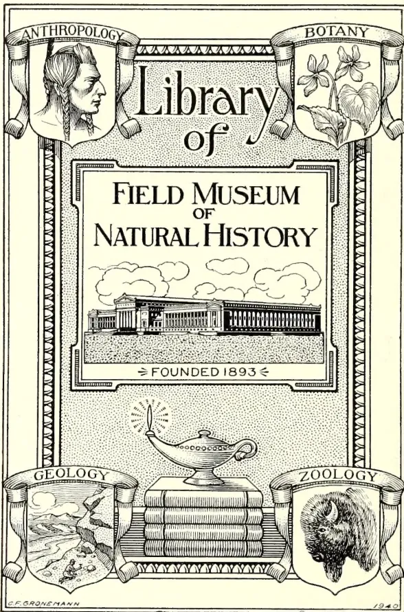
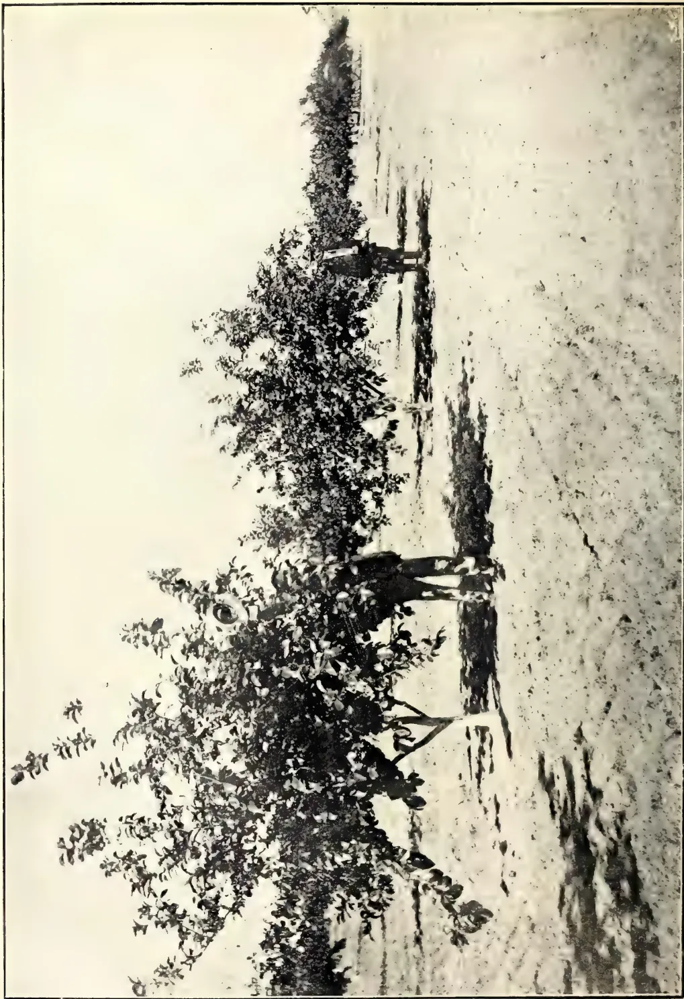
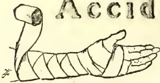
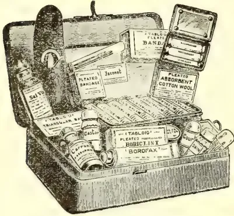
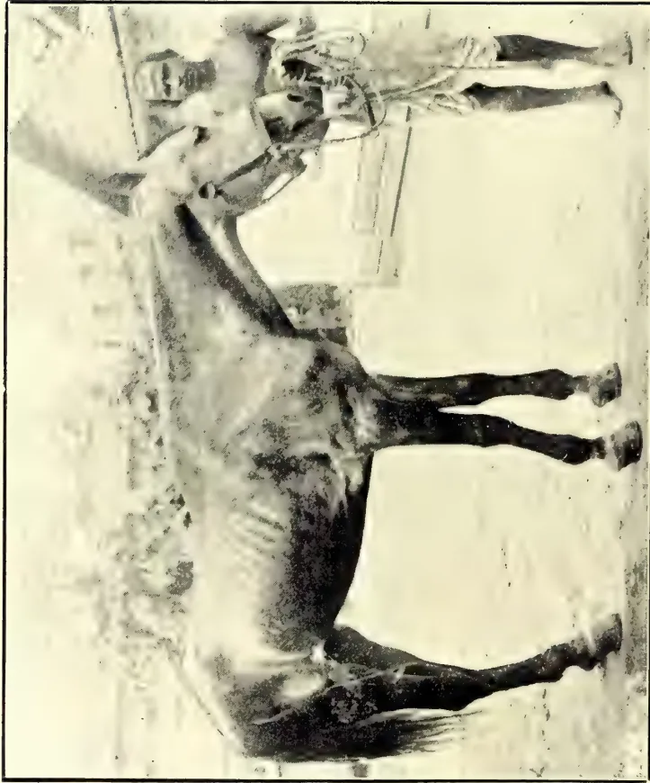
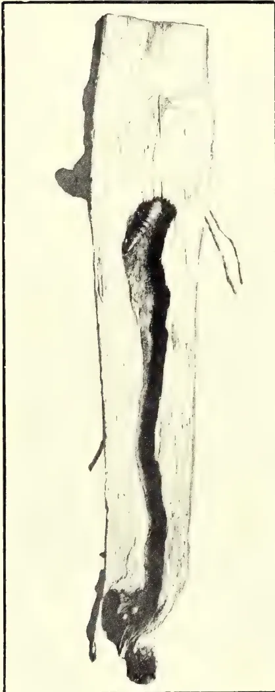
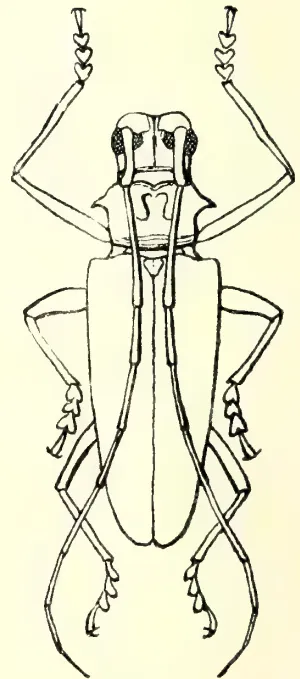
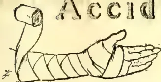
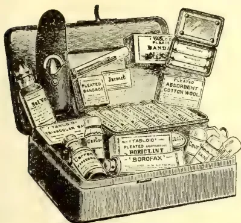
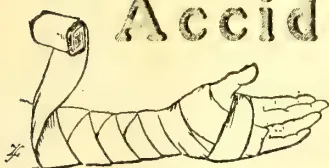

1------------------------------------------------

THE FIELD MUSEUM LIBRARY


3 5711 00043 1255



ANTHROPOLOGY

BOTANY

Library of

FIELD MUSEUM OF NATURAL HISTORY

⇒ FOUNDED 1893 ⇐

GEOLOGY

ZOOLOGY

C.F. GRONEMANN 1940

This is a decorative bookplate for the Library of the Field Museum of Natural History. The central text is 'Library of FIELD MUSEUM OF NATURAL HISTORY' with 'OF' in smaller letters. Below this is an illustration of the museum building. Underneath the building is the text '⇒ FOUNDED 1893 ⇐'. The plate is framed by four corner shields. The top-left shield is labeled 'ANTHROPOLOGY' and contains a profile of a man's head. The top-right shield is labeled 'BOTANY' and contains a plant with flowers. The bottom-left shield is labeled 'GEOLOGY' and contains a landscape with a cliff and water. The bottom-right shield is labeled 'ZOOLOGY' and contains a bison's head. In the center, below the museum building, is an illustration of a stack of books with a lamp resting on top of them. The artist's name 'C.F. GRONEMANN' is at the bottom left, and the year '1940' is at the bottom right.

~~380.76~~

~~C 33~~

2------------------------------------------------


3------------------------------------------------


4------------------------------------------------

This image shows a blank, aged page with a light beige or cream color. The surface has a subtle texture and a few small, dark specks or blemishes, characteristic of old paper. There is no text or other content on the page.

5------------------------------------------------

A large, faint watermark of a classical building, likely a library or archive, is centered on the page. It features a triangular pediment supported by four columns, with a base and a horizontal band above the columns.

Digitized by the Internet Archive  
in 2014

<https://archive.org/details/tropicalagricul351910ceyl>

6------------------------------------------------

Issued free to Members, C.A.S.  
For Rules, &c., see page 1.

F  
{ To non-members Re. 1 per copy.  
Or Rs. 10 per annum.

REGISTERED AS A NEWSPAPER.  
Vol. XXXV No. 1.

NEW SERIES.

JULY, 1910.


THE

# Tropical Agriculturist

[Founded by J. FERGUSON, C.M.G., F.R.A.S., F.R.C.I., in 1881 and edited by him up to 1905.]

AND

## MAGAZINE

OF THE

# Ceylon Agricultural Society

EDITED BY

J. C. WILLIS,

*Director, Royal Botanic Gardens; Organizing Vice-President, C.A.S.*

With a Supplement by A. M. & J. Ferguson.

### CONTENTS:

<table><thead><tr><th></th><th>PAGE.</th></tr></thead><tbody><tr><td>Agriculture in the United States and Canada. I. ....</td><td>1</td></tr><tr><td>Rubber Congress at Manaus ....</td><td>3</td></tr><tr><td>Science and Practice of Para Rubber Cultivation ....</td><td>5</td></tr><tr><td>Commercial Uses of Rubber ....</td><td>10</td></tr><tr><td>Citronella Oil; Cinnamon Oil, Ceylon ....</td><td>13</td></tr><tr><td>Philippine Copra in France ....</td><td>14</td></tr><tr><td>Dundee Staple Trade ....</td><td>15</td></tr><tr><td>Jute and Flax Trades in 1909 ....</td><td>17</td></tr><tr><td>Peruvian Coca; Vanilla Culture for Tropical Queensland ....</td><td>21</td></tr><tr><td>Citrus Growing in Cuba ....</td><td>25</td></tr><tr><td>Soy Beans; Methods of Causing Early Fruiting in Mangoes ....</td><td>28</td></tr><tr><td>Composition of Fresh Avacado Fruit; Propagation of the Avacado Pear ....</td><td>29</td></tr><tr><td>Presence of Yeasts in Fermenting Tea and their Influence on the Fermentation ....</td><td>31</td></tr><tr><td>Tobacco Experiment at Mahailuppalama ....</td><td>30</td></tr><tr><td>The Tobacco Trade ....</td><td>31</td></tr><tr><td><i>Plant Sanitation.</i>—Entomological Notes....</td><td>32</td></tr><tr><td><i>Live Stock.</i>—South Australia Egg-laying Competition 1909-10, 35; Scientific Poultry Raising, 43;<br/>Is the Indian Silk Industry Doomed?, 44; Milk, 46 ....</td><td>35-50</td></tr><tr><td><i>Scientific Agriculture.</i>—Effect of After Cultivation ....</td><td>50-51</td></tr><tr><td><i>Agricultural Finance and Co-operation.</i>—Small Holdings in South-West Lancashire, 51; Some<br/>Local Aspects of Co-operation, 55; Co-operation, 56 ....</td><td>51-64</td></tr><tr><td><i>Education.</i>—A Plea for Industrial Education, 65; Short Courses in Practical Agriculture and in<br/>other Allied Practical Subjects at Pusa ....</td><td>65-67</td></tr><tr><td><i>Miscellaneous</i>—Ceylon Agricultural Society: Minutes of Annual General Meeting held June 8th,<br/>1910, 67; Statement of Receipts and Payments for twelve months ending December 31, 1909, 68;<br/>Bellana Market Show, 69; The Function of Agricultural Experiment Stations ....</td><td>67-71</td></tr><tr><td><i>Supplement</i> ....</td><td>73-96</td></tr></tbody></table>

The Index will be found at the end of the Magazine.

Colombo:

A. M. & J. FERGUSON.

7------------------------------------------------

The "Planet Jr."  
**CARDEN, FARM, & ESTATE**  
**IMPLEMENTS**


**BULLOCK POWER CULTIVATOR.**

"Planet Jr." Implements are indispensable in Rubber and Coconut clearings, where the physical character of the surface renders their use possible. The growth can be considerably improved, and the bearing period earlier attained by systematic cultivation.

We shall be pleased to send, on application, an illustrated booklet giving further information regarding these tools.

-----  
**SOLE AGENTS FOR CEYLON:—**

**BROWN & Co., Ltd.,**  
**COLOMBO.**

8------------------------------------------------

# INDEX FOR JULY NUMBER.

<table style="width: 100%; border-collapse: collapse;">
<thead>
<tr>
<th style="text-align: left;"></th>
<th style="text-align: right;">PAGE.</th>
<th style="text-align: left;"></th>
<th style="text-align: right;">PAGE.</th>
</tr>
</thead>
<tbody>
<tr>
<td colspan="2"><b>Editorials, Lectures, Original Articles, &amp;c:—</b></td>
<td colspan="2"><b>Edible Products:—(Contd.)</b></td>
</tr>
<tr>
<td>Agriculture in the United States and Canada I.—J. C. Willis ...</td>
<td style="text-align: right;">1</td>
<td>Tobacco Experiment at Mahailupalama ... ..</td>
<td style="text-align: right;">30</td>
</tr>
<tr>
<td>Citrus Growing in Cuba.—H. C. Henriksen (<i>Illustrated</i>) ...</td>
<td style="text-align: right;">25</td>
<td>Tobacco Trade... ..</td>
<td style="text-align: right;">31</td>
</tr>
<tr>
<td>Entomological Notes.—E. E. Green ...</td>
<td style="text-align: right;">32</td>
<td>Vanilla Culture for Tropical Queensland ... ..</td>
<td style="text-align: right;">21</td>
</tr>
<tr>
<td>Milk.—A. Bruce ... ..</td>
<td style="text-align: right;">46</td>
<td colspan="2"><b>Plant Sanitation:—</b></td>
</tr>
<tr>
<td>Tobacco Experiment at Mahailupalama.—E. Cowan ... ..</td>
<td style="text-align: right;">30</td>
<td>Entomological Notes ... ..</td>
<td style="text-align: right;">32</td>
</tr>
<tr>
<td colspan="2"><b>Gums, Resins, Saps and Exudations:—</b></td>
<td colspan="2"><b>Live Stock:—</b></td>
</tr>
<tr>
<td>Para Rubber Cultivation, Science and Practice of ... ..</td>
<td style="text-align: right;">5</td>
<td>Egg-laying Competition 1909-10, South Australia ... ..</td>
<td style="text-align: right;">35</td>
</tr>
<tr>
<td>Rubber Congress at Manaos ... ..</td>
<td style="text-align: right;">3</td>
<td>Milk... ..</td>
<td style="text-align: right;">46</td>
</tr>
<tr>
<td>Science and Practice of Para Rubber Cultivation ... ..</td>
<td style="text-align: right;">5</td>
<td>Poultry Raising, Scientific: A New Singapore Enterprise ... ..</td>
<td style="text-align: right;">43</td>
</tr>
<tr>
<td colspan="2"><b>Oils and Fats:—</b></td>
<td>Silk Industry, Indian: Is it Doomed?</td>
<td style="text-align: right;">44</td>
</tr>
<tr>
<td>Cinnamon Oil, Ceylon .. ..</td>
<td style="text-align: right;">13</td>
<td colspan="2"><b>Scientific Agriculture:—</b></td>
</tr>
<tr>
<td>Citronella Oil ... ..</td>
<td style="text-align: right;">13</td>
<td>After Cultivation and its Effect ... ..</td>
<td style="text-align: right;">50</td>
</tr>
<tr>
<td colspan="2"><b>Fibres:—</b></td>
<td colspan="2"><b>Agricultural Finance and Co-operation:—</b></td>
</tr>
<tr>
<td>Dundee Staple Trade ... ..</td>
<td style="text-align: right;">15</td>
<td>Co-operation ... ..</td>
<td style="text-align: right;">56</td>
</tr>
<tr>
<td>Jute and Flax Trades in 1909 ... ..</td>
<td style="text-align: right;">17</td>
<td>„ Some local Aspects of ... ..</td>
<td style="text-align: right;">54</td>
</tr>
<tr>
<td colspan="2"><b>Drugs, Medicines, &amp;c:—</b></td>
<td>Small Holdings in South-West Lancashire ... ..</td>
<td style="text-align: right;">51</td>
</tr>
<tr>
<td>Peruvian Coca ... ..</td>
<td style="text-align: right;">21</td>
<td colspan="2"><b>Education:—</b></td>
</tr>
<tr>
<td colspan="2"><b>Edible Products:—</b></td>
<td>Agriculture and Allied Practical Subjects, Short Courses at Pusa in ... ..</td>
<td style="text-align: right;">66</td>
</tr>
<tr>
<td>Avocado Fruit, Composition of Fresh ... ..</td>
<td style="text-align: right;">29</td>
<td>Industrial Education, A Plea for ... ..</td>
<td style="text-align: right;">65</td>
</tr>
<tr>
<td>„ Pear, The Propagation of the ... ..</td>
<td style="text-align: right;">29</td>
<td>Pusa Short Courses in Practical Agriculture and Allied Practical Subjects</td>
<td style="text-align: right;">66</td>
</tr>
<tr>
<td>Citrus Growing in Cuba ... ..</td>
<td style="text-align: right;">25</td>
<td colspan="2"><b>Miscellaneous:—</b></td>
</tr>
<tr>
<td>Fermenting Tea and Influence of Yeasts in Fermentation ... ..</td>
<td style="text-align: right;">30</td>
<td>Agricultural Experiment Stations, Functions of ... ..</td>
<td style="text-align: right;">70</td>
</tr>
<tr>
<td>Mangoes, Methods of Causing Early Fruiting in ... ..</td>
<td style="text-align: right;">28</td>
<td>C.A.S. Annual General Meeting: Minutes</td>
<td style="text-align: right;">67</td>
</tr>
<tr>
<td>Tea Fermenting, on the Presence of Yeasts in, and their Influence on the Fermentation ... ..</td>
<td style="text-align: right;">30</td>
<td>C.A.S. Statement of Accounts for 1909</td>
<td style="text-align: right;">68</td>
</tr>
<tr>
<td></td>
<td></td>
<td>Bellana Market Show ... ..</td>
<td style="text-align: right;">69</td>
</tr>
</tbody>
</table>

9------------------------------------------------

## SUPPLEMENT.

<table style="width: 100%; border-collapse: collapse;">
<thead>
<tr>
<th style="text-align: left;"></th>
<th style="text-align: right;">PAGE.</th>
<th style="text-align: left;"></th>
<th style="text-align: right;">PAGE.</th>
</tr>
</thead>
<tbody>
<tr>
<td colspan="2"><b>Original Articles, &amp;c., &amp;c. :—</b></td>
<td colspan="2"><b>Palms :—</b></td>
</tr>
<tr>
<td>Camphor Cultivation in Ceylon</td>
<td style="text-align: right;">86</td>
<td>Coconut Disease in Jamaica</td>
<td style="text-align: right;">78</td>
</tr>
<tr>
<td>Coconuts in Batticaloa</td>
<td style="text-align: right;">86</td>
<td>" in Batticaloa</td>
<td style="text-align: right;">86</td>
</tr>
<tr>
<td>Our Coconut Products</td>
<td style="text-align: right;">96</td>
<td>" Oil, Increased Demand for</td>
<td style="text-align: right;"></td>
</tr>
<tr>
<td>Rubber Industry and the Present Prospect</td>
<td style="text-align: right;">73</td>
<td>" Edible</td>
<td style="text-align: right;">79</td>
</tr>
<tr>
<td>Rubber Industry, F.M.S., Mr. Joseph Fraser on the</td>
<td style="text-align: right;">74</td>
<td>" Products, in Germany</td>
<td style="text-align: right;">80</td>
</tr>
<tr>
<td>Rubber Industry, Mr. R. W. Harrison's Views on the</td>
<td style="text-align: right;">76</td>
<td>" Our</td>
<td style="text-align: right;">96</td>
</tr>
<tr>
<td></td>
<td></td>
<td>Coconuts in Peat Soil</td>
<td style="text-align: right;">74</td>
</tr>
<tr>
<td colspan="2"><b>Rubber :—</b></td>
<td colspan="2"><b>Oils :—</b></td>
</tr>
<tr>
<td>Ceara Rubber, Notes on</td>
<td style="text-align: right;">83</td>
<td>Coconut Oil, Edible, Increased Demand for</td>
<td style="text-align: right;">79</td>
</tr>
<tr>
<td>Manicoba Rubber, Notes on</td>
<td style="text-align: right;">83</td>
<td>Samoan Copra</td>
<td style="text-align: right;">77</td>
</tr>
<tr>
<td>Para Rubber Industry, The</td>
<td style="text-align: right;">78</td>
<td></td>
<td></td>
</tr>
<tr>
<td>Rubber, Ceara and Manicoba, Notes on</td>
<td style="text-align: right;">83</td>
<td colspan="2"><b>Drugs :—</b></td>
</tr>
<tr>
<td>" Fungus, Another Para</td>
<td style="text-align: right;">77</td>
<td>Camphor in Ceylon</td>
<td style="text-align: right;">86</td>
</tr>
<tr>
<td>" , Growth and Colour of Para</td>
<td style="text-align: right;">85</td>
<td></td>
<td></td>
</tr>
<tr>
<td>" , Industry of the F.M.S., Mr. Joseph Fraser on the</td>
<td style="text-align: right;">74</td>
<td colspan="2"><b>Scientific Agriculture :—</b></td>
</tr>
<tr>
<td>" , Industry, Historical Notes on</td>
<td style="text-align: right;">91</td>
<td>Ammonia in Germany, Synthetic Production of</td>
<td style="text-align: right;">84</td>
</tr>
<tr>
<td>" , Mr R. W. Harrison's Views on the</td>
<td style="text-align: right;">74</td>
<td>Passiflora as a Green Dressing for Rubber</td>
<td style="text-align: right;">84</td>
</tr>
<tr>
<td>" Wide vs. Close Planting</td>
<td style="text-align: right;">87</td>
<td></td>
<td></td>
</tr>
<tr>
<td colspan="2"><b>Edible Products :—</b></td>
<td colspan="2"><b>Miscellaneous :—</b></td>
</tr>
<tr>
<td>Honey and Wax</td>
<td style="text-align: right;">86</td>
<td>Agricultural Associations, The Value of Agriculture in Japan</td>
<td style="text-align: right;">76</td>
</tr>
<tr>
<td>Milk, Artificial...</td>
<td style="text-align: right;">85</td>
<td>1909-1910 Report of the Tea and Produce Committee</td>
<td style="text-align: right;">81</td>
</tr>
<tr>
<td>Tea and Produce Committee</td>
<td style="text-align: right;">83</td>
<td>Tea and Produce Committees' Report for 1909-10</td>
<td style="text-align: right;">83</td>
</tr>
<tr>
<td>" Trade in 1909-10</td>
<td style="text-align: right;">88</td>
<td></td>
<td></td>
</tr>
</tbody>
</table>

10------------------------------------------------

# INDEX FOR AUGUST NUMBER.

PAGE.

PAGE.

## Editorials, Lectures, Original Articles, &c:—

<table style="width: 100%; border-collapse: collapse;">
<tr>
<td style="padding-left: 10px;">Agriculture in the United States and Canada. II. ...</td>
<td style="text-align: right; vertical-align: bottom;">97</td>
</tr>
<tr>
<td style="padding-left: 10px;">Agricultural Cattle in Ceylon, The Problem of—W. A. de Silva ...</td>
<td style="text-align: right; vertical-align: bottom;">127</td>
</tr>
<tr>
<td style="padding-left: 10px;">Citrus Growing in Cuba.—H. G. Henricksen (<i>Illustrated</i>) ...</td>
<td style="text-align: right; vertical-align: bottom;">115</td>
</tr>
<tr>
<td style="padding-left: 10px;">Entomological Notes.—E. E. Green—(<i>Illustrated</i>). ...</td>
<td style="text-align: right; vertical-align: bottom;">119</td>
</tr>
<tr>
<td style="padding-left: 10px;">Henaratgoda Experiments of 1905-6—T. Petch ...</td>
<td style="text-align: right; vertical-align: bottom;">98</td>
</tr>
<tr>
<td style="padding-left: 10px;">Literature of Economic Botany and Agriculture.—J. C. Willis ...</td>
<td style="text-align: right; vertical-align: bottom;">145</td>
</tr>
<tr>
<td style="padding-left: 10px;">Miscellanea: Chiefly Pathological.—T. Petch ...</td>
<td style="text-align: right; vertical-align: bottom;">122</td>
</tr>
</table>

## Gums, Resins, Saps and Exudation:—

<table style="width: 100%; border-collapse: collapse;">
<tr>
<td style="padding-left: 10px;">Accacia Gum, Collection of ...</td>
<td style="text-align: right; vertical-align: bottom;">108</td>
</tr>
<tr>
<td style="padding-left: 10px;">Gum Accacia, Collection of ...</td>
<td style="text-align: right; vertical-align: bottom;">108</td>
</tr>
<tr>
<td style="padding-left: 10px;">Henaratgoda Experiments of 1905-6...</td>
<td style="text-align: right; vertical-align: bottom;">98</td>
</tr>
<tr>
<td style="padding-left: 10px;">Para Manaus and the Amazon ...</td>
<td style="text-align: right; vertical-align: bottom;">106</td>
</tr>
<tr>
<td style="padding-left: 10px;">Science and Practice of Para Rubber Cultivation ...</td>
<td style="text-align: right; vertical-align: bottom;">102</td>
</tr>
</table>

## Fibres:—

<table style="width: 100%; border-collapse: collapse;">
<tr>
<td style="padding-left: 10px;">Papermaking Fibre, etc. ...</td>
<td style="text-align: right; vertical-align: bottom;">110</td>
</tr>
<tr>
<td style="padding-left: 10px;">Ramie Wool ...</td>
<td style="text-align: right; vertical-align: bottom;">108</td>
</tr>
</table>

## Edible Products:—

<table style="width: 100%; border-collapse: collapse;">
<tr>
<td style="padding-left: 10px;">Cacao Trees, Yield from ...</td>
<td style="text-align: right; vertical-align: bottom;">114</td>
</tr>
<tr>
<td style="padding-left: 10px;">Citrus Growing in Cuba ...</td>
<td style="text-align: right; vertical-align: bottom;">115</td>
</tr>
<tr>
<td style="padding-left: 10px;">Commonsense Way to Cultivate a Tea Estate ...</td>
<td style="text-align: right; vertical-align: bottom;">112</td>
</tr>
<tr>
<td style="padding-left: 10px;">Tea Estate, Commonsense Way to Cultivate a ...</td>
<td style="text-align: right; vertical-align: bottom;">112</td>
</tr>
<tr>
<td style="padding-left: 10px;">Yield from Cacao Trees ...</td>
<td style="text-align: right; vertical-align: bottom;">114</td>
</tr>
</table>

## Plant Sanitation:—

<table style="width: 100%; border-collapse: collapse;">
<tr>
<td style="padding-left: 10px;">Board of Agriculture: New Order of the ...</td>
<td style="text-align: right; vertical-align: bottom;">126</td>
</tr>
<tr>
<td style="padding-left: 10px;">Entomological Notes ...</td>
<td style="text-align: right; vertical-align: bottom;">119</td>
</tr>
<tr>
<td style="padding-left: 10px;">Fungi in Relation to Agriculture ...</td>
<td style="text-align: right; vertical-align: bottom;">124</td>
</tr>
<tr>
<td style="padding-left: 10px;">Miscellanea: Chiefly Pathological ...</td>
<td style="text-align: right; vertical-align: bottom;">122</td>
</tr>
</table>

## Live Stock:—

<table style="width: 100%; border-collapse: collapse;">
<tr>
<td style="padding-left: 10px;">Agricultural Cattle in Ceylon, The Problem of ...</td>
<td style="text-align: right; vertical-align: bottom;">127</td>
</tr>
<tr>
<td style="padding-left: 10px;">Cattle in Ceylon, Problem of Agricultural ...</td>
<td style="text-align: right; vertical-align: bottom;">127</td>
</tr>
</table>

## Scientific Agriculture:—

<table style="width: 100%; border-collapse: collapse;">
<tr>
<td style="padding-left: 10px;">Conservation of the Fertility of the Soil ...</td>
<td style="text-align: right; vertical-align: bottom;">129</td>
</tr>
<tr>
<td style="padding-left: 10px;">Soil Fertility, Conservation of the ...</td>
<td style="text-align: right; vertical-align: bottom;">129</td>
</tr>
</table>

## Agricultural Finance and Co-operation:—

<table style="width: 100%; border-collapse: collapse;">
<tr>
<td style="padding-left: 10px;">Agricultural Bank of Egypt ...</td>
<td style="text-align: right; vertical-align: bottom;">134</td>
</tr>
<tr>
<td style="padding-left: 10px;">Co-operative Credit, The Progress of...</td>
<td style="text-align: right; vertical-align: bottom;">135</td>
</tr>
<tr>
<td style="padding-left: 10px;">Egyptian Agricultural Bank ...</td>
<td style="text-align: right; vertical-align: bottom;">134</td>
</tr>
</table>

## Education:—

<table style="width: 100%; border-collapse: collapse;">
<tr>
<td style="padding-left: 10px;">Agricultural Education ...</td>
<td style="text-align: right; vertical-align: bottom;">141</td>
</tr>
<tr>
<td style="padding-left: 10px;">" " in England and Wales ...</td>
<td style="text-align: right; vertical-align: bottom;">138</td>
</tr>
<tr>
<td style="padding-left: 10px;">Denver National Education Association ...</td>
<td style="text-align: right; vertical-align: bottom;">136</td>
</tr>
<tr>
<td style="padding-left: 10px;">National Education Association of Denver ...</td>
<td style="text-align: right; vertical-align: bottom;">136</td>
</tr>
<tr>
<td style="padding-left: 10px;">School Gardens in England ...</td>
<td style="text-align: right; vertical-align: bottom;">144</td>
</tr>
</table>

## Miscellaneous:—

<table style="width: 100%; border-collapse: collapse;">
<tr>
<td style="padding-left: 10px;">Agriculture in Southern Nigeria ...</td>
<td style="text-align: right; vertical-align: bottom;">162</td>
</tr>
<tr>
<td style="padding-left: 10px;">Ancylostomiasis ...</td>
<td style="text-align: right; vertical-align: bottom;">156</td>
</tr>
<tr>
<td style="padding-left: 10px;">J.A.S. Minutes of Meeting, Aug. 1st...</td>
<td style="text-align: right; vertical-align: bottom;">146</td>
</tr>
<tr>
<td style="padding-left: 10px;">" Progress Report, No. 50 ...</td>
<td style="text-align: right; vertical-align: bottom;">147</td>
</tr>
<tr>
<td style="padding-left: 10px;">F.M.S. Planting News ...</td>
<td style="text-align: right; vertical-align: bottom;">159</td>
</tr>
<tr>
<td style="padding-left: 10px;">Hookworm—the Scourge of the South (Ancylostomiasis) ...</td>
<td style="text-align: right; vertical-align: bottom;">156</td>
</tr>
<tr>
<td style="padding-left: 10px;">Imperial Institute ...</td>
<td style="text-align: right; vertical-align: bottom;">160</td>
</tr>
<tr>
<td style="padding-left: 10px;">Peradeniya Experiment Station ...</td>
<td style="text-align: right; vertical-align: bottom;">154</td>
</tr>
<tr>
<td style="padding-left: 10px;">Progress Report of the Board of Agriculture ...</td>
<td style="text-align: right; vertical-align: bottom;">147</td>
</tr>
<tr>
<td style="padding-left: 10px;">Show Reports, Dumbara ...</td>
<td style="text-align: right; vertical-align: bottom;">154</td>
</tr>
<tr>
<td style="padding-left: 10px;">" Henaratgoda ...</td>
<td style="text-align: right; vertical-align: bottom;">153</td>
</tr>
<tr>
<td style="padding-left: 10px;">Funtumia of Agricultural Experiment Station ...</td>
<td style="text-align: right; vertical-align: bottom;">163</td>
</tr>
</table>

## Correspondence:—

<table style="width: 100%; border-collapse: collapse;">
<tr>
<td style="padding-left: 10px;">Carica Papaya ...</td>
<td style="text-align: right; vertical-align: bottom;">164</td>
</tr>
<tr>
<td style="padding-left: 10px;">Information Wanted...</td>
<td style="text-align: right; vertical-align: bottom;">164</td>
</tr>
<tr>
<td style="padding-left: 10px;">Landolphia ...</td>
<td style="text-align: right; vertical-align: bottom;">165</td>
</tr>
<tr>
<td style="padding-left: 10px;">Pulp for Paper-Making ...</td>
<td style="text-align: right; vertical-align: bottom;">166</td>
</tr>
<tr>
<td style="padding-left: 10px;">Rubber Cultivation in Papua ...</td>
<td style="text-align: right; vertical-align: bottom;">167</td>
</tr>
<tr>
<td style="padding-left: 10px;">" in Bolivia ...</td>
<td style="text-align: right; vertical-align: bottom;">165</td>
</tr>
<tr>
<td style="padding-left: 10px;">Transplanting Coconuts ...</td>
<td style="text-align: right; vertical-align: bottom;">167</td>
</tr>
<tr>
<td style="padding-left: 10px;">Velvet Beans ...</td>
<td style="text-align: right; vertical-align: bottom;">167</td>
</tr>
</table>

11------------------------------------------------

## SUPPLEMENT.

<table style="width: 100%; border-collapse: collapse;">
<thead>
<tr>
<th style="text-align: left;"></th>
<th style="text-align: right;">PAGE.</th>
<th style="text-align: left;"></th>
<th style="text-align: right;">PAGE.</th>
</tr>
</thead>
<tbody>
<tr>
<td><b>Original Articles, &amp;c., &amp;c. :—</b></td>
<td></td>
<td><b>Edible Products :—</b><i>(Contd.)</i></td>
<td></td>
</tr>
<tr>
<td>Brown Root Disease ...</td>
<td style="text-align: right;">180</td>
<td>Copra, High Price of ...</td>
<td style="text-align: right;">192</td>
</tr>
<tr>
<td>Papua, A Planters' Association for ...</td>
<td style="text-align: right;">183</td>
<td>Experiments on the Quality of Tea ...</td>
<td style="text-align: right;">183</td>
</tr>
<tr>
<td>Royal Botanic Gardens in 1909 ...</td>
<td style="text-align: right;">179</td>
<td>"Nubur," Australian Customs Duty on ...</td>
<td style="text-align: right;">173</td>
</tr>
<tr>
<td>Rubber in South India ...</td>
<td style="text-align: right;">173</td>
<td>Palm Disease in Travancore ...</td>
<td style="text-align: right;">171</td>
</tr>
<tr>
<td>" Land in Cochin ...</td>
<td style="text-align: right;">177</td>
<td>Sugar Profits in Mauritius ...</td>
<td style="text-align: right;">178</td>
</tr>
<tr>
<td>Tapping, Notes on Rubber ...</td>
<td style="text-align: right;">170</td>
<td>Travancore, Banana Cultivation in ...</td>
<td style="text-align: right;">188</td>
</tr>
<tr>
<td>" Results in South India ...</td>
<td style="text-align: right;">173</td>
<td>" Palm Disease ...</td>
<td style="text-align: right;">171</td>
</tr>
<tr>
<td><b>Rubber :—</b></td>
<td></td>
<td>Vegetable Butter, Production of ...</td>
<td style="text-align: right;">175</td>
</tr>
<tr>
<td>Jeque Manicobas ...</td>
<td style="text-align: right;">187</td>
<td><b>Cacao :—</b></td>
<td></td>
</tr>
<tr>
<td>Para Rubber Tree, The ...</td>
<td style="text-align: right;">170</td>
<td>Rubber Tree as a Shade for Cacao ...</td>
<td style="text-align: right;">185</td>
</tr>
<tr>
<td>Rubber at Singapore Botanic Gar-<br/>dens... ..</td>
<td style="text-align: right;">178</td>
<td><b>Oils :—</b></td>
<td></td>
</tr>
<tr>
<td>" in Brazil: Its Efforts to Cul-<br/>tivate... ..</td>
<td style="text-align: right;">183</td>
<td>High Price of Copra ...</td>
<td style="text-align: right;">192</td>
</tr>
<tr>
<td>" in Burma ...</td>
<td style="text-align: right;">182</td>
<td><b>Fibres :—</b></td>
<td></td>
</tr>
<tr>
<td>" in Nilgiri Gardens ...</td>
<td style="text-align: right;">182</td>
<td>Caravonica Cotton ...</td>
<td style="text-align: right;">188</td>
</tr>
<tr>
<td>" in South India ...</td>
<td style="text-align: right;">173</td>
<td>Cotton Cultivation ...</td>
<td style="text-align: right;">172</td>
</tr>
<tr>
<td>" in the Congo ...</td>
<td style="text-align: right;">175</td>
<td>Paper Pulp from Lalang ...</td>
<td style="text-align: right;">184</td>
</tr>
<tr>
<td>" Land in Cochin ...</td>
<td style="text-align: right;">177, 187</td>
<td><b>Miscellaneous :—</b></td>
<td></td>
</tr>
<tr>
<td>" Tree as a Shade for Cacao ...</td>
<td style="text-align: right;">185</td>
<td>Ammonia, Synthetic ...</td>
<td style="text-align: right;">187</td>
</tr>
<tr>
<td>Scale Insect of Castilloa, A New ...</td>
<td style="text-align: right;">183</td>
<td>Australian Customs Duty on "Nubur" ...</td>
<td style="text-align: right;">173</td>
</tr>
<tr>
<td>Tapping, Notes on ...</td>
<td style="text-align: right;">170</td>
<td>Charcoal Manufacture ...</td>
<td style="text-align: right;">174</td>
</tr>
<tr>
<td><b>Tea :—</b></td>
<td></td>
<td>Manufacture and Use of Charcoal ...</td>
<td style="text-align: right;">174</td>
</tr>
<tr>
<td>Old Areas in Tea, The Renewal of ...</td>
<td style="text-align: right;">184</td>
<td>Papua Planters' Association ...</td>
<td style="text-align: right;">183</td>
</tr>
<tr>
<td>Quality of Tea, Experiments on the... ..</td>
<td style="text-align: right;">183</td>
<td>Planting in the F.M.S. in 1909 ...</td>
<td style="text-align: right;">172</td>
</tr>
<tr>
<td>Stump Rot in Tea ...</td>
<td style="text-align: right;">174</td>
<td>Renewal of Old Areas in Tea ...</td>
<td style="text-align: right;">184</td>
</tr>
<tr>
<td><b>Edible Products :—</b></td>
<td></td>
<td>Resin Cup, A New ...</td>
<td style="text-align: right;">186</td>
</tr>
<tr>
<td>Banana in Travancore ...</td>
<td style="text-align: right;">188</td>
<td>Royal Botanic Gardens in 1909 ...</td>
<td style="text-align: right;">179</td>
</tr>
<tr>
<td>Butter, Production of Vegetable ...</td>
<td style="text-align: right;">175</td>
<td>Synthetic Ammonia ...</td>
<td style="text-align: right;">187</td>
</tr>
<tr>
<td></td>
<td></td>
<td>United P. A. of South India ...</td>
<td style="text-align: right;">179</td>
</tr>
</tbody>
</table>

12------------------------------------------------

# INDEX FOR SEPTEMBER NUMBER.

---

<table style="width: 100%; border-collapse: collapse;">
<thead>
<tr>
<th style="text-align: left;"></th>
<th style="text-align: right;">PAGE.</th>
<th style="text-align: left;"></th>
<th style="text-align: right;">PAGE.</th>
</tr>
</thead>
<tbody>
<tr>
<td colspan="2"><b>Editorials, Lectures, Original Articles, &amp;c:—</b></td>
<td colspan="2"><b>Plant Sanitation:—</b></td>
</tr>
<tr>
<td style="padding-left: 20px;">Agriculture in the United States and Canada. III.—J. C. Willis ...</td>
<td style="text-align: right; vertical-align: bottom;">193</td>
<td style="padding-left: 20px;">Burial of Tea Prunings ... ..</td>
<td style="text-align: right; vertical-align: bottom;">225</td>
</tr>
<tr>
<td style="padding-left: 20px;">Entomological Notes.—E. E. Green...</td>
<td style="text-align: right; vertical-align: bottom;">221</td>
<td style="padding-left: 20px;">Entomological Notes ... ..</td>
<td style="text-align: right; vertical-align: bottom;">221</td>
</tr>
<tr>
<td style="padding-left: 20px;">Experimental Tapping of Hevea at Singapore.—T. Petch ... ..</td>
<td style="text-align: right; vertical-align: bottom;">194</td>
<td style="padding-left: 20px;">Miscellanea: Chiefly Pathological ...</td>
<td style="text-align: right; vertical-align: bottom;">223</td>
</tr>
<tr>
<td style="padding-left: 20px;">Literature of Economic Botany and Agriculture.—J. C. Willis ... ..</td>
<td style="text-align: right; vertical-align: bottom;">251</td>
<td style="padding-left: 20px;">Tea Prunings, Burial of ... ..</td>
<td style="text-align: right; vertical-align: bottom;">225</td>
</tr>
<tr>
<td style="padding-left: 20px;">Miscellanea: Chiefly Pathological.—T. Petch ... ..</td>
<td style="text-align: right; vertical-align: bottom;">223</td>
<td></td>
<td></td>
</tr>
<tr>
<td style="padding-left: 20px;">Weak Rubber: The Latest Explanation.—T. Petch ... ..</td>
<td style="text-align: right; vertical-align: bottom;">197</td>
<td colspan="2"><b>Live Stock:—</b></td>
</tr>
<tr>
<td colspan="2"><b>Gums, Resins, Saps and Exudations:—</b></td>
<td style="padding-left: 20px;">Osteoporosis Affecting Horses in Ceylon ... ..</td>
<td style="text-align: right; vertical-align: bottom;">225</td>
</tr>
<tr>
<td style="padding-left: 20px;">Development of Rubber Plantation...</td>
<td style="text-align: right; vertical-align: bottom;">198</td>
<td></td>
<td></td>
</tr>
<tr>
<td style="padding-left: 20px;">Experimental Tapping of Hevea at Singapore ... ..</td>
<td style="text-align: right; vertical-align: bottom;">194</td>
<td colspan="2"><b>Scientific Agriculture:—</b></td>
</tr>
<tr>
<td style="padding-left: 20px;">Weak Rubber: The Latest Explanation ... ..</td>
<td style="text-align: right; vertical-align: bottom;">197</td>
<td style="padding-left: 20px;">Changes in the Soil and its Fertility...</td>
<td style="text-align: right; vertical-align: bottom;">230</td>
</tr>
<tr>
<td colspan="2"><b>Oils and Fats:—</b></td>
<td style="padding-left: 20px;">Lime in Agriculture ... ..</td>
<td style="text-align: right; vertical-align: bottom;">228</td>
</tr>
<tr>
<td style="padding-left: 20px;">Cinnamon Bark Oil ... ..</td>
<td style="text-align: right; vertical-align: bottom;">198</td>
<td style="padding-left: 20px;">Thistles and other Weed ... ..</td>
<td style="text-align: right; vertical-align: bottom;">229</td>
</tr>
<tr>
<td colspan="2"><b>Fibres:—</b></td>
<td></td>
<td></td>
</tr>
<tr>
<td style="padding-left: 20px;">Sisal and Soil, &amp;c. ... ..</td>
<td style="text-align: right; vertical-align: bottom;">201</td>
<td colspan="2"><b>Agricultural Finance and Co-operation:—</b></td>
</tr>
<tr>
<td colspan="2"><b>Drugs:—</b></td>
<td style="padding-left: 20px;">Agricultural Organisation Society, Scottish ... ..</td>
<td style="text-align: right; vertical-align: bottom;">239</td>
</tr>
<tr>
<td style="padding-left: 20px;">Java Coca and Cocaine ... ..</td>
<td style="text-align: right; vertical-align: bottom;">203</td>
<td style="padding-left: 20px;">Co-operative Organisation in Agriculture .. ..</td>
<td style="text-align: right; vertical-align: bottom;">231</td>
</tr>
<tr>
<td colspan="2"><b>Edible Products:—</b></td>
<td style="padding-left: 20px;">Scottish Agricultural Organisation Society ... ..</td>
<td style="text-align: right; vertical-align: bottom;">239</td>
</tr>
<tr>
<td style="padding-left: 20px;">Avacado Pear, The ... ..</td>
<td style="text-align: right; vertical-align: bottom;">212</td>
<td></td>
<td></td>
</tr>
<tr>
<td style="padding-left: 20px;">Corn Growing in the Philippines ... ..</td>
<td style="text-align: right; vertical-align: bottom;">213</td>
<td colspan="2"><b>Agricultural Education:—</b></td>
</tr>
<tr>
<td style="padding-left: 20px;">Indian Tea Industry ... ..</td>
<td style="text-align: right; vertical-align: bottom;">207</td>
<td style="padding-left: 20px;">Courses of Reading and Examinations in Practical Agriculture ... ..</td>
<td style="text-align: right; vertical-align: bottom;">240</td>
</tr>
<tr>
<td style="padding-left: 20px;">Pineapple Growing in Porto Rico ... ..</td>
<td style="text-align: right; vertical-align: bottom;">216</td>
<td style="padding-left: 20px;">School Gardens ... ..</td>
<td style="text-align: right; vertical-align: bottom;">245</td>
</tr>
<tr>
<td style="padding-left: 20px;">Soy Bean, The... ..</td>
<td style="text-align: right; vertical-align: bottom;">208</td>
<td style="padding-left: 20px;">State Aid for Agricultural Education ... ..</td>
<td style="text-align: right; vertical-align: bottom;">249</td>
</tr>
<tr>
<td style="padding-left: 20px;">" " Industry, The ... ..</td>
<td style="text-align: right; vertical-align: bottom;">212</td>
<td></td>
<td></td>
</tr>
<tr>
<td style="padding-left: 20px;">Tea in Jamaica ... ..</td>
<td style="text-align: right; vertical-align: bottom;">203</td>
<td colspan="2"><b>Miscellaneous:—</b></td>
</tr>
<tr>
<td style="padding-left: 20px;">" Industry of India ... ..</td>
<td style="text-align: right; vertical-align: bottom;">207</td>
<td style="padding-left: 20px;">Economic Condition of Agriculture, The .. ..</td>
<td style="text-align: right; vertical-align: bottom;">254</td>
</tr>
<tr>
<td style="padding-left: 20px;">" Seed, Imports of ... ..</td>
<td style="text-align: right; vertical-align: bottom;">207</td>
<td style="padding-left: 20px;">Erratum ... ..</td>
<td style="text-align: right; vertical-align: bottom;">263</td>
</tr>
<tr>
<td colspan="2"><b>Timbers:—</b></td>
<td style="padding-left: 20px;">Inaugural Address of Governor-General William Cameron Forbes, Extracts from the... ..</td>
<td style="text-align: right; vertical-align: bottom;">258</td>
</tr>
<tr>
<td style="padding-left: 20px;">Lumber Exports from Mindanao ... ..</td>
<td style="text-align: right; vertical-align: bottom;">221</td>
<td style="padding-left: 20px;">Literature of Economic Botany and Agriculture ... ..</td>
<td style="text-align: right; vertical-align: bottom;">251</td>
</tr>
<tr>
<td></td>
<td></td>
<td style="padding-left: 20px;">Market Rates for Tropical Products...</td>
<td style="text-align: right; vertical-align: bottom;">264</td>
</tr>
</tbody>
</table>

---

13------------------------------------------------

## SUPPLEMENT.

<table style="width: 100%; border-collapse: collapse;">
<thead>
<tr>
<th style="text-align: left;"></th>
<th style="text-align: right;">PAGE.</th>
<th style="text-align: left;"></th>
<th style="text-align: right;">PAGE.</th>
</tr>
</thead>
<tbody>
<tr>
<td colspan="2"><b>Original Articles, &amp;c., &amp;c. :—</b></td>
<td colspan="2"><b>Drugs, Medicines, &amp;c. :—</b></td>
</tr>
<tr>
<td>A Good Time for Tea ...</td>
<td style="text-align: right;">265</td>
<td>Nutmegs ...</td>
<td style="text-align: right;">282</td>
</tr>
<tr>
<td>Ceylon Planting Enterprise, The ...</td>
<td style="text-align: right;">281</td>
<td>Camphor Industry of Japan ...</td>
<td style="text-align: right;">287</td>
</tr>
<tr>
<td>North-Central Province Experiment Station ...</td>
<td style="text-align: right;">270</td>
<td></td>
<td></td>
</tr>
<tr>
<td>Tapping of Ceara Rubber ...</td>
<td style="text-align: right;">273</td>
<td colspan="2"><b>Cacao :—</b></td>
</tr>
<tr>
<td>Tea, A Good Time for ...</td>
<td style="text-align: right;">273</td>
<td>Cacao Crops of the World ...</td>
<td style="text-align: right;">272</td>
</tr>
<tr>
<td colspan="2"><b>Rubber :—</b></td>
<td></td>
<td></td>
</tr>
<tr>
<td>Manihot Dichotoma ...</td>
<td style="text-align: right;">283</td>
<td colspan="2"><b>Fibres :—</b></td>
</tr>
<tr>
<td>Rubber Catch Crop, Coca as a ...</td>
<td style="text-align: right;">277</td>
<td>A New kind of Artificial Cotton ...</td>
<td style="text-align: right;">287</td>
</tr>
<tr>
<td>" Industry in Brazil ...</td>
<td style="text-align: right;">268</td>
<td>Banana Fibre... ..</td>
<td style="text-align: right;">279</td>
</tr>
<tr>
<td>" Problems ..</td>
<td style="text-align: right;">284</td>
<td>China Cloth from Banana Fibre ...</td>
<td style="text-align: right;">269</td>
</tr>
<tr>
<td>Separation of Rubber from the Latex ...</td>
<td style="text-align: right;">288</td>
<td></td>
<td></td>
</tr>
<tr>
<td>Tapping of Ceara Rubber ...</td>
<td style="text-align: right;">273</td>
<td colspan="2"><b>Plant Sanitation :—</b></td>
</tr>
<tr>
<td>" " in Uganda ...</td>
<td style="text-align: right;">273</td>
<td>An Australian Insecticide ...</td>
<td style="text-align: right;">278</td>
</tr>
<tr>
<td>" Rubber Trees, Improvements in ...</td>
<td style="text-align: right;">273</td>
<td></td>
<td></td>
</tr>
<tr>
<td>U. S. A. Rubber Imports ...</td>
<td style="text-align: right;">288</td>
<td colspan="2"><b>Scientific Agriculture :—</b></td>
</tr>
<tr>
<td colspan="2"><b>Tea :—</b></td>
<td>Cover Crops and Green Manuring ...</td>
<td style="text-align: right;">286</td>
</tr>
<tr>
<td>A Good Time for Tea ...</td>
<td style="text-align: right;">265</td>
<td>Estate Sanitation ...</td>
<td style="text-align: right;">274</td>
</tr>
<tr>
<td>Tea Trade of Japan ...</td>
<td style="text-align: right;">278</td>
<td>Green Manuring and the Use of Cover Crops ...</td>
<td style="text-align: right;">286</td>
</tr>
<tr>
<td></td>
<td></td>
<td>Pineapple Disease of Sugar-Cane ...</td>
<td style="text-align: right;">270</td>
</tr>
<tr>
<td colspan="2"><b>Edible Products :—</b></td>
<td></td>
<td></td>
</tr>
<tr>
<td>Alcohol from Cacti ...</td>
<td style="text-align: right;">280</td>
<td colspan="2"><b>Miscellaneous :—</b></td>
</tr>
<tr>
<td>Coconut for Planting, Selection of... ..</td>
<td style="text-align: right;">285</td>
<td>Agriculture in Madras ...</td>
<td style="text-align: right;">280</td>
</tr>
<tr>
<td>" Products Industry of the West Indies... ..</td>
<td style="text-align: right;">269</td>
<td>Alcoholic Value of Cacti... ..</td>
<td style="text-align: right;">280</td>
</tr>
<tr>
<td>Indian Tobacco ...</td>
<td style="text-align: right;">275</td>
<td>Artificial Cotton ...</td>
<td style="text-align: right;">287</td>
</tr>
<tr>
<td>Mango in Jamaica, Success of the Indian ...</td>
<td style="text-align: right;">280</td>
<td>Coca as a Rubber Catch Crop ...</td>
<td style="text-align: right;">277</td>
</tr>
<tr>
<td>Peppers, Liberian ...</td>
<td style="text-align: right;">272</td>
<td>Exhibition, U.P.A.S.I. Miniature ...</td>
<td style="text-align: right;">279</td>
</tr>
<tr>
<td>Pineapple Disease of Sugar-Cane ...</td>
<td style="text-align: right;">270</td>
<td>Experiment Station in the North-Central Province ...</td>
<td style="text-align: right;">270</td>
</tr>
<tr>
<td>" Industry of Hawaii ...</td>
<td style="text-align: right;">282</td>
<td>Fruit Preserving Enterprise ...</td>
<td style="text-align: right;">277</td>
</tr>
<tr>
<td>Selection of Coconuts for Planting... ..</td>
<td style="text-align: right;">285</td>
<td>Intensive Gardening for India ...</td>
<td style="text-align: right;">288</td>
</tr>
<tr>
<td>Tapioca at Sedenak Rubber Estates ...</td>
<td style="text-align: right;">287</td>
<td>Planting Enterprise of Ceylon ...</td>
<td style="text-align: right;">218</td>
</tr>
<tr>
<td>Vanilla Industry, The ...</td>
<td style="text-align: right;">277</td>
<td>Poultry Farming in South India ...</td>
<td style="text-align: right;">279</td>
</tr>
<tr>
<td></td>
<td></td>
<td>The Ceylon Planting Enterprise ...</td>
<td style="text-align: right;">281</td>
</tr>
</tbody>
</table>

14------------------------------------------------

# INDEX FOR OCTOBER NUMBER.

<table style="width: 100%; border-collapse: collapse;">
<thead>
<tr>
<th style="text-align: left;"></th>
<th style="text-align: right;">PAGE.</th>
<th style="text-align: left;"></th>
<th style="text-align: right;">PAGE.</th>
</tr>
</thead>
<tbody>
<tr>
<td colspan="2"><b>Original Articles, &amp;c :—</b></td>
<td colspan="2"><b>Agricultural Finance and Co-operation :—</b></td>
</tr>
<tr>
<td>C.A.S. : Minutes of Board Meeting,--<br/>C. Drieberg ... ..</td>
<td style="text-align: right; vertical-align: bottom;">325</td>
<td>Co-operative Agricultural Societies<br/>in the U. K.... ..</td>
<td style="text-align: right; vertical-align: bottom;">320</td>
</tr>
<tr>
<td>C.A.S. ; Progress Report 51 ; C. Drieberg<br/>... ..</td>
<td style="text-align: right; vertical-align: bottom;">325</td>
<td colspan="2"><b>Agricultural Education :—</b></td>
</tr>
<tr>
<td>Co-operation.—J. C. Willis ... ..</td>
<td style="text-align: right; vertical-align: bottom;">286</td>
<td>Native Travelling Instructors in the<br/>Gold Coast Colony, The Work of ... ..</td>
<td style="text-align: right; vertical-align: bottom;">322</td>
</tr>
<tr>
<td>Entomological Notes.—E. E. Green... ..</td>
<td style="text-align: right; vertical-align: bottom;">311</td>
<td>Teaching Agriculture in High Schools</td>
<td style="text-align: right; vertical-align: bottom;">324</td>
</tr>
<tr>
<td>Experiment Station, Report on.—J.<br/>A. Holmes ... ..</td>
<td style="text-align: right; vertical-align: bottom;">338</td>
<td colspan="2"><b>Miscellaneous :—</b></td>
</tr>
<tr>
<td>Ibbagamuwa Show Report.—W. Mole-<br/>gode ... ..</td>
<td style="text-align: right; vertical-align: bottom;">331</td>
<td>Agricultural Experiments in Malabar</td>
<td style="text-align: right; vertical-align: bottom;">357</td>
</tr>
<tr>
<td>Literature of Economic Botany and<br/>Agriculture.—J. C. Willis ... ..</td>
<td style="text-align: right; vertical-align: bottom;">333</td>
<td>C.A.S. Minutes of Board Meeting<br/>Oct. 3 ... ..</td>
<td style="text-align: right; vertical-align: bottom;">325</td>
</tr>
<tr>
<td>Notes and Queries.—C. Drieberg ... ..</td>
<td style="text-align: right; vertical-align: bottom;">356</td>
<td>C.A.S. Progress Report 51 ... ..</td>
<td style="text-align: right; vertical-align: bottom;">325</td>
</tr>
<tr>
<td>Recent Progress in Tropical Agri-<br/>culture.—J. C. Willis ... ..</td>
<td style="text-align: right; vertical-align: bottom;">341</td>
<td>Eventful Year (in Hawaii), An ... ..</td>
<td style="text-align: right; vertical-align: bottom;">340</td>
</tr>
<tr>
<td>Reviews ... ..</td>
<td style="text-align: right; vertical-align: bottom;">358-9</td>
<td>Ibbagamuwa Agricultural Show ... ..</td>
<td style="text-align: right; vertical-align: bottom;">331</td>
</tr>
<tr>
<td colspan="2"><b>Gums, Resins, Saps and Exudations :—</b></td>
<td>Literature of Economic Botany and<br/>Agriculture ... ..</td>
<td style="text-align: right; vertical-align: bottom;">333</td>
</tr>
<tr>
<td>Para, Manáos and the Amazon ... ..</td>
<td style="text-align: right; vertical-align: bottom;">290</td>
<td>Notes and Queries ... ..</td>
<td style="text-align: right; vertical-align: bottom;">356</td>
</tr>
<tr>
<td colspan="2"><b>Fibres :—</b></td>
<td>Ontario President's Address ... ..</td>
<td style="text-align: right; vertical-align: bottom;">353</td>
</tr>
<tr>
<td>African Bass or Piassava (<i>Raphia</i><br/><i>Vinifera</i>) ... ..</td>
<td style="text-align: right; vertical-align: bottom;">297</td>
<td>Peradeniya Experiment Station ... ..</td>
<td style="text-align: right; vertical-align: bottom;">338</td>
</tr>
<tr>
<td>Caravonica Cotton ... ..</td>
<td style="text-align: right; vertical-align: bottom;">298</td>
<td>Plant Life, Some Phenomena of ... ..</td>
<td style="text-align: right; vertical-align: bottom;">337</td>
</tr>
<tr>
<td colspan="2"><b>Edible Products :—</b></td>
<td>Tropical Agriculture, Recent Pro-<br/>gress in ... ..</td>
<td style="text-align: right; vertical-align: bottom;">341</td>
</tr>
<tr>
<td>Andropogan Sorghum : Millet or<br/>Pyaung ... ..</td>
<td style="text-align: right; vertical-align: bottom;">301</td>
<td>Village Agriculture, Some Needs of</td>
<td style="text-align: right; vertical-align: bottom;">355</td>
</tr>
<tr>
<td>Banana in Travancore, Cultivation of<br/>the ... ..</td>
<td style="text-align: right; vertical-align: bottom;">300</td>
<td colspan="2"><b>Review :—</b></td>
</tr>
<tr>
<td>Bleaching of Ginger ... ..</td>
<td style="text-align: right; vertical-align: bottom;">299</td>
<td>Handbook of Tropical Gardening<br/>and Planting... ..</td>
<td style="text-align: right; vertical-align: bottom;">358</td>
</tr>
<tr>
<td>Breeding of Wheat ... ..</td>
<td style="text-align: right; vertical-align: bottom;">305</td>
<td>Introduction to Cotton Cultivation in<br/>German Colonies ... ..</td>
<td style="text-align: right; vertical-align: bottom;">359</td>
</tr>
<tr>
<td>Ginger, Bleaching of ... ..</td>
<td style="text-align: right; vertical-align: bottom;">299</td>
<td colspan="2"><b>Notes and Comments ... ..</b></td>
</tr>
<tr>
<td>Sugar in West Indies and in Java ... ..</td>
<td style="text-align: right; vertical-align: bottom;">308</td>
<td>Beli Fruit (Bael).</td>
<td style="text-align: right; vertical-align: bottom;">356</td>
</tr>
<tr>
<td>Wheat, Breeding of ... ..</td>
<td style="text-align: right; vertical-align: bottom;">305</td>
<td>Betel, Instructions <i>re.</i></td>
<td></td>
</tr>
<tr>
<td colspan="2"><b>Plant Sanitation :—</b></td>
<td>Interplanting Rubber with Coconut.</td>
<td></td>
</tr>
<tr>
<td>Blister Blight in Tea ... ..</td>
<td style="text-align: right; vertical-align: bottom;">312</td>
<td>Mango, Ripening Period of.</td>
<td></td>
</tr>
<tr>
<td>Banana Blight, The Central American<br/>" Disease, Cuban ... ..</td>
<td style="text-align: right; vertical-align: bottom;">319</td>
<td>Monstora Deliciosa.</td>
<td></td>
</tr>
<tr>
<td>Cacao Canker ... ..</td>
<td style="text-align: right; vertical-align: bottom;">317</td>
<td>Mimosa Pudica.</td>
<td></td>
</tr>
<tr>
<td>Entomological Notes ... ..</td>
<td style="text-align: right; vertical-align: bottom;">311</td>
<td>Pecannuts.</td>
<td></td>
</tr>
<tr>
<td>Potato Wart and White Pine Blister<br/>Rust ... ..</td>
<td style="text-align: right; vertical-align: bottom;">317</td>
<td>Pila.</td>
<td></td>
</tr>
<tr>
<td></td>
<td></td>
<td>Rice Cultivation.</td>
<td></td>
</tr>
<tr>
<td></td>
<td></td>
<td>Sisal Hemp.</td>
<td></td>
</tr>
<tr>
<td></td>
<td></td>
<td>Tea for Galle District.</td>
<td></td>
</tr>
</tbody>
</table>

15------------------------------------------------

# SUPPLEMENT.

<table style="width: 100%; border-collapse: collapse;">
<thead>
<tr>
<th style="text-align: left;"></th>
<th style="text-align: right;">PAGE.</th>
<th style="text-align: left;"></th>
<th style="text-align: right;">PAGE.</th>
</tr>
</thead>
<tbody>
<tr>
<td><b>Original Articles, &amp;c., &amp;c. :—</b></td>
<td></td>
<td><b>Edible Products :—(Contd.)</b></td>
<td></td>
</tr>
<tr>
<td>Agricultural Society's Tobacco Experiment ... ..</td>
<td style="text-align: right;">369</td>
<td>Potatoes, Cultivation of... ..</td>
<td style="text-align: right;">379</td>
</tr>
<tr>
<td>Charcoal-Making as a New and Promising Industry ... ..</td>
<td style="text-align: right;">368</td>
<td>Soya Bean Industry and the East Asiatic Co. ... ..</td>
<td style="text-align: right;">368</td>
</tr>
<tr>
<td>Coconut and Cacao Planting in Java ... ..</td>
<td style="text-align: right;">375</td>
<td></td>
<td></td>
</tr>
<tr>
<td>" Cultivation in the Malay States ... ..</td>
<td style="text-align: right;">364</td>
<td><b>Palms, Coconuts, &amp;c :—</b></td>
<td></td>
</tr>
<tr>
<td>Mahailuppalama Tobacco Experiment by the C.A.S. ... ..</td>
<td style="text-align: right;">369</td>
<td>Coconut Cultivation in the Malay States ... ..</td>
<td style="text-align: right;">364</td>
</tr>
<tr>
<td>Mr. Sheridan Patterson's New System of Rubber Tapping ... ..</td>
<td style="text-align: right;">361</td>
<td>Coconuts and Cacao in Java ... ..</td>
<td style="text-align: right;">375</td>
</tr>
<tr>
<td>Smoking Latex ... ..</td>
<td style="text-align: right;">374</td>
<td>Copra in the Philippines ... ..</td>
<td style="text-align: right;">367</td>
</tr>
<tr>
<td>Tapping, Mr. Sheridan Patterson's New System of ... ..</td>
<td style="text-align: right;">361</td>
<td>Our Palm Products for 3rd Quarter of 1910 ... ..</td>
<td style="text-align: right;">377</td>
</tr>
<tr>
<td></td>
<td></td>
<td>Yield of Coconuts per Tree ... ..</td>
<td style="text-align: right;">375</td>
</tr>
<tr>
<td><b>Rubber :—</b></td>
<td></td>
<td><b>Drugs, Medicines, &amp;c :—</b></td>
<td></td>
</tr>
<tr>
<td>Hevea Cultivation ... ..</td>
<td style="text-align: right;">375</td>
<td>American Camphor Trade ... ..</td>
<td style="text-align: right;">373</td>
</tr>
<tr>
<td>Manurial Experiments in the F.M.S. with Rubber ... ..</td>
<td style="text-align: right;">364</td>
<td>Tobacco Experiment at Mahailuppalama ... ..</td>
<td style="text-align: right;">369</td>
</tr>
<tr>
<td>Mergui Rubber Plantations, Government's ... ..</td>
<td style="text-align: right;">364</td>
<td></td>
<td></td>
</tr>
<tr>
<td>Rubber in Bolivia ... ..</td>
<td style="text-align: right;">372</td>
<td><b>Scientific Agriculture :—</b></td>
<td></td>
</tr>
<tr>
<td>" Plants, Choice of ... ..</td>
<td style="text-align: right;">371</td>
<td>Rothamsted Experiments ... ..</td>
<td style="text-align: right;">366</td>
</tr>
<tr>
<td>" Production in Brazil ... ..</td>
<td style="text-align: right;">371</td>
<td>Tilled and Untilled Soil... ..</td>
<td style="text-align: right;">376</td>
</tr>
<tr>
<td>Smoking Latex ... ..</td>
<td style="text-align: right;">374</td>
<td><b>Cacao :—</b></td>
<td></td>
</tr>
<tr>
<td>Tapping, Bamber and Lock on ... ..</td>
<td style="text-align: right;">378</td>
<td>Cacao and Coconut Planting in Java ... ..</td>
<td style="text-align: right;">375</td>
</tr>
<tr>
<td>" Castilloa Rubber, Notes on 365, 375</td>
<td></td>
<td><b>Fibres :—</b></td>
<td></td>
</tr>
<tr>
<td>" System, Mr. Sheridan Patterson's New ... ..</td>
<td style="text-align: right;">361</td>
<td>Cotton Growing in Ceylon ... ..</td>
<td style="text-align: right;">384</td>
</tr>
<tr>
<td></td>
<td></td>
<td><b>Oils :—</b></td>
<td></td>
</tr>
<tr>
<td><b>Tea :—</b></td>
<td></td>
<td>Copra in the Philippines ... ..</td>
<td style="text-align: right;">367</td>
</tr>
<tr>
<td>Averages of Tea for Half-Year, 1910 ... ..</td>
<td style="text-align: right;">382</td>
<td>Oil (Coconut) Refinery for Chicago ... ..</td>
<td style="text-align: right;">370</td>
</tr>
<tr>
<td>Indian Tea in Somaliland ... ..</td>
<td style="text-align: right;">369</td>
<td>" Seed Crushing Industry in Europe ... ..</td>
<td style="text-align: right;">368</td>
</tr>
<tr>
<td>Russian Tea-Growing ... ..</td>
<td style="text-align: right;">374</td>
<td><b>Miscellaneous :—</b></td>
<td></td>
</tr>
<tr>
<td>Tea Estate Averages for First Half-Year, 1910 ... ..</td>
<td style="text-align: right;">382</td>
<td>Alcohol, A New Source of Supply of Cactus as an Alcohol Producer ... ..</td>
<td style="text-align: right;">370</td>
</tr>
<tr>
<td></td>
<td></td>
<td>Charcoal-Making as a New and Promising Industry ... ..</td>
<td style="text-align: right;">368</td>
</tr>
<tr>
<td><b>Edible Products :—</b></td>
<td></td>
<td>Notes from Nyasaland ... ..</td>
<td style="text-align: right;">381</td>
</tr>
<tr>
<td>Cassava and Dates in the Punjab ... ..</td>
<td style="text-align: right;">375</td>
<td>Rothamsted Experiments ... ..</td>
<td style="text-align: right;">266</td>
</tr>
<tr>
<td>Potato Cultivation at Ootacamund... ..</td>
<td style="text-align: right;">368</td>
<td>William Wicherley's Visit, Mr. ... ..</td>
<td style="text-align: right;">377</td>
</tr>
</tbody>
</table>

16------------------------------------------------

# INDEX FOR NOVEMBER NUMBER.

PAGE.

PAGE.

## Original Articles, &c:—

<table style="width: 100%; border-collapse: collapse;">
<tr>
<td style="padding-bottom: 5px;">Gums and Resins.—J. C. Willis ...</td>
<td style="text-align: right; vertical-align: bottom;">385</td>
</tr>
<tr>
<td style="padding-bottom: 5px;">Literature of Economic Botany and Agriculture.—J. C. Willis ...</td>
<td style="text-align: right; vertical-align: bottom;">435</td>
</tr>
<tr>
<td style="padding-bottom: 5px;">Miscellanea: Chiefly Pathological.—T. Petch ...</td>
<td style="text-align: right; vertical-align: bottom;">418</td>
</tr>
<tr>
<td style="padding-bottom: 5px;">Notes and Comments.—C. Drieberg ...</td>
<td style="text-align: right; vertical-align: bottom;">438</td>
</tr>
<tr>
<td style="padding-bottom: 5px;">Recent Progress in Tropical Agriculture.—J. C. Willis ...</td>
<td style="text-align: right; vertical-align: bottom;">431</td>
</tr>
</table>

## Gums, Resins, Saps and Exudations:—

<table style="width: 100%; border-collapse: collapse;">
<tr>
<td style="padding-bottom: 5px;">Composition of Latex of <i>Hevea Brasiliensis</i> and Tapping, Relations between the ...</td>
<td style="text-align: right; vertical-align: bottom;">395</td>
</tr>
<tr>
<td style="padding-bottom: 5px;">Gums and Resins ...</td>
<td style="text-align: right; vertical-align: bottom;">395</td>
</tr>
<tr>
<td style="padding-bottom: 5px;">Latex of <i>Hevea Brasiliensis</i> and Tapping, Relations between the Composition of ...</td>
<td style="text-align: right; vertical-align: bottom;">395</td>
</tr>
<tr>
<td style="padding-bottom: 5px;">Manihot Rubber Trees ...</td>
<td style="text-align: right; vertical-align: bottom;">394</td>
</tr>
<tr>
<td style="padding-bottom: 5px;">Para, Manaus and the Amazon ...</td>
<td style="text-align: right; vertical-align: bottom;">386</td>
</tr>
</table>

## Oils and Fat:—

<table style="width: 100%; border-collapse: collapse;">
<tr>
<td style="padding-bottom: 5px;">Citronella Oil ...</td>
<td style="text-align: right; vertical-align: bottom;">395</td>
</tr>
<tr>
<td style="padding-bottom: 5px;">Copra, The Drying of ...</td>
<td style="text-align: right; vertical-align: bottom;">395</td>
</tr>
<tr>
<td style="padding-bottom: 5px;">Drying of Copra, The ...</td>
<td style="text-align: right; vertical-align: bottom;">395</td>
</tr>
</table>

## Edible Products:—

<table style="width: 100%; border-collapse: collapse;">
<tr>
<td style="padding-bottom: 5px;">Cacao Fermentation, Contributions to the Knowledge of ...</td>
<td style="text-align: right; vertical-align: bottom;">406</td>
</tr>
<tr>
<td style="padding-bottom: 5px;">Cacao Pod from its First Appearance to the Day it Got Ripe, Life and Growth of a ...</td>
<td style="text-align: right; vertical-align: bottom;">406</td>
</tr>
<tr>
<td style="padding-bottom: 5px;">Coconut Cultivation up to Production Stage, Estimated Cost of Placing 1200 acres under ...</td>
<td style="text-align: right; vertical-align: bottom;">408</td>
</tr>
<tr>
<td style="padding-bottom: 5px;">Dietetic Value of Fruit ...</td>
<td style="text-align: right; vertical-align: bottom;">402</td>
</tr>
<tr>
<td style="padding-bottom: 5px;">Fermentation of Cacao, Contributions to the Knowledge of ...</td>
<td style="text-align: right; vertical-align: bottom;">406</td>
</tr>
<tr>
<td style="padding-bottom: 5px;">Fruit, Dietetic Value of ...</td>
<td style="text-align: right; vertical-align: bottom;">402</td>
</tr>
<tr>
<td style="padding-bottom: 5px;">Fruit Bottling: An Industry for Small-holders ...</td>
<td style="text-align: right; vertical-align: bottom;">415</td>
</tr>
<tr>
<td style="padding-bottom: 5px;">How Rice is Grown ...</td>
<td style="text-align: right; vertical-align: bottom;">398</td>
</tr>
<tr>
<td style="padding-bottom: 5px;">Indian Corn ...</td>
<td style="text-align: right; vertical-align: bottom;">400</td>
</tr>
<tr>
<td style="padding-bottom: 5px;">Life and Growth of a Cacao Pod ...</td>
<td style="text-align: right; vertical-align: bottom;">406</td>
</tr>
<tr>
<td style="padding-bottom: 5px;">Rice and Cotton Investigations in China and Japan ...</td>
<td style="text-align: right; vertical-align: bottom;">409</td>
</tr>
</table>

## Timber:—

<table style="width: 100%; border-collapse: collapse;">
<tr>
<td style="padding-bottom: 5px;">Samples of Manila Native Wood ...</td>
<td style="text-align: right; vertical-align: bottom;">417</td>
</tr>
</table>

## Plant Sanitation:—

<table style="width: 100%; border-collapse: collapse;">
<tr>
<td style="padding-bottom: 5px;">Miscellanea: Chiefly Pathological ...</td>
<td style="text-align: right; vertical-align: bottom;">418</td>
</tr>
<tr>
<td style="padding-bottom: 5px;">Plant Diseases, Some Considerations in the Treatment of ...</td>
<td style="text-align: right; vertical-align: bottom;">419</td>
</tr>
<tr>
<td style="padding-bottom: 5px;">Treatment of Plant Diseases ..</td>
<td style="text-align: right; vertical-align: bottom;">419</td>
</tr>
</table>

## Scientific Agriculture:—

<table style="width: 100%; border-collapse: collapse;">
<tr>
<td style="padding-bottom: 5px;">Mendelism, and its, Application to Stock Breeding ...</td>
<td style="text-align: right; vertical-align: bottom;">421</td>
</tr>
<tr>
<td style="padding-bottom: 5px;">Stock Breeding and Mendelism ...</td>
<td style="text-align: right; vertical-align: bottom;">421</td>
</tr>
</table>

## Agricultural Finance and Co-operation:—

<table style="width: 100%; border-collapse: collapse;">
<tr>
<td style="padding-bottom: 5px;">Development of Agriculture and Farmers' Associations ...</td>
<td style="text-align: right; vertical-align: bottom;">425</td>
</tr>
<tr>
<td style="padding-bottom: 5px;">Farmers' Associations and What they Should do ...</td>
<td style="text-align: right; vertical-align: bottom;">425</td>
</tr>
<tr>
<td style="padding-bottom: 5px;">Imbecile Borrowers and the Ten Percenters ...</td>
<td style="text-align: right; vertical-align: bottom;">425</td>
</tr>
<tr>
<td style="padding-bottom: 5px;">Relation of Co-operation to Small Holdings ...</td>
<td style="text-align: right; vertical-align: bottom;">424</td>
</tr>
</table>

## Agricultural Education:—

<table style="width: 100%; border-collapse: collapse;">
<tr>
<td style="padding-bottom: 5px;">Railroad Farming Demonstrated ...</td>
<td style="text-align: right; vertical-align: bottom;">425</td>
</tr>
</table>

## Miscellaneous:—

<table style="width: 100%; border-collapse: collapse;">
<tr>
<td style="padding-bottom: 5px;">Agricultural Experiment Stations, The Value of ...</td>
<td style="text-align: right; vertical-align: bottom;">450</td>
</tr>
<tr>
<td style="padding-bottom: 5px;">Commercial Museum, Philadelphia, The ..</td>
<td style="text-align: right; vertical-align: bottom;">451</td>
</tr>
<tr>
<td style="padding-bottom: 5px;">Indian Industrial Problem, The ...</td>
<td style="text-align: right; vertical-align: bottom;">441</td>
</tr>
<tr>
<td style="padding-bottom: 5px;">Literature of Economic Botany and Agriculture...</td>
<td style="text-align: right; vertical-align: bottom;">435</td>
</tr>
<tr>
<td style="padding-bottom: 5px;">Notes and Queries ...</td>
<td style="text-align: right; vertical-align: bottom;">438</td>
</tr>
<tr>
<td style="padding-bottom: 5px;">Rid City of Pests ..</td>
<td style="text-align: right; vertical-align: bottom;">439</td>
</tr>
<tr>
<td style="padding-bottom: 5px;">Recent Progress in Tropical Agriculture...</td>
<td style="text-align: right; vertical-align: bottom;">431</td>
</tr>
<tr>
<td style="padding-bottom: 5px;">Tropical Agriculture, Recent Progress in ...</td>
<td style="text-align: right; vertical-align: bottom;">431</td>
</tr>
</table>

## Reviews:—

<table style="width: 100%; border-collapse: collapse;">
<tr>
<td style="padding-bottom: 5px;">Sugar Industry of the Island of Negros, The ...</td>
<td style="text-align: right; vertical-align: bottom;">445</td>
</tr>
</table>

## Notes and Queries:—

<table style="width: 100%; border-collapse: collapse;">
<tr>
<td style="padding-bottom: 5px;">Chou Moelliar...</td>
<td style="text-align: right; vertical-align: bottom;">438</td>
</tr>
<tr>
<td style="padding-bottom: 5px;"><i>G. iricidia Maculata</i> ...</td>
<td style="text-align: right; vertical-align: bottom;">439</td>
</tr>
<tr>
<td style="padding-bottom: 5px;">Malnutrition of Coconut Palms ...</td>
<td style="text-align: right; vertical-align: bottom;">438</td>
</tr>
<tr>
<td style="padding-bottom: 5px;">Mangoes, Propagation of ...</td>
<td style="text-align: right; vertical-align: bottom;">438</td>
</tr>
<tr>
<td style="padding-bottom: 5px;">Manioc ...</td>
<td style="text-align: right; vertical-align: bottom;">439</td>
</tr>
<tr>
<td style="padding-bottom: 5px;">Manure for Pineapple ...</td>
<td style="text-align: right; vertical-align: bottom;">439</td>
</tr>
<tr>
<td style="padding-bottom: 5px;">Do Grape ...</td>
<td style="text-align: right; vertical-align: bottom;">439</td>
</tr>
<tr>
<td style="padding-bottom: 5px;">Nitro-bacterine ...</td>
<td style="text-align: right; vertical-align: bottom;">439</td>
</tr>
<tr>
<td style="padding-bottom: 5px;">Oxalis Weed ...</td>
<td style="text-align: right; vertical-align: bottom;">439</td>
</tr>
<tr>
<td style="padding-bottom: 5px;">Plants in Pots and Water-logging ...</td>
<td style="text-align: right; vertical-align: bottom;">438</td>
</tr>
<tr>
<td style="padding-bottom: 5px;">Saltbush ...</td>
<td style="text-align: right; vertical-align: bottom;">439</td>
</tr>
<tr>
<td style="padding-bottom: 5px;"><i>Tephrosia Purpurea</i> ...</td>
<td style="text-align: right; vertical-align: bottom;">438</td>
</tr>
<tr>
<td style="padding-bottom: 5px;">Turkeys, Disease of ...</td>
<td style="text-align: right; vertical-align: bottom;">439</td>
</tr>
</table>

17------------------------------------------------

# SUPPLEMENT.

<table style="width: 100%; border-collapse: collapse;">
<thead>
<tr>
<th style="text-align: left;"></th>
<th style="text-align: right;">PAGE.</th>
<th style="text-align: left;"></th>
<th style="text-align: right;">PAGE.</th>
</tr>
</thead>
<tbody>
<tr>
<td colspan="2"><b>Original Articles, &amp;c., &amp;c.:-</b></td>
<td colspan="2"><b>Edible Products :-</b></td>
</tr>
<tr>
<td>Agricultural Progress in the Tropics</td>
<td style="text-align: right;">480</td>
<td>Arrowroot Farm in Queensland</td>
<td style="text-align: right;">478</td>
</tr>
<tr>
<td>Coffee Advancing in Demand and Prices</td>
<td style="text-align: right;">457</td>
<td>Coffee Advancing in Demand and Prices</td>
<td style="text-align: right;">457</td>
</tr>
<tr>
<td>Geraniol Standard for Ceylon Citronella Oil</td>
<td style="text-align: right;">465</td>
<td>Mangoes, Early Fruiting of</td>
<td style="text-align: right;">486</td>
</tr>
<tr>
<td>Root Disease of Tea</td>
<td style="text-align: right;">457</td>
<td>Milk Preserving Machine</td>
<td style="text-align: right;">478</td>
</tr>
<tr>
<td>Rubber in the F. M. States, Ceylon and all the rest of Southern Asia</td>
<td style="text-align: right;">466</td>
<td>Pineapple Juice, Virtues of Fresh</td>
<td style="text-align: right;">462</td>
</tr>
<tr>
<td>Species of the Genus "Hevea"</td>
<td style="text-align: right;">465</td>
<td>Rosella v. Cranberry</td>
<td style="text-align: right;">475</td>
</tr>
<tr>
<td>Tea, Rubber and Cacao in Ceylon</td>
<td style="text-align: right;">467</td>
<td>Vanilla Growing, Question of the Profits of</td>
<td style="text-align: right;">460</td>
</tr>
<tr>
<td></td>
<td></td>
<td>Vanilla in the Seychelles</td>
<td style="text-align: right;">479</td>
</tr>
<tr>
<td colspan="2"><b>Rubber :-</b></td>
<td colspan="2"><b>Cacao :-</b></td>
</tr>
<tr>
<td>Ammonia for Ceara</td>
<td style="text-align: right;">477</td>
<td>Cocoa, Bichet on</td>
<td style="text-align: right;">479</td>
</tr>
<tr>
<td>Assam Rubber, I.</td>
<td style="text-align: right;">461</td>
<td>" Cultivation in Jamaica</td>
<td style="text-align: right;">467</td>
</tr>
<tr>
<td>Ceara Rubber in Coorg</td>
<td style="text-align: right;">470</td>
<td>" in Ceylon</td>
<td style="text-align: right;">467</td>
</tr>
<tr>
<td>Chemical Coagulator for Rubber</td>
<td style="text-align: right;">476</td>
<td></td>
<td></td>
</tr>
<tr>
<td>Congo State and Rubber</td>
<td style="text-align: right;">477</td>
<td colspan="2"><b>Palms :-</b></td>
</tr>
<tr>
<td>Rubber in the F. M. States</td>
<td style="text-align: right;">466</td>
<td>Coconuts in West Sumatra, Disappearing</td>
<td style="text-align: right;">462</td>
</tr>
<tr>
<td>" from Cochin-China—10,000 tons of</td>
<td style="text-align: right;">470</td>
<td>Coir Rope Manufacture in Singapore</td>
<td style="text-align: right;">478</td>
</tr>
<tr>
<td>" in South India</td>
<td style="text-align: right;">463</td>
<td>Copra and Sugar in Java</td>
<td style="text-align: right;">479</td>
</tr>
<tr>
<td>" Plantation, A Model</td>
<td style="text-align: right;">468</td>
<td></td>
<td></td>
</tr>
<tr>
<td>" Tea and Cacao in Ceylon</td>
<td style="text-align: right;">467</td>
<td colspan="2"><b>Drugs :-</b></td>
</tr>
<tr>
<td>Smoked Rubber from Singapore Botanical Garden</td>
<td style="text-align: right;">469</td>
<td>Camphor, Artificial</td>
<td style="text-align: right;">477</td>
</tr>
<tr>
<td>Species of the Genus "Hevea"</td>
<td style="text-align: right;">465</td>
<td>Cinchona in Bengal</td>
<td style="text-align: right;">476</td>
</tr>
<tr>
<td>Synthetic Rubber</td>
<td style="text-align: right;">467</td>
<td>Coca in Java: Monopoly of Production</td>
<td style="text-align: right;">469</td>
</tr>
<tr>
<td>The Crude Rubber Industry</td>
<td style="text-align: right;">466</td>
<td></td>
<td></td>
</tr>
<tr>
<td colspan="2"><b>Tea :-</b></td>
<td colspan="2"><b>Oils :-</b></td>
</tr>
<tr>
<td>"Point in Tea"</td>
<td style="text-align: right;">464</td>
<td>Essence of Coconut Oil</td>
<td style="text-align: right;">467</td>
</tr>
<tr>
<td>Root Disease of Tea</td>
<td style="text-align: right;">457</td>
<td>Geraniol Standard for Ceylon Citronella Oil</td>
<td style="text-align: right;">465</td>
</tr>
<tr>
<td>Tea in 1909-10...</td>
<td style="text-align: right;">458</td>
<td></td>
<td></td>
</tr>
<tr>
<td>" " Ceylon...</td>
<td style="text-align: right;">467</td>
<td colspan="2"><b>Fibres :-</b></td>
</tr>
<tr>
<td></td>
<td></td>
<td>Banana Fibre Cloth</td>
<td style="text-align: right;">479</td>
</tr>
<tr>
<td></td>
<td></td>
<td>Coir Rope Manufacture in Singapore</td>
<td style="text-align: right;">478</td>
</tr>
<tr>
<td></td>
<td></td>
<td>Cotton Growing in Ceylon</td>
<td style="text-align: right;">471</td>
</tr>
<tr>
<td></td>
<td></td>
<td colspan="2"><b>Miscellaneous :-</b></td>
</tr>
<tr>
<td></td>
<td></td>
<td>Earthworms and Soil Productiveness</td>
<td style="text-align: right;">470</td>
</tr>
</tbody>
</table>

18------------------------------------------------

# INDEX FOR DECEMBER NUMBER.

<table style="width: 100%; border-collapse: collapse;">
<thead>
<tr>
<th style="text-align: left;"></th>
<th style="text-align: right;">PAGE.</th>
<th style="text-align: left;"></th>
<th style="text-align: right;">PAGE.</th>
</tr>
</thead>
<tbody>
<tr>
<td colspan="2"><b>Editorials, Lectures, Original Articles, &amp;c:—</b></td>
<td colspan="2"><b>Plant Sanitation:—</b><i>(Contd.)</i></td>
</tr>
<tr>
<td>C.A.S. Progress Report, 52—C. Drieberg ... ..</td>
<td style="text-align: right; vertical-align: bottom;">541</td>
<td>Copper in Tea Sprayed with Bordeaux Mixture ... ..</td>
<td style="text-align: right; vertical-align: bottom;">514</td>
</tr>
<tr>
<td>Fungus Diseases of Plants, Investigation of ... ..</td>
<td style="text-align: right; vertical-align: bottom;">514</td>
<td>Investigation of Fungus Diseases of Plants ... ..</td>
<td style="text-align: right; vertical-align: bottom;">514</td>
</tr>
<tr>
<td>Hints to Tobacco Growers —E. Cowan</td>
<td style="text-align: right; vertical-align: bottom;">546</td>
<td colspan="2"><b>Live Stock:—</b></td>
</tr>
<tr>
<td>Literature of Economic Botany and Agriculture.—J. C. Willis ...</td>
<td style="text-align: right; vertical-align: bottom;">531</td>
<td>Milk Supply, A Pure ... ..</td>
<td style="text-align: right; vertical-align: bottom;">515</td>
</tr>
<tr>
<td>Progress Report 52 of the C.A.S. — C. Drieberg ... ..</td>
<td style="text-align: right; vertical-align: bottom;">541</td>
<td>Milker, The World's Champion ... ..</td>
<td style="text-align: right; vertical-align: bottom;">516</td>
</tr>
<tr>
<td>Recent Progress in Tropical Agriculture.—J. C. Willis ...</td>
<td style="text-align: right; vertical-align: bottom;">514</td>
<td>World's Champion Milker ... ..</td>
<td style="text-align: right; vertical-align: bottom;">516</td>
</tr>
<tr>
<td>Transplanting of Rice, The ...</td>
<td style="text-align: right; vertical-align: bottom;">481</td>
<td colspan="2"><b>Scientific Agriculture:—</b></td>
</tr>
<tr>
<td>Tropical Agriculture, Recent Progress in ... ..</td>
<td style="text-align: right; vertical-align: bottom;">514</td>
<td>Agriculturists, Unseen ... ..</td>
<td style="text-align: right; vertical-align: bottom;">517</td>
</tr>
<tr>
<td colspan="2"><b>Gums, Resins, Saps and Exudations:—</b></td>
<td>Maintenance of Soil Productivity ...</td>
<td style="text-align: right; vertical-align: bottom;">518</td>
</tr>
<tr>
<td>Iara, Manaos and the Amazon ...</td>
<td style="text-align: right; vertical-align: bottom;">482</td>
<td>Soil Fertility, Influence of Stubble Burning on .. ..</td>
<td style="text-align: right; vertical-align: bottom;">520</td>
</tr>
<tr>
<td>Prices, A Question of Rubber ...</td>
<td style="text-align: right; vertical-align: bottom;">482</td>
<td>Soil Productivity, Maintenance of ...</td>
<td style="text-align: right; vertical-align: bottom;">518</td>
</tr>
<tr>
<td>Question of Rubber Prices ...</td>
<td style="text-align: right; vertical-align: bottom;">482</td>
<td>Unseen Agriculturists ... ..</td>
<td style="text-align: right; vertical-align: bottom;">517</td>
</tr>
<tr>
<td colspan="2"><b>Oils and Fats:—</b></td>
<td>Urine-Earth as Manure... ..</td>
<td style="text-align: right; vertical-align: bottom;">521</td>
</tr>
<tr>
<td>Cymbopogan Grass Oils in Ceylon, Report by the Imperial Institute on...</td>
<td style="text-align: right; vertical-align: bottom;">487</td>
<td colspan="2"><b>Agricultural Finance and Co-operation:—</b></td>
</tr>
<tr>
<td colspan="2"><b>Fibres:—</b></td>
<td>Co-operative Credit in Bengal ...</td>
<td style="text-align: right; vertical-align: bottom;">522</td>
</tr>
<tr>
<td>Kapok Growing in Java... ..</td>
<td style="text-align: right; vertical-align: bottom;">501</td>
<td>„ Societies in Punjab ...</td>
<td style="text-align: right; vertical-align: bottom;">523</td>
</tr>
<tr>
<td colspan="2"><b>Drugs:—</b></td>
<td colspan="2"><b>Miscellaneous:—</b></td>
</tr>
<tr>
<td>Java Coca ... ..</td>
<td style="text-align: right; vertical-align: bottom;">503</td>
<td>Botany in its Relation to Agricultural Advancement ... ..</td>
<td style="text-align: right; vertical-align: bottom;">533</td>
</tr>
<tr>
<td colspan="2"><b>Edible Products:—</b></td>
<td>C.A.S. Progress Report, 52 ... ..</td>
<td style="text-align: right; vertical-align: bottom;">541</td>
</tr>
<tr>
<td>Indian Tea Industry ... ..</td>
<td style="text-align: right; vertical-align: bottom;">507</td>
<td>Commercial Museum, Philadelphia</td>
<td style="text-align: right; vertical-align: bottom;">550</td>
</tr>
<tr>
<td>Phenomenal Industry in Tobacco, &amp;c. Rice and Cotton Investigations in China and Japan .. ..</td>
<td style="text-align: right; vertical-align: bottom;">573</td>
<td>Literature of Economic Botany and Agriculture ... ..</td>
<td style="text-align: right; vertical-align: bottom;">431</td>
</tr>
<tr>
<td>Tea Industry, Indian ... ..</td>
<td style="text-align: right; vertical-align: bottom;">507</td>
<td>Peradeniya Experiment Station ...</td>
<td style="text-align: right; vertical-align: bottom;">547</td>
</tr>
<tr>
<td>„ Production in 1909 ... ..</td>
<td style="text-align: right; vertical-align: bottom;">506</td>
<td>Recent Progress in Tropical Agriculture ... ..</td>
<td style="text-align: right; vertical-align: bottom;">524</td>
</tr>
<tr>
<td>Tobacco Industry in Manila ...</td>
<td style="text-align: right; vertical-align: bottom;">573</td>
<td>Tobacco Growers, Hints to ...</td>
<td style="text-align: right; vertical-align: bottom;">546</td>
</tr>
<tr>
<td colspan="2"><b>Plant Sanitation:—</b></td>
<td>Tropical Agriculture, Recent Progress in ... ..</td>
<td style="text-align: right; vertical-align: bottom;">524</td>
</tr>
<tr>
<td>Bordeaux Mixture, Amount of Copper in Tea Sprayed with ... ..</td>
<td style="text-align: right; vertical-align: bottom;">514</td>
<td></td>
<td></td>
</tr>
</tbody>
</table>

19------------------------------------------------

# SUPPLEMENT.

<table style="width: 100%; border-collapse: collapse;">
<thead>
<tr>
<th style="text-align: left;"></th>
<th style="text-align: right;">PAGE.</th>
<th style="text-align: left;"></th>
<th style="text-align: right;">PAGE.</th>
</tr>
</thead>
<tbody>
<tr>
<td colspan="2"><b>Original Articles, &amp;c., &amp;c. :—</b></td>
<td colspan="2"><b>Edible Products :—(Contd.)</b></td>
</tr>
<tr>
<td>Canker, Mr. Petch's Latest Circular on Cacao and Hevea ...</td>
<td style="text-align: right;">572</td>
<td>Robusta Coffee not all that it Seemed</td>
<td style="text-align: right;">567</td>
</tr>
<tr>
<td>Cotton Cultivation in Ceylon ...</td>
<td style="text-align: right;">555</td>
<td>Sugar Industry of the Island of Negros ...</td>
<td style="text-align: right;">572</td>
</tr>
<tr>
<td>Gross Libel on "Hevea" Plantation Rubber ...</td>
<td style="text-align: right;">563</td>
<td colspan="2"><b>Plant Sanitation :—</b></td>
</tr>
<tr>
<td>Rubber Crops for Southern Asia a few years Hence ...</td>
<td style="text-align: right;">553</td>
<td>Cacao and Hevea Canker, Mr. Petch's Latest Circular on ...</td>
<td style="text-align: right;">572</td>
</tr>
<tr>
<td>Rubber Production in Asia ...</td>
<td style="text-align: right;">571</td>
<td colspan="2"><b>Scientific Agriculture :—</b></td>
</tr>
<tr>
<td>Tea Estate Averages, Ceylon ...</td>
<td style="text-align: right;">565</td>
<td>Artificial Manures ...</td>
<td style="text-align: right;">572</td>
</tr>
<tr>
<td>" Market, The ...</td>
<td style="text-align: right;">555</td>
<td colspan="2"><b>Cacao :—</b></td>
</tr>
<tr>
<td colspan="2"><b>Rubber :—</b></td>
<td>Cacao Canker, Mr. Petch on ...</td>
<td style="text-align: right;">572</td>
</tr>
<tr>
<td>Hevea Canker, Mr. Petch on ...</td>
<td style="text-align: right;">572</td>
<td>" in Dutch Guiana ...</td>
<td style="text-align: right;">567</td>
</tr>
<tr>
<td>Rubber, A Gross Libel on Hevea Plantation ...</td>
<td style="text-align: right;">563</td>
<td>" Husks used in Cigarettes ...</td>
<td style="text-align: right;">567</td>
</tr>
<tr>
<td>Rubber and Teak in the Travancore Forest ...</td>
<td style="text-align: right;">576</td>
<td>" Trade, The World's ...</td>
<td style="text-align: right;">569</td>
</tr>
<tr>
<td>Rubber Concession, The Great F.M.S. Jelutong ...</td>
<td style="text-align: right;">565</td>
<td colspan="2"><b>Palms :—</b></td>
</tr>
<tr>
<td>Rubber Estate in Department of Loreto ...</td>
<td style="text-align: right;">576</td>
<td>Coconut Trees in Sierra Leone ...</td>
<td style="text-align: right;">557</td>
</tr>
<tr>
<td>Rubber Industry and its Problems ...</td>
<td style="text-align: right;">558</td>
<td>Coir Fibre Industry in the F.M.S. ...</td>
<td style="text-align: right;">567</td>
</tr>
<tr>
<td>" " : City Lecture on ...</td>
<td style="text-align: right;">559</td>
<td>Milk of the Coconut ...</td>
<td style="text-align: right;">569</td>
</tr>
<tr>
<td>" in Bahia, Brazil ...</td>
<td style="text-align: right;">568</td>
<td colspan="2"><b>Drugs :—</b></td>
</tr>
<tr>
<td>" B. N. Borneo ...</td>
<td style="text-align: right;">570</td>
<td>Cardamom Market, The ...</td>
<td style="text-align: right;">569</td>
</tr>
<tr>
<td>" Sarawak ...</td>
<td style="text-align: right;">564</td>
<td>" Grower's Pamphlet, Ceylon</td>
<td style="text-align: right;">570</td>
</tr>
<tr>
<td>" Order, Rajah of Sarawak's ...</td>
<td style="text-align: right;">567</td>
<td>Ginger, Bleaching of ...</td>
<td style="text-align: right;">563</td>
</tr>
<tr>
<td>" Output of F.M.S. ...</td>
<td style="text-align: right;">554</td>
<td colspan="2"><b>Fibres :—</b></td>
</tr>
<tr>
<td>" Production in Asia ...</td>
<td style="text-align: right;">571</td>
<td>Cotton Cultivation in Ceylon ...</td>
<td style="text-align: right;">555</td>
</tr>
<tr>
<td>" Statistics of ...</td>
<td style="text-align: right;">570</td>
<td colspan="2"><b>Miscellaneous :—</b></td>
</tr>
<tr>
<td colspan="2"><b>Tea :—</b></td>
<td>Allahabad Exhibition ...</td>
<td style="text-align: right;">562</td>
</tr>
<tr>
<td>Tea Estate Averages, Ceylon ...</td>
<td style="text-align: right;">565</td>
<td>Bee-keeping in America ...</td>
<td style="text-align: right;">568</td>
</tr>
<tr>
<td>" Market ...</td>
<td style="text-align: right;">555</td>
<td>Candle Making in Madras ...</td>
<td style="text-align: right;">558</td>
</tr>
<tr>
<td colspan="2"><b>Edible Products :—</b></td>
<td>Cotton Seed Oil ...</td>
<td style="text-align: right;">560</td>
</tr>
<tr>
<td>Butterine: How it is Made ...</td>
<td style="text-align: right;">559</td>
<td>Crotalaria Striata ...</td>
<td style="text-align: right;">557</td>
</tr>
<tr>
<td>Chillies as a Catch Crop ...</td>
<td style="text-align: right;">556</td>
<td>Labour and Wages in S. India ...</td>
<td style="text-align: right;">566</td>
</tr>
<tr>
<td>Rice Growing in British Guiana ...</td>
<td style="text-align: right;">564</td>
<td>Planting in Travancore ...</td>
<td style="text-align: right;">568</td>
</tr>
<tr>
<td></td>
<td></td>
<td>Vegetable Wax Production ...</td>
<td style="text-align: right;">560</td>
</tr>
</tbody>
</table>

20------------------------------------------------

This image shows a blank, aged page with a light beige or cream color. The surface has a subtle texture and slight discoloration, characteristic of old paper. There are no markings, text, or illustrations on the page.

21------------------------------------------------


Orange Tree 5 years old, La Gloria Cuba, fertilised every year with wood ashes.

[See page 25.]

22------------------------------------------------

281  
T 17

# THE TROPICAL AGRICULTURIST AND MAGAZINE OF THE CEYLON AGRICULTURAL SOCIETY.

VOL. XXXV.

COLOMBO, JULY 15TH, 1910.

No. 1.

## AGRICULTURE IN THE UNITED STATES AND CANADA. I.

A careful study of the history of agriculture in these two great countries reveals much that is of interest and importance to the student of agricultural progress in the tropics. We shall deal first with the north.

Starting upon a practically virgin country, and with but little capital, the first settlers in New England and Canada made clearings which may almost be regarded as *chenas*, and upon these they grew what they required for immediate use—they did not trouble about export or even exchange of products till later. The great distinction between these early clearings and *chenas* must be clearly pointed out at the start, however. The early colonists thoroughly understood that in the sweat of their brow they must eat bread, and they worked hard at the land, did not open more than they could manage, and kept it clear of weeds and regularly cultivated. The tropical chena-cultivator does not do this, and the reasons why the American did it, and the Sinhalese or Tamil does not, are interesting. In the former case the great risk from Red Indians to anyone venturing away from the settlements probably prevented mere chena. In Ceylon this risk is not present, and

chena is only given up when the man is forced to it by increasing pressure of population.

Slowly these early settlers in New England and Canada progressed, and by degrees, as they ceased all to grow the same things and began to exchange products, merchants and small capitalists rose among them. After a while export trade began, the people ceasing to grow merely what they themselves wanted, and with this the rise of the larger capitalist became possible. But he could only begin to engage in agriculture as there arose, to match him, a poorer population with no landed property, upon which he could draw for his labour supply. This poorer population has always been small in America until recently, and the result has been a great stimulus to labour saving, and the invention of much clever machinery for the purpose. A whole sermon might be preached upon this text, but we must now follow the main line of argument.

After a long period of slow growth, the great West began to be opened up, and into it flocked the poorer folk from the East; and again, with danger of Red Indians hanging over them, the people kept in close settlements and did not chena casually in the forests. They grew what they wanted, and consumed, by themselves or in their immediate

23------------------------------------------------

2[JULY, 1910,

circle, what they grew. For about a century this steady growth of a non-capitalist community went on, until all the best soils and most favourable climates of the nearer West were occupied by prosperous, but not *rich*, farming folk. Always the surplus members of the family moved on, and took up more land for themselves further west, until there remained, as is now the case in the United States, and will before long be the case in Canada also, practically no land that could be taken up without purchase. The remaining un-pre-empted lands in the States are those with very poor conditions of soil, climate, or other feature, which will not be taken up till people are forced to it.

That the Western farmer is not averse to chena (or what corresponds to it) in itself is shown by the way in which he frequently abandons a farm in the United States or Canada, where the soil is suffering from steady cropping without proper manure, to take up a fresh piece of land in Canada or further west in the United States.

Now it is something of this kind that was for long considered an ideal for eastern countries, and it is worth while to examine into the position. The Western farmer, like the Eastern native, has most commonly very little capital, and consequently, consciously or unconsciously, he makes his living as much as may be at the expense of the natural capital of the place he is in, sacrificing the forest (and with it probably part of the regularity and distribution of the rainfall), reducing the fertility of the soil by continuous cropping (often of the same crop) without rotation or without application of manure, or without proper tillage, and so on.

The American or Canadian farmer, under these circumstances, abandons his land when it has become too impoverished (as does the Malay who buys land, when it becomes too weedy), and takes up new. The Eastern villager, when the country has become too populous for chena, settles down at the lowest possible stage of agriculture, his land but little cultivated, if at all, and his crops giving the minimum of yield, of the poorest qualities. Only when pressure of want forces him to it, does he make any improvement, and not always then.

The American escapes exhausted weedy soil by moving on, the chena cultivator moves on, the poorer villager remains where he is and does not cultivate except to some extent in his paddy field.

It all comes back to a question of capital. If the man cannot or will not expend any capital upon his land to make good what he is taking out of it, then he must live at the expense of the natural capital of the place, and when he has used up the accumulated capital which exists in the shape of forests, good rainfall, virgin soil, and what not, then he must live, as the poorer villager lives—at the rate of interest provided by the indestructible capital of the place, and the amount of labour he puts into it.

In the older parts of North America, as for instance in New England, a number of farms have gone out of cultivation, but these are now being taken in hand by capitalists, who find that by putting money into them they can be made to pay. This process is extending, and the old system of private ownership and working of small farms is giving place to a capitalist system such as obtains in England, where the land is often in one control over large areas, but leased out in farms to those who have enough capital to work upon such a system.

The preliminary opening of the country is done by non-capitalist farmers, or by chena cultivators, who grow what they want and consume what they grow. They go ahead of roads, education and other "opening-up" influences, but are followed by them. When roads arrive, division of labour begins, and slowly the more intelligent and energetic of the people begin to develop trade and become richer than their neighbours.

As trade develops, larger capitalists are evolved, and some of these begin at last to put money into land and agriculture. As the capitalist—large or small—develops at one end of the scale, the poorer and less intelligent or energetic folk develop at the other end into a labouring proletariat, without which capital is of little value.

One may see this very clearly in America and Canada. In the Far East land is falling into the hands of capitalists, and a large labouring proletariat is developing. As one goes West, on the whole the agricultural community becomes more and more even in the matter of wealth—none very rich, none very poor, all on their own land, exploiting the natural capital of the country. But roads, education, and the like, are rapidly breaking up this primitive simplicity.

The uniform class of people, not-rich-not-poor, who occupy the fringe of cultivation, whether there or here,

24------------------------------------------------

JULY, 1910.]3

and have no roads; no particular education, or other outside influences, breaks up, as these and other "civilising" influences are brought to bear, into richer and poorer, as exchange of products begins. Gradually the merchant and the other middlemen and traders get a footing among them, and the differentiation goes on, till presently some become comparatively rich, some comparatively poor. So long as there is new land to move to, or so long as the population does not increase, this differentiation can only be slight, but after the land is all taken up, or if the population increases in spite of that, then the differentiation becomes more marked. Be it noted, however, that so long as only agriculture and an agricultural population are concerned, the differentiation can reach no great amount. But so soon as it has gone so far as to produce a considerable non-landed population, who must work with their hands for a living, then the chance comes for the man with large capital derived from other sources. He can take up large areas, and with hired labour and machinery can cultivate them so cheaply and well that the small farmer beside him has but little chance in the great markets, *unless he combine*.

The great advantage possessed by an estate with capital behind it needs but little dwelling upon, but one or two illustrations may be quoted. The sugar trade of the British West Indies is in a parlous state, because every little estate tries to have its own factory and do every thing for itself. The result is that they have poor, inefficient, old-fashioned machinery. A big estate, such as one for instance upon which we stayed in

Cuba, and which had over 12,000 acres of sugar in one control, can have the most efficient machinery, and can do all the work more economically. The fruit-growers of Washington State or of British Columbia, if they grow upon a large scale, can fill whole cars on the railroad, and ship their fruits to the big markets without the middleman who necessarily comes in and of course reduces the profits to the small grower, who cannot fill a car and must sell to the local buyer. And so it goes.

The final lesson, at the present stage of agriculture, is now being learnt in Europe and North America, and the small men are *combining*. Each combination becomes practically a capitalist upon its own account, and can buy seed or manure, sell produce, employ good machinery, or what not, economically and efficiently.

This is the lesson that requires to be learnt in Ceylon, where the general progress of agriculture is not dissimilar to that in America.

To end with a reference to the Southern States, progress there has been different. The English capitalist went there at the beginning, and as there had been no differentiation of poorer labouring folk, he imported slaves and worked up a large and prosperous industry in cotton and sugar, which came to grief, as did the industries of the West Indies, on the abolition of slavery. But another article can easily be made out of this subject. The present is not intended as an exhaustive account of what it deals with; nor is it thoroughly worked out in detail; it is simply a sketch, with Ceylon applications.

## GUMS, RESINS, SAPS AND EXUDATIONS.

### RUBBER CONGRESS AT MANAOS.

(From the *India Rubber World*, Vol. XLII., No. 1, April, 1910.)

The Congresso Commercial, Industriale, Agricola, organized by the Commercial Association of Amazonas, with the support of the Government of the State, and held at Manaus February 22-26, will long be held in remembrance in connection with the unfolding of the new regime just now developed in the Amazon region. In control for so long of the world's supply of rubber, it is not singular that the North Brazilians should come to regard as impossible any menace to their interests from any source. But the challenge has come—from the rubber

planters of the Far East—and Amazonia has hastened to the defence. This is the meaning of the Congress at Manaus.

The new regime on the Amazon of course has its basis and centre in the crude rubber trade which hitherto has been the sole interest of the people of that region. Not only has this been true of the past, but it will be true farther into the future than any one now living can hope to see. But rubber is destined to be produced under changed conditions, involving the introduction into north Brazil of agriculture, which in the modern sense of this term in North America and in Europe, has never existed there. The Amazonian *seringueiros* who to-day supply the world

25------------------------------------------------

Gums, Resins,4[JULY, 1910.

with more than half in volume of the crude rubber used, and vastly more than half in value, for the most part depend upon foreign markets for their food, clothing, and other requirements in life. The introduction of agriculture in Amazonia means making the *seringaes* self-sustaining and independent of the outside world, with the ultimate result of a better systemization of the rubber producing industry and its more economical conduct, all of which leads to (1) better and more certain profits for the producers; (2) more certain and more regular supplies for consumers; and (3) a large reduction in the cost to consumers.

Hand in hand with this step in progress must be improved commercial conditions, not only in the Amazon region, but between the states there and the outside world, which will facilitate the sale and transportation of rubber, and the foundations for which are already being laid. The Congress lately held at Manaus was essentially a rubber Congress, for the reason that, as has been intimated in this article, there is no other interest on the Amazon river about which or in regard to which any kind of Congress could be convened. At the same time it was properly described as a commercial and agricultural Congress, its promoters having in mind the general proposition that the best development of the Amazon rubber interest involves general agriculture and the modernization of its commerce, instead of, as in the past, dealing with rubber as a sole interest, without regard to conditions existing elsewhere in respect of rubber or trade in general.

#### THE FINAL CONCLUSIONS.

As has been mentioned, the results of the discussions during the week were formulated in a series of "conclusions," adopted at the last ordinary session, by a vote of the Congress. These follow:—

##### I.

The Congress looks upon the planting of the rubber tree in Amazonia as an urgent and unavoidable necessity.

##### II.

For the encouragement of such planting the Congress considers the following measures useful:—

(a.) The making of model plantations of *Hevea* rubber by the States, municipalities and agricultural and commercial associations, on their own account, and for commercial purposes.

(b.) Free concessions by governments of the lands intended for that cultivation; reduction of export duties on cultivated rubber.

(c.) Propaganda through the press and by circulars and pamphlets showing the advantages of planting, and giving practical advice upon the means of making the plantations.

(d.) Broad distribution of seeds and plants of the *Hevea Brasiliensis*.

#### III.

Regarding the *seringaes* (rubber estates) already exploited, representing an enormous capital, already productive, and which should not be neglected, the Congress advises the present owners:—

(a.) To interplant and to replant the existing *estrades* (paths).

(b.) To plant in open spaces in the forests or in clearings made in them.

#### IV.

The Congress recommends to the Government to make an extensive propaganda in Europe, and particularly in the United States of America, on the advantage of investing capital in the rubber industry in the Amazon valley.

#### V.

In order to encourage the establishment of new plantations of rubber trees, the Congress advises the federal governments, and especially those of Para, Amazonas, and Matto-Grosso, to make a uniform price for the lands intended for the extractive industry and to limit themselves to the lowest prices at present ruling in those States.

#### VI.

The Congress advises the governments to protect by special laws the *caucho* trees (*Castilloa Ulei*), and recommends at the same time the maintenance of forest preserves in which it shall be forbidden to cut these or other trees, in accordance with the ideas expressed by Mr. J. A. Mendes, in his work entitled "A Producao do Caucho."

#### VII.

The Congress does not advise anything, in the present state of our knowledge of the cultivation of *caucho* and other inferior kinds of rubber, to private parties, in the face of the unquestionable superiority of the *Hevea*.

#### VIII.

The Congress entirely agrees with the opinions of Dr. Jacques Huber, expounded in his treatise "Processos de Extracao," on the methods of tapping rubber trees.

26------------------------------------------------

JULY, 1910.]5Saps and Exudations.IX.

The Congress advises the governments of the States of Para, Amazonas, and Matto-Grosso to send competent persons to countries where the cultivation of the *Hevea* has been successfully tried, in order to study and verify by sight the methods there employed, either to cultivate or to prepare the latex and the rubber, as also the extensive distribution of any report presented by such agents.

X.

The Congress advises the governments of Para, Amazonas and Matto-Grosso, and of the contiguous republics, to establish one or more permanent expositions of india-rubber, of an instructive or educational character, managed by competent parties and having annexed physiological and chemical laboratories.

XI.

The Congress, in accord with unquestionable authorities on the subject like Mr. Henry C. Pearson, for one, advises the *seringueiros* (rubber planters) not to abandon the smoking process.

This process may be yet improved upon by means of simple and inexpensive mechanisms, that would lighten the work of the *seringueiro* and at the same time protect his health. In this connection, the attention of every one interested is called to the machine exhibited by the firm of Dannin and Mello, of Para, which seems to fulfil the necessary requisites.

For use on planted rubber trees, we call the attention of those interested to the machine invented by *Commendador Simao da Costa*.

XII.

Meanwhile the Congress can but applaud the efforts made to discover new processes of coagulation, and it recommends that the governments and mercantile associations offer prizes for the best processes, especially for the coagulation of the latex of rubber. It must be seen to that all attempts in this sense should aim at producing a better product from caucho than is obtained by fumigation.

XIII.

The Congress absolutely condemns all and every process of coagulation by acids or by alum, because unfortunately such processes depreciate the value of the latex of the *Hevea*, to the serious injury of the manufacturer and of the state exchequer.

XIV.

The Congress earnestly urges the governments and associations to enact

repressive regulations against fraud in the preparation of rubber, including the mixture of the latex of different species of gummiferous trees, and the wrongful designation of type or origin.

XV.

The Congress calls attention of the governments and of merchants to the urgent necessity of organizing a series of well-defined grades of the different qualities of india-rubber, taking into consideration for this classification, not alone the physical qualities, but also the origin of the rubber. The standards of those grades should be kept in permanent expositions mentioned in Article X.

THE SCIENCE AND PRACTICE OF  
PARA RUBBER CULTIVATION:  
THE NEW TROPICAL INDUSTRY  
OF THE EAST.\*

BY JOHN PARKIN, M.A., F.L.S.

(From *Science Progress*, No. 16,  
April, 1910.)

*Part II.*—RUBBER PREPARATION.

The simplest method of obtaining solid rubber is to allow the latex to dry naturally. There are several objections to this plan. Impurities, such as particles of bark and soil, are apt to be incorporated, lowering considerably the quality of the rubber produced. An undesirable amount of water is also liable to be enclosed in the caoutchouc-mass. Further, if the latex be allowed to dry in the open air, it may become exposed to direct sunlight, and the heat from the sun's rays in the tropics is sufficient to cause permanent stickiness, rendering the rubber of little value. Moreover, many latices, notably those of *Hevea* and *Manihot*, putrefy on standing, and an evil-smelling caoutchouc of inferior grade is the result. Even if the latex be strained to remove foreign particles and a preservative be added to prevent putrefaction, ordinary drying is a very slow and tedious process, especially as the latex usually requires

\* Continued from p. 416. As this article is appearing in two parts, it may be well to point out that the first part dealt principally with the Extraction of the Latex from the Para rubber tree (*Hevea brasiliensis*), the chief interest lying in the phenomenon known as wound-response. This, the concluding part, deals mainly with the Preparation of the Rubber from the Latex with Coagulation as the central feature.

27------------------------------------------------

Gums, Resins,6[JULY, 1910.

some dilution to facilitate the straining. Consequently speedier methods of preparation have been devised. These depend for the most part on taking advantage of the phenomenon known as coagulation. But before treating of this important subject, the separation of the rubber by centrifugal force requires consideration.

#### CENTRIFUGALISATION.

Centrifugal force was first applied to the separation of the caoutchouc globules from the latex by Prof. Biffen. In 1897 he accompanied as scientific adviser a small rubber-exploiting expedition to tropical America, and when there experimented on various latices with a cream separator. He found that the machine answered admirably for Castilloa, and claimed also that he effected the separation of the caoutchouc of Hevea latex by this means. The advantage of the centrifugal method lies in the fact that the rubber can be extracted from the latex in a state of great purity.

The success of the centrifugal separator in the case of Castilloa has been repeatedly confirmed. This latex, indeed, creams readily on standing, and good rubber can be prepared in this way. With Hevea, however, confirmation has not been forthcoming. No one in the East, as yet, has been able to effect the separation of the caoutchouc globules of this latex by centrifugal force, even with a speed of 11,000 revolutions per minute. This latex, further, never shows the least sign of creaming. It remains homogeneous as long as the slightest acidity is prevented from arising. The difference in the behaviour of the two latices is probably due to the size of the caoutchouc globules. These are most likely much larger in Castilloa latex than in that of Hevea.

Biffen's ingenious application appeared most promising twelve years ago as a handy means of preparing first-class commercial rubber. Since it has been proved to be impracticable with the latex of cultivated Para rubber trees in the East, it is now of minor importance.

Centrifugally separated caoutchouc is no doubt the purest, as it is practically free from albuminous matter (protein) which forms a small percentage of all other raw rubbers. Recent investigation suggests, however, that the small quantity of cured protein contained in Para rubber is not without an advantageous influence. The texture of the raw rubber appears to depend to a large extent on the manner of coagulation—a phenomenon depending upon the protein present.

#### COAGULATION.

To Biffen is also due the first adequate explanation of the nature of latex-coagulation. His view has been challenged since, but in the writer's opinion the adverse criticisms are due to the confusing distinct phenomena; in fact, the experiments brought forward in refutation of the theory, in reality, amplify it.

The explanation he propounded is as follows. When the protein dissolved in the latex comes out of solution it forms a delicate network throughout the latex, entangling the caoutchouc globules in the meshes. This network shrinks upon itself, forming a spongy clot, which can be removed from the mother liquid and compressed into a solid mass of rubber.

Latices behave differently as regards the means to be employed to bring about coagulation. Manihot latex is easily clotted by boiling; not so that of Hevea. A trace of acid, however, coagulates the latter. In the first case Biffen considered the protein to belong to the globulin class, and in the second instance to the albumins. He applied his theory to the explanation of the means employed in the Amazon region of preparing Para rubber by smoking, and gave strong reasons for believing that this excellent empirical native method is due to coagulation. The smoke arising from the smouldering fire made of palm-nuts contains both acetic acid and creosote. The former coagulates the latex as it is passed over the rotating wooden paddle held in the smoke; the latter impregnates the rubber as it is formed layer upon layer, thus preventing any subsequent moulding or putrefaction. The wet system of coagulation, now in use on the Hevea estates of the Eastern Tropics, was largely suggested by Biffen's explanation of the Amazon smoking method.

My attention was early directed, in the Ceylon experiments of 1898-9, to this question of coagulation as it affects Hevea latex. Several acids and some salts were tried, with the result that acetic acid was recommended as the best reagent to be used on the estates to bring about coagulation, and so for the preparation of the rubber from the latex. This acid is now generally employed.

The following table gives the weight required of the different reagents to coagulate completely 100 cubic centimetres of Hevea latex. Since these Ceylon experiments, a few other coagulants have been recommended, and these are appended below the horizontal line:—

28------------------------------------------------

JULY, 1910.]7Saps and Exudations.

<table border="1">
<thead>
<tr>
<th></th>
<th>Grams per 100 c. c.</th>
<th>latex.</th>
</tr>
</thead>
<tbody>
<tr>
<td>Sulphuric acid ...</td>
<td>...</td>
<td>0.1</td>
</tr>
<tr>
<td>Hydrochloric acid ...</td>
<td>...</td>
<td>0.1</td>
</tr>
<tr>
<td>Nitric acid ...</td>
<td>...</td>
<td>0.3</td>
</tr>
<tr>
<td>Acetic " ...</td>
<td>...</td>
<td>0.95</td>
</tr>
<tr>
<td>Oxalic " ...</td>
<td>...</td>
<td>0.2</td>
</tr>
<tr>
<td>Tartaric " ...</td>
<td>...</td>
<td>0.25</td>
</tr>
<tr>
<td>Citric " ...</td>
<td>...</td>
<td>0.5</td>
</tr>
<tr>
<td>Mercuric chloride ...</td>
<td>...</td>
<td>0.8</td>
</tr>
<tr>
<td>Formic acid ...</td>
<td>...</td>
<td>0.45</td>
</tr>
<tr>
<td>Hydrofluoric acid ...</td>
<td>...</td>
<td>—</td>
</tr>
<tr>
<td>Acid potassium tartrate ...</td>
<td>...</td>
<td>0.16</td>
</tr>
</tbody>
</table>

In the first place with respect to the acids, an excess has to be avoided, otherwise the coagulation ceases to be complete and rubber globules are left in the mother liquid. The range for complete coagulation is very small with all the acids tested, except acetic. With sulphuric, for example, the amount can hardly be doubled without interfering with the coagulation; whereas with acetic it can be increased some four times before the residual liquid shows turbidity. In fact, one quarter or nine times the necessary amount of acetic acid may be added with very little waste of rubber—a very considerable range within the limits of which it is easy to keep in practice. For this reason acetic has much the advantage over the others, even though a greater weight is required than in the case of any of the other acids.

In the second place the quantity of acid needed depends only upon the amount of pure latex, and is independent of its dilution. A definite weight of acid is required to coagulate completely 100 c.c. of latex, no matter this be diluted to five or ten times its volume with water. The latex of Hevea can thus be diluted to any extent, and yet its particles of caoutchouc remain capable of being drawn together into a clot by the addition of the requisite quantity of acid. This was even done for latex diluted two thousand times.

The following chain of reasoning was put forward by way of explaining this acid coagulation. "The latex is slightly alkaline. The proteid is of such a nature as to be insoluble in neutral solution, but soluble in alkaline or acid media, *i.e.*, it is an alkali-albumen. When the alkalinity is neutralised by the necessary amount of acid, the proteid comes out of solution and produces with the globules of caoutchouc the clots of rubber. If excess of acid be added, then the proteid remains in solution, being now in an acid medium. The acid required for coagulation bears a definite ratio to the quantity of pure latex only,

no matter what its dilution may be, because the alkalinity is not altered in amount by this dilution. Acetic, being a weaker acid than the others, does not bring about the changes so rapidly."

The coagulating power of several salts was tried on the latex of Hevea. None of them were very satisfactory, excepting mercuric chloride (corrosive sublimate). They either gave an incomplete coagulation, or else a large quantity of the reagent was required. A solution of mercuric chloride, however, rapidly separates out the caoutchouc and very little is needed. This is not surprising as the salt is one of the strongest precipitants for proteins. Magnesium sulphate was, of the salts tried, the next best coagulant. Mercuric chloride has not been experimented with on a large scale. One serious objection to its use is its very poisonous nature.

It would, however, be interesting to have a large sample of such rubber reported on by a manufacturer. It furnishes a very tough kind of caoutchouc, which might possibly have a special use. Such a coagulant has one advantage over acetic acid. It preserves the rubber, whereas that made by means of the acid will mould and rot if kept damp, unless an antiseptic be added.

Victor Henri's fairly recent researches on the coagulation of latex which had been submitted to dialysis, until no appreciable quantity of saline matter remained in it. Such dialysed latex behaves differently in regard to coagulation. Alcohol, for example, which is a strong coagulant of ordinary latex, has no effect on the dialysed variety, but after the addition of a salt coagulation sets in, hence the presence or absence of salts has much influence on the clotting of latex.

Henri makes no mention of the albuminous matter present in the latex, and so it is to be inferred that he regards the coagulating reagents as acting directly on the caoutchouc globules, causing them to agglutinate. But his facts are readily explained otherwise. The dialysis will only remove the salts and not the proteins, is influenced by the presence of salts. When these latter are removed the proteins in solution will behave quite differently towards the various reagents employed for separation; hence the coagulation of the latex, when dialysed, will not be able to be effected in the same manner as that of the fresh latex; at the same time the clotting will be due none the less to the protein present. On such reasoning

29------------------------------------------------

Gums, Resins,[JULY, 1910.

the coagulation of latex will be brought into line with the facts now known respecting the so-called "strength" in wheat flour and the behaviour of proteins generally in regard to precipitation.

Two matters of great importance from a practical point of view deserve to be noticed in regard to coagulation. In the first place the reagent employed has in all probability a specific influence on the quality of the rubber produced and especially on its behaviour in vulcanisation.

Secondly, coagulation alone is not sufficient. It should be combined with curing. Rubber prepared by acetic acid will mould and deteriorate if not kept dry. Hence in the Ceylon experiments creosote was used and recommended as a preservative. This, however, does not seem to be generally practised. Much of the plantation rubber now on the market is not cured, but being produced in thin sheets it dries rapidly and so reaches London, as a rule, in good condition.

There is no doubt, however, that cured plantation rubber will in the future gain the favour of the market. It is significant now that what is known as "smoked sheet" commands the highest price. It remains to be seen whether a convenient wet method of coagulation can be introduced which will produce a satisfactorily cured rubber. If the coagulant and preservative can be combined in one reagent, so much the better. Formic acid, mercuric chloride and "Purub" have this double property, if any of them may prove satisfactory otherwise. If acetic acid be adhered to, then some antiseptic must be supplied in addition.

This apparent necessity of curing the rubber has focussed attention once more on the Amazon smoking method. Wickham for one strongly advocates this practice, and has invented an apparatus for the purpose.

Some of the Eastern estates have met the difficulty half way by first preparing the rubber in thin sheets by means of acid coagulation and then submitting these to the action of smoke from burning wood. The rubber is thus surface-cured only. It has just been pointed out that rubber so treated (smoked sheets) fetches at present the top price in the market. Previously pale crepe was most in favour, largely on account of its light colour. A cured rubber, retaining its pale tint, would seem to be the desideratum, and this would be difficult to obtain by any smoking method. Consequently it would seem

likely that a wet system, both of coagulating and curing, will ultimately be adopted in Para rubber cultivation; especially as a watery or much diluted latex can more easily be dealt with by wet coagulation than by means of smoke.

#### ELECTRICAL METHOD OF SEPARATION.

Cockerill, of the Ceylon Technical College, has recently shown that rubber can be separated from Hevea latex electrically. The caoutchouc is deposited on the anode. Few details are to hand yet. In any case it is doubtful if such a method would be practicable on estates. Nevertheless it is of considerable scientific interest.

#### COMPOSITION OF THE LATEX AND RUBBER.

A moderate number of analyses have been made of Hevea latex and rubber; several are by Mr. Kelway Bamber, chemist to the Ceylon Government. Below are given in round figures the average percentage composition of the latex drawn from the tree-trunk (after wound-response has commenced) and also that of the rubber prepared therefrom.

Hevea brasiliensis percentage composition.

<table>
<thead>
<tr>
<th></th>
<th>Latex.</th>
<th>Rubber.</th>
</tr>
</thead>
<tbody>
<tr>
<td>Water ...</td>
<td>55 to 63</td>
<td>0.5</td>
</tr>
<tr>
<td>Caoutchouc...</td>
<td>40 to 32</td>
<td>94.0</td>
</tr>
<tr>
<td>Resin ...</td>
<td>2.1</td>
<td>3.0</td>
</tr>
<tr>
<td>Protein ...</td>
<td>2.1</td>
<td>2.5</td>
</tr>
<tr>
<td>Ash ...</td>
<td>0.4</td>
<td>0.5</td>
</tr>
<tr>
<td>Sugar, etc. ...</td>
<td>0.4</td>
<td>—</td>
</tr>
</tbody>
</table>

The percentage of water and caoutchouc will naturally vary inversely. Para rubber is remarkable for the low proportion of resin—a point much in its favour. Other rubbers usually have more. The comparatively large amount of protein in the latex is noteworthy; a considerable part of it naturally becomes incorporated with the rubber through coagulation.

#### LACK OF STRENGTH IN RUBBER FROM YOUNG STEMS.

The possibility of preparing commercial rubber from the young stems and leaves of caoutchouc-plants has often presented itself in the past; but in respect to Hevea and some other rubber trees as well, there is one fatal objection to this project. The latex from these parts of the plant produces a "rubber" somewhat adhesive, with little elasticity and strength.

This is a peculiar point and has not yet been clearly explained. The writer has suggested that perhaps the latex

30------------------------------------------------

JULY, 1910.]9Saps and Exudations.

formed in primary growth has a different composition from that produced in the secondary tissues by the cambium. The difference does not seem to be wholly due to a higher percentage of resin in the latex from the young organs, though in some cases this may occur. A sticky weak caoutchouc may show on analysis a chemical composition almost identical with that of a standard product.

The explanation evidently lies deeper, and may be bound up in the mysteries surrounding "tackiness" in rubber, which is receiving attention from Dr. Spence. Plantation rubber occasionally arrives on the market in a sticky state, though despatched from the tropics in good condition. This change and great deterioration have been laid to the charge of bacteria. Spence shows reasons for thinking that the alteration is not directly due to bacterial growth but rather to a change in the physical nature of the rubber particles themselves, which ordinary chemical analysis fails to reveal. There may be some physical relationship between the weak adhesive caoutchouc from young plant organs, the so-called "tacky" rubber and that rendered permanently sticky by heat.

Although the globules in the latex of rubber-yielding plants are often spoken of as composed of caoutchouc, it does not necessarily follow that they are so. There is some evidence for the view that the globules contain a liquid rather than a solid and, that in the formation of rubber from the latex, this liquid polymerises to true caoutchouc. Preyer first suggested that the globules might hold a mobile liquid. Weber has shown that they are soluble in ether, whereas the caoutchouc prepared from them is not.

Caoutchouc is generally regarded chemically as a high polymer of isoprene ( $C_5 H_8$ ), a hydrocarbon of the terpene series. The latex globules may contain a low polymer. Polyprenes with double and four times the molecular weight of isoprene are known and are liquids.

#### DARKENING OF RUBBER AND OXIDISING FERMENTS.

The darkening of latex, as it issues from the tree, is a fairly frequent occurrence. The oxygen of the air gaining access to the latex, oxidises, with the help of special ferments known as oxidases, certain substances occurring in solution, and from them are produced dark-coloured bodies. Castilloa latex markedly exhibits this peculiarity. If this latex dries naturally, a dark brown,

almost black, rubber is produced. As the deeply coloured substance is in solution, the creaming or centrifugal method permits the preparation of an almost colourless rubber.

The latex of Hevea, such as comes from the trunk or branches of the tree, does not darken on exposure to the air. That, however, from the green wall of the unripe capsule (fruit) changes rapidly from a white to a black colour. The latex caused to exude from young shoots sometimes darkens, but not always, whereas the blackening of that from the capsule is without exception in the writer's experience.

The rubber samples prepared during the Ceylon experiments of 1898-9 from Hevea latex by the acetic acid process have permanently retained their pale colour. Much, however, of the plantation rubber made in this way appears on the market quite dark in colour. A gradation of tints from pale amber to black can be observed in the sale rooms. Kelway Bamber has turned his attention to the matter, and considers that oxidases are really responsible for this deep brown appearance. This explanation is not without difficulties, when the fact that the latex does not darken on exposure to the air is taken into consideration. Perhaps the action is slow in taking place, and only at times are all the substances necessary to cause darkening present in the latex.

The reason why no colour change was observed in the early experiments may be partly accounted for by the fact that the samples were, as a rule, prepared by the hot acid process; any oxidase present would naturally be destroyed by the heat. The cold process, on the other hand, is the one generally practised on the estates.

Considering that pale rubber (unknown in the market before the advent of plantation) finds much favour with the manufacturer, being advantageous for certain purposes, the knowledge of the conditions regulating its production is of considerable importance. Bamber recommends the plunging of the rubber clots, just after their formation, into hot water, at a temperature sufficiently high to kill the oxidases. Such rubber should then remain permanently pale in colour.

Dr. Spence has proved the presence of oxidases in Para rubber and also in Hevea latex itself. He writes: "These observations prove conclusively that the darkening in colour of raw rubber is due to an oxidase which is associated

2

31------------------------------------------------

Gums, Resins,10[JULY, 1910.]

with the protein or the so-called insoluble constituent of the rubber."

Why, it may be asked, does not Hevea latex itself darken on exposure to the air, and why, further, do some samples of rubber prepared from it darken and others remain light in colour?

#### PROCEDURE ON ESTATES.

The "biscuit" was the earliest form of plantation rubber to appear on the market. The diluted latex, after careful straining to free it from all foreign particles, and after the addition of the necessary amount of acetic acid, is poured into flat circular dishes. Coagulation gradually sets in, and after twenty-four hours the caoutchouc from each vessel is capable of being removed in the form of a spongy clot. This, on being passed through a mangle, is compressed into a thin circular piece of opaque white rubber, which on drying turns to a lightly coloured translucent biscuit.

Biscuits prepared in some such fashion are still made on the smaller properties, as no machinery is required, but on large estates more economical ways of procedure have been devised.

Coagulation can be brought about much more speedily by the use of a rotating machine, known as a coagulator, and acting after the manner of a churn. The latex with the requisite amount of acid is poured into the coagulator, and after a few minutes' rotation the clots are formed. These are then passed through a washing mill. Water plays on the rubber, as it is masticated and stretched in its passage through the corrugated rollers, clearing out the acid and impurities generally. The rubber finally emerges in a continuous broad ribbon, resembling crepe in texture, which is readily dried. If smooth rollers be used then "sheet" rubber is made. Sometimes the clots are cut up by a special machine into small pieces, and such rubber is known as "worms."

Caoutchouc prepared in these different forms is not fit for shipment till it is dry, i.e., until the opaque whiteness changes to a translucent pale amber colour. Methods, therefore, of rapidly drying the wet rubber have been introduced. The quickest way is by means of the vacuum dryer. The removal of moisture by this apparatus entails a fairly high temperature, which appears to have a somewhat detrimental effect on the quality of the rubber. The best means of drying the newly-formed rubber is still undecided, and the problem is to some extent bound up with that of curing.

One estate is turning out a variety of rubber known as "block," which is much appreciated. It is made by compressing in a special manner dry sheets or other thin forms. There are distinct points in favour of marketing plantation rubber in this shape. It is convenient to handle, and less surface is exposed to oxidising influences. If the blocks be made not more than an inch in thickness, their homogeneity can easily be verified.

If blocks be made direct from the clots, then the difficulty is to dry them in short enough time to prevent moulding and putrefaction. Here is shown the value of a preservation. Willis and Bamber a few years ago turned their attention to the feasibility of making "wet" block by means of acid-coagulation in the presence of creosote as an antiseptic. They argued that a certain percentage of moisture in raw rubber had a beneficial effect on its keeping qualities. Brazilian Para always holds about 10 per cent. of water. Their wet block was prepared directly from the clots by pressure; no trouble need be taken afterwards to thoroughly dry it, since it is permanently cured by the creosote. So far this idea has not been put into practise by the planters, neither have buyers evinced a desire for this kind of rubber. The chief difficulty would be to keep the percentage of moisture constant. Manufacturers naturally want to know how much pure caoutchouc they are buying in the raw article. At present they know that dry plantation rubber contains practically no extra weight in the way of moisture. As some one remarked, "Why pay freight on moisture? We can get enough of it in Britain for all our needs!"

A word as to cleanliness: Planters now see the great importance of paying strict attention to this in the preparation of raw rubber. Metal collecting vessels, on account of their liability to rust and so to stain the latex, have been discarded in favour of glass. In fact, as in butter and cheese making, metal utensils and appliances should be avoided as much as possible in the manipulation of the latex. There is much similarity between a rubber factory and a modern dairy.

(To be continued.)

#### THE COMMERCIAL USES OF RUBBER.

(From the *Indian Agriculturist*, Vol. XXXV., No. 4, April, 1910.)

Now that the rubber boom is at its height, says *The Economist*, and the attention of the speculating and invest-

32------------------------------------------------

JULY, 1910.]11Saps and Exudations.

ing public is concentrated on the question of financing rubber production, it may be of general interest to sketch the chief commercial uses to which rubber is put. Rubber has been known ever since the discovery of America, when Columbus found natives wearing primitive sorts of macintoshes and goloshes of sticky rubber, but it was well into the third decade of the nineteenth century before any real attempts were made to convert rubber to commercial uses. The experiment and the discoveries of Macintosh, Goodyear, and Hancock at that time laid the foundations of the modern rubber industry, though it was not until about 1880 that it showed any signs of growing to its present size. Before going into the details of the various industries that are engaged in manufacturing rubber goods of some form or other, let us see the amount of raw rubber (caoutchouc) that is imported into the United Kingdom for home consumption. The following figures show the imports, re-exports, and home consumption for 1880-1890, 1895, 1900, 1905, and for each subsequent year :-

<table border="1">
<thead>
<tr>
<th></th>
<th>Gross Imports.<br/>Cwts.</th>
<th>Re-exports.<br/>Cwts.</th>
<th>Home con-<br/>sumption. cwt.</th>
</tr>
</thead>
<tbody>
<tr>
<td>1880 ...</td>
<td>169,587</td>
<td>76,732</td>
<td>82,555</td>
</tr>
<tr>
<td>1890 ...</td>
<td>264,008</td>
<td>142,524</td>
<td>121,484</td>
</tr>
<tr>
<td>1896 ...</td>
<td>341,553</td>
<td>202,485</td>
<td>139,068</td>
</tr>
<tr>
<td>1900 ...</td>
<td>513,286</td>
<td>293,624</td>
<td>219,662</td>
</tr>
<tr>
<td>1905 ...</td>
<td>593,437</td>
<td>334,501</td>
<td>258,936</td>
</tr>
<tr>
<td>1906 ...</td>
<td>607,007</td>
<td>330,252</td>
<td>276,755</td>
</tr>
<tr>
<td>1907 ...</td>
<td>667,294</td>
<td>349,026</td>
<td>318,268</td>
</tr>
<tr>
<td>1908 ...</td>
<td>575,066</td>
<td>358,516</td>
<td>216,550</td>
</tr>
<tr>
<td>1909 ...</td>
<td>700,062</td>
<td>397,924</td>
<td>302,138</td>
</tr>
</tbody>
</table>

The most striking feature about these figures is the enormous volume of the re-exports; but the growth of the home consumption of rubber is almost equally remarkable, and speaks volumes for the growth of our rubber manufacturing industries. If we analyse the figures for 1908, which is the latest year for which full details are available, we find that of the 575,066 cwts. of gross imports, 300,032 cwts. came from Brazil, and 31,423 cwts. from the Straits Settlements. The Brazilian rubber is chiefly 'wild' rubber, while the Straits Settlements' rubber is, of course, the plantation or cultivated rubber; for rubber is indigenous to America, and the trees in the plantations of the Straits Settlements originally came from an American stock. In 1908 we re-exported raw rubber to the following countries and in the following quantities:— United States of America, 115,667 cwts.; Germany, 88,398 cwts.; Russia, 60,452 cwts., and France, 46,789 cwts. An enormous *entrepôt* trade of this sort is

natural to Great Britain, and is no doubt the outcome of her Free-trade policy. Rubber is sent to England and supplied to the other big manufacturing countries from England, a fact which enormously adds to the profits of English rubber brokers and dealers. The large falling off in the consumption of rubber in 1908 shows that the rubber industry shared the depression in trade caused by the American crisis.

Before going further it will be as well to say a word of warning about the difference between india-rubber and gutta-percha. Stated briefly, it is as follows: rubber is elastic, while gutta-percha is plastic, that is to say, if rubber is stretched it will return to its original form when released, while gutta-percha will stay in any form into which it is forced. Hence their different uses for telegraphy, golf, etc. Gutta-percha also is obtained from an entirely different tree than rubber, and is found in the Malay Peninsula.

The commercial uses of rubber are very numerous, and it is difficult to assign to the various branches of manufacturing their order of importance as consumers of the raw product. Rubber is chiefly used for making rubber boots and shoes, tyres, water-proofing, hose piping, insulating covers, machinery belting, elastic thread, and webbing. But it is also put to a host of minor uses, such as tennis and golf ball making, corrugated rubber matting, pipe joints, india-rubber corks, india-rubber door stops, india-rubber gloves and gauntlets, hot water bottles, pencil erasers and so forth. Of course, india-rubber is seldom used alone, being combined with various substances, according to the purpose to which it has to be put. It is, however, almost invariably vulcanised, that is to say, mixed with varying quantities of sulphur. If a large quantity of sulphur is used vulcanite is the product.

We have endeavoured to obtain figures showing the amounts of raw rubber consumed by the various rubber industries, but, unfortunately, this has been found impossible. A well-known Mincing Lane rubber broker expressed the opinion that until quite recently the manufacture of rubber boots and shoes used up the most rubber, but that in the last year or two the consumption of rubber in tyre-making has taken the first place. It is this tremendous demand for rubber on the part of tyre-making firms, especially in America, that is mainly responsible for the present high price of raw rubber,

33------------------------------------------------

Gums, Resins,12[JULY, 1910.

To deal with the various rubber-making industries separately, let us take first the manufacture of rubber boots and shoes. From the interesting Quarter Century Special Supplement of *The India Rubber Journal*, we learn that the earliest attempts to manufacture india-rubber boots and shoes in England were made in the twenties and thirties of the last century; but it was not until about 1854 that the trade was really established. "Since that time a large number of companies have started, and the development of the trade has been very great. Rubber boots and shoes have been made for every market of the world, with special shapes to suit the foot-wear of the country. The extraordinary shapes for the Chinese who have always been large purchasers of rubber shoes, are perhaps the most peculiar." The *Journal* goes on to point out that rubber boots and shoes have never been really popular in the United Kingdom and are chiefly made for export. But, of course, there is a large consumption of rubber for the soles of tennis shoes and in other sports.

The tyre industry, which consumes enormous quantities of rubber, is only about 25 years old, though a patent was granted in 1845 to a Mr. R. W. Thompson, for an elastic tyre. This tyre was constructed almost on the same principles as the Dunlop tyre, but it was invented far before there was any use for it, and it was not until Dunlop took out a patent in 1888 for a pneumatic tyre that the industry really began to develop. Solid tyres were, of course, in use before this date, and were first used for cabs in 1861. The tyre industry has developed in conjunction with the bicycle and motor industries, and it is the tremendous growth of the latter, as we have said, that mainly accounts for the rubber boom.

India-rubber has been employed for waterproofing garments for a long time. As early as 1791 one Samuel Peel took out a patent for waterproofing garments, using caoutchouc dissolved in turpentine. Of course, the name of Macintosh is historic in connection with waterproof fabrics. It was in 1823 that Charles Macintosh took out his first patent for rendering textures impervious to water and air by means of rubber. Paraffin wax has recently been supplanting rubber to a certain extent as a waterproofing material; but the development of motoring, as in the case of tyres, has come to the aid of this branch of the rubber industry, for textures waterproofed with rubber are best adapted to keeping out rain, wind, and dust in an open car.

Rubber is largely used in the making of hose pipes. The first rubber hose on record was manufactured in 1827 by Charles Macintosh and Co., of Manchester, and John Hancock. It was made for a floating fire engine belonging to the London Assurance Corporation. Leather used to be a rival commodity to rubber for making hose, but it was found that rubber owing to its elasticity was better adapted for withstanding the varying pressures of the water. Rubber hose is also used for suction pipes for beer engines, as the beer has not the chemical effect upon rubber which it has upon metal piping. In the case of the larger and high pressure hoses rubber has to be reinforced with some other material. Usually it is some textile fabric, but very high pressure hoses have a spiral of strong wire round them. Rubber is important in the manufacture of machinery belting. It is used for two sorts of belting; one of which is used as a means of transmitting power from an engine to machinery, while the other kind is a sort of moving way for conveying materials, such as coal, from one place to another. The industry dates back to 1858, when a Mr. Spencer Thomas Parmelee took out a patent for the manufacture of belting. He united rubber with a strong woven fabric. The advantage of rubber in this instance is not so much its elasticity as the fact that it is not affected by various temperatures and difference in the moisture of the atmosphere. Fabric by itself would shrink or stretch according to the conditions of the surrounding atmosphere, but when coated with rubber it is unaffected by them.

For insulating purposes Gutta-percha is preferred to rubber, especially for cables; for, although rubber is otherwise an admirable insulator, contact with copper has a bad effect on it. Cables insulated with rubber or gutta-percha were devised about the year 1845, and the first one to be used was an overland wire on the Berlin-Frankfort line in Germany in 1847. Gutta-percha was used for the first submarine cable laid between England and France in 1850.

There is a large demand for elastic thread and webbing made out of rubber; the first patent for this substance was taken out in the thirties of the last century. This elastic is used for numerous purposes, for the sides of certain makes of boots and shoes, for medical purposes, and for various sorts of wearing apparel. Golf balls used to be made entirely of gutta-percha, but now the core is usually rubber and the

34------------------------------------------------

JULY, 1910.]13Saps and Exudations.

outside gutta-percha. Another rubber industry that should be mentioned is the rubber reclaiming trade. All pieces of old rubber, the soles of old rubber shoes, old tyres, bits of old hose pipe, are treated by a special process and turned into a form in which they can be used again.

The future of the rubber industry is undoubtedly promising. The growth of the motor trade, which seems likely to continue for years will cause an ever-increasing demand for rubber. Besides which new uses are always being dis-

covered for india-rubber, and some enthusiasts go so far as to talk of streets being paved with blocks manufactured out of rubber. Of course, at present rubber is too expensive for such purposes, but there is no doubt that as the price falls, new employment will be found for it. It is possible that some cheaper substitute may be discovered; in fact, several have been discovered, but they have only encroached on the minor branches of the trade, and are usually used in conjunction with rubber. Any permanent displacement of rubber does not seem likely at present.

---

## OILS AND FATS.

---

### CITRONELLA OIL.

### CINNAMON OIL, CEYLON.

(From the *Chemist and Druggist*, Vol. LXXVI., May 21, 1910.)

Although endeavours have been made in several quarters to transact business on the proposed London standard test for citronella oil, we are informed that no shippers are willing to enter into contracts for forward shipment guaranteeing a certain percentage of geraniol, unless at a considerable advance in price, which, of course, buyers are not prepared to pay. The excuse made on this side is that the native distiller or Ceylon dealer, as the case may be, has not the chemical means or knowledge at his disposal, and would be unable to apply the test in a satisfactory manner. Meanwhile, business continues to be done in London for forward shipment on Schimmel's test, and we are informed by one of the largest London Importers of Ceylon oil that transactions are now going through satisfactorily, and that since the recent outcry against adulteration and the consequent heavy allowances that have been made, adulteration has been less prone. Undoubtedly the agitation has done good in the way of reducing adulteration for the time being, and it is only when this becomes flagrant that the need for change arises. The fact to be noted on the present occasion is that shippers are emphatic in their views that there is no need for a revision, "when care is used" the bulk of transactions as above stated go through satisfactorily.

[An interesting commentary upon the discussions that went on here some time ago.—ED.]

(From *Schimmel's Report*, April, 1910.)

This article has enjoyed a very active demand, and its manufacture in our works is still steadily extending. In the year 1909 we distilled over 100,000 kilos of Ceylon cinnamon chips, while our sales exceeded in quantity even those of the year 1908. It is, of course, a fact that the quality of our oil is beyond all praise. The imports of cinnamon chips *via* Hamburg have again increased somewhat during the past year, when they amounted to 2,941,578 lbs., against 2,785,824 lbs. in 1908.

On a previous occasion we have reported on cinnamon bark oil from the Seychelles islands, and in continuation of this report we subsequently stated that the cinnamon trees in the Seychelles were originally introduced from Ceylon. Rosenthaler has now examined a sample of the bark, supplied to him by us, and, has ascertained in the first place that the bark differed from all other cinnamon barks known and described. Recently Rosenthaler has procured young examination-material from Mahé, and in conjunction with Reis he has continued his investigations on bark from the branches and trunk. Anatomically the structure of the branch-bark agrees entirely with that of Ceylon cinnamon. The authors gave a precise, illustrated description of the bark from the trunk. As this bark was derived from the same trees which produced the branch-bark, it follows that it, too, must be Ceylon-cinnamon.

According to Rosenthaler and Reis the differences in the composition of Ceylon and Seychelles cinnamon oil which have

35------------------------------------------------

Oils and Fats.14[JULY, 1910.

been observed by us, do not apply to the question of origin, because in the matter at issue the bark is of different age and geographical origin.

The authors give the following analysis showing the chemical constitution of the bark from the trunk:—

<table>
<tbody>
<tr>
<td>Aqueous extract</td>
<td>...</td>
<td>...</td>
<td>6.52%</td>
</tr>
<tr>
<td>Alcoholic extract</td>
<td>...</td>
<td>...</td>
<td>7.27%</td>
</tr>
<tr>
<td>Total ethereal extract</td>
<td>...</td>
<td>...</td>
<td>4.20%</td>
</tr>
<tr>
<td>Volatile ethereal extract</td>
<td>...</td>
<td>...</td>
<td>2.83%</td>
</tr>
<tr>
<td>Non-volatile ditto</td>
<td>...</td>
<td>...</td>
<td>1.37%</td>
</tr>
<tr>
<td>Protein matter</td>
<td>...</td>
<td>...</td>
<td>2.04%</td>
</tr>
<tr>
<td>Crude fibre</td>
<td>...</td>
<td>...</td>
<td>36.04%</td>
</tr>
<tr>
<td>Cinnamic aldehyde</td>
<td>...</td>
<td>...</td>
<td>1.33%</td>
</tr>
<tr>
<td>Water</td>
<td>...</td>
<td>...</td>
<td>9.38%</td>
</tr>
<tr>
<td>Ash</td>
<td>...</td>
<td>...</td>
<td>8.6%</td>
</tr>
<tr>
<td>Sand (parts of the ash insoluble in HC)</td>
<td>...</td>
<td>...</td>
<td>0.44%</td>
</tr>
<tr>
<td>Sand-free dry matter</td>
<td>...</td>
<td>...</td>
<td>90.19%</td>
</tr>
<tr>
<td>Sand-free ash of the sand-free dry matter</td>
<td>...</td>
<td>...</td>
<td>9.05%</td>
</tr>
</tbody>
</table>

#### FRANCE GETS 40 PER CENT. OF COPRA FROM PHILIPPINE ISLANDS.

#### DUTCH INDIES ARE NEAREST COMPETITOR. MANILA PRICE LOWER THAN OTHER SOURCES.

(From the *Manilla Bulletin*,  
May 10, 1910.)

About twenty per cent. of the total importations of copra at the port of Marseilles comes from the Philippine Islands is the statement made by United States Consul-General A. Gaulin, of the French port, in a report made to Washington.

In his report Consul Gaulin says: The total quantity of copra or coconut pulp imported into France during 1909 amounted to 141,080 metric tons, against 169,357 tons in 1908 and 110,008 tons in 1907, practically all of which was entered for consumption and came to Marseilles. A few thousand tons only were sent to other ports, principally Nantes and Havre.

About 40 per cent. of these imports came from the Philippines, 29 per cent. from the Dutch Indies, 9 per cent. from British India, 9 per cent. from Mauritius, and the remainder from various countries. The total value of the product consumed in France during the past year was officially estimated at \$10,222,000.

The only vegetable oils imported to any considerable extent in Marseilles are cotton-seed, olive, and palm oils. The average importations of these oils

in the last five years were approximately as follows: Cotton-seed oil, 22,000 tons; palm oil, 16,000 tons.

There are nine firms in Marseilles engaged in the extraction of copra oil. Their total production in 1909 is estimated at about 85,000 tons, two-thirds of which is used for soap making and the remainder for the manufacture of coco butter. The yield of oil from copra varies from 60 to 66 per cent.

The production of coco butter, which has a wide sale in this country for cooking purposes, is controlled by three important firms located in this city. It is sold under various proprietary names ("Vegetaline," "Cocose," "Coco-nuitine"). Certain dealers who buy from the three manufacturers have, however, adopted special names for mixtures of their own.

The ruling prices of copra in Marseilles at the present time (February 15), per 100 kilos, or 220 pounds, are as follows: Manila, 55 francs net (\$10.61); Saigon, 55 francs (\$10.61) with 1 per cent. discount; Dutch Indies, 57 francs (\$11), with same discount; Java, 62 francs (\$11.96), same discount; Cebu sun-dried, 59 francs (\$11.38) net; Ceylon, 63 francs (\$12.16); Malabar, 65 francs (12.54); Pacific, 58 francs (\$11.19); Mozambique, 58 francs (\$11.19).

Coconut oil prices, per 100 kilos, rule as follows: Current quality, 89 francs (\$17.17); Ceylon type, 91 francs (\$17.65); Coco-Cochin (made with Malabar copra), 98 francs (\$18.91); Coco-Cochin Nieve supérieure (made with finest quality of Malabar copra), 102 francs (\$19.68).

The export price of coco butter in barrels containing 180 kilos (396.83 pounds), is 112½ francs (\$21.70), per 100 kilos (220 pounds), and 111½ francs (21.51) in barrels of from 500 to 600 kilos (1,102 to 1,322.77 pounds).

The residuum or cake has been found the best dairy feed available in southern France. Its price varies between 14 and 20 francs per 100 kilos (\$2.70 and \$3.86 per 220.46 pounds); it is now at 15 to 16 francs (\$2.89 to \$3.08). It is not exported to any extent, northern Europe making its own. The quantity of cake produced in Marseilles during the past year is estimated at over 50,000 tons, being almost equal to the local production of peanut-oil cake, and more than twice that of sesame cake.

Coconut oil heads the list of vegetable oils exported from France and from Marseilles. The national exports of this oil in 1909 amounted to 23,840 tons, and the local exports to 22,726 tons, the

36------------------------------------------------

JULY, 1910.]15Fibres,

principal importing countries being England, United States, Switzerland, and Austria, in the order named. The American imports reached 2,922 tons, valued at \$500,121, as compared with \$355,486 in 1908, and \$143,044 in 1907.

There is no important duty on the cake. The oil is dutiable at three francs per 100 kilos (\$0.579 per 220.46 pounds) under the general tariff, and at 1 franc

(19.3 cents) under the minimum tariff. There is no export duty. This industry appears to be entirely free; manufacturers and dealers both state that there is no agreement whatever among the crushers toward the control and regulation of prices.

[The names of the Marseilles copra oil and coco-butter manufacturers are on file in the Bureau of Manufacturers.]

## FIBRES.

### DUNDEE STAPLE TRADE.

#### CHAMBER PRESIDENT AND THE OUTLOOK.

##### HOPEFUL SIGNS.

(From the *Dundee Advertiser*, 31st December, 1909.)

The position of the trade of Dundee was discussed at length by the President, ex-Lord Provost Longair, at the quarterly meeting of Dundee Chamber of Commerce yesterday. He gave interesting details regarding the business for the year, and spoke in hopeful terms of the future of the trade. The question of the New Year holidays was also raised, and the Directors were asked to consider and report on the question of taking them at Christmas.

##### THE JUTE FORECASTS.

The President, moving the adoption of the minutes for the quarter, said it would be agreed that nothing very startling or eventful had taken place in the local trade during the year about to close. While there had been sufficient variety of circumstance to fulfil ardently cherished hopes, many expectations still remained unrealised. The first half of the year was seriously influenced by a continuance of the perplexities of its predecessor, which was caused by universal trade depression, and in large part by the unfortunate and misleading official statement of the probable jute supply for the season 1908-9. The crop was finally estimated at 6,360,800 bales, whereas the actual out-turn reached 7,854,420, 1,500,000 in excess of the forecast. In result a comparatively low level of prices kept the whole season's trade in a state of dragging uncertainty. After giving details of the prices during the year, he said there were many indications that stocks of manufactured goods were small, and, under an improving demand, values in all departments would probably mark

a sharp advance in the coming year. A predominating factor in this section of the trade had, as usual, been raw material. The first estimate of the year 1909-10 jute crop was given as 7,365,870 bales, and the revised estimate in September at 7,205,530, but the large quantity already received, making total arrivals in Dundee since 1st January 1,082,947 bales (plus two cargoes recently come to hand), of which 548,838 is new crop, seemed to justify the fear that the disappointing experiences of last year were not unlikely to be repeated. It should be remembered that the requirements of the trade, under full working conditions, were estimated at about 9,000,000 bales. Unfortunately for the trade the qualities of the native first marks and lower grades of jute of this season's crop were very disappointing, and besides, arrivals had revealed considerable heart damage, arising from excessive moisture at the time of baling. This excessive moisture had not only caused serious internal damage in the jute, but had been the cause of very considerable ship damage in several of the vessels that had arrived, which, of course, meant serious loss to the trade. It was fair to remark, however, that the higher marks and finer qualities of jute from the Dacca districts had been good and satisfactory, alike in quality and condition. A strong remonstrance had been put forward to Calcutta by the Dundee and London Associations regarding the question of moisture, and also complaining of the unsatisfactory assorting of native jute, which, it was to be hoped, might lead to marked improvement for the future. With regard to the serious discrepancy in the recent forecasts the matter is of such importance to all connected with the trade, and not the least to the Government of India itself, that more care ought to be taken to ensure greater accuracy in forecasting the crop. Let it be kept in mind that

37------------------------------------------------

Fibres.16[JULY, 1910,

the annual jute crop, amounting approximately to £24,000,000 sterling, was surely of such importance as to entitle the trade to demand from the Government of India a more accurate survey and statement of the general conditions than they seemed to have had during the past two seasons. It was doubtful whether the trade would even now act upon the suggestion made by Sir John Leng in 1896 for large consumers sending out their own inspectors, but he thought that a united representation should be made by the whole trade to the Indian Government officials to be more painstaking in this important matter.

The opening of the year found the flax trade in a fairly satisfactory position. The 1908 crop of flax was by no means a large one, but the considerable surplus carried forward by the consumers and also by dealers and merchants in Russia made supplies ample for all trade requirements. The quality of the dew retted flax left much to be desired. Prices opened on a moderate basis, chiefly owing to speculative sales; and during the season values steadily increased, and a rise in prices, reaching to about 15 per cent. was touched, and maintained at the higher level; while the price of tow, in sympathy with the comparatively slow demand for tow yarns, continued steadily in buyers' favour. At the close supplies were small and prices fairly steady. It was gratifying to find that spinners and manufacturers were all well engaged forward, and many indications pointed to satisfactory and important business for the coming year.

#### EXPORTS

During the year ending 31st December the imports of flax amounted to 10,800 tons; of tow and codilla, 5,070 tons; and hemp, 2,050 tons, compared with 15,400 tons flax, 4,800 tons tow, and 2,800 tons hemp in year 1908. Linen yarns were exported from the United Kingdom during the 11 months ending 30th November to the extent of 6,220 tons, compared with 5,620 tons for the same period last year. The export of linen goods showed a considerable increase. For the 11 months ending 30th November the figures were 202,000,000 yards, as compared with 135,000,000 yards during the same period in 1908. The principal increase had been to the United States, which had taken 53 million yards more than last year, Canada 5½ millions, Australia 2¼ millions, Cuba 3 millions. Jute yarns were exported up to 30th November to the extent of 22,240 tons, compared with 20,500 tons for the same

period in 1908. The United States took 960 tons more than last year. Brazil 830 tons less, while an increase of 1,800 tons went to various other countries. The export of jute manufactures (excluding bags) up to 30th November, 1909, showed an increase over the same period in the previous year, being 173 million yards, compared with 151 million yards. The increases were—To U.S.A., 33 per cent.; Canada, 66 per cent.; and Australia, 110 per cent.; while the Argentine Republic has taken 33 per cent. less than in the previous year. Bags and sacks were exported to the extent of 41 millions, against 39½ millions in 1908, during the 11 months ending 30th November. Jute manufactures were imported during the past 11 months of the value of £1,900,000, compared with £2,200,000 in 1908, and were re-exported to the value of £1,290,000, compared with £1,500,000 during 1908, showing an amount of £620,000 as the apparent value of imported jute goods retained for consumption in the United Kingdom in 1909. At a previous meeting he had the satisfaction of reporting some actual and also prospective improvement in the state of the textile trade. If the increase had not been very large, they hoped for the general improvement now predicted by official experts, and the American tariff, now happily settled not unfavourably to us, would prove a valuable element in this consummation. The maximum depths of commercial depression seemed to have been experienced in the shipping trade. Chief among the elements fitted to contribute to a hoped for improvement was the fact that a new trade had sprung up with Daluy and Vladivostok in the conveyance to Europe of soya beans for oil-crushing and oilcake-making. It was understood that at least 400,000 tons of shipping had already been engaged for this trade, which promised to be much larger even now. He found that part of these had been received in Dundee. Here was a new trade which had sprung up quite suddenly, and which had been one of the saviours of the shipping in the past year. This was to be welcomed as one of the many evidences of returning prosperity. As to the question of local shipbuilding, it was a regrettable circumstance that the continued closing of the Camperdown Shipbuilding Yard had produced a marked curtailment in the local shipbuilding industry, which they had all been so desirous to see extended rather than diminished. But in this connection it was gratifying to find that while their shipbuilders had been working under a very low tide, orders on hand, and especially the pros-

38------------------------------------------------

JULY, 1910.]17Fibres.

pects of new work, were decidedly more hopeful than they had been during the past season. The engineering and machine-making establishments had also passed through a very severe and trying time, and there was good reason to fear that a period of full activity for them was not quite near at hand.

The great problem of unemployment was still with them, and it was impressive to find that during the year 1908-9 3,253 men were registered as in need of work, and if the distress be now somewhat lessened, the question was still serious and pressing, for, while the Government and municipal authorities might combine to give temporary relief, this great question must be seriously considered in relation to its causes, and constructive legislation enacted with a view to a remedy. Another side to that picture, however, might be found in the fact that more than £2,000,000 was deposited in the Savings Bank; that there had been about 8,000 new depositors for the year, and that of the fully 50,000 depositors a large percentage of them were their bona fide working classes, a worthy tribute to their sobriety and thrift. It was an easy retrospect to recall the special meeting of that Chamber held some years ago, and the most exhaustive and important debate ever held within it, when the Fiscal question, otherwise Tariff Reform, was fully considered in its many aspects. It might well be that the views of traders and manufacturers were biased on this momentous question, and so it would be shortly submitted as an alternative Imperial policy to existing conditions to the supreme tribunal of the nation, and whatever the verdict might be, they would continue to cherish the hope "That the best is yet to be." (Applause.)

Mr. W. Mackenzie seconded, and the minutes were adopted.

## JUTE AND FLAX TRADES IN 1909,

(From the *Dundee Advertiser*, 31st December, 1909.)

With all its faults and drawbacks the current year has not been without points worthy of study. It has not had much of the money-making element for the producer, but, generally speaking, the merchant and exporter of the manufactured article have fared well, and now and again handsomely. The spinner of jute yarns has not, save in an exceptional case, found it profitable, for he environed himself in the penultimate months of last year with raw material

at a cost which at no subsequent date could be realised. He saved himself so far by averaging his purchases, but was seldom able to sell his wares to advantage. The fates were against him in other ways, and the whole circumstances of the year were not in his favour. The manufacturer had his more profitable seasons, when by judicious selling of cloth and covering his sales with yarns at the right moment he managed to make ends meet and more. But then the pendulum swung to the other side, when he tried to repeat the performance. Some of his earnings were thus lost.

The raw jute market was more than ever of the Stock Exchange nature. The result to those who thus dabbled has been more encouraging than last year, and a fair amount of recouping has been done. Money was made and lost, too, with remarkable speed, but lucky hits there have been by the majority, and no doubt about it. The time for selling for a fall came, and sometimes in opposition to every postulate of reason the speculator went in and sold and won. The moment for buying in view of a rise arrived; the former seller was now the buyer; and more often than not scored again. All through the season jute has lent itself to these tactics, and it only required courage and capital to ensure success. Fluctuations were numerous in spite of the fact that not only was there plenty of the fibre, but it was in excess beyond all expectations, and a steady downward movement might naturally be looked for. The consumer who bought to store and use had not the same opportunity as the merchant who had no machinery to think of nor customer for yarns to satisfy. The latter invested for the purpose of having a turn, and sold as the margin of profit accrued, or he anticipated a slump in the market, and the golden instant for covering came. It is sometimes suggested how easy it would be to corner jute, but the essential to a step of this kind has been wanting for some years, namely, a short crop.

It is a high encomium to the stability and honourableness of the staple trade locally that not a single failure has taken place. After a couple of years, wherein heavy losses on raw material have been made, this is something to say, and it is immeasurably creditable to all concerned.

Two outside events of supreme importance to our local trade occurred in the course of the year. One was the Presidential election in the United States,

3

39------------------------------------------------

Fibres.18[JULY, 1910.

and the other was the result of the Committee's report upon the employment of labour in the Calcutta mills. The election of President of the United States of America entailed a revision of the tariff, and it was of the utmost moment to Dundee how the alterations were to bear upon the jute and linen goods entering that country. The two outstanding problems eventually were how cotton baggings and hessians were to fare. As it turned out there were many battles between parties on the bagging question for the old duty being reimposed and for this cloth being added to the free list. Ultimately the latter crave was negotiated, and the goods now enter the States subject to the duty as formerly fixed. A change fraught with consequence to the trade was made under the heading of hessians from 60 in. upwards. By the new tariff the duty on these widths has been brought down to the same level as the 40 in. width, and without very much being said about it this reduction has proved a rich benefit to our local industry, and done vast service in establishing these wide goods on a higher basis than otherwise would be possible.

The enactment which is to reduce the working hours in the Calcutta mills by about a third is a most sane and wise provision, and come into operation when it may well act as a mighty stimulus to the trade, but the provoking aspect of the case is that it will be apt to set the capitalist abuilding at Calcutta, so as to make up for the deficiency in spinning and weaving power as compared with the current arrangements. The beneficent measure cannot too soon be instituted, but in rearing mills let some regard be paid to the harmonising of production with the wants of the world, and not crush the trade out of the profit-returning list to the detriment of all connected with it.

Casualties, most of them furth of the district, have had an influence during the year of more or less import upon values. Fires and shipwrecks have contributed salvage goods in great abundance, and told adversely upon certain widths and kinds. Every now and again there have been auction sales of damaged jute, and various spinners who can take up this class of material have been in the habit of using it up to advantage. Sometimes a fairly high price was paid, but there happened to be a famine in the commoner marks in the later stages of last season, and this dried fibre came in handily. About 1,000 tons saved from a fire in London was the largest consignment in this category. The wreck

of the "Maharatta" on Goodwin Sands signified the loss of over 20,000 bales to the trade, as out of a cargo of 23,000 bales only 1,000 or 2,000 bales could be got at and utilised. Such a disaster among the jute liners is almost unheard of. The Golando cyclone was little short of a ten days' wonder. Damaged hessian recovered from the ship-hold has been a factor of a far-reaching nature in the incidence of the trade, and was present to an extent hitherto unknown. In this particular the embargo fell upon 40 in. hessians, and it is estimated that 60,000 cuts went to displace sound goods and depreciate their cost.

In dealing with the subject of the jute supply for the year, damaged and inferior material comes at once into prominence. This is not as it should be. In buying jute Dundee does not buy water, and is not going to have it. An attempt was made last season to bale the jute in the case of several of the native baling firms with rove ropes, or, in fact, anything else that would hold it together, but the trade rightly rebelled, and on a parcel of VG Lightning, arbitrated upon and appealed, 1s. 6d. per ton was allowed. The seller repudiated this as not being conform to contract, but afterwards accepted the decision. Thereafter a provision was inserted in the Dundee contract, making it necessary that the jute be "bound with ropes made of raw jute only, or actual tare to be allowed," and in the London contract, which declares that the jute must be "bound with ropes made of raw jute only, or a tare of 6 lbs. per bale to be allowed." Since the introduction of this clause not a single parcel of jute has been received in ropes other than raw jute. When the matter of excessive moisture came up before the Association there was considerable discussion as to whether the words in the contract, "the jute to be in fair marketable condition," could be held to include excessive moisture, and eventually arbiters were made free to deal with any flagrant case. None bad enough has come under observation since this power was given.

This is the most delicate and difficult of all the essentials connected with the condition of the jute that has yet been brought up, and some in the trade are of opinion that it should be provided for specifically in the contract. To draw the line as to the amount of moisture to be allowed is a task that needs careful thinking out. There is an idea that  $7\frac{1}{2}$  to 8 per cent. ought not to be exceeded, but this opens the door to the application of the art of watering

40------------------------------------------------

JULY, 1910.]19Fibres,

up to this point which would be above the average, for example, of last year, and would mean on that issue more money actually given by the trade for water. Then there is the operation of ascertaining the actual amount of added moisture in a given parcel. This is a phase of the problem that has had careful investigation from some in the trade well able to form conclusions of a reliable character from which guidance may be got. The tabulating of such detail is of the highest value in endeavouring to check this fraudulent custom. It has been found that as much as 25 to 30 per cent. of moisture was in certain parcels this season.

The theories about the creating, propagating, and arresting of heart damage in jute are numerous. In some quarters it is held that so long as the jute is in a thoroughly wet and cold state no damage will take place. But let the fibre begin to dry, and immediately rotting is induced. Heat and moisture in excess of what is natural are a combination from which there is no escape unless by placing in a cool warehouse or covered erection, where the heart damaging process is instantly stopped. The highest allowance so far given for heart damage has been 28 per cent.

This has been a crowning year in arbitration for quality. The parcels submitted have literally been by the hundred, and the awards have ranged from 5s. to 25s., plus 50 per cent. per ton. Again, the native balers were the great sinners, packing too often without any regard to quality or selection. A number of them made up their tenders in a half-honest sort of style, but others seemed not to care in the least how they fulfilled their contracts, and nothing was too bad or unlike jute to put into the bales. Invoicing back had to be resorted to frequently, and there was evidence all through of the baling being done to accord with the price. Private balers made some effort to give the jute they sold, but many of them have not been exempt from the just and considerate treatment of the arbiter when the lowering of the standard was, as in the majority of cases, not very great. In individual instances severe measures were called for, but to the credit of that branch of the trade they were very rare. The cargoes of the "Baron Ogilvy," "Loch Tay," and "Madura" were seriously complained of for ship damage.

One or two of the native first marks have fallen from their high estate this season, and have become second rate, but others, and notably diamond DS and Bullub have earned their good

name. There has been a great deal of excellent jute, but on the other hand never has more rubbish been seen in any season. Several of the spinners, who were wont to use a proportion of the heart SCC grade in their batch have been obliged to discontinue it, and even the red SCC grade is not what it was. On the whole the private first marks have been worth the extra price asked for them, and yet some of the firms who generally do a large business in their marks have been able to do very little this season, as consumers will not pay the extra price. All the fine districts are turning out a lot of capital jute, although occasionally the spinners have to complain of the want of spinning quality and loss in waste. Some of the Daisee was never better—well grown and full of substance, and plenty of length—but there is also a proportion of terrible trash. On the average, as far as seen and tested, the jute undoubtedly shows a deterioration it does not appear possible to obviate. The Government with its experimental farms has had time in which to show something for all the trouble and expense it has been at.

Once more the jute crop with its forecasts and estimates is uppermost, and the trade is in the attitude of wondering how it is to be this season. Not that it has forgotten how sadly it was misled last season, or how heavily it lost by following too readily along the path of error and misconception laid out for it by the Government officials. Final estimate, 6,360,800 bales; outturn of the crop, 7,854,420 bales. It was rather ominous to be told at the time of the first estimate that in the districts there was little of a carry-over from the former crop, and later to have this statement withdrawn by a correction that showed a greater remnant of old jute than would keep Dundee going for a year. Many severe censures have been passed upon the authors of this misdeed, but none too severe, especially after the declaration in the beginning of the year, when attention was drawn to the palpable mistake. The injury to the trade through being saddled with dear jute was something incredible.

This season the figures given by the final estimate are 7,295,580 bales, or about 560,000 bales less than last season. The acreage is in round numbers,  $1\frac{1}{2}$  millions less than in season 1907-8, and this is reported to be taken up with rice instead of jute. How this season will turn out none can say, but there is already a suspicion that the heavy imports into Calcutta have been kept up

41------------------------------------------------

Fibres.20[JULY, 1910]

too long for the crop being so much short of last one. A very sudden and decided shrinkage is not likely. Recent arrivals here show some improvement in quality, and this is taken as an indication that the yield is not exhausted yet. It is to be hoped, for the sake of the Director's and Department's reputation, that there will be an approach to accuracy this time. The estimates for 1905-6, 1906-7, and 1907-8 were as near to the actual outturn as the trade wants, but surely if accuracy was possible in a succession of seasons it is still possible. To bring in a hugely wrong estimate after such a span of correctness plays havoc.

The crop was sown under exceptionally favourable conditions. True, from October till March, when the sowing commenced, there had been no rain, but simultaneously with the preparation of the ground rain came, and from that time till the crop was maturing the most perfect conditions with remarkably few interruptions prevailed. The rivers were on their best behaviour, and the depth at Gowhatty seldom departed from the average of the finest seasons. Everything proceeded most satisfactorily till the first acreage estimate was nearly due. On the 5th and 6th July the returns were issued for 31 of the districts, showing a reduction of 103,000 acres. This took the trade aback, and from then till the 14th of July, when the official total acreage came, the market was in a state of anxiety and doubt. However the conditions continued to be all that could be desired till the 21st of September, when the final forecast was received, raising the number of acres from 2,728,100 to 2,732,700, at which it stands to-day. It was no surprise to the trade to find the percentage of yield higher than it had been for many years. Many expected it higher still. Should the out-turn be larger than 88 per cent, the margin will more likely be attributed to water than to jute.

That Dundee had her full supply of jute for the season from 1st August, 1908, to 31st July, 1909, could not be doubted. The clearances amounted to 1,039,259 bales, and now and again there was an unprecedented run upon room for warehousing the bales. This was the signal for the raising of the rates for warehousing, and as high as 2s. 3d, was—in an exceptional instance—paid. For a time 2s. was a regularly-paid rate. Now, including insurance, the established figure is 8d, and it is up from the lowest point. A high rate means a great stock, and it is computed that 350,000 bales were brought forward from 1908-9 to 1909-10,

so that with the 650,000 to 700,000 bales now in sight Dundee sees its last year's quantity, and what comes into sight later will do for the margin. Of course, the consumption was appreciably lessened owing to standing frames, and the same holds good, though not to the same extent at present. The takings by Dundee and the Continent last season as contrasted with the previous one are not so greatly altered. Dundee, 1,039,259, 1908-9; 1,141,184, 1907-8. Other U.K. ports, 450,359, 470,158; Germany, 922,276, 929,846; France, 480,509, 525,994; Austria, 257,973, 238,696; Italy, 171,059, 169,934; Spain, 119,455, and 113,589 respectively.

The unexampled scarcity of common jute was a feature during the last few months of the old season. Even yet Rejections and others of that kind are hard to find and very dear; in fact, Rejections for a certain purpose are up 50 per cent. within the year, and black SCC's are also higher than they were a year ago. The suggestion is that balers are lifting the common out of the common grade and getting it off amongst the better class fibre. Bimlipatam jute has hardly been worth counting.

Below the prices now and at the same time last year are placed side by side for comparison:—

<table>
<thead>
<tr>
<th></th>
<th>In Warehouse.</th>
</tr>
<tr>
<th></th>
<th>1908, 1909.</th>
</tr>
</thead>
<tbody>
<tr>
<td>RFC range ...</td>
<td>£28 £24</td>
</tr>
<tr>
<td>First marks ...</td>
<td>15 14</td>
</tr>
<tr>
<td>Ordinary firsts ...</td>
<td>11 10 12</td>
</tr>
<tr>
<td>Daisee assortment</td>
<td>14 15 13 15</td>
</tr>
<tr>
<td>Rejections ...</td>
<td>7 10</td>
</tr>
</tbody>
</table>

It may be of interest to note that in the year 1907 the highest for first marks was £26 10s. and the lowest £13 10s.; 1908 £19 10s. and £12 17s. 6d.; 1909 £15 15s. and £12 5s.; or a variation of £13, £6 12s. 6d, and £3 10s. respectively.

This has not been a spinner's year. In times past, though not now for two years, they have had a benefit, but one and all would draw a curtain gladly over the doings of the past twelve months. Had it not been for a healthy demand during the last four months for yarns of the Dutch and sacking type the result would have been still more woeful. At one part of the year the loss spinners who had stocked dear jute were making was too serious for repeating, but the difference between cost and value of the spun product for weeks on end was £2 or more per ton. This has been reduced in the case of those who use the cheapest jute that can be batched and sell their yarns at the price of the day by 7s. 6d. per ton. This is far

42------------------------------------------------

JULY, 1910.]21Fibres.

from being satisfactory, but two of the largest cop buyers being now out of the market, and the production in excess of the trade's requirements, notwithstanding the large amount of spinning machinery still standing idle, the spinner struggles against heavy odds and has had a hard time during the greater portion, if not the whole, of the year. The losses on the year's working have been severe, and it does not require two eyes to see this.

The American tariff was a mighty instrument in establishing business on a sound and profitable footing, and the fact that no change of any sweeping kind was made on the linen division imparted confidence, and all that that implies, to every section. The impost on ordinary

fabrics was kept exactly as before. Immense orders for crash, paddings, and household ranges were executed in the coarse or heavy department, and superior domestic and dress linens in the finer centres. Home trade, the colonies, and the Continent have showered orders upon us. The new United States tariff raised the duty on embroidered varieties by 25 per cent., but this has not choked the industry. It is most significant that Dunfermline is busier than ever with this class of work, and the trade is literally booming. Strangely enough, there is no difficulty in getting this class of worker, and yet weavers are as scarce as can be, and no end of looms idle for want of them. Temporarily the padding trade is quiet.

## DRUGS AND MEDICINAL PLANTS.

### PERUVIAN COCA.

(From the *Chemist and Druggist*, Vol. LXXVI., May 21, 1910.)

Peruvian coca is mainly produced in the valleys of the department of Cuzco, from which city it is distributed to the different parts of the southern departments, where it is largely consumed among the Indian population, the balance being available for export. The quantity received in Cuzco has gradually diminished during the last four years,

as the following figures show: 1905, 24 tons; 1906, 23 tons; 1907, 21 tons; and 1908, 20 tons. The exports show a remarkable falling-off, those for 1908 being only 1.19 tons, against 5.34 tons in 1907 and 7.98 in 1906. The decrease may be attributed to the development in Ceylon and Java coca, and it is probable that ere many years have passed Peru will have lost a valuable asset. Owners of the coca-estates in Peru appear to go on in the old-fashioned humdrum style, without the slightest idea of trying to better or cheapen production.

## EDIBLE PRODUCTS.

### VANILLA CULTURE FOR TROPICAL QUEENSLAND.

BY HOWARD NEWPORT.

(From the *Queensland Agricultural Journal*, Vol. XXIV., Pt. 5, May, 1910.)

#### RETURNS.

The amount of crop obtained depends, of course, on the size—in this case the length of the vine. One cluster to a yard of vine is a good crop, and a five or six year old vine may produce as many as twenty to thirty clusters. It is not always advisable to let the vine produce a pod for every blossom worked even if it should set. Overbearing must be guarded against, as it stops the growth of the vine, as well as weakens it; and

small-sized, thin pods are obtained, followed by a materially lessened crop the next year on account of the paucity of new growth, from which the best flowering is obtained.

When vines are bearing as much as stated above, therefore, only five or six pods are allowed to form; but with a lesser flowering up to ten or even twelve pods may safely be allowed in each cluster.

The first flowers on the cluster are said to produce the finest looking pods, but the last flowers the best in point of quality and aroma. If, however, a number of the first flowers have been set, the pollination of the later ones is uncertain. Also the flowers hanging directly downwards on the cluster give straighter pods, which are easier to cure,

43------------------------------------------------

Edible Products.22[JULY, 1910.

while those from the flowers growing upward develop a bend in the pods which is difficult to eliminate without splitting later on.

Generally it has been found advisable to go on pollinating the flowers until more than are required have been set on each cluster, when the undesirable and crooked embryo pods are nipped off with the finger and thumb. Pods grown under excessive shade are long, thin, soft, and difficult to ripen, being apt to dry and wrinkle too much; pods from vines in too exposed or sunny situations on the other hand are fat, round, and firm, with more flavour, but have to be watched and harvested promptly, as they generally evince an early tendency to split either before harvesting or during the early process of curing.

A very wet season usually results in a poor crop, and have a very dry one in weak pods. Seasons with sufficient rain but well defined dry periods are necessary for uniform and even crops, but as seasons generally vary the Vanilla crops fluctuate on the best of plantations.

Some fifty to sixty pods per vine, obtained from eight or ten clusters of five to seven each, would be a crop that might reasonably be expected from five to six year vines in Queensland without being over sanguine. This would represent about  $\frac{1}{2}$  lb. of dry, marketable Vanilla per vine.

Old plants, both in Mexico and the Seychelles, have been known to produce 200 clusters and 1,000 pods representing nearly 10 lb. of marketable Vanilla, but what is called a "bumper" crop, such as this, though always within the range of possibility under favourable conditions, unusual, and not to be calculated upon.

#### RIPENING OF PODS AND HARVESTING.

The pod, as already stated, commences to grow almost immediately on the successful attainment of the fecundation or pollination. This rapid growth continues for a month or six weeks, by which time the pod is about the size and length of an average lead pencil. The process of maturing is much slower, taking five or six months longer. From the pollinating of the blossom to ripening and harvesting of the pod seven to nine or even ten months may elapse, according to the season and the amount of shade. It is better that the pods do not ripen too quickly, and about nine months is the usual time.

Ripeness is indicated by the pod turning yellow. Before the pod has turned completely yellow, however, it usually splits, and as split pods obtain a lower price, the pods must be picked as soon as the least yellowish tinge is observed at the lower end.

In picking, the pod should be grasped by the whole hand and twisted upwards or sideways; if simply pulled either the pod breaks, the whole cluster comes away at once, or the vine is torn. As pods ripen in about the same order as the flowers were fertilised, the process of collection is somewhat slow, and must be continued daily as long as necessary. If harvested too green they are difficult to cure, and develop but little aroma.

#### CURING.

In the green state the Vanilla pod has little or no aroma or flavour, and more or less treatment is always necessary. The object aimed at in this treatment is to endow the beans with picking qualities, develop to as great extent as may be possible the characteristic aroma, &c., and to attain the colour and condition required for the market.

The first step in the process is the stoppage of vegetation, usually accomplished by heating or dipping into hot water; the second is covering up in blankets, &c.; the third, sweating to dispose of moisture, &c., by alternate covering and exposure to the open air and sun, and wiping; and the last step, handling to ensure evenness and straightness, &c.

There are a large number of different methods of attaining these objects, the processes in almost every country where Vanilla is commercially produced differing in one or more respects.

The first object is attained by heating in an oven or dipping into hot water. The latter process is the simplest and best adapted for small growers in Queensland. On being picked the beans are roughly sorted into two sizes, large and small. These are placed separately in a clean basket, and dipped for about 20 seconds in a cauldron or copper of water just off the boil; 190° Fahr. is the correct temperature (212° Fahr. being boiling point). This dipping should be done twice at intervals of not more than a minute for the small pods, and three times for the large. If the water is very hot the time may be shortened somewhat, and if cooler the basket of pods should be kept in a few seconds longer. In some places the pods are strung together before such dipping, but this is unnecessary.

44------------------------------------------------

JULY, 1910.]23Edible Products.

The next process, that of colouring, follows immediately. As soon as the water has drained off, and without allowing the Vanilla to get cool, it should be put into a box lined with or containing folds of blanket, doubled up thick hessian, or clean sacking—an old blanket is best. The two grades may be put in the same receptacle if kept separate by a fold of the material, and the whole covered well in the box shut. If the heat has been well kept in, by morning the pods will have all turned a light coffee colour, and will have lost their brittleness.

It is now necessary to begin the third or sweating process, which consists in drying entirely in the shade for the first few days, and subsequently a few hours each day in the sun, carefully wrapping up and replacing it in the box and blanket every night. The result will be sweating out of the moisture by night and evaporation of it by day, which generally involves a loss by the completion of the process of anything up to 75%, generally about 50%, of the weight of the green pods. Should there be any indication of mildewing, the pods must be carefully wiped, and care must be taken to prevent their ever getting wet by being left exposed to rain or dew. This drying is in some places and under certain conditions done by the use of chloride of calcium ( $\text{CaCl}_2$ ), and the sweating by flannel-lined boxes with glass lids, especially to prevent any possibility of damping by sudden showers, &c. On large plantations special drying houses are built of corrugated iron or wood with shelves, trays, and arrangements for keeping various temperatures in different rooms of the house of from  $110^\circ$  to the normal temperature of the atmosphere. Where thousands of pounds of Vanilla are dealt with, such drying houses are necessary, but for small quantities a few trays of hessian, which will occupy but little room in the house, verandah, or barn, are sufficient. When the weather remains damp and mildewing may be persistent, it may be necessary to resort to charcoal braziers to make sure of drying.

The last process is that of manipulation. The finishing off of the drying should be done in the shade, during which each pod should be handled daily. This handling consists of gently squeezing or smoothing the pods with a sort of massage action *from the tip towards the butt* so as to evenly distribute the contents, which otherwise might collect at the tip or lower end; and straighten

the crooked ones. While this is being done the pods are sometimes wiped with olive, mahogany, or nut oil; in fact, any oil that does not go rancid. This is not important, and might be overdone, though a little olive oil on the fingers gives the beans a finish and makes the work easier. During this process also any pods showing a tendency to split are tied with cotton, and those showing any tendency to mouldiness are put back for further sweating and drying in the sun.

When finished curing the pods should look smooth, even, and glassy, not too wrinkled, be pliable enough to twist round the thumb without breaking or splitting, and have a strong and characteristic aroma. The whole process of curing may take two months, but need not take up a great deal of time each day.

#### SORTING, GRADING, AND PACKING.

In the stage now arrived at the pods should average about 100 to the lb. The largest, or 8 in., or larger pods, if fairly full not emaciated looking, will run about 75; and the small curly ones 150 to 160 to the lb. Anything less in weight than this would be either very small, very poor, or too dry.

The easiest way of grading is for the operator to sit at a cloth-covered table with the Vanilla in a heap in front of him (or her, for this work, as well as the packing, can often be done better by the gentler sex.) A piece of thin wood some 6 in. wide and 1 ft. long is required for the grading board, which should have a narrow ridge about 1 in. high across one end, and have marked across it clearly with ink, or better still a shallow groove, the lengths from 3 in. to 9 in. from the end ridge in half-inches. The Vanilla pods or beans are laid on this with their ends against the ridge, when the length is readily and quickly seen. They are then laid in heaps of their respective sizes. Each  $\frac{1}{2}$  in. constitutes a grade, and any intermediate lengths go into the grade above *e.g.*, anything over  $7\frac{1}{2}$  in. is put in the 8 in. grade, and so on. This grading is much more quickly done than might be gathered from the description, and is necessary, for the subsequent operation of tying. When a quantity has been thus graded, 18 or 20 are taken up in the hand, with their ends all one way, and being laid evenly are wrapped twice round the middle with a piece of tape or raffia fibre sufficiently tight to hold well together; this is not tied, but while being still held in one

45------------------------------------------------

Edible Products.24[JULY, 1910.

hand good pods, the longer ones for preference of that grade, are picked out and laid round the bundle. When all are straight the tip ends are tied with raffia fibre or soft twine fairly tight. The butt ends are twisted so that the small curl (which is unavoidable) turns inwards, and that end is similarly tied, and the twist of tape, or what not, that had been put round the first bundle, which is now the core of the completed bundle, is gently withdrawn. An outside tie round the middle of the bundle may be dispensed with if the beans lie fairly close and straight. Damp raffia fibre is mentioned as being used in some countries, and is easy to tie with, but should be avoided as including mildew. A bundle may consist of about 25 beans—more or less—an effort being made to keep the bundles as nearly as possible of a size, so that a few more will be required if the beans happen to be thin and a few less if thick. Thus the bundles will run from three of the long to six of the short beans to the lb.

These bundles may be packed into boxes of 5, 10, or even 20 lb. each grade being kept separate. Allied grades, such as sevens to eights, or fives to sixes, may be put into the one box if divisions of some kind, even if only of paper, are used.

Tin boxes are generally used, but dry, light, and scentless wood would do. In either case it is advisable to line the boxes with oiled paper before packing the Vanilla. Also, to make quite sure of the keeping qualities, it is advisable to keep the boxes for a week or two and repack, removing for retreatment any bundles showing mould before despatch. If properly cured there should be none of this, but a bad bundle or even pod may spoil a considerable amount if left. At this stage the beans should not be rewiped or handled much, as they may begin to "frost." This frosting is caused by the vanillin—the active principle of the Vanilla, which in the course of curing gradually permeates the whole fruit—crystallising on the outside of the beans. Vanilla showing this crystallisation is thought highly of, and obtains a better price than those without frost. Once finally packed the boxes should be hermetically sealed with pasted paper.

#### USES, VALUES, ETC.

Vanilla is used for perfumery, essence making, and flavouring, more especially for flavouring chocolate. A market is, therefore, to be sought among the wholesale confectioners and manufacturing grocers, &c. There is a large consump-

tion in the Commonwealth already, to meet which the Vanilla beans are imported. The market is ruled by the Home and Eastern markets. The latest quotations for Ceylon are 8s. to 16s. per lb., according to quality; the points on which the value is determined being the length, appearance, and, of course, strength of aroma, and flavour. Uniformity of grading and neatness of packing—*i.e.*, general "get up," in this, as in most products, has a by no means inconsiderable bearing on the favourableness of its reception on the market.

Synthetic—*i.e.*, chemically-made Vanilla substitutes have, as already stated, held the market for some time, but their use with the assistance of the Pure Food and Drugs Act is gradually giving place to the true and pure article, which is not only above suspicion with respect to wholesomeness, but the fragrance of which is said to "act on the system as an aromatic stimulant, exhilarating the mind and increasing the energy of the animal system."

The synthetic product called "Vanillin" is said to be obtained from eugenol, the foundation of the oil of cloves, and also from sugar by electrolytic process.

Scrub brushed so as to leave 250 tree trunks per acre, and two vines planted to each, producing an average of 25 to 30 pods per vine, which, in turn, on curing average, say, 125 to the lb., would give a return of 100 to 120 lb. of marketable vanilla per acre, which at an average of 10s. per lb. represents £50 to £60 per acre. These are figures which have been shown to be readily attainable by the experimental plot at the Kamerunga State Nursery, Cairns, and which might probably be easily exceeded by devoting more detailed attention to the plantation than was possible in the above instance.

The profit per acre is quoted in the Seychelles as £250, and in Tahiti at £120 or so. Tho Kamerunga experiment plot was not large enough to definitely determine the area one man could work, but it has shown that the statement quoted from the Seychelles—viz., that one man can look after 2,500 plants—is equally applicable to Queensland. According to the above distance of planting this would give us 5 acres and a gross return of £250 to £300 as possible for one grower. Cost of production at the same rate of calculation would amount to about £100—*i.e.*, £20 per acre, or some 4s. per lb., against a present average value of 8s. to 10s. per lb. for the product.

46------------------------------------------------

This image is a scan of a blank page. The paper has a light beige or cream-colored tint. There are a few very small, dark specks scattered across the surface, which appear to be scanning artifacts or dust particles. No text, lines, or other markings are present on the page.

47------------------------------------------------

A black and white photograph showing a dense cluster of round grape fruits hanging from a branch of a tree. The fruits are numerous and tightly packed together. The leaves of the tree are visible, and the background is slightly blurred, suggesting an orchard setting.

Bunches of Grape fruit on 3-year-old Tree Santa Fe Isle of Pines, fertilised with 9 lb. per tree of a fertiliser containing 4 % Nitrogen, 8 % Potash and 6 % Phos. Acid.

48------------------------------------------------

JULY, 1910.]25Edible Products,

The cost of opening up a 5-acre plantation of Vanilla should not exceed £200, as follows :—

<table>
<tr>
<td>Land at £4 per acre</td>
<td>...</td>
<td>£20</td>
</tr>
<tr>
<td>Fencing, 30 chains, at 6s. per chain</td>
<td>...</td>
<td>9</td>
</tr>
<tr>
<td>Brushing at 12s. per acre</td>
<td>...</td>
<td>3</td>
</tr>
<tr>
<td>Plants (at present scarce in Queensland), say</td>
<td>...</td>
<td>20</td>
</tr>
<tr>
<td>Planting, at 20s. per acre.</td>
<td>...</td>
<td>5</td>
</tr>
<tr>
<td>Tending till bearing, including pegs, supports, &amp;c.—two years</td>
<td>...</td>
<td>108</td>
</tr>
<tr>
<td>Drying houses, trays, &amp;c. and sundries...</td>
<td>...</td>
<td>35</td>
</tr>
<tr>
<td>Total ...</td>
<td>...</td>
<td>£200</td>
</tr>
</table>

This, however, does not necessarily represent the capital necessary, especially in the case of a settler opening a Vanilla plantation as an auxiliary crop on his already running farm. In this case, allowing that he himself tended the plants till bearing the outlay would be confined to brushing the scrub, cost of plants and planting.

#### CONCLUSION—SUMMARY.

##### *Conditions necessary for Vanilla.*

*Climate.*—Tropical humid; rainfall, 60 to 100 in. or more, well distributed, but with a well-defined dry season of two or three months. Mean temperature, about 75 degrees to 80 degrees Fahr.

*Soil.*—Vegetable mould—*i.e.*, ordinary scrub soil of 6 in. or more on depth, with, by preference, a well-drained subsoil.

*Situation.*—Gentle slope or flat land, well protected from wind; avoid wet hollows.

*Clearing.*—Brushed scrub, leaving 250 trees or so per acre, not too dense shade—*i.e.*, so that some chequered sunlight is obtained by the vines.

*Plants.*—Cuttings 2 ft. to 4 ft. long.

*Planting.*—On either side of each tree trunk—*i.e.*, about 500 per acre, about December or January.

*Cultivation.*—Pulling down climbing vines above 6 ft. high from trees, and draping over supports, about twice in the season. Keeping roots mulched where exposed. Pollinating flowers—September to November.

*Harvesting.*—Gather pods every two or three days at least—July to September.

*Curing.*—Dipping, colouring, sweating, drying, and handling. Grading and packing for market.

*Marketing.*—Wholesale confectioners, &c. Prices, 8s. to 16s. per lb.

*Returns.*—100 to 120 per acre of 500 vines.

*Cost of Production.*—Estimated cost of opening 5-acre vanillery, £40 per acre, including cost of land and labour, but not living expenses, till bearing. Cost of production estimated at not more than 4s. per lb. marketable Vanilla.

[Vanilla has had a somewhat chequered history in Ceylon, but the chances of profitable cultivation are once more worth consideration. Prices are rising, and seem inclined to remain higher than of late.—ED.]

## CITRUS GROWING IN CUBA.

By H. C. HENRICKSEN, Habana.

(Illustrated)

### INTRODUCTION.

Citrus fruits were undoubtedly introduced into Cuba at an early date. Some aver that they are indigenous, but there is no historical foundation for that assertion, and although all the species are now found in the wild state we must assume that they were brought to the West Indies from the Mediterranean countries by the early explorers.

The different species represented by the sour and sweet oranges, the kid-glove or tangerine group, the lemon, the citron, the shaddock and pomelo have all been grown here for generations, but practically no effort was made to cultivate any of them until after the year 1898.

Citrus culture as an industry, properly speaking, was started by Americans who brought with them, not alone some experience from Florida and California, but also the improved varieties from there as well as unbounded faith and enthusiasm, which seems to be of no less importance for the success of the undertaking.

The present area planted amounts to a good many thousand acres, and from a cultural standpoint the industry is a success. Much has been written during the last year which would indicate that citrus fruits cannot be produced profitably here, and export statistics have been cited to show that as a matter of fact very little fruit is produced at present. Those figures do not, however, show the true status of orange production, because the fact that an enormous amount of fruit is being consumed

4

49------------------------------------------------

Edible Products.26[JULY, 1910.

on the Island is wholly lost sight of. Furthermore, a great deal of fruit has not been shipped at all because of undeveloped shipping facilities, but the shipping facilities are becoming better every year and the time is past when the home-market can take the bulk of the product. Therefore Cuba must henceforth be recognized as one of the world's chief producers of citrus fruits.

#### GENERAL CONSIDERATIONS.

There are but few branches of agriculture as highly developed as citrus culture, but even those who know most about it will cheerfully acknowledge that they have much to learn, and are learning every day.

At the recent meeting of the Cuban National Horticultural Society the most interesting question was "How would you make a grove if you had to do it over again?" This does not imply that all were entirely mistaken in the first venture, but unquestionably some were and all agree that they made some mistakes which they could avoid with their present knowledge of local soil and climatic conditions.

The four main factors involved are the man, the tree, the climate and the soil.

*The man* may be any kind of a man, but commercial orange growing is a business and the knowledge of it is a science, therefore the man who does not know must be prepared to pay for the education and the experience before he can expect to make a commercial success. The education includes a general knowledge of citrus trees, their habit of growth, the differences between the different species and varieties, their behaviour in different soils and under different climatic conditions and the influence of a certain budding stock on a certain variety in different soils and localities.

The experience includes everything from selecting and clearing the land to marketing the fruit, but a man who has gained such experience in one place and knows nothing of other places, and has no theoretical knowledge of the business is almost sure to make mistakes when placed in a position where the conditions are radically different. Of course individuality, adaptability, and many other things are of no less importance.

*The tree* is the next factor for consideration. As the citrus family does not reproduce its varieties true to name when propagated from seed, it becomes necessary to bud or graft.

For budding stock any of the citrus family may be used, but ordinarily none but the grapefruit, rough lemon and sour orange are used. The shaddock is also used to some extent, and it attains the largest size in the least time during the first two years of the tree's growth, after that, rough lemon, grapefruit and sour orange come in the order named. This difference is not so perceptible after a few years, although it depends to some extent on the soil and variety budded on to the stock. According to the experience of planters in Florida, Porto Rico and Cuba, the sour is the best all round stock on which to bud most of the orange and grapefruit varieties, although there are exceptions to that rule. For instance, the Navel, which does not succeed well on light soil, will be more prolific when budded on to the more vigorous shaddock and rough lemon stock. The kid glove and tangerine varieties are usually more prolific when budded on rough lemon than when budded on sour orange, and the rough lemon stock is also frequently used on light sandy soil where the sour orange does not succeed so well. The chief drawback with lemon and shaddock stock is that they are much more subject to the various gum diseases than the sour, and they should not be used when planting on heavier soil, especially if it is not well drained. Dwarf stock, like the Trifoliata, is absolutely unsuitable here.

Of varieties there are legion, both of orange and grapefruit. Most of the named California and Florida varieties are planted in Cuba, and there are several good varieties of seedling oranges and grapefruit besides:

The first question in making a grove is what to plant—oranges or grapefruit. Usually a man plants both, but during the last year the tendency has been to plant mostly grapefruit. The reason for this is that during the first few years the grapefruit tree is more vigorous, it bears at an earlier age, the fruit is easier to handle and it ships better, besides the price has been better. Those things are very striking to the beginner, but in after years there will not be so much difference in the vigour and prolificness of the grapefruit and the orange tree, and as to the price, that will be a question of supply and demand.

The main considerations in selecting varieties are, first of all, the time of ripeness; next, outward appearance, size, shape, colour and smoothness of the fruit, and strange as it may seem, the actual quality, such as flavour and juiciness comes last. When cutting a fruit

50------------------------------------------------

JULY, 1910.]27Edible Products.

the average consumer looks at the texture; if it looks coarse and has many seeds it does not appeal even though the flavour may be all that could be desired, which is well illustrated in the russet orange. It is well known among the planters that a russet orange is sweeter than a brighter one, but it must be washed and polished in order to sell well.

Of grapefruit such varieties as the Walters and Pernambuco are favourites with the planters, because they are large, round, juicy and of good flavour, but the buyer will pay more for the Silver cluster, because it is brighter and silkier to look at, and the consumer will usually take the Marsh seedless or some variety in which he knows there are fewer seeds even though the flavour may not be as good as in the more seedy varieties.

The same holds good for oranges. The best selling oranges are medium to large, bright and smooth, with few or no seeds. In Cuba we are proud of the fact that we produce a better orange than the California Navel, but that is all the satisfaction we get out of it, the consumer buys the Navel and pays more money for it every time, therefore those who are in the business for money had better get close to the Navel standard as soon as possible. That is in regard to bright and seedless fruit. Flavour, texture and juiciness ought to be better. The Navel is a promising variety in Cuba, although it is yet too early to predict whether it will be extensively planted or not. Most of the trees are young yet, and it is a characteristic of the Navel here that the fruit is large, coarse and juiceless until the tree attains the age of six years or more, although that can be overcome to some extent by judicious fertilizing.

While appearance, as stated, is one of the main considerations, it is really the time of ripeness that determines the price. The best orange will be a slow seller in a glutted market, while a comparatively poor orange will bring a good price when the supply is scant. As the market for Cuban fruit is at present in the United States, the aim is to produce a fruit that can be marketed before and after the Florida crop—that is, from March to October inclusive. Unfortunately most of the oranges planted ripen in the other four months, and as there are no cold storage facilities the market is over-supplied and the prices unsatisfactory. The first remedy is the making of new varieties, because such as are recommended as very early in Florida, like Boones Early, Early Oblong and

Sheet Seville, are not very much earlier here than in Florida. Neither are they very late, like Harts Tardiff, Valencia Late and Lambs Summer, late enough.

Another remedy that naturally suggests itself is to introduce the fruit into the European markets where it would probably compete successfully with the present supply. Another way in which the fruiting might be timed would be by irrigation, and results from experiments with that during the last few years of extremely dry winters are very promising.

The soil would seem to be of minor consideration in Cuba, judging from the fact that groves are being planted wherever a man's fancy dictates. It is apparent, however, on closer examination, that much of the land is utterly unfit for citrus cultivation, and some of the groves planted are not recognized as good investments, partly on that account. The soil requirements of citrus trees are very similar to those of most other fruit trees. It may be sandy, clayey or loamy, but if it is so sandy as to let water and plant food leach through readily, it is obviously not fit for citrus trees. Neither is a stiff clay soil which puddles and bakes after every rain. Those are surface indications apparent to any one. Where most of the mistakes have been made and are being made is in the sub-soil. It frequently happens that land with a fairly good loam soil is underlaid by a more or less hard, impervious stratum, and if that is within four to six feet of the surface it is wisest not to plant an orange grove there. To begin with, the trees may grow all right, and in the first three to four years, with moderate rainfall, there may be no unfavourable indications, but in extremely wet or dry seasons there is sure to be trouble, and after the trees become larger and the roots strike hard pan, many a man wonders what the matter is, and if he finds out he wishes he had known before he planted.

The soil water is of no less importance. Good drainage is absolutely necessary. A citrus tree may thrive well close to a creek or a pool where the roots reach into the water, but in soil that is water-logged, that is where all the space between the soil particles is filled with water and the air excluded, the roots soon die. The question is often asked at what distance from the water-table to the surface is it safe to plant. That cannot be answered without knowing the conditions. Six feet may be safe on some soils, whereas ten feet would not be enough on other soils. A sudden flood caused by heavy rains or

51------------------------------------------------

Edible Products.28[JULY, 1910.]

overflow of a river will cause no damage if the water drains off promptly, but when the soil is water-logged for weeks during the rainy season then it is that various forms of root rot, gum disease and other derangements start.

(To be continued.)

### SOY BEANS.

(From the *Indian Trade Journal*, Vol. XVII. No. 214, May 5, 1910.)

At a recent meeting of the Linnean Society, Mr. J. H. Holland, on behalf of the Director of Kew, showed samples of soy beans, *Glycine Soja*, Sieb. and Zucc. (*G. Hispida*, Maxim.), with herbarium specimens of the plant producing this seed.

He stated that the seeds of "Soy," of which there are many varieties, may be black, brown, green or greenish-yellow, yellow, or mottled; sometimes seeds are described as white, but there appears to be no Soy bean true white in colour.

This plant is variously known as "Soy," "Soja," "Soya," "White Gram," "American Coffee Berry," and "China Bean." In China and Japan where the plant has been cultivated for many years—perhaps centuries—the beans are an important food, and they are also said to be used as a substitute for coffee. Bean cake and the sauce, known commercially as "Soy" is also made from them. It is stated that in the manufacture of the Soy of commerce, in addition to the beans, the requirements are simply a large amount of salt and flour, and an unlimited supply of fresh water. Wenchow is an important centre of the manufacture, and here the bean used for the purpose is said to be chiefly the white form from Chinking. The cultivation has been extended to India, Africa, and other warm countries, and in America the plant has been grown for a number of years (25 at least) as a forage crop. Like many other leguminous plants, it has a special value as a green manure.

The principal use of the beans in England is for the extraction of the oil, of which they contain about 18 per cent. suitable for soap-making, and in general as a substitute for cotton-seed oil. The residue, after the extraction of oil, is suitable for feeding cattle, and for this purpose appears likely to become a serious competitor of cotton-seed cakes, sunflower-seed cakes, linseed cakes, etc. The beans can be bought in London at about £5 to £6 per ton; the oil realises about £21 to £22 per ton, and the cake about £6 to £7 per ton.

Beans and bean-cake exported from China have gone chiefly to Japan, and certain parts of Asia, but recently, beginning about November, 1908, an important trade has been developed in them, more especially with the beans, between Manchuria and Europe, Dairen (Dalny) being the chief place of export.

The cause of this sudden development may, perhaps, be attributed to the facts that a great increase in the cultivation took place in Manchuria during the Russo-Japanese War, to meet the demands for food of the Russian Army; then, when the troops were withdrawn, the production being found profitable, and the home demand reduced, other markets were sought. The trade extended to Japan and afterwards assisted perhaps by a period of depression in that country it extended to Europe, where the industry has created interest in many quarters.

The amount of the 1908 crop sent to Europe through Vladivostok up to July, 1909, was 180,000 tons, the greater part destined for the English market (Hull and Liverpool), and the remainder going to German (Hamburg) and Scandinavian ports.

Up to 1907, the export of Soy beans from Manchuria did not exceed 120,000 tons annually. During 1908 the export rose to 330,000 tons (one-half shipped from Dairen; 100,000 tons from Newchang, and 65,000 tons by rail *via* Suifenho to Vladivostok), the increase, it is said, being due entirely to the demand from Europe. The total of the 1909 crop exported has been estimated at about 700,000 to 800,000 tons. It is anticipated that at present prices Europe may eventually take at least 1,000,000 tons annually.

### METHODS OF CAUSING EARLY FRUITING IN MANGOES.

(From the *Agricultural News*, Vol. IX., No. 208, April 16, 1910.)

On page 228 of the last volume (No. VIII) of the *Agricultural News*, a reference is made to a way in which mango plants may be caused to bear much earlier than is the case normally, in order that the quality of the fruit that they will yield may be determined. It is stated there that Mr. Joseph Jones, the Curator of the Botanic Station, Dominica, had called attention to the fact that the shock caused to the plants by grafting and heading back would in some cases induce the stock to bear fruit when only twenty months old. Others have found that, similarly, twisting the

52------------------------------------------------

JULY, 1910.]29Edible Products.

top of the stems of mango seedlings, slightly damaging them, or budding them, will cause early fruiting, and give an opportunity for determining the value of their produce.

An illustration is given showing a mango stock, that has been used for grafting purposes, bearing a well-developed fruit, although its age was only about twenty months.

[A great desideratum in Southern Ceylon, which may well occupy the attention of the Agricultural Society, is to show the villagers how to graft and bud. In this way the present miserable fruit supply might be much improved.—ED.]

### COMPOSITION OF FRESH AVOCADO FRUIT.

(From the *Journal Board of Agriculture of British Guiana*, Vol. III., No. 3, January, 1910.)

According to the analytical data presented by M. E. A. Patrault in the "Bulletin Assoc. Chim. Sucr. et Distill," the edible portion of the avocado has the following percentage composition:—

Water, 82.1 per cent.  
 Protein, 1.2 per cent.  
 Fat, 8.7 per cent.  
 Sugar, 2.9 per cent.  
 Cellulose and undetermined material, 4.6 per cent.  
 Ash, 0.5 per cent.

Starch and tannin were not present. The fat, it is stated, is a green aromatic oil with an odour recalling that of laurel oil, which solidifies at 15°C. The sugar present was not completely identified. It reduced Schling's solution, and hence is not the same as that which has been identified in the avocado seed.\*

\* This sugar in the seed is Perseite (= "Laurite" of the late Mr. E. H. Francis some time Government Analyst, B. Guiana) which was first described by Avequin and Melseus (An. Ch. 72/109) and subsequently investigated by Muntz and Marcano (C.R. 09/38). It was synthetically formed by E. Fischer and Passmore, by the reduction of mannheptose by sodium amalgum. Mr. Francis did much very exact work on it and showed that it is present in all parts of the tree, for example in the bark, the fruit and seed. Pure samples were later prepared by Prof. J. B. Harrison and Mr. J. Williams in the Government Laboratory. Mr. Francis' name "Laurite" was a bad one, as it intended to promote confusion with "lauric acid" and "laurin" earlier described products from *Laurus nobilis* (the bay tree)—Ed. J. B. A.

### THE PROPAGATION OF THE AVOCADO PEAR.

(From the *Agricultural News*, Vol. IX., No. 208, April, 1910.)

The following account of a method for propagating the avocado pear is taken from the *Bulletin of the Department of Agriculture*, Bahamas, Vol. IV., No. 4:—

As in the early days of the orange industry, the budding of citrus fruits was thought to be very difficult, so the budding of the avocado was at first considered a complicated operation, but the difficulties are rapidly being cleared away, as experience is accumulated, and by experiments. The writer has frequently succeeded in getting an average of 75 per cent. of buds to develop into trees. The general impression is that the avocado is difficult to transplant, and, budded trees being expensive, those buying trees prefer to purchase them established in boxes or pots. To meet this demand, the seed is placed in the pot and allowed to develop until it is ready to bud; or the seed is planted in a nursery in rows  $3\frac{1}{2}$  to  $4\frac{1}{2}$  feet apart; 6 to 8 inches apart in the row, where the trees grow until they are budded and ready for the market, when they are taken out of the nursery and planted in pots or boxes, where they remain until they are well established; this will take from four to six weeks.

The method of budding is the same as that employed in the budding of citrus fruits. Many complaints have been made that the buds do not take, or that they do not start readily. This is due, not to an inherent difficulty in the budding of the avocado, but rather to the inexperience of the performer, either in budding, or more frequently, in the selection of bud-wood. Only large, well-developed buds should be inserted, and these should be rather larger than citrus buds—certainly not less than  $\frac{3}{4}$  inch in length and preferably 1 inch, as small buds are frequently grown over, where the stock is in a vigorous condition, as it should be. In experiments, it has been found that tender wood is preferable to older wood, and even soft and tender tops, inserted as spring buds, have been used with perfect success. Where old and hardened wood is employed, the buds frequently drop, making a 'blind bud.' For wrapping the buds waxed cloth is preferable to string, as it affords the buds better protection from injury and water. The buds should be inserted during the spring and early summer, and not later than August. Two weeks

53------------------------------------------------

Edible Products.30[JULY, 1910.

from the date of budding, they have taken, and the trees are ready to be lopped. The trees should now be examined every two weeks, the wild sprouts rubbed off, and when the buds have made a growth of 8 to 12 inches, the stock may be trimmed back to the bud. It frequently occurs at this period that a fungus, *Colletotrichum* sp., enters the wound and kills the bud. The loss of buds may be diminished by covering the cut with grafting wax, to prevent the entrance of the fungus.

The discovery of the feasibility of budding the avocado being very recent, only a few varieties have been distributed. Of these, the best known are the Trapp, a variety fruiting until Christmas, and commanding the fancy price because of its lateness. The Pollock, which bears a pear-shaped fruit, is known mainly for the size of the latter, which has been recorded as weighing 4 lb; it has a fine flavour.

Anyone in possession of large unproductive avocados can easily convert them into paying trees by cutting them down about three or four feet above ground and budding the sprouts, which will soon make a start. For home use, any fruit of good quality will answer the purpose. In budding for a commercial orchard, it should be kept in mind that the very early and late varieties command the highest price. Other desirable points are: (1) prolificness; (2) smooth, thick and leathery skin; (3) a fruit of good keeping qualities; (4) the possession of seeds which fill the middle of the fruit, as a loose seed bruises the flesh, while the fruit is in transit; (5) a small seed.

The best material for making grafting or budding tape is cheap cotton cloth which will tear easily. Rip up the cloth in strips of desired widths, say 6 or 7 inches, and roll these tightly on stout iron wire as long as the width of the cotton strips. Several strips may be rolled on until the roll is one inch in diameter; tie a string around the roll at each end to prevent unrolling while being boiled in the wax. A good wax is made by boiling together 2 lb. of beeswax, 2 lb. of resin, and  $\frac{1}{2}$  lb. of good lard; when the mixture is boiling, put in the rolls of cloth and let them remain for fifteen minutes; take them out, and allow to cool before putting away. The iron wire is more desirable than sticks of wood, as the weight of the wire keeps the roll below the surface of the boiling mass. Another advantage in using the wire is, that if the wooden sticks are not

quite dry, the water as it is converted to steam will cause the contents to boil over.

[The avocado deserves more attention in Ceylon. The fruit is admirable for eating, and has one great advantage for cultivation, that it is not stolen by coolies.—ED.]

## ON THE PRESENCE OF YEASTS IN FERMENTING TEA, AND THEIR INFLUENCE ON THE FERMENTATION.

(By C. BERNARD in *Bull. Dept. of Agriculture*, Buitenzorg, 1910, No. 36.

Abstracted by J. C. WILLIS.)

The author sums up his paper, which is written in French, as follows:—

The details of the fermentation of tea are not as yet fully understood. Experiments have shown that it depends upon a process of oxidation, and in fact one assumes that soluble ferments of the group of oxidising ferments favour or carry on these oxidations. Certain facts permit one, however, to allow the possibility that micro-organisms also participate. It may be that while the soluble ferments act on certain substances of the leaf, the micro-organism act on others, and notably, it has been supposed, in the direction of the development of aroma.

Among the micro-organisms, one has been isolated which is found on tea leaves while alive, and develops abundantly during manipulation. It belongs to the Bacteria, which are disadvantageous if they develop abundantly during fermentation. They give it a bad smell and a well-characterised viscous consistency. Fermentation should always be arrested before this occurs.

Further experiments are to be made to find out if this and other micro-organisms have any beneficial action.

## REPORT ON THE TOBACCO EXPERIMENT, MAHA-ILLUPPALAMA.

I visited on the 24th and 25th May.

Labour is still insufficient for the needs of the experiment, although we have a good many Sinhalese working now; but this is uncertain. The coolies sent by the Hon. Mr. Kanagasabai arrived at 7-30 one evening and left again at 6 in the morning, saying the place was too feverish.

We have now about 12,000—15,000 planted out, and of this the first 5,000

54------------------------------------------------

JULY, 1910.]31Edible Products.

planted in old cotton land has come on well, some of the trees being 7'—8' feet high and having 24—26 leaves a tree, some of the biggest being topped and all show a good strong growth. The lower leaves, where ripe, have been picked and the quality is good though a little coarse. I consider that the Sumatra seed as compared with Java will give us the best quality, though up to now the Sumatra plants are not as big. The second lot of nurseries show an enormous improvement on those first planted, quite 90 % of the seed having come up as against under 20 % in the first nursery, and as soon as we get a little rain to enable us to level off the ground the whole of the small plants will be planted out.

One drying shed will be completed this week, and the other put in hand at once, and should be ready by the end of this month.

Taking the experiment as a whole, it is early to say much as to what the results will be, but I consider that one thing has already been proved, and that is, that the soil is admirably suited for tobacco, and also that tobacco does *not* require too strong a soil, as the first tobacco planted was on old land which has had tobacco and cotton and rubber planted on it in the last two years, and yet tobacco planted this year has come on well. Also the land does not seem to be so much infested by "poochies," as most of the Sumatra land is, and the third thing to which I would draw attention is that on no account must the bigger trees be topped until the lower or foot leaves have been picked, otherwise the quality will suffer.

I should like to see a good deal more interest taken in the experiment by the Jaffna, and Dumbara, and other cultivators of tobacco, as yet no one from either of these places has come to try and learn the new methods of cultivation, and this cannot be from fear of fever or on account of the difficulty of getting to the place, and this seems to be more strange considering the agitation there was in certain quarters for something to be done to improve tobacco.

EDWARD COWAN.

3rd June, 1910.

---

REPORT DATED 13TH MAY.

---

NURSERIES.—The new nurseries are coming on well, the Sumatra seed should be ready to plant about 15th

May and the Java seed about the end of May.

PROGRESS.—The tobacco planted first will, I hope, be ready to pick the lower (or foot) leaf when I next visit on 24th instant, and we shall then be able to judge of the quality of the tobacco; so far it has grown well and the leaves are very big, and if sufficient rain comes to wash out the soil, I have every hope of a good quality of leaf. I would draw attention to the fact that this first planted tobacco has been grown on the worst of the soil that has had cotton and tobacco planted before, and has had little or no rest, so that if this tobacco grows well one can assume that tobacco can be grown on almost any soil, and this would do away with the theory that tobacco must have new soil or soil that has lain fallow for some years.

SHEDS.—I hope by the next visit to find one shed ready to receive the tobacco, but the work has been delayed by various reasons, and especially by the difficulty of getting a contractor in the place of the late Mr. Dabre.

LABOUR is still insufficient for our needs, but I hear Mr. Kanagasabai is sending some twelve coolies, and I hope that he will be able to send us more as they are badly needed.

EDWARD COWAN,

Supt., Tobacco Experiment,

13th May, 1910.

---

THE TOBACCO TRADE.

---

PRESENT POSITION.

---

(From the *Indian Trade Journal*, Vol. XVII., No. 217, May 26, 1910.)

A correspondent contributes the following article to the *Times'* Financial and Commercial Supplement:—Since last reviewing the conditions existing in the tobacco trade a very trying twelve months have been experienced. It is true that the dominating concern in the industry was able to report an increase of £127,900 in its profits, but it consists of a combination of such powerful interests, with such an aggregation of capital, as practically to place it beyond the influence of ordinary trade fluctuations. The depression of the past year could not be justly described as an "ordinary trade fluctuation," since it was the direct outcome of the raising of the duty on tobacco by the previously unheard of figure of 8d. per lb. to 3s. 8d. per lb., whereas it would seem to have been accepted by former Chancellors of the

55------------------------------------------------

Edible Products,32[JULY, 1910.

Exchequer that 3s. per lb. represented the *maximum* if the consumption were not to be discouraged. Nevertheless the "combine," as the Imperial Tobacco Company is frequently described in the trade, was able to report the increase in profits already mentioned, although Lord Winterstoke at the annual meeting of the shareholders was careful to point out that the effect of the higher duty was only felt in the second six months of the year, and that profits must be adversely affected unless the duty were reduced. The almost immediate effect of the additional 8d. per lb. of duty was a reduction in quantity consumed, but the Chancellor of the Exchequer in reintroducing the 1909-10 Budget was able to report that the revenue had suffered a loss of only £53,000 in tobacco when the sum of £106,000 deposited in security of additional duty not paid was taken into account. The net consumption, after all drawbacks have been taken into account, shows a decrease of over 5,000,000 lbs., clearances latterly having been kept down to the lowest point possible, in anticipation of, or rather as a precautionary measure against, the reduction of the duty. The disturbance caused in the trade by the advance of

the duty has been very great, and it is only now that prices may be said to have reached anything approaching finality. The first impulse of all manufacturers was to advance prices as nearly as possible to the extent of the increase in the duty, but in certain of the proprietary packet tobaccos and cigarettes the stress of competition ultimately forced the reduction of prices to the old level, so that the trade in this case was left to shoulder the additional burden. In view of the disturbance to the trade, felt as it is to the extremities of all its ramifications, it is scarcely surprising that an agitation has sprung up to secure more stability by obviating these frequently recurring changes in the duty. It is proposed that when the duty has been fixed it should not be altered for a period of at least three years. The House of Commons would no doubt be very loth to do anything which would have the effect of tying the hands of future Chancellors of the Exchequer, but there is a good deal to be said for the proposal, if only to prevent those fluctuations in duty payments which are apt to upset the most careful estimates of the Government's financial advisers.

## PLANT SANITATION.

### ENTOMOLOGICAL NOTES.

BY E. ERNEST GREEN,  
Government Entomologist.

#### HELOPELTIS.

Mr. C. B. Antram (Entomologist to the Indian Tea Association) has rounded off his previous two pamphlets on the 'Mosquito Blight of Tea' (reviewed in the January number of this Journal) by a third useful circular completing the life history of the insect for the whole year, the previous pamphlets having dealt with its history during the cold weather months only (Nov. to March).

There is an introductory note by Dr. H. H. Mann who analyses the several papers and lays stress upon the more important points recommended for the combating of the pest. He considers these to be:—

1. 1. "The removal of jungle and abandoned tea from the immediate neighbourhood of existing tea,"
2. 2. "The clean pruning of the plants, and complete removal of all jungle at the time of pruning and during the hot weather."
3. 3. "The systematic and regular hand-catching of the insects throughout the season."
4. 4. "The spraying of affected bushes as frequently as possible from the first moment in the season that punctures are seen, with soap solution."

Dr. Mann further remarks:—"It may, I think, certainly be said that where Mr. Antram's scheme has been followed in its entirety, the blight has not done serious damage in the present year."

Experiments on a much larger and more comprehensive scale were undertaken during the past year, with more conclusive results which bear out those of the previous work in 1908.

Mr. Antram repeats his dictum that no treatment will destroy the eggs of the insect. I do not think that this has been proved conclusively. Though kerosene emulsions and soap solutions have been ineffective, it is probable that something of the nature of rosin solution would seal up the cap of the egg and so prevent the emergence of the young insects. This treatment would be practicable only immediately after the pruning of the bushes.

56------------------------------------------------

JULY, 1910.]33Plant Sanitation.

"After much consideration and practical work on this subject," Mr. Antram arrives at the conclusion that spraying is not necessary during the cold weather, immediately after pruning, but is better deferred until April or May, when the first punctures of the insect can be detected.

The 1908 experiments were more or less vitiated by the smallness of the areas treated, which permitted the incursion of fresh insects from the neighbouring infected tea. In the 1909 experiments, the whole of the infested area on a number of estates was subjected to treatment. Some very conclusive results were obtained from work on Ghazipore Estate which had been regularly blighted for the previous twelve consecutive years. The manager reports:—"The blight first appeared in June, and we promptly attacked it with the spraying machines and hand-catchers, keeping at it steadily all the season, with the result that our garden has been practically free of it and we have suffered no loss of leaf. For the past twelve years I calculate we lost about 120 maunds of tea per annum by mosquito. This year, of gardens in this corner of Lungla Valley, Ghazipore has treated the blight, while the others which have all suffered from mosquito for many years past have not done so. Ghazipore is practically free from blight, and the neighbouring gardens are nearly as badly attacked as in previous years. The result of our experiment has removed all anxiety *re* mosquito blight here. It has also convinced my neighbour of its benefit, and he has now decided to carry out the treatment next season."

Putting the previous annual loss from blight at 120 maunds of tea, Mr. Antram estimates the gain resulting from the treatment at Rs. 2,460 against a cost of Rs. 1,000, leaving a net profit of Rs. 1,460.

The author draws attention to the intimate connection between areas of blighted tea and the presence of neighbouring jungle. This fact is clearly demonstrated by a coloured map of the Ghazipore tea estate, which shows—by heavy shading—"that blight is most serious in that part of the garden bordering on heavy or bamboo jungle."

On page 12 of the pamphlet will be found precise directions for the treatment of the pest. These may be summarized as follows:—

At pruning time, all prunings in areas affected by blight in previous year, to be burnt while still green. "Light prunings, which are difficult to collect

for burning, should be at once hoed into the ground. Thinning out in pruning and clearing out of the bushes is necessary for effective treatment of the blight."

Boundaries should be cleared back, and any small patches of jungle or scrub amongst the tea should be removed.

A careful watch must be kept for the first appearance of the pest.

Hand collecting should be commenced immediately after pruning. The destruction of the few insects at this time of the year may ward off the blight altogether.

Wherever the hand-catchers find insects or punctures, a stake should be planted to mark the place.

Spray the affected bushes, taking care to ensure complete saturation, repeating the process as often as possible until no further signs of the pest can be observed.

A sprayer with a powerful delivery is best. A mist-like spray is not so effective.

When it is necessary to cover a large area rapidly, the sprayers may be supplemented by water cans fitted with fine roses.

Mr. Antram used, for these experiments, small 'Standard pumps' fitted with Seneca or Hockley nozzles, and knapsack sprayers of various types. The pumps proved to be far more effective than the sprayers.

The pamphlet concludes with a complete life history of the 'Tea Mosquito' (*Helopeltis theivora*), with tables showing the time occupied in the various stages of growth month by month throughout the year. From these it appears that the development of the insect is greatly retarded in January—the coldest month, and correspondingly accelerated during the hottest period—July and August.

Mr. Antram's exhaustive experiments have for the first time placed us in possession of a thorough knowledge of the life history of this mischievous insect. He appears also to have evolved a practicable method of treatment. Though the Indian system of cultivation (resulting from different climatic conditions) lends itself more readily to this treatment, many of Mr. Antram's recommendations are equally applicable to the campaign against *Helopeltis* in Ceylon.

#### 'GREEN BUG.'

With reference to my remarks (in the April number of this journal) on the treatment of green bug, I have re-

5

57------------------------------------------------

Plant Sanitation.34[JULY, 1910.

ceived a letter from Mr. A. G. Nicholson—the originator of the soap and salt-petre mixture. I had suggested that a cheaper soap than "Mottled Blue Bar" might be employed, and that it might be more economical to apply the mixture with a spraying machine. Mr. Nicholson brings forward arguments in favour of his system, and as—in such a case—the results of actual practice are of more value than empirical theory, I take the liberty of quoting from his letter in extenso. He writes:—

"I see that you suggest using 'Imperial Bar' instead of 'Blue Bar' as the cheapest soap, but from experience I do not find that statement correct. I do not think that 108 lbs. of 'Imperial Bar' can be delivered either at Calicut or Colombo for Rs. 15/8. Apart from this, 'Imperial Bar' has not the effect upon Green Bug that either 'Sunlight' or 'Gossages' have, and the latter is the best of all. 'Gossages Blue Bar' is the quickest and surest of all, and I have tried nearly every sort worth trying. The only thorough test is by brushing on the lather, and even then lather has to be well made or the soap and water separate, the water gets below and the lather slips off without effect. There is nothing to prevent spraying with this soap. I have used it with one of the best sprayers on the market, the 'Deeming Success.' Then, as to brushing being costly, this is not so real as apparent, when you come to compare the amount of solution used and the thoroughness of the work. To be absolutely thorough the first essential is a big soft brush 2"—2½" in diameter, and the lather must be worked up until the water will not separate from it. If such a lather is painted on thoroughly not a bug escapes, unless rain falls on it within twelve hours. The lather has to be worked up in the left hand, holding the brush in the right. Spraying fails for want of this lather, want of thoroughness and the enormous quantity of solution required. Want of water on estates bars spraying as often as not,"

#### INSECTICIDES.

I have commented, on several occasions, upon the difficulty of obtaining reliable insecticides locally, or at a price that will permit of their extended use. The following circular letter from the Indian Imperial Entomologist describes a useful insecticide manufactured in India and found to be a reliable contact poison. Particulars of prices can be obtained from the 'Vermisapon Specialities Co., Coimbatore.'

DEAR SIR,—Insecticides are being increasingly used in India, and I have for several years been trying to render available to the public good insecticides at a reasonable price. Up to now, there have been no firms or private individuals specialising in this, and the insecticides principally used have been those made locally as required. I have at different times tested patent insecticides which firms in England, America and Germany proposed to sell in India, but these have been practically all either inefficient or too costly. Recently an insecticide made in India, known as Vermisapon, has been put on the market; the producers have consulted me, and I have suggested certain modifications. The insecticide has been thoroughly tested by me on a variety of insects, and I know how it is prepared. It is, I believe, a thoroughly reliable contact poison, effective against the various sucking insects such as bug, mealy bug, scale insects, plant lice, thrips, etc., which attack tea, coffee, fruit trees, vegetables and garden plants; it will also kill small caterpillars and biting insects, and to some extent deter larger biting insects, but it is not a stomach poison. It is harmless and non-poisonous, requiring no heat for its mixing with water, and prepared by simply dissolving in water. Its price is remarkably low, and it is the cheapest insecticide known to me, cheaper at the same effective strength than even Rosin Compound. I write to draw your attention to it, as it is likely to be of value in many cases where spraying is or should be practised, and because its production in India removes one of the difficulties which formerly militated against spraying as a remedy for pests on valuable cultivation.—Yours faithfully, (Signed) H. M. LEFROY, Imperial Entomologist."

#### A NEW COCCID PEST OF CASTILLOA RUBBER.

A new pest of Castilloa Rubber has appeared recently in the Bandarawella district. This is not only a new pest, but a new and undescribed species of scale-insect belonging to the genus *Inglisa*. From reports and specimens to hand, it appears to have suddenly spread through a five-acre clearing of Castilloa trees. The older insects encrust the undersurface of all the lateral branches, and are accompanied by a copious growth of the sooty fungus that is associated with the presence of many Coccidae. The younger stages of the insect are ranged along the midrib and more prominent veins on the undersurface of the foliage. Crotalaria plants growing beneath the in-

58------------------------------------------------

JULY, 1910.]35Plant Sanitation.

fested trees were also attacked, but a seedling Hevea plant, though blackened by fungus, was free from the pest itself. I have arranged to visit the estate very shortly, and shall then be in a position to give fuller particulars.

#### PEST OF LANDOLPHIA.

Landolphia Rubber does not appear to be very suitable for plantation cultivation in Ceylon, and little attention has been given to the plant here. But it will be useful to record the occurrence of a Coccid pest—*Tachardia albizziae* (one of the lac insects)—upon the young stems of *Landolphia Kleinii*, in the Royal Botanic Gardens, Peradeniya.

#### CATERPILLAR PEST OF ERYTHROXYLON COCA.

The leaf-rolling caterpillar of a small Pyralid moth (*Rhodophæa heringi*, Rag.) is giving serious trouble on a Coca clearing in the Matale district. The caterpillars are stripping the bushes and are said to be responsible for the death of many plants. The larva is about three-quarters of an inch in length; of a dull olive-brown colour, with three narrow darker stripes on each side and a number of minute black spots. It pupates underground and appears as a mottled greyish moth in from ten days to a fortnight.

I suggested cutting back the bushes and burning the prunings; but was in-

formed that this treatment had already been tried, with the result "that all the young shoots appearing after pruning were immediately eaten, and in this way we have lost thousands of plants." The superintendent had sprayed 70 acres with Bordeaux Mixture without checking the pest in any way. This is not surprising, as Bordeaux Mixture is a fungicide—not an insecticide. I have now recommended the application of Lead Arsenate or Lead Chromate. The latter insecticide has been found, in India, to be a reliable substitute for Lead Arsenate without many of the disadvantages of the latter.

This insect is a native of Ceylon and India, and must breed normally upon some wild plant. The discovery of this plant will be of importance in the treatment of the pest.

#### TURKEYS AS INSECT DESTROYERS.

I have received, from a correspondent, particulars of the value of turkeys as destroyers of caterpillars. My correspondent had suffered considerable loss by an invasion of caterpillars (of the Noctuid moth, *Prodenia littoralis*) in his tobacco-drying sheds. Upon further enquiries, I was informed that he had succeeded in interesting some turkeys in the sport of caterpillar hunting. He writes:—"And now we cannot keep them out of the drying sheds"; although the caterpillars had been exterminated.

---

## LIVE STOCK.

---

### SOUTH AUSTRALIA EGG-LAYING COMPETITION, 1909-10.

OFFICIAL REPORT BY D. F. LAURIE,  
*Poultry Expert and Lecturer.*

Poultry Expert's Department,  
Old Government Offices,  
King William Street, Adelaide,  
South Australia,

The Hon. Minister of Agriculture.

SIR,—I have the honor herewith to present my report on the 1909-10 egg-laying competition, held under my supervision at the Government Poultry Station, Agricultural College, Roseworthy. The total number of entries, viz., 113 pens, or a total of 678 birds, constitutes a world's record for any one competition. In the 1907-8 competition the local record was established, also a world's record for two pens over 1,500 eggs. It is worthy of note that the previous world's record was established

at Subiaco, in West Australia, by a pen of birds owned and bred in South Australia. Again in 1907-8, at Gatton competition, the world's record, which still stands, 1,538 eggs, was gained by another pen of South Australian bred and owned birds. This year, although the much-hoped-for new record has not been made, it is gratifying to note that the leading pen of White Leghorns has laid 1,531 eggs, which is a better performance than the 1,531 eggs laid by the winning pen in the 1907-8 competition, as that year was a leap year of 366 days. This additional record shows that careful breeding and selection can give hens averaging over 250 eggs per hen per annum. This has been proved on four occasions by South Australian breeders. I confidently look for a considerable increase in the number of hens of this quality in the future. The oft-repeated contention that high laying and satisfactory conditions can only be obtained from a few specially selected birds is

59------------------------------------------------

Live Stock.36[JULY, 1910.

absolutely discounted by this year's figures. Practically as good results have been obtained this year from twice as many birds as there were in the last year's test. The season has not been propitious, and I do not hesitate to say that included in the test were a number of birds that no experienced breeder would expect large numbers of eggs from; these causes contributed to lower results.

#### THE VALUE OF COMPETITIONS.

Without entering into the disputed question of the relative values of competitions conducted by the State as against those under private supervision, I content myself with noting the popularity throughout Australia of our State directed competitions, and also the great advertisement gained by widely publishing the results in various parts of the world. To the Press, in all branches, thanks are due for the publication of the weekly and monthly totals. These are eagerly looked for not only by the competitors actually concerned, but by their friends, all breeders, and a very large section of the public. Poultry-breeding has always had what may be termed a universal fascination, and for English-speaking races in particular. We read of the craze which took place in England and America about the middle of last century. Although the commercial aspect, as now in vogue, was not then very well understood, we may date our progress from that period. The publication of our excellent records, and the numerous comments in the English press are attracting general attention to the potentialities of poultry-breeding. Although practically every writer on poultry for the last 50 years has accentuated the fact that laying is more a matter of strain and careful breeding, there can be no doubt the results of the laying competitions have brought the matter before breeders and the public in a convincing manner. Further, the names of competitors make a list of breeders whose stock is more or less judged by results. This forms a guide to purchasers of eggs and stock. The wise breeder enters his stock for this reason, among others.

#### LIGHT Versus HEAVY BREEDS.

As regards egg production, the results show the undoubted superiority of White Leghorns. Among the other light breeds only a pen of birds. Brown Leghorns, have shown themselves capable of passing the 200 average. It remains for breeders of light breeds other than White Leghorns to look to their laurels. The South Australian

laying strain of White Leghorns are splendid egg-producing machines, but they are not all-round birds. Those who are breeding and selecting their Orpingtons and other heavy breeds to compete as layers with White Leghorns are ill advised. Our splendid modern Orpingtons and Wyandottes are all-round utility birds. If egg production alone is bred for, the table qualities must suffer. This can be seen in many of the pens in the competition. In future, to encourage breeders of this class of birds, there will be heavy-breed sections, with perhaps certain special conditions.

#### SELECTION AND ITS CONSEQUENCES.

It has been stated that one of the results of breeding for high egg production must inevitably be sterility; this is practically race suicide of the strains in question. Speculative theories are not without attractive, even if they be somewhat wild, and lacking either empirical or scientific basis. As a rule these statements are made with the mistaken notion that South Australian breeders, at any rate, feed for egg production on forcing foods. This idea, as regards the laying competition, will, on reference to the remarks on feeding, be dispelled. The majority of our breeders here follow very closely the competition feed as carried out at the Roseworthy Poultry Station. Over-stimulation of the organs of reproduction, if due to irritants, would undoubtedly have a prejudicial effect. The feeding to a hen of high-laying potentialities sufficient food containing the constituents necessary for the production of large numbers of eggs can have but little serious effect if all matters are attended to judiciously. There is of course a physical shock consequent on the extrusion of each egg, but that need not be serious in its effects. It has been stated that the laying of large quantities of eggs causes abnormal conditions in the oviduct. I know of champion layers now in their fourth year; the eggs they lay are not only normal, but distinguished by extra strong shells, and, as a rule, the percentage of fertility is high. To come nearer the truth is to acknowledge the principles of heredity. There are, I am sure, scores of fowls suffering from hereditary taints or predispositions due to many causes which originated generations ago. No amount of care, short of forced cessation of egg production, will make a hen with oviduct troubles lay normal shelled eggs. Cystic ovarian disease, of which we have heard so much of late, is distinctly hereditary in its character, and I have reason to believe conforms to Mendel's law in the matter

60------------------------------------------------

JULY, 1910.]87Live Stock.

of its frequency and distribution. Another point that must not be lost sight of is that all breeders are more observant in minute details than was the case a few years ago. It is the observant breeder who will, however, do the best and most lasting work in selection.

#### TRAP NESTS *Versus* SINGLE PENS.

A writer in a recent issue of *The Field* (Eng.), in commenting upon my expressed opinion in last year's annual report, says:—"As a matter of fact more complete and conclusive evidence of the effect upon breeding and the efficient maintenance of strains consequent upon either method is very desirable, and it is unwise to be too emphatic without sufficient proof, but it may be stated meanwhile that the great bulk of practical experience does not tend to encourage methods that compel breeding from fowls that are, or have been, long subject to conditions of very close confinement."

I think that, without undue preference, we have three trap nests in this State superior to any of the rather complicated devices in use in England and America—these three are models of simplicity. Nevertheless, experience teaches that some of the hens take unkindly to these trap nests, and some will not enter them; others are frightened and occasionally injured. So many eggs are laid outside trap nests that they can only be looked upon as accurate registers of the eggs laid in them by any individual hen—not necessarily her actual record of laying.

The certainty and saving of time which characterise the single pen system are readily admitted.

The misunderstanding on the part of the writer in *The Field* appears to be that he loses sight of the fact that all single pens in this State are on the scratching-yard system. That is, each pen is kept well littered with straw, in which the hen has constant and health-giving exercise. To pen a pullet under other conditions would merit the expression of doubt.

The conditions of judicious single penning are as follows:—The housing, exercise, and feeding all tend to the best results. Each bird is under constant observation without any unnecessary handling, and can be carefully studied, as should all birds destined for the breeding pens.

As I have stated often, our breeders must look for and encourage characteristics other than mere numbers of eggs laid. This many of them do, and it is the utility breeder's art to detect signs

of heredity, which he can encourage or otherwise, as his knowledge and experience dictate. There are many here, more or less associated with me in solving some of the breeding problems, who have had sufficient experience to agree definitely with my opinions.

With every respect for the expressions of opinion by the writer in *The Field*, and others who may think with him, I would again point out that constitution and vigour are important features which our breeders aim to secure. I might also add that this and other South Australian practices are apparently so different to those in vogue in England that their true import has not been grasped. I can assure the writer that there is abundant evidence at hand here of pullets which have established satisfactory records in single pens, and, when mated, in due course have given a remarkable percentage of fertility and hatching, with sturdy stock as a result. The system is all right as regards health and feeding, while for scientific observation—nowadays of supreme importance—it has no equal.

I might add that a prominent English writer (a medico) has foretold disaster in the form of ovarian cystic disease as a natural result of breeding hens with Australian capabilities as layers. A few years ago cystic disease was in error confounded with hydatids, and if a few more cases than usual are reported it only shows that our breeders are more observant, and desire to ascertain the cause of death. In former times *post-mortem* examinations were rare outside the yards of specialists. The doctor also overlooked the fact that cystic disease is undoubtedly one which conforms to the laws of heredity, and can either be increased or, on the other hand, bred out by selection. In my opinion, there has been no increase of cystic trouble in this State, and the public and private results of the laying of carefully-bred hens show that our system has come to stay.

#### BROODINESS IN LEGHORNS.

Breeders of White Leghorns have been concerned at the somewhat frequent cases among some strains of broodiness—the more or less partial exhibition of the maternal instinct. It is well known that a few years ago, owing to the unnatural craze for a certain exaggerated type among exhibition White Leghorns in England, recourse was had to an infusion of Malay blood to give the required structural alterations. As far as Australia is concerned—that is as regards her laying strains of White Leg-

61------------------------------------------------

Live Stock.33[JULY, 1910,

horns—there has never been an infusion of this particular English type, and it may be definitely stated that the broodiness referred to is not so to be accounted for. Neither is it due to impurity of blood. The scientific world has, since the study of Mendel's theories, undergone much modification of opinion. I am not prepared to dispute that these sudden appearances of broodiness are not to be accounted for by De Vries' theory of mutations. My opinion is that the reappearance of broodiness, which may have been in White Leghorns a latent factor for generations, is to be clearly accounted for by the application of Mendel's law of segregation. I believe the instinct can be eradicated or developed by systematic scientific breeding.

#### ANIMAL AND VEGETABLE FOODS.

Reference is made in the report of the Superintendent of Roseworthy Poultry Station to two food items. The first is lucerne hay chaff. For many years I have been a strong advocate of the use of this magnificent fodder as the best and most economical for poultry. I have used it practically all my life for fowls. As a green food, chaffed, and either mixed with the mash or fed at midday, or hung in bunches for the birds to pick at, it has a food value superior to clover. I prefer to chaff it, as there is practically no loss. Lucerne hay properly cured so as to conserve the leaf, which contains the actual food and well chaffed, is a splendid poultry food. It contains about 7 per cent. of flesh formers, which are also egg makers. Before use it should be soaked in hot water for some hours. Soak over night for the morning mash. This softens the fibres, and renders the chaff more palatable and digestible. At both Roseworthy and Kybybolite Poultry Stations the lucerne chaff I am using was grown and cured at the Government irrigation blocks on the River Murray at Murray Bridge. There are many other foods agreeable to poultry, such as kail, rape and others of the brassica tribe; but they contain only half the food value of green lucerne.

#### POULTRY MEAT MEAL.

This is similar to the article known in America as beef scraps, and in England as crissel, &c. The sample used during recent years at the poultry stations is manufactured at the Government Freezing Works, Port Adelaide, and is in my opinion superior in every way to any other that I have used. This method of providing animal food is exceedingly appropriate in a climate such as prevails here during the warm months. In hot weather the use of uncooked meat is inadvisable, and it is exceedingly diffi-

cult to keep it fresh. Green bone, so much admired by some people, is even more unreliable. During my long experience I have traced many poultry yard disasters to the use of tainted meat or green bone. Preparations similar to the above poultry meat meal are reliable, and can be made into soup by adding sufficient boiling water, and allowing the mixture to stand. According to analysis we can feed in the form of grain and vegetables all the albuminoids necessary for poultry, but the fact remains that these do not perform the precise functions of the animal albuminoids. Those who say animal food is not necessary must lack experience, observation, and education. The majority of South Australian breeders find that without a due proportion of animal food their egg yield cannot be maintained.

#### WEATHER RECORDS.

As there is a properly equipped meteorological station at the Roseworthy College, I instructed the Superintendent of the Poultry Station to obtain the information necessary to enable him to give the main weather features in his report. Although Roseworthy is only 30 miles north of Adelaide, the weather conditions often differ to a considerable degree. The position of the pens is exposed and wind swept, and although the yards are somewhat protected by the use of matting, still the conditions are more severe than in most breeders' yards. The weather reports will indicate to breeders that at times the conditions were such that only good layers of strong constitution could do as well as those in the competition. The particulars also serve to show others with similar unprotected land what can be done in the way of artificial shelter.

#### SUMMARY OF RESULTS.

<table>
<tbody>
<tr>
<td>Number of pens ...</td>
<td>113</td>
</tr>
<tr>
<td>" birds ...</td>
<td>678</td>
</tr>
<tr>
<td>Total number of eggs laid ...</td>
<td>126,133</td>
</tr>
<tr>
<td>" value of eggs laid ...</td>
<td>£470 12s. 5.75d.</td>
</tr>
<tr>
<td>" cost of feeding ...</td>
<td>£187 0s. 8½d.</td>
</tr>
<tr>
<td>Profit over feeding ...</td>
<td>£283 11s. 9.25d.</td>
</tr>
<tr>
<td>Average market price of eggs ...</td>
<td>11.54d.</td>
</tr>
<tr>
<td>" number of eggs laid per pen..</td>
<td>1116.18</td>
</tr>
<tr>
<td>" " " " " hen..</td>
<td>186.03</td>
</tr>
<tr>
<td>" cost per pen in competition ..</td>
<td>£1 13s. 1.14d.</td>
</tr>
<tr>
<td>" " " " " hen ..</td>
<td>£0 5s. 6.19d.</td>
</tr>
<tr>
<td>Profit per pen over cost of feeding ..</td>
<td>£2 10s. 2.3d.</td>
</tr>
<tr>
<td>" " " " " hen ..</td>
<td>£0 8s. 4.2d.</td>
</tr>
<tr>
<td>Eggs laid by winning pen, Section I...</td>
<td>1,531</td>
</tr>
<tr>
<td>" " " " " II ...</td>
<td>1,190</td>
</tr>
<tr>
<td>Highest monthly score, Section I ...</td>
<td>160</td>
</tr>
<tr>
<td>" " " " " II ..</td>
<td>153</td>
</tr>
<tr>
<td>" weekly " " " I ...</td>
<td>41</td>
</tr>
<tr>
<td>" " " " " II ...</td>
<td>39</td>
</tr>
<tr>
<td>Number of broodies, Section I ..</td>
<td>206</td>
</tr>
<tr>
<td>" " " " " II ..</td>
<td>636</td>
</tr>
</tbody>
</table>

62------------------------------------------------

JULY, 1910.]39Live Stock.MONTHLY PRIZES.Section I.

<table border="1">
<thead>
<tr>
<th>Month.</th>
<th>Value.</th>
<th>No. of Eggs Laid.</th>
<th>No. of Pen.</th>
<th>Breed.</th>
<th>Owner.</th>
</tr>
</thead>
<tbody>
<tr>
<td>1909.</td>
<td><i>s. d.</i></td>
<td></td>
<td></td>
<td></td>
<td></td>
</tr>
<tr>
<td>April ...</td>
<td>14 2.80</td>
<td>119</td>
<td>26</td>
<td>White Leghorn</td>
<td>Sargenfri Poultry Yards</td>
</tr>
<tr>
<td>May ...</td>
<td>16 4.92</td>
<td>142</td>
<td>51</td>
<td>"</td>
<td>A. J. Cosh</td>
</tr>
<tr>
<td>June ...</td>
<td>13 7.60</td>
<td>120</td>
<td>40</td>
<td>"</td>
<td>A. H. Padman</td>
</tr>
<tr>
<td>July ...</td>
<td>10 4.43</td>
<td>130</td>
<td>41</td>
<td>"</td>
<td>C. B. Bertelsmeier</td>
</tr>
<tr>
<td>August ...</td>
<td>9 0.08</td>
<td>138</td>
<td>51</td>
<td>"</td>
<td>A. J. Cosh</td>
</tr>
<tr>
<td>September ...</td>
<td>8 11.10</td>
<td>153</td>
<td>17</td>
<td>"</td>
<td>C. B. Bertelsmeier</td>
</tr>
<tr>
<td>October ...</td>
<td>9 5.70</td>
<td>160</td>
<td>17</td>
<td>"</td>
<td>"</td>
</tr>
<tr>
<td>November ...</td>
<td>8 1.98</td>
<td>152</td>
<td>40</td>
<td>"</td>
<td>A. H. Padman</td>
</tr>
<tr>
<td>December ...</td>
<td>8 6.02</td>
<td>153</td>
<td>17</td>
<td>"</td>
<td>C. B. Bertelsmeier</td>
</tr>
<tr>
<td>1910.</td>
<td></td>
<td></td>
<td></td>
<td></td>
<td></td>
</tr>
<tr>
<td>January ...</td>
<td>8 7.61</td>
<td>150</td>
<td>17</td>
<td>"</td>
<td>"</td>
</tr>
<tr>
<td>February ...</td>
<td>8 11.48</td>
<td>115</td>
<td>17</td>
<td>"</td>
<td>"</td>
</tr>
<tr>
<td>March ...</td>
<td>10 11.02</td>
<td>108</td>
<td>17</td>
<td>"</td>
<td>"</td>
</tr>
</tbody>
</table>

Section II.

<table border="1">
<thead>
<tr>
<th>Month.</th>
<th>Value.</th>
<th>No of Eggs Laid.</th>
<th>No of Pen.</th>
<th>Breed.</th>
<th>Owner.</th>
</tr>
</thead>
<tbody>
<tr>
<td>1909.</td>
<td><i>s. d.</i></td>
<td></td>
<td></td>
<td></td>
<td></td>
</tr>
<tr>
<td>April ...</td>
<td>16 2.78</td>
<td>135</td>
<td>100</td>
<td>Buff Orpington</td>
<td>J. W. Ross &amp; Sons</td>
</tr>
<tr>
<td>May ...</td>
<td>15 4.64</td>
<td>131</td>
<td>97</td>
<td>Black Orpington</td>
<td>Carolina Egg Farm</td>
</tr>
<tr>
<td>June ...</td>
<td>14 5.88</td>
<td>128</td>
<td>97</td>
<td>"</td>
<td>"</td>
</tr>
<tr>
<td>July ...</td>
<td>9 3.24</td>
<td>114</td>
<td>9</td>
<td>"</td>
<td>"</td>
</tr>
<tr>
<td>August ...</td>
<td>8 3.45</td>
<td>127</td>
<td>108</td>
<td>Silver Wyandotte</td>
<td>A. H. Padman</td>
</tr>
<tr>
<td>September ...</td>
<td>8 6.90</td>
<td>147</td>
<td>68</td>
<td>S. C. Brown</td>
<td></td>
</tr>
<tr>
<td></td>
<td></td>
<td></td>
<td></td>
<td>Leghorn</td>
<td>G. E. Brown</td>
</tr>
<tr>
<td>October ...</td>
<td>9 0.89</td>
<td>153</td>
<td>68</td>
<td>"</td>
<td>"</td>
</tr>
<tr>
<td>November ...</td>
<td>7 8.84</td>
<td>144</td>
<td>68</td>
<td>"</td>
<td>"</td>
</tr>
<tr>
<td>December ...</td>
<td>8 2.02</td>
<td>147</td>
<td>68</td>
<td>"</td>
<td>"</td>
</tr>
<tr>
<td>1910.</td>
<td></td>
<td></td>
<td></td>
<td></td>
<td></td>
</tr>
<tr>
<td>January ...</td>
<td>8 0.92</td>
<td>140</td>
<td>68</td>
<td>"</td>
<td>"</td>
</tr>
<tr>
<td>February ...</td>
<td>8 8.99</td>
<td>112</td>
<td>68</td>
<td>"</td>
<td>"</td>
</tr>
<tr>
<td>March ...</td>
<td>10 8.50</td>
<td>106</td>
<td>68</td>
<td>"</td>
<td>"</td>
</tr>
</tbody>
</table>

PRIZE-WINNERS IN EACH SECTION.

All prizes are based on the market value of eggs laid each week throughout the year.

Section I. (WHITE LEGHORNS).

Value of Eggs Laid.

£ s. d.

1. 1. £12—C. B. Bertelsmeier (pen 17,) Clare .. .. 5 17 1.78
2. 2. £7—A. J. Cosh, Normandyville .. 5 6 4.08
3. 3. £3—Sargenfri Poultry Yards, East Payneham .. .. 5 6 2.74
4. 4. £1 10s.—E. A. Pedder, Burnside .. 5 5 5.61
5. 5. 10s.—F. E. Hannaford, Murray Bridge .. .. 5 4 3.92

Section II.

1. 1. £12—Carolina Egg Farm (pen 97), Wattle Street, Fullarton ... 4 17 7.31
2. 2. £7—Carolina Egg Farm (pen 96), Wattle Street, Fullarton ... 4 16 9.63
3. 3. £1—W. C. Wurm, Parkside ... 4 15 1.28
4. 4. £1 10s.—B. P. Martin, Unley Park 4 14 9.91
5. 5. 10s.—Kappler Bros., Marion ... 4 12 8.42

Special Prize, £5.

Awarded for highest market value of eggs laid by pen in either section.  
C. B. Bertelsmeier (pen 17), Clare.

63------------------------------------------------

Live Stock.40[JULY, 1910.BREEDS AND AVERAGES.

The following table will show the positions of the various breeds at the end of the test, also the average of each breed competing:—

<table border="1">
<thead>
<tr>
<th>Number of Pens.</th>
<th>Number of Birds.</th>
<th>Breeds.</th>
<th>Totals.</th>
<th>Average per Pen.</th>
<th>Average per Hen.</th>
</tr>
</thead>
<tbody>
<tr>
<td>65</td>
<td>390</td>
<td>White Leghorn ... ..</td>
<td>77,523</td>
<td>1,192.67</td>
<td>198.7</td>
</tr>
<tr>
<td>19</td>
<td>114</td>
<td>Black Orpington ... ..</td>
<td>20,045</td>
<td>1,055.2</td>
<td>175.8</td>
</tr>
<tr>
<td>4</td>
<td>24</td>
<td>Buff Orpington ... ..</td>
<td>3,940</td>
<td>985.2</td>
<td>164.2</td>
</tr>
<tr>
<td>2</td>
<td>12</td>
<td>White Orpington ... ..</td>
<td>1,582</td>
<td>791</td>
<td>131.8</td>
</tr>
<tr>
<td>5</td>
<td>30</td>
<td>Silver Wyandotte ... ..</td>
<td>5,500</td>
<td>1,100</td>
<td>183.2</td>
</tr>
<tr>
<td>4</td>
<td>24</td>
<td>White Wyandotte ... ..</td>
<td>3,777</td>
<td>944.25</td>
<td>157.3</td>
</tr>
<tr>
<td>3</td>
<td>18</td>
<td>S. C. Brown Leghorn ... ..</td>
<td>3,012</td>
<td>1,004</td>
<td>167.3</td>
</tr>
<tr>
<td>2</td>
<td>12</td>
<td>R. C. Brown Leghorn ... ..</td>
<td>1,987</td>
<td>993.5</td>
<td>165.5</td>
</tr>
<tr>
<td>2</td>
<td>12</td>
<td>Minorcas ... ..</td>
<td>1,915</td>
<td>957.5</td>
<td>159.5</td>
</tr>
<tr>
<td>2</td>
<td>12</td>
<td>Langshan ... ..</td>
<td>2,106</td>
<td>1,053</td>
<td>175.5</td>
</tr>
<tr>
<td>1</td>
<td>6</td>
<td>Black Leghorn... ..</td>
<td>964</td>
<td>964</td>
<td>160.6</td>
</tr>
<tr>
<td>1</td>
<td>6</td>
<td>Buff Leghorn ... ..</td>
<td>738</td>
<td>738</td>
<td>123</td>
</tr>
<tr>
<td>1</td>
<td>6</td>
<td>Ancona ... ..</td>
<td>1,000</td>
<td>1,000</td>
<td>166.6</td>
</tr>
<tr>
<td>1</td>
<td>6</td>
<td>Andalusian ... ..</td>
<td>961</td>
<td>961</td>
<td>160.1</td>
</tr>
<tr>
<td>1</td>
<td>6</td>
<td>Plymouth Rock ... ..</td>
<td>1,069</td>
<td>1,069</td>
<td>178.1</td>
</tr>
</tbody>
</table>

I have had the following report prepared, in which are embodied various tables and general details of management.

The Government Poultry Station  
At Roseworthy Agricultural College,

March 31st, 1910.

SIR,—I have the honor to submit my report in connection with the egg-laying competition for the year ending March 31st, 1910. The present is the sixth held in the State, and the fifth held under Government supervision at Roseworthy.

The improvement noticed in connection with the previous test, when the average of 1,139 per pen was obtained, has been maintained, as the general average obtained this year will show. Although not quite so high as last year, it will compare favourably owing to the increased number of pens, viz., from 56 to 113. In the last test the number of pens was equally divided between the two sections; on this occasion we have the greater number in the No. I., or White Leghorn, section, where this breed is represented by 65 pens. Last year the average per hen obtained by the White Leghorns was 205, and for the heavier breeds 174, a general average of 1,139.6 per pen, and 190 per hen, as against a pen average of 1,079.4 and per hen average of 179.5 obtained during the previous test, which also gave us the South Australian record of 1,531. This year the results show the average of 1,116 per pen, and 186 per hen, which is slightly lower than that for the last test, but can be looked upon as satisfactory, as with such an increase in numbers of birds competing, the averages are sure to suffer to some extent. In addition the most unusual

weather conditions which prevailed during a part of the period will be sufficient reason for the shortage noted. The test was duly started on April 1st, 1909, with the record number of entries, viz., 113, made up as follows:—Section I., 65 pens White Leghorns; section II., 19 pens Black Orpingtons, 4 Buff Orpingtons, 2 White Orpingtons, 5 Silver Wyandottes, 4 White Wyandottes, 3 S.C. Brown Leghorns, 2 R.C. Brown Leghorns, 2 Minorca, 2 Langshan, 1 Black Leghorn, 1 Buff Leghorn, 1 Ancona, 1 Andalusian, and 1 Plymouth Rock—48, 65—113, a grand total of 678 birds. As might be expected, this number includes birds in various stages of development, from almost chickens to hens. The recognised breeders generally succeed in getting their birds well on the mark for competition purposes; but, as a rule, there are a number of triers who make the mistake of having their birds too forward or too late, which can be brought about by any of the following reasons—early or late hatching, insufficient numbers to select from, loss of stock through unforeseen circumstances, or poor development of pullets through lack of necessary attention. It has become quite a common expression of late among a large number of competitors and others that they have a nice lot of pullets, but they have been laying for some time, and are too early for competition work. This, of course, is a trouble that all have to contend with unless great care is exercised, such as paying closer attention to

64------------------------------------------------

JULY, 1910.]41Live Stock.

time of hatching and method of feeding the young stock. This is a most important point for consideration when preparing stock for a competition, as it is recognised by most breeders that some pullets will develop quicker and lay earlier than others, even of the same breed. This point needs careful watching, as there is no doubt that it is entirely a question of strain, and the man who is fortunate enough to possess that strain in sufficient numbers to enable him to select six for work has an undoubted advantage over the less fortunate. While a number of competitors have to start with birds which have been laying some time, some have to start with birds not likely to lay for weeks; the former lose credit for the eggs not laid in a competition, while the latter lose time which cannot be wholly made up, or to the extent that might be expected. It is a common experience that all the birds ease off in their laying at about the same time, viz., from the middle of February to the end of March, when the majority are in heavy moult and the few stragglers do not lay to any profitable extent. They do little more than merely marking time during the last few weeks. In this connection I would respectfully draw your attention to a suggestion to alter the date of starting competitions in this State from the 1st April to the 1st of March. I fully realise this question is likely to open up a lot of new ground, but in view of the ability of breeders to raise pullets which are too early for April, and from carefully watched results, such as end of season laying and moult-ing condition of the birds, I think the alteration would be worthy of a trial. The birds arrived in good condition, taken on the whole, section I. especially so, considering the numbers and distances which some of them had to come. They were clean and generally free from vermin, only some four or five pens being affected. In a few instances the birds were backward; the majority looked well, some nice size, and in most cases showed better handling, as they were mostly of a quiet nature. A few pens appeared to be unaccustomed to housing, and preferred to roost anywhere but on the perch which was erected in the house for that purpose. Others appeared total strangers to a feed of mash in the mornings. These may appear to be minor details, but are worth consideration by competitors, as they cannot do too much in training their birds to competition conditions if they desire good results. Section II. contained some good specimens; the majority were in good condition. Some,

however, were very young, especially among the Black Orpingtons, one pen being in the chicken stage, and therefore lost three months in the laying period. On the whole this section was a good lot, containing some nice birds in each breed. The Anconas and some Brown Leghorns were very wild, and the Buff Leghorns were noted for their shyness. Considering the journeys some of the birds had to make, and the knocking about they are bound to receive during train and road travelling before arrival, I must say the consignment showed very careful handling and packing by the authorities, as only one bird dead or injured was recorded upon arrival. The new pens were ready to receive the birds, and litter was placed therein during the first few days. Matting was erected to serve as wind-breaks, and the birds, especially the heavy breeds, soon made themselves comfortable and at home. The weather remained fine and dry during the period required for dispatching the birds from the previous test and installing the new arrivals. The first two days remained quiet enough to let the birds have a look around and get a start, but the next day a wind from the north-west, accompanied by a dust storm, blew strong enough to destroy a lot of the matting around the yards. The next day cold wind with showers tended altogether to give a bad week for a start. This bad start was followed by adverse weather right through the month. Although the first half contained some dry days, the weather conditions were not conducive to good laying, as we had gales on five days, strong winds on eight days, 13 days of wind, 1.91 points of rain between the 19th and 30th. The latter half of the month was unsettled with cold winds and showers, with dull, cloudy conditions, and the month was officially noted as a record cold April. May opened with dull, cloudy conditions up to the 3rd, 4th, nice warm day; then, until 7th, dull, cold, and showery; 11th, fine; 12th, terrible wind all day; 13th and 14th, fine but cold; 15th to 18th, rains and cold winds; then on to the end of the month chargeable, fine and warm, to cold and cloudy. June generally cold with light showers; 8th to 11th, frosts; 12th to 14th, dull, cold, and windy, with light rain; 15th, clear and fine; 16th, dull and cloudy, with cold, north-east winds; 17th, dull, with mild rain; 18th, showery and dull with severe thunderstorm in the evening; 19th and 20th, dull to fine; 21st, dull and cold with showers; generally dull and cold to the end of the month. July 1st to 9th, generally cold and clear with frosts; 10th to 14th,

6

65------------------------------------------------

Live Stock.42[JULY, 1910.

dull and cold with hail and rain; 15th fine, with very cold winds; 16th to 29th, generally dull and cold, with heavy rain during the evening of later date, followed by snow; 30th, frosty, clear and fine; 31st, rain, dull, and cold, August 1st, heavy rain with strong wind; 2nd, nice and fine, but cold showers in the evening; 3rd, dull and cold; 4th and 5th, fine and cold;

and bright and fine, but cold, throughout until the end of the month. The foregoing is reported to indicate the most unsettled and erratic weather conditions which prevailed during the early part of the year. The following table will show the average minimum, maximum, and mean temperatures, with rainfall and monthly scores by the birds;—

<table border="1">
<thead>
<tr>
<th rowspan="2">Month.</th>
<th colspan="3">Temperature.</th>
<th rowspan="2">Rain.</th>
<th rowspan="2">Frosts.</th>
<th colspan="2">Monthly Scores.</th>
</tr>
<tr>
<th>Average Minimum.</th>
<th>Average Maximum.</th>
<th>Average Mean.</th>
<th>Section I.</th>
<th>Section II.</th>
</tr>
</thead>
<tbody>
<tr>
<td>April ..</td>
<td>43.85</td>
<td>67.19</td>
<td>55.52</td>
<td>1.91</td>
<td>—</td>
<td>4.024</td>
<td>2.096</td>
</tr>
<tr>
<td>May ..</td>
<td>45.96</td>
<td>65.23</td>
<td>55.59</td>
<td>2.89</td>
<td>—</td>
<td>5.938</td>
<td>3.361</td>
</tr>
<tr>
<td>June ..</td>
<td>41.63</td>
<td>59.33</td>
<td>50.48</td>
<td>1.84</td>
<td>4 days</td>
<td>5.246</td>
<td>3.453</td>
</tr>
<tr>
<td>July ..</td>
<td>39.59</td>
<td>56.95</td>
<td>48.27</td>
<td>3.80</td>
<td>5 days</td>
<td>5.538</td>
<td>3.741</td>
</tr>
<tr>
<td>August ..</td>
<td>42.10</td>
<td>59.38</td>
<td>50.74</td>
<td>4.56</td>
<td>3 days</td>
<td>7.167</td>
<td>4.907</td>
</tr>
<tr>
<td>September ..</td>
<td>40.79</td>
<td>64.25</td>
<td>52.52</td>
<td>1.52</td>
<td>—</td>
<td>8.501</td>
<td>5.674</td>
</tr>
<tr>
<td>October ..</td>
<td>47.68</td>
<td>74.19</td>
<td>60.93</td>
<td>2.55</td>
<td>—</td>
<td>8.820</td>
<td>5.606</td>
</tr>
<tr>
<td>November ..</td>
<td>50.36</td>
<td>78.16</td>
<td>64.26</td>
<td>2.08</td>
<td>—</td>
<td>8.107</td>
<td>5.010</td>
</tr>
<tr>
<td>December ..</td>
<td>51.15</td>
<td>80.71</td>
<td>68.93</td>
<td>.70</td>
<td>—</td>
<td>7.839</td>
<td>4.793</td>
</tr>
<tr>
<td>January ..</td>
<td>59.86</td>
<td>91.49</td>
<td>75.67</td>
<td>1.72</td>
<td>—</td>
<td>6.756</td>
<td>4.083</td>
</tr>
<tr>
<td>February ..</td>
<td>56.95</td>
<td>91.31</td>
<td>74.13</td>
<td>Nil</td>
<td>—</td>
<td>5.385</td>
<td>3.135</td>
</tr>
<tr>
<td>March * ..</td>
<td>—</td>
<td>—</td>
<td>—</td>
<td>—</td>
<td>—</td>
<td>—</td>
<td>—</td>
</tr>
</tbody>
</table>

**Broodiness.**—The number of broodies recorded from section I. was 206 from 51 pens, thus leaving only 14 pens not affected by broodiness. The number of entries from the pens average from one to 12. Section II., 636 broodies recorded, number of pens affected 45, averaging from one to 49 entries. This is much below the number recorded last year from 28 pens. Although this is a desirable change to note in connection with the heavy breeds, any increase in number of eggs laid, which we would be justified in expecting to follow such a change, has not taken place, which may be due to poorer laying strains. At the end of July last, or the fourth month of the test, I carried out the instruction received to weigh an average dozen eggs from each pen, with the following results:—Section I.—65 pens; weight per dozen, from 21½ oz. to 23 oz.; average 24.46 per dozen; leading pen 25 oz.; top weight in section I., 28 oz., laid by pen 38, owned by R. J. Legoe. Section II.—48 pens; weight per dozen, from 21 oz. to 28¼ oz.; average 24.16 per dozen; leading pen 25 oz.; top weight in section, 28¾ oz., laid by pen 75, owner Mrs. Ladyman Smith. A comparison with the previous two years' as follows:—Section I.—1907-8, 25.23 oz.; 1908-9, 25.61 oz.; 1909-10, 24.46 oz. Section II.—1907-8, 24.33 oz.; 1908-9, 24.60 oz.; 1909-10, 24.16 oz., thus

showing that the improvement noted last year has not been maintained; also that the average is as low as it is safe to go in view of the increased weight limit imposed in connection with the forthcoming tests, viz., 24 oz. per dozen.

**Feeding.**—In view of the fact that the feeding of the birds has been conducted much along the same lines as that adopted in previous tests, and of which particulars have been published so often, perhaps it is not necessary to again go into details. The birds were fed at 7 a.m. with hot bran and pollard mash during the months April to September, inclusive; cold mash was used for the remainder of the year, with steamed lucerne chaff added at the rate of one-third of the bulk quantity. This was from the beginning of November to the end of the test. The chaff and bran was soaked over night to be ready for the morning. The general average feed was 4½ oz. per bird. Midday meal, average about 2 oz. per bird of green food (chaffed), such as lucerne, cabbage, thistles, silver beet, or any other good green food available. Evening meal, grain, wheat, maize, and peas, the latter being used during the colder periods. Average grain feeding about 2 oz. per bird. The most noticeable alteration in the feeding as against other years has been an increase in the meat meal supply

\* Records not available.

66------------------------------------------------

JULY, 1910.]43Live Stock.

at different periods, the soaking of the bran referred to, and the additional quantity of lucerne chaff used, as this has been given in addition to the usual quantity of green feed at midday. These slight alterations were undertaken with a desire to note firstly, any rise or fall in the production of eggs; secondly, to note any difference in the number of broodies which might occur through change in connection with the moult. Critics have pointed out in the past various reasons affecting each of the above matters which have made them of interest to me, and I propose to deal with each briefly. Firstly, there has not been any distinctive rise or fall in the production of the eggs, which, given the same number of pens to work on, would have been about on a level with the average obtained last year, but if any difference could be recorded accurately, I think it is in favor of the present test. Secondly, the same proportion of pollard has been used, with the extra green feed and meat meal, and shows a much lower percentage of broodies. This, I think, will help to dispel the notion that the quantity of pollard used was responsible for the pronounced broody instinct of last year. Thirdly, the lowest percentage on record of replacements through death or sickness, and the very healthy manner in which the birds have either gone, or are going, through their moult, which has been a quick and strong process all through so far, will help to show the use of the extra meat has had a beneficial effect. I think a still greater quantity of green feed may be used, especially during the warmer weather, without any ill effects upon the birds; and while the soaked bran may not be responsible for any increase in the supply of eggs, it certainly must have a less irritating effect upon the birds, and be much more easily digested, and its value as a food made available to a greater extent. The cost of feed and the quantities used will be found as under—678 birds for 12 months:—

<table border="1">
<thead>
<tr>
<th></th>
<th>£</th>
<th>s.</th>
<th>d.</th>
</tr>
</thead>
<tbody>
<tr>
<td>Wheat—446 bush., from 3s. 5½d. to 4s. 11d. per bush</td>
<td>...</td>
<td>97</td>
<td>6 8½</td>
</tr>
<tr>
<td>Pollard—790 bush., at 1s. per bush. average</td>
<td>...</td>
<td>39</td>
<td>10 0</td>
</tr>
<tr>
<td>Meat-meal—25 cwts., at 1s. per cwt.</td>
<td>...</td>
<td>22</td>
<td>10 0</td>
</tr>
<tr>
<td>Bran—278 bush., at 1s. average for year</td>
<td>...</td>
<td>13</td>
<td>16 0</td>
</tr>
<tr>
<td>Grit</td>
<td>...</td>
<td>2</td>
<td>10 0</td>
</tr>
<tr>
<td>Maize and peas</td>
<td>...</td>
<td>9</td>
<td>0 0</td>
</tr>
<tr>
<td>Lucerne chaff—8 cwts., at 6s. per cwt.</td>
<td>...</td>
<td>2</td>
<td>8 0</td>
</tr>
<tr>
<td>Total</td>
<td>...</td>
<td>£187</td>
<td>0 8½</td>
</tr>
</tbody>
</table>

The above expenditure shows the cost for the year to be 5s. 6½d. per bird,

with a reduction of 3 83d. per bird on the cost last year. The cost of each of the tests to date is as follows:—

<table border="1">
<thead>
<tr>
<th></th>
<th>s.</th>
<th>d.</th>
<th></th>
</tr>
</thead>
<tbody>
<tr>
<td>First test</td>
<td>7</td>
<td>9</td>
<td>per bird per year</td>
</tr>
<tr>
<td>Second "</td>
<td>3</td>
<td>1</td>
<td>" "</td>
</tr>
<tr>
<td>Third "</td>
<td>4</td>
<td>11</td>
<td>" "</td>
</tr>
<tr>
<td>Fourth "</td>
<td>5</td>
<td>4½</td>
<td>" "</td>
</tr>
<tr>
<td>Fifth "</td>
<td>5</td>
<td>9 35</td>
<td>" "</td>
</tr>
<tr>
<td>Sixth "</td>
<td>5</td>
<td>6 2</td>
<td>" "</td>
</tr>
</tbody>
</table>

The following average quantities of each variety of feed were consumed by each bird during the year:—Wheat, 39.46 lbs.; pollard, 23.30 lb.; bran, 8.14 lbs.; meat meal, 4.12 lbs.; chaffed lucerne, 1.32 lbs. during five months; grit, maize, and peas. Cost per bird per week, 1.26d.

The above details in connection with the 1909-10 egg-laying competition include the following satisfactory features in connection with the year's work:—The fair general average obtained in egg production, reduction in expenditure, lower percentage of deaths and sickness, smaller percentage of broodies, and the general good health of all the birds at time of leaving.

I have, &c.,  
W. R. DAY.  
Poultry Superintendent.

## A NEW SINGAPORE ENTERPRISE.

### SCIENTIFIC POULTRY RAISING.

(From the *Indian Agriculturist*, Vol. XXXV., No. 4. April, 1910.)

The promoters of the Singapore poultry farm, a new enterprise started in commodious premises off Chancery Lane, are to be congratulated on their initiative in founding a new industry here for which there is a great need, and an industry in which there are the elements of success. It is extraordinary that in these days, when the rearing of fancy poultry and the scientific treatment of fowls of every description so as to derive from them the best possible results, have proved an exceedingly lucrative as well as a fascinating occupation in most of the countries of Europe and in America, Singapore should have had to wait till the year of our Lord 1910 before seeing an up-to-date poultry establishment like the one just started in Chancery Lane. That there is a great local demand for fancy poultry has been amply proved by the fact that eager purchasers are visiting the farm and buying off the fine specimens of various varieties newly imported from England, as rapidly as

67------------------------------------------------

Live Stock.44[JULY, 1910.

the manager can be persuaded to dispose of them, so that after getting a generous supply of eggs of each breed and successfully hatching several hundred young ones in the Cyphers incubators, for which he is the agent for the Far East, he disposes of the parent birds to local aspirants for fame at the coming Agri-Horticultural Show. Among the hundreds of young chickens the farm has running gaily about in the three brooders or foster mothers now in operation, are quite a variety of fancy fowls, including Wyandottes and white and black Orpingtons. Of laying hens and cockerels, all very fine specimens of their kind, the farm has Houdans, white Leghorns and black Minorcas. These birds are very young yet and vigorous, despite their recent transplanting to a tropical climate from a cold English winter. The greatest care is taken with their food, which includes no less than twenty different ingredients. The farm has in operation special machines for grinding grain, bones and shells with which the fowls are constantly supplied. They have separate commodious runs for each variety, the ground in which has been planted to oats, that they may be sure of having ample green food. The feeding pens and nest boxes are of the most modern type, and a record is kept of the layer of each egg secured, this being done by means of a trap door which falls as soon as the hen enters the nest, detaining her there till she is released. Each hen bears a metal number tag on the leg, so that it is possible to tell exactly how many eggs she has laid in any given time. One of the most noticeable features in regard to this new industry is the immense size of the eggs, their equals never having been seen in the local markets. One presented to the *Straits Times* representative was seven inches in circumference the long way and five and three quarters inches the short, and weighed a trifle over two and a half ounces. The largest egg yet weighed from any of the birds tipped the scales at exactly three ounces, but eggs weighing two and a half ounces are common. The manager expects to be able to supply the local market with six thousand eggs a day, after nine months.

It is not alone eggs and fowls, which this enterprising firm has the intention of supplying the Singapore market with, for a shipment of the best brown English rabbits for food is already on the way, and the pond on the premises is to be utilised for water-fowls of various kinds, while prize pigs of different varieties

and a large herd of dairy cattle are also on the programme for the future. These things will mean almost a revolution in food supplies for the European population of Singapore, so that the experiment, which the successful experience of the manager elsewhere guarantees will be more than an experiment, will be anxiously watched by local epicures.

### IS THE INDIAN SILK INDUSTRY DOOMED?

(From the *Pioneer*, April 7th, 1910.)

Indian commercial development has already been checked by the researches of the chemist, and, in discoveries of this sort, one never knows what a single day may bring forth, for investigation is proceeding in all directions and, more or less, in all countries. Take the case of indigo as an example. A few years ago it was one of the most important industries in Bengal; the demand for it was world-wide and ever-increasing, and it had the appearance of being a monopoly that could not be lightly disturbed. Today, thanks to the advent of the synthetic article, it is the merest shadow of its former self, and it continues to lose favour rapidly. It is true that a claim was put forth the other day to the effect that a way has been discovered to manufacture natural indigo at a price below which the artificial dye cannot be placed on the market. If this be so, and if trouble is taken to standardise the quality of the output of the indigo factories, as is done with synthetic indigo, so that the dyer may rely with some confidence on the quantity of useful dye he may expect from a given weight of indigo, then this industry may even yet revive as quickly as it declined, and the rich indigo lands of Behar may once again come into full bearing and the factories diffuse growing ripples of prosperity through the country round them as in days gone by. But that time is not yet. For the moment the indigo industry is badly crippled. Is it the turn of the Indian silk industry next?

As at present constituted, the Indian silk industry is a very important one—more important, in some respects, than the indigo industry was even in its palmiest days; for should it suffer a setback it would probably react on a far larger class of people. There is an enormous demand for raw or manufactured silk amongst practically all races of mankind, and the result is that prices are maintained at such a high level that it is even now only the fairly well-to-do who can afford silk raiment. High prices are paid for certain grades of silk, and,

68------------------------------------------------

JULY, 1910.]45Live Stock.

as a rule, high prices mean fair profits. It is at this stage that the chemist steps in with his artificial product, and, if he is able to offer something cheaper and "just as good," he is at once granted a hearing. A short time ago the idea of manufacturing silk out of cellulose was laughed at, just as, a few years earlier, the claim to manufacture indigo from tar was cheerfully debited to the ravings of a madman. The laughing now shows a tendency to subside, for at the present moment there are seven artificial silk factories at work in Germany, six in France, three in Belgium, two in Italy, one in England, with others to follow in the countries named, and in Spain, Russia and the United States. Now these factories, at all events some of them, are paying their way quite satisfactorily, and, of course, the meaning of this is that there is a demand at paying rates for their products. As a matter of fact, the output of the artificial silk concerns is said to have increased within a comparatively short period by over 500 per cent. yearly.

But the silk manufacturer is not alarmed. He cannot persuade himself that anything useful can come out of an artificial silk factory. At first he denied that purchasers could be found for cellulose yarn as a substitute for silk. In this he now admits he was mistaken. He next took consolation in the fact that the tensile strength of the artificial rival was so low that it could not be compared with natural silk; but he is slowly learning that this defect is being rapidly removed, for the strength of the artificial yarns is now claimed to be 70 per cent. of that of the genuine article, and the tendency is towards far greater strength. But, above all, the silk manufacturer felt secure in the fact that the artificial factory people were unable to turn out yarn anything nearly so fine as the silk worm could spin. The reply to this is that in a paper recently read before the Society of Chemical Industry it was admitted that the artificial factories had now succeeded in spinning counts so fine that they were now able to compete directly with real silk. Moreover, it was stated that the elasticity of the cellulose filament was equal to that of the natural product.

If in so short a time the artificial factories have been able to effect so many improvements in their yarn and to create a world-wide interest in their industry it may not be unreasonable to conjecture that further improvements are in store, and that, despite the last citadel of the silk manufacturer—that artificial silk is intended for the manu-

fracture of novel articles and not as a rival of natural silk—it is feared by the disinterested onlooker that the real silk industry has a serious battle to fight in the near future for its very existence. It would serve no useful purpose to shirk the actual facts—as they generally are shirked when an artificial rival enters the field—for the sooner they are realised and resolutely faced the better it should be for all concerned. At the moment one only hears the faint murmurs of the distant commercial storm, but there is no real doubt in most quarters that the rumblings will grow rapidly louder, or that in due time the storm will burst over the raw silk markets of the world, with what result time alone can show. Just now the silk manufacturer is sailing along over water that is reasonably calm, and he produces statistics to convince himself that his position and bearings are secure. The world's output of natural silk is about 23,500,000 kilos yearly, we are told; whereas the total yearly output of the artificial factories is only 3,000,000 kilos—1,600,000 by the nitro-cellulose process and 1,400,000 by the copper-ammonia process. Well, this is 3,000,000 kilos of silk more than the markets would have been required to absorb had the artificial people not been in existence; and as the output of their factories is growing with surprising rapidity—at the rate of 500 per cent. per annum we have been told—how long will it take, if only half that rate of increase be maintained to overtake the natural silk industry. And as the world can only utilise a given quantity of silk, whether it be real or artificial, what is to become of the balance and what price is it likely to fetch?

To be sure, many things may happen before this silk race is lost or won; but it is just as well, we repeat, to know the facts and to keep them clearly in view. It is not, of course, the fault of the silk industry to be assailed from an unexpected quarter. That fate may await any industry. Take rubber as an example. A year or two ago the price was 3s. 6d. per lb., and as rubber can be produced at about 1s. per lb. it will be readily seen that even at that recent period of its history it was returning a very handsome profit. To-day it is selling at the almost fabulous price of 11s. per lb., and there is a wild rush for anything of the nature of a rubber plantation share. The keen demand for rubber that has resulted in this high price has been largely brought about by the increasing use of the motor car in all parts of the world, and it is not at all improbable, as

69------------------------------------------------

Live Stock.46[JULY, 1910.]

the demand for rubber increases yearly, that this tall price may be maintained for some time, or be even exceeded. The only danger is that the profit being so huge and tempting, that the chemist may step in with a synthetic rubber or the inventor may come along with a contrivance calculated to sound the death-knell of the troublesome pneumatic tyre. In either case the chemist or the inventor would probably make a large fortune at the expense of the natural rubber industry which would run the risk of being ousted from its position in the commercial world.

But an industry presumably in an impregnable position may suffer a severe reverse without the intrusion of a rival substitute. Take jute as an instance. Once upon a time all jute fabrics were manufactured in India by native labour. The mills at Dundee and on the banks of the Hooghly killed that trade, but their turn was to come. For years Indian mills supplied the Continent with all the manufactured jute materials required. This trade was so profitable that the Continental people decided to pocket the surplus themselves, and this they effected by the simple process of admitting raw jute free, to be manufactured in their own mills, and taxing out of Continental existence all jute fabrics whether from Calcutta or Dundee. It is possible, we say, for many things to happen before the artificial silk manufacturers come abreast of those in the opposing line of business, but it may repay the thousands engaged in the important Indian silk industry to watch closely exactly what is being done, bearing in mind the fate of indigo and camphor when the feeling is abroad that synthetic products are unable to compete successfully with the output of nature's workshop, particularly so when the price of the synthetic articles (as in the case of artificial silk) is only about half the price of the commodity with which it is competing.

### MILK.

By A. BRUCE,  
Analytical Chemist.

(Paper read before the Board of Agriculture, 7th June, 1910.)

Milk is the first and last food human beings partake of in this life. To the babe and to the invalid, milk is the food supplied. Easy of digestion even to the weakest stomachs, and in itself a perfect food, it is one of the most important articles of diet for the weak and the strong all through life, and which no house-wife could do well without.

Milk is the secretion of the mammary glands and is common to all female

mammals when rearing their young and varies in percentage composition according to the mammal. The table given below shows the compositions of milk produced by different mammals.

It will be seen that the chief constituents are Water, Fat, Protein (Casein and Albumen), Milk-Sugar and Mineral Matter. The Fat is the most important, economically, as the milk-products butter and cheese are largely composed of it. The colour and opacity of milk is due mainly to the minute globules of fat and partly to the mineral and nitrogenous matter in a state of suspension. The creaming is the rising of the fat globules to the surface.

<table border="1">
<thead>
<tr>
<th></th>
<th>Water.</th>
<th>Casein.</th>
<th>Albumin.</th>
</tr>
</thead>
<tbody>
<tr>
<td>Human ...</td>
<td>87.41</td>
<td>1.03</td>
<td>1.26</td>
</tr>
<tr>
<td>Cow ...</td>
<td>87.17</td>
<td>3.02</td>
<td>0.53</td>
</tr>
<tr>
<td>Ewe ...</td>
<td>80.82</td>
<td>4.97</td>
<td>1.55</td>
</tr>
<tr>
<td>Goat ...</td>
<td>85.71</td>
<td>3.20</td>
<td>1.09</td>
</tr>
<tr>
<td>Mare ...</td>
<td>90.78</td>
<td>1.24</td>
<td>0.07</td>
</tr>
<tr>
<td>Buffalo ...</td>
<td>81.41</td>
<td>5.85</td>
<td>0.25</td>
</tr>
<tr>
<td>Cat ...</td>
<td>81.63</td>
<td>3.12</td>
<td>5.96</td>
</tr>
<tr>
<td>Camel ...</td>
<td>86.57</td>
<td>4.00</td>
<td></td>
</tr>
<tr>
<td>Elephant ...</td>
<td>67.85</td>
<td>3.09</td>
<td></td>
</tr>
<tr>
<td>Porpoise ..</td>
<td>41.11</td>
<td>11.19</td>
<td></td>
</tr>
<tr>
<th></th>
<th>Ash.</th>
<th>Milk-sugar.</th>
<th>Fat.</th>
</tr>
<tr>
<td>Human ..</td>
<td>0.31</td>
<td>6.21</td>
<td>3.78</td>
</tr>
<tr>
<td>Cow ...</td>
<td>0.71</td>
<td>4.88</td>
<td>3.69</td>
</tr>
<tr>
<td>Ewe ...</td>
<td>0.89</td>
<td>4.91</td>
<td>6.86</td>
</tr>
<tr>
<td>Goat ...</td>
<td>0.76</td>
<td>4.46</td>
<td>4.78</td>
</tr>
<tr>
<td>Mare ...</td>
<td>0.35</td>
<td>5.67</td>
<td>1.21</td>
</tr>
<tr>
<td>Buffalo ...</td>
<td>0.87</td>
<td>4.15</td>
<td>7.47</td>
</tr>
<tr>
<td>Cat ...</td>
<td>0.58</td>
<td>4.91</td>
<td>3.33</td>
</tr>
<tr>
<td>Camel ...</td>
<td>0.77</td>
<td>5.59</td>
<td>3.07</td>
</tr>
<tr>
<td>Elephant ...</td>
<td>0.65</td>
<td>8.84</td>
<td>19.57</td>
</tr>
<tr>
<td>Porpoise ...</td>
<td>0.57</td>
<td>1.33</td>
<td>45.80</td>
</tr>
</tbody>
</table>

The chief variations to be noted are that Elephant and Porpoise milk are more concentrated than the others and contain larger percentages of Fat. Human milk contains more sugar and less mineral matter. Cow and buffalo milk, which we are most interested in, refer to home analyses, and are merely given there for comparative reasons.

From an agricultural point of view the milk from the cow is the most important, and in this country the buffalo plays a large part in supplying the consumers. In all countries, especially in the cities, the variation of the quality has been a vexed question, and many commissions of different nations have sat to discuss the thousands of analyses made, and the consensus of opinion is that the quality is fairly constant for the individual under ordinary conditions, and that a herd of cattle will produce milk of still more constant quality. These findings have induced different countries to set standards of quality for the vendors to supply to the consumers.

70------------------------------------------------

JULY, 1910.]47Live Stock.

<table border="1">
<thead>
<tr>
<th>State, City, etc.</th>
<th>Solids-not Fat.</th>
<th>Fat.</th>
<th>Total Solids.</th>
</tr>
</thead>
<tbody>
<tr>
<td>England</td>
<td>8.50</td>
<td>3.00</td>
<td>11.50</td>
</tr>
<tr>
<td>New York</td>
<td>Law 1893</td>
<td>9.00</td>
<td>3.00</td>
<td>12.00</td>
</tr>
<tr>
<td>Vermont</td>
<td>Law 1888</td>
<td>9.25</td>
<td>3.25</td>
<td>12.50</td>
</tr>
<tr>
<td>Pennsylvania</td>
<td>Law 1885</td>
<td>9.50</td>
<td>3.00</td>
<td>12.50</td>
</tr>
<tr>
<td>Minnesota</td>
<td>Law 1889</td>
<td>9.50</td>
<td>3.50</td>
<td>13.00</td>
</tr>
<tr>
<td>Philadelphia, 1890 Ordinance</td>
<td>8.50</td>
<td>3.50</td>
<td>12.00</td>
</tr>
</tbody>
</table>

This table shows the quality of milk desired by the various cities of America and Europe.

In Colombo previous to 1903 the laws relating to the quality of milk were unsatisfactory, and it was decided by the Municipality in order to rectify this to have a standard set as obtained in other important cities. Genuine samples were collected from all the dairies by a special Inspector who personally saw the animals milked, and took full notes as to the conditions and feeding for each animal. The result of the investigation is given below:—

<table border="1">
<thead>
<tr>
<th>Breed.</th>
<th>No. of Cows.</th>
<th>Average daily yield in pints.</th>
<th>Specific Gravity.</th>
</tr>
</thead>
<tbody>
<tr>
<td>Scind</td>
<td>101</td>
<td>7.34</td>
<td>1030.2</td>
</tr>
<tr>
<td>South India</td>
<td>90</td>
<td>6.46</td>
<td>1030.0</td>
</tr>
<tr>
<td>Native</td>
<td>18</td>
<td>2.92</td>
<td>1029.1</td>
</tr>
<tr>
<td>Nellore</td>
<td>14</td>
<td>5.86</td>
<td>1029.2</td>
</tr>
<tr>
<td>Cross-bred Coast</td>
<td>12</td>
<td>6.54</td>
<td>1031.7</td>
</tr>
</tbody>
</table>

<table border="1">
<thead>
<tr>
<th>Breed.</th>
<th>Total Solids.</th>
<th>Fat.</th>
<th>Solids-not fat.</th>
<th>Ash.</th>
</tr>
</thead>
<tbody>
<tr>
<td>Scind</td>
<td>13.48</td>
<td>4.92</td>
<td>8.56</td>
<td>0.73</td>
</tr>
<tr>
<td>South India</td>
<td>13.72</td>
<td>5.02</td>
<td>8.70</td>
<td>0.68</td>
</tr>
<tr>
<td>Native</td>
<td>12.95</td>
<td>4.49</td>
<td>8.46</td>
<td>0.70</td>
</tr>
<tr>
<td>Nellore</td>
<td>13.45</td>
<td>4.85</td>
<td>8.60</td>
<td>0.73</td>
</tr>
<tr>
<td>Cross-bred Coast</td>
<td>14.25</td>
<td>5.12</td>
<td>9.13</td>
<td>0.72</td>
</tr>
</tbody>
</table>

The Total Solid is the weight of the solid matter after all the water has been driven off. The Solids-not-fat is everything but the fat, and includes the mineral matter, sugar, nitrogenous matter, and is the most constant figure in the analyses. The fat is the most variable and is usually higher than in England.

There were several other Breeds examined, *i.e.*, Australian, Cross-bred Cape, Cross-bred Australian and Indian, Hybrid, Coast, Cross-bred Nellore and Cross-bred Cape and Nellore, but the animals were too few in number to place any reliance on their yield and quality of milk.

The Scind and South Indian cows are the more commonly used in Colombo, and the analyses give a good idea of the high quality of milk yielded by cows in Colombo.

500 cow milks were tested and a similar number from buffaloes.

A COMPARATIVE TABLE SHOWING THE VARIOUS YIELDS FROM DIFFERENT HERDS AND THE AVERAGE COMPOSITION OF THE DIFFERENT BUFFALO MILKS.

<table border="1">
<thead>
<tr>
<th rowspan="2">No of Buffaloes.</th>
<th colspan="2">Average yield in pints.</th>
<th colspan="2">Average total solids.</th>
<th colspan="2">Average Fat.</th>
<th colspan="2">Average Non-fatty solids.</th>
<th colspan="2">Average water.</th>
<th colspan="2">Average Sugar and Casein.</th>
<th colspan="2">Average Ash.</th>
<th colspan="2">Average Specific Gravity.</th>
</tr>
<tr>
<th>Morning.</th>
<th>Evening.</th>
<th>Morning.</th>
<th>Evening.</th>
<th>Morning.</th>
<th>Evening.</th>
<th>Morning.</th>
<th>Evening.</th>
<th>Morning.</th>
<th>Evening.</th>
<th>Morning.</th>
<th>Evening.</th>
<th>Morning.</th>
<th>Evening.</th>
<th>Morning.</th>
<th>Evening.</th>
</tr>
</thead>
<tbody>
<tr>
<td>48</td>
<td>5.05</td>
<td>3.45</td>
<td>17.56</td>
<td>18.38</td>
<td>7.92</td>
<td>9.11</td>
<td>9.64</td>
<td>9.27</td>
<td>82.44</td>
<td>81.62</td>
<td>8.82</td>
<td>8.46</td>
<td>0.82</td>
<td>0.81</td>
<td>1029.2</td>
<td>1028.4</td>
</tr>
<tr>
<td>37</td>
<td>4.41</td>
<td>2.97</td>
<td>17.21</td>
<td>17.94</td>
<td>7.02</td>
<td>8.10</td>
<td>10.19</td>
<td>9.84</td>
<td>82.79</td>
<td>82.06</td>
<td>9.37</td>
<td>9.05</td>
<td>0.82</td>
<td>0.79</td>
<td>1030.6</td>
<td>1030.7</td>
</tr>
<tr>
<td>61</td>
<td>4.23</td>
<td>3.14</td>
<td>17.26</td>
<td>18.74</td>
<td>7.84</td>
<td>8.68</td>
<td>9.42</td>
<td>10.06</td>
<td>82.74</td>
<td>81.26</td>
<td>8.59</td>
<td>9.27</td>
<td>0.83</td>
<td>0.79</td>
<td>1031.6</td>
<td>1029.3</td>
</tr>
<tr>
<td>49</td>
<td>4.27</td>
<td>2.74</td>
<td>17.49</td>
<td>18.25</td>
<td>7.47</td>
<td>8.14</td>
<td>10.02</td>
<td>10.11</td>
<td>82.51</td>
<td>81.75</td>
<td>9.23</td>
<td>9.33</td>
<td>0.79</td>
<td>0.78</td>
<td>1030.8</td>
<td>1028.4</td>
</tr>
<tr>
<td>29</td>
<td>4.33</td>
<td>2.89</td>
<td>16.25</td>
<td>17.76</td>
<td>8.04</td>
<td>9.05</td>
<td>8.21</td>
<td>8.71</td>
<td>83.75</td>
<td>82.24</td>
<td>7.40</td>
<td>7.91</td>
<td>0.81</td>
<td>0.80</td>
<td>1031.4</td>
<td>1030.0</td>
</tr>
<tr>
<td>6</td>
<td>4.54</td>
<td>3.04</td>
<td>18.55</td>
<td>19.06</td>
<td>8.91</td>
<td>10.16</td>
<td>9.64</td>
<td>8.90</td>
<td>81.45</td>
<td>80.94</td>
<td>8.81</td>
<td>8.07</td>
<td>0.83</td>
<td>0.83</td>
<td>1031.1</td>
<td>1030.9</td>
</tr>
<tr>
<td>20</td>
<td>4.94</td>
<td>3.49</td>
<td>16.86</td>
<td>18.90</td>
<td>8.52</td>
<td>9.53</td>
<td>8.34</td>
<td>9.37</td>
<td>83.14</td>
<td>81.10</td>
<td>7.51</td>
<td>8.57</td>
<td>0.83</td>
<td>0.80</td>
<td>1030.4</td>
<td>1028.5</td>
</tr>
<tr>
<td>Average</td>
<td>4.54</td>
<td>3.20</td>
<td>17.31</td>
<td>18.43</td>
<td>7.96</td>
<td>8.97</td>
<td>9.35</td>
<td>9.46</td>
<td>82.69</td>
<td>81.57</td>
<td>8.54</td>
<td>8.66</td>
<td>0.82</td>
<td>0.80</td>
<td>1030.7</td>
<td>1029.4</td>
</tr>
<tr>
<td>Average for Morning &amp; Evening</td>
<td>3.82</td>
<td></td>
<td>17.87</td>
<td></td>
<td>8.47</td>
<td></td>
<td>9.40</td>
<td></td>
<td>82.13</td>
<td></td>
<td></td>
<td>8.60</td>
<td>0.81</td>
<td></td>
<td>1030.5</td>
<td></td>
</tr>
</tbody>
</table>

71------------------------------------------------

Live Stock.48[JULY, 1910.

The buffalo milk is much richer than the cow milk, being about 3 % higher in Fat and 1 % higher in Solids-not-fat.

<table border="1">
<thead>
<tr>
<th></th>
<th>Nitrogen.<br/>Per cent.</th>
<th>Proteids.<br/>Per cent.</th>
<th></th>
</tr>
</thead>
<tbody>
<tr>
<td>Morning ..</td>
<td>0.73</td>
<td>4.55</td>
<td>Average of 18 samples</td>
</tr>
<tr>
<td>Evening ..</td>
<td>0.74</td>
<td>4.63</td>
<td>Average of 27 samples</td>
</tr>
<tr>
<td>Average ..</td>
<td>0.735</td>
<td>4.59</td>
<td>Average of 45 samples</td>
</tr>
</tbody>
</table>

It will be seen that the percentage is higher than that obtained from English and Colombo Cows' milks, they yield usually 0.5 per cent. and 0.6 per cent. of Nitrogen respectively.

Buffalo milk is not usually sold as such, but is mixed with cow milk and water, and, due to the richness of buffalo milk a great temptation is offered to milk vendors to water it down to the consistency of cow milk; but, now that samples are constantly being tested, this is not so common.

The foods commonly used in Colombo for cattle feeding are Rice bran, Dhall husk, Wheat pollard, Cotton seed, Ulundu, Gingelly Poonac, Mauritius grass, Rice canjee; these are mixed in different proportions; each dairy has its own formula.

ANALYSES OF CATTLE FOOD.

<table border="1">
<thead>
<tr>
<th></th>
<th>Rice Bran<br/>Per cent.</th>
<th>Dhall Husk.<br/>Per cent.</th>
<th>Rice Canjee.<br/>Per cent.</th>
<th>Wheat<br/>Pollard<br/>"A."<br/>Per cent.</th>
<th>Wheat<br/>Pollard<br/>"B."<br/>Per cent.</th>
</tr>
</thead>
<tbody>
<tr>
<td>Moisture at 100°C ..</td>
<td>10.00</td>
<td>11.30</td>
<td>96.34</td>
<td>12.50</td>
<td>11.80</td>
</tr>
<tr>
<td>Ether Extraction ..</td>
<td>7.60</td>
<td>2.30</td>
<td>0.06</td>
<td>3.50</td>
<td>3.80</td>
</tr>
<tr>
<td>*Albuminoids ..</td>
<td>13.81</td>
<td>8.12</td>
<td>0.10</td>
<td>13.62</td>
<td>13.81</td>
</tr>
<tr>
<td>Carbohydrates ..</td>
<td>52.20</td>
<td>41.43</td>
<td>2.81</td>
<td>61.48</td>
<td>58.59</td>
</tr>
<tr>
<td>Fibre ..</td>
<td>6.75</td>
<td>29.65</td>
<td>0.07</td>
<td>6.20</td>
<td>8.40</td>
</tr>
<tr>
<td>Ash ..</td>
<td>9.64</td>
<td>7.20</td>
<td>0.62</td>
<td>2.70</td>
<td>3.60</td>
</tr>
<tr>
<td></td>
<td>100.00</td>
<td>100.00</td>
<td>100.00</td>
<td>100.00</td>
<td>100.00</td>
</tr>
<tr>
<td>Soluble Ash (Water)</td>
<td>2.44</td>
<td>1.80</td>
<td>0.57</td>
<td>1.20</td>
<td>1.68</td>
</tr>
<tr>
<td>*Containing Nitrogen</td>
<td>2.21</td>
<td>1.50</td>
<td>0.016</td>
<td>2.18</td>
<td>2.21</td>
</tr>
</tbody>
</table>

<table border="1">
<thead>
<tr>
<th></th>
<th>Cotton Seed.<br/>Per cent.</th>
<th>Ulundu.<br/>Per cent.</th>
<th>Gingelly<br/>Poonac.<br/>Per cent.</th>
<th>Mauritius<br/>Grass.<br/>Per cent.</th>
</tr>
</thead>
<tbody>
<tr>
<td>Moisture at 100°C ..</td>
<td>9.50</td>
<td>11.60</td>
<td>10.80</td>
<td>83.00</td>
</tr>
<tr>
<td>Ether Extraction ..</td>
<td>17.90</td>
<td>1.50</td>
<td>13.40</td>
<td>0.21</td>
</tr>
<tr>
<td>*Albuminoids ..</td>
<td>15.75</td>
<td>22.75</td>
<td>31.75</td>
<td>2.01</td>
</tr>
<tr>
<td>Carbohydrates ..</td>
<td>32.74</td>
<td>53.59</td>
<td>29.00</td>
<td>7.67</td>
</tr>
<tr>
<td>Fibre ..</td>
<td>20.35</td>
<td>4.80</td>
<td>3.65</td>
<td>5.61</td>
</tr>
<tr>
<td>Ash ..</td>
<td>3.76</td>
<td>5.76</td>
<td>11.40</td>
<td>1.50</td>
</tr>
<tr>
<td></td>
<td>100.00</td>
<td>100.00</td>
<td>100.00</td>
<td>100.00</td>
</tr>
<tr>
<td>Soluble Ash (Water)</td>
<td>1.36</td>
<td>1.32</td>
<td>1.50</td>
<td>0.89</td>
</tr>
<tr>
<td>*Containing Nitrogen</td>
<td>2.52</td>
<td>3.64</td>
<td>5.08</td>
<td>0.33</td>
</tr>
</tbody>
</table>

FOOD-VALUES OF MATERIAL USED AS FOOD FOR MILCH COWS IN COLOMBO DAIRIES.

<table border="1">
<thead>
<tr>
<th>Food.</th>
<th>Proteids.</th>
<th>Carbo-<br/>hydrates.</th>
<th>Fat.</th>
<th>Equivalent to<br/>Carbo-<br/>hydrates.</th>
<th>Nutritive<br/>Ratio.</th>
</tr>
</thead>
<tbody>
<tr>
<td>Rice Bran ..</td>
<td>13.81</td>
<td>52.20</td>
<td>7.6 × 2.3</td>
<td>17.48</td>
<td>1: 5</td>
</tr>
<tr>
<td>Dhall Husk ..</td>
<td>8.12</td>
<td>41.43</td>
<td>2.3 × 2.3</td>
<td>5.29</td>
<td>1: 5.7</td>
</tr>
<tr>
<td>Rice Canjee ..</td>
<td>0.01</td>
<td>2.81</td>
<td>0.06 × 2.3</td>
<td>0.14</td>
<td>1: 29.5</td>
</tr>
<tr>
<td>Wheat Pollard ..</td>
<td>13.62</td>
<td>61.48</td>
<td>3.5 × 2.3</td>
<td>8.05</td>
<td>1: 5.1</td>
</tr>
<tr>
<td>Cotton Seed ..</td>
<td>15.75</td>
<td>32.74</td>
<td>17.9 × 2.3</td>
<td>41.17</td>
<td>1: 4.7</td>
</tr>
<tr>
<td>Ulundu ..</td>
<td>22.75</td>
<td>53.59</td>
<td>1.5 × 2.3</td>
<td>3.45</td>
<td>1: 2.5</td>
</tr>
<tr>
<td>Gingelly Poonac ..</td>
<td>31.75</td>
<td>29.00</td>
<td>13.40 × 2.3</td>
<td>30.82</td>
<td>1: 1.9</td>
</tr>
<tr>
<td>Mauritius Grass ..</td>
<td>2.01</td>
<td>7.67</td>
<td>0.21 × 2.3</td>
<td>0.48</td>
<td>1: 4</td>
</tr>
</tbody>
</table>

72------------------------------------------------

JULY, 1910.]49Live Stock.RATIONS AS SUPPLIED TO MILCH COWS IN COLOMBO DAIRIES.

<table border="1">
<thead>
<tr>
<th>No. of Dairy.</th>
<th>1</th>
<th>2</th>
<th>3</th>
<th>4</th>
<th>5</th>
<th>6</th>
<th>7</th>
<th>8</th>
<th>9</th>
<th>10</th>
<th>11</th>
<th>12</th>
<th>13</th>
<th>14</th>
</tr>
<tr>
<th>Food.</th>
<th>lb.</th>
<th>lb.</th>
<th>lb.</th>
<th>lb.</th>
<th>lb.</th>
<th>lb.</th>
<th>lb.</th>
<th>lb.</th>
<th>lb.</th>
<th>lb.</th>
<th>lb.</th>
<th>lb.</th>
<th>lb.</th>
<th>lb.</th>
</tr>
</thead>
<tbody>
<tr>
<td>Gingelley Poo-</td>
<td></td>
<td></td>
<td></td>
<td></td>
<td></td>
<td></td>
<td></td>
<td></td>
<td></td>
<td></td>
<td></td>
<td></td>
<td></td>
<td></td>
</tr>
<tr>
<td>nac ...</td>
<td>5</td>
<td>2</td>
<td>6</td>
<td>—</td>
<td>6</td>
<td>4</td>
<td>4</td>
<td>4</td>
<td>5</td>
<td>2</td>
<td>4</td>
<td>2</td>
<td>4</td>
<td>2</td>
</tr>
<tr>
<td>Rice Bran ...</td>
<td>6</td>
<td>—</td>
<td>2</td>
<td>—</td>
<td>1</td>
<td>1</td>
<td>2</td>
<td>1</td>
<td>—</td>
<td>1</td>
<td>1</td>
<td><math>1\frac{1}{2}</math></td>
<td>2</td>
<td>—</td>
</tr>
<tr>
<td>Rice Canjee ...</td>
<td>1</td>
<td>—</td>
<td>—</td>
<td>1</td>
<td>1</td>
<td>—</td>
<td>—</td>
<td>—</td>
<td><math>\frac{1}{2}</math></td>
<td>1</td>
<td>1</td>
<td><math>\frac{1}{2}</math></td>
<td>1</td>
<td>—</td>
</tr>
<tr>
<td>Cotton Seed ...</td>
<td>4</td>
<td>—</td>
<td>2</td>
<td>2</td>
<td>4</td>
<td>4</td>
<td>4</td>
<td>4</td>
<td>1</td>
<td>2</td>
<td>2</td>
<td>1</td>
<td>4</td>
<td>1</td>
</tr>
<tr>
<td>Grass ...</td>
<td>50</td>
<td>40</td>
<td>40</td>
<td>20</td>
<td>50</td>
<td>50</td>
<td>36</td>
<td>40</td>
<td>40</td>
<td>50</td>
<td>50</td>
<td>40</td>
<td>40</td>
<td>20</td>
</tr>
<tr>
<td>Pollard ...</td>
<td>—</td>
<td>6</td>
<td>—</td>
<td>—</td>
<td>—</td>
<td>—</td>
<td>—</td>
<td>—</td>
<td>4</td>
<td>—</td>
<td>—</td>
<td>—</td>
<td>—</td>
<td>—</td>
</tr>
<tr>
<td>Ulundu ...</td>
<td>2</td>
<td>1</td>
<td>—</td>
<td>—</td>
<td>—</td>
<td>—</td>
<td>—</td>
<td>—</td>
<td>1</td>
<td>—</td>
<td>—</td>
<td>—</td>
<td>—</td>
<td>—</td>
</tr>
<tr>
<td>Total quantity<br/>in lb. ...</td>
<td>68</td>
<td>49</td>
<td>50</td>
<td>43</td>
<td>62</td>
<td>59</td>
<td>46</td>
<td>49</td>
<td>51<math>\frac{1}{2}</math></td>
<td>56</td>
<td>58</td>
<td>44</td>
<td>51</td>
<td>23</td>
</tr>
<tr>
<td>Digestible Pro-</td>
<td>4.72</td>
<td>2.48</td>
<td>3.31</td>
<td>0.72</td>
<td>3.69</td>
<td>3.05</td>
<td>2.90</td>
<td>2.84</td>
<td>3.22</td>
<td>2.34</td>
<td>2.85</td>
<td>2.14</td>
<td>2.98</td>
<td>1.2</td>
</tr>
<tr>
<td>teids ...</td>
<td></td>
<td></td>
<td></td>
<td></td>
<td></td>
<td></td>
<td></td>
<td></td>
<td></td>
<td></td>
<td></td>
<td></td>
<td></td>
<td></td>
</tr>
<tr>
<td>Digestible Car-</td>
<td>10.83</td>
<td>7.91</td>
<td>6.50</td>
<td>2.21</td>
<td>7.46</td>
<td>6.83</td>
<td>6.27</td>
<td>6.06</td>
<td>7.86</td>
<td>3.13</td>
<td>6.47</td>
<td>5.25</td>
<td>6.61</td>
<td>2.44</td>
</tr>
<tr>
<td>bohydrates...</td>
<td></td>
<td></td>
<td></td>
<td></td>
<td></td>
<td></td>
<td></td>
<td></td>
<td></td>
<td></td>
<td></td>
<td></td>
<td></td>
<td></td>
</tr>
<tr>
<td>Digestible Fat</td>
<td>4.55</td>
<td>1.32</td>
<td>3.21</td>
<td>0.92</td>
<td>3.91</td>
<td>2.06</td>
<td>3.4</td>
<td>2.25</td>
<td>2.48</td>
<td>1.9</td>
<td>2.49</td>
<td>1.55</td>
<td>3.41</td>
<td>1.12</td>
</tr>
<tr>
<td></td>
<td><math>\div</math></td>
<td><math>\div</math></td>
<td><math>\div</math></td>
<td><math>\div</math></td>
<td><math>\div</math></td>
<td><math>\div</math></td>
<td><math>\div</math></td>
<td><math>\div</math></td>
<td><math>\div</math></td>
<td><math>\div</math></td>
<td><math>\div</math></td>
<td><math>\div</math></td>
<td><math>\div</math></td>
<td><math>\div</math></td>
</tr>
<tr>
<td></td>
<td>2.3</td>
<td>2.3</td>
<td>2.3</td>
<td>2.3</td>
<td>2.3</td>
<td>2.3</td>
<td>2.3</td>
<td>2.3</td>
<td>2.3</td>
<td>2.3</td>
<td>2.3</td>
<td>2.3</td>
<td>2.3</td>
<td>2.3</td>
</tr>
<tr>
<td>Nutritive Ratio</td>
<td>1:3.3</td>
<td>1:3.7</td>
<td>1:3</td>
<td>1:4.4</td>
<td>1:3.1</td>
<td>1:3.3</td>
<td>1:3.4</td>
<td>1:3</td>
<td>1:3.2</td>
<td>1:2.1</td>
<td>1:3.2</td>
<td>1:3.1</td>
<td>1:3.3</td>
<td>1:3</td>
</tr>
</tbody>
</table>

DIGESTIBLE FOOD PER DAY GIVEN IN ENGLISH DAIRIES.

<table border="1">
<thead>
<tr>
<th>Dry Organic.</th>
<th>Albumi-</th>
<th>Fat.</th>
<th>Carbohy-</th>
<th>Albumi-</th>
</tr>
<tr>
<th>noid.</th>
<th>noid.</th>
<th></th>
<th>drates.</th>
<th>noid</th>
</tr>
<tr>
<th></th>
<th></th>
<th></th>
<th></th>
<th>Ratio.</th>
</tr>
</thead>
<tbody>
<tr>
<td>25 lb.</td>
<td>2.5</td>
<td>0.40</td>
<td>12.5</td>
<td>1:5.4</td>
</tr>
</tbody>
</table>

In these analyses the ash is the bone forming material, the oil, albuminoids and carbohydrates are flesh forming. Fibre is indigestible matter. For purposes of comparison the fat or oil is calculated as the equivalent of so much carbohydrates, and the ratio of the proteids to the carbohydrates is called the nutritive ratio. Compared with other countries it is seen that dairies in Colombo do not feed their cattle with the same proportion of albumen to carbohydrates which is 1:5 against Colombo 1:3.3, and it would be an interesting problem to find out the effect on yield and quality if the cows were fed on standard rations. Home investigations have, however, shown that feeding does not effect the quality much, but increases or decreases the yields to some extent, and probably the same effect would be shown here.

Milk fresh from the cow is an excellent medium for growing all sorts of germs, so that the absolute cleanliness must be taken in collecting and carrying it from the cow to the consumer, and to make sure that undesirable organisms are not present when it is consumed it is advisable to kill them off by boiling, even although it does impair the digestibility to

a slight extent by rendering the albumen less soluble and by killing the organisms which aid in the digestibility.

Milk which has not been collected under the best condition of cleanliness is apt to sour quicker than clean milk. Souring is due to the formation of lactic acid from the milk-sugar and the coagulation of the casein.

Recently, attention has been drawn to the Continental method of inciting the lactic fermentation by adding the lactic ferment in tablet form, prepared artificially. It is claimed that the lactic acid in the stomach aids digestion and kills all harmful germs, thus enabling one to add many years to one's life. Souring will take place even in the purest milk after a time unless antiseptics are added or the milk treated in some other way. The former is objectionable and is not permitted by law, so that vendors have to treat their milk differently if it has to bear long carriage, and now milk travels many thousands of miles without decomposition due to the ingenuity of the producers.

Milk in the form of a powder is used to some extent, but the usual form for milk which has to be kept for a long time is the familiar condensed milk; this is prepared by evaporating milk down to about quarter the bulk, adding 40-50% of sugar, and tinning it free from air, others do not add sugar. Some condensed milks are skimmed, that is, relieved of the cream before evaporating,

7

73------------------------------------------------

Live Stock.50[JULY, 1910.

There is no objection to using condensed milk made from whole or yet from skimmed milk if the consumers know exactly what they are using, but the labels round the tins are sufficient to convince the consumer that this is the best milk procurable, even although it distinctly states that it is machine-skimmed, which means that it is deprived of some of its food value and is in reality a poor food in comparison with whole milk; mothers buy this machine-skimmed condensed milk for the sake of its cheapness and give it to their children, thinking they are giving them a full ration when in reality they are starving them, and this ignorance on the part of the parent is doing a lot of harm to the younger generation all over the civilised world.

Statement showing the quantity of Condensed Milk imported into the Island of Ceylon during the year 1909:—

<table>
<thead>
<tr>
<th><i>Country of Production.</i></th>
<th><i>Cases of 4 dozen tins. No.</i></th>
</tr>
</thead>
<tbody>
<tr>
<td>United Kingdom</td>
<td>... 12</td>
</tr>
<tr>
<td><i>British Colonies.—</i></td>
<td></td>
</tr>
<tr>
<td>Straits Settlements</td>
<td>... 130</td>
</tr>
<tr>
<td>New South Wales</td>
<td>... 4</td>
</tr>
<tr>
<td>Victoria</td>
<td>... 2</td>
</tr>
<tr>
<td><i>Foreign Countries.—</i></td>
<td></td>
</tr>
<tr>
<td>Austria</td>
<td>... 127</td>
</tr>
<tr>
<td>Denmark</td>
<td>... 10</td>
</tr>
<tr>
<td>France</td>
<td>... 63</td>
</tr>
<tr>
<td>Germany</td>
<td>... 251</td>
</tr>
<tr>
<td>Holland</td>
<td>... 1,684</td>
</tr>
</tbody>
</table>

<table>
<thead>
<tr>
<th><i>Country of Production.</i></th>
<th><i>Cases of 4 dozen tins. No.</i></th>
</tr>
</thead>
<tbody>
<tr>
<td>Italy</td>
<td>... 100</td>
</tr>
<tr>
<td>Norway</td>
<td>... 2,435</td>
</tr>
<tr>
<td>Switzerland</td>
<td>... 25,600</td>
</tr>
<tr>
<td>United States America</td>
<td>... 135</td>
</tr>
<tr>
<td>Total</td>
<td>... 30,553</td>
</tr>
</tbody>
</table>

I am indebted to the Principal Collector of Customs for the above information, which shows that the bulk of the condensed milk comes from the Continent and would require a very large herd of cattle to supply the quantity of milk which comes from these parts. Ceylon an agricultural Island and within easy distance of one of our most important agricultural Colonies should not be dependent on foreign countries for a large portion of their milk supply. If one looks over the administration reports of the Veterinary Surgeon they will find the accounts of the Government Dairy, and if this is to be taken as a criterion of the financial side of the question, then dairying in Colombo seems a very paying concern in spite of rinderpest and the increased cost of food, and apparently it only requires enterprise to start a flourishing Dairy business which would supply the wants of the inhabitants of Ceylon, or failing this to encourage our own Colonies to supply us and legislate that supplies coming from outside Ceylon should be not only fit for human consumption, but of full food value as is demanded from local dealers.

## SCIENTIFIC AGRICULTURE.

### THE EFFECT OF AFTER-CULTIVATION.

(From the *Indian Agriculturist*, Vol. XXXIV., 3rd March, 1909.)

Mr. C. A. Barber, Government Botanist, Madras, writes in the *Madras Agricultural Calendar*:—

When the long, dry season is drawing to a close the first showers are eagerly awaited for ploughing to begin. The land is sometimes ploughed many times and the seed is sown after further rain.

But, besides the seed sown, weeds also grow after the showers, and indeed often much quicker than the crop. Hence it is necessary to hoe the land several times. The weeds are taken out and thus prevented from overshadowing the plants and robbing them of their food.

Working the soil after planting has another very important function, namely, that of aeration and keeping the soil moist. The preservation of moisture in the soil is perhaps the most important problem in the dry cultivation of all tropical countries.

The roots of plants are so constructed that they can only take up food in the liquid form. This liquid is supplied to the soil in four different ways. First and best is the rain. This is sometimes replaced by irrigation. Water is also obtained directly from the air as dew and from the underground stores by a constant gradual rise from the deeper layers to the surface. The chief object of working the soil in after-cultivation is to utilize these various supplies to the utmost advantage and to make them last as long as possible.

74------------------------------------------------

JULY, 1910.]51Scientific Agriculture.

In all soils there is, between the particles of earth, a system of minute channels, so small as to be quite invisible. Water rapidly passes along these, and the narrower they are the more rapid is the passage. If a lump of earth is thrown into shallow water it will quickly darken all over, although the water only touches its base. The water has passed along the invisible channels. In hard land the tubes are continuous right to the surface, water is quickly given off to the air and the surface becomes caked and dry. But, if the tubes are broken, the water cannot pass so easily and is retained longer in the soil. The main object in working the soil is to break the tubes where the soil is in contact with the air and thus prevent evaporation.

A fine surface tilth retains both the water rising from below and that soaking in from the rain or from irrigation. It acts like a sponge and readily absorbs water, and so, on cool, clear nights it absorbs the dew and renders it available for the plants during the day.

In the black cotton soils around Guntur it is the custom to keep working the land throughout the long period when there is no rain. By this means excellent crops of maize, chillies, jonna, tobacco, cotton and red-gram are raised. All that is needed is a good start, frequently only one shower after sowing, and for four or five months these "payira" crops are kept alive and well by merely hoeing

the surface. This is perhaps an extreme case, for very few soils have such an absorbent power as the black cotton, but the principle applies to all soils and all crops.

After every shower of rain, followed by hot sun, the land should be rapidly worked over to prevent the water from evaporating. After every irrigation the surface must be prevented from caking. When there is no rain or irrigation, the land should be kept in as fine a tilth as possible, for by this means crops will often be tided over a period of drought, and they will certainly have a much better chance of proper development.

Another effect of after-cultivation is seen in its action on "soil bacteria." There are, we now know, minute organisms in the soil which help to break it down into food for the plant. These cannot live without moisture and a cool surface. Exposure to the full heat of the sun is bad for them. It is important, therefore, in hot, dry regions to keep the ground covered as much as possible. This is best done by growing crops, but when this cannot be done a layer of loose earth on the top will help by acting as a blanket. It not only retains the moisture needed for the growth of the bacteria, but also keeps the ground cool enough for them to thrive.

Not without reason is the Tamil proverb "ploughing and leaving the land dry is not wasted labour."

## AGRICULTURAL FINANCE AND CO-OPERATION.

### SMALL HOLDINGS IN SOUTH-WEST LANCASHIRE.\*

BY JOHN O. PEET, B.Sc.,  
County Instructor in Agriculture  
for Hereford.

(From the *Journal of the Board of Agriculture*, Vol. XV., No. 8.)

Lancashire is essentially a county of small farms. In the south-western portion of the county, particularly in the district situated along the first twenty miles of the route from Liverpool to Preston, small holdings are especially numerous. A large propor-

\* Previous articles on Small Holdings have appeared as follows:—The Creation of Small Holdings under the Act of 1907, Mrs. Roland Wilkins (L. Jebb), April, 1908; Small Holdings in Hampshire, J. C. Newsham, F.L.S., May, 1908; Small Holdings in Herefordshire J. O. Peet, B.Sc., August, 1908,

tion of the holdings in this district are under 50 acres, and few exceed or even approach 100 acres in extent. That the division of the land into small farms is of no recent date is evident from the character and age of the houses and buildings upon them. There is little evidence of any great change in the size of the holdings having taken place for a long period, the most notable occurrence in this direction being the gradual disappearance of the smallest class of holdings in the districts most remote from the towns.

*Soil.*—The soil throughout the district is derived from the rocks of the New Red Sandstone series, and like most soils of similar origin is naturally productive. For the main part it is a free-working loam, which readily responds to liberal manuring and is well suited to potato culture and market gardening.

Two main types may be recognised amongst the methods adopted in the

75------------------------------------------------

Agricultural Finance52[JULY, 1910.

management of the small holdings, the extent to which each prevails being determined apparently by the distance from a market.

*Holdings for Market Gardening.*—Within ten miles of Liverpool along the route mentioned, market gardening is extensively practised. No cattle or sheep are kept, even on the larger farms, beyond a cow or two for the supply of the farmer's family. The whole of the holder's energy is devoted to the production of crops which he can market without the aid of cattle or sheep. The crops cultivated include the whole range of garden crops with the exception of those which require to be raised in glass-houses. Even on the smallest holdings there is rarely any glass beyond what is necessary for raising early plants for transplanting out of doors. All the produce is disposed of in the market at Liverpool, and the waggons haul dung from the town on the return journey. Small-holdings on this area range from about 6 to 40 acres, the latter being quite a usual size. On the smaller holdings cases of failure or even of partial failure have been by no means common; at the same time instances of the occupiers increasing their capital and moving on to larger holdings, which are reported to have been frequent thirty or more years ago, have been rare in recent times. Holdings of 30 or 40 acres, however, appear to be a useful and convenient size, and there are numerous cases of men doing extremely well on small farms of this size. Rents average about £3 10s. to £4 10s. per acre for the latter class of holdings; for the smaller ones they range as high as £5 per acre.

Ten miles is evidently the maximum distance which it is considered convenient to haul farm or garden produce to market, for beyond the tenth mile or so from Liverpool a different system is practised in the management of the holdings and the disposal of the produce.

In the district lying midway between Liverpool and Preston there are few very small holdings, though farms of 40 acres or so are numerous. The tendency of late years has been to add farms much smaller than this to larger ones, as they become vacant. Previous to the development of the Jersey early potato trade, about thirty years ago, there were many holdings of 3 to 6 acres in this district, and their occupiers were quite a successful class of men. They worked for farmers in the neighbourhood, and in addition to keeping a cow and pigs, they secured a fair income from the cultivation of early potatoes and onions.

*System of early Potato growing formerly practised.*—Considerable quantities of early potatoes were grown by these men upon a system which is now only of historical interest. The ground was laid out in plots 9 ft. wide surrounded by banks of turves about 15 in. high. Each year the plots were dug, manured with dung, and well prepared by means of hand labour, and were then planted with sprouted potatoes about 9 in. apart each way. During the early stages of growth the potatoes were protected by means of screens, made of straw and strengthened with sticks or small branches which were supported by the turf banks and three light structures of wood, a higher one down the middle of the plot, and a lower one on each side. The screens, which thus formed a sloping roof on each side of the plot, were removed during the day, except in bad weather, and replaced at night until there was no longer danger of frost. High prices were regularly realised for the early crops grown in this way, frequently as much as 1s. per lb. at the commencement of the season.

*Onion Cultivation.*—The cultivation of onions was not confined to the small holdings. A partnership was arranged between the small holder and a neighbouring farmer; the former supplied labour and seeds, while the latter furnished land and manure and did the hauling. The crop was divided equally between them at harvest time. Many farms had 10 or 12 acres of onions, and the arrangement was found profitable to both parties. It may be observed that in the cultivation of both the early potato-crop and the onion crop, when planting was accomplished, practically the whole of the remaining labour was of a light character, hoeing and weeding, and was performed mainly by the wife and children of the small holder. Children were engaged in this work at an age at which they must now be in attendance at school.

*Small Farms.*—The system of cropping the small holdings in this district, which it has already been stated are mostly about 40 acres in area, is similar to that adopted on the larger farms in the immediate neighbourhood. A few cattle are generally kept, say three or four cows and some young stock, but no sheep. The rotation usually practised is a five-course one, consisting of early potatoes (with catch crops of cabbages, cauliflowers, &c.), oats, late potatoes, wheat seeds (clover and rye grass). An alternative course of cropping adopted to a less extent is early potatoes with catch crops, late potatoes, wheat, oats

76------------------------------------------------

JULY, 1910.]53and Co-operation.

or barley seeds. Seeds are rarely allowed to remain more than one year. The success of agriculture in the district is mainly dependent upon the potato crop and its accompanying catch crops; special attention is devoted to their cultivation, and in no part of the country is the potato crop seen in greater perfection. The method adopted in the management of the early crop and the succeeding green crop is practised but little, and possibly not at all, outside the country; there must, however, be many localities for which it is well suited and to which it could be introduced with advantage. It had its origin in the market garden area near Liverpool, and has extended over a wide area in this district during recent years. It is now extensively practised in parasites where it was practically unknown fifteen years ago.

*Potato Growing.*—The early potato crop is almost invariably taken after seeds, for the crop is found to flourish better and also to be of better quality when following sward. The sward is lightly ploughed, skimmed or pared, in autumn, and after the turf has decayed it is pulled to pieces with the cultivator and harrows. A good deep furrow is then taken and the ground remains in this condition until spring. Dung is very rarely ploughed in during autumn or winter; most of those who have tried this method find that it does not answer. After the land has been brought into a good tilth in spring, it is drawn out into ridges 27 in. wide, and dung is applied in the furrows at the rate of 20 to 25 tons per acre. The dung comes from Liverpool and other Lancashire towns; its cost varies with the season, but in spring it can generally be obtained delivered at the local railway stations at about 6s. to 7s. per ton. The use of artificial manures either alone or in conjunction with dung is exceptional. The ridges are split to cover the dung, and the potatoes previously sprouted in boxes are either planted in holes, made along the top of the ridge with a dibbler, and filled, after the sets have been deposited in them, by the stroke of a fork, or they are worked in with a spade. In the latter method of planting, a workman sticks his spade into the ridge and lifts the soil a little both upward and forward, while another labourer deposits a set in the hole he has thus made. When the spade is withdrawn the soil falls back over the set. Anyone unacquainted with this mode of planting would think it slow and expensive, but it is not really so. A couple of workers taking turns at the spade and the potato-basket can plant three-quarters

of an acre in a day. The open furrows and the sides of the ridges are kept clean after planting by means of horse-hoeing, and, if it can be done without injury to the sets, saddle harrows are run over the tops of the ridges. As soon as the whole of the young shoots are well above ground the crop is hand-hoed and cleaned, the cultivator, set as wide as possible without disturbing the potatoes, is worked deeply between the rows, after which the crop is moulded up. This often completes the cultivation of the potato crop to the time of digging, but more frequently it is followed by another round of the cultivator and moulding plough.

Plants for the catch crop have by this time been raised on a seed-bed, and the furrows between the ridges are now prepared for their reception. Little mounds of earth are made along the furrows by means of a horse implement known locally as a "rooker," the working parts of which consist of one or more cultivator tines and a spade. The tines stir the soil, which is then collected by the spade and deposited at intervals of  $2\frac{1}{4}$  or  $2\frac{1}{2}$  ft. by the workman lifting the handles. A wheel in front regulates the depth of the work. Planted upon these mounds the cabbages or cauliflowers become well established and make a certain amount of growth before the potato crop is removed. Varieties of potatoes which produce little or only a moderate amount of haulm are preferred on account of their favouring the catch crop. The potatoes are necessarily dug by hand and the green haulm is buried in the furrows. As soon as the cabbage or cauliflower crop has entire possession of the land, a dressing of nitrate of soda is usually applied. The remaining cultivation is simple, consisting merely of once cultivating between the rows and moulding up, and tends to bring the dung which was under the potato rows close to the young plants. Under favourable circumstances the ground is, soon after the potato crop is marketed, almost completely covered again with a thriving crop. Returns under this system vary, of course, according to the markets and the earliness of the potato crop. Under the best conditions as much as £45 per acre must frequently have been made in recent years, while £37 per acre may be looked upon as a fair average result. These figures refer, of course, to the two crops produced in one year, but occurring on the same land only once in five years.

*Disposal of Crops.*—Almost the whole of the produce from this district, includ-

77------------------------------------------------

Agricultural Finance.54[JULY, 1910.]

ing potatoes, vegetables, grain, hay, and straw is disposed of to dealers, by whom it is despatched mainly to Lancashire and Yorkshire towns. It is delivered by the grower to the nearest railway station. In many seasons, however, large quantities of cabbages are sent from the district to the London markets, in fact, a London demand is considered essential for a good trade. The extension of this system of cropping has resulted in increased facilities of disposing of the produce. Formerly salesmen came out from the large towns to purchase their supplies; now there are many agricultural produce merchants who reside and have their main offices and warehouses in the district. Some of these merchants, natives of the district, have built up extensive businesses and have temporary branches in the Channel Islands during the early potato season and in other parts of the country.

*Factors in the Success of Small Farms in this District.*—From an agricultural point of view the whole district is undoubtedly favoured in many ways, and the following may be taken to be the main points conducive to the success of these small farms:—

(1.) *Fertility of Soil.*—The soil is naturally fertile and is especially suited to the cultivation of potatoes and market garden crops. The climate is also equally favourable.

(2.) *Proximity of Populous Centres and Good Markets.*—The numerous Lancashire towns and some of the Yorkshire ones provide a ready outlet for the produce, though, as has already been stated, some of it goes much further afield. The towns also provide a supply of dung for use on the farms, to such an extent that artificial manures, with the exception of nitrate of soda, are little used. There is good railway communication, as is usually the case near populous centres, and the stations are not far apart. A good portion of the district has the additional advantage of water carriage by canal, which is cheaper than by rail, and is a great benefit, particularly in regard to the supply of dung. The country is practically level, a fact conducive to economy of horse labour.

(3.) *Industrious Habits of the People.*—Both occupiers and labourers are a hard-working and strenuous race. There is, perhaps, no system of managing land which makes greater demands upon the physical endurance of the labourers than market gardening, especially when the produce is hauled to a market 8 or 10 miles distant. The rate of wages is

high, a natural result of the competition for labour of the railways and the not far distant factories, collieries, and works of various kinds. At the same time the labour compared with that of districts where a lower rate of wages prevails, is not expensive. Ploughmen usually receive from 21s. to 24s. per week, and work in the fields with their teams from 7 to 12 in the morning and from 1.30 to 6 in the afternoon when the length of the day allows it, with a break of half-an-hour both morning and afternoon. Labourers get from 18s. to 24s. per week, and work from 6 o'clock in the morning to 6 in the evening, with an hour off at noon and half an hour morning and afternoon. To give some idea of the labour performed it may be mentioned that one man will fill about 30 tons of dung in a day from a heap in the field, and when potato-lifting with the fork in a full crop will frequently dig, pick up, and carry to a cart over a ton a day, sometimes as much as 25 cwts. This is by day work; the usual rate of pay for piece work is 1½d. per 20 yards in the row.

Practically all the men occupying these small farms follow the occupation of their fathers and learned the business in this way. There are few instances of persons reared in towns taking up holdings here, and it is rarely that anyone from outside the district does so. The labourers also seldom become small holders, though, with thrifty habits and high wages they have a good chance of doing so if they desire.

#### SOME LOCAL ASPECTS OF CO-OPERATION.

(From the *Board of Agriculture of British Guiana*, Vol. III., No. 3, January, 1910.)

A noteworthy feature of the close of the year 1909 was the revival in this colony of the spirit of co-operation. A real effort seemed to be made among those whom we may, without offence, call the "small men" of British Guiana to combine for purposes of mutual benefit, and more especially of agricultural advancement. A local company was formed, co-operative banks on the small scale were established, and in many other ways evidence was given that the right spirit was abroad. The results of these praiseworthy efforts are yet to be seen, but whatever their fate, the fact that they have been must be counted to the people for righteousness. As consistent advocates of Co-operation, we welcome the movement; and we would call attention to at least one

78------------------------------------------------

JULY, 1910.]55and Co-operation.

serious attempt already made elsewhere (but in our neighbourhood) in that direction and endeavour to draw a lesson which may have an important bearing on local policy. We refer to the Land Settlement Scheme which was devised for St. Vincent—a plan which has now been long enough in operation for some definite conclusions to be drawn from it.

Mr. F. A. Stockdale, in an instructive minute to the Board of Agriculture, recounts that after the hurricane of 1897, the Government of St. Vincent undertook the settlement of the ruined peasant on the land. Small holdings were formed on some thirteen estates in different parts of the island, and an agricultural instructor was appointed by the Imperial Department of Agriculture whose whole time was devoted to visiting the allotments, instructing the allottees on the best manner of growing their crops and of preparing them for export. Provisions and arrowroot were the chief crops grown, but with a view of enabling the holders to establish cultivations of a permanent character economic plants were distributed free of charge from the Botanic Station, and their cultivation was carried out under the advice and personal supervision of the Agricultural Instructor and the Agricultural Superintendent. The area of the allotments varied from 1 acre to  $7\frac{1}{2}$  acres, and the principal economics grown were cacao, coffee, oranges and rubber. At the end of 1907 there were over 60,000 cacao trees established on some 584 allotments, and the total estimated production of cured cacao for the year 1906-7 was 53 bags, of which 48 were exported. A thorough inspection of all the allotments was made in 1904, and again in 1907, and it was estimated in the latter year that 36,402 cacao trees had "improved," 13,272 were in "fair" condition, while 20,436 were "poor."

Since that minute was written, the report on the scheme for 1908-9 has come to hand, and the remark made by Dr. G. Fraser, the agricultural instructor engaged to look after the allotments—and the allottees—will repay careful consideration. Thus of the Linley Valley estates he says: "Cacao continues to do well, but the cultivations had to be followed up closely as the allottees were inclined to be very neglectful, especially in the matter of pruning. . . Allotments in this valley continue to improve generally. Allottees are now doing a little better with the planting of pigeon peas for green dressings and are burying all the grass and bush available

to improve their lands. Manure in the form of compost heaps continues to be made. Mulching has been adopted by a few allottees. They will soon see the benefit of it, and I hope their action will be an example to others." In Cumberland Valley "the cultivation of economic plants, ground provisions, canes and cassava was fairly well done. The planting of pigeon peas and other catch crops for green dressing purposes was advised, but allottees are inclined to be very neglectful unless constantly reminded." Clare Valley and Questelles holders were disappointed at the prices realised for arrowroot, but ground provisions gave very good returns, the prices received in the local market being satisfactory. "Allotments on the whole were well looked after, but some allottees were very neglectful in making up compost. The planting of pigeon peas for green dressing purposes was advised, but so far only a few allottees have taken advantage of the advice given." On Richmond Hill Estate "Sea Island cotton was planted, and fairly satisfactory results were obtained by allottees who paid strict attention to their cultivation." At New Adelphi "the ground-nut crop was attacked by a caterpillar. Spraying with Paris green was advised but not carried out. The crop did not turn out well"; while at Park Hill Mr. Fraser gave direct instructions in reference to the improvement of the cultivations, and hoped by example to show those allottees who did not carry out instructions the folly of their neglect.

These brief extracts demonstrate remarkably clearly the inner workings of the schemes, and are very instructive. The poor prices realised for arrowroot confirm the comment by Mr. Stockdale that "to make it complete, an agency should have been established for the purchase or for the sale on commission of the produce." In England where experience of small holdings shows daily the absolute necessity for co-operation, people complain that they no longer receive the prices they formerly enjoyed owing to the competition arising out of the local extension of small holdings. Instead of this position becoming stronger by the advent of the fellow-workers, each new recruit is merely one more added to the number who are cutting the throats of their neighbours. There is danger that this experience will be extended all over England if serious attention is not paid to the question of organising the production and sale of produce on the thousands of newly acquired holdings scattered about the

79------------------------------------------------

Agricultural Finance56[JULY, 1910.]

country. The other point brought out by Mr. Fraser's report is the inability of the allottees to stand alone. The instructor seems to have been busily employed in keeping his pupils up to the mark, and even so, his advice was not always acted upon. "Neglectful" is a word which occurs with depressing frequency, and it is evident that any relaxation of vigilance on the part of the supervisor would speedily result in the deterioration of the allotments and the probable degeneration of the allottees to the status of "squatters."

Of course it may be argued that these allottees of St. Vincent are hardly co-operative small-holders in the sense that natives of this colony anxious to engage in—let us say—banana cultivation would be; they were settled on the land by compulsion of a great disaster. We can gather but little information as to how they would behave if they had to obtain their holdings against competition and under the pressure of a real "land-hunger." In so far the lesson from St. Vincent is deficient. But the spirit which, we trust, would be shown may be illustrated from the Old Country in another quotation from Mrs. Wilkins. "It was particularly in the division of the land amongst the applicants that the benefit was felt on both sides in having it carried out by a Committee of the (Agricultural Organisation) Society than by an agent of the County Council. All the men had local knowledge of the conditions which required fulfilment, and were, moreover, acquainted with one another's affairs. As each man was in a sense responsible for the rent of his neighbour, judgment was displayed as to the amount of land allotted to each one, having regard to his ability to pay or the likelihood of his cultivating the land in a satisfactory manner. A great spirit of fairness was shown in distributing this insufficient acreage amongst the would-be small holders, a task which it would have been almost impossible for an outsider not living on the spot to have carried out in such a satisfactory manner. In some cases lots had to be cast; several men withdrew in favour of those who had not yet had a chance of getting on to the land, and it was necessary to cut down the acquirement of many to a lower limit." Now in race and character the St. Vincent peasants may be compared to a large section of those of British Guiana, and two points at least may be emphasised for application here:—one the advisability of a well-conducted and intelligent agency for the disposal of the produce, and the other the absolute necessity for a

strong Board of Agriculture to advise, instruct, encourage and supervise those who would seek their fortune on the land.

## CO-OPERATION.

(From the *Hawaiian Forester and Agriculturist*, Vol. VII., No. 3, March, 1910.)

BY DR. E. V. WILCOX,  
Chairman of Commission on Diversified Industries.

It is impossible for any country to become developed to the fullest extent in an industrial way, or to furnish completely satisfactory conditions for human life and citizenship until a considerable variety of crops have been placed upon a business basis. In no other way can a varied population find satisfactory means of livelihood for all concerned, and the conditions for happiness and contentment which are demanded by human beings.

So soon, however, as attention is called to the extent of unoccupied land, and the desirability of cultivating this land, whether it occurs in small or large areas, we are met with numerous objections and formulated difficulties in the way of raising diversified crops, and of marketing them profitably after they are raised. After having listened for some time to the complaints which are made by the producer of diversified crops, it occurred to me to be a wise plan to investigate the matter, first from the standpoint of the dealer. It was hoped that in this way satisfactory information could be obtained as to what sort of agricultural produce is demanded by the trade, and therefore desired by the dealer; the regularity with which it can be obtained, the uniformity and quality of the produce offered for sale, and particularly the attitude of dealers and commission merchants toward Island produce, as compared with that imported from California and other points of the mainland.

## ISLAND PRODUCE PREFERRED.

With this idea in mind, extended interviews were held with the leading grocers and commission merchants of the city. It was found that a very gratifying uniformity of opinion is held by all of these men, without exception. All of them prefer to handle Island produce, rather than imported produce, if the former can be obtained in satisfactory condition and with regularity. No prejudice was found to prevail anywhere

80------------------------------------------------

JULY, 1910.]57and Co-operation.

against Island produce, —on the contrary, the trade takes kindly to it and asks for it by preference.

We have, therefore, to consider, first, certain details regarding the kinds of produce which are in demand and the difficulties which are now experienced in obtaining this produce in the quantities desired, at the times when it is needed, and in the condition in which the trade wishes to have it.

In subsequent articles the difficulties in the cultivation of these crops and in their transportation and marketing will be presented, and such practical remedies will be suggested as will likely help toward solving our difficulties. Finally, we intend to present a general plan for encouraging, in a substantial way, the cultivation and proper marketing of those crops which can be successfully grown in Hawaii, and which are demanded by the trade in constantly increasing quantities.

#### REGULAR AND URGENT DEMAND.

It seems almost necessary to state that there is little use in encouraging the production of things for which there is no demand and therefore no market. It should, however, serve as a great encouragement to those who are interested in the complete development of the Territory, to know that there is a regular and urgent demand on the part of our consuming population for a large variety of farm products, and that the commission men, wholesale dealers, retail dealers and public will take by preference Island produce. The statements to this effect, which I have obtained from all of our leading dealers, were not based on a patriotic sentiment which might, sooner or later, lose some of its ardour, but on the more lasting foundation of demand by the trade for products which we can raise in the Territory.

#### CO-OPERATION AND PRINTERS' INK.

The first dealer with whom I had an interview on this subject handles a number of Island products, including jellies, jams, chutneys, pickles, taro flour, starch, rhubarb, celery, sweet potatoes, dry beans, mangoes, avocados, pineapples, limes, oranges, pomelos, eggs and turkeys. No complaint was made regarding the quality of jellies, jams, chutneys and pickles. The demand for these products is increasing slowly, and the quality of the goods is satisfactory. Taro flour is, of course, an incidental product which has thus far not come into wide use, but there is a slightly increasing demand for it. All of these

products are put up in a form in which they could be safely held for long periods and could be shipped to the mainland without deterioration. In order to place these products, or other Island products, on the mainland markets, however, it is necessary in the first place that the producers of these products should get together in a friendly co-operative way; adopt modern methods of advertising and marketing. As soon as this is done in a business-like way, there is no question as to the possibility of opening up a good outlet for the surplus which is not demanded by our Island population.

Rhubarb and celery are furnished the year round to the local dealer, about whom we are now speaking. The rhubarb is received in Honolulu in much better condition than that which comes from the mainland, and is in every way satisfactory in quality. The celery produced in the Islands, as a rule, wilts a little too soon, but is tender and of a good flavour. In winter it is usually possible to obtain celery from the mainland somewhat more cheaply than the growers here care to sell it.

#### SWEET POTATO DEMAND.

The sweet potatoes, which are furnished to the local market, are sadly lacking in uniformity of shape, colour and flavour. Sweet potatoes are not imported from the mainland, and the local market is, therefore, exclusively in the hands of local producers. I have been repeatedly assured that ten times as many sweet potatoes as at present could be handled in Honolulu if they were supplied regularly and in uniform condition. Some of the producers have been informed of this fact, and yet have not given sufficient attention to the matter. It is impossible to force a product upon the public in a condition in which they do not want it.

Tons of dried beans of various varieties are imported annually, and all of these could be profitably raised in Hawaii. The mangoes and avocados which are offered on the market are also sadly lacking in uniformity, some of them being delicious in flavour and others scarcely fit to eat. The same may be said of papayas—in fact, all of these fruits would be demanded in much larger quantities than are now brought to market if attention were given to the one point of producing a good quality of fruit, and maintaining that quality in all shipments to Honolulu.

#### NOT ENOUGH LIMES.

The dealer in question assured me that he could handle all the limes that could

8

81------------------------------------------------

Agricultural Finance58[JULY, 1910,

be furnished. At no time of the year is the supply of this fruit equal to the demand. Practically all lemons consumed in the Territory are imported from the mainland, (they too could be grown here.

Some of our seedling oranges are of excellent quality, but the supply on the market is too variable, in both quantity and quality to maintain an active demand.

Our pomelo is as good, or better, than that imported from the mainland; but no dealer can secure a sufficient quantity of Island pomelos on his own trade.

#### EGGS IN DEMAND.

Eggs are in constant demand at a high price, and there is a decided preference for Island eggs. Nevertheless, thousands of dozens have to be imported annually from the mainland to supply the trade. The same may be said of turkeys, and this in spite of the almost astonishing fact that turkeys take care of themselves here practically without attention; and, in fact, run wild on several of the Islands. So long as a turkey brings as much as a sheep on the market, it seems difficult to understand why more attention is not given these birds as a side-line on ranches, or in other localities where they have free range.

#### Article II.

The second dealer, who was recently interviewed, handles honey, eggs, coffee, jam, jelly, chutney, pia, taro flour, sweet potatoes, limes, pomelos and a number of other Hawaiian products, almost all of which are obtained from the Island of Oahu. This dealer has experienced difficulty in obtaining such products as he handles from the other Islands. The difficulties, as he thinks, are largely concerned with transportation. Floral honey, unmixed with Honey-dew honey, finds a ready sale in considerable quantity, both in bulk and in bottles. If one considers the fact that this honey can be obtained at about one-tenth the price of imported honey, it seems as if a larger quantity of it should be used locally. The dealer in question handles only Island eggs. He is unable to obtain as many as he wishes for his trade, but whenever he has no Island eggs, he cannot satisfy the demands of his trade for eggs for the reason that he refuses to handle imported eggs. The latter brand of eggs is sometimes fairly satisfactory, and sometimes quite unsatisfactory, and the dealer thinks it best to lose the profit, which could be made from handling case eggs, rather than take the

chance of disappointing his trade with eggs of poor quality. The same experience was related in regard to sweet potatoes, limes and various other products, as was noted before, namely, that the sweet potatoes lack uniformity and are not regularly supplied, and that limes are not available in sufficient quantities. It was definitely asserted that if more of these commodities could be obtained at regular intervals the local trade could be greatly increased.

A commission man who was next interviewed, handles considerable of the corn which is sent from Maui. He stated that the local market for corn could be increased, and that the demand is already in excess of the supply. He has found the supply irregular, but the corn which he obtains is fairly satisfactory to the trade and competes successfully with imported corn. The dealer asserts that the growers of Maui can meet Seattle prices on corn and make a reasonable profit.

Dry beans cannot at any time be obtained in sufficient quantities for the local trade, and if supplied regularly to Honolulu would be shipped by the dealer in question to the Coast. This would furnish an outlet for an indefinite quantity of dry beans of several varieties.

A fourth dealer is also interested in the corn crop. His trade requires corn of a small yellow kernel; much of the corn which is supplied him has two large kernels. It is also desirable that the corn should be kiln dried. About 4,000 bags of corn are imported annually, —part of it from Manchuria. Cracked corn prepared on Hawaii satisfies the demands of the trade as to quality, and could be used locally in larger quantities than are now supplied. During the period from December to June far more onions than are now grown here could be used locally and would be welcomed at  $3\frac{3}{4}$  cents per pound. Garlic, which can be readily grown in Hawaii, is imported at the rate of two tons monthly and sells for  $5\frac{1}{2}$  cents per pound. Beans, both Lima, calico, white and other varieties, are imported by this one firm to the extent of \$60,000 annually. All of these could be grown in Hawaii and would be preferred to the imported article.

The corn growers of Maui say that the price received for corn is too low, and that there is little or no profit in growing corn at the present prices. The method of marketing the corn, however, is responsible to a large extent for the unsatisfactory returns to the grower. It is a common thing for four or five

82------------------------------------------------

JULY, 1910.]59and Co-operation.

dealers to receive shipments of corn on the same day, and the dealers are expected to pay whatever price they can from the standpoint of their own profits in the business. The growers appear to assume that if their corn shipments are divided among a number of dealers a competition in price will thus be accomplished, so that they will, therefore, receive a higher price than otherwise for their corn. As a matter of fact, this manner of marketing brings about exactly opposite effects. Each dealer, in determining the price which he can pay for corn, must first stop to consider whether some other dealer is not paying less and will therefore be in a position to undersell him to the trade. Competition is, therefore, downward, rather than upward, since the dealers naturally cannot take a chance of paying more than some other dealer has paid. It is only too evident that many growers fail to recognize the fact that the dealer sells on a margin, and is, therefore, not so much concerned with the actual price which he must pay for his produce, provided all dealers have to pay the same price. So long, however, as one dealer is not in a position to know what another dealer has paid for a given product on a given day, he will naturally offer a price low enough in his opinion to meet the price of other dealers. This unsatisfactory condition could only be met by shipping all of the corn to one place and obtain, by auction or some other method of sale, a uniform price. Under those conditions dealers would gladly pay more than they now do, for the reason that a margin on a higher price yields somewhat larger profits than the same margin on a lower price.

### Article III.

An interview with a commission man who ships considerable quantities of our rice to the mainland disclosed the fact that the rice growers are losing a part of their profit on account of carelessness in milling and grading their rice, and on account of the lack of organization, and, therefore, a lack of mutual understanding as to standard qualities of rice required by the market. The commission man in order to make a sale of rice to the mainland, must furnish small samples upon which he receives quotations from prospective buyers. A shipment of rice made on such quotations must, obviously, correspond in quality to the samples, otherwise the agreed price will not be paid, and embarrassment is experienced by all parties concerned.

Complaints have frequently been made that too much cracked grain and im-

perfect kernels are allowed to remain in the milled rice. This lowers the value of the whole product, and a corresponding loss is experienced by the producer. It is, unfortunately, sometimes assumed by the producer that a small quantity of cracked grains left in the milled rice will not be noticed by the buyer, and that the producer will thus be so far ahead in the business deal.

In plain English, this is an attempt at deception and is invariably detected. It is impossible to deceive expert buyers as to the quality of goods furnished, and since no firm will remit the agreed price upon a product which does not come up to the sample in quality, it is obviously necessary to be strictly honest in this regard.

It is a lamentable fact that so many farmers have disregarded this point and have believed that it was possible to allow the quality of their product to deteriorate without fear of detection on the part of the buyer. This practice works only to the harm of the farmer. A product must meet the standard of the sample submitted and must be uniform in quality, otherwise a loss is experienced. The cracked grains and screenings, if removed as completely as possible, would still be saleable, although at a lower price. The remainder of the milled rice, in first-class condition, would then bring the prevailing market price for a high grade product.

The commission man in question assured me that a loss of fifty cents per hundred pounds is experienced by the rice growers in shipping the rice to the mainland, on account of a lack of organization and carelessness in grading the rice. In some instances, this sum of fifty cents would mean all the difference between a profit and loss to the grower. The matter has been submitted to the rice growers, and some of them understand the importance of it, and have attempted to meet the demands of the trade. Unfortunately, however, others have neglected to do so, and this brings about a lack of uniformity in the total milled rice product. Continually objections are, therefore, made by the trade on the mainland, and the price offered is sufficiently low to make good the loss which the dealer would experience in handling an ununiform product.

I have been assured that if the rice growers of the Islands would form an organization and make a determined effort to furnish certain uniform qualities of rice, that the commission men would be willing to advance at once 75 per cent. of the value of the rice. So

83------------------------------------------------

Agricultural Finance60[JULY, 1910.

long as the quality of the rice, however, is ununiform, it is unsafe for a commission man to make such an advance.

This condition in the rice industry is mentioned chiefly for the purpose of calling attention to the fact that the troubles in developing a diversified farming industry in Hawaii are not due solely to unsympathetic commission men and transportation companies, but are partly due to the carelessness and lack of business methods among the producers themselves.

#### Article IV.

The crops and products which have been mentioned in previous articles as being in demand by the local trade constitute only a part of those which are consumed in the Territory, and which can be grown profitably. We might also mention potatoes, peppers, and a large variety of garden truck, and also forage plants, especially for horses and chickens. The high cost of imported feeds is the chief obstacle in the way of profitable poultry raising in the Islands, and this obstacle can be overcome only by producing local feeds in quantities sufficient to meet the demand. Those individuals who have entered upon the business of producing forage for horses have met with encouraging financial success. The number of horses and mules in the Territory is constantly increasing, especially in connection with the military posts established on the Island of Oahu. Wheat hay and barley have been grown here and can be produced profitably. Alfalfa hay could well be produced in a much larger quantity than at present, and a profitable sale would be found for it if more earnest attention were given to the matter.

Without going into more details concerning the individual crops which should constitute the bulk of our Island produce, we may say that we have already shown that these products are now demanded by the consumer, that with very few exceptions, at least, the local dealers and commission men are glad to handle local products, and that the only reason why such large quantities of these products are imported is that they cannot be obtained from local sources. The next question which constitutes a part of our inquiry is whether these things can be grown successfully in Hawaii. In reply to such a question, we receive various answers. In the first place, one hears of the numerous failures which have occurred. The seed was unsatisfactory, and either rotted in the soil or produced miserable

plants and an unsaleable crop. If no trouble was experienced with the seeds, then the horde of insects appeared at an unfortunate moment and destroyed the crop,—and so on through the long list of troubles which the small farmer has met with in Hawaii. In reply to these complaints, it should be stated at once that the long list of griefs and troubles which have fallen to the lot of the small producer in Hawaii are exactly the same as those which have been met and overcome in every locality where farming is successful. The methods to be adopted for overcoming these troubles are slightly different with us from those of other localities, but are not more difficult of application. If one has doubts about the production of garden truck in Hawaii, he has merely to visit a Chinese truck garden, in which he will find all sorts of garden vegetables in flourishing condition. Are all other races to admit that the Chinese alone have secrets by means of which they can produce vegetables, while others must fail? The chief, and only, secret of the success of the Chinese gardeners lies in the fact that they are always at work giving attention to their crops whenever it is needed. The methods of large ranches and plantations, which have gone through cultural and business difficulties, and finally emerged on the smooth road of ease and success, are not those of the cultivator of a few acres. No man, to whatever race he may belong, can hope to make a living, and lay up some thing for the future, from ten acres of land if he adopts the habit of living in a city, riding about in automobiles and leaving the entire management and actual work of his homestead in the hands of hired labour. Success from a small acreage depends strictly on giving one's own attention and own labour to the development of the place. Those who are not willing to do this can assuredly hope for little profit from the returns of a few acres worked by more or less disinterested parties.

#### Article V.

A by no means rare complaint which is heard in various parts of the Islands is that the most influential persons of the Territory are not in favour of the development of minor agricultural industries, or are even antagonistic to such development. This complaint is really not well founded and cannot be considered as true under the circumstances, except with certain specific qualifications. Numerous attempts have been made to provide the lands and means

84------------------------------------------------

JULY, 1910.]61and Co-operation.

necessary for the labourer to grow his own vegetables in the neighbourhood of his quarters. The fact that such attempts have not been as successful as was to be desired is due as much to a lack of interest on the part of the labourer as to inadequate provision made by the employer. When the complaint is stated without qualification it is nothing less than sheer nonsense, for no business man, nor sugar planter, nor other individual whose means are invested in the Territory can possibly have a desire to hinder the ultimate welfare of Hawaii. More and more conclusive evidence is accumulating to prove the substantial interest which many of our wealthiest citizens are taking in the establishment of a variety of profitable agricultural industries.

The numerous complaints which are made regarding the lack of sympathy on the part of our various transportation companies are likewise not true, except when properly qualified. Transportation companies are in the business of carrying freight, and the more freight they have to carry the more profit they can obtain. It is well known that special facilities for carrying freight have been furnished in the case of the pineapple business, and other industries will receive consideration as soon as they are taken up seriously and therefore furnish enough freight to interest the transportation companies. It would be contrary to human nature to expect a transportation company to give the same attention to one crate of vegetables, or some other agricultural product, as they would to a large amount of freight coming at regular intervals from some established industry. Even the mishaps which have been reported as occurring in transit to small shipments of agricultural products, have often been due to obvious carelessness in packing this produce and in delivering it at a time when delays in shipment would be avoided. In the matter of transportation, it will, of course, be necessary to secure some friendly understanding and co-operation between the producers and the transportation companies. The latter cannot be expected to arrange special facilities for carrying freight which is not in definite prospect. On the other hand, the producer is often a man of small means and must secure immediate returns from his produce. He, in turn, cannot wait too long for means to carry his produce safely and cheaply to market. It is a practical certainty, however, that as soon as a determined effort is made to produce larger quantities of general agricultural

produce suitable means will be provided for carrying this freight to market.

#### Article VI.

With the development of modern business methods the small producer began to feel his weakness and inability to meet the demands of his environment. The cultivator of a small area has only small quantities of produce, of whatever kind he raises, and can, therefore, not occupy an important place in the market. He receives no special consideration from buyers or transportation companies, and cannot deal with them in a satisfactory manner. The only solution of this difficulty has been found in co-operation. The work and the methods which it involves should be familiar to every farmer, but, unfortunately, this is not true, particularly for Hawaii. On the mainland, co-operative enterprises among farmers at present number among their members more than 3,000,000 individuals, and involve more than half the total number of farms in the United States. The number of co-operative societies in the mainland is nearly 100,000, and these societies are concerned in selling fruit, vegetables, nuts, small berries, cotton, tobacco, wheat, sweet potatoes, flax, oats, eggs, poultry, milk, honey, wool, live stock, etc. There is scarcely any branch of farming which has not been organized on a co-operative plan in some locality. Co-operation extends not only to the sale of all sorts of agricultural products, but also to the purchase of necessities for farm use. Numerous co-operative stores have been established under the ownership of farmers for purchasing and distributing fertilizers, farm machinery, furniture, seeds and other necessities of the farm. A co-operative wooden mill is in operation in New Mexico, where 2,000,000 pounds of wool are annually manufactured into clothing, and the clothes are sold to members of the co-operative society at somewhat less than one-half the commercial price of cloths of similar quality. Co-operative banks, insurance companies and telephone companies have been established by farmers and have given excellent satisfaction, together with great economy. There are hundreds of co-operative telephone companies throughout the mainland which furnished unlimited service within a radius of fifty miles for from \$3.00 to \$10.00 per year to each member.

Enough experience has been had with co-operation among farmers to demonstrate conclusively that any farm enterprise and any necessity of the farm may be successfully managed in

85------------------------------------------------

Agricultural Finance62[JULY, 1910.

a co-operative way. In succeeding articles I propose to give a few examples of how co-operation has been put in operation among farmers. Perhaps the first objection that will be made to any plan of co-operation in Hawaii is the difficulty of organizing a workable plan. This difficulty rests primarily on the diversity of race among our small farming population. The difficulty is sufficiently obvious to every one, but the reply must be overcome before any great progress can be made in the marketing of farm produce.

### Article VII.

As an example of what may be accomplished among a farming community of ordinary intelligence and business ability, it may be well to mention the little rural town of Ruthven, Iowa. In the countryside about this town there are five co-operative societies which have passed the experimental stage and are thoroughly established financially and in the minds of the people. A local telephone plant was bought by the farmers and established upon a co-operative basis. Within two years 270 instruments were put in operation and the cost for unlimited service is now \$7 a year, as compared with \$18 a year before the co-operative plan was adopted. No farmer who has produce to sell can afford to be without the means furnished by a telephone for putting him in communication with the market, so long as telephone service can be obtained at such a remarkably cheap rate.

A co-operative creamery company was organized among the farmers the following year, and in addition to paying a higher price for cream than had previously been charged, the creamery yields a dividend of 8 per cent. on the stock. Incidentally, the social intercourse, which was made possible and necessary by the co-operative plan, contributed greatly toward the raising of the standards of dairy sanitation among all the members. After running the creamery one year, insured according to the ordinary plan, a co-operative insurance was put in operation. By means of a "sinking fund" allowed to accumulate and loaned on first mortgages on farms, the insurance policy now pays \$100 per year, instead of costing \$55 a year, as was previously the case.

A co-operative buying enterprise was also organized among the farmers with a capital stock of \$2,500. The society buys and sells for its members various kinds of farm produce, oil, coal, binding twine, fertilizer, etc. A co-operative grain elevator was erected in accordance with

this scheme, and after passing through stormy days, won out financially.

The farmers' wives were not satisfied with assisting in the co-operative schemes, which their husbands had put on foot, but started among themselves what was perhaps the first organisation of its kind on the mainland. The women proposed to handle eggs and poultry in a co-operative way. During the first year twenty-five farmers' wives were associated in this work and sold 8,500 dozen eggs at a price of five cents in advance of that which had previously been received. They soon branched out into poultry and such other farm produce as is frequently left to the attention of farmers' wives. In addition to these schemes, a stockman's auxiliary was organized for the purpose of buying and selling beef cattle. This organization has also met with pronounced success.

During one year of operation the five co-operative schemes, set on foot by the farmers in the neighbourhood of one little town, put an extra \$42,350 into the pockets of the farmers. It evidently pays the farmer to run his own business. What has been done in Ruthven can be done in any rural community. Co-operative enterprises are eminently successful, and the factors of success have everywhere been: common sense, business methods, industry, a fraternal spirit and faithfulness.

### Article VIII.

Important and extensive as is the citrus fruit industry of California, it had for some years ceased to be really profitable previous to the organization of the Southern California Fruit Exchange with headquarters at Los Angeles. This co-operative Exchange has now been in operation about eighteen years, and has proved even more effective and useful than its organizers anticipated. In the management of the Exchange no one but citrus growers has any influence or authority in its policy. The regions in which citrus fruits are grown in California are organized into local associations which are grouped about a local Exchange, each association having, as a rule, one representative in the local Exchange. Each local Exchange, in turn, selects one representative for the central Exchange. At present there are fifteen local Exchanges and nearly seventy Associations, all organized co-operatively and transacting their business with the fruit consuming public through the central Exchange in Los Angeles. This system secures a perfect understanding of the demand for citrus fruits in various parts of the

86------------------------------------------------

JULY, 1910.]63and Co-operation.

country and of the supply on hand in all of the different markets. The quantities and kinds of citrus fruits which are needed for various cities and towns are known by telegraph at the central Exchange, and the distribution of all fruit is made in accordance with this information. By this means it is easy to avoid overstocking or shortage of the citrus fruit market in any given town. The orders to supply the demands for the various markets are issued in such a way as to relieve most effectively the accumulation of fruit which has taken place in any one association. The fruit is thus marketed with the least possible loss at the place of production, and distributed in the most uniform manner which can be devised. All men concerned in the packing and distribution of the fruit are growers or on the pay-roll of the Exchange. Direct representatives of the citrus growers have been found to be much more satisfactory in protecting the interests of the industry than men who work on commission and who have other interests. The local associations are kept informed as to the losses which occur from improper methods of packing, and any complaints which may be received at the central Exchange regarding the quality or packing of any crate of citrus fruits can be at once referred to the individual concerned. In this way great improvements have been brought about in the grading of citrus fruits and in the care with which they have been packed. The Southern California Fruit Exchange has, therefore, found it possible, by means of careful business methods and a masterful control of the situation, to ship citrus fruit 3,000 miles across the continent and market it successfully in competition with the Florida growers, who are much nearer the eastern markets.

Previous to the organization of this Exchange, the growers were entirely at the mercy of transportation companies, and were often unable to secure rates and cars for shipping their fruits, so that even a bare profit could be made. Now the strength of the organization has been made apparent, their business methods are dignified and satisfactory, and their influence is such that their requests are considered by all business men with whom they have dealings.

The extent of the citrus industry in California is, of course, an important matter from a business standpoint, and the influence even of certain individuals was considerable in advance of any co-operative organization. They found themselves, however, unable to cope with the difficulties of distribution

and marketing without an organization, and these difficulties have been solved by the co-operative arrangement. There is, obviously, a greater necessity of organizing among the relatively uninfluential small producers in this even Territory.

#### Article IX.

Cotton raising was late in the list of industries which have yielded to the necessity of co-operative organization. During the long period of development of cotton production in the South, the individual grower felt the need of the money from his crop as soon as it could be marketed. He was, therefore, strictly at the mercy of the speculative cotton buyer, who could manipulate prices to suit his own interests as soon as the supply of cotton was out of the hands of the producer. Within recent years some attention has been given to the organization of co-operative associations, dealing with one phase or another of the cotton industry. The simplest organization which could be effected concerned the process of ginning. A number of co-operative gin mills have been erected in Oklahoma and Texas and have given complete satisfaction. It has been found possible to control the seed supply better where the whole industry is in the hands of the farmer, and the total profits obtained from the total yield of cotton are a little larger than under the old system. Recently small co-operative cotton warehouses have been established, and this enables the grower to hold his cotton for a more favourable market, rather than selling it all at the beginning of the season, when the price is almost always at the lowest point.

Cotton lends itself peculiarly to a great variety of farming conditions. It can be grown in areas of any size, from one-half an acre to thousands of acres. If only small patches are grown, there is no necessity of purchasing any special machinery whatever. The seed cotton can be either all sold to brokers or taken to a co-operative or commercial gin mill. Even if larger areas are grown the necessary machinery is still very inexpensive. A gin of a capacity of 1,000 pounds of lint per day can be purchased for about \$125. The fact that cotton is pre-eminently a money crop makes it a simple matter to obtain an advance upon the year's crop as soon as it is delivered to the warehouse and before any sale has been effected. This relieves the financial stress to such an extent that co-operative warehouses can be built and maintained by a comparatively small number of cotton growers of moderate means.

87------------------------------------------------

Agricultural Finance64[JULY, 1910.

The presence of a given quantity of cotton in a warehouse is a sufficient guarantee to prospective buyers to advance two-thirds or three-fourths of the value of the crop, and also to banks to loan money on the cotton as security.

Recent experiments with cotton in Hawaii indicate that reasonable profits may be expected from this crop in a variety of situations. The quality of lint is remarkably excellent. Quotations received within the past week on average samples of four varieties of cotton are as follows:—For Caravonica and Egyptian, 29c. per pound, 31c. for Sa Island, and 15c. for Upland cotton. The unsatisfactory quotations received from samples which have been sent by certain growers to cotton brokers have, in the main, been due to the fact that these brokers were interested in upland cotton and did not have any interest in a careful examination of the long linted cottons. This is another evidence of the necessity of an organization among cotton growers, whereby they may select the proper markets and make known in a business way the quality of the cotton which they have for sale.

---

### Article X.

In his message to Congress, December 5, 1906, President Roosevelt said: "Organization has become necessary in the business world, and it has accomplished much good in the world of labour, it is no less necessary for farmers." The country life commission, appointed by Mr. Roosevelt, came to the conclusion that the most important matter in the improvement of farming conditions was that of better organization in a co-operative way. The movement is gaining ground every day, but obviously needs to be extended much farther and to include much larger secondary organizations of co-operative associations. The farmer has been merely a producer, content to let the other man distribute his products to the consumer. In so doing he has become a skilled agricultural scientist, and the federal and state departments of agriculture have greatly assisted him in this regard. In the meantime, however, others have reaped the benefits of his skill and industry. Many of the largest fortunes in the world have been made in the speculative and legitimate distribution of the farmer's products. At last he is beginning to understand that by co-operation he can control the distribution of his own products and prevent speculation in them. This will be of

benefit, not only to the producer, but to the consumer.

It may well be asked why the farmer should have ever failed to get a remunerative price for his products? All farm products are necessities, and must be distributed to the consumer. Farmers, however, have hauled their products to town, or shipped them by rail or boat; in packages indifferently prepared. Their produce arrives on the market in an unattractive condition, the result being that the buyer prefers to go to the regular dealers and pay his added profit. The only remedy for this state of things is to be sought by the farmer in studying the art of marketing produce, and the business end, as well as the producing end, of agriculture. It is necessary to combine in co-operative associations, if necessary, raising money by subscriptions to build markets, and to hire experienced men to manage these markets. The immediate results of such co-operation have everywhere been increased profits to the producer and a lower price for produce to the consumer. It is easy to understand how this occurs when we consider that the present system of distribution is well calculated to prevent the consumer from dealing in any direct manner with the producer. The number of links in the chain of distribution has been increased beyond all reason, with the result that we pay too much for farm produce and the farmer gets too little. The farmer and his patron must, therefore, get together. The merchant's business is based on the principle of buying at wholesale prices and selling at retail. The farmer on the other hand buys at retail and sells at wholesale prices. He buys farm machinery, fertilizers, groceries, clothing and other necessities of retail dealers. He sells his produce to commission men and wholesalers, and, of course, at wholesale prices. The merchant often complains that it is difficult to make a living at his business, even with the shrewdest management. How then does the farmer succeed in making both ends meet with his utter lack of business methods?

In Hawaii we should have co-operative associations of the producers of pineapples, rice, coffee, cotton, bananas, rubber, tobacco, beef, mutton, and poultry. The producers of each of these desirable commodities have mutual interests to be best served by co-operation and secondary affiliation between these groups of producers could be made later to mutual advantage.

88------------------------------------------------

JULY, 1910.]65

## EDUCATION.

### A PLEA FOR INDUSTRIAL EDUCATION.

(From the *Indian Agriculturist*, Vol. XXXIV., No. 3, March 1, 1910.)

In a vigorous note, which was originally written for the Ootacamund Industrial Conference, and has since been read before the East India Association, Mr. F. J. E. Spring, Chairman of the Madras Harbour Trust, expresses himself strongly in favour of such a change in educational policy in India as shall aid the industrial development of the country. A purely literary education, he says, was justified when it was first introduced. The Government needed a large number of educated Indians for service in its various departments, and it adopted the best means of obtaining them. But in the course of time this necessity was met, and an abundant supply of fairly suitable candidates for Government service secured. Indeed, the supply far exceeded the demand, and for a considerable time past the literary education by means of which young Indians have sought entrance into the haven of subordinate official appointments, has been producing a large and growing class of discontented graduates, for whom there is no room in the Government service, and for whom, therefore, no employment of any kind is available except poorly-paid educational work in schools and second-rate colleges, or clerkships in mercantile offices. Meanwhile, the industries of the country have been developing apace, and are as much in need of the services of educated Indians as the Government was when a literary education was resolved upon. Mr. Spring holds that at least ten years ago, possibly twenty, the Government should have recognised the urgency of the new demand, and that the time had come to provide an industrial training in order to qualify young men for industrial pursuits. There is much force, if nothing particularly new, in this contention; but the Government of India at least plead that they erred in good company. It is only in recent years in fact that the British Government has been roused to a due appreciation of the need of technical education, if England is to hold her own as a manufacturing country. The Government of India could scarcely have been expected to anticipate the home authorities in this matter, but now that the lesson taught by the success of Germany has been taken to heart in England, the

Indian Government has shown no lack of readiness to face the new requirements. Inquiries have been conducted in every Province, conferences have been held, schemes of all kinds drawn up, Mr. Spring pleads that the Government ought to "launch out on a very extensive development of the new education, at any cost in reason." Such expenditure will, he is confident, "pay in the long run in the development of the wealth of the country in a thousand ways." It is evident that if the people have any capacity for industry and manufacture, industrial training must be a more remunerative investment than literary education. Some writers, it is true, have contented that the natural bent of the Indian mind is toward literary, legal and philosophical study, and that the popularity of literary education is to be explained by the fact that it satisfies the tastes of the higher castes. In the discussion which followed the reading of Mr. Spring's paper before the East India Association, Sir Arundel Arundel appeared to think that the eagerness with which Indian students had availed themselves of a literary training had prompted the Government to persevere in supplying education on these lines. But as we have pointed out the Government of India were merely giving the conventional education of the period, which the Indian student perforce accepted as the only higher education within his reach. When once education has got into a groove it is hard to change its direction, and there is therefore no reason for surprise in the figures, which show that in 1907 the number of Art and Law graduates and licentiates numbered between them only 3,000. The question arises: is there any reason to suppose that the Indian people lack the qualities necessary to success in commerce and industry; and, if not, can they be developed by suitable training? On this point Mr. Spring expresses himself in emphatic terms. "There is no use," he says, "telling me that the people have not got it in them. They have it in them right enough, but talent for lack of education—in the true philological sense of that much-abused word." With regard to the policy which should be pursued, Mr. Spring makes three observations which should carry considerable weight in the discussion that is now proceeding. In the first place, he maintains that the immediate requirement is the training of those of the upper classes who show a bent towards industrialism. A mere increase

9

89------------------------------------------------

Education.66[JULY, 1910.

in the manual skill of the workers will not go far at the present day, when a capacity for managing industries on a large scale is the condition of success. To use the nomenclature now in vogue, technical education is more needed than purely industrial training. If this principle is accepted and acted upon a large amount of money, uselessly expended at present on the improvement of handicrafts will be saved. A second point of importance is that the education given should, up to a certain stage, be such that the student can subsequently adopt either a literary or a technical career, but it must be sufficiently scientific "to afford to the better classes at least the chance of discovering any latent taste that may be in them, undeveloped only for lack of industrial production." This general education is the more desirable because, owing to inexorable circumstances the technical student must depend on English text books. The vernaculars have no scientific terminology, and no considerable translations of scientific works. The basis of technical education must, therefore, continue to be a sound knowledge of English, which is also the true foundation of a good literary education.

#### SHORT COURSES IN PRACTICAL AGRICULTURE AND IN OTHER ALLIED PRACTICAL SUBJECTS AT PUSA.

BY J. MOLLISON,  
Inspector-General of Agriculture.

(From the *Indian Forester*, Vol. XXXV., No. 12, December, 1909.)

The function of the Pusa College in the general scheme of Agricultural Education in India has been defined as that of a higher teaching Institution and Research Station for post-graduate agricultural students and for advanced science students, particularly from Indian Universities.

At the present stage of development of the Provincial Agricultural Colleges it also seems necessary for the Pusa Institute and Estate to assist Provinces and Native States by instituting short courses of instruction in the special branches of agriculture or in simple industries connected with agriculture. There are now facilities at Pusa for thorough instruction in the subjects referred to. Such instruction cannot well be given in other parts of India for at least some years; therefore, I hope that a hearty response will be given to the proposals which I note below.

The short courses which I propose are broadly defined in a syllabus for each subject which is appended hereto. I attach the greatest importance to the value of these courses. There is an undoubted demand for them, but it is impossible to get at present elsewhere in India such simple technical instruction except as a part of a much longer course. The instruction will be essentially practical in character and will require no scientific training and not even a knowledge of English. It would, however, be an advantage if the men had all a fair general education.

Men who have not the instincts of the professions which they are following or propose to follow will not be accepted. I desire to admit in particular to Pusa for these courses men who are *bonâ fide* agriculturists or *malis* by caste.

The courses will be suitable for men of the subordinate staff of all the Agricultural Departments, and will be open to private individuals, who are engaged or propose to engage in the special branches of agriculture and allied subjects dealt with. It is not possible at first to take more than nine students in each subject at one time, but several subjects can be simultaneously taken up by the same students.

A recommendation by a Director of Agriculture or any other authorised authority will be accepted in regard to any application for admission, if the applicant is certified to be of good character and in robust health.

Free quarters of a very simple but sufficient character will be provided.

Students will have to pay all travelling and personal expenses. The latter at Pusa need not exceed Rs. 15 per mensem, and might easily be less.

No books will be required.

It is proposed to start classes as soon as possible; so applications should be addressed to the Director and Principal, Agricultural Research Institute, Pusa, Bengal, at as early a date as possible.

#### SYLLABUS OF SHORT COURSES.

##### Section of Agriculture.

(1) *Cattle Breeding and Management.*—The course will occupy three months. It will deal with the general management of breeding herds and of milch and draught cattle, and will include simple instruction in the recognition, treatment and prevention of the more common diseases. The second Imperial Entomologist will deal with the principal insect-pests of cattle, the part which they play as disease-carriers

90------------------------------------------------

JULY, 1910.]67Education.

and methods of treatment. Courses will commence in October and January.

(2) *Poultry Management*.—This will be a three months' course and will include instruction from the second Imperial Entomologist in the treatment of the insect-pests of poultry. Courses will commence in October and January.

(3) *Dairying*.—This is intended to be a complete course, extending over six months, in up-to-date dairying.

(4) *Tillage, Improvements and Agricultural Machinery*.—Training will be given in the principles of construction and in the handling of the common Indian and European tillage implements and agricultural machinery, including ploughs, drills, cultivators, water-lifts, steam engines, oil-engines, etc. Arrangements have been made for a complete collection at Pusa of all useful indigenous agricultural machinery, implements and tools. The course will occupy three months, and will commence in October or January.

#### Section of Economic Botany.

(5) *Fruit-Growing*.—The course will be an eight months' one and will deal with :—

(a) The general management of a fruit garden, including choice of site, laying out, draining and planting, the choice of varieties, irrigation, cultivation and manuring.

(b) Special processes such as budding, grafting, layering, pruning and root-pruning, weathering.

(c) Disposal of fruit, including picking, grading, packing and marketing.

(d) *Evaporating, drying and preserving*. The course will begin each year on the 1st of October and will last till the end of May.

#### Section of Entomology.

(6) *Eri-Silk as a Cottage Industry*.—The course will occupy about three months, and will commence in October and January. It includes rearing and spinning. If dyeing and weaving are to be learnt, three months would be required.

(7) *Lac Cultivation as an Adjunct to ordinary Agriculture*.—The training can be given only from May 5th to June 15th or September 20th to October 20th. These dates vary a little according to the season, as lac does not always come out regularly. The training includes pruning and handling of trees, inoculation of lac, harvesting, scraping and washing. It covers the whole industry to the production of seed lac and is exclusive of the production of shellac.

(8) *Mulberry Silk Culture*.—The course would include rearing selection of disease-free eggs, reeling and the utilisation of waste cocoons. Instruction would also be given in the varieties of silk-worm. Silk-twisting (spinning) and dyeing with the simpler forms of weaving could be taught. The course would occupy six months if it ended at the reeling, nine months if it included twisting, dyeing and weaving of simpler fabrics. The training would cover only the ordinary existing methods, not improved methods or reeling of the more complex forms of weaving. The course will commence on June 15th each year.

15th September, 1909,

## MISCELLANEOUS.

### CEYLON AGRICULTURAL SOCIETY.

#### MINUTES OF ANNUAL GENERAL MEETING, JUNE 8TH, 1910.

Minutes of Annual General Meeting of the Ceylon Agricultural Society held at the Council Chamber at 12 noon on Wednesday, June 8th, 1910.

His Excellency the Governor presided.

The others present were :—The Hon'ble Messrs. Crawford, C.M.G., Acting Colonial Secretary; W. H. Jackson, Acting Controller of Revenue; S. C. Obeyshekere, P. Arunachalam, C. T. D. Vigors, Drs. J. C. Willis and H. M. Fernando, Messrs. R. B. Strickland, P. D. Warren, G. W. Sturgess, E. E. Green, Alex.

Bruce, W. D. Gibbon, Tudor Rajapakse, James Peiris, G. Harbord, Francis L. Daniel, W. A. de Silva, E. Cowan, A. P. Goonatilleka, and C. Driberg (Secretary).

Before the business of the day was taken up, H.E. the President moved a vote of condolence on the death of His Majesty King Edward VII.

The minutes of the last general meeting held on 8th June, 1909, were read and confirmed.

The Secretary's Annual Report, which was previously circulated, was adopted on the motion of Mr. Arunachalam, seconded by Dr. Fernando.

91------------------------------------------------

Miscellaneous68[JULY, 1910.

Statement of the year's Revenue and Expenditure certified by the Auditor, also previously circulated, was tabled.

Interim report on the Tobacco Experiment at Mahailuppalama by the Superintendent (Mr. Cowan) was submitted.

Mr. E. E. Green, Government Entomologist, moved the following resolution:—  
“That a sum of Rs. 300 be voted to cover cost of a machine for the con-

struction of comb-foundation in connection with the culture of our local honey bee (*Apis indica*.)” On the resolution being seconded by the Hon'ble Mr. Crawford, it was duly adopted.

Mr. Alex. Bruce, B.Sc., Analytical Chemist, read a paper on “Milk,” for which he was accorded a vote of thanks.

C. DRIEBERG,  
Secretary, C.A.S.

### CEYLON AGRICULTURAL SOCIETY.

#### STATEMENT OF RECEIPTS AND PAYMENTS FOR TWELVE MONTHS ENDING DECEMBER 31, 1909.

(Submitted at the General Meeting held on June 8th, 1910.)

<table border="0">
<thead>
<tr>
<th colspan="3">RECEIPTS.</th>
<th colspan="3">PAYMENTS.</th>
</tr>
<tr>
<th></th>
<th>Amount,<br/>Rs. c.</th>
<th>Total,<br/>Rs. c.</th>
<th></th>
<th>Amount,<br/>Rs. c.</th>
<th>Total,<br/>Rs. c.</th>
</tr>
</thead>
<tbody>
<tr>
<td>Balance at Bank of Madras, &amp;c.,<br/>December 31, 1908</td>
<td>—</td>
<td>33,375 22</td>
<td>General expenditure:—</td>
<td></td>
<td></td>
</tr>
<tr>
<td>Members' subscriptions:—</td>
<td></td>
<td></td>
<td>Personal emoluments:—</td>
<td></td>
<td></td>
</tr>
<tr>
<td>Local subscriptions for 1907</td>
<td>5 0</td>
<td></td>
<td>Organizing Vice-</td>
<td>Rs. c.</td>
<td></td>
</tr>
<tr>
<td>Do 1908</td>
<td>725 0</td>
<td></td>
<td>President</td>
<td>3,000 0</td>
<td></td>
</tr>
<tr>
<td>Do 1909-4,593</td>
<td>0</td>
<td></td>
<td>Secretary</td>
<td>3,000 0</td>
<td></td>
</tr>
<tr>
<td>Do 1910</td>
<td>447 60</td>
<td></td>
<td>Clerks and peons</td>
<td>2,930 79</td>
<td></td>
</tr>
<tr>
<td>Do 1911</td>
<td>8 0</td>
<td></td>
<td>Agricultural in-</td>
<td></td>
<td></td>
</tr>
<tr>
<td></td>
<td>Rs. c.</td>
<td></td>
<td>structors</td>
<td>1,758 85</td>
<td></td>
</tr>
<tr>
<td>Foreign subscriptions</td>
<td>519 0</td>
<td></td>
<td></td>
<td>10,689 64</td>
<td></td>
</tr>
<tr>
<td>Less paid to <i>Ceylon</i></td>
<td></td>
<td></td>
<td>Stationery</td>
<td>210 76</td>
<td></td>
</tr>
<tr>
<td><i>Observer</i></td>
<td>389 25</td>
<td></td>
<td>Postages and telegrams</td>
<td>790 14</td>
<td></td>
</tr>
<tr>
<td></td>
<td>129 75</td>
<td></td>
<td>Bank charges and commission</td>
<td>11 73</td>
<td></td>
</tr>
<tr>
<td></td>
<td></td>
<td>5,908 35</td>
<td>General printing</td>
<td>28 30</td>
<td></td>
</tr>
<tr>
<td>Government grant for 1909</td>
<td>—</td>
<td>30,000 0</td>
<td>Miscellaneous petty expenses</td>
<td>220 11</td>
<td></td>
</tr>
<tr>
<td>Interest:—</td>
<td></td>
<td></td>
<td>Auditor's fee for 1908 accounts</td>
<td>150 0</td>
<td></td>
</tr>
<tr>
<td>On Bank of Madras Account</td>
<td>—</td>
<td>764 51</td>
<td>Advertising</td>
<td>26 0</td>
<td></td>
</tr>
<tr>
<td>Memo. of seed supplies:—</td>
<td></td>
<td></td>
<td></td>
<td>12,126 68</td>
<td></td>
</tr>
<tr>
<td>Purchases.</td>
<td>Rs. c.</td>
<td>Sales.</td>
<td>Travelling expenses:—</td>
<td></td>
<td></td>
</tr>
<tr>
<td>Vegetable seeds,<br/>April</td>
<td>262 30</td>
<td>301 82</td>
<td>Secretary, Ceylon Agri-</td>
<td></td>
<td></td>
</tr>
<tr>
<td>Vegetable seeds,<br/>October</td>
<td>269 37</td>
<td>270 55</td>
<td>cultural Society</td>
<td>1,119 99</td>
<td></td>
</tr>
<tr>
<td>Paddy</td>
<td>57 41</td>
<td>—</td>
<td>Agricultural instructors</td>
<td>4,054 1</td>
<td></td>
</tr>
<tr>
<td>Cotton</td>
<td>124 48</td>
<td>65 20</td>
<td>Show judges, &amp;c.</td>
<td>189 61</td>
<td></td>
</tr>
<tr>
<td>Grafted plants</td>
<td>1,575 91</td>
<td>1,474 90</td>
<td>Organizing Vice-President</td>
<td></td>
<td></td>
</tr>
<tr>
<td>Maize and Buck-</td>
<td></td>
<td></td>
<td>and staff</td>
<td>618 70</td>
<td></td>
</tr>
<tr>
<td>wheat</td>
<td>5 0</td>
<td>—</td>
<td></td>
<td>5,982 31</td>
<td></td>
</tr>
<tr>
<td>Flower</td>
<td>9 50</td>
<td>—</td>
<td>Tropical Agriculturist and</td>
<td></td>
<td></td>
</tr>
<tr>
<td>Dhanicha</td>
<td>25 0</td>
<td>8 50</td>
<td>Magazine of Ceylon Agri-</td>
<td></td>
<td></td>
</tr>
<tr>
<td>Tobacco</td>
<td>—</td>
<td>1 25</td>
<td>cultural Society:—</td>
<td></td>
<td></td>
</tr>
<tr>
<td>Sundries</td>
<td>20 45</td>
<td>2 0</td>
<td>Printing English Magazine</td>
<td>5,639 18</td>
<td></td>
</tr>
<tr>
<td></td>
<td></td>
<td></td>
<td>Sinhalese Magazine,<br/>editor's fees</td>
<td>450 0</td>
<td></td>
</tr>
<tr>
<td></td>
<td>2,349 42</td>
<td>2,124 22</td>
<td>Sinhalese Magazine,<br/>printing, &amp;c.</td>
<td>581 0</td>
<td></td>
</tr>
<tr>
<td></td>
<td></td>
<td></td>
<td></td>
<td>1,031 0</td>
<td></td>
</tr>
<tr>
<td></td>
<td></td>
<td></td>
<td>Less Subscriptions<br/>received</td>
<td>415 85</td>
<td></td>
</tr>
<tr>
<td>Credit</td>
<td>225 20</td>
<td></td>
<td></td>
<td>615 15</td>
<td></td>
</tr>
<tr>
<td></td>
<td></td>
<td></td>
<td>Printing Tamil edition</td>
<td>200 0</td>
<td></td>
</tr>
<tr>
<td></td>
<td></td>
<td></td>
<td></td>
<td>6,454 33</td>
<td></td>
</tr>
<tr>
<td>Total</td>
<td>70,048 8</td>
<td></td>
<td></td>
<td></td>
<td></td>
</tr>
<tr>
<td></td>
<td></td>
<td></td>
<td>Carried over</td>
<td></td>
<td>24,563 32</td>
</tr>
</tbody>
</table>

92------------------------------------------------

JULY, 1910.]69Miscellaneous.

<table border="0">
<thead>
<tr>
<th></th>
<th>Amount,</th>
<th>Total</th>
</tr>
<tr>
<th>PAYMENTS.—(Continued.)</th>
<th>Rs. c.</th>
<th>Rs. c.</th>
</tr>
</thead>
<tbody>
<tr>
<td><i>Brought Forward</i> ...</td>
<td></td>
<td>24,563 32</td>
</tr>
<tr>
<td>Agricultural shows:—</td>
<td></td>
<td></td>
</tr>
<tr>
<td>Cost of medals ...</td>
<td>172 50</td>
<td></td>
</tr>
<tr>
<td>Grants to Mannar and Welimada shows ...</td>
<td>100 0</td>
<td></td>
</tr>
<tr>
<td>Transport charges on Rs. c. exhibits, Nagpur Exhibition ...</td>
<td>157 32</td>
<td></td>
</tr>
<tr>
<td>Less cash received for cost of same</td>
<td>120 25</td>
<td></td>
</tr>
<tr>
<td></td>
<td><u>37 7</u></td>
<td></td>
</tr>
<tr>
<td>Cash prizes ...</td>
<td>140 0</td>
<td></td>
</tr>
<tr>
<td>Show buildings (temporary shed) ...</td>
<td>10 19</td>
<td></td>
</tr>
<tr>
<td></td>
<td></td>
<td><u>459 76</u></td>
</tr>
<tr>
<td>Sericulture Experimental Farm:—</td>
<td></td>
<td></td>
</tr>
<tr>
<td>Despatch of cocoons to Paris, &amp;c. ...</td>
<td>132 35</td>
<td></td>
</tr>
<tr>
<td>Upkeep allowance, seven months ...</td>
<td>280 0</td>
<td></td>
</tr>
<tr>
<td></td>
<td></td>
<td><u>412 35</u></td>
</tr>
<tr>
<td>Experimental Gardens:—</td>
<td></td>
<td></td>
</tr>
<tr>
<td>School gardens awards Rs. c. for 1909 ...</td>
<td>150 0</td>
<td></td>
</tr>
<tr>
<td>Less refund on 1908 grant ...</td>
<td>14 51</td>
<td></td>
</tr>
<tr>
<td></td>
<td></td>
<td><u>135 49</u></td>
</tr>
<tr>
<td>Bandaragama Experimental Garden ...</td>
<td>148 50</td>
<td></td>
</tr>
<tr>
<td></td>
<td></td>
<td><u>135 49</u></td>
</tr>
<tr>
<td><i>Continued over</i> ...</td>
<td></td>
<td>25,435 43</td>
</tr>
</tbody>
</table>

<table border="0">
<thead>
<tr>
<th></th>
<th>Amount,</th>
<th>Total,</th>
</tr>
<tr>
<th>PAYMENTS.—(Continued.)</th>
<th>Rs. c.</th>
<th>Rs. c.</th>
</tr>
</thead>
<tbody>
<tr>
<td><i>Brought Forward</i> ...</td>
<td></td>
<td>25,435 43</td>
</tr>
<tr>
<td>Balangoda Experimental Garden subsidy, 1908</td>
<td>100 0</td>
<td></td>
</tr>
<tr>
<td>Balangoda Experimental Garden subsidy, 1909</td>
<td>300 0</td>
<td></td>
</tr>
<tr>
<td></td>
<td><u>400 0</u></td>
<td></td>
</tr>
<tr>
<td>Nugegoda paddy experiment ...</td>
<td>45 73</td>
<td></td>
</tr>
<tr>
<td>Chilaw Experimental Garden ...</td>
<td>150 0</td>
<td></td>
</tr>
<tr>
<td></td>
<td></td>
<td><u>879 72</u></td>
</tr>
<tr>
<td>Seed Store at Government Stock Garden:—</td>
<td></td>
<td></td>
</tr>
<tr>
<td>Seed boxes ...</td>
<td>70 0</td>
<td></td>
</tr>
<tr>
<td>Glass-stoppered bottles ...</td>
<td>24 62</td>
<td></td>
</tr>
<tr>
<td></td>
<td></td>
<td><u>94 62</u></td>
</tr>
<tr>
<td>Sundry payments:—</td>
<td></td>
<td></td>
</tr>
<tr>
<td>Apiculture experiments ...</td>
<td>120 0</td>
<td></td>
</tr>
<tr>
<td>Agricultural implements ...</td>
<td>87 93</td>
<td></td>
</tr>
<tr>
<td>Furniture (shelves, &amp;c.) ...</td>
<td>59 25</td>
<td></td>
</tr>
<tr>
<td>Orchella weed for Imperial Institute ...</td>
<td>72 0</td>
<td></td>
</tr>
<tr>
<td></td>
<td></td>
<td><u>339 18</u></td>
</tr>
<tr>
<td>Seed supplies:—</td>
<td></td>
<td></td>
</tr>
<tr>
<td>Excess of purchases over sales as per <i>contra</i> ...</td>
<td></td>
<td>225 20</td>
</tr>
<tr>
<td>Balances in hand December 31, 1909:—</td>
<td></td>
<td></td>
</tr>
<tr>
<td>At Bank of Madras</td>
<td>43,023 73</td>
<td></td>
</tr>
<tr>
<td>Stock of Postage stamps ...</td>
<td>50 20</td>
<td></td>
</tr>
<tr>
<td></td>
<td></td>
<td><u>43,073 93</u></td>
</tr>
<tr>
<td></td>
<td></td>
<td><u>70,048 8</u></td>
</tr>
</tbody>
</table>

We certify that we have prepared this account of receipts and payments from the books of the Society, and that to the best of our belief it is correct.

H. P. CHURCH & Co.,  
Incorporated Accountants.

Colombo, February 12, 1910.

## BELLANA MARKET SHOW:

28TH MAY, 1910.

This Show, the first of its kind held in Pasdum Korale, was opened by Mr. Plant, the Assistant Government Agent, Kalutara, who afterwards also distributed the prizes. It was the third show organised for the district, but was the first to be held, as the one at Kalutara had to be given up at the last moment, and the one at Bandaragama postponed for 18th June, owing to the lamented death of His late Majesty the King. It was at one time thought advisable to put off this show owing to the severe drought that preceded it, and considering this and other drawbacks the show was a great success.

Except one or two items, the fruit and vegetable sections were well represented. Mangoes, oranges, limes, breadfruit, bitter-gourd, brinjal, capsicum and sweet potatoes were exceptionally good. Mangosteens should have had a better show, Kalutara being its Ceylon "home." Exhibits of dwarf beans,

tomatoes, cow-peas, etc., indicated that the less known products were being taken up in the Korale; long beans, "murunga," yams, and musk melons were poor; and there were neither radishes nor pumpkins to be seen. Rambutans were not in season. The absence of dry grains was noticeable; but jak, coconuts and coconut oil, mats, gee, jaggery and honey were good.

The most attractive section of the show was that set apart for the school garden exhibits. There was a strong competition in this section, the exhibits being excellent in quality and in quantity. Bellana headed the list and carried off a shield, offered by the Assistant Government Agent for the best school garden in Pasdum Korale and for the best collection of vegetables from a school garden; and a silver medal for a good specimen of locally grown onions. Migahatenne, another rising garden, sent the largest number of exhibits and was awarded a cash prize (Rs. 10) offered by the Police Magistrate of Kalutara. This school also sent in a good specimen of turmeric. Of other schools mention

93------------------------------------------------

Miscellaneous.70[JULY, 1910]

should be made of Matugama for exhibits of cucumber, lime, snake-gourd and capsicum; Halwala for pines; Tudugalla for cassava and cucumber, and Horawala for a small but neat general collection.

Mr. John Dassanayake, one of the most successful exhibitors, carried away about eight prizes. He is the Secretary of the Local Branch Society and has established a creditable garden.

N. WICKREMARATNE,  
Agricultural Instructor.

31st May, 1910.

## THE FUNCTION OF AGRICULTURAL EXPERIMENT STATIONS.

(From the *Agricultural News*, Vol. IX., No. 209, April, 1910.)

### I. IN STIMULATING RESEARCH.

The nature of the work that is carried on in agricultural experiment stations necessitates the existence of a large degree of routine. This is brought into being chiefly by the constantly recurring matters that relate to the crops most commonly grown, such as sugar, cotton, cacao and limes, during each season in which they are receiving attention, in order that they may give their produce in a successful manner. There is a seasonal cycle of activities that claims a large amount of the time at the disposal of those who are responsible for the conduct of the work of the experiment station.

This side of the activity of the station is naturally of great importance. It is the one which enables it to keep most closely in touch with those for whom it exists, and too often it is the sole criterion by which the existence of the station is justified. This fact, aided by the circumstance that such work is continually in evidence, and constantly demands attention, constitutes a source of danger to the efficiency of the labours of those who are engaged there. Routine may demand so much attention that there is no time left for research.

Two practical meanings may be attached to the word Research. It may be employed for the purpose of giving the idea of *careful search*, or it may, as its form indicates, connote *searching again*. Both these aspects of it are before the scientific investigator and, it may be added, the second is the more often present with the agriculturist, chiefly because the practice of agriculture is so ancient that many of its problems have been worked out empirically long ago.

What is wanted is the reason why these problems can be solved in the way that has been found, in order that such a knowledge of them may be obtained as to enable modifications to be suggested that will improve old methods and make these applicable, with the necessary changes, to new conditions.

In answering certain kinds of agricultural questions, routine and research approach one another in such a way that one becomes part of the other. This is especially the case where work is entailed that will spread over many seasons, such as, for example, the production of seedling canes, work on Mendelian lines, or the making of manual experiments. The last forms an instance in which efforts are being made to reach definite conclusions as to agricultural procedure, while in the first case the purpose is to produce actual material that will be used in a definite, practical way.

In other kinds of research, the work connected with the question under consideration is not of indefinite duration. First among these may be mentioned the kind which relates to new agricultural problems; that is to say, problems taking their origin from the discovery of new facts. Here an explanation of the facts is not the only matter of importance. A knowledge is required of the best way to apply them to existing conditions, and the attainment of the first will lead to the realization of the second.

New problems should not be permitted to minimize the importance of those that are already awaiting solution. In reality, the latter are of the more momentous nature, and it is very probable that their solution will lead to the disappearance of many of the new ones that were supposed to have a real existence. To be carried away from the more exigent matters by the charm of novelty will not lead to the attainment of the most useful conclusions.

Among the problems awaiting solution are those which relate to the discovery of explanations of well-known facts; brief reference to these has been made already. The investigations conducted during recent years have afforded several examples of the making of such discoveries. The enrichment of land by growing leguminous crops has been an agricultural practice, in many parts of the world, for centuries; only recently has the explanation been provided of the way in which the improvement takes place. Partial sterilization of the soil, by substance which put an end to life, by heat, or by the direct rays of the sun, has long been known to

94------------------------------------------------

JULY, 1910.]71*Miscellaneous.*

cause it to give larger yields of the crops grown upon it, but it is only now that investigators are able to speak with any degree of certainty as to the changes that have led to the increased fertility. The long employed agricultural practice that age has made a custom has already, in many cases, gained the respect of the agricultural adviser and, with the aid of his discoveries, has shown the way to the adoption and modification of agricultural operations, so that the position of those who exist by means of them has been materially improved.

The last kind of research that may be considered derives its importance from the application of its results over the areas to which these have particular relation. Its conclusions are of local moment, merely; though they may depend upon the special application of a general fact; they are not, themselves, of widespread value. They are none the less of use to the practical agriculturist, under the special circumstances, though their limitations should be clearly indicated, in order that they may not be employed under conditions on which they have no bearing.

This description of the different kinds of research to which an experiment station may give its attention should, incidentally, have demonstrated sufficiently the necessity of its existence wherever such stations are found. There are, however, other equally cogent reasons that have their origin in a consideration of the internal characteristics of the station. Firstly, there is the

indirect effect of research, even though it may be purely academic, on the mind of the worker, whereby the clearness of his mental impressions in regard to ordinary problems is improved, and through which he gains confidence in his work and in the interpretation of its results. Secondly, if the best kind of investigator is to be attracted to experiment stations, he must be given the opportunity to engage in research. Lastly, the efforts connected with research, especially that of a more academic kind, act as a stimulus both to the worker and his associates, and prevent their labours from being confined and limited in such a way as to deprive them of the lively interest without which they will speedily lose their value. It is necessary that the plan and purpose of the investigations should be definite; that the problems taken up should not be of too large or broad a nature; and that the number of lines of work should be carefully limited.

The investigators at an experiment station, then, must realise that they are indebted to agricultural science and to agricultural education, and that it is part of their duty to contribute to the needs of all phases of agriculture, in a broad sense, by accompanying the research of a more obvious nature with that which is of an academic character. They will thus be influenced to take up lines of work such as may be discontinued if occasion demands, and will receive in return that stimulus which will impart a living interest to their labours.

95------------------------------------------------

72

**MARKET RATES FOR TROPICAL PRODUCTS.**

(From Lewis & Peat's Monthly Prices Current, London, 22nd June, 1910.)

<table border="1">
<thead>
<tr>
<th colspan="2"></th>
<th>QUALITY.</th>
<th>QUOTATIONS.</th>
<th colspan="2"></th>
<th>QUALITY.</th>
<th>QUOTATIONS.</th>
</tr>
</thead>
<tbody>
<tr>
<td colspan="2"><b>ALOS, Socotrine cwt.</b></td>
<td>Fair to fine</td>
<td>80s a 85s</td>
<td colspan="2"><b>INDIARUBBER. (Contd.)</b></td>
<td>Common to good</td>
<td>3s a 4s</td>
</tr>
<tr>
<td colspan="2">Zanzibar &amp; Hepatic</td>
<td>Common to good</td>
<td>40s a 70s</td>
<td colspan="2">Borneo</td>
<td>Good to fine red</td>
<td>4s a 4s 6d</td>
</tr>
<tr>
<td colspan="2"><b>ARROWROOT (Natal) lb.</b></td>
<td>Fair to fine</td>
<td>7d a 8d</td>
<td colspan="2">Java</td>
<td>Low white to prime red</td>
<td>2s 8d a 3s 9d</td>
</tr>
<tr>
<td colspan="2"><b>BEES' WAX, cwt.</b></td>
<td></td>
<td></td>
<td colspan="2">Penang</td>
<td>Fair to fine red ball</td>
<td>7s a 7s 9d</td>
</tr>
<tr>
<td colspan="2">Zanzibar Yellow</td>
<td>Slightly drossy to fair</td>
<td>£6 15s a £6 17s 6d</td>
<td colspan="2">Mozambique</td>
<td>Sausage, fair to good</td>
<td>6s 10d a 7s 6d</td>
</tr>
<tr>
<td colspan="2">Bombay bleached</td>
<td>Fair to good</td>
<td>£7 7 1/6 a £7 12s 6d</td>
<td colspan="2">Nyassaland</td>
<td>Fair to fine ball</td>
<td>4s 6d a 6s 6d</td>
</tr>
<tr>
<td colspan="2">" unbleached "</td>
<td>Dark to good genuine</td>
<td>£5 15s a £6 10s</td>
<td colspan="2">Madagascar</td>
<td>Fr to fine pinky &amp; white</td>
<td>1s 6d a 5s 3d</td>
</tr>
<tr>
<td colspan="2">Madagascar "</td>
<td>Dark to good palish</td>
<td>£6 15s a £7</td>
<td colspan="2"></td>
<td>Majunga &amp; blk coated</td>
<td>3s 3d a 3s 9d</td>
</tr>
<tr>
<td colspan="2">CAMPHOR, Japan</td>
<td>Refined</td>
<td>1s 5 1/2d a 1s 6 1/2d</td>
<td colspan="2"></td>
<td>Niggers, low to good</td>
<td>1s 3d a 3s</td>
</tr>
<tr>
<td colspan="2">China</td>
<td>Fair average quality</td>
<td>150s</td>
<td colspan="2"><b>New Guinea</b></td>
<td>Ordinary to fine ball</td>
<td>4s 6d a 4s 6d</td>
</tr>
<tr>
<td colspan="2"><b>CARDAMOMS, Tuticorin</b></td>
<td>Good to fine bold</td>
<td>2s a 2s 6d</td>
<td colspan="2"><b>INDIGO, E.I. Bengal</b></td>
<td>Shipping mid to gd violet</td>
<td>2s 10d a 3s 8d</td>
</tr>
<tr>
<td colspan="2">Tellicherry</td>
<td>Middling lean</td>
<td>1s 9d a 1s 10d</td>
<td colspan="2"></td>
<td>Consuming mid. to gd.</td>
<td>2s 6d a 2s 10d</td>
</tr>
<tr>
<td colspan="2">Mangalore "</td>
<td>Good to fine bold</td>
<td>2s a 2s 3d</td>
<td colspan="2"></td>
<td>Ordinary to middling</td>
<td>2s 2d a 2s 5d</td>
</tr>
<tr>
<td colspan="2">Ceylon, Mysore "</td>
<td>Brownish</td>
<td>1s 3s a 1s 9d</td>
<td colspan="2"></td>
<td>Oudes Middling to fine</td>
<td>2s 6d a 2s 8 nom.</td>
</tr>
<tr>
<td colspan="2">Malabar "</td>
<td>Med brown to fair bold</td>
<td>2s a 2s 11d</td>
<td colspan="2"></td>
<td>Mid. to good Kurpah</td>
<td>2s 2d a 2s 6d</td>
</tr>
<tr>
<td colspan="2">Seeds, E. I. &amp; Ceylon "</td>
<td>Small fair to fine plump</td>
<td>1s 3d a 2s 10d</td>
<td colspan="2"><b>MACE, Bombay &amp; Penang</b></td>
<td>Low to ordinary</td>
<td>1s 6d a 2s</td>
</tr>
<tr>
<td colspan="2">Ceylon Long Wild "</td>
<td>Fair to good</td>
<td>1s 3d a 1s 4d</td>
<td colspan="2">per lb.</td>
<td>Mid. to fine Madras</td>
<td>1s 5d a 2s 4d</td>
</tr>
<tr>
<td colspan="2">CASTOR OIL, Calcutta, "</td>
<td>Fair to good</td>
<td>1s 5d a 1s 6d</td>
<td colspan="2">Java</td>
<td>Pale reddish to fine</td>
<td>1s 11d a 2s 4d</td>
</tr>
<tr>
<td colspan="2">CHILLIES, Zanzibar cwt.</td>
<td>Shelly to good</td>
<td>6d a 1s 7d</td>
<td colspan="2">Bombay</td>
<td>Ordinary to fair</td>
<td>1s 8d a 1s 10d</td>
</tr>
<tr>
<td colspan="2">CINCHONA BARK.—lb.</td>
<td>Good 2nds</td>
<td>3d</td>
<td colspan="2">Bengal</td>
<td>" good pale</td>
<td>1s 7d a 2s</td>
</tr>
<tr>
<td colspan="2">Ceylon</td>
<td>Dull to fine bright</td>
<td>40s a 45s</td>
<td colspan="2"><b>MYRABOLANES, cwt.</b></td>
<td>Wild</td>
<td>3 1/2d a 4d</td>
</tr>
<tr>
<td colspan="2">Crown, Renewed</td>
<td>Org. Stem</td>
<td>3 1/2d a 7d</td>
<td colspan="2">Bombay</td>
<td>UG and Coconada</td>
<td>5s a 5s 6d</td>
</tr>
<tr>
<td colspan="2">Red, Org. Stem</td>
<td>Org. Stem</td>
<td>2d a 6d</td>
<td colspan="2">Bengal</td>
<td>Jubbepore</td>
<td>5s a 6s</td>
</tr>
<tr>
<td colspan="2">Red, Renewed</td>
<td>Org. Stem</td>
<td>1 1/2d a 4 1/2d</td>
<td colspan="2"><b>NUTMEGS.—lb.</b></td>
<td>Bhimlies</td>
<td>5s 3d a 6s 3d</td>
</tr>
<tr>
<td colspan="2">Root</td>
<td>Renewed</td>
<td>1 1/2d a 5 1/2d</td>
<td colspan="2">Bombay &amp; Penang</td>
<td>Rhapjore, &amp;c.</td>
<td>4s 9d a 5s 6d</td>
</tr>
<tr>
<td colspan="2">Good to fine quill</td>
<td>Renewed</td>
<td>1 1/2d a 4d</td>
<td colspan="2"></td>
<td>Calcutta</td>
<td>5s 6d a 6s</td>
</tr>
<tr>
<td colspan="2">CINNAMON, Ceylon 1sts</td>
<td>Good to fine quill</td>
<td>6 1/2d a 1s 5d</td>
<td colspan="2"><b>NUTMEGS.—lb.</b></td>
<td>44's to 57's</td>
<td>1s a 1s 6d</td>
</tr>
<tr>
<td colspan="2">per lb. 2nds</td>
<td>" "</td>
<td>5 1/2d a 1s 4d</td>
<td colspan="2">Bombay &amp; Penang</td>
<td>110's to 65's</td>
<td>7 1/2d a 8d</td>
</tr>
<tr>
<td colspan="2">3rds</td>
<td>" "</td>
<td>5d a 1s</td>
<td colspan="2"><b>NUTS, ARECA cwt.</b></td>
<td>160's to 115's</td>
<td>4d a 4 1/2d</td>
</tr>
<tr>
<td colspan="2">4ths</td>
<td>" "</td>
<td>4 1/2d a 5 1/2d</td>
<td colspan="2">Nux Vomica, Cochin</td>
<td>Ordinary to fair fresh</td>
<td>14s a 15s</td>
</tr>
<tr>
<td colspan="2">Chips, &amp;c.</td>
<td>Fair to fine bold</td>
<td>2 1/2d a 3d</td>
<td colspan="2">per cwt. Bengal</td>
<td>Ordinary to good</td>
<td>6s a 10d</td>
</tr>
<tr>
<td colspan="2">CLOVES, Penang lb.</td>
<td>Dull to fine bright pkl.</td>
<td>1s 5d a 1s 6d</td>
<td colspan="2">Madras</td>
<td>" "</td>
<td>6s 6d a 7s</td>
</tr>
<tr>
<td colspan="2">Amboyna</td>
<td>Dull to fine</td>
<td>9d a 10d</td>
<td colspan="2"><b>OIL OF ANISEED</b></td>
<td>Fair merchantable</td>
<td>4s 9d a 5s</td>
</tr>
<tr>
<td colspan="2">Ceylon</td>
<td>Fair to fine bright</td>
<td>9d a 10d</td>
<td colspan="2">CASSIA</td>
<td>According to analysis</td>
<td>3s 4d a 3s 3d</td>
</tr>
<tr>
<td colspan="2">Zanzibar</td>
<td>Fair to fine bright</td>
<td>5 1/2d a 5 1/2d</td>
<td colspan="2">LEMONGRASS</td>
<td>Good flavour &amp; colour</td>
<td>2 1/2d</td>
</tr>
<tr>
<td colspan="2">Stems</td>
<td>Fair</td>
<td>2d</td>
<td colspan="2">NUTMEG</td>
<td>Dingy to white</td>
<td>1 1/2d a 1 1/2d</td>
</tr>
<tr>
<td colspan="2"><b>COFFEE</b></td>
<td>Medium to bold</td>
<td>65s a 100s</td>
<td colspan="2">CINNAMON</td>
<td>Ordinary to fair sweet</td>
<td>2d a 1s</td>
</tr>
<tr>
<td colspan="2">Ceylon Plantation cwt.</td>
<td>Good ordinary</td>
<td>nominal</td>
<td colspan="2">CITRON ELLE</td>
<td>Bright &amp; good flavour</td>
<td>1s</td>
</tr>
<tr>
<td colspan="2">Native</td>
<td>Fair to bold</td>
<td>43s a 55s</td>
<td colspan="2"><b>ORCHELLA WEED.—cwt.</b></td>
<td>Mid. to fine not woody</td>
<td>8s a 10s</td>
</tr>
<tr>
<td colspan="2">Liberian</td>
<td>Special Marks</td>
<td>61s a 68s</td>
<td colspan="2">Ceylon</td>
<td>Fair</td>
<td>10s</td>
</tr>
<tr>
<td colspan="2">COCO, Ceylon Plant.</td>
<td>Red to good</td>
<td>55s a 60s</td>
<td colspan="2">Madagascar</td>
<td>" "</td>
<td></td>
</tr>
<tr>
<td colspan="2">Native Estate</td>
<td>Ordinary to red</td>
<td>37s a 50s</td>
<td colspan="2"><b>PEPPER—(Black) lb.</b></td>
<td>" "</td>
<td></td>
</tr>
<tr>
<td colspan="2">Java and Celebes</td>
<td>Small to good red</td>
<td>30s a 80s</td>
<td colspan="2">Allepy &amp; Tellicherry</td>
<td>Fair</td>
<td>3 1/2d</td>
</tr>
<tr>
<td colspan="2">COLOMBO ROOT</td>
<td>Middling to good</td>
<td>30s a 35s</td>
<td colspan="2">Ceylon</td>
<td>" to fine bold heavy</td>
<td>3 1/2d a 4 1/2d</td>
</tr>
<tr>
<td colspan="2">CROTON SEEDS, sift. cwt.</td>
<td>Dull to fair</td>
<td>45s a 50s</td>
<td colspan="2">Singapore</td>
<td>" "</td>
<td>3d</td>
</tr>
<tr>
<td colspan="2">CUBES</td>
<td>Ord. stalky to good</td>
<td>180s a 200s</td>
<td colspan="2">Acheen &amp; W. C. Penang</td>
<td>Dull to fine</td>
<td>3 1/2d a 3 1/2d</td>
</tr>
<tr>
<td colspan="2">GINGER, Bengal, rough</td>
<td>Fair</td>
<td>40s nom.</td>
<td colspan="2">(White) Singapore</td>
<td>Fair to fine</td>
<td>6 1/2d a 8d</td>
</tr>
<tr>
<td colspan="2">Calicut, Cut A</td>
<td>Small to fine bold</td>
<td>65s a 85s</td>
<td colspan="2">Siam</td>
<td>Fair</td>
<td>6 1/2d</td>
</tr>
<tr>
<td colspan="2">B &amp; C</td>
<td>Small and medium</td>
<td>55s a 60s</td>
<td colspan="2">Penang</td>
<td>Fair</td>
<td>6 1/2d</td>
</tr>
<tr>
<td colspan="2">Cochin Rough</td>
<td>Common to fine bold</td>
<td>45s a 50s</td>
<td colspan="2">Muntok</td>
<td>Fair</td>
<td>7d a 7 1/2d</td>
</tr>
<tr>
<td colspan="2">Japan</td>
<td>Small and D's</td>
<td>45s a 47s 6d</td>
<td colspan="2">Canton</td>
<td>Ordinary to good</td>
<td>1s 2d a 2s 6d</td>
</tr>
<tr>
<td colspan="2">GUM AMMONIACUM</td>
<td>Unsplit</td>
<td>7s a 40s</td>
<td colspan="2">High Dried</td>
<td>Ordinary to good</td>
<td>10 1/2d a 1s 1d</td>
</tr>
<tr>
<td colspan="2">ANIMI, Zanzibar</td>
<td>Sm. blocky to fair clean</td>
<td>35s a 67s 6d</td>
<td colspan="2"></td>
<td>Fair to fine flat</td>
<td>9 1/2d a 11d</td>
</tr>
<tr>
<td colspan="2"></td>
<td>Pale and amber, str. srts.</td>
<td>£15 a £16</td>
<td colspan="2"><b>SAGO, Pearl, large</b></td>
<td>Dark to fair round</td>
<td>5d a 6 1/2d</td>
</tr>
<tr>
<td colspan="2"></td>
<td>size red</td>
<td>£12 a £14</td>
<td colspan="2">medium</td>
<td>Dull to fine</td>
<td>22s a 24s</td>
</tr>
<tr>
<td colspan="2">Madagascar</td>
<td>Bean and Pea size ditto</td>
<td>75s a £12 10s</td>
<td colspan="2">small</td>
<td>" "</td>
<td>20s a 22s</td>
</tr>
<tr>
<td colspan="2"></td>
<td>Fair to good red sorts</td>
<td>£8 a £10</td>
<td colspan="2"><b>SEEDLAC cwt.</b></td>
<td>Ordinary to gd. soluble</td>
<td>19s a 20s</td>
</tr>
<tr>
<td colspan="2"></td>
<td>Med. &amp; bold glassy sorts</td>
<td>£9 a £8</td>
<td colspan="2">Senna, Tinnevelly lb.</td>
<td>Good to fine bold green</td>
<td>45s a 60s</td>
</tr>
<tr>
<td colspan="2"></td>
<td>Fair to good palish</td>
<td>£4 a £8 15s</td>
<td colspan="2"></td>
<td>Fair greenish</td>
<td>4 1/2d a 7d</td>
</tr>
<tr>
<td colspan="2">Arabic E. I. &amp; Aden</td>
<td>red</td>
<td>£4 a £7 10s</td>
<td colspan="2"><b>SHELLS, M. o'PEARL—</b></td>
<td>Commonspecky and small</td>
<td>2 1/2d a 4 1/2d</td>
</tr>
<tr>
<td colspan="2">Turkey sorts</td>
<td>Ordinary to good pale</td>
<td>25s a 32s 6d</td>
<td colspan="2">Egyptian cwt.</td>
<td>Small to bold</td>
<td>1 1/2d a 2 1/2d</td>
</tr>
<tr>
<td colspan="2">Ghatti</td>
<td>Sorts to fine pale</td>
<td>33s a 52s 6d</td>
<td colspan="2">Bombay</td>
<td>" "</td>
<td>29s a 137s 6d</td>
</tr>
<tr>
<td colspan="2">Kurrachee</td>
<td>Reddish to good pale</td>
<td>20s a 42s 6d nom.</td>
<td colspan="2">Mergui</td>
<td>" "</td>
<td>27s a 135s nom.</td>
</tr>
<tr>
<td colspan="2">Madras</td>
<td>Dark to fine pale</td>
<td>15s a 25s</td>
<td colspan="2">Manilla</td>
<td>Fair to good</td>
<td>£3 17/6 a £9 7/6</td>
</tr>
<tr>
<td colspan="2">ASSAFETIDA</td>
<td>Clean fr. to gd. almonds</td>
<td>£18 15s a £21 10s</td>
<td colspan="2">Banda</td>
<td>Sorts</td>
<td>£7 7/6 a £10 2/6</td>
</tr>
<tr>
<td colspan="2"></td>
<td>com. stony to good block</td>
<td>15s a £8</td>
<td colspan="2"><b>TAMARINDS, Calcutta...</b></td>
<td>Mid. to fine blk not stony</td>
<td>25s a 30s nom.</td>
</tr>
<tr>
<td colspan="2">KINO</td>
<td>Fair to fine bright</td>
<td>6d a 9d</td>
<td colspan="2">per cwt. Madras</td>
<td>Stony and inferior</td>
<td>11s a 12s 6d</td>
</tr>
<tr>
<td colspan="2">MYRRH, Aden sorts cwt.</td>
<td>Middling to good</td>
<td>55s a 65s</td>
<td colspan="2"><b>TORFOISESHELL—</b></td>
<td></td>
<td>4s a 5s</td>
</tr>
<tr>
<td colspan="2">Somali</td>
<td>Good to fine white</td>
<td>50s a 55s</td>
<td colspan="2">Zanzibar, &amp; Bombay lb.</td>
<td>Small to bold</td>
<td>11s 6d a 30s</td>
</tr>
<tr>
<td colspan="2">OLIBANUM, drop</td>
<td>Middling to fair</td>
<td>45s a 60s</td>
<td colspan="2"></td>
<td>Fickings</td>
<td>7s 6d a 25s</td>
</tr>
<tr>
<td colspan="2">pickings</td>
<td>Low to good pale</td>
<td>30s a 40s</td>
<td colspan="2"><b>TURMERIC, Bengal cwt.</b></td>
<td>Fair</td>
<td>18s</td>
</tr>
<tr>
<td colspan="2">siftings</td>
<td>Slightly foul to fine</td>
<td>10s a 25s</td>
<td colspan="2">Madras</td>
<td>Finger fair to fine bold</td>
<td>23s a 24s</td>
</tr>
<tr>
<td colspan="2"><b>INDIA RUBBER lb.</b></td>
<td>Fine Para bis. &amp; sheets</td>
<td>16s a 20s</td>
<td colspan="2">Do.</td>
<td>Bulbs [bright]</td>
<td>17s a 18s</td>
</tr>
<tr>
<td colspan="2"></td>
<td>Ceara</td>
<td>8s 11d</td>
<td colspan="2">Cochin</td>
<td>Finger</td>
<td>18s</td>
</tr>
<tr>
<td colspan="2">Ceylon, Straits,</td>
<td>Crepe ordinary to fine</td>
<td>7s 9d</td>
<td colspan="2"><b>VANILLOES—lb.</b></td>
<td>Bulbs</td>
<td>13s</td>
</tr>
<tr>
<td colspan="2">Malay Straits, etc.</td>
<td>Fine Block</td>
<td>9s 3d a 9s 5d</td>
<td colspan="2">Mauritius</td>
<td>Gd crystallized 3 1/4 a 8 1/2</td>
<td>13s a 12s</td>
</tr>
<tr>
<td colspan="2">Assam</td>
<td>Scrap fair to fine</td>
<td>9s 6d</td>
<td colspan="2">Madagascar</td>
<td>Foxy &amp; reddish 3 1/2 a</td>
<td>11s a 14s</td>
</tr>
<tr>
<td colspan="2"></td>
<td>Plantation</td>
<td>6s 6d a 6s 9d</td>
<td colspan="2">Seychelles</td>
<td>Lean and inferior</td>
<td>10s a 11s</td>
</tr>
<tr>
<td colspan="2">Rangoon</td>
<td>Fair 11 to ord. red No. 1</td>
<td>5s 8d</td>
<td colspan="2"><b>VERMILLION</b></td>
<td>Fine, pure, bright</td>
<td>3s 2d</td>
</tr>
<tr>
<td colspan="2"></td>
<td>" "</td>
<td>4s 10d a 5s 3d</td>
<td colspan="2"></td>
<td>Good white hard</td>
<td>40s</td>
</tr>
<tr>
<td colspan="2"></td>
<td>" "</td>
<td>3s 3d a 4s 4d</td>
<td colspan="2">WAX, Japan, squares</td>
<td></td>
<td></td>
</tr>
</tbody>
</table>

96------------------------------------------------

# THE SUPPLEMENT TO THE Tropical Agriculturist and Magazine of the C. A. S.

COMPILED AND EDITED BY A. M. & J. FERGUSON.

No. 7.]

JULY, 1910.

[VOL. VI.

## THE RUBBER INDUSTRY AND THE PRESENT PROSPECT.

(By an ex-Ceylon Planter.)

I have read through many cuttings on the subject of the rubber boom. If the opinion of one who does not own any interest in a single rubber tree, is worth anything, here it is. The boom has been a very wonderful one; I do not think it is likely to come to an end for several years yet. Indeed, I think in the near future it will be on a sounder basis because the shares of the good Companies will get into the hands of those who wish to keep them, and not into the temporary possession of speculators. This is the rubber age: everything from golf balls to cab tyres has to be made of it, as no substitute has yet been discovered, and a clear proof that the present output of rubber from all sources—70,000 tons—is far beneath requirements is the fact that such a thing as a pure rubber article cannot be got for love or money. For example: I have an old tricycle and an old bicycle made about 30 years ago, and an expert in the cycle trade told me lately that he could not get the same quality of tyres as on these old cycles, not if he offered any price for them. As soon as people get tired of inferior rubber articles, a better quality will be asked for, and the quantity required for manufacturing purposes will increase. No article made of rubber is waterproof nowadays. I have had to give up gum boots and fall back on leather; and a waterproof coat in my possession, exceedingly well-made and with the appearance of being invaluable, is not waterproof at all. I say, therefore, that if rubber growers are to continue to hold the field as producers of these articles, they must take the manufacturing into their own hands and make them what they profess to be, waterproof; and not allow the good name of rubber to

be ruined by this class of adulterated goods. Another thing that strikes me in connection with the wholesale floating of rubber Companies is the extraordinary scarcity of names—on directors' boards—of persons of note as financiers, or whose names have been heard of before by most of the general public? I receive three or four prospectuses every day, and I am well within the mark when I say that not more than once a week do I come across the name of a single director that I would give a snap of my fingers for.\* Some of the prospectuses of what I call "wild cat" Companies differ greatly from the good old Companies, whose directors' names were known to all who are interested in the East, and which Companies seem all to be paying quite handsomely, probably because they were floated by men who knew their business and bought the properties at a price which did not spell over-capitalisation. I note that Mr. Barrett, of *The Financier*, rather prides himself on having advised the public to buy rubber shares four years ago, though brokers decided him and called him a monomaniac. If your "Senior" can recall the fact, he may remember that, more than 25 years ago, I told him that, if I returned to Ceylon, it would be to go in for coconuts and rubber I even went so far as to press some of my friends, who were largely interested in one of my biggest tea Companies to plant some rubber, if not systematically, at least along the estate roads. Whether this was done at my suggestion or not, I cannot say; but it was done, some years later, and the estimate of rubber, for this year, of that Company is a good way over 20,000 lb. I may, therefore, claim to have cast a prophetic eye from a much greater

\* Our correspondent must remember that since his time in the East many authorities have sprung up—especially on "*Rubber*"—whose names were not known 24 or even 10 years ago in the planting or financial world in the East or in London.—ED., C. O.

10

97------------------------------------------------

74The Supplement to the Tropical Agriculturist

distance back than Mr. Barrett did. Another thing which has struck me is that some Companies, which are run upon lines of froth and speculation, are mentioned everlastingly in the columns of the press; whilst others, whose shares are held by a small coterie of old planters, are never referred to at all, except when the returns for the year are published or their dividends are declared. If I was a buyer, these latter Companies are the ones I would go for; but their shares are scarcely ever to be bought, and, if so, are promptly snapped up by those who already are holders. When estimates are published as to the probable crop of rubber to be harvested, in the years to come, they are apparently framed on the supposition that every Company,—the wide world o'er—will give quite a good return of latex, that no disease will interfere with the growth of the trees, that labour will never be scarce, that vessels will be chartered at the cheapest rates, and everything will be in favour of the rubber grower. If I was to try to make an estimate of the amount of rubber likely to be harvested, say, in 1915, I would commence by writing off 50 per cent of the wild-cat Companies, which will probably never be heard of again; and I would estimate all estate, shipping and brokerage at a considerably higher rate than at present; but in return I would never reduce the price of rubber below 10s., perhaps 15s. So I end with the impression that rubber is a good thing to take an interest in—not as a speculator, but as a *bona fide* share owner; and if the shares are in good, sound Companies, with a directorate of men whose names are well-known and respected by every one, then the share-owner may depend on having a run of handsome dividends for the next five or six years, at any rate. And by that time many things may have happened which we know not of, and for which, in the classic words of Mr. Asquith, we must “wait and see.”

### COCONUTS IN PEAT SOIL.

Mr. Lermit kindly sends an instructive photograph of Coconuts cultivated in the same kind of peat soil which has been already described as utterly unsuitable for Para rubber. The coconut palms were first planted some twenty-five years ago and at present the yield of nuts is practically nil. The depth of peat is fifteen feet. The photograph shows a number of the palms of fair size, but most with bent stems, as we are accustomed to see in soft wet ground, and a number of young ones of a fairly good habit. The ground beneath the trees is covered with a thick mat of grass and ferns, the *Lamiding Acrostichum* being the most conspicuous. The effect on the trees seems to be that of swamp land. Coconuts grown on low lying damp soil, insufficiently drained, are bent and lie at all angles sometimes nearly horizontal and though attaining often a good size fruit little or not at all. A curious thing I observed about such trees many years ago was that they were never attacked by coconut beetles, though in some cases the surrounding trees were freely attacked. This suggests that some part of the nutriment for the nuts, which is also attractive to the beetles, is absent from the tree.—Ed.  
—*Straits Agricultural Bulletin*, for June.

## MR. JOSEPH FRASER ON THE F.M.S. RUBBER INDUSTRY.

### INTERESTING ACCOUNT OF HIS TRIP.

Mr Joseph Fraser, the well-known V. A., on his return after his visit to the Straits, where he toured with Mr R Davidson, gave us the following impressions of his visit:—

#### RUBBER MANUFACTURE AND CURING.

We saw some fine smoked sheet on Vallambrosa and Kapar Para; but the toughest and most resilient rubber we examined was on Batu Caves, turned out by the Da Costa process of coagulation and smoking. The machine used, however, was far too small for estates turning out large quantities.

#### COCONUTS: EXTRAORDINARY GROWTH!

The growth of coconuts was splendid and far ahead of anything I have ever seen in Ceylon, average crops of 50 nuts per tree being secured in the sixth year. An average of 80 to 90 nuts per tree should easily be secured, without manure, for some time when the trees are in full bearing. The best results were being secured from

#### WELL-DRAINED AND CLEAN-WEEDED ESTATES.

A marked feature of the rivers and streams in the F.M.S. was their very muddy and dirty character. We scarcely saw a clear stream in the whole country, due no doubt to the tin mining and washing industry.

#### FINE COASTING STEAMERS.

I congratulate the Straits Steamship Co. on their excellent service of coasting steamers. They are beautifully kept, and the food and attendance is of the best.

The train service is good and most punctual.

The following are further impressions (from an interview in our contemporary) which have been specially revised, and obvious pressman's blunders corrected, by Mr Joseph Fraser himself:—

“I have had a very pleasant holiday,” he said, “in the F. M. S. We saw a good many Ceylon friends, who treated us splendidly and did everything to make our trip an enjoyable one. We covered a good deal of ground during the fortnight we were there. We visited a few rubber estates in Negri Sembilan, Perak, and a large number in Selangor in the Klang and Kuala Lumpur districts. We also visited coconut estates in Bagan Datoh and Klang districts. The growth of rubber is

#### QUITE A YEAR AHEAD OF CEYLON

(other things being equal as regards the soil whether it is virgin or otherwise) from the fourth to the sixth year, but from the end of the sixth Ceylon gradually improves, and at 9 to 10 years old I should say there is very little difference to be seen. The soil in Ceylon generally is quite equal to the F.M.S., but the climate is more suitable, the rainfall being evenly distributed, 80 to 100 inches being about the average in Selangor. This, I should say, is mainly the cause of the finer growth in the earlier stages. There is also an absence of strong south-west winds in the F.M.S., though damage is done by ‘Sumatra’ in limited areas. The

98------------------------------------------------

and Magazine of the Ceylon Agricultural Society.—July, 1910.75GROWTH OF RUBBER IN JUNGLE LAND

is excellent, in some instances 160 to 200 lb. dry rubber being harvested in the fourth and fifth year, and 240 to 300 in the fifth to sixth.

"Yields of 600 lb. per acre from old trees are now quite common off considerable areas, Seremban having given this in 1909, off 341 acres, all beautifully tapped by Chinese. Though dearer than Tamils, they do excellent work. On an estate in Perak, near Taiping, a field, I think of 121 acres, gave 760 lb. per acre last year, and gives every promise of yielding 800 lb. per acre in 1910. I understand there are no forward contracts, so at 8s. per lb. profit, this will show a profit of £320 per acre. The area referred to is close planted—something like 10 ft. by 10 ft.; 20 ft. by 10 ft. would appear a fair compromise. It would not interfere with forking and manuring, which in due course will have to be systematically carried out.

WEEDING AND COVER PLANTS.

"I failed to come across a single planter who believed in dirty weeding, the universal opinion being that it was essential to remove all weeds before they seed. This was clearly the cheapest in the end, preventing a waste of coolies when tapping commences, and at the same time enabling the superintendent to organise and regulate his labour force more efficiently. Those who could not weed clean from force of circumstance would only be too pleased to adopt the better way and will do so when labour is ample. The passion flower creeper has been and is very useful and helpful in keeping weeds under control and covering the ground, but it is merely held to be relatively the best under the circumstances. Nitrogen-collecting plants are *not* being largely used after planting, as the introduction or continued growth and development of weeds and fungoid pests is feared. They are planted sufficiently far apart to admit of weeding between the shrubs and plants, and they are all cut down before flowering. They are still being utilised with distinct advantage for the first two or three years.

TAPPING.

'Fullspiral,' half-spiral, full herring-bone have all been given up, as the downward highway for the manufactured plant food from the leaves is seriously interfered with, and the areas of bark below the tapped sections and the roots are poorly nourished, while the reserve food in the storage cells is drained for renewal of bark and very imperfectly replaced, as disclosed by Professor Fitting's investigations, corroborated by Mr W J Gallaher. The full herring-bone, three months on one side and three months on the other, is also considered wasteful as every change means three cuts before a normal flow begins, or 1,800 "names" wasted in 10 months. Adjacent quarters are considered good, but opposite quarters are preferred, one quarter at a time, as the flow and renewal is better, one quarter being tapped every year instead of two quarters tapped simultaneously every two years. This would give four years for renewal by either way. Some are now dividing the trees into three and tapping one section complete in the year up to, say, 6 feet when the trees are large enough, thus giving

three years for renewal, which most men that I discussed the question with considered ample. With very large trees one might adopt Professor Fitting's suggestion of opposite sixths completed yearly. The prickers have been entirely given up for reasons given by Professor Fitting, excision not incision, being with the present data available considered the best. By the use of the pricker the final result was to show a distinct loss. Obviously by the quarter, or one-third renewal yearly, there would be the minimum interference with the free flow of the manufactured food from the leaves to all portions of the plant. This appears to me most important. If we keep the supply of food up on the soil and maintain the leaves in full functional activity, we may safely look for good renewal of bark and a free flow of latex for an indefinite period. Favourably situated fine old trees have been yielding with manure well for twelve years, even under some of the crudest methods of tapping, and are still yielding up to 18 lb. per tree, or with 50 trees per acre, 900 lb. per acre. With improved methods we should be able to do relatively better over longer periods under conditions not so favoured as this. A very lucid description of the best methods of tapping is given in Bulletin No. 10 by the Director of Agriculture, Mr W J Gallaher, F.M.S.

COST OF PRODUCTION.

Tapping is being done, so far as I could gather, for from 10 to 18 dollar cents by Tamils, and for 22 to 25 cents by Chinese, say 18½ to 31½, and 38½ to 44 rupee cents respectively; but this will be improved on. We heard of a few months' tapping being done for under 6 dollar cents.

An old Ceylon planter now managing one of the best F.M.S. estates felt certain that, if we get average yields in Ceylon of 500 lb. per acre, we shall put our rubber f.o.b. for 4½d per lb. or with manure 6d. The higher cost of labour and export dues will probably prevent their doing it in the F.M.S. with Tamils for under 8d to 9d and with Chinese for 1s to 1s 1d. This assumes that the areas in each case are all in full bearing.

PESTS.

"*Fomes Semitostus*" and other allied fungoid pests and *Termes Gestroi* are giving trouble. On many estates, however, these are being successfully combated, this class of work being very efficiently seen to, and now is the time, while prices are so high. In jungle clearings all roots and rotting timber are being removed and burned and there is every evidence that this to a large extent is getting rid of the various pests. Digging and manuring will do the rest.

TAPPING KNIVES.

Patent adjustable knives have almost entirely been given up, and are more or less obsolete in the F.M.S. so far as I could see. The 5/16 inch bent gouge is for all purposes the best, except for very old and rough bark, and is the tool most in use. It does excellent work without too great excision of bark, say 20 to 25 cwt. to the inch. I also saw very good work with the Jebong and Farrier knives. The latter as imported from home are not satisfactory. I did not see a single pricker used. The tapping generally is being well done, and on conservative lines,

99------------------------------------------------

76The Supplement to the Tropical AgriculturistLABOUR.

Tamils were coming in freely while we were there. With the good pay they are earning I see no special difficulty ahead. Improved sanitary conditions and a good water supply, which many estates are going to great expense to secure, will add to the attractions, and then the Chinese can always be drawn on though at greater cost, beside Malays and Javanese. With such large areas coming into tapping, combined with unhealthy conditions on a good young estate, there are bound to be difficulties for a time, but I should anticipate no permanent trouble in the future, when there is time to get matters adjusted.

It no doubt adds greatly in the meantime to the troubles and anxiety of the rubber planter, but there are many capable men on the spot who will successfully overcome these. Directors and shareholders of companies and private owners have much to be thankful for. Efficiency of supervision is a marked feature of many estates, so it strikes the visitor.

### ANOTHER STRAITS PLANTER RETIRING.

#### MR. R. W. HARRISON'S VIEWS ON RUBBER PLANTING.

In the course of an interview with our representative Mr R W Harrison, of Klang, who was going home on retirement, after 25 years of Eastern planting life, gave some interesting particulars of what is now being done in the Straits.

LABOUR.

Asked as to labour conditions Mr Harrison said that the greater part of the state of Selangor was worked with Tamil Labour. Most places were worked entirely with Tamils who were coming in very freely every week.

Are they expensive?

They are landed on the estates free of cost to themselves, and a man gets from 27 to 30 dollar cents a day, about 47 to 52 rupee cents. They do not stick to the estates they come to too long; generally about two years, but some stop longer.

How about other labour?

The Chinese are taking to estate work very kindly at present and there is a movement on now to import Chinese from China. They are much more expensive than Tamils, but they are more intelligent and require less supervision. On contract work they are cheaper, but on day labour they are much more expensive. They are paid from 50 to 60 dollar cents a day according to the different localities. Javanese are employed to a very great extent in some places. I have never had much direct working with them myself but some people employ Javanese altogether and will not have any other kind of labour. I cannot say why they prefer them. It is, I think, simply a matter of individual preference. I prefer Tamils to Javanese as workmen.

YIELDS: 800 LB. AN ACRE.

What kind of yields are being obtained in the Straits?

I know one block of over 300 acres which will give 800 lb. an acre this year. Quite a lot of estates will give that amount. As a general average, however, I should not, for purposes of estimating, say more than 400 lb. an acre.

THE SMOKING OF RUBBER.

Do you think all rubber should be smoked? I, personally, like it better; it is less tacky Rubber is smoked very considerably in the Straits.—All the Amazon rubber, of course, is smoked, but we smoke in a different way. They smoke their latex; we smoke after coagulation. What we want is a machine to do it in bulk. The Da Costa machine has been used; but it is too small and has been so far tried more as an experiment than anything else. I think it would be advisable to smoke all rubber and thus standardize the output more—instead of having such a variety of different makes.

TAPPING.

What kind of tapping is most in favour just now?

There is no definite way of tapping; different methods are used. The system which is being most used at the present time is the half herring bone; but I think that what we shall come to ultimately is either quartering or marking the tree off into thirds. I am inclined to do that myself, finishing onethird of the tree each year. It leaves a bigger surface untapped and therefore interferes with the natural functions of the tree to a smaller extent.

THE FINANCIAL POSITION.

Speaking on the financial position of the industry, Mr Harrison said that rubber was an absolutely sound investment for very many years. He expected to see the price of rubber go higher because the supplies were not and would not be equal to the demand. He did not think there would be even a gradual drop for at any rate two years; and there would not be a big drop for a very great many years.

### THE VALUE OF AGRICULTURAL ASSOCIATIONS.

"The people of this land are no longer Rip van Winkles, indulging in their sleep of centuries. The time has come when India must wake up or else lag behind all the other races on the globe. China, Korea and Japan are showing the way. Agricultural Associations that are truly co-operative associations of ryots, guided and aided by the able men in the Agricultural Department, can, and I am sure will, revolutionise agriculture here, so that the ryot of India can stand shoulder to shoulder with the farmers of other lands, and not only learn from them, but be able to teach them."

Thus writes the Rev. Geo. Thomssen in the *Madras Mail* of June 11th. If this be said of India, then what of Ceylon? It is true that we have a prosperous Central Agricultural Society; but, as the Secretary admitted in his annual report, presented at the last general meeting the provincial branches with the minimum of exceptions are not furthering the objects of the Society. What is wanted is the formation of organisations known in America

100------------------------------------------------

and Magazine of the Ceylon Agricultural Society.—July, 1910.77

as "granges," somewhat of the nature of guilds, which by constitutional measures should be able to control the agricultural policy of the country. If but the isolated units, so frequently referred to as "the voiceless goiyas," would see the advantages of combining for useful ends, how much sounder and more hopeful will their position be.

The starting of these organisations is an easy matter, but how to maintain them in a state of efficiency is the problem to be solved. In a country like Ceylon which, as far as its native agriculture is concerned, is only just emerging from the dark ages, a lead is what is essential—such as has been effectually given to the people of Dumbara by the very admirable organisation, the doings of which were so fully reported in the Agricultural Society's annual report. If only the revenue officers of Government saw their way to take the lead in the same way, we should not be long in improving the condition of the village cultivator by teaching him the benefits of co-operation and other rational and practical measures that have worked such wonders in other countries, both in the East and the West. But, as Mr. Thomssen says, so long as human selfishness is allowed to rule individuals and communities, little can be expected. What is then wanted is the education of the people to a sense of honour and of mutual trustfulness. In the course of a reply to a question on the subject of agricultural education, His Excellency the Governor foreshadowed a scheme which should have far-reaching effects in the Colony, in that it is likely to amplify the work now being done through school gardens, in expanding the minds of the younger generation of villagers, so that they may come to realise their present state of degradation (to speak plainly), and be induced to become ambitious in the right direction, namely, with a view to improve their status as cultivators and producers. Agriculture is often glibly spoken of as the backbone of a country; and yet, comparatively speaking, how little favour it receives from the State in many parts of the world. The enlightened agricultural policy of the United States of America is at the root of its phenomenal prosperity. By following its example Japan bids fair to enter the first rank among the agricultural countries of the world. Why should the first of Crown Colonies lag behind?

### SAMOAN COPRA.

#### THE REASON FOR IMPROVED PRICES.

Apia, April 28.—Samoa is now getting a good name for itself, on account of the good quality of copra that is now exporting. Formerly a greater part of the native copra was made from *niu sami* or unripe nuts thrown down from the trees. This produced not only a bad quality of copra but was the cause of a lot of waste, as it took far more unripe nuts to make a ton than it does of ripe ones. It was a common thing for traders to lose 20 per cent. shrinkage on their copra in four weeks from purchase. Now  $7\frac{1}{2}$  per cent. is about the average. Herewith a copy of the Ordinance published about two years ago:

1. Copra must be only made from ripe nuts which have fallen down and are lying under the trees.

2. Copra must be well-dried and must not be mixed with stones, shells or other kinds of rubbish.

3. The buying and selling of copra which is either made of *niu sami*, or which is not properly dried, or which is adulterated is punishable with a money fine of from one mark to two thousand marks, or with imprisonment for a term of not less than one day and not more than three months. The bad copra will be destroyed.

4. It is the duty of the Pulenuu to control in his village the cutting, weighing and selling of copra. In the case of a Samoan being punished in accordance with Paragraph III of this Ordinance the Pulenuu of the village in which the breach of law has been committed, will also be punished as he did not do his duty by preventing this breach of law.

6. If, in a village, two punishments by the regulations of this Ordinance occur within six months, then the Pulenuu of this village will be dismissed, and the village will be placed under the rule of the next village until the Governor's pleasure.

7. This Ordinance will be carried out with great strictness as it means the *munuia* (prosperity) of Samoa. Therefore let Samoans obey and make a good copra. [Translated from the *Savali* the native Government Gazette.]

All native copra coming to Apia is inspected by the police. The police have the right to enter any copra shed to inspect the copra being weighed. The merchant or trader caught buying copra that is not in accordance with the law is also liable to punishment.

This is the whole secret why Samoa is now turning out the best copra made in the South Seas.

The D.H.P.G. and others owning copra plantations are nearly all supplied with driers, using the husks and shells as fuel.—*Fiji Times*, May 14.

### "ANOTHER PARA RUBBER FUNGUS."

On two or three occasions we had observed that on dead trunks of Para rubber trees, after being untouched for some weeks the outer corky layer of bark split off in flakes and beneath appeared large black patches of a fungus. This fungus was in the form of a crust, black, hard and rather brittle about 1-16— $\frac{3}{8}$  inch thick and looking like dried tar or asphalt. It formed rather irregular patches of various sizes from one to ten inches across the edges of the potches being rounded, and the mass usually longer than broad. In one tree about 25 years old and about two feet through, there were no previous signs of any disease, but the tree rather suddenly died and the fungus came out on the wood some weeks later. Since then the next tree to it has died, much in the same way as if it had been killed by Fomes, but it was not attacked by that. On removing the stump we found that just below the tree was an accumulation of foul smelling water. The roots of the tree were quite dead. Several other trees in this part of the garden, but at some little distance, died in a somewhat similar manner. None of these, however, so far as I remember except the first mentioned one, showed any sign of the fungus after death, and indeed on seeing the foul putrid mass of water and decayed sticks in which the trees' roots had been living, I was more surprised that they had lived so long than that they had died. About the end of last year, a smaller tree eight inches through in another part of the garden was overset with several others by a gale and its roots were badly broken. It was replaced in position, but never recovered and remained erect, but dead for some time. It then developed the fungus in several parts of the stem from about 5 feet

101------------------------------------------------

78The Supplement to the Tropical Agriculturist

downwards. I then cut it down and sent a section of the tree with the fungus to Dr. Prain, of the Royal Gardens, Kew, who asked Mr Massee to report upon the thing. I submit his report:—

#### FUNGUS ON PARA RUBBER TREE.

The fungus proves to be an undescribed species of *Eutypa*, and will be called *E. caulivora*. It is probably a true parasite, judging from what is known respecting other species of *Eutypa*, a constant feature of which is that the fungus persistently remains in a vegetative—and thus aggressive—condition, so long as its host remains alive, and only comes to the surface to produce fruit when the host is absolutely dead. The numerous black streaks, deep in the wood of the specimen sent, are produced by the mycelium of the fungus, which in all probability permeated the whole of the wood, and had been at work for a considerable period of time. Such a development of mycelium is unknown as a post mortem result.—GEORGE MASSEE. 6/jv/10.

Dr. Prain adds:—"I do not like the look of the thing at all."—*Straits Agricultural Bulletin*, for June.

### THE PARA RUBBER INDUSTRY.

#### CHRONOLOGICAL TABLE FROM 1873 TO 1899.

<table border="0">
<tbody>
<tr>
<td>1873</td>
<td>..</td>
<td>Seeds received at Kew from Mr Collins.</td>
</tr>
<tr>
<td>1876</td>
<td>..</td>
<td>Seeds received from Mr Wickham.</td>
</tr>
<tr>
<td></td>
<td></td>
<td>First plants arrived in Ceylon.</td>
</tr>
<tr>
<td>1877</td>
<td>June.</td>
<td>First plants received alive at Singapore.</td>
</tr>
<tr>
<td></td>
<td>Oct.</td>
<td>Mr Murton plants the first tree in Perak.</td>
</tr>
<tr>
<td>1881</td>
<td>..</td>
<td>Trees first fruited in Singapore.</td>
</tr>
<tr>
<td>1882</td>
<td>..</td>
<td>Seeds sent to Kuala Kangsar, and planted by Mr Wray. First seed also sent to Sarawak from Singapore.</td>
</tr>
<tr>
<td>1884</td>
<td>..</td>
<td>Dr. Trimen commences to tap the trees in Ceylon.</td>
</tr>
<tr>
<td>1885</td>
<td>(circ)</td>
<td>First fruiting of Ceylon trees.</td>
</tr>
<tr>
<td>1889</td>
<td>..</td>
<td>Trees first tapped in Singapore, tins used for catching latex.</td>
</tr>
<tr>
<td>1890</td>
<td>..</td>
<td>First biscuits exhibited at a Horticultural Show, Singapore.</td>
</tr>
<tr>
<td>1891</td>
<td>..</td>
<td>Rubber sent to Messrs Silver from Singapore. Gardens pronounced of very good quality.</td>
</tr>
<tr>
<td>1892</td>
<td>..</td>
<td>Dr. Trimen sends to Kew 2 lb of rubber grown at Heneratgoda.</td>
</tr>
<tr>
<td>1893</td>
<td>..</td>
<td>Rubber plants and seeds distributed to all District Officers and Residents in the Federated Malay States to plant near their houses from Botanic Gardens, Singapore. (Plants had been distributed to planters for some years previously).</td>
</tr>
<tr>
<td>1895</td>
<td>..</td>
<td>Mr Kyndersley starts the first practical Estate in the Federated Malay States.</td>
</tr>
<tr>
<td>1896</td>
<td>..</td>
<td>Dr. Willis arrives in Ceylon. Rubber block and biscuit sent home from the Gardens valued at 2/8.</td>
</tr>
<tr>
<td>1897</td>
<td>..</td>
<td>Mr Derry sends rubber from Perak valued at 2/8 to 3 per pound,</td>
</tr>
<tr>
<td>1898</td>
<td>..</td>
<td>Mr Curtis sends rubber from Penang valued at 3/3 per lb.<br/>Mr Tan Chay Yan exhibits plantation grown rubber at Malacca exhibition.</td>
</tr>
<tr>
<td>1899</td>
<td>..</td>
<td>Mr Derry sends rubber from Perak, sold in England for £61-1-6 (3/10 per lb.) sheet.</td>
</tr>
<tr>
<td>1899</td>
<td>June.</td>
<td>Messrs Parkin and Willis publish the discovery of wound response and the method of collecting latex in tins,</td>
</tr>
</tbody>
</table>

—*Straits Agricultural Bulletin*, for June.

### COCONUT DISEASE IN JAMAICA.

The coconut diseases are assuming very serious conditions in my district. During the month of March I have been paying very particular attention to these diseases in Portland, and have been alarmed to find how seriously they are spreading. As you know, coconuts are the main industry of the eastern part of Portland, and since the hurricane, thousands of young coconuts have been planted. It is these

#### YOUNG TREES OF ALL AGES FROM EIGHTEEN MONTHS TO TEN YEARS

that are being attacked. I am prepared to state that along the main road from Sion

Hill to Hector's River, a distance of eighteen miles, there is not half a mile in which I could not point out sick coconut trees on large properties and in the smaller planters' cultivations. On the 4th instant, I visited Ross Craig, where some thousands of young trees are planted, and found these trees dying in different parts of the property. Here we found trees from two years up to seven or eight years old were being killed out by a beetle that sets up a rot in the heart of the trees. By carefully opening up the heart leaf by leaf, it was possible to find the round hole (size of a pistol bullet) on the outer side of the outermost heart leaves or limbs. By dissecting the limb lengthwise, a regular channel or groove was found leading up until it broke through on the inner surface of the limb, and the hole continued into the next limb with an interior groove leading up again; this continued till the heart was reached. Just before the groove reached the surface of the inner leaf to come out into the air, in some cases we found large white grubs with red heads, and in other cases large cocoons formed of the fibre of the coconut limb. These cocoons I took home and have succeeded in hatching out. I also got the grub to crystallize and hatch. I find they are a smallish beetle with a tough beak; the wings are striped with light brown and the head has two bluish dots on it. I send you a few sketches in colour of the beetle which may be useful to show others. I take it that the beetle lays its eggs in the outer limb; the grub then hatches and burrows its way upwards through the heart till it reaches near the surface; it then goes into the chrysalis stage, and finally emerges as a beetle to begin its cycle over again on some other tree. This attack on the tree SEEMS TO SET UP A ROT WHICH KILLS THE TREE. The important part is that the symptoms are those that accompany the so-called Bud Rot and Root Disease, viz.: gum oozing from the trunk, and shortened, crinkly leaves. All the trees on this property seem to be dying of this disease or rather borer. I sent the beetle, or one of them, to Mr. E J Wortley, but he has not yet sent me the name of it. I find, in an old Journal an article describing some such beetle in Ceylon, is it the same? The cause of these trees dying had been diagnosed already by Mr. Cradwick and myself as Bud Rot. This find opened my eyes, and on my visit to Darlingford (a place where there are 37,000 young trees) I found young trees attacked by the same beetle,—found the grubs, the cocoons, and hatched out the beetles. In going over Darlingford, I was able to point out, in a couple of hours' work, thirteen dying trees, unknown of by the owner; these trees had not yet reached quite to the dying age. At Fairy Hill and on my own place, however, I have not been able to find any trace of the beetle borer. At Fairy Hill, a place with trees just coming into bearing (7,000 of them), I found in one walk (the oldest) fully fifty per cent. of the trees dying of what is called the Root Disease. By careful inquiry of the overseer and owner, I found that in no case had they ever seen the heart attacked before the trunk showed signs of disease. This corroborates my own experience. Moreover, I found

102------------------------------------------------

and Magazine of the Ceylon Agricultural Society.—July, 1910.79

the soil these were planted in was like my own, a stiff black dirt with a clay subsoil. This, with other trees found dying on the same soil in the same way in other places, seemed to point to the fault lying in the soil they were planted in, till at Darlingford I found one tree on pure red dirt with trash under it dying of this disease (not the beetle). This beetle, of course, is quite distinct from the trunk borer, which is a little insect no bigger than a corn weevil. This latter my observation shows, nearly always to start at the ground; working gradually up the trunk and eventually penetrating the very heart, when death results. Planters here are getting seriously alarmed and are very anxious to know what to do. Most of them, and the small settlers too are depending on the future success of their coconut trees. At the rate the diseases are spreading there is serious danger of there being few coconuts left if not taken in hand.

I am paying particular attention to this matter, and am recommending as follows:—

1. That it is absolutely necessary in bearing coconut fields to keep the root of the tree free from husks, fallen limbs, etc. I am certain that these allowed, as generally is the custom, to collect at the roots of the trees, harbour the trunk borers, and very likely start the fungus disease of the root. This latter, by the way, I cannot find affects the roots themselves, which always appear normal and healthy in the sickest-looking trees. May it not be a fungus disease of the trunk starting under the overhanging crown of the tree covered by the mass of rubbish nearly always left round the trees?

2. For borer of the trunk, tar, if the tree is taken early, is a sure cure.

3. This means an at least quarterly inspection of all the trees for signs of the trunk borer, by red water.

4. Regular spraying of the young trees with Bordeaux Mixture, say, once in six months, to keep off the attacks of the beetle borers at heart. I hope I have made this clear to be a separate beetle from the trunk borer. In reference to this some planters have said it is such a large expense, etc. The owner of Darlingford thought the outlay enormous. I have, however, made a thorough experiment with this, and am in a position to say that 200 gallons of Bordeaux Mixture sprayed in my walk 181 trees of a bearing age, say ten years old, at a cost of (including labour) 1*d.* per tree with a little bucket spray pump. Young trees, such as the beetle mostly attacks, can be sprayed for  $\frac{1}{2}$ *d.* per tree. Mostly it will be worth while on a place with say 25,000 trees, expected to yield in ten years' time at least £2,500 per annum, to expend the sum of £50 per annum for ten years, especially as without any doubt by results seen here, I am certain the crop is largely increased at the bearing stage by spraying.

(5) Careful examination of trees regularly at three-month intervals for signs of the rot disease (a red gum exuding), if seen, at once excise the part, so that not a sign of the diseased tissue is left and tar the place. My experience has proved this successful, and I am now trying it on a larger scale. It positively stops the disease for a time; if altogether, remains to be proved. Unless cut clean out, the disease will return. I cannot help thinking the disease is of the nature of Canker in cocoa.

(6) The total destruction of all trees gone too far even though they still have a few nuts on, by cutting down and burning.

(7) Burning, i.e., setting fire to the strainer of all trees that are unthrifty in appearance and not yet bearing. The resulting growth and improvement of these trees after recovering from the shock (12 months) has been surprising.

8. The disinfecting of every seed nut by dipping it in a bath of Bordeaux Mixture before planting.

9. The very strictest attention to preventing pullers, pasturebillers, etc. cutting trees or sticking cutlass points into the trunks. I find that it nearly always sets up a rot and a running of red water. This only affects trees quite soft in the bark. If cut, tar the places.

Planters in this district are getting considerably interested in fighting this disease, and I have many inquiries as to cost of spray pumps, where to get, price of Bordeaux Mixture, etc.

I shall be glad of your help in spreading these particulars by publishing any portion of this

report you think right in the JOURNAL.—LEO. A. WATES, Agricultural Instructor.

#### A CURIOUS DISEASE.

Knowing that your interest is in the agricultural progress of the Island, I therefore report to you the state of my coconut cultivation. I have had our Instructor, Mr Wates, looking over my walk and advising what is best to be done and have followed all the advice given me by him and others, but to this date have not seen any real good effect on the walk. Since the beginning of last year I noticed that several of my coconut trees started to send out a red gum from the roots and in a short time the trunk of the trees also were either all over red or had red streaks all down, then the limbs began to droop and the nuts to fall off and in less than six months the trees died. I have cut down and burnt fully one hundred trees; others I have cut away the affected part to the depth of fully four to six inches in the trunk and tarred them, when I have burnt the roots around and the strainers, but all to no effect. Mr Wates advised the cutting away of the affected part and tarring. I am now trenching on either side of the trees to see if this will do any good and I am also having a lime kiln burnt so as to fork around the roots and lime them, and I am also recommended to spray with Bordeaux Mixture. Can you inform me where I will get the Blue Stone cheapest and can you import or recommend me where I can get a pump? I am told a pump can be got from you to throw thirty-eight feet without a hose. Mr Wates had one of the affected trees cut down; the trunk of the tree inside showed no sign of disease, no insects were in the heart, but the tree was dying. In some trees if a limb is cut in two it shows large spots on either side of the cut. I do not see in the pamphlet sent out by the Department of Agriculture on the diseases of the coconut palm any allusions to the red streaks or to the trees turning all red from the root up, so beg to bring this feature to your notice. I think I am correct in saying that nearly every property in this part of the parish is losing coconut trees. It is a serious matter to all of us, after waiting seven to ten years for the coconuts to come in and as they start bearing they die. Nearly all the time it is the best bearing trees that die; I have hundreds of immature coconut trees on the ground. I shall be glad for any advice you can give me.—(Sgd.) F. BARNET BROWN, Fairy Hill, P.M. River.—*Journal of the Jamaica Agricultural Society* for May

### INCREASED DEMAND FOR EDIBLE COCONUT OIL.

#### SUPPLY OF COPRA INSUFFICIENT TO MEET REQUIREMENTS.

Chicago, May 25.—The Western market for coconut oil is exceptionally strong, and the supply does not appear to be equal to the increasing inquiry for it, due largely to the fact that the oil is coming more and more into favour every year for edible purposes. There has been in existence for a long time, a demand for this oil on the other side of the Atlantic for edible uses, but it is only lately that the American consumer has

103------------------------------------------------

80The Supplement to the Tropical Agriculturist

awakened to the fact that this oil was especially desirable, not only in candies, but in various other confections.

Recently a concern at Portland, Ore., gave an order for machinery, which it intends to instal in its plant at that place for the purpose of refining the oil and placing it on the market for edible uses. Practically all of the oil that has been used for this purpose heretofore has come from the other side. There are only two mills in this country where the crude oil is manufactured, and the great bulk of this has gone to the soapmakers, but the company mentioned came to the conclusion that if there was a demand for the oil for use by other trades than the soap trade there should be a domestic factory where it could be secured. Hence the steps which have been taken to establish the new plant.

The supplies of copra, which a short time ago were considered more than ample for every need of the trade, are now proving to be too small, according to those who are engaged in the business of making oil. If the American factories where the oil is crushed from the copra could secure all the raw material that they could use they could not only keep their plants in active operation all the year around, but they probably would have to increase their facilities.

E. C. Travis, Western manager of the American Linseed Company, which owns one of the coconut oil mills in San Francisco, said today that the demand for the oil seemed to be on the increase out of all proportion to the supply, and that the sale of oil now formed a considerable part of the far Western business.

"I never saw an industry pick up so rapidly," said Mr. Travis, in an interview with a representative of the *Reporter*. "It is simply amazing how this country has turned to coconut oil. Only a few years ago the soapmakers were the only ones who used this oil, and then only for their white soaps. We always had plenty of oil on hand, and we did not make nearly the amount that we turn out now. Then there suddenly sprang up a notion that this oil could be used as an edible product. The Europeans were the first to discover the nutritive value of coconut oil, and they have been using it for a number of years. Marseilles used to supply the great bulk of the oil that was used in this country, and had no trouble in furnishing all that was required. But when Europe began using the oil as an edible the demand there picked up so that the French market was no longer able to keep the pace with it. Our mill in San Francisco has been in operation for a number of years, and we are doing more business every year. The enormous increase in the demand soon exhausted the supplies that were available, and we had to search the South Sea Islands for more places where the copra could be bought. With the American occupation of the Philippines there was more attention paid to the cultivation of the coconut trees, and the number was increased, but even now we feel the shortage. We bought last March the entire output of the American Samoan Islands, about 2,000,000 pounds; but this will not be ready to come forward for several months yet. We are getting copra now and then by chartered boats, but this is an expensive way. Since the

Government refused to reduce the speed and tonnage of boats in the Pacific Island service, so that the owners of the boats could secure the subsidy, the Oceanic Steamship Company has had to go out of business, and their three big boats are now tied up at docks on the Pacific. This makes it necessary for us to charter boats, and this is an uncertain proposition at best. If the steamship service was better we could secure much more copra than we are now getting, and we might be able to get into the territory in this country, east of the Missouri River, which is now closed to us because of the higher freight rates from the Pacific coast than from the Atlantic. Chicago, therefore, gets no domestic oil but must depend on the foreign supply. The freight rate to Kansas City from the West is 55c, and the same to Chicago, while the Eastern rate to Chicago is only 19c. We recently sold a car of our oil to a Winnipeg buyer, the rate to that point being 90c. Coconut oil is high. It is quoted f.o.b. San Francisco, at 9c for the Ceylon, and 9¾c for the Cochin. The latter, having a smaller percentage of free fatty acid, does not saponify as quickly in solution as the Ceylon; hence it is more greatly desired for use in the manufacture of white soaps, the amount of free oil in the soaps being therefore reduced to a minimum. I believe there is a great future for this oil, both for the soapmakers and the manufacturers who use it in confections, and the establishment of a factory for refining the oil out on the Pacific coast should give an impetus to the American trade."—*New York Oil Reporter*, May 30.

## COCONUT PRODUCTS IN GERMANY.

### IMPORTS OF COPRA AND COCONUT YARN AND FIBRE INTO THE EMPIRE.

In answer to an inquiry Consul-General Robert P Skinner, of Hamburg, furnishes the following information concerning the vegetable-oil industry in Germany, especially that relating to coconut products:—The rapid growth of the vegetable-oil industry in Germany is not confined to the crushing of copra alone, but extends to oleaginous seeds generally. A cottonseed oil crushing mill, the largest in the world, has recently been built in Harburg, which is across the river from Hamburg, by F Thorls Vereinigte Harburger Oelfabriken, A.G.; a large plant at Lubeck has been reorganised with American capital, and under present American management; and other manifestations of activity are noted in the business. While not an oil-consuming country, as that phase is understood in the south of Europe, the Germans require large quantities of compounds, and are also making use of quantities of highly refined coconut butter, which is sold under various proprietary names. The daily production of coconut butter in Germany is estimated at 100 tons. The imports of copra and coconut yarn and fibre (coir) into Germany in 1908 were as follows:—Copra, 83,669 tons, imported from Dutch East India, British India, Ceylon and Samoa; coconut yarn, twisted, 6,721 tons, from British India (6,322 tons) and Ceylon; coconut fibre, 1,527 tons, from Ceylon (1,010 tons) and British India.—*New York Oil Reporter*, May 2.

104------------------------------------------------

and Magazine of the Ceylon Agricultural Society.—July, 1910.81

## AGRICULTURE IN JAPAN.

### LESSONS FOR INDIA.

LECTURE BY SIR F. NICHOLSON.

Kodaikanal, May 31.—Sir Frederick Nicholson delivered a most interesting and instructive lecture yesterday morning in the American Mission Church, before the Industrial Missionary Conference, of which Sir Frederick is an honorary member. Besides a large number of gentlemen who are specially interested in industrial work, there were a large number of ladies present, and all listened to the lecture with close attention.

The subject was "Lessons for India from the Agricultural Work of Japan." The lessons and hints gathered from the lecture will prove of great value to all interested in the agricultural development of India.

Sir FREDERICK—began by calling attention to the moral, intellectual and social advantages of agriculture. Cultivating the land was the first task of man. Labouring in the fields brings health and wealth to the body, and strengthens and elevates character. Agriculture is a more potent educational factor, if properly taught, than manual training. Foresight, self-help, and co-operation are some of the great lessons learnt from tilling the soil. Agricultural work is the direct gift of God. From the standpoint of intelligence, agriculture is of great educational value, for teaching is necessary for cultivating even an ordinary crop. The character and texture of the soil, the different kinds of manure and how to make and use them, the best kinds of seeds, the manner and method of tillage, the diseases of crops and trees and how to treat them, as well as how to harvest a crop and sell the produce, must be carefully studied, and such study will greatly broaden the intellect. Not many years ago the peasants in Japan were very ignorant, but today they received an excellent training and cultivate their lands intelligently. Agriculture, in Japan, has attained a marvellously high level. From the social side, agriculture presents unlimited advantages in developing a fraternal spirit and co-operation along many lines. Thus the people are brought together, and help each other in their labours.

#### SOME PARALLELS.

Sir Frederick—next noted some parallels and contrasts between the people of Japan and the people of Madras. Here in Madras, the people have an average of  $7\frac{1}{2}$  acres each, against  $2\frac{1}{2}$  acres each in Japan. Thus the people of Madras hold three times as much land as the people in Japan. Further, in Japan, the people have to pay a much higher rate of taxes.

Regarding the method of cultivation in Japan, it is deep, sometimes 2 ft. deep and never less than a foot. There, cultivation is nearly perfect. Here, it is very imperfect, and the land is merely scratched, not overturned, not well fertilised. Rice lands in India are fairly well cultivated, but it is the dry land that is greatly neglected. In America there were, for many years, vast tracts of land that yielded very poor crops, but, today, as the result of new methods of cultivation,

those lands produced excellent crops. In Japan the dry land is tilled from one to 2 ft. deep and is now very fertile, but it was not fine and fertile by nature. It was brought to this state by manures and care. A number of authorities were quoted to show that the soil of Japan was of bad quality and was naturally barren and sterile, but by fertilisation and labour had been made very rich.

In the Madras Presidency, over an acre per head is under cultivation, whereas in Japan the average is only a quarter of an acre for an individual. In other words, an acre in Japan is made to produce four times as much as in Madras. It is true the rainfall is more favourable in Japan, but rainfall is useless unless the land is properly tilled, for unless the land is deeply tilled the rain will not soak in and is wasted by evaporation. It has been proved by experiments that a very light rainfall suffices to produce good crops. On the Government Saidapet farm, a crop of straw in famine time had been raised with only a quarter inch of rain, and a fairly good crop with 2 in. This was due to deep tillage and frequent cultivation. In Madras, no second crop is raised on unirrigated land; in Japan two crops are invariably raised. In Madras, this is possible. Cholam, for example, matures in three months, with very little rainfall. Why should the land remain uncultivated for the remaining nine months?

Again, in Japan, there are no agricultural cattle and no sheep or goats. There are only three million cattle and horses in Japan, whereas in Madras there are twenty million cattle, and forty million cattle, sheep and goats. Yet in Japan the land is well fertilised, but in India it is not. The reason is that in India, the manure is wasted or is burned, instead of being put on the fields.

In Madras, the ryot is deeply in debt and the debt is destructive. In Japan, the peasant is not out of debt, but the debt there is productive, as it is in Prussia, where the rural debt is R7,50,00,000. Formerly, in Japan, the rate of interest used to be 30 to 40 per cent. The natural complement of the peasant is the money-lender, who is ever ready to charge an exorbitant and destructive rate of interest. But here it is that Co-operative Credit Societies come in, and help the ryot. Debt is useful if productive. The Madras ryot is lacking in education and in specific knowledge. Each ryot is isolated, and there is very little co-operation in work. In 1870 this was the case in Japan also. There was no special education, no credit and no co-operation. All developments along these lines in Japan have been recent.

#### AGRICULTURAL IMPROVEMENT.

How Japan has grappled with the problem of agricultural improvement and developed its system of agricultural education was next considered. In Japan emphasis had been laid on deep tillage. The ground is dug up from 1 to 2 ft. in depth, the ridge and furrow system is adopted, and the crop of stubble is carefully turned under. The surface is incessantly tilled, as many as six and seven hoeings for each crop being the rule. Further the soil is constantly manured. No manure, no crop, is

11

105------------------------------------------------

82*The Supplement to the Tropical Agriculturist*

the Japanese principle. In fact, the Japanese do not look upon the land as the source of the crop, but rather as the basis or medium through which the manure produces the crop. All refuse is carefully preserved, the cattle are stall-fed and not allowed to wander all day over rocky wastes as in India, and thus manure is saved and economised. Every possible kind of green and decayed manure is used. How great are the possibilities in Madras, with its 40 million cattle, sheep and goats and with all the refuse that now litters up the streets and lanes of every village! All were urged to endeavour to teach the people to have pits in their back yards, and adjoining their villages, into which all refuse should be thrown and preserved.

#### TREES.

Sir Frederick next considered the subject of trees. Concerning this subject, he would like to speak for several hours. Trees were the main hope of the Madras ryot. They ameliorate the climate, produce firewood, bring up nourishment from the sub-soil, provide shade for man and beast, and thus protect them from the fierce heat of the sun, as well as provide a yearly income from their produces. Not infrequently, in famine times, when crops are a failure, trees yield their most abundant crop. Looking out from Coaker's Walk, the lecturer said, for miles and miles there are no trees except where the roads run. Not long ago, most of this land was all jungle. One of the greatest needs in India is the cultivation of trees and shrubs on waste areas. In Japan on every private holding there is a portion of dry land planted with trees. The tea crop is grown systematically, to rest the land. In 1905, 203 million cubic feet of timber were cut from private lands, and this represented lakhs of rupees. There were also 800 million seedlings planted on private and village lands. The advantage of trees is realised when it is remembered that a single tamarind tree in India will yield enough to pay the land assessment on several acres of land. In the Madras Presidency land is too superficially cultivated. There is abundance of land to spare for planting trees, for one-fifth of the dry land lies fallow. Government will grant waste lands free of taxes for ten years to any who will plant trees on them. Every person having a house in India can at least begin with planting fruit trees in the back yard. A tree nursery could be started in the yard adjoining every house, and then the people would care for the seedlings, for they will take care of a seedling, where they will not create one. Missionaries and Christians would help much by starting nurseries and distributing seedlings. In the Salem District there is an avenue of tamarind trees 17 miles long and the income from them more than pays for the upkeep of the road. Seedlings should also be planted in connection with each school and the children taught to care for and plant trees.

#### AGRICULTURAL EDUCATION.

The next item considered was the cultivation of the man, which, Sir Frederick said, was more important than the cultivation of the soil. Great

attention has been paid to agricultural education in Japan. In 1904, there was some 26,000 schools in which natural science is a part of the course for all boys over ten years of age. Those trained as teachers are specially taught the relation of plants to man, and three or four hours a week are devoted to the teaching of agriculture in all normal schools. The course is not only theoretical, but experimental, and every effort is made to demonstrate what can be done. There are several Travelling Inspectors, who give lectures in different places, visit villages, inspect farms and give hints regarding improved methods and hold Conferences with the peasants. There are also thousands of publications every year which are distributed and hung up in public places, so that all who wish can refer to and follow the hints and suggestions given according to the latest discoveries of agricultural science. One year there were 43,000 publications.

#### CO-OPERATION.

In conclusion, Sir Frederick said that the most important point of all was co-operation. India seeds what Japan has widely developed—Co-operative Associations among the farmers. From these all improvement will grow; there will be, as there has been in Japan, great extension of knowledge, progress in wealth, and improvements in method and in the introduction of proper machinery. In mutual help lies the secret of success. It is almost impossible to influence an individual and get him to take a forward step, but by means of an Association, a group of individuals, marvels can be accomplished. Enthusiasm, vying one with another for the honour of carrying on experiments, increased interest and keenness in work will be the result. Not what is done for the people but what is done by the people will tell. Co-operative Associations will result in Co-operative Agricultural Banks and in the creation of credit. How widely the co-operative movement has spread in Japan is revealed by the statistics, which show that there are in that country 46 Districts, 579 Taluqs and 12,000 village Co-operative Associations in 13,000 villages. The District and Taluq Associations are very practical and encourage the formation of village Associations.

#### SUGGESTIONS FOR INDIA.

Sir Frederick gave the following excellent suggestions for developing co-operation and interest in improving agricultural methods:—(1) Disseminate knowledge by means of publications, lectures and instruction in schools; (2) Offer prizes to ryots for the best field and crop, also give prizes to faithful servants; (3) promise rewards to school children for gardens, the destruction of harmful insects, caterpillars, etc.; (4) inaugurate prize competitions and offer village honours to farmers, for the cleanest field, the best crop, the best methods, etc.

The beneficial results of a Co-operative Society in the Chingleput District were quoted. The members were so interested that each one was a propagandist and all were doing much in interesting the community in agricultural reform. In the Salem District, also, there were some rural Societies that were very successful,

106------------------------------------------------

and Magazine of the Ceylon Agricultural Society.—July, 1910.83

Government were doing what they could to develop India along industrial and agricultural lines, but Government could not do everything and the members of the newly-formed Industrial Missionary Association was urged to assist the people of this country in every way possible to progress along the lines of improved scientific farming.

The lecturer offered to give certain prizes through the Industrial Conference for the best fields and gardens in schools, and also offered to share in the expense of any experiments mutually agreed upon along agricultural lines.

At the conclusion of the lecture, there was prolonged applause and the President of the Association thanked Sir Frederick for his kindness in giving all the pleasure and benefit of such an enlightening and helpful lecture.

The meeting was then dissolved.—*M. Mail.*

## NOTES ON CEARA RUBBER AND MANICOA.

(To the Editor, "Financial Times.")

SIR,—It does not seem to be commonly known that there is a great diversity of opinion as to Ceara rubber—and more especially that known as Manihot Glaziovii—some saying that the trees only yield latex for three years, while others say that the life of the trees is only ten years.

From practical experience with Manihot Glaziovii trees in German East Africa, where it is known that the plantations are the largest and best in East Africa (this being proved by the great number of planters from British East Africa visiting German East Africa to see and learn how the trees are planted and treated), I am able to state that in East Africa and elsewhere the trees are indestructible, within of course, all reasonable limits—that is, with moderate and careful tapping, and keeping the bark of the trees clean, &c. On experimental tappings of trees ranging from two to three years and of girths from 11 in. to 18 in., the following results were obtained from first tappings:—

<table border="1">
<thead>
<tr>
<th>Trees.</th>
<th>In<sup>2</sup>.</th>
<th></th>
</tr>
</thead>
<tbody>
<tr>
<td>2 of 2½ yrs.,</td>
<td>12 &amp; 13 girth</td>
<td>gave 4 grams wet rubber.</td>
</tr>
<tr>
<td>1 do do</td>
<td>14 do</td>
<td>12 do do</td>
</tr>
<tr>
<td>2 do do</td>
<td>15 &amp; 17 do</td>
<td>24 do do</td>
</tr>
<tr>
<td>3 do do</td>
<td>11, 15, 13 do</td>
<td>31 do do</td>
</tr>
<tr>
<td colspan="2"></td>
<td>71 do (28 grams to 1 oz.)</td>
</tr>
</tbody>
</table>

or an average of nearly 9 grams per tree wet rubber. Then, again, a first tapping of 91 larger trees, 2½ to three years old, gave 3 lb. wet rubber or nearly ½ oz. per tree. In another instance, 75 trees, also at the first tapping, gave 2 lb. and ½ oz. or somewhat under ½ oz. per tree wet rubber, and this in a district where the rainfall is only 56 inches in the year, and in a dry season when most of the leaves were off the trees. These trees can be tapped at the very least two or three times per week without in any way injuring the tree so long as reasonable care is taken, and the trees are known to give more latex at the second and subsequent tappings. In a district where the rainfall is greater, nearly double the amount of latex would be obtained. From these dry-weather experiments it will be seen that the lowest possible average from one well-grown tree just ready for tapping is fully

10 grams wet rubber per tree, and at the lowest rate of tapping—that is, twice a week—this works out at 1,040 grams, or about 37 ozs. of wet rubber per tree per annum, which, after deducting 30 per cent. for moisture, leaves 26 ozs. of dry rubber per tree.

In the old plantations a great number of the trees are from nine to thirteen years old, and still producing latex in large quantities. Ceara trees, "Manihot Glaziovii" and "M. Dichotoma," yield for their size and age far more latex in proportion than the Para (Hevea) trees. As an example of the wonderful hardness of these, it may be mentioned that trees are to be met with that have been damaged by being broken off from the ravages of white ants and other causes to within 2 ft. or 3 ft. of the ground, putting out a new shoot and making an entirely new tree. In cases of this sort, of course, the actual roots have not been damaged.

Ceara rubber, or Manicoba, known as Manihot Glaziovii, belongs to the spurge order, and is a very close relation to the Cassava plant, from which tapioca is made and thrives best in deep loamy soil. These notes are given with a view of contradicting reports that have been spread to the effect that the life and hardness were not all that could be desired.—I am, &c.,

JOHN S. LOW.

Moorgate-street Station Chambers, 8th June.

P.S.—The following is culled from a Brazilian report:—Manihot Glaziovii, which produces a rubber more pure even than that of Para. There are plantations in the State of Bahia where 676 trees per acre are dealt with and return 1,490 lb. of rubber per annum. Note:—This is, of course in their native soil and climate, and where the country is at times flooded for months at a time, but instead of injuring the trees it adds considerably to their growth and yield of latex.—J.S.L.—*Financial Times*, June 9.

## THE TEA AND PRODUCE COMMITTEE.

### REPORT FOR THE YEAR 1909-1910.

The Committee has held six meetings during the year.

The year will be memorable in the history of Ceylon agriculture for the increased attention given to the cultivation of rubber. The Committee has watched with interest the progress of the movement which has attracted much public attention throughout the world.

Fears, however, have been aroused that the enormous extension in the area under cultivation, both in Ceylon and the Malay States, may cause some difficulties as to the labour supply. In June last Mr A Thomson, acting on the recommendations given in the report of the Commission appointed by Sir Henry McCallum to enquire into and report upon labour conditions in the Island of Ceylon, addressed a letter to the President of the Association, embodying proposals for the formation of a Ceylon Proprietors' Labour Federation. Mr Thomson's letter was forwarded to the Chairman of the Planters' Association for the consideration of Proprietors in Ceylon. In October last certain resolutions passed on the subject at a meeting

107------------------------------------------------

84The Supplement to the Tropical Agriculturist

of Proprietors and Agents in Colombo were received and approved by this Committee, and a Special Committee was appointed to promote the formation of the proposed Labour Federation. As a result of the deliberations of the Special Committee a Report was drawn up and circulated among Ceylon Proprietors and representatives in this country, together with a form for signature signifying approval of the formation of a Federation on the lines recommended in the Report. Favourable replies have since been received from Proprietors representing 191,478 acres. The papers have been forwarded to Ceylon for the consideration of the Committee there.

In reply to a letter from the London Port Authority inviting comments on a draft Schedule of Maximum Rates proposed to be charged, the Committee recommended that the maximum rates for Tea, fixed at 3/4 and for Coffee and Cocoa at 1/6 per ton, should be made the same not exceeding 1/- per ton, and that that for Rubber, fixed at 5/- per ton, should not exceed 2/6; also that the import dues on all Colonial produce re-exported should be refunded.

No schedule of working rates has yet been published, but at an interview granted recently to Mr R K Magor, Chairman of the Indian Tea Association, Mr J McEwan, of the Tea Buyers' Association, and your Secretary, Sir Hudson Kearley, Chairman of the Port Authority, stated that they would be generally only half the maximum rates. Under this arrangement the charge on Tea would be 1/8, Coffee and Cocoa, 9d., and Rubber 2/6 per ton. It was also stated that the rates would be subject to revision from time to time.

An offer was received from the International Exhibitions Department of the Board of Trade of a site for a Tea Room at the Turin Exhibition of 1911. The offer was submitted to the Thirty Committee in Ceylon, but was declined on the ground that, in the opinion of the Tea Commissioner, any available funds could be devoted with greater advantage to the opening of a Tea Room in Vienna, similar to that already opened in Munich.

### PASSIFLORA AS A GREEN DRESSING FOR RUBBER.

In my report upon a tour in Travancore it was mentioned that when *Passiflora foetida* is used as a green dressing, it should be planted out from nurseries in beds down the rows and *cultivated*. The following account of how best to grow *Passiflora* as a green dressing in Rubber has been received

FROM MR. G. ATKINS, OF MUNDAKAYAM ESTATE.

Mr Atkins has had a good deal of success with *Passiflora* and by his method establishes a complete covering of it:—

'About 5 lb. of seed was sown broadcast in an open abandoned Nursery about end of April; Creepers were taken out in July 9 inches long and planted in the following manner in a field of 20 acres of rubber. Midway between each line a single continuous ridge was raised about 1 foot in height and on this Creepers were dibbled in at 1 ft. apart; the field had been first forked and

clean weeded. During August and September growth of *Passiflora* was very thin; by end of October, however, it had practically covered the whole ground. I found it necessary to occasionally weed to end of December. From January to March no weeding was done, but I have now again to go in for occasional weeding. The passion vine appears to thrive better in alluvial than in a gravel soil; and I think it is necessary to plant it closer in the latter kind of soil. There is no question about it preventing wash, and to a considerable extent it prevents weeds from coming up. It, of course, should be evenly planted, and grown thick if the object is to keep down weeds. 'I cannot say that the rubber has in any way benefited from it so far. My object is to let it grow for the present, and in November or January next to cut it up and fork it in as a dead mulch for the wet weather. And I feel certain that I shall then get the full benefit from the creeper. It is such an easy plant to grow and gives such a good cover to the ground, that I mean to give it a very careful trial before condemning it in any way. I shall be very glad to place the results of my little experiment here at your disposal.'

Probably it would be a better plan to leave the cover growing during the dry season, or if cut over to leave it as a dry mulch on the surface instead of digging it in. It could be forked in at the end of the dry season just before a new crop was planted out to prevent wash during the monsoon.—RUDOLPH D. ANSTEAD, Planting Expert.—*Planters' Chronicle*, June 4.

### THE SYNTHETICAL PRODUCTION OF AMMONIA IN GERMANY.

#### Important to Planters Manuring Artificially.

Berlin, May 12.—In view of the rapid increase in the demand for fixed nitrogen and the steady diminution of the Chile saltpetre deposits, the manufacture of ammonia from its elements, nitrogen and hydrogen, would be of enormous industrial importance, and would be the more advantageous economically inasmuch as nitrogen and hydrogen can be obtained at a cost which only amounts to a fraction of the market price of ammonia.

The synthetical production of ammonia has so far been considered impossible from a technical point of view, the inertness of nitrogen at low temperatures, and the slight affinity between that element and hydrogen at high temperatures, seeming to exclude any possibility of practical success. Dr. F Haber, Professor at the Karlsruhe Technical High School, has shown, however, in a series of experiments carried out with the assistance of Mr. R Le Rossignol, that the direct combination of the two elements can be realised in such a way as to lend itself to commercial utilisation by the aid of enormous pressures far exceeding any so far applied for technical purposes in connection with gas reactions. It is true that even at a pressure of 200 atmospheres the combination of the elements is always incomplete, but the ammonia as it is formed can be removed by the use of a high-pressure circulating system, comprising in a closed cycle a reaction

108------------------------------------------------

and Magazine of the Ceylon Agricultural Society.—July, 1910.85

vessel, precipitation vessel, and circulating pump. After being liquefied by moderate cooling in the precipitation vessel, the ammonia can be drawn off, the unused amounts of nitrogen and hydrogen remaining in the cyclo. An apparatus for laboratory purposes exhibited by Professor Haber at a recent lecture can be continuously worked at a pressure of 185 atmospheres, producing 90 grams of liquid ammonia an hour.

Extensive experiments on the efficiency of various catalysing agents at pressures close to 200 atmospheres have shown Osmium to be an excellent substance for the purpose. With a mixture of about three volumes of hydrogen to one of nitrogen at a pressure of 175 atmospheres and a temperature close to 550 deg. C., an output of upwards of 8 per cent of ammonia by volume was readily obtained by the aid of finely divided osmium. The supply of this element, however, is small, and accordingly some more abundant catalyst was sought for. Uranium, which, according to the periodic system, bears a similar relation to the slightly active chromium as osmium does not iron (which has long been known to exert a certain catalytic action), was found to be very suitable.

The results attained seem to prove the commercial possibilities of the process, and as it is being developed by the Badische Anilin and Soda Fabrik at Ludwigshafen the synthesis of ammonia from its elements at high pressure may be safely counted among the means on which agriculture can depend for the supply of nitrogen products.—*London Times Supplement*, May 18:

### ARTIFICIAL MILK.

Mr. J Jarman contributes the following article to the *Scientific American*:—We have heard so much about the synthetic production of perfumes, syrups, dyes, and what not, from coal-tar products, that we are not easily surprised by the information that milk may be artificially made. The method described below, however, is not a chemical one, but consists merely in the mechanical admixture of distilled water with crushed and finely ground sweet almonds. Practically the only difference between cow's milk and that made of almonds is that cow's milk contains animal casein, while the artificial milk contains vegetable casein. The latter will produce a good supply of cream, and if allowed to stand some time will become sour. It may also be coagulated by the addition of vinegar or acetic acid. When combined with grape sugar, it is capable of generating some extraordinary organic substances. The artificial milk may be used with tea and coffee in the way cow's milk is used.

To make the milk, procure half a pound of sweet almonds—the Valencia, which is cheaper than the Jordan almond, will give just as good results. The skin of the almonds may be removed by scalding the nuts in boiling water, and peeling them with a sharp knife. The almonds should then be placed in a wooden chopping bowl and chopped as finely as possible. Take about two ounces of the chopped almonds, and place them in a mortar with a small quantity of distilled water. Then grind or levigate the chopped almonds, adding water occasionally,

until about twelve ounces of water have been used. The longer the grinding is continued, the thicker and richer will the milk be. Now take a piece of cheese cloth about 12 inches wide by 24 inches long and rinse it in clean water, and after wringing it as dry as possible, fold it double over the top of a pitcher, and pour the contents of the mortar through the cloth into pitcher. The milk may be squeezed through the cloth by wringing it gently, but care should be taken to prevent any of the larger almond particles from being forced through the meshes of the cloth.

If some of the milk thus produced is set aside for three or four hours, a thick layer of cream will be found on the surface. If too much water has been used in forming the milk, it may be necessary to add a little sugar of milk to sweeten it. The artificial milk has a slight almond flavour when taken clear, but this is practically lost when it is used with tea, coffee, or cocoa. The colour of the cream produced is quite pale, but it may be improved by using some of the almonds without the skins removed in the proportion of two ounces of whole almonds to six ounces of the blanched almonds. Care must be taken to prevent any bitter almonds from finding their way into the mixture, but one or two bitter almonds to half-a-pound would not affect the flavour of the milk.

Half-a-pound of almonds will make three pints of milk.—*Indian Trade Journal*, June 2.

### GROWTH AND COLOUR OF PARA RUBBER.

Periyar Rubber Co., Thattakaad P.O., May 26.

Mr Vincent's deductions with reference to the growth or girth of Para Rubber trees in your issue of the 14th inst., appear to me most interesting. The outcome of his observations being that the difference between the basal and foot measurement on nearly all trees will give you the approximate girth that trees will put on during the year. I confess I was sceptical of his figures as applied to tree here, as he gives his annual increase of girth as under 4in. in all cases, and I already knew that my trees did more than this. I have, however, now found that his figures will apply to older trees with a greater increase of girth than his trees. In our 1902 planting, twenty trees measured consecutively, of which one has not been tapped, are as follows, basal measurement followed by 3 foot measurement. 36 to 28, 33 to 26, 31 to 24, 32 to 27, 20 to 16, 50 to 43, 46 to 38, 40 to 35, 40 to 32, 30 to 24, 26 to 21, 35 to 30, 32 to 26, 38 to 33, 38 to 34, 29 to 24, 32 to 25, 32 to 27, 29 to 23, 30 to 25. Here the girth varies between 4in. and 8in., with an average increase of nearly 6in. This is approximately what the trees are putting on annually, and bears out Mr Vincent's theory. The following measurements of our younger fields, planted June 1906 may also be of interest. Three individual trees only. Measured at 3 foot June 1908—12½in.; June 1909—19in.; May 1910—24in. A double-stemmed tree that had one stem sawn off, has increased in girth 8in. during last year, the two stems having been below

109------------------------------------------------

86The Supplement to the Tropical Agriculturist

the average originally. As regards the dark colour of rubber alluded to by the Scientific Officer, I have had practical proof that the drought affects the rubber by turning it darker. From February on this year my rubber became darker. There was no tapping during March. On restarting tapping in April, before the drought had broken up, my rubber started dark in colour and gradually by the end of April returned to its proper golden colour, without any alteration in its preparation.—Yours, etc.,

(Sd.) H. B. KIRK.

—*Planters' Chronicle*, June 4.

### CAMPHOR CULTIVATION IN CEYLON.

There is no doubt that planted in favourable conditions the camphor tree grows quickly and well in Ceylon. It is not the growth of the trees, but the extraction of the camphor, that has formed the obstacle to the progress of the industry here. There are several not inconsiderable areas in various parts of Ceylon growing vigorously and ready to yield camphor as soon as the planter knows how to extract it. We were shown in a merchant's office in Colombo not long ago some results of attempts to distil camphor from leaves and twigs made on an estate upcountry. They were very poor; in fact, the experiments might be proclaimed a distinct failure. The best camphor we have seen produced in Ceylon was shown as some four years ago by the late Mr. Frank Hunter. It was very fair for an initial attempt but was valued, we believe, considerably below the market price. If cultivation increases, Ceylon will soon have to consider the question of getting expert advice to instruct planters in the manufacture of camphor; but this, we understand, is very difficult to obtain. In the past year Ceylon exported 9 cwt. of camphor valued at R1,995—so that apparently a small quantity is being successfully made.

### HONEY AND WAX.

"This industry is already a valuable one to the Colony," says the *Journal of the Jamaica Agricultural Society*, (April) "but if it is developed along careful lines it can be very nearly the most valuable to the Colony. It is predicted that there will be no low prices for honey and wax for a good many years to come. Both of these products have come into their own, that is, there are purposes that can be served by these that cannot be served so well by any other product. The natural sugar in honey makes it of such use in medicine as cannot be served by cane or beet or any other form of manufactured sugar. Honey is being used in the higher class of cakes, sweet biscuits, and sweetmeats more largely every year. Beeswax has also been found to be increasingly indispensable in many directions. Every bee-keeper should grow some sugar cane, and when the hard time comes along about October, he will be able to feed his bees on the sugar liquor (if necessary boiled down) without much expense." The above successful progress ought to encourage those who are endeavouring to establish the industry elsewhere in the tropics.

### COCONUTS IN BATTICALOA.

Kurunegala District, June 26th.

DEAR SIR.—Can you or any of your readers supply me with an estimate of the cost per acre of planting coconuts in the Eastern Province and of bringing them into bearing and of the probable receipts or crop from the 8th year to the 15th year? The figures given in pages 72 to 73 of your valuable "Coconut Planters' Manual," refer, I presume, to estates in the Western districts of the island. There figures show a profit of R58 per acre in the 15th year with coconuts at R27 per thousand. I imagine that in the less fortunate district to which my query refers such profits are not obtained in the 15th year even with coconuts at double the price. We are told (vide *Observer* of 23rd instant) that in the F.M.S. average crops of 50 nuts per tree are secured in the sixth year; if this be so it is mere waste of time and money for Europeans to plant coconuts in the East of Ceylon.—I am, Sir, yours faithfully,

AN INVESTOR.

A REPLY.

Batticaloa, June 30th.

SIR.—In reply to "An Investor," writing from Kurunegala, in your issue of the 27th inst. I willingly give you the following for what it is worth:—

To begin with, it is quite impossible to lay down hard and fast rules as regards the cost of bringing an acre of coconuts into bearing, expenditure of clearing, firing, fencing, holing, planting, nursery, etc., etc. So very much depends on situation of the property, labour, quality of soil, sound plants, good fencing and honest management; and last, but not least, on the extent of the property. For instance, it is easy enough to make coconut trees bear here within six years from planting, in a small garden, where the plants can be daily watered, shaded and manured; but on a large property this cannot be done. Most of the old coconut estates here stand on rather poor soil; all clustered along the sea shore. But there is magnificent land to be had near Maha Oya where almost anything can be made to grow luxuriously, as Mr Fielder proved. Fine virgin forest can be had under Irrigation tanks. The curse of Batticaloa has been the indiscriminate granting of chenas. There is not an estate here of which part has not been exhausted by chena cultivation before being sold by Government. Another mistake planters have made here was to impoverish their soil by catch crops when planting first. The soil here will not stand this. But Batticaloa proprietors do very well indeed. I can prove an average interest on capital and interest of 25 per cent. Of course, we, like most people, have our good and our bad years. Investors are not chary of placing money here. The other day I wanted a small mortgage for a client and had the money offered 18 times over. Although it costs R24 to place a ton of copra on the Colombo market, our copra always obtains the top market price. We get cash on the spot

110------------------------------------------------

and Magazine of the Ceylon Agricultural Society.—July, 1910.87

No machinery is required, very few tools, no expensive bungalows for managers. The capital is not required all at once, the cost of bringing a large property into bearing being spread over a period of 8 or 9 years when an evenly planted field will become self-supporting. The finest jungle can be had for R50 an acre, and labour is cheap, from 25c to 30c per men. We have no outstanding advances. Our trees do not bear as heavily as in Malaya or the Western Province, but my opinion is that even a good palm will support only a certain amount of kernel. If I get 50 nuts per tree per annum, the nuts will be smaller than 30 nuts from the same tree in another year. I do not know how many nuts make a candy of copra in the F. M. S., and what price they get for their copra. We use, in an average year, about 1,000 nuts per candy, if the estate is not too old and has been manured. Therefore 1,000 nuts are—at present—worth to me about R76. At Galle and in the W. P. they have to handle about 1,500 nuts to turn out a candy of copra.

There is one great drawback to working large properties in this district. Scarcity of cattle, and the unsatisfactory results from applying artificial manure. Artificial manure does not pay here. Most careful analyses have been made by the most experienced chemists, and many compounds have been tried by me for a period of over 15 years without any tangible result. It cost me 75 cts. to obtain an increased profit of 20 cts.; experiments extending on certain blocks over four years.

To answer "Investor's" questions, I think :

1. It would cost about R40 per acre planting an estate, including felling, clearing, holing, wells, tools, fencing, nursery, but without management. A Superintendent can work a very large acreage, and R83.33 per mensem is considered ample remuneration for, say, 150 acres.

2. It is difficult to say how much it will cost to bring an acre into bearing, as so much depends on the soil, climate, conditions, etc. Generally speaking a property here is self-supporting in the 9th year. With economical management, avoiding the building of bungalows, roads, culverts, etc., R30 per acre per annum would be ample for the first eight years not including management. But it can be done much more cheaply under favourable circumstances.

3. It is quite impossible to give a guarantee as regards the probable returns from the 9th to 15th year.—The growth of young trees is exceedingly slow here, as our rainfall is very unevenly distributed. Trees 15 years of age frequently do not even flower for the first time unless ample cattle manure, can be applied. I would call a property in the 18th year in "full bearing." But a good many side issues will have to be considered. 30 nuts per tree per annum is considered a fair return from a large property, equal to about 2,700 nuts per acre, value about R175 on the spot. I might mention here that the up-keep per acre is not much lessened when an estate is in full bearing, as manuring has to be kept up continually, and carts, bulls, buffaloes, etc., have to be provided for.

4. A long experience in this district has shown me that a net profit of even R60 per acre gives a very handsome return on the invested capital,

Many investors make the mistake of devoting their profits from a bearing field to opening up more land, without having spare capital for the purpose, and then expecting a return from the paying property as well. I have brought an estate of 100 acres into bearing at a cost of R310 per acre, including management and cost of land (R50 per acre), getting in the 11th year R67 per acre nett profit, in the 14th R98 nett per acre.

In conclusion, I may say that Batticaloa had a bad name for several reasons. The district was always considered a penal settlement for offending officials, but this has been changed. Lately we have had the very best administrators: Fisher, Murray, Freeman, Murty; able Office Assistants and very good and capable P. W.D. and Irrigation Officers. A great drawback to Batticaloa is the bad and slow connection with other districts.

I believe there is an export duty on copra in Malaya, and labour there is dearer than with us, and we are happily free from certain palm diseases they have over there.—I am, Sir, yours, etc.,

C. A. LIENARD.

## RUBBER: WIDE V. CLOSE PLANTING.

### 900 lb. per acre from a close-planted swamp!

It is perhaps a platitude, but it is a platitude that is well worth "rubbing in," to say that even the most "experienced" planters know very little indeed about the history of the Para rubber tree, or *hevea brasiliensis*. We are, in fact, only just beginning to learn something of the effects that varied conditions have upon this tree, how it behaves in certain circumstances and the response that it makes to different kinds of treatment. And the reports received from one quarter are often in direct contradiction with those received from another equally trustworthy source. With regard to practically every feature of the cultivation of rubber expert opinions differ, and the more experienced the planter the readier he is as a rule to confess that, like his fellows, he is working very largely in the dark. Take, for instance, the question of wide *versus* close planting. For several years, basing our arguments on the fact that the *hevea brasiliensis* in its own country is a forest-tree that sometimes attains a very large size indeed, and knowing, because we have seen it, that trees planted a good distance apart do show greater girth—and therefore more tappable area—than those planted closely, we have advocated wide-planting. And, because it seemed natural to allow a tree, like an individual or an animal, to develop and grow before calling upon it to submit to processes which in themselves are unnatural, we have advocated late tapping. And now we hear of trees, that were planted very wide apart and allowed to attain their full growth before being tapped, which have yielded practically no latex at all; while others planted close together and tapped for all they were worth have in successive years given phenomenal yields. There is a well-known block of a few acres on Caledonia estate, marching with the railway line and quite near the station. The trees here were planted some time ago, more with

111------------------------------------------------

88The Supplement to the Tropical Agriculturist

the idea of filling in an unsightly swampy piece of ground than for profit, and the distance apart at which they placed was, roughly, ten by ten. For several years this block was pointed out by passengers in passing trains as an "awful example" of the effects of close planting. The trees were certainly not much to look at, being abnormally tall, weedy in appearance, and of very slight girth. Moreover they were subjected to all kinds of experiments in the way of pruning, lopping and tapping, besides which the soil is by no means ideal for rubber—always according to the experts. And yet that block yielded last year at the rate of 900 lb. of dry rubber per acre! Such results as these, which, though opposed to all presumption and experience, are by no means isolated, must cause Managers to revise their views with regard to some of the most essential features of rubber cultivation. They certainly emphasize the need for a thoroughly well-equipped and efficient Department of Agriculture, with an experienced staff and ample funds, which would be capable of collecting, comparing and co-ordinating the results obtained in practical work. The F. M. S. Government will during the next few years obtain a very large revenue indeed from the export duty on rubber. In its own direct interest, besides that of the planting industry, it should be prepared to spend money generously on scientific arboricultural research work. But it will be little use doing this if there is not some continuity of policy about the Department. At present there is no Director of Agriculture at all, and Mr. Gallagher only held the appointment for a few months before he resigned. It is essential, if the Government is to retain the services of capable officers in this branch of the administration and the country to benefit by their experience, that the authorities should wake up to the fact that conditions have changed vastly during the past few years and that, if they wish to make the Department a real factor in the prosperity of local agriculture, they must be prepared to remunerate the staff according to a revised and enhanced scale. —*Pinang Gazette*, June 24.

## THE TEA TRADE IN 1909-10.

ANNUAL REVIEW BY MESSRS. WM. JAS. AND HENRY THOMPSON.

38, Mincing Lane, June, 1910.

The publication of the official statistics for the twelve months ending May 31st affords an opportunity of reviewing the events of the season, examining the present position, recording the figures that are of most interest, and of seeking for the light they throw upon the future.

The past season has been an eventful one for all who are concerned in the tea trade, as the conditions under which sellers and buyers have had to operate have changed materially from time to time. A heavy increase in Ceylon's production at the outset was presently balanced by the shortage reported from India, while later on, when it was evident that a large surplus would be secured from India, Ceylon's yield began to diminish. The final result is that their

COMBINED OUTPUTS WERE NEARLY 28 MILLION POUNDS HEAVIER

than before, and the outstanding fact in the year's story is that notwithstanding this unprecedented increase in supply the market has maintained a strong or a steady tone throughout

AT AN AVERAGE VALUE RATHER ABOVE THE PREVIOUS LEVEL.

The explanation of this unusual experience is that demand for Indian and Ceylon tea continuously increases, both for home use and for export abroad, the purchases made in London on Russian account having in particular increased to the point which affects quotations. Reference to the statistics relating to re-exports and transhipments printed at foot shows what an important influence this branch of London's trade now exercises. Assuming its continuance, in conjunction with our expansive home consumption and the absence of any sign that China tea is regaining favour, it seems possible that the trade may presently be considering, not whether there will be too much tea, but WHETHER THERE WILL BE ENOUGH FROM INDIA AND CEYLON THIS YEAR

for all requirements. The confident belief in the East that outside markets will take more from Calcutta, Colombo and Java must not be left out of account when surveying the outlook of the London market.

In a period such as the one under review, when with sufficient stocks already in hand, distributors had to contemplate the possibility of over-supply, it was encouraging to note that deliveries were expanding, with the result that instead of a falling-off in values, as is usually the case when an abundant crop has been gathered, a buoyant tone was experienced for nearly the whole year. Low-priced teas have, as in the past few years, attracted the most attention. The strenuous pushing of tea at low quotations by

THE MULTIPLE SHOP COMPANIES CREATED A DEMAND

that kept the price of fair Pekoe Souchong at an average of 6½d per lb. for the greater part of the year. This persistent, and much to be deprecated cutting in prices by those concerned, led by one firm who during the early part of the present year reduced the price of their shilling blend—till then the lowest quoted—to 10d per lb. may necessitate recourse to the cheaper grades of China tea, in order to bring the cost of such blends to a figure which, if not showing profit, enables them to be retailed without actual loss. It has thus happened that both Indian and Ceylon estates which produce low-priced tea have often secured more remunerative returns for their crops than those which produce good medium qualities, as will be seen by the reports of the season's workings lately issued. An examination of the

TREND OF THE MARKETS DURING THE YEAR brings the following conclusions. Firstly, that the cheapest varieties, supported as they are by both the home trade and exporters, have maintained a relatively higher level of price throughout the season. Secondly, that fine teas, with strong or flavoury liquors, such as are produced

112------------------------------------------------

and Magazine of the Ceylon Agricultural Society.—July, 1910.89

on first class gardens where quantity is the second consideration, have well maintained their position. Notwithstanding the cry for cheapness—by which is meant low price—there are still many consumers willing to pay a good price for a good article, who persistently refuse to be put off with one that is only second-rate. Here again the exporter steps in, and fine teas, principally leaf grades, have been bought in large quantities for Russia; their appreciation there being evidenced by the high prices and sustained demand accorded them.

It is with pleasure that we are able to report that, with few exceptions, the past season has been an unusually good one for producers. A record crop has been secured under conditions which, from many contributing causes, have been on the whole more favourable than those of last year—the better labour supply and the lower cost of rice being important factors. In recapitulating the results from the several producing countries, we find that, INDIA has shown an increase in its export of sixteen million lb. During the earlier part of the season the returns showed a considerable shortage, but about the beginning of July a change in the weather took place, and conditions prevailed which produced the largest crop on record. In Assam the early flushes gave the best quality and some choice teas were seen and appreciated on this market. Later flushes after the rains were conspicuous by a uniform quality which can only be described as *medium* and the Autumnal teas were disappointing. From Cachar and Sylhet good, useful crops have been shipped, in some cases, as regards appearance and make of leaf ranking with produce from the Assam gardens. Leaf teas from these districts have always been in favour with foreign and colonial buyers, and the larger crop produced by the first-named district has been readily absorbed. The Doors district has furnished a fair quantity of tea superior in quality to that made in recent years, very little coming down to the lowest level of price. The bulk of the teas, especially those that came to hand during October and November, possessed the flavour and colour which are usually associated with the best gardens in this district, and they are in growing request. The Terai has been unfortunate, suffering severely from blight throughout the season. This year perhaps, more than any recent one, has been most satisfactory for planters in Darjeeling. In our last annual review we recorded that teas from this district generally had been disappointing, lacking that distinctive character which obtains for them the highest prices that are paid. This season, however, much of the crop has possessed the flavour characteristic of fine Darjeeling tea, and has fully merited the strong support accorded to it. Improved character of Travancore and Southern Indian teas has placed their value close to the average of Ceylon growths, showing that they can be readily used as a substitute for the Island's tea when the latter falls short in quantity.

CEYLON secured a record crop during the year 1909, unexpected by those on the spot who feared that interplanting rubber trees with the tea bushes would soon lead to a reduced output. Such, however, was not the case last year,

for although about 67,000 acres are interplanted with rubber out of a total of 395,000 acres under cultivation, there was not a general or material diminution in output from those gardens where the two products are intermingled. The productiveness of Ceylon estates is no doubt due to

#### EFFECTIVE MANURING AND HIGH CULTIVATION

—at the time of writing, however, output from some of the gardens—especially those situate in the Kelani Valley—is considerably behindhand, owing, it is said, to the tea bushes being now affected by growth of the rubber trees, while there is also a rather serious deficiency of leaf, due to drought. Quality has been very much on a level with the previous year.

CHINA.—The percentage of China tea sent to this market has again been small, but owing to the relatively high price ruling for other common kinds, the quantity of low Monings and Panyongs imported has been readily absorbed. The number of really fine teas received here has been very limited, and high prices were given for crack chops ex. early arrivals. The rate of home consumption of China tea does not now amount to  $3\frac{1}{2}$  per cent of all the tea used in the United Kingdom.

JAVA teas have again formed an interesting item in the world's production although the output from this source for the past twelve months, owing to adverse climatic conditions, only exceeded that of last year by some 100,000 lb. But while it is thought that a limit may be put upon production, owing to the disinclination of the Dutch Government to lease further land for tea cultivation, it is understood that many of the existing gardens have considerable areas of virgin land yet to be opened up, while all that is planted is not yet fully bearing. The quality of the produce sent to this market has been satisfactory, with the result that many more buyers are to be found for Java tea than used to be the case.

#### OTHER SOURCES.

The amount of tea coming to this market from sources other than the above-mentioned is immaterial. Natal, where some 6,000 acres are devoted to tea cultivation, is able to consume the entire crop locally, and only an occasional invoice, to gauge the market, is sold here. Tentative efforts in tea planting have been made in Naysaland and in the highlands of British East Africa, but are as yet in their infancy. Both in the Straits Settlements, Queensland and the Fiji Islands small gardens have been opened, but in each case the local demand has been sufficient for the produce made.

At the present moment, now that the Indian crop has been sold, it is interesting to note that this has been achieved in practically the same time as last year without any undue pressure. At the beginning of the season it was observed that exports from Calcutta were showing an increase on those of the previous year, at a time when the crop manufactured was known to be several million lb. behindhand. The reason of it doubtless is that additional facilities for the rapid handling of large quantities of tea are now afforded by the two principal River Companies in the shape of an improved service of express

12

113------------------------------------------------

90

The Supplement to the Tropical Agriculturist

steamers and also by the extension of the Assam Bengal Railway, so that the produce of even the most distant Assam gardens can be brought down to Calcutta a week or ten days earlier than heretofore.

The fluctuations and trend of prices throughout the season have been noted in our usual weekly circulars. It suffices here to draw attention to the statistics given at foot, always remembering that owing to speculative movements connected with anticipations of change in the import duty, no enlightening comparison can be made for the present with the figures either for 1909 or 1908. The point most deserving of mention and notice is that stocks are now much smaller than they were several years ago.

WM. JAS. & HY. THOMPSON.

STATISTICS.

DISTRIBUTION OF CROPS FROM THE VARIOUS COUNTRIES OF PRODUCTION.

From India during the past four seasons—April 1st to March 31st.

<table border="1">
<thead>
<tr>
<th>Shipped from Calcutta and Chittagong:—</th>
<th>1909-10.</th>
<th>1908-9.</th>
<th>1907-8.</th>
<th>1906-7.</th>
</tr>
<tr>
<th></th>
<th>lb.</th>
<th>lb.</th>
<th>lb.</th>
<th>lb.</th>
</tr>
</thead>
<tbody>
<tr>
<td>To the United Kingdom</td>
<td>150081200</td>
<td>168093400</td>
<td>161483400</td>
<td>155821800</td>
</tr>
<tr>
<td>„ Australia</td>
<td>8604800</td>
<td>9386800</td>
<td>10946200</td>
<td>9518200</td>
</tr>
<tr>
<td>„ America</td>
<td>5609900</td>
<td>5500700</td>
<td>3744300</td>
<td>12911200</td>
</tr>
<tr>
<td>„ Russia and China</td>
<td>30490500</td>
<td>25443100</td>
<td>27755600</td>
<td>16357500</td>
</tr>
<tr>
<td>„ Other Ports</td>
<td>10849500</td>
<td>1277800</td>
<td>9837700</td>
<td>1343000</td>
</tr>
<tr>
<td></td>
<td>235637900</td>
<td>220851600</td>
<td>218722200</td>
<td>218176200</td>
</tr>
<tr>
<td>Shipped from Southern India</td>
<td>16610000</td>
<td>15243100</td>
<td>15212400</td>
<td>14093400</td>
</tr>
<tr>
<td>Total from all India</td>
<td>252239000</td>
<td>236094700</td>
<td>228981600</td>
<td>232269600</td>
</tr>
</tbody>
</table>

From Ceylon during the past four years—January 1st to December 31st.

<table border="1">
<thead>
<tr>
<th></th>
<th>1909.</th>
<th>1908.</th>
<th>1907.</th>
<th>1906.</th>
</tr>
<tr>
<th></th>
<th>lb.</th>
<th>lb.</th>
<th>lb.</th>
<th>lb.</th>
</tr>
</thead>
<tbody>
<tr>
<td>To the United Kingdom</td>
<td>12001500</td>
<td>109607300</td>
<td>111768100</td>
<td>106788700</td>
</tr>
<tr>
<td>„ Australia</td>
<td>24169900</td>
<td>22058000</td>
<td>24411700</td>
<td>2509800</td>
</tr>
<tr>
<td>„ America</td>
<td>13835800</td>
<td>1407000</td>
<td>11426300</td>
<td>12547500</td>
</tr>
<tr>
<td>„ Russia &amp; China</td>
<td>25521100</td>
<td>27492200</td>
<td>3004000</td>
<td>21453000</td>
</tr>
<tr>
<td>„ Other Ports</td>
<td>5318100</td>
<td>6215500</td>
<td>4616100</td>
<td>5025000</td>
</tr>
<tr>
<td></td>
<td>191800000</td>
<td>180049200</td>
<td>18220600</td>
<td>169324500</td>
</tr>
</tbody>
</table>

From China during the past four seasons—June 1st to May 31st.

<table border="1">
<thead>
<tr>
<th></th>
<th>1909-10.*</th>
<th>1908-9.</th>
<th>1907 8.</th>
<th>1906-7.</th>
</tr>
<tr>
<th></th>
<th>lb.</th>
<th>lb.</th>
<th>lb.</th>
<th>lb.</th>
</tr>
</thead>
<tbody>
<tr>
<td>To the United Kingdom</td>
<td>17718200</td>
<td>16900000</td>
<td>22354500</td>
<td>14500000</td>
</tr>
<tr>
<td>„ Australia</td>
<td>900000</td>
<td>1354200</td>
<td>2044000</td>
<td>6490000</td>
</tr>
<tr>
<td>„ America</td>
<td>35563900</td>
<td>34651900</td>
<td>23707700</td>
<td>35560000</td>
</tr>
<tr>
<td>„ Russia</td>
<td>49261600</td>
<td>48358000</td>
<td>4162900</td>
<td>52754000</td>
</tr>
<tr>
<td>„ Russia Overland</td>
<td>7509000</td>
<td>78887200</td>
<td>77029500</td>
<td>66483300</td>
</tr>
<tr>
<td>„ Rest of Europe</td>
<td>14500000</td>
<td>16423800</td>
<td>12361600</td>
<td>9965000</td>
</tr>
<tr>
<td>„ Elsewhere</td>
<td>225000</td>
<td>2642200</td>
<td>1849600</td>
<td>1750000</td>
</tr>
<tr>
<td></td>
<td>196139700</td>
<td>198415200</td>
<td>182877600</td>
<td>184661300</td>
</tr>
</tbody>
</table>

\*Partly approximate.

From Japan during the past four years—January 1st to December 31st.

<table border="1">
<thead>
<tr>
<th></th>
<th>1909.</th>
<th>1908.</th>
<th>1907.</th>
<th>1906.</th>
</tr>
<tr>
<th></th>
<th>lb.</th>
<th>lb.</th>
<th>lb.</th>
<th>lb.</th>
</tr>
</thead>
<tbody>
<tr>
<td>To United States</td>
<td>31469500</td>
<td>28460500</td>
<td>30119600</td>
<td>28579000</td>
</tr>
<tr>
<td>„ British N. America</td>
<td>4083000</td>
<td>4073400</td>
<td>4063300</td>
<td>3401400</td>
</tr>
<tr>
<td>„ China and Straits Settlements</td>
<td>881900</td>
<td>494400</td>
<td>2130200</td>
<td>2393200</td>
</tr>
<tr>
<td>„ Asiatic Russia</td>
<td>72700</td>
<td>83000</td>
<td>298700</td>
<td>1524800</td>
</tr>
<tr>
<td>„ United Kingdom</td>
<td>—</td>
<td>—</td>
<td>—</td>
<td>—</td>
</tr>
<tr>
<td>„ Elsewhere</td>
<td>369000</td>
<td>408600</td>
<td>204700</td>
<td>127000</td>
</tr>
<tr>
<td></td>
<td>36376100</td>
<td>31520400</td>
<td>36821500</td>
<td>36025400</td>
</tr>
</tbody>
</table>

From Java during the past four years—January 1st to December 31st.

<table border="1">
<thead>
<tr>
<th></th>
<th>1909</th>
<th>1908</th>
<th>1907</th>
<th>1906</th>
</tr>
<tr>
<th></th>
<th>lb.</th>
<th>lb.</th>
<th>lb.</th>
<th>lb.</th>
</tr>
</thead>
<tbody>
<tr>
<td>To United Kingdom</td>
<td>12250000</td>
<td>12629000</td>
<td>9167000</td>
<td>10387000</td>
</tr>
<tr>
<td>„ Holland</td>
<td>20500000</td>
<td>20059000</td>
<td>15671000</td>
<td>15679000</td>
</tr>
<tr>
<td>„ Russia</td>
<td>150000</td>
<td>1295000</td>
<td>814000</td>
<td>6200000</td>
</tr>
<tr>
<td>„ Australia</td>
<td>750000</td>
<td>3250000</td>
<td>7240000</td>
<td>1790000</td>
</tr>
<tr>
<td>„ Singapore</td>
<td>1000000</td>
<td>2061000</td>
<td>1975000</td>
<td>2240000</td>
</tr>
<tr>
<td>„ Other Ports</td>
<td>1035000</td>
<td>200000</td>
<td>936000</td>
<td>2060000</td>
</tr>
<tr>
<td></td>
<td>37000000</td>
<td>33579000</td>
<td>29287000</td>
<td>27455000</td>
</tr>
</tbody>
</table>

Board of Trade Returns

for the past four seasons—June 1st to May 31st.

<table border="1">
<thead>
<tr>
<th></th>
<th>1909-10.</th>
<th>1908-9.</th>
<th>1907-8.</th>
<th>1906-7.</th>
</tr>
<tr>
<th>Imports.</th>
<th>lb</th>
<th>lb</th>
<th>lb</th>
<th>lb</th>
</tr>
</thead>
<tbody>
<tr>
<td>Indian</td>
<td>183808400</td>
<td>172338600</td>
<td>164812500</td>
<td>180769100</td>
</tr>
<tr>
<td>Ceylon</td>
<td>111584900</td>
<td>111523500</td>
<td>107827600</td>
<td>101576200</td>
</tr>
<tr>
<td>China</td>
<td>19718200</td>
<td>17902600</td>
<td>22552100</td>
<td>14235800</td>
</tr>
<tr>
<td>Java, &amp;c.</td>
<td>24162900</td>
<td>21586100</td>
<td>19379100</td>
<td>18811200</td>
</tr>
<tr>
<td>Total</td>
<td>339574400</td>
<td>323351100</td>
<td>313571300</td>
<td>33892300</td>
</tr>
</tbody>
</table>

Delivery—Home Consumption—

<table border="1">
<thead>
<tr>
<th></th>
<th>lb</th>
<th>lb</th>
<th>lb</th>
<th>lb</th>
</tr>
</thead>
<tbody>
<tr>
<td>Indian</td>
<td>144509000</td>
<td>176554000</td>
<td>155638000</td>
<td>166332400</td>
</tr>
<tr>
<td>Ceylon</td>
<td>91332200</td>
<td>93514400</td>
<td>92162800</td>
<td>86749000</td>
</tr>
<tr>
<td>China</td>
<td>8396900</td>
<td>8365400</td>
<td>10593000</td>
<td>70169600</td>
</tr>
<tr>
<td>Java, &amp;c.</td>
<td>19798900</td>
<td>18833400</td>
<td>14749100</td>
<td>14179700</td>
</tr>
<tr>
<td>Total</td>
<td>266997900</td>
<td>29726700</td>
<td>273146200</td>
<td>274277900</td>
</tr>
</tbody>
</table>

Re-exports—

<table border="1">
<thead>
<tr>
<th></th>
<th>lb.</th>
<th>lb.</th>
<th>lb.</th>
<th>lb.</th>
</tr>
</thead>
<tbody>
<tr>
<td>Indian</td>
<td>19014400</td>
<td>16990500</td>
<td>14487800</td>
<td>20924300</td>
</tr>
<tr>
<td>Ceylon</td>
<td>18572800</td>
<td>18940200</td>
<td>17484400</td>
<td>22569000</td>
</tr>
<tr>
<td>China</td>
<td>10182700</td>
<td>11828700</td>
<td>8808100</td>
<td>11054500</td>
</tr>
<tr>
<td>Java, &amp;c.</td>
<td>1242900</td>
<td>1387500</td>
<td>1538500</td>
<td>2331100</td>
</tr>
<tr>
<td>Total</td>
<td>49012800</td>
<td>49146900</td>
<td>42318800</td>
<td>54566800</td>
</tr>
</tbody>
</table>

Total Delivery—

<table border="1">
<thead>
<tr>
<th></th>
<th>lb.</th>
<th>lb.</th>
<th>lb.</th>
<th>lb.</th>
</tr>
</thead>
<tbody>
<tr>
<td>Indian</td>
<td>163323400</td>
<td>193544500</td>
<td>170125800</td>
<td>187256700</td>
</tr>
<tr>
<td>Ceylon</td>
<td>112905000</td>
<td>112454600</td>
<td>103647200</td>
<td>107005800</td>
</tr>
<tr>
<td>China</td>
<td>18579600</td>
<td>20194100</td>
<td>19044000</td>
<td>18071400</td>
</tr>
<tr>
<td>Java, &amp;c.</td>
<td>21002700</td>
<td>20320900</td>
<td>19287000</td>
<td>16310800</td>
</tr>
<tr>
<td>Total</td>
<td>316010700</td>
<td>346414100</td>
<td>315465000</td>
<td>32884700</td>
</tr>
</tbody>
</table>

<table border="1">
<tbody>
<tr>
<td>Stock May 31st</td>
<td>lb.</td>
<td>90826000</td>
<td>69531000</td>
<td>95404000</td>
<td>93300000</td>
</tr>
<tr>
<td>All kinds</td>
<td></td>
<td></td>
<td></td>
<td></td>
<td></td>
</tr>
</tbody>
</table>

TOTAL TRANSHIPMENTS during the past four seasons—June 1st to May 31st.

<table border="1">
<thead>
<tr>
<th></th>
<th>1909-10.</th>
<th>1908-9.</th>
<th>1907-8.</th>
<th>1906-7.</th>
</tr>
<tr>
<th></th>
<th>lb.</th>
<th>lb.</th>
<th>lb.</th>
<th>lb.</th>
</tr>
</thead>
<tbody>
<tr>
<td>Indian</td>
<td>8643700</td>
<td>9192900</td>
<td>8866300</td>
<td>9319200</td>
</tr>
<tr>
<td>Ceylon</td>
<td>3236600</td>
<td>2365900</td>
<td>2894800</td>
<td>2318400</td>
</tr>
<tr>
<td>China</td>
<td>1631900</td>
<td>3440400</td>
<td>2329400</td>
<td>956200</td>
</tr>
<tr>
<td>Java, &amp;c.</td>
<td>184900</td>
<td>1283400</td>
<td>1108100</td>
<td>1406300</td>
</tr>
<tr>
<td>Total</td>
<td>15197100</td>
<td>16232600</td>
<td>15198500</td>
<td>14500100</td>
</tr>
</tbody>
</table>

<table border="1">
<thead>
<tr>
<th></th>
<th>1909</th>
<th>1908</th>
<th>per lb.</th>
</tr>
</thead>
<tbody>
<tr>
<td>Average price realised for Indian Tea sold in London on Garden Account.</td>
<td>1910</td>
<td>8½d</td>
<td>7½d</td>
</tr>
<tr>
<td>Average price realised for Indian Tea sold in London on Garden Account.</td>
<td>1907</td>
<td>1906</td>
<td>—</td>
</tr>
<tr>
<td>Average price realised for Ceylon Tea sold in London on Garden Account.</td>
<td>1909</td>
<td>8½d</td>
<td>7½d</td>
</tr>
<tr>
<td>Average price realised for Ceylon Tea sold in London on Garden Account.</td>
<td>1907</td>
<td>8d</td>
<td>7½d</td>
</tr>
</tbody>
</table>

WM. JAS. & HY. THOMPSON, BROKERS.

114------------------------------------------------

and Magazine of the Ceylon Agricultural Society.—July, 1910.51

## HISTORICAL NOTES ON THE RUBBER INDUSTRY.

By Mr. H. N. Ridley, F.R.S.

### CEYLON TAKES A BACK SEAT TO SINGAPORE.

When history is written, even of such a subject as the story of discoveries and inventions connected with the rubber industry, it is advisable that it should be not only complete but accurate. We are led to this observation by reading certain articles in the recent number of the *India Rubber Journal* and *India Rubber World* and Dr. Willis' "Agriculture in the Tropics." In these papers the incompleteness and inaccuracy lies in the account of the

SO CALLED RE-DISCOVERY OF WOUND-RESPONSE, which it was first claimed was an original discovery by Messrs. Willis and Parkin, in 1899, but later as a re-discovery of a phenomenon known to the Amazon seringueiros and some other points.

The discovery that the second and later tapings of rubber tree produce a greater flow of latex than the first is one that no one can possibly overlook who taps a tree consecutively for a few days running and notes the result.

In the *India Rubber Journal* of March 21, 1910, an account is given of an article in *Science Progress*, by Mr Parkin, who visited Ceylon in 1899, but unfortunately did not visit Singapore, where he would have found not only a much larger collection of rubber-producing plants, and a much greater number of Para rubber trees of good size, but also that experiments in rubber tapping had been carried on for ten years previously, and that the

#### PHENOMENON OF WOUND-RESPONSE HAD BEEN KNOWN FOR MANY YEARS.

One is glad to see that he mentions the work done by Dr. Trimen, and the interest he took in the possibilities of profitable cultivation of *Hevea braziliensis*, for Dr. Trimen has not of late years received the share of credit for his work in this matter and in other agricultural, horticultural and botanical work that was due to him.

On my first coming out to the East in 1888, I stopped for a month on the way with Dr. Trimen at Peradeniya, and had an opportunity of seeing the fine Para rubber trees at Heneratgoda, and talking with Dr. Trimen about their tapping and the possibilities of a future rubber industry. On my arrival at Singapore I found in the Economic Gardens

#### MORE THAN TEN TIMES AS MANY PARA RUBBER TREES THAN THERE WERE AT HENERATGODA.

These had been planted by Mr. Cantley, who, like his predecessor Mr. Murton, had foreseen a future for rubber. These trees, however, had been much overgrown with secondary growth, at which no one will wonder when I say that the vote for keeping up the Economic Gardens, about 120 acres, which were almost entirely overgrown with dense secondary forest, only paid for ten coolies and a mandor. As soon as was practicable the rubber ground was cleared of undesirable trees and shrubs, and I and my assistant commenced to examine into the tapping of the rubber trees. In these years we

had annual Horticultural Exhibitions in Singapore, the first of which, after my arrival in 1868, was held in 1889. Beside the exhibition of plants and flowers we always showed specimens of new or interesting economic products grown and prepared in the Botanic Gardens, such as tea, coffee, fibres, etc., and always with them were samples of Para rubber from the old trees in the Gardens. I am not sure if there were any on view in 1889, but there certainly were in 1890, when the Duke and Duchess of Connaught visited the show. The

#### TREES WERE TAPPED IN THE HERRING-BONE METHOD AND THE LATEX COLLECTED IN CIGARETTE-TINS

and allowed to coagulate naturally in the tins without the use of acid. The tins were square, and had a hinged lid which could be closed over the cup to prevent the falling in of dirt as described in the Bulletin of 1897. These tins were bought by the dozen in the bazaar, and used for a long time. One of these small blocks of rubber is preserved in the museum of the Botanic Gardens, Singapore, and though quite black it is firm, clean, sound and good though nearly 20 years of age. A piece of rubber made in a saucer, one of the first "biscuits" (made 1893) is also sound and good. But most of these samples were distributed to various institutions and to persons interested in it who sent them to their firms at home. Needless to state

#### WE DISCOVERED WHAT IS NOW CALLED "WOUND RESPONSE" SHORTLY AFTER WE COMMENCED TAPPING IN 1889,

but from some Brazilian seringueiros who visited the Gardens later, I found that it was well-known to them, so

DID NOT RECORD IT AS AN IMPORTANT DISCOVERY on my part. At that time the preliminary tapping before taking the latex on the second day was called "Calling the rubber," and when samples of rubber were required for any purpose a man was sent to "call the rubber" two or three days beforehand. At this date 20 years since I commenced tapping the rubber trees, I cannot remember when I actually discovered the wound-response for myself.

Many planters and agriculturists, and Dr. Trimen himself, visited the Gardens in these early days, and the advantages of rubber as a crop was urged on them. They were shown the trees, system of tapping and specimens, and the necessity of "calling the rubber" before collecting in bulk was explained to them, and they often carried away with them samples of the prepared rubber. Many of them came from Ceylon or had intimate relations with Ceylon. All this was going on some years before Mr. Willis or Mr. Parker came to the East at all, or had seen a rubber tree.

Mr. Wright, in talking of Mr. Willis' discovery of "wound-response," (this word indeed seems to have been invented by Mr. Parkin or Willis, but it does not occur in Parkin's first account of his experiments) says that it is of great practical importance in rubber cultivation, and also of great botanical interest. I fail to see where the great practical importance comes in, at present; we knew of it all along, and

115------------------------------------------------

92The Supplement to the Tropical Agriculturist

the chief value of its knowledge was that in early days a few ignorant people who attempted to tap a tree one day, and did not find the rush of latex at first that they expected thought, till they knew of it, their trees were useless. Should we, however, find out the real meaning of it, we might gain some knowledge of the functions and physiology of latex which could not fail to be of value; but at present we are not much wiser today on this subject than we were in 1890.

Mr. Parkin's original paper, published in Ceylon circular 12-14 June, 1899, was one of considerable value, although many of the facts were already known to those who had been studying rubber for some years.

Unfortunately, in those early days of Singapore, it was almost impossible to get any agricultural research work published in any reasonable time. We had to depend on the services of the Government Printing Press, which was so full of work that papers took any time from six to eighteen months to get printed, and we had, as before remarked, too small a vote to spend acent on printing from our funds.

#### Biscuits.

Mr Willis, in his *Agriculture in the Tropics*, gives so odd an account of Mr Parkin's invention of Biscuits that it is worth quoting:—"Not only did Mr Parkin work out the wound-response and thus change what appeared to be only a moderately remunerative industry into a very profitable one, but he also worked out the way of coagulating rubber into "biscuits" the form in which the bulk of the cultivated Para Rubber has hitherto appeared on the market, (for the sheets of Malaya are simply larger biscuits). Instead of allowing the latex to run down the tree and thus become dirty and instead of allowing it to dry into a mass of dingy black rubber in a coconut shell, he showed that it could be collected in little tins placed one under each cut and then mixed together and coagulated with a certain amount of acetic or other acid."

#### THIS DISCARDED SYSTEM

was the one adopted by Dr. Trimen in 1888, and Ceylon had made no further progress till 1899. The coconut shell system was never, I need hardly say, used in the Botanic Gardens, Singapore, but the herringbone system of tapping and the cigarette tins and saucers were adopted in 1889, just ten years previously; and specimens of the rubber so made had been freely distributed to many parts of the world, long before Mr Parkin made his great invention. There is absolutely no suggestion as to making biscuits, sheet or any other definite form in his paper at all!

The following is Dr. Trimen's description of his process:—The method followed was to smooth the surface by scraping off a little bark to a height easily reached and then to make with a  $\frac{3}{4}$  inch chisel numerous shaped incisions at the foot of the tree; coconut cups were fastened with clay and the milk conducted to them by little ridges of clay. Most of the milk dried on the tree in tears. The tapping was done in the afternoon.

#### THE REAL STORY OF THE 'INVENTION' OF BISCUITS,

or 'pancakes' of rubber as they were called, is this: When, in the Botanic Gardens, Singapore, we began to tap regularly, we desired to get a form of rubber which dried more rapidly and kept a cleaner, brighter colour and sought about for a more suitable form of vessel to set the rubber in. As no funds were available for anything expensive and any specially made vessel, however simple, was too costly for our experiments, we hit upon the common enameled iron plate which is extensively sold in Singapore, and being in common use by natives was very cheap. These were found quite satisfactory, and the form that the rubber took in them was that of the well known biscuit. Biscuits of rubber were made and most of them given away to various persons interested in rubber, and very likely found their way even to Ceylon, in about 1897.

Sheet was made soon after, at first in a photographer's developing tray of fairly large size, which we happened to find in Singapore.

In any case I cannot find anywhere that Mr Parkin ever made or thought of a single biscuit. He gives in his paper no suggestion as to this whatever, beyond saying that commercial rubber, can be freed from moisture and putrefaction by drying it in thin sheets.

Mr Curtis writes in his annual report for 1898, about rubber taken from the Penang trees: 'A sample was submitted to Messrs Hecht, Levis and Kahn, for valuation, who reported it as beautiful rubber, very well cured, worth today  $\frac{3}{3}$  per lb.' This was tapped and collected in tins which he describes nearly two years before Mr Parkin discovered the method of making it in this manner, and it was by no means the first sample sent home to the rubber dealers from the Straits.

Rubber grown by Mr Tan Chay Yan, the first practical rubber planter in the Colony, was exhibited at the Malacca show in 1898. This was the first Para rubber shown for competition from the Straits. It was grown in Malacca at Bukit Lintang.

In Mr Derry's report of Government Plantations in Perak 1897, he says:—

"Many trees have been tapped and a report on the work submitted. The rubber obtained is not yet sufficiently smoked for sending home, but samples have been valued in Mincing Lane at 2s 6d and 3s a pound and considered equal to the best Brazilian produced rubber and also worth 1s a pound more than that usually sent home from the Straits. He gives also a number of figures of returns from trees of various ages."

He sent home in 1899 the first large parcel of Para rubber from the Malay Peninsula; it realised £61 1s 6d.

Willis' '*Agriculture in the Tropics*,' which we do not intend to review here, only gives an account of Tropical Agriculture as seen in Ceylon. Economic plants not cultivated or of importance there are scrappily and often inaccurately described (e.g. Sago, *Ipecacuanha*.) It is apparently not intended for a general work on Agriculture in the tropical regions, and this is doubtless the reason why the work with Para rubber done in the Straits Settlements is entirely ignored. Unfortunately it is clear from the journals which quote from it that the readers are under the impression that the account

116------------------------------------------------

and Magazine of the Ceylon Agricultural Society.—July, 1910,93

of the development of the rubber industry in Ceylon, as given by Mr Willis, gives the whole history of the rise of the industry in the East; which is far from being the case.

**PRACTICALLY NOTHING WAS DONE IN CEYLON** to push the industry or to experiment with the Para rubber trees

FROM 1888 TO 1897.

Even the stock of trees at the Gardens seems to have been hardly increased. Meanwhile, at Singapore, as far as was possible, everything had been got ready for the development of the future industry. A large number, about 1,400 trees, had been planted to supply the stock of seed, a good many dispersed to various parts of the Peninsula, to District Officers and planters. Experiments in tapping in various forms had been made, wound-response had been re-discovered, block and biscuit rubber had been made, specimens exhibited at exhibitions, distributed to various persons and institutions interested in planting, and sent to rubber dealers who had valued it at the top price of the market (1896), while a number of experiments in growth and flow of latex had been tried. There is still in the Botanic Gardens museum a biscuit dated 1890. It was coagulated without acid and is now quite hard and stiff, though still light in colour, a pale yellowish white. The specimens dated 1893 and 1894 are black and are now showing signs of deterioration, but still fairly sound and elastic.

It will thus be seen that as a matter of history the Botanic Gardens of Singapore were just about ten years ahead of Ceylon when Mr Parkin first conceived the plan of making respectable looking rubber instead of the messy stuff only known there till 1899. There is nothing whatever to show, however, that good saleable samples of rubber were made in Ceylon as early as 1899, either published or in the correspondence with Ceylon Botanic Gardens in our office.

**"RUBBER WILL NEVER BE A BIG OR LASTING INDUSTRY."**

Though Mr Parkin was unable to visit the Singapore Gardens, he obtained a good deal of information as to our work by correspondence, as he sent a long list of questions in 1899, on the subject and asked me to perform certain experiments for him. Mr Willis writes in answer, April 15, 1890:—

"Mr. Parkin was so busy finishing off his experiments so that he had no time to answer your kind letter about rubber in Singapore before leaving for England and he asked me to do so. We are very much obliged for the information.".... "Your trees yield much better than ours, though poorly compared with those at Para, and I am inclined to think that Para rubber planting will never be a big or lasting industry in the East."

It must be remembered that rubber was at that date very low in price and that we were all tapping the trees very lightly and with much caution not being sure that the plant would stand the amount of cutting it gets nowadays.

Since writing the above, a copy of the *Tropical Agriculturist* has come to hand, giving Mr. Parkin's paper in *Science Progress* in full. He modestly does not mention himself by name as the discoverer of wound-response and the art of making clean rubber, but gives the credit of the "discovery" to Mr. Willis and his scientific assistant.

As in Mr. Willis' various works in the history of Para rubber industry no allusion is made at all to the work of the Singapore Botanic Gardens. In Willis' "Agriculture in the Tropics" the only allusion to the work done in Singapore is:—

"But little interest was taken in the trees for about 20 years (i.e. from about 1884) except by the heads of the Botanical departments in Ceylon, Java and Singapore." Now all that was done between 1888 and 1896 in Ceylon was to tap a single tree once a year. In Java nothing at all appears to have been done as the trees in Buitenzorg were too small and wretched to offer any prospect of their being ever likely to be worth cultivating. About 1894 Dr. Treub and Mr Wigman, of the Botanic Gardens, Buitenzorg, came to visit the Singapore Gardens, and wished to see the rubber trees. On the first sight of the younger ones Dr. Treub turned to Mr Wigman and said: "Wigman, did you ever see such trees?" "No," said Wigman, "nothing like them." I was surprised; but found that the Buitenzorg trees were, though as old, quite small and not at all encouraging in appearance. Dr. Treub took the greatest interest in all economic plants, but evidently up to that date had not thought of Para rubber as being a suitable cultivation for Java, and as far as I can gather no experiments or records of observations were made in Java till after 1899. Mr Willis does not even mention Dr Trimen's work, which deserves credit as he was the first, I believe, to tap the rubber tree in the East, and to record his results.

Meanwhile, the Botanic Gardens, Singapore, was at work from 1889, and was laying the foundation of the industry and indeed had submitted saleable rubber of first class quality to experts, and had proved that the industry would pay well before Mr Willis had ever seen a rubber tree. Surely in an account of the rise of the industry purporting to be a history of the Agriculture of the World, this work should not have been entirely ignored. It was known to most of the planters of the East Indies and to many, I am sure, in Ceylon.

It would be too long to detail all the discoveries and inventions made in the Straits Settlements and F.M.S. connected with the industry. They include most of the systems of tapping (except the spiral, which proved a failure); the crepe machines, the forms of rubber known as biscuit, block, crepe and sheet the wound-response, actual returns of the tree best method of packing seeds, and the pests *Fomes*, *Diplodia Hymenochaete*, *Termes Gestroi* etc., and methods of dealing with them. To Ceylon we must credit the worm-machine (invented after the crepe machine) spiral tapping, the pricker and Biffen's centrifugaliser and the Northway knife. Honour to whom honour is due: the Botanic Gardens of Ceylon have produced valuable papers by Trimen, Bamber, Petch, Green and others and Parkin's paper—though anticipated—was a useful piece of work.

The following

EXTRACTS FROM CORRESPONDENCE FROM SIR

WILLIAM THISELTON DYER

will show to a small extent how far Singapore had progressed in rubber research before Mr. Parkin wrote his paper in 1899:—

117------------------------------------------------

94The Supplement to the Tropical Agriculturist

Sir William Thiselton Dyer writes in answer to the Director of Gardens on Dec. 1, 1896:—

"I am glad Para rubber is going ahead; I always said the Straits would be the place for it."

June 19, 1897.—"There is a tremendous boom in India, rubber planting. Most of the schemes are simply insane. Your result from a nine-year-old tree is very good."

Dec. 28, 1898.—"Para rubber seems at last fairly established in the Native States; Derry's report is very promising. Beautifully prepared is only a broker's term." It means that the rubber is clean and free from excessive moisture. I can't imagine why your Para rubber is only quoted at 3/3. I can only suppose it is because it was not smoked."

The reader is also referred to the June number of the *Bulletin*, 1899, but probably by the time he has read this account he has had enough evidence laid before him that the art of making saleable rubber by tapping into tins and preparing the resulting latex in a clean and pure form of Para rubber had been invented in the Singapore Gardens some

#### YEARS BEFORE CEYLON HAD GOT BEYOND THE MUD AND COCONUT-SHELL STAGE.

and that the discovery by Mr Parkin in 1899 of the method of making clean rubber was anticipated by nearly ten years, and was perfectly well known as was wound-response, to hundreds of people in the Straits Settlements and other parts of the East long before Mr Willis or Mr Parkin ever came to the East at all. As previously remarked history, if worth writing at all, is worth writing accurately and completely. The stories of the origin of the industry as given by Messrs Willis and Parkin are inaccurate and misleading. While on the subject of the history of the rise of the rubber industry in the East, it may be as well to print here some

#### LETTERS DEALING WITH THE SUBJECT IN ITS VERY EARLY INCEPTION,

as we think they will be found of considerable interest.

Royal Gardens, Kew, April 17th, 1878.

Sir,—I am desired by Sir Joseph Hooker to acknowledge the receipt of your letter of April 6th, transmitting an extract from a letter from the Government of India, and requesting the transmission to Ceylon of certain stocks of Hevea and Castillos. In replying to this letter, Sir Joseph Hooker thinks it will be convenient that I should review the whole operations of this establishment in effecting the introduction of India-rubber plants into India:—

1. HEVEA BRASILIENSIS PARA—RUBBER.—On June 4th, 1873, we received from Mr Markham some hundreds of seeds obtained from Mr Jas Collins. Of these seeds less than a dozen germinated and six (6) of the plants so obtained were taken out by Dr. King, Superintendent of the Botanic Gardens, Calcutta, in the same year to India. The climate of Calcutta did not prove very favourable to the Heveas which require the conditions of growth met with in hot and moist tropical forests. It was, therefore, decided in consultation with Mr Markham that in the event of more Heveas being raised and sent out from Kew, they should be received at the Botanic Gardens in Ceylon, which should then be regarded as the depot for supplying young plants to such parts of India as were found to be suitable for its growth.

On June 14th, 1876, we received from Mr Wickham about 70,000 (seventy thousand) seeds, of which about 4 per cent. germinated.

On August 9th, we despatched 1,919 plants raised from these seeds to Ceylon in 38 Wardian cases, in charge of a gardener. Of the whole consignment 90 per cent reached Dr. Thwaites in excellent condition. All subsequent accounts have been satisfactory, and no difficulty is found in multiplying the plants by propagation to any extent.

On August 11th, 50 plants were sent to the Botanic Gardens at Singapore. Owing to the delay in the payment of the freight these plants all perished.

On August 23rd, 50 plants were sent direct to Major Seaton in Burmah. These reached their destination in bad condition.

On September 29th, a further supply of 100 plants was taken out to Dr. Thwaites, in charge of Dr. Duthie, Superintendent of the Botanic Gardens, Sabarumpore. These reached Ceylon in good order.

On June 11th, 1877, 22 plants were sent to the Botanic Gardens, Singapore. The Superintendents reports that the climate appeared suited to their growth.

On September 7th, 37 plants were sent to the Botanic Gardens in Mauritius, and reached the destination in good order.

On September 15th, 100 plants were again sent to Dr. Thwaites and 50 to Calcutta, in charge of Mr Morris, Dr. Thwaites' assistant. Both consignments reached their destination safely. Of those sent to Calcutta a portion was immediately despatched by Dr. King to Major Seaton, with whom they are now doing well. It appears, therefore, that while upwards of 2,000 plants are safely established in Ceylon, smaller parcels are also growing in Burmah, Calcutta, Mauritius and Singapore. The plant is now therefore to be regarded as definitely established in the East Indies, and with ordinary horticultural skill, in the course of a few years, in raising an indefinite number of young plants.

Beyond keeping a small stock for occasional distribution it does not appear that this establishment is called upon to take any further steps for the propagation and distribution of this plant to India.

I should add that, on November 21st, 1876, Mr Cross reached Kew with about 1,000 young plants brought direct from South America. Only about three per cent. of these plants survived, and they therefore, contributed but little to our resources for distribution.

2. CASTILLOA ELASTICA—RUBBER OF CENTRAL AMERICA.—Sir Joseph Hooker has already stated, in a letter to the India Office, dated April 1st last, what has been done with respect to this kind. I quote the following passage: "The cuttings brought home by Mr Cross were received on October 3rd, 1875 (The seeds 7,000 received previously failed to germinate). Steps were immediately taken to establish and propagate them, and on August 9th, 1876, 32 healthy plants were forwarded to Dr Thwaites, 23 of which he subsequently reported were well established in Ceylon and doing well."

On September 15th, 1877, a further consignment of 24 plants, was transmitted to Dr. Thwaites in charge of Mr Morris. A few plants have also been sent to Mauritius and Singapore. The propagation of this species will for the present be continued at Kew, and during the ensuing summer a further small consignment will be sent to Ceylon. Cuttings do not strike so readily as those of the Hevea, and the multiplication of plants is therefore necessarily slower.

3. MANIHOT GLAZIOVII—CEARA RUBBER.—Mr Cross brought to Kew, on November 21st, 1876, seeds and cuttings of this plant from which a stock of 55 individuals was eventually obtained.

On June 11th of last year, four plants were sent to Singapore and on September 15th, at which date our stock had increased to 300 plants of all sizes, 50 were sent to Dr. King at Calcutta, and 50 to Dr. Thwaites in Ceylon, both in charge of Mr Morris. All the stems collected by Mr Cross were divided between these two recipients. At the end of the year our stock amounted to about 450 plants.

There will be no difficulty therefore in sending a supply of plants of this species to the Conservator of Forests in Madras in accordance with the wish of the Government of India. It will, however, probably be most convenient to treat Calcutta as the depot for the Ceara rubber plants, as Ceylon must be for Heveas and Castillos. With respect to plants of the Copaiba Balsam, nothing can be done. From the five (5) seeds brought to Kew by Mr Cross, November 21st, 1876, only two plants have been raised, and these grow with excessive slowness. Nothing can therefore be done at present in propagating them.

Recapitulating, I have therefore to state that Sir Joseph Hooker is of opinion:—

1. That it is unnecessary to transmit any more Hevea plants to India, and that application should be made for them to Ceylon when required for experimental cultivation.

2. That as the stock of Castillos at Kew increases, further consignments should continue for the present to be made to Ceylon.

118------------------------------------------------

and Magazine of the Ceylon Agricultural Society.—July, 1910.95TRADE  
MARK

# 'TABLOID' BRAND

## Medicine Chests

For Planters, etc.


No. 254 'TABLOID' Brand  
MEDICINE CHEST (*The Indian*).  
Measurements: 9½ × 7 × 6½ in.

Japanned Metal

Approx. price in London, 75/0

It contains sixteen 1½ oz. glass-stoppered bottles and six 4 dr. phials of 'TABLOID' and 'SOLOID' Brand products, bandages and dressings, instruments, etc. Contents can be adapted to suit purchaser's requirements.

The most reliable and the most convenient equipments for household and estate use.

Fitted with the world-famed 'TABLOID' Medicines which have been proved to retain their full activity indefinitely in all climates.

'TABLOID' medicines save all trouble and waste in dispensing.

The world's greatest explorers, from Stanley to Sven Hedin, have carried 'TABLOID' Medical Equipments.

*Of all principal Pharmacists. Interesting illustrated list, "Modern Medical Equipments," sent post free on request*

BURROUGHS WELLCOME & CO., SNOW HILL BUILDINGS, LONDON, E.C.

NEW YORK

MONTREAL

SYDNEY

CAPE TOWN

MILAN

SHANGHAI


All Rights Reserved

XX 178

3. That plants of the Ceara rubber may with advantage be forwarded to Madras, but that the principal stock of young plants should be sent to Calcutta from which they can be distributed.

4. That for the present nothing can be done, as far as Kew is concerned, with the balsam of Copaiiba.

I have etc.,  
(Sd.) W. T. THISELTON DYER.

The Under Secretary of State for India.

### NOTES.

1.—Mr James Collins, really the first man to bring the plant from the Amazons to Europe, was afterwards Government Economic Botanist at Singapore. He only remained about a year, and retired. He was the author of a report, apparently the first real account, of the rubber industry in South America (Report on the caoutchouc of commerce by James Collins 1872).

He described and figured the herring-bone system of tapping, and invented several forms of tapping knives, among which is the well-known "Farrier's knife" which was also suggested by Mr Mann, and was used for marking timber in Hanover at that time. He suggested the use of iron vessels for catching the latex in place of the folded leaves plastered to the trunk with clay or calabashes. Clay, he says, contaminates the milk in a very objectionable manner. Yet this system was the only one in Ceylon till 1899, with a coconut shell substitute for the calabash.

2.—Plants were sent to Burmah, Mauritius and Calcutta, besides Ceylon and Singapore. The plant has always failed in Calcutta, but neither Mauritius or Burmah seem to have taken any trouble to continue its cultivation. In fact, though later the plant was sent to all the other tropical gardens of the Empire, Ceylon and

Singapore alone saw the importance of continuing to propagate it so that, thanks to Thwaites and Trimen, Murton and Cantley, there was a sufficient stock of plants and seeds to start the industry when the demand for cultivated rubber sprang up. But though there were upwards of 2,000 Para rubber plants sent to Ceylon in 1877, there seem to have been in 1899 only about 70 trees in the Heneratgoda and Peradeniya Gardens, while in Singapore, which received 22 plants in 1877, there were over a thousand full grown trees and from the plants taken up to Perak by Murton some hundreds at least at Kuala Kangsar and Taiping Gardens, ready as stock for the expected demand.

3.—It is interesting to note that Singapore had the first Ceara rubber plants in the East, —Ed.

Colonial Secretary's Office, Singapore, 6th Sept., 1878.  
Col. Sec. No. 4072-78.

Sir,—I am directed to transmit to you, for your information a copy of a letter from H.B.M.'s Resident at Perak upon the subject of the progress and state of the plants of American Rubbers which were sent to Perak from the Botanic Gardens.—I have the honour to be Sir, your obedient servant, (Sd.) J A SWETTENHAM, Assistant Col. Secretary, S.S.

The Superintendent, Botanic Gardens, Singapore.  
No. 202-78.

Residency, Kwala Kangsar, 26th July, 1878.  
Sir,—In reply to your letter No. 3500 of the 20th July, 1878, requiring a report on the progress and state of the plants of American rubbers which were sent to Perak from the Botanical Gardens, I have the honour to state that the only plants of this description within my knowledge are one plant of what I suppose to be the Hevea and nine of the Manihots. These were brought here by Mr Murton in October last and planted at the back of the Residency and are growing very well. They were quite small when they arrived here but the first is about 5 feet high with branches of equal length and the Manihots vary from four to eight feet and are growing vigorously. I believe Mr Murton left plants of some kind at Durian Sabatang and at Taiping or Matang and I will

119------------------------------------------------

96The Supplement to the Tropical Agriculturist

send on your letter to those places in order that if this were the case some report of their condition may be obtained, but I did not see anything of them in either places on my last visits there, though I carefully inspected the African Coffee, Cloves, Chinese fruits and Australian plants growing on the Residency hill at Taiping. There are many Districts in Perak which would, judging from what I have read of the Hevea habitat, be very suitable to the cultivation of these plants, this hill on which they are now growing well is of river gravel and I have no doubt they would have been much stronger in alluvial soil.—I have the honour to be, Sir, your obedient servant, (Sd) HUGH LOW, Resident.

The Hon. the Colonial Secretary, S.S., Singapore.

From this letter it will be seen that Sir Hugh Low was not the introducer of the Para Rubber plant to Perak, but that the plants were brought to Perak by Mr. Murtan. This has been proved by other letters in an earlier number of the Bulletin, but the error still frequently appears in various publications. It was probably started by a rather misleading statement in Mr. Wray's memorandum published in 1897 which begins: "The first seed of Para rubber (*Hevea Brasiliensis*) was introduced into Perak in the year 1882 by Sir Hugh Low, the then British Resident. It was sent to me to plant, but did not germinate having been kept too long after picking. A second lot was received a short time after and was planted at Kuala Kangsar." These seeds were from the Botanic Gardens, Singapore, where the trees began to fruit in 1882—Ed.—*Straits Agricultural Bulletin* for June.

[A very interesting account, but it is to be regretted that it was not published sooner. If Singapore was so many years ahead of Ceylon, surely even the Government Printing Office might have been able to publish accounts of the work before our office in Ceylon. To accuse me of inaccuracy because I did not mention unpublished work, of which I knew nothing, is hardly just, and is best answered by the reply of Mr. Samuel Weller to Sergeant Buzzuz in the famous case of *Bardell v. Pickwick*.

Mr. Parkin does not mention the biscuit by name, but his rubber was prepared in soup plates, and took the form of small circular sheets or biscuits.

Dr. Trimen evidently did not show Mr. Ridley all the trees at Henaratgoda. When we arrived in 1896 we found the original plantation of 45 trees made in 1876, and another of 350 trees made about 1885-7.—J. C. Willis.]

## OUR COCONUT PRODUCTS.

### THE FIRST HALF OF 1910.

The demand for Coconut Oil has been very steady over the half-year. The soap makers, owing to its high price, have been turning their attention to other oils, including soya bean, for certain kinds of their manufacture. There seems to be no end to the ever-increasing demand for Ceylon coconut oil, which seems to suit them better than that of our South Indian neighbours, always £3 or £4 above us. We never exported so much oil in any year over the period now under review, it reaching no less than 240,983 cwt. against any previous half year; and we think we are sure to exceed our

record year 1908, with its total of 670,121 cwt. This increased demand is, we believe, entirely due to the refining of a very large quantity of it for the new product Palmin, or Coconut butter, which is taking such a strong position on the European and American markets.

The same applies to Copra, the figures speaking for themselves in the half-yearly exports for 1907 (116,466 cwt.) and 1910 (316,581 cwt.) The question is: How much longer are we to allow this steady stream of coconut raw material, i.e., Copra and Nuts in Shell, to leave our shores free of export duty, to help to feed the masses in foreign lands, from which we derive no benefit whatever in return? The grand axiom, "Encourage local manufactures" seems to be lost sight of altogether. To our mind, there seems no reason why Ceylon should not work up these new products locally, and so help to find work for our densely populated towns.

As regards Desiccated Nut the year, so far, is a very remarkable one, there being a decided falling-off in demand in the great European and American countries, owing, it is said, chiefly to the unusually high price of sugar which retards the manufacture of confectionery and biscuits. Our export to end June shows only 9,561,812 lb. against 10,526,959 lb. for first half of 1909; so that it looks as if we are to be a good 1,000,000 lb. short for the year, against other years a substantial increment—the greatest being that of 1908 with 4,000,000 lb. odd in excess of our greatest previous yearly export.

Owing to very high price of nuts—butter in quality, we understand, than before—and comparatively low selling price of the article buyers and millers could not come together, but, it looks now as if with our short nut crops, buyers (foreign and local) begin to see they must advance their prices. Some mills are, we hear, shut down, while others are going on very slow.

The export of Poonac is far in excess of any year in the last two decades, strange to say; and it appears that a lot of it goes to feed foreign stock—while, owing to high price, our native carters are starving their bulls and their general appearance seems to confirm this. The total export for the six months was 108,203 cwt.

We find a considerable falling off Nuts in Shell. The prices ruling were apparently the cause of this, the export being 5,807,647 nuts against 7,732,281 nuts at date in 1909. Our largest crop season is now upon us; but we hear on all sides of considerable shortage. This in view of our disjointed seasons and miserable rainfall over the best nut districts, is not to be wondered at.

There is very little change in regard to Coir Yarn and Fibre. The export is a fair average one. Prices improved considerably, but still the demand is poor. Several mills had to shut down temporarily owing to shortage of water during the drought; and others stopped work owing to the very low non-productive prices. This led to a scarcity locally, and prices are now higher than they have been for a considerable time.

120------------------------------------------------

This image is a scan of a blank page. The paper has a light cream or off-white color with a slightly textured appearance. There are a few very small, dark specks scattered across the surface, which appear to be scanning artifacts or dust particles. No text, lines, or other markings are present on the page.

121------------------------------------------------


ORANGE TREE LA GLORIA CUBA.  
5 Years old—not fertilised.

[See page 115.]

122------------------------------------------------

THE  
**TROPICAL AGRICULTURIST**  
AND  
MAGAZINE OF THE  
**CEYLON AGRICULTURAL SOCIETY.**

---

VOL. XXXV.

COLOMBO, AUGUST 15<sup>TH</sup>, 1910.

No. 2.

---

**AGRICULTURE IN THE UNITED STATES AND CANADA. II.**

When we turn to the consideration of the other parts of the early colonies than New England or the early English settlements in Canada, a different story has to be told, yet one that can be explained upon the same underlying theory of agricultural progress.

The early French settlements, for example, were of a feudal nature, the *Seigneur* having a grant of land, the *habitants* renting portions of this by payment of 10 per cent. upon their crops. In this way the Seigneur was, of course, like the Kandyan chief or the native landowner in the old days, saved from the necessity of doing any work himself, and may to some extent be regarded as a capitalist, but so long as payment is in produce, and there is no trade, and especially no foreign trade, large capitalists cannot grow up. In many ways, with a feudal people, this may be regarded as an ideal stage of progress at which to rest. For be it noted that though this stage is in some ways an advance upon the stage where all the people own their land, grow what they want, and consume what they grow, it is none the less an advance into a cul-de-sac, and almost bars the way to agricultural progress, strictly so-called. So long as the landowner is content to

consume the produce of his tenants, so long need there be no progress in the cultivation or preparation. The country needs no roads, education is not wanted, no money need be spent upon it. On the other hand, the revenue must necessarily be small, for there is nothing to tax but the produce of the country, and that must be exported to get any money, or used in the country to pay for services rendered to Government.

Such a position of agriculture as that just outlined becomes to a large extent untenable when civilising influences, as they are called, such as roads, education, and the like, are brought to bear, and to a non-recognition of this fact must be largely ascribed the somewhat devious way in which agriculture has progressed in many lands. If the country be "opened up," either (1) the old system must break up, (2) a new one must grow up beside it, by the influx of foreign capitalists, or (3) the expenditure on opening up must be wasted.

So long as the primitive system holds, there is little necessity for money in the country, and there will be but little there, for exchange of produce serves all the purposes for which money is required.

A country in which this seigneurial system holds, will be, as we have said,

123------------------------------------------------

98[AUGUST, 1910.]

one in which progress will be slow or absent, and will be a country governed upon a system almost instinctively repugnant to the Anglo-Saxon, who is accustomed to the free competition of the most completely evolved capitalist system. In a country under Anglo-Saxon rule, the latter system will grow up beside the former, as it has done in Canada and in Ceylon, and will slowly submerge and probably extinguish it.

To turn now to a consideration of the third type of early agriculture which became established on the American continent, let us deal with that of the Southern States, to which may be added that of the West Indies, which was exactly parallel. This was capitalist agriculture, pure and simple. As we have pointed out in our book upon tropical agriculture, such cannot start until the questions of transport and labour are upon a satisfactory footing. The West Indies being small islands, and the eastern coast of the Southern States being broken up by inlets of the sea which made a large area easily accessible, and the profitable crops of sugar, tobacco, and cotton being cultivated in these countries, the only difficulty was labour, and this was got over by the importation of slaves from Africa, and by the employment of convicts and political prisoners from England.

In this way all difficulty was avoided, and there rapidly grew up enormous

and profitable industries in sugar, tobacco, and cotton. The country was opened up by roads from the coast, but education was not provided for the slaves, who could have no need of it.

With the abolition of slavery, all this was thrown out of gear, for the freed slaves rather went out of their way to avoid any work that was not absolutely necessary to provide them with actual subsistence. The result was a disastrous collapse, which was greater the further South, greater in the West Indies than say in Alabama, greater in Alabama than in Virginia.

Only slowly has the southern half of North America recovered, but it has recovered in two directions, by the greater willingness of the negroes to work, which has rendered capitalist agriculture again possible, and by the development of a peasant community of small holders. These latter remain, however, at the foot of the ladder of progress, and show little sign of such advances as went on among the small holders in the north. The latter, however, were large holders compared to the negro peasantry, for the normal farm was 160 acres against not more than 5 or 10.

The small holder is handicapped in the race of progress by the want of capital, and he can only get over this difficulty by co-operation—the lesson which Ceylon requires to learn.

## GUMS, RESINS, SAPS AND EXUDATIONS.

### THE HENARATGODA EXPERIMENTS OF 1905-6.

By T. PETCH.

As is well known, tapping experiments were carried out on the old Hevea trees at Henaratgoda during 1905-6. At the time of the Rubber Exhibition they were described to some extent, and various interim figures were made known. But no discussion of the complete results was ever published. The final total yields were recorded in the R. B. G. report for 1906, but the figures were not analysed. Wright gives brief deductions in his "Hevea Brasiliensis" (Ed. 2), but these are based on incomplete results, and the figures are accepted without question.

The objects of the experiments were briefly as follows:—

(1) To determine the yield of rubber from different parts of the stem.

(2) To determine the relative value of different methods of tapping.

(3) To determine the yield obtainable by tapping at different intervals.

(4) To determine the relation between yield and climatic conditions.

(5) Experiments in "feeding the latex tubes in order to increase the growth in cortex."

In "Science Progress," January, 1910, Parkin gives as established facts three results which are practically identical with Wright's conclusions. He states:—

(1) "Interesting experiments as to yield have been carried out by the Ceylon Botanic Gardens Department on the original Henaratgoda trees. These bring out clearly the great rubber-producing capacity of the basal 6 ft. of trunk, and the small yield afforded by the higher parts."

124------------------------------------------------

AUGUST, 1910.]99Saps and Excudations.

(2) "The full spiral, of all methods of tapping, yields the largest quantity of rubber in a given time."

(3) "The experience of planters and others has since shown that two days is, as a rule, the best interval between successive tapings, but some estates tap every day with good returns."

It must be remembered that the Henaratgoda trees differ considerably in age and size. For the purpose of these experiments they were divided into groups; and we must assume that they were grouped in such a way that the groups of one experiment were composed of trees approximately equal in size. It would have been of value if the girths of the trees had been stated, but this detail is omitted. Further, the trees of the different experiments were tapped at different times and by different methods. It is impossible, therefore, to draw any valid conclusions by selecting for comparison groups of trees which formed part of different experiments. We are restricted to the trees which were originally selected as comparable, and which were tapped in the same way or at the same time. It is only by ignoring this precaution that Parkin can arrive at the first result quoted.

#### Experiment I.

##### TO DETERMINE THE YIELD OF RUBBER FROM DIFFERENT PARTS OF THE STEM.

Wright's deduction from this experiment is identical with Parkin's. But it is formed on figures which only deal with from one-third to one-tenth of the total tapings. The total number of tapings in the various groups which were experimented upon were 92, 95, 94, 94, 93, and 84. Yet Wright's conclusions are based on 39, 16, 16, 23, and 8 tapings respectively. Even then the yields for those tapings do not support his conclusions, and he only obtains his results by calculating the yield per unit of bark excised. This method of calculation is quite fallacious, since it assumes that the quantity of rubber obtained is proportional to the area of bark excised. The fallacy is widespread, and calculations of yields have recently been published which were obtained by tapping a small area of bark, and multiplying the result by the number representing the ratio of the total area of the stem to the area of bark tapped! It only requires a slight consideration to show that this method is wrong. If cooly A cuts off a strip one-sixth of an inch broad, in the same time that cooly B cuts off only one-twelfth of an inch, A does not get twice as much rubber as B. If, however, A cuts off his sixth in two days' tapping, he *may* get twice the

amount that B obtains by cutting off his twelfth in one day's tapping. Thus the amount of bark excised is no standard by which to estimate the yield, except in so far as it indicates the duration of the tapping period. To make the bark last as long as possible is a sound principle, but to calculate yields per unit of bark excised when the strips excised per tapping vary in breadth from one-sixteenth to one-quarter of an inch is merely juggling with figures.

The trees of this experiment were all tapped by the full herring bone with cuts 1 ft. apart. They consisted of the following groups:—

<table border="1">
<thead>
<tr>
<th></th>
<th>No. of trees.</th>
<th>Tapped from</th>
</tr>
</thead>
<tbody>
<tr>
<td>C.</td>
<td>25</td>
<td>base to 5 ft. 6"</td>
</tr>
<tr>
<td>M.</td>
<td>2</td>
<td>6 " 16 "</td>
</tr>
<tr>
<td>N.</td>
<td>2</td>
<td>10 " 20 "</td>
</tr>
<tr>
<td>O.</td>
<td>2</td>
<td>20 " 30 "</td>
</tr>
<tr>
<td>L.</td>
<td>1</td>
<td>base " 30 "</td>
</tr>
<tr>
<td>W.</td>
<td>2</td>
<td>" " 50 "</td>
</tr>
</tbody>
</table>

The final results are as follows:—

<table border="1">
<thead>
<tr>
<th>C.</th>
<th>M.</th>
<th>N.</th>
<th>O.</th>
<th>L.</th>
<th>W.</th>
</tr>
</thead>
<tbody>
<tr>
<td colspan="6">Number of tapings.</td>
</tr>
<tr>
<td>92.</td>
<td>95.</td>
<td>94.</td>
<td>94.</td>
<td>93.</td>
<td>84.</td>
</tr>
<tr>
<td colspan="6">Yield per tree in lbs.</td>
</tr>
<tr>
<td>3</td>
<td>8.7</td>
<td>12.2</td>
<td>8.7</td>
<td>14.5</td>
<td>15.</td>
</tr>
</tbody>
</table>

Tapping the basal 5 feet 6" gives 3 lbs. of rubber per tree; with less than twice the length of trunk, 6-16 ft., the yield is nearly three times as great, and the same is true for the length, 20-30 ft.; from 10-20 ft., less than twice the length tapped in group C, the yield is more than four times as great. Only in the last two groups is there any falling off. When the length tapped is increased about 5½ times, the yield is less than 5 fold, and when the length is increased nine times, the yield is only 5-fold. But in the last case the tapings are fewer. These results certainly do not bring out the superior producing capacity of the basal 6 ft.

The figures given in the pages of the "T.A.," the Annual Reports, etc., enable us to divide up the experiments into three periods, viz., September, 1905, to February, 1906, February, 1906, to April, 1906, and April, 1906, to September, 1906. From this we find that while C was tapped fairly regularly, twice per week, the remaining groups were tapped at odd intervals. Thus we have the following numbers of tapings:—

<table border="1">
<thead>
<tr>
<th>C.</th>
<th>M.</th>
<th>N.</th>
<th>O.</th>
<th>L.</th>
<th>W.</th>
</tr>
</thead>
<tbody>
<tr>
<td colspan="6">First tapping period.</td>
</tr>
<tr>
<td>39</td>
<td>16</td>
<td>16</td>
<td>16</td>
<td>23</td>
<td>8</td>
</tr>
<tr>
<td colspan="6">Second tapping period.</td>
</tr>
<tr>
<td>18</td>
<td>29</td>
<td>28</td>
<td>28</td>
<td>24</td>
<td>29</td>
</tr>
<tr>
<td colspan="6">Third tapping period.</td>
</tr>
<tr>
<td>35</td>
<td>50</td>
<td>50</td>
<td>50</td>
<td>46</td>
<td>47</td>
</tr>
</tbody>
</table>

125------------------------------------------------

Gums, Resins,100AUGUST, 1910.

In the first twenty weeks, C is tapped regularly twice per week, but three of the other groups are tapped less than once per week, and W is only tapped once in two and a half weeks. In the second tapping period, C is again tapped regularly, but the other groups are tapped three or more times per week. The third period suffers in the way. Evidently all the groups except C were "rushed" in order to bring the total number of tappings up to the standard, and as this was done especially in the second period which includes the dry season, the yield suffers in comparison with C. Further, the more frequent tapping, since the total number of tappings are about equal, reduces the yield of the other groups compared with C. Everything here is in favour of group C, and yet the figures do not prove it the best. The yield of C is, however, quite abnormal, as will be shown below.

For those who wish to adopt Wright's calculations as to the yield per unit of bark excised, the following analysis of his figures will be useful. In group C, 9,750 cuts remove 7,348 $\frac{1}{2}$  sq. inches of bark, or 0.75 sq. inches per cut; in group M, 640 cuts remove 796 $\frac{1}{2}$  sq. inches, or 1.25 sq. inches per cut; in group N, 640 cuts remove 1,472 $\frac{1}{2}$  sq. inches, or 2.3 sq. inches per cut; in group O, 640 cuts remove 1,424 $\frac{1}{2}$  sq. inches, or 2.25 sq. inches per cut; in group L, 1,380 cuts remove 1,666 sq. inches, or 1.2 sq. inches per cut; and in group W, 1,600 cuts remove 2,726 sq. inches, or 1.7 sq. inches per cut. There is evidently something wrong about these figures. From the fact that the trees diminish in girth upwards, it would be expected that the amount excised per cut would diminish as the higher parts of the tree were tapped. But apart from this, if we take the average length of the cut as ten inches, then the strips removed per cut in groups N and O must have been nearly a quarter of an inch wide. The calculations given are based on the assumption that every tapping was done by paring, but as we are told that the bark was removed by paring only when the yield of latex obtained by pricking was considered too small, the parings must have been about double this width.

The results of such an experiment as this would be of considerable theoretical importance, though they might not be of direct use practically. But it would have been preferable to have adopted a system of tapping equal lengths of stem at varying heights instead of altering both the length tapped and its position on the stem. Even then it is doubtful whether any accurate deductions could

be obtained unless the latex from each cut were collected separately.

As the experiment stands, it appears to prove that the greatest yield is obtained by tapping at about one-quarter the height of the tree from the base. Various theories could be based on this result, but unfortunately it is vitiated (a) by the irregular tapping, and (b) by the abnormal yield of group C.

### *Experiment 2.*

#### TO DETERMINE THE RELATIVE VALUE OF DIFFERENT METHODS OF TAPPING.

Three groups of trees were selected, viz., A, B, and C. Each group contained 25 trees, and all were tapped from the base to 5 ft. 6". A was tapped by the full spiral, B by the half spiral, and C, by the full herring bone. The total numbers of tappings and the total yield in lbs. up to the end of each of the three periods into which the experiment can be divided are:—

<table border="1">
<thead>
<tr>
<th>A.</th>
<th>B.</th>
<th>C.</th>
</tr>
</thead>
<tbody>
<tr>
<td colspan="3" style="text-align: center;">First period, Sept.-Feb.</td>
</tr>
<tr>
<td>37</td>
<td>41</td>
<td>39</td>
</tr>
<tr>
<td>50<math>\frac{1}{2}</math> lbs.</td>
<td>35<math>\frac{1}{2}</math> lbs.</td>
<td>47 5-16 lbs.</td>
</tr>
<tr>
<td colspan="3" style="text-align: center;">First and Second period, Sept.-April.</td>
</tr>
<tr>
<td>57</td>
<td>60</td>
<td>57</td>
</tr>
<tr>
<td>71 9-32 lb.</td>
<td>46<math>\frac{1}{2}</math></td>
<td>72 1-16 lb.</td>
</tr>
<tr>
<td colspan="3" style="text-align: center;">Total results Sept.-Sept.</td>
</tr>
<tr>
<td>91</td>
<td>93</td>
<td>92</td>
</tr>
<tr>
<td>82 13-16 lb.</td>
<td>62<math>\frac{1}{2}</math> lb.</td>
<td>75 lb.</td>
</tr>
</tbody>
</table>

It will be noted that although these trees are supposed to have been tapped regularly twice per week from beginning to the end of the experiment, the tappings were actually irregular. In the first period A loses four tappings compared with B, and two compared with C. In the second period, A gains one on B, and two on C; therefore A must have been tapped more than twice per week, or B and C must have been neglected. In the third tapping period, C gains one on A, and two on B. Needless to say, in a comparative experiment of this kind, all the trees should have been tapped at the same time, even if a smaller number had to be taken. If the trees are tapped on different days, climatic differences influence the results.

From the results at the end of the first period Wright states (Ed. 2, p. 96) that the maximum amount of rubber per tree is obtained by the full spiral. But on page 99, he gives the yields for the first and second period, which show that his statement was incorrect at the time it was published, since the full herring bone has then yielded the greatest quantity for the same number of tappings. However, the final figures which

126------------------------------------------------

AUGUST, 1910.]101Saps and Exudations.

were not available until September, agree with those of the first period and support his conclusion.

Analysis of the figures, however, throws some doubt on the results arrived at. Working out the yield per tree per tapping, we have the following figures (in ounces):—

<table border="1">
<thead>
<tr>
<th>A.</th>
<th>B.</th>
<th>C.</th>
</tr>
</thead>
<tbody>
<tr>
<td>0.88</td>
<td>First period.<br/>0.55</td>
<td>0.78</td>
</tr>
<tr>
<td>0.65</td>
<td>Second period.<br/>0.40</td>
<td>0.88</td>
</tr>
<tr>
<td>0.22</td>
<td>Third period.<br/>0.30</td>
<td>0.05</td>
</tr>
</tbody>
</table>

For the first 37 tappings, A yields .88 ounces per tree per tapping; for the next 20 tappings it yields .65 ounces per tree per tapping, and for the last 34 tappings, it yields .22 ounces per tree per tapping. B follows a similar course. But C, after yielding .78 ounces per tree per tapping for 39 tappings, rises to .88 ounces per tree per tapping for the next 18 tappings, and then falls to .05 ounces per tree per tapping for the last 35 tappings. Such a result is quite anomalous; but, unfortunately, it is obtained in experiments 2 and 3 in just the two groups which have the most important bearing upon the point under experiment. As it stands, this result is inexplicable. The rise in the second period cannot be attributed to the effect of wound response, since it follows 39 tappings. Nor can the low yield of the last 35 tappings be put down to exhaustion; for the total number of tappings is only 92, the trees were only tapped twice per week, and only 3 to 4 inches of bark had been removed (Wright, *T.A.*, December, 1906). Nor is it to be attributed to the individual peculiarity of the trees, for it is not the yield of one tree but the average of 25.

To tap 25 trees, 15 to 20 years old, 35 times (*i.e.*, for 17 weeks), and obtain only 3 lbs. of rubber must constitute a record. But it seems fairly evident that the figures for C are questionable. If they are correct, then the full herring bone is the most exhaustive method of tapping, for after 57 tappings the trees yield practically nothing.

Wright concludes that the full spiral is the best method to adopt in thinning out estates which are too thickly planted, since it removes the maximum quantity of bark in a given time. But it does not follow, even if we accept the results quoted above, that it yields the greatest amount of rubber. In the experiments quoted, the full spiral yielded 82 3/16 lbs. of rubber, while the full herring bone yielded 75 lbs. But the full spiral tapped right round the

tree, while the herring bone dealt only with one side (Wright, *T.A.*, December, 1906). It would be possible, therefore, if it were desired to injure the tree, to put another herring bone, perhaps smaller, on the other side; and a small yield from the second herring bone would suffice to make that method the better. It may be noted that, as appears further in experiment 3, the total yields per tree of A, B, and C are remarkably low in comparison with the other groups.

### Experiment 3.

#### TO DETERMINE THE YIELD OBTAINABLE BY TAPPING AT DIFFERENT INTERVALS.

Four groups of trees were selected for this experiment, and another (A) was subsequently added. All were tapped by the full spiral, up to 5 ft. or 5 ft. 6." From the figures it would appear that the trees of group A differed considerably from the remainder. The groups were:—

<table border="1">
<thead>
<tr>
<th></th>
<th>Number of trees,</th>
<th>Tapped.</th>
</tr>
</thead>
<tbody>
<tr>
<td>D</td>
<td>... 5</td>
<td>... every day</td>
</tr>
<tr>
<td>E</td>
<td>... 5</td>
<td>... every other day</td>
</tr>
<tr>
<td>A</td>
<td>... 25</td>
<td>... twice per week</td>
</tr>
<tr>
<td>F</td>
<td>... 5</td>
<td>... once per week</td>
</tr>
<tr>
<td>G</td>
<td>... 5</td>
<td>... once per month.</td>
</tr>
</tbody>
</table>

In D and E, Sundays are not reckoned, so that the trees were tapped six times and three times per week respectively. The results to September, 1906, are:—

<table border="1">
<thead>
<tr>
<th></th>
<th>No. of tappings.</th>
<th>Yield per tree<br/>in lbs.</th>
</tr>
</thead>
<tbody>
<tr>
<td>D</td>
<td>... 270</td>
<td>... 11.0</td>
</tr>
<tr>
<td>E</td>
<td>... 136</td>
<td>... 12.5</td>
</tr>
<tr>
<td>A</td>
<td>... 91</td>
<td>... 3.3</td>
</tr>
<tr>
<td>F</td>
<td>... 44</td>
<td>... 3.8</td>
</tr>
<tr>
<td>G</td>
<td>... 11</td>
<td>... 0.625</td>
</tr>
</tbody>
</table>

F appears to have missed one tapping, while E and A each received one extra.

These figures apparently prove most conclusively that tapping every alternate day yields more in a given time than tapping every day. As a rule it is considered that alternate day tapping halves the labour, but gives less rubber than every day tapping, the gain being in the labour per lb. of rubber obtained. But in this case, not only is the labour halved, but the yield per tapping is more than doubled. Nothing could be more conclusive until the figures are analysed.

Calculating the yield per tree per tapping (in ounces) we find that D gave .65 oz.; E, 1.47 oz.; A, .58 oz.; F, 1.38 oz.; and G, .91 oz. G may be left out, as the group was only tapped eleven times, and there could be very little "wound response"; practically each tapping was an independent tapping; the last four tappings,

127------------------------------------------------

Gums, Resins,102[AUGUST, 1910.

however, show a yield per tapping nearly four times as great as the first seven. The point which requires explanation here is the yield of group A (25 trees). The yield per tapping in alternate day tapping is more than double that in the every day tapping; and so is the yield in the weekly tapping. Even the yield in monthly tapping is greater. But the yield per tapping for three day tapping is quite out of the series, and is even less than that for daily tapping! The only possible explanation would seem to be that the trees of group A were not comparable with those of the other groups. That it is not a question of "wound response" is shown by the yield of group F.

Dividing up the yields according to the three periods as before, we obtain the following, the first line giving the number of tappings in each period and the second the yield per tree per tapping in ounces:—

<table>
<thead>
<tr>
<th>D.</th>
<th>E.</th>
<th>A.</th>
<th>F.</th>
</tr>
</thead>
<tbody>
<tr>
<td></td>
<td colspan="3">September-February.</td>
</tr>
<tr>
<td>112</td>
<td>56</td>
<td>37</td>
<td>18</td>
</tr>
<tr>
<td>0.88 oz.</td>
<td>1.49 oz.</td>
<td>0.88 oz.</td>
<td>1.52 oz.</td>
</tr>
<tr>
<td></td>
<td colspan="3">February-April.</td>
</tr>
<tr>
<td>56</td>
<td>27</td>
<td>20</td>
<td>10</td>
</tr>
<tr>
<td>0.67 oz.</td>
<td>2.78 oz.</td>
<td>0.65 oz.</td>
<td>1.29 oz.</td>
</tr>
<tr>
<td></td>
<td colspan="3">April-September.</td>
</tr>
<tr>
<td>102</td>
<td>53</td>
<td>34</td>
<td>16</td>
</tr>
<tr>
<td>0.39 oz.</td>
<td>0.79 oz.</td>
<td>0.22 oz.</td>
<td>1.29 oz.</td>
</tr>
</tbody>
</table>

In group D there is a regular decrease as tapping proceeds. In Group A there is a similar decrease, but though the figures for A and D are practically equal in the first two periods, A shows a much bigger drop in the third period, although it had been tapped only one-third the number of times. F shows a drop in the second period, but, probably because the number of tappings is small, the yield per tapping in the third period does not decrease further. But E, which provides the conclusion of the experiment, does not fall in with this series. In the first period its yield is less than twice that of D, but in the second period it jumps to more than four times that of D, to fall again to about twice in the third period. If this is the result of the smaller number of tappings, why does it not occur in group A? If it is a result of the fact that the ante "wound response" tappings form a greater proportion of the tappings of the first period in E than in D, why does it not occur still more markedly in F?

#### Experiments 4 and 5.

The figures published are insufficient to admit of any conclusions being formed in Experiment 4, and it is doubtful whether the necessary data were ever

obtained. Experiment 5 does not seem to have been carried out.

From the foregoing it is evident that deductions which have been based on Experiment 1 certainly do not follow from the results of that experiment; and further that although the final figures of Experiments 2 and 3 support the conclusions published by Wright and Parkin, yet analysis shows that they contain so many anomalies that they cannot be relied on. The propositions which these authors assert may be quite true; but they cannot be deduced safely from the Henaratgoda results. On the whole, the latter give the impression that the experiments were planned on so large a scale that adequate control was impossible.

### THE SCIENCE AND PRACTICE OF PARA RUBBER CULTIVATION: THE NEW TROPICAL INDUSTRY OF THE EAST.

BY JOHN PARKIN, M.A., F.L.S.

(From *Science Progress*, No. 16,  
April, 1919.)

#### YIELD.

The rubber-producing capacity of cultivated Heveas has in the past been under-estimated, and even now the full extent to which it may ultimately reach, as the trees mature, cannot be said to have been gauged with any degree of accuracy.

An average of one and a half pounds per annum for a tree twelve years old was the original calculation for Ceylon, but this was before wound-response had been taken into account. In Malaya six-year-old plantations are now giving 10 oz. to 1 lb. a tree, an amount gradually advancing to 3 lbs. as the trees reach an age of 10 years; higher subsequent yields are expected. A few old, well-developed trees have given 12 to 25 lb. each per annum. Eight seventeen-year-old Heveas in the Perak State, of an average girth of 55 inches, have supplied 28½ lb. of dry rubber per tree.

The Cicely Estate, one of the older Malay companies, obtained an average of 6 lb. per tree from 9,000 which were regularly tapped in 1908. The age of these trees varied from about ten to five years, but a third of them were of the latter age, undergoing their first tapping, consequently some of the older trees must have yielded well over 6 lb. of rubber per annum.

128------------------------------------------------

AUGUST, 1910.]103Saps and Exudations.

From a financial or economic point of view a better method of calculating the yield is by the acre. As the planting distance varies so much, the average per tree is no clear indication of the producing capacity of an estate. It is now generally assumed that an acre of Para rubber, when it comes first into bearing at the age of five or six years, will yield 100 lb. of rubber per annum; in the tenth year three or four times this amount at least may be expected. Beyond this there is little data available.

The producing power, for example, of a twenty-year-old plantation, which has been regularly tapped, can be merely guesswork at the present time. The future may have unforeseen drawbacks in store, or it may furnish still more agreeable surprises.

#### THE QUALITY OF PLANTATION RUBBER.

The rivalry which is now commencing between plantation Para rubber and the wild product of Brazil will be keenly felt in the near future. The latter has been the standard caoutchouc for a long period, and buyers can rely on its uniform, excellent qualities. Manufacturers have their machinery especially adapted for its manipulation. Its requirements as regards vulcanisation are known exactly. It is the specified brand to be employed in a number of Government and other contracts. Little wonder then that plantation rubber should have met with some little opposition at the outset. The surprise rather is that it has come to the front so quickly. This early success is largely no doubt to be attributed to the general shortage in the raw rubber supply, but is partly also due to the great purity of the plantation article. It can be used directly for making rubber solution and is largely bought up for this purpose. Wild Para has first to undergo the laborious process of cleaning.

If plantation rubber had appeared in quantity ten or fifteen years ago, it would most likely have had a harder uphill fight to find a good market. The supply of Brazilian Para relative to the world's demand was then much greater. Manufacturers would have been chary about risking their money and reputation on an untried raw material. For the planting community, then, it would seem that cultivated rubber has arisen at a most opportune time. Manufacturers are obliged to turn their attention to it, and by doing so must hasten on improvements in its preparation, so that ultimately it will take a place in the rubber market second to none.

Though the best grades of plantation rubber have almost invariably received a higher price per pound than fine Brazilian Para, yet the buyer is in reality purchasing the cultivated caoutchouc at a rather cheaper rate, for the wild rubber suffers a loss of ten to fifteen per cent. of its weight in washing, whereas the plantation product loses hardly one per cent. Rubber planters will not be content to rest till their article fetches a relatively higher price than fine Para.

The influences above mentioned no doubt keep the value of plantation rubber intrinsically rather lower than that of the Brazilian export; but at the same time there is a general impression that the former lacks to some extent the strength and elasticity of the latter. This is at present a much disputed point. But taking into account both the general bias of manufacturers for the well-tried wild article and also the variety in shape and quality of the cultivated rubber now on the market, there would seem to be little ground for regarding the best grades of plantation as inferior to fine hard Para. A fair amount of badly prepared and "tacky" rubber from the East has reached Mincing Lane from time to time, and this must tend to damage the reputation of plantation Para as a whole. It may be claimed, however, that previous to the arrival of cultivated Hevea rubber from the East, no raw caoutchouc so free from impurity and moisture and so pale in colour had ever been put on the market.

The youthfulness of the trees from which the majority of plantation rubber is at present obtained has been blamed for this supposed lack of strength. The tapping of cultivated Heveas is begun when their stems, at a height of three feet from the ground, have attained a girth of about twenty inches. They reach this size under favourable conditions of growth in five or six years from the time of planting. The rubber in the forests of Amazon is collected from much older trees. Then it is an undoubted fact that rubber from quite young trees or twigs of Hevea is very different in elasticity. There has consequently been much opinion expressed to the effect that the latex takes some time to mature, and so naturally it is argued that the rubber from old trees must be better than from young ones. But the botanical fact is lost sight of that new laticiferous elements are continually being added by the cambium to the bast, no matter what age the tree may be. These must take time to mature. Previous to their full development they

129------------------------------------------------

Gums, Resins,104[AUGUST, 1910.

are not likely to yield an appreciable quantity of latex. Hence, unless the latex alters its character as the tree grows older, there is no reason for thinking it is less mature in a six or ten-year-old tree than a fifteen or twenty-year-old one; both will have immature laticiferous tubes as well as fully functional ones.

The reason why the latex from young stems and shoots yields an inferior rubber may be associated with the fact that this latex is contained chiefly in the tubes formed in primary growth. These may quite well differ in their contents from those produced in the so-called secondary growth, which is due to the activity of cambium, and by which the tree increases its girth. If there be any truth in this supposition, then this will account for the fact that the rubber from Hevea trees under four years old, and especially of Castilloas of a similar age, is midway in strength between that from the shoots and that from older trees. In such young trees the primary laticiferous tubes will still be yielding some latex, which will mingle with that from the secondary tubes, giving an intermediate product. Later, the primary ones will become wholly compressed by the growth in thickness, and cease to give any latex.

Further, direct testing of the rubber seems now to be dispelling this notion of an inferiority in the caoutchouc from six to ten-year-old trees, as compared with from older ones. Beadle and Stevens have carried out interesting vulcanisation tests with plantation rubber and fine Para. They argue rightly that, as almost all rubber is vulcanised before use, the trials of comparison should be made after, and not before, vulcanisation. Their results are distinctly favourable to plantation rubber. Tests for tensile strength and elongation at the moment of rupture gave results equal, if not superior, to those of fine Para. They consider therefore that the statement that plantation rubber is wanting "nerve" is not justified, and conclude that the new product will turn out to be at least as good as, if not superior to, Brazilian fine Para. The variation in the quality of Plantation rubber which is to be observed at times should be attributed rather to differences in the method of treating the latex than to the age of the trees.

Brief reference has already been made to Spence's work on the protein in rubber. By using suitable staining reagents he was enabled to demonstrate a fibrous reticular structure in raw Para rubber, due to the distribution of "cured" protein throughout the mass. He considers

that it most likely plays an important part in the quality of the rubber, adding notably to its strength, and thus is a desirable adjunct. To militate somewhat against this view is the fact that in the processes of mastication and vulcanisation such structure must most likely disappear. However, as raw rubber is sold on its strength, whatever may add to this deserves consideration. Protein in the uncured state is no doubt a disadvantage at times, because such rubber, if kept damp, will mould and deteriorate. Even if protein be undesirable or inert, it does not seem to be practicable at the present time to prepare raw Para rubber without it. Hevea latex will not submit to separation by centrifugal force, otherwise a caoutchouc free from protein might be prepared on a laboratory scale and then compared with the article obtained by coagulation.

Further, the question arises: are all caoutchoucs when pure, *i.e.*, free from resin, protein, etc., identical in physical properties? Is, for example, that of Castilloa, Manihot, or Ficus equal in every way to that of Hevea? They possibly are, but there seems a probability that they are not. In Hevea it has been fairly well proved by Bamber that the rubber from four-year-old trees, though inferior to that from older trees, has the same chemical composition; and further the product from two-year-old stems, though sticky and without strength, showed little difference in analysis, the slight increase in protein and resin being too little to account for the great difference in physical properties. Thus the gross chemical composition, as revealed by the ordinary methods of analysis, is no criterion as to the physical properties of caoutchouc. There may be many varieties of this substance, differing in elasticity and strength, but identical as far as their chemistry can be pushed.

#### SYNTHETIC RUBBER.

The possibility of the production of a commercial synthetic caoutchouc to compete with the natural article has at times perturbed the rubber-planter. A few years ago the forthcoming of an artificially prepared product looked more hopeful than it does now. In the first place a distinction must be drawn between a laboratory prepared and a commercial synthetic rubber. The former has been an accomplished fact for a number of years, and credit is due to Professor Tilden for his work in this direction; no one since apparently has advanced further than he did. A synthesis of caoutchouc occurred in his

130------------------------------------------------

AUGUST, 1910.]105Saps and Exudations.

laboratory by accident. Engaged at one time in researches on the terpene series of hydrocarbons, he noticed that some liquid isoprene which had been laid aside in bottles for several years had formed clots of solid substance which had the composition and properties of india-rubber. He set to work to investigate the matter and found that isoprene could be changed into caoutchouc in two ways: either by very slow polymerisation in the presence of a trace of acid, such as had occurred in his laboratory by chance, or by bringing isoprene into contact with strong aqueous or moist gaseous hydrochloric acid. The first method is not a practical one on account of the long period required, and the second could not be made a commercial success, as the caoutchouc is merely a small by-product in the formation of isoprene hydrochloride; and further the yield of isoprene from turpentine—the starting point of the synthesis—does not probably exceed ten per cent. under favourable conditions. Tilden confesses that after two years' experimentation he had to reluctantly abandon the subject, seeing no way of making synthetic rubber commercially possible.

Even if future research should result in the production of artificial caoutchouc in quantity, it is very doubtful if it could ultimately compete with natural rubber, especially the plantation variety, as this most likely could be sold with a fair profit at a price of 3s. or even 2s. 6d. per lb. The raw material required for the synthesised product might cost nearly as much. Then, again, though the artificial rubber might appear, as far as chemical analysis could show, identical with the natural article, it might be lacking in the essential physical properties. The synthesis of a colloid like caoutchouc, presumably of high molecular weight, is a problem of a different order from that of such comparatively simple crystallisable bodies as vanillin or even indigo.

However, at the present price of rubber, a synthetic commercial rubber of passable physical properties would not only be a boon, but a lucrative discovery. Patents have been taken out, and even companies floated for the production of synthetic rubber, but nothing visible has appeared yet!

It is important also here to draw a clear distinction between a true synthetic caoutchouc and the so-called artificial rubbers. These latter are merely substitutes or adulterants, and would be discarded if raw rubber were

cheaper. They are prepared chiefly from oils, linseed being considered the best.

It is, of course, not the purpose of this paper, even if the writer had the necessary knowledge, to deal with the chemistry of caoutchouc. This part of the subject has already received full treatment in the pages of "Science Progress." Suffice it here to say that through the important researches of Prof. Harries attention is now being directed towards the synthesis of caoutchouc from carbohydrates. This investigator has shown good reasons for regarding caoutchouc as related to the pentoses, and so it is suggested that in the plant it may be derived from such sources.

#### CONCLUDING REMARKS.

This new industry then appears to have a most hopeful future before it. The time, however, has by no means arrived when managers of estates can content themselves with any rule-of-thumb methods, Eastern planters seem fortunately well alive to this, and now recognise the value of true scientific help. A manager of a well-known estate has recently put in print some admirable "Conclusions" on rubber cultivation. One of these reads "That text-books on rubber-planting should only be regarded as historical works"—a maxim, I venture to say, of wider application.

Everything connected with this novel cultivation is still largely in the experimental stage. It is a pleasing sign to see directors of companies deliberating upon the advisability of employing scientific experts on their estates. Considering that such enormous profits are now being made by the older companies, a small fraction of their receipts might well be spent in this way. Planters should not be content with the scientific assistance rendered by the Government alone. A superintendent of an estate has not the time at his disposal, nor probably the necessary training, for carrying out laboratory experiments, or for keeping a sharp look-out for the initial stages of disease—a vital point. Joint experts for several neighbouring estates might well be employed. Money so spent upon plant sanitation should be regarded in the light of insurance.

It is also gratifying to note that this new tropical industry is almost wholly of British origin. The seeds were collected in Brazil and transshipped by an Englishman. Kew raised the young plants and sent them to the Middle East. The Botanic Garden Departments there took charge of the trees and made the first tests upon them, bringing their

14

131------------------------------------------------

Gums, Resins,106[AUGUST, 1910.

cultivation to the notice of the planting community. The planters, once realising the possibilities of this new undertaking, took it up with their characteristic energy and daring and have already brought it to a surprisingly successful issue with bright prospects opening ahead. Thus as a nation we have taken the lead in this new cultivation. May we not lose our hold upon it through paying too much heed to immediate gains, and too little thought to the more distant future!

The subject has further an imperial aspect. The foundations have now been truly laid for making the British Empire before long self-supporting in regard to this valuable raw material.

## PARA, MANAOS AND THE AMAZON.

BY H. C. PEARSON,

Editor of the *India Rubber World*.

(From the *India Rubber World*, Vol. XLII., No. 2, May, 1910.)

The first letter is a description of the voyage, and of Barbados.

### SECOND LETTER.

Travel in a Boat Consecrated to Rubber.—The Lower Amazon and the Approach to Para.—Vast Waterways and the Perils of Navigating them.—Experience with Customs Officials.—Landing Right in the Rubber District, and Landing "Right."—Courtesies at Para.

Our craft was first and last a rubber boat and had carried millions of dollars' worth of fine Para to the States and to Europe—\$4,000,000 in one cargo. Almost from the beginning the Captain and officers talked rubber. They spoke with pride of Riker's plantation up at Santarem, and said he had 50,000 trees and was already tapping. Posted in the chart room was the following:

SHIPMENTS OF RUBBER IN MANAOS,  
PARA AND OTHER PORTS.

*Special notice to Captains and Officers.*

We desire to call the special attention of our Captains and officers to the fact that for some time past rubber cargoes have come forward with the weights in kilos incorrectly marked in many of the cases, the result being that whenever these cases are landed here broken, the vessel is invariably called upon for the deficiency between the foreign and the English weight.

We therefore insist upon the utmost care being taken in receiving and stowing this description of cargo so that the

cases stand no possible chance of being broken, and that a thorough search for loose rubber be made in all lighters before being taken away from vessel.

It is also important that very special attention be given to port of destination on cases of rubber from Havre, and that shipments of *pelles* and other loose rubber belonging to various consignees be entirely separate; different holds preferred.

Great care must be taken in the storage of nuts and Lisbon cargo, that the immediate discharge of rubber in Havre and Liverpool be not interfered with. This is very important.

We had been in the mouth of the Amazon for certainly twelve hours, and the yellow waves gave no suggestion of saltness. We told each other the ancient tale of the boat's crew perishing from thirst hailing a passing vessel and begging for water, and getting the well-known reply, "Dip it up then; you are in the mouth of the Amazon." We never realised what a mean trick was played on those thirsty mariners until we got a deckhand to dip up some water. It was exceedingly brackish and far from drinkable.

At nightfall it began to rain in torrents, and we felt our way up to the pilot boat, which lay rolling in the trough of the sea in a manner that suggested the greatest discomfort to those on board. After a time a boat put off from her side and we saw it jerkily advancing over the waves to meet us. That is we don't see the boat—it was too dark for that; we saw the gleam of a lantern at intervals when it rode on the crest of a wave. The pilot, a huge two hundred-pound Indian, caught the side ladder and climbed aboard with surprising agility.

After about half an hour's steady steaming, through sheets of rain illumined by occasional lightning flashes, with the lead going constantly, we anchored in fifteen fathoms of water to wait for daylight before proceeding up the river. At five o'clock the next morning we started on again, and soon it was daylight. The yellowish green water had taken on a deeper yellow and the morning was a mixture of rain squalls and short intervals of sunshine. The Tocantins looked like one of our own great lakes after a storm. In all directions were floating forest wreckage and marsh grasses, and in the far distance the low-lying coastline.

Soon we began to see the fishing boats of typical Portuguese construction, fitted with sails, dark brown, red and blue. As we got further up the river the water

132------------------------------------------------

AUGUST, 1910.]107Saps and Exudations.

became calmer. Did I mention that it was growing warmer all the time? It certainly was hot, and those who were to remain on board the boat during its stay in port were already getting out mosquito bars. The captain explained to me the reason for anchoring the night before. It seems that this coast is afflicted with unusual and strong currents. He pointed out a bank which a huge freight steamer skirted by unlucky chance one dark night, running her bilge keel upon it, and turned turtle almost instantly. Then, too, he showed us the reefs where only a short time before another huge freighter had been wrecked, the captain blowing out his brains when he found his vessel was a total loss. Soon we sighted some of the many islands with which the waterway is filled, and then almost at once got our first glimpse of the water front of the great Rubber City.

In coming on to Para everything is in so large a scale that one gets no idea at all of the wonderful configuration of the country. The view is confined to wide expanses of muddy water, low shores, densely overgrown with tropical forests, and a few islands. A bird's eye view would show islands big and little by the thousands, rivers of all sizes coming in from every point of the compass, almost; creeks, lagoons, waterways, the whole lower country a gigantic plain rising but a few feet above tide level, sparsely settled, the riot of vegetation crowding every inch of space, and even stretching far out into the quiet earth-laden waters.

We passed in safety the little Portuguese built fort that guards the entrance to the harbour, skirted the shore where the great plant of the Port of Para is located, and finally dropped anchor about a mile from the piers. When the great tropical contractors, the Pearsons, finish their work, Para will have a fine system of granite quays, at which steamers may discharge and load, and passengers go ashore over a gangplank. Until this is done, cargoes are handled in huge lighters covered with movable sheet iron awnings, and passengers go ashore in launches, tugs or row-boats.

I had heard many stories of the vigilance of the customs officials, and that everything paid duty. I, therefore, took only hand baggage for the first trip ashore, and even then would have had trouble with the camera had not a Smoking Room Friend explained in profuse Portuguese that I was intimately connected with the *intendente* (mayor) and had come from New York

purposely to get his photograph. Both federal and state customs officers, who were aboard almost as soon as the anchor was down, passed me at that. They don't take any chances, however; a passenger going ashore even for a few minutes cannot return to his boat without a permit from a shore official, and one's luggage may remain in the custom house until the Amazon freezes over, if the officials do not choose to bestir themselves. At least so everybody says. To finish my own custom house experiences, a newspaper friend went next day, picked out my luggage, got it passed and up to the hotel within two hours. He did this by reading again and again to the bored official a personal estimate of the Editor of the *India Rubber World* that he himself had caused to be put in the daily papers. In self defence the customs man marked the luggage.

The shore tug on which we embarked took us within a hundred yards of the shore and then tied up to one of the huge lighters, where we were to be transferred to a small rowboat. We saw a couple of porters jump on the lighter, walk around its shelf-like edge, and disappear on their way to shore. Rather than wait for the boat, I followed and wished I hadn't, for the other side of the lighter was made fast to what was once a long wooden pier, but the planking having all been removed, there remained an uneven, rotting nail studded skeleton with the yellow water looking surprisingly dirty and deep underneath it. I got ashore all right, but the broiling sun and my exertions put me in a perspiration that would fill a Turkish bath attendant with envy.

We landed right in the rubber district. There was rubber everywhere, on the sidewalks, in the streets, on trucks, in the great storehouses and in the air—that is, the smell of it. We didn't pause to see the rubber men then, however, but went up a narrow street to the electric car line, swung aboard, and were soon at the Cafe Da Paz and located in a comfortable room.

Breakfast is at 12 o'clock, noon, in Para, and while I was enjoying that meal, I took occasion to chat with an American commercial traveller who came to Brazil once a year. It makes me proud always to see evidences of American enterprise in foreign countries, so I asked him a few questions.

"Do many commercial travellers strike this port?"

133------------------------------------------------

Gums, Resins, and other108[AUGUST, 1910.]

"Lots of them" said he.

"How many American drummers are there in town at present?"

"I'm the only one," was the reply.

"How many Germans are here?"

"Eighty," said he.

(To be continued.)

### COLLECTION OF GUM ACACIA.

(From the *Chemist and Druggist*, Vol. LXXVI, No. 1582, May 21, 1910.)

Any details concerning the collection of crude drugs at their source is always of interest to the pharmacognosist, broker, dealer, and consumer. No better example of the type of investigation could be given than has been furnished on acacia gum by the Wellcome Research Laboratories at the Gordon Memorial College at Khartoum in a monograph contained in the last annual report. Gum acacia can no longer be classed with products concerning whose production but little is known, and of which asafœtida, myrrh, and benzoin are still glaring examples.

We have already given photographs of gum-picking and the gum-market at Omdurman, as well as details (C. & D., 1909, 1., p. 652) of gum-gathering; and we now supplement the former articles with a series of excellent and unique photographs from the Report of the Laboratories.\*

The first illustration shows a geneina, or gum-garden, near Taiara Kordofan. The straggling character of the trees which grow on the poor soil bordering the actual deserts is evident. The dusky lady is evidently dropping a nodule of gum collected from the branches above her into her woven-fibre basket. Her fellow collector behind is carrying his instrument for tapping the trees over his shoulder.

The second photograph beautifully illustrates this axe and also the process for tapping of the tree. For this pur-

pose the bark is cut, avoiding penetrating the wood, and a thin strip some two to three feet in length by one to three inches wide is torn off, leaving a thin layer of the inner bark remaining on the tree. "Wady," or naturally exuded gum from wild untapped trees in unowned forests, is now practically unknown, all the gum gathered being at least under nominal ownership, and the trees are always tapped. A small amount of gum which exudes from natural fissures is collected along with that exuding at the point of tapping.

The rate of exudation of the liquid gum is closely dependent upon the temperature, being most rapid when it is high. The exudation must in any case be allowed to remain upon the tree for two or three weeks in order that the tear may become moderately firm. If the nodule be picked off too early the liquid contents flow away, leaving an empty shell, which easily crushes in transit. A fine example of an ovoid mass of gum is depicted near the point of tapping in the third illustration. The surface marking on the large nodule is particularly well shown. A smaller one is seen at the extreme base of the triped portion of the trunk.

The next three photographs show the picking of the gum from the trees. The first native collector is removing the gum within easy reach. A laden mule behind suggests the means of transport available. The next gatherer of gum is still more picturesque. In addition to his sack for holding gum and food, he carries his water-skin and also a spear for protection against wild animals. Both the men collectors carry tapping axes over their shoulders. The woman portrayed in the last illustration is knocking the gum off the higher branches by means of a stick. Seven or eight collections are usually made in each season.

The photographs from which these illustrations have been engraved are copyright, and are reproduced by permission from the Third Report, Wellcome Research Laboratories, Khartoum.

### FIBRES.

#### RAMIE WOOL.

(From the *Indian Agriculturist*, Vol. XXXV., No. 4, April, 1910.)

#### A NEW DEVELOPMENT.

Up to the present time ramie has only been treated in the mills which import it for the production of long silky filasse.

\* Not reproduced.

A development in connection with the utilisation of this fibre which gives promise of proving of the greatest moment to planters and agriculturists, as well as to the owners of certain factories, is the invention of Mr. Robert G. Orr, of London, of a means by which ramie fibre can be so treated upon the fields where it is grown that it becomes an entirely

134------------------------------------------------

AUGUST, 1910.]100Fibres.

new product, one which is completely different from any material hitherto produced by machine or chemical process from the fibre-yielding bark of the plant. This is a soft fibre which Mr. Orr terms "processed ramie," which can be shipped by the planter to the manufacturer, who can then by simply passing it through a carding machine obtain ramie "wool" which felts, and is spinable at once. This product mixes admirably with cotton, sheep's wool, etc. The process can be worked by any planter with the aid of any coolie labour at his command, and it requires no chemical skill. The process itself requires no chemicals whatever, and the machinery employed is somewhat of the nature of scutching machinery.

Samples of the material have been shown in London and have been pronounced to be valuable as a wool, and the inventor has had it spun into yarn and woven mixed with natural wool, wool rags, and waste wool and flock. The woven materials look well, have dyed successfully, and make a strong warm cloth suitable for many purposes. Mr. Orr has improved upon his original patent, and he estimates the cost of the treatment of a ton of dried ramie canes by his process would not exceed in India Rs. 5 per ton in addition to that of passing through his scutching machine, which he states would be only small, but he says it would not amount to more than Rs. 7-8 per ton, and it will extract more ramie from the canes than any other process for treating the fibre.

The present and prospective prices of wool emphasise the importance and timeliness of this new method of dealing with ramie, and the invention should prove of great value to many who are engaged in the weaving of woollen cloth mixtures. Natural wool, of course, of good quality costs anything from 8*d.* to over 2*s.* per lb., and the object of this process is to enable the planter to produce a more widely valuable article from ramie, at very small expense, than he has yet been able to offer to the textile industry, and of such a character as will produce ramie wool in such a manner as to be an entirely new textile product; and as a result of careful enquiries into the matter and tests, he considers this ramie wool can be produced and offered to the woollen and other trades at a price which will enable it to be very largely and profitably used by them, say, about 5*d.* per lb., possibly less.

The machines for preparing the material from the ramie canes, and which Mr. Orr has patented, cost £20 each for a

machine which will produce 5 cwt. of his "processed ramie" daily, and he states that more than 5% of fibre can be produced by the machines from the dry canes, no fibre is destroyed by their action, or hardly any which simply eliminates the bark, etc.

#### VALUE OF THE PRODUCT.

The value of this new product from ramie lies in the fact of the far greater strength which the material possesses to any rags (flock), or waste wool, which is used by the woollen manufacturer, and by making use of it in the place of this he will be able to produce far superior cloths, and ones which will command better prices at less cost for manufacture.

This new process is ready to be set in active operation in ramie growing areas, and is protected by Letters Patent in India. In addition to this ramie wool being used in place of flock and waste wool in combination with cotton, and natural wool of good quality, it will prove of considerable value in connection with the large Yorkshire Shoddy trade for weaving mixed with shoddy, and in these instances, a cloth of very much better quality and higher commercial value, will be obtained. Flock is inferior, it may be said, to "shoddy" which is used so largely, and at present it is only employed for stuffing mattresses; when it is mixed with this ramie wool a stout and strong cloth results of a very much more serviceable character than a cloth made wholly from flock, and it costs practically no more to manufacture.

Pure ramie cloth is much softer in texture than the above mixtures, and one cloth which Mr. Orr has had woven composed of 50% selected white wool rags and waste wool, and 50% of ramie wool is a perfect specimen of good weaving, and a very soft warm cloth, which might be successfully used for almost any domestic purpose, and would indeed make very good suitings.

In these ramie woollen goods but little is seen of the silky lustre which is possessed by the fibre which is decorticated and degummed in the ordinary way, but they are remarkably warm and strong. The combinations of rags (flock) and ramie would serve well for curtains, and woven heavier for carpetings which it was not desired should take up dust in the same way as woollen floor druggets.

Mr. Orr points out that hitherto the decortication of ramie has been one of the great obstacles to its being turned to account profitably by planters and

135------------------------------------------------

Fibres.110[AUGUST, 1910.]

manufacturers the world over, the cost of this by either hand process, or machine, not showing the majority of planters at the present time profits which satisfy them, and the difficulties attending the former making the crop, in India especially, not popular; his process for the production of wool from ramie is however exceedingly simple, the operation on the canes of the same not presenting anything like the same difficulties or trouble attending the production of China grass, ribbons, or machine decorticated fibre for degumming and weaving into ramie linen; notwithstanding these latter, however, a new mill for the degumming and wearing of ramie linen has been erected at Kirkstall, near Leeds, Yorkshire, by Messrs. P. A. Aykroyd & Co., which brings the number of English ramie mills up to five. The new mill produces a good strong yarn from the fibre, and their quotations are slightly lower than those asked by other firms for the same counts of yarn.

#### PROSPECTS IN INDIA.

It is quite possible that Mr. Orr's invention will enable many planters in India and elsewhere, who are disposed to grow ramie as a field crop to do so with satisfactory profit, and be easily able to find a market for all the fibre which they grow and process. It would, of course, be necessary for them in order to produce this processed material for the purpose of selling to woollen manufacturers to card and spin, to make use of Mr. Orr's machine on their plantations; at any rate the manufacture of wool from ramie is altogether a new and novel departure in connection with the fibre, and it has not been attempted by any persons up to the present time. Mr. Orr's London offices are at 708, Salisbury House, Finsbury Circus. Those who have carded and spun his processed ramie on their woollen machinery say that it works satisfactorily in these operations, meantime, however, various woollen manufacturers in England are making larger carding and spinning tests of this wool, and considering the markets in which they can employ it with most profit, and if those tests prove completely satisfactory they will endeavour to get planters in different parts of the world to increase the culture of the fibre by making them definite firm offers for supplies of this processed material.

#### PAPERMAKING FIBRE, ETC.

BY A. D. LITTLE,

(From the *Paper Trade Review*, Vol. LIII., 11, March, 1910).

Mr. Arthur D. Little, Official Chemist to the American Paper and Pulp Association, read the following paper at the recent annual meeting :—

#### BAMBOO AS A RAW MATERIAL.

Two years ago I called the attention of the Association to the suitability and importance of bamboo as a source of paper stock, and referred to the initial suggestion for its utilisation in this direction made thirty-five years ago by Thomas Routledge as well as to the recent investigations of Richmond in the Philippines, Raitt in Burma, and Sindall in India.

The subject has commanded considerable further attention during the year just past, and among the several articles which have appeared with reference to it special mention should be made of the monograph by Sindall, entitled "Bamboo for Papermaking" which is printed on an excellent quality of book paper made from bamboo. There appears to be no room for doubt that bamboo is one of the most promising, if not in fact actually the most attractive of the new sources of paper stock available at this time. It has no bark, it is much easier to treat than wood on account of its capillary sap tubes, and although Raitt advises otherwise, it is not, according to Richmond, even necessary to separate the nodes, which are perfectly reduced, provided the stem is first put through crushing rolls. The yield on the commercial scale is about 45% of bleached fibre, while the average yield per acre is 5 tons of bamboo.

Bamboo stems are commonly cut at a standard length of 20 ft. The large bamboos have an average diameter of 2½ inches, small bamboos of 1½ inches. The number of 20 ft. stems required for 1 ton of bamboo pulp is 440 in case of large bamboos, and 720 in case of the small varieties. Seven hours' treatment at 60 lbs. pressure with caustic soda having a specific gravity of 1.075 is sufficient for its reduction, and the product reduced to good colour with 6% of bleaching powder. The fibre is reported to work exceedingly well upon the paper machine.

Even at the present time, when no systematic exploitation of the production of bamboo is in vogue, the large stems selected and intended for building purposes cost only 6s. 6d., per 100, and the

136------------------------------------------------

AUGUST, 1910.]111Fibres.

price of a quality suitable for paper-making should be substantially less. Mr. Sindall estimates that a ton of unbleached bamboo pulp can be produced by the soda process in a mill within reasonable distance of the bamboo area for about £5. 10s. Bamboo grows with such rapidity and is reproduced so easily that, according to Raitt's estimates, a piece of land 4 miles long and 5 miles wide is sufficient to supply a mill making 300 tons of pulp per week with the 35,000 and 36,000 tons of bamboo required as an annual supply.

#### THE PROBLEM OF UTILISING BAGASSE STUDIED.

Several large associated interests have carried forward during the year an active investigation of the problem of utilising bagasse as paper stock. The disastrous experience of the many experimenters who have endeavoured to solve this problem in the past upon the commercial scale has made it clearly evident that some wholly new line of attack was necessary. It now seems probable that as the result of a radically new departure in manufacturing methods large quantities of bagasse stock will become available within a short time. The possibility of this result is due to the fact that the new method introduces at the same time large economies in the manufacture of the sugar for which the cane is grown.

#### LALANG GRASS AS A RAW MATERIAL.

The clearing of the large estates in the Malay Peninsula for the planting of rubber trees and the high cost of exterminating the lalang grass with which the ground is infested, has again called attention to this grass as a source of paper pulp, but, although the Johore, Malay Peninsula, papermaking concession for utilising grass was granted in 1891, it has not become a commercial source of fibre. The earliest studies of Clayton Beadle, who found the grass to yield 46 % of a well bulking fibre longer than esparto, have recently been extended by Remington and Bowack, who obtained a yield of 47.41% of a fibre resembling esparto in papermaking quality.

#### ALL PROMISING RAW MATERIALS SHOULD BE STUDIED.

There can be no question as to the desirability of a systematic investigation of all promising raw materials with a view to extending the supply of available paper stock, but so much of this work is undertaken without due regard to the conditions of the problem that attention should be called to the recent remarks of William Raitt upon the subject of fibre prospecting, which may be extracted as below.

#### TESTS TO BE APPLIED TO FIBROUS MATERIALS.

The following tests must be applied to a fibrous material to determine if it is to be suitable for papermaking:—

First, it must have no value for any other economic purpose.

Second, it must be capable of natural reproduction, and not liable to exhaustion under a reasonable system of cropping.

Third, it must mature at periods exceeding three years.

Fourth, it must require cultivation.

Fifth, it must necessitate no manual or mechanical manipulation for separating the fibre.

Sixth, its habit must be gregarious, but it must have sufficient local abundance to bring the cost of cutting and collecting within economic limits.

Seventh, it must contain at least 30% of cellulose (or in my own opinion, at least 40%).

Eighth, the total quantity within economic collecting radius of a mill site must be sufficient to produce at least 25,000 tons of pulp annually.

Ninth, it must grow in a locality possessing cheap labour and a good water supply.

Tenth, it must grow within economic range of power, and transport to seaport

It may be added that Raitt regards the field as limited geographically by the above considerations to south-eastern Asia and to a series of fibrous grasses of which bamboo is pre-eminently the leader.

137------------------------------------------------

112[AUGUST, 1910,

## EDIBLE PRODUCTS.

### A COMMON SENSE WAY TO CULTIVATE A TEA ESTATE.

(By a Practical Planter.)

"To raise a thick turf on a naked soil would be worth volumes of systematic knowledge."

WHITE OF SELBORNE.

"Whoever could make two blades of grass grow upon a spot of ground where only one grew before would deserve better of mankind, and do more essential service to his country than the whole race of politicians put together."

SWIFT.

"Tilth means Manure."

With reference to the difference between Mr. Joseph Fraser and Mr. Petch, about the burying of prunings, I would certainly back Mr. Fraser's practical experience against Mr. Petch's theory. The actual quantity of nitrogen, &c., in the prunings is not of so much consequence as the incalculable value they have of introducing humus into the soil. To destroy them by fire is the wilful waste of a fool, and reminds me of Lamb's Chinaman, who burnt down his house to get roast sucking pig. The excuse planters make for this fearful waste is that they do it to destroy the borer. Now I venture to say that it has done little or no good, for on one estate which I know that has burnt prunings for the last three years, the superintendent tells me that it has done little or no good. To bury your prunings with an extra dose of sulphate of potash, say 112 lbs. per acre instead of the usual dose of 51 lbs. per acre, is the most profitable way of getting rid of the borer; only superintendents will not do it because it takes more coolies than burning. The reason I say sulphate of potash will kill the borer is that you never find the borer on tea near a set of lines where there is an excess of potash in the soil.

#### WHAT WOULD BE SAID OF A FARMER IN ENGLAND

who burnt his straw, &c., on the land. There is nothing more strictly covenanted in farm leases at home than that the straw shall not be sold off the land.

**HUMUS.**—Decayed vegetable matter. I give the meaning because fifty per cent. of my brother planters know nothing about humus, nor the part it plays in the growth of plants.

Extract from "The Tropical Agriculturist," November 1908:—

"All soils in tropical climates are more or less devoid of humus—unless they have been recently cleared of their virgin forest, or are formed of the washing of the surrounding hills. The main cause of this absence of humus is the fact that decomposition goes on constantly and the excessive rain washes out the soluble matter.

"The presence of humus not only adds to the fertility of the soil, but makes it more porous and open, thus increasing the water-holding capacity."

Read Bamber's report on Ceylon tea soils, and see the poor amount of organic matter on most of the estates that have not been heavily manured. Do we in Ceylon make any serious attempts to increase the organic matter in our estates? I think not. We do not bury our prunings, consequently the sticks are carried off by the coolies for firewood, (on most estates that is the only firewood they have), the leaves dry up in the sun and are powdered to dust by the feet of the coolies, and with the first shower of rain the dust is washed into the nearest drain. We neglect to plant crotalaria or dadaps, because we fear to increase the so-called weeds. I know of no country in the world in which

SUCH AN INSANE METHOD OF CULTIVATION is carried on. The Indian planter digs his weeds twice a year. Orchards at home are not clean weeded. The Italian vine growers give humus to the soil by heaping up gorse and heather between the rows of vine. A farmer at home plants grass and clover, and ploughs it in so that the roots may rot and bring humus into the soil, for, without humus, artificial manure has little or no effect. With clean weeding we do not allow nature to cover her nakedness; every poor little weed that sinks its root into the soil to open it up and serve as a duct to admit the air and rain into the soil, is snapped up. Why is it that the returns of large quantities of artificial manure vary so much on different estates? Simply the want of humus in the soil. If a soil has humus the bacteria is able to convert artificial into soluble matter that the roots can take up. The soil of most of our old coffee estates is so poor in humus that artificial manures will not give a fair return. I have buried prunings on five estates both in low and up-country, and I have never known mycelium to originate in the holes in which the prunings were buried, nor do I think it likely, if care is taken to sprinkle the prunings with

138------------------------------------------------

AUGUST, 1910.]113Edible Products.

**Basic Slag and Sulphate of Potash.** In most of the Tea Companies' reports for last season 4 to 5 cents per pound made tea have been spent in manure and cultivation. That means that manure costs 4-95 and application .05 of a cent. This I do not call cultivation—it means, perhaps, that the manure has been forked in above every tea bush. This is

A PROFITABLE BUSINESS FOR THE MANURE SELLERS,

but a very bad thing for the shareholders. Some years ago I read of a Managing Director getting up and telling a Company meeting of shareholders that he did not think it right to apply "forcible" manure to their estate; the fact of the matter was he did not intend to apply any manure; the price of tea was low, and he was reducing everything except his own fees, but the stern logic of facts soon taught him that he could not go on year after year taking everything from the soil and putting nothing back, for diseases, grey blight, &c., broke out and then he had to manure, and now he has gone to the very opposite extreme, and you hear of 840 lbs. to 900 lbs. artificial manure being applied per acre. How much of this large quantity is wasted it is difficult to tell, but I should say that fully half never does the tea bush any good. The farmers in America and the Indian tea planters have found out that it is more profitable to apply artificial manure in small quantities, and spending more money on cultivation. The practice of clean weeding is, I am convinced, radically wrong, and it means disease and death to tea as it did to coffee in the old days. One of the members of the Legislative Council said in Council that, in his opinion, it was injudicious manuring that had killed our coffee. I think it was more likely that it was the foolish system of clean weeding, as very few estates got any artificial manure in those days, and those only in the neighbourhood of Railways. In Haputale and Badulla the coffee made the best fight against the disease. The estates on that side had not been cleanly weeded, limed or had artificial manure; consequently there was more humus in the soil, and they were able to withstand the disease longer, and, had not coffee gone down in price, would have grown coffee till this day. In South India

COFFEE IS STILL GROWN TO PAY,

but they dig their weeds in twice a year. On the other hand it was the comparatively new estates in Dikoya and Dimbula on which coffee first went out; it was on those estates that clean weeding was systematically carried on.

A farmer at home does not collect and burn his weeds—he ploughs in his grass, his stubble, and potato haulm into the ground so as to increase the humus in the ground for without humus you cannot get bacteria, without bacteria a plant cannot obtain soluble food from the soil, and he also knows that without humus, artificial manure will not help him. Without humus in the soil tea will not thrive. Our scientists have told us of a plant that collects nitrogen from the air, *Crotalaria*. How few planters up-country have planted it! Is it the fear of weeds, or because the V. A. thinks that artificial manure is better and more profitable to the estate? I suppose it is too much to expect planters in general, and Visiting Agents in particular, to know anything of agriculture, but it would be a good thing for some of them to

SPEND A WEEK-END AT THE ROYAL BOTANIC GARDENS,

Peradeniya, to learn something about what they call weeds. All weeds are not harmful to tea; some are beneficial and should be encouraged; if they do nothing else they save wash and thus conserve the humus. It takes little sense to see that in heavy rains the water runs clean off a field that has a good coating of grass or weeds, and from a field that has been well cultivated (well-forked), there will be no wash. Does anyone give a thought to the number of coolies that have to tramp a tea field to do the work?

Coolies.

<table>
<tbody>
<tr>
<td>Weeding 3 coolies per acre per month</td>
<td>...</td>
<td>...</td>
<td>...</td>
<td>36</td>
</tr>
<tr>
<td>Pruning 15 coolies per <math>\frac{1}{2}</math> the estate every 2nd year</td>
<td>...</td>
<td>...</td>
<td>...</td>
<td>7<math>\frac{1}{2}</math></td>
</tr>
<tr>
<td>Plucking 400 lbs. tea per acre</td>
<td>...</td>
<td>...</td>
<td>...</td>
<td>80</td>
</tr>
<tr>
<td>1,600 lbs. leaf per cooly</td>
<td>...</td>
<td>...</td>
<td>...</td>
<td>12</td>
</tr>
<tr>
<td>Manuring</td>
<td>...</td>
<td>...</td>
<td>...</td>
<td>5</td>
</tr>
<tr>
<td>Other works</td>
<td>...</td>
<td>...</td>
<td>...</td>
<td>5</td>
</tr>
<tr>
<td></td>
<td></td>
<td></td>
<td></td>
<td><hr/>140<hr/></td>
</tr>
</tbody>
</table>

What is the state of land on most of our estates after all this tramping? Very much like a sun dried brick, impervious to air and water. A farmer at home cultivates grass because he is able to do with less manure and grow corn. A farmer uses eleven kinds of seeds to plant up a grass-field—some nitrogen collectors, others deep feeders. I suppose I shall be told that you cannot use a plough on a tea estate, but is there any reason against using a hoe or a fork? The hoe was invented a long time before the plough. What I would recommend is to

15

139------------------------------------------------

Edible Products.114[AUGUST, 1910.STOP WASTING MONEY ON CLEAN WEEDING.

Let your weeds grow, and fork or hoe them in every three months. The cost would be approximately on an estate pruned every 24 months:—

<table>
<thead>
<tr>
<th></th>
<th>R c.</th>
</tr>
</thead>
<tbody>
<tr>
<td>Fork over the whole estate, three times a year, at R6 per acre ...</td>
<td>18 00</td>
</tr>
<tr>
<td>Manure half the estate: Broadcast the manure and fork it in—R24 per acre ...</td>
<td>24 00</td>
</tr>
<tr>
<td>Bury prunings and weeds at the same time <math>\frac{1}{2}</math> the estate—R4 per acre ...</td>
<td>4 00</td>
</tr>
<tr>
<td>This would be equal to digging over the estate a fourth time</td>
<td>46 00</td>
</tr>
<tr>
<td>Against present cost—</td>
<td></td>
</tr>
<tr>
<td>Weeding R1 per acre per month ...</td>
<td>12 00</td>
</tr>
<tr>
<td>Burying prunings ...</td>
<td>4 00</td>
</tr>
<tr>
<td>Manuring and application ...</td>
<td>50 00</td>
</tr>
<tr>
<td></td>
<td>66 00</td>
</tr>
</tbody>
</table>

I only put down three weedings in a year, because, if you prune half the estate every year and bury your prunings, that will be equal to digging half your acreage, and you will scrape all your weeds into the hole with the prunings. In forking in manure, say, half the acreage in two years, that will be equal to digging half the estate. I am convinced that half the artificial manure now applied is wasted. The most costly parts of these mixtures are mineral salts containing nitrogen, which so quickly dissolve in our heavy rain-fall that the roots of our tea bushes have not time to assimilate them. Let your artificial manure be composed of castor cake and fish manure. Leave out sulphate of ammonia, which is not only an expensive manure, but so easily soluble in wet weather that the tea bush has no time to absorb it. Basic slag and sulphate of potash is applied with the prunings. —*Times of Ceylon*, June 11, 1910.

THE YIELD FROM CACAO TREES.

From the *Agricultural News*, Vol. IX., No. 210, May, 1910.)

The following information is taken from the articles on cacao by J. H. Hart, F.L.S., that are appearing in the *West Indian Comm. Circ.* Reference has been made already to these in the *Agricultural News*, Vol. VIII., pp. 260, 292 and 340. In the first case, the information consisted of a summary of a table in which the characteristics of the different varieties of *Theobroma Cacao* and

*T. pentagona* were given; in the second, it related to the soils that are most suitable for the cultivation of cacao; while in the third, an account of the best methods of manuring, and of the treatment of the soil, was included.

It should be mentioned that in the table below, as it was originally given, the yields from each of the twelve trees on which observations were made was presented; this has been omitted here.

The yields per tree depend, firstly, upon the character of the tree, and secondly, upon the quality of the land in which it is planted. Some trees naturally yield more than others, as may be seen in fruit orchards in any part of the world, the aim of the cultivator being to secure a class which yields well. How to secure such trees has already been discussed. That yield can be increased by manuring is certain, where the condition of the soil is such as to allow it; but to force trees with too much manuring tends to shorten their period of existence. The use of sufficient manure is good practice; that of over-abundance is bad. The yields per 1,000 trees is probably the best test of the value of estates, especially if the records have been reliably kept, and the seller is able to give authentic reference to crops harvested during a period of years.

Trees of the same size, planted side by side will largely differ in yields when only seedlings are used. The maximum yields of some seedlings will not be more than 1 lb. of dry cacao annually, while others have been known by the writer to yield as much as 15 lb. 3 oz. annually, of dry cacao, and others recorded as much as 30 lb. per tree. From this it has been deduced that, given trees of special character, the annual crop might be easily increased.

In the *Bulletin of the Botanical Department*, Trinidad, April, 1907, I asked the question: What is the possible crop of a tree in full bearing? It was also suggested that careful observations should be made by planters, under which the number of pods picked from selected trees should be recorded. This was taken up by a leading Trinidad planter, and the following table gives the results obtained:—

YIELD OF CACAO FROM TWELVE TREES.

<table>
<thead>
<tr>
<th>Date Harvested.</th>
<th>Total number of pods harvested.</th>
</tr>
</thead>
<tbody>
<tr>
<td>1907.</td>
<td></td>
</tr>
<tr>
<td>January ... 3</td>
<td>176</td>
</tr>
<tr>
<td>April ... 2</td>
<td>202</td>
</tr>
<tr>
<td>„ ... 24</td>
<td>64</td>
</tr>
<tr>
<td>May ... 23</td>
<td>134</td>
</tr>
<tr>
<td>June ... 24</td>
<td>321</td>
</tr>
<tr>
<td>July ... 22</td>
<td>249</td>
</tr>
</tbody>
</table>

140------------------------------------------------

This image shows a blank, aged page with a light beige or cream color. The surface has a subtle texture and slight discoloration, characteristic of old paper. There are no markings, text, or illustrations on the page.

141------------------------------------------------

A black and white photograph of a lemon grove in Herradura, Cuba. The image shows several trees laden with lemons, with a person standing near one of the trees. The ground is sandy and the background is bright and hazy.

LEMON GROVE, HERRADURA, CUBA.

Trees 3 years old.

142------------------------------------------------

AUGUST, 1910.]115Edible Products.

<table border="1">
<thead>
<tr>
<th>Date Harvested.<br/>1907.</th>
<th>Total number of<br/>pods harvested.</th>
</tr>
</thead>
<tbody>
<tr>
<td>August ... 27</td>
<td>... 26</td>
</tr>
<tr>
<td>September ... 24</td>
<td>... 37</td>
</tr>
<tr>
<td>October ... 22</td>
<td>... 63</td>
</tr>
<tr>
<td>November ... 12</td>
<td>... 99</td>
</tr>
<tr>
<td>December ... 3</td>
<td>... 139</td>
</tr>
<tr>
<td>„ ... 17</td>
<td>... 307</td>
</tr>
<tr>
<td>Year's total 1908</td>
<td>... 1,817</td>
</tr>
<tr>
<td>January ... 3</td>
<td>... 533</td>
</tr>
<tr>
<td>„ ... 9</td>
<td>... 361</td>
</tr>
<tr>
<td>February ... 20</td>
<td>... 344</td>
</tr>
<tr>
<td>Total</td>
<td>... 1,238</td>
</tr>
</tbody>
</table>

The table showing a year's produce from selected trees, being an actual yield, is strong evidence that progress on the lines of selection of prolific and disease-resisting kind will be the best means of increasing the annual yield, and that there is a large margin between the yield per tree here found and that which estates are at present credited. If trees under ordinary culture can produce the yield of our table, it is surely possible, given well-planted trees of the same character (produced by budding or grafting), to increase materially the annual yield, leaving out all reference to increase by manuring.

The period of growth of a cacao pod from flower to maturity extends from four and a half to five months, that is, from the opening of the flower to the ripening of the pod, but this period may be extended, owing to the facility with which the ripened pods remain in that state upon the trees, for some days or even weeks after they have reached full maturity. It is not good practice, however, to allow them to remain too long upon the tree, or the quality of the produce will suffer considerable deterioration. If they remain much too long it will be found that the seeds have begun growth in the pod and instead of marketable material, there will be nothing but a mass of matted roots. If they commence to grow and the radicle or first-root pierces the 'shell' of the seed, it leaves an aperture which allows of the entrance of mould fungi while drying, and thus lowers the value of the sample. The facility with which pods hang for a time upon the trees without hazarding quality assists generally the economy of the harvest work.

Yield clearly depends, first upon the kind of tree cultivated; secondly, upon the richness of the soil or the natural amount of plant food available; thirdly, upon the artificial which may be applied; and last, by no means least, the amount

of skill which is brought to bear by the cultivator in maintaining conditions suitable for the production of large crops.

There are diverse opinions as to methods to be adopted for securing this result, among which are, first, the abolition of the use of shade; second, the adoption of seminal selection; both of which have been recently advocated (1910) in Trinidad. These points and others more advanced have been fully discussed in preceding pages, but our suggestions may be again stated briefly:—

(1) The selection of standardization of certain types of cacao and the propagation of these by budding or grafting as in fruit orchards.

(2) The abandonment of propagation by seed on account of the excessive variation that occurs under any method of seminal or seed selection; that is, the trees cannot be made to come true from seed.

(3) By better symptoms of cultivation and preparation.

## CITRUS GROWING IN CUBA.

BY H. C. HENRICKSEN.

(Illustrated.)

The climate would not seem to be a pertinent question in an Island like Cuba, where it ought to be taken for granted that it would not be variable enough to influence the growth of citrus trees. That is broadly speaking correct. It is never cold enough to freeze nor hot enough to scorch, but those two extremes are far enough apart to make considerable difference in the growth of a citrus tree. It is, however, not so much the temperature in which we are directly interested. It is the wind and the moisture, and it is so much more necessary to discuss that, as it is the one question usually forgotten by the people mostly interested.

Citrus groves in Cuba are usually planted on land more or less overgrown with forest, and the climate is judged by the prospective settler, from the natural conditions as he finds them. He buys perhaps a hundred acres or more, or a thousand acres may be sold to colonists in smaller parcels, and that land is cleared with only one object in view, viz., to get the forest cut down and burned as quickly as possible. On such large stretches of land with nothing to obstruct the wind, the climate is quite different from what it was when the forest was there. The still, humid atmo-

143------------------------------------------------

Edible Products.116[AUGUST, 1910.

sphere has suddenly been changed into a hot dry wind, and even isolated forest trees that may have been left will die on account of the changes. Such extensive clearing has already changed the climate in many localities, and if it continues uninterrupted it will be but a few years before Cuba will be the "Pearl of the Antilles" in name only. Irrigation is to-day a standard subject for discussion, but with alcohol at 40 cents per gallon it costs money to pump water from a depth of 50 to 150 feet, and it is worth almost any outlay to preserve what moisture we have.

Those who cleared land a few years ago without leaving windbreaks around their orange groves are to-day planting such in many places, and where the trees have been severely injured by wind, it is now recognized as being necessary to plant local wind protection of quick growing plants in the grove.

#### HOW TO MAKE A GROVE.

The man who started out to plan and to plant an orange grove according to some set rule will certainly fail unless the rule happens to be made for his identical locality. The procedure must depend upon all of the foregoing factors, and an ounce of common sense is far more valuable than a pound of rule of thumb.

If the land is cleared it may be ploughed and harrowed before planting, or strips may be ploughed where the trees are to be planted. The trees may be planted immediately after ploughing, or a cover crop may be planted first to serve as protection for the young trees. The trees may be bought from a far off nursery, or they may be taken from the home nursery and planted with a ball of earth, in which case there is scarcely any loss of foliage. Stakes may also be placed 20 to 25 feet apart, holes dug and again filled, seeds of sour orange, rough lemon or whichever stock is wanted, may be planted close to the stake and thinned out to one after a few weeks, which may then be budded as soon as it reaches the size of a small lead pencil. All of these methods are successful wherever the conditions are right, but the last for instance could not be recommended in a dry season or in very dry soil, as the success depends upon the germination of the seeds and quick growth of the stock. If the land is covered with forest it may be cleared of roots and stumps and ploughed, or the timber may be cut off and hauled away leaving only the small stuff to be burned, or everything may be burned right there, and the stumps that cannot be burned

may be left until they rot. But no matter what method is used, strips of forests should always be left about every five hundred feet in order to serve as a windbreak. In burning, care should be taken to burn nothing but what is absolutely in the way. Leaf mould and grass should be left to make humus.

In planting a tree there are certain precautions that should never be forgotten. One is not to plant too deep. The hole should be dug wide and deep. The soil again filled in and heaped up and preferably be left to settle before planting the tree, but even if the soil is settled the tree will almost invariably settle after planting and be from one to three inches too deep when well rooted. To avoid this mistake a board about 8 feet long should be provided, a notch cut in the middle and a block 4 to 6 inches thick nailed to each end. When planting, the board should be placed over the hole, and with the blocks resting on the ground, the tree should then be placed in the notch with the board resting on the crown roots and the earth filled in. Such a tree when settled will stand with its crown roots well exposed, even though the soil may have been soft and loose when planting. A tree with its crown below the level of the soil is not a success in Cuba.

#### CULTIVATION.

How to cultivate a grove will depend entirely on local conditions. The ground should be kept clean and loose in a circle around the young tree in all cases, which may be accomplished by working it or by mulching. The latter is very successful whenever sufficient grass is available for the purpose.

The land between the rows may be planted to corn or some leguminous crop, which is always better than to leave it in grass, and the legumes especially are very beneficial unless as it happens sometimes insects become numerous and find a lodging place there. The Parasol ant, the small stinging ant and the beetle, *Pachnæus*, are troublesome enemies of the orange trees in Cuba, and it sometimes becomes necessary to keep clean cultivation for some length of time in order to leave them no nesting place and extra food plants. But aside from that, legumes are desirable in the grove. On heavier soil, such as is found in the eastern part of the Island, the very best cover crop has been found to be the *Dolichos lab-lab* or *Lab-lab* bean, as it is usually called. This is a very prolific plant, covering the ground entirely in a few months and growing continuously for several years.

144------------------------------------------------

AUGUST, 1910.]117Edible Products.

It makes a covering six inches thick or more in less than two years, and the soil is always moist under it, even in dry weather. For best results it should probably be ploughed under every two years. In heavy soil the Canavalia is also a good cover crop. The variety, Gladiata, makes a covering on the ground often as heavy as the Lab-lab, while the variety, Ensiformis, is a bush type and can be planted quite close to the tree, which is not advisable with running plants as they soon choke out anything on which they are allowed to climb.

On lighter soil the annual species of legumes, like Cow pea and Velvet beans have so far been used principally, although there would seem to be no reason why Lab-lab should not succeed there also. One plant very beneficial and very well adapted is the Pigeon pea or Gandul (*Cajanus cajan*). It is a vigorous grower, reaching a height of six to twelve feet and a spread of several feet when planted far enough apart, although when planted close together it may form a single stem and not be too woody for ploughing under.

In cultivation the main question is how to preserve the moisture, and the usual method is to keep the cultivators going from the last heavy rain in the fall until the first one the next spring. That, however, is not entirely satisfactory on all soils, but the trees seldom suffer severely from the effects of drought if the land is cultivated frequently enough.

One of the legumes discussed in a former paragraph is usually planted at the beginning of the rainy season, and at which time all cultivation stops except in the immediate space around the trees which is kept clean in a circle with a hoe or in strips on each side of the row with horse cultivators. The ground is again ploughed at the end of the rainy season, covering up the crop of legumes which serves as fertilizer and adds humus to the soil.

Another method is to plant Lab-lab or Canavalia and leave the ground entirely covered for two or three seasons with no other work than cutting the vines around the trees to prevent them climbing up. This is cheap and frequently a grove so treated is in better condition than those that are kept clean.

The very best method therefore is mulching, but unfortunately it is not practical. In the first place mulch cannot be obtained in sufficient quantities. Secondly, a mulched grove is so subject to fire that it is too dan-

gerous to risk it. Thirdly, in the mulched grove the roots will form close to the surface and after being mulched a year or more such trees will suffer severely when the land is again ploughed. Where enough material is available for mulching, and the mulching can be continued from year to year, and where there is no danger of fire, the method is almost ideal.

Where legumes are grown during the rainy season it is practical to cut the vines and mulch around the trees during the dry season, but it is not practical to cut the vines and leave them to cover all of the ground, as the thin layer left in that way will decay and entirely disappear from sight in a couple of months.

#### FERTILIZING:

The proper feeding of citrus is a science, and it is so closely related to the general question of citrus culture that no one can afford to neglect the study of it if he wishes to succeed in the business. It is fairly well understood by planters that trees take nourishment from the soil, and it is not infrequently believed by beginners that the Cuban soils contain all the foods necessary to grow a tree and produce an abundance of fruit. Unfortunately they find out too late that they were misinformed, and many, otherwise promising groves have been ruined because of the owner's lack of knowledge and capital to care for his trees.

According to Press Bulletin No. 138 of the Florida Experiment Station, an average tree contains the following plant food ingredients per 1,000 pounds: Leaves 8.5 pounds Ammonia, 1 pound Phosphoric Acid and 4 pounds Potash. Wood 8.5 pounds Ammonia, 5 pounds Phosphoric Acid and 7 pounds Potash. In the fruit 300 boxes of 80 pounds each the content is 34.4 pounds Ammonia equal to 28.3 pounds Nitrogen, 12.7 pounds Phosphoric Acid and 70.3 pounds Potash.

As the citrus tree extracts plant food, not alone from the surface soil but also from underlying strata to a considerable depth it will readily be seen that even an extremely poor soil would contain many times more Nitrogen, Phosphoric Acid and Potash than would be required to make a tree and produce fruit for several years. And as a matter of fact all Cuban soils fit for citrus culture do. But that is not the only consideration. A wild tree growing under favourable conditions is capable of taking its nourishment from the soil and making a normal growth, which proves that the

145------------------------------------------------

Edible Products.118[AUGUST, 1910.

nourishment is actually there, but with the cultivated tree it is different. If the nourishment is not available when needed, the growth becomes stunted and it succumbs to any one of the enemies to which the tree is subject. Furthermore, cultivation increases the availability of the plant foods, but usually not in equal degrees, for each one of them, and the consequence is that the tree feeds on an unbalanced ration. This is actually what takes place in most soils. The humus originally in the soil together with that from grass ploughed under year after year, supplies nitrogen faster than the inorganic soil furnishes potash and phosphoric acid. The nitrogen is further increased by growing leguminous plants which, when ploughed under, supply too large an amount of nitrogen in proportion to the potash and phosphoric acid to make a healthy growth of a citrus tree or a good quality of fruit. This is probably the chief reason for the large number of trees suffering from gum disease in Cuba, and it is unquestionably one of the reasons why lemon stock suffers more than orange, because the lemon being a faster grower and a more voracious feeder it overfeeds to a greater extent. In the light sandy soils like some of those in the extreme west end of the Island and in the Isle of Pines, gum disease is seldom prevalent, but in those places there is no question about fertilizers being necessary as trees will simply not grow without them. It is in the heavier soils that the question arises how to fertilize and what to use.

For several years after planting it is not so much the question of a deficiency in plant food, it is more a balancing of the plant food elements present in the soil. As mentioned above, an overabundance of nitrogen causes a growth of soft tissue, and the sap, from some cause not fully explained, leaves a deposit of a thick viscous gum under the bark which breaks out in spots and causes the bark to die. While gum disease may also be caused by other means such as mechanical injury to roots or top or injury to roots by drought or too much water, malnutrition is probably more frequently the cause than any of those.

The trouble does not readily disappear by applying potash, phosphoric acid, lime,

etc., but these ingredients if used in time are good preventatives. An application of about half a ton of air-slaked lime per acre is very beneficial to most of the Cuban soils, and three pounds of acid phosphate together with one pound sulphate of potash applied around each tree once a year, the first two years, will be found beneficial also. The third year the amount should be doubled, and with a good crop of legumes the trees will be, not alone healthier and larger, but will be in condition to bear a small crop of marketable fruit the fourth year. How much to apply after that and whether nitrogen should be added or not will depend upon the conditions of the trees. If the growth is vigorous and the colour dark green, which will undoubtedly be the case where a heavy crop of legumes is grown, nitrogen will not be necessary. The amount of fruit and the quality of it will determine the amount of potash and phosphoric acid necessary.

The role of potash is especially in giving the fruit flavour and shipping quality, and it always pays to apply as much of it as experience shows to give the best results. For fruit production, phosphoric acid should be applied in the proportion of about one part to two parts of potash, or in other words, 1.5 pounds 16 % acid phosphate or 1.25 pounds 20 % Basic slag to 1 pound sulphate of potash.

On the lighter soils the fertilizers now in use are more or less uniform in composition, being about 3 % nitrogen, 5 % phosphoric acid and 5 % potash for young trees and 3 % nitrogen, 6 % phosphoric acid and 12 % potash for bearing trees. Such fertilizers are being applied according to the character of the soils and quite frequently according to the size of the owner's pocket book. The paying quantity in a medium light soil will be about 2 pounds the first year, 4 pounds the second year, 6 pounds the third year, 9 pounds the fourth year, and about 15 pounds the fifth year. What will be needed after that we do not know much about in Cuba yet, but it is probable that the Florida standard of 30 to 50 pounds per year per full bearing tree will be found to pay here.

146------------------------------------------------

This image is a scan of a blank page. The paper has a light beige or cream-colored tint. There are a few very small, dark specks scattered across the surface, which appear to be scanning artifacts or dust particles. No text, lines, or other markings are present on the page.

147------------------------------------------------


[From photo, by T. Petch.]

**CASTILLOA SCALE-BUG.** (*Inglisia* sp.)  
3/5ths nat. size.

148------------------------------------------------

AUGUST, 1910.]119

## PLANT SANITATION.

### ENTOMOLOGICAL NOTES.

BY E. ERNEST GREEN,  
Government Entomologist.

(Illustrated.)

#### THE CASTILLOA SCALE-BUG.

In my last series of Entomological Notes I recorded the discovery of a new kind of scale-bug (*Inglsia* sp.) infesting Castilloa rubber. I have, since then, paid a visit to the estate upon which it occurred, and have made a thorough examination of the pest *in situ*.

The 5-acre clearing of  $7\frac{1}{2}$  year old trees was completely over-run by the bug. Not a single tree had escaped infection. The insects were encrusting the undersurface of all the lateral branches and enveloping the vertical leaders. It was also present—especially in its earlier stages—on the undersurface of the leaves, lining the midrib and more prominent lateral veins. The effect upon the trees is not so great as might be expected from the virulence of the attack. There was no excessive fall of leaf. A few of the leaders were dying back, but it is doubtful if this was due to the presence of the bug. Other leaders, though thickly encrusted, appeared to be otherwise healthy.

There were occasional plants of *Crotalaria striata*, Chili, and *Lantana* growing beneath the infested Castilloa trees. The *Crotalaria* was regularly attacked, but the other two plants were untouched—though thickly sprinkled with the viscid excreta of the insect. The Chili plants appeared to be dying from this cause alone.

A *Hevea* rubber tree that was growing with its branches intermingled with a badly infested Castilloa was quite free from infection; nor could I find any signs of the pest on other *Hevea* trees in an adjacent clearing.

At one edge of the Castilloa clearing was a hedge of jungle plants, of which the following species were found to be attacked:—*Solanum* sp., *Vernonia* sp., *Grewia microcos* and *Adenochlæna zeylanica*. These had unmistakably been infected from the Castilloa and could not be regarded as the original source of infection, as the bug was not to be found upon similar plants beyond the reach of the Castilloa.

If the pest were confined to Castilloa and a few jungle plants it would not be of so much importance. But it takes on

a much more serious aspect by the discovery that it was attacking tea in a most determined manner. A number of small tea bushes, in a young clearing adjoining the Castilloa, were very badly attacked, the main stems and branches being thickly encrusted by the bug.

The original source of infection remains undiscovered. It is improbable that it could have been imported with living Castilloa plants. It is a new and hitherto undescribed species of scale-bug and—as far as is known—this is the only locality in which it has appeared. One can only suppose that it occurred locally as a scarce insect upon some indigenous plant, until it found a more congenial food in the introduced Castilloa plants.

The pest was first observed at the end of 1908, on a small patch of the Castilloa trees, but little notice was then taken of it, as it was mistaken for the common *lantana*-bug. It quickly spread through the whole clearing. At the time of its first appearance, a small piece of adjoining scrub-land had just been cleared and planted with tea. It has been suggested that the bug had been living in this scrub and was driven out into the Castilloa when its original home was destroyed. But this hypothesis is improbable. The clearing was burned, and any existing pest would have been destroyed with it.

The original Castilloa clearing is so badly infested that the cost of cleansing it would be prohibitive. The only thing to be done is to cut down the trees, score them from end to end and extract every ounce of rubber from them, and burn them. It does not appear that this will be any serious loss, as this species of rubber tree is not found to be very profitable in Ceylon.

But the infection of the tea is a more serious matter and calls for very careful attention. From the appearance of the bushes already infested, I am led to believe that if this pest is allowed to establish itself, and to become widely distributed in the district, it will prove to be a very dangerous enemy of the tea plant. Immediate steps should be taken to eradicate the pest from the small clearing in which it now occurs. The affected bushes should be cut down to (say) 9 inches. The prunings should be burnt *in situ* while still green, and the stumps should be painted over with some soapy insecticide such as 'Vermisapon' or 'Macdougall's Wash.' In view of the possibility of the pest recurring

149------------------------------------------------

Plant Sanitation.120[AUGUST, 1910.

sporadically in the neighbourhood, it would be advisable for superintendents of tea estates in the affected district to keep a tin of the insecticide ready for immediate use. A stitch in time will (in such a case) save ninety times nine.

In the accompanying plate, the left-hand figure shows a section of infested *Castilloa* branch, and the right-hand figure a tea branch thickly encrusted by the pest, both about 3/5ths natural size. Between them is a drawing of a single insect magnified about six times.

#### TO PROTECT RUBBER TREES AGAINST RATS.

Various applications have been tried, with but partial success, to safeguard young rubber trees against the attacks of rats and porcupines. The following extract, from "The Year-book of the Department of Agriculture" (U.S.A), may possibly provide a useful remedy:—

"During the last year the lime-and-sulphur wash, which for a number of years has been employed to prevent damage to trees by the San Jose scale, was tried with great success in several localities as a protection for orchard trees against the attacks of rabbits. The remedy is cheap, and, as a rule, a single treatment in the fall appears to protect trees for the entire winter."

The lime and sulphur mixture may be prepared by boiling together 3 lbs. of Quicklime, 3 lbs. of Flowers of Sulphur, and 6 gallons of water, until the amount of liquid is reduced to 2 gallons. For spraying the foliage of plants, this mixture is diluted with 100 parts of water, but as a protection against rats and porcupines, it should be applied as a paint of about the density of white-wash.

#### ROOT GALL-WORM ON TEA.

Another case of Root Gall-worm on Tea seedlings has been reported from the Badulla district. A previous case was described in this Journal, July, 1909, p. 35, and August, 1909, p. 136. A plate showing the appearance of the infested roots is given as a frontispiece to the November number of the same year.


AFRICAN SNAIL (*Achatina* (?) *julica*).  
Nat. size.

#### INTRODUCTION OF AN AFRICAN SNAIL.

I have received, through the Assistant Government Agent of Kalutara, specimens of a gigantic snail which is reported to be over-running some villages in the Beruwabadda of the Kalutara district. They are reported to "feed upon vegetation and the bark of trees, and to be a dangerous pest."

The snail proves to be a species of *Achatina*, a native of East Africa, whence it was accidentally introduced into Mauritius and later into India, where it has established itself in the town and neighbourhood of Calcutta. The species appears to naturalize itself readily in any tropical country, and to increase very rapidly.

It is a giant of its kind. Some of the specimens from Kalutara have shells five inches in length. They are of an elongated spiral form, pink at the apex (where the outer skin has been worn off), the

150------------------------------------------------

AUGUST, 1910.]121Plant Sanitation.

remainder being reddish brown with longitudinal ochreous stripes. The accompanying figure gives a fair idea of its general appearance and size.

Some twelve or more years ago, the late Mr. Oliver Collett liberated a few specimens of this species (presumably received from Africa) in his garden at Watawella. They showed signs of establishing themselves; but, upon my advice, he collected and destroyed them all; and apparently exterminated them, for no more have been seen in that neighbourhood. The present outbreak in the Kalutara district, situated—as it is—many miles distant and without direct water connection, is probably due to some fresh (accidental) introduction, but by what means—remains to be discovered.\*

If, as seems probable, the snail is likely to become a troublesome pest, every possible means should be employed to exterminate it before it has spread over a wider area. When collected, the snails can be killed by dropping them into boiling water. Their dead bodies might possibly be excellent food for ducks. It is equally important to collect and destroy the eggs, which will be found usually at the base of tree trunks or walls and, probably, in other similarly sheltered portions.

Dr. Annandale, of the Indian Museum, to whom I sent specimens of the shell for identification, replies as follows:—

"The shell you send resembles what we know in the Indian Museum as *Achatina fulica*, Fer., but is distinctly longer and narrower. We have nothing that quite corresponds with your specimen, and I am doubtful whether ours are correctly named; probably they are really *A. pantherina*, Fer. Our species, whatever may be its proper name, is now common in Calcutta and apparently all over northern Bengal. I have heard that it has been introduced into Bombay with plants from the Calcutta Botanical Gardens, but I have been unable to obtain proof of this statement. As regards the introduction of *Achatina* into Calcutta, Godwin-Austen writes as follows (Proc. Mal. Soc. VIII, p. 147, October, 1908):—'When I was in Calcutta in 1876-7 an African species of *Achatina* had spread all over the gardens in Chowringhi and the suburbs to Howrah on the other

\* Since the foregoing note was written, the connection between Watawella and Kalutara has been established. It appears that a dhoby who worked near Watawella, paid a visit to his friends near Kalutara, taking with him a present of vegetables from upcountry. A couple of these snails were found amongst the cabbages and thrown out into the garden. It was at this particular spot that the first outbreak of the pest was noticed.

side of the River Hoogly and to Barrackpore, about 15 miles north. It had been introduced originally into Calcutta by Mr. Benson some 20 years before, after his arrival from the Cape and the Mauritius. Among some shells in spirit sent me last year by Dr. Annandale, collected at Rajmahal, which is 170 miles from Calcutta on the line of railway, were three very young specimens of this *Achatina*. In this case their transport has probably been on the railway trucks, either by crawling on to them or their being loaded up with country produce. Spread of land shells in this way would be very rapid.' *Achatina* here lays numerous small hard-shelled eggs, apparently only once a year, at the base of walls or tree-trunks, or at the edge of paths in shady places. The eggs are usually deposited in June or July and hatch in a few weeks. In a clutch I saw a small snail laying in my garden on Friday last, there are 99 eggs, some of which I am sending you in spirit. The young snails are destructive in a garden, especially to ferns, but the adults, fortunately, do not do much harm, feeding chiefly on decaying vegetable matter. Apparently the snails do not attain their full size for at least two years, but in one year they grow as large as the specimen you have sent and are capable of breeding. This year I have seen few eggs about, but a large number of dead snails apparently uninjured. Probably this is due to the fact that our rains have as yet been very feeble."

In a postscript Dr. Annandale adds:—"Since this letter was typed I obtained a number of specimens of *Achatina* from my own garden, and find them very variable in shape. Some of them agree exactly with yours, which may be taken therefore to represent the same species."

Another African species, *Achatina sinistrorsa*, is said to lay eggs as large as those of a pigeon, but probably few in number. The production of a large number of smaller eggs, as occurs with the species under consideration, results in a more rapid multiplication of the species.

The eggs sent to me by Dr. Annandale are about the size of small peas, but of oval form. They have a hard shell and are of a very pale yellow tint.

#### BUPRESTID BEETLE ATTACKING CROTALARIA AND TEPHROSIA.

*Crotalaria striata* plants on the Cotton Experiment Station, Maha-Illuppalama, were observed to be dying. An examination of the roots showed them to be infested by the boring larva of a small Buprestid beetle. This pest of *Crotalaria* has not been observed before; but,

16

151------------------------------------------------

Plant Sanitation.122[AUGUST, 1910.]

two days later, I received what appears to be the same insect infesting the roots of *Tephrosia candida*, from the Badulla district. The mature beetle has not yet been discovered. This particular pest has evidently a preference for leguminous plants, and may give trouble where such plants are grown for manurial purposes. The larva is an elongated white grub, with the parts immediately behind the head much swollen. It occupies a tunnel in the lower part of the stem and the root stock. Infested plants should be pulled up and burnt.

#### PESTS OF ERYTHROXYLON COCA.

In the last number of this Journal I recorded the occurrence of a leaf-rolling caterpillar upon the Coca plant. This proves to be the larva of a Pyralid moth named *Rhodophaea heringi*. The insect was reported to be responsible for the death of a number of the plants; but from specimens since received, it appears that much of the mortality must be attributed to a fungus (identified by the Mycologist as Brown Root Disease. I have also found the omnivorous 'Red Borer' (*Zéuzera coffeee*) attacking Erythroxylon.

#### BREEDING PLACES FOR MOSQUITOES.

It is often difficult to trace the source of a sudden outbreak of mosquitoes on the premises. There may be nothing but running water in the vicinity. Care may have been exercised in the removal of any discarded vessels that could collect water and harbour mosquito larvae. And yet mosquitoes may be troublesome.

I have recently examined a quite unsuspected source of infection. There is a cacao field close to my bungalow. When the fruit is periodically collected it is broken open at the side of the road, and the seeds removed to the factory. The empty cacao husks are usually buried. But, sometimes, when labour is required for other works, the husks are thrown into a shallow pit and left uncovered. An examination of one such heap showed that rainwater had collected in the shells, each of which contained about half a teacupful of putrid liquid. I call it liquid, but the contents were almost a solid mass of mosquito larvae and pupæ. The inhabitants of a single shell—gathered at random—were sorted out. Without taking into consideration the very minute newly-hatched insects, 250 larvae and pupæ were counted. They were all of one species—*Desvoidaea obturbans*. This is the larger banded mosquito that frequents the verandahs of bungalows and inflicts a very painful bite. As there were at least fifty pods in the same condition, it is evident that

a very troublesome outbreak of mosquitoes may emanate from such a source.

The fields on each side of many of the small railway stations are usually strewn with empty 'kurumba' husks. I have never had an opportunity of examining them, but it is probable that these may be an even more fertile source of infection, as they can hold so much more water.

#### PREVENTION OF FLIES.

The following note appeared in the *Madras Mail* of July 15th:—

"Captain E. Owen Thurston, I.M.S., has written to the *Indian Medical Gazette* a short account of his experience of treating flies with formaldehyde. The method he used was to leave standing basins containing a two per cent. solution of formaldehyde, and he found that the number of flies in the Gaya Pilgrim Hospital at which he was working was very much reduced. The addition of two per cent. of formalin to water is not poisonous to man or dog; but it quickly proves fatal to a fly that has not strength of mind to keep away from the flower vase or other vessel in which the liquid may be placed."

#### MISCELLANEA: CHIEFLY PATHOLOGICAL.

BY T. PETCH, B.A., B.SC.

A correspondent recently wrote that he had been advised (from home) that in order to secure a good renewal of bark in Hevea it was necessary to let the sun have access to the stems; and he wished to obtain further information on the point. There have been no experiments bearing directly on this subject, and even the process of bark renewal after tapping has not yet been investigated; but from ordinary botanical theory the answer is, briefly, that it is not necessary; indeed, from the point of view of bark renewal only, the advice is just the opposite of what should be given. But as usual there are several factors to be considered before a working conclusion can be arrived at. These factors do not seem to be clearly recognised, as is evident from the statement that the bark will renew satisfactorily in two or three years on widely planted trees, but will require four years on closely planted trees. So it may be expected, ultimately. But in the meantime owners of closely planted trees will probably have an opportunity of again declaring that botanical theory is incorrect.

There is a well-known experiment which is now included in most element-

152------------------------------------------------

AUGUST, 1910.]123Plant Sanitation.

ary courses of botany. A short length of a willow branch is completely ringed near the base and is suspended in a glass vessel in moist air. The experiment is designed to prove that the food stored in the upper part of the twig cannot pass into the part below the ring; but incidentally it shows that in the damp atmosphere an enormous development of "callus," i.e., of wound-healing tissue occurs, much more than would be the case in a dry atmosphere. Therefore, as far as the simple healing of a wound is concerned, it may be expected to take place more rapidly when the air is moist than when it is dry. There is just one possible flaw in the argument; the process of bark renewal, when the tapping has been done carefully and the cambium is uninjured, is not exactly the same as the processes involved in healing over wounds which extend to the wood.

The second factor to be considered is the amount of food in the tree which is advisable for the formation of the renewed bark. This food is practically all stored in the tree before tapping begins, and the tree draws on this reserve to provide material for the formation of new bark. Professor Fitting's investigations would seem to show that nothing is added to the store during tapping; the tree consumes the food it is then manufacturing and draws on its reserve as well. Now, the amount of reserve food in a young Hevea is astonishingly large, and whether the trees are widely or closely planted it is quite sufficient to ensure bark renewal. Therefore *for the first renewal* the two trees will be practically equal as far as their food reserve is concerned, while the closer planted have the advantage of a damper atmosphere. The latter may, therefore, be expected to renew their bark more rapidly. In subsequent renewals, however, the advantage is with the widely planted trees. When the closely planted trees grow up, their crowns interfere, and ultimately become mere bunches of leaves at the top of a long stem. A crown of this kind cannot form an adequate supply of reserve food, and therefore the bark renewal must be slower. The influence of a damper atmosphere cannot compensate for lack of food.

Hevea interplanted with cacao is, as far as the tapping area is concerned, in a damper atmosphere than if the Hevea had been planted throughout instead of cacao. Moreover, since it overtops the cacao, the factor of diminished food supply through interference of the crowns of adjacent trees does not enter into consideration. It is to be expected, therefore, that bark renewal on such trees will be more rapid than on widely

planted Hevea. But the advantage is one that cannot be made use of, since the disease factor puts mixed Hevea and cacao planting quite out of the question.

The subject of bark renewal has been discussed above, quite apart from any consideration of diseases. If diseases are taken into account, the damper atmosphere of a closely planted area must be regarded as a decided disadvantage, as it has already been proved in the case of cacao. But the details given are sufficient to show that it is not advisable to lop Hevea with the express intention of allowing the sun to have access to the stems and so favour bark renewal. There might be cases of disease in which it would be necessary, but as a general practice it would defeat the object desired.

The system of tapping one quarter of a tree at a time by what is practically a half-herring bone is now largely followed in Ceylon. On some of our best estates the system is varied by tapping for three months on one side of the tree, then three months on the other side, etc. In a recent publication, Gallagher states that similar changing applied to the full herring bone is wasteful since each cut must be tapped at least three times before a normal flow of latex begins. There is, however, a difference between the Ceylon system and that condemned by Gallagher. In the latter, one-half of the herring bone is tapped for three months, and then two months' rest is given before the other half (of the same herring bone) is tapped. It would appear, therefore, that the delay in obtaining a normal flow is due to the two months' rest.

It would, however, be interesting to know whether any similar result is experienced in Ceylon when the tapping is changed from one side to the other. As the change is made at a definite time any diminution in yield would certainly be noticeable. Theoretically it would appear that there should not be any diminution. When Parkin experimented on the Henaratgoda trees, he tapped by separate V's, making them each time four to six inches from the former V's. Yet he obtained a regularly increasing flow of latex, just as is obtained by re-opening the same cut. It would seem from this that, provided the tapping is continuous (Parkin tapped every week), a normal flow should be obtained on whichever side the tree is tapped.

Now that the history of rubber cultivation is under discussion, it may be as

153------------------------------------------------

Plant Sanitation.124[AUGUST, 1910.

well to note that Parkin's suggestion that the present method of re-opening the cut is a deduction from his results is scarcely warranted by facts. The method of re-opening the cut was in use in the Straits prior to Parkin's visit to the East, and it was introduced into Kalutara from there.

For several years it has been stated that there is a difference in the yield in Hevea from cuts which slope in opposite directions,—that a cut which slopes down to the right yields more rubber than a cut which slopes down to the left. But no figures have been adduced in support of this statement, nor has any experimental result bearing upon the question been published. A test experiment would not be difficult. In order to avoid variations due to the tree, the tapping should be done on opposite sides of the same tree. The cuts should be of the same length, and at the same angle to the vertical, and tapping should be done on both sides on the same day, the latex and scrap of the two sides being, of course, kept separate. Both sides should be treated exactly the same, except that on one side the cuts will slope down to the right and on the other they will slope down to the left. More than one tree may be taken if desired, but, if so, all should be tapped on both sides. But it is not necessary to multiply the number in order to obtain an exact result. Where the difference is likely to be small, a careful experiment on one tree will yield a more reliable result than an uncontrollable experiment with one hundred. The tapping should be carefully examined to see whether the cooly taps deeper on one set of cuts than on the other; one explanation of the alleged difference is simply that the cooly finds it easier to tap in one direction than the other, and goes deeper into the bark when tapping in the direction he finds the more difficult. This explanation would attribute the alleged effect to the cooly, not to the tree.

If the supposed difference can be proved to be really existent, the following observations may lead to an explanation. On stripping off the bark from a dead Hevea, the wood will be found to be faintly ridged, more or less vertically, in lines which indicate the directions of the vessels in the stem. Of twenty-five stems which happened to be in the laboratory, it was found that the fibres sloped slightly up to the right in eighteen, while in the other seven they were practically vertical. The latter seven were nearly all stems nine inches or less in girth, while the eighteen in-

cluded stems over nine inches and up to twenty-seven inches. It would seem therefore that the slope occurs in older trees, but not in very young trees. If such a slope can be shown to exist in the cortex, that is, if the latex tubes are not vertical but inclined at a slight angle to the right, the fact would be sufficient to explain the alleged difference in yield, provided that we assume, as Wright and Parkin do, that the latex tubes do not open into one another freely. On all these points relating to the cortex, however, we are still in the dark, for, strange though it may appear, no one has yet investigated mature Hevea bark with the object of determining the arrangement, structure, and relative number of the laticiferous vessels. Needless to say, the sections of seedlings which were offered in 1907 do not in any way contradict this statement.

If the laticiferous vessels do slope up to the right in the manner indicated, and if the contention that they do not anastomose freely is correct, then a cut sloping down to the right will sever more latex vessels than one of the same length which slopes down to the left. For example, if the laticiferous vessels are inclined at an angle of  $5^\circ$  to the vertical, and the cuts are made at an angle of  $45^\circ$  to the vertical, then the cut which slopes down to the right will sever nearly 20 per cent. more vessels than that which slopes down to the left. This calculation of course assumes that the vessels are distributed regularly round the tree.

### THE FUNGI IN RELATION TO AGRICULTURE.

(From the *Agricultural News*, Vol. IX., No. 1211, May, 1910.)

Much misapprehension has existed for many years, in the world of agriculture, with regard to the true significance of the term Fungus. In the early days, when the results of abstract biological science were first employed in connection with practical agriculture from an economic standpoint, there was often uncertainty, on the part of those in receipt of advice, as to the place of fungi among living beings.

Thus the term came to have a somewhat loose significance, as is naturally the case when a word is employed commonly in one more or less specialised relation. It is easy to understand, for example, the difficulty of realising that the fungus causing root disease of sugar-cane is actually a relative of the grey fungus so commonly found on the parts of dead trees.

154------------------------------------------------

AUGUST, 1910.]125Plant Sanitation.

The fungi form a subdivision of the plant kingdom. The group consists of several thousand species of plants, which differ enormously in size, structure and complexity. They are grouped together for several reasons, as for example, the similarity of their vegetative parts, the fact that they are all reproduced by means of spores, and that all of them, without exception, have entirely lost the power of forming chlorophyll—the green colouring matter which occurs in all other plants, with but few exceptions and without which the plant is unable to elaborate its own food-supply from the carbon dioxide and oxygen contained in the air. For this reason, the fungi may be looked upon as a degenerate group of plants, that is, when regarded from the standpoint of the main path of evolution; in their own line, however, they have attained very considerable complexity in their reproductive arrangements, and also show many and varied forms of adaptation to the manner of life which they have been driven by different circumstances to adopt. Members of this large assemblage of plants may be found living under the most various circumstances of temperature and moisture, and with widely different sources of food-supply.

It will now be apparent that a term which is applicable to so many and so various forms of plant life can hardly be expected to possess in reality the narrow significance indicated in the opening paragraph.

The subject may be further considered at somewhat greater length from a different point of view. Since the fungi are unable to obtain their own food supply from the air, it follows that they must obtain it already manufactured from one or more sources. The only organism that can manufacture its own food supply from the air is the green plant, so that, clearly, one possible source of food to the fungi is the bodies of such plants, either alive or dead; moreover, since animals may be regarded as fundamentally dependent on green plants for their food supply, their dead or living bodies also offer a possible source of food to the fungi. These are the only available food supplies for these plants.

As would be naturally expected, all four sources of food, namely, living and dead plants and living and dead animals, are utilised by different species of fungi. Those fungi which live on dead plants or animals, or on the products of the decay of such, are known as saprophytes; while those that obtain their food from living sources are known as parasites.

There is an intermediate class, the facultative parasites, which can attack some living plants, or can, if necessary, live on dead vegetable matter.

Although these are the more technical divisions of the fungi they may be considered differently in their relation to agriculture. In this connection, there are three points of importance. Firstly, there is the damage that they cause; secondly, the advantages that some of them confer; and lastly, the development of which these advantages are capable.

Some of the forms that grow on animal vegetable products—saprophytes—are a source of annoyance and loss to man, as for example the moulds that grow on grain, bread, cheese, and other eatables, or even on cloth and leather. These may, however, be kept in check without much difficulty. Among the facultative parasites, many species can attack the roots of various economic plants, and even if they do not actually bring about the death of their hosts, they weaken them to such an extent that the value of the crop produced is greatly diminished; moreover, their power of living on decaying remains of these hosts, or even on those of other plants, renders them extremely difficult to eradicate, once they have obtained a hold. Among the class known as parasites are included all those forms understood by the term Fungus in its more narrow application. They are undoubtedly a source of great loss to all those interested in agriculture, and even when the greater part of the loss can be obviated by the employment of sound preventive measures, the carrying out of such measures involves the expenditure of considerable sums of money.

On the other hand, many species are of considerable service to man, for several of them help to destroy old plant and animal remains, and in this way act as scavengers. They may, for example, live on heaps of dead leaves, old tree stumps, decaying branches, or any other accumulations of rubbish. They often possess the power of secreting enzymes, which can dissolve various forms of organic matter not otherwise easily destructible. The products of their action go to increase the humus content of the soil, often in forms in which they are available to higher plants as a source of food. Such fungi must be regarded as useful, both in their capacity of scavengers, and in their function of suppliers of humus products to various crops. Other species can live on harmful fungi, and are useful in this way, while still others are para-

155------------------------------------------------

Plant Sanitation.126[AUGUST, 1910.

sitic on various insects of economic importance, and are, even under natural conditions, of great importance as a supplementary means of keeping such insects under control.

The recognition of this last point is of comparatively recent date, and the observations and experiments that have been carried out so far tend to show that it is of primary importance in the control of certain insect pests, which is very much cheaper, and at the same time more effective, in many cases, than any of the artificial methods in common use at the present time. The employment of parasitic fungi in the control of various pests is at present, comparatively speaking, in its infancy, but there can be little doubt that, should this method fulfil in the future the promise held out by the results of experiments conducted up to the present time, it will prove of the utmost service to the practical agriculturist.

#### THE NEW ORDER OF THE BOARD OF AGRICULTURE.

(From the *Gardeners' Chronicle*, Vol. XLVII., No. 1221, May 21, 1910.)

The attention of horticulturists is directed to the *Destructive Insects' and Pests' Order of 1910*, which has been issued by the Board of Agriculture and Fisheries. The order, which we print in this issue, applies to Great Britain, and with its publication the *Destructive Insects' and Pests' Order of 1908* is revoked.

The new order marks a definite step in the attempt to cope systematically with the damage done to agriculture and horticulture by insect and fungal pests. Among the pests included in the schedule to which the order applies are eleven insects and five fungi. The insects thus put in the index are the vine louse, the San José scale, the Mediterranean fruit-fly, the Colorado beetle, the large Larch saw-fly, the Potato-moth, the gipsy moth, the brown tail moth, the Cherry fly and the Narcissus fly. The fungal pests which come under the ban of the Board are black knot, wart disease (black scab) of Potatoes, Tomato leaf-spot, Melon or Cucumber canker and American Pear blight.

The order provides that the occupier of premises on whichever of these diseases declare themselves shall *notify* the fact, together with particulars, to the officer appointed by the local authority, or if no such officer exists in the locality, the Board itself must be notified.

On the report of the officer, the local authority is required to inform the Board of Agriculture, and also to take steps to determine to what extent the insect—or fungus—pest exists in the infected area.

The officer has, moreover, the right of entry to any premises on which he has reason to believe there exists any insect or fungus mentioned in the schedule, and has also the power to examine any plant, fruit, crop, seeds, tubers, hulls, layers or cuttings on such premises. The powers of the local authority to deal with the scheduled pests are considerable. In the first place, it may require, through its officer, that the occupier of the land subject to the pest shall adopt such measures for preventing the spread of insect or pest as are specified in the notice. In the second place, where the local authority has consented to pay compensation it may order the destruction of the diseased plants. The owner, however, has the right of appeal to the Board, and the Board may cancel the order for destruction or modify it, as it may think fit.

Other sections of the order impose penalties for the sale, or use for planting, of diseased seeds, tubers, bulbs, layers or cuttings, and also prohibit the importation or sale of living specimens of any of the pests mentioned in the schedule.

Being in full agreement with the principles of the order, we congratulate the Board on the courageous course it has adopted. At the same time, we may point out that unless the order is applied gradually, sympathetically, and with discrimination, it is likely to fail of its purpose. That purpose is the systematic putting down of certain notorious pests, the existence of which entails serious loss to the agricultural and horticultural community. To give successful effect to this purpose, the order must gain not only the acquiescence of the grower as a law-abiding citizen, but his enthusiastic support can hardly be expected if the order entails frequent destruction of crops, haggling over compensation and waste of time in correspondence.

Whence it follows that inspection must precede and not be subsequent to the outbreak. In other words, if a number of local officers are to be appointed, it must not be their function to wait till the crimes of the pests are notorious before proceeding to the arrest of the offenders; but rather to perambulate the country to so gain the confidence of the growers that their visits are welcome and not regarded as intrusions, and to systematically advise the growers

156------------------------------------------------

AUGUST, 1910.]127Plant Sanitation.

as to the means to be adopted to *prevent* the advent of the scheduled and other pests.

This is what we mean by sympathetic application of the order. Our reason for urging that it be applied gradually is that the inspectors will have to learn their business. For our part, we doubt there are twenty men in the country who could identify unerringly the sixteen pests mentioned in the schedule. We cannot achieve knowledge by an order of the Board, and here, as so often is the case, we must educate our masters—in other words, we must train our inspectors. The simplest way in which this can be done is by giving them a definite status in local institutions with agricultural and horticultural depart-

ments where they may bring their material for examination, and where they may carry out investigations in respect to the pests with which the locality is infested, with the object of arriving at the best means of prevention and extermination. Certain authorities have begun work on these lines, and among them the Berkshire County Council, in connection with the Agricultural and Horticultural Department of University College, Reading, and though it is too early yet to review the results, we may look forward with confidence to success attending the scheme. Subject, therefore, to its intelligent application, the order is to be welcomed as a step towards the systematic control of plant-diseases.

## LIVE STOCK.

### THE PROBLEM OF AGRICULTURAL CATTLE IN CEYLON.

BY Mr. W. A. DE SILVA,  
Municipal Veterinary Surgeon.

[Read before the Board of Agriculture at its Meeting on August 1, 1910.]

The maintenance of a sufficient number of agricultural cattle in the Island is a matter that deserves careful attention. With the opening up of the country the area on which cattle were kept without expense to the owners is gradually being reduced. Animals now are, in many instances, allowed to stray along roadsides and cultivated gardens. They pick up what they can for their food. The scanty supply of food is rapidly deteriorating the breed of cattle. The primary use to which cattle are put in this country is for work in connection with the cultivation of rice fields. We have also to depend on cattle for most of our transport work.

There are, according to recent figures, about a million head of cattle and 500,000 buffaloes in the Island. Nearly a third of these will be young calves and old animals unfit for work. 200,000 may reasonably be put down as animals used solely for transport purposes, leaving 800,000 for use in the cultivation of about 600,000 acres of rice land.

An acre of rice land requires on an average the services of 30 head of cattle for its cultivation. All the work in connection with rice cultivation in a given area has to be done within the period of from ten to fifteen days. Hence an average of about 3 head of

cattle per day is required. To meet this requirement fully we must, it will be seen, have perhaps three times the number of effective cattle that we now have; whereas the problem that has to be faced at present is to devise means even to keep the present smaller number without inconvenience to the public. On the other hand, the production of rice is a subject that deserves careful consideration, as, apart from the grain being the staple food of the people, its price should form the basis of wages for all labour in the Island.

The rapid extension of inter-communication between the various districts in India, and the increase in the standard of living of millions of its inhabitants, are tending to reduce the quantity of rice available for export from that country. If the present increase of the local demand continues in that continent, Ceylon, in the near future, will have to face a very serious problem, both in connection with the food supply of the indigenous population, and the large Indian coolie population that has to be maintained in connection with our planting industries. The time may not be far distant when rubber, tea, and coconut planters may have to maintain tracts of rice land in some of the tank regions to provide the food necessary for feeding their labour force.

The cattle question resolves itself into this. To maintain the proper cultivation of the existing rice fields, according to the usual methods now in vogue, the present supply of cattle is hardly adequate; and, on the other hand, even this inadequate supply it is difficult to maintain without extreme inconvenience

157------------------------------------------------

Live Stock.128[AUGUST, 1910]

to the public. The country is being rapidly opened up. The forests are being conserved. The old concessions of allowing cattle to graze on unoccupied land are now curtailed. The people have to move with the times. The village population is beginning to realize this, but the change has come upon them with some abruptness, and they have not been able to adapt themselves quite to the new condition of affairs. The transition should be a gradual process. It cannot be effected by heroic measures, as are sometimes advocated, such as compelling the villagers to get rid of their cattle, imposing taxes, or shooting down animals that are found straying. Such measures can only create economic disturbances.

There are several ways in which the difficulty can be met, and by means of which the present state of things can be greatly relieved. The following measures among others are worth considering:—

1. (a) The modification and improvement in the various agricultural implements used in rice cultivation, with a view to reducing the number of cattle now used.
2. (b) The improvement of the condition and the breed of native cattle.
3. (c) The provision of common village pasture grounds where suitable lands are available.
4. (d) The encouragement of the growth of fodder crops.
5. (e) The efficient control of cattle disease.

The improvements in agricultural implements and processes of cultivation will have a direct influence in reducing the amount of labour required in carrying on cultivation. Recent experiments at Tissa showed that the number of cattle required for ploughing and preparing rice fields can be reduced by almost half through the use of an improved plough. A similar reduction can be expected by introducing threshing machinery, in place of the present tedious and elaborate system of threshing by trampling the reaped paddy under the feet of cattle. Experiments are required in this direction. It is only through continued and extended trials that conclusions can be arrived at as regards the best labour-saving implements for use in particular districts and under particular conditions of soil and irrigation. Another important fact that requires attention in this connection is that the men have to be trained gradually to the use of new implements.

However economical and however simple a new implement may be, unless the cultivator has some practical experience in its working, he is bound to find the new process tedious, and his first attempt will so discourage him that he will prefer to continue in his old methods, however disadvantageous they may be.

This difficulty can only be overcome by the establishment of large experimental areas of cultivation in their immediate neighbourhood, where trained men should be employed, and through whom the neighbours should be able to learn the work.

The necessity for the improvement in the general condition of cattle follows on the introduction of labour-saving implements. Ceylon cattle are, as a breed, very good animals, and, for their size, are strong and hardy.

Pasture land for the use of village cattle was, as a rule, provided throughout the country at one time; now it is the exception. The common village pasture land has been encroached upon by the people themselves in many instances. Public lands are being acquired and conserved by Government. But nothing has been done so far either to compel those that have encroached on the common lands to give them up for their proper use, or to set apart portions of acquired public land for this definite purpose. Both these measures deserve attention. It is not impracticable to make regulations so that lands kept apart for common purposes may be preserved from encroachment.

The Village Committees that have done such useful work, as seen from (among other things) the hundreds of miles of useful village roads, can be entrusted with these duties. It is frequently stated that in a large majority of villages there are no lands available for reservation for purposes of pasture, and therefore the establishment of pasture lands is not to be thought of. But this need not prevent the reservation of land where it is available. Every single common pasture land established in the Island will serve to relieve the present congestion.

The growing of fodder for the use of cattle is practically unknown here. The fields on which rice is grown are left unoccupied for a great part of the year, and on such lands fodder crops can be conveniently raised for the use of cattle. Experiments in this direction are urgently needed. The villager cannot be expected to make experiments, or to take the initiative in new projects, but

158------------------------------------------------

AUGUST, 1910.]129Live Stock.

if it can be demonstrated to his satisfaction that his rice land can be made to produce another crop that will benefit him and his cattle, he will not be slow to grow it. There are several kinds of fodder plants that it may be possible to raise profitably on the average rice field during the time it is left bare between crops.

In Italy, where they grow a considerable area of rice, it is a common thing to notice large tracts of rice land under Indian corn plants grown close together, and these being cut down or pulled up and stacked for use as cattle food.

A Ceylon rice field can be made to produce a plentiful crop of Indian corn plants within six weeks of sowing. The crop of fodder thus obtained will be a considerable one, amounting to an average of over 5,000 lb. when dry. These possibilities require investigation, and once their utility is established, the feeding and maintaining of agricultural cattle will not present so many difficulties as at present.

At one time large herds of agricultural cattle in the villages were killed through the ravages of rinderpest, and we have had recent experience of the damage that is caused by the spread of this disease. However, we are more fortunate than many other countries where cattle disease prevails, our death roll among cattle during the last year, including those that died of rinderpest, hardly exceeding 5 per cent. With present quarantine arrangements affecting imported cattle, and the systematic work done by the Veterinary Department, it is not inconceivable that within the next two or three years we may find ourselves in the very fortunate position of being entirely free from the scourge which has hitherto been the cause of such serious loss to the cattle owners of the Island.

The problem of the future of agricultural cattle in Ceylon is a simple one if it is properly understood. We require a supply of cattle for maintaining the cultivation of rice, but the possession of cattle need not prove a source of trouble and loss to our neighbours.

## SCIENTIFIC AGRICULTURE.

### THE CONSERVATION OF THE FERTILITY OF THE SOIL.

BY A. D. HALL, M.A., F.R.S.,  
Director of the Rothamsted Experimental Station.

(From the *Journal of the Board of Agriculture*, Vol. XVII., No 2. May, 1910.)

In considering the value of various systems of farming it becomes a matter of prime importance to get some idea of how far the fertility of the land is being preserved, and whether the succeeding generation of farmers is likely to find the cropping power of the soil improved or deteriorated by the treatment it has received. It is pretty clear that in many parts of the world the natural riches contained in the virgin soils are being rapidly depleted; this may be deducted from the constant westward movement of certain classes of farmers in the United States and Canada, though in some parts of America the soil seems to be able to yield good crops for an indefinite period; on the other hand, many European soils have reached a sort of constant level of production and get neither richer nor poorer, although they have been in cultivation for many centuries. We also occasionally hear of worn-out soils, but it would be more correct to say badly managed or spoilt

soils, because there is no evidence that the production of a soil ever declines under suitable treatment.

In tracing changes in the fertility of soil, we may content ourselves with following up the changes in the amount of nitrogen present, because though phosphoric acid, potash, and lime are important factors in plant nutrition, these elements are not susceptible to the gains and losses from external operations like cultivation, by which the stock of nitrogen is so greatly affected.

There are various processes at work which will diminish or add to the stock of nitrogen in the soil, and these may be summarised as follows:—

(1.) The growth of plants simply removes some of the nitrogen that has reached an available form, and if the crop is taken off at harvest there is so much direct loss to the soil. As it may also be accepted that the plant itself, apart from bacterial action, neither converts any of the combined nitrogen it obtains into gas, nor brings into combination any of the free nitrogen of the air, there is neither gain nor loss of soil nitrogen when the growth of the plant is returned to the soil.

(2.) Various bacteria are capable of bringing atmospheric nitrogen into combination, and so increasing the stock of soil nitrogen. They may either live in

17

159------------------------------------------------

Scientific Agriculture.130[AUGUST, 1910.

symbiosis with higher plants (*Pseudomonas*), or exist free in the soil (*Azotobacter*, *Clostridium*).

(3.) Another group of bacteria in the process of breaking down organic matter liberate the nitrogen in the free state, and so reduce the stock of soil nitrogen.

(4.) Natural drainage waters contain nitrates which have been derived from the soil nitrogen by bacterial oxidation.

(5.) The rain annually contributes a certain amount of combined nitrogen to the soil. The amount is greater in the proximity of towns; the average amount at Rothamsted is 3.84 lbs. per acre per annum, and other results would show that this is a very representative figure for ordinary country air.

In practice most of these factors giving rise to gain or loss are at work together; which of them will predominate will depend upon the style of farming and cultivation the land receives. Some of the Rothamsted plots with their long-recorded history afford an opportunity of estimating the interplay of the various factors.

(a.) The simplest case to take is that of land under arable cultivation when nothing is restored to the soil. The unmanured plot on the Broadbalk wheat-field affords a useful example, and we have figures which show the change in its fertility between 1865 and 1893, a period of 28 years.

**Broadbalk, Plot 3. Nitrogen, lb. per acre.**

<table>
<thead>
<tr>
<th>In soil<br/>1865.</th>
<th>In soil<br/>1893.</th>
<th>Loss in<br/>28 years.</th>
<th>Added<br/>by rain.</th>
<th>Removed<br/>by crop.</th>
<th>Unaccounted<br/>for.</th>
</tr>
</thead>
<tbody>
<tr>
<td>2,722</td>
<td>2,437</td>
<td>285</td>
<td>107</td>
<td>428</td>
<td>+36</td>
</tr>
</tbody>
</table>

In the first place it will be seen that the nitrogen in the soil declines when the crop is wholly removed and no manure is added, though the decline becomes slow after the first large loss of condition has taken place. It will be remembered that the yield of the unmanured wheat plot at Rothamsted fell off pretty quickly for a few years, but for the last fifty years has remained almost constant at an average of about 12.5 bushels per acre.

If we make out a balance-sheet and set off the nitrogen removed in the crop against that which the soil has lost, as shown by analysis, together with that which has been brought down by the rain, we find that the soil contains about 36 lb. per acre more nitrogen at the end of the period than we should have expected. This quantity is too small to be significant; it would be more than covered by the experimental errors in the determinations; we may, therefore, conclude that the nitrogen required by

the crop has just about been supplied by the soil and the rain. There must, however, have been other losses from the soil; a good many weeds are annually removed, and they contain some nitrogen; drainage water flows away containing, as we know by trial, some nitrates; there must also have been some bacterial liberation of nitrogen gas. These losses of nitrogen may not be large in the aggregate, but as there is no such falling off in the stock of nitrogen in the soil as would balance them, it follows that some recuperative agencies must have been at work in the soil restoring the stock of nitrogen. We know that *Azotobacter* and similar bacteria are present in this soil; we know also that there is a certain amount of weed of a leguminous nature growing every year among the wheat; these are the two sources of combined nitrogen which we may credit with the restoration of the stock of nitrogen in the soil.

However, their action is not sufficient to maintain the stock unimpaired, even in this impoverished soil, when the crops are wholly taken away.

(b.) We may now take another case, that of land very rich in organic matter and under arable cultivation, the crop as before being wholly removed. An example of this kind is afforded by the farmyard manure plot on Broadbalk, where 14 tons per acre of farmyard manure containing about 200 lb. of nitrogen are applied every year.

**Broadbalk, Plot 3, Nitrogen, lb. per acre.**

<table>
<thead>
<tr>
<th>In soil<br/>1865.</th>
<th>In soil<br/>1893.</th>
<th>Gain in<br/>28 years.</th>
<th>Added in<br/>manure.</th>
</tr>
</thead>
<tbody>
<tr>
<td>4,343</td>
<td>4,976</td>
<td>633</td>
<td>5,600</td>
</tr>
<tr>
<td colspan="2">Added by rain.</td>
<td>Removed in crop.</td>
<td>Unaccounted for.</td>
</tr>
<tr>
<td colspan="2">107</td>
<td>1,361</td>
<td>—3,713</td>
</tr>
</tbody>
</table>

Under these conditions the losses of nitrogen are enormous; of the yearly supply of nitrogen not quite a quarter has been recovered in the crop, and less than a quarter remains behind as an enrichment of the soil; more than half has been permanently lost through the destructive agencies enumerated above (3 and 4).

The production of this plot of land with its annual application of manure greatly in excess of the requirements of the crop still tends to reach an equilibrium; after the first few years the crop does not increase any further, nor does the soil become any richer, because the agencies destructive of the combined nitrogen increase at an accelerating pace until they balance the greater intake of nitrogen. Of course, the equilibrium thus attained is at a much higher level

160------------------------------------------------

AUGUST, 1910.]131Scientific Agriculture.

of production than is attained on the unmanured plot, being an average of 38.6 against 12.5 bushels per acre for the last twenty years.

(c.) We may now take a case where the crop is not removed, but the whole of the vegetation is allowed to die down and fall back on the land. At Rothamsted portions of the Broadbalk and of the Geescroft fields have been allowed to run wild since 1881; they are covered with a rough natural vegetation, which on Broadbalk contains about 25 per cent. of leguminous plants, but on Geescroft is almost exclusively grassy. The vegetation is neither cut nor grazed by stock, and analyses of the soil after about twenty-three years had elapsed since the land had been under the plough show the following changes:—

Nitrogen, lb. per acre.

<table border="1">
<thead>
<tr>
<th></th>
<th>In soil to 27 inches.<br/>1881-83.</th>
<th>1904.</th>
<th>Added<br/>by rain.</th>
<th>Gain in<br/>soil per<br/>annum.</th>
</tr>
</thead>
<tbody>
<tr>
<td>Broadbalk, 1881...</td>
<td>5,910</td>
<td>8,110</td>
<td>88</td>
<td>92</td>
</tr>
<tr>
<td>Geescroft, 1883...</td>
<td>6,040</td>
<td>6,980</td>
<td>80</td>
<td>41</td>
</tr>
</tbody>
</table>

The very remarkable gain of nitrogen in the soil of these two plots must be put down to the action of bacteria; on Broadbalk there are leguminous plants with which are associated the nodule bacteria, *Pseudomonas radicicola*, but that these are not the only or even the main agents in fixing nitrogen is seen from the gain of nitrogen in the soil of the Geescroft field, which is almost devoid of leguminous plants. The main factor has been the *Azotobacter*, the bacterium which fixes nitrogen when free in the soil, and its presence has been verified in the soil from both plots. The reason for its activity on these pieces of land lies in the fact that the yearly growth of vegetation is allowed to die back and fall on to the land. Thus the soil receives an annual contribution of purely carbonaceous material previously elaborated by the plant from the carbon dioxide of the atmosphere, and by the oxidation of this carbonaceous material the *Azotobacter* organism derives the energy necessary to bring the free nitrogen gas into combination. In the laboratory *Azotobacter* must be supplied with sugar or similar carbohydrates, and fixation of nitrogen will then take place to an extent that is proportional to the amount of sugar oxidised; in nature the requisite oxidisable carbohydrates is supplied by the debris of previous vegetation. We have seen that on the adjoining unmanured plot of Broadbalk from which the wheat is removed every year, fixation is so small that it only just balances the yearly loss of nitrogen due to drainage,

&c.; fixation is kept down at this low level because, beyond the small root and stubble residue of the wheat plant, there is no carbonaceous material supplied for the *Azotobacter*. The much greater nitrogen fixation in the Broadbalk than in the Geescroft soil may be set down to the presence of a fair amount, 2-3 per cent. of calcium carbonate, a substance which is almost absent from the Geescroft soil, yet without it the *Azotobacter* cannot function properly.

It is to the activity of *Azotobacter* when thus supplied with carbohydrate by the annual fall of vegetation that we may attribute the accumulation of nitrogen in virgin soils. The higher plants alone, however long they might have occupied the land, could only restore what they had previously taken from the soil, and thus could originate no such vast stores of nitrogen as are found in the virgin soils like the black steppe soils of Manitoba and the Northwest. This conclusion is strengthened by the fact that such steppe soils are always well supplied with calcium carbonate, a necessary factor in the action of *Azotobacter*. The organism itself has also been isolated from all such soils.

We are now in a position to see how far these various examples can be made to interpret the conditions which prevail in practice.

In the first place, it is clear that the growth of successive cereal crops which are wholly removed from the land will rapidly reduce the stock of nitrogen originally in the soil, not only by the amounts withdrawn in the crop, but also because of the oxidising actions which the cultivation sets up in the land. Moreover, the richer the land to begin with, the greater will be the annual losses. When the land gets anywhere near the pitch of impoverishment represented by the Broadbalk unmanured plot, not only is the annual conversion from dormant into available plant food small, but the wasteful oxidation is similarly reduced, and the stock of nitrogen is only slowly depleted. If instead of cropping continuously with cereals a more conservative system of farming is introduced, in which leguminous crops become a regular feature in the rotation, and a certain amount of carbonaceous matter is returned to the land as by the folding off of green crops by sheep, the recuperative agencies fixing nitrogen become sufficient to repair the losses due to the crops and the waste by drainage and oxidation, and a moderate level of fertility may be maintained indefinitely

161------------------------------------------------

Scientific Agriculture132[AUGUST, 1910.

without the introduction of any extraneous source of nitrogen.

Such, indeed, was the state of affairs in Europe prior to the discovery of artificial manures and foods; the farm had to be self-supporting, the nitrogen that came back to the land in the farmyard manure had all been taken from the land previously; it was less than that which left the land by the amounts in the corn, meat, milk, and wool sold off the farm, and by all that was lost and wasted in making the farmyard manure. These losses were, however, so far balanced by the gains of nitrogen due to bacterial agencies that the fertility of the soil at its low level remained unimpaired; *e.g.*, there is evidence that the average production of wheat in the south and east midlands of England had remained at about 20 bushels per acre for a long period up to the early years of the nineteenth century. That the land can attain such an equilibrium of production and fertility is indicated by some of the results obtained on the Agdell Field at Rothamsted, where a four-course rotation of swedes, barley, clover or bare fallow, and wheat is followed. The experiment started in 1848, and since that time the soil has been analysed in 1867, 1874, 1883, and 1909. For our purpose the instructive plot is that which receives no nitrogen as manure, but minerals, *i.e.*, Phosphoric acid and potash, once in each rotation; it is divided into four sub-plots, two on which clover (or beans) is grown before the wheat, two on which there is a bare fallow; one each of these two again has the swede crop returned to the land, whereas on the other it is carted away. The following table shows the percentage of nitrogen in the surface soil (9 inches) at the respective dates, together with the average crops on each plot over the period 1852-1903:—

*Nitrogen per cent. in Soil of Agdell Field, Rothamsted.*

The Plots all receive Mineral Manures, but no Nitrogen.

<table border="1">
<thead>
<tr>
<th rowspan="2"></th>
<th colspan="2">Fallow.</th>
<th colspan="2">Clover.</th>
</tr>
<tr>
<th>Roots carted off. 13/14.</th>
<th>Roots returned. 9/10.</th>
<th>Roots carted off. 15/16.</th>
<th>Roots returned. 11/12.</th>
</tr>
</thead>
<tbody>
<tr>
<td>1867 ..</td>
<td>0.1224</td>
<td>0.1240</td>
<td>0.1327</td>
<td>0.1380</td>
</tr>
<tr>
<td>1874 ..</td>
<td>0.1147</td>
<td>0.1238</td>
<td>0.1241</td>
<td>0.1321</td>
</tr>
<tr>
<td>1883 ..</td>
<td>0.1161</td>
<td>0.1228</td>
<td>0.1329</td>
<td>0.1383</td>
</tr>
<tr>
<td>1909 ..</td>
<td>0.1159</td>
<td>0.1195</td>
<td>0.1347</td>
<td>0.1498</td>
</tr>
<tr>
<td>1852-1903</td>
<td></td>
<td></td>
<td></td>
<td></td>
</tr>
<tr>
<td>Wheat average</td>
<td>31.2 bushels</td>
<td>32.2</td>
<td>32.2</td>
<td>35.1</td>
</tr>
<tr>
<td>Clover "</td>
<td>—</td>
<td>—</td>
<td>41.0 cwt</td>
<td>47.7</td>
</tr>
<tr>
<td>Swedes "</td>
<td>151.0 cwt.</td>
<td>268</td>
<td>160</td>
<td>187</td>
</tr>
<tr>
<td>Barley "</td>
<td>22.1 bushels</td>
<td>28.7</td>
<td>24.5</td>
<td>34.5</td>
</tr>
</tbody>
</table>

The changes indicated in the amount of nitrogen in the soil are not large, being, indeed, very close to the experimental error; but, reviewing the numbers altogether, it may safely be concluded that the first plot, 13/14, from which the roots carted and where no clover is grown, is declining in fertility. The two plots 9/10 and 15/16 are practically stationary; if anything, 9/10 without clover may be losing ground, whereas 15/16 with clover, but from which the roots are carted, may be gaining ground; while the plot 11/12, on which both the roots are returned, and clover is grown, is still more probably gaining a little fertility. This last plot has yielded on the average over 52 years 35 bushels of wheat, 34 bushels of barley, over 9 tons of swedes, and nearly 2½ tons of clover hay per acre, which is nearly equal to, if anything higher than, the average production of the whole of Great Britain during that period. Such a yield, which, though equal to the average, may be taken as lower than a good farmer would expect from that class of land, has been obtained without bringing in any external source of nitrogen, without even returning to the land all that would come back under ordinary conditions of farming. In practice it would not always be possible to feed off the root crop on the land, and even then not so much carbonaceous material would be returned as is the case in the experiment, where it has been necessary to cut up the roots and plough them in, but, on the other hand, the manure made from the straw of both the wheat and barley crops and from the clover hay would also come back to the land.

The evidence provided by this plot is strengthened by the results obtained on the three other plots, on which the recuperative operations of clover growing, and returning the roots to the land, are either singly or together omitted; under such conditions the gross production is distinctly less, and the fertility of the land is stationary or declining very slowly, so that an equilibrium at a lower level of production has been or will shortly be attained.

We may then conclude from these Agdell Field results that a conservative system of farming on the four-course system, in which clover is grown at least once in every two rotations, in which the roots are consumed on the land, and the dung made by the straw and hay comes back to the land will maintain the fertility of the soil and support for an indefinite period a gross production at about a 4 qr. of wheat per acre level

162------------------------------------------------

AUGUST, 1910.]133*Scientific Agriculture.*

without any necessity for importing nitrogen. The natural agencies of nitrogen fixation due to the growth of the clover crop and the bacteria depending on the supply oxidisable carbonaceous matter returned to the soil are capable of restoring sufficient nitrogen to the land to balance such an output and to repair other unavoidable waste. Of course, such a conclusion deals with nitrogen alone; it assumes that the supply of phosphoric acid, potash, and calcium carbonate is adequate, and indeed, on much British land the potash and calcium carbonate will be furnished by the soil, while 4-5 cwt. of superphosphate per acre for the roots will maintain or even increase the stock of phosphoric acid.

The 4 qr. of wheat per acre level of production is, however, a low one to aim at; although it is the actual average production of the country at the present time, it is below that which a good farmer expects to-day, and must, indeed, attain if he is to make a satisfactory profit on his land. But if the general level of production is to be raised from the 4 qr. of wheat to, say, the 5 qr. of wheat standard, then an external supply of nitrogen will be required, either in the form of nitrogenous fertilisers for the root and wheat crops or of purchased feeding-stuffs to enrich the dung. Nor will it be sufficient, and this is a very important point, merely to add as much nitrogen as is taken away from the land in the increased corn crops we have to add enough to get the land into much higher condition and this means greater wastage at every stage. We have seen in the case of the Rothamsted plot receiving dung how great the wastage becomes when a large amount of dung is put on the land every year, and though the losses in this case are excessive, they will always become greater at an ever-increasing ratio the higher the condition of the land. It is another example of the well-known law of diminishing returns; the first addition of manure produces the best effect; each succeeding application produces a smaller increase in the crop till at a certain point nothing further is gained, however much manure is put on.

We may conclude, then, that with every system of farming a certain position of equilibrium will be reached (viewed over a term of years long enough to smooth out seasonal effects) when the natural recuperative agencies and the additions of fertilising material in the manner are balanced by the removals in crops and stock and the inevitable waste. The higher the level of production, the greater will be the waste, and, in consequence, the additions of fertiliser must be doubly increased to maintain the balance. How high a level of production can be profitably maintained is determined by the prices that rule for the crops, but there will always come a limit when the production can be no longer increased by additions of fertiliser except at a loss; at such a stage it is only the introduction of improved varieties or some variation in the methods of cultivation inducing a better utilisation of the fertiliser which will still profitably increase the production per acre.

On examining the variations in farming systems in different parts of the country, it will be found that farmers do instinctively adapt their expenditure on fertilisers (including feeding stuffs), and, therefore, their level of production to the magnitude of the returns they can get for their produce; one man will have a large cake bill and spend 40s. per acre on artificial fertilisers during his rotation; he can maintain a high level of condition, and therefore of waste in his soil, because he can get good prices for potatoes, or barley, or sheep, whatever his staple product may be. But on poorer land and with less suitable markets a man may be driven to cut down his cake bill and spend only 10s. per acre on fertilisers, because his products are not valuable enough to compensate for the waste at the higher level of condition in the land. Thus the problem of what is a profitable manure for a given crop becomes a very complex one, and the biggest factor is perhaps the level of production at which the individual farmer can conduct his business remuneratively.

163------------------------------------------------

134[AUGUST, 1910.

## AGRICULTURAL FINANCE AND CO-OPERATION.

### THE AGRICULTURAL BANK OF EGYPT.

(From the *Indian Agriculturist*, Vol. XXXV., No. 6, June, 1910.)

The advantages of the system of co-operative credit established in India over the plan of forming a powerful agricultural bank with a large capital to lend money direct to the cultivator were forcibly urged when the creation of banks in this country was under discussion several years back. The arguments then advanced find practical support in the situation with which the Agricultural Bank of Egypt is confronted. In his annual report Sir Eldon Gorst shows that some of the agriculturists who borrowed money from the Bank are finding difficulty in meeting their instalments, and that the amount of arrears was very much larger at the end of 1909 than it had ever been before. The Bank was established in 1902, and it was hoped that the capital furnished through its agency to the fellahs would enable them to escape from the grip of the usurer, and also to improve their methods of cultivation and to extend their holdings. At the time of the Bank's formation and for several years afterwards Egypt enjoyed exceptional prosperity. The cotton harvests were good and brought high prices, and owing to the demand for land a phenomenal advance took place in the value of real property. Towards the close of 1907, however, a financial crisis arose as the result of over-speculation in land and shares, and this was followed by low price for cotton in 1908 and by a bad cotton crop in 1909. During the period of prosperity the cultivators borrowed heavily from the Agricultural Bank. Although accurate information as to the purposes for which the loans was raised is not available, a large portion was undoubtedly devoted to the purchase of land, while the balance must have been employed "in settling old debts and in expenditure of a more or less unproductive nature." Land is usually sold in Egypt on the instalment system, and the greater parts of the loans were made at a time when the enhancement of land values was proceeding at a rapid rate. The period of inflation has been followed by the inevitable reaction, and the Bank is not receiving its instalments with the regularity that could be desired. The loans outstanding amount to £8,136,000 distributed over 238,000 debtors, and the proportion of arrears to the

amount of annuity which fell due to be collected during the year rose from 3·1 per cent. in 1906 to 17·7 per cent. in 1909. It is suggested by Sir Eldon Gorst that the accumulation of arrears may in part be attributed to the difficulties in the way of instituting proceedings against recalcitrant debtors, and to the expense and delay involved in having recourse to law. But it would appear that the fundamental cause of the trouble is that a portion of the advances has been expended unwisely, or used for unproductive purposes. The difficulty of discriminating between applications for loans is said to be considerable, and measures have been taken to ensure that in future more careful investigation shall be made into the position of prospective borrowers and into the purposes to which it is proposed to devote the money. "It is also hoped," says Sir Eldon Gorst, "that it may be feasible to introduce a system of collective guarantors, and to form co-operative village organisations with which the Bank could deal directly. The collective guarantee would on the one hand ensure the punctual payment of the loans, and on the other secure that no advances were made except for remunerative objects." This significant statement shows how valid were the objections urged against the proposal to establish similar banks in India. In the Note dealing with the subject which he drew up in 1908, Mr. W. R. Gourlay pointed out that the conditions which obtain in Bengal differ entirely from those prevailing in Egypt, where the fellah pays his land tax, or rent, direct to the State. The Government of Egypt through their officials supply information respecting the position of the applicant for an advance, and their agents collect the Bank's dues with the land tax. But apart from questions of machinery, the establishment of such a bank in Bengal was opposed by Mr. Gourlay on the broad ground that the only safe method of rescuing the ryot from the burden of usurious indebtedness and of placing him on a sounder economic basis was by teaching him thrift and the value of self-help, and that this could best be secured by co-operative credit associations controlled by the people themselves. What has been done in India is to begin with the village society and to work upwards to the unions of societies and subsequently to the Central Bank. In Egypt the reverse process was adopted, and a commencement was made with a powerful Bank, financed

164------------------------------------------------

AUGUST, 1910.]135 *Agricultural Finance & Co-operation.*

with capital raised in Europe. Experience has shown the defects of this system, and it is now proposed to form in the villages co-operative organisations with which the Bank can deal directly. In his able exposition of the objections to the formation of a bank for Bengal on the lines of the Agricultural Bank of Egypt, Mr. Gourlay laid stress on the dangers which might follow a decline in the value of Egyptian land. That warning was well-founded, and in order to find a remedy for the difficulties which have arisen, it is proposed to resort to the system which has proved so beneficial to the Indian ryot.

### THE PROGRESS OF CO-OPERATIVE CREDIT.

(From the *Indian Agriculturist*, Vol. XXXV., No. 6, June, 1910.)

The Resolution of the Government of India on the co-operative credit movement consists in the main of facts and figures which have already been published; indeed the statistics cited in illustration of the growth of the societies appeared last year, and they are quoted in the third edition of Mr. Henry W. Wolff's standard work on *People's Banks*, recently issued by Messrs. King of Westminster. The problems referred to in the Resolution are also discussed by Mr. Wolff, who vividly describes the progress which the co-operative credit movement has made throughout the world during the past decade. The new edition of "*People's Banks*" comes at an opportune moment. Mr. Wolff is an enthusiast, his knowledge of the subject is unrivalled, and the work he has accomplished in popularising the idea of co-operative credit is worthy of the highest praise. The second edition of the work was published in 1897, and the writer triumphantly remarks that figures then quoted appear small by the side of those which relate to the present position. In Germany alone the huge sum of £240,000,000 was lent out by co-operative credit banks in 1908, and within the past few years, to use the language of Mr. Wolff, "wide stretches of new country have been laid under subjection." The material advantages resulting from the system have been no less striking than the moral reforms achieved. A German priest frankly confesses that the new village bank has done more to raise the moral tone of his parishioners than all his ministrations. Similar testimony comes from rural Italy, where the self-respect and conduct of the people have improved as a result of the opportunities of elevating their

social and economic statues provided by the co-operative bank. Mr. Wolff naturally regards with profound satisfaction the rapid progress of the movement in India. He is of opinion that here, too, the educative effect of co-operation is even more gratifying than the financial success achieved. The establishment of co-operative credit associations in the villages has brought home to the ryot the disadvantages of illiteracy and, as in Italy, it has caused a demand for the advantages of the education. The Government might, Mr. Wolff suggests, cause co-operative principles to be taught in elementary schools, a course which has been adopted in other countries with beneficial results. He also pays a high tribute to the Registrars, "some of whom have in contrast with organisers acting in England, made it their special task, as soon as appointed, to qualify themselves thoroughly for their posts by mastering the whole practice of co-operative credit by study and observation in the principal European centres." The problem as to whether the Government of India might with advantage extend the assistance it lends to the movement by providing capital on a large scale, is one which has been answered in the negative by authorities who cannot be accused of want of sympathy with the end it is sought to attain. Mr. Wolff, too, is emphatic on this point. The movement can only succeed, he contends, if based on self-reliance and independence. So far its progress has been phenomenal and has provided a remedy for distress and backwardness "of greater utility than State tutelage or State financing could have produced." There is strong evidence in support of this view. It is one thing to lend money to the ryot indiscriminately, and quite another to teach him the value of credit, and to awaken his power of thought and sense of responsibility. This latter function is being admirably performed by the co-operative credit society, in the efficient management of which the members have a direct personal interest. And, as the Resolution of the Government of India points out, the confidence felt in the society is enabling them to obtain money in the outside money market. In Burma, as we recently showed, the Bank of Rangoon has undertaken to finance the local societies, and important movements to a similar end are in operation or in course of arrangement in other provinces. The problem of supervision is a more serious matter. In the Circular issued after the conference of Registrars held at Simla in 1908, the Government expressed the

165------------------------------------------------

Agricultural Finance & Co-operation136[AUGUST, 1910.]

conviction that the solution would be found in the organisation of the societies into local unions. Further experience has confirmed them in this opinion, and they repeat it in the present Resolution, adding that the ideal to aim at is that the unions should not only finance their own societies, but also supervise them and encourage the further growth of the movement in definite areas. This is the view which commends itself to Mr. Wolff, who observes that "sooner or later unions should be formed to take the conduct of affairs into their own hands, and leave the Registrars to carry out only their proper official supervision within set limits." The Government, it will be noted, do not propose to issue orders on the recommendations of the Calcutta Conference of November last, except as regards the amendment of the Co-operative Credit Societies Act. The other matters will be left to the discretion of the Local Governments. In the new

edition of People's Banks, "Mr. Wolff in discussing the proceedings at the Conference mildly censures the Government for allowing the Registrars an inadequate staff to assist them in setting the movement on foot, pinching at the very point at which it might without danger have practised a little generosity." His conclusions on some of the matters he discusses may not meet with the assent of all those who have been associated with the initiation of co-operative credit in India, but his wide knowledge of the subject will command for him a respectful hearing, especially as events have shown that certain of his criticisms of the Act of 1904 were well founded. In a concluding chapter the writer laments the absence of co-operative credit associations in England, although among the peasantry of Ireland they have proved a distinct success. A movement is now on foot to make good the deficiency, and if wisely directed, it should turn out to be of great value to the community.

---

## EDUCATION.

---

### THE NATIONAL EDUCATION ASSOCIATION AT DENVER.

(From the *Experiment Station Record*,  
*U. S. Department of Agriculture*,  
Vol. XXI., No. 2, August, 1909.)

The programme of the recent Convention of the National Education Association at Denver was remarkable for the attention given to industrial education. Nearly one-half of all the papers, addresses, and reports presented at the Convention dealt in some direct way with one or more phases of industrial education. So decidedly did this subject dominate all others in the papers and discussions of the general sessions and the different department meetings that it shows clearly the almost universal demand for the reorganization of public school curricula along lines giving greater emphasis to local industrial and domestic affairs—agriculture, manual arts, and home economics. It might also be said that the desirability of introducing such work as rapidly as possible into the regular work of the public schools was taken for granted, and that the problems troubling those who attended the Denver Convention related to methods, administration and the training of teachers.

There was also considerable discussion on the purpose and value of industrial teaching. The purpose, it was quite

generally agreed, is not so much to uplift agriculture or manufacturing business, as it is to raise the level and increase the efficiency and happiness of those engaged in these pursuits. This was brought out by L. D. Harvey in his presidential address, in which he maintained that industrial education is much more than education for skill in industrial processes. "Industrial education," he said, "has for its purpose the acquiring of a body of usable knowledge of greater or less extent related to industrial conditions, processes, organization, and to the admiration of industrial affairs, involving the gaining of some skill in the use of such knowledge and the securing of mental, aesthetic and ethical training through the acquisition and use of the knowledge indicated."

This interpretation of the purpose of industrial education was also adopted by James W. Robertson, president of Macdonald College, in his address on "Education for the Improvement of Rural Conditions." He maintained that the purpose of education in rural schools is not primarily to make a bigger steer or a bigger ear of corn, but "to make a better home for a better child." "The whole idea of education," in his opinion, "is to make the earth an ideal home for the race," and this will not be accomplished by training for culture, the kind of culture popularly defined by the words

166------------------------------------------------

AUGUST, 1910.]137Agricultural Education.

"leisure, indolence, idleness," but through the refining influence of labour, labour which gives the boy a thrill as he looks upon his work, sees that it is well done, and realises that he has done it. To realise such an ideal in education, Dr. Robertson believes that we must shift the emphasis from "three R's" from letters to training for life in the locality.

The problem of relating the country schools more closely to the life and needs of the people was discussed more at length in the department of rural and agricultural education, especially in a round-table conference which was attended by Dr. Robertson and other leading educators who have identified themselves with rural school interests. This problem, as stated by D. J. Crosby, leader of this conference, involves both a fuller scheme of education and a new kind of education adapted to the real needs of the farming people.

"Such a scheme of public education," in his opinion, "calls for larger school units, to the end that the per capita cost of education may not be unduly increased when we provide better material equipment, better trained and better paid teachers, and higher grades of instruction within daily reach of the homes of all rural children. It calls for instruction in the principles and practice of agriculture and home economics in the rural public schools, and for the establishment of a limited number of new special schools of agriculture and home economics. It demands a new point of view in teaching the subjects now generally included in the public school curriculum, to the end that non-essentials shall be eliminated and greater concreteness and effectiveness shall be acquired through problems and illustrations drawn from the farm, the home, and the common things in the natural environment of the children. And, finally, it must have the united support of National, State, and county educational agencies, the bureaus and departments of education, the departments of agriculture, the State universities and colleges of agriculture, the State normal schools and the various associations of farmers and teachers, to study the pedagogical and practical problems involved in the direction of country life education. That the problems are vast and complex no one will deny, that they are worth the best efforts of our most profound students of education is equally beyond question of doubt."

It was along these lines mainly that the discussions proceeded both in the conference and in the other two sessions

held by the department of rural and agricultural education, and there was practical agreement between the details of the different papers and discussions and the essential factors of the summarised statement made by the leader of the conference.

Dr. S. A. Knapp, of this Department, gave a splendid discussion of the rural education problem as it appeared to him in the South, and dwelt especially upon the effectiveness of boys' clubs and the importance of teaching the young the value and importance of the garden, the poultry flock, and the cow, and how to care for them and realise the most from them. Valuable suggestions concerning the making of a high school course in agriculture, and the correlation of agriculture with other high school science, were made by Josiah Main of the University of Tennessee, and suggestions for the elementary course by R. O. Johnson of the State Normal School at Chico, Cal. There were also interesting papers on awakening and maintaining interest in agriculture, the present status of agricultural education in the public schools and National aid in the preparation of teachers of agriculture for the public schools.

Another matter which was discussed *pro* and *con* at this Convention related to the establishment of special agricultural schools, but the different papers were presented at such widely different times and places as to render it difficult to get at the consensus of opinion. The matter came up first in the department of manual training where the question of establishing separate trade schools was under discussion, and President Kerr, of the Oregon Agricultural College, argued against separate trade schools for agriculture. Later, in the department of secondary education, Dean Davenport, of the University of Illinois, read a paper in which he presented arguments against the establishment of special agricultural high schools, on the ground that instruction in agriculture should be given in the public high schools, that courses in special schools must of necessity be narrow, and that the tendency of such schools would be to "peasantize" the farmers as agricultural schools had done in Germany.

There was no opportunity at that time for the discussion of Dean Davenport's paper, but on the following day, in the department of rural and agricultural education, some of his leading arguments were discussed by those who believe in the establishment of agricultural high

18

167------------------------------------------------

Agricultural Education.138[AUGUST, 1910.

schools. Briefly, the points brought out were to the effect that while there is general agreement that agriculture should be taught in all public high schools attended by rural pupils, there is also a pressing demand and need for a limited number of special agricultural schools for the accommodation of boys who have definitely made up their minds that they want to follow the business of farming; and that while it is true that some of the work in such schools must of necessity be narrower than in the public schools, the introduction in agriculture gains greatly in breadth and thoroughness as well as in the superior laboratory equipment, animals, machinery, and other facilities needed in the teaching of agriculture. There is also abundant opportunity in such schools to provide for short special courses, to meet the needs of the boy of limited time and means.

Dean Davenport's arguments that such schools would peasantize farmers was answered by showing that the farmers in Germany, to whom he referred, were peasants long before the establishment of agricultural schools in that country, and that they were peasants not because of the establishment of agricultural schools, but in spite of the uplifting influence of such schools. It was also pointed out that there is a difference between the influence of a school which pupils are compelled to attend and those which they attend from choice. In this country the greatest freedom of choice is given in the selection of courses by pupils attending city schools; there should be similar freedom for the country boy. The influence of the special agricultural school which the country boy may attend or not as he may choose, must inevitably tend towards the uplift of those who profit by its instruction and subsequently engage in the business of farming.

The reorganisation of the departments of the National Education Association and their reduction to less than half the former number was undoubtedly a wise measure. New departments had been added one at a time, to meet the demands created by new conditions in our public schools but without much reference to their relations to existing departments, until there were so many departmental meetings and so many conflicts in their programmes as to make it extremely difficult for a member of the association to follow the discussions on even one line of educational thought or endeavour. Under the new arrangement there are departments representing the different grades of schools, the administrative

affairs of education, and groups of related subjects. Thus practically all general matters relating to the elementary schools will be considered in the department of elementary education instead of in two departments (kindergarten and elementary education) as formerly. This is largely true also of general matters relating to secondary education and higher education.

On the other hand ample provision is made in such departments as music education, professional training of teachers, and industrial education for the consideration of important special phases of education. For example, this grouping of special subjects brings together those interested in agricultural education, manual training, home economics, and technical instruction who formerly were much inconvenienced by conflicting programmes. This new arrangement ought to be highly satisfactory to all concerned. All of the subjects included in the new department of industrial education are closely related, and their consideration in one department where such relationship will have to be recognised will have a tendency to harmonise and correlate work which has thus far suffered from conflicts which were much more apparent than real.

## AGRICULTURAL EDUCATION IN ENGLAND AND WALES.

(From the *Experiment Station Record*, Vol. XX, No. 3, November, 1908.)

A report of considerable importance concerning agricultural education in England and Wales has recently been submitted by a special committee appointed by the president of the Board of Agriculture and Fisheries. The report comprises a brief history of agricultural education in England and Wales up to the present time, a more extended view of the progress and development of agricultural education from 1888 to 1908, a description of existing facilities for agricultural education, and recommendations concerning its further development. The inquiry of the committee did not extend to rural secondary and elementary schools since these are under the control of the Board of Education and are not within the province of the Board of Agriculture and Fisheries.

It seems that in England and Wales there are two main sources of financial support for technical and agricultural education. The first includes funds derived from the Excise Act of 1890,

168------------------------------------------------

AUGUST, 1910.]139*Agricultural Education.*

which are turned over to local boards known as County Councils to be used for the encouragement of agricultural education, experiments, and demonstrations. These funds are largely used in the countries from which they are derived or are devoted to the support of educational centres which serve two or more counties. These centres may be universities, agricultural colleges, or special institutions deriving their main support from these funds, or they may be special institutions established and maintained by the County Councils. The second source includes funds controlled by the Board of Agriculture and Fisheries which are used for the encouragement of agricultural education by making grants to a selected list of institutions giving instruction in agriculture. In several instances the institutions aided by the Board of Agriculture and Fisheries also derive a part of their support from County Councils.

The committee in its investigations made a study of the work of six universities and university colleges, five agricultural colleges, two dairy institutes, one fruit and cider institute, one veterinary college, and four agricultural or farm institutes, all of which receive grants from the Board. The committee also sought information from every County Council concerning its provisions for technical and practical instruction in agriculture, from nine colleges and institutions which give instruction in agriculture but are not aided by the Board, from two technical colleges for women, and from many agricultural societies, landowners, farmers, farm managers and others who might have opinions of value concerning the subject of their inquiry. In this way a large mass of information was collected, which has been published in Part II. of the committee's report, Part I. being devoted to its findings and recommendations. The committee also made a considerable study of facilities and methods in teaching agriculture in other countries with a view of recommending such features of instruction as would be applicable to conditions in England and Wales.

In general, the committee found that satisfactory progress had been made in practical and scientific instruction in agriculture during the past 20 years, and that farmers now take a keen interest in the work of agricultural institutions. It believes that the establishment of a few more higher agricultural institutions, some of which are now projected, would furnish the country with a sufficient number of collegiate centres, but it found that "the facilities for agri-

cultural instruction of a lower grade are unorganized, unsystematic, and wholly inadequate."

The committee is evidently convinced of the importance of providing a thoroughly equipped staff of specialists for the higher institutions and well trained teachers for those of lower grade. With reference to the development of existing facilities, the report states that "attention should be given to securing a highly qualified staff. Many institutions employ too few teachers or relegate the teaching of important subjects to junior members of the staff. It is of special importance that higher qualifications should be secured in the teachers of such subjects as agriculture, agricultural chemistry, and agricultural botany . . . further developments in agricultural education will be difficult until a greater supply of well-qualified teachers is available." The committee also recommends the employment of itinerant instructors in agriculture, horticulture, farm hygiene, dairying, poultry keeping, and other subjects in every county, and emphasizes the fact that these instructors should be selected from those who have had practical experience. They should have their headquarters at a centrally located agricultural institution, so that arrangements for systematic demonstrations or improved practice can be made. And finally, as regards the teaching force, it recommends "that universities and colleges in receipt of aid from the Board of Agriculture should provide courses of instruction on subjects bearing on agriculture and horticulture for elementary school teachers."

Lack of attention to post-graduate work in agriculture in England and Wales was alluded to by the committee in its recommendation that "the Board of Agriculture provide or encourage the provision of scholarships for post-graduate research, and also travelling fellowships for teachers, enabling them to study foreign systems of agriculture." It also believes that there should be increased provision for original research, field experiments, fruit stations, and demonstration plats, and recommends that the Board of Agriculture collate the results of experiments and publish those directly bearing on the improvement of agricultural practice.

As regards instruction in agriculture of a lower grade, which the committee believes to be of vital importance, the winter agricultural school "appears to be specially adapted to the needs of this country." It is believed that within the next ten years from fifty to sixty of these schools will be provided, and that their

169------------------------------------------------

Agricultural Education.140[AUGUST, 1910.

course of study should be especially adapted to boys from seventeen to twenty years old who have already had some practical instruction in agriculture or horticulture. Short winter courses in colleges have been held with success and should be continued, and this is true also of local winter courses "which should be encouraged until longer and more systematic courses of instruction are available at winter agricultural schools."

The committee calls attention to satisfactory instruction now being given in a number of special subjects, such as forestry, dairying, and veterinary science, and recommends that greater attention be given to such instruction in future.

With regard to the organization of agricultural instruction the committee believes that "agricultural instruction, when provided by universities, university colleges, agricultural colleges, farm institutes and winter schools, or by means of special classes or courses of lectures in agriculture and kindred subjects (*e.g.*, dairying, horticulture), should be under the direction of the Board of Agriculture; while all instruction in agricultural subjects forming part of courses in primary, secondary, or such evening schools as are in definite continuation of the education given in primary schools should be under the Board of Education."

Credit is given to national agricultural societies for good educational work, but it is stated that local societies have given little aid to either agricultural education or research. Greatly increased funds are needed for agricultural education, and these apparently must come mainly from national sources. The committee believes that the Board of Agriculture should first aid existing and projected institutions to strengthen their staff and improve their general equipment, and then assist local authorities to make provision for the agricultural work conducted by them.

All members of the committee subscribed to the conclusions and recommendations in this report, but one member, J. C. Nedd, believes that certain points of vital importance to the effective organization of a national system of agricultural education have been omitted. One serious defect in the English system which he considers important is the lack of intermediate schools of agriculture corresponding to *ecoles pratiques d'agriculture de France* and to some of the agricultural high schools in this country. He believes that no system of instruction is com-

plete which does not provide for the continuous instruction of boys from the age of 14 to 18. Winter schools will not entirely fill this gap, and it can only be filled by the establishment of a few intermediate schools with courses extending over two or three years. He calls attention to the fact that the expense of equipping and conducting such schools is too great for their universal establishment, but believes that they should be established where conditions are favourable and where there is likely to be a demand for them.

Mr. Nedd further strongly recommends the holding of conferences of representatives from affiliated or associated counties at their respective university or college centres for the purpose of co-ordinating and strengthening their work. With reference to the literature published by the Board of Agriculture and Fisheries, he points out that many of the witnesses were unfamiliar with particular reports or leaflets, and recommends that all literature issued by the board be distributed, free of cost, to all agricultural and horticultural colleges and schools, farm institutes, chambers of agriculture, farmers' clubs and agricultural or horticultural societies.

The report as a whole indicates that the committee has made an exhaustive and careful study of all the facilities available in England and Wales for promoting technical instruction for its youth along agricultural lines, with the single exception of the public elementary schools in rural districts which are under the administration of the Board of Education. These latter schools are alluded to in Mr. Nedd's supplementary statement in a paragraph calling attention to the provisions made by the Board of Education to train teachers along agricultural lines for them. The conclusions of the committee show that there is a strong growth of public sentiment in Great Britain in favour of a complete national system of agricultural education to take the place of the widely varied types of colleges and schools which now afford instruction along agricultural lines. As an indication of the growth of such sentiment it is reported by the committee that agriculture now receives recognition in all the universities in that country, and that the Royal Agricultural College at Cirencester, and other agricultural institutions which have hitherto been operated under private control, are considering the advisability of taking, or have already taken, steps to become public institutions.

170------------------------------------------------

AUGUST, 1910.]141Agricultural Education.

The Lake Placid Conference of Home Economics was organized in 1899 for the consideration and study of a variety of problems relating to the home, and particularly for the development of the educational side of the subject. Since its organization the conference has held annual meetings, at which papers have been presented, topics have been discussed and plans have been formulated for furthering work in home economics. The conference meetings have been of great benefit to teachers in American agricultural colleges and other educational institutions, and have done much to raise the standard of education and efficiency in home economics. It is now generally recognized that the subject can be so taught, that it does not simply mean the training of women, so that they may be good cooks and housewives. It may be presented in such a way that it is in reality "mentally nutritive," and by properly correlating the different sciences and other subjects around the central idea of the home a course can be provided for women which is logically consistent and high in its ideals. At the same time it may be so related to women's activities that when thus trained they may be efficient workers in their homes and communities, while they will also have a truly liberal education.

Though of wide influence, the Lake Placid Conference has never been a larger organization, and the opinion has been generally expressed that the growth of the home economics movement has been so great that a new organization is now needed which will be wide in its scope and unite the many interests which have to do with this subject. With this idea in mind the first steps were taken at the Chautauqua meeting of the Lake Placid Conference last July toward the founding of a body for which the name "American Association of Home Economics" has been proposed. This organization, it is believed, will be to the home economics movement in the United States and Canada what the American Chemical Society, the American Forestry Association, the American Physiological Society, and similar organizations are in their respective fields.

A meeting of the new association will be held in Washington, December 31 to January 2, for purposes of organization and for outlining the work. The association will seek to bring together teachers in home economics and related subjects, superintendents of schools and other educators, parents, physicians, investigators, health officers, architects, settlement workers, and students of

social and civil affairs, and others who are interested in the study of some phase of the general question. Each of these groups has some valuable contribution to make and some suggestion to offer with reference to the means by which formal and informal educational enterprises may be promoted, for although the home economics movement reaches out in many practical ways into home and community life, it is after all an educational movement. The agricultural experiment stations, the agricultural colleges, and the Department of Agriculture have perhaps contributed more than any other group of educators and investigators to the fund of information on which the subject of home economics is based, and it naturally follows that those who are interested in agricultural education and investigation are interested in home economics as well.

The subject of home economics is already an important one in American agricultural colleges. Some twenty-five of these colleges and similar institutions receiving government aid are now offering courses in this line, and others contemplate the introduction of the work. Their active interest in home economics is also shown by the attempts which are being made to classify and arrange available material related to home economics for educational purposes in the same way that agricultural data have been reduced to pedagogical form.

The experiment stations have already made important contributions to home economics literature, and should be interested in the new organization because it should prove a stimulus to further research. Such an organization which aims to bring together investigators, teachers, students, and others whose interests are in considerable part the same should be able to do a great deal for the advancement of home economics throughout the country.

## AGRICULTURAL EDUCATION.

(From the *Experiment Station Record*, Vol. XX., May, 1909, No. 10.)

The extension of agricultural education work to its full development must depend largely on its capability of being co-ordinated with the general education agencies already in operation. The number of such agencies is great, but they have not yet been brought into that harmony of purpose and action which can secure the largest educational results, and therefore none of them is now used to the best advantage. Consequently, any plan which has for its object the fuller realisation of educa-

171------------------------------------------------

*Agricultural Education.*142[AUGUST, 1910.

tional possibilities through the utilization and development of agricultural studies as an integral part of the general educational scheme deserves more than passing attention.

The University of Tennessee has recently inaugurated a unique plan of agricultural extension work in certain high schools of that State. The plan is designed to illustrate in its practical results the cultural value of instruction in agriculture to the general student in secondary schools, as well as its usefulness to those who may sometime follow the business of farming.

Briefly described, this plan provides for the monthly visitation of a limited number of high schools by the head of the university department of agricultural education, assistant professor Josiah Main, who gives at each visit a lesson and a demonstration, accompanied by an outline of work to be done the next month with suggested readings and reviews. He is also regarded as available for any popular lectures on education that may be arranged for in connection with these monthly visits. The university bears all the expenses of this visitation and supervision of the schools—unless the local community desires to provide entertainment for the visitor—but requires each school to assume responsibility for the success of the work by giving it a regular place in the school programme, providing a regular teacher for the class between visits, continuing the work from year to year so long as the university offers co-operation, and ultimately maintaining the work independently of the university connection as soon as financial support and other conditions justify. The expense for material equipment for the work will run from a minimum of \$10 to whatever the school is willing to provide annually.

At present eleven county high schools in the State are taking advantage of this co-operative plan. Each lesson given by the visitor presupposes the mastery of all former lessons, thus making the work cumulative and capable of increasing technicality. The present series will be collected into a printed and illustrated form which can be taught to succeeding beginners' classes in each school without the necessity of much supervision. In this way the list of schools and trained teachers is developed together, and schools that drop out of the list are succeeded by new ones from the waiting list.

Several important advantages at once suggest themselves in this plan, con-

sidered as a whole, and the legislature has indicated its approval of the experiment by passing an act granting financial aid to high schools introducing agriculture, domestic science, and mechanic arts. Such a plan makes effective use of existing secondary schools. It takes these schools and teachers as they are, and develops the new work without displacing their present mechanisms or personnel. It gives opportunity for the demonstration of valuable results before calling for anything but nominal local expenditures in support of the work installed. In short, it seems perfectly adapted to existing conditions while affording the means of constantly surpassing them through the new impulse which must come with the wise introduction of agricultural instruction as a subject of general cultural value in secondary schools.

We know of no other State institution that has undertaken such a plan, and the experiment will be watched with much interest. The view-point which regards agriculture as a legitimate and valuable addition to cultural school subjects, in addition to its value for practical application in later life, seems to be gaining increasing adherence. It rests upon a much more secure foundation than do the arguments which support the importance of so-called manual training as a general school subject. Aside from its informational value for the student of whatever future calling, the purely practical aspect of agriculture includes much more than merely a vocation. And this view of the subject is clearly set forth in a quotation from an official announcement of the Tennessee plan: Agriculture "is not only a business but a mode of life, and no preparation for that mode of life could be complete that does not include not only farm husbandry, or agriculture in its strictest sense, but also much of the manual training peculiar to rural pursuits, hygiene and agricultural economics, and even rural society education, and general culture."

The need of providing special assistance and instruction for teachers who have not heretofore appreciated the educational value of agriculture in the common schools, recognised in this Tennessee plan of agricultural extension work, is receiving increasing recognition in a number of other States. Thus Louisiana, for example, has recently made provision for a chair of agricultural education with Prof. V. L. Roy, formerly parish superintendent of Avoyelles Parish, as the first incumbent. One-third of his salary is assumed by

172------------------------------------------------

AUGUST, 1910.]143*Agricultural Education.*

the State Board of Agriculture, one-third by the State Department of Education, and the remainder by the State university. He is expected to work under the co-ordinate direction of these three authorities in bringing agricultural instruction into secondary and elementary schools of the State.

As a means of encouraging the establishment of agricultural courses in high schools, a system of recognition of certain high schools for State aid has also been established. Each of these schools receives \$500 annually from the State treasury on condition of meeting certain specified requirements concerning laboratory equipment, the course of study, and the selection of a competent man to give the instruction in agriculture. Twenty-five schools have already applied for such recognition, and probably at least twelve, properly distributed over the State, will ultimately receive it. Last year the State Superintendent held a number of summer normal courses for the benefit of new teachers of agriculture, and at least five such courses will be given this year.

A chair of rural education has also been established in the University of Missouri, with Prof. R. H. Emberson in charge. Prof. Emberson's time will be given entirely to the rural school problem, and his business will be to bring the college of agriculture and the rural school into close touch and sympathy, to introduce agriculture into the curriculum, to assist teachers in making this work successful, and to interest the boys of the school in corn growing, corn judging, live-stock judging, and such other subjects as may be found feasible. His work will all be in the field.

Within a few weeks Minnesota has adopted a definite policy for the encouragement of vocational teaching in its public schools. A bill passed by the legislature appropriates \$25,000 a year for the next two years to encourage the establishment of agricultural departments in State high schools and graded or consolidated rural schools. These agricultural departments must be provided with trained teachers of agriculture, manual training, and domestic science, and with not less than five acres of land for educational and experimental purposes. Schools which have met these requirements (not to exceed one in a county nor ten in the State in any one year), and have been designated by the State High School Board to receive State aid, will get an amount equal to two-thirds of their actual expenditures upon departments of agri-

culture, provided that State aid shall not exceed \$2,500 a year for any one school.

Still another example tending in the same general direction is furnished by the State of Texas, whose legislature has voted \$32,000 to subsidize agricultural instruction in the public high schools, besides providing \$5,000 for each of the three State normal schools with which to maintain courses in agriculture and manual training. In addition to this, agricultural instruction is also to be given in six summer normal courses for public school teachers, three of the courses being assigned to the three normal schools, one to the State university, one to the State College of Agriculture and the Mechanic Arts, and one to the College of Industrial Arts (for women) at Denton.

One other case is noteworthy in this connection, that of the establishment this year of Arkansas' first State normal school with a distinct department of agricultural instruction, supervised by an agricultural college graduate, Prof. L. A. Niven. And in anticipation of the competent teaching service which this department is to develop in its graduates, the legislature has also appropriated \$160,000 for establishing at least four agricultural high schools in the State.

These new developments furnish additional evidence of a vigorous movement throughout the whole country for bringing agricultural teaching into all normal schools, as a means of spreading its introduction through their graduates into the common schools of the people. The following States, named in the chronological order of their action, have already crystallized this general tendency by appointing professors or assistant professors of agricultural education either in the State university or the State college: Illinois, Tennessee, Massachusetts, Oklahoma, Michigan, Indiana, and Louisiana. Mississippi has a professor of industrial pedagogy, supervising work in agriculture and mechanic arts, and several other States (as Iowa) have developed extension departments that aim to bring agricultural instruction into all the secondary schools as rapidly as practicable.

So it has come to pass that no single State can hope to gain or maintain a position of distinct precedence in agricultural education extension work; rather each must needs take heed lest it find itself already superceded in rank by one it had supposed to be far in the rear of the movement. And none are

173------------------------------------------------

Agricultural Education.144[AUGUST, 1910.

awaking sooner to the significance of this movement than the people who have not had superior educational advantages, who are not wont to be enthusiastic over the technics of education, but who are keenly alive to its practical (or unpractical) tendencies and results. While these people have not been backward in asking for a type of education practically related to their own conceived needs, they have not usually assumed to formulate its requirements into a working course of study. This duty still remains to be done by men already experienced in the schools; but its real value will be pretty accurately and promptly gauged by the patrons for whom the school in fact exists.

This consideration emphasises the importance of spreading the work of educating teachers who shall be qualified both pedagogically and practically for shaping this new educational development to meet the prevailing needs in each State and locality. In some States the new work can probably best be done through the State university, in others by the agricultural college, the agricultural high schools, the State normal schools, or all of these in co-operation. In other States, like new York, Michigan, and Nebraska, it can be advantageously dealt with in the county normal training classes. And in still other conditions, as in Iowa, the movable institute school of instruction may prove most serviceable, especially in the earlier stages of extension development. In all these cases the essential desideratum is so to rationalize our methods of industrial and extension instruction as to bring them into effective co-ordination with the standard educational systems that have amply demonstrated an enduring value.

Recent remarks of King Edward in relation to the inclusion of applied science and agriculture in the scheme of university education are interesting as reflecting an attitude in England which is becoming more widespread. At the opening of the new buildings of the University of Leeds in July, 1908, he said:

"The high standard of moral and intellectual discipline for which our schools and universities have been distinguished has not been lowered, nor has the pursuit of literary and historical studies been checked by the inclusion in the university curriculum of those scientific studies, and especially of those branches of applied science for which such ample provision has now been made. I rejoice to think that the opportunities open to the young men of our

great industrial communities of acquiring a knowledge of subjects of commercial utility in an atmosphere of academic culture are being so greatly increased, and I find it difficult to express my appreciation of the manner in which the great responsibilities which rest with the authorities and teachers of a university such as this have been discharged. It is a source of pleasure to me to know that you have provided also for the study of the theory and practice of agriculture, for I am convinced that the best possible results cannot be derived from the industrial and natural ability of our farmers unless they are properly instructed in the scientific aspects of their work."

## SCHOOL GARDENS IN ENGLAND.

(From the *Agricultural News*, Vol. VII., No. 164, August, 1908.)

The question of school gardens, and the methods of working them so that they shall be of the greatest value for the purposes of instruction is discussed in a thoughtful article that appeared in the *Gardeners' Chronicle* of June 6 last. It is evident that in some parts of England as in certain of the West Indian Islands, the full development of school garden work is hindered by the difficulty of obtaining sufficient and suitable land.

In the following extracts from the above-mentioned article the advantages of the system of working in which each pupil cultivates a separate plot are compared with those resulting from the cultivation in common by the pupils of a larger area on which it is possible to carry out more extensive cultural operations:—

Broadly speaking, there are two systems of school garden work in general use in England, and they sprang from the opinions of two clever and thoroughly practical gardeners, Mr. John Wright, V. M. H., who has had charge of the work in Surrey from its inception, and the late Mr. Robert Cock, in Staffordshire, these two countries having been pioneers of gardening as applied to teaching in elementary day schools. Much work is now being done in all the different countries, but it is largely based upon the experience that was gained at the outset in Surrey and Staffordshire.

In Surrey, reliance is placed upon the individual plot system in which each scholar is assigned a piece of ground varying in extent from half a rod to a rod, and very occasionally slightly more; in Staffordshire the communal plot is

174------------------------------------------------

AUGUST, 1910.]145Agricultural Education.

adopted, on which all the pupils work together. The former system may fairly be expected to bring forth better individual results, for each boy proves his own merit by the results which he achieves. In the common plot the individuality of the pupil is merged into the whole, and it is difficult, if not impossible, to separate the keen and clever workers from the idlers, of whom there are specimens in every school; the large plot, however, has the advantage of allowing of superior instruction being given as to how an allotment or a cottage garden would be actually cropped, and managed, with a view to the production of the utmost amount of vegetables from the area at command. Rotations are not now regarded as of the same importance as they were some years ago, but it is desirable that pupils should be given a knowledge of the chief rotations, and the advantages consequent upon their use, as in certain circumstances their adoption is imperative, and is quite evident that these can never be as well and clearly shown on an area of half a rod or a rod as they can on 20 or 30 rods. The balance might appear to be in favour of the large plot, but something must be debited against it on the score of loss of individuality, coupled with the fact that the spirit of emulation or competition hardly enters into the matter at all. This is a matter deserving of consideration, as a boy will usually strive much more strenuously and persistently when he sees that his

neighbour is getting ahead of him in regard to the appearance of his ground and his plants.

The question arises as to whether it would not be possible to adopt a middle course between these two extremes and so to combine the best points of both. This might mean that each pupil should be provided with a small plot—half a rod would amply suffice in this case, though as a general rule it is rather too small—and that in addition there would have to be one large plot, say of 12 rods, on which the class would work in common. If it were practicable, this system might perhaps be expected to produce the most satisfactory results, for the individuality of the scholars would be retained in its entirety, while the communal working would be advantageous in conveying instruction as to the actual cultivation of a garden. The larger plot should be cropped just as if it were in the hands of an allotment holder, and close account should be kept of the approximate value of the vegetables grown to set against the cost of production in manure, seeds, tools, etc.

The chief objection to the universal adoption of the combined system lies in the fact that it would involve the utilization of more land. This is indeed a serious point, and one which, in many cases, might prove insurmountable, for it is often difficult to find sufficient space to put down 16 plots of each  $\frac{1}{2}$  rod in area.

---

## MISCELLANEOUS.

---

### LITERATURE OF ECONOMIC BOTANY AND AGRICULTURE.

BY J. C. WILLIS.

*Rubbers.*—(Wild Rubbers—Africa):

Une nouvelle plante à caoutchouc de Madagascar, Le Caout. et la gutta, 1908.

Die Kautschukerzeugung in Kongo. Tropenfl. 11. 1907, p. 860.

Rubbers from the Gola Forest, Sierra Leone. Imp. Inst. Bull. Vi. 1908, p. 24.

Notices sur des plantes utiles. . . du Congo. de Wildeman. II 2, 1908.

Rubber in Portuguese East Africa. Ind. Journ. Sept. 1907, p. 310.

Mgoa rubber in British East Africa. Kew Bull. 1907, p. 282.

Le Clitandra orientalis dans la Guinee française. Journal d' Agr. Trop., May 1909, p. 130.

Les Landolphias et les Mascarenhasia à Caoutchouc du Nord de Ananalalana L' Agr. Prat. des Pays Chauds, July 1909, p. 9. contd. Aug. p. 111, Sept. p. 192 (conclusion).

Note sur la production du caoutchouc dans le cercle de Koroko. L' Agr. Pract. des Pays Chauds, Sept, 1909, p. 249.

Le Caoutchouc en Côte d' Ivoire L' Agr. Pract. des Pays Chauds, Oct. 1909, p. 282.

Rubber on the Ivory Coast. "T.A." Suppl. Nov., '09, p. 458.

Les Landolphia et les Mascarenhasia à caoutchouc Bibliotheque d' Agr. C. R. 1910.

19

175------------------------------------------------

Miscellaneous.146[AUGUST, 1910.

Der Handel Kameruns in Kautschuk in die Jahren 1900-1908, Tropenpl. p. 11, 1909.

*Rubbers.*—(Wild Rubbers—America).

Rubber exploitation in Bolivia and Peru. Ind. Journ. 1908, p. 479.

Paraguayan rubber. "T.A." Supp. May 1908, p. 488.

The Brazilian Rubber Industry. do. 489.

A new Mexican rubber. Ind. Journ. 12. 8. 1907, p. 210.

The collection of Para rubber on the Amazon, and its future. Sandmann, Abstr. by J. C. Willis, "T.A." Nov. '08, p. 410, Dec. p. 506.

In the Amazon rubber country. Ind. World, Sept. 1907, p. 384.

The rubber trade of Brazil. "T.A." Jan. 1909, p. 4.

Rubber prospects in Brazil. Trop. Life, April 1909, "T.A." July, 1909, p. 6.

Rubber prospects in Peru. Trop. Life, July 1909, p. 103.

The Guayule rubber industry. "T.A." Dec. 1909, p. 484.

Palo Amarillo rubber. Ind. Trade Jnl., Oct. '09, "T.A." June, '10, p. 3.

The state of the Brazil rubber industry. Agr. News, 19. 2. 10, p. 55.

Caoutchouc and its collection in the Upper Amazon region. Sperber, Abstr. by J. C. Willis. "T.A." April 1910, p. 297.

Brazilian Rubber Industry, Ind. Tr. Jnl. Dec. 1909, "T.A." Apr. 10, p. 299.

New sources of rubber in Mexico. Trop. Life, Mar. '10, p. 48.

Rubber Congress at Manaos. Ind. World. I. 4. 10, p. 233, "T.A." July, 10, p. 3.

Para, Manaos, and the Amazon. do. 1. 5. 10. p. 265 (et seq).

Some remarks on rubber gathering in Eastern Peru. Amer. Rev. I. Feb. 1910, "T.A." June 1910, p. 486.

*Rubbers.*—(Wild Rubbers—Asia).

Het tegengaan van het vernielen en beschadigen van in het wild groeinde Rubberboom en Borneo, Cultuurgids, 10, I, 595.

*Rubbers.*—(Wild Rubbers—Miscellaneous).

Die Stamppflanze des Amarillo-Kautschuks. Tropenpl. 12. '08, p. 477.

The necessity of regulating rubber collecting by federal legislation. Yr. Bk. Rub. P. A. Mexico, 1907-8, p. 19.

Weber, C. O. Ueber des Natur des Kautschuks. B. C. 84, p. 359.

Fruits that yield rubber. Ind. World, Sept. 1909, p. 377.

Rubber in Hawaii. Ag. Bull. F.M.S., Dec. 1908, p. 612.

Les latex de diverses plantes de la Guyane française. Bull. Jard. Col. 10, 1910, p. 251.

Bruschi. Contributo allo studio fisico-logico del latice. Ann. di. Bot. 7, 1909, p. 671 (Bot. Gaz. 49. 315).

CEYLON AGRICULTURAL SOCIETY.

Minutes of a meeting of the Board of Agriculture, held at the Council Chamber on Monday, the 1st August, 1910, at 12 noon.

His Excellency the Governor presided. There were also present:—The Hon. Mr. H. L. Crawford, C.M.G., acting Colonial Secretary, the Hon. Mr. H. W. Brodhurst, acting Treasurer, the Hon. Mr. C. T. D. Vigors, the Hon. Mr. S. C. Obeyesekere, Drs. J. C. Willis and H. M. Fernando, Messrs. M. Kelway Bamber, James Peiris, J. D. Vanderstraaten, W. A. de Silva, Tudor Rajapakse, C. P. Hayley, Francis Beven and L. W. A. de Soysa. As Visitors:—Messrs. H. L. de Mel, F. J. de Mel, and W. S. Gonewardene.

The minutes of the meeting held on April 6th, 1910, were read and confirmed.

Progress Report No. 50 was adopted.

Statements of Expenditure for April, May, June and July were tabled.

Dr. H. M. Fernando, in the absence of the Hon'ble Mr. A. Kanagasabai, moved the following resolution, which was duly seconded by Mr. Bamber and unanimously adopted:—"As the Tobacco Committee are strongly of opinion that the experiments with tobacco at Maha-Iluppalama may be continued, it is proposed that the unexpended balance of the funds voted for this year—together with, if necessary, the proceeds of sales—should be devoted to the continuance of the experiments."

Mr. W. A. de Silva read his paper entitled "The Problem of Agricultural Cattle in Ceylon," which elicited much comment. His Excellency the President, the Hon. Mr. Obeyesekere, Mr. Bamber, Dr. Willis and Mr. Peiris offered remarks.

Dr. H. M. Fernando gave an interesting account of a visit paid to the Experiment Station at Maha-Iluppalama.

C. DRIEBERG,  
Secretary, C.A.S.

176------------------------------------------------

AUGUST, 1910.]147Miscellaneous.CEYLON AGRICULTURAL SOCIETY.PROGRESS REPORT L.

*Membership, Branch Societies, &c.*—Since the meeting of April 6, the following members joined the Society:—J. V. K. Veeranayagam, J. W. de Jong, M. Jeremias Coorey, L. A. C. Fernando, Superintendent, Comar Group, R. J. Layard, Lt.-Col. J. J. Cronin, I.A., C. N. Warren, Herbert Fenning, Superintendent, Kabaragalle Estate, H. R. Freeman (Government Agent, Northern Province), and G. E. Stott. These additions bring up the total membership to 932.

There was no Ordinary Meeting of the Board in June; the Annual General Meeting of the Society was held instead on the 8th, when the Secretary's Review of work done during the preceding twelve months was submitted, together with a statement of accounts for 1909.

The Secretary of the Wellaboda Pattu (Galle) Branch reports the continued interest of this Society in paddy, fruit, and vegetable cultivation, and the encouragement it is giving directly and through the Experimental Garden now being managed by Mr. N. A. S. Jayasuriya. The supply of fruits and vegetables is reported to be much better as a result of the Society's efforts. Seventy varieties of fruits have been established in the Experimental Garden. The manuring and transplanting of paddy is being taken up by cultivators. The Show fixed for this year has been unavoidably postponed for next.

The excellent work being carried on by the Dumbara Society was referred to in detail in the Annual Report.

The Rayigam Korale Branch should have good scope for work through the garden it has established at Bandaragama, where a circuit bungalow has just been erected.

The Mannar Branch, at a meeting held recently, decided on having a Show on March 10 next year; and the question of opening a garden is under consideration.

The Agricultural Instructor at Jaffna reports that there is a probability of holding a Show before the end of the year under the auspices of the Local Branch.

*Official Tours.*—The Organizing Vice-President travelled in the Anuradhapura, Galle, and Matale Districts, and visited Maha Illuppallama in connection with the tobacco experiment there.

The Secretary visited Nugegoda, Ambanpola, Galgamuwa, Kosgama, Pugoda Kanampella, Weke, Kirindiwella, Alutgama, Matale, Paldeniya, Madipola Nuwara Eliya, Kalutara, Kandy, Chilaw Rajakadaluwa, Galle, Teldeniya, Urugala, Madugoda, Mediwake, Rambukkana, Pinnawela, Peradeniya, Maha Illuppallama, Padukka, Bope, Hanwella, Jaltara, Pannipitiya, Kesbewa, Kahatuduwa, Kiriwattuduwa, Jambureliya, Tantirimulla, Panadure, Bandaragama, Mirigama, Veyangoda, Henaratgoda, Kumbaloluwa, Tihariya, Kendangamuwa, Ratnapura, Pelmadulla, Balangoda, Pallekanda, Hunuwela, and Dipitigala.

Mr. N. Wickremaratne visited the Experimental Garden at Weragoda; assisted at Bandaragama, Bellana, and Henaratgoda Shows; and gave a number of ploughing demonstrations in the Kalutara District. He is just now on short leave necessitated by overwork.

Mr. S. Chelliah, who has been working in the Eastern Province since March, returned to his station (Jaffna) on being relieved by Mr. C. K. Sathasivam, who is now continuing the works initiated by Mr. Chelliah.

Mr. W. Molegode spent most of his time in Uda Dumbara, visiting various centres, including Teldeniya, Urugala, Nilgala, Udispattu, Doraliyadda, &c. He has made the Silk Farm his headquarters, and co-operated with the Secretary of Dumbara Society in connection with the Show held on 22nd and 23rd ultimo.

Mr. L. A. D. Silva is still not quite fit for active service as the result of an attack of malarial fever. He, however, was able to give a ploughing demonstration in the Ratnapura District.

Mr. S. R. Breckenridge, who was appointed Conductor in connection with the tobacco experiment, has gone on six weeks' leave owing to ill-health.

*Shows.*—The Henaratgoda Show took place on June 25, and proved a most interesting function for the village population. The Hon. the Acting Colonial Secretary, the Hon. the Treasurer, and the Hon. the Government Agent, Western Province, were present, supported by the Mudaliyars of the District. Apart from the exhibition of fruits and vegetables, the demonstration in ploughing with light iron ploughs given by the Society's Instructor attracted large crowds. Messrs. Freudenberg & Co. sent 100 five-pound parcels of a paddy fertilizer, neatly made up in bags, for distribution, together with copies of their pamphlet on paddy cultivation. The

177------------------------------------------------

Miscellaneous.148[AUGUST, 1910.

former were intended for conducting experiments on areas of one measure sowing extent, and were handed to persons selected by the Mudaliyars, for the purpose of proving the value of the manure to themselves and their neighbours. Agricultural Instructor Wickremaratne explained the necessity and advantage of manuring paddy. Mr. A. E. Rajapakse, Mudaliyar of Katunayaka district, gifted a number of light iron ploughs to headmen, to be lent to cultivators who may wish to satisfy themselves that these implements are suitable and do better work than native ploughs.

Two successful Village Shows were held in the Kalutara District, promoted by Mr. G. F. Plant, Assistant Government Agent, viz., at Bellana and Bandaragama. A third, which promised to be as successful, was abandoned soon after the arranging of exhibits on receipt of the news of His Majesty King Edward's death.

The Show at Bellana took place on May 28, when there was a good display of fruits and vegetables. The most striking section was the School Garden exhibit. The Assistant Government Agent's shield for the best School Garden was awarded to the Bellana teacher.

The Bandaragama Show, which was confined to Rayigam korale, was held on June 18 in the Wewita schoolroom, the arrangements being in the hands of Mr. J. A. Wirasinghe, Mudaliyar, who was assisted by Mr. N. Wickremaratne, Agricultural Instructor. After the judging of the exhibits, the Assistant Government Agent, accompanied by the District Judge of Kalutara, the Secretary, Ceylon Agricultural Society, and others inspected the Bandaragama Experimental Garden, which is being worked under the direct supervision of the Mudaliyar. The shield offered for the best School Garden in Rayigam korale went to the Handapangoda teacher.

The Shows fixed for July 12th at Wadekada and 16th idem at Hettipola had to be postponed owing to the prolonged drought in the North-Western Province. The third Show arranged to take place in this Province, viz., at Ibbagamuwa, will probably be held on August 20.

The Teldeniya Show took place in unexpectedly wet weather on July 22 and 23. The arrangements were excellent, and the results satisfactory.

*Paddy.*—The introduction of light iron ploughs into the Hambantota District has been referred to in previous reports. The following communication on the subject (dated March 10, 1910) was

addressed by the Assistant Government Agent of Hambantota to the Hon. the Colonial Secretary:—

"In continuation of my letter No. 141 of the 5th instant, I have the honour to report that I have since visited Tissa.

"There were about 100 new ploughs used at Tissa for the last maha cultivation, and about 1,600 acres were cultivated with them.

"In the earlier part of last year I reported to you that I did not think that there were sufficient buffaloes left at Tissa to mud much more than 500 acres. This estimate proved not far short of the mark, and the following figures, giving the extent of land cultivated for the last maha and the methods of cultivation, will show the benefit derived from the adoption of the ploughs:—

<table>
<thead>
<tr>
<th></th>
<th style="text-align: right;">Acres.</th>
</tr>
</thead>
<tbody>
<tr>
<td>Ploughed</td>
<td style="text-align: right;">... 1,582</td>
</tr>
<tr>
<td>Mudded</td>
<td style="text-align: right;">... 875</td>
</tr>
<tr>
<td>Worked with mamoties</td>
<td style="text-align: right;">... 550</td>
</tr>
<tr>
<td style="text-align: right;">Total</td>
<td style="text-align: right;">... 3,007</td>
</tr>
</tbody>
</table>

"The result was that the extent cultivated did not fall far short of that cultivated in previous mahas. The following figures give the extents cultivated during the last four mahas:—

<table>
<thead>
<tr>
<th></th>
<th style="text-align: right;">Acres.</th>
</tr>
</thead>
<tbody>
<tr>
<td>1906-1907</td>
<td style="text-align: right;">... 3,125</td>
</tr>
<tr>
<td>1907-1908</td>
<td style="text-align: right;">... 3,091</td>
</tr>
<tr>
<td>1908-1909</td>
<td style="text-align: right;">... 3,418</td>
</tr>
<tr>
<td>1909-1910</td>
<td style="text-align: right;">... 3,007</td>
</tr>
</tbody>
</table>

"The more intelligent cultivators were not slow to acknowledge the utility of the plough, but there is a certain amount of opposition to its permanent introduction owing to the current belief that buffaloes, and buffaloes alone, are intended to perform the duties of mudding fields and threshing paddy, and that cultivation of fields by other means is not only impious, but regarded with disfavour by the powers which preside over cultivation.

"The more permanent success of this experiment depended therefore in no slight degree upon whether fields ploughed with the new plough yielded a good return; for a good return would not only appeal to the material side of the cultivators and landowners, but might tend to show that the powers mentioned in the previous paragraph do not regard with disfavour the substitution of ploughs for buffaloes.

"The crop is now being reaped. The people are averse from giving an opinion upon the yield until the paddy is

178------------------------------------------------

AUGUST, 1910.]149Miscellaneous.

threshed; but from what I can gather the crop on ploughed fields is in most cases far better than it used to be when mudding was the system of cultivation. The Mudaliyar tells me that 30-fold is expected from one field, which previously yielded a maximum of 12 or 15-fold. It is a curious fact that the fields which were cultivated with the mamoty are yielding a very poor return.

"The people will certainly plough again for the coming yala, and I anticipate that they will get more ploughs. It is not easy to predict the future when the intentions of the Sinhalese cultivator form an element in it, but I think that there is every probability that the use of these ploughs will become permanent at Tissa. It is scarcely necessary to point out that this would have a great effect upon the success of this irrigation scheme, as far less water is required for ploughing than for mudding.

"A report on this experiment would not be complete without mention of the cost of ploughing as compared with mudding. Mudding used to cost at Tissa about Rs. 15 per amunam. The actual ploughing costs about Rs. 10 per amunam. But much difficulty was experienced in doing the work after ploughing, which should be done by a harrow or a modern 'cultivator.' The two 'cultivators' which I had sent from Colombo by Messrs. Walker, Sons & Co. were not a success, and in most cases, after ploughing, the clods were broken up and the field levelled by mamoties or by driving cattle over them. This increased the cost to about Rs. 15 per amunam. During my recent visit to Colombo I examined Messrs. Walkers' stock of harrows, and they have now sent me a form of harrow for trial during the next yala cultivation, and I have hopes that it will solve the difficulty."

A bag of drought-resisting paddy (Taung-deik-pan) was procured from Burma at the request of the Assistant Government Agent, Hambantota, through the Agricultural Department of Burma.

Mr. L. A. D. Silva, Agricultural Instructor, conducted a demonstration in the use of light iron ploughs at Pussella and Ratnapura.

The Assistant Government Agent, Chilaw-Puttalam, writing under date May 14, forwards a report from the Mudaliyar of Pitigal Korale North, in which he says that he sowed two measures of Carolina Golden paddy, received from the Society, in a nursery. Only

about a tenth of the seed came up, and single seedlings were planted out 9 in. apart in an extent of 10 or 12 perches. The crop grew up to a height of  $4\frac{1}{2}$  feet. On threshing the crop a yield of grain equal to a parrah (20 seers) was obtained.

The Director of Irrigation, in reply to an inquiry made on behalf of a correspondent, reports under date April 19 :—

"The following areas of land are available along the Northern Railway line suitable for paddy cultivation :—

"(a) 533 acres under Sangilikanadarawa tank,  $2\frac{1}{2}$  miles from station.

"(b) 3,000 acres under Nachchaduwa, within 6 miles of Anuradhapura station, will be available in a few months' time.

"(c) 1,500 acres at Kalawewa, 30 miles from railway, but with a good road, will be available within a few months.

"(d) 500 acres as (c) above are available now.

"2. Will you be good enough to inform any person who intends taking the matter up that I shall be glad to give him full particulars, and that inspection of the land could be arranged for."

Writing on April 25 the Assistant Government Agent, Kalutara, states with reference to the ploughing demonstrations given in the district by Mr. N. Wickremaratne, Agricultural Instructor, at Uduwa, Millew, Miwanapalana, Ratmalgala, Handapangoda, Arakawila, Kalupahana, Horana, Ilimbe, Mahena, and Welikala: "The work done by the Agricultural Instructor was satisfactory, and the people have begun to appreciate the new plough. The Mudaliyar will report later on the results of the ploughing."

The Agricultural Instructor, Eastern Province, thus reports on the trial of a Corbet hand thresher held on June 18 at Kanankuda :—

"The machine was worked by two coolies, and the feeding of the sheaves was done by me. The outturn was very satisfactory, and I am inclined to think that the thresher will do twice as much work as three pairs of buffaloes and the necessary men in 12 hours."

*Tobacco.*—The following is the latest report of Mr. Edward Cowan on the progress of the tobacco experiment at Maha Illuppalama. It is dated July 12, 1910 :—

"The earliest planted tobacco (Java) is now being picked, and owing to the want of rain the leaf is rather coarse; but, by letting the flower come right out, I hope to counteract this.

179------------------------------------------------

Miscellaneous.150[AUGUST, 1910.

"The later (Sumatra) tobacco is doing very well, and should be ready for picking by the end of this month. This is being irrigated once a week, and I think will do well, though irrigation does not have the same effect as rain. I have now finished planting, unless rain comes, as it is impossible to get the land into proper state of tilth without rain.

"I estimate that we shall have 25 to 30 acres under tobacco, which should be sufficient for the experiment, but I should suggest that the experiment should go on next year, as we have sufficient new jungle cleared now for planting and the necessary sheds, which will be sufficient for another year.

"I have now one large shed and a small one ready, and do not propose to build any more, as these will be big enough for the crop, and the cost has been for the two sheds Rs. 1,850; one will be used for curing.

"Labour is still insufficient, and will handicap us badly unless help is forthcoming. The drying tobacco is looking well, and the leaf is of a good quality. I shall be at Maha Illuppallama on 17th, 18th, and 19th of this month."

There is a general feeling on the part of the members of the Tobacco Committee that the tobacco experiment should be continued for another year, provided the necessary funds are available, and the proposal will form the subject of a resolution at to-day's meeting.

The Jaffna cultivators are jubilant over the fact that the duty on Ceylon tobacco imported into Travancore State will revert to the old rate, and are most grateful to His Excellency the Governor for his assistance in bringing this about. The threatened crisis in the Jaffna tobacco trade has thus been averted.

*Sericulture.*—The temporary lease of the Silk Farm has been terminated, and the premises for the present put in charge of Mr. Molegode, Agricultural Instructor.

There is some prospect of the Farm being taken over and worked by the Salvation Army in connection with a large scheme embracing the Tata Silk Farm in Bangalore, the management of which has been assumed by the Army. On May 26 I visited the Peradeniya Farm with Mr. Achaya (one of the Salvation Army's silk experts) and the Commanding Officer of the Army in Ceylon.

Commissioner Booth-Tucker, in a letter dated London, June 24, writes:—"We have been continuing our inquiries re mulberry and eri silk, and have got on to an excellent footing with some of the principal firms on the Continent and in

England, so that the marketing of the produce should offer no serious difficulty in future, as soon as we are able to supply in sufficient quantities..... The eri silk is said to come between Tasar and Mulberry, superior to the former, but of course inferior to the latter. Seeing that it is so much easier to domesticate and feed than the Tasar, this should make it of great value..... We are still gathering information, and hope to be well supplied before we start back for Bombay in August. We shall probably visit Ceylon in November, by which time you could probably formulate some proposal for the Island and ascertain what help we might expect."

Mr. Achaya, referred to above, who has had his training in Japan and on the Continent, writing from Ludhiana (Punjab) on July 5, says:—"The Salvation Army work in this branch (silk) is progressing very favourably. In fact the industry will be established in all the Army centres in the course of this year. As you know, the industry will be advanced ever so much if there is co-operation between different institutions working on the same lines..... You have probably heard that the Travancore Government is about to open a silk farm at Trivandrum."

The Imperial Government Entomologist for India, referring to his dealings with the Bombay mills for the sale of cocoons, urges the improvement of the rearing so that good quality cocoons, containing a high percentage of silk may result and a better price maintained—the price depending entirely on the percentage of pure silk obtainable.

*Apiculture.*—As decided at the General Meeting, steps have been taken to procure a machine for making comb-foundation for *Apis indica* bees, with the assistance of Mr. Herbert Campbell, late of Nuwara Eliya, and now of 30, Lancaster Gate, London, who very kindly writes: "You ask me if I mind being troubled. Believe me it is a pleasure to give what assistance I can, and I hope you will always apply for help in this way, making use of me as your agent in England. I am still keenly interested in apiculture, as you will see from the length of this letter; and I shall always remember that I first began to go in for it regularly in your Island."

Inquiries for comb-foundation have already been received from India.

Mr. Campbell thinks there should be no difficulty about a supply of wax.

Mr. J. A. Victor Perera, who has had encouraging results with Ceylon bees, though he has also kept Italians and

180------------------------------------------------

AUGUST, 1910.]151Miscellaneous.

Cyprians, quotes Morrison as saying that where the rainfall is heavy *A. mellifica* bees cannot be said to succeed at all, and that he would not try to keep bees where the rainfall exceeds 60 in.

Mr. Campbell, in his letter referred to above, says: "I was always in favour of making use of the native bee, which has the hereditary instinct of avoiding the attacks of its enemies."

*Analyses and Reports.*—In reply to an inquiry from a correspondent as to whether barbed wire fixed spirally round coconut trees to prevent the theft of nuts would damage palms, the Organizing Vice-President reports that the Government Mycologist is of opinion that it is not likely to cause disease.

In forwarding an analysis of a soil sample taken from a paddy field at Ponativu in Batticaloa District, the Government Agricultural Chemist, under date June 20, wrote: "The soil is a gray clay in a fine state of division. There is a fair supply of magnesia and potash, but the lime and phosphoric acid are poor, especially the latter. The humus matter and nitrogen are fair, but efforts should be made to increase them with cattle and green manure. As paddy consumes large supplies of phosphoric acid, and this is deficient in the soil, the manure must contain a large supply of phosphoric acid. I would recommend the following manure to be broadcasted evenly over the field: 1 cwt. finely Ground Fish, 1 cwt. Bone Char, 1 cwt. Kainit,  $\frac{1}{2}$  cwt. Basic Slag;  $3\frac{1}{2}$  cwt. to an acre. The mixture is to be thoroughly incorporated with the top soil, followed by a top dressing, as evenly distributed as possible, of  $\frac{1}{2}$  cwt. Sulphate of Ammonia and  $\frac{1}{4}$  cwt. concentrated Superphosphate per acre when the young shoots appear."

The following is the same officer's report on a sample of soil from Dalugama, Kelaniya, made on June 24: "It is a brown sandy soil with a good deal of clayey matter present, which is detrimental to the growth of coconuts. The mineral plant food is poor in potash and very poor in phosphoric acid; the lime and magnesia are in fair proportion for this class of soil. To counteract the clayey tendency cultivation should be persevered with forking, draining, and liming, which will all tend to open up the soil and give freer aeration to the roots. Lime should be applied by broadcasting burnt lime, at the rate of 3 cwt. per acre.

"As a general manure, I would recommend the following to be forked in

round the trees at the rate of 14 lb. per tree about 5-6 ft. from the trunk.

<table border="1">
<thead>
<tr>
<th></th>
<th>lb.</th>
<th>Nitrogen. Per Cent.</th>
<th>Phosphoric Acid. Per Cent.</th>
<th>Potash Per Cent.</th>
</tr>
</thead>
<tbody>
<tr>
<td>Fish</td>
<td>350</td>
<td>17.5</td>
<td>14</td>
<td>—</td>
</tr>
<tr>
<td>Groundnut Cake</td>
<td>200</td>
<td>14.0</td>
<td>—</td>
<td>—</td>
</tr>
<tr>
<td>Blood meal</td>
<td>100</td>
<td>11.0</td>
<td>—</td>
<td>—</td>
</tr>
<tr>
<td>Steamed Bone Dust</td>
<td>100</td>
<td>—</td>
<td>23</td>
<td>—</td>
</tr>
<tr>
<td>Concentrated Superphosphate</td>
<td>50</td>
<td>3.5</td>
<td>21</td>
<td>—</td>
</tr>
<tr>
<td>Kainit</td>
<td>150</td>
<td>—</td>
<td>—</td>
<td>18.0</td>
</tr>
<tr>
<td>Sulphate of Potash</td>
<td>50</td>
<td>—</td>
<td>—</td>
<td>25.0</td>
</tr>
<tr>
<td></td>
<td>1,000</td>
<td>46.0</td>
<td>58.0</td>
<td>43.0</td>
</tr>
</tbody>
</table>

"Some months afterwards an application of 1 lb. Basic Slag plus 1 lb. Kainit per tree would be advisable."

The following is an analysis of *Tephrosia purpurea* (Sin. Pila; Tam. Karalai) received from the Government Agricultural Chemist on July 19:—

<table border="1">
<thead>
<tr>
<th></th>
<th>Weight as received. gms.</th>
<th>Weight of Sun dried. gms.</th>
<th>Mixture lost in Sun. gms.</th>
<th>Percentage of Moisture in Sun. Per Cent.</th>
</tr>
</thead>
<tbody>
<tr>
<td>Twigs, leaves, and pods</td>
<td>2,125</td>
<td>752</td>
<td>1,373</td>
<td>64.61</td>
</tr>
<tr>
<td>Roots</td>
<td>147</td>
<td>66</td>
<td>81</td>
<td>44.89</td>
</tr>
</tbody>
</table>

#### Sun Dried Sample.

<table border="1">
<thead>
<tr>
<th></th>
<th>Moisture at 212° F. Per Cent.</th>
<th>Ash. Per Cent.</th>
<th>Organic Matter. Per Cent.</th>
<th>Organic Matter containing Nitrogen. Per Cent.</th>
</tr>
</thead>
<tbody>
<tr>
<td>Twigs, leaves, and pods</td>
<td>17.50</td>
<td>3.65</td>
<td>78.85</td>
<td>2.24</td>
</tr>
<tr>
<td>Roots</td>
<td>12.50</td>
<td>2.75</td>
<td>84.75</td>
<td>0.84</td>
</tr>
</tbody>
</table>

*Ash Analysis of the whole Plant:—* Lime 28.00 %; Magnesia 14.40 %; Potash 11.96 %; Phosphoric acid 16.00 %

<table border="1">
<thead>
<tr>
<th></th>
<th>Per Cent.</th>
<th>Per Cent.</th>
</tr>
</thead>
<tbody>
<tr>
<td>Leaves</td>
<td>42.00</td>
<td>58.10</td>
</tr>
<tr>
<td>Twigs</td>
<td>30.30</td>
<td>41.90</td>
</tr>
<tr>
<td>Roots</td>
<td>27.70</td>
<td>—</td>
</tr>
<tr>
<td></td>
<td>100.00</td>
<td>100.00</td>
</tr>
</tbody>
</table>

#### Leaves and Twigs.

<table border="1">
<thead>
<tr>
<th></th>
<th>Leaves. Per Cent.</th>
<th>Twigs. Per Cent.</th>
<th>Leaves and Twigs. Per Cent.</th>
</tr>
</thead>
<tbody>
<tr>
<td>Moisture at 212° F.</td>
<td>7.00</td>
<td>6.00</td>
<td>6.57</td>
</tr>
<tr>
<td>Nitrogen</td>
<td>3.47</td>
<td>1.76</td>
<td>2.75</td>
</tr>
<tr>
<td>Nitrogen on sample dried at 212° F.</td>
<td>3.73</td>
<td>1.87</td>
<td>2.94</td>
</tr>
</tbody>
</table>

The subjoined analysis is of *Crotalaria juncea* (Sin. Hana), another valuable green manure plant (also useful for fibre and fodder), kindly made for the Society by the Government Agricultural Chemist:—

181------------------------------------------------

Miscellaneous,152[AUGUST, 1910.]A.—Young Plant.

<table border="1">
<thead>
<tr>
<th></th>
<th>Tender Plants.<br/>Proportion.<br/>Per Cent.</th>
<th>Sun Dried,<br/>Proportion.<br/>Per Cent.</th>
</tr>
</thead>
<tbody>
<tr>
<td>Leaves</td>
<td>50.30</td>
<td>61.10</td>
</tr>
<tr>
<td>Twigs</td>
<td>32.00</td>
<td>38.90</td>
</tr>
<tr>
<td>Roots</td>
<td>17.70</td>
<td>—</td>
</tr>
<tr>
<td></td>
<td>100.00</td>
<td>100.00</td>
</tr>
</tbody>
</table>

Leaves and Twigs.

<table border="1">
<thead>
<tr>
<th></th>
<th>Leaves.<br/>Per Cent.</th>
<th>Twigs.<br/>Per Cent.</th>
<th>Leaves and<br/>Twigs mixed.<br/>Per Cent.</th>
</tr>
</thead>
<tbody>
<tr>
<td>Moisture at 212° F. ...</td>
<td>6.00</td>
<td>13.60</td>
<td>8.96</td>
</tr>
<tr>
<td>Nitrogen ...</td>
<td>5.40</td>
<td>1.96</td>
<td>4.06</td>
</tr>
<tr>
<td>Nitrogen on the sample<br/>dried at 212° F. ...</td>
<td>5.74</td>
<td>2.26</td>
<td>4.45</td>
</tr>
</tbody>
</table>

The special feature is the very high proportion of nitrogen in the *young* plants compared with the old.

B.—Mature Plant.

<table border="1">
<thead>
<tr>
<th></th>
<th>Weight as<br/>received.<br/>gms.</th>
<th>Weight of<br/>Sun dried.<br/>gms.</th>
<th>Moisture<br/>lost in<br/>Sun.<br/>gms.</th>
<th>Percentage<br/>of Moisture<br/>lost in Sun.<br/>Per Cent.</th>
</tr>
</thead>
<tbody>
<tr>
<td>Twigs</td>
<td>1,630</td>
<td>567</td>
<td>1,063</td>
<td>65.20</td>
</tr>
<tr>
<td>Leaves and<br/>pods</td>
<td>1,200</td>
<td>544</td>
<td>656</td>
<td>54.66</td>
</tr>
<tr>
<td>Roots</td>
<td>195</td>
<td>122</td>
<td>73</td>
<td>37.40</td>
</tr>
</tbody>
</table>

Sun Dried Sample.

<table border="1">
<thead>
<tr>
<th></th>
<th>Moisture at<br/>212° F.<br/>Per Cent.</th>
<th>Ash.<br/>Per Cent.</th>
<th>Organic<br/>Matter.<br/>Per Cent.</th>
<th>Organic<br/>Matter<br/>containing<br/>Nitrogen.<br/>Per Cent.</th>
</tr>
</thead>
<tbody>
<tr>
<td>Twigs</td>
<td>12.00</td>
<td>2.50</td>
<td>85.50</td>
<td>1.23</td>
</tr>
<tr>
<td>Leaves and<br/>pods</td>
<td>14.00</td>
<td>4.40</td>
<td>81.60</td>
<td>3.36</td>
</tr>
<tr>
<td>Roots</td>
<td>12.50</td>
<td>1.50</td>
<td>86.00</td>
<td>1.03</td>
</tr>
</tbody>
</table>

*Ash Analysis of the whole Plant:—*  
Lime 33.00 %; Magnesia 12.96 %; Potash 14.10 %; Phosphoric acid 11.52 %.

The Government Agent, Eastern Province, forwarded a report from the Vanniah of Eraur korale with reference to a *plague of rats in fields* (about 14 miles from Batticaloa) bearing ripe paddy. It is believed that the species of rat causing the damage is not the common one. At the time of report some 50 acres of crop had been damaged, and 12 acres about to be reaped were abandoned. The rats were said to be going further afield and attacking not only paddy, but also young tobacco by gnawing through the stem.

The Government Entomologist submitted the following memorandum on this report: "Much attention has been paid recently to the extermination of rats in paddy fields in the Malay Peninsula. I enclose for your perusal (and return) a copy of Mr. Gallagher's circular on the subject. Unfortunately, the only practicable remedy (Carbon Bisulphide) is difficult to obtain in

Ceylon. It would be necessary to import it from India. Meanwhile the rats will have made an end of the paddy crop. Possibly the 'Ant Exterminator' might be of some use. The preliminary procedure would be the same as for the application of the Carbon Bisulphide. It is of great importance that the species of rat should be accurately identified. The Vanniah, Eraur korale, does not state whether the rats are occupying holes in the banks of the paddy fields, or whether they come from the jungle. This should be ascertained. Dried skins of the rats, together with a specimen preserved in alcohol, should be submitted for determination."

Mr. Green has been requested to kindly draw up instructions for the use of Bisulphide of Carbon (a very inflammable liquid), of which a quantity will be ordered for future use.

*Miscellaneous.*—Applications for seed of papaw (*Carica Papaya*) continue to be received from India.

A new stud bull, recommended by the Government Veterinary Surgeon, has been secured for the Harasbedde Breeding Farm.

A supply of seed of *Pennisetum cenchroides* fodder grass from India, locally known as Kangayan grass, and reputed to be drought-resisting, was received and distributed to the following centres: Colombo, Anuradhapura, Mannar, Hambantota, Trincomalee, Put-talam, Chilaw, Batticaloa, and Kurunegala.

Experiments made with cultures of Nodule bacteria kindly supplied by Mr. Frank Tidswell, Director of the Government Bureau of Microbiology, Sydney, were undertaken by the Superintendent of School Gardens at the Government Stock Garden, Colombo. The cultures were for cowpeas and butter beans, but the results proved very disappointing, as no improvement was to be observed in the growth and produce of the inoculated plots.

Mr. C. F. Hutchinson, of Mapitigama, Avisawella, writing on June 18, reports that the grape vine procured for him by the Society about 18 months previously bore three bunches of grapes. He used a mixture of cattle and bone manure. The wood is said to be very strong and healthy.

Mr. W. A. de Silva also reports that his vine has fruited within the same period.

The following is a report on Cassava cultivation in the Jaffna peninsula, kindly forwarded by Mr. C. M. Sinnayah, Mudaliyar:—

182------------------------------------------------

AUGUST, 1910.]153Miscellaneous.

(1) The area under cultivation in 1906 in Jaffna was 885 acres. Since then no returns have been compiled; but as the cultivation is extending, the area at present can be safely put down at 1,000 acres.

(2) Each bush produces about 6 cents worth of tubers on an average.

(3) The tubers are used as food in several ways:—

(a) The tubers are peeled, sliced into pieces of  $2\frac{1}{2}$  in., boiled with salt, and eaten, with or without coconut scrapings, by the coolies.

(b) The slices are boiled in coconut juice (milk) and eaten by the middle classes, instead of rice and curry.

(c) The tubers are peeled and cut into small cubes and are cooked into curry with the admixture of the usual condiments and coconut milk, and are taken by all classes with their rice.

(d) The tubers are peeled, dried in the sun, and converted into flour. The flour is used in making several kinds of cakes, &c. It is an open secret that this flour is used by the bakers of Jaffna in adulterating wheat flour.

C. DRIEBERG,  
Secretary.

Colombo, August 1, 1910.

## HENARATGODA SHOW.

25TH JUNE, 1910.

It is a significant fact that the Colombo Agri-Horticultural Society held its Show this year at a village centre. The Show, which was held under the patronage of His Excellency the Governor, was opened by the Hon'ble Mr. H. L. Crawford, Acting Colonial Secretary, and among those present were the Hon'ble the Government Agent, Western Province, the Hon'ble the Treasurer, the Organising Vice-President, and Secretary, Ceylon Agricultural Society, and a number of visitors from Colombo, besides a very large gathering of villagers.

The Show was as far as possible confined to village cultivators, so that the awards went to the actual growers or makers of the produce exhibited.

The opportunity was taken to hold a demonstration of the working of light iron ploughs. This was carried out by Agricultural Instructor Wickremaratne and Mr. A. E. Rajapakse, Mudaliyar of Katunayake; the latter also presented a number of these implements to selected headmen to be given on loan to any cultivator who wishes to try them.

Another important item was the distribution of 5 lb. packets of a paddy ferti-

lizer by Messrs. Freudenberg & Co., the quantity just sufficing for one measure sowing extent of paddy, with a view to making it possible for the cultivator to satisfy himself of the value of the fertilizer by means of a comparative experiment.

Under fruits pineapples were, as was to be expected, conspicuous. It is interesting to note here that though Heneratgoda produces enormous Kew pines of the finest quality, it does not hold the record for the heaviest fruit. As far as is known the largest produced in the district weighed 20 lbs. At Waga Mr. W. A. de Silva raised a fruit  $21\frac{1}{2}$  lbs. in weight, while the late Mr. W. Suppramaniam, Broker, succeeded in growing one which weighed  $24\frac{1}{2}$  lbs. The exhibits of Pumeloes, Soursops, and Papaws were satisfactory in number and quality. Oranges and mangoes were good, considering that it was not the best season for either. Limes, Rambutans, Custard-apples, Nam-nams, Bilings, Melons, Mangosteen, Jambus, Jak, were by no means largely represented, though the specimens sent were fair average samples. The exhibit of plantains was decidedly disappointing. Exhibitors have still to learn that fruit must be exhibited in a proper state of maturity.

In the vegetable section the exhibits were more uniform. Pumpkins, Gourds of sorts, Beans, Brinjals, Bandakka, Sweet potatoes, Yams of sorts, were all well represented; but chillies and capsicums made up the most striking class. Cucumbers, onions, and breadfruit were below the average.

Among the miscellaneous exhibits, arecanuts and Indian corn made a poor show, while betel leaves were conspicuous by the large number of exhibits and their fine quality. There was fair competition in the paddy class, and a very large number of exhibits of jaggery and treacle, both from the coconut and kitul palms. Of sugar cane there were only a few specimens, while there were some good samples of ginger, pepper and turmeric. One striking lot of ginger was the result of a distribution of Chinese ginger through the Government Stock Garden.

The Industrial Product Section might have been better filled, particularly in the pottery class. A few good mats and brooms were shown, while the needle work section to which the contribution came from the girls' schools in the district, contained work of fair average quality.

N. WICKRAMARATNE,

*Agricultural Instructor.*

5th July, 1910.

20

183------------------------------------------------

Miscellaneous.154[AUGUST, 1910.

## DUMBARA AGRI-HORTICULTURAL SHOW :

22ND AND 23RD JULY, 1910.

The second Agri-Horticultural Show under the auspices of the Dumbara Branch Society took place at Teldeniya on the 22nd and 23rd instant, and was as far as the exhibits went a great success. Heavy rain prevailed from the 21st till the close of the Show, and thus not only prevented some from bringing exhibits, but many from being present. The Show was opened by the Hon. Mr. R. B. Hellings, Government Agent, C.P., who in reply to an address of welcome read by Dunuwille Dissave and again after the distribution of prizes spoke very encouragingly.

The Teldeniya school room—with the kind permission of the Director of Public Instruction—and three temporary sheds put up in the school premises were utilised as show buildings.

There were no exhibits in Class I. and II. (flowering plants in pots, ferns, and foliage). Class III. (cut flowers) was well represented. Some of the exhibits under this class can favourably be compared with the best in any upcountry Show. Mudaliyar Rasanayagam's collection of roses was very good.

Class IV. (Fruits) was not good for Dumbara. The number of exhibits should have been much greater. Mangoes and oranges showed up well. Plantains and pines were poor. There were no mandarines, rambutans, and tamarind.

Class V. (Vegetables) was the best as well as the most filled up section of the Show. The collections of both native and foreign vegetables were very good. Mr. P. B. Ratnayake's collection of native vegetables was, perhaps, the feature of the Show and won the gold medal presented by Advocate Rajaratnam. Mr. Nugawele came second with 350 varieties. Cabbage, lettuce, spinach, bandakkas, gourds (except bottle gourds) and red pumpkins were particularly good. Teldeniya, competing with three other schools, won a prize of Rs. 10 for the best collection of vegetables grown in school gardens. Mediwake B.V.S. came a good second. The prize for the best school garden was awarded to the latter school. For Mr. J. P. Lewis' silver medal for the best collection of lime beans there were four competitors, each with a large collection—which indicated that the cultivation of lima beans is being taken up in the district.

The exhibits under Class VI. (Commercial produce) were good. There was the keenest competition for the gold

medal presented by the Ceylon Agricultural Society for the best sample of tobacco. Competing with estates, Mr. T. B. Ratwatte won a medal for dried cocoa (6 lbs.). There was a good display of both smoked and unsmoked rubber. Coconuts, pepper, cardamoms, and cinnamon quills were good, but arecanuts, vanilla and nutmegs were poor. Cotton and kapok showed up well. Sea Island cotton, so successfully grown at Madugode, was exhibited and was awarded a medal.

Exhibits under grains and cereals were very poor for Dumbara. The Mediwake teacher exhibited half a bushel of golden Carolina paddy cultivated by him in his village.

Class VIII. (Oils and Oil-nuts).—There were several very good exhibits of oils, but the oil-nuts were not equally good.

Class IX. (Prepared products).—There was very keen competition, and all the items were well filled.

Class X.—There were no exhibits of minerals. Arts and manufactures were well represented. There were several specimens of cloth woven in Dumbara.

Dairy Produce and Poultry were poor. Exhibits under cattle, sheep, and buffaloes were not at all good for an agricultural district.

The Committee of the Dumbara Agricultural Society has to be congratulated on their second successful Show. The success of this Society is mainly due to Dunuwille Dissave, President; Parangoma Ratemahatmaya, Vice-President, and to the indefatigable Secretary, Mudaliyar Rasanayagam.

WALTER MOLEGODE,  
*Agricultural Instructor.*

July 30th, 1910.

## PERADENIYA EXPERIMENT STATION.

Minutes of a meeting of the Committee of Agricultural Experiments held at the Experiment Station, Peradeniya, on 21st July, 1910.

The following members were present:—Dr. Willis, Chairman, the Entomologist, the Mycologist, the Government Chemist, the Hon'ble Mr. Edgar Turner, Mr. R. Anderson, and the Secretary.

The Secretary read the Progress Report since the previous meeting.

The subject of leasing Henaratgoda Gardens was discussed, and it was decided

184------------------------------------------------

AUGUST, 1910.]

155

Miscellaneous.

to circularise those members of the Committee who were not present with a view to ascertaining their opinions on the subject.

J. A. HOLMES,

Secretary, C. A. E., and

Superintendent, E. S. P.

Peradeniya, 25th July, 1910.

PROGRESS REPORT ON EXPERIMENT STATION FROM 12TH MAY TO 21ST JULY, 1910.

TEA.—In plot 142 the *Indigofera* has been once more cut giving 547 lbs. and a total for the current year of 4,650 lbs. The *Crotalaria* in 147 cut gave 479 lbs. bringing the year's yield to 1,673, while that in 148 gave 2,916, bringing the yield up to 4,960; the disparity between these two plots is probably due to the loss of vitality consequent on the crop in 147 having been originally allowed to run to seed.

In 149 the weight of dadap leaves, &c., available for mulching was 1,780 lbs.

The general yield continues to be satisfactory, more especially in the case of the dark leaf Manipuri.

Owing to the uncertainty of the weather, planting has been only moderately successful, many supplies having died.

Forking and hand weeding is still necessary owing to the prevalence of *Cyperus rotunda*.

CACAO.—The dadaps in the young cacao were pruned and gave 1,884 1,068 and 970 lbs. of green stuff in the two low and the high shade plots respectively.

The remaining plot had the branches bent as usual. The shade on all the cacao, with the exception of the abandoned portion, has been regulated and supplied.

COCONUTS.—The draining of the ten acres of young coconuts has been completed, and the land arranged for fruit experiments is almost ready.

The following is the result of oil expressions:—

<table border="1">
<thead>
<tr>
<th></th>
<th>Husks. and nuts.</th>
<th>Husks.</th>
<th>Nuts.</th>
<th>Water.</th>
<th>Split shells.</th>
<th>Shells.</th>
<th>Copra.</th>
<th>Oil.</th>
<th>Poonac.</th>
</tr>
</thead>
<tbody>
<tr>
<td>500 nuts-</td>
<td>1,229½</td>
<td>608½</td>
<td>621</td>
<td>70</td>
<td>551</td>
<td>185½</td>
<td>182</td>
<td>161½</td>
<td>65½</td>
</tr>
<tr>
<td>500 nuts-</td>
<td>1,052½</td>
<td>512½</td>
<td>540</td>
<td>48</td>
<td>494</td>
<td>166</td>
<td>161½</td>
<td>92½</td>
<td>63½</td>
</tr>
</tbody>
</table>

RUBBER.—The results of tapping Para for the month of June are appended (in dry rubber).

A system of tapping opposite quarters has been commenced.

Ceara.—The yields of the various cuts were as follows:—

<table border="1">
<thead>
<tr>
<th></th>
<th></th>
<th>30'47</th>
<th>grs.</th>
<th>per tree</th>
</tr>
</thead>
<tbody>
<tr>
<td>Vertical cut pricked</td>
<td>..</td>
<td>17'27</td>
<td>..</td>
<td>do</td>
</tr>
<tr>
<td>Half herring-bone into the wood</td>
<td>..</td>
<td>29'67</td>
<td>..</td>
<td>do</td>
</tr>
<tr>
<td>Full herring-bone with pricker</td>
<td>..</td>
<td>31'57</td>
<td>..</td>
<td>do</td>
</tr>
</tbody>
</table>

Of the two trees tapped with a long spiral one gave 121'13 grs., while the other only yielded 11 grs.

About an acre has been cleared to plant selected seed from India and is now sown with *Crotalaria*.

*Manihot Dichotoma*.—The largest trees are being tapped, but statistics will not be available until the next meeting.

The trees continue to be blown down.

*M. Piauhyensis*.—A larger part of this has been planted out.

*Castilloa*.—Is also being tapped with indifferent results.

PADDY.—The Hineti crop was sown in the middle of May.

COFFEE.—¼ acre plots of both the Robusta and Liberian varieties have been planted out.

GREEN MANURES.—The following table shows the yields of the leguminous plots:—

<table border="1">
<tbody>
<tr>
<td>Leucaena glauca</td>
<td>75 lbs. =</td>
<td>3 tons</td>
<td>6 cwt.</td>
<td>per acre</td>
</tr>
<tr>
<td>Tephrosia candida</td>
<td>284½ "</td>
<td>= 12 "</td>
<td>14 "</td>
<td>"</td>
</tr>
<tr>
<td>Crotalaria striata per acre</td>
<td>= 14 "</td>
<td>4 "</td>
<td>"</td>
<td>stalks</td>
</tr>
<tr>
<td></td>
<td>= 5 "</td>
<td>16 "</td>
<td>"</td>
<td>roots</td>
</tr>
</tbody>
</table>

There was not the slightest trace of a weed under the *Leucaena glauca* which had been cut once previously.

Two plots of groundnuts have been sown.

NURSERIES.—Some of the best varieties of castor seeds and millets have been obtained from the Director of Agriculture, Bombay; the castor seeds are already sown.

Small packets of the millets will be sent for experimental purposes to the Superintendent of School Gardens.

<table border="1">
<thead>
<tr>
<th>Method of tapping.</th>
<th>Row.</th>
<th>No. of trees.</th>
<th>No. of tappings.</th>
<th>Weight of biscuit.</th>
<th>Weight of scrap.</th>
<th>Total</th>
<th>Average per tree.</th>
</tr>
</thead>
<tbody>
<tr>
<td colspan="8" style="text-align: center;">Grains, Grains, Grains.</td>
</tr>
</tbody>
</table>

<table border="1">
<thead>
<tr>
<th colspan="8" style="text-align: center;">Plot 78.</th>
</tr>
</thead>
<tbody>
<tr>
<td colspan="8">Knife and Pricker—</td>
</tr>
<tr>
<td>Full herring bone</td>
<td>A</td>
<td>31</td>
<td>14</td>
<td>831</td>
<td>523</td>
<td>1,354</td>
<td>43'6</td>
</tr>
<tr>
<td>¼ spiral, left to right</td>
<td>B</td>
<td>43</td>
<td>14</td>
<td>605</td>
<td>443</td>
<td>1,048</td>
<td>24'3</td>
</tr>
<tr>
<td>¾ spiral, right to left</td>
<td>C</td>
<td>31</td>
<td>14</td>
<td>647</td>
<td>459</td>
<td>1,106</td>
<td>35'6</td>
</tr>
</tbody>
</table>

<table border="1">
<thead>
<tr>
<th colspan="8" style="text-align: center;">Plot 79.</th>
</tr>
</thead>
<tbody>
<tr>
<td>Vertical channels and pricking.</td>
<td>{ A</td>
<td>13</td>
<td>631</td>
<td>1,178</td>
<td>1,903</td>
<td rowspan="3">52'68</td>
<td rowspan="3"></td>
</tr>
<tr>
<td></td>
<td>{ B</td>
<td>14</td>
<td>6'8</td>
<td>1,102</td>
<td>1,890</td>
</tr>
<tr>
<td></td>
<td>{ C</td>
<td>14</td>
<td>421</td>
<td>1,339</td>
<td>1,819</td>
</tr>
</tbody>
</table>

<table border="1">
<thead>
<tr>
<th colspan="8" style="text-align: center;">Plot 81.</th>
</tr>
</thead>
<tbody>
<tr>
<td colspan="8">Knife only.</td>
</tr>
<tr>
<td>Full herring bone</td>
<td>A</td>
<td>31</td>
<td>14</td>
<td>1,052</td>
<td>330</td>
<td>1,382</td>
<td>44'35</td>
</tr>
<tr>
<td>¼ spiral, left to right</td>
<td>B</td>
<td>29</td>
<td>15</td>
<td>1,253</td>
<td>288</td>
<td>1,541</td>
<td>53'17</td>
</tr>
<tr>
<td>¾ spiral, right to left</td>
<td>C</td>
<td>27</td>
<td>13</td>
<td>1,137</td>
<td>475</td>
<td>1,622</td>
<td>60'07</td>
</tr>
</tbody>
</table>

<table border="1">
<thead>
<tr>
<th colspan="8" style="text-align: center;">Plot 83.</th>
</tr>
</thead>
<tbody>
<tr>
<td colspan="8">Knife and Pricker—</td>
</tr>
<tr>
<td>Full herring bone cut pricked</td>
<td>A</td>
<td>19</td>
<td>15</td>
<td>464</td>
<td>411</td>
<td>875</td>
<td>46'00</td>
</tr>
<tr>
<td>¼ spiral, left to right cut pricked</td>
<td>B</td>
<td>14</td>
<td>15</td>
<td>230</td>
<td>314</td>
<td>544</td>
<td>35'00</td>
</tr>
<tr>
<td>Full spiral, cut pricked</td>
<td>C</td>
<td>17</td>
<td>15</td>
<td>329</td>
<td>299</td>
<td>628</td>
<td>37'00</td>
</tr>
</tbody>
</table>

185------------------------------------------------

Miscellaneous.156[AUGUST, 1910.

## HOOKWORM—THE SCOURGE OF THE SOUTH.

[ANCHYLOSTOMIASIS.]

BY P. HARVEY MIDDLETON.

(From the *Good Health*, May 1910.)

War has been declared against the hookworm! Under the generalship of Charles Wardell Stiles, Chief of the Division of Zoology of the Public Health and Marine Hospital Service of the United States—and the discoverer of the parasite—the forces of hygiene and science are being organised to wipe out the scourge of the South, the tiny parasite, no larger than a bit of sewing thread, less than half an inch long, which has already succeeded in afflicting two million people with a dreadful and chronic malady, has slaughtered thousands of children, and has cost the Southern States several hundred millions of dollars by effectually retarding the development of agriculture and industry. Compared with this tiny enemy the negro problem and the boll-weevil fade into utter insignificance. Ample ammunition has been provided for the fight by the million dollar donation of John D. Rockefeller.

*Necator Americanus*, the "American murderer," is the name which has been given to this devastating parasite, and the disease which it causes has been variously termed "dirt-eating," "negro-consumption," "malnutrition," "mal-d'estomac," "malarial anemia," while it is known to medical men as *Uncinariasis*. Sufferers from it in the South are called "poor white trash," "crackers," "clay-eaters," "dirt-eaters," and as many contemptible epithets as an indifferent public and a flexible English can devise. Sometimes only one member of a family is afflicted, sometimes two, sometimes a whole family. In places almost entire communities are infested.

These "poor whites" are all native born American white people, many of them of the purest strains of Anglo-Saxon stock, and it seems the irony of fate that these men and women, whose ancestors were the flower of the race, should have been brought to their low estate by the unclean habits of the negroes, formerly their slaves, who brought the hookworm with them from Africa on the slave ships. For this worm, which has been called the "Vampire of the South," comes into being through the pollution of the soil by the coloured population in rural districts unprovided with sanitary conveniences.

In the census of 366 sand-land farms, taken by Dr. Stiles, forty-three per cent. of the whites and seventy-nine per cent. of the negroes were without any kind of sanitary convenience. The negro has the parasites, even as the whites, but he suffers comparatively little inconvenience from them, and will carry about with him a number of hookworms that would lay a white man in his bed and a white child in his grave. This, then, is the price of slavery which must be paid by the descendants of the slave owners, for wherever the whites have followed the negro on plantations that he tilled in slave days, anemia with symptoms of the hookworm disease has broken out among them.

Take the case of a country school in the South. The soil in its neighbourhood is fairly alive with the parasites. Children run about over the infected ground with bare feet and the hookworm attack them. In boring through the skin of the feet they set up a good deal of irritation which (in ignorance of the cause) is commonly spoken of as "ground itch," "foot sore," "dew itch," "dew poison," etc. It is quite generally believed that the wearing of shoes will prevent ground itch and thus reduce hookworm disease. But to shoe all the persons who now customarily go barefooted in the South, including all the little black pickaninies, would require more than ten million pairs of shoes—a huge undertaking even for a Rockefeller.

It was only six years ago that the hookworm parasite was first discovered on the American continent. But during these six years it has attracted widespread attention, for it has been found that in some sections of the South one-third of the children are infected. There are several kinds of hookworms. There is a kind affecting the dog, and in some parts of the country it kills twenty-five to forty per cent. of all pups born. There is a disease of cats known as typhoid fever which is due to hookworm of the cat; another kind infects foxes. A certain kind of hookworm infests sheep and has been known to kill twenty-five to fifty per cent. of an entire flock. Hookworms have been found infecting the cattle of Florida. In Alaska a certain hookworm infests the seals, and it has been estimated that as high as seventy per cent. of seal pups die from hookworms. So you see man is not the only animal that suffers from this blood thirsty parasite.

But it is with the New World hookworm, or "American murderer" that we have to deal. For many years doc-

186------------------------------------------------

AUGUST, 1910.]157Miscellaneous.

tors of the South have seen little, undersized, pale, sallow, breathless, bloated children. Sometimes it is attributed to chronic malaria; sometimes to chewing resin, sometimes to eating dirt. The mothers called them "puny" and dosed them on vinegar in which rusty nails have stood for several days. Medical men attributed the condition of the patients to lack of iron in the system, and administered cinders, tincture and filings. But now we know that the hookworm was the cause of all the mischief.

As the disease progresses the child becomes worse and worse. At first perhaps the eyes are a little swollen when the child gets up in the morning. Later the feet and legs begin to swell, and then the bloating becomes general. The protruding abdomen is tender, shortness of breath supervenes, the whites of the eyes become more and more balanced, the lips more and more livid, the ears more and more translucent, headache more and more constant, the child more and more helpless, till in some cases death relieves the little sufferer. In others they continue not to live but to exist. They have not the size of their age, nor the strength of their size, nor the vivacity of childhood, nor the intelligence they inherit. They can't exercise for lack of breath, they can't study for lack of nerve force, they can't grow, for it takes all they can do to keep alive. And as the years pass on, these little dwarfs in body and mind fail to come to the estate of manhood—or womanhood. The one develops little or no beard, the other is as flat-chested when she ceases to grow as she was when a child—both of lower order of intelligence than their parents; and so it goes through generation after generation, each getting weaker and weaker, both physically and mentally.

Thus thousands of children have been robbed of their birthright of a healthy childhood—dwarfed in body and mind, prematurely old and still developed. And yet, amazing as the statement may seem, it is a fact that by the use, under prescription, of fifty or seventy-five cents worth of two of the cheapest and commonest drugs—epsom salts and thymol—for a period of from one to ten weeks the worst sufferers from hookworm disease can be restored to health and to their natural vivacity and brought to the normal estate of manhood and womanhood. And it is my work and yours to spread the knowledge of this vital fact, to point out the way in which physical salvation lies, for the final solution of this problem is with the people themselves.

A hundred years ago the greatest scourge to humanity was small-pox. A woman knew that the chances of the baby in her arms dying of small-pox before it reached the age of five, were one to three. Every woman in Europe whose face was not pockmarked was considered beautiful. As soon as a way to prevent all this became known the people took hold, and now a case of small-pox in a community occasions no more alarm than a case of mumps.

Yellow fever, which hung like a pall over the southern United States for one hundred and sixteen years, is now, except in sanitary circles, hardly given a passing thought. As soon as the people see a way to correct these evils they are promptly corrected. It is reckoned that a judicious expenditure of two to three million dollars would revolutionise existing sanitary conditions in the South, to a great extent wiping out the hookworm and uplifting the entire tenant white population.

It is the ignorance and carelessness of the white landlord that are responsible for the present unsanitary conditions; and five great States in the South are now confronted with the grim fact that "their labour problem is the problem of soil pollution and the hookworm disease." The elimination of the hookworm would reduce so markedly the child death rate that only a few years would elapse before there would be plenty of white labour to supply the South. Incidentally there would be enough boys and girls over fourteen years of age to run the spinning rooms, and the cotton mills would be willing and glad enough to use them instead of younger children.

Thymol is the most approved medicine used in the treatment of the hookworm disease, but the drug is so powerful and the dangers of an overdose are so great that its administration should always be left in the hands of a physician.

It is a curious fact that hardly one of these two million sufferers knows or even suspects that he is the victim of an internal parasite that is responsible for the terribly backward state of the South. In some districts their affliction is referred to as "the big lazy," in others as "the lazy sickness." In speaking of his sickness each victim refers to it by the name of the symptom most prominent in his case. Thus one will say he has "the bloat," another that he has "stomach trouble," and a third that he "feels tired all the time."

For a great many years the patent medicine man has exploited this unfortunate class with a "sure cure," at a dollar

187------------------------------------------------

Miscellaneous.158[AUGUST, 1910.

a bottle, composed largely of alcohol, which while making the patient "feel good" for a time, greatly aggravates his condition. Not only the men but many of the women and children smoke and chew tobacco and "dip snuff." When the weird abnormal appetite of dirt-eating is found among these wretched people it is a pretty sure indication of the presence of intestinal parasites.

Unprepossessing in appearance, with yellow skin, wrinkled and waxy, dry and lustreless hair, colourless eyes, dull stupid and intensely melancholy expression, they will eat dirt and clay\* right off the ground, or they will pick lumps of black soot out of the chimney and suck it until they swallow it, as though it were a toothsome candy. A curious phase of the habit is that the victims will hardly ever admit it, even when caught with the dirt in their mouths. They protest that they have not the least idea how it got there, "deed an' honest they don't." Resin and coffee chewing, lemon sucking and salt lapping are mild forms. One confirmed "dirt eater" may consider mortar picked from between bricks a positive tid-bit, while another may have a liking for pebbles, sand, mud, chalk, slate pencils, shells, rotten wood, raw cotton, cloth and pipe stems. The devouring of mice and even young rats is by no means uncommon. Dr. Stiles reports seeing one person eating live mice, while another had eaten up three coats, thread by thread, in a year. An insane girl suffering from hookworm disease swallowed so much hair that her stomach became crammed and she died of starvation.

As we have seen, the hookworm usually finds its way into the body through the skin, entering the pores of hair follicles, although it is frequently swallowed in water or in unwashed vegetables eaten raw. After entering the skin the young worm makes its way to the blood and passes with the blood through the heart to the lungs, thence making its way up the windpipe, down the gullet and through the stomach to the small intestine, where it gradually sheds its skin two more times, becomes mature, and then begins its work of injuring the walls of the intestine by sucking the blood and poisoning its victim.

The worm has hard cutting plates or jaws guarding the entrance of its mouth, with the aid of which the parasite fastens itself to the intestinal wall. In the mouth cavity may be seen a large hollow tooth, reminding one of the fang

of a poisonous snake being two of the four sharp lancets which guard the entrance to the esophagus. It is this tooth, connected with a tiny poison gland, which starts the blood flowing. The action of the worm's poison seems to render the blood more fluid. When it has been injected into the wound the blood flows more freely and continues to do so long after the worm has relinquished its grip and taken a fresh hold in another spot, so that in the course of time there are a number of tiny streams of blood escaping into the intestine a deadly drain on the supply of vital fluid in the body, which will in the course of time produce the serious consequences observed in hookworm victims, such as physical weakness, emaciation, a death-like pallor, and such symptoms as headache, dizziness, fluttering of the heart, "misery" in the stomach and dropsy.

Southern School teachers say that children afflicted with the complaint, if they remain seated for any length of time, "swell up." "Children affected with hookworm are dwarfed," says one writer on the subject. "Lads of eighteen appear to be only ten or eleven years old; boys of ten or eleven look like little children. The little children are like old men and women; one never sees them play or romp. They are as backward mentally as they are physically, and studying and learning is difficult.

"One of the most striking marks of the hookworm sufferer is a peculiar dull, blank, fishlike stare." One constantly sees this dreadful expressionless stare among the "poor whites" of the South. A person may harbour a few hookworms, or several hundreds, or several thousands, according to the amount of infection to which he has been subjected. But the parasites do not multiply in the intestine, as their eggs require oxygen in order to develop. Every hookworm found in the patient therefore represents a germ which has found its way into the body from the outside. But the female parasite, while there, lays hundreds of eggs, and these find their way into the soil from the intestine.

In a few hours a young worm hatches in each of these eggs. For about a week it feeds and sheds its skin twice, somewhat in the same way that the snake sloughs its skin. It is now ready for its human victim and eats no more food until it enters some person, where in turn it lays its hundreds of eggs. Climate has an important influence on the development of these parasites. The

\* Why do our coolies, some of them, secretly eat clay?

188------------------------------------------------

AUGUST, 1910.]159Miscellaneous.

hookworms which infest men require a certain amount of warmth in order to develop, and on this account they thrive better in the South than in the North. Therefore, generally speaking, this disease is a tropical and sub-tropical malady. In the United States it is a southern disease, and its occurrence north of Maryland is exceptional. For practical purposes we may say that the Potomac and Ohio Rivers form about the northern limits of its distribution.

## PLANTING NEWS FROM THE FEDERATED MALAY STATES.

COCONUTS, CAMPHOR, CASSAVA.

*The Rat Trouble again.*

(From the *Tropical Life*, Vol. V., No. 2,  
February, 1909.)

There is much to learn in the report of the third year's work of the Department of Agriculture of the Federated Malay States, which, although for 1907, has only just come to hand. The trouble is not what to write about, but what to leave out. The report is, needless to say, filled with important information on rubber, in fact, quite a decent-sized handbook could be written round it, and would prove of the greatest value to planters. This month, however, we must leave rubber alone, and only call attention to the paragraphs dealing with coconuts, tapioca or cassava, and rice, &c. Our readers must note how Mr. Carruthers, the Director, is warning everyone ahead to be prepared for rats, insects, and other pests, so that as soon as they appear, or wherever they have already made themselves felt, their destruction can at once be brought about. Those, therefore, interested in the sale of pest exterminators should do well to watch the Federated Malay States, and see that its planters are well provided with the necessary spraying machines, fluid, virus, &c.

Malaya, we are told, is especially fortunate in the climate, which is unsurpassed for rapid growth of vegetation; but these exceptionally good conditions are also in some cases favourable to the prosperity of insect and fungoid pests; and the planters are told it is imperative that careful watch should be kept by all cultivators, so that the earliest signs of disease, to whatever cause due, may be brought to the notice of the Department.

Every agricultural country has its peculiar climatic and soil conditions,

and the Federated Malay States differ very greatly from any other country. The conditions of alternating sunshine and rain which obtain point to methods which may not be sound for other countries, where, with greater rainfall and with long droughts, methods may be useful which are not necessary or beneficial here.

The general health of cultivated plants was good; locally diseases by animals, insects, fungi and other causes did some damage, but there was no special outbreak of new disease or recrudescence of any already known pest. With definite knowledge of the various diseases already known, which attack our cultivated plants, and increased experience in methods of dealing with them, the danger of any pest sweeping over a cultivation unchecked and seriously crippling the industry is greatly reduced.

The acreage under coffee has increased a little, there being 10,833 acres this year (1907) as compared with 9,708 at the end of 1906. A large acreage of coffee is continually being killed out by the rubber trees, with which it has been interplanted, growing up and shading the coffee bushes so that they do not grow vigorously, and only struggle in producing less and less fruit. Selangor possesses 75 per cent. of the whole acreage. The crops have been on the whole good, but the figure of acreage crop per acre is not of any value, as a great deal of the coffee grown under rubber is included, although it yields little or no fruit.

The cultivation of tapioca or cassava (*Manihot utilisima*), which occupies about 10,000 acres in the Federated Malay States, and more than double that area in the Straits Settlements, continues to give large returns to the careful planter. The tapioca plant is specially free from disease of leaf, stem or root, and its temporary cultivation makes it possible, should any pest attack it, to destroy the affected plants and thus prevent the spread of the disease. During last year experiments have been carried out to show the relative effect of different manures on tapioca, the results of which will appear in a future report. An investigation is being carried on in the scientific laboratories at Buitenzorg (Java) into the varieties of tapioca used in cultivation, and at the request of Dr. Treub specimens were sent from Malaya to be examined and experimented with.

The plots of camphor show that this plant will grow in Malaya at sea-level

189------------------------------------------------

Miscellaneous.160[AUGUST, 1910.

with great vigour. My experience of this plant in Ceylon was entirely different; there the most vigorous plants were some thousands of feet above sea-level, but the growth of the trees in Batu Tiga and Kuala Lumpur plots has been so extraordinarily rapid that there is no doubt of the suitability of this climate to the cultivation of this plant.

It is, however, well that the constant fear of attacks by insects, fungi, or other causes should haunt the cultivator. The paradise of the man who fears no devastating pest is but a fool's paradise, and the condition of the planter who by watchfulness and forethought prevents any evil getting the better of his plants or minimizes their effects, is in the end pleasanter and more profitable.

#### AGRICULTURAL ACREAGES IN THE FEDERATED MALAY STATES, 1907, EXCLUDING PADI AND HORTICULTURE.

<table border="1">
<thead>
<tr>
<th></th>
<th>Selangor.</th>
<th>Perak.</th>
<th>Negri Sembilan.</th>
<th>Pahang.</th>
<th>Total.</th>
</tr>
</thead>
<tbody>
<tr>
<td>Coconuts ...</td>
<td>21,321</td>
<td>57,776</td>
<td>18,000</td>
<td>15,463</td>
<td>112,560</td>
</tr>
<tr>
<td>Rubber ...</td>
<td>61,552</td>
<td>46,167</td>
<td>17,656</td>
<td>860</td>
<td>126,235</td>
</tr>
<tr>
<td>Coffee ...</td>
<td>7,595</td>
<td>756</td>
<td>2,382</td>
<td>100</td>
<td>10,833</td>
</tr>
<tr>
<td>Other cultivations, chiefly tapioca ....</td>
<td>1,604</td>
<td>10,270</td>
<td>261</td>
<td>—</td>
<td>12,135</td>
</tr>
<tr>
<td>Total acres</td>
<td>92,072</td>
<td>114,969</td>
<td>33,299</td>
<td>16,423</td>
<td>261,763</td>
</tr>
</tbody>
</table>

Coconuts have had a prosperous year without any serious outbreak of disease, and the diseases which are already ripe have been during the year successfully combated by the Inspector of Coconuts and his staff. It is not easy to estimate what damage would have been done to the coconut industry if the coconut preservation staff had not been in existence, and it is not, therefore, possible to give any idea as to the amount—no doubt very considerable—which this preventive and curative work has added to the wealth of the country.

An increase over last year of about 7 per cent. in the acreage of this staple industry shows that there is an appreciation of the profits which can be gained by the cultivation of coconuts.

This important branch of the agriculture of the Federated Malay States, covering at the end of last year 112,500 acres, is dealt with in detail in the report of the Inspector of Coconuts. During the past year, owing to the drop in rubber prices, there has been a tendency to take an interest in the "Consols of the East" cultivation, and land has been taken up which will be planted with this easily cultivated and profitable palm.

#### THE IMPERIAL INSTITUTE.

(From the *Agricultural News*, Vol. VIII., No. 195, October 16, 1909.)

The increased interest in the colonial and other possessions of England, and the recognition of their importance as sources of commodities which could not be produced in that country have made a great difference in the way in which those possessions are regarded by the Mother Country. This change of attitude has taken place most quickly during the last twenty years, and the erection of the Imperial Institute at South Kensington, as the National Memorial of the Jubilee of Queen Victoria, was its direct outcome. Opened in May, 1893, this institution has quickly increased in importance and usefulness until the present time.

An appreciation of the intimate connexion between the work of the Imperial Institute and the progress of the English possessions will be gained when its object is considered. This is stated in the *Report of the Work of the Imperial Institute, 1908\**, to be 'to promote the utilization of the commercial and industrial resources of the Empire by arranging comprehensive Exhibitions of natural products, especially of the Colonies and India, and providing for their investigation and for the collection and dissemination of scientific, technical and commercial information relating to them'. Thus the provision of the best, unbiased scientific research and advice is made, for the special purpose of the advancement of commerce.

This work must naturally be passive as well as active. That is to say, there must be the provision of both literary and exemplary records, as well as of advice and the results of investigations which are designed for a direct commercial application. The former of these exists in the valuable Colonial and Indian Collections, by which raw materials and primary manufactures are displayed for public examination; and in the Reference Library, which provides works of reference relating to the Colonies and India, with such periodicals and newspapers as are likely to be required by those using it. The latter is provided in the Scientific and Technical Department, which includes a special staff and research laboratories; in the *Bulletin of the Imperial Institute*, which is described in the report already referred to as 'a quarterly publication containing a record of the work of the Imperial Institute, in its various

\* Colonial Reports—Annual, No. 601,

190------------------------------------------------

AUGUST, 1910.]161Miscellaneous.

branches, as well as special articles on subjects connected with the industrial utilization of mineral and vegetable products; and in a Centre Stand in connection with the public exhibition galleries, where personal attention is given to enquirers, and publications are distributed.

The Colonial and Indian collections are open free to the public daily. These are very comprehensive, and being arranged on a geographical system, convenient for reference. The Library and Reading Rooms give facilities for access both to standard and current scientific and commercial publications; they are available for Life Fellows of the Imperial Institute, as well as for others who have obtained a proper introduction.

The Scientific and Technical Department was established for the purpose of making expert enquiry into the properties and possible uses of new or unexploited natural products from the Colonies and India, and of giving trustworthy scientific advice on matters connected with industries that are already well established in those parts of the world. This work is by no means of the nature of a merely academic type of investigation. It is technical, and is directed with the chief aim of becoming useful commercially. Its scope cannot be indicated better than by quoting from the Report already cited: 'Materials are first investigated in the research laboratories of the department, and are afterwards submitted to further technical trials by manufacturers and other experts, and finally are commercially valued.' This work is chiefly initiated by the Home and Colonial Governments and the Government of India. It may also be undertaken for British representatives abroad, through the medium of the Foreign Office. Investigations on behalf of private individuals are only made under special circumstances. Other means for increasing the effectiveness of this department are the maintenance of a sample room by it, where samples of the products which have been dealt with up to the present are kept; co-operative work with the Agricultural and Mines Departments in the Colonies; mineral surveys under the supervision of the Director; and arrangements by which the operations of the Agricultural Departments in West Africa are correlated with the work of the Imperial Institute.

The *Bulletin of the Imperial Institute* is, as has been stated, published quarterly. Its scope may be indicated by reference to the contents of a recent number (Vol. VII, No. 2). These in-

cluded: Recent investigations in regard to food grains, cotton, fibres, rubber, and graphite; general notices regarding the occurrence, use and development of economic products such as tungsten ores, peppermint oil, silk from the Tussore silkworm, and cacao; general notes in connection with various publications and with samples that have been submitted for examination; summaries of recent reports and other publications received at the Imperial Institute from Agricultural and Technical Departments in the Colonies and India, as well as of general Colonial and Indian publications; notices of recent scientific literature; and a list of recent additions to the Library. This will serve to show the wide range of subjects dealt with in the Bulletin. The Centre Stand for the facilitation of the distribution of literature and the provision of personal attention and advice contains a supply of pamphlets, circulars, hand-books, etc.; which are intended to be of use chiefly to the scientific or commercial enquirer, and to the intending emigrant.

From a less general point of view, other interests that are served by the Imperial Institute are those of the administrative departments in East and West Africa, and of representatives from the Colonies or India who may require room for meetings or receptions in London. In regard to the first, special courses in tropical hygiene, law, accounting and tropical resources are provided for candidates who have been selected for administrative appointments in East and West Africa, instruction being given in the last subject by members of the Scientific Staff of the Institute.

Until the end of 1902, the Imperial Institute was managed by a Governing Body and an Executive Council, on the latter of which the Indian Empire and all the British Colonies and Dependencies were represented. After this, its management was transferred by Act of Parliament to the Board of Trade, assisted by an Advisory Committee. This Committee includes representatives of the Colonies and India, and of the Colonial and India Offices, the Board of Agriculture and the Board of Trade. During last year, great progress was made in improving the Colonial and Indian Collections. This was effected by reorganization and the receipt of fresh exhibits, the arrival in London of exhibits from all parts of the British Empire for display at the Franco-British Exhibition at Shepherd's Bush affording an especially good opportunity for replenishment.

21

191------------------------------------------------

Miscellaneous.162[AUGUST, 1910.

Special recognition of the assistance given by the Imperial Institute has been shown during the past year in the action of the Transvaal Government in considerably increasing its previous subscription, and in that of the Government of the Australian Commonwealth in announcing its intention of contributing toward its funds. Gratifying as these incidents are, no better testimony as to the value of this institution is required than that which is afforded by the recognition of the scope and thoroughness of its work.

### AGRICULTURE IN SOUTHERN NIGERIA.

(From the *Agricultural News*, Vol. VIII., No. 178, February 20, 1909.)

Southern Nigeria is one of the chief among the West African colonies which must, in the future, be notable as the source of a large number of tropical agricultural products. Its possibilities have undergone very considerable development of recent years, more especially since 1905. The total value of the exports, practically all of which were agricultural products, amounted in 1906 to £2,951,000, and in the course of the following year advanced to no less than £3,863,000.

Palm oil and kernels form the most valuable among the products of the colony, and the phenomenal increase in the value of the exports during 1906-7 is chiefly attributed to the exceptionally good crop yielded by the oil palm in that year. Southern Nigeria undoubtedly possesses enormous resources, but the development of these resources is at present in a very elementary stage. Two factors mentioned in the latest *Annual Report* on the colony, which are essential to primary advancement, are improved means of communication and the material development of agriculture.

In addition to palm oil and kernels, the other valuable articles of export are rubber, cotton, timber, cacao, and maize. Palm oil was shipped in 1907 to the extent of over 18,000,000 gallons, valued at £1,313,960, while, in addition, 133,630 tons of palm kernels of the value of £1,658,292 were also exported. These figures are the highest on record for any year in connection with the palm oil industry of Southern Nigeria. Valuable as the palm oil industry is at the present time, it is mentioned that with improved methods of transport, it would rapidly undergo very great development, more especially in the Central and Eastern Provinces.

Rubber also forms an important item in the colony's exports. In 1907 this product was exported to the value of £244,989. These figures show a decline on those of the previous year, but this is due to the fact that unskilful tapping has been prohibited in some of the principal rubber districts. The Forestry Department of the colony is endeavouring to encourage the natives to plant rubber trees, and also giving instruction as to the best means of tapping and preparing rubber. There are large tracts of land, eminently suited to this product, and plantations of both Para and Funtumia trees, started in recent years, are said to be doing well. All the rubber at present exported is forest produce.

It is satisfactory to note that the efforts of the British Cotton-growing Association, aided materially by the Government, are having excellent results in Southern Nigeria. This work was started in 1903, when the cotton exports were worth only £375 per annum. In 1906, the shipments of lint and seed were valued at £51,906, and in 1907 had advanced to £107,891. Cotton is produced at a very low cost in the colony, and a price of only 3½d. per lb. at Liverpool allows a profit to the grower. Points which will have to be considered in relation to the development of the cotton industry are: careful seed selection work, with proper attention to the improvement of indigenous varieties; suitable rotation of crops, involving the cultivation of a second product which will improve the soil, and also yield some return that can be exported—ground nuts for example—and the more extended introduction of ploughs and other labour-saving implements.

A good deal of timber—chiefly West African mahogany—is obtained from Southern Nigeria, the exports in 1907 being valued at £69,241. It is evident, too, that the colony is one which, like the Gold Coast, possesses great possibilities in the way of cacao production. Excellent land well suited to this cultivation exists over extensive areas, and it is mentioned that the industry is in a most flourishing condition.

At present faulty fermentation and lack of proper attention to pruning are said to diminish the value of Southern Nigeria cacao from 10 to 15 per cent. on the European market. The exports in 1907 were valued at £47,840 as compared with £27,054 in 1906.

Maize is another agricultural crop which is largely grown in the protector-

192------------------------------------------------

AUGUST, 1910.183Miscellaneous.

ate, more especially in the Western Province. The annual exports are worth about £30,000.

Three Botanic Stations exist in Southern Nigeria, one in each province. Large numbers of plants and seeds are distributed to holders of land in all parts of the colony. Instructions as to the best methods of cultivation are also given.

## THE FUNCTIONS OF AGRICULTURAL EXPERIMENT STATIONS,

(From the *Agricultural News*, Vol. IX., No. 210, May, 1910.)

### II. IN PRACTICAL AGRICULTURE.

In the definite work of an agricultural experiment station, beside that connected with research, a consideration of which has already been given, there are included lines of investigation that are conducted, broadly speaking, in two ways. The first of these has relation to experiments which are designed to give a purely empirical result; that is to say, the effort is made to obtain information as to the nature of the right procedure in any given matter, while there is no arrangement of the details in such a way that scientific reasons will be supplied for the conclusion which is reached. The second kind of investigation includes experiments, in themselves apparently simple, which, while giving results of practical value, afford at the same time information that has a use in relation to what are usually termed purely scientific considerations. It does not require any demonstration that the latter way of experiment is the more valuable, especially as it leads to greater certainty in formulating and applying results of general agricultural importance; the tendency is therefore to give all investigations a scientific aspect.

Dealing with the work of the experiment station in a more detailed way, it is generally the case that a large part of this is taken up with manurial and tillage experiments, the latter include the introduction of new methods and machinery in connection with cultivation, but this is a matter where a large part of the investigation should be performed by the planter on his own land. Fresh importations, too, will take place under its direction, in relation to crops, in order that those who are interested may be given opportunities of trying new and improved varieties of plants, while the station itself will devote some of its

efforts to the improvement of those already existing in the area which is to benefit by its operations. An important part of the work of many stations is the making of experiments which are maintained over several years, and the existence of these gives an argument, among several others, for the continuance of the form of their labours, as originally adopted, during long periods and indicates the great care that should be exercised in the planting of such institutions.

The success of the educative work of a station is dependent mainly on its power to keep in close touch with the practical agriculturist. This is chiefly done by means of the initiation of lines of experiment that, of necessity, require his co-operation, and it is here that the work of sub-stations possesses one of its greatest values. At these, the planter is afforded an opportunity of viewing closely some of the work that is being done for him, and it is by means of them that the solution of detailed, local problems is afforded, although his advisers will be, at the same time, fully cognisant of their relation to the broad principles of agricultural science. Another way in which the planter is reached is by the publication of results and advice. The printed matter which is the outcome of this will be made to present its information in two ways: there will be the detailed results, together with the deductions that may be made from them. Experience has shown that the best plan to follow in such work of publication is to issue, in addition to the report which contains particulars of all the work, including the minutest statistical details of experiment, a short account which will present the results of the work briefly and succinctly. It is with this object that a certain proportion of the numbers of the Pamphlet Series is issued by the Imperial Department of Agriculture. Where there are several stations whose efforts are correlated to a large degree, and which are administered by one authority it is best that all such work of publication should be centralized, with a view to the reduction of the labour and expense of producing the printed matter, and to give those in charge of the stations more time for the attainment of the definite objects of their labours.

These outward manifestations of the energy that is being employed in the conduct of an experiment station are dependent most largely for their efficiency on the work of its internal organization. There is evidence in this of the necessity for the existence of system

193------------------------------------------------

Miscellaneous,164[AUGUST, 1910]

in procedure and the observance of regularity. Each officer should possess definite routine duties, for the performance of which he is directly responsible, but should, withal, approach his work in an attitude of mind which will lead to a readiness to interest himself actively in any matter that those who direct his energies may consider to be one on which he may fittingly expend them. This precision should arise naturally from the definiteness of the work which is being done at the station. Added to this definiteness, such work should possess well-considered limitations; there is a danger of making it too comprehensive. Good, clearly appreciated results in the matters of great import are of more value than the somewhat indefinite ideas which will be the outcome of work over too wide a field of enquiry.

Particular attention is merited in the matter of taking and compiling the routine records of a station; this work should be organised in such a way that its continuity is assured in what may be almost termed an automatic manner. Much of it will be attended to by the younger workers at the station, and it will serve to increase their interest in the matter if they are put in the way of acquiring such knowledge as will enable them to appreciate its usefulness and to arrive at right interpretations of the information which it gives. This care to gain the interest of the younger worker should not, however, be confined to these affairs alone, especially now that the experiment station has fallen into a natural place in the scheme for the agricultural education of those who

will be employed in a directive capacity on estates; his instruction, in a sympathetic manner, should form part of the work of those who direct his energies, and he, himself, should realise strongly that he has a duty in the direction of the continual pursuit of such studies as will make more efficient.

Returning to the consideration of the experiment station in a general way, it is fittingly pointed out here that such an institution is not a model farm. Its aim is to gain information in regard to the life of plants, and to the relation of the plant to surrounding influences, including that of the soil; in this manner its usefulness is extended as widely as possible. In the same way, it is not a mere information bureau. One of its duties, certainly, is to supply answers to questions propounded by those who are in need of agricultural advice, but this is not the end or aim of its being. There is often a need for a broader view of the reason for its existence, both on the part of those who direct it, and of those for whom it exists, and the acquirement of this will lead to its widened efficiency.

In its infancy, the experiment scheme was employed in such a way as to be merely of direct practical use to the agriculturist, and this was wise, for such a policy served to gain his confidence and often his support. The time has arrived when this restricted view must be modified. The aim of those who manage the station must be high, and the attitude of such as use it must be broadly sympathetic. Under these circumstances, only, will it progress to the stage of greatest general utility.

---

## Correspondence.

---

### CARICA PAPAYA.

Manila, May 13th, 1910.

SIR,—We wish to know where seed of an improved variety of papaya can be purchased.

Very respectfully yours,

R. L. CLUTE,  
Agricultural Inspector.

[There are several forms met with in cultivation, but apparently these have no fixity, nor, so far as I know, any popular names to distinguish them. We can supply seed of two or three kinds at present. I do not know where else they could be procured.—ED.]

### INFORMATION WANTED.

Galle, 10th June, 1910.

SIR,—As a subscriber to your valuable Magazine, I have often found lists of books published, relating to the various branches of Tropical Agriculture. I am desirous of obtaining a book on *Oils, (Mineral and Vegetable)* giving the country of production, together with quantities produced, their value and use, and tests of their purity. Further, a book on "*Practical Chemistry (Elementary)*. As I have no doubt but you will be able to direct me to the proper source, if such books are published at all, I have taken the liberty to address you, and

194------------------------------------------------

AUGUST, 1910.]165Correspondence.

shall be grateful for a reply at your convenience.

I am, Sir, &c.  
CARL C. HALLING.

[The best book on Volatile Oils is Gildemeister & Hoffmann's Volatile Oils, translated by E. Kremers (Milwaukee, U. S. A., 1900, about \$10). On oils in general there is Lewkowitsch's Chemical Technology of Oils (Macmillan & Co., 1904, 36s.) and Wright's Animal and Vegetable Fixed Oils (Griffin, 1903, 25s.). Practical Chemistry is a somewhat vague term, and it is twenty years since we did any work of that kind. If Mr. Halling will write to us in our official capacity, we will advise privately.—ED.]

### RUBBER IN BOLIVIA.

Bolivia, 17th March, 1910.

DEAR SIR,—Enclosed please find some leaves of Hevea which appear to suffer from a fungus disease. I would thank you for information in regard to this disease, also if you have similar or the same in your parts. They are the top-leaves of small rubbers, which were planted last year by me. They have all been healthy until January, but at present the sickness is spreading. The highest plants in the nursery measure 225 cm. medium 140 cm. At present they are one year from seed.

In your July number I find discussion *re* the forming of Rubber pads below the bark.

It may be of interest to you to learn, that in these parts our men bring frequently Rubber pads and lumps which weigh up to 10 lbs. They occur almost exclusively on trees which have *never* been touched. The trees which exude are characteristic, as in being worked they bleed very slowly and the milk is of more than creamy consistence. The lumps occur under the bark though frequently the amount is so great that it forms in big lumps in the ground, especially on trees which have the trunk exposed to where the surface roots divide from the taproot.

I have experimented with the new tapping system, but up to date have been unable to come to a satisfactory conclusion if it is practicable in this country. The tools are rather weak for the heavy work, which we have to expect from them, as our trees on the av. measure 150 cm. circumference and the bark is hard. The handles of some would need improvement also; this can be remedied easily, but the labour is rather unsatisfactory.

The best yielding rubbers grow on steep slopes, between broken rocks either sandstone (red) or slate. Whilst they occur in varying altitudes from ca. 4,500 ft., they yield best in the lower parts, though the plains of the main river carry only rubber trees on red loam. The river sediment does not favour them. The elevation s.l. of Chiniri is less than 1,000 ft.

Thanking you in advance for your kind reply.

Yours, etc.,  
ENQUIRER.

Inclosure: Leaves under separate cover: 1 piece Lump rubber.

[The Government Mycologist reports as follows:—"I should scarcely call this lump a pad. Our rubber pads were as a rule planoconvex discs, circular in outline and only a few centimetres in diameter. They occurred between the wood and the bark, especially after the bark had been scraped. A small patch of bark died and split away from the wood; and the latex flowed in between from the surrounding healthy bark. There was not necessarily any exudation of latex, though some did exude occasionally. The leaf disease is new to me. The small subangular spots bear a fungus on the under surface which is probably the cause. From the spores present, it would be classed as a *Scôlecotrichum*; but they appear immature and distorted as though they had developed after the specimen was packed, and it is quite possible that the fungus is really a *Cercospora*. We have a similar disease of nursery plants caused by *Helminthosporium heveæ*, but it is not considered serious. Another leaf disease of nursery plants (Hevea) has just been recorded by Surinam; in this case the fungus has not yet been identified, but from the illustration it differs from both the Ceylon *Helminthosporium* and these Bolivian specimens. Spraying with Bordeaux mixture would be advisable as the disease is really serious; but it is difficult to make liquid adhere to Hevea leaves."—ED.]

### LANDOLPHIA.

SIR,—On page 359 of your April number appear some queries with regard to *Landolphia*.

Between 7 and 8 years ago I ploughed and harrowed an acre of ground and sowed it with *Landolphia Kirkii* at stake at 6 ft. distances, using *Grevillea robusta*, *Rauwolfia inebrians*, *Ceara* rubber and native species of *Ficus*,

195------------------------------------------------

Correspondence.166[AUGUST, 1910.]

Celtis and Croton as standards. Soil hard and compact, derived from Schist; Rainfall 60-80 inches, elevation 3,500 ft.; Melsetter district, Southern Rhodesia.

Of ten standards all have *grown* well, but the Grevilleas are being killed out one by one by white ants and, one kind is attacked by locusts.

Roughly 1,200 or a third of the *Landolphia* vines both germinated and survived; three seeds had been sown to each station. These vines have made an immense growth in length but increase very slowly in girth, the larger stems averaging at the present moment  $3\frac{1}{2}$  inches in circumference. They are full of latex, and one that I tapped to a height of 6 ft. gave quite an appreciable little ball of excellent rubber; but I consider that they will have to be several years older before they can be tapped by ordinary methods.

If, however, it should prove profitable to extract the rubber from the cut stems and foliage by mechanical means—and I must perhaps differ from Mr. Bamber as to the possibility of doing this—*Landolphia* would pay to grow to cut, and it might then well be utilised to shade the ground between rows of *Hevea* and *Manihot* and other rubber yielding trees.

It quickly makes a dense bush if not supplied with supports, and as it roots deep it would probably neither affect nor be affected by the other trees. This last point has been amply demonstrated in my little plantation and, as for the first, wherever my Grevilleas have destroyed, the ground is covered by a dense evergreen mass of *Landolphia* growing in bush form.

*Landolphia Kirkii* in the wild state pays well to tap with labour at 6d. a day, but not by native methods.

Ceara rubber pays well to tap at  $4\frac{1}{2}$  years old, as experimental tappings have just proved in the Melsetter district of Rhodesia.

C. F. M. SWYNNERTON.

---

#### PULP FOR PAPERMAKING.

Yokohama, June 13th, 1910.

DRAR SIR,—I enclose an extract of article on Bamboo Pulp, which might be interesting to your readers, as Mr. Wm. Rait has been propounding on the subject in your Journal.

Yours faithfully,

IIDA SOHICHI.

(Extract from the "Japan To-day" by Kotaro Mochizuki.)

#### FAMOUS PULP WORKS IN FORMOSA.

The Japanese who know well how to make good use of waste products are also losing no time in making a new article from newly-discovered materials. The latter kind of work is thus seen almost everywhere in Japan, as it can be seen from the statements in many places in the present publication, but it is most actively undertaken in Japan's new territory, Formosa. The pulp work is one instance of this. In Japan the manufacturing of European papers has greatly developed in these years as the journalistic works have advanced in the country. But the European paper manufactured here is still much inferior in quality to that made in Europe, because of the lack of materials of good quality and on account of the undeveloped condition of the art. The Mitsui Bishi firm which is engaged in many lines of work in Formosa has started the making of a kind of European paper from the bamboo pulp, having its factory for the purpose at Rinnai in Formosa. All successful conditions of the work are introduced together with other works of the firm on page 455. In inserting here the picture of a bamboo forest, what our desire is that many other unknown sources of wealth in Formosa shall be discovered and worked out by our prominent men of business similar to this pulp work by the Mitsubishi firm.

---

#### PULP WORKS, RINNAI, FORMOSA.

With a limited supply of materials on one hand, and a fast growing demand on the other, paper manufacturers have for years been looking out for some other articles to be used as substitutes for or supplements to rags, straw, hemp or wood pulp constituting heretofore the whole of the materials. A few years ago bamboo was brought into notice as a likely substance; several technical experiments have been made, demonstrating at last the possibility of making pulp from this material. No venture was, however, made in the undertaking as an industry until the Mitsui Bishi paper Mill at Takasago, Hyogo Prefecture, the oldest establishment of the kind in Japan, has set out in a pioneer attempt in it.

Now the Mill is causing branch works to be constructed at Rinnai near a bamboo growing centre in Formosa. The construction of the buildings and the laying out of the plant is now well nigh completed, and the manufacture of paper from bamboo pulp is to be com-

196------------------------------------------------

AUGUST, 1910.]167Correspondence.

menced before long. Pending the results of the first working of the plant, nothing definite can yet be said as to the success of the enterprise, but the founder of the works is fairly sanguine of its prospect.

### VELVET BEANS.

Matolla, Lourenço Marques,

Portuguese E. Africa, 3rd June, 1910.

DEAR SIR,—I would be much obliged if you would inform me whether the "Florida Velvet Bean" is used as human food, as I read an article, lately, in the "Transvaal Agricultural Journal" in which it is stated that it is not.

Thanking you in anticipation.

Yours faithfully,

GEORGE WYLIE.

[The velvet bean is used for fattening cattle. It can be eaten without injury, but it is liable to have unpleasant purging and vomiting effects if taken in any serious quantity.—ED.]

### TRANSPLANTING COCONUTS.

DEAR SIR,—Would some of your correspondents or yourself be able to tell me why coconut is always planted only *after sprouting*, some six months, some one year or two years old? Has the experience proved that a coconut planted after sprouting would bear less or grow slowly, or degenerate in some way?

In Mr. A. Ferguson's book "All about Coconuts," Edition 1904, Vol. XVIII, he says that on the Isle of Rilton (?) coconuts are not transplanted *on the pretence* that they bear quicker and better. Now, is that a fact? This seems important to know, as it would save great work and trouble and many coconuts.

Yours truly,

GROWER.

[If coconuts are planted out before germinating much irregularity is caused in the size of trees through failure to germinate, white ants and wash, etc., additionally, in a drought it is much easier to water nuts in a nursery than in a large area. A lot of unnecessary labour would be caused by planting out direct.—ED.]

### RUBBER CULTIVATION IN PAPUA.

Collingwood Bay,

Samarai, Papua, 5th July, 1910.

SIR,—I observe in the March issue an extract from a letter written by Mr. Wallace Westland stating that he hears Mr. Wickham is to open in a new way—Cut lines through the forest in which he will plant, etc., etc.

This is incorrect. By referring to monograph by Wickham "on the plantation, cultivation and curing of Para Indian Rubber," Appendix I, page 60, you will read an extract from the original report to the Secretary of State for India in Council of date 1876 or 1877 as follows:—"I am convinced that any advice for setting out the Hevea Rubber tree as a self-disseminating forest product, *i.e.*, planting it out widely under canopy and through areas of existing forest, is founded on fallacy, &c., &c."

The main difference between Mr. Wickham's method and that commonly in use is that under the latter style all fallen material is burnt off, whereas the method advocated in the monograph is to leave all cut undergrowth and fallen trees to be returned to the ground—thus conserving plant food and surface humus for the soil.

Planting lines are surveyed and formed, but all growth thereafter is cut down.

Mr. Wickham is my Co-manager here, where all our work to date on the plantation area of 10,000 acres has been carried out as described in the monograph.

I am of opinion that as against the method of burning off, with its attendant heavy annual charge for clean weeding, the plantation cost, until the tapping period is reached, will be less than half by our procedure which should tell on the share value later on. It does appear an anomaly to read of so many advocating burning off, and thereafter to grow leguminous plants for mulch. Why not simply permit the cut material to remain?

Your journal is so widely distributed that I should feel obliged if you will correct the misconception conveyed in the March number.

I am, &c.,

R. TWEED BAIRD.

[Mr. Baird forgets that burning off increases the fertility of soil, and leguminous crops increase its nitrogen supply.—ED.]

197------------------------------------------------

168MARKET RATES FOR TROPICAL PRODUCTS.

(From Lewis & Peat's Monthly Prices Current, London, 20th July, 1910.)

<table border="1">
<thead>
<tr>
<th colspan="2"></th>
<th>QUALITY.</th>
<th>QUOTATIONS S.</th>
<th colspan="2"></th>
<th>QUALITY.</th>
<th>QUOTATIONS.</th>
</tr>
</thead>
<tbody>
<tr>
<td colspan="2"><b>ALDES, Socotrine cwt.</b></td>
<td>Fair to fine</td>
<td>50s a 55s</td>
<td colspan="2"><b>INDIARUBBER. (Contd.)</b></td>
<td>Common to good</td>
<td>3s a 4s nom.</td>
</tr>
<tr>
<td colspan="2">Zanzibar &amp; Hepatic "</td>
<td>Common to good</td>
<td>40s a 70s</td>
<td colspan="2">Borneo</td>
<td>Good to fine red</td>
<td>1s a 5s</td>
</tr>
<tr>
<td colspan="2"><b>ARROWROOT (Natal) lb.</b></td>
<td>Fair to fine</td>
<td>7d a 8d</td>
<td colspan="2">Java</td>
<td>Low white to prime red</td>
<td>2s 8d a 4s 3d</td>
</tr>
<tr>
<td colspan="2"><b>BEES' WAX, cwt.</b></td>
<td></td>
<td></td>
<td colspan="2">Penang</td>
<td>Fair to fine red ball</td>
<td>7s a 7s 6d</td>
</tr>
<tr>
<td colspan="2">Zanzibar Yellow "</td>
<td>Slightly drossy to fair</td>
<td>£6 12s 6d a £6 1 5s</td>
<td colspan="2">Mozambique</td>
<td>Sausage, fair to good</td>
<td>4s 6d a 7s 3d</td>
</tr>
<tr>
<td colspan="2">Bombay bleached "</td>
<td>Fair to good</td>
<td>£7 7 6 a £7 12s 6d</td>
<td colspan="2">Nyassaland</td>
<td>Fair to fine ball</td>
<td>4s 6d a 6s 3d</td>
</tr>
<tr>
<td colspan="2">" unbleached "</td>
<td>Dark to good genuine</td>
<td>£5 10s a £6 5s</td>
<td colspan="2">Madagascar</td>
<td>Fr to fine pinky &amp; white</td>
<td>1s 6d a 4s 9d</td>
</tr>
<tr>
<td colspan="2">Madagascar "</td>
<td>Dark to good palish</td>
<td>£6 15s a £7</td>
<td colspan="2"></td>
<td>Majunga &amp; blk coated</td>
<td>1s 3d a 3s 6d</td>
</tr>
<tr>
<td colspan="2">CAMPHOR, Japan "</td>
<td>Refined</td>
<td>1s 6d a 1s 7d</td>
<td colspan="2"></td>
<td>Niggers, low to good</td>
<td>1s 3d a 3s 6d</td>
</tr>
<tr>
<td colspan="2">China "</td>
<td>Fair average quality</td>
<td>145s</td>
<td colspan="2"></td>
<td>Ordinary to fine ball</td>
<td>3s 6d a 5s</td>
</tr>
<tr>
<td colspan="2"><b>CARDAMOMS, Tuticorin</b></td>
<td>Good to fine bold</td>
<td>2s a 2s 5d</td>
<td colspan="2"><b>INDIGO, E.I. Bengal</b></td>
<td>Shipping mid to gd violet</td>
<td>2s 10d a 3s 8d</td>
</tr>
<tr>
<td colspan="2">Tellicherry</td>
<td>Middling lean</td>
<td>1s 9d a 1s 10d</td>
<td colspan="2"></td>
<td>Consuming mid. to gd.</td>
<td>2s 6d a 2s 10d</td>
</tr>
<tr>
<td colspan="2">Mangalore "</td>
<td>Good to fine bold</td>
<td>2s a 2s 3d</td>
<td colspan="2"></td>
<td>Ordinary to middling</td>
<td>2s 2d a 2s 5d</td>
</tr>
<tr>
<td colspan="2">Ceylon. Mysore "</td>
<td>Brownish</td>
<td>1s 3s a 1s 9d</td>
<td colspan="2"></td>
<td>Oudes Middling to fine</td>
<td>2s 6d a 2s 5d nom</td>
</tr>
<tr>
<td colspan="2">Malabar "</td>
<td>Med brown to fair bold</td>
<td>2s a 2s 11d</td>
<td colspan="2"></td>
<td>Mid. to good Kurpah</td>
<td>2s 2d a 2s 6d</td>
</tr>
<tr>
<td colspan="2">Seeds, E. I. &amp; Ceylon "</td>
<td>Small fair to fine plump</td>
<td>1s 3d a 2s 10d</td>
<td colspan="2"><b>MACE, Bombay &amp; Penang</b></td>
<td>Low to ordinary</td>
<td>1s 6d a 2s</td>
</tr>
<tr>
<td colspan="2">Ceylon. Long Wild "</td>
<td>Fair to good</td>
<td>1s 3d a 1s 4d</td>
<td colspan="2">per lb.</td>
<td>Mid. to fine Madras</td>
<td>1s 5d a 2s 4d</td>
</tr>
<tr>
<td colspan="2">CASTOR OIL, Calcutta, "</td>
<td>Shelly to good</td>
<td>6d a 1s 7d</td>
<td colspan="2">Java</td>
<td>Pale reddish to fine</td>
<td>1s 11d a 2s 4d</td>
</tr>
<tr>
<td colspan="2">CHILLIES, Zanzibar cwt.</td>
<td>Good 2nds</td>
<td>3d</td>
<td colspan="2">Bombay</td>
<td>Ordinary to fair</td>
<td>1s 8d a 1s 10d</td>
</tr>
<tr>
<td colspan="2"><b>CINCHONA BARK.- lb.</b></td>
<td>Dull to fine bright</td>
<td>40s a 45s</td>
<td colspan="2">MYRABOLANES, cwt</td>
<td>Wild ,, good pale</td>
<td>1s 7d a 2s</td>
</tr>
<tr>
<td colspan="2">Ceylon</td>
<td>Crown, Renewed</td>
<td>3½d a 7d</td>
<td colspan="2">Bombay</td>
<td>UG and Coconada</td>
<td>3½d a 4d</td>
</tr>
<tr>
<td colspan="2"></td>
<td>Org. Stem</td>
<td>2d a 6d</td>
<td colspan="2">Bengal</td>
<td>Jubbepore</td>
<td>5s a 5s 6d</td>
</tr>
<tr>
<td colspan="2"></td>
<td>Red, Org. Stem</td>
<td>1½d a 4½d</td>
<td colspan="2">Singapore &amp; Penang "</td>
<td>Bhimies</td>
<td>4s 10½d a 6s</td>
</tr>
<tr>
<td colspan="2"></td>
<td>Renewed</td>
<td>3d a 5½d</td>
<td colspan="2"></td>
<td>Rhajpore, &amp;c.</td>
<td>5s a 6s 3d</td>
</tr>
<tr>
<td colspan="2"></td>
<td>Root</td>
<td>1½d a 4d</td>
<td colspan="2"></td>
<td>Calcutta</td>
<td>4s 9d a 5s 6d</td>
</tr>
<tr>
<td colspan="2"><b>CINNAMON, Ceylon 1sts</b></td>
<td>Good to fine quill</td>
<td>6½d a 1s 5d</td>
<td colspan="2"><b>NUTMEGS-- lb.</b></td>
<td>64's to 57's</td>
<td>5s 6d a 6s</td>
</tr>
<tr>
<td colspan="2">per lb.</td>
<td>" "</td>
<td>5½d a 1s 4d</td>
<td colspan="2"></td>
<td>80's</td>
<td>1s a 1s 6d</td>
</tr>
<tr>
<td colspan="2">3rds</td>
<td>" "</td>
<td>5d a 1s</td>
<td colspan="2"></td>
<td>110's</td>
<td>7½d a 8d</td>
</tr>
<tr>
<td colspan="2">4ths</td>
<td>" "</td>
<td>4½d a 8½d</td>
<td colspan="2"><b>NUTS, ARECA cwt.</b></td>
<td>Ordinary to fair fresh</td>
<td>4d a 4½d</td>
</tr>
<tr>
<td colspan="2">Chips, &amp;c..</td>
<td>Fair to fine bold</td>
<td>2½d a 3d</td>
<td colspan="2">NUX VOMICA, Cochin</td>
<td>Ordinary to good</td>
<td>14s a 15s</td>
</tr>
<tr>
<td colspan="2"><b>CLOVES, Penang lb.</b></td>
<td>Dull to fine bright pkd.</td>
<td>1s 5d a 1s 6d</td>
<td colspan="2">per cwt.</td>
<td>" "</td>
<td>8s a 9d</td>
</tr>
<tr>
<td colspan="2">Amboyna "</td>
<td>Dull to fine</td>
<td>9d a 10d</td>
<td colspan="2">Bengal</td>
<td>" "</td>
<td>6s 3d a 6s 6d</td>
</tr>
<tr>
<td colspan="2">Ceylon "</td>
<td>" "</td>
<td>9d a 10d</td>
<td colspan="2">Madras</td>
<td>" "</td>
<td>6s 3d a 7s</td>
</tr>
<tr>
<td colspan="2">Zanzibar "</td>
<td>Fair and fine bright</td>
<td>5½d a 6d</td>
<td colspan="2"></td>
<td>Fair merchantable</td>
<td>4s 6½d</td>
</tr>
<tr>
<td colspan="2">Stems "</td>
<td>Fair</td>
<td>2d</td>
<td colspan="2"><b>OIL OF ANISEED "</b></td>
<td>According to analysis</td>
<td>3s 3d a 3s 7d</td>
</tr>
<tr>
<td colspan="2"><b>COFFEE</b></td>
<td>Medium to bold</td>
<td>65s a 100s</td>
<td colspan="2">CASSIA "</td>
<td>Good flavour &amp; colour</td>
<td>2½d</td>
</tr>
<tr>
<td colspan="2">Ceylon Plantation cwt.</td>
<td>Good ordinary</td>
<td>nominal</td>
<td colspan="2">LEMONGRASS "</td>
<td>Dingy to white</td>
<td>1½d a 1¾d</td>
</tr>
<tr>
<td colspan="2">Native "</td>
<td>Fair to bold</td>
<td>43s a 55s</td>
<td colspan="2">NUTMEG "</td>
<td>Ordinary to fair sweet</td>
<td>2d a 1s 4d</td>
</tr>
<tr>
<td colspan="2">Liberian "</td>
<td>Special Marks</td>
<td>63s a 6s</td>
<td colspan="2">CINNAMON "</td>
<td>Bright &amp; good flavour</td>
<td>1½d</td>
</tr>
<tr>
<td colspan="2">COCO, Ceylon Plant. "</td>
<td>Red to good</td>
<td>57s a 62s</td>
<td colspan="2">CITRONELLE "</td>
<td></td>
<td></td>
</tr>
<tr>
<td colspan="2">Native Estate "</td>
<td>Ordinary to red</td>
<td>37s a 50s</td>
<td colspan="2">ORCHELLA WEED--cwt</td>
<td>Mid. to fine not woody</td>
<td>8s a 10s</td>
</tr>
<tr>
<td colspan="2">Java and Celebes "</td>
<td>Small to good red</td>
<td>30s a 80s</td>
<td colspan="2">Ceylon</td>
<td>Fair</td>
<td>10s</td>
</tr>
<tr>
<td colspan="2">COLOMBO ROOT</td>
<td>Middling to good</td>
<td>30s a 35s</td>
<td colspan="2">Madagascar "</td>
<td></td>
<td></td>
</tr>
<tr>
<td colspan="2">CROTON SEEDS, sift. cwt.</td>
<td>Dull to fair</td>
<td>45s a 50s</td>
<td colspan="2"><b>PEPPER--(Black) lb.</b></td>
<td></td>
<td></td>
</tr>
<tr>
<td colspan="2">CUBEBS "</td>
<td>Ord. stalky to good</td>
<td>180s a 200s</td>
<td colspan="2">Alleppy &amp; Tellicherry</td>
<td>Fair</td>
<td>4d</td>
</tr>
<tr>
<td colspan="2">GINGER, Bengal, rough "</td>
<td>Fair</td>
<td>40s nom.</td>
<td colspan="2">Ceylon</td>
<td>" to fine bold heavy</td>
<td>3¾d a 4½d</td>
</tr>
<tr>
<td colspan="2">Calicut, Cut A, "</td>
<td>Small to fine bold</td>
<td>65s a 85s</td>
<td colspan="2">Singapore</td>
<td>" "</td>
<td>4d</td>
</tr>
<tr>
<td colspan="2">B &amp; C "</td>
<td>Small and medium</td>
<td>55s a 60s</td>
<td colspan="2">Acheen &amp; W. C. Penang</td>
<td>Dull to fine</td>
<td>3¾d a 3¾d</td>
</tr>
<tr>
<td colspan="2">Cochin Rough "</td>
<td>Common to fine bold</td>
<td>45s a 50s</td>
<td colspan="2">(White) Singapore "</td>
<td>Fair to fine</td>
<td>6d a 8d</td>
</tr>
<tr>
<td colspan="2">Japan "</td>
<td>Small and D's</td>
<td>45s a 47s 6d</td>
<td colspan="2">Siam "</td>
<td>Fair</td>
<td>6¾d</td>
</tr>
<tr>
<td colspan="2">SUM AMMONIACUM "</td>
<td>Unsplit</td>
<td>7s a 38s</td>
<td colspan="2">Penang "</td>
<td>Fair</td>
<td>6d</td>
</tr>
<tr>
<td colspan="2">ANIMI, Zanzibar "</td>
<td>Sm. blocky to fair clean</td>
<td>35s a 67s 6d</td>
<td colspan="2">Muntok "</td>
<td>Fair</td>
<td>7½d a 7½d</td>
</tr>
<tr>
<td colspan="2"></td>
<td>Pale and amber, str. srts.</td>
<td>£15 a £16</td>
<td colspan="2">RHUBARB, Shenzi</td>
<td>Ordinary to good</td>
<td>1s 2d a 2s 6d</td>
</tr>
<tr>
<td colspan="2"></td>
<td>" little red</td>
<td>£12 a £14</td>
<td colspan="2">Canton "</td>
<td>Ordinary to good</td>
<td>10d a 1s 1d</td>
</tr>
<tr>
<td colspan="2"></td>
<td>Bean and Pea size ditto</td>
<td>75s a £12 10s</td>
<td colspan="2">High Dried..</td>
<td>Fair to fine flat</td>
<td>9d a 11d</td>
</tr>
<tr>
<td colspan="2"></td>
<td>Fair to good red sorts</td>
<td>£8 a £10</td>
<td colspan="2"></td>
<td>Dark to fair round</td>
<td>5d a 6½d</td>
</tr>
<tr>
<td colspan="2"></td>
<td>Med. &amp; bold glassy sorts</td>
<td>£6 a £8</td>
<td colspan="2"><b>SAGO, Pearl, large</b></td>
<td>Dull to fine</td>
<td>2s a 2½s</td>
</tr>
<tr>
<td colspan="2"></td>
<td>Fair to good palish "</td>
<td>£4 a £8 15s</td>
<td colspan="2">medium</td>
<td>" "</td>
<td>0s a 2s</td>
</tr>
<tr>
<td colspan="2"></td>
<td>" red "</td>
<td>£4 a £7 10s</td>
<td colspan="2">small</td>
<td>" "</td>
<td>19s a 20s</td>
</tr>
<tr>
<td colspan="2"></td>
<td>Ordinary to good pale</td>
<td>25s a 32s 6d</td>
<td colspan="2"><b>SEEDLAC cwt.</b></td>
<td>Ordinary to gd. soluble</td>
<td>45s a 60s</td>
</tr>
<tr>
<td colspan="2"><b>ARABIC E. I. &amp; Aden "</b></td>
<td>Sorts to fine pale</td>
<td>30s a 42s 6d nom</td>
<td colspan="2">SENNA, Tinnevelly lb.</td>
<td>Good to fine bold green</td>
<td>4½d a 7d</td>
</tr>
<tr>
<td colspan="2">Turkey sorts "</td>
<td>Reddish to good pale</td>
<td>20s a 30s</td>
<td colspan="2"></td>
<td>Fair greenish</td>
<td>2½d a 4½d</td>
</tr>
<tr>
<td colspan="2">Ghatti "</td>
<td>Dark to fine pale</td>
<td>15s a 25s</td>
<td colspan="2"><b>SHELLS, M. o'PEARL--</b></td>
<td>Common specky and small</td>
<td>1½d a 2½d</td>
</tr>
<tr>
<td colspan="2">Kurrachee "</td>
<td>Clean fr. to gd. almonds</td>
<td>£18 15s a £21 10s</td>
<td colspan="2">Egyptian cwt.</td>
<td>Small to bold</td>
<td>30s a 15s</td>
</tr>
<tr>
<td colspan="2">Madras "</td>
<td>com. stony to good block</td>
<td>15s a £8</td>
<td colspan="2">Bombay "</td>
<td>" "</td>
<td>23s a 13s</td>
</tr>
<tr>
<td colspan="2"><b>ASSAFCTIDA "</b></td>
<td>Fair to fine bright</td>
<td>9d a 1s 3d</td>
<td colspan="2">Mergui "</td>
<td>" "</td>
<td>£2 15 a £9 1½</td>
</tr>
<tr>
<td colspan="2"><b>KINO</b></td>
<td>Sorts to good block</td>
<td>55s a 65s</td>
<td colspan="2">Manilla "</td>
<td>Fair to good</td>
<td>£7 a £11 5/</td>
</tr>
<tr>
<td colspan="2">MYRRH, Aden sorts cwt.</td>
<td>Middling to good</td>
<td>50s a 55s</td>
<td colspan="2">Banda "</td>
<td>Sorts</td>
<td>25s a 30s nom.</td>
</tr>
<tr>
<td colspan="2">Somali "</td>
<td>Good to fine white</td>
<td>45s a 50s</td>
<td colspan="2"><b>TAMARINDS, Calcutta..</b></td>
<td>Mid. to fine blk not stony</td>
<td>11s a 1½s 6d</td>
</tr>
<tr>
<td colspan="2">OLIBANUM, drop "</td>
<td>Middling to fair</td>
<td>35s a 40s</td>
<td colspan="2">per cwt.</td>
<td>Stony and inferior</td>
<td>4s a 5s</td>
</tr>
<tr>
<td colspan="2">pickings "</td>
<td>Low to good pale</td>
<td>10s a 25s</td>
<td colspan="2">Madras</td>
<td>Small to bold</td>
<td>7s a 30s</td>
</tr>
<tr>
<td colspan="2">siftings "</td>
<td>Slightly foul to fine</td>
<td>16s a 20s</td>
<td colspan="2">TORTOISESHELL--</td>
<td>Pickings</td>
<td>8s a 22s</td>
</tr>
<tr>
<td colspan="2"><b>INDIA RUBBER lb.</b></td>
<td>Fine Para bis. &amp; sheets</td>
<td>8s 1d</td>
<td colspan="2">Zanzibar, &amp; Bombay lb.</td>
<td>Fair</td>
<td>18s</td>
</tr>
<tr>
<td colspan="2">Ceylon, Straits, "</td>
<td>" Ceara</td>
<td>7s 6d</td>
<td colspan="2"></td>
<td>Finger fair to fine bold</td>
<td>22s a 2½s</td>
</tr>
<tr>
<td colspan="2">Malay Straits, etc.</td>
<td>Crepe ordinary to fine</td>
<td>9s a 9s 4d</td>
<td colspan="2"><b>TURMERIC, Bengal cwt.</b></td>
<td>Bulbs</td>
<td>17s a 18s</td>
</tr>
<tr>
<td colspan="2">Assam</td>
<td>Fine Block</td>
<td>9s 4d</td>
<td colspan="2">Madras</td>
<td>Finger</td>
<td>13s</td>
</tr>
<tr>
<td colspan="2"></td>
<td>Scrap fair to fine</td>
<td>6s 6d a 7s 6d</td>
<td colspan="2">Do.</td>
<td>Bulbs</td>
<td>13s</td>
</tr>
<tr>
<td colspan="2"></td>
<td>Plantation</td>
<td>6s</td>
<td colspan="2">Cochin</td>
<td></td>
<td></td>
</tr>
<tr>
<td colspan="2"></td>
<td>Fair 11 to ord. red No. 1</td>
<td>4s 10d a 5s 3d</td>
<td colspan="2"><b>VANILLOES-- lb.</b></td>
<td>Gd crystallized 3½ a 3½ in</td>
<td>13s a 12s</td>
</tr>
<tr>
<td colspan="2"></td>
<td>" "</td>
<td>3s 3d a 4s 6d</td>
<td colspan="2">Mauritius ..</td>
<td>Foxy &amp; reddish 3½ a ..</td>
<td>11s a 14s</td>
</tr>
<tr>
<td colspan="2"></td>
<td></td>
<td></td>
<td colspan="2">Madagascar ..</td>
<td>Lean and inferior</td>
<td>10s a 11s</td>
</tr>
<tr>
<td colspan="2"></td>
<td></td>
<td></td>
<td colspan="2">Seychelles ..</td>
<td>Fine, pure, bright</td>
<td>3s 2d</td>
</tr>
<tr>
<td colspan="2"></td>
<td></td>
<td></td>
<td colspan="2"><b>VERMILLION ..</b></td>
<td>Good white hard</td>
<td>43s 6d</td>
</tr>
<tr>
<td colspan="2"></td>
<td></td>
<td></td>
<td colspan="2">WAX, Japan, squares</td>
<td></td>
<td></td>
</tr>
</tbody>
</table>

198------------------------------------------------

# THE SUPPLEMENT TO THE Tropical Agriculturist and Magazine of the C. A. S.

COMPILED AND EDITED BY A. M. & J. FERGUSON.

No. 2.]

AUGUST, 1910.

[VOL. VII.

## NOTES ON RUBBER TAPPING.

BY A PROMINENT PLANTER.

(Special to the "Ceylon Observer.")

### TAPPABLE GIRTH.

I believe that 18 in. at 3 ft. from the ground is the lowest limit of girth that operations should be commenced on trees, although it is probable that trees of smaller girth but of greater age have the latex cells fully formed, and would produce satisfactorily; but it is necessary to have some standard to work on.

### TAPPING SYSTEM.

On trees large enough to allow of a satisfactory tapping surface, I would adopt the quartering system; but, where the trees are too small, the half spiral, changing from side to side at periods when the flow of latex shows serious signs of diminution.

### PERIODS.

I think this is a matter for local conditions, as it should vary with the climate, but I generally prefer tapping every other day.

### VARIATIONS IN YIELDS.

Certainly the yield during the dry months is less, and the question arises of the advisability of stopping when the trees are wintering. This of course is possible where other employment can be found for labour.—I see Mr Baxendale says in the F.M.S. that for a period of 2 years the highest yield per cooly and per acre was when wintering was general.

I do not think that that will be found to be the case in Ceylon; wintering here is general during the dry months, but in the F.M.S. the rainfall is more evenly distributed, and there are no long periods without rain. There is no doubt the yield is far higher here in wet than in dry weather. Seeding does, I believe, affect the yield somewhat, but only for a short time.

The best yields are obtained for the three or four months preceding the wintering stage. In the wetter districts about two-thirds of the crop is obtained from July to December. As regards YIELDS OF FIELDS PLANTED AT VARIOUS DISTANCES in Ceylon, I do not know of any clearings on Estates far enough advanced to be in a position to judge, undoubtedly closely planted fields give the larger yield after the first renewal of bark, and probably after the second, but I believe in the long run the wider-planted areas will give more satisfactory results, as it may be taken for granted that the renewal of bark will be quicker and more permanent, with the advantage of more light and air. I consider that not more than 100 trees per acre is sufficient. I, however, agree with Mr Malcolm Cumming that a larger number can be planted on steep land than on flat.

### RENEWAL OF BARK.

The first bark renews well in two years; for the second renewal I would allow three, and where trees are closely planted four years. A good deal of course depends on the method of decorticating the bark, as if only lightly tapped the renewal period is not so long.

### NUMBER OF CUTS.

The number of cuts is, I consider, altogether a matter of the knife in use, and the way the cooly has been trained. I should think an average of from 16—20 cuts to an inch is about correct. As many cuts cannot be done over renewed bark as over the original. A guarded knife is considered necessary in Ceylon, as work with the farriers and gouge has not been satisfactory. The cause of this is said to be that in Ceylon the latex cells are nearer the cambium than in the F.M.S.—and consequently you have to cut deeper to get the best results.

### COOLIES' TASK.

This certainly varies with the age of the tree. If a cooly has to collect scrap, &c., a good

22

199------------------------------------------------

170The Supplement to the Tropical Agriculturist

task would be 150 trees of eight cuts, or 200 trees with six cuts. I think the best results are obtained in the morning, starting work at 6 o'clock he should easily finish by 2 p.m. In the hot season latex should be taken to the coagulating sheds twice a day.

#### CONTROL OF TAPPERS.

This is a matter for individual estates; in Ceylon where some of them are so steep, the supervision of a large acreage is not possible. I consider it is necessary to provide efficient supervision (European or otherwise) for acreages of from 250-300.

#### PERCENTAGES OF GRADES.

About 10 per cent. should cover Scrap and Lump, and the balance good quality.

#### COLLECTING CUPS.

I am inclined to think that coconut shells are the best and most economical; in fact I have heard an opinion expressed by one of our best known planters that the outturn is more even than from metal cups. I do not think that glass, porcelain or earthen ware are suitable for Ceylon where most of our land is rough and rocky and there would be a large percentage of breakages. Coconut shells require little attention, and scrapers can always keep them clean.

W. NEWBURGH TISDALL.

### THE PARA RUBBER TREE (HEVEA BRAZILIENSIS.)

#### MR. W. J. GALLAGHER'S LECTURE. TAPPING AND TAPPING SYSTEMS.

Mr. W. J. Gallagher, M. A., Director of Agriculture, F. M. S., whose valuable scientific services in the interests of rubber are, to the general regret of Eastern planters, about to be lost to the F. M. S., and, in a lesser degree, to other Eastern rubber-growing colonies, delivered a lecture on the Para Rubber Tree (*Hevea Braziliensis*) early in 1909. It was a distinctly useful and helpful lecture, and at the request of a number of planters it has now been reprinted as Bulletin No. 10 issued by the Department of Agriculture, F. M. S. We are indebted to Mr. Joseph Fraser for a copy and we certainly think no up-to-date rubber planter should be without one. Although the lecture was delivered a year ago, Mr. Gallagher, in a foreword, states that he has seen no reason to change materially what he then said, but his remarks on tapping represent his views today only; future experiences may modify them considerably. Mr. Gallagher opens with the statement that it is the aim of all planters to follow such a system of tapping as will give them the maximum of rubber with the minimum of injury to the tree; and he adds: "such a system is yet to seek." Mr. Gallagher deals very clearly with the Para rubber tree, a section of which is reproduced to show the various layers—heart wood, sapwood, cambium, latex-bearing layer and bark. He explains the organisation of the tree in a most lucid manner and puts before planters knowledge which is really necessary in the selection of the safest and most economical manner in which to tap the tree. With regard to

time for renewal, the lecturer said that it was pretty generally acknowledged that four years must be allowed for renewal; but in a note he points out that at the recent planters' conference the majority favoured three and some even two years for renewal. It is, however, Mr. Gallagher says, largely a question of closeness of planting and of age. When trees are planted 24 ft. by 24 ft. or over, he would allow three years; for less than this distance, four years. Mr. Gallagher does not favour tapping all four quarters at the same time; by following this plan, after a few months' tapping, the latex flow falls off and compulsory "rest" is needed. Equally bad, the lecturer considers, the system sometimes followed on young trees of putting on a V-shaped cut each half of which goes half-way round the tree. He states the objections to this at length. The Full Spiral system he dismisses curtly "as a harmful and wasteful system" and adds that a knowledge of the anatomy of the tree would have enabled any of them to predict its failure. The half-spiral he regards as not quite so bad as the preceding, for reasons which he states. The system of adjacent quarters, a modification of the herring-bone, he considers, has many advantages over the preceding methods. In it only one half of the highway is destroyed; but the full herring-bone system, Mr. Gallagher frankly declares, appears to him to have nothing particular to recommend it, and to be inferior to the system of adjacent quarters. Tapping opposite quarters is the first system to receive Mr. Gallagher's favour. The system has many advantages over the adjacent quarters. The tree retains its shape. If the conducting channel is not made too deep, the lateral movement of material is much less interfered with; and this is particularly true of the cuts below the uppermost two. Against these advantages, however, must be put a larger percentage of scrap, owing to two main channels, more "lump" on account of two cups being necessary, and slightly slower tapping; but the lecturer does not think these disadvantages outweigh the gain to the tree and to its bark renewal. The one half-herring bone Mr. Gallagher considers the best for the tree, and of this system he says:—

Tapping one-quarter at one time is certainly the best for the tree. The renewal will be better and from actual experience I am inclined to infer the flow will be better. I do not quite see why one-quarter tapped over one year should not be followed instead of two quarters tapped over two years. The former has much to recommend it, and is, I believe, the system of the future. We know there is a limit to the closeness of cuts and to the number which may be put on a tree, and this may, in a three years' renewal system, make the single quarter undesirable. The full herring-bone system is occasionally varied by tapping three months on one half, resting two, then three on the other half, followed by two months rest, and back again for three months to the first side tapped. This is undoubtedly wasteful. Every time a change is made each cut must be tapped at least three times before a normal flow of latex begins. With a tapping force of 300 coolies this is a loss of 1800 names in ten months.

200------------------------------------------------

and Magazine of the Ceylon Agricultural Society.—August, 1910.171

With regard to the marking out of trees the lecturer believes in the planter having a system, and the factors to be considered in this are :—(1) Time for renewal; (2) No. of tapping days per year; (3) No. of cuts to inch. Dealing with this latter point Mr. Gallagher expresses the belief that it will pay better to try to increase the number of cuts to the inch rather than to emphasize going in close to the cambium, though both should, of course, be done. Twenty cuts to the inch may be considered as the minimum to be obtained. A lengthy paragraph follows on the distances between cuts. The question of tapping young trees is much discussed. Mr. Gallagher opens an interesting paragraph on the subject as follows:

As far as my experience goes, the actual removal of latex within reasonable limits has no prejudicial effect on young trees; indeed the impression that such trees increase more rapidly in girth after tapping can hardly be resisted. There are no figures to show whether it is harmful or the reverse. I am fairly well convinced that it is merely quality of tapping which counts. The bark is so thin on young trees that it requires very careful work not to wound; the tapping is slow; the yield not big, and there is more than the usual percentage of scrap. On the other hand more cuts to the inch can be done on soft-barked young trees than on old ones of say nine or ten years old tapped for the first time.

One frequently hears of "tapping trees to death." As a matter of fact, Mr. Gallagher points out, unless the cambium is cut away wholesale, no ill-result to the tree can be observed to follow from severe tapping. In fact the stoppage of latex, which follows drastic tapping, shows that the tree resents being tapped beyond a certain limit. "But we can certainly speak of judicious tapping and light tapping," adds the lecturer: "As you will gather from what I have already said, the extent the tree may suffer from tapping is not always proportional to the amount of bark renewed. A spiral system would be more prejudicial to latex yield than a half herring-bone system removing twice the bark in the same period." Dealing with tapping knives Mr. Gallagher says that to him there are only two tools worthy of consideration—the gouge and the Jebong knife. Mr. Gallagher is emphatically against the use of the pricker. Since the pricker does in nearly all cases penetrate into the live sap-wood, the renewed bark is thinner where pricking has been done. Furthermore it has been discovered that in the area where the pricker is inserted, "stone" cells form which do not contain latex. They take up the room of cells which would. Therefore, in addition to having a thinner bark, there is less latex per volume in it where pricking has been done. The pricker should not on any account be used. The final result is a distinct loss and excision, not incision, is the best method at present from every point of view. Paragraphs are given on thinning out, tapping trees, pruning, resting and finally on the function of latex. The lecture is altogether an admirable one. The foregoing is but a summary of its contents. We commend it to all Ceylon rubber planters as an educating and useful pamphlet. Copies can be had on application to the Department of Agriculture, F.M.S.

## TRAVANCORE PALM DISEASE.

### IMPORTANT GOVERNMENT ORDER.

The Government of Travancore have issued an order regarding the palm disease in Travancore, with special reference to the Conference held at Kayankulam on May 6th last, with a view to determine the best measures to be adopted for combating the disease, from which we take the following extracts :—

In view of the preparedness of the ryots generally for further action, and the recognition by them of the necessity to cut down, without further delay, diseased trees which are pronounced irrecoverable by the Agricultural Department. His Highness's Government think that vigorous action may now be taken to cut down all such trees. In regard to the supply of lime and coconut manure, His Highness's Government are of opinion that it would be well to establish a number of depôts at accessible places, not more than one or two miles away from one another. The Agricultural Department should be in charge of the depôts and should issue the various things at cost price and for cash ordinarily. Discretion may, however, be given to the Inspector in charge of the operations, to issue the things in any specific case, on credit, provided that the officer is satisfied that the ryot is not in a position to pay cash, and provided also that the latter agrees to pay for what he receives in installments, not exceeding six, with his kist. The collection of the value should, in that case be made by the Tahsildar and remitted to the Agricultural Department. The prices fixed for the things supplied should, if possible, be slightly lower than the market rates, so as to offer a premium for utilising the manures.

In regard to the assessment on the trees which may be cut down, His Highness's Government hereby notify, for the information of all the ryots, that, after all the felling is done, it is open to any ryot to ask for a re-enumeration and that the settlement assessment will be revised if necessary. His Highness's Government also consider that the local staff of the Department should be sufficiently strengthened, so as to make visits to affected gardens and gratuitous advice easy. Much will depend upon the readiness with which the officers of the Agricultural Department comply with the requisitions for advice, for visits and for manures. A small area should be given to each subordinate, so that it may be ascertained, after some time, what exactly he has been able to do.

His Highness's Government further consider that it would facilitate work if small Local Committees are organised, to help the Agricultural Department in securing information and the co-operation of the ryots, and for acting generally as intermediaries between the Department and the ryots. The Local Committees should when formed, be in a position to give useful advice in regard to the circumstances of applicants for manure, who may ask for credit, etc. A strong Local Committee will probably also be able to bring more pressure to bear upon a recalcitrant owner of hopelessly diseased trees than the Sirkar officers could. The Local Committee should be elected by the ryots themselves. The Department need only recognise them and utilise them. At the outset it may probably be necessary for the Tahsildar to co-operate with the Director of Agriculture and convene a meeting of the ryots—in an informal way—to organise the Committees. The Dewan Peishkar, Quilon, is requested to pay his personal attention to this matter. He should submit a report to Government as soon as each Committee is organised, with information as to the names and status of the members.

Certain proposals submitted by Dr. Kunjen Pillay, Director of Agriculture, in connection with the above have been sanctioned for a year, with effect from the 1st Karkadagom, 1085. A lump sum of R8,000 has also been provided in the Budget for 1086, on account of the pay of the temporary staff now sanctioned, the cost of erecting the necessary sheds and for other contingent charges. In regard to the advance of R10,000 asked for by the Director, the Account Officer is to be requested to provide, under "Debt heads," a sum of R2,000 for the rest of 1085, and R8,000 for 1086.—*M. Mail*, July 12.

201------------------------------------------------

172The Supplement to the Tropical Agriculturist

## PLANTING IN THE F.M.S. IN 1909.

**AREA UNDER CULTIVATION.**—The Director of Agriculture puts the area under cultivation in the Federated Malay States at 353,389 acres, divided as follows:

<table>
<thead>
<tr>
<th></th>
<th style="text-align: right;">Acres.</th>
</tr>
</thead>
<tbody>
<tr>
<td>Perak .. .. .</td>
<td style="text-align: right;">133,950</td>
</tr>
<tr>
<td>Selangor .. .. .</td>
<td style="text-align: right;">125,623</td>
</tr>
<tr>
<td>Negri Sembilan .. .. .</td>
<td style="text-align: right;">75,204</td>
</tr>
<tr>
<td>Pahang .. .. .</td>
<td style="text-align: right;">18,612</td>
</tr>
<tr>
<td>Total .. .. .</td>
<td style="text-align: right;">353,389</td>
</tr>
</tbody>
</table>

an increase of 33,667 acres.

This acreage, which excludes padi and horticulture, was planted as follows:

<table>
<thead>
<tr>
<th></th>
<th style="text-align: right;">Acres.</th>
</tr>
</thead>
<tbody>
<tr>
<td>Coconuts .. .. .</td>
<td style="text-align: right;">123,815</td>
</tr>
<tr>
<td>Rubber .. .. .</td>
<td style="text-align: right;">196,953</td>
</tr>
<tr>
<td>Coffee .. .. .</td>
<td style="text-align: right;">5,835</td>
</tr>
<tr>
<td>Other Cultivation .. .. .</td>
<td style="text-align: right;">26,736</td>
</tr>
<tr>
<td>Total .. .. .</td>
<td style="text-align: right;">353,389</td>
</tr>
</tbody>
</table>

The acreage under coconuts has increased by 5,118 acres, under rubber by 28,905 acres, and other forms of cultivation by 2,190 acres, while that under coffee was further reduced by 2,546 acres.

### COCONUTS.

The area given up to coconut cultivation increased by 2,139 acres in Perak, 2,649 acres in Selangor, 258 acres in Negri Sembilan, and 72 acres in Pahang.

### RUBBER.

The increase in the rubber acreage was made up of 11,572 acres in Perak, 11,607 acres in Selangor, 4,640 acres in Negri Sembilan, and 1,086 acres in Pahang. The area opened during 1909 is very much less than that opened in the previous year, but it is confidently anticipated that a very marked activity will be shown in 1910 as the result of recent high prices. The number of rubber estates in the Federated Malay States is returned as 377, their acreage being 500,431 acres, of which 196,953 acres has been planted up. The output of rubber is recorded as 6,083,493 lb (= 2,692 tons) as against 3,190,000 lb (= 1,425 tons) in 1908: the percentage of increase works out as follows:

<table>
<thead>
<tr>
<th></th>
<th style="text-align: right;">Per cent.</th>
</tr>
</thead>
<tbody>
<tr>
<td>Perak .. .. .</td>
<td style="text-align: right;">177</td>
</tr>
<tr>
<td>Selangor .. .. .</td>
<td style="text-align: right;">100</td>
</tr>
<tr>
<td>Negri Sembilan .. .. .</td>
<td style="text-align: right;">40</td>
</tr>
</tbody>
</table>

The lands under rubber in the several States were:

<table>
<thead>
<tr>
<th></th>
<th style="text-align: right;">Acres.</th>
</tr>
</thead>
<tbody>
<tr>
<td>Perak .. .. .</td>
<td style="text-align: right;">68,278</td>
</tr>
<tr>
<td>Selangor .. .. .</td>
<td style="text-align: right;">93,853</td>
</tr>
<tr>
<td>Negri Sembilan .. .. .</td>
<td style="text-align: right;">31,945</td>
</tr>
<tr>
<td>Pahang .. .. .</td>
<td style="text-align: right;">2,877</td>
</tr>
<tr>
<td>Total .. .. .</td>
<td style="text-align: right;">196,953</td>
</tr>
</tbody>
</table>

**RUBBER PRICES.**—There was a steady upward movement in price from 5s 3d per lb. in January to 9s 8½d in November as it is estimated that it costs from 1s to 1s 3d per lb to place the rubber on the market, the prices quoted give a phenomenal profit.

**RUBBER PESTS.**—There was no serious amount of disease on estates, though root disease is still troublesome and costly. A fungal disease attacking the branch and stem of the tree appeared, but was quickly overcome; white ants still give trouble, but are no longer a serious pest.

**TAPPING EXPERIMENTS.**—A number of tapping experiments were commenced in Kuala Lumpur in September; these are concerned with quantity only and the results will be published when the first six months are completed.

At the Batu Tiga Experiment Station tapping experiments were commenced in November with a view to testing the effect of certain chemical manures on the latex.

**NATIVE CULTIVATION.**—Apart from some treatment of pests very little was done for native cultivation.

### THE LABOUR EMPLOYED ON ESTATES

is estimated at 77,524, divided as follows: Perak, 27,673; Selangor, 36,498; Negri Sembilan, 12,321; Pahang, 1,032. Total—77,524. Of these, 55,732 were Tamils, 6,170 Javanese, 12,402 Chinese, and 2,778 Malays.

### COCONUTS.

The Inspector of Coconut Plantations reports that about two-thirds of the area (123,815 acres) is probably in bearing, and he estimates the value of the whole to be \$25,000,000; of the area opened during the year (5,118 acres) about 1,500 acres is to be credited to Europeans.

**DISTRIBUTION OF COCONUT LANDS.**—The area under cultivation is distributed as follows:—Perak, 63,225 acres; Selangor, 25,818 acres; Negri Sembilan, 19,037 acres; Pahang; 15,735 acres. Total—123,815 acres.

### THE COPRA—exported—was:

<table>
<tbody>
<tr>
<td>Perak .. .. .</td>
<td>56,560</td>
<td>pikuls valued at dol.</td>
<td>395,466</td>
</tr>
<tr>
<td>Selangor .. .. .</td>
<td>46,826</td>
<td>"</td>
<td>323,193</td>
</tr>
<tr>
<td>Negri Sembilan .. .. .</td>
<td>781</td>
<td>"</td>
<td>6,123</td>
</tr>
<tr>
<td>Pahang .. .. .</td>
<td>302</td>
<td>"</td>
<td>2,102</td>
</tr>
<tr>
<td>Total .. .. .</td>
<td>104,469</td>
<td>pikuls valued at dol.</td>
<td>726,884</td>
</tr>
</tbody>
</table>

In spite of the efforts of the department to induce the natives to adopt sound methods of collecting and treating the nuts, there are still many complaints of the inferior quality of the native-made copra.

The Inspector considers that the increase in coconut cultivation, in all the circumstances, is by no means disappointing and he is hopeful of a further extension of this profitable industry. —*Report of F.M.S. Resident-General, for 1909.*

## COTTON CULTIVATION.

### INDIAN EXPERT'S PROGRAMME.

Mr G A Gammie, Imperial Cotton Specialist, will carry out the following programme this year:—(1) To visit and advise on points regarding cotton and its cultivation whenever requested to do so by Provincial Departments of Agriculture or even by individual cultivators. (2) By special invitation of the Department of Agriculture, Central Provinces, to make detailed investigations throughout the whole of the cotton tracts of that Province in co-operation with the Deputy Directors of Agriculture. A continuation of this research would probably have to be carried into Khandesh and Bengal, also, to investigate into the distribution of superior varieties, in the rich cotton tracts of the Nizam's Dominions, especially those which lie along the Godavery River. (3) As Bourbon and Buri

202------------------------------------------------

and Magazine of the Ceylon Agricultural Society.—August, 1910.173

cottons appear to be two superior varieties, most suitable for what are at present non-cotton producing tracts, namely, those with a sandy or red soil or with a rainfall heavier than can be borne by indigenous varieties, it is proposed to carry out experiments with these on lands furnished by the owners in parts of Rajputana near the Western Ghats and, perhaps, Mysore. It is understood that the officers of the Madras Agriculture Department are to undertake investigations into the Bourbon cultivation in the red soils of their Presidency. (4) The re-establishment of superior varieties in Kathiawar and other parts which substituted inferior drought resisting cottons during the famine year of 1899-1900.—*M. Mail*, July 15.

## RUBBER IN SOUTH INDIA.

### NORMAL EXTENSIONS: EXCELLENT TAPPING RESULTS.

MR. H. DRUMMOND DEANE'S VIEWS.

Mr H Drummond Deane, who arrived in Colombo last month from Tuticorin, after a visit to the rubber properties in South India in which he is interested, had some interesting particulars about South Indian rubber to give to our representative.

#### EXTENSIONS.

Asked whether there had been any recent large extensions he said the acreage was increasing normally. The Boyce estate, of which his son was in charge, which had 450 acres of rubber and five or six hundred acres of waste land, had been taken into the Malayalam Co., which would be sure to open up the waste acreage. The Mundakayam district, he believed, would have 9,000 acres by the end of the planting season. It had 8,500 last year and next year, he thought, it would have 10,000. All the rubber was doing very well.

#### YIELDS.

Tapping was commencing on El Dorado, Yendaar, and the Travancore Rubber Estates Co.'s property. Some seven or eight hundred acres altogether were being tapped. They expected to get 7,000 lb. of rubber on El Dorado, from about 200 of its 950 acres, including 40 acres six years old. He thought they would get nearer 12,000 lb., they could easily get it if they had the labour. From Yendaar, with about the same acreage, they expected to get about the same. He thought that the Travancore Rubber Estates Co., from its 1,000 acres, about 240 of which were being tapped, would give a yield of about 5,000 lb. as it was younger rubber. The following year they would, of course, all jump tremendously as it was at present mostly five-year old rubber and the present year's tapping might be described as more or less experimental. They were not tapping every tree and they were training their labour force.

#### THE LABOUR QUESTION.

How is the cultivation progressing over there, Mr Deane?

Everything is doing fairly well. The places are fairly clean and labour on the whole has been fairly plentiful. I do not think we shall have any difficulty with regard to the supply of labour. We have to compete with Ceylon and the

Federated Malay States. The latter give 10 annas a day, and promise free blankets, free passages, and all sorts of allowances, and we only give six.

#### COLOMBO AGENTS BLAMED.

Do you think there will continue to be a good flow of labour to Ceylon, as at present?

Yes. I always think that estates managed by people who thoroughly understand their labour force never have any great difficulty really. It is the Colombo agents who are the curse of the whole thing. They start a company, a very easy thing to do on paper, and say to their superintendent, "You must open a thousand acres," or whatever the case may be, "you must get coolies somewhere, never mind where you get them from." Superintendents are therefore obliged to do things which they would not otherwise do if they had a free hand. The steady old planters who have been here for years and years and have their own places have not anything like the R30 limit. They don't say anything about it, they don't shout. The people who shout are the people who have to get their labour at any price or lose their billets. Even that state of affairs, however, will adjust itself.

#### THE VALUE OF SOUTHERN INDIA ESTATES.

Referring to the Malayalam Co. Mr. Drummond Deane said it had recently bought several fine estates, paying for them in shares so that although they got them quite cheaply judged by the par value of the shares the vendors received full value as the shares stood at a high premium. As a result of these purchases the cost of the whole cultivated acreage of the Malayalam Company per acre had been reduced to under £28, nearer £27 in fact. That was marvellously cheap because they generally reckoned that rubber could not be brought into bearing for under £20 to £22 and the tea cost £30, and the Malayalam Company had some magnificent tea.

Continuing his remarks Mr Drummond Deane said:—Rubber properties in South India are very valuable. I think that the average rubber properties in Travancore and Cochin undeniably have far better soil and show better growth than similar properties in Ceylon. We can produce rubber quite as cheaply and South Indian rubber has a very good future before it, as good a future as any other rubber.

#### THE STAGBROOK PROPERTIES.

In conclusion the speaker said that he and others interested in the Stagbrook Rubber Co., although quite pleased with the properties, were very dissatisfied with the last Directors' report.

## AUSTRALIAN CUSTOMS DUTY ON "NUBUR."

A copy of a notice issued by the Commonwealth Department of Trade and Customs on 11th May, 1910, has been received directing that "nubur," being a preparation of the stearine of coconut oil, shall, on importation into the Commonwealth, be charged with the same duty as that leviable on "Cocoa Butter," viz:—Under the General Tariff, 1½d per lb.; Under United Kingdom, 1½d per lb.—*Board of Trade Journal*, June 30.

203------------------------------------------------

174The Supplement to the Tropical Agriculturist

## THE MANUFACTURE AND USE OF CHARCOAL.

A correspondent writes:—The proper and economical production of charcoal is a subject of considerable interest to many who are situated within easy reach of forests. What has perhaps not been generally realised is that as fuel a given quantity of charcoal to produce a given result goes much further than the timber which is represented by the area cleared to produce that charcoal, that is to say, the forest produce is economised by conversion into charcoal.

FOR SUCH AN OBJECT AS THE DRYING OF TEA where the heated gases are taken direct through the tea, instead of heating the air by means of wood fuel and a multitubular heater, the economy is most marked. Again for power purposes, charcoal is a most excellent and economical fuel for use in suction gas engines; it being absolutely free from tar, gum, etc., no trouble is experienced from these properties in clogging the valves and where a gas engine is thus employed, in comparison with a wood burning furnace attached to boilers, the saving is considerable. For irrigation purposes when fuel has to be conveyed often over considerable distances, the advantages of the use of charcoal are self evident. Again the gas from charcoal may be used direct for pumping purposes in the new invention of Mr. Humphries, this pump being named after him, in which the explosion of a charge of gas and air occurs in a confined space and propels a column of water along a pipe, there being no other motive power.—*Pioneer*, July 4.

(To the Editor, the "Pioneer.")

Sir,—Your correspondent in the note published in the *Pioneer* of the 4th July has omitted to mention one of the great advantages of converting wood into charcoal before burning, and that is that valuable by-products can be obtained. It is true that the carbonisation of wood is still carried out in India by the same primitive and wasteful process, which has been practised for so many thousands of years, and has now been superseded even in the most backward countries of Europe and America. But there is no good reason why methods, which have been found remunerative in the wilds of Russia, Hungary and the United States, should not be practised in Indian forests situated near thickly populated districts.

The two important by-products of charcoal manufacture are acetate of lime and wood naphtha. For both there is a very large and growing demand, and the world is dependent for its supplies on the rapidly dwindling forests of Europe and America. For acetate of lime a large market could be found in India itself, as it is used for the manufacture of acetate, an ingredient of cordite. Its present price is £10 per ton. Wood naphtha is still more valuable; it is worth 2s 6d per gallon. It is used very extensively for making varnishes and many other purposes in the chemical industries.

An up-to-date charcoal kiln is not very expensive, but of course it costs more than the primitive appliances now used. The method adopted

in Europe is to erect numerous comparatively small kilns with recovery plant not too far from the forests and the markets for charcoal. For it costs too much to transport wood and charcoal over great distances. The crude wood naphtha and acetate of lime on the other hand are of high value and can be sent hundreds or even thousands of miles to be worked up and refined. They are therefore collected from numerous kilns at a central factory, where they can be treated under adequate scientific supervision. With the great advance that has taken place both in wealth and education in India, it should be possible for the country to develop an industry for which the conditions are peculiarly favourable.

A. MARSHALL.

—*Pioneer*, July 13.

## STUMP ROT IN TEA.

On some of the Nilgiri Tea estates there grows a small tree which invariably produces Stump Rot when it dies. Nurseries must be most carefully cleaned of all stumps of this tree. Specimens have recently been collected, and sent to Coimbatore, where Dr Barber, the Madras Government Botanist, identified the tree as *Symplocos spicata*, Roxb. The Genus *Symplocos* is represented by a large number of Indian species, one of which, *S. racemosa*, is mentioned in Watt's 'Commercial Products of India' as supplying a bark used in dyeing, and Hindu medicine. *S. spicata* is described in Brandis' 'Indian Trees.' It is a middle-sized tree, with smooth, leathery leaves, about 7 inches long. The margins of these are slightly notched, and they terminate in a sharp point. The leaf stalks are about  $\frac{1}{2}$ -inch long. The flowers are white, and appear, from Dec. to Jan. as a rule, in little branched bunches in the axils of the leaves. The fruit is a small round berry about  $\frac{1}{2}$ -inch in diameter. It is a fairly common tree in the Nilgiri and Shevaroy Hills, and is known locally as 'Pithacottai,' while the Budagas call it 'Boothagani.' This description may help tea planters, who do not know the tree, to recognise it, and take the necessary precautions against Stump Rot when it dies, or is killed. A tea planter writing to me about it says: "It is the worst tree for Root Rot up here (near Coonoor) I know, and I dig it out wherever I find it. It is luckily not deep rooted, so comes out fairly easily." Another planter, writing about this tree, says:—"The roots of this tree I find most deadly in causing Stump Rot in young clearings, generally after the second year from planting. I have found digging out all the roots of *S. spicata* effective, and where any bushes are attacked, the digging of them up, and then a thorough turning over of the soil, and the application of Lime. This treatment was advocated by Dr Butler when he visited these hills in 1903 or 1904. So far *S. spicata* is the only tree at this elevation, 5,500 to 6,300 feet, that I have found causing Stump Rot and attacked by it itself. It is an extremely soft wood, and every tree has some parasite or scale on it."—RUDOLPH D. ANSTEAD, U.P.A.S.I., Planting Expert.—*Planters' Chronicle*, July 16.

204------------------------------------------------

and Magazine of the Ceylon Agricultural Society.—August, 1910.

175

## PRODUCTION OF VEGETABLE BUTTER.

The recent discovery of practical methods of converting the crude copra oil into a palatable and satisfactory vegetable butter has given great extension to the business in Germany, where the consumption of edible fats is large. The price at which coconut butter has recently been produced by French and German manufacturers has had a marked effect upon the sales of compounds in which American cotton-seed oil is used. Some seven companies are now crushing copra and refining the oil for edible use in Germany, selling their product under various proprietors' names. The

### IMPORTATIONS OF RAW COPRA HAVE MORE THAN DOUBLED WITHIN THREE YEARS,

and the extension of the industry would seem to hinge more upon the ability of the crushers to obtain supplies of materials than upon the consuming abilities of the market. The American Consul-General at Hamburg says that to obtain a first-class butter, oil of the first pressing is required, which is bleached with fuller's earth. The raw material contains 60 to 70 per cent. of fat, which is not uniform, but the mixture of several fats, which explains why a cold-pressure oil, or one obtained by means of moderate pressure, is more solid than one obtained by high pressure and high temperature. The oil is either white or very light yellow, with a specific sweet odour, particularly noticeable when heated. The melting-point is about 76° Fahr., and varies between 68° and 82°, the melting-point of the sebacic acid is 76°. The saponification qualities of the oil render it

### INVALUABLE FOR MIXING

with oils which alone would yield a very soft soap so that it may be said that no important manufacture of white soap is undertaken without a large proportion of coconut oil, whereby the soap cakes acquire a satisfactory degree of hardness and resist the disintegrating influence of water, without the loss of any cleansing power. For the manufacture of an edible fat, the difficulty has always been to eliminate the specific sweet odour. This is now done by treating the expressed oil with steam, the expansive power of which has been increased by heat, and neutralising it with magnesia. The substance is then washed out with warm water and re-melted. According to a German patent,

ODOUR AND TASTE ARE REMOVED BY NEUTRALISING THE COCONUT FAT WITH FULLER'S EARTH AND LIME, after which the mixture of fat and lime is heated in a digester up to 250° Fahr. A French patent provides for neutralisation of the fat with an acid, the soap thus formed settling in the container, while the neutral oil is drawn off from the surface. The resulting substance is pure white, transparent, and similar to lard in appearance. Its melting point is about 80°, and its congealing point 66°. The product has a weak, agreeable odour; it keeps well, and does not become rancid easily. One of the most valuable properties of all coconut butters is their ability to stand comparatively high temperature without melting.—*Indian Trade Journal*, June 30.

## RUBBER IN THE CONGO.

### AN INTERVIEW WITH MONSIEUR E. POLLET, The Belgian Consul-General.

Desirous of obtaining authoritative facts with regard to the position and prospects of the rubber industry in the Belgian Congo, we called upon Monsieur Pollet, the Belgian Consul-General, who was good enough to give us all the information at his disposal.

'First,' said M. Pollet, 'I should like to tell you of the various alterations and improvements which have recently been made in the government of the Congo, especially as these improvements affect the rubber industry. No doubt you know that Mr. Renkin, our Minister for the Colonies, has recently returned from a three-months' tour of the Congo State, which he entered from the West Coast, returning the same way. During his visit he travelled extensively in the interior of the colony, and the information he gathered will prove most useful to the Government. Our present King, when Prince Albert, also visited the colony, travelling up from the Cape and leaving by the West Coast. His Highness visited parts of the Congo through which the Minister for the Colonies did not pass, and therefore the knowledge he gained during his journey will also be of very great service to his country.'

'The various reforms inaugurated, then, are due to these visits?'

'To a great extent. Of course, the Congo is a vast region, but it is becoming better known, and fresh measures for improvement are being devised, but I think everyone will admit that a very good beginning has been made. The most important alteration in the government of the Congo is the

### THROWING OPEN OF THE WHOLE COUNTRY

to private enterprise and the gradual extinction of the system, which has hitherto prevailed, by which so much of the country was worked by and for the State. From July 1 this year more than half of the State land will be free—viz., practically all the land lying below the 4th degree S., a wide strip on the west, and an isolated block on the extreme north-east. On July 1, 1911, the central portion of the State, and, finally, on July 1, 1912, the remainder of the north lands and a strip on the east will be thrown open, and so the whole colony, with the exception of a few State reserves, will be freed. The abolition of State working will, of course,

### AFFECT THE RUBBER INDUSTRY.

Private people or companies who have already been given the right to collect rubber will retain the right, and others who desire to start collecting will, on payment of the personal tax, be permitted to do so; a permit will be required for each establishment, and in the case of rubber the cost of the permit will be 250 francs per annum. Employees of persons or companies possessing permits will have to carry a certificate of identity. The natives, who do not export

205------------------------------------------------

176The Supplement to the Tropical Agriculturist

direct, may collect rubber without a permit. The right of collecting is given subject to rights of third parties who may already have received grants covering the same ground given by the Government and published in the Official Bulletin.'

' Will there be any

#### RESTRICTION ON THE GATHERING OF RUBBER ?

' In the case of rubber trees, incisions or excisions of the main trunk will alone be allowed ; it is also forbidden to penetrate the bark as far as the cambium. In the case of vines, incisions, excisions, and actual severing of the vine will be permitted, but the roots shall not be cut or tapped nor the main stem tampered with at any point less than 1m. 50 from the ground.'

' With regard to replanting ?

' The obligation to replant has been abrogated, and in its place there is a

#### TAX IMPOSED ON THE RUBBER COLLECTED

of 40 centimes per kilogramme of rubber collected from trees and vines and of 20 centimes per kilogramme of rubber collected from small plants (herbes). The tax is calculated on the weight of rubber ascertained on exportation. This tax will be devoted to the creation and maintenance of plantations in the State lands.'

' Are there any other rubber taxes ?

' There is an impost of 75 centimes per kilogramme on

RUBBER OTHER THAN PLANTATION RUBBER, gathered from trees and vines, and 50 centimes per kilogramme on rubber gathered from 'herbes'. There is also an export duty of 60 francs per 100 kilos. These taxes are collected together when the weight of rubber is ascertained before exportation. Other taxes, including the 5,000-franc licence to collect rubber, have been abrogated.'

' Is it easy to acquire land for plantation purposes ?

' At one time State land was only let and sold by public auction. That rule has been abolished, as it was found to discourage private ownership. With State land of more than 10 hectares the approval of the Government must be secured before buying or renting. Special rules will be applied to the Katanga district.'

' What is the Government doing to facilitate industry ?

' Transport has been greatly facilitated. Railways have been and are being built ; also De-cavuille lines, of which one is already running. Then there are the State steamers, which carry private merchandise at low rates. In fact, the old system of portage by natives will gradually be superseded throughout the Congo. Another service is the

#### INTRODUCTION OF COIN INTO GENERAL USE.

Three million five hundred thousand francs have already been sent out, and another 200,000 despatched recently. The Budget of 1910 authorises the coining of 1,000,000 nickel coins, with a hole bored through centre, for the use of the natives. In Belgium we have, in fact, borrowed this idea of hole-bored coins from the Congo ; it is so much easier to distinguish nickel from

silver when it is treated in this way. In future the natives will pay their taxes in coin.'

' Have the taxes generally been reduced ?

' The personal, or what I suppose you would call the income, tax has been reduced ; but it falls principally upon Europeans, as it is levied upon the size of house, number of employees, and so on. One alteration affecting the natives is the abolition of recruitment ; in future all contracts will be voluntary. There has already been a loss this year of 2,000,000 francs from the State lands alone, and owing to general alterations of tariffs, licences, etc., the total loss in revenue is estimated at 4,000,000 francs ; and in future years this loss may increase.'

' Unless, of course, the increase of trade more than counterbalances it ?

' Quite so. There is another instance of increased expenditure during the current year, a credit of 1,626,000 francs for practical work in the way of combating the sleeping sickness, and there is also a special credit for new schools for native children and for the improvement of old schools.'

' With regard to

#### PLANTATION RUBBER, HAS MUCH BEEN DONE ?

' Well with reference to the plantations of private people and companies I have no information ; but the Government is fully alive to the possibilities of rubber cultivation in the Congo, and every rubber tree of approved quality as a producer has been cultivated in the botanical gardens of the Congo, and a

#### VOLUME HAS BEEN ISSUED BY THE MINISTER FOR THE COLONIES

which gives the fullest possible description of the various trees, the best methods of planting and tapping, the most suitable soils, and so on ; and I should think, judging from the success with which all the best rubber trees have been cultivated in the Congo, the colony will be in the future a large exporter of plantation rubber.

The book referred to by Mr. Pollet is the most useful handbook to rubber planting we have seen. All the valuable varieties of rubber trees and vines are minutely described and admirably illustrated from photographs, both plants and detailed leaves being shown. The soil most suited to each plant is given, and the best methods of tapping the different species explained in letterpress and diagram. There is no doubt that the Belgian Government has had the wisdom to profit by the practical experience of our planters in the East and if the plantations of the Congo are conducted in accordance with the rules laid down by the Government experts, the Congo as a plantation country has to be reckoned with. That facilities for transport have already been provided shows that the Belgians, who have a genius for transport, mean to give the Congo planter every possible aid in marketing his rubber ; and, apart from the commercial side of the matter, the reforms already inaugurated go far to prove that under the present régime the Congo will be developed on lines which should recommend themselves to all who have the interests of the natives at heart.—  
*India Rubber World*, July 14.

206------------------------------------------------

and Magazine of the Ceylon Agricultural Society.—August, 1910.177

## RUBBER LAND IN COCHIN.

The Cochin Government have just published an order regarding the lease of forest land for rubber cultivation in the Sholayar Valley, along one end of which runs the Forest tramway. Several applications for land in this neighbourhood have already been received by Mr. A R Banerji, the Dewan. It will be seen from the particulars which we publish in another column that the Durbar will be prepared to receive further applications up to the 15th October and dispose of them finally on the 1st November, giving preference to applications for large blocks from *bona fide* planters. The terms offered are distinctly favourable, for the land is to be demarcated into blocks of 500 acres, and any person may apply for several contiguous blocks. The upset price will be R25 per acre, or R12,500 per block, and will include value of the forest growth, subject to conditions. The fact that planters are to be allowed the free use of the Forest tramway for a period of five years is a great concession. It is evident from the information given that the fact that Para rubber trees grow exceedingly well at the foot of the hills in the State has now been thoroughly established. Indeed, Mr. Nicoll's estate in the Palapilly forests, and the Pudukad property which adjoins it, are said to form as fine a block of rubber trees as is to be seen anywhere in Southern India. Tapping over 630 acres of this area is about to be commenced. This success testifies to the acumen of Mr. J A Hunter, the well-known Ceylon planter, who in 1902, when applying for a block of 500 acres of land in the valley of the Chalakudi River, expressed his belief that "in the valleys of the principal rivers of the Malabar Coast the soil and climatic conditions closely resemble those of the Amazon Valley and ought to grow Para rubber well if gone about in an intelligent and enterprising manner." Unfortunately for Mr Hunter, and indeed for the Cochin State, the Durbar refused this application, and it was not till three years later that the felling of forest for growing rubber, even experimentally, was permitted. The present Administration's decision to encourage enterprise, with a view to making large areas of what has hitherto been dense and unprofitable jungle contribute to the revenues of that State, is extremely wise.

## LARGE AREA TO BE LEASED.

We extract the following from the Order dated the 23rd inst. issued by Mr. A R Banerji, I.C.S., Dewan of Cochin, regarding the lease of forest land in the Sholayar Valley:—

Having in view the results of the experimental grants already made for rubber cultivation and with a view to encourage rubber industry in the State, the Durbar announced in the Dewan's proceedings read as first paper above their intention of opening up more forest areas which could, without interfering with the capital value of the State forests, be safely received for the cultivation of rubber. In pursuance of the policy of the Durbar notified in the proceedings, several applications were received for lands, and

a provisional grant of 3,000 acres in the Elicode and Moopley valleys to Mr. K E Nicoll, 300 acres to Mr. E G Windle for the extension of the Pudukad estate, 1,000 acres to Mr. Lake, a Mysore planter, and 150 acres for the extension of the old Palapilly estate, were made. The surveying and mapping of the lands leased to Messrs. Nicoll and Windle are reported to have been completed, and they are now found to contain in actual area of 3,512 and 334 acres respectively. The surveying and mapping of the 1,000 acres of land sold to the Mysore planter are in progress. The extension of 150 acres of land granted to the old Palapilly estate is found on survey to contain an actual area of 204 acres. These together with the lands originally leased to the existing Palapilly, Pudukad and Vellanikara estates make up a total of 7,181.75 acres of land now opened up for rubber cultivation in the State.

The rubber estates of the Palapilly District near the Pudukad Railway Station as well as Vellanikara near Trichur have up to date shown remarkable progress in the growth of the trees planted and they prove in the shape of outturn highly promising. Particulars of these estates are given in a statement as appendix to these proceedings. There is still considerable demand for more rubber land, and now the Durbar are pleased to notify their intention of finally disposing of the lands in the Sholayar Valley, which have been reported upon by Mr. Cecil Hall and which was included in para. 9 of the notification for sale dated the 1st March, 1909. The Valley consist of virgin forest lands of about 15,000 acres more or less, with dense growth of shola, jungle, whence the extraction of timber is, from a forest point of view, not profitable. The Dewan will be prepared to receive offers for these lands which are exceptionally favourably situated for the growth of rubber, together with the surrounding hills, on which tea or coffee could be grown as recommended by Mr. Cecil Hall who has gone over the whole ground. The conditions of sale are the same as notified in para. 9 of the Proceedings read above in extenso, with the modification that there will be no auction. Concession will be granted to planters for the free use of the State Tramway up to a period of five years. The Durbar will receive applications till the 15th October, 1910, and dispose of them finally on the 1st November, 1910, giving preference to applications for large blocks from *bona fide* planters.

## APPENDIX.

PALAPILLY DISTRICT—TOTAL AREA—6,181.58 ACRES.

(1) Area planted up to date, with dates.

<table border="1">
<thead>
<tr>
<th>Year Planted.</th>
<th>Palapilly.</th>
<th>Pudukad.</th>
<th>Moopley.</th>
<th>Chemony.</th>
<th>Total.</th>
</tr>
</thead>
<tbody>
<tr>
<td>1905</td>
<td>45.60</td>
<td>—</td>
<td>—</td>
<td>—</td>
<td>45.60</td>
</tr>
<tr>
<td>1906</td>
<td>255.70</td>
<td>329.60</td>
<td>—</td>
<td>—</td>
<td>585.30</td>
</tr>
<tr>
<td>1907</td>
<td>206.50</td>
<td>323.65</td>
<td>—</td>
<td>—</td>
<td>530.15</td>
</tr>
<tr>
<td>1908</td>
<td>—</td>
<td>—</td>
<td>—</td>
<td>—</td>
<td>—</td>
</tr>
<tr>
<td>1909</td>
<td>102.80</td>
<td>—</td>
<td>124.80</td>
<td>—</td>
<td>227.60</td>
</tr>
<tr>
<td>1910</td>
<td>130.34</td>
<td>168.60</td>
<td>983.08</td>
<td>65.00</td>
<td>1,347.02</td>
</tr>
<tr>
<td></td>
<td>740.94</td>
<td>821.85</td>
<td>1,107.88</td>
<td>65.00</td>
<td>2,735.67</td>
</tr>
</tbody>
</table>

(2) Nature of growth.—Very good with exceptional foliage.

(3) No of trees per acre.—150 trees.

(4) Area tapped and date of tapping.—45.60 acres since August 1st, 1909, 301.30 acres since May 1st, 1910.

23

207------------------------------------------------

178The Supplement to the Tropical Agriculturist

(5) Outturn per acre.—The tapping of 4 to 4½ year old trees for 5 months last year worked out at 30 lb. per acre.

(6) Area fit to be tapped.—63 '90 will be tapped from August 1st, 1910.

(7) Approximate outturn for 1086.—20,000 lb.

Note.—Only trees 12 in., 20 in., from the ground are tapped.

VELLANIKARA DISTRICT—TOTAL AREA—1,000'17 ACRES.

<table>
<tr>
<td>(1) Area planted up to date</td>
<td>..</td>
<td>1,000 acres</td>
</tr>
<tr>
<td>(2) Nature of growth</td>
<td>..</td>
<td>Very good</td>
</tr>
<tr>
<td>(3) No. of trees per acre</td>
<td>..</td>
<td>151 trees</td>
</tr>
<tr>
<td>(4) Area tapped and date of tapping</td>
<td>..</td>
<td>Nil</td>
</tr>
<tr>
<td>(5) Outturn per acre</td>
<td>..</td>
<td>Nil</td>
</tr>
<tr>
<td>(6) Area fit to be tapped</td>
<td>..</td>
<td>50 acres</td>
</tr>
<tr>
<td>(7) Approximate outturn for 1086</td>
<td>..</td>
<td>Nil</td>
</tr>
</table>

—*M. Mail*, July 30.

## RUBBER AT SINGAPORE BOTANIC GARDENS.

In the course of Mr. Ridley's report on the above there occur the following paragraphs:—

During the year a

### LARGE RUBBER-CURING SHED

was built, several new seedling sheds and the old nursery sheds were also rebuilt. The wood for the smaller works was obtained in the Gardens. All the atap buildings were recovered.

The greater part of the work with the small staff allowed is naturally upkeep or maintenance of the ground opened in an ordinarily presentable and decent condition. All the stock plants of *sansevieria*, *ramie*, *nutmegs*, *cloves*, *gutta-percha*, *rattans*, *citronell* and *lemon grass* were re-dug, cleaned, and in some cases replanted. A great deal of work was done in cleaning and deepening drains, planting and weeding intermediate crops in the plot lying between Cluny and Bukit Timah Roads, where there are 526 trees of Para Rubber, of which many will be tappable in a year's time. A great deal of time was occupied in mowing and cutting grass under the rubber trees in order to gather the seed crop and also in the arboretum which had got much overgrown. A number of old dead or useless trees were removed and the stumps dug out.

### THE DEMAND FOR SEEDS FROM THE OLD TREES

of the gardens still maintained its height, and there was no difficulty in selling all that were procurable, 271,000 seeds were sold from the garden and 102,300 were purchased from outside. The price of the garden seed, viz., ten dollars a thousand, was maintained, although seed from estates was selling at a much lower figure. The chief recipients of the seeds were:—The Governments of Papua, British Guiana, British Honduras, Dominica, and Sierra Leone, the Liberian Corporation, Mabira Forest Rubber Company, Kelantan and Singapore plantations. Of Para Rubber seedlings 20,500 were also sold locally.

THE COLLECTING OF THE SEED, PACKING, EXPORT and all the business connected with this trade is naturally a great strain on the staff, and much ordinary work had to be put aside for it. However, it is only by such sales that the gardens can be kept up at all. The whole rubber ground had to be mown twice during the year employing the whole time of most of the men for a long period, and seed collectors and packers were employed for a considerable period every month. The floods were more frequent this year

than formerly for some unexplained reason, entailing more maintenance of paths and drains and more constant weeding in the rubber ground.

The balance at the end of the year appears to be a large one, but it must be remembered that the gardens are to a large extent maintained by sales and that the money thus received does not come in till towards the end of the year. It is therefore essential so have a balance sufficient to maintain the Gardens in the first half of the year. The Government grant for upkeep, \$8,600, pays only for the minimum amount of labour required to keep the Gardens in a respectable condition, all improvements, tools, stores, etc., have to be paid for by sales. The revenue thus obtained is received from sales of para rubber seeds, crude rubber made during experiments, and a little from sales of ornamental plants etc. The rubber seed has hitherto been sold at ten dollars a thousand, and to the present date there have been sufficiently large orders to take all the seed we have. Plantation seed, however, is so abundant—and for sale at so low a price—that we could not maintain the high price of the garden seed, were it not for the

### GREAT REPUTATION

it has got. The sale of para rubber seed at any price which would pay is not likely to continue much longer and perhaps in a year may cease to be a source of revenue to the Gardens. Sales of other economic and ornamental plants bring in a revenue which is practically negligible, and is also very unreliable. In past years it has fallen as low as three hundred dollars in the year.

### THE ONLY THING LEFT IS THE SALE OF CRUDE RUBBER

to make up a deficit of at least four thousand dollars a year on the most economical lines. This source of revenue it might be suggested might be increased by concentrating the work of the staff on the ground as a rubber plantation. But this would be very inadvisable. The competition of a Government gardens with outside plantations has long been shown to be eventually a disastrous failure in every case. The staff instead of doing its legitimate work in aiding by experiment and propagation the agriculture of the country, would be employed as planters only, for it would be impossible to carry on both works at the same time and the trees now valuable for experiments would probably deteriorate and in any case be spoilt for research work.—*S. F. Press*, July 25.

## SUGAR PROFITS IN MAURITIUS.

### AN 18 PER CENT DIVIDEND.

At a meeting of the directors of the Mauritian Sugar Estates Co., which was held on Wednesday, it was decided to give dividend of 18 per cent. It was declared that the management hope to be able to completely pay off the mortgaged claims on the estates within 4½ years. It was decided to pay R100,000 in advance on the debt to Government under the Mechanical Transport Ordinance. With such a prosperous state of affairs it is probable that this Company will be quite free of all claims.—*Planters' and Commercial Gazette*, June 25.

208------------------------------------------------

and Magazine of the Ceylon Agricultural Society.—August, 1910.179

## THE ROYAL BOTANIC GARDENS IN 1909.

### MR. LOCK'S REPORT.

The report of the working of the Botanical Department for 1909 is from the pen of Mr. R. H. Lock, who acted for Dr. Willis during practically the whole year—a year which, the writer states, was (in the absence of the permanent head) one of quiet progress rather than of startling innovations. We will reproduce the chief portions very shortly, but meanwhile will review briefly its more significant features.

The importance of the Peradeniya gardens as a centre which offers facilities for the study of Tropical Agriculture and Botany, has been proved by the number of foreign scientific visitors that have sojourned there; but this fact has lately been emphasized by the selection of Peradeniya for the training of officers appointed to Agricultural posts in the British African Colonies, *e.g.* Nyasaland, Sierra Leone, Southern Nigeria and Uganda. Apart from the work that is being carried on at the Botanic Gardens and experimental stations under the Department, Peradeniya offers a specially suitable vantage ground for the Tropical student who wishes to learn the cultivation of tea, rubber, cocoa, etc., as carried on by Ceylon planters.

The Botanical and Horticultural work of the Department has advanced considerably under Mr H. F. MacMillan, Curator at Peradeniya, and Mr J. Knighton Nock (now—alas!—no more) Superintendent of Hakgala. The striking impression, which the visitor carries away of these two gardens, must be credited to the skill and hard work of the two officers named.

At the Experimental Gangarooa Station, the results of the special treatment of tea, coconuts, cocoa, pepper, etc., will add to the useful data that are being collected regarding these crops.

At Maha-Illupalama, Mr C. J. C. Mee, who did excellent pioneer work and was associated with the station from its inception, has been succeeded by Mr G. Harbord. Here much valuable experience is being gained regarding the growth of coconuts, rubber, cotton, sisal, hemp, &c., under the conditions which obtain in the dry areas of the North-Central Province, on the lands lying under the tanks.

The Heneratgoda Gardens are generally associated with experiments in the treatment and tapping of rubber; but we would like to see more made of these gardens, which are the most accessible to Colombo, and where visitors will find tropical flora under the most typical conditions of heat and moisture.

On the Scientific side we have interesting reports from Mr. M. Kelway Bamber (Chemist), Mr. E. E. Green (Entomologist) and Mr. T. Petch (Mycologist.) Mr. Bamber writes of the fertilisation of our chief crops, the value of leguminous green manures, cover crops, the fermentation of cocoa, and such subjects as fall under his notice as chemist: but as Acting Assistant Director, he has also much to say about the experimental work going on at Gangarooa. Mr Green gives full and valuable information

regarding the more important crop pests that threaten the planting industry of the Island, to wit, "shot-hole borer," the green bug on tea, slug on rubber, helopeltis on cocoa, etc. It is interesting to note that the Para rubber tree is practically immune against insect attack, the latex itself acting as its coat-of-mail. Mr Petch has a good year's record of work to show as the result of his study of tropical fungoid life. He has had much to occupy him in canker, "Pink disease" and "Die-back" of rubber, beside the diseases of cocoa and coconuts, and the parasites and saprophytes on plants of less importance.

Mr Driberg reports on the progress made with School Gardens, of which there are now over 200, scattered over the island. The value of these gardens as training-grounds for the rising generation in the villages, where the children of the cultivator are brought up to appreciate and make the most of their rural surroundings, cannot be denied; and indeed there is no more popular educational movement at the present time than that associated with school gardening and nature study.

Altogether the report under review indicates that a considerable amount of work of a complex character is being carried on for the benefit of agricultural population of the Colony, and it is satisfactory to find that progress is apparent in every phase of it. Some hold that, before very long, with the increasing interest in agriculture, it will become necessary to create a special Department to deal with this important branch in the Colony's administration, which so largely contributes to her revenue. The elements of such a Department we already have; it is only necessary to co-ordinate all the parts—including the Agricultural Society—into one complete piece of machinery. But with more attention on the part of the Government Agents to the stimulation and improvement of Agriculture among the permanent population, and increased activity from the Agricultural Society aided by expert advice from Peradeniya, the necessity for a *pukkā* Department, will be more apparent than real.

## UNITED P. A. OF SOUTH INDIA.

Mr ANSTEAD, who was cheered on rising, spoke as follows:—The most interesting problems to be solved in the future of rubber-planting are those in connection with improved methods of coagulating the latex and curing the rubber, and those bearing upon the possible relation of fertilisers to latex yield. The former are problems which must be solved in the laboratory, the latter in the field. It has been stated that nitrate of soda, applied at the rate of  $\frac{1}{4}$  to  $\frac{1}{2}$  lb. per tree a few weeks before tapping is begun, increase the yield of latex in Ceara, and I have already arranged some field experiments on a small scale to test this point. It is too early in the season for any results to be available, but they will be late before you through the medium of the *Planters Chronicle*, as soon as they are obtained. Another point of interest is the possibility of obtaining a

209------------------------------------------------

180The Supplement to the Tropical Agriculturist

HYBRID, BY CROSSING CEARA RUBBER WITH ONE OF THE NEW *Manihot* VARIETIES, which will be better than either. It would seem that there should be little difficulty in obtaining such a hybrid since all of these varieties are species of the same genus, *Manihot*. I hope to be able to devote some time to this work, and shall be glad of co-operation in it. There is a question with regard to the future of the Para industry, to which I wish to call your attention. A large number of the Para trees planted in Southern India are already beginning to bear

SEED

and each year more and more will do so. The time will rapidly come when the demand for seed for planting purposes will fall far below the supply, and the question will then arise as to what use can be made of it. It has been estimated that each tree after attaining its fifth year of age produces a crop of 500 seeds annually, and that about 200,000 seeds go to a ton. If this estimate is only approximately correct, the crop of seed from Southern Indian estates will be very large. In a report made by the Director of the Imperial Institute in 1905 it was stated that the seed contains some 20 per cent. of an oil which was then valued at Rs300 per ton. The seed also contains 1.07 per cent. of phosphoric acid, but its nitrogen content is not stated. Now what I suggest to you is this, that the seed should be collected and crushed, the

OIL EXTRACTED, AND THE RESIDUE USEDAS A POONAC

to manure the trees. This poonac should be a very suitable fertiliser for rubber, since its constituents have been gathered from the soil and air by the plant itself. Further analyses, which I shall hope to make, will show its exact value as a fertiliser, and if the value of the oil can be made to pay for the extraction and crushing, estates will obviously benefit by the process. My object in calling your attention to this possibility at this time is that in planning factories it may be taken into account, and provision be made in the horse power of the engines laid down for the future addition of crushing machinery. Probably, the most economical method of handling the seed would be to

ESTABLISH CENTRAL FACTORIES

on a co-operative plan, which would deal with the seed of a district, crediting each supplier with so much oil, and returning to him so much poonac for each ton of seed delivered, an amount which could be controlled by a simple analysis of each sample which a writer could be easily thought how to do by rule of thumb. This is matter, however, for your consideration. I would suggest that the advice of a skilled Engineer be obtained as soon as possible to recommend the best machinery for the purpose of crushing or stamping the seed and extracting the oil. It seems to me that the sooner preparations are made to deal with the seed, which will soon be available in large quantities, the more likely we are not to lose time and a valuable source of manure for the rubber.

The CHAIRMAN—said that he was sure that the remarks of Mr. Anstead had opened a large field for thought, and he would like to hear the opinions of some of the rubber-planters on the question of seed.

"BROWN ROOT DISEASE."ATTACKING OUR STAPLE PRODUCTS:MR. PETCH'S LATEST CIRCULAR.

The latest Botanic Gardens Circular is by Mr. Petch and is on Brown Root Disease, which, says the writer, attacks Hevea, cacao, tea, dadap, *Castilloa elastica*, Caravonica cotton, camphor, *Cinnamomum cassia*, coca, and *Brunfelsia americana*. Specimens of Hevea and tea killed by the disease form a large proportion of the consignments forwarded to the Mycologist. It is the commonest root disease of Hevea in Ceylon, but it does not cause so much damage as *Fomes semitostus*. The latter may attack a number of trees in one spot before any of them show signs of disease; but brown root disease spreads extremely slowly, and, in general, only one tree is killed at each centre of infection, unless the dead tree is left standing for two or three years. The symptoms exhibited by trees attacked by the disease do not differ from those of other root diseases. The leaves wither and fall off, and the tree or bush dies; but, if the plant be dug up, the special characters of brown root disease are immediately evident. The roots are encrusted with a mass of sand, earth, and small stones to a thickness of three or four millimetres, cemented to the roots by the mycelium of fungus, which consists of tawny brown threads, collected here and there into small sheets and nodules. It is only recently that the fungus which causes the disease has been satisfactorily determined. It has been found possible, by developing the fructification from diseased roots, to identify it as *Hymenochaete rovia*. Infection is conveyed chiefly through the medium of old and decaying stumps. The disease is the only root disease of cacao known in Ceylon. It develops freely whenever the cacao is cut down and nearly all the cases of Hevea attacked by this disease come from old cacao land, which has been cleared in order to plant Hevea, or from estates where alternative lines of cacao have been cut out for the same purpose. In such cases it may be exceedingly troublesome, not because it spreads from one Hevea to the next, but because each cacao stump may be an independent centre of disease. There is no doubt that on many estates where cacao and Hevea have been interplanted the cacao will ultimately have to be removed. When this step becomes necessary, the cacao must be uprooted; if it be cut down, and the stumps be allowed to remain, root disease will certainly attack the Hevea. For treatment, dead trees should be removed, with as much of the roots as possible, and burnt. In the case of young Hevea planted on old cacao land, any neighbouring cacao stump should be dug up at the same time. As a rule, the whole of the fungus is removed with the dead tree; apparently it does not travel independently through the soil, but only in contact with roots or dead wood. Consequently it is rarely found that a neighbouring tree dies after the first dead tree has been got rid of; but to make certain that the fungus is destroyed, it is advisable to fork in quicklime over the affected spot. It should

210------------------------------------------------

and Magazine of the Ceylon Agricultural Society.—August, 1910.181

be possible to replant in the same spot within a very short time. The experiment of immediately replanting the same species in the place where the original plant was killed by the disease has been carried out, but it is as yet too early to be sure that the "supply" will not be attacked. The circular concludes with a description of a similar jungle disease and with particulars of *Hymenochaete novia* in other countries.

## THE MANUFACTURE OF CACAO BUTTER.

The three cacao products known to commerce are cacao butter, cacao powder, and cake chocolate, the manufacture of chocolate requiring skill and knowledge in special degree. The butter is merely the oil or grease of the kernel, usually extracted by pressure, and leaving a residue still containing a certain amount of vegetable fat, which, being ground, as will be explained later, is used in making the beverage commonly known as cocoa. When chocolate is intended to be produced, the carefully-cleaned kernels are crushed into a mass, flavoured, and manipulated according to many methods, and then, after an addition of pure cacao butter has been made to the natural contents of the mass, it is pressed into small cakes and sold. The cacao bean is composed in weight of 88 per cent. of kernel and husk and 12 per cent. of shell. The shells and husks are treated chemically in Holland for the production of a low grade butter, the reduction being effected by ether or benzine. According to the American Consul at Hamburg, the kernel, which contains 50 to 55 per cent. of oil, was formerly treated, when the extraction of butter was contemplated, by boiling, roasting, and crushing in ten times its weight in water; the oil then rising to the surface was decanted, and the residue pressed mechanically for the elimination of such butter as it still contained. This method has been abandoned, and the kernels, freed from their envelopes, are now ground to a mass, brought to a temperature of from 140 to 158 degrees Fahrenheit, placed in coarse linen sacks, and finally pressed in steam-heated machines. After this first application of pressure the cacao cake contains from 20 to 35 per cent. of fat; it is then ground and repressed until not more than 15 per cent. of the fatty matter remains. The oil or grease which has been extracted is called "cacao butter," which is used chiefly by chocolate manufacturers, and in smaller quantities, in the soap, perfumery, and pharmaceutical industries, in which, owing to its neutral qualities, it is especially valuable. Fresh cacao butter is yellowish-white, but if exposed to light, becomes entirely white and possesses a mild odour of the cacao and a sweet and agreeable taste. Both taste and odour are eliminated by boiling the fat with absolute alcohol, and in this condition it keeps a long time without becoming rancid. It is firm in consistency and melts at from 89 to 95 degrees Fahrenheit, according to quality. Its density varies from 0.890 to 0.900 at 59 degrees Fahrenheit. It is very soluble in ether, acetic ether, chloroform, and essence of turpentine. It is sometimes

adulterated with a mixture of stearine, paraffin, and beef fat. If it is mixed with fatty oils it melts at a temperature of less than 77 degrees, and if it is mixed with paraffin and beef fat it melts at a temperature in excess of 95 degrees Fahrenheit, and if pure, the point of fusion should not be less than 77 degrees nor more than 86 degrees. The butter having now been withdrawn from the mass, there remains an oily cake, which is ground into fine powder, and commands a very wide sale. The powder is usually prepared, according to the Dutch method, by the addition of a solution of chemically pure potash. Less frequently soda is used instead, or perhaps a solution of carbonate of ammonium. In ordinary practice the raw beans with their shell might be expected to yield from 40 to 45 per cent. of their weight in butter and 30 per cent. of cacao butter.—*Journal of the Royal Society of Arts*, Feb. 11.

## "NEW RUBBER-YIELDING PLANTS."

### In South India.

After quoting on the *Bulletin of the Imperial Institute*, Vol. VIII, No. 1 from an article on "New Rubber-yielding Plants in Mexico," in which reference is made to a number of plants recently discovered by Dr. Olsson-Seffer, among which are certain species of *Plumeria*, Mr Rudolph D Anstead, U.P.A.S.I. Planting Expert says:—This is of interest because several members of the *Plumeria* genus occur in Southern India. The common 'Temple,' or 'Pagoda Tree,' with fragrant white blossoms is the *Plumeria acutifolia* mentioned by Dr. Olsson-Seffer, and Mr G H Krumbiegel, the Superintendent of the Mysore Government Botanic Gardens, informs me that *Plumeria alba* and *Plumeria rubra*, as well as several hybrids, exist as ornamental flowering shrubs in cultivation. It would be interesting to experiment with these species, to ascertain whether similar results to those in Mexico, can be obtained from them, and Mr Krumbiegel kindly promises to tap some of the trees at the Lal-Bagh Gardens in Bangalore.—*Planters' Chronicle*, July 9.

## GERMANY AND COPRA.

The recent discovery of practical methods of converting the crude copra oil into a palatable and satisfactory vegetable butter has given great extension to the business in Germany, where the consumption of edible fats is large. The price at which coconut butter has recently been produced by French and German manufacturers has had a marked effect upon the sales of compounds in which American cotton-seed oil is used. Some seven companies are now crushing copra and refining the oil for edible use in Germany, selling their products under various proprietary names. The importations of raw copra have more than doubled within three years, and the extension of the industry would seem to hinge more upon the ability of the crushers to obtain supplies of materials than upon the consuming abilities of the market. The active demand for coconut oil and butter has given a stimulus to the coconut growing industry, and the flotation of coconut estates companies will doubtless follow.—*H & C Mail*, July 8.

211------------------------------------------------

182The Supplement to the Tropical Agriculturist

## RUBBER CULTIVATION IN BURMA.

(To the Editor, "Rangoon Gazette.")

Sir,—With reference to your article in Saturday's paper of July 30th entitled "Rubber in Burma," I would draw your attention as well as those who are interested in rubber cultivation in Burma to the following remarks: A number of companies placed before the investing public in Burma do not tend to gain the confidence of the investing public in the cultivation of rubber in Burma, which is much to be regretted.

The numerous applications lately made to Government for land in Burma for the cultivation of rubber, which in many cases have been made with the object of promoting companies and making money quickly, has led the Government to put forward a new rule and taxation on land suitable for rubber cultivation, viz. R25 per acre. This certainly has had the desired effect of weeding out those who are in earnest from those who merely apply to Government for land for the sole purpose of company promotion, because since those who had applied for land from Government having been informed of the Government's intention, those not in earnest have withdrawn their applications. This move on Government's part has naturally called forth criticism from all those who are in earnest and through the Rangoon Chamber of Commerce a strong protest has been put forward to the Local Government.

Commenting on the action of Government, it is, to say the least, premature, and likely to drive away (as well as those who are not in earnest) capital from the country to other countries where land can be obtained at much more reasonable rates. Now take, for instance, the revenues and other advantages the Government and the country would gain from, say, a company with, say, 5,000 acres of rubber land. In revenue the Government obtains in the first place Survey fees at 12 annas per acre, which amounts to R3,750, and after 12 years exemption, as per the old and original order of land grants, say R3 per acre if within township area, which means a yearly revenue of R15,000, as well as having the country populated with a race of cultivators who are willing to develop the vast acres now undeveloped, from which Government receive no revenue.

### THE PROPOSED NEW TERMS UPON WHICH THE GOVERNMENT ARE PREPARED TO GRANT LAND

for the cultivation of rubber are certainly very hard and arbitrary, inasmuch as the period of exemption is now only eight years and in the ninth and tenth year the rent is to be R12.8 per acre, and in the eleventh and twelfth year R18.12 per acre, and for future R25 per acre. This would mean a yearly revenue of R125,000 from a 5,000 acre rubber plantation which in the thirteenth year would earn a profit of say R9,37,500, taking 100 trees per acre yielding 400% per tree, 125,000 lb. of rubber at, say, R1 per lb. profit £62,500, or R937,500, out of which the Government would receive in rent R1,25,000 or 13 per cent of the earnings of the company. This will certainly not tend to attract capital for the cultivation of rubber in Burma.

Under fair and considerate terms being granted by Government to capital invested for the exploitation of rubber cultivation in Burma will undoubtedly prove beneficial to all concerned, and to help to develop vast tracts of land at present undeveloped from which Government are drawing little or no revenue, which thrown open to the rubber planter will not only become revenue yielding, but will also populate the country with the right class of cultivators and at the same time help India as an outlet for her teeming millions.—I am, etc.,

### ONE INTERESTED IN RUBBER CULTIVATION.

—Rangoon Gazette, Aug. 8.

## RUBBER &C., IN NILGIRI GARDENS.

In forwarding to Government the Annual Administration Report of the Government Botanic Gardens and Parks on the Nilgiris for 1909-10, the Collector, Mr W Francis, points out that the public gardens and open spaces both in Ootacamund and Coonoor have been much improved in the past year by Mr F H Butcher, the Acting Curator. Rubber planters will be interested to hear that there is a *Para* or *Heva brasiliensis* tree growing in the Burliar Gardens 81 feet high and 6 feet in girth; 4 feet from the ground; a *Castilloa elastica* tree 60 feet high and 5 feet 7 inches in girth; a Ceara rubber tree 46½ feet high and 3 feet 6½ inches in girth, and a Lagos silk rubber tree *Funtumia africana* 46 feet in height and 1 foot 11 inches girth—all measured also at 4 feet above the ground. In the Benhope Garden some plants of *Funtumia elastica* flowered and produced a few seeds, and in both the Burliar and Kullar Gardens the mature *Para* trees were regularly tapped and yielded on the average 2 lb per tree of rubber of excellent quality. The method used was the full spiral one, the trees being tapped one morning and pricked the next. This method, says the Curator, takes about six months to complete the tapping of a tree, after which time the tree is ready to be tapped again. The tapping of *Para* rubber, however, is nowadays pretty well understood and Mr Butcher's experiments in this direction would have been more valuable if they had been continued among the other rubber-yielding species growing in the Gardens under his control. Beside the fine rubber trees mentioned, the Burliar Gardens can boast of a Durian tree 42 ft. high, a camphor *Cinnamomum camphora* 41 ft. 7 in. and a mahogany *Sweetenia mahagoni* 64ft. 9 in.

A good *jat* of loose-jacket orange has begun to bear fruit at Kullar, and the Burliar magosteen trees yielded an unusually large crop last year of fruits of excellent quality but small in comparison with those grown in Ceylon and Burma. It is to be regretted that that delicious fruit, the cherimoyer, will not thrive at so high an elevation as Coonoor and that the largest fruit obtained from Mr Proudlock's improved Cape gooseberry plants in the year under review weighed only 165 grains, as compared with the preceding year's record fruit which weighed 289½ grains, but it is satisfactory to hear that violet plants, which in recent years have been nearly wiped out on the Nilgiris owing to a destructive disease, are thriving once more in the Government House Gardens.—*M. Mail*, July 26.

212------------------------------------------------

and Magazine of the Ceylon Agricultural Society.—August, 1910. 183

## “EXPERIMENTS ON THE QUALITY OF TEA”

is the subject of the latest Indian Tea Association pamphlet, to hand, being No. 2 of 1910, by G D Hope, B.Sc., Ph.D. Scientific Officer of the I.T.A. An earlier publication of this department discusses “The factors which determine the quality of tea.” The present pamphlet deals with the same question, and presents the results of two series of investigations in which various aspects of the subject have been studied in detail. The results of a preliminary enquiry into the influence which external conditions, such as rainfall, temperature, manurial treatment, etc., exert on the quality of tea leaf are discussed in Part I. Owing to impracticability of manufacturing separately and under identical conditions the leaf from numerous small plots such as those at Heeleaka, it has been impossible to test the quality of the leaf by examination of the finished teas. It has therefore been necessary to make use of such chemical methods as we have in order to determine approximately the value of the leaf for tea manufacturing purposes. Part II deals with the subject of manufacture and describes in detail attempts to follow the loss of essential oil, during the process of firing in order eventually to determine methods by which this loss may be minimised. The chemical work which these investigations entailed has been carried out at Heeleaka during the last season. Mr. B R S Prichard, Manager of the Tyroon Tea Co.’s garden at Bandasulia, some five miles away from Heeleaka, very kindly offered the department the use of his machinery during the season for the purpose of experiments in manufacture. This offer was gladly accepted and the investigations described in Part II was carried out in Bandasulia Factory. The experiments in manufacture were chiefly conducted by Mr Carpenter, the Assistant Scientific Officer and Mr Hope towards the close of the season. These investigations were both suggested by Dr. Mann, whose advice throughout has been much appreciated. Copies of the pamphlet can be obtained from this office in due course.

## BRAZIL’S EFFORTS TO CULTIVATE RUBBER.

It is said that Brazil is making energetic endeavours to promote the cultivation of rubber, and two Bills are now before the Federal Parliament dealing with this branch of industry. The first proposes to regulate the collection of rubber and prevent careless or unpermitted gathering by the introduction of regulations in regard to the frequency of the tapping of trees, etc. By the second Bill it is intended to facilitate cultivation, inasmuch as the Government will give land free of charge to the person who will undertake to plant a minimum of 1,000,000 trees, and will also grant exemption for a long time from taxes and export duties on rubber. On the other hand, a portion of the net profits is to be paid over to the State.—*H. & C. Mail*, July 29.

## STUMP ROT IN TEA.

Referring to my Note, No. 57, on this subject, Mr. Petch, the Government Mycologist, Ceylon, writes:—“Our Tea root diseases, in order of prevalence are caused by,

*Ustilina zonata* Déo.

*Hymenochaete noxia*, Berk.

*Poria hypolateritia*, Berk.

*Botryodiplodra theobromæ*, Pat.

*Rosellinia bothrina* B. & Br.

The first of these begins on dead *Grevillea* and *Albizia* stumps.”

Writing of the rot caused by *Symplocos spicata*, Mr. Petch says: “It was well known in Ceylon, seven years ago, that bushes died round *Symplocos* stumps, but I have not met with an example during the last five years. Carruthers puts it down to *Rosellinia*, but we have already split his *Rosellinia* into five, and I can’t find out which of these starts from *Symplocos*. If you could send me the tap-root of a bush which has died near a *Symplocos* stump, I should be greatly obliged.”—RUDLOPH D. ANSTEAD, Planting Expert.—*Planters’ Chronicle*, Aug. 6.

## A NEW SCALE INSECT ON CASTILLOA.

Specimens of a scale insect found on *Erythrina lithosperma*, the upper sides of the leaves of *Castilloa elastica*, and rapidly spreading on Coffee have been received from Kotagiri. These Scales were sent to Mr. E E Green, the Government Entomologist, Ceylon, who has kindly identified them. Mr. Green writes as follows:—“The scale insects prove to be *Lecanium oleæ*, Bernard. It is an unusually large form of the insect. The species has not previously been recorded from the Indian continent.” This is apparently a new pest. The scale is deep brown to black in colour, and has a rounded outline, is very convex with ridges on the upper surface in the form of the letter H. Shade trees, like *Erythrina*, badly attacked should be cut out and burned. The *Castilloa* each year sheds its leaves, and these should be gathered up and buried with lime, the land limed and forked, and generally cleaned up. Coffee attacked should be sprayed, and probably the Vermisapon mixture will be found useful for the purpose.—RUDOLPH D. ANSTEAD, Planting Expert.—*Planters’ Chronicle*, Aug. 6.

## THE PLANTER’S ASSOCIATION OF PAPUA.

SHORTLY TO BE FORMED.

The agricultural development of the above Territory has been considerable. Large areas have been taken up and a large amount of capital has been directed to the country. Many plantations, owned by private individuals or companies, have already commenced work and others are on the point of doing so. The planting industry may be said to have now passed the tentative stage and to have secured a firm footing in Papua. Owing to the distances between centres of activity, the difficulties of communication and the absence of any local precedents,

213------------------------------------------------

184The Supplement to the Tropical Agriculturist

each district has to face and solve problems affecting land, labour and cultivation without knowing what is being done in other similarly situated districts. The principal of unity being strength and the power of concerted action are as clearly recognised in tropical agriculture as in any other industry. With this idea in view it is suggested that a conference of all those interested in planting be held in the capital—Port Moresby. The present suggestion is to have it in June or July, 1911. In general the idea is to discuss all matters in any way affecting the planting industry of the Territory. In detail the idea is to discuss the Government attitude in regard to selection, purchase or lease of land; the supply, recruiting, employment, housing, treatment and payment of the native labour; the scientific assistance of the Department of Agriculture in expert advisers on cultivation and curing of crops, and the prevention of plant diseases; the transport and handling, and the exploiting of markets for Papuan produce; the thorough advertising of the country with a view of attracting fresh planting capital.

### “THE RENEWAL OF OLD AREAS IN TEA.”

There are areas in all long-standing tea estates which have almost ceased to be profitably re-productive. As a means to the improvement of such there are three systems in vogue. On the first the immediate returns would be *nil* for, say, three years but the ultimate result would be undoubtedly more satisfactory. The object of the second is to retain unimpaired the yielding capabilities of the original plant until such time as the transplants are sufficiently established to be pressed for yield themselves. The last is the one from which more immediate results would accrue and one which would maintain throughout an undiminished yield slowly increasing as the infillings attained maturity but never attaining the ultimate results to be secured under the first system. *Ceteris paribus* the large-leaved plant yields a heavier crop per acre than a small China of the same vigour and standing. Under the first system the whole area, after the uprooting of the old plant has been accomplished, should be ploughed and staked 4 feet 6 inches by 4 feet 6 inches triangularly and every stake hold 18 inches in diameter and 1 depth. The area should then be planted with one year old plants. We prefer a one-year-old to a two-year-old plant for transplanting purposes in open areas, as the ultimate results on considerable areas of one year old plants seem to be more satisfactory in clearances of the nature under criticism than older plants. The holes should be filled with sifted earth and the plant carefully put in, then liquid manure poured on the base of the plant till the sifted earth settles down when any discrepancy in level should be filled up with dry earth. On no account should this earth at the base of the plant be stamped down. Liquid manure is easily procurable *in situ*, by macerating old cattle manure with water, in ten gallon drums (or casks) and moving these about as the exigencies of the case require. When this work is finished, narrow 6 inch drains 3 feet deep

should be put in at intervals not less than 99 feet and the whole area treated with 15 maunds of mustard oil cake per acre. Areas treated on this system in the most obstinate soils have given satisfactory results and have in the case of infillings in long established vacancies surpassed in vigour the surrounding plant.

The second system of the renewal of old areas has its advocates, and has undoubtedly in good soils been effectively carried out, but it could not be advocated where the premises are bad or indifferent. The subsequent eradication of the original plant being distinctly detrimental to the newly introduced occupants of the soil at the time of eradication.

#### THE THIRD SYSTEM

In all cases should be taken in hand, not only in old deteriorated areas, but also in all cases when plants from borers or any other cause show permanently checked vitality in vitiated soils. We have seen large areas of practically abandoned tea with judicious eradication and interplanting on ordinary careful lines aided by superimposed growths of sawa and boga medeloa attain renewed vigour. On this area fork hoeing was largely utilised and with most beneficial results on the hard irresponsive soil in question. This system of cultivation is strongly to be recommended as an adjunct to opening up the soil to any depth without injuring the root processes of the plants *in situ*. The system advocated is based on the fact that the root processes can absorb nothing that is not in solution and permeate free soils much more rapidly than close ones. In free soils the roots spread themselves out equally in all directions radially from the point where the plant comes in contact with the soils. In soils where a hard pan is met with as an immediate subsoil, the roots extend only laterally and have little or no depth. We need scarcely point out in our days that the theory which endows the tea plant with a tap root of unlimited length, ever descending vertically in search of moisture to the same depth as the plant is allowed to grow vertically, is unsupported by critical evidence and may be relegated to the vanishing fictions of the past. We have gone into this question of root processes most carefully and have uprooted full-grown healthy plants on all soils with the view of being able to speak conclusively on the subject. There is yet another point on which we have collated evidence and that is the cause of the beneficial action of the *Athibzia stipulata* on tea and we are now in position to submit conclusive data to show that the shade and the constant fall of fine vegetable deposits will give the full beneficial results observed without the root action as described by scientists and that the shade of many deciduous trees are equally effective in this connection.—*Indian Planters' Gazette*, Aug. 13.

### PAPER PULP FROM LALANG.

#### Mr. C. F. Pears Applies for a Patent.

A patent has been applied for in Negri Sembilan by Mr. Charles Ffolliott Pears for an invention for improvements in the preparation or manufacture of paper pulp from lalang grass.—*S. F. Press*, June 28.

214------------------------------------------------

and Magazine of the Ceylon Agricultural Society.—August, 1910.185

## RUBBER TREES AS SHADE FOR CACAO.

Mr A E Casse, who left Kew in March, 1900, to take up the position of Superintendent of the Plantations, Bayeux, Haiti, has sent the following notes on rubber trees as shade for cacao to the Director for publication. The question as to 'Shade or No Shade' for cacao has received considerable attention in the West Indies.

"As well among colonial planters as in the pages of periodicals devoted to tropical agriculture, a question often discussed is this: 'Can India Rubber and Cacao successfully and economically be cultivated on the same field, and are the advantages derived from mixed cultivation sufficiently great to counterbalance the pernicious influence which one species may exercise upon the other?'

"It is generally accepted that the cacao tree during all stages of its development requires some shade and shelter, and it becomes naturally desirable to use for these purposes trees which could at the same time yield a product, and add to the revenue of the estate.

"Shade or shelter in cacao planting must be considered under two different heads according to its purpose and character, namely as *temporary* and *permanent* shade.

"Under the term *temporary* shade we wish to refer to the protection required during the first years after the establishment of the plantation, before the trees planted for permanent shade have grown up. Since young cacao trees under all circumstances require more shade than mature ones, the *temporary* shade has to be more dense, and for this purpose therefore rapidly growing plants with large and abundant leaves are generally employed, as for example bananas. No rubber plants are suitable for *temporary* shade, and in the notes which follow, conditions governing the planting of permanent shade trees will therefore be exclusively considered.

"The requirements for shade vary considerably according to locality, variety of cacao and distance at which the cacao trees are planted; whilst protection against prevailing winds will almost always be necessary. Overshading is often practised and the prevalence of much fungoid disease is often due to mistakes in this direction.

"An ideal shade tree should answer the following requirements:—

"A tall-growing tree developing its branches about 12 feet above the ground; the branches should be strong and elastic, not liable to breakage in storms. The tree should be a subsoil feeder and should change its leaves annually, without being decidedly deciduous. It should be a rapid grower, and yield a remarkable product, without drawing too much on the fertility of the land. It should of course be a tree not requiring shade for its own proper development.

"It would carry us too far to review here the numerous trees which are met with planted as shade among cacao; few or none answer all the above mentioned requirements. What particularly interest us are the commonly planted rubber trees.

'*Hevea brasiliensis* is a tall and rapid grower, developing a good and high shade. It is however a surface feeder with a very dense root system, liable to mat the soil and thus interfere with the development of the cacao roots. As has been proved in the West Indies, *Hevea* may grow well without developing sufficient latex to pay tapping, and it cannot therefore be generally recommended.

'*Funtumia elastica* is decidedly a forest tree, requiring shade for its own development and can therefore be left without further consideration.

"The species of *Ficus* offer great advantages as windbreaks, planted at some distance from the cacao, as for instance on the opposite side of roads or canals. For shade inside the plantation they are too bulky and the root system is too wide and dense.

"The *Manihot* species, except *Manihot Gluziovii*, which is of a doubtful value as a rubber producer, grow too low. To this it must be added that the branches of all species of *Manihot* are very brittle, and that these trees prefer soil and climatic conditions which do not suit the cacao tree.

"*Castilloa elastica*, therefore, remains as the rubber tree most likely to give satisfaction, and it is probably also this tree which has most frequently been tried and recommended. A native of the same countries as *Theobroma Cacao*, its general climatic requirements are the same. As regards soil, *Castilloa* thrives well on any good cacao land, but it is less particular, and will grow well on both lighter and heavier soils when the drainage is satisfactory. *Castilloa elastica*, like the cacao, prefers much water and atmospheric humidity, but it is very susceptible to damage through the least stagnation of subsoil water and acidity of soil.

"Although *Castilloa* in its native country is found growing in the forests it is not really a forest tree, but a 'Tree weed' as it has been termed by Mr O F Cook, in his report on 'The Culture of the Central American Rubber Tree,' Washington, 1903, by which term he understands a tree which cannot grow up in the natural forest, but will develop rapidly on clearings, old garden sites, &c., where the slower growing forest trees follow and surround it. In cultivation it is able to develop to perfection without shade, even on rather dry land, though it grows more rapidly when slightly shaded during the first years.

"On fair cacao land, *Castilloa* will reach a height of 25 to 30 feet within the first four years, and it is only when the tree is about three years old that it commences to develop permanent branches; before this the only branches developed are pseudo-branches which, like the leaves, are shed every year. The pseudo-branches carry all the foliage of the tree and when the growth is healthy the development both on the main stem and on the permanent branches is very rapid. The permanent branches remain few, but with their abundance of pseudo-branches, they form a dense crown affording good shade.

"In localities where dry weather prevails during the months of March and April, the habit of *Castilloa* is decidedly deciduous, and it

24

215------------------------------------------------

186The Supplement to the Tropical Agriculturist

# Accidents will Happen



but immediate and efficient first-aid treatment of kicks or bites from cattle, of a cut from axe or machine, or of a sting, etc., will prevent more serious developments.



No. 715. 'TABLOID' FIRST-AID  
Measurements:  $7\frac{1}{2} \times 4\frac{1}{2} \times 2$  in.  
Price in London, 10/6

TRADE  
MARK

## 'TABLOID' BRAND FIRST-AID

A unique series of compact, portable dispensaries of bandages, surgical dressings, etc., for emergency use.

Ideal for the farm, estate and factory. A useful addition to the equipment of motorist and sportsman.

Cases and contents are climate proof, and are uniform with 'Tabloid' Medical Equipments in quality and compactness.

Obtainable of all the principal Chemists


BURROUGHS WELLCOME & CO., LONDON

NEW YORK MONTREAL SYDNEY CAPE TOWN MILAN SHANGHAI

XX 189

All Rights Reserved

drops all its pseudo-branches during a short period; while in districts where the spring weather is damp the change of foliage is gradual. The fact that the tree may thus stand naked for some time forms the principal objection to its usefulness as a shade for cacao, whilst the abundance of mulch formed by its leaves is a point in favour of its planting.

"On fertile cultivated land *Castilloa* is a surface feeder, and develops very heavy roots, which run far, without however forming a dense system, as is the case with *Hevea*. When manure is dug down for the benefit of the cacao trees, the roots of both cacao and rubber develop equally well in it, very differently from what is the case when manure is dug into land planted with bananas and cacao, in which case the banana roots grow rapidly and densely into the manure to the exclusion of the cacao roots. It would appear that the roots of cacao and *Castilloa elastica* agree well in the same soil. The facts that the crop of rubber removes practically nothing more the land, and that the evaporation of water from the *Castilloa* tree is likely to be less than from ordinary shade trees, speak in favour of its extensive planting among cacao.

"It has often been stated that *Castilloa elastica*, under cultivation, will not yield rubber in paying quantities. It would go beyond our object on this occasion to enter into a description of the methods and economies of rubber tapping; we therefore limit ourselves to stating that, if the right varieties be chosen for planting, excellent returns may be obtained."—*Kew Bulletin*, No. 6, 1910.

### A NEW RESIN CUP.

Quite recently a new resin cup has been invented, which bids fair to revolutionise the collection of resin. The following system is used: Two holes from three-quarters to one inch in diameter are bored into the sap of the tree at a tangent with the heart wood. These holes start from the same place and extend in depth about five inches, but vary according to the diameter of the tree. A patent auger is then used to prepare a place for the attachment of the metal cap, which is fastened snugly over the hole and then nailed in place. The glass cup is locked into the cap and the cup ready for operation. It is claimed that the cup will fill up in from thirty-six hours to two months, according to the grade of timber and the weather conditions. Moreover the grade of gum produced is far superior to any secured under the old system, since there is no evaporation and no drift of any kind can get into the sap. Perhaps the most important claim is that the tree is unharmed by this method of tapping and that the timber can be worked for a great many years.... The writer feels that in view of the turpentine experiments in Chir pine in the Himalaya Mountains the foregoing system would be of great interest to the Indian Forest Service. This new invention will be experimented with, and, if successful, can undoubtedly be applied on all national forests where the turpentine industry is possible. The Supervisor of the Choc-tawahtchee National Forest in Florida supplied the photographs and information used in this note.—T SALISBURY WOOLSEY, JR.—*Indian Forester*, for August,

216------------------------------------------------

and Magazine of the Ceylon Agricultural Society.—August, 1910, 187

## SYNTHETIC AMMONIA.

### THE NEW BADISCHE PROCESS.

The technical synthesis of fertilisers is a problem which has been attacked from various sides, the chief progress having been made with electro-chemical methods, which have given us calcium nitrate and calcium cyanide. Until quite recently the manufacture of ammonia—which in the form of ammonium sulphate is of great importance—by the direct combination of its constituent elements, nitrogen and hydrogen, has not been considered a commercial possibility. The present output of ammonium compounds depends, of course, entirely on the demand for gas and the state of the iron trade, for the whole of the production is obtained from the distillation of coal, as carried out either at gasworks of coal ovens. Coal contains about 1 per cent of nitrogen, which comes over during distillation as ammonia; this is neutralised with sulphuric acid, and put on the market as ammonium sulphate, a valuable fertiliser containing about 20 per cent of available nitrogen. The direct combination of hydrogen and nitrogen is difficult to effect, for at low temperatures nitrogen is in every way a very inert element, and even at high temperatures its affinity for hydrogen under ordinary conditions is so slight that the prospect of working out a technical process on these lines seemed hopeless. A considerable amount of experimental work was performed in connection with the question by Professor Haber, of Carlsruhe, and Mr. R. le Rossignol, and it was found that the combination of the elements at high temperatures was greatly facilitated under a pressure of about 200 atmospheres, which is very considerably in excess of any previously employed in practical work. It will be seen, therefore, that there were considerable difficulties in the way before the process took on a really practical aspect, but it is reported that these have been successfully overcome by the Badische Anilin and Soda Fabrik, who took the matter up, and there appears to be every prospect that they will shortly be producing ammonia commercially in this way.

Matters are greatly assisted by the presence of a catalytic agent, the best being osmium. The rarity of this element, however, prevents its adoption, and the one actually employed is uranium. The compressed mixture of hydrogen and nitrogen—in the proportion of three volumes of hydrogen to one volume of nitrogen—is admitted into the gas chamber, which contains also the powdered uranium. At the high temperature employed, and under a pressure of 175 atmospheres, a fair proportion of the gases unite, and the ammonia produced, along with the remainder of the uncombined gases, is discharged from the chamber and passed through a freezing arrangement, where the ammonia liquifies and is drawn off as required, whilst the excess gases, with fresh additions, are again subjected to the same treatment. Use is made of the heat generated during the reaction to raise the temperature of the

new gases before these are admitted to the pressure chamber. Under favourable conditions there is a yield of about eight volumes per cent of ammonia. Should the new process prove practicable, it will undoubtedly have very far-reaching effects, and may indeed out the electrolytic processes for the manufacture of nitrates and cyanamides so far as the production of fertilisers is concerned. The raw materials—hydrogen and nitrogen—are both cheap and plentiful. Nitrogen is readily obtained from the air by either the Linde or Claude method, whilst hydrogen may be produced in various ways, of which the old one—which has recently attracted renewed attention in connection with the provision of gas for airships—of passing steam over heated iron will not improbably prove the cheapest. A further important advantage lies in the fact that no electric power is necessary. In the case of both the nitrate and nitrolim processes cheap water-power is essential to commercial success. The amount of cheap water-power available is not unlimited, and it is doubtful whether the most profitable way of utilising it will prove to be in the manufacture of cheap fertilisers. In any case, it is obvious that if a cheap process can be devised, capable of being worked in any country, quite irrespective of hydraulic power, the whole position as regards fertilisers will undergo a marked change. Whether the new ammonia process will meet the case or not remains to be proved, but its prospects seem favourable, and future developments will be watched with great interest.—*Manchester Guardian*.

## RUBBER IN COCHIN CHINA.

It is interesting to note that the area planted with rubber in Cochin-China is over 7,000 acres. The trees, with the exception of 20,000 which are from seven to eight years old, vary mostly in age from two to three years. The colony is suitable for the growth of Hevea, but there is a great dearth of labour. The natives feel little inclination to turn coolie. Planters have had to resort to Javanese labour.—*Straits Times*, Aug. 5.

## JEQUIE MANICOBAS.

In the *Kew Bulletin*, 1908, pp. 59-68, an account was given of the three new species of *Manihot* from Bahia discovered and described by Dr Ule. In the course of the same year a large quantity of the seeds of two of these species, *M. dichotoma* and *M. piauhyensis*, was obtained from Brazil and distributed to botanical and agricultural stations in the tropics (K. B., 1908, p. 451). Several reports have been received as to the germination of the seed. In nearly every case the percentage of germination of the seeds of *M. dichotoma* was fairly high, but the results with *M. piauhyensis* were not so favourable, except apparently in the case of the seeds sown in the Botanic Station, St Lucia, W. Indies, where the seeds were slightly filed near the hilum and about 25 per cent germinated (St,

217------------------------------------------------

188The Supplement to the Tropical Agriculturist

Lucia, Botanic Station Report, 1908-09, p. 4). From Borneo we were informed at the beginning of this year that plants raised from the seed sent in 1908 and sown early in December were planted out when about 10 in. high; at the time of writing (January 1910) the trees of *M. dichotoma* were 5 ft. high, some having a girth of 4 in. The young plants of *M. piawhensis*, though not so tall, are stated to be larger in girth.—*Kew Bulletin*, No. 6, 1910.

## THE CULTIVATION OF THE BANANA IN TRAVANCORE.

BY T. PONNAMBALLAM PILLAY,  
*Excise Commissioner, Travancore (Retired.)*

The central and northern parts of Travancore have the advantage of two monsoons, and are, therefore, specially suitable for the cultivation of the banana.

As far as can be ascertained, the species grown is *Musa paradisiaca*.

A well-drained deep rich red soil is most suitable, but the crop also grows well in medium black soil. About a year before planting, the soil is ploughed frequently, and the ground is enclosed with mud walls or fences to protect the crop from cattle. The time for planting varies according to localities, but it is generally between December and February.

When the soil is well prepared, pits 3 feet deep and 3 feet round are dug 8 feet apart; an acre contains about 1,200 pits. To manure the pits, dried leaves are burnt within them, and the ashes are well mixed with loose soil to fill up 3/4ths of their depth. This also protects the plants from white ants. The shoots are then planted in the pits and manured with fresh cowdung. The pits are then filled with earth up to the level of the ground and covered over with dried leaves to protect them from the sun. The shoots are not watered, but occasional showers help them to strike root and grow. When they make a fair start, they are manured with cowdung (fresh more preferable) and green leaves.

Most of the plantations when established continue to produce fruit for ten or more years, provided the soil is regularly ploughed, weeded and manured. But yearly the old stems are cut out, and fruit is obtained from the young selected shoots which grow about the parent plant. When the banana bunch is cut, those suckers which are not required and the stem which has produced fruit are removed to make room for the other stems which are intended subsequently to produce fruit.

Fibre can be extracted from the stems, and this industry is not neglected.

In Travancore, the skin or husk of the plantain is peeled off, and the pulp or core is cut into slices and dried in the sun. For infant food the slices are pounded into flour. The flour is nutritious. For adult food the slices are fried in oil or ghee with salt. The fried article is preserved for months in new earthen pots in a cool place. The fruit is also largely eaten by the poor, but it is not easily digestible.

An acre of bananas yields, on an average, about R200. But the cost of the expenditure on the following items when reasonably assigned,

leaves no profit to the cultivator in the first year or years.

1. (1). The putting up of protective walls or fences around the ground.
2. (2). Ploughing not less than eight times.
3. (3). Digging of 1,200 holes.
4. (4). Collection of dried leaves for burning in the pits as well as for covering them after planting.
5. (5). The cost of cowdung and green leaves.
6. (6). The cost of applying the same.
7. (7). Watching the garden.
8. (8). The collection of the crop.
9. (9). The collection and preservation of suckers and
10. (10). Rent for the land or interest on the capital.

The cultivator, however, derives profit by raising secondary crops such as yams, &c., which cost him almost nothing. The cost of weeding has only to be met. Between two plantain trees, three yam sets are planted. Some of the secondary crops are harvested before the bananas become ripe and some about the same time. This kind of cultivation does not exhaust the soil as in the case of cassava, and the cultivator can also grow gram or peas without additional manuring. Before the cultivation of banana, the ground should lie fallow.—*Agricultural Journal of India* for July.

## CARAVONICA COTTON.

BY G. A. GAMMIE, F.L.S.  
*Imperial Cotton Specialist.*

In the *Board of Trade Journal*, Vol. 66, No. 668 of the September 16th last, there is a short note on the experimental cultivation of Caravonica cotton in the Soudan. From this we learn that the agent of the Soudan at Cairo reports that it was decided to discontinue these experiments because the growth of the plants was not satisfactory, and the yield did not compare favourably with that from Egyptian cotton.

I have already dwelt on some experiences with this cotton in India (*Agricultural Journal of India*, Vol. III, Part 3, page 271.)

In order to demonstrate further the slender grounds on which are based the assumptions claimed for Caravonica cotton, I shall shortly quote information gleaned from a perusal of articles contained in the *Indian Trade Journal* and *Tropical Agriculturist*.

From the former (September 30, 1909), we gather from reliable authority that, at the present time, there are several small growers of this cotton in the immediate vicinity of Cairns, one having some 10 acres planted out. There are three varieties, and the indications show that they are not constant in their characters, and that the young plants are liable to attacks from insects. The article, which should be read in full by those interested in the matter, is indefinite on vital points; but the short abstract I have given serves as a useful commentary to what now follows. In the supplement to the *Tropical Agriculturist*, Vol. 32, New Series, No. 2, page 186, a long note on an interview with Dr. Thomatis can be found. He again avers that he established his hybrid cotton in the short space of

(Continued on page 192.)

218------------------------------------------------

and Magazine of the Ceylon Agricultural Society.—August, 1910. 189

**CEYLON TEA ESTATES AVERAGES: COLOMBO SALES FOR THE  
2nd QUARTER ENDING 30th JUNE, 1910.**

[SPECIALLY COMPILED FOR A. M. & J. FERGUSON.]

Copyright Registered under the 1908 Ordinance.

**BLACK TEA.**

<table border="1">
<thead>
<tr>
<th>Name.</th>
<th>lb.</th>
<th>Av.</th>
<th>Name.</th>
<th>lb.</th>
<th>Av.</th>
<th>Name.</th>
<th>lb.</th>
<th>Av.</th>
<th>Name.</th>
<th>lb.</th>
<th>Av.</th>
</tr>
</thead>
<tbody>
<tr>
<td>The Scrubs</td>
<td>37352</td>
<td>55.12</td>
<td>Moray</td>
<td>61545</td>
<td>45.92</td>
<td>Marigold</td>
<td>49942</td>
<td>43.75</td>
<td>Glenanore</td>
<td>82446</td>
<td>42.65</td>
</tr>
<tr>
<td>Glassaugh</td>
<td>65246</td>
<td>54.99</td>
<td>Mahanilu</td>
<td>40686</td>
<td>45.85</td>
<td>Gingran Oya</td>
<td>40890</td>
<td>43.75</td>
<td>Mincing</td>
<td></td>
<td></td>
</tr>
<tr>
<td>Preston</td>
<td>31614</td>
<td>54.83</td>
<td>Tinioya</td>
<td>72900</td>
<td>45.75</td>
<td>Somerset</td>
<td>8606</td>
<td>43.75</td>
<td>Lane</td>
<td>28265</td>
<td>42.64</td>
</tr>
<tr>
<td>North Cove</td>
<td>35895</td>
<td>54.47</td>
<td>Warleigh</td>
<td>40566</td>
<td>45.75</td>
<td>Brownlow</td>
<td>82192</td>
<td>43.67</td>
<td>Maymolly</td>
<td>53614</td>
<td>42.63</td>
</tr>
<tr>
<td>Westward</td>
<td></td>
<td></td>
<td>Strathspey</td>
<td>28715</td>
<td>45.70</td>
<td>Wattagolli</td>
<td>28422</td>
<td>43.60</td>
<td>Opalgalla</td>
<td>38456</td>
<td>42.60</td>
</tr>
<tr>
<td>Ho</td>
<td>38649</td>
<td>53.40</td>
<td>Adisham</td>
<td>59531</td>
<td>45.68</td>
<td>Galenne</td>
<td>4192</td>
<td>43.60</td>
<td>Avondale</td>
<td>37279</td>
<td>42.60</td>
</tr>
<tr>
<td>Monks-</td>
<td></td>
<td></td>
<td>Detenagalla</td>
<td>42483</td>
<td>45.67</td>
<td>Cecilton</td>
<td>21350</td>
<td>43.54</td>
<td>Udopalata</td>
<td>2230</td>
<td>42.59</td>
</tr>
<tr>
<td>wood</td>
<td>82116</td>
<td>52.52</td>
<td>Inverness</td>
<td>100201</td>
<td>45.60</td>
<td>St. Aubins</td>
<td>9549</td>
<td>43.54</td>
<td>Deaculla</td>
<td>84663</td>
<td>42.54</td>
</tr>
<tr>
<td>Wanarajah</td>
<td>151538</td>
<td>52.13</td>
<td>Seenagolla</td>
<td>15133</td>
<td>45.56</td>
<td>Harrow</td>
<td>70283</td>
<td>43.52</td>
<td>Queenstown</td>
<td>78884</td>
<td>42.52</td>
</tr>
<tr>
<td>Hornsey</td>
<td>76889</td>
<td>51.06</td>
<td>Mocha</td>
<td>93479</td>
<td>45.46</td>
<td>Oonoogal-</td>
<td></td>
<td></td>
<td>Baddegama</td>
<td>33537</td>
<td>42.50</td>
</tr>
<tr>
<td>Agra</td>
<td></td>
<td></td>
<td>Annandale</td>
<td>31044</td>
<td>45.36</td>
<td>oya</td>
<td>73745</td>
<td>43.45</td>
<td>Hardenhuish</td>
<td>16940</td>
<td>42.50</td>
</tr>
<tr>
<td>Ouvah</td>
<td>102440</td>
<td>50.05</td>
<td>Battalgalla</td>
<td>83628</td>
<td>45.28</td>
<td>New Valley</td>
<td>56916</td>
<td>43.45</td>
<td>Morahela</td>
<td>46090</td>
<td>42.46</td>
</tr>
<tr>
<td>Cleveland</td>
<td>21645</td>
<td>49.77</td>
<td>Elsmere</td>
<td>46593</td>
<td>45.27</td>
<td>Rookatenne</td>
<td>68159</td>
<td>43.45</td>
<td>Galaheria</td>
<td>39910</td>
<td>42.46</td>
</tr>
<tr>
<td>Naseby</td>
<td>41157</td>
<td>49.71</td>
<td>Ireby</td>
<td>38435</td>
<td>45.10</td>
<td>Kew</td>
<td>13394</td>
<td>43.45</td>
<td>Elemane</td>
<td>65893</td>
<td>42.43</td>
</tr>
<tr>
<td>Court</td>
<td></td>
<td></td>
<td>Temple-</td>
<td></td>
<td></td>
<td>Pembroke</td>
<td>3326</td>
<td>43.44</td>
<td>St. Evelyn</td>
<td>51178</td>
<td>42.42</td>
</tr>
<tr>
<td>Lodge</td>
<td>75867</td>
<td>49.56</td>
<td>stowe</td>
<td>92335</td>
<td>45.04</td>
<td>Manick-</td>
<td></td>
<td></td>
<td>Oakwell</td>
<td>59771</td>
<td>42.39</td>
</tr>
<tr>
<td>Tommagong</td>
<td>74489</td>
<td>49.50</td>
<td>Dambagas-</td>
<td></td>
<td></td>
<td>watte</td>
<td>21395</td>
<td>43.43</td>
<td>Eton</td>
<td>24934</td>
<td>42.39</td>
</tr>
<tr>
<td>Tientsin</td>
<td>29245</td>
<td>49.50</td>
<td>talawa</td>
<td>28327</td>
<td>45.04</td>
<td>Ravenscraig</td>
<td>23336</td>
<td>43.37</td>
<td>Uvakellie</td>
<td>101185</td>
<td>42.36</td>
</tr>
<tr>
<td>East Fas-</td>
<td></td>
<td></td>
<td>Mount Eve-</td>
<td></td>
<td></td>
<td>Troup</td>
<td>16404</td>
<td>43.33</td>
<td>Hatherleigh</td>
<td>49941</td>
<td>42.36</td>
</tr>
<tr>
<td>sifern</td>
<td>29510</td>
<td>49.43</td>
<td>rest</td>
<td>40610</td>
<td>44.99</td>
<td>Wattamulle</td>
<td>25424</td>
<td>43.33</td>
<td>Hangranoya</td>
<td>36265</td>
<td>42.32</td>
</tr>
<tr>
<td>St. John's</td>
<td>77683</td>
<td>49.19</td>
<td>Munukettia</td>
<td>43134</td>
<td>44.93</td>
<td>Temple-</td>
<td></td>
<td></td>
<td>Glenesk</td>
<td>19368</td>
<td>42.31</td>
</tr>
<tr>
<td>Tullybody</td>
<td>75342</td>
<td>49.13</td>
<td>Lucky Land</td>
<td>43660</td>
<td>44.90</td>
<td>hurst</td>
<td>45822</td>
<td>43.33</td>
<td>St. Mary's</td>
<td>19247</td>
<td>42.31</td>
</tr>
<tr>
<td>Faithlie</td>
<td>24210</td>
<td>48.88</td>
<td>Robgill</td>
<td>35990</td>
<td>44.88</td>
<td>Monte</td>
<td></td>
<td></td>
<td>Castlereagh</td>
<td>76812</td>
<td>42.30</td>
</tr>
<tr>
<td>Pedro</td>
<td>120450</td>
<td>48.80</td>
<td>St. Clair</td>
<td>195054</td>
<td>44.80</td>
<td>Chisto</td>
<td>55370</td>
<td>43.31</td>
<td>Vogan</td>
<td>120280</td>
<td>42.25</td>
</tr>
<tr>
<td>Agra El-</td>
<td></td>
<td></td>
<td>Kenmare</td>
<td>10460</td>
<td>44.79</td>
<td>Rahatun-</td>
<td></td>
<td></td>
<td>Kirklees</td>
<td>132838</td>
<td>42.22</td>
</tr>
<tr>
<td>bedde</td>
<td>35998</td>
<td>48.59</td>
<td>Cranley</td>
<td>19510</td>
<td>44.73</td>
<td>goda</td>
<td>48396</td>
<td>43.18</td>
<td>Ramboddo</td>
<td>25963</td>
<td>42.22</td>
</tr>
<tr>
<td>Belton</td>
<td>4535</td>
<td>48.49</td>
<td>Tymawr</td>
<td>62165</td>
<td>44.70</td>
<td>Minna</td>
<td>38244</td>
<td>43.15</td>
<td>Cabin Ella</td>
<td>51080</td>
<td>42.21</td>
</tr>
<tr>
<td>Palmerston</td>
<td>31955</td>
<td>48.48</td>
<td>Kincora</td>
<td>45410</td>
<td>44.62</td>
<td>Kinross</td>
<td>30723</td>
<td>43.15</td>
<td>Grange Gar-</td>
<td></td>
<td></td>
</tr>
<tr>
<td>Gonapatiya</td>
<td>82542</td>
<td>48.15</td>
<td>Devonford</td>
<td>35302</td>
<td>44.61</td>
<td>Sapumal-</td>
<td></td>
<td></td>
<td>dens</td>
<td>26007</td>
<td>42.20</td>
</tr>
<tr>
<td>Loinorn</td>
<td>34966</td>
<td>48.15</td>
<td>Deviturai</td>
<td>131280</td>
<td>44.49</td>
<td>kande</td>
<td>49965</td>
<td>43.14</td>
<td>Attampettia</td>
<td>107069</td>
<td>42.18</td>
</tr>
<tr>
<td>High</td>
<td></td>
<td></td>
<td>Stafford</td>
<td>30018</td>
<td>44.49</td>
<td>Galpita-</td>
<td></td>
<td></td>
<td>Blairlomond</td>
<td>30875</td>
<td>42.17</td>
</tr>
<tr>
<td>Forest</td>
<td>292184</td>
<td>47.98</td>
<td>Nyanza</td>
<td>34156</td>
<td>44.49</td>
<td>kande</td>
<td>53260</td>
<td>43.11</td>
<td>Haga</td>
<td>25838</td>
<td>42.13</td>
</tr>
<tr>
<td>Maha Uva</td>
<td>143958</td>
<td>47.81</td>
<td>Bramley</td>
<td>95288</td>
<td>44.45</td>
<td>Evalgolla</td>
<td>52130</td>
<td>43.07</td>
<td>Rob Roy</td>
<td>2780</td>
<td>42.13</td>
</tr>
<tr>
<td>Denmark</td>
<td></td>
<td></td>
<td>Nonpareil</td>
<td>24061</td>
<td>44.45</td>
<td>Lameliere</td>
<td>63599</td>
<td>43.03</td>
<td>Yelverton</td>
<td>47654</td>
<td>42.11</td>
</tr>
<tr>
<td>Hill</td>
<td>124431</td>
<td>47.70</td>
<td>Mossend</td>
<td>5186</td>
<td>44.39</td>
<td>Panilkande</td>
<td>103341</td>
<td>43.00</td>
<td>Clarendon</td>
<td>39410</td>
<td>42.11</td>
</tr>
<tr>
<td>Walla</td>
<td></td>
<td></td>
<td>Gampaha</td>
<td>160411</td>
<td>44.38</td>
<td>Roeberry</td>
<td>139060</td>
<td>42.94</td>
<td>Mansfield</td>
<td>50559</td>
<td>42.08</td>
</tr>
<tr>
<td>Valley</td>
<td>68543</td>
<td>47.70</td>
<td>Queenswood</td>
<td>18576</td>
<td>44.38</td>
<td>Mahagalla</td>
<td>46462</td>
<td>42.93</td>
<td>St. James</td>
<td>26883</td>
<td>42.07</td>
</tr>
<tr>
<td>Donny-</td>
<td></td>
<td></td>
<td>Waldemar</td>
<td>154073</td>
<td>44.37</td>
<td>Theydon</td>
<td></td>
<td></td>
<td>Meath</td>
<td>14203</td>
<td>42.07</td>
</tr>
<tr>
<td>brook</td>
<td>37893</td>
<td>47.59</td>
<td>Donachie</td>
<td>45046</td>
<td>44.37</td>
<td>Bois</td>
<td>31749</td>
<td>42.86</td>
<td>Craigmore</td>
<td>32456</td>
<td>42.04</td>
</tr>
<tr>
<td>Coreen</td>
<td>47450</td>
<td>47.57</td>
<td>Winwood</td>
<td>48002</td>
<td>44.36</td>
<td>Westmor-</td>
<td></td>
<td></td>
<td>Gallinda</td>
<td>25345</td>
<td>42.02</td>
</tr>
<tr>
<td>Blink-</td>
<td></td>
<td></td>
<td>Stubton</td>
<td>24735</td>
<td>44.36</td>
<td>land</td>
<td>46286</td>
<td>42.85</td>
<td>Dimbulkelle</td>
<td>8392</td>
<td>42.01</td>
</tr>
<tr>
<td>bonne</td>
<td>45684</td>
<td>47.57</td>
<td>Rickarton</td>
<td>45648</td>
<td>44.33</td>
<td>Carfax</td>
<td>24750</td>
<td>42.85</td>
<td>Osborne</td>
<td>10804</td>
<td>42.00</td>
</tr>
<tr>
<td>Glasgow</td>
<td>131045</td>
<td>47.37</td>
<td>Holbrook</td>
<td>7070</td>
<td>44.31</td>
<td>Ben Nevis</td>
<td>22928</td>
<td>42.83</td>
<td>Monterey</td>
<td>11880</td>
<td>41.95</td>
</tr>
<tr>
<td>Ingestre</td>
<td>79916</td>
<td>47.34</td>
<td>Mahatenne</td>
<td>23750</td>
<td>44.22</td>
<td>Simla</td>
<td>20311</td>
<td>42.83</td>
<td>Panville-</td>
<td></td>
<td></td>
</tr>
<tr>
<td>Killarney</td>
<td>41771</td>
<td>47.05</td>
<td>Glentilt</td>
<td>78129</td>
<td>44.21</td>
<td>Oakfield</td>
<td>53881</td>
<td>42.83</td>
<td>kande</td>
<td>6945</td>
<td>41.91</td>
</tr>
<tr>
<td>Middleton</td>
<td>92325</td>
<td>46.96</td>
<td>Ladbroke</td>
<td>26199</td>
<td>44.21</td>
<td>Mount Ver-</td>
<td></td>
<td></td>
<td>andy</td>
<td>194880</td>
<td>41.90</td>
</tr>
<tr>
<td>Glen Taffe</td>
<td>30408</td>
<td>46.86</td>
<td>Fairlawn</td>
<td>60363</td>
<td>44.18</td>
<td>non</td>
<td>84656</td>
<td>42.81</td>
<td>Bandara</td>
<td></td>
<td></td>
</tr>
<tr>
<td>St. Vigeans</td>
<td>21992</td>
<td>46.85</td>
<td>Dovedale</td>
<td>6643</td>
<td>44.12</td>
<td>Talgaswela</td>
<td>49112</td>
<td>42.79</td>
<td>Eliya</td>
<td>295141</td>
<td>41.90</td>
</tr>
<tr>
<td>Logie</td>
<td>56025</td>
<td>46.63</td>
<td>Florence</td>
<td>151571</td>
<td>44.05</td>
<td>Strathdon</td>
<td>26450</td>
<td>42.79</td>
<td>Avon</td>
<td>63127</td>
<td>41.89</td>
</tr>
<tr>
<td>Gonakelle</td>
<td>57370</td>
<td>46.50</td>
<td>Harrington</td>
<td>43971</td>
<td>44.00</td>
<td>Muirburu</td>
<td>69094</td>
<td>42.78</td>
<td>Glengariff</td>
<td>43600</td>
<td>41.89</td>
</tr>
<tr>
<td>Ardlaw and</td>
<td></td>
<td></td>
<td>Rookwood</td>
<td>15897</td>
<td>43.92</td>
<td>Lonach</td>
<td>54337</td>
<td>42.77</td>
<td>Tempo</td>
<td>54915</td>
<td>41.86</td>
</tr>
<tr>
<td>Wishford</td>
<td>73609</td>
<td>46.42</td>
<td>Dunkeld</td>
<td>67615</td>
<td>43.92</td>
<td>Kelaneiya and</td>
<td></td>
<td></td>
<td>Osborne</td>
<td>25935</td>
<td>41.83</td>
</tr>
<tr>
<td>Dunnottar</td>
<td>23801</td>
<td>46.31</td>
<td>Bittacy</td>
<td>22064</td>
<td>43.92</td>
<td>Braemar</td>
<td>51275</td>
<td>42.75</td>
<td>Galloola</td>
<td></td>
<td></td>
</tr>
<tr>
<td>Melton</td>
<td>38895</td>
<td>46.28</td>
<td>Invery</td>
<td>92249</td>
<td>43.90</td>
<td>Columbia</td>
<td>41099</td>
<td>42.75</td>
<td>Division</td>
<td>68840</td>
<td>41.80</td>
</tr>
<tr>
<td>Theresia</td>
<td>56710</td>
<td>46.27</td>
<td>Highfields</td>
<td>125656</td>
<td>43.88</td>
<td>Old Madde-</td>
<td></td>
<td></td>
<td>Beausejour</td>
<td>16380</td>
<td>41.80</td>
</tr>
<tr>
<td>Bunyan and</td>
<td></td>
<td></td>
<td>Tonacombe</td>
<td>115075</td>
<td>43.87</td>
<td>gama</td>
<td>38502</td>
<td>42.66</td>
<td>Nadoo</td>
<td></td>
<td></td>
</tr>
<tr>
<td>Ovoca</td>
<td>77840</td>
<td>46.14</td>
<td>Callander</td>
<td>28164</td>
<td>43.83</td>
<td>Hyndford</td>
<td>36835</td>
<td>42.66</td>
<td>Totem</td>
<td>56351</td>
<td>41.77</td>
</tr>
<tr>
<td>Queensland</td>
<td>38763</td>
<td>46.11</td>
<td>Poolbank</td>
<td>29055</td>
<td>43.77</td>
<td>Aborgeldie</td>
<td>20015</td>
<td>42.66</td>
<td></td>
<td></td>
<td></td>
</tr>
</tbody>
</table>

219------------------------------------------------

190The Supplement to the Tropical AgriculturistBLACK TEA.

<table border="1">
<thead>
<tr>
<th>Name.</th>
<th>lb.</th>
<th>Av.</th>
<th>Name.</th>
<th>lb.</th>
<th>Av.</th>
<th>Name.</th>
<th>Av.</th>
<th>lb.</th>
<th>Name.</th>
<th>lb.</th>
<th>Av.</th>
</tr>
</thead>
<tbody>
<tr>
<td>Gangawatte</td>
<td>63090</td>
<td>41.73</td>
<td>Lynford</td>
<td>2352</td>
<td>40.94</td>
<td>Beverley</td>
<td>37836</td>
<td>40.30</td>
<td>Hegalla</td>
<td>34091</td>
<td>39.35</td>
</tr>
<tr>
<td>Walton</td>
<td>40735</td>
<td>41.72</td>
<td>Coventry</td>
<td>40107</td>
<td>40.93</td>
<td>Malgatenne</td>
<td>5260</td>
<td>40.29</td>
<td>Ferndale</td>
<td>48195</td>
<td>39.35</td>
</tr>
<tr>
<td>Rothes</td>
<td>3114</td>
<td>41.72</td>
<td>Eastland</td>
<td>30022</td>
<td>40.91</td>
<td>Doone Vale</td>
<td>18786</td>
<td>40.29</td>
<td>Matale</td>
<td>31565</td>
<td>39.35</td>
</tr>
<tr>
<td>Penrhos</td>
<td>78923</td>
<td>41.70</td>
<td>Battawatte</td>
<td>118361</td>
<td>40.90</td>
<td>Munangalla</td>
<td>14865</td>
<td>40.28</td>
<td>St Heliers</td>
<td>47260</td>
<td>39.34</td>
</tr>
<tr>
<td>Polgaha-</td>
<td></td>
<td></td>
<td>Kobbeka-</td>
<td></td>
<td></td>
<td>Old Haloya</td>
<td>22408</td>
<td>40.21</td>
<td>Loolooowatte</td>
<td>20820</td>
<td>39.33</td>
</tr>
<tr>
<td>kande</td>
<td>20700</td>
<td>41.70</td>
<td>duwa</td>
<td>70074</td>
<td>40.90</td>
<td>Wiharagama</td>
<td>7490</td>
<td>40.20</td>
<td>Kitulgalla</td>
<td>46512</td>
<td>39.27</td>
</tr>
<tr>
<td>Delta</td>
<td>42694</td>
<td>41.69</td>
<td>Coldstream</td>
<td></td>
<td></td>
<td>Weygalla</td>
<td>35960</td>
<td>40.20</td>
<td>Gona</td>
<td>45064</td>
<td>39.27</td>
</tr>
<tr>
<td>Pattipolla</td>
<td>43165</td>
<td>41.60</td>
<td>Group</td>
<td>39848</td>
<td>40.90</td>
<td>Agratenne</td>
<td>37610</td>
<td>40.18</td>
<td>Silva Land</td>
<td>48125</td>
<td>39.24</td>
</tr>
<tr>
<td>North</td>
<td></td>
<td></td>
<td>Demodera-</td>
<td></td>
<td></td>
<td>Torwood</td>
<td>56484</td>
<td>40.18</td>
<td>Ballywatte</td>
<td>37467</td>
<td>39.20</td>
</tr>
<tr>
<td>Punduloya</td>
<td>25150</td>
<td>41.59</td>
<td>watte</td>
<td>24045</td>
<td>40.88</td>
<td>Poonagalla</td>
<td>140839</td>
<td>40.18</td>
<td>Avisawella</td>
<td>70486</td>
<td>39.18</td>
</tr>
<tr>
<td>Shawlands</td>
<td>100895</td>
<td>41.57</td>
<td>Clyde</td>
<td>58473</td>
<td>40.86</td>
<td>Stonyhurst</td>
<td>43277</td>
<td>40.17</td>
<td>Koti</td>
<td>7470</td>
<td>39.18</td>
</tr>
<tr>
<td>Cotta</td>
<td>80816</td>
<td>41.57</td>
<td>Dammeria</td>
<td>107940</td>
<td>40.85</td>
<td>Medenham</td>
<td>33125</td>
<td>40.16</td>
<td>Tembiligalla</td>
<td>86552</td>
<td>39.17</td>
</tr>
<tr>
<td>Glenfern</td>
<td>20407</td>
<td>41.57</td>
<td>Ambagas-</td>
<td></td>
<td></td>
<td>Leangapella</td>
<td>50285</td>
<td>40.15</td>
<td>Higham</td>
<td>41795</td>
<td>39.16</td>
</tr>
<tr>
<td>Hanagalla</td>
<td>86092</td>
<td>41.55</td>
<td>dowa</td>
<td>9095</td>
<td>40.82</td>
<td>Maldeniya</td>
<td>46240</td>
<td>40.15</td>
<td>Nahalma</td>
<td>51065</td>
<td>39.13</td>
</tr>
<tr>
<td>Caledonia</td>
<td>1390</td>
<td>41.55</td>
<td>Little</td>
<td></td>
<td></td>
<td>Kempitiya</td>
<td>14018</td>
<td>40.14</td>
<td>Katugastota</td>
<td>12194</td>
<td>39.11</td>
</tr>
<tr>
<td>Macalde-</td>
<td></td>
<td></td>
<td>Valley</td>
<td>33100</td>
<td>40.79</td>
<td>Galata</td>
<td>47829</td>
<td>40.13</td>
<td>St. Martin's</td>
<td>8040</td>
<td>39.10</td>
</tr>
<tr>
<td>niya</td>
<td>57678</td>
<td>41.50</td>
<td>Glenalmond</td>
<td>19910</td>
<td>40.79</td>
<td>Adawatte</td>
<td>16255</td>
<td>40.13</td>
<td>Porapass</td>
<td>70792</td>
<td>39.10</td>
</tr>
<tr>
<td>Natuwakelle</td>
<td>31610</td>
<td>41.50</td>
<td>Kings</td>
<td></td>
<td></td>
<td>Karagaha-</td>
<td></td>
<td></td>
<td>Mowbray</td>
<td>19560</td>
<td>39.10</td>
</tr>
<tr>
<td>Waverley</td>
<td>4775</td>
<td>41.50</td>
<td>Grange</td>
<td>33465</td>
<td>40.77</td>
<td>tenne</td>
<td>22059</td>
<td>40.10</td>
<td>Nillomally</td>
<td>20841</td>
<td>39.08</td>
</tr>
<tr>
<td>Pindenioya</td>
<td>23399</td>
<td>41.49</td>
<td>Farnham</td>
<td>27279</td>
<td>40.74</td>
<td>Bowella</td>
<td>2390</td>
<td>40.10</td>
<td>Lyndhurst</td>
<td>19306</td>
<td>39.05</td>
</tr>
<tr>
<td>Bowhill</td>
<td>22743</td>
<td>41.49</td>
<td>Maryland</td>
<td>5377</td>
<td>40.74</td>
<td>Alma</td>
<td>45400</td>
<td>40.10</td>
<td>Dambagalla</td>
<td>14185</td>
<td>39.04</td>
</tr>
<tr>
<td>Oonanagalla</td>
<td>75553</td>
<td>41.48</td>
<td>Stamford</td>
<td></td>
<td></td>
<td>Gadadessa</td>
<td>10105</td>
<td>40.10</td>
<td>Citrus</td>
<td>56458</td>
<td>39.04</td>
</tr>
<tr>
<td>Hatton</td>
<td>44325</td>
<td>41.48</td>
<td>Hill</td>
<td>26235</td>
<td>40.72</td>
<td>Puspone</td>
<td>46548</td>
<td>40.10</td>
<td>Ettapolla</td>
<td>12227</td>
<td>39.04</td>
</tr>
<tr>
<td>Paniyakande</td>
<td>11160</td>
<td>41.48</td>
<td>Nellicolla-</td>
<td></td>
<td></td>
<td>Ganapalla</td>
<td>102679</td>
<td>40.09</td>
<td>Erin</td>
<td>38441</td>
<td>39.02</td>
</tr>
<tr>
<td>Marie Land</td>
<td>88951</td>
<td>41.47</td>
<td>watte</td>
<td>22831</td>
<td>40.72</td>
<td>Glendon</td>
<td>19755</td>
<td>40.09</td>
<td>Eila</td>
<td>67550</td>
<td>39.01</td>
</tr>
<tr>
<td>Madulkelle</td>
<td>40295</td>
<td>41.46</td>
<td>Dovedale</td>
<td>7122</td>
<td>40.72</td>
<td>Perth</td>
<td>44695</td>
<td>40.09</td>
<td>Bambrakelle</td>
<td>2658</td>
<td>39.00</td>
</tr>
<tr>
<td>Panmure</td>
<td>38974</td>
<td>41.46</td>
<td>Sirikandura</td>
<td>42726</td>
<td>40.72</td>
<td>Nahavilla</td>
<td>64908</td>
<td>40.08</td>
<td>Morantenne</td>
<td>2578</td>
<td>39.00</td>
</tr>
<tr>
<td>Bopitiya</td>
<td>75435</td>
<td>41.45</td>
<td>Moragalla</td>
<td>11590</td>
<td>40.72</td>
<td>Girindi Ella</td>
<td>25620</td>
<td>40.08</td>
<td>Clunes</td>
<td>51970</td>
<td>38.95</td>
</tr>
<tr>
<td>Dickapitiya</td>
<td>38060</td>
<td>41.43</td>
<td>Mossville</td>
<td>82574</td>
<td>40.71</td>
<td>Oilkande</td>
<td>60870</td>
<td>40.06</td>
<td>Ellawatte</td>
<td>17320</td>
<td>38.95</td>
</tr>
<tr>
<td>Orion</td>
<td>93760</td>
<td>41.42</td>
<td>Camnehan</td>
<td>55073</td>
<td>40.71</td>
<td>Rilpolla</td>
<td>42367</td>
<td>40.05</td>
<td>Jak Tree</td>
<td></td>
<td></td>
</tr>
<tr>
<td>Wella</td>
<td>29962</td>
<td>41.42</td>
<td>Kandaloya</td>
<td>65410</td>
<td>40.68</td>
<td>Choisy</td>
<td>95295</td>
<td>40.04</td>
<td>Hill</td>
<td>45806</td>
<td>38.93</td>
</tr>
<tr>
<td>Verele-</td>
<td></td>
<td></td>
<td>Tamara-</td>
<td></td>
<td></td>
<td>Norton</td>
<td>21460</td>
<td>40.03</td>
<td>Purana</td>
<td>15292</td>
<td>38.90</td>
</tr>
<tr>
<td>patna</td>
<td>176530</td>
<td>41.41</td>
<td>valley</td>
<td>59705</td>
<td>40.66</td>
<td>Atherton</td>
<td>19184</td>
<td>40.03</td>
<td>Dimbul-</td>
<td></td>
<td></td>
</tr>
<tr>
<td>Unugalla</td>
<td>98220</td>
<td>41.35</td>
<td>Havilland</td>
<td>33820</td>
<td>40.65</td>
<td>Tawalam-</td>
<td></td>
<td></td>
<td>dande</td>
<td>13400</td>
<td>38.89</td>
</tr>
<tr>
<td>Batgodde</td>
<td>27554</td>
<td>41.29</td>
<td>Dalhousie</td>
<td>23348</td>
<td>40.62</td>
<td>tenne</td>
<td>30560</td>
<td>40.02</td>
<td>Rosemont</td>
<td>13690</td>
<td>38.85</td>
</tr>
<tr>
<td>Oodooweera</td>
<td>46200</td>
<td>41.28</td>
<td>Hathmatte</td>
<td>27743</td>
<td>40.61</td>
<td>Summer Hill</td>
<td>8443</td>
<td>40.02</td>
<td>Kiriporuwa</td>
<td>6809</td>
<td>38.77</td>
</tr>
<tr>
<td>Glencorse</td>
<td>30845</td>
<td>41.28</td>
<td>Mousa Eliya</td>
<td>50290</td>
<td>40.60</td>
<td>Demaya</td>
<td>26813</td>
<td>40.10</td>
<td>Sannos</td>
<td>16440</td>
<td>38.80</td>
</tr>
<tr>
<td>Ambragalla</td>
<td>185763</td>
<td>41.27</td>
<td>Kehlgama</td>
<td>38000</td>
<td>40.58</td>
<td>Keenagaha</td>
<td></td>
<td></td>
<td>Salawe</td>
<td>12419</td>
<td>38.75</td>
</tr>
<tr>
<td>Pallagodda</td>
<td>62065</td>
<td>41.26</td>
<td>Ampitigodde</td>
<td>27543</td>
<td>40.57</td>
<td>Uva</td>
<td>29484</td>
<td>40.00</td>
<td>Narangoda</td>
<td>16815</td>
<td>38.75</td>
</tr>
<tr>
<td>Anning-</td>
<td></td>
<td></td>
<td>Geragama</td>
<td>63340</td>
<td>40.56</td>
<td>Labuduya</td>
<td>5470</td>
<td>39.95</td>
<td>Culloden</td>
<td>14590</td>
<td>38.75</td>
</tr>
<tr>
<td>kande</td>
<td>16545</td>
<td>41.25</td>
<td>Taprobana</td>
<td>10495</td>
<td>40.54</td>
<td>Newburgh</td>
<td>86470</td>
<td>39.94</td>
<td>Hillside</td>
<td>10566</td>
<td>38.75</td>
</tr>
<tr>
<td>Marl-</td>
<td></td>
<td></td>
<td>Dangan</td>
<td>8467</td>
<td>40.53</td>
<td>Headington</td>
<td>8451</td>
<td>39.92</td>
<td>Elloya</td>
<td>6633</td>
<td>38.75</td>
</tr>
<tr>
<td>borough</td>
<td>153732</td>
<td>41.20</td>
<td>Laxapana-</td>
<td></td>
<td></td>
<td>Morton</td>
<td>32574</td>
<td>39.90</td>
<td>Cooroondoo-</td>
<td></td>
<td></td>
</tr>
<tr>
<td>Meddegodde</td>
<td>23825</td>
<td>41.20</td>
<td>galla</td>
<td>59990</td>
<td>40.53</td>
<td>Footprint</td>
<td>12281</td>
<td>39.86</td>
<td>watte</td>
<td>58666</td>
<td>38.73</td>
</tr>
<tr>
<td>Nakiadeniya</td>
<td>76826</td>
<td>41.18</td>
<td>Andangodde</td>
<td></td>
<td></td>
<td>Mipitikarde</td>
<td>57180</td>
<td>39.86</td>
<td>Balgownie</td>
<td>18945</td>
<td>38.72</td>
</tr>
<tr>
<td>Kellie</td>
<td>50891</td>
<td>41.16</td>
<td>Yahalatenne</td>
<td>25789</td>
<td>40.52</td>
<td>Waitalawa</td>
<td>74185</td>
<td>39.83</td>
<td>Wahaga-</td>
<td></td>
<td></td>
</tr>
<tr>
<td>Beauvais</td>
<td>39141</td>
<td>41.16</td>
<td></td>
<td>152612</td>
<td>40.52</td>
<td>Nikakotua</td>
<td>53745</td>
<td>39.80</td>
<td>pitiya</td>
<td>7640</td>
<td>38.71</td>
</tr>
<tr>
<td>Gwernet</td>
<td>15240</td>
<td>41.14</td>
<td></td>
<td></td>
<td></td>
<td>Waraka-</td>
<td></td>
<td></td>
<td>Primrose</td>
<td></td>
<td></td>
</tr>
<tr>
<td>Deniyaya</td>
<td>47230</td>
<td>41.13</td>
<td></td>
<td></td>
<td></td>
<td>mure</td>
<td>58000</td>
<td>39.78</td>
<td>Hill</td>
<td>6716</td>
<td>38.71</td>
</tr>
<tr>
<td>Aigburth</td>
<td>36653</td>
<td>41.13</td>
<td></td>
<td></td>
<td></td>
<td>Udawella</td>
<td>2972</td>
<td>39.76</td>
<td>Parambe</td>
<td>29758</td>
<td>38.70</td>
</tr>
<tr>
<td>Sanquhar</td>
<td>14989</td>
<td>41.12</td>
<td></td>
<td></td>
<td></td>
<td>Nugahena</td>
<td>20480</td>
<td>39.73</td>
<td>Glenlyon</td>
<td>13862</td>
<td>38.70</td>
</tr>
<tr>
<td>Ninfield</td>
<td>14888</td>
<td>41.12</td>
<td></td>
<td></td>
<td></td>
<td>Raxawa</td>
<td>29778</td>
<td>39.72</td>
<td>Tallawitiya</td>
<td>15029</td>
<td>38.70</td>
</tr>
<tr>
<td>Great</td>
<td></td>
<td></td>
<td></td>
<td></td>
<td></td>
<td>Danawkande</td>
<td>6542</td>
<td>39.72</td>
<td>Barrington</td>
<td>5280</td>
<td>38.70</td>
</tr>
<tr>
<td>Valley</td>
<td>116290</td>
<td>41.10</td>
<td></td>
<td></td>
<td></td>
<td>Carney</td>
<td>25000</td>
<td>39.68</td>
<td>Andiatenne</td>
<td>41023</td>
<td>38.66</td>
</tr>
<tr>
<td>Dunbar</td>
<td>47199</td>
<td>41.10</td>
<td></td>
<td></td>
<td></td>
<td>Massena</td>
<td>10720</td>
<td>39.68</td>
<td>California</td>
<td>4210</td>
<td>38.66</td>
</tr>
<tr>
<td>Tismoda</td>
<td>60010</td>
<td>41.09</td>
<td></td>
<td></td>
<td></td>
<td>Allingford</td>
<td>44660</td>
<td>39.64</td>
<td>Temple Hill</td>
<td>29015</td>
<td>38.64</td>
</tr>
<tr>
<td>Wallawe</td>
<td>47775</td>
<td>41.09</td>
<td></td>
<td></td>
<td></td>
<td>Nugagalla</td>
<td>26715</td>
<td>39.62</td>
<td>Ambalawa</td>
<td>28651</td>
<td>38.64</td>
</tr>
<tr>
<td>Agra Oya</td>
<td>43814</td>
<td>41.07</td>
<td></td>
<td></td>
<td></td>
<td>Kahatagalla</td>
<td>1070</td>
<td>39.60</td>
<td>Moordland</td>
<td>84199</td>
<td>38.63</td>
</tr>
<tr>
<td>Meeriatenne</td>
<td>37439</td>
<td>41.07</td>
<td></td>
<td></td>
<td></td>
<td>Widworthy</td>
<td>27965</td>
<td>39.57</td>
<td>Lyndale</td>
<td>11503</td>
<td>38.63</td>
</tr>
<tr>
<td>Neboda</td>
<td>95155</td>
<td>41.02</td>
<td></td>
<td></td>
<td></td>
<td>Pansalatenne</td>
<td>60680</td>
<td>39.55</td>
<td>Suduganga</td>
<td>11121</td>
<td>38.54</td>
</tr>
<tr>
<td>Bollagalla</td>
<td>41570</td>
<td>41.00</td>
<td></td>
<td></td>
<td></td>
<td>Harangalla</td>
<td>96490</td>
<td>39.54</td>
<td>Moredukande</td>
<td>38832</td>
<td>38.52</td>
</tr>
<tr>
<td>Waraga-</td>
<td></td>
<td></td>
<td></td>
<td></td>
<td></td>
<td>Erracht</td>
<td>55521</td>
<td>39.50</td>
<td>Longville</td>
<td>30210</td>
<td>38.50</td>
</tr>
<tr>
<td>lande</td>
<td>46900</td>
<td>40.98</td>
<td></td>
<td></td>
<td></td>
<td>Mariawatte</td>
<td>13481</td>
<td>39.50</td>
<td>Kelani</td>
<td>76757</td>
<td>38.48</td>
</tr>
<tr>
<td>Hantane</td>
<td>76220</td>
<td>40.97</td>
<td></td>
<td></td>
<td></td>
<td>Palm Garden</td>
<td>56155</td>
<td>39.50</td>
<td>Tellisford</td>
<td>6705</td>
<td>38.46</td>
</tr>
<tr>
<td>Ottery</td>
<td>71031</td>
<td>40.95</td>
<td></td>
<td></td>
<td></td>
<td>Olympus</td>
<td>15778</td>
<td>39.49</td>
<td>Akande</td>
<td>15374</td>
<td>38.45</td>
</tr>
<tr>
<td>Kehelwatte</td>
<td></td>
<td></td>
<td></td>
<td></td>
<td></td>
<td>Neuchâtel</td>
<td>66910</td>
<td>39.46</td>
<td>Oonankande</td>
<td>22830</td>
<td>38.44</td>
</tr>
<tr>
<td>Bodawa</td>
<td>19730</td>
<td>40.94</td>
<td></td>
<td></td>
<td></td>
<td>Elchico</td>
<td>21385</td>
<td>39.41</td>
<td>Kannatota</td>
<td>9655</td>
<td>38.41</td>
</tr>
<tr>
<td>Wyamita</td>
<td>3905</td>
<td>40.94</td>
<td></td>
<td></td>
<td></td>
<td>Dumbu-</td>
<td></td>
<td></td>
<td>Kurulgalla</td>
<td>21418</td>
<td>38.40</td>
</tr>
<tr>
<td></td>
<td></td>
<td></td>
<td></td>
<td></td>
<td></td>
<td>godde</td>
<td>47240</td>
<td>39.39</td>
<td>Monrovia</td>
<td>17295</td>
<td>38.37</td>
</tr>
</tbody>
</table>

220------------------------------------------------

and Magazine of the Ceylon Agricultural Society.—August, 1910.191**BLACK TEA.**

<table border="1">
<thead>
<tr>
<th>Name.</th>
<th>lb.</th>
<th>Av.</th>
<th>Name.</th>
<th>lb.</th>
<th>Av.</th>
<th>Name.</th>
<th>lb.</th>
<th>Av.</th>
<th>Name.</th>
<th>lb.</th>
<th>Av.</th>
</tr>
</thead>
<tbody>
<tr>
<td>Bullugolla</td>
<td>143825</td>
<td>38.35</td>
<td>Mousadella</td>
<td>38654</td>
<td>37.06</td>
<td>Udaveria</td>
<td>3447</td>
<td>35.18</td>
<td>Kehelwatte</td>
<td>6355</td>
<td>31.16</td>
</tr>
<tr>
<td>Irex</td>
<td>22624</td>
<td>38.35</td>
<td>Semidale</td>
<td>43595</td>
<td>37.03</td>
<td>Watawelle</td>
<td>6788</td>
<td>35.12</td>
<td>Kalduria</td>
<td>10097</td>
<td>31.13</td>
</tr>
<tr>
<td>Balado</td>
<td>39410</td>
<td>38.32</td>
<td>Ka'ugama</td>
<td>62819</td>
<td>37.01</td>
<td>Forres</td>
<td>4291</td>
<td>35.10</td>
<td>Pen-y-lan</td>
<td>6040</td>
<td>31.05</td>
</tr>
<tr>
<td>Soranawelle</td>
<td>2589</td>
<td>38.31</td>
<td>Iscaadu</td>
<td>3036</td>
<td>37.00</td>
<td>Oxford</td>
<td>72914</td>
<td>35.09</td>
<td>Wewelwewa</td>
<td>8944</td>
<td>31.03</td>
</tr>
<tr>
<td>Gonamade</td>
<td>2478</td>
<td>38.30</td>
<td>Fordyce</td>
<td>2520</td>
<td>37.00</td>
<td>Ellawala</td>
<td>11443</td>
<td>35.08</td>
<td>Meria Cotta</td>
<td>6011</td>
<td>30.82</td>
</tr>
<tr>
<td>Maskeloya</td>
<td>7012</td>
<td>38.28</td>
<td>Ossington</td>
<td>2152</td>
<td>36.97</td>
<td>Lindoola</td>
<td>9955</td>
<td>35.06</td>
<td>Lauderdale</td>
<td>4365</td>
<td>30.73</td>
</tr>
<tr>
<td>Taldua</td>
<td>34040</td>
<td>38.25</td>
<td>Lower Ka-</td>
<td></td>
<td></td>
<td>Poilakande</td>
<td>110935</td>
<td>34.95</td>
<td>Rugby</td>
<td>1800</td>
<td>30.72</td>
</tr>
<tr>
<td>Dullawa</td>
<td>13248</td>
<td>38.20</td>
<td>nanka</td>
<td>1645</td>
<td>36.92</td>
<td>Wewewatte</td>
<td>16614</td>
<td>34.94</td>
<td>Yuillefield</td>
<td>6113</td>
<td>30.65</td>
</tr>
<tr>
<td>Sadamulle</td>
<td>7211</td>
<td>38.20</td>
<td>Balantota</td>
<td>66275</td>
<td>36.87</td>
<td>Newmarket</td>
<td>8207</td>
<td>34.92</td>
<td>Asgeria</td>
<td>4436</td>
<td>30.64</td>
</tr>
<tr>
<td>Halbarawa</td>
<td>4709</td>
<td>38.20</td>
<td>Patulpana</td>
<td>14251</td>
<td>36.86</td>
<td>Lorne</td>
<td>5822</td>
<td>34.89</td>
<td>Laxapana</td>
<td>52.0</td>
<td>30.60</td>
</tr>
<tr>
<td>Torrington</td>
<td>17682</td>
<td>38.19</td>
<td>Florida</td>
<td>11034</td>
<td>36.82</td>
<td>Kalupana</td>
<td>4550</td>
<td>34.77</td>
<td>Chesterford</td>
<td>6193</td>
<td>30.40</td>
</tr>
<tr>
<td>Geolshane</td>
<td></td>
<td></td>
<td>Kudaganga</td>
<td>6529</td>
<td>36.79</td>
<td>Mandara-</td>
<td></td>
<td></td>
<td>Gondonawela</td>
<td>5410</td>
<td>30.33</td>
</tr>
<tr>
<td>Ally</td>
<td>27620</td>
<td>38.17</td>
<td>Elston</td>
<td>89320</td>
<td>36.72</td>
<td>newera</td>
<td>6297</td>
<td>34.74</td>
<td>Parusella</td>
<td>3625</td>
<td>30.31</td>
</tr>
<tr>
<td>Glenalla</td>
<td>23020</td>
<td>38.16</td>
<td>Sindamallay</td>
<td>15929</td>
<td>36.70</td>
<td>Dehiowita</td>
<td>5335</td>
<td>34.59</td>
<td>Yozford</td>
<td>4251</td>
<td>30.16</td>
</tr>
<tr>
<td>Mahalla</td>
<td>6944</td>
<td>38.16</td>
<td>Harrisland</td>
<td>6453</td>
<td>36.70</td>
<td>Chapelton</td>
<td>13386</td>
<td>34.57</td>
<td>New Rasa-</td>
<td></td>
<td></td>
</tr>
<tr>
<td>Embilia Oya</td>
<td>25332</td>
<td>38.15</td>
<td>Pathalai</td>
<td>5640</td>
<td>36.70</td>
<td>Trafalgar</td>
<td>8480</td>
<td>34.51</td>
<td>galla</td>
<td>24670</td>
<td>30.08</td>
</tr>
<tr>
<td>Berry Hill</td>
<td>2842</td>
<td>38.10</td>
<td>Berulgodella</td>
<td>5430</td>
<td>36.70</td>
<td>Delpotonoya</td>
<td>3975</td>
<td>34.49</td>
<td>Katooloya</td>
<td>8110</td>
<td>29.95</td>
</tr>
<tr>
<td>Walahanduwa</td>
<td></td>
<td></td>
<td>Agrakande</td>
<td>5414</td>
<td>36.70</td>
<td>Lynsted</td>
<td>4250</td>
<td>34.32</td>
<td>Hoolan-</td>
<td></td>
<td></td>
</tr>
<tr>
<td></td>
<td>27810</td>
<td>38.09</td>
<td>Knaves-</td>
<td></td>
<td></td>
<td>Berragalla</td>
<td>9291</td>
<td>34.30</td>
<td>kande</td>
<td>5025</td>
<td>29.88</td>
</tr>
<tr>
<td>Horamulle</td>
<td>8625</td>
<td>38.04</td>
<td>mire</td>
<td>85269</td>
<td>36.66</td>
<td>Sherwood</td>
<td>10498</td>
<td>34.09</td>
<td>Euagalla</td>
<td>15343</td>
<td>29.80</td>
</tr>
<tr>
<td>Mentmore</td>
<td>31002</td>
<td>38.02</td>
<td>Aldie</td>
<td>7585</td>
<td>36.66</td>
<td>Avoca</td>
<td>2384</td>
<td>34.09</td>
<td>Digalla</td>
<td>4067</td>
<td>29.75</td>
</tr>
<tr>
<td>Mount</td>
<td></td>
<td></td>
<td>Edward Hill</td>
<td>4541</td>
<td>36.66</td>
<td>Gonamatava</td>
<td>5138</td>
<td>33.98</td>
<td>Augusta</td>
<td>5415</td>
<td>29.70</td>
</tr>
<tr>
<td>Temple</td>
<td>66436</td>
<td>38.01</td>
<td>Katukurun-</td>
<td></td>
<td></td>
<td>Welikande</td>
<td>57030</td>
<td>33.83</td>
<td>Poengalla</td>
<td>5256</td>
<td>29.70</td>
</tr>
<tr>
<td>Bellongalla</td>
<td>48004</td>
<td>38.00</td>
<td>dugoda</td>
<td>4140</td>
<td>36.66</td>
<td>Kotagaloya</td>
<td>20631</td>
<td>33.76</td>
<td>Alplakande</td>
<td>2114</td>
<td>29.55</td>
</tr>
<tr>
<td>New Anga-</td>
<td></td>
<td></td>
<td>Romania</td>
<td>17589</td>
<td>36.60</td>
<td>Hopewell</td>
<td>31775</td>
<td>33.65</td>
<td>Galatura</td>
<td>14910</td>
<td>29.53</td>
</tr>
<tr>
<td>mana</td>
<td>57220</td>
<td>37.99</td>
<td>Swinton</td>
<td></td>
<td></td>
<td>Cottaganga</td>
<td>4902</td>
<td>33.65</td>
<td>Craigingilt</td>
<td>2835</td>
<td>29.43</td>
</tr>
<tr>
<td>Siriniwasa</td>
<td>46690</td>
<td>37.99</td>
<td>div.</td>
<td>147505</td>
<td>36.59</td>
<td>Dehigama</td>
<td>6100</td>
<td>33.56</td>
<td>Allakolla</td>
<td>4330</td>
<td>29.25</td>
</tr>
<tr>
<td>Huluganga</td>
<td>2000</td>
<td>37.99</td>
<td>Forest</td>
<td></td>
<td></td>
<td>St. Leys</td>
<td>1836</td>
<td>33.56</td>
<td>Halgolle</td>
<td>10148</td>
<td>29.21</td>
</tr>
<tr>
<td>Trewardena</td>
<td>4649</td>
<td>37.98</td>
<td>Creek</td>
<td>29188</td>
<td>36.51</td>
<td>Patcha-</td>
<td></td>
<td></td>
<td>Glassel</td>
<td>8020</td>
<td>29.20</td>
</tr>
<tr>
<td>Candawatta</td>
<td>6429</td>
<td>37.95</td>
<td>Weoya</td>
<td>81472</td>
<td>36.51</td>
<td>kadu</td>
<td>15679</td>
<td>33.51</td>
<td>Badulla-</td>
<td></td>
<td></td>
</tr>
<tr>
<td>Damblagolla</td>
<td>15830</td>
<td>37.94</td>
<td>Alutkele</td>
<td>1174</td>
<td>36.48</td>
<td>Hatale</td>
<td>10490</td>
<td>33.47</td>
<td>watte</td>
<td>3030</td>
<td>29.11</td>
</tr>
<tr>
<td>Yatadola</td>
<td>16248</td>
<td>37.93</td>
<td>Bridstowe</td>
<td>27340</td>
<td>36.48</td>
<td>Ingoya</td>
<td>8778</td>
<td>33.36</td>
<td>Edmonton</td>
<td>3440</td>
<td>28.65</td>
</tr>
<tr>
<td>Millewa</td>
<td>34250</td>
<td>37.87</td>
<td>Bogawan-</td>
<td></td>
<td></td>
<td>Karaw-</td>
<td></td>
<td></td>
<td>Relugas</td>
<td>4825</td>
<td>28.63</td>
</tr>
<tr>
<td>Hatdowa</td>
<td>5303</td>
<td>37.87</td>
<td>talawa</td>
<td>7994</td>
<td>36.48</td>
<td>kettiya</td>
<td>4358</td>
<td>33.30</td>
<td>Kotugodde</td>
<td>5375</td>
<td>28.51</td>
</tr>
<tr>
<td>Vicartons</td>
<td>14630</td>
<td>37.83</td>
<td>Kalupahana</td>
<td>5133</td>
<td>36.42</td>
<td>West Hapu-</td>
<td></td>
<td></td>
<td>Pinnekande</td>
<td>4235</td>
<td>28.44</td>
</tr>
<tr>
<td>Kurawaka</td>
<td>4967</td>
<td>37.82</td>
<td>Yellan-</td>
<td></td>
<td></td>
<td>tale</td>
<td>5934</td>
<td>33.26</td>
<td>Karawanella</td>
<td>3024</td>
<td>28.38</td>
</tr>
<tr>
<td>Kanuketiya</td>
<td>5891</td>
<td>37.81</td>
<td>gowry</td>
<td>33184</td>
<td>36.33</td>
<td>Thotulagalla</td>
<td>2254</td>
<td>33.15</td>
<td>Sorana</td>
<td>2541</td>
<td>28.30</td>
</tr>
<tr>
<td>Doolhena</td>
<td>20562</td>
<td>37.80</td>
<td>Hartfield</td>
<td>5320</td>
<td>36.22</td>
<td>Sadoo</td>
<td>1084</td>
<td>33.11</td>
<td>Sinnapitia</td>
<td>2686</td>
<td>28.21</td>
</tr>
<tr>
<td>Charlie Hill</td>
<td>5125</td>
<td>37.80</td>
<td>Bon Accord</td>
<td>2300</td>
<td>36.21</td>
<td>Glencairn</td>
<td>1830</td>
<td>33.00</td>
<td>Keragalla</td>
<td>5498</td>
<td>28.00</td>
</tr>
<tr>
<td>Ardenlee</td>
<td>4205</td>
<td>37.80</td>
<td>Ury</td>
<td>10860</td>
<td>36.21</td>
<td>Hapugas-</td>
<td></td>
<td></td>
<td>Woodend</td>
<td>4590</td>
<td>27.96</td>
</tr>
<tr>
<td>Horagaskelle</td>
<td>2589</td>
<td>37.74</td>
<td>Ferriby</td>
<td>24695</td>
<td>36.17</td>
<td>tenne</td>
<td>18523</td>
<td>32.91</td>
<td>Gatagaha-</td>
<td></td>
<td></td>
</tr>
<tr>
<td>Uragalla</td>
<td>3215</td>
<td>37.73</td>
<td>Pinnaduwa</td>
<td>12920</td>
<td>36.06</td>
<td>Loolecon-</td>
<td></td>
<td></td>
<td>wala</td>
<td>30224</td>
<td>27.65</td>
</tr>
<tr>
<td>Good Hope</td>
<td>40424</td>
<td>37.68</td>
<td>Madura</td>
<td>4640</td>
<td>36.01</td>
<td>dera</td>
<td>11559</td>
<td>32.88</td>
<td>Wiharagalla</td>
<td>4408</td>
<td>27.58</td>
</tr>
<tr>
<td>Yahalakelle</td>
<td>35365</td>
<td>37.68</td>
<td>Abbotsford</td>
<td>1125</td>
<td>36.00</td>
<td>Elfindale</td>
<td>6315</td>
<td>32.85</td>
<td>Nambapana</td>
<td>4560</td>
<td>27.55</td>
</tr>
<tr>
<td>Freds Ruhe</td>
<td>12320</td>
<td>37.65</td>
<td>Sidmouth</td>
<td>87966</td>
<td>35.97</td>
<td>St. Ives</td>
<td>11982</td>
<td>32.80</td>
<td>Ellongalla</td>
<td>2650</td>
<td>26.92</td>
</tr>
<tr>
<td>Atholuwe</td>
<td>2040</td>
<td>37.65</td>
<td>Kabragalia</td>
<td>31050</td>
<td>35.94</td>
<td>Knuckles</td>
<td></td>
<td></td>
<td>Arslena</td>
<td>4475</td>
<td>26.90</td>
</tr>
<tr>
<td>Gangwarily</td>
<td>27672</td>
<td>37.64</td>
<td>Telbedde</td>
<td>5796</td>
<td>35.92</td>
<td>Group</td>
<td>17480</td>
<td>32.74</td>
<td>Markville</td>
<td>7777</td>
<td>26.12</td>
</tr>
<tr>
<td>Kituldeniya</td>
<td>25320</td>
<td>37.64</td>
<td>Wallaha</td>
<td>2964</td>
<td>35.89</td>
<td>Kelvin</td>
<td>3220</td>
<td>32.65</td>
<td>Rutland</td>
<td>4680</td>
<td>26.04</td>
</tr>
<tr>
<td>Ederapolla</td>
<td>15390</td>
<td>37.64</td>
<td>New Peacock</td>
<td>11600</td>
<td>35.88</td>
<td>Gonamadie</td>
<td>3603</td>
<td>32.61</td>
<td>Hills End</td>
<td>4760</td>
<td>25.55</td>
</tr>
<tr>
<td>Labugama</td>
<td>12377</td>
<td>37.64</td>
<td>Derryelore</td>
<td>820</td>
<td>35.85</td>
<td>Alton</td>
<td>3958</td>
<td>32.51</td>
<td>Southwark</td>
<td>1680</td>
<td>25.25</td>
</tr>
<tr>
<td>Birnam</td>
<td>44913</td>
<td>37.63</td>
<td>Carlina</td>
<td>10350</td>
<td>35.84</td>
<td>Warwick</td>
<td>5469</td>
<td>32.49</td>
<td>Battakelle</td>
<td>1440</td>
<td>25.00</td>
</tr>
<tr>
<td>Dikmukalana</td>
<td>7321</td>
<td>37.58</td>
<td>Burnley</td>
<td>6624</td>
<td>35.80</td>
<td>Galaha</td>
<td>7320</td>
<td>32.45</td>
<td>Fairfield</td>
<td>1349</td>
<td>24.93</td>
</tr>
<tr>
<td>Horagalla</td>
<td>3943</td>
<td>37.57</td>
<td>Horagoda</td>
<td>859</td>
<td>35.78</td>
<td>Golconda</td>
<td>3338</td>
<td>32.41</td>
<td>Elowita</td>
<td>8899</td>
<td>24.66</td>
</tr>
<tr>
<td>Ingrogalla</td>
<td>28950</td>
<td>37.51</td>
<td>St. Lazarus</td>
<td>310</td>
<td>35.77</td>
<td>Dangkande</td>
<td>7280</td>
<td>32.38</td>
<td>Kurugalla</td>
<td>3267</td>
<td>23.34</td>
</tr>
<tr>
<td>Alpha</td>
<td>40420</td>
<td>37.42</td>
<td>Marakona</td>
<td>10770</td>
<td>35.77</td>
<td>Tellisagalla</td>
<td>2291</td>
<td>32.25</td>
<td>Kempton</td>
<td>4608</td>
<td>22.56</td>
</tr>
<tr>
<td>Bloompark</td>
<td>6519</td>
<td>37.42</td>
<td>Attuwatte</td>
<td>9794</td>
<td>35.77</td>
<td>Sunnycroft</td>
<td>11443</td>
<td>32.27</td>
<td>Mayitigama</td>
<td>3670</td>
<td>20.30</td>
</tr>
<tr>
<td>Vellearuna</td>
<td>24720</td>
<td>37.36</td>
<td>Agar's Land</td>
<td>9577</td>
<td>35.75</td>
<td>Aranayake</td>
<td>16380</td>
<td>32.17</td>
<td>Nickoya</td>
<td>5247</td>
<td>20.20</td>
</tr>
<tr>
<td>Kintyre</td>
<td>8378</td>
<td>37.35</td>
<td>Yatiyana</td>
<td>9220</td>
<td>35.73</td>
<td>Alver</td>
<td>11948</td>
<td>32.13</td>
<td>Rosita</td>
<td>3464</td>
<td>20.08</td>
</tr>
<tr>
<td>Panwillekande</td>
<td>732237</td>
<td>35</td>
<td>Letchemy</td>
<td>2161</td>
<td>35.69</td>
<td>Craighead</td>
<td>2856</td>
<td>32.05</td>
<td></td>
<td></td>
<td></td>
</tr>
<tr>
<td>Prospect</td>
<td>5700</td>
<td>37.35</td>
<td>Gonavy</td>
<td>9253</td>
<td>35.60</td>
<td>Atgalla</td>
<td>15200</td>
<td>31.99</td>
<td colspan="3"><b>GREEN TEA.</b></td>
</tr>
<tr>
<td>Laurawatte</td>
<td>45821</td>
<td>37.29</td>
<td>Depedene</td>
<td>19635</td>
<td>35.58</td>
<td>Springwood</td>
<td>8025</td>
<td>31.95</td>
<td></td>
<td></td>
<td></td>
</tr>
<tr>
<td>Noorani</td>
<td>17536</td>
<td>37.29</td>
<td>Whyddon</td>
<td>32825</td>
<td>35.57</td>
<td>Ulatenne</td>
<td>2030</td>
<td>31.89</td>
<td>Vineit</td>
<td>5820</td>
<td>43.67</td>
</tr>
<tr>
<td>Orwell</td>
<td>3939</td>
<td>37.27</td>
<td>Dovor</td>
<td>3690</td>
<td>35.56</td>
<td>Algooltenne</td>
<td>6080</td>
<td>31.82</td>
<td>Eadella</td>
<td>11616</td>
<td>43.11</td>
</tr>
<tr>
<td>Mahawale</td>
<td>119976</td>
<td>37.21</td>
<td>Leangaha</td>
<td>29586</td>
<td>35.53</td>
<td>Norfolk</td>
<td>4235</td>
<td>31.66</td>
<td>Udapolla</td>
<td>8413</td>
<td>36.30</td>
</tr>
<tr>
<td>Amupitiya</td>
<td>35485</td>
<td>37.21</td>
<td>Lebanon</td>
<td></td>
<td></td>
<td>Maddagedera</td>
<td>6855</td>
<td>31.52</td>
<td>Bowlana</td>
<td>30518</td>
<td>30.60</td>
</tr>
<tr>
<td>Kuruwita</td>
<td>5860</td>
<td>37.20</td>
<td>Group</td>
<td>19622</td>
<td>35.44</td>
<td>St. Helens</td>
<td>3830</td>
<td>31.50</td>
<td>Udabage</td>
<td>10892</td>
<td>22.30</td>
</tr>
<tr>
<td>Sudangedera</td>
<td>5214</td>
<td>37.20</td>
<td>Ellamulle</td>
<td>12657</td>
<td>35.43</td>
<td>Mudamana</td>
<td>4400</td>
<td>31.49</td>
<td>Madampe</td>
<td>11480</td>
<td>19.84</td>
</tr>
<tr>
<td>Vendoola</td>
<td>2025</td>
<td>37.14</td>
<td>Delmar</td>
<td>8170</td>
<td>35.41</td>
<td>Meddekande</td>
<td>7925</td>
<td>31.34</td>
<td>Ellakande</td>
<td>3340</td>
<td>18.31</td>
</tr>
<tr>
<td>Shrubs Hill</td>
<td>73852</td>
<td>37.10</td>
<td>Kalugala</td>
<td>18145</td>
<td>35.40</td>
<td>Kelburne</td>
<td>3269</td>
<td>31.31</td>
<td>Greenleigh</td>
<td>2770</td>
<td>11.30</td>
</tr>
</tbody>
</table>

221------------------------------------------------

192The Supplement to the Tropical AgriculturistINDIAN TEAS.

<table border="1">
<thead>
<tr>
<th>Name.</th>
<th>lb.</th>
<th>Av.</th>
<th>Name.</th>
<th>lb.</th>
<th>Av.</th>
<th>Name.</th>
<th>lb.</th>
<th>Av.</th>
</tr>
</thead>
<tbody>
<tr>
<td colspan="3">INDIAN.</td>
<td colspan="3">TRAVANCORE.</td>
<td colspan="3"></td>
</tr>
<tr>
<td>Terrace</td>
<td>2781</td>
<td>44.83</td>
<td>Devicolam</td>
<td>54751</td>
<td>46.57</td>
<td>Sothuparrai</td>
<td>73194</td>
<td>43.50</td>
</tr>
<tr>
<td>Dunsandle</td>
<td>2095</td>
<td>43.50</td>
<td>Vagavurrai</td>
<td>38581</td>
<td>45.27</td>
<td>Thiashola</td>
<td>5444</td>
<td>42.95</td>
</tr>
<tr>
<td>Kolam</td>
<td>16585</td>
<td>30.08</td>
<td>Surianalle</td>
<td>84465</td>
<td>45.05</td>
<td>Lockhart</td>
<td>72420</td>
<td>42.61</td>
</tr>
<tr>
<td colspan="3">NILGIRI.</td>
<td>Chittavurrai</td>
<td>92305</td>
<td>44.35</td>
<td>Yellapatty</td>
<td>10130</td>
<td>39.25</td>
</tr>
<tr>
<td>Halashana</td>
<td>5620</td>
<td>52.03</td>
<td>Madupatty</td>
<td>44655</td>
<td>44.16</td>
<td>Isfield</td>
<td>34930</td>
<td>38.62</td>
</tr>
<tr>
<td>Kentons</td>
<td>2100</td>
<td>28.22</td>
<td>Kanniamallay</td>
<td>156947</td>
<td>43.61</td>
<td>Stagbrook</td>
<td>14711</td>
<td>35.67</td>
</tr>
<tr>
<td></td>
<td></td>
<td></td>
<td></td>
<td></td>
<td></td>
<td>Nallathanni</td>
<td>9723</td>
<td>35.47</td>
</tr>
<tr>
<td></td>
<td></td>
<td></td>
<td></td>
<td></td>
<td></td>
<td>Munaar</td>
<td>16047</td>
<td>35.10</td>
</tr>
</tbody>
</table>

CARAVONICA COTTON.

(Continued from page 188.)

five years. He attributed its failure in South India to unseasonable planting or unsuitable rainfall. In Queensland (he went on to say), where they have anything from 138 to 200 inches a year the rainfall occurs during the four months, January to April, and the cropping conditions are excellent. He was only withheld from opening out land for his cotton on an enormous scale by the refusal of the Australian Government to allow the importation of some thousands of Indian coolies. In Lancashire his cotton is still considered to belong to a fancy kind and too fine for ordinary work. On the Continent, however, it has been widely taken up, the silky kind being used for making all the fine classes of cotton and the woolly as a substitute for wool. In Berlin are the headquarters of a syndicate, called the International Cotton Company, with the capital of £6 or £7,000,000. This will lend money at 3 per cent and provide seed, and the only restriction is that no seed must be sold or disposed of outside the Company, although the grower can do as he chooses about the sale of his cotton. Dr. Thomatis is advising Director to this Company, and he is now selecting land in German East Africa. He says that, already some 750,000 acres are under preparation to grow it in the Soudan. (We know that this statement is not accurate.) Sixty or seventy Norwegian families have migrated to Eastern Cuba expressly to grow Caravonica cotton, and they sailed in the "Fram," Nansen's ship of Arctic fame! He unfortunately considers that, perhaps, Ceylon has not a climate quite suitable for Caravonica cotton. Caravonica is said to yield one ton (2,240 lb.) to the acre, about 90 per cent pure fibre being obtainable from a properly grown crop, against a minimum of 300 lb. per acre with Egyptian.

In another issue of the *Tropical Agriculturist* we learn that a produce broker of Brisbane has evolved a hybrid "Mamara," which promises to be a serious rival to Caravonica. It has yielded at the rate of 300 lb. of lint per acre, and a small crop is secured in six months after planting.

He who runs may read and form his own conclusions as to the merits or otherwise of Caravonica and other vaunted tree cottons. It is strange that the marvellous results proclaimed on their behalf have never been attained within our experience in India. Even in Australia where we have cast our mind's eye over boundless plains whitened with the overflowing harvest of Caravonica cotton, the bald truth is pub-

lished that there are several small growers of this cotton in the immediate vicinity of Cairns!

To go no further than India itself, we have several instances of men, who, misled by paltry results obtained from carefully nursed plants in their own compounds, have persuaded complacent friends to waste their substance in attempting the hopeless task of tree cotton cultivation on a commercial scale.

The tree cotton which will succeed as a field crop has still to be discovered, and until it is really found and certified to be a success by responsible and disinterested men, the public in general will be well advised to withhold their financial support from well-meant, perhaps, but visionary schemes of amassing rapid fortunes from tree cotton cultivation.—*Agricultural Journal of India* for July.

THE HIGH PRICE OF COPRA

Owing to the increasing demand for coconut oil, should make coconut growing an increasingly profitable industry. The main uses of the oil are in soap and margarine manufacture. In the manufacture of white soap it gives to the soap cake a satisfactory degree of hardness, and helps to resist the disintegrating influence of water without any loss of cleansing power. It can therefore be mixed with other oils, the use of which alone would result in a very soft soap. It is, however, in the margarine industry that the present demand for coconut oil is so active, owing to the

SCARCITY OF ANIMAL FATS.

In Germany, for instance, the price of vegetable butter for cooking is now more than that for lard, being 8d. per pound, as compared with 7d. The principal difficulty in the manufacture of an edible fat from copra has been the elimination of the specific sweet odour. One method of accomplishing this is by treating the expressed oil with heated steam and neutralising with magnesia. The oil is then washed with warm water and remelted. Another method is by washing with dilute sulphuric acid, next adding to the fat a weak solution of carbonate of soda, and finally neutralising with slacked lime. It is in Germany that the use of vegetable fats is greatest. There are already about seven German firms now crushing copra and refining the oil for purposes of food. The copra residue is worked up into food for cattle, which is especially valuable in a country like Germany, which imports large quantities of stock food.—*H. & C. Mail*, Aug. 5.

222------------------------------------------------

This image is a scan of a blank page. The paper has a light beige or cream-colored tint. There are a few very small, faint dark spots scattered across the surface, which appear to be scanning artifacts or minor imperfections in the paper. No text, lines, or other markings are present.

223------------------------------------------------

I.

A black and white photograph of a horse with a harness, standing in a field. A person is visible in the background, holding the reins. The horse is facing left, and the person is standing behind it, slightly to the right. The background shows a fence and some trees.

Advanced case of Osteoporosis.

*See page 225.*

224------------------------------------------------

THE  
**TROPICAL AGRICULTURIST**  
AND  
MAGAZINE OF THE  
**CEYLON AGRICULTURAL SOCIETY.**

---

VOL. XXXV,

COLOMBO, SEPTEMBER 15TH, 1910,

No. 3.

---

**AGRICULTURE IN THE UNITED STATES AND CANADA. III.**

The American is world-famous for his capacity in inventing labour-saving machinery, and it is worth while to examine into this position also. Ceylon is almost at the opposite pole. Nearly everything is done here by brute labour, and if tools are used, they are clumsy and inefficient. Italy, France, and England show progressive intermediate stages between the two.

Now a comparison of these countries shows that there are two items which vary together in a parallel way. As labour becomes more expensive, so does machinery become more wide-spread and efficient. It is hardly too much to say that the scarcity and consequent expensiveness of labour in America is mainly responsible for the great development of machinery that has gone on there.

By the aid of good machinery, cultivation can be carried on efficiently and cheaply. No one who has seen the big machinery at work in the wheat fields of the far West, or the giant locomotives pulling loads of 1,500 tons of corn, can any longer wonder at the difficulty the English farmer finds in competing with American or Canadian wheat, leaving out of account at present the fact that

the British public does not like English flour in bread.

With labour scarce and expensive, the invention of tools to reduce the amount required is greatly stimulated, and practically all the advances in agricultural machinery of the last 40 or 50 years have come from the American continent.

It is not pretended that the use of big tools drawn by horses or other animals will necessarily be better than hand labour with smaller tools. If the latter be efficiently carried out, it is in general better. The yield of wheat, for example, on a small holding in France is larger than that on a large farm in America. The important point is that for the amount of production, the machinery is cheaper and more efficient. As the amount of produce required per unit area increases, so does the efficiency of the machinery.

It is in this way that the Western American or Canadian wheat grower can compete successfully in England with the English, who get a larger actual yield per acre. By the use of big machinery the cost per bushel to the farmer is small. By the use of gigantic locomotives (thus reducing expenditure per ton on drivers and conductors) he gets it carried cheaply to the ports, and the steamer freight is hardly worth mention.

225------------------------------------------------

194[SEPTEMBER, 1910,

When we turn to a consideration of the use of tools in the East we are met by an entirely different problem from that which faces the American. Here labour is cheap, and at the same time it is so inefficient that it can hardly be trusted with anything at all complex. Not only so, but in the planting districts of this island the land is generally steep, rocky, and unsuited to machinery. The only planting districts we have seen that lend themselves to machinery are parts of the low country of Ceylon, India, or Java, and the low lands of the Malay States.

When we opened the Experiment Station at Maha-iluppalama in the dry northern part of Ceylon, the land was for three years full of stumps, and weeding had to be done by aid of the mamoty. This was enormously expensive, and gave but little real tillage to the soil. As soon as the stumps decayed sufficiently, we introduced machinery of the best American types, light and strong. With this machinery we can now weed and cultivate (to 8 inches deep) at a cost of about half that of scratching off the weeds with the mamoty in the planting districts. The words italicised give the real value of this work. Real cultivation or tillage of the soil is rare in Ceylon, but it is as necessary to success here as anywhere. By means of it we have been able to grow in the North, with a rainfall of 38-70 inches, mostly in heavy showers, and with much sun and wind, practically all the crops cultivated in the

south with its high rainfall. We are now almost independent of the irrigation water there, except for tobacco, and for cotton grown under irrigation *only* (it can be grown without any).

With the greater scarcity and increasing cost of labour the use of such machinery as we have introduced is bound to spread among the capitalist group of agriculturists in the Island, and we may now go on to consider the peasantry.

It would lead too far to consider the ways in which they might gain by the use of machinery, but we may just indicate the possibility of a great reduction in the number of cattle required, a great desideratum in a land where there is no pasture; or the possibility of cultivation of the rice fields in the dry state, as we are doing at Maha-iluppalama.

On the other hand the peasantry cannot afford to buy or repair good and expensive tools, and this can only be done by co-operation among them. A local co-operative society could well afford a disc-harrow, a cultivator, a rice thrashing machine, or what not.

Unless, and until, co-operation comes in, we cannot expect to see any really new machinery among the peasantry. It is possible by long and careful study, to slowly improve their own machinery in the direction of the modern forms, but the improvement must be almost indefinitely slow, and very expensive to Government.

---

## GUMS, RESINS, SAPS AND EXUDATIONS.

---

### EXPERIMENTAL TAPPING OF HEVEA AT SINGAPORE.

BY T. PETCH, B.A., B.Sc.

---

The results of experiments on rubber tapping which have been carried out at the Botanic Gardens, Singapore, have been published in the Agricultural Bulletin of the Straits and F.M.S. for July, 1910. The tables include the results of the experiments in 1904-06, previously published, together with the results for 1909. The chief interest of the series lies in Table 5, which summarises the results of the last six years to show the difference between daily tapping and alternate day tapping. It is deduced (p. 238) that tapping on alternate days

shows an advantage of nearly 4 per cent. over tapping daily.

What is, however, really shown by, or rather, calculated from, the tables is that alternate day tapping gives an advantage of nearly 4 per cent. over daily tapping, provided that both are carried on to the *same number of tap-pings*. Or in other words, if the trees are tapped on alternate days for twelve weeks, the yield is 4 per cent. greater than if they are tapped every day for six weeks and then "rested" for six weeks. There was scarcely any doubt about this point; indeed, surprise will be felt that the difference was not greater. But what is really required is a knowledge of the relative yields obtained by daily and alternate day tapping when both are carried on *for the same period*, say for six months. Tapping on

226------------------------------------------------

SEPTEMBER, 1910.]195Saps and Excudations.

estates is now being carried on continuously, and the question is whether the yield is greater in tapping continuously daily, or continuously every other day.\* The experiment carried out at Henaratgodga in 1905-6, if taken at its face value, shows that more rubber is obtained by tapping every other day than by tapping every day throughout the year. Most people, however, do not accept this. The yield *per tapping* in alternate day tapping is greater than that obtained in daily tapping, but it is less than double the latter. Therefore the amount obtained at the end of the year by alternate day tapping should be less than that obtained by daily tapping for the same period, but greater than half the latter. The experiments would seem to show that it should be about three-quarters. The gain is therefore in the labour per lb. of rubber obtained; but the greatest yield in a given time is obtained by daily tapping.

The Singapore table 5 is quoted below, split into two to suit the columns of the "T.A."

<table border="1">
<thead>
<tr>
<th colspan="4">TAPPED DAILY.</th>
</tr>
<tr>
<th>No. of Experiment.</th>
<th>No. of trees tapped.</th>
<th>No. of times tapped.</th>
<th>Dry weight of Rubber lbs. oz.</th>
</tr>
</thead>
<tbody>
<tr>
<td>I.</td>
<td>50</td>
<td>105</td>
<td>217 15</td>
</tr>
<tr>
<td>II.</td>
<td>120</td>
<td>43</td>
<td>129 12</td>
</tr>
<tr>
<td>III.</td>
<td>60</td>
<td>20</td>
<td>25 2<math>\frac{1}{2}</math></td>
</tr>
<tr>
<td>IV.</td>
<td>200</td>
<td>103</td>
<td>673 9<math>\frac{1}{2}</math></td>
</tr>
<tr>
<td>V.</td>
<td>200</td>
<td>80</td>
<td>453 8<math>\frac{1}{2}</math></td>
</tr>
<tr>
<td>VI.</td>
<td>150</td>
<td>78</td>
<td>680 7<math>\frac{1}{2}</math></td>
</tr>
<tr>
<td></td>
<td>780</td>
<td>429</td>
<td>2,180 7<math>\frac{3}{4}</math></td>
</tr>
</tbody>
</table>

<table border="1">
<thead>
<tr>
<th colspan="4">TAPPED ALTERNATE DAYS.</th>
</tr>
<tr>
<th>No. of Experiment.</th>
<th>No. of trees tapped.</th>
<th>No. of times tapped.</th>
<th>Dry weight of Rubber lbs. oz.</th>
</tr>
</thead>
<tbody>
<tr>
<td>I.</td>
<td>—</td>
<td>—</td>
<td>—</td>
</tr>
<tr>
<td>II.</td>
<td>120</td>
<td>67</td>
<td>308 3<math>\frac{3}{4}</math></td>
</tr>
<tr>
<td>III.</td>
<td>140</td>
<td>63</td>
<td>264 3<math>\frac{1}{2}</math></td>
</tr>
<tr>
<td>IV.</td>
<td>120</td>
<td>18</td>
<td>99 7<math>\frac{1}{2}</math></td>
</tr>
<tr>
<td>V.</td>
<td>200</td>
<td>15</td>
<td>195 8<math>\frac{1}{2}</math></td>
</tr>
<tr>
<td>VI.</td>
<td>150</td>
<td>51</td>
<td>187 9<math>\frac{1}{2}</math></td>
</tr>
<tr>
<td></td>
<td>730</td>
<td>214</td>
<td>1,055 0<math>\frac{1}{2}</math></td>
</tr>
</tbody>
</table>

The table is followed by a calculation that if 730 trees tapped on alternate days 214 times yield 1,055 lbs. of rubber, then 780 trees tapped on alternate days 429 times will yield 2,261 lbs. of rubber.

\* As these and other similar experiments are designed merely to show the relative yields, any discussion of the effect of either system on the tree is irrelevant.

There is therefore a gain of 81 lbs. in favour of alternate day tapping. But this is only arithmetic, not rubber tapping, for the trees do not obey the rules of simple proportion, and they would not go on yielding at the same rate if the numbers of tappings were doubled.

Moreover, the arithmetic is incorrect. It is not correct to add the numbers of trees together, and the numbers of tappings, and to argue that 730 trees were tapped 214 times, or that 780 trees were tapped 429 times. If the ordinary Rule of Three is to be adopted, the numbers of tappings must be averaged by the usual principle of "proportional parts." Worked out correctly, the daily tappings are equivalent to 780 trees tapped 77 times (76.8), while the alternate day tappings are equivalent to 730 trees tapped 41 times (40.6), or 780 trees tapped 38 times. From this it may be calculated that if 780 trees tapped 38 times on alternate days yield 1,055 lbs. of rubber, then if tapped 77 times (76.8) on alternate days they would yield 2,132 lbs. Comparing this with the yield obtained in daily tapping, we find that the alternate day tapping, even when calculated instead of being actually obtained, shows a *loss* of 48 lbs. The gain of 81 lbs. given in the Straits Bulletin is due merely to incorrect arithmetic.

This result is so contrary to expectation that it is necessary to enquire further into the figures. If we calculate the yield per tree per tapping in ounces, we obtain the following results:—

<table border="1">
<thead>
<tr>
<th>No. of Expt.</th>
<th>Daily tapping.</th>
<th>Alternate day tapping.</th>
</tr>
</thead>
<tbody>
<tr>
<td>I.</td>
<td>0.66</td>
<td>—</td>
</tr>
<tr>
<td>II.</td>
<td>0.40</td>
<td>0.61</td>
</tr>
<tr>
<td>III.</td>
<td>0.335</td>
<td>0.48</td>
</tr>
<tr>
<td>IV.</td>
<td>0.52</td>
<td>0.74</td>
</tr>
<tr>
<td>V.</td>
<td>0.45</td>
<td>1.0</td>
</tr>
<tr>
<td>VI.</td>
<td>0.93</td>
<td>0.39</td>
</tr>
</tbody>
</table>

Experiment II. is in accordance with expectation; the amount obtained per tapping in alternate day tapping is about 50 per cent. greater than that obtained in daily tapping. Experiments III. and IV. agree with this. But Experiments V. and VI. do not. Experiment V. shows a yield per tapping more than twice as great as that obtained in daily tapping, while in Experiment VI. the difference is completely the other way.

When numbers disagree in this way, it is always advisable to look for errors, and if we turn to the detailed results of Experiment V., we find that the trees in alternate day tapping were not tapped

227------------------------------------------------

Gums, Resins,196[SEPTEMBER, 1910.

15 times as stated, but in varying numbers from 15 to 24 times. Taking the average, this works out at 200 trees tapped 20 times (19.8) instead of 200 trees tapped 15 times. This reduces the yield per tree per tapping to 0.75 ounces, instead of 1 ounce, and thus the Experiment falls more into line with the others.

In Experiment VI. there is the same error; the trees in alternate day tapping were not all tapped 51 times, and the average works out at 150 trees tapped 33 times (32.6). Correcting for this, the alternate day yield per tapping comes to 0.61 ounces. This, however, is still less than the yield per tapping in daily tapping, and some additional explanation must be sought. This is found in Straits Bulletin Vol. V., p. 460, where it is stated that the poor return during November, December, 1905, and January, 1906, may be partly explained by recalling that the heaviest fruit crop recorded terminated in December, the heavy fruit crop and tapping period being contemporaneous. Nearly all the alternate day tappings (28) fall within this period.\*

The last point brings out a fact which is shown in the detailed tables, but is not clear from table 5. The tappings, daily and alternate, were carried out in each experiment on the same group of trees. Therefore they had to be carried out at different times. Consequently climatic influences have full play, and the results are not comparable. This is the explanation of the result in Experiment VI. If we are to gain any valid information on the relative value of tapping at different intervals, the experiments must be conducted at the same time in order to avoid climatic differences.

Objection may further be taken to these experiments, and to the manner of setting them out in table 5. At first sight it would appear that in Experiment I., for example, the trees were tapped 105 times consecutively. But reference to the detailed results of this experiment shows that they were tapped 15 times in July, 1904, 25 times in August-September, 1905, 25 times in June-July, 1906, and 40 times in April-May, 1909. The same kind of thing occurs in every other experiment. In no case were the trees tapped for more than 40 times consecutively, and in the majority of cases the number of consecutive tappings was not more than 25. The con-

ditions of the experiment are therefore not such as would obtain on any estate.

Experiment VI. states that 150 trees were tapped daily 78 times for 680 lbs.  $7\frac{1}{2}$  oz. of rubber, and 150 trees were tapped every other day 51 times for 187 lbs.  $9\frac{1}{2}$  oz. of rubber. Working out the details we find that for daily tapping, 150 trees were tapped November-December, 1909, 30 times for 251 lbs. 8 oz., and 150 trees were tapped June-July, 1906, 25 times for 268 lbs. 7 oz.; and for alternate day tapping, 150 trees were tapped November-December, 1905-6, 28 times, for 138 lbs. The remaining tappings were done in December-January, 1904-5, and consisted of 120 trees tapped daily 23 times for 180 lbs.  $8\frac{1}{2}$  oz., and 30 trees tapped on alternate days 23 times for 49 lbs.  $9\frac{1}{4}$  oz. But in making up table 5, each of these is reckoned as 150 trees tapped 23 times. Similar mistakes occur in every experiment, except No. I and IV. In Experiment V., 200 trees tapped 15 to 24 times are reckoned as 200 trees tapped 15 times. In Experiment III., 60 trees tapped daily, 18-23 times (average 21), and 80 trees tapped on alternate days, 14-15 times, are reckoned as 60 trees tapped 20 times and 140 trees tapped 15 times. In Experiment II., 80 trees tapped 14-18 times, and 40 trees tapped 16 times are reckoned as 120 trees tapped 18 times, and 120 trees tapped 16 times. The result of Experiment IV., as stated in table 5, atones for the absence of errors of this kind by a mistake in the total yield; the trees were tapped 103 times for 610 lbs. 11 oz. of rubber, not for 673 lbs.  $9\frac{3}{4}$  oz.

Summing up we find that

1. (1) The calculations based on table 5 are incorrect.
2. (2) In no single line of table 5 are the results of an experiment correctly stated.
3. (3) The daily and alternate tappings are not comparable because they were carried out at different seasons.
4. (4) The tappings were not continued long enough to furnish useful results.

Table 5, with the tappings averaged correctly, would appear to be:—

\* In these last two paragraphs I have referred to errors in the table of alternate tappings only; there are others in the daily tappings.

228------------------------------------------------

SEPTEMBER, 1910.]197Saps and Exudations.DAILY TAPPING.

<table border="1">
<thead>
<tr>
<th rowspan="2">No. of Experiment.</th>
<th rowspan="2">No. of Trees Tapped.</th>
<th rowspan="2">No. of times Tapped.</th>
<th colspan="2">Yield.</th>
</tr>
<tr>
<th>lbs.</th>
<th>oz.</th>
</tr>
</thead>
<tbody>
<tr>
<td>I.</td>
<td>50</td>
<td>127</td>
<td>247</td>
<td>1</td>
</tr>
<tr>
<td>II.</td>
<td>120</td>
<td>36.3</td>
<td>129</td>
<td>12</td>
</tr>
<tr>
<td>III.</td>
<td>140</td>
<td>34.1</td>
<td>68</td>
<td>23<math>\frac{1}{2}</math></td>
</tr>
<tr>
<td>IV.</td>
<td>200</td>
<td>110.2</td>
<td>674</td>
<td>92<math>\frac{1}{2}</math></td>
</tr>
<tr>
<td>V.</td>
<td>200</td>
<td>80</td>
<td>453</td>
<td>82<math>\frac{1}{2}</math></td>
</tr>
<tr>
<td>VI.</td>
<td>150</td>
<td>73.4</td>
<td>680</td>
<td>72<math>\frac{1}{2}</math></td>
</tr>
<tr>
<td></td>
<td>860</td>
<td>75</td>
<td>2253</td>
<td>92<math>\frac{1}{2}</math></td>
</tr>
</tbody>
</table>

ALTERNATE DAY TAPPING.

<table border="1">
<thead>
<tr>
<th rowspan="2">No. of Experiment.</th>
<th rowspan="2">No. of Trees Tapped.</th>
<th rowspan="2">No. of Times Tapped.</th>
<th colspan="2">Yield.</th>
</tr>
<tr>
<th>lbs.</th>
<th>oz.</th>
</tr>
</thead>
<tbody>
<tr>
<td>I.</td>
<td>—</td>
<td>—</td>
<td>—</td>
<td>—</td>
</tr>
<tr>
<td>II.</td>
<td>120</td>
<td>56.3</td>
<td>308</td>
<td>3<math>\frac{1}{2}</math></td>
</tr>
<tr>
<td>III.</td>
<td>140</td>
<td>46.5</td>
<td>264</td>
<td>3<math>\frac{1}{2}</math></td>
</tr>
<tr>
<td>IV.</td>
<td>120</td>
<td>18</td>
<td>99</td>
<td>7<math>\frac{1}{2}</math></td>
</tr>
<tr>
<td>V.</td>
<td>200</td>
<td>19.8</td>
<td>195</td>
<td>8<math>\frac{1}{2}</math></td>
</tr>
<tr>
<td>VI.</td>
<td>150</td>
<td>32.6</td>
<td>187</td>
<td>9<math>\frac{1}{2}</math></td>
</tr>
<tr>
<td></td>
<td>730</td>
<td>32.3</td>
<td>1,055</td>
<td>0<math>\frac{1}{2}</math></td>
</tr>
</tbody>
</table>

From this it may be calculated that if 730 trees tapped on alternate days 32.3 times yield 1,055 lbs. of rubber, then 860 trees tapped on alternate days 75 times will yield 2,797.2 lbs. of rubber. Therefore the alternate day tapping shows a gain of 543 lbs. over the daily tapping, or about 24 per cent. in spite of the poor yield of the alternate day tapping in Experiment VI. But it must be remembered that this is chiefly arithmetic, and that it is supposed that both systems of tapping are carried on to the same number of tappings, i.e., that the daily tapped trees are "rested" half the time.

WEAK RUBBER: THE LATEST EXPLANATION.

BY T. PETCH, B.A., B.Sc.

In *Science Progress*, April, 1910, Parkin suggests that the reason why rubber from young trees is weaker than rubber from older trees may be due to the fact that the former may contain a large proportion of rubber formed in "primary growth," and that this rubber may be weaker than that formed in "secondary growth." "In such young trees the primary laticiferous tubes will still be yielding some latex, which will mingle with that from the secondary tubes, giving an intermediate product."

For the non-botanical reader, some explanation is probably necessary for the proper understanding of the terms used. In the life of every dicotyledo-

nous plant there is a stage in which the cambium and bast are not arranged in concentric cylinders round the wood, as in the usual *Hevea* stem. In that stage the stem contains a number of separate longitudinal strands, the vascular bundles, each of which consists of 3 longitudinal strands, of wood, cambium, and bast respectively. This is the stage of primary growth. In some plants it persists throughout their whole life, but in the case of *Hevea* and similar trees another stage soon sets in. The cambiums of the separate vascular bundles unite into a complete cylinder, and this cylinder proceeds to form wood on its inner side and cortex on its outer side, for the rest of its life. When this happens the stem has reached the stage of secondary growth. It will be understood from this that secondary growth has commenced whenever the stem possesses a complete cylinder of wood.

As far as the cortex is concerned, it is in its primary growth so long as it is green, but when it turns brown secondary growth has set in.

It may be noted in passing that the arrangement of the latex vessels in the stem during "primary growth" differs from that which occurs during "secondary growth." In the former stage, the latex vessels may be found between the vascular bundles and in the pith; but after a complete cylinder of wood has been formed, these inner latex vessels dry up, and subsequently latex vessels occur only in the cortex. This explains Wright's reference (Kegalle, 1906) to a section showing a latex tube in contact with a wood vessel. His slides were sections of seedlings only; and he was apparently unaware that this contact could only occur in the seedling (if then), for he attaches to it considerable importance with regard to the idea of directly feeding the latex tubes by manuring!

It is easy for the planter to satisfy himself that secondary growth of the stem sets in when the *Hevea* plants are only a few weeks old. When they are taken out of the nursery and stumped, all that is living when planted out is "secondary growth"; the primary wood is buried in the middle of the stem, and the primary cortex (most, if not all) forms the brown layer on the exterior. The new shoots which spring from the stump pass through a stage of primary growth, but practically only in so far as the cortex is concerned. For all practical purposes (since he deals chiefly with the cortex) the planter may reckon that green shoots are in the primary stage of growth, but everything else is in the secondary stage.

229------------------------------------------------

Gums, Resins,198[SEPTEMBER, 1910.]

Now it is quite evident that there is no living vestige of the primary cortex on the lower six feet of a four-year-old stem. Therefore the planter cannot obtain latex formed in primary growth, unless in tapping he draws upon the whole tree, up to and including the green shoots. Such an idea is quite contrary to the theories of our rubber experts (the length of a cigarette was one estimate of the distance from which latex is drawn); and even those of us who maintain that latex is drawn from a considerable distance are not prepared to extend that distance to the top of the tree. That, however, is the only way in which rubber formed in primary growth can be obtained by the usual tapping methods. It has been shown previously that the rubber formed is not all stored in the tree, but that some is cast off with the dead bark: that is the fate of the rubber produced in the primary growth of the cortex of the lower six feet of the stem.

From a botanical standpoint, Parkin's theory is improbable. If it were correct, there should be a progressive decrease in the strength of the rubber as the tree is tapped, for it can hardly be supposed that the primary rubber is drawn upon during the first tapings. This, however, would not provide a decisive test of the theory.

#### DEVELOPMENT OF RUBBER PLANTATION.

MANAGER LITTLER WILL GO SOUTH TO LOCATE SITE OF OPERATION—WORK WILL BEGIN IMMEDIATELY.

(From the *Manila Bulletin*, June 1, 1910.)

Development work will be begun in the near future by the Rio Grande Rubber Estates Company, of which Mr. Littler is the general manager in the Orient,

Mr. Littler expects to make a trip to Mindanao in the near future, as soon as Major George P. Ahern, Director of Forestry, can find time to accompany him to the Cotabato Valley. Mr. Littler also expects the company of General J. J. Pershing, Governor of the Moro province, who is at present in this city, but will leave for Mindanao as soon as his present duties, on court-martial hearing in connection with the Ames case, are ended.

It is the intention of Mr. Littler, with the aid of the chief of the Bureau of Forestry, to pick out a certain portion of government land in the Cotabato Valley on the Rio Grande for a rubber plantation, which it is expected the government will grant a lease or concession for. He will also purchase 2,500 acres under the provisions of the law to adjoin the concession, which will also be planted with rubber trees.

In the concession asked for the Rio Grande Rubber Estates Company requests that it be allowed the right to gather the rubber and gutta-percha that grows wild throughout the valley pending the development of the rubber plants that will be set out.

As to the granting of the concession Major Ahern said yesterday morning that there was no question but that the Government would grant concessions of the land to any persons or companies that would improve the same, as it was the desire of the government to have the land settled and cultivated as far as possible.

Mr. Gibson, who is also in Manila, intends to accompany the party to Mindanao to look over the situation there with a view to investing in plantations, and may possibly invest in the rubber industry after he has looked over the land and become acquainted with the situation and the possibilities afforded in Mindanao for rubber cultivation.

## OILS AND FATS.

### CINNAMON BARK OIL.

(From the *Chemist and Druggist*, Vol. LXXVI., No. 1587, June 25, 1910.)

When an essential oil is valued for the sake of one of its constituent substances its assay follows, naturally, sooner or later, according as the chemical problem be easy or the reverse; and in course of time the oil itself may come to be replaced for technical and even medi-

cinal purposes by its chief constituent, which may be derived from the oil or may even be obtained synthetically.

If the replacement of the oil by the constituent for which it is assayed does not occur to any great extent, then the obvious inference is that the natural oil has a value, which may be an odour value or a medicinal value, by reason of some other constituent or constituents which may even be unknown. In such a case the assay cannot be said to be true.

230------------------------------------------------

SEPTEMBER 1910.]199Oils and Fats.

The assay of an essential oil is on all-fours with that of a drug or galenical preparation; when it becomes possible completely and satisfactorily to assay it by chemical means, then, logically, it must cease to have a *raison d'etre*.

It occasionally happens that the essential oils yielded by two different plants have very similar proximate compositions, or have in common a constituent usually adjudged as the most important, yet they may be very readily distinguished by the nose, and in fact may have widely different monetary values; perhaps the oil which contains less of the common constituent may even be the higher priced.

This is actually so with the oils of cinnamon and cassia, and in such a case it becomes of increasing interest and importance to examine more closely than usual the chemical and physical characters of the oils and their several constituents.

As would be expected in such cases, it sometimes happens that the physical characters are similar and that the two

oils are differentiated analytically only by comparing data for several of the physical and chemical properties, when it will be found that there are slight differences always in the same direction which small differences *in toto* constitute an unmistakable differentiation. This is the case with the oils of dill and caraway fruits, but with cinnamon and cassia oils it is not so; for with the latter pair we have a strongly marked difference in at least one physical property—namely, the refractive index.

It has recently become fashionable to speak slightly of the refractometer as a weapon in essential-oil analysis; partly it seems, because everyone does not possess a refractometer, and partly, perhaps, because the factor has not opened up a royal road in essential-oil analysis as, when it was first introduced, some persons apparently expected it would. It is, of course, just one physical property, like specific gravity or optical rotation; often it is of little value in essential-oil analysis, but sometimes it is very useful, and in the case of cinnamon oil quite important.

Table I.CINNAMON-BARK OIL.

<table border="1">
<thead>
<tr>
<th>Sample.</th>
<th>R. I. 25°</th>
<th>Sp. Gr. 15°</th>
<th>Aldehyde %</th>
<th>Eugenol %</th>
<th>Colour with Fe Cl<sub>3</sub>.</th>
</tr>
</thead>
<tbody>
<tr>
<td>1.</td>
<td>1.5753</td>
<td>1.026</td>
<td>57.5</td>
<td>8</td>
<td>Green.</td>
</tr>
<tr>
<td>2.</td>
<td>1.5767</td>
<td>1.0265</td>
<td>60</td>
<td>8</td>
<td>"</td>
</tr>
<tr>
<td>3.</td>
<td>1.5734</td>
<td>1.028</td>
<td>59</td>
<td>6</td>
<td>"</td>
</tr>
<tr>
<td>4.</td>
<td>1.5727</td>
<td>1.0265</td>
<td>58.5</td>
<td>6</td>
<td>"</td>
</tr>
<tr>
<td>5.*</td>
<td>1.5797</td>
<td>1.030</td>
<td>58</td>
<td>8</td>
<td>Brownish green.</td>
</tr>
<tr>
<td>6.</td>
<td>1.5747</td>
<td>1.029</td>
<td>58</td>
<td>8</td>
<td>"</td>
</tr>
<tr>
<td>7.†</td>
<td>1.5614</td>
<td>1.003</td>
<td>50</td>
<td>8</td>
<td>"</td>
</tr>
<tr>
<td>8.†</td>
<td>1.5752</td>
<td>1.023</td>
<td>59</td>
<td>7</td>
<td>"</td>
</tr>
</tbody>
</table>

Coming now to the consideration of this oil in more detail, attention is first called to Table I, which shows analytical data from six samples taken from bulk of cinnamon-bark oil of the choicest aroma, imported in quantity over a series of years, direct from Ceylon, by the British Drug Houses, Ltd., and their predecessors. It will be seen that the refractive index varies only from 1.5727

to 1.5767, except in the case of one sample which was from a consignment of oil stated to be more than nine years old, where the figure had risen to 1.5797. This particular sample was very resinous, from its age. Samples 7 and 8 were English-distilled oils of good aroma, the figures for which will be of interest.

\* Nine years old and very resinous. † English.

231------------------------------------------------

Oils and Fats200[SEPTEMBER, 1910.Table 2.

<table border="1">
<thead>
<tr>
<th>Sample.</th>
<th>R, I. 25°</th>
<th>Sp. Gr. 15°</th>
<th>Aldehyde %</th>
<th>Eugenol %</th>
<th>Colour with Fe Cl<sub>3</sub>.</th>
</tr>
</thead>
<tbody>
<tr>
<td>1.</td>
<td>—</td>
<td>1.039</td>
<td>59</td>
<td>7</td>
<td>Brownish green.</td>
</tr>
<tr>
<td>2.</td>
<td>—</td>
<td>1.038</td>
<td>59</td>
<td>8</td>
<td>Olive-green.</td>
</tr>
<tr>
<td>3.</td>
<td>—</td>
<td>1.039</td>
<td>72</td>
<td>7</td>
<td>Green.</td>
</tr>
<tr>
<td>4.</td>
<td>—</td>
<td>1.0385</td>
<td>76</td>
<td>7</td>
<td>"</td>
</tr>
<tr>
<td>5.</td>
<td>1.5891</td>
<td>1.049</td>
<td>71</td>
<td>8</td>
<td>Brown.</td>
</tr>
<tr>
<td>6.</td>
<td>1.5880</td>
<td>1.0375</td>
<td>77</td>
<td>7</td>
<td>"</td>
</tr>
<tr>
<td>7.</td>
<td>1.5890</td>
<td>1.0396</td>
<td>71</td>
<td>8</td>
<td>"</td>
</tr>
<tr>
<td>8.</td>
<td>1.5845</td>
<td>1.038</td>
<td>72</td>
<td>5</td>
<td>"</td>
</tr>
<tr>
<td>9.</td>
<td>1.5869</td>
<td>1.0295</td>
<td>71</td>
<td>8</td>
<td>Deep green.</td>
</tr>
<tr>
<td>11.</td>
<td>1.5844</td>
<td>—</td>
<td>—</td>
<td>—</td>
<td>Light brown.</td>
</tr>
<tr>
<td>12.</td>
<td>1.5847</td>
<td>1.03</td>
<td>73</td>
<td>8</td>
<td>Brown.</td>
</tr>
<tr>
<td>13.</td>
<td>1.5812</td>
<td>1.023</td>
<td>71</td>
<td>—</td>
<td>Green.</td>
</tr>
<tr>
<td>14.*</td>
<td>1.5655</td>
<td>1.043</td>
<td>43</td>
<td>37</td>
<td>Deep green.</td>
</tr>
</tbody>
</table>

As will be seen from table 2, which gives similar data for fourteen other samples of cinnamon of varying quality and price, the refractive indices range much higher from 1.5844 to 1.589.

TABLE 3.

S.=Schimmel & Co's published figures.  
P.=E. J. Parry's "The Chemistry of Essential Oils."

B.D.H.=Figures from analytical laboratory of the B.D.H., Ltd.

<table border="1">
<thead>
<tr>
<th>Oil.</th>
<th>R. I.</th>
<th>Sp. Gr.</th>
<th>Aldehyde %</th>
<th>Eugenol %</th>
<th>Colour with Fe Cl<sub>3</sub>.</th>
</tr>
</thead>
<tbody>
<tr>
<td>Cinnamon leaf P.</td>
<td>...</td>
<td>1.045-1.060</td>
<td>trace</td>
<td>75-85</td>
<td rowspan="4">Deep green</td>
</tr>
<tr>
<td>" " S.</td>
<td>...</td>
<td>1.044-1.065</td>
<td>0.1</td>
<td>70-90</td>
</tr>
<tr>
<td>" " B.D.H.</td>
<td>...</td>
<td>1.047</td>
<td>none</td>
<td>83</td>
</tr>
<tr>
<td>Cassia ... P.</td>
<td>In Text</td>
<td>1.050-1.065</td>
<td>75-90</td>
<td>...</td>
</tr>
<tr>
<td></td>
<td>1.585</td>
<td></td>
<td></td>
<td></td>
<td></td>
</tr>
<tr>
<td></td>
<td>1.600</td>
<td></td>
<td></td>
<td></td>
<td></td>
</tr>
<tr>
<td></td>
<td>In Table</td>
<td></td>
<td></td>
<td></td>
<td></td>
</tr>
<tr>
<td></td>
<td>1.582—</td>
<td></td>
<td></td>
<td></td>
<td></td>
</tr>
<tr>
<td></td>
<td>1.599</td>
<td></td>
<td></td>
<td></td>
<td></td>
</tr>
<tr>
<td>" ... S.</td>
<td>...</td>
<td>1.055-1.065</td>
<td>75-90</td>
<td></td>
<td rowspan="2">Deep Chocolate Brown</td>
</tr>
<tr>
<td>" ... B.D.H.</td>
<td>1.5966—</td>
<td>1.061-1.069</td>
<td>71-85</td>
<td></td>
</tr>
<tr>
<td></td>
<td>1.6026</td>
<td></td>
<td></td>
<td></td>
<td></td>
</tr>
</tbody>
</table>

In Table 3 are given data for cassia oil and cinnamon leaf oil, while in Table 4 are shown figures for cinnamic aldehyde, eugenol, pinene, and phellandrene.

From a comparison of the figures given, it will be seen that the oils referred to in Table 1, which were cinnamon bark oils of undoubted genuineness and possessed of a true and delicate cinnamon flavour, are characterised by and distinguished from cassia oil and cinnamic aldehyde by (1) a low specific gravity (below 1.04), (2) a low refractive index (below 1.58), (3) a low aldehyde content

(below 65%), and by affording a green colour with ferric chloride.

It will be seen from Table 4 that a high proportion of cinnamic aldehyde raises both the specific gravity and the refractive index, and that adulteration with leaf oil would, of course, result in an unduly high proportion of eugenol.

TABLE 4.

S.=Schimmel & Co's published figures.

P.=E. J. Parry's "The Chemistry of Essential Oils."

B.D.H.=Figures from analytical laboratory of the B.D.H., Ltd.

\* Evidently adulterated with leaf oil to the extent of about 40%.

232------------------------------------------------

SEPTEMBER, 1910.]201Oils and Fats.

<table border="1">
<thead>
<tr>
<th>Substance.</th>
<th>R. I.</th>
<th>Sp. G.<br/>15°</th>
<th>Remarks.</th>
</tr>
</thead>
<tbody>
<tr>
<td>Cinnamic aldehyde<br/>(1) B.D.H. . .</td>
<td>1.6166 (25°)</td>
<td>1.063</td>
<td>Entirely absorbed by neutral sulphite process.</td>
</tr>
<tr>
<td>„ (2) „</td>
<td>1.6137 (25°)</td>
<td>1.057</td>
<td>98% absorbed by neutral sulphite process. Brown with Fe Cl<sub>3</sub>.</td>
</tr>
<tr>
<td>Eugenol (1) B.D.H.</td>
<td>1.5370 (25°)</td>
<td>1.069</td>
<td></td>
</tr>
<tr>
<td>„ (2) P.</td>
<td>1.5400</td>
<td>1.070</td>
<td></td>
</tr>
<tr>
<td>„ (3) S.</td>
<td>1.5439</td>
<td>1.072</td>
<td></td>
</tr>
<tr>
<td>Pinene . . . . S.</td>
<td>1.4655 (21°)</td>
<td>0.858</td>
<td></td>
</tr>
<tr>
<td>Phellandrene. S.</td>
<td>1.486 (19°)</td>
<td>0.8558</td>
<td></td>
</tr>
</tbody>
</table>

## FIBRES.

### SISAL AND SOIL, &c.

(From the *Journal of the Board of Agriculture, British Guiana*, III.  
January 3rd, 1910.)

We would draw attention to a note in the *Agricultural Journal of India* for October, 1909, regarding the cultivation of fibre plants, and especially to the remarks concerning the soil most suitable for *Agave*, which confirm in a striking manner the experience of, and the advice given by, the Department of Science and Agriculture in this Colony. It used to be thought that *Agave* would grow and thrive on any soil and under any conditions of climate. In fact, it was said that the worse the soil, the better the sisal, and enterprises have been started on the theory that *Agave rigida* var. *sisalana* would thrive on ground which was too poor to support any other kind of cultivation. Experience, however, has conclusively proved that the *Agaves* require good land for rapid growth, and that for the latter a fairly heavy rainfall is required. Sisal hemp yields the largest and quickest returns under careful cultivation on good land on a moist soil.

### CULTIVATION OF RUBBER ESTATES IN THE NORTH-WEST DISTRICT.

A report recently forwarded by the Instructor in charge of the Experimental Rubber Station in the North-Western District emphasises that the work of cutlassing down weeds and young undergrowth has been entirely suspended or has been most unsatisfactorily carried out on some of the rubber estates in that district. Some of the fields have been neglected for a considerable time, and the rubber may almost be said to be

in "bush." It is hoped that the practice of allowing weeds to grow and cutlassing them down every three or four months as advocated in this *Journal* from time to time has not been construed to mean that rubber should be grown in bush. All undergrowth in rubber cultivations should always be vigorously kept down, and all grass should be cutlassed every three or four months. The best results cannot be expected if the trees are allowed to become covered with vines or smothered with bush, and once these are allowed to overrun a plantation, diseases, both insect and fungus, are most likely to become prevalent. *It is of the utmost importance* that cutlassing of weeds and grass should be done at intervals of *not more than six months apart*, and that bush should be kept down *always*. No bush should be allowed to reach more than three to four feet in height at any time otherwise the growth of the rubber is likely to be retarded and the time before tapping can be commenced prolonged. The aim of every rubber estate must be to bring a fair area of evenly grown healthy trees to a stage when tapping must be commenced in the shortest possible time and in the most economical manner. Economy must never be the excuse for neglect, or otherwise it may soon be found by the cultivator that neglect is only *false economy*, as increased work has to be done at a later date and the returns will be poor. The work on a rubber estate must be as regular as for any other cultivation, and it is to be regretted that estates which were looking so flourishing this time last year should of late have been somewhat neglected. It is pleasing to note, however, that a few cultivators

26

233------------------------------------------------

Fibres,202[SEPTEMBER, 1910.

are beginning to clear off their bush. This work should be pushed on as much as possible, or otherwise the rubber will most probably suffer and expenses at a late date, when the bush will have to be cleared off, will be greatly increased.

#### BILIARY FEVER AND TRYPAN BLAU.

The Agricultural Department of Cambridge University, which has already made for itself a wonderful reputation in a short space of time, seems to have accomplished another triumph, this time in Veterinary Science. Professor Nuttall, working in conjunction with Dr. Hadwen of the Health of Animals Branch, Department of Agriculture, Canada, has discovered what promises to be an invaluable remedy for the disastrous disease known as biliary fever of dogs (canine piroplosmosis). This complaint, which is a veritable scourge in the Cape Peninsula and along the coastal area of Cape Colony and for some distance inland, has proved quite amenable to injections of "trypan blau," a recently discovered dye of the benzidine group, and the result of the experiments conducted in South Africa and published in the *Agricultural Journal of the Cape of Good Hope* are quite startling to read. Dogs normally doomed to die from the tick-carried disease recovered in a few days after a single injection of the drug, the dye seeming to act as a specific poison to the piroplosmata. The only ill-effect to the dog would appear to be a certain amount of local irritation and (occasionally) swelling at the seat of the puncture, and the staining blue of the animal. But even a blue dog is better than a dead one, and as the colouring wears off in time this would not appear to be any disadvantage. It is hoped that the dye will prove efficacious as a curative for certain other diseases of animals, such as "red water fever" of cattle. Experiments in this direction are already in progress, and the results will be watched with interest. Already the mild English form of "redwater" has been indicated as amenable to the treatment, but a local trial on the Onderneeming bull (which has been suffering from an obscure form of continued fever possibly caused by trypanosomes in the blood-stream) gave no definite result. In fact the bull eventually succumbed to the fever, which was not definitely diagnosed and seemed to baffle all the local talent.

#### RUBBER SEEDLINGS.

One cannot help noticing the many turns and twists (abnormalities) that young plants of *Hevea brasiliensis* display. The frequency of 'knee-bends'

and 'complete circles' in the seedlings raised at the Botanic Gardens last year had attracted attention, when a pamphlet issued by Mr. Petch, of the Botanical Department of Ceylon, dealing with this very subject, was received. Mr. Petch showed how these "abnormalities" arose, and how far the method of planting the seed was responsible for them. The Para rubber seed is a slightly flattened ellipsoid, being rather larger at one end than at the other. One of the broad faces is slightly rounded and may be called the upper side, while the lower side is grooved down the middle. Along this groove lies an adherent strand which ends in a small depressed area. At the other end is the micropyle, which is easily seen by the thin covering over the hole where the young root comes through when the seed germinates. A number of seeds were sown in different ways to ascertain what proportion of 'twisted' seedlings resulted, and incidentally some information was gained—of importance to planters in this colony who are raising their own rubber seedlings—as to the method which is likely to give the most satisfactory results. The experiments were similar to those of Mr. Petch in Ceylon, and 1,000 seeds were sown in each of the following ways:—

1. (a) Horizontally, with the lower side downwards—germination 66.1 %.
2. (b) Horizontally, with the lower side uppermost—germination 63 %.
3. (c) Horizontally, on the narrow sides, 65 %.
4. (d) Vertically, with micropylar end downwards, 64.4 %.
5. (e) Vertically, with micropylar end uppermost, 54.7 %.

It will be noticed that the germination results were very similar in all the different methods tried, but considering the growth of seedlings afterwards it may be generally accepted that the sowing of the seeds horizontally with the lower side downwards is likely to give the most satisfactory results. Those seeds which were sown vertically with the micropylar end downwards were largely shot out above ground when germination had taken place, while those which were sown vertically with the micropylar end uppermost have shown, as was noted in Ceylon, a large proportion of seedlings with 'knee-bends' and with twists. These will be briefly discussed in the next number of the *Journal*.

234------------------------------------------------

SEPTEMBER, 1910.]203

## DRUGS AND MEDICINAL PLANTS.

### JAVA COCA AND COCAINE.

(From the *Chemist and Druggist*, Vol. LXXVII., No. 1588, July, 1910.)

Important developments in the production of coca in Java are foreshadowed in an article, contributed by Dr. de Jong to the last number of "Teysmannia" (1910, p. 201). The author points out that the exports of this product from Java amounted to 376,481 kilos. for the eleven months ending November, 1908, and to 343,470 kilos. for the corresponding period of 1909. In December, 1908, the price in Amsterdam ranged, from 21.5c. per half-kilo. for leaves containing 1.0 to 1.1 per cent. of total alkaloids to 61c. per half-kilo for leaves containing 2.2 to 2.3 per cent. The corresponding prices for the same grades in December, 1909, were 40c. and 60.5c. respectively, these prices being nearly double those obtained in January, 1908. This rise in price is ascribed to the action of a prominent cocaine factory in Europe in abandoning the use of crude Peruvian cocaine in favour of Java leaves as a raw material. Java coca planters are recommended to combine, gradually extend their coca plantations, and take steps to secure the whole of the market for coca leaves and cocaine. Dr. de Jong estimates the world's consumption of cocaine at 12,000 kilos. In Java about 500 kilos. of dry leaf yield-

ing 1.5 per cent. of alkaloid are obtained per bouw, from which about 7.6 kilos. of alkaloid, equivalent to 6 kilos. of pure cocaine could be made. It is argued, therefore, that the present plantations could be extended to about 2,000 bouws without overtaking the world's consumption of the leaves. The most economical plan, however, is to grow coca as a catch crop with Para rubber, thus securing a return for the first five or six years during which the rubber trees are maturing to a tappable condition. Worked in this way a Rubber plantation can be made to give a handsome return even in the early stages. Dr. de Jong has been in negotiation with a German firm of cocaine manufacturers on the question of extracting the alkaloid in Java. This firm consider that local extractions would mean a saving of from m. 10 to m. 20 per 100 kilos. of leaves worked, and they offer to erect plant in Java if a syndicate of planters will share the cost of this enterprise and the risks. The crude cocaine made would be exported to the European factory, which would be paid a fixed rate for refining it. The refined cocaine would be marketed in the ordinary way, and the price obtained credited to the proposed "Java Extraction Co.," consisting of the whole of the Java coca planters and the shareholders of the European cocaine factory.

## EDIBLE PRODUCTS.

### TEA IN JAMAICA.

BY THE HON. H. E. COX,  
*Custos of St. Ann.*

(From the *Bulletin of the Department of Agriculture of Jamaica* Vol. 1, No. 3, 1910.)

In bringing before you the subject of tea culture in this island, I will deal firstly with its history; secondly, the conditions under which it has taken place; thirdly, the mode of culture followed; and lastly, the preparation of the leaf for use. Tea is essentially a factory crop; by overproduction in the past the market prices have been forced down to such a low level that only by the use of the best machinery, and the utmost economy in management (for which a large area under cultivation is necessary), can the cost of production be recovered. But it is a safe crop for a

settler who lives within range of an existing factory, for he can always have there a steady market for the leaf grown on his holding.

### HISTORY OF TEA CULTURE AT JAMAICA.

The pedigree of the tea plant is a long one. The origin of its use as a beverage is lost in the mists of Chinese antiquity. Until the year 1833 it was not known to exist outside China, but in that year a variety far more robust than the Chinese kind was discovered in Assam, and became the parent of the Indian, and later of the Ceylon teas.

In Jamaica, the history of the tea plant dates only from 1868. Indian and Chinese varieties were then imported for the Government Gardens at Cinchona. In 1887, a cultivation of a few acres was made on the Blue Mountains but was not continued, and no further attempt was made to grow it on a

235------------------------------------------------

Edible Products.204[SEPTEMBER, 1910.]

commercial scale until the cultivation was commenced at The Ramble, in St. Ann. At first this experiment proceeded very slowly; the elevation of the Ramble above sea-level is only 1,600 feet, while that of the Gardens at Cinchona is 4,900 to 5,500 feet, and the rainfall in St. Ann is considerably less. It was therefore necessary to proceed cautiously.

The experiment was commenced with 250 plants and a packet of seed from Cinchona. After a year's trial, it was found that these grew freely; other plants and seeds were then obtained from the same source to extend the cultivation, but the supply being necessarily limited, the increase of acreage was small. For some years no attempt was made to manufacture tea from the first few acres planted; the trees were left to grow on, to flower and bear seed for further planting. This reserved seed garden is now giving a steady supply, so that planting can go on more rapidly. It may be asked why seed was not imported. No seed could be had from Ceylon, as there was a prohibition in this colony against any importation of seeds or plants from that island, so as to safeguard the country from any introduction of the coffee leaf disease.

From Assam, seed might have been obtained, but two reasons made it undesirable. Firstly there was danger that some of the enemies of the tea plant which are found there might be introduced with the seed; and, secondly, any change of soil and climate affects the character of the tea produced. The Cinchona strain was commenced with and it was thought better to keep to that alone.

The next step was to find out whether the leaf would make good tea. For this purpose a small quantity of the leaf was plucked, rolled by hand and dried in the sunshine. This proved to be of very good quality, and as all the initial difficulties were disposed of the requisite machinery was imported, and the tea placed on the market in the latter part of 1903. The manufactured tea has a mild character similar to the old China teas, and the absence of astringency is a marked feature. At the beginning of 1906, about 100 acres were under cultivation (only a part being available for crop), and since then 50 acres more have been planted with seed.

#### CONDITIONS UNDER WHICH CULTURE HAS TAKEN PLACE.

The Ramble is on the north-side of the island, 13 miles from St. Ann's Bay. It

consists almost entirely of hills with a basis of white limestone, which provides complete natural drainage. The tops of the hill where the rock crops out are thickly covered with trees, while on the lower slopes lies a deep red soil. At the edge of the rocky parts the limestone is in many places decomposed into what is locally called gravel. It is only in the red soil that the tea plant looks healthy; seed planted on gravel will germinate, but the leaves are yellow and sickly, and the plant will die out.

There are no streams and, for practical purposes, no springs in the neighbourhood; the rainfall therefore is of primary importance. From Table I, it will be seen that during the nine years, 1898 to 1906, the highest rainfall in the twelve months was 96.36 inches, the lowest 71.79 inches and the average 82.80 inches. The greatest number of days in a year on which no rain fell was 194, the least number 145, and the average 163. The number of days with rainfall of .01 to .04 inch was, the greatest 70, the least 40, and the average 56. The number of days with rainfall of .05 to .49 inches was, the greatest 111, the least 70, and the average 94. The number of days with rainfall of .50 to less than 1 inch was, the greatest 33, the least 21, and the average 28. The number of days with rainfall 1 inch to under 2 inches was, the greatest 20, the least 13, and the average 17. The number of days with rainfall of 2 inches or over was, the greatest 10, the least 4, and the average 6. It is therefore seen that on the average, about 200 days in each year have some rain, and about 145 days have more than 5 points. The longest period in any year which had no rain of 5 points or over was 26 days, the shortest 9 days, and the average 16 days. The dry time occurs in March and April.

This even distribution of the rainfall is of the utmost importance, for the crop depends on a constant growth of young leaves (called flushes) being thrown out, and it is evident that frequent gentle rains, with intervals of bright sunshine, will produce the best results.

The average temperature of the year varies between 80.06° and 77.25°, for the maximum has been above 90° only five times during the nine years (all these being in the years 1903 and 1904), and eight times below 65°. The night minimum has not gone above 73°, and once fell to 50°.

236------------------------------------------------

SEPTEMBER, 1910.]265Edible Products.Table I.—SUMMARY OF RAINFALL FROM 1898 TO 1906.

<table border="1">
<thead>
<tr>
<th rowspan="2">Year.</th>
<th rowspan="2">Annual rain-fall.</th>
<th colspan="8">Number of days with</th>
<th rowspan="2">Total</th>
</tr>
<tr>
<th>No rain.</th>
<th>Under '50.</th>
<th>'05 to under '50.</th>
<th>'50 to under 1 inch.</th>
<th>1 inch to under 2 inches.</th>
<th>2 inches to under 3 inches.</th>
<th>3 inches or over.</th>
<th>Not Marked.</th>
</tr>
</thead>
<tbody>
<tr>
<td>1898</td>
<td>76.85</td>
<td>175</td>
<td>45</td>
<td>93</td>
<td>32</td>
<td>16</td>
<td>2</td>
<td>2</td>
<td>...</td>
<td>365</td>
</tr>
<tr>
<td>1899</td>
<td>90.56</td>
<td>194</td>
<td>44</td>
<td>70</td>
<td>28</td>
<td>20</td>
<td>5</td>
<td>4</td>
<td>...</td>
<td>335</td>
</tr>
<tr>
<td>1900</td>
<td>78.02</td>
<td>145</td>
<td>60</td>
<td>111</td>
<td>28</td>
<td>15</td>
<td>5</td>
<td>1</td>
<td>...</td>
<td>365</td>
</tr>
<tr>
<td>1901</td>
<td>86.99</td>
<td>150</td>
<td>70</td>
<td>85</td>
<td>33</td>
<td>19</td>
<td>6</td>
<td>2</td>
<td>...</td>
<td>365</td>
</tr>
<tr>
<td>1902</td>
<td>75.74</td>
<td>165</td>
<td>64</td>
<td>91</td>
<td>23</td>
<td>18</td>
<td>2</td>
<td>2</td>
<td>...</td>
<td>365</td>
</tr>
<tr>
<td>1903</td>
<td>71.79</td>
<td>157</td>
<td>69</td>
<td>90</td>
<td>29</td>
<td>13</td>
<td>2</td>
<td>3</td>
<td>2</td>
<td>365</td>
</tr>
<tr>
<td>1904</td>
<td>96.36</td>
<td>155</td>
<td>49</td>
<td>111</td>
<td>21</td>
<td>20</td>
<td>7</td>
<td>3</td>
<td>...</td>
<td>365</td>
</tr>
<tr>
<td>1905</td>
<td>77.35</td>
<td>176</td>
<td>40</td>
<td>98</td>
<td>29</td>
<td>13</td>
<td>4</td>
<td>3</td>
<td>2</td>
<td>365</td>
</tr>
<tr>
<td>1906</td>
<td>91.57</td>
<td>148</td>
<td>64</td>
<td>98</td>
<td>29</td>
<td>19</td>
<td>3</td>
<td>4</td>
<td>...</td>
<td>365</td>
</tr>
<tr>
<td>Average.</td>
<td>82.80</td>
<td>163</td>
<td>56</td>
<td>94</td>
<td>28</td>
<td>17</td>
<td>6</td>
<td>2</td>
<td></td>
<td></td>
</tr>
</tbody>
</table>

Table II.—AVERAGE TEMPERATURE FOR THE YEARS 1898 TO 1906.

<table border="1">
<thead>
<tr>
<th></th>
<th>1898.</th>
<th>1899.</th>
<th>1900.</th>
<th>1901.</th>
<th>1902.</th>
<th>1903.</th>
<th>1904.</th>
<th>1905.</th>
<th>1906.</th>
</tr>
</thead>
<tbody>
<tr>
<td>Maximum.</td>
<td>79.02</td>
<td>79.46</td>
<td>79.51</td>
<td>80.06</td>
<td>79.05</td>
<td>78.72</td>
<td>79.67</td>
<td>77.25</td>
<td>77.54</td>
</tr>
<tr>
<td>Minimum.</td>
<td>66.55</td>
<td>66.74</td>
<td>66.88</td>
<td>62.25</td>
<td>64.29</td>
<td>63.23</td>
<td>64.59</td>
<td>64.48</td>
<td>64.07</td>
</tr>
</tbody>
</table>

THE MODE OF CULTURE.

The ground taken for planting has been common grass pastures. Three methods of preparing the ground for planting have been tried: (1) ploughing, and cross ploughing, (2) forming trenches 1 foot wide and 18 inches deep, and (3) digging holes where the plants are to stand, about 15 inches cube.

It is not possible, at present, to express an opinion regarding the comparative merits of these methods; in all the earlier cultivation the land was prepared by ploughing, and the last two methods have not been tried sufficiently long to judge results. The plants were, at first, put in 6 × 6 feet apart, but it was soon found that this gave too much room for weeds. A plant was then put in each interval in one direction, making the spaces 6 feet by 3 feet. In the later plantings, the distance has been still further reduced, the holes being placed 4 feet by 2 feet. It is, I believe, in India, the custom to plant closely so as to cover the ground quickly, but I do not propose to reduce the interval between the rows below 4 feet, because that width is necessary to allow of cultivation and to let in light and air between the plants.

Propagation is by seed; cuttings occasionally strike, but not sufficiently well to be useful. Planting the seed at stake appears to be preferable to forming seed-beds and transplanting. In the latter case a spell of dry weather and hot sunshine after transplanting may cause the loss of many plants. The seed may be germinated before being planted, but great care is then needed in planting it, as the young shoots are very fragile; if not previously germinated, the plant should appear in from one or two months after sowing. When the plants have grown a few inches high, the ground is gone over and any gaps supplied. In spite of this supplying, there appear gaps latter on which are filled with plants from seed-beds of about the same age as the rest of the field.

The cultivation for the next three or four years is simply to keep the ground between the plants as clean as possible. This entails a constant expenditure in destroying weeds one month to see them grown again in the next month. This long period of expenditure without income, combined with the considerable outlay for buildings and machinery, is the great drawback to the industry.

237------------------------------------------------

Edible Products.206[SEPTEMBER, 1910.

After about four years, when the plants may be about 4 feet high, they are cut down to a uniform height of about 9 inches. Of course all the leaves come off with the prunings, and the field becomes a scene of withered twigs and bare stumps. In six weeks these stumps will have thrown a quantity of fresh young shoots, which are allowed to grow to a height of about 6 inches and are then tipped, *i.e.*, the end is broken off. After a further wait of about one month, the fresh growth is plucked for crop. It is usually found that the first pluckings do not make such good tea as the later ones.

From this point the crop depends upon weather. If there be mixed rain and warm sunshine, with moisture in the air, the trees should give a crop of leaves at about 2 weeks' interval for some months, gradually giving less as the time returns for pruning, which consists of cutting all the leaves down, removing all knotty and badly grown wood. In the second cutting the plants are left 13 or 14 inches above ground, and in each succeeding year the height is increased about 2 inches. In India it is expected that each acre should give at least 1,000 lb. of green leaf in a season, but, as the yield must vary with the space allowed to each plant, the age of the plants, and to some extent also with the weather, it is impossible to make really reliable comparisons as to the yields per acre.

#### THE PREPARATION OF THE LEAF.

After plucking, there are four processes through which the leaf has to pass: first, withering; second, rolling; third, fermenting; and fourth, drying.

In the old Chinese culture all was accomplished by hand labour, but in Jamaica it would be impossible to compete for commercial purposes without machinery.

The plucking of the leaves requires care; only the soft young growth at the end of the shoots must be taken, consisting of the bud with two, two and a half, or three leaves, according as whether the plucking is to be fine or coarse. The axils of the shoots below the part plucked must not be injured, and to break off the whole shoot at the joint (as is sometimes done) must be treated as a serious offence. The freshly plucked leaves have to be spread out as much as possible apart from each other to wither. For this purpose much space is required, as a single pound weight of leaf will need about a square yard. The best material on which to spread the leaf is wood. The time needed to wither

the leaf is usually about fifteen to twenty hours, but the relative humidity of the atmosphere naturally affects it materially. When successfully withered, the leaf should feel like thin, soft kid leather. The leaf is then put into the roller.

In hand making, a ball of leaves is taken in the two hands and worked round round on a table: the action of the machine is to imitate this movement. In some machines the box containing the leaf rotates on a fixed table, in others the leaf holder is fixed and the table rotates; in either case the leaf is kept in a constant twisting movement by raised ridges. This process gives the twisted look so familiar in dried tea, and prepares the leaf for fermenting by partially crushing the cells, and making their contents accessible. The rolled leaf is passed through a rotating wire mesh cylinder to separate the large from the small leaves (as the large requires more fermenting than the small), and each size is spread out thinly on cement-covered tables, and covered with a wet cloth. The leaf when put into the roller was bright green; on leaving the roller it has become yellowish.

As fermentation proceeds, the colour changes to bronze, and the scent of the leaf changes also. It is during this process that the substances which give flavour to the tea are formed, and good judgment is required by sight and smell to determine the time when the maximum of flavouring matter has been produced, for if left too long the substances giving the flavour are again decomposed, and the tea becomes flat and tasteless. When judged to be ready the leaf is carried to the drier, and subjected to strong heat (say, about 230° F.), which at once stops further fermentation and fixes the products.

The tea is spread on wire mesh trays in the drier, the action of which is to pass hot dry air through these trays, and thus carry off the moisture from the tea. The air is heated by passing through flues or tubes arranged in or around the furnace. There are several forms of drier. In some, the hot air passes upward from below; in others it is forced downward through the trays by a fan; and in others the leaf is carried through on moving trays. The leaf being wet when first put into the drier is not scorched by the high temperature, but after a short time it is advisable to move it into another drier at a lower temperature, say, 180° to 200° F.

When thoroughly dry, the tea is stored in large boxes until required for

238------------------------------------------------

SEPTEMBER, 1910.]207Edible Products.

packing; a large quantity is then fed into rotating cylinder with varying sizes of wire mesh, which sorts the dry leaf according to size, the smaller leaves being the finest. It has been the custom to call the various sizes by fancy Chinese names Pekoe, Souchong, etc.—which are useless for purpose of classification, there being no standard by which to fix the terms. The tea is then packed, either in lead-lined chests, in tins or in lead packets, and is ready for market.

### IMPORTS OF TEA SEED.

BY T. PETCH.

As tea in the low country and at medium elevations in Ceylon has been largely interplanted with Hevea, it has become usual to state at the annual meetings of Tea companies that there will soon be a falling off in the amount of tea produced by the Colony. The interplanted area is now reckoned at 75,000 acres, but much of this, probably the major part, is at medium elevations where the growth of Hevea is so slow that it cannot have much effect on the tea for many years. Even in the low country there are few estates on which the Hevea has injured the tea up to the present.

The following table of imports and exports of tea seed shows that the probable shortage is being liberally discounted.

<table border="1">
<thead>
<tr>
<th>Imports.</th>
<th>Exports.</th>
<th>Balance.</th>
</tr>
<tr>
<th>cwts.</th>
<th>cwts.</th>
<th>cwts.</th>
</tr>
</thead>
<tbody>
<tr>
<td>1900 526½</td>
<td>359</td>
<td>+ 167½</td>
</tr>
<tr>
<td>1901 57</td>
<td>145</td>
<td>— 88</td>
</tr>
<tr>
<td>1902 68</td>
<td>83</td>
<td>— 15</td>
</tr>
<tr>
<td>1903 173</td>
<td>138</td>
<td>+ 35</td>
</tr>
<tr>
<td>1904 320</td>
<td>266</td>
<td>+ 56</td>
</tr>
<tr>
<td>1905 175</td>
<td>171</td>
<td>+ 4</td>
</tr>
<tr>
<td>1906 161</td>
<td>304</td>
<td>— 143</td>
</tr>
<tr>
<td>1907 819</td>
<td>397</td>
<td>+ 422</td>
</tr>
<tr>
<td>1908 1935</td>
<td>164</td>
<td>+ 1771</td>
</tr>
<tr>
<td>1909 1657</td>
<td>344</td>
<td>+ 1313</td>
</tr>
</tbody>
</table>

It will be seen from this that in the last three years the colony has gained 3506 cwts of tea seed, or sufficient to plant up about 14,000 acres. Moreover, all the marketable tea seed of the Island has been gathered together during the same period.

### THE INDIAN TEA INDUSTRY.

#### THE "ALBIZZIA STIPULATA" (SAU TREE).

(From the *Indian Agriculturist*, Vol. XXXV., No. 7, July 1, 1910.)

The seed of this tree sometimes takes a long time to germinate. This very much depends on the age of the seed and the

season it is put in the nursery. Old seed of any kind always take longer to germinate than fresh seed, and, if it is put in the ground a month or two before its germinating season, it will take still longer. Of course, if the seed is sound it will come away sooner or later. Soaked seed will germinate in a few days; the process of soaking is a stage in germination. Nurseries have been known to fail with soaked seed, but the reason was perfectly simple; the seed was quite good, but it was put in a dry nursery and got no water afterwards. If the seed had not been soaked it would have lain dormant until rain fell; but as absorption of water is the first stage of germination, when once the germ of life is quickened into growth there must be no check, or the embryo collapses at once. The malt-ing of barley is just as good an illustration of this as we can get. The "Sau" seed is so small that it is often considered a nuisance to handle, and, instead of taking the little extra trouble of putting the seed in the nurseries at proper distances apart, it is thought good enough to broadcast it. The writer has seen it done several ways, and if a nursery is to be used at all, certainly it is well worth the trouble of taking as much care and giving it as good a chance in every way as is usually done with tea seed. The young "Sau" seedlings can be taken up and dibbled in, and although they will in most cases drop their leaves and the wood will die almost down to the surface of the soil, it will sprout away at the neck again. But the plants lose a lot of time through this, and the roots are almost sure to get twisted and cramped in the planting, and when the roots are "bunched" the plant takes a long time to pull itself round and even then seldom makes a satisfactory shade tree. Planting the tree at stake is not a favourite method owing to a number of causes which would appear all to contribute a little towards failure. The writer has tried this way, but must confess to failure also. Still, by all accounts, it has been tried with success, and when this can be achieved with certainty it is undoubtedly the preferable method. The *modus operandi* to insure success has been explained as follows:—The holes to be made all ready and filled with fresh soil made tolerably firm and smooth at the top. Every hole to be provided with a *hoopa* all ready for placing over the seed at once. The seed must be soaked in water for two or three days. By this time the seed will be on the point of bursting, and, if put in the soil right away, the plumule will be well above ground in a few days. All the work of making the holes and *hoopas* ready

239------------------------------------------------

Edible Products.208[SEPTEMBER, 1910.

to be done during the early part of the year. The planting of the seed to be done in June when the monsoon has fairly broken and rain can be counted upon almost daily. Of course the advantage of this system is that all the roots are at perfect liberty to take their own natural directions from the first, and the young tree grows away much faster and has the chance of making a much healthier tree all through. I have never tried it, but can quite appreciate all the points in its favour when it has been rightly gone about. In any case there can be no hesitation about declaring that broadcasting the seed in the nursery is a mistake. When the plants come up they come up too crowded, no matter how thinly you may try to broadcast, and are, in consequence, stunted in the nursery to start with. Twenty trees per acre are all that are required, and the extra amount of labour attached to planting each seed individually and at regular distances to enable them to be lifted with a ball of earth at their roots is nothing in comparison with the benefits derived.

Some gardens have been trying for many years to get covered with the "Sau" tree, but don't appear to be able to manage it thoroughly. Upon some soils the "Sau" will never grow satisfactorily, but when its near relative the "Karia" (*Albizia odoratissima*) is planted it grows well enough. Then in some garden soils neither the "Sau" nor the "Karia" will succeed, but I would be inclined to doubt those soils being much good for tea either. The experience of most planters is that if tea does not do well, and this proves to be the fault of the soil, either physically and mechanically, it is little use planting either "Sau" or "Karia" until such time as the soil is improved. Such improvement is generally quite possible, but on some gardens it might require such an expenditure as to render it commercially unsound to attempt it. The writer has seen the "Sau" which is an indigenous tree in most tea districts, growing in *dhanket* land luxuriantly, under conditions in which the tea plant would make no headway. On the other hand he has also seen it planted time after time upon a well drained flat where tea did fairly well but the "Sau" would not grow at all. It sometimes springs up spontaneously all over a new clearance, not only during the first year, but year after year thousands of fine young seedlings may be hoed in. There are such a number of remarkable ways in which the distribution of seeds is accomplished, that we need not be so much

surprised at this as we are sometimes inclined to be. The seed of the *Albizia* has none of the appliances possessed by wind-sown seeds, but when it is thoroughly ripe it is provided with an extremely hard outer shell. It is of a size, shape, and appearance to commend it as a food for our smaller birds. The consistency of its pericarp renders it impervious to the attacks of the bird's digestion, and consequently its voidance in a perfectly sound condition is inevitable. If the general environment and conditions of soil are suitable for the voided seeds' successful germination we have a fine crop of young *Albizia* plants. It would be difficult to choose a piece of ground more suitable in every way not only for the seeds' germination but also, if left alone, for its growing into a full-sized tree, than newly opened jungle land for tea. There can be no mistaking a young *Albizia stipulata* plant anywhere. Planters may doubt their identity, and when taking so much trouble with their young "Sau" plants there may be thousands of them being turned in with the hoe on the very ground they are having planted at the rate of twenty to the acre. There is continual and relentless war throughout the vegetable kingdom, and the contest is fiercest amongst members of the same species. If this were not so the great evolutionary theory would not exist. Sometimes we unconsciously upset nature's plan entirely, and when this occurs she brings forth in abundance those particular plants which our interference has benefited most. This occurs when we clear land for tea which happens to have a soil which suits the requirements of the *Albizia stipulata*. If the jungle had not been cut and the ground kept tolerably clear it is questionable if one in ten thousand of the "Sau" seeds dropped would have germinated, although there can be no reasonable doubt but that just as many seeds would have been dropped if the jungle had never been cut.

## THE SOY BEAN.

BY JAMES HENDRICK, B.Sc., F.I.C.

(From *Transactions of The Highland and Agricultural Society of Scotland*, Vol. XXII.)

The Soy bean, also known as the Soya or Soja bean (*Glycine hispida*) is a leguminous plant extensively cultivated in China, Japan, Manchuria, and Corea. This bean has recently been shipped to this country in immense quantities from the ports of North China and Manchuria

240------------------------------------------------

SEPTEMBER, 1910.]209Edible Products.

under the name of Soya bean. It has long been an article of food in the countries named, and although it is at present being spoken of in this country as a new thing, it was introduced into Europe and America a generation ago, and its composition and value have been known to the white races for many years. The only novelty is that the oil crushers and feeding-stuff manufacturers of Western Europe have discovered it, and found that great supplies of this valuable oil seed can be obtained from the East.

The soy bean was first introduced in quantity to the British market in the latter part of 1908, but so great is the supply that in 1909 about half a million tons were shipped to the United Kingdom.

The arrival of this feeding-stuff in such quantities has been the most remarkable feature of the feeding-stuff market during the last two years. Indeed, the importation of this bean is the most important event which has happened in the feeding-stuff and oil crushing industries for many years past, and is comparable in importance with the introduction of cotton seed as a cattle food. The readiness with which so great an amount of material has been absorbed by the market has been due to the scarcity and dearness of other leading oil-seeds. Both linseed and cotton cakes and linseed and cotton seed oils are dear, and for sometime past have been rising in price. But for the arrival in the market of so great an amount of this oil and cake-yielding bean, other oils and feeding cakes would have been dearer still. The Soya bean has come as a blessing to the consumer of concentrated cattle foods, for not only has it been comparatively cheap itself, but its presence has prevented linseed, cotton, and other feeding cakes from becoming even dearer than they are at present.

The price of the Soya bean and its products—Soya cakes, meals, and oil—is, as might be expected, rising. When first introduced it was almost unknown to consumers. Many also were very loth to have anything to do with a new bean from the East, for the serious trouble caused by the poisonous Java bean only a few years ago was well remembered.

It was feared that the Soya bean might, like the Java bean, prove poisonous. In some cases, indeed, statements were made that the Soya bean was like the Java bean, and contained a glucoside which yields prussic acid, which is a very powerful poison. In a

case recently tried in Edinburgh, it was alleged that twenty-five milk cows have been poisoned by prussic acid in Soya bean-meal upon which they have been fed. After hearing the evidence the Judge, Lord Mackenzie, decided *inter alia* "that (1) the symptoms shown by the cows in question were not consistent with prussic acid poisoning, but were consistent with ptomaine poisoning, or illness caused by ill-feeding or overfeeding on potatoes of the kind described, ... (3) pure Soya bean-meal contains practically no hydrocyanic acid, (4) it is a good feeding stuff, though, on account of its richness, it requires to be used with caution."

Certain statements have been made in the press and elsewhere which show that those unfamiliar with the names of these beans were confusing the Soya bean with the Java bean, and ascribing the trouble caused in 1905-6 by the Java bean to the Soya bean.

In consequence of such rumours, and the want of familiarity of consumers generally with the real properties of the bean, feeding-stuffs made from it were very cheap. As confidence in its usefulness as a cattle food increases, the demand for it is rapidly increasing, and the price is consequently rising. It is still, however, a cheap food compared with other standard articles like linseed and cotton-seed.

Soya beans were introduced from the East into Europe many years ago, and attracted much attention in Austria, Germany, and elsewhere, soon after 1870, on account of their high nutritive quantities. Experiments were made with them as cattle foods, and also it is said, as food for human beings. They were tried as field crops in Germany, and are said to have been grown with considerable success. In Britain, so far as the writer is aware, they have been grown only in small experimental plots. Although they are cultivated in countries with a colder winter climate than ours, it appears that our summers are not bright and warm enough for their cultivation. In Scotland at any rate our climate appears to be too dull and cold.

In the United States of America they have been grown with success, and have become an established crop in certain parts of the country. There they are grown both as a grain crop and as a fodder crop. The United States Department of Agriculture have published much information about their cultivation in that country. They appear to grow almost on any soil, and over a

27

241------------------------------------------------

Edible Products.210[SEPTEMBER, 1910.

considerable range of climate, from cool temperate to sub-tropical. They yield on the average a crop per acre similar to ordinary beans, but they differ from other beans in that they are rich in oil. The ordinary beans and peas grown in Europe and America contain very little oil. The Soya beans are also richer in albuminoids than any of our ordinary beans and peas. They are, in fact, among the richest and most concentrated vegetable foods known. Some of the American accounts of the cultivation of Soya beans—which are known in that country as soy—suggest that it might be worth making further attempts to cultivate them in Britain. Possibly the previous failures to grow them successfully were due to want of knowledge of their peculiarities or to the use of unsuitable varieties, or to

other causes which might be overcome with further knowledge.

There are great numbers of analyses of Soya-beans on record. The older ones are chiefly German, American, and Eastern analyses, but during the past eighteen months a great number of analyses have been made in this country. The recorded analyses of these beans show that they contain from 15 to 23 per cent. of oil, and from 28 to 43 per cent. of albuminoids. The ordinary leguminous seeds which we use in this country—peas, beans and lentils—contain about 2 per cent. of oil, and from 20 to 30 per cent. of albuminoids. An average sample of Soy beans contains about 17 per cent. of oil and about 37 per cent. of albuminoids. The following table gives analyses of Soy beans compared with our ordinary broad beans and kidney beans:—

Table 1.

<table border="1">
<thead>
<tr>
<th rowspan="2"></th>
<th rowspan="2">Broad Beans.</th>
<th rowspan="2">Kidney Beans.</th>
<th colspan="5">Soya Beans.</th>
</tr>
<tr>
<th>1.</th>
<th>2.</th>
<th>3.</th>
<th>4.</th>
<th>5.</th>
</tr>
</thead>
<tbody>
<tr>
<td>Moisture ...</td>
<td>13.5</td>
<td>11.2</td>
<td>9.89</td>
<td>10.8</td>
<td>11.92</td>
<td>11.03</td>
<td>10.91</td>
</tr>
<tr>
<td>Oil ...</td>
<td>1.7</td>
<td>1.9</td>
<td>17.68</td>
<td>16.9</td>
<td>17.35</td>
<td>18.65</td>
<td>16.93</td>
</tr>
<tr>
<td>*Albuminoids ...</td>
<td>25.3</td>
<td>22.7</td>
<td>33.41</td>
<td>34.0</td>
<td>37.94</td>
<td>37.91</td>
<td>37.69</td>
</tr>
<tr>
<td>Soluble carbohydrates ...</td>
<td>48.3</td>
<td>56.4</td>
<td>29.34</td>
<td>28.8</td>
<td>24.24</td>
<td>32.86</td>
<td>24.43</td>
</tr>
<tr>
<td>Fibre ...</td>
<td>8.1</td>
<td>4.2</td>
<td>4.67</td>
<td>4.8</td>
<td>4.05</td>
<td>5.02</td>
<td>5.91</td>
</tr>
<tr>
<td>†Ash ...</td>
<td>3.1</td>
<td>3.6</td>
<td>5.01</td>
<td>4.7</td>
<td>4.50</td>
<td>4.53</td>
<td>4.13</td>
</tr>
<tr>
<td></td>
<td>100.0</td>
<td>100.0</td>
<td>100.00</td>
<td>100.00</td>
<td>100.00</td>
<td>100.00</td>
<td>100.00</td>
</tr>
<tr>
<td>*Containing nitrogen ...</td>
<td>4.05</td>
<td>3.63</td>
<td>5.33</td>
<td>5.44</td>
<td>6.07</td>
<td>6.06</td>
<td>0.19</td>
</tr>
<tr>
<td>†Containing silicious matter</td>
<td>—</td>
<td>—</td>
<td>—</td>
<td>—</td>
<td>0.86</td>
<td>0.17</td>
<td>0.19</td>
</tr>
</tbody>
</table>

In the above table the Soy bean analysis No. 1 is an average of twenty-five samples of yellow beans taken from a German publication. No. 2 is an average of eight samples grown in the United States. Nos. 3, 4, and 5 are analyses made in the writer's laboratory of samples of beans recently imported from Manchuria. It will be noticed that my analyses of the Manchurian beans now being imported into this country show a higher percentage of albuminoids than the German and American averages. In no single analysis that I have made has the percentage of albuminoids fallen as low as 34.

This is confirmed by analyses made recently by others.

There is a large number of different varieties of Soy beans. They are divided into flat-shaped and round-shaped varieties, according to form. They also occur in various colours, such as white, yellow, green, brown and black. Those recently imported into this country from Manchuria are chiefly yellow round beans. But black, brown and green beans are found in many parcels mixed in greater or less quantities with the yellow beans. All the great different varieties appear to be similar in so far

242------------------------------------------------

SEPTEMBER, 1910.]211Edible Products.

as richness in oil and albuminoids is concerned.

Soy beans contain very little starch. As the above table shows they contain only from 20 to 30 per cent. of "soluble" carbohydrates. Only a small part of the "soluble carbohydrates" consists of starch. In some samples starch can hardly be detected at all, while in others it may amount to almost 5 per cent. In our ordinary beans and peas starch is the constituent present in largest amount.

The Soy bean is extensively used in the East as a human food. The beans imported into this country are being used chiefly as an oil-seed, though it is said they are being tried as human food. To a small extent the beans are used as a cattle food, with all the oil in them, but as a rule they go to the oil crusher first, who removes the greater part of the oil. The residual cake or meal is used as cattle food.

Two processes are in use for removing the oil from this as from other oil seeds. In the ordinary processes the oil is removed from the ground seed by heat

and pressure. This process leaves the residue in the form of a cake, which still contains a considerable percentage of oil. In the other process the beans are ground to meal, and the oil is then extracted from the meal by means of a chemical solvent. The meal after the removal of the solvent is used as a cattle food. This process removes nearly all the oil from the beans, and leaves the cattle food in the form of a meal which contains only about 2 per cent. of oil.

Soya oil is a lightly-yellow oil, and is used in the East as a human food. It is often called Chinese bean oil. During the Russo-Japanese war it was used as a food by both armies. In this country it is used chiefly for soap making, and is said to be suitable for the manufacture of the highest class toilet soaps. It is also said to be used to a certain extent in Europe as a sweet oil for food purposes, similar to olive oil and cotton seed oil. It fetches at present a high price.

The following table gives analyses of the cakes and meals left after the oil is removed by pressure or by solvents:—

Table II.

<table border="1">
<thead>
<tr>
<th rowspan="2"></th>
<th colspan="4">Soya bean cake.</th>
<th colspan="2">Oil extracted<br/>Soya-bean meal.</th>
</tr>
<tr>
<th>1.</th>
<th>2.</th>
<th>3.</th>
<th>4.</th>
<th>5.</th>
<th>6.</th>
</tr>
</thead>
<tbody>
<tr>
<td>Moisture ...</td>
<td>12.0</td>
<td>11.56</td>
<td>12.26</td>
<td>11.77</td>
<td>12.82</td>
<td>12.41</td>
</tr>
<tr>
<td>Oil ...</td>
<td>7.0</td>
<td>5.79</td>
<td>8.70</td>
<td>10.13</td>
<td>2.49</td>
<td>2.48</td>
</tr>
<tr>
<td>* Albuminoids ...</td>
<td>42.0</td>
<td>42.56</td>
<td>41.50</td>
<td>40.56</td>
<td>44.88</td>
<td>43.88</td>
</tr>
<tr>
<td>Soluble carbohydrates ...</td>
<td>29.5</td>
<td>30.31</td>
<td>28.72</td>
<td>28.99</td>
<td>30.22</td>
<td>30.93</td>
</tr>
<tr>
<td>Fibre ...</td>
<td>4.0</td>
<td>4.45</td>
<td>3.81</td>
<td>3.58</td>
<td>4.39</td>
<td>5.24</td>
</tr>
<tr>
<td>† Ash ...</td>
<td>5.5</td>
<td>5.33</td>
<td>5.01</td>
<td>4.97</td>
<td>5.20</td>
<td>5.06</td>
</tr>
<tr>
<td></td>
<td>100.0</td>
<td>100.00</td>
<td>100.00</td>
<td>100.00</td>
<td>100.00</td>
<td>100.00</td>
</tr>
<tr>
<td>* Containing nitrogen...</td>
<td>6.7</td>
<td>6.81</td>
<td>6.64</td>
<td>6.49</td>
<td>7.18</td>
<td>7.02</td>
</tr>
<tr>
<td>† Containing silicious matter ...</td>
<td>0.4</td>
<td>0.34</td>
<td>0.28</td>
<td>0.48</td>
<td>0.31</td>
<td>0.42</td>
</tr>
</tbody>
</table>

The table No. 1 gives in round figures an average analysis of Soya-bean cake taken from a large number of samples recently analysed in the writer's laboratory. Nos. 2, 3, 4 are specimens of individual analyses. My recent analyses of the cake have shown it to vary from under 6 to over 10 per cent. of oil, and from about 40 to over 43 per cent. of albuminoids. It is a nice light coloured cake, which is low in fibre and very free from sand and dirt. I have never found as much as 1 per cent. of sand in it. It is a particularly rich and concentrated food, especially in albumin-

oids. Of the cakes in ordinary use only decorticated cotton seed cake and decorticated earthnut cake compare with it in this respect. Its very concentration indicates that some caution should be observed in using it. It is so rich that it is best fed to stock in moderate quantity in admixture with less rich and concentrated foods. If used in this way as an enricher, it may be safely fed to dairy cattle, feeding cattle, and all other classes of stock, and is one of the best and cheapest foods the farmer can use at present prices for adding albuminoids and oil to the rations of his stock. It

243------------------------------------------------

Edible Products,212[SEPTEMBER, 1910.

should be crushed or nutted, or ground into meal when fed to stock. It may be used as an enriching ingredient of a mixed mash for dairy cattle.

Analyses of the oil extracted meal recently made by the writer are given in Nos. 5 and 6 of the above table. This meal is much poorer in oil than the cake, but a little richer in albuminoids. If it has been properly prepared and the solvent has been completely removed, it forms a good and useful food. As it is so very rich in albuminoids, it must be fed with caution and in moderate quantities mixed with other foods as enricher. In this respect the same precautions should be observed as in the case of the cake.

As the Soya bean, and the cakes and meals made from it, are all very rich in nitrogen, they have a very high manurial value. In addition to nitrogen they contain some phosphoric acid and potash. Soy-bean cake is at least as rich as decorticated cotton-cake in nitrogen and potash, and nearly as rich in phosphoric acid. When fed to stock it has therefore an unexhausted manurial value similar to that of decorticated cotton-cake, and considerably greater than that of linseed-cake.

In both America and Germany the Soya-bean has been grown as a fodder crop. It is cut and made into hay after the time of flowering. Such hay is said to be a very rich and valuable fodder. The straw obtained when the beans are allowed to ripen and are separated from the haulm is also said to be a useful fodder. In America the crop is in some cases fed on the ground to stock, which are penned on it and allowed to eat it off.

### THE SOY BEAN INDUSTRY.

(From the *Indian Trade Journal*, Vol. XV., No. 185, October 14, 1909.)

With reference to the notice on p. 342 of the *Indian Trade Journal* of September 16th, and to previous notices, relative to the Manchurian bean industry, the following information is from the report by the Acting British Vice-Consul at Dairen (Mr. E. L. S. Gordon) on the trade of that port in 1908, which will shortly be issued:—

It may be well to give a word of advice to those who may be desirous of engaging in the bean trade at Dairen. Most of the beans sent down to Dairen come from the districts north of Mukden, Changchun being the principal market. People will incur losses if they merely have an office in this part and buy beans in the local market; it will be essential

for them to travel in the interior and visit the country markets to make economical purchases.

The manufacture of bean cake and the extraction of oil from beans has long been undertaken in Manchuria. A chemical analysis of bean cake as at present prepared gives the following results:—

<table border="1">
<thead>
<tr>
<th></th>
<th>Sample No. 1.</th>
<th>Sample No. 2.</th>
<th>Sample No. 3.</th>
</tr>
<tr>
<th></th>
<th>Per cent.</th>
<th>Per cent.</th>
<th>Per cent.</th>
</tr>
</thead>
<tbody>
<tr>
<td>Water</td>
<td>17.38</td>
<td>16.90</td>
<td>19.19</td>
</tr>
<tr>
<td>Oily substances</td>
<td>9.76</td>
<td>9.70</td>
<td>9.18</td>
</tr>
<tr>
<td>Albuminous substances</td>
<td>40.98</td>
<td>41.67</td>
<td>45.00</td>
</tr>
<tr>
<td>Carbohydrate</td>
<td>20.73</td>
<td>20.64</td>
<td>15.62</td>
</tr>
<tr>
<td>Fibre, vegetable</td>
<td>6.65</td>
<td>6.64</td>
<td>6.23</td>
</tr>
<tr>
<td>Ash</td>
<td>4.50</td>
<td>4.45</td>
<td>4.78</td>
</tr>
</tbody>
</table>

By the present method, using hand presses, the amount of oil extracted from the beans is about 8 per cent. At one mill in Dairen, which is fitted with hydraulic presses, nearly 10 per cent. can be obtained. The quantity of oil in the soya bean is from 16 to 17 per cent., and by improved processes it should be possible to extract practically the whole of this, and still make from the fragments as good a quality of bean cake for fertilising purposes as is made now.

In 1907 there were at Dairen two large Japanese mills for the manufacture of bean cake, in one of which steam is used as the motive power, while in the other electricity has been adopted, and a few Chinese mills where the old native method has been retained. During 1908 some seventeen Chinese factories have been added, and more are in contemplation. The increase is likely to continue, though possibly not to the same extent, for economic reasons. A better price can be obtained for bean cakes made at Dairen than for those brought down from the interior, as the latter are apt to get damaged in the course of transportation; the demand for bean cake as manure in other countries is steadily increasing.

The manufacture of soap from bean oil has been tried with good results. The soap is easily soluble in hard water. A cake made in the laboratory at Dairen weighs nearly 2½ oz. troy, and the cost of manufacture, including wrapping and scenting, is said to be not more than ¼d. per cake, or 2½d. per lb.

### THE AVOCADO PEAR.

(From the *Agricultural News*, Vol. VIII., No. 183, May 1, 1909.)

The very wholesome character and peculiarly attractive flavour of the avocado pear have caused it to be

244------------------------------------------------

SEPTEMBER, 1910.]213Edible Products.

regarded with increasing favour in all countries where it is known, and the cultivation of this plant has now extended to practically all the tropical and many sub-tropical parts of the world.

In the West Indies avocado pears are produced in sufficient quantity to supply the local demand, but it is unfortunate that the great susceptibility of the fruit to damage by bruising should be a great obstacle in the way of building up an export trade, otherwise a remunerative industry might already have been established in this direction. The avocado is undoubtedly one of the most delicate of West Indian fruits, and it is necessary to use the greatest care in gathering and handling it. The slightest bruise is sufficient to cause the pear to rot in a very short time; indeed, it is often much bruised by its own seed carelessly shaken.

Notwithstanding this, however, it has been amply demonstrated that it is possible successfully to ship avocados for very considerable distances, if due care is exercised in gathering, packing, etc. West Indian pears have been exported in small quantity to New York and to England, and experimental shipments from the Hawaiian Islands to the Pacific coast of the United States (reported on in the *Agricultural News*, Vol. VI., p. 404) gave very satisfactory results. Under the system of packing which seemed most suitable, the pears arrived at their destination (Portland, Oregon) with a loss of only 2.9 per cent. It is generally recommended that the cases in which avocados are packed for transport should be small in size and contain but few fruits. The crate found most satisfactory in the Hawaiian experiments (with medium-sized fruits) was of the following dimensions, inside measurement: 13 × 14 × 3¾ inches. This crate contained about one dozen fruits, necessarily in a single layer, the fruits being merely wrapped in a single paper cover.

There is a good market for avocados in the United States, and the crop is being increasingly cultivated in Florida, where efforts are being made, by selection and breeding, to produce improved varieties. It is stated in the *Yearbook* of the U.S. Department of Agriculture (1905) that West Indian avocados were exported to New York so long ago as 1887, when one firm handled from 300 to 500 fruits per week from these colonies during the months from June to November. It would seem that the West Indian avocado trade did not survive competition with the Florida product.

Avocado trees are usually produced from seed, but as with most other fruits, the vegetative method of propagation is to be recommended in preference. Budding has proved very successful with this tree, the simplest form of the operation—that known as shield budding—being the best to employ with the avocado.

## CORN GROWING IN THE PHILIPPINES.

BY H. CUZNER.

(From the *Philippine Agricultural Review*, Vol. III., No. 5, May, 1910.)

Corn in the Philippines probably ranks second in importance among the grain crops both as to the amount grown and the amount used for food of men and animals.

According to the best information available it seems that there are grown on the average about 14,546,477 cavanés\* from a total area of 1,011,841 hectares, which would give an average yield of 14 cavanés per hectare. This amount is augmented by the importation of corn in the form of corn meal and mixed feeds.

Leaving out of account the fact that the farmers might grow and feed more corn to advantage in fattening animals, it is evident that the production does not at present equal the demand, and the country is sending out money to buy things which it ought to produce at home.

The question then arises as to how the farmer is to produce more, for he may argue that he is cultivating all the land which he has animals to work. The problem thus resolves itself into one of making the same area of land produce a greater yield than it has done heretofore. There are several ways in which this object can be partially accomplished, namely, by more thorough cultivation, rotation of crops, and by breeding better and more productive varieties.

In going over the country one notes three principal conditions under which corn is growing. The poorest where it is sown as a catch crop with rice on the unploughed on the "kaingin." Then comes that in which it is planted in the well-cultivated fields as a catch crop with cane; and, lastly and best, where it is grown in pure stands on land that has been more or less thoroughly prepared and cared for, according to the ambition and agricultural ability of the grower.

\* 1 Cavan=75 litres.

245------------------------------------------------

Edible Products.

214

[SEPTEMBER, 1910.

Poor corn crops are usually attributed to unfavourable weather conditions, and frequently this is a true cause, for there are few seasons in which corn does not suffer during some stage of its growth. The most that the farmer can do is to make the best possible use of the conditions as they exist. There are, however, many things which are or may be put directly under the control of the farmer; and if these are thoroughly looked after the yield may be doubled in the course of a few years. These things may be considered under three heads : (1) the improvement of seed, (2) the improvement of the soil, and (3) the improvement of methods of cultivation.

IMPROVEMENT OF SEED.

The first of these ways of increasing yields is perhaps the most important ; more so, as it is the least expensive and the most likely to be overlooked.

No man would question the statement that to get a good yield it is first necessary to get as nearly a perfect stand of strong vigorous plants as is possible. It is readily seen that if a farmer gets but 80 per cent. of his seed to germinate, which is to say he gets but 80 per cent. of a perfect stand, his yield would be decreased 20 per cent. even if all other conditions are favourable. This failure to germinate may be due to many causes, such as injury to the corn in storing or the use of poorly developed ears or grains. Deterioration of vitality may result from bad selection just as much as the reverse may be the result of good selection.

Next, the yield is influenced by the number, size, and character of the ears borne by the plants, and so it is evident that one must attempt to raise plants with the most desirable ears possible as well as use sound seed. In this connection it may be well to first describe what might be considered a good ear.

The ear should be cylindrical in shape and well rounded at each end, as this form affords the largest per cent. of grain per ear as well as kernels of the most uniform shape. The cob should be medium size, of bright colour, and possess the property of drying well, so as to be of light weight. The kernels should fit comparatively together throughout their entire length on both sides and edges. They should be slightly wedge-shaped looking at them from the flat side, and when looking at them from the edge the sides should be nearly parallel. The length of the kernels should be equal to one-half the diameter of the cob. Soft, chaffy kernels, though long, are not desirable, neither are ker-

nels with prolonged chaffy caps. It is much better to select for long kernels than for smallness of cob. The germ should be large, smooth, and firm.

The ratio of the length to the circumference of the corn should be about 10 to 7, and is measured at a point one-third of the distance from the butt to the tip.

A good score card for the purpose of judging corn might be made as follows :—

<table border="0">
<thead>
<tr>
<th></th>
<th style="text-align: right;">Perfect score.</th>
</tr>
</thead>
<tbody>
<tr>
<td>1. Shape of ears (cylindrical, straight rows, proportion of length to circumference) ...</td>
<td style="text-align: right;">10</td>
</tr>
<tr>
<td>2. Length of ears (conforming to standard) ..</td>
<td style="text-align: right;">5</td>
</tr>
<tr>
<td>3. Circumference (conforming to standard) ...</td>
<td style="text-align: right;">5</td>
</tr>
<tr>
<td>4. Colour, grain not mixed ...</td>
<td style="text-align: right;">5</td>
</tr>
<tr>
<td>5. Colour of cob ...</td>
<td style="text-align: right;">5</td>
</tr>
<tr>
<td>6. Butts well filled ...</td>
<td style="text-align: right;">5</td>
</tr>
<tr>
<td>7. Tips well filled ...</td>
<td style="text-align: right;">5</td>
</tr>
<tr>
<td>8. Kernels (wedge-shaped) ...</td>
<td style="text-align: right;">5</td>
</tr>
<tr>
<td>9. Kernels (deep and long) ...</td>
<td style="text-align: right;">5</td>
</tr>
<tr>
<td>10. Space between rows ...</td>
<td style="text-align: right;">5</td>
</tr>
<tr>
<td>11. Space between kernels ...</td>
<td style="text-align: right;">5</td>
</tr>
<tr>
<td>12. Germ large in proportion to starch ...</td>
<td style="text-align: right;">10</td>
</tr>
<tr>
<td>13. Market condition ...</td>
<td style="text-align: right;">10</td>
</tr>
<tr>
<td>14. Vitality ; bright, well-matured, firm and cob ...</td>
<td style="text-align: right;">10</td>
</tr>
<tr>
<td>15. Soundness, freedom from injury ...</td>
<td style="text-align: right;">10</td>
</tr>
<tr>
<td style="text-align: right;">Total</td>
<td style="text-align: right;">100</td>
</tr>
</tbody>
</table>

There are two methods open to the grower by which he may improve the quality of his corn.

One is by field selection and the other is by planting in a breeding plat especially set aside for the purpose.

The first consists in selecting in the field the ears which come most nearly up to the standard, selecting them from the best and strongest plants, and using them for seed of the next year's crop. If this practice is thoroughly followed out, the grower will in the course of a few years find a very marked improvement in the condition of his crop.

The second method is similar to the first, except that the selection may be more rigidly carried out, and as the grower is not relying on this crop for anything except seed to improve his corn, he cuts out from time to time any weak or undesirable plants before they flower, so that they may not pollinate the flowers of the better plants and thus tend to retard their progress.

246------------------------------------------------

SEPTEMBER, 1910.]215Edible Products.

There have been many methods devised for carrying out rigid selection and elimination, but a discussion of these would be altogether too long to include here. Suffice it to say that by the practice of these methods the yield of corn in Illinois between the years 1890 and 1900 was increased 22.8 per cent. over that between the years of 1880 and 1890, and in Indiana during a period of ten years an increase of 12.8 per cent. was made.

In certain experiments made in Illinois the per cent. of oil was increased in two years from 4.7 per cent. to 7.37 per cent.

#### IMPROVEMENT OF SOIL.

The opportunities for the improvement of soil offer a wide field for the efforts of the intelligent farmer.

While it is true that proper seed selection and thorough cultivation will greatly increase the average production of corn per acre, it is equally true that the cultivation of corn on very poor land will never be found profitable, and should not be attempted until the land has been brought into a fertile condition by the growing and cultivation of leguminous crops and the application of such manures as are obtainable. In the meantime some crops that require less fertility than corn can be grown.

Soils may be rendered unfit for cropping by two conditions—first, by poor physical condition, and, second, by lack of the materials necessary for plant food.

Very compact soils are not desirable, as they do not take up water readily, and if they do take it up are apt to lose it too readily by evaporation. They resist the penetration of roots and the entrance of air. On the other hand, very loose sandy soils are open to the objection that they lose water too readily by allowing it to pass through and escape, carrying with it such soluble plant foods as may be present.

The compact clay soils may be most effectively and cheaply opened by the growing of strong deep-rooted plants, whose roots in decaying leave ducts through which the surface water may pass to greater depths; and by the ploughing in of such green material as is available the amount of humus in the soil will be greatly increased, which will aid in keeping it loose and in retaining moisture. The same method of procedure may be used on too sandy and loose soil with equal success.

Of the elements of fertility, nitrogen is the most likely to be lacking, and as it is the most expensive if it is to be bought on the market, it is best for the farmer

to obtain it by the growing of leguminous crops, such as beans, peanuts, etc., and if the vines are ploughed under there is also a great gain in humus.

Potash, which is also often lacking the farmer may often obtain from ashes in fact, ashes were for a long time the principal source of potash.

The third element which is likely to be lacking is phosphorus, which is generally applied in some of the commercial forms, such as ground bone, dried blood, or phosphate rock in some of its forms.

A good fertiliser for a corn crop might be composed of 2 per cent. nitrogen, 6 per cent. phosphorus, and 8 per cent. potash, the mixture to be applied at the rate of 250 kilos per acre.

#### IMPROVEMENT OF METHODS OF CULTIVATION.

It must be observed that methods which give the best results in some sections have failed to give good results in others. For instance, a section with fertile soils and good rainfall will give best yields with thick planting, while other sections with less rainfall or poorer land will require thinner planting. In situations with deep soils and prolonged dry weather good results are obtained by planting in furrows, while on land that is low and wet the farmer must resort to planting on raised beds or on ridges. Often adjacent farms will be so different as to require quite different treatment, so only some fundamental principles of good corn cultivation will be given.

Generally speaking, deep ploughing is best on deep, rich soils, provided it is done early enough to allow the land to settle afterwards, and if it does not render the soil too loose and dry.

Ploughing should not be at the same depth from year to year, as by such a practice the soil is not mixed well and a bad surface is left at the bottom of the furrow where the horses walk and the plough drags. It is well to plough a little deeper each year for several years and then return to the original depth.

The time of planting, like other things, varies with the section. For example, it seems that in the Province of La Laguna there are three crops grown a year, the time of sowing being in December and January, April and May, and August and September. It should not be planted in very wet ground, as the kernels are likely to rot, especially if the soil is heavy.

On low wet land underground drainage will prove most profitable in the end, but the original cost is rather great.

247------------------------------------------------

Edible Products.216[SEPTEMBER, 1910,

Sometimes the difficulty may be overcome by ploughing the land in beds 1 to  $1\frac{1}{2}$  metres wide, the furrow between the beds being used to carry off the extra surface water. In this case two rows of corn are planted in each bed.

While many stiles of corn planters have been devised, they have not come into any general use here at present, nor are they in any way essential to the raising of good crops, though they are of advantage in reducing labour and enabling a greater area to be planted in less time. The proper depth of planting must be governed by the quality and moisture of the soil. If the soil is a stiff heavy clay 3 centimeters is sufficient, while in a light, dry open soil 9 to 12 centimeters would be more satisfactory. This may best be done sometimes by planting in a furrow and gradually filling it as the plants grow. Some care, however, is necessary in this method of procedure, as the furrow should not be entirely filled until the plants are 30 to 36 centimeters high. This method might be particularly well adapted to seasons in which the plant is to be subjected to more or less drought during the latter part of the season of growth.

The distance between the rows and stalks or hills in the row has a great influence on the production. If planted too close the yield of stalks is increased at the expense of the yield of ears, while if planted too far apart there is a loss both in stalks and ears. While, as has been stated before, the closeness of planting must depend to a great extent on the richness of the soil, on good land very good results are generally obtained by planting the rows about  $7\frac{1}{2}$  meters apart and leaving the stalks one meter apart in the rows, though some advocate planting  $1\frac{1}{2}$  meters apart and 30 centimeters apart in the row. The only feasible method for the planter to pursue is to try slightly different distances of planting adjoining fields, and then select the distance which gives him the best yield.

The importance of cultivation, especially in the early stages of growth, should not be overlooked. The farmer should see that from the time of germinating to the time of maturing the corn should not be subjected to any unfavourable conditions. Poor cultivation or poor soil is generally indicated by the plants being slender and of poor colour. Thrifty plants are thick, strong, and of a dark green colour.

Before the corn is up, or even after it is up several inches, the surface crust on the ground and young weeds may

be destroyed by the use of horse weeders or harrows.

When the plants are small a cultivator with very narrow shovels that throw the soil but little should be used.

As a general rule frequent shallow cultivation is preferable to deep cultivation, though where the soil has come soaked and compacted from heavy rains deep cultivation will help to dry out and aerate the soil. In doing this care must be taken not to run the shovels of the cultivator too deep near the plant, as considerable injury may be done by cutting the roots.

After the plants have reached a height of 1 to  $1\frac{1}{2}$  meters, the cultivation even in the middle of the row should not be more than 9 to 12 centimeters deep.

The question as to how often the corn should be cultivated is best answered by stating that it should be cultivated often enough to keep down weeds and preserve a soil mulch 6 to 9 centimeters deep until the corn has completed its growth. This means that it must be cultivated after each rain, but should not be cultivated while the land is wet enough to make mud, otherwise the desired results will not be obtained.

There are many forms of cultivators adapted to different classes of work and conditions, but one of the best for general purposes in this country would probably be a two-horse-walking, tongueless cultivator. One of these is easily pulled by two *vacas*, and where tried on ordinary clay land has proven very satisfactory.

## PINEAPPLE GROWING IN PORTO RICO.

BY H. C. HENRICKSON AND M. J. IORNS.

(From the *Philippine Review*, Vol. III.,  
No. 5, May, 1910.)

### THE DOUBLE ROW SYSTEM,

For double rows the beds are laid off by ploughing several furrows together and using some hand work in finishing off. The plants are set from 12 to 22 inches apart each way, leaving a margin of 6 inches or more on each side of the bed. This system can be used in any kind of soil. It has practically all of the advantages of the one row system, and the disadvantages of plants and fruit falling over is greatly reduced, although it leaves a great deal to be desired in that respect. In soils that are inclined to be weedy, the two row system is preferred to any other, but in comparatively clean

248------------------------------------------------

SEPTEMBER, 1910,]217Edible Products.

soils, and especially those containing no joint grasses, beds wide enough to plant from three to six rows of pine are preferable.

#### THE THREE TO SIX ROW SYSTEM.

In making beds for the three to six row system the same method can be used as for the one and the two row beds, but considerable hand work is needed besides. It is good practice to leave a space of 6 feet between the beds, which should be excavated so as to leave the top of the beds at least 12 inches above the bottom of the walk between the beds. If the plants are set 15 inches apart and six rows to the bed it would require beds fully 7 feet wide. This is not too wide for working easily, provided the land is not weedy, while it almost completely eliminates the falling over of plants and fruit. It has been found, however, that where the soil is not physically well suited to pineapples the rows in the middle of the bed do not produce as well as those on the outside, and one should therefore carefully consider the conditions before laying off the beds by this method.

#### THE WIDE-BED SYSTEM.

The method known as the "wide-bed system" also called the "Florida system," may be used where the conditions are similar to those in Florida, which does not often occur in Porto Rico. The land is marked off with the rows about 18 inches apart and the plants set in perfectly straight lines, which may be as long as the fields, but for the sake of passing through the field there ought to be a roadway of 8 feet for every 200 feet of bed. The width of the bed is made 30 to 50 feet, according to the distance a man can throw a pineapple. In harvesting the fruit one man goes into the bed and breaks off the fruit and throws it to a man in the roadway, who catches it and places it in baskets or boxes, which are then hauled to the packing houses. In practise, beds 30 feet wide with roadways 8 feet wide, together with crossroads every 200 feet make a very convenient field.

#### PREPARING THE PLANTS.

The young plants, whether suckers, slips, or crowns, are covered with leaves to the very tip of the base. In stripping these leaves off and exposing the stem a number of excrescences will be seen, which are the root buds, some of which may be already developed into roots of considerable lengths. Many planters maintain that it is necessary to trim the plants, that is, to cut the tip of the base and to strip the leaves

off for a distance of 1 to 2 inches. Other planters maintain that this process is not at all necessary. Why is this? The reason is simply the difference in local conditions under which the plants are grown. If a slip is planted without trimming in a dry, sandy soil the roots will form, but instead of spreading out in the normal fashion they will wind around the stem under the leaves. There are two reasons for this. One is, that on account of the dry soil the leaves covering the stem remain hard and dry, and the roots would have to overcome great resistance in order to penetrate them; they therefore follow the course of least resistance and develop under the leaves. The other reason is that the plant catches a great deal of dew and water from light rains, which is retained in the heart and leaf axils, from which it trickles down around the base and makes the condition there favourable for root formation, while at a distance of an inch or more from the stem the soil is drier. This growing of the roots around the stem is called in Florida "tangleroot," and these plants are trimmed in order to insure the desired root development. If the plants are set in loamy or clay soil that contains considerable moisture, the leaves covered up with soil will decay in a short time, and as the soil is as moist a distance away from the plant as close by, the roots will spread out just as well as if the plants had been trimmed. Therefore, for planting in a dry soil or in a dry season trim, but for planting in a moist soil or in the rainy season the work is not worth the cost.

The trimming consists in cutting off the base and stripping off the lower leaves, leaving an inch or more of the stem exposed. If large suckers are planted, it is quite common to cut the ends of the leaves off, but this is not desirable, because cutting or breaking the leaves lowers the vitality of the plant.

#### PLANTING THE FIELD.

The beds being prepared according to the desired system of culture, the rows can be marked off either with an ordinary marker or with a line, but whichever method is used the rows should be straight. The distance between the rows, as well as between the plants, will vary according to the variety and also according to the soil and the system of planting. Pineapples, no matter what variety, do not have an extensive root system, and when planted in single rows 12 to 15 inches apart they have enough room for root development. In beds with several rows, 15 to 18 inches for

28

249------------------------------------------------

Edible Products.218[SEPTEMBER, 1910.

Spanish and other small varieties and 24 inches for Cabezona and other large varieties is space enough. Under no circumstances should pineapple plants be set over 24 to 30 inches apart in the row, because it is a waste of land, it leaves too much soil uncovered, and increases the work of weeding, while it gives no support for the plants and the fruit.

In planting, it is a good plan for one man to drop the plants the desired distance apart, and another man to

follow with a blunt dibble with which to make holes  $1\frac{1}{2}$  to 3 inches deep, according to the size of the plants. The base of the plant is inserted into the hole and the soil pressed firmly down with the dibble and with the foot.

The number of plants per acre will differ, depending on the system of planting adopted. The following table gives the approximate number of plants per acre for the different systems of planting:—

APPROXIMATE NUMBER OF PLANTS PER ACRE.

<table border="1">
<thead>
<tr>
<th rowspan="2">System of Planting.</th>
<th rowspan="2">Varieties.</th>
<th rowspan="2">Distance apart of plants in rows.</th>
<th colspan="4">Width of paths between banks.</th>
</tr>
<tr>
<th>3 feet.</th>
<th>4 feet.</th>
<th>5 feet.</th>
<th>6 feet.</th>
</tr>
</thead>
<tbody>
<tr>
<td></td>
<td></td>
<td>inches.</td>
<td></td>
<td></td>
<td></td>
<td></td>
</tr>
<tr>
<td rowspan="2">Single row ...</td>
<td>Small</td>
<td>12</td>
<td>14,520</td>
<td>10,890</td>
<td>8,712</td>
<td>7,260</td>
</tr>
<tr>
<td>Large</td>
<td>15</td>
<td>11,616</td>
<td>8,712</td>
<td>6,969</td>
<td>5,808</td>
</tr>
<tr>
<td rowspan="2">Double rows ...</td>
<td>Small</td>
<td>12 × 12</td>
<td>21,780</td>
<td>17,424</td>
<td>14,520</td>
<td>12,446</td>
</tr>
<tr>
<td>Large</td>
<td>15 × 15</td>
<td>16,366</td>
<td>13,232</td>
<td>11,022</td>
<td>9,504</td>
</tr>
<tr>
<td rowspan="2">Three rows ...</td>
<td>Small</td>
<td>15 × 15</td>
<td>19,038</td>
<td>16,032</td>
<td>13,926</td>
<td>12,324</td>
</tr>
<tr>
<td>Large</td>
<td>18 × 18</td>
<td>14,520</td>
<td>12,445</td>
<td>10,890</td>
<td>9,379</td>
</tr>
<tr>
<td rowspan="2">Four rows ...</td>
<td>Small</td>
<td>18 × 18</td>
<td>15,488</td>
<td>13,620</td>
<td>12,232</td>
<td>11,120</td>
</tr>
<tr>
<td>Large</td>
<td>24 × 24</td>
<td>9,680</td>
<td>8,712</td>
<td>7,920</td>
<td>7,260</td>
</tr>
<tr>
<td rowspan="2">Five rows ...</td>
<td>Small</td>
<td>18 × 18</td>
<td>16,133</td>
<td>14,520</td>
<td>13,200</td>
<td>12,100</td>
</tr>
<tr>
<td>Large</td>
<td>24 × 24</td>
<td>9,900</td>
<td>9,075</td>
<td>8,377</td>
<td>7,778</td>
</tr>
<tr>
<td rowspan="2">Six rows ...</td>
<td>Small</td>
<td>18 × 18</td>
<td>16,594</td>
<td>15,151</td>
<td>13,939</td>
<td>12,906</td>
</tr>
<tr>
<td>Large</td>
<td>24 × 24</td>
<td>10,050</td>
<td>9,334</td>
<td>8,712</td>
<td>8,166</td>
</tr>
<tr>
<td rowspan="2">Thirty rows ...</td>
<td>Small</td>
<td>18 × 18</td>
<td>18,630</td>
<td>18,264</td>
<td>17,889</td>
<td>17,514</td>
</tr>
<tr>
<td>Large</td>
<td>24 × 24</td>
<td>10,710</td>
<td>10,539</td>
<td>10,371</td>
<td>10,209</td>
</tr>
</tbody>
</table>

#### HOW THE PINEAPPLE PLANT GROWS.

If the soil in which the pineapple plant has been set is moist, root development will take place at once, and the roots will be able to keep up the food elements as soon as needed. These elements in solution are carried through the roots up to the stem and to the leaves. In the leaf cells, by action of the sun and the green colouring matter which we call "chlorophyll," these food elements from the soil and carbon dioxide from the air are combined with water into food for the plants in ways not yet fully understood. This food consists of many complex chemical compounds, the best known of which are the sugars and starches. From the leaves the food is carried in solution to all parts of the plant wherever needed. Both sunshine and chlorophyll are necessary to the formation of the principal food, so that a leaf losing its colour loses its power to form food. It is thus seen how important a large, healthy leaf is to the formation of a good fruit.

Food not needed immediately is stored up in the plant tissue usually in the form of starch, and it is this reserve supply

that carries the plant over periods of hardship and vitality enters into the formation of extra-grade fruits. It is probably due to this that, as a rule, the pineapple plants that have a longer period for development will give larger fruit. They have, as it were, more accumulated reserve energy to use in the reserve strain of fruit producing.

The root system of the pineapple is shallow and usually does not extend much over 6 inches in each direction. Among the larger varieties it is not uncommon to find a few roots extending 10 to 12 inches from the stem, but the main portions are matted closely together within a distance of from 4 to 6 inches.

The development of the root system is of great importance in considering planting, cultivating, and fertilising. It will be readily understood that the plants can be set as close as 12 inches apart without the roots interfering. It will also be seen that cultivation must necessarily be shallow, especially close to the plants, and in fertilising it would be a waste to spread the fertiliser in the middle, where the rows are 3 ft. or more apart.

250------------------------------------------------

SEPTEMBER, 1910.]219Edible Products.

Where small slips are set in sandy soil it is not unusual to find them filled with sand, especially after a heavy rain or wind. This is detrimental to the plant, and the sand should be washed out by pouring water directly into the heart from a sprinkling can with nose removed. It may also be prevented by dropping a pinch of cotton-seed meal, dried blood, or tobacco dust, or a mixture of any of these materials into the heart immediately after planting. This, by filling the cavity, will prevent the sand from entering, yet, unlike the sand, it will not choke the plant.

#### CULTIVATION.

On account of the shallow root growth and the close planting cultivation is confined almost entirely to hand work. With the single-bed or narrow-bed system some horse work can be done the first season, but after that the leaves interlace, and with horse cultivation more or less damage is caused by breaking and tearing the leaves. The extent of the damage compared with the difference in the cost of cultivating will naturally determine the best method to be employed, but some hand work will always be necessary. On the sandy soils in Florida the scuffle hoe is generally used, but on the heavier soils, in the West Indies it is necessary to use the ordinary hand hoe, not alone on account of the heavier soil but also because of the much more abundant growth of weeds. Wherever the land is weedy cultivation should be strictly attended to, because a crop of weeds is detrimental to the growth of the pineapple plant; and if left to grow, large weeds are much more difficult to eradicate than if attended to in time.

#### FERTILISERS.

A great many soils in the West Indies can produce pineapples without being fertilised, but the writers have noted a single instance where an application of the proper kind of fertiliser did not exert a beneficial influence, either on the fruit or on the plant or on both. Although the pineapple belongs to the natural order of *Bromeliaceæ*, many of which are air plants, the pineapple requires more than air for its development. It is true that it does grow in poor soils, but the Florida planter learned many years ago that no fertiliser meant few pineapples, most of which were too small to ship. In the West Indies the soils always produce the largest plants but never the best grade of fruits, and here fertilisers become necessary in order to improve the quality.

#### ACTION OF FERTILISERS.

In dealing with fertilisers the only elements in which we are interested are nitrogen, potash, and phosphorus. The action of nitrogen is specially important in the formation of foliage; therefore a soil containing large amounts of it compared with potash and phosphorus produces large plants. For fruit potash is the ingredient specially needed, and its part seems to be to give firmness and shipping quality as well as flavour. The stimulating action of a fertiliser can often be detected in the plant a few days after it has been applied, and with a little experience the grower can tell when his plants need fertilising. The lack of fertiliser is usually manifested in a turning of the leaves from dark to a lighter green, often light-red colour. The change of colour can also be caused by a lack or an excess of moisture or by insects at the roots, but often, even in those cases, an application of fertiliser will restore the normal colour.

On account of the method of application, it is essential that the fertiliser ingredients should not be caustic or acid so as to injure the foliage. As all inorganic salts cause more or less injury when applied in the heart of the plant, it becomes necessary to employ some of the ingredients in an organic form. For nitrogen neither nitrate of soda nor sulphate of ammonia can safely be used in the crown. As a source of nitrogen cotton-seed meal is very good and dried blood is very desirable also, as well as high-grade tankage.

For phosphorus it is not safe to use the acid phosphate in large quantities, especially the double acid phosphate, which seems to be more acid than the regular 14 to 15 per cent. product. Steamed bone is very good; it causes no injury, and the pineapple will be able to take from it as much phosphorus as is needed, provided it is thoroughly steamed and well disintegrated. A ground bone in which the particles are granular is not so valuable because the phosphorus in it is too slowly available. Basic slag can also be used, but although it does not cause as much damage to the foliage as acid phosphate it should be used with caution.

For potash the sulphate should be used, either the high grade, containing 50 per cent. potash, or the low grade, containing about 27 per cent. potash. Ordinarily these salts cause no injury, but experiments have shown that it is not safe to apply potash alone to small

251------------------------------------------------

Edible Products.220SEPTEMBER, 1910.

plants, although a pinch may be safely scattered in the leaf bases of large plants.

#### VARIETIES.

To classify the varieties of pineapples in the West Indies in such a manner that the classification may be of practical value to the planters seems an almost hopeless task. In Porto Rico alone the same variety shows distinct characteristics in the different parts of the island, and the varieties imported from other West Indian Islands under given names are wholly different from those already growing in Porto Rico under those names. Furthermore, new types are constantly originating from seeds. Types are formed by degenerated varieties escaped from cultivation, and some are found in the Manati section in Porto Rico of which it is difficult to judge if they had ever been under cultivation. The varieties known and commonly planted in Porto Rico until a few years ago were Cabezcna, Pan de Azucar, and Negrita. In the last few years the variety known as Red Spanish has been planted extensively, and several varieties have been imported from the various West Indian islands for the experiment station and a few cases by individual planters.

#### CABEZONA.

In Florida the Cabezona is classified as the Porto Rico, which would indicate that it came to Florida from Porto Rico. It is not known whether it originated in Porto Rico, but, according to hearsay, it has been grown at Palmarejo, a village about two miles west of Lajas since the earlier part of the nineteenth century. In 1903 the entire planting at that place amounted to about 135 acres, and the amount of fruit shipped from there was approximately 140,000 pines. At that time there was about 100 acres planted to the Cabezona in the Bayanon section also, but it was noticed that the plants were smaller, the leaves narrower, the colour lighter, and the fruit distinct in flavour from the Palmarejo fruit.

The Cabezona is one of the largest varieties grown. The plant is large, with broad, dark green, spiny leaves. The fruits vary in shape from oblong, tapering, often irregularly bulging, to almost cylindrical with regular sides. The Palmarejo fruits average 8 to 10 pounds. Twelve to 15 pounds is very common, and as high as 25 pounds has been reported, although the writers have seen none that weighed over 18 pounds. The colour of the fruit is a dark green, turning to bright yellow when ripe. The crown is large and regular and

crown slips are not often found. The fruit stalk is large and extends up into the fruits, so that when broken off it leaves a cavity.

#### RED SPANISH.

Just as in the Cabezona, there is considerable variation in the Red Spanish in the different parts of the island. It is not definitely known who brought in the first plants or where they were brought from, but in 1905 and 1906 large shipments were made from Florida and some from Cuba. Some have been brought in from other islands of the West Indies, so that at present there are a number of strains, but these are not distinct and cannot be readily distinguished. Changes due to soil, cultivation, and climate are often greater than the strain difference.

In general the fruit of Red Spanish is small to medium, somewhat cone-shaped, and of medium quality. Oftentimes the fruit is so short compared to its diameter that it has a flattened appearance. The eyes are relatively quite large, and when ripe have a bright, clear red colour. The plant is vigorous, but not as large as the Cabezona. Its leaves are reddish green at tips, changing to a bluish green near the base. They should be quite wide relative to length, and with heavy thick base, with little danger of being injured. Just before blooming the centre turns bright red, thus affording an indication as to time for fertilising the fruit.

The plant quickly shows poor growing conditions by turning reddish or losing colour and becoming yellow. It is very susceptible to soil conditions and methods of culture. Data from many fields show an average of over five slips per plant, and the writers have often counted twenty and more slips, suckers, and ratoons on a single plant. This rapid multiplication, together with excellent qualities, make the Red Spanish the great commercial variety of the present, though many others surpass it in quality.

Aside from these two leading varieties, there are a large number of native and introduced forms. At the stations some twenty and more introduced and selected varieties are being tested and a number of seedlings are being grown, but thus far none give promise of soon replacing the Red Spanish or Cabezona. Some of the new varieties produced on the experimental grounds at Miami, Florida, far surpass all other varieties, and one selection made by this station, a variegated Cabezona, gives considerable promise for a fancy decorative pine, but it will be many years before

252------------------------------------------------

This image is a scan of a blank page. The paper has a light cream or off-white color with a slightly textured appearance. There are a few very small, faint dark spots scattered across the surface, which appear to be scanning artifacts or minor imperfections in the paper. No text, lines, or other markings are present.

253------------------------------------------------



Fig. 1.

Fig. 1. Section of Hevea root tunnelled by larva of undetermined Longicorn beetle :  
1/5th nat. size.



Fig. 2.

Fig. 2. A Longicorn beetle: nat. size.

254------------------------------------------------

SEPTEMBER, 1910.]221Plant Sanitation.

these can be produced in quantities sufficient to supply the markets.

Since the conditions govern size, quality, flavour, and even form, it is not profitable to enter into the description of any of these many varieties.

When some variety becomes prominent enough to become a commercial possibility, it will then be time to give a full description.

## TIMBERS.

### LUMBER EXPORTED.

(From the *Mindanao Herald*, June, 1910.)

The Nordeutscher Lloyd steamer "Tringganu" sailed for Singapore on the 8th instant carrying 98,000 board feet of Mindanao hardwoods for London and Rotterdam. The Lumber comes from the Port Banga Lumber Company's mill and is cut to dimensions, a large part of it being 20-inch boards for the manu-

facture of fine furniture, 79,000 feet are consigned to London and 20,000 feet to Rotterdam. 200,000 board feet of hardwoods were shipped by the Port Banga mill on the Rigel and Brutus, consigned to firms in the United States.

This mill, for the past two years, has been endeavouring to market its hardwoods in Europe and America, and their efforts are being crowned with success. Orders are now in hand for other shipments.

## PLANT SANITATION.

### ENTOMOLOGICAL NOTES.

BY E. ERNEST GREEN,  
Government Entomologist.

#### THE AFRICAN SNAIL, *ACHATINA FULICA*.

Since the publication of my last series of notes, I have visited the scene of the outbreak and found that its magnitude had been by no means exaggerated. The snails were there in their millions. The weight of the individuals only had been mis-stated. They were reported to turn the scale at one pound and two ounces. The largest specimens that I could find scaled little more than four to the pound. But the extraordinary part of the affair is that, in spite of their overwhelming numbers, the actual damage that they are doing is comparatively small. They destroy a certain amount of vegetable produce, but the general aspect of the country is as green and flourishing as ever. This may be accounted for—to a large extent—by the fact that the snails are principally occupied in scavenging work. A detailed report upon the outbreak has been submitted to the Government, and this report is now being published as a Departmental Circular for general information. It will probably have been issued before the appearance of this note.

A correspondent has sent me a specimen of the shell of this snail, received—some seven or eight years ago—from

Templestowe Estate, where the snails are said to have been present in considerable numbers. Other specimens, liberated in a garden in Upper Maskeliya, died—one by one—without reproducing themselves. It appears, therefore, that the snails cannot exist above an elevation of about 4,000 feet.

#### CLERUS FORMICARIUS.

A first consignment of the long-expected *Clerus formicarius* arrived early this month (August). But not a single individual had survived the journey, though they had been carefully packed according to instructions. Other consignments are expected shortly. If these are more successful, the insects will be transferred to a cage enclosing a tea bush infested with shot-hole-borer.

#### ROOT-BORER OF PARA RUBBER.

The accompanying photograph (Fig. 1) represents a longitudinal section of the tap root of an Hevea tree. It has been tunnelled by the larva of a large Longicorn beetle. The larva may be seen at work at the upper part of its burrow. The tree is said to have died, though the actual cause of death is not quite apparent. The injury—extensive though it is—is confined to the comparatively functionless heart-wood of the taproot. The taproot of a tree of this size is little more than an anchor for the support of the stem. The nourishment should be supplied by the lateral roots. In this case, however, the lateral roots

255------------------------------------------------

Plant Sanitation.222[SEPTEMBER, 1910.

have all disappeared; apparently quite independently of the borer. The bark of the tap root was still in a healthy condition.

But whether the borer is or is not responsible for the death of the tree, it is distinctly a dangerous pest, and should be treated as such. The difficulty with these root borers is, that their presence cannot be detected until the mischief has been accomplished. The only practicable means of checking the increase of the pest is to collect and destroy the adult beetles. We may expect to find these resting upon the stems of the trees when they come to lay their eggs. Any large beetle with elongated jointed horns, that may be found loitering on the premises, should be looked upon with suspicion. The particular species that is responsible for this damage is not yet known; but the accompanying figure (2) will give an idea of what should be expected.

#### MEALY BUG ON COTTON PLANTS.

The improved Upland Cotton, on the Cotton Experiment Station at Maha Iluppalama, has been virulently attacked by a 'mealy-bug' (*Dactylopius virgatus*). It increases with extraordinary rapidity and appears to kill back the branches upon which it congregates. This is a pest that should receive attention at its earliest appearance. When it has become widespread it is difficult to check. It is distributed by the coolies working in the fields, the young insects attaching themselves to the labourers' clothing. Soapy insecticides are the best for mealy-bug,

#### NETTLE GRUB ON TEA.

An outbreak of 'nettle-grub' has been reported from the Rattota district. The species is *Natada nararia*. The Superintendent writes that it "was first noticed in June last, when it confined itself to one portion of one field. That portion which was first attacked is now free from it and the bushes are in leaf again. But in another part of the same field the caterpillars are in full force. They first attack the large coarse leaves at the bottom of the bush and gradually make their way upwards till they reach the young flush; but they play most havoc with the old leaves."

Arsenical sprays are the proper treatment for leaf-eating caterpillars; but they are considered dangerous in connection with tea. Mr. Lefroy credits the Indian insecticide 'Vermisapon' with the property of killing small caterpillars. It might be tried against nettle grub. As an accessory measure, the fallen leaves and rubbish from below the

bushes should be swept up and burnt. This particular caterpillar frequently pupates in such material. Cocoons will also be found in the angles of the branches. By destroying as many of the cocoons as possible, a repetition of the attack may be to a large extent prevented. Dusting with lime or sulphur has no appreciable effect upon these caterpillars and is pure waste of time and money.

#### ANOTHER SCALE-BUG PEST OF CASTILLOA.

In "The Planters' Chronicle," (Vol. V., No. 29, August 6), Mr. Anstead reports that *Lecanium oleæ* is attacking Castilloa trees in Southern India. It is also found on *Erythrina lithosperma* (Dadap), and is said to be rapidly spreading on Coffee. This species is scarce in Ceylon, and has never ranked as a pest with us.

#### POISONED BAIT FOR FRUIT-FLIES.

I have had frequent complaints of injury to orange fruit by small maggots. Mangoes and several other fruits, and marrows, cucumbers and pumpkins are subject to a similar pest. These maggots are the larvae of several species of 'fruit-fly' belonging to the genus *Dacus*. It is very annoying to find a promising crop of fruit ruined by these little pests.

Recent experiments in South Africa have proved the efficacy of poisoned baits in checking these flies. A note in the "Natal Agricultural Journal" (July, 1910, p. 84), by the Government Entomologist, reports that "Fruit-fly is being successfully controlled by the application of 'Mally's bait.'" The bait in question consists of syrup and Arsenate of Lead which is sprayed or syringed on to the foliage of the trees when the fruit is commencing to ripen. The formula is:—Sugar 3 lbs., Arsenate of Lead 4 oz., and water 5 gallons.

A somewhat similar mixture has been employed in Italy to combat the Olive fly. In this case the bait consisted of Molasses 65 parts, Honey 31 parts, Glycerine 2 parts, and Arsenate of Soda 2 parts. The flies are apparently very fond of sweets, and take their refreshment before they transact their business.

#### THE MANGO WEEVIL.

The Mango Weevil (*Cryptorhynchus mangiferæ*) appears to be unusually prevalent this season. The natives say that there is one in every mango stone. But the presence of the insect does not seem to affect either the size or flavour of the fruit. The larva feeds only on the kernel of the stone, and the beetle

256------------------------------------------------

SEPTEMBER, 1910.]223Plant Sanitation.

does not usually emerge until after the decay of the fruit.

#### PESTS' ORDINANCE.

The 'Red Coconut Beetle' has been proclaimed, under the Pests' Ordinance, in the Batticaloa district. All owners or superintendents of coconut trees will be required to take active measures against the pest.

### MISCELLANEA: CHIEFLY PATHOLOGICAL.

BY T. PETCH, B.A., B.Sc.

During the last two years, tea nurseries have been instituted on a large scale to supply the extensions which are to take the place of the tea supposed to have been damaged by the Hevea planted among it. Within the last few months several consignments of dead seedlings have been sent in from these nurseries, and in some cases they are said to have been killed off in large numbers. Where the disease was caused by fungi it appears to be the same in all cases. The fungus attacks the seedling at the collar and kills the bark for about an inch above the ground level. This effectually rings the seedlings and prevents the passage of any food from the leaves to the roots. Consequently the upper part of the stem becomes thickened down to about an inch from the ground, while the part attacked by the fungus remains the size it was when first attacked. The edge of the thickened part is marked by a well-defined swollen ring or callus. Evidently the disease is not a rapid one, for the plant is able almost to double the diameter of the stem between the time of attack and its death. So long as the bark only is attacked, the plant can live on the food manufactured by the leaves, since the water it requires travels up the wood. It dies when the fungus has attacked the wood and stopped the water supply.

The disease is readily distinguished by the thickened ring or callus, about an inch above the collar. It appears to be caused by a species of *Fusarium*. Fungi of this class frequently live in the soil and cause root diseases, generally known as "wilt," in various plants.

I have previously quoted in the "T.A." a method which has been found efficient in lowering the percentage of coniferous seedlings killed by "damping off," and which might be adopted with advantage in tea nurseries. The surface of the seed bed was sprinkled with sand

immediately after the seed had germinated. Clean sand of rather coarse texture should be used, and applied as hot as it can be handled, sprinkled over the surface to a depth of about one-sixteenth of an inch.

Sterilisation of seed beds prior to use is now being extensively adopted in the United States of America, especially in tobacco nurseries, the sterilisation being effected by steam, or by surface firing, or by formalin. The most effective steam treatment is the inverted pan method, in which a galvanised iron pan, 6 by 10 feet, and 6 inches deep, is inverted over the soil and the steam admitted under pressure; the pan has sharp edges which are forced into the soil to prevent the escape of steam. Surface firing is done either by burning straw, etc., over the bed for about an hour, or by heating the surface soil to a depth of 6 inches in a large iron pan. In the Formalin treatment, the soil is thoroughly pulverised and then drenched with a formalin solution composed of one part of commercial formalin to 150 or 200 parts of water, from three-quarters to one gallon being used for each square foot. The solution is applied with a watering can fitted with a rose, and distributed as evenly as possible, so as to thoroughly wet the soil to a depth of a foot. In most cases it is necessary to put this solution on in two or three applications, as the soil will not take this quantity of liquid immediately. The beds are then covered with sacks or tarpaulin to keep in the fumes for a day or so, and then aired for a week before sowing the seed. In some cases a lower percentage germination has been recorded after the formalin treatment, but a greater number of plants survived than in the untreated bed.

The amount of loss sustained in tea nurseries scarcely justifies the adoption of any of the above methods, though simple surface firing is inexpensive and should be tried where old nurseries are used a second time. The sand treatment should, however, be adopted.

When nurseries are attacked by the disease referred to above, all dead plants should be uprooted and burnt, and the affected patches, *i.e.*, the bare soil, watered with a solution of carbolic acid or Jeyes' fluid, one ounce to a gallon of water. This has been found effective in checking the disease.

On a recent visit to a rubber plantation (*Hevea*), I was shown an old tree which always yielded thick latex. It happened also to be decayed on one side near the base. Examination proved that a large

257------------------------------------------------

Plant Sanitation.224[SEPTEMBER, 1910.

root on that side had been killed by *Hymenochaete*, and that the fungus had spread into the stem. White ants had then eaten out the dead root and the dead wood in the stem, leaving only a thin cylinder of sound wood at the base of the latter, up to a height of two or three feet. Evidently the consistency of the latex was due to lack of water because the tree did not possess a sufficient thickness of wood at the base to permit a normal supply; and the case furnishes additional evidence that the available moisture influences the quality of the latex.

Where "pink disease" caused serious loss by killing off large numbers of young Hevea last year, spraying the trunks, or more especially the forks, with Bordeaux mixture before the monsoon was recommended. This treatment has been carried out on one estate in Southern India, and details of the cost have been published in the *Planters' Chronicle*, May 21, 1910. The mixture was applied with a brush, and painted on where the branches joined the main stem. The cost of treating 500 acres was Rs.150, but 200 acres consisted of young trees, 2½ year old, and cost very little. It would certainly pay to adopt this treatment on areas where "pink disease" reappears periodically. As a rule, the disease, in Ceylon, is not spread over the whole estate, but occurs in certain patches. If the trees on fields which are known to be liable to infection were treated in the manner indicated prior to the south-west monsoon, much loss would be prevented. While the disease does not cause any widespread damage in Ceylon, the trees attacked are usually six to eight years old, and it is certainly worth while to make some attempt to save these. Even if we eliminate the 200 acres of the young trees from the figures quoted above, Rs. 150 for 300 acres cannot be considered prohibitive.

The application of Bordeaux mixture with a brush is practicable in such a case, and of course that method obviates any large initial outlay on sprayers. But it may be doubted whether it is really cheaper than spraying in the end. It has been found, in Southern India, that the coolies cannot, or will not, work a sprayer if he has to pump with one hand and direct the spray with the other. The same thing happened on the Experiment Station, Gangaruwa; and for that reason, a sprayer worked by compressed air was adopted. But where

the ground is level, barrel pumps are preferable to knapsack sprayers. The knapsack sprayer in use at Gangaruwa only holds a gallon, and requires to be filled six times a day. The time occupied in filling is almost equal to that occupied in actual spraying, so that the work would be done in about half the time if barrel sprayers could be used.

It has been gravely announced in one agricultural journal that, in Ceylon, *Fomes semitostus* attacks *Crotalaria*. The information is, of course, incorrect. It is probably based on the announcement in the "Tropical Agriculturist" that *Corticium javanicum* had been found on *Crotalaria* in Southern India; and it serves to illustrate the extraordinary manner in which "facts" relating to tropical agriculture are produced.

It has been suggested by a correspondent whose Hevea trees, grown at a fairly high elevation, appeared somewhat "hidebound," that they would be improved by rubbing off the outer layer of dead bark. It is not probable that such a treatment would have any effect, since the layer in question is thin, and usually cracked, and does not exert any pressure on the tissues beneath. An application of manure would seem to be indicated. There appears to be an idea current that rubbing off the outer bark will "irritate" a tree, and cause it to increase its girth more rapidly. But, apart from the fact that "irritation" of this description is unknown in plants (except, perhaps, in certain tendrils), it will readily be seen that such a process could not affect the cambium which is responsible for the growth in thickness. The only result of rubbing off the layer of dead bark would be that the tree would produce another layer at the expense of the laticiferous tissue, as is evident when a tree is scraped.

A consignment of disease specimens recently received from the Gold Coast provides further demonstration of what is yearly becoming more and more certain, viz., that the diseases of cultivated plants are caused by the same species of fungi throughout the tropics, though the truth has been obscured either by attributing them to the wrong fungus or by giving the same fungus different names in different countries. A root disease of *Funtumia* was clearly caused by *Hymenochaete novia*, and a root disease of *Hevea* showed a mycelium which

258------------------------------------------------

This image is a scan of a blank page. The paper has a light beige or cream-colored tint. There are a few very small, faint dark specks scattered across the surface, which appear to be scanning artifacts or dust particles. No text, lines, or other markings are present on the page.

259------------------------------------------------

II.


Same as I. Head view showing the thickening near the nose band of the head collar.

260------------------------------------------------

SEPTEMBER, 1910.]225Plant Sanitation.

was indistinguishable from that of *Fomes semitostus*. There was no fructification in the latter case, and therefore an exact identification was not possible; but had the root been a Ceylon specimen, there would have been no doubt about it.

### THE BURIAL OF TEA PRUNINGS.

[Extract from "Encore quelques mots sur les Acariens du Thé," par Dr. Ch. Bernard, Bulletin du Département de l'Agriculture aux Indes Néerlandaises, No. XL. Translated by T. PETCH.]

"I have recently seen several cases of root disease, undoubtedly caused by a fungus developed on prunings in the soil. When this disease alone is to be feared, it is permissible to leave the prunings for some time on the surface until their leaves, which contain some nutriment, have fallen off; afterwards the woody branches can be removed. But if mites are feared, or even if *Helopeltis* has attacked the bushes, a large number of parasites, especially the eggs of mites attached to the leaves, and the eggs of *Helopeltis* in the branches, will be destroyed by burning the prunings immediately; these eggs are not quickly destroyed by burying. It will be objected that burning the prunings while fresh, especially in the wet season, presents some difficulty; I do not think that this objection provides sufficient reason for rejecting this method; and I have seen estates where it is done at all seasons, and that without making the cost of burning too high. A little kerosene, sprinkled over the heaps of prunings before they are set on fire, will facilitate their combustion.

"It would be imagined—and I have often heard the opinion expressed—that mites are surely and rapidly killed by a burial of a few days' duration. But against this idea I am able to quote the results of an experiment made on an

estate near Bandoeng which shows how resistant either the mites or their eggs are. The mite in question was the scarlet mite (*Brevipalpus obovatus*) which more especially interests us, since it is the only mite which seriously damages tea in Java. The Superintendent of the estate in question had, some time previous to my visit, buried somewhat deeply, in a rather damp soil branches of tea, the leaves of which were severely attacked by *Brevipalpus*. The branches were dug up after having been eighteen days underground; the leaves had blackened and begun to decay. But, on examining the more or less decayed debris under the microscope we were surprised to find a good number of scarlet mites still living and in good condition. Were these mites on the leaves already full grown when the prunings were buried, or had they hatched underground from the eggs on the leaves? We are not able to decide this point, because so many details in the life history of these mites are still lacking. . . . . The fact recorded above, which was confirmed by a further experiment in freer soil at Pasir-Sarongee is of value in showing that the burial of prunings does not kill, or at least does not kill rapidly, the scarlet mite. It may be said that, practically, burial will destroy the mites because they will not be able to make their way to the surface. I do not think so. On estates the prunings are never buried so deep as they were in these experiments; and the earth above the branches remains loose long enough to allow the mites to escape at their leisure, to climb up the stems, and to reach the branches when the leaves begin to develop. Without doubt many are killed, but sufficient remain to renew the attack later. It must be concluded that the burial of prunings cannot be recommended on estates which are attacked severely by scarlet mite; they should be burnt immediately."

### LIVE STOCK.

#### OSTEOPOROSIS AFFECTING HORSES IN CEYLON.

(A Lecture to the Officers and Troopers of the Ceylon Mounted Rifles delivered at the Annual Camp, 1910.)

BY G. W. STURGESS, M.R.C.V.S.,  
Government Veterinary Surgeon, Ceylon.

The disease is also commonly known as Big Head, a term that at once calls to mind one of its most prominent

symptoms. It is a constitutional disease occurring in both young and adult horses characterised by stiffness and lameness, with enlargement, softening, loss of weight from absorption of earthy salts, and fragility of the bones, more especially those of the upper and lower jaw (hence the term Big Head). Any part of the bony framework may be affected, and such a bone as the shoulder blade may be enormously swollen with minor head symptoms. The disease is recorded in Ceylon, India, Singapore, Burmah,

29

261------------------------------------------------

Live Stock.226[SEPTEMBER, 1910.

China, Australia, Africa, America and Sandwich Islands. There is little reference to it in English or continental veterinary literature, which indicates that the disease is not common there, but odd cases have been recorded. The geological formation of a country does not appear to have much influence. It is very common in the volcanic Sandwich Islands, and everyone is painfully aware of its prevalence in this country, which is not volcanic, but formed of ancient crystalline rocks. Limestone occurs in localities, but is generally deficient. I believe cases occur in every part of Ceylon. This may be due to the fact that most horses are purchased in Colombo and taken to all parts. They also move about the country in the course of work, sale or exchange.

It is a common belief that damp districts are favourable and dry districts unfavourable to its development. All the time pony breeding was carried on at Delft, as far as my connection goes with it, I never met a case. This refers to a point with reference to grain foods which I shall come to later. The ponies received no food other than the grazing obtained on the Island. The soil is mainly sand with broken coral and sea shells, and so contains a good deal of lime. Our knowledge as to the true cause is very deficient. Many eminent men think it is principally due to dietetic, and others to climatic influences. Some regard it as a bacterial disease and infective. This is hardly the occasion upon which to examine

#### THE VARIOUS THEORIES

in detail, but as regards the climatic and dietetic theories it may be pointed out that the disease is well known under very diverse conditions of climate and diet, as will at once occur to you from the list of countries in which it is common. The bacterial cause has some very firm believers, especially W. Robertson, of Cape Colony, who has attempted its investigation, and says he considers it undoubtedly contagious notwithstanding the fact that he was not able to find any organism in the blood or diseased tissues or successful in communicating it from one animal to another by inoculation or feeding upon diseased tissues. He states that the presence of a sick animal may infect a stable, and a healthy animal put into such a stable may contract the disease. Professor Law, of Cornell, states that, in the opinion of several city Veterinary Surgeons, a fresh horse put into the stall of one that had suffered from osteoporosis soon contracted the disease. I am much in the

same position as Mr. Robertson. I have studied the disease for many years, but have not yet succeeded in finding any organism or communicating the disease to another horse by experiment. If it is an infective disease how infection is carried is at present a mystery. In the absence of any knowledge as to the true cause it is better to keep an open mind. I have now to mention what is to my mind a very important matter, and the views expressed are supported by much of my own experience. Some time last year a paper was published by Mr. H. Ingle, late chief chemist of the Transvaal Department of Agriculture, who analysed healthy and osteoporotic bones and certain of the food stuffs of South Africa for the purpose. It is not necessary here to give figures and analyses in detail. The conclusion he arrived at is that the abnormal condition of the bones is favoured by the use of food not necessarily deficient in lime and phosphates, but in which the ratio of the lime (and perhaps the magnesia) to the phosphoric acid is too low. This would be the case when the diet is composed of cereals only which contain a large percentage of phosphoric acid and low percentage of lime. He does not discard the bacterial theory, and points out that such a diet, if not actually causing osteoporosis, may cause such a condition of the system as to favour greatly infection by an organism. His

#### SUGGESTIONS ARE:—

1. 1. To avoid an exclusive diet of cereals.
2. 2. To give grass or lucerne hay.
3. 3. Where No. 2 cannot be done to add lime as calcium carbonate or bone meal to the food.
4. 4. To segregate an affected animal. Under No. 2 such food as lucerne, clover, meadow hay, cabbages should be added to oats, oat straw, maize, barley and bran, any of which are bad as an exclusive diet, especially bran. Paddy and gram also come under this class. Mr. Bruce, of the C. M. R., kindly analysed samples of paddy and gram for me, and found that both are deficient in lime and rich in phosphoric acid instead of being about equal. Paddy 100 phosphoric acid to 15 lime, gram 100 phosphoric acid to 50 lime, and bran 100 phosphoric acid to 9 lime, oat hay (average S. African) 100 to 51—as compared with English lucerne 100 to 478, meadow hay 100 to 262,

This theory deserves working out thoroughly by experiment. Most of us know the good effects of turning a hors

262------------------------------------------------

III.

A black and white photograph showing three horse skulls arranged horizontally. From left to right: a large, severely deformed skull with extremely enlarged and spongy bone; a smaller, more normal-looking skull; and a third skull on the far right, which is also enlarged and spongy, similar to the first one.

Skull of Horse figured in plates 1 & 2.  
Enormously enlarged and spongy.

Normal Skull.

263------------------------------------------------

This image is a scan of a blank page. The paper has a light beige or cream-colored tint. There are a few very small, dark specks scattered across the surface, which appear to be scanning artifacts or dust particles. No text, lines, or other markings are present on the page.

264------------------------------------------------

This image is a scan of a blank page. The paper has a light beige or cream-colored tint. There are a few very small, faint dark spots scattered across the surface, which appear to be scanning artifacts or minor imperfections in the paper. No text, lines, or other markings are present.

265------------------------------------------------

IV.


Osteoporotic. Normal.

266------------------------------------------------

SEPTEMBER, 1910.]227Live Stock.

out to grass. I know very well the stiffness occasionally met with in horses fed exclusively on oats, and in which I invariably find a very acid reaction in the urine. Change of diet and a little saline medicine soon puts matters right. The condition is not osteoporosis, but it may be akin to it. As accessory causes dirty unwholesome stables, careless management, overwork and exposure to wet and cold in early life predisposes to the disease, and most cases occur under seven years, but old horses are sometimes affected.

**SHETLAND PONIES HAVE A BAD NAME,** and the worst cases I have ever seen in Ceylon were a pair of Shetland ponies which were only in the Island a few months. The symptoms vary a deal. The common statement of an owner is that the horse has rheumatism. The usual symptoms are stiffness, lameness, in one or more limbs often fugitive, shortness of action, stumbling and general slackness. The appetite is often indifferent with sometimes a dislike of corn and a relish for grass or green food of any kind. The abdomen becomes tucked up giving a pinched appearance to the loins which are often very weak. As time goes on the enlargement of the face is noticed—in the superior and inferior maxillary bones. The enlargement of the superior maxilla appears as a swelling on either side of the nose below the eyes, which become in my experience more almond shaped. The lower jaw may be enormously enlarged, so much so that it may hardly be possible to get the fingers into the cleft between the right and left bones. The emaciation, stiffness and exhaustion advance until the horse may absolutely collapse, and fracture one or more limbs or the spine. In some instances without any very marked symptoms a leg may suddenly fracture when the animal is exercised or worked. I have seen both hind legs of a coach horse fractured when starting to pull the coach, and sudden accidents on the racecourse are not rare. A horse suffering from the disease may be in the very best of condition. In some cases the disease seems to be arrested at a certain stage, and the horse may work for years showing only more or less stiffness. Professor Law states that excess of phosphates in the urine indicates an active disease process, and decrease of phosphates cessation of the process giving some hope of recovery. The course of the disease may be very rapid and end fatally in two or three months; in other cases it is slower, six months or a year, even two years, and as mentioned be-

fore, a horse may remain useful for several years. As regards treatment, when the disease is well advanced,

**TREATMENT IS, IN MY OPINION, WASTE OF MONEY.**

In cases where it is suspected to be developing, my usual plan is to change the feeding, administer salines and lime water in the drinking water, and improve the hygienic conditions generally. I am informed that in Australia it often attacks young racehorses when first put into training; as soon as it is suspected, they are at once turned out to grass and recover.

What concerns us more is prevention, and here the best management and care will be attended with the best results. The stable should be bright, airy, and dry and clean, with good drainage; if dark, half-a-dozen glass tiles on the roof will improve matters wonderfully. Avoid over fatigue and exposure to wet, and if the horse gets wet have him well dried as soon as possible and not left in the stable to dry. Avoid the frequent washing common in this country. I have had the best results from the regular administration of lime water in the drinking water, which is very soft in many parts of Ceylon. It must, however, be a regular practice and not given for a week and forgotten. It is easily and cheaply made by adding a handful of unslaked lime to a bucket full of water—stir up—allow it to settle, then pour off the clear water for use and bottle it, and as a general practice I give half a pint in each bucket of drinking water. Carbonate of lime or sterilised bone meal may be given in the food in small quantities. If Mr. Ingle's theory is correct, and I am inclined to think there is much in it worthy of further experiments, it will be advantageous to import into Ceylon English lucerne, clover and meadow hay, and use it with the usual Ceylon ration and get a chemist to draw up the correct proportions of a mixture to give a properly balanced ration. I have no doubt the importers of horse foods will do it if there is any demand, and the cost will not be very different from that of the foods now used.

#### SOME LEGISLATION

directed against the disease has been urged upon me by horse owners in this country for some time. In the absence of definite knowledge of the cause it is difficult to know what measures will be of service. In deference to the wishes of many owners the disease has been included in the New Diseases of Animals Ordinance for the first time in any

267------------------------------------------------

Live Stock.228[SEPTEMBER, 1910.

country I believe, and the measures proposed, if agreed to by Government, will be on the following lines:—

I. Power will be taken to destroy without compensation any horse, ass, or mule imported showing definite signs of osteoporosis.

II. Every person having in his possession or under his charge any diseased or suspected animal must report it.

III. Any horse, ass, or mule declared infected shall not be kept or exposed in any public stable, and if an affected animal is kept for work a separate stable shall be provided, isolated from other stables.

IV. Advanced cases shall be destroyed and carcase disposed of in the manner directed.

V. A stable in which a diseased animal has been kept must be thoroughly cleaned and disinfected in the manner to be provided. Special attention given to the floor, which, if earth, will be removed entirely; and cement or other floor to be disinfected as directed.

At the close of the lecture, Mr. Sturgess was cordially thanked by his audience.

[An Extract kindly forwarded by Mr. A. Bruce, B.Sc., of the Analytical Laboratory, having reference to the influence of calcium salts in the drinking water.]

## SCIENTIFIC AGRICULTURE.

### LIME IN AGRICULTURE.

The value of lime as an ameliorating agent in land has been demonstrated by evidence which has come to hand within the past few weeks. Its properties assume different forms under different conditions. It may directly affect the fertility of the land, as was seen so clearly on the occasion of the recent visit of the members of the Royal Agricultural Society to Woburn, or, as shown in the report upon the experiments at the Cockle Park station in Northumberland, its beneficent influences may be exercised in combating disease. The liming of agricultural land undoubtedly is an operation that requires to be carried out with discretion, for the old adage as to excessive liming making "both farm and farmer poor" is true now as it was in former generations, but in judicious

(From the *Journal of the Chemical Society* of May, 1910.)

THE INFLUENCE OF THE SALTS IN DRINKING WATER ON PHYSICAL DEVELOPMENT.—Ragnar Berg (and, in part, Carl Rose) (*Biochem.Zeitsch.*, 1910, 24, 282-303).

The author summarises and amplifies the observations of Rose, which tend to show that the harder the drinking water of a district, the better the physical development of the children. The conclusions are drawn chiefly from examination of the teeth of children from different districts of which the hardness of the water is known, and by comparing the number of recruits capable of military service from similar districts. Detailed examination has also been made of the composition of the saliva under the influence of drinking water of varying hardnesses, and of diets containing varying quantities of calcium. The amount of saliva excreted increases with the hardness of the drinking water, and in neighbourhoods with hard drinking water, the children secrete a saliva which is both relatively and absolutely more alkaline than that secreted by children reared in neighbourhoods with soft drinking water. Detailed analyses of the bases and acids of the saliva indicate this increased alkalinity. A preliminary summary is also given of the influence of calcium salts on the quantity and character of other secretions.—S. B. S.

quantities lime exerts an influence that is entirely advantageous. At Woburn as well as at Rothamsted its health-giving qualities have been revealed through its action upon the soil, and at Cockle Park its properties in checking finger-and-toe disease in turnips have been demonstrated with equal emphasis.

Lime has fallen into disuse as a top dressing for land since artificial fertilizers have so largely superseded or supplemented farmyard manure. The exaggerated estimate of the qualities of concentrated manures gave rise to the belief that lime, chalk, marl, and such-like materials could be dispensed with; experience has proved the fallacy of this belief, at all events as regards lime or chalk in soils deficient in calcareous substances. Basic slag is a partial substitute for lime, but the experimental stations, and especially Rothamsted and

268------------------------------------------------

SEPTEMBER, 1910.]229Scientific Agriculture.

Woburn, have made it clear that land naturally poor in lime may soon be rendered sterile by the continued use of artificial manures. A nitrogenous material, such as sulphate of ammonia or nitrate of soda, is almost invariably included in the artificial mixture, yet Woburn has shown that in ten or a dozen years certain classes of land receiving either of these manures—which under suitable conditions give profitable results—become acid and unproductive. Lime is necessary as a corrective, and if it is not present naturally in the land in sufficient quantity it must be applied artificially, and nothing could prove more clearly than the sulphate of ammonia and nitrate of soda plots at Woburn its merits as an ameliorating agent. One of the most valued writers on agricultural subjects in the second half of last century insisted that lime was not in itself a manure; its functions, he argued, were to correct the imperfections of manures generally, to promote in the soil conditions which made for fertility and health. The farmer will not trouble about the precise technical definition of the influences of lime. It will be sufficient for him to mark the effect produced upon the crops, and in this respect Woburn spoke decisively.

The teaching of Cockle Park is equally instructive. A dozen or fifteen years ago Dr. Somerville began at that station a series of experiments with the view of elucidating some of the mysteries surrounding the finger-and-toe disease. After ascertaining how easily the disease was communicated from one field to another through the medium of the manure heap or by the transference of earth adhering to plough or other implements, he turned his attention to the discovery of preventive or curative treatment. Lime suggested itself as a likely material, and the trials he inaugurated to test its value have been continued and extended by Professor Gilchrist. Dr. Somerville arrived at the conclusion that lime, to be of any avail, should be applied at least eighteen months before the land was cropped with roots. Professor Gilchrist's investigations confirm the soundness of this deduction, and suggest that the action of lime upon the germs of the disease is indirect. Probably the disease might be destroyed if heavy dressings of lime were applied, but, if this course were adopted, the last state might be little better than the first. The great thing is to check the disease without rendering the land unsuitable for vegetation, and the Cockle Park experiments show that this can be done by judicious liming. The test

described by Mr. Gilchrist in the new report is more searching than any likely to occur in ordinary practice, and occupiers of land subject to this disease can take comfort from the fact that immunity can be effected in the course of a few years by the use of lime.—*Times*, August 1, 1910.

## THISTLES AND OTHER WEEDS.

(*Home Paper.*)

A good deal has been heard recently regarding the profusion of thistles and other weeds that are spread by natural agencies—the wind, birds, and so forth. The ground of complaint is that in every locality weeds find refuge on the holdings of negligent farmers, and that in consequence the efforts of others in suppressing them are in a measure nullified. It is a heartless business for a farmer to expend labour and money in exterminating these noxious plants when his neighbour permits them to attain maturity and to disseminate their seeds throughout the district. There is no remedy at present for this unfortunate state of affairs, but some think that the Government might without inflicting undue hardship take a leaf out of the Canadian book and impose upon farmers and public bodies—for the roadsides, commons, and wastes are fruitful sources of infection—certain obligations in dealing with the weed plague. In the case of those weeds that are propagated from seed the important point is to cut the plants before they ripen. The task is neither heavy nor expensive, and if performed systematically would in course of time effect much needed improvement.

In reference to this subject the Rev. T. Holland, The Vicarage, Hatfield, Leominster, writes:—"As a small landowner myself may I draw the attention of landowners, big and little, to the fact that now is the time for thistles to be cut on all grassland which has not been mown for hay? There is an old country saying, 'Thistles cut in July are sure to die,' which I commend to landowners and farmers. Last year many thistles were never cut at all, and the seeds were carried over the country by the autumn gales, to the injury of all men, while thorns and rushes and other weeds were also left untouched. Surely a landowner who allows his land to grow weeds unchecked is not doing his duty to King and country, for, as Holy Writ saith, 'The King himself is served by the field.'"

269------------------------------------------------

Scientific Agriculture.230[SEPTEMBER, 1910.]

## CHANGES IN THE SOIL AND ITS FERTILITY.

(From the *Agricultural News*, Vol. IX., No. 213, June, 1910.)

The attention of agriculturists is being drawn continually to the fact that the soil is in a state of constant change. Formerly, the ideas concerning this change were restricted to the more obvious sources of loss or gain in available plant food, and these were attributed to purely physical or chemical causes, brought about by natural means alone. This is no longer the case. Full recognition is being attained of the great importance and extent of the action of living organisms in the soil, and there is no longer the general opinion that the operation of manuring the soil results simply in the addition of plant food in a more or less available condition. The consequence of these matters seems to justify their review in the form of a summary.

The conditions which surround any given portion of soil will, first of all, determine if it is to continue to exist as such. Where the "wash" from rainstorms, especially on hillsides, will probably be great, the loss is lessened by the construction of contour drains. Plants possessing strong, binding roots are also used for the same purpose, and have been found especially useful where the soil is likely to be blown away by wind. The conservation of the soil by means of plants has, however, a far wider importance than this. It is a subject which requires due recognition when the reforestation of a district or country is being considered. It was the want of knowledge of this that led to the destruction of forests that has taken place in some parts of the world in the past, and which has caused all the evils that have arisen from such destruction.

The importance of the changes in the water content of the soil is evident. These are likely to be of greater proportionate magnitude than any of the others, and are of special consequence to the agriculturist because of the necessity of water to the plant. It suffices to draw attention to the progress that has been made in the development of tillage methods that are designed to conserve the water that the soil contains for the uses of plants—methods that have turned semi-arid regions into districts of large agricultural usefulness.

Next to water the most potent factor in influencing soil fertility is the content of nitrogen. This fact is well brought out in a recent paper by A. D. Hall, M.A.,

F.R.S., Director of the Rothamsted Experiment Station, which, although it deals with conditions in a country situated in temperate latitudes, is worthy of special attention. Here, it is pointed out that the changes in the amount of nitrogen in the soil are brought about as follows: by the removal of crops; by the action of certain bacteria which break down organic matter and liberate nitrogen in the free state; by the removal of nitrogen in drainage waters as nitrates which have been formed by bacterial action; by the addition of nitrogen from the air through the agency of bacteria which may live free in the soil, or in symbiosis with plants, these plants being generally leguminous, as far as is known; and by the addition of nitrogen brought down by rain. It is seen that the first three of these influences tend to decrease the amount of nitrogen in the soil, while the others conduce to effect its increase. In considering the latter, the action of rain is negligible; figures given in the article show that the average amount of nitrogen added by rain, at Rothamsted, is only 3.84 lb. per acre per annum. One of the chief conclusions reached in this paper is that where no special provision is made for bringing manure on to the farm, or for increasing the nitrogen content of the soil by other means, the fertility of soil rapidly decreases until a state of equilibrium is reached, in which the losses of nitrogen are so far balanced by the gains from bacterial activity that the soil attains a level of productivity which, though lower than it was originally, remains practically constant.

Under natural conditions the amount of phosphates in the soil is increased by the weathering of mineral particles and of the underlying rocks. It is decreased by the removal of plants and, to a certain extent, in drainage water. In cultivated soils this decrease is likely to be larger because of the special removal of crops as harvest. There is, however, another cause of the loss of phosphates, to which perhaps sufficient attention has not been given in the past. This is the application of large quantities of manure, though the exact manner of this is not yet understood. There is, therefore, a necessity when it is designed to subject land to heavy dressings of manure, to consider the possible effect on the phosphate content of the soil.

Potash is added to, and taken away from, the soil in much the same way as the phosphates; it is, however, likely to be lost to a greater degree in the drainage water. Experiments have

270------------------------------------------------

SEPTEMBER, 1910.]231Scientific Agriculture.

shown that, when the extent to which potash salts are to be added as manure is being considered, allowance must be made for the influence of phosphates on the potash compounds already existing in the soil. Soluble phosphates have been found to make these compounds soluble, and therefore more available for the use of plants. This effect has been proved to be increased by small applications of lime on account of the liberation of potash brought about by it; lime in large amounts, however, has the opposite effect, in that it renders the phosphates insoluble, and therefore no longer to act on the potash compounds.

The amount of lime in the soil is also subject to fluctuations, though these are not likely to be as great as those of the constituents that have been dealt with already. The importance of this substance may be summed up in its effect in preserving a good state of tilth, its use in preventing acidity, and the changes that it produces, in conjunction with other manures. The loss of this constituent from the soil is increased by the use of sulphate of ammonia; it is decreased when pen manure or nitrate of soda is employed.

There is now left the examination of the conditions for the best existence of those living inhabitants of the soil which produce beneficial changes in it. Acidity and alkalinity have a great influence in determining what, among these, shall continue to exist and show the greatest effect. In a soil which is alkaline to the ordinary extent, the changes are such as lead to increased fertility; in acid soils, as is well known, changes take place which result in a decrease of productiveness, and the medium becomes unfitted for the support of plants. Among the chief causes which tend to increase this acidity are insufficient drainage, together with the presence of large amounts of organic matter, and the too great employment

of ammonium sulphate as a manure. Acidity is a condition that is most likely to arise in heavy soils containing little lime.

It is a comparatively rare circumstance, however, that cultivated soils are allowed to become so acid as to prevent them from bearing adequate crops. The conditions for the reduction in numbers of the favourable organisms are far oftener allowed to come into existence on account of insufficient tillage, or even because of the careless application of manures. The extent to which such organisms are present, in comparison with that of the harmful ones, is dependent upon the state of tilth or texture of the soil, so that a sufficient argument is provided for the exercise of thorough cultivation. The same consideration shows the necessity for care and caution in applying manures, at any rate to soils containing little lime. Nitrate of soda reduces the condition of such soils by becoming converted into carbonate of soda which lowers the power of the clay particles to form floccules. The remedy for this is the use of superphosphates; a preventive measure is to apply some of the nitrogen in the form of sulphate of ammonia by mixing this with the nitrate of soda. Common salt and potash manures also cause injury to the tilth, because they increase the alkalinity of the soil through the influence of the lime in it. To prevent this occurrence, where it is necessary, these manures should be accompanied by superphosphate.

The broad, practical interpretation of these facts is that a properly treated soil will remain productive, and if, as is generally the case, it is expedient to increase its productivity by the use of artificial manures, the kinds and quantities of these must be decided by considerations of the extent to which their use will be profitable, and of the effects that they are likely to produce in relation to the texture of the soil.

## AGRICULTURAL FINANCE AND CO-OPERATION.

### CO-OPERATIVE ORGANISATION IN AGRICULTURE.

BY CHARLES DOUGLAS OF AUCH-  
LOCHAN, LESMAHAGOW.

From *Transactions of the Highland and Agricultural Society of Scotland*, Vol. XXII.)

The development of town life and industry, which so profoundly altered society during the last half century, has

had no consequence more far reaching or more vital than its effect in producing everywhere a tendency to combination among those who have interests in common.

Individualism may be threatened ostensibly by legal enactment; but in large regions of life its doom has been already sealed by the growth of combinations, whose apparently voluntary character often throws only a thin veil over the really compulsory power which they

271------------------------------------------------

*Agricultural Finance & Co-operation.* 292[SEPTEMBER, 1910.

derive from the force of economic circumstances. The old order of a separate economic life for each individual has given place to a new state of affairs, in which every man's participation in the struggle for existence is severely governed by his relations with those who are his rivals or partners. The industries of the towns are mainly carried on under the control of great combinations, of workers, of employers, of merchants. At the same time the growth of co-operative distribution and the steady drift of distributive as well as of manufacturing operations into larger and larger concerns are tendencies which are rapidly eliminating intown and country the small independent businesses whose proprietors were once so important a class.

This influence has been more slowly felt in the country than in the towns. Yet here also it begins unmistakably to assert itself. The great revival of rural life and industry, which has made itself felt throughout the world during the last twenty years, and which seems to gather force as it goes on, has imported into rural pursuits some of the conditions of town industry. In particular it has gradually allied itself, almost everywhere, with a new tendency to combination among farmers for the promotion of their common interests.

This is, in fact, an inevitable result of combination in other industries. Not only is that combination a constant object lesson in the revision of business methods. It is no less a compelling force that makes for the reconstruction of the mercantile side of farming.

The farmer who finds that when he buys he buys from combined merchants and operatives, and when he sells he sells to combined customers, must indeed be slow to learn if he does not in the end discover that the very necessities of his existence compel him to make common cause with those whose interest are identical with his own.

#### CO-OPERATION AND THE BUSINESS SIDE OF FARMING.

It is with the business side of farming, primarily, that the co-operative organisation of agriculture takes to do. Its utility consists in its placing the individual farmer in the most favourable position in the trading departments of his work. The object of every merchant is to buy at wholesale prices and sell at retail; but too often it happens that for the farmer, in his mercantile capacity, this desirable process is reversed, and he finds himself in respect of all the materials of his

industry a retail buyer, and in respect of his saleable products a wholesale seller. It is as a remedy for this state of affairs that co-operative trading recommends itself first to farmers.

It is perhaps natural that the necessity for co-operation in agricultural trading should have been felt later in Great Britain than in other countries. Every such necessity arises first in the least prosperous and least remunerative branches of an industry; and depressed as British agriculture has been during the last generation, acutely as those engaged in it have felt the pressure of foreign competition, it is yet true that British farmers have on the whole till recently been much better off than their rivals in other countries. Denmark, for example, was driven into co-operation, and particularly into co-operative dairying by the ruin of her general agriculture; and, with all the advantages which the Danish farmer derives from co-operation and from the wise assistance of the State, it still remains true that he receives for the milk, which is his staple product, a smaller price than his British rival. It is perhaps not without some illustrative significance that agricultural co-operation has made way in the three countries of the United Kingdom in inverse proportion to their general agricultural prosperity,—Ireland being in this respect greatly in advance of either of the other countries, while Scotland still lags behind England. Yet the extent to which combination and co-operative methods have been adopted in other countries alters the conditions for the British farmer. No skill in the other work of the farm can enable him to compete successfully with his foreign rivals unless he also adopts their more developed business methods. He is surrounded in his own markets by competitors who are effecting savings and securing advantages by co-operation. He cannot afford, any more than persons engaged in other business can, to neglect methods by which he may increase the efficiency and diminish the cost of production.

The extent to which combined trading has displaced elsewhere the older and less efficient business methods still prevalent in this country, is probably not fully realised by many of those who are actually engaged in agriculture, and who cannot explain the practical difficulty which they experience daily in competing with foreign producers; and figures are perhaps not fitted to give a really clear and adequate impression of the extent of the co-operative movement in agriculture. But the broad fact is

272------------------------------------------------

SEPTEMBER, 1910.]233 *Agricultural Finance & Co-operation.*

worth considering, that more than 50,000 co-operative societies organise the business of farmers in France, Germany, Austria, Italy, Switzerland, Belgium and Denmark. It is inevitable that the almost unmitigated individualism of British farming should place it at a disadvantage in relation to so large a development of business combination.

The operations to which the co-operative principle is applied in agriculture are of the most varied kinds.

#### COMBINED PURCHASE.

The simplest form in which it presents itself is that of combined purchase of farm requisites. The importance of this appears when it is realised how large a proportion of the proceeds of a farm is spent in buying the materials necessary for its work. The annual expenditure of British farmers on fertilisers alone amounts to not less than £20,000,000. The feeding stuffs, artificial fertilisers, seeds, and implements which must be bought, in order to farm with advantage, entail an always increasing expenditure; and the more intensive agriculture becomes, the greater is the amount of material purchased and the more important is economy in its cost. Now it is beyond dispute that combination in purchase economises cost. It gives to the buyer of a small quantity the advantages which are now secured only by the largest purchasers.

The combined small buyers can obtain the concessions in price and terms which a large order can procure. They can buy more cheaply together than separately. They can arrange lower rates of railway carriage for their bulked orders. Above all, they are able collectively to take steps to secure the good quality of their materials which they could not attempt separately. It is not easy to estimate, even in a general way, the extent of the saving which can be effected by combined purchase. But even if it were no more than 10 per cent.—and it is often three times that amount—it would represent a gain which no business could afford, in competition with others, to forfeit, and which certainly cannot be neglected by British farmers competing in an open market.

#### COMBINED SALE.

Of no less importance is the combination for purposes of sale which plays so large a part in many districts. It may be recognised that this kind of combination has hitherto prevailed in

relation rather to some of the smaller products of agriculture than to those which would be regarded as its great staples.

#### Eggs.

Very conspicuous, for example, has been the success which has attended the co-operative sale of eggs. Eggs as a farm product have every characteristic that renders co-operative sale desirable. They are usually produced at each farm in quantities so small as to make the cost of individual marketing disproportionate to the total value. They are perishable, so that quick marketing is necessary in order to obtain the best price. They command a greatly improved price when they are properly graded and assorted according to colour and size.

All these facts point to the necessity of co-operation on the part of egg producers; in combination they can secure cheap and efficient marketing, and proper grading and quick delivery of their eggs. They are thus able, more particularly in districts remote from the great markets, to obtain a substantial increase over the prices formerly obtained by individual marketing. It is by co-operation, carried on in over 400 societies dealing with eggs alone, that Denmark has been able to secure so strong a hold of the British market in competition with British producers, who have had complete equality with their Danish rivals in every other respect, and inferior only in their organisation. Similar results have followed the adoption of the same methods in Ireland and in those districts of England and Scotland where co-operative marketing has been introduced. A conspicuous instance of this is found in the Orkney Islands. Orkney eggs bore a few years ago—and bore deservedly—a bad reputation. The delay in marketing, which in this case was a necessary result of individual trading, made their quality so poor that only the lowest prices were obtained for them. But co-operative organisation has begun to take root in Orkney, and eleven societies for the joint sale of eggs have been formed. These societies are able to deliver the eggs of their members in the town markets so much more rapidly than was formerly possible, that the producers receive an increase of about 30 per cent. on their old prices. It is worth while to note that this increase in price, while partly due to economy in marketing, has its principal cause in the substantial improvement which co-operation has made possible in the quality and the value of the eggs sold.

30

273------------------------------------------------

Agricultural Finance & Co-operation, 234[SEPTEMBER, 1910.CO-OPERATION AND FRUIT-GROWING.

Similar considerations apply to the business of fruit-growing. Here, once more, a perishable product demands rapid transport to the market where it is to be sold; and a large saving can be effected in the cost of carriage by combining to send in large bulk small quantities, which cannot be so economically handled separately.

CO-OPERATIVE DAIRYING.

Eggs, no doubt, must be regarded as an auxiliary rather than as a staple product in all except the smallest farms, and fruit-growing is an industry somewhat apart from the ordinary development of agriculture.

When we come to consider the case of dairying, however, we are dealing with a great staple of agricultural industry. We are dealing also with a branch of agriculture which tends to assume larger and larger proportions, since from whatever cause, the demand for dairy produce undergoes continuous increase, and shows as yet no sign of having reached its limits.

It is in Denmark that we find the greatest development of co-operative dairying, although in the United States and Canada, as well as in Germany and Belgium, large results have been achieved; while Ireland, following closely on the Danish model, has established a great system of creameries, through which the national production has been enormously increased.

The general principles on which these institutions are conducted are everywhere very much alike. In each case we have the production of milk at separate farms, and the treatment of milk or manufacture of milk products carried on in combination. In the United States and Canada the product, generally speaking, is cheese. In Denmark, as in Ireland, the principal co-operative industry is butter-making. The method of conducting the creameries in which this industry is carried on is that each farmer delivers his milk daily at the creamery, and takes away a corresponding quantity of separated milk, which is used on the farm either for rearing calves or in pig-feeding. The cream is separated by power-driven separators and churned into butter; and the farmer is paid for his milk a certain immediate price corresponding to its quality, and receives afterwards as a bonus a share, proportionate to his supply, of the net profits of the undertaking. These creameries are thus in every respect and throughout co-operative—joint enter-

prises whose profits are distributed among those who carry them on.

THE SCOTTISH DEPÔTS.

In Scotland co-operative dairying is still in its early stages. But already five co-operative milk-depôts are in full working order, and the success which they have so far attained is leading to the formation of others.

While butter-making may usefully be undertaken by co-operative dairies in some parts of Scotland, the dairying industry generally takes other forms with greater advantage. Butter is the kind of dairy produce which can be carried most easily and most cheaply, since its value is always more than twice as great as that of a similar weight of cheese, while the transport of fresh milk from a distance is a matter of great difficulty. Butter-making, therefore, is more exposed to foreign competition than other dairying operations, and its profits are thus more restricted.

In Scotland, generally speaking, it is more profitable to make cheese than butter, and it is as cheese factories that the co-operative depôts are mainly equipped. Even cheese-making, however, is to be regarded rather as a seasonal or occasional use of milk in these institutions than as their primary object. There is a large and increasing market for milk in the towns and populous places of Scotland, and no milk product yields so good a return as can be obtained for the milk itself. The Scottish Co-operative Dairy Associations, therefore, are primarily depôts for the sale of fresh milk. They have the great advantage of possessing freezing-plant, by which they are able to refrigerate milk to an extent impossible at the separate farms; and this causes an improvement in the keeping properties of their milk which not only stimulates demand for it, but also enables it to be sent to more distant markets. They are further able partly to avoid the waste and loss that are contingent on the irregularity of the demand for milk. On certain days, and at certain seasons of the year, this demand is greatly reduced, and on these occasions an enormous waste of milk occurs—a waste which must, of course, be met by the milk dealer out of his gross profits. But whenever slackness of demand or increase of supply reduces the price of milk below a certain level or creates a large surplus quantity, the milk depôts, equipped with modern cheese-making apparatus, and managed by skilled cheese-makers, are able to manufacture cheese at a profit. No doubt a similar

274------------------------------------------------

SEPTEMBER, 1910,]235 *Agricultural Finance & Co-operation.*

arrangement has in the past been largely practised, cheese being made on milk-selling farms at certain seasons. But circumstances increasingly discourage cheese-making on separate farms; for although the best farm-made cheese may be better than any that can be produced from milk that has been carried to a factory, any advantage that this may give is more than outweighed by the greater uniformity of factory made cheese. The large dealers require a greater degree of uniformity in what they are to sell than can be attained by separate manufacture in small quantities; and cheese making as a supplement to milk selling is less and less practicable at the farms. Whatever may be the case in large specialised farms, cheese making as a means of using surplus milk can only be profitably carried on in factories that are adjuncts to milk-depôts.

The co-operative depôt is able not only to supply well-chilled milk, and to avoid waste of surplus milk, but also to protect the co-operating farmers against the bad debts which are so frequent in milk-selling districts. Loss of this kind is much more easily guarded against by a society than by an individual, and if it should occur its incidence is so distributed as to be much less severe. The depôt, dealing with large quantities of milk, is also in a much better position than the individual for negotiating both with buyers of milk and with railway companies.

The net result of these combined advantages is that, even in districts where dairying has long been the prevailing industry, a better price can be given for milk by the co-operative societies than has hitherto been paid by milk dealers, while the societies make profits which warrant the expectation of a bonus to the associate farmers.

It has been an interesting consequence of the development of co-operative dairying that, in districts where less intensive farming has hitherto prevailed, dairy farming is now being practised with the help of co-operative dairy societies, such as the Fyvie Society lately established under the presidency of Lord Leith of Fyvie.

The present development of co-operative dairying in Scotland has been described at greater length, perhaps, than its actual dimensions justify—on the one hand, because its future appears to be full of significance for Scottish agriculture, and on the other hand, because it seems to show that Scottish conditions are not less favourable to co-operative dairying than those which

have made the same system so conspicuously successful in other lands. Combined action in dairying enables farmers not only to secure for themselves the whole profits of their industry, but also to improve the quality and the uniformity of their produce in such a way as to stimulate the demand for it.

#### BACON FACTORIES.

The production of bacon is so closely allied with dairy-farming as to be almost a branch of the dairying industry. This is specially the case when the manufacture of butter or cheese leaves as by-products separated milk or whey, which are specially adapted for pig-feeding. But it is generally true that dairying and pig-keeping are apt to go together, particularly in the smaller holdings.

It is all the more interesting to find that pig-keeping is one of the agricultural industries to which co-operative action has shown itself most capable of giving help. It is to Denmark, once more, that we must look for the most successful development of this kind of co-operation. There we find great co-operative bacon factories belonging to bodies of farmers. The members are under contract to supply their pigs to the factories, and are paid for them at a rate based upon the quality of the pigs supplied. The balance of profit, as in the case of the creameries, is distributed to the supplying farmers as a bonus on their sales to the factory. The general result of this method is an enormous economy in the cost of marketing pigs. The British farmer's pig, sold at a public auction passes to a jobber, and is perhaps exposed by him again, usually paying commission or profit and railway carriage more than once, besides depreciating on its way from the farm to the slaughter-house. The Dane sends his pig to the factory and receives its total ultimate value, as bacon and by-products, subject only to deduction of the cost of railway carriage, slaughter and curing. It is not difficult to realise the great increase of profit which the Dane derives from co-operation; for a gain which cannot be less than 10 per cent. of the gross price may easily represent an increase of 50 per cent. in the net profit. Ireland, indeed, has profited to a considerable extent by the Danish model; and in Suffolk co-operative sale of pigs has had an advantageous effect. In Scotland it has not yet been found possible to organise co-operation in the marketing of pigs.

#### SHEEP, CATTLE, AND CORN.

Co-operation in the sale of sheep and cattle appears to be much more diffi-

275------------------------------------------------

*Agricultural Finance & Co-operation.* 236[SEPTEMBER, 1910,

cult to devise, since variations in quality are difficult to assess otherwise than by sale in open market, while every attempt to organise the retail distribution of agricultural produce seems foredoomed to failure. It is certain, however, that farmers selling cattle and sheep might easily, if they acted in combination, secure better treatment than they have sometimes received from the organised traders who by their stock, and who, because they are organised, are able, in matters of great importance, to dictate terms to the uncombined farmers.

On the other hand, there seems to be no good reason why the sale of corn should not be carried out co-operatively with substantial advantages to the producers. It must be recognised, however, that this particular development of organisation lies rather in the region of experiment and conjecture than in that of proved experience, such as attests the success of the other forms of co-operation which have been described.

#### CO-OPERATIVE CREDIT.

The greatest practical obstacle in the way of agricultural organisation is generally the difficulty of finance. A very large number of those who might benefit most by co-operation are prevented from taking advantage of it because they deal on long credit with the merchants who supply them. It is this fact which has chiefly led to the development of credit as an essential adjunct to co-operative purchase. The agricultural credit banks, however, which play so large a part especially in Germany and Italy, originated in the earlier movement pioneered by Schulze-Delitzsch nearly seventy years ago for the promotion of popular Savings and Credit Banks. The later development of Raffaeisen banks adapted the organisation of the co-operative banks to the special needs of agriculture.

The fundamental idea of the Raffaeisen banks, which are the general model for the co-operative credit in agriculture, is that the farmers in a small area should combine to find credit for one another. They provide loans for approved reproductive purposes, and the banks rely for their success on the knowledge which their members and managers have of local circumstances, and of the character of the applicants, as well as on the fact that each member, being implicated in every transaction, has an interest in seeing that loans are only made for suitable purposes and to reliable persons. It is an interesting corroboration of the soundness of this principle that these banks do not in practice have any bad

debts. Both in Germany and in Italy the banks are closely associated with purchasing societies, so that the borrower has the advantage not only of credit on reasonable terms, but also of co-operative purchase, and of the advice and guidance of those by whom the loan is sanctioned.

It is not surprising that these banks should have come into existence wherever agricultural organisation has had time to mature its influence, or that they should play a leading part, not only in Germany and Italy, but also in France, Denmark, Hungary, and Finland. In Ireland they have come to occupy in recent years a widening field. In England, on the other hand, they have so far made comparatively little progress, while in Scotland they are unknown.

It is perhaps not easy to estimate how far the complete absence so far, of co-operative credit in Scotland is due to the activity of the Joint Stock Banks. There is probably no other country in which reputable and useful institutions of this kind are brought into such close touch with the business of agriculture. On the other hand, it can scarcely be doubted that great unused openings for well-secured credit exist especially among the smaller holders, and that co-operation might well procure for many members of this class the use of money which they could employ to great advantage. How this state of matters is to be remedied—whether by the formation of co-operative credit associations, or by loans from banks or other sources to the co-operative purchase societies, or by what other means—is an urgent and important question for the organisation movement in Scotland. The question of a properly organised system of well-secured credit is at the root of the whole problem of organisation. We find this illustrated everywhere in the experience of other countries.

#### AGRICULTURAL ORGANISATION IN OTHER COUNTRIES.

The chief example of a successfully organised agriculture is that of Denmark, and although the movement there is not yet thirty years old, it has revolutionised Danish farming. The dairies, first instituted in 1882 in a simple form, and developing with the growth of experience and the invention of improved machinery, now cover the whole country. They number over 1,000, and the milk of the great bulk of the cows in Denmark is sent to them. Political and economic circumstances led to the institution, five years later, of the first co-operative

276------------------------------------------------

SEPTEMBER, 1910.]237 *Agricultural Finance & Co-operation.*

bacon-factory; and the bacon factories now carry on almost all the growing bacon trade of the country. In 1895 the first egg society was started. Co-operative credit societies have accompanied and fostered the growth of the whole movement, and this carefully designed and perfected organisation lays constant and deliberate siege to the British market. It is guided by a far clearer knowledge of our demands than our own farmers possess. It effects economies which are impossible for unorganised producers. It secures for the Danish farmer a more profitable access to the best market in the world than is enjoyed by those who have that at their doors.

In Germany a similar advance has been made by kindred though less developed organisation. There purchase societies, supported by a carefully organised system of co-operative banks, economise the expenditure of millions of pounds on the materials of farming, while in more recent years there has been an enormously rapid growth of co-operative dairies.

Co-operative purchase has bulked largely in France also. The Syndicates Agricoles, instituted in 1884 to economise cost and to spread information about artificial fertilisers, were grouped in 1886 into the "Union Centrale des Syndicats des Agriculteurs," and now the buying syndicates of French farmers form perhaps the strongest buying organisation in the world, while a dozen great co-operative syndicates of fruit growers devote unceasing attention to the English market.

In Belgium there has been, since 1895, an extremely rapid development of co-operative societies, which have greatly added to the agricultural wealth and resources of the country.

Italy has copied in her co-operative development all the best models of other countries, and presents in many respects the most perfectly systematised and the broadest national effort that is anywhere to be found. Driven by outside competition to betake itself to more intensive farming, Italian agriculture found help in developing a system of co-operative banks, which, while encouraging thrift and finding a productive use for the savings of artisans, provided the capital required for those new developments of agriculture which circumstance made imperative.

The banks instituted by Signor Luzatti developed in 1883 into the great system of Village Banks which has irrigated the small agriculture of Italy with much needed and well invested

capital; and it has been through the spread of these banks that the co-operative purchasing syndicates instituted in 1887 have been able to develop their usefulness. It is worth while to note that in Italy, as in France, the co-operative movement has been the chief factor in introducing improved methods of cultivation, while it has also greatly increased the utility of the banks by guiding the expenditure of reproductive loans into the best channels.

These are instances of the manner in which agricultural organisation is stimulating the rural life of foreign countries.

#### IRELAND.

Ireland possesses a much more developed system of co-operation than either England or Scotland. That it does so is perhaps partly the result at once of its almost complete dependence upon agriculture and of the acute depression of its agriculture through social economic causes. But its progress is much more due to the untiring and eventually successful labours of Sir Horace Plunkett, whose seven years of steady propagandism brought about at last the famous Recess Committee of 1896, Denmark became the model for Ireland, and it has been copied with a singular degree of success. Creameries, egg societies, purchase societies, credit societies, have not only increased the profits of Irish farmers, but have raised the quality of Irish produce from the low level at which it formerly stood to one which, in many cases, may well excite the envy as well as the admiration of English and Scottish farmers.

The Irish Agricultural Organisation Society has been, and still is, the inspiring force of agricultural progress in Ireland. It has affiliated to it 345 creameries, 261 credit societies, and 307 societies for other purposes. The trade of the creameries in 1907 amounted to £2,017,623; the turnover of the societies in the same year was £266,416. The Irish Agricultural Organisation Society was partly supported by a Government subsidy, which was withdrawn in 1908.

#### ENGLAND.

The development of agricultural organisation has been both later in its origin and slower in its progress in England than in Ireland.

Isolated societies, some of them originating forty years ago, existed in different parts of the country; and in 1896 the British Produce Supply Association was formed by Lord Winchilsea to act as a centre for marketing farm

277------------------------------------------------

*Agricultural Finance & Co-operation.*238[SEPTEMBER, 1910.

produce. That institution, however, attempted an impossible task. It proposed to regulate distribution without any organisation of production. It would have required for its success a degree of local co-operation which, if it had existed, might even have rendered unnecessary the elaborate central arrangements that were created. Five years later, in 1901, the various efforts that were in existence became concentrated in the formation of the Agricultural Organisation Society, under whose guidance and inspiration great progress has been made, while a united and continuous effort, on lines which experience has proved to be successful elsewhere, promises to bring about a steady growth of co-operative organisation. This Society has now affiliated to it 302 agricultural co-operative societies of various kinds, with a membership of 15,000 and an annual turnover which has increased in seven years from £9,467 to £850,000.

#### SCOTLAND.

The attempt to introduce co-operative organisation in Scotland dates only from five years ago. There had previously been local co-operative societies in a few districts; and for twenty years the Farmers' Supply Association had done good service to its members in securing for them reliable materials at a moderate cost of administration.

It has always been co-operative in principle, and its services have been, and continue to be, highly valued. But it was evident, in 1905, that whatever degree of benefit this Association might confer on its members, and whatever gradual increase of its membership it might thus effect, it did not contain within itself the promise of a widespread extension of co-operative trading, and especially that it was not fitted to serve the purposes of the smaller farmers.

In order to be adopted by the agricultural community generally, and particularly by small holders, co-operation must have local organisation. It can only be carried out on an adequate scale by the formation of a large number of local associations acting within small and well-defined areas, each serving the special purpose of its own district, and combining with others for objects of common interest.

This type of organisation, rather than the direct relation of isolated individuals to large and centralised institutions, has proved itself the effective means of developing agricultural co-operation.

In 1905 the Scottish Agricultural Organisation Society was founded to carry

on propagandist work and assist in the formation and guidance of local co-operative societies. Its progress at first was slow; but during the last two years considerable advance has been made, and forty local societies, six of which are Dairy Associations, are now affiliated to it.

#### ORGANISATION AND SMALL HOLDINGS.

It will be realised from what has gone before that it is in relation to the smaller holdings that agricultural organisation is most urgently required. Large farmers may and do profit largely through combined action; and in future they will find co-operation increasingly necessary. But the case of the small holder is the most urgent. His purchases are smaller; his production is less; and it is more essential for him, therefore, than for his larger neighbour to secure the advantages of common action. His farming also, if he is to have an adequate return from a small area of land, must be of an intensive kind, such as involves relatively the largest portions of bought material. It must be added that his products are precisely those which, as has been shown above, can be most advantageously dealt with co-operatively. Milk, eggs, bacon and fruit are, speaking generally, his staple products, and these are the products to whose disposal his foreign rivals chiefly devote their splendid co-operative organisation.

Combination is essential to the future prosperity of small farms; and no attempt to increase, or even to maintain, the number of such farms can have the faintest prospect of success unless it is accompanied and fostered by the development of a well-organised system of co-operation.

It is this which lends to agricultural organisation its peculiar national importance. It is generally recognised, as an object of paramount interest, that we should retain a larger proportion of our population upon the land: the nation which abandons agriculture and the land is lost. It does not admit of dispute that the maintenance of a larger rural population demands an increase of the profits of agriculture; and organisation to secure that end is more essential than any other improvement in farming. But it is further recognised that the development of rural life requires something more than a mere increase in the economic results of agriculture. If farming were to follow the drift of other industries and pass into larger and larger concerns, eliminating the smaller holder and falling into the hands of a limited class, then employ-

278------------------------------------------------

SEPTEMBER, 1910.]239 *Agricultural Finance & Co-operation.*

ment in agricultural labour would not hold out the prospect of independence which has always been an essential attraction to the best men engaged in it. It is therefore of the greatest importance not to allow to dimfish, but to increase and open up, this prospect,—to make the conditions of small farming easier and more favourable than they now are. It is to this end that co-operation is essential. Only by combination is it possible to secure for the small holder that degree of equality with the large concern which is essential to his economic existence. He possesses, in the working of his farm, substantial advantages over his rivals who employ only wage labour. He may well hold his own if he can learn to combine with his neighbours.

#### GENERAL EFFECTS OF ORGANISATION.

In the foregoing account of Agricultural Organisation, attention has been directed almost exclusively to its business side; and this has been done deliberately, because it is as a business method that co-operation must be judged. If it fails in this respect, it fails wholly; it can never be accepted by farmers, it can never succeed at all, unless it proves itself to be directly profitable. Its advocates must therefore challenge judgment on this aspect of it; and in the light of all experience they may safely do so.

Yet when it has been defended on this ground, it may be permissible to point out that there arise from it indirectly other, and perhaps ultimately even larger, results than those money profits which are the first ground for its acceptance.

No force makes more strongly in the direction of education and agricultural improvement generally than does co-operation. It brings contact with a larger world which for the separate individual might well be inaccessible. It brings new ideas and methods. It gives the stimulus of better profit to the effort to obtain a larger production from the land.

The cases of France and Italy have been mentioned, in which the Co-operative Syndicates have been the propagandists of agricultural improvement. But the result is everywhere the same. Co-operative dairying leads to interest in milk records, and to an upward tendency in the management of cows and milk. Co-operative egg societies lead to the improvement of breeds of poultry. Co-operative purchase brings knowledge of improved methods of cultivation, as well as access to new materials.

Not less real, and not less important in its ultimate result, is the social influence of co-operation. Its effect in other countries have been to stimulate and revive rural life on its social no less than on its economic side, and to check the drift towards the towns, which is largely due to the decline of social relations in the country.

In our own agricultural system an interesting result of co-operative organisation is its tendency to bring landlord and tenant into those closer personal relations which are so essential to the proper working of the system itself. It is sometimes said that agricultural organisation is a landlord's interest; and that is neither less true nor more true of organisation than it is of any other means of improving the profits of farming. But it is certain that joint action in co-operative societies helps to bring landlord and tenant to a better understanding of their mutual relations and a stronger sense of their large common interests.

After all, organised combination, as a factor in rural life, is only a definite development in clear practical and profitable directions, of that spirit of neighbourliness which has always been the foundation virtue of life on the land.

#### SCOTTISH AGRICULTURAL ORGANISATION SOCIETY.

(From the *Journal of the Board of Agriculture*, Vol. XVIII., No. 2, May, 1910.)

Although the Scottish Agricultural Organisation Society was started at a later date than its sister society in England, it has in the four years during which it has been in existence made equally rapid progress. Up to the end of 1908, twenty-three societies had affiliated to it, and during 1909 sixteen more were formed, making a total of thirty-nine.

The milk depôts are, it is stated, notably successful, and interest in this department of agricultural organisation is growing rapidly. The Lugton and Dunlop Associations, formed under the Society's guidance, have substantially improved the price of milk in their respective districts; and their first year's operations show highly satisfactory profits after the cost of working and interest on capital have been met. Similar depôts have been completed at Rowallan, Fyvie, and Laurencekirk, and their progress is such as to offer every prospect of successful development.

279------------------------------------------------

Agricultural Finance & Co-operation. 240[SEPTEMBER, 1910.

Associations for co-operative dairying have also been formed at Kilmaurs and Kilmalcolm.

The organisation of the poultry industry continues to make progress, both in the formation of new societies and in extension of the work of those already existing. The Executive Committee have co-operated with the Highland and Agricultural Society in the expenditure of that Society's grant of £50 towards the improvement of poultry in the Highlands, and they report that this expenditure promises to yield excellent results, and that the improvement of marketing organisation and the improvement of poultry breeding are processes mutually helpful to one another. Very substantial increases in the price of eggs have resulted from the Society's work in Orkney, in Lochaber, and in other districts.

Apart from these two special industries, the Report of the Society for 1909 states that the district Societies have been enabled to assist their members to obtain very substantial advantages, either in the price and quality of seeds,

manures, feeding stuffs, implements, and other requisites, purchased or in the sale of produce. In almost every instance where district societies have taken to buying collectively the agricultural seeds, manures, feeding stuffs, implements, &c., required by their members, an immediate effect has been not only a direct advantage to the members, but a considerable lowering of the prices quoted for these commodities by local traders and merchants; and on the other hand, wherever the produce, such as milk, or its manufactured products, eggs, and certain products of the fishing industry, such as crabs, lobster, &c., have been collectively put on the market, higher prices have been obtained, with the effect of stimulating local traders also to offer increased prices for such produce. It is remarked, however, that there are too many farmers who are content to take advantage of the benefits which the co-operative movement has conferred, without doing anything themselves to strengthen or help the work of organisation.

The Society has issued eighteen leaflets, four of which are in Gaelic.

---

## EDUCATION.

---

### COURSES OF READING AND EXAMINATIONS IN PRACTICAL AGRICULTURE.

(From the *Imperial Department of Agriculture for the West Indies*. No. 1, New Series, February, 1910.)

Reading Courses have been established under the direction of the Imperial Department of Agriculture for the purpose of enabling overseers on estates, and others engaged in the practice of Agriculture, to acquire, from reading, knowledge that they can apply in connexion with their practical work.

Examinations will be held periodically at various centres in the West Indies, at which times, persons who have previously been registered as students in the Reading Courses may become candidates.

Examinations will be held during October and November each year. There are three examinations in the series:—Preliminary, Intermediate and Final. Each examination consists of two parts, written and oral. The oral part is intended to bring out the candidate's knowledge in its practical application to his work and, in the Intermediate and Final Examinations, this

part will be conducted by representative planters at each centre, who may from time to time be willing to assist the Department in this service.

The Preliminary Examination requires a general all-round knowledge and education, such as might be expected of an intelligent young man about to begin his career in the planting profession. Candidates who have passed the Cambridge Senior Local Examination in Agricultural Science, or the examinations in Agricultural Science at Harrison College, Barbados, or who are in possession of any other certificate which may be deemed by the Imperial Commissioner of Agriculture to be an equivalent, will be excused from taking the Preliminary Examination.

The Intermediate Examination is of a standard to require such knowledge of planting work and the general principles of Agriculture as might be expected of an intelligent overseer of a few years' experience.

The Final Examination requires such knowledge as might be expected from a man capable of being entrusted with the management of an estate.

280------------------------------------------------

SEPTEMBER, 1910.]241Agricultural Education.

Persons who wish to take the examinations must be registered as students in the Reading Courses outlined by the Imperial Department of Agriculture, and the examinations must be taken in the order named.

Registration in the Reading Courses and the payment of the fee entitle students to certain publications of the Imperial Department of Agriculture, which are recommended for reading; students are also entitled to sit for the examinations, provided they give notice of their intention to do so in the manner required. Notices will be sent out to all the students in the Reading Courses prior to each examination, with forms to be filled in, signed and returned, on which students may signify their intention to sit for certain examinations.

For all information required in regard to Reading Courses and Examinations, application should be made to the Senior Officer of the local Department of Agriculture in each island.

Candidates who are successful in passing the prescribed examinations will be awarded certificates by the Imperial Commissioner of Agriculture. It is intended that the possession of the three certificates, Preliminary, Intermediate and Final, or in the special circumstances cited above, of the Intermediate and Final, shall be a guarantee of a sound general knowledge of the fundamental principles underlying the practice of Agriculture, and also of a practical knowledge of at least two crops, and their products, such as Sugar, Cacao, Cotton, Limes, Rice and Bananas. Provision Crops, including Sweet Potatoes, Yams, Corn, Eddos, and the like, may be allowed by arrangement to take the place in these examinations of one of the principal crops in those districts where only one principal crop is usually grown.

### SYLLABUS.

#### READING COURSES PREPARATORY TO THE PRELIMINARY EXAMINATION.

An elementary knowledge of the following subjects and topics will be expected from candidates in the Preliminary Examination:—

The atmosphere and the gases composing it. Water and its properties. The chemical and physical properties of sand, clay, chalk and humus. The classification of soils. The functions of plant food and water. Drainage of soil. The construction and use of one form of plough, of subsoiler, and of cultivator. Tillage and its effects. The preparation and properties and chief constituents of

farmyard manure. The properties and uses of the common artificial manures and of lime. Green dressings and organic manures. Micro-organisms in soil and in relation to leguminous plants.

Seeds: their structure and germination. The naked-eye structure, and the outlines of the microscopic structure of the root, stem, leaf, flower and fruit of a plant.

Assimilation, transpiration, and respiration in plants.

Plant food. The absorption and movement of water in plants.

The propagation of plants by cuttings, by grafting and by budding. Pollination and fertilization. Structure and Functions of Farm Animals.

The following references indicate the reading which will furnish the required information in regard to the foregoing points.

Fream's *Elements of Agriculture*, pp. 1-110 and 334-86.

Duggar's *Agriculture for Southern Schools*.

Cousins, *Chemistry of the Garden*.

*Nature Teaching*. (I.D.A.)

*Lectures to Sugar Planters*, lectures 1-4. (I.D.A.)

#### READING COURSES PREPARATORY TO THE INTERMEDIATE EXAMINATION.

A more thorough knowledge of the general subjects given under the previous heading will be required in the Intermediate Examination and, in addition, the candidate must be familiar with fungoid diseases and insect pests of agricultural crops.

The general characters of fungi. Fungoid diseases on plants. General treatment of fungoid disease.

General life-history of insects. The principal orders of insects. The relation of insects to plants. The general treatment of insect pests.

Fream's *Elements of Agriculture*, pp. 312-33.

Fletcher's *Soils*.

*Lectures to Sugar Planters*. (I.D.A.)

#### PAMPHLETS.

No. 5 'General Treatment of Insect Pests.'

No. 7 'Scale Insects of the Lesser Antilles,' Part I.

No. 22 'Scale Insects of the Lesser Antilles,' Part II.

No. 17 'General treatment of Fungoid Pests.'

31

281------------------------------------------------

Agricultural Education.242[SEPTEMBER, 1910.

No. 29 'Lectures on Diseases of the Sugar-cane.'

#### WEST INDIAN BULLETIN.

Root Disease of the Sugar-cane, by F. A. Stockdale, B.A., F.L.S.

Insect Pests affecting Sugar-cane, by H. A. Ballou, B.Sc.

In addition, students should read the articles in the *Agricultural News* on the Orders of Insects, in Vols. VI and VII; the series on the Natural History of Insects in Vol. VIII, and those entitled 'Fungus Notes.'

#### CROP SUBJECTS.

In addition to the general agriculture on the lines indicated above, two crop subjects must be prepared for the Intermediate Examination. The selection of the crops to be taken will be optional, but they must be crops with which the candidate has had practical experience.

**SUGAR-CANE CULTIVATION.**—The preparation and care of the soil, planting, manuring, tending and reaping the crop. The principal varieties of sugar-cane and their characteristics. The principal fungoid diseases and insect pests of the sugar-cane and the methods of controlling them.

**SUGAR MANUFACTURE, MODERN FACTORY METHODS.**—Students who elect to be examined in this branch will be expected to be familiar with the general principles underlying the factory method of sugar manufacture, such as structure and the working of the triple effect, the vacuum pan, and the process of maceration, etc.

**SUGAR MANUFACTURE, MUSCOVADO METHOD.**—A good knowledge of the general principles in this branch will be expected of students who sit for it. This will include a knowledge of tempering lime juice, boiling sugar, etc., etc., the use of tayches, and steam-heated pans.

**RUM MANUFACTURE.**—In this branch, students for the examination will be expected to have some knowledge of the processes of fermentation and distillation, the life-history of yeasts, the structure of stills, etc.

Noel Deerr's *Sugar and the Sugar-cane*.

Watts's *Introductory Manual for Sugar Growers*.

*Lectures to Sugar Planters*. (I.D.A.)

*West Indian Bulletin*. Papers relating to the sugar industry.

Pamphlets dealing with Experiments with Sugar-canes in Barbados and the Leeward Islands.

Annual Reports of the Botanic and Experiment Stations.

Candidates who take the examination on the Sugar Industry may be passed if successful in the first part—Sugar-cane Cultivation; but they may, if they so choose, take any of the other parts under this heading. They will be allowed to take, in addition to Sugar-cane Cultivation, either Sugar Manufacture, Factory Methods, or Sugar Manufacture, Muscovado Method, or Rum Manufacture; but will not be allowed to take two of them at one examination, except that the parts relating to Muscovado Sugar and Rum may be taken if so desired.

The subject in which the candidate is successful in passing will be mentioned on the certificate.

**COTTON.**—Preparation of the soil; planting and tending the growing crops. A knowledge of the principal insects and fungoid pests of cotton and the means used in controlling them. Picking cotton. The selection of cotton seed and its preparation for sowing. An elementary knowledge of the qualities of cotton lint and the manner of ascertaining them. The uses of cotton seed.

Pamphlet No. 45, 'A.B.C. of Cotton Planting.'

Pamphlet No. 60, 'Cotton Gins,' *West Indian Bulletin*.

Annual Reports of the Botanic and Experiment Stations.

**LIMES.**—The planting and tending of lime orchards. The chief pests attacking limes, and the methods of controlling them. Gathering the crop. Crushing the fruit. The methods of dealing with lime juice. The preparation of concentrated juice and citrate of lime. The preparation of essential oil of limes. The preparation and packing of lime fruit for shipment.

Pamphlet No. 53, 'A.B.C. of Lime Cultivation.'

Botanic Station Reports. *West Indian Bulletin*.

**CACAO.**—The planting and tending of cacao orchards. The chief pests attacking cacao, and the methods of controlling them. The gathering of the crop. The fermentation and preparation of the cacao beans for market.

Hart's *Cacao*.

Wright's *Cacao, its Botany, Cultivation, Chemistry and Disease*.

Pamphlet No. 58, 'Insect pests of Cacao.'

Pamphlet No. 61, 'The Grafting of Cacao.'

Reports on the Experiments with Cacao at Dominica and Grenada.

282------------------------------------------------

SEPTEMBER, 1910.]243Agricultural Education.

**BANANAS.**—The planting and tending of banana fields. The chief pests attacking bananas and the methods of controlling them. The gathering, handling, packing and shipping of the fruit.

‘The Banana Industry in Jamaica,’ *West Indian Bulletin*, Vol. III, No. 2.

**RICE.**—Cultivation and preparation.

‘Rice Growing in British Guiana,’ *West Indian Bulletin*, Vol. II, No. 4.

**PROVISION CROPS.**

Nicholls, *Tropical Agriculture*. Those portions dealing with Maize, Guinea corn, Cassava, Arrowroot, Yam, Potato, Tania.

**FINAL EXAMINATION.**

The principles of agriculture as set out in the Syllabus for Preliminary and Intermediate examinations, treated more fully, and including:—

The origin, formation and composition of soils. The biology of soils. The implements, methods and effects of tillage. Manures and manuring. Farm-yard manures. Green dressings. Liming, etc. Rotation of crops. Haymaking. Ensilage. Improvement of plants by artificial selection and hybridization. The management and care of farm animals. Special crops: any two of those mentioned in the intermediate Syllabus, but treated more fully.

Candidates must show an accurate knowledge of estate book-keeping, of the cost of performing various operations in husbandry, together with a knowledge of the principal facts governing estate expenditure. They must be familiar with the management of labourers, with the apportionment of, and payment for, work done. They will be required to answer questions concerning the general fundamental principles of estate management, including the management of land, simple land mensuration, crops, labourers, and farm animals, and to show an elementary knowledge concerning the management and care of buildings and implements generally.

Candidates will be expected to be familiar with, and capable of critically examining, the work and results of the local Experiment Stations and the reports and papers emanating therefrom:—  
*Reading:—*

All books previously mentioned.

Hall. *The Soil*.

„ *Fertilizers and Manures*.

Lipman. *Bacteria in Relation to Country Life*.

King. *Physics of Agriculture*.

#### GENERAL LIST OF BOOKS RECOMMENDED FOR USE IN CONNECTION WITH THESE COURSES.

[It is not expected that any student should procure *all* the books listed. A careful choice should be made of those books likely to be of greatest value to the individual student. In making this choice, the assistance of the Officers of the local Department of Agriculture should be sought.]

‘Elements of Agriculture,’ by W. Fream (Published by Murray), 2s. 6d.

‘Catechism of Agricultural Chemistry,’ by Johnson (Published by Blackwood & Sons), 1s.

‘Chemistry of the Garden,’ by H. H. Cousins (Published by Macmillan), 1s.

‘The Soil,’ by A. D. Hall (Published by J. Murray), 3s. 6d.

‘Nature Teaching,’ Imperial Department of Agriculture, 2s. 6d.

‘Lectures to Sugar Planters,’ Imperial Department of Agriculture, 1s.

‘Sugar and the Sugar-cane,’ by Noel Deerr (Published by N. Rodger, Altrincham, Manchester), 7s. 6d.

‘Introductory Manual for Sugar Growers,’ by Dr. F. Watts (Published by Longman’s, Green & Co.), 3s. 6d.

‘Cacao,’ by J. H. Hart (Published by Davidson & Todd, Trinidad), 3s.

‘Cacao, its Botany, Cultivation, Chemistry, and Diseases,’ by Herbert Wright (Published by Ferguson, Colombo and London), 7s. 6d.

‘Tropical Agriculture,’ by Dr. H. A. A. Nicholls (Published by Macmillan), 6s.

‘Agriculture for Southern Schools,’ by Duggar (Published by Macmillan), 4s.

‘Southern Agriculture,’ by Earle (Published by Macmillan).

‘Principles of Plant Culture,’ by Goff (Published by Author).

‘Fertilizers and Manures,’ by Hall (Published by John Murray), 5s.

‘Soils,’ by Fletcher.

‘Cane Sugar and its Manufacture,’ by H. C. P. Geerligs (Published by Norman Rodger).

‘Bacteria in Relation to Country Life,’ by Lipman (Published by Macmillan).

‘Physics of Agriculture,’ by King.

Publications of the Imperial Department of Agriculture:—

283------------------------------------------------

Agricultural Education.244[SEPTEMBER, 1910.PAMPHLETS.

No. 5 'General treatment of insect pests,' 4d.  
 No. 7 'Scale insects of the Lesser Antilles,' Part I, 4d.  
 No. 22 'Scale insects of the Lesser Antilles,' Part II, 4d.  
 No. 17 'General treatment of fungoid pests,' 4d.  
 No. 29 'Lectures on the Diseases of the Sugar-cane,' 4d.  
 No. 45 'A.B.C. of Cotton Planting,' 6d.  
 No. 53 'A.B.C. of Lime Cultivation,' 4d.  
 No. 54 'Fungus disease of Cacao and Sanitation of Cacao Orchards.'  
 No. 58 'Insect Pests of Cacao.'  
 No. 61 'Grafting of Cacao.'

Candidates can also obtain very useful information from publications of the Imperial Department of Agriculture other than those specially mentioned in the above list. It is recommended that the *Agricultural News*, the *West Indian Bulletin*, together with Reports on local Experiment Stations and pamphlets, should be regularly consulted.

WEST INDIAN BULLETIN.

The Flower-bud Maggot of Cotton, by H. A. Ballou, Vol. IX, p. 1.  
 Scarabee of the Sweet Potato, by H. A. Ballou, Vol. X, p. 180.  
 Treatment of Cotton Pests in the West Indies, by H. A. Ballou, Vol. IX, p. 235.  
 Root Disease of the Sugar-cane, by F. A. Stockdale, Vol. IX, p. 103.  
 Insect Pests affecting Sugar-cane, by H. A. Ballou, Vol. VI, p. 37.  
 Fungus Disease of Cotton, by L. Lewton-Brain, Vol. VI, p. 117.

AGRICULTURAL NEWS.

'Natural History of Insects.' 'Orders of Insects.'  
 'Articles on the Life-History of the Fungi.' Vol. VIII, Nos. 190-2.

BOTANIC AND EXPERIMENT STATION REPORTS.THE PROBLEM OF AGRICULTURAL EDUCATION.

(From the *Agricultural News*, Vol. IX., No. 206, Barbados, March 19, 1910.)

II. THE MEANS OF EDUCATION.

In the last article on this subject the chief attention was given to the more advanced stage of agricultural education. In the present one, its elemen-

tary, or primary, stage will be dealt with more particularly. The importance of this does not only arise from the fact that it is concerned naturally with a larger number of those who are in receipt of education, but from the circumstance that its methods should indicate, generally, the plan according to which the more advanced work should be conducted. This plan is continuous throughout all the stages, and consists, broadly, in the circumstance that the mind should receive training with the aid of the exhibition of facts in a concrete, rather than an abstract, form.

It is evident that the pupil leaving the elementary school differs most largely from all others in the fact that he ceases to be the recipient of information given in an organized manner at an early age. Thus, only a comparatively short time is at the disposal of his teachers for the purpose of giving him the mental training which will best fit him to fill the position to be occupied by him ultimately. The very shortness of this time makes it all the more important that the greatest care shall be exercised in the matter of educating him according to the most efficient methods. This does not mean that any attempt should be made in the direction of equipping him as fully as possible with a knowledge of some technical subject. An endeavour will be made to present the correct interpretation by means of the following considerations.

A clear view of the position is given in a statement by one who could speak with authority concerning the professional side of education—the late Bishop Creighton: 'If a boy is going to be educated till eighteen, it does not matter that his knowledge should be in a very confused state at fourteen. But if his education ends at thirteen or fourteen, it is necessary that he should understand *then* why and what he was taught.' It is to be noticed that, in this statement, importance is not given to the fact of being taught or to the kind of teaching, but to that of *understanding* the matters that the educational system brings forward. The work of the educationalist is to find the best means to bring about this state of understanding.

In July of last year a Conference on Rural Education was held in England. At this, teachers and those who have the planning of methods of education in their hands met together for the purpose of finding the way in which the education of pupils in elementary schools, should be brought into line with

284------------------------------------------------

SEPTEMBER, 1910.]245*Agricultural Education.*

their needs when they leave such schools. It was agreed that the ordinary curriculum which takes such pupils through their course does not fit them sufficiently for the work in which they are engaged afterwards; in short, that they leave school without understanding why or what they have been taught. Those who were present at the Conference sought from their own experience a means to modify or enlarge the system, so that it may become more adequate to do this, and it is a notable fact that the teachers unanimously testified to the value of manual work as a method of education.

If such a form of education is to meet successfully the demand that will be placed upon it, two important requirements must be filled by it. These have their effect, respectively, during school life and in the work that the pupil must take up afterwards. In the first connection it must possess the criterion of giving the understanding of which mention has just been made. In the second, it must effect something toward fitting the pupil for the service which will be demanded from him in order that he may make a living. The search for the best means of education can be made, then, in the light of these two criteria.

The experience of teachers tends further, every day, to show that subjects, as for instance arithmetic, can be more easily understood by children if they are taught by means of actual, everyday measurements than if we attempt to impart ideas of such subjects merely with the aid of abstract quantities. The setting of meaningless 'sums' in which there is little concrete aid to the imagination merely leads to the learning of a 'rule.' Even when this rule has been 'learnt,' nothing has been done to impart that elasticity of mind to the pupil which will enable him to appreciate an example for the working of which it may have to be varied in an intelligent manner. What is worse, it is more than possible that he will leave school devoid of the ability to make use of it in the very instances when it is required by him to give assistance. This suggests that his work in school should be arranged as nearly as possible to give a picture of what his working life will be when he leaves it. It is thus seen that the attempt to find a way in which to arrange the work in school to the best educational purpose has led naturally to the discovery of a means of making that work of a kind which will be the most useful when scholastic education has come to an end.

It has been pointed out already that education in the West Indies, in any stage, must have agricultural trend if it is to fulfil its purpose in the best manner. It is therefore requisite to find out how this may be given to it. For some time, now, the school garden has been recognized as a valuable means for the purpose. There has also been recognition of the fact that it must not be used merely to teach agriculture. There must be a much wider appreciation of its possibilities for assisting in the education of the pupil, if it is intended to do its work properly. Every opportunity should be employed for the purpose of intimately connecting the work of the school garden with that of the ordinary subjects of the curriculum. As many of these subjects as possible should begin in the garden, and be followed up with all the aid that can be obtained from it.

An illustration has been given already of the way in which nature study, with the aid of the school garden, can assist the teacher. Many others might be presented. Under the old system, the teaching of composition required great pains on the part of the teacher, and yet, few left school with anything like an adequate knowledge of it. Now, the pupil willingly writes up his gardening notebook, because he is dealing with something that affects him personally, at the same time, he gains a lasting power to write clearly and strongly. The old reading lesson, with its uninteresting subjects, listlessness and inattention, has given place to one in which the pupil reads, and asks questions about things that are actually before him, and which come into intimate relationship with his daily life. This is why, in many cases, he is found reading books, and journals whose purpose is to assist him to get the best out of his work. He is beginning to understand why and what he is taught.

Such considerations enable it to be seen that, in all stages, the kind of education required is the one which leads out to the matters of daily life. The means for the provisions of this are supplied by the concrete example and by the mental experience that is derived from the exercise of the powers of observation.

## SCHOOL GARDENS.

BY M. E. COUCHMAN, I.C.S.

(From the *Agricultural Journal of India*, Vol. V., Part III., July, 1910.)

Mr. M. E. Couchman, I.C.S., Director of Agriculture, Madras, delivered an interesting and instructive address on

285------------------------------------------------

Agricultural Education,246[SEPTEMBER, 1910.

“School Gardens” to the students of the Madras Teachers’ College at Saidapet. In the course of his address he said:—

“The general ground on which I base my appeal for more school gardens is, I need hardly tell you, that I regard the Educational Department as an undeveloped adjunct of the more important Department of Agriculture. In order that the Agricultural Department may experience less difficulty in persuading the next generation of cultivators to adopt more up-to-date methods in their cultivation, the Educational Department must make the first approaches when they are young, when, as your Syllabus says, the habits of thought, feeling and action are formed, and when perception, observation, and attention are likely to be most active. In no other calling are these qualities more necessary than in that of a farmer. In no other profession is the error of confounding the process of passing examinations with the acquisition of real knowledge more likely to lead to disappointment, if not disaster. I shall arrange the remarks which I am going to make to-night under two general heads: first, the reasons why more and better school gardens are desirable in Madras; and second, what they should and should not try to do and be.

“There are two main defects in the mental equipment of the educated classes of this country, so widely spread that I might almost go so far as to call them national characteristics—the habit of identifying book-learning and knowledge, and the want of observation of, and the general indifference to, external nature. When you ask a man what he has learnt, he usually tells what standard he has studied up to, or what examinations he has passed, not what he knows. Knowledge seems to be almost regarded as a means to an end, *i.e.*, to the obtaining of a certificate. Hence we see such strange cases as men, who have studied Botany or any of the other natural sciences, going on to the study of law, with the intention of following the profession of *vakils*. And when you ask any one how he likes a new place of residence, the reasons which he gives for liking or disliking it, when they are not closely connected with his health, such as the food and water, are usually limited to the cost of living or the conveniences available for the education of his children. In a similar case the European would usually give at least some place to the natural amenities of the locality. As regards the habit of confusing book-knowledge with knowledge in the proper sense of the word, I would first point out that

words are only symbols of reality. In particular, the natural sciences have no meaning or interest apart from the material world of nature, whose properties and movements they describe. To study any of the physical sciences, therefore, without connecting them at every step with reality, is a mere waste of time.

“In the past few years I have been brought in contact with men who have had some training in physical science, and I have noticed that it is not an uncommon thing to find that they have not really connected the sciences they have learnt with the real world. Their interest in science ceased with the class room, or rather with the examination room. During the rest of their lives they have been witnessing and taking part in a continual series of chemical and biological experiments, without being aware of the fact at all, reminding one of the man who was surprised and delighted to be told that he had been talking prose all his life without knowing it.

“Now in the case of the school garden this point of view is very clear. It affords a ready means of connecting the study of elementary physical science with the realities which the books deal with. It forms a bridge from the theory of botany, chemistry, and physics to the real world; to those fields in which the parents of your future students toil to gain their living. If I were to go further, and discuss the method of nature study, as it is called, I should be venturing out of my depth. The Madras scheme of studies for elementary schools for boys summarises the aim of nature study as follows:—‘Instruction proceeds from study of the actual object rather than from description or reading. The aim is not so much to impart information as to lead the children to find out for themselves all that they can about familiar and natural phenomena.’

“Much might be said on the second point, the strange indifference of educated Indians to external nature and the beauties of their own country. This may be due in part to the attraction which metaphysics has always had for the Indian mind, to the exclusion of interest in the world of nature. I should be the last person to deny the importance of metaphysics, but in the *Kaliyuga* in which we are living we are under the necessity of taking our part in the drama of this world, or farce, if such it is, and therefore we cannot afford to ignore the world in which we live. On the other hand, this difference may have a

286------------------------------------------------

SEPTEMBER, 1910.]247Agricultural Education.

less exalted source. It may be simply due to neglect and undeveloped powers of the mind. Among the characteristics of infancy and childhood enumerated in your Syllabus are 'impressibility, imitativeness, and memory.' The mind of the child attending an Elementary school could not fail to be impressed with the appearance of a good school garden. He would wish to have a small garden of his own at home, and the habit of looking at and attending to a garden might stick to him all through his life. One of the most incongruous things about the residences of many wealthy Indians, at all events of this Presidency, is the contrast between the scrupulous care and attention paid to their personal cleanliness and personal appearance, and the squalor of the land surrounding their houses, which might be a garden, but which it would be flattery to describe as anything better than a piece of waste land enclosed by a wall. It would be no small gain if the habits of neatness, order, and a taste for beautiful surroundings could be inculcated in the mind of the child when he goes to school.

"A taste for a garden is not a mere hobby, to be put on a plane with photography, or any game or amusement. Looked at from the most practical point of view, it would add greatly to the pleasure of life if those who had the time and money to do so, would beautify their surroundings, and bring pressure to bear on those entrusted with the case of public places to make them less unsightly than they are at present. How many Jubilee Parks and Queen Victoria Memorial Gardens in this country would then be placed where the public could recreate themselves in their spare moments with the sight of well-kept and beautiful gardens. At present in too many cases these places are neglected wastes, if nothing worse. From the public point of view then, there is a good deal to be said in favour of any attempt to arouse more interest in gardening. From the point of view of the individual, gardening provides a pleasant recreation, and gives an interesting and harmless occupation to those who have nothing to do with their spare time. Everyone who has any knowledge of village life in this country knows that the want of occupation during the season when there is no field work going on is the main cause for half of the petty intrigues and criminal and civil disputes which flourish in the off season. I suggest that a taste of gardening inculcated in the children of the village might lead to a diminution of these mischievous quarrels, which are the bane of

Indian life. There is such a thing as a too exclusive attention to the affairs of one's neighbours. It is true that the proper study of mankind is man, but there are other objects which repay attention. Without going so far as the famous Head of a Cambridge College who is reported to have said, after attending a long and acrimonious College meeting, 'the more I see of men, the more I like dogs,' there can be no doubt that one strong argument for gardening is that it constitutes an occupation free from the envy, hatred and uncharitableness which are too commonly the fruit of seeing too much of our fellow-creatures.

"Passing on to the second division of our subject, the discussion of the question of what school gardens ought to be, and what they ought to aim at doing, we are met at once with a good deal of diversity of views. There are some who will say that merely growing ornamental plants or flowers is no use, because most of the boys at the village schools in this country will have to spend their lives in following the plough, and farmers are notoriously indifferent to gardening, and have little time for it.

"Again, if it is suggested that the staple crop of the village should be cultivated in a superior fashion in the school garden, the objection is put forward that this will teach the boys nothing because the high manuring and cultivation possible on a small scale cannot be followed in a field. If, to meet this objection, you suggest that a fair-sized field should be hired or borrowed and the local crops grown under ordinary field conditions, it is said that the schoolmaster will be less successful in his cultivation than the local *ryots*, because he is devoid of their experience, and that the failure which he is certain to meet with will bring on him the ridicule of the village.

"Before discussing these alternatives, there are one or two points which might be laid down. The first is that the schoolmaster should be very cautious about recommending any practical change in ordinary cultivation to the *ryot*. Apart altogether from the art of growing of plants or animals, farming is a money-making profession, and without long practical experience it is not possible for any amateur, whatever his knowledge of science, or even of practical gardening may be, to say what will pay on field scale. Yet, inasmuch as in many villages the schoolmaster is the only educated person, the Agricultural Department cannot afford to take any steps to use him for the

287------------------------------------------------

Agricultural Education.248[SEPTEMBER, 1910.

improvement of the village agriculture. With this intention we issue our *Agricultural Calendar* every year, and try to supply every schoolmaster with a copy. This contains practical advice on well-tested improvements, which may be safely recommended to the *ryots*. I would ask as a special favour of all the members of the Education Department present to-night that they should see that every school has a copy of this Calendar, and that they should use their influence to get the schoolmasters to read it and discuss the subjects dealt in it with the people. Each article is signed, and the writer will be very pleased to give any further information regarding any point which is not clear. In fact, one of our main objects in issuing the Calendar is to encourage people to write to us on agricultural matters.

"Another error which should be avoided in school gardens is the attempt to grow plants whose natural habitat is outside the tropics. If the plants grow at all, they will be sickly, stunted things, and will give the children an altogether wrong idea of the nature of the plant in its own home. In a school garden on the West Coast I have seen wheat growing, but it was such a wretched specimen that I did not at first recognise it at all. Such experiments are worse than useless, because they confirm the ignorant belief of the people in the superiority of their own crops to those of other countries. This does not mean that the garden should contain nothing new to the village. In many parts of the Presidency at the present time, groundnuts are now being introduced. These might usefully be grown in school gardens, where the crop is at present unknown, to accustom the people to the sight of the crop. It would, however, be as well if, before introducing any new product of this kind, the schoolmaster would write to myself or the Deputy Director of the Division, and ask whether it is likely to be useful and how it should be cultivated. All such enquiries are welcomed, and every effort is made to ascertain the best information. Seeds will also be procured when desired and when it is thought that the crop is likely to be worth trying.

"It would be useless to attempt to lay down any rules for the size or nature or detailed management of a school garden. In most cases the school is situated in dry, uncultivated land, and unless there is a well within a very short distance, all gardening proper must be limited to the rainy season. The first thing to do is to plant a few ornamental shade trees, and in choosing these it is best to select

one of the trees seen growing in the neighbourhood. If water is available, fruit trees may be tried, and here again the Agricultural Department will endeavour to give advice as to the most suitable, if consulted.

"The first requisite of a school garden is that it should be neat and well-kept, and, if possible, ornamental. For the reasons given above, these habits stand in much need of cultivation at the present time. It would have the further advantage that would make the school, too often an ugly unattractive building, an ornament to the village, and an object-lesson to the villagers of what can be done at small cost to make their own homes more ornamental than they are at present. Next, if any of the local crops can be grown, that is to say, if there is enough space, and if water is available when the plants are such as are usually grown with irrigation, some simple experiments in different methods of planting, manuring, watering, and cultivating might be attempted, and seed selection taken up. Hints as to the kinds of experiments recommended by the Agricultural Department will be found in the *Agricultural Calendar*, and if none of these are suitable, the officers of the Department will be pleased to offer suggestions if they are addressed. I will make one suggestion here which is applicable to any and every place where plants are grown; our experience shows that the weakest point in the practice of the Indian *ryot* is his neglect of seed selection. By growing any of the common crops of the village for a number of years, and choosing a few of the best plants each year for seed, it is easy to show the children that much better crops can be secured.

"In the case of private schools, where the owner, as is sometimes the case, is a rich landowner of the village, a good piece of land can be secured, and really useful work done. I recently saw a school of this description where a capital crop of groundnuts had been grown in the school garden in a district where this crop was new, and as the garden was near the road, many of the passers by must have seen the crop. It is necessary that people should see and talk about a new thing for some time before they seriously think of growing it themselves. School gardens can thus do a useful work in showing new kinds of crops to the people. On the Coimbatore Agricultural College Farm we give every student a plot of his own to cultivate himself. In most cases this would probably not be possible in a school garden, but those children who show special interest in the garden might be given

288------------------------------------------------

SEPTEMBER, 1910.]249Agricultural Education:

small plots of their own and allowed to have the produce for themselves. Much, however, as from the point of view of the Agricultural Department I should like to see everyone of the 25,000 schools in this Presidency turned into a sort of experimental farm, nothing would be gained by expecting too much practical result from the actual work done in school gardens. The real value of school gardens to the Agricultural Department will lie in the influence which they should have on the minds of both the teachers and pupils. We all know that education is not the pouring of information into a receptive vessel, but the process of turning the mind to the light and placing it in a position where it can teach itself. The great obstacle to agricultural progress lies in the low esteem in which the farmer's profession is held by the educated and wealthy classes. I need hardly remind you that compared with the actual cultivators, all of us who belong to the other classes may be regarded as little better than parasites, living on the wealth created by the labours of the *ryot*. In spite of this, the farmer's profession is not held in such esteem as it should be, considering its utility to the community, and the skill, foresight, and patience required for success in it. The schoolmaster who starts a garden will soon find that to grow plants is not such a simple matter as he supposed. If he is wise, he will seek the advice of the best cultivators. He will soon see that the cultivation of the land calls for the exercise of a good deal of intelligence, judgment, and knowledge of seasons, besides mere hard work. This knowledge cannot fail to increase his respect for the parents of his pupils. On the other hand veneration for the teacher is still a strong characteristic of Indians. If the children see that the teacher himself is keenly interested in gardening and agriculture, and is not above working in the garden himself, it will tend to raise their respect for manual labour and for the profession of agriculture, usually thought unworthy of the serious attention of an educated man. It will also help them to see that the work of the school has a direct bearing on their after-life. The schoolmaster himself will find that the garden brings him into closer touch with the people of the village, and it will help him to understand the problems which his pupils will have to face when they leave his school.

"The effect on the minds of the boys, however, of a well-managed garden is by far the strongest argument for en-

couraging school gardens in every possible way. One of the greatest difficulties which we have to contend against in the Agricultural Department in our efforts to find out something about the agriculture of the country and improve it, is the want of power of accurate observation on the part of our subordinates, and the intense conservatism of the *ryot*. The former have in most cases, had an English education, but have never been taught to observe the common objects which they see round them every day of their lives. Many of our present men are comparatively useless because they have not had the advantage of being trained during their school days to use their eyes and accurately observe what is going on around their homes. A school garden, where the boys were taught to watch the growth of the plants from day to day and notice the different effects of different methods of cultivation, might be made into a really useful instrument for training the faculties of observation.

"For the improvement of Indian Agriculture, however, it is not sufficient to have good officials. We also need an improvement in our raw material, the *ryot* himself. The vast majority of the boys attending the rural schools will follow the profession of a cultivator when they leave the school. I want all you students of this College to keep this fact always before you when you are training Elementary school teachers and inspecting the schools. We want you to give us *ryots* whose minds are opened to new ideas, and who do not, as the present generation of *ryot* usually does, condemn a thing off-hand, simply on the ground that they have not seen it before. The best way to do this is to influence all the public and private bodies who maintain the schools to have gardens at every school where space is available, and to see that the schoolmaster makes good use of it, bearing in mind the hint contained in the Madras Scheme of Studies that 'the instruction fails if it does not arouse in the child a lively interest in his surroundings.'"

#### STATE AID FOR AGRICULTURAL EDUCATION.

(From *Nature*, Vol. 82, No. 2094, December 16, 1909.)

The annual report on the distribution of grants for agricultural education and research in 1907-8, lately issued, is a notable volume by reason of the excellent discussion of the whole subject by Prof. Middleton, one of the secretaries of the

32

289------------------------------------------------

Agricultural Education.250[SEPTEMBER, 1910.]

Board. The total amount expended for education was £12,100, an increase of £550 over the preceding year; the total number of students attending the various institutions was 1,313, an increase of 92. The numbers are far from satisfactory in view of the fact that some 10,000 young men probably take up farming each year, whilst a certain proportion of the agricultural students do not go in for it at all, at any rate in England. Why does not the farmer take greater advantage of the opportunities for educating his sons? It is hardly a question of means, for agricultural education is very cheap and scholarships are liberally given, nor is it that the farmers do not know of the existence of the colleges. The real reason, probably, is that the farmer is not satisfied as to the value of agricultural education. Prof. Middleton has drawn up a table showing for different counties the number of men engaged in agriculture, and the percentage of the "whisky money" spent in agricultural education. It is a remarkable fact that the four counties which spend at least £10 or less per 1,000 male agriculturists, are purely agricultural, whilst, on the other hand, those with the smallest agricultural population expend about £150 per 1,000 male agriculturists. In spite of all that has been said and written on the subject, Prof. Middleton is driven to conclude that "if we except the organised work connected with the institutions, nothing approaching a system of agricultural instruction exists in England."

No one acquainted with the history of agricultural education in England will be astonished at this conclusion, or at the scepticism of the farmer. The first attempts by the old Science and Art Department to foster agricultural education brought the movement into disrepute. The village schoolmaster was encouraged to read up a small text-book, was examined on his knowledge of the text-book, and was awarded a certificate to the effect that he was competent to teach the "principles of agriculture." So long as he remained in his class-room he was secure, but directly the farmer got hold of him and began asking his advice, he was found out. Nor were later attempts more successful. Things are remembered for long in villages, and the movement has in some counties never recovered from the early errors thus committed, whilst practically everywhere these blunders have constituted a sad legacy which has only been lived down by years of hard work on the part of the institutions. These unpleasant facts are recognised, but are not allowed

to paralyse further endeavours, and Prof. Middleton proceeds to sketch out a plan of agricultural education.

In the first instance, the general elementary education in country districts must be such that it arouses the intelligence of the boys and brings them to see the advantage of higher education. A beginning in this direction has already been made. Between the age of fourteen and seventeen the boy should still receive a general education either in secondary schools or at evening schools, according to his circumstances. He will not specialise in agriculture, but will develop what he has already learned, be trained to read intelligently and to observe closely. He may form collections of insects, grasses, minerals, &c., but the subject itself is of less moment than the ability of the teacher to teach it well. The teacher will presumably be allowed great elasticity in forming his time-table. From the age of seventeen to twenty special systematic instruction is to be given at an agricultural college. After he has left and started as a farmer, his education is continued at local classes by itinerant instructors, who could also deal with those who had not been to college.

In principle the scheme is excellent, but its success would depend entirely on the men whose duty it was to carry it through. The British farmer never appreciates the beauty and symmetry of a scheme, but he can appreciate a man. It was largely through ignorance on the part of the officials of this important trait in his character that the earlier efforts failed. Consequently the problem reduces itself to the provision of a sufficient number of suitable instructors. Unfortunately Prof. Middleton does not tell us how these are to be forthcoming. He knows they do not exist at present, and he also tells us why. If a student is willing to go abroad, his prospects of earning a livelihood are satisfactory, but not if he wishes to remain in England. Thus it happens that the best men studying in our agricultural departments look forward to a career outside England, and move off to India, South Africa, Egypt, or elsewhere at an early opportunity. There is no reserve of good men. A very important reason lies in the way the colleges are managed. Prof. Middleton is probably the first official to discover that the only person on the whole college staff who receives a salary worth aiming at is the Principal. No one, unless he possesses other means, can afford to remain in any other post, and when a well-trained man accepts a position on the staff, he stays only until

290------------------------------------------------

SEPTEMBER, 1910.]251Agricultural Education.

he has picked up the technical part of his subject, and then takes other work elsewhere. Further, as it is not worth the while of a competent assistant to remain on with a view of becoming the head of the department, he accepts the first good place abroad that offers, knowing he will have to go sooner or later. The consequence is, there is not at the colleges any number of promising young men who could be put into responsible posts and trusted to carry out such a scheme as Prof. Middleton recommends.

It is not simply a case of getting a little more money to pay the staff. A farm is always a one-man business, and the farmer cannot understand anything else. The governing body of the agricultural college has the same bias; it recognises the Principal, but not the members of the staff, excepting occasionally and collectively.

There are, however, signs of a change. A movement is already on foot, although little or no reference is made to it in the report before us, for affiliating the agricultural colleges to the Universities. If, as we hope, the Universities rise to their responsibility, they will see to it that the teaching at what is virtually their agricultural department is as good as in any other department, and they will know how to secure this end. Our hope for the future lies not so much in the action of the local committees, or even of the Government Boards, helpful though these may be, as in the action of the Universities themselves. As soon as they take the problem in hand matters will be righted, and the supply of young men wanted for such a scheme as Prof. Middleton's, and for the posts that are opening up in the British possessions beyond the seas, will soon be forthcoming.

## MISCELLANEOUS.

### LITERATURE OF ECONOMIC BOTANY AND AGRICULTURE.

By J. C. WILLIS.

#### *Rubber Cultivation :*

##### *Africa :—*

Zimmermann, Statistisches über die Kautschuk-pflanzungen in Deutsch Ostafrika. Der Pfl., 1907, p. 321.

Exploitation et culture des lianes à Caoutchouc en Afrique Occidentale. Journ. d'Agric. trop., June 1909, p. 172.

Rubber in Nyassaland, "T.A." Suppl., Aug. 1909, p. 178.

W. African rubber cultivation, do. p. 190.

L'Hevea en Afrique Occidentale. Journ d'Agri. trop., Nov. 09, p. 323.

Rubber cultivation in Uganda. Ind. Jl., 7. 3. 10, p. 304.

Note sur les Heveas cultivés en Afrique Occidentale. Journ. d'Agri. trop., May 1910, p. 130.

L'Hevea a la cote Occidentale de l'Afrique. Bull. Jard Col. June 1910, p. 422.

La question de la main-d'oeuvre et le caoutchouc au Congo français. Nogues. Bull. Ass. Pl. Caoutchouc. II. 105.

Le Caoutchouc à Madagascar. do. 110.

##### *America :—*

Rubber cultivation in Jamaica. W. Ind. Bull., 8. 1907, p. 191.

Progress of the rubber industry in Trinidad. do. p. 195, "T.A." July 1908, p. 2.

Rubber in British Guiana. do. p. 200.

The present condition of rubber culture. Year-book, Rubber P. A. Mexico, 1907-8, p. 10, "T.A." Aug. 1908, p. 106.

Rubber cultural prospects in Mexico. Ind. Wld. 1. 7. 1904, p. 352.

Rubber Expmts. in British Guiana. W. I. Bull. Vol. IX. No. 3, p. 254.

Rubbers from Trinidad, "T.A." Dec. 1908, p. 507.

Rubber at Agricultural Conference. Bull. B. of Agri. Jamaica, Nov. 1905, p. 233.

Rubber in Jamaica a failure. Straits Bull. Feb. 1910, p. 57.

Olsson-Seffer. The rubber industry of Mexico. Trop. Life, Mar. 1910, p. 50.

do. The rubber boom and Mexico. Am. Rev. Trop. Agr. I. 1910, p. 73.

##### *Asia.—*

Rubber cultivation in Java. "T.A." Suppl. May 1908, p. 486.

The soils in the rubber districts of the Malay States, "T.A." Feb. 1907, p. 38.

291------------------------------------------------

Miscellaneous.252[SEPTEMBER, 1910,

Rubber Industry of Japan. "T.A." Jan. 1909, p. 7.

Green manuring on rubber estates, S. Rothwell. "T.A." June 1909, 500.

Rubber culture in Ceylon. Gardeners' Chron. Jan. 09, p. 151, "T.A." July 1909, p. 5.

Rubber in South India. Ind. Agric. April, 09. "T.A." Aug. p. 100.

Rubber from Southern India, "T.A." Suppl. Nov. 09, p. 459.

Ceylon Plantagen Kautschuk. Tropenfl. Jan. 10, p. 43.

Die Kautschuk Kultur in Asia. ibid. p. 46.

Analytical notes of rubber plants in the Botanical Gardens, Singapore. Straits Bull. Feb. 10, p. 51.

Betrachtungen über Ceylon-Kautschuk. Böhninger. Tropenfl. Mar. 10, p. 156.

Gefahren, Fehler, und Verbesserungen in der Kautschukproduction Asiens, Sandmann, do p. 117.

De Caoutchouc en zijne cultuur in Nederlandsch-India. Culturgid I., Mar. 10, p. 222.

Rubber Kultuur in Nederlandsch Indie. Ind. Merc. 19. 4. 10, p. 293.

Berkhout. La culture du caoutchouc à Java. Journ. d'Agr. trop. 10. 30, Apr. 10, p. 97.

Morange. Le caoutchouc de plantation en Cochinchine, Saigon, '10.

L'Hevea, Cochinchine. Bull. Jard. Col. May 1910, p. 357.

Rubber and Coffee in the Orient and Mexico. Am. Rev. Trop. Agr. I. p. 85, 1910.

*Cultivation : General and Miscel. :—*

The future of rubber. "T.A." Suppl. Sept. 1908, p. 281.

Overproduction in rubber. Willis. "T.A." Dec. 1906, p. 441.

Report on the Rubber Exhibition at Peradeniya, Hutchinson. "T.A." Aug. 1907, p. 102, Sept. 171.

British Crown Rubber (Gow, Wilson, Stanton. "T.A." Suppl. Oct. 1908, p. 401.

Future of the rubber industry. Queensl. Agri. Jl. Dec. '08, p. 302.

Teo-Non, A new Rubber Tree grown in Tonkin. Trin. Bull. Oct. 1908, p. 30.

Report on the cultivation of rubber in Ceylon and F.M.S. Haw. Forester, Nov. 1908, p. 251.

De melksapvaten bei Caoutchouc en Getahpercha leierende Planten. Verslag Proeftation te Salatiga. 1907, p. 43.

Die Internationale Kautschuk-Ausstellung in London. Dr. S. Soskin. Band. IX. 6, No. 1908. Beihefte Zim Tropenpf.

L'Angalora et le Kompitso. H. Jumelle. Le Caoutchouc and La Gutta-Percha. Oct. 1908.

Report on the cultivation of rubber in Ceylon & F.M.S., F.T.P., Waterhouse. Straits Bull. 1908.

Rubber (general trade). Der Tropenfl., March 1909, p. 135.

Note sur la (Chingane) arbre à caoutchouc de l'Afrique Orientale Portugaise: Journ. d'Agr. trop. Mar. 09, p. 65.

Manuring of rubber. Indiarubber Jl. April, 09. "T.A." Oct. p. 290.

The rise in rubber., Ind. Tr. Jl, July 09, "T.A." Oct. 293.

Notes on rubber cultivation. Ind. Rub. Wrlb. Oct. 09, p. 9.

Report of the Director of Agri., F.M.S. for 1908. Str. Bull. Sept. '09. "T.A." Nov. 09, p. 387.

The British rubber fever. Ind. Rub. Wld. Sept. 09. "T.A." Nov. p. 392.

Yield of rubber. Ind. Rub. Jl. Feb. 09. "T.A." Nov. p. 393.

Rubber. Imp. Inst. Report 1909. "T.A." Nov. p. 395.

The advance in Rubber. Chemist and Drug. Aug. 09. "T.A." Nov. p. 398.

Prosperity and Rubber. Ind. Rub. Wld. Aug. 90. "T.A." Jan 10, p. 3.

The cultivation and preparation of Para rubber. Gard. Chron. Oct. 1909.

A device for measuring the girth of rubber trees. India Rub. Jl. Oct. 1909. "T.A." Jan. 1910, p. 5.

On the effect of Arsenical and Sulphur fumes on vegetation. Str. Bull. Feb. 1910, p. 46.

The cultivation and production of rubber in the German colonies. Preuss. Indian. Jl, 1909, "T.A." Feb. 19, p. 101.

Rubber in Hawaii 1905-10. Haw. Forester, 1909, p. 456.

Rates of growth of rubber plants. Agr. News. 2. 4. 10, p. 103.

The Science and Practice of Para rubber cultivation. Parkin. Sci. Prog. Jan, Apr. 1910. "T.A." Apr. 1910, *et seq.* etc.

292------------------------------------------------

SEPTEMBER, 1910.]253Miscellaneous.

Sandmann. Dangers, Mistakes, and improvements in the caoutchouc production of Asia (Abs. by Willis). "T.A." May (June) 1910, p. 393.

Rubber statistics of Hawaii. Haw. Forester Dec. 1909. "T.A." May, 1910, p. 397.

*Methods of Cultivation and Tapping :—*

Manurial requirements of the rubber tree. Year book Mex. Rub. P. A. 1907-8, p. 20.

Cacao as an adjunct to rubber culture. do. p. 22.

Exportation of rubber seed. Trop. Life, May 1906, p. 67.

Willis, the tapping of rubber. "T.A." Aug. 1907, p. 94.

Experimental rubber tapping in Singapore. "T.A." June 1907, p. 340.

Summary of results of tapping rubber trees at Dominica and St. Lucia. W. Ind. Bull. 8, 1907, p. 204.

Weberbauer, Anzapfungsversuche au Kautschukbäumen in nördlichen Küstengebiete Kamerunes. Tropenfl. Dec. 1907, p. 823.

Forschungen über Kautschuk und Guttapercha-Gewinnung am Kgl. pharm. Inst. und au der Bot. Zentralstelle für die deutschen Schutzgebieten. Notizbl. Berlin, V. 1908, p. 53.

Physiologische Grundlagen zur Bewertung der Zapfmethoden bei Kautschukbäumen. Beihefte zum Tropenfl. X. I. Feb. 1909.

Rubber tapping methods. "T.A." May 1909, p. 409.

Billige Pinsel für Kautschukzapfer Der Pflanzner, June 1909, p. 28.

Plantation rubber yields. Ind. Rub. Wld. Jan. 1909. "T.A." Aug. p. 102.

La Saignée de l'Hevea par la nouvelle Methode Northway. Journ. d'Agr. trop. Aug. 1909, p. 236.

The harvesting of rubber in Hawaii : Hawaiian Forester & Agric. Dec. 1908. "T.A." Oct. 1909, p. 292.

Clean Weeding vs. Tephrosia. "T.A." Apr. 1910, p. 297.

Clean weeding for rubber. "T.A." Suppl. Apr. 1910, p. 371.

De plantwijdte bij caoutchoucboomen. de Lange in Cultuurgids (I) 1910, p. 345.

Rubber tapping up to date. "T.A." Suppl. May 1910, p. 457.

Planting methods and tapping systems. do. p. 460.

Un nouvelle outil pour la Saignée du Castilloa et du Funtumia Le Securitas. Jn. d'Agr. trop. 1910, p. 154.

*Preparation of Rubber. Chemistry :—*

Burgess. Preparation of rubber. Str. Bull. Oct. 1904, p. 416.

Ceylon Rubber, its preparation and improvement. do.

Analysis of 5s. 7½d. Ceylon rubber, do. p. 417.

Notes on the moisture of prepared rubber. do. 1904, p. 175.

Rubber latex or fluids. Weber, Trin. Bull. 1903, p. 617.

Rubber. "T.A." Jan. 1904, p. 455.

Burgess. The chemistry of rubber. Str. Bull. 2, 1903, p. 385.

Kautschukproben aus Neuguinea. Tropenfl. 1904, p. 140.

Rubber at the British Association. Ind. Journ. Aug. 1906, p. 241.

On the crystalloids and inorganic constituents in latex. do. p. 251.

Torrey. A reply to my German critics. do Apr. 1906, p. 389.

Pickles. The Chemistry of Rubber. do. Aug 1906, p. 229.

Henri. Coagulation du latex de caoutchouc et propriétés élastiques du caoutchouc pur. C.R. 25-2-07, B.C. 105, 296.

Spence. On the presence of oxydases in Indiarubber, with a theory in regard to their function in the latex. Bio-Chem. Journ. 3, 1908, p. 165.

Bamber. Treatment of latex in preparation of rubber. Str. Bull. Aug. 1908, p. 347. "T.A." Suppl. Sept. '08, p. 301.

Dunstan. Address to British Association, York, 1906.

Pickles. The present position of the chemistry of rubber. Rep. B. A. York, 1906.

Olsson-Seffer, Préparation of crude rubber. Yr. Book, P. A. Mex, 1907-8. "T.A." July 1908, p. 5.

Lamy-Torrilhon. La coagulation des latex a caoutchouc. Journ. d'Agr. trop. 30 Sept. 1908, p. 257, Nov. p. 327.

Uniform onderzoek van caoutchouc. Ind. Merc. 27. 10. 1908 mp. 781.

Purub, a new method of coagulation. Ind. Rub. Jl. Sept. 1908. "T.A." Suppl. Nov. 1908, mp. 492.

293------------------------------------------------

Miscellaneous.254[SEPTEMBER, 1910.

Ein neues Verfahren zur Gewinnung des Kautschuks aus der Kautschukmilch (purub) Sandmann in Tropenpfl. Nov. 08, p. 520.

Spence. Oxydasen in Kautschuk. Gummi Zeitung, 18. 9. 1908.

Zur Frage der Kautschukaufbereitung in unseren Kolonien. Tropenpfl. Dec. 1908, p. 586.

Improved process for the preparation of rubber. Trin. Bull. Oct. 1908, p. 34.

Sources of the latex of rubber. do. p. 36.

Le role des oxydases dans le noircissement de caoutchouc. Journ. d'Agr. trop. Nov. 1908, p. 333.

Coagulation of latex. Kew Bull. 10. 1908, p. 446 (In Der Tropenfl. for Nov. 1908), D. Sandmann, pp. 520-4.

Tacky rubber. "T.A." July 1909, p. 1.

Recent Researches on Rubber. Trop. Life, July 1909, p. 101.

Beitrag zur Frage des Klebrigwerdens des Roh-Kautschuks. Tropenfl. Oct. 09, p. 453.

The Science and Practice of Para rubber cultivation. Parkin. Sci. Prog. 1910. "T.A." April 1910 *et seq.* p. 291. etc.

Tackiness in Rubber. "T.A." Suppl. Apr. 10, p. 379. do. Agr. News, 19. 3. 10, p. 89.

The da Costa smoking and coagulation system. Ind. Jl. 18. 4. 10, p. 500 G.

Modern rubber machinery for both plantation and wild rubber, Trop. Life, Apr. 1910, p. 68.

Vacuum drying of rubber on plantations. Taylor in do. p. 75.

The diastases in latex. Cayla. Ind. Jl. 2. 5. 10, p. 563.

Zimmermann. Über die Präparation des deutsch-ostafrikanischen Kautschuks. Der Pflanze, VI, 1910, p. 113.

Harries. The present state of the chemistry of rubber. Ind. Jl. 13. 6. 1910, p. 772.

Ultée. Rubber coaguline. Culturgids I, 1910, p. 651.

*Manufacture and Trade. Substitutes:—*

A waste rubber separator. "T.A." Dec. 05, p. 752.

Rubber prices. Ind. Wrld, Apr. 1908, "T.A." June 08, p. 517.

Die Bedeutung der Londoner Kautschuk-ausstellung für die Kautschukproduktion in deu [deutschen] Kolonien, Tropenfl. 13. p. 188, Apr. 1900.

Indiarubber and its manufacture. Science, Dec. 1908. "T.A." Aug. '09, p. 102.

Brazilian export trade. Ind. Rub. Wld. Oct. 1909, p. 463.

Pavage en Caoutchouc. Journ d'Agr. trop. Dec. 09, p. 362.

Note sur le commerce du caoutchouc en Belgique. Bull. Jard. Col. Jan. 10, p. 75.

Figgs' Ann. Rev. of rubber market in 1909. "T.A." Suppl. Feb. 10, p. 185, and other reports, *seq.*

The renaissance of rubber: the London market. Ch. and Drug. 12. 3. 1910.

Rubber and its substitutes. Ch. and Drug. 1 Jan. 10. "T.A." Mar. p. 195.

The commercial uses of rubber. Ind. Agric. Apr. 10, p. 114. "T.A." July 10, p. 10.

Synthetic rubber. Ch. and Drug. 26. 3. 10. "T.A." June 10, p. 482.

Substitutes for rubber. Nature 17. 3. 10. "T.A." do p. 483.

Ultee. Over den Invloed van verschillende Coagulate middelen op de chemische Samenstelling van Caoutchouc. Culturgids II. 1910, p. 171.

*Diseases:—*

Zimmermann. Thierliche und pflanzliche Feinde. Pam. 3. 2.

Apropos des parasites animaux et végétaux de caoutchoutiers. Bull. d'Assoc. des Plant. de Caoutch. I. 3. Mar. 1909.

A twisted Hevea stem. "T.A." Oct. 1909, p. 294.

Corticium javanicum in Borneo. Str. Bull. Feb. 1910, p. 59.

See R. B.G. circulars, &c.

---

## THE ECONOMIC CONDITION OF AGRICULTURE.

---

(From the *Experiment Station Record*, U. S. Dept. of Agriculture, Vol. XXII., March 10, No. 3.)

Popular interest in economic questions relating to the agricultural industry has recently assumed unusual prominence. Generally speaking, it concerns itself primarily with the food supply of the future in relation to our agriculture, and the present production and prices of agricultural products; but the broad consideration of these matters leads into the field of the present condition and trend of our agricultural system, and

294------------------------------------------------

SEPTEMBER, 1910.]255Miscellaneous.

the relationship of the industry to other industries and to the welfare of the country as a whole.

While often approached from a superficial and local standpoint, both classes of questions turn upon economic conditions which reach deep into the systems developed in this country for producing, transporting, and distributing the products of the soil. Considering the vital importance of the subject this interest is timely, and it presents an opportunity which should not be lost sight of. The present situation strongly emphasizes the need and the utility of thorough-going economic studies in this field, and it likewise brings out the dearth of data at present available for an intelligent and effective consideration of the economics of the food supply of the people.

Gradually the underlying importance of agricultural production to human progress and welfare has impressed itself upon a few writers, who have set forth in no uncertain terms the trend of the present practice and its inadequacy to meet the needs of the near future. It has been shown that production of the staples in this country is not keeping pace with the increased home demand, and that without a change in the methods of farming and the establishment of a permanent, self-sustaining agriculture, such as has not yet been established in any country, the food supply of the future will not be adequate to meet the needs of the teeming millions.

Farming in the true sense, under systems which conserve the fertility instead of mining it, has been little practised as yet, and the skimming process has been transferred from one section to another until the limit has been nearly reached. More conservative and thorough methods are already forced upon the farmers in some sections, involving more efficient but usually more expensive production. The settling up of the new lands and the passing of the open range have brought about new economic conditions of production, which have been far-reaching in their influence.

Suddenly, almost, the people are made to feel the result of such changes in an increased price of staple products, and interest in the subject becomes widespread and intense. The attempts of the public to account for this advance are only partially effective. They are often one-sided, and lay undue emphasis on certain factors which are singled out. A true sense of proportion and a careful weighing of all contributory influences are lacking, and this makes the generalisations subject to attack. While much light may be thrown on the subject by

various forms of inquiries, such inquiries must inevitably lack in scientific qualities, because the data are not at hand for a thorough scientific study nor the means for acquiring that data.

Even among economists there is divergence of opinion as to the cause and the legitimacy of the recent advance in prices, and also as to what stage from the farmer to the consumer is chiefly responsible for the change, or profits unduly by it. In the absence of definite economic studies in this field, the discussion of the subject becomes to a considerable extent a matter of speculation, and the public is without guidance. It sees the result and arrives at conclusions hastily. Broad deductions are made which are very largely based on general opinion, often coloured by the personal point of view. Without the facts, responsibility for the cause can be shifted from one stage to another to the added confusion of the consumer. He is misled by his own deductions and by misrepresentations, and is incited to unjust and ineffective action.

In the meantime the farmer, who must look ahead in his business, and must always bear an undue share of the risk of production and distribution, stands in great danger of suffering most from such an agitation. Whatever agency the popular mind fixes the responsibility for high prices upon, there is danger that the burden will be shifted to his shoulders, because he is unorganised and less able to defend himself; and a disturbance of economic conditions at once affects his business and adds to his uncertainties. It becomes difficult for him to plan ahead, and he is without means to protect himself from the results of agitation or the whims of the market.

Herein lies an argument for thorough-going economic studies, made in a scientific manner, which shall marshal and weigh all the facts and put a scientific interpretation upon them. The farmer is only one factor, but his interest is very large and important. The fact is that the whole industrial system of production and distribution of food supplies is involved. The subject is a complex and complicated one, and is a work for experts.

The question is a much larger one than the ultimate price of potatoes and the accrued profit. It lies at the basis of a fundamental industry, and a reasonable return for brains and capital and labour devoted to it. Upon it rests the opportunity of the largest body of real wealth producers in the world—the development of the conditions of the farmer

295------------------------------------------------

*Miscellaneous.*256[SEPTEMBER, 1910.

and of the people of the country, upon whom the towns and cities have drawn so heavily.

The subject of agricultural economics is a comparatively new one in this country or in Europe, and its field and the utility of its studies have not yet been widely recognised. Its studies have been restricted and more or less fragmentary, and permanent agencies for conducting them have been provided to only a quite limited extent. Such studies as have been made have been largely confined to production rather than to distribution, and have left many large questions bearing on the agricultural industry and its broad relations still to be worked out.

Not only do such economic studies need to be made for the intelligent and wise development of our agriculture, but they are highly desirable in the interest of the general public—the consumer. The interests of the producer and the consumer are in reality very close, but in practice the two are very far apart at present. They are separated by various intermediate agencies which they do not fully realise or understand, and which have the practical effect of depressing prices at one end and expanding them at the other.

There is a nearly virgin field for economic inquiry into the disposal of farm products from the producer to the consumer. Between what the producer receives and what the consumer pays for products which are not manufactured, but are merely handled, a wide margin is nearly always apparent. The question is as to whether the accrued difference is a reasonable and necessary one. And this cannot be fully and fairly answered until the economics of the production, transportation, and distribution of various classes of products have been worked out—a thing which has not yet done for the disposal of any class of farm products in a thorough and scientific manner. Until the margin of difference is satisfactorily accounted for, the public and the farmers alike will query whether they are not being imposed on.

The question as to what determines prices at the farm and to the ultimate consumer is still an open one. Do the supply and demand, considered in a world sense, determine the price of a given crop, or are there artificial agencies which intervene to diminish or eliminate competition and to set up fictitious prices? What are the factors operative to account for the differences uniformly observed between the prices

at the farm and to the consumer, and is this difference a reasonable one, or is our industrial system unnecessarily cumbersome and expensive to both the producer and the consumer? Questions of this sort are highly important, and seem eminently appropriate subjects of investigation. To be conclusive, such investigations need to be made by men competent to plan and conduct them in a scientific manner, and to weigh the data impartially in the light of existing conditions. The public needs to have this information from a source it can rely upon, and it needs it not only for its protection from imposition, but that it may apply correctives intelligently and possibly simplify and cheapen the process of distribution. A great deal has been done in the latter direction by private interests which have entered into co-operation for that purpose.

The lack of data and of knowledge of the facts are at once conspicuous when a question involving the economics of agriculture is approached. In very few States and for very few branches of the industry have there been anything approaching systematic and thorough economic duties on the extent and cost of production, the machinery and expense of distribution, and the effects of these factors on the condition of the farming industry, on the condition and opportunities of the people engaged in it, and the broader relations of these matters. Such data as are to be had are fragmentary and incomplete, and are not satisfying to a thorough student. They do not enable economics to be taught from a rural point of view in any complete way.

Facts to be of value and a safe basis for reasoning need to be correlated and given their proper weight. Isolated facts are dangerous things when considered out of their environment and given undue proportion. Science is knowledge classified, correlated, and arranged in an orderly manner, and the office of science is to study the sequence of phenomena. In agricultural economics very little of the knowledge on which to base a science is yet available, and very little of the study of the sequence and relations of phenomena or facts to furnish a body of scientific investigation is to be found.

This constitutes one of the present deficiencies in the rounding out of agricultural science and the fund of knowledge. The lack of this knowledge halts the development of the condition of the farmer, for it retards the day when industry and ability on the farm yield the return which they reasonably should,

296------------------------------------------------

SEPTEMBER, 1910.]257Miscellaneous.

and prevents the farmer and his industry from being assigned to the position they are entitled to occupy. The producer lacks the information he should have to give greater independence and security to his business.

There should be, it would seem, some local agencies which should know the exact status of the agricultural industry at a given time, which should study it in its economic relations. This does not lie in the field of the experiment stations, and the agricultural colleges can hardly burden themselves with the collection and study of the statistics. They can, however, recognise the importance of this subject by establishing departments of rural economics on a basis which will give opportunity for investigation as well as instruction, and these departments can perform an important function by working out methods, in order to develop means of investigation in this field and furnish examples of its utility.

The development of methods is one of the needs at the present juncture, the field is so new and experience so limited. By taking up a restricted problem or field and studying it in a thorough and scientific manner, much might be done to give impetus to investigation, and at the same time broaden the basis of the science. Investigation needs to be stimulated, the field blocked out, and special agencies provided, which will deal regularly and continuously with the economic phases of this industry. This opens up an important field for the state departments and boards of agriculture, in which they may extend and supplement the work which is being done by the National Department of Agriculture.

The farmers need advice of a kind which they cannot expect the experiment stations to furnish, and which relates directly to their business. Agricultural conditions are changing, and these changes need to be recognised by the farmers in a given locality in shaping their course. Changes in any industry must be gradual and must be made intelligently, but at present there are no established permanent agencies to follow the trend in agriculture, to study the movement in a broad way, and to advise the farmers, or even to give them the facts.

For example, the dairy situation changes in a locality from an increased demand for milk, either from milk contractors or condenseries attempting to draw a supply from a new region. This is complicated by new regulations, new standards, high prices for feed, and a

changed basis for selling. The farmer is often perplexed to know whether he should abandon his butter or cheese making or his connection with the creamery, and fit up for the new market for his raw product. It is difficult for him to get information as to the real status of the industry or the experience in other localities. Are the farmers elsewhere prospering under such a system, or is dairying generally declining in that section under the changed economic conditions?

From a broad study of this matter and a knowledge of the general conditions, the state department or board of agriculture should be able to give the dairymen the facts which would enable him to shape his course more intelligently. There are some examples of such studies, notably on the economics of milk supply and distribution in New York and London. They do not necessarily effect a change in the practice at once, but they lay bare the facts and give a basis for action. This in itself is an important first step.

From this isolation and their separateness farmers are deprived of information of a kind which business men of the town and cities possess. The commercial reports give the business man the information he needs as to the status of the markets and the special demands, but they do not go beyond his field of interest. The producer on the farm is not informed as to the tendencies and the influences which are operative, and cannot take advantage of them, but the fact that his business is not elastic makes advice all the more necessary.

Studies of the cost of production are beginning to be made and are already showing some surprising facts. The farmer has had very little data of this sort, even for the production of staples, to guide him in his business. Inquiries into the methods of farm management, the returns from various systems, and the development of systems which are more rational and give a larger return, are also yielding results of much value and importance. These things while still young in their development, emphasise the field which is open for a special type of inquiry.

Each year brings increasing interest in the problems of agriculture and the development of the agricultural industry. Interest and faith in land are steadily increasing. A large number of people in the towns and cities are turning their eyes countrywards, drawn by the prospect of greater freedom and the attractions of country life. This is

33

297------------------------------------------------

Miscellaneous.258[SEPTEMBER, 1910.

evidenced by the increasing attention given to agricultural matters in the public press and in magazines, and was shown by the large attendance of city people at the Land and Irrigation Exposition held in Chicago the past fall.

At the suggestion of the State Commissioner of Agriculture in New York, Prof. L. H. Bailey prepared a pamphlet on the agricultural situation in that State, dealing especially with the so-called abandoned lands, and advocating a survey of agricultural resource. In this he insisted upon a higher rating for agriculture among human occupations, and urged greater faith in the land and its possibilities and its utilisation to the best advantage. Instead of continuing to dwell on the discouraging features of farming, he urged that the good side should be set forth, and that "every time we describe one abandoned farm we ought to describe three well-occupied farms."

The Boston Chamber of Commerce has indicated a new interest in Agriculture by the appointment of a permanent committee on that subject, and has issued a very optimistic report upon the future of the New England farm. It states that interest is awakening in various branches of agriculture and in the development and better adaptation of lands, and that the indications point to a remarkable development of the agricultural industry all over New England.

The interest of the railroads in the promotion of agriculture has been exemplified in various ways—by the operation of trains over its lines for institute work, the giving of prizes and scholarships in agricultural colleges, and by other means. Recently the president of a large railway system in the East has announced the policy of establishing several demonstration farms to indicate what can be done with a reasonable expenditure and intelligent management to yield a good living on lands now largely out of commission. The road has purchased a run-down farm for that purpose and plans to buy two others in the near future. As these farms are brought up they will be offered for sale and others purchased. Another road has proposed to purchase one or more run-down farms in New York State, to be turned over to the state department of agriculture or the colleges having courses in agriculture, for the purpose of demonstrating improved farm practice and showing the opportunities in such land.

A similar departure has been made by another railroad system in the East, which, in addition to demonstrating the renovation and utilisation of farm land, will aid in the promotion of agriculture by institute work, exhibits, and in other ways. In neither case has the railroad large areas of land to dispose of, as some of the western roads have, but the movement is prompted by a faith in agriculture and a belief in the greater utilisation of farmlands.

These and many other things point to a widespread revival of interest in the agricultural industry, which is being furthered by various agencies. Economic and sociological studies are recognised as among the most important to the present development of the business of farming and the conditions under which it is carried on. A great field is here represented, which has only just begun to be occupied, and is not yet fully blocked out. It offers large opportunity for extending the usefulness and influence of the agricultural colleges and the department which preside over the agricultural interests of the State. Development along these channels seems at the present time especially opportune.

#### EXTRACTS FROM THE INAUGURAL ADDRESS OF GOVERNOR-GENERAL WILLIAM CAMERON FORBES.

(From the *Philippine Agricultural Review*, Vol. III., No. 2, February, 1910).

##### OUR PURPOSE.

Analysing the instructions of President McKinley, we may fairly take as the goal toward which we are to steer the happiness, peace and prosperity of Philippine people. In so far as the people are to-day happy, peaceful, and prosperous, we have succeeded; in so far as the people do not enjoy these blessings, we have not yet achieved success. The people are to-day peaceful. We can concentrate our attention on bringing them prosperity, secure in the belief that under just and equitable laws, under a wise and firm government, with that freedom of thought, of speech, of worship, of labour, and opportunity which now prevail, happiness will not be found far away when the means of procuring it are abundantly at hand.

Here is a climate particularly favourable for some classes of products and capable of yielding vast returns to honest and intelligent expenditure of effort, and yet here we have a people bemoaning their poverty and living

298------------------------------------------------

SEPTEMBER, 1910.]259Miscellaneous.

from day to day without those reserve supplies so necessary where crops are uncertain, without the alleviation from suffering which modern medicines and surgery can give, without the nourishing kinds of food so necessary to build up the strength of the body, without houses built to withstand the elements, without, in fact, most of those things which modern civilisation believes to be necessary for the happiness of a community.

An analysis of the fundamental conditions of life reveals in part the reasons for these conditions. A very large proportion of the people have been held in that primitive condition where each man supplied all of the things necessary for his own use and got along with only what he could personally produce. *We must bend our efforts to advance the day when each individual supplies the articles which he is best fitted to produce, which he sells to his fellowmen, and uses the money thus gained to purchase of others the things which they can produce better and cheaper than he.* This is the essence of trade, and this condition of affairs is impossible without economical and adequate means of transportation hitherto woefully lacking.

#### CAPITAL NEEDED.

Our success in accomplishing our principal object in these Islands, namely, that of bettering the condition of the people, may be best measured by the increase from time to time in the rate of wages and in the value of imports and exports.

Let us turn our attention to a few comparative figures. The total population of Hawaii is 198,000 people, or about one-fortieth part of the population of the Philippine Islands, now approximately eight millions. The total exports from Hawaii in 1907 were \$29,000,000, the total export from the Philippine Islands for the same year were \$34,000,000. In other words, Hawaii produced for export approximately thirty-six times as much per capita as did the Philippine Islands. This is not because their labourers are superior, as Hawaii has come here in search of labourers, and reports that those few whom they have obtained are equal to their Japanese, Korean, and other labourers.

Porto Rico has 1,000,000 people, or one-eighth the population of the Philippine Islands, and in 1907 its exports were \$27,000,000. Porto Rico evidently does not exercise the same degree of economy in the use of its labour as does Hawaii, for it produces only one-sixth as much per capita for export, and still Porto Rico exports six times as much per

capita as do the people of the Philippine Islands. Were these islands to produce for sale to other countries as much per capita as Porto Rico, the total exports would be \$216,000,000. Were they to produce as much per capita as Hawaii, the total exports would be \$1,179,000,000 a year.

The explanation of this lies in the fact that Hawaii has an abundance of capital, employs modern methods of cultivation and manufacture, modern freight-handling devices, and suitable and adequate steamship and railroad facilities. In other words, in Hawaii the work of the labourer counts, in the Philippine Islands it does not. No, it is not labour that is wanted here, it is capital. Many Filipinos have a tendency to oppose the introduction of capital into these Islands, either from the United States or from foreign countries, fearing lest somehow it should militate against the realisation of their aspirations. In my judgment it will have the opposite effect. It is true that it might be possible in the course of several generations to develop the latent resources of the Philippine Islands without the assistance of outside capital, and finally to accumulate enough to develop the domestic business from within. But why wait? We had better attract for our use the accumulations of wealth already made in other countries, sure that the advantages which flow from them will far more than offset any possible disadvantage due to the fact that some of the profits will leave the country, or that the owners of the capital will endeavour to influence the administration of the Islands or their political status.

*Capital demands a stable government. Capital is not particularly interested in the colour or design of the flag. It wants just equitable laws, sound and uniform policy on the part of the government, just and fair treatment in the Courts. The faith of the United States is pledged that all of these benefits shall be permanently assured to the Filipinos. No capitalist need feel alarmed as to the security of his investment provided it has been made in such a way as to fulfil the conditions imposed by law. The United States stands pledged to the establishment and maintenance of a stable government in the Philippine Islands, not for the sake of such capital as may be invested here only, but for the sake of the welfare of the Philippine people and of the good faith of the United States before the world. The security of foreign capital is merely an incident in the general security of property and other rights to the Fili-*

299------------------------------------------------

Miscellaneous.260[SEPTEMBER, 1910.

pino, and both are now permanently assured. It would be good general policy for us to offer every reasonable inducement to capital to come, and with that end in view, to liberalise our land and mining laws and lessen the restrictions which have hitherto tended to discourage investors. My policy will be to hold out the hand of welcome to all people desiring to engage in legitimate enterprise.

The passage of the Payne Bill should give a new lease of life to the Philippine Islands. It assures of the best market in the world for our products, a market that is not open to our neighbours, and therefore gives the Philippine Islands a preference which should enable us to increase very greatly the production of certain of our staples. This will have a vivifying effect which will be felt throughout the length and breadth of these Islands and awaken new hope in the hearts of the people who have been struggling against almost overwhelming difficulties.

#### MEANS OF TRANSPORTATION.

*Railroads.*—It is part of our programme to push to early completion a general and systematic improvement of the means of transportation. The existing contracts for railroads aggregate nearly a thousand miles, of which half are now built. This in itself is earnest of the beginning of the new era and will provide adequate transportation for a large proportion of the people.

*Rivers and Harbours.*—The Government should bend its efforts toward the development of the rivers and harbours—a potential means of transportation which should equal in importance the facilities supplied by the railroads. We have more than a hundred rivers navigable within but closed at the mouth to the entrance of seagoing vessels by reason of the bars formed by the action of the waves at the shore. Especial attention should be given to the dredging of these bars and the building of bulkheads and scourways to render these natural highways available for the use and development of the Islands, and the Government should not rest until both sides of everyone of these navigable rivers are lined from end to end with farms occupied and worked by prosperous and happy people.

*Highways.*—More important still, and supplementary to all of these, are the roads, and in the present progress of the work in connection with roads, I find the most happy augury for the future success of the Philippine people.

In December, 1907, the Commission, until then the sole legislative body of the Islands, adjourned without passing any law making adequate provision for the necessary construction and annual maintenance of roads. I am glad to credit the members of the Assembly for having taken the most advanced and enlightened interest in the work, and having made the most liberal provision for roads by voting funds for that purpose to the limit of the capacity of the treasury. Before the Legislature had convened the Commission had passed a law making a majority of the Provincial boards elective; a measure which provided for the extension of autonomy to the provinces in line with the instruction of Presidents McKinley and Roosevelt and the policy of the American Government here. The success of the road movement depended upon getting the provincial board to pass a law each year increasing the amount of the *cedula* or poll tax from P1 to P2. To do this it is necessary to convince the provincial officials each year of the necessity of road construction and maintenance for their own present development and future welfare. How nobly these officers have responded is demonstrated by the fact that the first year 27 of the 31, the second year 30, and the third year 31, or all of the provinces affected, have adopted the double *cedula* tax and put themselves in the line of advancement.

#### PUBLIC HEALTH.

The Filipinos are not strong enough to do the work which is required of able-bodied people. Examinations made by the sanitary authorities reveal the fact that in the regions inspected, which may be taken as fairly representative, by far the greater majority of the people are afflicted are with more than one form of intestinal parasite, which sap the vitality and lessen the power to do work and the power of resisting disease. The most fruitful sources of these parasites are the polluted surface waters which the people have been accustomed to drink. A supply of pure potable water is the first requisite for the purpose of sanitation. To this end the most important agency is that of the artesian wells, which should be bored in every municipality and barrio in the Islands. Fortunately, the people themselves are most keenly alive to this necessity, and there has been no difficulty in getting a vote of the Philippine representatives of the different entities of government—insular, provincial, and municipal—in favour of this most vital and important work.

300------------------------------------------------

SEPTEMBER, 1910.]261Miscellaneous.

Another direction in which the energy of the government can be profitably employed is in checking the infant mortality, which continues at a most alarming rate. Care of infants will result in an increase in the numbers of the population and the physique of the children, which cannot fail to be most beneficial to the Islands.

#### OWNERSHIP OF LAND.

There is no agency more potent in creating good citizenship than is the ownership of land. It is necessary that the owners of land should be provided with registered titles, to use as security for loans, or that they may be able to sell without there being the probability that the purchaser has acquired only a lawsuit. It is my purpose to provide for a complete survey of all the parcels of land in each municipality. I should like to so arrange matters that a judge of the Court of Land Registration may be at hand to fix the ownership to each parcel as surveyed, and when fixed the Government will give title to the land on the basis of division of expense of the same, the owner repaying somewhere from 60 to 80 per cent. of the cost in easy instalments. This will save much of the travelling of surveyors and greatly reduce the cost. The Agricultural Bank and Postal Savings Bank will then be able to make advantageous loans and greatly assist agriculture.

It is my intention to make the appointments to the vacant authorised positions in the Court of Land Registration in the near future.

The Government will adopt the policy of not entering objection to the issue of titles to land to its occupants where it is clear that the interest of the public will not suffer. I believe that these measures will end the present stagnant condition in the matter of land registration.

#### IRRIGATION WORK.

In the matter of irrigation, it is the plan of the Government to continue the active work of surveys and the gathering of data until we have a complete irrigation survey of the Islands, and know each area capable of irrigation, the flow of each river, even at the driest times, the works necessary for its control in time of floods, the cost of the intended irrigation works, and the cost per hectare of putting water on the land to be improved. Having due regard to distributing the benefits from the irrigation works so as not to concentrate them all in one province or island, it is the policy of the Government to develop those areas first where the cost of the construction of

the system per hectare is least. It is expected to collect from the land benefited the cost of maintenance of the system, the interest on the money invested, and something besides, which is to be added to the original fund, and which, with the continuing annual appropriation of P750,000 voted by the Legislature, should roll up into a sum which will in the course of time supply the Islands with irrigation systems wherever it can be done with profit.

#### POST-OFFICES, POST-ROADS, AND TELEGRAPHS.

The establishment of post-offices and extension of the rural delivery of letters should be continued as fast as funds will permit; until at least every municipality has its post-office.

It is hoped to establish and maintain wire or wireless telegraphic communication with every provincial capital, and to extend the system of telephone connection between the municipalities throughout the provinces. The general dissemination of knowledge as to prices, movements of ships, availability of cargo, and so forth, is of the greatest importance in stimulating production.

#### EDUCATION.

I want to see emphasis laid upon the importance of the practical side of industrial and agricultural education. Success in agriculture and industry are the things sought, and they can be best taught, and one might say only taught, by those who have themselves achieved success. Our agricultural schools should be made self-supporting, so that the products should pay the cost of the labour which is done on them, and something more.

I should like to see every one of the two million children of school age in these Islands receiving an education. The thought is grievous that any boy or girl in the Philippine Islands wanting to get an education should be unable to do so because of failure of the Government to provide facilities, and yet the resources of the Islands have not developed to a point where I feel that we are justified in largely increasing the appropriation for education. When the time comes that facilities can be available, I shall not be opposed to a law providing for compulsory education. The amount of education we shall be able to accomplish in ten years will be much greater if we devote our first money toward increasing the wealth of the people, and later use the resulting increase of revenue for extending our educational

301------------------------------------------------

Miscellaneous.262[SEPTEMBER, 1910.

facilities. I liken the work of the Government on irrigation and improvement of transportation to cutting the strings which close the mouth of a purse of gold. The gold will pour forth and yield enough for all.

It is my hope that the Philippine University will soon establish, among other technical schools, a school of engineering, so that the important work of building up the public works of these Islands may be placed gradually in the hands of Filipinos.

The Filipinos are as quick as any person to indulge in desirable and health-giving forms of amusement. Nothing could be better for the Filipino than stimulating his interest in wholesome outdoor sports, to develop the body and divert the mind. In the large cities of the United States it is a well-known fact that crime decreases in the neighborhood of playgrounds for children, and I hope the time is not far distant when every city in the Philippine Islands will maintain a plaza where children and young men and women can indulge themselves in healthy out-door recreation. A strong body is earnest of a mind ready to work and to endure, and the young men and women of the Philippine Islands should make it a matter of pride to have broad and deep chests, finely developed muscles, and hands inured to toil.

#### FINANCIAL PROSPERITY.

Financially the condition of the Insular Treasury has been most satisfactory. We have had a reasonable surplus and rate of expenditure for current expense which has left a comfortable margin, some of which has been available each year for the construction of public works out of the current revenues. Although many people have got into the habit of complaining that rate of taxation is high, and there has been a good deal of political agitation in favour of lower taxes, a study of comparative figures reveals the fact that the rate of taxation in the Philippine Islands compared with that of other countries similarly situated is extremely low, and the Filipino who questions the ability of his people to pay the low rate of taxation now imposed shows a great lack of confidence in their capacity.

The rinderpest is now the greatest menace to material development. The draft animals must be saved to the farmer, otherwise he can neither cultivate the land nor haul his products to market. The method of immunization is now known. The control of this disease is now a question of money and organization, and I have already taken mea-

sures to remedy the deficiencies that have existed, and shall allow no stone to remain unturned until this effort is crowned with success.

The destruction caused by locusts can be greatly lessened in my judgment by a system of rewards to be given for information brought of the places where the eggs are laid and, under provision of existing law, turning out the populace to destroy these or the young locusts before they have reached the age when they can fly.

The arm of the Government will be strongly used to reach out and find and punish those captains of steamers who refuse to carry a consignment of goods so that they may buy it at less than its value. The hand of the Government will be heavily on those officials—insular, provincial, or municipal—who use their position to compel anyone to sell his products at a price that he knows to be so low as to be unfair.

#### CONCLUSION.

To the Filipinos I say, turn your undivided attention to the material development of your country, and rest confident in the good faith of the United States. If it were the desire of the United States to prevent the Filipinos from becoming a progressive, happy, and united people, strong in the accumulations of wealth and knowledge and capable of nationality, we should not be devoting our entire energies towards the accomplishment of those measures which make such a nationality possible; we should not be providing all of the people of the Islands with a common language; we should not be maintaining different organizations of armed Filipinos drilled in art of war, aggregating 10,000 men, of whom 5,000 are paid from the Treasury of the United States as United States troops; we should not be extending the privileges of occupying the more important posts in the Government services to Filipinos; we should not be devoting our first efforts towards binding the Filipinos together into a closer union by those ties which come from improved means of communication, as post-offices, telegraphs and telephones, railroads, roads, subsidized steamboats, and so forth.

I regret to have to say that in my judgment in some instances the Filipinos themselves have hindered the fruition of these efforts, as for example by discouraging the universal adoption of a common language, by endeavouring to avert the opening of the markets of the United States to Filipino products, and

302------------------------------------------------

SEPTEMBER, 1910.]263Miscellaneous.

by discouraging the coming of capital, thus impending and delaying the arrival of that time when a national existence will be possible.

The success of an administration varies directly with the degree of confidence and assistance given by the people themselves. The desire and ability to assist the Government is characteristic of successful democratic forms of Government, and I invite the Filipino people to bring to me their recommendations and suggestions of measures for the betterment of their condition with the certainty that I shall always be ready to receive them with sympathetic attention.

To the Americans I say, those of you who wish to see the fullest measures of American success in these Islands should deal courteously with the Filipino. Speak to him fair; deal him fairly, and look after his interests as though they were yours, as indeed they are. To those who are engaged in business I add, do not feel it necessary to make a big profit on each transaction. It is not important that each transaction should be profitable to you; it is important that each transaction should be creditable to you. The great axiom of modern business is that a trade to be a good trade must be a good trade for both parties. A man to really succeed in business must have his clients and customers satisfied. Safe profits are made by economies in operation, in transportation, in methods of production and manufacture and not by charging high prices. See that your customer gets his full money's worth, and that the goods which he receives of you are as represented. Those who do otherwise are enemies to the successful administration of the Islands. It is not that I object to large profits—on the contrary I should like to see all the merchants here accumulating wealth—but that I believe the methods I have suggested will result in a greater volume of business that will in the long run yield larger and safer returns. To all of you I say: Have confidence, turn your attention to those occupations which are fitting to people in time of profound peace. There is not on the horizon discernible any cloud which indicates the possibility of any kind of disturbance in the present status of these Islands, either from within or from without, by insurrection or

war. The United States is strong, determined, fixed in her policy, and not to be dissuaded or coerced. The development of the Philippine Islands will proceed along the lines originally set forth, strictly adhered to by each successive administration and by gradual processes in lines of declared policy, not by spasms or jerks.

There seems to be in some quarters a fear that with the new administration there is an intended change of régime; that somehow or other the people will be made to suffer by the exercise of something which they designate as "the strong hand." I hope that my hand will prove to be strong in justice, in maintaining law and order, in helping the weak and distressed, in combating the forces of evil. No people want a weak or feeble government. The only persons who need fear the exercise of a strong hand are those who fear justice, or those who for reasons of their own may be planning evil. The man who is loyal to himself, loyal to the people, and loyal to his oath of allegiance to the United States need have no anxiety. I think that the character and history of the present President of the United States is a guarantee that no man will be allowed to remain a Governor of these Islands who uses his power in an unjust cause or to the disadvantage of the rights of the Filipinos as guaranteed them by the liberal provisions of Congress.

In friendliness, in co-operation, there is strength; in recrimination, in hostility, there is weakness. Let us all reach out the hand of friendship to our neighbour, and endeavour to promote an era of good feeling, of ample confidence, of mutual respect, and of co-operation that we may all secure the realisation of the main object to the attainment of which all the energies of this administration are hereby pledged; namely, the material prosperity of the Philippine Islands.

---

### Erratum.

---

In the article on Paper-making Fibre on p. 111, under "Tests to be applied . . ." the fourth, should read "it must not require cultivation."—ED.

303------------------------------------------------


<!-- stage4: ACCEPT_TABLE vsplitV/V_005:124+125+126+127+128 -->

264**MARKET RATES FOR TROPICAL PRODUCTS.***(From Lewis & Peat's Monthly Prices Current, London, 17th August, 1910.)*

QUALITY.

QUOTATIONS.

QUALITY.

QUOTATIONS.

<table border="1">
<tbody>
<tr>
<td><b>ALOES,</b> Socotrine cwt.</td>
<td>Fair to fine</td>
<td>..</td>
<td>80s a 85s</td>
</tr>
<tr>
<td>Zanzibar &amp; Hepatic "</td>
<td>Common to good</td>
<td>..</td>
<td>40s a 70s</td>
</tr>
<tr>
<td><b>ARROWROOT</b> (Natal) lb.</td>
<td>Fair to fine</td>
<td>..</td>
<td>8d a 9d</td>
</tr>
<tr>
<td><b>BEES' WAX,</b> cwt.</td>
<td></td>
<td></td>
<td></td>
</tr>
<tr>
<td>Zanzibar Yellow "</td>
<td>Slightly drossy to fair</td>
<td>..</td>
<td>£6 12s 6d a £</td>
</tr>
<tr>
<td>Bombay bleached "</td>
<td>Fair to good</td>
<td>..</td>
<td>£7 7/6 a £7 1</td>
</tr>
<tr>
<td>" unbleached "</td>
<td>Dark to good genuine</td>
<td>..</td>
<td>£5 1s a £6 5</td>
</tr>
<tr>
<td>Madagascar "</td>
<td>Dark to good palish</td>
<td>..</td>
<td>£6 15s a £7</td>
</tr>
<tr>
<td><b>CAMPHOR,</b> Japan "</td>
<td>Refined</td>
<td>..</td>
<td>1s 6d a 1s 7½</td>
</tr>
<tr>
<td>China "</td>
<td>Fair average quality</td>
<td>..</td>
<td>145s</td>
</tr>
<tr>
<td><b>CARDAMOMS,</b> Tumericin</td>
<td>Good to fine bold</td>
<td>..</td>
<td>2s a 2s 5d</td>
</tr>
<tr>
<td></td>
<td>Middling lean</td>
<td>..</td>
<td>1s 9d a 1s 10</td>
</tr>
<tr>
<td>Tellicherry</td>
<td>Good to fine bold</td>
<td>..</td>
<td>2s 3d a 2s 6d</td>
</tr>
<tr>
<td></td>
<td>Brownish</td>
<td>..</td>
<td>1s 6d a 2s</td>
</tr>
<tr>
<td>Mangalore "</td>
<td>Med brown to fair bold</td>
<td>..</td>
<td>2s a 2s 11d</td>
</tr>
<tr>
<td>Ceylon. Mysore "</td>
<td>Small fair to fine plump</td>
<td>..</td>
<td>1s 3d a 2s 10d</td>
</tr>
<tr>
<td>Malabar "</td>
<td>Fair to good</td>
<td>..</td>
<td>1s 3d a 1s 4d</td>
</tr>
<tr>
<td>Seeds, E. I. &amp; Ceylon "</td>
<td>Fair to good</td>
<td>..</td>
<td>1s 8d a 1s 9d</td>
</tr>
<tr>
<td>Ceylon Long Wild "</td>
<td>Shelly to good</td>
<td>..</td>
<td>6d a 1s 7d</td>
</tr>
<tr>
<td><b>CASTOR OIL,</b> Calcutta, "</td>
<td>Good 2nds</td>
<td>..</td>
<td>3¼d a 3¾d</td>
</tr>
<tr>
<td><b>CHILLIES,</b> Zanzibar cwt.</td>
<td>Dull to fine bright</td>
<td>..</td>
<td>40s a 45s</td>
</tr>
<tr>
<td><b>CINCHONA BARK.</b> - lb.</td>
<td></td>
<td></td>
<td></td>
</tr>
<tr>
<td>Ceylon</td>
<td>Crown, Renewed</td>
<td></td>
<td>3¾d a 7d</td>
</tr>
<tr>
<td></td>
<td>Org. Stem</td>
<td></td>
<td>2d a 6d</td>
</tr>
<tr>
<td></td>
<td>Red Org. Stem</td>
<td></td>
<td>1¼d a 4¼d</td>
</tr>
<tr>
<td></td>
<td>Renewed</td>
<td></td>
<td>3d a 5¼d</td>
</tr>
<tr>
<td></td>
<td>Root</td>
<td></td>
<td>1¾d a 4d</td>
</tr>
<tr>
<td><b>CINNAMON,</b> Ceylon 1sts</td>
<td>Good to fine quill</td>
<td></td>
<td>6½d a 1s 5d</td>
</tr>
<tr>
<td>per lb. 2nds</td>
<td>" "</td>
<td></td>
<td>5¼d a 1s 4d</td>
</tr>
<tr>
<td>3rds</td>
<td>" "</td>
<td></td>
<td>5d a 1s</td>
</tr>
<tr>
<td>4ths</td>
<td>" "</td>
<td></td>
<td>4½d a 8½d</td>
</tr>
<tr>
<td>Chips, &amp;c..</td>
<td>Fair to fine bold</td>
<td></td>
<td>2¼d a 3d</td>
</tr>
<tr>
<td><b>CLOVES,</b> Penang lb.</td>
<td>Dull to fine bright pkd.</td>
<td></td>
<td>1s 5d a 1s 8d</td>
</tr>
<tr>
<td>Amboyna ..</td>
<td>Dull to fine</td>
<td></td>
<td>9d a 10d</td>
</tr>
<tr>
<td>Ceylon ..</td>
<td>" "</td>
<td></td>
<td>9d a 10d</td>
</tr>
<tr>
<td>Zanzibar ..</td>
<td>Fair and fine bright</td>
<td></td>
<td>5¾d a 6d</td>
</tr>
<tr>
<td>Stems ..</td>
<td>Fair</td>
<td></td>
<td>2d</td>
</tr>
</tbody>
</table>

<table border="1">
<tbody>
<tr>
<td><b>COFFEE</b></td>
<td></td>
<td></td>
<td></td>
</tr>
<tr>
<td>Ceylon Plantation cwt.</td>
<td>Medium to bold</td>
<td>65s a 100s</td>
<td></td>
</tr>
<tr>
<td>Native</td>
<td>Good ordinary</td>
<td>nominal</td>
<td></td>
</tr>
<tr>
<td>Liberian</td>
<td>Fair to bold</td>
<td>43s a 55s</td>
<td></td>
</tr>
<tr>
<td><b>COCOA, Ceylon Plant.</b></td>
<td>Special Marks</td>
<td>71s a 75s</td>
<td></td>
</tr>
<tr>
<td></td>
<td>Red to good</td>
<td>66s a 70s</td>
<td></td>
</tr>
<tr>
<td>Native Estate</td>
<td>Ordinary to red</td>
<td>37s a 64s</td>
<td></td>
</tr>
<tr>
<td>Java and Celebes</td>
<td>Small to good red</td>
<td>30s a 80s</td>
<td></td>
</tr>
<tr>
<td><b>COLOMBO ROOT</b></td>
<td>Middling to good</td>
<td>45s a 50s</td>
<td></td>
</tr>
<tr>
<td><b>CROTON SEEDS, sift. cwt.</b></td>
<td>Dull to fair</td>
<td>45s a 50s</td>
<td></td>
</tr>
<tr>
<td><b>CUBEBS</b></td>
<td>Ord. stalky to good</td>
<td>200s a 220s</td>
<td></td>
</tr>
<tr>
<td><b>GINGER, Bengal, rough,</b></td>
<td>Fair</td>
<td>40s nom.</td>
<td></td>
</tr>
<tr>
<td>Calicut, Cut A</td>
<td>Small to fine bold</td>
<td>65s a 85s</td>
<td></td>
</tr>
<tr>
<td>B &amp; C</td>
<td>Small and medium</td>
<td>55s a 60s</td>
<td></td>
</tr>
<tr>
<td>Cochin Rough</td>
<td>Common to fine bold</td>
<td>45s a 50s</td>
<td></td>
</tr>
<tr>
<td></td>
<td>Small and D's</td>
<td>45s a 47s 6d</td>
<td></td>
</tr>
<tr>
<td>Japan</td>
<td>Unsplit</td>
<td>38s a 41s</td>
<td></td>
</tr>
<tr>
<td><b>GUM AMMONIACUM</b></td>
<td>Sm. blocky to fair clean</td>
<td>35s a 67s 6d</td>
<td></td>
</tr>
<tr>
<td><b>ANIMI, Zanzibar</b></td>
<td>Pale and amber, str. sorts.</td>
<td>£15 a £16</td>
<td></td>
</tr>
<tr>
<td></td>
<td>" " little red</td>
<td>£12 a £14</td>
<td></td>
</tr>
<tr>
<td></td>
<td>Bean and Pea size ditto</td>
<td>75s a £12 10s</td>
<td></td>
</tr>
<tr>
<td></td>
<td>Fair to good red sorts</td>
<td>£8 a £10</td>
<td></td>
</tr>
<tr>
<td></td>
<td>Med. &amp; bold glassy sorts</td>
<td>£6 a £8</td>
<td></td>
</tr>
<tr>
<td>Madagascar</td>
<td>Fair to good palish ...</td>
<td>£4 a £8 15s</td>
<td></td>
</tr>
<tr>
<td></td>
<td>" " red ...</td>
<td>£4 a £7 10s</td>
<td></td>
</tr>
<tr>
<td><b>ARABIC E. I. &amp; Aden</b></td>
<td>Ordinary to good pale</td>
<td>25s a 32s 6d</td>
<td></td>
</tr>
<tr>
<td>Turkey sorts</td>
<td></td>
<td>32s 6d a 52s</td>
<td></td>
</tr>
<tr>
<td>Ghatti</td>
<td>Sorts to fine pale ...</td>
<td>20s a 42s 6d</td>
<td></td>
</tr>
<tr>
<td>Kurrachee</td>
<td>Reddish to good pale ...</td>
<td>20s a 30s</td>
<td></td>
</tr>
<tr>
<td>Madras</td>
<td>Dark to fine pale ..</td>
<td>15s a 25s</td>
<td></td>
</tr>
<tr>
<td><b>ASSAFETIDA</b></td>
<td>Clean fr. to gd. almonds</td>
<td>£18 15s a £27</td>
<td></td>
</tr>
<tr>
<td></td>
<td>com. stony to good block</td>
<td>15s a £8</td>
<td></td>
</tr>
<tr>
<td><b>KINO</b></td>
<td>Fair to fine bright</td>
<td>9d a 1s 3d</td>
<td></td>
</tr>
<tr>
<td><b>MYRRH, Aden sorts cwt</b></td>
<td>Middling to good</td>
<td>55s a 62s 6d</td>
<td></td>
</tr>
<tr>
<td>Somali</td>
<td></td>
<td>50s a 55s</td>
<td></td>
</tr>
<tr>
<td><b>OLIBANUM, drop</b></td>
<td>" " " white</td>
<td>45s a 50s</td>
<td></td>
</tr>
<tr>
<td></td>
<td>Middling to fair</td>
<td>35s a 40s</td>
<td></td>
</tr>
<tr>
<td>pickings</td>
<td>Low to good pale</td>
<td>10s a 25s</td>
<td></td>
</tr>
<tr>
<td>siftings</td>
<td>Slightly foul to fine</td>
<td>16s a 20s</td>
<td></td>
</tr>
<tr>
<td><b>INDIA RUBBER lb.</b></td>
<td>Fine Para bis. &amp; sheets</td>
<td>7s 10d</td>
<td></td>
</tr>
<tr>
<td></td>
<td>" Ceara</td>
<td>7s</td>
<td></td>
</tr>
<tr>
<td>Ceylon, Straits,</td>
<td>Crepe ordinary to fine..</td>
<td>7s 10s a 8s 2</td>
<td></td>
</tr>
<tr>
<td>Malay Straits, etc.</td>
<td>Fine Block</td>
<td>8s 4d</td>
<td></td>
</tr>
<tr>
<td></td>
<td>Scrap fair to fine ..</td>
<td>5s 8d a 6s 1</td>
<td></td>
</tr>
<tr>
<td>Assam</td>
<td>Plantation</td>
<td>5s 9d</td>
<td></td>
</tr>
<tr>
<td></td>
<td>Fair II to ord. red No. 1</td>
<td>4s 10d a 5s</td>
<td></td>
</tr>
<tr>
<td><b>Rangoon</b></td>
<td>" "</td>
<td>3s a 4s 3d</td>
<td></td>
</tr>
</tbody>
</table>

**INDIARUBBER.(Contd.)**

Borneo  
Java  
Penang  
Mozambique

Nyassaland  
Madagascar

New Guinea

**INDIGO, E.I. Bengal**

**MACE, Bombay & Penang**  
per lb.

Java  
Bombay

**MYRABOLANES,** cwt  
Bombay "

Bengal

**NUTMEGS—** lb.  
Singapore & Penang "

**NUTS, ARECA** cwt.  
**NUX VOMICA,** Cochin  
per cwt. Bengal  
Madras

**OIL OF ANISEED** "  
**CASSIA** "  
**LEMONGRASS** "  
**NUTMEG** "  
**CINNAMON** "  
**CITRONELLE** "  
**ORCHELLA WEED—**cwt

Ceylon "  
Madagascar "

Common to good  
Good to fine red ..  
Low white to prime red  
Fair to fine red ball ...  
Sausage, fair to good ..  
Fair to fine ball ...  
Fr to fine pinky & white  
Majunga & blk coated ..  
Niggers, low to good ..  
Ordinary to fine ball ..  
Shipping mid to gd violet  
Consuming mid. to gd.  
Ordinary to middling  
Oudes Middling to fine  
Mid. to good Kurpah  
Low to ordinary  
Mid. to fine Madras  
Pale reddish to fine  
Ordinary to fair

Wild " " good pale

UG and Coconada  
Jubbepore  
Bhimlies  
Rhajpore, &c.  
Calcutta

64's to 57's  
80's  
110's

Ordinary to fair fresh  
Ordinary to good

" "  
" "  
Fair merchantable

According to analysis  
Good flavour & colour  
Dingy to white  
Ordinary to fair sweet  
Bright & good flavour

2s 4d a 3s 8d  
3s 6d a 4s 9d  
2s 3d a 4s  
6s 3d a 6s 9d  
6s a 6s 6d  
4s a 5s 6d  
4s 3d a 4s 9d  
3s a 3s 6d  
1s 3d a 3s 3d  
3s 3d a 4s 3d  
2s 10d a 3s 8d  
2s 6d a 2s 10d  
2s 2d a 2s 5d  
2s 6d a 2/8 nom.  
2s 2d a 2s 6d  
1s 6d a 2s  
1s 5d a 2s 4d  
1s 11d a 2s 4d  
1s 8d a 1s 10d  
1s 7d a 2s  
3½d a 4d  
5s a 5s 6d  
4s 10½d a 6s  
5s a 6s 3d  
4s 9d a 5s 6d  
5s 6d a 6d  
1s a 1s 6d  
7½d a 8d  
4¾d a 5d  
15s a 16s  
8s a 9d  
6s 3d a 6s 6d  
6s 3d a 7s 6d  
4s 6½d  
3s 3d a 3s 7d  
2½d  
1½d a 1¾d  
2d a 1s 4d  
11¾d

Mid. to fine not woody... 8s a 10s  
Fair ... 10s

<table border="1">
<tbody>
<tr>
<td><b>PEPPER</b>—(Black) lb.</td>
<td>Fair</td>
<td>..</td>
<td>4d</td>
</tr>
<tr>
<td>Alleppy &amp; Tellicherry</td>
<td>.. to fine bold heavy</td>
<td>..</td>
<td>3½d a 4½d</td>
</tr>
<tr>
<td>Ceylon ,, ,,</td>
<td>Fair</td>
<td>..</td>
<td>4d</td>
</tr>
<tr>
<td>Singapore</td>
<td>Dull to fine</td>
<td>..</td>
<td>3½d a 3¾d</td>
</tr>
<tr>
<td>Acheen &amp; W. C. Penang</td>
<td>Fair to fine</td>
<td>..</td>
<td>7½d a 8d</td>
</tr>
<tr>
<td>(White) Singapore ,,</td>
<td>Fair</td>
<td>..</td>
<td>7d</td>
</tr>
<tr>
<td>Siam ,,</td>
<td>Fair</td>
<td>..</td>
<td>6½d</td>
</tr>
<tr>
<td>Penang ,,</td>
<td>Fair</td>
<td>..</td>
<td>7½d</td>
</tr>
<tr>
<td>Muntok ,,</td>
<td>Ordinary to good</td>
<td>..</td>
<td>1s 2d a 2s 6d</td>
</tr>
<tr>
<td><b>RHUBARB</b>, Shenzi ..</td>
<td>Ordinary to good</td>
<td>..</td>
<td>9½d a 1s 1d</td>
</tr>
<tr>
<td>Canton ..</td>
<td>Fair to fine flat</td>
<td>..</td>
<td>9½d a 11d</td>
</tr>
<tr>
<td>High Dried..</td>
<td>Dark to fair round</td>
<td>..</td>
<td>5d a 6½d</td>
</tr>
<tr>
<td><b>SAGO</b>, Pearl, large ..</td>
<td>Dull to fine</td>
<td>..</td>
<td>22s a 24s</td>
</tr>
<tr>
<td>medium ..</td>
<td>..</td>
<td>..</td>
<td>18s a 20s</td>
</tr>
<tr>
<td>small ..</td>
<td>..</td>
<td>..</td>
<td>17s a 20s</td>
</tr>
<tr>
<td><b>SEEDLAC</b> cwt.</td>
<td>Ordinary to gd. soluble</td>
<td>..</td>
<td>52s 6d a 72s 6d</td>
</tr>
<tr>
<td><b>SENNA</b>, Tinnevelly lb.</td>
<td>Good to fine bold green</td>
<td>..</td>
<td>4½d a 7d</td>
</tr>
<tr>
<td></td>
<td>Fair greenish</td>
<td>..</td>
<td>2½d a 4½d</td>
</tr>
<tr>
<td></td>
<td>Common specky and small</td>
<td>..</td>
<td>1½d a 2½d</td>
</tr>
<tr>
<td><b>SHELLS</b>, M. o'PEARL—</td>
<td>Small to bold</td>
<td>..</td>
<td>30s a 135s</td>
</tr>
<tr>
<td>Egyptian cwt.</td>
<td>..</td>
<td>..</td>
<td>28s a 135s</td>
</tr>
<tr>
<td>Bombay ,,</td>
<td>..</td>
<td>..</td>
<td>£1 15/ a £9 12/6</td>
</tr>
<tr>
<td>Mergui ,,</td>
<td>Fair to good</td>
<td>..</td>
<td>£7 a £11 5s</td>
</tr>
<tr>
<td>Manilla ,,</td>
<td>Sorts</td>
<td>..</td>
<td>25s a 30s nom</td>
</tr>
<tr>
<td>Banda ,,</td>
<td>Mid. to fine bl'k not stony</td>
<td>..</td>
<td>11s a 12s 6d</td>
</tr>
<tr>
<td><b>TAMARINDS</b>, Calcutta...<br/>per cwt. Madras</td>
<td>Stony and inferior</td>
<td>..</td>
<td>4s a 5s</td>
</tr>
<tr>
<td><b>TORTOISESHELL</b>—</td>
<td>Small to bold</td>
<td>..</td>
<td>7s a 30s</td>
</tr>
<tr>
<td>Zanzibar, &amp; Bombay lb.</td>
<td>Fickings</td>
<td>..</td>
<td>5s a 22s</td>
</tr>
<tr>
<td><b>TURMERIC</b>, Bengal cwt.</td>
<td>Fair</td>
<td>..</td>
<td>18s</td>
</tr>
<tr>
<td>Madras ,,</td>
<td>Finger fair to fine bold</td>
<td>..</td>
<td>22s a 24s</td>
</tr>
<tr>
<td>Do. ,,</td>
<td>Bulbs [bright]</td>
<td>..</td>
<td>17s a 18s</td>
</tr>
<tr>
<td>Cochin ,,</td>
<td>Finger</td>
<td>..</td>
<td>18s</td>
</tr>
<tr>
<td></td>
<td>Bulbs</td>
<td>..</td>
<td>13s</td>
</tr>
<tr>
<td><b>VANILLOES</b>— lb.</td>
<td>Gd crystallized 3½ a 8½ in</td>
<td>..</td>
<td>13s a 18s</td>
</tr>
<tr>
<td>Mauritius ... } 1sts</td>
<td>Foxy &amp; reddish 3½ a ,,</td>
<td>..</td>
<td>11s a 14s</td>
</tr>
<tr>
<td>Madagascar ... } 2nds</td>
<td>Lean and inferior</td>
<td>..</td>
<td>10s a 11s</td>
</tr>
<tr>
<td>Seychelles ... } 3rds</td>
<td>Fine, pure, bright</td>
<td>..</td>
<td>8s 2d</td>
</tr>
<tr>
<td><b>VERMILLION</b> ..</td>
<td>Good white hard</td>
<td>..</td>
<td>41s 6d</td>
</tr>
<tr>
<td><b>WAX</b>, Japan, squares</td>
<td></td>
<td></td>
<td></td>
</tr>
</tbody>
</table>


304------------------------------------------------

# THE SUPPLEMENT TO THE Tropical Agriculturist and Magazine of the C. A. S.

COMPILED AND EDITED BY A. M. & J. FERGUSON.

No. 3.]

SEPTEMBER, 1910.

[VOL. VII.

## A GOOD TIME FOR TEA.

### IS CEYLON DOING ITS DUTY AS A TEA-PRODUCING COUNTRY?

There seems to be a consensus of opinion among authorities in the British Metropolis as well as in Russia, in Calcutta, Australia and America, that there is a good time for the producers of tea; and that it is Northern India producers who must, in the immediate future, reap most of the harvest. They have the biggest area of young planted tea coming into bearing, they have extensive areas of good land ready to plant, and there is no difficulty in commanding the needful labour. Above all, they have (to their bad or good fortune) no temptation to divert their energy, capital or labour, to the product which has told, and is going to tell, on the tea industry in Ceylon, Southern India and even Java. The great Dutch dependency is now accepted as likely to continue only a minor tea-growing country—notwithstanding its splendid soil and cheap, abundant labour; and still more that its produce, more and more should find its own fairly profitable market not only in Holland, but in adjacent provinces of Germany, Denmark and even Belgium. Sugar, tobacco, and even rubber are regarded far more profitable and attractive products to cultivate and extend in Java. Ceylon and Southern India are in the same way as planting countries divided in attention between tea and rubber. But there is the special embargo which "altitude" places on rubber, so that tea and tea alone can be attended to and extended above 3,000 if not 2,000 feet above sea level, wherever there are reserves, in either Ceylon or Southern India. Unfortunately the reserves in private hands are very limited, and the "5,000 feet" rule of the Colonial Office against sale of any

more forest land seems to stop development in the hill-country of Ceylon. We have urged that the rule might be modified and relaxed in the case of "patana" grass land—some of it well-fitted to grow tea—with conditions as to planting a belt of trees alongside every stream and specially every source, and the conservation of any big trees already growing. But apart from this part of the country, is there no opening for increasing the area under tea in the divisions of middle altitudes, but especially in the low-country itself? If there is to be a set-back to rubber, sooner or later, it will be wise and prudent for planters to see to it that more tea fields should be planted; and should not the authorities—Assistant Agents and Headmen—induce native owners of suitable pieces of land to clear and plant the tea shrub, if only to sell their leaf to be manufactured, or to prepare it, coarsely perhaps, to meet the demand of the village bazaar. In any case, it will be a pity if the production of tea in Ceylon becomes a diminishing rather than an increasing factor, and with a good market, the encouragement to more liberal cultivation on existing plantations may be one means to add to crops. In this connection we have lately heard a report that a prominent Ratnapura planter is shortly returning from home to open 15,000 acres in tea for a well-known Tea and Rubber Company in Ratnapura District. This would be "extension" with a vengeance; but we have not been able to confirm the information, in the right quarter, in Colombo.

We have also in this issue to direct attention to extracts we publish elsewhere from the Note by the Indian Director of Commercial Intelligence on the Production of Tea in India in 1909, showing an acreage increased by 7,000—or barely 1½ per cent; while output rose by 16 million lb.—or over 6½ per cent.

34

305------------------------------------------------

266The Supplement to the Tropical Agriculturist

## INDIAN TEA.

### PRODUCTION IN THE YEAR 1909.

The Director-General of Commercial Intelligence has issued his annual Note on the Production of Tea in India from which we take the following :—

The statistics of area under tea in each year since 1885 are given in an Appendix. The figures are for the most part those reported by planters. In the case, however, of those plantations for which figures are not so reported, estimates, which do not profess to be more than roughly approximate, are prepared by local officers. In the year under review such estimates have been made in respect of 28 gardens out of a total of 934 gardens in Eastern Bengal and Assam and in respect of 47 gardens out of a total of 210 gardens in Southern India. Including the estimated area, the total area under tea in 1908 and 1909 was divided between the different provinces as follows :—

#### AREA IN ACRES.

<table border="1">
<thead>
<tr>
<th></th>
<th style="text-align: center;">1908.</th>
<th style="text-align: center;">1909.</th>
</tr>
</thead>
<tbody>
<tr>
<td>Eastern Bengal and Assam—</td>
<td></td>
<td></td>
</tr>
<tr>
<td>  Brahmaputra Valley</td>
<td style="text-align: right;">210,704</td>
<td style="text-align: right;">212,457</td>
</tr>
<tr>
<td>  Surma Valley</td>
<td style="text-align: right;">134,938</td>
<td style="text-align: right;">135,562</td>
</tr>
<tr>
<td>  Jalpaiguri (including Alipur Duar)</td>
<td style="text-align: right;">83,365</td>
<td style="text-align: right;">85,496</td>
</tr>
<tr>
<td>  Chittagong</td>
<td style="text-align: right;">4,283</td>
<td style="text-align: right;">4,289</td>
</tr>
<tr>
<td>    Total, E.B. and Assam</td>
<td style="text-align: right;">433,290</td>
<td style="text-align: right;">437,804</td>
</tr>
<tr>
<td>Bengal—</td>
<td></td>
<td></td>
</tr>
<tr>
<td>  Darjeeling</td>
<td style="text-align: right;">51,614</td>
<td style="text-align: right;">51,220</td>
</tr>
<tr>
<td>  Chota Nagpur</td>
<td style="text-align: right;">2,291</td>
<td style="text-align: right;">2,249</td>
</tr>
<tr>
<td>    Total, Bengal</td>
<td style="text-align: right;">53,905</td>
<td style="text-align: right;">53,469</td>
</tr>
<tr>
<td>  United Provinces</td>
<td style="text-align: right;">8,086</td>
<td style="text-align: right;">8,066</td>
</tr>
<tr>
<td>  Punjab</td>
<td style="text-align: right;">9,393</td>
<td style="text-align: right;">9,376</td>
</tr>
<tr>
<td>    Total, Northern India</td>
<td style="text-align: right;">17,479</td>
<td style="text-align: right;">17,442</td>
</tr>
<tr>
<td>  Madras</td>
<td style="text-align: right;">14,626</td>
<td style="text-align: right;">15,723</td>
</tr>
<tr>
<td>  Travancore</td>
<td style="text-align: right;">27,103</td>
<td style="text-align: right;">29,174</td>
</tr>
<tr>
<td>    Total, Southern India</td>
<td style="text-align: right;">41,729</td>
<td style="text-align: right;">44,897</td>
</tr>
<tr>
<td>Burma</td>
<td style="text-align: right;">1,724</td>
<td style="text-align: right;">1,693</td>
</tr>
<tr>
<td>    Grand Total</td>
<td style="text-align: right;">548,127</td>
<td style="text-align: right;">555,305</td>
</tr>
</tbody>
</table>

Out of the total area of 555,305 acres for which either returns or complete estimates have been received, 520,642 acres were reported to have been plucked during the year. In the remaining 34,663 acres, the plants were either too young to be plucked or were not plucked for other reasons.

The total number of plantations was 5,890 in 1909 as against 5,885 (revised figure) returned in 1908—a net increase of 5 plantations. The increase hardly calls for comment.

In Eastern Bengal and Assam, 934 plantations are reported to have a total area of 437,804 acres under tea, an average of 469 acres. In Bengal, 304 acres is the average of 176 plantations, and in Travancore 379 acres of 77 plantations. In Madras and the United Provinces the average is much smaller, being about 118 acres in the former and 110 acres in the latter. In the Punjab, where tea cultivation is conducted on a small scale, the average area is only 3 acres. In Burma, tea plants are grown in small scattered patches which measure approximately one acre

each on the average. These figures relate only to tea-bearing areas and do not include the area in the occupation of planters but not under tea cultivation.

#### PRODUCTION.

The production of tea in each year since 1885 is given in an Appendix. It is noticeable that while the area under cultivation has increased since 1885 by 95 per cent, the increase in production has been one of 267 per cent.

The total production in 1909 has been reported at 262,560,668 lb. divided between the different parts of India as follows :—

<table border="1">
<thead>
<tr>
<th></th>
<th style="text-align: center;">1907.</th>
<th style="text-align: center;">1908.</th>
<th style="text-align: center;">1909.</th>
</tr>
</thead>
<tbody>
<tr>
<td>Assam</td>
<td style="text-align: right;">164,195,327</td>
<td style="text-align: right;">166,456,859</td>
<td style="text-align: right;">174,831,202</td>
</tr>
<tr>
<td>E. Bengal</td>
<td style="text-align: right;">46,713,114</td>
<td style="text-align: right;">44,978,057</td>
<td style="text-align: right;">52,243,938</td>
</tr>
<tr>
<td>Bengal</td>
<td style="text-align: right;">13,503,444</td>
<td style="text-align: right;">14,993,590</td>
<td style="text-align: right;">13,165,788</td>
</tr>
<tr>
<td>N. India</td>
<td style="text-align: right;">3,537,139</td>
<td style="text-align: right;">3,447,365</td>
<td style="text-align: right;">3,620,331</td>
</tr>
<tr>
<td>S. India</td>
<td style="text-align: right;">16,219,906</td>
<td style="text-align: right;">17,030,208</td>
<td style="text-align: right;">18,679,409</td>
</tr>
<tr>
<td>    Total</td>
<td style="text-align: right;">244,162,930</td>
<td style="text-align: right;">246,906,079</td>
<td style="text-align: right;">262,560,668</td>
</tr>
</tbody>
</table>

Burma is excluded from these calculations for the reason that the produce of the Burma tea gardens is almost wholly converted into *letpet* (wet pickled tea), which is eaten as a condiment. In 1909, 242,045 lb. of *letpet* were manufactured and only 4,230 lb. of leaf tea (black).

The production of manufactured tea (green and black) per acre plucked during 1909 works out as follows :—

<table border="1">
<thead>
<tr>
<th></th>
<th style="text-align: center;">lb.</th>
<th style="text-align: center;">lb.</th>
</tr>
</thead>
<tbody>
<tr>
<td>Jalpaiguri</td>
<td style="text-align: right;">642</td>
<td style="text-align: right;">353</td>
</tr>
<tr>
<td>Lakhimpur</td>
<td style="text-align: right;">592</td>
<td style="text-align: right;">342</td>
</tr>
<tr>
<td>Cachar</td>
<td style="text-align: right;">559</td>
<td style="text-align: right;">306</td>
</tr>
<tr>
<td>Travancore</td>
<td style="text-align: right;">543</td>
<td style="text-align: right;">266</td>
</tr>
<tr>
<td>Sylhet</td>
<td style="text-align: right;">538</td>
<td style="text-align: right;">256</td>
</tr>
<tr>
<td>Darrang</td>
<td style="text-align: right;">534</td>
<td style="text-align: right;">208</td>
</tr>
<tr>
<td>Malabar</td>
<td style="text-align: right;">533</td>
<td style="text-align: right;">152</td>
</tr>
<tr>
<td>Sibsagar</td>
<td style="text-align: right;">477</td>
<td style="text-align: right;">124</td>
</tr>
<tr>
<td>Nowgong</td>
<td style="text-align: right;">450</td>
<td style="text-align: right;">121</td>
</tr>
<tr>
<td>Dehra Dun</td>
<td style="text-align: right;">389</td>
<td style="text-align: right;">89</td>
</tr>
<tr>
<td>Nilgiris</td>
<td style="text-align: right;">368</td>
<td style="text-align: right;">66</td>
</tr>
</tbody>
</table>

#### PRODUCTION OF GREEN TEA.

##### Reported Production.

<table border="1">
<thead>
<tr>
<th></th>
<th style="text-align: center;">1908.</th>
<th style="text-align: center;">1909.</th>
</tr>
<tr>
<th></th>
<th style="text-align: center;">lb.</th>
<th style="text-align: center;">lb.</th>
</tr>
</thead>
<tbody>
<tr>
<td>Surma Valley</td>
<td style="text-align: right;">962,166</td>
<td style="text-align: right;">895,383</td>
</tr>
<tr>
<td>Other parts of Assam, E. Bengal and Bengal</td>
<td style="text-align: right;">883,245</td>
<td style="text-align: right;">271,563</td>
</tr>
<tr>
<td>Total E. Bengal and Assam and Bengal</td>
<td style="text-align: right;">1,845,411</td>
<td style="text-align: right;">1,166,946</td>
</tr>
<tr>
<td>Northern India</td>
<td style="text-align: right;">1,074,760</td>
<td style="text-align: right;">1,251,105</td>
</tr>
<tr>
<td>Southern India</td>
<td style="text-align: right;">106,950</td>
<td style="text-align: right;">259,942</td>
</tr>
<tr>
<td>Total Reported Production</td>
<td style="text-align: right;">3,027,121</td>
<td style="text-align: right;">2,677,993</td>
</tr>
</tbody>
</table>

##### Exports.

<table border="1">
<thead>
<tr>
<th></th>
<th style="text-align: center;">1908-09.</th>
<th style="text-align: center;">1909-10.</th>
</tr>
<tr>
<th></th>
<th style="text-align: center;">lb.</th>
<th style="text-align: center;">lb.</th>
</tr>
</thead>
<tbody>
<tr>
<td>From Calcutta and Chittagong</td>
<td style="text-align: right;">754,186</td>
<td style="text-align: right;">313,126</td>
</tr>
<tr>
<td>By land and from Sind by sea</td>
<td style="text-align: right;">677,824</td>
<td style="text-align: right;">762,048</td>
</tr>
<tr>
<td>From Madras by sea</td>
<td style="text-align: right;">—</td>
<td style="text-align: right;">—</td>
</tr>
<tr>
<td>Total Exports</td>
<td style="text-align: right;">1,432,010</td>
<td style="text-align: right;">1,075,174</td>
</tr>
</tbody>
</table>

No bounties were paid on green tea for the season 1909-10, the allotment by the Cess Committee in that connection being discontinued after 31st March, 1909.

##### EXPORTS.

A detailed table shows the quantity (in lb) of Indian tea exported direct to each country during the last five years. The destinations given are those declared on export, and owing to the use of optional Bills of Lading, it must be assumed that the true quantities differed in some cases from those stated. The result is that the figures of export from India do not agree with

306------------------------------------------------

and Magazine of the Ceylon Agricultural Society.—Sep., 1910.267

the figures of import into various countries, e.g., the United Kingdom. But the discrepancies tend to balance one another in a series of years.

The most striking features of this year's trade are as follows. Exports by sea increased by 15,441,458 lb., as compared with 1908-09. Direct shipments to the United Kingdom increased by over 12 million lb. Direct exports to Russia decreased by over 8 million lb. or some 44 per cent; those to Germany expanded by some 1,119,000 lb while shipments to Austria-Hungary fell off by some 164,000 lb or 87 per cent. The exports to Denmark, Sweden, Holland, and Belgium also declined considerably; but Norway, Italy, France, Roumania, and Turkey-European took larger quantities. Some 600,000 lb less were exported to Egypt, while Canada's imports declined by some 200,000 lb. The United States took some 400,000 lb more. China increased her imports by about 1,376,000 lb and Ceylon by 11,302,000 lb. The shipments to Australia and New Zealand contracted by nearly 392,000 lb.

In order to obtain a true account of the ultimate destination of Indian tea it is necessary to take into consideration re-exports of Indian tea from the United Kingdom. These are shown in a statement. The total re-exports increased by some 6 million lb, Russia taking  $3\frac{1}{2}$  million lb more than in 1908.

During the five years 1903-04-1907-08 the percentage of the Indian tea crop sent to the United Kingdom steadily diminished; but there was a slight recovery in 1908-09 and the improvement was sustained in 1909-10. On the other hand, direct exports to other countries in Europe, which have improved from year to year during the same period, received a set-back in 1909-10. A feature of the year's trade is the considerable advance in shipments to Asiatic countries such as Ceylon, China, and Straits Settlements.

The following statement shows the quantity (in lb.) of Indian tea shipped from Calcutta, Chittagong, Bombay and Karachi, South Indian ports, and Rangoon, respectively, during each of the last five years. The shipments from Calcutta in 1909-10 increased by over 9 million pounds, and those from Chittagong by over 5 million pounds.

#### QUANTITY (IN LB.) OF INDIAN TEA SHIPPED.

<table border="1">
<thead>
<tr>
<th></th>
<th>From Calcutta.</th>
<th>From Chittagong.</th>
</tr>
</thead>
<tbody>
<tr>
<td>1905-06 ..</td>
<td>158,201,438</td>
<td>41,535,870</td>
</tr>
<tr>
<td>1906-07 ..</td>
<td>175,889,290</td>
<td>42,041,609</td>
</tr>
<tr>
<td>1907-08 ..</td>
<td>167,753,368</td>
<td>42,924,643</td>
</tr>
<tr>
<td>1908-09 ..</td>
<td>169,904,598</td>
<td>49,131,672</td>
</tr>
<tr>
<td>1909-10 ..</td>
<td>179,077,332</td>
<td>51,849,143</td>
</tr>
<tr>
<th></th>
<th>From Bombay and Karachi.</th>
<th>From South Indian ports including Travancore.</th>
<th>From Burma Ports.</th>
</tr>
<tr>
<td>1905</td>
<td>1,749,926</td>
<td>12,847,884</td>
<td>57,000</td>
</tr>
<tr>
<td>1906</td>
<td>1,699,579</td>
<td>14,189,285</td>
<td>43,789</td>
</tr>
<tr>
<td>1907</td>
<td>2,286,398</td>
<td>14,127,805</td>
<td>73,688</td>
</tr>
<tr>
<td>1908</td>
<td>1,282,073</td>
<td>16,620,945</td>
<td>32,190</td>
</tr>
<tr>
<td>1909</td>
<td>1,384,534</td>
<td>17,094,518</td>
<td>7,409</td>
</tr>
</tbody>
</table>

A table shows the reported exports of tea by sea and land from India, Ceylon, and China for each of the last thirteen years.

The quantities of each kind of tea entered for home consumption in the United Kingdom in each of the last five years and the consumption per head of the population were as follows:—

<table border="1">
<thead>
<tr>
<th></th>
<th>Indian tea.<br/>lb.</th>
<th>Ceylon tea.<br/>lb.</th>
<th>China tea.<br/>lb.</th>
<th>Tea of other countries.<br/>lb.</th>
</tr>
</thead>
<tbody>
<tr>
<td>1905</td>
<td>150531206</td>
<td>8986724</td>
<td>6689017</td>
<td>12513433</td>
</tr>
<tr>
<td>1906</td>
<td>159228055</td>
<td>91946312</td>
<td>5671553</td>
<td>13277569</td>
</tr>
<tr>
<td>1907</td>
<td>162489491</td>
<td>87073314</td>
<td>9729142</td>
<td>14692103</td>
</tr>
<tr>
<td>1908</td>
<td>157441706</td>
<td>92960405</td>
<td>8927731</td>
<td>16092297</td>
</tr>
<tr>
<td>1909</td>
<td>160146748</td>
<td>95133920</td>
<td>8190545</td>
<td>20078274</td>
</tr>
</tbody>
</table>

#### CONSUMPTION PER HEAD.

<table border="1">
<thead>
<tr>
<th></th>
<th>Indian tea.<br/>lb.</th>
<th>All tea.<br/>lb.</th>
</tr>
</thead>
<tbody>
<tr>
<td>1905</td>
<td>3.48</td>
<td>5.99</td>
</tr>
<tr>
<td>1906</td>
<td>3.65</td>
<td>6.19</td>
</tr>
<tr>
<td>1907</td>
<td>3.68</td>
<td>6.21</td>
</tr>
<tr>
<td>1908</td>
<td>3.53</td>
<td>6.18</td>
</tr>
<tr>
<td>1909</td>
<td>3.60</td>
<td>6.38</td>
</tr>
</tbody>
</table>

#### EXPORTS OF OTHER FOREIGN COUNTRIES.

The latest official figures for exports of tea of other foreign countries are as follows:—

<table border="1">
<thead>
<tr>
<th></th>
<th>Japan.<br/>Exports a<br/>lb.</th>
<th>Java.<br/>Exports<br/>lb.</th>
<th>Natal.<br/>Exports<br/>lb.</th>
</tr>
</thead>
<tbody>
<tr>
<td>1905</td>
<td>37703343</td>
<td>25795973</td>
<td></td>
</tr>
<tr>
<td>1906</td>
<td>39778193</td>
<td>27517815</td>
<td>2057</td>
</tr>
<tr>
<td>1907</td>
<td>40564871</td>
<td>29286402</td>
<td>584299</td>
</tr>
<tr>
<td>1908</td>
<td>35269069</td>
<td>36579941</td>
<td>276558</td>
</tr>
<tr>
<td>1909</td>
<td>40664131</td>
<td>36679903</td>
<td>136495</td>
</tr>
</tbody>
</table>

a Mostly green tea to the United States of America.

#### FOREIGN TEA IN INDIA.

The imports of foreign tea into India in 1909-10 were 6.7 million lb, nearly a million lb less than in 1908-09. About one-eighth was re-exported as foreign tea chiefly from Bombay to Persia, Turkey in Asia, Muscat and Bahrein Islands by sea, and by land to Afghanistan, leaving some 5.45 million lb for consumption in India. Part of this no doubt was used for blending with Indian teas, and the blend, when exported, was perhaps treated as Indian produce in the Customs declaration. A table shows the figures for five years.

#### CONSUMPTION OF TEA IN INDIA.

<table border="1">
<thead>
<tr>
<th></th>
<th>Production.<br/>lb.</th>
<th>Net exports to foreign countries.<br/>lb.</th>
<th>Balance.<br/>lb.</th>
</tr>
</thead>
<tbody>
<tr>
<td>1905-06 ..</td>
<td>221712407</td>
<td>211816620</td>
<td>9895737</td>
</tr>
<tr>
<td>1906-07 ..</td>
<td>221403510</td>
<td>293425598</td>
<td>8977912</td>
</tr>
<tr>
<td>1907-08 ..</td>
<td>244668973</td>
<td>228201905</td>
<td>21467068</td>
</tr>
<tr>
<td>1908-09 ..</td>
<td>247364750</td>
<td>228763984</td>
<td>18600766</td>
</tr>
<tr>
<td>1909-10 ..</td>
<td>262506943</td>
<td>241677355</td>
<td>18129688</td>
</tr>
</tbody>
</table>

This table gives the balance of leaf tea, green and black, available for consumption. As already explained, the reported figures of production are far from accurate and consequently any estimate of the consumption *per capita* in India as a whole is vitiated at the outset. There are, however, reasons for thinking that internal consumption is generally increasing.

In Burma, in addition to leaf tea, about 20 million pounds of pickled tea (*letpet*), mostly imported from the North Shan States, are consumed annually. The consumption per head of population is estimated to be about 2 pounds.

#### CALCUTTA SALES.

The following statement illustrates the variations in the prices of the three principal grades of tea sold at the auction sale since 1888. The figures represent the average of the prices of tea from all districts at each sale. The prices of all three grades in 1909 show a substantial increase as compared with the prices of the preceding year:—

a Represents the average price of Souchong, Pekoe Souchong, Pekoe Fannings, and Congou from 1904 onwards,

307------------------------------------------------

268The Supplement to the Tropical Agriculturist

<table border="1">
<thead>
<tr>
<th></th>
<th>Broken Pekoe.</th>
<th>Pekoe.</th>
<th>Pekoe Souchong.</th>
</tr>
<tr>
<th></th>
<th>Price</th>
<th>Price</th>
<th>Price</th>
</tr>
<tr>
<th></th>
<th>As. P.</th>
<th>As. P.</th>
<th>As. P.</th>
</tr>
</thead>
<tbody>
<tr><td>1888</td><td>10 3</td><td>8 1</td><td>6 3</td></tr>
<tr><td>1889</td><td>9 9</td><td>7 5</td><td>5 7</td></tr>
<tr><td>1890</td><td>8 10½</td><td>7 2</td><td>5 8½</td></tr>
<tr><td>1891</td><td>8 7½</td><td>7 0½</td><td>5 3 1-3</td></tr>
<tr><td>1892</td><td>11 3 1-3</td><td>8 9</td><td>6 5½</td></tr>
<tr><td>1893</td><td>9 2 4-5</td><td>7 2 2-3</td><td>5 4 4-5</td></tr>
<tr><td>1894</td><td>11 8</td><td>9 4 4-5</td><td>7 2 5-7</td></tr>
<tr><td>1895</td><td>9 0</td><td>7 3 4-7</td><td>5 11</td></tr>
<tr><td>1896</td><td>8 7½</td><td>6 9 9-10</td><td>5 5½</td></tr>
<tr><td>1897</td><td>7 5 5-7</td><td>6 0 3</td><td>4 10 2-3</td></tr>
<tr><td>1898</td><td>7 0</td><td>5 8</td><td>4 7</td></tr>
<tr><td>1899</td><td>6 9½</td><td>5 8½</td><td>5 0 2-3</td></tr>
<tr><td>1900</td><td>6 0</td><td>5 0</td><td>4 1 2-3</td></tr>
<tr><td>1901</td><td>6 11</td><td>5 2 1-3</td><td>4 5 1-3</td></tr>
<tr><td>1902</td><td>6 1</td><td>5 2½</td><td>4 3½</td></tr>
<tr><td>1903</td><td>6 6½</td><td>5 10</td><td>5 2</td></tr>
<tr><td>1904</td><td>5 10</td><td>5 4</td><td>4 6a</td></tr>
<tr><td>1905</td><td>6 3</td><td>5 2</td><td>4 2</td></tr>
<tr><td>1906</td><td>6 8</td><td>5 7</td><td>4 7</td></tr>
<tr><td>1907</td><td>7 2</td><td>6 10</td><td>6 2</td></tr>
<tr><td>1908</td><td>6 6</td><td>6 0</td><td>5 2</td></tr>
<tr><td>1909</td><td>7 8</td><td>6 9</td><td>6 0</td></tr>
</tbody>
</table>

SALES OF INDIAN TEA IN LONDON.

Messrs. Gow, Wilson and Stanton report that the sales of Indian tea (of the 1909 season) on garden account from July 1, 1909, to June 10, 1910, amounted to 1,534,833 packages as compared with 1,371,275 packages sold during the same period in the previous year. The average price realised in 1909-10 was 8.34d per lb. as compared with 7.9d per lb in 1908-09. The details for each district are as follows:—

<table border="1">
<thead>
<tr>
<th></th>
<th colspan="2">1909-10.</th>
</tr>
<tr>
<th></th>
<th>Number of Packages</th>
<th>Average price per lb.</th>
</tr>
</thead>
<tbody>
<tr><td>Assam (Brahmaputra Valley) ..</td><td>827,656</td><td>8.97</td></tr>
<tr><td>Cachar and Sylhet (Surma Valley) ..</td><td>290,527</td><td>7.09</td></tr>
<tr><td>Chittagong ..</td><td>5,175</td><td>7.01</td></tr>
<tr><td>Darjeeling ..</td><td>65,487</td><td>11.73</td></tr>
<tr><td>Terai ..</td><td>13,293</td><td>7.73</td></tr>
<tr><td>Duars ..</td><td>21,044</td><td>7.72</td></tr>
<tr><td>Kangra, etc. ..</td><td>149</td><td>6.00</td></tr>
<tr><td>Nilgiris and Wynad ..</td><td>34,079</td><td>7.54</td></tr>
<tr><td>Travancore ..</td><td>87,413</td><td>7.38</td></tr>
</tbody>
</table>

PERSONS EMPLOYED IN THE INDUSTRY.

The number of persons employed in the industry in 1909 is returned at 515,950 permanently employed and 81,126 temporarily employed. Compared with the return of the previous year there is an increase of 6,462 permanent employees and of 6,407 in the number of temporary hands. In Southern India, the work is sometimes done by contract, and in this case no record of the labour employed is available, and the figures are, therefore, not complete.

CAPITAL EMPLOYED.

According to the returns of the Registrars of Indian Joint Stock Companies and the account of the companies registered in London as reported by the Indian Tea Association, the capital of joint stock companies engaged in the R25 crores or about £17 millions, viz:—

<table border="1">
<tbody>
<tr>
<td>Companies registered in India ..</td>
<td>3,86,80,140</td>
</tr>
<tr>
<td>Companies registered in London</td>
<td>£14,096,658 = 21,14,49,870</td>
</tr>
</tbody>
</table>

Particulars are available concerning the present position of 84 companies registered in India which have an aggregate paid-up capital of 263 lakhs. Of these companies, 62 companies declared dividends for 1908 amounting to 9.3 per

cent on their aggregate capital of 199 lakhs and 7.6 per cent on the total capital of 244 lakhs in that year. Sixty-two companies have up to now declared dividends for 1909 amounting to 9.6 per cent on their aggregate capital of 198 lakhs. The total dividends so far declared for 1909 on an average amount to 7.2 per cent on the total capital of 263 lakhs in 1909.

The value per R100 of joint stock capital as calculated on the prices of the shares of 68 companies quoted in the Calcutta market was R100 in March, 1909, and of 69 companies was R112 in March, 1910.

Similar particulars about the 69 companies registered in England with sterling capital of £10.2 millions (1,526 lakhs) are available and show that the total dividends declared in 1908 by 64 companies out of them with an aggregate capital of £8 millions (1,203 lakhs) amounted to 7.2 per cent, which means 5.8 per cent on the total capital of £10 millions (1,488 lakhs) in that year. This year the dividends declared up to now by the 47 companies come to 3.3 per cent on their aggregate capital of £6 millions (or 934 lakhs.)

THE RUBBER INDUSTRY IN BRAZIL.

H.M. Legation in Brazil have furnished the following information relative to the rubber industry in that country:—In 1908, 38,206,461 kilos. of rubber, valued at 11,784,637*l.* were exported, while in 1909 the exports amounted to 39,026,738 kilos. valued at 18,926,061*l.*, the price per kilog. having risen from 4.030 milreis in 1908 to 7.736 milreis in 1909. These figures show that the statements which have been made that the increase of price was due to a reduction in the amount of Brazilian rubber collected were unfounded; on the contrary, there was a small increase of some 820,000 kilos. in the production.

It is only reasonable to suppose that, as the rubber-bearing territory secured to Brazil by her late treaty with Peru is worked, and as the communications by river and the Madeira-Mamoré railway, which is in course of construction are opened up, the production will largely increase. It must be remembered that Brazil has an enormous advantage over the plantations in other parts of the world; in Brazil the only expense in connection with the production of rubber is that of gathering it, while in the case of cultivated rubber there are all the expenses connected with the plantation to be considered. On the other hand, owing to the care taken, the plantation rubber is put upon the market in far better condition than is that of Brazil.

Although the natural supply of rubber in Brazil seems to be almost inexhaustible, it appears that the authorities of the State of Para are alive to the dangers of the competition of plantation rubber and of the wasteful collection of "seringa," the growth of which is confined to the Amazon. This they show by encouraging the laying out and cultivation of plantations and granting various privileges to the cultivators.—*Board of Trade Journal*, Aug. 4.

308------------------------------------------------

and Magazine of the Ceylon Agricultural Society.—Sep., 1910.269

## WEST INDIAN COCONUT PRODUCTS INDUSTRY.

### PROSPECTS FOR THE PRODUCTION OF COCONUTS IN THE ISLAND.

Consul Franklin D Hale furnishes the following information, derived from official and other sources, concerning the coconut industry of Trinidad and Tobago:—

The soil and climate of these islands are favourable to coconut growing and nut production, especially along the coast and in interior districts which come within the influence of the salty atmosphere. Undeveloped crown lands will cost \$12 an acre, and privately owned lands, suitable for such use, from \$20 upward. Much land bought from the government is held by speculators, but there are still large areas owned by the government and by private parties which can be purchased at reasonable rates. The best lands in Trinidad are the coast lands in the south half of the island. In Tobago, the island being small, nearly all are coast lands and directly under the influence of the sea breezes.

A tree begins to produce nuts in four to five years after planting, and reaches maturity in twelve or fourteen years. The average life of a healthy tree is fifty years, often very much longer. The production of nuts does not average more than 100 per mature tree. At present coconuts for export are invoiced at from \$13 to \$22, a probable average of \$16 per 1,000, copra at 4 to 5 cents per pound, and the oil at 90 cents a gallon. The nuts are mostly shipped to Philadelphia and New York, the copra to Europe, and the oil to the other West India islands.

#### BUD ROT AND PESTS.

Coconut trees are planted about 150 to the acre and 15 to 18 feet apart. Unskilled labour, coolie labour chiefly, is paid 30 to 50 cents per day, while the pickers get 90 cents per 1,000, and a higher wage if the trees are very tall. In some sections the trees are being affected with bud rot, but every effort known to science is being used to limit the spread of the disease. It is not, however, generally prevalent, but works most injury in sections where there is too much moisture. Insect pests have also to be contended with, but these thus far have not caused much alarm among the producers. The natural annual death rate of the trees, as stated by a leading horticulturist, does not exceed 5 per 1,000, and 5 to 10 per cent, in sections of plantations where the bud rot prevails.

The coconut industry is considered very profitable and is rapidly growing here. The largest producer grows 5,000,000 nuts a year, another 3,000,000, while the remainder are mostly small producers.

The shells are looked upon as waste, except as they rot and become a fertilizer, or when used on the large estates for road making. An effort was made a few years ago to utilise the fibre as a marketable product, but the effort proved unsuccessful, probably because it was not carried out on the right lines.

#### ISLAND OF TOBAGO.

Tobago is a small island separated from Trinidad by a channel 18 miles wide, communication between the two being maintained regularly by steamer service and by wireless telegraph. To-

bago is considered naturally very rich in agricultural possibilities, and it is stated that there are good opportunities for the development of a large coconut estate. The area of the island is about 75,000 acres, with a population of 20,000. In the last fiscal year it exported, among other products, 238,145 coconuts, 229,012 pounds of copra, and 12,697 gallons of coconut oil.

Excellent land for coconut growing is found on nearly the entire coast, and much of it is on the market at very reasonable prices, over-sea owners disposing of their holdings since the amalgamation of the two islands into one colony, which the foreign owners think has had the effect of making taxation more burdensome. Trinidad people are, however, making investments in Tobago, having faith in its future. No doubt Tobago is specially adapted to the growing of coconuts.

The total area of both islands is about 1,195,000 acres, of which two-thirds are uncultivated, and it is estimated that 20,000 acres are devoted to the production of coconuts. The following statistics of exports show the growth of the industry during the years named:—

<table border="1">
<thead>
<tr>
<th>Year</th>
<th>Coconuts,<br/>Number.</th>
<th>Copra,<br/>Tons.</th>
<th>Coconut oil,<br/>Gallons.</th>
</tr>
</thead>
<tbody>
<tr>
<td>1902-3</td>
<td>10,400,000</td>
<td>592</td>
<td>25,885</td>
</tr>
<tr>
<td>1905-6</td>
<td>11,000,000</td>
<td>890</td>
<td>26,305</td>
</tr>
<tr>
<td>1906-7</td>
<td>13,000,000</td>
<td>1,367</td>
<td>16,863</td>
</tr>
<tr>
<td>1907-8</td>
<td>15,000,000</td>
<td>1,032</td>
<td>12,342</td>
</tr>
<tr>
<td>1908-9</td>
<td>18,500,000</td>
<td>1,262</td>
<td>4,590</td>
</tr>
</tbody>
</table>

For the calendar year 1909 the export of nuts was approximately 20,000,000. It takes 6,000 to 6,500 nuts to produce a ton of copra, and from 40 to 60 nuts to yield a gallon of oil.

The exports or immigration tax on coconuts is 20 cents per 1,000 nuts, and on copra 76 cents per 1,000 pounds. The export or agricultural tax on coconuts is 6 cents per 1,000 nuts, and on copra 16 cents per 1,000 pounds. In using the figures heretofore given of acreage, trees per acre, and nuts per tree, with the number exported, it will be seen that there is quite a large local consumption and waste.—*New York Oil Reporter*, July 25.

## CHINA CLOTH FROM BANANA FIBRE.

H.M. Consul at Chungking (Mr. J L Smith) reports that an exhibit was made at Chungking Fair of banana cloth. The process of manufacture is as follows:—The stalk of the banana, when about one year old, is unrolled and steamed over cauldrons of water until it becomes soft; the green outer skin is then easily removed by passing strips of the stalk through an instrument provided with two blunt blades, which act as scrapers. The residue contains the fibre; it is enclosed in a cloth and pounded in order to drive out the moisture. The fibre is then shredded and twisted into thread for weaving. After the steaming, the method employed to extract the fibre is similar to that adopted locally in the case of ramie fibre. Up to the present only a few pieces of the cloth have been made experimentally, for which reason the price is high, viz., 14/10 dols. (L 1. 3s. 6d.) per roll 15 ft in length by 3 ft. in breadth. It is claimed that the cloth is extremely durable, and it is hoped that, with a lower price rendered possible by manufacture on a larger scale, it may, in time, be used for summer wear.—*Board of Trade Journal*, July 28.

309------------------------------------------------

270The Supplement to the Tropical Agriculturist

## OUR NORTH-CENTRAL PROVINCE EXPERIMENTS STATION.

The Agricultural Experiments Station at Mahailuppalama is from its situation difficult of access to visitors. It is about 12 miles from Talawa Railway Station, and there are no hired conveyances available at the latter place. From Anuradhapura it is 21 miles distant. If the intending visitor started by cart from the latter place, it would take him 6 or 7 hours to reach the Experiment Station. If he goes from Talawa (assuming that a cart is available) the journey would occupy him about 4 hours. So that to go and return on the same day is out of the question while it is not possible to stay over a night—since there is no resthouse at Mahailuppalama. Further, the cost of a cart journey to and fro, in addition to train fare, is not within the means of everyone. It thus happens that, in spite of the good work being done at the Experiment Station, it has only been seen by a very few people who have special facilities for visiting the place. The object of such agricultural stations is to demonstrate to those interested in agriculture the best and latest methods and appliances in the cultivation of land; but if the work carried on by them is neither seen nor understood by the agricultural classes, they serve very little purpose.

These, no doubt, are the considerations which led the Secretary of the Ceylon Agricultural Society to organise a trip to Mahailuppalama last week, so as to take as large a party of those interested in agriculture as possible to the scene of the experiments.

Such excursions form part of the course of agricultural students in England and America, and are considered to be of the utmost importance in their training. There every facility is given for arranging such excursions, by Railway Companies and others who allow free passes, &c. In the present instance the cost of the excursion was borne by each individual contributing his share in order to meet the necessary expenditure that had to be incurred. The difficulties in arranging the trip must have been considerable, for there was at first no way of arranging for suitable conveyances while in the end some who were to go were prevented from joining. That the excursion came off under these circumstances is a matter for surprise.

We have no doubt that the party learnt a great deal on the occasion of their visit. At Mahally they were met by Dr. Willis, Messrs. Bamber, Cowan and Harbord, all of whom placed every facility in the way of the visitors, so that they might see all there was to be seen on the station and follow the methods being adopted, and the machinery and appliances used, in the cultivation of tobacco, cotton, rubber, Para, Ceara and the new manihots, coconuts, sisal hemp, paddy, &c.

Among the party were some extensive land-owners with capital to invest, and we should fancy that the operations being carried on at the Experiment Station have furnished them with much food for thought. For one thing a number of intelligent persons with agricultural

instincts have been induced to visit the station, and that is a matter for congratulation, seeing that they would probably never have done so on their own initiative.

As a matter of course the visitors will have a great deal to say about what they saw at Mahailuppalama, and of discussing the nature of that work as well as the possibilities of the North-Central Province for such cultivation as is now being experimentally carried on. This will probably lead to other visits being organised, and ultimately we trust also to capital being invested in the acquisition of some of the richest lands in the island awaiting the advent of the capitalist.

What has been done at Mahailuppalama should be possible in other parts of the North-Central Province—given, of course, the same advantages of site, soil and water, supply. There are indeed extensive tracts of such land, and we can only hope that the enterprise which has so long been wanting on the part of local capitalist will be engendered by the excursion just organised and achieved. It is a significant fact that Mr Driberg was able to carry his project through, and if, however remotely, it lead to the development of the agricultural resources of the North-Central Province, it must be considered a notable event.

## THE PINEAPPE DISEASE OF SUGAR-CANE.

The following account of the "Pineapple Disease" in sugar-cane by Prof. Edgerton of Louisiana is interesting as it is caused by the same fungus which, according to Mr. Petch, is responsible for the stem bleeding disease in coconuts, viz: *Thielaviopsis Ethaceticus* :—

The pineapple disease is perhaps the most serious of all the sugar-cane diseases. The trouble is widely distributed in all the sugar-growing countries of the tropics and in all cases does a large amount of damage. Previous to this, however, we have not had the disease to contend with in Louisiana, as it has now just appeared in the state. It is not known to occur in any other state and is only known to be present in one parish in Louisiana. Some seed cane sent in from St. Mary parish in April contained a small amount of this disease. However, from the limited amount of the disease found in the cane received, it is probable that it has not become firmly established even in that parish as yet. But there is a strong likelihood of it developing rapidly and spreading to other parts of the state. The presence of this disease in the state is indeed a very serious matter. Of course, there is a small chance that the fungus will not be able to stand our winters and therefore will be of little economic importance, but such good luck as this can hardly be hoped for. The wisest course for the Louisiana sugar planter is to be prepared to take such measures as are possible for the control of the trouble and for preventing its spread.

The disease is caused by a small fungus known to botanists as *Thielaviopsis ethaceticus*. The fungus is an extremely rapid growing one and forms spores in abundance, so there is a splendid

310------------------------------------------------

and Magazine of the Ceylon Agricultural Society.—Sep., 1910.271

chance for the disease to spread rapidly. The fungus gains entrance to the stalks entirely through wounds in the rind, similar in this respect to the rind disease.

A stalk affected with this disease does not usually show on the outside. The exterior of the cane may be perfectly sound in appearance, while the interior may be badly decomposed. On splitting the stalk, however, the disease can usually be told if the disease has progressed to any extent, the centre of the stalk will be more or less decomposed. The sugar containing cells have been disintegrated; the fibrovascular bundles of the central region will be seen to be more or less free. This central cylinder, or "pipe" as it is called, is nearly black in colour. If the disease has not progressed far enough, however, to show this black color, it can be brought out in a very few hours by placing the split stalk in a moist place. This black colour is due to the presence of the spores of the fungus, and they develop very rapidly on a cut surface in a moist place.

Then if the whole stalk is not as yet affected, there will generally be a sharp boundary between the diseased and the healthy joints. The fungus grows very rapidly through the internodes, but is halted for a time at each node. Of course, the stopping of the fungus at the node is only for a short time. It is soon able to pass this point and then rapidly grows through the next internode.

Another characteristic point in regard to the disease is the odor given off by the affected stalks. The odor is described as similar to that of ripe pineapples, and on this account it has received the name of the "pineapple disease." The disease does also affect pineapples in the tropics, but it did not get its name from this. The odor is supposed to be due to acetic ether, the same as in the pineapple. However, in all the canes which I have had, the odor could be readily told from that of pineapples. The odor is an ethereal one, sometimes quite strong and penetrating and is, in fact, very pleasant to the smell.

#### TREATMENT OF SUGAR CANE DISEASES.

With our present knowledge of the sugar cane diseases, it will only be possible to offer a few suggestions in regard to their control. The problems in regard to the control and treatment of these diseases are very difficult ones. The fungi which are responsible for the diseases are more or less at home in the soil and it is difficult to work with them.

In order to control a disease, we must either remove entirely from the locality all material which contains any germs of the disease, or we must protect the plant in such a way so that it will not come in contact with any of the germs. Either of these by itself is impossible, but we can take measures to remove a considerable part of the infectious material, and we can also treat the plant so that it is partly protected from contact with the disease germs. The treatment of an outbreak of a disease is similar in certain respects with man, animals, and plants. If a house has had smallpox in it, the first thing that is done is to clean the house out and fumigate it. If a

field of cane has had the rind disease or the pineapple disease in it, why not use the same methods here? Why not clean up the field? The cleaning up of a field is a very important point, especially with the rind and pineapple disease. These diseases develop very rapidly on any old cane material that may be left in the field and it is not an exaggeration to say that there are millions of spores developed on each stalk. If there is a considerable amount of these old stalks and other cane trash left on the ground, the spores of the diseases will become so abundant in the field, that every planted cane will be exposed to infection. If, however, the fields are thoroughly cleaned up in the fall, a large amount of this infectious material will be destroyed.

After the soil is thoroughly infected with these diseases perhaps the only thing that will insure a good stand of cane is the treatment of the seed cane with some fungicide. Both the rind disease and the pineapple disease enter the seed through wounds or the cut ends of the stalks. The rind is impervious to the attack of these fungi. The object desired in treating cane cuttings is to thoroughly cover them with some compound that is poisonous to the fungi causing the diseases and one that will also not injure the eyes. The best solution which we have at present for this is Bordeaux Mixture. The treatment of seed with this is not only practicable, but is highly profitable in tropical sugar countries. Of course, special machinery and special tanks are used, so that a large amount of seed can be run through the solution in a short time. Whether the treatment of the seed would be profitable to the Louisiana planter in normal years is a question, but I am convinced that it would have been profitable during the past dry season. And if the pineapple disease spreads over the state and does as much damage as it does in the tropics, the treatment of the seed will not only be profitable but it may become a necessity.

Such insects as the borer are very important in the spread of the diseases in that they produce wounds through which the fungi enter, it is very important that they should be kept down as much as possible.

Another point in regard to treatment is that of selection of the seed cane. This is very important especially with the red rot. This fungus does not fruit to any great extent and so does not spread very fast in the field. If perfectly healthy cane were planted each season, the disease would cause but little damage. But when the diseased cane is planted the disease spreads upwards into the young stalks and the eradication of the trouble is impossible. The most desirable thing would be to select carefully all the cane to be used for planting throwing out any that shows any exterior signs of disease or any that are attacked by borers. However, as this would hardly be practicable on a large scale, perhaps the best method would be to select enough to plant a few acres and use the cane that grows from this for planting the full crop of the next year.—*Louisiana Planter and Sugar Manufacturer*, June 11.

311------------------------------------------------

272The Supplement to the Tropical Agriculturist

## THE WORLD'S COCOA CROPS.

### GREAT INCREASE IN YIELDS.

The following article on the Future of the Cocoa Supply is taken from the consular report of the United States Consul-General at Hamburg. The information put forward is rather startling, and will be read with interest by planters, of course, in all parts of the Tropics:—

"Within fifteen years, according to that eminent authority, the *Gordian*, of Hamburg, the world's crop of raw cocoa beans has increased from 75,000 tons to 205,000 tons. Should only the Gold Coast crop continue to increase at its present ratio, and other crops remain stationary, by 1914 the world's crop will have reached 360,000 tons. Should these anticipations be verified, by that time the Gold Coast singly, with a crop of 180,000 tons, will be producing enough raw cocoa to supply the present total requirements. These are staggering figures and they place before the trade the alternative of preparing new markets or of precipitating such a crisis as disturbed the coffee trade, particularly the planters, some years ago.

### INCREASED CROP AND CONSUMPTION.

The cocoa crop increased 65 per cent. from 1903 to 1909, and is expected to increase 75 per cent. between 1909 and 1914. Can the consuming markets keep pace with this forward movement? It may be doubted. While the cocoa crop increased 65 per cent., the nine leading consuming nations advanced their requirements by only about 60 per cent., as follows:—

<table border="1">
<thead>
<tr>
<th></th>
<th>1903.<br/>tons.</th>
<th>1909.<br/>tons.</th>
</tr>
</thead>
<tbody>
<tr>
<td>Germany .....</td>
<td>21634</td>
<td>40724</td>
</tr>
<tr>
<td>U. S. A. ..</td>
<td>27291</td>
<td>53378</td>
</tr>
<tr>
<td>France ..</td>
<td>20741</td>
<td>23254</td>
</tr>
<tr>
<td>England ..</td>
<td>18681</td>
<td>24264</td>
</tr>
<tr>
<td>Holland ..</td>
<td>10730</td>
<td>19387</td>
</tr>
<tr>
<td>Switzerland ..</td>
<td>5856</td>
<td>6684</td>
</tr>
<tr>
<td>Belgium ..</td>
<td>2767</td>
<td>5009</td>
</tr>
<tr>
<td>Austria ..</td>
<td>2034</td>
<td>4245</td>
</tr>
<tr>
<td>Russia ..</td>
<td>1900</td>
<td>3000</td>
</tr>
<tr>
<td>Totals ..</td>
<td>111634</td>
<td>179945</td>
</tr>
</tbody>
</table>

In this increase of 68,311 tons, Germany and the United States participated to the extent of 45,177 tons, and even should they do as well within the next five years, unless the other consuming nations did as much the gain would be far from equalling the anticipated increase in the crop. It follows that if farmers keep on extending their plantations, and unless the power of absorption of the markets is considerably multiplied,

### STOCKS ARE BOUND TO ACCUMULATE

and prices to go down. Stocks in storage, particularly the African kinds, will lose in quality, and planters will become discouraged. Thus one crisis will succeed another, a condition only to be avoided by limiting the accumulation of stocks to the requirements of six months—a feat only possible if consumption be forced.

The chief reliance of the trade in this prospective emergency is upon the growing popularity of cocoa beverages in the United States. How important this change in American public taste is, may be seen from the following statistics, showing quantities imported:—

<table border="1">
<thead>
<tr>
<th></th>
<th>Raw cocoa<br/>tons</th>
<th>Coffee<br/>tons d</th>
<th>Tea<br/>tons a</th>
</tr>
</thead>
<tbody>
<tr>
<td>1895 .....</td>
<td>13188.1</td>
<td>293560</td>
<td>43764</td>
</tr>
<tr>
<td>1896 .....</td>
<td>10474.4</td>
<td>261300</td>
<td>42209</td>
</tr>
<tr>
<td>1897 ..</td>
<td>9362.9</td>
<td>331900</td>
<td>51.06</td>
</tr>
<tr>
<td>1898 .....</td>
<td>11572.8</td>
<td>396800</td>
<td>32381</td>
</tr>
<tr>
<td>1899 .....</td>
<td>15980.5</td>
<td>379900</td>
<td>32776</td>
</tr>
<tr>
<td>1900 .....</td>
<td>18768.0</td>
<td>354600</td>
<td>37486</td>
</tr>
<tr>
<td>1901 ..</td>
<td>20665.9</td>
<td>384700</td>
<td>39826</td>
</tr>
<tr>
<td>1902 ..</td>
<td>23120.7</td>
<td>400900</td>
<td>33469</td>
</tr>
<tr>
<td>1903 ..</td>
<td>27291.8</td>
<td>411800</td>
<td>47084</td>
</tr>
<tr>
<td>1904 ..</td>
<td>32164.1</td>
<td>442800</td>
<td>49330</td>
</tr>
<tr>
<td>1905 ..</td>
<td>35231.6</td>
<td>471500</td>
<td>45872</td>
</tr>
<tr>
<td>1906 ..</td>
<td>37948.5</td>
<td>383500</td>
<td>41654</td>
</tr>
<tr>
<td>1907 ..</td>
<td>37528.5</td>
<td>443400</td>
<td>38187</td>
</tr>
<tr>
<td>1908 ..</td>
<td>42615.2</td>
<td>403500</td>
<td>4.896</td>
</tr>
<tr>
<td>1909 ..</td>
<td>53378.7</td>
<td>410000</td>
<td>45.00</td>
</tr>
</tbody>
</table>

d Approximate.

The consumption of cocoa products in the United States (and this is also true of Germany) progresses with such steadiness that confidence is expressed in its continuance. There are now 107 chocolate factories in operation in the United States, and the number increases from year to year. However, although

THE GENERAL DEMAND FOR COCOA PRODUCTS grows greater and, to some extent, at the expense of tea and coffee, the production of raw cocoa increases still more rapidly, and if this fact occasions concern in trade circles, it also suggests that better days are in store for the consumers of one of the world's greatest beverages.

## LIBERIAN PEPPERS.

### ONE CLOSELY RESEMBLING CARDAMOMS.

The first kind of pepper discovered in Liberia was called grains of paradise. From a kindred species these are sometimes called cardamoms, but they are now better known as malaguesta. The leaves of this plant are long and of a light glossy green; the flowers grow close to the ground, stretching upward from hidden roots. The flowers are succeeded by flat, oblong fruit which when ripe are about 5 inches long and yellow, russet or scarlet in colour. On account of the sweetness of its pulp, the fruit is a favorite food of the gorilla. With a shiny dark brown colour on the outside and a white kernel the seed is not larger than hemp seed. The kernel is exceedingly aromatic and spicy. According to an American consular report, the malaguesta, on account of its spicy and aromatic qualities was highly prized by Europe and was the foundation of most of the spices and flavouring of its drinks and viands, although for some unknown reason it does not now appear among Liberian exports. It is thought that if the valuable properties of this pepper were known in the United States, there would be a large demand therefor. Widely used by the natives this pepper grows in great abundance throughout the coast forests of Liberia. Another pepper is made from the fruit of the *Xylopia ethiopica* a tree which grows from 30 to 60 feet high. This is known under various names—African, Guinea or Negro pepper. From the fruit a tonic is also made. The wood of this tree is very elastic and is used for oars and masts for small craft. — *Chamber of Commerce Journal*, for August.

312------------------------------------------------

and Magazine of the Ceylon Agricultural Society.—Sep., 1910.273

## TAPPING OF CEARA RUBBER.

Shimoga, Mysore Province, S. India, Aug. 21st.

DEAR SIR,—I take the liberty of asking if you would kindly let me know whether the difficulties connected with the Tapping of Ceara Rubber have been got over.

The tree grows rampantly with us here in Mysore, but the difficulty of tapping has prevented its cultivation hitherto. If the cambium were wounded, however slightly, the tree always died; and it is practically impossible to prevent such wounding.

Again, the second and subsequent tappings were rendered very difficult by the hardening of the renewed bark.

I am informed that the difficulty has been successfully met by reverting to the original method of pricking the stem with special prickers. I would be very much obliged if you would kindly tell me what the facts are.—Yours faithfully,

H. F. STRICKLAND.

[We must refer our correspondent to useful articles in the *Tropical Agriculturist* of July, 1909, (Supplement, page 81, *re* Ceara Tapping in Nyasaland) and to June, 1909 (on the same in the Philippines, p. 511.) But perhaps some Ceylon growers of Ceara would give us their own more up-to-date experience?—Ed., C.O.]

## A REPLY.

Duckwari Group, Rangalla, Aug. 27.

DEAR SIR,—A letter appearing in your paper has been brought to my notice *re* tapping of "Ceara Rubber Trees." I think if Mr H F Strickland would care to correspond with me I can give him the information which will enable him to tap his trees with success, especially should he use the knife I recommend.—Yours faithfully,

W. J. A. BIRD.

[We have forwarded Mr Bird's letter to the Mysore planter referred to, but trust the former will give our readers also the benefit of his experience.—Ed. C.O.]

## TAPPING OF CEARA RUBBER IN UGANDA.

The *Uganda Official Gazette* of the 15th June contains the following extract which may be of interest to rubber growers:—

"Experiment with tapping Ceara Rubber trees on Mr. A. Alidina Vistram's Entebbe Plantation.

"On the 16th of April last I took the girth measurements of 20 trees at a height of three feet; the average girth of these trees was 19", the largest being 26" and the smallest 16". On the same date I tapped these on the 'half herring bone' system.

"Tapping was done to a height of 3½ feet, and from the system adopted, it will be seen that only half of each tree was tapped. The trees are approximately 2 years and 9 months old.

"The trees were tapped every alternate evening between the hours of 5 and 6-30 p.m. for a period of one month. Each tree was tapped 15

times. The flow of latex was encouraged by paring and pricking, and wound response was excellent throughout the experiment.

"The quantity of dry rubber obtained is 2 lb 5½ oz of which 1 lb 14½ oz is biscuit rubber, the remainder being composed of the latex which coagulated in the cuts and was collected as scrap rubber. The above represents an average yield of 1 oz 14 drs per tree for the period, and allowing that tapping could be done on 180 days per year, this would represent an annual yield of 1 lb 6½ oz per tree, which is exceedingly good especially considering the youth of the trees and the fact that they have been tapped to a height of 3½ feet, and that only one half of the tree was tapped. A very weak solution of Formaline was added as a preservative, and the latex was coagulated in enamel plates by adding a weak solution of Acetic Acid."—*Zanzibar Gazette*, July 19.

## IMPROVEMENTS IN TAPPING OF RUBBER TREES.

Patent No. 22,984, 1909. Date of application, October 8th, 1909. Complete specification left, March 10th, 1910. Accepted, July 7th, 1910. Wilfrid L Spence, 14, St. Vincent Place, Glasgow, Civil Engineer.

Hitherto it has been customary to collect only the latex which flows naturally from a cut in the bark. The present invention has for its objects to increase the flow at each tapping and to expedite it, thus reducing the labour cost by minimising the frequency of collections, reducing the proportion of scrap rubber and giving the tree a longer rest period between successive operations.

The flow of latex is forced as follows: Above or below, but preferably above, the cut, and at some distance therefrom, pressure is applied to the bark as a constrictive ring round the trunk. This ring of constrictive pressure is made to travel towards the cut, thereby forcing the latex within the region traversed towards the point or points of release and collection.

The ring of pressure may be conveniently applied and traversed by continuously wrapping round the trunk a rope or band in a single layer, starting at a point remote from and gradually approaching the cuts, so that the latex is driven in the required direction. Similarly if a few turns be tightly wound round the trunk and the ends be held taut by a cooly or by two coolies walking round the tree so that as the lower end is wound the upper end is unwound, a circumferential pressure will be set up, travelling continuously down towards the cuts and forcing the latex thereto.

A similar effect can be produced by a strong elastic rubber band or rope joined up to form a ring round the trunk and then rolled towards the point of collection. A steel or other helical spring of such section and proportions as to present a non-crushing surface, either continuous, or discontinuous, may be similarly used.

If it be desired, the ring may also be made discontinuous by the insertion of longitudinal or helical flexible packing strips between the ring and the trunk, but not extending all round the trunk, or by equivalent methods of preventing the pressure bearing on the whole circumference of the tree.—*India Rubber Journal*, Aug. 8.

35

313------------------------------------------------

274*The Supplement to the Tropical Agriculturist*

## ESTATE SANITATION.

### DR. BROOKE'S LECTURE AT SINGAPORE.

Yesterday morning in the Volunteer Drill Hall Dr Brooke gave an interesting lecture on estate sanitation dealing, as he said, not with technical hospital points or treatment of the sick but with a general consideration of the surroundings of the coolies and the circumstances leading to the common illnesses. In the first place they had to consider the dwelling and had to remember that the air was always full of floating dust and dirt which was the carrying media of countless germs of all sorts. The majority of these settled in time on the floor, some stuck to the walls and some rose to the ceilings. Therefore the important point to deal with was the floor and the worst type of floor they could have was the sand floor which soaked up and retained all the germs without possibility of cleansing. Then came the wood floor which was not much better. The best form of floor was a concrete floor with well smoothed surface raised along the middle and graded to the sides. The walls should be discontinued about two inches from the ground so that the floor could be thoroughly swilled over without obstruction where the walls reached it. As to the walls they were not so important, but care must be taken. If of wood the wood must be well dressed, smooth as possible, and should be whitewashed about three times a year, a disinfectant being worked into the whitewash. The same remarks applied to ceilings. Iron of course was the best for the walls and roof from a sanitary point of view.

As to ventilation the great thing was to secure, if there were doors and windows, that they were kept properly opened. In this part of the world it was not difficult to arrange for thorough ventilation.

The great thing in all ventilation was a free play of

#### FRESH AIR AND SUNLIGHT

into all buildings. In order to help to ensure this the jungle near buildings should be cut away sufficiently from the lines because if it was not there was sure to be dampness, darkness and stale air, splendid media for the breeding of flies and other objectionable conditions. Drains should be well cut and kept clean and water should not be allowed to settle and remain in them. Turning to mosquitoes the lecturer mentioned that so important was reckoned the part the mosquito played in illness that in some West India islands it was now a punishable offence to have any larvae of them on the premises. They then must also war against flies and cleanliness was one of the greatest foes to the fly. Flies and bluebottles were perhaps

#### THE MOST DANGEROUS OF ALL DISEASE-SPREADING AGENCIES.

They bred at all times throughout the year though there were four main seasons. The eggs were laid in decomposing matter either animal or vegetable and in a few days the

larvae appeared as maggots feeding on the surroundings. These in time became flies. The great danger of flies to human beings was that they were omnivorous feeders and whilst preferring filth would alight and feed on any food. There was little doubt that dysentery, enteric and cholera were in a very large number of cases transmitted by flies first feeding on infected filth and then alighting on human food or in some such way conveying the infection to human beings. Therefore they must take care that night-soil and refuse matter of all descriptions was not to be allowed to lie about. The question of disposal of such refuse then came in. It was known that for about three feet down in the soil there were certain organisms which did not exist at a lower level which when things were buried in that three feet acted quickly in the decomposing of the substance buried, thus returning it to its constituent parts. If buried lower, these agencies did not act nearly so quickly. So it came about that the best refuse and other arrangements for armies, coolies and other large bodies of persons, were shallow pits about three feet deep. These should be screened with kajang and fresh earth should be thrown in until about a foot from the top when the trench should be filled in and fresh ones dug. In certain seasons it might be advisable to add some quicklime with the earth, but it was not necessarily a desirable thing to do that always. Such pits must of course be away from possibility of contaminating the water supply, or of the drainage from them percolating into any part of the camp, where it could be injurious.

#### AS TO WATER

if it were collected off iron or tiles it should be pretty right and the great point in any case was to remember that it should be kept in such a receiver that it would be impossible for coolies to dip into it with their vessels. It should only be available through a tap or other such means. If the roofs were of attap then it was better to rely on wells. Wells were dug either shallow or deep. If shallow they merely penetrated the subsoil to the first impermeable layer in which case they drew only the subsoil water. Under those circumstances it would be seen that such wells must be in a position absolutely secure from any possible contamination by percolation, etc., from any latrine or refuse arrangements on the estate. If deep wells were sunk the well would go through the first impermeable layer to the second. It would draw on a larger supply of water and would not be liable to the contamination objection as long as great care was taken to face the sides of the well thoroughly satisfactorily, so that the subsoil water could not drain into it. In that case they would have a well penetrating the subsoil water but draining its water supplies from area between the two impermeable surfaces. Turning more particularly to disease the three most common they have to face were

#### MALARIA, ANKYLOSTOMIASIS AND BERI-BERI.

Dealing with the first Dr. Brooke gave a clear demonstration of the life cycle of the infection parasite in the human and in the

314------------------------------------------------

and Magazine of the Ceylon Agricultural Society.—Sep., 1910. 275

mosquito media. Continuing, he said coolies arriving on estates often came with malaria and should be examined and treated if necessary. He proceeded to describe the anophels or malaria species of mosquito, pointing out that it could be distinguished by the fact that its larvae rose to the water parallel to the surface instead of at an almost direct angle as in the case of the ordinary mosquito. Then again the anophels in popular words when sitting down looked as if trying to stand on its head, and in some cases a good guide was its having spotted wings. The anophels was the variety which spread malaria and it was the female who was the bloodsucker and generally they were night feeders. And in regard to that he would like to tell them that a mosquito curtain pulled tight round the bed against which they might put an arm or leg and so give the mosquito a chance to bite through the netting was no use at all, it should be arranged so as to prevent that possibility. The anophels had a preference in breeding for water which was likely to be undisturbed, and that was one of the reasons why railway and other opening works were accompanied by so much sickness because large pits and places were left which filled with water and became stagnant breeding grounds. It required very careful attention to get rid of them but it could be done by painstaking and careful work. The great remedy in fever was quinine which was a direct poison to the parasite and its destructive effect could be easily and plainly demonstrated.

#### TURNING THEN TO ANKYLOSTOMIASIS.

This was the infection of the intestinal canal by a small worm which fastened on the side walls of the intestine and sucked the blood. The irritation caused by the action induced a greater flow of blood to the spot which increased the mischief. In cases where these parasites existed in great numbers they were a great danger. The coolie became listless, anæmic and had digestive troubles and would in time die if not cured. This disease was communicable not only by ingestion through fresh vegetable food, etc, but it was now found actually penetrated the pores of the skin and in time reached the intestines. It would be seen, remembering the dirty habits of coolies and where they walked that every circumstance was favourable for their getting this illness. The disease if suspected could be discovered by examination of the stools and should be treated at once. Beri beri was sometimes a trouble to them and was supposed at present to be due to overpolished rice. In the cure the diet should be generous and varied and parboiled rice should be given. They sometimes met

#### CHOLERA AND SMALLPOX.

As to the former it could only be contracted by entry through the mouth, it could not be taken in with the air of a room. In all cases immediate and thorough disinfection of the place where the coolies had been vomiting and purging should take place and the man removed. This was the primal and most important point, the disinfection of the area occupied by the coolie. Nor could cholera be taken in through wounds. Afterwards the water supply must be immediately looked to, plenty

of disinfectants used and good food and water supplied. As to small-pox they must remember it was carried in the air and they must in disinfection therefore take care to disinfect not only the place occupied but the whole area of the barracks above and below Coolies should be vaccinated.

The Doctor then proceeded to give some valuable hints as to disinfectants, putting first formaline on account of its bactericidal properties, its possibility of use either as liquid or gas, and its non-spoiling properties, he also referred to the coal tar series of disinfectants.

At the close Dr Brooke was heartily applauded by the considerable audience which had gathered to hear him.—*S. F. Press*, Aug. 20.

### INDIAN TOBACCO.

The placing of a heavy import duty on all forms of foreign tobacco has raised the question

#### WHETHER INDIA CANNOT GROW HER OWN

#### TOBACCO,

and manufacture it of a quality to take the place of the imported article. Tobacco has been grown in India for ages; and it is a moot point whether she did not use the leaf in the form of a narcotic stimulant long before Sir Walter Raleigh introduced the American form of it to Europe. The practical issues for consideration are, however, whether this country possesses indigenous varieties of tobacco-yielding leaf of sufficiently good quality, which is capable, after being put through the usual process, of replacing the imported leaf to the extent of meeting the requirements of trade on the one hand, and the tastes of the consumers on the other. For, after all is said, it is the consumer who has to decide whether he will smoke any particular tobacco or not. It does not matter the least bit what the scientific investigator may have to say as to the affinity of species, the effect of environment, soil and climate on growth, or whether any particular species reproduces itself true to type or not under varying conditions, whether rainfall, irrigation, cultivation or cross-fertilization. If the resulting tobacco does not commend itself to the consumer, it is little consequence under what conditions it was produced, or from what species or variety it was made.

At the same time, it is useful to examine

#### SOME OF THE INVESTIGATIONS THAT HAVE BEEN CARRIED OUT

recently in India by Government experts, and to see how far the findings of the scientist agree with the actual facts. In this connection there have been issued recently two important monographs, "Studies in Indian Tobaccos," by Albert Howard, Imperial Economic Botanist, and Gabrielle L C Howard (his wife.) The first deals with the types of *nicotiana rustica*, the yellow-flowered tobacco and the other (first issued) with the types of *Nicotiana tabacum*. The first species is largely grown in India, chiefly in Eastern Bengal and Assam, the United Provinces, the Punjab and as far north as Kashmir. In some districts of the

315------------------------------------------------

276The Supplement to the Tropical Agriculturist

Punjab and also in Purnea, in East Bengal, it is said to be supplanting the cultivated forms of *Nicotiana tabacum*: while it is the prevailing species in the damper soils of the Southern portion of the tobacco-growing district of Rungpur in East Bengal.

Now *N. rustica* is the species that is almost exclusively grown in the United States and according to Comes has given rise to six varieties on account of the very different climatic conditions under which it has been cultivated from time immemorial in the new world. All the varieties of *N. rustica*, to judge from the photographs in the monograph under reference are broad-leaved; that is to say, the leaves are more or less heart-shaped; and are thus easily distinguishable from the varietal forms of *N. tabacum*, which are long-leaved. It is this species that is principally grown all over India, but chiefly in Southern India, and produces the great bulk of what is known as

#### TRICHINOPOLY AND COCONADA

tobacco. It should be noted that in this, as well as in other countries, it forms the most important source of the tobacco of commerce; and is therefore the more important of the two principal forms of the plant grown for the use of man.

What is called the "flavour" of tobacco is obtained from three sources: first, soil and climate; second, cultivation, and third, the bacteria of fermentation. The species or variety of tobacco cultivated has really very little to do with "flavour." It has been found, for example, that by the introduction of a ferment from some particular tobacco, its flavour has been imparted to another. Again, seeds of the Havana or Manila varieties, sown in India, produce plants exactly true to type; but the resulting tobacco manufactured from these leaves bears no resemblance to that of the product of their country of origin. Here we have several factors to account for this result. Soil, climate, cultivation, may all have their due share; but above all these is the absence of

#### THE PARTICULAR FERMENT.

This is a matter so well-known to practical tobacco-makers that there is no need to emphasize it.

For years past plants have been raised in India from Havana and Manila seed. There is no difficulty in raising the plants from seed; but it is a curious fact that the leaf, when manufactured, proves very disappointing. Some years ago there was established at Pusa a tobacco factory, where the Havana and Manila, as well as the Virginian varieties of tobacco were raised. A European expert was imported to initiate the curing of the leaf and the manufacture of pipe tobacco as well as cigars. The leaf, when cured, looked all right. It was of the right texture, and even the colour was satisfactory; but it lacked the flavour and "body" which we associate with Havana and Manila cigars, and the Virginian pipe tobacco. The factory was maintained for some years, but the demand for its manufactures did not come up to expectation and it was wound up and closed.

After the lapse of many years

#### TOBACCO EXPERIMENTS ARE NOW BEING CARRIED OUT AT PUSA,

at the Research Institute; the first results of Mr and Mrs Howard's "Studies" have just been published. And what has been stated in the foregoing lines is fully borne out by these investigators, who write:—"In perhaps no other cultivated crop is the question of quality so important as in tobacco." By "quality" is perhaps meant the "smoking quality" of the article. For a leaf of very high "grade," in the matter of size and texture, may be grown, yet the "smoking quality" of the manufactured tobacco may lack the quality of the Havana, Manila, Sumatra, or other tobacco. The authors of the "Studies" then go on to say:—"The general opinion seems to be that, with the exception of some of the crop grown for cigar-fillers in Madras, the quality of Indian tobacco is not high. Whether this is due to the varieties grown, to the methods of cultivation, to climate, soil and moisture conditions, to the curing, or to a combination of these causes, is not known with precision. Several attempts have been made in the past to improve the quality of Indian tobacco by the introduction of American and Sumatra varieties, and by the employment of American curers but up to the present no results have been obtained." These conclusions are perfectly correct—up to a point; for when the writers under reference advance the proposition that "the first step in the improvement of Indian tobaccos is necessarily the study of the various types at present cultivated in the country," there is room for a difference of opinion, based upon actual results.

Within the past few months the writer of these lines has been in correspondence with one of the largest European firms of cigar manufacturers in Southern India, pointing them the falling off in quality of the *indigenous* tobacco used by them for cigars; that some thirty years ago their Indian cigars used to be of very high quality, and in great demand all over the country, when the covering leaf used not to be of Sumatra or Java, but of Indian tobacco, the texture and curing of which used to be all that was required. Their reply is very instructive reading, and is quoted below:—

"The deterioration in Indian 'wrapper' leaf is due to a falling off in the demand for cigars covered with Indian leaf. Whilst you are correct in saying that the Indian 'wrapper' leaf was better years ago, it never approached the excellence of the Sumatra leaf, and year by year the demand for cigars covered with a Sumatra wrapper has increased until it has become general. In consequence, growers found it did not pay them to take the same care and trouble over the cultivation and curing of 'wrapper' tobacco and the land was allowed to become impoverished to the detriment of the crops raised. It is a fact that Indian 'wrapper' leaf can be improved; but owing to the difference in climate it will never attain the perfection reached by Sumatra and the additional cost of production may possibly exceed the cost of duty on imported tobacco."

—*Pioneer*, Aug. 25.

316------------------------------------------------

and Magazine of the Ceylon Agricultural Society.—Sep., 1910.277

## RUBBER SEED.

Periyar Rubber Company, Ltd., Thattakaad, August 13, 1910.

SIR,—With reference to rubber seed and the Scientific Officer's remarks at the U. P. A. Meeting. My experience here alters the figures he gives largely. I find that only about one tree in every ten bears seed at even seven years of age. Last year with 6 to 8 year old trees I only averaged 33 seed per tree, i.e., 11 pods. This year I shall average about 60 seed per tree which is obtained from 10% of the trees on the acreage only, practically every tenth tree having 600 seed on it. So at 8 years of age I should estimate an acre of rubber to yield 8,000 seed, or say 25 acres to a ton of seed.—Yours faithfully,

(Sgd.) H. B. KIRK.

—*Planters' Chronicle*, Aug. 20.

## COCA AS A RUBBER CATCH CROP.

Some 18 months ago I pointed out that the cultivation of *Erythroxylon coca* might well be worth the rubber planter's attention, especially the *novo-granatense* variety, which, like Para rubber, rejoices in a hot moist climate. The same advice is given to planters in Java by Dr. de Jong, in the course of an article contributed to the last number of the Java periodical, *Teysmannia*. The value of coca leaves depends on the amount of alkaloid they contain; and the large supply of wild plants growing in South America has prevented any very great attention being paid to this cultivation in Eastern countries. In Java, however, the Government botanists have been striving to evolve a superior type of plant to the wild variety, and they have succeeded so well, I understand, that a prominent cocaine factory in Europe is abandoning the use of crude Peruvian cocaine in favour of Java leaves as a raw material. Java coca planters are now recommended to combine, gradually extend their coca plantations, and take steps to secure the whole of the market for coca leaves and cocaine. Dr. de Jong estimates the world's consumption of cocaine at 12,000 kilos (1 kilo equal 2½ lb. av.) In Java, about 500 kilos of dry leaf yielding 1.5 per cent. of alkaloid give about 7.5 kilos of alkaloid, from which 6 kilos of pure cocaine can be made; and it is argued that the present plantations in Java could be largely extended without over-taking the world's consumption of the leaves. Dr. de Jong has been in negotiation with a German firm of cocaine manufacturers on the question of extracting the alkaloid in Java. This firm considers that extraction on the spot would mean a saving of from 10 to 20 marks per 100 kilos of leaves worked, and it offers to erect plant in Java if a Syndicate of planters will share the cost of the enterprise and the risks. The crude cocaine made would be exported to a European factory, which would be paid a fixed rate for refining it. The refined cocaine would be marketed in the ordinary way, and the price obtained credited to the proposed "Java Extraction Co." consisting of the whole of the Java coca planters and the shareholders of the European cocaine factory.—GEORGOS.—*M. Mail*, Aug. 27.

## A FRUIT-PRESERVING ENTERPRISE.

### MANGOES, LICHIS, AND PINEAPPLES.

The Bengal Preserving Company, which has been established at Muzzaffarpore, is a Swadeshi enterprise of considerable interest. The Company is seeking to develop a market in canned fruits, notably mangoes, lichis, and pineapples, and already gives employment to some 85 persons. The director, Mr. A. B. Sircar, who has studied in the United States, states that 20,000 cans of fruit have been turned out this year, and that when everything is in full working order it will be possible to maintain an output of 300,000 cans in each season.—*Statesman*, Aug. 21.

## THE VANILLA INDUSTRY.

### IN DOMINICA.

The Dominican correspondent of the "West India Committee Circular" states that a few months ago an expert vanilla-curer came to the island. He had now cured his first crop, the green pods being obtained from the few plants in existence. He informed the "Circular" correspondent that he has never seen better vanilla, while a large proportion of the pods are of such a length that at present there is no quotation for them. In the interior of Dominica, the planter states, many districts were perfectly adapted to the growth of vanilla; if he found that the prices realised were as good as he anticipated, he would in all probability remain at Dominica and purchase the green vanilla for curing. Many planters who took up land in the interior put in a few vines, but the immense trouble and difficulty involved in the curing had prevented any real attention being paid to the industry.

### IN TAHITI.

The exports of vanilla from the Society Islands showed the considerable increase of 33 tons during 1909, owing to the improvement in prices; the total shipments were 206 tons, valued at 41,331*l.*, against 173 tons, valued at 27,765*l.*, in 1908. Stimulated by the better prices, which date from three years ago, the plantations (says Mr. Consul Rowley) which had been allowed to run wild, or had been destroyed, were either put in order or restocked. After having been spoilt during many years by high prices, which yielded to the native planters, in return for a minimum outlay in capital and labour, a degree of affluence far beyond their wants, the gradual and steady decline caused by the overstocking of the market brought an era of disappointment and discouragement to those who had hoped that the golden harvests of the past were a permanent blessing of vanilla-cultivation. Unable to see the necessity of adapting production to the laws of supply and demand in connection with an article for which there is a limited use and sale, the natives rather than meet the difficulty by reducing their output and making up (by quality) their former incomes from this source of revenue, preferred to throw up the pursuit altogether. So much for the quantity produced. As to the quality it is to be feared that the preparation of vanilla actually

317------------------------------------------------

278The Supplement to the Tropical Agriculturist

grown at Tahiti is not open to very great improvement. With special care the article produced in reasonable proportion to the requirements of the trade, could no doubt show better results in price, but it is doubtful whether the difference so obtained would compensate one of the extra care, expense and loss of quick turnover that a departure from present ways and methods would entail.—*Chemist and Druggist*, Aug. 6.

### THE TEA TRADE OF JAPAN.

seems in rather a decadent state, for the cultivation is decreasing and so is the export. Statistics show that in January, 1910, the export of tea from Japan fell off considerably, especially of green tea. This decrease of green tea, which is the most valuable, caused a fall in value from \$95,000 to \$57,000, and this was due to reduced exports to the United States, the value of the tea sent to the United States falling from \$80,000 in 1909 to \$34,000 in 1910. As regards Formosa tea, Mr Acting-Consul Firth reports from North Formosa that 18,000,000 lb. of Oolong and 5,00,000 lb. of Pouchong were shipped during the season, the former being valued at £466,997 and the latter at £153,830. With the exception of 650,000 lb. shipped to the United Kingdom and 56,000 lb. to Australia, the whole of the Oolong tea was exported to America. The whole of the shipments to the United States *via* the Suez Canal (6,250,000 lb.) were in British bottoms. The Oolong tea export trade is entirely in the hands of three British and five American firms. The crop should have proved a remunerative one to the growers. This was the first season that vessels loaded at Keelung for London direct. Black tea is being manufactured at the

#### GOVERNMENT TEA EXPERIMENTAL FACTORY

at Anpingchin, the output for the first ten months of 1909 being given as 40,000 lb. Endeavours are being made to compete with Han-kow teas in Russia, to which country about 120,000 lb. were exported. The same factory produced 120,000 lb. of Oolongs during the above period. A proposal has been brought forward to turn the factory over to a Japanese company, with a capital of £100,000.

We are sometimes asked by readers who are shareholders in tea companies but are not otherwise connected with the tea industry, questions affecting the taste for tea in other countries, and kindred questions, including the query

#### WHY THERE IS NO TRADE HERE IN JAPANESE TEA?

While Mincing Lane is acquainted with these things, they are not generally understood. For instance, the consumer of Indian and Ceylon tea in these islands cannot understand why those who drink tea in the United States do not drink British-grown teas with zest, as does the public here, ignoring the fact that the American palate has for years been accustomed to teas from Japan, and is not easily pleased with quite a different description of tea which is dubbed "English breakfast tea." Then the important part played in the brewing and the water used for that operation is

left out of account. Consumers of Indian and Ceylon teas in these islands would find tea from Japan a very poor substitute for the teas they usually drink; and we doubt if Americans in this country would appreciate the latter as they do when at home. Even were the Japanese desirous of cultivating the taste for their tea here, it would be a very heavy task indeed to make headway with the work of making the Japanese leaf with its distinct and, to us, peculiar flavour popular. Although the effect on the leaf of the water with which tea is brewed is understood and appreciated by the tea trade, it may be doubted if the importance of the water question is yet fully taken into account when the attempt is made to capture foreign markets for tea. Blends of excellent tea—very popular, say in London, or Dublin—may not sell well in other countries where some subtle flavour in the water produces quite a different effect on the palate. The capture of new markets for tea, therefore, is anything but an easy task. For whether the consumers are drinkers of Far Eastern teas or lovers of coffee the work of inducing them to give their palate a change is an operation requiring both consideration and perseverance.—*H. & C. Mail*, Aug. 5.

### AN AUSTRALIAN INSECTICIDE.

#### WHICH SHOULD BE USEFUL IN INDIA.

The Agricultural Departments of India and Burma issue leaflets at frequent intervals to instruct the people in the latest crop methods and they and the Pusa officials have done a great deal by means of illustrated literature to put the agriculturist in the strongest position possible to combat the insect pests that work such havoc in this country every year. The damage done to the wheat crop alone by weevils runs into many fortunes annually. For almost every kind of pest there is now a known remedy of sorts, but in some cases it is admittedly worse than the disease. What is wanted is an efficient insecticide which is cheap and easy to use and which will not interfere with the growth of the plant. From particulars to hand by the last mail we see that the Australians claim to have discovered such a remedy; and, as it is absurdly simple to prepare, it may be worth while to try it in India. It is nothing more wonderful than the juice of the potato plant and the only preparation required is to boil the stems and leaves, and, when the liquid is cold, it is sprinkled over plants attacked by insects and "at once destroys caterpillars, black and green flies and other enemies." The plants do not, it is said, suffer in any way by this treatment. On the contrary, it is asserted that a peculiar odour remains and prevents insects from coming again "for a long time." This insecticide has the merit of costing practically nothing to prepare; while, if it does all that is claimed for it, it should prove a real boon in an agricultural country such as India, where the damage done to the various crops by hordes of insects yearly would very much surprise most people if translated into rupees.—*Pioneer*, Aug. 29.

318------------------------------------------------

and Magazine of the Ceylon Agricultural Society.—Sep., 1910.279

## U.P.A.S.I. MINIATURE EXHIBITION.

### Rubber from 3,500 feet.

This little "side-show" to the Annual Meeting was—though very small and arranged hastily and under great disadvantages for want of suitable tables, exhibition cases, &c.—distinctly successful for a first effort. Of Rubber particularly there was a very interesting display, samples having been sent in from several estates in Travancore, Cochin, the Nilgiris, the Shevaroys, and Mysore. No prizes were awarded, so comparisons are not called for. It should be said, however, that the Rani Rubber Company, Ltd., showed finest thin pale crepe, thin medium crepe, gristly sheet crepe, thick gristly crepe and scrap—all machine-made and excellent. Venture Estate sent some fine biscuits (Ceara), while Eldorado Estate supplied specimens of Para sheet and biscuit. Hailyburia estate, Peermade, contributed Ceara sheet, and Palapilly Estate, Cochin, Para sheet and biscuits. There were samples of Para sheet also from the Travancore Rubber Company.

The Nilgiri specimens comprise smoked and unsmoked Para and Castilloa from Glenburn Estate, which were especially noteworthy as the product of trees grown at an elevation of 3,500 feet. These were exhibited by Mr. A G Nicholson, The Indian Perinsula Rubber and Tea Estates, Limited.

A neat little show case from the Shevaroys, (Brooklands Estate) brought down by Mr C Dickens, showed what can be done in those Hills in the production of Ceara Biscuits.

Aglatti Estate, Munzerabad, Mysore, sent Ceara sheet and biscuit; and a few stray samples of thin Ceara rubber from the estate of the Hon. Mr J G Hamilton were thrown into the general collection, though they had not been brought down for the purposes of the Exhibition.

This will suffice to show the representative character of the exhibits in 'the Rubber section.'

Samples of Tea arrived from only three estates in time for the Exhibition (a fourth estate's selections having been delayed), and the teasting and judging that had been intended did not take place, because of the small 'field.'

Coffee from Coorg and the Shevaroys was not of qualities to call for special remark, the fact being that there were few samples left on estates by the time that notice of the Exhibition was given.

Coorg exhibited a small show of Pepper, and the Shevaroys one of Cardamoms; but these, also, need only be mentioned very briefly.

The Hon. Mr J G Hamilton, Planting Member, exhibited a large series of Coffee leaves illustrating his remarks made at the meeting on the subject of Coffee Hybridisation. At the beginning of the series were specimens showing the type of leaf produced by pure species of *Arabica*, both of the ordinary variety and the Coorg variety, of *Liberica*, *robusta*, Jamaica Coffee, and Nyasaland Coffee. This collection was followed by a series of leaves of the *Arabica-Liberica* hybrids, of the 2nd, 3rd, 4th, and 5th generations, showing very clearly how selection

and breeding had produced good types now under observation, and at the same time some of the sports from the desired type. The whole collection was most interesting and well displayed, and it is to be hoped that at some future exhibition Mr Hamilton will be able to exhibit a similar series of finished coffee.

Mr Hamilton also exhibited a series of leaves illustrating the differences between Ceara Rubber (*Manihot Glaziovii*) and the Manicoba varieties, *Manihot dichotoma*, *M. piauhensis* and *M. heptaphylla*.

The three kinds of spraying machines were on view, as well as a sample of nitroline, the new-nitrogenous fertiliser about which the Scientific Officer read a paper at the meeting.

The Scientific Officer exhibited herbarium specimens of a number of leguminous plants collected in South India. This collection promoted a great deal of interest and discussion, and its value was much enhanced by the kindness of Mr G H Krumbiegel, the Economic Botanist and Superintendent of the Mysore Gardens, who was good enough to exhibit living specimens of *clitoria cajanifolia*, *indigofera glandulosa*, and five different kinds of *erolalaria*, suitable for green dressings, as well as a number of herbarium specimens and drawings of leguminous plants to be found in India.—*Planters' Chronicle*, Aug. 13.

## BANANA FIBRE.

There is not a village in India that has not its clump of banana trees and not a village in which the fruit is not gathered and the fibre in the stalk wasted. It has been left to the Chinese to teach us how the tons of banana fibre thrown on the rubbish heap every year can be converted into banana cloth and sold at a most remunerative price. A sample of this cloth was recently shown at the Chung king fair (says the Allahabad paper.) As this enterprise is a brand new one, high prices are to be expected, but these are sure to right themselves as the demand for this kind of cloth grows and the supply endeavours to keep pace with it. The important point is that this appears to be an industry well suited for exploitation in India, and perhaps the Agricultural Department or the Pusa authorities may care to see what they can do with it, for unless the lead is taken by some one, the ordinary villager is not likely of his own initiative to become interested in the matter.

## POULTRY-FARMING IN S. INDIA.

Captain J F Tyrrell, R.A., thus concluded an interesting article on "The Prospects of Poultry Farming in South India," published in the *Nigiri Fanciers' Gazette*:—"This, then, is the general statement I make—that a poultry farmer in South India has the prospect of making a profit of a least R5 per hen per annum. If you believe it and want to increase your annual income by R5,000, you must have a poultry farm of about eight or nine acres in extent with a stock of 1,000 laying hens."—*M. Mail*, Aug. 17.

319------------------------------------------------

280The Supplement to the Tropical Agriculturist

## THE ALCOHOLIC VALUE OF CACTI.

### A NEW SOURCE OF SUPPLY.

To the ordinary traveller through India the country seems to be a very fertile one, and, as a matter of fact, so it is, taking it all together; but in a hurried journey across country by rail there is nothing to indicate to the traveller that there are in India more than 113 million acres of waste land, that is to say, land much of which the agriculturist believes it would not pay him to cultivate; so a good deal of it remains in the same neglected state today as it probably did millions of years ago. But India is not the only country having large tracts of what is called poor land, and, if such tracts can be made to pay handsomely elsewhere, why not here? They have a lot of inferior land in the United States and their Agricultural Department decided sometime ago to see by actual experiment what could be done with it. Some of this land is so poor that it will only grow cacti. The question then arose, what profit could be made out of cacti and the answer was a considerable surprise. But first of all the somewhat amusing fact was ascertained that prickly pear and other cacti almost object to having any care bestowed on their planting arrangements, for if pieces are thrown on the ground, anyhow, 85 per cent of them grow, whereas if all the attention and expense in the world are devoted to planting them in furrows in the orthodox way, the percentage is only 91. In either case, the plants require no replanting or irrigation and grow on the poorest soil even in arid regions. In the experiment we are thinking of the cacti were "planted" in rows ten feet apart and were left without any attention whatever for three, four and five years. The rows spread to about eight feet wide and left only a narrow passage between them. When the plants had matured a long series of experiments began. The fruit, which is about the size of an egg, of dark red colour and filled with seeds, was found to contain an excellent colouring matter for jellies and confectionery, and what is of far more importance six different kinds of sugar, each of which was fermented and turned into alcohol. It was ultimately found that denatured alcohol to the value of about £460 per acre could be obtained after an average growth of four years for the plants, so that if all the neglected land in India was put under cacti, in four years time the annual wealth of the country would be increased by the magnificent sum of 5,198 crores of rupees. And that is not all. The juicy leaves of the cactus, particularly the spineless variety, make splendid famine food for animals and the fruit for man. As to the rest, it was pointed out in these columns the other day how urgent is the need for a plentiful supply of cheap alcohol for commercial purposes, in the absence of which the arts and industries of this country can hardly be expected to prosper. There is certainly a ready-made market for all the industrial alcohol the growers of cacti are likely to produce for some considerable time, presuming that the American cactus experiments receive in this country the attention they seem to deserve.—*Pioneer*, Sept. 3.

## MADRAS AGRICULTURE.

### CENTRAL COMMITTEE'S CIRCULAR.

We extract the following from a circular letter issued to the District and Branch Agricultural Associations by the Hon. Secretaries of the Central Agricultural Committee, Madras:—

In his admirable note on "Agriculture in Japan," Sir Frederick Nicholson mentions among other matters how the system of holding competitions and giving prize-awards has contributed to make the work of the Agricultural Associations in Japan solid, useful and practical. Field and farm competitions of different kinds are held on all possible occasions and during appropriate seasons, the chief among them being competitions in (i) staple crops, such as rice, (ii) other agricultural products, such as vegetables, (iii) seed beds, (iv) growing crops, (v) improved methods of cultivation, such as planting paddy with single seedlings and (vi) improved agricultural implements. Agricultural Inspectors are employed to visit the localities and to select the most successful examples among the exhibits to whom prizes are awarded. The prizes are generally given only when real improvements in agriculture have been introduced and demonstrated. In addition to these prizes, small premia and rewards are offered.

As a first step towards the introduction of a similar system into this Presidency, the Director of Agriculture, Madras, has suggested to the Associations at Ganjam and Kumbakonam the desirability of offering prizes for the best field crops either of new varieties, as of *Mauritius* sugar-canes, or grown on improved methods, as paddy crops grown with green manuring or singly planted paddy crops. Both the Associations have cordially adopted the Director's suggestions and have offered prizes. The Director considers that something of the same kind might be done in other Districts to stimulate interest in the Associations and to introduce improvements by means of competition. Some of his suggestions are noted below.

In all paddy growing districts prizes might be offered for the best green manure crop grown on wet lands or for the best singly planted paddy crop. In the case of Malabar, South Canara, Tinnevelly and Ganjam, prizes might be given for the best *Mauritius* sugar-cane crops; in South Arcot for the best crop of Cambodia cotton and of Transvaal cumbu and maize, in addition to the paddy-prizes suggested for all districts; in North Arcot for the best crops of Transvaal cumbu and maize; in Tinnevelly for the best crop of cotton sown with the seed-drill. It will, of course, be open to the Associations to select other objects for prizes. As pointed out by Sir Frederick Nicholson, these prizes need neither be very many nor very costly. In the minds of the simple villagers, the real attraction of and interest in the prizes consists not in their money-value but in the honour that is associated with the prize-winning, especially when that honour is conferred by the Head of the District.

We trust that the matter will receive your earnest consideration and that a sufficient sum will be set apart for the award of prizes during the current agricultural year. We also request that a programme of work proposed to be undertaken during the *fasi* may be forwarded before the next meeting of the Committee in October next.—*M. Mail*, Sept. 5.

## SUCCESS OF THE INDIAN MANGO IN JAMAICA.

Mr. Aston W. Gardner, of Kingston, last year shipped some mangoes to London. The original plants were brought over from India by Sir Henry Blake. The produce of a single tree belonging to Mr. Gardner gave an income of £70, the fruits fetching from 1/6 to 2/6 each in England. Another mango known as the 'Bombay' or 'Peter's' was introduced by Governor Grant. This is described as a very fine variety and suitable for export, the tree being hardy and prolific. Fruits of this variety shipped to London fetched and weighing from 1 to 1½ lb. \$1 to \$1.50 each. Surely with such prices it should be worthwhile making some serious attempt to get the best Ceylon mangoes into the London Market.

320------------------------------------------------

and Magazine of the Ceylon Agricultural Society.—Sep., 1910.281**THE CEYLON PLANTING ENTERPRISE:****SUMMARY OF DIRECTORY RETURNS  
FOR 1910.**

398,000 ACRES OF TEA AND 188,000 ACRES OF RUBBER.

The edition of the "Ceylon Handbook and Directory" for 1910-11 is just out of the printer's hand, publication having been delayed by nearly a month owing to several unforeseen circumstances (including a colleague's departure home on sick leave in June, the great increase in limited companies to be entered up, and unusual delay by those concerned in returning pages submitted for final revision.) But this delay has been more than compensated for by the enlargement of the book by over one hundred pages of more information than last year; while, it will be seen from the number of special slips inserted, that endeavour has been made to bring the information up to date as far as possible, and to present it in a reliable form, though absolute accuracy (with changes so constantly occurring) is unattainable. Once more have we to tender our cordial thanks to Heads of Government Departments and other officials as well as to all planters, merchants, traders and others who have very courteously afforded us corrections and the latest information available. We have no doubt that in our "Ceylon Handbook and Directory" the part that most attracts the attention of those who take an interest in the material progress and prosperity of our island is that which leads off the book with a Review of the Planting Enterprise. Our chief purpose today is to present our readers with the main points of the latest review. According to the returns sent to us from all the Planting Districts, checked by the information of Colombo Mercantile Agents and of responsible Inspectors of Estates, we are glad to be able to say once again that our Planting Enterprise—especially in tea and rubber—shows expansion and is in as sound a condition as ever. It may be summed up for August this year as follows, and the comparison with the middle of last year—when our last review was undertaken—stands thus:—

<table border="1">
<thead>
<tr>
<th>Products.</th>
<th>1910.<br/>Acres.</th>
<th>1909.<br/>Acres.</th>
<th>Increase or<br/>Decrease.</th>
</tr>
</thead>
<tbody>
<tr>
<td>Tea</td>
<td>398,000</td>
<td>395,000</td>
<td>3,000 inc.</td>
</tr>
<tr>
<td>Cacao</td>
<td>33,000</td>
<td>36,000</td>
<td>3,000 dec.</td>
</tr>
<tr>
<td>Rubber</td>
<td>188,000</td>
<td>174,000</td>
<td>14,000 inc.</td>
</tr>
<tr>
<td>Coffee</td>
<td>875</td>
<td>950</td>
<td>75 dec.</td>
</tr>
<tr>
<td>Cardamoms</td>
<td>7,426</td>
<td>7,738</td>
<td>312 dec.</td>
</tr>
<tr>
<td>Cinchona</td>
<td>73</td>
<td>196</td>
<td>123 dec.</td>
</tr>
<tr>
<td>Camphor</td>
<td>1,200</td>
<td>1,200</td>
<td>—</td>
</tr>
<tr>
<td>Other products<br/>on plantations,<br/>incldg. grass<br/>and timber<br/>trees</td>
<td>40,500</td>
<td>39,500</td>
<td>1,000 inc.</td>
</tr>
<tr>
<td>Total area</td>
<td>975,425</td>
<td>957,749</td>
<td>17,676 inc.</td>
</tr>
<tr>
<td>Cultivated area</td>
<td>642,330</td>
<td>625,629</td>
<td>16,701 inc.</td>
</tr>
<tr>
<td>No. of planta-<br/>tions (culti-<br/>vated)</td>
<td>1,755</td>
<td>1,731</td>
<td>24 inc.</td>
</tr>
<tr>
<td>No. of Superin-<br/>tendents and<br/>Assistants</td>
<td>1,703</td>
<td>1,661</td>
<td>42 inc.</td>
</tr>
</tbody>
</table>

36

The above includes 6,000 acres of native tea gardens, as many acres of native cacao gardens and 5,000 acres of native rubber gardens. As regards rubber acreage, we find we have been crediting to rubber last year, as well as in 1908, fully half the acreage of tea-and-rubber interplanted, in place one-third the acreage, which is a fairer proportion, and our estimate of acreage under rubber for both 1908 and 1909 had therefore to be reduced (the tea acreage remaining right) by 10,000 respectively, resulting in a total of 170,000 acres for 1908 and 174,000 acres for 1909 against 188,000 acres for 1910. This means an increase of 14,000 acres of rubber within the year; we believe we are correct in our estimate, because our returns show a total area of rubber planted *alone* of 142,685 acres this year against 131,800 acres in 1909, while the extent of tea interplanted with rubber has increased from 67,056 to 75,351 acres, there being also 20,160 acres of cacao interplanted with rubber, beside 617 acres planted with rubber and coconuts. In the case of rubber-and-cacao interplanted we have credited half the area to rubber and half to cacao, but fear lest the decrease of 3,000 acres shown in the cacao acreage has anything to do with that calculation, for we find no diminution at all in cacao exports this year, the quantity shipped up to 29th August being 53,139 cwt. against 48,033 cwt. in the corresponding period of 1909, according to the Chamber of Commerce returns. The decrease of 312 in the cardamom acreage may, we suppose, be due to defective returns, because, as in the case of cocoa, export of cardamoms this year is far ahead of 1909—the actual quantity exported up to 29th August being 466,162 lb. against 452,360 lb. in the corresponding period last year. We think we need hardly notice coffee and cinchona, but how sad it is to contemplate their dwindling down—in the case of coffee from 185,000 acres in 1870 to 875 in 1910 and in the case of cinchona from 64,000 acres in 1883 to 73 at the present time. The progress in the camphor industry seems to be not up to expectations, there being only 646 acres against 623 last year, according to estate returns; though there should really be 1,100 to 1,200 acres, allowing for plantings on estate boundaries and roadsides. Nevertheless, it is strange that the export of camphor has fallen from 15 cwt. in 1908 to 9 cwt. in 1909, while only 2 cwt. had been sent away during the first half of this year.

Any reference to our Planting Enterprise would be incomplete without a word about the oldest regularly cultivated tea field in Ceylon, that of 19 acres (Assam-Hybrid) on Looleconda, planted by Mr. James Taylor (for Messrs. Harrison and Leake of Keir Dundas & Co.) in 1868-9. Mr G F Deane, who has been Manager since 1892, and has kindly reported to us at intervals as to its condition, wrote on July 9th, 1909, as follows:—"It gave 395 lb. made tea per acre last season. It is to be pruned again shortly and I expect to give a better result in 1910-11 as there is nothing much wrong with it. It is still without manuring in any form." In 1906, Mr. Deane reported "a yield of 536 lb. an acre and an average of 400 lb. for 6 years. This field is now 40 years old and is very wind-

321------------------------------------------------

282*The Supplement to the Tropical Agriculturist*

blown at times. China tea planted along roadsides in 1866 is still flourishing. The next oldest field (84 acres) planted in 1875 is also doing well." In 1907, the yield was 401 lb. The field was again pruned early this year, and Mr Deane does not think there will be anything further worth chronicling before 1911. At the same time he points out that the information supplied to us in 1908, during his absence, to the effect that the field was manured, is incorrect. We also must not omit to refer to the famous Mariawatte plantation of the Ceylon Tea Plantations Co., Ltd.—famous for its wonderful yield of tea. Its oldest field (101½ acres) gave last year 818 lb. made tea per acre against 789 lb. in 1908; while the average for the whole estate (458½ acres) was 813 lb. against 678 lb. in 1908. This is a distinct improvement, which we hope will be more than maintained in years to come. The average for 18 years (1892-1909) equals 796 lb. made tea per acre for the 458½ acres and for 26 years the average of the oldest field (101½ acres) is 1,068 lb. We take it that such figures are without parallel in the history of Tea Cultivation in India and Ceylon, and sincerely hope Mariawatte will long continue to break the record.

## THE PINEAPPLE INDUSTRY OF HAWAII.

Mr. E. B. Nathanielsz, a Ceylonese who has settled down in America, has sent the Secretary of the Ceylon Agricultural Society, some interesting information about the pineapple canning industry of Hawaii, where there are extensive plantations. In view of a report that a local syndicate is thinking of starting a canning factory near Colombo, this information should be particularly useful. The chief element of success in the industry seems to be the type of can used or the purpose of preserving the fruit. This is the "sanitary can," one of the finest contrivances known, which absolutely prevents contamination of the contents by acid or solder. The can is sealed by a mechanical process without the use of either of these two injurious factors. The centre of the pineapple industry is the island of Oahu, on which Honolulu stands. Ten years ago the cultivation began with 40 acres: in 1908 there were 5,000, and the area has spread considerably since then. The fields are so big that the rows of pineapples are sometimes 2 mile, long, stretching towards the mountains. The variety cultivated is the Smooth Cayenne (the "Kew" pine of Ceylon) which is the very finest variety known. A few figures will show the magnitude of the industry in Hawaii. Six years ago some 3,000 cases were being put up a year. Last year 400,000 cases—most of it for American use—were sent out. Now, 400,000 cases, mean 9,600,000 cans, which, however, are still much below the demand. The canning process is quick, and, after being brought to the factory in trucks, the fruits are not touched by hand. They are pared, cored, and sliced by different machines, after which they are inserted into the sanitary cans and a syrup of pure granulated sugar poured over them. The cans are then quickly sealed. It is said that within six minutes of the fruits being

delivered at the factory, they are pared, cored, sized, sliced, packed, and the sealed cans submerged in a steam bath for purposes of sterilising the entire package. The fruit is put in in three ways—sliced as already described—crushed or grated. The crushed and grated forms are used largely for pies, cakes, puddings, ices and cooking purposes generally. The Hawaiian canned pine has driven the Singapore and Bahama product out of the American market. Pineapples are eaten with whipped cream, or with mayonnaise dressing, gelatine, ice-cream and in various other combinations. They are valued not merely as dessert fruit, but also for their medicinal virtues. The juice is recommended to be used in cases of fever, and as a gastric tonic. It is also believed to retard bacterial growth. We understand that the Secretary of the Ceylon Agricultural Society is indenting for samples of the sanitary cans referred to, as there are undoubtedly good prospects for those who would start canning the large surplus of Ceylon fruit available during the season, provided they have suitable cans for the purpose. In this connection it may be mentioned that among the things going to the Director of the Imperial Institute for investigation are some bottles of Ceylon fruits in syrup, which have been found to keep for a considerable period, and should, if they travel well, be much appreciated in England as tart fruit. The enterprising manufacturer of these products is P. J. Silva, of Mutwal.

## NUTMEGS.

The West Indian Department of Agriculture has recently received inquiries as to the prospects of disposing of the essential and expressed oils of nutmeg at remunerative rates. In response to these the "Barbados Agricultural News" has collected and published information of a general character, of which we give a summary. We may, however, add that there is only a very limited demand for either the oil or paste. The United States is the largest consumer of nutmegs; but it appears, according to the "Spice Mill," that, although the ordinary consumer has never heard of or purchased British West Indies nutmegs under their name, still those articles are being sold mixed with Singapore nutmegs. Owing to the small demand in the United States for the West Indian nutmegs, because of their inferior quality, the importations are exceedingly light, amounting to about 2,000 barrels per annum. The nutmegs are shipped principally from Grenada (which island is the heaviest producer of the entire group of the British West Indies) to London. There they are graded as to size, and mixed with Singapore nutmegs, and then shipped to the United States market and sold under the trade name of Singapore nutmegs, according to size and quality. The total production in the B. W. I. is so small that it is not taken into consideration in the preparation of statistics. Not until the quality of West Indian nutmegs is improved by cultivation, can they be sold under their real name. Attention is also drawn to a translation of an article bearing on the subject generally,

322------------------------------------------------

and a gazine of the Ceylon Agricultural Society.—Sep., 1910.283


No. 254 'TABLOID' Brand  
MEDICINE CHEST (The Indian)

Measurements: 9½ × 7 × 6½ in.

Japanned Metal

Approx. price in London, 75/0

It contains sixteen 1½ oz. glass-stoppered bottles and six 4 dr. phials of 'TABLOID' and 'SOLOID' Brand products, bandages and dressings, instruments, etc. Contents can be adapted to suit purchaser's requirements.

TRADE  
MARK

# 'TABLOID' BRAND Medicine Chests

For Planters, etc.

The most reliable and the most convenient equipments for household and estate use.

Fitted with the world-famed 'TABLOID' Medicines which have been proved to retain their full activity indefinitely in all climates.

'TABLOID' medicines save all trouble and waste in dispensing.

The world's greatest explorers, from Stanley to Sven Hedin, have carried 'TABLOID' Medical Equipments.

*Of all principal Pharmacists. Interesting illustrated list, "Modern Medical Equipments," sent post free on request*

BURROUGHS WELLCOME & CO., SNOW HILL BUILDINGS, LONDON, E.C.

NEW YORK

MONTREAL

SYDNEY

CAPE TOWN

MILAN

SHANGHAI


All Rights Reserved

XX 178

from "De Indische Mercuur," in which the chief conclusions of Dr. Treub, Director of the Botanic Gardens, Buitenzorg, Java, are :

1. That the price obtained for nutmegs has been declining, with large fluctuations, for many years. Dr. Treub shows this by a series of tables, which give the prices obtained in Amsterdam for 110's to 115's, in cents, for Banda nutmegs, since 1898.—2. It is difficult to trace the real cause of the lower prices. It is not entirely due to over-production, as Dr. Treub shows by another series of tables, giving the total export from the Dutch East Indies since 1898.—3. It is suggested that the fall in value is due to a smaller demand, consequent on a decreased consumption *per capita*.—4. In considering any possible effects of increased production, the exports from Java cannot have had much influence on the result. This is shown by a table compiled from the statistics of the Handelsvereniging (Commercial Society) of Batavia, Java, which shows the share of that island in the total export from the Dutch East Indies.—5. As far as nutmeg paste is concerned, it appears that this is only used in the drug-trade, and, to a certain extent, in the manufacture of perfumery. It is not likely that the fall in price of this, in harmony with that of nutmegs, would lead to such an increased demand as to react in the direction of raising the market value of nutmegs.—6. The field for nutmegs as a spice is much larger than that as a material for the oil. Even if the nutmeg paste could be used on a larger scale for manufacturing soap, the price paid would be too low to make it profitable to grow nutmegs.

In view of the fact that the demand for nutmegs is not greater, and that there does not seem to be any prospect of its increase, Dr. Treub recommends that growers in Java should not enlarge the area under cultivation, but that they should replace the plant by another crop as soon as possible.—*Chemist and Druggist*, Aug. 13.

## "MANIHOT DICHOTOMA."

(To the Editor, *Straits Bulletin*.)

Sengat Estate, Ipoh, May 30th, 1910.

DEAR SIR.—It is just a year since you kindly sent me the seedlings of Manihot Dichotoma for experimental purposes, and I think you would be interested to know the results here. The plants were 12 in number. Their respective heights and girths are as follows (3 feet from ground girth) :—

<table border="1">
<thead>
<tr>
<th></th>
<th>ft.</th>
<th>ins.</th>
<th>ft.</th>
<th>ins.</th>
<th>ft.</th>
<th>ins.</th>
</tr>
</thead>
<tbody>
<tr>
<td>1.</td>
<td>16</td>
<td>8</td>
<td>6</td>
<td></td>
<td>7.</td>
<td>16</td>
</tr>
<tr>
<td>2.</td>
<td>13</td>
<td>6</td>
<td>4</td>
<td></td>
<td>8.</td>
<td>13</td>
</tr>
<tr>
<td>3.</td>
<td>13</td>
<td></td>
<td>4½</td>
<td></td>
<td>9.</td>
<td>17</td>
</tr>
<tr>
<td>4.</td>
<td>14</td>
<td>6</td>
<td>5½</td>
<td></td>
<td>10.</td>
<td>12</td>
</tr>
<tr>
<td>5.</td>
<td>13</td>
<td></td>
<td>6</td>
<td></td>
<td>11.</td>
<td>14</td>
</tr>
<tr>
<td>6.</td>
<td>14</td>
<td>6</td>
<td></td>
<td></td>
<td>12.</td>
<td>14</td>
</tr>
<tr>
<td colspan="3"></td>
<td colspan="4">Forked at 2 ft from ground</td>
</tr>
<tr>
<td></td>
<td></td>
<td></td>
<td></td>
<td></td>
<td></td>
<td>5</td>
</tr>
</tbody>
</table>

Nos. 6, 10, 11. All commenced to branch rather earlier than the others, which accounts for their greater girth, but none have branched very long. All those that have branches have had flowers but come to nothing. These trees have received no manure, neither have they been disturbed by tilling. They seem to be doing better during the last six weeks when we have hardly had any rain. They are inclined to be top heavy, but as the branches all seem to run up straight, close planting would obviate that. The next few months should make a great difference to their girth.—I remain, yours truly,

W. H. TYRDEN-PATTERSON,

Curator, Botanical Gardens, Singapore.

—*Straits Agricultural Bulletin* for Aug.

323------------------------------------------------

284The Supplement to the Tropical Agriculturist

## "RUBBER PROBLEMS."

The prevailing depression in Stock Exchange business would of itself be almost sufficient to explain the dulness of rubber shares; dulness, that is, compared with the boom prices in the spring. Otherwise, the rubber quotations would seem very good, but in the light of that incident prices look weak....The man who is investing, or who has invested, in rubber shares is often foolishly excited about fluctuations of a few pence in the price of rubber as recorded by Mincing lane, but what he has to face is the prospect of a reduction to, say, 6s. per lb., against the present prices of about 9s. This consideration it is which has a great deal to do with keeping the market down, because buyers of rubber shares are accustomed to think of their holdings, and to work out their probable profits, on the basis of something like the higher figure for rubber, although, of course, in every decent prospectus of the many which have been published this year, a substantial reduction in the price of rubber during the next few years has been provided for. Were rubber to fall straight away to 6s. per lb., there might be a slump in the rubber share market, but it would certainly have salutary effect in the long run, and might even do less harm than would be caused by a gradual sagging away of the price a few pence at a time. No doubt it may be thought pessimistic to suggest that rubber will fall to anything like 6s in the near future, but in these quiet days the operator is inclined to look on the duller side.

THE DEMAND FROM AMERICA, and its supplies of rubber, are variously described by different authorities, but speaking generally, while the demand for pleasure cars may decline heavily, the demand for commercial motors should increase steadily for a long time to come. In the United states and in Canada future purchases of motor-cars must necessarily depend a good deal upon the result of the harvest; and the dismal estimates which are supplanting the rose-coloured forecasts of the early part of the year, with regard to the probable output, find a natural reflection in the rubber share market. Even taking rubber at 6s per lb., an enormous profit can be made by the plantation companies and by the various undertakings which rest upon them for their prosperity, but people have got so much into the habit of treating rubber upon a 9s a lb. basis that a return to the lower figure, or the prospect of the material getting any where near that price, naturally makes for depression at a time when most of the other markets in the Stock Exchange are the reverse of strong.

Partly as a result of high prices, partly owing to the rich man's passion for motor-cars, there has been a tendency for more and more of the best qualities of rubber to be absorbed by a single trade—the tyre trade. Other industries have had either altogether to dispense with the rubber they would like to employ, or have to depend upon some form or other of "scrap" or "reclaimed." There is now a-days remarkably

### LITTLE WASTE

in the rubber trade; the pipe-stem or baby's feeder have usually passed through a good

many transmutations before they come to these uses, and the worn-out galosh has still some history to see before it returns to dust.

What, then, are the supplies which may be looked for from the plantations of the Middle East, which are likely to afford the bulk of any future increase? The following table comprises an estimate of the planting already completed before the current year. It may be premised that the figures are based on very inadequate returns, and are probably underestimated:—

<table border="1">
<thead>
<tr>
<th>Year.</th>
<th>Malay Peninsula.</th>
<th>Malay Archipelago.</th>
<th>Ceylon and India.</th>
<th>Total.</th>
</tr>
<tr>
<th></th>
<th>Acres.</th>
<th>Acres.</th>
<th>Acres.</th>
<th>Acres.</th>
</tr>
</thead>
<tbody>
<tr>
<td>1905 and earlier.</td>
<td>64,000</td>
<td>6,000</td>
<td>74,000</td>
<td>144,000</td>
</tr>
<tr>
<td>1906 ..</td>
<td>50,000</td>
<td>16,000</td>
<td>37,000</td>
<td>112,000</td>
</tr>
<tr>
<td>1907 ..</td>
<td>55,000</td>
<td>32,000</td>
<td>53,000</td>
<td>140,000</td>
</tr>
<tr>
<td>1908 ..</td>
<td>63,000</td>
<td>42,000</td>
<td>83,000</td>
<td>143,000</td>
</tr>
<tr>
<td>1909 ..</td>
<td>60,000</td>
<td>50,000</td>
<td>24,000</td>
<td>139,000</td>
</tr>
</tbody>
</table>

This gives a total planted area of 676,000 acres. Of the planting done in 1905 and earlier, by far the greater proportion was in the very best planting districts of Ceylon and Malaya, and it will certainly be inside the mark to assume that these 144,000 acres will be producing an average of 200 lb an acre next year; 300 lb in 1912, 400 lb in 1913, and 500 lb in 1914. Of later plants a proportion are situated in districts not yet fully proved, nor would it be safe to say that the same technical standard of work could in every instance be taken for granted, as in the case of the older plantations developed on a smaller scale, and in a more leisurely fashion. To be well on the safe side, it may be assumed that the land planted after 1905 will, on the average, yield 50 lb. per acre in the fifth calendar year after it was planted, 125 lb the next year, 200 lb the next, and 250 lb. the next. On this basis we should obtain the following figures of future production:—

<table border="1">
<thead>
<tr>
<th></th>
<th></th>
<th>Tons.</th>
</tr>
</thead>
<tbody>
<tr>
<td>1911</td>
<td>..</td>
<td>15,300</td>
</tr>
<tr>
<td>1912</td>
<td>..</td>
<td>28,600</td>
</tr>
<tr>
<td>1913</td>
<td>..</td>
<td>46,700</td>
</tr>
<tr>
<td>1914</td>
<td>..</td>
<td>68,000</td>
</tr>
</tbody>
</table>

By 1914, as a matter of fact, the planting done during the current year will have begun to tell, and for this no allowance has been made. Nor has it been possible to give any estimate of the acreage under cultivation in British and German Colonies in Africa. The latter, however, will not, at any rate, during the four years covered by this estimate make any material difference to the totals, which mean, as they stand that whereas the output from the plantations will probably afford under 13 per cent. of the world's supply during this year, it should most likely supply more than half in four years time. These figures cannot be held to point to over-production, since there can be little doubt that with lower, and, above all, steadier prices the trade will readily absorb double its present supplies in four years' time. At four or five shillings per lb. rubber would soon find its way back into markets from which it has temporarily been driven out. Meanwhile the plantation investor has the satisfaction of knowing that until the manufacturer can afford to dispense with half his available supplies, the price cannot go below the figure at which wild rubber can be turned out, which must always leave plantation a very handsome margin of profit.—*Economist*.

324------------------------------------------------

and Magazine of the Ceylon Agricultural Society.—Sep., 1910. 255

## SELECTION OF COCONUT FOR PLANTING.

A series of articles on the coconut palm in French West Africa is appearing in *L'Agriculture Pratique des Pays Chauds*. The following information, dealing with the selection of nuts for planting, is translated from part of the instalment in the May number of this journal:—

The excellent results that are derived, in the different branches of agricultural production, from the selection of seed, are well-known. More especially, this gives a means to a very large extent, of increasing the yield, improving the quality of the product, making the plant more resistant to untoward climatic conditions, and to the attacks of diseases and insects. Applied in the case of the coconut, this method has all the greater interest, because the plant occupies the soil for several years, and if there is not great care in taking every precaution for the purpose of obtaining healthy, vigorous and productive trees, the ill-effects of negligence at the commencement will be repeated every year, and will make themselves felt in a serious manner.

In regard to this matter, the planter may find himself in several different sets of circumstances, depending on whether he is working in a region where coconuts for sowing cannot be obtained on the spot, or whether he has at his disposal plants which can provide him with all that he requires for sowing purposes.

In the first case, he cannot make a selection, in the widest sense of the word. He has to be content to effect a choice among the nuts which he has obtained from regions which are often distant from him, and he is unable to ascertain for certain, the origin of his planting material.

According to Prudhomme, the greatest precautions must be taken in this case. The selection should be commenced by taking all the nuts of which the form and size approach most nearly to those of the variety which is being planted. If it is a matter, on the other hand, of a mixture of many kinds, the qualities for which are only slightly known, it is necessary first to break several of the nuts, so as to get an idea of the worth of each kind in connection with the yield of fresh copra, in order to be in a position to eliminate those which are of the least value. In those cases, though these are rare, where it is not possible to conduct an examination of this kind, the planter must be contented with reserving for sowing purposes all the nuts which are of medium size and of regular shape. In this way, the nuts will have to be examined one by one for the purpose of ascertaining, by means of the odour, the appearance, the sound and the feeling, the degree of maturity and freshness, and choosing in preference the heaviest fruits, with a smooth skin and without blemish.

The way in which it may be found out if a nut is ripe, will be indicated later. Traces of mould around the place of attachment of the stalk show most often that the fruits have been gathered before becoming matured; such fruits should not be used.

When the planter is working in a region where the coconut palm grows naturally, the first stage in its selection will have relation to the trees. According to Prudhomme, again, the nuts which are to be used for sowing should have been produced by very healthy and vigorous trees, at the middle of the life-period, that is to say, by those which are about twenty to twenty-five years old; such trees should be of rapid growth, producing abundant crops of good quality. In addition to this, it is advisable to choose for the purpose, as far as possible, seeds from plants which are growing on a soil resembling as nearly as possible that of the plantation which is being made, and to avoid too great differences between the climate of the locality where the plants have to grow, and that of the place where the seeds were produced.

It should be added that, in consideration of the difficulties connected with the harvesting of the nuts, the seed nuts should be collected from plants possessing a short stem.

The second stage will have relation to the nuts produced by the chosen trees. It has been indicated above what considerations should be taken as a guide in selecting these. In addition to what has been said, Prudhomme recommends in most cases, a choice, in preference, of

### NUTS POSSESSING A MESOCARP WHICH IS ONLY SLIGHTLY THICK,

especially in countries where the production of coir is not likely to be of any great extent. This recommendation appears to possess a definite importance, especially where it is intended to make a plantation on a poor soil, because the fibrous coverings of the nut take up a large part of the nutritive material absorbed by the plants. On lands which are better endowed, this precaution becomes less indispensable, for in every well kept plantations, these coverings should form a valuable means of making a return to the soil, either directly or through the cattle pen; that is, if it is not desired to make an industrial use of them. The employment of the largest nuts for planting is sometimes strongly recommended; it seems in most cases that planters do not agree with this, thinking that the better plan is to give the preference to nuts of medium size. In a general way, the largest fruits are naturally produced by healthy and vigorous trees; but the number given is relatively less considerable; in addition, it is not rare to see coconut plants, with fruits of medium size, giving a total crop which is larger than from a variety having big fruits; for that which is lost in volume is almost always compensated for largely by the number of nuts obtained. It has been noticed equally, that the very large nuts are provided with a very thick coir; on the other hand, the nut proper only contains a thin layer of albumen. These nuts belong more particularly to the kind that is useful for drinking purposes. They please the eye, but do not always merit the planters' attention.

An idea of the thickness of the fibrous envelope can be easily obtained by pushing a knife blade into it.

A final condition of the very first importance that should be fulfilled by seed coconuts is that of being perfectly ripe, but not dry. Prudhomme

325------------------------------------------------

286The Supplement to the Tropical Agriculturist

points out that a means of discovering if the stage of ripeness has been attained is provided by shaking them. The water, which still contain in small quantity, will cause a clear sound which is very easily heard, and which diminishes in intensity on the commencement of germination. Imperfectly ripened nuts, being shaken, give only a dull sound, which little experience serves to distinguish from the former one. Nuts, which have arrived at complete maturity while still on the tree, should always be preferred to those which have been left to ripen in the shade after having been cut.

Some kinds of nuts, even when ripe, contain a fair amount of water, and it is necessary to dry them before sowing, for if they are put into the earth immediately, there is a chance that they will rot before they germinate. Drying should be conducted in the shade; exposure to the sun may produce a partial baking of the kernel, which will interfere with germination.—*West Indies Agricultural News*, Aug. 6.

### GREEN MANURING AND THE USE OF COVER CROPS.

When considering the all important subject of Soil Management there is one point to which planters often do not give sufficient weight, and that is the damage and monetary loss caused by wash. The top few inches of the soil are over and over again the most important of all to the crop. Endless time and money is spent in getting a good tilth and making the surface soil of such a mechanical condition that it will readily absorb moisture on the one hand and retain it on the other. This top soil when in good condition is the home of myriads of bacteria which render the fertilising constituents available to the plant and to it is added manures. Consequently every effort should be made to retain every particle of it if possible. A large number of crops are more or less surface feeders, and if they are permanent like Coffee, Tea, Rubber, Cocoa, &c., it is especially important that the surface soil should not be removed. The heavy rains experienced in the Tropics, often as much as 40 inches in a single month, if they fall on bare land carry away enormous quantities of top soil into the drains and rivers, and the rich alluvial plains of countries like India have been formed by years of wash from the hills above them. Where estates are kept clean weeded and the soil left bare and exposed, the rivers and streams in the wet weather are choked with fine silt being carried away, silt which represents the tilth so carefully obtained during the year, and it is no uncommon sight on such estates to see the roots of the Tea or Rubber, as the case may be, sticking up several inches above the level of the ground, showing where the old surface used to be and the loss which has been sustained. On all sides it is agreed that this is wrong estate practice, and all kinds of devices, such as trenches, and pits, to catch the soil, are resorted to in order to prevent the wash. The simplest method of preventing surface wash is to grow a cover crop to break the force of the tropic rain and hold the soil together with their roots. The beneficial effects of such cover crops in controlling the loss of surface soil by wash is admirably shown by the following series of experiments

conducted in Ceylon at the Peradeniya Experiment Station, on average sloping land. The rainfall during the year was 59.03 inches:—

<table border="1">
<thead>
<tr>
<th>Plot treatment</th>
<th>Wash in ton of soil from April 1909 to March 1910 per acre</th>
</tr>
</thead>
<tbody>
<tr>
<td>Bare weeded</td>
<td>115</td>
</tr>
<tr>
<td>Dadap (<i>Erythrina</i>)</td>
<td>106</td>
</tr>
<tr>
<td>Deep forked</td>
<td>79</td>
</tr>
<tr>
<td>Albizia</td>
<td>67</td>
</tr>
<tr>
<td>Ipomoea</td>
<td>45</td>
</tr>
<tr>
<td><i>Crotalaria incana</i> across slope</td>
<td>43½</td>
</tr>
<tr>
<td>Mixed <i>Crotalaria</i> and <i>Indigofera</i>, 1 foot apart, up slope</td>
<td>26½</td>
</tr>
<tr>
<td><i>Crotalaria</i> across slope, 1 foot apart, in the rows</td>
<td>26½</td>
</tr>
<tr>
<td>Desmodium</td>
<td>12½</td>
</tr>
</tbody>
</table>

In addition to preventing wash and the loss of valuable soil, cover crops, if they consist of Leguminous plants, have another beneficial effect. They add Nitrogen to the soil year by year, the most expensive of all plant foods to buy. This they abstract from the air through the medium of bacteria in the nodules on their roots a phenomenon too well known now-a-days to need any description. Soils which have been under natural vegetation for many years are always found to be rich in Nitrogen, and this Nitrogen has been taken from the air and accumulated in the soil largely by the action of the Leguminous plants in the flora. It is sometimes objected that cover crops rob the primary crop of plant food, but this removal of food is only temporary, as the cover crops are never removed from the soil, but are from time to time cut down and dug in or allowed to rot on the surface, so that their constituents are restored to the soil, and in such a condition they become rapidly available to plants. The best plan is to apply dressings of Potash and Phosphates to the soil and then grow a leguminous cover crop on it to supply the Nitrogen. The most suitable plant to grow depends upon local conditions; the flora of any estate if carefully examined will be found to contain many leguminous weeds, and it is both cheaper and easier to establish one of these than a plant introduced from another country or district which is very likely unsuited to the local conditions, or may be attacked by a local pest. The ideal cover plant is a non-climber which makes a thick cover and does not grow to a height of more than about two feet; a rapid grower persisting in the dry weather; not attacked by disease to which the permanent crop may be susceptible or by diseases of its own. Many plants can be found which comply with these demands fairly well, and such should be used. The starting point is a clean weeded estate. There can be no half-way house between cover crops and clean weeding. The weeds should be removed and destroyed as soon as possible after the clearing is made, and it is essential that certain plants which are known to be harmful should be eliminated, and then the cover crop should be established and cultivated; it is no longer a 'weed' but a desirable plant grown for a specific purpose. Cover crops thus established aid the conservation of the soil, add Nitrogen and Humus to it and at the same time reduce the weeding bill to a minimum, an item of estate expenses which is usually a very heavy one in the Tropics.—RUDOLPH D. ANSTEAD, Planting Expert. *Planters' Chronicle*, Sept. 10.

326------------------------------------------------

and Magazine of the Ceylon Agricultural Society.—Sep., 1910.287

## THE JAPAN CAMPHOR INDUSTRY.

The *Osaka Mainichi* states that the total production of camphor this year is estimated by the Monopoly Bureau at 7,000,000 kin, of which 6,100,000 kin will be produced in Formosa, and 900,000 kin in Shikoku and Kyushu. Of this quantity 4,000,000 kin is to be shipped to Europe and 2,500,000 kin to America, the remainder being kept for the home market. The total demand for camphor in Europe and America is given as between 7,000,000, or 8,000,000 kin. No definite figures have yet been ascertained, but the actual demand is certainly not less than 7,500,000. This being so, there is expected to be a deficit of some 1,600,000 kin in the supply shipped from Japan this year, and naturally the deficit may send up the price, while an impulse may also be given to the revival of the South China camphor industry and the manufacture of artificial camphor. The price of the camphor sold in Europe and America by the Monopoly Bureau is 105s per 100 lb, about one-half the rate when the market reached the highest point. For this reason the revenue from the Camphor Monopoly has been seriously affected, and the Government is trying to increase the price to a certain degree. The net profit of the Camphor Monopoly in Formosa last year was 2,800,000 yen, while that in Japan proper did not exceed 200,000 yen. The *Osaka* journal adds that the world's supply of camphor is almost entirely monopolised by Japan, and yet the revenue therefrom cannot be made an important item of the revenue of the Treasury. This shows some lack of ability on the part of the Monopoly Bureau, and the authorities are reported to be much concerned as to the best means of bringing about an improvement in the method of sale. It is difficult to understand how the figures given as "profit" in the case of Formosan camphor are arrived at. The total export of camphor from Formosa in 1909 was valued at 4,377,816 yen, but the expenses of the Monopoly Office, including tobacco, salt, opium and camphor amounted to as much as 7,565,223 yen. The *Japan Chronicle* remarks that as the chief expenditure of the Monopoly Office is, we believe, in the production of camphor, the figures given as "profit" seem doubtful.—*British and Colonial Druggist*, Aug. 26.

## TAPIOCA AT SEDENAK RUBBER ESTATES.

On Sunday morning last, a small party of Singapore people visited the Sedenak Rubber Estates, which are traversed by the Johore State Railway and which have the great advantage of having a station at their very door. The occasion of the visit was the starting of the tapioca machinery. The Chinese contractors made a feast day of it, and amidst the burning of joss papers—the uproar of crackers and the popping of champagne bottles steam was turned on, and the powerful engines commenced working—to the great satisfaction and interest of all those who were present. Mr Tan Chay Yan christened the engine "Gunong Pullai."

The factory is a very large and substantial one. The machinery was obtained from Messrs. Riley Hargreaves, Limited. The power is derived from a 12 h. p. Ruston Proctor & Co.'s double cylinder portable steam engine. The chief features of the machine consists of an "ubi cleaner," which discharges the decorticated roots through a shute into a cleansing tank, from which the roots are collected in baskets, and thrown into the large opening of the Rasper or Disintegrator, in which the roots are reduced into pulp. This latter is ejected into an octagonal drum which is covered with a special kind of cloth. A perforated water pipe runs through the drum, and throws off a constant shower of water upon the pulp, as the drum revolves, turning the mass of pulp over and over again. The water percolating through the cloth is white like milk as it contains the starch from the pulp. It flows away and is collected in settling tanks—from which the meal is collected and washed daily for five days in huge tubs. The most important element in the manufacture of tapioca is a plentiful supply of pure water. It is quite clear that this factory will prove a great success. The soil of Sedenak being excellent, the roots are large and heavy. There is every prospect of a very good harvest and a splendid output of most excellent tapioca.

Mr Hawtrey and his staff of the Sedenak Rubber Company were present with the guests throughout the day. The guests thoroughly enjoyed the entertainment provided and the lavish hospitality of the hosts—Messrs Seet Keng Seck, Tan Cheng Tee and Tan Chay Yan—made one forget one was in the jungle. After a walk to see the rubber trees—which are growing very well indeed—the party left by the 5 train, after having spent a most pleasant and instructive day's outing.—*Straits Times*, Sept. 7.

## A NEW KIND OF ARTIFICIAL COTTON Invented in Japan.

The *Chuo* is authority for introducing Mr. Akinobu Takahashi of Terajima-mura, Katsushika-gori, Tokyo-fu, as the inventor of a new method of producing artificial cotton from vegetable fibres. He has discovered a certain chemical which he uses in boiling the fibres. After five hours' boiling, it is said, the starchy portion of the vegetable material is all dissolved, and only the fibres remain. He has also invented a machine for washing and cleaning the fibres, and another for bleaching. The fibres after having passed through this machine are then put into another machine, also his own invention, for softening and turning the fibres into cotton-like threads. Then again this artificial cotton is placed in another machine for adding to it a fatty substance. After that the cotton is placed back in the cotton-making machine and turned out as elastic as natural cotton.

Mr. Takahashi is said to have started on this series of inventions by finding a bamboo spatula turned into a thread-like condition after leaving it overnight in a certain mixture which he was experimenting upon at the time. The proper mixture for fibre-producing purpose was obtained only after a thousand trials. He then went into the work of inventing the necessary machines, for which he has now applied for patents.—*Japan Times*, Aug. 6.

327------------------------------------------------

288The Supplement to the Tropical Agriculturist

## SEPARATION OF RUBBER FROM THE LATEX.

### INVENTION OF A TOBAGO PLANTER.

Prof. P Carmody, Director of Agriculture, Trinidad, draws attention to a process which has recently been devised for the rapid separation of rubber from latex. The machine is the invention of Mr Harry S Smith, a rubber planter in Tobago. The machine makes use of the centrifugal principle with a peculiar adaptation of valves which admit of the escape of the dark, watery liquid, whilst the machine is running at a high speed. It has been hitherto used principally with Castilooa latex; and those who are familiar with the discoloration of this rubber through contact with the watery liquid for a short period, or during the drying process, will appreciate the advantages of this rapid and almost complete separation. With this machine the rubber can be separated from the watery liquid within 20 minutes, and the resulting layer of rubber dried to less than 1 per cent. of water. It has only then to be subjected to the usual curing process. Having had an opportunity of working with this machine, the Professor is in a position to add a few details to the description given in the specification. In working, the machine is set running and a known volume of water is poured into the space between the outer rim of the bowl and the canvas screen to form a wall of water. The desired depth of the wall having been obtained, the latex fresh from the field is diluted with a certain proportion of water, and then slowly run into the middle of the bowl. The speed is then rapidly increased, and the machine run for about five minutes, by which time the lighter rubber forms an inner layer. The water can now be drawn off, and the rubber made to rest on the canvas screen, then spinning at a still more rapid rate until all the water has been removed. The rubber layer may then be washed on the screen with clean water, which is drawn off as before. Or some of the watery liquid may be drawn off and clean water added at intervals, until every trace of the dark coloured liquid has been removed. The rubber is then drawn on to the screen and dried as before. By either method a nearly white rubber is obtained, which darkens but very slightly afterwards.

An important advantage in this machine, according to Prof. Carmody, is that chemical solutions can be used for the removal of the resins, which are present in large quantity in Castilooa latex from young trees.—*India Rubber Journal*, Aug. 22.

## INTENSIVE GARDENING FOR INDIA.

While a great show has been made of introducing into India the latest forms or fads of political energy, many of which are held by experienced judges to be if not actually dangerous at least altogether premature, and while happier effort has also been directed to the introduction of mechanical energy in its vast and varied forms, some of which have given an undoubted start to profitable industries, there is one reform in an industry closely allied to indigenous pursuits, which are both familiar and

profitable to the peasantry, that is strangely neglected. That is intensive gardening. It is quite true that no such grave crisis in the law of demand and supply as those which have convulsed some portions of Europe, and left none of them wholly undisturbed, have yet invaded India. The agricultural produce of the country seems abundant enough for its wants, if one may judge from the great and growing exports; and indigenous fruit culture is also not wanting. But a new industry has sprung up in the supply of European fruit from suitable hill sites; and there can be little doubt that, if some of the new methods of intensive Gardening were applied to this kind of produce, not only might its quantity be enhanced, but its quality might also be improved; and it is conceivable that if success attended efforts of this kind, they might be extended to the improvement of supplies of Indian fruit, some of which are excellent while others are open to great improvement. The great task lying before Anglo-Indian statesmanship in this direction is not to minister to the luxuries of the rich but to enrich, and enlarge the comforts and convenience of, the poor. The latest experiments in France, some of which have been imported into England, show that if the best improvements are expensive, some of the newer methods of providing the glazed frames, which serve so important a part in Intensive Gardening, involve considerably less expenditure, when the fruit and vegetable produced are of wholesome edible quality, though they may not reach the delicacy of flavour and juiciness of some of the more expensive types. It is these less expensive cultures which may be introduced for the middle and poorer classes. Not only does vegetarian diet form the bulk of the food of the masses, and not only is there room for the introduction of cheap wholesome vegetable and fruit into the diet, but the growing domiciled population of pure or mixed descent is being forced by the rising prices of the necessaries of life to resort to cheaper dieting, and the modern belief in the superiority of vegetarian dieting in tropical climates has much to recommend it.—*Indian Engineering*, Sept. 10.

## U. S. A. RUBBER IMPORTS.

### OFFICIAL FIGURES FOR THE FISCAL YEAR ENDING JUNE 30TH, 1910.

<table border="1">
<thead>
<tr>
<th>Imported from:</th>
<th>1907-8.<br/>lb.</th>
<th>1908-9.<br/>lb.</th>
<th>1909-10.<br/>lb.</th>
</tr>
</thead>
<tbody>
<tr>
<td>United Kingdom</td>
<td>6,803,622</td>
<td>12,825,192</td>
<td>15,556,981</td>
</tr>
<tr>
<td>Germany</td>
<td>2,821,194</td>
<td>4,503,286</td>
<td>6,528,147</td>
</tr>
<tr>
<td>Other Europe</td>
<td>6,783,473</td>
<td>7,598,809</td>
<td>9,698,411</td>
</tr>
<tr>
<td>Central American States and British Honduras</td>
<td>992,193</td>
<td>861,686</td>
<td>1,424,449</td>
</tr>
<tr>
<td>Mexico</td>
<td>9,269,441</td>
<td>15,460,365</td>
<td>2,486,384</td>
</tr>
<tr>
<td>Brazil</td>
<td>32,615,173</td>
<td>43,993,670</td>
<td>39,510,920</td>
</tr>
<tr>
<td>Other South America</td>
<td>1,537,387</td>
<td>1,964,114</td>
<td>2,603,683</td>
</tr>
<tr>
<td>East Indies</td>
<td>1,237,487</td>
<td>1,127,686</td>
<td>2,419,966</td>
</tr>
<tr>
<td>Other Countries</td>
<td>36,683</td>
<td>25,137</td>
<td>15,750</td>
</tr>
<tr>
<td></td>
<td>62,233,100</td>
<td>88,359,895</td>
<td>101,044,661</td>
</tr>
<tr>
<td>OLD RUBBER SCRAP</td>
<td>16,331,035</td>
<td>20,497,695</td>
<td>37,364,671</td>
</tr>
</tbody>
</table>

One can well believe with these figures that the American manufacturer is not reduced to starvation point for rubber, and that possibly his assertion that he had more rubber on hand this year than last is quite true.—*India Rubber Journal*, Aug. 22.

328------------------------------------------------

This image is a scan of a blank page. The paper has a light beige or cream-colored tint. There are a few very small, dark specks scattered across the surface, which appear to be scanning artifacts or dust particles. No text, lines, or other markings are present on the page.

329------------------------------------------------


*Paddy Experiment at Experiment Station, Mahailuppattana.*—(a) To determine the minimum quantity of water required for the growth of a satisfactory crop of paddy; (b) to compare results between transplanting and the usual native method of broadcasting. The kind of paddy used for the experiment is known as Kayvarasamba (white rice); the rate of sowing on the area for *transplanted* paddy was  $\frac{1}{5}$  of a bushel per acre; the rate of sowing on the area for native *broadcasting* was  $2\frac{1}{2}$  bushels per acre; in the foreground of the photograph is transplanted paddy, the native cultivated paddy being in the background. The native cultivated paddy was broadcasted on 30-5-10; the nursery for the transplanted paddy was broadcasted by 24-5-10, and transplanting started on 28-6-10; the average distance apart was 7" to 8".

330------------------------------------------------

# THE TROPICAL AGRICULTURIST AND MAGAZINE OF THE CEYLON AGRICULTURAL SOCIETY.

VOL. XXXV.

COLOMBO, OCTOBER 15TH, 1910.

No. 4.

## CO-OPERATION.

By co-operation in Agriculture, whether in supply of money, supply of seeds, implements, or manures, or in sale of produce, a vast economy is brought about, and as we have on many occasions pointed out, the small man, by this means, and by this alone, is brought to a stage where he can compete upon equal terms with the capitalist. His loss in the extra proportionate labour required to bring his produce into the hands of the co-operative sale agency, or to take material away from the co-operative purchase agency, is more than made up, among people of the same race, by the greater efficiency of his labour than that of the hired workers on the large place. So much is this the case, that it is beginning to look as if the capitalist agriculture, now so pronounced in the North, may be only a phase, and that ultimately the victory will be to the small holder. But to win this victory, or even to hold his own against the capitalist, the small man must either combine—as he has done in Denmark or Italy—or remain outside the general progress of the world, and be practically self-sufficient, like a large part of the natives of Ceylon.

The countries in Europe in which co-operation in agricultural matters is most fully carried out are perhaps

Denmark, Italy, Germany and France. In Ireland, the movement, thanks to Sir Horace Plunkett, is having great success; in England it is now coming in rapidly, and even in Scotland is beginning. The British farmer, after a period of outcry against the railways for not giving him the same rate of freight upon a casual box of eggs as they give to the Danish Co-operative Associations that fill whole trains regularly with butter or eggs, is now realising that it is in co-operation that his salvation lies.

If the ordinary villager of Ceylon is to progress in agriculture, he must at the same time adopt co-operation, or he will simply become the prey of the money-lender and the dealer, and will be helpless against the competition of the capitalist. The question is in what way best to bring home co-operation to him. Amateur Societies are at work in various parts of the island, the most successful being that in Dumbara. The success of this Society, small though it is as yet, shows the way in which such institutions must be worked up, for it is entirely due to the two or three men at the head of it. These societies, which have had energetic organisers, have succeeded so long as these men have been with them, and collapsed when they left. An energetic head or secretary is required to work up a co-operative

331------------------------------------------------

290[OCTOBER, 1910.

society among the villagers, but given such a man, it should be in some ways an easier task than say in Scotland. The fact that a village is usually of people of the same caste and condition renders it easier, and the fact that the people often co-operate in the care of the paddy fields, and that they often have "common" or village land. For example, if the villagers would co-operate to grow some saleable crop upon part of the common land, they might make a little money very easily. Or if in opening chenas they would plant a

few more permanent crops such as coconuts, on a small portion of the land, these to be ultimately the joint property of all who co-operated in the chena.

Co-operation may take many forms. A society may co-operate to lend money, to buy good tools, manure, or seed, to sell stock, to produce, to labour together, or what not. The essential point is the cheapening of production, or the increase of the yield of sales. In either case, therefore, it relieves the depressed financial position of the producer, the real obstacle to all progress.

## GUMS, RESINS, SAPS AND EXUDATIONS.

### PARA, MANÁOS AND THE AMAZON.

(By the Editor of *The India Rubber World*, Vol. XLII., No. 3, June 1, 1910.)

#### THIRD LETTER.

Para agreeably Disappointing—Comfortable though in the Tropics—Excellence of the Public Services—Visits to the Governor, the Mayor, and the Clubs—Views of the People and Interviews with some of them—Para as a Rubber Centre—Methods of Conducting the Trade.

I must confess that I was agreeably disappointed in Para. The steamer gossips had said much about the city, and little that was good. I paid twelve milreis a day at the hotel and found both service and food excellent. My bed-room, with its lofty bare walls, 12 feet double casement, and narrow bed with mosquito net draped over a white parasol and hanging in graceful folds to the floor, was just my idea of a tropical apartment. To be sure, if one lighted a lamp and put it in the open casement at night it was possible to coax mosquitoes in. Some visitors do this and then kick. I did not. I had my cheerful little brown chamber man look through the net in mid-afternoon for mosquitoes, then tuck it securely under the mattress, and what few bites I got did no harm.

As long as we are talking about mosquitoes, there are two kinds that work mischief—the little black ones that carry malaria, and the larger striped ones that may or not provide yellow fever. We recognized both kinds and they recognized us, but nothing came of it.

The day of my arrival a Portuguese physician, who was a friend of a friend of mine in Rio, called and left a packet

of powders with direction to "take one every morning," and I would not have yellow fever. His medicine was all right. I took it three days and escaped; then somebody stole the box and so I couldn't experiment further. Speaking of yellow fever, it would be foolish for any one to disregard ordinary precautions. But to my mind the pneumonia of our northern clime is much more easy to get and just about as fatal. Yellow fever is endemic in Para. There were several deaths a week while I was there, but it was a question if they were all yellow fever. Most of those who died from it were from the lowest classes, who weaken their stomachs by drinking "cachaca" and then get what may be a low malarial fever or almost any kind of bilious fever; it all goes down as "amarilho."

#### A BEAUTIFUL CITY.

The city itself is exceedingly beautiful. Near the water front it develops some smells other than those produced by rubber, but up in the city proper it is fine and clean. The cafés, with tiny round tables out on the side walks, remind one very much of Paris. In the residence section—for example the Avenida Nazareth—the elegant homes, luxuriant tropical gardens, the well-paved streets, and the shaded side walks are worth coming a long distance to see. Before daylight every morning an army of labourers sweep every city street, using broad palm branches, one of which does the work of a dozen brooms. The litter is then carted away in huge covered tip carts, each drawn by a single well-fed, patient-eyed steer. Then in the afternoon the heavy showers come and help notably in this street cleaning. The city in many respects is very modern. Automobiles are there in

332------------------------------------------------

OCTOBER, 1910.]291Saps and Excudations.

plenty, and as there are no speed limits the drivers scorch up and down any and all streets at thirty-five to forty miles an hour, but with no accidents as far as I could observe.

The Police service is excellent, and one cannot go anywhere after dark without seeing a policeman at almost every corner. The parks, both in the city proper and beyond the city limits, as well as the magnificent Botanical Gardens, are beautiful beyond comparison.

It is, to be sure, a tropical city; that is, it has its hours of relaxation every day, and its days almost every week. Certain of the offices, for example, open at 9 in the morning, close between 11 and 1, and close again at 3. They also keep the bars up Sunday and feast days, which latter are many. While the lesser officials watch the clock and kill time, the *Intendente*, or mayor, works day and night, so'tis said, it is to his energy and foresight that many of the beautiful buildings and parks, as well as public utilities, are due.

There is an excellent fire department, with the best tropical equipment I have seen. Accustomed to the freedom of American cities I started to walk into one of the central stations one day to look it over, and was promptly held up by a businesslike young chap with a Mauser rifle, who called for the Corporal, who reported to the Captain who in turn got the Commandante. He very politely detailed an officer to show me through the yards, stables, gymnasium, dormitories, and munition room, and to examine the engines, hose carts and ladder trucks. It was the first combination of barracks and engine house that I had seen, and I was much interested, and said so to the Commandante, the Captain and Corporal, each of whom saluted politely with outstretched hand and raised hat as I left. To the sentinel I gave a big black cigar with a gorgeous band on it, and underneath the band a revenue stamp, which every cigar in the Brazils is obliged to wear.

#### AT THE GOVERNOR'S PALACE.

A friend had suggested, almost as soon as I landed, the advisability of visiting the Governor and, when I agreed, promptly arranged for an audience. But I was in flannels and my frock coat had been carried off, I knew not whither, to be pressed. The Yankee Consul, however, stepped into the breach and, communicating to the Governor my predicament, the audience was set for the day following. To learn all of the details I meandered over to the consulate, where the Consul greeted me

like a long lost brother. If I had come from Ohio, his native State, I believe he would have embraced me. A husky, warmhearted, quick-tempered, bustling Westerner, he won my heart then and there, and when he came around next morning in a taxicab with a visiting rubber manufacturer from the States and a leading Brazilian rubber merchant, I was glad I was ready.

A frock coat and a top hat are not the most comfortable things in the tropics, but we all wore them. And as the other three were stout and I am not, my collar didn't wilt until the audience was over, which is more than they can say for themselves. The Governor received us on a sort of Divan flanked by four chairs, which we occupied. He was good enough when we were seated, to remark that in his last message he has quoted from the *India Rubber World*. I replied that as there was no international copyright I was powerless to protect myself from such cases. I told him further that the rubber manufacturers in the United States knew of him and would be more than glad to have him call and see them. Then we talked about rubber planting in which he is much interested, and he said that the State was willing to do anything in reason to encourage planting corporations.

The Yankee Consul was meanwhile getting restive because the visiting manufacturer was not receiving more attention, and said in liquid Portuguese: "My friend on the right is one of the largest manufacturers of rubber in the world. He uses only Para rubber, and his factory is in Ohier."

If he said "Eriho" or "Oheeo" I think the Governor would have understood that he was referring to the Mother of Presidents. But as it was he only looked blank and murmured a compliment while the Visiting Manufacturer's eyes twinkled as he thought of his last year's bill for reclaimed rubber.

It is difficult for a democratic American to know how to address high foreign officials. The Visiting Manufacturer called the Governor "Monsieur the Signor," which sounded bully, I couldn't catch the Portuguese rendering of the title, but turned into English it reads "Mister the Mister," which although respectful is slightly tautological.

It wasn't really a heart-to-heart talk as the Governor knew no English and we knew no Portuguese, and I think his Excellency was glad when it was all over. Not that he showed it any way. He was every moment the courteous,

333------------------------------------------------

Gums, Resins,292[OCTOBER, 1910,

polished, dignified gentleman, and the next day sent his *aide-de-camp* around to my hotel to return the call, and, before I left the city sent me a score of beautifully illustrated books and some marvellous maps for souvenirs of my visit. His word also placed everything in the beautiful public library at my disposal.

#### THE MAYOR ALSO VISITED.

We also made a formal call on the *Intendente* (mayor). According to his enemies he is another Richard Croker. He received us at 8 o'clock in the morning at his home, a fine big palace of a house with broad verandahs and magnificent apartments opening one into the other. He had with him the secretary of the municipality, a huge, intellectual, coal black negro, who is probably the finest orator in northern Brazil, and is called the "Booker Washington of South America." I asked the *Intendente* why instead of shading the streets of the city with mango trees, he had not planted *Hevea Brasiliensis*? He answered promptly that years ago there was much tuberculosis in the city, that the mango gives off an aromatic balsam that is very healing, and that consumption had practically disappeared since the trees had matured. Besides, the poor people practically lived upon the fruits of the tree for weeks at a time.

The Visiting Manufacturer who evidently had been picking out the wrong cabs, said to the *Intendente* :—

"Why don't you fine cab drivers who do not use rubber tyres?" The reply came :—

"I have done better than that, I have taken the tax off the rubber tyred vehicles and kept it on the steel shod ones. Now it's up to you to make better tyres so that our drivers will all be able to use them."

After that we retired, the *Intendente* wearing the honours.

Para has a number of daily newspapers. Two of them, however, are leaders. One is owned by the *Intendente*, who edits it vigorously and wisely. The other, the Opposition Paper, with just as much vigour and great plainness disagrees with everything the government does, whatever it is. Both have large circulations and both are excellent papers. I understand that the opposition paper said some very spicy things about me because I "bowed the knee to Baal." But I couldn't read them, so was able to preserve the even tenor of my self-conceit.

There are a number of good clubs. The Yankee Consul put me up at the Para Club, where I met the bankers and steamship and rubber men—American, German, and English—and had some really good exercise at billiards in spite of the sultriness that evening often developed. Then a rubber importer in New York had written the president of the Sport's Club, who invited me to their functions. I also went to a ball at the Universal Club, which must have been a very swell affair, for the streets were lined with people who got their reward by seeing us go in and out.

The resident head of "Casa Alden" also asked me to soap my legs and come out to the Golf Club with him. The saponaceous preliminary that he advised is for the purpose of amusing "moqueens," small and active red bugs that live in the grass, outside of the city limits, particularly on golf links. If one's legs are soaped the bugs get so engrossed with climbing up as far as the knee, then coasting down to the instep, that they all forget about biting.

#### THE PEOPLE OF PARA.

More interesting than a city are its inhabitants. The people of Para are Brazilians and Portuguese. Although the former come largely from Portuguese stock they do not like to be mistaken for natives of the mother country, so proud are they of their own. They are a sensitive, hospitable, enthusiastic race, with a very decided genius for and appreciation of the fine arts. Many of the substantial business men are Portuguese, and one often sees exactly the same types as once made the men of Portugal the foremost explorers of the world. The better class in Para are exceedingly well dressed, and no politer people are to be found anywhere.

It was "carnival week" while we were there, and there was ample opportunity to see the whole city at play. As the beautiful floats passed, the showers of confetti were constant and the flower fights vigorous. Then in the afternoon, when the rain drove the revellers indoors and the cafes were packed to suffocation, a little glass atomizer made its appearance. It was filled with perfume and sold for 4 milreis. How many thousands were emptied in the course of a few hours who can say? No one escaped who came within range, and for twenty-four hours every food product in the city tasted of perfumery. Through all the festivities I saw nothing but good humoured fun, and was wonderfully impressed with the graceful, unconscious courtesy of the people of this tropical city.

334------------------------------------------------

OCTOBER, 1910.]203Saps and Exudations.

Speaking of hospitality, I wish I had space to describe in detail one dinner at the home of a wealthy and cultured Brazilian, a large owner of rubber lands in the Acre, that I enjoyed. It would take pages to picture the cool spaciousness of the dwelling, the beautiful courtyard garden, with its rare blooms and extensive orchid trellises, and the dinner itself, simple and appetizingly elegant, and my host, who in almost perfect English touched lightly on current events in Europe and America, and showed a knowledge of Paris, London, Berlin and New York that made me envious; but I know I couldn't do it justice, and I must pass it simply as one of my pleasantest memories.

Every winter that great educational institution, the Hamburg-American line, gathers together some hundreds of untravelled Americans and projects them upon the people of other climes. They learn many things in these voyages; that is, they have ample opportunity to do so.

Sitting at midday breakfast in the Café La Paz one morning, I knew that one of these great excursion steamers had arrived, for the advance guard of the army that would soon overrun the city began to trickle in. They were a comely, well-dressed, respectable lot, and I viewed them with much interest. The self-conscious swagger (we are all afflicted with it) that the men took on, because they felt that many strangers were looking at them in a foreign tongue, was most exhilarating. The half-pitying glances that they cast about were not contempt, but simply embarrassment. They were wondering in their innermost recesses what the well-dressed foreigners thought of these fine specimens of American manhood. And those foreigners, sitting erect over their breakfasts, were probably wondering what the wealthy and somewhat noisy Americans thought of the fine specimens of Brazilian gentlemen that they saw for the first time. Both were self-conscious to the last degree, only the Americans showed it and the Brazilians did not.

Having heard that Portuguese was the language of the country, the tourists had a feeling that no one there understood English, or at least not very well, and it came with rather a shock to me that I was also without the pale. My knowledge came this way. Two nice old chaps stopped in front of me, and one said:

"Do you speak English?

"A leetle," was my reply.

"Good! Well, we want to take a trolley ride and go as far as we can, Understand? See?

"Si Senor, you wish to go up in zee balloon, I can arrange him."

"No, no, don't do that. Not a balloon, a trolley car—goes on rails," showing me in pantomime how an electric car ran, and making a buzzing sound that was most illuminating.

"He is off his trolley, yes?" I remarked engagingly to his companion. Then, seeing he had left his sense of humour aboard the boat, and they were likely to get away, I went on hurriedly:

"Oui, yes, si, Senor, you wish the trolley tram. The zip car. It is run by zee door. Go out to Sousa. It's quite a long ride out to Sousa and a pretty one, and if you stay aboard the car it will bring you back, saving a transfer."

I got interested in describing these details and forgot my accent. Just as I finished one of the inquirers said:

"You speak very good English."

"So do you," said I.

"But I come from Boston," was his retort.

"So do I," was mine.

I forgot to say that before I left my table two tourists sitting at another facing me were enjoying huge glasses of excellent Brazilian beer. One of them, desirous of knowing the brew, held his glasses aloft (he wore cotton gloves, by the way, to protect his hands from yellow fever mosquitoes) and, addressing me cordially said:

"Pilsener? Is this Pilsener beer?"

"Thank you I replied, courteously, "I drink only zee champagne, I should be glad of a little bottle." And I beckoned to his waiter, while he gulped the remainder of his drink and bolted.

#### THE CENTRE OF THE RUBBER TRADE,

The centre of the rubber interest in Para is, very naturally, where the houses of the great importers, or rather exporters, are located. These are on the water front and are not only easily located by the pleasant smell of rubber with which the air is permeated, but during crop arrivals by the great quantities of rubber arriving and departing in bulk and in cases, often temporarily piled everywhere and anywhere. The carelessness with which this valuable product is handled would be a shock to any member of the Rubber Stealings Committee. Evidently there is no rubber thievery in Para.

335------------------------------------------------

Gums, Resins,294[OCTOBER, 1910.

A narrow street running from the water front up into the city, known as "Well Street," is where most of the rubber purchasing is done. When a steamer arrives with rubber for the various *aviadores* they gather on this street or in an open room that leads off from it, and the representatives of the big buyers being present, the various lots are disposed of. There are brokers, but they do only a fraction of the business.

Each of the rubber houses employs a very capable body of men who receive the rubber, cut and examine it, and pack it in boxes for shipment. The cutting of the rubber is an absolute necessity, as some lots are badly adulterated. This adulteration takes three forms: One in which a milky juice called "tabatinga" is added to the latex, giving a short fibered rubber that is wholly without nerve. The second is the addition of "farinha," which increases bulk and weight, but also makes the rubber very short and pasty. The third is a mixture of sand and farinha, which is perhaps the worst of all. Wherever farinha is present, if the rubber has stood for any length of time, myriads of little ants are found in the pelles, living on the starchy contents. All of these adulterations are quickly detected by the cutters, who are very expert and who promptly throw out a ball that contains layers of this sort.

#### THE "WALL STREET" OF PARA.

To refer again to "Wall Street," time was when all the rubber-buying was done in a saloon there, but that is a thing of the past, and while some is still sold in the "street" most of the purchasing takes place in the offices of the great operators. Most of the rubber is shipped in cases made of American pine. I saw a few boxes made of native wood, but the lumber was heavy and brittle and not to be compared with the imported pine, either for safety or ease in working.

The rubber warehousemen are perhaps the best paid of any labourers in the city. They receive about \$4 a day, and extra for night work and Sundays. When rubber is arriving they work willingly night and day, often drenched to the skin by the heavy tropical downpours, which they don't seem to mind in the least. But the labourers are not the only hard workers. When the gum is arriving the exporter, if he is in the market, is kept exceedingly busy. A single small steamer coming in from the Islands, where she stopped at

perhaps a hundred landings, may have rubber from 200 or 300 shippers, consigned to 75 or to 80 different houses. All of these interests, *seringueiros* and *aviadores*, knowing more or less about the market, are intent on getting the best price and also on the passing of any doubtful rubber without question. To do his own house justice and to satisfy the sellers keeps the exporter very busy, and often works nights, but not out in the pouring rain.

The price at which rubber is sold in Para and Manaos dominates the spirit of the people, and in boom in times, when money is plenty, it is spent most lavishly. A rich Brazilian, even if it is only temporary wealth due to a sudden rise in the rubber market, will buy anything, from an automobile to an opera troupe, and plank down the cash with joy.

Para, being the mother of rubber export, has not been without twinges of jealousy over the wonderful development of her daughter Manaos. She never wished the child to come out of swaddling clothes, because she saw a decrease in rubber revenues as a result. Therefore "Manaos is unhealthy and not a place to visit," "everything in rubber worth seeing can be seen at Para," et cetera.

Manaos also affects to scorn Para. "She is old fashioned and conservative," "her rubber forests are rapidly being exhausted and so on. Then when the representatives of these two great cities meet they are good friends and patriotic Brazilians. Their attitude reminds an American of the rivalry between Chicago and St. Louis. It harms no one, and it makes both cities more alert and aggressive.

It doesn't take very much perspicacity to figure out the fact that the rubber market is not made on the Amazon, but in the great outside centres, like London and New York. During the crop season in Para the operators are in constant communication with their principals in Europe or America and in semi-constant touch with their houses at Manaos. Each firm has its own cipher. None of them know each other's cipher; whether they know the rest of the numerals it is hard to say.

The houses that really do the bulk of the business are about a dozen in number, including Gruner & Co., who represent Heilbut, Symons & Co., of London, and Poel & Arnold, in New York Commercial Co.; Gordon & Co., who represent the General Rubber Co., of New York, and William Symington

336------------------------------------------------

OCTOBER, 1910.]295Saps and Excudations.

& Co., Limited, in London; Suarez & Co., who have their own house in Europe; as do Alves Braga Rubber Estates and Trading Co., and so on.

Para has good cable communication with Europe, but rather round about ones with America. The city is connected with Manaus by a cable which is laid in the bed of the Amazon and which gives good service except for occasional interruptions. If rubber is high, there are some who claim that the cable is purposely cut to keep the news from reaching Manaus until certain trades are effected. I only met one man who would acknowledge that he had actually seen the cut ends, and he was not an expert on cable matters and might not have been able to tell a plain fracture from axe work. My own idea is that the river itself is perfectly competent to supply enough interruptions to suit anybody. Certain it is that one steamer is kept busy nearly all of the time attending to the thousand mile strand that binds the two rubber cities together.

There is also the wireless which proudly lifts its head to heaven at Para and Santarem. When the concession for its installation was granted and the equipment began to arrive, what profound thankfulness filled the hearts of the many who were marooned in Manaus, often for a week at a time, hungering and thirsting for news of the outside world. Their hope of freedom, however, from the vexatious tyranny of the great river has so far borne no fruit. Messages were dispatched from either end, but failed to be received. The official explanation, I believe, was that the precipitation was so great as to interrupt them, or was it that there was too much air in the atmosphere? A more probable reason is that the messages sent in the day time over the rubber forests were gummed up by the flowing latex and fell short of their destination. Nor were night messages any more successful. The big Brazilian fire-flies, which are sporty things anyway, got in the habit of racing with the electric sparks and oftentimes beating them. It will be evident to the most shallow thinker that an operator standing on a tower in mosquito ridden Santarem, with a butterfly net in one hand and a receiver in the other, sorting fire-flies from flashes, would at times be slightly inaccurate. And accuracy in matters wireless is a prime necessity.

So Manaus did not get in relief, and the cable company have an extension of their contract and are to lay a second cable in the river bed.

## DEALING WITH RUBBER FROM THE FOREST.

The beginning of rubber production is really with the *aviador* who furnishes the rubber producer, or *seringueiro*, with all supplies and, in return, receives and sells his rubber. The *aviadores*, and there are hundreds of them, big and little, have outfitting places not far from the water front in Para and Manaus. Some of them are not much more than offices, others are great and well-stocked stores. When an *aviador* discovers what a *seringueiro* is going to need for the coming season, he supplies what he may have from his own stock, which may be much or nothing. He then divides the order into dry goods, provisions, etc., making up separate orders for city merchants who handle these goods. They fill the orders, packed and delivered on the pier for shipment. The *aviadore* then bills these goods, accepting in payment therefor notes that range from three to six months. These notes are discounted by the local bank and sometimes are extended for another six months, if times are hard. The discount rates are from 10 to 24 per cent., according to the standing of the merchant.

The *aviador* is over charged in his purchases about 50 per cent. by the general merchant. This is because of the risk that the latter takes, as some *aviadores* never pay at all, while others may not be able to pay for one or two years.

When the *aviador* receives rubber he sells for the *seringueiro* who is credited with the amount received. In remitting to the *seringueiro*, if money is sent the commission is 20 per cent., if merchandise, 10 per cent.

In times past, according to the stories of some rubber merchant it was an exceedingly easy thing to become an *aviador*. One asset was only necessary. That was the friendship of a director of a local bank. The man who planned to become an *aviador* would register his firm at the Junta Commercial with a capital perhaps of 50 contos. Through the director he would discount notes for that amount. The money would be used for buying shares in that bank, which would be pledged in another bank for a certain amount. This money he would deposit in a third bank. By this means the *aviador* was able to give two banks as references. In one of them he was a stockholder to the amount of about 45 contos, and in the other a depositor of 40 contos. Without a cent of money of his own, he would be rated as being

337------------------------------------------------

Cums, Resins,296OCTOBER, 1910.

worth about 100 contos. When he therefore sent letters to rubber producers offering to outfit them and sell their rubber, they were much impressed and he got the business.

The manner as just cited is not the usual way, by any means, and it could not be done to-day. The bulk of the rubber business is built with real capital, and many of the *aviadores* are *seringueiros* who, selling their places or retaining them as they chose, established themselves in Para or Manaus as *aviadores*. The *aviador* is the most generous man in the world in certain respects. He will gladly supply the *seringueiro* with two or three times as much as he orders, and when the proper time comes take a mortgage on his estates, and very rarely is the mortgage liquidated. Indeed, many times it is foreclosed and the *seringal* thereafter is the property of the *aviador*.

The *aviadores* also attend to another detail of the rubber gathering business, which is the arranging for contract labourers. Each year before the beginning of the rubber season, they send agents to Ceara, Rio Grande do Norte, Parahyba and Piauhy, where abide the hardworking Brazilians commonly known as the "Caerenses." They live very well by cultivating the land and raising cattle; when the rains are regular; but one dry season works great havoc. Their crops are destroyed, the cattle die of hunger and thirst, and the Amazon and rubber gathering is all that stands between them and starvation. It is usually necessary for the agent of the *aviador* to advance a little money and pay the passage of the labourer to the *seringal*. These advances are later deducted from his earnings.

Cearense, with what little baggage he owns, including always a gaudy handkerchief and a business-like stiletto, is loaded on one of the small river boats with hundreds of others and started on his journey. This is at the time of high water, the start being made in the latter part of March or in the first part of April, and it is probably the beginning of May before the *seringal* is reached. Here he is installed in one of the thatched huts provided for the labourers, if he has his family with him; if he travels as a bachelor he may sling his hammock in a large thatched house with the rest of the unmarried men.

A *seringal* is really a little village, which centres about the big frame house roofed with tile where the manager lives, where is also the office and the store. Round about this are grouped the thatched huts of the labourers. These villages are located on rising ground beyond the reach of the river, and cut off as they are from the rest of the world for months at a time, the manager is really absolute ruler.

The Amazon begins its great rise in December, and the land is not uncovered so that men can work until about the middle of May. During all of this time the tapping of rubber trees is discontinued. The laborers who remain spend their time in smoking and sleeping and in endless trivial gossip. Occasionally they take too much "cachaca" and do some desperate fighting. According to a physician whom I know, whose practice lies in the waterways above Iquitos, the Cearenses do a good deal of shooting at each other. One of his chief duties was the extraction of bullets from rubber gatherers' arms and legs. He said they never seemed to hit each other in the body, and it was only rarely that one was killed. His fee, incidentally, for extracting a bullet was paid in rubber, and at present prices would be about \$1,000.

As has been often explained, a tropical forest rarely shows a preponderance of any one kind of tree. It is a heterogeneous crowding of hundreds of different kinds of trees, crisscrossed and lashed together by giant vines. Where the rubber trees flourish they may be thirty feet apart or hundreds of feet apart. They certainly are never close together. In order to work them, narrow pathways are cut through the forest, leading from one tree to another in some general direction, until 50 or 60 trees have been located. The path then turns, either to the right or the left, and is continued back to the central camp from rubber tree to rubber tree. This makes a very irregular ellipse and is called an *estrada*, or path.

The rubber gatherers do not waste effort, and if the reader has pictured a sylvan pathway, broad and smooth and easy to traverse, he is going too far. A stranger unused to a forest would never suspect the existence of these paths, and once he was on one would have difficulty in following it.

338------------------------------------------------

OCTOBER, 1910.]297FIBRES.AFRICAN BASS OR PIASSAVA  
(*RAPHIA VINIFERA*, BEAUV.)

By J. M. H.

(From the *R.B.G. Kew Bulletin of Miscellaneous Information*, No. 5, 1910.)

In the *Kew Bulletin* for 1891, pp. 1-5, is recorded the history of West African Bass fibre from the Colony of Lagos, and in the same publication in the year following, pp. 299-300, appeared a further note on the shipment of this fibre from Appam, a port on the Gold Coast. Several kinds of the fibre are now regularly exported from various ports in West Africa, and quite recently some 3,000 bundles of the fibre were submitted to auction in Liverpool.

In the Monthly Consular and Trade Reports of the United States of America, No. 352, 1910, p. 213, the following interesting details are given of the industry in this product in Liberia:—“Piassava was discovered about 1889 by J. H. Hugges, of Grand Bassa, Liberia, and was introduced to the commercial world in 1890. The value of this product was immediately appreciated in Europe, and for some years commanded the high price of \$288 to \$336 per ton. Just as the settlements in Montserrado County once flourished from the coffee industry, Grand Bassa, with its piassava, assumed the primacy in Liberian export trade, and became the headquarters for the industry of the West Coast of Africa. The large profits attracted the aboriginal population by the thousands throughout the Republic, and by 1904 piassava had overtaken coffee and was the chief article of Liberian export. For a number of years this Republic was the only country from which piassava was secured. It proved, however, to be such a profitable industry that Liberia was brought into keen rivalry with the piassava from European dependencies in West Africa and fibre-producing countries of South America. This forced the price down at times to as low as \$48 a ton.

“Preparation of Piassava.—Piassava fibre is secured from the *Raphia* palm (*Raphia vinifera*). Indigenous to the country, it grows in abundance in Grand Bassa, and is found in every country of the Republic. The fronds or branches of the trees are cut up into the desired lengths and placed in water—preferably running—to remain until all the substance except the fibre has decayed. When sufficiently decayed, the branches

are beaten until the fibre is free of all extraneous matter, then cleaned by being drawn through nails closely driven in a board rack. After being sun-dried the fibre is ready for market. The profits were so great and the preparation is so simple that many who rushed into the industry adopted faulty methods, which left the fibre half cleaned. This materially assisted outside competition in bringing down the price of Liberian piassava. The merchants divide the products into the first and second grades.

*The Export Trade. Commercial Uses.*—The rapid decline of coffee was attended by the equally rapid rise of piassava. However, poor methods of preparation and foreign competition soon materially reduced prices, and, quickly following in the wake of coffee, piassava receded from its primacy in Liberian trade. The local merchants now pay in cash 1½ to 2 cents per pound for the fibre and 2 to 2½ cents in goods, according to quality. The price in Liverpool this season is \$62.40 to \$84 per ton, against \$57.60 to \$97.20 at this time last year. These low prices are causing Liberians to turn to more lucrative productions. The amount of fibre exported in 1908 was as follows:—

<table>
<thead>
<tr>
<th>Quarter.</th>
<th>Pounds.</th>
<th>Value $.</th>
</tr>
</thead>
<tbody>
<tr>
<td>First</td>
<td>... 2,297,512</td>
<td>48,022</td>
</tr>
<tr>
<td>Second</td>
<td>... 1,843,319</td>
<td>52,698</td>
</tr>
<tr>
<td>Third</td>
<td>... 531,199</td>
<td>48,420</td>
</tr>
<tr>
<td>Fourth</td>
<td>... 2,697,832</td>
<td>54,168</td>
</tr>
<tr>
<td>Total</td>
<td>... 7,369,862</td>
<td>203,308</td>
</tr>
</tbody>
</table>

“The commercial use of piassava fibre is chiefly in making brushes and brooms, yet it may be used for baskets, in street-sweeping machines, for cordage, bottoms for chairs, etc. The *Raphia vinifera* produces an ivory nut with a hard outer covering from which Africans make rings and other articles for decoration and dress. Piassava is tied up at both ends and in bundles from 2 to 3 feet long, much like American wheat. It is remarkable how strong this fibre is and how well it resists decay and endures the wear and tear of the roughest work.

“In exchange for American goods and provisions, thousands of pounds of this piassava may be had at almost every Liberian port. The aboriginal as well as the American-Liberians are anxious to secure American products, and for them they show a decided preference. In case American exporters seek to extend trade in this district consideration should be given to piassava fibre.

88

339------------------------------------------------

Fibres,298:[OCTOBER, 1910.

Under date March 8th, Messrs J. H. Rayner & Co., Produce Brokers of Liverpool, in their weekly report, state in reference to this fibre, that recent arrivals per "Fulani," amounting to 1,500 bundles, were offered at public auction on the preceding Friday; there was very fair competition and the bulk sold at full prices as follows:—

<table>
<thead>
<tr>
<th></th>
<th>£ s. d.</th>
<th>£ s. d.</th>
</tr>
</thead>
<tbody>
<tr>
<td>Grand Bassa</td>
<td>...18 10 0</td>
<td>to 21 15 0 per ton</td>
</tr>
<tr>
<td>River Cess</td>
<td>...21 5 0</td>
<td></td>
</tr>
<tr>
<td>Junk River</td>
<td>...20 0 0</td>
<td>, 21 0 0 "</td>
</tr>
</tbody>
</table>

Sherbro and Gaboon sorts on private terms since the auction.

### CARAVONICA COTTON.

BY G. A. GAMMIE, F.L.S.

(From the *Agricultural Journal of India*, Vol. V., Pt. III, July, 1910.)

In the *Board of Trade Journal*, Vol. 66, No. 668 of the 6th September last, there is a short note on the experimental cultivation of Caravonica cotton in the Sudan. From this we learn that the Agent of the Sudan at Cairo reports that it decided to discontinue these experiments because the growth of the plants was not satisfactory, and the yield did not compare favourably with that from Egyptian cotton.

I have already dwelt on some experiences with this cotton in India. (*Agricultural Journal of India*, Vol. III., Pt. 3, p. 271.)

In order to demonstrate further the slender grounds on which are based the assumptions claimed for Caravonica cotton, I shall shortly quote information gleaned from a perusal of articles contained in the *Indian Trade Journal* and *Tropical Agriculturist*.

From the former (September 30, 1909) we gather from reliable authority that, at the present time, there are several small growers of this cotton in the immediate vicinity of Cairns, one having some 10 acres planted out. There are three varieties, and the indications show that they are not constant in their characters, and that the young plants are liable to attacks from insects. The article, which should be read in full by those interested in the matter, is indefinite on vital points, but the short abstract I have given serves as a useful commentary to what now follows. In the Supplement to the *Tropical Agriculturist*, Vol. 32, New series, No. 2, page 186, a long note on an interview with Dr. Thomatis can be found. He again avers that he established his hybrid

cotton in the short space of five years. He attributed its failure in South India to unseasonable planting or unsuitable rainfall. In Queensland (he went on to say), where they have anything from 138 to 200 inches a year, the rainfall occurs during the four months, January to April, and the cropping conditions are excellent. He was only withheld from opening out land for his cotton on an enormous scale by the refusal of the Australian Government to allow the importation of some thousands of Indian coolies. In Lancashire his cotton is still considered to belong to a fancy kind and too fine for ordinary work. On the Continent, however, it has been widely taken up, the silky kind being used for making all the fine classes of cotton and the woolly as a substitute for wool. In Berlin are the headquarters of a Syndicate, called the International Cotton Company with a capital of £6 or £7,000,000. This will lend money at 3 per cent. and provide seed, and the only restriction is that no seed must be sold or disposed of outside the Company, and he is now selecting land in German East Africa. He says that already some 750,000 acres are under preparation to grow it in the Sudan. We know that this statement is not accurate. Sixty or seventy Norwegian families have migrated to Eastern Cuba expressly to grow Caravonica cotton, and they sailed in the "Fram," Nansen's ship of Arctic fame! He unfortunately considers that perhaps Ceylon has not a climate quite suitable for Caravonica cotton. Caravonica is said to yield one ton (2,240 lbs.) to the acre, about 90 per cent. pure fibre being obtainable from a properly grown crop, against a minimum of 300 lbs. per acre with Egyptian.

In another issue of the *Tropical Agriculturist* we learn that a produce broker of Brisbane has evolved a hybrid "Mamara," which promises to be a serious rival to Caravonica. It has yielded at the rate of 300 lbs. of lint per acre, and a small crop is secured in six months after planting.

He who runs may read and form his own conclusions as to the merits or otherwise of Caravonica and other vaunted tree cottons. It is strange that the marvellous results proclaimed on their behalf have never been attained within our experience in India. Even in Australia, where we have cast our mind's eye over boundless plains whitened with the overflowing harvest of Caravonica cotton, the bald truth is published that there are several small growers of this cotton in the immediate vicinity of Cairns!

340------------------------------------------------

OCTOBER, 1910.]299Fibres.

To go no further than India itself, we have several instances of men who, misled by paltry results obtained from carefully nursed plants in their own compounds, have persuaded complacent friends to waste their substances in attempting the hopeless task of tree cotton cultivation on a commercial scale.

The tree cotton which will succeed as a field crop has still to be discovered, and until it is really found and certified to be a success by responsible and disinterested men, the public in general will be well advised to withhold their financial support from well-meant, perhaps, but visionary schemes of amassing rapid fortunes from tree cotton cultivation.

## EDIBLE PRODUCTS.

### BLEACHING OF GINGER.

(From the *Agricultural Journal of India*, Vol. V., Pt. 3, July 1910.)

During the course of my trip to Southern India in 1908, I had occasion to halt at two important centres of the ginger trade in Travancore territory. At these places there were a few large and many small ginger curing houses for converting green ginger into the dry form locally (Poona) known as "sunth."

There are several factories for bleaching ginger on the western coast of Malabar. The process in short consists in soaking than washing the material (green ginger) in lime water, and then fumigating it with sulphur vapour.

*Advantages of Curing.*—The object is to increase the keeping quality and also to dry it without loss of shape. Green ginger on exposure for a few days either shrivels by drying and becomes stringy and mostly useless for other domestic medicinal use, or if buried in the ground sprouts up after a time and requires to be then properly cultivated. At the same time curing facilitates transport and sale. The time which ginger will keep is thus increased to nearly three years.

The apparatus and articles required are:—

- Green ginger.
- Washing tanks.
- Lime cisterns.
- Bleaching rooms with fittings.
- Shallow trays made of wicker work.
- Sulphur powder.
- Coconut oil.

*Bleaching Room.*—This is 12' × 12' × 12', with three horizontal tiers of shelves arranged at a height of 3 feet from each other; these are usually made of split bamboos. The shelves support small shallow baskets of 9 inch diameter placed close to or upon each other. The room is provided with one door and at one end with a hearth. The latter is a

simple niche in the wall of the room opening from outside and situated close to the floor. The niche is 2 feet high and about as much wide, built in the thickness of the wall, with a portion projecting inside the room. The inner projection holds on it an iron basket which is consequently seen only in the room. The basket can be heated from below by igniting a fire in the niche outside. The sulphur, which is placed in the basket, gets heated and fumes issue which fill the whole air space in the room. The basket gets the direct heat, and no smoke or heat escapes into the room from the hearth. The ceiling of the room is made of split bamboos and plastered with mud and tiled, making it more or less air-proof. The bleaching rooms in some establishments are often double the length given, with two hearths and one door.

*Washing Tanks.*—These are 6' × 6' × 6' built of masonry and lined with cement and hold the necessary quantity of water.

*Lime Cisterns.*—These are of the same dimensions as the washing tanks. One or two spare cisterns are often provided at each place of manufacture.

*The Operation.*—Vendors of green ginger come from different mo-fussil villages which are often situated in thick jungles. These people are actual individual cultivators of ginger, and bring their produce for sale to the places of manufacture. The manufacturer purchases large quantities of it, and after bleaching it exports it to Bombay and Europe.

The green ginger on receipt is first put into the washing tank in water. Two or three men tread the material under foot. The adhering mud is washed off and becomes mixed with the water. During the treading the outer skin of the ginger is rubbed off. The water is removed and renewed according to necessity.

341------------------------------------------------

Edible Products.300[OCTOBER, 1910,

Next the cleaned and decorticated ginger is transferred to the lime cistern. This contains lime water of the consistency usually considered sufficient for white-washing walls. Here the ginger remains for some time, during which it is stirred once or twice to effect equal soaking and permeation of lime into it. Afterwards the roots (rhizomes) are transferred to small shallow trays. These latter are made of wicker work and are 9 to 10 inches diameter. The trays are taken to the bleaching room and placed on the shelves mentioned above. One room of the standard dimensions holds 300 of these trays, a hundred going to each shelf and each basket taking 5 lbs. of green ginger. Seven pounds of powdered sulphur is put on the pan, and fire started from outside. The door is now closed and remains so for four hours. The ginger absorbs all the fumes produced by the vaporisation of the sulphur in the pan. Afterwards the door is left open for a short time, and then the trays are taken out, and the ginger is spread out in the sun for drying. The fumigating operation is done again the next day and repeated a third time the day after, the material being dipped in lime water before every fumigation. Eight and nine pounds of sulphur are used for a second and third bleaching, and the exposure to the fumes inside the room is 12 and 6 hours respectively. The ginger is dried in the sun before each successive fumigation. Sometimes liming is neglected before the first fumigation, only cleaning and washing being done. But this is said to lower the quality of the article in estimation of the purchasers.

**Precautions.**—The fumes of sulphur are poisonous and choke the breath of persons who inadvertently go into the room immediately after opening it. The doors are kept open for a few hours after the required interval of fumigation is over, in order to let out the remnant of the sulphur vapours into the atmosphere outside. Coolies get in afterwards to take out the baskets. These men smear their bodies with coconut oil to prevent injury to their skins (the only garment on the body of these men is a *langoti*, a strip of cloth tied at the waist), both by sulphur vapour and lime water spatterings.

The green ginger is purchased locally at the rate of Rs. 100 per *khandi* of 600 lbs. So 1,500 lbs. cost Rs. 250, and the cost of bleaching it is Rs. 11-4-0, at the rate of Rs. 4-8-0 per *khandi* (total Rs. 260-4-0).

The average yield of ginger per acre on this side is 8,000 to 10,000 lbs., and the

cost of converting this into "sunth" would be about Rs. 60 to Rs. 70 at the above rate. Sulphur at Alleppey costs Rs. 40 to Rs. 45 per maund, and it will perhaps cost less here (Poona), as this place is closer to Bombay whence the supply is obtained.

## THE CULTIVATION OF THE BANANA IN TRAVANCORE.

(From the *Agricultural Journal of India*, Vol. V., Part III., July, 1910.)

The central and northern parts of Travancore have the advantage of two monsoons, and are, therefore, specially suitable for the cultivation of the banana.

As far as can be ascertained the species grown is *Musa paradisiaca*.

A well-drained deep rich red soil is most suitable, but the crop also grows well in medium black soil. About a year before planting, the soil is ploughed frequently, and the ground is closed with mud walls or fences to protect the crop from the cattle. The time for planting varies according to localities, but it is generally between December and February.

When the soil is well prepared, pits 3 feet deep and 3 feet round are dug 8 feet apart; an acre contains about 1,200 pits. To manure the pits, dried leaves are burnt within them, and the ashes are well mixed with loose soil to fill up three-fourths of their depth. This also protects the plant from white ants. The shoots are then planted in the pits and manured with fresh cowdung. The pits are then filled with earth up to the level of the ground and covered over with dried leaves to protect them from the sun. The shoots are not watered, but occasional showers help them to strike root and grow. When they make a fair start, they are manured with cowdung (fresh more preferable) and green leaves.

Most of the plantations when established continue to produce fruit for ten or more years, provided the soil is regularly ploughed, weeded and manured. But yearly the old stems are cut out, and fruit is obtained from the young selected shoots which grow about the parent plant. When the banana bunch is cut, those suckers which are not required and the stem which has produced fruit are removed to make room for the other stems which are intended subsequently to produce fruit.

Fibre can be extracted from the stems, and this industry is not neglected.

342------------------------------------------------

OCTOBER, 1910.]301Edible Products.

In Travancore, the skin or husk of the plantain is peeled off, and the pulp or core is cut into slices and dried in the sun. For infant food the slices are pounded into flour. The flour is nutritious. For adult food the slices are fried in oil or ghee with salt. The fried article is preserved for months in new earthen pots in a cool place. The fruit is also largely eaten by the poor, but it is not easily digestible.

An acre of banana yields, on an average, about Rs. 200. But the cost of expenditure on the following items, when reasonably assigned, leaves no profit to the cultivator in the first year or years.

1. (1) The putting up of protective walls or fences around the ground.
2. (2) Ploughing not less than eight times.
3. (3) Digging of 1,200 holes.
4. (4) Collection of dried leaves for burning in the pits as well as for covering them after planting.
5. (5) The cost of cowdung and green leaves.
6. (6) The cost of applying the same.
7. (7) Watching the garden.
8. (8) The collection of the crop.
9. (9) The collection and preservation of suckers, and
10. (10) Rent for the land and interest on the capital.

The cultivator, however, derives profit by raising secondary crops such as yams, etc., which cost him almost nothing. The cost of weeding has only to be met. Between two plantain trees, three yam sets are planted. Some of the secondary crops are harvested before the bananas become ripe and some about the same time. This kind of cultivation does not exhaust the soil as in the case of cassava, and the cultivator can also grow gram or peas without additional manuring. Before the cultivation of banana, the ground should lie fallow.

### ANDROPOGAN SORGHUM: MILLET OR PYAUNG, ITS CULTIVATION AND SOME OF ITS ENEMIES.

BY L. AUBERT.

(From the *Agricultural Journal of India*, Vol. V., Pt. 3, July, 1910.)

In the dry zone of Upper Burma, where rice will not grow—the irrigated districts of Mandalay and Kyaukse excepted—in the part of the country with

an average yearly rainfall varying from 20 to 25 inches, and which includes, roughly speaking, the southern half of the Lower Chindwin District, the Sagaing, the Shwebo, the Meiktila, the northern half of Yamethin, the Myingyan, the Magwe, the Minbu, the Pakokku districts, and the northern portion of Thayetmyo, the *pyaung* millet (*Andropogon sorghum*), known as *jowar* or *cholum* by the people of India, is the staple food of the agriculturist and of his cattle. The former lives on the grain, the latter on the leaves and the stalks, dried and stored up as fodder for the dry season. *Pyaung* in this part of Upper Burma is to the people what rice is in the Lower Provinces, and sells at a figure that rice usually fetches in Rangoon. *Pyaung* is also grown spasmodically in other parts of Upper Burma, but only for sale or for export, and is not consumed by the grower as an article of food. A glance at the official statistics published by authority will show the importance of this crop both as a human food and as a cattle fodder. Within that part of the country above referred to as the “dry zone,” the area sown with *pyaung* alone in 1907 covered 2,000 square miles, representing the main staple-food of a population of 2½ million persons or 60 per cent. of the total population of Upper Burma; and the fodder of about a million head of plough cattle during four months of the dry season.—(Season and Crop Report and General Agricultural Statistics for Upper Burma, 1908-09.)

*Pyaung* cultivation starts in September on upland *yas* or dry fields; these are termed dry by contrast with rice cultivation, which requires a great deal of moisture and water. Manure is not used generally unless the *ya* is a patch of jungle freshly cleared; in this case, all the useless timber or brushwood has been burnt on the spot, the ashes forming a fertiliser, during the months of May and June, before the break of the rains. *Pyaung* in such cases usually succeeds a first crop of early shortlived sesamum. The preliminary operation of preparing the soil for the seed is done in a peculiar and primitive fashion. The surface of the ground is scraped and broken up six or seven times lengthways and crossways, with a harrow, for a few mornings; a plough is not used. This is drawn by bullocks. A pair of ordinary bullocks can harrow or turn up in this manner about 12 acres in the season. Into a number of holes in the headpiece of this harrow (in Burmese *htun*) are inserted teeth, 8 or 10 inches long, made of a very hard wood, generally a form of

343------------------------------------------------

Edible Products.302[OCTOBER, 1910.

*cutch* (*Acacia catechuoides*). The standard number of teeth used at the start is 3, if the ground is hard. It is increased during the following days to 5 or 7, the intervals between each tooth being reduced by degrees, as the clods of earth encountered at first are broken up in the course of the operation. These teeth do not penetrate to the depth a plough would do; but, for all purposes, the instrument seems suitable for this kind of cultivation: it has, at least, the great advantage of being easily replaced on the spot; it costs little, and the Burman will have no other.

The ploughing and harrowing over, the cultivator sows his seed broadcast—from 20 to 40 lbs. to the acre. He then covers up the furrows by passing over them, once or twice, the *htundon* or head piece of the *htun*, from which all teeth have been previously removed. With favourable rain, the crop soon springs up; the average height of a fully matured crop is about 8 feet, and if all goes well, is ready to be harvested by the middle of January. An acre of land sown with *pyaung* returns, on the average, 560 lbs. of grain, plus the dried stalks and leaves, which are stored up as fodder for the cultivator's plough cattle, when grass has become scarce. Several forms of *pyaung* are often grown at the same time by the same cultivator, but no difference whatever is made in the method of cultivation. The one most commonly grown is the ordinary *pyaung* with deep orange coloured panicles (*Andropogon sorghum* or *Sorghum vulgare*). Another common form with a fine golden grain, the *Shway-va* (*Sorghum saccharatum*), found sometimes with reflexed panicles, is also called *Chinese sugarcane* or simply *sugarcane* (Bur. *kyan*) because of its sweet juicy stalks, resembling, with their nodes, the real sugarcane: the grain feeds the people, while the stalks form an excellent fodder much relished by the cattle; but very often this name *kyan* is given to any form of *Sorghum*. The reflexed panicle may also be found here and there on sorghums belonging to other forms. This reflexion of the panicle does not constitute a special variation or form of *pyaung*. Then comes the *pyaung-kun-pyu* with a pale whitish hairy grain, also called *myet khongyi* an inferior variation of *Sorghum vulgare*. A variety with a black seed, termed locally *pyaung net* or *naga cheik* (*Sorghum niger*) named also sometimes *pyaung hzee* by a few—is put down sometimes in small patches here and there. The cooked grain, said to be difficult to digest, is more starchy and more sticky

than the other kinds, and is used mostly for making cakes and other dainties. Another *pyaung*, with a milky white grain, *Sorghum halepense*, the *hsan-byaung*, is also grown in certain localities. The grain when boiled approaches cooked rice in colour and in taste; and, for this reason, has been named "*hsan-byaung*," "rice-*pyaung*." It is consumed by the more wealthy classes. The stalks being hard and ligneous, are not given to cattle; the surplus stock, bought by local firms, is exported to Rangoon where it is ground into flour as a substitute for wheat.

*Pyaung* is a very precarious crop. The first cause of its ruin, followed always by disastrous results, is drought, or the failure of the season showers. In years of scanty or untimely rainfall, when the crop has failed totally, the cultivator of the dry zone, who lives from hand to mouth, is compelled as a last resource to part with his best plough cattle, and to leave his village. He sells his cattle at the nearest town or cattle-market, packs his few belongings in a basket or two slung to a pole over his shoulder, and turns his face towards the lower districts in search of work. This emigration, when general throughout a certain tract, is the sure sign of a scarcity or of a famine. If the drought threatens to be a severe and prolonged one, necessitating an absence of several months, the whole family abandons the place, travelling on foot to the nearest lower district. Those who own a large number of cattle drive them down with them, selling them on the way.

Besides drought in years of scanty rainfall, and floods in years of excessive rain, like all other valuable crops, *pyaung* has a long list of enemies,—insects, fungi, and weeds. It is among the latter that the two most common, *Striga lutea* and *Convolvulus arvensis*, are found in Upper Burma. In fact, they can be discovered almost in every village at certain seasons, and their appearance in the fields causes awe and despair to the unfortunate cultivator.

*Striga lutea*, the *pwinbyu* of the Burman agriculturist, an annual of the order of Scrophulariaceæ, makes its appearance at the end of August or early in September with the middle rains. This appearance among the grass in the *yas* or fields is signalled by its small white corolla of a peculiar shape, and from which it derives its name in Burmese of *pwinbyu*, the "white flower." At that time, or very soon after, the *pyaung* crop is sown in the uplands, and this *pwinbyu* grows with it. When the

344------------------------------------------------

OCTOBER, 1910.]303Edible Products

crop is about a month or two old, the weed has already managed to entangle and to entwine firmly its innumerable rootlets among those of its victims, and has begun stealthily its work of destruction underground and unseen. The young green shoots of the *pyaung*, healthy and promising a short time ago, begin to fade slowly; to wither and to die. The author of the mischief is not detected readily by an inexperienced eye. It is so small and shelters itself always so well under the shady leaves of the *pyaung* plants, or among the grass and other undergrowth in the fields, that it is passed unnoticed at first. But if with a little patience and care, one digs the earth deep enough around the affected plant, removing it entire,—not pulling and uprooting with a jirk, as the tender roots would thus be snapped off and left buried in the ground with the weed attached to them;—if then, one takes up the whole plant with the clod of earth still adhering to it, and one stands it for a few hours in a pail of water, so that the earth attached to the rootlets is completely separated, the real enemy is at once revealed; this small and apparently harmless weed with its little white flower, quite unnoticed and unsuspected before, the terrible *pwinbyu*. The scrofulous looking roots are found entangled with the tender smooth rootlets of the *pyaung* plant, adhering intimately to them in several places with tiny suckers through which the former tap the life and the sap of their doomed victim. This is found to be the case in years of drought especially, when entire fields are completely destroyed by the pest, which, by this means, supplements to its own benefit the deficiency in moisture and nutriment of the sub-soil below. In years of sufficient or fair rainfall, if a whole crop of *pyaung* is not entirely ruined, the outcome of it, at least, is considerably affected both in the quality as well as in the quantity of the grain yielded.

The *pwinbyu* is said wrongly to have been unknown as a pest twenty-five years ago, before the annexation of Upper Burma, and I have heard old men, considered more or less as "wise men" in their own little villages, sadly remark that this was one of the many evils that had befallen the country, and the agriculturist class especially, since the fall of the pious King Thibaw, and his transportation out of Burma. The greatest hindrance to the improvement of agriculture in Upper Burma and his brother villagers' very worst enemy by his conservatism and his apathy, is assuredly by this type of wiseacre met in every small village.

One day when I had induced—or rather believed I had induced—some very obstinate and ignorant cultivators to try new and more paying crops,—the groundnut for instance,—for which I had offered to obtain seed for them free, I overheard one of these village "wise men" who happened to be passing by, grumble sulkily, as if to himself, that "such seed issued free and so liberally could not possibly be good seed: With its germs of new pests and of new weeds would surely be introduced into the country. Had not the *pwinbyu* already been imported from the *kala* (foreign) country in a similar manner twenty-five years ago? But, besides destructive weeds and pests, increase in taxes and revenue rates would invariably follow in the near future." The next morning the whole village came in a body to cancel their indents made cheerfully enough the evening before:

"*Timeo Danaos et dona ferentes!*"

The appearance of the *pwinbyu* in Upper Burma is certainly not as recent as the annexation, as certain cultivators and many others will have it. It is to be found in India, as well as in Burma, and is common throughout the eastern tropics (*Records of the Botanical Survey of India*, Volume III., No. 1 of 1904. *The Vegetation of the Minbu District in Upper Burma*, by A. T. Gage, Captain, I.M.S., page 85). The succession of several years of drought that unfortunately followed the annexation of Upper Burma has very likely made the ravages of this weed more noticeable and more felt than in good seasons and years of plenty. It is evident that in times of scanty rainfall, when the *pyaung* crop is weak and unhealthy, the *pyaung* must have a very destructive and fatal influence on the former, and must attach itself to the tender rootlets of the young plants in a more deadly grip than at other times, when rain is sufficient and there is abundance of moisture in the ground. Personal observations have confirmed this, and I am glad to be able to note that those same "wise men," mentioned above, after some discussion, have been forced later on to recognise and to admit this fact, which many of their neighbours, and, no doubt, they themselves, had stolidly observed without even making an effort to get at the true cause. A proof that the *pwinbyu* was well known in Upper Burma before the annexation is that a large village in the Minbu district where *pyaung* was cultivated as a dry crop up to a few years ago, is called after the name of the weed. This

345------------------------------------------------

Edible Products.804[OCTOBER, 1910.

village was founded some centuries ago, *pyaung* was extensively cultivated there and also on the uplands along the banks of the Mon River, before the opening of the new irrigation works by Government. Now rice, the favourite crop, has of course, taken its place. Specimens of the weed were found there by me in 1901, and again by Captain Gage (now Major and Director of the Botanical Survey of India), and myself in 1903, as late in the season as in the month of April.—(*Records of the Botanical Survey India*, Vol. III., No. 1 of 1904, quoted above.)

At present, the Burman cultivator is helpless in his struggle with the weed, and is not even able to reduce or to circumvent its disastrous effects. No practicable remedy is known. Uprooting is not attended with success, and cannot be recommended, because, to uproot the weed thoroughly, one would have to dig up each *pyaung* plant with it, in order to disentangle carefully and sever all suckers from the former, returning the latter to its bed after such a difficult performance. For, if any fragment, however small of the root of the weed is perchance left in the ground, or attached to the roots of its victim, the pest will spring up again in no time. Very often the *pyaung* plants are too far advanced to bear transplanting or any interference at all; they are in this case irretrievably doomed to succumb either under the operation, or under the attacks of their unrelenting enemy. It is therefore to be hoped earnestly that in the near future some remedy will be discovered, some chemical "germicide" or application, that will destroy this harmful pest, both in the crop or in the latent state of germs or seed in the ground, before the sowing of *pyaung* can be attempted. This seems the only practical and effective means that can be suggested, one, at least, which would not be attended with disastrous or evil results on the growing crop.

The second enemy of the *pyaung* among weeds, not so dreaded as the *Pwinbyu*, but also very difficult to eradicate, is a small wild creeper or climber named by the Burman cultivators the *kaukyo-nwe* or *kukyo-nway*, the *Convolvulus arvensis*. It appears annually in July or August, lasting till far into the dry season. Soon after its first appearance, it multiplies rapidly by shoots and layers, as well as from seed, spreading itself in all directions over a large area. By the time the young *pyaung* crop has attained a height of 2 or 3 feet, the weed is well established, and, without warning, in no time, it has

entwined itself firmly along the stems of the tender plants, checking them in their growth. Constant weeding is necessary to keep it off. If the cultivator is at all slack or careless, his crop will soon be seriously endangered. This weed does not, like the *pwinbyu*, attack the roots of its victim, sapping its very life; it climbs up the erect stems of the *pyaung* plants, retarding their growth and their development. Though not so deadly as the first one, it can cause considerable damage in a field, and is therefore quite worthy of being counted as one of the enemies of the *pyaung* cultivator.

The *kaukyo-nwe* does not, however, attack the rice plant. Its behaviour in a paddy-field is very different, no doubt on account of the excess of moisture always prevalent in rice cultivation. Here it keeps to the *kazins* or small bunds which always enclose rice fields to retain the water necessary to the crop. The cultivators make good use of the weed at harvest time, when it is collected in long strips to tie up the straw into bundles. Thence the name of *kaukyo-nwe*, or "creeper used to tie the straw," by which it is commonly known in Burma.

This short note has no pretension to be a complete and exhaustive review of the enemies of the *pyaung*. Myriads of birds, sparrows, crows, small owls even, attack the crop either in the flower or in the grain by day and by night. It is also reported that a certain variety of snake, the *Russell's viper* (in Burmese *muway-bway* is fond of the flower and also of the tender unripe grain on which it feeds. These snakes climb up the stem of the plant, and, by their weight, break and bend it to the ground, where they can feast at leisure. It is curious to note that the *Russell's viper* is very common in *pyaung* fields or *yas* at flowering time and until the crop has fully ripened.

*Pyauung* is also attacked by a fungus disease, probably due to organic germs deposited into the flower by insects or by the wind. Many different kinds of insects too destroy the tender plants, but seem to have little or no action on the matured sorghums. In the early stages, however, they can do considerable damage to this most valuable crop.

346------------------------------------------------

OCTOBER, 1910.]305Edible Products.

## THE BREEDING OF WHEAT.

BY PROF. R. H. BIFFEN, M.A.

(From the *Suppl. Jl. Bd. of Agriculture*,  
Vol. XVII., No. 3, June, 1910.)

The widespread cultivation of wheat from very early times has led directly to the production of a very large number of distinct varieties, so that growers have abundant opportunity of choosing those which best suit their special conditions of cultivation. Wide as the choice is, however, few would care to admit that they have precisely the varieties they could wish for at their disposal; the improvement of existent type is, in fact, demanded in practically all directions. In most parts of the world the features of outstanding importance are strength, resistance against disease, and yield. Under certain conditions the power of resisting drought and that of maturing early are also of extreme importance, and any improvements in these directions would lead at once to a great increase in the area within which the crop can be cultivated.

Most of the wheat-growing countries recognise these facts, and several have made considerable efforts either to find wheats suitable for their needs or in some cases to produce them by cross-breeding. In Australia, Canada and the United States such wheat-breeding experiments have been in progress during the past twenty years. On the whole the experiments cannot yet be said to have met with the success they deserve, with the possible exception of Farrer's in Western Australia, which promise to effect radical alterations in the types of wheat cultivated there. The reasons for this partial failure are now obvious. Breeders had no definite knowledge of the results to be expected from any particular cross. They knew in a general fashion that the operation resulted in "breaking the type" or inducing "great variability," and there was always a hope that amongst the variants some form would be found superior to its parents. Looking back on the records it is now obvious that the majority of their crosses were very unlikely to give results of value. Even when the desired types were found, the difficulties were by no means overcome, as it was necessary to fix the new variety; under the old conditions, this generally meant years of tedious "selection" and often ultimate failure.

The republication of Mendel's work and its speedy confirmation and extension altered the whole aspect of affairs by giving a rational explanation of the

phenomena which had so puzzled breeders. It was proved that variants were the results of recombinations of characters, obvious or otherwise, already existent in the parents; furthermore, it showed how the essential fixity of type could be secured.

To put wheat breeding on a certain basis it was necessary in the first place to trace the mode of inheritance of the many characteristics which in various combinations make up the existent varieties of wheat. With some few exceptions this has now been done, and it has shown that nearly all the outstanding features of importance from an economic point of view "Mendelise" and can be brought together in any desired combination. Thus, by way of an example, a wheat of the general character of Revitt wheat, with its beard grey colour, and rough chaff, but producing strong grain like that of Red Fife, can be bred and fixed in three generations by crossing Rivett wheat and Red Fife. Again, the same cross will give the corresponding beardless or white smooth-chaffed types.

In view of the steadily increasing demand for strong wheats and the general shortage of the world's supply of such sorts, much attention has been paid to the inheritance of this characteristic. To simplify matters a strong wheat was denied as one capable of yielding a light and well-piled loaf—that is to say, a loaf of large volume, which stands well and does not flatten out in the baker's oven. Such a definition was necessary in view of the conflicting opinions current as to the real meaning to be attached to the term "strength."

Before deciding on the best varieties to use as strong parents many preliminary trials had to be made. These tended to show that strength was not so simple a characteristic as might have been expected. Many varieties possessing this feature in a high degree in their own countries, when grown under climatic conditions gave wheat no stronger than our own weak sorts. This appeared to be particularly the case with some of the finest of the Hungarian varieties. Some few varieties, on the other hand, produced excellent grain when grown year after year in this country. One of the best examples of these varieties is Red Fife or Galician wheat. This has now been grown over a period of sixteen years, chiefly in the West Midlands but also in many other parts of the country, and its grain can still compete on equal terms with the Red Fife imported from Canada as "Manitoba Hard."

39

347------------------------------------------------

Edible Products.306[OCTOBER, 1910.]

It is with strength of this type—the strength determined not merely by climatic conditions, though possibly varying a little from season to season—that the breeders of this country are concerned. Further, as Red Fife appears to retain its strength wherever it is grown, it is not improbable that this variety will prove to be the progenitor of the world's strong wheats in the future. Unfortunately there are many drawbacks to its cultivation in this country, and it is doubtful whether it will ever become one of our staple varieties, except possible in some few localities. On many soils it is an indifferent cropper, and even in those places in which it gives a satisfactory yield the straw does not stand as well as that of our common wheats. Could the breeder only combine its excellent quality of grain with a heavy cropping capacity and stiff straw he could obtain a variety which would go far towards making wheat once again the most profitable crop of the farm.

The solution of such a problem requires a knowledge of the inheritance of characteristics peculiarly difficult to deal with. A casual inspection of a plant is sufficient to determine whether it is bearded, velvet-chaffed, red, &c., but strength, yield, and stiffness of straw cannot be determined so readily. In fact, the single plant the breeder now deals with—instead of the mass, as before—gives him no information of value as to capacity to afford a heavy yield of grain or stiff straw. Such features can only be determined by actual and, in view of their number, costly field trials. In the characteristic "strength" the problem is not quite so complex, as by choosing varieties showing extremes of strength and weakness as parents, it is possible to differentiate these with sufficient accuracy for technical purposes when segregation has occurred.

The mode of inheritance of strength was first determined by crossing Red Fife with Rough Chaff, the former parent having strong grain of a red colour, the latter weak grain of a white colour. Like most weak wheats, the grain of Rough Chaff is soft and of a texture well described as floury, whilst that of Fife is hard and translucent. The texture of the grain has proved singularly constant under our experimental conditions and a good index as to the baking quality of flour from the grain. The generation raised from the plant arising from the combination of the parents, the  $F_1$ , of the Mendelians, showed obvious segregation into strong and weak wheats, these characteristics

being entirely independent of such others as the velvet nature of the chaff, the grain colour, &c. Thus in this generation the following obvious types occurred:—

<table>
<tbody>
<tr>
<td>Strong,</td>
<td>velvet-chaffed,</td>
<td>red.</td>
</tr>
<tr>
<td>do</td>
<td>do</td>
<td>white.</td>
</tr>
<tr>
<td>do</td>
<td>smooth-chaffed,</td>
<td>red.</td>
</tr>
<tr>
<td>do</td>
<td>do</td>
<td>white.</td>
</tr>
<tr>
<td>Weak,</td>
<td>velvet-chaffed,</td>
<td>red.</td>
</tr>
<tr>
<td>do</td>
<td>do</td>
<td>white.</td>
</tr>
<tr>
<td>do</td>
<td>smooth-chaffed,</td>
<td>red.</td>
</tr>
<tr>
<td>do</td>
<td>do</td>
<td>white.</td>
</tr>
</tbody>
</table>

On determining the proportion of strong-grained to weak-grained individuals there were found to be three of the former present to every one of the latter, the distribution of the two forms being uniform in the eight types mentioned above. Strength in this case, then, proved to be simply dominant to lack of strength. In the following season a number of pure strong types were isolated and grown on again the following year, in order to obtain sufficient grain for tests in the bakehouse. The results of these tests confirmed the view arrived at from an examination of the grain of the  $F_2$  generation, and left no doubt that the strength of these hybrids was of the same order as that of the parent Red Fife.

In many other cases the simple Mendelian ratios are not so readily ascertainable, owing to the varieties chosen as the weak parents producing semi-translucent grains. Under such conditions the well-known chewing test of the wheat buyer is generally sufficient to show that segregation has occurred, and to enable the breeder to pick out the strong types for further tests.

Whilst these investigations were in progress some of the late W. Farrer's Fife crosses were being obtained in sufficient bulk in making tests. These also proved to be "fully as strong as Fife." Thus the facts at our disposal seem to warrant the statement that strength is a unit character. Complications may and probably do exist, much as they do with the colour characteristics of wheat, but of this nothing is known at present; so far the only exception taken to this view has been based on cases in which the actual baking strength of the parent plants is unknown.

The strong wheats of the world are at present cultivated almost exclusively in countries in which the yield per acre is small; where large yields are the rule the weaker types only are in general cultivation. It has consequently been

348------------------------------------------------

OCTOBER, 1910.]307Edible Products.

assumed that strength and lowness of yield are correlated with one another. If this view be correct the combination of heavy yield with strength is an impossible one. At present little evidence can be brought forward from one side or the other, though it is worth noting that in some few districts in England Red Fife crops as well as Square Head's Master. Such fresh evidence as can be brought forward at this stage points, however, to the incorrectness of the general view, and seems to show that a heavy crop of good quality is by no means an impossibility.

The best proofs of its possibility or otherwise would be afforded by a detailed study of the inheritance of yielding capacity, a matter on which it must be admitted we know little at present. That it is a unit character is perhaps indicated by the fact that some varieties are consistently heavier yielders than others even under a wide range of variation in the conditions. For instance, Square Head's Master has, on this account, gradually driven such varieties as Red Lammies, Chiddam, Talavera, &c., practically out of existence. Further, the cultivation of a long series of hybrids between heavy and comparatively low yielding wheats seems to point to segregation of these features. Exact statistics, however, are very difficult to obtain owing to the wide range of fluctuating variability in this character and the difficulty of growing plants under sufficiently uniform conditions to eliminate this. Even when the outer rows of an  $F_2$  culture are neglected as consisting of obviously favoured plants, gaps, due to failures in germination or the attacks of mice, &c., give neighbouring plants a greater root range and better opportunities for development than others. In the absence of such information one has to fall back on the yields of the plots grown from the  $F_2$  generation and then on the crops of succeeding years, basing conclusions as far as possible on plots of sufficient acreage to give trustworthy returns. For this purpose the Fife hybrids mentioned previously, are fairly suitable, as under the conditions under which these experiments were made Fife barely yields twenty bushels to the acre, whilst Rough Chaff may be expected to give a good average yield of thirty-two bushels.

In making the selections for further cultivation these strong types, promising to give the best yield, were deliberately chosen. Some forty of these, which have been tested in plots varying from one-quarter to three acres in extent, have given in each case yields of

the same order as the parent Rough Chaff and over 50 per cent. greater than Red Fife on the same farm. On other soils some grown on the large scale have produced crops of forty two to forty-four bushels, but in these cases the cropping capacity of Rough Chaff is unknown, though Fife is known to be a failure as regards yield. The evidence for the segregation for high and low yields is by no means final, but it is sufficient to show that high yields of good quality are not unobtainable.

The question of heavy yields per acre is intimately connected with the power of resisting the various diseases to which the Wheat crop is liable, as no plant crippled by the attacks of a parasite can be expected to yield its full quantity of grain. It is a well known fact that if a large number of varieties of any plant grown under the same conditions are exposed to the same chances of infection they show marked differences in the extent to which they become attacked by various parasites. This is well shown in the case of wheats and the various rusts which live upon them. In fact, it has now become part of the routine work of many experimental stations to collect and grow as many varieties as possible, with the view of selecting the most immune types for local cultivation. In our earlier tests several varieties were found showing an extraordinary power of resisting the attacks of the common yellow rust, *Puccinia glumarum*. Even in years when the rust attack has been at its worst they have shown only merest traces of infection. Such immune varieties were at once crossed both with moderately and with extremely susceptible varieties to determine whether the power of resisting disease would prove a unit character. In each case the hybrid plant proved susceptible to yellow rust, whilst its offspring consisted of immune and susceptible forms in the proportion of one of the former to three of the latter. In the many cases examined the segregation has proved to be exceedingly sharp. The property of resisting the attacks of yellow rust is thus shown to be a Mendelian recessive, and consequently all extracted immunes should breed true to this feature in succeeding generations. This point has now been tested many times, with concordant results in all cases. Further, the experiments have shown that immunity is independent of any recognisable morphological characters. Thus in the case of yellow rust there appears to be no valid reason why the plant breeder should not mitigate the evils of its attacks by using this

349------------------------------------------------

Edible Products.308[OCTOBER, 1910.

knowledge as a basis for the production of resistant varieties. The attempts already made seem to show conclusively that this is practical. One example must suffice. From a cross between Square Head's Master and a resistant variety found in Russian Ghirka wheat two very promising wheats, one immune and one susceptible, were isolated and grown on for comparison. In 1909, a moderately bad rust year, three-acre plots of these varieties were grown alongside one-another. The susceptible variety gave one of the most striking plots of wheat on the experimental farm; the immune variety also grew into a good crop, though farmers visiting the station almost invariably preferred the former, in spite of its rustiness. At threshing time, however, the effects of the attack became obvious, as the susceptible variety only yielded forty-two bushels per acre from the immune acre, as compared with fifty-four bushels per acre from the immune variety. The grain of the former was also so shrivelled that it was only fit for chicken food, whilst from the latter less than a half per cent. could be screened when dressing it for seed.

If the attacks of yellow rust can be controlled in this manner it is reasonable to suppose that the still more serious black rust (*Puccinia graminis*) can also be brought under control. At the present time the most that can be said is that some evidence pointing in this direction has been obtained. The problem will, however, have to be solved elsewhere, for even with plantations of the alternative host, the Barberry, in the vicinity of the trial plots, we cannot count on a yearly epidemic of this rust to test the varieties thoroughly.

## SUGAR IN THE WEST INDIES AND IN JAVA.

(From the *Louisiana Planter and Sugar Manufacturer*, Vol. XLV., No. 6, Aug., 1910.)

It is painful to notice the continued want of advance in the general methods of sugar making in our West Indies. It is true that a good many improvements have been introduced, that better varieties of cane are being selected, that a few modern central factories have been erected, and that there is some improvement in the processes of manuring and so on. Nevertheless, the contrast with progressive islands like Java is of the most striking character and very mortifying to any one interested in the progress of our own colonies. *The Journal des Fabricants de Sucre* of April 6, has

an interesting article taken from a communication by Mr. W. D. Dickhoff in a Dutch technical paper on the subject of the sugar industry in that island.

The first facts to notice are that whereas there were in 1894, 195 sugar factories in Java, they had fallen in 1908 to 178 factories. The production of sugar in the meantime had more than doubled. The diminution in the number of the factories is one of the consequences of the concentration of work, which goes on in all improving countries, because larger factories tend to lower the cost of manufacture and output, while the employment of powerful machinery, and the cane being passed through on a large scale, tend to economy. The acreage under cane has, of course, largely increased leading to the greater yield of sugar. In 1894 there were 75,011 hectares (2 1-2 acres) under the crop which had risen in 1908, to 117,579; in consequence the number of hectares which fed a factory, which was 385 hectares in 1904, rose to 660 hectares in 1908. The cane gathered in metric tons was in 1904, 5,108,228 tons, and in 1908, 12,416,576 tons, an increase of 143.1 per cent. The yield of cane per hectare has increased enormously, having risen from 68,054 kg. per hectare in 1894 to 105,68 kg. in 1908. In Eastern, Central and Western Java the increase has been respectively, 47.4, 80, 46.7, and 55 per cent. on the average. The yield in canes in proportion to the area has thus increased to a very remarkable degree in the last 15 years. This is due to intensive cultivation, to rational manuring, and to more judicious choice of slips; namely the plantation of varieties proof against the Sereh disease, and the planting of sorts of most yield, together with the planting of sorts most appropriate to the particular soil. The progress in the yield is most marked in the last seven years, during which the selection of appropriate varieties has had the effect of counteracting atmospheric influences. Owing to these causes the yield of cane per hectare, which was 68,054 kilos in 1894 rose in 1908 to 105,568 kilos. The proportion of sugar extracted from the cane strangely enough, has been almost stationary, and was much the same throughout the years from 1894 to 1908, being in fact somewhat less in the last year than in the first. It follows from this that the varieties now cultivated although they give more weight than those grown 15 years back. It may even be said that they are not so rich, for, owing to the improved methods of manufacture, the sugar in the cane is now extracted more completely than

350------------------------------------------------

OCTOBER, 1910.]309Edible Products.

formerly. It occurs to us, however, that this somewhat curious circumstance may be due to the fact that the sugar produced has been greatly improved in its quality, being richer and lighter in color, so that there would naturally be a greater waste in manufacture. The sugar produced in Java is divided into two categories, that is into first and second boilings, the latter being syrup sugar from late products—locally called “bag” sugar. In 1894 the second boiling formed 10.14 per cent. of the product of the boiling but in 1908 the proportion they formed was only 3.55 per cent. The efforts of the manufacturers of late years to obtain the maximum of sugar from the first boiling, have thus been crowned with success. The progress is due in a great measure to the use of crystallization in movement, the re-introduction of syrups during working, &c. This explanation is corroborated by the fact that the considerable reduction in the quantity of second boiling obtained dates from the year 1898, when numbers of factories introduced modern processes.

As regards the quantity of sugar obtained per hectare, it rose from 68,054 kg. in 1894 to 105,568 kg. in 1908, an increase of no less than 49 per cent. The highest yield was obtained by the Djocja factory which was 112,792 kg. per hectare (or five tons per acre). The production of white crystal sugar is increasing considerably. The total Java crop of all kinds was as follows:—

<table>
<thead>
<tr>
<th>Year.</th>
<th>Production tons.</th>
</tr>
</thead>
<tbody>
<tr>
<td>1894</td>
<td>530,963</td>
</tr>
<tr>
<td>1895</td>
<td>581,569</td>
</tr>
<tr>
<td>1896</td>
<td>534,390</td>
</tr>
<tr>
<td>1897</td>
<td>586,299</td>
</tr>
<tr>
<td>1898</td>
<td>725,030</td>
</tr>
<tr>
<td>1899</td>
<td>762,447</td>
</tr>
<tr>
<td>1900</td>
<td>744,257</td>
</tr>
<tr>
<td>1901</td>
<td>803,735</td>
</tr>
<tr>
<td>1902</td>
<td>897,130</td>
</tr>
<tr>
<td>1903</td>
<td>952,307</td>
</tr>
<tr>
<td>1904</td>
<td>1,055,043</td>
</tr>
<tr>
<td>1905</td>
<td>1,039,178</td>
</tr>
<tr>
<td>1906</td>
<td>1,067,798</td>
</tr>
<tr>
<td>1907</td>
<td>1,210,197</td>
</tr>
<tr>
<td>1908</td>
<td>1,241,385</td>
</tr>
</tbody>
</table>

A very large proportion of Java Sugar is exported to other Asiatic countries,

and in 1906 British India, China and Japan imported about 760,000 tons of the production of the Island. It may be added that while the Java crop in 1908 amounted to 1,242,000 tons, the area planted in 1910 showed an increase of 5,000 hectares the yield of which is not at present, of course, known. A considerable amount of irrigation is being carried out in Java, and the works when finished will have the effect of increasing the area under cane, so that a total yield in the course of a few years of 1,500,000 or 1,600,000 tons may be expected especially as the planters have profited enormously by the rise in sugar. The whole of the 1909 crop was sold at an average price of 6 1-2 florins per picul of sugar No. 12, whereas the average cost of production in most of the factories is less than 4 1-2 and even 4 florins per picul. These remarkable profits will, of course, be largely raised if the present price of sugar continues.

We recommend these facts to the careful study of our West Indian readers. They have nothing to look for from the mother country in the shape of protective duties, and the arrangement with Canada can never help them to any important degree, particularly as it is found in practice that the preferential duty is annexed by the Canadian refiners. The progress of Java with absolutely no bounty, preference, or extraneous benefit of any sort whatever, shows what can be done in sugar planting if the growers would only act according to the dictates of science or even of common sense. During the past 50 years to our personal knowledge our West Indian Planters have done nothing to speak of except cry for the moon, whereas if they had re-constructed their industry they would now have been in a state of remarkable prosperity instead of being the reverse. It will be noted while the seeding of the cane was first discovered in Barbados, that more practicable steps have been taken to apply this great discovery in Java than in the West Indies. The Dutch planters look to science for aid—our colonists look to the mother country or to some juggling with tariffs in Canada or America.

351------------------------------------------------

310[OCTOBER, 1910.

## PLANT SANITATION.

### A CUBAN BANANA DISEASE.

BY DR. ERWIN F. SMITH,  
Department of Agriculture.

(From *Science*, Vol. XXXI., No. 802,  
Friday, May 13, 1910.)

My attention was first called to this disease in December, 1908, by Mr. Horne, of the Cuban Experiment Station, who requested me to study the cause of the disease. Up to this time I have been unable to visit western Cuba where it prevails, especially in bananas used as shade for tobacco, but I have received several lots of diseased material, and now have affected plants growing in one of the Washington hothouses.

The signs of the disease so far as I have been able to obtain them from Cubans, and as the result of my own examinations, correspond quite closely to those described by Dr. McKenney, and also to the banana disease described by Mr. Earle from Jamaica in 1903. A similar, if not identical, disease prevails in Trinidad, according to statements made to me by Mr. James Birch Rorer, from whom I have also received alcoholic material. A similar disease occurs in Dutch Guiana, according to statements recently received by me from Dr. Van Hall, Director of the Experiment Station in Suriname. I am inclined to think that the Central American disease is also the same as this disease, although we are not yet certain, Dr. McKenney and myself having joined forces to settle, if possible, the problems relating to banana disease in these regions. Possibly they are two banana diseases now confused—one due to bacteria, the other to fungi.

A microscopic examination of the Cuban material showed bacteria to be present in some of the vessels, but not in quantity sufficient to lead me to suppose them to be the cause of the disease. In passing, I might say that Earle sent me cultures of the bacteria isolated by him from the diseased Jamaican bananas and that in the summer of 1904 I inoculated these copiously into the leaf-blades and petioles of bananas in Washington, but without production of any disease. In the Cuban plants no fungi were observed at first, but further studies revealed a small amount of mycelium running in the vessel walls or their vicinity, but in no case plugging the lumen of the vessels. No spores were observed at first, but after a while I thought I made out, although rather

indistinctly, one or two microconidia, and jumped to the conclusion that the fungus was a *Fusarium*. Poured-plates were then made from the interior of affected leaf-stalks which were sound on the surface and a *Fusarium* was obtained on the plates in practically pure culture, the colonies having evidently been derived from microconidia present in the bundles. Transfers were made from these colonies and after a half-year or more rapidly growing, large banana trees were inoculated from subcultures. The inoculations were made by means of punctures into the midrib, leaf-stalk and pseudo-trunk. At this time the bananas were about twenty feet high, perfectly healthy and with trunks a foot in diameter. As a result of these inoculations the writer obtained infection of the vascular bundles of the petiole of several leaves to a distance of from five to eight feet and more from the point of inoculation. The bundles became brown-purple in the typical manner and the *Fusarium* with microconidia was demonstrated in the interior of these bundles by microscopic examination, especially after treatment with 10 per cent. potash (drawing exhibited) and was isolated from the same at this distance from the point of inoculation by means of Petri-dish poured-plates, the exterior of these petioles being at the time perfectly sound. It has thus been demonstrated beyond dispute that the affected Cuban plants contain a *Fusarium* which is able to run long distances inside of the vascular bundles and cause a purple, purple-brown or blackish stain of the same. What has not yet been demonstrated is that such inoculations will so disease the rootstock that other uninoculated leaves will subsequently show the typical signs of the disease. I was obliged to break off this experiment after about two months, owing to the necessity of moving the hothouse and building another one before experiments could be continued. The rootstock from which the inoculated infected leaves were cut away have, and additional inoculations have been made, the result of which ought to be positive one way or other in the course of the coming year.

The fungus may be designated for the present as *Fusarium Cubense*. It produces macroconidia and microconidia of typical form, reddens and purples various culture media, and has not so far shown any ascospore form. The chief characteristic separating it from other species so far as yet known, is its location in the

352------------------------------------------------

OCTOBER, 1910.]311Plant Sanitation.

vascular bundles, but no doubt other peculiarities will be developed as the study of the organism progresses.

A very considerable part of the banana holdings in tropical America are in the hands of Americans, and as we also consume the greater part of the product, it is highly important to prevent such destruction of the plantations as shall lead to a loss of American capital and an increase in the price of this important food product.

## ENTOMOLOGICAL NOTES.

BY E. ERNEST GREEN,  
Government Entomologist.

### AFRICAN SNAIL (*Achatina Fulica*.)

Since the publication of my report, I have received a very fine specimen of the shell of this snail. It is considerably larger than any seen during my visit to Kalutara. It measures just five and three quarter inches in length: but even this monster, in life, would scarcely touch the one-pound-two-ounce specimens that I was led to expect from native reports.

It appears, also, that the snail still occurs in the Rozelle (Watawala) district where it was originally introduced. It attracts very little attention there and does little or no damage. It is probable that the cold wet climate of the Ambagamuwa Valley is not conducive to its rapid increase. Specimens received from that district are distinctly smaller than those observed near Kalutara.

A correspondent sends me a copy of "The New York Herald" (Continental Edition) of August 28th. It contains a short account (with the usual lurid headlines) of the outbreak at Kalutara, and reproduces the best picture that I have yet seen of a cluster of the snails upon a coconut stem. It is superscribed as representing "Snails Destroying Trunk of Coconut Tree."

### A TRYPANOSOME CONVEYED BY BLOOD-SUCKING BUGS.

In a recent number of this Journal, (April 1910, p. 323), I gave an account of the sanguinary habits of a large Reduviid bug (*Conorhinus rubrofasciatus*) in Ceylon. It has recently been discovered that a Brazilian species (*Conorhinus megistus*) harbours a Trypanosome and infects its human victims with a serious

disease allied to the notorious 'sleeping sickness' of Africa. It is to be hoped that our Ceylon representative of the insect has no such evil communications to convey.

### BEETLES BREEDING IN TAPPING WOUNDS ON CASTILLOA RUBBER.

A correspondent sends me a number of small Nitidulid beetles, and their larvae, found in the tapping wounds on a Castilloa rubber tree, where they were associated with a frothy lather exuding from the cuts. These insects do not attack living trees, but—in this case—must have been attracted by the smell of the putrid sap. Mr. Lefroy, in his book "Indian Insect Life," remarks of the *Nitidulidae*:—"Though of no economic importance, they are common insects and will be readily observed on crop plants under circumstances that would, in the absence of careful observation, give rise to the suggestion that they were themselves the originators of damage, whereas they are essentially the followers of decay." This same species of beetle has been sent to me before, associated with a disease in the stem of a mulberry tree. The presence of such beetles under the bark of a tree may usually be taken as an indication of some fungal or bacterial disease.

### PADDY BUG.

The so-called 'Paddy Fly'—more correctly described as the 'Paddy Bug'—(*Leptocorisa acuta*) was observed to be present in enormous numbers on the rice plots at the Maha Iluppalama Experiment Station, and will seriously affect the yield. To obtain some idea of the actual loss attributable to the work of this insect, I am arranging for the enclosure of a small area containing a definite number of plants which will be protected by a screen of mosquito-netting. An adjoining area of the same size and contents will be staked off, but remain unprotected. The produce of the two plots will then be compared. There are large areas of waste land, covered with wild grasses, surrounding the rice plots, which doubtless accounts for the prevalence of the insect. To control this pest it is essential that it should be deprived of food in the intervals between the rice crops. It is then dependent upon the natural grasses. It will be sufficient if these can be prevented from flowering, as the insect obtains its nourishment from the unripe seeds of the grass. The periodical burning off of the grass land, at comparatively short intervals, would answer the purpose.

353------------------------------------------------

Plant Sanitation.312[OCTOBER, 1910.SCALE BUGS ON COTTON.

The cotton plots at the Experiment Station have been seriously attacked by two species of Coccidæ,—*Lecanium nigrum* and *Dactylopius virgatus*.

THE 'CHERROOT BEETLE.'

The small beetle (*Lasioderma testacea*), variously known as 'cherroot beetle' or 'cigarette weevil', is an extremely difficult pest to eradicate when once it has established itself in any building. I have recently examined some tobacco storing sheds in which this insect is responsible for considerable loss. The beetles were present both in the cured leaf and in the manufactured cigars. It is believed that the insect lays its eggs on the leaf and that they hatch out and complete their transformations after the leaf has been rolled up into cheroots. The beetle subsequently bores its way out, leaving a hole in the wrapper of the cigar. Thousands of cigars had been ruined in this manner.

The only practicable treatment is to fumigate the infected sheds with Carbon Bisulphide. And for this to be effective, it is essential that the sheds should be rendered gas-tight by the addition of ceilings made of tongued and grooved boarding. The Bisulphide is exposed in shallow vessels which must be placed above the material to be disinfected, for the fumes are heavier than air. For permanent stores, it is advisable that all windows and ventilators should be screened with the finest wire gauze, and that the doors should be made to fit flush against their frames, to prevent reinfestation of the premises. All waste tobacco should be destroyed at once. If allowed to accumulate, it will afford a breeding ground for the pest. If only a comparatively small quantity of material requires disinfection, it may be treated in airtight bins. One pound of the Bisulphide should be used for every thousand cubic feet of enclosed space, and in similar proportion for the fumigation of smaller enclosures. The unpleasant odour of the chemical is not persistent, but disappears on the exposure of the material to the air. It must be remembered that the fumes of Carbon Bisulphide are highly inflammable and explosive. No light of any kind (even that of a burning pipe or cigar) should be brought into a room that has been fumigated before the latter has been thoroughly ventilated.

This same insect attacks many other stored products. It has been reported to be destructive to dried chillies, and I have recently received specimens that are infesting and causing considerable damage to manure-cake. Manure mills and sheds are not usually constructed

on a plan that will permit of effective fumigation. In such cases it might be possible to incorporate some unpalatable or poisonous substance into the manure-cake that would not affect its manurial value.

THE OUTBREAK OF BLISTER BLIGHT ON TEA IN THE DARJEELING DISTRICT IN 1908-1909.

BY W. McRAE, M.A., B.Sc.,  
Offg. Imperial Mycologist.

(From the *Agricultural Journal of India*.)

In June 1908, near the head waters of the Balasan River, leaves of the tea plant were observed to be attacked by Blister-Blight. Gradually the blight spread from garden to garden, and in October it was noticed on gardens on the Tukvar slopes. This was the first appearance of blister-blight in the district of Darjeeling. The disease is not a new one on the tea plant, but hitherto it has been confined to the Brahmaputra Valley in Upper Assam, where it was investigated and described by Sir G. Watt in 1895. It has existed in that region for over 40 years. These two places are widely separated, yet the blight has not been reported from any of the intervening tea districts of Cachar, Sylhet or the Duars. In this year it did not do much damage and in the cold weather died down.

In 1909 the blight appeared again but earlier in the season, viz., in March. During the summer it showed for the first time on other gardens. Everywhere it spread rapidly till hardly a garden in this part of the district is now free from blight.

The first indication of a blister is a small, pale green, yellow, or pinkish translucent spot easily seen against the darker green of the rest of leaf when it is held up to the light. Sometimes the pinkish tinge fades or it may never be discernible. In other cases the spot is deep red on both sides like red ink, and the red tinge remains even when the spores are ripe. The circular spot enlarges, usually reaching a diameter of  $\frac{1}{4}$  to  $\frac{1}{2}$  an inch. On the upper side of the leaf the spot gradually becomes depressed into a shallow cavity and on the under side it bulges out slightly, thus forming the blister from which the blight takes its name. The upper concave circular area is smooth and shining and the colour is usually paler than the rest of the leaf. The under convex surface, on the other hand, is dull and at

354------------------------------------------------

OCTOBER, 1910.]313Plant Sanitation.

first is grey as if dusted with white powder but when mature it becomes pure white. The lower surface produces colourless spores which, with the outgrowth of fungus filaments, give the white appearance to the under side of the blister and on some vigorously growing blisters slightly to the upper side also. In not a few cases the form of blister is reversed and both forms may be found on the same leaf; but the spore-bearing surface is always principally on the under side of the leaf. After a time the white blister becomes discoloured till it is dark brown or black, then it becomes dry and shrinks till the discoloured patch is in the same plane as the rest of the leaf.

After the leaves of a bush have been attacked the disease spreads to the leaf stalks and the young, succulent, green stems, but here the appearance of the disease is not so conspicuous though the damage is much more serious. The course of the disease on the young delicate stem is like that on the leaf, only no blister is formed. The colour of the spot is very similar, but the deep red tinge is wanting. The spot becomes elongated and also gradually spreads round the stem. At this place the stem becomes slightly swollen. When the spores are ripe they give a grey appearance to the spot but it does not become pure white like the blister. The disease eats through and the leaves and buds on the green stem above wither and blacken while the stem bends over and falls off at the diseased part. Several of these dead twigs on a bush give it a black, unsightly appearance.

When a thin section of a blister is looked at under the microscope fine colourless threads (hyphæ) of the fungus are seen between the cells of the leaf. These come to the surface on the white side of the blister and produce spores at their ends. There are two kinds of spores. The first is two-celled and is produced at the end of a long stalk. The second kind is one-celled and is produced on a very short, thin, stalk from the swollen end of a hypha. In the latter case spores are always produced in pairs.

When kept in a moist chamber on a slip of glass or on the surface of a fresh tea leaf the spores swell slightly and germinate within  $5\frac{1}{2}$  hours of being sown. From each of the cells of a two-celled spore or from the one-celled spore a thin tube grows out, increases in length and enters the leaf by a breathing pore. When inside it branches freely and gets its nourishment from the cells of the leaf. After a period of eleven days the translucent spot is clearly visible and in

from six to eight days more the blister is formed and hyphæ produce spores.

If a blister is situated on the midrib, the leaf often folds or rolls upon itself irregularly, sometimes the lower and sometimes the upper surface of the leaf remaining outermost. If several blisters occur near the margin, the leaf often becomes curled and twisted in the most fantastic manner. The number of blisters on a leaf varies from one up to about twenty, and they may be isolated or several may run together to form a large patch with an irregular outline. To such an extent does this sometimes go that the whole under-surface of the leaf may be covered with an even mass of blisters.

When many of the leaves on a bush have even only a few blisters each, the damage done to the bush in reducing its green surface available for food-making is great and in addition the parasite is draining the host bush of the nourishment made for it by healthy leaf tissue. When the vitality of the growth is lowered the healthy flushing of the young leaves and buds is retarded causing considerable loss. When the disease runs unchecked through a bush and the young shoots have fallen over and decayed, it has a black, unsightly appearance quite justifying the anxiety of the managers on those gardens where the disease is prevalent.

The exact place in the district where the disease first occurred cannot now be settled with certainty, but it was most probably on the slopes on the southern side of the Senchal Ridge. Last year it was noticed at several places near the head waters of the Balasan River almost simultaneously. After it had once been reported it was found on quite a number of gardens. From this it may be conjectured that the rate of dissemination of the disease was very rapid or that it may have existed in the gardens for some time without having been noticed. This last may quite well have occurred in gardens where it was doing little real damage, especially as the disease was new to the district and was then unknown to many planters. From observations made this year the former also seems to be the case, and when once the blisters have matured the spores, which they produced, quickly become distributed.

When blister-blight appears on a block scattered bushes are affected, some badly and others slightly. Only one or two leaves on a bush or a few more or a great many are blistered. A block may appear quite healthy till suddenly a few blistered leaves will be seen, and this occurs in a

40

355------------------------------------------------

Plant Sanitation.314[OCTOBER, 1910.

noticeable way when a spell of wet weather recurs after a few days' sunshine. Little damage may be done or the blight may become worse and worse both mature leaves and flushing shoots becoming affected, then blackening and dying till leaf picking is stopped.

The spores of the parasite are distributed by the wind and the quick distribution can be understood when one remembers the fairly strong breezes that occur here. On days in which there are a few hours of dry weather or sunshine, the wind will blow the light dry powdery spores about, and they may be borne a considerable way and scattered over a comparatively wide area. In the Balasan valley strong breezes blow up the valley, especially in the evening of a hot day, and the blight has travelled much more rapidly and is more severe towards the head waters than downwards towards the plains. In this valley the disease is severe on slopes exposed to the wind, *i.e.*, on southern slopes. On the Tukvar side of Senchal the winds are not so steady and more irregular in direction, and here the distribution of the disease is erratic.

The blight attacks the high quality Assam and hybrid jats most severely, while China and Manipuri are not so much affected. It is quite interesting to see, in some China blocks where Assam or hybrid bushes have been used to reset empty places, how the leaves of the two high quality jats are well infected with blister whereas the leaves of the China are almost free: Yet in some gardens China is very badly affected and the bushes have a woeful white or black appearance according to the stage of the disease.

With respect to heavy pruned, lightly pruned and unpruned tea it is difficult to say definitely that one is attacked more often than another, but, when once the blight has come, the damage done is in the order of mention. In the young, succulent rapidly growing leaves of the heavy pruned tea the blight develops vigorously and may destroy nearly all the leaves that ought to go to form growth leaves. Now for a good framework of new wood a heavy pruned bush depends mainly on the growth made in the first year after heavy pruning. If, then, in the first season much damage is done to the leaves growth is checked, thus causing serious loss in crop in the following season.

The blight is worse on places with a high rainfall and worst about that elevation where rain falls nearly every day and mists are constantly hanging about.

Thus on the slopes of the Runbag and Balasan Valleys facing the plains the blight is on the whole worse than on the Darjeeling side of the Senchal. The blight seems to be more severe at high elevation and worst between 4,000 and 5,500 feet. Not elevation, however, but moisture is the real factor with regard to severity. In this district high elevation means, within certain limits, high and evenly distributed rainfall. The three worst blocks and the only extremely bad cases on a large area seen by me were on gardens between 5,000 and 5,500 feet. Whereas in a low elevation garden in the Rangit Valley, the blight came late in the season of 1909 and was only very slight; one had to search to get blistered leaves. Too much shade, whether artificial from planted trees or from proximity to jungle, favours the blight and it is worse, too, on damp, shady hollows. It was found that the bushes under the trees grown for shade in the garden were often affected when the surrounding unshaded bushes were free from blight, and when both were affected the shaded bushes were more severely blistered. This occurred under old trees that were giving more shade than was really necessary, and suggests the thinning of jungle trees near the tea, and lopping off branches where shade-trees have become too dense.

The amount of damage done by blister-blight this season is difficult to gauge. Fortunately for the industry weather conditions were favourable from April to June and gardens flushed well, getting thus well ahead of their usual average. They have, however, since gone down and some gardens are well behind. The greater loss is attributable to wet, unfavourable weather in July and August and a considerable portion to blister-blight. The worst damaged piece of tea was a heavy pruned block. Ninety per cent. of the plants had lost all their leaves or the leaves were all blistered. As soon as a bud sent forth a leaf it was attacked. The year's growth had failed, and most of the bushes will start next spring as if they had been just pruned unless, as is more likely, they start weakened by the lack of growth this season. In new extension young plants often suffer badly. In one seed bed, all the seedlings were destroyed by blister-blight, and as the cost of the seed and of upkeep amounted to Rs. 770, this was dead loss. On Dooteria Division in the two seasons over 900 maunds of blistered leaves were picked and destroyed of which about one-sixth might have been made into tea, the remainder being mature leaf. The cost of collect-

356------------------------------------------------

OCTOBER, 1910.]315Plant Sanitation.

ing this amount of blistered leaf was Rs. 657. At Jukvar the loss this year is about 30 maunds of tea. These are average examples of loss, but some gardens have lost much more and others much less. No account has been taken of the damage due to lowering of tone and weakening of the bushes.

How the blight came to the tea plant in this district is not definitely known. It may have been imported into the district from Assam or have come from the jungle. Every year small quantities of seed are imported into the Dibrugarh and the surrounding tea-area where some of the best tea seed is grown. It is possible that the blight may have been introduced with the seed or the earth in which it is usually packed. Though many spotted leaves from weeds and trees among the tea bushes and on the edge of the jungle were examined, none were found to have been caused by the same fungus (*Exobasidium vexans*) as causes blister blight on tea. On Kharani (*Symplocos Thecefolia*) a very similar blister occurs caused by an *Exobasidium* nearly related to that on tea. There are microscopic differences between the two fungi and probably they are different species. Preliminary inoculations made to see if spores from the Kharani blister would attack tea, were not successful.

Methods that have been tried for keeping the disease in check resolve themselves into (1) picking off diseased material, (2) pruning, and (3) spraying with fungicides. The first and second aim at lessening the spread of the disease by removing, and destroying the material containing the spores of the parasite which cause new infection. The third aims at killing the fungus and at preventing the growth of spores that may fall on the sprayed leaves.

On Dooteriah Division ever since the blight was first seen the Manager had the blistered leaves picked off destroyed, and it was hoped that this would have been enough to keep the disease in check. The coolies who picked the blistered leaves were not allowed to pick leaf for tea and the baskets were kept separate. The diseased leaf was burned in the factory furnace when the coolies happened to be within reach, otherwise it was buried in trenches. This saved the risk of infection while the baskets were being carried long distances through the tea or sent down the wire rope. The tea near these trenches did not become more affected by the blight than anywhere else. In all 620 maunds of blistered leaves were

destroyed this season, yet in September the blight spread more rapidly than it could be dealt with and got beyond the available labour for treating it in this way. Thus, though the blight was kept in check for a time the result was not satisfactory.

The Manager of Pussimbing tried to check the blight by close picking. All blistered leaves, young shoots and sprouting buds were removed whether affected with blister blight or not, and then the coolies got round the garden once every eight to ten days. They took a bud and two leaves as usual but removed most of the third leaf as well. The idea was to take all the leaves on which the blight grows before it had time to bring its new spores to maturity. By thus continually preventing the production of spores, it was hoped that, after a time the young shoots would grow up free from blight. So far as the absence of blister blight is concerned, the result on Pussimbing, and especially on Pubong, was very satisfactory. In July, blight was prevalent on both gardens and severe on part of the latter, but by the middle of September there was not much blight on either.

The drawback planters urge against this method is that it takes a strong labour force to pick over a garden in the time and in most gardens in the Darjeeling district at the present time this is said not to be available in the busy season. If a garden was in vigorous health and flushing well, it could not be overtaken in time, for even with the ordinary way of picking it is sometimes difficult to get round. Then, again, this method of close picking is practicable only in the latter part of the season after good growth has been made in the earlier part of the year, but would be dangerous after a period of unfavourable growth at the opening of the growing season. Some modification in the style of leaf picking along the lines of this method seems, however, the most likely way of doing with the blight in the rains, and the details will have to be worked out by a practical man on the infected gardens.

**SPRAYING.**—It was demonstrated at Tukvar in a number of small experiments, that spraying with Bordeaux mixture kills the spores and filaments of the fungus where the liquid comes in contact with them. It also does much good on young green twigs affected with blight. In the usual course of the disease when a twig becomes "blistered" the swelling extends gradually round and through the twig, and ultimately causes the part above the spot to

357------------------------------------------------

Plant Sanitation.316[OCTOBER, 1910.

succumb. If, however, it is sprayed before the spot has extended much, then the Bordeaux Mixture kills the fungus and the shoot recovers. This in itself is a great advantage as it saves the buds in the axils of the leaves above the affected spots to produce leaves for tea. The mixture on the leaves also prevents the spores that fall on them from developing.

As spore formation usually and infection invariably takes place on the under-surface of the leaf, this is the side that must be sprayed. That, accordingly, makes spraying difficult as the tea bushes are very dense. Spraying on tea gardens situated as they are on steep slopes of hill sides is an arduous task. The chief difficulties in the way are due to heavy rainfall and to the difficulty of transporting water for preparing the fungicide. During the time when blister blight is spreading the heavy and frequent showers wash off any liquid sprayed on the leaves, and especially on the high gardens about the mist-zone where it is often continuously wet for days together. The fungicide does not always remain long enough on the leaves to prevent incipient blisters from maturing. It has no effect on new shoots that develop after the application, and they are just as ready to be infected and spraying must be repeated for their benefit. General spraying in the rains is impracticable, but on heavy pruning, new extension and seed beds, where the area is small and the blight might cause heavy loss, the labour and expense of repeated spraying would be well repaid by the saving of the plants. At Tukvar a small block of heavy pruning became well blighted in June and July. It was sprayed with Bordeaux Mixture five times, and in September looked very well, though it never became quite free from blight; a few blisters could be found here and there. The bushes were all healthy and had made good growth. The Manager was well satisfied that the result was worth the effort made. Spraying in such cases, to do good must be repeated; once only is not enough. Buds that open after the bush has been sprayed are unprotected by the fungicide, and are liable to fresh infection and have to be covered with fungicide.

**PRUNING.**—It is on pruning that reliance will have to be placed in combating blister-blight during the cold weather. For this one cold weather all bushes should be pruned, in the ordinary way back to the last one or two buds and the lower, as well as the upper parts of the bush, should receive attention. All prunings, or at any rate all from affected areas,

should be burned or buried and with careful cultivation following, all the fallen leaves and twigs will be turned in and rendered harmless. Prunings ought by no means to be left on the ground nor is it sufficient simply to turn them in during cultivation.

As it is possible and very probable that unpruned tea carries over the blight from the end of one season to the beginning of the next, it is strongly to be recommended that this cold weather no tea be left unpruned. Heavy pruned tea suffers severely, and whether the leaves are picked off or left blistered on the bush an attack often means disaster. As little as possible heavy pruning should be done this autumn, and when it must be done care should be exercised in selecting a plot that it is very near one that was badly affected. It is necessary that every one should adopt the measures, as one neglected garden may infect a whole neighbourhood.

At the beginning of the season of 1910, a careful look-out should be kept for the first appearance of blister-blight and whenever seen the blistered leaves should be destroyed and the surrounding bushes should be sprayed thoroughly with Bordeaux mixture, and after a day or two a man should be sent round to pick any leaves with fresh blisters that may have escaped treatment. Continue the treatment till the early rains come.

#### RECOMMENDATIONS FOR THE COLD WEATHER OF 1909-1910.

It would be desirable—

To prune all bushes in the garden. The pruners should open up the bushes and remove all growth-leaf showing traces of having been blistered,

To leave no unpruned tea anywhere in the garden and to do no top-pruning (skiffing).

To do heavy pruning with caution and to restrict the area as far as possible. It should be done comparatively early to get some growth in spring before the blight may appear.

To burn prunings or to bury them in trenches under at least  $1\frac{1}{2}$  foot of earth.

To have a responsible assistant go carefully over every block to see that no infected stems or leaves are left on the bushes or exposed on the ground.

To begin pruning in the cold weather and to cultivate soon afterwards, in order that any blighted leaves or twigs on the ground may be forked in.

358------------------------------------------------

OCTOBER, 1910.]317Plant Sanitation.

Every garden in the whole district should be pruned. Success in exterminating the blight depends on wholehearted co-operation.

If blister-blight should appear in March, pick off blistered leaves at once and spray the surrounding bushes. This may be done till the early rains come.

In seed beds, new extension and heavy pruning, where the damage from blister-blight is considerable, be prepared to expend money on repeated applications of blight-remedies because the benefit in each case would more than pay for the cost of treatment.

### POTATO WART AND WHITE PINE BLISTER RUST.

(From *Science*, Vol. XXXI., No. 801, May 6, 1910.)

The American Phytopathological Society has passed resolutions as follows:—

*Resolved*, That the American Phytopathological Society views with alarm the recent introduction into America of two dangerous European plant diseases: the potato wart, caused by *Chrysophlyotis endobiotica*, Schilb., and the blister rust of white pine, caused by *Feridermium strol*, Klebahn. The former has been discovered in Newfoundland. The latter has been widely distributed in nine of the United States and in the Province of Ontario, but is now believed to have been eradicated.

*Resolved*, That the Society deplores the fact that in the absence of a national regulation either in the United States or Canada both Governments are powerless to prevent the continued introduction of these and other dangerous diseases, or their transference from one country to the other.

*Resolved*, That on account of the enormous financial interests involved in potato culture and in white pine reforestation, this society regards the situation as very alarming, and one which warrants radical and immediate action. Even if these diseases do no more harm in America than they have in Europe, the situation is serious; but every law of biology and all experiences with plant diseases and pests indicate that, in a new climate, with new varietal and specific hosts and with an entire continent in which to spread, both diseases will reach a degree of virulence unknown in Europe.

Therefore, *Resolved*, That this society pledges its support to all legislation in both the United States and Canada looking toward the inspection, quaran-

tine, or prohibition from entry, as may be necessary, of all plant material liable to introduce these or other dangerous diseases or pests.

### CACAO CANKER.

(From the *Agricultural News*, Vol. IX., No. 214, July, 1910.)

The canker disease of cacao has long been known from all parts of the tropical world where this plant is cultivated, and many different investigators have attempted to determine its cause, and to suggest remedial and suggestive measures for combating it. While successful to a considerable extent in regard to methods of treatment, none of the earlier investigators can be said to have definitely determined the fungus to which the disease is primarily due. At first sight, it may appear that this last is a point of interest only to the mycologist, and not of any importance to the practical man. Actually this is very far from being the case as, it is hoped, will be clearly indicated in the sequel. Apart from other considerations, the definite determination of the fungus to which any given disease is due is of practical importance because, until this has been done, the biology or life-history, of that fungus cannot be worked out, and without a thorough knowledge of its different forms, its general habits, and its method of attack the best remedial and preventive measures cannot be determined. Such a knowledge of the parasite is also of importance, as it shows at once whether the fungus is one not known to occur on any other plants common to the locality, or even on other parts of the same host plant, or whether it is identical with some species already well known.

Until very recently, canker of cacao has been attributed to various species of *Nectria*, or closely allied genera, the actual species varying somewhat with the part of the world from which the disease was reported. Recently, however, considerable doubt has been thrown on these conclusions by two or three investigators. Mrs. Van Hall, in Surinam, has isolated a fungus from cankered areas on cacao, to which she gave the name *Spicaria colorans*. (*Agricultural News*, Vol. IX, p. 46). This fungus differed from the species of *Nectria* usually found associated with it, in that it only produced two conidial forms of spores, and never gave rise to any perithecial stage. As a result of a critical examination of the literature of the subject, Mrs. Van Hall comes to the

359------------------------------------------------

Plant Sanitation.318[OCTOBER, 1910]

conclusion that in no single instance has it been satisfactorily shown that canker of cacao is due to a species of *Nectria*, and consequently these fungi must be regarded as entirely saprophytic in nature. She admits, however, that the fungus *Spicaria colorans*, isolated and investigated by herself, would not infect healthy trees, even when inserted in wounds. She suggests, nevertheless, that the fungus may only be able to attack the trees when they are in an unhealthy state.

More recently, Mr. J. B. Rorer, Mycologist to the Board of Agriculture in Trinidad, has been conducting an investigation of this disease, and a preliminary account of his results appears in a paper published in a *Bulletin of the Department of Agriculture*, Trinidad, Vol. IX, No. 64. A more detailed account is to appear shortly.

Mr. Rorer was led to suspect that canker might be due to the fungus which causes black rot of the pods, *Phytophthora omnivora*, and consequently determined to try the results of inoculating pods and bark with pure cultures of the fungus. As a result of these experiments, he found that the fungus could spread backward from the pod, up the stalk, into the cushion, and cause the typical symptoms of canker in the bark near the cushion. Inoculations made in the bark invariably produced the cankered appearance, and those made in the bark, about 2 inches, or an inch, from the pod, resulted in the appearance of black rot on the pod. These experiments seem to indicate definitely that, in Trinidad, canker of cacao is due to the same fungus as causes the black rot of the pods. This is supported by the fact that *Phytophthora omnivora* could always be obtained again from the infected areas, and from areas affected with canker. Mr. Petch, in Ceylon, has obtained results which support Rorer's conclusions, so that it seems necessary that a thorough investigation of the disease in all countries where it is known should be undertaken. Rorer supports Mrs. Van Hall's conclusions that the species of *Nectria* usually found on cacao are all saprophytic, as inoculation experiments with various species of this genus were all failures. Howard, however, was able to produce infection, through wounds, with spores of *Nectria theobromæ* and *Calonectria flavida*, so that Rorer's results cannot be definitely adopted as being true for the form of canker which occurs in Dominica, Grenada, St. Lucia and St. Vincent until further experiments to settle this point have been made.

Some interesting preliminary observations in connection with this point have been supplied by Mr. Jones, Curator of the Botanic Station, Dominica, in reply to enquiries from the Head Office of the Department. It was noticed that a plot of grafted Alligator cacao (*Theobroma pentagona*) on the Calabacillo variety as a stock, was specially prone to attacks of canker, which spread down the scion to the junction with the stock, after which it rapidly ringed the scion without attacking the stock. (*West Indian Bulletin*, Vol. X, p. 341.) A preliminary examination showed the presence of the usual *Fusarium* pustules on the bark, but it seemed possible that the disease might be due to *Phytophthora omnivora*, and consequently information with regard to certain points was requested. The reply revealed the fact that the trees were from three years to four years and nine months old, and had borne well. No canker had appeared until the trees began to bear, and in Mr. Jones's experience, even the most delicate varieties of cacao do not become subjected to canker until after they have commenced to fruit. Specimens of diseased pods from the Alligator cacao trees were forwarded to the Head Office of the Department for examination, and were found to be badly infected with the black rot disease. The disease is stated to be common on the pods of Alligator cacao trees suffering from canker, and also appears on pods of trees which are commencing to bear. These observations, at any rate, suggest that, as in Trinidad, the canker disease on Alligator cacao in Dominica is due to *Phytophthora omnivora*. Further observations and experiments in this connection will be undertaken as opportunity offers.

Another point of interest in relation to this disease is also provided by Mr. Jones: viz., the relative immunity to the disease of different varieties of cacao. It has been found that the Criollo and Alligator cacaos are specially prone to attacks of canker and, even when the diseased areas are excised and tarred in the usual way, are unable to recover, or to form new bark over the wound. Moreover, they are equally prone to attack either in wet or dry localities. The Forastero variety is liable to attacks of this disease, but responds to the usual remedial measures, and the Calabacillo variety is unknown to be affected at all, in Dominica.

Rorer has been lately conducting experiments on spraying cacao in Trinidad with Bordeaux mixture. An account of his results will appear in the next

360------------------------------------------------

OCTOBER, 1910.]319Plant Sanitation.

number of the *Agricultural News*. He came to the conclusion that this treatment was thoroughly practical and remunerative, and especially to be advocated, in order to prevent spread of the black rot fungus from the pods to the trees, thus reducing the general prevalence of canker. Should the same fungus be responsible for canker in the other West Indian Islands, it is at any rate evident that every possible means for the suppression of black rot should be undertaken, and that where the nature of the ground permits, spraying with Bordeaux mixture on a large scale may even be found remunerative. Another preventive measure is to plant only those varieties of cacao which are reasonably resistant to the disease. These preventive measures, taken in connection with the remedial measures already in practice should be capable of reducing the prevalence of the disease to a minimum. Even if canker disease is not always due to *Phytophthora omnivora*, but is in reality attributable to *Spicaria colorans*, or some species of *Nectria* in certain instances, yet the practicability of spraying with Bordeaux mixture is worthy of consideration, as it would certainly tend to reduce canker, in addition to attaining its main object, namely, the reduction of pod disease.

### THE CENTRAL AMERICAN BANANA BLIGHT.

BY DR. R. E. B. MCKENNEY,  
Department of Agriculture (Laboratory  
of Plant Pathology).

(From *Science*, XXXI., 802, May 11, 1910.)

In 1904 the writer made a trip through a number of farms in Costa Rica and in the Province of Bocas del Toro, Panama, for the purpose of investigating a serious banana disease reported by the planters during the two previous years. Since that time the disease has been more or less continuously studied by him.

"The disease," or "the blight," as it is commonly called by the planters, spreads rapidly. While in 1904 whole valley districts were free from the disease, there is now scarcely a single farm in the regions above mentioned that is not suffering from its ravages. The blight occurs in the Panama Canal Zone; also by report on the Atlantic side of Nicaragua, Honduras and Guatemala.

The disease has been known for many years, but only within the last decade has it alarmed the planters. As early

as 1890 a few isolated spots were known to be affected, and from these the spread of the disease can be traced.

In Panama at least 15,000 to 20,000 acres of banana plantations have been abandoned and many thousand more are seriously affected, while in Costa Rica the damage has been even greater, so that it is safe to estimate at least \$2,000,000 capital loss in these two regions in the last five years.

Young and old plantations are attacked with equal intensity. Plants are also attacked on various soils—sand, clay, etc. The disease seldom becomes evident until the shoots have reached a height of four to six feet at the collar (point where the leaves diverge). Commonly the first external sign is a rapid yellowing and subsequently browning and wilting of one or more leaves. Sometimes there is a striking curvature and yellowing of the terminal part of the leaf while the remainder is still green. Eventually all leaves die and fall back against the trunk, leaving a crop of suckers which, in turn, are killed and give place to still weaker shoots. The fruit of diseased shoots rarely matures and even when mature is worthless with blotches, somewhat shrivelled surface and dry, pithy interior. Shoots which develop after one or two suckers have died rarely reach the flowering stage. When they do, however, weak, distorted, worthless bunches are produced.

On cutting the pseudo-stem across and longitudinally many of the bundles are found to be of a yellow, reddish or reddish-purple color deepening toward the root-stock. In the last stages the color of the bundles may be almost black. While in recently affected plants the vessels of the upper part of the stalk and the leaves may be normal, those of the root-stock are always colored. In most cases the thin partitions separating the air chambers are wrinkled and collapsed. The juice of diseased plants contains much less tannin than that of normal plants. A nauseating odour is often given off when leaf-stalks which have been diseased for some time are cut open, though there may be no sign of rooting in the trunk.

It has been proved that the disease is not due to local conditions such as too wet or too dry soil, etc., yet some of these conditions may predispose the plants to the disease.

There is a seasonal periodicity in the activity of the blight corresponding to the periodicity of growth in the banana plants. It is during the stage of most rapid growth that the plants most easily

361------------------------------------------------

Plant Sanitation.320[OCTOBER, 1910.

succumb, particularly from April to July. In periods of less active growth many plants seem to recover, but only to die during the next season of rapid growth.

Neither draining nor improved methods of cultivation and pruning have checked disease. Indeed, increased fertilization seems to make it more virulent. There is no evidence that insects are in any way responsible for the trouble.

Microscopic examination of the stained vascular bundles above-mentioned shows that the coloring is due to a rather insoluble gummy substance (not a true gum) that more or less completely plugs the vessels and cells of the xylem. In this bacteria and, in some cases, fungus hyphæ, were found imbedded.

Bacterial organisms isolated in Central America from diseased material have been cultivated by the writer, and inoculated into healthy plants on the plantations and in green-houses of the Department of Agriculture in Washington.

The results of this phase of the investigation will be given later. It may be stated, however, that the blight is in all probability a vegetable parasite which makes its entrance into the plant through the rhizome or roots.

No good method of control of the disease has yet been found. The progress of the disease in its early stages may be delayed by digging out and burning diseased plants, replacing them with healthy suckers.

The hope of continuing the banana industry successfully in the affected districts lies in the substitution of an immune variety. This the writer has found in a Chinese banana now occasionally grown in Central America. This sort is easily grown, yields good fruit, and has been found entirely resistant. The plantain is slightly but not seriously affected by the blight. The red banana is also subject to this blight, but less than the common yellow (Martinique) variety.

## AGRICULTURAL FINANCE AND CO-OPERATION.

### CO-OPERATIVE AGRICULTURAL SOCIETIES IN THE UNITED KINGDOM.

(From the *Journal of the Board of Agriculture*, Vol. XVII., No. 2, May 1910.)

Co-operative production and distribution in the United Kingdom as applied to agriculture, which until recent years had been mainly confined to Ireland, recently made considerable progress in Great Britain. The societies dealt with below are those registered under the Industrial and Provident Societies Acts, and the Friendly Societies Acts.

#### *Productive and Distributive Societies.*—

While in the main the industrial co-operative societies are carried on and managed by the members as a means of improving their position as consumers, in the case of agricultural co-operative societies the main object is usually to enable the members more efficiently and profitably to carry on their daily occupation as individual farmers and producers. For this purpose the societies formed are of two kinds, which may conveniently be classed as "Productive" and "Distributive" Societies.

The "productive" societies take the form mainly of creameries or dairies, which purchase from the members the milk or cream produced by them as individual farmers. This is manufactured

by the societies into butter, cheese, &c., by paid employees, and sold in the open markets, the operations in the societies have also undertaken the supply of members' requirements, to avoid the formation of a separate "distributive" society.

The "Distributive" societies are usually formed for the collective purchase and distribution of the seeds, manures, implements, &c., required by the members, and for the sale in the markets, of the cattle, eggs, poultry, and other products of the industry of the members in their capacity of individual farmers. The profits, as stated in the rules of both types of societies, are distributed among the members *pro rata* upon the value of the goods purchased from and sold to the society, but in practice are frequently added to the reserve fund.

In addition to these two groups of societies formed especially for agricultural purposes, there were, in 1908, 60 industrial societies (two wholesale and 67 retail distributive societies) which carried on farming and dairying departments mainly as a means of producing milk, butter, vegetables, &c., for the use of their members, the goods so produced being transferred to the distributive departments of the societies, and the profits, if any, being merged into the profits of the other departments

362------------------------------------------------

OCTOBER, 1910.]321 *Agricultural Finance & Co-operation.*

and distributed in the general dividend to purchasers.

The returns relating to these two groups of societies, obtained by the Labour Department for the year 1908, showed that there were then at work in the United Kingdom 600 co-operative societies formed specially for agricul-

tural production and distribution, with an aggregate membership of 79,468, a total share capital of £201,367; loan capital amounting to £199,817; reserve and insurance funds amounting to £145,119, and sales during the year amounting to £3,222,043, upon which, including interest on shares, a total profit of £33,958 was shown.

<table border="1">
<thead>
<tr>
<th rowspan="3"></th>
<th colspan="2">Distribution.</th>
<th rowspan="3">Special farming and dairying Societies.</th>
<th colspan="2">Production.</th>
<th rowspan="3">Agricultural Distribution and Production by Societies of all classes.</th>
</tr>
<tr>
<th colspan="2">Trading, Egg, and Poultry, and Bee Keepers' Societies of all kinds.</th>
<th colspan="2">Farming and Dairying Dpts. of Wholesale and Retail Distributive Societies.</th>
</tr>
<tr>
<th>£</th>
<th>£</th>
<th>£</th>
<th>£</th>
</tr>
</thead>
<tbody>
<tr>
<td>1898</td>
<td>296,125</td>
<td>486,317</td>
<td>228,514</td>
<td>1,010,956</td>
</tr>
<tr>
<td>1899</td>
<td>333,825</td>
<td>645,158</td>
<td>307,548</td>
<td>1,286,531</td>
</tr>
<tr>
<td>1900</td>
<td>380,535</td>
<td>811,302</td>
<td>397,366</td>
<td>1,589,203</td>
</tr>
<tr>
<td>1901</td>
<td>385,619</td>
<td>892,249</td>
<td>427,676</td>
<td>1,707,544</td>
</tr>
<tr>
<td>1902</td>
<td>440,786</td>
<td>1,039,431</td>
<td>478,534</td>
<td>1,958,751</td>
</tr>
<tr>
<td>1903</td>
<td>498,315</td>
<td>1,137,565</td>
<td>427,594</td>
<td>2,063,474</td>
</tr>
<tr>
<td>1904</td>
<td>532,913</td>
<td>1,132,087</td>
<td>401,383</td>
<td>2,066,383</td>
</tr>
<tr>
<td>1905</td>
<td>589,641</td>
<td>1,387,487</td>
<td>402,639</td>
<td>2,379,767</td>
</tr>
<tr>
<td>1906</td>
<td>841,900</td>
<td>1,683,238</td>
<td>473,258</td>
<td>2,998,396</td>
</tr>
<tr>
<td>1907</td>
<td>1,136,502</td>
<td>1,813,602</td>
<td>477,379</td>
<td>3,427,483</td>
</tr>
<tr>
<td>1908</td>
<td>1,292,503</td>
<td>1,929,540</td>
<td>494,889</td>
<td>3,716,932</td>
</tr>
<tr>
<td>Increase of 1908 over 1898 ...</td>
<td>996,378</td>
<td>1,443,223</td>
<td>266,375</td>
<td>2,705,976</td>
</tr>
<tr>
<td>Percentage Increase ...</td>
<td>336.5</td>
<td>296.8</td>
<td>116.6</td>
<td>267.7</td>
</tr>
</tbody>
</table>

These societies employed 2,267 persons, and paid in salaries and wages during the year a total of £93,639.

Of these 600 societies, 298 were "productive" societies, employing 1,659 persons, and paying in salaries and wages during the year £65,460, their total sales amounting to £1,929,540 and their profit to £27,878; while 302 were "distributive" societies, employing 608 persons and paying salaries and wages amounting to £28,179, their total sales amounted to £1,292,503 and their profit to £6,080. The farming and dairying departments of the 69 industrial societies and of one agricultural distributive society employed 884 persons, paid in salaries and

wages during the year £46,877, and produced goods to the value of £494,889. The profit and loss on these departments were not shown.

The marked increase in the past three years is largely due to the development of co-operative agricultural distributive societies in England and Wales, resulting from the activities of the Agricultural Organisation Society assisted by the Board of Agriculture.

*Cattle Insurance Societies.*—In addition to the co-operative societies engaged in production and distribution there were, in 1908, 57 societies formed specially for the mutual insurance of the cattle, pigs, &c., belonging to their members.

<table border="1">
<thead>
<tr>
<th>Cattle Insurance Societies.</th>
<th>1904.</th>
<th>1905.</th>
<th>1906.</th>
<th>1907.</th>
<th>1908.</th>
</tr>
</thead>
<tbody>
<tr>
<td>No. of societies making returns ...</td>
<td>53</td>
<td>53</td>
<td>58</td>
<td>56</td>
<td>57</td>
</tr>
<tr>
<td>Total Membership ...</td>
<td>3,505</td>
<td>3,457</td>
<td>3,718</td>
<td>3,780</td>
<td>3,872</td>
</tr>
<tr>
<td><i>Receipts during Year:</i>—</td>
<td>£</td>
<td>£</td>
<td>£</td>
<td>£</td>
<td>£</td>
</tr>
<tr>
<td>Contributions ...</td>
<td>1,369</td>
<td>1,457</td>
<td>1,758</td>
<td>1,665</td>
<td>1,641</td>
</tr>
<tr>
<td>Other receipts ...</td>
<td>377</td>
<td>331</td>
<td>561</td>
<td>454</td>
<td>476</td>
</tr>
<tr>
<td>Total Receipts ...</td>
<td>1,746</td>
<td>1,788</td>
<td>2,319</td>
<td>2,119</td>
<td>2,117</td>
</tr>
<tr>
<td><i>Expenditure during Year:</i>—</td>
<td></td>
<td></td>
<td></td>
<td></td>
<td></td>
</tr>
<tr>
<td>Benefits to Members ...</td>
<td>1,375</td>
<td>1,242</td>
<td>1,760</td>
<td>1,539</td>
<td>2,088</td>
</tr>
<tr>
<td>Working Expenses ...</td>
<td>204</td>
<td>250</td>
<td>520</td>
<td>421</td>
<td>364</td>
</tr>
<tr>
<td>Total Expenditure ...</td>
<td>1,579</td>
<td>1,492</td>
<td>2,280</td>
<td>1,960</td>
<td>2,452</td>
</tr>
<tr>
<td>Total funds at end of year ...</td>
<td>7,210</td>
<td>7,491</td>
<td>7,899</td>
<td>8,091</td>
<td>7,868</td>
</tr>
</tbody>
</table>

41

363------------------------------------------------

Agricultural Finance & Co-operation. 322[OCTOBER, 1910.

These societies are registered under the Friendly Societies Acts without share capital, and consist mainly of small holders in Agricultural districts of England and Wales. The societies are

distinguished from ordinary friendly societies in that the amounts of the insurances are not limited by the Act. In practice, however, the insurances are for small amounts only.

## EDUCATION.

### THE WORK OF NATIVE TRAVELLING INSTRUCTORS IN THE GOLD COAST COLONY.

By W. S. D. TUDHOPE.

(From the *Philippine Agricultural Review*, Vol. III., No. 7, July, 1910.)

1. Native travelling instructors shall, for the most part, travel and instruct chiefs and native farmers in the best methods of growing and cultivating economic products and preparing them for the European markets; but they may be employed in such other capacity as the Director of Agriculture may from time to time consider necessary.

2. The points to receive most attention during the periods they are employed on instruction are briefly summarised as follows :

#### COCOA.

(a) The native farmer must be impressed with the importance of raising his plants from selected pods, and, where possible, selected trees, and not from the inferior fruits of his plantation.

(b) Wider planting than is adopted in the majority of cases should be enforced, and 12 to 15 feet apart is the distance that should be recommended. To produce the most and the best fruits, good trees with sound stems are essential, and if the trees are planted too closely together this end cannot be attained.

(c) The native farmer should be taught to pay more attention to weeding and cultivating his plantation, both in the early stage and when the trees are full grown, as this will result in a more healthy and vigorous growth of the cocoa trees.

(d) He should also be taught to observe the signs of disease or insect attacks in their earliest stages and instructed to report their presence to the nearest government official, who, in turn, will take steps to inform the Agricultural Department.

(e) Instructions should be given in the means of treating such attacks,

either by the application of insecticides or fungicides by spraying, etc., or, as in the case of borers, by removing the insects and destroying them; and by the excising and burning of all dead branches. In order to prevent decay, tar, or some such resinous product should be applied to the part of the growing tree from which excisions have been made.

(f) The best method of pruning cocoa trees should be taught. In this connection it is better not to recommend too drastic pruning, and, in most cases, the removal of sucker growths will be sufficient. The importance of cutting off the pods and making all necessary prunings with a clean cut should be shown and the farmer instructed upon no account to break or tear off the branches or fruits.

(g) Pods should be gathered as they ripen and not allowed to remain on the trees after they are ripe, or the seeds will germinate on the tree and the pods will be spoiled. All diseased pods should be removed from the trees at each gathering of the ripe pods and collected and buried. Empty pods should on no account be spread about the plantation, but should be buried at once, as they form a ready breeding ground for injurious insects and fungoid diseases.

(h) Instructions should be given in the best method of fermentation; the form of boxes, etc., to be used and the general treatment of the bean. Insistence should be made on the effectual drying of the beans and on the importance of taking them immediately they are dried, to market, unless suitable local storage accommodation is available. The beans may suffer much damage from bad storage and their value be considerably reduced.

#### RUBBER.

(3) Instructions should be given in the growing of rubber plants, the methods of propagating and planting trees; in tapping and preparing the rubber from the latex, etc. The following are the chief points that need attention :

(a) The natives should be encouraged to plant rubber seedlings wherever they have suitable available areas of land. The variety to be recommended will

364------------------------------------------------

OCTOBER, 1910.]323Agricultural Education.

depend on the locality of plantation. If under jungle conditions, the shade of forest trees, etc., probably Funtumia would be the most suitable; but if circumstances are favourable, Para (*Hevea brasiliensis*) should be recommended. Where the area is bordering on the dry or savana country, Ceara (*Manihot Glaziovii*) and Memleku (*Ficus vogelii*) would be more suitable.

(b) Belts of rubber trees should, when possible, be planted round cocoa plantations, as they will eventually form a protection to the cocoa trees.

(c) The importance of not damaging the cambium of the trees in tapping must be taught.

(d) The method of preparing the rubber from the latex to be recommended will depend somewhat on local conditions; but probably the "boiling and double-pot method" as being easily adopted, should be that most generally advised, and the rubber, preferably, should be prepared in sheets and biscuits. If pure clean rubber could be produced, prices would be proportionately higher; and it should be pointed out that there is a danger of the "stinking stick mixture" hitherto produced in the colony becoming unsaleable in a few years' time. Unless the present methods are altered and a better article produced, the industry must inevitably suffer.

#### PALM-OIL PRODUCTS.

4. Native travelling instructors must also encourage the development of the oil-palm products:

(a) By endeavouring to prevent the destruction of palms during the formation of cocoa plantations.

(b) By advocating systematic cultivation even to the extent of the formation of plantations of the higher oil-yielding varieties, such as Abobobe.

(c) By assisting the natives with information as to the best methods of preparation and the best machinery for extracting the kernels, etc.

#### COTTON AND FIBRES.

The cultivation of cotton and fibre-yielding crops, should be advocated. Districts where the soil is good and where there is a long dry season, are suitable for cotton.

Sisal hemp, Triumfetta and Hibiscus fibres, might be profitably grown, and, where recommended, the method of extracting the fibres should be demonstrated.

Endeavours should be made, where possible, to extend the production of indigenous fibres, such as Piassava.

#### NEW ECONOMIC PRODUCTS.

6. Instructors must constantly be on the watch for new economic products, all information relating to which should be communicated to the Director of Agriculture with samples and, if possible, botanic specimens.

#### CATCH CROPS.

7. In certain instances they should recommend the cultivation of catch crops, which should, for the most part, be of the leguminous order, such as ground-nuts, tiger-nuts, cowpea, pigeonpea, and native beans. In some cases cotton might also be recommended as a catch crop.

#### DEMONSTRATION.

8. In addition to giving these general instructions with regard to the agricultural products, it is the duty of native travelling instructors to demonstrate the methods which they teach, and their visits must not be of such a hurried nature as to preclude the performance of this important branch of their duties. Implements will be carried for this purpose.

#### GENERAL.

9. A diary will be kept in detail, a copy of which must be submitted to the Director of Agriculture at the end of each month, and, when necessary, they will also submit, in addition, a brief report on each tour.

10. One of the agricultural stations will be recognised head-quarters of each native travelling inspector and his tours will be arranged within the province in which his head-quarters are situated.

11. Instructional tours will be arranged by the Director of Agriculture, in consultation with the provincial commissioners, and in Ashanti with the chief commissioner.

12. Native travelling instructors should, whenever possible, report by telegram their movements to the Director of Agriculture.

13. When native travelling instructors are not engaged in travelling they will be attached to the various agricultural stations, where they will assist the curators in whatever work their services may be required. They should take full advantage of such opportunities to note the various plants that are propagated in the nurseries and the supply of the same, and it should be their endeavour to get all economic plants (being propagated for the purpose) taken up by the native farmers within the year. Their usefulness will be largely determined by their success in this particular.

365------------------------------------------------

Agricultural Education.324[OCTOBER, 1910.]

## TEACHING AGRICULTURE IN HIGH SCHOOLS,

BY A. MCKENNY.

(From the 31st Annual Report Ontario Agricultural and Experiment Union, 1909.)

In the short time at my disposal, I shall not make any attempt to go into the history of the movement, which is no doubt more or less familiar to the most of you, but shall confine my remarks to the work which has been accomplished and the present condition of the experiment. Any views which I may have to offer have been derived from my experience in endeavouring to work out my plans of the Department for teaching Agriculture in the Essex High School. And while they may be true under the conditions which exist in Essex County, they might not apply to other sections of the Province.

When entering upon my duties, it was understood that the important feature of the work was to organise a class of boys, who would take the prescribed course in Agriculture.

This course was planned to extend over a period of two years, the work of these two years was supposed to be equal to one year's work at the Ontario Agricultural College. It was hoped that this course would appeal to boys from the farm, who were attending the High School and who would probably return to the farm, or who were planning to attend the Ontario Agricultural College later.

Theoretically, this course looked fine. It was outlined to fit conditions in the country surrounding the High School. The principal of the school, the members of the High School Board and others identified in the improvement were quite enthusiastic as to the value of the work prescribed, and the probable number of farmers' sons who would take advantage of it. A vigorous advertising campaign was undertaken through the branch office of the Department of Agriculture. Extension work was carried on throughout the country; judging courses, farmers' clubs, etc., were organised and through these, the value of agricultural education was emphasised. But after two years' hard work, I regret to say that our general course in agriculture has not proved the success which we had hoped for in the beginning.

Numerically, we seemed to be doing fairly well, closing last year's work with eight boys taking the work in agriculture. But of these eight only three were farmers' sons, the remainder of the

class being made up of boys from the town who were only interested in certain phases of the work. Though there were many farmers' sons in the school, nearly every boy was there for the purpose of getting away from the farm and took no interest in anything pertaining to agriculture.

This state of affairs, it seemed to me, did not fulfil the purpose intended. The question which arose was how to interest the farmers' sons in the work we were doing. The farmers themselves appeared to be very much interested as evidenced in the manner in which they had taken up different lines which we had inaugurated; as, for instance, the Ontario Corn Growers' Association, which was organised and is supported by the farmers themselves, and now has a membership of over 500 in the Counties of Essex and Kent.

One of the most serious drawbacks in connection with the long course work in the High School, is that it opens in the middle of September when every farmer's son is busy at home on the farm, and the only possible students we could hope to get were young boys from twelve to thirteen years of age who had just passed the entrance. This shut out dozens of young fellows from sixteen years and up who were just beginning to be interested in farm life, and who had quit school before or immediately after passing the entrance examination and were now beginning to feel the need of a better education.

Having sized up the situation, we concluded that our long course in agriculture in the High School was not reaching the boys, who were most in need of just such instruction as we were prepared to give them. We decided to draft a course which would be particularly adapted to the needs of the young farmers in Essex County. In order to make this fit in with the season in our section and with the work which we knew must be done before these boys could hope to get away, we advertised a six weeks' course in agriculture to begin in January and end about the middle of February, in plenty of time for the Spring work, which begins with us often as early as the first week of March.

Upon the day that we advertised this course to open, instead of one or two small boys, eighteen young men ranging from sixteen to twenty-five years of age, appeared prepared to take up the work.

Many of these young fellows had been away from school for from six to eight years, and had forgotten a great deal of

366------------------------------------------------

OCTOBER, 1910.]325Agricultural Education.

their elementary education, or never had gotten beyond fourth class work in the public school. But all were anxious to learn and made excellent progress.

The nature of the course was about as follows: Arithmetic with a practical bearing on farm problems, Farm book-keeping, Live Stock Judging, Seed Judging, Food Requirements of the Soil, Drainage, Identification of Weeds and Injurious Insects, etc. An effort was made throughout to make every subject as practical as possible.

The interest was such at the end of six weeks that the members of the class came forward unanimously asking that the course be extended for another two weeks.

Owing to the success attained in this winter course, and the evident value to the young farmers of the county, we have decided so far as our work in the High School is concerned, to concentrate all our efforts in developing this line, which, for the County of Essex under the conditions which exist there, seems to be the most satisfactory line to follow. The High School Board have not been slow in seeing the value of this winter course, and are spending a considerable sum of money in fitting up a class-room to accommodate the much larger attendance which is expected at this winter short course.

Speaking generally regarding the progress of the experiment in other sections, where the work has been attempted, many of the men have met with similar results in connection with the two years' course in Agriculture in the High School. Some I find have abandoned the general course and are following other lines of work. Others are working along with fairly good success and with a fair attendance.

Whether or not a general course in Agriculture will ever be an established thing, or whether it would be wiser for those anxious for such a course to attend the Ontario Agricultural College, and there get a better course in half the time for the same money, is something that time will decide.

But for a course that touches the boy who is just beginning to farm, and who is at the age to appreciate the work, and is unable to spare the time or money for a long or short course at an Agricultural College, the High School winter course seems to be the proper thing. It is at his home, it is cheap, and it gives him exactly what he needs, as the instructor is acquainted with these conditions, and has a chance to solve the problems which he is up against.

It has proven satisfactory for Essex County, and could, I think, be tried advantageously in other sections where High School work is being undertaken.

## MISCELLANEOUS.

### CEYLON AGRICULTURAL SOCIETY.

Minutes of a meeting of the Board of Agriculture, held at the Council Chamber on Monday the 3rd October, 1910, at 12 noon.

The Hon'ble Mr. H.L. Crawford, C.M.G., Acting Colonial Secretary, presided. There were also present:—The Hon. Mr. P. Arunachalam, Drs. J. C. Willis and H. M. Fernando, Messrs. G. W. Sturgess, F. L. Daniel, Tudor Rajapakse, and the Secretary.

The minutes of the meeting held on August 1 were read and confirmed.

Progress Report No. 51 was adopted.

Statements of Expenditure for August and September were tabled.

Dr. Willis read a paper on "Co-operation." Mr. Arunachalam and the chairman offered some remarks.

"A Note on the Soy Bean" was read by the Secretary. Dr. Willis, Dr. Fernando, and Mr. Sturgess offered comments. The meeting terminated with a vote of thanks to the Chair.

C. DRIEBERG,  
Secretary, C.A.S.

### CEYLON AGRICULTURAL SOCIETY.

#### PROGRESS REPORT LI.

*Membership, Branch Societies, &c.*—Messrs. S. G. Hawkes, Joseph Holloway, R. M. Eckert, F. W. de Hoedt, Gerald P. Walker, and C. M. S. Samaraweera have joined the Society since the last meeting. This brings the total up to 938.

At a meeting of the Wellaboda Pattu (Galle) Branch, held on August 4, officers were appointed to visit and inspect the fields of paddy transplanted by members, and a syndicate was formed to

367------------------------------------------------

Miscellaneous.326[OCTOBER, 1910.]

lease 10 acres of land to cultivate paddy by transplanting and applying artificial fertilizers. The experimental garden at Weragoda is assisting in the distribution of solid bamboo plants, golden Carolina paddy, cluster sweet potato cuttings, and Guinea grass roots. This Branch holds its next Show on December 15 and 16.

The garden worked by Rayigam Korale Branch, at Bandaragama, has come under the scheme for experimental gardens, and continues to make satisfactory progress.

The garden at Rajakadaluwa, where a rotation of crops is being adopted, is just completing its first seasonal year. The crops raised were kurakkan, cotton, cassava, and mun. Owing to the extremely dry year the kurakkan was practically a failure, the mun was only moderately good, the results of cotton cultivation very encouraging, and the cassava (which is still in the ground) decidedly promising. The garden will also work under the general scheme, and the Assistant Government Agent (Mr. Alexander) expects to raise a larger local fund, which, with a similar sum granted by the Society, should help to place the garden on a firmer financial footing, and enable the work to be carried on with better prospects of success. With October rains fruit and vegetable cultivation will be commenced, in addition to the regular rotation crops.

Arrangements are in train for starting an experiment in the rotation of chena crops at Balalla, in the North-Western Province, with the assistance of the Government Agent of Kurunegala, Hulgalla Adigar, and the Korala of Balalla, through whom land was secured for the experiment, which will begin with the October rains.

*Inspections.*—The Secretary organized a motor trip to Maha Iluppalama on August 19, in which the following gentlemen took part:—Messrs. J. D. Vanderstraaten, M. Hohl, Francis Daniel, James Peiris, W. A. de Silva, A. E. Rajapakse, and C. Drieberg. The party were met at the Experiment Station by Dr. Willis, Messrs. M. Kelway Bamber, Edward Cowan, and G. Harbord, and a very interesting day was spent in studying the crops (tobacco, cotton, paddy, rubber, coconut) being grown under the tank. Every one was struck with the promising results of the excellent work—the only example of real tillage in Ceylon—done by Mr. Harbord, the Superintendent. One of the most instructive object-lessons to the visitors was the successful use of farm implements, the ploughs and cultivators employed on the land resulting

in a fine surface tilth, and the reduction of general evaporation to a minimum.

The Organizing Vice President paid a visit to Ruanwella and inspected Yakkala and Weragala school gardens. The latter is thus referred to by him: "The garden is in very fair order, and contains a good variety of plants. It is one of the best that I have seen in the low-country. It is a pity that it is so far from the road, other local teachers might be sent here to see how to arrange a school garden. I am very pleased with the work of the place and the keenness of the school-master."

The Secretary visited Kandy, Nawalapitiya, Gampola, Anuradhapura, Ukuwela, and Chilaw.

Mr. N. Wickremaratne inspected experimental gardens at Rajakadaluwa, Weragode, Chilaw, Bolawalana, Ambalangoda, and Balalla, was present at the Ibbagamuwa Agricultural Show, and attended an Agricultural Meeting at Hungantota in Bentota convened by Mudaliyar Livera, who is himself carrying on a series of experiments in transplanting and manuring paddy.

Mr. S. Chelliah itinerated in the Northern Province, visiting Point Pedro, Karanavai South, Achchiveli, and Anuradhapura. He has made periodical visits to Maha Iluppalama to study the methods of preparing tobacco for the foreign market.

Mr. W. Molegode spent most of his time in renovating the Silk Farm. He also visited Ibbagamuwa, Doluwa, and Morape in connection with shows and gardens.

Mr. S. R. Breckenridge, who was on sick leave during July and August, has been sent to the Chilaw-Puttalam District, where he will be in charge of the Rajakadaluwa Experimental Garden and itinerate in the villages.

Mr. C. K. Sathasivam, the Instructor stationed in the Eastern Province, has been touring in Tampiluvil, Kalmunai, Maduppalai, Nintavur, Samanturai, and Mallikaitivu. He is also engaged in establishing a demonstration garden for Batticaloa.

Mr. L. A. D. Silva is still a victim to malaria contracted at Tissa, and is attached to the office till he is fit for inspection work.

*Shows.*—Prospectuses of the exhibitions to be held at Allahabad, India, from December, 1910, to February, 1911, and at Mysore City in October next have come to hand. Exhibits intended for these Shows will be received and forwarded by the Society.

368------------------------------------------------

OCTOBER, 1910.]327Miscellaneous.

The Wellaboda Pattu (Galle) Branch will hold a Show on December 15 and 16 at Ambalangoda. This will be the last Show for the year.

The Mannar Branch has fixed an Agri-Horticultural and Industrial Show for March 3 and 4, 1911.

The Nuwara Eliya Agri-Horticultural Show next year has been fixed for Easter Monday and Tuesday.

A successful Village Agricultural Show was held at Ibbagamuwa, about 9 miles from Kurunegala, on August 20. The following is a report made by Mr. Molegode, Agricultural Instructor:—

“The above Show was held on August 20 at Ibbagamuwa school, and was opened by Mr. G. S. Saxton, Government Agent.

“There were in all fourteen sections. The show of fruit was poor. Pomegranate, lime, and goraka were well represented. Vegetables made a very good show. Gourds, chillies, bandakkas, cassava, cucumber, pumpkins, and murunga were particularly good.

“The feature of the Show was the exhibits from school gardens in the district. In all five schools competed. Medamulla boys' vernacular school won the silver medal, Hunupola and Kumbukwewa came next, and Ibbagamuwa received honourable mention.

“There was a good exhibit of oils and honey. Under coconut oil there were several excellent specimens. Dry grains, paddy and tobacco made a big show. There was keen competition by exhibitors of betel leaves, and the judges experienced considerable difficulty in awarding the prize.

“Fifty-seven articles manufactured from the coconut palm were shown by Ragedara Arachchi, who was awarded a silver medal. Under Arts and Manufactures the number of exhibits was poor. Mats, baskets, and boxes made a good show. The exhibit of plumbago was very good.

“Altogether the show proved a great success, and the Ratamahatmaya of Hiriyala hatpattu (Mr. J. G. Tennekoon) and Kachcheri Mudaliyar Graham de Silva are to be congratulated.

“The Show ended with a very successful ploughing demonstration with the ‘Meston’ and ‘Pony,’ conducted by Messrs. Wickramaratne, L. A. D. Silva, and myself, in the presence of the Ratamahatmaya, Kachcheri Mudaliyar, the minor headmen, and several cultivators.”

**Paddy.**—The Assistant Government Agent, Hambantota, reports that he has been trying to revive the interest of the Tissa proprietors in ploughing, and that as a result they have passed a rule making ploughing or work with the mamoty compulsory. He has again asked for assistance from the Society, and it has been decided to send two or three Instructors to Tissa to remain there throughout the cultivating season, which is expected to begin about the first week in October. The levelling of the fields after ploughing, entailing heavy expenditure, was hitherto done with the mamoty, but it is hoped that a suitable cultivator or harrow will be found to do this work.

Twenty bushels of Kiushu paddy were imported by the Society for the Hon. Mr. S. C. Obeyesekere and Mr. J. P. William of Henaratgoda.

The Agricultural Instructor at Batticaloa reports that Mr. K. Lebbe has undertaken to employ ploughs and manure in the cultivation of paddy under his (the Instructor's) supervision.

**Tobacco.**—Professor Wyndham R. Dunstan, Director of the Imperial Institute, writing on July 18, reports as follows regarding the possibilities of tobacco cultivation in Jaffna: “I see no reason why this should not be developed into a greater local trade, and also into an export trade to Europe. All the conditions seemed to me to be highly favourable to tobacco cultivation, but expert advice and systematic experimental work are sorely needed. I feel very strongly that everything possible should be done by Government to strengthen and improve the tobacco industry in the North, the possibilities of which greatly impressed me.”

From the latest report received from the Superintendent of the Tobacco Experiment at Maha Iluppalama, dated September 15, it will be seen that the prospects of growing a tobacco suitable for the European market are very hopeful:—

“Visited the experiment twice in August and found the tobacco well grown and in good order. The leaves are large and, thanks to the rain, of good quality. The tobacco is being picked, and some has already begun to be fermented and is doing well. The first grown (Java) is not nearly so good in quality as the Sumatra, not having had the rain that the Sumatra had. The latest planted had turned a little yellow owing to the unusual rains we have had, but since my last visit (on August 31) there has been little or no rain, so I hope

369------------------------------------------------

Miscellaneous.328[OCTOBER, 1910,

to find on my next visit (to-morrow) that this has improved. I expect a crop of about 20,000 lb. dry tobacco, which should more than cover the cost of the experiment this year, and enable us to increase the area next year."

A trial shipment of 1,000 pounds of Trincomalee tobacco, sent by Mr. A. Alvarpillai, has been shipped to Europe by Messrs. Freudenberg on account of the consignor to test the market. Mr. Alvarpillai deserves credit for his enterprise.

*Cotton.*—The ginnery started three years ago in Darley lane by the British Cotton Growing Association, through their agents, Messrs. Nieland & Wilson, had to be closed for nearly a year owing to the failure of that firm. It has now been re-opened under more favourable auspices. Messrs. Freudenberg & Co. have been appointed sole agents for the British Cotton Growing Association, and with their well-known enterprise the success of the industry is, as far as it can be, assured. Messrs. Freudenberg & Co. are prepared to buy cotton in small or large quantities, and gin and ship on consignor's account, or buy the seed-cotton outright.

Messrs. Freudenberg & Co. have just received a consignment of fresh cotton seed for planting, which they are giving away at 10 cents a pound.

The Assistant Government Agent, Hambantota, writing with reference to an experiment undertaken at the instance of Professor Dunstan, makes a favourable report of the cotton grown on high land at Tissamaharama, Ranna, and Walawe.

*Seeds and Plants.*—A small quantity of *Asclepias semilunata* seed has been received from the Superintendent of Entebbe Garden, Uganda, and a trial sowing has been made. This is a tall, slender herb, occurring from the Cape to the Zambesi, in Uganda, the Congo, and Abyssinia. It produces an exceptionally fine fibre from the stalk after the manner of jute. The Straits Agricultural Bulletin for December, 1909, contains an account of the plant.

Seeds of seven varieties of Bombay millets have been kindly forwarded by Mr. J. A. Holmes, Superintendent, Experiment Station, Peradeniya, for trial at school gardens, &c.

The cultivation of coconuts in Badulla being limited, an attempt is being made by the local Branch Society to extend its cultivation with the aid of a loan from the Society. With this object selected plants were purchased in Batticaloa and distributed among headmen

and others. The Government Agent reports that forty-two plants were distributed in August, and that a further supply of fifty will be obtained and distributed in October.

In response to an inquiry from the Society regarding the Bombay mango of Jamaica, which is being so successfully grown and exported from that Colony, the following information has been kindly furnished by the Director of Agriculture, Jamaica: "The mango in question was brought to Jamaica in 1869 from India, *via* Kew, at the instance of Governor Sir J. P. Grant, who had recently come from India to administrate the Government of this Colony. The variety was labelled 'Bombay'; other sorts that came in the same Wardian case were Khyreapatty, Bhadoorea, Bangalore, Madras, Goa, Langeria, Soondershaw, and Agaboy. None of the other sorts have proved to be a success in Jamaica, and the 'Bombay' is still the best mango we know of in this Colony."

A consignment of 500 selected seeds of local varieties of mango has been forwarded to the Department of Agriculture, U. S. A., at the request of Mr. Fairchild, Agricultural Explorer.

An order has gone to India for a supply of grafted plants, including mango, orange, sapodilla, grape, fig, guava, bhere fruit, loquat, pumelo, pomegranate, rose apple, and citron, consisting of 655 plants, which have been booked to order.

*Lac.*—Professor Dunstan, writing on May 6, says: "The Superintendent of the State Gardens at Baroda has recently sent to the Imperial Institute specimens of stick lac collected from the 'rain tree' (*Pithecolobium saman*), on which tree, it is stated, the lac insect has only been found within the last few years. The results of the examination of the lac resin at the Imperial Institute showed that it was of fair average quality. The 'stick lac' was not of sufficiently good quality for export to Europe owing to the small quantity of lac present compared with wood; the 'seed lac' or granular lac removed from the twig was, however, quite satisfactory, and would find a ready sale at 50 to 60s. per cwt. in London. As the rain tree is common in Ceylon, the possibility of utilizing it as a host for the lac insect might be worth consideration in the Island. Perhaps you will consult Mr. Green on this subject and let me have your observations."

On reference to the Government Entomologist, he reported that repeated endeavours to introduce the Indian lac

370------------------------------------------------

OCTOBER, 1910.]329Miscellaneous.

insect (*Tachardia lacca*, Anderson) proved unsuccessful. He says: "This failure was not due to any want of the requisite food plants, but owing to the death and decay of the insects in transit. If suitably packed and carefully carried (preferably by hand), there should be no difficulty in transporting the insects alive. It is only necessary to gather the live stick lac at the right time (about ten days before the periodic emergence of the larvæ) and to pack it in such a manner as to prevent fermentation and heat. The parcels sent to me were spoilt by enclosing the package in wax paper, which permitted of no ventilation. I would suggest packing in a close-fitting wooden box, the ends of which should be pierced with holes about as large as a rupee. These holes should then be plugged with cotton wool, and the package covered only with loosely-woven cotton cloth. We already have in Ceylon two inferior species (*Tachardia albizziae*, Green, and *T. conchiferata*, Green), which are employed by the native lac workers. These species occur on various trees, including *Albizzia stipulata*, *Croton aromaticus*, *Nephilium litchi*, *Anona palustris*, *Filicium decipiens* *Harpullia cupanioides*, &c. If *T. lacca* will breed satisfactorily upon the rain tree, its establishment in Ceylon should be easily accomplished."

The Imperial Entomologist to the Government of India has very kindly promised to assist in procuring a supply of seed insects. He writes: "It would be a perfectly simple thing to introduce lac to Ceylon if you had any one who understood its cultivation. We find that lac on such trees as *Albizzia Pithecolobium*, &c., is of very good quality, and I may point out that no one knows what is *Tachardia lacca*. Lac on 'Kussum' is the best in India, but lac on *Butea*, *Zyziphus*, *Cajanus*, *Albizzia*, *Ficus* &c., is all of equally good quality if properly grown and handled. If you have *T. albizziae* in Ceylon, it is surely only a question of proper cultivation. I think your Government should send a man to India to learn the business; until you have a trained man and properly prepared trees you cannot do anything."

**Sericulture.**—The Silk Farm at Peradeniya, under the supervision of Mr. Molegode, Agricultural Instructor, has now been thoroughly overhauled. Mr. Molegode, writing on September 17, reports: "The land has been cleared of overgrowth, but the smaller weeds have still to be got under. I hope to get the land quite clean after the third weeding. The rearing shed and bungalow have been repaired and attended to. The

mulberry trees were pruned, and have now put out a fine flush of leaves. Castor has been planted all over the farm; soy beans, pila (*Tephrosia purpurea*), and *Crotalaria striata* have also been sown as green manure. The first supply of eggs received hatched out in three to five days after their arrival on the farm. I have now some fine white cocoons, and expect to be able to keep a large supply of worms after the next hatching. Till the castor on the farm comes up feeding will be difficult, but as there is castor in the near villages I hope I will not experience much trouble in getting leaf. A second weeding has just commenced. I have had six applications for eggs."

Commissioner Booth-Tucker writes encouragingly of the prospects of the silk industry in India and Ceylon. The question of handing over the farm to the Salvation Army, so that it may be made branch of the Tata Silk Farm in Bangalore now worked by the Army, is under consideration, and a final decision must await the arrival of the Commissioner himself, who expects to visit Ceylon within the next month or so.

**Apiculture.**—The Secretary, with the kind assistance of Mr. Herbert Campbell, late of Nuwara Eliya, and at present in England, secured an estimate for a comb-foundation machine for *Apis indica* from an English manufacturer, but as the cost, as quoted, was considered too high, the Bee Committee met on September 5 at the Government Stock Garden and decided to approach the A. I. Root Company, the well-known American bee-house, with reference to the matter. The Secretary has since written to this firm giving them full instructions as to the Committee's requirements, and also forwarding specimen combs and frames. Inquiries for foundation have been received from Coonoor, and it is expected that there will be an Indian as well as a local demand.

**Publications.**—Messrs. Freudenberg & Co., as agents of the British Cotton Growing Association, are bringing out a handbook on the subject of cotton cultivation, proof sheets of which were submitted to the Secretary. The booklet has full information on the subject, and should prove of great assistance to those taking up the cultivation of cotton.

"A Manual of Agriculture" (in Tamil) is the title of a book published by Mr. C. M. Sinniah, Mudaliyar, of Jaffna, which is full of instruction. The local press has favourably reviewed the work, and the question whether it should not be adopted as a text book in Tamil schools is under consideration.

42

371------------------------------------------------

Miscellaneous.330[OCTOBER, 1910.]

A new Agricultural Calendar in English and Sinhalese is now in preparation, and should be ready for issue in January, 1911.

A leaflet entitled "Two Valuable Green Manures: *Tephrosia purpurea* and *Crotalaria juncea*" has just been published in English, and is available to members free of charge.

*Miscellaneous.*—In reply to an inquiry by a member as to whether the sensitive plant, *Mimosa pudica*, growing on coconut land exercises a beneficial influence, the Government Agricultural Chemist states that none of the nitrogen stored up in the living plant is available to the coconuts, but the amount in the fallen leaves and decayed nodules is available after some time. It is better to cut down the mimosa at the beginning of the dry period, and mulch it round the trees about 4 to 6 ft. from the stems. This gives up its nitrogen on decomposition, and at the same time prevents the loss of moisture from the soil beneath, and reduces the amount lost by evaporation through the growing mimosa itself.

The Government Entomologist has kindly furnished the following instructions for employing carbon bisulphide to destroy rats in paddy fields. The instructions are based on the directions given in a pamphlet by Mr. Gallagher, Director of Agriculture in the Straits:—

(1) Clear all weeds and undergrowth from the banks so as to expose the rat holes.

(2) Mark every hole on the day previous to that on which the poison is to be applied.

(3) Where (as is usual) there are two or more holes to one burrow, block all but one hole with clods of earth firmly rammed down.

(4) The poison should be applied during the heat of the day—between 10 A.M. and 4 P.M.—when the rats will all be in their burrows.

(5) Carbon bisulphide should be poured on to a plug of kapok and quickly pushed into the hole to a distance of about one foot. Plug the hole immediately with clods of earth rammed tight.

(6) A half shell of the egg of a village fowl will form a convenient measure for the bisulphide. This quantity will be sufficient for two rat holes.

(7) The gas from the bisulphide is heavier than air, and will sink to the lowest level. It should, therefore, be placed in the upper part of the burrow, where there is a choice between several holes.

*Warning.*—Carbon bisulphide is highly inflammable and should not be approached with a naked flame. The resulting gas—when mixed with air—is violently explosive.

Mr. P. Samaranayake, Manager of the Government Model Farm, reports as follows with reference to his trial of Congayan grass (*Pennisetum cenchroides*): "The parcel of 4 lb. seed was divided into two lots and planted in a plot 20 ft. by 60 ft. on the Model Farm on gravelly soil on March 8. The grass suffered much for want of rain, and had to be watered to effect germination in beds. The first crop was gathered in June, and was found to be soft to the touch and much relished by the cattle. The yield consisted of four single-bullock cart-loads. Birds and fowls are very fond of the seed. The other lot was sown on a plot 24 ft. by 15 ft. on loose loamy soil at the Government Dairy premises about the same time. The grass came up more readily and two crops in place of one from the gravelly plot were realized."

Replying to an enquiry by a member as to cause of worms in mango fruits, the Government Entomologist reported as follows:—

"The worms in the mango are the larvæ of the 'fruit-fly,' *Dacus ferrugineus*, and can have no possible connection with the cattle disease. Similar flies attack the fruits of oranges, pumpkins, cucumbers, &c. The pest may be checked to a considerable extent by collecting and destroying all fallen fruits at least once every day. If left to rot on the ground the maggots make their way into the soil and re-appear as flies, which lay their eggs in a fresh crop of fruit. It has been found that the flies may be attracted and poisoned by spraying the foliage of the trees with a mixture of syrup and arsenic. The pest has hitherto been very troublesome in the fruit-growing districts of South Africa, but has been almost entirely controlled by treatment with poisoned bait. A note on this treatment will appear in the September number of the *Tropical Agriculturist*."

C. DRIEBERG,  
Secretary.

Colombo, October, 3. 1909.

372------------------------------------------------

OCTOBER, 1910.]331Miscellaneous.

## IBBAGAMUWA AGRICULTURAL SHOW.

AUGUST 20TH, 1910.

The above Show was held on the 20th August, at Ibbagamua school, and was opened by Mr. G. S. Saxton. Government Agent.

There were in all fourteen sections. The Show of fruits was poor. Pomegranate, lime, and gorake were well represented. Vegetables made a very good Show. Gourds, Chillis, Bandakkas, Cassava, Cucumber, Pumpkins, and Murunga were particularly good.

The feature of the Show was the exhibits from School Gardens in the district. In all five schools competed. Medamulle B. V. S. won the silver medal, Hunupola and Kumbukwewe were easy seconds. Ibbagamua received Honorary mention.

There was a good Show of oils and honey. Under coconut oil there were several good exhibits. Dry grains, paddy and tobacco made a brave Show. There was the keenest competition in betel, and the judges experienced some difficulty in awarding the medal.

Fifty seven various uses and manufactures of the coconut palm were shown by Ragedera Arachchi, who was awarded a silver medal. Under arts and manufactures the number of exhibits was poor. Mats, baskets and boxes made a good Show. The exhibition of plumbago was very good.

Altogether the Show proved a great success, and the Ratemahathmaya of Heriyaletthathpattu (Mr. J. G. Tennekkoon) and Kachcheri Mudaliyar (Mr. Graham de Silva) are to be congratulated.

The Show ended with a very successful ploughing demonstration with the 'Meston' and 'Pony,' conducted Messrs. Wickramaratne, L. A. D. Silva, and myself in the presence of the R. M., Kachcheri Mudaliyar, the minor headmen and several cultivators.

WALTER MOLEGODE,  
*Agricultural Instructor.*

## AGRICULTURE AND THE SUPPLY OF LABOUR.

(From the *Agricultural News*, Vol. IX., No. 212, June 11, 1910.)

The conditions in the West Indies, as in most tropical countries, are such that nearly all labour may be considered to be agricultural. The chief source of

wealth is the soil, and it is to this that man, aided by the changes that are brought about in it by natural agencies, applies his energies in order that he may provide himself with the means of subsistence, and may, in so doing, raise crops that will find willing purchasers in other countries. In this way, the population is supported, and a requisition is made upon other lands, whereby the means is provided for obtaining such articles as cannot be produced locally.

The consequence of the soil as the origin of the more necessary of the commodities consumed by man has been recognised for a long time, but there has existed, nevertheless, a tendency to under-rate the importance and dignity of the labour by means of which, only, it can be made to yield the products that are of special use to mankind. To this there has been added the mistaken idea that the duties of the direction of that labour could be assumed equally well by men of very different mental attainments, and that nothing in the way of special training was necessary or expedient, in order that those duties may be taken up in an efficient manner. The attitude of true students of the subject has always been of the opposite nature, for mention may be made of such early economists as Vauban, who stated that labour is the foundation of all wealth, and agriculture the most important species of labour, and William Petty, who wrote: 'Labour is the father and active principle of wealth, lands are the mother.'

Although this regard for the importance of the soil to man had an early origin, it was tempered, until recent years, by the idea that its value as a producer of crops must, of necessity, decrease continually; that is to say, the greater the amount of removal of crops from it, the smaller became its power to yield anew. This opinion was given an axiomatic value by economists of the school of J. S. Mill, who formulated the law of diminishing production of land, which stated that every successive application of capital to cultivation must be less profitable than the first. If this was actually true, the logical course arising from it would be quickly to cease to employ capital for the working of a given area of cultivated land, after the first few crops had been taken from it, so that agriculture would soon consist chiefly in the exploitation of new land.

Practical experience and scientific experiment have demonstrated the fact that the limits of the ability of the soil to produce are definitely set by the supply of light heat, air and water that

373------------------------------------------------

Miscellaneous.332[OCTOBER, 1910.

is available for it, and for the plants growing in it. Agricultural research shows it to be increasingly probable that, until those limits are reached, the growth of the knowledge gained in the laboratory and the experiment plot, and the advance in the skill with which the land is worked, will tend by themselves, to bring the cost of production on so-called worn-out soils down to the level of that on soils of greater fertility. Thus the time may be reached when the grains will be the same, whether the labour is being employed for inferior soils or for those which are superior, and the return from the capital used will be as great, near the ultimate point at which it can be invested usefully, as it is when it consists virtually of labour alone, applied to newly cultivated soils.

These considerations have reduced the question of the best use of the soil to one of labour, and the problem for the agriculturist will be to find the way in which he can employ most profitably, both from his own point of view and that of the labourer, the sources that are at his disposal. This problem will include the task of discovering the means by which he may be enabled to have a constant supply of efficient labour at his command; it will be readily understood that by 'labour' is not meant field labour, alone, but all the means for the provision of such human energy as is not employed solely in a directive and administrative capacity.

The question of the supply of labour is not, however, merely one of the future, as the outcome of the conditions that have just been described. It is a matter of the present, in many regions of the world, including parts of the West Indies. It is evident that one of the chief causes that may operate in the production of a shortage of labourers, is the creation of conditions, in another country, such that high wages are offered, in order to attract the worker, with the result that he yields to the temptation to make a test of the apparently better conditions in the new country. He cannot be expected to realise that the receipt of higher wages does not necessarily bring about an increase in comfort and material prosperity, and he does not recognise, while still in his native country, the value of the many ameliorating circumstances that enter into his daily life there, the sharing of which is not dependent on the posses-

sion of money. In making these statements the value of emigration to a place where wages are higher, which arises from the opportunity to remit sums of money to those who are left behind, is not ignored. It is evident, however, that such emigration has a limit of usefulness in this direction, and that its interference with the provision of an adequate labour-supply may result in making conditions less favourable in the country which the emigrant has left.

In considering what steps should be taken in order that a constant supply of adequate labour may be ensured, where there are signs that this might become no longer available, assistance will be gained from a proper civilisation of the obvious fact that the labourer works solely in order that he may provide himself, and those who are dependent on him, with the means to live, together with as many luxuries as he can command. As time passes, the evidence of any sentiment of attachment to a particular employer or place is quickly becoming smaller. These conditions make it natural that the supply of labour should move in those directions where it appears that the greatest prices will be paid for it. This is no longer a local condition, for as has been considered already, it leads to emigration, and that the more easily, as means of transport are increased and made cheaper. The fact of practical value immediately suggested by this is that, if this unsteadiness of labour supply is to be remedied, it must be made worth the labourer's while to remain where he is being employed; an appeal must be made to him through the provision of additions to his welfare; he must be convinced by a material argument which he is able to appreciate.

The way in which this argument may be provided is a matter for trial, and the applications of the suggestion arising after experience. It will vary in different places, and will require modification as conditions change with time. Efforts toward its discovery are being made already; one of these, namely, the scheme of giving bonuses for permanent labourers, adopted at the Antigua Sugar Factory, was described shortly in the last number of the *Agricultural News*, and it is of interest that this has proved itself worthy of extension. Such endeavours should result in adding the value of permanency to that of the presence of labour, and, as regards the labourer, should enhance the sense of the value of his continuous work and of his self-respect.

374------------------------------------------------

This image is a scan of a blank page. The paper has a light cream or off-white color with a slightly textured appearance. There are a few very small, faint dark spots scattered across the surface, which appear to be scanning artifacts or minor imperfections in the paper. No text, lines, or other markings are present.

375------------------------------------------------


*Java tobacco* planted early in June (in foreground) in rows 3' apart, 1' 6" apart in the row }  
*Sumatra tobacco* runs the whole length of background. }  
*Coconut trees* are 2½ years old from the nursery.

AT MAHALUCCAPALAMA GOVERNMENT  
EXPERIMENT STATION.

376------------------------------------------------

OCTOBER, 1910.]333Miscellaneous.

## THE MAHA-ILUPPALAMA PILGRIMAGE.

(*Amicus* No. 92, Vol. XI. Aug. 25th 1910.)

A few of the members of the Agricultural Society went last Friday on a special pilgrimage to the experimental gardens as Maha-iluppalama. It will be remembered that H. E. the Governor invited the chiefs and agriculturists of the north to visit the gardens, and offered them free passes on the Railway for the purpose. Those who visited the spot last week tell us that our Jaffna friends can have no idea of the treat awaiting them. It was a liberal education to the Agricultural Society members who went there; it will be a whole University career to the Northern Agriculturist, who will have so much of the inside, the practical working to inquire into and profit by.

We are told the grounds are worth visiting on their own account, irrespective of the lessons the experiments have to teach. The beautiful large tank, Illuppalama, which gives the name to the district, is the chief scenic feature and a beautiful house has been built for the curator of the gardens, giving the whole the peaceful look of a quiet country-side. The pilgrims of last week had a stiff bit of walking to do, and the heavy rains that had fallen the night previous—quite unusual for this time of the year—made the exercise a bit too pronounced for town-bred land-owners. However, they set to, and tried to show they enjoyed the outing.

There was much to see in the experimental station. The paddy attracted much attention. The local goiyas were invited, at the start of the station, to select a field for themselves, and sow their paddy. They were given all the water they wanted by means of irrigation canals. They sowed their paddy there. By the side of this field is the experimental field, where the Java system of transplanting is being tried. Paddy was sown in the nursery and planted at intervals of eight inches apart. There is another plot where the local system is followed.

The Tamil labourer has much to learn in this transplanting system if he would be as deft as the Javanese women, but he is making splendid progress. Already the paddy has grown thick and bushy, too bushy to be good for the crop. The experiment has shown that intervals of ten inches would be better in future. But the difference in the health and general appearance of this field as compared with the fields sown broad-cast

is extremely marked. The superiority of the new system is already proved, and will be more so when the harvest is gathered. The paddy is just flowering. The local villagers generally sow 24 bushels to the acre. According to the transplanting system no more than one-fifth bushel is required.

Another very interesting point was the tobacco experiments. A tract of twenty-five acres has been set apart for this, and Sumatra and Java varieties are planted there. There is no comparison between the Jaffna leaf and the imported ones. The delicate texture and fineness of the leaf is unknown in the Jaffna leaf. Curing is in progress, and Mr. Cowan, the expert, is sanguine of success. The experiment is to be extended, and next season fifty acres will be under tobacco.

There were other experimental fields, too, where sisal hemp, para, ceara and new manihots were being tried. All show up well. And of course there was the cotton plant, which is to transform the face of the dry country through which the Northern Railway runs. The unseasonable rains had somewhat spoilt the crop, but of the ultimate success of the experiment there is no doubt.

(Coconut has been put down on tilled ground, with no irrigation at all. This, too, is thriving).

With that moot point settled we may take it that the future of the Anuradhapura district is also assured, for the lands under the tanks must soon be in large demand.

---

## LITERATURE OF ECONOMIC BOTANY AND AGRICULTURE.

BY J. C. WILLIS.

---

*Rubber: Castilloa:—*

La saignée du Castilloa cultivé. Journ. d'Agr. trop. May 08, p. 142. Alum for coagulating Castilloa latex. Ind. World 1, 9. 08, p. 401.

The tapping of cultivated Castilloa. Journ. d'Agr. trop. May 1908, p. 142. Abstr. by R. H. Lock, T.A. Sept. '08, p. 212.

Castilloa rubber on the Isthmus of Tehuantepec. Trop. Life Aug. 1908, p. 118, Sept. ; 08, p. 131.

The cultivation of Castilloa in Mexico. do July '08, p. 98.

Something doing in Mexico. Ind. World, July '08, T.A. Oct. 08, p. 315.

377------------------------------------------------

Miscellaneous.384[OCTOBER, 1910.]

Yield and growth of rubber on Mexican plantations. T.A. Suppl. Oct. '08, p. 393.

Castilloa in the West Indies. Trop. Life, Sept. '08, T.A. Jan. '09, p. 3.

Castilloa or Central American rubber. Fawcett in do. p. 137.

Castilloa on the Isthmus of Tehuantepec. T.A. Dec. '08, p. 511. and Jan. 09, p. 4.

Hints on planting Castilloa. Trin. Bull. Oct. '08, T.A. Mar. 09, p. 215.

Notes on present condition of the Castilloa rubber industry Trop. Life, Jan. '09, p. 6.

Etat des Plantations de Castilloa dans le Centr. Amérique. Journ. d'Agr. trop. No. 94. Apr. '09, p. 103.

Cacao et Castilloa. do. July '09, p. 196.

Castilloa elastica. Ind. Rub. Jl. Feb. '09, T.A. Sept. p. 206.

Castilloa rubber in Chiapas, Mexico. Ind. Rub. Wrd, Feb. '10, p. 163, Mar. p. 213.

Hart. La plantation du Castilloa à la Trinidad. Journ. d'Agr. trop. June '10, p. 168.

Three varieties of Castilloa. Plant Chron. V. '10, p. 390.

*Rubber : Cryptostegia :—*

Cryptostegia grandiflora rubber from India. T.A. June '08, p. 516.

*Rubber : Ficus :—*

Analysis of latex from *F. Vogelii* Spence. Q. J. L. 'pl., I. C. R., Jan. '08, p. 64.

The tapping of Assam rubber. Mann. T.A. Dec. '07, p. 397.

Analysis of rubber samples from India. Bull. Imp. Inst. 6, '08, p. 22, T.A. Sept. '08, p. 211.

Gewinnung des Kautschuks von *F. Vogelii* llg. Notizbl. Berlin V. 1908, p. 61.

Tapping experiments on Rambong and Para. Str. Bull. 6, 1908, p. 133, "T.A." Sept. 1908, p. 210.

Apropos des Ficus a caoutchouc de Nouvelle Calédonie. Journ. d'Agr. trop. Sept. 1908, p. 284.

Forestry suitable for N.S.W. Ficus. Ag. Gaz., N.S.W., Dec. 1908, p. 957.

Djamoer-oepas (*Corticium javanicum*) op Ficus elastica. Cultuurgids, 10, 11, p. 131.

Le Ficus elastica à Java. Journ d'Agr trop. Feb. 1909, p. 41.

Multiplication des Ficus elastica Tonkin. Bull. Economique, Jan.-Feb. 1909, p. 61.

Method of tapping Assam rubber, Expt. Sta. Recd. No. 11, 1908, "T.A." Apr. 1909, p. 321.

L'origine botanique du Caoutchouc de Nouvelle Calédonie. Journ. d'Agr. trop. May, 1909, p. 135.

Etude générale sur le Ficus elastica. Vernet. Paris, 1909.

Een nieuw middel voor het coaguleeren van Ficus melksap. Cultuurgids I, 1910, p. 391.

Coaguleeren van Ficus latex. Weijs. do p. 488.

*Rubber : Funtumia :—*

Le *F. elastica* cultivé. Journ. d'Agr. trop. Feb. 1908, p. 39.

Notes on *F. elastica*. Trop. Life, Aug. 1908, p. 121, "T.A." Nov. 1908, p. 413.

AanteKeningen over *Funtumia elastica*. Cultuurgids 10, II, p. 153.

Zur Kenntniss des Milchsaftes von *Kickxia africana*. Tropenfl. May, 1909, 203.

Über die gewinnung des Kautschuks aus des Milchsaftes von *Kickxia elastica* Der Pflanzner, July 1909, p. 33.

Anzapfungs-versuche von *Kickxia elastica* Der Pflanzner July, 1909, p. 49.

Saignée du Funtumia par incisions verticales. Journ. d'Agr. trop. July 1909, p. 197.

Un nouveau procédé de coagulation du latex de Funtumia elastica do. Aug. 1909, p. 225.

Über die Kultur und Kautschukgewinnung von *Kickxia elastica*. Der Pflanzner. Aug. 1909, p. 81. Cont. 113, 129, 145.

La coagulation du latex de Funtumia. Journ. d'Agr. trop. Oct. 1909, p. 297.

Le Funtumia à la côte d'Ivoire. do. Feb. '10, p. 44.

Nouvelles observations sur la préparation du caoutchouc de *F. elastica*, et sur son avenir à la côte d'Ivoire. Bull. Jard. Col. 10, '10, p. 189.

The prospects of Funtumia elastica. Ind. Journ. 16. 5. '10, p. 654.

*Rubber : Hevea. General :—*

Sandmann. Die Gewinnung des Para Kautschuks am Amazons, und seine Zukunft. Tropenfl. 12, 1908, p. 408, Abstr. in "T.A."

A *Hevea Benthamiana* como fornecedora de borracha. . . . . Huber, Bull. Mus. Goeldi 1908,

378------------------------------------------------

OCTOBER, 1910.]835Miscellaneous.

Sobre uma nova especie de Seringueira, *Hevea collina*. . . Huber. do. 1908, Oct.

Where Para trees will not grow. Trin. Bull. Oct. '08, p. 35.

Note sur la ramification de l'Hevea par la taille et par l'effeuillage. Journ. d'Agr. trop. Jan. '09, p. 5.

See Das Pflanzenreich for monograph of species.

The Science and practice of Para rubber cultivation, Science Progress, Jan., Apr. 1910. "T.A." Apr. 1910, et seq.

*Hevea : Cultivation etc :—*

Carruthers. Weeding in Para rubber cultivation. Str. Bull. Sept. '08, p. 383. "T.A." Supp. Oct. p. 388.

Germination of Para rubber seed. Str. Bull. Aug. '08, p. 333.

Size of rubber seed, do. p. 335.

Precocity of rubber trees do. p. 348.

Big rubber trees : correction do. p. 351.

L'Hevea brasiliensis. Etude des racines et de la germination. Vernet. Le Caout. et la Gutta. Apr. May '08.

Etablissement d'un pépinière d'Hevea à Java. Journ. d'Agr. trop. July '08, p. 202.

Asimont. Hevea brasiliensis or Para rubber in the Malay Peninsula. London '08.

Petch. Hevea brasiliensis. Experiments in germination, etc. "T.A." Nov. '09, p. 414.

Clean weeding on rubber estates. "T.A." Supp. Nov. '09, p. 489.

Weeding vs. *Crotalaria* for rubber. do. p. 499.

A root disease of Para rubber trees. Str. Bull. '09, p. 515.

Packing Para rubber seed for export. do. Nov. '08, p. 548.

Mathieu. Para rubber cultivation. Paris '08.

Mathieu. Tapioca as a catch crop. Singapore '08.

Maladie des racines de l'Hevea. Journ. d'Agr. trop. Feb. '09, p. 48.

Organisation générale d'une plantation d'Hevea. do. June '09, contd. July '09, p. 201, Sept. '09, p. 265.

Thumb-nail pruning and disease. Petch "T.A." Aug. '09, p. 98.

Account of manurial trial on young rubber trees. "T.A." Sept. '09, p. 200.

Le Caoutchouc d'Hevea à l'Exposition de Penang. Journ. d'Agr. trop. Oct. '09, p. 289.

Les fourmis blanches dans les plantations d'Heveas. J. d'Agr. trop. trop. Feb. '10, p. 34.

Termes gestroi. W. Towgood. Agr. Bull. S. S. Mar. '09, "T.A." Apr. 1910, p. 330.

Plantwijde Caoutchoucboomen. Cultuurgids I., 1910, p. 622.

Coffea robusta as a catch crop. Ind. Journ. 11. 7. '10, p. 43.

Notes on the cultivation of Hevea brasiliensis, and the yield of rubber crop. Str. Bull. 1910, p. 256.

A lecture on the Para rubber tree. Gallagher, F. M. S. Bull. 10, 1910.

Note sur les champignons ennemis de Hevea. Morange in Bull. Ec. Indoch. 1910, p. 150.

*Hevea Tapping etc.*

Die Zukunft des Parakautschuks am Amazonas. Tropenfl. 13. 2. Feb. '09, p. 53.

Nochmals die Zukunft des Para-Kautschuks am Amazonas do. 14. 4. Apr. '09, p. 153.

Physiologische Grundlagen zur Bewertung der Zapfmethoden bei Kautschuk-baumen Beiheftes 3. Tropenfl. Feb. '09.

Review of the above "T.A." '09, p. 409.

Yield of Para rubber trees. Ag. News, VI. I, 183, May '09, p. 143.

The yield of wild and planted Para rubber. Ind. Rub. Wrlld. Jan. '09.

Caoutchouc de plantation. Journ. d'Agr. trop. Sept. '09, p. 257.

Prof. Fitting on the tapping of Hevea rubber. "T.A." Sept. Feb. '10, p. 177.

A gage for the bark of Hevea. Ind. Wld. 1. 3. '10, p. 224.

Tromp. de Hass. Relations entre la composition du latex de Hevea brasiliensis et la saignée. Ann. Bzg. 3 Supp. p. 443.

Experimental tapping of Para rubber trees in the Botanic Gardens, Singapore, '09. Str. Bull. '10, p. 237.

Notes on the experiments of coagulating and curing rubber. Str. Bull. '10, p. 277.

Petch. The Heneratgoda experiments of 1905-6. "T.A." Aug. '10, p. 98.

Tisdall, W. N., Notes on rubber tapping. "T.A." Supp. Aug. '10, p. 169.

379------------------------------------------------

Miscellaneous.236[OCTOBER, 1910.

Ridley, H. N. Third report on experimental tapping of Para rubber trees. Str Bull. 1910, p. 289.

*Rubber : Ladolphia :—*

Landolphia Thollonii, Kew Gardens Bull. 10, '08, p. 458.

Über Kautschuklianen—Anpflanzungen in Deutsch-Ostafrika. Tropenpfl. 13, 2. Feb. '09, p. 79.

Carpodinus Landolphioides Stapf and Landolphia Dawei Stapf. E. Gilg. T. A. Jan. '09, p. 7.

*Manihot :—*

Manicoba rubber. Ind. Journ. 12, 8. '07, p. 214.

The new Manihot in Bahia. do Aug. '07, p. 270.

Ceara or Manicoba rubber. Jam. Bull. '08., T.A. June '08, p. 519 and Oct. '08, p. 316.

Manihot Glaziovii. Rev. del. Minist., Colombia, '08, p. 46.

Die neue Kautschuk-liefernde Manihot-arten. Der Pflanzner, 29, 8. '08, p. 198.

Amerikanisches Manihot-Kautschuk. do. 2. 12. '07, p. 348.

Zimmermann. Die Coagulation des milchsafes von *Manihot Glaziovii* durch Fluor-natrium. do. p. 350.

Schellmann. Veränderung des Kautschuk beim Lagern, und seine Conservierung. do. 4. 1. '08, p. 1.

Remarks on the cultivation, preparation, and yield of Manicobas. Journ. d'Agr. trop. June '08, p. 163. Abstr. by Lock in T.A. Oct. '08, p. 317.

Willis; Ceara rubber in the dry zone of Ceylon. T.A. Oct. '08, p. 316.

Over Ceara rubber. Cultuurgids, 10, 1. p. 603.

Die Kultur und Kautschukgewinnung von *Manihot Glaziovii* in Portugiesisch Ostafrika. Tropenpfl. Nov. '08, p. 538.

Do. Zimmermann in Der Pflanzner 12, 9. '08, p. 209.

Ceara rubber from Portuguese East Africa. Bull. Imp. Inst. 6, '08, p. 255.

Ceara rubber in Xmas Island. Ag. Bull. of Straits and F. M. S., Dec. '08, p. 610.

Kultur und Kautschukgewinnung von Manihot Glaziovii auf Hawaii. Der Pflanzner, 17, 10. '08, p. 265.

Two Manicoba rubbers. Str. Bull. VIII, 1. Jan. '09, p. 5.

Echec du Manihot Glaziovii en Nouvelle-Caledonie. Journ. d'Agr. trop. Mar. '09, p. 96.

Note sur le rendement du Ceara au Soudan L'Agric. prat. des pays chauds. Mar. '09, p. 252.

The new Manihots. Hawaiian Forester and Agr. Dec. '08, T.A. April '09, p. 319.

The New Rubbers. Lock, "T.A." '09, p. 411.

Experiments in tapping Ceara rubber trees. Haw. For. & Agric. Dec. '08, "T.A." May '09.

Systems of tapping Ceara rubber trees. Phil. Agr. Rev. Feb. '09.

Die Coagulation des milchsafes von Manihot Glaziovii durch Sisal-saft, etc. Der Pflanzner June '09, p. 17.

Ceara rubber. Ag. Journ. Brit. East Africa, Jan. '09, "T.A." Aug. '09, p. 103.

Four years' experience growing rubber trees on Basilan, P.I. Agr. Rev. July '09, p. 395.

Some notes on Ceara plantations, Ag. Journ. Brit. E. Africa, Jan. '09, "T.A." Sept. p. 203.

Manihot dichotoma. "T.A." Nov. '09 p. 385.

Manihot rubber trees. Tropical Life Oct. '09, p. 169, et seg, (V. Mar).

Tapping Ceara rubber in Mysore. Plant. Chron. '10, p. 86, "T.A." Apr. '10, p. 296.

The Jeque Manicoba rubber tree. Ind. For. Jan. '10, p. 1, "T.A." May, '10, p. 390.

Thomson. The cultivation of dwarf rubber trees. Ind. For. Mar. '10, p. 117.

Labroy. Remarques sur la selection et la saignée du M. Glaziovii. Journ. d'Agr. trop. 31, 3. 10, p. 65.

Notes on Ceara rubber in German E. Africa. Thomson. Ag. Jl. B. E. Africa II. '10, p. 839, "T.A." June '10, p. 488.

Harris, W. Manicoba rubber. Bull. Dept. Agr. Jamaica, I, '09, p. 44.

*Mascarenhasia :—*

Le *Plectaneia elastica* et le *Masc. lisianthiflora* dans le sud-ouest de Madagascar. Jumelle in Le Caout. et la gutta. 15. 6. 1908.

*Parthenium :—*

The guayule rubber situation. Ind. World. 1. 9. '08, p. 395.

La situation du guayule. Journ. d'Agr. trop. 31. 8. '08, p. 232.

380------------------------------------------------

OCTOBER, 1910.]337Miscellaneous.

A journey through guayule land. *Ind. World*. Mar. '07, p. 173.

The future of guayule. *Trop. Life*, Nov. '08, p. 164.

Guayule rubber. *Jl. of Ind. & Engr. Chemistry*, Apr. '09, p. "T.A." Aug., p. 108.

The guayule rubber industry. *Agr. Jl. B. E. Africa II*, 804.

Guayule rubber. *Kew Bull.* '10, p. 211.

Propagation of guayule by seed. *Am. Rev. Trop. Agr. I*, p. 77.

*Sapium* :—

Pruning of *Sapium*. *Trin. Bull.* Oct. 1908, p. 33.

Pittier, The Mexican and Central American species of *Sapiums*. *Contr. U.S. Nat Hbm.* XII. 4, 1908.

*Sundry Genera* :—

*Ecanda* rubber (*Raphionacme utilis*). *Staff Kew Bull.* 1908, p. 209.

Jumelle, Le *Plectaneia elastica* et.... dans le sud-ouest de Madagascar. *Le Caout. et la gutta*, 15, 6, 1908.

Un caoutchouc de tubercules dans l'Afrique portugaise (*Ecanda*) *Journ. d'Agri trop.* July 1908, p. 200.

*Raphionacme utilis*. *Curtis, Bot. Mag.* t. 8221.

A new important dwarf rubber (*Ecanda*). *Qns. Ag. Jl.* Oct. 1908, p. 190.

Données nouvelles sur le *Bleekrodea tonkinensis*. *Bull. Ec. Indoch.* 1908, p. 259.

Entdeckung eines neuen Kautschukbaumes in Mexico (Palo Colorado). *Tropenpf.* Dec. 1908, p. 592.

L'arbre a caoutchouc de Tonkin (*Bleekrodea*) *Bull. Jard. Col.* Jan. 1910, p. 4, et seq.

Palo amarillo. *Kew Bull.* 1909, "T.A." Feb. 1910, p. 105.

The new *Dyera* rubber. *Ind. World*, 2, 1910, p. 162.

*Euphorbia tirucalli*, eine wertvolle Kautschukpflanze. *Tropenpf.* Mar. 1910, p. 159.

Angola rubber (*Carpodinus*). *Kew Bull.* 1910, p. 91.

Expériences de rendement sur l'arbre a caoutchouc de Tonkin. *Bull. Ec. Indoch.* 1910, p. 1.

L'arbre a caoutchouc du Tonkin do. p. 168.

## SOME PHENOMENA OF PLANT LIFE.

BY FRANCIS WAYLAND GLEN.

(From the *Louisiana Planter and Sugar Manufacturer*, Vol. XLI, No. 26, December, 1908.)

Some men are lazy. In fact most men work because they must work to eat. Are plants lazy? From my standpoint of observation for sixty years, they are. They will seek the nearest food, regardless of consequences. In my garden, a few years ago, I had an annual six or more feet high. One morning from my bed-room window I observed that a northeast wind in the night had blown it over flat upon the ground. There were no projecting roots producing from the northeast side of the plant. All of the roots upon that side were curved around upon both sides of the plant towards the southwest. That was the reason the northeast wind blew it over. With a spading fork I lifted the earth upon the southwest side of the plant and discovered a fork full of decayed stable manure. The roots upon the northeast side curved to the southwest because it was the shortest route to a food supply. That was manlike. The fact that it meant death to the plant when the fall winds came was not considered.

This is only one of very many instances where the action of plants clearly indicate indolence. Plants will go a long way for food if they must to prevent death. My father-in-law, the late Mr. Joseph Wall of Rochester, had a cold viney. Thirty feet from the west side was a row of hot beds for early vegetables. In the fall of the year the hot-bed manure was spread upon the lawn. I found that the roots of the vines in the house had grown out to the hot beds and where they entered the pile of manure they were white and almost translucent and as large as the stem of a clay pipe. The enlargement extended from 8 to 15 inches and then the roots were dark and often less than one-fourth the size of the white part. They reminded me of the veins of a man who drank strong stimulants to excess. Does the excessive use of stimulants have the same effect upon plants as it has upon men? I believe so.

When I was a member of the firm of Henry Edward Hooker & Co., of the commercial nursery of Rochester, I sold a farmer five hundred Northern Spy apple trees. They were taken from a block of some 5,000 three-years old from the graft. They were six feet high, in fact, were a prime lot. As soon as dug

43

381------------------------------------------------

Miscellaneous.338[OCTOBER, 1910.]

the roots were dipped into a tub of mud made from a rich clay loam. They nearly all died. The farmer blamed me. I said, "Tell me how you planted them." He replied, "With great care." "Give me the details" I then said. "Why, I dug large holes for them, spread out the roots, then threw into the holes upon the roots a large forkful of old cow manure and filled the hole with earth." Then I said to him, "If you had chopped off the ten toes of your three-year old son, would you have given him a pint of brandy and put him out on the ground to sleep? That's what you have done to your trees." I have seen roosters, after drinking high vines from the tank of a distillery, act precisely like a drunken man, first loquacious, then staggering and then going to sleep. It would seem that the excessive consumption of stimulants produces the same effect upon plants, animals and mankind.

### PERADENIYA EXPERIMENT STATION.

Minutes of a meeting of the Committee of Agricultural Experiments held at the Experiment Station, Peradeniya, on September 8th, 1910.

Present:—Dr. Willis, Chairman, the Entomologist, the Mycologist, the Government Chemist, the Hon'ble the Government Agent, C. P., the Hon'ble Mr. Edgar Turner, the Assistant Director, Messrs. Rosling, Jowitt, Anderson, Vanderstraaten, and the Secretary.

The Secretary read the Progress Report since the previous meeting.

The following resolutions were passed:—

I. That fresh water Attaps should be obtained from Buitenzorg for experimental growing.

II. That the abandoned cacao be cleared when labour is available.

III. That Mr. Golledge be approached to ascertain if he is willing to act on the Committee.

IV. That in future Circulars, when yields are calculated to a standard, the actual yields per plot be given in addition.

V. That a letter of condolence be sent to Mrs. J. B. Carruthers on the death of her husband.

J. A. HOLMES,

Secretary, C. A. E., and  
Superintendent, E. S. P.

### PROGRESS REPORTS ON EXPERIMENT STATION FROM 21ST JULY TO 8TH SEPTEMBER, 1910.

TEA.—The Indigofera in plot 142 (planted in March, 1909) appears to be dying out, the plants have become very weedy and some difficulty may be anticipated in uprooting them. (Total yield 8,738 lb.)

The *Crotalaria striata* in plots 147-148 is also disappearing gradually, plot 147 has only been twice cut since sowing, yielding 1,668 lbs.; plot 148 cut four times gave 5,750 lbs.; both these plots were sown in October, 1909.

The *Crotalaria* in plot 151, which is being grown with a view to choking *Cyperus rotundus*, has come up well; an effort is also being made to smother the weed by thatching affected patches with cadjans.

CACAO.—The cacao in the half acre, which was sown with a mixture of *Crotalaria* and *Indigofera*, has nearly all died. The outlook for the next crop is not very promising. Spraying has had to be postponed owing to the wet weather.

COCONUTS.—The last 500 of the 2,000 nuts set aside for oil expression experiments are now ready for the chekkumill, but rain has prevented the working of the latter.

In fresh and one month old nuts none were rotten, but a small increasing number of bad ones appeared in those kept for 2 and 3 months.

RUBBER.—*Para*. Plot 78 was manured with the following mixture:—

<table>
<tr>
<td>150 lbs.</td>
<td>Ammonium Sulphate.</td>
</tr>
<tr>
<td>100 "</td>
<td>Concentrated Superphosphate.</td>
</tr>
<tr>
<td>100 "</td>
<td>Sulphate of Potash.</td>
</tr>
</table>

applied at the rate of  $1\frac{1}{2}$  lbs. per tree 3 feet from the tree.

Tapping statistics are appended.

Ceara.—The following are the results of Ceara tapping for July and August:—

<table>
<tr>
<td>Full herring bone cut to wood ..</td>
<td>21.74 grs.</td>
<td>(26 cuts)</td>
</tr>
<tr>
<td>Do Knife &amp; pricker ..</td>
<td>51.67 "</td>
<td>(22 "</td>
</tr>
<tr>
<td>Spiral vertical cuts pricked ..</td>
<td>33.51 "</td>
<td>(22 tappings)</td>
</tr>
<tr>
<td>Do Do ..</td>
<td>48.63 "</td>
<td>(21 "</td>
</tr>
<tr>
<td><math>\frac{1}{2}</math> spiral right to left cut &amp; pricked ..</td>
<td>47.68 "</td>
<td>(26 cuts)</td>
</tr>
</table>

Three trees have been attacked by borer and two more bad yielders have been cut down.

*Manihot dichotoma*.—The above methods on the three-year-old *M. dichotoma* yielded an average of about 13 grammes per tree in July (17 tappings). The yields in August (11 tappings) were infinitesimal. The two-years-old trees yielded about 10 grammes each in August (14 tappings), and about 3 each in September (11 tappings).

382------------------------------------------------

OCTOBER, 1910.]339Miscellaneous.GREEN MANURE PLOTS.

<table border="1">
<thead>
<tr>
<th>Plant.</th>
<th></th>
<th></th>
<th></th>
<th>Yield.</th>
</tr>
</thead>
<tbody>
<tr>
<td><i>Crotalaria incana</i>...</td>
<td>...</td>
<td>...</td>
<td>196 lbs.</td>
<td>8 tons. 1 cwt. 2 qr. per acre.</td>
</tr>
<tr>
<td><i>Tephrosia Hookeriana</i></td>
<td>...</td>
<td>...</td>
<td>108 ,,</td>
<td>4 ,, 1 ,, 2 ,,</td>
</tr>
<tr>
<td>Do <i>Candida</i></td>
<td>...</td>
<td>...</td>
<td>435 ,,</td>
<td>19 ,, 3 qr. 10 lbs. ,,</td>
</tr>
</tbody>
</table>

A plot of *Phasælus lunatus* used largely as a cover plant in Java has been sown.  
 MILLETS.—About two acres of various millets have been sown.

Plot 78. (Knife and pricker.)JUNE.

<table border="1">
<thead>
<tr>
<th>Method of tapping.</th>
<th>Row.</th>
<th>No. of trees.</th>
<th>No. of tap-pings.</th>
<th>Weight of bis-cuits grms.</th>
<th>Weight of scrap.</th>
<th>Total grms.</th>
<th>Average per tree.</th>
<th>Average girth inches.</th>
</tr>
</thead>
<tbody>
<tr>
<td>Full herring bone</td>
<td>A</td>
<td>31</td>
<td>14</td>
<td>831</td>
<td>523</td>
<td>1354</td>
<td>43 2/3</td>
<td>15.80</td>
</tr>
<tr>
<td><math>\frac{1}{2}</math> Spiral left to right</td>
<td>B</td>
<td>43</td>
<td>14</td>
<td>605</td>
<td>443</td>
<td>1048</td>
<td>24 1/3</td>
<td>17.06</td>
</tr>
<tr>
<td><math>\frac{1}{2}</math> ,, right to left</td>
<td>C</td>
<td>31</td>
<td>14</td>
<td>647</td>
<td>459</td>
<td>1106</td>
<td>35 3/5</td>
<td>16.74</td>
</tr>
</tbody>
</table>

JULY.

<table border="1">
<tbody>
<tr>
<td>Full herring bone</td>
<td>A</td>
<td>31</td>
<td>15</td>
<td>797</td>
<td>505</td>
<td>1402</td>
<td>45.32</td>
<td>16.55</td>
</tr>
<tr>
<td><math>\frac{1}{2}</math> Spiral left to right</td>
<td>B</td>
<td>43</td>
<td>15</td>
<td>928</td>
<td>692</td>
<td>1620</td>
<td>37.67</td>
<td>17.63</td>
</tr>
<tr>
<td><math>\frac{1}{2}</math> ,, right to left</td>
<td>C</td>
<td>31</td>
<td>15</td>
<td>639</td>
<td>516</td>
<td>1155</td>
<td>37.25</td>
<td>17.40</td>
</tr>
</tbody>
</table>

AUGUST.

<table border="1">
<tbody>
<tr>
<td>Full herring bone</td>
<td>A</td>
<td>10</td>
<td>31</td>
<td>533</td>
<td>397</td>
<td>930</td>
<td>30.00</td>
<td>16.58</td>
</tr>
<tr>
<td><math>\frac{1}{2}</math> Spiral left to right</td>
<td>B</td>
<td>10</td>
<td>43</td>
<td>680</td>
<td>585</td>
<td>1267</td>
<td>29.41</td>
<td>18.04</td>
</tr>
<tr>
<td><math>\frac{1}{2}</math> ,, right to left</td>
<td>C</td>
<td>10</td>
<td>31</td>
<td>565</td>
<td>427</td>
<td>992</td>
<td>32.00</td>
<td>17.54</td>
</tr>
</tbody>
</table>

Plot 79.JUNE.

<table border="1">
<tbody>
<tr>
<td rowspan="3">Vertical channels and pricking</td>
<td>A</td>
<td rowspan="3">63.8</td>
<td>13</td>
<td>631</td>
<td>1178</td>
<td>1993</td>
<td rowspan="3">89.37</td>
<td>15.19</td>
</tr>
<tr>
<td>B</td>
<td>14</td>
<td>608</td>
<td>1102</td>
<td>1890</td>
<td>15.81</td>
</tr>
<tr>
<td>C</td>
<td>14</td>
<td>421</td>
<td>1339</td>
<td>1819</td>
<td>16.10</td>
</tr>
</tbody>
</table>

JULY.

<table border="1">
<tbody>
<tr>
<td rowspan="3">Vertical channels and pricking</td>
<td>A</td>
<td rowspan="3">72.08</td>
<td></td>
<td>317</td>
<td>1191</td>
<td>1508</td>
<td rowspan="3">64.59</td>
<td>15.85</td>
</tr>
<tr>
<td>B</td>
<td></td>
<td>294</td>
<td>1305</td>
<td>1599</td>
<td>16.35</td>
</tr>
<tr>
<td>C</td>
<td></td>
<td>389</td>
<td>1206</td>
<td>1595</td>
<td>16.94</td>
</tr>
</tbody>
</table>

AUGUST.

<table border="1">
<tbody>
<tr>
<td rowspan="3">Vertical channels and pricking</td>
<td>A</td>
<td>10</td>
<td>26</td>
<td>585</td>
<td>1108</td>
<td>1693</td>
<td rowspan="3">66.76</td>
<td>16.29</td>
</tr>
<tr>
<td>B</td>
<td>10</td>
<td>27</td>
<td>623</td>
<td>818</td>
<td>1441</td>
<td>16.70</td>
</tr>
<tr>
<td>C</td>
<td>10</td>
<td>48</td>
<td>950</td>
<td>2659</td>
<td>3609</td>
<td>17.30</td>
</tr>
</tbody>
</table>

Plot 81. (Knife only.)JUNE.

<table border="1">
<tbody>
<tr>
<td>Full herring bone</td>
<td>A</td>
<td>31</td>
<td>14</td>
<td>1052</td>
<td>330</td>
<td>1382</td>
<td>44.35</td>
<td>15.30</td>
</tr>
<tr>
<td><math>\frac{1}{2}</math> Spiral left to right</td>
<td>B</td>
<td>29</td>
<td>15</td>
<td>1233</td>
<td>288</td>
<td>1541</td>
<td>33.17</td>
<td>15.46</td>
</tr>
<tr>
<td><math>\frac{1}{2}</math> ,, right to left</td>
<td>C</td>
<td>27</td>
<td>13</td>
<td>1147</td>
<td>475</td>
<td>1622</td>
<td>60.07</td>
<td>15.00</td>
</tr>
</tbody>
</table>

JULY.

<table border="1">
<tbody>
<tr>
<td>Full herring bone</td>
<td>A</td>
<td>31</td>
<td>15</td>
<td>1155</td>
<td>324</td>
<td>1479</td>
<td>47.70</td>
<td>16.66</td>
</tr>
<tr>
<td><math>\frac{1}{2}</math> Spiral left to right</td>
<td>B</td>
<td>29</td>
<td>15</td>
<td>1146</td>
<td>303</td>
<td>1449</td>
<td>49.96</td>
<td>15.81</td>
</tr>
<tr>
<td><math>\frac{1}{2}</math> ,, right to left</td>
<td>C</td>
<td>27</td>
<td>15</td>
<td>1049</td>
<td>302</td>
<td>1351</td>
<td>50.03</td>
<td>16.04</td>
</tr>
</tbody>
</table>

AUGUST.

<table border="1">
<tbody>
<tr>
<td>Full herring bone</td>
<td>A</td>
<td>10</td>
<td>31</td>
<td>1060</td>
<td>315</td>
<td>1375</td>
<td>44.35</td>
<td>16.92</td>
</tr>
<tr>
<td><math>\frac{1}{2}</math> Spiral left to right</td>
<td>B</td>
<td>10</td>
<td>29</td>
<td>919</td>
<td>308</td>
<td>1227</td>
<td>42.31</td>
<td>15.92</td>
</tr>
<tr>
<td><math>\frac{1}{2}</math> ,, right to left</td>
<td>C</td>
<td>13</td>
<td>27</td>
<td>1161</td>
<td>316</td>
<td></td>
<td>53.03</td>
<td>16.43</td>
</tr>
</tbody>
</table>

Plot 83. (Opposite quarters) Knife only.AUGUST.

<table border="1">
<tbody>
<tr>
<td></td>
<td></td>
<td>13</td>
<td>34</td>
<td>1985</td>
<td>368</td>
<td>2220</td>
<td>69.20</td>
</tr>
</tbody>
</table>

Plot 82. (Knife and pricker.)JUNE.

<table border="1">
<tbody>
<tr>
<td>Full herring bone</td>
<td>A</td>
<td>19</td>
<td>15</td>
<td>464</td>
<td>411</td>
<td>875</td>
<td>46.00</td>
</tr>
<tr>
<td><math>\frac{1}{2}</math> Spiral left to right</td>
<td>B</td>
<td>14</td>
<td>15</td>
<td>230</td>
<td>314</td>
<td>544</td>
<td>39.00</td>
</tr>
<tr>
<td>Full spiral</td>
<td>C</td>
<td>17</td>
<td>15</td>
<td>329</td>
<td>299</td>
<td>628</td>
<td>37.00</td>
</tr>
</tbody>
</table>

383------------------------------------------------

Miscellaneous.340[OCTOBER, 1910.]JULY.

<table>
<tr>
<td>Full herring bone</td>
<td>A</td>
<td>19</td>
<td>13</td>
<td>417</td>
<td>294</td>
<td>711</td>
<td>37.42</td>
</tr>
<tr>
<td><math>\frac{1}{2}</math> Spiral left to right</td>
<td>B</td>
<td>14</td>
<td>13</td>
<td>185</td>
<td>215</td>
<td>400</td>
<td>28.57</td>
</tr>
<tr>
<td>Full spiral</td>
<td>C</td>
<td>17</td>
<td>13</td>
<td>187</td>
<td>229</td>
<td>416</td>
<td>24.47</td>
</tr>
</table>

AUGUST.

<table>
<tr>
<td>Full herring bone</td>
<td>A</td>
<td>13</td>
<td>19</td>
<td>578</td>
<td>299</td>
<td>877</td>
<td>46.15</td>
</tr>
<tr>
<td><math>\frac{1}{2}</math> Spiral right to left</td>
<td>B</td>
<td>13</td>
<td>14</td>
<td>275</td>
<td>219</td>
<td>494</td>
<td>35.28</td>
</tr>
<tr>
<td>Full spiral</td>
<td>C</td>
<td>13</td>
<td>17</td>
<td>325</td>
<td>207</td>
<td>532</td>
<td>31.29</td>
</tr>
</table>

Rainfall,

<table>
<tr>
<td>June</td>
<td>...</td>
<td>...</td>
<td>18.42 in.</td>
</tr>
<tr>
<td>July</td>
<td>...</td>
<td>...</td>
<td>7.66 "</td>
</tr>
<tr>
<td>August</td>
<td>...</td>
<td>...</td>
<td>15.99 "</td>
</tr>
</table>

AN EVENTFUL YEAR.

(From the *Hawaiian Forester*, Vol. VII., No. 6, June, 1910.)

This year is eventful for agricultural development in Hawaii in the direction of having the land peopled with tillers of the soil who will form a backbone of citizenship. Hitherto agricultural expansion in the islands has taken the form of tillage of large estates by corporations and individual capitalists with cheap labour of classes largely ineligible, or at least indisposed, to citizenship of Hawaii and the United States. Conditions and events now seem to have converged into a situation where a revolution, not necessarily sudden, may be expected to take place in the agricultural status of these islands. It will be in two grand divisions. The first one will affect the present main industry of cane sugar production, the second will manifest itself in stimulation of diversified industries of the soil. Sugar cane will continue to be grown and ground on large plantations, but some of these will become in whole or in parts groups of small farms owned by the cultivators. Corporations will retain the manufacture of sugar, or else leave it to co-operation of the small farmer groups—not likely the former arrangement prevailing at least for a long time to come. Large plantations whose land is owned by the present capitalistic operators will more and more come to derive their labour from the independent farming population and such elements capable of citizenship as will immigrate hither with a view to becoming industrial settlers. Some of them, it is not improbable, will be moved by examples of other plantations composed of cane farms successfully worked by the owners, to portion out their estates among settlers upon some basis of permanent tenure conditional on their raising sugar cane for the corporation mill.

An event of this year which tends to the changes in the sugar industry just mentioned is the passage by Congress of

amendments to the Organic Act which affect the administration of Hawaiian public lands. For some years past, as the old and cheap leases of Government land held by sugar plantations have fallen in, such renewals as were granted contained a clause enabling the government to cancel the lease when it might be deemed expedient to open the land for homesteading purposes. There was nothing binding upon the government, however, to require homesteading of the land. In some cases the leaseholds were surrendered for homesteading at the outset, but somehow or other many purchasers or lessees of homesteads failed to maintain their holdings. Still there was the restriction of the Organic Act which prevents a corporation from owning more than one thousand acres, so that over that limit the corporation could only regain control of the land under lease with the homestead clause in it. One of the land law amendments of the Organic Act is to make the homesteading of public lands compulsory on the government whenever twenty-five citizens make application for homesteads upon a particular tract. This materially changes the status of lands held as leasehold by sugar planters, who must now give the lands up whenever the required number of intending homesteaders apply for them. It is easy to see then, that if the corporations occupying public lands are to continue to derive sugar cane therefrom, they can only do so by amicable arrangement with the homesteaders among whom the lands are apportioned. There are enough corporately held sugar estates in the Territory whose holdings are public lands, on which the leases will expire within a short time, to make a thorough test of the feasibility of making sugar profitably from cane raised by independent farmers. Failure will mean an end of some sugar producing companies, and success a revolutionary change—one immensely advantageous to the general interest of the Territory—in the Hawaiian sugar industry. Not

384------------------------------------------------

OCTOBER, 1910.]341Miscellaneous.

the least benefit from success would be an intrinsic one to the industry, from the increased yield of cane through the intensive cultivation that tillers of their own soil would give. This is being demonstrated now in Queensland.

Other events of the year, partly related to that just considered, and affecting diversified farming as well as sugar raising, may be briefly stated. First is the beginning of conservation work in the island by Federal experts at Territorial expense. This service is certainly destined to add considerably to the limited area in cultivable land in the Territory, making more room for producing citizen settlers. Next is the work of the Commission on Advances to Homesteaders, which has resulted in a report just rendered to the Executive covering three bills for submission to the Legislature. The commission finds that the measure to provide for money advances to homesteaders proposed would likely be unconstitutional. In lieu of such a law they submit three bills, all designed to assist and encourage the homesteader. One is for provision by the Territory of cheap transportation for the settler whereby he may profitably market his products. Another measure is to provide for making improvements on homesteads in advance of sale, so that the settler may find shelter, water, fences, etc., on the homesteads he buys. The third is to reduce the interest on the deferred payments to the Territory by the homesteader to five per cent. per annum.

Among conditions joining with events in making hopeful auspices for general farming development a few only need be stated. There is the pioneer work already done by enterprising individuals and corporations, which has fairly demonstrated the capability of Hawaiian soil to yield profitably of various staples having either local or world markets. With such pioneer work in fruit, cotton, rubber, tobacco, copra, etc., is also to be considered the practical investigating, experimenting and educating work of the Territorial Experiment Station and the College of Hawaii, which obviates for the homesteader to a very great extent the necessity of passing through the painful experience of the oldtime pioneer in new country development. It is all especially valuable service for the new comer into tropical agriculture. Lastly, mention may be made of the immense expansion of the home market for food products which has taken place within a few years, and is still in progress, in the advent of large military forces for permanent stationing here,

the construction of a great drydock and dockyard works for the navy, the growth of tourist traffic and hotel business, the new railway projects and the rapid increase of town populations. Truly, if ever there was a country holding brilliant promise for its domiciled farmers at any time, Hawaii is in such happy situation in this eventful year of its development.

## RECENT PROGRESS IN TROPICAL AGRICULTURE.

BY J. C. WILLIS.

(A course of Lectures given at Harvard University in 1909.)

In giving a course of lectures upon this subject to a general audience, it will be necessary to dwell with some degree of force upon what after all are elementary facts and principles, but in any case a clear understanding of these is needful for a proper grasp of the subject that we are considering.

Tropical agriculture, with its multitude of unfamiliar cultivated forms, is not infrequently looked upon as if it were an altogether distinct subject, to be treated on its own peculiar lines. This is by no means the case, and a man who is well acquainted with the agriculture of Europe or of North America should be able, once he has had time to familiarise himself with the new conditions, to apply his knowledge with equal effect in the tropics; or *vice versa*.

The principles that govern agriculture, however, whether it be in the temperate or in the tropical zone, have not, to my knowledge, been very clearly laid down in most of the text-books. The reason for this seems to be that the agriculture of the colder climates has, in general, progressed considerably beyond the primitive stage in which it may still be seen in tropical countries. Now we shall see that the factors which are most effective in causing agricultural progress are on the whole different in the elementary stages of that progress from what they are in the later, or rather, that some of them are more effective at one, some at another, stage.

At first the factors are mainly political, and later on more scientific. I do not mean to imply the former are not scientific, nor the latter political, but use these terms in the sense in which they are generally employed, as belonging to the political and natural sciences respectively. In the colder climates of the north, the political factors are

385------------------------------------------------

Miscellaneous.342[OCTOBER, 1910.]

still operative, but this operation is so universal that it is more or less taken for granted, and, therefore, a text-book of the agriculture of the colder zones can, and does, dwell mainly upon the later scientific factors which are there especially operative, whereas in the tropics, where agriculture has as yet progressed too little for any but the political factors to have much influence, a textbook of agriculture must mainly dwell upon these.

Tropical agriculture, apart from the capitalist enterprise of the comparatively few white or Chinese "planters," is as yet in a very early stage of evolution, and for further progress a settlement of what we may call the preliminary questions of land, transport, capital, labour, and education is necessary before the strictly scientific factors of improvement of crops, cattle, tools, and methods can begin to operate. In the temperate zone, on the other hand, these preliminary factors are already sufficiently provided for, and it is the scientific which are the most important for agricultural progress.

This is indicated in the diagram, which we shall have many occasions to study at a later period.

Before we go any further, it will be well to come to a clear understanding of what is to be understood by progress in agriculture. It being assumed that such progress is similar to that in other things, and governed by similar general laws, we must briefly consider how it manifests itself in the course of evolution. Two features shew themselves, broadly speaking—division of labour, and differentiation in the organs that perform that labour. A very simple animal, for example, that is uniform in structure throughout, and performs all its functions, whether of absorption or digestion of food, growth, movement or reproduction, with its whole body equally, may gradually become evolved into animals which have one organ, the mouth, to absorb, another, the stomach and intestines, to digest, others, the legs, for movement, and yet others for other functions. Each of these organs has a different structure from the others, fitting it for the more efficient performance of the function assigned to it. In the same way agricultural progress may go on, and to take a simple illustration, a population of small cultivators, each growing just what he wants, and consuming what he grows, may split up into a population growing different things, and exchanging say fibres for food, or drugs for oils. It is thus evident that agricultural progress is in

general marked by *division of labour*, accompanied by *differentiation in those performing that labour*. In other words, progress is always, or in general, in the direction of greater *efficiency*. If the staff of a general store were not divided into groups, some performing one kind of work, some another, but any man were to do whatever duty were required, the result would obviously be far less efficient than if some men were to be managers of sections, some shopwalkers, some clerks, some salesmen, and so on. In the same way a man who only cultivates say cotton will produce it with less labour, and of better quality, than he who combines its cultivation with that of drugs, oil and other things.

For a proper understanding of the subject, it will be well to begin somewhat far back, and endeavour to trace for ourselves the factors which have made for agricultural progress. We must also consider carefully what are the hindrances in the way of the full operation of these factors, for by the removal of such hindrances we can probably do much more to advance agriculture than by the introduction of new factors into the problem. At the same time, it will pay us well to think out the whole problem in detail before making up our minds as to what line to pursue to obtain the best results in agricultural progress.

Perhaps one of the easiest ways in which to make the subject clear will be to start at a very early period, and trace an imaginary, though probable, history of agriculture, in brief outline. It is obvious that from very early times man must have subsisted to some considerable extent upon the produce of the soil, though in all probability it was long before he actually began to cultivate it. Little by little, by actual experiment upon his own vile body, often it may be with disastrous results, he found out which plants or parts of plants were good to eat, and subsisted upon these. Naturally he would eat those which he had found to be the best in preference to the inferior kinds, so long as they were to be obtained, and a kind of scale of desirability would be established, with the best things at the top.

To this day there exists in Ceylon a remnant of a very primitive people, the Veddahs, a small tribe of wild men of the forest, who hunt game with the bow and arrow, and live otherwise upon the wild honey which they collect in the jungles, and upon roots and fruits of wild plants. The few surviving really

386------------------------------------------------

OCTOBER, 1910.]

843

Miscellaneous.

level 4  
of capitalist agriculture

level 3  
of existing peasant agriculture in Europe.

level 2  
below which real "agricultural" progress is practically impossible.

level 1  
of existing peasant agriculture in most tropical countries.

A

Provision of land, &c.

- \_\_\_\_\_ irrigation
- \_\_\_\_\_ drainage
- \_\_\_\_\_ crops
- \_\_\_\_\_ transport
- \_\_\_\_\_ capital
- \_\_\_\_\_ education

B

(Careful study of crops—new or improved—on Experiment Stations, with a view to making out their suitability, profitableness, &c.

Ditto tools, to gradually improve native implements.

Ditto methods, to gradually improve native methods of cultivation, manuring, harvesting, preparation, prevention of disease, &c.

Ditto cattle, to gradually improve native breeds.

Improved and more agricultural education,

Agricultural teaching by field demonstration.

And so on.

Given *all* of A, coming in at level 1, it may be raised to 2, at which the others will begin to come in as shown.

All A should go together, similarly all B.

387------------------------------------------------

Miscellaneous.344[OCTOBER, 1910.

primitive Veddahs appear to have no form of actual agriculture, and are rapidly disappearing.

Very few people indeed remain at this very early stage. The comparative scarcity of the best kinds of food, increased by the demand which would naturally exist, would lead to the desire to cultivate them, once the country was sufficiently peaceful and settled to allow of any systematic occupations being carried on. Cultivation would ensure a more regular supply. It would probably begin on a very small scale, a man growing a few plants in the immediate vicinity of his house, but before very long would be undertaken on a larger basis.

The ground being covered with other plants, it would obviously be necessary to clear some of it, and get it comparatively free of weeds, to give the cultivated plant any chance of giving a crop. In a savannah country or one simply covered with grass, as is the case in some parts of the tropics, simple tillage of the land would suffice. But in most of the tropics the land is covered with forest, often of very formidable height, and to get such land into a condition in which anything could be grown upon it, the system still so popular in such forest-covered countries, and known in Ceylon as *chena*, in India as *jhuming*, in Malaya as *ladang*, and which may for the present be briefly described as burning off the forest, cultivating a crop or two on the land thus cleared, and then abandoning it again, would almost inevitably come in.

The general principle upon which a *chena* is conducted is simple. The land, when *chena*d for the first time, being covered with tall forest, the trees which are below a certain girth are felled, and then during the dry season of the year are burnt, the fire also destroying the undergrowth, and often killing the larger trees which were left standing. An open space of ground is thus obtained, free of weeds, and this is sown, after more or less—usually less—of cultivation, or rather of surface-scratching, with the seeds of one or more of the most useful things that have been found in the course of the more or less involuntary study of the capabilities of the local forest products and other crops. Most often the crops are some of the numerous cereals known in the tropics, but cotton, gingelly and many others are also grown.

If, once the forest was thus cleared from the soil, the latter were continuously cultivated in various crops, agriculture, properly so called, would begin,

on somewhat similar lines to that of Europe or America. But this is by no means the case. The primeval curse—thorns also and thistles shall it bring forth to thee—now begins to operate. In the first season, the newly cleared land, enriched by the ashes of the trees that were growing upon it, yields a large return, and one that must have astonished the first man who commenced to cultivate in this manner. By virtue of their superior supply of the necessaries of life, his family would become capitalists and Princes in Israel, until before long they would be imitated by the rest of the people. But the *chena* cultivator as a rule is too lazy and unenterprising to work hard himself, and too poor to command a sufficient supply of labour (were labour obtainable, which it usually is not) to properly combat the weeds which rapidly spring up on his clearing. His crop of the second year is consequently much reduced by the growth of other plants among it, and that of the third year is hardly worth collecting, if indeed it can be sown at all amongst the dense thicket of weeds that covers the ground. In actual practice at the present day, a *chena* is rarely continued beyond the second year, and is not infrequently abandoned after the first. When left to itself the land produces a dense covering of weeds among which some of the more vigorous woody forms gradually take the lead, so that in the course of a few years it becomes covered with a low scrubby growth. After a period varying from ten to fifty years, according to the soil and the rainfall, the land is said by natives of eastern countries to be once more worth *chena*. By this time, they say, the soil will have sufficiently recovered, and be good enough to yield crops again. Actual experiment in Ceylon shows, however, that this is only a part of the truth. So long as the land is nearly open, it is covered by weeds capable of growing in the open, and which are consequently hard to suppress so long as the land is cultivated. But as the woody plants grow up and shade the ground more and more, these weeds will be gradually suppressed, and their place will be taken by the weeds of shady ground, which will soon disappear when the land is once more opened for cultivation. At the same time, if the land is left to lie fallow during a period of years, the seeds of the weeds of open ground will to a large extent die, so that when the ground is again opened, it will not immediately become covered with such weeds. *Chena* land in the north of Ceylon, which has been experimented upon for the last five years, has shown itself capable of giving

388------------------------------------------------

OCTOBER, 1910.]345Miscellaneous.

continuous crops, but the great expense has been in weeding, and only after some years has this begun to diminish.

While the few remaining primitive Veddas in Ceylon live entirely upon roots and fruits, the more civilised ones, who have mixed to some extent with their Sinhalese neighbours, also cultivate a few small chenas, and consume the produce of these; and there are many other remnants of primitive races scattered about the world who are in the same stage of agricultural progress.

The next stage beyond the eating of wild forest produce and the cultivation of a few unimportant chenas, is the abandonment of the first named, and a systematic cultivation of chenas, so that one at any rate should be going on every year. To this is usually added a certain amount of more permanent cultivation. It is at this stage that one still finds a large number of people in the tropics, in districts where the population has not yet become more than a mere sprinkling. As soon as it becomes denser, agriculture must of necessity become more systematic and regular.

Round the Veddah country in Ceylon is a thinly populated forest tract, in which the people cultivate a certain amount of rice in regular fields, but as far as possible live upon the produce of their chenas, and of their mixed garden—a type of agriculture which is very widespread in the tropics and which we must now proceed to study briefly, as it is a stage which appears naturally to follow chena.

The "mixed garden" is a kind of cultivation—if it may be called by that name for the sake of courtesy and convenience—which may be seen in the full vigour of its development in most of the equatorial countries, and particularly well in Ceylon, in India, or in the West Indies. The majority of the huts of the poorer peasantry are surrounded by such gardens, of any size up to an acre or more.

In the garden there grows a curious mixture of trees, shrubs, and herbs arranged upon no principle but mixed up anyhow—a coconut tree growing next to a mango, and both to a jak, while the space between may be filled in with plantains, pine-apples, and yams, or other things. The land on which this mixture is growing is not tilled in any way, but is allowed to form a sod of grass, upon which one or two miserable specimens of cattle are grazed. The crops—to use this term—growing upon the ground are in general perennials which require no cultivation to keep

them actually alive, and as a rule picking the fruits is the whole attention that they receive; they are not tilled or manured.

Little consideration is required to see that the mixed garden is a stage beyond simple chena, but of course it would probably arise from an early stage of chena, while it might even come about by the planting of perennial crops in forest which was a little cleared to make room for them. It would naturally arise as the value of the perennial crops began to be recognised. A chena planted with coconuts, mangoes, and other perennials would, in a few years, become a mixed garden. As soon as the coconut, for example, was introduced into the country, and its value was understood, it would be planted in the chenas, and the same with other things, and thus the mixed garden would come into existence.

Now chena and mixed gardens represent the stage of progress beyond which many people in the tropics have not yet progressed, so that it is evident that efforts for the amelioration of agriculture must begin far back. As distinguished from the collection of wild forest products, they involve a degree of settled tenure of land, and the possession of enough capital to tide over the period of waiting for the crop. This capital need not of course be money, but may be the stored previous crop of food materials.

To deal with a population engaged in these primitive forms of agriculture, with a view to the actual technical improvement of their cultivation, is a very difficult matter. Improvement must almost necessarily be in the direction of the abandonment of such methods of cultivation for better ones. To improve chena without bringing in rotation of crops or cultivation of the land is almost impossible, and so also it is difficult to improve mixed garden without bringing in cultivation, and to introduce this successfully the system of mixed garden must almost necessarily be given up for one in which the crops are cultivated on systematic lines. It is, however, very important that the man who has to deal with the improvement of agriculture in the tropics should remember that many of the people with whom he has to deal are not, so far, beyond this stage of progress. For such people the scientific factors in agricultural progress are as yet quite useless, and it is the political that must act.

To follow evolution in this direction a little further, it would appear probable that the mixed garden has develop-

44

389------------------------------------------------

Miscellaneous.346[OCTOBER, 1910.

ed in the direction of plantations of perennial crops, such as coconuts or mangoes. Such plantations are nowadays a very marked feature in tropical agriculture, and it would be absurd to suggest that all of them have developed out of the mixed garden, but there can be little doubt that there has been such a development in many cases. Supposing that a man had only coconuts available to plant on a chena, it would obviously develop into a coconut plantation. The permanent plantation of one product only may be looked upon as in all probability a convergent development of the mixed garden upon the one side, and the field of annual crops upon the other.

While on the one side the chena might develop into mixed garden, by the plantation of various perennial crops, on the other side it might develop into the *field*, in which annual crops were cultivated in a systematic manner. Rice fields, for example, or land laid down to tobacco or cotton, come under this head. The essential distinction between this type of cultivation and chena is that there is here no period of lying fallow lasting for more than a year. One crop a year, at any rate, is taken from the land. And it is distinguished from the mixed garden by the fact that the cultivation is of one, or at most two, crops only. We may probably regard the evolution that has gone on as being represented by the diagram.

```

graph BT
    A[CONSUMPTION OF ROOTS ETC] --> B(CHENA)
    B --> C(FIELDS OF PERENNIALS)
    B --> D(FIELDS OF ANNUALS)
    B --> E(MIXED GARDENS)
    C --> F[ ]
    D --> G[ ]
    E --> H[ ]
  
```

The field of annual crops would undoubtedly lead to the fields of perennial crops, except perhaps in the case of coconuts and other crops that have been in cultivation in the tropics for a very long period. It is not intended to imply that the differentiation has gone so far that one man has only one of these forms of agriculture. Practically every field owner has also a mixed garden.

Another form of field that might come into existence is the grazing ground for cattle, but it must be understood that

such is, in general, rare in the tropics, where one of the great wants is proper feeding ground for cattle. Simple clearing of the forest to a moderate degree will often result in the growth of a good sod of grass, while complete clearing will result in a vast crop of weeds.

Now this new step, to field cultivation of annual crops, at once opens the door to unlimited possibilities of progress in agriculture. Such crops and such methods of cultivation allow of any amount of improvement in the variety of crops, the kinds of crops, the methods and tools by which they are cultivated, and so on, whereas mixed gardens and chenas do not allow of such improvement without the abandonment of the system, as for example by the adoption of rotation of crops.

But, on the other hand, so soon as a man opens a field, many demands, some of which are new, spring up. He must have crops that are suitable for field cultivation; he must be ready to work harder than upon chenas; he must have tools suitable for the work that requires to be done; he must provide drainage, and sometimes irrigation. All these will have to be considered in a general way later on; now we must simply refer to them in very brief outline.

The cultivator must have crops suitable for field cultivation, i.e., annual crops, the produce of which he may himself consume. This in general means cereal crops, or crops giving such products as oils, cotton or other easily worked fibres, and the like. He will require more labour to a given area than upon a chena, for he must keep the land free of weeds. The area he can open will thus be directly dependent upon the amount of labour that he can find, which will in general be small, being only that of his own family unless he possesses slaves. This requirement thus gives an indication of how the first opening of fields came about. In all probability it was forced upon the people by increasing density of population, which would reduce the area available for chena, and compel harder work.

He will require better tools. On the chena he did little, if any, cultivation of the soil, but now he must keep it tilled, or weeds will very soon take possession of it. Ploughs, harrows, hoes, and other tools would thus come in, as well as draught by domesticated animals, such as cattle. Although at first men would work with home-made articles, there would ultimately come a time when the making of tools would fall into the hands of a special class of men, carpenters and

390------------------------------------------------

OCTOBER, 1910.]347Miscellaneous.

blacksmiths, who would in all probability be paid, as they still are paid in many parts of India, by a levy on the produce of the fields of the village for which they work. The area cultivated would thus have to be increased by that necessary to feed these men, and the first germ of agriculture for other than immediate personal consumption would appear.

Fields in general want drainage, a subject that is left entirely neglected upon the chenas, and gradually attention would be devoted to this subject. Irrigation also would prove to be necessary in certain cases, *e.g.*, for rice.

The cultivator who had fields would thus be in many respects a long way ahead of him who merely subsisted on chenas. He would not get the bumper crops that sometimes reward the chena cultivator, but on the other hand he would get regular annual crops, and in the long run get much more out of the ground. This would enable the country to support the denser population and as the peopling became more and more dense, the proportion of fields to chenas would increase to match it, till at length there might be no chena carried on in the country at all. This, in fact, is the case in the most densely peopled part of Ceylon, the Western Province, though there is good reason to believe that at one time the bulk of this province was cultivated in chenas, and is the case in most of India, *e.g.*, in Madras.

Before we go on to consider the further progress that has taken place in tropical agriculture, it will be well to sum up our present position in a more analytical way, to discover the factors that have been operative.

Land, at first occupied in a casual manner, and subsequently chenaed in a more or less haphazard way, would gradually come into private ownership under the chena system, and into well defined ownership under the field system. This ownership might be of two kinds—individual, or joint. In the latter case the whole population of a village owns jointly the land belonging to that village, whereas in the former case, which on the whole is perhaps commoner in the tropics, each man owns his own patch of ground.

Now it may seem as if this had nothing to do with agricultural progress, but in fact the system upon which land is occupied is of the very greatest importance for that progress. Supposing the ownership to be joint, the consent of all the owners is required before any agricultural changes can take place, and this

means that the difficulties in the way of progress are enormously increased, if indeed progress by other means than actual compulsion is not absolutely prevented. Land settlement upon the best system for progress is therefore one of the most important problems before any tropical government. Mere separate ownership is hardly enough, for in Ceylon, for instance, property descends to all the children equally, and when the land becomes too little to divide, they retain it as joint property, and the same evils as in the case of the joint village make their appearance.

With the progress that we have indicated, labour becomes more of a necessity. Very little regular and systematised labour is necessary in the working of root and fruit collecting, or in that of chenas, but once field cultivation begins, labour must be applied in definite amount at definite times. The amount of labour available will limit the amount of land under cultivation.

With the decay of the custom of living upon jungle produce, capital—in very small amount it is true—becomes another necessity of the case. To sow a crop, and then wait till it has yielded its return, some capital is necessary. This may be, and in early times probably always was, provided by the small amount of produce kept from the preceding crop, which would be sufficient to subsist upon till the new crop came in. But of course no capital beyond this amount of food would be of any value, until it could be used to pay for more labour, to enable a crop to be gathered in that would more than suffice for the wants of the cultivator, and such a crop would be useless till means of transport had developed, as we shall presently see.

Lastly, we may call attention to the fact that in the appearance of the carpenter and the blacksmith the elements of differentiation in the agricultural community have begun to make their appearance.

In brief, then, among the factors which have begun to show themselves as operative in agricultural progress are land and its availability, labour, and capital.

These early stages of agriculture may therefore be summed up in brief in the maxim—*grow what you want, and consume what you grow*. Anything grown beyond these simple requirements will simply be wasted, for there exist as yet no means of disposing of such produce, and we must now go on to trace how such means have arisen. The great bulk of the people at present existing in the tropics are only a very small degree

391------------------------------------------------

Miscellaneous,348[OCTOBER, 1910.

removed above this position, but they are in general above it, and it is in this fact, and in what has already been considered, that the hope for future progress lies, for we can see that progress has been made in the past. Slight though this progress may seem in comparison to that which has been achieved in the agriculture of the colder climates, it is none the less progress, and it is not so many centuries since agriculture in the north was also comparatively backward. What we have to do is to trace out the factors which appear to cause this progress, and then to remove from the path such hindrances as will prevent or check their operation.

Before the arrival in the tropics of the more enterprising trading nations of the East and West, there was yet one other factor which probably produced some slight result, and that was the development of facilities of transport. Until these appeared, there could be nothing in a country but agriculture of the grow-what-you-want-and-consume-what-you-grow type.

Once, however, let the country become comparatively settled and populous, and means of transport of goods whether by land or by water, would appear, and with them a differentiation in agriculture, for A would find that it paid him to grow let us say some fibre and exchange this with B and C for some of the necessary food supply, he having had to neglect the cultivation of some of his food to grow the fibre. At first sight it may appear that this is not progress at all, but the greater efficiency thus introduced into agriculture must not be forgotten. If 100 men each grow say 75 % of their area in food, 10 % in fibres, 10 % in oils, and 5 % in drugs, and then a differentiation comes in, so that 75 men grow the food stuffs, 10 the fibres, 10 the oils, and 5 the drugs, all these commodities will be more efficiently produced, for each man can attend to one crop only. In other words, the total area that need be cultivated, or the amount of work to be done by each man may be diminished, or the amount of total produce may be increased, and the excess sold to other parts of the country, or to abroad. These two last ways of arranging matters would only come in at a much later period; probably at first the effect would be the reduction of labour in the case of most of the people, and the development of certain of the cultivators into very small capitalists, for the development of large ones is impossible so long as agriculture has only a local market, and that a very limited one,

It must be clearly understood that the differentiation we have thus outlined is one that involves those who practise it in much greater risks than they have heretofore undergone. The new methods involve to a greater extent placing of all the eggs in one basket, so that there is of course much more risk of severe loss. If the man has only one crop, a bad season may involve a partial or total failure, whereas formerly it was very unlikely that all the crops should fail. Or again, there is the risk involved in disposing of the produce. Some of the other cultivators may have had bad seasons also, and be unable to exchange food materials with the man we are considering. Or some of these people may require less than usual of the crop that he produces, and so be willing to exchange less than the ordinary amount of food with him. It will thus be seen that the differentiation we have indicated almost inevitably involves the use of money, and brings the question of capital into much greater prominence than heretofore.

It is evident that until very large markets are open, much wider than are provided in a village or a small district, the risks are great, and there cannot be complete differentiation. But a certain amount may occur, each man growing say all his own food, and one growing one, another another, of the luxuries and less urgently necessary articles of cultivation.

Such, then, in very brief outline, was probably the position when Arabs and Europeans first appeared in the tropics. Some of the people were in the pre-chena stage, some in the chena stage, some in the stage of more permanent cultivation, and among the latter a certain amount of differentiation had appeared, artisans being paid by a levy on the field produce, and some agriculturists producing goods for exchange or sale within the country. Export trade to other countries was only of the most rudimentary kind.

Such is still the position in very many districts at the present day, and it may be useful if we sum it up in other language, quoting for the purpose from a chapter that we wrote for the Ceylon Hand-book at the St. Louis Exhibition, but making some small alterations in the wording.

The ordinary Ceylon villager, living on his ancestral lands, cultivates, as his father cultivated, with cheap and primitive tools, the few products necessary for his simple mode of life. On the irrigated land or "fields," as distinguished from the unirrigated or "high land,"

392------------------------------------------------

OCTOBER, 1910.]349Miscellaneous.

he grows the rice which forms the staple of his food. His little hut stands on the high land, and in the more thinly populated districts this high land is mostly under chena, one-tenth or less being at any one time under actual crop. In the more densely peopled districts this land is usually occupied by a thick jungle of many kinds of useful trees and plants, conspicuous among which are the coconut, the areca-nut, the mango, the jak, the plantain or banana, and others. In this wilderness he grazes one or two poor specimens of cattle, which are rarely fenced in. After the harvest these are turned into the rice fields.

The peasant has but few wants that cannot be supplied by his own fields, or by the labour of himself or his women folk. Cotton fabrics for his scanty clothing, kerosine oil for his lamp where he has become too advanced for coconut oil, a few simple curry stuffs, such as dried fish, fenugreek, &c., a few brass and earthenware utensils, simple tools and furniture made by the village carpenter and blacksmith, lime for chewing with his betel, and perhaps a little arrack or other spirit at times, sum up most of his requirements.

For many of these he wants actual money, but the sale of a little rice, of a few coconuts or betel leaves, will provide him with sufficient. He is very improvident in most cases, and is in debt for advances on his crops to the local money-lender, to whom he has to pay a very heavy rate of interest, rarely less than 50 per cent.

To live a strenuous life for the sake of gain or of social advancement is foreign to the habits of mind and body of the peasant. Let him but make sufficient for his wants, to bring up his children, and to pay the interest or renewals on his debts, and he is generally content. He does not aim at creating trade: his caste, unalterable by riches or poverty, is commonly high, he likes to take his ease and pleasure with his family and friends. And lastly, but probably most important of all, he has not the capital nor the land necessary for such a speculative occupation as growing crops upon which he cannot actually live, but which he has to sell in a market whose fluctuation is beyond his knowledge or control, and in which, therefore, he is largely at the mercy of the middlemen or combination of middlemen who buy his crops. Not that he is averse to making money, but he cannot afford to risk even a small sum, most often probably has not the sum to risk. This is the true explanation of much of his obstinate conservatism,

a conservatism by the side of which that of the small northern farmer is change and progress of the swiftest.

By the removal of the stimuli to progress, a country may fall back to the stage which we have been considering, and such a state of affairs may for example be seen at this day in the West Indian Island of Montserrat. From a report lately written by the Hon. Mr. Francis Watts we may quote as follows:

"It may be interesting to draw attention to the circumstances of the people living in the northern district of Montserrat. ... Lying beyond .... Church Hill there exists a somewhat isolated and self contained community, largely consisting of peasants cultivating land upon a share system. These people suffered severely in the hurricane; all their houses and practically all their belongings were destroyed. They have now built up the elements of a small peasant community, which has no means of wage earning, but which grows its own food and obtains the small amount of money necessary for the purchase of clothes, tools, and the like, from its small exports from the district. These exports consist of sugar, grown and manufactured on a share system; of vegetables taken to the village markets in other parts of the island, of small numbers of cattle, horses, and small stock; and of vegetables and fruit, chiefly bananas, shipped to Antigua. All these exports are small, but they suffice for the modest requirements of the district ..... The conditions of life here are on a low plane comparatively but they are interesting as illustrating what results from a peasant proprietary, cut off from the power of wage-earning by the absence of regular estates employing labourers. The habit of wage earning has been weakened or lost. This is seen by the fact that when a short time ago the Montserrat Company planted a small area in cotton in this district, difficulty was found in obtaining labour, and comparatively high rates had to be paid. The resources of such a district are few, civilizing influences are apt to weaken, roads are likely to be poorly kept, public works, in the way of bridges, buildings, or improvements, will be difficult to secure, and the governmental administration will have to come down to a similarly low level. Such conditions remind me of those prevailing at Tortola, where, while there is practically no poverty, life is on a low level, and progress is slow or absent.

"A district so constituted is liable to rapid fluctuation in its prosperity. A drought means starvation and distress

393------------------------------------------------

Miscellaneous.350[OCTOBER, 1919.

from want of resources; propitious seasons as quickly restore the small measure of prosperity.

"With a peasant proprietary body, the exports of a community will be small; the individuals will be chiefly engaged in raising food, and in producing a limited quantity of articles for export, in order to supply the small amount of clothing, and the tools and implements which must be imported. Should the tendency be towards extensive exports, the peasant proprietary system, by acquisition of property, will pass into the estate system."

This, then, is the condition of things to which the native of the tropics, when left to himself, settles down. He is but little removed from the condition which we have described as grow-what-you-want-and-consume-what-you-grow. As, however, he has progressed beyond the very early stage which we have considered there is no *a priori* reason to suppose that he cannot progress farther yet, and we must go on with the study of agricultural progress to determine the conditions which favour it. The next stage was the incursion of the enterprising trading nations—the Arabs, the Chinese, the Europeans—and we may, by a study of this incursion and its effect, arrive at a further understanding of the conditions that favour progress.

The first-comers, the Arabs and the Chinese, did not indulge in conquest, but merely settled in convenient spots along the coasts, and commenced to collect and export the produce of the interior. A careful examination of the spots where these settlements took place will repay us, as illustrating one of the fundamental principles involved in agricultural progress. The places selected for settlement were not only coast places, but such as afforded the best transport facilities into the interior. In other words, for progress in agriculture, transport facilities are necessary.

Too much stress cannot be laid upon these points. Finance and transportation, said a President of the United States, are the keynotes of progress, and nowhere is this more true than in reference to agriculture, and nowhere in agriculture itself more true than in that of the tropics. We shall see the effects of these factors coming out ever more and more strongly as we follow the later history of agriculture in the tropics.

We have already seen that the differentiation of cultivation of crops, A growing one thing and B another, involved more risks than the older

simpler form of agriculture. Everyone would want some little money in hand to get along comfortably under the new system, and slowly and gradually it might come about that small capitalists would arise. But by the introduction into agriculture of larger sums of capital made elsewhere or in other business, great changes might be rapidly effected. This is what has happened in the tropics. Into countries almost innocent of money, though often containing capitalists rich in land, have come in increasing numbers, western capitalists with comparatively enormous sums at their disposal, which they have not infrequently applied to agriculture, with results nothing short of revolutionary.

The first comers among the tropical people, the Arabs, known in the east as Moors to this day, had comparatively little capital, but they opened up means of transport to distant countries, and thus provided a new market for the spices of the east, and developed a considerable trade in these by way of the Red Sea, the Persian Gulf, and Venice, and thus enabled the differentiation into growers of different crops, indicated above, to go on to a further extent, for the risk in disposing of the produce was lessened. With the discovery by the Portuguese of the route round the Cape of Good Hope, the direction of trade was speedily altered, and the Arabs were attacked by the Portuguese whenever met with, so that their trade was soon destroyed, and they confined themselves for the future to the internal trade of the eastern countries, which is still to a large extent in their hands.

The Portuguese, until the arrival in the east of the Dutch and English, next had matters in their own hands. They conquered suitable places of settlement, such as Goa, Colombo, and Malacca, and commenced trade with the people, exporting the produce to Europe. The trade was largely in spices, five shiploads a year of pepper, for instance, being exported from South India to Portugal. Beyond the application of capital to means of transport, and introducing new crops into many countries, the Portuguese made no other advances in agriculture.

They were soon followed by the Dutch, who devoted more attention to trade and less to proselytising. Among the alterations which they introduced was the establishment of Government monopolies in the spices of the east, and it may be well to give an account of the monopoly in cinnamon which was carried on for so many years in Ceylon, at first under the Dutch and afterwards under

394------------------------------------------------

OCTOBER, 1910.]351Miscellaneous.

the English Government, and which only came to an end about 70 years ago.

Under Portuguese rule, the great caste of the cinnamon peelers came into existence, and in consideration of their location in villages, and the protection of their lands, they were bound to go into the forest to collect and deliver a certain quantity of cinnamon. The Dutch continued this system, and also encouraged the growth of the spice in the lowlands near the ports of Colombo and Negombo, the cinnamon grown near the latter being considered the finest of all. But it required so many troops for its protection that it is doubtful if the gain was worth the cost, and towards the end of their time the Dutch were obliged to form enclosed plantations within range of their guns, "and here, so jealous and despotic was their policy, that the peeling of cinnamon, the selling or exporting of a single stick, except by the servants of the government, or even the wilful injury of a cinnamon plant, were crimes punishable with death." Both under the Portuguese and under the Dutch, the surplus of cinnamon beyond that required by traders from abroad was annually burned, lest any accumulation might occasion the price to be lowered, or the collectors to relax their toil in searching the forests for the spice.

The monopoly was continued under the English Government, and we may quote Tennent. "The trade was at its height when Nees wrote a disquisition on it in 1823; but opinion was already arraying itself against the rigidly exclusive system under which it was conducted. This was looked upon as the more unjustifiable, owing to the popular belief that the monopoly was one created by nature; and that prohibitions became vexatious where competition was impossible. Accordingly in 1832 the odious monopoly was abandoned; the Government ceased to be the sole exporters of cinnamon, and thenceforward the merchants of Colombo and Galle were permitted to take a share in the trade on paying to the crown an export duty of three shillings a pound, which was afterwards reduced to one . . . and in 1840 . . . the crown divested itself altogether of its property in the plantations."

These monopolies had but little to do with real agriculture, and it is to the American tropics that we must turn for the next phase in development. The European nations had settled in most of the islands of the West Indies. Presently it was discovered that sugar would succeed there, but there was little

or no labour available to cultivate any but small holdings of the type which had hitherto prevailed in the tropics, where each family tilled its own bit of ground. Capital, however, was forthcoming from Europe, and labour was at once provided by the introduction of slaves from Africa. All the conditions for agricultural success were thus fulfilled—land, capital, transport, and labour. The industry became a conspicuous success, a large amount of land was taken up by it, and for a long time it greatly enriched the islands.

We must now proceed to trace the downfall of this great industry. The first heavy blow to it was the liberation of the slaves in 1832. Labour became more difficult to obtain, more casual, and more expensive, and this destroyed the profitability of the industry just at the time when sugar in other countries began to progress, so that the West Indies were not able to follow suit, but remained on the comparatively low plane at which they had arrived in 1832. Instead of the large estates and large factories to be seen in other countries, such as Cuba, Java, or Hawaii, the British West Indies have remained in the condition of small estates each with its own factory, and thus have been inefficient and expensive in the manufacture of sugar, and further handicapped in the competition with the more progressive countries. In recent years cotton cultivation, cacao, and other products have to a large extent come in among the West Indians, and the large sugar estates have been broken up to some extent among peasant proprietors.

At about the time of the emancipation of the slaves, a great change was coming over agriculture in the east, mainly as the result of work done by Sir Edward Barnes, then Governor of Ceylon. He for the first time tried planting in the east under European management, and opened an estate at Peradeniya, which is now a Government Experiment Station.

In the east slave labour was not allowable under British rule, though it was common enough under that of the natives. But coolies, *i.e.*, men upon daily pay, could be obtained without much difficulty in the crowded parts of India, and it was by means of coolie labour that this estate, and afterwards the many hundreds of other estates that were opened all over tropical Asia, was developed. It is well to point out in so many words, however, that this means *capital*, and also that no cultivation of this sort could go on successfully without means of transport, which had

395------------------------------------------------

Miscellaneous.352[OCTOBER, 1910.

then just been provided by the opening of the great military road from Colombo the port of Ceylon, through the mountainous districts of the centre of the island, passing Peradeniya on the way.

The Peradeniya estate was opened at first with sugar and other things known to succeed in India. These failed in the damper climate of Ceylon, but before long it was discovered that coffee would succeed in the hill country of Ceylon, where this estate lay. The time was favourable, the duty on coffee in England had just been reduced, and its consumption in Europe generally was increasing, while the West Indies were hampered with difficulties with the slaves. By 1838 the success of the industry was assured, and in that year 10,401 acres of crown land were sold to planters, while in 1841, when the rush was at its height, no less than 78,685 acres were disposed of. To quote Tennent, "the coffee mania was at its climax in 1845. The Governor and the Council, the Military, the Judges, the Clergy, and one half the Civil Servants penetrated the hills, and became purchasers of crown lands. . . . . capitalists from England arrived by every packet. . . . . so dazzling was the prospect that expenditure was unlimited; and its profusion was only equalled by the ignorance and inexperience of those to whom it was entrusted. The rush for land was only paralleled by the movement towards the mines of California and Australia, but with this painful difference, that the enthusiasts in Ceylon, instead of thriving to disinter, were hurrying to bury their gold."

The inevitable collapse soon followed, and for some years the coffee industry was almost paralysed, but by 1855 it had more than recovered its lost ground, and was conducted on more practical and economical lines. From that date to about 1882 it was the staple export industry of the colony, reaching its maximum in 1875, when almost a million hundredweights of coffee were exported. About 1870 the plants began to be noticeably attacked by a fungus blight—*Hemileia vastatrix*, the coffee leaf disease—which spread steadily and irresistibly over the vast sheet of coffee plantation in the mountains, and was disregarded until too late, if indeed any practicable measures could have been adopted against it at any time in its history. By 1880 the industry was in a parlous condition, and the planters in great distress, but they set themselves with the most commendable pluck to

remedy the desperate condition of things, and with the aid of cinchona and tea the gap was bridged, and now with tea, rubber, coconuts, cacao, and other things, the island of Ceylon is in the most prosperous position it has ever known.

As the success of planting under European management in Ceylon became known, other countries followed suit, always of course in places where transport and labour were available. Thus Assam, with the great Brahmaputra river running through it, Java, a comparatively small island, the Wynaad, near to the Indian coast, and other similar places, became taken up by planters, whereas equally available areas in Africa or in other tropical countries, were left untouched. The reason simply was that in the latter there was no large supply of labour available, as there is in the Indo-Malayan countries.

India took up tea, coffee, and other industries, Java sugar, cinchona, spices and others. Always, of course, the industries were those which had a ready market for their products in Europe.

The same process goes on to the present day. Just now there is a great "boom" going on in planting rubber in nearly all tropical countries, while in the last twenty years great plantations of sugar have been made in Hawaii, of cacao in West Africa, of fruit and cotton in the West Indies, and so on.

If now we analyse the conditions of the planting industry, and endeavour to discover the reasons for its success, it is fairly evident that while much must be allowed for the superior energy and enterprise of the white and Chinese planters, it is possible for them to succeed, while very hard for the peasantry to progress, because the preliminary conditions which we have been following throughout this lecture are fulfilled in their case and not in that of the peasantry. More particularly is this the case with regard to capital, the most important of all at the present stage of agricultural progress. Given capital, the agriculturist can select his country, and will take that which best suits the crop he intends to grow, and where the conditions of land, labour and transport are most suitable. It is thus evident that this stage of agriculture cannot be reached in a country till the population has become dense, either naturally or by the importation of labour. This density of population would

396------------------------------------------------

OCTOBER, 1910.]353Miscellaneous.

thus seem to be, perhaps, the great driving factor of all in agricultural progress.

Whilst the settlement of European planters has thus, in one sense, revolutionized tropical agriculture, in another it has left it but little affected, though many native capitalists have followed the example of the white men and have opened estates with hired labour. The old peasant agriculture goes on much as before, and grows to a large extent different crops to those of the estates. This fact is sometimes used as an argument that the white man is not after all so much better, or he would be able to make the native crops pay. But very commonly there is no big market for these. When there is, as in the case of pepper, the white man has very commonly been able to drive the native out of the field.

Thus there exist at present two agricultures side by side in the tropics, an almost unprogressive peasant industry, and a progressive capitalist industry, and there are comparatively few intermediate stages.

*(To be Continued.)*

## ONTARIO PRESIDENT'S ADDRESS.

BY J. O. LAIRD,

*(From 31st, Annual Report Ontario Agricultural and Experimental Union, 1909).*

Another year has passed beyond our recall, and again we have come together to hear and discuss the results of the work of the Ontario Agricultural and Experimental Union, and try to learn some thing that will be of value to us as agriculturists in the years that are still before us.

On behalf of myself and the other members of the Union executive, I extend, to the visitors, officers, ex-students, and students of the College a most hearty welcome to this, the Thirty-first Annual Meeting of the Experimental Union, and I hope that everyone will feel free to ask any questions that may occur to him as the meeting proceeds, and that we will not only have addresses on the various subjects upon the programme, which will be instructive, but that the discussions upon these subjects will teach us much, and broaden our ideas along agricultural lines.

During the past year experiments have been conducted throughout Ontario in the departments of Agriculture, Horticulture, Forestry, Poultry-raising, Bee-keeping and Agricultural Chemistry.

In Agriculture alone, experiments have been conducted upon over 4,850 farms. These figures show us the extent of the Union's work, and although not nearly all of the experiments may have sent in reports in every detail, there are a great many of these who will be greatly benefited by what they have done. As a result of the material sent out by the Union, many a farmer has worked himself into a different variety of oats, wheat, corn, peas, or whatever the material may have been, which has meant a direct increase in the income of the farm. Not only the experimenter has benefited, but his results have encouraged others to try to increase the yield of their crops also. We do not hesitate to say that the work of the Experimental department of the College, through the experiments conducted by the members of the Union, has meant million of dollars to the Province of Ontario; and this influence is also felt in the other Provinces of the Dominion. The growth of the Experimental Union, since it was first formed in 1880, has perhaps not been phenomenally rapid, but it has been steadily growing year by year, and we have every reason to believe it will continue to do so.

No better movement has ever been set on foot in this or any other country than that method by which the counties of this Province may be supplied with trained agriculturists, to teach the subject in High Schools, and most of all to provide an "Agricultural Doctor" to whom the farmers may take their troubles and get the latest treatment for these troubles. These men, who have been placed in several counties of the Province of Ontario, are now looked upon by the people as one of the greatest assets of the county. Could not some experiments be conducted under the direction of these county representatives, and then the reports be given by the representatives at the annual meeting of the Experimental Union? Take for an example, an experiment in the use of commercial fertilisers. The results from the Province as a whole might not be just satisfactory, whereas, if the experiments were conducted in each county, more care could be taken that the soil and conditions on the several farms were more uniform, thus producing more valuable results.

The beneficial results of the Union have been brought about by the co-operation among its members. And so will beneficial results appear in every line of farming when co-operation is practised to a greater extent. The idea that a good many farmers and others have, that it would be impossible for farmers to

45

397------------------------------------------------

Miscellaneous.354[OCTOBER, 1910.]

manage a co-operative business successfully, has done a great deal to hinder the growth of co-operation among farmers. But the results of co-operation in the fruit and dairy business and in other lines also, show that farmers are awakening to the advantages of co-operation. Co-operation among farmers may in some cases be hard on the middleman, but no farmer will begrudge a farm in any part of the country, and there he can become a producer himself. And also, we, as farmers, do not stop to think that if we were to band ourselves together we might have four times as many farmers in our Government Houses as we have at the present time, and surely this would mean the advancement of Agriculture.

With the advent of rural free mail delivery, the electric road, the telephone, and in many sections the supply of natural gas for fuel, the farmer certainly has a good many of the advantages enjoyed by his city friends, and without paying so dearly for them. All these later additions to farm life undoubtedly make it more enjoyable, and yet they appear to have brought with them somewhat of the hurry and bustle of the great city. And this makes it more necessary than ever before, that the farmer should be a man of education, in order to compete in a business-like manner with men in other callings. There is no better place to secure this education than at the Ontario Agricultural College. It is not only the technical training which benefits the student, but also the broadening of his views along great lines, and that education acquired by coming in contact with many men who have come from places where the conditions, manners and customs are at least somewhat different from those surrounding the individual student in his own community.

Not least among the benefits to the experimenter is that habit of neatness which is taught him while conducting an experiment, and this, no doubt, has a tendency to make the farmer more neat in all his work, and in some instances may even have an influence upon his personal neatness. For I believe the farmer has been in the past debarred of his proper social position, owing to the fact that farmers, as a class, are not careful enough about their personal appearance. He, no doubt, feels independent, but I think that, as a rule, the farmer would be more highly respected if he wore a little better clothes. The price of farm produce for the last few years has been very good, and the farmer will feel more proud of his call-

ing if he shows the city and town people by his manner and dress that he is enjoying the better reward he is getting for his labour. Ralph Connor's latest book, "The Foreigner" in speaking of the change that came over the little Galician girl, when she discarded her Galician garb and came forth as a Canadian young lady, says: "For such subtle influence does dress exercise over the mind, that something of the spirit of the garb seems to pass into the spirit of the wearer." The farmer has certainly no need to be ashamed of his calling, and it is his duty to see that the calling has no reason to be ashamed of him.

Again, I extend to you all a most hearty welcome to the Union meetings, and invite you to ask any questions and discuss the various topics freely. Let us try to have a most pleasant and profitable session; one that will make our business more profitable and the approaching New Year happier and brighter, because of our having met here. And let us strive towards the goal of perfect agriculture, and remember that, as a great man has said, "Upon the rise and fall of Agriculture depend the rise and fall of Empires."

G. S. Henry:—I am sure it is a pleasure for me to be here again at another meeting of the Experimental Union, and in a small way to take part in the programme. My mind has been drawn back this afternoon to the first day I visited the Ontario Agricultural College. After I had been here a day or two, in talking with my room-mate, who was a senior, while I was only a freshman, he said: "There is a great deal of good done here in one way and another and the greatest things that are done by the College are due to Charles Zavitz." I had scarcely heard of Mr. Zavitz at that time. It was evident to a third year student at that time what great progress was being made along experimental lines under the direction of Mr. Zavitz, and I am sure we have every reason to say, at the present time, that double the work has been done and the results are much greater than they were ten or twelve years ago.

I cannot see my way clear to criticise the President's address except along the lines of his extreme modesty. I think it is hard for us to estimate the results that have come from co-operative experiments carried on here by the College. We all realise that agriculture in the Province of Ontario is in the process of evolution. We are changing from the old line of grain growing, and the growing of what are really called "raw materials," to the production of the finished product.

398------------------------------------------------

OCTOBER, 1910.]855Miscellaneous.

Ontario is ceasing to take any great part in the production of the cereal foods for selling from the farm. We are now looking more to stock raising and dairying, and while this process has been growing, the College and the Experimental Union have a mission to perform. Ex-students and students have a part in this work, and we realise that we have been playing their part in educating the average farmer and showing how he can get better results for his labour. Farming is not just the production of wheat, but there is an art in agriculture and a science that needs care and deep study if we are to get the very best results.

Possibly that part of the president's address which deals with Co-operation is one of the most striking features. Co-operation in experimenting reaches the farmer and shows him the advantages that are to be derived from a more thorough study of crops and a better system of cropping.

I would like to impress upon the students, especially the fresh men, that they should attend the Experimental Union, and should not be backward in getting up and asking questions. The result to be obtained by these meetings largely depends upon the interest the audience takes in them, and the questions that are asked and the discussion of the various papers and subjects that are brought before us. The reports of the experimental work that has been carried on throughout the Province by Professor Zavitz are very important, and we will have a meeting of the Union that will go down to history as a successful one, if we all do our part in asking questions and in getting and giving all the information possible.

I am sure I am very pleased to be here this afternoon. I am looking forward to these meetings of the Experimental Union with great interest as I have always done in the past. I come back year after year and find that with every year I get some new ideas in agriculture by rubbing up against those who have been working out problems for themselves. I gain information that is of value to me, not only from a practical nature but from a social and educational standpoint. I trust we will all get splendid results from this meeting, and that the subjects brought up will be discussed freely and intelligently.

The President: I am very glad that Mr. Henry emphasised that last point, because I think the success of a meeting depends upon the audience largely. We want a full and free discussion and we

invite all to take part. If you do not ask questions, you may be keeping back some thought which would be of much value to others.

## SOME NEEDS OF VILLAGE AGRICULTURE.

(From the *Ceylon Independent*,  
16th September, 1910.)

Papers read at meetings of the Ceylon Agricultural Society about new methods in agriculture, the introduction of new products which villagers might cultivate, and more especially the holding of Agricultural Shows in villages in which villagers may compete, have no doubt tended to give some impetus to village agriculture. The Society has not, however, succeeded in thoroughly rousing villagers to make use of those means which are at their very doors for making life more comfortable and their households more prosperous. This is not due entirely to the conservatism of villagers or their inveterate apathy. Its causes are to be found more especially in two facts which are well-known to every one who has any acquaintance with village life in this country. The first of these is the depredations of the village thief of praedial products, and the second is the lack of capital, which is a chronic complaint among most villagers. When they are asked why they do not keep poultry or raise vegetables which find a ready market in towns, the most usual reply is that hen-roosts are robbed by village thieves and the result of many weeks' labour in raising vegetables enrich only the lazy vagabonds of a village, while the cultivator himself gets nothing. The villager, therefore, becomes disheartened and apathetic and prefers idleness to unproductive labour. He will not do any more work than he is absolutely obliged to do. When fields are not sown twice in the year, and inquiry is made, the reply given in most cases is that there is no seed paddy which could be had at a reasonable rate of interest. A crop might fail, and the villager who sows his field twice in the year might, as the result of his industry, find himself deeper in debt than when he was content with only one harvest in the year. The townsman who does not know the worries of village life, puts down the unwillingness of the villager to work to apathy, idleness and general lack of enterprise. But the two chief causes at work are those we have mentioned above. It is surprising that the Ceylon Agricultural Society and its branches, which are

399------------------------------------------------

Miscellaneous.356[OCTOBER, 1910.]NOTES AND QUERIES.

BY C. DRIEBERG, Secretary C.A.S.

not yet moribund, have done nothing practically to counteract these causes. Special legislation has been resorted to for preventing thefts of cocoa and rubber. How is it that the same anxiety has not been shown to protect the villager from his ever-present enemies? He is lectured about his idleness. Harsh language is used about his lack of interest in improving the conditions of his life. His difficulties on the other hand are not inquired into, and petty thefts of prædial products, which take the heart out of the industrious village cultivator, continue to harass him. The desirability of establishing co-operative credit banks has been proved, but the idea has not yet passed beyond the stage of desultory academic discussion. The villager has already enough products which he can cultivate, and his interest in poultry farming can be roused. But the Agricultural Society will only go on importing seed and deplored the lack of interest displayed by the villager in improved methods of cultivation, rotation of crops, and so forth. But no one seriously and sympathetically enters into the difficulties which beset him. What we should like to see is some legislation which will deal vigorously and effectively with thieves of prædial products, and the establishment of credit banks which will deliver village cultivators from the exorbitant demands of village money-lenders, Chetties and Afghans who now prey on him. This is the horde of miscreants who ruin villagers and make them a depressed class. We wonder how long the Ceylon Agricultural Society will steer clear of discussing the real causes which hinder the prosperity of villagers. We must confess that we have no patience with those gentlemen who make the Council Chamber a place for airing their views on agricultural methods and talk of new products, while the need of protecting the labour of the villager and his impecunious condition are passed over as if they were non-existent. And yet the Agricultural Society is supposed to work for the betterment of village cultivators. It is no wonder that they have not been thoroughly roused by the work of a Society which will do everything except attack the peculiar difficulties under which they labour.

[This bears out the contention we have made for years, that the proper order of agricultural progress is first to attend to the "preliminaries"—land, labour, transport, capital, education, &c.—ED.]

B.—Pila is not lantana. It is a leguminous plant which improves the soil when used as a green manure. No seed being locally collected, a supply has been lately imported from India by the Society, and members should apply to the Supt. of School Gardens.

G.—Sisal hemp is botanically known as *Agava Sisalana*. It is closely related to the American aloe. The crop could be got in the fourth year. The plant thrives best on dry regions and on limestone soils, and is not well suited to wet districts.

C. B.—The *beli* (or as it is known in India, *Bael*) fruit or slime apple (*Ægle marmeos*) is common about the suburbs of Colombo, particularly in the southern parts, and also in the Southern Province (especially Matara and Tangalla). The fruiting season is April to June, though another and smaller crop of fruits is borne at the end of the year (October to December). The fruit, which makes an excellent marmalade, is much valued as an anti-dysenteric. The flowers are used for the manufacture of Indian 'rose-water.'

P.—Pecannuts are the product of a species of *Carya* or Hickory trees, which do not flourish in the Eastern tropics.

D. J. P.—Para rubber and coconut together are bound to affect each other and are best cultivated separately. However, if grown together, they must be given sufficient room for proper development and receive liberal manuring.

C. G. T., PERTH.—The best source of information as regards rice and sisal hemp is the U.S.A. Department of Agriculture. Farmers' Bulletin No. 110 on Rice Culture should give you all the information you want. In Ceylon, rice cultivation is carried on in a primitive way, and the question of labour-saving implements is only just beginning to receive attention. The chief difference in the treatment of rice for the European market is in the polishing it receives which, while it makes the product presentable from a market point of view, takes away from it its nutritive properties. Medical men in the Tropics are inclined to think that the cause of beri-beri among Indian coolies is to be traced to the lack of proper nourishment (chiefly the absence of phosphates) in milled rice.

C. S.—*Mimosa pudica* is of undoubted value to coconuts, the only objection to it being its prickly character. It belongs to the class of nitrogen gatherers, storing up the nitrogen gathered from

400------------------------------------------------

OCTOBER, 1910.]357Miscellaneous.

the air in the tubercles formed on its roots. If the plant is not cut or fed to cattle, etc., and so removed from the land, nothing which it takes from the soil would be lost. The plant should be pulled up and applied as a green manure to the coconut tree in the same way that others are applied. But none of the nitrogen stored up in the living plant is available to the coconuts, but the amount in the fallen leaves and decayed nodules is available after some time.

H. N. D.—Norwood jat dark leaved Manipuri tea is recommended for the Galle district.

E. H.—“*Monstera deliciosa*” is known to be grown in Mirigama district by Mr. W. H. Wright. Plants may possibly be had from him or the Director, R.B.G.

S. A. C.—Mango takes, roughly speaking, three months from flower to mature fruit; but no exact time can be fixed for picking the fruit, which must be tested before being plucked. There should be no difficulty in ascertaining whether a fruit is mature enough to be removed from the tree to complete its ripening.

BETEL.—The ground should be well turned over and exposed to the sun in preparing the land, and it is advisable also to give it a slight dressing of lime: all roots and stubble should be collected and burned, and the cultivation should be as clean as possible and the land well drained. There would be no harm in raising a crop of betel between the rubber, but of course the loss of fertility that is bound to follow must be made good by manure.

## AGRICULTURAL EXPERIMENTS IN MALABAR.

(From the *Indian Agriculturist*, Vol. XXXIV., No. 2, February, 1909.)

An interesting and instructive Note drawn up by Mr. W. Francis, I.C.S., President of the Calicut district Agricultural Advisory Council, shortly before he left the District, has been issued. It deals with the work done by the Association and gives details of the various experiments which the President is desirous that the Association should undertake during 1909-10. The plan adopted by the Association last year of drawing up a list of experiments which members undertook to conduct, worked well and has been recommended by the Central Agricultural committee for adoption in all the Districts. It enabled

each Branch Association to see what the others were doing, permitted the Superintendent of the Taliparamba Farm to tour round and give advice and assistance, and will, it is hoped, enable a consolidated report of the different classes of experiment undertaken to be drawn up for the information of the public, to show them that the Associations are doing valuable work. Honorary Secretaries have been instructed to collect data for the report, without which much of the benefit of the year's work will be lost.

### GROUND-NUT EXPERIMENTS.

Ground-nut, which two years ago was an unknown crop in Malabar, is now a decided success in Palghat, thanks chiefly to the efforts of Mr. Ramachandra Iyer, the Tahsildar. About 500 acres were planted there last year, and the experimental stage has been passed. In Ponani, the Tahsildar has arranged for about 75 acres to be planted this year, and the Palghat Association has been asked to advance the money for the seed, which will be sold to the ryots and the outlay recouped. The Tahsildars in all the other Taluqs are also being entrusted with the extension of the crop. Though it has now been shown that ground-nut will succeed on any dry land if sown in May or June, Mr. Francis suggests that the experiment should now be thoroughly conducted by growing it as a second crop on single-crop wet lands. Should this prove a success, very important results may follow, as there are thousands of acres in Malabar that lie fallow half the year, except for a scanty crop of gingelly or a few vegetables. Moreover, it has been proved, in some cases at least, that the raising of ground-nuts actually benefits the next paddy crop. The seed should be sown as soon as the land can be got ready for it, after the paddy has been removed, so that the young plant may get the benefit of the north-east monsoon rains.

### TAPIOCA.

Mr. Francis suggests that the cultivation of tapioca and the very simple process of turning it into flour should be pushed by the Tahsildars this year, but it is also hoped that members of associations will help to spread the knowledge of both matters.

### SUGARCANE.

Sugarcane experiments, with seed-cane supplied from the Taliparamba Farm, have been separately arranged for. The crop has so far been a great success, wherever it has been tried in the District.

401------------------------------------------------

Miscellaneous.358[OCTOBER, 1910.PADDY.

The remaining experiments suggested for the coming year all relate to paddy, which is the most important crop in the District, but it is often very badly cultivated. If the outturn per acre could be increased by even 10 per cent. this would, Mr. Francis points out, be a profit to the ryots as a body, of several lakhs of rupees. First, Mr. Francis suggests the uses of new varieties, and of these he particularly mentions Jeerakasal and Banku. The former from the Wynaad, grown by Mr. Gopal Menon at Parol, in Walluvanad Talug, on high level land, probably gave more grain and straw than any other plot of equal size in the District. Banku paddy has also been a success. The next experiment advised is the treatment of seed-beds, the present tendency being to omit manuring and to sow much too thickly, with the result that the seedlings are wretchedly thin plants and do not grow well when transplanted. Economic paddy-planting is another experiment suggested, and it is pointed out that where this has not succeeded, the chief reason was because the seedlings were too weak as the result of bad treatment.

MANURING.

Another paddy experiment suggested is with reference to manuring. Mr. Chandu Nambiar, the Tahsildar of Ponani, has collected a quantity of *Vatta-thakarai* seeds and is going to have experiments tried with it. Last year, fish manure succeeded wonderfully on the Kavalapara Farm, ordinary dried fish being merely broken up and applied broadcast at a cost of about Rs. 6 per acre. Mr. Francis suggests further trials with fish manure. He also advises a trial being given to the singular but valuable South Canara system of loose-box storage of cattle manure. Finally, when the crop is reaped, selection of seed for the next year should be made, the best ears being picked out and separately threshed, and the grain from them stored for the next year's crop.

The Honorary Secretaries have been instructed to ascertain and report as to which of the above experiments their members are prepared to undertake. Last year, there was delay in sending up these lists in consequence of which they had to go round to inspect the experiments.

Reviews.

*A Handbook of Tropical Gardening and Planting*—by H. F. Macmillan, F.L.S., Curator of the Royal Botanic Gardens, Peradeniya.

REVIEW.

To say that Mr. Macmillan's book supplies a long felt want is only using a well-worn phrase to express an unmistakable truth. This handbook will be found indispensable by every lover of a garden, not only in Ceylon but in every tropical country, whilst readers who have never seen the Tropics will find a great deal to interest them in the lucid description of known and unknown plants, and in the wealth of admirable illustrations with which the book abounds.

In the first place a word of commendation is due to the arrangement of the book and the system of sub-headings. These together, with a good index, will enable the reader to turn up in a moment any subject of which he may be in search.

The first 20 pages are occupied by a brief introductory account of the nature

of plants and their conditions of growth, whilst the next hundred deal in a general way with the practical process of cultivation. And here if we may venture upon our first criticism, it seems to us that the space given to the general operations of gardening is rather meagre in proportion to the size of the book as a whole. On the other hand the descriptions of practical methods are clear and concise as all such directions should be.

The largest part of the book, from page 119 to page 380 and comprising the author's Sections 2 and 3, deals in considerable detail with fruits, vegetables, spices and with ornamental plants and trees. The section errs if anything on the side of an excess of matter; a very large amount of information being here compressed by the constant use of tables. In perusing these the beginner at least will feel somewhat lost among the wealth of material offered to his choice, but the fault—if it is a fault—is doubtless on the right side. To refer to a point of detail, we hope that Mr. Macmillan will in a future edition give us a rather larger illustration of some of the less familiar

402------------------------------------------------

OCTOBER, 1910.]859Reviews.

fruits; the one on page 116 is so crowded that only very partial recognition is possible.

Planting and tropical agriculture generally are, as the author points out, only an extended form of gardening, and similar forms of mechanical operations are applicable to both. The remainder of the book therefore deals briefly with tropical products in general, and gives some account of the insects and fungus pests of tropical products, concluding with more general topics such as transport of seeds, and calendars for gardening work, which might perhaps have been more logically appended to the first section.

We may perhaps venture to call the author's attention to one or two minor points.

It might have been made clear upon page 8 that the analyst's classifications of soils into clays, sand, etc., depends rather upon the size of the particles than upon their chemical composition.

We should like to see the paragraph on soil fertility (p. 12) expanded in a future edition.

On page 45 we do not think that enough stress is laid upon the selection of individual plants for propagation. The choice of the particular plant is far more important than the choice of particular branches and seeds from the plant.

On the whole Mr. Macmillan may be congratulated on the production of a valuable handbook and work of reference and it is a pleasure finally to turn once more to the illustrations which go far to

make this the most attractive book on gardening which has come into our hands.

*Introduction to Cotton Cultivation in German Colonies*, by Prof. Dr. A. Zimmermann, Botanist at the Imperial Biological and Agricultural Institute, Amani (German East Africa).

2nd. revised edition, with 26 illustrations. Berlin 1910, Kolonial-Wirtschaftliches Komitee, Unter den Linden 43. Price 2 marks.

The stimulus which cotton cultivation in the German colonies has received in recent years, and the need for a practical up-to-date handbook, has caused the Kolonial-Wirtschaftliches Komitee to obtain a second edition of the handbook published in 1905 by Prof. Zimmermann. The author has worked this up with great industry and taken note, not only of results in German colonies, but also of those in cotton lands. The book should, therefore, prove of interest to the people of these other countries.

In the first two chapters the author deals with the botanical side of the subject, and describes the most important varieties. He then goes on to selection of seed, choice of land, preparation of the ground, manuring, watering, seed and sowing, care of the plants, the harvest and its collection, &c. In the final chapter the chief diseases are described with good figures.

Together with this book appears a small appendix dealing especially with East Africa.

403------------------------------------------------

360

**MARKET RATES FOR TROPICAL PRODUCTS.**

(From Lewis & Peat's Monthly Prices Current, London, 14th September, 1910.)

<table border="1">
<thead>
<tr>
<th colspan="2"></th>
<th>QUALITY.</th>
<th>QUOTATIONS.</th>
<th colspan="2"></th>
<th>QUALITY.</th>
<th>QUOTATIONS.</th>
</tr>
</thead>
<tbody>
<tr>
<td colspan="2"><b>ALOS, Socotrine cwt.</b></td>
<td>Fair to fine</td>
<td>80s a 85s</td>
<td colspan="2"><b>INDIARUBBER. (Contd.)</b></td>
<td>Common to good</td>
<td>2s 1d a 2s 2d</td>
</tr>
<tr>
<td colspan="2"><b>Zanzibar &amp; Hepatic</b></td>
<td>Common to good</td>
<td>40s a 70s</td>
<td colspan="2">Borneo</td>
<td>Good to fine red</td>
<td>3s a 4s</td>
</tr>
<tr>
<td colspan="2"><b>ARROWROOT (Natal) lb.</b></td>
<td>Fair to fine</td>
<td>8d a 9d</td>
<td colspan="2">Java</td>
<td>Low white to prime red</td>
<td>2s a 3s 3d</td>
</tr>
<tr>
<td colspan="2"><b>BEES' WAX, cwt.</b></td>
<td></td>
<td></td>
<td colspan="2">Penang</td>
<td>Fair to fine red ball</td>
<td>5s 6d a 6s 6d</td>
</tr>
<tr>
<td colspan="2">Zanzibar Yellow "</td>
<td>Slightly drossy to fair</td>
<td>£6 10s a £6 12s 6d</td>
<td colspan="2">Mozambique</td>
<td>Sausage, fair to good</td>
<td>5s 3d a 6s 4d</td>
</tr>
<tr>
<td colspan="2">Bombay bleached "</td>
<td>Fair to good</td>
<td>£7 7 6 a £7 12s 6d</td>
<td colspan="2">Nyassaland</td>
<td>Fair to fine ball</td>
<td>3s 6d a 5s</td>
</tr>
<tr>
<td colspan="2">unbleached "</td>
<td>Dark to good genuine</td>
<td>£5 1s a £6 5s</td>
<td colspan="2">Madagascar</td>
<td>Fr to fine pinky &amp; white</td>
<td>3s 6d a 4s 3d</td>
</tr>
<tr>
<td colspan="2">Madagascar "</td>
<td>Dark to good palish</td>
<td>£6 1s a £7</td>
<td colspan="2">New Guinea</td>
<td>Majunga &amp; blk coated</td>
<td>2s 6d a 2s 9d</td>
</tr>
<tr>
<td colspan="2">CAMPHOR, Japan "</td>
<td>Refined</td>
<td>1s 6d a 1s 7d</td>
<td colspan="2">INDIGO, E.I. Bengal</td>
<td>Niggers, low to good</td>
<td>1s 3d a 3s</td>
</tr>
<tr>
<td colspan="2">China "</td>
<td>Fair average quality</td>
<td>145s</td>
<td colspan="2"></td>
<td>Ordinary to fine ball</td>
<td>3s a 3s 10d</td>
</tr>
<tr>
<td colspan="2">CARDAMOMS, Tuticorin "</td>
<td>Good to fine bold</td>
<td>2s a 2s 5d</td>
<td colspan="2"></td>
<td>Shipping mid to gd violet</td>
<td>2s 10d a 3s 5d</td>
</tr>
<tr>
<td colspan="2">Tellicherry "</td>
<td>Middling lean</td>
<td>1s 9d a 1s 10d</td>
<td colspan="2"></td>
<td>Consuming mid. to gd.</td>
<td>2s 6d a 2s 10d</td>
</tr>
<tr>
<td colspan="2">Mangalore "</td>
<td>Good to fine bold</td>
<td>2s 3d a 2s 6d</td>
<td colspan="2"></td>
<td>Ordinary to middling</td>
<td>2s 2d a 2s 5d</td>
</tr>
<tr>
<td colspan="2">Ceylon. Mysore "</td>
<td>Brownish</td>
<td>1s 6d a 7s</td>
<td colspan="2"></td>
<td>Oudes Middling to fine</td>
<td>2s 6d a 2s 5 nom.</td>
</tr>
<tr>
<td colspan="2">Malabar "</td>
<td>Med brown to fair bold</td>
<td>2s a 2s 11d</td>
<td colspan="2"></td>
<td>Mid. to good Kurpah</td>
<td>2s 2d a 2s 6d</td>
</tr>
<tr>
<td colspan="2">Ceylon. Long Wild "</td>
<td>Small fair to fine plump</td>
<td>1s 5d a 2s 10d</td>
<td colspan="2"><b>WACE, Bombay &amp; Penang</b></td>
<td>Low to ordinary</td>
<td>1s 6d a 2s</td>
</tr>
<tr>
<td colspan="2">Seeds, E. I. &amp; Ceylon "</td>
<td>Fair to good</td>
<td>1s 4d a 1s 5d</td>
<td colspan="2">per lb.</td>
<td>Mid. to fine Madras</td>
<td>1s 5d a 2s 4d</td>
</tr>
<tr>
<td colspan="2">Ceylon Oil, Calcutta "</td>
<td>Fair to good</td>
<td>1s 8d a 1s 9d</td>
<td colspan="2">Java</td>
<td>Pale reddish to fine</td>
<td>1s 11d a 2s 4d</td>
</tr>
<tr>
<td colspan="2">CASTOR OIL, Calcutta "</td>
<td>Shelly to good</td>
<td>6d a 1s 7d nom.</td>
<td colspan="2">Bombay</td>
<td>Ordinary to fair</td>
<td>1s 8d a 1s 10d</td>
</tr>
<tr>
<td colspan="2">CHILLIES, Zanzibar cwt.</td>
<td>Good 2nds</td>
<td>3d a 3 3/4d</td>
<td colspan="2">Myrabolaness, cwt</td>
<td>" good pale</td>
<td>1s 7d a 2s</td>
</tr>
<tr>
<td colspan="2">CINCHONA BARK.—lb.</td>
<td>Dull to fine bright</td>
<td>40s a 45s</td>
<td colspan="2">Bombay</td>
<td>Wild</td>
<td>3 1/2d a 4d</td>
</tr>
<tr>
<td colspan="2">Ceylon</td>
<td>Crown, Renewed</td>
<td>3 1/2d a 7d</td>
<td colspan="2">Bengal</td>
<td>UG and Coconada</td>
<td>5s a 5s 6d</td>
</tr>
<tr>
<td colspan="2"></td>
<td>Org. Stem</td>
<td>2d a 6d</td>
<td colspan="2">NUTMEGS—lb.</td>
<td>Jubbapore</td>
<td>4s 10 1/2d a 6s</td>
</tr>
<tr>
<td colspan="2"></td>
<td>Red, Org. Stem</td>
<td>1 1/2d a 4 1/2d</td>
<td colspan="2">Singapore &amp; Penang "</td>
<td>Bhimlies</td>
<td>5s a 6s 3d</td>
</tr>
<tr>
<td colspan="2"></td>
<td>Red, Renewed</td>
<td>3d a 5 1/2d</td>
<td colspan="2"></td>
<td>Rhajapore, &amp;c.</td>
<td>4s 9d a 5s 6d</td>
</tr>
<tr>
<td colspan="2"></td>
<td>Root</td>
<td>1 1/2d a 4d</td>
<td colspan="2"></td>
<td>Calcutta</td>
<td>5s 6d a 6d</td>
</tr>
<tr>
<td colspan="2"><b>CINNAMON, Ceylon 1sts</b></td>
<td>Good to fine quill</td>
<td>6 1/2d a 1s 5d</td>
<td colspan="2"></td>
<td>84's to 57's</td>
<td>1s a 1s 6d</td>
</tr>
<tr>
<td colspan="2">per lb.</td>
<td>" "</td>
<td>5 1/2d a 1s 4d</td>
<td colspan="2"></td>
<td>30's</td>
<td>7d a 8d</td>
</tr>
<tr>
<td colspan="2">2nds</td>
<td>" "</td>
<td>5d a 1s</td>
<td colspan="2"></td>
<td>110's</td>
<td>4 1/2d a 5d</td>
</tr>
<tr>
<td colspan="2">3rds</td>
<td>" "</td>
<td>4 1/2d a 5 1/2d</td>
<td colspan="2"><b>NUTS, ARECA cwt.</b></td>
<td>Ordinary to fair fresh</td>
<td>15s a 16s</td>
</tr>
<tr>
<td colspan="2">4ths</td>
<td>" "</td>
<td>2 1/2d a 3d</td>
<td colspan="2">NUX VOMICA, Cochín</td>
<td>Ordinary to good</td>
<td>8s a 9d</td>
</tr>
<tr>
<td colspan="2">Chips, &amp;c.</td>
<td>Fair to fine bold</td>
<td>2d a 3d</td>
<td colspan="2">per cwt.</td>
<td>" "</td>
<td>5s 9d a 6s</td>
</tr>
<tr>
<td colspan="2"><b>CLOVES, Penang lb.</b></td>
<td>Dull to fine bright pkd.</td>
<td>1s 5d a 1s 8d</td>
<td colspan="2">Madras</td>
<td>" "</td>
<td>6s a 7s</td>
</tr>
<tr>
<td colspan="2">Amboyna "</td>
<td>Dull to fine</td>
<td>9d a 10d</td>
<td colspan="2"></td>
<td>Fair merchantable</td>
<td>4s 8d</td>
</tr>
<tr>
<td colspan="2">Ceylon "</td>
<td>" "</td>
<td>9d a 10d</td>
<td colspan="2"><b>OIL OF ANISEED</b></td>
<td>According to analysis</td>
<td>3s 3d a 3s 7d</td>
</tr>
<tr>
<td colspan="2">Zanzibar "</td>
<td>Fair and fine bright</td>
<td>5 1/2d a 6d</td>
<td colspan="2">CASSIA "</td>
<td>Good flavour &amp; colour</td>
<td>2 3/4d</td>
</tr>
<tr>
<td colspan="2">Stems "</td>
<td>Fair</td>
<td>2d</td>
<td colspan="2">LEMONGRASS "</td>
<td>Dingy to white</td>
<td>1 1/2d a 1 3/4d</td>
</tr>
<tr>
<td colspan="2"><b>COFFEE</b></td>
<td>Medium to bold</td>
<td>70s a 115s</td>
<td colspan="2">NUTMEG "</td>
<td>Ordinary to fair sweet</td>
<td>2d a 1s 4d</td>
</tr>
<tr>
<td colspan="2">Ceylon Plantation cwt.</td>
<td>Good ordinary</td>
<td>nominal</td>
<td colspan="2">CITRONELLE "</td>
<td>Bright &amp; good flavour</td>
<td>1 1/2d</td>
</tr>
<tr>
<td colspan="2">Native "</td>
<td>Fair to bold</td>
<td>50s a 55s</td>
<td colspan="2">ORCHELLE WEED—cwt</td>
<td></td>
<td></td>
</tr>
<tr>
<td colspan="2">Liberian "</td>
<td>Special Marks</td>
<td>71s a 73s</td>
<td colspan="2">Ceylon "</td>
<td>Mid. to fine not woody</td>
<td>8s a 10s</td>
</tr>
<tr>
<td colspan="2">COCOA, Ceylon Plant. "</td>
<td>Red to good</td>
<td>6s a 70s</td>
<td colspan="2">Madagascar "</td>
<td>Fair</td>
<td>10s</td>
</tr>
<tr>
<td colspan="2">Native Estate "</td>
<td>Ordinary to red</td>
<td>37s a 65s</td>
<td colspan="2"><b>PEPPER—(Black) lb.</b></td>
<td></td>
<td></td>
</tr>
<tr>
<td colspan="2">Java and Celebes "</td>
<td>Small to good red</td>
<td>30s a 31s</td>
<td colspan="2">Alleppy &amp; Tellicherry</td>
<td>Fair</td>
<td>4d</td>
</tr>
<tr>
<td colspan="2">COLOMBO ROOT "</td>
<td>Middling to good</td>
<td>40s a 45s nom.</td>
<td colspan="2">Ceylon "</td>
<td>" to fine bold heavy</td>
<td>3 1/2d a 4 1/2d</td>
</tr>
<tr>
<td colspan="2">CROTON SEEDS, sift. cwt.</td>
<td>Dull to fair</td>
<td>45s a 50s</td>
<td colspan="2">Singapore "</td>
<td>Fair</td>
<td>4d</td>
</tr>
<tr>
<td colspan="2">CUBEBS "</td>
<td>Ord. stalky to good</td>
<td>160s a 180s</td>
<td colspan="2">Acheen &amp; W. C. Penang</td>
<td>Dull to fine</td>
<td>3 1/2d a 3 3/4d</td>
</tr>
<tr>
<td colspan="2">GINGER, Bengal, rough,</td>
<td>Fair</td>
<td>40s nom.</td>
<td colspan="2">(White) Singapore "</td>
<td>Fair to fine</td>
<td>7d a 8d</td>
</tr>
<tr>
<td colspan="2">Calicut, Cut A "</td>
<td>Small to fine bold</td>
<td>65s a 85s</td>
<td colspan="2">Siam "</td>
<td>Fair</td>
<td>7d</td>
</tr>
<tr>
<td colspan="2">B &amp; C "</td>
<td>Small and medium</td>
<td>55s a 60s</td>
<td colspan="2">Penang "</td>
<td>Fair</td>
<td>6 1/2d</td>
</tr>
<tr>
<td colspan="2">Cochin Rough "</td>
<td>Common to fine bold</td>
<td>45s a 50s</td>
<td colspan="2">Muntok "</td>
<td>Fair</td>
<td>7d</td>
</tr>
<tr>
<td colspan="2">Japan "</td>
<td>Small and D's</td>
<td>45s a 47s 6d</td>
<td colspan="2">RHUBARB, Shenzi</td>
<td>Ordinary to good</td>
<td>1s 2d a 2s 6d</td>
</tr>
<tr>
<td colspan="2">GUM AMMONIACUM "</td>
<td>Unsplit</td>
<td>41s a 42s</td>
<td colspan="2">Canton "</td>
<td>Ordinary to good</td>
<td>9 1/2d a 1s 1d</td>
</tr>
<tr>
<td colspan="2">ANIMI, Zanzibar "</td>
<td>Sm. blocky to fair clean</td>
<td>35s a 67s 6d</td>
<td colspan="2">High Dried..</td>
<td>Fair to fine flat</td>
<td>9d a 11d</td>
</tr>
<tr>
<td colspan="2"></td>
<td>Pale and amber, str. srts.</td>
<td>£15 a £16</td>
<td colspan="2">SAGO, Pearl, large</td>
<td>Dark to fair round</td>
<td>5d a 6 1/2d</td>
</tr>
<tr>
<td colspan="2"></td>
<td>" little red</td>
<td>£12 a £14</td>
<td colspan="2">medium</td>
<td>Dull to fine</td>
<td>22s a 24s</td>
</tr>
<tr>
<td colspan="2">Madagascar "</td>
<td>Bean and Pea size ditto</td>
<td>75s a £12 10s</td>
<td colspan="2">small</td>
<td>" "</td>
<td>18s a 20s</td>
</tr>
<tr>
<td colspan="2"></td>
<td>Fair to good red sorts</td>
<td>£8 a £10</td>
<td colspan="2">SEEDLAC cwt.</td>
<td>Ordinary to gd. soluble</td>
<td>52s 6d a 72s 6d</td>
</tr>
<tr>
<td colspan="2"></td>
<td>Med. &amp; bold glassy sorts</td>
<td>£6 a £8</td>
<td colspan="2">SENNA, Tinnevelly lb.</td>
<td>Good to fine bold green</td>
<td>4d a 7d</td>
</tr>
<tr>
<td colspan="2">Ceylon "</td>
<td>Fair to good palish</td>
<td>£4 a £8 15s</td>
<td colspan="2"></td>
<td>Fair greenish</td>
<td>2 1/2d a 4d</td>
</tr>
<tr>
<td colspan="2">Turkey sorts "</td>
<td>" red</td>
<td>£4 a £7 10s</td>
<td colspan="2"><b>SHELLS, M. o'PEARL—</b></td>
<td>Common specky and small</td>
<td>1 1/2d a 2 1/2d</td>
</tr>
<tr>
<td colspan="2">Ghatti "</td>
<td>Ordinary to good pale</td>
<td>25s a 32s 6d</td>
<td colspan="2">Egyptian cwt.</td>
<td>Small to bold</td>
<td>33s a 152s 6d</td>
</tr>
<tr>
<td colspan="2">Kurrachee "</td>
<td>Sorts to fine pale</td>
<td>32s 6d a 52s 6d</td>
<td colspan="2">Bombay "</td>
<td>" "</td>
<td>29s a 160s</td>
</tr>
<tr>
<td colspan="2">Madras "</td>
<td>Reddish to good pale</td>
<td>20s a 42s 6d nom</td>
<td colspan="2">Mergui "</td>
<td>" "</td>
<td>£3 15/ a £9 12/8</td>
</tr>
<tr>
<td colspan="2">ASSAFOETIDA "</td>
<td>Dark to fine pale</td>
<td>20s a 30s</td>
<td colspan="2">Manilla "</td>
<td>Fair to good</td>
<td>£67 6s a £11 10s</td>
</tr>
<tr>
<td colspan="2"></td>
<td>Clean fr. to gd. almonds</td>
<td>15s a 25s</td>
<td colspan="2">TAMARINDS, Calcutta..</td>
<td>Sorts</td>
<td>25s a 30s nom.</td>
</tr>
<tr>
<td colspan="2"></td>
<td>com. stony to good block</td>
<td>£21 a 23s 15s</td>
<td colspan="2">per cwt.</td>
<td>Mid. to fine bl'k not stony</td>
<td>11s a 12s 6d</td>
</tr>
<tr>
<td colspan="2"><b>KINO</b></td>
<td>Fair to fine bright</td>
<td>15s a £20 10s</td>
<td colspan="2">Madras</td>
<td>Stony and inferior</td>
<td>4s a 5s</td>
</tr>
<tr>
<td colspan="2">MYRRH, Aden sorts cwt</td>
<td>Middling to good</td>
<td>9d a 1s 3d</td>
<td colspan="2">TORPOISESHELL—</td>
<td></td>
<td></td>
</tr>
<tr>
<td colspan="2">Somali "</td>
<td>Good to fine white</td>
<td>55s a 67s 6d</td>
<td colspan="2">Zanzibar, &amp; Bombay lb.</td>
<td>Small to bold</td>
<td>8s a 25s</td>
</tr>
<tr>
<td colspan="2">OLIBANUM, drop "</td>
<td>Middling to fair</td>
<td>50s a 55s</td>
<td colspan="2"></td>
<td>Pickings</td>
<td>5s a 10s</td>
</tr>
<tr>
<td colspan="2">pickings "</td>
<td>Low to good pale</td>
<td>45s a 60s</td>
<td colspan="2"><b>TURMERIC, Bengal cwt.</b></td>
<td>Fair</td>
<td>18s</td>
</tr>
<tr>
<td colspan="2">siftings "</td>
<td>Slightly foul to fine</td>
<td>35s a 40s</td>
<td colspan="2">Madras "</td>
<td>Finger fair to fine bold</td>
<td>21s a 23s</td>
</tr>
<tr>
<td colspan="2"><b>INDIA RUBBER lb.</b></td>
<td>Fine Para bis. &amp; sheets</td>
<td>12s 6d a 27s 6d</td>
<td colspan="2">Do. "</td>
<td>Bulbs [bright]</td>
<td>17s a 18s</td>
</tr>
<tr>
<td colspan="2">Ceylon, Straits,</td>
<td>" Ceara</td>
<td>19s a 22s 6d</td>
<td colspan="2">Cochin "</td>
<td>Finger</td>
<td>13s</td>
</tr>
<tr>
<td colspan="2">Malay Straits, etc.</td>
<td>Crepe ordinary to fine</td>
<td>6s 7d</td>
<td colspan="2"></td>
<td>Bulbs</td>
<td>13s</td>
</tr>
<tr>
<td colspan="2">Assam "</td>
<td>Fine Block</td>
<td>6s 3d</td>
<td colspan="2"><b>VANILLOES—lb.</b></td>
<td></td>
<td></td>
</tr>
<tr>
<td colspan="2">Plantation "</td>
<td>Scrap fair to fine</td>
<td>6s 6d a 6s 9d</td>
<td colspan="2">Mauritius ...</td>
<td>Gd crystallized 3 1/2 a 4 in</td>
<td>13s a 12s</td>
</tr>
<tr>
<td colspan="2">Rangoon "</td>
<td>Fair II to ord. red No. 1</td>
<td>6s 10d</td>
<td colspan="2">Madagascar ...</td>
<td>Foxy &amp; reddish 3 1/2 a</td>
<td>11s a 14s</td>
</tr>
<tr>
<td colspan="2"></td>
<td>" "</td>
<td>5s 5d a 6s</td>
<td colspan="2">Seychelles ...</td>
<td>Lean and inferior</td>
<td>10s a 11s</td>
</tr>
<tr>
<td colspan="2"></td>
<td>" "</td>
<td>4s 6d</td>
<td colspan="2">VERMILLION</td>
<td>Fine, pure, bright</td>
<td>3s 2d</td>
</tr>
<tr>
<td colspan="2"></td>
<td>" "</td>
<td>4s a 4s 3d</td>
<td colspan="2">WAX, Japan, squares</td>
<td>Good white hard</td>
<td>41s 6d</td>
</tr>
<tr>
<td colspan="2"></td>
<td>" "</td>
<td>3s a 4s</td>
<td colspan="2"></td>
<td></td>
<td></td>
</tr>
</tbody>
</table>

404------------------------------------------------

# THE SUPPLEMENT TO THE Tropical Agriculturist and Magazine of the C. A. S.

COMPILED AND EDITED BY A. M. & J. FERGUSON.

No. 4.]

OCTOBER, 1910.

[VOL. VII.

## MR. SHERIDAN PATTERSON'S NEW SYSTEM OF RUBBER-TAPPING.

### FULLY PRESERVING THE TREE.

It is the opinion of several leading men in the Ceylon Rubber-growing world—including, we believe, Mr. Joseph Fraser—that though the Straits are far ahead of Ceylon in the mature acreage of rubber, and therefore in output and rate of increase of output, they have not by any means learnt everything yet as to the best systems of tapping. Though Ceylon will come on slowly, the work done on its rubber properties may prove better in the end. One of the commonly accepted systems has been to tap one side of the tree one year, and the other half the next; and then to return to the first half the third year, but it has been laid down in a German scientist's (Hans Fittings') important pamphlet (named by Mr. Sheridan Patterson elsewhere) that it takes three years properly to renew the bark which has been thoroughly pared down in course of tapping, so that the functions of the tree in the passing of sap, &c., from crown to roots may be properly carried on. Mr. Patterson thinks that many of the Straits places where half the tree, year about, has been tapped and where they are now having to rest some of their trees, are doing so owing to the lately proved necessity of obtaining this full renewal of the bark. Those places most probably have the best results in preservation in the tree, where the tapping of one quarter of the tree one year has been undertaken, and another quarter the next, and so on—each quarter larger than the one before, so to speak, by reason of the continuous growth of the tree—some 5 to 6 inches increased girth annually. This allows the full three years' interval before commencing again on any one section that has been previously tapped. But Mr. Patterson's system is much

more scientific. He takes a tree that is 16 inches in girth at 3 feet from the ground and taps with two diagonal cuts, say 12 inches long and 15 inches long, stretching across half the cylindrical surface of the tree between the ground level and three feet therefrom. By tapping every other day, 15 cuts to the inch, and having a space of 12 inches between the two initial diagonal cuts, the whole surface to be tapped the first year will duly be covered in that time. On the same side of the tree the tapping proceeds in the next year in the space above that already tapped—only with three diagonal cuts to start with, this time. The following year two-thirds of the half-surface corresponding to the first two years' tapped surfaces is taken in hand and the following year the remaining third; then by the fourth year the first half of the other side is ready again with renewed bark. Planters are much indebted to Mr. Patterson for thus making public this original method of his; while he has not kept it to himself and demanded a R100 or R500 fee, for information which must prove more valuable than what has been previously *sold*—and some of which has been quite exploded by now!—no doubt many planters will be anxious to avail themselves further of his experience in this connection and perhaps request a special Visit (with a capital V.) Mr. Patterson has seen (in the course of his extensive work) a good many well-grown 4½-year-old rubber trees answering to the description—girth 16 inches at 3 feet from the ground; it is essential they should be of this circumference, at least.

### THE SYSTEM.

Halwatura, Ingiriya, Sept. 18th, 1910.

SIR,—In a letter to the *New York Herald* Mr Joseph Fraser refers to some 30,000 to 40,000 acres of rubber in Ceylon as unlikely to prove remunerative, should a big drop take place in the price of rubber. No doubt he refers to areas planted out in very poor land or

46

405------------------------------------------------

362The Supplement to the Tropical Agriculturist

at an elevation of over 2,000 feet in wet zones or below 600 feet in very dry zones; but beside these areas, unless tapping methods are much improved, very much larger areas may become unproductive in the near future. It is to be presumed that everyone interested in the cultivation of rubber will by now have read Prof. Dr. Hans Fitting's excellent treatise on "The physiological principles for determining the value of the various Rubber Tapping Methods." Anyone who has read it and grasped the full meaning of the various experiments therein described must admit that a very grave risk is being run where half the tree is tapped out one year and the other half gone on to directly after; and far more so where both sides are tapped at once, or one side one month and the other side next month, these operations practically girdling the tree. I believe most up-to-date authorities (anyhow in the Straits) accept the principle that there must be a sufficiently wide vertical down strip of untouched bark, or of bark sufficiently renewed (say, of not less than 3 years old), to enable it to perform its necessary functions in the proper nutrition of the tree—the idea of tapping a quarter-section only of the lower 5 to 6 feet of the tree at one time being accepted as probably the safest system to adopt. However, to get a quarter-section sufficiently large to be worth tapping, it is necessary to leave the tree untapped until it is from 6 to 8 years old.

To get over this difficulty and be able to start tapping any tree that is 16 in. in girth at 3 feet from the ground, I have evolved what I claim to be an original system. The originality consists in "making allowance for the annual increment in girth of the rubber tree." Cultivated, clean weeded, and manured, a good four to five year old rubber tree will put on from 5" to 6" in girth in twelve months. My system, therefore, is to mark out on the half spiral, or full herring-bone, system, at an angle of about 60°, two cuts only, on the lower side of one-half only, of any tree that is 16" in girth at 3 feet from the ground, the bottom cut being 15" from the ground, and the second cut 12 in. above this. Tap these out in 12 months and then, instead of as is now almost universally done, going round and tapping the other side of the tree, put on 3 more cuts at 12 in. apart above these two cuts, and tap them out for another 12 months, incising not more than one inch of bark per mensem. When these three cuts are finished, it will be two years since the first marking, and the tree, which then was 16 in. to 18 in. at three feet from the ground, should be 28 in. to 30 in. at that height. Leave alone the side tapped out, which I would call (a. a. 1) and divide the untapped side of the tree into two-thirds and tap 2/3rds of this area, which I call (b. b. 1) on the same lines, leaving untouched the 1/3rd section which I call (c. c. 1). It will now take another two years to tap out the bark on (b. b. 1), and by then the tree will further have increased in girth, so that section (c. c. 1) will be quite wide enough to tap. — When tapping is commenced on (c. c. 1) the bark on (a. a. 1) will be 4 years and 3 years old, and sufficiently renewed to perform the necessary functions for the proper nutri-

tion of the tree. — When (c. c. 1) are tapped out, the cycle of tapping can again be commenced on (a. a. 1), the bark on (b. b. 1) by then being 4 years and 3 years old.

There will thus always be a wide vertical down strip of bark not less than 3 years old, connecting the crown to the base of the tree, capable of carrying out the necessary downward sap-transport, which is essential if the health and vigour of the tree is to be fully maintained.

J. SHERIDAN-PATTERSON.

### THE INVERTED V SYSTEM AND ITS SCIENTIFIC MERITS.

We direct special attention to the following letter from "Inverted V" which sets forth the advantages—in the light of recent scientific study and experiment—of a tapping system the writer, a practical planter, advocated in our columns so far back as 1907. Certainly it is a feather in his cap that the wisdom of this system he urged 3½ years ago should be justified by the scientific children of a rather later time.

Neboda, Sept. 21st.

SIR,—Early in 1907, I advocated a system of Tapping called the Inverted V as it appeared to me as a rational method. Its advantages over the existing methods were fully discussed in the columns of the *Observer*, with the result that planters have since adopted the two boundary channels as a *sine qua non* in Rubber Tapping.

Now Dr. Fitting has published the results of his experiments in Tapping and suggestions for rational tapping methods, and people are eager to find out a system which will answer his suggestions. I therefore feel justified in bringing to light the Inverted V System, as it answers all the suggestions of Dr. Fitting for a rational method; and I give below in parallel columns for the benefit of those interested the practical advantages as published in the *Ceylon Observer* of the 18th February, 1907, and in *Tropical Agriculturist* of March, 1907, and their scientific reasons:—

#### PRACTICAL ADVANTAGES (published on Feb. 18th, 07.)

1 Serves the same purpose as the Half herring bone.

2 Only requires two vertical instead of 4 or with herring bone.

3 Incisions being shorter than half spiral, latex runs into the channel more easily consequently less scrap.

4 Prevents the coolie from tapping more area on the stem of the tree than allotted.

#### SCIENTIFIC REASONS AND SUGGESTIONS.

(1) Adopt the half herring bone incision as your tapping system or better still the full herring bone—the V shaped incision (Dr. Fitting)

(2) Vertical channels relieve the tension of the tissues which hinders the flow of latex; hence these have been limited to two.

(3) Two small incisions which are situated on the stem some distance apart yield more latex than a continuous one embracing the same area as the two small ones put together (Dr. Fitting)

(4) The special advantage of boundary channels of the inverted V system has been adopted in other systems after its publication—in fact no rational method could be worked without these.

01

406------------------------------------------------

and Magazine of the Ceylon Agricultural Society.—Oct., 1910.363

5. The tapping knife is used both ways, right and left, and both the cutting edges are in use, resulting in uniform wearing away of the edges; consequently the tapping knife can be used for a longer time than is possible with one-sided tapping, either right or left.

6. The Inverted V leaves half of the stem untouched for future use.

5. This will enable one to solve the question of the quantity of latex obtained by right-handed and left-handed tappings.

6. An uninterrupted high-way extending to half of the stem for the transport of elaborated sap and the total absence of girdling the stem,

From the foregoing, you will see that I was practising rubber tapping some 5 years ago on the same lines as are now being suggested by Dr. Fitting.

In the Inverted V, one half of the stem is tapped for the first two years and the other half is tapped in the next two years, making in all four years' tapping on the secondary cortex of the stem. Tapping on the renewed bark is commenced only in the 5th year.

The sole reason for inverting the V was to avoid too many channels and to work with only two channels. Dr. Fitting in page 48 of his pamphlet says:—"If the half herring bone system is adopted, it would be possible to use the canals of the 1st and 2nd tapping periods, as drainage canals for the latex when tapping the strips of bark III & IV. Therefore only two such canals are required on the stem. In that case it is, however, necessary to make tapping cuts of periods III & IV, in an oblique direction *opposite to those of periods I & II.*" (Italics are mine).

This was the reason for diverging the two cuts without converging them as suggested by the *Observer* on the Feb. 18th, 1907.

Will you be good enough to review this system, which is in use here since 1906, giving excellent results.—Yours faithfully,

INVERTED V.

More Notes from Mr. J. Sheridan Patterson.

Warwick, Ambawella, Sept. 25.

SIR,—The point raised by "Enquirer" in Saturday's "Times" as to whether tapping for two full years on one side of the tree is likely to prove injurious, is evidently partly answered by "Inverted V," in his letter of the 21st inst. which appeared in the *Observer* of the 22nd. He therein states that "In the inverted V, one-half of the stem is tapped for the first two years," and goes on to say "Will you be good enough to review this system, which is in use here since 1906, giving excellent results"—proving that tapping one side for two years gives satisfactory yield results. Professor Hans Fitting on page 44 of his pamphlet says: "I do not share the doubts that have been expressed with regard to the vertical drainage canal. I do not think that a canal can do much damage to the bark provided it is not either too deep or too wide." And Mr Gallagher (Director of Agriculture, F. M. S.) says in his Tapping Lecture: "If the conducting channel is not made too deep, the lateral movement of material is much less interfered with." Very

possibly the safest method of tapping is to wait until trees are 6 to 8 years old, and then tap only a quarter; but it is to get over this waiting, and be able to tap any tree that is 16 inches in girth and 3 feet from the ground, that I have suggested the system of only tapping one side of the tree for two years with the object of then being able to tap only two-thirds of the remaining area, and still leave a sufficiently wide vertical down strip of bark intact, connecting the crown with the base of the tree. It might, when getting on to the two-thirds, be advisable to leave a narrow vertical strip of bark one or two inches wide, intact, between the tapped out area, and the new area to be tapped, so that a certain downward sap-transport is still possible from the leaves, on both sides of the originally tapped area; but this is incidental. In any case tapping for two years on one side must be better than tapping half one side for one year, and then the other half side for another year. This is at present almost universally done, and in effect girdles the tree. Harmful results from this process are not apparent for several years; but, if it is continued it must eventually affect the vitality of the tree, and the danger is that the harm being done is not apparent until really serious damage is done as the water and inorganic nutrient salts ascend chiefly in the wood to the crown—whereas the descending movement of the inorganic substances towards the roots takes place chiefly in the bark. Hence the crown appears healthy for a long time after the roots are being starved, owing to the down supplies being checked by tapping systems that prevent the proper downward flow; and it is only when the damage has become really serious that the crown begins to look weakly, and gives the danger signal to stop tapping or rest the tree.

I wish someone, who has studied the subject scientifically, would give an opinion on the question raised by "Enquirer." We are all seekers after truth, and it is only after nearly 10 years' practical tapping experience, in various parts of the Island, that I have arrived by seeing the results of various tapping systems, at conclusions, which Professor Hans Fitting and Mr Gallagher prove scientifically—their complete and emphatic condemnation of the use of the pricker, and the non-importance they attach to whether you tap from right to left, or left to right, proving how correct their conclusions are. Very satisfactory results have been obtained for many years on many estates by many systems, but I believe that by some system which leaves you an intact vertical strip of bark, or a strip of renewed bark, not less than three years old, your trees will remain healthier, and consequently, from a smaller tapped area, better results will be actually obtained.

Since Mr. Herbert Wright's compilation, nothing has emanated from Ceylon helpful to rubber planters. Mr Gallagher has been invaluable to the Straits planter, and his recommendations and those of Professor Hans Fitting agree to a marvellous extent. It is a great pity that Professor Hans Fitting did not carry out his experiments in Ceylon, instead of in Java, where he was short of trees to experiment with, for he writes: "It is evident that there are many important questions, which arise in

407------------------------------------------------

364The Supplement to the Tropical Agriculturist

connection with my experiments, and all of them questions, to which an answer can be found as rapidly and easily as possible, by an investigation of the distribution of material (of starch especially) if only there are sufficient plants at one's disposal. This was not so in my case."

In Ceylon we have any number of trees, but no one competent to answer "rapidly and easily" a question such as "Enquirer" puts, based on such experiments as Professor Hans Fitting had carried to a certain point.

I cannot myself see that tapping one side of a tree for 2 years, or even 3 years, should be more injurious than tapping it for one year, so long as there is an untapped side, to carry down unchecked, sufficient food supplies from the leaves to the roots, and the down channels, unless too deep, do not prevent an oblique flow of sap, and there will always be 3 inches of untouched bark round the base of the tree. But we require an expert in Ceylon to answer such questions, absolutely and positively.—Yours, &c.,

J. SHERIDAN PATTERSON.

### GOVERNMENT RUBBER PLANTATIONS AT MERGUI.

Sold for 2½ Million Rupees.

Rangoon, Sept. 25.—The Government Rubber Plantations at Mergui have been secured by Messrs. Mower, Cotterell & Co. for R22,50,000.—*M. Mail.* [It was in 1900-1 that Lord Curzon's Government decided to plant 10,000 acres in Mergui district with rubber; but how much was actually planted we have been unable to ascertain.—*Ed. C.O.*]

### F. M. S. MANURIAL EXPERIMENTS WITH RUBBER.

H.N. Ridley, Esq., Director of Agriculture, Singapore.

Malacca, June 30th, 1910.

DEAR SIR.—It may interest you to learn the results of some manuring experiments tried on one of our estates. The rubber trees were in four different parts of the estate—15 trees in each place and ½ lb of manure was used for each tree. The results of a three months' trial, as shown in the accompanying statement, are not encouraging to the use of either bone meal or fishmanure; perhaps a longer trial will prove the bone-meal to be more efficacious.—Yours faithfully,

F. RIELLI, Financial Manager.

MALACCA RUBBER PLANTATIONS, LIMITED.

Abstract of Experiments with Manures on Umbei Rubber Estate.

<table border="1">
<thead>
<tr>
<th>Cultivation</th>
<th>No. Trees</th>
<th>Total Girth<br/>19-3-10</th>
<th>Total Girth<br/>19-6-10</th>
<th>Total<br/>Increase</th>
<th>Average<br/>Girth<br/>19-3-10</th>
<th>Average<br/>Girth<br/>19-6-10</th>
<th>Average<br/>Increase</th>
</tr>
</thead>
<tbody>
<tr>
<td>Bone-meal</td>
<td>65</td>
<td>380.5</td>
<td>437.5</td>
<td>57</td>
<td>6.31</td>
<td>6.70</td>
<td>.95</td>
</tr>
<tr>
<td>No. Manure</td>
<td>59</td>
<td>337.5</td>
<td>395.5</td>
<td>58</td>
<td>5.72</td>
<td>6.30</td>
<td>.98</td>
</tr>
<tr>
<td>Fish Manure</td>
<td>60</td>
<td>375.5</td>
<td>438</td>
<td>62.5</td>
<td>6.25</td>
<td>7.3</td>
<td>1.05</td>
</tr>
</tbody>
</table>

All measurements in inches taken at three feet above the surface of the ground.

—*Straits Agricultural Bulletin* for Aug.

### "COCONUT CULTIVATION IN THE MALAY STATES."

The above is the title of a most concise, useful and interesting pamphlet in the now familiar sage-green cover, written by Mr. L. C. Brown, Inspector of Coconut Plantations in the Federated Malay States, and issued by the F. M. S. Department of Agriculture. The pamphlet is professedly written to help owners and others already interested; but it should be of much use, too, to the prospector—the selector of land for plantation owners or Companies to be. The terms are undoubtedly attractive; the Government of a young country, which intends it to go ahead, sees to it that it attracts capital on an adequate scale. The premium varies from 2 to 3 dollars per acre according to road frontage; for six years the annual quit rent is one dollar, and afterwards four—on first-class land; but a rebate of two dollars is allowed for first-class land planted with coconuts only. In blocks up to one square mile, planting must begin within one year, and one quarter must be planted up within five years. As to the kind of land, the rich alluvial close to the sea is preferable if well-drained and the acids of peaty soil with stagnant water destroyed; but there is plenty inland, which is better situated for the markets for nuts. Mr. Brown then describes the necessary preparation of the land and emphasizes the keeping of it clean from the beginning, clearing it of all lalang (or "illuk") being essential. He urges careful selection of seed, fully ripe and in no way damaged; and advises planting of this to be deferred a month to get the outer skins thoroughly dry and the husks hardened. For nurseries, he says that rich soil is wanted and raised—to allow of good drainage, and with a thin layer of sand on the bed to prevent the ground getting damp and thus the roots rotting. Beside the usual half-burying of seed-nuts, semi-obliquely, he says the method of tying in pairs by part of the husk at 6 feet from the ground and protecting them from exposure, is successful. For catch crops, an alluvial soil well above sea-level, Mr. Brown recommends coffee (Liberian, or preferably Robusta) being planted at the same time. The return after three years may cover all expense, —being about 400 to 700 lb. per acre. The coffee should be 7 feet apart. Para rambong are deprecated, but fruit trees—mangosteen, rambuttan, &c.—may be planted quincunx, simultaneously, if the soil be suitable. The coconuts, he says, should be planted out 30 feet by 30 feet (or 40 trees to the acre). The young plants should be 5 to 7 months old and planted in pits two feet cube, filled in with good surface soil—the nut, 6 inches below surface, being just slightly exposed. April-May and September-October are the planting seasons. The section on Drainage should be studied, brief as it is; but it is encouraging to know that the coconut tree is probably less affected by sour land than most tropical plants. Mr. Brown is not against grass being allowed to grow later—when the coconuts are in bearing; but urges digging round the trees every three months; and, if there are coconuts only, ploughing to nine inches deep periodically. This is especially needed in stiffer

408------------------------------------------------

and Magazine of the Ceylon Agricultural Society.—Oct., 1910.365

land. Other hints for culture are valuable; and the manuring system recommended is to dig a trench half-way round the tree, a foot deep, 9 inches wide, leave it open awhile, then fill in with manure, and repeat next year for the other half-round. For Copra manufacture ripe nuts only should be taken, one cooly husking 500 per day: the kernel is more easily extracted if nuts are first stored a month. Details are given for a cheap drying kiln, the woodwork being made from the Nebong palm. The remaining sections, deal with Extracting Toddy or Sugar, Collecting the Produce (a mature non-bearing tree, he says, should have a heap of leaves and rubbish burnt close to the trunk—which will bring it to its senses !), and Protection against Pests (buffaloes, cattle, pigs, black and red beetles). In conclusion we quote the following very interesting sections—the “estimates” being provided by Mr. Munro, of Jugra, a practical and experienced coconut planter:—

#### RETURNS.

On rich alluvial soil trees have been known to give fruit in their 3rd and 4th years, but on the whole an average of say 10 nuts per tree in the 6th year, 30 nuts per tree in the 7th year and 50 nuts per tree afterwards is all that can be expected though with good cultivation the crops are often in excess of this estimate. Inland the trees do not come on so quickly, in fact, it is usually not till after the 8th year that the trees come into bearing.

An average return of copra, under ordinary circumstances, is 4.30 pikuls [one pikul is 133.3 lb.—ED. C.O.] per 1,000 nuts, but this percentage is often greatly exceeded where proper attention is given to its manufacture.

#### PRICES.

The average price for coconut for the past 5 years, i.e. 1905 to 1909 has been a little over \$30.00 per 1,000 and that of copra \$8.65 per pikul. [One dollar is equal to R1.75.—ED. C.O.]

#### ESTIMATE FOR OPENING UP AND BRINGING INTO BEARING 500 ACRES OF COCONUTS IN THE COAST DISTRICT.

##### (1st Year's Expenditure.)

<table>
<tbody>
<tr>
<td>Premium $1,500, Quit Rent $500,</td>
<td></td>
</tr>
<tr>
<td>Survey fees $500</td>
<td>$2,500</td>
</tr>
<tr>
<td>Felling $6,000, Draining $6,000, Seed $2,750</td>
<td>14,750</td>
</tr>
<tr>
<td>Fencing $1,500, Lining and Planting $1,000</td>
<td>2,500</td>
</tr>
<tr>
<td>Cooly lines $500, Bungalow $1,200</td>
<td>1,700</td>
</tr>
<tr>
<td>Tools $250, Stationery $100, Medical $1,500</td>
<td>1,850</td>
</tr>
<tr>
<td>Weeding 1st 6 months at $1.50 per acre</td>
<td>4,500</td>
</tr>
<tr>
<td>Contingencies</td>
<td>1,000</td>
</tr>
<tr>
<td>Superintendence</td>
<td>3,600</td>
</tr>
<tr>
<td></td>
<td>$32,400</td>
</tr>
</tbody>
</table>

##### (2nd Year's Expenditure.)

<table>
<tbody>
<tr>
<td>Rent $500, Weeding $6,000, Superintendence $3,600, Medical and Contingencies $2,000</td>
<td>$12,100</td>
</tr>
</tbody>
</table>

##### (3rd Year's Expenditure.)

<table>
<tbody>
<tr>
<td>Do do do</td>
<td>12,100</td>
</tr>
</tbody>
</table>

##### (4th Year's Expenditure.)

<table>
<tbody>
<tr>
<td>Do Weeding $3,600 (60c) do</td>
<td>9,700</td>
</tr>
</tbody>
</table>

##### (5th Year's Expenditure.)

<table>
<tbody>
<tr>
<td>Do $3,000 (50c) do</td>
<td>9,100</td>
</tr>
</tbody>
</table>

##### (6th Year's Expenditure.)

<table>
<tbody>
<tr>
<td>Rent $1,000, Weeding $3,000, Superintendence $3,600, Picking $300, Curing $1,130, Transport $1,130</td>
<td>10,860</td>
</tr>
</tbody>
</table>

##### (7th Year's Expenditure.)

<table>
<tbody>
<tr>
<td>Do do do</td>
<td>14,800</td>
</tr>
</tbody>
</table>

##### (8th Year's Expenditure.)

<table>
<tbody>
<tr>
<td>Do do do</td>
<td>17,300</td>
</tr>
</tbody>
</table>

##### (9th Year's Expenditure.)

<table>
<tbody>
<tr>
<td>Do do do</td>
<td>19,400</td>
</tr>
</tbody>
</table>

#### RETURNS.

<table>
<tbody>
<tr>
<td>6th year 10 nuts per tree = 1,130 pikuls of copra at $8.00, 220 nuts to pikul</td>
<td>9,040</td>
</tr>
</tbody>
</table>

<table>
<tbody>
<tr>
<td>7th year 3,400 pikuls of copra at $8.00, 30 nuts per tree</td>
<td>27,200</td>
</tr>
</tbody>
</table>

<table>
<tbody>
<tr>
<td>8th year 4,500 pikuls of copra at $8.00, 40 nuts per tree</td>
<td>36,000</td>
</tr>
</tbody>
</table>

<table>
<tbody>
<tr>
<td>9th year 5,650 pikuls of copra at $8.00, 50 nuts per tree</td>
<td>45,200</td>
</tr>
</tbody>
</table>

## NOTES ON TAPPING CASTILLOA RUBBER.

### THE LATE MR. J. B. CARRUTHERS' LAST WORK.

The above was the title of a paper by the late Mr J B Carruthers, *Assistant Director of Agriculture, Trinidad*, at the Congress of Tropical Agriculture, in May (20th-23rd) at Brussels. He stated:—The yield of rubber from *Hevea brasiliensis* trees, over five years old, tapped on the 'herring bone' or 'V' system may be taken as 1 lb of dry rubber per annum, for each foot diameter of the tree, measured at 3 feet from the ground. In Castilloa trees tapped by hatchets, chisels or axes or by the methods used for *Hevea*, the yield is much poorer and does not exceed 6 oz. per foot diameter, measured at three feet from the ground. The author considers that this smaller yield is due mainly to the lack of a system of tapping suited to Castilloa, and he has undertaken a series of

#### EXPERIMENTS DESIGNED TO DISCOVER A BETTER SYSTEM.

Experiments in pricking Castilloa trees, varying in diameter from 27 to 45 inches and in age from 7 to nearly 10 years, indicated that good results may be obtained in this way, and these trials are being continued. It was observed that Castilloa trees continued to yield latex for from 10 to 20 minutes after pricking, but that the period of flow could be lengthened to about 50 minutes by continuously spraying the pricked portion (10 by 10 inches in the trials) of the bark with water, and in this way the yield of rubber could be increased by from 20 to 40 per cent. The latex was collected by means of an unbleached calico 'apron' of special form attached to the tree about 8 inches from the ground. A suitable pricker has yet to be devised for Castilloa; the author is making experiments in this direction. —*Bulletin of the Imperial Institute*, No. 2, 1910.

409------------------------------------------------

366*The Supplement to the Tropical Agriculturist***ROTHAMSTED EXPERIMENTS.****THE FERTILITY OF THE SOIL.****Mr. A. D. Hall's British Association Address.**

Mr A D Hall, the president of Subsection B.—Agriculture, gave in his address at the British Association at Sheffield on September 1, an account of the ebb and flow of ideas as to the causes of the fertility of the soil, and described most interesting experiments at Rothamsted.

Having described earlier experiments, he said it was Daubeny, Professor of Botany and Rural Economy at Oxford, and the real founder of a science of agriculture in this country, who first pointed out the enormous difference between the amount of plant food in the soil and that taken out by the crop. Daubeny obtained by his experiments the results with which they were now familiar, that any normal soil contained the material for from 50 to 100 field crops. If, then, the growth of the plant depended upon the amount of this material it could get from the soil, why was that growth so limited, and why should it be increased by the supply of manure, which only added a trifle to the vast stores of plant food already in the soil? For example, a turnip crop would only take away about 30 lb. per acre of phosphoric acid from a soil which might contain about 3,000 lb. an acre; yet unless to the soil about 50 lb. of phosphoric acid in the shape of manure was added, hardly any turnips at all would be grown. Daubeny then arrived at the idea of a distinction between the active and dormant plant food in the soil. The chief stock of these materials, he concluded, was combined in the soil in some form that kept it from the plant, and only a small proportion from time to time became soluble and available for food. He took a further step and attempted to determine the proportion of the plant food which could be regarded as active. He argued that since plants only took in materials in a dissolved form, and as the great natural solvent was water percolating through the soil more or less charged with carbon dioxide, therefore in water charged with carbon dioxide he would find a solvent which would extract out of a soil just that material which could be regarded as active and available for the plant.

**THE PRODUCTION OF NITRATES.**

When the systematic study of plant-nutrition began, it was demonstrated that plants could only obtain their supply of the indispensable element nitrogen when it was presented in the form of a nitrate, but it was not until within the last thirty years that they obtained an idea as to how the nitre came to be found. The oxidation of ammonia and other organic compounds of nitrogen to the state of nitrate was one of the first actions in the soil which was proved to be brought about by bacteria, and by the work of Schloesing and Müntz, Warington and Winogradsky they learnt that in all cultivated soils two groups of bacteria existed which successively oxidised ammonia to nitrites and nitrates, in which latter state the nitrogen was available for the plant. These same investigators showed that the rate at which nitrification took place was largely dependent upon

operations under the control of the farmer; the more thorough the cultivation the better the drainage and aeration, and the higher the temperature of the soil, the more rapidly would the nitrates be produced. As it was then considered that the plant could only assimilate nitrogen in the form of nitrates, and as nitrogen was the prime element necessary to nutrition, it was then an easy step to regard the fertility of the soil as determined by the rate at which it would give rise to nitrates. Thus the bacteria of nitrification became regarded as a factor, and a very large factor, in fertility. This new view of the importance of the living organisms contained in the soil further explained the value of the surface soil, and demolished the fallacy which led people instinctively to regard the good soil as lying deep and requiring to be brought to the surface by the labour of the cultivator.

The discovery of nitrification was only the first step in the elucidation of many actions in the soil depending upon bacteria—for example, the fixation of nitrogen itself. As the world must have started with all its nitrogen in the form of gas, it was difficult to see how the initial stock of combined nitrogen could have arisen; for that reason many earlier investigators laboured to demonstrate that plants themselves were capable of fixing and bringing into combination the free gas in the atmosphere. In this demonstration they failed, though they brought to light a number of facts which were impossible to explain and only became cleared up when, in 1886, Hellreigel and Wilfarth showed that certain bacteria which existed upon the roots of leguminous plants, like clover and beans, were capable of drawing nitrogen from the atmosphere. Thus they not only fed the plant on which they lived, but they actually enriched the soil for future crops by the nitrogen they left behind in the roots and stubble of the leguminous crop. Long before this discovery experience had taught farmers the very special value of these leguminous crops, the Roman farmer was well aware of their enriching action, which was enshrined in the well-known words in the Georgics beginning, "Aut ibi flavaseres," where Virgil said that the wheat grows best where before the bean, the slender vetch, or the bitter lupin had been most luxuriant. Since the discovery of the nitrogen-fixing organisms associated with leguminous plants other species had been found resident in the soil which were capable of gathering combined nitrogen without the assistance of any host plant, provided only they were supplied with carbonaceous material as a source of energy whereby to effect the combination of the nitrogen.

**THE INFLUENCE OF BACTERIA.**

Though numerous attempts had been made to correlate the fertility of the soil with the numbers of this or that bacterium existing therein, no general success had been attained, because probably they measured a factor which was only on occasion the determining factor in the production of the crop. Ever since the existence of bacteria had been recognised attempts had been made to obtain soils in a sterile condition, and observations had been from time to time recorded to the effect that soil which had been heated to the temperature of boiling water, in

410------------------------------------------------

and Magazine of the Ceylon Agricultural Society.—Oct., 1910.367

order to destroy any bacteria it might contain, had thereby gained greatly in fertility, as though some large addition of fertiliser had been made to it. Though these observations had been repeated in various times and places, they were generally ignored, because of the difficulty of forming any explanation: a fact was not a fact until it fitted into a theory. But within the last five years the subject had received some considerable attention until the facts became established beyond question. Approximately the crop became doubled if the soil had first been heated to a temperature of 70 deg. to 100 deg. for two hours, while treatment for 48 hours with the vapour of toluene, chloroform, &c., followed by a complete volatilisation of the antiseptic, brought about an increase of 30 per cent. or so. Moreover, when the material so grown was analysed, the plants were found to have taken very much larger quantities of nitrogen and other plant foods from the treated soil; hence the increase of growth must be due to larger nutriment and not to mere stimulus.

#### SUCCESSFUL EXPERIMENTS AT ROTHAMSTED.

The explanation, however, remained in doubt until it had been recently cleared up by Drs. Russell and Hutchinson, working in the Rothamsted laboratory. In the first place, they found that the soil which had been put through the treatment was chemically characterised by an exceptional accumulation of ammonia, to an extent that would account for the increased fertility. At the same time it was found that the treatment did not effect complete sterilisation of the soil, though it caused at the outset a great reduction in the numbers of bacteria present. This reduction was only temporary, for as soon as the soil was watered and left to itself, the bacteria increased to a degree that was never attained under normal conditions. For example, one of the Rothamsted soils employed contained normally about seven million bacteria per gram—a number which remained comparatively constant under ordinary conditions. Heating reduced the numbers to 400 per gram, but four days later they had risen to six million, after which they increased to over 40 million per gram. The accumulation of ammonia in the treated soils was accounted for by this increase in the number of bacteria, because the two processes went on at about the same rate. The question now remaining was, What had given this tremendous stimulus to the multiplication of the ammonia-making bacteria?—and by various steps the two investigators reached the conclusion that the cause was not to be sought in any stimulus supplied by the heating process, but that the normal soil contained some negative factor which limited the multiplication of the bacteria therein.

#### CURIOUS INTERACTING FORCES.

Examination along these lines then showed that all soils contained unsuspected groups of large organisms of the protozoa class, which fed upon living bacteria. These were killed off by heating or treatment by antiseptics, and on their removal the bacteria, which partially escaped the treatment, and were now relieved from attack, increased to the enormous degree that he had specified. According to this theory

the fertility of a soil containing a given store of nitrogen compounds was limited by the rate at which these nitrogen compounds could be converted into ammonia, which, in its turn, depended upon the number of bacteria present effecting the change, and these numbers were kept down by the larger organisms preying upon the bacteria. The larger organisms could be removed by suitable treatment, whereupon a new level of ammonia-production, and therefore of fertility, was rapidly attained. Curiously enough one of the most striking of the larger organisms was an amœba akin to the white corpuscles of the blood—the phagocytes, which, according to Metchnikoff's theory, preserved us from fever and inflammation by devouring such intrusive bacteria as find entrance in the blood. The two cases were, however, reversed: in the blood the bacteria were deadly, and the amœba therefore beneficial, whereas in the soil the bacteria were indispensable and the amœba became noxious beasts of prey.

Since the publication of these views of the functions of protozoa in the soil confirmatory evidence had been derived from various sources. For example, men who grew cucumbers, tomatoes, and other plants under glass were accustomed to make up extremely rich soils for the intensive culture they practised, but, despite the enormous amount of manure they employed, they found it impossible to use the same soil for more than two years. Then they were compelled to introduce soil newly taken from a field and enriched with fresh manure. Several of these growers here had observed that a good baking of this used soil restored its value again; in fact, it became too rich and began to supply the plant with an excessive amount of nitrogen.

Evidently there was no simple solution to the question—What was the cause of the fertility of the soil? There was no single factor to which they could point as the cause; instead they had indicated a number of factors any one of which might at a given time become a limiting factor and determine the growth of the plant. All that science could do as yet was to ascertain the existence of these factors one by one and bring them successively under control; but, though they had been able to increase production in various directions, they were still far from being able to disentangle all the interacting forces whose resultant was represented by the crop.—*London Times*, Sept. 2.

## COPRA IN THE PHILIPPINES.

### BRIGHT PROSPECT FOR THE COCONUT INDUSTRY.

Recently compiled figures, says the *Philippine Agricultural Review*, show that the copra industry in the islands is in a most healthy condition. The production of copra in the Philippines for the past four years is given as follows:—

<table>
<tbody>
<tr>
<td>1906</td>
<td>...</td>
<td>...</td>
<td>927,942</td>
<td>piculs.</td>
</tr>
<tr>
<td>1907</td>
<td>...</td>
<td>...</td>
<td>844,909</td>
<td>"</td>
</tr>
<tr>
<td>1908</td>
<td>...</td>
<td>...</td>
<td>1,345,166</td>
<td>"</td>
</tr>
<tr>
<td>1909</td>
<td>...</td>
<td>...</td>
<td>1,658,724</td>
<td>"</td>
</tr>
<tr>
<td>Total</td>
<td>...</td>
<td>...</td>
<td>4,776,741</td>
<td>"</td>
</tr>
</tbody>
</table>

Approximately 103,000 tons, or about one-third of the world's production, are grown in

411------------------------------------------------

308The Supplement to the Tropical Agriculturist

the Philippines. The reasons for the steady rise in the price of copra are many. The principal are the extensive use of its products for commercial purposes, for making edible fats, such as palmine, and the rise in price of articles now being supplanted by copra products. At the present time there are several factories in Germany engaged in making imitation butter, palmona, and other edible products from the meat of the coconut.

Another item which contributes to the rise in price of copra is the shortage of fats of all kinds due to the scarcity and high price of hogs. Lard, for instance, has risen to about 65 centavos a kilogramme, which is double what it cost two years ago. Cotton-seed oil, which has been used extensively in place of pork fat, has also risen in price to such an extent that the use of copra products has become imperative. Copra products are also being used as a substitute for tallow. There is also a growing demand for coconut oil, for which millions of coconuts are being used every year. It would seem that the prospect for the coconut industry in the Philippine Islands is brighter than ever before.—*Straits Times*, September 14.

### POTATO CULTIVATION AT OOTACAMUND.

Ootacamund, Sept. 16.—The results obtained from the potato seed sold by Government, raised from the recent importation of Australian potatoes which were grown by Mr Oakes, are giving most satisfactory results. Mr Butcher, the Curator of the Government Botanical Gardens and Parks, has harvested

CROPS WHICH WORK OUT OVER 20 FOLD.

The best results so far, however, have been obtained by Mr Bush. On May 17th he planted 15 ounces comprising 39 potatoes, all of which were about the size of Barcelona nuts. On the 10th inst. he harvested his crop, with the results that 12 tubers of Brownell's Beauty weighing 4½ oz., produced 173 potatoes weighing 18½ lb. 15 tubers of Satisfaction, weighing 4½ oz., produced 103 potatoes weighing 10 lb. and 12 tubers of Cambridge Kidney, weighing 6½ oz., produced 124 potatoes weighing 14 lb., or a total yield of 42½ lb. for 15 ounces sown, 39 tubers producing 400 potatoes.—*M. Times*.

### EAST ASIATIC CO. AND THE SOYA BEAN INDUSTRY.

SOYA CAKE FACTORY ERECTED AT COPENHAGEN.

The British Consul at Copenhagen states that a soya cake factory has been erected there with capital provided by the East Asiatic Company at a cost of about 1,000,000 kr. (£55,500). It is estimated that as at present arranged 100 tons of soya beans can be pressed in 24 hours, and that, if necessary, the output could be increased. The factory appears to be well equipped and fitted with the latest improvements. The East Asiatic Company's own vessels are likely to largely contribute to the activity of the factory by bringing the beans from the East for pressing, though a quantity of soya beans has already been shipped from the United Kingdom.

It is anticipated that by establishing this, and in the course of time other oil cake factories,

DENMARK MAY BE ABLE TO OBTAIN A MORE EFFECTUAL CONTROL OVER THE PRICE OF BUTTER than has been the case hitherto, and avoid the enormous fluctuations of price which of late have been so much in evidence.

A French agency states that Mr Li Yu Jin, who established the first soya bean industry in Paris, has returned from China after consulting CHINESE CAPITAL OF F.1,500,000 FOR DEVELOPING

THIS ENTERPRISE IN EUROPE.

The soya will be worked at Paris, Brussels, London, and Berlin, and will be consumed in the form of milk, sauce, soup, vegetable, jam, cheese, floor, and bread.—*L. & C. Express*, Aug. 19.

### CHARCOAL-MAKING AS A NEW AND PROMISING INDUSTRY.

For Ceylon. Some time ago we predicted in our columns that it would be so. Now, with the introduction of charcoal-gas-power-plants, and the large number of "Chula" Tea Driers now in use in Ceylon, it would appear that the benefits of charcoal "Chula" fired Teas are becoming recognised as the best; and undoubtedly great credit is due to Mr. J. R. Farbridge, the inventor of the "Chula" Tea Drier, for his enterprise and energy for renewing the principles of the old "Chula" method of Drying Teas. In addition, the great economy effected in saving of jungle coolies, and actual cost of drying Tea. By the use of Charcoal it is calculated that there is a saving of 50 per cent in fuel. We have received an interesting pamphlet on How to Make Charcoal—which is well worth the attention of every Tea and Rubber Planter.

### THE OIL SEED-CRUSHING INDUSTRY IN EUROPE.

It looks as if before very long there will be a considerable importation into Manchester, by way of the Canal, of oil seeds, &c. Hull, Bristol, and Liverpool already derive a large revenue from this trade, and a recent commercial report on Marseilles shows how the industry has contributed to the prosperity of that great port. During 1909 the oil-seed crushing industry at Marseilles was very prosperous, and the imports of oil seeds (mostly from the French Colonies in China) were the largest on record for ten years and amounted to 596,000 tons against 465,000 tons in 1908. The short output of cotton-seed oils in the United States, and the shortage in the Italian and Spanish olive oil output, caused a constant demand for edible oils, and Marseilles crushes benefited largely. A much increased demand arose for coconut oil for use in the manufacture of margarine, and, owing to the high prices of lard and other animal fats, the copra contractors sold their product at record prices. Soap manufacturers, in consequence, met with much difficulty in procuring sufficient supplies of coconut oil. It is curious that while the United Kingdom was quick to realise the possibilities of the Soya bean there is no trade whatever in this commodity in Marseilles, but it is to be noted that there is a customs duty of 2 francs 50 cents per 100 kilos on Soya beans imported into France.—*Society of Arts Journal*, Sept. 2.

412------------------------------------------------

and Magazine of the Ceylon Agricultural Society.—Oct., 1910.369

## THE AGRICULTURAL SOCIETY'S TOBACCO EXPERIMENT.

AT MAHAILUPPALAMA.

We fear that there is a good deal of misapprehension about the tobacco experiment which is being conducted under the auspices of the Agricultural Society at Mahailuppalama. The object of this experiment, as is well-known, is to produce a tobacco suitable for the European market, and with this end in view the cultivation of the Sumatra and Java varieties is being carried on under the supervision of an expert who has had considerable experience of growing and curing the product in the countries named.

Now, to do this with any prospect of success in Ceylon the special circumstances to be considered are the condition of the soil, the treatment of the plant, the system of manuring, and last, but not least, the method of curing.

First, then, as regards the condition of the soil, it is necessary that the land to be cultivated should not have been previously cropped and fertilised according to local methods. If it had been, then the condition of the soil would not allow the experiment, so to speak, to start fair, for the reason that it would not be of a character suitable for the growth of a new variety to be cultivated under new conditions. It is wellknown that the native tobacco cultivator fertilises his land with heavy doses of organic manure by penning cattle and sheep on the land, with the result that the soil tends to produce a coarse leaf.

In manuring, the expert would use such fertilisers only as are necessary to give the best results from his point of view; namely, a fine, almost silky, leaf that would appeal to the European market.

In the after-treatment of the plant the details of topping, irrigating, picking, &c., differ materially in the two systems, the old and the new. Lastly, as regards curing, we have on the one hand the crude, haphazard method of the local grower; and on the other a definite system by which the expert, with the aid of thermometer and other appliances, is able to so control the process of fermentation as to produce a mild aromatic leaf to catch the European market. The sum and substance of the whole matter is that the conditions and methods for the production of a rank pungent tobacco—for chewing or for manufacturing Jaffna cigars—which appeals to the natives of Ceylon and of South India, are totally different from those for securing a mild high-quality leaf to suit European tastes.

In the present instance, and as a first experiment, it would have been a fatal mistake to conduct the trial on Jaffna soil, treated as it has been for generations with a view to growing a crop for local consumption. If this had been done, the results, without doubt would have been indeterminate, while now they will be determinate. The point on which information was wanted is whether tobaccos could be grown in Ceylon for the European market, and we are glad to learn that the cultivation at Mahailuppalama is likely to prove that this can be done. It is also gratifying to hear that Mr Cowan is of opinion that there is no reason why the same success should not be achieved wherever tobacco is being grown at present. It will, of course, be

necessary to treat the soils already under cultivation, with a view to bringing them into a condition that would suit the new variety of seed and new system of cultivation and curing, which could be done after ascertaining the condition of the soil by analysis. What will take longer to do is to train the native cultivator in this new system; and, at present, with renewed prospects of a good market in India and Ceylon, it is very doubtful that he will change either variety or system. Indeed, the market for native tobacco is a good one; the demand for chewing leaf and for Jaffna cigars is very satisfactory. Another difficulty with regard to the raising of Java and Sumatra tobacco is that it is necessary to have a large area under cultivation for purposes of curing, and native gardens are notoriously small. If, therefore, anything is to be done among cultivators of the Jaffna peninsula, it could only be through the agency of a central factory which would buy the green leaf from small growers.

The attempt to get labourers from Jaffna to work on the tobacco fields at Mahailuppalama has not been very successful: and so far as the expert is concerned, he would probably sooner have a raw cooly than a tobacco grower from the North, in view of the fact that the latter is disposed to teach rather than to learn!

All things considered, we are inclined to congratulate the Agricultural Society and the Government on the results so far attained in this experiment: the first, as regards size and importance, carried out under proper supervision in Ceylon or India. We would also congratulate Mr Cowan, the expert, through whose skilled knowledge gained in Sumatra, as well as his local experience of labour and other conditions, this success has been achieved. It now only remains to be seen how the tobacco, which is reported to be of good quality from the European market point of view, will be received by buyers in the Western Emporia.

The ultimate results of the experiment, if successful, will be far-reaching, for, considering that there are thousands of acres of irrigable land in the N.-C. P. as suitable for tobacco as the land about Mahailuppalama, it is quite conceivable that that Province may be the scene of an extensive tobacco industry. Together with cotton, tobacco is likely to be the means of bringing under the plough vast areas of uncultivated land which are unsuitable for crops that are so successfully cultivated in other parts of the island.

## INDIAN TEA IN SOMALILAND.

An official report states that owing to the presence of the garrisons at Berbera and up-country, instead of the simple infusion in hot water of acacia bark or donkey-grass, with which they were wont to refresh themselves, this primitive pastoral people has taken to tea, and all along the caravan routes converging on Berbera stalls have been erected where Indian tea, plentifully flavoured with sugar, and occasionally with milk, is always prepared for the thirsty traveller. These afternoon teas, and other recently acquired habits of the Somalis are not regarded with approval by the Acting Commissioner, but it may be hoped that trade will benefit by these new tendencies.—*H. & C. Mail*, Sept. 16.

47

413------------------------------------------------

370The Supplement to the Tropical Agriculturist

## COCONUT OIL REFINERY FOR CHICAGO.

Chicago, Sept. 1, 1910.—Chicago is to have a new industry. The first plant for the refining of coconut oil in the city, and one of the first in this country, is soon to be constructed and placed in operation here. The

### AMERICAN LINSEED COMPANY

is the sponsor for the new business. Most of the refined coconut oil has been imported from Europe, and it has not been until recently that it was felt there was any need for such an institution as a refinery for this product in the United States. The American people, active and energetic as they are, and progressive in many ways, have not yet adapted themselves to the uses of certain foods as have the Europeans. This is chiefly due to the fact that most of the foods which the Europeans use exclusively are of the cheaper sorts, and have been adopted by Europe simply because they were substitutes for something else which cost more money, and the standard of living being generally lower there than it is here it became necessary for the people to find cheaper food. This is true of many of the oils and fats which are used for edible purposes in Europe, which the Americans have not yet taken out of the classes which are considered fit exclusively for manufacturing purposes. But coconut oil is a little different. It has long been used in Europe as a substitute for lard or butter, and so long as it has no other uses as an edible it was not considered by the American trade. But in recent years there has sprung up a much stronger demand for this oil, not only as a fat substitute, but as

AN OIL WHICH CAN BE USED VERY EXTENSIVELY IN THE CONFECTIONER'S AND THE BAKER'S TRADE.

The growing demand for the oil soon took it out of the by-product class and made it the principal product of the coconut. So urgent has been this inquiry of late that it was found hard for the brokers in this country to supply the wants of the consumers. There is a duty of 3½c. a pound on the refined oil, which increased the cost of the oil to the American public. The American Linseed Company has

### ONE OF THE FEW MILLS FOR THE CRUSHING OF COPRA,

the dried meat of the coconut, into oil that are in this country. This mill is located at San Francisco, because it is the nearest available point to the islands of the Pacific, where most of the coconuts are grown. For a number of years this mill has been making the oil, but only the crude which has been sold to soapmakers. This oil was shipped as far East as Kansas City, where it was stopped by reason of the high freight rate. It could not be brought to Chicago, for the foreign made oil could be delivered here at a lower cost, even after paying the transatlantic freight. Only occasionally, when the foreign supply was low, was there any Pacific coast oil marketed here.

There was a big demand for the refined oil, and this demand had increased so rapidly that it had forced the price of coconut oil up to a high figure. In the absence of a duty the Western mill was precluded from entering Chicago

territory with crude oil. There was only one product with which the American crusher could compete with the foreign manufacturer in the Middle West and the territory east of the Mississippi River. This was the refined oil, and the possibility of competition came through the duty of 3½c. a pound which was imposed on refined coconut oil.

### WESTERN COCONUT OIL MARKET.

Chicago, Sept. 1, 1910.—A keen and active demand for coconut oil, and a meagre supply which makes it almost impossible for the brokers to provide spot stuff, has strengthened the market for coconut oil to a remarkable degree. It is almost a phenomenon that practically all sorts and kinds of oils should be selling now at prices close to record figures, but such is the case, and coconut oil does not seem to be any exception to the rule. There is no oil to be had in the West just now for immediate use. Chicago probably has not been so bare of coconut oil for a long time as it is at present. Oil here is based on the price in New York, with the freight added, and the local trade is entirely dependent on what the East can offer, with the exception of some little direct import stuff. Copra is said by the brokers and by the American crushers of the oil to be too high for liberal purchases, and the make of oil has not been very heavy recently. The San Francisco mill, which is the only one of any importance in this country, is running full time, but the demand is more than equal to the supply. Most of the copra that is now coming into that port is in small ship lots. The company operating the mill bought the Samoan tax crop last March, amounting to about 2,000,000 lb., but none of this has been received yet. It is expected that a boat will soon arrive, as one is now reported to be on the way. It is the belief now that all of this copra will be landed in San Francisco by the end of the current year. The copra that is coming now is chiefly from the Philippines and from the Tahiti Islands. European coconut oil is quoted at about 9.65c. for the Ceylon and 10.25c. for the Cochin, Chicago. This is for future delivery, there being little or no spot to be had now. American made oil is quoted 9.55c. for the Ceylon and 10.05c. for the Cochin. Kansas City. Copra is worth about 5½c. a pound laid down in San Francisco.—*New York Oil Reporter*, Sept. 5.

## A NEW SOURCE OF SUPPLY OF ALCOHOL.

The *Pioneer* recently published an interesting account of an agricultural experiment tried by the Agricultural Department of the United States. Some cacti were planted in rows ten feet apart and left to themselves for four years. By that time they had grown into clumps eight feet wide giving a fruit from which six kinds of sugar could be obtained each of which was fermented and turned into alcohol. It was estimated that in four years' time the cactus would yield cheap alcohol to the value of R460 an acre. From this the *Pioneer* estimates that,

414------------------------------------------------

and Magazine of the Ceylon Agricultural Society.—Oct., 1910.371

if the cactus were planted all over the barren wastes of India, in four years' time the wealth of the country would be increased by the magnificent sum of 5,198 crores of rupees. In addition to this there are by-products, such as colouring matter for jellies and cactus leaves for hungry cattle. It would seem to be even more profitable than rubber! We wonder when the "cactus boom" will come.

## "THE CHOICE OF RUBBER PLANTS."

### IMPORTANT BELGIAN INFORMATION.

Nothing demonstrates more precisely the experimental nature of rubber-planting generally than the gradual discovery by the planters of the Belgian Congo that not one of the indigenous trees or vines of Africa is worth propagation when compared with the *Hevea* and *Manihot* of Brazil, or even with the *Ficus elastica* of the East.

The "Financier" has been fortunate enough to secure advance proofs of an article by M. R. Kindt, Chef des Cultures du Jardin Colonial de Laeken, which will appear in the "Bulletin de l'Association des Planteurs de Caoutchouc," of Antwerp. M. Kindt is practically the Director of Agriculture in the Belgian Congo, and the subject of the article is the choice of rubber plants recommended in the past and now for that region.

"Now that fifteen years' experience has been gained," he says, "one wonders why the planting of vines and even of *Funtumia elastica* could have been thought of for a moment. But rubber trees were very imperfectly known both botanically and economically fifteen years ago. The fine results obtained today in the Indies from the *Hevea brasiliensis* were not expected when it was tried; nor was it expected that the *Manihot* Glaziovii, so much prized at first, would be quickly neglected."

With reference to the choice of rubber plants in the Congo, he says that in 1895 indigenous trees and vines were chosen irrespective of species or district—for the reasons that large quantities of rubber had been secured from them but it was difficult to know the useful from the useless, and that the natives were unfriendly and uncommunicative. Meantime exotic plants were studied; in 1893 *Manihot* Glaziovii was growing at Boma, and its seeds were widely distributed in 1894. *Ficus elastica* was planted at Boma in 1894, *Hevea brasiliensis* in 1896. The esteem in which the red rubber from Kasai was held induced extensive cultivation of the *Landolphia Owariensis*; it was found, however, that the value was not in the plant but in the method of collection in Kasai, and the effect of the dry season on the consistency of the latex. The plant in the equatorial district did badly and its propagation was discouraged.

In 1903 knowledge had advanced a stage, and plants then recommended for propagation were the *Funtumia elastica*, the *Hevea brasiliensis*, the *Ficus elastica*, and the *Manihot* Glaziovii. In 1909 vines were relegated to the lowest position, and the order of priority for the rubber-bearing trees was *Funtumia elastica*, *Hevea brasiliensis*, *Manihot* Glaziovii, *Ficus elastica*, native *Ficus*, *Castilloa elastica*, and *Castil-*

*loa Tunu*. Of this list, the *Funtumia elastica* is the only native Belgian Congo species which still attracts attention, and according to the latest news it should be definitely excluded from the series of trees to be propagated—just like the vines. Its chief merit consisted in its normal development and good yield after long droughts. But the *Hevea brasiliensis* and the *Manihot* Glaziovii are much more vigorous and less exacting as to soil and climate than the *Funtumia elastica*. The *Manihot* Glaziovii is recommended for places where the dry season lasts from four to six months, or where the ground is too dry for the *Hevea*. Its yield is neither insignificant nor fabulous, and its rubber may be classed immediately after that of the *Hevea*. Three new varieties of *Manihot* have been discovered, the *Manihot dichotoma* (*Manicoba de jequié*) being the best of them. The last tests made in the Belgian Congo in the extraction of latex from the *Ficus elastica* and the *Castilloa elastica* and also the *Castilloa Tunu* do not yet admit of judgment being pronounced on these exotic plants.

It will thus be seen that experiment has by degrees excluded every indigenous African rubber tree from the Congo planter's list.—*Rubber World*, Sep. 1.

## RUBBER PRODUCTION IN BRAZIL.

### NO DECREASE OF SUPPLIES.

The Rio correspondent of the *Economist* sends some useful information with regard to the position of rubber production in Brazil. "During the past few months," he writes under date 4th August, "several

### DISCOVERIES OF VIRGIN RUBBER FORESTS HAVE BEEN REPORTED IN THE AMAZON STATES

the latest being one of great importance, situated on the left margin of the Gurupy River in the State of Para. Tapping in these new districts has been put in hand vigorously, and, according to telegraphic advices, from 60,000 to 70,000 kilos. of rubber have been extracted already. In the last few weeks rubber has decreased considerably in value. In Manaos and Para this is attributed to the American "bear" campaign, and it is further said that American speculators are using all their influence to force prices down in London. The Northern markets are therefore somewhat depressed, business being very limited in view of the heavy drop in prices. The stock of rubber in Para on 31st July amounted to 887 tons, which shows an increase of 346 tons on the month. During the first six months of the current year 22,075,340 kilos. of rubber were exported to Europe and North America:—

<table>
<thead>
<tr>
<th></th>
<th>Kilos.</th>
</tr>
</thead>
<tbody>
<tr>
<td>Para to Europe</td>
<td>7,233,288</td>
</tr>
<tr>
<td>Para to North America</td>
<td>3,570,923</td>
</tr>
<tr>
<td>Manaos and Itacoatiara to Europe</td>
<td>5,959,503</td>
</tr>
<tr>
<td>Manaos and Itacoatiara to North America</td>
<td>4,147,404</td>
</tr>
<tr>
<td>Iquitos to Europe</td>
<td>1,094,305</td>
</tr>
<tr>
<td>Iquitos to North America</td>
<td>69,917</td>
</tr>
<tr>
<td>Total</td>
<td>22,075,340</td>
</tr>
</tbody>
</table>

The total clearances from Brazil to Europe during the half-year thus amount to 14,287,096 kilos., and to North America to 7,788,244 kilos.

415------------------------------------------------

372The Supplement to the Tropical Agriculturist

Reliable information regarding the disturbances in the Acre Territory is still very scanty, and here in Rio little or nothing is known, whilst even in Manaos and Para the only news available is that brought at intervals by travellers arriving from the distant region. According to one report from the Alto Acre everything is at peace at present, and the majority of the people there attach no importance whatever to the recent developments in the Jurua zone, and continue actively to prepare the rubber for export in November and December. Before the end of the year it is almost certain that the Federal Government will have settled the questions at issue and re-established their authority in the Territory, so the foreign consuming markets may count upon receiving their regular supplies of rubber as usual as soon as navigation is resumed on the Upper Amazon and other rivers that intersect the rubber zone."—*Rubber World*, Sept. 1.

## RUBBER IN BOLIVIA.

### "AS TO THE SUAREZ INTEREST."

The completion of the Madeira-Mamoré railway will in a measure affect the Suarez interests. Suarez y Hermanos, or Suarez & Brothers, known in London as the largest shippers of Bolivian rubber, in which they have made millions, have their headquarters just above the first of the Madeira falls.

The creator of this company, Nicholas Suarez, although worth millions, is a quiet, thrifty, hard-headed man of business. Of Bolivian birth and speaking only Spanish, he has for years practically controlled the carrying trade up and down the Madeira, as well as the gathering and collecting of the rubber along many of the great waterways above the falls.

If Suarez's life history could be written, it would prove a very stirring tale. He began as a trader for rubber, dealing with savages whom none other had dared to even communicate with. Soon he and his brothers began to acquire great concessions. They pushed further and further into the interior, trading with the Indians, practically ruling them, and avenging any insult or lack of faith most terribly. One of his brothers was murdered by savages, and it is said that Nicholas Suarez practically exterminated the tribe to whom his murderers belonged.

He employs probably about 4,000 men, and is said to be worth from \$35,000,000 to \$40,000,000. A born organiser, he is still a simple, saving man of the people. But his nephews, liberally educated, living in Europe, are genuine men of the world.

The Suarez rubber, by the way, is not put up in cases, but is shipped in bulk to London.

Bolivian rubber, although at present such a factor, dates back only a few years. It was first discovered in 1878, but it did not appear on the market until 1893, when the grade known as 'Mollendo' began to be shipped from the Pacific port of that name. This, to be sure, was not wholly Bolivian, but was partly a Peruvian product. The tree that produces it is undoubtedly a *Hevea* and is said by some to be the *Hevea lutea*.

It grows on the uplands to an altitude of 3,000 feet, and on sloping well drained ground, and not in swamps or where it could be subject to inundations.

There are two collecting periods—from April to July and from October to March. The trees are tapped for about three months each year, and then are allowed to rest. The rubber when carried up the rivers, by muleback over the mountains, by boat across Lake Titicaca, and by railroad to Mollendo, is said to cost, exclusive of the export duties charged in Bolivia, about 40 cents a pound.

Bolivian rubber is gathered somewhat differently from that down river. There is used a *mango*—literally a handle to which is attached a flat disk 6 to 8 inches in diameter. This is used as the ordinary paddle is. Where much smoking is to be done a disk to which two handles are attached at opposite sides is substituted. These handles are supported by cross pieces which allow the disk to revolve rapidly over the *buyon*, or smoking pot. Indeed, to facilitate matters, there are sometimes 3 or 4 of these pots in a row.

Two methods of branding rubber are in use. One which is known as 'fire' branding consists in heating a die and pressing it into the outside surface of the rubber. The other way is to have the name of the *seringal* cut on the surface of the paddle; then when the *pelle* is cut open the rubber is found to have taken an exact replica of the brand.

In the upper rivers, where the water is very shallow, the rubber takes its first journey on *balsas*, or small rafts. If they are to pass over rough water the logs of which they are made are hollowed out. These recesses are filled with rubber and whole is floored over, so even if the crew is upset or lost the rubber survives.

Two or more *balsas* joined together form a *scallapo*, which is used when the river broadens to admit larger craft. Still further down the rivers the *batealo*—commonly pronounced "batalone," is used as freight carrier.

### INTERESTING IN RUBBER PLANTING.

The planting idea seemed to have taken a strong hold upon the residents of both Para and Manaos. I talked long with one large operator in the Acre who assured me that his house had already planted more than 100,000 trees. There were those who were urging the governor of Amazonas to grant subsidies and concessions of all sorts, but while he was most favourable to the planting idea, he did not see his way clear to favour exactly the plans put before him. . . .

From a practical standpoint the trouble about any rubber planting concession in Brazil is that governors, like our own presidents, normally last only four years. An unfriendly governor may not be able to cancel a concession, but he can easily interpret the various articles so that it would be valueless. Not that there is any present indication of such change or such attitude, but the time might come when such action would be.

My own hope was that the governments of both Para and Amazonas would remove the tax on plantation-grown rubber entirely for a series

416------------------------------------------------

and Magazine of the Ceylon Agricultural Society.—Oct., 1910.373

of years. That they refused to do, as there were decided difficulties in the way. For example, wild rubber prepared as is plantation rubber would be sure to appear, and if a company owned both wild and planted rubber the temptation would be to get most of both kinds upon the market without an export duty.

Nor is the clause placing the export duty of planted rubber at one-half that of wild rubber an attractive proposition. It should have been a definite sum like five or ten cents a pound; or a definite percentage on the sales value of the rubber, say of five or ten per cent. Another thing, the idea of the planter running an industrial school or orphan asylum in connection with a business venture will not appeal to any capitalist. It is more than likely that these laws will be amended and simplified. Indeed, their very presence is a decided advance, and a strong symptom of the desire of the Government to encourage planting on a large scale.

I was fortunate enough to know the acting director of the Para Agricultural Experiment Station and get his ideas on planting. He was a young American, was an instructor in botany in an American university, and later at the head of an important section in the United States department of agriculture. More than any other he has studied the problem of rubber planting in the state of Para. I quizzed him very searchingly, and the following is his statement, almost *verbatim*, and it is worth serious consideration:

Although in itself the greatest rubber shipping port in the world, the immediate vicinity of the city of Para seems never, except by a few better informed and more far-sighted than others, to have been considered seriously as a factor in the production of plantation rubber. Nevertheless, this district possesses advantages and opportunities afforded by none other, and those seeking outlets for a profitable investment would do well to investigate it further.

The city's proximity to the sea and its natural advantages as a port are so well-known and its advantage in this respect over upriver points, where higher freights would be unavoidable, are so apparent that they may be passed over. Then Para possesses a railroad of 250 kilometers [=153 miles] in length, which affords access, ignoring the still much too prevalent belief that *Hevea* delights in wet and swampy locations, to a tract of well drained and healthful territory, immune to the caprices of annual floods, which is capable of producing a grade of rubber comparable to any now coming the Amazon valley. This territory was personally inspected by the writer with the express purpose of investigating its suitability for rubber culture.

† This section, speaking of the more accessible portion south of the river, forms part of the great forest system of the lower Amazon and extends in an unbroken stretch, practically without variation, eastward to the sea and southward to the mountains. The formation is a typical tropical rain forest; the large trees, among which are some veritable giants, stand comparatively far apart and represent almost innumerable species; the undergrowth is somewhat more compact, the small trees are straight and slender, while the whole is interwined with *lianas* and made practically impenetrable without the help

of a *machete* or axe. Extremely hard and durable woods are plentiful, some defying both the axe and the agencies of decay, but the trees of any one given species are so isolated and difficult to find and reach that remunerative lumbering is out of the question. The small trees and *lianas*, or *cipos*, serve many useful purposes in the construction of houses, fences and tools.

In this forest the rubber tree is no exception to the general rule, as it is scattered and found in isolated locations like the other native species. The large size of the specimens found however, even when in competition with other and often times more vigorous denizens of the forest, testifies to its adaptability to its surroundings. In some localities it is, of course, more plentiful than in others, as those who remember recent newspaper accounts of discoveries made near the borders of Maranhão will know. There are also in the city and along the Braganga railroad, Para rubber trees of a foot or more in diameter, which were planted and are now producing rubber of the finest grade. These are large, strong and productive, even in exhausted soil or when much crowded and neglected.

Labour does not present any unusual difficulties near Para, nor are the forests difficult to remove. Raw labour is available in almost unlimited quantities near the city. It is easy also to import men from southern Europe and the Madeiras, a class which rapidly accustoms itself to the climate, which is not at all unhealthful, especially in the higher district away from the vicinity of the rivers.

The native custom of clearing the land of forests is to fell the small trees and ring or kill by fire such of the large trees as have not yet been removed for their valuable timber, and then to set fire to the whole when somewhat dry. This practice destroys the most valuable elements of the soil for the time being, making it useless for more than one or possibly two crops of corn or cassava, but the supply of potash made available by the combustion of the timber serves as a stimulant for plant growth, which can be improved upon later by mulching or by a system of green manuring.

In what is known as *capoeira* land—i.e., abandoned clearings which have been covered by second growth—the cost of clearing is, of course, much less; the humus has been restored to the soil, oftentimes in greater quantities than ever before, and a clearing can be made simply by felling the young growth of trees, which can be left to decay. This does away almost entirely with the extra expense of burning and cleaning up after felling; besides it preserves the humus in the soil and adds an additional amount with a mulch by its own decay.—*India Rubber World*, Sept. 1.

## THE AMERICAN CAMPHOR TRADE AND THE JAPANESE.

The *New York Oil, Paint and Drug Reporter* in its issue of September 5th, devotes considerable space to the above subject. It first alludes to an article in the *New York Herald*, which states that American camphor dealers have long been exasperated by what they consider

417------------------------------------------------

374The Supplement to the Tropical Agriculturist

the high-handed methods of Suzuki & Co., of Kobe, a Japanese firm which has a monopoly of the export of the refined article; and, also, that the threat is held out that if steps are not taken to put a stop to the arbitrary procedure of Suzuki & Co., the American firms will boycott Japanese camphor. The *Oil Reporter* proceeds to say that to carry out such a threat would mean the retirement of the parties to it from the camphor market and would be playing consistently and directly into the hands of the enemy, supposing Suzuki and other Japanese refiners to be the enemy. The paper goes on to state that about two years ago the price of refined camphor was forced up as high as 1.24 dollar per pound, although today the same material is quoted at 45 cents. A steady upward movement had been in progress since 1905, but in June, 1907, the first break occurred, and this eventually led to a free-for-all market at 68 cents. At this time the firm of Samuel, Samuel & Co. were the exclusive selling agents for the camphor monopoly, which fixed a price limit at which the gum was to be sold. There was nothing, however, to prevent the sub-agents in New York, who distributed the crude camphor to American refiners, from selling it to whom they pleased and a few American refiners were favoured to the exclusion of others, with the result that the favoured few were enabled to and did fix the price of camphor to suit themselves. An energetic search was, therefore, made for other sources of supply and Chinese camphor became quite a factor in the American market. Every encouragement possible was also for a time lent to the cultivation of the camphor tree in Florida and Texas. It was also found that a synthetic article, the product of a German laboratory, could be produced in commercial quantities to compete with the natural gum at its then market value. The Japanese Government became alarmed and undertook a far-reaching investigation, Commissioners going to New York. Japan determined to make radical changes in her method of camphor distribution. The services of the Samuels were dispensed with, the Monopoly appointed its own distributing agents in the United States and elsewhere, the American combine was broken, the price of camphor receded to a normal basis governed by the law of supply and demand and the substitutes disappeared. The Japanese also determined to secure as much of the profit as the trade would yield for themselves, and started refining on their own account. Japanese refined camphor began to find its way to America in increasing quantities and the American refining business naturally began to suffer. Supposedly, refiners of camphor the world over are on an equal footing. There is, however, a supposition that the refiners in Japan are particularly or unduly favoured, and that their raw material is furnished to them on exceptional terms, which enables them to enter foreign markets and capture the business of the domestic refiners. It is certain that the Japanese are gradually if not rapidly acquiring a monopoly of all camphor business, crude and refined, in the United States, and they are enabled to do this by underselling their competitors. It has been sug-

gested on behalf of the American refiners that pressure should be brought to bear upon Congress to procure additional protection. The fact remains, however, that, tax or no tax, the Japanese want the trade and intend to get it. They control the crude supply of the world; and what, in this circumstance, could be more natural than that they should exercise the same power over refined? They can drive American refineries out of business by underselling them, or by simply declining to export crude camphor. The latter is done as follows. The owners of camphor forests or others entitled to work the same are free to produce as much as they like; but, as they must sell their entire product to the Monopoly Bureau at such a price as the latter may see fit to give, by lowering the price of the gum to a point which would make its harvesting unprofitable, the outturn of crude camphor can be conveniently curtailed. There seems, therefore, nothing to be done. If the Japanese wish to create a monopoly of refined camphor it is difficult to see how an American protest is going to stand permanently in the way. It is also practically certain that the Japanese, so long as their supply of camphor lasts, will never again allow the price to reach a point that may invite the competition of substitutes.

## RUSSIAN TEA-GROWING.

London, Aug. 26.—In Russia, Messrs. K. and S. Popoff are taking advantage of the increasing consumption of tea in that country to resume culture on their abandoned plantations which last year were thoroughly weeded and cleaned and are now likely to yield a good crop of green tea this year. There are thirteen villages in Batoum entirely devoted to tea culture. The gardens are the property respectively of the Imperial Government and the brothers Popoff, and there are three factories connected with these, owned one each by the Government, and Messrs. Popoff, and one by Mr. Verderefsky. The Imperial tea goes chiefly to the big Russian Cities such as Moscow and St. Petersburg, and the rest is disposed of in the local markets at prices varying from about half-a-crown to five shillings per pound. The total revenue from these teas amounted to £17,700 in 1908, and as last year the crops were nearly doubled, the revenue for 1909 will show a certain increase on that amount.—*Statesman*, Sept. 15.

## SMOKING LATEX.

### A NEW MACHINE

has just been designed by Mr Geo. S Brown of Talawakelle and Mr J R Farbridge—Managing Director of "Chula" Tea Drier Co., for which they have jointly applied for patents in the various Rubber Growing Countries.

The first machine will be put to the test within two weeks either in the Kelani Valley or Kalutara.

The natural or chemical combination of the two essential elements, Carbon and Oxygen for combustion, have been carefully taken into ac-

418------------------------------------------------

and Magazine of the Ceylon Agricultural Society.—Oct., 1910.375

count, but the heretofore disturbing element in combustion, viz: "Nitrogen" has been introduced—this, we take it, is one of the strong points of the two Inventors, in chemically and by a natural source cooling the smoke, and adding a further strong antiseptic as the heated nitrogen has a great avidity for water and if treated with water gives off Ammonia.

We are not in possession of the details, but are informed that good results were obtained from this method on a small scale some time ago.

The machine about to be tested is we, understand, capable of dealing with a considerable quantity of Latex. We will be pleased if Messrs Brown and Farbridge will give us full particulars for publication after their machine has been tested, as the information may be of the greatest interest to the Rubber Industry.

## THE TAPPING OF "CASTILLOA."

Planters of *Castilloa* rubber six months ago were, many of them, quite discouraged. . . . No man had put more thought upon this problem than the late Mr. J. B. Carruthers, of Trinidad. He argued that, as the tree does not show wound response, it should be practically drained of latex at one tapping, and then allowed to rest until the lactiferous tubes fill up again, whether it took three months, six months, or a year. Instead of stripping the bark with any sort of cutting tool, he suggested the use of a pricker that should puncture nearly every tube, an apron at the foot of the tree to catch the latex, and a jet of water, if necessary, as a vehicle to carry all of the latex down into the apron. The suggestion is of much merit. Pricking the *Castilloa* bark, every square inch of it, from the ground to the first permanent branches, should not injure the tree in the least. The wounds ought to heal and leave practically no scar, and several times the present amount of latex be secured. Were the problem solved along these lines it would be a great boon to the thousands who have invested in *Castilloa* plantations throughout Mexico, the Central American states, and the West Indies.—*India Rubber World*, Sept. 1.

## HEVEA CULTIVATION.

### Dutch Guide to the Planter, based on Government Investigations.

"The Cultivation of the Hevea" is the title of a work from the pen of Dr. P. J. S. Kramer, Director of Agriculture in Surinam, which is published by Mr. J. H. de Bussy, of Amsterdam. The work is intended to serve as a guide to the planter. Dr. Kramer explains in a foreword to the guide that he was instructed by the Government to break his journey home from Java at Singapore and Colombo for the purpose of visiting the Malay Peninsula and Ceylon so as to study the methods adopted there in the cultivation of rubber. He now submits to his readers the results of his investigations, detailing the progress of the plantations for a number of years back in the districts visited.—*Financier*, Sept. 6.

## YIELD OF COCONUTS PER TREE.

Answer to Intending Planter, Cairns:—The average yield of coconuts per tree is usually set down as sixty nuts per annum; but numerous instances have been given of trees yielding 100 nuts, and even more, per tree. We have seen numbers of trees in Papua from which 100 good nuts were obtained, and as many more left for the next crop. In the April number of the "Journal of the Board of Agriculture" of British Guiana (Demarara), mention is made of a very prolific coconut palm. Mr E B Copeland, Dean of the College of Agriculture of the Philippines, is said to have written to the "Agricultural Bulletin of the S. and F. M. States": "The Mora Plantation and Development Company has a coconut-tree near Zamboanga, from which 106 nuts were taken at one cutting and 112 two months later. I saw the tree less than two months later still, and it seemed to have fully 100 nuts ready to harvest again.—*Queensland Agricultural Journal*, for September.

## CASSAVA AND DATES IN THE PUNJAB.

The expert date grower engaged from Basrah has now arrived with 1,000 suckers of the best varieties of Persian Gulf dates. These are being planted at Multan and Muzaffargarh.

Experiments with cassava last year were far from encouraging owing largely to the ravages of white ants which destroyed the majority of the sets planted in spite of the measures taken to keep them off. But for the damage done by white ants, an outturn of 10,000 lb. of roots would be obtainable per acre on irrigated land. This would be half the outturn reported in Travancore, where the plant flourishes, and would give a fair profit. But it must be remembered that nothing approaching this outturn can be expected unless some method can be devised of combating white ants. Cassava seems unable to grow without irrigation in this Province, and it is very doubtful if it can profitably displace any of the existing crops.—*Pioneer*, Sept. 29.

## COCONUT AND CACAO PLANTING IN JAVA.

### A 3,700-ACRE CONCESSION FOR A CEYLON PLANTER.

Mr A van der Poorten, the well known Ceylon planter, recently returned from a trip to Java, which he had come to the conclusion was the best place for money to be made by new enterprise in planting nowadays. The terms in Ceylon were nowadays not favourable enough. While in Java he saw a good deal of the country, and eventually bought over at the rate of some R25 per acre a 75 years' lease of 2,000 bouns of land (some 3,700 acres) near the south coast, with good river communication to a small port which provided an excellent harbour. It is three hours distant from the station giving rail communication (taking 7 hours or so in all) with Batavia—but less altogether if the whole journey is done by water. The transport by sea is very cheap—amounting to some 25 cents per 60 kilos, or 132 lb. ! There is no extra rental to be paid to Government for six years—by which time the land will be producing crops.

419------------------------------------------------

376The Supplement to the Tropical Agriculturist

Mr van der Poorten said he had no intention of planting rubber but *Coconuts*. Java was the country for coconuts, although there was at present only a beginning in planting them up; but the land he had obtained was just suited to the product—and in Java coconuts came into bearing almost twice as quickly as in Ceylon, and gave larger yields. The results were, in fact, better even than in the Malay States. The other product he meant to plant—he has a manager already in charge—was *Cocoa*, his own specially selected Venezuelan variety, of which he had supplied seed now to so many Ceylon planters, one which never suffered from canker and was, in fact, a powerful resistant of disease. This he was convinced would grow well and bear prolifically in the alluvial undulating land he had secured. Close to it there is another block of jungle of equal dimensions which Mr van der Poorten will probably secure in due course—this time direct from Government, without paying the initial R25 per acre to a concessionaire, thus reducing the total cost of his (say) 7,500 acres to some R12.50 per acre.

### TILLED AND UNTILLED SOIL.

The operation of tillage has, for its primary object, the stirring and loosening of the soil. When soil-particles are massed loosely, as in a tilled field or garden, spaces exist between them, and these spaces permit of free movement of air. If the particles are packed together tightly, as in pasture land where the soil cannot be loosened, there is comparatively little space between the particles, and consequently the amount of air in the soil is but small. All grass land, as compared with that under tillage, is insufficiently aerated, and in most cases the older the sod the less well ventilated it is; for, as time passes, the soil-particles become more closely packed. The ideal soil may be compared to a sponge, not only because of its capacity for holding nutritive solutions, but because of its permeability to air. There can be no question that the high productiveness of well-cultivated soils is due largely to the greater amount of air available for the roots.

The presence of air ensures both oxygen and carbonic acid in the soil. Oxygen is essential to the growth of well-being of the roots of plants, no less than to the aerial parts. Carbonic acid plays an important, though indirect, part in ensuring soil fertility by bringing inorganic materials into solution and thus augmenting the supply of mineral food-substances.

Beneficial micro-organisms are found in greater numbers and are better distributed in a cultivated soil than in compact and uncultivated soils. These lower forms of life, like the higher forms, are profoundly affected, both as to their individual well-being and as to their multiplication, by such conditions as food, air, moisture and temperature, all of which factors are better regulated by cultivation.

One of the objects of tillage is to convert the soil into a suitable living place for micro-organisms through the increased humus, good drainage, ventilation and higher temperature. It is not unreasonable, therefore, to assume that the greater number and better condition of the micro-organisms in a tilled orchard contributes to the well-being of the fruit trees.

There is evidence to show that all plants, to a greater or less degree, so change the soil in which they grow as to make it wholly or partially unfit for the succeeding crop of the same kind. Different crops growing in the same soil may injure each other, or the one the other. Two theories are advanced to explain these antagonisms of plants. One is that plants excrete toxins; the other is that the injurious effect is the result of bacterial activity.

Mr. Spencer Pickering, of the Woburn Experimental Fruit Farm, in accounting for the injurious effect of grass upon young Apple trees, attributes the harm done neither to competition between grass and tree for moisture and food, nor to a difference in temperature. He holds that it is due, not to excessive amounts of carbonic acid, but to some "actively malignant" effect on the trees, some action on them akin to direct poisoning. More recently, Mr. Pickering leaves the question open as to whether the harmful action is the effect of a poison (toxin) excreted by the roots of the grass, or whether it is the result of some change in the activity or composition of the micro-flora brought about by the grass sod. Beside these specific experiments with Apple trees and grass there have been recently several investigations with other plants to show that vegetable organisms have inter-dependences other than those with their physical environment. For example, investigations with Peach trees grown in pots with several plants show that the Peach does not thrive if its roots are in close proximity to those of certain other plants.

The well-being of nearly all plants which minister to the needs of man is improved by tillage. Fruit trees not only respond to high cultivation in the nursery row, but they need good treatment after transplantation to the orchard.

In experiments to determine what are the comparative effects of tillage and grass sod on the Apple tree, it is found that tillage is generally better than sod, but it should not be expected, however, that sod will be deleterious in the same degree under all conditions.

It is reasonable to suppose, for instance, that in a deep soil, where the Apple tree roots can escape from the grass roots, or in one containing a great amount of soil moisture, the harmful effects of the grass will not be so marked as in cases of an opposite nature. Investigations do not show that the Apples cannot be grown in sod. There are many orchards which prove the contrary. It is suggested, however, the Apples thrive in sod, not because of the sod, but in spite of it. The proof that there are many thrifty orchards in grass sod is not proof that these orchards would not do better under tillage.

The statement is often made that trees will become adapted to grass. There is nothing in the experiments conducted in this country or in the Colonies to indicate that such is the case. Trees planted in sod begin to show ill-effects even in the first year in which orchards are laid down to grass, and each succeeding year but adds to the injury. Trees can hardly be expected to become adapted to thirst, starvation, asphyxiation and poisonous excretions.

J. J. WILLIS, HARPENDEN.

(The Gardeners' Chronicle, November 20, 1909, p. 387.)

420------------------------------------------------

and Magazine of the Ceylon Agricultural Society.—Oct., 1910,377

## OUR PALM PRODUCTS FOR THE THIRD QUARTER OF 1910.

### ADVANCES ALL ROUND.

Our Coconut Oil exports to 3rd October for the year are no less than 448,301 cwt. against 350,699 cwt at same date last year or 97,602 cwt. in excess; and it looks as if it was to be a very good year for this very important product. The total export for last year, the whole year, was only 581,478 cwt. Our record year in the history of this product was 1903, when we sent off no less than 665,559 cwts.

Our Copra export to date is 562,214 cwt., the best three-quarters for the last four years. Last year was our greatest for this, reaching 772,032 cwt., or about one-eighth of the world's total production; but it looks small as compared with the Philippines with their 2,060,000 cwt. per annum. We have no figures for their other nut produce; but, for planted area and actual nut crops, we can doubtless hold our own with any other country, with our estimated annual total of say *R42,000,000* worth of all sorts, including our huge local consumption. This should give our readers some idea of the importance of this splendid ever-increasing industry.

Copra touched a record price of *R93.50* about the middle of the year, since when and, indeed, for the whole year, it has been remarkably steady with a strong upward tendency, although now it is down to *R90* to *R91*; and today it has gone even below *R90*. It seems quite clear now that the enhanced price of Copra in Europe and the U. S. A. is caused by the general shortage and high price of all kinds of animal fats, the price of hogs' lard in particular having advanced largely; in fact, it is nearly double what it was two or three years ago.

Shipments of Desiccated Coconut were until lately behind those of last year; but now the swing is the other way and we are 542,989 lb. in excess, our total to date being 19,004,883 lb. against 18,461,899 lb. in 1909. The first quarter was a very poor one for millers; but, towards June, prices gradually improved, with the cheaper sugar, when no doubt manufacturing went ahead, both home and foreign. The high prices of Oil and Copra, right to the end of the quarter now under review, ran up the price of nuts to such a figure that, had Desiccated Coconut not risen in sympathy—which is seldom the case, the mills could not have gone on working.

With copra at *R90* to *R91*, nuts rose to *R75* and over, per 1,000; but the question is where are we to be as regards crops the next few years, with such a very scanty rain-fall, over our best nut-bearing area? The average rain-fall north of Colombo for the last four years is not more than 46 inches, with about 20 inches to date this year. It will be a wonder if we get anything like fair average crops of nuts in the near future; but, if we do, we shall begin to conclude that the coconut tree manages to mature its crop on very little rain. From all accounts, Chilaw and Puttalam have suffered most during our very dry cycle.

Poonac with 211,669 cwts. exported to end of the quarter is fully 62,710 cwts. in excess of 1909. This important article of fodder is now so high

in price that many of the poorer natives use but little of it; hence doubtless the increase in export. They use much more chekkoo (native mill) poonac which being richer in oil, is more nutritious; while the best of all for working cattle is the gingelly poonac, which we get chiefly from South India.

The total of Nuts in Shell, the valuable raw material, sent away to date, is 12,265,819 against 12,572,463; and the export fairly well distributed, but has gone chiefly to Great Britain. This shortage, we think, can be accounted for by the fact that when price is high the demand falls off.

There is not the least doubt that if our local oil and nut manufactures are to be fostered, both Copra and Nuts in Shell should have a fair export tax put on them now. We take this opportunity of drawing our local "Chancellor of the Exchequer's" notice to this as a fair and equitable tax, in return for the abolition of the Toll tax, which always has been particularly hard on the poorer natives of Ceylon. This, with a fair Vehicles tax, according to the narrowness and consequent destructive power of the tyre, would, we feel sure, be much more satisfactory, and, besides, the tax on Copra and Nuts would be a great help towards the very much required hospital accommodation for our huge native population.

The Coir figures for this year, both for yarn and for fibre, are a good deal ahead of 1909. Mills are working considerably more; but they all want better prices and these the Trade do not seem inclined to give.

## DEPARTURE OF MR. WILLIAM WICHERLEY.

### A FEW FINAL REMARKS.

In a brief final chat, before his departure home, Mr William Wicherley, the London Ceara rubber expert, had a number of interesting remarks to make to our representative.

CEARA.

In response to an enquiry he said:—"The Ceara that I have seen in Ceylon is not exactly the image of the Ceara grown in Brazil but it is very good rubber and, grown in the proper parts of Ceylon, would be a very profitable product. It is a great pity that the systematic culture of this particular tree has been abandoned in favour of the Para, which, although an excellent tree, is not answering exactly to expectations. In my opinion Ceara should be confined to the dry zones of Ceylon, on elevations where there is a maximum rainfall of 60 inches, 50 would be better, such as north of Maha Illuppalama, and all round there, right up to Jaffna, and particularly in the district now being traversed by the new line to Mannar. The tree should be planted very close and raised under the system of sowing seeds at stake. In no case should the plants be raised in the nursery and taken out as this tends to an irregular system of branching which is fatal to the future welfare of the Ceara tree. The ideal Ceara tree throws up a bole of at least 12 feet and then

4S

421------------------------------------------------

378The Supplement to the Tropical Agriculturist

branches at a diameter of not more than eight feet, so that closely planted Ceara trees will never interfere with each other. I have had an offer from the Government, subject, of course, to the usual guarantees on the part of the purchasers, of nearly

10,000 ACRES

in the district just mentioned, admirably suited to Ceara rubber, tobacco, cotton and the soya bean. From Ceara and the latter crop I have great expectations. I do not anticipate much difficulty in regard to labour and I do not anticipate any possibility of the failure of these two particular crops. As regards tobacco one could never wish to see a finer crop than that at present being gathered in the experimental gardens at Maha Iluppalama.

PARA.

"In regard to the general cultivation of Para rubber I can only say that in view of the prospects of very wide cultivation in the Straits and Java that it will be wise for intending planters to place this tree in the districts in Ceylon which have been proved to be best suited for it, such as Kalutara, Ratnapura, Sabaragamuwa, and other warm and moist districts. I think that in the early stages Para rubber in Ceylon ought to be heavily manured until the tapping stage is reached. The tree should then be left to take care of itself for a few years.

▲ CONFERENCE ON TAPPING URGED.

"I strongly urge the importance of a conference, at the very earliest opportunity, of planters and others, on the question of tapping rubber, and the treatment generally of the tree, otherwise I fear that we shall be faced with a disaster that may or may not be a repetition of the coffee smash.

THE CEARA RUBBER AT MAHA ILUPPALAMA.

Speaking of the Ceara rubber at Maha Iluppalama, Mr. Wicherley said:—"It is about two years old and has already attained a circumference of over 20 inches on many trees. They are being tapped and the latex from them, the yield of my own experimental tapping, was of a beautiful creamy colour and coagulated almost immediately on exposure to the air. This shows the excellent quality of the rubber and the early maturity of the tree."

BAMBER AND LOCK ON TAPPING.

LATEST PERADENIYA GARDENS CIRCULAR.

The latest Botanic Gardens Circular, "On the effect of different intervals between successive tappings in Para rubber (*Hevea Brazilensis*)" by Mr. M. Kelway Bamber and Dr. R. H. Lock, is of special interest in view of the recently revived tapping controversy. The writers state that the experiments were designed with a view to ascertaining what differences, if any, exist in the quantity, composition, and properties of rubber latex drawn from the trees by tappings carried out at different intervals of time. They were made upon a group of trees upwards of twenty years old planted in squares at a distance of 12 feet apart in the Tropical Gardens of Heneratgoda and were begun in June, 1908. Seventy trees were chosen in seven rows, such that the total circumference of the ten trees in

each row was as nearly as possible the same. The plan of the experiment was to tap the trees of the first row every day, of the second every second day, and so on up to the seventh which was tapped every seventh day. The tapping took place in the early morning. The system of tapping was one not recommended for practical estate work but one, which made it comparatively easy to ensure that the tapping operation covered a precisely comparable area of each tree. It was also a drastic method in order to arrive at some test of the powers of endurance of the trees. The latex obtained daily from each tree was separately measured and recorded and the whole amount obtained from one row of trees was mixed together, and coagulation effected. When dry, the weight of the prepared biscuits was determined and recorded. The dry scrap rubber obtained daily from each row of trees was similarly weighed. The weight of biscuits prepared one day added to the weight of scrap collected next morning gave the total dry rubber obtained from a single tapping. The above is a brief summary of the writers' description of the experiments. In giving conclusions they emphasize the fact that the experiments were carried out upon trees upwards of twenty years of age, which had not previously been tapped with any regularity, and which were beginning to show obvious signs of the ill-effects of close planting. The principal conclusions are as follows:—

Taking the first 40 tappings of each series, there is no sensible difference in yield which can be ascribed to the length of the interval between successive tappings. The yield from trees tapped daily and from trees tapped weekly is practically identical for the same number of tappings, both in the gross and in proportion to the area of bark tapped.

During the first few tappings the rate of fall in the percentage of rubber contained in the latex is more or less inversely proportionate to the length of the interval between successive tappings, the fall being more rapid as the tappings succeed each other at shorter intervals. Sooner or later a nearly constant percentage composition of the latex is arrived at. This final percentage is lower in the case of trees tapped at short intervals than in the case of trees tapped at longer intervals.

As might be expected from the less concentrated condition of the latex, the proportion of scrap rubber obtained is lower in the case of more frequent tappings.

Mature trees tapped daily for eighteen months continue to afford a profitable yield of rubber. After yielding over 7 pounds of rubber per tree in this period, the average yield at the 440th tapping was at the rate of 4 pounds of dry rubber per tree annually. The general appearance of the trees at this time was quite healthy, and they showed no signs of having suffered from the severe tapping which they had undergone.

It is apparent, therefore, that frequent tappings are to be recommended from a practical point of view so far as more yield is concerned, but the removal of bark is, of course, proportionately more rapid. On the quarter system of tapping this is of less importance, and it still remains to be determined whether it would not pay better to tap daily during certain months and rest the trees, or only tap at two or more days' interval during the months when flow is less.

422------------------------------------------------

*and Magazine of the Ceylon Agricultural Society.*—Oct., 1910.379

## CULTIVATION OF POTATOES.

### LECTURE DELIVERED BEFORE THE NILGIRI AGRI-HORTICULTURAL SOCIETY.

On Friday afternoon Mr George Oakes delivered the following lecture on Potatoes before a good audience, under the auspices of the Nilgiri Agri-Horticultural Society. The chair on the occasion was occupied by Mr L Davidson, I.C.S., Collector of the Nilgiris:—

"I do not propose this afternoon entering into the history of this useful and valuable tuber, but will rather confine myself to its practical cultivation on these Hills and place at the disposal of the members of this Society my experience in its cultivation. I would not advise the implicit following of my system, for there are great differences indeed, elevation, rainfall soil, and aspect, and the would-be successful grower must take all these into consideration and base his operations accordingly.

I think that most of the failures in the cultivation of potatoes on these hills are due to planting in partially drained swamps. The reason generally given for so doing is that as the seed is planted in the dry weather, and immediately the frost ceases, there is sufficient moisture in the soil to mature the crop, but as a rule we get heavy showers late in March which saturate the soil, and in many cases make it absolutely water logged, with the result that the crop becomes badly attacked with one of the many fungoid diseases so prevalent in all the solanacaeas. I have no doubt that many of you have noticed cases of cultivation in swamp land, where it has been extended on to the higher ground surrounding, and have compared the clean stout growth with the weak sappy growth of the haulm in the lower portions. This I think is solely due to the better drainage and warmth of the soil, and these higher margins are always the most disease resistant and yield the best cooking potatoes, though grown from the same seed, and having the same amount of manure and cultivation.

Now as to seed. Potatoes are found to become less resistant to disease the longer they have been in cultivation, and, therefore, a good new strain is to be preferred to an old stock, but most of the new varieties are delicate, and if planted in infected land seem more susceptible than some of the old established varieties.

Too much stress cannot be laid on the importance of change of seed. New seed is more disease resisting than seed grown on the same land year after year. Larger crops and less disease follow the frequent change of seed. The benefit is evidently patent to the native cultivator, who always endeavours, if he can possibly afford it, to get his seed from Bangalore. The best size for seed is  $1\frac{1}{2}$  to 2 inches and weighing  $1\frac{1}{2}$  to  $2\frac{1}{2}$  ounces. Of late years considerable quantities of seed have been imported from England and Australia both by Government and Europeans interested in Potato cultivation. Mr. W Francis, late Collector of this District, was very keen on improving the hill grown potato, which had fallen off in quality during the last decade, and

was able to get a grant from Government to import two tons of good seed from Australia.

I had the honour of growing the seed for Government, the particulars of which I will give you later on.

Of the many varieties of potatoes it is hard to recommend any particular one, but personally I prefer "Up-to-date." It is known the world over, and generally tops the list in any records for yield, and freedom from disease. It is a smooth skinned kidney potato, and bears a nice even sized tuber—no "monstrosities" and very few "marbles."

The storing of seed has, until the last two years, received little or no attention. The old system was to keep it in the bags often in a damp dark godown, until the eyes (which were always beautifully blanched) were an inch or so long, when they were emptied into baskets, having half the eyes broken off in the operation, and at once planted.

The new system largely adopted by English growers is to place the seed in shallow boxes which are stored in tiers in a light airy shed or building; this leads to greening of the tubers and the development of short sturdy green sprouts. In 1903 experiments were carried out at Garforth with the result that an advantage of two tons per acre resulted from boxed seed and the Irish Department of Agriculture conducted a series of experiments with greened seed which showed an increase of 2 tons 13 cwt. per acre, so that though a little troublesome it repays the cost. I use on the Downham farm kerosine cases sawn in half, the two sides are sawn into battens and nailed on an inch apart, each half is fitted with a three-inch leg on the inside, so that the trays rest one above the other three inches apart, which allows free circulation of air and light. An advantage in boxing is that all tubers showing any sign disease can be rejected when filling, and another advantage is that the trays can be carried straight out to the field without any damage to the eyes. As each tray is filled it receives a dusting of equal parts of flowers of sulphur and ashes. If "Scab" is noticed the seed may be immersed in a solution of commercial Formalin, one pint mixed with 30 gallons of water, and the seed may then be used without the slightest fear of the disease spreading. The disease is confined to the surface of the tuber, and the quality of the potato is not in the least impaired for eating.

Soil.—A nice friable loam well worked to a depth of 18 inches is the best, but on these hills it is most difficult to find, say a 5 acre block of this, or any other soil, so each cultivator must make the best of his land, but I will say that the worst soil for the potato is the cold sticky clay common in many parts and this requires very expensive treatment for some years before it is fit to grow good potatoes, heavy dressings of long manure, ashes, or even paring and burning being necessary.

Sowing.—This as a rule does not receive the attention it merits. The usual system is as follows. The ground is dug over in December or January in as large pieces as possible but seldom deeper than 6 or 8 inches. It is left for

423------------------------------------------------

380The Supplement to the Tropical Agriculturist

the sun and wind to dry up, when women are put on to break up the clods, pick out weeds and roots, and there the preparation of the ground ends. After a few showers shallow trenches are taken out with mamooties, a sprinkling of dry manure is put in each trench in which the set is put and the trench is filled in, the seed in very few instances being more than four inches below the surface. In preparing either new or old ground it is imperative that it must be deeply stirred, certainly not less than 18 inches. It should then have a good dressing of well rotted manure spread over it, say 20 good cartloads to the acre, and be again forked over, thus turning in the manure. Trenches should now be drawn 9 inches deep and 24 inches apart, in which the sets may be placed 12 inches apart. The advantages of the system are that there is plenty of room between the rows for earthing up, consequently you have a good broad ridge instead of a narrow sharp one, which throws off all the moisture, and gets dried out under our tropical sun. With a good healthy growth of haulm, even 2 feet between rows is hardly sufficient, especially if spraying has to be done. And manure is well incorporated with the soil and available wherever the rootlets may extend, and the quantity mentioned ample for any average soil.

Ridging or earthing up is very often done too soon. I like to see a good healthy top 9 inches above ground, which will be about one month after planting with greened seed, and the second can be done about three weeks or so after. The soil should be drawn close to the stems and a broad ridge is preferable to a narrow pointed one, unless in a very wet district, where it might be advantageous to shed the rain off the ridges. In four months the haulms should have dried off and the tubers be ripe for lifting.

The diseases of the potato are many, but as far as my experience goes we have not the Irish blight "Phytophthora infestans." We have the early and late spot disease, and sclerotium, a bacterial disease which takes the form of a white mould at the collar of the haulms. All these diseases can be kept in check by spraying with Bordeaux mixture, which is made by mixing 12 lb. sulphate of copper, 6 lb. quicklime and 100 gallons of water. The effect of spraying has only to be seen to be adopted by every grower as part of the system of culture, but even spraying will not cure the evil of undrained swamp land.

The disease to be most feared is the wart disease, *Chrysophyctis endobistica*, the spores of which lie dormant in the soil for four years. So much is this feared in England that all cases must be at once reported to the Secretary, Board of Agriculture. I would urge all here to be very careful about imported seed.

Now as to the profits and losses of potato growing.

The Australian seed imported by Government, which I referred to previously, was received in July, 1909, and the varieties were Satisfaction, Cambridge Kidney, and Brownell's Beauty.

On arrival I had them graded and put into trays to green, and they were put out on September 12th and the crop was lifted on

January 9th. The varieties were Satisfaction, 18 cwt. yielded 73 cwt. Brownell's Beauty 8½ cwt. yielded 36 cwt. Cambridge Kidney 10 cwt. yielded 28 cwt. The total cost of cultivation was R605 which was high as the land was rough scrub and had to be cleared and revetted. It, however, paid well as the crop realised R1,220.

Some gentlemen who purchased seed from me have been good enough to let me have particulars of their returns, which are most interesting, as showing the difference elevation and aspect make, which of course could not be ascertained unless the same seed was sown. I can now give you three representative records of Ootacamund, Coonoor and Kulhutty.

In Ootacamund, Mr. Butcher who had only the smallest seed to grow from was the most successful. He planted on April 25th 1¼ cwt. Satisfaction and lifted 22½ cwt.; 1½ cwt. Cambridge Kidney and lifted 26½ cwt.; and 2¾ cwt. Brownell's Beauty and lifted 89½ cwt. This is the best yield of any trials made, and proves what careful and thorough cultivation may effect though handicapped by indifferent seed.

In Coonoor or rather Hulical, Mr C Gray opened up a bit of new scrub land, well worked to a depth of 18 inches and to which a small quantity of cattle manure was applied in the trenches.

He planted on May 5th 1 cwt of Satisfaction from which he lifted 16½ cwt, and 1 cwt. of Brownell's Beauty from which he lifted 16 cwt. Mr Gray experimented with regard to the distance of sets in the rows, with the following results. In 6 trenches 26 feet long he planted 12 sets which yielded 127 lbs. In another 6 trenches of the same length he planted 23 sets which yielded 142 lb, which shows that the return from the 23 sets should have been 250 lb as an equivalent return. It also shows that areas can be planted with half the quantity of seed, which is a desideratum if seed is expensive. Mr Gray says that had he limed the land, and subsequently used Sulphate of Potash he would certainly have doubled his return. His reason for not doing this was to test the new soil first, and he has now satisfied himself what his soil requires.

I will now give my own returns. On May 5th last I sowed on the same land that I cleared last year.

<table style="width: 100%; border-collapse: collapse;">
<thead>
<tr>
<th style="text-align: left;"></th>
<th style="text-align: right;">Cwts.</th>
</tr>
</thead>
<tbody>
<tr>
<td>6 cwts Brownell's Beauty and lifted</td>
<td style="text-align: right;">... 80</td>
</tr>
<tr>
<td>1½ cwts Satisfaction and lifted</td>
<td style="text-align: right;">... 5½</td>
</tr>
<tr>
<td>1¼ cwts Cambridge Kidney and lifted</td>
<td style="text-align: right;">... 9</td>
</tr>
</tbody>
</table>

The land was well forked but no manure was applied. The rows were 2 ft apart and the sets 1 ft apart in the rows. When the haulms were six inches above the ground, I applied ½ ton of Parry's Potato fertilizer which was lightly pricked in, and a fortnight later the potatoes were earthed up. In August the wind did a lot of damage, breaking off the haulms and so stunting the growth of the tubers. The total cost of cultivation, including cost of fertiliser and watchmen at night, amounted to R172-12-0, and the value of the crop is R425 at the average price of Re1, per maund. With the above crop, I made experiments with some English seed that received exactly the same cultivation and the returns were:—

424------------------------------------------------

and Magazine of the Ceylon Agricultural Society.—Oct., 1910.381

# Accidents will Happen



but immediate and efficient first-aid treatment of kicks or bites from cattle, of a cut from axe or machine, or of a sting, etc., will prevent more serious developments.



No. 715. 'TABLOID' FIRST-AID  
Measurements:  $7\frac{1}{2} \times 4\frac{1}{2} \times 2$  in.  
Price in London, 10/6

TRADE  
MARK

## 'TABLOID' BRAND FIRST-AID

A unique series of compact, portable dispensaries of bandages, surgical dressings, etc., for emergency use.

Ideal for the farm, estate and factory. A useful addition to the equipment of motorist and sportsman.

Cases and contents are climate proof, and are uniform with 'Tabloid' Medical Equipments in quality and compactness.

*Obtainable of all the principal Chemists*


BURROUGHS WELLCOME & CO., LONDON

NEW YORK MONTREAL SYDNEY CAPE TOWN MILAN SHANGHAI

XX 189

All Rights Reserved

50 lb. of Maincrop yielded 112 lb.  
50 lb. of Evergood yielded 146 lb.  
50 lb. of Supreme yielded 293 lb.

The experiments were carried out on the same quality of soil, and exactly the same conditions, but the variety Supreme is no doubt the one to increase. As to cost of cultivation; this is a difficult matter to estimate, as the conditions vary so much, with labour supply, cost of manure, and the manure of the land, whether scrub, which must be cleared, or grass land which only requires deep cultivation.

The following figures are what I paid for scrub land which being rocky had to be roughly terraced, cleaning, burning and forking 52 per acre.

<table>
<tr>
<td>Purchase of manure</td>
<td>20</td>
<td>"</td>
</tr>
<tr>
<td>Purchase of 7 cwts seed at R9</td>
<td>63</td>
<td>"</td>
</tr>
<tr>
<td>Planting, ridging and lifting</td>
<td>20</td>
<td>"</td>
</tr>
<tr>
<td></td>
<td>R155</td>
<td></td>
</tr>
</table>

Taking an average return of 10 fold, we lift 70 cwt. which at R7 per cwt. realizes R490, less cost of cultivation, R155, leaves a net profit per acre of R335.

I have on the table a specimen of each variety named, of which there can be no doubt that Brownell's Beauty heads the 1st.—*Madras Times*, Oct. 3.

### NOTES FROM NYASALAND.

(From a Planting Correspondent.)

Mlanje, Sept. 16th.—Things are prospering here.

There ought to be considerable impetus given to the Tea industry this coming season owing presumably to the increased exports of this product, viz., 20 tons, and the price realised in the home market has been well maintained considering that the industry is in its infancy.

A good number of acres have recently been bought up, and there are prospects of a good many more selling before the season is out.

Labour naturally will be scarcer, and imported natives signed on for a term, which will increase the cost of opening and planting.

An acreage of tea, planted as recently as December, 1907, has already given most promising results, which proves without a doubt that the industry is a safe one. It is not possible at present to give the yield per acre, as most good bushes are left for seed purposes. Up to the present, orders for 10 tons have been booked for the coming season; this should be sufficient for a good few hundred acres.

The season has been an ideal one for tea—rain having fallen nearly every month—and instead of the flush stopping in the month of May as formerly, plucking has been continued right on to now. Even should the price of a native labour increase to 6s. per mensem, tea planters will do well as the price of 7d. realised at home will leave a good profit.

425------------------------------------------------

382*The Supplement to the Tropical Agriculturist*

**CEYLON TEA ESTATES AVERAGES: COLOMBO SALES FOR THE HALF YEAR  
ENDING 30th JUNE, 1910.**

[SPECIALLY COMPILED FOR A. M. & J. FERGUSON.]

*Copyright Registered under the 1908 Ordinance.*

**BLACK TEA.**

<table border="1">
<thead>
<tr>
<th>Name.</th>
<th>lb.</th>
<th>Av.</th>
<th>Name.</th>
<th>lb.</th>
<th>Av.</th>
<th>Name.</th>
<th>lb.</th>
<th>Av.</th>
<th>Name.</th>
<th>lb.</th>
<th>Av.</th>
</tr>
</thead>
<tbody>
<tr>
<td>Westward</td>
<td></td>
<td></td>
<td>Fairlawn</td>
<td>105896</td>
<td>46.93</td>
<td>Florence</td>
<td>263277</td>
<td>44.61</td>
<td>Opalgalla</td>
<td>60011</td>
<td>43.19</td>
</tr>
<tr>
<td>Ho!</td>
<td>69570</td>
<td>57.70</td>
<td>Bramley</td>
<td>135895</td>
<td>46.86</td>
<td>Harrow</td>
<td>116181</td>
<td>44.55</td>
<td>Pembroke</td>
<td>8344</td>
<td>43.18</td>
</tr>
<tr>
<td>Glassaugh</td>
<td>124193</td>
<td>56.60</td>
<td>Warleigh</td>
<td>64833</td>
<td>46.75</td>
<td>Simla</td>
<td>32842</td>
<td>44.54</td>
<td>Panilkande</td>
<td>174231</td>
<td>43.54</td>
</tr>
<tr>
<td>North Cove</td>
<td>64491</td>
<td>56.07</td>
<td>Buynan and</td>
<td></td>
<td></td>
<td>Queenwood</td>
<td>36742</td>
<td>44.50</td>
<td>Delta</td>
<td>69775</td>
<td>43.16</td>
</tr>
<tr>
<td>The Scrubs</td>
<td>69957</td>
<td>55.75</td>
<td>Ovoce</td>
<td>141983</td>
<td>46.74</td>
<td>Mahattenne</td>
<td>39497</td>
<td>44.45</td>
<td>Rahatun-</td>
<td></td>
<td></td>
</tr>
<tr>
<td>Preston</td>
<td>58015</td>
<td>55.62</td>
<td>Moray</td>
<td>126830</td>
<td>46.71</td>
<td>Stubton</td>
<td>42465</td>
<td>44.43</td>
<td>godu</td>
<td>69625</td>
<td>43.16</td>
</tr>
<tr>
<td>Monks-</td>
<td></td>
<td></td>
<td>Walla</td>
<td></td>
<td></td>
<td>Avondale</td>
<td>54477</td>
<td>44.30</td>
<td>Bandara</td>
<td></td>
<td></td>
</tr>
<tr>
<td>wood</td>
<td>112716</td>
<td>55.13</td>
<td>Valley</td>
<td>73913</td>
<td>46.70</td>
<td>Nonpareil</td>
<td>51724</td>
<td>44.25</td>
<td>Eliya</td>
<td>453742</td>
<td>43.14</td>
</tr>
<tr>
<td>Wanarajah</td>
<td>245790</td>
<td>54.37</td>
<td>Dainbagas-</td>
<td>51528</td>
<td>46.64</td>
<td>Cecilton</td>
<td>37160</td>
<td>44.23</td>
<td>Roeberry</td>
<td>193630</td>
<td>43.13</td>
</tr>
<tr>
<td>Tullybody</td>
<td>114793</td>
<td>53.02</td>
<td>talawa</td>
<td></td>
<td></td>
<td>Deviturai</td>
<td>195896</td>
<td>44.20</td>
<td>Columbia</td>
<td>56282</td>
<td>43.10</td>
</tr>
<tr>
<td>Hornsey</td>
<td>126621</td>
<td>52.80</td>
<td>Annandale</td>
<td>57837</td>
<td>46.43</td>
<td>Evalgolla</td>
<td>78155</td>
<td>44.20</td>
<td>Mousakelle</td>
<td>15106</td>
<td>43.07</td>
</tr>
<tr>
<td>Naseby</td>
<td>61165</td>
<td>52.75</td>
<td>Tini oya</td>
<td>118730</td>
<td>46.43</td>
<td>Rookwood</td>
<td>217886</td>
<td>44.16</td>
<td>Queens-</td>
<td></td>
<td></td>
</tr>
<tr>
<td>Court</td>
<td></td>
<td></td>
<td>Glen Taffe</td>
<td>51733</td>
<td>46.37</td>
<td>Brownlow</td>
<td>138682</td>
<td>44.16</td>
<td>town</td>
<td>111934</td>
<td>43.05</td>
</tr>
<tr>
<td>Lodge</td>
<td>112607</td>
<td>52.70</td>
<td>Melton</td>
<td>67129</td>
<td>46.32</td>
<td>New Valley</td>
<td>96419</td>
<td>44.15</td>
<td>Hatherleigh</td>
<td>92005</td>
<td>43.05</td>
</tr>
<tr>
<td>Gona-</td>
<td></td>
<td></td>
<td>Glentilt</td>
<td>150423</td>
<td>46.31</td>
<td>Muirburn</td>
<td>115072</td>
<td>44.13</td>
<td>Errollwood</td>
<td>62913</td>
<td>43.04</td>
</tr>
<tr>
<td>patiya</td>
<td>108798</td>
<td>52.42</td>
<td>Detenagalla</td>
<td>70656</td>
<td>46.30</td>
<td>Tonacombel</td>
<td>162790</td>
<td>44.12</td>
<td>North</td>
<td></td>
<td></td>
</tr>
<tr>
<td>Agra</td>
<td></td>
<td></td>
<td>Marigold</td>
<td>75954</td>
<td>46.28</td>
<td>St. Evelyn</td>
<td>68856</td>
<td>44.07</td>
<td>Punduloya</td>
<td>37060</td>
<td>43.00</td>
</tr>
<tr>
<td>Ouvah</td>
<td>177980</td>
<td>52.39</td>
<td>St. Clair</td>
<td>300915</td>
<td>46.05</td>
<td>Nyanza</td>
<td>58707</td>
<td>44.03</td>
<td>Hyndford</td>
<td>59804</td>
<td>42.98</td>
</tr>
<tr>
<td>St. John's</td>
<td>106261</td>
<td>52.39</td>
<td>Ladbroke</td>
<td>45267</td>
<td>46.04</td>
<td>Gangawatte</td>
<td>95795</td>
<td>43.99</td>
<td>Cabin Ella</td>
<td>79666</td>
<td>42.96</td>
</tr>
<tr>
<td>Tientsin</td>
<td>52775</td>
<td>51.42</td>
<td>Mount</td>
<td></td>
<td></td>
<td>Wattagolli</td>
<td>50470</td>
<td>43.99</td>
<td>Attam-</td>
<td></td>
<td></td>
</tr>
<tr>
<td>Tommagong</td>
<td>96323</td>
<td>51.25</td>
<td>Everest</td>
<td>55680</td>
<td>46.02</td>
<td>Minna</td>
<td>53608</td>
<td>43.98</td>
<td>pitiya</td>
<td>143384</td>
<td>42.96</td>
</tr>
<tr>
<td>Agra El-</td>
<td></td>
<td></td>
<td>Elsmere</td>
<td>81518</td>
<td>45.86</td>
<td>Temple-</td>
<td></td>
<td></td>
<td>Mahagalla</td>
<td>79217</td>
<td>42.95</td>
</tr>
<tr>
<td>bedde</td>
<td>66467</td>
<td>50.91</td>
<td>Munukettia</td>
<td>70635</td>
<td>45.85</td>
<td>hurst</td>
<td>66992</td>
<td>43.97</td>
<td>Rambodde</td>
<td>46901</td>
<td>42.92</td>
</tr>
<tr>
<td>Loinorn</td>
<td>64225</td>
<td>50.76</td>
<td>Robgill</td>
<td>59008</td>
<td>45.77</td>
<td>Bittacy</td>
<td>41386</td>
<td>43.94</td>
<td>Oakwell</td>
<td>91737</td>
<td>42.91</td>
</tr>
<tr>
<td>Cleveland</td>
<td>34350</td>
<td>50.47</td>
<td>Adisham</td>
<td>109494</td>
<td>45.64</td>
<td>Mount</td>
<td></td>
<td></td>
<td>Elemane</td>
<td>80498</td>
<td>42.88</td>
</tr>
<tr>
<td>High</td>
<td></td>
<td></td>
<td>Battalgalla</td>
<td>151959</td>
<td>45.58</td>
<td>Vernon</td>
<td>131828</td>
<td>43.88</td>
<td>Cammethan</td>
<td>85839</td>
<td>42.86</td>
</tr>
<tr>
<td>Forest</td>
<td>407398</td>
<td>50.07</td>
<td>Holbrook</td>
<td>14860</td>
<td>45.56</td>
<td>Poolbank</td>
<td>46715</td>
<td>43.80</td>
<td>Glenanore</td>
<td>95110</td>
<td>42.85</td>
</tr>
<tr>
<td>Palmerston</td>
<td>58482</td>
<td>50.02</td>
<td>Waldemar</td>
<td>201266</td>
<td>45.52</td>
<td>Kelaneiya &amp;</td>
<td></td>
<td></td>
<td>Theydon</td>
<td></td>
<td></td>
</tr>
<tr>
<td>East Fas-</td>
<td></td>
<td></td>
<td>Kenmare</td>
<td>14675</td>
<td>45.52</td>
<td>Braemar</td>
<td>94885</td>
<td>43.80</td>
<td>Bois</td>
<td>60699</td>
<td>42.38</td>
</tr>
<tr>
<td>sifern</td>
<td>46131</td>
<td>49.82</td>
<td>Dovedale</td>
<td>10621</td>
<td>45.51</td>
<td>Belton</td>
<td>14580</td>
<td>43.79</td>
<td>Baddegama</td>
<td>72163</td>
<td>42.33</td>
</tr>
<tr>
<td>Denmark</td>
<td></td>
<td></td>
<td>High Fields</td>
<td></td>
<td></td>
<td>Maymolly</td>
<td>93830</td>
<td>43.76</td>
<td>Monterey</td>
<td>20880</td>
<td>42.31</td>
</tr>
<tr>
<td>Hill</td>
<td>160405</td>
<td>49.73</td>
<td></td>
<td>187786</td>
<td>45.50</td>
<td>Westmor-</td>
<td></td>
<td></td>
<td>Mincing</td>
<td></td>
<td></td>
</tr>
<tr>
<td>Glasgow</td>
<td>219154</td>
<td>49.67</td>
<td>Devonford</td>
<td>56778</td>
<td>45.50</td>
<td>land</td>
<td>67514</td>
<td>43.75</td>
<td>Lane</td>
<td>44770</td>
<td>42.71</td>
</tr>
<tr>
<td>Blink-</td>
<td></td>
<td></td>
<td>Stafford</td>
<td>39928</td>
<td>45.47</td>
<td>Rookattenne</td>
<td>97317</td>
<td>43.72</td>
<td>Osborne</td>
<td>53061</td>
<td>42.71</td>
</tr>
<tr>
<td>bonnie</td>
<td>71620</td>
<td>49.52</td>
<td>Invery</td>
<td>159800</td>
<td>45.41</td>
<td>Dickapitiya</td>
<td>59725</td>
<td>43.72</td>
<td>Marl-</td>
<td></td>
<td></td>
</tr>
<tr>
<td>Middleton</td>
<td>158195</td>
<td>49.40</td>
<td>Callander</td>
<td>45715</td>
<td>45.38</td>
<td>Talgaswela</td>
<td>92086</td>
<td>43.72</td>
<td>borough</td>
<td>285854</td>
<td>42.70</td>
</tr>
<tr>
<td>Pedro</td>
<td>191519</td>
<td>49.30</td>
<td>Lameliere</td>
<td>123533</td>
<td>45.35</td>
<td>Kinross</td>
<td>47422</td>
<td>43.69</td>
<td>Ambara-</td>
<td></td>
<td></td>
</tr>
<tr>
<td>Inverness</td>
<td>185806</td>
<td>49.18</td>
<td>Stamford</td>
<td></td>
<td></td>
<td>Wattamulla</td>
<td>34931</td>
<td>43.67</td>
<td>galla</td>
<td>306465</td>
<td>42.68</td>
</tr>
<tr>
<td>Maha Uva</td>
<td>191291</td>
<td>49.10</td>
<td>Hill</td>
<td>54925</td>
<td>45.30</td>
<td>Oonoogal-</td>
<td></td>
<td></td>
<td>Glengariff</td>
<td>71766</td>
<td>42.62</td>
</tr>
<tr>
<td>Ingestre</td>
<td>150429</td>
<td>48.88</td>
<td>Winwood</td>
<td>79160</td>
<td>45.27</td>
<td>oya</td>
<td>128545</td>
<td>43.64</td>
<td>Carfax</td>
<td>41721</td>
<td>42.61</td>
</tr>
<tr>
<td>Coreen</td>
<td>88713</td>
<td>48.87</td>
<td>Strathspey</td>
<td>49021</td>
<td>45.23</td>
<td>Uvakelle</td>
<td>147296</td>
<td>43.63</td>
<td>Kirklees</td>
<td>179750</td>
<td>42.60</td>
</tr>
<tr>
<td>Faithlie</td>
<td>41023</td>
<td>48.34</td>
<td>Rickarton</td>
<td>69462</td>
<td>45.22</td>
<td>Grange</td>
<td></td>
<td></td>
<td>Bowlana</td>
<td>20943</td>
<td>42.50</td>
</tr>
<tr>
<td>Harrington</td>
<td>79190</td>
<td>48.29</td>
<td>Kincora</td>
<td>71272</td>
<td>45.18</td>
<td>Gardens</td>
<td>51877</td>
<td>43.59</td>
<td>Dunbar</td>
<td>82174</td>
<td>42.48</td>
</tr>
<tr>
<td>Richmond</td>
<td>2615</td>
<td>48.29</td>
<td>Ireby</td>
<td>66905</td>
<td>45.06</td>
<td>Clarendon</td>
<td>67791</td>
<td>43.58</td>
<td>Vogan</td>
<td>247385</td>
<td>42.47</td>
</tr>
<tr>
<td>St. Vigeans</td>
<td>36548</td>
<td>47.91</td>
<td>Unugalla</td>
<td>139580</td>
<td>45.00</td>
<td>Eton</td>
<td>79526</td>
<td>43.50</td>
<td>Abergeldie</td>
<td>37425</td>
<td>42.44</td>
</tr>
<tr>
<td>Killarney</td>
<td>84637</td>
<td>47.81</td>
<td>Donachie</td>
<td>59090</td>
<td>44.97</td>
<td>Manick-</td>
<td></td>
<td></td>
<td>Gallinda</td>
<td>48530</td>
<td>42.43</td>
</tr>
<tr>
<td>Dunnottar</td>
<td>46392</td>
<td>47.74</td>
<td>Cranley</td>
<td>40960</td>
<td>44.91</td>
<td>watte</td>
<td>38633</td>
<td>43.48</td>
<td>Blairlomond</td>
<td>40736</td>
<td>42.42</td>
</tr>
<tr>
<td>Mocha</td>
<td>146517</td>
<td>47.73</td>
<td>Luckyland</td>
<td>69860</td>
<td>44.87</td>
<td>Galapita-</td>
<td></td>
<td></td>
<td>Lyegrove</td>
<td>25363</td>
<td>42.40</td>
</tr>
<tr>
<td>Ardlaw and</td>
<td></td>
<td></td>
<td>Dunkeld</td>
<td>110894</td>
<td>44.85</td>
<td>kande</td>
<td>83410</td>
<td>43.45</td>
<td>Sylva-</td>
<td></td>
<td></td>
</tr>
<tr>
<td>Wishford</td>
<td>130005</td>
<td>47.71</td>
<td>Temple-</td>
<td></td>
<td></td>
<td>Donny-</td>
<td></td>
<td></td>
<td>kandy</td>
<td>335010</td>
<td>42.40</td>
</tr>
<tr>
<td>Gonakelle</td>
<td>60452</td>
<td>47.53</td>
<td>hurst</td>
<td>144494</td>
<td>44.75</td>
<td>brook</td>
<td>75644</td>
<td>43.44</td>
<td>Shawlands</td>
<td>148080</td>
<td>42.37</td>
</tr>
<tr>
<td>Ormidale</td>
<td>82018</td>
<td>47.42</td>
<td>Tymawr</td>
<td>148621</td>
<td>44.73</td>
<td>Deaculla</td>
<td>112575</td>
<td>43.42</td>
<td>St. James</td>
<td>39711</td>
<td>42.35</td>
</tr>
<tr>
<td>Theresia</td>
<td>105647</td>
<td>47.31</td>
<td>Rickarton</td>
<td>53069</td>
<td>44.69</td>
<td>St. Marys</td>
<td>31078</td>
<td>43.31</td>
<td>Hangran-</td>
<td></td>
<td></td>
</tr>
<tr>
<td>Mossend</td>
<td>8867</td>
<td>47.31</td>
<td>Monte</td>
<td></td>
<td></td>
<td>Avon</td>
<td>97218</td>
<td>43.30</td>
<td>oya</td>
<td>62790</td>
<td>42.35</td>
</tr>
<tr>
<td>Logie</td>
<td>82966</td>
<td>47.14</td>
<td>Christo</td>
<td>110325</td>
<td>44.68</td>
<td>Somerset</td>
<td>15254</td>
<td>43.28</td>
<td>Ben Nevis</td>
<td>28027</td>
<td>42.34</td>
</tr>
<tr>
<td>Seenagolla</td>
<td>20390</td>
<td>47.10</td>
<td>Ravenscraig</td>
<td>39728</td>
<td>44.66</td>
<td>Troup</td>
<td>25099</td>
<td>43.24</td>
<td>Walton</td>
<td>56335</td>
<td>42.34</td>
</tr>
</tbody>
</table>

426------------------------------------------------

and Magazine of the Ceylon Agricultural Society.—Oct., 1910.383BLACK TEA.

<table border="1">
<thead>
<tr>
<th>Name.</th>
<th>lb.</th>
<th>Av.</th>
<th>Name</th>
<th>lb.</th>
<th>Av.</th>
<th>Name.</th>
<th>lb.</th>
<th>Av.</th>
<th>Name.</th>
<th>lb.</th>
<th>Av.</th>
</tr>
</thead>
<tbody>
<tr>
<td>Morahela</td>
<td>85099</td>
<td>42.30</td>
<td>Nadoo To-</td>
<td></td>
<td></td>
<td>Theberton</td>
<td>39676</td>
<td>40.57</td>
<td>Maldeniya</td>
<td>89130</td>
<td>39.70</td>
</tr>
<tr>
<td>Mansfield</td>
<td>73870</td>
<td>42.30</td>
<td>tam</td>
<td>89134</td>
<td>41.47</td>
<td>Wella</td>
<td>49462</td>
<td>40.57</td>
<td>Carney</td>
<td>28255</td>
<td>39.68</td>
</tr>
<tr>
<td>Gallaheria</td>
<td>74185</td>
<td>42.28</td>
<td>King's</td>
<td></td>
<td></td>
<td>Rilpolla</td>
<td>54307</td>
<td>40.57</td>
<td>Mipitikande</td>
<td>73460</td>
<td>39.62</td>
</tr>
<tr>
<td>Castle-</td>
<td></td>
<td></td>
<td>Grango</td>
<td>58309</td>
<td>41.46</td>
<td>Neuchâtel</td>
<td>144050</td>
<td>40.55</td>
<td>Galata</td>
<td>78861</td>
<td>39.62</td>
</tr>
<tr>
<td>reagh</td>
<td>127042</td>
<td>42.28</td>
<td>Upper</td>
<td></td>
<td></td>
<td>Halloowella</td>
<td>19751</td>
<td>40.53</td>
<td>Findlater</td>
<td>31244</td>
<td>39.62</td>
</tr>
<tr>
<td>Penrhos</td>
<td>117422</td>
<td>42.26</td>
<td>Ohiya</td>
<td>86095</td>
<td>41.46</td>
<td>Dangan</td>
<td>17502</td>
<td>40.52</td>
<td>Olympus</td>
<td>40434</td>
<td>39.57</td>
</tr>
<tr>
<td>Old Madde-</td>
<td></td>
<td></td>
<td>Battawatte</td>
<td>166921</td>
<td>41.40</td>
<td>Hathmatte</td>
<td>53996</td>
<td>40.51</td>
<td>Morton</td>
<td>47864</td>
<td>39.57</td>
</tr>
<tr>
<td>gama</td>
<td>59079</td>
<td>42.25</td>
<td>Deniyaya</td>
<td>99830</td>
<td>41.44</td>
<td>Irex</td>
<td>51632</td>
<td>38.50</td>
<td>Birnam</td>
<td>75457</td>
<td>39.57</td>
</tr>
<tr>
<td>Yelverton</td>
<td>67643</td>
<td>42.25</td>
<td>Panmure</td>
<td>68324</td>
<td>41.44</td>
<td>Kurulugalle</td>
<td>46169</td>
<td>40.51</td>
<td>St. Heliers</td>
<td>81332</td>
<td>39.55</td>
</tr>
<tr>
<td>Meath</td>
<td>21268</td>
<td>42.23</td>
<td>Beverley</td>
<td>82626</td>
<td>41.42</td>
<td>Walpita</td>
<td>67589</td>
<td>40.51</td>
<td>Avisawella</td>
<td>133453</td>
<td>39.50</td>
</tr>
<tr>
<td>Tempo</td>
<td>106970</td>
<td>42.23</td>
<td>Glenfern</td>
<td>27307</td>
<td>41.41</td>
<td>Agra Oya</td>
<td>81770</td>
<td>40.49</td>
<td>Karagaha-</td>
<td></td>
<td></td>
</tr>
<tr>
<td>Verele-</td>
<td></td>
<td></td>
<td>Ampiti-</td>
<td></td>
<td></td>
<td>Porapass</td>
<td>83052</td>
<td>40.48</td>
<td>tenne</td>
<td>35481</td>
<td>39.46</td>
</tr>
<tr>
<td>patna</td>
<td>229490</td>
<td>42.21</td>
<td>goda</td>
<td>48874</td>
<td>41.40</td>
<td>Keenagaha</td>
<td></td>
<td></td>
<td>Semidale</td>
<td>91217</td>
<td>39.44</td>
</tr>
<tr>
<td>Galloola</td>
<td></td>
<td></td>
<td>Glencorse</td>
<td>62515</td>
<td>41.39</td>
<td>Ella</td>
<td>66264</td>
<td>40.48</td>
<td>Erracht</td>
<td>113275</td>
<td>39.41</td>
</tr>
<tr>
<td>Division</td>
<td>84980</td>
<td>42.20</td>
<td>Gwernet</td>
<td>24370</td>
<td>41.37</td>
<td>Murray-</td>
<td></td>
<td></td>
<td>Hegalle</td>
<td>68735</td>
<td>39.34</td>
</tr>
<tr>
<td>Strathdon</td>
<td>28490</td>
<td>42.17</td>
<td>Marie</td>
<td></td>
<td></td>
<td>thwaite</td>
<td>24870</td>
<td>40.46</td>
<td>Allingford</td>
<td>65465</td>
<td>39.33</td>
</tr>
<tr>
<td>Orion</td>
<td>158541</td>
<td>42.17</td>
<td>Land</td>
<td>174213</td>
<td>41.36</td>
<td>Wihara-</td>
<td></td>
<td></td>
<td>Monrovia</td>
<td>34535</td>
<td>39.32</td>
</tr>
<tr>
<td>Harden-</td>
<td></td>
<td></td>
<td>Gampaha</td>
<td>226258</td>
<td>41.36</td>
<td>gama</td>
<td>16538</td>
<td>40.45</td>
<td>Palm</td>
<td></td>
<td></td>
</tr>
<tr>
<td>huish</td>
<td>42822</td>
<td>42.16</td>
<td>Bollagalla</td>
<td>67015</td>
<td>41.35</td>
<td>Ormondale</td>
<td>31324</td>
<td>40.45</td>
<td>Garden</td>
<td>71170</td>
<td>39.32</td>
</tr>
<tr>
<td>Hatton</td>
<td>73835</td>
<td>42.12</td>
<td>Demodera-</td>
<td></td>
<td></td>
<td>Aigburth</td>
<td>60549</td>
<td>40.43</td>
<td>Jak Tree</td>
<td></td>
<td></td>
</tr>
<tr>
<td>Polgaha-</td>
<td></td>
<td></td>
<td>watte</td>
<td>37335</td>
<td>41.35</td>
<td>Rothes</td>
<td>7789</td>
<td>40.40</td>
<td>Hill</td>
<td>70299</td>
<td>39.26</td>
</tr>
<tr>
<td>kande</td>
<td>42.10</td>
<td></td>
<td>Mousa El-</td>
<td></td>
<td></td>
<td>Stonyhurst</td>
<td>74942</td>
<td>40.39</td>
<td>Bullugolla</td>
<td>199070</td>
<td>39.24</td>
</tr>
<tr>
<td>Bopitiya</td>
<td>115891</td>
<td>42.06</td>
<td>liya</td>
<td>77380</td>
<td>41.34</td>
<td>Myraganga</td>
<td>144471</td>
<td>40.30</td>
<td>Ellawatte</td>
<td>28760</td>
<td>39.23</td>
</tr>
<tr>
<td>Madulkelle</td>
<td>74397</td>
<td>42.03</td>
<td>Doonevale</td>
<td>31261</td>
<td>31.33</td>
<td>Janapalla</td>
<td>61321</td>
<td>40.29</td>
<td>Danaw-</td>
<td></td>
<td></td>
</tr>
<tr>
<td>Glen Esk</td>
<td>30968</td>
<td>42.00</td>
<td>Sanquhar</td>
<td>36291</td>
<td>41.31</td>
<td>Gingran</td>
<td></td>
<td></td>
<td>kande</td>
<td>10288</td>
<td>39.23</td>
</tr>
<tr>
<td>Ashbourne</td>
<td>2143</td>
<td>42.00</td>
<td>Labuduwa</td>
<td>10690</td>
<td>41.31</td>
<td>Oya</td>
<td>73757</td>
<td>40.29</td>
<td>Kitulgalla</td>
<td>93291</td>
<td>39.21</td>
</tr>
<tr>
<td>Hanagalla</td>
<td>118667</td>
<td>41.92</td>
<td>Nellicollay-</td>
<td></td>
<td></td>
<td>Raxawa</td>
<td>49045</td>
<td>40.25</td>
<td>Talawitia</td>
<td>30844</td>
<td>39.15</td>
</tr>
<tr>
<td>Craigmore</td>
<td>43195</td>
<td>41.90</td>
<td>watte</td>
<td>48754</td>
<td>41.30</td>
<td>Nahavilla</td>
<td>92528</td>
<td>40.25</td>
<td>Longville</td>
<td>50615</td>
<td>39.15</td>
</tr>
<tr>
<td>Beauvais</td>
<td>56765</td>
<td>41.89</td>
<td>Tamaravelly</td>
<td>93529</td>
<td>41.30</td>
<td>Massena</td>
<td>29885</td>
<td>40.22</td>
<td>Footprint</td>
<td></td>
<td></td>
</tr>
<tr>
<td>Nakiya-</td>
<td></td>
<td></td>
<td>Donside</td>
<td>13321</td>
<td>41.29</td>
<td>Bambragalla</td>
<td>6198</td>
<td>40.20</td>
<td>Group</td>
<td>22216</td>
<td>39.14</td>
</tr>
<tr>
<td>deniya</td>
<td>42940</td>
<td>41.80</td>
<td>Agrattenne</td>
<td>55270</td>
<td>41.29</td>
<td>Kempitiya</td>
<td>22195</td>
<td>40.20</td>
<td>Purana</td>
<td>24186</td>
<td>39.13</td>
</tr>
<tr>
<td>Oonana-</td>
<td></td>
<td></td>
<td>Pattipolla</td>
<td>59585</td>
<td>41.25</td>
<td>Tunissgalla</td>
<td>62824</td>
<td>40.20</td>
<td>Salawe</td>
<td>26984</td>
<td>39.13</td>
</tr>
<tr>
<td>galla</td>
<td>124641</td>
<td>41.79</td>
<td>Neboda</td>
<td>174176</td>
<td>41.23</td>
<td>Kandaloya</td>
<td>115180</td>
<td>40.18</td>
<td>Hantane</td>
<td>123810</td>
<td>39.13</td>
</tr>
<tr>
<td>Anning-</td>
<td></td>
<td></td>
<td>Shannon</td>
<td>20955</td>
<td>41.20</td>
<td>Lowmont</td>
<td>20853</td>
<td>40.18</td>
<td>Ballywatte</td>
<td>65655</td>
<td>39.12</td>
</tr>
<tr>
<td>kande</td>
<td>27090</td>
<td>41.78</td>
<td>Ottery</td>
<td>149035</td>
<td>41.17</td>
<td>Ardenlee</td>
<td>12016</td>
<td>40.17</td>
<td>Silva Land</td>
<td>78722</td>
<td>39.06</td>
</tr>
<tr>
<td>Waraga-</td>
<td></td>
<td></td>
<td>Bowhill</td>
<td>40973</td>
<td>41.16</td>
<td>Harangalla</td>
<td>150884</td>
<td>40.12</td>
<td>Ankande</td>
<td>35267</td>
<td>39.06</td>
</tr>
<tr>
<td>lande</td>
<td>86429</td>
<td>41.76</td>
<td>Kellie</td>
<td>82956</td>
<td>41.15</td>
<td>Leangapela</td>
<td>65805</td>
<td>40.12</td>
<td>Nillloomally</td>
<td>33226</td>
<td>39.01</td>
</tr>
<tr>
<td>Meeria-</td>
<td></td>
<td></td>
<td>Sapumal-</td>
<td></td>
<td></td>
<td>Atherton</td>
<td>35278</td>
<td>40.08</td>
<td>Cullooden</td>
<td>22762</td>
<td>39.04</td>
</tr>
<tr>
<td>tenne</td>
<td>48475</td>
<td>41.76</td>
<td>kande</td>
<td>109935</td>
<td>41.08</td>
<td>Muendo-</td>
<td></td>
<td></td>
<td>Matale</td>
<td>54215</td>
<td>39.02</td>
</tr>
<tr>
<td>Dammeria</td>
<td>166000</td>
<td>41.75</td>
<td>De-maya</td>
<td>59643</td>
<td>41.07</td>
<td>niya</td>
<td>144540</td>
<td>40.06</td>
<td>Kiripo-</td>
<td></td>
<td></td>
</tr>
<tr>
<td>Cotta</td>
<td>119931</td>
<td>41.72</td>
<td>Coldstream</td>
<td></td>
<td></td>
<td>Nugagalla</td>
<td>43965</td>
<td>40.05</td>
<td>ruwa</td>
<td>117246</td>
<td>38.85</td>
</tr>
<tr>
<td>Amherst</td>
<td>8210</td>
<td>41.69</td>
<td>Group</td>
<td>61003</td>
<td>41.04</td>
<td>Girindi</td>
<td></td>
<td></td>
<td>Elchico</td>
<td>33115</td>
<td>38.90</td>
</tr>
<tr>
<td>Macaldeniya</td>
<td>91630</td>
<td>41.67</td>
<td>Hauteville</td>
<td>3928</td>
<td>41.02</td>
<td>Ella</td>
<td>51223</td>
<td>40.05</td>
<td>Siriniwasa</td>
<td>73530</td>
<td>38.81</td>
</tr>
<tr>
<td>Richmond</td>
<td></td>
<td></td>
<td>Oodoowere</td>
<td>67640</td>
<td>40.99</td>
<td>Munangalla</td>
<td>29385</td>
<td>40.05</td>
<td>Cooroondoo-</td>
<td></td>
<td></td>
</tr>
<tr>
<td>Hill</td>
<td>16099</td>
<td>41.65</td>
<td>Igalkande</td>
<td>56211</td>
<td>40.98</td>
<td>Waitalawa</td>
<td>112525</td>
<td>40.03</td>
<td>watte</td>
<td>108853</td>
<td>38.73</td>
</tr>
<tr>
<td>Natuwa-</td>
<td></td>
<td></td>
<td>Farnham</td>
<td>45784</td>
<td>40.97</td>
<td>Tavalam-</td>
<td></td>
<td></td>
<td>Kannatota</td>
<td>16845</td>
<td>38.73</td>
</tr>
<tr>
<td>kelle</td>
<td>77110</td>
<td>41.62</td>
<td>Andangodde</td>
<td>37505</td>
<td>40.97</td>
<td>tenne</td>
<td>58950</td>
<td>40.03</td>
<td>Mipitia-</td>
<td></td>
<td></td>
</tr>
<tr>
<td>St. Clive</td>
<td>31254</td>
<td>41.61</td>
<td>Laxapana-</td>
<td></td>
<td></td>
<td>Dumbu-</td>
<td></td>
<td></td>
<td>kande</td>
<td>16280</td>
<td>38.73</td>
</tr>
<tr>
<td>Kehelwatte</td>
<td></td>
<td></td>
<td>gala</td>
<td>107668</td>
<td>40.95</td>
<td>gode</td>
<td>84020</td>
<td>40.02</td>
<td>Gadadessa</td>
<td>20067</td>
<td>38.71</td>
</tr>
<tr>
<td>and Bo-</td>
<td></td>
<td></td>
<td>St. Aubins</td>
<td>19898</td>
<td>40.92</td>
<td>Nugahena</td>
<td>38891</td>
<td>40.01</td>
<td>Eila</td>
<td>124460</td>
<td>38.71</td>
</tr>
<tr>
<td>dawa</td>
<td>35433</td>
<td>41.61</td>
<td>Awliscombe</td>
<td>6095</td>
<td>40.92</td>
<td>Mahanilu</td>
<td>68025</td>
<td>47.21</td>
<td>Parambe</td>
<td>60353</td>
<td>38.71</td>
</tr>
<tr>
<td>Weygalla</td>
<td>56645</td>
<td>41.61</td>
<td>Poonagalla</td>
<td>188897</td>
<td>40.90</td>
<td>Paniya-</td>
<td></td>
<td></td>
<td>Maskeloya</td>
<td>13256</td>
<td>38.67</td>
</tr>
<tr>
<td>Haga</td>
<td>36985</td>
<td>41.60</td>
<td>Yahala-</td>
<td></td>
<td></td>
<td>kande</td>
<td>27585</td>
<td>40.45</td>
<td>Balgownie</td>
<td>34969</td>
<td>38.62</td>
</tr>
<tr>
<td>Lonach</td>
<td>89913</td>
<td>41.60</td>
<td>tenne</td>
<td>251701</td>
<td>40.88</td>
<td>Moragalla</td>
<td>14960</td>
<td>40.45</td>
<td>Charlie</td>
<td></td>
<td></td>
</tr>
<tr>
<td>Wallawe</td>
<td>72429</td>
<td>41.60</td>
<td>Alma</td>
<td>60249</td>
<td>40.85</td>
<td>Clydesdale</td>
<td>3607</td>
<td>39.96</td>
<td>Hill</td>
<td>10035</td>
<td>38.66</td>
</tr>
<tr>
<td>Genekeriya</td>
<td>16052</td>
<td>41.60</td>
<td>Perth</td>
<td>102199</td>
<td>40.84</td>
<td>Looloowatte</td>
<td>40725</td>
<td>39.96</td>
<td>Swinton</td>
<td></td>
<td></td>
</tr>
<tr>
<td>Temple</td>
<td></td>
<td></td>
<td>Kobba-</td>
<td></td>
<td></td>
<td>Ferndale</td>
<td>71670</td>
<td>39.95</td>
<td>Div.</td>
<td>187147</td>
<td>38.65</td>
</tr>
<tr>
<td>Land</td>
<td>41.59</td>
<td></td>
<td>kaduwa</td>
<td>86664</td>
<td>40.83</td>
<td>Owilikande</td>
<td>102240</td>
<td>39.93</td>
<td>Balado</td>
<td>70800</td>
<td>38.65</td>
</tr>
<tr>
<td>Glendon</td>
<td>60650</td>
<td>41.58</td>
<td>Glenalmond</td>
<td>26715</td>
<td>40.82</td>
<td>Puspone</td>
<td>85367</td>
<td>39.88</td>
<td>Lyndale</td>
<td>12363</td>
<td>38.63</td>
</tr>
<tr>
<td>Little Val-</td>
<td></td>
<td></td>
<td>Mossville</td>
<td>146317</td>
<td>40.79</td>
<td>Dambagalla</td>
<td>19055</td>
<td>39.88</td>
<td>Clunes</td>
<td>87895</td>
<td>38.55</td>
</tr>
<tr>
<td>ley</td>
<td>48244</td>
<td>41.57</td>
<td>Torwood</td>
<td>104497</td>
<td>40.78</td>
<td>Taprobana</td>
<td>21795</td>
<td>39.85</td>
<td>Ingrogalla</td>
<td>61280</td>
<td>38.54</td>
</tr>
<tr>
<td>Coventry</td>
<td>68227</td>
<td>41.57</td>
<td>Clyde</td>
<td>122561</td>
<td>40.75</td>
<td>Mowbray</td>
<td>32596</td>
<td>39.85</td>
<td>Pansala-</td>
<td></td>
<td></td>
</tr>
<tr>
<td>Eastland</td>
<td>42902</td>
<td>41.57</td>
<td>Kehlgame</td>
<td>57164</td>
<td>40.70</td>
<td>Sirikandura</td>
<td>70836</td>
<td>39.85</td>
<td>tenne</td>
<td>111983</td>
<td>39.38</td>
</tr>
<tr>
<td>Beausejour</td>
<td>31845</td>
<td>41.55</td>
<td>Newburgh</td>
<td>137741</td>
<td>40.69</td>
<td>Medenham</td>
<td>55945</td>
<td>39.75</td>
<td>Moragalla</td>
<td></td>
<td></td>
</tr>
<tr>
<td>Tismoda</td>
<td>117000</td>
<td>41.55</td>
<td>Annewatte</td>
<td>20560</td>
<td>40.68</td>
<td>Ruanwella</td>
<td>99902</td>
<td>39.74</td>
<td>Group</td>
<td>8504</td>
<td>38.50</td>
</tr>
<tr>
<td>Pallagoda</td>
<td>120080</td>
<td>41.51</td>
<td>Geragama</td>
<td>130070</td>
<td>40.62</td>
<td>Pinneduwa</td>
<td>24389</td>
<td>39.74</td>
<td>Suduganga</td>
<td>26791</td>
<td>38.50</td>
</tr>
<tr>
<td>Pindenioya</td>
<td>62613</td>
<td>41.51</td>
<td>Ambagas-</td>
<td></td>
<td></td>
<td>Waraka-</td>
<td></td>
<td></td>
<td>Oonankande</td>
<td>38270</td>
<td>38.50</td>
</tr>
<tr>
<td>Koslande</td>
<td>104025</td>
<td>41.47</td>
<td>dowe</td>
<td>15436</td>
<td>40.62</td>
<td>mure</td>
<td>106105</td>
<td>39.74</td>
<td>Berry Hill</td>
<td>5457</td>
<td>38.37</td>
</tr>
<tr>
<td>Great Val-</td>
<td></td>
<td></td>
<td>Choisy</td>
<td>169840</td>
<td>40.60</td>
<td>Maligatenne</td>
<td>8803</td>
<td>37.74</td>
<td>California</td>
<td>6175</td>
<td>38.37</td>
</tr>
<tr>
<td>ley</td>
<td>181434</td>
<td>41.47</td>
<td>Dalukoya</td>
<td>44190</td>
<td>40.58</td>
<td>Nahaima</td>
<td>105320</td>
<td>39.47</td>
<td>Widworthy</td>
<td>39135</td>
<td>38.37</td>
</tr>
</tbody>
</table>

427------------------------------------------------

384The Supplement to the Tropical Agriculturist

### BLACK TEA.

<table border="1">
<thead>
<tr>
<th>Name</th>
<th>lb.</th>
<th>Av.</th>
<th>Name</th>
<th>lb.</th>
<th>Av.</th>
<th>Name</th>
<th>lb.</th>
<th>Av.</th>
</tr>
</thead>
<tbody>
<tr>
<td>Mahalla</td>
<td>11168</td>
<td>38.37</td>
<td>Kituldeniya</td>
<td>49620</td>
<td>37.81</td>
<td>Kelani</td>
<td>149574</td>
<td>36.34</td>
</tr>
<tr>
<td>Yellangowry</td>
<td>62219</td>
<td>38.36</td>
<td>Damblagolla</td>
<td>32014</td>
<td>37.84</td>
<td>Bloom Park</td>
<td>15751</td>
<td>36.34</td>
</tr>
<tr>
<td>Noorani</td>
<td>31146</td>
<td>38.35</td>
<td>Millewa</td>
<td>75110</td>
<td>37.84</td>
<td>Madola</td>
<td>9382</td>
<td>36.33</td>
</tr>
<tr>
<td>Ninfield</td>
<td>28713</td>
<td>41.20</td>
<td>Doolhena</td>
<td>33398</td>
<td>37.82</td>
<td>Weoya</td>
<td>83872</td>
<td>36.27</td>
</tr>
<tr>
<td>Dambagalla</td>
<td>18400</td>
<td>39.20</td>
<td>Harrisland</td>
<td>10273</td>
<td>37.79</td>
<td>Agarakande</td>
<td>8425</td>
<td>36.20</td>
</tr>
<tr>
<td>Dikmukalana</td>
<td>19340</td>
<td>38.50</td>
<td>Good Hope</td>
<td>73061</td>
<td>37.68</td>
<td>Poengalla</td>
<td>7092</td>
<td>35.19</td>
</tr>
<tr>
<td>Narangoda</td>
<td>41995</td>
<td>38.48</td>
<td>Yahalakelle</td>
<td>78460</td>
<td>37.64</td>
<td>Sundangedere</td>
<td>9634</td>
<td>36.12</td>
</tr>
<tr>
<td>Gona</td>
<td>94890</td>
<td>38.47</td>
<td>Kanuketiya</td>
<td>10871</td>
<td>37.64</td>
<td>Florida</td>
<td>21306</td>
<td>36.10</td>
</tr>
<tr>
<td>Ambalawa</td>
<td>42403</td>
<td>38.40</td>
<td>Mahawale</td>
<td>243119</td>
<td>37.60</td>
<td>Glendale</td>
<td>5000</td>
<td>36.00</td>
</tr>
<tr>
<td>Whyddon</td>
<td>57258</td>
<td>38.40</td>
<td>Shrubs</td>
<td></td>
<td></td>
<td>Lantern Hill</td>
<td>36382</td>
<td>35.97</td>
</tr>
<tr>
<td>Walahan-duwa</td>
<td>45620</td>
<td>38.40</td>
<td>Hill</td>
<td>113764</td>
<td>37.59</td>
<td>Sindamallay</td>
<td>27005</td>
<td>35.91</td>
</tr>
<tr>
<td>Gooleshane-ally</td>
<td>60107</td>
<td>38.40</td>
<td>Kuruwita</td>
<td>11025</td>
<td>37.45</td>
<td>Lynsted</td>
<td>8485</td>
<td>35.84</td>
</tr>
<tr>
<td>Horagalla</td>
<td>9901</td>
<td>38.38</td>
<td>Sadamulla</td>
<td>13683</td>
<td>37.31</td>
<td>Sidmouth</td>
<td>139516</td>
<td>35.81</td>
</tr>
<tr>
<td>Labugama</td>
<td>30567</td>
<td>38.36</td>
<td>Andiatenne</td>
<td>72811</td>
<td>37.31</td>
<td>Oxford</td>
<td>119332</td>
<td>35.61</td>
</tr>
<tr>
<td>Candawatte</td>
<td>10973</td>
<td>38.35</td>
<td>Uragalla</td>
<td>4604</td>
<td>37.30</td>
<td>Chapelton</td>
<td>19733</td>
<td>35.48</td>
</tr>
<tr>
<td>Patchakadu</td>
<td>20311</td>
<td>38.29</td>
<td>Vellearuna</td>
<td>41954</td>
<td>37.29</td>
<td>Ossington</td>
<td>4926</td>
<td>35.40</td>
</tr>
<tr>
<td>Ferriby</td>
<td>44652</td>
<td>38.17</td>
<td>Mt Temple</td>
<td>112526</td>
<td>37.17</td>
<td>Bowella</td>
<td>17946</td>
<td>35.40</td>
</tr>
<tr>
<td>St. Martins</td>
<td>15660</td>
<td>38.17</td>
<td>Tokkati-mulle</td>
<td>7118</td>
<td>37.17</td>
<td>Ellawalla</td>
<td>18891</td>
<td>35.33</td>
</tr>
<tr>
<td>Mousadella</td>
<td>57171</td>
<td>38.15</td>
<td>Carlina</td>
<td>16608</td>
<td>37.13</td>
<td>Godanavela</td>
<td>11936</td>
<td>35.25</td>
</tr>
<tr>
<td>Moorland</td>
<td>130308</td>
<td>38.13</td>
<td>Laurawatte</td>
<td>81420</td>
<td>37.10</td>
<td>Knuckles</td>
<td></td>
<td></td>
</tr>
<tr>
<td>Lyndhurst</td>
<td>33959</td>
<td>38.13</td>
<td>Aldie</td>
<td>12087</td>
<td>37.10</td>
<td>Group</td>
<td>29160</td>
<td>35.24</td>
</tr>
<tr>
<td>Embilia Oya</td>
<td>57420</td>
<td>38.10</td>
<td>Kalupahana</td>
<td>13914</td>
<td>37.01</td>
<td>Gonavy</td>
<td>11914</td>
<td>35.20</td>
</tr>
<tr>
<td>Fred Ruhe</td>
<td>29320</td>
<td>38.08</td>
<td>Amupitiya</td>
<td>49237</td>
<td>36.98</td>
<td>Agars Land</td>
<td>24572</td>
<td>35.16</td>
</tr>
<tr>
<td>Alpha</td>
<td>66955</td>
<td>38.05</td>
<td>Wahaga-pitiya</td>
<td>8917</td>
<td>36.98</td>
<td>Lebanon</td>
<td></td>
<td></td>
</tr>
<tr>
<td>Elston</td>
<td>159655</td>
<td>38.05</td>
<td>Patulpane</td>
<td>21211</td>
<td>36.97</td>
<td>Group</td>
<td>30078</td>
<td>35.11</td>
</tr>
<tr>
<td>Halbarawa</td>
<td>13217</td>
<td>38.03</td>
<td>Hatdowa</td>
<td>12286</td>
<td>36.90</td>
<td>Welikande</td>
<td>76835</td>
<td>34.93</td>
</tr>
<tr>
<td>Huluganga</td>
<td>4390</td>
<td>37.99</td>
<td>Panwilla-kande</td>
<td>12662</td>
<td>36.77</td>
<td>Ury</td>
<td>15460</td>
<td>34.84</td>
</tr>
<tr>
<td>New Angamana</td>
<td>99065</td>
<td>37.96</td>
<td>Bridestowe</td>
<td>43383</td>
<td>36.77</td>
<td>Lindoola</td>
<td>13710</td>
<td>34.84</td>
</tr>
<tr>
<td>Vicarton</td>
<td>21235</td>
<td>37.94</td>
<td>Kalugama</td>
<td>93002</td>
<td>36.77</td>
<td>Poilakande</td>
<td>167325</td>
<td>34.83</td>
</tr>
<tr>
<td>Gonamade</td>
<td>5937</td>
<td>37.92</td>
<td>Elfindale</td>
<td>33016</td>
<td>36.66</td>
<td>Watawella</td>
<td>10692</td>
<td>34.62</td>
</tr>
<tr>
<td>Forest Creek</td>
<td>32460</td>
<td>37.91</td>
<td>Kabragalla</td>
<td>38222</td>
<td>36.48</td>
<td>Deligama</td>
<td>5691</td>
<td>34.45</td>
</tr>
<tr>
<td></td>
<td></td>
<td></td>
<td>Balantota</td>
<td>118786</td>
<td>36.45</td>
<td>Depedene</td>
<td>25295</td>
<td>34.45</td>
</tr>
<tr>
<td></td>
<td></td>
<td></td>
<td>Wewowatte</td>
<td>34125</td>
<td>36.45</td>
<td>St. Ives</td>
<td>20238</td>
<td>34.20</td>
</tr>
<tr>
<td></td>
<td></td>
<td></td>
<td>Edward Hill</td>
<td>7530</td>
<td>36.44</td>
<td>Hatale</td>
<td>18888</td>
<td>33.90</td>
</tr>
<tr>
<td></td>
<td></td>
<td></td>
<td>Romania</td>
<td>34699</td>
<td>36.35</td>
<td>Berragalla</td>
<td>11813</td>
<td>33.75</td>
</tr>
<tr>
<td></td>
<td></td>
<td></td>
<td></td>
<td></td>
<td></td>
<td>Hopewell</td>
<td>40953</td>
<td>33.51</td>
</tr>
<tr>
<td></td>
<td></td>
<td></td>
<td></td>
<td></td>
<td></td>
<td>Hapugas-tenne</td>
<td>35023</td>
<td>33.31</td>
</tr>
</tbody>
</table>

### INDIAN TEAS.

<table border="1">
<thead>
<tr>
<th>Travancore.</th>
<th>Deviculam</th>
<th>Isfield</th>
<th>Munnaar</th>
</tr>
</thead>
<tbody>
<tr>
<td>Vagavurrai</td>
<td>117118</td>
<td>66780</td>
<td>43878</td>
</tr>
<tr>
<td>Surianulle</td>
<td>45.55</td>
<td>38.04</td>
<td>30.81</td>
</tr>
<tr>
<td>Chittu-varrai</td>
<td>136978</td>
<td>35.20</td>
<td>Nilgiri.</td>
</tr>
<tr>
<td>Madupatty</td>
<td>44.40</td>
<td>29.70</td>
<td>Cherambadi</td>
</tr>
<tr>
<td></td>
<td>119475</td>
<td>48017</td>
<td>6113</td>
</tr>
<tr>
<td></td>
<td>148660</td>
<td>33.38</td>
<td>29.29</td>
</tr>
<tr>
<td></td>
<td></td>
<td>38032</td>
<td>9140</td>
</tr>
<tr>
<td></td>
<td></td>
<td>33.38</td>
<td>51.85</td>
</tr>
<tr>
<td></td>
<td></td>
<td>34011</td>
<td>S. Wynaad.</td>
</tr>
<tr>
<td></td>
<td></td>
<td>32.87</td>
<td></td>
</tr>
<tr>
<td></td>
<td></td>
<td>34303</td>
<td>Perengcdda</td>
</tr>
<tr>
<td></td>
<td></td>
<td>32.85</td>
<td>28165</td>
</tr>
<tr>
<td></td>
<td></td>
<td></td>
<td>31.53</td>
</tr>
</tbody>
</table>

### COTTON GROWING IN CEYLON.

Colombo, Oct. 8th.

Messrs. Freudenberg & Co. have just issued a neat little handbook on cotton, which everyone interested in the subject will welcome. Though small in compass, it is as full of information as an egg is of meat, and every practical detail upon which the novice, may require information is fully treated of. There is just now a decided revival in the prospects of cotton-growing in Ceylon, and numerous enquires have been coming in from parties, both local and foreign, who contemplate growing the crop. That there is money in cotton, if carefully raised, there is no doubt; and with a ready market at their very doors intending cultivators need not anticipate any difficulty in getting rid of their produce.

Messrs. Freudenberg & Co. in their covering letter write:—

DEAR SIR,—We have pleasure in handing you herewith a booklet on "Cotton Cultivation in Ceylon" which we have published with a view to encourage cotton growing in Ceylon. Seeing that now and then the cotton mills in Europe run short of raw material and that the production of cotton has not increased in proportion to the demand, we feel sure that the rentability of cotton growing in Ceylon would be assured for many years to come. Cotton will grow in Ceylon in any district with a rainfall of from 35 to 80 inches and a glance at the map in our booklet will reveal to you the vast possibilities of cotton in Ceylon. Hoping you will assist our efforts in making Cotton Growing in Ceylon popular,—We are, Dear Sir, yours faithfully,

Per pro FREUDENBERG & CO.  
M. HOHL.

428------------------------------------------------

This image is a scan of a blank page. The paper has a light beige or cream-colored tint. There are a few very small, dark specks scattered across the surface, which appear to be scanning artifacts or dust particles. No text, lines, or other markings are present on the page.

429------------------------------------------------


C. A. S. TOBACCO EXPERIMENT AT MAHAILUPPALAMA.

*Java Tobacco* planted out from nursery early in May, 1910. Stands 6' in height, weakly stunted plants having been topped, the strong vigorous plants remaining untopped; planted out on ridges  $\frac{3}{4}$ ' apart and plants  $1\frac{1}{6}$ " apart in the row. This land has grown tobacco two years ago, besides a number of crops of cotton during the last five years. No manure has ever been applied to it with the exception of 288 lbs. of Basic slag, but the land has always been kept well cultivated.

430------------------------------------------------

THE  
**TROPICAL AGRICULTURIST**  
AND  
MAGAZINE OF THE  
**CEYLON AGRICULTURAL SOCIETY.**

VOL. XXXV.

COLOMBO, NOVEMBER 15TH, 1910,

No. 5.

GUMS AND RESINS.

Samples of gums, collected from trees native or cultivated in Ceylon, are often sent to us with a request to know whether it is worth while collecting them for sale. In general we may say at once that there is no gum in Ceylon worth collecting for any but immediately local or personal use.

Gums result from the disintegration of the internal tissues of plants, and are especially commonly found in dry climates. In a wet country, like Ceylon, they are usually, to a considerable extent, washed off the trees by the rain, a fact which reduces the yield, besides removing the most valuable part of it.

The standard gum of the market is gum-arabic, the product of *Acacia Senegal* and other Soudanese species. The gum is described as exuding from the branches principally during the prevalence of the dry desert winds from the north and east which blow in the winter after the rainy season. None of the other Acacias yield so good a gum as *A. Senegal*. The gum of this species is almost pure arabin, which is fully soluble in water. In other species, including those grown upcountry in Ceylon, the arabin is mixed with a larger or smaller quantity of insoluble matter, so that

considerable expense is involved in purifying it. As the value of even the best African gum-arabic is only 33s. per cwt., while the inferior East Indian is worth but 18s., there is not money enough in it to admit of purification. It takes a good deal of gum to make a hundredweight.

Another class of gums is composed of bassorin, and of these the standard is gum-tragacanth, derived from *Astragalus gummifer* of the Mediterranean Coasts. We have not, so far as known, any species here yielding such gum in the pure state.

Taking it altogether, it is safe to say that we have no good gums worth collecting in this country. With *resins*, often confused with gums, a somewhat different story may be told. Resins are also collected from natural exudations, or more commonly from wounds made in the bark. Resins are insoluble in water, but dissolve in alcohol or ether, and burn with a sooty flame. Their chief use is in the manufacture of varnish.

Several of our Dipterocarp trees, such as the doon, the piniberaliya, hondaberaliya, &c., yield good resins, as does also the hal, and from some of these local varnishes might be made, in fact are occasionally made.

431------------------------------------------------

386[NOVEMBER, 1910.

## GUMS, RESINS, SAPS AND EXUDATIONS.

### PARA, MANAOS AND THE AMAZON.

(By the *Editor*, *India Rubber World*,  
XLII., No. 4, July, 1910).

#### *Fourth Letter.*

The Life of the Rubber Collector and his relation to the Seringal Owner.—A visit to the Oncas Island.—Dr. Huber and the Musee Goeldi.—Alleged perils of the Amazon which Do Not always Materialise on a Trip Upriver.—The Approach to Manaos.

The first thing the labourers on a *Seringal* are set at, when a new season begins, is the cleaning of the old *estradas*. Five or six months in a tropical forest bring great changes. Huge trees have fallen across the paths, dragging others in their fall and often making impossible barriers around which a way must be cut. Vines and young trees have sprung up and grown enormously, and everything that nature could do to efface man's work has been done. So that the cleaning of the *estradas* is no light task. It means not only re-opening the path, but cutting a circle about two feet wide around each rubber tree, so that there will be room to work. Then comes the opening of new *estradas*, if there are labourers enough to work them. And next in order is the tapping.

This starts very early in the morning. The *seringueiro* rises at 4 o'clock, boils some coffee which he hurriedly drinks, and provided with a *machadinha*, or little tapping axe, and several hundred tin cups, starts barefooted for his *estrado*. When he reaches the first rubber tree he attaches as many cups as the size of the tree warrants, usually in a circle as high up as he can conveniently cut. These cups are attached directly under the cuts, and catch the latex as it flows out. There is a great difference in trees as far as the production of latex goes. Some bleed freely, others reluctantly; some furnish thick, creamy latex, others thin latex, and occasionally one gives none at all.

Although alone in the jungle that shelters many wild beasts and venomous snakes, the rubber worker is very rarely molested. The wild creatures all get out of the way of man when they can. To be sure, if the tree tapper should leave his pile of tin cups for a short time, a trouble-seeking monkey might swing down from the branches above, lift the stack, and throw it high in the air just for the delight of seeing the cups scatter.

From tree to tree goes the rubber tapper until all on his *estrada* have their girdle of cups. He now discards the tapping tool, and taking some vessel, very frequently an empty kerosene can, begins the collection of the latex. His first visit is to the first tree tapped, where the latex has probably ceased running, and the cups may be a quarter, a half, or nearly full, depending on the productiveness of the tree. By the time he has finished this round and collected all of the latex, it is 9 or 10 o'clock, and he is ready for breakfast. This he prepares himself and it usually consists of dried beef and beans, always accompanied by *farinha*.

#### THE SMOKING OF RUBBER.

The rubber worker is now ready to do the day's smoking. On the fire smouldering in his hut he heaps some of the heavy oily nuts that are borne abundantly by the "urucuri" palm (*Attalea excelsa*). Over this, if he has it, he places a funnel that is like a truncated cone open at each end, part of the lower edge being cut away to make a draught. Until recently these cones were made of earthenware and were heavy and rather fragile. To-day the *aviadores* supply them in sheet iron with handles on the side. These are much more portable and not breakable, but the *seringueiro*, that is, the old expert ones, detest them. They complain that the iron throws off so much heat that their work is much more disagreeable than when they used clay cones.

When the smoke is coming thick and hot from the funnel, the *seringueiro* winds a bit of freshly coagulated rubber about a piece of wood shaped something like a broom handle, and thoroughly dries it in the smoke. Then he dips this in the latex and holds it again over the smoke until that film is dried. Over and over again he repeats this process, the ball growing in size with every dipping. Where large balls are to be made that cannot easily be handled, a rest is made by driving two forked sticks into the ground with a cross piece connecting them. In the middle of this cross piece is a loop of bush rope into which the end of the pole holding the rubber ball is thrust. The *seringueiro*, grasping the other end, swings the ball over the smoke and turns it easily. As a further assistance a loop of bush rope coming down from the roof of the hut helps the labourer to hold his end of the smoking pole.

432------------------------------------------------

NOVEMBER, 1910.]387Saps and Exudations.

At the beginning of the smoke process the core of the *pelle* is dipped into the latex, drained, and the film smoked. As the ball grows larger and heavier the latex is carefully poured over it as it turns. Much of the latex is coagulates in the air. This is in the form of thin films on the sides of the vessels, dripings in various parts of the camp, and latex that started to coagulate before there was time to smoke it. This forms the grade known as coarse Para.

Day after day until Saturday the *seringueiro* pursues his monotonous task. On that day, he, with the half dozen others or more whose *estradas* join his, take their balls of rubber to the *seringal*, where they are credited with the number of pounds gathered, at say 50 per cent. of the market value as they know it. The other 50 per cent. is to indemnify the owner of the *seringal* for shrinkage, freight, and so on. The rubber ball is then branded with the mark of the *aviador* and stored awaiting shipment. Oftentimes too it is sunned that it may not dry out too rapidly.

His week's work finished, the *seringueiro* goes to the store, gets supplies of provisions for the next week, not forgetting plenty of "cachaca," which are debited to him at about 100 per cent. above the cost price.

The owner of the *seringal* makes his profit almost entirely out of what he sells to the *seringueiro*. The latter is obliged to buy goods only at the store, or else hunt some other *seringal*, the owner of which must assume his debt, which always exists, with a 20 per cent. increase for the transfer.

#### SIDE LIGHTS ON RUBBER GATHERING.

The tree tappers are not careful of the trees. Naturally improvident, they would destroy them in one year if it meant more rubber, but fortunately more rubber cannot be gotten in this way from the *Hevea*, and so the trees survive and continue to produce year after year. There are stories of rubber gatherers on the upper reaches of the river who build fires about the bases of the great trees to stimulate the flow of latex, but no one seems able to verify such tales.

The tapping season may last from three to six months. This depends on location and on the size and condition of the trees. Sometimes the trees are tapped daily, sometimes every other day. Often they are given a rest for a year. The amount of rubber secured per tree is difficult to estimate, but it probably does not exceed two or three

pounds, and in some districts that have been constantly worked for a number of years, even less than that. Old rubber men tell stories of *estradas* of a hundred trees that would turn in 20 to 30 pounds of rubber a day, but they agree that the time of such production is long past.

The actual extent of the rubber forests in the Amazon country is unknown, but according to those who have done a good deal of exploring only the fringe has been touched. The *seringoes* and temporary rubber camps are all located along the waterways. This means working the territory about a mile inland. The rest of the forest, comprising thousands of square miles, is as yet untouched. This is true not only in Amazonas and the other great interior states, but of the state of Para as well. With labour and proper exploitation four times as much rubber could come out of the Amazon as is obtained at present.

The securing of labourers is the most difficult part of the undertaking. To get a rubber estate in the Amazon valley is easy. Millions of acres of land with rubber trees are without owners. The land costs nothing, the government exacting a fee only when it is registered.

#### A VISIT TO ONCAS ISLAND.

One of the leading exporters in Para is a wonderful producer of artistic photographs. It is natural that he should have taken boat journeys through the island and up and down the great rivers, not only in search of rubber knowledge but in pursuit of his own particular fad. It was most gratefully, therefore, that I accepted his invitation to take a launch trip to Isla des Oncas, the great island that lies some miles to the south of the city. This island is cut in two by a narrow natural canal which, at high water, is navigable by canoes and row boats. To catch the tide meant an early start. So I awoke the Yankee Consul and the visiting manufacturer at 4 o'clock and after coffee we hastened down to the water front, arriving just as the Exporter appeared, with several porters laden with eatables and drinkables.

To cross to the island we embarked in a little three-cylinder kerosene launch and soon were chuff-chuffing across the bay for the "Island of Tiger Cats." Once over to the mangrove fringed shore we coasted up and down until finally the sharp eyes of our pilot detected the little opening of the channel. We were then transferred to the rowboat that had been trailing behind,

433------------------------------------------------

Guns, Resins,388[NOVEMBER, 1910.

The launch turned back and we entered the dim tree-shaded channel. In some places it was so narrow that there was barely room for the oars; in other places it was from 10 to 20 feet wide. The water was the same yellow brown tint that the whole Amazon affects. From the start we saw rubber trees—old settlers that had been tapped for generations, their trunks swollen, scarred and disfigured by thousands of *machadinho* strokes. Often pole stages had been erected about them, crude contrivances to allow the rubber gatherer to reach hitherto untapped surfaces.

Here I saw for the first time the curious little surface swimming fish, with a pair of bulging eyes in the top of the head to view the upper world, and another pair underneath to view the nether world.

As we got further into the island the waterway broadened. We passed many little river huts, and occasionally met a canoe whose occupants courteously and gravely bade us *bom dia*. The curving stream, fringed with palms, huge "Mocco-mocco" plants with white calla like blossoms, and great seiba trees, was wonderfully beautiful.

Of animal life we saw little; of birds there were parrots and hawks; of animals, one black monkey; and of insects, great blue butterflies, and one huge bird catching spider as big as a saucer.

As we were emerging to the river on the other side of the island a sudden shower fell, and we all held a tarpaulin above our heads until it was over. It was then that my companion exclaimed that a wasp had stung him. The wound didn't look like a bee sting, as there were two little punctures, close together. Being on the back of his hand he was advised to suck it as a precaution, which he did, and no inflammation followed.

The rain having ceased, the tarpaulin was put away, when somebody said "there goes a centipede," and we caught a fleeting glimpse of something that looked like an elongated earwig which ran into the Visiting Manufacturer's pocket. It was rather a trying experience, but he never turned hair and sat perfectly calm, while the Exporter with a pair of small scissors very gingerly turned the pocket inside out, but did not find a cent or a pede, either. A moment later the insect was discovered in the fold in his trousers, and very dexterously nipped with the scissors and thrown overboard. Then we all breathed a sigh of relief, for the bite, though not dangerous, is apt to give one fever for a few days.

#### DR. HUBER AND THE MUSEE GOELDI.

I had visited the Musee Goeldi many times while in Para, and each time was more impressed with the natural wonders of Brazil. The museum is crowded with birds, insects, reptiles, animals or, rather their carefully preserved cadavers—and a week of careful looking would not enable one to observe in detail a half of what is there. The result is the visitor goes away with a misty and mixed recollection of moths as big as shingles, flies the size of one's hand, beetles bigger than mice, great lizards, monstrous alligators, and snakes of all sizes, colored in infinite variety. Birds grotesque, birds beautiful; animals unbelievably strange, and fish of such infinite variety that imagination itself pauses helpless in stunned surprise.

In cages, dens and enclosures surrounding the museum buildings are also housed a goodly number of living representatives of those in the cases inside. Not that I spent all my time either in the museum or the zoological garden, for there is the botanic garden also. And furthermore there is Dr. Jacques Huber, who knows more about the *Hevea* species than anyone else in the world, who has gathered many of the typical sorts about him, and is steadily observing them day by day as they develop into mature trees.

The doctor by the way, in the course of many conversations, suggested a new theory for the greater "nerve" in smoked rubber than appears in the unsmoked. He explained that a *pelle*, from the time it is formed, undergoes a natural, continuous, solidifying pressure, caused by the evaporation of the water from the outside layers and their consequent contraction. Unsmoked rubber, on the other hand, put up either in sheet or rectangular block form, experiences no such pressure. The theory seemed to me worthy of note. I remember that in Panama, in gathering *Castilloa* rubber, we rigged some crude presses to get the water out, and in some instances, where the rubber was left for a long time, its strength was greatly enhanced.

As I have said, the worthy Doctor knows the *Heveas*. He has quietly, patiently, and persistently specialised on them for years. And it was with exceeding interest that I heard him state that the *Hevea brasiliensis* is, after all, the one producer of really high grade rubber. He knew them all from the *Brasiliensis* to the *Spruceana*, and named twenty varieties and their characteristics off hand. One that was new to me was the *Randiana*, named

434------------------------------------------------

NOVEMBER, 1910.]389Saps and Exudations.

after the orchid collector Rand whom New Englanders will remember and regret. A very thrifty specimen of this is in the gardens, and it gives no latex. It is this eminent botanist's opinion that many other *Heveas* will be discovered, and he is ever on the outlook for them.

Nor is this attention concentrated upon the trees that produce fine Para rubber. The *Sapiums*, which are most plentiful throughout the Amazon country, are known to him equally well, and he has gathered ten varieties into the garden for observations. One or two species, however, give a good grade of rubber, and were labour plenty they would be well worth exploitation.

I had many samples of balata from the Amazon region and took occasion to ask him of the *Mimusops* in the Brazils. Just as much at home on that topic as on *Hevea*, he named a dozen varieties and told of sections where the trees are abundant, although the gum is not gathered or valued at present in Brazil.

The learned Doctor has worked for many years in Brazil, often times I fear without the appreciation that his energy and industry has deserved. At last, however, both the government and the world at large seem to be awakening to its value. What he has long wished for, an experiment station, has been established about 150 kilometers from the city, situated on the railroad that runs down to Bragança, and he is much encouraged. By the by, he has invented a tapping tool that looked pretty good to me. I went out to the gardens at day break and saw him "herringbone" some *Hevea brasiliensis* trees with it. It is interesting to note that they gave exactly the same product for their size as *Hevea* trees in the Far East.

The rubber known as "caucho" had been on the market years before the tree that produces it was identified botanically. For a long time it was claimed that it was an *Hevea* product. In 1898, however, Dr. Huber visited the Ucayali river and after much searching, was able to find a few caucho trees. The difficulty in finding them was due to the fact that those that remained were growing in the dense forests far removed from the waterways. It will be remembered that the tree is cut down in every instance to secure the rubber; hence its scarcity. At the time of his visit it was not blossoming or fruiting, and only leaves and twigs could be secured, that these proved it to be a *Castilloa*. Dr. Huber and the Italian botanist Dr. Buscalioni agreed that it

must be the *Castilloa elastica*, and it was not until some years later that it was identified as a different species, *Castilloa Ulei*.

To those who are interested in the sources of rubber, caucho was for a long time thought of as existing only on the upper waters of the Amazon, notably in Peru. Dr. Huber and his colleagues, however, found it in practically the whole region of the lower Amazon, the Toombetas, Tapajos, Xingu, and Tocantins rivers. Indeed, it is becoming evident that where *Heveas* flourish *Castilloa* grows equally well, and the reverse is also true. During the year 1909 the state of Para shipped nearly 1,000 tons of caucho.

#### ALLEGED PERILS ON THE AMAZON.

I dislike exceedingly to confess it, but I got badly frightened in Para and came very near taking boat back to Barbadoes and sending the usual excuses to friends in Manaos, such as important cables, "business complications," or the like. It came about this way. The friendly Americans and English resident there are delighted to receive and entertain fellow countrymen. Many of their visitors, however, are woefully unfitted for tropical life and make ideal "fever food." Others pay no attention to cautions, but go out and hunt for fever, and find it. Then resident friends are obliged to answer frantic cables, furnish physicians and nurses, and stand the brunt of all the worry. Oftentimes, too, they supply the funds necessary for cure or decent interment. They are perfectly willing to do this—that is the former—and their kindness and generosity is spontaneous and without limit, but the strain tells.

If they are somewhat fearful for a visiting friend in Para, they are doubly so for one who goes to Manaos. When, therefore, one after another showed me cables and letters full of fever stories from the upriver rubber centre it began to make an impression, and I found myself formulating reasons for dodging. But if one will only dose oneself with a sufficiency of forebodings, a reaction is sure to come, and courage returns. This was my case. And of a sudden I found myself determined to discover what Manaos would do to me. Further than that came the belief that with common sense and care I should probably get through all right. They were exceedingly nice, those friends of mine, when I rendered my decision. One, with a whimsical smile, said: "Its sure to be interesting anyhow. Say your prayers and trust in Cascara."

435------------------------------------------------

Gums, Resins,390[NOVEMBER, 1910,

Another secured for me the *cabin de luxe* on a fine Hamburg-American boat and outlined a river journey princely in its comfort and very speedy. This I refused, although with real regret. I had my eye on one of the smaller Booth boats that had accommodation for only two, myself and companion. It was a freight boat, going upriver almost empty which would mean hugging the shores to avoid the current. It was a rubber boat and its captain had been making the river journey for thirty years. There would be no shuffleboard, no pleasantly wasted hours in the smoking room, no fascinating acquaintances. All of which would give me added time and opportunity for observation and work.

We boarded the boat in the early afternoon and the Captain promptly gave us the run of the ship. There was no social hall and the chart house deck, above which was the bridge, was roomy, high above the water, screened from sun and rain, and, although the captain's private domain, he made it ours for the river voyage. If I had outfitted a swell ocean going yacht the equipment would not have been as practical as that afforded by this steady, roomy, matronly freighter.

The anchor came up about 5 in the afternoon and, facing a pleasant breeze, with half of the propeller out of water, "grinding air" we started out through the tangle of low, heavily wooded islands that cluster about the mouths of the Para and Tocantins rivers, heading for the "Narrows" in the care of two Indian pilots who knew the many channels day or night by instinct. Unless it came on to rain very heavily we would run all night. It was soon too dark to see much, so I turned in.

#### SCENERY ON THE AMAZON.

Every one asserts that there is no need of mosquito bars going up or down the Amazon, but I had mine adjusted in spite of the pitying smile on the face of my companion, who didn't unpack his. I had an extremely self satisfied feeling when I awoke about midnight and heard him at work hastily getting his protector into position. Not that the mosquitoes were bad or numerous, but they were aboard.

I was up at light, and, after a bath in the alluvial soup the river furnishes, went on deck. The boat was plowing through a lake-like expanse of water, with islands in all directions. It is difficult for one who has not studied this subject particularly to appreciate how many thousands of islands big and little are crowded into the lower Amazon,

The subject is usually dismissed with the time worn statement that Marajo is "twice the size of Massachusetts." Why not say that if all the islands, with Marajo for a base, were piled one upon the other, they would form a pyramid so high that a cannon ball, dropped from the top at half past seven in the morning, and falling at the rate of 5,280 feet a second, would not reach the base until late in December?

As the river was rising we passed through and by acres of floating grasses, weeds and logs, the larger masses being easily avoided. About 10 o'clock we entered the Narrows, our channel being perhaps 300 yards wide. On either side the low-lying alluvial shores were thick with palms of various kinds; together with Spanish cedars, rubber trees, acacias, and a great variety of hard woods, over which ran a riot of vines big and little, every inch of land far out into the water being crowded with luxuriant vegetation.

Many of the vines and trees were masses of beautiful flowers, and while the epiphytes and orchids that clung to and clustered on trunks and branches did not show many blooms, they added to the decorative effect wonderfully. We looked here for the manatee, or sea cow, which lives in these waters, suckles its young, and lives out its quiet uneventful life, shyly avoiding everything animate but its own kin. But we had no luck.

Every now and then we passed a *seringueiro's* hut, or *barraco* close to the water's edge, built on posts above the rise of the river, while in front of it were tethered one or more canoes, the only means of transport, and indeed of refuge, when the water is very high. These huts were simple in construction, made of poles lashed together with bush rope, the sloping roofs covered with broad palm leaves. The floors were of rough hewn logs, with a pile of clay or earth for a fire place and no chimney. Often times the whole front of a hut was open.

So close did we run to the shore that we could see the owners idling in their hammocks and many times surprised coveys of naked children, who promptly fled to cover, only to venture out when we got by. Some of the older ones, to be sure, would jump into canoes and paddle toward us, coming close to the stern as we passed so that the wash of the steamer tossed their frail craft up and down most perilously, which adventure they hailed with shrill squeals of delight.

436------------------------------------------------

NOVEMBER, 1910.]391Saps and Excudations.

We saw many such huts and it is from them that the impression often is gained that the whole population of the Amazon valley is made up of hut dwellers. Such is far from being the fact. On the rising ground away from the river bank are some magnificent estates, or *fazendas*, with fine buildings, great herds of cattle and horses, and very considerable plantations. Vast areas of the country are, of course, not only unsettled but unexplored. And these *fazendas*, widely scattered as they are, do not make the showing they deserve.

As we ran close to the shores we were constantly flushing flocks of birds that looked like short tailed pheasants. They were very striking in their brown and red plumage, and as they flew along the margin of the stream alighting often and balancing themselves on swaying branches near at hand, it looked as if sportsmen were few. We put them down as Brazilian partridges, but learned later that they were a sort of gilded buzzard unfit for food, and altogether despicable. It was a disappointment, for all the way to Manaus they persisted, sometimes in flocks of a hundred or more.

Of alligators we saw not one. Not that this saurian had disappeared permanently, but the highwater had driven it into the smaller waterways somewhat removed from the river proper.

In the afternoon of the first day the ship's doctor, net in hand, came to our deck and talked interestingly of his ambitions as a butterfly hunter. It was his first visit to the tropics and he was gathering everything insectiferous that he could catch. Like a wise man, he had secured the help of the crew, and it was an object lesson to those who venture up river without mosquito bars to review a night's accumulation. There were enormous beetles, moths, gigantic praying mantis, ichneumon flies, and bugs unclassified by the score. Then in the daytime came the shy, quick moving butterflies in blue, yellow and green, and thin waisted wasps and hornets, all of which kept him busy.

The course for many years was by Breves, the principal settlement on the island of Marajo, at the time the centre of the rubber trade. There the channel was so narrow that an anchor was let go and the boat swung round before it could head right to go on. One of the river pilots, however, once asked permission to take a boat through another channel that he had discovered—the one we were in—and since then the old passage had been abandoned.

Almost from the start we secured the use of a pair of powerful glasses, the property of the captain, which gave us glimpses into the jungle that were fascinating. We could pick out rubber trees nearly every time, particularly where they had been tapped. I had long been wondering why it was that the *Hevea* was able to withstand the inundations and still be thrifty. A very cursory examination of the Amazonian soil tells the whole story. It is an almost impervious, waterproof, clay, which would take months to saturate, and then would not be waterlogged.

That afternoon we ran through an extremely heavy shower and looked back on the biggest, most gorgeous, double rainbow I have ever seen. With night-fall came the great frog concert, varied by the screaming of nightbirds and the chirping of innumerable insects. Sitting on deck, pyjama clad, enjoying the gentle breeze caused by the boat's progress, with the dusky loom of the jungle on either side and the "gorgeous Southern Cross" above us, the scene was, in tourists' phrase, "one to inspire sentiments of awe." I always admired this last phrase until I actually saw the Southern Cross, I had read of it as a blazing aggregation of stars of the first magnitude, holding the centre of the Cerulean dome. The "intermediate" geography that I first studied had a half page illuminated picture of it. When finally, after much searching, I saw it, I was filled with awe at the imagination that could see beauty in that little shrinking, out-of-plumb collection of bleary-eyed stars, let alone making a constellation of it. It is an insult to Orion and all of his family.

#### THE COURSE FROM PARA TO MANAOS.

I do not feel that in the foregoing I have given a clear idea of our course, or what we saw before we emerged into the Amazon. Let me put it briefly.

We went north from Para, with Oncas island on the left, leading for Point Musqueiro on the mainland, then west and south in the Para river, passing Caprin light on the southwest. Next came Mandilhy, which also has a light; then through Jaraca channel, with Muru-Muru island on the left, where one out of every three steamers gets stuck in the mud; by the village of Antonio Lemos, where is situated the cable station; past the village of Gurupa, by Baxio Grande island, and at last we were in the Amazon.

The river was now three miles wide, instead of a few hundred yards. The jungle was more open, the clearings

437------------------------------------------------

Gums, Resins,392[NOVEMBER, 1910.

larger, and off to the north the eye was delighted by the tree crowned heights of the Sierra Jutahy. One wondered why those broad *mesas* were not the site of a healthy breeze-swept city. We still kept close to the shore, sometimes on one side, when on the other, to avoid great shoals that form and disappear almost overnight. Occasionally there was a break in the forest walls and we would see vast savannahs, grass covered, their light green surface standing out in bold relief against the dark green background of the forest.

Speaking of floating debris, the bow of our boat caught a log which jammed crosswise and held in that position, and we pushed it up stream. It gathered everything that came its way, and the result was that in a couple of hours the sturdy engineers were not only forcing the boat upstream, but a floating island a quarter of an acre in extent, made up of logs, driftwood, grasses and floating wreckage of all sorts. After a time it grew to be such a burden that the engines were reversed and we ran backwards until clear of it to avoid making an island that might dam the river.

The banks of the river were now strongly marked and from 6 to 10 feet high above the water level. On every tree that fringed the edge, and indeed on the thick growing shrubs and vines, could be seen the distinct highwater mark of the previous season in the shape of mud stains. This line showed that the river had still 10 feet more of rise to reach last year's level, and by the way it was coming up it would undoubtedly do it. More and more we saw the work of the floods. Great stretches of devastated forest, covered with rank reeds and grasses, huge dead trees piled in picturesque confusion upon the river's edge.

On a small map the river looks straight and its channel is well defined. In fact it pursues a sinuous course and is everywhere interrupted by islands big and little, so much so that unless one refers to a chart it is difficult to know when one is really passing the mainland.

We saw many large birds, water turkeys, blue herons, egrets, and thousands of parrots. We passed the confluence of the Xingu river, then the little settlement of Prainha, a town of some 300 inhabitants, its houses painted blue and white with red tiled roofs, its fleet of canoes and its excellent river wall, with buttresses for strength and steps down to the water's edge at each end. Above the town were extensive cornfields and pasture where many horses and cattle were grazing.

The current was decidedly swift along there, and we moved upstream slowly. Once fairly by the village we lost touch with mankind, the river broadened to about eight miles, and except for the round peak of Serra Urubucocara all that we could see was great forest covered plains. A great river like the Amazon, subject to floods, always builds banks for itself even if it tears them down again. The larger and heavier materials brought down by the floods are piled on the "near" banks and promptly covered with verdure. For miles we passed banks 10 or 12 feet above the water level and the impression was that the land sloped gently up from them. But when a break came in the forest wall great meadows would be shown a trifle lower than the river bank, these meadows in turn sloping up into grass lands where cattle fed by the thousands shoulder deep in the luxuriant growth.

I had heard many say that the journey up the river, except as one passed through the Narrows, was uninteresting and dreary. My mental picture had been of an expanse of water so broad that the shores dimly seen offered nothing of interest. Perhaps I didn't question the right men. I once knew a man in the gas stove business who visited England in the summer time and all he could describe on his return were the thousands of chimney pots on London dwellings. Maybe I had taken the view of a chimney pot traveller. Actually every waking minute disclosed something worth seeing. The river is from 5 to 15 miles wide and the scenery constantly changes. The stories that, for example, in one place it is 900 feet deep, are exaggeration. I followed the chart closely and the greatest depth recorded is 300 odd feet, which of course is good.

The third night out it was very dark and as we worked slowly upstream we saw a winking light far ahead. Soon we learned that the speedy Hamburg-American boat, on which we so nearly took passage, was fast in a mud bank. We solemnly took her mails and went on through the darkness, promising to report her at Manaos.

We got to bed late that night because of the excitement, but were up at daylight as usual and found the surface of the river even more thickly littered with logs—logs that were thickly crowded with passengers. There is a little black and white river gull that exists by the million in the upper river. They love to settle on these floating logs and sail and sail. The way they crowd every available

438------------------------------------------------

NOVEMBER, 1910.]393*Saps and Exudations.*

inch of space above the water reminds one of a Hudson river boat on a holiday; there is not room even for one more.

#### AMERICANS IN AMAZON LAND.

During the night it came on very dark with thunder showers but we did not stop, the pilot calmly steering by the flashes of lightning. Very early in the morning we passed the Tapajos river and the town of Santarem. Here is a settlement of some 2,500 people. Santarem is noted, as far as Americans are concerned, as a place where a body of Confederates from Texas established themselves after the civil war. They believed in slavery and moved to a country where they could own slaves. Somebody in Brazil must have heard of it, for not long after their establishment slavery there was abolished. It is rumoured that rather than surrender the right to own and rule others they intend to move to New York city and secure positions on the police force.

More and more the character of the river bank changed. Often it was a palisade of clay, 10 to 12 feet high, its face as smooth as if cut with a spade. Near Obidos this was particularly marked. This town, by the way, shows up very well from the water front. Its public buildings, church, dwelling houses—many of them of the bungalow type—are all in view, as the town is built on sloping ground. Above the town the river bank is very high, and the clay strata, in lavender, yellow and red, is very striking.

For the first time in the journey our pilot seemed in doubt, and kept the lead going for many hours. Then it was the Captain told us stories about running ashore. It is not particularly dangerous when the river is rising, as one is sure to get off in a few days. He told of one tramp boat that ran aground five times on the journey from Para to Manaus. His own boat was hung up on a mud bank once for 13 days, and right in a mosquito colony at that. Then there was a Booth boat in the upper river that was fast for six months up on the bank where the floods had left it, and was about to be dismantled when a huge section of the river bank caved in, depositing the boat, right side up, far out in the deep water.

Did I mention that we had some hundreds of crickets aboard, and that they gave nightly concerts? Like the cockroach they ate soiled handkerchiefs, starched collars, and book-bindings, but they were not sordid about it. They did stop to fiddle

now and then. But the cockroach thinks only of filling his little tin clad belly, and racing across the floor to be stepped on when one is barefooted.

In the upper reaches of the river, at least along the banks, there seem to be very few rubber trees. This, in spite of the statement of the ship's doctor that all of the large ones on the bank were rubber trees—some of the crew had told him so. We did not see the Parintins hills above Obidos, which mark the boundary of the states of Para and Amazonas, because the rain blotted out most of the landscape. When it ceased we were close in shore opposite a great ranch where were cattle and horses by the hundred. It was imported stock too. One huge snow white Indian bull, standing like a statue in white marble, occupied the foreground until we passed out of sight. More and more we saw clayey palisades, riddled with holes like sand martins' nests. Their tops taped with blossoming vines, the body of the bluff often made up of such brilliant colours that it looked like a petrified rainbow.

In the little lagoons and eddies were natives fishing, and often times a turtle hunter, bow and arrow in hand, watching the water for shot. It was growing warmer all the time, for the breeze was with us, and the smoke of the steamer showed it by drifting upstream a little faster than we could go.

#### THE APPROACH TO MANOAS.

We got to Serpa, or Itacoatiara, which is situated at the junction of the Madeira, just at night-fall. Here the engineers of the Madeira-Mamore railroad have their headquarters, and the town is healthy, lively, and interesting. Here also is the home of an American named Stone. He has thousands of acres under cultivation and is prosperous, capable, and as much an American as he was when he settled here 40 years ago.

In due time we reached the junction of the Rio Negro and the Amazon, or the Solimoes, as it was now called. The Solimoes, yellow, muddy, swift, comes resistlessly in from the south, and, meeting the slow, densely black flood of the Rio Negro, holds it back, shoulders by it, crowds what does escape downstream to the northern bank, where for a time it shows a narrow ribbon of black water and then disappears.

Manoas is situated up the Rio Negro, and we therefore turned into that stream. Crossing the water line it was startling to see how plain the demarcation was. On one side a boiling coffee colored flood, on the other a dead black

50

439------------------------------------------------

Gums, Resins;394[NOVEMBER, 1910.

lake. Occasionally an Island of coffee colored water appeared boiling and swirling on the inky surface of the Rio Negro; but of blending there seemed to be none.

### MANIHOT RUBBER TREES.

(From the *Agricultural Bulletin of the Straits and F.M.S.*, Vol. IX., No. 6, June, 1910.)

#### THE EFFECT OF NITRATE OF SODA UPON THE FLOW OF CEARA LATEX.

From the time that plantation rubber first came to the front we have been steadily advocating the necessity of adequately feeding the trees by means of fertilisers, first of all to replace that which you take away in the milk, and secondly to try and increase not only the yield of the milk, but the percentage of the rubber contained therein. To show how correct we were in our ideas, we produce the following from Bulletin No. 19 of the Hawaii Experimental Station. The author of this brochure, which is entitled "Experiments in tapping Ceara Rubber Trees," is Mr. E. W. Wilcox, Special Agent in charge of the Experimental Station. The experiments were arranged by Mr. Wilcox in consultation with Mr. Hosmer, then Territorial Forester, and the actual tapping was done by Mr. Q. Q. Bradford, Assistant in Rubber Investigations, and the labourers under his direction. In his report Mr. Wilcox acknowledges the active co-operation of the directors of the four rubber plantations on Maui in allowing their trees to be experimented on, and in furnishing the labourers and accommodations for Mr. Bradford when carrying out the experiments:—

"While fertilisers have been used in rubber plantations for increasing the growth and vigour of rubber trees, we have found no record of experiments to determine the possibility of increasing the flow of latex temporarily during the tapping period. It is apparent that if the flow can be considerably increased by the application of a quick-acting fertiliser, economy will be secured in the operations of tapping and collecting latex. The first experiment with nitrate of soda was carried out at Keanæ, Maui, on Ceara rubber trees averaging 14 in. in circumference. A uniform series of trees was found and divided into three groups which received  $\frac{1}{2}$  lb.,  $\frac{1}{4}$  lb., and no nitrate of soda respectively. Before applying the nitrate of soda, the yield of the whole group of trees was tested by

means of uniform tapping. The weight of dry rubber from three trees which received  $\frac{1}{2}$  lb. of nitrate of soda each was 2.3 oz.; from three trees which received  $\frac{1}{4}$  lb. of nitrate of soda 1.3 oz.; and from the three unfertilised trees 1.2 oz. The nitrate of soda was placed in the soil at a depth of 3 or 4 in. and at some distance from the trunk, around each tree, where it would most quickly become available to the roots. The weather was raining during the experiment, which extended over a period of about two weeks, and the nitrate of soda was therefore rapidly dissolved and utilised by the tree, or washed away in the drainage water. The effect of the nitrate of soda upon the flow of latex was manifested within forty eight hours.

"A similar experiment was made on rubber trees growing on Tantulas, averaging about 12 in. in circumference. The soil about these trees was very loose and porous, and at the time when nitrate of soda was applied, was unusually dry. After applying the nitrate of soda the soil was thoroughly irrigated. The results from tapping these trees indicated that the nitrate of soda was almost entirely washed away by the heavy irrigation, so that little effect was noted in the amount of rubber obtained from trees to which the fertiliser had been applied. The flow of latex was, however, in all cases somewhat more vigorous from trees which had received nitrate of soda, and coagulation of rubber from the latex took place more promptly. In a subsequent test, in the same locality, upon other trees, the yield of rubber was doubled by the application of  $\frac{1}{2}$  lb. nitrate of soda per tree. In this case the soil was moist at the time of the application of the fertiliser, and no irrigation was applied during the experiment. Under ordinary conditions, on the windward side of the islands, the soil is sufficiently moist at all times to render the nitrate of soda promptly available.

"The matter of the influence of nitrate of soda upon the flow of latex was considered sufficiently important to be put to further test on rubber trees near the station offices. These trees were about 11 in. in circumference. From one group of five trees 0.9 oz. of dry rubber was obtained in three days, before applying the nitrate of soda, and 1.3 oz. from the same trees, in three days following the application of the fertiliser. In this case each tree received  $\frac{1}{2}$  lb. nitrate of soda. On another group of five trees the yield of rubber during the three days the nitrate of soda was applied was 0.9 and during the three days following the

440------------------------------------------------

NOVEMBER, 1910.]395Saps and Exudations.

application 1-2. oz. It appears from these experiments, that the flow of latex may be temporarily stimulated by applying nitrate of soda. It now remains for the planters to determine the exact economy of the method by applying it on a large scale as soon as rubber trees become mature."

Such results should, and probably will, encourage planters of all varieties of rubber, Hevea, Castilloa, Funtumia, etc., to try the effects of nitrate of soda on their yields. When they do so we trust that they will favour us with the results of their experiments. "*Tropical Life*, March, 1910, (p. 53.)

## RELATIONS BETWEEN THE COMPOSITION OF THE LATEX OF HEVEA BRASILIENSIS AND THE TAPPING.

(W. R. TROMP DE HASS, in *Ann. Jard. Bot. Buitenzorg 3 Suppt.*, p. 443.  
Abstracted by J. C. WILLIS.)

Analyses of a considerable series of tappings show that (as we already knew) the amount of solid matter in the latex diminishes, often to the extent of 30%, that the proportion of non-combustible and nitrogenous matter increases, and that the method used (two were tried) has a certain influence.

## OILS AND FATS.

### THE DRYING OF COPRA.

(By A. DOMMES. *Das Trocknen der Kopra, in Der Tropenpflanzen*, June 1910, p. 288. Abstracted by J. C. WILLIS.)

Much less price is paid for copra that is discoloured or that smells of smoke, for it cannot be used for making butter without considerable expense.

The kernel of the freshly opened nut is wet with coconut milk, which is a fruitful cause of mould and of darker colouration. The first stage of drying, therefore, requires a fairly high temperature, say 60-70°C. (130°-158°F.) or higher. When the outer moisture has disappeared and the flesh is a little dried the temperature may be lowered to 50° (122°F.) but not below, and this temperature must be maintained till the copra is at least half dry. To remove the last moisture, the temperature must be once more raised, and the copra must be cooled in an airy room.

For such treatment sun heat is unsatisfactory, and artificial heat is recommended. This also, we may remark, leads to much more uniformity in the sample, a very desirable result.

Cutting nuts from the trees with a long pole is not recommended, as many unripe ones are sure to be gathered.

Copra drying should be undertaken immediately after the opening of the nuts, and should be finished in 24 hours.

In experiments in New Guinea 4438 nuts gave a ton of copra. Freshly cut kernels gave 62.7% of dry copra;

Dry coconut shells form the best fuel.

### CITRONELLA OIL.

(From the *Semi-Annual Report of Schimmel & Co.*, April, 1910.)

The shipments of Ceylon Citronella oil from Galle in the year 1909 reached the record, totalling not less than 1,512,084 lbs., that is to say about 235,000 lbs. more than in the previous year. The excess in shipments took place chiefly during the summer-months and as a result the prices receded to nearly 11d. per lb. The forecast of the course of the market in this article, which we gave in our October Report, has therefore proved true. At the present moment (beginning of March) the reports are that the market is rather slack at a value of 11½d. cif.

The supplies during the time under review occasionally left much to be desired in the matter of quality. This led to several claims in London, in the settlement of which our opinion was invited. It would lead us too far to enter into details on the matter here and it will be sufficient to record the fact that as a result of these claims the question of the introduction of a more stringent test to take the place of our "Schimmels Test," which, though it has proved its usefulness, no longer meets the present needs, has again become a matter of importance.

In Java citronella oil the offers far exceed the requirements. It appears that the plantations have again been increased out of all proportion, and it is therefore not surprising that over-production, from which the article suffered some years ago, is again making itself

441------------------------------------------------

Oils and Fats.396[NOVEMBER, 1910.

felt. Consumers, who of course will be able to take advantage from the position, will be glad of an opportunity of buying this popular and useful oil at exceptionally favourable terms for some time to come.

Several years ago we showed that Java citronella oil contains citronellal, geraniol and *d*-citronellol. We were also able to prove the presence in the oil of methoxygroups, which points to the occurrence of methyleugenol, a body which had already been found by us in Ceylon citronella oil. So far, no further constituents had been made known, but we have recently succeeded in isolating a previously unknown constituent from Java citronella oil, to wit, citral. From a large quantity of Java citronella oil which had a clearly perceptible odour of citral, a small fraction was redistilled repeatedly, and the fraction distilling over between 98 and 100° (7 mm.) ( $d_{15}^{\circ}$  0.8836;  $\alpha_D-1^{\circ}30$ ) treated with neutral sodium bisulphite by the familiar process for the purpose of separating the citral. This body, after being regenerated and distilled *in vacuo*, gave the following constants, which agree closely with those of pure citral from lemon-grass oil: b.p. 91 to 92° (5 mm.),  $d_{15}^{\circ}$  0.8928,  $\alpha_D=0^{\circ}$ ,  $n_D^0$  1.48853, m.p. of the naphtho-cinchonic acid 197 to 198°. It should be stated that the citral content of Java citronella oil is but small, being computed at about 0.2%.

We were able, last year, to give some particulars of a citronella oil from German New Guinea which had been submitted to us for consideration. Recently we received a similar oil from our German Colonies in the Southern Pacific, and this sample was found to possess the following constants:— $d_{15}^{\circ}$  0.8964,  $\alpha_D-1^{\circ}20$ , geraniol and citronellal content 78%, soluble in its own volume and over of 80% alcohol. Although this oil also resembles the Java oil in its general characteristics, its geraniol contents is rather less, and falls below that of the sample examined last year by about 8%.

The previously existing regulations for the testing of citronella oil having proved insufficient, the Saxon Customs and Excise Authorities have decided to abolish definite regulations for the examination of the oil altogether, and, (as in the case of rosemary oil, q.v.) to leave to the chemists entrusted with the work a free hand in respect of the methods to be applied in determining the value of the oil. In order, however, to afford some guide to the examiners, there has been issued, together with

the official announcement, a communication giving the results obtained in the examination of Ceylon citronella oil at the Imperial Technical Testing-Office in Berlin. We reproduce these results in full:—

Colour and odour. Great weight is to be attached to both of these, since from the colour and odour of an oil it is possible to obtain an indication of the adulterants for which search should be made in the particular instance. For example; water-white samples with a pronounced odour of camphor have been met with which were found to consist of mixtures of fusel oil and camphor oil with bodies which have not been further investigated, and in the case of these samples it was doubtful whether they contained any citronella oil at all. Citronella oil often has a green colour, resulting from contact with copper in the process of manufacture. Where the copper has not been removed by shaking with dilute aqueous solutions of acids the oil generally has a brown colour, which readily turns green on exposure to air. The agreeable and very persistent odour of this oil is often, but inappropriately, described as "balm-like." It is altogether *sui generis*, and from this fact is highly indicative of citronella oil.

The determination of sp. gr. is only useful for the detection of gross adulteration with petroleum and other hydrocarbons. The commercial variety described as "Singapore" oil has a sp. gr. of 0.886 to 0.900, but oil of the "finest" scarcely enters into consideration for denaturing-purposes. The great bulk of the oil of commerce, known as "Lena Batu," has a sp. gr. of 0.900 to 0.920. The addition of petroleum lowers the density, but such an addition must be considerable before it can be detected absolutely by this factor.

The fact of solubility in alcohol serves for the detection of petroleum or of fixed oils. Citronella oil which has been adulterated with a not too large proportion of petroleum gives a clear solution with from 1 to 2 volumes of alcohol, (*i.e.*, 80% alcohol) when further diluted the solution turns milky, and when it is left to stand for some time drops separate out on the surface. Where the adulterant is a fixed oil, dilution with an equal volume of alcohol is sufficient to produce turbidity and when the sample is left to stand the fixed oil settles in drops at the bottom.

It is only the formation of drops which affords a certain clue to adulterations of this nature, inasmuch as "pure" com-

442------------------------------------------------

NOVEMBER, 1910.]397Oils and Fats.

mercial oils may also turn turbid. The test for total geraniol is of great importance in judging of the purity of the oil. The joint geraniol and citronellal content of the oil is determined by acetylation. But this determination also may be affected by certain additions, such as fusel oil. It is, therefore, desirable to note the odour of the acetic esters which are formed in the course of this manipulation. Samples examined in this Bureau which were adulterated with fusel oil when acetylated, had a clearly perceptible odour of amyl acetate. This odour differs unmistakably from those of the geraniol acetate and of the *isopulegol* acetate formed from citronellal.

The optical rotation, which ranges from 20 to 3°, also affords a hint to the purity of the oil, but this constant, of course, is also liable to be influenced by adulterants.

The fractional distillation 30 cc. of oil in a Ladenburg flask (comp. Gildemeister and Hoffmann, *The Volatile Oils*, p. 190), also gives valuable clues. Pure Ceylon Citronella oil under this treatment, behaved as follows:—

<table>
<tbody>
<tr>
<td>190 to 218°</td>
<td>...</td>
<td>5 cc.</td>
<td></td>
</tr>
<tr>
<td>218 ,, 231°</td>
<td>...</td>
<td>5 ,,</td>
<td></td>
</tr>
<tr>
<td>231 ,, 239°</td>
<td>...</td>
<td>5 ,,</td>
<td></td>
</tr>
<tr>
<td>239 ,, 249°</td>
<td>...</td>
<td>5 ,,</td>
<td></td>
</tr>
<tr>
<td>249 ,, 264°</td>
<td>...</td>
<td>5 ,,</td>
<td>, decomposition commences.</td>
</tr>
</tbody>
</table>

In two cases where citronella oil had been adulterated with camphor oil and fusel oil, the first indication thereof in the testing process was that considerable proportions passed over below 190°. In the fractional distillation of 100 g. of oil part of the fraction was separated. It had the unmistakable odour and approximately the b. p., of amyl alcohol. From the fractions with the higher b. p. a sufficient quantity of camphor was separated to make it positively identifiable by its m.p. and that of its semicarbazide.

For the rest, it must be left to the chemist concerned to test to the special requirements of the case.

*The Perfumery and Essential Oil Record*, a periodical which has recently been started by J. C. Umney, contains a short criticism of the solubility test for citronella oil which was introduced by us (Schimmel's Test). The criticism chiefly amounts to a suggestion for the improvement of our test by adding to it the requirement of a minimum content of geraniol (60%),

The point of view expressed in this criticism is quite in accord with our opinion that the content of total geraniol is the first factor in determining the value of citronella oil. Besides Umney and Parry and Bennet made similar proposals years ago, their demand, at the time, being for a minimum of 58% of total geraniol. There would therefore scarcely appear to be differences of opinion with regard to the justification for such a demand; on the contrary, the desire to combat more energetically than heretofore the malpractices of sophisticators, by setting up more stringent tests, will express itself with increasing keenness as time goes on.

For this reason we proposed, now several years ago, a more stringent form of "Schimmel's Test," "Raised Schimmel's Test," as follows:—

"Citronella oil, to which has been added 5% of Russian petroleum, should give a clear solution at 20°C. with 1 to 2 volumes of 80% alcohol. This solution, even after the addition of ten volumes of the solvent, should remain clear or at most show a feeble opalescence. In any case, even after a considerable time has elapsed, no drops of oil should separate out."

We are certain that if this more stringent or "raised" form of our test had been generally applied in commerce, it would soon have been followed by a considerable general improvement in the quality of the oil. Unfortunately the test has not been so applied, possibly because it was feared that, if it were, many pure oils would be excluded, seeing that it was occasionally asserted that pure oils sometimes failed to stand even the ordinary Schimmel's Test. This assertion is undoubtedly without foundation, nor is it to be feared that pure oils of normal condition would be unable to stand the severer test; in fact, not a single valid reason can be adduced for such a contention. In our own investigations we have always found that oils of really good quality do stand the more stringent form of examination, and we, therefore, now once more urge the introduction of this "raised" test.

It is true, of course, that a solubility test of this kind has only a restricted value, and can only afford general data as to the quality of an oil, but it has this advantage, that it can be applied easily by any person without special technical knowledge.

Altogether different conditions would arise if the geraniol determination, which is of incomparably greater importance in the estimation of citronella oil,

443------------------------------------------------

Oils and Fats.598[NOVEMBER, 1910]

were introduced, for its execution requires a certain experience which only trained chemists can be presumed to possess. This fact would naturally cause initial difficulties, yet in the interest of the subject it would be desirable if a method were discovered which would enable the total geraniol determination to be carried out generally. The best plan of all would be if the Government of Ceylon were to superintend the citronella oil business on the spot, as, according to statements made some time ago, appeared to be its intention. The oils ought to be tested by Government chemists and should only be allowed to be exported if they contained at least 60% total geraniol, and if in other respects also they conformed entirely to the tests prescribed. An official certificate to this effect should be given with each parcel of oil tested and the exportation of all oils *without exception* which failed to answer the test should be prohibited. We should regard it as a mistake if any relaxations were to be made, and oils of less than the standard quality were also to be admitted for exportation, as was the intention of the Ceylon Government in 1904. The rigorous enforcement of such a regulation would probably be attended by the best results, as it would mean a final removal of the evil and would once more turn the citronella oil trade into healthy channels.

The proposal which is made by Parry in a lengthy article on Ceylon citronella oil also deserves careful attention. He suggests that dealings in the oil should simply be made on the basis of its content of total geraniol, in the manner which has long been applied with success to cassia oil and lemon grass oil in respect of their aldehyde content. By establishing this principle, each oil would be sold according to its intrinsic value, and there would then be very little object in adulterating it. Parry gives the content of total geraniol of the best Ceylon oils as from 77 to 83%.

In connection with this matter, Parry also refers to Schimmel's Raised Test, but in the course of his statements he makes the mistakes of declaring that the oil, when diluted with 10% of petroleum, should be tested for solubility in 80% alcohol. This statement requires correction to the meaning that the oil, when 5% of Russian petroleum has been added to it, should pass the ordinary test.

According to A. J. Ultee several oil-yielding grasses, especially *Cymbopogon Nardus*, *C. citratus*, *C. Martini*, and *Vetiveria zizanioid* are grown in the Botanical Garden at Salatiga (S. E. of Buitenzorg, Java). The most important of these is *C. Nardus*, or citronella grass. As the altitude of Salatiga is considerably above that of Buitenzorg, Ultee made experiments for the purpose of ascertaining whether this difference influences the character of the oils. He obtained by distillation 0.66% of an almost colourless oil with the following constants:  $d_{20}^{\circ}$  0.8721,  $ap$ —3°15, total-geraniol (calculated by de Jong's method) 92.75%, soluble in 1.5 vols and more of 80 per cent. alcohol. The oil was distinguishable from the Buitenzorg distillates in the first place by its greater solubility, for according to de Jong the Buitenzorg oil only gave a clear solution with 3 vols. of 80% alcohol, which became cloudy when diluted to over 4 vols. As Ultee only obtained an oil yield of 0.060%, whereas in Buitenzorg the yield ranged from 0.5 to 0.9%, experiments were made at Salatiga to ascertain whether the oil content of the grass could be raised by suitable fertilising. Out of four experimental fields, three were treated for this purpose with differently composed artificial manures. The grass was cut after 10 weeks and equal quantities of it distilled in an exactly similar manner. The oil yields obtained ranged from 0.60 to 0.65%, showing that manuring had not affected the oil content of the grass.

## EDIBLE PRODUCTS.

### HOW RICE IS GROWN.

BY FRANK L. PERRIN.

(From the *Louisiana Planter and Sugar Manufacturer*, Vol. XLV., No. 10, September 3, 1910.)

In the rice fields in the Grand Prairie and lesser prairies of Arkansas may be seen the most convincing and most highly remunerative exemplification of

a theory. It is one thing to talk of going back to the soil, but quite another thing to go. Actual results obtained and practical successes achieved in that section within the past six or seven years have more than verified the prediction that there will never be any great alarm felt regarding the future cereal supply. No one would have believed it, had he been told a decade ago, that Arkansas prairie lands, by a simple and inexpensive process, would be made the

444------------------------------------------------

NOVEMBER, 1910.]399Edible Products.

most highly productive of any in the entire country. This gauge, of course, is the ability of the land to return the greatest percentage of profit, measured by the money value of the crop and comparative cost of production.

It is a self-evident proposition that lands which will return an annual net profit of from \$40 to \$80 per acre are a good investment. It requires no argument to convince even the most sceptical. The main thing is to establish the fact and to give plausible proof that the measure can be sustained.

The farmers of the Arkansas prairie, a vast plateau of more than a half million of acres, extending from near Jonesboro on the north, to Stuttgart and Gillet on the south and east, have equalled or exceeded this profit per acre every year for the last seven years, on lands which ten years ago were worth from \$5 to \$20 per acre. And the convincing and satisfying thing about it is that the average yield of each successive crop is a little higher than that of the preceding year. Many of what may be called the older fields in the rice belt are yielding upwards of 100 bushels of rice per acre annually. Last year's crops sold at the mills for from 90 cents to \$1.04 a bushel. In no case did the cost of producing and marketing the crop exceed \$20 per acre. This fixed cost includes an average of \$6 per acre for water. Rice, as we all know cannot be grown without water.

The season of 1910 promises to be the most remarkable of any since the "discovery" of the Arkansas rice belt. The demonstration has been made that practically every acre of prairie land as well as practically every acre of bayou land in the State is by nature perfectly adapted to rice culture. The successes in the older field have naturally prompted experiments in untried territories. This newer development has been most marked in the vicinity of Weiner, in Pointsett County. Weiner is located in the Cotton Belt Route, eighty-six miles north of Stuttgart. This season's acreage in that section alone is more than 6,000, which is about double that of 1909.

The successes in this new territory surrounding Weiner for the first year were really wonderful. The yield was large and the quality of the rice is the very highest. One farmer, somewhat sceptical perhaps, ventured with one-half acre. He threshed from sixty-eight bushels of first quality rice, worth in the market 90 cents or \$1 a bushel. He has been convinced. This crop was

raised without any special care being given to it. It was sown, flooded, reaped and threshed in exactly the same manner as the larger fields are handled. In fact a rice crop does not permit of any really special care. The ground is prepared exactly in the same manner as for corn, oats or wheat. The seed is sown with a drill used for wheat or oats. After that there is no cultivating. The flooding of the fields, which is essential to the growth of rice, destroys all other vegetation and precludes devastation by worms or insects.

Right here is where the Arkansas rice fields scores its great point of advantage over any section yet developed in America or in Asia. This is in the possibility to control absolutely the water supply and the flooding of the fields. Rice cannot be grown without water. It is essentially a water plant, and in this particular differs from any other cereal cultivated by mankind. But while rice thrives and grows to maturity with its roots and a portion of its stalk immersed, it is as easily ruined by flood and is much more easily damaged by drought than any of the other grain crops. The conditions are most favourable where enough water can be easily procured, where all danger from flood is minimised, and where the water may be drained from the fields at the proper time, allowing harvesting machines to pass over what was a few days before the bed of a miniature lake.

The development of rice fields on the prairie and bayou lands in the vicinity of Weiner and other sections of Pointsett County greatly enlarges the area of the Arkansas rice belt. It opens thousands of acres of perfectly adapted rice lands to settlement or purchase by the progressive farmers of the north, who have become interested in the development of this wonderful industry which promises, ere many years, to assume an importance not second to the cotton industry in some of the States of the South.

The question of sufficient water supply, so necessary to the growing of rice successfully, was the only one in the Grand Prairie section which at any time gave the farmers any real concern. This problem really solved itself. Tests have proven conclusively that the entire prairie section is underlaid by an inexhaustible subterranean lake, probably fed by streams leading from mountains or hills many miles away. The water is found at a depth of sixty or seventy feet. In these the water rises to within forty or fifty feet of the surface. The pumps are set just below the water line and are

445------------------------------------------------

Edible Products.400[NOVEMBER, 1910.

operated by steam or gasoline power. One well will supply water for a field of 160 or 200 acres, depending on the porosity of the soil and climatic conditions.

From the time the plants attain a height of three or four inches until just before the harvest the fields are kept flooded to a depth averaging four inches. This usually makes necessary the operation of the pumps night and day for a period of seventy or seventy-five days. When the water is turned off the fields are as free from weeds as a parlor floor.

The discovery of this inexhaustible supply of cold water, while assuring an abundant yield of rice, has opened the eyes of the farmers to the fact that they have at hand an inexpensive means of irrigating their corn, potato and other fields, as well as their berry and truck patches. They have found, also, that cows which have been supplied with an abundance of pure, cold water produce more and better butter. So while the result may not be to induce intensive farming, it will surely be, as it has been, to induce more intelligent as well as more profitable farming.

Americans have not, as a whole, been rice eaters, except from choice. This is not a dietary treatise, hence the inference will not even be suggested that at least a more liberal mixture of rice with our meats and our sweets might prove beneficial. Time was when we of the Occident were quite apt to look with some degree of commiseration upon the rice-fed Japanese and Chinese. But the fact is that if they had rice in plenty they were well fed and free from disease.

The consumption of rice is increasing annually, especially in America and Europe. Indications are that the demand will continue to keep, as it is to day, a little in advance of the supply. American-grown rice is said to be far superior to that grown in the Orient. Why should it not be? American products of all kinds are the best. There is no reason why the rice produced by the intelligent American employed in its growing, preserving and milling should not be superior to that grown by the coolie under entirely natural conditions not always favourable.

The market for American rice is at the Arkansas farmer's door. Mills have been erected at Stuttgart and Weiner and at other points along the Cotton Belt Route, equipped to handle the crops as fast as they come from the threshers. The buyers go to the farmers and pay cash for the entire yield as soon as it is ready for delivery. The crop is more staple than wheat or corn, because

its grade does not depend so absolutely upon climatic conditions. Experience has shown that, in the Grand Prairie section at least, a crop of first quality rice is practically assured the day the seed is sown.

The industry has passed beyond the experimental stage. The man or woman who may wish to embark in the industry may have access to figures showing actual results and returns from a field of almost any given size. It may be ascertained, almost beyond conjecture or speculation, just what may be expected under like or similar conditions.

The development of this old industry along new and intelligently defined lines, the demonstration of the ability of the American farmer to provide food for thousands where formerly but hundreds were fed, is in no sense a modern miracle. It is rather, but another definite and epoch-making step in the real progress of the world—a progress in which Americans must ever lead. It is but supremely natural that the food problem of the present day should be worked out and solved along lines so logical and simple.—*Journal of Agriculture*.

### INDIAN CORN.

(From the *Louisiana Planter and Sugar Manufacturer*, Vol. XIV., No. 8, August, 1910).

All around the happy village,  
Stood the maize fields, green and shining,  
Waved the green leaves of Mondamin,  
Waved his soft and sunny tresses,  
Filling all the land with plenty.

Where Indian corn, or maize, originated is unknown. But this much is certain, early voyagers found it growing in all parts of America. The Indians venerated it, esteeming it so important and divine a grain that their story tellers invented various tales under which this idea was symbolised under the form of a special gift from the Great Spirit. The Ojibwa-Algonquins, who called it Mondamin, had a pretty story of this kind. The name Mondamin signifies the Spirit's grain, or berry, and in this story the stalk in full tassel is represented as descending from the sky, under the guise of a handsome youth in answer to the prayers of a young man at his fast virility, or coming to manhood.

There were many other stories among the different tribes, all based upon similar premises, yet all had in common the idea that the plant was a gift and

446------------------------------------------------

NOVEMBER, 1910.]401Edible Products.

was given especially to the Indians. Of course, these legends mean nothing in a historic sense, excepting that the maize or corn plant had been cultivated by the Indians from time immemorial, else these legends would not have developed around it.

As has been said the original home of the Indian corn is unknown, but it is supposed to have been tropical America, Bonafous quotes authorities who hold that it originated in Asia, like so many other important food plants and fruits. It is said by Santa Rosa de Viterbo to have been taken by Arabs into Spain in the thirteenth century. A drawing is given by Bonafous of maize, copied from a Chinese work on natural history published in 1562. This was about sixty years after the discovery of America.

It is not figured in the Egyptian monuments, like so many other grains, nor is any mention made of it by Eastern travellers in Asia or Africa prior to the sixteenth century. On the authority of a gentleman who resided for some time in Java Bonafous says it was cultivated from very ancient times in the Asiatic islands, under the equator, that it was received thence into China and so passed west into Turkey, from whence it received the name of Turkey corn, under which title Gerard in 1597 figured and described seven kinds, as well as one called "corn of Asia."

Both Gerard and Bonafous think it originally came from the East, but upon the discovery of America it was re-introduced into Europe. Gerard observes, "These kinds of grains were first brought into Spain and then into other provinces of Europe out of Asia, which is in the Turkes Dominions; as also out of America and the islands adjoining from the East and West Indies and Virginia."

Humboldt and others do not hesitate to say that it originated solely in America. It had been long and extensively cultivated by the natives at the period of the discovery of the New World. It is mentioned in such records as exist and there are rude carvings in Peru and Central America which have been considered to represent corn.

The varieties commonly grown in the United States may be roughly grouped in four great classes. The Flint, or hard and glossy surface varieties are commonly grown east of Lake Erie and north of Maryland. The ears are small and the grain is very hard, with only eight rows, or at most twelve upon the cob. West and South of these points the Dent varieties are grown, so called because there is a dent in the top of the

kernel. The yield of this variety is much greater since the rows number many more, sometimes as high as sixty four on a cob, and generally as many as thirty-two. It is a peculiarity of the corn plant that the rows are always in fours. The "Horsetooth" varieties are grown in the South and are raised along with the Dent. The fourth sort is the familiar sweet corn. This is grown practically everywhere and the different varieties of this division are as numerous as the localities in which it flourishes.

The sweet varieties are not grown for the ripe corn, but for the boiling or green corn. Immense quantities are consumed fresh each year and other immense quantities are canned each year. The consumption of corn in this state increases rapidly and an important industry has developed in this particular department of the corn trade. The Indians cooked the field corn green and the coming of the green corn to sufficient maturity for roasting was an important occasion for rejoicing with them, and this custom was adopted to some extent by the early settlers in New England who had a corn roast each year as one of the festivals of their time. In some degree this festival has been maintained, but now it is nothing like what it was a century or more ago.

Chemical analysis has shown that corn is a very nutritious article of food, since it is richer in albuminoids than any other cereal when ripe. As an article of food it is one of the most extensively used grains in the world. The annual yield in the United States exceeds 2,000 million bushels. Although rich in nitrogenous matter and fat it does not make good bread alone, excepting the famous corn bread of New England and the South. It is mixed with rye and then makes a bread extensively used in country districts and forming a considerable proportion of the food of many in the country districts of Spain. The harder varieties pop when exposed to the heat in a proper manner and this is an important article of food in some localities under the name of parched corn. It is much used in confectionery, as well.

It contains more oil than any other cereal, which increases its fattening qualities. In distilling and some other processes the oil is separated and forms an important article of commerce.

On the treeless Western prairies it was once commonly used as fuel. The expense was less than the cost of obtaining wood. This has passed away during recent years, even though the quan-

51

447------------------------------------------------

Edible Products.402[NOVEMBER, 1910.

tity produced has increased even more rapidly and the value of corn has advanced proportionately.

Frost kills the plant in all its stages and all its varieties, spoiling not only the grain, but the fodder as well. It does not flourish well when the nights are cool, no matter how favourable other conditions may be. It is during the disagreeably hot nights that the crop is maturing the best. Because of this habit it is one of the first plants to disappear as one ascends into the mountains, and comparatively little is now grown west of the great plains of North America. Formerly the circle in which it was the principal crop was about 60 miles in diameter, with Springfield, Ill., as the centre, but that has been greatly enlarged during recent years and it includes a larger proportion of the American Territory and some in Canada.

Formerly the East produced sufficient for their own requirements but it can be grown in so much larger quantities and so much cheaply upon the great plains of the West that only a small quantity is produced in the East now and that quantity is decreasing each year. But it is, nevertheless, the most important cultivated crop in the United States and its production is the principal occupation of a considerable proportion of the agricultural population.—*Grocer's Criterion*.

## THE DIETETIC VALUE OF FRUIT.

BY PROF. W. R. LAZENBY.

(From the *Mass: Horticultural Society Report*, Pt. I, 1910.)

In order to support life and growth and to maintain the strength and efficiency of the human body, some things are absolutely necessary. Among these, named perhaps in order of importance, are pure air; wholesome, nutritious food; prompt and regular removal of the excreta; unbroken sleep; and some form of muscular exercise.

No one can long enjoy a full measure of health and strength without due regard to each and every one of these.

Pure air is placed first, for if this is lacking, however great the attention to the others, health is soon undermined.

Ordinarily we supply the body with food in three daily meals, with intervals ranging from four to twelve hours, and this fully meets the demands of the body through the stomach. The demands of the body through the lungs

are more imperious. They require at least, 20,000 meals a day, with intervals of only a few seconds. But if pure air is absolutely essential to good health, food is no less so. It is necessary to form the material of the body and repair its wastes; it is also necessary to keep up the proper temperature and furnish the muscular and other power that the body exerts. In other words, it serves only for building and repair, but for fuel as well.

Science teaches us the energy of the sun which lights and heats this restless planet we inhabit, is stored in wood and coal, petroleum and gas, and is constantly being transformed into the heat of the furnace, the light of the lamp, the power of the steam engine, or into electricity and then into light and heat, or mechanical power again. The same energy from the sun is stored in the protein, the fats the carbohydrates of the various foods we use, and the physiologists and chemists are to-day telling us how they are transmitted into the heat that warms our bodies, and into the power exerted by muscle, nerve and brain.

If the propositions just started are correct, food may be defined as anything which, taken into the body, aids in the building of tissues, keeping up the body heat or in the production of energy.

From this it logically follows that the most healthful foods are those which are best fitted to the wants of the user, and that the best foods are those which are most wholesome and most economical.

There is much talk about the relation of diet to health that is equally foolish because it subserves no good purpose and hurtful because it tends to fortify the pernicious idea that our bodies are in such wretched condition as to need constant tinkering, and that some sort of self-medication is a positive duty. In the place of this wide-spread delusion there should be an inbuilt conviction that there are various products known as foods in the choice of which, and in the quantity used, each one has daily opportunity to exercise the virtues of common sense and moderation.

One of the most pitiable errors with respect to certain food products is that which somehow confounds them with medicine. For example, when one eats freely of fruits he does not feel justified in simply saying he does so because he finds them agreeable, he likes and enjoys them; but is constrained to look wise, and solemnly observes that "fruits are healthy." Some even go so far as to

448------------------------------------------------

NOVEMBER, 1910.]403Edible Products.

have for each bodily ailment a different variety of fruit. Let us banish the idea of making a drug store of our fruit gardens and orchards, and cease looking upon the family fruit dish as a sort of homeopathic pill-box.

Foods are not medicines. A medicine is something which is taken into the body to produce a certain specific and unusual effect, the object being to counteract some injurious tendency or correct some abnormal condition. If taken when not needed its effect is likely to be directly injurious.

The normal healthy food demands what is wholesome, not what is medicinal. Anything that has real medicinal value is almost certain to be unwholesome, but an almost uncontrollable appetite may be developed for what, if properly used, may be considered medicinal.

"Blessed are they that hunger and thirst" can be truly said of our bodily wants as of our spiritual necessities. "Blessed" because hunger or thirst are indicative of health, and when in health the plainest food tastes good and with it we can be "filled." Nothing gives more genuine pleasure than wholesome food and good water to a hungry and thirsty man.

Among the many kinds and classes of wholesome foods, few should rank higher in importance and value than the common fruits from orchards and gardens. In satisfying our natural appetite for fruit, fruit that is well matured, juicy and fine flavored, we probably reach the highest form of palate gratification with the least possible digestive effort.

Our ordinary fruits contain eight distinct substances or compounds in greater or less proportion. These are:

1. A large proportion of water; the usual amount ranging from 85 to 90 per cent. of the total weight of fresh, well-matured fruit.

2. Sugar in the form of grape and fruit sugar; the percentage is quite variable ranging from about 1.5 per cent. in apricots and peaches, to about 12 per cent. in some varieties of grapes and cherries. An average well-grown, fully matured apple contains about eight per cent. of sugar.

3. Free organic acids; varying somewhat according to the class of fruit, and of several kinds in each class, but altogether forming usually something less than one per cent.

The predominating acid in the apple and pear is malic; in the grape tartaric; and in the orange and lemon citric.

4. Fats, oils, and ethers; abundant in some mature fruits, like the olive, occurring in some small quantities in others, and in some almost wholly wanting.

5. Protein or nitrogenous compounds; forming a very small proportion of most fruits, often not more than  $\frac{1}{2}$  of one per cent.

6. Pectose; a substance which gives firmness to fruit, and upon boiling yields various fruit jellies. It often forms from three to five or more per cent. of the weight.

7. Cellulose and starch; the former often called vegetable fibre is the material that forms the cell walls, and is found in all parts of all plants. It is less abundant in fine fruits than in any other part of plants.

Starch which is found so largely in the cereals, and in certain garden vegetables, is almost wholly absent in ripe fruit, being converted into sugar during the process of ripening.

8. A very small percentage of ash of mineral salts.

The substances named above with the possible exception of cellulose are all essential constituents of an ideal or well-rounded diet.

The proportion of the more important nutrients, however, are so small that much of our fruit has little direct nutritive value. Suppose we take the three principal groups, viz: carbohydrates, proteid and fats, which together may justly be called the grand tripod of nutritive substances, and see what some of our representative fruits will furnish. The Horticultural Department of the State University has made quite a number of analyses of the strawberry and of the substances just named the average results are as follows:—

<table>
<tr>
<td>Carbohydrates</td>
<td>... 8.0 per cent.</td>
</tr>
<tr>
<td>Proteids</td>
<td>... 0.3 per cent.</td>
</tr>
</table>

Fats a meretrace, practically nothing.

It has been estimated by students of diets that the minimum daily ration of nutrients for a man of average weight performing an average day's work is:

<table>
<tr>
<td>Carbohydrates</td>
<td>500 grams or 18.0 ounces.</td>
</tr>
<tr>
<td>Proteids</td>
<td>... 118 grams or 4.2 ounces.</td>
</tr>
<tr>
<td>Fats</td>
<td>... 56 grams or 2.0 ounces.</td>
</tr>
</table>

Taking the analyses of the strawberry, a simple calculation will show that a person would have to consume 200 ounces or 13 pounds of this fruit daily in order to obtain the requisite amount of carbohydrates from this source. To secure the proteids a daily consumption of 1,400 ounces or 88 pounds would be required.

449------------------------------------------------

Edible Products.404[NOVEMBER, 1910.

This would be a task that even those who have the most ardent taste and liking for this fruit could scarcely be prevailed upon to attempt. Even though he should eat the amount named he would still be deficient in approximately all the required fats.

Take another illustration: The nutrients contained in the apple according to the analyses that we have made are as follows:—

<table>
<tr>
<td>Carbohydrates (including cellulose)</td>
<td>... 10 per cent.</td>
</tr>
<tr>
<td>Proteids</td>
<td>... 2.0 per cent.</td>
</tr>
<tr>
<td>Fats</td>
<td>... 0.2 per cent.</td>
</tr>
</table>

Applying the same calculation as before, we find that one will have to eat 178 ounces, or a little more than 11 pounds of apples a day for the requisite carbohydrates; he would be obliged to eat 168 ounces or  $10\frac{1}{2}$  pounds for the necessary proteids, and for the fats it would require 1,000 ounces, or  $62\frac{1}{2}$  pounds daily.

This demonstrates that however valuable strawberries and apples may be as a part of an every-day diet, they can scarcely be considered as nutrients. In other words their actual nutrient value is exceedingly low and this is true of practically all our fruits.

In order to support life and maintain strength, strawberries and apples, like most other fruits, must be eaten in connection with more concentrated foods.

Wherein then does the dietetic value of fruit consist? Let us briefly consider. The qualities which render fruit and some of the more delicate garden vegetables wholesome, and cause us to have a natural appetite for, and hence to enjoy them, are their acid juiciness and flavor. The juice is largely water, but it contains the sugar and acid of the fruit, and if these are present in large quantities and the right proportion, it is agreeable and refreshing. Most of our food products are valued on the basis of the dry matter they contain; not so with fruit.

Pure milk is 87 per cent. water and may be further diluted by bread, feed, and greed, and its value as food diminished thereby. Many of our fruits contain as much water as average milk, but, as a rule, it is the best fruit that contains the most water. I have frequently tested the amount of water in "nubbin" strawberries, "cull" peaches, and "runty" apples, and have found less than 80%.

In the finest specimens of each of these fruits, not overgrown but perfect samples, that would sell for the very

highest price, I have usually found over 90 per cent. of water. A heaped bushel of fine large peaches, that contained 100 specimens showed when tested 90 per cent. of water, leaving only 8 per cent. solids. This bushel of peaches sold readily at \$3.00. A heaped bushel of small peaches of the same variety, this bushel containing 400 specimens, showed 84 per cent. of water, and 16 per cent. of dry matter. These were sold with difficulty at 70 cents per bushel. This shows that the acid juiciness is one of the main factors in the value of fruit. Flavor also adds to the quality of fruit. Flavor is due in part to the organic acids already mentioned, but more largely to certain volatile oils and aromatic ethers. It is to these oils and ethers that those delicate characteristic flavors of different varieties of fruit are chiefly due. Chemistry and physiology have taught us that when these fruity acids, oils, and ethers are taken into the body, they undergo oxidation, which process tends to lower the temperature of the blood or at least to modify our temperature sensations, and thus correct or allay any slight feverishness that may exist. They also tend to keep the organs of secretion, the liver, kidneys, etc., as well as the whole digestive tract in healthy condition. The free acids of fruits, especially citric and malic, are highly antiseptic bodies, and tend to prevent disease germs from finding a lodgment and developing in the body.

In our climate, subject as we often are to rapid changes and extremes of temperature, the physical system is naturally more or less debilitated. In this connection we are predisposed to colds, fever and other troubles. Fruits and acid vegetables are known to be good correctives for this debilitated condition. We should remember, that as a rule, the full beneficial effects of fruit are only to be found in those that are well grown and mature. Green or unripe fruit may have an abundant supply of acids, but such fruits are usually injurious when eaten on account of their indigestibility. This is due partly to the fact that the starch is not yet converted into sugar, and partly to the coarse and hard condition of the cellulose. When fruits are perfectly developed and properly matured, practically all the starch is converted into sugar and the cellulose is soft and fine. We know that unripe fruit is not wholesome. It digests slowly, often ferments in the stomach, and is the cause of painful disorders. It is unwise to take into our stomachs unripe fruit, it is equally unwise to eat that which is over-ripe,

450------------------------------------------------

NOVEMBER, 1910.]

405

Edible Products.

The best results from the dietetic use of fruits come from eating those that are fresh, healthy, and well matured.

Fine fruits are the flowers of edible commodities. They please the eye, gratify the taste, and minister to our health. If we appreciate them at their worth, we should use them more freely and our markets would be better supplied with this wholesome, palatable class of food products.

The increasing interest manifested in food reform, which has already resulted in the more general use of a balanced ration for the human stomach, should, in view of high cost of living, consider the dietetic value of nuts as well as fruits.

It is not unlikely that our present diets will be so modified in the near future as to include a larger use of these two important classes of food products.

The use of nuts, particularly, may well be encouraged at this time, when meats of all kinds are so high as to be almost prohibitive, and a more purely vegetable diet is demanded on the score of economy. As is well-known a large part of our vegetable foods are deficient in fat. Nuts excel in fat. Chemical analysis has shown that the kernels of the butternut may contain as high as 60 per cent. of fat, the black walnut 50 per cent., and the American chestnut 15 per cent. This proves that a comparatively small quantity of nut kernels will supply the requisite amount of this ingredient for a well balanced daily ration.

Nuts are also comparatively rich in proteids.

THE WASTE AND ECONOMIC VALUE OF NUTS.

In the following comparisons the term *nut* is used in the commercial rather than in the structural or botanical sense.

The first table shows the number of nuts in a pound for the various kinds examined. The smallest numbers are represented by the black walnut, large hickory nuts, Brazil nuts and foreign chestnuts, while the largest numbers are found with the peanut, filbert and American chestnut. There is a marked difference between different species of varieties of hickory nuts. For example, it takes nearly four times as many of the shell-bark hickory nuts to weigh a pound as it does of the large or "king" hickory nuts. The table also shows the percentage of kernel or edible portion and the percentage of shell or waste.

It will be seen that the largest percentage of kernel (87 per cent.) is found in the Spanish chestnut. The second highest (75 per cent.) is given by the American chestnut. This is closely followed by the peanut, which contains 72 per cent. of kernel or edible portion.

The lowest percentage (20) is found in the large hickory nut. The black walnut and butter nut also stand very low in percentage of kernel. Comparing the Madeira nut (English walnut) with the black walnut, another species of the same genus, we observe that it has nearly twice the amount of kernel.

A comparison of the two varieties of chestnut well illustrate the influence of cultivation and selection in the improvement or amelioration of our nut fruits. The difference makes the ratio of shell to kernel 1 to 3 in one case, and 1 to 6 in the other; or in other words, the shell or waste of the Spanish chestnut has been reduced one-half. It might be inferred from the comparative size of the two varieties as indicated by the respective number it takes to make a pound of each, that there should be a still greater difference in the weights of the kernel. Inspection shows, however, that the kernel of the larger chestnut is not compact and solid like that of the small variety.

It should be noted that the sample of Brazil nut examined was poor, a considerable portion of the nuts being bad, which has the effect of reducing the percentage of kernel.

It was found during the course of the investigation that with the most careful cracking of some of the larger nuts, there is a "milling" or cracking loss of nearly two per cent. of the total weight of kernels.

Table No. 1.

<table border="1">
<thead>
<tr>
<th>Kind of nut.</th>
<th>Number in one pound.</th>
<th>Percentage of shell or waste.</th>
<th>Percentage of kernel or edible part.</th>
</tr>
</thead>
<tbody>
<tr>
<td>Large black Walnut</td>
<td>20</td>
<td>82</td>
<td>18</td>
</tr>
<tr>
<td>Small black Walnut</td>
<td>56</td>
<td>79.7</td>
<td>20.3</td>
</tr>
<tr>
<td>English Walnut</td>
<td>54</td>
<td>58</td>
<td>42</td>
</tr>
<tr>
<td>Butternut</td>
<td>41</td>
<td>79.4</td>
<td>20.6</td>
</tr>
<tr>
<td>Large Hickory</td>
<td>54</td>
<td>80</td>
<td>20</td>
</tr>
<tr>
<td>Shell-bark Hickory</td>
<td>179</td>
<td>68</td>
<td>32</td>
</tr>
<tr>
<td>Spanish chestnut</td>
<td>37</td>
<td>12.5</td>
<td>87.5</td>
</tr>
<tr>
<td>American chestnut</td>
<td>230</td>
<td>25</td>
<td>75</td>
</tr>
<tr>
<td>Filbert</td>
<td>2.2</td>
<td>55</td>
<td>45</td>
</tr>
<tr>
<td>Large pecan</td>
<td>100</td>
<td>51</td>
<td>49</td>
</tr>
<tr>
<td>Small pecan</td>
<td>216</td>
<td>6.8</td>
<td>93.2</td>
</tr>
<tr>
<td>Brazil nut</td>
<td>48</td>
<td>62.3</td>
<td>37.7</td>
</tr>
<tr>
<td>Almond</td>
<td>83</td>
<td>72.5</td>
<td>27.5</td>
</tr>
<tr>
<td>Peanut</td>
<td>256</td>
<td>26.5</td>
<td>73.5</td>
</tr>
</tbody>
</table>

Table No. 2 shows the financial side of the question. The small boy with a burning nickel in his pocket, or any one with an unsatisfied appetite for nuts, will find this table of great value. If we throw individual taste and consider the

451------------------------------------------------

Edible Products.406[NOVEMBER, 1910.

question from a strictly economic basis, we find that the peanut is the cheapest nut in the whole list. Coming next are black walnuts and hickory nuts.

Compare the peanut with the pecan. The small pecan sells for one-third more per pound, but the actual value received is over fifty per cent. in favour of the peanut. One of the most expensive nuts is the almond at 25 cents per pound. Compared with the English walnut which usually sells at the same price it is one-third more expensive.

The prices mentioned in the table are current market quotations :

Table No. 2.

<table border="1">
<thead>
<tr>
<th>Kind of Nut.</th>
<th>Market value per pound.</th>
<th>Amount that can be purchased for 5 cents.</th>
<th>Per cent. of whole nut that is kernel.</th>
<th>Amount of kernel bought for 5 cents.</th>
</tr>
</thead>
<tbody>
<tr>
<td>Large black walnut</td>
<td>2 cts.</td>
<td>40 oz.</td>
<td>18</td>
<td>7.2 oz.</td>
</tr>
<tr>
<td>Small black walnut</td>
<td>3 "</td>
<td>40 "</td>
<td>20.3</td>
<td>8.1 "</td>
</tr>
<tr>
<td>English walnut</td>
<td>15 "</td>
<td>5.3 "</td>
<td>42</td>
<td>1.7 "</td>
</tr>
<tr>
<td>Butternut</td>
<td>2 "</td>
<td>40 "</td>
<td>20.6</td>
<td>8.2 "</td>
</tr>
<tr>
<td>Large Hickory</td>
<td>3 "</td>
<td>26.6 "</td>
<td>20</td>
<td>5.3 "</td>
</tr>
<tr>
<td>Shell-bark Hickory</td>
<td>3 "</td>
<td>26.6 "</td>
<td>32</td>
<td>8.5 "</td>
</tr>
<tr>
<td>Spanish chestnut</td>
<td>15 "</td>
<td>5.3 "</td>
<td>87.5</td>
<td>4.6 "</td>
</tr>
<tr>
<td>American chestnut</td>
<td>15 "</td>
<td>5.3 "</td>
<td>75</td>
<td>3.9 "</td>
</tr>
<tr>
<td>Filbert</td>
<td>15 "</td>
<td>5.3 "</td>
<td>45</td>
<td>2.3 "</td>
</tr>
<tr>
<td>Large pecan</td>
<td>20 "</td>
<td>4 "</td>
<td>49</td>
<td>1.9 "</td>
</tr>
<tr>
<td>Small pecan</td>
<td>15 "</td>
<td>5.3 "</td>
<td>38.2</td>
<td>2.0 "</td>
</tr>
<tr>
<td>Brazil nut</td>
<td>15 "</td>
<td>5.3 "</td>
<td>37.7</td>
<td>1.9 "</td>
</tr>
<tr>
<td>Almond</td>
<td>20 "</td>
<td>4 "</td>
<td>27.5</td>
<td>1.1 "</td>
</tr>
<tr>
<td>Peanut</td>
<td>10 "</td>
<td>4 "</td>
<td>73.5</td>
<td>5.8 "</td>
</tr>
</tbody>
</table>

### LIFE AND GROWTH OF A CACAO POD FROM ITS FIRST APPEARANCE TO THE DAY IT GOT RIPE.

(From the *Department of Agriculture*, Trinidad, No. 63, July, 1910.)

The following notes by the Hon'ble C. de Verteuil show that a cacao pod takes nearly half a year in arriving at maturity. During this long period it is exposed to insect and fungus attacks, and the absolute necessity for good sanitation on cacao estates becomes very evident :—

First appearance, 17th July, just emerging from the flower. Size of a pin's head.

On the 15th August, one and three-eighths inches long.

On the 31st August three inches long.

16th September, four and one-eighth inches long, and 5 inches in circumference.

On the first October, five and one-half inches long, and 7 inches in circumference.

On the 19th October, 7 inches long, and nine and three-quarter inches in circumference.

On the 1st November, 8 inches long, and 13 inches in circumference.

From the 1st November the pod did not grow again. It was ripe on the 6th December.—142 days.

### CONTRIBUTIONS TO THE KNOWLEDGE OF CACAO FERMENTATION.

(From the *Botanical Department*, Trinidad, No. 58, April, 1908.)

The following paper has been compiled from the Dutch, by the Acting Curator, Government House Gardens, A. Fredholm, Esq. It is of considerable interest to Cacao planters, and explains much that was previously mysterious in the "Rule of Thumb" methods so generally adopted in carrying on the Fermentation of Cacao.

There is still, however, the fact that the quality of Cacao, though improved by fermentation, depends more upon the special variety cultivated, than upon any method of fermentation which can be employed.

### CONTRIBUTIONS TO THE KNOWLEDGE OF THE FERMENTATION OF CACAO, BY DR. J. SACK.

In Bulletin No. 10 of "Inspectie van den Landbouw in West Indie" issued from Surinam, January, 1908, appears an article by Dr. J. Sack, entitled : "Contributions to the knowledge of the fermentation of Cacao" recording some useful researches. The following is a brief synopsis of Dr. Sack's work :—

After showing in a few concise paragraphs, treating of the various modes of Cacao-curing in vogue, that little change has taken place therein since the first shipment of Cacao was made from Surinam to Holland in 1733, he suggests that by the aid of scientific investigations the curing may be improved so as to produce an article of higher market value. The way to obtain this desirable end is obviously by studying the fermentation process by which the curing is done.

Before entering upon a description of the process itself he asks and replies by means of experiments to three questions regarding the nature of, and the conditions needed for, fermentation.

QUESTION I.—Is the fermentation of Cacao a Chemical or Biological process?

In order to demonstrate whether the fermentation is the result of purely chemical reactions taking place among the constituents of the pulp and the kernel without the intervention of bacteria, fungi or other organisms, Dr. Sack takes four equal measures of Cacao numbered 1, 2, 3 and 4. Numbers 1 and 2 were treated in the customary curing manner, to number 3 was added formaldehyde, and to No. 4 chloroform, both preparations destructive to life while not influencing chemical activities

452------------------------------------------------

NOVEMBER, 1910.]407Edible Products.

Fermentation is always accompanied by rise of temperature. In numbers 1 and 2 the temperature rose from 28°C. to 40°, in numbers 3 and 4 it remained at 28°C. Nos. 1 and 2 were now in their turn treated with chloroform with the result that fermentation ceased shortly, reducing the temperature to 28°C.

This experiment established the fact that the fermentation of cacao is primarily not a chemical but a biological process.

**QUESTION II.**—Is the free access of air necessary to the fermentation process?

Four cylinders provided with a drainage tube were made and in each was placed 4 kilograms of fresh cacao beans. Two were so constructed that air could freely circulate among the beans, the other two were completely sealed. In the two first cylinders the normal fermentation proceeded, in the two which were air-tight the beans rotted.

**Result:** Free access of air necessary during the fermentation process.

**QUESTION III.**—Is the rise of temperature caused by changes in the sugary contents of the pulp?

The sweet taste of the pulp, as well as the strong odour of vinegar given out during the curing, points to the presence of sugar in the pulp. Two lots of beans were put to ferment. From one the pulp was removed through washing, the other lot retained the pulp. The unwashed lot fermented, the washed failed to ferment. After addition of syrup to the washed beans, fermentation began.

These experiments prove that the sugar in the pulp is essential to the fermentation and the incident rise of temperature.

Dr. Sack goes on to discuss the fermentation process itself. He divided his subject in two parts, viz: the fermentation of the pulp, which he calls external fermentation, and the fermentation of the kernel, the internal kernel.

The external fermentation he describes as follows: As soon as the beans are heaped for fermentation microscopic organisms, which have the power to convert the sugar contained in the pulp first into alcohol and subsequently into vinegar, enter the mass. The change from sugar to alcohol is caused by fungi by which sugar in the presence of water is changed into alcohol by setting free oxygen, a well known process. The changing of alcohol into vinegar he considers an oxidation process caused by bacteria and gives chemical formula  $C_2 H_6 O + O_2 = C_2 H_4 O_2 + H_2 O$ . The process requires free access of air and during it heat is developed.

The internal fermentation shows as follows: So long as the seed remains alive, no chemical process seems to take place, but, as soon as dead, such processes set in. The temperature developed by the fermentation of the pulp causes the death of the contents of the kernel.

He made the following experiments to establish the temperature at which death took place. To secure for the experiments well germinated and uniform seeds especial care was taken. Ten seeds were exposed for three hours to a temperature of 43° C., all germinated. After an exposure lasting six hours four germinated but with unhealthy looking sprouts. When exposed nine hours one germinated. Of ten seeds which were exposed for six hours to a 44° C. temperature none germinated.

As the temperature usually developed during the external fermentation reaches 45° C. and is continued for at least four days it is fairly certain that all the seed-germs are killed and the internal fermentation has set in.

He next investigates the change of colour taking place in the kernels. The change from purple in the unfermented bean to brown in the fermented appears to be the result of some agent or agency present in the kernel itself as no direct connection seems to exist between the two (external and internal) fermentation. This agent is an enzyme and a series of experiments are concluded to prove this assertion. A comprehensive understanding of the subject can be gained by noting the results of these experiments without going into detailed descriptions of them.

If kernels are finely pulverised the change of colour takes place, free access of air being essential.

If the kernels are previously steeped in boiling water no colour-change occurs.

If to the steeped mass some unsteeped kernels are added the colour changes.

The enzyme manifests the greatest activity at a temperature ranging from 45° C. to 60° C. (optimum temperature).

Through the usual method of washing, filtration and alcoholic precipitation a culture of the enzyme was made. From one kilo of beans about one-half gram of culture was obtained.

When some of this enzyme culture was added to a quantity of pulverised beans, which had been immersed in boiling water colouring took place in one hour.

453------------------------------------------------

Edible Products.403[NOVEMBER, 1910.

When the temperature of the mass was for five minutes raised to 100°C. (a temperature at which enzymic activities generally cease) it retained its original colour.

The chemical process occasioned by the enzyme is explained thus:—

The beans contain a glucoside Cacao-nine  $C_{60} H_{86} O_{15} N_4$  (Hilger) and a large percentage of water. During fermentation oxygen is taken up. The result of the fermentation is Theobromine  $C_7 H_8 O_2 N_4$ , dextrose  $C_6 H_{12} O_6$  and cacao red  $C_{17} H_{22} O_{10}$ .  $C_{60} H_{86} O_{15} N_4 + 8 H_2 O + 25 O = C_7 H_8 O_2 N_4 + 6 C_6 H_{12} O_6 + C_{17} H_{22} O_{10}$ .

One molecule of Cacao-nine, 8 molecules of water and 25 molecules of oxygen are thus converted into one molecule of Theobromine, six molecules of dextrose and one molecule of cacao red.

Theobromine is an alkaloid which imparts to Cacao its pungent and bitter taste. Cacao red has been considered the ingredient from which Cacao derives its characteristic smell and flavour. Dr. Sack by confirming Hilger's and Lazarus' work proves the fallacy of this supposition; Cacao red being a perfectly tasteless and colourless powder.

As unfermented Cacao beans give no scent in cooking it is evident that the scent is acquired through some product of fermentation. Some pulverised fermented Cacao was distilled and re-distilled with steam and a volatile oil called cacao oil produced. This oil possesses the scent and the flavour peculiar to cacao. It is present in small quantities, 20 k. g. of Cacao yielding only 1 c. c. of the oil.

In closing Dr. Sack sums up the contents of his paper:—

While curing Cacao fungi enter the pulp, setting up an alcoholic fermentation through which the sugar of the pulp is split up into alcohol and oxygen; the alcohol is by admixture of the oxygen of the air further oxydised forming vinegar, during which process a considerable amount of heat is developed. This constitutes the external fermentation. When the temperature reaches about 45°C. the germinating powers of the seeds are destroyed. As soon as this takes place the internal fermentation sets in, which is an enzymic fermentation process causing the Cacao-nine to be split up into Theobromine, Acetrose, Cacao red and Cacao-oil."

The aim of Cacao-curing is threefold: to remove the useless pulp, thereby

insuring the "keeping" of the cacao; to produce theobromine, which gives to Cacao its stimulating properties; and to generate Cacao-oil which makes the Cacao palatable.

### ESTIMATED COST OF PLACING 500 HECTARES (1,200 acres) UNDER COCONUT CULTIVATION UP TO PRODUCTION STAGE.

BY M. M. SALEBY.

(From the *Philippine Agricultural Review*, Vol. III., No. 5, May, 1910.)

The following is an estimate of the cost of establishing a coconut plantation. The size of the plantation selected is 500 hectares. Planting 100 hectares a year, it will take five years to put this amount of land under cultivation. It should be understood that the profit from the plantation store and the income from the sale of the various secondary crops, for the cultivation for which allowance is made in the estimates, will not only pay for all incidental expenses that may occur, but will also considerably reduce the expense of the upkeep of the plantation. All accounts in this statement are in Philippine currency, and the rate of interest is not included in the estimates.

#### First Year.

<table border="0">
<thead>
<tr>
<th></th>
<th style="text-align: right;">P</th>
</tr>
</thead>
<tbody>
<tr>
<td>Cost of 500 hectares of Government land, at P10 ...</td>
<td style="text-align: right;">... 5,000</td>
</tr>
<tr>
<td>Clearing 100 hectares of forest, at P30 per hectare ...</td>
<td style="text-align: right;">... 3,000</td>
</tr>
<tr>
<td>Cost of 12,000 coconut seeds (1,000 allowed for lack of germination), at P40 per 1,000 ...</td>
<td style="text-align: right;">... 480</td>
</tr>
<tr>
<td>Lining, holing, and planting 100 hectares, at P8 ...</td>
<td style="text-align: right;">... 800</td>
</tr>
<tr>
<td>Manager's salary (P3,600) and subsistence per year (P1,000), ...</td>
<td style="text-align: right;">... 4,600</td>
</tr>
<tr>
<td>Manager's residence (P800) and men's quarters (P200) ...</td>
<td style="text-align: right;">... 1,000</td>
</tr>
<tr>
<td>One native overseer, at (P30) per Month... ...</td>
<td style="text-align: right;">... 360</td>
</tr>
<tr>
<td>Half cost of survey at 1,024 hectares of Government lands ...</td>
<td style="text-align: right;">... 250</td>
</tr>
<tr>
<td>Tools ... ...</td>
<td style="text-align: right;">... 200</td>
</tr>
<tr>
<td>Three carabaos or cattle, at P80 per head ...</td>
<td style="text-align: right;">... 240</td>
</tr>
<tr>
<td>Two horses at P50 ...</td>
<td style="text-align: right;">... 100</td>
</tr>
<tr>
<td>Fencing 100 hectares ...</td>
<td style="text-align: right;">... 2,500</td>
</tr>
<tr>
<td style="text-align: right;">Total ...</td>
<td style="text-align: right;">... 18,530</td>
</tr>
</tbody>
</table>

454------------------------------------------------

NOVEMBER, 1910.]409Edible Products.Second Year.

<table>
<thead>
<tr>
<th></th>
<th style="text-align: right;">P.</th>
</tr>
</thead>
<tbody>
<tr>
<td>Clearing 100 hectares of forest ...</td>
<td style="text-align: right;">3,000</td>
</tr>
<tr>
<td>Cost of 12,000 coconut seeds ...</td>
<td style="text-align: right;">480</td>
</tr>
<tr>
<td>Lining, holing, and planting 100 hectares ...</td>
<td style="text-align: right;">800</td>
</tr>
<tr>
<td>Fencing 100 hectares ...</td>
<td style="text-align: right;">2,000</td>
</tr>
<tr>
<td>Clearing underbrush from 100 hectares, at P. 5 ...</td>
<td style="text-align: right;">500</td>
</tr>
<tr>
<td>Manager's salary and subsistence...</td>
<td style="text-align: right;">4,600</td>
</tr>
<tr>
<td>Two native overseers, at P. 60 per month ...</td>
<td style="text-align: right;">720</td>
</tr>
<tr>
<td>Additional tools ...</td>
<td style="text-align: right;">200</td>
</tr>
<tr>
<td>Depreciation in tools, animals, buildings, etc. ...</td>
<td style="text-align: right;">300</td>
</tr>
<tr>
<td><b>Total ...</b></td>
<td style="text-align: right;"><b>12,600</b></td>
</tr>
</tbody>
</table>

Third Year.

<table>
<tbody>
<tr>
<td>Clearing 100 hectares of forest ...</td>
<td style="text-align: right;">3,000</td>
</tr>
<tr>
<td>Cost of 12,000 coconut seeds ...</td>
<td style="text-align: right;">480</td>
</tr>
<tr>
<td>Lining, holing and planting 100 hectares ...</td>
<td style="text-align: right;">800</td>
</tr>
<tr>
<td>Fencing 100 hectares ...</td>
<td style="text-align: right;">1,500</td>
</tr>
<tr>
<td>Clearing underbrush from 200 hectares ...</td>
<td style="text-align: right;">1,000</td>
</tr>
<tr>
<td>Manager's salary and subsistence...</td>
<td style="text-align: right;">4,600</td>
</tr>
<tr>
<td>Additional buildings and tools ...</td>
<td style="text-align: right;">300</td>
</tr>
<tr>
<td>Two native overseers ...</td>
<td style="text-align: right;">720</td>
</tr>
<tr>
<td><b>Total ...</b></td>
<td style="text-align: right;"><b>12,700</b></td>
</tr>
</tbody>
</table>

Fourth Year.

<table>
<tbody>
<tr>
<td>Clearing 100 hectares of forest ...</td>
<td style="text-align: right;">3,000</td>
</tr>
<tr>
<td>Cost of 12,000 coconut seeds ...</td>
<td style="text-align: right;">480</td>
</tr>
<tr>
<td>Lining, holing, and planting 100 hectares ...</td>
<td style="text-align: right;">800</td>
</tr>
<tr>
<td>Fencing 100 hectares ...</td>
<td style="text-align: right;">1,500</td>
</tr>
<tr>
<td>Clearing underbrush from 300 hectares ...</td>
<td style="text-align: right;">1,500</td>
</tr>
<tr>
<td>Manager's salary and subsistence...</td>
<td style="text-align: right;">4,600</td>
</tr>
<tr>
<td>Repairs and improvements ...</td>
<td style="text-align: right;">200</td>
</tr>
<tr>
<td>Two native overseers ...</td>
<td style="text-align: right;">720</td>
</tr>
<tr>
<td>Depreciation ...</td>
<td style="text-align: right;">360</td>
</tr>
<tr>
<td><b>Total ...</b></td>
<td style="text-align: right;"><b>13,160</b></td>
</tr>
</tbody>
</table>

Fifth Year.

<table>
<tbody>
<tr>
<td>Clearing 100 hectares of forest ...</td>
<td style="text-align: right;">3,000</td>
</tr>
<tr>
<td>Cost of 12,000 coconut seeds ...</td>
<td style="text-align: right;">480</td>
</tr>
<tr>
<td>Lining, holing and planting 100 hectares ...</td>
<td style="text-align: right;">800</td>
</tr>
<tr>
<td>Clearing underbrush from 400 hectares ...</td>
<td style="text-align: right;">2,000</td>
</tr>
<tr>
<td>Manager's salary and subsistence...</td>
<td style="text-align: right;">4,600</td>
</tr>
<tr>
<td>Two native overseers ...</td>
<td style="text-align: right;">720</td>
</tr>
<tr>
<td>Depreciation ...</td>
<td style="text-align: right;">360</td>
</tr>
<tr>
<td><b>Total ...</b></td>
<td style="text-align: right;"><b>12,160</b></td>
</tr>
</tbody>
</table>

Sixth, Seventh and Eighth Years.

<table>
<tbody>
<tr>
<td>Manager's salary and subsistence at P. 4,600 ...</td>
<td style="text-align: right;">13,800</td>
</tr>
<tr>
<td>Two native overseers ...</td>
<td style="text-align: right;">2,160</td>
</tr>
<tr>
<td>Clearing underbrush from 500 hectares ...</td>
<td style="text-align: right;">7,500</td>
</tr>
<tr>
<td>Depreciation, improvements, etc. ....</td>
<td style="text-align: right;">1,500</td>
</tr>
<tr>
<td><b>Total ...</b></td>
<td style="text-align: right;"><b>24,960</b></td>
</tr>
<tr>
<td><b>Grand total...</b></td>
<td style="text-align: right;"><b>P. 91,110=</b></td>
</tr>
<tr>
<td></td>
<td style="text-align: right;"><b>Rs. 141,165</b></td>
</tr>
</tbody>
</table>

REPORT ON RICE AND COTTON INVESTIGATIONS IN CHINA AND JAPAN.

BY F. G. KRAUSS,

Agronomist, Hawaii Agricultural Experiment Station, Honolulu, Hawaii.

(From the *Hawaiian Forester and Agriculturist*, Vol. VII., No. 5. May, 1910).

In the fall of 1909 the writer was authorized to undertake investigations in rice and cotton culture in China and Japan.

Arriving at Yokohama, August 22nd, I proceeded at once to Hongkong, via Kobe, overland. The distance from Tokyo to Kobe is about 375 miles by rail. Some idea of the extent of Japan's fertile rice areas was obtained on this preliminary trip through the heart of this Garden Kingdom. Mile after mile of continuous paddy fields dominated both sides of the railroad and extended from mountain to sea like an immense checker-board.

The crops throughout this region were either just coming into flower or approaching maturity, becoming more advanced as one proceeded south. With the exception of occasional flooded areas in the Osaka plain region, the crops were on the whole very promising, the season having been exceptionally favorable. The trip up the Canton or Pearl River from Hongkong to Canton becomes more and more interesting as one approaches the latter city. Emerging from the picturesque hill country the river winds its way through great stretches of low lands, whose fertile deltas provided some of the most productive rice fields to be found anywhere. Here the river and numerous canals are bordered by low earth levees upon whose crest have been planted miles of the famous litchi nut.

This region, which includes Kwangtung and Kwongsi provinces (from whence most of the Chinese in Hawaii

52

455------------------------------------------------

Edible Products.410[NOVEMBER, 1910.

come) is an important agricultural area. With ideal climate, soil and water resources, together with a dense and unusually industrious population, no other part of the world supports a greater number of souls from its soil as does this part of Southern China.

Lying in the same degree of latitude as Hawaii, most of the crops grown here are to be found there. Among these the most important is rice, which is the great staple of the region. The quality of this product is considered the best grown in China, but the production does not fully supply the needs of the population, in consequence of which its exportation is prohibited by the Government. Soy beans and other members of the pulse family are extensively grown. These form an important article of diet, the Chinese evidently appreciating the value of nitrogenous food in connection with the more starchy cereal rice; millets, sweet potatoes, taro, peanuts, tea, sesame seed, Indian corn, tobacco, mulberries (with silk products), matting sedges, ramie and cotton. Many kinds of tropical and semi tropical fruits also thrive there. Sugar cane is grown to a slight extent, and does well in many localities. With modern cultural methods and greater enterprise this crop could doubtless be developed into an important industry. Poultry and swine are the principal livestock. A small neat milch cow is occasionally met with, but beef cattle and horses are rare. Such agricultural work, as is not performed by hand labour, is usually done with the aid of water-buffalos, as is still common in the paddy fields in some parts of Hawaii.

Having letters to Professor Y. H. Tong, the noted rice expert and director of the recently established Canton Provincial Experiment Station and College of Agriculture, I called at that institution, but found that he was absent in Pekin, where the Chinese Government is about to establish a similar institution. I met, however, Dr. Y. Li, the chemist, who is a graduate of an English university, and was shown about the Station by him. The Station although established only a year, has made a good beginning, and I was well repaid by several visits. Comparatively little has been done as yet on rice, but the cotton plants were at their best. Some ten varieties, consisting of American Upland and native cottons, are being grown according to American methods. While well cared for, the plants of none of the varieties compared with those of our growing. Not only were they undersized, but the quality of the fibre and

the yields were very poor. I examined all the varieties critically many times and should feel very much discouraged if our experiments gave no better results than those obtained there. That the season was fairly normal was indicated by the thrifty growth of other crops, such as sugar cane, mulberries and vegetables. After studying the cotton conditions at Shanghai and throughout central and southern Japan, I have come to the conclusion that the unfavourable conditions are almost wholly climatic, and in this the Station people generally agree. While disappointing from the standpoint of the investigator seeking better cultural methods, it revealed marketing possibilities for the Hawaiian product.

It is interesting to note that everywhere, except at the Experiment Stations, the cotton is sown thickly broadcast in long narrow beds, the plants standing less than a foot apart in each direction. In consequence of this crowding the main stems rarely branch and grow no higher than eighteen to twenty four inches. The average number of bolls per plant is about five, and these are very small, at least 150 bolls being required to make a pound. I saw no insect pests affecting the cotton, but noticed a blemish on the foliage, which may be the yellow leaf-blight of the South. Anthracnose of the bolls was also observed, accompanied with shedding of the immature bolls, which, however, may be caused independently of the disease mentioned, as it doubtlessly is in Hawaii. I found rotting of the interior of freshly bursted bolls quite common, the cause is probably excessive dews or showery weather at time of ripening.

Much silk, but very little cotton, is produced in the southern provinces, and I devoted my time principally to varieties of rice and methods of rice culture. At the time of my visit the growth of the crop was only about two-thirds complete and no mature stocks were available. In the Canton markets, however, I found a half dozen distinct kinds of rice.

The following data were procured from various reliable sources, and were only obtained by careful personal inquiry and frequent verification.

The finest variety of the rice grown in China is unquestionably the "See Miu" from Tsang Shing district, some seventy miles east of Canton. I intended to visit this region, but finding it much farther and more difficult to reach than I had expected, I gave up the trip as not worth while at a season when no selections of grains could be made. The exportation of this rice is strictly prohibited, but

456------------------------------------------------

NOVEMBER, 1910.]411Edible Products.

arrangements were made by which a small sample of selected seed was forwarded to this station upon the completion of the harvest.

In Hongkong, which is an important jobbing centre, I later found that some twenty varieties of rice were distinguished by the trade. From among these I have selected ten varieties as having possible value in Hawaii. These are enumerated in the list below. The Chinese characters are added as confusion often results from romanising Chinese names, which, as usually applied, may mean any of a dozen different things.

1. A fall variety considered the best grown in China. Used especially as a curry rice by foreigners and wealthy Chinese. Its culture is restricted to the Tsang Shing district, which is near Canton. Its exportation is prohibited by Government, but a small quantity is said to be smuggled into Hongkong where it brings an exceptional price.

No. 2. is another standard variety in demand by those who can afford it. This is also a fall variety, as the best varieties generally are said to be.

No. 3. is a small grained rice of excellent quality. It is also a fall variety.

No. 4 & 5. are comparatively soft grained rices, for which reason they are called "old man's" rice. The latter is one of the earliest varieties grown. Both varieties are spring rices and for this reason would probably be suitable as "all season" varieties in Hawaii, to judge from experience with other spring croppers grown by us.

No. 6. is not much grown because of its poor yields, but the quality is said to be very fine. It is classed as a spring variety.

No. 7. is characterised by flakiness after cooking, for which quality it is highly prized by some. It is a fall variety.

No. 8. is called "Cantonese rice." It is the most generally grown rice in the south. It is of excellent quality for spring variety.

No. 9. the variety most generally grown in the fall, is one generally obtained from Hawaii. I was unable to get paddy samples of this variety and cannot, therefore, say whether or not it is of our present standard rices.

No. 10 is a fall variety said to be especially suited to brackish water, and is possibly the same variety grown under brackish water conditions in Hawaii.

Mr. Stuart Fuller, Acting Consul-General at Hongkong, who has had considerable correspondence with the Agricultural Department at Washington, informed me that a rice, signifying "Long kernel," coming from Annam, Indo China, where it is known as "Suanese garden rice," is said to be a very fine rice. A small quantity of the seed was recently, upon urgent request, sent to the Department at Washington.

Since my return to Hawaii, a generous sample of rice has been received from the General Consul at Canton. This is one of the best Spring varieties and is extensively grown in the Hum Hoi District. Mr. McClintock, for many years a missionary on the island of Hainan (China), has kindly sent me samples of the two best varieties grown in that region.

This list seems to include the best rices grown in China. For the data I am indebted to a number of persons, among whom should be mentioned Mr. S. T. Dunn, Botanist in charge of the Botanic Gardens at Hongkong, who has made exhaustive studies of the rices of Southern China; to Mr. Wo Fung, Shop at Hongkong; and to Mr. T. Tong, in charge of the party of Chinese students recently sent to America by the Chinese Government, who, as a fellow-passenger on my homeward journey, kindly went over my notes, correcting the Chinese names where necessary.

The cultural methods of rice production are similar to those followed in Hawaii. Two crops per annum are grown, except on the river deltas, where the spring floods frequently carry away the first crop. Seed is sown in nursery-beds, for the spring crops from March 1st to 20th, and for the second or fall crop, from June 1st to 10th. The seedlings are transplanted from April 20th to May 5th for the first crop, and for the second, from July 23rd to August 7th. The average age of the seedlings for spring plantings is about thirty days and for fall planting about forty days, at which ages the seedlings will average twelve to eighteen inches in height. Three to six seedlings are set in a clump, the clumps being spaced nine inches apart, in rows nine inches apart. The fields are flooded immediately after planting, to a depth of two to three inches in the spring, an inch less in the fall (except where irrigation is less under control, when the plants may be completely submerged, or the field parched for want of water). The average time from planting to harvest, for the spring crop, is 115 days, and

457------------------------------------------------

Edible Products.412[NOVEMBER, 1910.

for the fall crop about 125 days. The longer period of growth in the fall crop is due to varietal differences and not to season.

Considering that many rice fields have been under cultivation for probably thousands of years, I became specially interested in the methods used to maintain and improve the fertility of the soil. A summarising of the average yields of paddy gave the following results, which I believe to be reliable: Best yields, 4000 to 4500 pounds, medium yields 2000 to 2500 pounds, poorest yields 1000 to 1500 pounds of paddy per acre. From this it will be seen that these soils are not lacking in productivity. These yields at least equal, if they do not exceed, those secured in Hawaii, and on lands on many cases originally less fertile than ours. To discover how such results have been obtained continuously from remote periods to the present was to me a fascinating study. There seemed to be something magical about it. But, after all, the matter is very simple,—so simple that we in Hawaii have overlooked it. In the first place, many of the paddy fields are “made soils,” that is, soils which are too “heavy” are mixed with sandy soils. Clay and loam soils are mixed with those of a sandy nature. The materials are often conveyed long distances. During the winter the soil, after being mixed with vegetable refuse, is thrown up in heaps and composted. In the spring the mass is again distributed and the crop planted. In the meantime every particle of animal and vegetable refuse is collected into reservoirs, simple excavations in the fields near canals, which facilitate the disposal of night soils, probably the most important manurial substance used. These night soils are daily collected from the cities and town,—in the aggregate, enormous quantities being secured. Furthermore, the rivers and canals are continually being dredged for the fertile ooze covering the bottoms. All this is stored in the reservoirs, which are frequently plastered to prevent loss by seepage, and are covered with a thatched roof to keep out the sun and rain. Nothing is wasted or permitted to deteriorate through neglect. Large stone-ware vessels are conveniently placed along the roadways for the use of the passing traveller. Street sweepings, and hair from the barber shops, offal from the butcher shops, feathers, bones, leaves, straw, animal droppings, soot and even the bath and wash water are conserved,—nothing is too insignificant. The dung of domestic animals is esteemed the most valuable of fertilisers and is a regular and important article of commerce. While they have

no chemist to place a valuation on these commodities, they appear to know their worth instinctively. Or, as the writer several times noticed, a stick would be plunged into the mass and passed under the nose; evidently this was the crucial test of their fertilising value. A Chinese “fertiliser factory” is a unique institution. They are plentiful about Canton and I visited several of them. On a permanent, smooth, well firmed earthen floor a quantity of the thickest material from the reservoirs is spread and to this semi-liquid mass, earth is added in varying quantities, when the whole is thoroughly worked together. More earth or more of the remaining liquid portions of manure may be added, if in the judgment of the manufacturers, the “grade” or “standard” of the product calls for such fortification. When of the consistency of mortar, the mass is spread out in a thin layer on the floor which is previously sprinkled with rice-hull ash to prevent sticking. In a day or two the mass has become sufficiently sun-dried to be taken up in slabs, which are broken up and stacked in piles for storage and ripening; there may be several tons in a pile. These are then thatched with straw for protection against the weather. Shortly it is ready for sale or home use. The cash value per ton is \$4.00 to \$6.00. This fertiliser is used exclusively as a top dressing on rice and vegetables. For the former crop it is first pulverised and applied at the rate of about 200 cadic (266 pounds) per mau (6600 square feet), or, say three-fourths of a ton per acre. The plants are about a month old and a foot high when the first application is made; the second application is made a short time before the flowering period. The effects of the fertiliser are said to be noticeable within a few days, and the ultimate results are very satisfactory, the yield frequently being double that of unfertilised fields. A sample of this material was secured and has been submitted to the Station chemist for analysis.

The half-liquid night soils, which are collected daily from more than two millions of persons in the environment of Canton, are stored in cisterns and allowed to putrify for a month or two. They are then diluted and are applied as are the composts already described. The effects of these manures seem to indicate that their fertilising constituents are quite as available as are our most soluble chemical fertilisers.

The value of wood ashes and lime is well understood and they are used as far as possible, but the supply seems limited.

458------------------------------------------------

NOVEMBER, 1910.]413Edible Products.

It is said that the plastered walls of old buildings are frequently renewed for the purpose of securing the debris for fertilising purposes. On the sea coast fish and seaweeds form valuable fertilising material. In some sections they are used exclusively.

Notwithstanding all this careful husbanding of manurial material, the supply would still be insufficient to meet the needs were it not for the practically unlimited canal and river muck which perpetually accumulates wherever large river populations exist. On the Canton and Yangtse-kiang Rivers, and their tributaries, and on innumerable canals, an extensive business has been developed of dredging the muck for sale, numerous specially equipped crafts being employed. Additional fertility is secured by rational systems of crop rotations, and extensive practices of green manuring—even the herbage of the hills and weeds along the roadside are made to contribute their part.

Little need be said of the industry and skill of the Chinese farmer. His practice in tillage, irrigation, drainage, and manuring is unique and well nigh perfect, though he may not always know the reasons for his results. The secret of his success is found to be in small holdings, long experience, thoroughness and patience to a degree rarely seen, even among the most successful orientals in Hawaii, where the spirit of large holdings and immediate returns takes possession of all who come within its influence.

During my stay at Canton I made special efforts to look into the matting industry. While considerable *Cyperus* is grown along the river, beyond Canton, it is in small and scattered patches. At the time of my visit most of the crop had been harvested and the cured product was being shipped to the city for manufacture into mats. The mat-making is all done by hand in small shops or in farm houses by the farmer and his family. Labor costs ten to fifteen cents per day. This cheap labour in the Orient, combined with the rapidity and neatness of the oriental workmen, makes quite clear why it is impossible for American weaving establishments to compete with the oriental product, and consequently why they cannot now purchase our raw product at any price. So far as I am able to judge, our yields of *Cyperus* are equal to any I saw in China, both in length of stem and acre yields. The prevailing idea that the *Cyperus* grows principally in brackish water was not confirmed by anything I saw. It flourishes along the river, beyond tide-water, where it is rarely re-

planted. When cultivated, it is planted in rotation with rice, and is replanted every year. The same fungus disease of the stem which affects our plants, is prevalent in both China and Japan. In the former country some effort has been made to lessen the injury caused by the disease, by planting on new ground and selecting healthy plants. In Japan the disease has been thoroughly studied. The fungus is one of the *Peronosporæ*, and has been described by Drs. Kaurikamis and Miyabe as a new genus under the name of "*Kawakamia*." No means has yet been discovered to control it, although treating with Bordeaux mixture has been found helpful in Japan as well as here.

At Hongkong my attention was called to a plant similar to *Cyperus* in its uses, and said to be superior for the manufacture of mattings, but I have not yet been able to determine its botanical name. It is called Shire Hing straw. Seeds or plants have been applied for to the Hongkong Botanical Gardens. My attention was also called to numerous other economic plants which might be grown in Hawaii. Among these are various wax and varnish-producing trees, whose products form important commodities. The U. S. Department of Agriculture has now under way an investigation of the Chinese "varnish tree."

While at Canton, our Consul-General accorded me the privileges of the Canton Club library, which is unusually rich in literature concerning China. The following reference works of Chinese agriculture were consulted, and are recommended to those interested as the most reliable authorities for central and southern China: The "Chinese Repository" in twenty volumes, published during 1840-1850. Among the most valuable information obtained was that from translations of the *Encyclopaedia* of Agriculture, the most comprehensive treatise on agriculture possessed by the Chinese. This work is divided into sixty chapters, each treating a particular subject. Although written during 1368-1628, an article on the culture of cotton (chapter 25), a translation of which appears in Vol. 18 of the "Chinese Repository" would compare favourably with any modern work familiar to me. Of this I made an abstract for personal reference, but is too extensive to be included here. The "Popular Manual of Agriculture" is another valuable reference work. The Reports of the Botanical and Forestry Department of Hongkong also contain valuable data on Chinese agriculture,

459------------------------------------------------

Edible Products.414[NOVEMBER, 1910.

I left Hongkong on September 9th for Tokyo and spent part of the 11th and 12th in the vicinity of Shanghai. Considerable cotton is grown there and the crop was just maturing. Harvesting had already begun. There, as elsewhere in China, the seed is sown broadcast in long, narrow beds. The plants are allowed to stand from six inches to a foot apart, and because of crowding, rarely branch. The slender single stems seldom bear more than six bolls; the bolls are small and the quality of the lint inferior, the length averaging about one-half inch. The yield of the cotton I saw in several localities could not exceed one hundred pounds of lint per acre, more often not more than that amount of seed cotton is obtained. But land and labour are cheap, so that a small profit remains for the grower even with these small yields. Inquiry as to the adaptability of American methods of cultivation in China invariably brought the reply that the methods they employed are best adapted to their conditions, although in the Chinese agricultural encyclopaedia, referred to above, the methods we practise are strongly recommended. It was very apparent that no superior varieties could be obtained in that locality and there was nothing new to be learned as to cultural methods. Because of the recent floods on the Yangtse-kiang, and the poor showing made at Shanghai, it was considered not worth while to proceed to Hankow.

In reaching Japan, I visited Kobe and Osaka and presented letters from the Japanese Consul-General in Honolulu, to the Mitsui Bussau-Kaisha, a large importing and exporting house. The Kobe house handles a large part of the rice export trade, the trade with Hawaii forming an important item in their business. I obtained from them the information that practically all of the rice exported to Hawaii comes from Yamaguchi province, where I later visited. The Osaka branch handles largely cotton products.

Mr. K. Kanabata, the manager, looked over samples of our Chinese Upland and Triumph cotton, pronounced them exceptionally fine, and considered them of a higher grade than any they had yet seen. The following prices were quoted on cotton delivered at either Yokohama or Kobe:—

Chinese Upland as per sample, 38 yen per picul, or about 14 cents per pound.

Triumph, as per sample, 42 yen per picul, or about 16 cents per pound.

Their imported Texas Upland cotton with a staple seven-eighths to one inch long, approaches nearest to our cotton, and for it they pay 32 or 40 yen per picul, or 12 to 15 cents per lb. The cost of transportation from Texas to Yokohama is \$1 35 gold per one hundred pounds.

I was told that their cotton imports amounted to approximately 50,000 tons annually. Most of this comes from India—a cheap inferior article. The balance comes from China and the United States, the cotton from the latter country being much superior to any of the others. A small quantity of Egyptian cotton is imported, but comparatively little long staple cotton is used. Samples of Hawaiian cottons will be gladly received and offers will be quoted. It was easy to see that the possibility of obtaining cotton from Hawaii interests the Japanese importers, especially since it has been definitely settled that cotton cannot be grown economically in Japan. Ten years ago, it is reported, there were 50,000 acres or more devoted to the cultivation of cotton. At the present time there are hardly more than 1000 acres, and this cotton is largely for private use by the peasantry.

On my arrival at the Central Experiment Station at Nishigahara, near Tokyo, Director Kozai had a very complete plan outlined to aid me in visiting the principal rice-growing regions, and especially the Kinai Branch Station at Kashihara, near Osaka, where the work is entirely given over to rice-breeding; the Kinshin Branch Station at Kumamoto, where the diseases and insect pests of rice are studied, and the Prefecture Demonstration Stations at Fukuoka, Yamaguchi and Akashi.

Before starting on this trip I spent four days at the Central Station in order to familiarise myself with their work and methods. This institution, established in 1890, and the outgrowth of Japan's first attempts some forty years ago to improve agriculture by scientific methods, supervises the Experiment Station work of the entire Empire. Its various departments are well organised. The staff consists of about thirty specialists and numerous assistants, numbers of whom received their technical training abroad. While its buildings are unpretentious, the equipment is excellent and the men and their work impress one as exceptionally good.

*(To be continued.)*

460------------------------------------------------

NOVEMBER, 1910.]415Edible Products.

## FRUIT BOTTLING: AN INDUSTRY FOR SMALL HOLDERS.

BY EDITH BRADLEY.

(From the *Journal of the Board of Agriculture*, Vol. XVII., No. 5, June, 1910.)

Of all the useful and valuable food products which a small holder can grow, fruit and vegetables should rank amongst the first, but, as fruit-growers know only too well, this branch of agriculture is a great lottery: in a good year the crop may bring in hundreds of pounds, in a bad hundreds may be lost. Consequently, the utmost use should be made of all fruit which reaches maturity, and if it cannot be consumed or sold in its ripe state, it should be preserved for future requirements, during the seven or eight months of the year when our orchards are unproductive.

Of all forms of fruit preservation, there is none more simple or more satisfactory than Fruit Bottling. It is simplicity itself, only requiring the natural care of a trained intelligence, it is inexpensive, and it can be made a profitable industry.

*The Process.*—Fruit bottling preserves the fruit by destroying the germs which cause decay. If the germs are destroyed, the fruit or vegetable will keep sound and good for a considerable time if kept perfectly air-tight. Some samples of fruit which were bottled years ago are still good. This result can be obtained by simply filling an air-tight jar with fruit, capping it, and subjecting the bottle, with its contents, to steam heat at a certain temperature.

The process is as follows:—

The fruit which is to be sterilised should be gathered on a dry day, carefully stored, and, where possible, graded into different baskets or pans. It must always be remembered in selecting the fruit that bad fruit is bad fruit, and inferior fruit can never be made into choice fruit by any process of drying, bottling, or making into jam. Good fruit and its products always have a certain value and the preserved article can always command a fair price.

All fruits require certain preliminary preparation before putting into bottles: for instance, gooseberries should be topped and tailed, currants shredded from their stalks with light fingers, rhubarb should be skinned and cut into pieces of a uniform size; cherries must be stalked, and, if possible, stoned; the hull should be removed from raspberries; plums, greengages, and damsons must have their stalks removed; large juicy

plums should be cut into halves before being placed into the bottle; peaches and nectarines should be skinned and stoned, and halved; apples and pears should be peeled and cut into halves and quarters. A silver or plated knife only should be used for fruit.

When the fruit has been prepared, it is carefully packed into a wide-mouthed bottle with a proper cap; the more care that is taken in placing the fruit in the bottle the better is the result. Soft fruit, like gooseberries and currants, require shaking together in order to be packed closely; rhubarb should be placed in upright rows as far as possible; plums also should be arranged in rows, because the bottle will hold more if they are put in this way. The taste and ingenuity of the fruit bottler has ample scope for display at this stage.

Having filled the bottle with fruit packed closely together, plain cold water should be added, until the fruit is entirely covered. Next, the rubber ring, which helps to make the bottle air-tight, should be carefully laid, without twist or wrinkle, on the rim specially make for it, in the neck of the bottle; upon the ring should be placed the *glass* or *metal* disc, which can be held in position by the second finger of the left hand, while the metal ring is screwed on with the right hand, but is left slightly loose to allow for expansion.

A dozen or fourteen bottles so filled constitute "a charge" for the Steriliser in which they are placed in neat rows; cold water is poured into the vessel, until it reaches nearly to the shoulder of the bottles; the lid is put on, and the thermometer with the long bulb inserted through the opening made to receive it in the middle of the lid. (c). The temperature should be carefully noted at this point; it is usually about 60 or 65 degrees. It is clearly indicated on the porcelain dial of the thermometer, which should stand out above the lid of the steriliser, as seen in the accompanying illustration. The distended tube containing the bulb of the thermometer calls for notice, because when it is placed in the middle of the bottles, where the process of sterilisation is going on, it registers the exact degree of heat upon the white dial.

Heat is next applied to raise the temperature of the contents of the steriliser. It can be applied by a gas ring, an oil stove, steam, or a kitchen fire, and the temperature of the water bath is thus slowly raised until it is sufficiently high *inside* the glass jars to kill the germs. The exact degree of heat

461------------------------------------------------

Edible Products.416[NOVEMBER, 1910.]

required varies with the fruit to be sterilised, and cannot be stated with absolute exactness. It is largely a matter for experiment. Some fruits and most vegetables require sterilising successively two or three times to destroy effectively the different germs.

The temperature should only be allowed to rise quite slowly—not more than two degrees a minute; otherwise the skin of the fruit is made hard and the inner part not acted upon satisfactorily or, if skinned, it is likely to burst.

The hot air or steam by which the bottles in the steriliser are now surrounded causes the water or juice *inside* the bottles to get hot and expand, until it reaches the capsule or cover. The requisite temperature is maintained for some time at a given point until the process is complete (this can be determined to a nicety by the fixed thermometer), and the bottles are either lifted out and put into a cool place or else cold water is turned into the machine whilst the bottles are in it (the hot water being gradually reduced in temperature). With the decreasing temperature a vacuum is created, and, unless the caps or tops are imperfect or imperfectly adjusted, and so admit the air, contents of the bottle will keep for a long period, because the germs have been destroyed. On the other

hand, if, from any cause, the vacuum is destroyed by imperfect capping, the bacteria of fermentation will gain admittance, and will start working with alarming rapidity. In a few days the fruit will be spoilt. It, therefore, follows that each batch of bottled fruit should be examined with care for a day or two,

and if any doubt is entertained as to its condition, it is better to re-sterilise without delay.

The following table of approximate temperatures may be useful.

TEMPERATURE.

<table border="1">
<thead>
<tr>
<th></th>
<th>Length of time to maintain the maximum of temperature.</th>
</tr>
</thead>
<tbody>
<tr>
<td>Gooseberries ...140-150°</td>
<td rowspan="2">} 30-45 minutes, according to degree of ripeness.</td>
</tr>
<tr>
<td>Red Currants...140-150°</td>
</tr>
<tr>
<td>Raspberries ...140-150°</td>
<td rowspan="2">} 20-30ms. according to degree of ripeness.</td>
</tr>
<tr>
<td>Black currants 150-100°</td>
</tr>
<tr>
<td>Plums ...150-160°</td>
<td rowspan="2">} 39-45 mis. (these may be sterilised a 2nd time).</td>
</tr>
<tr>
<td></td>
</tr>
<tr>
<td></td>
<td>according to variety.</td>
</tr>
<tr>
<td>Apricots ...160-180°</td>
<td rowspan="2">} 45 minutes.</td>
</tr>
<tr>
<td>Peaches ...160-170°</td>
</tr>
<tr>
<td>Tomatoes ...170-100°</td>
<td rowspan="2">} 30 mins. (sterilise twice).</td>
</tr>
</tbody>
</table>

As before stated, the temperature can only be given approximately, as the quality of the fruit, the season, and a

variety of causes must leave much to the common sense and intelligence of the worker.

The approximate cost of the necessary appliances for this work are as follows: For fuller details, reference should be made to "The Book of Fruit Bottling," published by John Lane, price 2s. 6d.

![A detailed technical illustration of a mechanical steriliser for fruit bottling. The device consists of a large, rectangular outer chamber with vertical ribs, supported by four thick, spiral-shaped legs. Inside the chamber, a central vertical assembly is visible, featuring a cylindrical component at the top, a central vertical shaft, and a lower section containing a mesh or grid-like structure. A small circular opening is located on the side of the chamber. A handle or lever is attached to the bottom right of the base. The entire apparatus is shown on a flat surface with horizontal hatching representing the ground.](baae7bb386d16b09dc57a6c67d28395a_15_img.webp)

A USEFUL FORM OF STERILISER FOR FRUIT-BOTTLING.

462------------------------------------------------

NOVEMBER, 1910.]417Edible Products.

<table>
<tr>
<td>(A) Cost of steriliser for work on a commercial scale to hold 14 bottles ...</td>
<td>£ ...</td>
<td>3-3-0</td>
</tr>
<tr>
<td>Two gross of bottles, glass top. These are recommended. At 50s. per gross ...</td>
<td>...</td>
<td>5-0-0</td>
</tr>
<tr>
<td>Primus oil stove. (A gas ring is preferable) ...</td>
<td>...</td>
<td>12-0</td>
</tr>
<tr>
<td>Iron stand for steriliser ...</td>
<td>...</td>
<td>4-0</td>
</tr>
</table>

£ 8-19-0

<table>
<tr>
<td>(B) Cost of small steriliser for household use, to hold 10 bottles ...</td>
<td>...</td>
<td>1-5-0</td>
</tr>
<tr>
<td>One gross of bottles, metal top ..</td>
<td>...</td>
<td>1-14-6</td>
</tr>
<tr>
<td>Primus oil stove or gas ring ...</td>
<td>...</td>
<td>9-9</td>
</tr>
</table>

£ 3-9-3

## TIMBERS.

### SAMPLES OF NATIVE WOODS.

(From the *Manila Bulletin*, September 27, 1910.)

All users of native timbers will be glad to know that they may now obtain authentic samples of practically all of the commercial woods of the Philippines. Each sample has been accurately identified and is marked with a label giving not only the scientific name but also the common name by which it is most generally known in the Islands. They are of convenient size (4 x 6 in., with a thickness of  $\frac{3}{8}$  in.) with planed surfaces, and lend themselves readily for filing in a case or as desk samples or paper-weights.

The identification of Philippine woods is by no means a simple problem even for an expert, and for the layman it is generally a hopeless puzzle. In the entire United States and Canada there are only about 110 commercial timbers; but in the Philippines there are at least 400. Naturally many of these resemble each other in color and grain, which, added to the widely varying names, makes it impossible in many cases for the average consumer of timber to know what he is really getting and paying for.

For several years past the Bureau of Forestry has made a careful, systematic study of the woods of the Islands and has gathered wood and bark specimens from practically all of the trees of any commercial importance, as well as a great number from those whose scarcity, inaccessibility, and the absence of information concerning their qualities, have kept them out of the market except in

It will be admitted that an outlay of £3-10s., or even £9, is not a large one, especially when the direct advantage of having good, wholesome fruit for use all the year round is taken into consideration. Nevertheless, the small holder is only too often hampered by want of capital for immediate necessities, and to find additional money for "reason" work, such as fruit bottling, is out of the question. This, therefore, is the opportunity for co-operation. In fruit-growing districts, one moderate-sized factory could bottle many gross of fruit, and could deal with the surplus product of all the orchards in a district, and thus the fruit could be safely preserved for winter use, instead of being sold at a loss, rotting on the trees, or forming food for pigs,

rare instances. Labelled specimens of these woods are now offered for general distribution at a nominal price of 20 centavos each for the great bulk of the species, and at 40 centavos for a few which are hard to replace or whose toughness of grain makes their sawing and planing a slower and more expensive task. A list of these latter follows:

<table>
<tr>
<td>Agoho</td>
<td>Ebony</td>
</tr>
<tr>
<td>Liusin</td>
<td>Camuning</td>
</tr>
<tr>
<td>Dalinas</td>
<td>Camagon</td>
</tr>
<tr>
<td>Kuyus-Kuyus</td>
<td>Tamayuan</td>
</tr>
<tr>
<td>Alupag</td>
<td>Mancono</td>
</tr>
<tr>
<td>Bolongeta</td>
<td>Anubing</td>
</tr>
<tr>
<td>Betis</td>
<td>Narig</td>
</tr>
<tr>
<td>Palo Maria</td>
<td>Dungon-late</td>
</tr>
<tr>
<td>Ipil</td>
<td>Dunton</td>
</tr>
<tr>
<td>Bansalaguin</td>
<td>Oak</td>
</tr>
<tr>
<td>Sasalit</td>
<td></td>
</tr>
</table>

All others come in the 20-centavo class.

While it is not expected that the mere possession of such samples will make their owner an expert in identifying Philippine woods, it is undoubtedly true that it will often prevent his being imposed upon either through the ignorance or the bad faith of the vendor.

All who wish samples may obtain them by addressing the Director of Forestry, Manila, P. I., and enclosing money order for the samples they desire. The weight of the samples averages about 4 oz. each, and, if to be mailed to any point in the Philippines or in the United States, 8 centavos per sample should be added.

53

463------------------------------------------------

Timbers.418[NOVEMBER, 1910.

If the purchaser wishes he may leave the selection of the samples to the Bureau of Forestry, simply stating, for example, that he wishes samples of the woods he is apt to run across in such and such a province or for such and such

a purpose, as for furniture-making; or, if he hesitates as to how much money to send in such cases, he may write to the Director of Forestry for a suggested list of samples, and from these he can select his own order.

## PLANT SANITATION.

### MISCELLANEA: CHIEFLY PATHOLOGICAL.

BY T. PETCH, B.A., B.Sc.

One of the most important discoveries made by Professor Fitting in his investigation into the effect of tapping on *Hevea* was the fact that the bark which is renewed beneath the pricker cuts contains an abnormal number of "stone cells." Beneath each incision made by the pricker, a group of stone cells is formed, instead of the normal laticiferous tissue, and therefore the renewed bark after pricking contains less latex than normal bark. But he pointed out that further investigation was required to decide how long this formation was continued.

Examination of a piece of pricked bark, six months after pricking, shows that the stone cells are still in contact with the cambium, though it is evident from their shape that the excessive formation is about to cease. This particular piece of bark had been pricked but not pared, and therefore it should show the effect of the pricker to the fullest extent, because the formation of new bark is less after pricking only than after pricking and paring.

A second sample of bark was taken from a tree that had been pricked and pared, about twelve months after the operation. The thickness of the renewed bark was 4 mm. at the point beneath the pricker mark, and the abnormal group of stone cells extended from the exterior to a distance of 1.75 mm. from the cambium. Seven-sixteenths, or nearly one half, of the renewed bark was of normal structure, and it would therefore appear that the formation of abnormal stone cells ceased about six months after pricking. In all probability it ceased earlier than this, for, as the following example indicates, the bark does not increase in thickness at a uniform rate. The increase is greatest immediately after tapping; afterwards it slows down until it ultimately approximates to that of the untapped bark.

A third sample was taken from a tree which had been similarly pricked and pared, three years after the operation. The thickness of the renewed bark was  $5\frac{1}{2}$  mm., and the groups of stone cells extended to a depth of  $2\frac{1}{2}$  mm. from the cambium. Here again nearly half the bark was of normal structure.

It should be pointed out that isolated stone cells occur throughout the bark of *Hevea*. These may be distinguished from those due to the pricker by the fact that their long axes are, as a rule, parallel to the cambium, while the latter have their long axes usually perpendicular to the cambium.

It may be concluded from the above that the effect of the pricker on the cambium passes off after about six months, but the groups of stone cells persist in the outer half of the bark after three years from pricking. As the greater part, or almost the whole of the latex, is obtained from the inner two millimetres of the bark, they will not have much effect on the flow of latex after three years.

It must be mentioned that the measurements given above were made on bark preserved in alcohol, and that the outer dry brown bark is not included.

On reading the descriptions of *Hevea* diseases, one frequently finds that the exudation of latex from the stem is regarded as a characteristic symptom. For example, it has been described as the first symptom of "dieback," and one of the characters of "pink disease." I have made careful observations on this point, and have never been able to find that the exudation of latex can be taken as a sign of disease. Indeed, all the available evidence goes to show that diseased bark cannot yield latex. When trees are attacked by "canker" or "pink disease," the latex in the piece of bark attacked is coagulated in the latex tubes, and it cannot run out.

That coagulated rubber may be found on bark attacked by *Corticium javanicum* or "canker" is undeniable, but its presence there is a secondary symptom and it does not occur until the

464------------------------------------------------

NOVEMBER, 1910.]419Plant Sanitation.

bark has been attacked for some time. There are two ways, at least, in which such exudations can happen. When bark is attacked by "pink disease," it dries up, cracks, and splits away from the wood. These cracks may extend into the surrounding healthy tissue and the latex then exudes from the latter. When the pink fungus spreads further, it involves the bark from which the latex issued, and therefore the strands of rubber are found on the diseased bark. But the latex issued from this bark before it was attacked. The other way in which the phenomenon can occur requires the assistance of boring beetles. In the early stages of "pink disease" and "canker," the disease may affect only the outer half of the bark, the part next the cambium being still unaffected. If this diseased bark is bored by beetles, the latter may draw latex from the inner half. This especially occurs if they bore into the bark when the latex is stagnant: they then penetrate through the diseased bark right into the sound bark without drawing latex at the time, but the latex exudes from the hole when the tree has absorbed more moisture.

After nearly six years' investigation of *Hevea* diseases, it appears to me an axiom that only healthy bark can yield latex.

The question is frequently asked whether the pressure of the latex inside the tree can burst the bark and in this way produce streaks of rubber on the stem. So far as the stems and branches which have reached the "secondary" stage are concerned the answer must be in the negative; all the supposed cases of this phenomenon are capable of explanation in other ways. Whether it can occur on green stems is doubtful. In *Hevea*, it most probably cannot; but the behaviour of *Manihot dichotoma* on some occasions after heavy rains suggests that it can happen in that species. Given the necessary apparatus, the question is one which can be easily solved.

It may be noted, as a matter of history that, whatever credit attaches to the proclamation of the elementary botanical fact that a tree should not be tapped all round at the same time, is due to Parkin, who, in June, 1899, wrote "on theoretical grounds it seems hardly desirable to tap all round the trunk of a tree at one time, but better to tap one half of the surface, leaving the other half intact for another year or tapping season; thus there will be no risk of ringing the tree. The food materials formed by the leaves will have an uninterrupted path on one side of the tree, whereby to pass for the nourishment of the roots."

## SOME CONSIDERATIONS IN THE TREATMENT OF PLANT DISEASES.

(From the *Agricultural News*, Vol. IX, No. 215, July 23, 1910.)

One of the most important considerations which enter into the treatment of plant diseases is the relation between the expense it involves and the return in additional profit which it is likely to yield. This relation is often dependent on several factors of a purely local nature, so that the correct solution of the problem, in any given instance, depends on useful co-operation between the planter and his advisers. It is with the object of indicating in what ways this co-operation is specially important that the following matters are brought under discussion.

When any crop is attacked by disease of a fungoid origin, the nature of such attack may be of two kinds: either it may be epidemic and destroy, or threaten to destroy, the whole crop in the course of a short space of time, or it may cause the steady loss of a certain percentage of the produce during a long period; that is, it may be endemic. In the second case, there is always to be taken into consideration the additional danger of such diseases becoming suddenly epidemic.

The general nature of advice given by a plant pathologist or mycologist in dealing with disease falls under three heads. Firstly, total destruction of the diseased plants; secondly, the application of remedial and preventive measures to diseased plants or to plants likely to become diseased; thirdly, permitting the disease to take its course unchecked. The first two kinds of advice may be given in dealing with either epidemic or endemic diseases. The third is only applicable in the case of such endemic diseases as do so little harm that the expense involved in checking them is not compensated for by the additional profits obtainable from the crop.

In the case of the sudden outbreak of an epidemic on an estate, the best advice that can be given is frequently for the total destruction of the infected plants, as, although it necessarily involves a certain amount of loss, yet if the trouble is treated at an early stage, this loss is not serious in proportion to that which would be sustained if the whole was destroyed. In this case, the sacrifice of a portion of the crop is not only justified, but often absolutely necessary, in order to prevent the loss of the whole. Remedial, followed by preventive measures, or remedial measures alone, can only be recommended in such case, when

465------------------------------------------------

Plant Sanitation.420[NOVEMBER, 1910.

the result of long experience has proved conclusively that these measures are adequate to prevent the spread of the disease.

The treatment of endemic disease is of a different nature. In this case there is often little risk of the total loss of a crop, or even of the loss of so great a part of it as takes away all profit from the grower. Most frequently the main object is to reduce the percentage of loss due to the disease to a minimum, and thus to increase the profits to the maximum obtainable in the conditions under consideration. Then it is that remedial and preventive measures become of the first importance. Total destruction can be but rarely recommended, because it certainly involves the loss of part of the crop, and possibly, that of part of the capital expended on removing dead trees and on replanting others which often give no return for five or six years; moreover, endemic diseases are apt to affect, to a greater or smaller extent, almost every tree or plant on any plantation where they occur. The position of the mycologist in this case would appear to be a very small one. In reality this is not so. In recommending remedial and preventive measures, he has to consider if the expense involved will gain adequate compensation in additional profits derivable from the treatment. If not, then all he can say is that the existing state of things must be permitted to continue, and in so doing, he allows the planter to run the possible risk of the endemic disease becoming epidemic, and causing the loss of all his plants.

The conditions which determine if the expense involved in remedial measures is justified by the additional profits obtained are often governed by the interaction of numerous, and somewhat delicate, factors. Such are, for example, the general circumstances of climate, the fertility of the soil, its suitability to the crop grown, and the amount of co-operative effort to reduce the disease that is likely to occur in the neighbourhood under consideration.

In recommending remedial measures, two other important factors must be taken into account, namely, the amount of capital available for carrying them out, and their cumulative effect on the suppression of the disease. Frequently, the execution of the best remedial measures, in any given case, involves the outlay of a certain amount of capital, and where this is not available, less effective, though frequently much cheaper, measures must be recommended. Consequently, it often hap-

pens that two or three alternative sets of treatment have to be suggested, while the choice of that set which is most applicable in any case, is left to the person who is raising the crop. In some instances, where there is little or no available capital, as in the case of small holders, all that can be suggested by the scientific adviser may be that the disease be permitted to exact an annual toll, as long as this toll does not involve all, or the greater portion, of the profits. On the other hand those possessed of spare capital should bear in mind that the investment of it in thorough and reliable treatment of their crops will often yield a larger return of interest than the money could ever bring if it was invested in ordinary securities, though the risk involved is necessarily somewhat greater. Further, money thus spent not only increases the yield in any given year, but if the treatment is continued earns, as it were, a higher rate of interest each year, until a steady maximum is reached, owing to the cumulative effect of the treatment on the suppression of the disease, which suppression continues until the loss due to the disease reaches the minimum that can be effected by that treatment under the given circumstances. Now, it often happens that a grower desires to increase his annual output of produce, and in order to do so, invests additional capital in new land; if, however, he were to invest this capital in carefully carrying out approved measures for reducing the diseases of his crop, he would probably find that his yield would increase to such an extent that the interest on his capital when expended in this way was greater than that which he would have obtained had he invested his money in more land.

It will probably be clear now, that it is not always an easy matter for the scientific adviser to make suggestions as to the best treatment for any given disease. In addition to the technical difficulties of his work, many considerations of a very varied nature must also be taken into account, and it is in dealing with these that the co-operation of the practical agriculturist is of the greatest service. Frequently, portions of the diseased material are submitted, for examination by the pathologist, which are forwarded almost without any word of explanation. No information is given with regard to the field characters of the disease, its extent, and the general conditions which may affect it; and no hint is afforded as to the amount that the planter is prepared to expend in controlling it. When this is

466------------------------------------------------

NOVEMBER, 1910.]421Plant Sanitation.

the case, the work of the mycologist is rendered considerably more difficult, and it can hardly be a matter for wonder that his advice is sometimes not directly suited to the requirements of the agriculturist. Too much emphasis cannot be laid on the importance of forwarding, with all specimens for examination, the fullest possible account of all circum-

stances, however trivial that may shed any light on the problem, as in this way only, can a full and sympathetic understanding of any given case be arrived at by his advisers, which will enable the practical agriculturist to be in receipt of the best and most carefully considered recommendations.

## SCIENTIFIC AGRICULTURE.

### MENDELISM, AND ITS APPLICATION TO STOCKBREEDING.

BY A. B. BRUCE.

(From the *Journal of the Board of Agriculture*, Vol. XVII., No. 4, July, 1910.)

Signs are not wanting that the researches in the science of heredity associated with the name of Mendel are awakening the interest of practical men. The appointment of the leading expert in Mendelian research to the Directorship of the Innes Institute at Merton suggests that horticulturists, at any rate, anticipate that practical results are likely to follow the application of the new methods to garden plants. That agriculturists, too, are not behind hand in recognising the value of the new science, as applied to the plants of the farm, is shown by the recent appointment of Professor Biffen as Botanist to the Agricultural Society of England. Professor Biffen's success in producing new and valuable varieties of wheat is now a matter of common knowledge.

The value of Mendelian methods, when applied to the production of new varieties of plants, is both theoretically and practically beyond dispute, but the application of these methods to the breeding of animals stands on another and different footing; results of economic importance have not been achieved so far, and it is still doubtful, theoretically, whether the new methods are applicable to the problems in which practical men are interested. Stockbreeders as a rule, have not, up to the present, devoted much attention to the matter, and it would seem that the mathematical aspect which finds a place even in professedly popular accounts of the theory, is an obstacle which, to some minds, proves insurmountable. If, however, the *facts*, established by the Mendelian school, will be dissociated from the theories which have been framed to explain them, there is nothing

in the new science that the ordinary reader need have any difficulty in comprehending.

In the first place, to clear the path, it is necessary to point out that Mendelian methods and discoveries are concerned with, and confined to, the inheritance of distinct and mutually exclusive characters only. For example, a flower is either coloured or white; colour and whiteness are example of such characters. Thus, the Mendelian can predict what will happen when, say, a white breed of rabbit is mated with a coloured one; he cannot predict the result of mating a large animal with a small one; he can foretell the colour of the eyes of the children of two blue-eyed parents; he is ignorant of the law determining their height. Confining our attention, then, to the inheritance of sharply defined characters, of which colour will serve as a type, the root principle of Mendelism may be simply stated. It is that many, if not all, such characters behave as distinct units in inheritance, and *may* be present (or absent) in the offspring, *dissociated from the other characters present in either of the parents*, in accordance with certain definite numerical laws. For example, a child may have the blue eyes of its father, but all its other colour characters from its brown-eyed mother; moreover, the Mendelian law enables us to affirm that the blue-eyed child has no dark-eyed character in its "blood," even though its mother had dark eyes; in other words the offspring of this blue-eyed child, if mated with another blue-eyed individual will never show any "reversion" to dark eyes. It cannot, however, be asserted that the offspring of two dark-eyed parents will all have dark eyes, for it is a fact that, whereas the blue eyes are always "pure," in the sense that it breeds true, the dark eye, on the other hand, is sometimes pure and sometimes impure, the "impurity" consisting in the fact that the blue-eyed character is sometimes latent and likely

467------------------------------------------------

Scientific Agriculture.422[NOVEMBER, 1910.

to appear in the offspring. In Mendelian terminology, dark eye is "dominant" to the "recessive" light eye. It must be clearly understood that dominance is not an essential of the Mendelian law; the root idea is that certain characters are independent units, the transmission of these units from parent to offspring being entirely independent of the inheritance of other units which may distinguish the parent individual.

It is clear that we have here an entirely novel conception of heredity. The ideas hitherto prevalent, if capable of definition at all, are associated with the use of the word "blood" in connection with heredity. It is assumed that, as the child is of the same blood as its parent, it carries, in its constitution—it may be latently—something of all the characters of the parents, and this something may appear at any time, by hazard, in the descendants of the child. The Mendelian conception, on the other hand, is that the factor on which any one of the characters of an individual depends may be replaced by some other factor in the child, and that the first factor, once having disappeared from the "blood," will not reappear until introduced from the outside by mating with another individual which carries the missing factor—whether patent or latent—in its "blood."

This idea may be stated in another way. The Mendelian regards the individual as a mosaic, the pieces of which are partly apparent and partly concealed; the child is a mosaic of pieces derived partly from one parent and partly from the other: if a piece, A, of one parent is replaced by another, B, in the child, A will not appear in the descendants of that child unless it is reintroduced from outside by marriage. The popular idea on the other hand, is that the characters of the parent are inextricably blended, or fused together, or, as it were, dissolved in the blood, and that, consequently, the child carries some portion of *all* the characters of the parent, and thus transmits them to future generations, their appearance on the surface being possible at any time through the working of the mysterious principle of reversion.

To give an example of the application of these principles to concrete instances, we cannot do better than describe an experiment carried out by Professor Wood at Cambridge, which formed the subject of an interesting lecture recently delivered by him to the Farmers' Club in London. The distinguishing points of the Dorset and Suffolk breeds of sheep

are well known; briefly, the Suffolk is black-faced and hornless, while the Dorset is white-faced and horned. Now, if the two characters, face colour and horns, follow Mendelian laws, it should be possible to produce a sheep having the white face of the Dorset combined with the absence of horns characteristic of the Suffolk, and, moreover, one which will breed true to this novel combination. Further, the desired result should be attainable by breeding two generations only. And so it proved; for, by breeding together the first crosses between Dorsets and Suffolks, there was obtained a ram having all the points of the Suffolk except that, instead of having a black, it had a white face. It is clear, therefore, that the something, whatever it may be, that caused the blackness of the Suffolk is inherited independently of the other characters, and can be replaced by the something which produces whiteness, just as we can pick out one piece of a mosaic and replace it by one of another colour without disturbing the remainder of a picture. The method adopted to secure this rearrangement of the mosaic is simply to interbreed the first crosses between individuals containing the pieces we want, knowing that the offspring of the union, if sufficiently numerous, will include the new combination we are in search of.

A question which will at once suggest itself to a practical man is: Is the new individual pure? Will its progeny not occasionally revert to some of the ancestral characters which it does not show? Now, in the case of the white, hornless ram described above, we know that it will breed true because, from observing the first crosses, we know that if the factor that causes horn is present in a ram, the animal will have horns, and if the blacking factor is present, the face is speckled. In Mendelian phraseology, a recessive character is always pure. But if a similar experiment had been carried out with cattle, the position of affairs would have been reversed; for, in the case of cattle, we have good reason to believe that the hornless condition is dominant to the horned condition, or, in ordinary language, the offspring of horned cattle, whatever their immediate ancestry may have been, will all be horned, whereas a polled animal *may* carry the horned condition in its blood, and so produce horned offspring. It must be clearly understood that this quality of dominance is accidental and not essential to the Mendelian hypothesis, and that until actual experiment has been made it is impossible to say whether it will manifest itself. Thus,

468------------------------------------------------

NOVEMBER, 1910.]423Scientific Agriculture.

to return to the previous example, there is no dominance in regard to the face colour; if the white and black determinants are both present, the face is speckled. In regard to wool colour, however, we have reason to believe that white is dominant to black, and that the appearance of black-woolled sheep in a pure race of white sheep is due to the accidental mating of two individuals each carrying recessive black determinant. Similarly, black is apparently dominant to red in the Angus and Galloway breeds of cattle, while in other breeds, if both black and red are present, we get the brindled marking.

In stating the method in which new combinations are produced it has been said that the offspring of the first crosses, if sufficiently numerous, will include the desired result. The proviso must not be lost sight of, for it points to the most formidable obstacle in the way of researches into the laws of heredity in domestic animals. If we set out to modify two characters of an animal, it can be shown that there is only one chance in sixteen that the second generation will contain what we want; if we wish a new combination of three characters, the chances are one in sixty four; each additional factor multiplies the chances against by four. Next, we have the complexity resulting from the separation of the sexes in animals. It will be readily understood why plants provide the best material for such researches; by self-fertilising a plant, we can ensure that both the male and the female elements are of the same constitution, both visually and latently, and the breeding of the large numbers required presents no great difficulty. But all these obstacles to the application of the new methods to the larger animals appear insignificant when it is pointed out that the territory so far explored by the followers of Mendel is really, from an economic point of view, a very limited one. For the laws of inheritance of such indefinite characters as size, shape, fertility, vigour, are still unknown. If, for example, we select such an important problem as the combining in one breed of a high standard of beef and milk production, the indefiniteness which

characterises these points, as contrasted with, say, horns and no horns, renders the application of Mendelian methods to the problem almost inconceivable, not to speak of the impossibility of testing males for milk-producing capacity.

The Mendelian does not depreciate the value of the time honoured method of selection in attacking such problems; he only hopes to discover the laws which govern the variations which the breeder has hitherto left very largely to chance; moreover, he suspects the improvement in any desired direction which can be attained by selection within pure breeds, lies within very narrow limits, which in most cases have already been reached. There is another important economic principle in stockbreeding which, so far, has no Mendelian explanation. It is well-known that continued inbreeding leads to loss of vigour, a fact which, perhaps accounts for the superiority of the cross-bred for fattening purposes. Darwin's dictum that "Nature abhors perpetual self-fertilisation" is of no higher scientific value than the mediæval "Nature abhors a vacuum" is an explanation of the rise of water in a pump. That all the offspring of incestuous unions are not degenerate is proved by Cossar Ewart's experiments on goats; cereals maintain their fertility in spite of the fact that they are perpetually self-fertilised. The discovery of physical laws behind these facts is imperative, if further progress in the science of heredity is to be hoped for; that in its present condition the science is not in a position to give much help to the breeder of farm animals is sufficiently evident from what has been said. New facts, however, may profoundly modify current views, and lead to discoveries of more economic value. What is wanted is the opportunity and the means to carry out experiments on a large scale, such as would be afforded by the foundation of an institute (on the model of that recently established at Merton through the liberality of the late Mr. John Innes) provided with a staff of experts, both practical and scientific, and liberally endowed with the funds which such expensive investigations necessitate.

469------------------------------------------------

424[NOVEMBER, 1910.]

## AGRICULTURAL FINANCE AND CO-OPERATION.

### THE RELATION OF CO-OPERATION TO SMALL HOLDINGS.

(From the *Journal of the Board of Agriculture*, Vol. XVII., No. 5, August, 1910.)

The small Holdings Commissioners, in their Report for the year, 1909, observe that one of the most important factors on which the success of the small holdings movement depends, is that of co-operative organisation. The best result can only be obtained by means of some organisation which will put the small producer into such a position as to enable him to obtain a fair return for his produce and satisfy his requirements as cheaply as possible. This can only be done by the formation of Co-operative Trading Societies on a sufficiently large scale to enable them to command the services of thoroughly competent managers, and by affiliating the small societies to these large organisations. That this can be done is shown by the success of the Eastern Counties Farmers' Association, which, after less than six years' existence, has an annual turnover of approximately £250,000, and to which small local societies can be affiliated at a charge of only 1½d a member.

If each small holder attempt to deal as an isolated unit, not only with the productive, but also with the distributive side of his business, it is certain that he cannot hope to obtain the best market prices for his produce. A striking instance of this occurred a few months ago when eggs were being sold at prices ranging from 7s. 6d. to 10s. per 120 in many parts of Wales, while at the same time the wholesale prices in London, Manchester, and other large centres were from 15s. to 16s. per 120. On the other hand, an instance of what can be done by business organisation to meet the competition from abroad is afforded by the experience of the Derby Co-operative Provident Society in connection with cheese. In 1901 the Society purchased for sale to its members a weekly average of 31 cwt. of Canadian cheese and only 5 cwt. of English cheese. The latter was bought from a firm of dealers who obtained their supplies from farmers in Derbyshire and Staffordshire at ruin-

ously low prices, and who sold to retailers at prices which enabled the Canadians to cut out the English farmers in their own district. Last year the Society developed a trade with the English producer direct, with the result that they are now taking an average of 40 cwt. a week of Derbyshire cheese as against 26 cwt. of Canadian cheese. There seems no doubt that if all the large industrial distributive Co-operative Societies would undertake to organise the trade of the agricultural societies and to purchase their produce at fair market prices, they would be able to obtain the bulk of their supplies from home sources, and the producers could rely on far better prices than they now obtain from local dealers or hucksters.

The Commissioners suggest that County Councils ought to do everything in their power to assist in organising co-operative methods among the small holders they have established. It is not enough merely to provide the land and place men upon it to fare as best they can unaided, and they express a hope that Councils will seriously consider whether they should not make sure of their powers under Section 49 of the Act and assist those societies which are endeavouring to organise co-operative methods among small holders. The Board have undertaken to give an annual grant to the Agricultural Organisation Society, which has enabled them to appoint three additional organisers, but this further assistance only enables the Society to touch the fringe of the question, and there is ample field for additional help. The County Land Agents might be instructed to use every opportunity of urging upon the tenants of the Councils the importance of adopting co-operative principles, and the Technical Instruction Committee might pay special attention to the needs of small holders in arranging their course of instruction in agricultural education. Advice might be given as to the crops which can be grown to the best advantage in view of the particular requirements of the markets. It is too often the case that small holders with excellent markets almost at their doors obtain unduly low prices for their produce because they do not study their markets, and are content to grow what they think best without any inquiry as to whether it is the particular class of produce which is in demand in the locality.

470------------------------------------------------

NOVEMBER, 1910.]425 *Agricultural Finance & Co-operation.*

## THE IMBECILE BORROWERS AND THE "TEN-PERCENTERS."

(From the *Manila Bulletin*, 3rd October, 1910.)

While the wave of reform is sweeping over the Federal and Civil Governments in these islands and the ten-percenters are being precipitately turned out, would it not be well to consider just how far these men have been encouraged in this line of activity by the complacent, if not negative, attitude of the officials in charge previous to this sudden moral convulsion. And have these ten-percenters in any way impaired or otherwise affected the efficiency of the services referred to.

We believe that effective results will not be obtained by radical action, if the officials are interested in increasing the efficiency of the service. We would suggest, as opposed to the radical methods now employed in chasing a phantom, that the governments interested first prohibit employees in the two services from borrowing money from any source at usurious rates before they proceed to a slaughter of the lenders, and then make both parties to an usurious contract equally liable to discipline.

The usury question is a large one. It has worried some very wise heads in many generations and even legislation has failed to exterminate the members of the usury family. And no legislation has succeeded in putting real brains in the head of the imbecile borrower who sees no menace to happiness in a contract to pay interest at the rate of 120% per annum. It is possible to break up an illegal combination of money lenders who pool the money of a community for the purpose of advancing rates, but that is not charged in this instance.

We are firmly of the belief and we advance it without reserve, that the employee who borrows under an agreement to pay exorbitant interest is a greater menace to any government service than the employee who is in a position to lend money at ten per cent. a month. The record of the Philippines Service does not provide an instance where a ten-percenter has helped himself to government funds or permitted himself to become a boarder at the Bilibid Hotel, but few young men have found their way to the last named domicile who have not been known among the imbecile class who believed the solution of their financial difficulties might be found in borrowing money at 120 per cent. per annum.

We are not advocating the cause of the ten-percenter nor are we urging the organization of a "Society for the Prevention of Cruelty to Imbecile Borrowers," but were we directly interested in maintaining a high efficiency of service, we would proceed to clean out the present supply of borrowers first and retain at least enough ten-percenters to develop future irresponsibles who might inadvertently seek a career in helping to create a national deficit.

We might say, however, that we have looked over the list of men suspended and discharged during the recent convulsion and there is not one name among them that does not represent intelligent, faithful service with a record of sobriety and thrift. They have invariably, by their conduct, proven a credit to the American government.

On the other hand, with very few exceptions, the borrowers in the service have been inefficient, have left a trail of joy rides and chits to mark their sojourn in the island and have served generally by their conduct to injure American prestige and discredit their countrymen in the Orient to a greater extent than any other vicious influence abroad.

And so let our officials make a wise choice of the lesser of two evils and instead of going off half cock, get down to the real meat in the coconut so that the reform proposed will mean an intelligent adjustment of conditions designed, not to impair the efficiency of public service, but to promote it.

---

## THE NEED OF FARMERS' ASSOCIATIONS AND WHAT THEY SHOULD DO FOR THE DEVELOPMENT OF AGRICULTURE.

BY HON. RAFAEL PALMA.

(From the *Philippine Agricultural Review*, Vol. III., No. 4, April, 1910.)

It is a singular privilege for me, and one of which I am proud, to speak before a congregation of men engaged in such an old and honourable profession—before the farmers of this country, upon whom rests its future welfare. Farmers constitute everywhere the powerful propelling force behind national wealth; and in our country, essentially agricultural, they represent, as in the human skeleton, the backbone which sustains and binds the human structure. You, as farmers, have the most honourable occupation of any men in the world.

54

471------------------------------------------------

*Agricultural Finance & Co-operation.* 426[NOVEMBER, 1910.]

Your efforts and struggles are not only to feed your own countrymen, but to send to other parts of the world the products which are needed there. Your life has perhaps less excitement and novelty than others, but it is more useful and profitable for mankind.

Our country has so far depended almost entirely upon agriculture. So when agriculture undergoes some of the adversities which occur so often in tropical countries on account of the uncertainties of the weather, all the country suffers, so that it is like a man mortally wounded, from whose veins the life blood is streaming. Even the public revenues suffer a visible depression. In better years, when the crops are abundant, everyone breathes easily once more. We depend absolutely upon agriculture. This is the reason why I think that any time and attention given to the study of questions related to agriculture are most profitable to the community at large.

Since the Payne Bill has inaugurated in our country a new era, which I should call one of economic revolution, agricultural problems have attained a double importance. However, I shall not consider these problems now; I shall limit myself to stating my opinion regarding the important duty to be performed by our farmers, and the responsibilities to be accepted by them in view of our new situation.

Our agriculture has experienced many adversities during these last few years. Rinderpest, drought, locusts, frequent baguios and inundations, all these evils, together and separately, have contributed to make a situation very different from the one we should desire. But, in looking into the causes of the unsatisfactory condition of our fields, we ought not to blame Providence or the Government only, as so many are inclined to do, but we must also ask ourselves whether we have done everything in our power to relieve our own situation and find a remedy for our present afflictions. Those who believe that the Government or Divine Providence will do everything deceive themselves. They must attain salvation by means of their own efforts, and above all in combined efforts.

The easy and comfortable life of the old times is no longer possible. Our standard of living through contact with American civilisation has been quickly raised, and it is our duty to rise to the height of the present opportunity. If we remained stationary it would mean our annihilation, while if we make a strong effort to introduce modern habits

by adopting the methods of the most advanced countries it will not only result in agricultural progress, but secure for us an economic future vastly superior to the present condition.

Agricultural instruction in the old days followed old and routine methods. Our farmers used to be satisfied with the results of their individual efforts, and did not take into consideration the advantages to be obtained by co-operation for the purposes of common benefit. The few requirements of our old style of living were met with little effort, and the small value set upon the comforts and pleasures of life made people indifferent about obtaining them. With few exceptions our farms have been cultivated with implements which save neither time nor the cost of production. The harvesting of many of our staple crops has been almost always accompanied by considerable losses in quantity and quality. This, to a certain extent, was because each farmer relied upon his own capital and help; and, though we have to acknowledge that there were individual successes, when we behold the general picture we have to admit that in spite of the abundant and beneficent natural conditions in which we happened to be born and live, our agriculture is far behind that of our neighbouring countries.

Our farmers can not and ought not to remain any longer in individual isolation if they aim at greater material advantages for themselves and for their country. The great centres of light in the West are turned toward the East, and we must shake off the lethargy which has dominated us for centuries in order to face this light squarely.

We must not be ashamed because of our present material backwardness, for which only a little part of the blame falls upon us, but we must, at once, look for a remedy with understanding, foresight and energy, in order to develop and rapidly increase our material wealth as a firm and solid foundation for our growing national power.

The formation of organisations among farmers is most necessary to promote the development and rapid improvement of our agriculture. They must unite their efforts and be allied in everything connected with common necessity or aspiration. In the division of labor which distinguishes complex modern life, each group of men with the same necessities and aspirations must be organised for their own protection, help, and defence.

472------------------------------------------------

NOVEMBER, 1910.]427 *Agricultural Finance & Co-operation.*

Individual effort can obtain some small successes, but the great ones are reserved to the organisations. It will not be possible to root out the inveterate vices and faults of our system of agriculture without the combined effort and organisation of farmers. The extensive lands of our country which are uncultivated, and those so poorly cultivated, that the crops are practically confided to the hazards of the weather and to the natural fertility of the ground, without the help of the improved processes of modern agricultural science, offer the most dismal proof of the shortage of means and individual efforts for the general and thorough development of the agricultural resources of our country. I am glad to point to the fact that, in many ways flattering to native pride, steps have been taken in Manila and in the provinces for the formation of organisations among agriculturists. The Agricultural Associations for Negros and Panay, the Pananga Sugar Association, and associations to be found in other provinces foretell the first signs of our awakening to economic modern life, promising in the near future a strong reaction toward the source of our wealth and days of fuller prosperity and greatness to our country. Each province, each region, in which the same products prevail, must organise its association. Central and local associations must be organised in order to obtain more advantageously the common benefit. It will be most important to constitute these associations on practical and solid foundations, and to choose farmers who are able, intelligent, and faithful to their duties to manage them and carry out their true purposes.

These organisations will be very useful in promoting sympathy, love, and united strength among those who devote themselves to the same kind of work or trade. The encouragement of such feelings will necessarily result in the generous moving of the heart which makes everyone ready or inclined to extend a hand to the friend or brother in time of trial or failure which may occur. By means of these organisations information on the selling price, the condition of markets, the invention of new machines, etc., can reach a greater number of men, so that each one can make his calculations according to his particular advantage. The exchange of ideas and experience, which is impossible when each one shelters himself behind his individual interest, will be stronger; so that one will profit by the help of another, and through it the general interests will experience a vigorous impulse toward growth and progress.

It is not well that man should be shut up in an unreasonable selfishness to pay attention to his particular gain only; he must show the same interest for his country's wealth as for his own. Man ought not to forget that he is a citizen of his country, and civil duty requires him to extend to his neighbours the benefit of his discoveries and experience.

In the first place, these organisations must try to profit by the process indicated by science in order to maintain and improve the fertility of the soil and make use of modern implements for the ploughing of the ground and improvement of cultivation. The reduction of time and space, as well as of the cost of production, by introducing machinery and mechanical appliances, have been proved in other countries. We are fortunate to be able to take advantage of the result of such experience, acquired by such countries in the course of years and centuries. The use of scientific processes and of agricultural machinery on the lands which need them will not only place a more abundant production in the hands of the farmer, but also a greater return for the capital invested. The rule of obtaining the greatest production with the greatest possible economy is well established, and must be observed and practised by the Filipino farmer.

In the second place, these organisations will also do much good if they try to extend the planting of certain products not well exploited yet, to extend and better the quality of those already known which may be more remunerative under more favourable circumstances, and to introduce and encourage the cultivation of several crops in one field. The Bureau of Agriculture with its acquired experience is always ready to furnish the best information concerning crops little or not at all exploited, the cultivation of which is recommendable in this country on account of the advantageous prices they meet in foreign markets. The farmer must not be satisfied with one kind of crop, and it is necessary to recommend to him a diversity of crops, in accordance with the conditions of the ground, in order to face the setbacks which each product has to undergo necessarily and periodically. The sudden fall in price of a special product can cause impoverishment or ruin, as has recently happened to some abacá planters. It will be prudent to recommend to him also the cultivation of the necessary products which are to be consumed at home and by the farmers and other labourers, as it constitutes an excellent

473------------------------------------------------

*Agricultural Finance & Co-operation.* 428[NOVEMBER, 1910.

help for his own plantation. But the beneficial action of these organisations can be specially demonstrated in the help they can give to the association in order to extend and better their respective crops. For not every farmer has at his disposal the required capital to buy the necessary machinery to plough his land or better his crops, while the organisation of several farmers can raise the fund necessary for the purchase, and the association through a lease or other contract will be able to give to the members for some time and at stated times the use of such machinery.

There is a continual and widespread complaint against the kind of stock-jobbing and exploitation to which our farmers are subjected by the merchants and their agents. Organisations among farmers can, to a great extent, root out this pernicious practice by means of intelligent co-operation among the members, preventing the bad but common mistake of borrowing money on their future harvests, and by adopting such measures as will permit them or their agents to place the products on the market or where the price is higher. It is not wise to exclaim continually against the abuses of usury and exploitation, when by our indifferent behaviour we are really accomplices and docile instruments of these abuses. An agriculturist of a province near Manila told me the other day that there was a difference of P2 per picul in the price of sugar between Manila and his town. The freight per picul was, as he told me, P0.50 only. And though this fact was very well known to him he preferred losing P1.50 per picul selling it in his town instead of bringing it to Manila. It is certainly surprising that sometimes, knowing of such misuses, we do not put an end to them by means which are at hand, instead of passing them by with indifference.

There is much to be done in the way of stimulating and improving the condition of laboring men. It will be a relief to see these organisations concerning themselves with the needs and education of that numerous group of workmen who by their hard labour and struggles contribute to production. It will be necessary to inculcate in them, by means of these organisations, the idea of seriousness and exactness in the performance of their duties and obligations, and to develop in them, with better salaries, the desire for a better style of living than that to which they

have been accustomed. It would be proper and advantageous for these organisations to allot rewards and compensations to the good workman who has cultivated or planted more land during a certain period of time, to the labourer, who more zealously attends to the education of his children, to the workman who has saved more during a certain period of time, to the labourer who has improved his dwellings with his own savings, to the labourer who has abandoned the bad customs and practices of his past life. Everything done toward lifting up the working-man's condition, toward furnishing him assistance and stimulus for his improvement, will result in benefit to our agriculture, as the work will be more intelligent, active, and exact, and with this the results of agricultural work will be far more satisfactory than at present.

It is a growing custom in developing a country's agriculture to organise fairs with rewards for the agriculturists who have demonstrated ability and merit deserving reward and compensation. This task is one of the most worthy for which the agriculturists' associations might be employed. Nothing will so much incite individual initiative, nothing will more exactly show the progress attained in the various cultivations, nothing will better persuade our agriculturists to improve their methods of planting and cultivation than this kind of exhibitions. The ambition for renown and fame has always constituted a powerful incitement to the human heart for the improvement and perfection of work. These shows should be periodical in order to obtain better results. It seems to me it would not be difficult to obtain economical co-operation from the Government for this kind of enterprise, if the shows were organised with seriousness and probabilities of success.

It would be foolish for me to attempt to indicate more minutely what these organisations should do in order to promote the development of agriculture in such an incipient stage as ours. I have indicated some general lines somewhat vaguely, firmly believing that you, with more competency, knowledge, and experience in the subject, can better than I explore the way in which you must direct your steps. I consider myself scarcely competent to predicate and advise you on subjects upon which I have little knowledge but let me repeat to you for the last time that it is necessary for you to organise yourselves, because the improvement of agriculture means strength for the nation and

474------------------------------------------------

NOVEMBER, 1910.]429 *Agricultural Finance & Co-operation.*

security of the country's interests. There is no reason why we should not follow the example of other countries in which agriculture is rich and flourishing in spite of the lack of a soil so rich and fertile as that of the Philippines. Energy and vitality, qualities which we suppose to exist in our race, can not have better demonstration than in the economical contest opened to the whole world's initiative and capital. In this fight we have to perish or save ourselves. We must fear little of what others can do against us while we live ready for the sacred defence of our own interests, working hard to obtain and keep them. Let us remedy our weakness and backwardness with a powerful demonstration of energy and courage in all the fields of our activity. We must not expect prosperity from any source other than ourselves, and we must organise ourselves for the purpose of achieving our common prosperity through the work that dignifies us and increases our welfare, with the confidence in ourselves without which everything would waver around us, our demonstrations would be vain,

and our steps uncertain in the direction of a sure and definite future of prosperity and greatness. The Philippines are open to the struggles with capital and the interests of other countries found here, and since we cannot avoid nor reject this condition it is necessary for us to face it with courage and resoluteness. We must bear in mind the following authoritative word of a great thoughtful man and consummate politician who was lately president of the United States, Theodore Roosevelt.

"Let us, then, boldly face the life of combat, resolved to fulfil our duty well and manfully, determined to be honest and brave, to devote ourselves to a high ideal and, therefore, to make use of practical methods. Above all let us not shrink from any moral or physical struggle inside or outside of the nation once we are sure the struggle is justified, for only by struggle, by bitter and dangerous endeavour, we hope at last to reach the end of our true national greatness."

## AGRICULTURAL EDUCATION.

### RAILROAD FARMING DEMONSTRATED.

(From the *Louisiana Planter and Sugar Manufacturer*, Vol. XIV., No. 12,  
September, 1910.)

The plan adopted by the Southern Pacific Railway system of running farming demonstration trains through the State with corps of instructors in Agricultural Science, and stopping at different points to propagate the doctrines of progressive agriculture, is a splendid scheme for the benefit of the farmers of Louisiana.

Within the memory of every young man living in Louisiana and all of the other Gulf and South Atlantic States, "Book-farming" was a jest and scoff in nearly all of our agricultural communities, where it was mentioned. Probably the sugar planters of this State were the first to patiently listen to and partly follow its teachings: and to hail the establishment of a scientific experiment station with scientific men at the head of it. Of what vast benefit the theoretic teachings and practical results of our Sugar Experiment Station has been to our Louisiana Sugar Industry those most largely interested therein know the most and best.

In time, and in a very short time measured by the space of a very few years, those who taught, and those who followed the teachings of "Book-farming" so far exceeded in field-crop-results those who failed to appreciate it and refused to profit by its theories, that most of the original scoffers became convinced and felt constrained to follow the advanced ideas in self defence to keep their business on a profitable basis.

Experiment Stations and Agricultural Schools and Colleges have demonstrated the necessity of almost revolutionising our Southern methods of farming, and have enormously increased the yield, variety and value of our Southern crops of late. Our farmers have during the past few years been flocking to such invaluable institutions in thousands, where such establishments were located within their reach. But, as those points of the new learning in farming were necessarily stationary and inaccessible to the vast majority of the farmers, who possessed neither the time nor the means to travel far and remain long enough to learn, a large part of the benefit of such institutions was lost to the people of the states wherein they were located.

Thus this idea of running a modern farming institute and experiment station

475------------------------------------------------

*Agricultural Education.*430[NOVEMBER, 1910.

combined, on wheels, is of great value wherever it has been and is carried into effect. The thing has been done in many of our American States with the most beneficial results to both the farming communities that profited by the progressive education, most philanthropically carried among them free of cost, and to the railroads who handled the largely increased farm products resulting from this most valuable itinerant teaching of the new and proper ideas in farming.

But in commencing this instructive business the Southern Pacific, and all other of our railroads that see fit to wisely venture into it in this State, will have to do three things before they can reap the full rewards of this worthy enterprise.

First, it will be necessary to carry around their corps of instructors and practical demonstrators to teach those farmers, who are unfortunately behind the time in their methods, what are the most profitable crops to plant in given localities, how to grow them through intensive cultivation, how to diversify them so as to furnish family support at home and to evenly meet the commercial demands for the divers crops, how to fertilise their fields with farm-yard and commercial fertilisers, and how to keep up and advance their fertility through the most advantageous rotation with leguminous crops.

The second branch of this business will be for the railroads to take active steps in the line of immigration and transport to the farming regions of the State a sufficient supply of farmers to cultivate and develop all the countless thousands of acres of farming lands penetrated by and contiguous to the lines of the railroads most largely interested in the first part of the original scheme. When they bring into the country a sufficient farming population to fully develop it then their instructive and demonstrative trains will be proportionately just that much more profitable to the railroads themselves. For having so many more farmers to teach the progressive and productive modern

farming ideas, those many more farmers will produce very much more crop freights to be hauled.

The third division of this scheme would be to considerably cheapen the existing charges on the transportation of farm produce in this State, particularly of a bulky raw product such as sugar cane from the farmers' field to the central factories. In that respect the railroads might lower their freight tax on the farming from ten to twenty dollars an acre according to variation of distance down to five or ten dollars an acre.

The original and initial part of the idea under discussion is a splendid scheme, as we have already stated. But to perfect it and make it satisfactorily splendid to all concerned it will be absolutely essential to carry out the second and third branches of this enterprise as well as the first.

Louisiana has only one human being, be it man, woman, child or babe, black, white, or amalgamated, Christian, Hebrew, churchman or heathen, to every twenty acres of its land, the most fertile on this continent. It has only one male head of a family to every hundred acres of its incomparable rich soil.

What the State needs first and most is the farming population to fully cultivate its cleared fields and to reclaim and work the vast area of its waste places. Our several great trunk lines of railroads that terminate in its chief city can do no better for the State in general and themselves in particular than to bend all their powerful energies toward helping to populate its fields with an industrial and highly desirable class of white farmers.

Then the trains of instruction and demonstrative agricultural teaching might be run at far greater profit to all concerned than through regions containing a comparatively sparse population.

Of course it is a business of great and mutual benefit to run them now; and it is a move worthy of the hearty commendation of every private citizen in the State of Louisiana.

476------------------------------------------------

This image is a scan of a blank page. The paper has a light cream or off-white color with a slightly textured appearance. There are a few very small, dark specks scattered across the surface, which appear to be scanning artifacts or dust particles. No text, lines, or other markings are present on the page.

477------------------------------------------------


AN UPCOUNTRY PADDY-FIELD.  
SHOWING THRESHING FLOOR ABOVE.

The scene here is a typical one in the mid-upcountry. In the distance are the hills, in the foreground the field now in stubble. Between the two lies the bit of elevated ground which in front is terraced down to the field. It is on the elevated land that the threshing is done, and in the illustration will be found men and cattle (buffaloes) as well as grain and straw.

In most parts of the Island the threshing is done by the tread of cattle. In the South one often sees men doing this work with their feet.

The use of improved implements of machinery have yet to be generally taken up in rice cultivation, though light iron ploughs are getting to be popular, particularly in places where land is usually prepared by "mudding" or "puddling," and the want of cattle for this purpose is now being felt.

C. D.

478------------------------------------------------

NOVEMBER, 1910.]431

## MISCELLANEOUS.

### RECENT PROGRESS IN TROPICAL AGRICULTURE.

BY J. C. WILLIS.

(Continued.)

#### II.

To recapitulate in brief outline the last lecture, we have in it endeavoured to trace the history of agricultural progress in the Tropics. We have seen that the indigenous races progressed from the stage consumption of wild "jungle-stuffs"—roots and fruits—to chenas, and from these to mixed gardens on the one side, and to fields of annual crops on the other, while from any of these the fields of perennial crops might be derived. Later on with the development of the country and opening up of means of transport some differentiation in the field cultivations came in—A growing somewhat different crops to B. At this stage the great majority of the people of the tropics have remained to the present day, but by the invasion of the more progressive nations of the north, who have brought capital with them, and settled in places where transport and labour are available, a new agriculture has been developed, of an altogether more efficient kind—an agriculture which not only supports a dense population in the tropics, but also turns out a large quantity of produce for export to other countries. It is unfortunately true that the profits of such agriculture are largely taken out of the country in which they are made, but the contentions made by agitators, that such a removal of the profits is a deliberate impoverishment of the country for the benefit of the northern powers, are based upon unsound premises, and lack a proper thinking out of the subject. Without the northern agriculturists, these profits would not be made. They are not made by an exploitation of the country, as is the case with mining profits, and not only so, but the country is indirectly much enriched by the subsidiary trades that spring up. The object of an administrator should be, not to discourage or check the more advanced agriculturists, but to raise the local standard of agriculture to such an extent that the removal of the foreign planter need not bring about the disastrous collapse that at present would most assuredly be the case.

The important question then is, what ideal is to be aimed at by those who have to do with the administration of a tropical country, and with agricultural

progress and improvement in particular. There being very commonly these two agricultures side by side, those of the progressive capitalist, who is most often white except in the plains of India, and the unprogressive peasant, are we to encourage both equally, or to encourage the one at the expense of the other? Actual experience at the present time shows that while progress among the capitalist agriculturists is rapid, there is little or none among the peasantry, who, after all, make up the great bulk of the people of the tropics, while at the same time there do not exist to the same extent as in the north (except in parts of India) the various intermediate stages of more well-to-do cultivators. The man with the small farm, worked by a small amount of hired labour in addition to that of himself and his own family, is not a marked feature of most tropical societies. It is on no account to be desired that there should always continue to be the two agricultures, the progressive and the unprogressive, side by side, inevitable though it may be at present. A tropical country should be more of a unit, with every stage of gradual transition from one to the other, like the countries of the north, except in so far as the differences of race prevent amalgamation of the people. In a northern country the peasant agriculture is to a considerable extent progressive, and there is not the marked difference in efficiency between it and the capitalist agriculture that is so clearly seen in the tropics. Both forms of agriculture are in a progressive state, and one cannot say that the capitalist agriculture is seriously outrunning the peasant, especially since co-operation has so largely come in among the latter.

If agricultural progress is properly taken in hand, the peasantry of the country should begin to improve in their crops and methods, while there will also grow up a class of intermediate well-to-do agriculturists between them and the large capitalists, and as time goes on, some of the richest of these men will gradually supplant the foreign planters if there be any, a process which will tend much to the increase of the stability of the country, though it will obviously take much time. For the present, at any rate, every encouragement should be offered to foreign capitalists, but the general line of policy should be to bring up the efficiency of the local cultivators.

Many ideals have been more or less definitely put forward at different times, and we may consider three of these,

479------------------------------------------------

Miscellaneous.432[NOVEMBER, 1910.

which represent the two extremes and an intermediate. Opinion seems to be steadily coming to favour the last mentioned.

An ideal which long held sway, especially in Europe and in North America among people who had no actual acquaintance with tropical conditions, was a kind of "old-fashioned socialist" ideal. It was in fact to check agricultural progress at the early stage of grow-what-you-want-and-consume-what-you-grow, and thus cause the growth of a vast population of small cultivators, each one growing or making whatever he required, and among whom, therefore, there would be no exchange, export, or trade, worth mentioning.

Now there is a good deal to be said for such an ideal, for such a population is safe from being in any way troubled by events in the external world and is only liable to injury by flood, hurricane, and other attacks of nature. But their safety only lasts so long as they keep within the very narrow limits marked out. The moment that they begin to want anything that they cannot make or grow themselves, they must sell something to pay for it, and come into the world-wide vortex of competition which, once entered, they must progress with the rest of the world, or remain at a very low stage. To set up such an ideal is a deliberate holding back of the progress of evolution of the complex out of the simple, which seems to be a law governing all human and animal life, and it is at least open to argument that such a position cannot be maintained. It has also the ethical objection to it that a nation has no right to exclude itself from the general progress of mankind. It is liable to be upset by any immigration of the European, the American, or the Chinaman, and most important of all, the directly contradictory course of opening up the countries of the tropics by the provision of means of transport has already been embarked upon beyond recall, and such a course is not only absolutely unnecessary for, but more or less fatal to, such simplicity in agriculture. Further, the white nations of the north have conquered the bulk of the tropics. They want, and will have, products that can as yet be produced only in the warmer zones, such as tea, coffee, spices, cane-sugar, cinchona, rubber, and many others and they must, therefore, so arrange agricultural matters that there shall be an export of these. The attainment of this first ideal would render this impossible, and it is the feeling that with the natives of the tropics at their

present stage of agricultural development it is practically impossible, that has led to the more or less unconscious adoption of the second ideal, with which we shall now deal. To maintain this first ideal, immigration into the country must be prevented, transport facilities, means of getting capital, and education must not be provided, land must only be sold in minute portions, and no local sale of land must be allowed.

Another ideal, never perhaps acknowledged in so many words, is to open up the country entirely under white management, practically turning the natives into hewers of wood and drawers of water. Something approaching such a state of affairs may be seen at this day in some parts of many tropical countries. For instance, in the districts of Dimbula and Dikoya in Ceylon, practically the sole industry is tea, managed by Europeans, and the native population consists of the coolies employed upon the plantations, their overseers, the necessary artisans and men engaged in transport and other accessory industries. To this there is also an ethical objection, that however inefficient the natives of a given country may be, it is not desirable to reduce them all to subsidiary positions, nor to carry out of the country the great bulk of the profits made in agricultural industries, as in such circumstances is almost necessarily the case. And the attainment of this ideal in most cases is rendered impossible by the fact that there is too large a population of native landowners, who will not readily sell their land. Legislation has also to a large extent been against such an ideal, by making it difficult for the foreign managers to obtain unchecked control of large continuous areas of land.

The third ideal, which we have set forth in greater detail in a recent book, is the one to which we think that opinion is now tending. It is to have the greatest possible diversification of agriculture in the country, within the limits imposed by the soil and the climate. Not only should there be the smallest peasant cultivators, growing or making all that they require, but there should also be the largest kind of capitalist agriculturists, and there should be every intermediate stage between these two, both as regards race, and as regards type of agriculture. Not only so, but all these forms and races should be well intermingled, so that the small man may learn by object-lessons at his own door, and the big man be provided with labour within easy reach.

480------------------------------------------------

NOVEMBER, 1910.]433*Miscellaneous,*

Such an ideal will also have the support of the actual facts of evolution, as illustrated by the animal or vegetable kingdom. Not only are there in these large and complex organisms such as man or the higher flowering plants, but there also survive large numbers of the very simple plants and animals in which any part may perform any function, and in which, therefore, there is but little specialisation. And all intermediate stages also occur. Such an ideal may therefore be regarded as in all probability possible of attainment, for it has already been attained in plants and animals under natural conditions.

Looking back over what we have thus far considered, it is evident that one of the most powerful, if not actually the most powerful, of the factors causing progress, is increasing density of population, involving a struggle for existence. With a very thin population, the people live upon wild produce, and they progress, with increasing density of peopling, through chenas to mixed gardens and fields. The denser the population, the fewer chenas and the more fields.

The operation of this factor must of course be determined by the circumstances of the case. Assuming that the population increases, which will naturally be the case in the absence of wars and other checks, then, if any improvement in agriculture, making it more efficient, arises, the extra population will survive, otherwise it will perish. The improvement having appeared, the population will increase up to the new limit of subsistence allowed, and then, if no further improvement appears, will remain stationary. A steadily increasing population means a steadily improving agriculture.

In natural evolution, as of animals or plants, it is quite possible that this factor, of struggle for existence, is the only propelling factor, and it is, therefore, open to argument that an ideal such as that we have set up of diversification of agriculture being based upon the facts of natural evolution, can only be attained in a similar way. Mankind, however, is in general of the opinion that Governments and other institutions can do something to help forward progress, and we must therefore consider our subject from this point of view. Northern countries are undoubtedly more progressive than tropical in agricultural matters, and is this only due to a greater struggle for existence, or to other causes?

The struggle for existence in the north is undoubtedly keener, on account of the greater needs and ambitions of the

people, and it is quite possible that the difference in the rate of progress may be entirely accounted for by this difference in the struggle for existence. If this be so, there is little likelihood of rapid progress in the tropics at present, but as the efforts of Governments, societies, and individuals seem to have accelerated progress in the north, we may hope that they will do the same in the tropics.

This being so, we must obviously do all we can to increase the density of population, by removing those hindrances to agricultural progress that interfere with it. There are many other factors in agricultural progress. A man who means to practise agriculture must have land, drained and irrigated as necessary. It must be in a suitable climate, and he must have suitable crops to grow upon it, and must cultivate them with the necessary tools. He must have sufficient capital to enable him to plant and wait for the return, and must also have means of transport to enable him to get rid of the crop, and markets in which to sell it, unless he is to remain at the grow-what-you-want-and-consume-what-you-grow stage. If he is to cultivate more than a very minute acreage, he must have some labour besides that of his own family. And he must have enough education to take advantage of all these things. A very little consideration is required to show that all these factors must come in before the actual improvement of crops, methods, tools, and the like, which we may call the scientific improvement of agriculture. A man without land properly settled, without capital or without transport, cannot afford to try experiments with new methods, crops, or tools. It is in the absence, or inefficiency, of one or more of these preliminary factors, that the weak point of agriculture in most tropical countries lies.

None of these factors, perhaps, is to be regarded as primary, initiatory or independent, for each more or less involves the others. They come into operation at different times, land before capital, capital before transport, this before education. Agriculture is a very complex art, with many underlying sciences, and a change in any one part of it usually involves changes in others, as a few examples will show. Let us suppose that the supply of food for the cattle in a given country is poor, then the cattle themselves will also be poor, and thus their powers of draught will be small. The result of this will be that the tools must be small and inefficient, and therefore, that the fields will be badly cultivated, or of small extent. This

55

481------------------------------------------------

Miscellaneous.434[NOVEMBER, 1910.]

again means that the population cannot be very dense, and that the exports of agricultural produce to other places in the country, or to places abroad, must be small in amount and consequently that the purchases of tools or of other things not made by the cultivators themselves must be limited. Money, too, can only be available in very small amount, and, therefore, improvement must be very slow, and so on in an endless circle. All parts of agriculture, all parts of the problem, fit together, and any change in one item involves a change in others. If cattle, for example, are to be improved, their food supply must be improved to match, or the new breeds cannot be maintained in a good and efficient condition. Improvement of the food involves many other changes in other departments. Again, improved cattle must have improved tools to work with, or their improvement is of no value, and this again involves many changes. A clear grasp of this principle of the interdependence of all parts of the problem is absolutely necessary for any one who is to work at the improvement of agriculture.

We may express this, perhaps, by saying that in any one country at any one time, there is an *agricultural equilibrium*. The problem before us is to raise that equilibrium. If a pile of spillikins be thrown down, they will fall into an equilibrium. No one can be easily moved without moving others, just as is the case with the different parts of the agricultural problem, but it is none the less possible to so rearrange them that they shall be on the whole at a higher plane and less densely grouped than they were before, and this is what we have to try to do with agriculture. At the same time we have to try to raise the level of the entire mass. The basal level of North American agriculture is far ahead of that in the tropics, and we want to bring up the latter to the level of the former. The agricultural equilibrium of most tropical countries is very low, and it is a question as to how it got into that position, or whether it was ever above that. There is no doubt that it was once as low in the northern countries, and has slowly risen. Perhaps the simplest way in which to represent it is by the aid of such a diagram as that given in the first lecture.

We have made four levels in this diagram. The lowest represents the present state of peasant agriculture in the tropics, the next that below which, in our opinion, real scientific agricultural progress is to all intents

impossible, and above again the level of the best peasant and capitalist agriculture. [The levels are placed at equal distances apart for convenience, but of course (1) may be close to, or the same as (2), or (3) may be above (4).]

Now the problem before us is to raise the agricultural equilibrium from its present level, and somewhere near to that of the capitalist agriculture. This can, we are firmly convinced, only be done by means of what we have called the preliminary factors of land, capital, transport, and education.

We may take an analogy from vegetable physiology. Growth, it used to be said, could not go on without a supply of food with sufficient heat and sufficient moisture, and each of these factors, though it was admitted that all were necessary, was assumed to act independently of the rest. It was found that it increased up to another temperature, which was called the optimum, and then decreased up to a maximum, when it ceased. We now know that the factors do not act precisely as we had thought. All must be acting together, and the rate of growth is regulated by the one which is present in barely sufficient amount. If there is plenty of heat and food, the growth will be regulated by the moisture, and when that also is present in full measure will go on at the maximum speed, while when that falls off it will also fall off. In the same way, heat, or food, may be the regulating or limiting factor, or first the one and then the other. In a similar manner, agricultural progress from the low level (1) has several factors, which we have indicated on the diagram, and will be regulated by the one of these which falls into insufficiency, so that at one time progress in a given country may be checked for want of education, at another for want of transport facilities, at a third for want of capital, and so on.

To complete the analogy, just as growth will not go on beyond a certain limit, so it is with agricultural progress. But by providing the necessary factors, and by removing the hindrances to their action, we make it go on at the fastest possible rate, and up to the highest possible limit.

To raise level (1) to level (2), that below which real progress in agriculture, strictly so called, is impossible, requires the aid of all the various factors which we have been considering. If they are *all* put into action, the level will rise, but not infrequently the rise will be found to slacken or cease, and then it

482------------------------------------------------

NOVEMBER, 1910.]435Miscellaneous.

will be a question for the moment as to which is the limiting factor, to borrow an expression from vegetable physiology, and that factor must be strengthened. And it is further evident, from a comparison with growth in plants, that it is useless, from an agricultural point of view, laying too much stress upon one factor only—as for instance by laying out too many roads, or by providing too much agricultural education, or what not—without taking care that all the other factors are up to that in working capacity.

By the operation of these factors, then, the level may be raised to (2), the level above which real agricultural progress, strictly so called, may begin. And here again, as we have indicated in the diagram, though we have not yet spoken about it, a series of new factors will come in—not, be it carefully noted, excluding the old, but in addition to them. If the working of the old factors is removed, the level will go back again to level (1).

These new factors, it will be noticed, are what we may term the scientific factors; all of them involve a careful scientific study of the different things concerned, whether crops, methods, cattle, or tools. Now it is with these factors that a tropical department of agriculture is mainly concerned, but we cannot too strongly insist upon the fact that this work is all but absolutely useless to the peasant agriculturist until by the operation of the preliminary factors the level of his agriculture is raised from (1) to (2). He cannot take up new or improved methods or crops or tools without a certain amount of capital; he cannot get rid of the produce without means of transport; he must have settled possession of land if he is to take up any serious cultivation. The distance between the levels (1) and (2) may be a very small one, or it may be so large that it will take many years to traverse, but it must be passed over before the scientific aid to agriculture can come in in any other form than that in which it has been in vogue in the tropics for so many years, the introduction of new products. Of course these statements do not hold with reference to the educated capitalist agriculturists, who are usually in a position to make immediate use of any scientific advances that may be brought forward. In this course of lectures, however, we are considering the condition of all the agriculturists of the tropics, and it is evident that more help will have to be given to the peasant than the capitalist, and that he must be induced to, progress if

tropical agriculture is not to become even more than at present divided into two types, and if the peasant is not to become merely a hewer of wood and drawer of water.

We may term the factors A of the diagram the preliminary factors—those necessary to raise the agricultural equilibrium to that level at which other and more strictly scientific factors may come into operation.

These preliminary factors are (1) land and its availability as determined by climate, drainage, and irrigation, by the possession of suitable crops, and by systems of inheritance and tenure, (2) provision of facilities of transport, (3) capital (using the word in a very wide sense, as will be made clear later), (4) labour, and (5) education, and they have probably come into operation much in the order named, though perhaps (3) was operative before (2).

Only later in agricultural progress do the more strictly scientific factors—improvement of the elementary facts of agriculture, the crops, cattle, methods and tools—come into full operation, although they are not without effect in the early stages. This division of the factors into an A group and a B group is not strictly accurate, but in our present imperfect knowledge of the problem is the best that we can suggest. All the factors A do not come into operation at the same time, but in actual practice at the present day, they are all in operation to a greater or less extent, so that they are best placed in one category.

(To be continued.)

## LITERATURE OF ECONOMIC BOTANY AND AGRICULTURE.

By J. C. WILLIS.

*Sago* :—

Sago en Sagoepalmen. Bull. Kolon. Mus. Haarlem 44, 1909,

*Salvadora* :—

Hooper, A short account of Salvadora Fat. Agr. Led. 1908, 1, V. P. Series 106.

*Sandalwood* :—

Sandalwood at low elevations. Indian Forester, Dec. 1908, p. 715.

*Sansevieria* :—

Sansevieria. Agr. News, 12, 6, 1909, "T.A." Apr. 1910 p. 306.

483------------------------------------------------

Miscellaneous.436[NOVEMBER, 1910.*Sapindus* :—

Etude des propriétes toxiques du *Sapindus senegalensis*. Bull Jard. Col. May 1910, p. 387.

Sur l'action toxique de la saponine des grains du *Sapindus senegalensis*. Chevalier. Ann. Mus. Col. Marseille, 17, 1909 p. 209.

*Sericulture* :—

Der Tropenfl. March 1909, p. 133.

La Sericulture aux Colonies. L'Agr. pract. des pays chauds, Apr. 1909, p. 280.

Amelioration de la Sericulture au Tonkin et en Assam. Bull. Ec. d'Indo-chine May, 1909, p. 183.

*Securidaca* :—

Buaze fibre from Nyassaland. Imp. Inst. Bull. VI, 1908, p. 19.

*Sesamum* :—

*Sesamum* cultivation in Burma. Ind. Agric. Dec. 1908, p. 370.

Sesame oil in the Pharmacopœias. Ch. and Drug. 16. 4. 10, p. 51.

*Sisal Hemp* ;—

Sisal fibre in foreign lands. Ind. Agr. Ap. 1908, "T.A." Aug. 1908, p. 122.

The cultivation of sisal. Trop. Life, Dec. 1907, Feb. 1908, July, 1908.

The cultivation of Maguey in the Philippine Islands. Manila. Farmers' Bull. 13, 1906.

Cultivation of sisal hemp in German East Africa. Kew. Bull. 1908, p. 300.

De sisal Kultuur op Java. Korte Ber., Buitenzorg, 1908.

La culture du sisal. Journ. d'Agr. trop. July, 1908, p. 204.

Sisal cultivation in the Caicos Islands. Agr. News, March, 1908 "T.A." July 1908, p. 19.

Culture du henequen a Cuba. Journ. d'Agr. trop. 30. 9. 1908, p. 285.

Sisal hemp in South Queensland. Queensl. Agr. Jl. Oct. 1908, p. 193.

Sisal hemp in St. Helena. do. p. 194.

Manila en sisal hennep op Java. Geerligs in Ind. Merc. 10. 11. 1908, p. 824.

Cultivation of sisal hemp in German East Africa. Queensl. Agr. Jl. Nov. 1908, p. 229.

Sisal fibre decorticator, do. p. 231.

Sisal in Hawaii, do. p. 232.

Leafblast of the sisal plant do. p. 244.

Sisal hemp in the Bahamas. Queensl. Agr. Jl. Dec. 1908, p. 304.

British demand for Queensland sisal hemp. do. p. 307.

Sisal and Mauritius hemp. do. Dec. 1907, p. 317.

Marques, Culture et preparation du sisal. Paris 1908. 4 MK.

The cultivation of Sisal (*Agave rigida*). Trop. Life V. I. Jan. 1909, p. 7.

Sisal hemp in German East Africa, Queensl. Agr. Jl. Feb. 1909, p. 94, "T.A." April 1909, p. 330.

Le Sisal a l'Île Maurice L'Agr. prat. des pays chauds Dec. 1909, p. 513.

Untersuchungen über Fasergehalt und Faserstärke bei Sisalagaven. Der Pflanze Jan. 1910, p. 1.

Madras sisal and other fibres. Ind. Agric. July 1909, "T.A." Mar. 1910, p. 201.

*Sorghum* ;—

Cultivation of Broom corn. W. I. Bull. III, p. 221.

West Indian Broom corn. Agr. News, Nov. 1907, p. 373, "T.A." Feb. 1908, p. 122.

Milo as a dry land grain crop. U. S. Dept. Agr., Farmers' Bull. 322, 1908, "T.A." Nov. 1908 p. 427.

Trials of American Sorghums. Agr. Gaz. N. S. W. Aug. 1909, p. 645.

The History and distribution of Sorghum. Bull B. P. I. U. S. Dept. of Agr., 175, 1910.

Andropogon Sorghum: its cultivation and some of its enemies. Aubert, Agr. Jl. Ind. V, 1910, p. 222.

*Soybeans* :—

Soy bean trade in China. Ind. Tr. Jl. July '09, "T.A." Nov. p. 401.

The Soy or Soya Beans. Trop. Life Nov. '09, p. 181.

The Soy Bean. Jn. Bd. Agr. London, XVI, Dec. '09, p. 735, "T.A." Mar. 1910, p. 198.

Le Soja. Bull. Jard. Col. Jan. 1910, p. 37 et seq.

Soy beans & Soybean oil. Trop. Life, Feb. '10, p. 25.

The Soybean trade. Ind. Tr. Jl. 25. 11. '09, "T.A." Apr. '10, p. 301.

Soybeans. Ind. Tr. Jl. 5. 5. '10. "T.A." July '10, p. 28.

La question du Soja. Brenier in Bull. Ec. de l'Indoch, '10, p. 105.

The Soy Bean. J. Hendrick. Trans. H & A. Agr. Soc. XXII. "T.A." Sept. 1910, p. 208.

484------------------------------------------------

NOVEMBER, 1910.]437Miscellaneous.*Spermacoce :—*

Spice, Condiment, and Perfume-producing plants. Jrn. R. H. S. 35, Mar. 1910, p. 336.

*Starch :—*

Decrock. Contribution à l'étude des fécules de l'Indo-chine. Ann. Mus. Colon. Marseille. 16, 1908, p. 66.

Decrock. Sur quelques fécules des Colonies... Ann. Mus. Colon. Marseille, 17, '09, p. 325.

Plarchon and Juillet. Etude de quelques fécules coloniales do. p. 411.

*Sugar Beet :—*

Sugar-beet experiment in the Nilgiris. Ootac, B. G. rep. 1899-1900.

Herzog. Monographie der Zucker-rube. Hamburg (Voss), 1899.

De refractometer in de beetwortelsuikerindustrie. Geerlings in Ind. Merc. 22. 12. 1908, p. 943.

*Sugar Cane :—*

Sugar industry of Formosa. Louisiana Planter 16. 5. '08, "T.A." July '08, p. 66.

La selection de la canne a sucre dans les Antilles britanniques. Jn. d' Agr. trop. 30. 9. '08, p. 261.

The way Java came by her present excellent sugarcane. Geerliger in Louis. Pl. 31. 10. '08, p. 284.

Wax as a bye-product of sugarcane. Queensl. Agr. Jl. Dec. '08, p. 300.

Two New Byeproducts of Cane Sugar Manufacture. Bull. of Misc. Information. Trin. Oct. '08, p. 3.

De posite der Suikerindustrie op Java. Ind. Merc. 22. 12. '08, p. 323.

Sugar industry in Formosa. Ag. News. 17. 10. '08, p. 323.

Cane sugar in Natal, South Africa. Louis. Pl. XXXII, 2. Jan. '09. p. 18.

Seedling and other canes in the Leeward Islands. Pamphlet. No. 56. W. I. D. of Agr. 1909.

The sugar industry of the United Provinces Ind. Agric. Apr. '09.

Seedling canes and manurial experiments at Barbados. Pamphlet No. 59. W. I. D. of A. '09.

La canne à Java. Jn. d'Agr. trop. Aug. '09, p. 231.

Cane experiments. Bull. D. of A., Jamaica. I. 2. p. 139, '09.

The packing for transportation of sugar canes for planting. W. I. Bull. X. 2, p. 142, '09.

Sugar growing and manufacture in Northern India. Agr. News. Aug. '09, "T.A." Jan. 1910.

De Java Suiker industrie gedurende het tijdvak 1894-1908. Ind. Merc. 22. 2. 10, p. 133.

De rietsuikerindustrie in de verschillende landen van productie. V. Mauritius. Geerliger, Ind. Merc. 15. 2. 10, p. 109, VI. Philippines. do. 245.

Sugar consumption in the Orient. Louis. Pl. 5. 3. 10, p. 146 "T.A." May 10, p. 403.

The progress of cultivating sugarcane in Hawaii. Trop. Life Feb. 10, p. 30.

Can Central sugar factories be made to pay in Northern India? do. p. 33.

Sugar in the British East Indies. Louis. Pl. 1910.

The sugar industry of Hawaii. Louis. Pl. 12. 3. 10, p. 171 (2nd art.) & seq.

The sugar industry of Mauritius. Agr. News, 19. 3. 10, p. 83.

Sugar cultivation in Peru do. 19. 2. 10, p. 51.

Sugar production in the Philippines. Louis. Pl. (3rd. art) 44. 10, p. 338.

De rietsuikerindustrie.... VII. Ver. Staaten. Ind. Merc. 7. 6. 10, p. 439.

Sugar yields in Hawaii. Eckart. Trop. Life May 10, p. 97.

Sugar in the West Indies and in Java. Lond. Prod. Mkt. Rev. cop. in Louis. Pl. 6. 8. 10, p. 94.

The manufacture of cane sugar. Jones and Scard. London (Stanford) 1909.

H. C. Prinsen Geerliger. De rietsuikerindustrie... VIII. Britisch West Indische Eilanden Ind. Merc. 16.8.10, p. 657, 677.

Walker, H. S., The sugar industry in the island of Negros. Dept. of Interior, Manila, 1910.

*Cultivation :—*

Cane farming at Trinidad. W. I. Bull. Vol. IX, No. 2.

Sugar cane cultivation in Cuba. Ag. News, Nov. '08 p. 355.

Final forecast of the sugarcane crop of Eastern Bengal and Assam, 1908-9 S. G. Hart, Jan. 1909.

Sugarcane cultivation. T. A. Mar. '09, p. 233.

Manurial experiments with sugarcane. Pamph. 57, J. D. of A., W. I. 1909.

485------------------------------------------------

Miscellaneous.438[NOVEMBER, 1910.

Further note on sugarcane farming at Trinidad. W. I. Bull. IX 2. 1908. T. A. Aug. '09, p. 130.

The application of nitrogen to sugarcane. Queens. Ag. Jl., Aug. '09, p. 109.

How Java came by her present excellent sugarcane. Louis. Pl. Oct. '08, T. A. Oct. '09, p. 313.

Sugarcane manuring. Ind. Agric. Oct. '09, p. 319.

Cane seedlings in Java. Louis. Pl. Sept. '09, T. A. Dec. p. 512.

La culture de la canne à sucre au Pérou. Jl. d'Agr. trop. Dec. '09, p. 353.

Sugar in the British East Indies, Louis Pl.

A new cane cutting machine. Q.A.J. Dec. '08, T. A. Apr. '10, p. 321.

#### Diseases.—

Root diseases of sugarcane. W. I. Bull. IX, No. 2.

Root diseases of sugarcane F. A. Stockdale. do.

Sugar cane cultivation and introduction of plant diseases. Ag. News, VIII, p. 91.

Fungus diseases of the sugarcane. do. No. 194, p. 315. Oct. '09.

#### Manufacture:—

A comparative test between an iron and a wooden sugarcane mill. Ag. J. Ind. III, '08, p. 379.

Sugar in India. T. A. Jan. '09, p. 52.

Le sucre de canne et la Fabrication. J. d'Agr. trop. Sept. '09, p. 270.

Sugar evaporation. Trop. Life. Feb. '10, p. 35.

The efficiency of the Lad process of sugar manufacture. Ag. J. Ind. Jan. '10, p. 29.

Yeasts in Jamaica rum distilleries. Ashby. Bull. D. of Ag. Jam. 1, '09, p. 39.

Cousins. Jamaica rum. do. p. 57.

H. C. Prinsen Geerligs. The manufacture of white sugar in Java. Ag. News, 23.7.10, p. 227.

#### Sunflower:—

Sunflower cultivation. Ag. News Nov. '08, p. 377.

The Sunflower. Ceylon Independent '09, T. A. Apr. '09, p. 322.

A plea for sunflower cultivation. Ag. Jl. C. of G. H. Jan. '09, T. A. May '09.

Helianti. Tropenpl. July '09, p. 338.

#### Sweet Potato:—

Sweet potatoes. T. A. Dec. '08, p. 544. American Sweet potatoes. Ind. Agric. July, '08, p. 216.

Uses of sweet potatoes. Ag. News, 22.8. '08, p. 270.

Sweet potatoes &c. as food for hogs. do. do.

Sweet potatoes. T. A. Jan. '09, p. 42. do. do. Feb. '09, p. 151.

The sweet potato. Ag. J. of Brit. E. Africa I. IV. Jan. '09, p. 363.

The cultivation of sweet potatoes. Q. A. J. July '09, T. A. Sept. p. 230.

The scarabee of the sweet potato. W. I. Bull. X, 2. '09, p. 180.

#### Swietenia:—

Honduras mahogany. Trin. Bull. 1909, July p. 72.

### NOTES AND QUERIES.

BY C. DRIEBERG, SECRETARY, C. A. S.

H. A. B.—The part of the coconut tree you sent was examined by the Government Mycologist, who reported that there was no trace of any fungus. The tree appears to be suffering from malnutrition, as the description of the soil given by you would indicate. Your decision to plough and aerate the land is a wise one, but the trees will need to be liberally manured. You might submit a soil sample for examination.

L. M.—It is not possible to assign a cause for the failure of the plants without studying conditions on the spot. You should make sure that the plants are not pot-bound and water-logged, and if they require manure, Freudenberg's mixture for flower plants may be used, applied at the rate of two or three oz. per tree, after well mixing with twice its volume of soil.

A. C.—Chou mœlliar is a plant closely allied to the Kale. It was originally raised from seed obtained from Australia at the Government Stock Garden, but has not seeded here. It is not likely to thrive without attention.

A.—Kolinji is the Indian Tamil name for *Tephrosia purpurea*, the local Tamil name is Kavalai. It is known in Sinhalese as Pila. There is a leaflet on the subject issued by the Society.

K.—The Jaffna, Parrot, Dampara and "Rupee" mangoes are the best in Ceylon. The mango is not propagated by slips but from seed and by graft. It will take 5 to 6 years to bear. Grafts bear earlier

486------------------------------------------------

NOVEMBER, 1910.]439Miscellaneous.

than ordinary seeding trees. The yield greatly varies, but crops of 500 to 1000 per tree per annum are not uncommon.

**NITRO-BACTERINE.**—A small quantity, received from the Nitro-Bacterine Distributing Agency in London, was used according to the instructions given, but the tests were not followed by any noticeable results, *i.e.*, there was no appreciable difference between the treated and the untreated plots.

**V.**—Saltbush is not a grass and does not thrive in the tropics. Congyam grass (*Pennisetum Cenchroides*) is well suited to dry areas.

*Gliricidia Maculata* is not an evergreen. It sheds its leaves in February.

**M. C. G.**—There is no reliable means of distinguishing between manioc that is poisonous and that which is not. The fact is that all varieties contain the poison to a greater or less extent and should be treated alike. The belief that particular forms are entirely free from poison is undoubtedly a contributory cause of poisoning. It is well known that the poison tends to develop under conditions which are not fully recognised. Under these circumstances the safest course is to look upon every kind of manioc as poisonous, and to adopt measures to get rid of the poison. This, fortunately, is a simple matter, for the poison is easily driven away by heat. What is necessary is that the manioc should be thoroughly boiled, the water in which the boiling has been done thrown away, and the heating continued for a few minutes to get rid of superfluous moisture. This is the surest way of making manioc wholesome. On no account should raw or half boiled tubers be consumed.

**A.M.**—The disease in Turkeys which you report as characterised by growths about the beaks and nostrils, which continually enlarge till the birds are blinded, and also by pustules on the body and tongue is, according to the Government. Veterinary Surgeon, either "chicken-pox" or "epithelioma contagiosum." It may possibly be the latter, and the best thing to do is to kill all affected birds and burn them, and make a fresh run altogether.

**M.H.M.**—For pineapples manure may be applied within a month of planting, *i.e.*, as soon as they have established their roots. Good cattle manure or leaf mould, if available, is very suitable; otherwise the following mixture may be used:—7 lb. rape seed, 3 lb. kainit and 2 lb. superphosphate—per acre. If the

plants are to be put into a dry highland soil, it would be an advantage to plant them in depressed beds; if in a soil inclined to be damp, on raised beds.

**B.**—The vegetable cardoon is used in soups and stews: the leaf stalks are the parts used.

**Grape.**—A mixture of dried blood manure (2 lb.) and bone-dust (2 lb.) with a basket of wood ashes applied after mixing with a couple of baskets of soil, is a good fertiliser for grape vine. If a chemical manure is to be used, 2 lb. castor-cake, 1 lb. each of nitrate of soda, superphosphate, and sulphate of potash may be recommended. Pruning should be done in the second year, and fruits should be available in the third. Page 364 of "*Tropical Agriculturist*" for November, 1907, gives fuller information.

*Oxalis* weed is a most troublesome pest in cultivated land and requires the most thorough weeding out since it is easily and quickly propagated from tubers left in the ground.

## RID CITY OF PESTS.

### PLAN TO EXTERMINATE MOSQUITOS— NEED OF CO-OPERATION OF MANILA'S INHABITANTS IN THE CAMPAIGN.

(*Manila Bulletin* 5, September, 1910.)

The Bureau of Science has started a campaign to rid the city of the dangerous mosquito pests and requests that all inhabitants of the city co-operate in the work. The campaign is now on and is already showing results.

Dr. Charles S. Banks of the Bureau of Science, who is heading the campaign, has the following to say on the anti-mosquito campaign.

The citizens of Manila have an opportunity at the present time to co-operate in a plan which will help toward their comfort and safety with little outlay of time and expense.

Our nights are made unbearable by the hordes of mosquitoes which begin their pernicious attacks at dusk and keep them up until one goes to bed beneath his mosquito net.

We have mosquitoes which bite only during the day and, others only after dark at night. Those biting during the day are neither so abundant nor are they so troublesome, because people are usually stirring round during the day and are, therefore, not so liable to be bitten. The day mosquitoes are black and white, and the night mosquitoes brown. Mosquitoes must have water at least

487------------------------------------------------

Miscellaneous.440[NOVEMBER, 1910.

half an inch deep in which to breed. While their young or wrigglers must live in water, they are also obliged to come to the surface at intervals to breathe, otherwise they would drown like other air-breathing animals.

After a long series of observations and experiments covering several years, the Bureau of Science is in a position to state with certainty that practically 95% of the brown or night mosquitoes breed in cesspool and stable vaults on premises, while the other 5% breed in drains, canals, tubes and ditches or stagnant pools leading from cesspools and stable vaults.

If we will bear in mind that captures of mosquitoes at night in dwelling houses in various parts of Manila have demonstrated that 95% of such captures consist of the brown mosquito, we will see that the chief need is first to get rid of these and this can only be accomplished by first getting rid of their breeding places.

Cesspools and stable vaults in the city of Manila consist essentially of stone or cement-lined pits of one to three compartments, sunk into the ground, having an intake where refuse enters, one two or three manholes for the purpose of cleaning and a vent pipe of large diameter and of varying length for allowing foul gases to escape. Some of these vaults have a drain pipe from the last compartment connecting usually with the street drains.

In one of the vaults inspected in a given typical area the covers to the manholes were defective, allowing adult mosquitoes to enter and leave the vaults with ease. On the other hand, vaults which have tight manhole covers have vent pipes out of which at early twilight mosquitoes may be seen to come in thousands.

The Bureau of Science with the cooperation of the Bureau of Health has started a campaign of extermination against mosquitoes found in cesspools and drains. The preliminary measures consist in pouring ordinary "petroleum" into all the vaults and cesspools and their outlets within a given distance of the Philippine General Hospital, and as fast as conditions permit, this work is to be extended to all parts of the city. It is obvious that oiling vaults and cesspools by the government is only a "temporary" and an "educational" measure, intended to demonstrate to the people that the mosquitoes can be gotten rid for the time being. There will still be a few adult mosquitoes which have

already escaped from the vaults and cesspools in a given area and until these die [in say 14 to 20 days] people will continue to have a few in their houses, though these should diminish steadily till all are gone.

So much for what the government purposes as an emergency measure. Now the part that the people must perform is plain.

First. Let every householder see that the manholes to his vault are tightly covered so that there is no crack by which adult mosquitoes can enter.

Second. Let him see that there are no broken sides left in vaults.

Third. Let him pour  $\frac{1}{2}$  cup of petroleum into each compartment of his house vault and his stable vault every week or 10 days.

Fourth. Let him have a piece of brass wire gauze tightly fastened over the vent pipe to his vault, and over the inner end of the overflow pipe leading from his vault or cesspool.

Fifth. Let every person in Manila remember that the brown mosquito is the proven carrier of the dread filaria or "night worm" and possibly of dengue fever and that anyone is liable to infection with either of these diseases if bitten by the brown mosquito.

The people of this city have little or nothing to fear from the waters of esteros, rice fields, grass fields, large canals and ponds in so far as concerns mosquitoes that annoy them at night. While mosquitoes do breed in these last-mentioned places in limited numbers, they have many natural enemies such as fish, beetles, waterbugs, etc., which keep their numbers down and the habits of the adult mosquitoes found in these places are such that they almost never enter dwelling houses.

People should not think that because of the simplicity of the measures above-proposed they will not work. The thing has already been proven here on limited areas and there is no reason to believe that it will not work for the whole city if it will for a given portion.

---

488------------------------------------------------

NOVEMBER, 1910.]441Miscellaneous.

## THE INDIAN INDUSTRIAL PROBLEM.

(From *Science Progress in the Twentieth Century*, No. 16. April, 1910.)

BY ALFRED CHATTERTON.

Director of Industries, Madras.

### THE NEED OF A SYSTEM OF INDUSTRIAL TRAINING.

The publication in 1884 of the Report of the Royal Commission on Technical Education drew the attention of administrators in India to the fact that no adequate provision had been made by the Indian Educational Departments of systematic instruction in the scientific principles underlying industrial processes. The interest of the educated public was languidly excited and vague notions became current that the acknowledged decay of Indian manufactures could be arrested if arrangements were made to remedy the defects in the existing educational machinery. Accordingly, in the course of the next few years, each Province took action in this direction and sanction was accorded to such measures as the local governments considered to be immediately necessary. One result of the application of European ideas on the subject of technical education was the establishment of the Victoria Jubilee Technical Institute in Bombay, where the cotton spinning industry was already firmly established; as another result the engineering school at Seebpore, near Calcutta, was reorganised and expanded to provide for the needs of Bengal, where the manufacture of jute, coal mining and mechanical engineering were local industries of considerable and growing importance. Both these institutions are now valuable centres of recruitment for the organised industries of their respective Presidencies; that they have not reached the standard of excellence we are accustomed to expect in similar institutions in Europe and America is due to the fact that Indians do not regard an industrial career with any favour; they only take to it when they are convinced that they have no prospect of success in more congenial occupations.

In other parts of India it was obvious that modern industrial enterprise was too feebly developed to support either specialised technical schools like that devoted to the cotton industry in Bombay or a general engineering school like that at Seebpore. In Madras, however, an original attempt was made to create a demand for technical education by providing facilities for the examination of students

in a great variety of technical and industrial subjects. The scheme was modelled on the lines of the examinations of the Science and Art Department and of the City and Guilds of London; it has proved of little value, though it has supplied convenient tests of the training given to pupils in trade and elementary engineering schools,

The only practical outcome of these early attempts was to strengthen the staff and improve the equipment of the existing engineering colleges at Roorkhee, Poona and Madras, where Indians are trained for the various branches of service in the Public Works Department. Unlike Seebpore, where most of the students find employment in the industrial undertakings of Bengal, these institutions are intended to supply the very considerable demands of the provincial Governments, native states and districts, for men to carry on the current engineering work of the country in connection with railways, roads and bridges, irrigation, buildings and general municipal work. Mechanical engineering is not entirely neglected but it is regarded as subordinate to civil engineering, hence, probably, the limited degree of success hitherto attained by Indian engineers in the practice of a profession which calls for an intimate acquaintance with the materials and methods employed in construction. For a long time these colleges were not very popular, notwithstanding the fact that a number of well paid Government appointments were guaranteed to the students who completed full courses of instruction; of late years there has been a great change, the competition at the entrance examinations being now very keen. Apart from the too early specialisation in favour of civil engineering, the work done in these colleges suffers from the defective previous training of the students; but little improvement can be expected so long as the general education of the country is dominated by the Universities. The reforms which have been introduced, since the report of the Universities Commission, have done something to raise the general tone of Indian education but they have done little or nothing to render it of a practical character. It seems almost certain that another educational system is required that will provide for the industrial needs of the country, entirely independent of the control of the Universities.

For the indigenous industries of the country, which are entirely in the hands of the illiterate artisans, it was not deemed possible to make any provision.

56

489------------------------------------------------

Miscellaneous.442[NOVEMBER, 1910.

The first attempts to deal with industrial education were made by missionaries, who started schools for the instruction of orphan boys in their charge in such trades as carpentry, weaving and blacksmiths' work. Subsequently the idea was developed, chiefly by local bodies, and encouraged by Government grants-in-aid. At first the main object of these schools was to break down the exclusiveness of the caste system, later, to improve the hereditary methods of the artisans; the admittedly small measure of success they have achieved is roughly proportionate to the extent to which they have influenced the conservative mind of the Indian worker. As schools for the industrial training of boys they have not so far justified their existence but in some instances as demonstration-workshops they have had a beneficial influence on the industrial centres in which they are situated.

At first the cry for technical education in India was but a feeble echo of that raised in England, and awakened no response from the educated classes. There was a demand for the services of university graduates and they could readily obtain employment; the rest of the country did not count. All the technically trained men required for Government and for the industrial concerns working on modern lines were obtained from Europe; India was satisfied to see its sons finding congenial careers in the administrative services of the country, in the learned professions and in the educational institutions, which were rapidly expanding. From the early nineties onwards the supply of university graduates began to exceed the demand and year by year the competition has been steadily increasing, with the inevitable result that attention has been turned to other spheres of activity. When it was found that a university training and a university degree were no passports to an industrial career, a genuine demand began to assert itself for technical education and it was soon found that no provision had been made in the country to meet it. A few enterprising youths sought in Europe what they could not obtain at home, to meet only with bitter disappointment on their return. Their education in India was found to be an unsatisfactory preparation for foreign technical schools; they benefited little by their studies and returned to India completely lacking that practical knowledge and experience which are absolutely essential to success in an industrial career. Gradually it has become evident both to the Government and to

the educated classes in India that industries must precede technical instruction and that any future industrial development must follow on the lines which have been so successfully pursued in the case of the cotton industry in Western India, the jute and mining industries in Bengal, the leather and cotton trades of Cawnpore and the many miscellaneous industrial undertakings which have been successfully established in every province of India.

#### THE LACK OF NATIVE INDUSTRIAL LEADERS.

It is now fairly generally accepted that technical colleges in India can only do useful work when they train students for whose services there is a demand in existing industries and that the pioneer work of starting new industries must be undertaken by men who have acquired their skill and experience in other lands where those industries are carried on under favourable conditions. The establishment of technical schools, like the Victoria Technical Institute in Bombay, in other parts of India is now recognised as useless unless there is a corresponding industrial development to be catered for. Only in Bengal can it be said that this state of things exists, the Seebpore College already makes fairly adequate provision for the needs of that part of India.

The increasing pressure of the educated classes in the more favoured fields of employment can only be relieved by providing new openings for them in other directions and of these by far the most important will be found in the organisation of the immense resources of India for industrial undertakings of many kinds. A great deal has already been done in this direction by European initiative, the reason why the actual benefit to India has not been greater is the fact that Indians have, as a rule, stood aloof. The original impulse, capital and directive energy, came from abroad, India having only furnished the raw material and the labour. The profits have been taken out of the country year by year but of greater moment is the fact that there has been no gradual growth of industrial experience, so that today, except perhaps in the cotton trade, India lacks native industrial leaders. The men with capital, business acumen, technical knowledge and administrative capacity, who form the backbone of industrial life in Europe and America, are lacking and no preparation has been made to create them. Development in the immediate future, as in the past, must mainly depend on

490------------------------------------------------

NOVEMBER, 1910.]443Miscellaneous.

men not born and bred in the country and who will remain in it for a time, taking with them, when they leave, the experience they have gathered. A change is possible—it may be even said to be inevitable—but it can only be brought about slowly. Indians have begun to appreciate the importance of industrial activity; they have started the Swadeshi movement to encourage it and by degrees they are learning the nature of the problem they have to face. A detailed history of the modern development of the cotton industry in Western India would furnish much useful information to those who are seeking for guidance as the methods to be pursued to raise India in the scale of nations, to utilise her resources and to provide her people with something more than the bare necessities of life. There can only be a vigorous and healthy industrial life when it is carried on by the people themselves—that is, they must supply the capital, take the risks, enjoy the profits, bear the losses and, above all, undertake the management and control of the many branches into which it is subdivided.

#### THE EXTENT OF NATIVE RESOURCES.

The labour problems in India are not serious; there is plenty of labour, although the standard of efficiency is very low and there is a sad lack of energy and staying power, partly attributable to climatic causes and partly to the low standard of living. The small wages paid for such labour compensates for its disadvantages in a commercial sense and it is certain that, as progress is made, there will be a corresponding improvement in the condition of the working classes—their output will increase and their wages rise, if education be spread among them, their wants will become more numerous and gradually they will emerge from the thralldom of conservatism and prejudice which dominates them and strangles all aspirations for any higher state of existence than that which they now enjoy.

Of capital there is plenty in the country and year by year it is accumulating, but the people do not know how to use their wealth and it is uselessly hoarded in the form of gold silver and jewellery. There is a general impression that in India too large a proportion of the population is dependent upon agriculture and that the establishment of new forms of industrial enterprise on modern lines has not compensated for the decay or extinction of indigenous industries. It is suggested that there has been a one-sided development of

the natural resources of the country and that in consequence the people are unduly exposed to the perils of famine and scarcity. During the last half century the indigenous industries have been subject to ruinous competition with imports from abroad, as a result of which the condition of the artisans has steadily deteriorated. Probably, however, their numbers are actually larger and the amount of their output greater than at any previous time. It is the margin of profit which has almost vanished, with the natural consequence that widespread poverty and destitution have taken the place of a state of comparative affluence. Caste restrictions, combined with ignorance and intense dislike to change of any kind, have kept the artisans to their hereditary methods and in the absence of any external assistance they have only been able to face their difficulties by selling their labour at lower and lower rates, till all they can now obtain is scarcely sufficient to provide for a bare subsistence. On the other hand, during the last seventy years, agriculture has greatly expanded and by the extension of irrigation it has to a large extent become independent of the vicissitudes of the seasons over very considerable areas. The soil of India is rich and when supplied with sufficient moisture and manure yields an abundant harvest. In good years it supports the vast population with ease and yields for export agricultural produce to the value of more than one hundred millions sterling. Some of this is in a manufactured state but the bulk goes out as raw material and it is this enormous quantity of raw material which offers a field of development to those who are interested in the creation of an industrial India.

The charge is often made that British rule in India has brought about an impoverishment of the people and that they are worse off now than they were under the Moguls and their own princes. The charge is easily made and difficult to disprove, as but little is known of the people before the rise of the British power. The standard of living is very low among the great bulk of the population; it is hardly possible that it could have been much lower but the numbers today are certainly double, possibly treble, what they were three centuries ago. Famine and plague still devastate the land but their terrors are much diminished and the ravages of war and inter-state feuds have entirely ceased. Roads and railways have opened up the country, irrigation works have converted waste, desolate tracts into

491------------------------------------------------

Miscellaneous.444[NOVEMBER, 1910.

fertile fields and the *pax Britannica* ensures to every man the enjoyment of his possessions, but the people themselves have not changed—their ruling passion is still to hoard their wealth in a portable form and they still live much as their forefathers did. The main result of British rule has been a startling increase in numbers rather than a marked rise in the standard of living.

A striking commentary on this unproved charge against British administration is that in the five years ending with April, 1908, the net imports of bullion into India amounted to £92,287,000, nearly the whole of which has gone to increase native hoards of precious metal, that still represent to the people the most desirable form in which to accumulate wealth. This, it must be remembered, is in addition to the gold raised in India itself, which amounted during the same period to more than ten millions sterling. For all practical purposes these hoards are useless, save as an indication that the material development of India under foreign stimulus is really at a faster rate than that at which the people are deriving benefit from it.

What a capital expenditure of twenty millions a year would effect in India may be inferred from the fact that in a single year it would furnish sufficient capital to establish the whole of the cotton mills of Bombay and of the jute mills of Bengal. In a year and a half it would provide the forty-four crores of rupees which the Irrigation Commission reported could be judiciously expended by Government in bringing a further six and a half million acres under irrigation. It is five times the whole amount annually spent on education—on the education of an empire containing three hundred million people—and it is approximately equal to the land revenue of the whole country and to the total annual expenditure in the military department. Surely, then, it cannot be contended that when so large an amount is put on one side every year and merely hoarded, that the people are becoming poorer? Is it not rather fair to assume that they are accumulating wealth faster than they know how to use it?

Various estimates of the hoarded wealth of India have been made but they are all mere guesses and it would perhaps be unwise to give further currency to them; it suffices for our purposes to assume that the sum total is very large and that it is enormously greater than any possible demand that can be made for generations to come for capital for the development of the country. From

an international point of view this hoarding of gold in India is of great importance in preventing an inconvenient depreciation of the monetary standards of the world; in time to come, when the folly of the practice has been recognised, the dispersal of these hoards may be equally serviceable, in maintaining equilibrium, if the productiveness of the mines should fall short of the demands of an ever increasing traffic and commerce. This service India renders to the world at large and its people pay the costs not grudgingly but with a cheerful alacrity which is the outcome of extreme simplicity.

It must be remembered that this hoarded wealth is very generally diffused and it can only be rendered useful by concentration in the hands of a comparatively small number of men who are competent to assume the responsibility of directing the enterprises which can be started by returning it into circulation. This implies the existence of an instinct for co-operative working that at present is but slightly developed; also a knowledge of and desire to participate in the amenities of life which our modern civilisation offers, finally, what is in no way less important than these, an intelligent comprehension of the elementary principles of credit and finance, without which it is impossible to create the feelings of security and confidence which form the basis of commerce and industrial enterprise.

#### NEED OF EDUCATION.

It is only by educating the people that any progress can be made in this direction, and the efforts now being made to extend primary education may be viewed with intense satisfaction by all who are interested in the welfare of India; but much more might be done than has so far been attempted. In the year 1907-1908 the total expenditure of British India on education was £3,018,764 or slightly over four pence per head of the population. This is not extravagant, but in the native states it is even less and if a rational system of education can be devised to meet the requirements of the people, it is certain that it would be wise policy to increase very largely the expenditure under this head as such expenditure would greatly promote the moral welfare and material well-being of the people. The finances of India are in a flourishing state, the incidence of taxation is light and the natural growth of revenue is equal at any rate to the demands upon it. This is due to the excellence of the administration, which exercises a most careful scrutiny over the spending departments of Gov-

492------------------------------------------------

NOVEMBER, 1910.]445Miscellaneous.

ernment, although it is possible that, in the laudable desire to prevent waste and to keep down taxation, economy has been effected at the expense of national well-being. Any material increase of the grants for education could only be secured by fresh taxation but the necessity for such is now so great that it may well be urged that delay is prejudicial to the best interests of the country. Any form of direct taxation would be extremely unpopular but an increase of fifty per cent. in the very moderate import duties would probably be welcomed and would yield about two millions a year, which would be sufficient to provide for that re-organisation of the educational system which is so urgently needed to prepare the way for a general improvement in the condition of the vast population by teaching them how to make better use of their enormous capacity for labour and how to exploit the natural resources of the soil so that it may yield a return commensurate with its extent and richness.

The suggestion that the increased expenditure which it is advocated should be incurred to remedy the defects of the present educational system may be met by increasing the tariffs on imports, naturally raises the question, Why not give India an avowed protection tariff and under the shelter of that tariff build up an industrial system adequate to the needs of the country? That it could be done in this way there is no doubt but the people of the country could not do it and it would have to be done with imported capital and imported brains. The urgency for industrial development in India is mainly due to the limited field that at present exists for the employment of the rapidly increasing educated classes. It is essential that suitable work should be found for them and it is quite certain that if inducements were created to invest capital in India, the investing capitalists would send out their own men to look after and manage their interests. The people of India will be welcomed as "hewers of wood and drawers of water" but in no other capacity. Further, it must not be forgotten that the ultimate authority on the government of India is the British democracy, whose opinions on fiscal matters are very unstable. If the erection of a tariff wall were sanctioned by one Parliament, it is by no means unlikely that it would be pulled down or materially altered by some later Parliament. With a tariff wall there would always be some uncertainty as to the continuance of the protection which it would afford, and in proportion to the intensity

of the feeling of uncertainty this would militate against its efficiency as a factor in creating industries in India. The conditions in India are such that state intervention is necessary to bring about the economic changes under discussion but it should be directed to assisting the growth of private enterprise in the country rather than to the maintenance of an artificial barrier to the free exchange of commodities with the rest of the world.

By far the most important matter for the State to deal with at the outset is the establishment of an educational system which, from the primary stages upwards, will be practical rather than literary. Every Indian boy grows up in a certain environment and the education given to him should have reference to that environment and should aim at making him master of it. Hand and eye training, cultivation of the powers of observation, the co-ordination of the various faculties in the service of their possessor—these should be the objects of educational processes, not merely the development of the mental powers along comparatively narrow lines. The present system of education has failed lamentably to produce men of action, with balanced judgment and sound constructive faculties. The memory rather than the imagination controls thought, and in the absence of experience responsibility is declined. It has turned out good if not great lawyers, excellent judges, a few engineers but no original investigators or deep thinkers.

#### THE LACK OF INDIVIDUALISM.

It must, however, be admitted that it is not the education system alone that is at fault. In India the vitalising force of nationality is almost entirely absent and centuries of subjection to a foreign yoke or to the endurance of an almost continuous state of internal discord and anarchy have deprived the people of that individualism which finds its highest expression in collective effort. Social customs and caste restrictions militate against progress and the general prevalence of early marriages handicaps the race, not only by imposing the cares of domestic life upon students and even upon children who ought to be at school, but also because such immature unions result in offspring deficient in physical vigour and lacking force of character. These are deeply rooted obstacles which cannot easily be removed. Emancipation from the tyranny of a grotesque and unique social code has begun and the movement for greater individual freedom of action will be accelerated by the increasing tendency

493------------------------------------------------

Miscell446[NOVEMBER, 1910.

of Indians to travel in other parts of the world. Climate again is a factor which must be taken into account—it induces indolence on the one hand and renders existence easy with but a moderate degree of exertion on the other. The position is one of extraordinary difficulty and complexity; the future well-being of India demands, in fact, a careful consideration of the various elements before any policy is finally framed to guide the administrator through the years of rapid change which lie before us. Educated Indians want work—there is work for them to do but it is work they dislike and their education has not removed their prejudices or rendered the task any easier by training them for it.

#### THE REVIVAL OF NATIVE INDUSTRIES.

The educational methods can be changed but it will take a generation to show any result; in the meantime, the evils arising from the lack of suitable employment must be checked and a system of industrial development devised to deal with the existing state of things. Enterprise on a grand scale can be left to grow in the manner it has done during the last half century and at present need not concern us. Our attention should be concentrated on the decaying indigenous industries: hand-weaving, working in metals, tanning and leather manufactures, on all the petty industries which supply the simple needs of the people. Labour must be trained to work efficiently—there must be less of brute force and more of skill, the primitive tools of the artisan must be superseded by better implements, subdivision of labour must be introduced and from the crude simplicity of each family as a unit of productive effort strong combinations must be evolved either by co-operative working or by the concentration of manufacture in small factories. That this can be done there is not the least reason for doubt. Every well directed effort that has been made on these lines has met with success and if, so far, the sum total of the results is insignificant compared with what has to be done, it is because the experimental stage has only just been passed through. Individuals scattered over India have attacked the problem according to their lights and, whilst many have failed, some have succeeded. A critical review of the circumstances of each case leads to the general conclusion that success has invariably been due to the application of scientific methods and practical experience; that the failures might in

most cases have been predicted from the outset, as essential elements to success were neglected and more zeal than discretion displayed in dealing with the difficulties that had to be overcome.

It would serve no useful purpose to cite instances of misdirected enterprise the failure of which has engendered in Indian minds a deep-seated distrust of the tools and appliances which in modern times have so enormously reduced the amount of human labour to be expended in converting raw materials into a form suited to the needs. The poverty of India measured by European standards is undeniable but the requirements of the people are extraordinarily small and, except in times of famine, there is but little of the destitution and misery which are to be found in the great centres of civilisation. There are signs, however, that a struggle for existence is beginning to be felt, due to the increasing pressure of the population on the soil, to the expanding needs of the educated classes, and to the growing inequality in the distribution of wealth. Within the last few years there has been a marked rise in the price of food grains, which presses severely on the landless labourers in the villages and upon the artisans and workers in the towns. The old order of things is changing, and India is being steadily drawn into the stream along which the nations of Europe and America are being hurried to a by no means clearly discerned destination.

There is in the country much unrest which is far from being of political origin. The problem for the statesman who will have to control the administration of India is to provide outlets for this newly awakened energy and to direct it in such a manner as to satisfy the growing aspirations of the vast population. Hitherto the intellectual classes of the country have held almost entirely aloof from the rest of the people, whom they have looked down upon and despised. They have left the working classes to face the growing difficulties of their position, careless of everything outside the range of their own immediate interests; now that they are forced by internal competition to take a broader outlook, they find themselves incompetent to deal with the practical problems which await solution; to bring about a healthier state of things it is necessary that means should be devised whereby they may be associated with the artisans and workers of the country to their mutual advantage. The future

494------------------------------------------------

NOVEMBER, 1910.]447*Miscellaneous.*

progress of India largely depends on the proper appreciation of her greatest asset—abundant cheap labour—labour at present not without some measure of skill but almost entirely untrained and unorganised.

#### THE NEED OF STUDYING LOCAL CONDITIONS.

Our work is to show the educated classes how they can find useful careers, honourable and remunerative employment, work that will benefit both themselves and the whole community in supplementing the deficiencies of the workers, in dispelling their ignorance and softening their conservatism.

First we must train them in our schools and colleges, then in our workshops and laboratories and finally start them in life, giving them practical work to do under competent supervision until they get accustomed to the new atmosphere and surroundings and are able to launch forth by themselves. But we ourselves have to discover how this may best be done; we must call to our aid all the resources of science and obtain the services of experienced men to study the local conditions. It will be for them to train our students, make surveys of the existing industries, take stock of the natural advantages, search for hidden resources and suggest new lines of work and innovations which may be introduced.

In regard to matters purely agricultural, this procedure has already been adopted by the Government of India and by all the Provincial Governments. At Pusa an Imperial College of Agriculture has been started, a staff of highly competent scientific and practical experts appointed, an experimental farm has been laid out and for some years now the many problems of Indian Agriculture have been the subject of close study and unremitting investigation. Valuable results have already been obtained. Each Province has been provided with an Agricultural Department on similar lines, the officers of which deal with the special problems of the Province and by demonstration farms, by direct teaching and by personal intercourse with the people on the land make them acquainted with new discoveries, new crops, new implements and the advantages of adopting improved methods of cultivation. The great primary industry of India is well provided for and in the years to come the country at large cannot but greatly benefit by the thorough and patient way in which the capabilities of the soil are being examined.

The lengthy discussions on the methods by which the industrial problems are to be solved have not yet crystallised into the form of a comprehensive declaration of policy on the part of the Government of India and the Secretary of State. The various Provinces have examined the question, have submitted proposals, and in some cases have tentatively embarked upon active measures, but no clear line of action has been marked out as in the case of agriculture. In the education departments, the need of improved science teaching has been admitted and, through the munificence of the late Mr. Tata and his sons, an Imperial Institute of Science has been established at Bangalore for post graduate work and research which should in time do a great deal to attract the highest intellect of the country to practical pursuits.

The subtle mind of the Hindu delights in philosophic speculations and in unravelling the intricacies of legal enactments; it is possible that the same qualities applied to scientific investigation would afford their possessors equal gratification in probing the hidden mysteries of natural phenomena. That the practical aspects of such inquiries would appeal to them is less certain, but whether or not, their work will be insensibly influenced by the growing need of the country for scientific help in solving the problems which the increased activity of the people will force upon public attention.

The important principle is gradually meeting with acceptance that scientific education must precede attempts at technical instruction and the latter can only be usefully provided to meet the requirements of existing industries. So long as the great organised industries in the country are mainly controlled by Europeans, so long will the technical assistance be obtained from Europe, and Indians must go there for training and to acquire experience if they want to take a part in such work. This is tacitly admitted by the increasing numbers who year by year leave India to seek such instruction in countries more favourably situated for supplying it. The unfortunate feature in this movement is that the majority of the students who go abroad are inadequately prepared in the way of preliminary education to avail themselves of the facilities which they find placed at their disposal and they are in almost every case quite unable to supplement the purely college courses of technology by practical experience in workshops and manufactories, without which their whole training is imperfect

495------------------------------------------------

Miscellaneous.448[NOVEMBER, 1910.

and useless. Not till Indian capital finances Indian industries will the people gradually be able to acquire that experience which it is necessary that they should possess if they are ever to manage their own enterprises successfully. The fact that this has to a large extent been accomplished in the cotton trade in some degree accounts for the remarkable progress of that industry.

The cotton and jute industries and mining coal in Bengal and gold in Mysore have developed because of certain natural facilities or because of the existence of easy markets in which the products were in demand, but the bulk of the industrial work of India is languishing in face of the competition with imports. The external trade of the country has grown at the expense of the internal resulting in an unhealthy and one-sided development of the country's resources. Roads, railways, telegraphs, the construction of canals, every improvement in the means of transport both by sea and land has contributed to the difficulties and, in many cases, to the ultimate discomfiture of the Indian artisan. The attention of Government has been almost entirely directed to the opening of the land, to the provision of irrigation; assistance has in more than one case been given directly to the efforts of English manufacturers to exploit Indian markets, whilst the industrious artisan has been left severely alone to combat as best he can the growing difficulties of his position. That he has survived so long may be taken as evidence of the possession of certain elements of vitality and as affording justification for the hope that a permanent place may be found for him in the industrial future of India. What we have to do is to supply the artisan with all those factors that contribute so largely to success in which he is so conspicuously deficient. He lacks capital and organisation, his tools and implements are primitive and imperfect, he has no commercial knowledge and in his dealings with the outside world he is almost always in the hands of money-lenders and petty traders, who make their profit out of his helplessness and strenuously resist any attempts to improve his position that would render him independent of their aid. He is industrious and would be intelligent were it not that his faculties are undeveloped owing to the narrow field in which there is scope for exercising them. His technical knowledge is a negligible quantity, and of improved trade processes and methods he has but a slight acquaintance.

It would, however, be far from the truth to say that he has remained entirely uninfluenced by the progress made during the last century. A few typical illustrations will serve to indicate one of the directions in which we must look for advance. (1) The ryot who grows sugar cane, has entirely discarded the old wooden mills in favour of those made of cast iron, with the result that the work is done with less labour and a higher percentage of juice is extracted. (2) In many parts of the South of India the weavers prepare their warps on rotary mills and in some places the advantage of subdivision of labour is so far recognised that the preparation of warps on these mills has become a distinct business. (3) The extraction of oil from seeds is largely done in screw presses worked by hand in place of the old-fashioned rotary wooden mill. (4) The fly-shuttle loom has been substituted for the native hand loom among the weavers of certain districts of Bengal, with the result that their speed in weaving has been doubled. (5) Wood and metal workers almost invariably use some tools of European manufacture. (6) Singer's sewing machines are to be found in almost every tailor's shop in the country and, although these machines are somewhat delicate and complicated pieces of mechanism, the facilities for the repair or renewal of parts have been so widely diffused that the tailors find no difficulty in keeping them in working order.

It would be easy to multiply illustrations of this kind, especially in regard to agriculture and its dependent trades and those industries which have been influenced by the workshops and factories to be found in the centres of modern industrial activity. We may rest assured that there will be no opposition to the introduction of improved methods of working if it can be clearly shown that they are real improvements. The reputation that Indians are averse from all change and are obstinately wedded to the antiquated ways of their forefathers is not justly deserved. They are conservative but they know their own business fairly well and many of the so-called improvements which they have rejected were really unsuitable innovations.

#### THE DEVELOPMENT OF SMALL-SCALE INDUSTRIAL ENTERPRISES.

India offers a great problem to the civilised world. It has abundance of cheap labour which, if properly trained, would be skilled; it needs to be shown how to apply this labour to the best advantage. The whole trend of modern progress has been to replace the man by the machine, to replace the individual

496------------------------------------------------

NOVEMBER, 1910.]449*Miscellaneous.*

by the factory and the isolated factory by the organised trust. Where labour is dear this system has developed most largely and human ingenuity is ever exercised in extending the scale of operations. We have introduced the system into India but it has not yet taken root. We may either regard it as inevitable that it should ultimately be established or we may adopt an alternative and apply the resources of science, engineering and commercial experience to a great extent raise the worker and pit his skill, ingenuity and adaptability against the monstrous growths produced by the abnormal development of the mechanical arts. The problem ever before the modern industrial world is to devise means of dispensing with labour, to cheapen production by making it more automatic. The success has been remarkable but it has been purchased somewhat expensively, it is possible that we might now with advantage turn our attention to developing the function of the man rather than the power of the machine, to evolving a system the object of which should be to employ human labour to the greatest extent possible and in the way most advantageous to the individual man.

The conditions in India are suitable for such an experiment. It has not yet accepted the factory system nor will it do so willingly, the undivided family has to be reckoned with and the extreme subdivision of property renders productive effort on a large scale difficult. Comfort rather than luxury, a moderate rather than a vast fortune—these are the ideals of enlightened Indians. It would be foolish to imagine that as India now stands in relation to the rest of the world it could disregard the external influences to which it must always be subjected, but there is no reason why it should not strive to move forward to a goal more in harmony with its own traditions than is that presented by Western civilisation.

In England, America and Australia there is widespread movement in favour of small holdings instead of large farms and much evidence is now available to show that where the conditions are suitable this method of cultivation tends to more general diffusion of prosperity and contentment. In India small holdings are universal. Industrial operations, except in so far as they have also been changed by the advent of Europeans, have also been carried on by men of small means and they have survived to the present day mainly because of the inherent vitality of such

a system. There is no necessity to abandon this way of working but we must improve it and bring the status of Indian artisans to the same level as in other countries which have in recent years made so much progress.

There are greater prospects of the small manufacturer being able to compete with the big than there were a few years ago, as recent progress in science and the mechanical arts has done much to raise the efficiency of working on a small scale. Not by any means in all directions, but in some and those more particularly which are likely to flourish in India. The cost of power has been enormously reduced especially in the case of very small plants, so that the small user of power is in a much better position to compete with the large user than was possible only a few years ago. There is in consequence a perceptible reaction against production on a large scale and a tendency to make greater use of the elasticity which allows small works more readily to adapt themselves to changes and fluctuations in trade, cyclical or otherwise.

Again, it is evident even in the most highly developed industrial countries that the human factor is becoming more important and in the distribution of profits between capital and labour the latter is demanding a larger share. It must not be imagined that the great primary industries are materially affected in this way; they are not and it might even be contended that the ever-increasing perfection of mechanical appliances is rendering the labour question one of constantly diminishing importance. With this phase of industrialism we are not at present concerned. It may be fully trusted to look after itself, but there is no likelihood that it will be greatly developed in India excepting in certain localities. The main reason for this is that over the greater part of the country there are no special natural resources.

There is no doubt that the various castes and groups of artisans in India maintain themselves against the present competition of European industrialism and that, although they may have suffered severely, they have not succumbed. Equally it is certain that much could be done to render their work more effective both by improving their methods and by supplying their trades with a commercial organisation that would bring their proceeds into the markets where the demand is greatest. Obviously, government is the only agency by which such a change can be brought about, the greatest difficulties

57

497------------------------------------------------

Miscellaneous.450[NOVEMBER, 1910.

will probably arise from the opposition of the artisans themselves, who care little about education and are averse from abandoning the free and provident life they have always led. In framing a policy the provision for a suitable education must come first. It must appeal to the people and attract them by direct reference to their every day life and, above all, it must not be regarded as the first rung of the ladder which will elevate a few above their fellows, its object should be to raise the mass from their lethargy and ignorance to a higher level, whence in due time a fresh start may be made. For the present, possibly for a long time to come, we must look to the educated classes, as we now understand that term, to furnish the men who will lead the industrial groups and bands which it should be a primary duty to organise.

(To be continued).

## THE VALUE OF AGRICULTURAL EXPERIMENT STATIONS.

(From the *Agricultural News*, Vol. IX., No. 216, August, 1910.)

Attention has been drawn recently to the fact that the properly conducted agricultural experiment station derives its value chiefly in two ways: from its use in providing assistance of more immediate moment to the practical agriculturist, and from the general results that are obtained, by its means, through the carrying on of research. The true nature and extent of this value are often imperfectly realised, or indeed ignored, and it is the purpose of the present article to indicate, to some extent at least, wherein the existence of this value lies.

The broad aim of the experiment station is to provide assistance by means of discovery and acquisition. The discovery, or the thing acquired, may be of a concrete or an abstract nature. That is to say the work that is carried on may lead to the recognition of useful principles in relation to its problems, or to the production of actual agricultural apparatus, strains of plants, etc., which will be beneficial to those whom its labours are intended to serve. As regards the methods of acquisition, the knowledge of what is being done at other stations may have advantage taken of it by the application of principles that have been formulated at these, or the acquirement from them of actual things that will be of use in the district

for which its efforts are made, such as, again, valuable mechanical aids in agriculture, and new plants. Without an experiment station, the worth of results obtained by others cannot receive proper consideration, in reference to the conditions which obtain in a particular locality, and those who are resident there have no one to advise them when attention is being given to proposals to introduce new plant, machinery, or other substantive means of assistance.

Several ways exist in which the work carried on at an experiment station may give rise to discoveries that may or may not be of direct use, but everyone of which has its value sooner or later. The most general way in which these discoveries are made is as the result of direct search; they sometimes occur in an accidental way, while this search is being made. In other cases they arise from the reconsideration of old work in the light of that which has been done more lately. Finally, it is not unimportant that they be made through the following suggestions that have come into being, through the work that is done at other stations.

Proper recognition of these matters, and of other circumstances that have already received consideration in the articles of which mention has been made, will make it evident that the experiment station must never be made a means for the performance of hasty and ill-considered work, and that such an institution must never be regarded as a factor of temporary importance, in the agricultural history of a community. Agriculture, regarded as a science, is new, so that time is required before its problems will be outlined as definitely, or the knowledge concerning it made as systematic, as is the case with the older sciences. It is not sufficient to give time merely for the discovery of empirical results, important though these may be in their particular application; the explanation of them must be provided so that they may become a means of adding to the sum of knowledge that is useful, in the widest sense.

There are other, more restricted, ways in which it is made evident that attempts to solve agricultural problems in periods of time that are insufficient for their proper study, will lead to work of inferior value, or even to that which is useless. The results of such labour are, in any case, very likely to be unsatisfactory, and the knowledge of their application incomplete, so that if they are to become of value, the work will have to be revised—a contingency that

498------------------------------------------------

NOVEMBER, 1910.]451Miscellaneous.

will make its cost many times greater than if it had been conducted with due regard to the planning and care necessary to give it worth. Where there is undue haste to obtain and publish results, these are likely to require revision, and the manner of their publication will leave much to be desired.

There is thus the great necessity for patience, both on the part of the workers in an experiment station, and on that of planters, whose interests they are there to serve. This necessity is often forgotten, so that the lack of recognition of it causes want of interest in the work, and has led, in some instances, to suggestions which, if followed, would have put an end to the work of the station. It is such an attitude of mind which has been known to give the idea that all agricultural experiment stations should be of the nature of model farms, which should only possess one means of justifying their existence, namely, the ability to produce a balance sheet showing a profit at the end of each year of working. What has been said already in these articles should be sufficient to show that stations of this kind could not undertake experiments of the widest and most useful application, and very little consideration will be necessary to demonstrate that the method, just outlined, of estimating their usefulness is utterly fallacious and unfair.

From its very nature, the experiment station cannot possess its value in virtue, simply, of what happens within it. Its effect on the agricultural conditions outside of it is obviously the true indication of its worth. What does it do toward ameliorating those conditions, even when its influence is being considered in the narrowest way? It helps the agriculturist to save money and to gain it. In the first way, it prevents him from wasting his substance on useless trials of expedients for enabling him to continue his work or make it more profitable; in the second, it suggests and introduces methods and means for the more successful pursuance of the agricultural calling. These circumstances of its usefulness cannot appear on the balance sheet of its working, but they will have their effect in the increased prosperity of the district which it serves, even though many of those who share in it may not have attained to a complete recognition of the true cause of this increase.

These narrow considerations fall very short of giving suggestions by which the true value of agricultural investigation may be gauged. By its aid, dis-

coveries are made which, in cheapening production or in protecting the different phases of the industry from destruction, have their value for all time. The power of making such a discovery is present wherever investigations of that nature are being carried out, and the possession of this power gives most of the necessity for its existence to every station, while the realisation of results from it makes the value of such existence incalculable. Nothing more need be said in regard to the question as to whether agriculturists throughout the world, can afford to allow the number of such stations to be lessened. It will not become less, if their value is truly recognised. Those who do recognise it will, on the contrary, desire that the possibilities of good through them are made increasingly larger.

It is to be kept in mind that Nature does not respond to attempts to hasten the giving up of her secrets. Their slow discovery allows time for the rejection of mistaken ideas, and therefore for the better use of them when they are no longer hidden. One of these—the manner in which leguminous plants obtain nitrogen from the air—was first investigated reasonably by Boussingault, but it was not made plain until sixty three years later. There are others, of equally far-reaching importance, awaiting discovery; and mankind cannot afford to stop to count the annual cost of the attempts to find them out—far less, through impatience to decrease the means by which they are brought to light.

---

### THE COMMERCIAL MUSEUM, PHILADELPHIA.

The Philadelphia Museum, perhaps more generally known by the title of *Commercial Museum* from one of its component departments, is a city institution occupying a large tract of land east of Thirty-fourth street below Spruce in West Philadelphia, on which have been erected during the past ten years a group of permanent museum buildings which, although still unfinished, gives promise upon completion of taking a leading place among such institutions the world over.

The Philadelphia Museums, in plan and purpose, comprise a group of museums, educational and commercial, material for which is being gathered and the institution developed by a Board of Trustees created by the City Councils of Philadelphia, and responsible to the Mayor.

499------------------------------------------------

Miscellaneous.452[NOVEMBER, 1910.

The Board comprises eleven well-known citizens of Philadelphia acting as appointed members, and a number of *ex-officio* members including the Mayor of the City, the Governor of the State, the Presidents of Select and Common Councils, the State Superintendent of Public Instruction, the State Forestry Commissioner, the President of the Philadelphia Board of Education, and the Superintendent of the Philadelphia Schools.

The City of Philadelphia has set aside as a permanent park and botanical garden and as site for the museum buildings, more than fifty acres of land in West Philadelphia, of which about sixteen acres front Thirty-fourth street; the remainder, still undeveloped, fronts on the Schuylkill River, and is surely destined to form part of the great river park improvement that must someday connect Bartram's Garden with the Fairmount system.

The Philadelphia Museums were created by ordinance of Councils in 1894. Much-needed storage room was first provided by the late Mr. William Weightman and by Mr. Frank R. Tobey, who gave the Philadelphia Museums the free use of buildings. For some years the rapidly growing collections were installed in the large Pennsylvania Railroad Office Building on Fourth Street below Walnut, which the Pennsylvania Railroad Company gave to the Philadelphia Museums, rent free, for nearly ten years. In 1897, the land above described was transferred by the City, and in 1899 construction of the present group of buildings began. There are now three permanent Museum Buildings, steel frame with walls of brick and cement, each 100 x 400 feet, and on the northernmost of the three a good beginning has been made on the permanent white terra cotta wall which is some day to cover the entire exterior. These buildings are lighted and heated from a fourth permanent structure, a steel and stone power house at the railroad level, in which are also located the Museum workshops.

The present Museum buildings were only made possible by the organisation, in 1899, through national assistance but under the control of the Museum's Board, of the National Export Exposition. This enterprise succeeded in raising funds sufficient for the erection of the present buildings, and thereby marked out the plan of development which the institution has since followed.

The completion of the entire group of buildings, under the plans adopted, will be a work of considerable time, corres-

ponding to the undertaking. The permanent buildings as they now stand represent an expenditure of over \$800,000, raised in the past ten years, two-thirds of which has come from sources other than the city government.

One of the main objects of the *Commercial Museum* is to promote the commerce of America with foreign lands and to disseminate in this country a wider knowledge and appreciation of the customs and conditions of other nations and peoples.

That Philadelphia should have had the foresight to establish and foster this *Commercial Museum* is not difficult of explanation. In a manufacturing city the foremost in the world, there is constant and increasing need of such an institution. But, except for location the Museum is much more than of local importance. Its ramifications extend into every quarter where human beings live and labor. The completeness of its facilities and the practical efficiency of its system are demonstrated continually. In some respects the Museum constitutes a school where American men of business can acquaint themselves with any subject relating to the commerce of the world.

The exhibition feature is probably the most conspicuous, and the phase that offers the best opportunity for learning to how great an extent the institution is placing itself at the service of the manufacturing community. The exhibits, in fact, would do honor to any country desiring to hold a temporary exposition. For this reason many foreign nations have had representatives visit the Museum and inspect their workings for the purpose of emulating the American example and establishing similar centres for the gathering and diffusing of industrial and commercial information.

Considerable interest attaches to the manner in which the institution came to life. At the close of the Columbian Exposition in Chicago, it was found, through the efforts of Mr. W. P. Wilson, the present Director, that the City of Philadelphia could secure upon promise of permanent exhibition, many of the valuable collections there displayed. Such promise was given in an official letter signed by Mayor Stuart, and the packing and transportation of the material was made possible through the efforts of Mr. Simon Gratz and Mr. Thomas Meehan, who secured an appropriation from City Councils with which to begin the work in Chicago, and through the efforts of Mr. Charles W. Henry, who personally guaranteed the necessary expenses until the city's funds should become available.

500------------------------------------------------

NOVEMBER, 1910.]453Miscellaneous.

Mayors Stuart and Warwick, and the City Councils, appreciating the value to the city of a *Commercial Museum*, entered heartily into the development of the institution, which was organised under the presidency of Dr. William Pepper, who earnestly supported the undertaking from its very inception until his untimely death. Many foreign governments became actively interested, and have amplified their collections as opportunity offered. Much of the material was sent from the Paris Exhibition in 1901, and the Louisiana Purchase Exposition in 1904. From exhibitions in Central America, as well as from far away Tongking, other collections were obtained.

As a matter of course the Museum's exhibits, located in the main buildings, command the most interest through the information they convey in a direct manner. Covering the commercial materials of the world, the imports and exports and the manners and customs of many countries, the main purpose of the exhibit is to portray in vivid fashion the products and people of foreign lands. The installation and arrangements of the exhibits have been done with an eye singly to the best results from the standpoint of the observer. Many of the groups can find their counterpart nowhere else. In the case of the semi-civilised peoples, no small degree of artistic taste has entered into the scheme of display. The daily life of the people, their peculiar habits, their dress, cooking, agricultural and manufacturing implements, are arranged in classified array and are most attractive to the visitor, apart from what he can learn touching economics.

That the Philippine exhibit is one of special interest and completeness is due largely to the fact that Dr. Wilson, as Chairman of the Philippine Government Board which made the Philippine Exhibition to the St. Louis Exposition, was enabled to bring these valuable collections to the *Commercial Museum* at the end of the exhibition.

This great exhibition includes a full series of all grades of Manila hemp, the most important commercial product of the Islands, shown in hanks and in commercial bales. Rice, sugar, piña, tobacco, bamboo, rubber, tropical cabinet woods, ores, coal, and other natural products are shown in great variety as well as life-sized figures of civilised and savage people, clothing, tools, weapons, musical instruments, pottery, baskets, houses and a variety of other exhibits which illustrate the people of the Philippines.

The Chinese and Japanese departments reveal a mass of material depicting modes of living in the Orient. Here is shown the life-sized figure of a Chinese scholar seated in his study; in another case a woman of the same nationality is engaged at the silk reel. Numerous huts and odd-appearing dwelling houses have been produced in either natural size or miniature where the purpose, perhaps, has been to show an entire settlement, such as the Siberian display, for instance.

The collections from China, Japan and Formosa are among the largest and most comprehensive permanent installations to be found from those countries, and comprise the full range of their natural products which enter so largely into the commerce and daily consumption of the world. Some of the leading industries of those countries, particularly the tea, silk, and rice industries, are fully displayed in serial exhibits, and the most characteristic arts are represented by typical examples; such as fine porcelain, metal work, lacquer, and cloisonne.

No such collection of African materials exists in any other museum in the world. Separate sections are devoted to Egypt, Algeria, Tunis, Morocco, Somaliland, the French West African Colonies (Senegal, Soudan, Guinea, Ivory Coast, Dahomey, and French Congo), Liberia, German East Africa and the English Colonies of South Africa.

These collections are rich in samples of rubber, palm oil, palm nuts, peanuts, Senegal gum, coffee, cottons, wools, and other raw products. Scores of cases are filled with a most interesting showing of articles which make plain the life of the native peoples. Idols, musical instruments, mats, pottery, weapons, tools, and all sorts of native utensils, show the condition of life on the Dark Continent. Of particular interest is a collection of fetiches once the property of the King of Dahomey, affording to the student a startling view of the crystallisation in modern Africa of belief and ritual handed down from the civilisation of the ancient world. Typical important trade goods from Europe indicate the taste of the people and show American exporters what is saleable in a great market comprising millions of human beings who at present know no American goods but coarse muslin.

The cotton textiles made by the natives themselves are often interesting and attractive in design and excellent in quality. Accompanying village series of these is a showing of goods made in England and Germany in imitation of

501------------------------------------------------

Miscellaneous.454[NOVEMBER, 1910.

the native fabrics. This and other similar exhibits in the Museum from the countries, should teach our manufacturers how necessary it is to consider and cater to the tastes of their customers in export markets. In spite of the attractiveness of much of the English and German goods, the richer natives in some sections prefer to use the more costly native cloths on account of their superior quality; an indication of the future importance of the great American commerce.

The Madagascar exhibit is of exceptional merit. The textiles of this collection are of native make, and in many instances impossible of duplication, since they have been gradually disappearing for a number of years and their place has been taken by the cheaper fabrics of foreign make. There is also shown here a native loom of most primitive construction, and yet capable of producing remarkable cloths from the raphia fibre. Side by side here are found foreign made cloths resembling closely the Madagascar manufacture, both in texture and design. American manufacturers should have no difficulty in competing with Europe by supplying the Malagasy with textiles, provided the proper effort be made to give them just what they want. It is a fact that the Europeans are particularly successful in conforming their own ideas to the tastes of semi-civilised people and even the barbaric races. Among the Madagascar displays, there are to be found an assortment of musical instruments, such as only the native ingenuity could have fathered. Rattles, made from beans and used by dancers and sorcerers; dulcimers, constructed entirely from raphia, and other instruments illustrate most interestingly the musical inclinations of this picturesque people.

The collection of articles from Tahiti, New Caledonia, Fiji and other islands of the South Pacific is of unusual merit. Very few Museums in the world possess its equal. In addition to such articles as display the peculiar habits and customs of the natives there are samples of pearl shell, copra, birds' nests, trepang, cotton, coffee, and other products which show the natural wealth of the region. The collection is rich in the bark cloths which are so perfectly imitated by German manufacturers who place their wares in the native markets through the many traders of that nationality.

India, Ceylon, Indo-China and Siam display collections of almost equal interest.

Almost the entire floor of one building is installed with comprehensive collec-

tions of the natural products and resources of all of the Latin American countries, this being, as far as known, the only permanent exhibit of that character in the world. From those countries come some of the most important of our imports, and here are shown in great variety the rubbers, coffees, cacaos, asphalts, and mineral ores on which so many of our industries depend.

An important exhibit at the main entrance, which is in course of installation, illustrates the history and development of commerce from the earliest beginnings to the present time. Serially arranged in uniform cases are the important products of commerce in order of their entry into the world's demand, while maps in contemporary order show the development and changes in trade routes and the concomitant rise and fall of the nations. The development of transportation from the most primitive type of human burden to the modern railway train, steamship, automobile, and airship, is pictured in a series of large photographs on the surrounding walls, and by a unique collection of panel photographs six feet high, surrounding the columns of the building in the space occupied by the exhibit. The development of water transportation is portrayed by a series of models of commercial shipping beginning with the most ancient tomb-paintings of Egypt and carrying the evolution down through the Greeks and Romans, the Arabs, Spaniards, Portuguese, Dutch and English, down to the modern leviathans both of steam and sail power. These models are being constructed to uniform scale so that the visitor can compare at a glance the relative size and capacity of the shipping of the Pharoahs, that of the Caesars and the Empires of the East, with the modern liners.

Among the most valuable of the exhibits are those which show the various grades of one substance from different parts of the world and the working up of raw materials into finished products. These economic collections are arranged to illustrate foodstuffs, spices, beverages, fibres, tans, and dyes, gums, resins, oils, etc. The exhibit of cotton takes up not only cotton fibre and its manufacture into yarn, thread and fabrics, but also the utilisation of cotton seed, showing the many useful things made from cotton seed oil, as well as from the oil cake, the hulls and the linters. The corn exhibits not only show hundreds of commercial varieties of corn and various foodstuffs made from corn but surprises the visitor by showing also

502------------------------------------------------

NOVEMBER, 1910.]455Miscellaneous.

corn oils and the dozens of useful things made from it, including such unexpected articles as rubber overshoes.

From the educational point of view the *Commercial Museum* has become a very influential factor in the training of young men for business life. There have been distributed among the schools of the State about fifteen hundred collections of commercial products including photographs and maps arranged for the study of particular localities throughout the world, where certain articles are produced.

There has also been developed a system of daily illustrated lectures to schools, delivered in the auditorium by members of the staff and profusely illustrated with stereopticon slides, following which the students are conducted through the sections where are found the materials under discussion. This service of the *Commercial Museum* is extremely popular with the public and private schools of the neighbourhood and is taken advantage of by scholars of all grades from the very young scholar up to classes from our colleges and universities. It is a wonderfully stimulating agency for making young men and women interested in the possibilities of business, either at home or abroad. It is decidedly a training that can only work the greatest possible benefit to the community.

An interesting and popular feature of the *Commercial Museum's* work is the use it makes of its large collection of

photographic negatives and prints, now numbering over 25,000 and increasing at the rate of 2,000 every year. This collection cannot be duplicated in this country, and is without doubt one of the best in existence, having been gathered from all parts of the world for the special purpose of illustrating the life and industries of people of all countries. Many prints of large size are installed together with the exhibits to which they relate, showing the methods of production, use and transportation practised in the various countries of the world. Besides serving in this manner to educate the people the photographs are of extreme interest to our manufacturers, and importers, since they show the conditions to be met in foreign markets. Under each State appropriation for the educational work of the Museum, its photographic laboratory prepares from 50,000 to 75,000 prints which are distributed among the public schools of the state.

Lantern slides are also made in great numbers for the illustrated lectures given to visiting classes and the general public and on loan to schools throughout the state.

The laboratory is well supplied with instruments and apparatus necessary to make the bromide enlargements, which illustrate the exhibits of the Museum, as well as photomicrographs for use in technical schools.

(To be continued.)

---

## Reviews.

---

### THE SUGAR INDUSTRY OF THE ISLAND OF NEGROS.

(*Philippine Islands*.)

By H. S. WALKER.

(Published by the Bureau of Science, Manila, 1910).

Few agricultural industries in the Tropics have had such good reason to say "save me from my friends (or enemies)" as sugar. It is difficult to get at true figures of yield, &c., on account of the exaggerations of enthusiasts, and the depreciations of pessimists. The paper before us (a well illustrated volume of 144 pp) is the first serious attempt at a reliable account of the industry in the Philippines.

The island of Negros, the most important sugar district of the Philippines, contains 484 sugar planters, cultivating 63,000 acres, or an average of 130 acres, and producing 73,462 metric tons of sugar, or on the average 1½ tons an acre. Labour is somewhat of a difficulty, having all to be imported from other islands, at an average rate of 37 rupee-cents a day, with food, which costs about 23 cents more. The labourers receive money advances.

The book then goes on to deal with the different districts, giving areas, kinds of soil, yields, etc., and with methods of cultivation, manufacture of sugar from the cane, and similar matters. No one who is interested in sugar can afford to neglect this book, but as sugar is only grown in Ceylon on a very small scale, we shall not further discuss it.

503------------------------------------------------

456

MARKET RATES FOR TROPICAL PRODUCTS.

(From Lewis & Peat's Monthly Prices Current, London, 12th October, 1910.)

<table border="1">
<thead>
<tr>
<th colspan="2"></th>
<th>QUALITY.</th>
<th>QUOTATIONS.</th>
<th colspan="2"></th>
<th>QUALITY.</th>
<th>QUOTATIONS.</th>
</tr>
</thead>
<tbody>
<tr>
<td colspan="2"><b>ALOE, Socotrine cwt.</b></td>
<td>Fair to fine</td>
<td>.. 30s a 85s</td>
<td colspan="2"><b>INDIARUBBER. (Contd.)</b></td>
<td>Common to good</td>
<td>2s 1d a 2s</td>
</tr>
<tr>
<td colspan="2">Zanzibar &amp; Hepatic</td>
<td>Common to good</td>
<td>.. 40s a 70s</td>
<td colspan="2">Borneo</td>
<td>Good to fine red</td>
<td>3s a 5s 9d</td>
</tr>
<tr>
<td colspan="2"><b>ARROWROOT (Natal) lb.</b></td>
<td>Fair to fine</td>
<td>.. 8d a 9d</td>
<td colspan="2">Java</td>
<td>Low white to prime red</td>
<td>2s a 3s</td>
</tr>
<tr>
<td colspan="2"><b>BEES' WAX, cwt.</b></td>
<td></td>
<td></td>
<td colspan="2">Penang</td>
<td>Fair to fine red ball</td>
<td>.. 5s 6d a 6s</td>
</tr>
<tr>
<td colspan="2">Zanzibar Yellow "</td>
<td>Slightly drossy to fair</td>
<td>.. £6 10s a £6 12s 6d</td>
<td colspan="2">Mozambique</td>
<td>Sausage, fair to good</td>
<td>.. 5s 6d a 6s</td>
</tr>
<tr>
<td colspan="2">Bombay bleached "</td>
<td>Fair to good</td>
<td>.. £7 7 6 a £7 12s 6d</td>
<td colspan="2">Nyassaland</td>
<td>Fair to fine ball</td>
<td>.. 3s a 3s 6d</td>
</tr>
<tr>
<td colspan="2">Bombay unbleached "</td>
<td>Dark to good genuine</td>
<td>.. £5 1s a £5 2s 6d</td>
<td colspan="2">Madagascar</td>
<td>Er to fine pinky &amp; white</td>
<td>.. 3s a 3s 6d</td>
</tr>
<tr>
<td colspan="2">Madagascar "</td>
<td>Dark to good palish</td>
<td>.. £6 1s a £6 17s 6d</td>
<td colspan="2"></td>
<td>Majunga &amp; blk coated</td>
<td>.. 2s 3d a 2s 6d</td>
</tr>
<tr>
<td colspan="2"><b>CAMPHOR, Japan "</b></td>
<td>Refined</td>
<td>.. 1s 5 1/2 a 1s 7d</td>
<td colspan="2"></td>
<td>Niggers, low to good</td>
<td>.. 1s 3d a 2s</td>
</tr>
<tr>
<td colspan="2">China "</td>
<td>Fair average quality</td>
<td>.. 145s</td>
<td colspan="2"></td>
<td>Ordinary to fine ball</td>
<td>.. 1s 3d a 3s</td>
</tr>
<tr>
<td colspan="2"><b>CARDAMOMS, Tuticorin "</b></td>
<td>Good to fine bold</td>
<td>2s 2d a 2s 7d</td>
<td colspan="2"><b>NEW GUINEA</b></td>
<td>Shipping mid to gd violet</td>
<td>2s a 3s a 3s 8d</td>
</tr>
<tr>
<td colspan="2">Tellicherry</td>
<td>Middling lean</td>
<td>1s 1d a 2s</td>
<td colspan="2"><b>INDIGO, E.I. Bengal</b></td>
<td>Consuming mid. to gd.</td>
<td>2s 6d a 2s 10d</td>
</tr>
<tr>
<td colspan="2"></td>
<td>Good to fine bold</td>
<td>.. 2s 5d a 2s 8d</td>
<td colspan="2"></td>
<td>Ordinary to middling</td>
<td>4s 2d a 2s 5d</td>
</tr>
<tr>
<td colspan="2"></td>
<td>Brownish</td>
<td>1s 7d a 2s 2d</td>
<td colspan="2"></td>
<td>Oudes Middling to fine</td>
<td>2s 6d a 2s 6d</td>
</tr>
<tr>
<td colspan="2">Mangalore "</td>
<td>Med brown to fair bold</td>
<td>2s 2d a 3s</td>
<td colspan="2"></td>
<td>Mid. to good Kurpah</td>
<td>.. 2s 2d a 2s 6d</td>
</tr>
<tr>
<td colspan="2">Ceylon - Mysore "</td>
<td>Small fair to fine plump</td>
<td>1s 7d a 3s</td>
<td colspan="2"><b>WACE, Bombay &amp; Penang</b></td>
<td>Low to ordinary</td>
<td>1s 6d a 2s</td>
</tr>
<tr>
<td colspan="2">Malabar "</td>
<td>Fair to good</td>
<td>.. 1s 4d a 1s 5d</td>
<td colspan="2">per lb.</td>
<td>Mid. to fine Madras</td>
<td>.. 1s 5d a 2s 4d</td>
</tr>
<tr>
<td colspan="2">Seeds, E. I. &amp; Ceylon "</td>
<td>Fair to good</td>
<td>.. 1s 9d a 1s 10d</td>
<td colspan="2"></td>
<td>Pale reddish to fine</td>
<td>2s 2d a 2s 6d</td>
</tr>
<tr>
<td colspan="2">Ceylon Long Wild "</td>
<td>Shelly to good</td>
<td>.. 6d a 1s 7d nom.</td>
<td colspan="2"></td>
<td>Ordinary to fair</td>
<td>1s 10d a 2s</td>
</tr>
<tr>
<td colspan="2"><b>CASTOR OIL, Calcutta "</b></td>
<td>Good 2nds</td>
<td>.. 3 1/2 a 3 3/4</td>
<td colspan="2"></td>
<td>" " good pale</td>
<td>1s 7d a 2s</td>
</tr>
<tr>
<td colspan="2"><b>CHILLIES, Zanzibar cwt.</b></td>
<td>Dull to fine bright</td>
<td>.. 40s a 45s</td>
<td colspan="2"><b>JAVA</b></td>
<td>Wild</td>
<td>4d a 5d</td>
</tr>
<tr>
<td colspan="2"><b>CINCHONA BARK. - lb.</b></td>
<td></td>
<td></td>
<td colspan="2">Bombay</td>
<td>UG and Coconada</td>
<td>4s 6d a 5s</td>
</tr>
<tr>
<td colspan="2">Ceylon</td>
<td>Crown, Renewed</td>
<td>3 1/2 d a 7d</td>
<td colspan="2"><b>MYRABOLANES, cwt.</b></td>
<td>Jubblore</td>
<td>9s 10 1/2 a 6s</td>
</tr>
<tr>
<td colspan="2"></td>
<td>Org. Stem</td>
<td>2d a 6d</td>
<td colspan="2">Bombay "</td>
<td>Bhimies</td>
<td>9s a 6s</td>
</tr>
<tr>
<td colspan="2"></td>
<td>Red, Org. Stem</td>
<td>1 1/2 d a 4 1/2 d</td>
<td colspan="2"></td>
<td>Rhajapore, &amp;c.</td>
<td>4s 9d a 5s 6d</td>
</tr>
<tr>
<td colspan="2"></td>
<td>Renewed</td>
<td>3d a 5 1/2 d</td>
<td colspan="2"><b>BENGAL</b></td>
<td>Calcutta</td>
<td>5s 6d a 6s</td>
</tr>
<tr>
<td colspan="2"></td>
<td>Root</td>
<td>1 1/2 d a 4d</td>
<td colspan="2"><b>NUTMEGS, lb.</b></td>
<td>34s to 57s</td>
<td>1s a 1s 6d</td>
</tr>
<tr>
<td colspan="2"><b>CINNAMON, Ceylon 1sts</b></td>
<td>Good to fine quill</td>
<td>6 1/2 d a 1s 5d</td>
<td colspan="2">Singapore &amp; Penang</td>
<td>80s</td>
<td>7 1/2 d</td>
</tr>
<tr>
<td colspan="2">per lb.</td>
<td>" "</td>
<td>5 1/2 d a 1s 4d</td>
<td colspan="2"></td>
<td>110s</td>
<td>4 1/2 d a 5d</td>
</tr>
<tr>
<td colspan="2">2nds</td>
<td>" "</td>
<td>5d a 1s</td>
<td colspan="2"></td>
<td>Ordinary to fair fresh</td>
<td>15s a 16s</td>
</tr>
<tr>
<td colspan="2">3rds</td>
<td>" "</td>
<td>4 1/2 d a 8 1/2 d</td>
<td colspan="2"><b>NUTS, ARFCA cwt.</b></td>
<td>Ordinary to good</td>
<td>8s a 9s</td>
</tr>
<tr>
<td colspan="2">4ths</td>
<td>" "</td>
<td>1 1/2 d a 3d</td>
<td colspan="2">NUX VOMICA, Cochin</td>
<td>" "</td>
<td>5s 9d a 6s</td>
</tr>
<tr>
<td colspan="2">Chips, &amp;c..</td>
<td>Fair to fine bold</td>
<td>1s 6d a 1s 8d</td>
<td colspan="2">per cwt.</td>
<td>" "</td>
<td>6s a 7s</td>
</tr>
<tr>
<td colspan="2"><b>CLOVES, Penang lb.</b></td>
<td>Dull to fine bright pkd.</td>
<td>9d a 10d</td>
<td colspan="2">Bengal</td>
<td>" "</td>
<td>5s 1d</td>
</tr>
<tr>
<td colspan="2">Amboyna "</td>
<td>Dull to fine</td>
<td>9d a 10d</td>
<td colspan="2">Madras</td>
<td>Fair merchantable</td>
<td>3s 3d</td>
</tr>
<tr>
<td colspan="2">Ceylon "</td>
<td>Fair to fine bright</td>
<td>6d a 6 1/2 d</td>
<td colspan="2"></td>
<td>According to analysis</td>
<td>.. 3s 3d a 3s 7d</td>
</tr>
<tr>
<td colspan="2">Zanzibar "</td>
<td>Fair to fine bright</td>
<td>2 1/2 d</td>
<td colspan="2"></td>
<td>Good flavour &amp; colour</td>
<td>3 1/2 d</td>
</tr>
<tr>
<td colspan="2">Stems "</td>
<td>Fair</td>
<td></td>
<td colspan="2"></td>
<td>Dingy to white</td>
<td>1 1/2 d a 1 3/4 d</td>
</tr>
<tr>
<td colspan="2"><b>COFFEE</b></td>
<td></td>
<td></td>
<td colspan="2"><b>OIL OF ANISEED "</b></td>
<td>Ordinary to fair sweet</td>
<td>2d a 1s 4d</td>
</tr>
<tr>
<td colspan="2">Ceylon Plantation cwt.</td>
<td>Medium to bold</td>
<td>70s a 113s</td>
<td colspan="2">CASSIA "</td>
<td>Bright &amp; good flavour</td>
<td>11 1/2 d</td>
</tr>
<tr>
<td colspan="2">Native</td>
<td>Good ordinary</td>
<td>nominal</td>
<td colspan="2">LEMONGRASS "</td>
<td></td>
<td></td>
</tr>
<tr>
<td colspan="2">Liberian "</td>
<td>Fair to bold</td>
<td>50s a 55s</td>
<td colspan="2">NUTMEG "</td>
<td></td>
<td></td>
</tr>
<tr>
<td colspan="2">COCO, Ceylon Plant.</td>
<td>Special Marks</td>
<td>71s a 73s</td>
<td colspan="2">CINNAMON "</td>
<td></td>
<td></td>
</tr>
<tr>
<td colspan="2">Native Estate "</td>
<td>Red to good</td>
<td>6s a 70s</td>
<td colspan="2">CITRONELLE "</td>
<td></td>
<td></td>
</tr>
<tr>
<td colspan="2">Java and Celebes "</td>
<td>Ordinary to red</td>
<td>37s a 65s</td>
<td colspan="2"><b>ORCHELLA WEED - cwt.</b></td>
<td></td>
<td></td>
</tr>
<tr>
<td colspan="2">COLOMBO ROOT "</td>
<td>Small to good red</td>
<td>30s a 80s</td>
<td colspan="2">Ceylon</td>
<td>Mid. to fine not woody..</td>
<td>8s a 10s</td>
</tr>
<tr>
<td colspan="2">CROTON SEEDS, sift. cwt.</td>
<td>Middling to good</td>
<td>25s a 30s</td>
<td colspan="2">Madagascar</td>
<td>Fair</td>
<td>10s</td>
</tr>
<tr>
<td colspan="2">CUBEBS "</td>
<td>Dull to fair</td>
<td>45s a 60s</td>
<td colspan="2"></td>
<td></td>
<td></td>
</tr>
<tr>
<td colspan="2">GINGER, Bengal, rough..</td>
<td>Ord. stalky to good</td>
<td>160s a 180s</td>
<td colspan="2"><b>PEPPER - (Black) lb.</b></td>
<td></td>
<td></td>
</tr>
<tr>
<td colspan="2">Calicut, Cut A "</td>
<td>Fair</td>
<td>40s nom.</td>
<td colspan="2">Alleppy &amp; Tellicherry</td>
<td>Fair</td>
<td>.. 4d</td>
</tr>
<tr>
<td colspan="2">B &amp; C "</td>
<td>Small to fine bold</td>
<td>65s a 85s</td>
<td colspan="2">Ceylon "</td>
<td>" to fine bold heavy</td>
<td>.. 3 1/2 d a 4 1/2 d</td>
</tr>
<tr>
<td colspan="2">Cochin Rough "</td>
<td>Small and medium</td>
<td>55s a 60s</td>
<td colspan="2">Singapore "</td>
<td>Fair</td>
<td>.. 4d</td>
</tr>
<tr>
<td colspan="2">Japan "</td>
<td>Common to fine bold</td>
<td>45s a 50s</td>
<td colspan="2">Acheen &amp; W. C. Penang</td>
<td>Dull to fine</td>
<td>.. 3 1/2 d a 3 3/4 d</td>
</tr>
<tr>
<td colspan="2">ANIMI, Zanzibar "</td>
<td>Small and D's</td>
<td>45s a 47s 6d</td>
<td colspan="2">(White) Singapore "</td>
<td>Fair to fine</td>
<td>.. 7d a 8d</td>
</tr>
<tr>
<td colspan="2"></td>
<td>Unsplit</td>
<td>42s 6d</td>
<td colspan="2">Siam "</td>
<td>Fair</td>
<td>.. 7d</td>
</tr>
<tr>
<td colspan="2"></td>
<td>Sm. blocky to fair clean</td>
<td>35s a 67s 6d</td>
<td colspan="2">Penang "</td>
<td>Fair</td>
<td>.. 6 1/2 d</td>
</tr>
<tr>
<td colspan="2"></td>
<td>Pale and amber, str. srts.</td>
<td>21s a 21 1/2</td>
<td colspan="2">Muntok "</td>
<td>Fair</td>
<td>.. 7d</td>
</tr>
<tr>
<td colspan="2"></td>
<td>.. little red</td>
<td>21 1/2 a 21 1/4</td>
<td colspan="2">RHUBARB, Shenzi ..</td>
<td>Ordinary to good</td>
<td>.. 1s 2d a 2s 6d</td>
</tr>
<tr>
<td colspan="2"></td>
<td>Bean and Pea size ditto</td>
<td>75s a 212 10s</td>
<td colspan="2">Canton ..</td>
<td>Ordinary to good</td>
<td>.. 9 1/2 d a 1s 1d</td>
</tr>
<tr>
<td colspan="2"></td>
<td>Fir to good red sorts</td>
<td>28 a 210</td>
<td colspan="2">High Dried..</td>
<td>Fair to fine flat</td>
<td>.. 9 1/2 d a 11d</td>
</tr>
<tr>
<td colspan="2"></td>
<td>Med. &amp; bold glassy sorts</td>
<td>26 a 28</td>
<td colspan="2"></td>
<td>Dark to fair round</td>
<td>.. 5d a 6 1/2 d</td>
</tr>
<tr>
<td colspan="2">Madagascar "</td>
<td>Fair to good palish</td>
<td>.. 24 a 28 15s</td>
<td colspan="2"><b>SAGO, Pearl, large ..</b></td>
<td>Dull to fine</td>
<td>.. 2s a 2 1/2s</td>
</tr>
<tr>
<td colspan="2">Arabia E. I. &amp; Aden "</td>
<td>.. red</td>
<td>.. 24 a 27 10s</td>
<td colspan="2">medium ..</td>
<td>" "</td>
<td>.. 15s a 20s</td>
</tr>
<tr>
<td colspan="2">Turkey sorts "</td>
<td>Ordinary to good pale</td>
<td>25s a 32s 6d</td>
<td colspan="2">small ..</td>
<td>" "</td>
<td>.. 14s a 16s 6d</td>
</tr>
<tr>
<td colspan="2">Ghatti "</td>
<td>Sorts to fine pale</td>
<td>.. 37s 6d a 52s 6d</td>
<td colspan="2"><b>SEEDLAC cwt.</b></td>
<td>Ordinary to gd. soluble</td>
<td>52s 6d a 72s 6d</td>
</tr>
<tr>
<td colspan="2">Kurrachee "</td>
<td>Reddish to good pale</td>
<td>20s a 42s 6d nom</td>
<td colspan="2">SENNA, Tinnevelly lb</td>
<td>Good to fine bold green</td>
<td>.. 4 1/2 d a 7d</td>
</tr>
<tr>
<td colspan="2">Madras "</td>
<td>Dark to fine pale</td>
<td>.. 20s a 30s</td>
<td colspan="2"></td>
<td>Fair greenish</td>
<td>2 1/2 d a 4d</td>
</tr>
<tr>
<td colspan="2">ASSAFLOTTIDA "</td>
<td>Clean fr. to gd. almonds</td>
<td>.. 15s a 25s</td>
<td colspan="2"><b>SHELLS, M. o'PEARL -</b></td>
<td>Commonspecky and small</td>
<td>1 1/2 d a 2 1/2 d</td>
</tr>
<tr>
<td colspan="2">KINO "</td>
<td>com. stony to good block</td>
<td>.. 22 1/2 a 22 1/2 15s</td>
<td colspan="2">Egyptian cwt.</td>
<td>Small to bold</td>
<td>.. 33s a 152s 6d</td>
</tr>
<tr>
<td colspan="2">MYRRH, Aden sorts cwt</td>
<td>Fair to fine bright</td>
<td>.. 15s a 220 10s</td>
<td colspan="2">Bombay</td>
<td>" "</td>
<td>29s a 160s</td>
</tr>
<tr>
<td colspan="2">Somali "</td>
<td>Middling to good</td>
<td>6d a 1s 2d</td>
<td colspan="2">Mergui "</td>
<td>" "</td>
<td>.. £2 15/6 a £2 12/6</td>
</tr>
<tr>
<td colspan="2">OLIBANUM, drop "</td>
<td>Good to fine white</td>
<td>55s a 6s 6d</td>
<td colspan="2">Mamula "</td>
<td>Fair to good</td>
<td>.. £37 6s a £11 10s</td>
</tr>
<tr>
<td colspan="2">pickings "</td>
<td>Middling to fair</td>
<td>50s a 55s</td>
<td colspan="2">Banda "</td>
<td>Sorts</td>
<td>.. 25s a 30s nom.</td>
</tr>
<tr>
<td colspan="2">pickings "</td>
<td>Low to good pale</td>
<td>45s a 50s</td>
<td colspan="2"><b>TAMARINDS, Calcutta..</b></td>
<td>Mid. to fine blk not stony</td>
<td>11s a 12s 6d</td>
</tr>
<tr>
<td colspan="2">sifttings "</td>
<td>Slightly foul to fine</td>
<td>35s a 40s</td>
<td colspan="2">per cwt.</td>
<td>Stony and inferior</td>
<td>.. 4s a 5s</td>
</tr>
<tr>
<td colspan="2"><b>INDIA RUBBER lb.</b></td>
<td>Fine Para bis. &amp; sheets</td>
<td>12s 6d a 27s 6d</td>
<td colspan="2">Madras</td>
<td></td>
<td></td>
</tr>
<tr>
<td colspan="2">Ceylon, Straits, "</td>
<td>" Ceara</td>
<td>19s a 22s 6d</td>
<td colspan="2">Zanzibar, &amp; Bombay lb.</td>
<td>Small to bold</td>
<td>.. 3s a 25s</td>
</tr>
<tr>
<td colspan="2">Malay Straits, etc.</td>
<td>Crepe ordinary to fine</td>
<td>6s 1d</td>
<td colspan="2"></td>
<td>Fickings</td>
<td>.. 5s a 19s</td>
</tr>
<tr>
<td colspan="2">Assam "</td>
<td>Fine Block</td>
<td>5s 6d</td>
<td colspan="2"><b>TURMERIC, Bengal cwt.</b></td>
<td>Finger fair to fine bold</td>
<td>.. 18s</td>
</tr>
<tr>
<td colspan="2">Rangoon "</td>
<td>Scrap fair to fine</td>
<td>6s 2d a 6s 6d</td>
<td colspan="2">Madras</td>
<td>Bulbs</td>
<td>21s a 23s</td>
</tr>
<tr>
<td colspan="2"></td>
<td>Plantation</td>
<td>6s 6d</td>
<td colspan="2">Do.</td>
<td>Finger</td>
<td>.. 17s</td>
</tr>
<tr>
<td colspan="2"></td>
<td>Fair II to ord. red No. 1</td>
<td>4s a 4s 4d</td>
<td colspan="2">Cochin "</td>
<td>Bulbs</td>
<td>.. 13s</td>
</tr>
<tr>
<td colspan="2"></td>
<td>" "</td>
<td>4s</td>
<td colspan="2"><b>VANILLOES - lb.</b></td>
<td></td>
<td></td>
</tr>
<tr>
<td colspan="2"></td>
<td>" "</td>
<td>3s 6d a 3s 9d</td>
<td colspan="2">Mauritius</td>
<td>Gd crystallized 3 1/2 a 3 1/4</td>
<td>.. 13s a 19s</td>
</tr>
<tr>
<td colspan="2"></td>
<td>" "</td>
<td>2s 9d a 3s 9d</td>
<td colspan="2">Madagascar ..</td>
<td>Foxy &amp; reddish 3 1/2 a</td>
<td>.. 11s a 14s</td>
</tr>
<tr>
<td colspan="2"></td>
<td></td>
<td></td>
<td colspan="2">Seychelles ..</td>
<td>Lean and inferior</td>
<td>.. 10s a 11s</td>
</tr>
<tr>
<td colspan="2"></td>
<td></td>
<td></td>
<td colspan="2"><b>VERMILLION ..</b></td>
<td>Fine, pure, bright</td>
<td>.. 3s 2d</td>
</tr>
<tr>
<td colspan="2"></td>
<td></td>
<td></td>
<td colspan="2">WAX, Japan, squares</td>
<td>Good white hard</td>
<td>.. 41s 6d</td>
</tr>
</tbody>
</table>

504------------------------------------------------

# THE SUPPLEMENT TO THE Tropical Agriculturist and Magazine of the C. A. S.

COMPILED AND EDITED BY A. M. & J. FERGUSON.

No. 5.]

NOVEMBER, 1910.

[VOL. VII.]

## COFFEE ADVANCING IN DEMAND AND PRICES.

### DECREASED CROP IN BRAZIL.

Although our old staple is but a negligible quantity now in the island's exports, only a few hundreds of acres being in cultivation, yet it is of interest to learn of the better times arrived, and in prospect, for the long-tried planters in Brazil, Central America, India, Java and other coffee-growing countries. Among these are a few well-known ex-Ceylon colonists, who, with rare courage and enterprise, ventured to put capital and "new blood" into a section of Brazil in the hope of improving cultivation, and especially the preparation of the local coffee. We fear a financial success for a number of years was not achieved; but there may be a fair reward if the latest news from Europe, of an increase of 30 per cent and more, in the price of coffee, is maintained. During August, it seems, strong, active demand and advancing prices were experienced in the London, Havre, Hamburg and New York markets, for "good average Santos" (as well as coffee generally) and the prices rose from 31s 6d on June 30th, to 43s on Sept. 23rd, with free sales. The immediate cause is found in a smaller Brazilian crop now coming forward than came last year; the comparison is between 11 to 12 and 15 million bags, and the crop of 1911-12 will also be a small one—below 12 million bags. But a greater encouragement lies in an increasing demand, due to steadily advancing consumption in Europe and America. Perhaps this may not be welcomed by tea producers; but in a year when there is also a keen demand—and, perhaps, short supplies—of tea, no one need grudge a turn of good fortune for those interested in coffee. But another cause of the rise of Brazil coffee—which, of course, rules the markets of the world—is the great advance of exchange between Rio and London from 15½ in January to 18¾ in September! No one can be

sure of this continuing, or the demand and price being maintained; but statistically, the position of coffee is expected by good authorities to improve for some months to come, and the world's visible supply is undoubtedly a good deal less than it was a year ago, while "coffee contracts" have become fashionable in London even outside the usual business circles.

## ROOT DISEASE OF TEA.

The R. B. Gardens Circular for October (Vol. V. No. 11), just published, is on the Root Diseases of Tea by Mr T Petch, B.A., B.Sc., who tells us that five of these have now been to some extent investigated. These diseases, in order of prevalence, are caused by (1) *Ustilina zonata*, Lev.; (2) *Hymenochæte noxia*, Berk.; (3) *Poria hypolateritia*, Berk.; (4) *Botryodiplodia theobromæ*, Pat. and (5) *Rosellinia bothrina*, B. and Br. The distinguishing marks of these five diseases are:—In the 2nd, 3rd and 5th cases external mycelium is present on the root; in the other two there is no external mycelium. In the 2nd disease, the mycelium is tawny brown, cementing stones and sand to the root in a thick crust; in the 3rd it is red and white, in solid patches and strands closely adhering to the root; in the 5th the mycelium is at first cob-webby and gray, then forming black strands on the root, with white stars between the wood and the cortex; in the 1st the mycelium is running between the wood and the cortex in white fan-shaped patches; and in the 4th no mycelium is evident between the wood and the cortex, and if kept a few days the root is covered with a black powder. Mr Petch thinks it probable that there are other root diseases of tea, in addition to the five mentioned above. For example, there has just been brought to his notice a case in which several bushes have been killed round a jak stump by a root disease which does not appear to be one of these five.

58

505------------------------------------------------

458The Supplement to the Tropical AgriculturistTEA IN 1909-10.Messrs. Brooke Bond & Co.'s Report.

17 and 18, St. Dunstan's Hill, London, Oct. 7th.

DEAR SIR.—Last year in our annual review of the history of the tea trade, we stated that consumption was on the whole increasing, and that the prospects of those connected with tea were brighter than had sometimes been the case.

This year we are glad to be able to say that the increase in consumption continues and that the prospects of those engaged in the trade, particularly the *planters*, have greatly improved. Some writers even express the opinion that there will be a boom in tea as there has been in rubber. It is not, however, possible that tea prices should go up as did rubber prices. The consumption of tea can only increase gradually, as more people take to drinking it, whereas the demand for rubber increased because new uses for it were discovered.

Several times, in reviewing the events of the year, we have lamented the annual dislocation of business due to the anticipation of a change in the tax. This year we have to refer to an absolutely unprecedented state of affairs, when business men petitioned Parliament to tax them, and being refused, imposed a voluntary tax on their commodity.

As is doubtless well known to most of your readers, the tea duty is the only indirect tax for which there is no standing enactment, but which has to be imposed annually. The usual course of procedure is that as soon as the Budget is introduced, a resolution is passed by the Committee of Ways and Means, authorising the collection of the duty. This resolution has the force of an Act of Parliament and becomes law when the Finance Bill is passed.

In 1908 the usual resolution was passed, imposing the tax until June 30th, 1909, and duly became law. In 1909 the Budget was introduced April 23rd, but did not become law, as the Finance Bill was thrown out November 30th, and Parliament prorogued three days later. The session closing without a Finance Bill being passed, payment of the tea-duty could not legally be enforced. It was even suggested that the return of all the duty payments made since June 30th might be demanded. "Anarchy at the Custom House" was prophesied, but was averted by the action of the merchants. Before the Prorogation the Tea Buyers' Association urgently petitioned the Government to pass a short Act to fix the duty until a Budget could be passed. Ministers, however, declined and it was left to the merchants themselves to take steps to avoid "chaos." It was fairly certain that the tea-duty would be re-imposed and made retrospective, whichever political party came into power after the pending General Election. After much deliberation, but with complete unanimity, the tea buyers decided that the 5d per pound should continue to be paid, the only difference being that whereas formerly it was called *duty*, henceforth it was to be called *deposit*. His Majesty's Customs agreed to accept such payments and, should the tax not be re-imposed

or not be made retrospective, or be reduced, to return the money. Before these arrangements were concluded, or an absolute unanimity of opinion had been reached, a small amount of tea had been removed from bond without paying duty, probably in order to prove that it could be done. As soon as the final decision was arrived at by the trade, the deposit was paid on the few thousand pounds of tea that had left the control of the Customs, so that a week after the Prorogation the deposit had been paid on every pound that had been withdrawn from bond. Business then proceeded as usual.

This year the Budget was re-introduced April 19th, passed through all its stages, and received the Royal assent April 29th. The Customs officials then formally notified the members of the trade that they now had authority to collect the duty which for four months had been paid voluntarily, and which is henceforth to be called duty and not deposit.

The 5d duty was not re-imposed without efforts being made in Parliament to get it reduced. Two motions were brought forward, one to reduce the tax to 4d on British-grown tea, leaving it at 5d on all other tea, and another to reduce it to 4d on all tea. Both were rejected.

It is difficult to give exact figures of the amount of tea grown throughout the world, as a great deal is consumed in the countries of production, particularly China and Japan, where it is grown on small farms and consumed locally, so that it does not appear in any returns. Probably the world's total production is about 1,200 million pounds annually, of which about half is grown in China, rather more than  $\frac{2}{3}$  in the British Empire, (India, Ceylon and Natal), and rather less than  $\frac{1}{4}$  in other countries, of which Japan, Java and Formosa are the most important.

This calculation would give rather more than 450 million pounds as the amount of British-grown tea produced each year. This year the crop has considerably exceeded this quantity, India having produced in round numbers 262 million pounds, Ceylon 191 million, and Natal 2 million, making a total of 455 million pounds. A small quantity has also been grown in Nyassaland, the Mauritius, the Straits Settlements, Queensland and the Fiji Isles. In the last-named countries, the tea is mostly grown in small gardens and consumed locally.

The tea exported from INDIA during the last two seasons was distributed as follows:—

<table>
<thead>
<tr>
<th></th>
<th>1909-10</th>
<th>1908-9</th>
</tr>
</thead>
<tbody>
<tr>
<td>United Kingdom</td>
<td>180,000,000</td>
<td>168,000,000</td>
</tr>
<tr>
<td>Australia</td>
<td>8,500,000</td>
<td>8,900,000</td>
</tr>
<tr>
<td>America</td>
<td>5,600,000</td>
<td>5,600,000</td>
</tr>
<tr>
<td>Russia &amp; China</td>
<td>80,000,000</td>
<td>25,000,000</td>
</tr>
<tr>
<td>Other Ports</td>
<td>11,000,000</td>
<td>13,000,000</td>
</tr>
<tr>
<td></td>
<td>235,100,000</td>
<td>220,400,000</td>
</tr>
</tbody>
</table>

Russia and China are put together in this table, because practically all the tea sent to China from India consists of dust and broken tea, which is converted into "brick tea" and sent to Russia.

As will be noticed, the United Kingdom took 12 million pounds more than last year, but in spite of this large increase in imports, prices

506------------------------------------------------

and Magazine of the Ceylon Agricultural Society.—Nov., 1910.459

have not fallen, the increase in consumption having been still greater. Comparing the figures for the last five years, we find that the production of British-grown tea has increased 15 million pounds. Consumption, however, has increased  $48\frac{1}{2}$  million abroad and 15 million at home, making an excess of consumption over production of  $12\frac{1}{2}$  million.

The quality of the whole Indian crop was very satisfactory. The fine teas from Darjeeling were particularly good and realised high prices.

During the year the exports of Green Tea from Northern India fell from 2,900,000 lb. to 2,400,000 lb. The bounty paid by the Cess Committee for manufacture of green tea ceased March 31st, 1909, as the offer was less and less responded to by the planters. Practically no green tea is exported from India to the United Kingdom. There is, however, a good and increasing demand for it from America, and it seems probable that in the near future planters in Southern India will turn their attention to its manufacture to a much greater extent than they have hitherto done. In the United States, where until lately only China and Japan teas have been drunk, Indian black is not generally consumed. Indian and Ceylon green, on the other hand, are readily taken. The Indian Tea Commissioner in the United States has been asking for larger and more regular supplies of Indian green for some time past.

CEYLON has secured a record crop, 191,860,000 lb. against 180,049,200 in the previous year, an increase of 11,810,800 lb. It has been anticipated that the interplanting of rubber would reduce the tea crop. Up to the end of March of this year no such effect has been observed. Later in the year the output from some gardens fell below their usual yield, owing, it was thought, to the tea bushes being affected by the rubber trees.

There is a wide-spread opinion that during the next five years about 70,000 acres now under tea will be producing rubber, and that it is unlikely that more land will be planted with tea. Calculating that the average yield is about 500 lb. of tea per acre, this will mean a reduction of 35 million pounds from Ceylon.

The greater part of the NATAL crop is consumed locally. A small quantity is sent to London occasionally, probably more with the object of gauging the market than in the hope of creating a demand for the tea. The area under tea is about 6,000 acres, of which about 4,000 acres are in full bearing. The tea has very much improved lately, owing to more careful and scientific cultivation and manufacture.

There are about 600 acres under tea in NYASALAND. Some of the produce last year was consumed locally, and about 23,500 lb were exported. The gardens are mostly on the S.E. slopes of the Manje mountain, a position well suited for tea growing.

The greater part of the tea grown in CHINA is consumed locally. It is estimated that China produces 600 million pounds annually, consumes about 400 million and exports about 200 millions, but all figures with regard to production and consumption in the Celestial Empire are largely conjectural.

JAPAN produces about 63 million pounds a year, of which 26 million are consumed at home. The greater part of the tea exported goes to America; small amounts are also sent to Korea, Hongkong, the Straits Settlements and Dutch India. The Japanese are not taking quietly the reduction in the consumption of their tea consequent on the growing popularity of Indian and Ceylon. A meeting of about 300 producers and distributors was held some time ago and attended by the Minister of Agriculture and Commerce and the Director of the Agricultural Bureau. As a result a Committee was appointed to devise means of extending the export of Japan tea, particularly to the United States, Russia and Great Britain. Economy in production was also discussed.

A ten years' campaign has been arranged in America, at an annual cost of 160,000 yen (about £16,300), towards which it is hoped the Government will give a subsidy of 100,000 yen (about £10,190). In Great Britain full use is being made of the Anglo-Japanese Exhibition to introduce Japan tea. In order to capture the Russian market an experimental station has been established in Formosa, for the purpose of manufacturing tea resembling that sent from Hankow to Russia. It is reported that a very fair imitation has been produced and 120,000 lb. of it sent to Russia.

The production of tea is increasing rapidly in FORMOSA, where it grows easily and can be plucked six times a year. In the list of Formosan industries Oolong tea comes first, constituting almost one-third of the exports of the island. During last season 18 million pounds of Oolong were exported, the whole of which (with the exception of 650,000 lb. to Great Britain and 56,000 to Australia) was sent to the United States. The tea is grown partly by Formosans and partly by Chinese planters; the manufacture is chiefly carried on by Chinese; and a short time ago the export was entirely in the hands of three British and five American firms. The Japanese Government is trying to alter this and to get the trade into their own hands.

Owing to the unfavourable weather, production in JAVA did not much increase last year; exports were only 100,000 lb. heavier than in the preceding year. Efforts continue to be made to capture the trade of Australia; exports to that country have increased considerably. The quality of the tea sent from Java to London improves. Blenders find it useful, because it comes to the market in good condition and is regular in size and quality.

Tea is also grown in the CAUCASUS, in SOUTH CAROLINA and in TEXAS, but the quantity produced is very small.

Turning to the question of *Consumption*, we find a general increase throughout the world.

In GREAT BRITAIN the consumption per head has reached 6.38 lb., almost equalling that of Australasia, which has so long held the first place. The increase in Home consumption is considered to be attributable partly to the Old Age Pensions and to the increase in temperature coupled with the enhanced duties on intoxicants.

The proportion borne by the different producing countries in supplying the tea-drinkers of

507------------------------------------------------

460The Supplement to the Tropical Agriculturist

the United Kingdom has not altered much since last year, as may be seen from the following table. Our calculations are based on the Board of Trade Returns to May 31st :-

<table>
<thead>
<tr>
<th></th>
<th>1909-10.</th>
<th>1908-9.</th>
</tr>
</thead>
<tbody>
<tr>
<td>Indian</td>
<td>56.60</td>
<td>59.50</td>
</tr>
<tr>
<td>Ceylon</td>
<td>33.60</td>
<td>31.60</td>
</tr>
<tr>
<td>China</td>
<td>2.80</td>
<td>2.60</td>
</tr>
<tr>
<td>Java, etc.</td>
<td>7.00</td>
<td>6.30</td>
</tr>
<tr>
<td></td>
<td>100.00</td>
<td>100.00</td>
</tr>
</tbody>
</table>

During the year RUSSIAN buyers took about 3 million pounds more Indian tea from London and about 4½ million direct from Calcutta than in the previous year. Exports of Ceylon tea to Russia were, however, nearly 3½ million pounds less than a year ago. It is anticipated that Russian imports of Indian tea during 1910-11 will surpass all records. On the other hand there is the possibility that the treaty recently concluded between Russia and Japan may encourage the import of Japan tea into Russia. Still, it seems hardly probable that people who have become accustomed to the rich full-bodied Dooars and Assam teas, and are shewing an increasing appreciation of them, will readily give them up for the light Japan teas. It is also possible that the treaty, which is very generally considered to be directed against the United States, may seriously affect trade between that country and Japan, perhaps even to the extent of a boycott of Japan tea. Should this happen, there will be more room in the States for British-grown tea, so that it seems as if India ought to profit whatever may be the effect of the treaty on the countries most nearly concerned. The Trans-Siberian Railway has helped the import of Indian tea into Russia, as it has opened up parts of the Empire which could formerly only be reached by China.

AUSTRALIA imported rather more than 32 million lb. British-grown tea during the year, against rather more than 30 million the previous year. The increase was entirely in Ceylon, of which Australia generally takes about three times as much as of Indian. Imports of Indian tea fell during the latter months of 1909, but recovered after the New Year. The decrease was probably due to an insufficient supply of medium quality Assam, which is the kind for which there is the greatest demand for this market. Australia also imported 1,650,000 lb. of China and Java tea, against 1,689,000 lb. in the previous year.

At the beginning of the year (1909-10) there were large stocks of tea in the UNITED STATES, which had been collected in anticipation of the imposition of an import duty. For some time these stocks naturally kept down imports, which nevertheless reached 104,500,000 lb. Rather less than half this quantity came from Japan and Formosa, nearly a third from China and the rest from India and Ceylon. Imports of Indian tea are reported as being 90 per cent higher in 1909 than in 1907.

Consumption is steadily increasing in SOUTH AMERICA. During the year, trade with the various states continually improved. Argentina is rapidly becoming a tea-drinking country.

Chili took some time to recover from the crisis two years ago, but lately her imports have shewn considerable improvement.

It is impossible to say exactly how much tea is imported into PERSIA, as a great deal is smuggled, owing to the very high duty. Of the amount that did pay duty two thirds came from India and one third from Java. These two teas have entirely ousted all others.

In INDIA itself the outlook on the whole is hopeful. The poorest classes, it is true, have not taken to tea-drinking as eagerly as Lord Curzon and other enthusiasts thought they would; but consumption is rapidly increasing among the better educated classes and among the artisans. The latter class learn the habit when they come to work in large towns, and owing to the higher pay they receive there, they are able to indulge the taste.

On the Continent of EUROPE there is an increasing demand for British-grown tea, particularly Ceylon, instead of China.

Reports of increased sales come from FRANCE, HOLLAND, SWEDEN AND NORWAY. Germany has taken more tea, in spite of her increased duty. A fair all-round increase is reported from AUSTRIA, where last year the wet cold summer was said to have caused a greater demand for tea, the same has probably been the case this year. Austrians are said to use a higher average quality of tea than any other people, except the Russians.

A good deal has been done to popularise British-grown tea by starting *tea-rooms in large towns and fashionable resorts*; also at Exhibitions, among others at the Brussels Exhibitions, at the Aviation Exhibition at Frankfurter, at the Wiesbaden and Aarhus Exhibitions, and at the newly opened Skating Rinks at Brussels and Antwerp.

Altogether, as we said before, the consumption of tea, and particularly of British-grown tea, is increasing. The outlook for British planters is brighter than it has been for many years, and they have every right to feel that the improvement in their prospects is entirely due to their own indomitable pluck and enterprise. —Yours faithfully,

BROOKE, BOND & CO., LTD.

## THE QUESTION OF THE PROFITS ON VANILLA GROWING.

Arose at the meeting of the Seychelles Rubber and Coconut Estates. Answering a shareholder, Mr Ulcoq said that to get the estimated profit of 8s. per lb. from vanilla given in the prospectus it was necessary to secure about 11s. 6d. per lb. for the crop, the average cost of production being in the neighbourhood of 40 per cent. So far the first shipments of the season from the island had realised over that price, while they were advised that in their own case the estimated crop of 6,000 lb. would be reached.

508------------------------------------------------

and Magazine of the Ceylon Agricultural Society.—Nov., 1910.461

## ASSAM RUBBER.—I.

### THE CHADUAR PLANTATION.

In writing of Assam Rubber it must not be forgotten that we are dealing with that variety known as *Ficus elastica* which, in the opinion of experts, is an inferior article to that known commercially as Para rubber. . . .

The figures hereafter given may be relied upon for accuracy and will, it is hoped, show that the Assam rubber forests are well worth attention on the part of those interested. Two only of the larger Government worked estates will be dealt with, but beside these there are

#### LARGE TRACTS OF RUBBER PRODUCING FORESTS LET OUT

as *manats* on annual rentals arrived at by auction, and still larger tracts worked by the hill tribes. The term "foreign rubber" will therefore imply in this article rubber produced from areas other than those actually worked by the Government Forest Department, and of the latter only the Chaduar and Kulsi plantations in the Darrang and Kamrup Districts, which districts adjoin each other, will be referred to....

*Ficus elastica* is indigenous in Assam, where it forms a dominant tree in the evergreen forests, it is propagated by birds who have dropped the seeds in the forks and branches of trees where they germinate and become epiphytic plants; these are of slow growth until the aerial roots reach the ground after which it quickly establishes itself, destroying the tree on which it had grown, starting life at a considerable elevation it overtops all surrounding trees and is easily distinguishable.

#### A BRIEF HISTORY OF THE CHADUAR ESTATE

may be of interest before proceeding to the figures of the past ten years. The plantation dates back to 1873 when nursery-raised saplings were planted out in lines through forest clearings at distances of 100 feet with 25 feet between the lines, for nearly ten years the experiment proved altogether a failure owing to the damage done by wild animals. From about 1885, however, things began to improve and the estate continued to expand but tapping operations for various reasons were intermittent, financial pressure was one, and in 1893 the Imperial Government put a stop to all work believing the financial results would no longer justify a continuance, this embargo being subsequently removed work was resumed and in 1900 the area under rubber amounted to 2,020 acres divided into eighteen working compartments, having in all 26,786 established trees ranging in ages from 2 to 25 years and upward, the cost up to that time had been R1,76,105, equivalent to R80-10-0 per acre and the Imperial Government issued orders for the putting out of a further 1,000 acres. This brings us down to the period, ten years since, from which it is proposed to review

#### THE ASSAM RUBBER OPERATIONS AND FIGURES.

1900: The rubber *mahal* (outside of Government plantations) in the Darrang Division was sold for R22,100 as compared with R16,900 in 1899, the rubber *mahaldars* were said to have had a bad season and it

was anticipated that this would affect the following year's income. Notwithstanding the raising of the duty on home and foreign (*i.e.*, outside) rubber from 1st October 1900 from R12 to 17 the revenue derived from foreign rubber fell from R58,013 to R47,174, which led the Conservator in his Report of that year to remark that "this would tend to show that the supply of foreign, *i.e.*, outside, rubber is failing and trees are being killed out from over-tapping." [Note. —Once the rubber tree ceases to yield it is absolutely valueless for any further purpose, as a timber it is useless and it cannot be used as fuel as it will only smoulder away in dense masses of smoke.]

In 1910 Chaduar yielded 2,055 lb of clean rubber which sold at R190 per maund of 82 lb realizing R4,761-9-4 and 198 lb of mat rubber which sold at R100 per maund, bringing the total up to R5,003-0-8, less working expenses R2,575-13-6, leaving a nett profit of R2,427-3-2 equal to R1-1-2 per lb of rubber. Kulsi plantation gave 1,704 lb of clean sold at R190 and 837 lb of mat at R150, total R5,479-6-2, the expenditure on which came to R1,179-13-3, leaving a nett profit of R4,299-8-11 equal to R1-10-0 per lb of rubber. The Kulsi plantation yielded 28-87 of clean dry rubber per acre as compared with only 9 lb per acre from the Chaduar estate. Trees

#### TAPPED FOR THE FIRST TIME IN THE CHADUAR PLANTATION GAVE 8-5 LB PER ACRE

as compared with an average of 9lb. per acre and 0-6lb per tree obtained from previous year's first tassings whereas the Kulsi plantation gave an average of 28-87lb. per acre, equal to 1-06 per tree, at Chaduar the trees averaged R12 to the acre, at Kulsi R27 to the same area and this latter plantation was considered to have been undertapped, but they had the advantage of being considerably older trees than those of Chaduar. Chaduar was also

#### SERIOUSLY HANDICAPPED BY DENSE JUNGLE AND CREEPERS

which mitigated against tree tapping. All tapping this year was with a V-shaped gouge superseding the previous method of cutting with *knukris*, the rubber flow collected on mats was comparatively clean. The outturn was disposed of in Calcutta at an all round average of R2-5-6 per lb. as compared with an equivalent of R2-11-0 obtained in London the previous year.

1900-1901: Chaduar, 3,256 trees on 259 acres yielded 2,197 lb of rubber equal to 8-5 per acre and 0-67 per tree; these were tapped for the first time, being of an average age of 20 years. Kulsi, 2,388 trees on 88 acres, about 23 years old and tapped for the first time gave 2,541 lb of rubber, equal to 28-87 per acre and 1-06 per tree. The figures give Kulsi treble the output of Chaduar but it will be seen that the two areas are very differently planted, the one averaging 27 and the other 12 to the acre, which, however, still leaves the yield in favour of the Kulsi plantation. Messrs Kilburn and Co. of Calcutta took over the outturn of these estates the total realised from Chaduar being R5,003-0-8, less R2,575-13-6 expenditure, nett profit R2,427-3-2, an average of R1-1-2 per lb.,

509------------------------------------------------

462The Supplement to the Tropical Agriculturist

the profit was small owing to heavy expenditure on jungle cleaning work. From Kulsi R5,479-6-2 was realised less R1,179-13-3 working expenses, leaving a nett gain of R1-11-0 per lb. Experiments were concluded as to the

#### RESULTS OF TAPPING THREE YEARS

in succession, out of 100 trees 50 were tapped by the customary method of cuts between old scars and gave in 1899, 1,719 tolas; 1900, 1,433 tolas; 1901, 962 tolas. By the reopening of old cuts on the other 50 trees, in 1899, 2,218 tolas; 1900, 1,690 tolas; 1901, 579 tolas, the heavy yearly drop in the latter figures condemns the method of opening old cuts. Efforts were made to kill off by excessive tapping some of the over-crowded trees in the Kulsi plantation and alternate trees were marked to be tapped to death, but it was shortly discovered that the roots of all neighbouring trees had anastomosed and a continuation of the attempt to tap to death any particular tree reacted on its neighbours.

1901-1902: *Chaduar*.—During this season 271 acres added. Total expenditure to date R2,15,786. Revenue to date R27,344. The total yield of rubber for the season was 6,740 lb. which remained unsold at the close of the season owing to fall in the market prices. On the Kulsi plantation there was a remarkable falling off from its previous records, from the 4,252 trees tapped only 1,240 lb. were obtained, an average of 0.29 per tree as compared with 1.06 lb. per tree in the previous year; this also remained unsold. Home and Foreign rubber fell from 3,525 maunds in the previous year to 837 maunds. The rubber *mahals* of the Darrang District had paid R22,100 for their previous year's lease and had suffered a heavy loss in consequence of which the 1901-1902 bid for the same *mahal* was only R2,000. The Manipur rubber *mahal* was put up for auction and withdrawn, altogether a bad year. The Chaduar and Kulsi rubber was subsequently sold in London for R18,199-14-0.

1902-1903: *Chaduar*.—The acreage was extended by 13 acres. Expenditure to date R2,23,848, Revenue R41,100. The smallness of the extension was due to only 137 plants being supplied as against requirements of 7,500.

It had by this time become evident that the lesser production from the Chaduar estate as compared with the Kulsi was to some degree due to the heavy jungle growth throughout the Chaduar forest, resulting in a considerable loss of rubber during the flow, and it was also clear by this time that tapping was not being done with the same amount of care as at Kulsi and in addition to these two important points the relative costs of maintenance between the two estates was out of all proportion. Tapping was confined to Chaduar this year, Kulsi not being touched, the outturn was 6,462 lb. from an area of 298 acres carrying 4,466 trees of an approximate age of 22 years, the proportion being 21.7 lb. per acre and 1.4 lb. per tree, the best yield so far obtained.

There was an increase in the quantity of foreign rubber, the figures jumping from 837 maunds in the previous year to 1,307 maunds due to a rise in the Calcutta market which led traders to offer higher prices to the hillmen bringing in rubber. The outturn of *mahal* rub-

ber fell 226 maunds owing to the semi-exhausted condition of trees in the Darrang forests and the closing of the Lakimpur Division rubber *mahal*.

1903-1904: Out of the 1,000 acre extension sanctioned by the Imperial Government five years previously only about one-half had so far been put out and one is again struck with the heavy item of expenditure under the head of upkeep on the Chaduar estate and making all due allowance for the very much larger area of this plantation as compared with Kulsi the expenditure still remains totally disproportionate. 2,361 trees over an area of 88 acres were tapped in the Kulsi plantation, giving 2,708 lb. of tree and 1,294 lb. of mat rubber, an average of 45.5 lb. per acre and 1.7 per tree which subsequently realised R11,026, tapping operations cost R1,264, leaving a nett profit of R9,762. At Chaduar 2,986 trees over 246 acres yielded 5,360 lb., an average of 21.79 per acre and 1.8 per tree. This rubber was disposed of in London and Antwerp, the latter paying a slightly better price, unfortunately the actual figures are not available. Expenditure on the Chaduar estate to date was R2,34,945 and Revenue R56,808, but it must be remembered that very large sums were being spent on development which could not be expected to bring in a return for some years to come. Instead of putting down nursery raised plants experiments were tried with *gooties* ten to twelve feet high planted on mounds at a distance of 66 + 66 feet and found to be successful.—*Indian Planters' Gazette*, Oct. 1.

### VIRTUES OF FRESH PINEAPPLE JUICE.

According to the "Medical Record," Dr. B G R Williams, of Paris, Illinois, believes that the juice of the pineapple has digestive properties with reference to proteins and is active in either acid or alkaline media.

An enzyme called bromelin, destroyable by heat, is the agent of this activity, but citric acid is also present. He had never been able to obtain this enzyme in a preserved form, the digestive power always disappearing. It would seem to act as a destroyer of necrotic tissue in cases of quinsy, suppurative tonsillitis, and pharyngitis, and allows of easy evacuation of pus. It has the same effect on boils. The author has used it in a case of bed-sores with good results.

While not of much use in most gastric disorders, it has beneficial effects in hypochlorhydria and achylia. Its great advantage over other enzymes is its pleasant taste, it being only necessary to eat a piece of fresh fruit.—*Hospital*.

### DISAPPEARING COCONUTS IN WEST SUMATRA.

Certain islets, off the West Sumatra coast, are now slowly sinking into the depths of the sea—a phenomenon seldom observed. Several of them off North Pageh island are so far gone that the coconut trees on them stand in the water, many of them having died. The islet off the Mentawei islands show every sign of falling in, and many of them have disappeared altogether.—*Straits Times*, Oct. 14.

510------------------------------------------------

and Magazine of the Ceylon Agricultural Society.—Nov., 1910.463

## RUBBER IN SOUTH INDIA.

### U.P.A.S.I. SCIENTIFIC OFFICER'S SECOND TOUR IN COCHIN.

On 6th September I reached Trichur from the Nilgiri-Wynaad and began a tour for the second time in Cochin. The last time I visited this district was in February last, but on this occasion I traversed a different route, and was able to see several estates and localities which I did not visit during my first tour.

#### "PINK DISEASE" PREVENTION EXPERIMENTS.

The most interesting matter in this district is the progress of the experiments which are being conducted at Palapilly and Vellanikana estates in the prevention of Pink Disease (*Corticium Javanicum*) on Para Rubber, a disease which has done a considerable amount of damage. It will be remembered that these experiments aim at prevention rather than cure, and the trees were painted in the dry season with Bordeaux mixture so that the spores of the fungus, which are wind-carried at that time and find a lodgement on the trees, especially in the forks, should germinate with the beginning of the monsoon rains in a medium of Bordeaux mixture which will kill them before the fungal hyphae can gain an entry into the bark. The experiments have yet a couple of months to run before completion, so that it is perhaps too soon to say very much about the results, but up to date the treatment has resulted in complete success, and the cases of attack have been reduced to a few individual instances, and these are due probably to the careless application of Bordeaux. Thus in one instance out of 60,000 treated trees there have so far been only three cases of Pink Disease where formerly there would have been hundreds. On estates where Bordeaux mixture has not been used, and which therefore act as a check, the disease has been as bad as usual, and attacked trees may be put down roughly at something like 1 per cent. Unless the unexpected happens during the next two months we have every reason to congratulate ourselves that we have discovered how to completely control Pink Disease. As soon as the experiments are quite finished the whole subject will be written up in detail in the *Planters' Chronicle*. I may, however, say here that the cost of the method will work out at about half a pie per tree. Where Pink Disease is still prevalent, measures are being generally taken to deal with it as soon as it is noticed, and most estates have a 'pest gang' going round and cutting it out. Attempts at curing it by cutting out the area affected, washing the wound with Bordeaux mixture and tarring it, have generally failed, and, as far as I am able to ascertain, some 70 per cent of such treated areas developed the disease again in the following year. I still believe that, if carefully done and supervised, this method is a correct one, but under estate conditions it has not proved successful. Consequently the affected branch should be cut off at least 18 inches below the point of attack. This is best done with a mallet and a chisel, a neater and smoother cut being made with this than with a saw. In the case of an attack on the main stem,

unless 3 feet of tappable trunk can be left, it is better to cut the tree down close to the ground and get a sucker from low down to replace it.

A word of warning, given before,

#### ABOUT CUTTING BRANCHES

needs repeating. When a side branch is removed it should be cut off parallel to that from which it grows and as close to it as possible even if this necessitates a larger wound, and not perpendicular to the branch cut off, leaving a stub. Bark will not grow over a stub, which dies back gradually and at last falls out, leaving a hole in which water collects, making an ideal place for a fungus to grow. If a wound is made close to the stem and parallel with it, however large it is, the bark will in time close smoothly over it; no protection against fungoid enemies is so good as nature's own covering, the bark.

In connection with this work a disinfectant, such as permanganate of potash of the usual strength, for the knives and chisels should be used. As soon as a case has been dealt with these should be washed in the disinfectant, and the coolies should be made to wash their hands before going on to the next tree. A coolie will go to a healthy tree and rub his hands, covered with spores, over it; and many instances are known where healthy trees have been infected in this way.

#### ON MOST RUBBER ESTATES PERMANGANATE

is being used with good results, and a should adopt it.

The diseased portions cut off should be collected and burned as near the spot as possible. It is not advisable to carry them about the estate any more than can be avoided. In some places diseased branches after being cut off are thrown into the nearest river, but this is a practice which I cannot commend, and one to which our Pest Act—when we get it—will quickly put a stop. It is difficult to burn the material in wet weather, but with the help of a little kerosene it gets a scorching and smoking sufficient to kill the spores, even if it is not all consumed, and I saw very good fires being made even while it was raining hard.

#### THE WEEDING PROBLEM.

It is perhaps unnecessary for me to say any more about the weeding problem than I have already done in my report on my second tour in Wynaad, (*P.C.*, Vol. V, p. 487) but any one who has seen Palapilly estate, even the most obstinate of clean weeders, cannot help but be impressed with the fact that to keep the soil, after its first clearing and weeding, covered with a légume for a year and then with a dense cover of Dadaps is the right way to grow Rubber. It is at any rate impossible to cavil at the results obtained by that method on this estate. It may be worth while to note here that *Tephrosia purpurea* is a very common weed in the district and it will be seen growing in large quantities on all the open land round Trichur and its neighbourhood.

Mr Kirk kindly gave me an opportunity, which I very much appreciated, of seeing the rubber machinery working at the

511------------------------------------------------

454The Supplement to the Tropical AgriculturistPERIYAR RUBBER CO.'S ESTATE

at Thattakaad and I was able to follow, and discuss with him, the whole process from tapping to packing.

On September 10th I attended a meeting of what is now the Malabar Coast Planters' Association, and they are to be congratulated on their change of name and all that it implies, and on the enthusiastic way in which they have initiated their Association. If the future meetings maintain the percentage of attendance of that at which I had the pleasure of being present they should do some good work. An Experiment Committee was appointed, and a scheme of experiments in Rubber cultivation sketched out, consisting of manurial experiments, and an investigation of the possibility of extracting the oil from the yearly increasing quantities of Para seed and utilising the poonac as a manure, on the lines I suggested at the annual meeting of the U P A S I the preliminary investigation, dealing with the crushing of the seed and the extraction of the oil will be carried out by Messrs Pierce, Leslie & Co., Ltd., at Cochin, and I hope to be able to investigate the value of the poonac as a manure in my laboratory at Bangalore.

My sincere thanks are due to the Honorary Secretary of the Malabar Coast Planters' Association for the excellent arrangements which he made for my tour, and to the planters of the district for their hospitality and kindness.—RUDOLPH D ANSTEAD, Planting Expert.

—*Planters' Chronicle*, Oct. 15.

### "POINT IN TEA."

[Our thanks are due to Messrs Thomas and Company for assistance rendered in the preparation of the article.—ED.]

How many planters on receiving a valuation on their tea samples look merely at the prices and put but little weight on the description and criticism of the teas referred to therein. We have often seen the remark of the broker, *lacking point*, call forth irrelevant criticism. 'Point? Bless me! What will they expect me to give them next? I am to make 10 maunds an acre and throw in point as well when the garden only yielded  $4\frac{1}{2}$  maunds an acre last year and point was not even thought of.' Point is a term used to denote any distinctive and attractive attributes in tea, more especially as regards liquor or infusion of the samples under consideration. Prominent tip is, of course, a most attractive point in tea, combining as it does both appearance and desirable liquor, inherent attributes in all tippy teas, relative to their class and flavour. The most valuable point in tea is undoubtedly a classy liquor that contains lasting qualities. It should always be borne in mind that liquors are the *Ultima Thule* of all tea making. It is the liquor and the liquor alone—that fixes the market value of all teas produced for the world's consumption. Failing all else, appearance alone would mark a point in districts where liquors of high quality are not attainable. Careful assortment is an essential that should not ever be ne-

glected, as it alone would attract attention to teas that otherwise would not merit other than casual notice, and would undoubtedly, if persistent, create a demand for a mark, that failing in this point would be delegated to the commons, a ruck, competed for only by large purchasers of the very cheapest grades of tea.

Let us then emphasize. The most valuable point in tea is a desirable infusion, and the most desirable point in a valuable infusion lies in its lasting qualities. These attributes can only be attained, in perfection, from the very best of leaf, emphatically coloured, and matured at low temperatures, to the acme of briskness (which entails freedom from hardness without a hint of laxity) which alone ensures lasting qualities. The outturn must be bright and even the aroma unalloyed, and the flavour unimpaired. Study then your caloricity, beware also of a too emphatic emphasis on flavour 'B' \* even though propagated at a temperature of 175° Fahrenheit. We have said that liquor is the strongest point that tea can acquire, and we would wish to draw attention to the system that devote all efforts to the production of strong liquors alone, a system that discards appearance entirely, and enforces the point of liquors in the lower grades of Souchongs and broker teas alone, these, bearing as they do, in a large proportion of estates, a high percentage in comparison with other grades, mark a point of considerable value with those demanding Souchongs with good liquors, for specialised market.

RUSSIA

has of late years stepped in as a high bidder for appearance, and hence concentrated liquors in the lower grades are temporarily somewhat in abeyance. It seems but yesterday when dark and thick infusions were essential to command the attention of the strongest and best buyers on the London market. The manufacturers will we feel certain, eventually master the intricacies of combining the *ne plus ultra* Z of thick strong infusions in the lowest grades. If the whispers of the "airts" are to be trusted this

#### REVOLUTION IS ALREADY KNOCKING AT THE PORTALS OF THE TEA INDUSTRY.

Rumour has it that experiments are maturing, in which artificially manured plots are acquiring the attribute of enhanced quality in liquor in conjunction with reinforced yield. This, if verified, should be worth the attention of representative syndicates, with a view of limiting its prodigality to the Empire's products. It is an open secret that great strides are being made in the inducement of the so-called essential oils in the ultimate product of the infusions, in cream and cup, the value of which need scarcely be emphasized. These teas are, as we write, being introduced with marked success into a keen market, and this, in combination with perfected manurial efforts, should greatly benefit the prime movers, in the event of a successful issue of the new ventures.—*Indian Planters' Gazette*, Oct. 22.

\* A new term used by scientists to denote briskness.

512------------------------------------------------

and Magazine of the Ceylon Agricultural Society.—Nov., 1910.465BRUSSELS EXHIBITION, 1910:

Messrs. Ph. Mayfarth & Co., Makers of Agricultural Machinery and Implements, Frankfurt-on-the-Main, Germany, have again carried the highest award granted for agricultural machinery, the "Grand Prix" of the Brussels Exhibition.

SPECIES OF THE GENUS "HEVEA."

Colombo, Oct. 30th.

DEAR SIR,—It is pretty well acknowledged in Ceylon that we have not here the real rubber-yielding Castilloa tree of Mexico and Central America, but a species which over there they regard as very inferior as a rubber-yielder and almost useless for plantation purposes. The same seems to be the case with the Ceara tree.

Hardly anyone has yet made bold to state that we have the wrong *Hevea* tree here; yet such is very likely to be the fact when it is realised that there are some 21 *Heveas* already known and described from Brazil and South America.

The plantation *Hevea* of the East was originally collected in Brazil by Mr. H. A. Wickham. In his account of how and where he collected the seeds of the first rubber plants brought to the East, published by you some years ago in an interview with Mr. Wickham, and since corroborated by Mr. Wickham's own writings, he gives the Rio Tapajos as the river in the district of which he collected the seed.

The various rubbers of Brazil are known by the rivers from which they come (I believe I am correct in this statement); and Rio Tapajos rubber is not considered one of the best rubber, being inferior to the up-river hard cure, which comes from the far west of Brazil and Bolivia.

It is quite likely, therefore—nay, probable—that the tree which gives the finest hard cure Para rubber is not *Hevea brasiliensis*, at any rate, but *H. brasiliensis* as known in Ceylon.

Dr. Willis and Dr. Lock, of Peradeniya, can no doubt confirm my remarks, and supplement them, and I have no doubt Mr. Noel Ridley, of Singapore, another authority, can give some valuable information in this connection. The 22 species of *Hevea* may interest your planting readers—so I give them here; as they have evidently not hitherto been published in the East, for I note Wright does not give them in his book on "Para Rubber," but only briefly refers to 10 or 11 species. In fact Wright treats the "Botany of the Para Rubber Tree" very scantily in Chapter II of his book, and dismisses the subject of the different species in so offhand a manner as to be surprising in a work written by a scientist, claimed to be scientific, and recognised as the standard work on the subject. He coolly takes over Henri Jumelle's statement or conclusion that "the differences in colour, size and shape of the leaves described by Ule and others are not constant and may be disregarded," and therewith dismisses the matter, and describing "botanically the genus *Hevea*," closes the subject in 7 lines!

However, I did not set out to criticise Wright, who did much for the plantation industry in the

East before he became a Company Director, but has not done so much for it since, so far as the poor planter is concerned. The 22 species are botanically divided into two sections.

(i) *EUHEVEAS*, and (ii) *BASIPHONIAS*. The first section contains only two species: *Hevea guyuensis*, Anbl., and *H. nigra* Ule. The *Bisiphonias* are botanically divided into three species, *Luteae*, *Intermediæ*, and *Obtusifloræ*. Among the first are *H. lutea*, *apiculata*, *cunlata*, (or *peruviana*), *Benthamiana*, *Duckei*, *paludosa*, and *rigidifolia* (I do not give the names of the botanists determining them.)

Among *Intermediæ* are *H. minor*, *microphylla*, *Randiana*, and our Ceylon friend *H. brasiliensis*.

In the last series we have *H. Spruceana*, *similis*, *discolor*, *paniflora*, *confusa*, *nitida*, *viridis*, and *kunthiana*.

These I give merely as information for planters and others interested in the rubber plantation industry. As I leave Ceylon again very shortly, I fear, I shall not be able to enter into a correspondence discussion on the subject in your columns; but I trust to see in your very interesting *Tropical Agriculturist* supplement any replies or remarks my letter may bring forth.—I am, Sir, etc.,

E. N.

THE GERANIOL STANDARD FOR CEYLON CITRONELLA OIL.Views of Shippers.

We have made a number of enquiries in connection with the letter from the editor of the *Chemist and Druggist* re the application of the geraniol test to Ceylon citronella oil and find that the general opinion is that the Schimmel test is all that is needed and that the geraniol test would be impracticable.

THE CHAMBER OF COMMERCE ATTITUDE.

From Mr Alexander Fairlie, the Acting Chairman of the Chamber, and Mr F M Simpson, the Secretary, we learnt that the question was referred to the Chamber by Government, as the result of a discussion at a meeting of the Board of Agriculture, in January, 1908. The views of the different members interested were obtained and it was found that no further steps were considered necessary as the trade, in both the island and the countries to which the oil was exported, was satisfied with the results afforded by Schimmel's test. Since that date the matter had not been raised again but it would probably come up shortly in view of the London Chamber of Commerce's proposition which had been sent to the Ceylon Chamber.

MR. E. S. CLARK.

Mr E S Clark, of Messrs Clark, Young and Co. said they had only been asked to ship under Schimmel's test which was quite sufficient for their purposes. They did receive complaints that the quality was not right, but he did not know that the adoption of the new test would help matters. He did not know what it was. A pure oil, especially a low grade one, did not always pass Schimmel's test and that was probably one of the causes of dissatisfaction.

59

513------------------------------------------------

466The Supplement to the Tropical Agriculturist

MR. O. J. STEIGER.

Mr O J Steiger, of Messrs Volkart Brothers, said that no ordinary merchant could test citronella oil with the geraniol test and he did not think a single exporter of citronella oil would be in favour of such a change. An experienced chemist was required to make the test. The adoption of the geraniol test

WOULD DESTROY THE CITRONELLA OIL BUSINESS  
IN CEYLON.

The reason why it was wanted was probably that it was a much safer test. Most buyers at home were content with Schimmel's test and the biggest importers in America and on the Continent considered it impossible for a merchant in Ceylon to apply the geraniol test without employing an experienced chemist.

MR. S. P. HAYLEY.

Mr S P Hayley, of Messrs Hayley & Kenny, said the importers wanted the geraniol test applied because the value of the oil to them was determined by the quantity of geraniol it contained. Schimmel's test allowed of a very poor oil being delivered, whereas if one tested it for geraniol one could be quite certain it was a good oil. The application of the geraniol test was impracticable, because every shipment of oil would have to be analysed by the Government Analyst or someone equally competent and that would be impracticable. It would also be too costly. It was too complicated a test for the ordinary merchant. He had not the time and probably would not be able to do it.

At a meeting of the London Chamber of Commerce (Chemical Section) on Sept. 23, Mr John C Uhney F.C.S., presiding—said this subject came in as a report from the London Chamber of Commerce to the Ceylon Chamber of Commerce in Colombo. Hitherto the test applied to Ceylon citronella oil was the Schimmel one, which allows from 10 to 15 per cent. sophistication. He suggested in 1906 that the geraniol standard should be recommended. He had letters in his possession from the largest users in the world, saying that they thoroughly agreed with such a movement. In order to make this clear to the authorities in Ceylon, he proposed :

"That the London Chamber of Commerce wishes to communicate to the Ceylon Chamber of Commerce the wish of the members of its section interested in the manufacture of citronella oil that the geraniol standard be recommended to those interested in this important industry in that island."

Mr Millard, in seconding the proposition, said the adoption of the standard named would be a great advantage.—*Chemist and Druggist*, Oct. 1.

**RUBBER IN THE "F. M. STATES,"  
CEYLON, AND ALL THE REST  
OF SOUTHERN ASIA.**

The Acting Resident-General of the "Federated Malay States" in his Report for 1909 gives the area under rubber cultivation at about 197,000 acres. This in great contrast to the 400,000 acres of rubber credited in the press to the authority of the Governor. It is surmised in England that Sir John Anderson counted cultivation in other States in the Peninsula and

also that he included an area occupied by coconuts and coffee in plantations belonging to Rubber Companies. Be this as it may, it is difficult to get over the 70,000 tons of rubber which was said to be available from Malaya in 1916. In the *India Rubber Journal*, Mr. H. K. Rutherford gave an important correction showing that 35,700 tons of rubber will be a liberal or at least fair estimate for the Malay States in 1916. Possibly, the "70,000 tons" may have been meant for the whole of Southern Asia, including Ceylon, Southern India, Sumatra, Java and Borneo, as well as the Malay Peninsula. On the other hand it is remarked that if the yield of latex from the Para tree in the Middle East is to increase, year by year, as it has done, there might be something in even the very big estimate. It is well-known how surprising the yield of latex has been found in certain instances. Still, we cannot see how an export of 70,000 tons can be attained from all Asia, six years hence, say in 1916. This would, practically, mean doubling the world's production at the present time. No doubt, the price of rubber will be much less, and the number of purposes for its use greatly multiplied by 1916.

**THE CRUDE RUBBER INDUSTRY.**

DR. P. SCHIDROWITZ

the well-known authority on rubber, makes some interesting suggestions as regards the future of the crude rubber industry, in a recent issue of the *Scientific American*. He predicts a revolution in the latter as one of the first results of the competition between the wild and cultivated products, believing that in a very few years' time manufacturers will refuse to have anything to do with any raw material that is not perfectly clean and practically dry. He considers it probable that the system of rationally working wild as well as planted trees will be extended over favourable areas, which system will entail expense and much labour, and inasmuch as the

LABOUR QUESTION IS MORE ACUTE IN SOUTH  
AMERICA THAN IN MOST OF THE AFRICAN  
RUBBER ZONES,

he doubts whether the usual assumption that the first class of rubber to disappear under stress of competition will be the inferior African grades will prove correct. Already, he says, there are signs that those interested in the West Coast of Africa, the Congo, etc., will take the necessary steps to improve the quality of the rubber from these regions, and of all the various rubber-producing trees and vines the *Funtumia* and *Landelphia* species from Africa seem to show the greatest strength. On the other hand, it is certain that the opening up of Brazil's vast forests, both on account of labour troubles and the extreme unhealthiness of the climate, will involve the overcoming of difficulties that seem well-nigh insuperable. An important factor, of course, is the preparation of pure high class rubbers from inferior, naturally resinous grades by chemical and other processes; and it is well,

514------------------------------------------------

and Magazine of the Ceylon Agricultural Society.—Nov., 1910.467

known that there are large quantities of resinous rubbers available. Take, for instance,

#### THE GUAYULE SHRUB

(*Parthenium argentatum*) which is found growing in large quantities in Mexico and the south of the United States. This shrub, the wood of which yields about 18 per cent of rubber and as much of resin, is said to have provided American manufacturers with 17,000 tons of rubber from 1906 to 1909. But the extraction of the rubber involves the destruction of the shrub, and it is estimated that the collection of this quantity of rubber entailed the

#### DESTRUCTION OF 328,000 TONS OF SHRUBS;

and at this rate, in a few more years, practically all the standing shrubs will have been destroyed. However, similar supplies may be found elsewhere. In any case the above figures show, clearly enough that the Americans know how to purify resinous rubbers, and Dr Schidrowitz believes that there is a great future for the subsidiary industries which are likely to arise in this connection.—GEORGOS.—*M. Mail*, Oct. 29.

### THE SYNTHETIC RUBBER PROCESSES.

A writer in the September issue of the "Bulletin de l'Association des Planteurs du Caoutchouc" discusses some of the synthetic rubber processes, including that of Professor Harries. It is admitted that his discovery is "interesting," but it is considered it will have no more influence on the price of rubber than the artificial diamonds of Moissan have had on the price of the natural diamonds. Mr Edward Macbean, of Glasgow, is also quoted on the Bayer process, which he says can be of no industrial use. Such rubbers have a certain elasticity, but lack cohesion. They can be detected at sight. They give an idea of lack of life. They draw out, but they can never return to their original position like the botanical rubber. Regenerated rubber is used in their composition as well as linseed oil. But oil rubber will ever remain a product without technical value. With reference to a notice which appeared in a French paper to the effect that the Bayer process had solved the problem on a merchantable basis, the opinion of the "Bulletin" is that not only has the Bayer product no claim to equal rubber, but that the firm itself makes no pretension that it should do so.—*H. and C. Mail*, Oct. 14.

### "ESSENCE OF COCONUT OIL."

Haller and Lassieur have isolated a small amount of odorous volatile substances from ordinary coconut fat ('Comptes Rendus,' 1910, 1013). They find that this essence, which may be called an essential oil, contains methyl-heptyl-ketone, methyl-nonyl-ketone, and a small quantity of an optically active aldehyde. They find it to closely resemble ordinary oil of rue (*Ruta graveolens*) in its general characters.—*Chemist and Druggist*, Oct. 15.

### COCOA CULTIVATION IN JAMAICA.

#### DECAYING COCOA PODS.

We know that there is every prospect of a bumper cocoa crop in the autumn, and cocoa growers would be well advised to make every effort to remove all old cocoa pods, dead sticks, etc., from their cocoa trees and their plantations. The practice of taking off rat-eaten or diseased cocoa pods and leaving them on the ground, cannot be too strongly condemned, as when lying on the ground, they are almost as liable to spread disease through future crops as when left on the trees. It is only when either buried under the soil or burnt, that it can be guaranteed that the seeds of disease will not blow from them on to the live pods and destroy them. There is no doubt the burning is the safest method, but it is a pity to destroy so valuable a source of manure as the old dead cocoa pods are when buried in the ground. At the same time it is almost criminal to leave them hanging or lying about where they will be sure to infect the next crop with disease, especially when we have a chance of getting such a beautiful crop as we appear to have this year, and further, when that beautiful crop will be an autumn crop, as the disease spreads much faster during the damp, cool weather experienced with an autumn crop, than it does with the warmer, dryer, weather through which a spring crop has to grow.

If cocoa growers would only learn to keep the walks thoroughly clean, even if they did not entirely get rid of the diseases, they would soon reduce the loss under this head to a very small proportion. Many a plantation today which is taking no trouble to prevent pod-rot is losing from a quarter to half of each crop and yet is spending money on making new plantations.—W. CRADWICK, Highgate.—*Journal of the Jamaica Agricultural Society*, September.

### TEA, RUBBER AND CACAO IN CEYLON.

We find that exception has been taken in London to our crediting to rubber (in our Handbook and Directory Returns) only one-third of the acreage in the mixed fields of tea or cacao with rubber. Such authorities as Mr. H. K. Rutherford and our "Senior" are of opinion that the more correct view is to divide the figures equally, and this being done, the total area cultivated in Ceylon in August last will be represented as follows:—

<table>
<tbody>
<tr>
<td>TEA</td>
<td>would be</td>
<td>385,675 acres.</td>
</tr>
<tr>
<td>RUBBER</td>
<td>"</td>
<td>203,920 "</td>
</tr>
<tr>
<td>CACAO</td>
<td>"</td>
<td>30,000 "</td>
</tr>
</tbody>
</table>

Of the rubber, it is important to note that more than 25,000 acres have Para trees older than six years, a much less extent than is the proportion of old rubber in the Malay States. We find, too, that there is an opinion prevalent among experienced planters that, practically, another five years should witness the disappearance of the tea-bushes over the 75,351 acres of mixed fields—a process which must, of course, lessen the annual output of leaf. No doubt some result may explain of the decrease in the export of tea this year—the quantity up to October 31st being 151,179,358 lb. (both black and green), or 3,079,928 lb. less than at the same date of 1909.

515------------------------------------------------

468The Supplement to the Tropical Agriculturist

## A MODEL RUBBER PLANTATION.

### ON LAPAC ISLAND, SULU, PHILIPPINES.

The Lapac Rubber Plantation was started less than one year ago by a corporation of Zamboanga capital. Mr Henry Hasemeyer is the plantation manager and has obtained very promising results during the short life of the plantation. The following extracts from a report recently rendered by the plantation manager will be of interest to those interested in the cultivation of rubber in the southern islands:—

#### LOCATION.

The plantation is located on the island of Lapac, Sulu District, Moro Province, P.I., and is in lat. 5 deg. 32 ft. N. and long. 120 deg. 47ft. E.; it covers nearly all of the southern half of the island and contains 2,530 acres (the maximum allowed by law). The island itself is about five miles long in a north-east and south-west direction and three miles wide, having a small mountain at either end about 1,000 feet high, and a smooth rolling plain between the two hills extending from shore to shore.

Lapac is separated from the island of Siasi by a narrow channel about one-half mile wide. On this channel is situated the town of Siasi, where the United States have a Constabulary Headquarters and a regular steamship and mail service from Zamboanga and Manila. Siasi, up to a few years ago an open port, is expected to be re-opened in the near future, and being on the direct route of all large steamers bound from Borneo and Singapore will give us direct communication with the foreign markets.

#### SOIL.

The soil is of a dark medium loam and very fertile. It is covered with a growth of short cogon grass with here and there small patches of trees.

#### RAINFALL.

There is a more or less uniform rainfall the year around, while the nights give forth an extremely heavy dew which is almost equal to a shower of rain.

#### STORMS.

The island is outside of the typhoon belt and consequently the heavy destructive winds which are so common among the northern islands are absent here.

#### WATER SUPPLY.

There are a number of small riverlets with one good sized stream of good, pure running water which originates in a large spring at the foot of one of the small hills.

#### RUBBER.

We have three patches of Ceara and one of Para planted as follows:

*Ceara*.—Patch number one contains about 1,500 trees which were planted during the latter part of 1909. These trees are now from 16 to 18 feet in height and are all in a good and healthy condition. Patch number two contains two thousands trees, planted during the months of January and February, 1910. They average about five feet in height and are all doing well. Patch number three contains 4,000 trees which

were planted during the latter part of April and the first part of May, 1910. This makes a total of 7,500 Ceara trees now planted and all growing.

*Para*.—We have planted 3,200 Para rubber, which were set out from stumps during the months of April, May and June, 1910. These trees are all alive and the majority have started to throw out shoots and branches. In addition we have made arrangements with a Borneo Estate to ship us monthly 1,000 two-year-old Para rubber stumps which we expect to set out in monthly lots of the above mentioned amount.

We now have a large number of plow gangs working and by Nov. 1st, 1910, expect to have planted in rubber as follows:—

12,000 Ceara, 7,000 Para, 1,000 Castilloa, giving us a total of 20,000 rubber trees on Nov. 1st, 1910.

#### COCONUTS.

We have 2,000 coconuts in the seed beds, the majority of which have already sprouted, these will be set out on the first day of September, 1910. As it is the intention of the Company to make rubber the principal crop, we have not intended planting more than from two to three thousand yearly.

#### PEANUTS.

Peanuts are planted between the rubber as soon as it shows a good growth; they mature in three months and the yield is from seven to nine piculs per acre; they are now being sold in the local market at from seven to nine pesos per picul. From two to three crops can be harvested annually.

Planting peanuts between the rubber and coconuts enriches the ground, keeps down the grass and weeds and brings in a certain amount of revenue while the older crops are maturing.

#### ROADS.

We have laid out and improved about 15,500 feet of permanent roadways. The estate has been laid out in square fields, each field containing approximately twenty-five acres. These fields are divided from one another by roadways 24 feet wide, while the road bounding the plantation is 30 feet in width. These roads are improved as the fields adjoining them are planted in permanent crops.

#### LABOUR.

We consider that we have more, better and cheaper labour in this immediate vicinity than can be obtained in any other part of the Philippine Islands. So far we have been able to use only a very small percentage of the labour actually available, all of which live on and in the immediate vicinity of the estate. Up to date it has been the policy of the Company to encourage all surplus labour to cultivate their little patch of ground around their houses, thereby keeping them contented and in good spirits, in order that if at any future date we may need them on the estate they will be at hand.

The established wage for labour on Lapac is as follows:

*Daily Labour*.—Men receive forty centavos. Women and boys receive twenty centavos. [One centavo=3 cents Ceylon. One peso=R3.—ED., C.O.]

516------------------------------------------------

and Magazine of the Ceylon Agricultural Society.—Nov., 1910.469

*Monthly Labour.*—Men receive a monthly wage of ten pesos. Women and boys five pesos. Men using American machinery are paid one peso per month extra. All labourers are paid in cash.

All labourers, up to the present time, have been required to subsist and house themselves. The only extra expense, in addition to their wages, has been a little medical attention for themselves and their families.

While the above is a saving to the estate it is nevertheless recommended that at some time in the future barrack houses and individual shacks be built for the labourers.

#### LIVE STOCK.

We have a total of seventeen large work animals, each one of which is capable of and is now pulling a one-handled American plow, especially made for the use of the native and for work in this particular soil. In addition to the above we have four saddle horses, three cows with fold and one 10-months-old calf.—*Mindanao Herald*, Sept. 24.

### JAVA COCA: A MONOPOLY OF PRODUCTION.

Reference has already been made in the C. & D. to Dr de Jong's proposals to monopolise the production of coca and cocaine in Java. A recent number of "Teysmannia" contains a letter that Dr de Jong has received from a correspondent in Germany discussing the formation of a Trust among the coca-planters. The facts contained in the letter are briefly as follows:—The world's consumption of cocaine is 12,000 to 15,000 kilos per annum, a large part of the raw material coming from South America. Owing to lack of combination among the producers there and to the existence of an understanding among the cocaine-makers in Europe,

#### THE PRICE

for crude South American cocaine is practically controlled by the latter, and HAS FALLEN IN RECENT YEARS FROM M410 to M170 per kilo, calculated on the actual cocaine present, and at the moment the price is from m180 to m200 per kilo. This fall has been produced by the Cocaine Convention allowing crude cocaine to accumulate until the producers were forced to sell at very low rates. It is considered that the same fate will overtake the Java planters unless they take steps to prevent a similar pressure being applied to them. At present everything is favourable for joint action on the part of the Java planters since the Convention of Cocaine-manufacturers has dissolved, and under present conditions South American cannot compete with that made from Java coca-leaves, so that everything indicates that a combination of Java planters could secure complete control of the cocaine-market. This state of things would best be brought about by selling the cocaine made in Java at m170 cocaine to 180 per kilo., at which European makers could not compete. A working agreement should be made with the factory in Europe now using Java leaves as a raw material. Difficulties might be experienced with one prominent German cocaine-maker who owns coca-

plantations in Java, but as his output of leaves does not meet his own requirements, an arrangement could probably be effected. Low prices would have to be maintained for a year or eighteen months, but after that they could probably be gradually raised to about m.400 per kilo. in three or four years. The cost of a plant for extracting cocaine is estimated at m.20,000, and of a factory large enough to produce 10,000 kilos. of pure cocaine per annum at another m.20,000. The necessary capital should be provided by the planters themselves, so that they may have complete control, though an important French firm is stated to be willing to provide the necessary capital, in which case Dr. de Jong's correspondent, who describes himself as having given up cocaine-manufacture owing to the present low prices, offers to undertake the management of the factory and to make preliminary trials in his own plant.—*Chemist and Druggist*, Oct. 1.

### SMOKED RUBBER FROM SINGAPORE BOTANICAL GARDEN.

We have the pleasure of presenting the following report on some Para rubber smoked on spindles in the Botanic Gardens and sent to Messrs Gow, Wilson and Stanton for examination and report. It will be noticed that the report is not made by a broker, but by a manufacturer who has treated it from a manufacturer's point of view, the only view that is really valuable. For some time we have been working and

#### EXPERIMENTING WITH VARIOUS METHODS OF SMOKING

latex with a view of making Plantation rubber if possible as closely resembling Fine Hard Cure Para of the Amazons as could be. Fine Hard is considerable the best class of rubber in the world, and very superior to ordinary Plantation rubber in tensile strength and power of recovery, but at the same time as ordinarily sent to market is less clear than Plantation rubber, which was why it often fetched a lower price. To make them a rubber which possessed all the best qualities of Fine Hard cure and the purity of Plantation was the object of this series of experiments. From time to time the reports of the examination of these samples prepared in this way have been published in the Bulletin and in the last annual report, but some of these reports did not satisfy the experimenters. However, it appeared clear we were on the right track and the work was carried on, and the present report now submitted to our readers is a most encouraging one, and shows that we are within a measurable distance of making a very superior class of Rubber equal to Hard Fine Para, but cleaner. Further experiments are in progress and we hope soon to be able to show that Plantation Rubber by proper treatment of the latex can be made equal if not superior in every respect to the finest rubber produced in the Amazons. Further, we do not think that the method employed will prove to be any more expensive than the ordinary making of sheet or crepe but on the contrary may possibly be made even cheaper.

517------------------------------------------------

470The Supplement to the Tropical Agriculturist

H. N. Ridley, Esq., Director, Botanic Gardens, Singapore, S. S.

Dear Sir,—We are in receipt of your favour of June 30th, and have just heard from Messrs Beck and Pollitzer that the 10 cases Rubber referred to by you have duly arrived. We hope to forward you full report on the condition and quality of these samples shortly. Meanwhile, we have received from the manufacturer who had undertaken the experiment with the previous sample of Smoked Para cured on the lines of Hard Fine Para which you had sent us, his report on the subject, and enclose herewith extract from same. We think you will agree that this is in most respects extremely satisfactory, far more so in fact than the physical properties of the samples before manufacture appeared to warrant. It is, of course, more and more clear that the important matter in handling plantation rubber is the vulcanising, and we trust that the opinions our friends have formed after these experiments will be confirmed after more prolonged tests.—We are, Dear Sir, Yours faithfully, for GOW, WILSON & STANTON LTD., SPENCER BRETT, Managing Director.

[EXTRACT.]

PARA RUBBER FROM SINGAPORE BOTANICAL GARDENS.—With reference to your letter of October 20th sending a small sample of Smoke-Cured Para Rubber from the Singapore Botanical Gardens prepared exactly on the same lines as Hard Fine Para, we have tested this rubber and compared it with Hard Fine with the following results:—

<table border="1">
<thead>
<tr>
<th></th>
<th>Hard Fine Para</th>
<th>Singapore Botanical Gardens<br/>Smoke-Cured Para,</th>
</tr>
<tr>
<th></th>
<th>Per cent.</th>
<th>Per cent.</th>
</tr>
</thead>
<tbody>
<tr>
<td>Loss in washing</td>
<td>18</td>
<td>13.</td>
</tr>
<tr>
<td>Resin</td>
<td>3.5</td>
<td>5.11</td>
</tr>
<tr>
<td>Organic Matter</td>
<td>1.5</td>
<td>2.03</td>
</tr>
<tr>
<td>Ash</td>
<td>0.25</td>
<td>0.38</td>
</tr>
</tbody>
</table>

In quality and general behaviour, this rubber is extremely like Hard Fine Para in tensile strength and in power of recovery, but is slightly softer and requires a different vulcanising heat.

The elasticity and tensile strength for the period covered by the experiments show that at the proper vulcanising heat, it is as durable as Para. We will, however, make periodical tests in order to confirm this fact over a longer period.

—*Straits Agricultural Bulletin* for Oct.

### CEARA RUBBER IN COORG.

Pollibetta, Oct. 28.—A Meeting of the Coorg Planters' Association was held at the Bamboo Club on the 26th instant at 3 p.m., when Mr Anstead, the Planting Scientific Officer, spoke.

Mr Anstead in the course of this lecture turned to rubber. He said he was a great believer in Ceara rubber, and he thought we were to be congratulated on the splendid growth of the trees in this district and the few difficulties we had to contend with in dealing with them as compared with other places in which it was cultivated. He thought it would be necessary to reduce the trees eventually to 100 per acre. The usual way in which these were thinned out was to remove every alternate row or every alternate tree. He did not recommend this method for this reason that it led to the sacrifice of large numbers of fine trees. What he thought ought to be done was that the poorer trees and those which had no chance of making any growth from being overshadowed by larger trees should be eliminated, also those which would be found to be comparatively unproductive. This method had the disadvantage of the trees left being in groups and the lines would be lost, but this would be far outweighed by the advantage of the best and most productive trees being left. The easiest and most profitable method of getting rid of trees would be to tap them to death, and this would be best done by making a close full spiral tapping which would give a maximum yield of latex. The half-herring bone

method of tapping was recommended in the case of trees which were retained permanently, a quarter of the surface of each tree being done each season. Each quarter would thus be given four years to renew its bark. Mr Anstead thought that the thin outside layer of bark, should be stripped off at least six weeks before the trees were tapped. It was pointed out that in this length of time and even less an outside layer of hard bark was formed which could not be cut into. This only showed, said Mr Anstead, what wonderful recuperative power the trees in these parts possessed. He had seen trees hacked and cut in a most barbarous fashion and the wounds were healing! With regard to trees stripped of the outer bark six weeks before tapping is commenced, forming an outside skin too tough to cut through, (I may state that last year in the case of 4 year old trees, which had been treated exactly as recommended by Mr Anstead no difficulty was experienced in tapping which was continued for a considerable time. The fact is that Ceara trees behave differently under different conditions) Mr Anstead said that the best method of propagating Ceara was to take cuttings from trees that had proved good yielders, grow them in a nursery, taking care not to water them too often, and plant out rooted cuttings in the fields. These would come up true to type.—*M. Mail*, Nov. 1.

### EARTHWORMS AND SOIL PRODUCTIVENESS.

Dr E J Russell has been making inquiries into the effect of earthworms on soil productiveness. The subject is an appropriate one for investigation at Rothamsted, where Sir John Bennet Lawes many years ago devoted much time to the study of earthworms and their influences upon the land, more particularly with the view of ascertaining the amount of earth they brought to the surface in the course of a year. Dr Russell directed his attention chiefly to the effect upon the growth of plants, and the result of his observations is that no direct benefit was perceptible. His finding is that organic matter seems to decompose with formation of nitrates equally quickly whether worms are present or not. He suggests, however, that there may be indirect benefit from the decomposition of the worms after they die, as they contain about 1.5 per cent to 2 per cent of nitrogen. The beneficent influence of earthworms is mechanical rather than chemical, as they act as cultivators, loosening and mulching the soil and facilitating aeration and drainage by their burrows.—*London Times*, Oct. 10.

### 10,000 TONS OF RUBBER FROM COCHIN-CHINA.

IN THE YEAR 1930.

M. Morauge, writing in *Caoutchouc et la Guttapercha*, remarks it is anticipated that by 1915 there will be 3,000,000 rubber trees in Cochin China, and 5,000,000 trees in the year 1920. Call it only 4,000,000 trees, then, with an average yield of 2½ kilos, of rubber per tree, we get 10,000 tons of rubber in Cochin China in the year 1930.—*L. & C. Express*, Sept. 30.

518------------------------------------------------

and Magazine of the Ceylon Agricultural Society.—Nov., 1910.

471

## COTTON GROWING IN CEYLON.

### IMPORTANT DESPATCHES.

#### An Expert Wanted; but British Cotton-Growing Association Lukewarm.

Papers relating to form Sessional Paper XXXVIII of 1910 to hand today. They include:—

(1.) Circular of the Royal Botanic Gardens, Vol. III., No. 18, July, 1906, by C J C Mee and J C Willis. (2) Despatch from Governor McCallum to Lord Crewe of January 29, 1909, forwarding Mr McCall's report and proposing to give him an honorarium, £300, for his valuable memorandum. [Enclosure in No. 2. is Mr J Stewart J McCall's report of December 29, 1908.] (3.) Despatch from Lord Crewe to Governor McCallum, of March 4, 1909, an acknowledgment approving the honorarium and stating that the report had been sent to the British Cotton Growing Association. (4.) Lord Crewe to Governor McCallum, December 17, 1909, transmitting letters December 8, from the British Cotton Growing Association suggesting that Professor Dunstan inquire into the possibilities of cotton growing in the northern district.—December 17, to the British Cotton Growing Association partly accepting the suggestion. (5.) Governor McCallum, to Lord Crewe, January 18, 1910, forwarding copy of a report by the Acting Director of the Botanic Gardens on the subject, for the information of the British Cotton Growing Association; the cost of land is stated to be £15 per acre only for a freehold title, the expenses attendant on cultivation in Ceylon being higher than they are in Southern India.

(6.) Lord Crewe, to Governor McCallum, March 4, 1910, transmitting

#### LETTER FROM THE BRITISH COTTON GROWING ASSOCIATION:—

(To the Under Secretary of State.)

15, Cross street, Manchester, Feb. 25th, 1910.

SIR,—I beg to refer again to your letter of Feb. 11, No. 3,645, in reference to the prospects of cotton cultivation in Ceylon, and which I have already acknowledged in my letter of Feb. 17th.

2. My Council are naturally most anxious to help in any way they can in developing cotton growing in Ceylon, even though the possible results may not be very large. We cannot afford to despise any field, however small, and especially so if it is capable of producing cotton of good quality, as seems to be the case in Ceylon.

3. As far as one can judge, it does not seem as if there was much prospect of white planters taking up the cultivation of cotton on any large scale, and if that be the case, the future would seem to lie in developing cotton growing as a native industry, and generally speaking, from our experience, there is more to be hoped from cotton growing on the basis of a native cultivation, rather than from plantations managed by Europeans, and where the native is employed merely as a hireling.

4. It would seem that before one could express any decided opinion on the above, that we require much further information as to the

possibility of establishing varieties with a long staple, on a sound basis, and to do this it is probable that some sort of seed farms, under European supervision, would be required.

5. As regards the difficulty as to the provision of ginning and baling facilities in Colombo, it is most unfortunate that the firm who were acting for us have experienced financial difficulties, but I am glad to inform you that we are making arrangements for the taking back of the plant which we supplied, from that firm, and are trying to arrange for it to be worked either by the Agricultural Society or by some other persons. Further than that I do not see what assistance we can render, but I should be glad if you would inform the Governor that wherever we can reasonably help the industry, we shall be most happy to do so.

J. ARTHUR HUTTON,  
Chairman.

(7) Lord Crewe, to Governor McCallum, July 29, 1910, transmitting a

#### LETTER FROM PROFESSOR DUNSTAN, (To the Under Secretary of State.)

South Kensington, London, S. W.,  
July 13th, 1910.

SIR,—In accordance with the request of the British Cotton Growing Association conveyed in your letter of December 17, 1909, I took the opportunity of inquiring into the present condition of cotton cultivation and experiment during my recent visit to Ceylon.

2. It is clear that little cotton of the kind required for Lancashire is likely to be produced in Ceylon in the near future. On the other hand, I am informed on good authority that in the north of the Island, as well as in Kurunegala and in several other regions, there are openings for cotton growing, including trials as a catch crop with young coconuts, which would probably be taken advantage of if a certain market at fair prices could be assured, and if facilities for ginning were available. This is the opinion of several competent observers, including Dr. Fernando of Colombo, who has taken a great interest in the subject.

3. I need not now discuss in detail the arrangements which might be made by the British Cotton Growing Association to re-establish the cotton ginnery in Colombo and to establish a buying agency, since I understand that the facts of the case have been reported to the Association by the Secretary of the Ceylon Agricultural Society (Mr Driberg), who has been active in making inquiries on this subject, and who had several conferences with me respecting the situation.

4. The re-establishment of this ginnery in Colombo and the establishment of a buying agency would no doubt do much to encourage cotton growers within easy reach of the capital, and considering the outlay which has been made upon it, some arrangement for future working of the ginnery with an enterprising local firm, if not with the Agricultural Society, is very desirable.

519------------------------------------------------

472*The Supplement to the Tropical Agriculturist*

5. The Government possesses a ginnery at Maha Illuppalama near Anuradhapura, which for the present should serve the purposes of the northern part of the Island, if an announcement were widely made that ginning would be undertaken there at a low rate.

6. Cotton cultivation in Ceylon has been the subject of several reports in recent years. One was published as a Circular of the Royal Botanic Gardens by Dr. Willis and Mr Mee in 1906. The second, similarly published, was by Mr McCall, now Director of Agriculture in Nyasaland, and the third is in the form of a memorandum by Mr R H Lock which was transmitted to me with your letter No. 3,645 of Feb. 14, 1910.

7. The report by Mr Mee and Dr. Willis was written in 1906, and consists of a general statement of the prospects of cotton cultivation in Ceylon. It is assumed that Sea Island cotton can be successfully grown in Ceylon, and in fact it is suggested that Ceylon in some respects may be even better adapted than the West Indies for the growth of Sea Island cotton. The discursive accounts which follow of the trials of Sea Island, Egyptian (apparently Mit-Affifi), and other cottons at Maha Illuppalama in 1904 and 1905 cannot, however, be regarded as affording any real proof that any of these cottons was acclimatised and could be continuously grown there with success. A much larger acreage was sown than is either necessary or desirable in such an experiment. So far as can be seen, the crops of a first sowing of seed gave fair, but not wholly satisfactory results. Neither the Egyptian nor the Sea Island cotton was irrigated.

8. The trial of the Indian Tinnevelly variety is also referred to, and the conclusion is drawn that it cannot be a profitable crop for Ceylon—a conclusion which might have been reached without experiment from the well-known data of Southern India. The results recorded for all cottons are, however, very meagre, and there is no evidence that systematic experiments have been conducted since. The same remark applies to other varieties of cotton stated to be under trial in this report, including "Upland" American (variety not stated).

9. This report does not afford any real guidance as to cotton cultivation in Ceylon, and I am not aware that any subsequent results have been published.

10. Mr McCall's report was written in 1909. Accepting it as proved that Egyptian cotton is suitable for Ceylon, Mr McCall advocates the growth of Egyptian cotton at Maha Illuppalama under irrigation, and discourages the attempt to grow other varieties.

11. I have seen no systematic record of the results obtained from trials on the lines recommended by Mr McCall, but I understand that the trials so far made have not been successful.

12. The fact that there is a definite, but somewhat irregular, rainfall in the district complicates the attempt to grow cotton under irrigation, and it does not appear to be likely that Egyptian cotton growing in Ceylon will be attended with success, as it is improbable from our experience in other countries that it will do well and be of first-rate quality unless it is

grown under conditions similar to those which obtain in Egypt, where there is little or no rainfall and irrigation is entirely depended upon. Moreover, I have not been able to find analyses of the soil at Maha Illuppalama on record, and therefore a comparison with Egyptian soil is not possible.

13. The last report is that by Mr R H Lock, who advocates a return to trials of Sea Island as probably the cotton best suited to Ceylon. There is, however, as yet no evidence that Sea Island cotton can be properly established in Ceylon, and the well-known difficulties in connection with the growth of this cotton of high quality appear to me to be serious obstacles to its success in the hands of the native cultivator in Ceylon. On the strength of the report of Mr Mee and Dr Willis a trial of Sea Island cotton on ground of five to ten acres was made near Talawa, and not far from the Government Experiment Station at Maha Illuppalama, by the late Mr Cobham Lea in 1909. I visited the fields this year and found the plants sown in the previous year still standing and in full, whilst contiguous was a field of young plants sown this year. The seed was sown broadcast and no irrigation was employed. The results, so far as I could ascertain them, were most discouraging, and the trials were undoubtedly a financial failure. Specimens of this cotton have since been examined at the Imperial Institute, and prove to be rather of Egyptian than of Sea Island type. If therefore Sea Island seed was used in the first year, considerable degeneration must have taken place, which is what was to be expected under the circumstances.

14. I also inspected the trials made this year at the Experiment Station at Maha Illuppalama on the lines suggested by Mr. McCall, Sea Island, Egyptian, and "Upland" cotton being grown under irrigation. By this time results are probably available. I shall be surprised if they are favourable, but in any case no conclusion can be drawn from the results of the first year alone.

15. I am satisfied that no progress will be made in the development of cotton growing in Ceylon unless systematic and properly conducted experiments are made under expert supervision. At present there is no one in Ceylon with special experience in cotton cultivation. In the absence of adequate experimental data it is impossible to reach any conclusion as to the kind of cotton which is most likely to become acclimatised in the Island, but I would recommend that in any scheme of experimental work in the future some of the well-known forms of "Improved Upland" should be tried without irrigation and with due regard to the rainfall. The rainfall is unfortunately somewhat erratic in this district, but not sufficiently so to render careful trials undesirable. Under the name of "Improved Upland" are included long-stapled forms of American cotton which are in large demand in Lancashire and command prices which are little inferior to those of white Egyptian kinds.

16. In many districts in Ceylon, especially in those where neither tea nor rubber will succeed, it would be well worth while to carry out systematic experimental work, but success cannot

520------------------------------------------------

and Magazine of the Ceylon Agricultural Society.—Nov., 1910.473

be hoped for unless this work is conducted under expert supervision with a view to the establishment of an acclimatized type of cotton in the Island. This should be the settled policy of Government work in the subject.

17. At the same time, as several persons in Ceylon appear to be willing to undertake cotton cultivation at the present time on their own account, the British Cotton Growing Association should give every encouragement and assistance to these enterprises.

WYNDHAM R. DUNSTAN.

(8). (To the Director, Royal Botanic Gardens) from the Colonial Secretary, August 24th, 1910, requesting a report on the proposal made in paragraph 5 of Professor Dunstan's report and asking what action he would recommend to be taken with regard to paragraphs 15 and 16.

(9) Lord Crewe, to Governor McCallum, Aug 19th, 1910, transmitting a

LETTER FROM THE BRITISH COTTON GROWING ASSOCIATION,

(To the Under Secretary of State.)

15, Cross street, Manchester, Aug. 4th, 1910.

SIR,—I am in receipt of your letter of July 29th, enclosing copy of letter from Professor Dunstan, with reference to cotton growing in Ceylon.

2. Professor Dunstan's report is, I am sorry to say, not very encouraging, but as far as I can judge it seems to me that the conclusions he has arrived at are absolutely sound, and one cannot expect any great results until a considerable amount of experimental work has been carried out by the Government, or through other means. The great difficulty seems to be that it has not yet been established which variety of cotton is most suitable for Ceylon.

3. As regards the difficulties that arose with reference to the ginnery, I am glad to say that, thanks very largely to the assistance of the Governor and the Agricultural Society, arrangements have been made for Messrs Freudenberg & Co., one of the leading firms in Colombo, to take over the ginnery and to work it on behalf of the Association, and to act generally as our agents. So far as provision for ginning and marketing of the cotton is concerned, no difficulty will arise, and we shall be glad to make arrangements either to purchase cotton outright from the planters on the spot, or to make them advance against shipments, or to help them financially in other directions.

4. The main difficulty seems to be as regards the variety of cotton which planters should be encouraged to cultivate, and until some systematic and properly conducted experiments have been arranged for it seems to us to be almost impossible to decide what types should be given to planters. As pointed out by Professor Dunstan, such experiments should be conducted under expert supervision.

Some excellent shipments have been made of various types of cotton from time to time from Ceylon, Sea Island, Egyptian, and other varieties, and there seems to be little doubt

that good qualities of cotton can be grown in Ceylon, but as to whether it can be grown on a commercial scale is another question.

5. The advice we generally give planters is always to grow the very best quality adapted to the local conditions; if Sea Island cotton can be grown, so much the better, though, as pointed out by Professor Dunstan, Improved Upland varieties are in very large demand in Lancashire, and command prices which are slightly inferior to some of the Egyptian varieties.

6. I would respectfully suggest that a copy of Professor Dunstan's letter, together with a copy of this, be sent to the Governor, with a request for a full report on the subject.—It seems probable that a cotton growing industry might be established, which would be of great advantage to the Island, and also to the interest of the Lancashire Cotton Trade.

J. ARTHUR HUTTON,

Chairman.

(10) Colonial Secretary to Director, Royal Botanic Gardens, September 10th, forwarding the above.

Dr. Willis's Views.

(11) (to the Hon. the Colonial Secretary.) Royal Botanic Gardens, Peradeniya, September 13th, 1910.

Sir,—With reference to your letters Nos. 142/S/S 349 and 148, of August 24th and September 10th, respectively, I have the honour to report as follows:—

2. While on leave in 1902-3 I went carefully into this question with the aid of the then newly-formed British Cotton Growing Association, and visited the cotton districts in the United States, arranged for seed, &c.

3. On my return I urged upon Government the advisability of opening an Experiment Station in the irrigable country of the north, with especial reference to the possibilities held out by cotton cultivation, but with a view also to determining the crops likely to succeed in this rich-soiled district, once the home of a large agricultural industry.

4. This suggestion being agreed to, I went over the irrigable land of the North-Central Province in company with Mr. Booth, then Government Agent, North-Central Province, and finally selected the land at Maha Illuppalama. This being covered with thick forest, a small piece was also reserved near the crossing of the Kanadara-oya at Madawachchi for immediate use.

5. In September, 1903, I went over to South India for a week to study the local cultivation of cotton, and on my return we sowed a small area of the black soil at Madawachchi with Indian seed. From five acres we obtained a yield fairly like that obtained in India, viz., 289 lb. of lint, or about 60 lb. an acre. As this cotton only sells at 3d to 5d a pound, it was obvious that it was utterly impossible to make a profit by cultivating it with hired labour. The natives in the North-Central Province and the Wannu do, as a matter of fact, grow this cotton at times, but of course in small patches, with their own labour.

6. The land at Maha Illuppalama was cleared ready for the next season, and we abandoned

60

521------------------------------------------------

474The Supplement to the Tropical Agriculturist

Indian cotton, keeping to the three better kinds—Sea Island, Egyptian, and American Upland.

7. It would make this report too long to follow the history of these crops through every year, but the general result has been this: in a good year as regards climate, a yield of at least 100 lb. of lint per acre can be expected from Sea Island or Egyptian, and more from Upland. In 1904-5 we obtained 116 lb. Sea Island and 120 lb. Egyptian per acre.

8. The quality of the Egyptian cotton grown is about the same as that grown in Egypt, so that a price of 10d a pound may (in an average year) be obtained. The Sea Island becomes shorter in staple than in the West Indies, but makes a very good cotton of character somewhat better than Egyptian, worth 1s to 1s 2d a pound. It is thus somewhat more profitable than the Egyptian, but not much, and if any large quantity were to be grown the price would soon fall, the market for this special kind of cotton being limited.

9. Now, if the seasons at Maha Illuppalama were always to be like those of 1904-5 and the following year, cotton would be an assured success. Unfortunately they are not, and we have to a large extent failed with cotton in most years on account of what I may term unseasonable rains, i.e., heavy rains coming at other times than from mid-September to mid-January, or in April. For instance, in one year the blossom was destroyed by heavy rain in the early part of the year; this year a fine crop of fruit, already set, was completely destroyed by the heavy rains of August.

10. In general, then, one may say that in the Yodi-ela country cotton of the better kinds—Sea Island, Egyptian, or Upland—grows and bears well, but that there is too great a liability to unseasonable rain, which occurs in more than half the total number of years, and renders the crop more or less of a failure.

11. The same, or practically the same, soil exists in districts further north, which have not, to nearly so great an extent, this liability. For example, at Madawachchi and Vavuniya the rainfalls between January and August for the last five years have been:—

<table border="1">
<thead>
<tr>
<th>Station.</th>
<th>Year.</th>
<th>Jan.<br/>in.</th>
<th>Feb.<br/>in.</th>
<th>March.<br/>in.</th>
<th>April.<br/>in.</th>
</tr>
</thead>
<tbody>
<tr>
<td>Madawachchi</td>
<td>1909</td>
<td>1.60</td>
<td>0.45</td>
<td>6.05a</td>
<td>15.45</td>
</tr>
<tr>
<td>Vavuniya</td>
<td>1909</td>
<td>2.14</td>
<td>0.46</td>
<td>4.68</td>
<td>3.04</td>
</tr>
<tr>
<td>Madawachchi</td>
<td>1908</td>
<td>3.96</td>
<td>3.27</td>
<td>1.13</td>
<td>2.03</td>
</tr>
<tr>
<td>Vavuniya</td>
<td>1908</td>
<td>4.45</td>
<td>3.60</td>
<td>—</td>
<td>6.23</td>
</tr>
<tr>
<td>Madawachchi</td>
<td>1907</td>
<td>6.80</td>
<td>1.21</td>
<td>9.11a</td>
<td>7.42</td>
</tr>
<tr>
<td>Vavuniya</td>
<td>1907</td>
<td>3.97</td>
<td>1.20</td>
<td>3.70</td>
<td>4.82</td>
</tr>
<tr>
<td>Madawachchi</td>
<td>1906</td>
<td>2.30</td>
<td>0.09</td>
<td>0.05</td>
<td>9.00</td>
</tr>
<tr>
<td>Vavuniya</td>
<td>1906</td>
<td>3.03</td>
<td>0.40</td>
<td>0.25</td>
<td>5.78</td>
</tr>
<tr>
<td>Madawachchi</td>
<td>1905</td>
<td>3.02</td>
<td>0.63</td>
<td>3.50</td>
<td>14.88</td>
</tr>
<tr>
<td>Vavuniya</td>
<td>1905</td>
<td>2.34</td>
<td>0.95</td>
<td>1.88</td>
<td>8.28</td>
</tr>
</tbody>
</table>

<table border="1">
<thead>
<tr>
<th>Station.</th>
<th>Year.</th>
<th>May.<br/>in.</th>
<th>June.<br/>in.</th>
<th>July.<br/>in.</th>
<th>Aug.<br/>in.</th>
</tr>
</thead>
<tbody>
<tr>
<td>Madawachchi</td>
<td>1909</td>
<td>4.30</td>
<td>—</td>
<td>—</td>
<td>14.00a</td>
</tr>
<tr>
<td>Vavuniya</td>
<td>1909</td>
<td>3.24</td>
<td>—</td>
<td>—</td>
<td>10.10a</td>
</tr>
<tr>
<td>Madawachchi</td>
<td>1908</td>
<td>1.46</td>
<td>—</td>
<td>—</td>
<td>3.10</td>
</tr>
<tr>
<td>Vavuniya</td>
<td>1908</td>
<td>2.91</td>
<td>—</td>
<td>2.09</td>
<td>2.43</td>
</tr>
<tr>
<td>Madawachchi</td>
<td>1907</td>
<td>3.43</td>
<td>1.42</td>
<td>5.78a</td>
<td>0.12</td>
</tr>
<tr>
<td>Vavuniya</td>
<td>1907</td>
<td>3.67</td>
<td>1.40</td>
<td>7.66a</td>
<td>0.65</td>
</tr>
<tr>
<td>Madawachchi</td>
<td>1906</td>
<td>4.15</td>
<td>2.45</td>
<td>1.61</td>
<td>6.30a</td>
</tr>
<tr>
<td>Vavuniya</td>
<td>1906</td>
<td>3.98</td>
<td>—</td>
<td>0.89</td>
<td>2.70</td>
</tr>
<tr>
<td>Madawachchi</td>
<td>1905</td>
<td>3.79</td>
<td>0.17</td>
<td>—</td>
<td>0.30</td>
</tr>
<tr>
<td>Vavuniya</td>
<td>1905</td>
<td>2.43</td>
<td>—</td>
<td>—</td>
<td>1.57</td>
</tr>
</tbody>
</table>

<sup>a</sup> 'Unseasonable' amounts of rain.

12. Our work has thus shown that if one can find a suitable locality, and is willing to spend

ime, money, and labour on the cultivation and on the selection of the seed, there is a profit to be made on the growths of the better cottons. But this

PROFIT IS NOT LIKELY EVER TO EXCEED £4  
AN ACRE,

and may not be more than £1 in an unfavourable year.

13. Such figures of profit are regarded as good in most parts of the world,

BUT CEYLON IS A SPOILED CHILD OF FORTUNE, and with tea paying well, rubber very well, and a boom springing up in coconuts, which are now yielding about £150 an acre profit, the smaller figures in cotton will not tempt the capitalist, unless Lancashire people should consider it worth while to invest money here for the deliberate purpose of growing cotton.

14. I do not therefore think that at the present time it is worth going on with experiments at Maha Illuppalama in cotton growing as a commercial test. But it is very important to keep up the now more or less acclimatized breeds of cotton we have got, and select seed from these, so as gradually to produce a good race that will stand our climate and yield good results. Several acres should be devoted to such work, which should never be allowed to lapse.

15. There remains then the question of cotton growing among the peasantry. At present, so far, as they grow any cotton at all, they grow South Indian; and as they do not in any way select their seed, it is necessarily as poor as can be, with the shortest possible staple, and lowest possible price.

16. In past years innumerable attempts have been made, here and in India, to improve native cotton growing by the distribution of "good seed," i.e., seed of better kinds. Now it is utterly hopeless, and must always remain hopeless, to do this, because the new seed owes its good quality to selection, and if the recipient will not select, the quality rapidly deteriorates. Further, deterioration is greatly assisted in many cases by the fact that the new cotton crosses with the old.

17. If Egyptian seed, for instance, is given to the peasantry, they may get as much as 10d a pound in the first year. In the second they will not get more than 8d, in the third perhaps 7d, and so on. Further, for want of selection the yield also goes down, so that the actual figures may be, say, 1st year, 120 lb at 10d = £5; 2nd year, 100 lb at 8d = £3 6s 8d; 3rd year, 80 lb at 7d = £2 6s 8d—a result which will rapidly discourage them.

18. The only chance to get good cotton, suitable for export, from the peasantry, is to appoint a cotton expert who shall not only show the people how to grow it, but shall select seed plants and himself superintend the collection of the seed from them. The only satisfactory way to do this would be to establish at Maha Illuppalama or elsewhere a large seed-selection farm (which, if the industry spread, might soon reach 200 acres), on which the expert could attend to selection of good seed. It would be quite useless ever to expect the villagers to select.

522------------------------------------------------

and Magazine of the Ceylon Agricultural Society.—Nov., 1910.475

19. This selected seed might then be exchanged at different places for a corresponding weight of inferior seed brought in by the villagers. The latter would be equally good for oil, &c, so that the actual loss would be the cost of growing and distributing.

20. For such an expert to do any good in persuading people to take up cotton, he would require to establish small demonstration gardens at many places throughout the district in which cotton may be grown with profit. For example, he might grow it at every school, on a measured area, take all the crop away to the gin, and publish, at the school, the figures of area, *jât*, cost of labour, yield, and value of crop. He might also have larger gardens at the kachcheries.

21. To send the cotton down to Colombo to be ginned would involve carriage of a great deal of unnecessary weight, and a small gin might perhaps be set up at Anuradhapura or Madawachchi Station with advantage. Maha Illuppalama has a gin sufficient to gin the crop of 1,000 acres, but the place is not central enough, nor near the railway.

22. I have no hesitation in saying that unless an expert is employed in some such manner, cotton cultivation among the peasantry will never be improved, unless possibly among the wealthier cultivators near Jaffna. But such a

SCHEME WOULD INVOLVE AN EXPENDITURE  
OF AT LEAST R15,000 PER ANNUM

(salary, say, R7,500, selection garden R3,000, travelling R3,000), and it is, I think, very doubtful if the result would be worth the cost. Leaving Jaffna District out of account, there are, say, 100,000 people or 20,000 families in the cotton growing district. The expenditure would therefore be at the rate of, say, 75 cents a family a year, or allowing for traders, &c., say, Re. 1.50. If these families were to produce, say, R150,000 worth of cotton the expenditure might be justifiable. This would mean R15 a family, or at 8d. a pound, say, 30lb. cotton apiece, or perhaps  $\frac{1}{4}$ —1.3 acre. But at the best probably not one in five would ever do anything, and therefore it would mean at least 150 lb. apiece, or  $\frac{1}{4}$  to  $\frac{1}{2}$  acre, a result almost impossible to hope for.

23. It therefore seems to me that it is not worth while, knowing the people of the North-Central Province and the Wannu, to employ an expert for their benefit, and the only question is whether it

MIGHT BE WORTH EMPLOYING A MAN FOR THE  
JAFFNA PEOPLE.

There is reason to suppose that cotton will grow well enough in that district, but in view of the fact that the duty on the Jaffna tobacco in India has again been reduced, there is no likelihood of the more profitable crop being abandoned in favour of cotton. At present, therefore, I do not think an expert would be useful.

24. If the North-Central Province contained more enterprising people, *e.g.*, natives of Madras Presidency or even from other parts of Ceylon, the problem would be a different one; but as it stands, I see nothing to be gained by having an expert, though I must again point out that

there is practically nothing further to be done without one, unless capitalists who deliberately intend to grow cotton and not rubber, coconuts, or other crops, are willing to come to Ceylon and put money into the work. ...

JOHN C. WILLIS, Director.

**The Governor Replies to Downing Street.**

(12.) Governor McCallum, to Lord Crewe, September 21, 1910, in which he says:—

....I fear that Dr. Willis' estimate of the position, though somewhat pessimistic, is on the whole justified by facts, and that the hopes expressed in paragraph 2 of my despatch of January 29th, 1909 (forwarding Mr McCall's report on the subject), are little likely to be realised. The experiments hitherto conducted by Government have proved that the North-Central Province is not a suitable locality for cotton growing on account of the liability of the crop to be destroyed by rain; cotton will doubtless grow in the more northern parts of the Island with less risk, but, at present at all events, it has no prospects of proving as remunerative a crop as tobacco, coconuts, or rubber, and therefore, even were expert advice available, it is very questionable whether capitalists would think it worth their while to cultivate it.

Should the British Cotton Growing Association itself wish to make further experiments in the matter, the Colonial Government will be very glad to afford any assistance in its power and to put land at the disposal of the Association for experimental crops....

HENRY MCCALLUM.

**ROSELLA V. CRANBERRY.**

At the experimental gardens at Port Brown experiments have been carried on with the *rosella* plant, which have proved a great success. The *rosella* plant promises to become a great rival of the cranberry. The plant was first introduced into Texas about two years ago from Jamaica by the Agricultural Department of the United States Government, and since that time has proved very adaptable to the lower Rio Grande valley soil and climate. In the matter of taste the sauce of the *rosella* can hardly be told from the cranberry, and in some localities in south Texas many truck growers have supplied the local merchants who have been selling it in place of cranberries with practically the same degree of satisfaction to the trade. The *rosella* possesses the attractive trade advantage, however, of being two colours, red and white, and alongside of it may be growing a bush bearing red fruit. The product of the *rosella* plant is really not a fruit; it is the fleshy, acid cycles of the flowers that are used for making success, jellies and refreshing drinks.

It has been amply demonstrated at the gardens that these plants are easily grown here, and are well adapted to the soil and climate of the valley, and it is predicted by many that within a very few years it will be an extensive and profitable lower Rio Grande valley product. The average yield of the plant is twenty quarts to

523------------------------------------------------

476The Supplement to the Tropical Agriculturist

the plant, with an average price of five cents per quart. The rosella plant in some instances grows to a height of seven feet, and 800 to 1,000 of the plants can be grown on an acre, which requires considerably less cultivation and attention than many of the valley products.

In the experimental gardens at Fort Brown the seeds of the rosella plant were shown last June, and the harvesting of the fruit began in November.

On account of the climatic conditions of the valley, the rosella plant is more profitable there than in any other section of the state. The plant will bear from one to two months longer on account of absence of frost until late in the winter.—*San Antonio Express*.

[The Rosella is a common fruit in Ceylon (it is botanically *Hibiscus subdaritta*), but is little appreciated locally.]

### THE GOVERNMENT CINCHONA PLANTATION AND FACTORY IN BENGAL.

The 48th annual report of these for 1909-10 by Major A.T. Gage, M.B., I.M.S., the Superintendent of Cinchona Cultivation in Bengal, has reached us. The plantations are two in number and called Mungpoo and Munsong. In the year under review weather conditions were practically normal with 123.33 in. of rain on Mungpoo and 101.82 in. on Munsong. The total number of cinchona plants on both plantations on 31st March, 1910, was 2,654,000—a decrease of 303,804 since last year. The decrease is much less than that of last year, but due to the same cause, viz:—extraordinary drought. Of the total number of plants 2,172,926 were *C. Ledgeriana*, the remainder being chiefly Hybrid, *C. Succirubra* and *C. Officinalis*. The total bark harvest amounted to 326,560 lb. of dried bark, showing a decrease of 125,208 lb. from last year; but this was anticipated in the previous report. Of the total harvest 252,156 lb. were *C. Ledgeriana* mostly from Mungpoo. The total number of plants uprooted was 454,304. This gives an average of 11½ ounces of dried bark per plant uprooted. This is by no means a very satisfactory yield and indicates fairly well the decline of Mungpoo as a cinchona plantation. Munsong plantation taken all round has an excellent appearance and its condition testifies to the good work of Mr. Parkes, the Manager, and his lieutenants, Messrs. Kennedy and Green. Careful measurements are being made and registered of the growth of about 50 representative trees on Munsong, so as to obtain data as to their rate of increase in size and consequent yield of bark. As regards the factory, it had not worked up to the maximum capacity last year, owing to lack of funds to purchase enough bark to supplement the present meagre supply—so the quantity of bark worked up fell from 938,800 lb. in 1908-9 to 468,461 lb. in 1909-10 and the production of quinine sulphate from 36,619 lb. to 23,097½ lb. The percentage of yield was 3.67 from plantation bark against 6.28 from purchased Java Ledger. In addition to quinine sulphate 2,390 lb. of cinchona febrifuge were

produced and 220½ lb. of residual alkaloids collected. It is hoped there will be a decided improvement in the outturn of the current year. The sale of quinine sulphate rose from 18,585 lb in 1908-9 to 23,899½ lb. in 1909-10, but the cinchona febrifuge declined from 30,408½ to 2,592¾. The increased distribution of quinine sulphate has been chiefly due to the expansion of the piec-package system. The year's working shows a small surplus of R4,236, after meeting all the charges.

### A CHEMICAL COAGULATOR.

#### For Ficus, Castilloa and Hevea Latex.

A new substance for effecting the coagulation of the latex of the *Ficus elastica* has, according to the "Indische Mercur," been introduced by Dr. O von Faber, Director of the Sugar Industries Laboratory at Soerabaja. Its precise composition has not been announced by the inventor pending its protection by patent. But the "Soerabaja Handelsblad" says it is called "Coaguline." It had been discovered by a rubber planter of Deli, who does not seek publicity. It is prepared and sold by the Soerabaja Sugar Industries Laboratory Company. Limited, in wine bottles of 600 grammes, at 2.50 gulden. Analyses by the Agricultural and Commercial Analysis Bureau disclosed a composition as follows:—Tartar emetic, 3 per cent.; formaldehyde, in the form of formaline, 0.5; carbol 0.5; water 96. The cost per bottle is but a few cents. The effective part of the mixture as a coagulator is the tartar emetic. The anonymous discoverer, says the "Soerabaja Handelsblad," must not claim originality, for a Mr Bird, obtained a silver medal at the Ceylon Rubber Exhibition in 1906 for such a composition, wherein not tartar emetic, but cremor tartar, was used. Here there is some error, for cremor tartar is very difficult to dissolve in water whereas tartar emetic is easy so to dissolve. The latter, not the former, must be used for this purpose. The corresponding quantity in each of the compositions is about the same.

To the foregoing Dr. von Faber replied:—"The cost is no criterion of the effective working value of the substance—see, for example, D Sandmann's 'Purub,' another rubber (patented) coagulator. I am not aware that Bird's composition has been used anywhere; it is not known at Buitenzorg. . . . The credit of a discovery belongs to him who has proved its value. . . . Various planters in East Java have obtained good results with it, not only from the latex of the *Ficus*, but also of the *Castilloa*, the *Ceara* and the *Hevea*. A sample from three-year-old *Ficus* of Koelon Bambang, grown about 2,800 feet high, is splendid, light in colour, very elastic and quite free of stickiness. Are there those in the world who a few months ago could have thought this possible?" Further, a woodman sends a sample of *Ficus* from Oosthoek, treated but imperfectly with coaguline, and writes:—"The rubber is better than usual . . . it is not sticky at all." More is written by the doctor in defence of his coaguline. But enough has been said to show that, whether the medium be his or Bird's, it is to all appearance a useful and cheap coagulator.—*Financier*, Oct. 15.

524------------------------------------------------

and Magazine of the Ceylon Agricultural Society.—Nov., 1910.477


No. 254 'TABLOID' Brand  
MEDICINE CHEST (*The Indian*)

Measurements: 9½ × 7 × 6½ in.

Japanned Metal

Approx. price in London, 75/0

It contains sixteen 1½ oz. glass-stoppered bottles and six 4 dr. phials of 'TABLOID' and 'SOLOID' Brand products, bandages and dressings, instruments, etc. Contents can be adapted to suit purchaser's requirements.

TRADE  
MARK

# 'TABLOID' BRAND Medicine Chests

For Planters, etc.

The most reliable and the most convenient equipments for household and estate use.

Fitted with the world-famed 'TABLOID' Medicines which have been proved to retain their full activity indefinitely in all climates.

'TABLOID' medicines save all trouble and waste in dispensing.

The world's greatest explorers, from Stanley to Sven Hedin, have carried 'TABLOID' Medical Equipments.

*Of all principal Pharmacists. Interesting illustrated list, "Modern Medical Equipments," sent post free on request*

BURROUGHS WELLCOME & CO., SNOW HILL BUILDINGS, LONDON, E.C.

NEW YORK

MONTREAL

SYDNEY

CAPE TOWN

MILAN

SHANGHAI

XX 178


All Rights Reserved

## AMMONIA FOR CEARA.

In some districts 5% Ammonia is run from drip tins down the tapping cuts made on Ceara trees to induce the flow of latex and prevent it from coagulating in the cuts and tins. When Ammonia is imported on to the estate in large quantities for this purpose, Commercial Ammonia, which contains about 56% of Ammonia, should be bought, and not what the chemists call Liquor Ammonia Fort with a specific gravity of .880. The latter is very strong and in this climate dangerous to handle, and in opening, say, a 5 gallon drum a bad accident can easily occur. The Commercial Ammonia in 5 gallon drums, equal to about 50lb, costs in Bangalore 8½ annas a pound, and it can be easily and safely diluted to the desired strength.—RUDOLPH D. ANSTEAD, Planting Expert.—*The Planters' Chronicle*, November 5.

## "ARTIFICIAL CAMPHOR."

E. Darmois (*Comptes Rend.*, 1910, 150, p. 925) states that he has succeeded in preparing artificial camphor with an optical activity nearly equal to that of the natural product by working at relatively low temperatures. Oil of turpentine, freed from the portion distilling above 165° C, was converted into pinene hydrobromide, from which borneol was obtained by means of its magnesium derivative. Any dibornyl formed was separated by distilling the borneol with steam, and the borneol was purified

by re-crystallisation from petroleum spirit. On oxidation the borneol from Aleppo pine gave a camphor with rotatory power of  $[α]_D = +49^\circ$  [natural camphor,  $[α]_D = +57^\circ$ ]. French oil of turpentine yielded a camphor with an optical rotation of  $[α]_D = -45^\circ$ . A lower temperature for working may possibly give a product identical with natural camphor.—*Chemist and Druggist*, Oct. 1.

## RUBBER AND THE DEVELOPMENT OF THE CONGO STATE.

H.M. Consul at Boma (Mr H G Mackie) has forwarded the following particulars relative to the development of the Congo State:—Rubber, which constitutes roughly three-fifths of the total exports from the Congo, would seem to offer a fairly sound basis for the creation of an industry conducted on modern and scientific lines. According to an opinion recently pronounced by an expert, the climate and soil are satisfactory, but the wrong species of plants have been selected for cultivation.

Although of late years the exports of rubber have decreased, it will be observed from the following table that the volume of the rubber trade is still substantial, and compares favourably with the exports of rubber from Angola:—

<table border="1">
<thead>
<tr>
<th>Year.</th>
<th>Congo State.</th>
<th>Angola.</th>
</tr>
<tr>
<th></th>
<th>£.</th>
<th>£.</th>
</tr>
</thead>
<tbody>
<tr>
<td>1906</td>
<td>1,939,600</td>
<td>634,800</td>
</tr>
<tr>
<td>1907</td>
<td>1,759,300</td>
<td>615,000</td>
</tr>
<tr>
<td>1908</td>
<td>1,230,820</td>
<td>453,600</td>
</tr>
</tbody>
</table>

—*Board of Trade Journal*, Oct. 20.

525------------------------------------------------

478The Supplement to the Tropical Agriculturist

## SUGGESTED COIR ROPE MANUFACTORY FOR SINGAPORE.

Importing coir into the colony, writes a correspondent, is really tantamount to taking coals to Newcastle; and yet Ceylon and other coconut growing centres outside of Malaya, send large and regular shipments of the article for consumption in the Straits. Hundreds of thousands of tons of coconut fibre in the Straits and in the Malay States are every year allowed to run to waste, and no effort, on a large scale, has ever been made to utilise the material. A modicum of it is no doubt used by the natives here in the manufacture of rope and sinnet in a crude form, but the outturn is ridiculously small owing to the want of proper appliances. That there is ample scope for doing business on a large scale, goes without saying, and it would amply pay any one who is enterprising enough and provided with the wherewithal to start a rope manufactory on modern lines. There is in fact a modest fortune awaiting the man who knows the business sufficiently well to embark in it. That there is a large and growing demand for coir locally, is well-known and it is owing to the difficulty of obtaining good clean coir on the spot that has fostered foreign importation, whereas a good local and export trade might be done with advantage. Judging by the development of trade in coconut and copra in Lower Perak alone, where the duty is estimated to bring in a revenue of about \$11,700 next year, there must be an enormous quantity of fibre that serves no useful purpose beyond being consigned to the rubbish heap which, in the face of external competition, seems a great pity.—*Straits Times*, Oct. 27.

## A QUEENSLAND ARROWROOT FARM.

On the Maroochy River, Queensland, are situated an arrowroot mill and plantation, which have been in full work since 1887. The cultivation of arrowroot is an established industry in Queensland, and during the last few years about 3,300 lb have been produced, valued at £20,000. Not only is the article used for food, but it is employed as a substitute for ordinary starch for laundry work.

There are, perhaps, fewer finer sights in agriculture than a field of arrowroot. In appearance it resembles the common garden canna, but it is much stronger and sturdier. It grows from 7 to 10 feet in height, and flowers like the canna. Each root produces from 6 to a dozen bulbs, which are of a purple colour, and grow close to the surface. The plant is a shallow rooter. It is grown in rows set square, so as to allow of cultivation up and down the rows or across.

Only the purple variety is grown in Queensland, which is considered produces the whitest and most nutritious starch. It is a hardy plant moreover and will grow in almost any kind of soil, but the best results are attained from planting in a loose, loamy soil, wherein the bulbs have little trouble expanding and developing. It is a plant, also, that will stand any amount of dry weather, or any amount of wet weather.

The bulbs at the root of the plants are used for making the arrowroot. The smaller undeveloped bulbs are used for planting the next crop. The ground is prepared ready for planting at the end of the year, and the crop is ready to harvest in June or July. The Queensland farmer believes in planting "square," so that the scarifier can run down the field or across, and thus scope with weeds much easier. About half the crop is grown on new scrub land, upon which the stumps are still standing.

### ARROWROOT MANUFACTURE IN QUEENSLAND.

When the harvesting comes the bulbs are grubbed out of the ground with mattocks, and after being cut from the plants, are carted to the mill and placed in a washing trough. A set of wooden spindles agitates the bulbs in the trough, and gradually works them towards one end, where a flier catches them and flings them into an elevator. They are then automatically conveyed to the graters and grated into a very fine pulp, and thence passed on to a sieve with minute meshes—a stream of water being made to play on the pulp meantime.

In this way the starch of the bulbs is taken up and held in solution. The water containing the solution passes on to a set of large wooden trough arranged around the factory. The water is then drained off and the deposited arrowroot is taken out and dried, and then packed in sacks lined with calico for the market. It is essential that the water should be clear and pure, and as cold as possible. If the water is at all warm, the arrowroot is inclined to turn to starch at once, and thus become spoiled.

After the arrowroot is extracted the residue forms a dark mass of starchy substance soft to the touch, and is found to make an excellent food for pigs or fowls. It requires nine tons of bulbs to make one ton of arrowroot, and there is no doubt but that a large quantity of possible starch must be lost in manufacture under existing conditions. An acre of good Queensland land produces from 30 cwt. to 2 tons of arrowroot. The present price of the manufactured article is a little over £40 per ton, so that an acre of the arrowroot when manufactured is worth, roughly, £9.

[This is *Canna edulis* locally cultivated to some extent for its edible tubers].

## MILK PRESERVING MACHINE.

The *Journal of the Board of Agriculture* for August 1910, p. 412, gives an account of a new type of milk-preserving machine that was exhibited at the Bordeaux Agricultural Show in May 1910. The principle employed in the machine is the exposure of the milk to a very high pressure, with subsequent pasteurisation, so that the fat globules are crushed and mixed so completely with the water in the milk that they cannot be separated, and it is consequently impossible to obtain cream from such milk. Its great advantage, however, is that it will keep in bottles for an indefinite length of time.—*Agricultural News*, September 17.

526------------------------------------------------

and Magazine of the Ceylon Agricultural Society.—Nov., 1910.479

## THE PRODUCTION OF VANILLA.

Mr. J R Jackson, F. L. S., has forwarded a note in connection with the extended cultivation of vanilla that has been taking place, and its effect on future production. He points out that as regards Réunion, the British Consul at that place reports that the overproduction of recent years has ceased. This is shown by a consideration of the following figures, which give the output for the last four seasons: 1906-7, 35,588 kilos.; 1907-8, 48,865 kilos.; 1908-9, 70,000 kilos.; 1909-10, 39,500 kilos. Mr. Jackson states, further, that prices are said to have risen considerably, so that the average for the best quality is now 29s 6d per kilo., as against one of 18s, last year, and those of the other qualities have advanced in proportion. The result is that, as the British Consul points out, several vanilla-producing countries are limiting the output. Further information is given by Mr. Jackson, as to prices, at the vanilla auction in London, at the end of last July: Sey chelles, good long, 14s per lb.; common split, short, 9s 9d; Ceylon, fair to good, medium, 13s 6d; down to inferior qualities, 8s 9d to 11s per lb.—*Agricultural News*, Sept. 17.

## COPRA AND SUGAR IN JAVA.

Under the heading "Consular Reports" in the "West India Committee Circular" for June 21, 1910, we find the following note on copra and sugar in Java:

The exports of copra from Java in 1909 were considerably smaller than those of the preceding year, and crop prospects for 1910 are not considered favourable. The question of quality has of late been receiving the earnest attention of shippers of this article, and efforts are being made to raise the standard which has during the past few years gradually become lower. Carelessness in preparation and indiscriminate plucking of immature nuts are the causes of deterioration. Exports for 1907, 1908, and 1909 were 68,000 tons, 94,976 tons, and 72,000 tons respectively.—*Philippine Agricultural Review*, for September 1910.

## VANILLA IN THE SEYCHELLES.

Information concerning the markets for vanilla was given recently in the *Agricultural News* (Vol. IX, p 52). Additional facts are contained in the *Bulletin of the Imperial Institute*, Vol. VII, No. 4, with special reference to the state of the vanilla growing industry in the Seychelles. According to this, the crop of the spice in 1908 amounted 24.75 tons, as against 66.5 tons in 1907, the cause of the decline being the weakening of the plants after the heavy yield of the preceding season. The best of the Seychelles vanilla is said to be sold in France; the reason for this is that the market for the finer kinds is better there than in the United Kingdom. The price of vanilla does not show any improvement, as artificial vanillin continues to compete with it more severely than ever. For this reason, experiments in manuring, &c., have been instituted in recent years, in order to find means of lowering the cost of production. So far, the results have shown

that the application of ground limestone, or of nitrate of soda, gives an increase in the yield of pods, and that the latter manure tends to prolong the period during which the plants are in bearing. Plants grown in a mixture of fern roots and soil gave better returns than those planted in ordinary soil, probably because the roots of the ferns are rich in lime. It has been found advantageous to grow the plants under shade.

Manurial experiments and analyses of the ash of the plants have shown that the most important manurial constituents for vanilla are lime, soda and phosphates; potash and magnesia are less important. Investigations as to the effect of each of these constituents are now being made.—*Agricultural News*, April 2.

## 'BICHET' ON CACAO.

A sample of the growth on cacao known as 'bichet,' in Grenada; has been received from Mr. G G Auchinleck, B.Sc., Agricultural Superintendent in that island. In forwarding this, Mr. Auchinleck states that it may be described as the result of the rapid subdivision of the roots of cacao near the surface, under a leaf mulch, so that the minute rootlets seize upon partly decayed leaves, twigs, &c., and give rise to a mass of inter-tangled fibres.

The name 'bichet' is employed in the patois of the island for the growth, and is probably derived from a similar dialect word meaning 'sieve,' owing to the rough resemblance of the structure to the meshes of a sieve.

The development of the bichet is looked upon as a proof of lack of care, for it only occurs where a mulch lies undisturbed for long periods. The growth is healthy, as it indicates that food is being rapidly absorbed by the plant from which it springs. Any advantage in this direction appears, however, to be outweighed by the fact that during drought, the very possession of it by a tree results in markedly bad effects.

Mr Auchinleck states, further, that the growths of bichet are usually cut away deliberately, in view of the harm that they are supposed to effect. The subject is of interest, in view of the success that has been obtained in Dominica by actually applying mulches of grass and leaves to cacao and it would be valuable to know if there is any connection between the roots in bichet and the useful roots that are developed more deeply when mulching of the kind practised in Dominica is employed.—*Agricultural News*, April 2.

## CLOTH FROM BANANA FIBRE.

FOUND TO BE PARTLY RAMIE!

With reference to the notice in the "Board of Trade Journal" of July 28th relative to cloth made in China from banana fibre, the Commercial Intelligence Branch of the Board of Trade are informed by the Colonial Office that, as a result of the examination at the Imperial Institute of a sample of the cloth, the weft only has been found to be composed of the banana fibre, while the warp consists of China grass or ramie fibre.—*Board of Trade Journal*, Oct. 13.

527------------------------------------------------

480The Supplement to the Tropical Agriculturist

### METHODS OF CAUSING EARLY FRUITING IN MANGOS.

On page 228 of the last volume (No. VIII) of the *Agricultural News*, a reference is made to a way in which mango plants may be caused to bear much earlier than is the case normally, in order that the quality of the fruit that they will yield may be determined. It is stated there that Mr Joseph Jones, the Curator of the Botanic Station, Dominica, had called attention to the fact that the shock caused to the plants by grafting and heading back would in some cases induce the stock to bear fruit when only twenty months old. Others have found that, similarly, twisting the top of the stems of mango seedlings, slightly damaging them, or binding them, will cause early fruiting, and give an opportunity for determining the value of their produce.—*Agricultural News*, April 16.

### “AGRICULTURAL PROGRESS IN THE TROPICS.”

In the October issue of *Science Progress* Dr. J. C. Willis, of Peradeniya, contributes the second part of an article entitled “Agricultural Progress in the Tropics.” Dealing first with land, he points out the necessity of its being held under a well-defined system, of drainage and irrigation being attended to, and of suitable crops being cultivated. Speaking of capital he says that the subject is, in general, the most important that requires attention at the present time. In the majority of tropical countries, he adds, progress is held back more by lack of money than by any other cause. The most successful method of getting the peasantry out of the hands of the money-lender, the first thing necessary for agricultural progress, is the institution of co-operative credit societies, a few of which are in operation in Ceylon. Provision of markets is another very important aspect of the subject of capital; for if there be no market, the peasant cannot dispose of his produce. The market open to the peasant is in general afforded either by the travelling middleman or by the existence of a local market. Co-operative sale is probably the best way of disposing of produce, but another market, for produce which is exportable, may be provided through the medium of capitalist estates growing the same thing. The tropical peasantry being in general simple and ignorant must be protected from the rapacity of the markets. To expose the peasant to the exactions of the money-lender, and the chances of a fluctuating market, as is so commonly the case at present, is to prevent him from making progress. The almost total lack of capital is the greatest existing stumbling-block to the advancement of tropical agriculture. For transport the continual formation of roads is necessary. With regard to labour every effort should be made to get the foreign labourers to settle down in the country. So long as a country has to depend for its agricultural prosperity upon imported labour, and upon foreign capitalists, so long is it in an insecure position and the profits made in agriculture will be largely taken out of the country by the planters and the coolies. In connection with education the school garden is proving to

be one of the most successful means for the purpose of getting in touch with the natives of tropical countries.

After dealing with the above, which he describes as the preliminary factors of progress in agriculture, Dr. Willis goes on to consider the application of science to agriculture. The study of fungi has yielded valuable results, so has that of vegetable physiology, of systematic botany, and of plant breeding. The success of mycological investigation and, of course, of the parallel investigations of hurtful insects and modes of dealing with them, has led to the enactment of laws for the compulsory treatment of disease. Another direction in which work of this kind is being carried out is in the compulsory fumigation at the port of entry of plants or fruits likely to be carrying dangerous insects or other complaints capable of treatment by fumigation. Yet another is the prevention of entry of plants coming from countries in which they are subject to dangerous diseases. Vegetable physiology is becoming a fruitful line of study and the study of plant breeding upon the newest lines is likely to become of the very greatest importance in the tropics. Disease-proof coffees, long stapled cottons suitable to the country, rubber trees with larger yields, and innumerable other things are among the possibilities of the future. It is in the direction of the carrying out of experiments aiming at improvements in the existing crops, methods, tools and cattle, however, that the most important advances have been made in recent years. To improve the cattle of a country is a more complex affair than might at first sight appear, for unless the food supply is improved at the same time the new cattle cannot be kept in good condition, and unless the tools they are to use are also improved the increased size and power of the cattle will be valueless. All must go together and it is obvious that the improvement of the crops, that is of the food supply, must lead the way. Chemistry, lastly, is a subject the writer dwells on, as daily becoming of greater importance in connection with improvement in agriculture. All experiments in manuring require the aid of the chemist, and his help is also needed to decide the class of soil for a given product.

In summing up, Dr. Willis says that the improvement of agriculture in the tropics, if it is to touch more than the capitalist planter, must begin with political measures, attention to land, capital, labour, transport, and education, before the scientific factors of the amelioration of the crops, etc., can come in at all. The matter is one of the very greatest importance at the present time, when scientific departments for dealing with tropical agriculture are being formed all over the world, often it may be without a proper realisation of the fact that except in countries like Ceylon, Java and India, where there are large numbers of people properly supplied with capital, and where land, labour, transport and education have been and are being attended to, they can do but little if any good. It is not intended to imply that they are useless, but unless the Government pays attention to the preliminary factors which we have indicated, while the agricultural department works at the later ones, there will not be much progress.

528------------------------------------------------

This image is a scan of a blank page. The paper has a light beige or cream-colored tint. There are a few very small, dark specks scattered across the surface, which appear to be scanning artifacts or dust particles. No text, lines, or other markings are present on the page.

529------------------------------------------------


C. A. S. TOBACCO EXPERIMENT AT MAHAILUPPALAMA.

*Jaffna tobacco* in the immediate foreground on the left, the leaf has all been picked, only the suckers remaining. In the middle of the picture extending from left to right is

*Trichinopoly tobacco*, producing long narrow pointed leaves, rather coarse in texture, the ribs and veins of the leaf being very light in colour. *Sumatra tobacco* is to be seen in the left back ground.

530------------------------------------------------

# THE TROPICAL AGRICULTURIST AND MAGAZINE OF THE CEYLON AGRICULTURAL SOCIETY.

VOL. XXXV.

COLOMBO, DECEMBER 15TH, 1910,

No. 6.

## THE TRANSPLANTATION OF RICE.

Nearly all the rice-growing countries of the world, with the exception of Ceylon, transplant (or drill) their rice. Ceylon and a few other places broadcast it, and efforts to bring about a change have so far been almost without result. There are signs, however, that the most recent attack on this problem will not be without effect. A number of natives have in different places imitated those who are transplanting, and are apparently getting satisfactory results. If once a few people can get such results independently of any direct stimulus of the Agricultural Society, the movement will spread.

Those who see that broadcasting uses 2 to  $2\frac{1}{2}$  bushels of seed to the acre, while transplanting only wants  $\frac{1}{5}$  bushel, and that the crop from the latter method is usually larger, while less water is used, wonder that it is not taken up at once. They forget the question of labour, and labour of an unfamiliar kind. The nursery work is simple, and like ordin-

ary field sowing. But there follows the new operation of transplanting, which is fairly hard work, and work to which the women (who do it elsewhere) are as a rule unaccustomed, though they do it to some extent about Kandy.

Now the general opinion of most natives to whom we have spoken about the subject is that this extra labour is not repaid by the extra crop and the saving of seed. From personal experience of the very slow and clumsy manner in which many of our people transplant rice, we are inclined to think that *at present* this contention is often just. But people will not always be so slow and unhandy. The Javanese women transplant rice in regular rows with great rapidity, at a labour cost which must be far less than that at present necessary in Ceylon.

The saving of seed, and the greater crop, are two important gains, but the saving of water must not be forgotten. Water is at first only required for the nursery, and need not be admitted to the fields till later.

531------------------------------------------------

482[DECEMBER, 1910.]

## GUMS, RESINS, SAPS AND EXUDATIONS.

### A QUESTION OF RUBBER PRICES.

(From the *Manila Bulletin*,  
October 4, 1910.)

The fact that crude rubber has been sold lately at much lower prices than manufacturers were obliged to pay a few months ago has revived the question that follows every decline in rubber—Why don't the prices of their products come down in proportion? We have just seen this question discussed at length in an important daily trade paper, but with the result of its missing the point entirely.

If a manufacturer should be stocked up with rubber bought at \$3 a pound he would feel obliged to realize a corresponding price for his goods made from that material, no matter how far the price of the crude might fall meanwhile. Again, if a manufacturer is contracting to-day for rubber at a reduced price, it may be weeks or months before it reaches the ultimate consumer, and it is the ultimate consumer who pays the price.

The rubber footwear makers are busy to-day turning out boots and shoes for sale to the public next winter, on contracts with jobbers booked as long ago as April. Already the prices of raw material have fluctuated this season to a most unusual degree, and more fluctuations may happen before winter again drives people to buy overshoes. But the manufacturers must fix prices before the goods are made, and this must be done on the theory of averages for the year that will yield a profit. Like conditions obtain in the matter of automobile tires, garden hose, or babies' rattles.

Unlike many articles of commerce, rubber goods are not sold at a base price subject to fluctuations in unmanufactured or crude materials, hence the impracticability of changing quotations with every rise and fall in the raw product.

### PARA, MANAOS AND THE AMAZON.

(By the Editor, *India Rubber World*,  
Vol. XLII., No. 5, August, 1910).

#### FIFTH LETTER.

Arrival at Manaos, the Upriver Rubber Capital.—Touring the City in a Motor Car.—Its fine Modern Appearance.—The People and their Characteristics.—The Rich Products of Amazonia, especially Rubber.—Notes on the Commercial Association and the Rubber Congress.—The Transportation System.

Leaving the muddy Amazon, we were soon forging through the black waters of the Rio Negro. On the north were high, red, clay banks, rather scantily clothed with vegetation—that is, as compared with the jungle lands below. Native houses began to multiply, and soon we saw the city of Manaos in the distance. A little later we anchored out in the stream, as several ocean steamers which were discharging at the floating docks took up all of the room. Hardly was the anchor down before friends were aboard, who attended to all of the customs formalities, and we walked by the Federal and State customs' men just as if they were non-existent, and, embarking upon a launch, were soon ashore.

The great Rubber Congress was in session, or soon to be, and the Commercial Association paid me the compliment of making me its guest, with the privilege of living at a hotel, or at the house of the local representative of "Casa Alden." I chose the latter, for had I not met him in Boston the year before, and was he not an American with an American wife and a Yankee baby born in Brazil?

There was much excitement in the Rubber market the day of my arrival. The first of the series of spectacular jumps that carried the precious commodity up to \$3 per pound had occurred, and then the river had interrupted the cable. Fortunately there was little rubber in to quarrel over, but everybody was on the *qui vive* just the same.

We walked from the substantial quays that form the boat landing, past the imposing custom house, to one of the rubber warehouses, and sat there and chatted and smoked while we cooled off, for the day happened to be hot. Then we visited several others in the same line and learned the latest news, which was but a repetition of the story already told. The rubber houses in Manaos were almost exact duplicates of those in Para—a huge warehouse on the ground floor for receiving, examining and boxing; offices on the floor above, always with a large staff and assistants and clerks. As in Para, rubber was everywhere in evidence. Open wagons loaded with it passed continually. One enterprising house had a motor truck that crashed along the pavement with just the same awkward energy it would display in New York or London.

532------------------------------------------------

DECEMBER, 1910.]483Saps and Exudations.

Later we took a carriage and drove to the residence where I was to be quartered; a fine modern house in the residential part of the city, where I received royal entertainment, and the home cooking for which my soul had been yearning.

We might have taken the "bond" instead of a carriage, but the electricity was weak, and the cars were only crawling as they made their rounds. In answer to the reader's unspoken question, I do not know why the electric street car in Manaus is called a bond, nor does anyone with whom I am acquainted. The road was built by Americans—in fact, financed by them—and later sold to the Government, and for a while the service was good. Then one noon the engineer and his helpers had their *siesta* interrupted by the blowing out of a cylinder head on the great engine. Unfortunately no one was hurt, the aforementioned public servants escaping. At the time of my arrival new equipment was going in, competent engineers had been engaged, and better service was in sight.

#### A FIRST VIEW OF MANAOS.

After dinner that evening a Renault with a bright yellow body and the muffler wide open drew up in front of the door. It was garrisoned by an expert driver, and a friendly young French Brazilian American interpreter, which car and appendages I learned had been placed at my disposal during my visit. One of the first uses to which I put it was to tour the town.

The city itself is a counterpart of what a young, rich, north American city would be that had grown up overnight. Not architecturally, of course, for the tropical world evolves a style of its own, and gorgeous colourings come without bidding and are most fitting. The public buildings were beautiful; particularly the \$2,000,000 theatre situated on an eminence in the middle of the city, dominating all the rest. Palaces, parks, libraries, hospitals were very fine. Sandwich in between them were waste spaces, old fashioned tiled residences, and much that showed the sudden growth of the city, but all this was being rapidly changed. When one considers that this city is a thousand miles from the seacoast, in the heart of a vast tropical jungle, with wild Indians within a hundred miles of it, its presence seems incredible. In a way, it is as modern as New York or Chicago. The latest Parisian fashions are there, and almost anything that civilised man desired is obtainable.

Prices are high, to be sure, because both luxuries and necessities are imported and subject to a duty of 100 per cent.

But when something besides rubber is produced by the magnificently fertile lands that surround it, Manaus will be one of the great and beautiful cities of the world and living as reasonable as anywhere.

Both the State and the Federated revenues naturally come very largely from rubber. These taxes are assessed on the average price at which rubber is sold for a certain period. On the rubber that comes down the Amazon the State taxes are: Manaus(Amazonas), 19%; Para, 22%; Matto Grosso, 20%; Acre territory, 20%; Bolivian Federal tax, 14%; Iquitos (Peruvian) Federal tax, 14%. The State tax in Ceara is 22%. There are minor taxes on rubber also—for instance, local improvement taxes of 1 to 2%.

The city has naturally elements of the picturesque. It is built on a group of hills, and while this has involved much cutting and filling, and many retaining walls, it adds both to its sightliness and healthfulness. Some in Manaus have the ambition, which may not be as wild as it seems at first, to negotiate a short cut to the United States by way of British Guiana. All they would have to do would be to go up the Rio Branco, cross to the Essequibo, and come out at Georgetown.

Dominating vast fertile plains, drained by the Rio Negro, the Solimoes, and the Madeira, with their mighty tributaries, the wealth that is sure to flow into this centre is incalculable. To-day the main exporting business, rubber and Brazil nuts, is handed by Portuguese, Brazilians, German, English, and American firms, less than twenty in number.

The people of the city had an exceedingly alert carriage—surprisingly so for those who dwelt on the equator. Labourers, whether busy at the docks or in the warehouses, were really working. Perhaps they ought to, for they received somewhere from 15 to 20<sup>00</sup> milreis a day.

#### THE RIVER FRONT AND THE DOCKS.

I do not think I spoke of the magnificent spread of the river in front of the city. It forms a great pool, four or five miles, and deep enough at lower water to accommodate ocean steamers. During

\* The gold milreis, the standard of the Brazilian monetary system, is equal to 546 cents in United States money. Business, however, is conducted mainly on a paper money basis, with the price of the milreis varying with the rate of London exchange, which averages a little over 15 pence, or 30 to 31 cents.

533------------------------------------------------

Gums, Resins,484[DECEMBER, 1910.

the rainy season the river rises from 30 to 40 feet, and this was why the company that had the concession to build docks passed so many sleepless nights. They have finally anchored huge floating docks a little way off the shore, and when the river rises pay out the anchored cables so that the dock rises with it. Goods are sent ashore from these docks on long aerial cables. I was told that it costs 38 cents to transfer each case of rubber from the pier to the dock. Not a long journey, but expensive when one considers that that is just about what it would cost to ship the same case from New York to Australia.

Nostalgia is a peculiar disease, and calls for strange remedies. I got rid of my mild attack by visiting the rubber and gazing upon the likeness of rubber men in the States. As a finish I paid 80 cents for one pound of American apples and was cured.

I was pretty busy, for the Rubber Congress was on, and the meetings were exceedingly interesting. As the detailed story of that great Convention has already been told, I am going to confine myself to the more personal narrative. For example, the visit of four of us to the Bosque—the very extensive experiment station on the outskirts of the city. We went in carriages as far as we could, then up to the broad plateau where the planting was done. There were some thousands of *Hevea* trees planted in partial shade in paths cut throughout the jungle. They were doing nicely, and although it will take them a trifle longer to mature, I believe the planting will be most successful. We also examined a large planting of bananas. As this fruit brings 8 milreis a bunch in the field, this experiment also should be most successful.

Then we explored. Walking through wonderfully beautiful forest paths; down by the old waterworks with its big cement tanks now abandoned, into the great forest park that one of the former governors had projected. Other and more needed improvements had received the city's money, and the jungle was rapidly and effectually recovering its own. Outside of the park we hunted for wild *Heveas*, but found only the *guyanensis*. There was also a vine which we could not identify, full of a very sticky rubber latex.

In Manaos the labourers are practically of the same type as in Para, except that the Indian mixture seems a little more evident. One is nearer the great wild tribes of the upper rivers, so that the blowgun with its poisoned arrows, neck-

laces of human teeth, and feather head-dresses are often brought in. Occasionally, too, specimens of the real wild Indian may be seen. A young Englishman whom I met had spent some months up in the Putamayo district and brought down with him a nine-year-old boy as a body servant who was a veritable savage. Friendly and smiling he was when all went right, a murderous little tiger if things went wrong. He would accept reproof from his master, but from no one else. One day a man servant struck him, and his master returned two hours later to find the boy sitting in the courtyard, a loaded Winchester across his knees, and all the servants hidden in a hastily barricaded room from which they dared not emerge. Had the offender shown himself the boy would certainly have shot him.

#### A COMMERCIAL LEADER.

The President of the Commercial Association, although he bore a German name, was not phlegmatic. Indeed, he had abjured Teutonia and was a Brazilian of the Brazilians. Athlete, sportsman, *bon vivant*, business man, he defied climate and care, was always on the move and kept others moving also. It was he who charted the *Suprema*, a typical little river steamer, and took a few of us up to the Rio Negro for a day's jaunt.

The "black river" for miles and miles up into the interior is nothing less than a chain of great lakes, and my host unfolded a weird scheme for navigating it by means of boat aeroplans, which, like gigantic flying fish, should skip from lake to another. He made it appear quite feasible, and if such a thing is ever done will be just the one to furnish the courage and dash to put it through.

Our first pleasurable experience on this voyage was breakfast served on an ingenious table, which, when not in use, folded its legs, rose to the ceiling and hung high above our heads. The meal was excellent—a freshly caught river fish, a wonderful salad, fruit, and coffee.

Out of sight and sound of the city the solitude was oppressive. It may have been that the jungle covered shores that lost their charm, or—and this is more likely—it may have been the total absence of bird and animal life for which the Rio Negro is noted.

Soon we entered an estuary, and after an hour or more of steady steaming sighted a clearing that indicated our near approach to "Paradizo" ranch. Hardly had we got ashore before we saw rubber trees, and many of them. Much to my surprise they were planted

534------------------------------------------------

DECEMBER, 1910.]485Saps and Exudations.

in regular rows and were big and lusty. I had heard only the day before, from one well versed in rubber, that the *Hevea brasiliensis* would not grow up the Negro. Yet here it was. This planting, 20 feet above the water as it then stood, was subject to inundations and apparently suffered no harm, while further up the slope were trees equally large and healthy that were above high water mark. The Botanist of our party soon discovered a borer beetle that was industriously puncturing many of the trees, and we all fell to and helped him to coax larvae out of their holes for later entomological examination. If I know anything about the Botanist, and I think I do, he will make that particular breed of beetle sorry that it ever tackled rubber trees.

Later we visited the comfortable ranch houses, saw them make *cassava*, admired the beautiful flower gardens, filled our pockets with *Hevea* nuts, and turned toward our boat and Manaos. It was on this excursion that we tried "cupussu," a drink made from a creamy pulpy fruit that is deliciously refreshing. The proper way to imbibe it is to slowly sip a goblet of it, then swallow half a pint of gin to head off the cramps, then a cup of black coffee to head off the gin. One of our party who despised gin and did not care for coffee was the busiest man in all Brazil for 24 hours after finishing his goblet.

#### THE PRODUCTS OF AMAZONIA.

Perhaps the most interesting of the sights in Manaos was the double exhibition of Amazonia products. I call it double, because there was first a rubber exhibition arranged by the Commercial Association for those attending the Congress, and in the same building a varied collection of native products that were to go to the World's Fair at Brussels. In the former were specimens of fine and coarse Para rubber, of caucho, and a great *pelle* of rather sticky rubber from the *Hevea guyanensis*. One enterprising and wealthy *seringueiro* had prepared block, crepe, and pancake rubber after the fashion of the preparation in the Far East, and it was certainly as good as any plantation rubber in the world. There were also gathered and shown all of the tapping and coagulating tools and utensils used in Brazilian rubber gathering.

What the country had done agriculturally and industrially was shown in the wonderful exhibits of cereals, textiles, coffee, cocoa, and woods of all degrees of hardness, beauty of polish

and variety of grain. There was also ornate feather work, gorgeous native embroideries, and wonderful hammocks.

These exhibitions were opened by the Governor in person, and all came in frock coats and tall hats. As each visitor entered the door, the Police Band, which was lying in wait in an alcove, burst forth with a brazen crash of welcome, while the new comer, trying to look dignified and free from self-consciousness, wobbled through the vestibule and lost himself in the crowd where he could watch the next fellow do the same thing.

#### CONDITIONS OF LIVING IN MANAOS.

I do not find the heat too oppressive. It got up into the 90's sometimes, and there was the usual fight against the mildew which proved it to be somewhat damp. Mine host, his wife, and the baby all came down with severe colds while I was there, which I believe was wholly due to the dampness. I do not expect to make Manaos my permanent residence, although one might do worse, but if I do, my sleeping quarters will be on the second floor, and not on the ground floor, for that is where one takes cold, and a cold once taken in the tropics is as hard to cure as a sprained disposition.

Another thing, every window and door in my home should have screens, even if none other in city followed suit. The yellow fever mosquito is a city dweller, and if he was driven out of Panama by screening and by a little sanitation, he can be out of Manaos. The Government is alive to it, but the people, foreigners and all, seem indifferent. While I was there the *Inspector Sanitorio* sent out a circular illustrated with pictures of mosquitoes, which was passed from house to house. It was, however, in Portuguese, and I was unable to decide whether the *Culex*, kneeling in prayerful attitude, or the *Anopheles*, standing on its head as if to turn a joyful somersault, was the one to avoid.

At first I kept close tabs on the death-rate in the daily papers through my companion. I showed him the Portuguese word for fever, and his statistics grew larger day by day. Finally, I discovered that he believed that *Fevereiro* (February) meant fever. Therefore, if it happened to be the 20th of the month, dispatches of the day before would appear throughout the paper "Fevereiro 19." Adding them up he got a daily death-rate of something like 350, and sure to increase to the end of the month. It speaks much for his self poise that he was not at all startled, even if I was.

535------------------------------------------------

Gums, Resins,486[DECEMBER, 1910.

One of my early visits was to the Governor, who impressed me as most anxious to give his State a capable, businesslike administration. I attended all of the functions that made up that notable week from the laying on of the corner stone of the new brewery to my own lectures in the *Theatro Amazonas*. I enjoyed official breakfasts, private dinners, and "sing songs." But of all the meals, some of which were magnificently served, none tickles the palate of my memory like the turtle roasted in the shell with *farinha* that my hostess prepared for me. It was indescribably delicious. At last I could comprehend how an Indian could stand day after day in a cranky canoe, in the broiling sun, on the off chance of shooting an arrow up into the sky, that it might drop, impale, and secure this most delicious of crustaceans.

#### PLANTING RUBBER IN A CITY PARK.

It was my suggestion, and I am proud of it, that I got the Governor, his staff, and a dignified committee out of their beds very early one morning to plant *Hevea* rubber trees in one of the public parks. It seemed as if in that great city someone ought to know how the tree that produced its wealth looked. Yet few of the business men could tell me whether the leaves of the *Hevea brasiliensis* grew in clusters of three or thirty-three. So I suggested city planting, and they assented with enthusiasm.

The Governor planted his tree, the President of the Association his, I planted mine, then came Dr. Huber with many others, and we sprinkled that beautiful park with thrifty seedlings that, according to latest advices, "are doing well."

The other proceedings of the Convention, the eloquent speeches, the discussions, the list of prize-winners, the committees appointed—are they not all recorded in the published report, brought out by the Commercial Association? So why should I inscribe them here.

#### THE TRANSPORTATION SYSTEM.

Manaos has direct sailings for the United States and Europe, and a great fleet of steamers, big and little, that go to all the Upper rivers, even to the slopes of the Andes.

The carrying trade of the Amazon is done, first, by ocean-going boats on such lines as the Booth, Hamburg-American, and Lloyd Brasileiro, many of which visit Para and Manaus only, while others go a thousand miles further up to Iquitos; second, by a fleet of river steamers, several hundred in

number, that belong some to individuals and some to companies. The Amazon Steam Navigation Co., Ltd., for example, the oldest, has about forty steamers and many tugs and lighters. Their boats are from 150 to 800 tons burden, and the company is subsidised by both State and Federal Governments to run regularly up some of the great tributaries of the Amazon.

Time was when the flat bottomed stern wheel Mississippi type of steamer was very generally used, but it has practically disappeared. The twin screw steamer is to-day the usual thing, that is for the better class of river boats. Some of these are fitted with electric fans, ice machines and excellent accommodations for first-class passengers. The boats are usually two deckers, both being open. The lower deck is for the engine, cargo, animals, crew and third-class passengers. This deck is usually loaded in layers—merchandise, mules and dogs at the bottom, passengers in hammocks just above, with an animated top layer of parrots, monkeys, and insects. The upper deck is reserved for officers and first-class passengers, has a few four bunk cabins and a long table aft where meals are served, and is very comfortable.

Of the hundreds of individual steamers no two are exactly alike. All types of engines are represented, and of propellers one would not believe that so many patterns had ever been made—a great handicap in repairing. The individual boats do not pretend to run on schedule time. They leave when they get ready, go where they choose, and arrive when they may. The result is a great deal of wasted effort. It often happens, on the main river or some of the great tributaries, that a party expecting the boat will wait for days and finally go back in disgust to their *seringal*. Then a week or more later the boat arrives and sends out an expedition to find the *seringal* and secure its freight.

According to Brazilian law, any and every boat navigating their waters must carry mail if requested to do so, and that without recompense. A wise old Portuguese sea captain described to me the mail carrying of some of these smaller boats that went far into the interior. Not being paid for the service the owners were resentful, and sometimes when away from the restraints of civilisation the mail bags were viciously dumped overboard. At other times they were completely forgotten, and after months of journeying were brought back and delivered to the post-office from which they started.

536------------------------------------------------

DECEMBER, 1910.]487Saps and Exudations,

Of great importance to city and state is the Association Commercial do Amazonas, commonly called the Commercial Association. Every business house in Manaus, of any prominence—Brazilians, Portuguese, English, German, and American—is represented in this Association. Nor is this all; business interests throughout the state of Amazonas, particularly in the upper Amazon, are also members. It is really a State Board of Trade, active, progressing, comprehensive, and vital.

Organised thirty-five years ago, its history has been marked by varying degrees of activity, but it has ever stimulated co-operation in the direction of the general welfare of the city and state. Its work has been much broadened since its recognition under the new statutes of May 28, 1908. Since July of that year it has published a monthly *Revista* (review). This is no mere compendium of statistics—though its commercial figures are of much value—but every trade topic bearing upon Amazon progress is treated in forceful and well-written articles, which have been influential in government circles as well as with the business.

The Association has launched a plan for a biennial Congress to be devoted to commercial and industrial interests, and particularly to the promotion of the

rubber trade. I was fortunate enough to attend the first Congress, the success of which has been so generally recognised. A very interesting feature in the Association building was their varied collection of samples of crude rubber and of rubber articles made by native gatherers in the forest.

I saw much of the Secretary of the Commercial Association. A quiet, modest scholarly gentleman, whose whole thought is for progress in his state and country. He reads and writes most of the modern languages, but shyly avoids conversing except in his own. As a historical writer and author he has already taken his rank.

The visitor to the Amazon country, whatever tongue he may speak, soon learns some Portuguese. One word in a particular impresses itself upon him from the beginning, that is *borracha*. He hears it in the streets of the cities, on the river steamers, in the jungle, and soon learns that it means rubber. Like all people of Latin extraction, the Brazilians are very apt in coining expressive phrases. They often call India-rubber "*ouro preto*," black gold, a fascinating term, perfect in its complete suggestiveness.

(To be continued.)

## OILS AND FATS.

### CYMBOPOGON GRASS OILS IN CEYLON.

(From the *R. B. G. Circular*, Vol. V., No. 12.)

The following circular is a continuation of Circular No. 14 of Vol. IV., and gives the results of the detailed examination of Grass Oils made at the Imperial Institute upon samples prepared with great care and trouble by Mr. J. F. Jowitt of Bandarawela.

The DIRECTOR, Imperial Institute, to HIS EXCELLENCY THE GOVERNOR, Ceylon. No. 2,631/1910.

South Kensington,  
London, S.W.; July 23, 1910.

SIR,—I have the honour to enclose a report on a collection of Grass Oils from Ceylon, which was forwarded to the Imperial Institute by Mr. J. F. Jowitt, of Craig, Bandarawela, with letter dated October 13, 1908.

The herbarium specimens of the grasses which accompanied the samples of oil

have been identified at Kew by Dr. Stapf, whose determinations are given in the report.

I would ask that a copy of this report, which has involved a large amount of work, may be transmitted to Mr. Jowitt, who has already done much, and I hope will do more, to clear up the nature and value of the oil-bearing grasses of Ceylon. I suggest that Mr. Jowitt should consider the report in consultation with Mr. Kelway Bamber.

I shall be glad if we can be of any service in connection with future work, as to which suggestions are made in the report.

WYNDHAM R. DUNSTAN.

### REPORT ON THE RESULTS OF THE EXAMINATION OF CITRONELLA OIL FROM CEYLON.

Imperial Institute No. 26,033, dated July 23, 1910.

Reference: Letter dated October 13, 1908, from Mr. J. F. Jowitt, of Bandarawela, Ceylon.

537------------------------------------------------

Oils and Fats.488[DECEMBER, 1910.]No. 1.

**Quantity:** 53 cc.; distilled August 5 and September 30, 1907.

**Description:** Pale yellow oil having a rather pleasant citronella odour. There was a slight deposit at the bottom of the bottle containing the oil, consisting in part of needle-shaped crystals.

*Results of Examination.*

Specific gravity at  $15^{\circ}/15^{\circ}$  C = 0.920.

Optical rotation in 100 mm. tube at  $21^{\circ}$  C =  $-3^{\circ} 7'$ .

"Total alcohols" (geraniol and citronellal), calculated from saponification of acetylated oil = 51.6 per cent.

Geraniol, by phthalic anhydride method = 27.6 per cent.

Citronellal, by difference = 24.0 per cent.

Solubility in alcohol: gives a clear solution with its own volume of 80 per cent. alcohol, but becomes slightly opalescent on the addition of 10 volumes of the alcohol.

**Remarks.**—The grass yielding this oil is "maha naranpengiri," from the Kumaragamuwa district of Matara. This has been named by Dr. Stapf *Cymbopogon Nardus*, Rendle, var. *Linnæi*, Stapf (typicus). The total yield of oil from this grass in the two distillations furnishing the sample was 0.18 per cent.

No. 1\*.

**Quantity:** 46 cc.; distilled May 2, 1908.

**Description:** Pale yellow oil, of pleasant citronella odour. As in the case of No. 1, the bottle contained a small solid deposit.

*Results of Examination.*

Specific gravity at  $15^{\circ}/15^{\circ}$  C = 0.905.

Optical rotation in 100 mm. tube at  $20^{\circ}$  C =  $-6^{\circ} 32'$ .

"Total alcohols" (geraniol and citronellal) = 63.2 per cent.

Geraniol = 38.4 per cent.

Citronellal = 24.8 per cent.

Solubility in alcohol: gives a clear solution with its own volume of 80 per cent. alcohol, but becomes opalescent on the addition of 10 volumes of the alcohol.

**Remarks.**—The source of this oil is the same as that of sample 1, viz., "maha-naran-pengiri." The yield of oil was only 0.06 per cent, on this occasion. The oil differs from No. 1, chiefly in the higher percentage of geraniol present.

No. 1\*\*.

**Quantity:** 67 cc.; distilled August 27, 1908.

**Description:** Lemon-yellow-coloured oil, lighter in shade than Nos. 1 and 1\*, and rather more pungent in odour. A small quantity of deposit, partly crystalline, was present.

*Results of Examination.*

Specific gravity at  $15^{\circ}/15^{\circ}$  C = 0.912.

Optical rotation in 100 mm. tube at  $21^{\circ}$  C =  $+3^{\circ} 22'$ .

"Total alcohols" (geraniol and citronella) = 57.2 per cent.

Geraniol = 36.2 per cent.

Citronellal = 21.0 per cent.

Solubility in alcohol: gives a clear solution with its own volume of 80 per cent. alcohol, and shows slight opalescence with 10 volumes.

**Remarks.**—This oil, like Nos. 1 and 1\*, is derived from "maha-naran-pengiri." It contains rather less geraniol and citronellal than No. 1\*, but is much richer in the former constituent than No. 1. The yield on distillation was 0.20 per cent.

No. 2.

**Quantity:** 281 cc.; distilled June 26 and September 20, 1907.

**Description:** Deep yellow oil with a rather pleasant odour, similar to that of No. 1. A slight deposit was present.

*Results of Examination.*

Specific gravity at  $15^{\circ}/15^{\circ}$  C = 0.913.

Optical rotation in 100 mm. tube at  $21^{\circ}$  C =  $+2^{\circ} 35'$ .

"Total alcohols" (geraniol and citronellal) = 43.5 per cent.

Geraniol = 24.6 per cent.

Citronellal = 18.9 per cent.

Solubility in alcohol: gives a clear solution in 1.3 volume of 80 per cent. alcohol, but becomes opalescent with 10 volumes.

**Remarks.**—This oil is derived from "heen-naran-pengiri," from Weligama, Matara, which is regarded by Dr. Stapf as identical with "maha-naran-pengiri" (oils 1, 1\*, and 1\*\*), and has been named by him *Cymbopogon Nardus*, Rendle, var. *Linnæi*, Stapf (typicus). The yield of oil in this distillation was 0.20 per cent.

No. 2\*.

**Quantity:** 105 cc.; distilled May 4, 1908.

**Description:** Pale lemon-yellow oil, with an odour more pungent than that of No. 2. A very slight deposit was present.

*Results of Examination.*

Specific gravity at  $15^{\circ}/15^{\circ}$  C = 0.894.

538------------------------------------------------

DECEMBER, 1910.]489Oils and Fats.

Optical rotation in 100 mm. tube at  $22^{\circ}\text{C} = -3^{\circ}20'$ .

"Total alcohols" (geraniol and citronellal) = 47.7 per cent.

Geraniol = 25.8 per cent.

Citronellal = 21.9 per cent.

Solubility in alcohol: gives a clear solution with 1.4 volume of 80 per cent. alcohol; becomes slightly turbid with 2 volumes. The addition of 10 volumes of the alcohol causes a marked turbidity.

*Remarks.*—This oil is from the same source as No. 2. It is richer in "total alcohols" than No. 2, the increase being due mainly to the higher percentage of citronellal present. The yield of oil in this distillation was 0.10 per cent.

No. 2\*\*.

*Quantity*: 107 cc.; distilled August 26, 1908.

*Description*: Pale yellow oil similar in odour to No. 2\*. A slight non-crystalline deposit was present in the bottle containing the oil.

*Results of Examination.*

Specific gravity at  $15^{\circ}/15^{\circ}\text{C} = 0.909$ .

Optical rotation in 100 mm. tube at  $22^{\circ}\text{C} = +2^{\circ}6'$ .

"Total alcohols" (geraniol and citronellal) = 53.5 per cent.

Geraniol = 30.0 per cent.

Citronellal = 23.5 per cent.

Solubility in alcohol: gives a clear solution with its own volume of 80 per cent. alcohol, but shows a slight opalescent with 10 volumes of the alcohol.

*Remarks.*—This oil is from the same source as Nos. 2 and 2\*. This is the best of the three oils from "heen-naran-pengiri" grass and approaches "maha-naran-pengiri" oil No. 1 in composition, containing a little more geraniol and slightly less citronellal. The yield of oil in this case was 0.25 per cent.

No. 3.

*Quantity*: 74 cc.; distilled July 3 and September 21, 1907.

*Description*: Deep yellow oil, with a pleasant, not very pungent odour. A small non-crystalline deposit was present.

*Results of Examination.*

Specific gravity at  $15^{\circ}/15^{\circ}\text{C} = 0.915$ .

Optical rotation in 100 mm. tube at  $22^{\circ}\text{C} = +2^{\circ}48'$ .

"Total alcohols" (geraniol and citronellal) = 52.0 per cent.

Geraniol = 31.1 per cent.

Citronellal = 20.9 per cent.

62

Solubility in alcohol: gives a clear solution with 1.1 volume of 80 per cent. alcohol, but becomes very slightly opalescent on the addition of 10 volumes of the alcohol.

*Remarks.*—The oil is derived from a grass known as "lena-batu-pengiri" in Galle, but not regarded as true "lena-batu-pengiri" (see No. 4). It has been identified by Dr. Stapf as *Cymbopogon Nardus*, Rendle, approaching var. *confertiflorus*, Stapf. The yield in this distillation was 0.17 per cent.

The oil from this grass generally resembles that of "maha-naran-pengiri" (Nos. 1, 1\*, and 1\*\*), in the percentage of "total alcohols," but No. 3\*\* is much richer in geraniol and poorer in citronellal than No. 1\*\*.

No. 3\*

*Quantity*: 103 cc.; distilled May 9, 1908.

*Description*: Pale lemon-yellow oil, with a good citronella odour, rather more pungent than that of No. 3. A slight deposit was present.

*Results of Examination.*

Specific gravity at  $15^{\circ}/15^{\circ}\text{C} = 0.902$ .

Optical rotation in 100 mm. tube at  $20^{\circ}\text{C} = -2^{\circ}11'$ .

Geraniol = 39.5 per cent.

Citronellal = 23.6 per cent.

Solubility in alcohol: gives a clear solution with its own volume of 80 per cent. alcohol, but becomes slightly opalescent with 10 volumes of the alcohol.

*Remarks.*—This oil is from the same source as No. 3. It is very similar as regards the percentages of geraniol and citronellal present to No. 1\* derived from "maha-naran-pengiri." The yield of distillate in this case was 0.10 per cent.

No. 3\*\*.

*Quantity*: 91 cc.; distilled August 22, 1908.

*Description*: Pale lemon-yellow oil, similar in odour to No. 3\*. A slight non-crystalline deposit was present.

*Results of Examination.*

Specific gravity at  $15^{\circ}/15^{\circ}\text{C} = 0.907$ .

Optical rotation in 100 mm. tube at  $21^{\circ}5^{\circ}\text{C} = -0^{\circ}6'$ .

"Total alcohols" (geraniol and citronellal) = 64.2 per cent.

Geraniol = 44.8 per cent.

Citronellal = 19.4 per cent.

Solubility in alcohol: gives a clear solution with its own volume of 80 per cent alcohol, but becomes opalescent with 10 volumes of the alcohol.

539------------------------------------------------

Oils and Fats.490[DECEMBER, 1910.]

**Remarks.**—This oil is from the same source as Nos. 3 and 3\*. The percentage of “total alcohols” is much the same as in No. 3\*, but the percentage of geraniol has increased whilst that of citronella has diminished. The yield obtained in this distillation was 0.27 per cent.

No. 4.

**Quantity:** 120 cc.; distilled August 7 and October 1, 1907.

**Description:** Pale lemon-yellow oil with a pleasant odour. A slight deposit was present.

*Results of Examination.*

Specific gravity at 15°/15° C = 0.913.

Optical rotation in 100 mm. tube at 20° C = − 12° 26'.

“Total alcohols” (geraniol and citronellal) = 57.8 per cent.

Geraniol = 31.5 per cent.

Citronellal = 26.3 per cent.

Solubility in alcohol: gives a clear solution in its own volume of 80 per cent. alcohol, but becomes slightly opalescent with 10 volumes of the alcohol.

**Remarks.**—This oil is derived from “lena-batu-pengiri” from Matara. The grass has been identified by Dr. Stapf as *Cymbopogon Nardus*, Rendle, lena-batu. This grass is the usual source of Ceylon citronella oil, and this sample of oil has the normal characters of the poorer Ceylon citronella oils (compare Nos. 4\*, 12, and 12\*, which are all from the same grass). The yield of oil in this distillation was 0.42 per cent.

No. 4\*.

**Quantity:** 290 cc.; distilled July 24, 1908.

**Description:** Deep golden yellow oil, quite clear, with a somewhat pungent odour. There was practically no deposit present in this instance.

*Results of Examination.*

Specific gravity at 15°/15° C = 0.913.

Optical rotation in 100 mm. tube at 21° C = − 13° 6'.

“Total alcohols” (geraniol and citronellal) = 62.1 per cent.

Geraniol = 37.9 per cent.

Citronellal = 24.2 per cent.

Solubility in alcohol: gives a clear solution in its own volume of 80 per cent. alcohol, but becomes very slightly opalescent with 10 volumes of the alcohol.

**Remarks.**—This oil is from the same source as No. 4. It shows a larger percentage of “total alcohols” as compared with No. 4, owing to the greater per-

centage of geraniol present. This oil closely resembles a medium quality of Ceylon citronella oil as at present exported. The yield of oil in this distillation was 0.48 per cent.

No. 5.

**Quantity:** 130 cc.; distilled June 29 and September 22, 1907.

**Description:** Pale yellow oil, having a pleasant citronella odour. A slight deposit was present in the bottle containing the oil.

*Results of Examination.*

Specific gravity at 15°/15° C = 0.909.

Optical rotation in 100 mm. tube at 21° C = + 4° 54'.

“Total alcohols” (geraniol and citronellal) = 56.5 per cent.

Geraniol = 38.6 per cent.

Citronellal = 17.9 per cent.

Solubility in alcohol: gives a clear solution with its own volume of 80 per cent. alcohol, but becomes opalescent with 10 volumes of the alcohol.

**Remarks.**—This oil is derived from “light-leaved mana” grass, which Dr. Stapf has identified as *Cymbopogon Nardus*, Rendle, var. *Linnæi*, Stapf (typicus), which makes it identical with the grasses yielding oils Nos. 1, 1\*, 1\*\*, and 2, 2\*, 2\*\*. The two oils Nos. 5 and 5\* differ from groups 1 and 2 in showing a decrease in geraniol and an increase of citronellal in the later distillates. The yield of oil in this distillation was 0.26 per cent.

No. 5\*.

**Quantity:** 134 cc.; distilled August 4, 1908.

**Description:** Very dark coloured oil, having a strong odour more pungent than that of No. 5. A small deposit was present.

*Results of Examination.*

Specific gravity at 15°/15° C = 0.908.

Optical rotation in 100 mm. tube at 22° C = + 3° 30'.

“Total alcohols” (geraniol and citronellal) = 64.0 per cent.

Geraniol = 30.2 per cent.

Citronellal = 33.8 per cent.

Solubility in alcohol: gives a clear solution with its own volume of 80 per cent. alcohol, but becomes opalescent with 10 volumes of the alcohol.

**Remarks.**—This grass is from the same source as No. 5. It contains an unusually high percentage of citronellal, and in

540------------------------------------------------

DECEMBER, 1910.]491Oils and Fats.

this respect resembles No. 7\*. The yield of the oil in this distillation was 0.20 per cent.

No. 6.

*Quantity*: 134 cc.; distilled July 6 and September 23, 1907.

*Description*: Pale yellow oil with a pleasant odour. A slight deposit was present.

*Results of Examination.*

Specific gravity at  $15^{\circ}/15^{\circ}$  C = 0.913.

Optical rotation in 100 mm. tube at  $21^{\circ}$  C =  $+ 12^{\circ} 12'$ .

"Total alcohols" (geraniol and citronellal) = 46.5 per cent.

Geraniol = 29.3 per cent.

Citronellal = 17.2 per cent.

Solubility in alcohol: gives a clear solution with its own volume of 80 per cent. alcohol, but becomes opalescent with 10 volumes.

*Remarks*.—This oil was distilled from "glaucous-leaved mana grass," identified by Dr. Stapf as *Cymbopogon Nardus*, Rendle, var. *confertiflorus*, Stapf, which is also the source of the oils of groups 3 (P), 7 and 8. The yield of oil in this distillation was 0.44 per cent., which is much higher than that obtained in any distillation of the grasses Nos. 3, 7, or 8.

No. 6\*.

*Quantity*: 126 cc.; distilled August 21, 1908.

*Description*: Pale yellow oil with a pleasant odour, more pungent than that of No. 6. A slight deposit was present.

*Results of Examination.*

Specific gravity at  $15^{\circ}/15^{\circ}$  C = 0.900.

Optical rotation in 100 mm. tube at  $21.5^{\circ}$  C =  $+ 4^{\circ} 0'$ .

"Total alcohols" (geraniol and citronellal) = 61.2 per cent.

Geraniol = 43.7 per cent.

Citronellal = 17.5 per cent.

Solubility in alcohol: gives a clear solution with its own volume of 80 per cent. alcohol, but becomes opalescent with 10 volumes.

*Remarks*.—This oil is from the same source as No. 6. The percentage of "total alcohols" is considerably greater than in No. 6, owing to the increase in the amount of geraniol. The yield of oil on this occasion was 0.25 per cent., a considerable reduction as compared with the previous distillation.

No. 7.

*Quantity*: 246 cc.; distilled July 2 and September 24, 1907.

*Description*: Golden yellow oil, having a pleasant, not very pungent, odour. A slight deposit was present.

*Results of Examination.*

Specific gravity at  $15^{\circ}/15^{\circ}$  C = 0.908.

Optical rotation in 100 mm. tube at  $22^{\circ}$  C =  $+ 1^{\circ} 27'$ .

"Total alcohols" (geraniol and citronellal) = 54.8 per cent.

Geraniol = 30.2 per cent.

Citronellal = 24.6 per cent.

Solubility in alcohol: gives a clear solution with its own volume of 80 per cent. alcohol, but becomes slightly opalescent with 10 volumes.

*Remarks*.—This oil is derived from "white-stemmed mana" grass, which has been identified by Dr. Stapf as *Cymbopogon Nardus*, Rendle, var. *confertiflorus*, Stapf. The yield in this distillation was 0.24 per cent., which is much lower than that obtained from the first distillation of grass No. 6, which is regarded as the same species. The oil, moreover, differs somewhat markedly from Nos. 6 and 6\* in the relative amounts of geraniol and citronellal present.

No. 7\*.

*Quantity*: 104 cc.; distilled August 12, 1908.

*Description*: Dark coloured oil, with a somewhat pungent and slightly "burnt" odour. A considerable deposit was present.

*Results of Examination.*

Specific gravity at  $15^{\circ}/15^{\circ}$  C = 0.904.

Optical rotation in 100 mm. tube at  $22.5^{\circ}$  C =  $+ 2^{\circ} 26'$ .

"Total alcohols" (geraniol and citronellal) 58.0 per cent.

Geraniol = 24.8 per cent.

Citronellal = 33.2 per cent.

Solubility in alcohol: gives a clear solution with its own volume of 80 per cent. alcohol, becoming opalescent with 10 volumes.

*Remarks*.—This oil is from the same source as No. 7. The yield in this distillation was 0.11 per cent., which is a considerable reduction on the result of the previous distillation. The percentage of "total alcohols" has increased, with a large increase in citronellal and a decrease in geraniol.

No. 8.

*Quantity*: 77 cc.; distilled July 1 and September 25, 1907.

*Description*: Yellow oil having a pleasant, not very pungent, odour. A slight deposit was present in the bottle containing the oil.

541------------------------------------------------

Oils and Fats.492[DECEMBER, 1910.*Results of Examination.*

Specific gravity at  $15/15^{\circ}\text{C} = 0.929$ .

Optical rotation in 100 mm. tube at  $21.5^{\circ}\text{C} = + 6^{\circ} 19'$ .

"Total alcohols" (geraniol and citronellal) = 39.1 per cent.

Geraniol = 19.4 per cent.

Citronellal = 19.7 per cent.

Solubility in alcohol: gives a clear solution with its own volume of 80 per cent. alcohol, but becomes opalescent with 10 volumes.

*Remarks.*—This oil is derived from "red-stemmed mana" grass, which has been identified by Dr. Stapf as *Cymbopogon Nardus*, Rendle, var. *confertiflorus*, Stapf, and is therefore identical with the sources of oils No. 3 (?), 6 and 7. The yield in this case was 0.16 per cent. This oil differs from the other oils from the same species of grass in its low percentage of "total alcohols" and in the fact that geraniol and citronellal are present in about equal proportions.

No. 8\*.

*Quantity*: 52 cc.; distilled August 14, 1908.

*Description*: Dark-coloured oil with a fairly pungent odour. A small deposit was present in the bottle containing the oil.

*Results of Examination.*

Specific gravity at  $15/15^{\circ}\text{C} = 0.909$ .

Optical rotation in 100 mm. tube at  $22^{\circ}\text{C} = + 0^{\circ} 58'$ .

"Total alcohols" (geraniol and citronellal) 57.0 per cent.

Geraniol = 28.9 per cent.

Citronellal = 28.1 per cent.

Solubility in alcohol: gives a clear solution with its own volume of 80 per cent. alcohol, but becomes opalescent and shows a very slight flocculence with 10 volumes of the alcohol.

*Remarks.*—This oil is from the same source as No. 8. The yield of oil on distillation was almost the same as in the case of No. 8, viz.. 0.15 per cent. The percentage of "total alcohols" present has largely increased, owing to almost equal increase in the two constituents, geraniol and citronellal.

No. 9.

*Quantity*: 133 cc.; distilled July 5 and September 26, 1907.

*Description*: Yellow oil with a characteristic citronella odour. A slight deposit was present.

*Results of Examination.*

Specific gravity at  $15/15^{\circ}\text{C} = 0.906$ .

Optical rotation in 1 mm. tube at  $22^{\circ} = + 3^{\circ} 7'$ .

"Total alcohols" (geraniol and citronellal) = 57.0 per cent.

Geraniol = 34.4 per cent.

Citronellal = 22.6 per cent.

Solubility in alcohol: gives a clear solution with its own volume of 80 per cent. alcohol, but becomes slightly opalescent with 10 volumes.

*Remarks.*—This oil is derived from "small-leaved mana," identified by Dr. Stapf as *Cymbopogon Nardus*, Rendle, var. *linnaei*, Stapf (typicus), which makes it identical with grasses Nos. 1, 2, 5, 10, 11, and 15 in this series. The yield of oil in this distillation was 0.22 per cent.

No. 9.

*Quantity*: 178 cc., distilled August 19, 1908.

*Description*: Pale yellow oil with a sharp pungent odour, differing considerably from that of No. 9. A small deposit was present, including some fibrous material.

*Results of Examination.*

Specific gravity at  $15/15^{\circ}\text{C} = 0.909$ .

Optical rotation in 100 mm. tube at  $22^{\circ}\text{C} = + 3^{\circ} 20'$ .

"Total alcohols" (geraniol and citronellal) = 56.3 per cent.

Geraniol = 36.5 per cent.

Citronellal = 19.8 per cent.

Solubility in alcohol: gives a clear solution with its own volume of 80 per cent. alcohol, but shows a very slight opalescence with 10 volumes.

*Remarks.*—This oil is from the same source as No. 9. It shows a slight increase in geraniol as compared with No. 9, and a slight decrease in citronellal. The yield of oil in this distillation was 0.33 per cent.

No. 10.

*Quantity*: 88 cc.; distilled June 30 and September 27, 1907.

*Description*: Rather dark oil with a pleasant odour. A small deposit was present, including some red flocculent matter.

*Results of Examination.*

Specific gravity at  $15/15^{\circ}\text{C} = 0.935$ .

Optical rotation in 1 mm. tube at  $20^{\circ} = + 16^{\circ} 0'$ .

"Total alcohols" (geraniol and citronellal) = 35.3 per cent.

542------------------------------------------------

DECEMBER, 1910.]493Oils and Fats.

Geraniol = 16.3 per cent.

Citronellal = 19.0 per cent.

Solubility in alcohol: gives a clear solution with its own volume of 80 per cent. alcohol, but becomes opalescent with 10 volumes.

*Remarks.*—This oil is derived from "Sour Mana" grass, identified by Dr. Stapf as *Cymbopogon Nardus*, Rendle, var. *Linnæi*, Stapf (typicus). The yield of oil on distillation in this instance was 0.15 per cent., which is low. The oil is of poor quality, containing only 35.3 per cent. "total alcohols." It is worth noting in this connection that Dr. Stapf has observed that this grass, as represented by the herbarium specimen sent to him, appears to be a slightly deteriorated form.

No. 10<sup>\*</sup>.

Quantity: 18 cc.; distilled July 31, 1908.

*Description:* yellow oil, the odour of which is quite different in character from that of No. 10, and resembles somewhat that of the oil of *C. polyneuros* (see Nos. 16 and 16<sup>\*</sup>). A slight deposit was present.

*Results of Examination.*

Specific gravity at 15°/15° C = 0.967.

Optical rotation in 100 mm. tube at 20° C = + 15° 50'.

"Total alcohols" (geraniol and citronellal) = 26.9 per cent.

Geraniol = 6.3 per cent.

Citronellal = 20.6 per cent.

Solubility in alcohol: gives a clear solution with its own volume of 80 per cent. alcohol, but becomes turbid with 10 volumes.

*Remarks.*—This oil is from the same source as No. 10. The yield of oil on distillation was 0.04 per cent., which is the lowest yield obtained in this set of experiments. As compared with No. 10, this oil is even poorer in "total alcohols," due to a very large decrease in geraniol.

No. 11.

Quantity: 95 cc.; distilled June 28 and September 28, 1907.

*Description:* Clear yellow oil with a pleasant odour. A very slight deposit was present.

*Results of Examination.*

Specific gravity at 15°/15° C = 0.926.

Optical rotation in 100 mm. tube at 20° C = + 1° 31'.

"Total alcohols" (geraniol and citronellal) = 48.7 per cent.

Geraniol = 25.8 per cent.

Citronellal = 22.9 per cent.

Solubility in alcohol: gives a clear solution with its own volume of 80 per cent. alcohol, but becomes opalescent and slightly turbid with 10 volumes of the alcohol.

*Remarks.*—This oil was derived from "very broad-leaved mana grass" identified by Dr. Stapf as *Cymbopogon Nardus*, Rendle, var. *Linnæi* Stapf (typicus). The yield on distillation in this case was per 0.17 per cent. The oil has the general character of the normal oils of the group (e.g., Nos. 1, 5, and 9), the percentage of "total alcohols" being, however, rather low.

No. 11<sup>\*</sup>.

Quantity: 42 cc.; distilled August 15, 1908.

*Description:* Clear golden yellow oil, having a good citronella odour, not very pungent. A slight deposit was present.

*Results of Examination.*

Specific gravity at 15°/15° C = 0.906.

Optical rotation in 100 mm. tube at 21° C = — 0° 24'.

"Total alcohols" (geraniol and citronellal) = 64.7 per cent.

Geraniol = 36.5 per cent.

Citronellal = 28.2 per cent.

Solubility in alcohol: gives a clear solution with its own volume of 80 per cent. alcohol, and remains clear on dilution with 10 volumes of alcohol.

*Remarks.*—This oil is from the same source as No. 11. It shows a large increase in the percentage of "total alcohols" present, mostly due to the increase in the amount of geraniol.

The yield of distillation in this case was 0.10 per cent.

No. 12.

Quantity: 134 cc.; distilled August 6 and October 2, 1907.

*Description:* Lemon-yellow oil of typical citronella odour. A slight deposit was present.

*Results of Examination.*

Specific gravity at 15°/15° C = 0.917.

Optical rotation in 100 mm. tube at 22° C = — 11° 53'.

"Total alcohols" (geraniol and citronellal) = 59.9 per cent.

Geraniol = 26.3 per cent.

Citronellal = 33.6 per cent.

Solubility in alcohol: gives a clear solution with its own volume of 80 per cent. alcohol, but becomes slightly turbid with 10 volumes.

543------------------------------------------------

Oils and Fats.494[DECEMBER, 1910.

**Remarks.**—The grass yielding this oil is “Lena-batu-pengiri,” which has been identified by Dr. Stapf as *Cymbopogon Nardus*, Rendle. Lena-batu. This grass is the usual source of Ceylon citronella oil, but the present sample of oil is below the usual Ceylon standard in the percentage of geraniol present, and above it as regards citronellal. Compare No. 4, which is derived from the same species. The yield of oil on distillation in this case was 0.46 per cent.

No. 12\*.

**Quantity:** 285 cc.; distilled July 27, 1908.

**Description:** Clear light-yellow oil, of characteristic citronella odour. No deposit was present in this instance.

*Results of Examination.*

Specific gravity at 15°/15° C = 0.915.

Optical rotation in 100 mm. tube at 21° C = -14° 16'.

“Total alcohols” (geraniol and citronellal) = 61.3 per cent.

Geraniol = 34.5 per cent.

Citronellal = 26.8 per cent.

**Solubility in alcohol:** gives a clear solution with its own volume of 80 per cent. alcohol, but shows a slight opalescence when mixed with 10 volumes of the alcohol.

**Remarks.**—This oil is from the same source as No. 12. It is of about the same quality as medium citronella oil of commerce from Ceylon. The yield of oil on distillation in this case was 0.56 per cent.

No. 14.

**Quantity:** 485 cc.; distilled June 11, 1907.

**Description:** Golden-yellow oil with a pleasant, not markedly pungent, odour. A slight deposit was present.

*Results of Examination.*

Specific gravity at 15°/15° C = 0.890.

Optical rotation in 100 mm. tube at 20° C = -2° 45'.

“Total alcohols” (geraniol and citronellal) = 79.0 per cent.

Geraniol = 32.5 per cent.

Citronellal = 46.5 per cent.

**Solubility in alcohol:** gives a clear solution with 1.2 volume of 80 per cent. alcohol, and remains clear with 10 volumes.

**Remarks.**—The source of this oil is “maha-pengiri” or “Winter’s grass.”

Dr. Stapf approves of Mr. Jowitt’s suggestion that this grass should at present be considered a separate species, under the name *Cymbopogon Winterianus*, Jowitt. The yield of oil in this distillation was 0.59 per cent.

The composition of this oil, as compared with the other oils from citronella grasses in this series, affords further evidence in favour of the view that this grass is a distinct species. The oil resembles in composition the citronella oil produced in Java and the Federated Malay States, but is rather below them in the amount of citronellal present.

No. 14a.

**Quantity:** 270 cc.; distilled November 2, 1907.

**Description:** Quite clear, almost colourless oil, having a fine citronella odour. No deposit was present.

*Results of Examination.*

Specific gravity at 15°/15° C = 0.887.

Optical rotation in 100 mm. tube at 22° C = -3° 24'.

“Total alcohols” (geraniol and citronellal) = 84.8 per cent.

Geraniol = 24.1 per cent.

Citronellal = 60.7 per cent.

**Solubility in alcohol:** gives a clear solution with 1.1 volume of 80 per cent. alcohol, and remains clear with 10 volumes.

**Remarks.**—See remarks on No. 14. The yield of oil in this distillation was 0.77 per cent. This sample is of practically the same composition as the best Java and Federated Malay States citronella oils imported to the United Kingdom.

No. 14\*.

**Quantity:** 280 cc.; distilled August 29, 1908.

**Description:** Quite clear, almost colourless oil. The odour was good, but rather more pungent than in the case of Nos. 14 and 14a. No deposit was present.

*Results of Examination.*

Specific gravity at 15°/15° C = 0.887.

Optical rotation in 100 mm. tube at 21° C = -2° 56'.

“Total alcohols” (geraniol and citronellal) = 83.5 per cent.

Geraniol = 30.9 per cent.

Citronellal = 52.6 per cent.

544------------------------------------------------

DECEMBER, 1910.]495Oils and Fats.

Solubility in alcohol: gives a clear solution in its own volume of 80 per cent. alcohol, and shows a very slight opalescence with 10 volumes.

*Remarks.*—See remarks under Nos. 14 and 14a. The yield of oil obtained in this distillation was 0.59 per cent. This sample is intermediate in quality between Nos. 14 and 14a, and like them resembles the Java and Federated Malay States oils rather than Ceylon citronella oil.

No. 15.

*Quantity*: 480 cc.; distilled June 22 and September 18, 1907.

*Description*: Deep yellow oil, possessing a distinctly inferior odour. A small deposit was present in the bottle containing the oil.

*Results of Examination.*

Specific gravity at 15°/15° C = 0.912.

Optical rotation in 100 mm. tube at 21° C = −1° 38'.

"Total alcohols" (geraniol and citronellal) = 48.6 per cent.

Geraniol = 25.5 per cent.

Citronellal = 23.1 per cent.

Solubility in alcohol: gives a clear solution with its own volume of 80 per cent. alcohol, but becomes opalescent and slightly turbid with 10 volumes.

*Remarks.*—The grass yielding this oil was supplied to Mr. Jowitt as "maha-pengiri," but turned out to be merely a "mana" grass. It has been identified by Dr. Stapf as *Cymbopogon Nardus*, Rendle, var. *Linnæi*, Stapf (typicus). The oil is very similar in composition to Nos. 2\* and 11, both belonging to the same group according to Dr. Stapf's identification. The yield in this distillation was 0.25 per cent.

No. 15\*

*Quantity*: 305 cc.; distilled August 17, 1908.

*Description*: Clear, pale yellow oil with a fairly good, rather pungent citronella odour. A slight deposit was present.

*Results of Examination.*

Specific gravity at 15°/15° C = 0.909.

Optical rotation in 100 mm. tube at 21° = +2° 18'.

Geraniol = 35.8 per cent.

Citronellal = 20.6 per cent.

Solubility in alcohol: gives a clear solution with its own volume of 80 per cent. alcohol. With 10 volumes of the alcohol this oil shows only a very slight opalescence.

*Remarks.*—This oil is from the same source as No. 15. The yield of oil in this distillation was 0.42 per cent., i.e., almost double that obtained in the first distillation. The oil shows a large increase in geraniol and a decrease in citronellal as compared with No. 15. It closely resembles in composition Nos. 1\*\* and 9\*.

No. 27\*.

*Quantity*: 121 cc.; distilled August 28, 1908.

*Description*: Pale yellow oil with a rather spicy and pungent citronella odour. Practically no deposit was present.

*Results of Examination.*

Specific gravity at 15°/15° C = 0.905.

Optical rotation in 100 mm. tube at 20° C = −11° 14'.

"Total alcohols" (geraniol and citronellal) = 59.6 per cent.

Geraniol = 36.0 per cent.

Citronellal = 23.6 per cent.

Solubility in alcohol: gives a clear solution with its own volume of 80 per cent. alcohol, and remains quite clear with 10 volumes.

*Remarks.*—The grass yielding this oil was supplied to Mr. Jowitt as "maha-pengiri" (*C. Winterianus*, Jowitt), but no botanical specimen was sent to the Imperial Institute for identification. The above results indicate that the grass more closely resembles "lena-batu-pengiri" than "maha-pengiri." Compare with Nos. 4 and 12. The yield of oil in this distillation was 0.51 per cent.

REMARKS ON THE CITRONELLA OILS.

The citronella oils included in this series of samples belong to three groups, derived from (a) "Mana" or wild grasses, (b) "Lena-batu" grass, and (c) "Maha-pengiri" or "Winter's grass," and it will be convenient to discuss them under these headings. A table summarizing the results of the examination of the oils is attached below.

(a) *Mana Grass Oils.*

Dr. Stapf has divided the mana grasses into two varieties of *Cymbopogon Nardus*, viz., var. *Linnæi* (typicus) and var.

545------------------------------------------------

Oils and Fats.496[DECEMBER, 1910,

*confertiflorus*, the former being represented in this series by oils Nos. 1, 2, 5, 9, 10, 11, and 15, and the latter by oils Nos. 3 (?), 6, 7, and 8. From this point of view it is of interest to compare the oils obtained from these two sets of grasses, with a view to ascertaining whether there is any well-marked difference between the two groups, corresponding with the botanical difference which leads to the separation of the grasses into two varieties. The principal factors with regard to the oils from the two varieties of grass are set out in the attached table.

The most striking feature in this comparison is the great variation shown by almost all the grasses in yield and character of oil obtained on distillation at different times. These differences are due probably to the influence of cultivation on the wild grasses, to the effects of manuring, and to variation in the character of the oil yielded at different seasons; and for these reasons too much stress should not be laid on the results obtained with this set of oils as bearing on the botanical classification of the grasses yielding them. It seems clear, however, that there is no well-marked line of demarcation between the oils yielded by the grasses included in Dr. Stapf's "var. *Linnæi* (typicus)" and those from the grasses regarded by him as "var. *confertiflorus*."

On the other hand it should be noted that the oils Nos. 1, 2, 3, 6, 9, and 15 have in common on the whole the characteristic of becoming progressively richer in geraniol and poorer in citronellal with continued cultivation of the grasses yielding them, whilst Nos. 5, 7, 8, and 11 show a tendency to increase largely in citronellal and diminish in geraniol, though as regards Nos. 8 and 11 there is also a well-marked increase in geraniol in the later stages. No. 10 is abnormal in yield of oil and in "total alcohols," and it is of interest to note that the herbarium specimen No. 10 is described by Dr. Stapf as representing a rather deteriorated form of var. *Linnæi* (typicus). It should be stated that this re-grouping of the grasses according to the characters of the oils has been communicated to Dr. Stapf, but he is unable to find any support for it in the botanical characters of the herbarium specimens submitted to him. For the reasons already mentioned much stress cannot be laid on the chemical characters of this set of oils as a guide to the classification of the grasses, since there are so many factors likely to influence the nature of the oil produced. This grouping is of interest, however,

since it would assimilate oils Nos. 1, 2, 3, 6, 9, and 15 to "lena-batu" grass, which yields oil rich in geraniol, and Nos. 5, 7, 8, and 11 to "maha-pengiri," which yields oil rich in citronellal.

From a commercial point of view none of these mana-grass oils is of much interest. Except in the case of No. 6 the yield of oil is low, and the quality of the oil is inferior to that obtained from lena-batu grass, and much inferior to that from maha-pengiri grass.

#### (b) *Lena-batu Grass Oils.*

These are represented in this series of oils by groups Nos. 4 and 12, and possibly by No. 27\*. The oils resemble medium quality Ceylon citronella oil of commerce. It is worth noting that the yield of oil obtained in the case of Nos. 4\* and 12\* was greater than that secured in the cases of Nos. 4 and 12 respectively, and that the oil was also richer in "total alcohols" (see table below). It cannot be stated definitely whether this is due entirely to manures applied in December, 1907 (see "Circulars and Agricultural Journal of the Royal Botanic Gardens, Ceylon," Vol. IV., No. 14, p. 117), or to the collection and distillation of the second batch of grass in the case of Nos. 4\* and 12\* at a season when the grasses are naturally richer in oil of better quality.

The present value in London of ordinary lena-batu oils is 1s. 0¼d. to 1s. 1½d. per lb.

#### (c) *Maha-pengiri Grass Oils.*

These are represented in this series by group No. 14. Oil No. 27\*, distilled from grass supplied to Mr. Jowitt as "maha-pengiri," is probably in reality from "lena-batu" grass. The three oils Nos. 14, 14a, and 14\* show the usual characteristics of "maha-pengiri" oils, being high in "total alcohols" and containing much citronellal (see table below). The best of the three oils is No. 14a, and it is noticeable that a larger yield of this fine quality oil was obtained than of either 14 or 14\*. As manure was supplied to this plot in July, 1906, and again in December, 1907, and did not give rise to increased yields in the succeeding distillations, it would appear that the high yield of good oil in the case of No. 14a points to the season in which this batch of grass was grown and collected as a particularly favourable one for the production of oil.

The oils of group 14 resemble the citronella oils produced in Java and the Federated Malay States, which are at present worth about 2s. per lb.

546------------------------------------------------

DECEMBER, 1910.]497Oils and Fats.COMPARISON OF CITRONELLA OILS.

<table border="1">
<thead>
<tr>
<th>Number.</th>
<th>Native Name.</th>
<th>Botanical Name.</th>
<th>Date of Distillation,</th>
<th>Yield per Cent.</th>
<th>"Total Alcohols" per Cent.</th>
<th>Geraniol per Cent.</th>
<th>Citronellal per Cent.</th>
</tr>
</thead>
<tbody>
<tr>
<td>1</td>
<td>Maha-naran-pengiri ...</td>
<td><i>Cymbopogon Nardus</i>, Rendle, var. <i>Linnæi</i>, Stapf (typicus) ...</td>
<td>Aug. 5 and Sept. 30, 1907</td>
<td>0.18</td>
<td>51.6</td>
<td>27.6</td>
<td>24.0</td>
</tr>
<tr>
<td>1*</td>
<td>Do. ...</td>
<td>do. ...</td>
<td>May 2, 1908</td>
<td>0.06</td>
<td>63.2</td>
<td>38.4</td>
<td>24.8</td>
</tr>
<tr>
<td>1**</td>
<td>Do. ...</td>
<td>do. ...</td>
<td>August 27, 1908</td>
<td>0.20</td>
<td>57.2</td>
<td>36.2</td>
<td>21.0</td>
</tr>
<tr>
<td>2</td>
<td>Heen-naran-pengiri ...</td>
<td>do. ...</td>
<td>June 26 and Sept. 20, 1907</td>
<td>0.20</td>
<td>43.5</td>
<td>24.6</td>
<td>18.9</td>
</tr>
<tr>
<td>2*</td>
<td>Do. ...</td>
<td>do. ...</td>
<td>May 5, 1908</td>
<td>0.10</td>
<td>47.7</td>
<td>25.8</td>
<td>21.9</td>
</tr>
<tr>
<td>2**</td>
<td>Do. ...</td>
<td>do. ...</td>
<td>Aug. 26, 1908</td>
<td>0.25</td>
<td>53.5</td>
<td>30.0</td>
<td>23.5</td>
</tr>
<tr>
<td>5</td>
<td>Light-leaved mana ...</td>
<td>do. ...</td>
<td>June 29 and Sept. 22, 1907</td>
<td>0.26</td>
<td>56.5</td>
<td>38.6</td>
<td>17.9</td>
</tr>
<tr>
<td>5*</td>
<td>Do. ...</td>
<td>do. ...</td>
<td>Aug. 4, 1908</td>
<td>0.20</td>
<td>64.0</td>
<td>30.2</td>
<td>33.8</td>
</tr>
<tr>
<td>9</td>
<td>Small-leaved mana ...</td>
<td>do. ...</td>
<td>July 5 and Sept. 26, 1907</td>
<td>0.22</td>
<td>57.0</td>
<td>34.4</td>
<td>22.6</td>
</tr>
<tr>
<td>9*</td>
<td>Do. ...</td>
<td>do. ...</td>
<td>Aug. 19, 1908</td>
<td>0.33</td>
<td>56.3</td>
<td>36.5</td>
<td>19.8</td>
</tr>
<tr>
<td>10</td>
<td>Sour mana ...</td>
<td>do. ...</td>
<td>June 30 and Sept. 27, 1907</td>
<td>0.15</td>
<td>35.3</td>
<td>16.3</td>
<td>19.0</td>
</tr>
<tr>
<td>10*</td>
<td>Do. ...</td>
<td>do. ...</td>
<td>July 31, 1908</td>
<td>0.04</td>
<td>26.9</td>
<td>6.3</td>
<td>20.6</td>
</tr>
<tr>
<td>11</td>
<td>Very broad-leaved mana ...</td>
<td>do. ...</td>
<td>June 28 and Sept. 28, 1907</td>
<td>0.17</td>
<td>48.7</td>
<td>25.8</td>
<td>22.9</td>
</tr>
<tr>
<td>11*</td>
<td>Do. ...</td>
<td>do. ...</td>
<td>August 15, 1908</td>
<td>0.10</td>
<td>64.7</td>
<td>36.5</td>
<td>28.2</td>
</tr>
<tr>
<td>15</td>
<td>Mana grass ...</td>
<td>do. ...</td>
<td>June 22 and Sept. 18, 1907</td>
<td>0.25</td>
<td>48.6</td>
<td>25.5</td>
<td>23.1</td>
</tr>
<tr>
<td>15*</td>
<td>Do. ...</td>
<td>do. ...</td>
<td>Aug. 17, 1908</td>
<td>0.42</td>
<td>56.4</td>
<td>35.8</td>
<td>20.6</td>
</tr>
<tr>
<td>3</td>
<td>Called in Galle "lena batu-pengiri" ...</td>
<td><i>C. Nardus</i>, Rendle, approaching var. <i>confertiflorus</i>, Stapf ...</td>
<td>July 3 and Sept. 21, 1907</td>
<td>0.17</td>
<td>52.0</td>
<td>31.1</td>
<td>20.9</td>
</tr>
<tr>
<td>3*</td>
<td>Do. ...</td>
<td>do. ...</td>
<td>May 9, 1908</td>
<td>0.10</td>
<td>63.1</td>
<td>39.5</td>
<td>23.6</td>
</tr>
<tr>
<td>3**</td>
<td>Do. ...</td>
<td>do. ...</td>
<td>Aug. 22, 1908</td>
<td>0.27</td>
<td>64.2</td>
<td>44.8</td>
<td>19.4</td>
</tr>
<tr>
<td>6</td>
<td>Glaucous-leaved mana ...</td>
<td><i>C. Nardus</i>, Rendle, var. <i>confertiflorus</i>, Stapf ...</td>
<td>July 6 and Sept. 23, 1907</td>
<td>0.45</td>
<td>46.5</td>
<td>29.3</td>
<td>17.2</td>
</tr>
<tr>
<td>6*</td>
<td>Do. ...</td>
<td>do. ...</td>
<td>August 21, 1908</td>
<td>0.25</td>
<td>61.2</td>
<td>43.7</td>
<td>17.5</td>
</tr>
<tr>
<td>7</td>
<td>White-stemmed mana when collected; since transplanted, stems coloured ...</td>
<td>do. ...</td>
<td>July 2 and Sept. 24, 1907</td>
<td>0.24</td>
<td>54.8</td>
<td>30.2</td>
<td>24.6</td>
</tr>
<tr>
<td>7*</td>
<td>Do. ...</td>
<td>do. ...</td>
<td>Aug. 12, 1908</td>
<td>0.11</td>
<td>58.0</td>
<td>24.8</td>
<td>33.2</td>
</tr>
<tr>
<td>8</td>
<td>Red-stemmed mana ...</td>
<td>do. ...</td>
<td>July 1 and Sept. 25, 1907</td>
<td>0.16</td>
<td>39.1</td>
<td>19.4</td>
<td>19.7</td>
</tr>
<tr>
<td>8*</td>
<td>Do. ...</td>
<td>do. ...</td>
<td>Aug. 14, 1908</td>
<td>0.15</td>
<td>57.0</td>
<td>28.9</td>
<td>28.1</td>
</tr>
<tr>
<td>4</td>
<td>Lena-batu-pengiri, Matara ...</td>
<td><i>C. Nardus</i>, Rendle, Lena-batu ...</td>
<td>Aug. 7 and Oct. 1, 1907</td>
<td>0.42</td>
<td>57.8</td>
<td>31.5</td>
<td>26.3</td>
</tr>
<tr>
<td>4*</td>
<td>Do. ...</td>
<td>do. ...</td>
<td>July 24, 1908</td>
<td>0.48</td>
<td>62.1</td>
<td>37.9</td>
<td>24.2</td>
</tr>
<tr>
<td>12</td>
<td>Lena-batu-pengiri ...</td>
<td>do. ...</td>
<td>Aug. 6 and Oct. 2, 1907</td>
<td>0.46</td>
<td>59.9</td>
<td>26.3</td>
<td>33.6</td>
</tr>
<tr>
<td>12*</td>
<td>Do. ...</td>
<td>do. ...</td>
<td>July 27, 1908</td>
<td>0.56</td>
<td>61.3</td>
<td>34.5</td>
<td>26.8</td>
</tr>
<tr>
<td>14</td>
<td>Maha-pengiri ...</td>
<td><i>C. Winterianus</i>, Jowitt ...</td>
<td>June 11, 1907</td>
<td>0.59</td>
<td>79.0</td>
<td>32.5</td>
<td>46.5</td>
</tr>
<tr>
<td>14a</td>
<td>Do. ...</td>
<td>do. ...</td>
<td>Nov. 2, 1907</td>
<td>0.77</td>
<td>84.8</td>
<td>24.1</td>
<td>60.7</td>
</tr>
<tr>
<td>14*</td>
<td>Do. ...</td>
<td>do. ...</td>
<td>Aug. 29, 1908</td>
<td>0.59</td>
<td>83.5</td>
<td>30.9</td>
<td>52.6</td>
</tr>
<tr>
<td>27*</td>
<td>Do. ...</td>
<td>(No botanical specimen supplied; possibly <i>C. Nardus</i>, Lena-batu)...</td>
<td>Aug. 28, 1908</td>
<td>0.51</td>
<td>59.6</td>
<td>36.0</td>
<td>23.6</td>
</tr>
</tbody>
</table>

GENERAL REMARKS.

The results obtained in the examination of these various citronella oils are of great interest, and it would be useful to have the experiments continued with a view to the settlement of the following points:—

1. The character and quantity of oil yielded by lena-batu and maha-pengiri grasses, at different stages of growth and at different seasons of the year.

2. The effects of various manures on the yield and quality of oil obtained from these grasses.

These two sets of experiments would need to be conducted on independent plots, in order that the influence of age and season on the oils should not be obscured by the effects of manuring.

RESULTS OF THE EXAMINATION OF LEMONGRASS OIL FROM CEYLON.

Imperial Institute, No. 26,033, dated July 23, 1910.

63

547------------------------------------------------

Oils and Fats.498[DECEMBER, 1910.

*Reference* : Letter dated October 13, 1908, from Mr. J. F. Jowitt, of Bandarawela, Ceylon.

No. 13.

*Quantity* : 420 cc. ; distilled June 17, 1907

*Description* : Very dark-coloured oil with a characteristic pleasant lemongrass odour.

*Results of Examination.*

Specific gravity at  $15^{\circ}/15^{\circ}$  C = 0.892.

Optical rotation in 100 mm. tube at  $20^{\circ}$  C =  $-0^{\circ} 25'$ .

Citral, by sodium bi-sulphite method = 75.0 per cent.

Solubility in alcohol : not soluble to a clear solution even in 10 volumes of 70, 80, or 90 per cent. alcohol.

*Remarks.*—The grass yielding this oil was identified by Dr. Stapf as *Cymbopogon citratus*, and the characters of the oil agree with this identification. The oil is a typical lemongrass oil of the "insoluble" class. The yield of oil obtained in this distillation was 0.22 per cent.

No. 13a.

*Quantity* : 190 cc. ; distilled October 14, 1907.

*Description* : Yellow oil, with a pleasant odour. This sample was rather light-coloured for a lemongrass oil. A slight deposit was present in the bottle containing the oil.

*Results of Examination.*

Specific gravity at  $15^{\circ}/15^{\circ}$  C = 0.891.

Optical rotation in 100 mm. tube at  $20^{\circ} 5' = -0^{\circ} 39'$ .

Citral, by sodium bi-sulphite method = 74.0 per cent.

Solubility in alcohol : not soluble to a clear solution even in 10 volumes of 70, 80, or 90 per cent. alcohol.

*Remarks.*—See remarks regarding No. 13, which also apply in this case. The yield of oil obtained in this distillation was 0.25 per cent.

No. 13<sup>a</sup>.

*Quantity* : 603 cc. ; distilled August 5, 1908.

*Description* : Clear, deep yellow oil, with a good lemongrass odour, rather more intense than in the case of Nos. 13 and 13a.

*Results of Examination.*

Specific gravity at  $15^{\circ}/15^{\circ}$  C = 0.893.

Optical rotation in 100 mm. tube at  $20^{\circ}$  C =  $+1^{\circ} 7'$ .

Citral, by sodium bi-sulphite method = 76.0 per cent.

Solubility in alcohol : not soluble to a clear solution even in 10 volumes of 70, 80, or 90 per cent. alcohol.

*Remarks.*—See remarks regarding No. 13, which also apply in this case. The yield of oil obtained in this distillation 0.37 per cent.

RESULTS OF THE EXAMINATION OF  
SUPPOSED CYMBOPOGON FLEXUOSUS  
OIL FROM CEYLON.

Imperial Institute, No. 26,033, dated July 23, 1910.

*Reference* : Letter dated October 13, 1908, from Mr. J. F. Jowitt, of Bandarawela, Ceylon.

No. 19.

*Quantity* : 79 cc. ; distilled August 8, 1907.

*Description* : Golden yellow oil, with a somewhat pungent odour resembling that of citronella. A slight deposit was present.

*Results of Examination.*

Specific gravity at  $15^{\circ}/15^{\circ}$  C = 0.917.

Optical rotation in 100 mm. tube at  $20^{\circ}$  C =  $-7^{\circ} 29'$ .

"Total alcohols" (including geraniol) = 57.8 per cent.

Geraniol = 13.9 per cent.

Aldehydes (citral), by sodium bi-sulphite method = 35.0 per cent.

Solubility in alcohol : gives a clear solution with its own volume of 80 per cent. alcohol, and becomes slightly turbid with 10 volumes of the alcohol. Insoluble even in 10 volumes of 70 per cent. alcohol.

*Remarks.*—The grass yielding this oil was supplied to Mr. Jowitt as that used for the distillation of lemongrass oil in Palghat, Southern India, and Mr. Jowitt regarded it as *Cymbopogon flexuosus*. The herbarium specimen supplied to the Imperial Institute was identified by Dr. Stapf as *Cymbopogon Nardus*, Rendle, var. *confertiflorus*, Stapf. This sample of oil behaves like a mixture of citronella and lemongrass oils, and has probably been distilled from a mixture of grasses (see also No. 19\*). The yield of oil obtained in this distillation was 0.34 per cent.

No. 19<sup>a</sup>.

*Quantity* : 128 cc. ; distilled August 1, 1908.

*Description* : Yellow oil, with a lemongrass odour, which, however, differed slightly from that of Nos. 13, 13a, and 13<sup>a</sup>.

548------------------------------------------------

DECEMBER, 1910.]499Oils and Fats.*Results of Examination.*

Specific gravity at 15°/15° C = 0.916.

Optical rotation in 100 mm. tube at 20° C = + 0° 35°.

Citral, by sodium bi-sulphite method = 67.5 per cent.

This oil, as in the case of No. 19, was also examined as a citronella oil. The following figures were obtained:—

"Total alcohols" (including geraniol) = 58.5 per cent.

Geraniol = 2.3 per cent.

Solubility in alcohol: gives a clear solution in 2.2 volumes of 70 per cent. alcohol. Easily soluble in all proportions of 80 and 90 per cent. alcohol. No opalescence appears with 10 volumes of alcohol.

*Remarks.*—It will be noted that this oil differs very markedly from No. 19, and has assumed the soluble lemongrass type. It seems likely that the grass originally used by Mr. Jowitt was a mixture of a "mana" grass with true *Cymbopogon flexuosus*, and that on further cultivation the latter suppressed the "mana" grass to a large extent, so that in the second distillation almost pure *Cymbopogon flexuosus* grass was used. The oil, as received, is a rather poor sample of "soluble" lemongrass oil.

The yield of oil obtained in this distillation was 0.31 per cent.

#### REMARKS ON THE LEMONGRASS OILS.

These oils are represented by groups Nos. 13 and 19. The first of these is yielded by *Cymbopogon citratus*, and the three oils Nos. 13, 13a, and 13\* are typical so-called "soluble" lemongrass oils of the kinds now produced in the West Indies, Uganda, and elsewhere. Group No. 13 is therefore of especial interest as confirming Dr. Stapf's statement (see Kew Bulletin, 1906, p. 335) that *Cymbopogon citratus* is the source of the so-called "insoluble" lemongrass oil. Group No. 19 is abnormal, as noted on the schedules relating to oils Nos. 19 and 19\*. No. 19\* is mostly composed of a soluble lemongrass oil, and it may be supposed that the grass from which it was distilled was mainly *C. flexuosus*, though the oil contains a rather low percentage of citral for a *C. flexuosus* oil.

If the cultivation of *Cymbopogon* grasses is continued at Bandarawela, it would be worth while to extend the experiments suggested for citronella grasses (see p. 40) to the two lemongrass grasses from which these oils were distilled.

The oils of group 13 would probably be worth about 2½d. per ounce under present conditions. Nos. 19 and 19\* are abnormal, as already indicated, and do not represent products of commercial interest.

#### NOTE BY MR. J. F. JOWITT.

The plants from which oils No. 19-19\* were distilled were obtained from the sub-division of the only surviving plant out of four, kindly sent to me by Mr. H. H. Hall, of Cottengady estate, Palghât, South India, as the source of Malabar Lemongrass Oil.

No. 19 oil was distilled in August, 1907.

No. 19\* oil was distilled in August, 1908.

Both oils were distilled from grass from the same plot. Can the difference in the analyses be due to the age of the grass? *Vide Circular*, Vol. IV., No. 14, pp. 112-118.

The herbarium specimen collected was presumably a vagrant plant of *Cymbopogon Nardus*, Rendle. var. *confertiflorus*, Stapf. Possibly self-sown. The plants were transferred and are now growing at the Experiment Station, Peradeniya; they were not in flower when I was there on September 8, 1910, but the barren shoots differ from any *Cymbopogon* that I am acquainted with.

At the junction of the blade and sheath on the dorsal surface there is a well defined ridge of hairs; these hairs increase in length as they approach the auricles, where they are of considerable length.

Auricles thin, rounded, ciliate.

Midrib underneath ligule hairy.

I hope to forward herbarium specimens of inflorescence from the Experiment Station plot of grass for identification, and a sample of the oil will be sent to the Imperial Institute.

JOHN F. JOWITT.

October 29, 1909.

#### RESULTS OF THE EXAMINATION OF CYMBOPOGON POLYNEUROS OIL FROM CEYLON.

Imperial Institute No. 26,033, dated July 23, 1910.

*Reference:* Letter dated October 13, 1908, from Mr. J. F. Jowitt, of Bandarawela, Ceylon.

No. 16.

*Quantity:* 245 cc.; distilled June 5, 1907.

*Description:* Dark reddish brown oil, having a peculiar sweet penetrating odour quite unlike that of citronella or lemongrass. A very slight deposit was present in the bottle containing the oil.

549------------------------------------------------

Oils and Fats.509[DECEMBER, 1910.*Results of Examination.*

Specific gravity at  $15^{\circ}/15^{\circ}=0.942$ .

Optical rotation in 100 mm. tube. The colour of the oil was too dark for this observation to be made.

"Total alcohols" = 44.0 per cent.

Solubility in alcohol: gives a clear solution with its own volume of 80 per cent. alcohol, but becomes opalescent and slightly turbid with 10 volumes.

*Remarks.*—The grass yielding this oil is described as *C. polyneuros*, Stapf, synonym *Andropogon Schænanthus*, L. var. *versicolor*, Hackel, Hook. See Remarks on page 17. The yield of oil in this distillation was 0.20 per cent.

No. 16a.

*Quantity*: 435 cc.; distilled November, 1906.

*Description*: Clear yellow oil, with an odour similar in character to that of No. 16, but not so intense. A slight deposit was present.

*Results of Examination.*

Specific gravity at  $15^{\circ}/15^{\circ}=0.951$ .

Optical rotation in 100 mm. tube at  $20^{\circ}$  C =  $+50^{\circ} 39'$ .

"Total alcohols" = 44.0 per cent.

Solubility in alcohol: gives a clear solution with its own volume of 80 per cent. alcohol, but becomes slightly opalescent with 10 volumes.

*Remarks.*—See Remarks below. The yield of oil in this distillation was 0.34 per cent.

No. 16b.

*Quantity*: 469 cc.; distilled December 10, 1907.

*Description*: Clear yellow oil, similar in odour to No. 16a, and slightly darker in colour. No deposit was present in this case.

*Results of Examination.*

Specific gravity at  $15^{\circ}/15^{\circ}$  C = 0.936.

Optical rotation in 100 mm. tube at  $21^{\circ}$  C =  $+55^{\circ} 15'$ .

"Total alcohols" = 38.7 per cent.

Solubility in alcohol: gives a clear solution with its own volume of 80 per cent. alcohol, but becomes opalescent and slightly turbid with 10 volumes.

*Remarks.*—See Remarks below.

No. 16\*

*Quantity*: 255 cc.; distilled July 29, 1908.

*Description*: Clear yellow oil similar in colour and odour to No. 16a. A slight deposit was present, and some water had separated at the bottom of the bottle containing the oil.

*Results of Examination.*

Specific gravity at  $15^{\circ}/15^{\circ}$  C = 0.943

Optical rotation in 100 mm. tube at  $21^{\circ}$  C =  $+30^{\circ} 53'$ .

"Total alcohols" = 51.8 per cent.

Solubility in alcohol: gives a clear solution with its own volume of 80 per cent. alcohol, but becomes quite turbid with 10 volumes.

*Remarks.*—See Remarks below. The yield of oil in this distillation was 0.32 per cent.

REMARKS ON THE CYMBOPOGON POLYNEUROS OILS.

The oil of *Cymbopogon Polyneuros*, as represented by the foregoing samples Nos. 16, 16a, 16b, and 16\*, is quite unlike either citronella oil or lemon-grass oil, and would not be saleable as such. It will require more detailed investigation before conclusions can be established regarding its value or commercial utility.

If about 2 lb. of this oil can be prepared and supplied to the Imperial Institute, a detailed investigation of its constituents will be made. Such an investigation would be of considerable scientific interest, as nothing is yet known regarding the composition of this oil.

550------------------------------------------------

DECEMBER, 1910.]501

## FIBRES.

### GROWING KAPOK\* IN JAVA.

(From the *Philippine Agricultural Review*, Vol. III., No. 2, February, 1910.)

#### SOIL AND CLIMATE.

Kapok comes principally from Java, and the Javanese product is generally considered as the standard. In business kapok is understood to be the cotton around the seed of the kapok tree (*Eriodendron anfractuosum D.C.*). This tree grows from sea level up to an altitude of 2,000 feet and even more, but principally in low-lying ground, say below 800 ft. above sea level, where the best kapok is produced. Although in higher altitudes the tree gives a certain amount of fruit, the quantity is smaller and the fruit comes later in the year. The product is also of inferior quality because the fruit often is unripe when the rains begin, so that it either does not ripen altogether or the cotton gets spoiled by the rain water entering the open pod.

The best land for the cultivation of kapok is porous, sandy clay soil near the sea level or a little above it, in a climate with a dry east monsoon. On sandy soil like that in Kediri, Java, the trees also grow very well. Wet east monsoons always have a bad influence, both on the setting of the fruit and on the quality of the cotton.

#### METHODS OF PROPAGATION.

The kapok tree can be grown either from cuttings or from seed. From cuttings it is very easily grown, as nearly every piece of the tree, even of pretty old ones, will grow when put in the ground, but it is better to propagate it from seeds, if only for the reason that no trees need be destroyed for the purpose.

The seed must be planted at the beginning or about the middle of the west monsoon in seed beds which must be only lightly covered. If the soil is poor it is recommended that some old stable manure be put in about ten days before sowing. Care must be taken that the plants in the seed beds do not stand too close together. The best way is to sow

in rows at a distance of from 25 to 30 centimeters. The distances can vary according to the richness of the soil.

As soon as the young plants are about 10 to 15 centimeters high the covering can be taken away gradually, so that some twenty days after sprouting they are exposed to the full sun. This is necessary, because kapok requires a great deal of sun, and when too much shaded it grows thin and lanky. Soon after taking away the covering is the best time for removing the poorest plants, as it can then be seen which plants are the hardiest. No work is necessary on the seed beds except weeding, but if there is a long period of dry weather it is necessary to water the plants, or better still to irrigate the soil. About the beginning of the following west monsoon the young trees can be planted out.

*Transplanting.*—Kapok is often planted along the roads on the coffee and cacao plantations. A distance of from 12 to 15 ft. between the trees is usually sufficient. It is recommended to plant the kapok when the plantation is newly opened up. If the plantation is older and already gives shade it will happen very often that the kapok grows lanky and forms into thin trees with few branches.

If kapok is to be the chief product, and the whole land is planted therewith, it is recommended to plant not more than 250 trees per *bouw*,\* as when closer together the trees soon interfere with one another. This is the case when the soil is rich and the land low. If the soil is not so good, or if situated at a higher altitude, shorter distances between the trees may be allowed.

Before transplanting it is best to strip off all the leaves and to cut the tree itself down to a height of  $1\frac{1}{2}$  or 2 ft., also cut the chief roots so as to make stumps of them. Of such stumps a large percentage will grow. After a year it cannot be seen where the cutting has been done. If the tree is not cut short the top will usually die right down to the ground, which, of course, means that the growth of the new top will be retarded even if the whole tree does not die. It is recommended that holes be made in advance in which to plant the trees. It is necessary to keep the soil thoroughly free from weeds, especially from cogon.

\* The *imbul* or *pulun-imbul* of the Sinhalese, everywhere grown in their mixed gardens, and to be recognised by its horizontally spreading branches. A small trade in the cotton is lately springing up, but Java has the lion's share at present.—Ed.

\* *Bouw* = 0.75 hectare = 1.75 acres:

551------------------------------------------------

Fibres.502[DECEMBER, 1910.]

### INTERTILLED CROPS.

During the first years one can plant other products between the young trees provided care is taken not to plant too near to them and not to touch the roots. It is best to plant between the trees such products as require much sun. It must be remembered, however, that the kapok tree during a great part of the east monsoon has no leaves, and that all plants feed on the soil, so that manuring may be necessary.

A plant much used between kapok trees is pepper, grown on the trees, but when pepper grows well, the lowest branches of the kapok, say, up to the height of the pepper, will die off, for which reason it is recommended not to let the pepper grow too high, but to cut it down after the harvest every year to a certain height. Pepper must not be planted with kapok before the trees are three years old. If nothing is planted between the kapok trees it will be very useful to keep the soil covered with some kind of legume.

### THE HARVEST.

Under favourable circumstances the kapok tree begins to produce in the third year. As only a very few regular kapok plantations exist at present, it cannot be stated how large the production will be. A favourably situated plantation in the centre of Java, where extensive and regular cultivation of kapok exists, yields during the fifth year about five piculs of pure kapok from 250 trees per bouw. Older plantations give more kapok than younger ones. Sometimes isolated and very strong trees yield much larger quantities, and cases have been known where one tree in one year gave 1 picul of clean kapok, but this is of course exceptional.

The kapok flowers about the end of the west monsoon or the beginning of the east monsoon. The fruit ripens toward the end of the east monsoon. When the fruit is ripe it has a yellow-brownish colour. It is necessary then to harvest as soon as possible, as otherwise the fruit, when hanging too long a time bursts at the top end, whereby the rain gets inside and the cotton is blown out by the wind.

It is recommended to open the harvested fruit as soon as possible and to take the cotton out. If this is not done quickly the colour and the gloss get spoiled. Also if the fruit has been wet by rain it is better to take out the cotton before drying it.

It is very bad to cut off the fruit before it is ripe, and by fermentation try to give the cotton the appearance of being cut

ripe, as has been done recently on account of the high price of kapok. Such a product is always inferior, and its presence in a few bales can considerably reduce the value of the whole. In case the heavy rains or late harvesting make it necessary to collect the last fruit in an unripe state, such products must be always kept separate and sold as second quality. It is also very bad to moisten the kapok so as to increase the weight.

### METHODS OF GINNING.

The seeds are separated from the cotton by beating with sticks. Small quantities of kapok are usually cleaned by hand. The kapok is usually laid on bamboo tables and beaten with thin bamboo sticks, so that the seeds drop through the bamboo and the kapok remains on the table. When in large quantities the kapok is cleaned in mills consisting of a horizontal cylinder of wood or iron with rows of pins placed perpendicularly on the inside of the cylinder. Inside the cylinder a shaft turns round on which pins are put in such a way that they almost meet those in the cylinder. At one end of the cylinder the kapok is put, while at the other side there is an opening for taking out the cleaned kapok. Over the whole length of the bottom of the cylinder, wire netting is placed, through which the seed can drop. Such a mill can be operated by hand or by machine. Other machinery for cleaning kapok is not used in Java.

It is of great importance that no seed should remain, for if the kapok contains even a few of them it has a bad effect on the market price. Formerly the kapok was beaten till the curly part of the cotton disappeared altogether, but lately this part is preferred so that the kapok must not be beaten more than is necessary to get the seed out. The weight of cleaned cotton in one pod is about one-half the weight of the seed.

### BALING AND SHIPPING.

For shipping, the kapok is packed in bales by means of hydraulic or hand presses of more or less the same character as those used for tobacco. The weight of a bale is about 36½ kilos with dimensions of 53 by 75 by 99 centimeters. These are the dimensions immediately after pressing, but they vary slightly as the kapok expands considerably after it has been pressed. To prevent this, sometimes two bales are put together in the press with iron hoops. As the freight is calculated by measurements, it is of importance to have as small bales as possible. Still the kapok must not be pressed till it loses its springiness as it thereby

552------------------------------------------------

DECEMBER, 1910.]503Fibres:

loses in value. Sometimes bales weigh about 40 kilos measuring 80 by 63 by 68 centimeters. The bale is usually covered with gunny or matting. In Holland they prefer mats, as the tare is less variable; for Australia gunny is generally used.

#### THE VALUE OF THE SEED.

From the seed, oil is pressed or extracted which is used as a table oil and for making soap. After taking off the skin, which weighs about 45 per cent. of the weight of the seed, the seeds give about 25 per cent. of oil. The residue is a very good manure containing about 5 per cent. of nitrogen. The greater part of the seed is not made into oil in Java, but is exported, principally to Marseilles. Where it is difficult to press the oil out of the seed or to sell it, it is usually ground into pulp and used for manure. The skin of the seed can be burned or put in heaps exposed to the rain and the wind till all is rotten, and then used as manure. It is always recommended to use such manure on kapok plantations.

#### ENEMIES OF KAPOK.

As yet kapok suffers little from diseases or attacks by any insects. The most

troublesome pest is the insect *Batcoera hector*, which can kill the trees, but is fortunately rare. The best way to fight this insect is, as soon as one sees the holes in the trees to try to catch it with a bit of wire, or if this cannot be done, to put a small quantity of benzine in the hole and seal it up with clay.

Sometimes the fruit is attacked by another insect, *Earias fabia*, but this is more common in cotton. Also a red and black bug, *Dysdercus cingulatus* sometimes attacks the fruit.

*Helopeltis* sometimes attacks the leaves but it is rare in kapok. In general so far the damage to kapok by insects is very small, whilst other diseases produced by fungi are unknown. Sometimes damage is done by a parasite (*Loranthaceæ Jav. pasilan*) which nestles on the branches and causes them to die. As these parasites multiply very quickly by seed it is recommended to cut them out regularly, also the ends of the branches if they show signs of dying. The best time for doing this is after the west monsoon.

The greatest damage is done by bats which are very fond of the young fruit when it is still fresh.

## DRUGS AND MEDICINAL PLANTS.

### JAVA COCA.

(From the *Chemist and Druggist*, Vol. LXXVII., No. 1601, October, 1910.)

Reference has already been made in the C. & D. to Dr. de Jong's proposals to monopolise the production of coca and cocaine in Java. A recent number of "Teysmannia" contains a letter that Dr. de Jong has received from a correspondent in Germany discussing the formation of a Trust among the Coca planters. The facts contained in the letter are briefly as follows: The world's consumption of cocaine is 12,000 to 15,000 kilos. per annum, a large part of the raw material coming from South America. Owing to lack of combination among the producers there and to the existence of an understanding among the cocaine makers in Europe, the price for crude South American cocaine is practically controlled by the latter, and has fallen in recent years from m. 410 to m. 170 per kilo., calculated on the actual cocaine present, and at the moment the price is from m. 180 to m. 200 per kilo. This fall has been produced by the Cocaine Convention allowing crude cocaine to accumulate until

the producers were forced to sell at very low rates. It is considered that the same fate will overtake the Java planters unless they take steps to prevent a similar pressure being applied to them. At present everything is favourable for joint action on the part of the Java planters since the Convention of Cocaine-manufacturers has dissolved, and under present conditions South America cannot compete with that made from Java coca-leaves, so that everything indicates that a combination of Java planters could secure complete control of the cocaine-market. This state of things would best be brought about by selling the cocaine made in Java at m. 170 to m. 180 per kilo., at which price European makers could not compete. A working agreement should be made with the factory in Europe now using Java leaves as a raw material. Difficulties might be experienced with one prominent German cocaine-maker who owns coca plantations in Java, but as his output of leaves does not meet his own requirements, an arrangement could probably be effected. Low prices would have to be maintained for a year or eighteen months, but after that they

553------------------------------------------------

Drugs and Medicinal Plants.504[DECEMBER, 1910.

could probably be gradually raised to about m. 400 per kilo. in three or four years. The cost of a plant for extracting cocaine is estimated at m. 20,000, and of a factory large enough to produce 10,000 kilos. of pure cocaine per annum at another m. 20,000. The necessary capital should be provided by the planters themselves, so that they may

have complete control, though an important French firm is stated to be willing to provide the necessary capital, in which case Dr. de Jong's correspondent, who describes himself as having given up cocaine-manufacture owing to the present low prices, offers to undertake the management of the factory and to take preliminary trials in his own plant.

## EDIBLE PRODUCTS.

### REPORT ON RICE AND COTTON INVESTIGATIONS IN CHINA AND JAPAN.

By F. G. KRAUSS.

(From the *Hawaiian Forester*, Vol. VII.,  
No. 6, June, 1910.)

(Continued from page 414.)

To make the data here presented more accessible, it has been arranged under the following headings:—

1. 1. Varieties of Rice and their Improvement.
2. 2. Diseases and Pests of Rice.
3. 3. Fertilisation and Experiments.
4. 4. Agricultural Practice.

#### I. VARIETIES OF RICE AND THEIR IMPROVEMENT.

One of the main objects of the investigation in Japan was to study their varieties of rice at first-hand, and to secure, if possible, varieties better suited to Hawaiian conditions from cultural and consumers' standpoints. After travelling through the principal rice-growing sections and consulting rice specialists in several Experiment Stations, the following four varieties were determined upon as most likely to meet our requirements:—

No. 1. Considered the best variety grown in Japan. Fairly early and a fair yielder; 100 clumps gave an average of sixteen fruiting culms per clump; shows inclination to lodge.

No. 2. A most promising new variety, considered of finest culinary quality. Bears heavy, compact panicles; yields well and matures rather early. Averages eighteen fruiting culms per clump. On the whole this rice impressed me as one nearly ideal.

No. 3. The standard variety of Japan, and the rice principally exported to Hawaii. Good yielder; maturing somewhat late. Bearded, a type not liked by the Hawaiian grower, but so strongly recommended by the Experiment Stations that it was included.

No. 4. Another standard variety of more recent development than No. 3. A late variety; stands up well and produces twenty to thirty fruiting culms per clump. Considered by the writer one of the most promising varieties.

With the assistance of the Kyushu and Yamaguchi Stations, 100 pounds of select seed of each of these varieties was purchased for general distribution among Hawaiian planters. The seed is expected here by the transport due December 5th, and should arrive in ample time for spring planting.

In addition to securing the above stocks for general planting the Kinai and Yamaguchi Stations offered the privilege of selecting a number of individual breeding plants from among their pedigree plots. This collection, together with stocks secured subsequently, consists of about 150 varieties, and will be grown in comparative tests during the coming year.

Our hope of producing a rice acceptable to the large Japanese population of the Islands, which now imports 750,000 of rice annually from Japan, would seem to rest upon some one or several of these varieties. It is intended to grow pedigree stocks from the selections which were thus secured, and to develop superior strains as rapidly as possible, distributing them among the rice growers as soon as sufficient seed is available.

The rice breeding work conducted at the Kinai Branch Station seemed to the writer unique in its extent, thoroughness and achievement. With the view of establishing the identity of the numerous varieties of rice grown in Japan, and to clear the nomenclature, in 1909 a systematic collection of rice seed from all parts of the Empire was undertaken. Four thousand different lots of seed were collected. The plants grown from these various seed lots were studied and compared for a period of six years, and have finally been grouped under 660 more or less constant varieties or strains, which are believed to be sufficiently distinct to be classified.

554------------------------------------------------

DECEMBER, 1910.]505Edible Products.

At the time of my visit pure strains of these rices were growing side by side in plots 12×32 feet, the whole experiment occupying ten acres and constituting model trial grounds. In addition to the extensive experiments just mentioned, there were 1,200 other field experiments of varying size, from those embracing only a few hybrid plants to plots a rood square, in which the plants were just reaching maturity. A half-dozen men were engaged in taking field notes, and each individual plant was considered separately.

The systematic arrangement of the experimental plots and the thoroughness with which the work was done was an object lesson deserving attention, and the writer personally got many valuable suggestions. In the breeding work, straight selection, by the "single-ear method," artificial crossing or hybridisation, and mutations or sports, are made use of. In the season, which was then closing, fully 10,000 crosses had been made. Of these about 30 per cent. are usually successful. The hybridisation is all done under glass. With the breeding project well worked out beforehand, the individual parents are planted in separate plots, and at the proper time hand-pollinated in the green-house. Three to five florets in each panicle are cross-pollinated, and are then covered with paraffin paper bags to prevent possibilities of accidental fertilisation.

The principles involved in Mendel's theory of heredity and in De Vries' mutation theory are well understood and are extensively applied in their breeding work. In applying Mendel's theory to rice hybrids, a large number of crosses have given results agreeing closely with those which Mendel and other workers in other crops have obtained. The practical application of these theories in breeding work is anticipated with greater assurance than ever, and already a number of valuable crosses have been effected.

In extensive plantings of pure strains, exceptional opportunity is afforded for the study of mutations, and this phase of research is not being neglected. It is interesting to note that during the season just past the most careful search of the entire fields, in which there were fully half-a-million plants, discovered less than one hundred mutations and natural hybrids, these variations doubtlessly including also some "rogues." This indicates two things; first, that mutations are extremely rare in the rice plant; and second, that natural crossing is exceptional—a fact confirmed by the writer's experiments some years ago.

The publication of this view, however, brought a good deal of criticism from some quarters.

Whenever a superior new variety is developed, or an old strain improved, seed of it is distributed among the Prefecture Demonstration Stations in the rice-growing sections, first where the plant is grown for at least two seasons. If promising, or at least superior to the rices already grown, the seed is distributed among the farmers for general cultivation. A number of the best varieties now grown in Japan were developed in this way, and their high quality is maintained by Government inspection. The whole system is an admirable one, worthy of adoption in Hawaii.

## II. INSECTS AND FUNGUS DISEASES AFFECTING RICE.

Japan has a serious problem in the wide dissemination of the insect pests and fungus diseases of the rice plant.

Aside from the outbreak of the army-worm, *Heliophila unipuncta* last year, Hawaiian rice has been singularly free from insect pests or fungus diseases. For this very reason it seems important to the writer that a warning should be sounded as to the danger there is to our rice industry in the Japanese pests. Since the time that certain imported Japan milled rice was refused landing at Honolulu in 1907, the Rice Export Association of Japan has taken every possible precaution to prevent the exportation of infested grain, but far more serious than the grain pests are the insects and fungus diseases which affect the plant. The most serious of these are two lepidopterous insects which bore in the stem, *Chilo simplex*, Butl., and *Schœnobius bipunctifer*, Walk. The former is double brooded, and many larvæ will be found in a stem; the latter produces three broods a year; and the larvæ will be found singly. It would seem that the danger of introducing these pests lies in the importation of rice straw used for packing. Fortunately they are parasitized in several stages. The most efficient natural enemy is the egg parasite, *Trichogramma japonicus*, Ashm. Were it not for this and other parasites the losses from the borers alone would be very great; but even as it is, the writer is informed that in the worst infested regions fully fifty per cent. of the crop is sometimes lost. The borers are also controlled to some extent by burning infested plants when discovered. Such plants are easily distinguished by their pale colour at or near maturity

64

555------------------------------------------------

Edible Products.506[DECEMBER, 1910.

After the crop is harvested the stubble must also be burned, as the insects pupate in or near the ground.

Other insect pests to which my attention was called were the leaf-hoppers—*Delphax furcifer* and *D. strictella*—which suck the plant juices; the rice weevil, *Calandra oryzae*; a Noctuid moth, *Nonagria inferens*; a butterfly, *Pamphila guttata*; and an aphid, *Schizoeura* sp. Two other leaf-hoppers, *Scotinaphora vermiculata* and *Selenophalus cincticeps*, also affect rice, and the latter is supposed to be the means by which one of the fungus diseases is transmitted.

The following are some of the plant diseases affecting rice in Japan: 1. Stigmonose or dwarf disease. This disease is supposed to be due to punctures made by the leaf-hopper, *Selenophalus cincticeps*. At certain seasons this insect is present in excessive numbers in the rice fields. As a measure of control, a thin layer of petroleum is spread over the flood water, and the insects are brushed into it and destroyed. To avoid injuring the rice, the oil is drained off immediately. 2. Brusone, a fungus disease causing spotting on the leaves. Often very destructive. The fungus is one of the Mucedinaceæ, *Dactylaria parasitans*, Cav. Remedial treatment consists of thorough tillage and the avoidance of excessive nitrogenous manuring. 3. Leaf-blight causes considerable damage to the crop in some years. The fungus is one of the Helminthosporæ, *Helminthosporium oryzae*, Miyabi and Hori. The remedial measures are the same as those for brusone. 4. White leaf-blight, probably the most destructive disease of rice in Japan. The losses from it in a single prefecture have amounted to one million yen a year. The Japanese government last year appropriated 3,000 yen for its study, and some promising results have been obtained from these investigations. It was found that the disease is always associated with an acid condition of the soil. A bacterium has recently been isolated from the diseased plants, which is also found in acid soils. It is thought that the bacterium is intimately associated with the disease. The disease appears to lose its virulence in neutral or alkali soils.

In connection with this disease it may be interesting to note the painstaking methods of the Japanese scientist, Dr. S. Takaishi, Chemist of the Fukuoka Station, who studied this disease in its relation to the soil, discovered that it was always associated with an acid soil, the acidity being produced by excessive

nitrogenous manuring. He also noticed that the diseased condition spread from the tip of the leaves downward along the margins—the course followed by the dew deposited by the leaves when it was heavy enough to form into drops. Large quantities of dew, in some cases as much as a liter, were gathered and carefully examined chemically and bacteriologically. Finally, the organism mentioned above was discovered. Pure cultures have been secured and further experiments are now under way.

Remedial measures for the control of the disease have consisted largely of neutralising the soil and avoiding acid measures.

5. Rice Smuts.—Two smuts do considerable damage to the rice, (1) *Ustilaginoides virens* (Cooke) Tak. with very small spores; (2) another, *Tilletia horrida* Tak. with larger spores. Nothing is done to control these diseases except the treating of the seed by dipping in water 130° F., for five minutes.

The above are only the more serious diseases of rice in Japan. Seventy-six distinct diseases have been recognised and described.

The introduction of any of these destructive plant diseases is perhaps more to be feared than the introduction of insect pests, and it should be a matter of serious concern to our quarantine officers.

The writer had abundant opportunity to study the disease in the field and in the laboratory; only lack of pathological training prevented him from going more fully into the subject. A great deal has been published on these subjects, but unfortunately most of it is in the Japanese language. Copies of the more important bulletins were provided, and are submitted herewith. A reference was given to a paper entitled "Studies of the Parasitic Fungi of Rice in Japan," by I. Miyake, Bot. Mag. of Japan (Tokyo), Vol. 23, March and April, 1909; but I was unable to secure copies.

(To be continued.)

## TEA PRODUCTION IN 1909.

(From the *Indian Agriculturist*, Vol. XXXV., No. 10, October, 1910.)

The immense importance and value of the tea industry to India are once more forcibly brought out in the note on Tea Production for 1909, which has just been published from the office of the Director-General of Commercial Intelligence. There were employed on the gardens during the year nearly 600,000 persons, of

556------------------------------------------------

DECEMBER, 1910.]507Edible Products.

whom 81,000 were temporarily engaged. But even these figures do not tell the whole tale, since in Southern India the work is sometimes done by contract, and no record is accordingly available. The prosperity of the industry is thus a matter of no small moment to this country, and it is satisfactory to find that, so far as can be ascertained, there was an increase of nearly 13,000 in the number of persons employed as compared with the previous year. The aggregate production of tea for 1909 is returned at 262,560,668 lbs. The acreage under the leaf rose by 7,209 acres, while the output increased by 15,654,589 lbs. Since 1885 the acreage has advanced by 95 %, while the expansion in production has been no less than 267 %. The increased output last year was mainly derived from Assam which produced 174,851,000 lbs., as compared with 166,456,000 lbs. in the preceding year, and Eastern Bengal, whose output amounted to 52,243,000 lbs., as against 44,978,000 in 1909. In Bengal proper there was a reduction from 14,993,000 lbs. in 1909 to 13,165,000 lbs. last year. Coming to the shipments of tea, the exports by sea in 1909-10 reached a total of 249,412,000 lbs., which represents an increase in round figures of 15½ million lbs. The direct shipment to the United Kingdom rose by over 12 million lbs., while Ceylon took 11,302,000 lbs., China 1,376,000 lbs., more than in the previous year. The value of the report would be enhanced if uniformity were observed in regard to the periods for which statistics are given, and if more lucid explanations were afforded of the contents of certain of the tables. Comparison between calendar years and official years are of no value, but, though this has been pointed out before, the practice is still continued of publishing the statistics in a most confusing way. A table, for instance, is given of the exports of India, Ceylon, and China respectively, for the series of years, but while the Indian figures are for the official year, the Ceylon and China figures are for the calendar year. This, however, is by no means the only instance of crude and unscientific statistical methods contained in the report, for the exports of tea from India are given for the official year, while the re-exports of tea from the United Kingdom are for the calendar year. From the figures cited it appears that the exports from Ceylon rose from 179,398,000 lbs. in 1908 to 192,886,000 lbs. in 1909. The shipments of black and green tea from China fell from 130,022,000 lbs. in 1907 to 129,265,000 lbs. in 1908, and of brick, tablet, and dust from 84,940,000 lbs. to 80,885,000 lbs. The exports from Japan, which had amounted

to 35,269,000 lbs. in 1908, rose to 40,664,000 lbs. last year, while the figures relating to Java show little change, the shipments amounting to 36,679,000 lbs., an increase of 100,000 lbs. Since 1905, however, there has been an expansion in the Java export trade of 11 millions lbs. The steady growth of tea-drinking in the United Kingdom is of good omen for the future of the industry. In 1905 the consumption of tea of all descriptions per head of the population was equivalent to 5.99. Last year it rose to 6.28 lbs., and during the same period the consumption of Indian tea increased from 3.48 lbs. to 3.60 lbs. per head. The total quantity of the Indian leaf entered for Home consumption rose from 157,441,000 lbs. in 1908 to 160,146,000 lbs. last year, and that of Ceylon increased from 92,960,000 lbs. to 95,133,000 lbs. In the case of the China leaf there was a falling-off from 8,920,000 lbs. to 8,190,000 lbs., but the Home consumption of tea of "other countries" increased by 4 million lbs. to over 20 million lbs. If tea became an article of general consumption in India the industry would have an enormous market at its door, but the information as to the increase of tea-drinking in this country is of the most meagre description. A table is furnished indicating the difference between the production and the net exports to foreign countries, and this shows a total of 18 million lbs. last year, as compared with 18½ million lbs. in the preceding year, 21½ million lbs. in 1907-08, and 9 millions in 1906-07. It is difficult from the data given to follow this calculation. The expert, however, observes that as the figures of production are "far from accurate, any estimate of consumption *per capita* in India is vitiated at the outset." It is added that there are reasons for thinking that internal consumption is increasing, though no evidence is adduced in support of this statement.

## THE INDIAN TEA INDUSTRY.

(From the *Indian Agriculturist*, Vol. XXXV., No. 5, May, 1910.)

### CULTIVATION.

One of the first things we have to consider in connection with the cultivation of tea is: What is cultivation, and why should it be necessary, since the plant in its native state grows to an enormous size. The reason is the constant drain on the plant year after year and plucking and pruning has to be made good, while it is necessary also to kill off all the weeds that would rise up

557------------------------------------------------

Edible Products.508[DECEMBER, 1910.

and choke the bushes. By the word cultivation not only hoeing is meant, but all operations that tend to keep the soil in such a state that ample plant food is available for all demands made on it. It is no use having the food easily available if the soil is either dry as a bone or water-logged, as the plant must be kept in such a health as to give a return for the trouble. Starting from the new land, first there is the clearing of all jungle, hoeing deep and light, clearing of all weeds, draining, trench hoeing, and manuring. The clearing of jungle once done is not a recurring item unless the garden has been abandoned. Turning to hoeing deep and light, these are the great standby of all cultivation. There is no doubt the constant turning over of the soil does help to keep the plants in health by exposing the soil to air and sun, causing a chemical change in the soil. Taking the different kinds of hoeing—light, medium and heavy—it is well to start with a good deep hoe, the deeper the better. In deep hoeing care should be taken that every part of the surface is broken up in large clods, and the clods turned over the deep side up. A fortnight to a month should then be allowed to permit the clods to dry and get the full effects of the sun and air, not only chemically but physically, making the soil more assimilative to the plant. This broken soil should not be kept too long in this state, as all the moisture would evaporate and leave the soil too dry, especially if the deep hoeing (as is the general custom) is done in the cold weather. The clods should next be pulverised as fine as possible and spread over the surface, care being taken, when this is being done, to pick out all roots, especially of perennial grasses such as sun grass, etc. Not only does this pulverising the soil keep the moisture in, but it prevents the early growth of annual weeds, especially if the clods in hoeing have been well turned over, the deep side up, as the annual seeds are then 8 inches below the surface and could not germinate at that depth, as annual seeds generally want to be planted very close to the surface. This does not mean that *no* annual seeds will germinate in a garden so hoed, but it delays the germination and lessens the number that are likely to come up. When deep hoeing, care should be taken to pull out trees and ferns growing at the roots of the bushes. In fact, this should be done at every round of hoeing, but special attention must be paid to it while deep hoeing. It is not settled which is the best time of the year to do deep hoeing, as the question of labour intervenes. It is generally done as soon

as leaf plucking is over so as to get the job done. If the labour question could be got over, the driest time of the year would be the best. March and April would be the time, especially on those gardens that suffer from sun grass. Owing to labour difficulties many gardens can hardly do a round of deep hoeing yearly, but it would be better if two could be given and a lesser number of light hoes.

#### LIGHT HOEING.

Light hoeing is not as valuable as deep hoeing. In no case should it be done in the dry months, and in any case it should only be resorted to keep down weeds. It should be about 3" or 4" deep, and all the clods turned over. In light hoeing to prevent weeds care should be taken to try and catch the weeds at as early a stage as possible. If this cannot be done, the best time after this is when they are just flowering and the seeds begin to set. In a stiff clay soil burying weeds in the latter stage helps to lighten the soil. Trench hoeing has been practised for many years by a few planters, but it has been popularised by Dr. Mann. This should be thoroughly done between every line, about 8" wide and 18" to 24" deep. These trenches should be dug across the drains, care being taken when coming to a drain to stop the trench a foot or so away from the drain. If the trenches opened into the drains, the trenches would become sub-drains, and the substance of the manures would be washed into the drains and rivers as soon as there is a heavy shower. These trenches should be kept open for a while to aerate the soil, and then the manure should be put in and filled up at once. If ordinary cow-dung and wood ashes are used about 40 maunds per acre would be as little as could be of advantage. If the bushes are in poor health, more of course would be necessary. The best way to apply this manure is to put in as much as you can, and as often as you can, the fresher the better. A tea bush cannot have too much manure practically. While on the subject of cow-dung manure and ashes, it is surprising the few gardens that take the trouble to gather the manures and ashes daily in covered pits. Too much care cannot be taken that this is done daily. It is only wanton waste to allow the ashes of thousands of maunds of wood to be left in the rain to be washed into the rivers. It is hardly credible that gardeners have been known to leave their cow manure and ashes and purchase expensive chemical manures to manure the gardens with.

558------------------------------------------------

DECEMBER, 1910.]509Edible Products.

Besides the above bulk manures there is Bheel soil and leaf mould if the estate has any forest. This last is a most valuable manure and should be taken advantage of more frequently. Tea prunings should all be buried green if possible. In some districts where mosquito and other blights are prevalent, all prunings are burnt so as to destroy the blight, but were the prunings to be buried with quick lime, this would be as effective in killing any blight, and the bushes would receive a good manuring especially valuable to clay soils, it helping to make the soil more porous. These bulky manures are all available locally, and every effort should be made to take advantage of these supplies. Another way of applying manure is to dig pits by each plant one foot square and 18 inches deep and put the manure into them; this is very effective, but not as good as the trench system. Of the more concentrated manures, such as nitrate and phosphates, etc., these no doubt are very valuable, but should not be used before a proper analysis of the soil is made and any deficiency made good by a chemist. Indiscriminate use often tends to waste by supplying food that the soil already has sufficient of.

Green manuring by growing and burying nitrogenous plants, such as *mati kalai*, etc., is very beneficial. The most general in use is *mati kalai*. This plant should be planted after the rains start, when it makes luxuriant growth, and will cover the land and bushes, choking off all weeds. About August is the best time, the plant then growing very vigorously and flowering in about ten weeks to three months, when it should be hoed into the soil. If this plant is planted later than August it does not grow to any size, quickly flowers and seeds, and in fact develops into a grain-bearing plant instead of a foliage-bearing one. The planting of nitrogenous trees is of undoubted advantage. In districts affected by mosquito blight planters are afraid to plant shade trees. The mosquito always feeding in the shade is thought likely to be dangerous. This by some is thought an error, as not only do the nitrogenous shade trees add to the vigour of the plants, but they make the bushes start earlier in the season, and if early pruning is done, there is no doubt a very fair crop could be made before the mosquito becomes really troublesome, which is generally by August. It would be a good experiment to try in some China sections where mosquito is prevalent. In planting shade trees it is better to plant them half the distance apart at first in order to

receive their benefit at an early date, and as the trees grow larger cut out every alternate one.

## THE TEA TRADE.

### REVIEW OF SEASON 1909-10.

Nowadays there are so many who are either actively connected with the cultivation of Tea as an article of commercial value, or who are indirectly interested in the welfare of the industry from an investor's or other standpoint, that any topic touching on the subject of tea will invariably be found acceptable in some quarter.

To those financially concerned in the production of the article the past season must be looked upon as one of prosperity almost right along the line closing with the industry in a position which would seem to indicate that lean years, of which the Trade has known so many, are to be rewarded in the shape of a continuance, for some time at all events, of the good fortune which has attended growers during the period under review.

When the Calcutta market opened the second week of June there were few who would have ventured to predict the season's closing with a crop of such volume as was ultimately harvested, and with so late a commencement in the growing districts, the results of drought and unusually adverse climatic conditions, the most sanguine could not have anticipated an output of more than that of 1908. The total outturn from the Northern India estates, however, has reached some 235 million lbs., and has actually exceeded the previous season by about 15 millions, constituting a record crop, the average price realized having shown about one anna per lb. better return to producers; and gardens which, in the former year, were barely able to show a credit balance in their annual accounts, have in the past season earned dividends ranging from five to fifteen per cent., and even more.

The percentage of the crop which came under the auctioneer's hammer in Calcutta is looked upon by the Local Trade as having been superior in quality to the average of recent years, inasmuch as practically no downright poor tea has been seen. With the exception of a comparatively few gardens there have been no signs of coarse plucking, and outturn from the quantity-producing districts of Sylhet and Cachar has indicated more care and attention in manufacture; Dooars planters are to be congratulated, for the crop from there has been particularly useful as a whole, while

559------------------------------------------------

Edible Products.510[DECEMBER, 1910.

Assam and Darjeeling have catalogued supplies of about average standard.

Although a shortage in supplies during the earlier part of the season undoubtedly warranted the advance in values which obtained after the first sale or two had been dispensed with, the more favourable turn of events in the districts from September onwards might have been expected to result in a general shrinkage of prices, record returns being forwarded from many estates, thus ensuring a total crop which would seem to be in excess of trade requirements. The result however was only a temporary set-back in the value of "price" tea which quickly regained its former basis after a sale or two had elapsed, and although market quotations fluctuated slightly during the next month or so, it soon became evident that nothing worse than this would eventuate.

#### THE STRENGTHENING OF THE POSITION.

Many influences were at work which combined to strengthen a situation which has since further improved until producers find themselves to-day in the happy position of being only just about able to keep pace with the world's consumption. The chief factors contributing towards this end might be summed up as follows:—(1) A decided increase in the consumption of tea at home, the quantity taken per head of the population amounting to 6.42 lbs. against 6.18 lbs. in 1908. (2) A freer off-take on account of foreign markets out of the Calcutta sales, together with (3) A corresponding development in the business with outside interests through the London auctions. (4) Smaller imports of China tea, about 4 millions less having passed the Home Customs than in the previous year, while some 2 millions more were re-exported. The generally higher standard of the Indian crop which was maintained throughout the season doubtless also affected the position in some degree.

#### WHY CONSUMPTION HAS INCREASED.

Under the first heading the general consensus of opinion seems to favour the idea that the movement of the late government in introducing Old Age Pensions has been largely responsible for a more widespread use of the "cup that cheers." Simultaneously a falling off in the consumption of spirituous liquors is noticeable, and those who have studied the subject closely suggest that this is indicative of more temperate habits among the masses, which is all in favour of tea. Also the financial embarrassment among the labouring classes in the previous year, with so large a percentage of

unemployed, has in some measure been overcome, and the situation generally has presented a rather more encouraging aspect.

The increased business in Mincing Lane foreign demands has been brought about chiefly through free buying for the Russian market. The reason assigned by some for this increase, namely, the small remission in the Russian import tariff on teas admitted into that country *via* the European Frontier, is erroneous; and the Moscow houses established in Calcutta will confirm this. The increased buying can be attributed rather to a growing appreciation of Indian Tea among Russian shippers who seem to have paid a good deal more attention to style and "make" than formerly. Although cup quality is undoubtedly the first consideration, when this can be combined with appearance of leaf as is generally the case with Indian teas, the latter will naturally be taken in preference to Ceylon. The set-back in shipments from Colombo to Russia has consequently had to be supplemented by a substantial expansion in Indian exports through London, for it would have been impossible for Russian shippers to enlarge on their buying in the Calcutta sales without raising value to a prohibitive basis, and for want of supplies locally they have been obliged to operate with more freedom on the home side.

Anticipations of an enhanced import duty in the States influenced heavy shipments to the American markets in the earlier months of the year, speculative interests being chiefly responsible. The bulk of this consisted of low China grades which cleared the London bonded warehouses of a quantity of undesirable tea, and consequently strengthened the position of common Indian growths.

Regarding the development in outside trade through Calcutta, the chief cause influencing increased exports from London has been also responsible in this case, and nearly five million pounds more fell to the demands of Russian shipping houses.

Under the fourth heading it can only be assumed that the speculative element who were so badly hit in 1907 by flooding the London market with a quantity of rubbishy China teas, when Indian and Ceylon low grades were selling on a 7½d. basis, have been somewhat shy of repeating their experiment; also the enquiry for poor China grades is on the decline, and imports from the Far East have consequently shown a set-back.

#### FOREIGN MARKETS AND CALCUTTA.

A review of the industry would be incomplete without a short synopsis of

560------------------------------------------------

DECEMBER, 1910.]511Edible Products.

the business negotiated individually with the principal outlets through the Calcutta auctions. The season's trading under the heading of "foreign markets" must be regarded in an eminently favourable light by producers generally, and the net result is readily reflected in a perusal of the figures issued daily by the Tea Brokers' Association. According to these the total offerings in Calcutta have aggregated about 71 million pounds, and the quantity which has left the port destined for centres outside the United Kingdom has exceeded last year's off-take by some three million pounds; the increase as already mentioned is chiefly attributed to the enterprise of Moscow merchants. The Russian trade with its influence on business locally is now too well known to require expatiating on, but the feature most worthy of comment in connection with the past year's working is the free and consistent bidding which has characterised their operation in auction right from start to finish of the season. Of the many explanations forthcoming to account for the increase in off-take, probably the most feasible are to be found in the comparative prosperity among the lower classes as a result of the abundant crops harvested in the agricultural districts throughout Russia and Siberia, and the growing popularity of Indian tea to the detriment of other growths. The latter surmise is largely upheld by the fact that shipments to Russia from both Ceylon and China during the corresponding period have marked a falling away on the former season. A wider demand has existed for all Fannings, Dust, and small Broken Pekoe grades to meet the requirements of the Hankow "brick" tea factories, and exports have recorded an appreciable expansion.

Shipments to the American continent, which at one time revealed a state of business not altogether satisfactory, have closed just about on a par with those of 1908, a substantial recovery having been effected in the latter months of the season.

Consumption in the Australasian markets has also been maintained, and shippers for these outlets have figured conspicuously in the weekly auctions.

Persian Gulf merchants have rendered valuable support throughout, and have seldom been unrepresented in the bidding, but exports to that quarter have not attained the beneficial results of the previous twelve months. This is perhaps little to be wondered at in consideration of the political unrest which has crippled other industries there, and the constant robberies and tribal fighting

on the caravan routes, together with the practical collapse of credit, have more or less paralysed business in all its branches. Under the circumstances our trade with this important outlet must be regarded as particularly encouraging, and results would seem to indicate that a more settled state of the country would be immediately followed by a marked expansion in the consumption of tea.

The principal centres which are fed through the purchasing efforts of the "Bombay" fraternity have contributed largely to the successful issue attained by those gardens, whose aim in manufacture has been style and appearance rather than cup quality, and the native division in the auction room have been continually to the fore, and seldom or never entirely out of the market.

Other "Sundry Ports" have been of material value to growers, and have accounted for nearly  $2\frac{1}{2}$  million pounds of tea which contrasts with  $3\frac{1}{2}$  millions a year ago.

To those who are in any way dependent on direct business with coast towns in the United Kingdom the trade is every day becoming a more precarious one, and where only a few years ago a buyer could go into the auction room fairly confident of being in a position to purchase at least a large proportion of his requirements he nowadays often finds calculations completely upset. The widening of the Russian demand, which now embraces manufacture representing practically every grade of tea has been the disturbing factor, and as a consequence direct shipments have fallen short of 1908 by nearly half-a-million pounds.

The local trade is now-a-days an important one and consumption continues to increase. The Tea Cess Committee again allotted a portion of their funds to the pushing of Indian teas among the native public, and the usual sampling, canvassing, etc., has been pursued, but it is difficult to estimate to what extent the beverage has gained in popularity throughout these channels. Independent private interests have probably been largely responsible for the bulk of the increase, and bidding on account of these demands has throughout been of material assistance in the auction room.

#### THE PACKING AND TEA BOX QUESTION.

The question of packing and boxes seems to have received more attention at the gardens, and planters appear to have evidenced greater interest in endeavouring to cater for the wants of markets where special sorting and pack-

561------------------------------------------------

Edible Products.512[DECEMBER, 1910.

ing are called for, and comparatively few complaints of a serious nature have been brought to the notice of managing agents in Calcutta. There have, however, at times been difficulties with the ocean steamer companies who seem lately to have adopted most stringent regulations with regard to sale teas which have not been gunny-packed before shipment. The Venesta, Imperial and other patent veneer packages still enjoy premier attention from Russian buyers who will usually pay more for teas so packed, and they seem inclined to give the preference to parcels weighing from 100 to 115 lbs. net or even more; this refers more particularly to teas of medium class, and in the case of Darjeeling growths chests of 100 to 110 lbs. or half-chests of about 50 lbs. appear to be almost equally appreciated.

Dusts seem to find more favour when packed in strong ordinary wooden packages with corner-pieces netting not more than 90 to 100 lbs. a chest.

The introduction of the rule making it compulsory that all parcels under 1,200 lbs. shall be sold as "small breaks" after the full-sized lots have been disposed of, has now had a fair trial, but has not perhaps received the notice it might have from the gardens, for the number of parcels representing only a few hundred pounds each which are advertised weekly in the Brokers' catalogues seem if anything to be on the increase. Although this matter is perhaps not so important where Darjeeling teas are in question, and more particularly fine invoices from the second flush and autumn pluckings, other districts will usually score by marketing their produce in breaks of useful shipping size, and in this respect single lines of 30 to 50 packages will generally be appreciated.

#### THE PORT COMMISSIONERS' WAREHOUSE.

It is only fair to give the devil his due, and the working of the Kidderpore Tea Warehouse, which has too often perhaps been the subject of adverse criticism, must be briefly summarised. Difficulties have of course arisen, and many obstacles have had to be negotiated during the past season, and although congestion has at times temporarily retarded operations in regard to the repacking and shipping of Calcutta sale teas, great credit is nevertheless reflected on the warehouse authorities; their efforts throughout have contributed largely to the smooth and successful working of the Trade, and they have always been ready to listen to any

suggestion which might further facilitate business between the Calcutta market and the various tea-consuming centres which are fed through the local auctions.

#### LABOUR RECRUITING—TO ASSIST THE PLANTER.

Advises from the district would seem to indicate that most of the gardens are now comparatively well off in respect of labour, and although perhaps recruiting operations for the coming season are not being attended with so much success as was the case a year ago, the present situation nevertheless places most estates in such a position that no immediate anxiety need be entertained regarding an adequate labour force. The recruiting question has largely engaged the attention of Government during the past eighteen months, and improved regulations and modifications in existing rules have been effected in order to benefit the industry. The transport of labour from the recruiting depots to the various estates has also, through the efforts of the Indian Tea Association, received more consideration from the Railway and inland Steamer Companies, and the accommodation now provided, together with improvements effected in the matter of feeding, etc., *en route*, have combined in removing in a great measure one of the most serious obstacles which have of recent years beset the industry.

#### THE INDIAN TEA CESS COMMITTEE.

The work conducted by the Tea Cess Committee in the past season has benefited the industry in no small measure, and the advertising campaigns prosecuted with untiring energy by the Committee's agents in the United Kingdom, America, Germany, and elsewhere have probably done much towards popularizing Indian Tea. The bonus which had formerly been granted out of the Cess funds on a certain quantity of green tea was, during the period in question, discontinued, but devoted instead to an experiment almost entirely new to India, namely, the manufacture of "brick" tea. The Committee's offer, unfortunately, has not been availed of, and it has been said that the difficulty in obtaining machinery and appliances necessary in the manufacture of this commodity has in a large measure stood in the way of advancement. It is more probable, however, that the insignificant grant of 3 pies per lb. has not been sufficient inducement to planters who have shown no inclination to interest themselves in a somewhat costly experiment,

562------------------------------------------------

DECEMBER, 1910.]513Edible Products.

for should the demand for this article prove elusive, the bonus offered would not go far in the way of compensation.

The scheme, however, is to be given another trial in the coming season, but it is sincerely to be hoped that it will not meet with the unfortunate fate which attended the Green Tea experiment of a few years since, for the result of the latter is still fresh in the minds of the Trade, and unfermented teas, so far as the local auctions are concerned, are now almost a thing of the past.

#### THE FUTURE OF THE INDUSTRY.

Regarding the prospects in the coming season these seem more encouraging than for many years past, and unless some untoward circumstance happens, and it is difficult to see from what source this may arise, the coming period holds out hopes of good things for producers generally. There is always, of course, the possibility of a temporary shifting of demand in favour of a particular class of tea which might be reflected adversely in the value of another grade, but with the world's consumption gradually outstripping production, the opportunities afforded to distributors of discriminating between the various descriptions and of conducting their business entirely on the basis of any particular class of tea are every day becoming fewer.

There appears to be no new source from which any marked increase in supplies can be looked for, and Java's extensions in the growing centres of that island which we have been accustomed to regard as a real danger to the Indian Tea Industry are not likely to materially affect values at present. The marked improvement in the produce of the Dutch Colonies is, however, being recognised by Russian, Australian, and Home buyers, and the finer invoices are said to be equal to and often better than good useful Indian and Ceylon teas, so we cannot allow the quality of our produce to deteriorate. A larger crop can scarcely be anticipated from Ceylon, for that of the past season was a full one, and although growers are not neglecting tea for the more lucrative rubber tree, as has been said to be the case in some quarters, the probabilities of any material expansion in the area under the former are very remote. China is the only other possible disturbing factor, but with consumption declining in almost every market where Indian and Ceylon growths have been introduced, there is little likelihood of John Chinaman enlarging his output.

Everything indicates that the welfare and future prosperity of the Indian Tea Industry rests almost entirely with producers as a body, and the course of events pursued in the growing districts in the past season cannot well be improved upon. Indian tea has gained a footing in the market of the world by reason of its excellent qualities, assisted largely of course by the depression in prices some few years back which tempted foreign markets, and introduced our produce where China growths were then almost exclusively consumed. Therefore, if the most successful results are to be aimed at, we must maintain a sound desirable standard in manufacture, and we need entertain little anxiety with regard to outside competition. The principal markets where tea has been the popular beverage are not overstocked, and a full crop can probably be again absorbed without affecting values, but this must not be produced by artificial means and an expansion in the planted area to meet the world's increase in consumption, which is likely to be recorded in future years would serve the interests of growers more profitably than the plucking of an extra leaf or two from acreage at present under cultivation.

#### PHENOMENAL INDUSTRY.

#### OUTPUT OF CIGARS OVER EIGHT BILLIONS A YEAR—ALSO INCREASE IN PRODUCTION OF MANUFACTURED TOBACCO.

(From the *Manila Bulletin*, October 6, 1910.)

The output of cigars in the United States during the past fiscal year was 8,139,030,144. The official report from the internal revenue bureau showed that there was an increase of 313,330,524 in large cigars and an increase of 42,388,167 in little cigars.

There was also the phenomenal increase of 1,776,583,714 in the output of cigarettes in a total of 7,852,874,622. There was an increase of nearly forty-eight million pounds in the production of manufactured tobacco.

That the tobacco industry is one of the most promising in the line is shown by the reports of the bureau of internal revenue of the United States.

When it is remembered that the Philippines offer a special field for the cultivation of tobacco, and that as good tobacco as is grown in the world can be raised here, it opens a wide field for investment and enterprise.

65

563------------------------------------------------

Edible Products.514[DECEMBER, 1910.]

The following is the report of the United States internal revenue bureau on the tobacco industry for the past fiscal year:—

The total internal revenue collections on tobacco during the fiscal year ended June 30, 1910, amounted to \$57,889,351.59, as compared with \$51,887,178.04 in 1909, an increase of \$6,002,173.55, according to the preliminary annual report of Commissioner Cabell of the Internal Revenue Bureau. Every grade of tobacco showed an increase in revenue collections, the largest being on chewing and smoking tobacco, amounting to nearly \$3,000,000, and the smallest on cigarettes weighing more than 3 pounds per thousand, they being \$6,898.

The total collections for the two years, with the increases, were as follows:—

<table>
<thead>
<tr>
<th>TOBACCO.</th>
<th>1910.</th>
<th>Increase.</th>
</tr>
</thead>
<tbody>
<tr>
<td>Cigars weighing more than 3 pounds per thousand ...</td>
<td>21,197,710.43</td>
<td>939,991.57</td>
</tr>
<tr>
<td>Cigars weighing not more than 3 pounds per thousand ...</td>
<td>580,748.40</td>
<td>24,149.61</td>
</tr>
<tr>
<td>Cigarettes weighing not more than 3 pounds per thousand, 36 cents per lb...</td>
<td>7,325,801.88</td>
<td>1,761,405.76</td>
</tr>
<tr>
<td>Cigarettes weighing not more than 3 pounds per thousand, 18 cents per pound.</td>
<td>589,680.66</td>
<td>85,281.09</td>
</tr>
</tbody>
</table>

<table>
<thead>
<tr>
<th>Cigarettes weighing more than 3 pounds per thousand ...</th>
<th>1910.</th>
<th>Increase.</th>
</tr>
</thead>
<tbody>
<tr>
<td>Snuff ...</td>
<td>1,920,602.65</td>
<td>299,424.99</td>
</tr>
<tr>
<td>Tobacco, chewing and smoking ...</td>
<td>26,210,461.45</td>
<td>2,885,022.22</td>
</tr>
<tr>
<td>Total ...</td>
<td>57,889,351.59</td>
<td>6,002,173.55</td>
</tr>
</tbody>
</table>

The withdrawals of tobacco on which tax was paid during the year were as follows:—

Cigars weighing more than 3 pounds per thousand, number 7,065,903,447, an increase of 313,330,524 over 1909.

Cigars weighing not more than 3 pounds per thousand, number 1,073,126,667 [which includes six million cigars at 75 cents per thousand], an increase of 42,338,167.

Cigarettes weighing not more than 3 pounds per thousand, number 7,852,875,622 [which includes 6,619,359,400 cigarettes at \$1.08; 1,092,001,222 at 54 cents and 141,515,000 at \$1.25 per thousand], an increase of 1,766,583,714.

Cigarettes weighing more than three pounds per thousand, number 21,424,707 [includes 120,000 cigarettes at \$3.60 per thousand], an increase of 2,275,437.

Snuff, 31,969,111 pounds [includes 122,800 pounds at 8 cents], an increase of 4,949,483 pounds.

Chewing and smoking tobacco, 436,608,398 [includes 696,378 pounds at 8 cents], an increase of 47,851,576 pounds.

## PLANT SANITATION.

### AMOUNT OF COPPER IN TEA SPRAYED WITH BORDEAUX MIXTURE.

[H. E. ANNET and S. C. KAR, in *Journal of Agricultural Science* III., September, 1910, p. 314. Abstracted by J. C. WILLIS.]

Tea was picked from sprayed and unsprayed areas, and the former contained half grain of copper per lb., the latter 1/12 grain. Tea thus, like so many other food stuffs, contains an appreciable amount of copper. The amount remaining on the sprayed leaves was almost inappreciable.

### INVESTIGATION OF FUNGUS DISEASES OF PLANTS.

In the absence of the Mycologist who will be away from the Island for a year from the beginning of October, general advice on the subject of fungus diseases will be given by the other members of the Royal Botanic Gardens Department.

It will not, however, be desirable for planters to send in bulky parcels of rubber stems, tea roots, etc., for determination since no facilities will be available for the determination of the less common species of fungi, whilst the commoner species should be recognisable

564------------------------------------------------

DECEMBER, 1910.]515Plant Sanitation.

by the planters themselves by the aid of the Circulars published recently by the Mycologist.

Remedial treatment consists, in practically all mild cases, in cutting out the part affected together with a good margin of sound tissue—the edges of the cut being left very clean. In more severe cases the plant or tree should be cut down, and when the roots are affected the stump, with as much of the roots

as possible, should also be extracted. The hole from which the roots have been removed should be left open to the action of the sun for a considerable time. As a further precaution, a trench should be dug around the affected area and quicklime applied.

Diseased plants and portions of plants removed in this way should invariably be destroyed by fire. Exposed surfaces of wood should be protected from fresh infection by a coating of tar.

## LIVE STOCK.

### A PURE MILK SUPPLY.

(From the *Indian Agriculturist*, Vol. XXXV., No. 10, October, 1910.)

In the whole realm of hygiene there is no matter of greater consequence than a pure milk supply. Among all the articles of diet milk occupies a unique place, being the only one that can be scientifically described as containing all the elements of a complete food, and which, as a matter of fact, supplies all the nutrition that the majority of mankind subsist on during the most critical period of life. The matter is of even more than usual importance in a country like India, where the climate favours putrefactive processes, nor is there probably any community among whom milk forms a larger part of the domestic diet than it does among Bengalis. A lecture by Dr. A. G. Newell on Milk Sanitation, delivered recently in Lahore, is therefore all the more worthy of attention, because it discusses the problem from the point of view of one who has made a special study of health conditions in India. After a brief account of the physiology of milk, Dr. Newell gives a simple but complete description of the means used for detecting the adulteration of milk, and also for preserving its purity. It is now possible; if one takes the trouble, to countercheck every move the *gowala* has learned in the game of milk contamination; the presence of every constituent can be tested, as well as of bacteria and other extraneous matter; it is even possible to determine whether the milk has previously been heated and approximately to what degree of temperature it has been raised. For ordinary domestic purposes, however, the first line of defence is the lactometer, of which the best type is Soxhlet's. It acts by showing the specific gravity of milk, which, owing to the amount of organic matter

it contains, is greater than that of water. The specific gravity of water at 60 deg. Fah. being taken as 1,000, that of pure milk at the same temperature is usually 1,032. In most of the ordinary lactometers a correction has to be made for temperature, one degree of specific gravity being added or subtracted for every 10 degrees of temperature registered above or below 60, and another, possible, but not very probable, source of error lies in the fact that the presence of an extra amount of cream has the same effect upon the specific gravity as the addition of water. Cream, being an oily substance, is lighter than water, so that "skimming" the milk raises its specific gravity, and if the farmer or dairyman has done this dishonestly he usually adds water to conceal the fact. The practised eye of the housewife will not have much difficulty in distinguishing milk that has been diluted with water from that which is unusually rich in cream, and if an accurate means of detecting "skimming" is wanted, it is supplied by the creamometer or lactoscope. The lactometer and creamometer being combined, a normal specific gravity with less cream than normal will indicate both skimming and watering; a low specific gravity with low or normal cream, watering; and a high specific gravity with a high percentage of cream, unusual richness—a rare complication in India. The means of protecting milk from disease-producing germs is mainly a matter of cleanliness. If we were able to ensure the utmost cleanliness and good health on the part of the cow and her milker, and on the part of all who handled the milk until it reached the consumer, there would be little need of any further precaution; but how often are we likely to be sure that this immunity has been preserved? Koch some time ago threw some doubt on the possibility of tuberculosis being conveyed from cows to men, as he had

565------------------------------------------------

Live Stock.516[DECEMBER, 1910.]

come to believe that bovine and human tuberculosis were distinct diseases. Even Koch's high reputation did not succeed in convincing the bulk of the medical profession that his view was the true one, his own opinions seem to have undergone considerable modification before his death, and in any case it is safer to act on the hypothesis that the tuberculous cows are a possible danger to human health until the contrary has been proved beyond doubt. But the case for the preservation of milk from disease germs does not rest by any means exclusively upon the risk of tubercle infection. Dr. Newell reminded his audience of an incident of which a Calcutta audience would hardly have had need of being reminded—the outbreak of cholera among the General Hospital Nurses, in which seven died, and which was attributed to infection from cholera germs on the hands of a *masalchi*, who had washed some vessels into which milk was afterwards put. Imagine, says Dr. Newell, the possible harm that might be done by a man with hands like those of this *masalchi* milking cows. Whether radical measures for securing a pure milk supply are possible depends upon the progress which any locality has made in sanitation. It is encouraging to know that in Lahore a system of voluntary dairy inspection and certification came into force on July 1. Those who adopt the hygienic measures in their dairies according to Dr. Newell's directions will receive every month a certificate signed by him after inspection, and twelve continuous certificates in the year will merit a diploma. In the process known as Pasteurisation we have, however, a simple and practical method of rendering milk safe. Dr. Newell says that commercially there is no such thing as absolutely sterile milk, because to raise milk to the temperature that is necessary to kill all germs and their spores is so to alter its properties that it ceases to be milk. It is found that heating milk to point below boiling—preferably to 140 degrees Fah.—is sufficient to kill 95 to 98 % of all bacteria, including those which most frequently carry diseases like typhoid fever, tuberculosis, diphtheria, etc., to man. This is called Pasteurisation, and it may be carried out by simply placing a jug of milk in a *degchi* of boiling water and leaving it there for thirty minutes. Milk which has been treated in this way is more digestible than raw milk, and it keeps much longer. In fact milk has been kept for years by being repeatedly raised to a temperature of 140. Pasteurised milk should be cooled as quickly as possible, and it should be kept cool,

as it has been ascertained that the most favourable temperature for the growth of disease germs is that of the animal body, or from 97 to 103 degrees Fah. Boiling is not recommended, in the case of infants' milk especially, as it destroys to some extent the nutritious properties; but Pasteurisation is attended with no drawbacks. Another precaution is that the milk should be Pasteurised as soon as possible, before any bacteria it may contain have had time to produce the poisons that Pasteurisation will fail to destroy. With strict attention to cleanliness in cows, byres, dairies, milkers, sellers, carriers and vessels, Pasteurisation would no doubt be unnecessary—and so would a great many of the medicines and patent foods that are now in demand. Dr. Newell mentions the more elaborate tests that are available for the detection of the various germs that are found in milk, but they are of a kind that belong rather to the laboratory than to the kitchen. It is satisfactory, however, to know that such weapons of precision are being used in the warfare with disease.

### WORLD'S CHAMPION MILKER.

According to the American papers a new world's butter record has been put up. In Chenango County, New York State, it is claimed that the best cow the world has ever known has been produced. The name of this cow is DeKol Queen La Polka II. She is a Holstein, owned by Clayton Sisson, who lives near a small village named Sherbourne, and was purchased some time ago from a neighbour for £35.

The "New York Tribune Farmer" says that the record made by this cow is as follows:—

Butter record—Seven days, 35.34 lbs.  
Butter record—Thirty days, 145.10 lbs.  
Milk record—One day, 124 lbs.  
Milk record—Eight days, 841.8 lbs.  
Milk record—Thirty days, 3,376.9 lbs.

Just reflect for a moment what this means—more than a ton and a half of milk from one cow in thirty days. There is only one cow in the wide world that has ever beaten any of the above records, and that animal was Grace Fayne II's Homestead, owned by H. A. Moyer, of Syracuse. She made 35.55 pounds of butter in seven days. Mr. Moyer was offered £1,600 for this cow right after the test was made, and in two weeks from that day the animal was dead, having contracted pneumonia. The cow that has tested nearest the Sher-

566------------------------------------------------

DECEMBER, 1910.]517Live Stock.

bourne animal is Colonth IV.'s Johanna, owned by Mr. Gillet, of Wisconsin. Her record is as follows:—

Butter record—seven days, 35.22 lbs.  
Butter record—Thirty days, 138.54 lbs.  
Butter record—One year, 1,248 lbs.  
Milk record—Thirty days, 2,677.5 lbs.

Mr. Gillet was offered for this cow and her male calf the sum of £3,000, but the offer was refused.

The cow that previously held the highest one day's milk record was DeKol

Creamelle, and she produced in one day just 119 pounds of milk, but her butter record for seven days was only twenty-eight pounds. She was owned by D. W. Field, of Montella, Mass.

DeKol Queen La Polka II. is the dam of a male calf that is four weeks old, and a reporter heard Mr. Sisson offered £500 for the youngster, but the offer was declined. Although he did not so state at the time, it is doubtful if any sum under £1,000 would tempt him to part with this promising youngster.

## SCIENTIFIC AGRICULTURE.

### UNSEEN AGRICULTURISTS.

(From the *Capricornian*, Sept. 24, 1910.)

Among the world's workers whose potentialities are only beginning to be understood by men are bacteria. It is only about a couple of centuries ago that their existence was discovered, and about fifty years since their operations and influences began to be studied and understood. They are invisible beings, so minute that they can only be studied in colonies or massss. Bacteriologists tell us there may be a hundred million in a single drop of milk. Whether they are animals or vegetables has not been distinctly determined. One class of them lives on organised matter and another class on simple mineral elements. They are simple in shape—one kind being plain spheres; another in the form of a rod; and a third in spiral form. Some of them are capable of active motion; others are stationary. Motion is obtained by means of delicate hairs or flagella. The method of multiplication is the simplest conceivable, and is effected by the animated atom breaking in two. Under favourable circumstances of temperature and food it has been considered they may elongate and divide every half hour. At this rate it is easily proved that a single bacterium in twenty-four hours would have about seventeen million descendants. Minute as they are if they continued to increase at that rate there would soon be no room in the world for anything else but bacteria. Their multiplication, however, is continually being checked by lack of food, want of moisture, unfavourable temperature, and other causes. Besides reproduction by division they also increase by spores. A group of individuals form a spherical body with a central atom. Presently it breaks out of the sphere, the atoms are dissipated, and

the remaining spore is capable of becoming a new bacterium with power of multiplication. It is covered with a hard shell, and has the power of withstanding great heat, frost, and starvation which would kill ordinary individuals. These in milk may be killed by boiling, but spores cannot be killed by that means.

Within the last score of years considerable information about bacteria has been obtained by their presence in cows' milk. It is now recognised that it is a favourable medium for the existence of numerous varieties of them, and that by their presence in it they change its character and impart different flavours to it. These unseen dairy workers form a profitable and interesting study. Bacteria have other spheres of action, and among the most important of these is the earth—the combined elements of which the world is formed. In it they cannot be so clearly and easily studied as in milk, but their operations and influences in the soil have come to be regarded with intense interest. Of the four elements which are considered necessary to the sustenance of plants of all kinds, nitrogen is considered one of the most essential. As it goes to the composition of plants it is conveyed to the soil by their death and dissolution. The fertility of virgin soil is due to the accumulation, perhaps for ages, of the remains of successive generations of plants. It is not an inert mass of matter, but is an immense laboratory in which millions of unseen agriculturists are preparing the elements for future crops. Where conditions are favourable it is estimated there are one hundred and fifty millions of bacteria in an ounce of surface soil. Some of them cause ferments and release carbonic acid to the air; others bring about the decomposition of nitrogenous organic matter with the ultimate production of nitrates,

567------------------------------------------------

Scientific Agriculture.518[DECEMBER, 1910,

in which form the element is available for the nourishment of growing plants. This process is called nitrification, and the transformation of organic nitrogen into nitrates undoubtedly results, we are told, from the action of more than one species of bacteria, and takes place in three or more different steps. They are chilled and cease work in cold weather, and cannot live without a supply of oxygen. Stirring the soil admits air into it and this accelerates nitrification. Nor can they live in a sour soil, hence the benefit of lime to infertile areas. In dense unstirred sour soil varieties of bacteria are found which denitrify it: that is, set free the nitrogen so that it returns to the air. The operations and action of nitrifying bacteria have been closely studied in connection with the growth of leguminous plants. It has been found that they are most susceptible to the value of nitrogen. Where it exists in the soil they pay little attention to it, but where it is lacking they accumulate it in nodules on the roots and produce stores of the element. In practicable husbandry this has been generally recognised, and the introduction of leguminous crops into systems of rotation is testimony to the value of the work of the unseen agriculturists.

At the meeting of the British Association for the Advancement of Science held in England a few weeks ago great interest was aroused among agricultural experts by the announcement that a micro-organism had been discovered which was destroying these beneficent bacteria. Eminent agricultural scientists regarded the discovery as the most noteworthy since the discovery of the fixation of nitrogen by bacteria. It has been clearly established that where the nitrifying bacteria were present in the soil the fertility of plants was manifest; it has even been asserted that it was in proportion to the bacteria in the soil. Occasions have arisen where it was difficult to discover the cause of the disappearance of bacteria from areas of land and its consequent infertility. The statement now made is that a definite micro-organism has been isolated which lives upon the bacteria of the soil. Nitrogenous soil was found to contain six million bacteria per gramme, but after treatment which killed the deadly micro-organisms the number was increased to sixty million. Means of destroying the micro-organism is by the use of bisulphide of carbon, toluene, and boiling water. From what we have said regarding the vitality of the spores of bacteria it can be understood how earth

which had been boiled or heated to 212 deg. recovered its nitrogenous character when cooled and moistened. The spores survived, and as soon as the conditions became favourable began to multiply at the rate of seventeen million in twenty-four hours. It has recently been discovered that soil which has been sterilised and restored to its ordinary condition is most fertile and useful for starting the growth of plants from seeds. It is now considered that the increase of nitrifying bacteria—the unseen agriculturists—has been prevented by the presence of the micro-organism. It is larger than the bacteria and preys upon them freely. Now that it has been isolated and its characteristics determined hopes are entertained that easy means of dealing with it may be discovered. In the meantime our agriculturists must be on the alert to discover whether it is as destructive in our soils as in that of Rothamsted, England.

## THE MAINTENANCE OF SOIL PRODUCTIVITY.

(From the *Agricultural News*, Vol. IX., No. 219, September, 1910.)

In most parts of the world agricultural practice has reached the stage of full recognition, in individual cases, of the necessity of keeping up the fertility of the soil by approved methods. An understanding of the needs of the soil has been gained, so that there is a decreasing tendency to take whatever this may yield without treating it in ways which will prevent its exhaustion. This phase of the methods of agricultural production is naturally of the greatest importance, especially as it enables the area concerned in that production to be conserved effectively.

The principles of the maintenance of soil productivity are, however, usually employed in a narrow way only. They are considered to relate to matters on a particular estate, or group of estates, or to the production of one given crop. This is insufficient where the agricultural welfare of a whole district, or colony, is concerned. Such welfare depends mainly on the level of the agricultural efficiency of the inhabitants, and therefore on the extent to which agricultural methods suited to the particular conditions are in vogue. Individual effort may be of use in limited areas, but in countries where the means of production are generally inferior, those areas, alone, will profit by it, and

568------------------------------------------------

DECEMBER, 1910.]519Scientific Agriculture.

the very existence of this inferiority will increase the difficulty of the effort, and lessen the value of its results.

This matter possesses a special importance in regard to districts or colonies which have become noted for a particularly high grade of some definite commodity, because of the large area from which this comes, and on account of the speedy determination and consequent reproach that it will suffer in the event of its production under less favourable circumstances. A reason is thus given for the exercise of the greatest care to prevent negligence in the course of this production, and thus to ensure that the soil in which the plants grow that yield the commodity, shall not be made to furnish this in amounts too great for its capacity, or be permitted to undergo exhaustion on account of neglect. Once such untoward circumstances are allowed to come into being, the efforts of individuals to remedy matters are of little use. There is need for a wide consideration of affairs, and the adoption of methods which will improve agricultural conditions in a perfectly general way.

Whenever there is a low level of agricultural production, owing chiefly to the lack of a proper general procedure in relation to it, conditions are rendered doubly unfavourable because of the want of means to attract capital. In such cases, indeed, the usual effect is one of actual repulsion, and it is unlikely that outside money will be available for helping in the amelioration of conditions, unless there is evidence of the possibility of the adoption of measures which will lead to a general improvement of the circumstances surrounding and limiting agricultural production.

Means have therefore to be found which will prevent deterioration where this is likely to take place, as well as to arrest it where it is already known to be in evidence. The tendency, as a matter of fact, should be always toward improvement, for in no case has perfection been attained, and the conscious striving toward this will have its effect in regulating any inclination toward lessened efficiency. These means are sufficiently obvious, and include those of special, as well as of a more general, application.

The more special methods toward attaining what may be termed agricultural conservancy have relation to such matters as the prevention of the loss of soil by washing during heavy rains, and in other ways, as well as that of the

permanent lessening of the amount of the more readily available plant food in it. In the latter connection, the more general employment of the rotation of crops, green dressings and artificial manures is indicated as a natural remedy. In addition, there is the keeping of stock in quantities adequate to maintain the proper relation between the vegetable produce of the estates, the energy required on these, the maintenance of the proper state of fertility of the soil, and the food-supply of the inhabitants. The far-reaching importance of the raising of a sufficient amount of stock in a country is not often realised, and the provision of means to do this is a difficult problem where the crops are chiefly of a permanent nature.

The general means toward the end that is being discussed have reference, like the special ones, firstly, to the prevention of the washing away of soil at times of heavy rainfall. They are thus made to include reafforestation—a subject whose importance does not require any argument. A second matter, broad in its application, is the greater use of waste substances as manures. Many such products, of large value in the aggregate, are thrown away or destroyed, when they could be utilised as stated, even if this entailed a certain amount of preliminary preparation. The case of the exportation of edible products, particularly when these are by-products, is somewhat similar, as the price obtained for them is often not fairly representative of their value as food for stock; the connection of their greater use in reference to increased stock-raising is obvious.

The consideration of these general means toward the maintenance of soil fertility includes, however, a matter that is becoming of greater importance as time goes on, namely, the question of diversified agriculture. This is too large a subject in its various connections to treat here adequately. It is evident, however, that in relation to what may be termed the agricultural balance of a country, there is a certain distribution of the crops over the land available for them that is the most effective in regard to the general economy of production. It would be difficult, to express it shortly, to know when the distribution that is most efficient has been obtained, but much can be done toward its attainment by increasing the number of kinds of crops grown. One result of this diversification of crops will be to afford a certain amount of relief to the strain of production by the soil, as well as to

569------------------------------------------------

Scientific Agriculture.520[DECEMBER, 1910.

give the best chance of the mutual provision of many of the materials that are required in the raising of the different products.

The mention of the most obvious general means toward the conservation of the resources that are contained in the soil has been left until the last. It is sufficiently self-evident that this means is included in education. Much has been done in the past to elucidate the best methods in connection with this, and the investigation can be said to have passed the experimental stage. It now remains to extend the practical application of its results, so that, with the spread of agricultural knowledge, there will be brought about a greater respect for the soil as a producer, and a better appreciation of the inter-dependence of the factors that limit production.

All the different phases of agricultural production, in a given community, react on one another, and the state of the general efficiency does much to regulate the extent to which the fertility of the soil is maintained. The prosperity of such a community, therefore, depends on the value of its inhabitants as agricultural workers, so that, if this is to be maintained or increased, there must be a wide recognition of the necessity for general effort towards improvement.

### THE INFLUENCE OF STUBBLE BURNING ON THE FERTILITY OF THE SOIL.

BY ALFRED J. EWART, D.SC., PH.D., F.L.S.

(From the *Journal of Agriculture, Victoria*, Vol. VIII., Pt. 10, October, 1910.)

The statement is frequently made that burning off the stubble after a grain crop improves the fertility of soil and favours the growth of the succeeding crop. This effect is generally ascribed to the alkaline ashes left behind after burning, but since these ashes are no greater in amount than what is returned to the soil when the stubble is ploughed in, the only difference could lie in the fact of their being immediately available for absorption by the plant, instead of being slowly set free as the stubble decomposed in the soil.

The experience of others has led them to deny either that stubble burning does improve the fertility of the soil, or that if there is any effect, it can be due to the ashes of the crop. Mr. Herbert (*Journal of Agriculture of South Australia*, 1910, p. 791) compared the effects

of scattering ashes over one plot and burning rubbish on another. The experiment, though a very crude one, showed in favour of the latter plot. In the same *Journal*, p. 967, the explanation is suggested that where stubble burning exercises a beneficial effect on the succeeding crop, this may be due to the effect of the partial sterilisation of the soil by heat. Recent investigations have shown that steaming soil, or heating it to 180° Fahrenheit, temporarily destroys the minute animal organisms which feed upon the nitrate-producing and nitrogen-fixing organisms in the soil. As the result, the bacteria increase in numbers and make more nitrogen available for the use of the crop.

As against this explanation, we have the fact that burning of stubble only heats the immediate surface of the soil and does not appreciably affect the temperature of the deeper layers below the surface inch or two. Even in burning off dense scrub, it is surprising to how small an extent the soil below the surface layers becomes heated. It is only when thick roots smoulder away underground, or when the soil contains so much peat or humus as to burn itself, that it becomes strongly heated to any depth. The explanation, therefore, though ingenious, cannot be regarded as definitely established without further proof.

It should be remembered that three classes of bacteria, which render nitrogen available for the use of the plant, exist in the soil. The first group, which we may generally term Nitrate bacteria, are concerned in converting the organic nitrogen of the humus in the soil (which ordinary plants cannot use), into nitrates, chiefly of Calcium and Potassium, which they can freely absorb. This action can only go on when alkaline or alkaline earth bases are present such as Calcium, Potassium, Magnesium, &c. The addition of such substances in the form of ashes, even if the amount was slight, might temporarily increase the production of nitrates, particularly in acid soils. At the same time, this means that more humus is oxidised and the nitrogen capital of the soil reduced. Further, it is only where the soil contains nitrogenous humus, that any such action is possible. Hence, stubble burning not only decreases the amount of humus returned to the soil, but also accelerates the exhaustion of that already present in it. Owing to their high mean temperature, the oxidation of humus is already sufficiently rapid in most Victorian soils.

570------------------------------------------------

DECEMBER, 1910.]521Scientific Agriculture.

The second and third classes of bacteria bring the nitrogen of the air, which is useless to the ordinary plant, into combinations which are, or become, available for the plant's use as nitrogenous food. Of these nitrogen-fixing bacteria, one is that which grows in the root-tubercles of *Leguminosae*, and which causes their special value for enriching the soil with nitrogen. The third group, of which the best known is perhaps the form called *Azotobacter*, grows free in the soil and is in part responsible for the maintenance or increase of the nitrogen content in virgin soils. The nitrogen-fixing bacteria, which grow free in the soil, can, however, only flourish when they are supplied with carbohydrates, such as are provided under natural conditions by the slow decomposition of the plant-remains returned to the soil. If the soil is cropped and, still more, if the stubble is burnt, the supply of humus soon becomes so small that these nitrogen-fixing soil organisms diminish to a minimum; and the soil loses more nitrogen by waste and drainage than it gains from the air.

In this case also, therefore, burning off the stubble is bound ultimately to produce a diminution in the amount of nitrogen added to the soil by these nitrogen-fixing soil organisms, since it decreases the supply of carbohydrate material on which they live. Steam sterilisation by destroying the small animal organisms which eat these bacteria along with others might temporarily increase their activity, but such treatment is not of course practicable on a large scale. When steam sterilisation is used by horticulturists for destroying weed seeds in manure and potting soil, it appears to cause an increase of nitrogen available for the plant's use, and this may be sufficient to cause excessive leafy growth. Apparently, this is the result of an increase in the bacteria which produce nitrates from humus, and not in the nitrogen-fixing bacteria. Hence, the action will be best shown where large quantities of humus are present, as in stable manure or rich garden soil. Here, a little waste of humus is a comparatively small matter, whereas on an agricultural scale, maintenance of the humus content of the soil is one of the most important factors in preserving its fertility.

The burning of the stubble destroys a few weed seeds, but, at the same time, the warmth and the resulting ash favour the germination of any hard seeds present in the soil and also provides precisely those conditions which

aid in the spread of fire weeds, some of which easily become troublesome. It makes the impoverishment of virgin soils cropped without manuring take place more rapidly than would otherwise be the case, and it does this without producing any commensurate increase in the crop to compensate for the loss of the capital stored in the soil in the form of nitrogenous plant-food while it was in a virgin condition. It is the act of a spendthrift to burn away in a year or two the capital which was accumulated for him by nature without any effort in his own part, and which might, when properly husbanded, have lasted him his whole lifetime.

The use of fire to clear the ground in preparation for cultivation is common among all savage races who practice a more or less rudimentary kind of agriculture, but with the scientific advance of agriculture fire plays less and less part in its daily doings. Even in a garden, the less the amount of "rubbish" that is burnt, instead of being rotted wherever sufficiently soft and free from weed seeds, the less the amount of manure that will need to be carted in to keep up its fertility. Precisely the same thing applies on a large scale, and to an even greater extent, to agriculture.

---

## URINE-EARTH AS MANURE.

---

(From the *Central Agricultural Committee, Madras, Circular No. 25.*)

The following circular showing the value of urine as manure is published for general information. It is based upon an article contributed by Mr. D. Clouston, M.A., B.Sc., Deputy Director of Agriculture, Central Provinces, to the "*Agricultural Journal of India*," for July, 1910:—

2. It is a well-known fact that manure is a most important factor in agricultural economy and it is equally well-known that, in this Presidency, the cultivator is seriously handicapped by the increasing difficulty of obtaining an adequate supply of manure. Even the limited supply that is available consists generally of the ash of cattle-dung mixed with house sweepings. This is not a valuable manure as its nitrogen content is low, 97 per cent. of it being lost in the process of burning the cattle dung for purposes of fuel. The result is that, in large areas, the soil becomes exhausted and the roots are unable to raise profitable crops.

66

571------------------------------------------------

Scientific Agriculture.522[DECEMBER, 1910.

3. Amongst the various remedial measures which could be adopted, an important one is the conservation of urine which is so rich in nitrogen and which forms a very essential plant food. That the urine of cattle and sheep has rich manurial properties is fully understood by the Indian ryot, as will be evident from the wide currency of popular sayings like “ஆடு ஊடாடாக காடு விளையாது (Untrodden by sheep, no land will produce)”, “ஆடுமிதியாக் கொல்லையும் ஆளனில்லாப் பெண்ணும் வீண் (A field untrodden by sheep and a maid without her husband are useless),” etc., embodied in Mr. Benson's collection of “Sayings and Proverbs on Agriculture”; but no systematic attempt is made to conserve the urine of their cattle.

4. As pointed out by Mr. Clouston, the system is a simple one, involving no initial expenditure and requiring no other bedding than the dry-earth used. It is based on sound scientific principles; the earth absorbs the urine and retains its most valuable ingredients. A sufficient supply of dry earth should be

stored under cover from the rain. This is spread in the stalls to a depth of six inches. The dung is removed daily and stored in a pit. The urine-earth is removed from the stalls and stored in the same pit after having lain about a month in the stalls; fresh earth is put into its place. By removing the dung daily, the stalls are kept clean. Should the earth get caked, the surface is scarified by means of a scraper in order to make it pervious to the liquid manure. By this method both the liquid and solid excreta are saved.

5. The system is a very simple one and is easily understood by the most ignorant villager. It costs nothing and involves no trouble, and, as already stated, the urine thus conserved forms a most valuable manure in a very soluble form. In tracts such as the Ceded Districts where it is the custom to keep cattle in the house at night, the adoption of this system would be very beneficial to the health of the people themselves.

H. E. HOUGHTON,

P. RAJARATNA MUDLIYAR,

*Joint Honorary Secretaries.*

## AGRICULTURAL FINANCE AND CO-OPERATION.

### CO-OPERATIVE CREDIT IN BENGAL.

(From the *Indian Agriculturist*, Vol. XXXV., No. 10, October, 1910).

#### A YEAR OF ENCOURAGING PROGRESS.

The Government Resolution on the working of Co-operative Credit Societies for 1909-10 issued by the Bengal Government states:—

The record of the year is one of steady and encouraging progress. The relative advance made can be measured by summarising the development of the movement since the passing of the Act.

The urban movement has, without much direct assistance from the Registrar, made considerable progress during the year, and urban societies have proved a boon to clerks in Government offices and mercantile firms amongst whom indebtedness appears to be great. The urban movement, however, does not appear to have assisted to any appreciable extent the small traders and artisans of towns, and it is hoped that an attempt will be made to extend to them the benefits of the Act whenever a suitable opportunity occurs.

On the rural side there has been much progress, which is shown both in the development and increased efficiency of the old societies, and in the actual increase in the number of societies. The expansion has taken place chiefly around old centres, and is not to any great extent due to the tapping of new areas. It is satisfactory, however, to observe that during the year more attention was paid to Orissa, which has always been regarded as a promising field for co-operation.

#### POLICY DESCRIBED.

The policy, which is now followed in Bengal, is the formation of societies within compact areas, and their organisation, as they gain in strength and stability, into local self-administered unions through which they can control one another and more easily obtain financial assistance. It has been recognised from the beginning that, without a satisfactory solution of the problem of combination of rural societies in self-controlled organisations for the purpose of manual control and finance, the movement can never be safely developed beyond very narrow limits. Towards

572------------------------------------------------

DECEMBER, 1910.]523 *Agricultural Finance & Co-operation.*

the settlement of this question definite progress has been made. Two new unions, at Rahika in Darbhanga and Banki-Dompara in Cuttack, have been added to those formed last year in Mindapore and Khulna. None of these unions is old enough to furnish material for definite conclusions, but their working, which has been reviewed in detail in the report, goes far to justify the belief that the villagers can rise from co-operation within their village to the combinations of societies in a larger federation. During the year some modifications of the original union scheme were devised to suit the conditions of backward tracks. It is hoped that it will now be possible to make rapid progress in the formation of unions in areas where the members of societies have acquired sufficient experience.

It is, however, apparent that the perfecting of local unions will not finally dispose of the problem of organisation. Financial requirements alone will make it necessary before very long to attempt a wider combination. The most probable solution of the problem appears to be the formation of something in the nature of a provincial banking union located in Calcutta, which will connect the different local and district unions with one another, and will also link the urban with the rural organisation. In some quarters it has been suggested that such an organisation should be established at once; but the time has not yet come for an attempt to create any form of central machinery on a provincial scale. The subject will, however, be kept prominently in view, and the Registrar should examine it thoroughly in consultation with the non-officials who are taking a leading part in the movement.

Of the work in general one striking feature is the facility with which money is now obtained from outside sources. Local capital has also increased greatly, and it is satisfactory to observe that the unions are likely to attract this capital in increasing sums. But perhaps the most encouraging individual feature of the year's work is the growing tendency of members to make deposits in their societies. The total amount deposited has trebled itself during the year, having risen from Rs. 21,926 to Rs. 64,349. These figures are conclusive evidence of the growing faith of the members in these societies.

#### MORAL EFFECTS.

The examples cited to illustrate the moral effects of the village societies are interesting. There can be no doubt that a co-operative society can, and, if

conducted in a proper spirit, will extend its activity in the village in various directions; and there is every reason to hope that in time such societies will exercise a beneficial influence outside the purely economic field.

In previous reports it has been pointed out, that without popular interest behind it, the co-operative movement can never be a power in the land, and stress has been laid on the want of honorary organisers. The Lieutenant-Governor regrets to note that the number of non-official workers is still small, and that men with influence in the districts are on the whole apathetic. While cordially expressing his obligation to the small band of non-officials who are furthering the movement, and without whose assistance no progress would have been possible, His Honour desires again to emphasise the increasing need of non-official organisers. District officers might render considerable assistance by encouraging suitable men to come forward.

### PUNJAB CO-OPERATIVE SOCIETIES.

#### GREAT DEVELOPMENT.

LAHORE, October 31st.

During the year ending 31st July, 1910, the number of Co-operative Societies has risen from 216 to 706 with working capital from Rs lakhs to nearly Rs lakhs, and membership from 23,000 to over 38,000. There has not only been a marked expansion of Co-operative Societies, but vast possibilities of co-operation are being opened up. In the Chenab Colony they have brought agricultural machinery, opened shops and traded in wood and cattle. At Punja-war, in Hoshiarpur, the local Society is taking combined action to protect the village from erosion. At Chuheke, in Jullundur, a Bank, which started with a capital of Rs. 20, provides scholarships at the Middle English School. In many places, for the settlement of local disputes, the Bank Committees act as standing panchayats. The co-operative storage and sale of grain is becoming popular among even the Janglis of the Rechna Doab.

The Lieutenant-Governor, in his review, says that he looks to the co-operative movement as one means of securing the erection of farmers' collecting elevators in the great wheat exporting tracts, and these signs are, therefore, very encouraging. Bags of rupees crusted with mud have been also deposited in these Banks, and their restoration to currency shows that the co-operative movement is beginning to tap hoarded wealth.

573------------------------------------------------

524[DECEMBER, 1910.

## MISCELLANEOUS.

### RECENT PROGRESS IN TROPICAL AGRICULTURE.

By J. C. WILLIS.

II.—(Continued from page 435.)

*Land.*—Land in the tropics is usually available enough as far as getting possession of it is concerned. We cannot in this course of lectures discuss the complex and varied systems of holding it that obtain in different parts of the tropics. Two great distinctions, for example, are the joint village and the system of independent ownership, the latter probably the commoner. In the former, the population of the village as a whole own the entire land of the village jointly. In a case like this, the entire problem of agricultural progress is altered, for all the owners must consent before any improvement can be brought in. On the other hand, the co-operation thus introduced among the people is a very powerful asset in progress, and must be encouraged to the utmost. A joint village must be treated as an individual in regard to progress.

Systems of inheritance, again, are very important, for if property (as in Ceylon) descends to all the children equally, the land soon becomes very much split up, and the same difficulties as in the case of the joint village make their appearance, for there is usually joint ownership of the land.

The chief direction perhaps in which action on the part of the Government is required is to settle the conditions under which land may be held, and there can be little doubt that at any rate from a theoretical point of view the system in vogue in the Federated Malay States is the best. Under this system, land nationalisation, so much discussed in the North, is already an accomplished fact. All land is regarded as the property of the Government, and may be bought by anyone upon payment of a premium of so much per acre, usually a few dollars, and an annual quit rent of so many dollars an acre. The original grant of the land from the Government is for the period of 999 years, so that there is no fear of the possessor being disturbed, so long as he continues to cultivate the land properly, and it is just in this condition that the advantage to the agriculture of the country comes in. Should the owner leave the land untouched or uncultivated for three consecutive years, the Govern-

ment may step in and resume possession of it. In this way, the great waste of land that sometimes goes on may be checked or minimised, unless, as in the later coffee days of Ceylon, land is going rapidly out of cultivation at a time when the Government has not the money available to replant it in forest, or otherwise make use of it. At the same time, the Government derives a steady annual revenue from the quit rents paid, and thus has a direct interest in encouraging agriculture, which in its turn will feel that it is paying its share to the proper Government of the country, and will have more right to push for proper recognition of its claims. Agriculture being in most tropical countries the basis of all prosperity, should have a very powerful voice in the government of the country, and should therefore contribute largely to the cost of government.

The rate of quit rent payable is liable to a revision every thirty years, so that the Government may relax or increase the pressure upon agriculture, according to the prosperity of the country. In many ways, then, this is perhaps the best way of managing the land question, though it can of course only be put into practice where other systems have not already alienated the land in other ways.

Assuming that our agriculturist has got his land, the climate follows as a factor at present unalterable, and he must cut his coat according to his cloth, and only try crops that suit that climate.

Drainage and irrigation are the next factors, and here there is often room for considerable improvement on the side of the Government. All land needs to be drained, though it is only certain crops, or crops in certain districts, that require to be irrigated. Irrigation is recognised to be the work of the Government, excepting the minor irrigation works such as are required to bring water to the rice crops in a "wet" district, where the simple damaging up of a little stream with a small earth-work will suffice. It is impossible for the small, if not even for the largest, capitalist cultivator to make the necessary irrigation works for the supply of water on the large scale from great rivers, and even were it possible for the large man to do it, it would not then be done with reference to the needs of the country as a whole, and would be inefficiently done, as indeed is the case in some parts of the Western States. Some

574------------------------------------------------

DECEMBER, 1910.]525Miscellaneous.

of the great irrigation works that have been carried out in India are upon the most colossal scale, and have effected great transformations in the agriculture of large districts of country, making the cultivation possible of land which was previously barren.

Drainage has not as yet been recognised as a work to be attended to by the Government, and indeed there is no reason in most countries why it should be so attended to. But there are countries with large flat low lying tracts, in which there are no rivers or natural drains, in which consequently it is almost impossible for an individual who has a patch of land at a distance from any of these to get rid of his drainage water, where it might be well for the Government to undertake the duty of providing drainage, and to make large drains at intervals upon a connected system, and then only to sell land which had somewhere access to such a public drain. In many cases, too, these drains might be of further use as canals for the carriage of produce.

Having got his land, and got it drained and irrigated, the agriculturist has next to find suitable crops for it. As a rule he will try one of the crops already known to succeed in the country, but he may sometimes try a "new product." It is in this preliminary to agriculture that science, or rather that any of the natural sciences, have so far come in, and Botanic Gardens have for many years been engaged in bringing into the country new plants likely to be of use in the local agriculture, and acclimatising these and then distributing them about. In this way the range of possible crops for any given piece of land has been greatly widened.

This branch of work requires more detailed mention, and we may go on to deal with it. A few hundred years ago the useful plants in one tropical country would not be the same as those in another, there having been but little intercourse, and the most obvious thing to be done was therefore to exchange these plants between one country and another. This line of work was vigorously pursued by the Portuguese, and in the East, for instance, the guava, the papaw, and other things brought by them from the West are now everywhere cultivated. The Dutch, who came next, went on with this work, and established Botanic Gardens to put it on a better footing, for the mere introduction of a plant is not enough; it wants trial, and a supply of seeds must be available.

These gardens were continued by the English, who next appeared in the tropics, and under various governments have formed a very distinct feature in the agricultural history of the tropics. In view of the great importance which has attached to this line of work, it will be well to follow out in some detail the history of at least one such garden, and we may perhaps be pardoned for choosing the Ceylon gardens, which are the largest, and have probably been the most successful of any in the British Colonies.

The Dutch, who held Ceylon till 1795, had a Botanic Garden there for many years, and by its means introduced a considerable number of useful and ornamental plants into the island. Many of these are now as firmly established in local culture as the plants introduced by the Portuguese. The English on their first arrival did not fully grasp the importance of such work, and closed the old Dutch garden, only re-opening it upon the advice of Sir Joseph Banks in 1810, although in the interval one of the English Governors conducted a private garden under charge of Joinville. Kerr, after whom the well-known shrub *Kerria* is named, was at first in charge of the gardens, which underwent two removes, until in 1821 they settled under charge of Moon at Peradeniya, near Kandy, in the centre of the island, and there they still remain. This is a most favourable site, and to it may be ascribed no inconsiderable share in the valuable work that the gardens have carried out. It lies at some elevation in the hills, enough to give it a cooler climate for work, though still tropical, and it lies in a fair average Ceylon climate, and near enough to the great planting districts for the plants grown in it to have the best chance of being seen and tried by the European planters, who are by far the most enterprising agriculturists in Ceylon. Under these favouring circumstances the gardens have had a most successful history. An immense collection of the useful and interesting plants of all parts of the tropics has been made in them, and they have become a great distributing centre for tropical plants to all parts of the eastern hemisphere. Among the most successful introductions made through them have been cacao, tea, cinchona, and rubber, besides very numerous plants of less value, though in common use in Ceylon.

The similar gardens at Buitenzorg in Java have had much the same history, and so have those in the West Indies and elsewhere. It must not be forgotten that in the work of obtaining and ex-

575------------------------------------------------

Miscellaneous.526[DECEMBER, 1910]

changing valuable and interesting plants, all the colonial gardens of the British Empire have had the valuable assistance of the great central garden at Kew in London. Kew has obtained from each colony the valuable plants of that colony, and has distributed them to other colonies.

The work done by the Botanic Gardens in general has been two-fold; first of all the introduction of useful and interesting plants from other countries, and in the second the investigation of the uses of the local plants of the country in which it is situated. This second branch of work has so far been greatly subordinated to the first, but now bids fair to become of considerable importance.

Now, with regard to the introduction of useful plants from abroad, it is obvious that as time goes on, this branch of work must decrease in importance, as fewer and fewer remain to be introduced, and ultimately must cease for want of anything to introduce. This is in fact the general history of the gardens in Ceylon, which for a long time have been almost unable to find anything of value to bring into the country. In the newer colonies, however, as for example those of the West African Coast, the gardens still have many important things to introduce, as cacao, which was brought into the Gold Coast about 20 years ago, and now forms the basis of a large and valuable industry.

This is one objection to Botanic Garden work, and another is that they work on too small a scale to give any real test of the way in which the introduced plants will succeed in the country, or to supply seed upon any large scale. The history of the now large and important rubber industry of the East, which is entirely the creation of the gardens of Kew, Ceylon, and Singapore, may be cited as a good example. An expedition to the Amazon Valley in 1875 brought the seeds of the so-called Para rubber tree, *Hevea brasiliensis*, to Kew, and a supply of young plants was sent out, chiefly to Ceylon, but also to Singapore and elsewhere. Forty-eight young trees were established in one of the branches of the Peradeniya Gardens, and began to seed in the early eighties. A few seeds only were available for a long time, and were sent chiefly to other Botanic Gardens, but about 1884 planters began to get a few for trial. Little notice was taken of them till about 1898, twenty-two years after the introduction, when some very successful experiments in tapping the trees at Henaragoda were made by Mr. Parkin and the writer. The results of these were so

promising that an interest began to be taken in rubber, and there was a great demand for the few seeds available, which were sold by auction. In a few years seed began to come in from the trees growing upon private property, and from that time onwards there has been a steady rush into this cultivation, which is now a very extensive one in many tropical countries. But supposing that the gardens had had more seed available, the cultivation might have started years sooner. An exactly similar history has to be related of Singapore, and now the Malay States are the premier country in rubber growing.

With the extension of means of communication and of postage, as well as the organisation of private firms for doing almost any thing, it has become much more possible to introduce things rapidly when they appear likely to be of value. An interesting example is the new rubbers lately discovered in Brazil by Ule. Our first supply in Ceylon was received through Kew, and a small plantation was made, but almost at once a private agency commenced selling seed by the hundred thousand, and by the time that we have seed ripe on our trees at Peradeniya, the tree will already be fairly common in the island.

It is thus evident that Botanic Gardens, regarded simply as a mechanism for the introduction from abroad of plants likely to be useful, are, to use an expressive Americanism, becoming played out, and must, if they are to survive, revise their lines of work. We shall return to this subject in dealing with the later scientific factors of improvement.

To go on now to (2) transportation, it is obvious that so long as no means of transport exist, so long can no other agriculture go on but the grow-what-you-want-and-consume-what-you-grow type. If transport is difficult and costly, the agriculturist is limited in his markets, whereas if it is good and cheap, he has a much more extended market, and so the value of his produce is multiplied, while he can also grow a more varied assortment of things with a good chance of selling them at a profit.

Water carriage may be first considered. Wherever there are streams of sufficient size to float any kind of boat upon, this method of carriage would be sure to come in, and to this day it is almost the only method in use in such a country as the great valley of the Amazon and elsewhere. Improvements have come in, in the provision of steamers, of rope haulage, and in other ways, but water

576------------------------------------------------

DECEMBER, 1910.]527Miscellaneous.

carriage remains as it began, the cheapest and most easily used form of transport.

To turn to transport upon land, the most primitive form is the carriage of goods upon the heads of men along narrow paths winding through the forest or over the plain from one village to another, or to the nearest town or other place where there was a market for the sale of produce. One man being only able to carry a moderate load and for a moderate distance, it is evident that this method will only open up the country to a very moderate degree. It is too costly to open up any distant markets.

The next stage is the use of animals bearing packs of goods, driven along the paths. This method would probably come in very soon after the first named, and would obviously be the cheaper, owing to the greater strength and endurance of the animals, and the smaller proportionate cost of feeding them. At the same time the cost would not yet be sufficiently reduced for distant markets to be much opened up. This method is still by no means uncommon in the tropics, especially where proper roads have not been made.

The first step towards really modern and up-to-date facilities, however, is the provision of roads, for along these wheeled vehicles, which can carry goods much more cheaply and efficiently than any animal, can be driven. This stage has now been reached in very many tropical countries, and every day the construction of new roads and bridges goes on apace.

Now it must be clearly recognised that the construction of such roads is unnecessary if we are to have in a country only the very simple type of agriculture described under the expression grow-what-you-want-and-consume-what-you-grow. Such agriculture not only does not require means of transport, but is actually injured by them, for there is almost certain to be enough of enterprise in the country to take advantage of them, and thus to more or less break up the ancient simplicity. Not only, then, are means of transport and the other preliminary factors required for progress, but given them progress is almost certain to follow to some extent at any rate.

Now the roads that have so far been made even in the most densely peopled districts of the tropics are quite insufficient for what is required if there is to be any great progress. To make roads when the country is filled up with people, and all the land occupied, is a troublesome and expensive task, and we

would again draw attention to a proposition that we have several times put forward, that the land, wherever possible, should at once be broken up by laying out upon the maps a system of road reservations, as in fact has already been done in the western states of the Union, and thus breaking up the country into blocks of not more than about a square mile each. These road reservations need of course only to be marked upon the maps, so that the land shall not be sold, and then as the country fills up the actual roads may be made, and means of transport for advancing agriculture will thus be provided. With the advent of motor transport upon the roads, such a proceeding would appear yet more desirable, for however far away a man's house may be, it is within easy reach by means of a motor.

The next stage, after the roads, is of course railroads, which however only come much later as a rule, and when there is a considerable volume of produce demanding shipment from the ports.

The next of the great preliminary factors is capital or money. In one way this includes the other, for with a supply of money one can very often buy transport, labour, and land; but this is not always the case. In this discussion we use the terms in a very broad and general sense. A supply of food kept in reserve may of course be regarded as capital, or the provision of a local market for produce may be looked upon as making available capital that could not otherwise have been utilised, and so on.

The possession of capital is necessary for progress in most things, but perhaps nowhere more so than in agriculture, which without it must remain at the grow-what-you-want-and-consume-what-you-grow stage. Even this is found in general to require a little monetary help, for there is bound to be some waiting for crops, and the poorer villagers have sunk to (if indeed they were ever above) a stage of agricultural equilibrium in which they cannot even carry on such agriculture without the aid of the local money lender. Either they have sold him their crops at a discount before they were ripe, or they have borrowed money from him to tide over the period of waiting. As a rule he lends at 50% interest, and this makes a heavy drag upon progress in agriculture. The ordinary peasant has all that he can do to pay the interest or renewals on his debts, and cannot afford to borrow money at such a rate to try

577------------------------------------------------

Miscellaneous.528[DECEMBER, 1910.

experiments. And it cannot be too strongly insisted upon that all agricultural progress depends upon experiment. Some one must try, and succeed with, any new method, new crop, new tool, before it can be generally taken up.

The position then, in brief, is that there must be money available, or no progress except among the immigrant European, American, or Chinese planters, who bring capital with them, and the few natives who possess it. These latter, however, are by no means inclined always to invest it in agricultural pursuits; it often pays them better to lend it to local cultivators at high interest. And so long as progress is thus limited in scope, so long is the country in an unhealthy condition.

If the small agriculturist is to take up any thing which spells progress, he must be provided with a certain amount of capital, and how is this to be done? This is one of the most pressing problems that at the present time beset anyone concerned with the government of a tropical dependency. No serious improvement in crops or tools, in stock or in methods can be undertaken without the aid of some money. The transition from the grow-what-you-want-and-consume-what-you-grow stage can only be effected with the aid of some money, though the amount be small, and so long as this has to be borrowed at high interest, so long will the agriculturist remain where he is.

What it comes to, then, in most countries in the tropics, is that Government must help, and how this is to be done without pauperising the natives is a very large problem. Obviously the help must as far as possible, to put it in a somewhat crude way, be in kind, and not in money, though monetary help may not be absolutely avoidable.

To arrive at a clear understanding of the problem it will be well to analyse the position. The present simple methods of grow-what-you-want-and-consume-what-you-grow, which with a very slight amount of sale of produce represent the agriculture of the majority in the tropics, require modification in the following direction, parallel to the movement which has taken place in the more progressive agriculture of the north.

(1) The peasant must grow crops which he can sell; (2) he must sell these crops for cash; (3) he must therefore have a local market; (4) he must buy tools, clothing and even perhaps food with the money received.

To deal with these in order, let us take (1). There is no necessity here for the

man to grow unfamiliar crops; export to distant countries should only come after he has got accustomed to selling locally for local use. So long as the use of products is confined to the country in which they are produced, there is a risk attached to their cultivation. Over- or under-production is much more likely to occur, unless the local population is very large, as, for example, in India or in Java. It follows, therefore, incidentally, that a man should always grow most of his own requirements of actual food, and depend on other people at first only for the luxuries of food, his clothing, drugs, and other things. So long as he has to sell to any small local market, unless there are middlemen buying at that market for export, there must be great liability to over or under production, for the demand must be limited.

To go on to (2), the peasant must sell for cash. He cannot afford, until he has become somewhat of a capitalist, to sell to a far distant market, where he has to wait a long time for the return. This again is a strong reason for growing only limited quantities of things which have an immediate local use, at first, and progressing to things for use at greater distances only as middlemen come into existence.

(3) He must have a local market. This involves the existence of means of transport, which we have already considered. Until there is some place where a man can sell what he grows, that is of no immediate use to himself, it is useless to grow it. Local markets can be opened in centres of traffic, or where there is a population of fishermen or other workers who do not grow for themselves. But so long as the market is purely local, as already explained, there must be great fluctuations in price, and it is thus desirable to open to the peasants some wider and more distant markets. Now so long as they must themselves send their produce to these markets, it is obviously a matter that cannot be pushed on, for they cannot afford to wait a long time out of their money, they do not understand such matters as selling at a distance, and they do not provide enough produce to be worth while sending. Either co-operation or the use of middlemen must therefore come in; and we may deal with the former first, as this has also been a great mark of progress in the north.

It requires that a co-operative society should be formed in the place, which shall take over from the villagers their produce, and sell it in a distant market. Obviously, therefore, in most tropical

578------------------------------------------------

DECEMBER, 1910.]529Miscellaneous.

villages the help of some intelligent outsider is required. Such a society, for instance, exists at Vavuniya in Ceylon; it buys from the local cultivators their cattle, vegetables, and other things, paying to them on the spot about three-quarters of their value. It then sends these things to the big market of Colombo in fortnightly consignments, and sells them there through an agent. In this way higher prices are realised than would be the case in Vavuniya, which is only a small village. After deducting the cost of freight and sale, the balance is made over to the original producers, and it is found that in this way they (1) can get larger returns than if they sold to local middlemen, and (2) can get rid of produce that they could not sell if they were to depend on the local market or on middlemen.

This is probably, whenever it can be arranged, the best way of organising the sale of produce in a village, the moment that it reaches the stage when it cannot be disposed of in the immediate neighbourhood without the aid of middlemen. If the latter class can be kept out of the field, so much the better, but the working of such co-operative sale will in general require the aid of some philanthropically minded individual with more intelligence and knowledge of the world than is likely to occur among the local people; and such a man may not be forthcoming. In such a case the only thing to be done is to depend on the arrival of the middleman, who will soon turn up when any produce is to be collected in the neighbourhood. The disadvantage of the middleman method is two-fold; (1) that the middleman will not come at the very start, when a few people are trying to grow something for sale, and this the very time when their efforts should not be discouraged by any unnecessary difficulties, and (2) that the prices obtained will not on the whole be so good as by means of the co-operative society.

Whenever the "planting" or capitalist agricultural industry exists in a district, a very good local market is generally provided for anything that the peasant can produce of the same nature as that grown upon the estates. The villager can sell his own produce to the estate for cash. The great point to be attended to in this connection is that the produce be sold at an early stage of preparation, so that the estate can make it up into finished material as good as its own. The peasant has not in general the knowledge necessary to turn out a high grade of produce, but if he sells

tea to the estate as leaf, rubber as milk, cacao as freshly cut pods, and so on, the estate can work these up into first-class material. Very numerous native tea gardens in Ceylon, for example, exist. Each has an area of one to forty acres. It would be impossible to turn out a good grade of tea from such a small acreage, but the leaf is sold to the nearest big factory on a capitalist estate.

If a market can be found in this way, the progressive man need not be confined to crops which have a market in the country. He may, for instance, grow tea, rubber, or other crop for which the market is thousands of miles away, but if there is no capitalist industry, he must stick to crops for which there is a local market.

Now in both these cases the Government can help without pauperising the agriculturist, by aiding the man to find new crops, with school gardens and the like, and by providing local markets, *e.g.*, by subsidising local capitalist industries to buy up his produce, if necessary. The great trouble that is often experienced with the growth of the same products as the local capitalist is that the villager grows one or two trees, and then steals a lot of the produce from the neighbouring plantations, using his own trees as a blind. But this can be got over by more stringent legislation, and to encourage the villager to grow the same products as the neighbouring estates is desirable, and sound policy in more ways than one, for it makes him directly interested in the success of the capitalists near by, instead of regarding them simply as interlopers.

Lastly, with the money that he gets for his sales, the man must buy tools, clothes, and whatever else he requires. For a long time he may be content with the locally made tools, &c., but sooner or later the imported goods begin to replace them, and then it becomes necessary for the country to export something to pay for these. If there be local capitalist industry there will not be any need for the small growers to export, but if not, they must do so, or the country will be steadily drained of money.

Just as with the sale of produce, so with the purchase of necessities, co-operation, if it can be brought in, is very desirable. Co-operative purchase may be applied to many things, but of course presupposes the existence in the village or district of some one with sufficient intelligence to attend to such matters. Manure, for example, is purchased by a co-operative society in southern Ceylon; they find out what each member will

67

579------------------------------------------------

Miscellaneous.530[DECEMBER, 1910.

need, and then buy the whole lot from a wholesale firm, thus saving a good deal of expense.

In general, then, by the provision of crops, and of transport facilities, and of markets, the Government can do a great deal towards the reduction of the amount of capital needed by the villager who is to progress in agriculture, and can of course do the work required much more efficiently than the latter. But there will still remain the need for a certain amount of money, and more especially for so much as will get the villager out of the hands of the local moneylender. How this is to be best done without tending to pauperise him is then perhaps the greatest problem of importance before the government of a tropical dependency at the present time.

If the Government try to lend the money directly to the cultivators, not only will machinery for repayment have to be put into operation upon a fairly extensive scale, but the result will tend to be that the cultivators will get to regard loans of money as their due, and wondrous will be the excuses raked up for non-repayment at the due date. Direct loans by the government to the cultivator would in fact seem to be rather out of the question.

The most successful system of advancing money to small growers so far discovered would appear to be by means of co-operative credit societies, such as were first started in Wurtemberg by Raiffeisen in the early years of the past century, and which have spread till there are now many thousands of them throughout the world. Already many of them are working in the tropics, more especially in India. Several, of purely amateur kind, are in operation in Ceylon.

The essential features of a co-operative credit society are that it is confined to one village or district, that it has unlimited liability, and that it lends only within its own district.

The typical society starts by collecting funds from its members, each member subscribing in equal amount. This amount is then distributed in loans to the cultivators, decided by a committee of the society. Incidentally this has worked for good in reducing the amount of drinking, &c., for persons wanting loans must show to the committee, which is all composed of local men, who know the circumstances of each applicant, that there is every likelihood of repayment at the proper date. Loans are then made, and a small rate of interest is charged on them. In India,

for instance, this rate is 12½%, a rate which may seem high to people living in the north, but which is much lower than that charged by the local money lenders. From the interest and from the continuing subscriptions of its members, the society in the second year will have more funds at its disposal, and can extend the amount of its loans, and so in the third year, till a point is reached at which further loans are undesirable. Any profit then made is returned to the members in dividends.

Granted then, that such societies are a good means of freeing the cultivator from the incubus of debt, the next question is how they are to be worked. It is obvious that such a society starting in a tropical village would be like the inhabitants of the famous island, who eked out a precarious living by taking in one another's washing. Outside capital must be found for a start, and to this extent, therefore, the name co-operative applied to the society is a misnomer. The great question is how is this capital to be found—by the Government or by private individuals. For some years attempts have been made in Ceylon to get such societies going with funds supplied by private individuals, but the latter have been accustomed to get more interest by lending directly to the cultivators, and in no case has it been possible to get more than about Rs. 500 (\$160) for a start, an amount which is merely a drop in the bucket compared to what is required. Even with these small sums much good has been done, however.

It would appear that the only way likely to be really successful in an eastern country at any rate, and probably therefore in almost any tropical country, is to start these societies under the aegis of the Government. It is difficult to work out the best method of doing this, but probably in essence what should be done is for the Government to find the necessary funds to start a society, and then make the society local—like a Raiffeisen society—with a local committee to manage it, upon which the local representative of the Government should have a seat. Audit of the societies' accounts should also come under the work of the Government audit office, but except to this extent the Government should have no voice in the management of the actual work of the societies.

Given a few years of such a society, the cultivator should get entirely out of the hands of the local moneylender, and if nothing further were to be done, this

580------------------------------------------------

DECEMBER, 1910.]531Miscellaneous:

would be a very great step in advance, and one which would much increase his comfort and ease in life. Agricultural progress, strictly so called, is now also possible to him.

## LITERATURE OF ECONOMIC BOTANY AND AGRICULTURE.

By J. C. WILLIS.

### *Tamarind* :—

Tamarind culture. Ind. Agric., Aug. 1908, p. 241.

Tamarind culture. "T.A.," Jan. 1909, p. 25.

### *Tans and Tanning* :—

Mallet bark as a tanning material. Imp. Inst. Bull. 6. '08, p. 318.

The use of *Terminalia Arjuna* bark for tanning. D. O. Witt, "T.A." Jan. '09, p. 13.

Indian wattl bark. "T.A." Jan. '09, p. 16.

Tanning and Leather manufacture. Ind. Agric. Apr. '09, p. 112.

Les végétaux tannifères dans le nord de l'Afrique. Journ. d' Agric. trop. No. 94, Apr. '09, p. 101, May '09, p. 133.

Tanning materials. Imp. Inst. Report 1988. "T.A." Nov. '09, p. 402.

Note sur les matieres tannantes de l'Île Maurice. Bull. Jard. Col. May '10, p. 416.

### *Tea* :—

Teas from Natal: Imp. Inst. Bull. 6. '08. "T.A." Oct. '08, p. 322.

All about tea in India. "T.A." Supp. Oct. '08, p. 403.

Opstellen over Java thee. Cul turgids 10, I, p. 587, 714.

The Indian Tea Industry in 1907. Ind. Agric. Oct. '08, p. 297.

The truth about Tea. "T.A." Dec. '08, p. 543.

Note sur la fabrication et sur le commensse des briquettes et des tablettes de Thé en China. Bull. economique, Jan.-Feb. 1909, p. 29.

The Tea Industry. Ind. Agric. Feb. 1909. "T.A." Aug. p. 124.

Indian and Ceylon teas. American Advertising Fund. "T.A." Supp. Aug. '09 p. 175.

Tea industry of Eastern Bengal and Assam. Ind. Tr. Jl. Sept. '09. "T.A." Nov. '09, p. 413.

The Indian Tea Industry. Ind. Agric. Apr. '09. "T.A." Dec. p. 505.

India's Tea Country. "T.A." Suppl. Jan. 10, p. 84.

Bossscha. Observation sur l'influence de la lumiere et de la chaleur sur la production de matiere organique par le theier. Ann. Buitonzorg, 2, VIII, '09, p. 66.

The Indian Tea Industry. Ind. Agr. Sept. '09. "T.A." Feb. 10, p. 112.

Verbrauch von Kakao, Kaffee, und Tee in den Hauptkonsumländern. Tropenpf. April. '10, 213.

China Tea in 1909. "T.A." Suppl. May '10, p. 477.

Observations sur le thé. Bull. Dept. Agr. Inves Neerl. , , , 37, 40.

Handel in thee in China in 1909. Ind. Merc. 14. 6. 1910, p. 470.

Pasquier, P. A., du, Beiträge zur Kenntniss des Thees. Dirs. Zurich 1908. B. C. 113. p. 61.

Tea in Jamaica. Cox. Bull. Dept. Agri. I, p. 176, '10. "T.A." Sept '10, p. 203.

Imports of Tea seed. Petch. "T.A." Sept. '10, p. 207.

Tea production in 1909. Ind. Agric. Oct. '10, p. 292.

### *Cultivation* :—

Tea seed : its selection and growth. "T.A." Suppt. Nov. '08, p. 493.

The Indian Tea industry : opening out a tea garden. Ind. Agric. Dec. '08, p. 361. "T.A." Mar. '10, p. 208.

Tea culture : experimental stage at Heellaka. do. p. 382. "T.A." July '09, p. 25.

Tea culture in Natal. Ind. Agric. Feb. '09, p. 46. "T.A." Apr. p. 332.

La Fumure du Théier. Journ d'Agr. trop. No. 94, p. 108, Apr. '09.

Manuring for tea. Ind. Agric. Jan. '09. "T.A." June, p. 530.

The Indian tea industry, Ind. Agr. July '09, "T.A." Oct. p. 308.

The tea industry : some modern developments II. Ind. Agr. March '09. "T.A." Apr. '10, p. 313.

Indian Tea Industry. Free labour recruiting and pruning. do Mar. '10, p. 70.

do. Pruning and plucking, do. Apr. '10, p. 103.

do. The Sau tea. do July '10, p. 198. "T.A." Sept. '10, p. 207.

581------------------------------------------------

Miscellaneous.532[DECEMBER, 1910.

A commonsense way to cultivate a tea estate. "T.A." Aug. '10, p. 112.  
Ont Kieming en selectie van Theezaad. Ind. Merc. 11. 10, '10, p. 815.

*Diseases :—*

The mosquito blight. "T.A." Feb. '09, p. 163.

Bernard in Bull. Dept. Agr. Inces Neerl. No. 40, 1910.

McRae. The outbreak of blister-blight on tea in the Darjeeling district in 1908-90. Agr. Jl. Ind. V, '10, p. 126. "T.A." Oct. '10, p. 312.

do. do. Bull. Inst. Pusa 18, 1910.

Annet & Kar. Amount of copper in tea sprayed with Bordeaux mixture. Journ. Agr. Scii III, 1910 mp. 314.

*Manufacture, Chemistry, &c :—*

Tea manufacture in Darjeeling. Ind. Agri. Nov. '08, p. 329. "T.A." May, p. 430.

Quality in Tea. "T.A." Dec. '08, p. 541.

The Quality of tea. Chem. and Drug. June, '09. "T.A." Sept. p. 228.

Bernard. Sur la presence de lavures dans le thé en fermentation, et leur influence eventuelle sur celk fermentation. Bull. Dpt. Agr. Buitenzorg, XXXVI, 1910.

Inloed van het drogen op de Kwaliiteit der Thee. Nanninga in Ind. Merc. 19. 7. '10, p. 579.

Nanninga. Over de aanwezigheid van Gisten in fermenteerende Tee en de eventuele inloed daarvan op de Fermentatie, door Ch. Bernard. Ind. Merc. 23. 8. '10, p. 680.

Noogmaals theefermentatie do 6. 9. '10, p. 719.

Bosscha, J. Theefermentatie do 11. 14. '10, p. 814.

*Timbers :—*

Timber trees. Trin. Bull. Oct. '08, p. 6.

What forestry has done. "T.A." Feb. '09, p. 160.

Ein Besuch des Mahogany-Konjessionsgebietes in Sud-Nigeria. Tropenfl. Mar. '10, p. 140.

Elwes. The timbers of commerce. Ind. For., Jan. '10, p. 9.

Burma padauk. Troup. Forest, Pamphl. 14, 1909.

Tree Felling. Willis. "T.A." Apr. '10, p. 321.

Forests of the Gold Coast: Kew Bull. '10. "T.A." May, p. 404.

Zur Djate-anpflanzung und Ausschlagkultur. Tropenfl. May '10, p. 225.

A note on the fissility of some Indian woods. Troup. Ind. For. Records II., 1910.

Harris, W. The timbers of Jamaica. Bull. Dpt. Agr. Jan. 1, '09 p. 10.

*Tobacco : General :—*

Sumatra tobacco. Mathieu in Straits Times. "T.A." Nov. '08, p. 432.

The cultivation of tobacco in Bengal. Q. J. Dept. Agr. Bengal, July, '08. "T.A." do p. 444.

Tobacco growing in Porto Rico. Trop. Life, Jan. '08, p. 3.

Een buitenlandzsche stem over Sumatra-tabak. Ind. Merc. 17. 11. '08, p. 851.

Tabakscultuur in Birma. do 851, in Rusland do 851.

De uitvoer-van tabak, sigaren, en sigarentten van de Philippine gedurende de eerste negen jaaren der Amerikaansche bezetting. do. do.

Tabakscultuur in Queensland do. do. in Ireland do. do.

Uitvoer van tabak uit Brazilië in 1907. do. 852.

Sumatra tobacco. Mathieu. Singapore '08, (Straits Times).

Turkish tobacco experiments in Cape Colony. Agr. Jl. Cape of Good Hope, Apr. '09. "T.A." July, p. 19.

Development of the tobacco industry. Jl. of Agr. Victoria, May '09. "T.A." Aug. p. 119.

Le tabak an Paraguay l'Agr. pract. des pays chauds, Dec. '09, p. 460.

The tobacco industry. Ind. Agr. Nov. '09. "T.A." Jan. '10, p. 21.

The present status of the tobacco industry. Cirs. 48, B.P.I., U.S. Dept. Agr. 1910.

Indian tobacco trade. Ind. Agr. Nov. '09. "T.A." Mar. 10, p. 204.

Studies in Indian tobacco. 2. Types of *N. Tabacum*, Howard, Mem. Dept. Agr. Ind. Bot. III, 2, 1910.

Über die Kultur Zigarettentabaks in Transkaukasien. W. Busse. Tropenfl. 1910, p. 328.

*Cultivation :—*

Bevloeing van tabaksvelden in Deli. Ind. Merc. 17. 11. '08, p. 849.

Tobacco cultivation in Bengal. Ind. Merc. Dec. '08, p. 383.

582------------------------------------------------

DECEMBER, 1910.]583Miscellaneous.

See Am. Rept. of Agr. St. in Eastern Bengal and Assam for 1907-8.

Tobacco manure. Ind. Agr. May '09, p. 160.

Nouvelles experiences de cultuur du tabac souabri. Journ. d'Agr. trop. May '09, p. 556.

Tobacco cultivation in Cuba. Agr. News, May. "T.A." Aug. p. 118.

Tobacco cultivation in Ceylon. "T.A." Suppl. Aug. '09, p. 169.

Transvaal tobacco seed beds, J. Van Leenhoff. Trans. Agr. Jl. July '09. "T.A." Dec. 495.

B. E. Brewer, The preparation and care of tobacco seed beds. Phil. Agr. News, Aug. '10, p. 465.

### Harvesting and Curing :—

The relation of nicotine to the quality of tobacco. U.S. Dept. Agr. B. P. I. Bull, 141, 1908.

The fermentation of cigar leaf tobacco. Q. A. J. 33. Dec. '09. "T.A." Feb. '10, p. 109.

### Toluifera :—

Obtaining Balsam of Peru by the Bowman-Northway system of tapping. Trop. Life, Mar. '10, p. 46.

### Turmeric :—

The cultivation of turmeric on the foot hills of Tonugoo, Burma. Agr. Jl. Ind. Jan. '09. "T.A." June, p. 518.

### Vanilla :—

La Vanille des Colonies françaises et la vanille chimique L'Agr. pract. des pays chauds, Oct. '09, p. 271.

How Vanilla is grown in Hawaii. Q. A. Jl. Aug. '09. "T.A." Nov. p. 424.

The prospects of Vanilla growing. Agr. News '10, p. 52.

The World's Vanilla Crops. Ch. & Drug. 30. 4. 1910, p. 64. "T.A." June, p. 490.

Vanilla culture for tropical Queensland. Newpart in Q. A. J. Apr. '10, p. 184. "T.A." June, p. 499.

De l'influence exercée par quelques plantes sur le vanillier L'Agr. pract. d. pays chauds, July '10, p. 33.

### Wax :—

Two vegetable waxes from Mexico. Seffer in Trop. Life, Feb. '10 p. 36. Do. Amer. Rev. trop. Agri. I. p. 108.

### Weeds :—

Spraying for weed destruction. Agr. News, Feb. '09, p. 55.

Clean weeding, R. H. Lock, "T.A." Mar. '09, p. 209.

### Wheat :—

Papers read at Brit. Assoc. '09. Suppl. Jl. of B. of Agr. 1910.

Biffen. The breeding of wheat. do. "T.A." Oct. '10, p. 305.

### Yautia :—

Yautias, Taros, and Dasheens. Barrett's Bull. 164, B. P. I., U. S. Dept. Agr. 1910.

### Ylang-Ylang :—

Die Stammpflanze des Ylang-ylangoes, und seine Gewinnung Der Pflanze, 17, 10, '08, p. 257.

Aetherische olien v. Kan uit Java-Cannangabloemen Ylang-ylangolie bereid worden? de Jong. Korte Berichten Buitenzorg 73, 1908.

Note sur l'Ylang-ylang à la Réunion, Journ D'Agr. trop. May '07, p. 131.

Die Ylang-ylang Kultur auf Réunion Tropenfl. Aug. '09, p. 387.

The Culture of Ylang-ylang. Philp. Agr. Rev. Sept. '09. "T.A." Jan. 1910.

Ylang-ylang cultivation in the Philippines. Ch. & Drug. 20. 8. 1910, p. 64.

L'ylang-ylang. L'Agr. pract. d. p. ch. Aug. '10, p. 118.

## BOTANY IN ITS RELATION TO AGRICULTURAL ADVANCEMENT,

(From *Science*, Vol. XXXI., No. 806, June, 10; 1910.)

Few things are more interesting to one of a philosophic cast of mind, especially if he be something of a botanist or agriculturist, than a growing collection of plant varieties. However sluggish of intellect one may be, such a collection—representing forms developed in the long history of the cultivator's art—is sure to excite one's interest regarding their origin. At first thought it would seem that as practically all of the numerous varieties that exist in cultivated plants have been developed as it were under the eye of the grower, we should have a pretty clear understanding and agreement as to their mode of origin. Yet few subjects have proved more perplexing. The stock answer of the breeder or gardener to one's inquiries is usually embodied in the words *sports* and

583------------------------------------------------

Miscellaneous.534[DECEMBER, 1910,

*hybrids.* Is this answer adequate? The enormous importance of the subject, it would seem, should have incited the most intensive study into the problem. Few plants in their ordinary wild forms will repay cultivation. It is only through their improvement that a permanent agriculture became possible. The very baffling nature of the problems presented, instead of attracting students, seems to have repelled them. Systematic botanists have looked upon cultivated plant varieties as artificial products—useful, no doubt, but utterly subversive to notions of classification obtained from plants in their natural habitats. Therefore, they have been neglected and no plants are so rare in museum collections as our common cultivated ones. Such a thing as a reasonably complete herbarium of cultivated plant varieties nowhere exists. The natural result of this has been that the systematic botany of cultivated plants is in woeful confusion. As a rule, numerous botanical species have been based on purely agricultural varieties, but in some cases the opposite extreme is found and perfectly distinct species are confused as garden varieties. As a natural consequence of this neglect by botanists, the great mass of information we have concerning any cultivated plant is largely the work of men of little or no botanical training.

With the establishment of the numerous agricultural experiment stations in all parts of the world, the doors were open wide to scientific men to work for the advancement of agriculture. It is instructive to review the general trend of what took place in fields of agronomy and horticulture, which, broadly speaking, not only cover the whole subject of crop plants, but soils as well. Generally speaking, there are four potent and more or less controllable factors which affect the yield of crops. These are *tillage*, *fertilisers*, *rotations*, and *variety of plant*. To these might be added the prevention of loss by diseases or insects. Broadly speaking, three types of scientific men went into agronomic work. First, those who were interested in the study of fertility. For the most part, these men were and are chemists, and they have studied their problem largely or wholly from a chemical standpoint. Probably as a result of their chemical training the field plot work of these investigators is by far the most accurate agronomic field work conducted. The theoretical side of the subject of soil fertility has recently been stimulated by vigorous attacks on the long-accepted theory of available plant food, an explanation so luminously simple, that a few pages of text sufficed

to tell the whole story. It may devoutly be hoped that a renewed activity in the study of fertility may stimulate botanical work on the nutrition side of the problem, which is pretty nearly where Sachs left it forty years ago. The second class of scientific men who were attracted to agronomic work were botanists. In large measure, these men undertook investigations dealing with plant diseases, with the end in view of preventing or curtailing the serious losses resulting from such causes. The results of their work furnish the best contributions that botany has thus far conferred on agriculture in this country. So far as field crops are concerned, there are decided limitations to the use of any direct preventive methods of such as spraying. As a natural result, investigators of the diseases of such plants were forced to adopt one or two lines of approach to the solution of the problems involved. They could either seek for immune or resistant varieties, or they could make a comprehensive study of the crop and the disease, and endeavour by such indirect methods as rotation to curtail the disease loss. In either case the result was that the pristine pathologist often graduated into an agronomist. The third class of men who went into crop investigations were generally termed agriculturists and horticulturists. They constituted by far the most diverse group. In a few cases they were simply good farmers. In some cases they were men of very broad training. For the most part they were men with good general equipment. To these men fell the great bulk of the field work involving principally investigations into tillage, rotations and the testing of crop varieties. It thus fell largely to this third class to investigate the complex problems of plant varieties. Even in the few cases where experiment-station agriculturists and horticulturists had good botanical training, the diverse problems facing them as well as paucity of literature gave little opportunity for far-reaching studies. Generally speaking, one of two plans was pursued. In the one case a series of varieties was grown, and all but a few of the apparently most promising were discarded without further ado. In the other case more or less full information was published regarding each of the varieties tested. Further investigations have clearly revealed the very superficial nature of most of these varietal studies. In general, the collections consisted of such varieties as could be gathered locally and through seedsmen. In only a few cases have specimens been preserved, so that it is not possible now to verify or

584------------------------------------------------

DECEMBER, 1910.]535Miscellaneous.

determine the varieties grown, though in many cases it is certain from the notes that the variety published on was not true to name. There has thus been placed on record a mass of misinformation regarding many varieties. In my opinion, at least fifty per cent. of the varieties that have been published upon are either untrue to name or unidentifiable. I hope I may not seem to be pessimistic in portraying the present status of much of the published information on crop varieties. It is the natural result of neglect by men of proper training to do accurately work of a purely botanical character. As an indirect result of this failure by botanists to apply their trained skill to the problems of agriculture, especially as concerns knowledge of crop varieties, there has arisen the idea that training in systematic botany cannot be of particular assistance to agriculture. Therefore, it has all but disappeared from the college curricula at least in a form to train students to know plants. Few agronomists and horticulturists graduating to-day from our agricultural colleges are well trained in botany; indeed, so far as I know, no college is training botanists to enter agricultural work, excepting along pathological lines.

I do not feel that I should be justified in thus painting so gloomy a picture of botany in relation to agriculture, if the recent trend of things did not indicate that better times were coming, indeed are here. There was one field of work that both botanists and agriculturists entered upon in the course of their investigations that has brought them together, namely, plant breeding. It is a happy coincidence that at practically the same time the interests of all biologists has been stimulated to renewed interest in the problems of variation and heredity. The practical results already obtained by plant breeders is an earnest of what may reasonably be further expected. Incidentally but inevitably, the work of the plant breeder has stimulated interest in the matter of existing crop varieties as well as in the principles underlying variation and heredity. Breeding is, after all, largely the production of new varieties. Thus far, breeders have used for the most part locally established varieties as the basis of the work. This is sound as far as it goes, as the local varieties undoubtedly represent the best adapted of those tried, the poorer sorts having been discarded. It is safe to say, however, that but a small per cent. of existent varieties have been tried in most places—so that there may easily exist varieties

superior at least in certain characteristics. A realisation of this has led to a clearer appreciation of the value of a comprehensive study of the whole botany of our principal crop plants. This does not mean merely a categorical list of existent varieties—which it is evident can be indefinitely increased by hybridising—but a sufficiently exhaustive study, so that we may thoroughly understand the characteristics, both good and poor, that are available to the breeder. The task is by no means an easy one. In the first place, the number of varieties on all our crop plants is far greater than has commonly been realised. For example, there are probably about 2,000 varieties of wheat, 1,000 of beans, 5,000 of apples, 200 of sorghums, etc. What is needed is not so much descriptions and detailed classification of these varieties, as a classification and understanding of their principal hereditary characteristics. In other words, the knowledge of them needs to be arranged not only with regard to the existing forms, but as far as possible with regard to their characters and potentialities. Such a monograph does not exist for a single one of our principal crops, though there is an increasing number of contributions to the subject. The field is a vast one in which there is not only a great work to be done in compiling what is known of our cultivated plants, but a greater one in clearing up the many problems concerning their origin.

In a very different way plant breeding is beginning to do much to better agronomic methods. I have before stated that the most accurate plot work being done in this country is by the plots devoted to fertility investigations. How accurate are these? Hall, of Rothamsted, thinks no results with fertilisers are at all trustworthy unless the yield difference is at least 10 per cent. In much of the American breeding work going on 10 per cent. increase by selection would be deemed good progress. The question is, can any feasible system of trial plots measure accurately such a difference? Very recently several men have looked into this subject, more or less independently. The most comprehensive work has been done by Lehmann at the Mysore Experiment Station, India. Similar work has been done by Lyon at Cornell, Montgomery at Nebraska, Shoemith in Ohio, and Smith at Illinois. All of these investigators find a surprising difference in plots due to differences in soil. On what was considered the most uniform soil at the Nebraska Experiment Station the

585------------------------------------------------

Miscellaneous.536[DECEMBER, 1910.

variation between plots on an acre was 35 per cent.—a much greater difference than the breeder of wheat expects to get. Lehmann found differences varying from 0 to 300 per cent., and further that on many plots the difference was increased or diminished according to the season. He proposes to use in his work with fertilisers only the plots that give uniform results for at least two similar reasons, a method that he calls *standardisation*. In this country agronomists have used mainly the system of check plots, a system which it now appears may be absolutely misleading. Indeed, a study of the check plot records in various experiments shows that they vary in just the same way that Lehmann found his plots to vary.

Some American agronomists are employing the method of duplicate plots, a plan that is rapidly growing in favour. The number of duplications for the most accurate work will necessarily vary according to the evenness of the soil, four to six duplications apparently being necessary for very accurate results even on fairly uniform soil. The subject is, however, one that needs much additional investigation, as the disturbing effects of soil inequalities have evidently been greatly underestimated.

The results of plant breeding seem likely, therefore, to have a profound effect on agronomy as a whole, demanding as it does both the most accurate plot methods to determine relative yields and a much more extensive knowledge of our crop plants—the material with which breeding must work.

There is still another botanical method that needs to be brought more intensively into agronomy—namely, the method of pure cultures, which has brought so great results in our knowledge of the lower plants. It is this method that enabled Mendel to discover the phenomena that bear his name. Practical plant breeders now generally use the plant-to-row or centgener method in comparing the value of selected plants. It is probably due to the non-use of such careful methods that the origin of most cultivated varieties is so obscure. In many cases, a so-called sport or hybrid turns out to be a well-known thing—in all probability the result of a stray seed. This is perhaps unavoidable, as the business of the seed grower does not readily lend itself to accurate scientific methods.

Of late years our knowledge concerning hybrids and the behaviour of characters in hybrids has increased, greatly due to the rediscovery of Mendel's laws and the immense amount of splendid investigation which was thus stimulated. No

more admirable body of work has ever been done than that of the Mendelists. If it continues as rapidly as it has we may soon expect to know approximately the extent to which hybridising is a factor in the evolution of our cultivated plants. While the methods of the practical breeder are perhaps necessarily different or at least less accurate than those of the scientific breeder, yet the results of the scientific work are already having a profound effect on practical methods.

Without at all minimising the fruitful results and greater promises of Mendelian investigations, the subject of sports is to both the breeder and the evolutionist a matter of far greater moment. Certainly our knowledge concerning sports is far less than that of hybrids. The more enthusiastic Mendelists have evinced some disposition to deny the existence of "sports" in the commonly accepted sense, and would explain them as the result of some previous, even remote, cross. But it is self-evident that hybrids presuppose the existence of two different things to cross, and sporting is supposed to be one method by which a distinct form more or less suddenly arises. Let us examine carefully the evidence regarding "sports." Bud sports, where one branch of a plant is different from the rest, occurring commonly as variations with differently covered flowers, different leaves, etc., are well known. There can be no question as to the origin of the sport here, though to be sure the parent plant may be a cross or hybrid. Seed sports are supposed to arise in an analogous manner. The general occurrence of certain types of assumed sports is strong argument in favour of their actuality. Thus, white-flowered variants are known in practically all plants with normally red or blue flowers; cut-leaved varieties are very common and generally distributed among the plant families; dwarf varieties occur in numerous species, as do smooth varieties in hairy species and *vice versa*. The logical inference is that the difference is due in each case to the same underlying cause. In some cases the origin of these sports is a matter of definite record, as in the case of the cut-leaved form of *Chelidonium majus*, the globose-plodded form of shepherds purse and others. In the white-flowered form of bleeding heart—its only variant—previous hybridisation seems clearly excluded by the absence of any related form that will cross with it. Many such cases can be enumerated and tend to uphold clearly the gardener's idea of sports. But what are these sports, and how do they arise? Apart from the

586------------------------------------------------

DECEMBER, 1910.]537Miscellaneous.

fundamental idea that they are large and permanent variations, breeders and gardeners in general attach three other ideas, namely, that high nutrition and other extreme conditions favour sporting; that many plants must be cultivated a long time before sporting is induced, and that in any case sports are actually or relatively very rare. Will these ideas stand the test of scientific scrutiny experiments? It is evident that these problems are of high importance both to evolutionists and agriculturists. De Vries with his *Enothera*s and his theory of mutation as the chief factor in evolution, has particularly interested the scientific world in these phenomena. He has worked out in great detail the facts of variation as they occur in the evening primrose and makes a strong case for his theory. Recent cytological study of the *Enothera* mutants or variants shows that one of them has twice as many chromosomes as the others; in other words, that this mutant at least has suffered a pronounced change in the hereditary mechanism. It is only natural that would at once have aroused the suggestion that perhaps all sports or mutants are the result of more or less marked derangement of the hereditary mechanism, by which a character or factor of some sort is gained or lost. MacDougal's work in subjecting very young ovules to chemical influences, and Gager's similar experiments with radium emanations, are also reported to have yielded marked variations, perhaps sports. Tower also secured true sports in increased number from his Colorado potato beetles by subjecting them to untoward conditions of heat and moisture during breeding. In this case, however, all the sport secured were previously found occurring naturally. There is a tempting subject here for speculation—indeed one that has been assiduously tilled, but to follow it up will lead us too far afield. The limited historical and experimental evidence of a critical character clearly upholds, however, the reality of sports.

It is an illuminating fact that most of the information concerning the origin of cultivated plants and animals is that brought together long ago by Darwin. Recently De Vries has gathered much additional data. Both these men sought the facts primarily in support of a theory. Scientific men are usually more concerned in finding an explanation of phenomena than in gathering the facts. But we cannot all be philosophers and theorists—indeed, the principal difficulty with biological science is that we have a plethora of theory and a dearth of critical

facts. Especially is this true in the subject of biological evolution, where nearly every possible guess as to actual methods of evolution has been made. Where such guesses or theories stimulate additional inquiry they are valuable—otherwise, they are useful only to practise mental gymnastics. It is the great merit of many recent investigators, De Vries in particular, that they emphasize the importance of experimentation. De Vrie's work bristles with suggestive lines of experimentation mostly bearing on the subject of the origin of cultivated plants, and nearly all of practical importance in agriculture as well as of great interest in themselves. If any one believes that there is any immediate likelihood of biologists agreeing on evolution, all he has to do, using the slang of the day, is to start something. However much agreement there may be on the facts—there is sure to be violent disagreement on the interpretation of the facts. For example, De Vries and others believe that sports which usually breed true from the start are intrinsically different from ordinary or fluctuating variations induced by soil or otherwise, and which have no effect on the offspring. On the other hand, Tower, who has conducted extensive investigations in the evolution of the Colorado potato beetle and its relations—work comparable to that of De Vries on *Enothera*—argues strongly to show that his sports or mutations differ from fluctuations only in degree, not in kind. By definition, if the variant transmits its characters fully it is a mutation or sport; if not at all, it is a fluctuation. But many supposedly fluctuating variants transmit their characters in large part at least temporarily. Thus peas grown on warm or sandy soils are said to become mature earlier than the same variety planted on colder soils—and this difference is transmitted at least to their immediate progeny. It is believed to be in virtue of this supposed type of variation that northern grown seeds like corn often possess increased earliness when planted south; that continued selection as in sugar beets is necessitated to keep the plants to a high standard. Such plants clearly transmit to their progeny characters limited in both amount and duration. Are they then fluctuations or mutations? Those who hold that fluctuations have no effect at all on heredity, suggest that the sugar beet and kindred cases may represent complex polyhybrids continually breaking up, and that rigid selection would, therefore, result in securing pure constant lines with sugar content. Many mutations are at first

68

587------------------------------------------------

Miscellaneous.538[DECEMBER, 1910.

partial, as in the cases of many double flowers. The first suggestion of doubling is often only a single additional petal. In the progeny of this individual some with more petals nearly always occur, and the process eventually results in full doubling. The general progress in these cases is seemingly parallel to what occurs in securing the pure lines out of a complex hybrid. A similar case if true is found in Burbank's red *Eschscholtzia*, the first hint of which was a red streak in the petals of a yellow sort. By continued selection the pure red was isolated. Professor Setchell tells me, however, that red-flowered eschscholtzias occur wild in certain localities in California. There is room for much discussion on all these points, but their settlement requires a larger body of critical facts than are yet available. There are plenty of gardeners' accounts of such phenomena to be had, and they are probably true, but they do not possess scientific accuracy. Along these lines there is presented an alluring field of botanical work.

A clearer understanding of the different types of degrees of variation is most important. De Vries would recognise only three types, namely, fluctuations, mutations, and ever-sporting plants. The latter include mostly plants with variegated leaves or flowers, which also constantly bear part of their leaves or flowers without variegation. A common example is the variegated-flowered larkspur. The azaleas with flowers on some branches red, on others white or striped, offer perhaps a similar phenomenon.

It is quite certain that such a classification simplifies the matter too much. Johannsen's work with beans clearly shows that mutations are often very small, even minute, but they are inherited, while similar variations not inherited are considered fluctuations.

De Vries's complication of available evidence on the origin of plant sports tends to uphold in general the idea of the gardeners, namely, that sports are comparatively rare; that unusual conditions, especially of nutrition, favour their occurrence; and that often a plant must be cultivated a long time before it will sport. His evidence further shows that in some cases breeders sought out natural sports, and merely intensified their characteristics by cultivation. Whether De Vries's theories are correct or not, wholly or partly, is of far less importance to agriculture than the stimulus he has given to the experimental study of plant variation. Not only has he done a vast amount of this

sort of work himself, but he points out very clearly numerous problems awaiting the investigator,

It is remarkable that thus far so little has been done in attempting to produce anew the varieties of cultivated plants by beginning with the wild plant and conducting the work under critical scientific conditions. This is perhaps impossible in the face of our most important plants which have been cultivated since prehistoric times, and of whose original form we are in many cases ignorant, but it surely is a feasible and logical method of procedure in the case of plants domesticated in recent times, as is the case with many ornamentals. There is, I believe, no dissent from the statement that cultivated plants show far greater diversity than their wild progenitors. Is this greater diversity merely due to intensification of differences already possible of discernment in the wild plant, or do really new types appear under the stimuli of cultivation? To use a simple example, *Impatiens sultani* an African ornamental was first introduced into cultivation about 20 years ago, only a single colour then being known. It now occurs in four distinct colours. Have these arisen under cultivation, or were they found as wild sports? A more complex case. *Phlox drummondii* is a native to Texas and very variable, so far as known only pink, purple and red varieties existing wild. It was introduced into cultivation about 75 years ago. There is now a bewildering array of colour varieties, both with entire and with fringed petals. In the so-called star of Quedlinburg varieties the central tooth of the fringed varieties is prolonged into a lobe as long or longer than the petal. In the wild form there is apparently no hint of such a character. It ought to be no difficult task to repeat the evolution of these forms under test conditions and thus get a full record of what takes place. Until this is done our picture of the process must remain incomplete. How far extreme conditions as to soil, heat, moisture and other external factors may affect the process of variation, especially permanent variations, is one of great interest and importance. Our wide range of soils and climates gives us unusual opportunity to plan such investigations. To start anew with the wild forms of our most important crops, wheat, oats, corn, beans, potatoes, etc., is rendered difficult owing to our ignorance of the wild progenitors of these crops. Why these should have disappeared if such is the case is very puzz-

588------------------------------------------------

DECEMBER, 1910.]539Miscellaneous.

ling. Aaronsohn has recently discovered in the mountains of Palestine what are probably the wild originals of wheat, of barley and of rye. As this country was long ago well explored botanically, the question at once arises, why were not these plants found? Aaronsohn offers a humorously simple explanation, namely, that no botanist ever collects a cultivated plant and no agronomist ever looks at a wild one. Perhaps a similar explanation may account for our ignorance of corn and other American natives in the wild state. A particular interest in knowing the wild form of such plants is to be able to measure the progress that has been made by cultivation. Another is to determine how quickly it may be possible to breed up to the approximate standard of the long cultivated strains. There is a general belief that great improvements can be made in the early processes of breeding for improvement, but these rapidly and progressively become less and less with each step in advance. This is perhaps true as it is a general law of nature. Yet the improvement made in some supposed cases is vastly greater than could possibly have been anticipated. Thus the gap from Johnson grass to its supposed derivations, such as Kafir, Jerusalem corn, milo, Sumac sorghum and a host of other varieties is so great as to stagger one's belief. Yet the botanical evidence is good enough to warrant critical experimental investigations.

How much further wheat, corn and other long-cultivated plants may still be improved cannot be foretold, because we are too ignorant of the potentialities which have brought them to their present development. In any attempt that may be made to redevelop the cultivated forms from the wild forms, two things will have to be considered—first, that various forms of the wild plant may and probably do exist in different regions; and second, that even beginning with the same wild form its descendants in different regions will probably vary in different directions. Only on one or both of these hypotheses can we explain the fact that with anciently cultivated plants each region has its own peculiar varieties and types. The problem of the origin of the more marked varieties of the plants cultivated in and since historic times becomes an exceedingly complex one, probably capable of being duplicated only in small part. We must not underestimate the ability of even very low races of agricultural people to improve their cultivated plants. Certainly the Indians developed corn to

a very high degree and had some pretty clear ideas regarding its culture. For example, the Virginia Indians made it a point to plant in each hill seed from several different ears.

It seems to me that we often err on the side of making phenomena appear more simple than they really are. Plants are vastly more complex organisms than our formulated ideas recognise. Many of their phenomena completely baffle us. For example, I might mention what has been called aggressiveness in a plant—namely, its ability not only to occupy and maintain the soil, but to spread and crowd out other plants. This is particularly evident in plants introduced from one country to another. Thus nearly all of our weeds are of old world origin. The same is true of our permanent meadow and pasture plants, where ability to occupy and hold the ground against weeds is essential. In this respect our American grasses and clovers utterly fail before the foreign immigrants. Some other striking instances of the great aggressiveness of an immigrant may be cited. The introduced English violet is said to be the worst of weeds in Mauritius; American cacti are becoming a pest in South Africa; the marvellous vigour and spread of the American water weed *Elodea* under European conditions is well-known. Several explanations of these and similar phenomena have been advanced. The commonest one is that the plant is introduced but its fungus and insect enemies are not. Therefore the plant is released from all handicaps as it were and can exercise to the utmost its inherent energy. A second and related explanation is that every plant becomes held within limits by the competition of other plants in its native land, and very often in the new environment the native plants do not have an equal restraining influence—because they have had to contend with a different set of competitors. A third idea is that any organism with the ability to spread at all becomes more energetic through constant mixing of blood of the advancing population. All these ideas are interesting, but difficult, if not impossible of experimental proof. The last suggestion receives some support from the fact that many weeds and other organisms “peter” out after they have ceased to spread. The recent example of the Russian thistle and the prickly lettuce are familiar cases. Such phenomena may be due wholly or in part to increase in enemies—but in many cases like the two cited there is no iota of positive evidence. I think we ought to give such

589------------------------------------------------

Miscellaneous.540[DECEMBER, 1910.

phenomena more consideration, as they reveal traits in plants that transcend all of our stereotyped and inadequate theories. The old gardener often treats his plants as if he regarded them as sentient beings. Perhaps we err in considering them too much as machines.

I have touched thus much on the botany of our cultivated plants and their origin and behaviour under domestication because I believe that there lies here a great field for botanical and agricultural advancement. It matters not what we call this phase of botany—its successful prosecution demands both broad and intensive botanical training. It requires at least a good knowledge of systematic botany, of plant physiology and of the theories and principles of plant breeding and plant evolution. One must at least know all the botany possible of the plants he is immediately concerned in breeding, lest he be lured into needless error. Among his many experiments, Mr. Oliver has made some very interesting hybrids of *Poa orachnifera*, the Texas bluegrass and Kentucky bluegrass, a circumboreal plant. His culture soil was presumably sterilised, yet mixed with his hybrids were plants of Canada bluegrass, *Poa compressa*. One enthusiastic Mendelist was jubilant over the supposed discovery of the origin of this grass and at once proposed an additional series of experiments. Now *Poa compressa* is a European species—and the securing it by crossing a Texas species with common bluegrass was certainly a startling phenomenon. Fortunately, or perhaps unfortunately, some of the other supposed hybrids in the lot turned out to be the other grasses, so that the source of the error was evident. It points, however, clearly to the necessity of the scientific breeder knowing the systematic botany at least of the group he is working with.

I well recall that when I first began to study plants I promptly found about a dozen species of red clover—at least they were different from each other. It took a long time to teach me that in plants there were differences and differences, some of which should be taken seriously and others ignored. In general, I was taught that any differences that existed in closely related cultivated plants were to be ignored, but in wild plants they would usually have to be considered. It is really very fortunate for the cultivated plants that systematic botanists have not taken their differences seriously otherwise we would have chaos indeed. It is fortunate that the conservatism which most systematic botanists exhibit toward cultivated plants should not be exhibited as well toward wild plants. If

more attention had been given to the cultivated plants, think what a vast host of reputed wild species would have escaped the pangs of christening. There used to be hope that after a while all the species would be described—so that systematic botanists could devote themselves to deeper studies. But alas, it seems only necessary to make fine distinctions to reveal a wondrous display of so-called species where none was seen before. It, therefore, seems inevitable that a new race of systematic botanists will have to be developed to devote themselves to cultivated plants—for it needs no seer to predict that many generations of botanists will be needed to define and describe all the minute forms in nature which it is now proposed to call species. The fatuity of such work, however, will defeat itself. As a matter of fact, the naming of a species is an interpretation of facts just as our theories of variations are interpretations of the same or very similar facts. For both purposes we need far more of the facts that can only be gathered in rigid pedigreed breeding experiments. Botanists have too long neglected the most vital features of botany to the theoretical evolutionist and to the commercial breeders. We have developed to a high degree nearly every phase of the subject that does not touch industry—and have neglected those of most practical import. Our hope of aiding the art of agriculture is in developing its underlying sciences. Too many of us have reversed this idea and think to help the sciences of agriculture by devoting more attention to its art. But gardeners do things with plants that are the despair of the physiologist, and there always will be vastly better farmers than the scientists.

The matter of botanical instruction in all schools is to a large extent a matter of fashion—and the fashion is usually set by the larger universities, where no attempt is made to give botany an industrial trend. There has thus been developed a splendid lot of texts on morphology, embryology, systematic botany, physiology, etc., but none of this material has been presented in its agricultural bearing, and consequently the field of botany in agriculture has not been clear. At the present time it has neither direction nor aggressiveness. What we really need to work on is the science of the breeder's art and the science of the gardener's art. At present, the art is far in advance of the science. In fields where the agricultural art was not highly developed—notably pathology and bacteriology—the botanist has accomplished great things. Greater

590------------------------------------------------

DECEMBER, 1910.]541Miscellaneous.

things remain in the botanical fields he has thus far so largely neglected. If we pursue agriculture or any phase of it without devoting our science to it, we can at most become expert farmers. By devoting our science to agriculture and having faith in its potency, no man can foretell the outcome.

I have endeavoured to indicate what I regard as the most promising lines for botanical work to advance agricultural progress. The routes that the investigators have followed and are following along these lines furnish the natural and best possible chart upon which to map botanical courses in agricultural schools. These courses should fashion as far as possible to promote interest in the botanical problems of agriculture, rather than those with little or no agricultural contact. To me it seems as if the great field that is at present open to us is that of determining as fully as possible the potentialities of our principal crop plants so that they may be utilised to the utmost.

In some ways we might compare our present knowledge of plant species or their subdivisions to the knowledge of organic chemistry fifty years ago. At that time it was believed that organic compounds could be formed only by vital processes. In a similar way there exists among biologists the more or less unformulated idea that species and subspecies are the result of forces beyond our command; that we can study their evolution but cannot control the processes. It seems to me that the results obtained by the cultivator of plants and the domesticator of animals virtually contradict this idea, enough so at least that there is a good basis for De Vries's bold prediction:

A knowledge of the laws of variation must sooner or later lead to the possibility of inducing mutations at will, and so of originating perfectly new characters in plants and animals. And just as the process of selection enables us to produce new races, greater in value and in beauty, so a control of the mutative process will place in our hands the power of originating permanently improved species of animals and plants.

C. V. PIPER.

WASHINGTON, D.C.,  
March 5, 1910.

## CEYLON AGRICULTURAL SOCIETY.

### PROGRESS REPORT LII.

*Membership, Branch Societies, &c.*—The following members have joined the Society since the last meeting held on October 3:—Don Davith & Sons, Chas. P. Brodie, J. M. Lonsdale (Madras,) Mirishena Rubber Co., Ltd., Horawala (Kalutara) Rubber Co., Ltd., P. P. K. (Ceylon) Rubber Estates, Ltd., Doolgalla Rubber Estates, Ltd. These additions bring the total membership up to 946.

The Chilaw Branch, which has been languishing for some time past, has been re-organized by the Assistant Government Agent, Mr. E. B. Alexander. At a meeting held on October 6 it was resolved "That the Branch Agricultural Society of Chilaw be revived, and that the annual rate of subscription should be Rs. 2.50 per annum." It was proposed to apply to Government for a piece of land on the banks of the Deduru-oya to conduct experiments different to those conducted at Rajakadaluwa. Another meeting of this branch was held at the Kachcheri on November 8, the Assistant Government Agent presiding. The Secretary of the Ceylon Agricultural Society and Mr. W. A. de Silva (who was to read a paper on "Intensive Cultivation") were unavoidably kept away by the damage done to the roads by heavy rain. Those present included the chief planters of the district. Among the subjects discussed were artesian wells, water finding by the divining rod, and experimental cultivation. Mr. N. J. Martin has placed at the disposal of the local Society an area of 25 acres for cotton cultivation, and will supply the necessary labour for cultivating it, and a start has already been made with the work. Another offer of 3 acres made by the Mudaliyar of Pitigal Korale South for experimental cultivation will be considered at the next meeting. It is satisfactory to note that the membership of this branch under the new conditions has increased, and that the members have resolved to hold regular quarterly meetings.

The new Experimental Garden started at Balalla has been planted with the first of a series of rotation crops. Mr. Molegode and Mr. Wickremaratne, Agricultural Instructors, with the co-operation of Hulugalle Adigar, laid out the garden, and the Korala of Balalla rendered valuable assistance in the preliminary work of clearing and fencing.

*Inspections.*—The Secretary visited Ruanwella, Kosgoda, Yatagala, Peradeniya, Hindagala, Kuriwela, Hambantota, Tissamaharama, Balalla, Horawala, and Ittapan.

591------------------------------------------------

Miscellaneous.542[DECEMBER, 1910.

Mr. N. Wickremaratne has been busily engaged at Tissa during October and November supervising the ploughing of fields for the maha crop, assisted by Mr. N. M. Jayasuriya, Probationary Instructor.

Mr. S. Chelliah, Agricultural Instructor of the Northern Province, who was at Tissa at the commencement of the work there, gave a ploughing demonstration at Mannar, and is by now on his way to the Eastern Province, where he will be engaged in similar work, assisted by Mr. Sathasivam, Agricultural Instructor.

Mr. S. R. Breckenridge, who is stationed at Chilaw, and is in charge of the Rajakadaluwa garden, itinerated in the district, giving instruction in connection with paddy, cotton, and tobacco cultivation.

Mr. W. Molegode, whose headquarters are at the Peradeniya Silk Farm, visited Wanni hatpattu and held ploughing demonstrations at different centres. He also visited Galabewa, Teldeniya, Gunnepana, Doragamuwa, Panwila, Morape, and Doluwa.

*Improved Implements in Paddy Cultivation.*—The preparation of land for the maha crop at Tissamaharama has been going on since the beginning of October, and two agricultural Instructors have been put on special duty to assist the cultivators in the use of light iron ploughs. The extensive area under cultivation is just now the scene of great activity, and has been visited by the Assistant Government Agent, Hambantota, the Assistant Director of the Botanic Gardens, and the Secretary of the Ceylon Agricultural Society.

The Assistant Government Agent, Hambantota, reports under date of November 14 as follows:—"I have the honour to inform you that the progress of the ploughing operations at Tissamaharama has, on the whole, been most encouraging. The new rule, making ploughing or work with the mamoty compulsory for the first cultivation, except in fields exempted by me, has resulted in a considerable amount of ploughing. It is extremely unfortunate that the prolonged drought caused considerable difficulty at the beginning of the cultivation season. There was very little water in the tanks at the beginning of October, and even now the condition of the tanks in this respect is not satisfactory. Despite the fact that the Irrigation Engineer has done everything in his power to meet the difficulty caused by the failure of the rains, a certain number of persons were unable

to begin ploughing owing to the want of water. I have visited Tissa three times during the present cultivation, and inspected most of the land which is being ploughed. A considerable acreage has been, and is being, cultivated with the improved ploughs. Your Instructor, Mr. Wickremaratne, estimates that about forty of these ploughs are continually in use. There are also many native ploughs in use. A remarkable feature of this cultivation is the great improvement in much of the ploughing, when compared with the work done a year ago. Much of the ploughing is still of the poorest, though this is scarcely to be wondered at, when it is considered that even the native plough was practically unknown at Tissa a year ago; but many of the cultivators who began to use the English plough last year evince a far higher interest and greater skill in the work than in 1909. As you will remember, we discussed the difficulty of smoothing the field after ploughing when I met you at Tissa last month, and we tried a new cultivator brought by you. I again tried this cultivator and other methods in company with the Assistant Director of the Royal Botanic Gardens. I am afraid that the cultivator is not a success. At the suggestion of the Assistant Director careful cross-ploughing was tried by us, and, on the whole, I think that this has so far proved the most successful solution of the difficulty. I again have to thank your Society for lending me the services of two Instructors, and I desire to take the opportunity of bringing to your notice the good work done by Mr. Wickremaratne. He displayed an interest in all agricultural matters at Tissa, which it is a pleasure to see. I may add that at the beginning of the cultivation I found that out of the ploughs purchased last year forty-six were still serviceable. Thirty new ploughs have been purchased through me for this cultivation. It is also an encouraging sign that some persons have, I understand, ordered ploughs themselves direct from Colombo."

The Assistant Government Agent, Mannar, writing on November 11, reports as follows:—"I have the honour to report that a very successful ploughing demonstration was held in this district on the 8th and 9th instant (the first of a series of three such which have been arranged) under the supervision of Mr. S. Chelliah, Agricultural Instructor, Northern Province. The plough which came out by far the best was the 'Pony' plough; the 'Meston' plough (left-handed, and with short, blunt share) was not a success, nor

592------------------------------------------------

DECEMBER, 1910.]543Miscellaneous.

was the 'Climax.' Some of the well-to-do cultivators present at the demonstration at once expressed their wish to invest in the Pony plough, and on Mr. Chelliah's recommendation I request you to be good enough to purchase and forward as soon as possible seven Pony ploughs, small size, right-handed, that is, turning the soil to the right, and also a dczen Meston ploughs, right-handed, and fitted with the long, sharp, improved share, which Mr. Chelliah informs me is available, and is greatly superior to the old share. I consider the Meston plough, being cheaper and lighter, will (if efficient) be the more suitable implement for the small cultivator."

Mr. C. A. Valoopilly, of Anuradhapura, writes on October 28:—"I have the honour to request you to be good enough to send me two 'Sivagiri' ploughs of the same pattern as the one sent to me per Mr. Chelliah, Agricultural Instructor. I have for the last three months used the plough, and have great pleasure in informing you that it has proved highly satisfactory and has given excellent results. It is getting quite popular here, and is, in my opinion, the plough for the district."

It has been found that the same plough does not suit every district equally well, and this is only to be expected in view of the varying character of soil and other natural conditions. Eventually, no doubt, each district will have its own special type of implement.

*Tobacco.*—The following report has been received from Mr. E. Cowan, Superintendent of the Tobacco Experiment at Maha Iluppalama, dated September 30:—

"I visited the experiment twice in September. The fermenting is going on well, but owing to the smallness of the quantity of tobacco it will be slower than usual, as there is not enough bulk to make big staples and get a big heat in a short time; but I do not consider that this will harm the leaf, which is turning out soft and silky, and of a good quality.

"For next year's crop the jungle has been cleared and burnt, and will be dug up as soon as rain comes.

"With regard to Sumatra seed, of which we shall have about 10 dozen bottles, I propose to sell this at Rs. 15 per bottle and Java at Rs. 12.50. All applications should be made to the Superintendent at Maha Iluppalama. The seed has been picked from selected trees, and should do well. I am planting a little now to see if it germinates better than imported seed."

Mr. Cowan has drawn up a memorandum of hints to tobacco cultivators, which will be submitted at the Board Meeting and printed as a leaflet in the vernaculars.

On the 29th November, Mr. Cowan made the following further report:—

"The leaf is now all picked and in the drying shed and what has been fermented and nearly ready for sorting is of good quality and colour. On my next visit about 8th or 9th December I hope to start the sorting and propose to sort into the following marks:—

Light spotted and unspotted  
Light Brown spotted and unspotted  
Brown spotted and unspotted  
Dark (including anything wet)  
Broken.

I consider these five marks enough for this crop, but next year shall hope to subdivide them again.

"Mr. Schulz from Messrs. Freudenberg & Co.; has seen the tobacco and speaks favourably of it, and I consider that, if sorted as above and rebundled and measured in length, it will pay us better than sending it to Europe in bulk—because, if sent in bulk, we shall only be paid on the worst sample; but by sending it sorted, each grade will sell on its merits and give us a better idea what colour and quality to aim at next year.

"The land for 1911 is being cultivated and nurseries laid out, and I hope to begin planting at the end of December."

*Cotton.*—The following is an interim report from Messrs. Freudenberg & Co., the local agents for the British Cotton Growing Association, dated November 14:—

"Since we started to distribute our circular and the booklet 'Cotton Cultivation in Ceylon,' a daily increasing interest has arisen all over the Island. The seed ordered from the British Cotton Growing Association consisted of 5 cwt. Allen's Improved Long Staple, 1 cwt. 3 qr. 19 lb. Abassi Egyptian, 5 cwt. 2 qr. 7 lb. Sea Island, and was soon disposed of. We favoured mostly those cultivators who intended to plant at least 5 acres. Smaller areas are scarcely sufficient to derive a substantial profit and to prepare a few bales for shipment to Manchester. We must look to the wealthier classes to help us in this direction, and to take the lead in introducing cotton cultivation among the villagers. Below we give a statement of the distribution of cotton seed in the different districts; we have only mentioned those planters who are making trials on at

593------------------------------------------------

Miscellaneous.544[DECEMBER, 1910.

least 5 acres. There is so much demand for seed that, in order to meet immediate requirements, we had to gin locally grown cotton. This seed was selected before distribution. We have ordered from home two fresh consignments of seed, which we hope will arrive in about a fortnight's time. Most of this seed is already booked. With reference to the seed cotton received, we beg to say that most of the lots lacked in cleanliness. The cotton was full of leafy bits, and partly stained and unripe. In one case a man had picked the bolls with the cotton. The best lots were two bags Sea Island from Rev. Father Schlosser, Jaffna, and three bags Egyptian seed cotton received from the Assistant Government Agent, Hambantota, through the Ceylon Agricultural Society. We take this opportunity to say that it is of the utmost importance that the most careful attention is paid to the picking and grading in order to obtain the best price. We have been informed that next season several thousand acres of cotton will be opened. At present about 500 acres have been planted.

"As we donot feel at liberty to publish the names of the parties who have been purchasing seed, we merely indicate the number in each district:—Chilaw, 6; Marawila, 1; Jaffna, 4; Trincomalee 2; Batticaloa, 2; Kandy, 2; Kurunegala, 1; Matale, 2; Kegalla, 1; Tissamaharama, 2. The above represent plantations of from 5 to 50 acres."

Messrs. Freudenberg & Co., in forwarding copies of their manual of cotton cultivation for distribution to members, writes as follows to the Secretary:—"We have the honour to ask you kindly to induce prospective cotton planters to plant at least 10 acres of Sea Island or 6 of Upland. Calculating 250 lb. lint per acre for Sea Island and 400 for Upland, you will find that the above acreage is just sufficient to obtain one ton of lint. On smaller quantities the charges would be out of proportion, and prevent a substantial profit. If the cotton is grown as a catch crop among one or two-year old coconut palms, a correspondingly larger acreage should be planted. The least quantity of seed to obtain one ton of lint should always be 60 lb. of Sea Island or 36 lb. of Upland. Cotton plants should be protected against cattle and village pigs."

The cotton raised in the Experimental Gardens at Rajakadaluwa, Tissamaharama, and at Madugoda has been sold to the local agency.

A small parcel of Cambodia cotton seed has been received from the Deputy Director of Agriculture, Trichinopoly,

with the following note:—"Except for an occasional irrigation (about once or twice a month in the absence of rain, according to whether the soil is deep or shallow), the cultivation expenses are the same as for an ordinary crop of cotton. On good well-farmed and manured land, such as garden lands always are, the yield of cotton is good, 1,000 lb. to 1,250 lb. being given usually as the yield per acre by ryots who grow this cotton, though cases have been reported where the yield has been over 2,000 lb. of kappas per acre. The price paid by dealers for this cotton is usually Rs. 5 per pothie of 250 lb. more than the market rate. The reason for this higher rate is that the kappas gives a high proportion of lint, 1,500 lb. of kappas will give 500 lb. of lint, whereas about 2,000 lb. of the ordinary country cotton are required to give the same amount of lint. Moreover, the mills of Tinnevelly district pay Rs. 5 per candy more for this cotton than for the country cotton."

The Government Agent, Eastern Province, has given permission for the cultivation of 24 acres of land on the understanding that half is cultivated with cotton and half with chena grains. This arrangement should tend to popularize the cultivation of cotton in suitable localities. A similar concession is being looked for in the Northern Province in the Pooneryn division.

*Seeds and Plants.*—Members are requested to note that Sumatra tobacco seed can be had on application to the Superintendent of the Experiment Station, Maha Iluppalama, Talawa. The price will be approximately 50 cents per ounce.

A total of 750 grafted plants were imported from India on orders received from members and distributed to them. These consisted of 4 varieties of mango, 4 of orange, grape, guava, fig, citron, loquat, pomegranate, pumelo, rose apple, and bhere fruit.

About  $\frac{1}{2}$  cwt. of seed of *Tephrosia purpurea* and *Cajanus indicus* is still obtainable from the Superintendent of School Gardens at 25 cents and 10 cents per lb. respectively.

*Sericulture.*—The question of handing over the Peradeniya Silk Farm to be worked by the Salvation army, which has peculiar facilities for pushing Sericulture as a village industry, has been decided by the Silk Committee, with the approval of the Finance Committee. The offer of a decremental grant of Rs. 2,000 for the first year, Rs. 1,000 for the second year, Rs. 500 for the third—

594------------------------------------------------

DECEMBER, 1910.]545Miscellaneous.

after which the grant will cease—is considered satisfactory by Commissioner Booth-Tucker, who, writing from Simla on November 1, says:—"I am hopeful that within the period mentioned we should be able to get the farm on a self-supporting basis." He adds further: "I should like, however, to point out that, in the interests of Ceylon itself what appears to me to be wanted is a Silk School, which will train young men to establish the industry throughout the Island, acting as Sericultural Inspectors, and going from village to village with a view to introducing the cultivation amongst the people. This is much more important than the creation of a commercially successful farm. (1) The people must be taught the benefits of the industry, and must be trained in the correct methods; (2) precautions must be taken to avoid the diseases which have sometimes devastated the industry in other countries. I should propose, therefore, that a few scholarships be given to young men in order to induce them to come and study the business for a period of from three to six months, the instruction to cover the following five branches:—

"(1) The hatching of eggs and rearing of silkworms for production of cocoons, with improved methods of rearing and feeding.

"(2) Grainage, also the production of indigenous disease-free seed for distribution. In France and Italy the rearers of silkworms are not allowed to produce their own seed, this being an entirely distinct business.

"(3) Silkworm food: the best varieties of mulberry, castor, &c.

"(4) The diseases of silkworms and their remedies; microscopic examination on the Pasteur system.

"(5) Reeling silk. As modern machinery is expensive, it will be necessary to make use for the present of improved hand-reeling devices. A little later on a proper filature will be established.

"You may be sure that we will give that matter our careful consideration, and that we shall spare no pains to make it a thorough success. I am glad to say that we have just had five crops of eri silk in six months at Moradabad, although I do not think the climate there is so well suited to the cultivation as that of Ceylon."

Commissioner Booth-Tucker is expected to visit Ceylon shortly when all practical details with regard to the transfer will be settled.

*Reports and Analyses.*—In reply to an inquiry by a member, the following report has been received from Mr. Wm. Raitt, Chemical Engineer and Paper Expert, Bangalore, who is now doing duty as Cellulose Chemist and Paper Fibre expert in the Forestry Court at the Allahabad Exhibition:—

"I do not think there is any possibility of the aggregated layers of the plantain stem being made into a substitute for wood at a cost anywhere within commercial limits. As a paper-making fibre, it has been proved to be of a technical, but not commercial, value. The drawback is the scattered nature of the cultivation, entailing great cost in collection and transport to a factory. To pulp any material economically, the scale of operations must necessarily be large. In the case of plantain stems, several thousand acres, all fairly continuous, and more or less in a compact block, would be required. While I am here an opportunity may occur to try some experiments with it, the results of which I will communicate to you."

The following is the report from the Government Agricultural Chemist on samples of soil from the Rajakadaluwa Experimental Garden:—

"I have the honour to send my report on the samples of soil from the five plots in the Rajakadaluwa garden, growing vegetables, mun, cotton, kurakkan, and cassava.

The soil is a dark gray, free sand, fairly uniform throughout. The plant food present is above the average for this type of soil and may be due to manuring or the digging in of ashes or plant residues.

"For most crops additional nitrogen, potash, and phosphoric acid are required, and I would recommend the following.

"For kurakkan and other grain crops which grow and mature in a few weeks or months:—

<table>
<thead>
<tr>
<th></th>
<th>lb.</th>
</tr>
</thead>
<tbody>
<tr>
<td>Sulphate of ammonia</td>
<td>... 90</td>
</tr>
<tr>
<td>Nitrate of soda</td>
<td>... 80</td>
</tr>
<tr>
<td>Con. superphosphate</td>
<td>... 50</td>
</tr>
<tr>
<td>Sulphate of potash</td>
<td>... 80</td>
</tr>
<tr>
<td></td>
<td><hr/>300</td>
</tr>
</tbody>
</table>

"For most vegetables 200 lb. of kainit should be substituted for the sulphate of potash.

"For cassava and cotton more manure per acre would be required, and the following mixture would be suitable:—

69

595------------------------------------------------

Miscellaneous.546[DECEMBER, 1910.

<table>
<tr>
<td>Groundnut cake</td>
<td>...</td>
<td>350</td>
</tr>
<tr>
<td>Best crushed fish</td>
<td>...</td>
<td>200</td>
</tr>
<tr>
<td>Blood meal</td>
<td>...</td>
<td>100</td>
</tr>
<tr>
<td>Con. superphosphate</td>
<td>...</td>
<td>50</td>
</tr>
<tr>
<td>Steamed bone dust</td>
<td>...</td>
<td>50</td>
</tr>
<tr>
<td>Sulphate of potash</td>
<td>...</td>
<td>50</td>
</tr>
<tr>
<td>Kainit</td>
<td>...</td>
<td>200</td>
</tr>
<tr>
<td></td>
<td></td>
<td>1,000</td>
</tr>
</table>

"The mixture should be applied at the rate of 750 lb. per acre when preparing the soil for planting."

The following are the Government Agricultural Chemist's report and recommendations with reference to sample of soil from an estate near Nattandiya, on which it is proposed to cultivate Sumatra tobacco:—

"It is a finely divided sand, fairly rich in nitrogen, lime, and magnesia, but deficient in available potash and phosphoric acid. If the climate is suitable it will grow tobacco for one crop, but would then require to be fallowed.

"Wood ashes or a mixture of 200 lb. basic slag, 100 lb. sulphate of potash—300 lb. per acre—should be applied broadcast and harrowed in before planting the tobacco."

*Miscellaneous.*—A communication from the Chemische Fabrik Florsheim draws attention to the value of Florida tree carbolineum as a soluble insecticide and fungicide for various plants, including rubber. A solution of five parts of the preparation in 95 parts of water is recommended for borer in rubber and other trees.

Mr. W. A. de Silva has kindly given the following information *re* anatto cultivation for the benefit of a member inquiring whether it would be profitable to plant 100 acres:—

"The price of anatto seed varies locally from 10 to 18 cents per lb. delivered at Colombo. In 1907 and 1908 I sold at 18 cents per lb. to a local firm on contract. In 1909 they stated that they had no demand for it—60 cwt. were sent to London in 1909, and the amount realized averaged 12 cents nett in Colombo. Last month I sold some at 13 cents in Colombo. The demand for anatto seed in Europe appears to be limited, as the 300 cwt. I sent in 1907 and 1908 completely overstocked the market, and the 60 cwt. sent in 1909 remained unsold for nearly six months, and it is only in small quantities that my agents in London managed to dispose of it. I do not think anatto growing is likely to pay, except as a catch crop."

C. DRIEBERG,

Secretary, Ceylon Agricultural Society.  
Colombo, December 6, 1910.

## HINTS TO TOBACCO GROWERS.

BY EDWARD COWAN.

In this paper it is not my intention to deal with tobacco from a capitalist's point of view, but only to point out some ways in which small cultivators can improve the quality of their tobacco.

1. Seed raised on the land should never be put back again. In other words, fresh seed should be procured from another locality. This can be conveniently done by exchanging with other cultivators.

2. Nursery beds should be very carefully made. On no account should a site be chosen where water collects during rain without draining away quickly.

3. Before sowing, seed should be mixed with ashes to give it bulk, and should then be spread evenly over the whole bed and watered twice a day, before the sun is fully up and again after 5 p.m.

4. Seedlings should be constantly watched for caterpillars. Once the inner bud is attacked there will always be broken leaf.

5. Transplanting should be done when the seedlings are 3 in. to 4 in. high, care being taken that the rootlets are not bent or twisted in the operation.

6. Shade should be provided for at least three days, mana grass or small planks being used.

7. As soon as the plants recover from the shock of transplanting and stand up firm, the first banking up should be done, that is, the earth from each side of the plants should be piled up against them. This banking up answers the double purpose of forming a channel between the rows and strengthening the plants.

8. After a week's interval a second banking up should be done, always heaping up the earth right up to the lowest leaves, as the higher you bank up the more roots will come out and help to produce stronger and taller plants. Later on a third banking up should be done.

9. Picking should commence with the ripening of the lowest leaves. The time when a leaf is ripe is only known by experience. Picking must be done carefully and each leaf placed quite flat in the gathering basket, as every crease means a black discolouration in the leaf, which can never be got rid of.

596------------------------------------------------

DECEMBER, 1910.]547Miscellaneous.

10. Picked leaves should be carried to a covered place, verandah, or shed, and strung up on string, care being taken that no two leaves touch each other.

11. Drying takes from 19 to 22 days, and it is easy to decide when the leaves are dry from the hardness of the midrib.

12. When dry the leaves should be taken down and tied into bundles to be fermented. The process of fermenting is too complicated to be described here.

13. Native grown tobacco can never be expected to improve in quality until the use of cattle manure is given up. Cattle manure leaves its impression not only on the plants, but on the cured leaves, and even the manufactured cigars.

14. Local tobacco growers should give up aiming at the production of large coarse leaves, and be content with smaller and finer ones. If they do this they will be starting upon the right road.

### PERADENIYA EXPERIMENT STATION.

Minutes of a meeting of the Committee of Agricultural Experiments held at Peradeniya on 10th November, 1910.

Present:—The Chairman, the Assistant Director, the Entomologist, Messrs. Rosling, Jowitt, Anderson, Golledge, and the Secretary.

The Secretary read the Progress Report since the previous meeting.

Resolved:—

1. 1. That Mr. Bamber be asked to produce figures and particulars relative to the Tea experiments being carried out on outside Estates.
2. 2. That the present sheds be patched up temporarily until a definite scheme of dealing with the accommodation of the cattle and the proper conservation of their manure is decided on.

J. A. HOLMES,

Secretary, C. A. E., Supdt., E. S. P.

Experiment Station, Peradeniya.

15th November, 1910.

### PROGRESS REPORT ON EXPERIMENT STATION, PERADENIYA, FROM 8TH SEPTEMBER TO 10TH NOVEMBER, 1910.

TEA.—In the beginning of October owing to the scarcity and coarseness of the flush, it was found necessary to pluck the fish leaf for two rounds with most satisfactory results.

The Indigofera in Plot 140 has been pulled up at a cost of Rs. 8.25 per acre, the weight of the roots, &c., being 602 lbs., making a total with the previous number of cuttings of 9,340 lbs., the whole cost from sowing to pulling being Rs. 21.45 per acre.

In Plots 147 & 148 the Crotalaria had died out to such an extent that it was not worth while weighing the small amount of root residue; the yield since sowing was in 147 (cut twice and bent three times) 1668 lbs, cost being Rs. 9/90, and in 148 (cut 4 times) 5750 lbs. at a cost of Rs. 8.25.

The dadaps in 149 on cutting gave 4,160 lbs.

All supplies have lately been put in baskets and promise to do better than previously.

CACAO.—On picking the cacao crop at the latter end of September it was found that more pods were diseased (Canker) than otherwise; since then, however, it has been found possible to complete two rounds of cutting and one of spraying, and there is an excellent crop at present. Unfortunately, however, owing to the drying stove having more or less collapsed, much difficulty is being experienced in curing.

For the first time the Nicaragua variety has been kept separate from the rest and shows a much brighter colour and better break.

The dadaps in the young cacao have again been cut with the following result:—

<table>
<tbody>
<tr>
<td>1st Plot</td>
<td>...</td>
<td>...</td>
<td>1832</td>
<td>lbs</td>
</tr>
<tr>
<td>2nd Plot</td>
<td>...</td>
<td>...</td>
<td>1435</td>
<td>„</td>
</tr>
<tr>
<td>3rd Plot</td>
<td>...</td>
<td>...</td>
<td>1987</td>
<td>„</td>
</tr>
</tbody>
</table>

The plants in the high shaded plot seem the strongest.

RUBBER.—*Para.* Plot 87 has been forked to a depth of about 9".

All the trees being experimentally tapped appear sound. A table of statistics is appended.

Nurseries of seed from old Heneratgodia trees and from young trees (5½ years) here, have been sown to compare their respective powers of germination with regard to age.

Consignments of crepe obtained from the different methods of tappings are being sent to the Imperial Institute for testing purposes.

*Ceara.*—The experiment of pricking immediately after peeling the outer bark was tried on two year old trees, the result of which together with those of other methods are appended.—

597------------------------------------------------

Miscellaneous.548[DECEMBER, 1910.

The vertical cutting and pricking seems to cause such rapid expansion that the weakened bark splits, thus allowing borers to get in.

*Manihot dichotoma*.—Further losses from wind have occurred in the 12 × 12 plot. A table of yields is appended.

*Castilloa*.—On tapping a trunk from a height of about 18 ft., to the base, 51.90 grammes of dry rubber were obtained; it was noticeable that the top 2 cuts were the only ones to yield any appreciable quantities of latex: it was also found impossible to persuade the latex to run down the tree by means of spraying; by the time the tapper, who started at the top, had got about half way down, the latex had already coagulated in the higher cuts.

The method used was very severe, being full herring bone on each side inflicted with a mallet and chisel.

PADDY.—The paddy crop is being transplanted, different equal-sized portions of the field being marked and the plants put in at different distances in each to ascertain the most favourable intervals. Half of the field will be manured.

#### GREEN MANURES.

<table border="1">
<thead>
<tr>
<th>Name.</th>
<th>Yield last cutting.</th>
<th>per acre.</th>
</tr>
</thead>
<tbody>
<tr>
<td><i>Tephrosia candida</i></td>
<td>435 lbs.</td>
<td>43,500</td>
</tr>
<tr>
<td>.. .. <i>purpurea</i></td>
<td>106 "</td>
<td>10,600</td>
</tr>
<tr>
<td>.. .. <i>Hookeriana</i></td>
<td>108 "</td>
<td>10,800</td>
</tr>
<tr>
<td><i>Cassia mimosoides</i></td>
<td>92 "</td>
<td>9,200</td>
</tr>
<tr>
<td><i>Leucaena glauca</i></td>
<td>215 "</td>
<td>21,500</td>
</tr>
</tbody>
</table>

#### *Manihot dichotoma*.

<table border="1">
<thead>
<tr>
<th>Method of tapping.</th>
<th>No. of trees.</th>
<th>No. of tap-pings.</th>
<th>Weight of bis-cuits. grms.</th>
<th>Weight of scrap. grms.</th>
<th>Total.</th>
<th>Average.</th>
</tr>
</thead>
<tbody>
<tr>
<td colspan="7" style="text-align: center;">JULY.</td>
</tr>
<tr>
<td>Full herring bone</td>
<td>5</td>
<td>17</td>
<td>37.76</td>
<td>35.84</td>
<td>73.60</td>
<td>14.72</td>
</tr>
<tr>
<td>do to wood</td>
<td>6</td>
<td>17</td>
<td>52.27</td>
<td>47.12</td>
<td>99.39</td>
<td>16.56</td>
</tr>
<tr>
<td>Vertical cut pricked</td>
<td>6</td>
<td>17</td>
<td>27.26</td>
<td>45.92</td>
<td>73.18</td>
<td>12.19</td>
</tr>
<tr>
<td>Rt. <math>\frac{1}{2}</math> spiral</td>
<td>6</td>
<td>17</td>
<td>28.49</td>
<td>35.46</td>
<td>62.95</td>
<td>10.45</td>
</tr>
<tr>
<td colspan="7" style="text-align: center;">AUGUST.</td>
</tr>
<tr>
<td>Full herring bone</td>
<td>5</td>
<td>13</td>
<td>13.19</td>
<td></td>
<td></td>
<td></td>
</tr>
<tr>
<td>do to wood</td>
<td>6</td>
<td>13</td>
<td>15.22</td>
<td></td>
<td></td>
<td></td>
</tr>
<tr>
<td>Rt. <math>\frac{1}{2}</math> spiral</td>
<td>6</td>
<td>13</td>
<td>11.79</td>
<td></td>
<td></td>
<td></td>
</tr>
<tr>
<td>Vertical cut pricked</td>
<td>6</td>
<td>13</td>
<td>12.03</td>
<td></td>
<td></td>
<td></td>
</tr>
<tr>
<td colspan="7" style="text-align: center;">SEPTEMBER.</td>
</tr>
<tr>
<td>Full herring bone</td>
<td>4</td>
<td>13</td>
<td></td>
<td></td>
<td>25.17</td>
<td></td>
</tr>
<tr>
<td>do to wood</td>
<td>6</td>
<td>13</td>
<td></td>
<td></td>
<td>40.35</td>
<td></td>
</tr>
<tr>
<td>Rt. <math>\frac{1}{2}</math> spiral</td>
<td>6</td>
<td>13</td>
<td></td>
<td></td>
<td>35.06</td>
<td></td>
</tr>
<tr>
<td colspan="7" style="text-align: center;">OCTOBER.</td>
</tr>
<tr>
<td>Full herring bone to wood</td>
<td>5</td>
<td>13</td>
<td></td>
<td></td>
<td>47.70</td>
<td></td>
</tr>
<tr>
<td>Full herring bone knife and pricker</td>
<td>4</td>
<td>13</td>
<td></td>
<td></td>
<td>32.00</td>
<td></td>
</tr>
<tr>
<td>Rt. <math>\frac{1}{2}</math> spiral</td>
<td>6</td>
<td>13</td>
<td></td>
<td></td>
<td>60.40</td>
<td></td>
</tr>
</tbody>
</table>

FRUIT.—Some of the plots are ready for planting. Varieties best suited to this elevation have been decided on.

Many of the plantains, which are now one year old, have green bunches on them.

#### SOIL WASH.

Loss from April to October 1910 is as follows:—

<table border="1">
<tbody>
<tr>
<td>Desmodium ..</td>
<td>174 lb.</td>
<td>Albizia ..</td>
<td>1450 lb.</td>
</tr>
<tr>
<td>Mixed Crotalaria</td>
<td>1117 "</td>
<td>Crotalaria across</td>
<td></td>
</tr>
<tr>
<td>Dadap ..</td>
<td>2542 "</td>
<td>slope</td>
<td>528 lb.</td>
</tr>
<tr>
<td>Bare weeded ..</td>
<td>3946 "</td>
<td>Deep forking</td>
<td>4355 <math>\frac{1}{2}</math> "</td>
</tr>
<tr>
<td>Crotalaria incana</td>
<td>1962 "</td>
<td>Ipomea ..</td>
<td>695 "</td>
</tr>
</tbody>
</table>

The loss for the previous 12 months ending March 1910 being:—

<table border="1">
<tbody>
<tr>
<td>Desmodium ..</td>
<td>605 <math>\frac{1}{2}</math> lb.</td>
<td>Albizia ..</td>
<td>3631 lb.</td>
</tr>
<tr>
<td>Mixed Crotalaria</td>
<td>1441 "</td>
<td>Crotalaria across</td>
<td></td>
</tr>
<tr>
<td>Dadap ..</td>
<td>5810 <math>\frac{1}{2}</math> "</td>
<td>slope</td>
<td>1395 "</td>
</tr>
<tr>
<td>Bare weeded ..</td>
<td>5888 <math>\frac{1}{2}</math> "</td>
<td>Deep forking</td>
<td>5168 "</td>
</tr>
<tr>
<td>Crotalaria incana</td>
<td>2665 <math>\frac{1}{2}</math> "</td>
<td>Ipomea ..</td>
<td>2225 "</td>
</tr>
</tbody>
</table>

CATCH CROPS IN COCONUTS.— $\frac{1}{2}$  acre of cassava has been planted in the coconuts and seed has been obtained to sow another  $\frac{1}{2}$  with Soya bean.

CLEARING.—About 4 acres of the abandoned cacao have been cleared.

GRASSES.— $\frac{1}{2}$  acre of *Cymbopogon polynneurus* has been planted.

CATTLE SHEDS.—At a meeting of this Committee held in March it was decided to bring up the question of providing more up-to-date accommodation for cattle at the last meeting for this year.

598------------------------------------------------

DECEMBER, 1910.]549Miscellaneous.Ceara Rubber.Method of tapping.Average per tree  
for a month's  
tapping.

<table>
<tr>
<td>Slight spiral</td>
<td>...</td>
<td>...</td>
<td>...</td>
<td>...</td>
<td>13.12</td>
</tr>
<tr>
<td>Full herring bone to wood</td>
<td>...</td>
<td>...</td>
<td>...</td>
<td>...</td>
<td>11.62</td>
</tr>
<tr>
<td>Full herring bone, knife and pricker...</td>
<td>...</td>
<td>...</td>
<td>...</td>
<td>...</td>
<td>24.09</td>
</tr>
<tr>
<td>½ spiral</td>
<td>...</td>
<td>...</td>
<td>...</td>
<td>...</td>
<td>25.70</td>
</tr>
<tr>
<td colspan="5">Two year old trees pricked vertically (1st time) one day after removal of outer bark and thence every day until the whole circumference was completed</td>
<td>37.76</td>
</tr>
</table>

<table>
<thead>
<tr>
<th>Method of tapping</th>
<th>Row.</th>
<th>No. of trees</th>
<th>Weight of biscuit. grms.</th>
<th>Weight of scrap. grms.</th>
<th>Total grms.</th>
<th>Average per tree.</th>
</tr>
</thead>
<tbody>
<tr>
<td colspan="7" style="text-align: center;"><i>Plot 78.</i></td>
</tr>
<tr>
<td>Full herring bone</td>
<td>A</td>
<td>31</td>
<td>13 820</td>
<td>350</td>
<td>1170</td>
<td>37.74</td>
</tr>
<tr>
<td>½ spiral left to right</td>
<td>B</td>
<td>43</td>
<td>13 1372</td>
<td>497</td>
<td>1269</td>
<td>43.45</td>
</tr>
<tr>
<td>½ spiral right to left</td>
<td>C</td>
<td>31</td>
<td>13 880</td>
<td>410</td>
<td>1290</td>
<td>41.61</td>
</tr>
<tr>
<td colspan="7" style="text-align: center;"><i>Plot 79.</i></td>
</tr>
<tr>
<td rowspan="3">Vertical channels and pricking</td>
<td>A</td>
<td rowspan="3">50</td>
<td>1145</td>
<td>1245</td>
<td>2390</td>
<td rowspan="3">93.66</td>
</tr>
<tr>
<td>B</td>
<td>10 1040</td>
<td>1320</td>
<td>2360</td>
</tr>
<tr>
<td>C</td>
<td>355</td>
<td>515</td>
<td>870</td>
</tr>
<tr>
<td colspan="7" style="text-align: center;"><i>Plot 81.</i></td>
</tr>
<tr>
<td>Full herring bone</td>
<td>A</td>
<td>31</td>
<td>13 1667</td>
<td>385</td>
<td>2052</td>
<td>66.19</td>
</tr>
<tr>
<td>½ spiral left to right</td>
<td>B</td>
<td>20</td>
<td>13 1155</td>
<td>310</td>
<td>1465</td>
<td>50.51</td>
</tr>
<tr>
<td>½ spiral right to left</td>
<td>C</td>
<td>27</td>
<td>13 995</td>
<td>270</td>
<td>1265</td>
<td>45.85</td>
</tr>
<tr>
<td colspan="7" style="text-align: center;"><i>Plot 82.</i></td>
</tr>
<tr>
<td>Full herring bone</td>
<td>A</td>
<td>34</td>
<td>13 1575</td>
<td>555</td>
<td>2130</td>
<td>62.64</td>
</tr>
<tr>
<td>½ spiral left to right</td>
<td>B</td>
<td>39</td>
<td>13 1185</td>
<td>255</td>
<td>1390</td>
<td>35.64</td>
</tr>
<tr>
<td colspan="7" style="text-align: center;"><i>Plot 83.</i></td>
</tr>
<tr>
<td rowspan="3">Opposite quarters</td>
<td>A</td>
<td>19</td>
<td>13 715</td>
<td>355</td>
<td>1070</td>
<td>56.31</td>
</tr>
<tr>
<td>B</td>
<td>14</td>
<td>13 315</td>
<td>190</td>
<td>495</td>
<td>35.35</td>
</tr>
<tr>
<td>C</td>
<td>17</td>
<td>13 325</td>
<td>375</td>
<td>600</td>
<td>35.29</td>
</tr>
<tr>
<th>Row.</th>
<th>No. of tappings.</th>
<th>Trees.</th>
<th>Weight of biscuit. grms.</th>
<th>Weight of scrap. grms.</th>
<th>Total grms.</th>
<th>Average.</th>
</tr>
<tr>
<td colspan="7" style="text-align: center;"><i>Plot 78.</i></td>
</tr>
<tr>
<td>A</td>
<td>14</td>
<td>31</td>
<td>770</td>
<td>445</td>
<td>1215</td>
<td>39.19</td>
</tr>
<tr>
<td></td>
<td></td>
<td></td>
<td>2090 cc.</td>
<td></td>
<td></td>
<td></td>
</tr>
<tr>
<td>B</td>
<td>14</td>
<td>43</td>
<td>1245</td>
<td></td>
<td></td>
<td></td>
</tr>
<tr>
<td></td>
<td></td>
<td></td>
<td>3425 cc.</td>
<td>563</td>
<td>1808</td>
<td>42.04</td>
</tr>
<tr>
<td>C</td>
<td>14</td>
<td>31</td>
<td>830</td>
<td></td>
<td></td>
<td></td>
</tr>
<tr>
<td></td>
<td></td>
<td></td>
<td>2408 cc.</td>
<td>547</td>
<td>1377</td>
<td>44.41</td>
</tr>
<tr>
<td colspan="7" style="text-align: center;"><i>Plot 79.</i></td>
</tr>
<tr>
<td>A</td>
<td>13</td>
<td rowspan="3">93</td>
<td>367</td>
<td>887</td>
<td>1254</td>
<td rowspan="3">56.94</td>
</tr>
<tr>
<td>B</td>
<td>13</td>
<td>422</td>
<td>945</td>
<td>1367</td>
</tr>
<tr>
<td>C</td>
<td>14</td>
<td>1000</td>
<td>1675</td>
<td>2675</td>
</tr>
<tr>
<td colspan="7" style="text-align: center;"><i>Plot 81.</i></td>
</tr>
<tr>
<td>A</td>
<td>14</td>
<td>31</td>
<td>1859</td>
<td></td>
<td></td>
<td></td>
</tr>
<tr>
<td></td>
<td></td>
<td></td>
<td>7364 cc.</td>
<td>292</td>
<td>2151</td>
<td>69.39</td>
</tr>
<tr>
<td>B</td>
<td>14</td>
<td>29</td>
<td>1217</td>
<td></td>
<td></td>
<td></td>
</tr>
<tr>
<td></td>
<td></td>
<td></td>
<td>4143 cc.</td>
<td>305</td>
<td>1522</td>
<td>52.48</td>
</tr>
<tr>
<td>C</td>
<td>13</td>
<td>27</td>
<td>820</td>
<td></td>
<td></td>
<td></td>
</tr>
<tr>
<td></td>
<td></td>
<td></td>
<td>2725 cc.</td>
<td>277</td>
<td>1097</td>
<td>40.62</td>
</tr>
<tr>
<td colspan="7" style="text-align: center;"><i>Plot 82.</i></td>
</tr>
<tr>
<td>A</td>
<td>14</td>
<td>34</td>
<td>1443</td>
<td>312</td>
<td>1755</td>
<td>51.61</td>
</tr>
<tr>
<td></td>
<td></td>
<td></td>
<td>5155 cc.</td>
<td></td>
<td></td>
<td></td>
</tr>
<tr>
<td colspan="7" style="text-align: center;"><i>Plot 83.</i></td>
</tr>
<tr>
<td>A</td>
<td>13</td>
<td>19</td>
<td>599</td>
<td>672</td>
<td>1271</td>
<td>66.89</td>
</tr>
<tr>
<td></td>
<td></td>
<td></td>
<td>1615 cc.</td>
<td></td>
<td></td>
<td></td>
</tr>
<tr>
<td>B</td>
<td>13</td>
<td>14</td>
<td>320</td>
<td></td>
<td></td>
<td></td>
</tr>
<tr>
<td></td>
<td></td>
<td></td>
<td>960 cc.</td>
<td>218</td>
<td>538</td>
<td>38.42</td>
</tr>
<tr>
<td>C</td>
<td>13</td>
<td>17</td>
<td>692</td>
<td></td>
<td></td>
<td></td>
</tr>
<tr>
<td></td>
<td></td>
<td></td>
<td>1115 cc.</td>
<td>287</td>
<td>975</td>
<td>57.35</td>
</tr>
</tbody>
</table>

599------------------------------------------------

Miscellaneous.550[DECEMBER, 1910.

## THE COMMERCIAL MUSEUM, PHILADELPHIA.

(Continued from p. 455.)

During the winter, free public lectures are given frequently in the Museum Lecture Hall. The subject is usually one of the important countries of the world, and the lecture gives a general idea of the country and its inhabitants, emphasising especially the products and industries that make it important commercially. Other lectures take up the history, development and present importance of commercial products. The accurately-colored lantern slides with which the lectures are illustrated double the interest and instructiveness. The lectures are always well attended.

Similar lectures are loaned free to schools in all parts of Pennsylvania. The lectures are typewritten and the slides carefully packed up and shipped to any teacher requesting them. These loan lectures are becoming extremely popular and are carrying the educational work of the Museum into the remotest country villages. Simple lanterns and screens are loaned with the slides, and thus rural schools are enjoying freely to-day facilities for teaching geography and commerce which a few years ago were beyond the reach of the most favored educational institutions. The wide-reaching importance of this lecture work is almost impossible to estimate.

To make the Bureau of Information and Foreign Trade Department, which is one of the most important features, a department of real value, it was, of course, essential to make the proper connections throughout the world. For this purpose special agents, members of the Museum staff, men trained in foreign trade and thoroughly familiar with the needs and conditions of the manufacturers here, were sent abroad to study conditions and arrange for correspondents as well as to make the acquaintance personally of the heads of some of the leading importing houses in foreign countries.

As a result of the connections made, the Bureau of Information is now in frequent correspondence with close to four hundred trade organisations a broad. In more than that many cities special correspondents are constantly keeping the Museums informed on topics pertinent to the affairs of the institution. Besides, in almost every quarter of the globe, facilities permit of the securing of information which is invaluable.

In connection with the *Commercial Museum* there has been built up what is probably the most complete library of its kind in the world, containing more than 50,000 volumes, the titles embracing every kind of subject bearing on trade, industry, and resources of this and foreign lands. Many books of travel bring to the knowledge of the investigator information relative to customs among peoples who might easily become profitable customers, were they catered to in a manner suitable to their needs and requirements. In some out-of-the-way places of the world, business has not infrequently been conducted which netted considerable profit, and where the explorer and intrepid pioneer have often pointed the way, the commercial traveller has followed to very good advantage.

The library is in regular receipt of official trade statistics from countries issuing such publications. Then there are the consular reports, sent by the American representatives abroad to the Washington Government, and reports of a similar nature prepared by the consuls of other nations, primarily for the use of their home offices. The collection of business directories from foreign and home cities is a valuable acquisition. In order to answer the numerous inquiries constantly received from foreign houses desirous of establishing trade relations with American manufacturers, the library is consulted continually by the members of the staff. The inquiries cover a remarkable range of subjects, including requests for information touching trade possibilities and conditions, special requirements, tariffs, shipping routes and rates, methods of packing goods for export, advice in the establishment of agencies and assistance in securing the firms best suited for handling American goods. This library, the most valuable special collection existing in its particular line, is free and open daily to the public.

The collections of raw products are of great value in answering requests for information in regard to the identity, source, and value of supplies for manufacturers and in giving information as to the best and cheapest materials to use in certain work. Samples of oils, fibres and similar articles are often submitted to manufacturers for experimental purposes.

The department of translation is an important feature of the Bureau. For the convenience of carrying on their foreign correspondence, hundreds of manufacturers utilise this service which is complete in every detail. Not only

600------------------------------------------------

DECEMBER, 1910.]551Miscellaneous.

does the translation of correspondence cover such as is received from abroad, but merchants and manufacturers doing business with other countries avail themselves of the opportunity to have their letters rendered into the proper vernacular before they are sent to their destinations.

There are issued through the publication department two journals: the *Weekly Bulletin*, which is in the nature of a confidential paper and comes out every Saturday, and *Commercial America*, which makes its appearance once a month. *Commercial America* is intended for circulation abroad, with a view toward interesting foreign buyers in American goods. As a matter of course, therefore, the greater part of the magazine is devoted to the description of new and novel articles made in the United States, and especially suited for export. Through the agency of *Commercial America* many thousands of foreign importing houses have had their attention directed to the work of the Museums, and as a result of their inquiries the information conveyed, in most instances, led to valuable trade connections. The *Weekly Bulletin* makes it a point to publish letters of inquiry regarding special lines of goods wanted by importers abroad, and as it is circulating only among its subscribers, this publication is of a somewhat confidential nature. Besides the regular issues of *Commercial America* and the *Weekly Bulletin*, there are also published, from time to time, other pamphlets and reports such as *Foreign Trade Figures*, showing trade conditions in almost every country with any degree of commerce, and pointing out the share the United States has in the business of each. *Cotton Manufacturers* has been a means of posting both producers and manufacturers on the world's trade in this commodity, as well as specifying the standing of this coun-

try, where cotton growing and further utilisation is concerned.

That the *Commercial Museum* is occupying an important position in the economic program of the future is not doubted. The influence of the institution runs far beyond its local boundaries. Taken altogether, the business interests throughout the United States are learning more and more that for straightforward information the *Commercial Museum* is one of the most reliable sources operative at the present day, and that it effects a beneficial influence not easily to be equaled.

The administration and staff of The Philadelphia Museums are as follows.

*Board of Trustee, ex-officio.*—The Governor of Pennsylvania; the Mayor of Philadelphia, the President of Select Council; the President of Common Council; the President of the Board of Public Education; the Superintendent of Schools; the State Superintendent of Public Instruction; the State Forestry Commissioner.

*By Appointment.*—Daniel Baugh, Wilson H. Brown, Theodore N. Ely, W. W. Foulkrod, Ellis A. Gimbel, Simon Gratz, W. S. Harvey, William W. Supplee, W. T. Tilden, Charles F. Warwick, W. P. Wilson, Sydney L. Wright.

*Officers of the Board of Trustees.*—*President*, W. S. Harvey; *Vice-President*, Charles F. Warwick; *Treasurer*, Daniel Baugh; *Secretary*, Wilfred H. Schoff.

*Director.*—Dr. W. P. Wilson.

*Curator.*—Charles R. Toothaker.

*Librarian.*—John J. Macfarlane.

*Chief of the Foreign Trade Bureau.*—Dudley Bartlett.

The Museum buildings are open daily, 9 a.m. to 5 p.m.—Sundays, 1 p.m. to 5 p.m.

Admission is free.

601------------------------------------------------

552MARKET RATES FOR TROPICAL PRODUCTS.

(From Lewis & Peat's Monthly Prices Current, London, 9th November, 1910.)

<table border="1">
<thead>
<tr>
<th colspan="2"></th>
<th>QUALITY.</th>
<th>QUOTATIONS.</th>
<th colspan="2"></th>
<th>QUALITY.</th>
<th>QUOTATIONS.</th>
</tr>
</thead>
<tbody>
<tr>
<td colspan="2"><b>ALCOES, Socotrine cwt.</b></td>
<td>Fair to fine</td>
<td>80s a 85s</td>
<td colspan="2"><b>INDIARUBBER. (Contd.)</b></td>
<td>Common to good</td>
<td>2s 1d a 2s 8d</td>
</tr>
<tr>
<td colspan="2">Zanzibar &amp; Hepatic</td>
<td>Common to good</td>
<td>40s a 70s</td>
<td colspan="2">Borneo</td>
<td>Good to fine red</td>
<td>2s 9d a 3s 6d</td>
</tr>
<tr>
<td colspan="2"><b>ARROWROOT (Natal) lb.</b></td>
<td>Fair to fine</td>
<td>8d a 9d</td>
<td colspan="2">Java</td>
<td>Low white to prime red</td>
<td>2s a 2s 8d</td>
</tr>
<tr>
<td colspan="2"><b>BEES' WAX. cwt.</b></td>
<td></td>
<td></td>
<td colspan="2">Penang</td>
<td>Fair to fine red ball</td>
<td>5s 4d a 5s 9d</td>
</tr>
<tr>
<td colspan="2">Zanzibar Yellow "</td>
<td>Slightly drossy to fair</td>
<td>£6 10s a £6 12s 6d</td>
<td colspan="2">Mozambique</td>
<td>Sausage, fair to good</td>
<td>5s a 5s 6d</td>
</tr>
<tr>
<td colspan="2">Bombay bleached "</td>
<td>Fair to good</td>
<td>£7 11s a £7 15s</td>
<td colspan="2">Nyassaland</td>
<td>Fair to fine ball</td>
<td>2s 9d a 3s 6d</td>
</tr>
<tr>
<td colspan="2">" unbleached "</td>
<td>Dark to good genuine</td>
<td>£5 1s a £6 2s 6d</td>
<td colspan="2">Madagascar</td>
<td>Fr to fine pinky &amp; white</td>
<td>3s a 3s 6d</td>
</tr>
<tr>
<td colspan="2">Madagascar "</td>
<td>Dark to good palish</td>
<td>£6 5s a £6 17s 6d</td>
<td colspan="2">New Guinea</td>
<td>Majunga, &amp; blk coated</td>
<td>2s 3d a 2s 6d</td>
</tr>
<tr>
<td colspan="2"><b>CAMPHOR, Japan "</b></td>
<td>Refined</td>
<td>1s 5d a 1s 7½d</td>
<td colspan="2">INDIGO, E.I. Bengal</td>
<td>Niggers, low to good</td>
<td>1s 3d a 3s</td>
</tr>
<tr>
<td colspan="2">China "</td>
<td>Fair average quality</td>
<td>147s 6d</td>
<td colspan="2">Shipping mid to gd violet</td>
<td>Ordinary to fine ball</td>
<td>3s a 3s 10d</td>
</tr>
<tr>
<td colspan="2"><b>CARDAMOMS, Tumericin</b></td>
<td>Good to fine bold</td>
<td>2s 6d a 3s</td>
<td colspan="2">Consuming mid. to gd.</td>
<td>2s 10d a 3s 8d</td>
</tr>
<tr>
<td colspan="2">Tellicherry</td>
<td>Middling lean</td>
<td>1s 11d a 2s 2d</td>
<td colspan="2">Ordinary to middling</td>
<td>2s 6d a 2s 10d</td>
</tr>
<tr>
<td colspan="2">Mangalore "</td>
<td>Good to fine bold</td>
<td>2s 6d a 2s 8d</td>
<td colspan="2">Oudes Middling to fine</td>
<td>2s 2d a 2s 5d</td>
</tr>
<tr>
<td colspan="2">Ceylon. Myscre "</td>
<td>Med brown to fair bold</td>
<td>2s 2d a 3s</td>
<td colspan="2">Mid. to good Kurpah</td>
<td>2s 6d a 2s 6d</td>
</tr>
<tr>
<td colspan="2">Malabar "</td>
<td>Small fair to fine plump</td>
<td>1s 10d a 3s 3d</td>
<td colspan="2">Low to ordinary</td>
<td>1s 6d a 2s</td>
</tr>
<tr>
<td colspan="2">Seeds, E. I. &amp; Ceylon "</td>
<td>Fair to good</td>
<td>1s 7d a 1s 8d</td>
<td colspan="2">Mid. to fine Madras</td>
<td>1s 5d a 2s 4d</td>
</tr>
<tr>
<td colspan="2">Ceylon Long Wild "</td>
<td>Fair to good</td>
<td>2s a 2s 1d</td>
<td colspan="2">Pale reddish to fine</td>
<td>2s 2d a 2s 6d</td>
</tr>
<tr>
<td colspan="2">CASTOR OIL, Calcutta "</td>
<td>Shelly to good</td>
<td>6d a 1s 8d</td>
<td colspan="2">Ordinary to fair</td>
<td>1s 10d a 2s</td>
</tr>
<tr>
<td colspan="2">CHILLIES, Zanzibar cwt.</td>
<td>Good 2nds</td>
<td>3d a 3½d</td>
<td colspan="2">Wild "</td>
<td>1s 7d a 2s</td>
</tr>
<tr>
<td colspan="2"><b>CINCHONA BARK. - lb.</b></td>
<td>Dull to fine bright</td>
<td>40s a 45s</td>
<td colspan="2">UG and Coconada</td>
<td>4d a 5d</td>
</tr>
<tr>
<td colspan="2">Ceylon</td>
<td>Crown, Renewed</td>
<td>3½d a 7d</td>
<td colspan="2">Jubblore</td>
<td>4s 6d a 5s</td>
</tr>
<tr>
<td colspan="2"></td>
<td>Org. Stem</td>
<td>2d a 6d</td>
<td colspan="2">Bhimlies</td>
<td>5s 10d a 6s</td>
</tr>
<tr>
<td colspan="2"></td>
<td>Org. Stem</td>
<td>1½d a 4½d</td>
<td colspan="2">Rhajpore, &amp;c.</td>
<td>5s 3d a 6s 3d</td>
</tr>
<tr>
<td colspan="2"></td>
<td>Renewed</td>
<td>3d a 5½d</td>
<td colspan="2">Calcutta</td>
<td>5s 6d a 6s</td>
</tr>
<tr>
<td colspan="2"></td>
<td>Root</td>
<td>1½d a 4d</td>
<td colspan="2">64's to 57's</td>
<td>1s a 1s 6d</td>
</tr>
<tr>
<td colspan="2"><b>CINNAMON, Ceylon 1sts</b></td>
<td>Good to fine quill</td>
<td>6½d a 1s 6d</td>
<td colspan="2">80's</td>
<td>7½d</td>
</tr>
<tr>
<td colspan="2">per lb. 2nds</td>
<td>" "</td>
<td>5½d a 1s 4d</td>
<td colspan="2">110's</td>
<td>4½d a 6d</td>
</tr>
<tr>
<td colspan="2">3rds</td>
<td>" "</td>
<td>5d a 1s</td>
<td colspan="2">Ordinary to fair fresh</td>
<td>1s a 1s 6s</td>
</tr>
<tr>
<td colspan="2">4ths</td>
<td>" "</td>
<td>4½d a 5½d</td>
<td colspan="2">Ordinary to good</td>
<td>5s a 9s</td>
</tr>
<tr>
<td colspan="2">Chips, &amp;c.</td>
<td>" "</td>
<td>1½d a 3d</td>
<td colspan="2">" "</td>
<td>5s 9d a 6s</td>
</tr>
<tr>
<td colspan="2"><b>CLOVES, Penang lb.</b></td>
<td>Fair to fine bold</td>
<td>1s 3d a 1s 6d</td>
<td colspan="2">" "</td>
<td>6s a 7s</td>
</tr>
<tr>
<td colspan="2">Amboyna "</td>
<td>Dull to fine bright pkd.</td>
<td>10d a 1s</td>
<td colspan="2">Fair merchantable</td>
<td>5s</td>
</tr>
<tr>
<td colspan="2">Ceylon "</td>
<td>Dull to fine</td>
<td>9d a 10d</td>
<td colspan="2">According to analysis</td>
<td>3s 3d a 3s 7d</td>
</tr>
<tr>
<td colspan="2">Zanzibar "</td>
<td>Fair and fine bright</td>
<td>7d a 7½d</td>
<td colspan="2">Good flavour &amp; colour</td>
<td>3½d</td>
</tr>
<tr>
<td colspan="2">Stems "</td>
<td>Fair</td>
<td>2½d</td>
<td colspan="2">Dingy to white</td>
<td>1½d a 1¾d</td>
</tr>
<tr>
<td colspan="2"><b>COFFEE</b></td>
<td>Medium to bold</td>
<td>70s a 113s</td>
<td colspan="2">Ordinary to fair sweet</td>
<td>2d a 1s 4d</td>
</tr>
<tr>
<td colspan="2">Ceylon Plantation cwt.</td>
<td>Good ordinary</td>
<td>nominal</td>
<td colspan="2">Bright &amp; good flavour</td>
<td>1½d</td>
</tr>
<tr>
<td colspan="2">Native "</td>
<td>Fair to bold</td>
<td>50s a 55s</td>
<td colspan="2"><b>ORCHELLA WEED - cwt</b></td>
<td></td>
</tr>
<tr>
<td colspan="2">Liberian "</td>
<td>Special Marks</td>
<td>70s a 73s</td>
<td colspan="2">Ceylon "</td>
<td>Mid. to fine not woody</td>
<td>8s a 10s</td>
</tr>
<tr>
<td colspan="2">COCOA, Ceylon Plant. "</td>
<td>Red to good</td>
<td>65s a 6½s</td>
<td colspan="2">Madagascar "</td>
<td>Fair</td>
<td>10s</td>
</tr>
<tr>
<td colspan="2">Native Estate "</td>
<td>Ordinary to red</td>
<td>37s a 62s 6d</td>
<td colspan="2"><b>PEPPER - (Black) lb.</b></td>
<td></td>
<td></td>
</tr>
<tr>
<td colspan="2">Java and Celebes "</td>
<td>Small to good red</td>
<td>25s a 75s</td>
<td colspan="2">Allepey &amp; Tellicherry</td>
<td>Fair</td>
<td>4d</td>
</tr>
<tr>
<td colspan="2"><b>COLOMBO ROOT</b></td>
<td>Middling to good</td>
<td>2s a 30s</td>
<td colspan="2">Ceylon "</td>
<td>" to fine bold heavy</td>
<td>3½d a 4½d</td>
</tr>
<tr>
<td colspan="2">CROTON SEEDS, sift. cwt.</td>
<td>Dull to fair</td>
<td>45s a 50s</td>
<td colspan="2">Singapore "</td>
<td>Fair</td>
<td>4d</td>
</tr>
<tr>
<td colspan="2"><b>CUBBS</b></td>
<td>Ord. stalky to good</td>
<td>160s a 180s nom.</td>
<td colspan="2">Acheen &amp; W. C. Penang</td>
<td>Dull to fine</td>
<td>3½d a 3½d</td>
</tr>
<tr>
<td colspan="2">GINGER, Bengal, rough "</td>
<td>Fair</td>
<td>40s nom.</td>
<td colspan="2">(White) Singapore "</td>
<td>Fair to fine</td>
<td>6½d a 8d</td>
</tr>
<tr>
<td colspan="2">Calicut, Cut A "</td>
<td>Small to fine bold</td>
<td>85s a 90s</td>
<td colspan="2">Siam "</td>
<td>Fair</td>
<td>7d</td>
</tr>
<tr>
<td colspan="2">B &amp; C "</td>
<td>Small and medium</td>
<td>60s a 65s</td>
<td colspan="2">Penang "</td>
<td>Fair</td>
<td>6½d</td>
</tr>
<tr>
<td colspan="2">Cochin Rough "</td>
<td>Common to fine bold</td>
<td>47s 6d a 52s 6d</td>
<td colspan="2">Muntok "</td>
<td>Fair</td>
<td>7½d</td>
</tr>
<tr>
<td colspan="2">Japan "</td>
<td>Small and D's</td>
<td>47s 6d a 48s 6d</td>
<td colspan="2">RHUBARB, Shenzi</td>
<td>Ordinary to good</td>
<td>1s 2d a 2s 6d</td>
</tr>
<tr>
<td colspan="2"><b>GUM AMMONIACUM</b></td>
<td>Unsplit</td>
<td>45s</td>
<td colspan="2">Canton "</td>
<td>Ordinary to good</td>
<td>9½d a 1s</td>
</tr>
<tr>
<td colspan="2">ANIMI, Zanzibar "</td>
<td>Sm. blocky to fair clean</td>
<td>35s a 67s 6d</td>
<td colspan="2">High Dried..</td>
<td>Fair to fine flat</td>
<td>9d a 11d</td>
</tr>
<tr>
<td colspan="2"></td>
<td>Pale and amber, str. srts.</td>
<td>£15 a £16</td>
<td colspan="2">SAGO, Pearl, large</td>
<td>Dark to fair round</td>
<td>5d a 6½d</td>
</tr>
<tr>
<td colspan="2"></td>
<td>" little red</td>
<td>£12 a £14</td>
<td colspan="2">medium "</td>
<td>Dull to fine</td>
<td>23s a 24s</td>
</tr>
<tr>
<td colspan="2"></td>
<td>Bean and Pea size ditto</td>
<td>75s a £12 1s</td>
<td colspan="2">small "</td>
<td>" "</td>
<td>18s a 20s</td>
</tr>
<tr>
<td colspan="2"></td>
<td>Fair to good red sorts</td>
<td>£8 a £10</td>
<td colspan="2">SEEDLAC cwt</td>
<td>Ordinary to gd. soluble</td>
<td>52s 6d a 72s 6d</td>
</tr>
<tr>
<td colspan="2"></td>
<td>Med. &amp; bold glassy sorts</td>
<td>£6 a £8</td>
<td colspan="2">SENNA, Tinnevelly lb</td>
<td>Good to fine bold green</td>
<td>4½d a 7d</td>
</tr>
<tr>
<td colspan="2">Madagascar "</td>
<td>Fair to good palish</td>
<td>£4 a £8 15s</td>
<td colspan="2">SHELLS, M. o'PEARL -</td>
<td>Fair greenish</td>
<td>2½d a 4d</td>
</tr>
<tr>
<td colspan="2">ARABIC E. I. &amp; Aden "</td>
<td>" red</td>
<td>£4 a £7 10s</td>
<td colspan="2">Egyptian cwt.</td>
<td>Common specky and small</td>
<td>1½d a 2½d</td>
</tr>
<tr>
<td colspan="2">Turkey sorts "</td>
<td>Ordinary to good pale</td>
<td>25s a 32s 6d</td>
<td colspan="2">Bombay "</td>
<td>Small to bold</td>
<td>33s a 152s 6d</td>
</tr>
<tr>
<td colspan="2">Glatti "</td>
<td>Sorts to fine pale</td>
<td>20s a 42s 6d nom.</td>
<td colspan="2">Mergui "</td>
<td>" "</td>
<td>29s a 160s</td>
</tr>
<tr>
<td colspan="2">Kurrachee "</td>
<td>Reddish to good pale</td>
<td>20s a 30s</td>
<td colspan="2">Manilla "</td>
<td>" "</td>
<td>£3 15/6 a £9 12/6</td>
</tr>
<tr>
<td colspan="2">Madras "</td>
<td>Dark to fine pale</td>
<td>15s a 25s</td>
<td colspan="2">Banda "</td>
<td>Fair to good</td>
<td>£67 6s a £11 1s</td>
</tr>
<tr>
<td colspan="2">ASSAFOLIA "</td>
<td>Clean fr. to gd. almonds</td>
<td>£21 a £23 15s</td>
<td colspan="2">TAMARINDS, Calcutta..</td>
<td>Sorts</td>
<td>25s a 30s nom.</td>
</tr>
<tr>
<td colspan="2">KINO</td>
<td>com. stony to good block</td>
<td>15s a £20 10s</td>
<td colspan="2">per cwt. Madras</td>
<td>Mid. to fine bl'k not stony</td>
<td>11s a 12s 6d</td>
</tr>
<tr>
<td colspan="2">MARRH, Aden sorts cwt</td>
<td>Fair to fine bright</td>
<td>9d a 1s 2d</td>
<td colspan="2">TORFOISESHELL -</td>
<td>Stony and inferior</td>
<td>4s a 5s</td>
</tr>
<tr>
<td colspan="2">Fomali "</td>
<td>Middling to good</td>
<td>55s a 67s 6d</td>
<td colspan="2">Zanzibar, &amp; Bombay lb.</td>
<td>Small to bold</td>
<td>8s a 25s</td>
</tr>
<tr>
<td colspan="2">OLIBANUM, drop "</td>
<td>Good to fine white</td>
<td>45s a 50s</td>
<td colspan="2">Pickings</td>
<td>Finger</td>
<td>5s a 19s</td>
</tr>
<tr>
<td colspan="2">pickings "</td>
<td>Middling to fair</td>
<td>35s a 40s</td>
<td colspan="2">TURMERIC, Bengal cwt.</td>
<td>Fair</td>
<td>18s 6d</td>
</tr>
<tr>
<td colspan="2">sittings "</td>
<td>Low to good pale</td>
<td>12s 6d a 27s 6d</td>
<td colspan="2">Madras "</td>
<td>Finger fair to fine bold</td>
<td>21s a 23s</td>
</tr>
<tr>
<td colspan="2">INDIA RUBBER lb.</td>
<td>Slightly foul to fine</td>
<td>19s a 22s 6d</td>
<td colspan="2">Do. "</td>
<td>[bright]</td>
<td>17s a 18s</td>
</tr>
<tr>
<td colspan="2"></td>
<td>Fine Para bis. &amp; sheets</td>
<td>5s 8d</td>
<td colspan="2">Cochin "</td>
<td>Finger</td>
<td>17s</td>
</tr>
<tr>
<td colspan="2">Ceylon, Straits, "</td>
<td>" Ceara</td>
<td>5s 3d</td>
<td colspan="2">Bulbs</td>
<td>Bulbs</td>
<td>13s</td>
</tr>
<tr>
<td colspan="2">Malay Straits, etc.</td>
<td>Crepe ordinary to fine</td>
<td>5s 7d a 5s 10d</td>
<td colspan="2"><b>VANILLOES - lb.</b></td>
<td>Gd crystallized ¾ a 1½</td>
<td>12s a 18s</td>
</tr>
<tr>
<td colspan="2">Assam "</td>
<td>Fine Block</td>
<td>5s 1½d</td>
<td colspan="2">Mauritius "</td>
<td>2nds</td>
<td>9s 6d a 14s</td>
</tr>
<tr>
<td colspan="2">Rangoon "</td>
<td>Scrap fair to fine</td>
<td>4s 6d a 4s 6d</td>
<td colspan="2">Madagascar "</td>
<td>3rds</td>
<td>9s a 10s</td>
</tr>
<tr>
<td colspan="2"></td>
<td>Plantation</td>
<td>3s 9d</td>
<td colspan="2">Seychelles "</td>
<td>Fine, pure, bright</td>
<td>3s</td>
</tr>
<tr>
<td colspan="2"></td>
<td>Fair 11 to ord. red No. 1</td>
<td>3s 3d a 3s 6d</td>
<td colspan="2">VERMILLION "</td>
<td>Good white hard</td>
<td>41s 6d</td>
</tr>
<tr>
<td colspan="2"></td>
<td>" "</td>
<td>2s 6d a 3s 6d</td>
<td colspan="2">WAX, Japan, squares</td>
<td></td>
<td></td>
</tr>
</tbody>
</table>

602------------------------------------------------

# THE SUPPLEMENT TO THE Tropical Agriculturist and Magazine of the C. A. S.

COMPILED AND EDITED BY A. M. & J. FERGUSON.

No. 6.]

DECEMBER, 1910.

[VOL. VII.

## RUBBER CROPS FOR "SOUTHERN ASIA" A FEW YEARS HENCE:

IS 220,000 ACRES OF RUBBER TO BE THE MAXIMUM FOR CEYLON? AND WHAT IS TO BE THE EXPORT FOR 1916 AND 1920?

Mr. H. K. Rutherford estimates 36,000 tons of rubber as the possible outturn for the Malay States in 1916, and it is asked if a local estimate (after due enquiry) would shew as much as 18,000 tons for Ceylon. Considering how far the Malay States already exceed Ceylon—with an export five times as great—it does not, in the face of present experience, seem likely that Ceylon should creep up until, by 1916, it should shew an export equal to half that of the Federated Malay States. On the other hand, it will be found that if dependence is to be placed on the acreage returns there must be great additions to the Ceylon exports during the next few years. For this year, the rubber area with trees six years old and over is given in the "Directory" at 12,000 acres, and the total export cannot exceed 1,250 tons. But with more than double this acreage in bearing in 1911 (namely 25,000 acres) the export next year should be well up to the estimate of 2,500 tons; and so on, perhaps, until 1914, when the estimate given is 10,000 tons from 150,000 acres in bearing. How much advance can be credited to 1915 and 1916 is the next problem? Here we may venture to quote from the "Directory," some independent estimates. Mr. H. K. Rutherford expected (some years ago) that 3,520 tons should represent "plantation rubber from Asia in 1910; 5,800 tons for 1911 and 9,820 tons for 1912"; while the late Mr. J. B. Carruthers expected that by 1912 Malaya would produce from 5,470 to 8,213 tons, reckoning on 1 lb. or  $1\frac{1}{2}$  lb. per tree. But it is now plain that the Malay States have surprised everyone and are likely to

outstrip all the foregoing estimates. For this year, indeed, "Asia" must supply double the tonnage given in the lowest estimate; and, if the exports of the F. M. S. have to run on from, perhaps, 5,000 tons in 1910 to 36,000 tons in 1916, it must be evident that the yearly increase henceforward will have to be very considerable. Clearly an average addition to the export of as much as 5,000 tons yearly will be necessary for the F. M. S. to reach 36,000 tons for 1916. Now in the case of Ceylon, if 12,000 acres with trees in bearing (6 years old was the age taken in the estimates) have given about 1,250 tons in 1910, the export to November 21st was 1,221 tons) what should be the crops from 25,000 acres in 1911, from 40,000 acres in 1912, 100,000 in 1913, 150,000 in 1914, 180,000 in 1915 and 200,000 acres (of trees 6 years old) in 1916? It may be asked if 12,000 acres in bearing (trees 6 years and over) in 1910 give about 1,250 tons (2,800,000 lb.) for export, how much should 200,000 or even 180,000 acres (trees rising from 6 to 20 or more years) yield in proportion? The safe answer, in view of the many more of the older trees in 1916, would surely be "fifteen" times more than the yield of 1910. That would be 18,750 tons! But no doubt, cautious as well as practical men may suggest many contingencies possibly affecting so good a yield, year by year, especially when dealing with a vastly extended acreage. No doubt; but we can only show what the figures indicate, allowing everyone interested to make his own deductions. A correspondent has reminded us of the importance of giving publicity to fair (even if they seem full) estimates, in order to afford information needed for those who may even now be meditating—in different parts of the East or in Africa, Southern or Central America and Mexico—to plant further extensive areas of rubber. No doubt, rubber consumption is bound to increase as the production is increased and as the prices fall; and

70

603------------------------------------------------

554The Supplement to the Tropical Agriculturist

when we think of Java, Sumatra, the Malay Peninsula (outside the F.M.S.), India, Burma, Borneo, &c., we may feel assured that the total export of rubber for all "Southern Asia" in a few years must be represented by a very big figure. Here, we may quote from a "local writer" (mentioned in "The Directory") who, some years ago, "estimated that 220,000 acres will be the maximum area planted with rubber in Ceylon" (we are up to 200,000 acres now) and "with 140 trees to an acre as an average, "and with  $1\frac{1}{2}$  lb. per tree yield per annum, "this will give an export of 20,000 tons by "1920; while the Malay States then may give "40,000 tons" (double Ceylon!); "Java, Sumatra, Borneo, 15,000 tons—a total of 75,000 tons." This authority took no note of Southern India, Travancore especially, and Burma, New Guinea, &c. And when we add to all these, the expectation of Western authorities who pin their faith to an increasing production from Mexico, and from several States southwards to Brazil, not to speak of the West Indies and Africa (with its "wild" and "planted" rubbers), we have, indeed, a big problem before the man who tries to solve it, in order to estimate the World's Production or Outturn of all kinds of rubber in the year 1916 and, on year by year, up to 1920. We shall be glad to hear what planters and critics may say as to the figures given above, more especially those relating to Ceylon. But, still more, should we urge the Committee of the Planters' Association to take in hand the framing of an estimate (on the data available or which might be collected) for 1916 for Ceylon to go alongside of Mr. Rutherford's figures for the Federated Malay States. It is nonsense to say that over or under-estimating, for a year so far off as 1916, can have any influence on prices of rubber; nor much appreciable influence, we suspect, on existing plans to plant more rubber either in the East or West. But, in view of Governor Sir John Anderson having raised the question as to rubber acreage and yield in the Malay States, which led Mr. Rutherford to compile what look like reliable figures in both cases, so ought there to be an attempt to give a similar estimate in the case of Ceylon.

Since the above was written, we have received the *Malay Mail* of Nov. 17th, with the careful and elaborate calculations that journal has made, which go to justify Sir John Anderson to a large extent in his "70,000 tons" estimate. We reproduce the article on this page and need only remark that it takes no account (except in the last line) of possibilities of disease or difficulties in obtaining an adequate labour supply.

### THE F.M.S. RUBBER OUTPUT.

#### ESTIMATES UP TO 1916.

The statement of His Excellency Sir John Anderson at the Agri Horticultural Show—that in six years' time the Malay Peninsula would be turning out 70,000 tons of rubber—seems to have caused a flutter in the dovecots at Home. Mr. H K Rutherford, a director of various companies, has criticised His Excellency's computations in more than one letter to the Press.

In opposition to Mr. Rutherford's views we regard His Excellency's estimate as more likely to prove a conservative one, and we propose to support our opinion by figures. With regard to the total acreage now under rubber, which His Excellency estimates at 400,000 acres, the total F.M.S. acreage under rubber at the end of last year was 196,953. Will anybody seriously suggest—anybody who has lived in the country or visited it during this year—that there has not been a considerable additional acreage planted during the past 10 months? Further, though no official statistics are available, we know that Johore has a larger acreage now open than has Negri Sembilan. Last year's figure for the latter was 31,495 acres. The 1908 figure for the Straits was 73,000 acres. There have been large acreages opened since then, and there has been considerable planting activity in Kelantan and Kedah. We think that there is every reason—in the absence of official figures—to accept H.E.'s estimate of the acreage open as approximately accurate.

As regards the question of crops, we shall have to confine ourselves mainly to the F.M.S. His Excellency estimates 70,000 tons in 1916 for the whole Peninsula. Let us work out an estimate of the output of the F.M.S. in that year. Our method of computation is one which, there is no harm in saying, was put before us some time ago by no less an authority than the late Director of Agriculture, F.M.S. To estimate a particular year's crop we first take the previous year's crop. It is generally agreed that an acreage tapped in one year will give about one-fifth more in the next. To the previous year's figure, therefore, we add twenty per cent. We have further to add the output from the new acreage coming into bearing. The official statistics show that the average number of trees to the acre is rather over 150. At the end of 1908 these were 26,000,000 trees to 168,046 acres. The average output per tapped trees all over the Peninsula in 1908 was just under two lb. Let us call it  $1\frac{1}{2}$  lb., and be on the safe side. We thus arrive at an output of 225 lb. per acre. Again let us be on the safe side, and adopt the conservative figure of 200 lb. To the previous year's figure, therefore, plus twenty per cent., we add the yield from the new acreage coming into bearing on a basis of 200 lb. to the acre, and thus arrive at our estimate for the year. Let us see how this system works out in practice. In 1908 the total F.M.S. crop was 3,155,600 lb. Under our system, the 1909 crop should have been 5,398,720 lb. It actually was 6,083,493 lb, a figure which seems to indicate that the system does not err on the side of liberality. Now the planted area in the F.M.S. at the end of last year was made up roughly as follows:—

<table>
<thead>
<tr>
<th>Planted</th>
<th>acres</th>
</tr>
</thead>
<tbody>
<tr>
<td>Prior to 1904</td>
<td>8643</td>
</tr>
<tr>
<td>1904</td>
<td>8000</td>
</tr>
<tr>
<td>1905</td>
<td>2400</td>
</tr>
<tr>
<td>1906</td>
<td>42000</td>
</tr>
<tr>
<td>1907</td>
<td>40000</td>
</tr>
<tr>
<td>1908</td>
<td>46000</td>
</tr>
<tr>
<td>1909</td>
<td>28905</td>
</tr>
<tr>
<td></td>
<td>196953</td>
</tr>
</tbody>
</table>

We assume tapping is not started until the fifth year. We know the 1908 and 1909 outputs,

604------------------------------------------------

and Magazine of the Ceylon Agricultural Society.—Dec., 1910.555

and employing our system we arrive at the following rough estimates of production up to 1916:

<table>
<thead>
<tr>
<th></th>
<th>lb.</th>
<th>tons</th>
</tr>
</thead>
<tbody>
<tr>
<td>1908</td>
<td>3155600</td>
<td>1413<math>\frac{1}{2}</math></td>
</tr>
<tr>
<td>1909</td>
<td>603493</td>
<td>2692<math>\frac{1}{2}</math></td>
</tr>
<tr>
<td>1910</td>
<td>11900131</td>
<td>5312</td>
</tr>
<tr>
<td>1911</td>
<td>22680329</td>
<td>10125</td>
</tr>
<tr>
<td>1912</td>
<td>35216395</td>
<td>15721</td>
</tr>
<tr>
<td>1913</td>
<td>51459674</td>
<td>22973</td>
</tr>
<tr>
<td>1914</td>
<td>6751809</td>
<td>30067</td>
</tr>
<tr>
<td>1915</td>
<td>80821931</td>
<td>36081</td>
</tr>
<tr>
<td>1916</td>
<td>96986317</td>
<td>43257</td>
</tr>
</tbody>
</table>

α Actual.

Thus the F.M.S., from 196,953 acres planted at the end of 1909, should produce in 1916 some 43,000 tons of rubber. There were 73,000 acres planted in the S. S., at the end of 1908, and the total for the Peninsula at the end of 1909 was roughly 86,000 acres (vide Mr Gallagher's annual report). On the same system, reckoning that the whole of these 73,000 acres first come into bearing in 1913, and a further 13,000 in 1914, we get the following estimates:—

<table>
<thead>
<tr>
<th></th>
<th>lb.</th>
<th>tons.</th>
</tr>
</thead>
<tbody>
<tr>
<td>1913</td>
<td>14600000</td>
<td>6517</td>
</tr>
<tr>
<td>1914</td>
<td>20120000</td>
<td>8982</td>
</tr>
<tr>
<td>1915</td>
<td>24144000</td>
<td>10778</td>
</tr>
<tr>
<td>1916</td>
<td>28972500</td>
<td>12934</td>
</tr>
</tbody>
</table>

We arrive thus at a total estimated crop in 1916 of 56,000 tons from the acreage planted in the whole Peninsula up to the end of 1909, and we think the estimate a conservative one. To this figure has to be added the crop from the whole of the acreage planted throughout the Peninsula during the current year. What that acreage is we do not know; but we can see for ourselves to what extent native holdings have been planted up—rubber in cemeteries even—and we know that development work has been steadily proceeding on the larger estates in the F.M.S. and to an even greater degree in Johore and Kelantan. Last year 50,897 acres were opened up in the Peninsula—making an increase of 17 per cent. in the total acreage. Mr. Gallagher in his annual report said that the stimulus given to opening up by the high price of rubber would show itself more this year than in 1909. It undoubtedly has, and when His Excellency put the acreage now under rubber at 400,000—an increase of 41 per cent.—he was probably nearer the actual figure than some people seem to suppose. If our methods of calculation be sound, the new acreage, to realise H.E.'s crop estimate of 70,000 tons, will have to produce 14,000 tons of rubber in 1916. Apart from unforeseen circumstances—labour troubles or pests—we think it will.—*Malay Mail* Nov. 17:

## THE TEA MARKET.

The strength of the London Tea Market just now is very plain from advices received. Earlier in the year when Common Pekoe Souchong was before in the neighbourhood of 7d. per lb. the wholesale dealers and blenders were anxious to see prices lower, but they were compelled to buy owing to the continued cry of their customers for common tea. After the rush, the market slackened and we saw the price of common tea down to the neighbourhood of 6d. per lb., but now the market has turned and the

upward movement witnessed recently has become stronger this week. The sellers, who refused to let tea go at the time when prices were falling, are now being justified in the policy they adopted; and those buyers who held off in the hope of a further decline have now come round to the view that they have postponed purchases long enough, if not too long, and are actively engaged in replenishing their stocks. The fear is rapidly gaining ground in London (according to one correspondent to Calcutta) among buyers that there may be a shortage later in the season. What makes them anxious to avoid running risks of being left with short stocks is the decrease in the shipments to date of tea from India and Ceylon, and the absence of a corresponding decrease in the re-exports from Britain corresponding to the increase in the direct shipments from Calcutta to Russia and elsewhere. It is admitted that the mid-October figures of shipments to Britain from Calcutta (which show a decrease of 3½ million lb, as compared with the figures for the corresponding date) cannot be regarded as a true index to the results for the whole season as future developments may adjust the falling-off. Buyers, however, do not care to trust to possibilities and indulge too much in prophetic reasoning, but prefer to be on the safe side if possible. A heavy end of the season outturn is not generally expected.

## COTTON CULTIVATION IN CEYLON.

### A RUSH FOR COTTON SEED.

From enquiries made by our reporter it would seem as if the official despatches on the subject of Cotton Cultivation published in our issue of November did not take into account the practical steps which have recently been taken to arouse the interest of local capitalists in this industry, the success which has attended these efforts and the great interest they have aroused among both Europeans and Ceylonese. Indeed it may be said that with the appointment of Messrs Freudenberg & Co, as local Agents of the British Cotton Growing Association, a new era has opened out for this industry. The Firm got out

### FIVE TONS OF SEED

—Egyptian, Sea Island and Upland—and the demand for it has been so great that the whole supply has been exhausted in a few weeks and applications for more are still pouring in. One planter in the Matale District, Mr Eckert, is planting 50 acres with cotton while a number of other Europeans as well as Ceylonese are also opening out land in cotton and by yet even a larger number information has been asked for on the subject. Among them are a large number of rubber planters. From outside Ceylon many enquiries have also been received, and we have heard of one Continental firm which is looking for 10,000 or 15,000 acres for cotton cultivation. In the face of all this the pessimistic tone of the official despatches is, it has been represented to us, hardly warranted,

605------------------------------------------------

556The Supplement to the Tropical Agriculturist

## CHILLIES AS A CATCH-CROP.

The demand for chillies or capsicums by natives for local consumption is very large. They are used both fresh and dry. The chief source of supply of dried chillies in the Malay Peninsula is India, whence very large quantities are exported to Singapore and Penang. It seems absurd that in a country like this we cannot grow all the chillies we require for local consumption, but not only have we, it seems, ever been able to supply a sufficiency of dried chillies, for the demand, but during the past two or three years fresh chillies have been so scanty that the price had gone up from 6 to 10 cents a catty to 40 to 50 cents a catty.

The reasons for their scarcity in Singapore are several. During the past few years, it is said by the Chinese, that the weather has been bad, too much rain at the wrong time, so the chillies rot. This rot is due to

### A FUNGUS ATTACKING THE FRUIT

of which I will give an account later, and no doubt excessive wet would increase the development of this pest. Another reason for the scarcity is the fact that large areas of ground which were formerly vegetable gardens have been converted into rubber estates. Chillies and other vegetables could, of course,

### BE GROWN AS CATCH-CROPS AT LEAST IN THE EARLY YEARS BETWEEN THE RUBBER TREES

with benefit both to the trees and to the planter, but somehow this is not done. The Chinese also affirm that vegetables cannot be grown without manure, of which they hold night-soil the best. Objections have been raised to growing vegetables with night-soil anywhere near town for sanitary reasons, and the result has been a notable scarcity of vegetables, all of which are now very expensive. Indeed, we are informed such vegetables as pumpkins, brinjals, cabbage, etc., are at prices which are prohibitive to the poorer classes. With these cultivations chillies, which also require in our poor soil a good deal of manure, have also risen very high in price. Vegetables, including chillies, are an absolute necessity for the health of rice-eating peoples, who require large quantities of them, and it is a question worthy of study by those who are interested in the health of the population as to whether the failure of the vegetable supply does not produce an insanitary condition which is of considerable importance and possibly even greater than the risk from using night-soil on such vegetables, at least as brinjals, pumpkins, beans and chillies. The chillies cultivated are chiefly the *Capsicum frutescens*, or *Capsicum annuum*, the long cylindrical red fruit commonly known as capsicums of the long Cayenne variety.

There are a considerable number of varieties of this plant, many of which are rather fancy kinds, which are cultivated more as curiosities, or from fancy, such as the black or yellow fruited varieties, but for trade purposes the important one is the long Cayenne.

The bird's eye chilly, *Capsicum Minimum*, is much used by natives also, but sufficient is cultivated usually in their gardens or in waste ground and it does not seem to form a vegetable garden crop as the long capsicum does,

though it would be easy enough to cultivate it so. It is not popular among the Indian races, and is chiefly used by Javanese and Malays. It is, as is well-known, much more pungent than the long Cayenne and is commonly used as a pickle or for making a very hot sauce.

For market-purposes the long pepper is the one in demand, both fresh and dry, and for making Cayenne pepper.

The Capsicum is usually

### GROWN AS AN ANNUAL

and replanted each year, but it can be continuously cultivated for two or three years, the stems and branches being cut back each year. They, however, are useless after the second or at least the third year and require replanting from seed. They cannot be grown continuously on the same soil, as they deteriorate, and consequently require rotating with other crops, such as brinjals, beans, or some other annual crop. This is the way the Chinese usually grow them.

In Singapore the soil in which they are cultivated is usually stiff clay, well worked up. If procurable, manure, such as cow-dung, should be worked into it, and burnt earth is added.

The seeds taken from fresh-pods are soaked in salt fish water, that is water in which salt fish has been soaked. In this liquid they remain for a week. They are then taken out and dried well and mixed with soft earth. The object of these proceedings is to separate the seeds and free them of pulp, so as to be able to sow them at a distance from each other in the seed bed; otherwise they would cling together and be planted in a lump.

They are sown in a nursery bed and after fifty days pricked off into the permanent plot. The beds in the plot are fifty feet in length and three feet in width, and a foot apart, so that the planter can walk between the plants and weed them. A five-foot way runs between each block of beds.

The soil of the beds is worked up fine and banked up, and two holes are made on either side of the bed about 1½ to 2 feet apart, giving from 50 to 60 plants to a bed. Cow-dung is put in each hole and the plants are planted therein and soil raked over the cow-dung to the bases of the plants. Liquid manure is given once a week, or oftener. Urine is often used in the proportions of three parts of urine to two of water when the plants are young and two parts of urine to three of water later. Pig-dung is also used when procurable;

### OVER-MANURING IS TO BE AVOIDED,

but the plants can take a good deal of liquid manure. The weeds have to be removed from the beds from time to time. Plants commence fruiting in three months and go on bearing for seven more. The fruits are picked when fully red, unless green capsicums are wanted for pickling.

Excessive rain is injurious, and often spoils the crop to a considerable extent. The actual cause of this is a fungus which attacks the pod and which is most prevalent in continued rainy weather. The fungus is a species of *Gloeosporium* (*G. piperatum*), a plant allied to, if not the same as, the ripe sort of apples. It causes brown spots of decay, firm to the feel, eventually developing pinkish pustules, becoming black,

606------------------------------------------------

and Magazine of the Ceylon Agricultural Society.—Dec., 1910.557

The common capsicum fungus in Singapore is either this species described by Tubeuf or an allied one. It appears as an oval or circular blotch gradually spreading, at first black, but as the tissue destroyed dries, brown with a black edge. The epidermis is cracked dry and elevated finally the whole fruit dries up and is worthless.

The diseased pods should be removed, and the plants and ground disinfected with Bordeaux mixture.

It is not easy to discover what amount of pods can be obtained per acre in the Straits Settlements, as the Chinese are very vague upon this point. In Mortserrat, in the West Indies, a return of 4,850 lb. of fresh capsicums, 2,921 lb. when dry, is given as a good return, but this seems much too high for an average return. As a catch-crop they ought to pay well in the neighbourhood of a town or a largely populated native district, where they could be sold fresh.

In Singapore dried chillies are seldom prepared, unless when the crop is large or there is an overstock. They are dried in the sun, exposed on mats or in trays. Locally-dried chillies, however, are not popular with the natives here, probably from carelessness in drying and the absence often of enough sunheat. It is possible also to dry them with fire heat or in a desiccator and I have seen good samples prepared by careful heating over a fire.

The native, however, does not seem to care about kiln-dried chillies, preferring sun-dried; still, there should be a fair sale for well prepared samples; near market there would probably be a better sale for the fresh fruit, and in such a locality it might pay very well to grow chillies as a catch-crop.—Ed.—*Straits Agricultural Bulletin* for November.

## “CROTALARIA STRIATA.”

The following is an extract from a letter received at this Office on the subject of *Crotalaria striata* as a cover crop and green dressing:—

“I have here a few acres (8) of *Crotalaria striata* grown from seed purchased from Ceylon. The seed was sown last May, in drills 2 feet apart, over a flat part of my this year's new clearing (Rubber) at the rate of 5 lb per acre. The germination was so successful that the area under it is now completely covered, the growth most luxuriant and about 5 ft high. I am so pleased with the experiments that I am desirous of putting my future clearings under the same cover.

“The cost of the seed at the lowest, landed here, is about 8 annas per lb, so you see for a large area, say 500 acres, this item of expenditure amounts to a good deal. I would like to reserve this plot I have and harvest my own seed for next season, but am doubtful about the advisability of doing so. I am well aware that, besides the idea of a cover of legumes to reducing the recurring cost of weeding, to secure the full benefit of such a cover, it should be dug into the soil when in full bloom. I should be much obliged if you could let me know therefore:—

“1. Whether the resultant benefit will be the same, if the *Crotalaria* is dug in after the crop is harvested?

“2. Or if this is done whether it will have any deleterious effect on the growth of the rubber—or in any way materially affect the natural richness of the soil—or rather I should say—the plant food available in the soil.

“I am afraid I express myself very badly, but I feel sure you follow me. I might mention that where the *Crotalaria* is, the soil is very rich and full of humus. I expect it to begin flowering as soon as the N-East monsoon is over—about November or December.

“Could you, or any of the numerous readers of the *P.C.*, also let me know—

1. How many lb. of seed one acre of *Crotalaria striata* can be expected to yield—sown 5 lb to the acre?

2. How many (the minimum) lb is it necessary to sow per acre to get a good cover?

3. Is April or May (*i.e.*, with the blossom showers) the best time to sow the seed?

4. Is it best sown in drills or broadcast?”

[COMMENT BY THE SCIENTIFIC OFFICER.]

*Crotalaria* is a perennial, that is to say it does not die down each year after flowering, so that it may be left to seed, and the crop gathered before it is cut down. As a rule when left in this way it grows to a large size and develops into a shrub with thick stems. This is not an advantage, as the plant is apt to contract Pink Disease and other pests, but if seed is a desideratum, it may be left. The resultant benefit to the Rubber from the green dressing will be the same, and no deleterious effect will result.

The best way to use a cover crop is to cut it down at the beginning of the dry weather and leave it on the surface of the ground as a mulch to prevent the soil being dried out and caked by the sun. Digging soon becomes impossible in Rubber on account of the roots which should not be cut. The mulch rots down and the plant food in it is carried into the soil and reaches the surface roots of the rubber.

I believe that it is usually considered that about ten pounds of seed are necessary to sow an acre, and the best time to sow is from April to May, just before the rains. As a rule it should be drilled in.

Mr Maynard, writing from North Mysore said: “I find it is not a good plan to broadcast *Crotalaria*, as it will not do in June on account of too much rain, and September is too late, as it does not get enough growth before the dry weather. The best plan is to make a nursery early in May and plant out in the estate 2 feet apart in August, and in that way get it 6 feet high.”—R. D. A.—*Planters' Chronicle*, Nov. 12.

## COCONUT TREES IN SIERRA LEONE.

Coconut trees exist in the Colony and the fruit obtains a ready sale locally as an article of food, the price realised being nearly the same as in England. The supply of trees is not sufficient to enable the copra and coir industries to be taken up. The government has tried to encourage the coconut industry, but so far without success. The natives of the Colony have a rooted objection to raise any more trees, those already existing having been raised by their grandfathers under, perhaps, missionary or governmental influence. An attempt was made during the year to introduce coconut growing in the lowlands surrounding the tidal waters in the Protectorate, but the attempt failed, partly owing to the difficulty of obtaining mature nuts to plant, and partly to the neglect of the chiefs to water them when planted—the chiefs arguing that because the nut contained liquid there was no need to water the young plant.—*Colonial Office Report*,

607------------------------------------------------

558The Supplement to the Tropical Agriculturist

## THE RUBBER INDUSTRY AND ITS PROBLEMS.

Colombo, Nov. 8th.

DEAR SIR,—The interesting letter over the initials E. N., in your November number attracted my attention, as does most correspondence on matters appertaining to rubber. Mr. H. A. Wickham was a friend of mine, and it is not eighteen months ago that I spent a matter of a month in his company. "Rubber" was naturally the topic that we generally discussed. He, like myself, was never of the opinion that the quality of the latex was the most material point in obtaining high quality rubber, but that the preparation, or the method of coagulation, was the prime—in fact, almost the only—factor.

Although it may be true that there are twenty different species of Hevea,—that possibly climatic conditions and difference of soil may completely alter the conditions of the trees; yet I do not believe this has anything to do with it. It must not be imagined that the Amazonian savage picks out his trees; he gathers from where best he can and as speedily as he can. Old trees, young trees, any kind of tree will suit him; and within but a short distance of each other—I am told by Wickham and two others—more than one species of the Hevea grows. It is the preparation that counts. Elasticity is a minor point with the manufacturer, for nine-tenths the articles made of rubber are to all intents and purposes inelastic. Apart from which, rubber has the peculiarity of gaining in quality if kept under proper conditions. The essential points to a manufacturer are:—non-liability to decompose, no tackiness and no likelihood of its development. No "stickiness" and possibility to stick to the rollers of the masticator—the least loss possible in washing. I would as an example point out that Para extra fine and Negro-heads might come from the same trees, but the one is carefully cured—the other not.

Unlike the purchasing of plantation rubber, wild rubber is purchased under the hammer by a mere description by *name*. It might be on the water, might be still in South America when bought. Or if purchased through a broker, the same wide description is given. Each purchase is not tested or compared.—Its chemical composition not argued; its elasticity not calibrated. Whether it has one per cent more carbon or not, is not part of the contract, &c., &c.

Ceylon planters are entering into minute scientific questions that are neither commercial nor of interest to the manufacturer. All he wants is a rubber that arrives like rubber, not like treacle; that will pass through the rollers like rubber not like half-dried tar; that will rest in the store room for ten years, if necessary, and come out like rubber and not like putrified jam. He tests "nothing"; he buys from past experience of how certain rubbers have behaved in the course of manufacture. He knows from whence they come and how they look. He has given each variety a name and he buys by "name." And he will place his order by merely stipulating the name—although

he may not, and in fact rarely does, see the goods till months after. The manufacturer has exploited the planter for his own purposes. The planter does the harder part of the manufacturing. The produce is good enough to the manufacturer for a *specific purpose*. But for the great majority of rubber articles it is useless, for it is difficult to pass through the rollers, to handle, and decomposes in keeping. Unless plantation rubber is sent home, properly cured, properly formed to gain in quality, etc., it must be its own competitor and never touch even the fringe of the Para market.

When once the method is found, then it would be of interest to the planter to demand legislation to prevent the exportation of rubber other than that prepared under approved methods, for it must be remembered that:—

"Rubber is bought by the manufacturer from knowledge from whence it comes." Nothing else counts for his processes; he forms it—from bonite to elastic strands. That is his art. I emphatically say the process is a simple one, and is economical, speedy and sure.—Faithfully yours.

D.M.W.

## CANDLE MAKING IN MADRAS.

### A NEW INDUSTRY.

The South Indian Candle Works have opened a factory in Triplicane. The machinery, which has been imported from Japan, is very simple and can be worked by any one. The material is melted and poured into a conduit whence it runs into tubes of the size of the particular kind of candle to be manufactured. There is a cooling apparatus underneath, by means of which water is admitted to cool the mixture. After the candles have cooled sufficiently they are forced out by the turning of a crank, and perfectly moulded candles appear. Each machine is capable of turning out forty candles at a time, and the factory is now able to turn out monthly 500 cases, each containing 200 candles.

The enterprise is not *swadeshi*, as the stearine, which is the principal composition of a candle, is imported from Europe, while the other main ingredient, wax, is obtained from Rangoon. The factory is able to turn out candles which seem to be of good quality and sell them below the cost of the imported article, and if the stearine could be manufactured locally, the price would be still less. There is no reason why this should not be done, as the raw products necessary for the manufacture of stearine, chiefly ground-nuts, are to be had almost at our doors. The proprietors of the works are at present confining their attention to one brand, called the 'Bhrat stearine.' Mr H Anantasubramanya Iyer, the managing partner and expert, is a native of Travancore, and having completed a course of study in the local Engineering College, proceeded to Japan and specialised in candle-making. The industry is one which should have, literally, a bright future before it and we wish it every success.—*M. Mail*, Nov 16,

608------------------------------------------------

and Magazine of the Ceylon Agricultural Society.—Dec., 1910.559

### HOW BUTTERINE IS MADE.

In a more or less vague way people know what is meant by oleomargarine. They know it is a kind of butter which is not cow butter, whether it is just as good as butter or not; but comparatively few know precisely how and of what it is made. The assurance may be given at the outset that there enters into properly made oleomargarine nothing that is deleterious, nothing that is dangerous to health, and that while it is not butter and should not be sold as such, it is a wholesome article of food.

There are numerous grades of oleomargarine, the compound parts of all of them being oleo oil, neutral lard, cottonseed oil, milk and cow butter. In the better grades cottonseed oil is not used and cow butter is. The latter disappears in the cheaper grades, the quantity of oleo oil diminishes and that of cottonseed, the cheapest ingredient, increases. Oleo is the pure oil of fat meats, cooked out by steam and clarified by a careful process, which, at the same time, preserves its sweetness. Neutral oil is the purest product of the leaf fat of the hog, its process of manufacture being similar to that of oleo. Cottonseed oil, as its name indicates, is pressed from the seed of the cotton. It is quite similar to olive oil and is freely substituted for it. These are the ingredients of oleomargarine.

In the manufacture of the better grades of oleomargarine,  $47\frac{1}{2}$  parts of neutral lard are heated to 95 degrees and run into an agitator containing  $52\frac{1}{2}$  parts of oleo oil, warmed to 85 degrees. After agitation the mixture is turned into a churn containing four gallons of milk, with 20 per cent of cream and churned for ten minutes. The combination is then run into a vat of cold water—30 degrees—which hardens the mixture and forms the butter. The butter is placed on a cloth—10 to 30 pounds to a bundle—salted to taste and stored in a temperature of 60 degrees for 12 hours. After having been worked a little to insure a fine grain the butter is ready for packing.

If it is desired to colour the oleomargarine thus made, 'annatto' is used. This is made from a reddish pulp surrounding the seeds of *Bixa orellana*, a tree found in South Africa. Annatto is variously used for colouring purposes and not infrequently is employed by dairymen to give a golden tinge to genuine cow butter. There is no essential difference between butterine and oleomargarine. A French chemist who had successfully converted animal fat into a substance resembling cow butter in taste and colour used the term oleomargarine.—*Indian Trade Journal*, Sept. 15.

### CITY LECTURE ON THE RUBBER INDUSTRY.

(By DR. PHILIP SCHIDROWITZ.)

The third of the series of lectures on india-rubber was delivered by Dr Philip Schidrowitz last evening at the City and Guilds Technical College, Leonard-street, Finsbury. The lecturer said although it was now generally recognised that Hevea was under ordinary conditions the most suitable tree for planting, local conditions such as soil, climate and labour, appeared in some instances to warrant a departure

from the practice of the East. Thus, a well-known authority had stated that in Mexico it was cheaper to produce *Castilloa Elastica* than Hevea, the main reason for this being that labour was very dear, and that whereas a Hevea tree required, say, 150 tappings to produce 2-3 lb. of rubber per annum, four to five tappings were ample to obtain, say, 1 lb from a mature *Castilloa*. Moreover, it was feasible to have *Castilloa* as close as 400 trees to the acre for mature trees. The same authority stated that there were more than 100,000 acres planted with this species in Mexico. The value of *Ficus Elastica* (rambong) and of Manihot for plantation purposes was also extremely doubtful, but it certainly was the case that some varieties of the latter thrived under certain conditions of soil and climate under which Hevea was out of the question. Where strength and elasticity combined were required Hevea was unsurpassed, but where great strength or toughness was the main desideratum Funtumia, and possibly also Manihot, were in the lecturer's opinion, superior. The production of Jelutong in the East was then dealt with, and the lecturer said that from his own investigations on the spot he has come to the conclusion that the supply was practically inexhaustible. In this regard the Jelutong areas of Borneo, Sumatra and the Malay might be compared to the vast Hevea areas in South America. Dr. Schidrowitz gave it as his opinion that the mature Jelutong tree should yield 40 to 70 lb. of crude material containing roughly 4 to 7 lb. of pure rubber. He showed a number of specimens of Jelutong rubber, some of which were prepared during his stay in Borneo, which clearly showed the remarkable results with regard to improvement in quality which had been gradually achieved by the application of technical science to this problem. The latest qualities produced were very similar in appearance and strength to high class plantation rubber. In concluding his technical description of crude rubber, the lecturer referred to certain undesirable "affections" or diseases to which crude rubber was sometimes liable. With regard to one of these, tackiness, he was of opinion that this was due to a variety of causes and that every case should be examined on its merits. He said that, whatever might happen in the future he was fairly certain that the first rubbers to disappear would be native rubbers, which were prepared in an unclean or improper fashion whether in Africa, Asia or South America. The unknown factor in the future of crude rubber was the ultimate basis of price on which it could be produced in the Amazon districts. Whereas it had been frequently stated that rubber could not be produced on the Amazon appreciably under 2s. 6d., it yet remained to be proved that when the pinch came that this was so. Mr Schidrowitz said he could not agree with those who held that it necessarily followed that the plantations must kill the Amazon, or *vice versa*, or that either or both of these would be responsible for the destruction of other classes of crude rubber, at any rate not for a very long time to come. He thought that over-production was not yet within visible distance.—*Financial News*, Oct. 27.

609------------------------------------------------

500The Supplement to the Tropical Agriculturist

## COTTONSEED OIL.

Dr O C Godsmark of Chattanooga, Tennessee, contributes the article below to the *Cottonseed Oil Magazine* :—

Being in frequent receipt of letters of inquiry from physicians and those most interested in healthful living, as to just how the better grades of shortening are now made from the cottonseed, we gladly make the following short statement as to its manufacture, and care before shipment :

Probably no one food product is eliciting more serious consideration, or is standing the strong limelight investigation of leading physicians and chemists better, than is the highly refined cottonseed product.

It is now well established that the better grades of cottonseed oil, besides being a regular food fat, and having excellent shortening qualities possesses all the advantages and imparts to the depleted system all the real benefits that have ever been gained by the much-advertised cod-liver oil, with none of its detrimental effects upon the organs of digestion.

When first taken from the gin, the seed is freed from all dust and every particle of dirt that it is possible to remove. This is done by machines especially prepared for the purpose. It is then put through the 'scalping' process, by which every remaining particle of lint and fibre is taken away. It is then passed through the hullers, which remove the outside skin, or hulls, leaving only the clean sweetmeats, free from every source of contamination. These meats are then passed through the rolls, and heated so as to express the rich nutty oil that has become a staple food fat in health institutions and among vegetarians generally.

Before reaching our table this oil is filtered and refiltered through fuller's earth, a substance found in nature. This to a great extent removes the white flaky stearin, or palmitin, that gives the oil its white appearance and makes it thicken more readily in cold weather. After thorough filtration the oil is heated to a point not less than 300 degrees F., or 100 degrees hotter than boiling water. While at this temperature, live, superheated steam is passed through it, thoroughly cleansing it, so that no germs of decay or disease can exist in the oil. It is then drawn off into immense covered vats, where no particle of dust can come to it, and there it is allowed to ripen, or mellow up.

There is a tendency for the slight remaining palmitin to settle to the bottom of these immense tanks, consequently the first few hundred gallons drawn off has a whiter appearance, and is more inclined to become thick and hard in cool weather, than that drawn later from the same tank.

While this palmitin is not unhealthful, and many cooks think it gives a better, richer body of fat to the oil for cooking purposes, yet we prefer to see the oil clear, having a slightly yellow-green shade similar to that of pure olive oil made from the green olives.

All cottonseed oil will become white and solid in cold weather, unless treated with chemicals to prevent its so doing, and we would warn any one against the use of such an oil.

In comparing this with other kinds of cooking oil now on the market, Prof. Moore, of the Arkansas University, gives its percentage of digestibility as follows: pure cottonseed oil, 93.37; olive oil, 88.81; corn oil, 86.47; peanut oil (or butter) 85.87; lard, 73.88; beef suet, 73.66; thus placing cottonseed oil in advance of any other known cooking or salad oil. Dr George Brown, ex-president of the Anti-Tuberculosis League of America, says of this oil: 'Put it on your tables and in your drug stores, and give it to your children to eat, and you will raise fleshy children and children that will be absolutely free from tubercular and scrofulous diseases.'

Dr Harvey W Wiley, Chief of the Bureau of Chemistry, United States Department of Agriculture, says: 'It is a wholesome, palatable, nutritious cooking, salad and table oil. One unit will furnish two and one-half times as much heat and energy as the same amount of grain.'

When we contrast the absolute cleanliness and painstaking care exercised in the manufacture of this oil with the entire disregard of sanitary principle as manifested in the great slaughter-houses of our land, we revolt at the thought of eating the 'compounds' and solid shortenings that flood our markets today.

The oil when drawn from the tanks, is shipped direct to the consumer in new tin cans hermetically sealed, or is placed in new barrels that have been carefully lined with paraffin, so that no taste or odour reaches the oil.

It depends entirely upon its purity for its keeping qualities, and will withstand any climate if it is kept perfectly clean. A few drops of water will, however, spoil a barrel of the purest oil. The can to which it is to be drawn should never be rinsed out, for a few drops of water settling to the bottom of the can will ferment and ruin the whole amount.

There is today no other shortening or salad oil known equal to the better grades of cottonseed oil. Olive oil itself is not so easily assimilated and taken up by the organs of digestion as is the oil of which we speak. These statements apply, however, only to the better grades, and not to the cheaper brands of oil to be found and advertised almost everywhere.—*Indian Trade Journal*, Sept. 15.

## VEGETABLE WAX PRODUCTION.

A new industry is developing in Northern Mexico which promises to be profitable whilst requiring little capital to work it. Some time ago samples of wax extracted from the Candelilla plant were submitted to a London firm, who at once declared their willingness to buy a large quantity of the produce. It was said that this vegetable wax was chemically indistinguishable from beeswax. Two companies were formed and patents were obtained relating to the extraction of the wax from the plant. The plants which grow wild in profusion are cut down, thrown into vats to simmer, and the wax is easily separated. This raw product has a purity of 90 per cent., and the cut down plants grow again within a year or 18 months.—*Times South American Supplement*, Oct. 25.

610------------------------------------------------

and Magazine of the Ceylon Agricultural Society.—Dec., 1910.561

## RICE-GROWING IN BRITISH GUIANA.

British Guiana, a few years ago, was a conspicuous example of a colony with only one important agricultural industry; in addition to sugar and its by-products there were no other exports, except a small amount of cacao, obtained by cultivation. Today sugar easily maintains its premier position, but there is also an important rice industry yielding sufficient to supply the large local demand and to leave a considerable and increasing surplus for export. So promising is the industry that hopes are entertained that British Guiana, in the not distant future, may become "the granary of the West Indies." Before entering into any detail regarding the change which has been effected in British Guiana it will be well to refer briefly to

### DEVELOPMENTS IN OTHER PARTS OF THE WORLD.

Rice, the staple foodstuff of more people than any other cereal, is native to South-Eastern Asia. For many centuries the countries to which it is native and the adjacent regions maintained a monopoly of the cultivation; they are still far ahead of all competitors. Other countries, however, are steadily increasing their rice output, and some which at one time imported the grain now raise sufficient to leave a surplus for export.

Various causes have contributed to this result. In the United States rice was introduced some 250 years ago. For a long time Carolina and Georgia remained the chief producing regions, the crop being grown and harvested under conditions not differing essentially from those obtaining in Asia. The swampy lands forbade the use of labour-saving machinery and the crop could not be produced at as low a rate as where cheap tropical labour is available. In about 1880 prairie regions in Louisiana and Texas were opened up, and by extensive irrigation works laid, normally dry, is artificially flooded so as to permit of growth of rice. By subsequent withdrawal of the water the crop is harvested under conditions permitting of the use of modern machinery. The economy thus effected, together with the introduction of improved varieties, revolutionised rice cultivation in the States, and Louisiana and Texas now produce 80 to 90 per cent of the rice crop of the country, which in 1908 amounted to some 301,786 tons, or about 75 per cent of the total consumption, whereas prior to 1880 the proportion was only about 60 per cent of the then much smaller consumption. Rice production in the United States has much more than kept pace with the growth of the demand.

Europe in the same year produced about 598,000 tons, chiefly in Italy and Spain. Africa follows next with 555,000 tons, Madagascar being by far the chief producing region. In Egypt the industry is large and of especial interest, inasmuch as in the lower delta rice is one of the chief crops employed in the reclamation of waste alkali lands. Amongst British possessions in tropical Africa, Sierra Leone, and, last year, for the first time, Nyasaland, also had surpluses for export, whilst rice is widely grown on a small scale by the natives in other

colonies and protectorates. British tropical Africa, however, as a whole, does not yet grow all the rice it consumes.

The totals of production in various regions given above, large as they are, pale into insignificance before

### THE PRODUCTION OF ASIA,

which is estimated at some 82,000,000 tons. The introduction of Asiatics into other regions has been an important factor in spreading rice cultivation. This is well seen in the British West Indies, where rice is grown by coolies in Trinidad, Jamaica, and St. Lucia. It is, however, on the mainland of South America, in British Guiana, that we find the greatest development of recent years in rice cultivation in this region. For the beginnings of this now important enterprise we must go back nearly half-a-century.

Rice was introduced into British Guiana from Georgia in 1853. It did well, and some of the crop was sent to England, where, as cleaned rice, it realised 30s. per cwt., or 5s. more than the ordinary Carolina rice at the time. A subsequent introduction appears to have been made from Carolina in 1865. An industry began to grow up and a company was formed, but owing to large crops in India, combined with a local scarcity of labour, the venture proved unremunerative.

The cultivation lingered on until, in 1902, a shortage of Indian rice, with a consequent rise in price, gave it an impetus, and the area under cultivation was increased.

About this same period the industry was seriously taken in hand by the Agricultural Department, and experiments were made to test the value of introduced varieties from the United States, Ceylon, Java, India, &c., in comparison with the varieties early introduced, but now naturalised, which are spoken of as creole or native. To foster the industry, seed of the more promising varieties was distributed free to planters. Of

### THE INTRODUCED RICES SO TRIED

three stand out conspicuously as of equal or even higher value than the creole rice. Two are varieties of Ceylon upland rice known as Nos. 3 and 6, whilst the third (No. 75) is an Indian rice called Suthrá dhán. The average yields of these three rices in the period 1905-9 have been respectively (in bags of rice of 120 lb.) per acre—38.3, 37.2, 36.3, whilst the creole has given 35.3 bags. It was at one time considered a point against the creole rice that it took five or six months to come to maturity, and it was expected that advantage would accrue from the growth of some of the introduced varieties which ripened within four months. Curiously enough, however, these varieties have altered, and now no longer mature appreciably earlier than the creole. The Agricultural Department has also carried out very useful work in making

### MANURIAL TESTS,

from which it appears that there is no necessity for the planter to incur expense on this score. "On well cultivated rice land properly drained and satisfactorily irrigated with creek water little advantage is likely to be gained by manuring with the mineral constituents of

71

611------------------------------------------------

562The Supplement to the Tropical Agriculturist

manures. In no case has any profit accrued from their application." (*Official Gazette*, July 13th, 1910.) Methods of planting, the securing of good seed free from admixtures which would lower the value of the crop, and other essentially practical matters are also receiving careful attention, and every effort is being made to keep the industry on sound and economical lines. The Government has also given financial assistance in erecting mills to enable the crop to be prepared to greater advantage than was possible with the primitive methods formerly in vogue. British Guiana is naturally well adapted for rice cultivation; large areas of the coastal lands are low-lying and either directly suited to the peculiar requirements of the plant or easily rendered suitable. Moreover, the land which is used is available without entailing the reduction of any other important product, so that the development of the rice industry is a clear gain to the resources of the colony and not a question of the displacement of one product by another.

The large proportion of

#### COOLIES IN THE POPULATION,

of which they form about one-third, is another important factor. It means a large local demand and, what is still more important, it provides the requisite labour. The development of the rice industry in British Guiana has in the end been chiefly due to coolie labourers, who on the termination of their period of indentured service have settled down on small plots and become rice growers. This would, of course, not have been practicable without the co-operation of the proprietors of sugar estates, who have given them every facility. The negroes of the colony are also now slowly following the example of the East Indians.

A trustworthy indication of the material progress of the industry may be gathered from the trade returns. As recently as 1895-6 rice was imported to the extent of 22,000 tons, valued at £183,394. This has been largely dispensed with, and in addition to meeting the large local demands rice began to be exported in 1902-3, when about 500 tons worth £60 left the colony; in 1908-9 the export was 3,115 tons, of the value of £59,037, and this year, the complete figures for which are naturally not yet available, the exports to date show a considerable increase on those for the corresponding period of last year. The rice exported goes chiefly to the British West Indian Islands and some to French and Dutch Guiana.

#### THE GENERAL OUTLOOK

for the industry is full of promise, although there is always the possibility that heavy crops from India may drive prices below the remunerative point. Last year the export was affected by the presence in the West Indian markets of cheap East Indian varieties.

The utilisation of by-products has not been neglected, and rice meal, and also the husks saturated with molasses, forming an excellent cattle food, are exported in considerable amounts.

British Guiana is at present the greatest rice-producing country in South America. Peru produces nearly as much, and the Argentine

also has an extensive industry. In British Guiana, however, rice cultivation is making great strides, and there is every prospect that an important industry will be permanently established, and that within the next few years the colony may attain much greater importance as a source of rice both for itself and for the neighbouring countries, especially if experiments in hand in cultivating and harvesting the crops by mechanical means should prove successful. The quality of British Guiana rice, it should be noted, is very high. The choicest, the "Berbice Creole," appears to be excelled only by Carolina Golden Grain, the best of all rices, and if care is taken to maintain the standard and to meet the requirements of the market in the mode of preparation British Guiana rice may win a place for itself in the markets of Europe.—*London Times South American Supplement*, Oct. 25.

### THE ALLAHABAD EXHIBITION.

One of the most interesting exhibits in the Allahabad Exhibition is that of Burroughs Wellcome & Co., in the Hygiene Court. Besides many medicinal and chemical substances of special interest to doctors and pharmacists, it contains some extremely useful and pleasing items for the general public. 'Tabloid' Medicine Chests containing all the requisite household medicines such as Quinine etc., and surgical appliances and dressings packed into very small space, are exhibited. One of these cases can be fitted up in accordance with the special instructions of one's physician and is then a most useful and indeed necessary feature in any bungalow or country station situated at some distance from the nearest town. 'Tabloid' First Aid Equipments are also shown in a variety of sizes and types varying from the Aviator's 'Tabloid' First Aid No. 706 which is no bigger than a cigarette case to the more elaborate and complete equipments in leather or Japanned metal suitable for placing in a motor car or keeping at home for use in case of accident or injury. For amateur photographers, whose number is increasing rapidly in India, a very handy series of products is to be seen on this stand. These are the 'Tabloid' Photographic Chemicals which comprise all the best known developers, toners, etc., required for carrying out every photographic process, the correct solution being prepared in a few moments by adding a 'Tabloid' product to the requisite quantity of water. So compact are these 'Tabloid' Photographic Products that a sufficient supply for all ordinary purposes is packed in a handy enamelled metal case known as the 'Tabloid' Photographic Outfit, measuring only  $4 \times 4 \times 2\frac{1}{2}$  inches. The 'Wellcome' Exposure Record and Diary is a useful book for Photographers. It is published annually and contains a mass of practical information on exposure, development and kindred topics, and in addition an ingenious exposure calculator in the form of a revolving disc which indicates the correct exposure by a single turn of the scale.

612------------------------------------------------

and Magazine of the Ceylon Agricultural Society.—Dec., 1910.563

## A GROSS LIBEL ON "HEVEA" PLANTATION RUBBER.

REFUTED BY MR. GOLLEDGE.

We are asked to publish the following letter addressed to the Editor, "Times of Ceylon," Colombo:—

DEAR SIR,—“We further understand that the *Hevea* rubber samples which took the prizes at our 1906 rubber exhibition—*i.e.*, those which were kept by the *Peradeniya* authorities—are now useless, while the *Ceylon Ceara* prize samples are still quite good rubber, as are the Brazilian wild rubber specimens shown on the same occasion—now over four years ago.”

Referring to the above paragraph, which appeared in your editorial of November 1st, when in Kandy last week I took the opportunity of inspecting the whole of the rubber exhibits in the Museum at Peradeniya—wild and plantation,—all received I understand in 1906 (the year of the Ceylon Exhibition).

The “Hard fine Para” sample, perhaps, the only exhibit of the wild rubbers not actually tacky, is still resilient but is undoubtedly perishing.

Turning to the case containing the plantation exhibits, it is easy to see at a glance that these are in a far better preserved state than the wild rubber exhibits referred to above. Amongst the exhibits I noticed (1) Lanadron block, (2) Gikiyanakande worm block, (3) Heatherley biscuit, (4) Syston biscuit, (5) a pressed block of scrap, (6) a ball of scrap, (7) a small piece of medium crepe and (8) a Ceara sheet from Pallakelie.

I was unable to cut the blocks, but with the exception of a slightly soft surface in places, they appeared to me to be in a highly satisfactory state of preservation, and I am satisfied if cut open would be found to have improved in quality.

There were some slight signs of tackiness about some of the biscuits and sheets, but this appeared to me to have come from Nos. 5 and 6, which are slightly affected. 3 and 4 are a little soft to the touch, but satisfactory as regards resiliency. (7) a piece of medium crepe, about 6 inches wide and 18 inches long, is in excellent condition, better I should say than when received.

The Ceara sheet, No. 8, retains its characteristic strength, but here, too, I noticed the soft feeling referred to in 3 and 4.

I noticed a case containing a number of very small samples, and attached to each was a small vulcanised slab of the same. It was getting too late to examine them very carefully, but I think they were *Hevea* plantation and seemed well preserved.

The object of this letter is to refute a gross libel on *Hevea* plantation rubber.

Your article will undoubtedly be copied and in time find its way to every corner of the world and as coming from the very centre of the *Hevea* plantation industry will be accepted as further evidence in support of the numerous statements which have been made against the keeping qualities of plantation rubber.

Of 33 wild samples which I examined the majority were in a more or less advanced decomposed state, some so far gone as to resemble black treacle.

In fairness to both the wild and plantation exhibits referred to above, I think they have been considerably handicapped as regards the way in which they have been stored.

The wild samples are practically done for; but the plantation samples, if removed from the cases, and any tacky portions destroyed, and the remainder kept outside, will, I feel sure, maintain their present state of preservation for some time to come.

Under separate registered cover I send you a small piece of a duplicate block of No. 2, for your inspection and any criticisms you can obtain.—Yours faithfully,

G. H. GOLLEDGE.

Gikiyanakanda, Neboda, Nov. 19th, 1910.

### Brokers' Opinions on the Sample.

Those in Colombo to whom our representative showed this specimen of rubber were much impressed with its excellent keeping quality.

A broker in a leading firm—giving opinion, entirely unconnected with his firm, said:—“It is good, strong, clean rubber, although the colour is rather dark. At today's market price I would put it R3.90 to R4.”

Mr W E KEELL—(Messrs Keell & Waldock)—said:—“The rubber has kept very well indeed. Its colour and strength are alright. It is rather a small sample to deal with, but on the whole it is good rubber indeed. What price would I put on it? Well, R4.25 to R4.30 on the price of rubber today.”

A well-known Broker, who did not wish his name divulged, said:—“It is rather dark in colour, but it is very strong and resilient for 1906 rubber. It is very good rubber; only the colour is against it.”

Would you put a price on it? “Well, at today's price, I would say R4.20.”

### BLEACHING OF GINGER.

The following paper has been issued by the Central Agricultural Committee.

The following information extracted from an interesting article contributed by Mr. G B Patwardhan, B. Sc., Assistant Economic Botanist, Bombay, to the “Agricultural Journal of India” for July, 1910, is published for general information:—

2. ADVANTAGE OF CURING.—Green ginger exposed for a few days shrivels by drying and becomes stringy and mostly useless for domestic medicinal use. By curing it, however, its keeping quality is increased and its transport for sale, etc., is facilitated. The process consists in soaking, then washing the green ginger in lime water and afterwards fumigating it with sulphur vapour. The time which ginger will keep is thus increased to nearly three years.

3. FACTORY.—The chief requisites for a curing factory are: (1) bleaching rooms with fittings, (2) washing tanks, (3) lime cisterns, (4) shallow

613------------------------------------------------

564The Supplement to the Tropical Agriculturist

rays made of wicker-work, (5) sulphur powder and (6) coconut oil.

4. BLEACHING ROOM.—This should be 12' x 12' x 12' with three horizontal tiers of shelves arranged at a height of three feet from each other: these are usually made of split bamboos. The shelves support small shallow baskets of nine-inch diameter, placed close to, or upon each other. The room is provided with one door and at one end with a hearth. The latter is a simple niche in the wall of the room opening from outside and situated close to the floor. The niche is two feet high and about as much wide, built in the thickness of the wall with a portion projecting inside the room. The inner projection holds on it an iron basket which is consequently seen only in the room. The basket can be heated from below by igniting a fire in the niche outside. The sulphur which is placed in the basket gets heated and fumes issue which fill the whole air-space in the room. The basket gets the direct heat and no smoke or heat escapes into the room from the hearth. The ceiling of the room is made of split bamboos and plastered with mud and tiled, making it more or less air-proof. The bleaching rooms in some establishments are often double the length given with two hearths and one door.

5. WASHING TANKS.—These are 6' x 6' x 6' built of masonry and lined with cement and hold the necessary quantity of water.

6. LIME CISTERNS.—These are of the same dimensions as the washing tanks. One or two spare cisterns are often provided at each place of manufacture.

7. CURING OPERATION.—The green ginger on receipt is first put into the washing tank in water. Two or three men tread the material under foot. The adhering mud is washed off and becomes mixed with the water. During the treading, the outer skin of the ginger is rubbed off. The water is removed and renewed according to necessity.

Next the cleaned and decorticated ginger is transferred to the lime cistern. This contains lime water of the consistency usually considered sufficient for white-washing walls. Here the ginger remains for sometime during which it is stirred once or twice to effect equal soaking and permeation of lime into it. Afterwards the roots are transferred to small shallow trays. These latter are made of wicker-work and are 9 to 10 inches in diameter. The trays are taken to the bleaching room and placed on the shelves mentioned above. One room of the standard dimensions holds 300 of these trays, a hundred going to each shelf and each basket taking 5 lb. of green ginger. Seven pounds of powdered sulphur is put on the pan and fire started from outside. The door is now closed and remains so for four hours. The ginger absorbs all the fumes produced by the vaporisation of the sulphur in the pan. Afterwards, the door is left open for a short time and then the trays are taken out and the ginger is spread out in the sun for drying. The fumigating operation is done again the next day and repeated a third time the day after, the material being dipped in lime water before every

fumigation. Eight and nine pounds of sulphur are used for a second and third bleaching and the exposure to the fumes inside the room is twelve and six hours respectively. The ginger is dried in the sun before each successive fumigation. It is said that, if liming is neglected before the first fumigation, it lowers the quality of the article. Sulphur can be had at a cost of from R40 to R45 per maund and the total cost of bleaching is R4-8-0 only per candy of 600 lb.

8. PRECAUTIONS.—The fumes of sulphur are poisonous and choke the breath of persons who inadvertently go into the room after opening it. The doors should be kept open for a few hours after the required interval of fumigation is over in order to let out the remnant of sulphur vapour into the atmosphere outside. Coolies can get in afterwards to take out the baskets. These men smear their bodies with coconut-oil to prevent injury to their skin both by sulphur vapour and lime-water spatterings.

H. E. HOUGHTON,

P. RAJARATNA MUDALIYAR,

Joint Honorary Secretaries,

## RUBBER IN SARAWAK.

The latest official report from Sarawak British North Borneo, to the Colonial Office, states that the 'planting' of Para rubber is now being actively carried on by the people in most of the districts, and that high prices have been obtained for all the parcels exported. The notion that Dyaks and Malays are not capable of tapping the trees and producing rubber in a proper form for market is said to be a mistaken one, and no difficulty in this respect is anticipated.

It is felt to be only natural that some European companies should have tried to discourage the native inhabitants in the cultivation of Para, but the Rajah's chief desire is that the natives should cultivate it as largely as they can, so that they may derive all the benefits possible from the prosecution of the industry.

The rubber hitherto produced by native labour has not, the report in question states, been of quite so good a quality as that produced by machinery, but this defect is being largely remedied by the introduction of improved methods. The areas now being planted with Para are expected to develop into one of the chief mainstays of the population. The natives pay nothing for the land, which if abandoned or neglected would revert to the State.

It is now becoming generally known that the jungles of Borneo abound in wild guttas of different kinds. Gutta rien or durian, which has been extensively used as covering for submarine cables, stands at the head of the list, and, according to the most reliable reports, it is the only cover for cables that does not deteriorate in salt water. Worked as they are at present, the jungles of Borneo have probably supplied more of this valuable gutta than any other country.

—*H & C Mail*, Oct. 28.

614------------------------------------------------

and Magazine of the Ceylon Agricultural Society.—Dec., 1910.565CEYLON TEA ESTATE AVERAGES.FOR WELL-KNOWN ESTATES.COMPARISON OF 1ST, 2ND AND 3RD QUARTERS OF 1910.

Averages for the 1st, 2nd and 3rd quarter of 1910 compiled from the *Ceylon Observer* copy-right tables, published April 19th, 30th July, and 12th November, 1910, as follows:—

<table border="1">
<thead>
<tr>
<th rowspan="3">Name.</th>
<th colspan="6">HIGH GROWN.<br/>(Sixty well-known estates.)</th>
</tr>
<tr>
<th colspan="2">1st quarter.</th>
<th colspan="2">2nd quarter.</th>
<th colspan="2">3rd quarter.</th>
</tr>
<tr>
<th>lb.</th>
<th>av.</th>
<th>lb.</th>
<th>av.</th>
<th>lb.</th>
<th>av.</th>
</tr>
</thead>
<tbody>
<tr>
<td>Agra Elbedde</td>
<td>30469</td>
<td>53 67</td>
<td>35998</td>
<td>48 59</td>
<td>11908</td>
<td>54 75</td>
</tr>
<tr>
<td>Agra Ouvah</td>
<td>75540</td>
<td>54 30</td>
<td>102440</td>
<td>50 05</td>
<td>61188</td>
<td>52 87</td>
</tr>
</tbody>
</table>

<table border="1">
<tbody>
<tr><td>Wishford</td><td>58446</td><td>49 40</td><td>73609</td><td>46 42</td><td>35399</td><td>48 67</td></tr>
<tr><td>Attampitiya</td><td>47703</td><td>45 53</td><td>107069</td><td>42 18</td><td>88764</td><td>47 72</td></tr>
<tr><td>Battawatte</td><td>48660</td><td>42 93</td><td>118361</td><td>40 90</td><td>97476</td><td>41 50</td></tr>
<tr><td>Castlereagh</td><td>50230</td><td>42 21</td><td>76812</td><td>42 30</td><td>44066</td><td>41 32</td></tr>
<tr><td>Choisy</td><td>74545</td><td>41 32</td><td>95295</td><td>40 04</td><td>66025</td><td>39 95</td></tr>
<tr><td>Clarendon</td><td>25851</td><td>45 63</td><td>39410</td><td>42 11</td><td>16780</td><td>45 84</td></tr>
<tr><td>Court Lodge</td><td>36740</td><td>59 70</td><td>75867</td><td>49 56</td><td>37302</td><td>54 56</td></tr>
<tr><td>Denmark Hill</td><td>35974</td><td>58 96</td><td>124341</td><td>47 70</td><td>58424</td><td>53 03</td></tr>
<tr><td>Devonford</td><td>21476</td><td>46 97</td><td>37302</td><td>44 61</td><td>2 347</td><td>46 20</td></tr>
<tr><td>Dunbar</td><td>34975</td><td>42 18</td><td>47199</td><td>41 10</td><td>30644</td><td>39 47</td></tr>
<tr><td>Dunkeld</td><td>43279</td><td>46 23</td><td>67615</td><td>43 92</td><td>32418</td><td>46 40</td></tr>
<tr><td>Fairlawn</td><td>455 3</td><td>50 57</td><td>69363</td><td>44 18</td><td>34693</td><td>47 62</td></tr>
<tr><td>Florence</td><td>111706</td><td>45 37</td><td>151571</td><td>41 05</td><td>78750</td><td>44 30</td></tr>
<tr><td>Gampaha</td><td>65847</td><td>49 17</td><td>160411</td><td>44 38</td><td>109501</td><td>48 79</td></tr>
<tr><td>Glasgow</td><td>88109</td><td>53 08</td><td>131045</td><td>47 37</td><td>62884</td><td>51 63</td></tr>
<tr><td>Glassaugh</td><td>58947</td><td>58 38</td><td>63246</td><td>54 99</td><td>28069</td><td>53 13</td></tr>
<tr><td>Glentilt</td><td>72294</td><td>49 57</td><td>78129</td><td>44 21</td><td>79158</td><td>45 00</td></tr>
<tr><td>Gonapatiya</td><td>26256</td><td>56 82</td><td>82542</td><td>48 15</td><td>41764</td><td>56 43</td></tr>
<tr><td>Great Valley</td><td>65144</td><td>42 26</td><td>116290</td><td>41 10</td><td>53713</td><td>42 73</td></tr>
<tr><td>Harangalla</td><td>54393</td><td>41 13</td><td>96490</td><td>39 54</td><td>51069</td><td>39 21</td></tr>
<tr><td>Harrington</td><td>35219</td><td>53 57</td><td>43971</td><td>44 09</td><td>29488</td><td>44 57</td></tr>
<tr><td>Harrow</td><td>45898</td><td>46 12</td><td>70283</td><td>43 52</td><td>32636</td><td>44 46</td></tr>
<tr><td>Highfields</td><td>62130</td><td>48 72</td><td>125656</td><td>43 88</td><td>569 3</td><td>48 50</td></tr>
<tr><td>High Forest</td><td>113214</td><td>56 75</td><td>292184</td><td>47 98</td><td>166376</td><td>53 17</td></tr>
<tr><td>Hornsey</td><td>49732</td><td>55 45</td><td>76839</td><td>51 06</td><td>41716</td><td>53 60</td></tr>
<tr><td>Ireby</td><td>28470</td><td>50 27</td><td>38435</td><td>45 10</td><td>31960</td><td>46 21</td></tr>
<tr><td>Killarney</td><td>42866</td><td>48 85</td><td>41771</td><td>47 05</td><td>20416</td><td>51 10</td></tr>
<tr><td>Killees</td><td>46912</td><td>43 90</td><td>132838</td><td>42 22</td><td>61295</td><td>46 75</td></tr>
<tr><td>Logie</td><td>26941</td><td>48 25</td><td>54025</td><td>46 63</td><td>397 18</td><td>48 92</td></tr>
<tr><td>Maha Uva</td><td>47333</td><td>53 66</td><td>143958</td><td>47 81</td><td>925 74</td><td>52 3</td></tr>
<tr><td>Mansfield</td><td>23311</td><td>42 76</td><td>50559</td><td>42 08</td><td>38315</td><td>46 42</td></tr>
<tr><td>Marigold</td><td>26012</td><td>51 18</td><td>49942</td><td>43 75</td><td>35270</td><td>54 83</td></tr>
<tr><td>Marlborough</td><td>132122</td><td>44 45</td><td>153732</td><td>41 20</td><td>101533</td><td>42 10</td></tr>
<tr><td>Middleton</td><td>65870</td><td>52 71</td><td>92325</td><td>46 96</td><td>60205</td><td>51 50</td></tr>
<tr><td>Mocha</td><td>53038</td><td>51 72</td><td>93479</td><td>45 46</td><td>66087</td><td>49 13</td></tr>
<tr><td>Monkswood</td><td>30600</td><td>62 14</td><td>82116</td><td>52 52</td><td>48880</td><td>55 76</td></tr>
<tr><td>Naseby</td><td>20008</td><td>57 01</td><td>41157</td><td>49 71</td><td>15653</td><td>53 13</td></tr>
<tr><td>North Cove</td><td>28596</td><td>58 08</td><td>35895</td><td>54 47</td><td>13 38</td><td>55 01</td></tr>
<tr><td>Palmerston</td><td>56527</td><td>51 87</td><td>31955</td><td>48 48</td><td>23760</td><td>49 37</td></tr>
<tr><td>Pedro</td><td>71069</td><td>49 44</td><td>120450</td><td>48 80</td><td>44 64</td><td>56 05</td></tr>
<tr><td>Preston</td><td>26401</td><td>56 55</td><td>31614</td><td>54 83</td><td>111 6</td><td>55 61</td></tr>
<tr><td>Queensland</td><td>33982</td><td>48 88</td><td>34763</td><td>46 11</td><td>26526</td><td>49 45</td></tr>
<tr><td>Roeberry</td><td>54620</td><td>44 33</td><td>13 060</td><td>42 94</td><td>126114</td><td>43 23</td></tr>
<tr><td>The Scrubs</td><td>32605</td><td>56 45</td><td>37352</td><td>55 12</td><td>17161</td><td>59 07</td></tr>
<tr><td>Stafford</td><td>8910</td><td>43 41</td><td>30018</td><td>44 49</td><td>20457</td><td>47 31</td></tr>
<tr><td>St Clair</td><td>105881</td><td>48 35</td><td>195054</td><td>44 89</td><td>112366</td><td>48 43</td></tr>
<tr><td>St Heliers</td><td>34072</td><td>39 14</td><td>47260</td><td>39 34</td><td>34537</td><td>38 17</td></tr>
<tr><td>St. Johns</td><td>28578</td><td>61 12</td><td>77683</td><td>49 19</td><td>35826</td><td>58 08</td></tr>
<tr><td>Sylvakandy</td><td>140130</td><td>43 22</td><td>194880</td><td>41 90</td><td>134160</td><td>41 96</td></tr>
<tr><td>Tientsin</td><td>23530</td><td>58 82</td><td>29245</td><td>49 50</td><td>18513</td><td>52 39</td></tr>
<tr><td>Tommagong</td><td>21834</td><td>57 29</td><td>74489</td><td>49 50</td><td>578 1</td><td>57 31</td></tr>
<tr><td>Tonacombe</td><td>47715</td><td>44 83</td><td>115075</td><td>43 87</td><td>92147</td><td>45 57</td></tr>
<tr><td>Tullybody</td><td>39451</td><td>60 44</td><td>75342</td><td>49 13</td><td>50301</td><td>53 36</td></tr>
<tr><td>Waldemar</td><td>47195</td><td>49 25</td><td>154073</td><td>44 37</td><td>90919</td><td>47 57</td></tr>
<tr><td>Wanarajah</td><td>94250</td><td>57 96</td><td>151538</td><td>52 13</td><td>81531</td><td>53 75</td></tr>
<tr><td>Warleigh</td><td>24287</td><td>48 41</td><td>40566</td><td>45 75</td><td>22514</td><td>46 46</td></tr>
<tr><td>Westmorland</td><td>21228</td><td>45 78</td><td>46286</td><td>42 85</td><td>40612</td><td>43 98</td></tr>
<tr><td>Westward Ho!</td><td>30921</td><td>62 87</td><td>38649</td><td>53 40</td><td>31600</td><td>51 10</td></tr>
</tbody>
</table>

<table border="1">
<thead>
<tr>
<th rowspan="3"></th>
<th colspan="6">LOW GROWN.<br/>(Thirty well-known estates.)</th>
</tr>
<tr>
<th colspan="2">1st quarter.</th>
<th colspan="2">2nd quarter.</th>
<th colspan="2">3rd quarter.</th>
</tr>
<tr>
<th>lb.</th>
<th>av.</th>
<th>lb.</th>
<th>av.</th>
<th>lb.</th>
<th>av.</th>
</tr>
</thead>
<tbody>
<tr><td>Avisa.wella</td><td>62967</td><td>38 26</td><td>70486</td><td>39 18</td><td>62870</td><td>39 00</td></tr>
<tr><td>Charlie Hill</td><td>4910</td><td>39 54</td><td>5125</td><td>37 80</td><td>7735</td><td>33 22</td></tr>
<tr><td>Citrus</td><td>386 5</td><td>38 65</td><td>56458</td><td>39 04</td><td>48711</td><td>37 25</td></tr>
<tr><td>Clunes</td><td>35925</td><td>38 55</td><td>51970</td><td>38 96</td><td>67750</td><td>37 57</td></tr>
<tr><td>Clyde</td><td>64088</td><td>40 63</td><td>58473</td><td>40 86</td><td>63878</td><td>39 59</td></tr>
<tr><td>Deniyaya</td><td>526 0</td><td>41 67</td><td>4 230</td><td>41 13</td><td>51869</td><td>39 43</td></tr>
<tr><td>Eila</td><td>66910</td><td>38 70</td><td>67550</td><td>39 01</td><td>63780</td><td>37 57</td></tr>
<tr><td>Erracht</td><td>57754</td><td>39 34</td><td>55521</td><td>39 50</td><td>55807</td><td>39 44</td></tr>
<tr><td>Farnham</td><td>13505</td><td>41 31</td><td>27279</td><td>40 74</td><td>32175</td><td>41 41</td></tr>
</tbody>
</table>

<table border="1">
<tbody>
<tr><td>Ferriby</td><td>19957</td><td>40 64</td><td>24695</td><td>36 17</td><td>28730</td><td>37 73</td></tr>
<tr><td>Galapitakande</td><td>30150</td><td>43 62</td><td>53260</td><td>43 11</td><td>47100</td><td>45 73</td></tr>
<tr><td>Ganapalla</td><td>58642</td><td>40 65</td><td>102679</td><td>40 09</td><td>48287</td><td>35 04</td></tr>
<tr><td>Glencorse</td><td>31670</td><td>41 18</td><td>30845</td><td>41 28</td><td>35346</td><td>40 93</td></tr>
<tr><td>Glendon</td><td>40895</td><td>42 30</td><td>14955</td><td>40 09</td><td>45915</td><td>40 86</td></tr>
<tr><td>Hatdowa</td><td>6983</td><td>36 17</td><td>5303</td><td>37 87</td><td>11905</td><td>37 55</td></tr>
<tr><td>Ingeriya</td><td>24334</td><td>42 07</td><td>25395</td><td>40 43</td><td>23608</td><td>39 60</td></tr>
<tr><td>Kelani</td><td>72817</td><td>34 10</td><td>76757</td><td>38 48</td><td>70223</td><td>38 05</td></tr>
<tr><td>Knavesmire</td><td>71667</td><td>41 42</td><td>85269</td><td>36 66</td><td>83013</td><td>39 36</td></tr>
<tr><td>Labugama</td><td>18190</td><td>38 85</td><td>12377</td><td>37 64</td><td>17467</td><td>34 65</td></tr>
<tr><td>Monrovia</td><td>17240</td><td>39 85</td><td>17295</td><td>38 37</td><td>19485</td><td>39 15</td></tr>
<tr><td>Nahalma</td><td>54255</td><td>40 21</td><td>51065</td><td>39 13</td><td>36 145</td><td>38 94</td></tr>
<tr><td>Neboda</td><td>79021</td><td>41 48</td><td>95155</td><td>41 02</td><td>64015</td><td>43 00</td></tr>
<tr><td>Neuchâtel</td><td>77140</td><td>41 50</td><td>6 910</td><td>39 46</td><td>67730</td><td>41 47</td></tr>
<tr><td>Rnanwella</td><td>55632</td><td>39 26</td><td>44280</td><td>40 50</td><td>42440</td><td>39 07</td></tr>
<tr><td>Talgaswella</td><td>42974</td><td>44 50</td><td>49112</td><td>42 79</td><td>20590</td><td>41 87</td></tr>
<tr><td>Templehurst</td><td>211 0</td><td>45 36</td><td>45 22</td><td>43 33</td><td>34635</td><td>47 87</td></tr>
<tr><td>Torwood</td><td>48013</td><td>41 46</td><td>56484</td><td>40 18</td><td>54359</td><td>39 91</td></tr>
<tr><td>Vogan</td><td>127105</td><td>42 67</td><td>120280</td><td>42 25</td><td>123919</td><td>41 81</td></tr>
<tr><td>Yahalakelle</td><td>43095</td><td>37 50</td><td>35365</td><td>37 68</td><td>40535</td><td>37 12</td></tr>
<tr><td>Yellangowry</td><td>29035</td><td>38 36</td><td>33184</td><td>36 33</td><td>23429</td><td>40 80</td></tr>
</tbody>
</table>

THE GREAT F.M.S. JELUTONG CONCESSION.Rights over Nearly Five Million Acres.

Kuala Kangsar, Nov. 1.—When Mr C. Malcolm Cumming, in the Federal Council yesterday, asked for certain information regarding the rights of the United Malaysian Rubber Co. in the vast forests of Malaya, he was referred to the contract between the company and the Conservator of Forests. A copy of this had been laid on the table and proved to be both interesting and informative. The agreement is dated July 25. The company, or as it is designated, the concessionaires, have the sole right of tapping jelutong trees and collecting getah jelutong—the latex of such trees—within specified areas. These areas include

HUGE TRACTS OF FOREST

in Perak (628,000 acres), Selangor (437,000 acres), Negri Sembilan (601,000 acres), and Pahang (3,000,000 acres), a total, as will be seen of 4,945,608 acres. Over this area the licensed servants of the concessionaires, each of whom will be distinguished by a zinc label, will be permitted to tap jelutong trees for a period of ten years—always providing the terms of the agreement are adhered to. At the conclusion of that decade the agreement will be extended for another seven years unless either of the parties give notice, six months in advance of the renewal, of a desire to determine the contract.

THE GOVERNMENT'S INTERESTS.

So much for the concessionaires' rights. The Government, however, does not intend to leave the company to browse at its own sweet will in this immense field. It ensures its own interests in the matter by a series of restrictions, reservations and regulations.

In the very first place the company is bound to commence tapping and collecting within four months of entering into the agreement. During the first quarter of the second year of working the average daily number of workmen employed by the concessionaires in actual tapping must not be less than 1,500. In each of the four States affected by the agreement the average daily number during the second year must be at least 200; and during the succeeding years the daily average must be for the whole area 2,400.

615------------------------------------------------

566The Supplement to the Tropical Agriculturist

In the matter of how the tapping shall be done the agreement stipulates that no jelutong tree having a girth of less than four-and-a-half feet at a height of six feet from the ground, shall be tapped. Moreover, the tapping must be carried out to the satisfaction of the conservator; no felling or lopping will be permitted; cuts made in tapping shall not penetrate into the wood.

The conservator also reserves the right to alienate, during the continuance of the agreement, any land within the areas over which the concessionaires exercise their rights, and if any alienation does take place, the concessionaires are not entitled to any compensation.

Whether the concessionaires manage to extort a profit from the venture or not, the agreement ensures a definite minimum of revenue that will accrue to the governments interested. Royalty shall be paid on all latex collected, at the rate of 80 cents per picul, and over and above that an export duty of 10 per cent shall be imposed. During the first seven years these revenues must aggregate not less than \$10,000 and during the last three years \$100,000. Should the royalties and export duty not come up to these figures, the concessionaires must make up the deficit.—*Straits Times*, Nov. 4.

## LABOUR AND WAGES IN SOUTH INDIA.

### PROBLEM FOR MADRAS LANDOWNERS.

In the Season and Crop Report for 1909-10 (*Fasli 1319*) issued, by the Madras Board of Revenue, there is the following interesting discussion on the agricultural condition of the people and the question of wages and labour:—

### AGRICULTURAL DETERIORATION.

On this subject the Director of Agriculture reports as follows:—

"No agricultural deterioration is apparent in any part of the Presidency. On the contrary, there are many indications that the prosperity of the agricultural population is increasing. Much less difficulty is now experienced in inducing cultivators to adopt improvements suggested by the Agricultural Department. Formerly, it was only after the greatest difficulty that a cultivator could be induced to try

### SINGLE PLANTING OF PADDY

on a few cents, now a man will readily offer to try it on several acres. The large stock of green-manuring seeds laid in by the Agricultural Department for sale to cultivators was disposed of without difficulty. The publication of a note on the cultivation of

### CAMBODIA COTTON

has been followed by such a rush of applications that all the seed was exhausted in a short time. In Godavery, the cultivation of sugarcane, encouraged by the greater resistance to disease and the superior size of the new canes, is steadily expanding and is reported to have almost reached the level it was at, when red rot first appeared in the district. The prices paid for good Cattle show the increased purchasing power of cultivators. R250 to R350 is commonly paid in Tinnevelly for a pair, while in Nandyal a case is mentioned where as much as R300 was paid for a pair. This is in great part due to the rise in the price of cotton, which has been the outstanding feature of the agricultural year. The average price of cotton in Madras during the year was R26.59 for the Imperial maund of 82.2.7 lb. compared with R19.09 last year. Up to the time of writing, there are no signs of any material fall in prices. There was a slight fall in the price of rice and cholam, but jaggery advanced in Madras from R5.60 to R6.47 an Imperial maund and a similar advance was recorded from all parts of the Presidency. An extension of the area under both sugarcane and cotton may be anticipated, provided the season continues favourable."

## THE AGRICULTURAL POPULATION.

On the condition of the agricultural population the Directors of Agriculture reports as follows:—

"Such enquiries as have been made tend to the conclusion that the labourers have not participated to a proportionate extent in the increased prosperity of their employers. The

### INCREASING DEMAND FOR LABOUR FOR TEA, COFFEE, AND ESPECIALLY FOR RUBBER

estates in India, Ceylon, the Straits Settlements and other places will make an advance of agricultural wages necessary in the near future.

In some planting districts the rate of daily labour offered are no higher than those reported from the places from which the labourers come, but regular work is usually provided, and other advantages, such as free houses, cheap and good food, etc., provide an additional attraction, the result being that the estate coolies can save money. At the recent meeting of the United Planters' Association of Southern India, some interesting figures were given by one of the best authorities on the subject.

### IN THE FIRST SIX MONTHS OF THE CURRENT YEAR, OVER 50,000 COOLIES LEFT FOR CEYLON

the price paid per head to recruiters being R10 on board the launch at Tuticorin. In the same period 32,000 coolies left for the Straits Settlements, being three times the number for the corresponding period of last year. To cultivate and tap the trees now planted in the Straits Settlements, it is estimated that 230,000 additional coolies will be needed in the next three years, but efforts are being made to substitute Chinese labourers for Indian coolies. The

### AREA UNDER RUBBER IN SOUTHERN INDIA IS ABOUT 30,000 ACRES.

for the tapping of which a large addition to the present labour force will be required very soon. In view of these facts, it is clear that the agricultural wages, which have not generally speaking, advanced in proportion to the rise in the prices of the chief agricultural products, will have to be enhanced at an early date, if sufficient labour is to be returned on the land. Wet cultivation requires a large quantity of labour at certain times, but

### FOR LONG PERIODS TOGETHER THE COOLY IS LEFT WITHOUT EMPLOYMENT.

The Deputy Director of Agriculture, Southern Division, suggests that an improvement in wet cultivation and the introduction of more valuable crops, such as sugarcane which requires labour throughout the year, would be the best way to retain the coolies on the land. Unless this is done, there will be an increasing scarcity of labour.

Wages are still very low in the Ceded Districts, but here the labourer is often himself a landowner, and it pays him better to accept very low wages for the time he can spare from his own cultivation than to give up his land and emigrate even for much higher daily wages. It is, therefore, difficult to see how any fresh sources of labour can be opened up."

### THE BOARD'S REMARKS.

The Board of Revenue has little doubt that if employers of agricultural labour would only allow their landless employes to participate much more largely in their increased profits due to the high prices of produce, by raising the wages of labourers, and in other ways ameliorating their condition, much difficulty connected with labour would disappear. So long as these employers—frequently rich landowners much addicted to inveigh against the alleged rapacity of Government in the matter of assessments—choose to pursue their present selfish policy, so long will labourers be justified in seeking more profitable employment elsewhere. The free emigration of coolies who are growing weary of the greed of local employers will, in the not distant future, force these owners of land to adapt themselves to changed economic conditions in this Presidency. If absentee and other landowners wish to keep labour at home, they can easily do so by the simple remedy of making it worth the while of labourers to stay.—*M Mail*, Nov. 9.

616------------------------------------------------

and Magazine of the Ceylon Agricultural Society.—Dec., 1910,567

## RAJAH OF SARAWAK'S RUBBER ORDER.

### WHITE MEN BARRED.

#### Natives Not Allowed to Sell to Europeans.

A correspondent in Sarawak sends us a copy of the *Sarawak Government Gazette* dated November 1st. It contains the following order:—

#### SALE OF RUBBER TREE PLANTATIONS.

Whereas I consider it is advisable to discourage the sale or transfer of plantations of rubber trees, I now notify the native inhabitants of Sarawak and settlers of Chinese, Indian, Eurasian or any Eastern nationality throughout the territory of Sarawak who are or have been engaged in planting rubber trees that I do hereby prohibit the sale or transfer by them of any plantation of rubber trees unless permission for such sale and transfer has first been obtained from the Government, and anyone selling or transferring a plantation without such permission will be liable to a fine of five hundred dollars or a penalty at the rate of fifty dollars an acre for each acre thus sold and transferred as the Government may in each case decide, and the sale or transfer shall be null and void.

Further I direct that in the event of permission being granted by the Government for the sale or transfer of such a plantation a sum representing ten per centum of the purchase price shall be paid to the Government.

And I further direct that such permission will not in any case be granted to the native inhabitants and settlers to sell or transfer a plantation to any European or Europeans or any individual, firm, or company of white nationality.

C. BROOKE, Rajah.

Given under my hand and seal this 1st day of Nov., 1910.

On another page of the same issue of the *Gazette* there is an explanation of the order as follows:—

The Government order about the sale of Rubber plantations planted by the inhabitants of Sarawak is issued with the object of proving on a future day what the absolute and bona fide value may be reduced to when planted by the native races, the real workers of the soil, without the extraneous and surrounding influences connected with companies floated by promoters and supported by shareholders. The object of the Sarawak Government is to develop the cultivation of the land for the good of the inhabitants in order that they may have the profits and benefit in the possession of such gardens as an inheritance or kesaka to their descendants—and this object would not be achieved or realised unless the plantations were protected and strictly prohibited from falling into the hands of the richer and more speculative class of the white races. The above policy may be criticised and objected to as not being very loyal to the white man's interests, but on the other hand it may be said that by selling wholesale the land of the dark races to foreigners and speculators an injustice is done to the inhabitants of these eastern countries. It may be contended also that the Government has no right to place such restriction on the property of others, but the answer is: that the land belongs to the Government and the planters are only squatters or occupiers so long as they cultivate and make use of the land, which reverts to Government when the produce is exhausted.

The produce when brought into the market is free to be bought and sold in any part of the world and the European in all countries will derive the benefit of obtaining the Rubber at a tenth of the price more or less that has to be paid for it at the present time.

#### A BRITISHER'S COMPLAINT.

Accompanying the above extracts from the *Sarawak Gazette* is a letter, signed Dare not put my Name, in the course of which the writer expresses his opinion of Sarawak in the following terms:—It is a country where you are very well looked after by the Rajah himself, especially your private affairs and money-making. He makes the law in a day and secures 10 per cent for himself. He gives free concessions to anybody who likes to plant anything profitable for himself and lays a trap for them later on, such as this order No XXV. It was made so suddenly that you can't get out of it in time without incurring a heavy penalty. We British subjects have

planted rubber and spent a deal of money, and now we can't get a buyer as no man in Sarawak will buy your land and we can't sell it to anybody else. Our intention was to make money and clear out to our native land, but the Rajah wants us to stick here; but if he had said so in the concession we should have no ground to complain. The inhabitants of Sarawak are mostly British subjects and they are all complaining of the injustice done them. Can you make this matter clear and warn some of the unlucky men who may come to Sarawak to earn their bread and butter. I am in a fix, and so are many others. —*Straits Times*, Nov. 11

## ROBUSTA COFFEE NOT ALL THAT IT SEEMED.

Planters in Java who had pinned their faith to Robusta coffee and had extended its cultivation find themselves in a fix, owing to the article not suiting consumers in Europe, who object to its peculiar flavour. Prices for Robusta coffee in Holland have begun to fall and the quotations are likely to go lower still. This new coffee has so far no future, but hitherto has done well as a catch crop on rubber plantations. Among the Javanese, there is a demand for Robusta coffee on account of its cheapness.—*Straits Times*, November 5.

## CACAO IN DUTCH GUIANA.

Consular Agent H L Hirschfield, of Paramaribo, writes that the production of cacao in Dutch Guiana in 1909 was 2,086.8 tons, as compared with 1,866.1 tons in 1908. The disease known as witch broom is still evident on many estates, but on those where close trimming was resorted to the result was very satisfactory, which, it is hoped, will stimulate all planters to use the same method.—*Tea and Coffee Trade Journal*, October.

## USE OF COCOA HUSKS FOR CIGARETTES.

Paris, Nov. 7.—Madame Levillain was on Saturday fined £640 for having made cigars and cigarettes from cocoa husks. The prosecution stated that 3,500,000 of these so-called cigarettes had been annually placed on the market. The action was brought under the law that gives the State a monopoly of the manufacture of tobacco in France.—*Australian paper*.

## COIR FIBRE INDUSTRY IN THE F.M.S.

With reference to a communication from a correspondent to the *Straits Times* anent the importation of coir into the Straits from Ceylon and elsewhere, it may be of interest states our Taiping contemporary, to mention that there is a factory at Kuala Selangor styled the Federal Oil Mills Co., Ltd., which is equipped with the latest appliances for treating coir fibre. We have seen a specimen of coir rug manufactured by them and while the quality is somewhat crude but exceedingly strong, it cannot compete in price with those manufactured in Travancore. In fact, the selling price of the foreign product is equal to the cost price of the local manufacture.—*Straits Times*, Nov. 4.

617------------------------------------------------

568The Supplement to the Tropical Agriculturist

## RUBBER IN BAHIA, BRAZIL.

### THE "MANIHOT DICHOTOMA."

Considering its hardness, early and large output and the high quality of the rubber obtained from this tree, it is surprising, writes a correspondent of the *Financial Times*, how little is known of it in London and the East. Indigenous in the forests of the State of Bahia, it has been planted in various parts of the State and, in almost every case, with complete success. The tree is of the order *Euphorbia*, of the same family as the *Manioc*, from which we obtain the tapioca of commerce. In the early stages the *Manihot* and *Munioe* are very similar in appearance. On the plantations in Brazil the trees are raised from seed. The seeds are planted in a somewhat primitive fashion—a hole of 6 to 8 in. is made with a stick, and into this a couple of seeds are dropped. The seed is oval in form, rounded on one side and flat on the other, and a dull, yellow-brown colour. The seed is planted directly after the first of the series of thunderstorms that occur in October, and commences to shoot in from 14 to 20 days. From this stage onwards, until at three years of age, when the tapping commences, there is little work on the plantations beyond thinning out and weeding and the keeping of the fences in a state of good repair. The last work is of the highest importance, as the cattle, which in those parts are allowed to run wild, are very fond of the leaves and young shoots, and would soon play havoc with the finest plantations. At four years of age the tree has reached a height of 12 or 14 ft., and the shade of the branches effectually prevents any weeds from springing up. The rubber is forthcoming when the tree is three years old, and at that age the supply for the season's tapping of dry rubber is 340 grammes, or rather more than the third of a kilogramme. It has been asserted that the tree should not be tapped until it reaches four years of age, but the best planters in the country hold that a tree tapped at three years will give more rubber at four years than if left untapped till that age. The districts in which I found the *Manihot* flourish to the greatest extent were 1,000 to 1,500 ft. above the sea level, in a light-red clay soil of good depth. I found a large number of these trees growing wild in the forests, and in every case where they obtained respectable dimensions and gave latex freely the conditions were approximately the same as those existing on the various plantations—a proof that the planters had carefully studied the subject. It is possible to plant the *Manihot* successfully in greater quantities to the acre than almost any other variety. The plant sends out a single vertical root and, so long as there is room for the expansion of the branches, there is not much else to be considered.

A leading Brazilian authority gives the following figures:—

MANIHOT.—Height in metres 3 to 10; shade radius in metres 2 to 4; number of trees to be planted to the acre, 650.

I find that on the plantations this number is exceeded, the usual space between the trees being 3m/30 by 1'65.

One point that seems to me essential is a good depth of soil. I have examined plantations at the end of the dry season, and where this condition existed there were invariably a free flow of latex—a proof that the tree was drawing a good supply of moisture for its sustenance from the depths long after the surface moisture had evaporated. One plantation I examined had not this depth, and the lack of leaves and general lifelessness of the trees showed clearly what was wrong. This tree, in its native surroundings, appears to be free from insect ravages; whether this would be the case in the event of its being transferred to the East it is at present impossible to say. I made very careful inquiries upon this point, with the results stated above. The rubber from the *Manihot* is quite white, of great tensile strength and, according to many, quite equal to hard Para. As shown in the foregoing, it requires nothing more than ordinary attention, and is produced at a much earlier date than Para. It is almost unknown on Mincing Lane, and yet finds a ready market in Hamburg.

Rubber-planting in Brazil is quite a modern industry. One finds very few plantations there over six years old, but it appears as if great strides are to be made. The difference between the export duties on wild rubber and plantation is about 12½ per cent., and the Government are at the present time considering the advisability of taking off the duty on plantation produce altogether, with the idea of fostering the industry. It is not, perhaps, generally known that, after keeping the seeds he may require for further plantings, the estate-owner sells the balance for oil-extraction.—*M. Mail*, Nov. 23.

## BEEKEEPING IN AMERICA.

Messrs A. I. and E. R. Root of the well-known American apiarian house have just brought out a new edition of their exhaustive work entitled the "A. B. C. and X. Y. Z. of Bee Keeping." It is a veritable Encyclopædia of everything pertaining to Honey Bee. The information, which is arranged dictionary-wise, is easily available, and the profusion of illustrations assists in a clear explanation of all the details of apiculture. The work which covers no less than 576 pages, should be in the hands of everyone of "the throng of eager questioning brothers and sisters in the Art of Bee Culture" to whom it is dedicated.

## PLANTING IN TRAVANCORE.

### Tea—Camphor—Sisal Hemp.

A leading Travancore planter, we understand, now on a visit to Ceylon, states that at the height his estates lie, about 5,000 ft. high, taken in from fine forest, the tea yield is over 600 lb. an acre. They prune only once in three years. Camphor grows well, but prices are not encouraging.

Sisal fibre grows magnificently, and in a year or so there will be considerable exports of the fibre which will give good paying returns. A wire tramway, three miles in extent, is working splendidly.

618------------------------------------------------

and Magazine of the Ceylon Agricultural Society:—Dec., 1910.569

## THE WORLD'S COCOA TRADE.

The United States Consul at Amsterdam reports that particulars about the world's production and consumption of cocoa for the first half of 1910 being available, the *Indische Mercuur* comments upon the prospects for the current year. Both as regards the production and the consumption of cocoa a normal increase is expected, with proportional increase in the world's supply. According to the data obtainable, decreases and increases of cocoa production are noted, as compared with 1909, as follows:—

<table border="1">
<thead>
<tr>
<th>Decreases in—</th>
<th>Long tons</th>
<th>Months</th>
</tr>
</thead>
<tbody>
<tr>
<td>Para (Brazil)</td>
<td>1300</td>
<td>6</td>
</tr>
<tr>
<td>Ecuador</td>
<td>1150</td>
<td>6½</td>
</tr>
<tr>
<td>Jamaica</td>
<td>1000</td>
<td>6</td>
</tr>
<tr>
<td>Fernando Po (Spanish West African island)</td>
<td>700</td>
<td>5</td>
</tr>
<tr>
<td>Cuba</td>
<td>50</td>
<td>5</td>
</tr>
<tr>
<td>Venezuela</td>
<td>50</td>
<td>6</td>
</tr>
<tr>
<td>Grenada (British West Indies)</td>
<td>50</td>
<td>6</td>
</tr>
<tr>
<td><b>Total</b></td>
<td><b>4900</b></td>
<td><b>..</b></td>
</tr>
<tr>
<th>Increases in—</th>
<th>Long tons</th>
<th>Months</th>
</tr>
<tr>
<td>San Thome (Portuguese West African island)</td>
<td>3670</td>
<td>6</td>
</tr>
<tr>
<td>Accra (British West Africa)</td>
<td>2560</td>
<td>4</td>
</tr>
<tr>
<td>Samana (Dominican Republic)</td>
<td>2400</td>
<td>5</td>
</tr>
<tr>
<td>Trinidad (West Indies)</td>
<td>2400</td>
<td>6</td>
</tr>
<tr>
<td>Bahia (Brazil)</td>
<td>1300</td>
<td>6</td>
</tr>
<tr>
<td>Ceylon</td>
<td>800</td>
<td>5</td>
</tr>
<tr>
<td>Lagos (Africa)</td>
<td>450</td>
<td>4</td>
</tr>
<tr>
<td><b>Total</b></td>
<td><b>13450</b></td>
<td><b>..</b></td>
</tr>
</tbody>
</table>

From the foregoing figures it will be seen that the world's production to date has increased by about 8,500 tons. This, however, cannot be taken as a standard for the total production during the year 1910, for the reason that the output in the first half-year always exceeds that in the second. It is estimated that the total world production for this year will amount to about 220,000 tons, including Dutch East Indies with 2,500 tons and Surinam (Dutch Guiana) with 2,000 tons. As compared with 1909, increases and decreases in the consumption of cocoa for the first part of this year are noted in the following countries:—

<table border="1">
<thead>
<tr>
<th>Increases in—</th>
<th>Tons</th>
<th>Months</th>
</tr>
</thead>
<tbody>
<tr>
<td>Germany</td>
<td>1900</td>
<td>6</td>
</tr>
<tr>
<td>Switzerland</td>
<td>750</td>
<td>3</td>
</tr>
<tr>
<td>Belgium</td>
<td>700</td>
<td>6</td>
</tr>
<tr>
<td>Russia</td>
<td>350</td>
<td>4</td>
</tr>
<tr>
<td>France</td>
<td>350</td>
<td>5</td>
</tr>
<tr>
<td>Austria-Hungary</td>
<td>300</td>
<td>5</td>
</tr>
<tr>
<td>Canada</td>
<td>150</td>
<td>4</td>
</tr>
<tr>
<td><b>Total</b></td>
<td><b>4500</b></td>
<td><b>..</b></td>
</tr>
<tr>
<th>Decreases in—</th>
<th>Tons</th>
<th>Months</th>
</tr>
<tr>
<td>United States</td>
<td>630</td>
<td>6</td>
</tr>
<tr>
<td>Spain</td>
<td>1200</td>
<td>5</td>
</tr>
<tr>
<td>Great Britain</td>
<td>800</td>
<td>6</td>
</tr>
<tr>
<td>Netherlands</td>
<td>150</td>
<td>6</td>
</tr>
<tr>
<td><b>Total</b></td>
<td><b>8500</b></td>
<td><b>..</b></td>
</tr>
</tbody>
</table>

According to these figures, which show a decrease of 4,000 tons for the first half of 1910, the total consumption would decrease considerably, but on the contrary it is expected that the 1910 consumption will exceed that of 1909 by something like 14,000 tons, so that the world's consumption would amount to 207,600 tons, as against 193,800 tons in 1909 and 164,000 tons in 1908. The world's production being estimated at 220,000 tons and the consumption at 208,000 tons, the world's supply will probably increase by about 12,000 tons. The supply amounted to 99,460 tons at the end of December, 1909, and will possibly amount to about 102,000 tons at the end of the current year.—*Chamber of Commerce Journal*, November.

## THE CARDAMOM MARKET.

The strengthening character of the cardamom market during late months has lent itself to free prognostication of "famine" prices in the early future. What precise measure of justification these forecasts have in fact, is difficult to determine, but certain it is that shipments to Europe have been much below those of last year, and that stocks in London reflect the depletion. The importations into London during the first 10 months of the current year were but 3,660 cases as against 4,139 for the same period last year, and landings had so far failed to keep pace with consumption as to reduce stocks in metropolitan warehouses to 1,273 cases against 1,474 at corresponding date last year, a figure which contrasted with 1,271 on October 31st, 1908. In tabular form the stock statistical position at the close of October during the last three years may be stated thus:—

<table border="1">
<thead>
<tr>
<th></th>
<th>1910.</th>
<th>1909.</th>
<th>1908.</th>
</tr>
</thead>
<tbody>
<tr>
<td>Imported</td>
<td>3,660</td>
<td>4,815</td>
<td>3,053</td>
</tr>
<tr>
<td>Delivered</td>
<td>4,139</td>
<td>4,288</td>
<td>3,540</td>
</tr>
<tr>
<td>Stocks</td>
<td>1,273</td>
<td>1,474</td>
<td>1,271</td>
</tr>
</tbody>
</table>

Whilst the figures for the current year do not at the moment lend full support to the expectation of much higher prices, they present, in conjunction with the paucity of current deliveries, the possibility of price augmentation, should demand continue to manifest itself on its present scale. Cardamoms, of course, is a valuable article on Mincing Lane. Beside the medicinal use, they are very largely employed in India by the well-to-do native classes in cookery, flavouring curries, cakes, and confectionery, and in Northern Europe they find an outlet as a spice for flavouring cakes, in the preparation of liqueurs, and largely in Germany in the making of sausages. We have prepared the following scale of prices as at the first auction of this year and that of November 4th (this week's auction results will be found in our market report):—

<table border="1">
<thead>
<tr>
<th colspan="4">Ceylon—Mysore Palish to Pala.</th>
</tr>
<tr>
<th>1910.</th>
<th>Bold</th>
<th>Medium</th>
<th>Small</th>
</tr>
</thead>
<tbody>
<tr>
<td>Jan. 13</td>
<td>2s 4d to 2s 6d</td>
<td>2s to 2s 3d</td>
<td>1s 8d to 1s 10d</td>
</tr>
<tr>
<td>Tiny.</td>
<td></td>
<td></td>
<td>1s 5d</td>
</tr>
<tr>
<td>Nov. 4</td>
<td>2s 5d to 2s 9d</td>
<td>2s 4d to 2s 7d</td>
<td>2s 1d to 2s 3d</td>
</tr>
<tr>
<td>1s 10d to 1s 11d</td>
<td></td>
<td></td>
<td></td>
</tr>
</tbody>
</table>

On the other hand, at about this time, in 1908, when importations had been less, stocks about the same, but demand on a smaller scale, bold pale were fetching 2s 2d to 2s 4d.—*British and Colonial Druggist*, Nov. 18.

## "THE MILK OF THE COCONUT."

Not a few people have wondered what kind of stuff the "milk" of the coconut is. Recent analyses have, according to the *Lancet*, dissipated the delusion that the fluid has anything in common with real milk. It contains only 4 per cent of solids, consisting chiefly of sugars 2.8 per cent, the balance being made up of mineral matter and tartaric acid. It is interesting to record that more than half of the sugar present is mannitol, the sweet principle of manna, which is sometimes found also in wine as a product of normal grape sugar. The question has been discussed as to whether it would be profitable to extract the coconut water for the sake of its cane sugar; but as this amounts to only 1-10th per cent, the process would not be commercially successful.

72

619------------------------------------------------

570The Supplement to the Tropical AgriculturistSTATISTICS OF INDIA RUBBER.

FOR OCTOBER, 1910.

<table border="1">
<thead>
<tr>
<th rowspan="2">LONDON—</th>
<th rowspan="2">Im-<br/>ported,<br/>Tons.</th>
<th rowspan="2">Deli-<br/>vered,<br/>Tons.</th>
<th colspan="3">Total Stock</th>
</tr>
<tr>
<th>1910.<br/>Tons.</th>
<th>1909.<br/>Tons.</th>
<th>1908.<br/>Tons.</th>
</tr>
</thead>
<tbody>
<tr>
<td>Para</td>
<td>...</td>
<td>...</td>
<td>...</td>
<td>...</td>
<td>1</td>
</tr>
<tr>
<td>Plantation—Ceylon<br/>and Malay</td>
<td>674</td>
<td>599</td>
<td>737</td>
<td>277</td>
<td>151</td>
</tr>
<tr>
<td>Rangoon and Assam</td>
<td>—</td>
<td>2</td>
<td>40</td>
<td>6</td>
<td>16</td>
</tr>
<tr>
<td>Penang</td>
<td>16</td>
<td>31</td>
<td>141</td>
<td>88</td>
<td>63</td>
</tr>
<tr>
<td>Borneo</td>
<td>25</td>
<td>19</td>
<td>99</td>
<td>40</td>
<td>24</td>
</tr>
<tr>
<td>Malaysian</td>
<td>44</td>
<td>35</td>
<td>55</td>
<td>—</td>
<td>—</td>
</tr>
<tr>
<td>Mozambique</td>
<td>19</td>
<td>29</td>
<td>182</td>
<td>84</td>
<td>40</td>
</tr>
<tr>
<td>Madagascar</td>
<td>14</td>
<td>3</td>
<td>41</td>
<td>4</td>
<td>19</td>
</tr>
<tr>
<td>W.I. &amp; South American</td>
<td>7</td>
<td>37</td>
<td>102</td>
<td>57</td>
<td>70</td>
</tr>
<tr>
<td>Mattogrosso</td>
<td>3</td>
<td>9</td>
<td>17</td>
<td>11</td>
<td>33</td>
</tr>
<tr>
<td>African</td>
<td>54</td>
<td>21</td>
<td>124</td>
<td>41</td>
<td>31</td>
</tr>
<tr>
<td>Various</td>
<td>3</td>
<td>4</td>
<td>5</td>
<td>2</td>
<td>2</td>
</tr>
<tr>
<td></td>
<td>859</td>
<td>789</td>
<td>1543</td>
<td>610</td>
<td>450</td>
</tr>
<tr>
<td>LIVERPOOL—</td>
<td></td>
<td></td>
<td></td>
<td></td>
<td></td>
</tr>
<tr>
<td>Para</td>
<td>332</td>
<td>388</td>
<td>1681</td>
<td>231</td>
<td>262</td>
</tr>
<tr>
<td>Peruvian</td>
<td>98</td>
<td>252</td>
<td>680</td>
<td>457</td>
<td>704</td>
</tr>
<tr>
<td>Mollendo</td>
<td>36</td>
<td>33</td>
<td>5</td>
<td>4</td>
<td>1</td>
</tr>
<tr>
<td>Manicoba, Ceara, Man-<br/>gabiera, Pernambuco &amp;c.</td>
<td>148</td>
<td>137</td>
<td>307</td>
<td>218</td>
<td>218</td>
</tr>
<tr>
<td>Carthagena, etc.</td>
<td>...</td>
<td>...</td>
<td>...</td>
<td>...</td>
<td>5</td>
</tr>
<tr>
<td>African</td>
<td>430</td>
<td>369</td>
<td>379</td>
<td>255</td>
<td>406</td>
</tr>
<tr>
<td></td>
<td>1044</td>
<td>1179</td>
<td>3052</td>
<td>1165</td>
<td>1596</td>
</tr>
<tr>
<td>TOTAL (England)...</td>
<td>1903</td>
<td>1968</td>
<td>4595</td>
<td>1775</td>
<td>2046</td>
</tr>
</tbody>
</table>

Shipments of Eastern PLANTATION Rubber:—

1910—October \*850 tons, Total previous 9 months 562) tons, Price: Fair Sheet 5/6½, pale Crepe 5/7.

1909—October 510 tons, Total previous 9 months 2490 tons, Price: Fair Sheet 9/1, pale Crepe 9/1.

\* Estimated.

PARA INDIA RUBBER (INCLUDING CAUCHO.)

OCTOBER.

<table border="1">
<thead>
<tr>
<th rowspan="2">Receipts at</th>
<th colspan="2">Cauch</th>
<th rowspan="2">1909.</th>
<th rowspan="2">1908.</th>
<th rowspan="2">1907.</th>
</tr>
<tr>
<th>Para.</th>
<th>cho, 1910.</th>
</tr>
</thead>
<tbody>
<tr>
<td>Para</td>
<td>2810</td>
<td>360=3170</td>
<td>against 3270</td>
<td>3460</td>
<td>3200</td>
</tr>
<tr>
<td>Shipments to</td>
<td></td>
<td></td>
<td></td>
<td></td>
<td></td>
</tr>
<tr>
<td>Europe</td>
<td>1210</td>
<td>220=1430</td>
<td>1560</td>
<td>1690</td>
<td>1520</td>
</tr>
<tr>
<td>to America</td>
<td>1520</td>
<td>70=1590</td>
<td>2090</td>
<td>1480</td>
<td>1300</td>
</tr>
<tr>
<td>American Im-<br/>ports</td>
<td>1160</td>
<td>40=1200</td>
<td>1150</td>
<td>1610</td>
<td>1310</td>
</tr>
<tr>
<td>Deliveries</td>
<td>1180</td>
<td>70=1250</td>
<td>1180</td>
<td>1470</td>
<td>1410</td>
</tr>
<tr>
<td>Liverpool Im-<br/>ports</td>
<td>332</td>
<td>98=430</td>
<td>892</td>
<td>965</td>
<td>976</td>
</tr>
<tr>
<td>Deliveries</td>
<td>388</td>
<td>252=640</td>
<td>1230</td>
<td>1158</td>
<td>1007</td>
</tr>
<tr>
<td>Continental<br/>Imports</td>
<td>160</td>
<td>10=170</td>
<td>70</td>
<td>285</td>
<td>360</td>
</tr>
<tr>
<td>Deliveries</td>
<td>140</td>
<td>10=150</td>
<td>70</td>
<td>375</td>
<td>390</td>
</tr>
</tbody>
</table>

VISIBLE SUPPLY—1st November, 1910.

<table border="1">
<thead>
<tr>
<th rowspan="2">Stock in ENGLAND,</th>
<th colspan="2">1910.</th>
<th rowspan="2">1909.</th>
<th rowspan="2">1908.</th>
<th rowspan="2">1907.</th>
</tr>
<tr>
<th>Para.</th>
<th>Cauch.</th>
</tr>
</thead>
<tbody>
<tr>
<td>Para 1st hands</td>
<td>1,488</td>
<td>—</td>
<td>130</td>
<td>165</td>
<td>499</td>
</tr>
<tr>
<td>do 2nd do</td>
<td>193</td>
<td>—</td>
<td>101</td>
<td>98</td>
<td>93</td>
</tr>
<tr>
<td>Cauch</td>
<td>—</td>
<td>680</td>
<td>457</td>
<td>704</td>
<td>431</td>
</tr>
<tr>
<td>Stock in Para</td>
<td></td>
<td></td>
<td></td>
<td></td>
<td></td>
</tr>
<tr>
<td>1st hands</td>
<td>790</td>
<td>170</td>
<td>80</td>
<td>300</td>
<td>200</td>
</tr>
<tr>
<td>2nd hands</td>
<td>60</td>
<td>—</td>
<td>70</td>
<td>250</td>
<td>750</td>
</tr>
<tr>
<td>Stock in America</td>
<td>290</td>
<td>40</td>
<td>230</td>
<td>370</td>
<td>430</td>
</tr>
<tr>
<td>Stock on Continent</td>
<td>50</td>
<td>50</td>
<td>20</td>
<td>20</td>
<td>130</td>
</tr>
</tbody>
</table>

<table border="1">
<tbody>
<tr>
<td>Afloat—Europe</td>
<td>1070</td>
<td>230</td>
<td>1090</td>
<td>1250</td>
<td>890</td>
</tr>
<tr>
<td>do America</td>
<td>720</td>
<td>30</td>
<td>1020</td>
<td>620</td>
<td>330</td>
</tr>
<tr>
<td></td>
<td>4,661</td>
<td>1,200</td>
<td></td>
<td></td>
<td></td>
</tr>
</tbody>
</table>

<table border="1">
<tbody>
<tr>
<td>Total Visible Supply,<br/>including Cauch</td>
<td>5861</td>
<td>3198</td>
<td>3777</td>
<td>3753</td>
</tr>
</tbody>
</table>

<table border="1">
<tbody>
<tr>
<td>Spot Price—Fine Hard</td>
<td></td>
<td></td>
<td></td>
<td></td>
</tr>
<tr>
<td>Para</td>
<td>5/9½</td>
<td>8/4</td>
<td>4/7</td>
<td>4/</td>
</tr>
<tr>
<td>Cauch Ball..</td>
<td>4/2</td>
<td>4/6½</td>
<td>3/5½</td>
<td>3/3½</td>
</tr>
</tbody>
</table>

CROPS STATISTICS.  
30th June, to 31st Oct. (4 Months.)  
1910. 1909. 1908. 1907

<table border="1">
<tbody>
<tr>
<td>Para. Cauch</td>
<td></td>
<td></td>
<td></td>
<td></td>
<td></td>
</tr>
<tr>
<td>Para Receipts</td>
<td>(1910 7690 1750)</td>
<td>9350</td>
<td>8560</td>
<td>9020</td>
<td>8480</td>
</tr>
<tr>
<td>Shipments</td>
<td></td>
<td></td>
<td></td>
<td></td>
<td></td>
</tr>
<tr>
<td>to Europe</td>
<td>3180</td>
<td>1510</td>
<td>4490</td>
<td>4450</td>
<td>4690</td>
</tr>
<tr>
<td>America</td>
<td>3830</td>
<td>510</td>
<td>4340</td>
<td>4230</td>
<td>4210</td>
</tr>
<tr>
<td>England Landings net</td>
<td>...</td>
<td>3181</td>
<td>3671</td>
<td>3107</td>
<td>3835</td>
</tr>
<tr>
<td>Deliveries net</td>
<td>...</td>
<td>3510</td>
<td>4095</td>
<td>4604</td>
<td>3837</td>
</tr>
<tr>
<td>America Landings net</td>
<td>...</td>
<td>3880</td>
<td>3470</td>
<td>4990</td>
<td>3050</td>
</tr>
<tr>
<td>Deliveries net</td>
<td>...</td>
<td>3690</td>
<td>4030</td>
<td>5130</td>
<td>3190</td>
</tr>
<tr>
<td>Continental Imports net</td>
<td>...</td>
<td>700</td>
<td>340</td>
<td>600</td>
<td>925</td>
</tr>
<tr>
<td>Deliveries net</td>
<td>...</td>
<td>650</td>
<td>350</td>
<td>830</td>
<td>965</td>
</tr>
<tr>
<td colspan="6">S. Figgis &amp; Co., Rubber Brokers.</td>
</tr>
<tr>
<td colspan="6">44 &amp; 45, FENCHURCH STREET LONDON, E. C.</td>
</tr>
<tr>
<td colspan="6">1st November, 1910.</td>
</tr>
</tbody>
</table>

CEYLON CARDAMOM GROWERS' PAMPHLET.

We have received from Mr J Westland of Gammaduwa, a copy of the above. It is attractively though plainly got up, interspersed with illustrations, and imparts everything that one should know about cardamoms in a most succinct and interesting fashion—whether in regard to cookery, flavouring curries, cakes and confectionery, or their use medicinally, etc. The cultivation and preparation of cardamoms in Ceylon is also briefly explained. The illustrations are seven in number and are entitled:—Gathering Cardamoms, Colombo Harbour, Cardamom Plantation General View, do, showing Bush, Superintendent Visiting Workers, another view of Cardamom Field and Bleaching and Drying Cardamoms. We quote the following:—

A lady has favoured us with the following recipe for 40 little cakes:—

"Cream for whole eggs with 8 oz. of sugar, finely ground cardamom and one table-spoonful of rum. Little by little 8 oz. of sifted flour are mixed into this. The paste should be stirred for almost an hour. Little heaps are placed on a flour baking sheet, sprinkle over with sugar and bake in a moderately hot oven."

RUBBER IN B. N. BORNEO.

The first shipment of Rubber from the Sapong Rubber and Tobacco Estates, Ltd., realised 5s 8d per lb. The highest price paid at the same sale for Rubber was 5s 11d Mr Lease and Sapong Estate are to be congratulated on the excellent results obtained.

The ss 'Tringganu' which arrived from Singapore on the 6th inst brought a consignment of 50,000 Para Rubber seeds for Bukau Estate, where all arrangements for their reception have been made by the energetic Manager Mr J M Craib.—*B. N. B. Herald*, Nov. 16.

620------------------------------------------------

and Magazine of the Ceylon Agricultural Society.—Dec., 1910.571

# Accidents will Happen



but immediate and efficient first-aid treatment of kicks or bites from cattle, of a cut from axe or machine, or of a sting, etc., will prevent more serious developments.


No. 715. 'TABLOID' FIRST-AID  
Measurements:  $7\frac{1}{2} \times 4\frac{1}{2} \times 2$  in.  
Price in London, 10/6

TRADE  
MARK

## 'TABLOID' BRAND FIRST-AID

A unique series of compact, portable dispensaries of bandages, surgical dressings, etc., for emergency use.

Ideal for the farm, estate and factory. A useful addition to the equipment of motorist and sportsman.

Cases and contents are climate proof, and are uniform with 'Tabloid' Medical Equipments in quality and compactness.

*Obtainable of all the principal Chemists*


**BURROUGHS WELLCOME & CO., LONDON**

NEW YORK MONTREAL SYDNEY CAPE TOWN MILAN SHANGHAI

XX 189

All Rights Reserved

### THE PRODUCTION OF RUBBER IN ASIA.

DANGERS, MISTAKES AND IMPROVEMENTS, connected with the above, form the subject of a pamphlet by Mr D Sandmann, which we acknowledge today from Messrs Freudenberg & Co.'s Mills Department. It is published in Berlin. We make a few extracts:—

The advantage of pricking is that thereby the tapping takes less time, because it does not take long to run the pricking-wheel over the bark to make the holes. It is also thought that the latter process is less weakening for the trees, because no bark is cut away. Consequently the trees should be capable of yielding more latex, because the bark, as is the case when the other process of tapping is used, has not to form anew. For all that, those opposed to this pricking method maintain that the fixing of the gutter does not only take more time, but that the labourers often fail to keep it sufficiently clean which results in the latex becoming dirty. Further, they say that pricking is very often more injurious to the tree than cutting, because in using the latter method, it is always possible to tell when the cut goes too far into the bark, while the pricker often goes into the cambium or even into the wood, unknown to the workman.

Indeed I am convinced of this, for in the Experimental Gardens at Henaratgoda I saw trees, which, I was assured, had been properly treated with the pricking-instrument, and the bark of which had completely died off in many places.

To be sure, in other cases, I found that under the dead bark a new layer was beginning to form.

Whether this formation of new bark weakens the tree more or less, and takes a longer or shorter time than it does after the tree has been cut, is a question that remains to be decided. The various results obtained with the Pricker seem to depend upon the force with which it is pressed against the tree, and by which the cambium and wood are more or less damaged.

In the working-up of some kinds of latex, those produced by *Castilloa* and *Kickxia* trees, for instance, it is sometimes necessary to wash the latex ten times before the serum is sufficiently diluted to allow of coagulation. The many successful experiments I have made with the various kinds of latex seem to point to the fact that the progress of coagulation is not always hindered by the smallness of the latex globules, as is often supposed, but that the fault may also lie in the composition of the serum. As soon as the serum had become purified by washing, that is to say, by being diluted with water, I was able to coagulate it in the same way as *Hevea* latex. It yet remains to be proved which substances in the serum hinder coagulation.

When the latex is ready for coagulation, whether washed beforehand or not, it is disinfected and acidified, to separate the rubber. If the latex has to be washed many times beforehand, and takes a long time to prepare, it must be also disinfected before being washed; it is also

621------------------------------------------------

572The Supplement to the Tropical Agriculturist

safer to repeat this process after washing. Unfortunately, on most plantations up till now, the latex has not been disinfected at all, and, with the exception of Amazona rubber, very little that has been disinfected is put on the market. The planters generally consider adding coagulation medium sufficient.

In the past, coagulation has been chiefly promoted by means of acetic acid, and, in a few cases, by centrifugal force. Some planters, however, allow the latex to coagulate from natural causes. Formic acid, which acts at the same time as a disinfectant, and creosote, which only disinfects, are very little used for reasons given later on. Only just lately, a preparation of fluor, which is sold under the name of "Purub," and which both disinfects and promotes coagulation, has come into use.

By adding acetic acid, the latex is simply acidified, and coagulates; the mass of rubber thus formed must then be dried as thoroughly and quickly as possible, so that germs of decomposition may not come to life in the excellent fostering soil, rich in albumin, open to them.

Likewise, if coagulation is promoted by centrifugal force, it is only by thoroughly drying the rubber that germs of decomposition can be destroyed.

[The next passages are devoted to explain the advantages of Mr. Sandmann's own patent, "Purub;" while subsequent ones deal with all matters up to arrival at market. We quote the last sentence:—]

It is most urgent that planters should consider it their duty to do all in their power to give plantation rubber the place it deserves on the world's market, especially just now, when, on account of the high prices, the prospects are so good.

## ARTIFICIAL MANURES.

### AND THE OVER-PRODUCTION OF PHOSPHATES.

There is no doubt an ever-increasing demand for artificial manures, due to the increasing attention that is being paid all over the world to scientific methods of agriculture. Although phosphate rock is an extremely useful raw material for artificial manure manufacturers, the question has recently arisen whether the production of phosphate may not soon exceed the world's demand. At the present time the world's annual production of phosphate rock is about 5,000,000 tons, the United States, with an annual output of more than 2,000,000 tons, being the largest producer. Tunis comes next and in 1909 one Tunisian company, the Gafsa Company, mined 907,000 metric tons. The Pacific Phosphate Company of London, which owns deposits of 50,000,000 tons of high grade phosphate on Ocean and Pleasant islands, is mining some 250,000 tons a year. The island of Makatea, which is situated in the extreme north of the Tuamotu Archipelago, has an area of about 10 square miles, one-fifth of which is covered with deposits of phosphates estimated at 10,000,000

tons of an average grade of 82 per cent. The Makatea deposits are being developed by the French Phosphate Company of Oceania. The fears of over-production cannot be considered groundless when the deposits are being exploited with such activity as is being displayed by all the phosphate companies. When the Makatea deposits are placing on the markets several hundred thousand tons per annum no doubt concern will be expressed at the congested state of the market by those who have themselves caused the glut.—*Indian Trade Journal*, Nov. 24.

## "THE SUGAR INDUSTRY OF THE ISLAND OF NEGROS."

By Herbert S Walker, of the Division of Chemistry in the Government Sugar Laboratory, Philippine Islands, and published by the Bureau of Science, Manila, is a comprehensive report (accompanied by excellent illustrations) of some 150 pages. The work represents the first exhaustive and authoritative publication treating of the sugar industry of the Philippines. The Scientific Department of these islands is earning a reputation by its research work, and already we have had some useful determinations resulting from investigations regarding the life history and products of the coconut palm, which is of particular interest to Ceylon as a coconut-growing country. Mr Walker's comprehensive report should prove of immense value to all sugar-planting organisations and individuals, and, though as a Colony we have no direct interest in the product of the cane, we welcome any such useful publications as the one before us.

## MR. PETCH'S LATEST CIRCULAR ON CACAO AND HEVEA CANKER.

Dated September, which comes to hand only today—sounds the knell of mixed cultivation in *Cacao* and *Hevea* plantations. He writes, p. 170, that when *Hevea* is interplanted among *Cacao*, the *Cacao* pods serve as a continual source of infection for the *Hevea*. Moreover, the dense shade of the mixed plantation favours the growth of the fungus on both products. The effect of canker on *Hevea* is more serious than on *Cacao*. In *Cacao*, though the stem is shaved periodically, the tree continues to yield a crop until it is killed by complete rings. But as the bark is the source of revenue in *Hevea*, it is impossible to be always cutting it away in the same manner. When the whole of the bark on one side has to be cut away for a length of two or three feet, that tree is useless for tapping for several months, and in all probability the area will never be tapped again. . . . . The chief preventive measure must be the removal of the *Cacao*.—The foregoing must be anything but pleasant reading to *Hevea* planters who have *cacao* growing on their estates—say in *Matale*, *Dumbara* and *Kurunegala*.—We must quote further extracts another day.

622------------------------------------------------

and Magazine of the Ceylon Agricultural Society.—Dec., 1910.573

**CEYLON TEA ESTATES AVERAGES: COLOMBO SALES FOR THE 3rd  
QUARTER ENDING 30th SEPTEMBER, 1910.**

[SPECIALLY COMPILED FOR A. M. & J. FERGUSON.]

*Copyright Registered under the 1908 Ordinance.*

LEADING ESTATES COMPARED: IN THE THREE QUARTERS OF 1910.

**BLACK TEA.**

<table border="1">
<thead>
<tr>
<th colspan="3">1st Quarter.</th>
<th colspan="3">2nd Quarter.</th>
<th colspan="3">3rd Quarter.</th>
</tr>
<tr>
<th>Name.</th>
<th>lb.</th>
<th>Av.</th>
<th>Name.</th>
<th>lb.</th>
<th>Av.</th>
<th>Name.</th>
<th>lb.</th>
<th>Av.</th>
</tr>
</thead>
<tbody>
<tr>
<td>Westward Ho !</td>
<td>30921</td>
<td>62 87</td>
<td>The Scrubs</td>
<td>37352</td>
<td>55 12</td>
<td>The Scrubs</td>
<td>17161</td>
<td>59 07</td>
</tr>
<tr>
<td>Monkswood</td>
<td>30600</td>
<td>62 14</td>
<td>Glassaugh</td>
<td>65246</td>
<td>54 99</td>
<td>St. Johns</td>
<td>35826</td>
<td>58 08</td>
</tr>
<tr>
<td>St. Johns</td>
<td>28578</td>
<td>61 12</td>
<td>Preston</td>
<td>31614</td>
<td>54 83</td>
<td>Tommagong</td>
<td>57851</td>
<td>57 31</td>
</tr>
<tr>
<td>Tullybody</td>
<td>39451</td>
<td>60 44</td>
<td>North Cove</td>
<td>35895</td>
<td>54 47</td>
<td>Gonapatiya</td>
<td>41764</td>
<td>56 43</td>
</tr>
<tr>
<td>Court Lodge</td>
<td>36740</td>
<td>59 70</td>
<td>Westward Ho !</td>
<td>38649</td>
<td>53 40</td>
<td>Pedro</td>
<td>44564</td>
<td>56 05</td>
</tr>
<tr>
<td>Denmark Hill</td>
<td>35974</td>
<td>58 96</td>
<td>Monkswood</td>
<td>82116</td>
<td>52 52</td>
<td>Monkswood</td>
<td>48880</td>
<td>55 76</td>
</tr>
<tr>
<td>Glassaugh</td>
<td>58947</td>
<td>58 38</td>
<td>Wanarajah</td>
<td>151538</td>
<td>52 13</td>
<td>Preston</td>
<td>11166</td>
<td>55 61</td>
</tr>
<tr>
<td>North Cove</td>
<td>28596</td>
<td>58 08</td>
<td>Hornsey</td>
<td>76889</td>
<td>51 06</td>
<td>North Cove</td>
<td>13138</td>
<td>55 01</td>
</tr>
<tr>
<td>Wanarajah</td>
<td>94250</td>
<td>57 96</td>
<td>Agra Ouvah</td>
<td>102440</td>
<td>50 05</td>
<td>Marigold</td>
<td>35270</td>
<td>54 83</td>
</tr>
<tr>
<td>Tommagong</td>
<td>21834</td>
<td>57 29</td>
<td>Cleveland</td>
<td>21645</td>
<td>49 77</td>
<td>Agra Elbedde</td>
<td>11908</td>
<td>54 75</td>
</tr>
<tr>
<td>Naseby</td>
<td>20008</td>
<td>57 01</td>
<td>Naseby</td>
<td>41157</td>
<td>49 71</td>
<td>Court Lodge</td>
<td>39302</td>
<td>54 56</td>
</tr>
<tr>
<td>Gonapatiya</td>
<td>26256</td>
<td>56 82</td>
<td>Court Lodge</td>
<td>75867</td>
<td>49 56</td>
<td>Gonakelle</td>
<td>25634</td>
<td>54 30</td>
</tr>
<tr>
<td>High Forest</td>
<td>113214</td>
<td>56 75</td>
<td>Tommagong</td>
<td>74489</td>
<td>49 50</td>
<td>Loinorn</td>
<td>15499</td>
<td>54 07</td>
</tr>
<tr>
<td>Preston</td>
<td>26401</td>
<td>56 55</td>
<td>Tientsin</td>
<td>29245</td>
<td>49 50</td>
<td>Wanarajah</td>
<td>81531</td>
<td>53 75</td>
</tr>
<tr>
<td>The Scrubs</td>
<td>32605</td>
<td>56 45</td>
<td>East Fassifern</td>
<td>29510</td>
<td>49 43</td>
<td>Hornsey</td>
<td>41716</td>
<td>53 60</td>
</tr>
<tr>
<td>Hornsey</td>
<td>49732</td>
<td>55 45</td>
<td>St. John's</td>
<td>77683</td>
<td>49 19</td>
<td>High Forest</td>
<td>166376</td>
<td>53 47</td>
</tr>
<tr>
<td>Gonakelle</td>
<td>22697</td>
<td>55 12</td>
<td>Tullybody</td>
<td>75342</td>
<td>49 13</td>
<td>Tullybody</td>
<td>50301</td>
<td>53 36</td>
</tr>
<tr>
<td>Agra Ouvah</td>
<td>75540</td>
<td>54 90</td>
<td>Faithlie</td>
<td>24210</td>
<td>48 88</td>
<td>Glassaugh</td>
<td>28069</td>
<td>53 13</td>
</tr>
<tr>
<td>Loinorn</td>
<td>29259</td>
<td>53 89</td>
<td>Pedro</td>
<td>120450</td>
<td>48 80</td>
<td>Naseby</td>
<td>15653</td>
<td>53 13</td>
</tr>
<tr>
<td>Tientsin</td>
<td>23530</td>
<td>53 82</td>
<td>Agra Elbedde</td>
<td>35998</td>
<td>48 59</td>
<td>East Fassifern</td>
<td>13257</td>
<td>53 08</td>
</tr>
<tr>
<td>Agra Elbedde</td>
<td>30469</td>
<td>53 67</td>
<td>Belton</td>
<td>4535</td>
<td>48 49</td>
<td>Denmark Hill</td>
<td>58424</td>
<td>53 03</td>
</tr>
<tr>
<td>Maha Uva</td>
<td>47333</td>
<td>53 66</td>
<td>Palmerston</td>
<td>31955</td>
<td>48 48</td>
<td>Agra Ouvah</td>
<td>61188</td>
<td>52 87</td>
</tr>
<tr>
<td>Harrington</td>
<td>35219</td>
<td>53 37</td>
<td>Gonapatiya</td>
<td>82542</td>
<td>48 15</td>
<td>Maha Uva</td>
<td>92534</td>
<td>52 83</td>
</tr>
<tr>
<td>Inverness</td>
<td>85605</td>
<td>53 37</td>
<td>Loinorn</td>
<td>34966</td>
<td>48 15</td>
<td>Tientsin</td>
<td>18513</td>
<td>52 39</td>
</tr>
<tr>
<td>Glasgow</td>
<td>88109</td>
<td>53 08</td>
<td>High Forest</td>
<td>292184</td>
<td>47 98</td>
<td>Glasgow</td>
<td>62864</td>
<td>51 63</td>
</tr>
<tr>
<td>Blinkbonnie</td>
<td>25936</td>
<td>52 97</td>
<td>Maha Uva</td>
<td>143958</td>
<td>47 81</td>
<td>Middleton</td>
<td>60205</td>
<td>51 50</td>
</tr>
<tr>
<td>Middleton</td>
<td>65870</td>
<td>52 71</td>
<td>Denmark Hill</td>
<td>124431</td>
<td>47 70</td>
<td>Bramley</td>
<td>43824</td>
<td>51 20</td>
</tr>
<tr>
<td>Bramley</td>
<td>40607</td>
<td>52 33</td>
<td>Walla Valley</td>
<td>68543</td>
<td>47 70</td>
<td>Westward Ho !</td>
<td>31600</td>
<td>51 10</td>
</tr>
<tr>
<td>Palmerston</td>
<td>26527</td>
<td>51 87</td>
<td>Donnybrook</td>
<td>37893</td>
<td>47 59</td>
<td>Killarney</td>
<td>20416</td>
<td>51 10</td>
</tr>
<tr>
<td>Mocha</td>
<td>53038</td>
<td>51 72</td>
<td>Coreen</td>
<td>47450</td>
<td>47 57</td>
<td>Ingestre</td>
<td>47324</td>
<td>50 73</td>
</tr>
</tbody>
</table>

<table border="1">
<thead>
<tr>
<th>Name.</th>
<th>lb.</th>
<th>Av.</th>
<th>Name.</th>
<th>lb.</th>
<th>Av.</th>
<th>Name.</th>
<th>lb.</th>
<th>Av.</th>
<th>Name.</th>
<th>lb.</th>
<th>Av.</th>
</tr>
</thead>
<tbody>
<tr>
<td>The Scrubs</td>
<td>17161</td>
<td>59 07</td>
<td>Glassaugh</td>
<td>23069</td>
<td>53 13</td>
<td>Queensland</td>
<td>26526</td>
<td>49 45</td>
<td>Mahanilu</td>
<td>22650</td>
<td>48 25</td>
</tr>
<tr>
<td>St. John's</td>
<td>35826</td>
<td>58 08</td>
<td>Naseby</td>
<td>15653</td>
<td>53 13</td>
<td>Kirross.</td>
<td>21195</td>
<td>49 44</td>
<td>Bunyan and</td>
<td></td>
<td></td>
</tr>
<tr>
<td>Tommagong</td>
<td>57851</td>
<td>57 31</td>
<td>East Fassifern</td>
<td>13257</td>
<td>53 08</td>
<td>Palmerston</td>
<td>28760</td>
<td>49 37</td>
<td>Ovoa</td>
<td>58479</td>
<td>48 12</td>
</tr>
<tr>
<td>Gonapatiya</td>
<td>41764</td>
<td>56 43</td>
<td>Denmark Hill</td>
<td>58424</td>
<td>53 03</td>
<td>Rahatungoda</td>
<td>33819</td>
<td>49 35</td>
<td>Theresia</td>
<td>30950</td>
<td>48 08</td>
</tr>
<tr>
<td>Pedro</td>
<td>44564</td>
<td>56 05</td>
<td>Agra Ouvah</td>
<td>61188</td>
<td>52 87</td>
<td>Mocha</td>
<td>66087</td>
<td>49 13</td>
<td>Templehurst</td>
<td>34635</td>
<td>47 87</td>
</tr>
<tr>
<td>Monkswood</td>
<td>48880</td>
<td>55 76</td>
<td>Maha Uva</td>
<td>92534</td>
<td>52 83</td>
<td>Kermare</td>
<td>8750</td>
<td>49 11</td>
<td>Attampittia</td>
<td>88764</td>
<td>47 72</td>
</tr>
<tr>
<td>Preston</td>
<td>11166</td>
<td>55 61</td>
<td>Tientsin</td>
<td>18513</td>
<td>52 39</td>
<td>Simla</td>
<td>7266</td>
<td>49 10</td>
<td>Bittacy</td>
<td>10980</td>
<td>47 65</td>
</tr>
<tr>
<td>North Cove</td>
<td>13138</td>
<td>55 01</td>
<td>Glasgow</td>
<td>62864</td>
<td>51 63</td>
<td>Walla Valley</td>
<td>26207</td>
<td>49 08</td>
<td>Fairlawn</td>
<td>34693</td>
<td>47 62</td>
</tr>
<tr>
<td>Marigold</td>
<td>35270</td>
<td>54 83</td>
<td>Middleton</td>
<td>60205</td>
<td>51 50</td>
<td>Tinioya</td>
<td>52240</td>
<td>49 06</td>
<td>Waldemar</td>
<td>90919</td>
<td>47 57</td>
</tr>
<tr>
<td>Agra Elbedde</td>
<td>11908</td>
<td>54 75</td>
<td>Bramley</td>
<td>43824</td>
<td>51 20</td>
<td>Logie</td>
<td>39718</td>
<td>48 92</td>
<td>Glon Taffo</td>
<td>14286</td>
<td>47 44</td>
</tr>
<tr>
<td>Court Lodge</td>
<td>37302</td>
<td>54 56</td>
<td>Westward Ho !</td>
<td>31600</td>
<td>51 10</td>
<td>Nonpareil</td>
<td>16610</td>
<td>48 86</td>
<td>Melton</td>
<td>15568</td>
<td>47 37</td>
</tr>
<tr>
<td>Gonakelle</td>
<td>25634</td>
<td>54 30</td>
<td>Killarney</td>
<td>20416</td>
<td>51 10</td>
<td>Gampaha</td>
<td>109501</td>
<td>48 79</td>
<td>Muirburn</td>
<td>43542</td>
<td>47 32</td>
</tr>
<tr>
<td>Loinorn</td>
<td>15499</td>
<td>54 07</td>
<td>Ingestre</td>
<td>47324</td>
<td>50 73</td>
<td>Ardlaw &amp;</td>
<td>35390</td>
<td>48 67</td>
<td>Stafford</td>
<td>20457</td>
<td>47 31</td>
</tr>
<tr>
<td>Wanarajah</td>
<td>81531</td>
<td>53 75</td>
<td>Donachie</td>
<td>25743</td>
<td>50 63</td>
<td>Wishford</td>
<td>10411</td>
<td>48 64</td>
<td>Annandale</td>
<td>20467</td>
<td>47 30</td>
</tr>
<tr>
<td>Hornsey</td>
<td>41716</td>
<td>53 60</td>
<td>Ragalla</td>
<td>2340</td>
<td>50 28</td>
<td>Callander</td>
<td>112366</td>
<td>48 50</td>
<td>Nahavilla</td>
<td>47186</td>
<td>47 20</td>
</tr>
<tr>
<td>High Forest</td>
<td>166376</td>
<td>53 47</td>
<td>Blinkbonnie</td>
<td>20346</td>
<td>49 60</td>
<td>Detenegalla</td>
<td>50601</td>
<td>48 61</td>
<td>St. Vigeans</td>
<td>14687</td>
<td>47 11</td>
</tr>
<tr>
<td>Tullybody</td>
<td>50301</td>
<td>53 36</td>
<td>Luckyland</td>
<td>30468</td>
<td>49 52</td>
<td>High Fields</td>
<td>56953</td>
<td>48 50</td>
<td>Dambagas-talawa</td>
<td>14299</td>
<td>47 02</td>
</tr>
<tr>
<td></td>
<td></td>
<td></td>
<td></td>
<td></td>
<td></td>
<td>St. Clair</td>
<td>112366</td>
<td>48 43</td>
<td>Coreen</td>
<td>24,700</td>
<td>46 95</td>
</tr>
<tr>
<td></td>
<td></td>
<td></td>
<td></td>
<td></td>
<td></td>
<td>St. James</td>
<td>21417</td>
<td>48 33</td>
<td>Cleveland</td>
<td>17888</td>
<td>46 84</td>
</tr>
<tr>
<td></td>
<td></td>
<td></td>
<td></td>
<td></td>
<td></td>
<td></td>
<td></td>
<td></td>
<td>Ravenscraig</td>
<td>13612</td>
<td>46 84</td>
</tr>
</tbody>
</table>

623------------------------------------------------

574The Supplement to the Tropical Agriculturist**BLACK TEA.**

<table border="1">
<thead>
<tr>
<th>Name.</th>
<th>lb.</th>
<th>Av.</th>
<th>Name.</th>
<th>lb.</th>
<th>Av.</th>
<th>Name.</th>
<th>lb.</th>
<th>Av.</th>
<th>Name.</th>
<th>lb.</th>
<th>Av.</th>
</tr>
</thead>
<tbody>
<tr>
<td>Kirklees</td><td>61295</td><td>46.75</td>
<td>Deviturai</td><td>113110</td><td>44.33</td>
<td>Unugalla</td><td>81997</td><td>42.43</td>
<td>Dunbar</td><td>15070</td><td>41.30</td>
</tr>
<tr>
<td>Kincora</td><td>19768</td><td>46.73</td>
<td>Florence</td><td>78250</td><td>44.30</td>
<td>Polgahakande</td><td>20540</td><td>42.43</td>
<td>Pazilkande</td><td>85151</td><td>41.30</td>
</tr>
<tr>
<td>Mahagalla</td><td>28066</td><td>46.63</td>
<td>Oodoowera</td><td>33370</td><td>44.27</td>
<td>Ardenlee</td><td>3006</td><td>42.43</td>
<td>Nellicollaywatte</td><td>17069</td><td>41.28</td>
</tr>
<tr>
<td>St. Evelyn</td><td>35749</td><td>46.56</td>
<td>Galoola</td><td></td><td></td>
<td>Ambagasdowe</td><td>13637</td><td>42.39</td>
<td>Ambragalla</td><td>155625</td><td>41.25</td>
</tr>
<tr>
<td>Ladbrocke</td><td>16519</td><td>46.49</td>
<td>Division</td><td>63585</td><td>44.22</td>
<td>Gadadessa</td><td>8956</td><td>42.39</td>
<td>Kellie</td><td>23208</td><td>41.25</td>
</tr>
<tr>
<td>Erlemere</td><td>27784</td><td>46.47</td>
<td>Seenagolla</td><td>12360</td><td>44.12</td>
<td>Donnybrook</td><td>24770</td><td>42.37</td>
<td>Agratenne</td><td>33200</td><td>41.23</td>
</tr>
<tr>
<td>Brownlow</td><td>49380</td><td>46.46</td>
<td>Tempo</td><td>38135</td><td>44.12</td>
<td>Yahalatenne</td><td>93696</td><td>42.35</td>
<td>Perth</td><td>12875</td><td>41.17</td>
</tr>
<tr>
<td>Warleigh</td><td>22514</td><td>46.46</td>
<td>Oonoogaloya</td><td>57740</td><td>44.10</td>
<td>Maymolly</td><td>57762</td><td>42.25</td>
<td>Ormondale</td><td>10390</td><td>41.16</td>
</tr>
<tr>
<td>Mansfield</td><td>38315</td><td>46.42</td>
<td>Cabin Ella</td><td>23591</td><td>44.10</td>
<td>Blairlomond</td><td>17413</td><td>42.25</td>
<td>Murray-thwaite</td><td>13225</td><td>41.12</td>
</tr>
<tr>
<td>Ben Nevis</td><td>10135</td><td>46.42</td>
<td>Little Valley</td><td>15070</td><td>44.07</td>
<td>Genekeriya</td><td>10099</td><td>42.25</td>
<td>Ampiti-godde</td><td>21630</td><td>41.08</td>
</tr>
<tr>
<td>Dunkeld</td><td>32418</td><td>46.40</td>
<td>Old Haloya</td><td>7312</td><td>44.00</td>
<td>Mossville</td><td>63125</td><td>42.22</td>
<td>Ottery King's</td><td>49591</td><td>41.04</td>
</tr>
<tr>
<td>Shawlands</td><td>76488</td><td>46.38</td>
<td>Westmor-land</td><td>40612</td><td>43.98</td>
<td>Glenfern</td><td>9295</td><td>42.22</td>
<td>Grange</td><td>37053</td><td>41.03</td>
</tr>
<tr>
<td>Inverness</td><td>44194</td><td>46.38</td>
<td>Rookatenne</td><td>63185</td><td>43.96</td>
<td>Wattagolli</td><td>11643</td><td>42.22</td>
<td>Wallaha</td><td>1872</td><td>41.00</td>
</tr>
<tr>
<td>Newburgh</td><td>59765</td><td>46.22</td>
<td>Carfax</td><td>15569</td><td>43.91</td>
<td>Aigburth</td><td>24767</td><td>42.20</td>
<td>Glencorse</td><td>35346</td><td>40.93</td>
</tr>
<tr>
<td>Ireby</td><td>31960</td><td>46.21</td>
<td>Wellington</td><td>8966</td><td>43.90</td>
<td>Waragalande</td><td>32861</td><td>42.18</td>
<td>Swinton</td><td></td><td></td>
</tr>
<tr>
<td>Devonford</td><td>21347</td><td>46.21</td>
<td>Kelaneiya and Braemar</td><td>19540</td><td>43.75</td>
<td>Bollagolla</td><td>29475</td><td>42.16</td>
<td>Division</td><td>104805</td><td>40.89</td>
</tr>
<tr>
<td>Mt. Everest</td><td>38143</td><td>46.21</td>
<td>Avondale</td><td>22391</td><td>43.74</td>
<td>Anning Kande</td><td>8370</td><td>42.16</td>
<td>Weygalla</td><td>23101</td><td>40.86</td>
</tr>
<tr>
<td>Minna</td><td>26891</td><td>46.16</td>
<td>Bopitiya</td><td>35380</td><td>43.72</td>
<td>Anniwatte</td><td>7355</td><td>42.16</td>
<td>Galagawa</td><td>7055</td><td>40.86</td>
</tr>
<tr>
<td>Dovedale</td><td>3748</td><td>46.12</td>
<td>Verela-</td><td></td><td></td>
<td>Temple Land</td><td>13994</td><td>42.15</td>
<td>Awilikaunde</td><td>29340</td><td>40.84</td>
</tr>
<tr>
<td>Upper Ohiya</td><td>26285</td><td>46.12</td>
<td>patna</td><td>160327</td><td>43.67</td>
<td>North Pundul</td><td></td><td></td>
<td>Alma</td><td>14827</td><td>40.84</td>
</tr>
<tr>
<td>Adisham</td><td>41168</td><td>46.12</td>
<td>Oakwell</td><td>40814</td><td>43.66</td>
<td>Oya</td><td>10330</td><td>42.12</td>
<td>Wella</td><td>26915</td><td>40.83</td>
</tr>
<tr>
<td>Avon</td><td>45266</td><td>46.10</td>
<td>Rilpolla</td><td>22733</td><td>43.66</td>
<td>Marl-</td><td></td><td></td>
<td>Ninfield</td><td>15509</td><td>40.83</td>
</tr>
<tr>
<td>Deaculla</td><td>39566</td><td>46.04</td>
<td>Grange</td><td></td><td></td>
<td>borough</td><td>101533</td><td>42.10</td>
<td>Richmond</td><td></td><td></td>
</tr>
<tr>
<td>Munukettia</td><td>27628</td><td>46.00</td>
<td>Gardens</td><td>14525</td><td>43.58</td>
<td>Gallinda</td><td>33745</td><td>42.10</td>
<td>Hill</td><td>8710</td><td>40.82</td>
</tr>
<tr>
<td>Holbrook</td><td>2980</td><td>45.99</td>
<td>Rambodde</td><td>10306</td><td>43.53</td>
<td>Waverley</td><td>9825</td><td>42.09</td>
<td>Meddegodde</td><td>28776</td><td>40.76</td>
</tr>
<tr>
<td>Glenanore</td><td>39039</td><td>45.90</td>
<td>Stubton</td><td>18870</td><td>43.51</td>
<td>Glenesk</td><td>16766</td><td>42.09</td>
<td>Deemaya</td><td>29117</td><td>40.76</td>
</tr>
<tr>
<td>Evalgolla</td><td>24790</td><td>45.90</td>
<td>Rickarton</td><td>27132</td><td>43.50</td>
<td>Adawatte</td><td>12981</td><td>42.04</td>
<td>Natuwakelle</td><td>39556</td><td>40.71</td>
</tr>
<tr>
<td>Clarendon</td><td>16780</td><td>45.84</td>
<td>Kehelwatte and Boda-</td><td></td><td></td>
<td>Coventry</td><td>10029</td><td>42.04</td>
<td>St. Marys</td><td>18504</td><td>40.58</td>
</tr>
<tr>
<td>Ormidale</td><td>24889</td><td>45.78</td>
<td>va</td><td>16201</td><td>43.50</td>
<td>H G M Nadoo</td><td>40063</td><td>42.04</td>
<td>Nugahena</td><td>13628</td><td>40.57</td>
</tr>
<tr>
<td>Mossend.</td><td>11892</td><td>45.75</td>
<td>Old Madaga-</td><td></td><td></td>
<td>Totem</td><td>30375</td><td>41.99</td>
<td>Hillside</td><td>11499</td><td>40.56</td>
</tr>
<tr>
<td>Galapita-kande</td><td>47100</td><td>45.73</td>
<td>gama</td><td>27195</td><td>43.49</td>
<td>Gwernet</td><td>5855</td><td>41.99</td>
<td>Tangkelle</td><td>2696</td><td>40.56</td>
</tr>
<tr>
<td>Gangawatte</td><td>37027</td><td>45.67</td>
<td>Somerset</td><td>6064</td><td>43.45</td>
<td>Kabragalla</td><td>60685</td><td>41.97</td>
<td>Beverley</td><td>41752</td><td>40.52</td>
</tr>
<tr>
<td>Tonacombe</td><td>92147</td><td>45.57</td>
<td>Dalhousie</td><td>14348</td><td>43.43</td>
<td>Sylvakandy</td><td>134160</td><td>41.96</td>
<td>Stonyhurst</td><td>41719</td><td>40.52</td>
</tr>
<tr>
<td>Poolbank</td><td>10410</td><td>45.50</td>
<td>Mahatenne</td><td>17400</td><td>43.41</td>
<td>Agra Oya</td><td>23992</td><td>41.96</td>
<td>Danawkande</td><td>3543</td><td>40.51</td>
</tr>
<tr>
<td>Elmshurst</td><td>7937</td><td>45.50</td>
<td>Tymwar</td><td>77593</td><td>43.30</td>
<td>Koslande</td><td>19080</td><td>41.91</td>
<td>Bullugolla</td><td>92220</td><td>40.50</td>
</tr>
<tr>
<td>Moray</td><td>63768</td><td>45.43</td>
<td>Roeberry</td><td>126114</td><td>43.23</td>
<td>Delmar</td><td>3640</td><td>41.91</td>
<td>Glenalmond</td><td>8950</td><td>40.47</td>
</tr>
<tr>
<td>Queenstown</td><td>55800</td><td>45.37</td>
<td>Walton</td><td>31690</td><td>43.20</td>
<td>Geragama</td><td>44115</td><td>41.88</td>
<td>Strathdon</td><td>14220</td><td>40.46</td>
</tr>
<tr>
<td>Opalgalla</td><td>24189</td><td>45.30</td>
<td>Madulkelle</td><td>17415</td><td>43.16</td>
<td>Lonach</td><td>7970</td><td>41.87</td>
<td>Doone Vale</td><td>10405</td><td>40.46</td>
</tr>
<tr>
<td>Robgill</td><td>18810</td><td>45.30</td>
<td>Beauvais</td><td>26764</td><td>43.13</td>
<td>Talgaswela</td><td>20590</td><td>41.87</td>
<td>Cranley</td><td>14014</td><td>40.42</td>
</tr>
<tr>
<td>Elemane</td><td>32305</td><td>45.25</td>
<td>Errollwood</td><td>26565</td><td>43.08</td>
<td>Morahela</td><td>56715</td><td>41.83</td>
<td>Kamptiya</td><td>9055</td><td>40.41</td>
</tr>
<tr>
<td>Temple-stowe</td><td>42774</td><td>45.14</td>
<td>Orion</td><td>66500</td><td>43.06</td>
<td>Vogan</td><td>123919</td><td>41.81</td>
<td>Looloowatte</td><td>26845</td><td>40.37</td>
</tr>
<tr>
<td>Invery</td><td>36385</td><td>45.13</td>
<td>Dunnottar</td><td>31419</td><td>43.03</td>
<td>Rambodde</td><td>5630</td><td>41.79</td>
<td>Hoonoocotuwa</td><td>3878</td><td>40.36</td>
</tr>
<tr>
<td>Yelverton</td><td>38556</td><td>45.11</td>
<td>Galenne</td><td>2568</td><td>43.02</td>
<td>Battawatte</td><td>97476</td><td>41.79</td>
<td>Raxawa</td><td>17584</td><td>40.35</td>
</tr>
<tr>
<td>Monte Christo</td><td>36045</td><td>45.06</td>
<td>Delta</td><td>29497</td><td>43.02</td>
<td>Demoderowatte</td><td>19910</td><td>41.79</td>
<td>Waitalawa</td><td>36820</td><td>40.36</td>
</tr>
<tr>
<td>New Valley</td><td>29393</td><td>45.06</td>
<td>Hyndford</td><td>27440</td><td>43.02</td>
<td>Poonagalla</td><td>131367</td><td>41.71</td>
<td>Perth</td><td>39170</td><td>40.30</td>
</tr>
<tr>
<td>Columbia</td><td>25587</td><td>45.01</td>
<td>Neboda</td><td>64915</td><td>43.00</td>
<td>Wallawe</td><td>40690</td><td>41.71</td>
<td>Primrose Hill</td><td>35134</td><td>40.30</td>
</tr>
<tr>
<td>Glentilt</td><td>79158</td><td>45.00</td>
<td>Hyddon</td><td>19573</td><td>42.98</td>
<td>Cotta</td><td>25635</td><td>41.71</td>
<td>Silva Land</td><td>31811</td><td>40.25</td>
</tr>
<tr>
<td>Rookwood</td><td>67923</td><td>44.92</td>
<td>Macadeniya</td><td>39953</td><td>42.96</td>
<td>Tanaravelly</td><td>49755</td><td>41.64</td>
<td>Theberton</td><td>10388</td><td>40.25</td>
</tr>
<tr>
<td>Stamford</td><td></td><td></td>
<td>Pembroke</td><td>6666</td><td>42.94</td>
<td>Eastland</td><td>22857</td><td>41.64</td>
<td>Hanagalla</td><td>58231</td><td>40.23</td>
</tr>
<tr>
<td>Hill</td><td>32513</td><td>44.92</td>
<td>Osborne</td><td>42059</td><td>42.92</td>
<td>Ettapolla</td><td>3388</td><td>41.58</td>
<td>Craigmore</td><td>18658</td><td>40.21</td>
</tr>
<tr>
<td>Wattamulla</td><td>15007</td><td>44.92</td>
<td>Theydon</td><td></td><td></td>
<td>Neuchâtel</td><td>67730</td><td>41.47</td>
<td>Mipitia-kande</td><td>30513</td><td>40.17</td>
</tr>
<tr>
<td>Lameliere</td><td>39280</td><td>44.77</td>
<td>Bois</td><td>13740</td><td>42.81</td>
<td>Dickapitiya</td><td>23251</td><td>41.47</td>
<td>Glengariff</td><td>20535</td><td>40.17</td>
</tr>
<tr>
<td>Nyanza</td><td>22307</td><td>44.75</td>
<td>Manickwatte</td><td>12674</td><td>42.76</td>
<td>Nakiadeniya</td><td>80719</td><td>41.42</td>
<td>Norton</td><td>13295</td><td>40.16</td>
</tr>
<tr>
<td>Gingran</td><td></td><td></td>
<td>Glenalla</td><td>19898</td><td>42.74</td>
<td>Farnham</td><td>32175</td><td>41.41</td>
<td>St. Clive</td><td>11616</td><td>40.16</td>
</tr>
<tr>
<td>Oya</td><td>18042</td><td>44.75</td>
<td>Great Valley</td><td>53713</td><td>42.73</td>
<td>Penrhos</td><td>32578</td><td>41.41</td>
<td>Andangodde</td><td>27563</td><td>40.12</td>
</tr>
<tr>
<td>Battalgalla</td><td>65303</td><td>44.71</td>
<td>Baddegama</td><td>47305</td><td>42.70</td>
<td>Pallagodda</td><td>73860</td><td>41.41</td>
<td>Ferndale</td><td>20465</td><td>40.12</td>
</tr>
<tr>
<td>Galheria</td><td>14885</td><td>44.71</td>
<td>Dammeria</td><td>85645</td><td>42.65</td>
<td>Nugagalla</td><td>17375</td><td>41.40</td>
<td>Leangapella</td><td>18125</td><td>40.12</td>
</tr>
<tr>
<td>Meath</td><td>9748</td><td>44.65</td>
<td>Camnethan</td><td>27775</td><td>42.61</td>
<td>Awliscombe</td><td>3175</td><td>41.40</td>
<td>Waraka-mure</td><td>54330</td><td>40.09</td>
</tr>
<tr>
<td>Batgodde</td><td>28221</td><td>44.62</td>
<td>Abergeldie</td><td>13435</td><td>42.55</td>
<td>Marie Land</td><td>70405</td><td>41.34</td>
<td>Laxapana-galla</td><td>36470</td><td>40.06</td>
</tr>
<tr>
<td>Uvakellie</td><td>75610</td><td>44.57</td>
<td>Oonanagalla</td><td>32459</td><td>42.53</td>
<td>Castlereagh</td><td>44066</td><td>41.34</td>
<td>Rangbodde</td><td>2845</td><td>40.03</td>
</tr>
<tr>
<td>Harrington</td><td>29488</td><td>44.57</td>
<td>Meeriatenne</td><td>26056</td><td>42.51</td>
<td>Hatton</td><td>17658</td><td>41.34</td>
<td>Choisy</td><td>66025</td><td>39.95</td>
</tr>
<tr>
<td>Cecilton</td><td>15104</td><td>44.49</td>
<td>Ellawatte</td><td>22790</td><td>42.51</td>
<td>Dangan</td><td>7227</td><td>41.34</td>
<td>Kehelgama</td><td>23757</td><td>39.94</td>
</tr>
<tr>
<td>Harow</td><td>32686</td><td>44.46</td>
<td>Rob Roy</td><td>2260</td><td>42.50</td>
<td></td><td></td><td></td><td></td><td></td><td></td>
</tr>
<tr>
<td>Mincing Lane</td><td>18110</td><td>44.39</td>
<td>Bowhill</td><td>7637</td><td>42.47</td>
<td></td><td></td><td></td><td></td><td></td><td></td>
</tr>
<tr>
<td>Pattipolla</td><td>14360</td><td>44.36</td>
<td>Mount Vernon</td><td></td><td></td>
<td></td><td></td><td></td><td></td><td></td><td></td>
</tr>
</tbody>
</table>

624------------------------------------------------

and Magazine of the Ceylon Agricultural Society.—Dec., 1910.575BLACK TEA.

<table border="1">
<thead>
<tr>
<th>Name.</th>
<th>lb.</th>
<th>Av.</th>
<th>Name.</th>
<th>lb.</th>
<th>Av.</th>
<th>Name.</th>
<th>lb.</th>
<th>Av.</th>
<th>Name.</th>
<th>lb.</th>
<th>Av.</th>
</tr>
</thead>
<tbody>
<tr>
<td>Medenham</td>
<td>27125</td>
<td>39.92</td>
<td>Maskeloya</td>
<td>4431</td>
<td>38.91</td>
<td>Telbedde</td>
<td>4378</td>
<td>37.53</td>
<td>Ury</td>
<td>8720</td>
<td>36.23</td>
</tr>
<tr>
<td>Torwood</td>
<td>54359</td>
<td>39.91</td>
<td>Radella</td>
<td>11101</td>
<td>38.90</td>
<td>Lindoola</td>
<td>4925</td>
<td>37.53</td>
<td>Gonamatava</td>
<td>6250</td>
<td>36.17</td>
</tr>
<tr>
<td>Pindeniyaya</td>
<td>28874</td>
<td>39.91</td>
<td>Maryland</td>
<td>6220</td>
<td>38.88</td>
<td>Dimbuldande</td>
<td>5915</td>
<td>37.52</td>
<td>Sudangedera</td>
<td>4589</td>
<td>36.17</td>
</tr>
<tr>
<td>Tismoda</td>
<td>21378</td>
<td>39.90</td>
<td>Footprint</td>
<td></td>
<td></td>
<td>Kituldeniya</td>
<td>41934</td>
<td>37.51</td>
<td>Putupaula</td>
<td>6845</td>
<td>36.16</td>
</tr>
<tr>
<td>Keenagaha</td>
<td></td>
<td></td>
<td>Group</td>
<td>14125</td>
<td>38.75</td>
<td>Atherton</td>
<td>19556</td>
<td>37.50</td>
<td>Noorani</td>
<td>18460</td>
<td>36.14</td>
</tr>
<tr>
<td>Ella</td>
<td>39630</td>
<td>39.90</td>
<td>Mahalla</td>
<td>7909</td>
<td>38.75</td>
<td>Hegalla</td>
<td>25705</td>
<td>37.50</td>
<td>Caledonia</td>
<td>2396</td>
<td>36.13</td>
</tr>
<tr>
<td>Culloden</td>
<td>10510</td>
<td>39.90</td>
<td>Glenugie</td>
<td>2340</td>
<td>38.69</td>
<td>Huluganga</td>
<td>9623</td>
<td>37.49</td>
<td>Eton</td>
<td>3441</td>
<td>36.06</td>
</tr>
<tr>
<td>Hathmatte</td>
<td>27958</td>
<td>39.90</td>
<td>Wiharagama</td>
<td>8536</td>
<td>38.68</td>
<td>Kudaganga</td>
<td>2170</td>
<td>37.47</td>
<td>Berragalla</td>
<td>5469</td>
<td>36.04</td>
</tr>
<tr>
<td>Pilamatalawa</td>
<td>7547</td>
<td>39.90</td>
<td>Troup</td>
<td>2180</td>
<td>38.57</td>
<td>Xoxford</td>
<td>3640</td>
<td>37.43</td>
<td>Mahawale</td>
<td>169335</td>
<td>36.02</td>
</tr>
<tr>
<td>Matale</td>
<td>13705</td>
<td>39.87</td>
<td>Kalupahana</td>
<td>5580</td>
<td>38.5</td>
<td>Torrington</td>
<td>11350</td>
<td>37.41</td>
<td>Lynsted</td>
<td>3154</td>
<td>36.00</td>
</tr>
<tr>
<td>Lyeegrove</td>
<td>11416</td>
<td>39.84</td>
<td>Muende-</td>
<td></td>
<td></td>
<td>Abbotsford</td>
<td>4240</td>
<td>37.40</td>
<td>Patchakadu</td>
<td>11462</td>
<td>35.93</td>
</tr>
<tr>
<td>Erin</td>
<td>25900</td>
<td>39.83</td>
<td>niya</td>
<td>172755</td>
<td>38.55</td>
<td>Walahan-</td>
<td></td>
<td></td>
<td>Newmarket</td>
<td>7062</td>
<td>35.97</td>
</tr>
<tr>
<td>Markville</td>
<td>9762</td>
<td>39.70</td>
<td>Dullawa</td>
<td>3750</td>
<td>38.55</td>
<td>duwa</td>
<td>29165</td>
<td>37.38</td>
<td>Bandara</td>
<td></td>
<td></td>
</tr>
<tr>
<td>Heatherton</td>
<td>3135</td>
<td>39.66</td>
<td>Kotagaloya</td>
<td>5846</td>
<td>38.51</td>
<td>Alpha</td>
<td>19024</td>
<td>37.36</td>
<td>Eliya</td>
<td>312536</td>
<td>35.95</td>
</tr>
<tr>
<td>Carney</td>
<td>15155</td>
<td>39.63</td>
<td>Gonamade</td>
<td>4372</td>
<td>38.45</td>
<td>Meegastenne</td>
<td>6297</td>
<td>37.35</td>
<td>Kalugama</td>
<td>28860</td>
<td>35.92</td>
</tr>
<tr>
<td>Ingiriya</td>
<td>23608</td>
<td>39.60</td>
<td>Millewa</td>
<td>40800</td>
<td>38.36</td>
<td>Tellisford</td>
<td>6860</td>
<td>37.33</td>
<td>Katukurun-</td>
<td></td>
<td></td>
</tr>
<tr>
<td>Clyde</td>
<td>68878</td>
<td>39.59</td>
<td>Porapass</td>
<td>37283</td>
<td>38.36</td>
<td>Udawella</td>
<td>1944</td>
<td>37.32</td>
<td>dugoda</td>
<td>3735</td>
<td>35.92</td>
</tr>
<tr>
<td>Kintyre</td>
<td>9252</td>
<td>39.59</td>
<td>Allingford</td>
<td>19260</td>
<td>38.29</td>
<td>Wyamita</td>
<td>7311</td>
<td>37.32</td>
<td>Hartfield</td>
<td>9105</td>
<td>35.85</td>
</tr>
<tr>
<td>Moragalla</td>
<td></td>
<td></td>
<td>K. P. W.</td>
<td>42721</td>
<td>38.21</td>
<td>Widworthy</td>
<td>11230</td>
<td>37.30</td>
<td>Ederapolla</td>
<td>18260</td>
<td>35.85</td>
</tr>
<tr>
<td>Group</td>
<td>4321</td>
<td>39.58</td>
<td>Ankande</td>
<td>15986</td>
<td>38.20</td>
<td>Citrus</td>
<td>48711</td>
<td>37.25</td>
<td>Soranawella</td>
<td>4480</td>
<td>35.80</td>
</tr>
<tr>
<td>Kobbeka-</td>
<td></td>
<td></td>
<td>St. Heliers</td>
<td>34537</td>
<td>38.17</td>
<td>Madala</td>
<td>4783</td>
<td>37.25</td>
<td>Oxford</td>
<td>84151</td>
<td>35.77</td>
</tr>
<tr>
<td>duwa</td>
<td>20627</td>
<td>39.55</td>
<td>Dover</td>
<td>36170</td>
<td>38.15</td>
<td>Taldua</td>
<td>30840</td>
<td>37.25</td>
<td>Gowera-</td>
<td></td>
<td></td>
</tr>
<tr>
<td>Thotulagalla</td>
<td>1115</td>
<td>39.53</td>
<td>Purana</td>
<td>11097</td>
<td>38.09</td>
<td>Bogawan-</td>
<td></td>
<td></td>
<td>kellie</td>
<td>1314</td>
<td>35.76</td>
</tr>
<tr>
<td>Rosemont</td>
<td>21115</td>
<td>39.50</td>
<td>Narangoda</td>
<td>28410</td>
<td>38.07</td>
<td>talawa</td>
<td>6740</td>
<td>37.25</td>
<td>Lorne</td>
<td>6637</td>
<td>35.71</td>
</tr>
<tr>
<td>Hangranoya</td>
<td>20635</td>
<td>39.48</td>
<td>Glenorchy</td>
<td>4890</td>
<td>38.07</td>
<td>Moorland</td>
<td>63300</td>
<td>37.21</td>
<td>Marakona</td>
<td>12987</td>
<td>35.68</td>
</tr>
<tr>
<td>Erracht</td>
<td>55807</td>
<td>39.44</td>
<td>Cold-tream</td>
<td></td>
<td></td>
<td>Temple Hill</td>
<td>33601</td>
<td>37.18</td>
<td>Hatherleigh</td>
<td>40182</td>
<td>35.65</td>
</tr>
<tr>
<td>Deniyaya</td>
<td>51660</td>
<td>39.43</td>
<td>Group</td>
<td>30984</td>
<td>38.06</td>
<td>Orwell</td>
<td>4437</td>
<td>37.18</td>
<td>Berry Hill</td>
<td>1505</td>
<td>35.61</td>
</tr>
<tr>
<td>Suduganga</td>
<td>13245</td>
<td>39.43</td>
<td>Kelani</td>
<td>70223</td>
<td>38.05</td>
<td>Moredukande</td>
<td>3339</td>
<td>37.18</td>
<td>Wewewatte</td>
<td>9690</td>
<td>35.57</td>
</tr>
<tr>
<td>New Peacock</td>
<td>8350</td>
<td>39.43</td>
<td>St. Martins</td>
<td>13360</td>
<td>38.05</td>
<td>Kitulgalla</td>
<td>46698</td>
<td>37.16</td>
<td>Damblagolla</td>
<td>30815</td>
<td>35.57</td>
</tr>
<tr>
<td>Aranayaka</td>
<td>4435</td>
<td>39.42</td>
<td>Gorthie</td>
<td>2560</td>
<td>38.05</td>
<td>Gangwarily</td>
<td>46924</td>
<td>37.15</td>
<td>Karawkettia</td>
<td>3777</td>
<td>35.57</td>
</tr>
<tr>
<td>Dumbugolde</td>
<td>45805</td>
<td>39.40</td>
<td>Fuspone</td>
<td>45490</td>
<td>38.04</td>
<td>Sirikandura</td>
<td>37098</td>
<td>37.15</td>
<td>Balantota</td>
<td>41514</td>
<td>35.55</td>
</tr>
<tr>
<td>Mousa Eliya</td>
<td>34820</td>
<td>39.39</td>
<td>Andiatenne</td>
<td>22771</td>
<td>38.01</td>
<td>Harrisland</td>
<td>3433</td>
<td>37.15</td>
<td>Sidmouth</td>
<td>47200</td>
<td>35.52</td>
</tr>
<tr>
<td>Kanavesmire</td>
<td>83013</td>
<td>39.36</td>
<td>Galata</td>
<td>43737</td>
<td>38.00</td>
<td>Bellongolla</td>
<td>31277</td>
<td>37.14</td>
<td>Halbarawa</td>
<td>11266</td>
<td>35.52</td>
</tr>
<tr>
<td>Kiriporuwa</td>
<td>48330</td>
<td>39.35</td>
<td>Mandara</td>
<td></td>
<td></td>
<td>Ellamulla</td>
<td>4266</td>
<td>37.13</td>
<td>Horamulla</td>
<td>11430</td>
<td>35.46</td>
</tr>
<tr>
<td>Elchico</td>
<td>20550</td>
<td>39.35</td>
<td>Newera</td>
<td>5110</td>
<td>38.00</td>
<td>Yahalakelle</td>
<td>40535</td>
<td>37.12</td>
<td>Good Hope</td>
<td>52381</td>
<td>35.44</td>
</tr>
<tr>
<td>Amblakanda</td>
<td>3680</td>
<td>39.30</td>
<td>Maldeniyaya</td>
<td>51733</td>
<td>37.98</td>
<td>Kuru Waka</td>
<td>11387</td>
<td>37.12</td>
<td>Embiliya</td>
<td></td>
<td></td>
</tr>
<tr>
<td>Sannos</td>
<td>5915</td>
<td>39.27</td>
<td>Bridstowe</td>
<td>21889</td>
<td>37.98</td>
<td>Vicarton</td>
<td>15020</td>
<td>37.09</td>
<td>Oya</td>
<td>42144</td>
<td>35.42</td>
</tr>
<tr>
<td>Mowbray</td>
<td>14080</td>
<td>39.26</td>
<td>Kandalooya</td>
<td>36820</td>
<td>37.97</td>
<td>Atherland</td>
<td>1618</td>
<td>37.09</td>
<td>Sanquhar</td>
<td>15180</td>
<td>35.41</td>
</tr>
<tr>
<td>Goolshane</td>
<td></td>
<td></td>
<td>Irex</td>
<td>25402</td>
<td>37.97</td>
<td>Tokatiamulle</td>
<td>3409</td>
<td>37.05</td>
<td>Horagalla</td>
<td>6334</td>
<td>35.37</td>
</tr>
<tr>
<td>Ally</td>
<td>30598</td>
<td>39.22</td>
<td>Hantane</td>
<td>63557</td>
<td>37.94</td>
<td>Koti</td>
<td>3408</td>
<td>37.03</td>
<td>Candawatte</td>
<td>5993</td>
<td>35.32</td>
</tr>
<tr>
<td>Dalukoya</td>
<td>23755</td>
<td>39.22</td>
<td>Aldie</td>
<td>3215</td>
<td>37.94</td>
<td>Gona</td>
<td>56446</td>
<td>37.00</td>
<td>Romania</td>
<td>11355</td>
<td>35.30</td>
</tr>
<tr>
<td>Aludeniyaya</td>
<td>13271</td>
<td>39.22</td>
<td>Edward Hill</td>
<td>3822</td>
<td>37.93</td>
<td>Kurulugalla</td>
<td>20045</td>
<td>37.00</td>
<td>Sindamally</td>
<td>12921</td>
<td>35.27</td>
</tr>
<tr>
<td>Harangalla</td>
<td>51069</td>
<td>39.21</td>
<td>Horagaskelle</td>
<td>1188</td>
<td>37.89</td>
<td>Freds Ruhe</td>
<td>15690</td>
<td>36.99</td>
<td>Palm</td>
<td></td>
<td></td>
</tr>
<tr>
<td>Kannatota</td>
<td>8689</td>
<td>39.21</td>
<td>Forest Creek</td>
<td>12032</td>
<td>37.84</td>
<td>Kuruwita</td>
<td>5710</td>
<td>36.99</td>
<td>Garden</td>
<td>48307</td>
<td>35.21</td>
</tr>
<tr>
<td>Labuduwa</td>
<td>5690</td>
<td>39.21</td>
<td>Tunigalla</td>
<td>33505</td>
<td>37.84</td>
<td>Udaveria</td>
<td>3396</td>
<td>36.96</td>
<td>Weoya</td>
<td>44120</td>
<td>35.16</td>
</tr>
<tr>
<td>Pitaratmale</td>
<td>4170</td>
<td>39.18</td>
<td>Gabbela</td>
<td>6305</td>
<td>37.81</td>
<td>Taprobane</td>
<td>12436</td>
<td>36.95</td>
<td>Vendoola</td>
<td>5495</td>
<td>35.16</td>
</tr>
<tr>
<td>Mousadella</td>
<td>24031</td>
<td>39.17</td>
<td>Mentmore</td>
<td>11477</td>
<td>37.78</td>
<td>Morton</td>
<td>24267</td>
<td>36.90</td>
<td>Katooloya</td>
<td>3874</td>
<td>35.16</td>
</tr>
<tr>
<td>Massena</td>
<td>21600</td>
<td>39.17</td>
<td>Ingrogalla</td>
<td>27752</td>
<td>37.77</td>
<td>Tavalam-</td>
<td></td>
<td></td>
<td>Genavy</td>
<td>7725</td>
<td>35.14</td>
</tr>
<tr>
<td>Monrovia</td>
<td>19485</td>
<td>39.15</td>
<td>Talawitiya</td>
<td>14386</td>
<td>37.76</td>
<td>tenne</td>
<td>35660</td>
<td>36.86</td>
<td>Ganapalla</td>
<td>48287</td>
<td>35.04</td>
</tr>
<tr>
<td>Elston</td>
<td>66935</td>
<td>39.12</td>
<td>Semidale</td>
<td>39160</td>
<td>37.75</td>
<td>Balado</td>
<td>22720</td>
<td>36.85</td>
<td>Pinneduwa</td>
<td>13425</td>
<td>35.00</td>
</tr>
<tr>
<td>Ballywatte</td>
<td>28954</td>
<td>39.12</td>
<td>Ferriby</td>
<td>28730</td>
<td>37.73</td>
<td>Laurawatte</td>
<td>33376</td>
<td>36.78</td>
<td>Uragalla</td>
<td>2472</td>
<td>35.00</td>
</tr>
<tr>
<td>Jak Tree</td>
<td></td>
<td></td>
<td>Donside</td>
<td>8169</td>
<td>37.73</td>
<td>Dikmuka-</td>
<td></td>
<td></td>
<td>Dangkande</td>
<td>4116</td>
<td>34.97</td>
</tr>
<tr>
<td>Hill</td>
<td>25520</td>
<td>39.12</td>
<td>Dunbar</td>
<td>15574</td>
<td>37.73</td>
<td>lana</td>
<td>15452</td>
<td>36.77</td>
<td>Darrawella</td>
<td>4751</td>
<td>34.97</td>
</tr>
<tr>
<td>Kahatagalla</td>
<td>1557</td>
<td>32.11</td>
<td>Paniya-</td>
<td></td>
<td></td>
<td>Lantern Hill</td>
<td>10160</td>
<td>36.71</td>
<td>Fordyce</td>
<td>3920</td>
<td>34.94</td>
</tr>
<tr>
<td>Tembili-</td>
<td></td>
<td></td>
<td>kanda</td>
<td>12870</td>
<td>37.70</td>
<td>Siriniwasa</td>
<td>29915</td>
<td>36.67</td>
<td>Pasala-</td>
<td></td>
<td></td>
</tr>
<tr>
<td>galla</td>
<td>57531</td>
<td>39.10</td>
<td>Shrubs Hill</td>
<td>58837</td>
<td>37.69</td>
<td>Olympus</td>
<td>23810</td>
<td>36.67</td>
<td>tenne</td>
<td>47421</td>
<td>34.88</td>
</tr>
<tr>
<td>Moragalla</td>
<td>10220</td>
<td>39.08</td>
<td>Barrington</td>
<td>4718</td>
<td>37.67</td>
<td>Mahagoda</td>
<td>2687</td>
<td>36.60</td>
<td>Bencon</td>
<td>4209</td>
<td>34.75</td>
</tr>
<tr>
<td>Ruanwella</td>
<td>42440</td>
<td>39.07</td>
<td>New Anga-</td>
<td></td>
<td></td>
<td>Ossington</td>
<td>6265</td>
<td>36.58</td>
<td>Algooltenne</td>
<td>8725</td>
<td>34.72</td>
</tr>
<tr>
<td>Ambalawa</td>
<td>19098</td>
<td>38.05</td>
<td>mana</td>
<td>44925</td>
<td>37.67</td>
<td>Yatadola</td>
<td>22526</td>
<td>36.65</td>
<td>Okoowatte</td>
<td>1465</td>
<td>34.71</td>
</tr>
<tr>
<td>Harden-</td>
<td></td>
<td></td>
<td>Karagaha-</td>
<td></td>
<td></td>
<td>Albion</td>
<td>1580</td>
<td>35.57</td>
<td>Patulpane</td>
<td>9685</td>
<td>34.70</td>
</tr>
<tr>
<td>huish</td>
<td>21614</td>
<td>39.04</td>
<td>tenno</td>
<td>18716</td>
<td>37.62</td>
<td>Florida</td>
<td>8929</td>
<td>36.56</td>
<td>Kanuketiya</td>
<td>6188</td>
<td>34.65</td>
</tr>
<tr>
<td>Balgownie</td>
<td>17750</td>
<td>39.03</td>
<td>Rosita</td>
<td>2635</td>
<td>37.62</td>
<td>Loohena</td>
<td>11633</td>
<td>36.53</td>
<td>Labugama</td>
<td>17467</td>
<td>34.64</td>
</tr>
<tr>
<td>Parambe</td>
<td>28987</td>
<td>39.02</td>
<td>Vallearuna</td>
<td>15715</td>
<td>37.58</td>
<td>Isfield</td>
<td>49250</td>
<td>36.51</td>
<td>Norfolk</td>
<td>3225</td>
<td>34.50</td>
</tr>
<tr>
<td>Avisawella</td>
<td>68870</td>
<td>39.00</td>
<td>Clunes</td>
<td>67750</td>
<td>37.57</td>
<td>Sadamulle</td>
<td>3742</td>
<td>36.44</td>
<td>Belton</td>
<td>2970</td>
<td>34.50</td>
</tr>
<tr>
<td>Havilland</td>
<td>30936</td>
<td>39.00</td>
<td>Eila</td>
<td>63780</td>
<td>37.57</td>
<td>Bloompark</td>
<td>4400</td>
<td>36.43</td>
<td>Tiverton</td>
<td>5140</td>
<td>34.48</td>
</tr>
<tr>
<td>Oonankande</td>
<td>15995</td>
<td>38.98</td>
<td>Mount</td>
<td></td>
<td></td>
<td>Beralgodde</td>
<td>4600</td>
<td>36.33</td>
<td>Tiyiyana</td>
<td>6737</td>
<td>34.48</td>
</tr>
<tr>
<td>Highau</td>
<td>34958</td>
<td>38.97</td>
<td>Temple</td>
<td>34263</td>
<td>37.57</td>
<td>Lyndhurst</td>
<td>22333</td>
<td>36.28</td>
<td>Lebanon</td>
<td></td>
<td></td>
</tr>
<tr>
<td>Watawala</td>
<td>2264</td>
<td>38.96</td>
<td>Cooroon-</td>
<td></td>
<td></td>
<td>West Hapu-</td>
<td></td>
<td></td>
<td>Group</td>
<td>13078</td>
<td>34.44</td>
</tr>
<tr>
<td>Nahalma</td>
<td>36445</td>
<td>38.94</td>
<td>doowatte</td>
<td>50725</td>
<td>37.56</td>
<td>tale</td>
<td>5572</td>
<td>35.28</td>
<td>Panville-</td>
<td></td>
<td></td>
</tr>
<tr>
<td>Nikakotua</td>
<td>16915</td>
<td>38.92</td>
<td>Hatdowa</td>
<td>11905</td>
<td>37.55</td>
<td>California</td>
<td>3582</td>
<td>35.28</td>
<td>kande</td>
<td>5046</td>
<td>34.38</td>
</tr>
</tbody>
</table>

625------------------------------------------------

576The Supplement to the Tropical Agriculturist

### BLACK TEA.

<table border="1">
<thead>
<tr>
<th>Name.</th>
<th>lb.</th>
<th>av.</th>
<th>Name.</th>
<th>lb.</th>
<th>av.</th>
<th>Name.</th>
<th>lb.</th>
<th>Av.</th>
<th>Name.</th>
<th>lb.</th>
<th>Av.</th>
</tr>
</thead>
<tbody>
<tr>
<td>Ellawella</td>
<td>16556</td>
<td>34.35</td>
<td>Carolina</td>
<td>10322</td>
<td>33.34</td>
<td>Hill End</td>
<td>1430</td>
<td>31.61</td>
<td>Glassel</td>
<td>9323</td>
<td>29.43</td>
</tr>
<tr>
<td>Amupitiya</td>
<td>26216</td>
<td>34.32</td>
<td>Rugby</td>
<td>3220</td>
<td>33.24</td>
<td>Lindupatna</td>
<td>1560</td>
<td>31.59</td>
<td>Middlekande</td>
<td>5569</td>
<td>29.42</td>
</tr>
<tr>
<td>Alver</td>
<td>8342</td>
<td>34.31</td>
<td>Charlie Hill</td>
<td>7735</td>
<td>33.22</td>
<td>Chapelton</td>
<td>9644</td>
<td>31.50</td>
<td>Strathspey</td>
<td>16174</td>
<td>29.37</td>
</tr>
<tr>
<td>Kolapatna</td>
<td>2390</td>
<td>34.17</td>
<td>Trafalgar</td>
<td>17175</td>
<td>33.14</td>
<td>Attuawatte</td>
<td>9784</td>
<td>31.30</td>
<td>Westhall</td>
<td>4620</td>
<td>29.05</td>
</tr>
<tr>
<td>Atgalla</td>
<td>11900</td>
<td>34.08</td>
<td>Karaw-</td>
<td></td>
<td></td>
<td>Parusella</td>
<td>4325</td>
<td>31.07</td>
<td>Galatura</td>
<td>21194</td>
<td>28.99</td>
</tr>
<tr>
<td>Hopewell</td>
<td>40147</td>
<td>34.00</td>
<td>kettiya</td>
<td>3311</td>
<td>33.12</td>
<td>Asgeria</td>
<td>4150</td>
<td>31.03</td>
<td>Bellwood</td>
<td>2067</td>
<td>28.90</td>
</tr>
<tr>
<td>Sunnycroft</td>
<td>16190</td>
<td>34.00</td>
<td>Laxapana</td>
<td>4160</td>
<td>33.04</td>
<td>Alplakande</td>
<td>2153</td>
<td>31.02</td>
<td>Gatagaha-</td>
<td></td>
<td></td>
</tr>
<tr>
<td>Pendle</td>
<td>7588</td>
<td>33.99</td>
<td>Acrawatte</td>
<td>1540</td>
<td>32.92</td>
<td>Glenlyon</td>
<td>2796</td>
<td>31.00</td>
<td>wala</td>
<td>20290</td>
<td>28.85</td>
</tr>
<tr>
<td>St. Andrews</td>
<td>3858</td>
<td>33.96</td>
<td>Panapitiya</td>
<td>3058</td>
<td>32.74</td>
<td>Sadoo</td>
<td>1112</td>
<td>30.65</td>
<td>Hqolankande</td>
<td>4575</td>
<td>28.85</td>
</tr>
<tr>
<td>Loolecondera</td>
<td>4981</td>
<td>33.91</td>
<td>Wahagapitiya</td>
<td>2440</td>
<td>32.78</td>
<td>Wiharagalla</td>
<td>2096</td>
<td>30.58</td>
<td>Tarawera</td>
<td>10500</td>
<td>28.85</td>
</tr>
<tr>
<td>Craigingilt</td>
<td>1660</td>
<td>33.90</td>
<td>Mavikande</td>
<td>5451</td>
<td>32.76</td>
<td>Sorana</td>
<td>1845</td>
<td>30.56</td>
<td>Pen-y-lan</td>
<td>7745</td>
<td>28.82</td>
</tr>
<tr>
<td>Hatale</td>
<td>4796</td>
<td>33.84</td>
<td>Depedene</td>
<td>10045</td>
<td>32.52</td>
<td>Mudamana</td>
<td>5440</td>
<td>30.55</td>
<td>Edmonton</td>
<td>1400</td>
<td>28.43</td>
</tr>
<tr>
<td>Agar's Land</td>
<td>3916</td>
<td>33.74</td>
<td>Trewardena</td>
<td>6750</td>
<td>32.52</td>
<td>Koskellie</td>
<td>5040</td>
<td>30.41</td>
<td>Iscadu</td>
<td>2406</td>
<td>28.36</td>
</tr>
<tr>
<td>Poilkande</td>
<td>4424</td>
<td>33.71</td>
<td>Ingoya</td>
<td>11364</td>
<td>32.46</td>
<td>Charley Mour</td>
<td>2636</td>
<td>30.31</td>
<td>Karawanella</td>
<td>3805</td>
<td>28.33</td>
</tr>
<tr>
<td>Meddekande</td>
<td>10992</td>
<td>33.68</td>
<td>Chesterford</td>
<td>14922</td>
<td>32.36</td>
<td>Augusta</td>
<td>3276</td>
<td>30.26</td>
<td>Nambapana</td>
<td>3780</td>
<td>28.18</td>
</tr>
<tr>
<td>Lower</td>
<td></td>
<td></td>
<td>Springwood</td>
<td>8190</td>
<td>32.36</td>
<td>Blairavon</td>
<td>1520</td>
<td>30.18</td>
<td>Maduldeniya</td>
<td>4149</td>
<td>27.91</td>
</tr>
<tr>
<td>Kananke</td>
<td>2033</td>
<td>33.64</td>
<td>Madagedera</td>
<td>4488</td>
<td>32.25</td>
<td>Mariawatte</td>
<td>10548</td>
<td>30.04</td>
<td>Gonamadie</td>
<td>7413</td>
<td>27.66</td>
</tr>
<tr>
<td>Cottaganga</td>
<td>3322</td>
<td>33.60</td>
<td>Hapugas-</td>
<td></td>
<td></td>
<td>Arslena</td>
<td>1870</td>
<td>29.90</td>
<td>Kuragalla</td>
<td>2920</td>
<td>26.97</td>
</tr>
<tr>
<td>St. Ives</td>
<td>8836</td>
<td>33.57</td>
<td>tenne</td>
<td>45057</td>
<td>32.15</td>
<td>Sinnapittia</td>
<td>4904</td>
<td>29.78</td>
<td>Kalugalla</td>
<td>3340</td>
<td>26.93</td>
</tr>
<tr>
<td>Welikande</td>
<td>32375</td>
<td>33.54</td>
<td>Kalduria</td>
<td>5013</td>
<td>31.89</td>
<td>Formosa</td>
<td>6794</td>
<td>29.73</td>
<td>Radagewatte</td>
<td>7950</td>
<td>26.81</td>
</tr>
<tr>
<td>Burnley</td>
<td>10030</td>
<td>33.50</td>
<td>Badullawatte</td>
<td>8080</td>
<td>31.83</td>
<td>Kelburne</td>
<td>3419</td>
<td>29.64</td>
<td>Dehiowita</td>
<td>2729</td>
<td>25.55</td>
</tr>
<tr>
<td>Birnam</td>
<td>27585</td>
<td>33.49</td>
<td>Poengalla</td>
<td>3024</td>
<td>31.83</td>
<td>Digalla</td>
<td>4823</td>
<td>29.53</td>
<td>Woodend</td>
<td>5775</td>
<td>25.50</td>
</tr>
<tr>
<td>Kadienlena</td>
<td>2915</td>
<td>33.46</td>
<td>Halgolla</td>
<td>9466</td>
<td>31.74</td>
<td>Sherwood</td>
<td>3652</td>
<td>29.53</td>
<td>Labukande</td>
<td>6041</td>
<td>22.74</td>
</tr>
<tr>
<td>Agrakande</td>
<td>2576</td>
<td>33.45</td>
<td>Allakolla</td>
<td>6620</td>
<td>31.63</td>
<td>St. Helens</td>
<td>5623</td>
<td>29.43</td>
<td>Gondanawella</td>
<td>2084</td>
<td>22.00</td>
</tr>
</tbody>
</table>

### GREEN TEA.

<table border="1">
<tbody>
<tr>
<td>Oakfield</td>
<td>12444</td>
<td>46.88</td>
<td>Vincit</td>
<td>24887</td>
<td>42.27</td>
<td>Avington</td>
<td>9058</td>
<td>29.66</td>
<td>Dunedin</td>
<td>7300</td>
<td>18.05</td>
</tr>
<tr>
<td>Saptumal-</td>
<td></td>
<td></td>
<td>St Aubins</td>
<td>12927</td>
<td>39.52</td>
<td>Amblamana</td>
<td>5101</td>
<td>20.24</td>
<td>Madampe</td>
<td>7705</td>
<td>16.02</td>
</tr>
<tr>
<td>kande</td>
<td>55865</td>
<td>42.55</td>
<td>Udapolla</td>
<td>2685</td>
<td>39.11</td>
<td>Udabage</td>
<td>8535</td>
<td>21.50</td>
<td></td>
<td></td>
<td></td>
</tr>
</tbody>
</table>

### INDIAN TEAS.

<table border="1">
<thead>
<tr>
<th colspan="4">INDIAN.</th>
</tr>
</thead>
<tbody>
<tr>
<td>Glen</td>
<td></td>
<td>Lovedale</td>
<td>6535 37.07</td>
</tr>
<tr>
<td>Morgan</td>
<td>14560 40.71</td>
<td>Kolam</td>
<td>16235 36.98</td>
</tr>
<tr>
<td>Terrace</td>
<td>2217 40.57</td>
<td>Prospect</td>
<td>31295 33.25</td>
</tr>
<tr>
<th colspan="4">TRAVANCORE.</th>
</tr>
<tr>
<td>Devicolam</td>
<td>40374 44.64</td>
<td>Sothuparra</td>
<td>71330 42.38</td>
</tr>
<tr>
<td>Kanniam-</td>
<td></td>
<td>Lockhart</td>
<td>64157 42.06</td>
</tr>
<tr>
<td>mallay</td>
<td>168943 44.37</td>
<td>Madupatty</td>
<td>48362 41.78</td>
</tr>
<tr>
<td>Surianalle</td>
<td>84020 43.46</td>
<td>Kalaar</td>
<td>2175 39.00</td>
</tr>
<tr>
<td>Chitta-</td>
<td></td>
<td>Sevenmallay</td>
<td>3050 38.54</td>
</tr>
<tr>
<td>vurrai</td>
<td>38955 43.36</td>
<td>Vagavurrai</td>
<td>58296 37.82</td>
</tr>
<tr>
<th colspan="4">N. L. GIRI.</th>
</tr>
<tr>
<td></td>
<td></td>
<td>Halashana</td>
<td>7507 48.58</td>
</tr>
<tr>
<th colspan="4">WYNAAD.</th>
</tr>
<tr>
<td></td>
<td></td>
<td>Terengodda</td>
<td>82646 34.59</td>
</tr>
</tbody>
</table>

### RUBBER ESTATES IN DEPARTMENT OF LORETO (BRAZIL.)

The Commercial Intelligence Branch of the Board of Trade have received, through the Foreign Office, a copy of a despatch from H M Consul at Iquitos, in which he states, with regard to rubber estates in the Department of Loreto, that it is advisable in all cases before taking up a concession covering such properties that investigation should be made as to the number and value of rubber trees on the estate. Labour in the Department is extremely scarce. In working rubber properties it is almost impossible to obtain wage labour; the system in use is to pay the labourer in proportion to the market price of the rubber in Europe, he being credited for all rubber he delivers at about 25 or 30 per cent under market price.—*Board of Trade Journal*, Nov. 17.

### RUBBER AND TEAK IN THE TRAVANCORE FORESTS.

The Travancore Government's review of the working of the Forest Department for the past Malabar year is indicative of much excellent and progressive work. To the large teak plantations in the State the oldest being 44 years old—135 acres were added. These plantations are so much potential wealth which in time will yield magnificent returns. The small patch of rubber planted some years ago has proved productive, the produce selling for Rs.500 in round figures. Each plant averaged a yield of  $\frac{3}{4}$  lb. valued at Rs.10 8, but no information is given as regards the capital outlay on the clearings. Artificial production in regard to the growth of the sandal tree is a project kept steadily in view.—*M. Mail*, Dec. 2.

626------------------------------------------------

This image is a scan of a blank page. The paper has a light beige or cream-colored tint. There are a few very small, dark specks scattered across the surface, which appear to be scanning artifacts or dust particles. No text, lines, or other markings are present on the page.

627------------------------------------------------

This image is a scan of a blank page. The paper has a light beige or cream-colored tint. There are a few very small, dark specks scattered across the surface, which appear to be scanning artifacts or dust particles. No text, lines, or other markings are present on the page.

628------------------------------------------------


629------------------------------------------------


630------------------------------------------------


631------------------------------------------------

The image shows a dark gray, textured surface with a fine, uniform weave pattern, characteristic of bookbinding cloth or endpaper. The texture is consistent across the entire frame, with no visible text, markings, or other features.